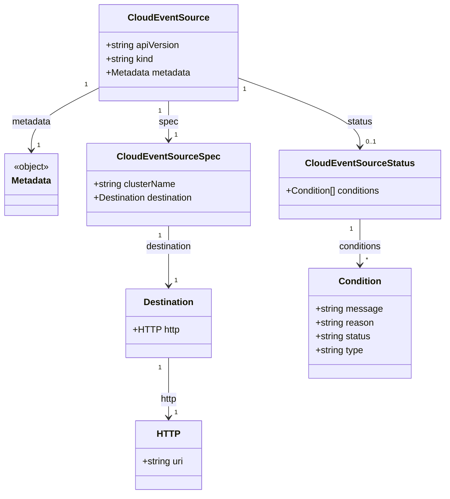

# Diagram: devops/k8s/keda/helm/templates/crds/crd-cloudeventsources.yaml

> Auto-generated by Obscura crawlers

## Mermaid

### SVG

<svg id="container" width="779.1796875" xmlns="http://www.w3.org/2000/svg" class="classDiagram" height="862" viewBox="0 0 779.1796875 862" role="graphics-document document" aria-roledescription="class"><g><defs><marker id="container_class-aggregationStart" class="marker aggregation class" refX="18" refY="7" markerWidth="190" markerHeight="240" orient="auto"><path d="M 18,7 L9,13 L1,7 L9,1 Z"></path></marker></defs><defs><marker id="container_class-aggregationEnd" class="marker aggregation class" refX="1" refY="7" markerWidth="20" markerHeight="28" orient="auto"><path d="M 18,7 L9,13 L1,7 L9,1 Z"></path></marker></defs><defs><marker id="container_class-extensionStart" class="marker extension class" refX="18" refY="7" markerWidth="190" markerHeight="240" orient="auto"><path d="M 1,7 L18,13 V 1 Z"></path></marker></defs><defs><marker id="container_class-extensionEnd" class="marker extension class" refX="1" refY="7" markerWidth="20" markerHeight="28" orient="auto"><path d="M 1,1 V 13 L18,7 Z"></path></marker></defs><defs><marker id="container_class-compositionStart" class="marker composition class" refX="18" refY="7" markerWidth="190" markerHeight="240" orient="auto"><path d="M 18,7 L9,13 L1,7 L9,1 Z"></path></marker></defs><defs><marker id="container_class-compositionEnd" class="marker composition class" refX="1" refY="7" markerWidth="20" markerHeight="28" orient="auto"><path d="M 18,7 L9,13 L1,7 L9,1 Z"></path></marker></defs><defs><marker id="container_class-dependencyStart" class="marker dependency class" refX="6" refY="7" markerWidth="190" markerHeight="240" orient="auto"><path d="M 5,7 L9,13 L1,7 L9,1 Z"></path></marker></defs><defs><marker id="container_class-dependencyEnd" class="marker dependency class" refX="13" refY="7" markerWidth="20" markerHeight="28" orient="auto"><path d="M 18,7 L9,13 L14,7 L9,1 Z"></path></marker></defs><defs><marker id="container_class-lollipopStart" class="marker lollipop class" refX="13" refY="7" markerWidth="190" markerHeight="240" orient="auto"><circle stroke="black" fill="transparent" cx="7" cy="7" r="6"></circle></marker></defs><defs><marker id="container_class-lollipopEnd" class="marker lollipop class" refX="1" refY="7" markerWidth="190" markerHeight="240" orient="auto"><circle stroke="black" fill="transparent" cx="7" cy="7" r="6"></circle></marker></defs><g class="root"><g class="clusters"></g><g class="edgePaths"><path d="M294.695,176L294.695,182.167C294.695,188.333,294.695,200.667,294.695,212C294.695,223.333,294.695,233.667,294.695,238.833L294.695,244" id="id_CloudEventSource_CloudEventSourceSpec_1" class="edge-thickness-normal edge-pattern-solid relation" style=";;;" data-edge="true" data-et="edge" data-id="id_CloudEventSource_CloudEventSourceSpec_1" data-points="W3sieCI6Mjk0LjY5NTMxMjUsInkiOjE3Nn0seyJ4IjoyOTQuNjk1MzEyNSwieSI6MjEzfSx7IngiOjI5NC42OTUzMTI1LCJ5IjoyNTB9XQ==" marker-end="url(#container_class-dependencyEnd)"></path><path d="M414.613,135.32L450.452,148.267C486.29,161.213,557.967,187.107,593.806,207.22C629.645,227.333,629.645,241.667,629.645,248.833L629.645,256" id="id_CloudEventSource_CloudEventSourceStatus_2" class="edge-thickness-normal edge-pattern-solid relation" style=";;;" data-edge="true" data-et="edge" data-id="id_CloudEventSource_CloudEventSourceStatus_2" data-points="W3sieCI6NDE0LjYxMzI4MTI1LCJ5IjoxMzUuMzIwMjIxMTE1NjA3NTV9LHsieCI6NjI5LjY0NDUzMTI1LCJ5IjoyMTN9LHsieCI6NjI5LjY0NDUzMTI1LCJ5IjoyNjJ9XQ==" marker-end="url(#container_class-dependencyEnd)"></path><path d="M174.777,152.445L154.755,162.537C134.732,172.63,94.686,192.815,74.663,211.074C54.641,229.333,54.641,245.667,54.641,253.833L54.641,262" id="id_CloudEventSource_Metadata_3" class="edge-thickness-normal edge-pattern-solid relation" style=";;;" data-edge="true" data-et="edge" data-id="id_CloudEventSource_Metadata_3" data-points="W3sieCI6MTc0Ljc3NzM0Mzc1LCJ5IjoxNTIuNDQ0ODY5MzMzMTU5Nzd9LHsieCI6NTQuNjQwNjI1LCJ5IjoyMTN9LHsieCI6NTQuNjQwNjI1LCJ5IjoyNjh9XQ==" marker-end="url(#container_class-dependencyEnd)"></path><path d="M294.695,394L294.695,400.167C294.695,406.333,294.695,418.667,294.695,436C294.695,453.333,294.695,475.667,294.695,486.833L294.695,498" id="id_CloudEventSourceSpec_Destination_4" class="edge-thickness-normal edge-pattern-solid relation" style=";;;" data-edge="true" data-et="edge" data-id="id_CloudEventSourceSpec_Destination_4" data-points="W3sieCI6Mjk0LjY5NTMxMjUsInkiOjM5NH0seyJ4IjoyOTQuNjk1MzEyNSwieSI6NDMxfSx7IngiOjI5NC42OTUzMTI1LCJ5Ijo1MDR9XQ==" marker-end="url(#container_class-dependencyEnd)"></path><path d="M294.695,624L294.695,636.167C294.695,648.333,294.695,672.667,294.695,690C294.695,707.333,294.695,717.667,294.695,722.833L294.695,728" id="id_Destination_HTTP_5" class="edge-thickness-normal edge-pattern-solid relation" style=";;;" data-edge="true" data-et="edge" data-id="id_Destination_HTTP_5" data-points="W3sieCI6Mjk0LjY5NTMxMjUsInkiOjYyNH0seyJ4IjoyOTQuNjk1MzEyNSwieSI6Njk3fSx7IngiOjI5NC42OTUzMTI1LCJ5Ijo3MzR9XQ==" marker-end="url(#container_class-dependencyEnd)"></path><path d="M629.645,382L629.645,390.167C629.645,398.333,629.645,414.667,629.645,428C629.645,441.333,629.645,451.667,629.645,456.833L629.645,462" id="id_CloudEventSourceStatus_Condition_6" class="edge-thickness-normal edge-pattern-solid relation" style=";;;" data-edge="true" data-et="edge" data-id="id_CloudEventSourceStatus_Condition_6" data-points="W3sieCI6NjI5LjY0NDUzMTI1LCJ5IjozODJ9LHsieCI6NjI5LjY0NDUzMTI1LCJ5Ijo0MzF9LHsieCI6NjI5LjY0NDUzMTI1LCJ5Ijo0Njh9XQ==" marker-end="url(#container_class-dependencyEnd)"></path></g><g class="edgeLabels"><g class="edgeLabel" transform="translate(294.6953125, 213)"><g class="label" data-id="id_CloudEventSource_CloudEventSourceSpec_1" transform="translate(-16.6796875, -12)"><foreignObject width="33.359375" height="24">

spec

</foreignObject></g></g><g class="edgeLabel" transform="translate(629.64453125, 213)"><g class="label" data-id="id_CloudEventSource_CloudEventSourceStatus_2" transform="translate(-22.203125, -12)"><foreignObject width="44.40625" height="24">

status

</foreignObject></g></g><g class="edgeLabel" transform="translate(54.640625, 213)"><g class="label" data-id="id_CloudEventSource_Metadata_3" transform="translate(-34.7265625, -12)"><foreignObject width="69.453125" height="24">

metadata

</foreignObject></g></g><g class="edgeLabel" transform="translate(294.6953125, 431)"><g class="label" data-id="id_CloudEventSourceSpec_Destination_4" transform="translate(-41.5703125, -12)"><foreignObject width="83.140625" height="24">

destination

</foreignObject></g></g><g class="edgeLabel" transform="translate(294.6953125, 697)"><g class="label" data-id="id_Destination_HTTP_5" transform="translate(-15.21875, -12)"><foreignObject width="30.4375" height="24">

http

</foreignObject></g></g><g class="edgeLabel" transform="translate(629.64453125, 431)"><g class="label" data-id="id_CloudEventSourceStatus_Condition_6" transform="translate(-38.3046875, -12)"><foreignObject width="76.609375" height="24">

conditions

</foreignObject></g></g><g class="edgeTerminals" transform="translate(279.6953112500001, 193.49999892857144)"><g class="inner" transform="translate(0, 0)"><foreignObject style="width: 9px; height: 12px;">
1
</foreignObject></g></g><g class="edgeTerminals" transform="translate(425.975864172605, 155.3736930057112)"><g class="inner" transform="translate(0, 0)"><foreignObject style="width: 9px; height: 12px;">
1
</foreignObject></g></g><g class="edgeTerminals" transform="translate(152.39869076790137, 146.927090704252)"><g class="inner" transform="translate(0, 0)"><foreignObject style="width: 9px; height: 12px;">
1
</foreignObject></g></g><g class="edgeTerminals" transform="translate(279.6953112500001, 411.4999989285714)"><g class="inner" transform="translate(0, 0)"><foreignObject style="width: 9px; height: 12px;">
1
</foreignObject></g></g><g class="edgeTerminals" transform="translate(279.6953112500001, 641.4999989285715)"><g class="inner" transform="translate(0, 0)"><foreignObject style="width: 9px; height: 12px;">
1
</foreignObject></g></g><g class="edgeTerminals" transform="translate(614.644530625, 399.49999946428574)"><g class="inner" transform="translate(0, 0)"><foreignObject style="width: 9px; height: 12px;">
1
</foreignObject></g></g><g class="edgeTerminals" transform="translate(304.69531125, 227.49999892857144)"><g class="inner" transform="translate(0, 0)"></g><foreignObject style="width: 9px; height: 12px;">
1
</foreignObject></g><g class="edgeTerminals" transform="translate(639.644530625, 239.49999946428574)"><g class="inner" transform="translate(0, 0)"></g><foreignObject style="width: 36px; height: 12px;">
0..1
</foreignObject></g><g class="edgeTerminals" transform="translate(64.64062749999985, 245.50000214285714)"><g class="inner" transform="translate(0, 0)"></g><foreignObject style="width: 9px; height: 12px;">
1
</foreignObject></g><g class="edgeTerminals" transform="translate(304.69531125, 481.4999989285714)"><g class="inner" transform="translate(0, 0)"></g><foreignObject style="width: 9px; height: 12px;">
1
</foreignObject></g><g class="edgeTerminals" transform="translate(304.69531125, 711.4999989285715)"><g class="inner" transform="translate(0, 0)"></g><foreignObject style="width: 9px; height: 12px;">
1
</foreignObject></g><g class="edgeTerminals" transform="translate(639.644530625, 445.49999946428574)"><g class="inner" transform="translate(0, 0)"></g><foreignObject style="width: 9px; height: 12px;">
*
</foreignObject></g></g><g class="nodes"><g class="node default" id="classId-CloudEventSource-0" transform="translate(294.6953125, 92)"><g class="basic label-container"><path d="M-119.91796875 -84 L119.91796875 -84 L119.91796875 84 L-119.91796875 84" stroke="none" stroke-width="0" fill="#ECECFF" style=""></path><path d="M-119.91796875 -84 C-26.425410334432243 -84, 67.06714808113551 -84, 119.91796875 -84 M-119.91796875 -84 C-71.62870026194676 -84, -23.339431773893537 -84, 119.91796875 -84 M119.91796875 -84 C119.91796875 -36.82186009692784, 119.91796875 10.356279806144315, 119.91796875 84 M119.91796875 -84 C119.91796875 -22.784817050030384, 119.91796875 38.43036589993923, 119.91796875 84 M119.91796875 84 C35.98259903571355 84, -47.952770678572904 84, -119.91796875 84 M119.91796875 84 C55.17533469473749 84, -9.567299360525027 84, -119.91796875 84 M-119.91796875 84 C-119.91796875 43.82047606367656, -119.91796875 3.640952127353117, -119.91796875 -84 M-119.91796875 84 C-119.91796875 49.98056055601079, -119.91796875 15.961121112021587, -119.91796875 -84" stroke="#9370DB" stroke-width="1.3" fill="none" stroke-dasharray="0 0" style=""></path></g><g class="annotation-group text" transform="translate(0, -60)"></g><g class="label-group text" transform="translate(-65.9921875, -60)"><g class="label" style="font-weight: bolder" transform="translate(0,-12)"><foreignObject width="131.984375" height="24">

CloudEventSource

</foreignObject></g></g><g class="members-group text" transform="translate(-107.91796875, -12)"><g class="label" style="" transform="translate(0,-12)"><foreignObject width="130.4375" height="24">

+string apiVersion

</foreignObject></g><g class="label" style="" transform="translate(0,12)"><foreignObject width="85.515625" height="24">

+string kind

</foreignObject></g><g class="label" style="" transform="translate(0,36)"><foreignObject width="149.84375" height="24">

+Metadata metadata

</foreignObject></g></g><g class="methods-group text" transform="translate(-107.91796875, 84)"></g><g class="divider" style=""><path d="M-119.91796875 -36 C-58.51387499998056 -36, 2.8902187500388834 -36, 119.91796875 -36 M-119.91796875 -36 C-59.01617531271747 -36, 1.885618124565056 -36, 119.91796875 -36" stroke="#9370DB" stroke-width="1.3" fill="none" stroke-dasharray="0 0" style=""></path></g><g class="divider" style=""><path d="M-119.91796875 60 C-59.1512826152067 60, 1.615403519586593 60, 119.91796875 60 M-119.91796875 60 C-37.34789367944079 60, 45.222181391118426 60, 119.91796875 60" stroke="#9370DB" stroke-width="1.3" fill="none" stroke-dasharray="0 0" style=""></path></g></g><g class="node default" id="classId-Metadata-1" transform="translate(54.640625, 322)"><g class="basic label-container"><path d="M-46.640625 -54 L46.640625 -54 L46.640625 54 L-46.640625 54" stroke="none" stroke-width="0" fill="#ECECFF" style=""></path><path d="M-46.640625 -54 C-19.893133508271745 -54, 6.854357983456509 -54, 46.640625 -54 M-46.640625 -54 C-24.697301881099573 -54, -2.7539787621991465 -54, 46.640625 -54 M46.640625 -54 C46.640625 -28.07200478934738, 46.640625 -2.1440095786947566, 46.640625 54 M46.640625 -54 C46.640625 -12.251544458304913, 46.640625 29.496911083390174, 46.640625 54 M46.640625 54 C10.205894214049572 54, -26.228836571900857 54, -46.640625 54 M46.640625 54 C22.020942333214393 54, -2.5987403335712145 54, -46.640625 54 M-46.640625 54 C-46.640625 26.383181460380534, -46.640625 -1.2336370792389317, -46.640625 -54 M-46.640625 54 C-46.640625 19.47749149393581, -46.640625 -15.045017012128383, -46.640625 -54" stroke="#9370DB" stroke-width="1.3" fill="none" stroke-dasharray="0 0" style=""></path></g><g class="annotation-group text" transform="translate(-31.7109375, -30)"><g class="label" style="" transform="translate(0,-12)"><foreignObject width="63.421875" height="24">

«object»

</foreignObject></g></g><g class="label-group text" transform="translate(-34.640625, -6)"><g class="label" style="font-weight: bolder" transform="translate(0,-12)"><foreignObject width="69.28125" height="24">

Metadata

</foreignObject></g></g><g class="members-group text" transform="translate(-34.640625, 42)"></g><g class="methods-group text" transform="translate(-34.640625, 72)"></g><g class="divider" style=""><path d="M-46.640625 18 C-19.383537512862002 18, 7.873549974275996 18, 46.640625 18 M-46.640625 18 C-17.50188009414524 18, 11.636864811709522 18, 46.640625 18" stroke="#9370DB" stroke-width="1.3" fill="none" stroke-dasharray="0 0" style=""></path></g><g class="divider" style=""><path d="M-46.640625 36 C-18.160872591926744 36, 10.318879816146513 36, 46.640625 36 M-46.640625 36 C-19.840508134106777 36, 6.959608731786446 36, 46.640625 36" stroke="#9370DB" stroke-width="1.3" fill="none" stroke-dasharray="0 0" style=""></path></g></g><g class="node default" id="classId-CloudEventSourceSpec-2" transform="translate(294.6953125, 322)"><g class="basic label-container"><path d="M-143.4140625 -72 L143.4140625 -72 L143.4140625 72 L-143.4140625 72" stroke="none" stroke-width="0" fill="#ECECFF" style=""></path><path d="M-143.4140625 -72 C-32.01311983565513 -72, 79.38782282868974 -72, 143.4140625 -72 M-143.4140625 -72 C-39.101387285517816 -72, 65.21128792896437 -72, 143.4140625 -72 M143.4140625 -72 C143.4140625 -21.4046417908406, 143.4140625 29.1907164183188, 143.4140625 72 M143.4140625 -72 C143.4140625 -31.90468994895034, 143.4140625 8.190620102099317, 143.4140625 72 M143.4140625 72 C51.118106541862005 72, -41.17784941627599 72, -143.4140625 72 M143.4140625 72 C72.89706621159829 72, 2.3800699231965723 72, -143.4140625 72 M-143.4140625 72 C-143.4140625 23.639916592543294, -143.4140625 -24.720166814913412, -143.4140625 -72 M-143.4140625 72 C-143.4140625 42.2376790888156, -143.4140625 12.475358177631193, -143.4140625 -72" stroke="#9370DB" stroke-width="1.3" fill="none" stroke-dasharray="0 0" style=""></path></g><g class="annotation-group text" transform="translate(0, -48)"></g><g class="label-group text" transform="translate(-83.59375, -48)"><g class="label" style="font-weight: bolder" transform="translate(0,-12)"><foreignObject width="167.1875" height="24">

CloudEventSourceSpec

</foreignObject></g></g><g class="members-group text" transform="translate(-131.4140625, 0)"><g class="label" style="" transform="translate(0,-12)"><foreignObject width="145.484375" height="24">

+string clusterName

</foreignObject></g><g class="label" style="" transform="translate(0,12)"><foreignObject width="179.234375" height="24">

+Destination destination

</foreignObject></g></g><g class="methods-group text" transform="translate(-131.4140625, 72)"></g><g class="divider" style=""><path d="M-143.4140625 -24 C-57.44364505540709 -24, 28.526772389185822 -24, 143.4140625 -24 M-143.4140625 -24 C-84.79591132661099 -24, -26.177760153221982 -24, 143.4140625 -24" stroke="#9370DB" stroke-width="1.3" fill="none" stroke-dasharray="0 0" style=""></path></g><g class="divider" style=""><path d="M-143.4140625 48 C-65.76099627126085 48, 11.892069957478299 48, 143.4140625 48 M-143.4140625 48 C-51.6111878103344 48, 40.1916868793312 48, 143.4140625 48" stroke="#9370DB" stroke-width="1.3" fill="none" stroke-dasharray="0 0" style=""></path></g></g><g class="node default" id="classId-Destination-3" transform="translate(294.6953125, 564)"><g class="basic label-container"><path d="M-72.9296875 -60 L72.9296875 -60 L72.9296875 60 L-72.9296875 60" stroke="none" stroke-width="0" fill="#ECECFF" style=""></path><path d="M-72.9296875 -60 C-39.82184829273213 -60, -6.714009085464255 -60, 72.9296875 -60 M-72.9296875 -60 C-18.362330367384146 -60, 36.20502676523171 -60, 72.9296875 -60 M72.9296875 -60 C72.9296875 -19.171467734104525, 72.9296875 21.65706453179095, 72.9296875 60 M72.9296875 -60 C72.9296875 -32.311525201000094, 72.9296875 -4.623050402000182, 72.9296875 60 M72.9296875 60 C15.316074303164264 60, -42.29753889367147 60, -72.9296875 60 M72.9296875 60 C38.88375370540328 60, 4.837819910806559 60, -72.9296875 60 M-72.9296875 60 C-72.9296875 15.822210188572974, -72.9296875 -28.35557962285405, -72.9296875 -60 M-72.9296875 60 C-72.9296875 34.70607108052626, -72.9296875 9.412142161052522, -72.9296875 -60" stroke="#9370DB" stroke-width="1.3" fill="none" stroke-dasharray="0 0" style=""></path></g><g class="annotation-group text" transform="translate(0, -36)"></g><g class="label-group text" transform="translate(-42.46875, -36)"><g class="label" style="font-weight: bolder" transform="translate(0,-12)"><foreignObject width="84.9375" height="24">

Destination

</foreignObject></g></g><g class="members-group text" transform="translate(-60.9296875, 12)"><g class="label" style="" transform="translate(0,-12)"><foreignObject width="79.390625" height="24">

+HTTP http

</foreignObject></g></g><g class="methods-group text" transform="translate(-60.9296875, 60)"></g><g class="divider" style=""><path d="M-72.9296875 -12 C-30.202666126915297 -12, 12.524355246169407 -12, 72.9296875 -12 M-72.9296875 -12 C-26.65227797829609 -12, 19.625131543407818 -12, 72.9296875 -12" stroke="#9370DB" stroke-width="1.3" fill="none" stroke-dasharray="0 0" style=""></path></g><g class="divider" style=""><path d="M-72.9296875 36 C-17.769389275249495 36, 37.39090894950101 36, 72.9296875 36 M-72.9296875 36 C-31.0771998840572 36, 10.775287731885598 36, 72.9296875 36" stroke="#9370DB" stroke-width="1.3" fill="none" stroke-dasharray="0 0" style=""></path></g></g><g class="node default" id="classId-HTTP-4" transform="translate(294.6953125, 794)"><g class="basic label-container"><path d="M-58.31640625 -60 L58.31640625 -60 L58.31640625 60 L-58.31640625 60" stroke="none" stroke-width="0" fill="#ECECFF" style=""></path><path d="M-58.31640625 -60 C-13.39464676575647 -60, 31.52711271848706 -60, 58.31640625 -60 M-58.31640625 -60 C-30.123164241008745 -60, -1.9299222320174891 -60, 58.31640625 -60 M58.31640625 -60 C58.31640625 -21.91732130220693, 58.31640625 16.165357395586142, 58.31640625 60 M58.31640625 -60 C58.31640625 -21.261405588597754, 58.31640625 17.477188822804493, 58.31640625 60 M58.31640625 60 C19.82952960117609 60, -18.657347047647818 60, -58.31640625 60 M58.31640625 60 C22.440198297644933 60, -13.436009654710134 60, -58.31640625 60 M-58.31640625 60 C-58.31640625 23.53754987480717, -58.31640625 -12.924900250385662, -58.31640625 -60 M-58.31640625 60 C-58.31640625 33.02689251607438, -58.31640625 6.05378503214876, -58.31640625 -60" stroke="#9370DB" stroke-width="1.3" fill="none" stroke-dasharray="0 0" style=""></path></g><g class="annotation-group text" transform="translate(0, -36)"></g><g class="label-group text" transform="translate(-18.7734375, -36)"><g class="label" style="font-weight: bolder" transform="translate(0,-12)"><foreignObject width="37.546875" height="24">

HTTP

</foreignObject></g></g><g class="members-group text" transform="translate(-46.31640625, 12)"><g class="label" style="" transform="translate(0,-12)"><foreignObject width="73.859375" height="24">

+string uri

</foreignObject></g></g><g class="methods-group text" transform="translate(-46.31640625, 60)"></g><g class="divider" style=""><path d="M-58.31640625 -12 C-14.10922918752565 -12, 30.0979478749487 -12, 58.31640625 -12 M-58.31640625 -12 C-31.50469634986886 -12, -4.692986449737717 -12, 58.31640625 -12" stroke="#9370DB" stroke-width="1.3" fill="none" stroke-dasharray="0 0" style=""></path></g><g class="divider" style=""><path d="M-58.31640625 36 C-23.985148172161544 36, 10.346109905676911 36, 58.31640625 36 M-58.31640625 36 C-12.380783838296296 36, 33.55483857340741 36, 58.31640625 36" stroke="#9370DB" stroke-width="1.3" fill="none" stroke-dasharray="0 0" style=""></path></g></g><g class="node default" id="classId-CloudEventSourceStatus-5" transform="translate(629.64453125, 322)"><g class="basic label-container"><path d="M-141.53515625 -60 L141.53515625 -60 L141.53515625 60 L-141.53515625 60" stroke="none" stroke-width="0" fill="#ECECFF" style=""></path><path d="M-141.53515625 -60 C-77.67145176926999 -60, -13.80774728854 -60, 141.53515625 -60 M-141.53515625 -60 C-61.06118261884656 -60, 19.412791012306883 -60, 141.53515625 -60 M141.53515625 -60 C141.53515625 -33.87305712645892, 141.53515625 -7.746114252917835, 141.53515625 60 M141.53515625 -60 C141.53515625 -35.66227705539108, 141.53515625 -11.32455411078216, 141.53515625 60 M141.53515625 60 C44.61513605008429 60, -52.30488414983142 60, -141.53515625 60 M141.53515625 60 C50.35893478658157 60, -40.81728667683686 60, -141.53515625 60 M-141.53515625 60 C-141.53515625 30.037892563634966, -141.53515625 0.07578512726993125, -141.53515625 -60 M-141.53515625 60 C-141.53515625 22.874617780343975, -141.53515625 -14.25076443931205, -141.53515625 -60" stroke="#9370DB" stroke-width="1.3" fill="none" stroke-dasharray="0 0" style=""></path></g><g class="annotation-group text" transform="translate(0, -36)"></g><g class="label-group text" transform="translate(-89.4765625, -36)"><g class="label" style="font-weight: bolder" transform="translate(0,-12)"><foreignObject width="178.953125" height="24">

CloudEventSourceStatus

</foreignObject></g></g><g class="members-group text" transform="translate(-129.53515625, 12)"><g class="label" style="" transform="translate(0,-12)"><foreignObject width="169.59375" height="24">

+Condition[] conditions

</foreignObject></g></g><g class="methods-group text" transform="translate(-129.53515625, 60)"></g><g class="divider" style=""><path d="M-141.53515625 -12 C-68.63597541796531 -12, 4.263205414069375 -12, 141.53515625 -12 M-141.53515625 -12 C-77.58306626648996 -12, -13.630976282979944 -12, 141.53515625 -12" stroke="#9370DB" stroke-width="1.3" fill="none" stroke-dasharray="0 0" style=""></path></g><g class="divider" style=""><path d="M-141.53515625 36 C-78.84005325502976 36, -16.144950260059517 36, 141.53515625 36 M-141.53515625 36 C-53.918121142283695 36, 33.69891396543261 36, 141.53515625 36" stroke="#9370DB" stroke-width="1.3" fill="none" stroke-dasharray="0 0" style=""></path></g></g><g class="node default" id="classId-Condition-6" transform="translate(629.64453125, 564)"><g class="basic label-container"><path d="M-87.8359375 -96 L87.8359375 -96 L87.8359375 96 L-87.8359375 96" stroke="none" stroke-width="0" fill="#ECECFF" style=""></path><path d="M-87.8359375 -96 C-27.21811009400004 -96, 33.39971731199992 -96, 87.8359375 -96 M-87.8359375 -96 C-37.86230462340954 -96, 12.111328253180915 -96, 87.8359375 -96 M87.8359375 -96 C87.8359375 -40.411939045656595, 87.8359375 15.17612190868681, 87.8359375 96 M87.8359375 -96 C87.8359375 -50.63330408196602, 87.8359375 -5.266608163932034, 87.8359375 96 M87.8359375 96 C19.526435316533664 96, -48.78306686693267 96, -87.8359375 96 M87.8359375 96 C36.436378765860795 96, -14.96317996827841 96, -87.8359375 96 M-87.8359375 96 C-87.8359375 29.158423450809494, -87.8359375 -37.68315309838101, -87.8359375 -96 M-87.8359375 96 C-87.8359375 32.133202073491354, -87.8359375 -31.73359585301729, -87.8359375 -96" stroke="#9370DB" stroke-width="1.3" fill="none" stroke-dasharray="0 0" style=""></path></g><g class="annotation-group text" transform="translate(0, -72)"></g><g class="label-group text" transform="translate(-35.421875, -72)"><g class="label" style="font-weight: bolder" transform="translate(0,-12)"><foreignObject width="70.84375" height="24">

Condition

</foreignObject></g></g><g class="members-group text" transform="translate(-75.8359375, -24)"><g class="label" style="" transform="translate(0,-12)"><foreignObject width="116.25" height="24">

+string message

</foreignObject></g><g class="label" style="" transform="translate(0,12)"><foreignObject width="102.859375" height="24">

+string reason

</foreignObject></g><g class="label" style="" transform="translate(0,36)"><foreignObject width="98.265625" height="24">

+string status

</foreignObject></g><g class="label" style="" transform="translate(0,60)"><foreignObject width="85.65625" height="24">

+string type

</foreignObject></g></g><g class="methods-group text" transform="translate(-75.8359375, 96)"></g><g class="divider" style=""><path d="M-87.8359375 -48 C-35.371781567563815 -48, 17.09237436487237 -48, 87.8359375 -48 M-87.8359375 -48 C-24.719383437894763 -48, 38.397170624210474 -48, 87.8359375 -48" stroke="#9370DB" stroke-width="1.3" fill="none" stroke-dasharray="0 0" style=""></path></g><g class="divider" style=""><path d="M-87.8359375 72 C-23.570869036216862 72, 40.694199427566275 72, 87.8359375 72 M-87.8359375 72 C-48.558897570517324 72, -9.281857641034648 72, 87.8359375 72" stroke="#9370DB" stroke-width="1.3" fill="none" stroke-dasharray="0 0" style=""></path></g></g></g></g></g></svg>
