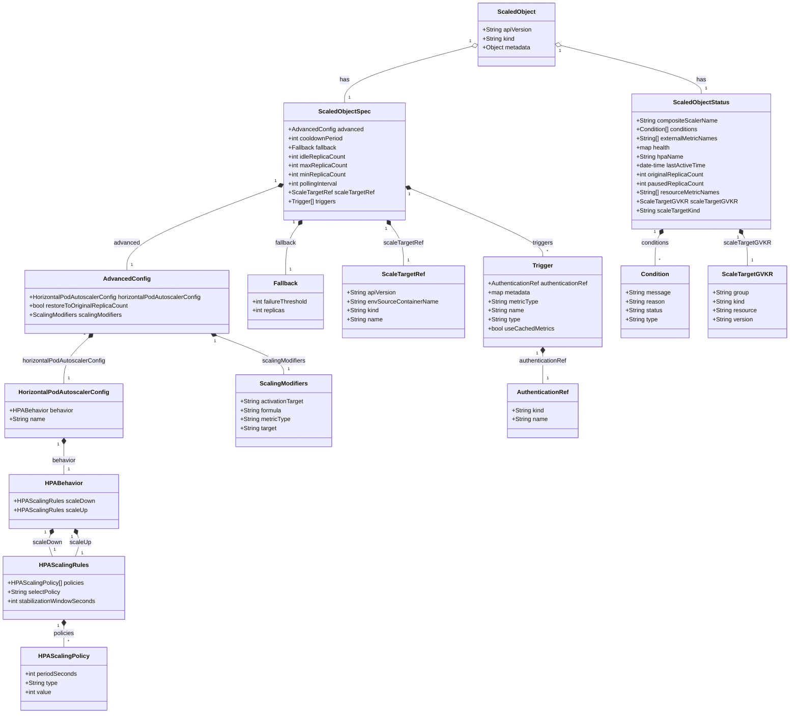

# Diagram: devops/k8s/keda/helm/templates/crds/crd-scaledobjects.yaml

> Auto-generated by Obscura crawlers

## Mermaid

### SVG

<svg id="container" width="2092.154296875" xmlns="http://www.w3.org/2000/svg" class="classDiagram" height="1900" viewBox="0 0 2092.154296875 1900" role="graphics-document document" aria-roledescription="class"><g><defs><marker id="container_class-aggregationStart" class="marker aggregation class" refX="18" refY="7" markerWidth="190" markerHeight="240" orient="auto"><path d="M 18,7 L9,13 L1,7 L9,1 Z"></path></marker></defs><defs><marker id="container_class-aggregationEnd" class="marker aggregation class" refX="1" refY="7" markerWidth="20" markerHeight="28" orient="auto"><path d="M 18,7 L9,13 L1,7 L9,1 Z"></path></marker></defs><defs><marker id="container_class-extensionStart" class="marker extension class" refX="18" refY="7" markerWidth="190" markerHeight="240" orient="auto"><path d="M 1,7 L18,13 V 1 Z"></path></marker></defs><defs><marker id="container_class-extensionEnd" class="marker extension class" refX="1" refY="7" markerWidth="20" markerHeight="28" orient="auto"><path d="M 1,1 V 13 L18,7 Z"></path></marker></defs><defs><marker id="container_class-compositionStart" class="marker composition class" refX="18" refY="7" markerWidth="190" markerHeight="240" orient="auto"><path d="M 18,7 L9,13 L1,7 L9,1 Z"></path></marker></defs><defs><marker id="container_class-compositionEnd" class="marker composition class" refX="1" refY="7" markerWidth="20" markerHeight="28" orient="auto"><path d="M 18,7 L9,13 L1,7 L9,1 Z"></path></marker></defs><defs><marker id="container_class-dependencyStart" class="marker dependency class" refX="6" refY="7" markerWidth="190" markerHeight="240" orient="auto"><path d="M 5,7 L9,13 L1,7 L9,1 Z"></path></marker></defs><defs><marker id="container_class-dependencyEnd" class="marker dependency class" refX="13" refY="7" markerWidth="20" markerHeight="28" orient="auto"><path d="M 18,7 L9,13 L14,7 L9,1 Z"></path></marker></defs><defs><marker id="container_class-lollipopStart" class="marker lollipop class" refX="13" refY="7" markerWidth="190" markerHeight="240" orient="auto"><circle stroke="black" fill="transparent" cx="7" cy="7" r="6"></circle></marker></defs><defs><marker id="container_class-lollipopEnd" class="marker lollipop class" refX="1" refY="7" markerWidth="190" markerHeight="240" orient="auto"><circle stroke="black" fill="transparent" cx="7" cy="7" r="6"></circle></marker></defs><g class="root"><g class="clusters"></g><g class="edgePaths"><path d="M1252.549,123.408L1196.337,138.34C1140.126,153.272,1027.702,183.136,971.491,208.235C915.279,233.333,915.279,253.667,915.279,263.833L915.279,274" id="id_ScaledObject_ScaledObjectSpec_1" class="edge-thickness-normal edge-pattern-solid relation" style=";;;" data-edge="true" data-et="edge" data-id="id_ScaledObject_ScaledObjectSpec_1" data-points="W3sieCI6MTI2OS4yMjA3MDMxMjUsInkiOjExOC45NzkwNDk2NDQ1Mzg1OX0seyJ4Ijo5MTUuMjc5Mjk2ODc1LCJ5IjoyMTN9LHsieCI6OTE1LjI3OTI5Njg3NSwieSI6Mjc0fV0=" marker-start="url(#container_class-aggregationStart)"></path><path d="M1489.097,121.095L1551.383,136.413C1613.67,151.73,1738.243,182.365,1800.53,203.849C1862.816,225.333,1862.816,237.667,1862.816,243.833L1862.816,250" id="id_ScaledObject_ScaledObjectStatus_2" class="edge-thickness-normal edge-pattern-solid relation" style=";;;" data-edge="true" data-et="edge" data-id="id_ScaledObject_ScaledObjectStatus_2" data-points="W3sieCI6MTQ3Mi4zNDU3MDMxMjUsInkiOjExNi45NzYwODM3NzIyOTM2OX0seyJ4IjoxODYyLjgxNjQwNjI1LCJ5IjoyMTN9LHsieCI6MTg2Mi44MTY0MDYyNSwieSI6MjUwfV0=" marker-start="url(#container_class-aggregationStart)"></path><path d="M742.839,494.558L674.975,519.965C607.111,545.372,471.383,596.186,403.518,633.76C335.654,671.333,335.654,695.667,335.654,707.833L335.654,720" id="id_ScaledObjectSpec_AdvancedConfig_3" class="edge-thickness-normal edge-pattern-solid relation" style=";;;" data-edge="true" data-et="edge" data-id="id_ScaledObjectSpec_AdvancedConfig_3" data-points="W3sieCI6NzU4Ljk5NDE0MDYyNSwieSI6NDg4LjUxMDAzNDc3NDYzODc3fSx7IngiOjMzNS42NTQyOTY4NzUsInkiOjY0N30seyJ4IjozMzUuNjU0Mjk2ODc1LCJ5Ijo3MjB9XQ==" marker-start="url(#container_class-compositionStart)"></path><path d="M234.568,899.87L223.826,910.059C213.083,920.247,191.598,940.623,180.856,960.978C170.113,981.333,170.113,1001.667,170.113,1011.833L170.113,1022" id="id_AdvancedConfig_HorizontalPodAutoscalerConfig_4" class="edge-thickness-normal edge-pattern-solid relation" style=";;;" data-edge="true" data-et="edge" data-id="id_AdvancedConfig_HorizontalPodAutoscalerConfig_4" data-points="W3sieCI6MjQ3LjA4NDU4MTUwODc1Nzk2LCJ5Ijo4ODh9LHsieCI6MTcwLjExMzI4MTI1LCJ5Ijo5NjF9LHsieCI6MTcwLjExMzI4MTI1LCJ5IjoxMDIyfV0=" marker-start="url(#container_class-compositionStart)"></path><path d="M170.113,1183.25L170.113,1190.542C170.113,1197.833,170.113,1212.417,170.113,1225.875C170.113,1239.333,170.113,1251.667,170.113,1257.833L170.113,1264" id="id_HorizontalPodAutoscalerConfig_HPABehavior_5" class="edge-thickness-normal edge-pattern-solid relation" style=";;;" data-edge="true" data-et="edge" data-id="id_HorizontalPodAutoscalerConfig_HPABehavior_5" data-points="W3sieCI6MTcwLjExMzI4MTI1LCJ5IjoxMTY2fSx7IngiOjE3MC4xMTMyODEyNSwieSI6MTIyN30seyJ4IjoxNzAuMTEzMjgxMjUsInkiOjEyNjR9XQ==" marker-start="url(#container_class-compositionStart)"></path><path d="M134.93,1424.018L133.532,1427.515C132.134,1431.012,129.339,1438.006,130.161,1447.67C130.984,1457.333,135.425,1469.667,137.646,1475.833L139.866,1482" id="id_HPABehavior_HPAScalingRules_6" class="edge-thickness-normal edge-pattern-solid relation" style=";;;" data-edge="true" data-et="edge" data-id="id_HPABehavior_HPAScalingRules_6" data-points="W3sieCI6MTQxLjMzMjg5MTM0MTc0MzEsInkiOjE0MDh9LHsieCI6MTI2LjU0Mjk2ODc1LCJ5IjoxNDQ1fSx7IngiOjEzOS44NjYxMjIxNTkwOTA5LCJ5IjoxNDgyfV0=" marker-start="url(#container_class-compositionStart)"></path><path d="M205.296,1424.018L206.694,1427.515C208.092,1431.012,210.888,1438.006,210.065,1447.67C209.243,1457.333,204.801,1469.667,202.581,1475.833L200.36,1482" id="id_HPABehavior_HPAScalingRules_7" class="edge-thickness-normal edge-pattern-solid relation" style=";;;" data-edge="true" data-et="edge" data-id="id_HPABehavior_HPAScalingRules_7" data-points="W3sieCI6MTk4Ljg5MzY3MTE1ODI1NjksInkiOjE0MDh9LHsieCI6MjEzLjY4MzU5Mzc1LCJ5IjoxNDQ1fSx7IngiOjIwMC4zNjA0NDAzNDA5MDkxLCJ5IjoxNDgyfV0=" marker-start="url(#container_class-compositionStart)"></path><path d="M170.113,1667.25L170.113,1670.542C170.113,1673.833,170.113,1680.417,170.113,1689.875C170.113,1699.333,170.113,1711.667,170.113,1717.833L170.113,1724" id="id_HPAScalingRules_HPAScalingPolicy_8" class="edge-thickness-normal edge-pattern-solid relation" style=";;;" data-edge="true" data-et="edge" data-id="id_HPAScalingRules_HPAScalingPolicy_8" data-points="W3sieCI6MTcwLjExMzI4MTI1LCJ5IjoxNjUwfSx7IngiOjE3MC4xMTMyODEyNSwieSI6MTY4N30seyJ4IjoxNzAuMTEzMjgxMjUsInkiOjE3MjR9XQ==" marker-start="url(#container_class-compositionStart)"></path><path d="M575.809,894.057L605.562,905.214C635.315,916.371,694.82,938.686,724.573,956.009C754.326,973.333,754.326,985.667,754.326,991.833L754.326,998" id="id_AdvancedConfig_ScalingModifiers_9" class="edge-thickness-normal edge-pattern-solid relation" style=";;;" data-edge="true" data-et="edge" data-id="id_AdvancedConfig_ScalingModifiers_9" data-points="W3sieCI6NTU5LjY1NzA4MzQ5OTIwMzgsInkiOjg4OH0seyJ4Ijo3NTQuMzI2MTcxODc1LCJ5Ijo5NjF9LHsieCI6NzU0LjMyNjE3MTg3NSwieSI6OTk4fV0=" marker-start="url(#container_class-compositionStart)"></path><path d="M792.792,599.995L787.147,607.83C781.503,615.664,770.213,631.332,764.569,653.333C758.924,675.333,758.924,703.667,758.924,717.833L758.924,732" id="id_ScaledObjectSpec_Fallback_10" class="edge-thickness-normal edge-pattern-solid relation" style=";;;" data-edge="true" data-et="edge" data-id="id_ScaledObjectSpec_Fallback_10" data-points="W3sieCI6ODAyLjg3NjI4NzA4MjM3MzIsInkiOjU4Nn0seyJ4Ijo3NTguOTIzODI4MTI1LCJ5Ijo2NDd9LHsieCI6NzU4LjkyMzgyODEyNSwieSI6NzMyfV0=" marker-start="url(#container_class-compositionStart)"></path><path d="M1037.766,599.995L1043.411,607.83C1049.056,615.664,1060.345,631.332,1065.99,649.333C1071.635,667.333,1071.635,687.667,1071.635,697.833L1071.635,708" id="id_ScaledObjectSpec_ScaleTargetRef_11" class="edge-thickness-normal edge-pattern-solid relation" style=";;;" data-edge="true" data-et="edge" data-id="id_ScaledObjectSpec_ScaleTargetRef_11" data-points="W3sieCI6MTAyNy42ODIzMDY2Njc2MjY4LCJ5Ijo1ODZ9LHsieCI6MTA3MS42MzQ3NjU2MjUsInkiOjY0N30seyJ4IjoxMDcxLjYzNDc2NTYyNSwieSI6NzA4fV0=" marker-start="url(#container_class-compositionStart)"></path><path d="M1087.52,500.772L1146.834,525.143C1206.148,549.514,1324.776,598.257,1384.09,628.795C1443.404,659.333,1443.404,671.667,1443.404,677.833L1443.404,684" id="id_ScaledObjectSpec_Trigger_12" class="edge-thickness-normal edge-pattern-solid relation" style=";;;" data-edge="true" data-et="edge" data-id="id_ScaledObjectSpec_Trigger_12" data-points="W3sieCI6MTA3MS41NjQ0NTMxMjUsInkiOjQ5NC4yMTU2Mjg2OTgyMjQ4Nn0seyJ4IjoxNDQzLjQwNDI5Njg3NSwieSI6NjQ3fSx7IngiOjE0NDMuNDA0Mjk2ODc1LCJ5Ijo2ODR9XQ==" marker-start="url(#container_class-compositionStart)"></path><path d="M1443.404,941.25L1443.404,944.542C1443.404,947.833,1443.404,954.417,1443.404,967.875C1443.404,981.333,1443.404,1001.667,1443.404,1011.833L1443.404,1022" id="id_Trigger_AuthenticationRef_13" class="edge-thickness-normal edge-pattern-solid relation" style=";;;" data-edge="true" data-et="edge" data-id="id_Trigger_AuthenticationRef_13" data-points="W3sieCI6MTQ0My40MDQyOTY4NzUsInkiOjkyNH0seyJ4IjoxNDQzLjQwNDI5Njg3NSwieSI6OTYxfSx7IngiOjE0NDMuNDA0Mjk2ODc1LCJ5IjoxMDIyfV0=" marker-start="url(#container_class-compositionStart)"></path><path d="M1755.083,625.101L1753.067,628.751C1751.052,632.4,1747.021,639.7,1745.006,653.517C1742.99,667.333,1742.99,687.667,1742.99,697.833L1742.99,708" id="id_ScaledObjectStatus_Condition_14" class="edge-thickness-normal edge-pattern-solid relation" style=";;;" data-edge="true" data-et="edge" data-id="id_ScaledObjectStatus_Condition_14" data-points="W3sieCI6MTc2My40MjE0MjQ5NzExOTgxLCJ5Ijo2MTB9LHsieCI6MTc0Mi45OTAyMzQzNzUsInkiOjY0N30seyJ4IjoxNzQyLjk5MDIzNDM3NSwieSI6NzA4fV0=" marker-start="url(#container_class-compositionStart)"></path><path d="M1970.55,625.101L1972.565,628.751C1974.581,632.4,1978.612,639.7,1980.627,653.517C1982.643,667.333,1982.643,687.667,1982.643,697.833L1982.643,708" id="id_ScaledObjectStatus_ScaleTargetGVKR_15" class="edge-thickness-normal edge-pattern-solid relation" style=";;;" data-edge="true" data-et="edge" data-id="id_ScaledObjectStatus_ScaleTargetGVKR_15" data-points="W3sieCI6MTk2Mi4yMTEzODc1Mjg4MDE5LCJ5Ijo2MTB9LHsieCI6MTk4Mi42NDI1NzgxMjUsInkiOjY0N30seyJ4IjoxOTgyLjY0MjU3ODEyNSwieSI6NzA4fV0=" marker-start="url(#container_class-compositionStart)"></path></g><g class="edgeLabels"><g class="edgeLabel" transform="translate(915.279296875, 213)"><g class="label" data-id="id_ScaledObject_ScaledObjectSpec_1" transform="translate(-12.703125, -12)"><foreignObject width="25.40625" height="24">

has

</foreignObject></g></g><g class="edgeLabel" transform="translate(1862.81640625, 213)"><g class="label" data-id="id_ScaledObject_ScaledObjectStatus_2" transform="translate(-12.703125, -12)"><foreignObject width="25.40625" height="24">

has

</foreignObject></g></g><g class="edgeLabel" transform="translate(335.654296875, 647)"><g class="label" data-id="id_ScaledObjectSpec_AdvancedConfig_3" transform="translate(-34.796875, -12)"><foreignObject width="69.59375" height="24">

advanced

</foreignObject></g></g><g class="edgeLabel" transform="translate(170.11328125, 961)"><g class="label" data-id="id_AdvancedConfig_HorizontalPodAutoscalerConfig_4" transform="translate(-111.4453125, -12)"><foreignObject width="222.890625" height="24">

horizontalPodAutoscalerConfig

</foreignObject></g></g><g class="edgeLabel" transform="translate(170.11328125, 1227)"><g class="label" data-id="id_HorizontalPodAutoscalerConfig_HPABehavior_5" transform="translate(-31.984375, -12)"><foreignObject width="63.96875" height="24">

behavior

</foreignObject></g></g><g class="edgeLabel" transform="translate(126.63963, 1444.75819)"><g class="label" data-id="id_HPABehavior_HPAScalingRules_6" transform="translate(-38.671875, -12)"><foreignObject width="77.34375" height="24">

scaleDown

</foreignObject></g></g><g class="edgeLabel" transform="translate(213.58693, 1444.75819)"><g class="label" data-id="id_HPABehavior_HPAScalingRules_7" transform="translate(-28.46875, -12)"><foreignObject width="56.9375" height="24">

scaleUp

</foreignObject></g></g><g class="edgeLabel" transform="translate(170.11328125, 1687)"><g class="label" data-id="id_HPAScalingRules_HPAScalingPolicy_8" transform="translate(-28.203125, -12)"><foreignObject width="56.40625" height="24">

policies

</foreignObject></g></g><g class="edgeLabel" transform="translate(754.326171875, 961)"><g class="label" data-id="id_AdvancedConfig_ScalingModifiers_9" transform="translate(-58.8046875, -12)"><foreignObject width="117.609375" height="24">

scalingModifiers

</foreignObject></g></g><g class="edgeLabel" transform="translate(758.923828125, 647)"><g class="label" data-id="id_ScaledObjectSpec_Fallback_10" transform="translate(-28.4140625, -12)"><foreignObject width="56.828125" height="24">

fallback

</foreignObject></g></g><g class="edgeLabel" transform="translate(1071.634765625, 647)"><g class="label" data-id="id_ScaledObjectSpec_ScaleTargetRef_11" transform="translate(-52.515625, -12)"><foreignObject width="105.03125" height="24">

scaleTargetRef

</foreignObject></g></g><g class="edgeLabel" transform="translate(1443.404296875, 647)"><g class="label" data-id="id_ScaledObjectSpec_Trigger_12" transform="translate(-27.4921875, -12)"><foreignObject width="54.984375" height="24">

triggers

</foreignObject></g></g><g class="edgeLabel" transform="translate(1443.404296875, 961)"><g class="label" data-id="id_Trigger_AuthenticationRef_13" transform="translate(-65.140625, -12)"><foreignObject width="130.28125" height="24">

authenticationRef

</foreignObject></g></g><g class="edgeLabel" transform="translate(1742.990234375, 647)"><g class="label" data-id="id_ScaledObjectStatus_Condition_14" transform="translate(-38.3046875, -12)"><foreignObject width="76.609375" height="24">

conditions

</foreignObject></g></g><g class="edgeLabel" transform="translate(1982.642578125, 647)"><g class="label" data-id="id_ScaledObjectStatus_ScaleTargetGVKR_15" transform="translate(-59.8046875, -12)"><foreignObject width="119.609375" height="24">

scaleTargetGVKR

</foreignObject></g></g><g class="edgeTerminals" transform="translate(1248.4562362239044, 108.97470635325601)"><g class="inner" transform="translate(0, 0)"><foreignObject style="width: 9px; height: 12px;">
1
</foreignObject></g></g><g class="edgeTerminals" transform="translate(1485.757341595237, 135.7211611787343)"><g class="inner" transform="translate(0, 0)"><foreignObject style="width: 9px; height: 12px;">
1
</foreignObject></g></g><g class="edgeTerminals" transform="translate(737.3458243813335, 480.5979887060539)"><g class="inner" transform="translate(0, 0)"><foreignObject style="width: 9px; height: 12px;">
1
</foreignObject></g></g><g class="edgeTerminals" transform="translate(224.0648689762511, 889.1588168808175)"><g class="inner" transform="translate(0, 0)"><foreignObject style="width: 9px; height: 12px;">
1
</foreignObject></g></g><g class="edgeTerminals" transform="translate(155.11328062500002, 1183.4999994642858)"><g class="inner" transform="translate(0, 0)"><foreignObject style="width: 9px; height: 12px;">
1
</foreignObject></g></g><g class="edgeTerminals" transform="translate(120.90891212176479, 1418.6822814335007)"><g class="inner" transform="translate(0, 0)"><foreignObject style="width: 9px; height: 12px;">
1
</foreignObject></g></g><g class="edgeTerminals" transform="translate(191.46073166074592, 1429.8174576426807)"><g class="inner" transform="translate(0, 0)"><foreignObject style="width: 9px; height: 12px;">
1
</foreignObject></g></g><g class="edgeTerminals" transform="translate(155.11328062500002, 1667.4999994642858)"><g class="inner" transform="translate(0, 0)"><foreignObject style="width: 9px; height: 12px;">
1
</foreignObject></g></g><g class="edgeTerminals" transform="translate(570.7760705231948, 908.1895534374431)"><g class="inner" transform="translate(0, 0)"><foreignObject style="width: 9px; height: 12px;">
1
</foreignObject></g></g><g class="edgeTerminals" transform="translate(780.476034492758, 591.4294353078577)"><g class="inner" transform="translate(0, 0)"><foreignObject style="width: 9px; height: 12px;">
1
</foreignObject></g></g><g class="edgeTerminals" transform="translate(1025.7426685231262, 608.9671036342313)"><g class="inner" transform="translate(0, 0)"><foreignObject style="width: 9px; height: 12px;">
1
</foreignObject></g></g><g class="edgeTerminals" transform="translate(1082.0504703502247, 514.7410610309781)"><g class="inner" transform="translate(0, 0)"><foreignObject style="width: 9px; height: 12px;">
1
</foreignObject></g></g><g class="edgeTerminals" transform="translate(1428.4042984375, 941.5000013392856)"><g class="inner" transform="translate(0, 0)"><foreignObject style="width: 9px; height: 12px;">
1
</foreignObject></g></g><g class="edgeTerminals" transform="translate(1741.8309957576926, 618.0686648470524)"><g class="inner" transform="translate(0, 0)"><foreignObject style="width: 9px; height: 12px;">
1
</foreignObject></g></g><g class="edgeTerminals" transform="translate(1957.5397115831042, 632.5704543318784)"><g class="inner" transform="translate(0, 0)"><foreignObject style="width: 9px; height: 12px;">
1
</foreignObject></g></g><g class="edgeTerminals" transform="translate(925.2792984375, 251.50000133928575)"><g class="inner" transform="translate(0, 0)"></g><foreignObject style="width: 9px; height: 12px;">
1
</foreignObject></g><g class="edgeTerminals" transform="translate(1872.816408125, 227.50000160714282)"><g class="inner" transform="translate(0, 0)"></g><foreignObject style="width: 9px; height: 12px;">
1
</foreignObject></g><g class="edgeTerminals" transform="translate(345.6542984374999, 697.5000013392857)"><g class="inner" transform="translate(0, 0)"></g><foreignObject style="width: 9px; height: 12px;">
1
</foreignObject></g><g class="edgeTerminals" transform="translate(180.11328062500002, 999.4999994642857)"><g class="inner" transform="translate(0, 0)"></g><foreignObject style="width: 9px; height: 12px;">
1
</foreignObject></g><g class="edgeTerminals" transform="translate(180.11328062500002, 1241.4999994642858)"><g class="inner" transform="translate(0, 0)"></g><foreignObject style="width: 9px; height: 12px;">
1
</foreignObject></g><g class="edgeTerminals" transform="translate(143.05021915843957, 1455.4530639375007)"><g class="inner" transform="translate(0, 0)"></g><foreignObject style="width: 9px; height: 12px;">
1
</foreignObject></g><g class="edgeTerminals" transform="translate(215.40220222477873, 1465.6167789078531)"><g class="inner" transform="translate(0, 0)"></g><foreignObject style="width: 9px; height: 12px;">
1
</foreignObject></g><g class="edgeTerminals" transform="translate(180.11328062500002, 1701.4999994642858)"><g class="inner" transform="translate(0, 0)"></g><foreignObject style="width: 9px; height: 12px;">
*
</foreignObject></g><g class="edgeTerminals" transform="translate(764.3261709375, 975.4999991964286)"><g class="inner" transform="translate(0, 0)"></g><foreignObject style="width: 9px; height: 12px;">
1
</foreignObject></g><g class="edgeTerminals" transform="translate(768.9238290625, 709.5000008035714)"><g class="inner" transform="translate(0, 0)"></g><foreignObject style="width: 9px; height: 12px;">
1
</foreignObject></g><g class="edgeTerminals" transform="translate(1081.6347678124996, 685.500001875)"><g class="inner" transform="translate(0, 0)"></g><foreignObject style="width: 9px; height: 12px;">
1
</foreignObject></g><g class="edgeTerminals" transform="translate(1453.4042984375, 661.5000013392856)"><g class="inner" transform="translate(0, 0)"></g><foreignObject style="width: 9px; height: 12px;">
*
</foreignObject></g><g class="edgeTerminals" transform="translate(1453.4042984375, 999.5000013392856)"><g class="inner" transform="translate(0, 0)"></g><foreignObject style="width: 9px; height: 12px;">
1
</foreignObject></g><g class="edgeTerminals" transform="translate(1752.9902321875, 685.499998125)"><g class="inner" transform="translate(0, 0)"></g><foreignObject style="width: 9px; height: 12px;">
*
</foreignObject></g><g class="edgeTerminals" transform="translate(1992.6425790624999, 685.5000008035714)"><g class="inner" transform="translate(0, 0)"></g><foreignObject style="width: 9px; height: 12px;">
1
</foreignObject></g></g><g class="nodes"><g class="node default" id="classId-ScaledObject-0" transform="translate(1370.783203125, 92)"><g class="basic label-container"><path d="M-101.5625 -84 L101.5625 -84 L101.5625 84 L-101.5625 84" stroke="none" stroke-width="0" fill="#ECECFF" style=""></path><path d="M-101.5625 -84 C-48.72655297466231 -84, 4.109394050675377 -84, 101.5625 -84 M-101.5625 -84 C-36.4096089253745 -84, 28.743282149251 -84, 101.5625 -84 M101.5625 -84 C101.5625 -17.379295637546804, 101.5625 49.24140872490639, 101.5625 84 M101.5625 -84 C101.5625 -45.06433653603479, 101.5625 -6.128673072069574, 101.5625 84 M101.5625 84 C59.446501513053136 84, 17.33050302610627 84, -101.5625 84 M101.5625 84 C39.05592260788705 84, -23.450654784225904 84, -101.5625 84 M-101.5625 84 C-101.5625 23.932976029428957, -101.5625 -36.134047941142086, -101.5625 -84 M-101.5625 84 C-101.5625 21.23235692304811, -101.5625 -41.53528615390378, -101.5625 -84" stroke="#9370DB" stroke-width="1.3" fill="none" stroke-dasharray="0 0" style=""></path></g><g class="annotation-group text" transform="translate(0, -60)"></g><g class="label-group text" transform="translate(-48.078125, -60)"><g class="label" style="font-weight: bolder" transform="translate(0,-12)"><foreignObject width="96.15625" height="24">

ScaledObject

</foreignObject></g></g><g class="members-group text" transform="translate(-89.5625, -12)"><g class="label" style="" transform="translate(0,-12)"><foreignObject width="131.046875" height="24">

+String apiVersion

</foreignObject></g><g class="label" style="" transform="translate(0,12)"><foreignObject width="86.125" height="24">

+String kind

</foreignObject></g><g class="label" style="" transform="translate(0,36)"><foreignObject width="128.875" height="24">

+Object metadata

</foreignObject></g></g><g class="methods-group text" transform="translate(-89.5625, 84)"></g><g class="divider" style=""><path d="M-101.5625 -36 C-59.411753355201554 -36, -17.26100671040311 -36, 101.5625 -36 M-101.5625 -36 C-48.65517808422874 -36, 4.252143831542526 -36, 101.5625 -36" stroke="#9370DB" stroke-width="1.3" fill="none" stroke-dasharray="0 0" style=""></path></g><g class="divider" style=""><path d="M-101.5625 60 C-43.81344371216184 60, 13.935612575676316 60, 101.5625 60 M-101.5625 60 C-59.22422335672754 60, -16.885946713455084 60, 101.5625 60" stroke="#9370DB" stroke-width="1.3" fill="none" stroke-dasharray="0 0" style=""></path></g></g><g class="node default" id="classId-ScaledObjectSpec-1" transform="translate(915.279296875, 430)"><g class="basic label-container"><path d="M-156.28515625 -156 L156.28515625 -156 L156.28515625 156 L-156.28515625 156" stroke="none" stroke-width="0" fill="#ECECFF" style=""></path><path d="M-156.28515625 -156 C-59.7955317433063 -156, 36.6940927633874 -156, 156.28515625 -156 M-156.28515625 -156 C-40.9419701145236 -156, 74.4012160209528 -156, 156.28515625 -156 M156.28515625 -156 C156.28515625 -55.3586385648445, 156.28515625 45.282722870311005, 156.28515625 156 M156.28515625 -156 C156.28515625 -46.39741115022524, 156.28515625 63.20517769954952, 156.28515625 156 M156.28515625 156 C34.21914422697468 156, -87.84686779605065 156, -156.28515625 156 M156.28515625 156 C77.07522299691777 156, -2.1347102561644533 156, -156.28515625 156 M-156.28515625 156 C-156.28515625 83.97509730117022, -156.28515625 11.950194602340446, -156.28515625 -156 M-156.28515625 156 C-156.28515625 56.44917159132817, -156.28515625 -43.10165681734367, -156.28515625 -156" stroke="#9370DB" stroke-width="1.3" fill="none" stroke-dasharray="0 0" style=""></path></g><g class="annotation-group text" transform="translate(0, -132)"></g><g class="label-group text" transform="translate(-65.6796875, -132)"><g class="label" style="font-weight: bolder" transform="translate(0,-12)"><foreignObject width="131.359375" height="24">

ScaledObjectSpec

</foreignObject></g></g><g class="members-group text" transform="translate(-144.28515625, -84)"><g class="label" style="" transform="translate(0,-12)"><foreignObject width="196.578125" height="24">

+AdvancedConfig advanced

</foreignObject></g><g class="label" style="" transform="translate(0,12)"><foreignObject width="149.421875" height="24">

+int cooldownPeriod

</foreignObject></g><g class="label" style="" transform="translate(0,36)"><foreignObject width="127.75" height="24">

+Fallback fallback

</foreignObject></g><g class="label" style="" transform="translate(0,60)"><foreignObject width="154.8125" height="24">

+int idleReplicaCount

</foreignObject></g><g class="label" style="" transform="translate(0,84)"><foreignObject width="157.578125" height="24">

+int maxReplicaCount

</foreignObject></g><g class="label" style="" transform="translate(0,108)"><foreignObject width="155" height="24">

+int minReplicaCount

</foreignObject></g><g class="label" style="" transform="translate(0,132)"><foreignObject width="137.703125" height="24">

+int pollingInterval

</foreignObject></g><g class="label" style="" transform="translate(0,156)"><foreignObject width="222.890625" height="24">

+ScaleTargetRef scaleTargetRef

</foreignObject></g><g class="label" style="" transform="translate(0,180)"><foreignObject width="126.46875" height="24">

+Trigger[] triggers

</foreignObject></g></g><g class="methods-group text" transform="translate(-144.28515625, 156)"></g><g class="divider" style=""><path d="M-156.28515625 -108 C-41.04233790662265 -108, 74.2004804367547 -108, 156.28515625 -108 M-156.28515625 -108 C-54.47309428024141 -108, 47.338967689517176 -108, 156.28515625 -108" stroke="#9370DB" stroke-width="1.3" fill="none" stroke-dasharray="0 0" style=""></path></g><g class="divider" style=""><path d="M-156.28515625 132 C-86.80813306029992 132, -17.331109870599846 132, 156.28515625 132 M-156.28515625 132 C-76.88627862899429 132, 2.5125989920114193 132, 156.28515625 132" stroke="#9370DB" stroke-width="1.3" fill="none" stroke-dasharray="0 0" style=""></path></g></g><g class="node default" id="classId-AdvancedConfig-2" transform="translate(335.654296875, 804)"><g class="basic label-container"><path d="M-270.8828125 -84 L270.8828125 -84 L270.8828125 84 L-270.8828125 84" stroke="none" stroke-width="0" fill="#ECECFF" style=""></path><path d="M-270.8828125 -84 C-126.79079823597735 -84, 17.301216028045303 -84, 270.8828125 -84 M-270.8828125 -84 C-63.8243855705324 -84, 143.2340413589352 -84, 270.8828125 -84 M270.8828125 -84 C270.8828125 -19.33746340610182, 270.8828125 45.32507318779636, 270.8828125 84 M270.8828125 -84 C270.8828125 -48.32614808045486, 270.8828125 -12.652296160909714, 270.8828125 84 M270.8828125 84 C84.53992511914313 84, -101.80296226171373 84, -270.8828125 84 M270.8828125 84 C60.727980801499626 84, -149.42685089700075 84, -270.8828125 84 M-270.8828125 84 C-270.8828125 23.09181052782808, -270.8828125 -37.81637894434384, -270.8828125 -84 M-270.8828125 84 C-270.8828125 44.34640785047631, -270.8828125 4.692815700952622, -270.8828125 -84" stroke="#9370DB" stroke-width="1.3" fill="none" stroke-dasharray="0 0" style=""></path></g><g class="annotation-group text" transform="translate(0, -60)"></g><g class="label-group text" transform="translate(-58.265625, -60)"><g class="label" style="font-weight: bolder" transform="translate(0,-12)"><foreignObject width="116.53125" height="24">

AdvancedConfig

</foreignObject></g></g><g class="members-group text" transform="translate(-258.8828125, -12)"><g class="label" style="" transform="translate(0,-12)"><foreignObject width="459.5" height="24">

+HorizontalPodAutoscalerConfig horizontalPodAutoscalerConfig

</foreignObject></g><g class="label" style="" transform="translate(0,12)"><foreignObject width="265.734375" height="24">

+bool restoreToOriginalReplicaCount

</foreignObject></g><g class="label" style="" transform="translate(0,36)"><foreignObject width="248.046875" height="24">

+ScalingModifiers scalingModifiers

</foreignObject></g></g><g class="methods-group text" transform="translate(-258.8828125, 84)"></g><g class="divider" style=""><path d="M-270.8828125 -36 C-108.31821588656783 -36, 54.246380726864345 -36, 270.8828125 -36 M-270.8828125 -36 C-140.94722952628183 -36, -11.011646552563661 -36, 270.8828125 -36" stroke="#9370DB" stroke-width="1.3" fill="none" stroke-dasharray="0 0" style=""></path></g><g class="divider" style=""><path d="M-270.8828125 60 C-140.25649069902013 60, -9.630168898040267 60, 270.8828125 60 M-270.8828125 60 C-143.86109057280296 60, -16.83936864560593 60, 270.8828125 60" stroke="#9370DB" stroke-width="1.3" fill="none" stroke-dasharray="0 0" style=""></path></g></g><g class="node default" id="classId-HorizontalPodAutoscalerConfig-3" transform="translate(170.11328125, 1094)"><g class="basic label-container"><path d="M-153.28125 -72 L153.28125 -72 L153.28125 72 L-153.28125 72" stroke="none" stroke-width="0" fill="#ECECFF" style=""></path><path d="M-153.28125 -72 C-37.39102967770813 -72, 78.49919064458373 -72, 153.28125 -72 M-153.28125 -72 C-32.394509549301915 -72, 88.49223090139617 -72, 153.28125 -72 M153.28125 -72 C153.28125 -28.68114190939643, 153.28125 14.63771618120714, 153.28125 72 M153.28125 -72 C153.28125 -19.43088664158583, 153.28125 33.13822671682834, 153.28125 72 M153.28125 72 C36.689821122053516 72, -79.90160775589297 72, -153.28125 72 M153.28125 72 C36.5215594987078 72, -80.2381310025844 72, -153.28125 72 M-153.28125 72 C-153.28125 35.57932188005242, -153.28125 -0.8413562398951626, -153.28125 -72 M-153.28125 72 C-153.28125 37.36458055762644, -153.28125 2.7291611152528787, -153.28125 -72" stroke="#9370DB" stroke-width="1.3" fill="none" stroke-dasharray="0 0" style=""></path></g><g class="annotation-group text" transform="translate(0, -48)"></g><g class="label-group text" transform="translate(-113.78125, -48)"><g class="label" style="font-weight: bolder" transform="translate(0,-12)"><foreignObject width="227.5625" height="24">

HorizontalPodAutoscalerConfig

</foreignObject></g></g><g class="members-group text" transform="translate(-141.28125, 0)"><g class="label" style="" transform="translate(0,-12)"><foreignObject width="168.78125" height="24">

+HPABehavior behavior

</foreignObject></g><g class="label" style="" transform="translate(0,12)"><foreignObject width="94.984375" height="24">

+String name

</foreignObject></g></g><g class="methods-group text" transform="translate(-141.28125, 72)"></g><g class="divider" style=""><path d="M-153.28125 -24 C-89.99047777522236 -24, -26.69970555044472 -24, 153.28125 -24 M-153.28125 -24 C-86.31956900961258 -24, -19.357888019225157 -24, 153.28125 -24" stroke="#9370DB" stroke-width="1.3" fill="none" stroke-dasharray="0 0" style=""></path></g><g class="divider" style=""><path d="M-153.28125 48 C-69.94631386825934 48, 13.388622263481324 48, 153.28125 48 M-153.28125 48 C-30.95006381247572 48, 91.38112237504856 48, 153.28125 48" stroke="#9370DB" stroke-width="1.3" fill="none" stroke-dasharray="0 0" style=""></path></g></g><g class="node default" id="classId-HPABehavior-4" transform="translate(170.11328125, 1336)"><g class="basic label-container"><path d="M-140.1171875 -72 L140.1171875 -72 L140.1171875 72 L-140.1171875 72" stroke="none" stroke-width="0" fill="#ECECFF" style=""></path><path d="M-140.1171875 -72 C-59.716746212335565 -72, 20.68369507532887 -72, 140.1171875 -72 M-140.1171875 -72 C-49.17136237280778 -72, 41.774462754384444 -72, 140.1171875 -72 M140.1171875 -72 C140.1171875 -42.23346739906892, 140.1171875 -12.466934798137842, 140.1171875 72 M140.1171875 -72 C140.1171875 -28.05088166434289, 140.1171875 15.898236671314223, 140.1171875 72 M140.1171875 72 C62.22917792890013 72, -15.658831642199743 72, -140.1171875 72 M140.1171875 72 C55.91501885854754 72, -28.28714978290492 72, -140.1171875 72 M-140.1171875 72 C-140.1171875 29.347551843553298, -140.1171875 -13.304896312893405, -140.1171875 -72 M-140.1171875 72 C-140.1171875 21.247333605108835, -140.1171875 -29.50533278978233, -140.1171875 -72" stroke="#9370DB" stroke-width="1.3" fill="none" stroke-dasharray="0 0" style=""></path></g><g class="annotation-group text" transform="translate(0, -48)"></g><g class="label-group text" transform="translate(-46.84375, -48)"><g class="label" style="font-weight: bolder" transform="translate(0,-12)"><foreignObject width="93.6875" height="24">

HPABehavior

</foreignObject></g></g><g class="members-group text" transform="translate(-128.1171875, 0)"><g class="label" style="" transform="translate(0,-12)"><foreignObject width="209.390625" height="24">

+HPAScalingRules scaleDown

</foreignObject></g><g class="label" style="" transform="translate(0,12)"><foreignObject width="188.984375" height="24">

+HPAScalingRules scaleUp

</foreignObject></g></g><g class="methods-group text" transform="translate(-128.1171875, 72)"></g><g class="divider" style=""><path d="M-140.1171875 -24 C-51.920045262471916 -24, 36.27709697505617 -24, 140.1171875 -24 M-140.1171875 -24 C-36.742835220559726 -24, 66.63151705888055 -24, 140.1171875 -24" stroke="#9370DB" stroke-width="1.3" fill="none" stroke-dasharray="0 0" style=""></path></g><g class="divider" style=""><path d="M-140.1171875 48 C-72.7105169355369 48, -5.303846371073803 48, 140.1171875 48 M-140.1171875 48 C-43.077677756541206 48, 53.96183198691759 48, 140.1171875 48" stroke="#9370DB" stroke-width="1.3" fill="none" stroke-dasharray="0 0" style=""></path></g></g><g class="node default" id="classId-HPAScalingRules-5" transform="translate(170.11328125, 1566)"><g class="basic label-container"><path d="M-162.11328125 -84 L162.11328125 -84 L162.11328125 84 L-162.11328125 84" stroke="none" stroke-width="0" fill="#ECECFF" style=""></path><path d="M-162.11328125 -84 C-34.70663746187009 -84, 92.70000632625982 -84, 162.11328125 -84 M-162.11328125 -84 C-40.169459042496456 -84, 81.77436316500709 -84, 162.11328125 -84 M162.11328125 -84 C162.11328125 -48.34737434121939, 162.11328125 -12.694748682438785, 162.11328125 84 M162.11328125 -84 C162.11328125 -19.823749847871966, 162.11328125 44.35250030425607, 162.11328125 84 M162.11328125 84 C62.41838698994681 84, -37.27650727010638 84, -162.11328125 84 M162.11328125 84 C32.71156039191936 84, -96.69016046616127 84, -162.11328125 84 M-162.11328125 84 C-162.11328125 27.871756825083608, -162.11328125 -28.256486349832784, -162.11328125 -84 M-162.11328125 84 C-162.11328125 33.11120025196965, -162.11328125 -17.777599496060702, -162.11328125 -84" stroke="#9370DB" stroke-width="1.3" fill="none" stroke-dasharray="0 0" style=""></path></g><g class="annotation-group text" transform="translate(0, -60)"></g><g class="label-group text" transform="translate(-60.7890625, -60)"><g class="label" style="font-weight: bolder" transform="translate(0,-12)"><foreignObject width="121.578125" height="24">

HPAScalingRules

</foreignObject></g></g><g class="members-group text" transform="translate(-150.11328125, -12)"><g class="label" style="" transform="translate(0,-12)"><foreignObject width="201.84375" height="24">

+HPAScalingPolicy[] policies

</foreignObject></g><g class="label" style="" transform="translate(0,12)"><foreignObject width="140.296875" height="24">

+String selectPolicy

</foreignObject></g><g class="label" style="" transform="translate(0,36)"><foreignObject width="239.4375" height="24">

+int stabilizationWindowSeconds

</foreignObject></g></g><g class="methods-group text" transform="translate(-150.11328125, 84)"></g><g class="divider" style=""><path d="M-162.11328125 -36 C-87.08965936917828 -36, -12.066037488356557 -36, 162.11328125 -36 M-162.11328125 -36 C-63.22410399531395 -36, 35.66507325937209 -36, 162.11328125 -36" stroke="#9370DB" stroke-width="1.3" fill="none" stroke-dasharray="0 0" style=""></path></g><g class="divider" style=""><path d="M-162.11328125 60 C-58.97526653050252 60, 44.162748188994954 60, 162.11328125 60 M-162.11328125 60 C-66.48326755130594 60, 29.146746147388114 60, 162.11328125 60" stroke="#9370DB" stroke-width="1.3" fill="none" stroke-dasharray="0 0" style=""></path></g></g><g class="node default" id="classId-HPAScalingPolicy-6" transform="translate(170.11328125, 1808)"><g class="basic label-container"><path d="M-113.375 -84 L113.375 -84 L113.375 84 L-113.375 84" stroke="none" stroke-width="0" fill="#ECECFF" style=""></path><path d="M-113.375 -84 C-52.67514542286638 -84, 8.024709154267242 -84, 113.375 -84 M-113.375 -84 C-26.59969471152381 -84, 60.17561057695238 -84, 113.375 -84 M113.375 -84 C113.375 -28.125236030419998, 113.375 27.749527939160004, 113.375 84 M113.375 -84 C113.375 -44.42010126342976, 113.375 -4.840202526859514, 113.375 84 M113.375 84 C27.807313917031195 84, -57.76037216593761 84, -113.375 84 M113.375 84 C49.297071754836665 84, -14.78085649032667 84, -113.375 84 M-113.375 84 C-113.375 34.987960791816036, -113.375 -14.024078416367928, -113.375 -84 M-113.375 84 C-113.375 23.19497591970586, -113.375 -37.61004816058828, -113.375 -84" stroke="#9370DB" stroke-width="1.3" fill="none" stroke-dasharray="0 0" style=""></path></g><g class="annotation-group text" transform="translate(0, -60)"></g><g class="label-group text" transform="translate(-62.5, -60)"><g class="label" style="font-weight: bolder" transform="translate(0,-12)"><foreignObject width="125" height="24">

HPAScalingPolicy

</foreignObject></g></g><g class="members-group text" transform="translate(-101.375, -12)"><g class="label" style="" transform="translate(0,-12)"><foreignObject width="140.25" height="24">

+int periodSeconds

</foreignObject></g><g class="label" style="" transform="translate(0,12)"><foreignObject width="86.265625" height="24">

+String type

</foreignObject></g><g class="label" style="" transform="translate(0,36)"><foreignObject width="70.78125" height="24">

+int value

</foreignObject></g></g><g class="methods-group text" transform="translate(-101.375, 84)"></g><g class="divider" style=""><path d="M-113.375 -36 C-30.767967325776766 -36, 51.83906534844647 -36, 113.375 -36 M-113.375 -36 C-35.30950271339661 -36, 42.75599457320678 -36, 113.375 -36" stroke="#9370DB" stroke-width="1.3" fill="none" stroke-dasharray="0 0" style=""></path></g><g class="divider" style=""><path d="M-113.375 60 C-45.34553034021687 60, 22.683939319566264 60, 113.375 60 M-113.375 60 C-51.94397384313463 60, 9.487052313730743 60, 113.375 60" stroke="#9370DB" stroke-width="1.3" fill="none" stroke-dasharray="0 0" style=""></path></g></g><g class="node default" id="classId-ScalingModifiers-7" transform="translate(754.326171875, 1094)"><g class="basic label-container"><path d="M-127.80078125 -96 L127.80078125 -96 L127.80078125 96 L-127.80078125 96" stroke="none" stroke-width="0" fill="#ECECFF" style=""></path><path d="M-127.80078125 -96 C-36.983983622077375 -96, 53.83281400584525 -96, 127.80078125 -96 M-127.80078125 -96 C-48.18210688261976 -96, 31.436567484760474 -96, 127.80078125 -96 M127.80078125 -96 C127.80078125 -46.704645256627, 127.80078125 2.590709486745993, 127.80078125 96 M127.80078125 -96 C127.80078125 -26.870946121292462, 127.80078125 42.258107757415075, 127.80078125 96 M127.80078125 96 C64.92167324293914 96, 2.0425652358782713 96, -127.80078125 96 M127.80078125 96 C50.929514505273644 96, -25.94175223945271 96, -127.80078125 96 M-127.80078125 96 C-127.80078125 56.28883243195678, -127.80078125 16.577664863913554, -127.80078125 -96 M-127.80078125 96 C-127.80078125 19.630264689053362, -127.80078125 -56.739470621893275, -127.80078125 -96" stroke="#9370DB" stroke-width="1.3" fill="none" stroke-dasharray="0 0" style=""></path></g><g class="annotation-group text" transform="translate(0, -72)"></g><g class="label-group text" transform="translate(-60.4921875, -72)"><g class="label" style="font-weight: bolder" transform="translate(0,-12)"><foreignObject width="120.984375" height="24">

ScalingModifiers

</foreignObject></g></g><g class="members-group text" transform="translate(-115.80078125, -24)"><g class="label" style="" transform="translate(0,-12)"><foreignObject width="171.109375" height="24">

+String activationTarget

</foreignObject></g><g class="label" style="" transform="translate(0,12)"><foreignObject width="111.53125" height="24">

+String formula

</foreignObject></g><g class="label" style="" transform="translate(0,36)"><foreignObject width="134.75" height="24">

+String metricType

</foreignObject></g><g class="label" style="" transform="translate(0,60)"><foreignObject width="97.34375" height="24">

+String target

</foreignObject></g></g><g class="methods-group text" transform="translate(-115.80078125, 96)"></g><g class="divider" style=""><path d="M-127.80078125 -48 C-40.27825933109199 -48, 47.244262587816024 -48, 127.80078125 -48 M-127.80078125 -48 C-32.54643622338399 -48, 62.707908803232016 -48, 127.80078125 -48" stroke="#9370DB" stroke-width="1.3" fill="none" stroke-dasharray="0 0" style=""></path></g><g class="divider" style=""><path d="M-127.80078125 72 C-70.38171446952381 72, -12.962647689047614 72, 127.80078125 72 M-127.80078125 72 C-52.59408740199325 72, 22.6126064460135 72, 127.80078125 72" stroke="#9370DB" stroke-width="1.3" fill="none" stroke-dasharray="0 0" style=""></path></g></g><g class="node default" id="classId-Fallback-8" transform="translate(758.923828125, 804)"><g class="basic label-container"><path d="M-102.38671875 -72 L102.38671875 -72 L102.38671875 72 L-102.38671875 72" stroke="none" stroke-width="0" fill="#ECECFF" style=""></path><path d="M-102.38671875 -72 C-39.72587139648264 -72, 22.934975957034723 -72, 102.38671875 -72 M-102.38671875 -72 C-46.9230977089585 -72, 8.540523332082998 -72, 102.38671875 -72 M102.38671875 -72 C102.38671875 -19.50188156753974, 102.38671875 32.99623686492052, 102.38671875 72 M102.38671875 -72 C102.38671875 -39.20739650822611, 102.38671875 -6.414793016452222, 102.38671875 72 M102.38671875 72 C45.76438632415295 72, -10.857946101694097 72, -102.38671875 72 M102.38671875 72 C36.92056823336145 72, -28.5455822832771 72, -102.38671875 72 M-102.38671875 72 C-102.38671875 26.75705629755646, -102.38671875 -18.48588740488708, -102.38671875 -72 M-102.38671875 72 C-102.38671875 26.953435763684347, -102.38671875 -18.093128472631307, -102.38671875 -72" stroke="#9370DB" stroke-width="1.3" fill="none" stroke-dasharray="0 0" style=""></path></g><g class="annotation-group text" transform="translate(0, -48)"></g><g class="label-group text" transform="translate(-29.8046875, -48)"><g class="label" style="font-weight: bolder" transform="translate(0,-12)"><foreignObject width="59.609375" height="24">

Fallback

</foreignObject></g></g><g class="members-group text" transform="translate(-90.38671875, 0)"><g class="label" style="" transform="translate(0,-12)"><foreignObject width="150.96875" height="24">

+int failureThreshold

</foreignObject></g><g class="label" style="" transform="translate(0,12)"><foreignObject width="88.515625" height="24">

+int replicas

</foreignObject></g></g><g class="methods-group text" transform="translate(-90.38671875, 72)"></g><g class="divider" style=""><path d="M-102.38671875 -24 C-50.15113199832013 -24, 2.0844547533597364 -24, 102.38671875 -24 M-102.38671875 -24 C-47.36892512420624 -24, 7.648868501587515 -24, 102.38671875 -24" stroke="#9370DB" stroke-width="1.3" fill="none" stroke-dasharray="0 0" style=""></path></g><g class="divider" style=""><path d="M-102.38671875 48 C-34.436725138344244 48, 33.51326847331151 48, 102.38671875 48 M-102.38671875 48 C-39.80008222380426 48, 22.78655430239148 48, 102.38671875 48" stroke="#9370DB" stroke-width="1.3" fill="none" stroke-dasharray="0 0" style=""></path></g></g><g class="node default" id="classId-ScaleTargetRef-9" transform="translate(1071.634765625, 804)"><g class="basic label-container"><path d="M-160.32421875 -96 L160.32421875 -96 L160.32421875 96 L-160.32421875 96" stroke="none" stroke-width="0" fill="#ECECFF" style=""></path><path d="M-160.32421875 -96 C-50.525249136818914 -96, 59.27372047636217 -96, 160.32421875 -96 M-160.32421875 -96 C-90.71167016495623 -96, -21.099121579912463 -96, 160.32421875 -96 M160.32421875 -96 C160.32421875 -31.285899865822643, 160.32421875 33.428200268354715, 160.32421875 96 M160.32421875 -96 C160.32421875 -38.35713999282396, 160.32421875 19.28572001435208, 160.32421875 96 M160.32421875 96 C77.72899123083323 96, -4.866236288333539 96, -160.32421875 96 M160.32421875 96 C64.78304227033411 96, -30.758134209331786 96, -160.32421875 96 M-160.32421875 96 C-160.32421875 22.918846400223217, -160.32421875 -50.16230719955357, -160.32421875 -96 M-160.32421875 96 C-160.32421875 44.94311121528605, -160.32421875 -6.113777569427896, -160.32421875 -96" stroke="#9370DB" stroke-width="1.3" fill="none" stroke-dasharray="0 0" style=""></path></g><g class="annotation-group text" transform="translate(0, -72)"></g><g class="label-group text" transform="translate(-54.6171875, -72)"><g class="label" style="font-weight: bolder" transform="translate(0,-12)"><foreignObject width="109.234375" height="24">

ScaleTargetRef

</foreignObject></g></g><g class="members-group text" transform="translate(-148.32421875, -24)"><g class="label" style="" transform="translate(0,-12)"><foreignObject width="131.046875" height="24">

+String apiVersion

</foreignObject></g><g class="label" style="" transform="translate(0,12)"><foreignObject width="242.03125" height="24">

+String envSourceContainerName

</foreignObject></g><g class="label" style="" transform="translate(0,36)"><foreignObject width="86.125" height="24">

+String kind

</foreignObject></g><g class="label" style="" transform="translate(0,60)"><foreignObject width="94.984375" height="24">

+String name

</foreignObject></g></g><g class="methods-group text" transform="translate(-148.32421875, 96)"></g><g class="divider" style=""><path d="M-160.32421875 -48 C-78.93488903952796 -48, 2.4544406709440807 -48, 160.32421875 -48 M-160.32421875 -48 C-82.63854197456627 -48, -4.952865199132532 -48, 160.32421875 -48" stroke="#9370DB" stroke-width="1.3" fill="none" stroke-dasharray="0 0" style=""></path></g><g class="divider" style=""><path d="M-160.32421875 72 C-59.151388749755284 72, 42.02144125048943 72, 160.32421875 72 M-160.32421875 72 C-66.53276470255933 72, 27.258689344881333 72, 160.32421875 72" stroke="#9370DB" stroke-width="1.3" fill="none" stroke-dasharray="0 0" style=""></path></g></g><g class="node default" id="classId-Trigger-10" transform="translate(1443.404296875, 804)"><g class="basic label-container"><path d="M-161.4453125 -120 L161.4453125 -120 L161.4453125 120 L-161.4453125 120" stroke="none" stroke-width="0" fill="#ECECFF" style=""></path><path d="M-161.4453125 -120 C-82.30413374664532 -120, -3.16295499329064 -120, 161.4453125 -120 M-161.4453125 -120 C-75.5972125648193 -120, 10.250887370361397 -120, 161.4453125 -120 M161.4453125 -120 C161.4453125 -66.18195714061295, 161.4453125 -12.363914281225902, 161.4453125 120 M161.4453125 -120 C161.4453125 -39.6450707615879, 161.4453125 40.709858476824195, 161.4453125 120 M161.4453125 120 C93.35319720799261 120, 25.261081915985216 120, -161.4453125 120 M161.4453125 120 C61.0673807830989 120, -39.310550933802205 120, -161.4453125 120 M-161.4453125 120 C-161.4453125 45.52935682536224, -161.4453125 -28.941286349275515, -161.4453125 -120 M-161.4453125 120 C-161.4453125 50.38604184335378, -161.4453125 -19.22791631329244, -161.4453125 -120" stroke="#9370DB" stroke-width="1.3" fill="none" stroke-dasharray="0 0" style=""></path></g><g class="annotation-group text" transform="translate(0, -96)"></g><g class="label-group text" transform="translate(-25.8125, -96)"><g class="label" style="font-weight: bolder" transform="translate(0,-12)"><foreignObject width="51.625" height="24">

Trigger

</foreignObject></g></g><g class="members-group text" transform="translate(-149.4453125, -48)"><g class="label" style="" transform="translate(0,-12)"><foreignObject width="273.078125" height="24">

+AuthenticationRef authenticationRef

</foreignObject></g><g class="label" style="" transform="translate(0,12)"><foreignObject width="113.59375" height="24">

+map metadata

</foreignObject></g><g class="label" style="" transform="translate(0,36)"><foreignObject width="134.75" height="24">

+String metricType

</foreignObject></g><g class="label" style="" transform="translate(0,60)"><foreignObject width="94.984375" height="24">

+String name

</foreignObject></g><g class="label" style="" transform="translate(0,84)"><foreignObject width="86.265625" height="24">

+String type

</foreignObject></g><g class="label" style="" transform="translate(0,108)"><foreignObject width="176.1875" height="24">

+bool useCachedMetrics

</foreignObject></g></g><g class="methods-group text" transform="translate(-149.4453125, 120)"></g><g class="divider" style=""><path d="M-161.4453125 -72 C-43.70417398273875 -72, 74.0369645345225 -72, 161.4453125 -72 M-161.4453125 -72 C-51.77427291911823 -72, 57.896766661763536 -72, 161.4453125 -72" stroke="#9370DB" stroke-width="1.3" fill="none" stroke-dasharray="0 0" style=""></path></g><g class="divider" style=""><path d="M-161.4453125 96 C-91.41335207245723 96, -21.38139164491446 96, 161.4453125 96 M-161.4453125 96 C-70.03463956493358 96, 21.37603337013283 96, 161.4453125 96" stroke="#9370DB" stroke-width="1.3" fill="none" stroke-dasharray="0 0" style=""></path></g></g><g class="node default" id="classId-AuthenticationRef-11" transform="translate(1443.404296875, 1094)"><g class="basic label-container"><path d="M-92.60546875 -72 L92.60546875 -72 L92.60546875 72 L-92.60546875 72" stroke="none" stroke-width="0" fill="#ECECFF" style=""></path><path d="M-92.60546875 -72 C-42.241232614560744 -72, 8.123003520878513 -72, 92.60546875 -72 M-92.60546875 -72 C-27.712889307831546 -72, 37.17969013433691 -72, 92.60546875 -72 M92.60546875 -72 C92.60546875 -19.223454372044586, 92.60546875 33.55309125591083, 92.60546875 72 M92.60546875 -72 C92.60546875 -37.05640023925154, 92.60546875 -2.1128004785030754, 92.60546875 72 M92.60546875 72 C23.87882668625265 72, -44.8478153774947 72, -92.60546875 72 M92.60546875 72 C51.83454895299201 72, 11.063629155984017 72, -92.60546875 72 M-92.60546875 72 C-92.60546875 30.932376670953104, -92.60546875 -10.135246658093791, -92.60546875 -72 M-92.60546875 72 C-92.60546875 23.298095025317025, -92.60546875 -25.40380994936595, -92.60546875 -72" stroke="#9370DB" stroke-width="1.3" fill="none" stroke-dasharray="0 0" style=""></path></g><g class="annotation-group text" transform="translate(0, -48)"></g><g class="label-group text" transform="translate(-66.2265625, -48)"><g class="label" style="font-weight: bolder" transform="translate(0,-12)"><foreignObject width="132.453125" height="24">

AuthenticationRef

</foreignObject></g></g><g class="members-group text" transform="translate(-80.60546875, 0)"><g class="label" style="" transform="translate(0,-12)"><foreignObject width="86.125" height="24">

+String kind

</foreignObject></g><g class="label" style="" transform="translate(0,12)"><foreignObject width="94.984375" height="24">

+String name

</foreignObject></g></g><g class="methods-group text" transform="translate(-80.60546875, 72)"></g><g class="divider" style=""><path d="M-92.60546875 -24 C-27.885433440066308 -24, 36.834601869867384 -24, 92.60546875 -24 M-92.60546875 -24 C-43.73848067082662 -24, 5.128507408346763 -24, 92.60546875 -24" stroke="#9370DB" stroke-width="1.3" fill="none" stroke-dasharray="0 0" style=""></path></g><g class="divider" style=""><path d="M-92.60546875 48 C-38.70745995721374 48, 15.190548835572514 48, 92.60546875 48 M-92.60546875 48 C-45.68801834363662 48, 1.229432062726758 48, 92.60546875 48" stroke="#9370DB" stroke-width="1.3" fill="none" stroke-dasharray="0 0" style=""></path></g></g><g class="node default" id="classId-ScaledObjectStatus-12" transform="translate(1862.81640625, 430)"><g class="basic label-container"><path d="M-173.80078125 -180 L173.80078125 -180 L173.80078125 180 L-173.80078125 180" stroke="none" stroke-width="0" fill="#ECECFF" style=""></path><path d="M-173.80078125 -180 C-88.14883894125556 -180, -2.496896632511124 -180, 173.80078125 -180 M-173.80078125 -180 C-88.54362861928868 -180, -3.286475988577365 -180, 173.80078125 -180 M173.80078125 -180 C173.80078125 -101.9765416541095, 173.80078125 -23.953083308218993, 173.80078125 180 M173.80078125 -180 C173.80078125 -43.9638470188153, 173.80078125 92.0723059623694, 173.80078125 180 M173.80078125 180 C86.62676410653874 180, -0.5472530369225126 180, -173.80078125 180 M173.80078125 180 C59.23561458072105 180, -55.329552088557904 180, -173.80078125 180 M-173.80078125 180 C-173.80078125 55.88346861231379, -173.80078125 -68.23306277537242, -173.80078125 -180 M-173.80078125 180 C-173.80078125 72.79088659774132, -173.80078125 -34.41822680451736, -173.80078125 -180" stroke="#9370DB" stroke-width="1.3" fill="none" stroke-dasharray="0 0" style=""></path></g><g class="annotation-group text" transform="translate(0, -156)"></g><g class="label-group text" transform="translate(-71.5546875, -156)"><g class="label" style="font-weight: bolder" transform="translate(0,-12)"><foreignObject width="143.109375" height="24">

ScaledObjectStatus

</foreignObject></g></g><g class="members-group text" transform="translate(-161.80078125, -108)"><g class="label" style="" transform="translate(0,-12)"><foreignObject width="216.265625" height="24">

+String compositeScalerName

</foreignObject></g><g class="label" style="" transform="translate(0,12)"><foreignObject width="169.59375" height="24">

+Condition[] conditions

</foreignObject></g><g class="label" style="" transform="translate(0,36)"><foreignObject width="218.96875" height="24">

+String[] externalMetricNames

</foreignObject></g><g class="label" style="" transform="translate(0,60)"><foreignObject width="90.46875" height="24">

+map health

</foreignObject></g><g class="label" style="" transform="translate(0,84)"><foreignObject width="123.953125" height="24">

+String hpaName

</foreignObject></g><g class="label" style="" transform="translate(0,108)"><foreignObject width="189.09375" height="24">

+date-time lastActiveTime

</foreignObject></g><g class="label" style="" transform="translate(0,132)"><foreignObject width="182.875" height="24">

+int originalReplicaCount

</foreignObject></g><g class="label" style="" transform="translate(0,156)"><foreignObject width="180.515625" height="24">

+int pausedReplicaCount

</foreignObject></g><g class="label" style="" transform="translate(0,180)"><foreignObject width="221.875" height="24">

+String[] resourceMetricNames

</foreignObject></g><g class="label" style="" transform="translate(0,204)"><foreignObject width="252.046875" height="24">

+ScaleTargetGVKR scaleTargetGVKR

</foreignObject></g><g class="label" style="" transform="translate(0,228)"><foreignObject width="168.859375" height="24">

+String scaleTargetKind

</foreignObject></g></g><g class="methods-group text" transform="translate(-161.80078125, 180)"></g><g class="divider" style=""><path d="M-173.80078125 -132 C-101.94212868144002 -132, -30.08347611288005 -132, 173.80078125 -132 M-173.80078125 -132 C-49.57830560357394 -132, 74.64417004285212 -132, 173.80078125 -132" stroke="#9370DB" stroke-width="1.3" fill="none" stroke-dasharray="0 0" style=""></path></g><g class="divider" style=""><path d="M-173.80078125 156 C-76.22138831569387 156, 21.358004618612256 156, 173.80078125 156 M-173.80078125 156 C-102.98234933662197 156, -32.16391742324393 156, 173.80078125 156" stroke="#9370DB" stroke-width="1.3" fill="none" stroke-dasharray="0 0" style=""></path></g></g><g class="node default" id="classId-Condition-13" transform="translate(1742.990234375, 804)"><g class="basic label-container"><path d="M-88.140625 -96 L88.140625 -96 L88.140625 96 L-88.140625 96" stroke="none" stroke-width="0" fill="#ECECFF" style=""></path><path d="M-88.140625 -96 C-52.24446407041885 -96, -16.3483031408377 -96, 88.140625 -96 M-88.140625 -96 C-31.52230144277248 -96, 25.09602211445504 -96, 88.140625 -96 M88.140625 -96 C88.140625 -36.58469710036093, 88.140625 22.830605799278146, 88.140625 96 M88.140625 -96 C88.140625 -31.066774538769565, 88.140625 33.86645092246087, 88.140625 96 M88.140625 96 C52.67958439418346 96, 17.218543788366915 96, -88.140625 96 M88.140625 96 C23.245381226995875 96, -41.64986254600825 96, -88.140625 96 M-88.140625 96 C-88.140625 45.1647644218334, -88.140625 -5.670471156333207, -88.140625 -96 M-88.140625 96 C-88.140625 22.334491563711794, -88.140625 -51.33101687257641, -88.140625 -96" stroke="#9370DB" stroke-width="1.3" fill="none" stroke-dasharray="0 0" style=""></path></g><g class="annotation-group text" transform="translate(0, -72)"></g><g class="label-group text" transform="translate(-35.421875, -72)"><g class="label" style="font-weight: bolder" transform="translate(0,-12)"><foreignObject width="70.84375" height="24">

Condition

</foreignObject></g></g><g class="members-group text" transform="translate(-76.140625, -24)"><g class="label" style="" transform="translate(0,-12)"><foreignObject width="116.859375" height="24">

+String message

</foreignObject></g><g class="label" style="" transform="translate(0,12)"><foreignObject width="103.46875" height="24">

+String reason

</foreignObject></g><g class="label" style="" transform="translate(0,36)"><foreignObject width="98.875" height="24">

+String status

</foreignObject></g><g class="label" style="" transform="translate(0,60)"><foreignObject width="86.265625" height="24">

+String type

</foreignObject></g></g><g class="methods-group text" transform="translate(-76.140625, 96)"></g><g class="divider" style=""><path d="M-88.140625 -48 C-25.39266028361228 -48, 37.35530443277544 -48, 88.140625 -48 M-88.140625 -48 C-32.913676062896016 -48, 22.313272874207968 -48, 88.140625 -48" stroke="#9370DB" stroke-width="1.3" fill="none" stroke-dasharray="0 0" style=""></path></g><g class="divider" style=""><path d="M-88.140625 72 C-37.73750438660422 72, 12.665616226791556 72, 88.140625 72 M-88.140625 72 C-26.03103364272347 72, 36.07855771455306 72, 88.140625 72" stroke="#9370DB" stroke-width="1.3" fill="none" stroke-dasharray="0 0" style=""></path></g></g><g class="node default" id="classId-ScaleTargetGVKR-14" transform="translate(1982.642578125, 804)"><g class="basic label-container"><path d="M-101.51171875 -96 L101.51171875 -96 L101.51171875 96 L-101.51171875 96" stroke="none" stroke-width="0" fill="#ECECFF" style=""></path><path d="M-101.51171875 -96 C-47.60462565756416 -96, 6.302467434871673 -96, 101.51171875 -96 M-101.51171875 -96 C-36.041914184320916 -96, 29.427890381358168 -96, 101.51171875 -96 M101.51171875 -96 C101.51171875 -47.5108238075784, 101.51171875 0.9783523848432054, 101.51171875 96 M101.51171875 -96 C101.51171875 -55.77752292358584, 101.51171875 -15.555045847171684, 101.51171875 96 M101.51171875 96 C48.87084760248741 96, -3.7700235450251824 96, -101.51171875 96 M101.51171875 96 C40.82352020703802 96, -19.864678335923955 96, -101.51171875 96 M-101.51171875 96 C-101.51171875 25.81140089825388, -101.51171875 -44.37719820349224, -101.51171875 -96 M-101.51171875 96 C-101.51171875 32.47170855434572, -101.51171875 -31.056582891308565, -101.51171875 -96" stroke="#9370DB" stroke-width="1.3" fill="none" stroke-dasharray="0 0" style=""></path></g><g class="annotation-group text" transform="translate(0, -72)"></g><g class="label-group text" transform="translate(-62.2578125, -72)"><g class="label" style="font-weight: bolder" transform="translate(0,-12)"><foreignObject width="124.515625" height="24">

ScaleTargetGVKR

</foreignObject></g></g><g class="members-group text" transform="translate(-89.51171875, -24)"><g class="label" style="" transform="translate(0,-12)"><foreignObject width="96.640625" height="24">

+String group

</foreignObject></g><g class="label" style="" transform="translate(0,12)"><foreignObject width="86.125" height="24">

+String kind

</foreignObject></g><g class="label" style="" transform="translate(0,36)"><foreignObject width="116.765625" height="24">

+String resource

</foreignObject></g><g class="label" style="" transform="translate(0,60)"><foreignObject width="107.640625" height="24">

+String version

</foreignObject></g></g><g class="methods-group text" transform="translate(-89.51171875, 96)"></g><g class="divider" style=""><path d="M-101.51171875 -48 C-24.60173828744628 -48, 52.30824217510744 -48, 101.51171875 -48 M-101.51171875 -48 C-31.57908102561916 -48, 38.35355669876168 -48, 101.51171875 -48" stroke="#9370DB" stroke-width="1.3" fill="none" stroke-dasharray="0 0" style=""></path></g><g class="divider" style=""><path d="M-101.51171875 72 C-26.083953298183886 72, 49.34381215363223 72, 101.51171875 72 M-101.51171875 72 C-51.40155613916958 72, -1.2913935283391567 72, 101.51171875 72" stroke="#9370DB" stroke-width="1.3" fill="none" stroke-dasharray="0 0" style=""></path></g></g></g></g></g></svg>
