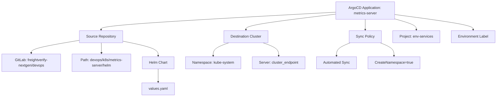
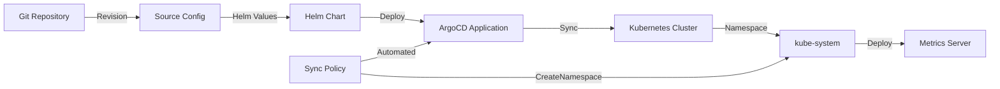
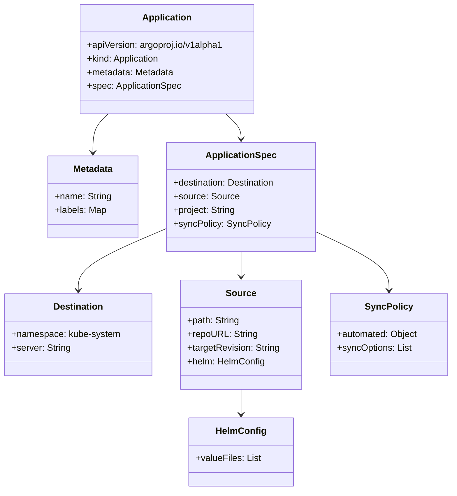
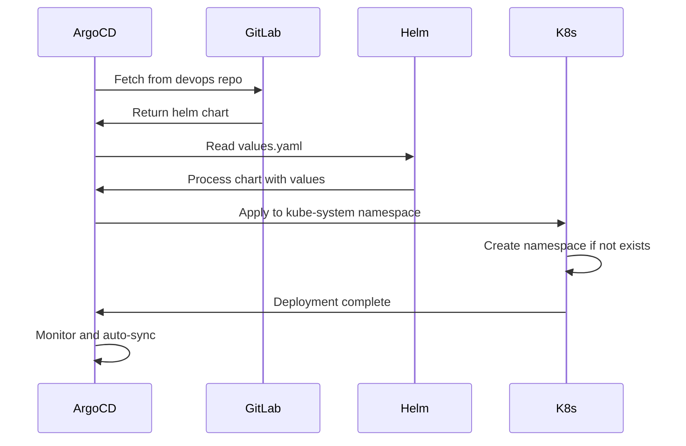

# Diagram: devops/k8s/metrics-server/argocd/application.yaml

> Auto-generated by Obscura crawlers

## Diagram 1

### SVG

<svg id="container" width="2198.35546875" xmlns="http://www.w3.org/2000/svg" class="flowchart" height="430" viewBox="0 0 2198.35546875 430" role="graphics-document document" aria-roledescription="flowchart-v2"><g><marker id="container_flowchart-v2-pointEnd" class="marker flowchart-v2" viewBox="0 0 10 10" refX="5" refY="5" markerUnits="userSpaceOnUse" markerWidth="8" markerHeight="8" orient="auto"><path d="M 0 0 L 10 5 L 0 10 z" class="arrowMarkerPath" style="stroke-width: 1; stroke-dasharray: 1, 0;"></path></marker><marker id="container_flowchart-v2-pointStart" class="marker flowchart-v2" viewBox="0 0 10 10" refX="4.5" refY="5" markerUnits="userSpaceOnUse" markerWidth="8" markerHeight="8" orient="auto"><path d="M 0 5 L 10 10 L 10 0 z" class="arrowMarkerPath" style="stroke-width: 1; stroke-dasharray: 1, 0;"></path></marker><marker id="container_flowchart-v2-circleEnd" class="marker flowchart-v2" viewBox="0 0 10 10" refX="11" refY="5" markerUnits="userSpaceOnUse" markerWidth="11" markerHeight="11" orient="auto"><circle cx="5" cy="5" r="5" class="arrowMarkerPath" style="stroke-width: 1; stroke-dasharray: 1, 0;"></circle></marker><marker id="container_flowchart-v2-circleStart" class="marker flowchart-v2" viewBox="0 0 10 10" refX="-1" refY="5" markerUnits="userSpaceOnUse" markerWidth="11" markerHeight="11" orient="auto"><circle cx="5" cy="5" r="5" class="arrowMarkerPath" style="stroke-width: 1; stroke-dasharray: 1, 0;"></circle></marker><marker id="container_flowchart-v2-crossEnd" class="marker cross flowchart-v2" viewBox="0 0 11 11" refX="12" refY="5.2" markerUnits="userSpaceOnUse" markerWidth="11" markerHeight="11" orient="auto"><path d="M 1,1 l 9,9 M 10,1 l -9,9" class="arrowMarkerPath" style="stroke-width: 2; stroke-dasharray: 1, 0;"></path></marker><marker id="container_flowchart-v2-crossStart" class="marker cross flowchart-v2" viewBox="0 0 11 11" refX="-1" refY="5.2" markerUnits="userSpaceOnUse" markerWidth="11" markerHeight="11" orient="auto"><path d="M 1,1 l 9,9 M 10,1 l -9,9" class="arrowMarkerPath" style="stroke-width: 2; stroke-dasharray: 1, 0;"></path></marker><g class="root"><g class="clusters"></g><g class="edgePaths"><path d="M1485.145,54.123L1312.13,63.602C1139.115,73.082,793.085,92.041,620.07,105.02C447.055,118,447.055,125,447.055,128.5L447.055,132" id="L_A_B_0" class="edge-thickness-normal edge-pattern-solid edge-thickness-normal edge-pattern-solid flowchart-link" style=";" data-edge="true" data-et="edge" data-id="L_A_B_0" data-points="W3sieCI6MTQ4NS4xNDQ1MzEyNSwieSI6NTQuMTIyNzM5NzgyODMxODh9LHsieCI6NDQ3LjA1NDY4NzUsInkiOjExMX0seyJ4Ijo0NDcuMDU0Njg3NSwieSI6MTM2fV0=" marker-end="url(#container_flowchart-v2-pointEnd)"></path><path d="M1485.145,62.738L1418.699,70.781C1352.254,78.825,1219.363,94.913,1152.918,106.456C1086.473,118,1086.473,125,1086.473,128.5L1086.473,132" id="L_A_C_0" class="edge-thickness-normal edge-pattern-solid edge-thickness-normal edge-pattern-solid flowchart-link" style=";" data-edge="true" data-et="edge" data-id="L_A_C_0" data-points="W3sieCI6MTQ4NS4xNDQ1MzEyNSwieSI6NjIuNzM3NTQ5ODc0MzkwNDI1fSx7IngiOjEwODYuNDcyNjU2MjUsInkiOjExMX0seyJ4IjoxMDg2LjQ3MjY1NjI1LCJ5IjoxMzZ9XQ==" marker-end="url(#container_flowchart-v2-pointEnd)"></path><path d="M1615.145,86L1615.145,90.167C1615.145,94.333,1615.145,102.667,1615.145,110.333C1615.145,118,1615.145,125,1615.145,128.5L1615.145,132" id="L_A_D_0" class="edge-thickness-normal edge-pattern-solid edge-thickness-normal edge-pattern-solid flowchart-link" style=";" data-edge="true" data-et="edge" data-id="L_A_D_0" data-points="W3sieCI6MTYxNS4xNDQ1MzEyNSwieSI6ODZ9LHsieCI6MTYxNS4xNDQ1MzEyNSwieSI6MTExfSx7IngiOjE2MTUuMTQ0NTMxMjUsInkiOjEzNn1d" marker-end="url(#container_flowchart-v2-pointEnd)"></path><path d="M351.414,179.092L315.845,185.077C280.276,191.061,209.138,203.031,173.569,212.515C138,222,138,229,138,232.5L138,236" id="L_B_E_0" class="edge-thickness-normal edge-pattern-solid edge-thickness-normal edge-pattern-solid flowchart-link" style=";" data-edge="true" data-et="edge" data-id="L_B_E_0" data-points="W3sieCI6MzUxLjQxNDA2MjUsInkiOjE3OS4wOTIwMTQ0NTk0MTUwNX0seyJ4IjoxMzgsInkiOjIxNX0seyJ4IjoxMzgsInkiOjI0MH1d" marker-end="url(#container_flowchart-v2-pointEnd)"></path><path d="M447.546,190L447.621,194.167C447.697,198.333,447.849,206.667,447.924,214.333C448,222,448,229,448,232.5L448,236" id="L_B_F_0" class="edge-thickness-normal edge-pattern-solid edge-thickness-normal edge-pattern-solid flowchart-link" style=";" data-edge="true" data-et="edge" data-id="L_B_F_0" data-points="W3sieCI6NDQ3LjU0NTUyMjgzNjUzODQ1LCJ5IjoxOTB9LHsieCI6NDQ4LCJ5IjoyMTV9LHsieCI6NDQ4LCJ5IjoyNDB9XQ==" marker-end="url(#container_flowchart-v2-pointEnd)"></path><path d="M542.695,182.776L568.669,188.147C594.643,193.517,646.591,204.259,672.565,215.129C698.539,226,698.539,237,698.539,242.5L698.539,248" id="L_B_G_0" class="edge-thickness-normal edge-pattern-solid edge-thickness-normal edge-pattern-solid flowchart-link" style=";" data-edge="true" data-et="edge" data-id="L_B_G_0" data-points="W3sieCI6NTQyLjY5NTMxMjUsInkiOjE4Mi43NzU4MzEwMDM0MTcyfSx7IngiOjY5OC41MzkwNjI1LCJ5IjoyMTV9LHsieCI6Njk4LjUzOTA2MjUsInkiOjI1Mn1d" marker-end="url(#container_flowchart-v2-pointEnd)"></path><path d="M698.539,306L698.539,312.167C698.539,318.333,698.539,330.667,698.539,340.333C698.539,350,698.539,357,698.539,360.5L698.539,364" id="L_G_H_0" class="edge-thickness-normal edge-pattern-solid edge-thickness-normal edge-pattern-solid flowchart-link" style=";" data-edge="true" data-et="edge" data-id="L_G_H_0" data-points="W3sieCI6Njk4LjUzOTA2MjUsInkiOjMwNn0seyJ4Ijo2OTguNTM5MDYyNSwieSI6MzQzfSx7IngiOjY5OC41MzkwNjI1LCJ5IjozNjh9XQ==" marker-end="url(#container_flowchart-v2-pointEnd)"></path><path d="M1011.028,190L999.385,194.167C987.743,198.333,964.457,206.667,952.815,216.333C941.172,226,941.172,237,941.172,242.5L941.172,248" id="L_C_I_0" class="edge-thickness-normal edge-pattern-solid edge-thickness-normal edge-pattern-solid flowchart-link" style=";" data-edge="true" data-et="edge" data-id="L_C_I_0" data-points="W3sieCI6MTAxMS4wMjgwMTk4MzE3MzA3LCJ5IjoxOTB9LHsieCI6OTQxLjE3MTg3NSwieSI6MjE1fSx7IngiOjk0MS4xNzE4NzUsInkiOjI1Mn1d" marker-end="url(#container_flowchart-v2-pointEnd)"></path><path d="M1161.917,190L1173.56,194.167C1185.203,198.333,1208.488,206.667,1220.131,216.333C1231.773,226,1231.773,237,1231.773,242.5L1231.773,248" id="L_C_J_0" class="edge-thickness-normal edge-pattern-solid edge-thickness-normal edge-pattern-solid flowchart-link" style=";" data-edge="true" data-et="edge" data-id="L_C_J_0" data-points="W3sieCI6MTE2MS45MTcyOTI2NjgyNjkzLCJ5IjoxOTB9LHsieCI6MTIzMS43NzM0Mzc1LCJ5IjoyMTV9LHsieCI6MTIzMS43NzM0Mzc1LCJ5IjoyNTJ9XQ==" marker-end="url(#container_flowchart-v2-pointEnd)"></path><path d="M1549.61,190L1539.497,194.167C1529.383,198.333,1509.156,206.667,1499.043,216.333C1488.93,226,1488.93,237,1488.93,242.5L1488.93,248" id="L_D_K_0" class="edge-thickness-normal edge-pattern-solid edge-thickness-normal edge-pattern-solid flowchart-link" style=";" data-edge="true" data-et="edge" data-id="L_D_K_0" data-points="W3sieCI6MTU0OS42MDk5MDA4NDEzNDYyLCJ5IjoxOTB9LHsieCI6MTQ4OC45Mjk2ODc1LCJ5IjoyMTV9LHsieCI6MTQ4OC45Mjk2ODc1LCJ5IjoyNTJ9XQ==" marker-end="url(#container_flowchart-v2-pointEnd)"></path><path d="M1680.679,190L1690.793,194.167C1700.906,198.333,1721.133,206.667,1731.246,216.333C1741.359,226,1741.359,237,1741.359,242.5L1741.359,248" id="L_D_L_0" class="edge-thickness-normal edge-pattern-solid edge-thickness-normal edge-pattern-solid flowchart-link" style=";" data-edge="true" data-et="edge" data-id="L_D_L_0" data-points="W3sieCI6MTY4MC42NzkxNjE2NTg2NTM4LCJ5IjoxOTB9LHsieCI6MTc0MS4zNTkzNzUsInkiOjIxNX0seyJ4IjoxNzQxLjM1OTM3NSwieSI6MjUyfV0=" marker-end="url(#container_flowchart-v2-pointEnd)"></path><path d="M1745.145,83.996L1760.96,88.496C1776.775,92.997,1808.405,101.999,1824.22,109.999C1840.035,118,1840.035,125,1840.035,128.5L1840.035,132" id="L_A_M_0" class="edge-thickness-normal edge-pattern-solid edge-thickness-normal edge-pattern-solid flowchart-link" style=";" data-edge="true" data-et="edge" data-id="L_A_M_0" data-points="W3sieCI6MTc0NS4xNDQ1MzEyNSwieSI6ODMuOTk1NzYxODI4NjY2NzJ9LHsieCI6MTg0MC4wMzUxNTYyNSwieSI6MTExfSx7IngiOjE4NDAuMDM1MTU2MjUsInkiOjEzNn1d" marker-end="url(#container_flowchart-v2-pointEnd)"></path><path d="M1745.145,64.43L1803.036,72.191C1860.928,79.953,1976.712,95.477,2034.604,106.738C2092.496,118,2092.496,125,2092.496,128.5L2092.496,132" id="L_A_N_0" class="edge-thickness-normal edge-pattern-solid edge-thickness-normal edge-pattern-solid flowchart-link" style=";" data-edge="true" data-et="edge" data-id="L_A_N_0" data-points="W3sieCI6MTc0NS4xNDQ1MzEyNSwieSI6NjQuNDI5NTAxOTcyMTQ0NDh9LHsieCI6MjA5Mi40OTYwOTM3NSwieSI6MTExfSx7IngiOjIwOTIuNDk2MDkzNzUsInkiOjEzNn1d" marker-end="url(#container_flowchart-v2-pointEnd)"></path></g><g class="edgeLabels"><g class="edgeLabel"><g class="label" data-id="L_A_B_0" transform="translate(0, 0)"><foreignObject width="0" height="0">

</foreignObject></g></g><g class="edgeLabel"><g class="label" data-id="L_A_C_0" transform="translate(0, 0)"><foreignObject width="0" height="0">

</foreignObject></g></g><g class="edgeLabel"><g class="label" data-id="L_A_D_0" transform="translate(0, 0)"><foreignObject width="0" height="0">

</foreignObject></g></g><g class="edgeLabel"><g class="label" data-id="L_B_E_0" transform="translate(0, 0)"><foreignObject width="0" height="0">

</foreignObject></g></g><g class="edgeLabel"><g class="label" data-id="L_B_F_0" transform="translate(0, 0)"><foreignObject width="0" height="0">

</foreignObject></g></g><g class="edgeLabel"><g class="label" data-id="L_B_G_0" transform="translate(0, 0)"><foreignObject width="0" height="0">

</foreignObject></g></g><g class="edgeLabel"><g class="label" data-id="L_G_H_0" transform="translate(0, 0)"><foreignObject width="0" height="0">

</foreignObject></g></g><g class="edgeLabel"><g class="label" data-id="L_C_I_0" transform="translate(0, 0)"><foreignObject width="0" height="0">

</foreignObject></g></g><g class="edgeLabel"><g class="label" data-id="L_C_J_0" transform="translate(0, 0)"><foreignObject width="0" height="0">

</foreignObject></g></g><g class="edgeLabel"><g class="label" data-id="L_D_K_0" transform="translate(0, 0)"><foreignObject width="0" height="0">

</foreignObject></g></g><g class="edgeLabel"><g class="label" data-id="L_D_L_0" transform="translate(0, 0)"><foreignObject width="0" height="0">

</foreignObject></g></g><g class="edgeLabel"><g class="label" data-id="L_A_M_0" transform="translate(0, 0)"><foreignObject width="0" height="0">

</foreignObject></g></g><g class="edgeLabel"><g class="label" data-id="L_A_N_0" transform="translate(0, 0)"><foreignObject width="0" height="0">

</foreignObject></g></g></g><g class="nodes"><g class="node default" id="flowchart-A-0" transform="translate(1615.14453125, 47)"><rect class="basic label-container" style="" x="-130" y="-39" width="260" height="78"></rect><g class="label" style="" transform="translate(-100, -24)"><rect></rect><foreignObject width="200" height="48">

ArgoCD Application: metrics-server

</foreignObject></g></g><g class="node default" id="flowchart-B-1" transform="translate(447.0546875, 163)"><rect class="basic label-container" style="" x="-95.640625" y="-27" width="191.28125" height="54"></rect><g class="label" style="" transform="translate(-65.640625, -12)"><rect></rect><foreignObject width="131.28125" height="24">

Source Repository

</foreignObject></g></g><g class="node default" id="flowchart-C-3" transform="translate(1086.47265625, 163)"><rect class="basic label-container" style="" x="-99.4140625" y="-27" width="198.828125" height="54"></rect><g class="label" style="" transform="translate(-69.4140625, -12)"><rect></rect><foreignObject width="138.828125" height="24">

Destination Cluster

</foreignObject></g></g><g class="node default" id="flowchart-D-5" transform="translate(1615.14453125, 163)"><rect class="basic label-container" style="" x="-70.2890625" y="-27" width="140.578125" height="54"></rect><g class="label" style="" transform="translate(-40.2890625, -12)"><rect></rect><foreignObject width="80.578125" height="24">

Sync Policy

</foreignObject></g></g><g class="node default" id="flowchart-E-7" transform="translate(138, 279)"><rect class="basic label-container" style="" x="-130" y="-39" width="260" height="78"></rect><g class="label" style="" transform="translate(-100, -24)"><rect></rect><foreignObject width="200" height="48">

GitLab: freightverify-nextgen/devops

</foreignObject></g></g><g class="node default" id="flowchart-F-9" transform="translate(448, 279)"><rect class="basic label-container" style="" x="-130" y="-39" width="260" height="78"></rect><g class="label" style="" transform="translate(-100, -24)"><rect></rect><foreignObject width="200" height="48">

Path: devops/k8s/metrics-server/helm

</foreignObject></g></g><g class="node default" id="flowchart-G-11" transform="translate(698.5390625, 279)"><rect class="basic label-container" style="" x="-70.5390625" y="-27" width="141.078125" height="54"></rect><g class="label" style="" transform="translate(-40.5390625, -12)"><rect></rect><foreignObject width="81.078125" height="24">

Helm Chart

</foreignObject></g></g><g class="node default" id="flowchart-H-13" transform="translate(698.5390625, 395)"><rect class="basic label-container" style="" x="-72.140625" y="-27" width="144.28125" height="54"></rect><g class="label" style="" transform="translate(-42.140625, -12)"><rect></rect><foreignObject width="84.28125" height="24">

values.yaml

</foreignObject></g></g><g class="node default" id="flowchart-I-15" transform="translate(941.171875, 279)"><rect class="basic label-container" style="" x="-122.09375" y="-27" width="244.1875" height="54"></rect><g class="label" style="" transform="translate(-92.09375, -12)"><rect></rect><foreignObject width="184.1875" height="24">

Namespace: kube-system

</foreignObject></g></g><g class="node default" id="flowchart-J-17" transform="translate(1231.7734375, 279)"><rect class="basic label-container" style="" x="-118.5078125" y="-27" width="237.015625" height="54"></rect><g class="label" style="" transform="translate(-88.5078125, -12)"><rect></rect><foreignObject width="177.015625" height="24">

Server: cluster_endpoint

</foreignObject></g></g><g class="node default" id="flowchart-K-19" transform="translate(1488.9296875, 279)"><rect class="basic label-container" style="" x="-88.6484375" y="-27" width="177.296875" height="54"></rect><g class="label" style="" transform="translate(-58.6484375, -12)"><rect></rect><foreignObject width="117.296875" height="24">

Automated Sync

</foreignObject></g></g><g class="node default" id="flowchart-L-21" transform="translate(1741.359375, 279)"><rect class="basic label-container" style="" x="-113.78125" y="-27" width="227.5625" height="54"></rect><g class="label" style="" transform="translate(-83.78125, -12)"><rect></rect><foreignObject width="167.5625" height="24">

CreateNamespace=true

</foreignObject></g></g><g class="node default" id="flowchart-M-23" transform="translate(1840.03515625, 163)"><rect class="basic label-container" style="" x="-104.6015625" y="-27" width="209.203125" height="54"></rect><g class="label" style="" transform="translate(-74.6015625, -12)"><rect></rect><foreignObject width="149.203125" height="24">

Project: env-services

</foreignObject></g></g><g class="node default" id="flowchart-N-25" transform="translate(2092.49609375, 163)"><rect class="basic label-container" style="" x="-97.859375" y="-27" width="195.71875" height="54"></rect><g class="label" style="" transform="translate(-67.859375, -12)"><rect></rect><foreignObject width="135.71875" height="24">

Environment Label

</foreignObject></g></g></g></g></g></svg>

## Diagram 2

### SVG

<svg id="container" width="1983.5625" xmlns="http://www.w3.org/2000/svg" class="flowchart" height="176" viewBox="0 0 1983.5625 176" role="graphics-document document" aria-roledescription="flowchart-v2"><g><marker id="container_flowchart-v2-pointEnd" class="marker flowchart-v2" viewBox="0 0 10 10" refX="5" refY="5" markerUnits="userSpaceOnUse" markerWidth="8" markerHeight="8" orient="auto"><path d="M 0 0 L 10 5 L 0 10 z" class="arrowMarkerPath" style="stroke-width: 1; stroke-dasharray: 1, 0;"></path></marker><marker id="container_flowchart-v2-pointStart" class="marker flowchart-v2" viewBox="0 0 10 10" refX="4.5" refY="5" markerUnits="userSpaceOnUse" markerWidth="8" markerHeight="8" orient="auto"><path d="M 0 5 L 10 10 L 10 0 z" class="arrowMarkerPath" style="stroke-width: 1; stroke-dasharray: 1, 0;"></path></marker><marker id="container_flowchart-v2-circleEnd" class="marker flowchart-v2" viewBox="0 0 10 10" refX="11" refY="5" markerUnits="userSpaceOnUse" markerWidth="11" markerHeight="11" orient="auto"><circle cx="5" cy="5" r="5" class="arrowMarkerPath" style="stroke-width: 1; stroke-dasharray: 1, 0;"></circle></marker><marker id="container_flowchart-v2-circleStart" class="marker flowchart-v2" viewBox="0 0 10 10" refX="-1" refY="5" markerUnits="userSpaceOnUse" markerWidth="11" markerHeight="11" orient="auto"><circle cx="5" cy="5" r="5" class="arrowMarkerPath" style="stroke-width: 1; stroke-dasharray: 1, 0;"></circle></marker><marker id="container_flowchart-v2-crossEnd" class="marker cross flowchart-v2" viewBox="0 0 11 11" refX="12" refY="5.2" markerUnits="userSpaceOnUse" markerWidth="11" markerHeight="11" orient="auto"><path d="M 1,1 l 9,9 M 10,1 l -9,9" class="arrowMarkerPath" style="stroke-width: 2; stroke-dasharray: 1, 0;"></path></marker><marker id="container_flowchart-v2-crossStart" class="marker cross flowchart-v2" viewBox="0 0 11 11" refX="-1" refY="5.2" markerUnits="userSpaceOnUse" markerWidth="11" markerHeight="11" orient="auto"><path d="M 1,1 l 9,9 M 10,1 l -9,9" class="arrowMarkerPath" style="stroke-width: 2; stroke-dasharray: 1, 0;"></path></marker><g class="root"><g class="clusters"></g><g class="edgePaths"><path d="M170.547,35L179.813,35C189.078,35,207.609,35,225.474,35C243.339,35,260.536,35,269.135,35L277.734,35" id="L_GitRepo_Source_0" class="edge-thickness-normal edge-pattern-solid edge-thickness-normal edge-pattern-solid flowchart-link" style=";" data-edge="true" data-et="edge" data-id="L_GitRepo_Source_0" data-points="W3sieCI6MTcwLjU0Njg3NSwieSI6MzV9LHsieCI6MjI2LjE0MDYyNSwieSI6MzV9LHsieCI6MjgxLjczNDM3NSwieSI6MzV9XQ==" marker-end="url(#container_flowchart-v2-pointEnd)"></path><path d="M439.984,35L451.587,35C463.19,35,486.396,35,508.935,35C531.474,35,553.346,35,564.283,35L575.219,35" id="L_Source_Chart_0" class="edge-thickness-normal edge-pattern-solid edge-thickness-normal edge-pattern-solid flowchart-link" style=";" data-edge="true" data-et="edge" data-id="L_Source_Chart_0" data-points="W3sieCI6NDM5Ljk4NDM3NSwieSI6MzV9LHsieCI6NTA5LjYwMTU2MjUsInkiOjM1fSx7IngiOjU3OS4yMTg3NSwieSI6MzV9XQ==" marker-end="url(#container_flowchart-v2-pointEnd)"></path><path d="M720.297,35L731.098,35C741.898,35,763.5,35,784.441,36.359C805.382,37.719,825.662,40.438,835.802,41.797L845.942,43.156" id="L_Chart_App_0" class="edge-thickness-normal edge-pattern-solid edge-thickness-normal edge-pattern-solid flowchart-link" style=";" data-edge="true" data-et="edge" data-id="L_Chart_App_0" data-points="W3sieCI6NzIwLjI5Njg3NSwieSI6MzV9LHsieCI6Nzg1LjEwMTU2MjUsInkiOjM1fSx7IngiOjg0OS45MDYyNSwieSI6NDMuNjg3OTMxNDQ0ODk0MDc2fV0=" marker-end="url(#container_flowchart-v2-pointEnd)"></path><path d="M1048.5,57L1063.465,57C1078.43,57,1108.359,57,1137.622,57C1166.885,57,1195.482,57,1209.78,57L1224.078,57" id="L_App_Cluster_0" class="edge-thickness-normal edge-pattern-solid edge-thickness-normal edge-pattern-solid flowchart-link" style=";" data-edge="true" data-et="edge" data-id="L_App_Cluster_0" data-points="W3sieCI6MTA0OC41LCJ5Ijo1N30seyJ4IjoxMTM4LjI4OTA2MjUsInkiOjU3fSx7IngiOjEyMjguMDc4MTI1LCJ5Ijo1N31d" marker-end="url(#container_flowchart-v2-pointEnd)"></path><path d="M1425.844,57L1436.98,57C1448.117,57,1470.391,57,1492.013,59.272C1513.634,61.544,1534.605,66.089,1545.09,68.361L1555.575,70.633" id="L_Cluster_NS_0" class="edge-thickness-normal edge-pattern-solid edge-thickness-normal edge-pattern-solid flowchart-link" style=";" data-edge="true" data-et="edge" data-id="L_Cluster_NS_0" data-points="W3sieCI6MTQyNS44NDM3NSwieSI6NTd9LHsieCI6MTQ5Mi42NjQwNjI1LCJ5Ijo1N30seyJ4IjoxNTU5LjQ4NDM3NSwieSI6NzEuNDc5OTg0NzA4NjQ1MDh9XQ==" marker-end="url(#container_flowchart-v2-pointEnd)"></path><path d="M1711.953,88L1720.311,88C1728.669,88,1745.385,88,1761.435,88C1777.484,88,1792.867,88,1800.559,88L1808.25,88" id="L_NS_MS_0" class="edge-thickness-normal edge-pattern-solid edge-thickness-normal edge-pattern-solid flowchart-link" style=";" data-edge="true" data-et="edge" data-id="L_NS_MS_0" data-points="W3sieCI6MTcxMS45NTMxMjUsInkiOjg4fSx7IngiOjE3NjIuMTAxNTYyNSwieSI6ODh9LHsieCI6MTgxMi4yNSwieSI6ODh9XQ==" marker-end="url(#container_flowchart-v2-pointEnd)"></path><path d="M720.047,123.901L730.889,121.417C741.732,118.934,763.417,113.967,786.773,107.518C810.129,101.069,835.156,93.139,847.67,89.174L860.183,85.208" id="L_Policy_App_0" class="edge-thickness-normal edge-pattern-solid edge-thickness-normal edge-pattern-solid flowchart-link" style=";" data-edge="true" data-et="edge" data-id="L_Policy_App_0" data-points="W3sieCI6NzIwLjA0Njg3NSwieSI6MTIzLjkwMDU0MjU5OTg2MTQ3fSx7IngiOjc4NS4xMDE1NjI1LCJ5IjoxMDl9LHsieCI6ODYzLjk5NjU0NDQ3MTE1MzgsInkiOjg0fV0=" marker-end="url(#container_flowchart-v2-pointEnd)"></path><path d="M720.047,148.309L730.889,149.591C741.732,150.873,763.417,153.436,801.609,154.718C839.802,156,894.503,156,953.367,156C1012.232,156,1075.26,156,1138.22,156C1201.18,156,1264.07,156,1323.133,156C1382.195,156,1437.43,156,1478.82,149.453C1520.211,142.906,1547.758,129.811,1561.532,123.264L1575.305,116.717" id="L_Policy_NS_0" class="edge-thickness-normal edge-pattern-solid edge-thickness-normal edge-pattern-solid flowchart-link" style=";" data-edge="true" data-et="edge" data-id="L_Policy_NS_0" data-points="W3sieCI6NzIwLjA0Njg3NSwieSI6MTQ4LjMwOTM5NzM2NzgxMzQzfSx7IngiOjc4NS4xMDE1NjI1LCJ5IjoxNTZ9LHsieCI6OTQ5LjIwMzEyNSwieSI6MTU2fSx7IngiOjExMzguMjg5MDYyNSwieSI6MTU2fSx7IngiOjEzMjYuOTYwOTM3NSwieSI6MTU2fSx7IngiOjE0OTIuNjY0MDYyNSwieSI6MTU2fSx7IngiOjE1NzguOTE3NjI0MDgwODgyNCwieSI6MTE1fV0=" marker-end="url(#container_flowchart-v2-pointEnd)"></path></g><g class="edgeLabels"><g class="edgeLabel" transform="translate(226.140625, 35)"><g class="label" data-id="L_GitRepo_Source_0" transform="translate(-30.59375, -12)"><foreignObject width="61.1875" height="24">

Revision

</foreignObject></g></g><g class="edgeLabel" transform="translate(509.6015625, 35)"><g class="label" data-id="L_Source_Chart_0" transform="translate(-44.6171875, -12)"><foreignObject width="89.234375" height="24">

Helm Values

</foreignObject></g></g><g class="edgeLabel" transform="translate(785.1015625, 35)"><g class="label" data-id="L_Chart_App_0" transform="translate(-25.1484375, -12)"><foreignObject width="50.296875" height="24">

Deploy

</foreignObject></g></g><g class="edgeLabel" transform="translate(1138.2890625, 57)"><g class="label" data-id="L_App_Cluster_0" transform="translate(-16.734375, -12)"><foreignObject width="33.46875" height="24">

Sync

</foreignObject></g></g><g class="edgeLabel" transform="translate(1492.6640625, 57)"><g class="label" data-id="L_Cluster_NS_0" transform="translate(-41.8203125, -12)"><foreignObject width="83.640625" height="24">

Namespace

</foreignObject></g></g><g class="edgeLabel" transform="translate(1762.1015625, 88)"><g class="label" data-id="L_NS_MS_0" transform="translate(-25.1484375, -12)"><foreignObject width="50.296875" height="24">

Deploy

</foreignObject></g></g><g class="edgeLabel" transform="translate(792.73827, 106.5801)"><g class="label" data-id="L_Policy_App_0" transform="translate(-39.8046875, -12)"><foreignObject width="79.609375" height="24">

Automated

</foreignObject></g></g><g class="edgeLabel" transform="translate(1138.2890625, 156)"><g class="label" data-id="L_Policy_NS_0" transform="translate(-64.7890625, -12)"><foreignObject width="129.578125" height="24">

CreateNamespace

</foreignObject></g></g></g><g class="nodes"><g class="node default" id="flowchart-GitRepo-0" transform="translate(89.2734375, 35)"><rect class="basic label-container" style="" x="-81.2734375" y="-27" width="162.546875" height="54"></rect><g class="label" style="" transform="translate(-51.2734375, -12)"><rect></rect><foreignObject width="102.546875" height="24">

Git Repository

</foreignObject></g></g><g class="node default" id="flowchart-Source-1" transform="translate(360.859375, 35)"><rect class="basic label-container" style="" x="-79.125" y="-27" width="158.25" height="54"></rect><g class="label" style="" transform="translate(-49.125, -12)"><rect></rect><foreignObject width="98.25" height="24">

Source Config

</foreignObject></g></g><g class="node default" id="flowchart-Chart-3" transform="translate(649.7578125, 35)"><rect class="basic label-container" style="" x="-70.5390625" y="-27" width="141.078125" height="54"></rect><g class="label" style="" transform="translate(-40.5390625, -12)"><rect></rect><foreignObject width="81.078125" height="24">

Helm Chart

</foreignObject></g></g><g class="node default" id="flowchart-App-5" transform="translate(949.203125, 57)"><rect class="basic label-container" style="" x="-99.296875" y="-27" width="198.59375" height="54"></rect><g class="label" style="" transform="translate(-69.296875, -12)"><rect></rect><foreignObject width="138.59375" height="24">

ArgoCD Application

</foreignObject></g></g><g class="node default" id="flowchart-Cluster-7" transform="translate(1326.9609375, 57)"><rect class="basic label-container" style="" x="-98.8828125" y="-27" width="197.765625" height="54"></rect><g class="label" style="" transform="translate(-68.8828125, -12)"><rect></rect><foreignObject width="137.765625" height="24">

Kubernetes Cluster

</foreignObject></g></g><g class="node default" id="flowchart-NS-9" transform="translate(1635.71875, 88)"><rect class="basic label-container" style="" x="-76.234375" y="-27" width="152.46875" height="54"></rect><g class="label" style="" transform="translate(-46.234375, -12)"><rect></rect><foreignObject width="92.46875" height="24">

kube-system

</foreignObject></g></g><g class="node default" id="flowchart-MS-11" transform="translate(1893.90625, 88)"><rect class="basic label-container" style="" x="-81.65625" y="-27" width="163.3125" height="54"></rect><g class="label" style="" transform="translate(-51.65625, -12)"><rect></rect><foreignObject width="103.3125" height="24">

Metrics Server

</foreignObject></g></g><g class="node default" id="flowchart-Policy-12" transform="translate(649.7578125, 140)"><rect class="basic label-container" style="" x="-70.2890625" y="-27" width="140.578125" height="54"></rect><g class="label" style="" transform="translate(-40.2890625, -12)"><rect></rect><foreignObject width="80.578125" height="24">

Sync Policy

</foreignObject></g></g></g></g></g></svg>

## Diagram 3

### SVG

<svg id="container" width="789.984375" xmlns="http://www.w3.org/2000/svg" class="classDiagram" height="862" viewBox="0 0 789.984375 862" role="graphics-document document" aria-roledescription="class"><g><defs><marker id="container_class-aggregationStart" class="marker aggregation class" refX="18" refY="7" markerWidth="190" markerHeight="240" orient="auto"><path d="M 18,7 L9,13 L1,7 L9,1 Z"></path></marker></defs><defs><marker id="container_class-aggregationEnd" class="marker aggregation class" refX="1" refY="7" markerWidth="20" markerHeight="28" orient="auto"><path d="M 18,7 L9,13 L1,7 L9,1 Z"></path></marker></defs><defs><marker id="container_class-extensionStart" class="marker extension class" refX="18" refY="7" markerWidth="190" markerHeight="240" orient="auto"><path d="M 1,7 L18,13 V 1 Z"></path></marker></defs><defs><marker id="container_class-extensionEnd" class="marker extension class" refX="1" refY="7" markerWidth="20" markerHeight="28" orient="auto"><path d="M 1,1 V 13 L18,7 Z"></path></marker></defs><defs><marker id="container_class-compositionStart" class="marker composition class" refX="18" refY="7" markerWidth="190" markerHeight="240" orient="auto"><path d="M 18,7 L9,13 L1,7 L9,1 Z"></path></marker></defs><defs><marker id="container_class-compositionEnd" class="marker composition class" refX="1" refY="7" markerWidth="20" markerHeight="28" orient="auto"><path d="M 18,7 L9,13 L1,7 L9,1 Z"></path></marker></defs><defs><marker id="container_class-dependencyStart" class="marker dependency class" refX="6" refY="7" markerWidth="190" markerHeight="240" orient="auto"><path d="M 5,7 L9,13 L1,7 L9,1 Z"></path></marker></defs><defs><marker id="container_class-dependencyEnd" class="marker dependency class" refX="13" refY="7" markerWidth="20" markerHeight="28" orient="auto"><path d="M 18,7 L9,13 L14,7 L9,1 Z"></path></marker></defs><defs><marker id="container_class-lollipopStart" class="marker lollipop class" refX="13" refY="7" markerWidth="190" markerHeight="240" orient="auto"><circle stroke="black" fill="transparent" cx="7" cy="7" r="6"></circle></marker></defs><defs><marker id="container_class-lollipopEnd" class="marker lollipop class" refX="1" refY="7" markerWidth="190" markerHeight="240" orient="auto"><circle stroke="black" fill="transparent" cx="7" cy="7" r="6"></circle></marker></defs><g class="root"><g class="clusters"></g><g class="edgePaths"><path d="M185.84,200L181.325,204.167C176.81,208.333,167.78,216.667,163.265,228C158.75,239.333,158.75,253.667,158.75,260.833L158.75,268" id="id_Application_Metadata_1" class="edge-thickness-normal edge-pattern-solid relation" style=";;;" data-edge="true" data-et="edge" data-id="id_Application_Metadata_1" data-points="W3sieCI6MTg1LjgzOTkyNDQ1NzY0NDYzLCJ5IjoyMDB9LHsieCI6MTU4Ljc1LCJ5IjoyMjV9LHsieCI6MTU4Ljc1LCJ5IjoyNzR9XQ==" marker-end="url(#container_class-dependencyEnd)"></path><path d="M393.891,200L398.406,204.167C402.921,208.333,411.95,216.667,416.465,224C420.98,231.333,420.98,237.667,420.98,240.833L420.98,244" id="id_Application_ApplicationSpec_2" class="edge-thickness-normal edge-pattern-solid relation" style=";;;" data-edge="true" data-et="edge" data-id="id_Application_ApplicationSpec_2" data-points="W3sieCI6MzkzLjg5MDU0NDI5MjM1NTM0LCJ5IjoyMDB9LHsieCI6NDIwLjk4MDQ2ODc1LCJ5IjoyMjV9LHsieCI6NDIwLjk4MDQ2ODc1LCJ5IjoyNTB9XQ==" marker-end="url(#container_class-dependencyEnd)"></path><path d="M287.805,402.652L262.594,413.377C237.383,424.102,186.961,445.551,161.75,463.442C136.539,481.333,136.539,495.667,136.539,502.833L136.539,510" id="id_ApplicationSpec_Destination_3" class="edge-thickness-normal edge-pattern-solid relation" style=";;;" data-edge="true" data-et="edge" data-id="id_ApplicationSpec_Destination_3" data-points="W3sieCI6Mjg3LjgwNDY4NzUsInkiOjQwMi42NTIzMzM5MzMwMTAxNH0seyJ4IjoxMzYuNTM5MDYyNSwieSI6NDY3fSx7IngiOjEzNi41MzkwNjI1LCJ5Ijo1MTZ9XQ==" marker-end="url(#container_class-dependencyEnd)"></path><path d="M420.98,442L420.98,446.167C420.98,450.333,420.98,458.667,420.98,466C420.98,473.333,420.98,479.667,420.98,482.833L420.98,486" id="id_ApplicationSpec_Source_4" class="edge-thickness-normal edge-pattern-solid relation" style=";;;" data-edge="true" data-et="edge" data-id="id_ApplicationSpec_Source_4" data-points="W3sieCI6NDIwLjk4MDQ2ODc1LCJ5Ijo0NDJ9LHsieCI6NDIwLjk4MDQ2ODc1LCJ5Ijo0Njd9LHsieCI6NDIwLjk4MDQ2ODc1LCJ5Ijo0OTJ9XQ==" marker-end="url(#container_class-dependencyEnd)"></path><path d="M554.156,408.349L575.036,418.124C595.915,427.899,637.674,447.45,658.554,464.391C679.434,481.333,679.434,495.667,679.434,502.833L679.434,510" id="id_ApplicationSpec_SyncPolicy_5" class="edge-thickness-normal edge-pattern-solid relation" style=";;;" data-edge="true" data-et="edge" data-id="id_ApplicationSpec_SyncPolicy_5" data-points="W3sieCI6NTU0LjE1NjI1LCJ5Ijo0MDguMzQ4OTA1NzQ5MzUwMX0seyJ4Ijo2NzkuNDMzNTkzNzUsInkiOjQ2N30seyJ4Ijo2NzkuNDMzNTkzNzUsInkiOjUxNn1d" marker-end="url(#container_class-dependencyEnd)"></path><path d="M420.98,684L420.98,688.167C420.98,692.333,420.98,700.667,420.98,708C420.98,715.333,420.98,721.667,420.98,724.833L420.98,728" id="id_Source_HelmConfig_6" class="edge-thickness-normal edge-pattern-solid relation" style=";;;" data-edge="true" data-et="edge" data-id="id_Source_HelmConfig_6" data-points="W3sieCI6NDIwLjk4MDQ2ODc1LCJ5Ijo2ODR9LHsieCI6NDIwLjk4MDQ2ODc1LCJ5Ijo3MDl9LHsieCI6NDIwLjk4MDQ2ODc1LCJ5Ijo3MzR9XQ==" marker-end="url(#container_class-dependencyEnd)"></path></g><g class="edgeLabels"><g class="edgeLabel"><g class="label" data-id="id_Application_Metadata_1" transform="translate(0, 0)"><foreignObject width="0" height="0">

</foreignObject></g></g><g class="edgeLabel"><g class="label" data-id="id_Application_ApplicationSpec_2" transform="translate(0, 0)"><foreignObject width="0" height="0">

</foreignObject></g></g><g class="edgeLabel"><g class="label" data-id="id_ApplicationSpec_Destination_3" transform="translate(0, 0)"><foreignObject width="0" height="0">

</foreignObject></g></g><g class="edgeLabel"><g class="label" data-id="id_ApplicationSpec_Source_4" transform="translate(0, 0)"><foreignObject width="0" height="0">

</foreignObject></g></g><g class="edgeLabel"><g class="label" data-id="id_ApplicationSpec_SyncPolicy_5" transform="translate(0, 0)"><foreignObject width="0" height="0">

</foreignObject></g></g><g class="edgeLabel"><g class="label" data-id="id_Source_HelmConfig_6" transform="translate(0, 0)"><foreignObject width="0" height="0">

</foreignObject></g></g></g><g class="nodes"><g class="node default" id="classId-Application-0" transform="translate(289.865234375, 104)"><g class="basic label-container"><path d="M-153.30078125 -96 L153.30078125 -96 L153.30078125 96 L-153.30078125 96" stroke="none" stroke-width="0" fill="#ECECFF" style=""></path><path d="M-153.30078125 -96 C-33.862821846754684 -96, 85.57513755649063 -96, 153.30078125 -96 M-153.30078125 -96 C-85.15666723974506 -96, -17.012553229490123 -96, 153.30078125 -96 M153.30078125 -96 C153.30078125 -25.65153392505532, 153.30078125 44.69693214988936, 153.30078125 96 M153.30078125 -96 C153.30078125 -44.85954787099447, 153.30078125 6.280904258011063, 153.30078125 96 M153.30078125 96 C68.36875087426289 96, -16.563279501474227 96, -153.30078125 96 M153.30078125 96 C50.3356230119264 96, -52.6295352261472 96, -153.30078125 96 M-153.30078125 96 C-153.30078125 22.54831040316637, -153.30078125 -50.90337919366726, -153.30078125 -96 M-153.30078125 96 C-153.30078125 42.880993994755464, -153.30078125 -10.238012010489072, -153.30078125 -96" stroke="#9370DB" stroke-width="1.3" fill="none" stroke-dasharray="0 0" style=""></path></g><g class="annotation-group text" transform="translate(0, -72)"></g><g class="label-group text" transform="translate(-41.6796875, -72)"><g class="label" style="font-weight: bolder" transform="translate(0,-12)"><foreignObject width="83.359375" height="24">

Application

</foreignObject></g></g><g class="members-group text" transform="translate(-141.30078125, -24)"><g class="label" style="" transform="translate(0,-12)"><foreignObject width="240.921875" height="24">

+apiVersion: argoproj.io/v1alpha1

</foreignObject></g><g class="label" style="" transform="translate(0,12)"><foreignObject width="130.296875" height="24">

+kind: Application

</foreignObject></g><g class="label" style="" transform="translate(0,36)"><foreignObject width="153.6875" height="24">

+metadata: Metadata

</foreignObject></g><g class="label" style="" transform="translate(0,60)"><foreignObject width="166.640625" height="24">

+spec: ApplicationSpec

</foreignObject></g></g><g class="methods-group text" transform="translate(-141.30078125, 96)"></g><g class="divider" style=""><path d="M-153.30078125 -48 C-90.65389485425382 -48, -28.007008458507656 -48, 153.30078125 -48 M-153.30078125 -48 C-78.42690961086414 -48, -3.553037971728287 -48, 153.30078125 -48" stroke="#9370DB" stroke-width="1.3" fill="none" stroke-dasharray="0 0" style=""></path></g><g class="divider" style=""><path d="M-153.30078125 72 C-52.27798054993782 72, 48.744820150124355 72, 153.30078125 72 M-153.30078125 72 C-73.75027758627992 72, 5.800226077440158 72, 153.30078125 72" stroke="#9370DB" stroke-width="1.3" fill="none" stroke-dasharray="0 0" style=""></path></g></g><g class="node default" id="classId-Metadata-1" transform="translate(158.75, 346)"><g class="basic label-container"><path d="M-79.0546875 -72 L79.0546875 -72 L79.0546875 72 L-79.0546875 72" stroke="none" stroke-width="0" fill="#ECECFF" style=""></path><path d="M-79.0546875 -72 C-44.71177118003134 -72, -10.368854860062683 -72, 79.0546875 -72 M-79.0546875 -72 C-26.922574795466012 -72, 25.209537909067976 -72, 79.0546875 -72 M79.0546875 -72 C79.0546875 -29.094135609394037, 79.0546875 13.811728781211926, 79.0546875 72 M79.0546875 -72 C79.0546875 -40.278767467720144, 79.0546875 -8.557534935440287, 79.0546875 72 M79.0546875 72 C30.131725142770875 72, -18.79123721445825 72, -79.0546875 72 M79.0546875 72 C36.267709454708665 72, -6.519268590582669 72, -79.0546875 72 M-79.0546875 72 C-79.0546875 35.92166936373093, -79.0546875 -0.15666127253814466, -79.0546875 -72 M-79.0546875 72 C-79.0546875 37.227316673818656, -79.0546875 2.454633347637312, -79.0546875 -72" stroke="#9370DB" stroke-width="1.3" fill="none" stroke-dasharray="0 0" style=""></path></g><g class="annotation-group text" transform="translate(0, -48)"></g><g class="label-group text" transform="translate(-34.640625, -48)"><g class="label" style="font-weight: bolder" transform="translate(0,-12)"><foreignObject width="69.28125" height="24">

Metadata

</foreignObject></g></g><g class="members-group text" transform="translate(-67.0546875, 0)"><g class="label" style="" transform="translate(0,-12)"><foreignObject width="99.46875" height="24">

+name: String

</foreignObject></g><g class="label" style="" transform="translate(0,12)"><foreignObject width="90.421875" height="24">

+labels: Map

</foreignObject></g></g><g class="methods-group text" transform="translate(-67.0546875, 72)"></g><g class="divider" style=""><path d="M-79.0546875 -24 C-33.82281659555906 -24, 11.409054308881878 -24, 79.0546875 -24 M-79.0546875 -24 C-35.797765211428235 -24, 7.45915707714353 -24, 79.0546875 -24" stroke="#9370DB" stroke-width="1.3" fill="none" stroke-dasharray="0 0" style=""></path></g><g class="divider" style=""><path d="M-79.0546875 48 C-33.34142307715559 48, 12.371841345688821 48, 79.0546875 48 M-79.0546875 48 C-18.76731943963334 48, 41.52004862073332 48, 79.0546875 48" stroke="#9370DB" stroke-width="1.3" fill="none" stroke-dasharray="0 0" style=""></path></g></g><g class="node default" id="classId-ApplicationSpec-2" transform="translate(420.98046875, 346)"><g class="basic label-container"><path d="M-133.17578125 -96 L133.17578125 -96 L133.17578125 96 L-133.17578125 96" stroke="none" stroke-width="0" fill="#ECECFF" style=""></path><path d="M-133.17578125 -96 C-44.522384489998515 -96, 44.13101227000297 -96, 133.17578125 -96 M-133.17578125 -96 C-51.6364133533031 -96, 29.902954543393804 -96, 133.17578125 -96 M133.17578125 -96 C133.17578125 -55.60642511005042, 133.17578125 -15.212850220100833, 133.17578125 96 M133.17578125 -96 C133.17578125 -44.190868965259824, 133.17578125 7.618262069480352, 133.17578125 96 M133.17578125 96 C62.67934078899604 96, -7.817099672007913 96, -133.17578125 96 M133.17578125 96 C60.252893960512694 96, -12.669993328974613 96, -133.17578125 96 M-133.17578125 96 C-133.17578125 19.477127502377883, -133.17578125 -57.045744995244235, -133.17578125 -96 M-133.17578125 96 C-133.17578125 28.36477364339379, -133.17578125 -39.27045271321242, -133.17578125 -96" stroke="#9370DB" stroke-width="1.3" fill="none" stroke-dasharray="0 0" style=""></path></g><g class="annotation-group text" transform="translate(0, -72)"></g><g class="label-group text" transform="translate(-59.2734375, -72)"><g class="label" style="font-weight: bolder" transform="translate(0,-12)"><foreignObject width="118.546875" height="24">

ApplicationSpec

</foreignObject></g></g><g class="members-group text" transform="translate(-121.17578125, -24)"><g class="label" style="" transform="translate(0,-12)"><foreignObject width="183.078125" height="24">

+destination: Destination

</foreignObject></g><g class="label" style="" transform="translate(0,12)"><foreignObject width="113.0625" height="24">

+source: Source

</foreignObject></g><g class="label" style="" transform="translate(0,36)"><foreignObject width="110.1875" height="24">

+project: String

</foreignObject></g><g class="label" style="" transform="translate(0,60)"><foreignObject width="167.453125" height="24">

+syncPolicy: SyncPolicy

</foreignObject></g></g><g class="methods-group text" transform="translate(-121.17578125, 96)"></g><g class="divider" style=""><path d="M-133.17578125 -48 C-56.23056518899185 -48, 20.714650872016307 -48, 133.17578125 -48 M-133.17578125 -48 C-71.85795369413985 -48, -10.540126138279703 -48, 133.17578125 -48" stroke="#9370DB" stroke-width="1.3" fill="none" stroke-dasharray="0 0" style=""></path></g><g class="divider" style=""><path d="M-133.17578125 72 C-78.22936882505968 72, -23.28295640011936 72, 133.17578125 72 M-133.17578125 72 C-45.75825991440925 72, 41.6592614211815 72, 133.17578125 72" stroke="#9370DB" stroke-width="1.3" fill="none" stroke-dasharray="0 0" style=""></path></g></g><g class="node default" id="classId-Destination-3" transform="translate(136.5390625, 588)"><g class="basic label-container"><path d="M-128.5390625 -72 L128.5390625 -72 L128.5390625 72 L-128.5390625 72" stroke="none" stroke-width="0" fill="#ECECFF" style=""></path><path d="M-128.5390625 -72 C-54.151562780048565 -72, 20.23593693990287 -72, 128.5390625 -72 M-128.5390625 -72 C-31.04007067691761 -72, 66.45892114616478 -72, 128.5390625 -72 M128.5390625 -72 C128.5390625 -28.316195997149734, 128.5390625 15.367608005700532, 128.5390625 72 M128.5390625 -72 C128.5390625 -39.88685750952779, 128.5390625 -7.773715019055587, 128.5390625 72 M128.5390625 72 C49.31563769737477 72, -29.907787105250463 72, -128.5390625 72 M128.5390625 72 C51.972369017322805 72, -24.59432446535439 72, -128.5390625 72 M-128.5390625 72 C-128.5390625 24.971652806536824, -128.5390625 -22.056694386926353, -128.5390625 -72 M-128.5390625 72 C-128.5390625 38.88813770901301, -128.5390625 5.776275418026017, -128.5390625 -72" stroke="#9370DB" stroke-width="1.3" fill="none" stroke-dasharray="0 0" style=""></path></g><g class="annotation-group text" transform="translate(0, -48)"></g><g class="label-group text" transform="translate(-42.46875, -48)"><g class="label" style="font-weight: bolder" transform="translate(0,-12)"><foreignObject width="84.9375" height="24">

Destination

</foreignObject></g></g><g class="members-group text" transform="translate(-116.5390625, 0)"><g class="label" style="" transform="translate(0,-12)"><foreignObject width="190.609375" height="24">

+namespace: kube-system

</foreignObject></g><g class="label" style="" transform="translate(0,12)"><foreignObject width="104.1875" height="24">

+server: String

</foreignObject></g></g><g class="methods-group text" transform="translate(-116.5390625, 72)"></g><g class="divider" style=""><path d="M-128.5390625 -24 C-53.63533661530063 -24, 21.26838926939874 -24, 128.5390625 -24 M-128.5390625 -24 C-29.831445633968684 -24, 68.87617123206263 -24, 128.5390625 -24" stroke="#9370DB" stroke-width="1.3" fill="none" stroke-dasharray="0 0" style=""></path></g><g class="divider" style=""><path d="M-128.5390625 48 C-62.142360746398325 48, 4.254341007203351 48, 128.5390625 48 M-128.5390625 48 C-50.252907150430374 48, 28.03324819913925 48, 128.5390625 48" stroke="#9370DB" stroke-width="1.3" fill="none" stroke-dasharray="0 0" style=""></path></g></g><g class="node default" id="classId-Source-4" transform="translate(420.98046875, 588)"><g class="basic label-container"><path d="M-105.90234375 -96 L105.90234375 -96 L105.90234375 96 L-105.90234375 96" stroke="none" stroke-width="0" fill="#ECECFF" style=""></path><path d="M-105.90234375 -96 C-33.2633292767666 -96, 39.375685196466804 -96, 105.90234375 -96 M-105.90234375 -96 C-61.656863493048895 -96, -17.41138323609779 -96, 105.90234375 -96 M105.90234375 -96 C105.90234375 -20.64343333232013, 105.90234375 54.71313333535974, 105.90234375 96 M105.90234375 -96 C105.90234375 -34.24899469674389, 105.90234375 27.502010606512215, 105.90234375 96 M105.90234375 96 C34.76548088567934 96, -36.371381978641324 96, -105.90234375 96 M105.90234375 96 C48.61628262276445 96, -8.669778504471097 96, -105.90234375 96 M-105.90234375 96 C-105.90234375 42.80433885771801, -105.90234375 -10.391322284563984, -105.90234375 -96 M-105.90234375 96 C-105.90234375 26.552472383098916, -105.90234375 -42.89505523380217, -105.90234375 -96" stroke="#9370DB" stroke-width="1.3" fill="none" stroke-dasharray="0 0" style=""></path></g><g class="annotation-group text" transform="translate(0, -72)"></g><g class="label-group text" transform="translate(-24.8828125, -72)"><g class="label" style="font-weight: bolder" transform="translate(0,-12)"><foreignObject width="49.765625" height="24">

Source

</foreignObject></g></g><g class="members-group text" transform="translate(-93.90234375, -24)"><g class="label" style="" transform="translate(0,-12)"><foreignObject width="92.15625" height="24">

+path: String

</foreignObject></g><g class="label" style="" transform="translate(0,12)"><foreignObject width="120.453125" height="24">

+repoURL: String

</foreignObject></g><g class="label" style="" transform="translate(0,36)"><foreignObject width="162.921875" height="24">

+targetRevision: String

</foreignObject></g><g class="label" style="" transform="translate(0,60)"><foreignObject width="135.453125" height="24">

+helm: HelmConfig

</foreignObject></g></g><g class="methods-group text" transform="translate(-93.90234375, 96)"></g><g class="divider" style=""><path d="M-105.90234375 -48 C-54.3952563578243 -48, -2.888168965648603 -48, 105.90234375 -48 M-105.90234375 -48 C-55.865938440262134 -48, -5.829533130524268 -48, 105.90234375 -48" stroke="#9370DB" stroke-width="1.3" fill="none" stroke-dasharray="0 0" style=""></path></g><g class="divider" style=""><path d="M-105.90234375 72 C-58.72756688826817 72, -11.552790026536343 72, 105.90234375 72 M-105.90234375 72 C-27.944637016375253 72, 50.01306971724949 72, 105.90234375 72" stroke="#9370DB" stroke-width="1.3" fill="none" stroke-dasharray="0 0" style=""></path></g></g><g class="node default" id="classId-HelmConfig-5" transform="translate(420.98046875, 794)"><g class="basic label-container"><path d="M-89.46875 -60 L89.46875 -60 L89.46875 60 L-89.46875 60" stroke="none" stroke-width="0" fill="#ECECFF" style=""></path><path d="M-89.46875 -60 C-30.634642925263485 -60, 28.19946414947303 -60, 89.46875 -60 M-89.46875 -60 C-36.227211844082156 -60, 17.01432631183569 -60, 89.46875 -60 M89.46875 -60 C89.46875 -23.12369510434376, 89.46875 13.75260979131248, 89.46875 60 M89.46875 -60 C89.46875 -21.1115798834752, 89.46875 17.776840233049597, 89.46875 60 M89.46875 60 C44.16359466050455 60, -1.1415606789908992 60, -89.46875 60 M89.46875 60 C46.75261878329404 60, 4.036487566588079 60, -89.46875 60 M-89.46875 60 C-89.46875 13.77399052074189, -89.46875 -32.45201895851622, -89.46875 -60 M-89.46875 60 C-89.46875 16.492549546425856, -89.46875 -27.014900907148288, -89.46875 -60" stroke="#9370DB" stroke-width="1.3" fill="none" stroke-dasharray="0 0" style=""></path></g><g class="annotation-group text" transform="translate(0, -36)"></g><g class="label-group text" transform="translate(-41.8125, -36)"><g class="label" style="font-weight: bolder" transform="translate(0,-12)"><foreignObject width="83.625" height="24">

HelmConfig

</foreignObject></g></g><g class="members-group text" transform="translate(-77.46875, 12)"><g class="label" style="" transform="translate(0,-12)"><foreignObject width="113.125" height="24">

+valueFiles: List

</foreignObject></g></g><g class="methods-group text" transform="translate(-77.46875, 60)"></g><g class="divider" style=""><path d="M-89.46875 -12 C-37.735490477136445 -12, 13.997769045727111 -12, 89.46875 -12 M-89.46875 -12 C-35.23643993695717 -12, 18.995870126085663 -12, 89.46875 -12" stroke="#9370DB" stroke-width="1.3" fill="none" stroke-dasharray="0 0" style=""></path></g><g class="divider" style=""><path d="M-89.46875 36 C-43.264792384794426 36, 2.939165230411149 36, 89.46875 36 M-89.46875 36 C-41.21969240498664 36, 7.0293651900267236 36, 89.46875 36" stroke="#9370DB" stroke-width="1.3" fill="none" stroke-dasharray="0 0" style=""></path></g></g><g class="node default" id="classId-SyncPolicy-6" transform="translate(679.43359375, 588)"><g class="basic label-container"><path d="M-102.55078125 -72 L102.55078125 -72 L102.55078125 72 L-102.55078125 72" stroke="none" stroke-width="0" fill="#ECECFF" style=""></path><path d="M-102.55078125 -72 C-45.37882313940685 -72, 11.793134971186305 -72, 102.55078125 -72 M-102.55078125 -72 C-32.40046749871627 -72, 37.749846252567465 -72, 102.55078125 -72 M102.55078125 -72 C102.55078125 -32.17956814156892, 102.55078125 7.640863716862157, 102.55078125 72 M102.55078125 -72 C102.55078125 -37.25946015596629, 102.55078125 -2.5189203119325754, 102.55078125 72 M102.55078125 72 C30.02430292473241 72, -42.50217540053518 72, -102.55078125 72 M102.55078125 72 C48.52655110384149 72, -5.497679042317017 72, -102.55078125 72 M-102.55078125 72 C-102.55078125 15.604504881017455, -102.55078125 -40.79099023796509, -102.55078125 -72 M-102.55078125 72 C-102.55078125 38.34811169212134, -102.55078125 4.6962233842426855, -102.55078125 -72" stroke="#9370DB" stroke-width="1.3" fill="none" stroke-dasharray="0 0" style=""></path></g><g class="annotation-group text" transform="translate(0, -48)"></g><g class="label-group text" transform="translate(-38.9296875, -48)"><g class="label" style="font-weight: bolder" transform="translate(0,-12)"><foreignObject width="77.859375" height="24">

SyncPolicy

</foreignObject></g></g><g class="members-group text" transform="translate(-90.55078125, 0)"><g class="label" style="" transform="translate(0,-12)"><foreignObject width="142.171875" height="24">

+automated: Object

</foreignObject></g><g class="label" style="" transform="translate(0,12)"><foreignObject width="130.953125" height="24">

+syncOptions: List

</foreignObject></g></g><g class="methods-group text" transform="translate(-90.55078125, 72)"></g><g class="divider" style=""><path d="M-102.55078125 -24 C-52.26817626804297 -24, -1.9855712860859427 -24, 102.55078125 -24 M-102.55078125 -24 C-33.91450256482777 -24, 34.72177612034446 -24, 102.55078125 -24" stroke="#9370DB" stroke-width="1.3" fill="none" stroke-dasharray="0 0" style=""></path></g><g class="divider" style=""><path d="M-102.55078125 48 C-29.524322858011118 48, 43.502135533977764 48, 102.55078125 48 M-102.55078125 48 C-40.22935473673752 48, 22.09207177652496 48, 102.55078125 48" stroke="#9370DB" stroke-width="1.3" fill="none" stroke-dasharray="0 0" style=""></path></g></g></g></g></g></svg>

## Diagram 4

### SVG

<svg id="container" width="934" xmlns="http://www.w3.org/2000/svg" height="615" viewBox="-56.5 -10 934 615" role="graphics-document document" aria-roledescription="sequence"><g><rect x="641" y="529" fill="#eaeaea" stroke="#666" width="150" height="65" name="K8s" rx="3" ry="3" class="actor actor-bottom"></rect><text x="716" y="561.5" dominant-baseline="central" alignment-baseline="central" class="actor actor-box" style="text-anchor: middle; font-size: 16px; font-weight: 400;"><tspan x="716" dy="0">K8s</tspan></text></g><g><rect x="441" y="529" fill="#eaeaea" stroke="#666" width="150" height="65" name="Helm" rx="3" ry="3" class="actor actor-bottom"></rect><text x="516" y="561.5" dominant-baseline="central" alignment-baseline="central" class="actor actor-box" style="text-anchor: middle; font-size: 16px; font-weight: 400;"><tspan x="516" dy="0">Helm</tspan></text></g><g><rect x="241" y="529" fill="#eaeaea" stroke="#666" width="150" height="65" name="GitLab" rx="3" ry="3" class="actor actor-bottom"></rect><text x="316" y="561.5" dominant-baseline="central" alignment-baseline="central" class="actor actor-box" style="text-anchor: middle; font-size: 16px; font-weight: 400;"><tspan x="316" dy="0">GitLab</tspan></text></g><g><rect x="0" y="529" fill="#eaeaea" stroke="#666" width="150" height="65" name="ArgoCD" rx="3" ry="3" class="actor actor-bottom"></rect><text x="75" y="561.5" dominant-baseline="central" alignment-baseline="central" class="actor actor-box" style="text-anchor: middle; font-size: 16px; font-weight: 400;"><tspan x="75" dy="0">ArgoCD</tspan></text></g><g><line id="actor3" x1="716" y1="65" x2="716" y2="529" class="actor-line 200" stroke-width="0.5px" stroke="#999" name="K8s"></line><g id="root-3"><rect x="641" y="0" fill="#eaeaea" stroke="#666" width="150" height="65" name="K8s" rx="3" ry="3" class="actor actor-top"></rect><text x="716" y="32.5" dominant-baseline="central" alignment-baseline="central" class="actor actor-box" style="text-anchor: middle; font-size: 16px; font-weight: 400;"><tspan x="716" dy="0">K8s</tspan></text></g></g><g><line id="actor2" x1="516" y1="65" x2="516" y2="529" class="actor-line 200" stroke-width="0.5px" stroke="#999" name="Helm"></line><g id="root-2"><rect x="441" y="0" fill="#eaeaea" stroke="#666" width="150" height="65" name="Helm" rx="3" ry="3" class="actor actor-top"></rect><text x="516" y="32.5" dominant-baseline="central" alignment-baseline="central" class="actor actor-box" style="text-anchor: middle; font-size: 16px; font-weight: 400;"><tspan x="516" dy="0">Helm</tspan></text></g></g><g><line id="actor1" x1="316" y1="65" x2="316" y2="529" class="actor-line 200" stroke-width="0.5px" stroke="#999" name="GitLab"></line><g id="root-1"><rect x="241" y="0" fill="#eaeaea" stroke="#666" width="150" height="65" name="GitLab" rx="3" ry="3" class="actor actor-top"></rect><text x="316" y="32.5" dominant-baseline="central" alignment-baseline="central" class="actor actor-box" style="text-anchor: middle; font-size: 16px; font-weight: 400;"><tspan x="316" dy="0">GitLab</tspan></text></g></g><g><line id="actor0" x1="75" y1="65" x2="75" y2="529" class="actor-line 200" stroke-width="0.5px" stroke="#999" name="ArgoCD"></line><g id="root-0"><rect x="0" y="0" fill="#eaeaea" stroke="#666" width="150" height="65" name="ArgoCD" rx="3" ry="3" class="actor actor-top"></rect><text x="75" y="32.5" dominant-baseline="central" alignment-baseline="central" class="actor actor-box" style="text-anchor: middle; font-size: 16px; font-weight: 400;"><tspan x="75" dy="0">ArgoCD</tspan></text></g></g><g></g><defs><symbol id="computer" width="24" height="24"><path transform="scale(.5)" d="M2 2v13h20v-13h-20zm18 11h-16v-9h16v9zm-10.228 6l.466-1h3.524l.467 1h-4.457zm14.228 3h-24l2-6h2.104l-1.33 4h18.45l-1.297-4h2.073l2 6zm-5-10h-14v-7h14v7z"></path></symbol></defs><defs><symbol id="database" fill-rule="evenodd" clip-rule="evenodd"><path transform="scale(.5)" d="M12.258.001l.256.004.255.005.253.008.251.01.249.012.247.015.246.016.242.019.241.02.239.023.236.024.233.027.231.028.229.031.225.032.223.034.22.036.217.038.214.04.211.041.208.043.205.045.201.046.198.048.194.05.191.051.187.053.183.054.18.056.175.057.172.059.168.06.163.061.16.063.155.064.15.066.074.033.073.033.071.034.07.034.069.035.068.035.067.035.066.035.064.036.064.036.062.036.06.036.06.037.058.037.058.037.055.038.055.038.053.038.052.038.051.039.05.039.048.039.047.039.045.04.044.04.043.04.041.04.04.041.039.041.037.041.036.041.034.041.033.042.032.042.03.042.029.042.027.042.026.043.024.043.023.043.021.043.02.043.018.044.017.043.015.044.013.044.012.044.011.045.009.044.007.045.006.045.004.045.002.045.001.045v17l-.001.045-.002.045-.004.045-.006.045-.007.045-.009.044-.011.045-.012.044-.013.044-.015.044-.017.043-.018.044-.02.043-.021.043-.023.043-.024.043-.026.043-.027.042-.029.042-.03.042-.032.042-.033.042-.034.041-.036.041-.037.041-.039.041-.04.041-.041.04-.043.04-.044.04-.045.04-.047.039-.048.039-.05.039-.051.039-.052.038-.053.038-.055.038-.055.038-.058.037-.058.037-.06.037-.06.036-.062.036-.064.036-.064.036-.066.035-.067.035-.068.035-.069.035-.07.034-.071.034-.073.033-.074.033-.15.066-.155.064-.16.063-.163.061-.168.06-.172.059-.175.057-.18.056-.183.054-.187.053-.191.051-.194.05-.198.048-.201.046-.205.045-.208.043-.211.041-.214.04-.217.038-.22.036-.223.034-.225.032-.229.031-.231.028-.233.027-.236.024-.239.023-.241.02-.242.019-.246.016-.247.015-.249.012-.251.01-.253.008-.255.005-.256.004-.258.001-.258-.001-.256-.004-.255-.005-.253-.008-.251-.01-.249-.012-.247-.015-.245-.016-.243-.019-.241-.02-.238-.023-.236-.024-.234-.027-.231-.028-.228-.031-.226-.032-.223-.034-.22-.036-.217-.038-.214-.04-.211-.041-.208-.043-.204-.045-.201-.046-.198-.048-.195-.05-.19-.051-.187-.053-.184-.054-.179-.056-.176-.057-.172-.059-.167-.06-.164-.061-.159-.063-.155-.064-.151-.066-.074-.033-.072-.033-.072-.034-.07-.034-.069-.035-.068-.035-.067-.035-.066-.035-.064-.036-.063-.036-.062-.036-.061-.036-.06-.037-.058-.037-.057-.037-.056-.038-.055-.038-.053-.038-.052-.038-.051-.039-.049-.039-.049-.039-.046-.039-.046-.04-.044-.04-.043-.04-.041-.04-.04-.041-.039-.041-.037-.041-.036-.041-.034-.041-.033-.042-.032-.042-.03-.042-.029-.042-.027-.042-.026-.043-.024-.043-.023-.043-.021-.043-.02-.043-.018-.044-.017-.043-.015-.044-.013-.044-.012-.044-.011-.045-.009-.044-.007-.045-.006-.045-.004-.045-.002-.045-.001-.045v-17l.001-.045.002-.045.004-.045.006-.045.007-.045.009-.044.011-.045.012-.044.013-.044.015-.044.017-.043.018-.044.02-.043.021-.043.023-.043.024-.043.026-.043.027-.042.029-.042.03-.042.032-.042.033-.042.034-.041.036-.041.037-.041.039-.041.04-.041.041-.04.043-.04.044-.04.046-.04.046-.039.049-.039.049-.039.051-.039.052-.038.053-.038.055-.038.056-.038.057-.037.058-.037.06-.037.061-.036.062-.036.063-.036.064-.036.066-.035.067-.035.068-.035.069-.035.07-.034.072-.034.072-.033.074-.033.151-.066.155-.064.159-.063.164-.061.167-.06.172-.059.176-.057.179-.056.184-.054.187-.053.19-.051.195-.05.198-.048.201-.046.204-.045.208-.043.211-.041.214-.04.217-.038.22-.036.223-.034.226-.032.228-.031.231-.028.234-.027.236-.024.238-.023.241-.02.243-.019.245-.016.247-.015.249-.012.251-.01.253-.008.255-.005.256-.004.258-.001.258.001zm-9.258 20.499v.01l.001.021.003.021.004.022.005.021.006.022.007.022.009.023.01.022.011.023.012.023.013.023.015.023.016.024.017.023.018.024.019.024.021.024.022.025.023.024.024.025.052.049.056.05.061.051.066.051.07.051.075.051.079.052.084.052.088.052.092.052.097.052.102.051.105.052.11.052.114.051.119.051.123.051.127.05.131.05.135.05.139.048.144.049.147.047.152.047.155.047.16.045.163.045.167.043.171.043.176.041.178.041.183.039.187.039.19.037.194.035.197.035.202.033.204.031.209.03.212.029.216.027.219.025.222.024.226.021.23.02.233.018.236.016.24.015.243.012.246.01.249.008.253.005.256.004.259.001.26-.001.257-.004.254-.005.25-.008.247-.011.244-.012.241-.014.237-.016.233-.018.231-.021.226-.021.224-.024.22-.026.216-.027.212-.028.21-.031.205-.031.202-.034.198-.034.194-.036.191-.037.187-.039.183-.04.179-.04.175-.042.172-.043.168-.044.163-.045.16-.046.155-.046.152-.047.148-.048.143-.049.139-.049.136-.05.131-.05.126-.05.123-.051.118-.052.114-.051.11-.052.106-.052.101-.052.096-.052.092-.052.088-.053.083-.051.079-.052.074-.052.07-.051.065-.051.06-.051.056-.05.051-.05.023-.024.023-.025.021-.024.02-.024.019-.024.018-.024.017-.024.015-.023.014-.024.013-.023.012-.023.01-.023.01-.022.008-.022.006-.022.006-.022.004-.022.004-.021.001-.021.001-.021v-4.127l-.077.055-.08.053-.083.054-.085.053-.087.052-.09.052-.093.051-.095.05-.097.05-.1.049-.102.049-.105.048-.106.047-.109.047-.111.046-.114.045-.115.045-.118.044-.12.043-.122.042-.124.042-.126.041-.128.04-.13.04-.132.038-.134.038-.135.037-.138.037-.139.035-.142.035-.143.034-.144.033-.147.032-.148.031-.15.03-.151.03-.153.029-.154.027-.156.027-.158.026-.159.025-.161.024-.162.023-.163.022-.165.021-.166.02-.167.019-.169.018-.169.017-.171.016-.173.015-.173.014-.175.013-.175.012-.177.011-.178.01-.179.008-.179.008-.181.006-.182.005-.182.004-.184.003-.184.002h-.37l-.184-.002-.184-.003-.182-.004-.182-.005-.181-.006-.179-.008-.179-.008-.178-.01-.176-.011-.176-.012-.175-.013-.173-.014-.172-.015-.171-.016-.17-.017-.169-.018-.167-.019-.166-.02-.165-.021-.163-.022-.162-.023-.161-.024-.159-.025-.157-.026-.156-.027-.155-.027-.153-.029-.151-.03-.15-.03-.148-.031-.146-.032-.145-.033-.143-.034-.141-.035-.14-.035-.137-.037-.136-.037-.134-.038-.132-.038-.13-.04-.128-.04-.126-.041-.124-.042-.122-.042-.12-.044-.117-.043-.116-.045-.113-.045-.112-.046-.109-.047-.106-.047-.105-.048-.102-.049-.1-.049-.097-.05-.095-.05-.093-.052-.09-.051-.087-.052-.085-.053-.083-.054-.08-.054-.077-.054v4.127zm0-5.654v.011l.001.021.003.021.004.021.005.022.006.022.007.022.009.022.01.022.011.023.012.023.013.023.015.024.016.023.017.024.018.024.019.024.021.024.022.024.023.025.024.024.052.05.056.05.061.05.066.051.07.051.075.052.079.051.084.052.088.052.092.052.097.052.102.052.105.052.11.051.114.051.119.052.123.05.127.051.131.05.135.049.139.049.144.048.147.048.152.047.155.046.16.045.163.045.167.044.171.042.176.042.178.04.183.04.187.038.19.037.194.036.197.034.202.033.204.032.209.03.212.028.216.027.219.025.222.024.226.022.23.02.233.018.236.016.24.014.243.012.246.01.249.008.253.006.256.003.259.001.26-.001.257-.003.254-.006.25-.008.247-.01.244-.012.241-.015.237-.016.233-.018.231-.02.226-.022.224-.024.22-.025.216-.027.212-.029.21-.03.205-.032.202-.033.198-.035.194-.036.191-.037.187-.039.183-.039.179-.041.175-.042.172-.043.168-.044.163-.045.16-.045.155-.047.152-.047.148-.048.143-.048.139-.05.136-.049.131-.05.126-.051.123-.051.118-.051.114-.052.11-.052.106-.052.101-.052.096-.052.092-.052.088-.052.083-.052.079-.052.074-.051.07-.052.065-.051.06-.05.056-.051.051-.049.023-.025.023-.024.021-.025.02-.024.019-.024.018-.024.017-.024.015-.023.014-.023.013-.024.012-.022.01-.023.01-.023.008-.022.006-.022.006-.022.004-.021.004-.022.001-.021.001-.021v-4.139l-.077.054-.08.054-.083.054-.085.052-.087.053-.09.051-.093.051-.095.051-.097.05-.1.049-.102.049-.105.048-.106.047-.109.047-.111.046-.114.045-.115.044-.118.044-.12.044-.122.042-.124.042-.126.041-.128.04-.13.039-.132.039-.134.038-.135.037-.138.036-.139.036-.142.035-.143.033-.144.033-.147.033-.148.031-.15.03-.151.03-.153.028-.154.028-.156.027-.158.026-.159.025-.161.024-.162.023-.163.022-.165.021-.166.02-.167.019-.169.018-.169.017-.171.016-.173.015-.173.014-.175.013-.175.012-.177.011-.178.009-.179.009-.179.007-.181.007-.182.005-.182.004-.184.003-.184.002h-.37l-.184-.002-.184-.003-.182-.004-.182-.005-.181-.007-.179-.007-.179-.009-.178-.009-.176-.011-.176-.012-.175-.013-.173-.014-.172-.015-.171-.016-.17-.017-.169-.018-.167-.019-.166-.02-.165-.021-.163-.022-.162-.023-.161-.024-.159-.025-.157-.026-.156-.027-.155-.028-.153-.028-.151-.03-.15-.03-.148-.031-.146-.033-.145-.033-.143-.033-.141-.035-.14-.036-.137-.036-.136-.037-.134-.038-.132-.039-.13-.039-.128-.04-.126-.041-.124-.042-.122-.043-.12-.043-.117-.044-.116-.044-.113-.046-.112-.046-.109-.046-.106-.047-.105-.048-.102-.049-.1-.049-.097-.05-.095-.051-.093-.051-.09-.051-.087-.053-.085-.052-.083-.054-.08-.054-.077-.054v4.139zm0-5.666v.011l.001.02.003.022.004.021.005.022.006.021.007.022.009.023.01.022.011.023.012.023.013.023.015.023.016.024.017.024.018.023.019.024.021.025.022.024.023.024.024.025.052.05.056.05.061.05.066.051.07.051.075.052.079.051.084.052.088.052.092.052.097.052.102.052.105.051.11.052.114.051.119.051.123.051.127.05.131.05.135.05.139.049.144.048.147.048.152.047.155.046.16.045.163.045.167.043.171.043.176.042.178.04.183.04.187.038.19.037.194.036.197.034.202.033.204.032.209.03.212.028.216.027.219.025.222.024.226.021.23.02.233.018.236.017.24.014.243.012.246.01.249.008.253.006.256.003.259.001.26-.001.257-.003.254-.006.25-.008.247-.01.244-.013.241-.014.237-.016.233-.018.231-.02.226-.022.224-.024.22-.025.216-.027.212-.029.21-.03.205-.032.202-.033.198-.035.194-.036.191-.037.187-.039.183-.039.179-.041.175-.042.172-.043.168-.044.163-.045.16-.045.155-.047.152-.047.148-.048.143-.049.139-.049.136-.049.131-.051.126-.05.123-.051.118-.052.114-.051.11-.052.106-.052.101-.052.096-.052.092-.052.088-.052.083-.052.079-.052.074-.052.07-.051.065-.051.06-.051.056-.05.051-.049.023-.025.023-.025.021-.024.02-.024.019-.024.018-.024.017-.024.015-.023.014-.024.013-.023.012-.023.01-.022.01-.023.008-.022.006-.022.006-.022.004-.022.004-.021.001-.021.001-.021v-4.153l-.077.054-.08.054-.083.053-.085.053-.087.053-.09.051-.093.051-.095.051-.097.05-.1.049-.102.048-.105.048-.106.048-.109.046-.111.046-.114.046-.115.044-.118.044-.12.043-.122.043-.124.042-.126.041-.128.04-.13.039-.132.039-.134.038-.135.037-.138.036-.139.036-.142.034-.143.034-.144.033-.147.032-.148.032-.15.03-.151.03-.153.028-.154.028-.156.027-.158.026-.159.024-.161.024-.162.023-.163.023-.165.021-.166.02-.167.019-.169.018-.169.017-.171.016-.173.015-.173.014-.175.013-.175.012-.177.01-.178.01-.179.009-.179.007-.181.006-.182.006-.182.004-.184.003-.184.001-.185.001-.185-.001-.184-.001-.184-.003-.182-.004-.182-.006-.181-.006-.179-.007-.179-.009-.178-.01-.176-.01-.176-.012-.175-.013-.173-.014-.172-.015-.171-.016-.17-.017-.169-.018-.167-.019-.166-.02-.165-.021-.163-.023-.162-.023-.161-.024-.159-.024-.157-.026-.156-.027-.155-.028-.153-.028-.151-.03-.15-.03-.148-.032-.146-.032-.145-.033-.143-.034-.141-.034-.14-.036-.137-.036-.136-.037-.134-.038-.132-.039-.13-.039-.128-.041-.126-.041-.124-.041-.122-.043-.12-.043-.117-.044-.116-.044-.113-.046-.112-.046-.109-.046-.106-.048-.105-.048-.102-.048-.1-.05-.097-.049-.095-.051-.093-.051-.09-.052-.087-.052-.085-.053-.083-.053-.08-.054-.077-.054v4.153zm8.74-8.179l-.257.004-.254.005-.25.008-.247.011-.244.012-.241.014-.237.016-.233.018-.231.021-.226.022-.224.023-.22.026-.216.027-.212.028-.21.031-.205.032-.202.033-.198.034-.194.036-.191.038-.187.038-.183.04-.179.041-.175.042-.172.043-.168.043-.163.045-.16.046-.155.046-.152.048-.148.048-.143.048-.139.049-.136.05-.131.05-.126.051-.123.051-.118.051-.114.052-.11.052-.106.052-.101.052-.096.052-.092.052-.088.052-.083.052-.079.052-.074.051-.07.052-.065.051-.06.05-.056.05-.051.05-.023.025-.023.024-.021.024-.02.025-.019.024-.018.024-.017.023-.015.024-.014.023-.013.023-.012.023-.01.023-.01.022-.008.022-.006.023-.006.021-.004.022-.004.021-.001.021-.001.021.001.021.001.021.004.021.004.022.006.021.006.023.008.022.01.022.01.023.012.023.013.023.014.023.015.024.017.023.018.024.019.024.02.025.021.024.023.024.023.025.051.05.056.05.06.05.065.051.07.052.074.051.079.052.083.052.088.052.092.052.096.052.101.052.106.052.11.052.114.052.118.051.123.051.126.051.131.05.136.05.139.049.143.048.148.048.152.048.155.046.16.046.163.045.168.043.172.043.175.042.179.041.183.04.187.038.191.038.194.036.198.034.202.033.205.032.21.031.212.028.216.027.22.026.224.023.226.022.231.021.233.018.237.016.241.014.244.012.247.011.25.008.254.005.257.004.26.001.26-.001.257-.004.254-.005.25-.008.247-.011.244-.012.241-.014.237-.016.233-.018.231-.021.226-.022.224-.023.22-.026.216-.027.212-.028.21-.031.205-.032.202-.033.198-.034.194-.036.191-.038.187-.038.183-.04.179-.041.175-.042.172-.043.168-.043.163-.045.16-.046.155-.046.152-.048.148-.048.143-.048.139-.049.136-.05.131-.05.126-.051.123-.051.118-.051.114-.052.11-.052.106-.052.101-.052.096-.052.092-.052.088-.052.083-.052.079-.052.074-.051.07-.052.065-.051.06-.05.056-.05.051-.05.023-.025.023-.024.021-.024.02-.025.019-.024.018-.024.017-.023.015-.024.014-.023.013-.023.012-.023.01-.023.01-.022.008-.022.006-.023.006-.021.004-.022.004-.021.001-.021.001-.021-.001-.021-.001-.021-.004-.021-.004-.022-.006-.021-.006-.023-.008-.022-.01-.022-.01-.023-.012-.023-.013-.023-.014-.023-.015-.024-.017-.023-.018-.024-.019-.024-.02-.025-.021-.024-.023-.024-.023-.025-.051-.05-.056-.05-.06-.05-.065-.051-.07-.052-.074-.051-.079-.052-.083-.052-.088-.052-.092-.052-.096-.052-.101-.052-.106-.052-.11-.052-.114-.052-.118-.051-.123-.051-.126-.051-.131-.05-.136-.05-.139-.049-.143-.048-.148-.048-.152-.048-.155-.046-.16-.046-.163-.045-.168-.043-.172-.043-.175-.042-.179-.041-.183-.04-.187-.038-.191-.038-.194-.036-.198-.034-.202-.033-.205-.032-.21-.031-.212-.028-.216-.027-.22-.026-.224-.023-.226-.022-.231-.021-.233-.018-.237-.016-.241-.014-.244-.012-.247-.011-.25-.008-.254-.005-.257-.004-.26-.001-.26.001z"></path></symbol></defs><defs><symbol id="clock" width="24" height="24"><path transform="scale(.5)" d="M12 2c5.514 0 10 4.486 10 10s-4.486 10-10 10-10-4.486-10-10 4.486-10 10-10zm0-2c-6.627 0-12 5.373-12 12s5.373 12 12 12 12-5.373 12-12-5.373-12-12-12zm5.848 12.459c.202.038.202.333.001.372-1.907.361-6.045 1.111-6.547 1.111-.719 0-1.301-.582-1.301-1.301 0-.512.77-5.447 1.125-7.445.034-.192.312-.181.343.014l.985 6.238 5.394 1.011z"></path></symbol></defs><defs><marker id="arrowhead" refX="7.9" refY="5" markerUnits="userSpaceOnUse" markerWidth="12" markerHeight="12" orient="auto-start-reverse"><path d="M -1 0 L 10 5 L 0 10 z"></path></marker></defs><defs><marker id="crosshead" markerWidth="15" markerHeight="8" orient="auto" refX="4" refY="4.5"><path fill="none" stroke="#000000" stroke-width="1pt" d="M 1,2 L 6,7 M 6,2 L 1,7" style="stroke-dasharray: 0, 0;"></path></marker></defs><defs><marker id="filled-head" refX="15.5" refY="7" markerWidth="20" markerHeight="28" orient="auto"><path d="M 18,7 L9,13 L14,7 L9,1 Z"></path></marker></defs><defs><marker id="sequencenumber" refX="15" refY="15" markerWidth="60" markerHeight="40" orient="auto"><circle cx="15" cy="15" r="6"></circle></marker></defs><text x="194" y="80" text-anchor="middle" dominant-baseline="middle" alignment-baseline="middle" class="messageText" dy="1em" style="font-size: 16px; font-weight: 400;">Fetch from devops repo</text><line x1="76" y1="113" x2="312" y2="113" class="messageLine0" stroke-width="2" stroke="none" marker-end="url(#arrowhead)" style="fill: none;"></line><text x="197" y="128" text-anchor="middle" dominant-baseline="middle" alignment-baseline="middle" class="messageText" dy="1em" style="font-size: 16px; font-weight: 400;">Return helm chart</text><line x1="315" y1="161" x2="79" y2="161" class="messageLine0" stroke-width="2" stroke="none" marker-end="url(#arrowhead)" style="fill: none;"></line><text x="294" y="176" text-anchor="middle" dominant-baseline="middle" alignment-baseline="middle" class="messageText" dy="1em" style="font-size: 16px; font-weight: 400;">Read values.yaml</text><line x1="76" y1="209" x2="512" y2="209" class="messageLine0" stroke-width="2" stroke="none" marker-end="url(#arrowhead)" style="fill: none;"></line><text x="297" y="224" text-anchor="middle" dominant-baseline="middle" alignment-baseline="middle" class="messageText" dy="1em" style="font-size: 16px; font-weight: 400;">Process chart with values</text><line x1="515" y1="257" x2="79" y2="257" class="messageLine0" stroke-width="2" stroke="none" marker-end="url(#arrowhead)" style="fill: none;"></line><text x="394" y="272" text-anchor="middle" dominant-baseline="middle" alignment-baseline="middle" class="messageText" dy="1em" style="font-size: 16px; font-weight: 400;">Apply to kube-system namespace</text><line x1="76" y1="305" x2="712" y2="305" class="messageLine0" stroke-width="2" stroke="none" marker-end="url(#arrowhead)" style="fill: none;"></line><text x="717" y="320" text-anchor="middle" dominant-baseline="middle" alignment-baseline="middle" class="messageText" dy="1em" style="font-size: 16px; font-weight: 400;">Create namespace if not exists</text><path d="M 717,353 C 777,343 777,383 717,373" class="messageLine0" stroke-width="2" stroke="none" marker-end="url(#arrowhead)" style="fill: none;"></path><text x="397" y="398" text-anchor="middle" dominant-baseline="middle" alignment-baseline="middle" class="messageText" dy="1em" style="font-size: 16px; font-weight: 400;">Deployment complete</text><line x1="715" y1="431" x2="79" y2="431" class="messageLine0" stroke-width="2" stroke="none" marker-end="url(#arrowhead)" style="fill: none;"></line><text x="76" y="446" text-anchor="middle" dominant-baseline="middle" alignment-baseline="middle" class="messageText" dy="1em" style="font-size: 16px; font-weight: 400;">Monitor and auto-sync</text><path d="M 76,479 C 136,469 136,509 76,499" class="messageLine0" stroke-width="2" stroke="none" marker-end="url(#arrowhead)" style="fill: none;"></path></svg>
