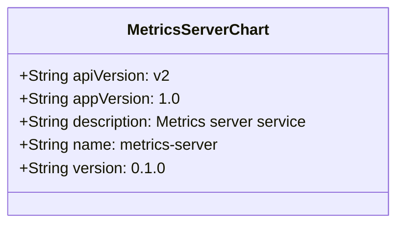
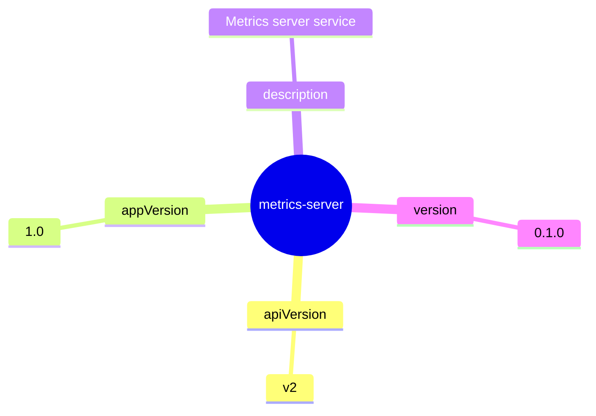
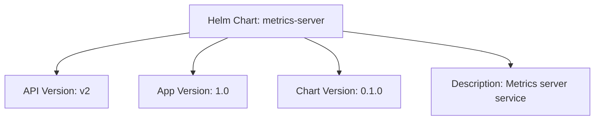

# Diagram: devops/k8s/metrics-server/helm/Chart.yaml

> Auto-generated by Obscura crawlers

## Diagram 1

### SVG

<svg id="container" width="412.8984375" xmlns="http://www.w3.org/2000/svg" class="classDiagram" height="232" viewBox="0 0 412.8984375 232" role="graphics-document document" aria-roledescription="class"><g><defs><marker id="container_class-aggregationStart" class="marker aggregation class" refX="18" refY="7" markerWidth="190" markerHeight="240" orient="auto"><path d="M 18,7 L9,13 L1,7 L9,1 Z"></path></marker></defs><defs><marker id="container_class-aggregationEnd" class="marker aggregation class" refX="1" refY="7" markerWidth="20" markerHeight="28" orient="auto"><path d="M 18,7 L9,13 L1,7 L9,1 Z"></path></marker></defs><defs><marker id="container_class-extensionStart" class="marker extension class" refX="18" refY="7" markerWidth="190" markerHeight="240" orient="auto"><path d="M 1,7 L18,13 V 1 Z"></path></marker></defs><defs><marker id="container_class-extensionEnd" class="marker extension class" refX="1" refY="7" markerWidth="20" markerHeight="28" orient="auto"><path d="M 1,1 V 13 L18,7 Z"></path></marker></defs><defs><marker id="container_class-compositionStart" class="marker composition class" refX="18" refY="7" markerWidth="190" markerHeight="240" orient="auto"><path d="M 18,7 L9,13 L1,7 L9,1 Z"></path></marker></defs><defs><marker id="container_class-compositionEnd" class="marker composition class" refX="1" refY="7" markerWidth="20" markerHeight="28" orient="auto"><path d="M 18,7 L9,13 L1,7 L9,1 Z"></path></marker></defs><defs><marker id="container_class-dependencyStart" class="marker dependency class" refX="6" refY="7" markerWidth="190" markerHeight="240" orient="auto"><path d="M 5,7 L9,13 L1,7 L9,1 Z"></path></marker></defs><defs><marker id="container_class-dependencyEnd" class="marker dependency class" refX="13" refY="7" markerWidth="20" markerHeight="28" orient="auto"><path d="M 18,7 L9,13 L14,7 L9,1 Z"></path></marker></defs><defs><marker id="container_class-lollipopStart" class="marker lollipop class" refX="13" refY="7" markerWidth="190" markerHeight="240" orient="auto"><circle stroke="black" fill="transparent" cx="7" cy="7" r="6"></circle></marker></defs><defs><marker id="container_class-lollipopEnd" class="marker lollipop class" refX="1" refY="7" markerWidth="190" markerHeight="240" orient="auto"><circle stroke="black" fill="transparent" cx="7" cy="7" r="6"></circle></marker></defs><g class="root"><g class="clusters"></g><g class="edgePaths"></g><g class="edgeLabels"></g><g class="nodes"><g class="node default" id="classId-MetricsServerChart-0" transform="translate(206.44921875, 116)"><g class="basic label-container"><path d="M-198.44921875 -108 L198.44921875 -108 L198.44921875 108 L-198.44921875 108" stroke="none" stroke-width="0" fill="#ECECFF" style=""></path><path d="M-198.44921875 -108 C-105.11497093974754 -108, -11.780723129495072 -108, 198.44921875 -108 M-198.44921875 -108 C-108.88295280832652 -108, -19.316686866653043 -108, 198.44921875 -108 M198.44921875 -108 C198.44921875 -36.72846364072332, 198.44921875 34.54307271855336, 198.44921875 108 M198.44921875 -108 C198.44921875 -59.002104280196406, 198.44921875 -10.004208560392811, 198.44921875 108 M198.44921875 108 C73.93160769394207 108, -50.58600336211586 108, -198.44921875 108 M198.44921875 108 C55.06084791122723 108, -88.32752292754554 108, -198.44921875 108 M-198.44921875 108 C-198.44921875 27.38574735273096, -198.44921875 -53.22850529453808, -198.44921875 -108 M-198.44921875 108 C-198.44921875 42.65724658759184, -198.44921875 -22.685506824816315, -198.44921875 -108" stroke="#9370DB" stroke-width="1.3" fill="none" stroke-dasharray="0 0" style=""></path></g><g class="annotation-group text" transform="translate(0, -84)"></g><g class="label-group text" transform="translate(-70.6328125, -84)"><g class="label" style="font-weight: bolder" transform="translate(0,-12)"><foreignObject width="141.265625" height="24">

MetricsServerChart

</foreignObject></g></g><g class="members-group text" transform="translate(-186.44921875, -36)"><g class="label" style="" transform="translate(0,-12)"><foreignObject width="154.765625" height="24">

+String apiVersion: v2

</foreignObject></g><g class="label" style="" transform="translate(0,12)"><foreignObject width="163.625" height="24">

+String appVersion: 1.0

</foreignObject></g><g class="label" style="" transform="translate(0,36)"><foreignObject width="302.265625" height="24">

+String description: Metrics server service

</foreignObject></g><g class="label" style="" transform="translate(0,60)"><foreignObject width="208.4375" height="24">

+String name: metrics-server

</foreignObject></g><g class="label" style="" transform="translate(0,84)"><foreignObject width="146.203125" height="24">

+String version: 0.1.0

</foreignObject></g></g><g class="methods-group text" transform="translate(-186.44921875, 108)"></g><g class="divider" style=""><path d="M-198.44921875 -60 C-45.65566491674417 -60, 107.13788891651166 -60, 198.44921875 -60 M-198.44921875 -60 C-53.40134150674112 -60, 91.64653573651776 -60, 198.44921875 -60" stroke="#9370DB" stroke-width="1.3" fill="none" stroke-dasharray="0 0" style=""></path></g><g class="divider" style=""><path d="M-198.44921875 84 C-82.85063678018427 84, 32.74794518963145 84, 198.44921875 84 M-198.44921875 84 C-75.51787515982679 84, 47.41346843034643 84, 198.44921875 84" stroke="#9370DB" stroke-width="1.3" fill="none" stroke-dasharray="0 0" style=""></path></g></g></g></g></g></svg>

## Diagram 2

### SVG

<svg id="container" width="100%" xmlns="http://www.w3.org/2000/svg" class="mindmapDiagram" style="max-width: 702.7803344726562px;" viewBox="5 5 702.7803344726562 495.32818603515625" role="graphics-document document" aria-roledescription="mindmap"><g><marker id="container_mindmap-pointEnd" class="marker mindmap" viewBox="0 0 10 10" refX="5" refY="5" markerUnits="userSpaceOnUse" markerWidth="8" markerHeight="8" orient="auto"><path d="M 0 0 L 10 5 L 0 10 z" class="arrowMarkerPath" style="stroke-width: 1; stroke-dasharray: 1, 0;"></path></marker><marker id="container_mindmap-pointStart" class="marker mindmap" viewBox="0 0 10 10" refX="4.5" refY="5" markerUnits="userSpaceOnUse" markerWidth="8" markerHeight="8" orient="auto"><path d="M 0 5 L 10 10 L 10 0 z" class="arrowMarkerPath" style="stroke-width: 1; stroke-dasharray: 1, 0;"></path></marker><g class="subgraphs"></g><g class="edgePaths"><path d="M364.541,267.545L364.065,276.17C363.589,284.795,362.638,302.045,361.687,319.296C360.736,336.546,359.785,353.797,359.309,362.422L358.834,371.047" id="edge_0_1" class="edge-thickness-normal edge-pattern-solid edge section-edge-0 edge-depth-1" style="undefined;;;undefined" data-edge="true" data-et="edge" data-id="edge_0_1" data-points="W3sieCI6MzY0LjU0MDYwNTcwNDA3OTksInkiOjI2Ny41NDQ1OTA5Mjk1MTcyNn0seyJ4IjozNjEuNjg3MjA2Nzk1ODY5LCJ5IjozMTkuMjk1NzYxMTk3Nzk5ODN9LHsieCI6MzU4LjgzMzgwNzg4NzY1ODA1LCJ5IjozNzEuMDQ2OTMxNDY2MDgyNH1d"></path><path d="M356.922,400.985L356.575,405.767C356.227,410.549,355.533,420.112,354.838,429.676C354.144,439.24,353.45,448.804,353.102,453.586L352.755,458.368" id="edge_1_2" class="edge-thickness-normal edge-pattern-solid edge section-edge-0 edge-depth-3" style="undefined;;;undefined" data-edge="true" data-et="edge" data-id="edge_1_2" data-points="W3sieCI6MzU2LjkyMTczNDkwNjkwNjM1LCJ5Ijo0MDAuOTg0Nzk4MDA4MzE1NH0seyJ4IjozNTQuODM4NDg1NjM2MjMyOSwieSI6NDI5LjY3NjE3Mzk0OTg4NDZ9LHsieCI6MzUyLjc1NTIzNjM2NTU1OTUsInkiOjQ1OC4zNjc1NDk4OTE0NTM4NX1d"></path><path d="M350.381,253.233L338.105,253.779C325.828,254.324,301.276,255.415,276.723,256.506C252.17,257.597,227.617,258.688,215.341,259.234L203.064,259.779" id="edge_0_3" class="edge-thickness-normal edge-pattern-solid edge section-edge-1 edge-depth-1" style="undefined;;;undefined" data-edge="true" data-et="edge" data-id="edge_0_3" data-points="W3sieCI6MzUwLjM4MTE5MDQ3MDIzNzQ3LCJ5IjoyNTMuMjMzMTg0ODc2NDI3ODZ9LHsieCI6Mjc2LjcyMjcwOTAxMjkyMjk2LCJ5IjoyNTYuNTA2MDg3NTMyMDU3MTd9LHsieCI6MjAzLjA2NDIyNzU1NTYwODQ1LCJ5IjoyNTkuNzc4OTkwMTg3Njg2NX1d"></path><path d="M173.295,262.979L163.815,264.603C154.336,266.228,135.377,269.477,116.418,272.726C97.46,275.975,78.501,279.224,69.022,280.848L59.542,282.473" id="edge_3_4" class="edge-thickness-normal edge-pattern-solid edge section-edge-1 edge-depth-3" style="undefined;;;undefined" data-edge="true" data-et="edge" data-id="edge_3_4" data-points="W3sieCI6MTczLjI5NDU0NTQzNTk5NzUsInkiOjI2Mi45Nzg1MTEzNTIxMjAwNX0seyJ4IjoxMTYuNDE4NDEyODM1NzEwMzQsInkiOjI3Mi43MjU2MTE1ODE1Nzk4fSx7IngiOjU5LjU0MjI4MDIzNTQyMzE5LCJ5IjoyODIuNDcyNzExODExMDM5Nn1d"></path><path d="M364.594,237.587L364.151,228.987C363.707,220.386,362.82,203.184,361.933,185.983C361.046,168.782,360.159,151.58,359.716,142.98L359.272,134.379" id="edge_0_5" class="edge-thickness-normal edge-pattern-solid edge section-edge-2 edge-depth-1" style="undefined;;;undefined" data-edge="true" data-et="edge" data-id="edge_0_5" data-points="W3sieCI6MzY0LjU5Mzk4NDUyNDU2MzI3LCJ5IjoyMzcuNTg3MjQwNjI4MDQ4MjV9LHsieCI6MzYxLjkzMzExMzcyNzEzNTE1LCJ5IjoxODUuOTgzMDczMTgxNDgxMn0seyJ4IjozNTkuMjcyMjQyOTI5NzA3MDMsInkiOjEzNC4zNzg5MDU3MzQ5MTQxM31d"></path><path d="M357.515,104.431L357.2,99.643C356.885,94.854,356.255,85.277,355.625,75.699C354.995,66.122,354.365,56.545,354.05,51.756L353.735,46.968" id="edge_5_6" class="edge-thickness-normal edge-pattern-solid edge section-edge-2 edge-depth-3" style="undefined;;;undefined" data-edge="true" data-et="edge" data-id="edge_5_6" data-points="W3sieCI6MzU3LjUxNTI1OTczMjU3MTIsInkiOjEwNC40MzExNTM3MjEwMzI4Nn0seyJ4IjozNTUuNjI1MzAzMTM0NDMwMywieSI6NzUuNjk5NDAzMzU0MzY5NDV9LHsieCI6MzUzLjczNTM0NjUzNjI4OTM0LCJ5Ijo0Ni45Njc2NTI5ODc3MDYwNDZ9XQ=="></path><path d="M380.35,253.26L391.428,253.772C402.506,254.284,424.662,255.308,446.819,256.332C468.975,257.357,491.131,258.381,502.209,258.893L513.287,259.405" id="edge_0_7" class="edge-thickness-normal edge-pattern-solid edge section-edge-3 edge-depth-1" style="undefined;;;undefined" data-edge="true" data-et="edge" data-id="edge_0_7" data-points="W3sieCI6MzgwLjM1MDQwNTIzODM5NjEsInkiOjI1My4yNTk5NjY4OTM5MTQ0NX0seyJ4Ijo0NDYuODE4NTI2MDQ2NTIzOTcsInkiOjI1Ni4zMzI0MTk1MDA4OTg1fSx7IngiOjUxMy4yODY2NDY4NTQ2NTE4LCJ5IjoyNTkuNDA0ODcyMTA3ODgyNX1d"></path><path d="M542.985,263.009L551.722,264.738C560.458,266.467,577.931,269.924,595.404,273.382C612.877,276.839,630.35,280.297,639.087,282.026L647.823,283.754" id="edge_7_8" class="edge-thickness-normal edge-pattern-solid edge section-edge-3 edge-depth-3" style="undefined;;;undefined" data-edge="true" data-et="edge" data-id="edge_7_8" data-points="W3sieCI6NTQyLjk4NTMyOTA3MDMzNjEsInkiOjI2My4wMDkyMjM2ODA1ODM0M30seyJ4Ijo1OTUuNDA0MzkzNzYzNzQ5NiwieSI6MjczLjM4MTg0Nzk3MDE4OH0seyJ4Ijo2NDcuODIzNDU4NDU3MTYzLCJ5IjoyODMuNzU0NDcyMjU5NzkyNn1d"></path></g><g class="edgeLabels"><g class="edgeLabel"><g class="label" data-id="edge_0_1" transform="translate(0, 0)"><foreignObject width="0" height="0">

</foreignObject></g></g><g class="edgeLabel"><g class="label" data-id="edge_1_2" transform="translate(0, 0)"><foreignObject width="0" height="0">

</foreignObject></g></g><g class="edgeLabel"><g class="label" data-id="edge_0_3" transform="translate(0, 0)"><foreignObject width="0" height="0">

</foreignObject></g></g><g class="edgeLabel"><g class="label" data-id="edge_3_4" transform="translate(0, 0)"><foreignObject width="0" height="0">

</foreignObject></g></g><g class="edgeLabel"><g class="label" data-id="edge_0_5" transform="translate(0, 0)"><foreignObject width="0" height="0">

</foreignObject></g></g><g class="edgeLabel"><g class="label" data-id="edge_5_6" transform="translate(0, 0)"><foreignObject width="0" height="0">

</foreignObject></g></g><g class="edgeLabel"><g class="label" data-id="edge_0_7" transform="translate(0, 0)"><foreignObject width="0" height="0">

</foreignObject></g></g><g class="edgeLabel"><g class="label" data-id="edge_7_8" transform="translate(0, 0)"><foreignObject width="0" height="0">

</foreignObject></g></g></g><g class="nodes"><g class="node mindmap-node section-root section--1" id="node_0" transform="translate(365.36640485442524, 252.56733965422347)"><circle class="basic label-container" style="" r="62.6953125" cx="0" cy="0"></circle><g class="label" style="" transform="translate(-52.6953125, -12)"><rect></rect><foreignObject width="105.390625" height="24">

metrics-server

</foreignObject></g></g><g class="node mindmap-node section-0" id="node_1" transform="translate(358.0080087373127, 386.0241827413762)"><path id="node-1" class="node-bkg node-0" style="" d="M-58.2890625 12
    v-24
    q0,-5 5,-5
    h106.578125
    q5,0 5,5
    v24
    q0,5 -5,5
    h-106.578125
    q-5,0 -5,-5
    Z"></path><line class="node-line-" x1="-58.2890625" y1="17" x2="58.2890625" y2="17"></line><g class="label" style="" transform="translate(-38.2890625, -12)"><rect></rect><foreignObject width="76.578125" height="24">

apiVersion

</foreignObject></g></g><g class="node mindmap-node section-0" id="node_2" transform="translate(351.6689625351531, 473.32816515839306)"><path id="node-2" class="node-bkg node-0" style="" d="M-27.8203125 12
    v-24
    q0,-5 5,-5
    h45.640625
    q5,0 5,5
    v24
    q0,5 -5,5
    h-45.640625
    q-5,0 -5,-5
    Z"></path><line class="node-line-" x1="-27.8203125" y1="17" x2="27.8203125" y2="17"></line><g class="label" style="" transform="translate(-7.8203125, -12)"><rect></rect><foreignObject width="15.640625" height="24">

v2

</foreignObject></g></g><g class="node mindmap-node section-1" id="node_3" transform="translate(188.07901317142068, 260.44483540989086)"><path id="node-3" class="node-bkg node-0" style="" d="M-60.7890625 12
    v-24
    q0,-5 5,-5
    h111.578125
    q5,0 5,5
    v24
    q0,5 -5,5
    h-111.578125
    q-5,0 -5,-5
    Z"></path><line class="node-line-" x1="-60.7890625" y1="17" x2="60.7890625" y2="17"></line><g class="label" style="" transform="translate(-40.7890625, -12)"><rect></rect><foreignObject width="81.578125" height="24">

appVersion

</foreignObject></g></g><g class="node mindmap-node section-1" id="node_4" transform="translate(44.7578125, 285.00638775326877)"><path id="node-4" class="node-bkg node-0" style="" d="M-29.7578125 12
    v-24
    q0,-5 5,-5
    h49.515625
    q5,0 5,5
    v24
    q0,5 -5,5
    h-49.515625
    q-5,0 -5,-5
    Z"></path><line class="node-line-" x1="-29.7578125" y1="17" x2="29.7578125" y2="17"></line><g class="label" style="" transform="translate(-9.7578125, -12)"><rect></rect><foreignObject width="19.515625" height="24">

1.0

</foreignObject></g></g><g class="node mindmap-node section-2" id="node_5" transform="translate(358.49982259984506, 119.3988067087389)"><path id="node-5" class="node-bkg node-0" style="" d="M-61.3046875 12
    v-24
    q0,-5 5,-5
    h112.609375
    q5,0 5,5
    v24
    q0,5 -5,5
    h-112.609375
    q-5,0 -5,-5
    Z"></path><line class="node-line-" x1="-61.3046875" y1="17" x2="61.3046875" y2="17"></line><g class="label" style="" transform="translate(-41.3046875, -12)"><rect></rect><foreignObject width="82.609375" height="24">

description

</foreignObject></g></g><g class="node mindmap-node section-2" id="node_6" transform="translate(352.7507836690155, 32)"><path id="node-6" class="node-bkg node-0" style="" d="M-98.5546875 12
    v-24
    q0,-5 5,-5
    h187.109375
    q5,0 5,5
    v24
    q0,5 -5,5
    h-187.109375
    q-5,0 -5,-5
    Z"></path><line class="node-line-" x1="-98.5546875" y1="17" x2="98.5546875" y2="17"></line><g class="label" style="" transform="translate(-78.5546875, -12)"><rect></rect><foreignObject width="157.109375" height="24">

Metrics server service

</foreignObject></g></g><g class="node mindmap-node section-3" id="node_7" transform="translate(528.2706472386227, 260.0974993475735)"><path id="node-7" class="node-bkg node-0" style="" d="M-46.5859375 12
    v-24
    q0,-5 5,-5
    h83.171875
    q5,0 5,5
    v24
    q0,5 -5,5
    h-83.171875
    q-5,0 -5,-5
    Z"></path><line class="node-line-" x1="-46.5859375" y1="17" x2="46.5859375" y2="17"></line><g class="label" style="" transform="translate(-26.5859375, -12)"><rect></rect><foreignObject width="53.171875" height="24">

version

</foreignObject></g></g><g class="node mindmap-node section-3" id="node_8" transform="translate(662.5381402888764, 286.6661965928025)"><path id="node-8" class="node-bkg node-0" style="" d="M-35.2421875 12
    v-24
    q0,-5 5,-5
    h60.484375
    q5,0 5,5
    v24
    q0,5 -5,5
    h-60.484375
    q-5,0 -5,-5
    Z"></path><line class="node-line-" x1="-35.2421875" y1="17" x2="35.2421875" y2="17"></line><g class="label" style="" transform="translate(-15.2421875, -12)"><rect></rect><foreignObject width="30.484375" height="24">

0.1.0

</foreignObject></g></g></g></g></svg>

## Diagram 3

### SVG

<svg id="container" width="960.359375" xmlns="http://www.w3.org/2000/svg" class="flowchart" height="198" viewBox="0 0 960.359375 198" role="graphics-document document" aria-roledescription="flowchart-v2"><g><marker id="container_flowchart-v2-pointEnd" class="marker flowchart-v2" viewBox="0 0 10 10" refX="5" refY="5" markerUnits="userSpaceOnUse" markerWidth="8" markerHeight="8" orient="auto"><path d="M 0 0 L 10 5 L 0 10 z" class="arrowMarkerPath" style="stroke-width: 1; stroke-dasharray: 1, 0;"></path></marker><marker id="container_flowchart-v2-pointStart" class="marker flowchart-v2" viewBox="0 0 10 10" refX="4.5" refY="5" markerUnits="userSpaceOnUse" markerWidth="8" markerHeight="8" orient="auto"><path d="M 0 5 L 10 10 L 10 0 z" class="arrowMarkerPath" style="stroke-width: 1; stroke-dasharray: 1, 0;"></path></marker><marker id="container_flowchart-v2-circleEnd" class="marker flowchart-v2" viewBox="0 0 10 10" refX="11" refY="5" markerUnits="userSpaceOnUse" markerWidth="11" markerHeight="11" orient="auto"><circle cx="5" cy="5" r="5" class="arrowMarkerPath" style="stroke-width: 1; stroke-dasharray: 1, 0;"></circle></marker><marker id="container_flowchart-v2-circleStart" class="marker flowchart-v2" viewBox="0 0 10 10" refX="-1" refY="5" markerUnits="userSpaceOnUse" markerWidth="11" markerHeight="11" orient="auto"><circle cx="5" cy="5" r="5" class="arrowMarkerPath" style="stroke-width: 1; stroke-dasharray: 1, 0;"></circle></marker><marker id="container_flowchart-v2-crossEnd" class="marker cross flowchart-v2" viewBox="0 0 11 11" refX="12" refY="5.2" markerUnits="userSpaceOnUse" markerWidth="11" markerHeight="11" orient="auto"><path d="M 1,1 l 9,9 M 10,1 l -9,9" class="arrowMarkerPath" style="stroke-width: 2; stroke-dasharray: 1, 0;"></path></marker><marker id="container_flowchart-v2-crossStart" class="marker cross flowchart-v2" viewBox="0 0 11 11" refX="-1" refY="5.2" markerUnits="userSpaceOnUse" markerWidth="11" markerHeight="11" orient="auto"><path d="M 1,1 l 9,9 M 10,1 l -9,9" class="arrowMarkerPath" style="stroke-width: 2; stroke-dasharray: 1, 0;"></path></marker><g class="root"><g class="clusters"></g><g class="edgePaths"><path d="M299.973,54.656L265.061,60.046C230.148,65.437,160.324,76.219,125.412,87.109C90.5,98,90.5,109,90.5,114.5L90.5,120" id="L_A_B_0" class="edge-thickness-normal edge-pattern-solid edge-thickness-normal edge-pattern-solid flowchart-link" style=";" data-edge="true" data-et="edge" data-id="L_A_B_0" data-points="W3sieCI6Mjk5Ljk3MjY1NjI1LCJ5Ijo1NC42NTU2ODk5NzcxNDk2Mn0seyJ4Ijo5MC41LCJ5Ijo4N30seyJ4Ijo5MC41LCJ5IjoxMjR9XQ==" marker-end="url(#container_flowchart-v2-pointEnd)"></path><path d="M366.343,62L356.941,66.167C347.539,70.333,328.734,78.667,319.332,88.333C309.93,98,309.93,109,309.93,114.5L309.93,120" id="L_A_C_0" class="edge-thickness-normal edge-pattern-solid edge-thickness-normal edge-pattern-solid flowchart-link" style=";" data-edge="true" data-et="edge" data-id="L_A_C_0" data-points="W3sieCI6MzY2LjM0MzA3MzkxODI2OTIsInkiOjYyfSx7IngiOjMwOS45Mjk2ODc1LCJ5Ijo4N30seyJ4IjozMDkuOTI5Njg3NSwieSI6MTI0fV0=" marker-end="url(#container_flowchart-v2-pointEnd)"></path><path d="M488.196,62L497.598,66.167C507,70.333,525.805,78.667,535.207,88.333C544.609,98,544.609,109,544.609,114.5L544.609,120" id="L_A_D_0" class="edge-thickness-normal edge-pattern-solid edge-thickness-normal edge-pattern-solid flowchart-link" style=";" data-edge="true" data-et="edge" data-id="L_A_D_0" data-points="W3sieCI6NDg4LjE5NTk4ODU4MTczMDgsInkiOjYyfSx7IngiOjU0NC42MDkzNzUsInkiOjg3fSx7IngiOjU0NC42MDkzNzUsInkiOjEyNH1d" marker-end="url(#container_flowchart-v2-pointEnd)"></path><path d="M554.566,51.754L599.199,57.629C643.831,63.503,733.095,75.251,777.727,84.626C822.359,94,822.359,101,822.359,104.5L822.359,108" id="L_A_E_0" class="edge-thickness-normal edge-pattern-solid edge-thickness-normal edge-pattern-solid flowchart-link" style=";" data-edge="true" data-et="edge" data-id="L_A_E_0" data-points="W3sieCI6NTU0LjU2NjQwNjI1LCJ5Ijo1MS43NTQyNTg4MjE2NjgzM30seyJ4Ijo4MjIuMzU5Mzc1LCJ5Ijo4N30seyJ4Ijo4MjIuMzU5Mzc1LCJ5IjoxMTJ9XQ==" marker-end="url(#container_flowchart-v2-pointEnd)"></path></g><g class="edgeLabels"><g class="edgeLabel"><g class="label" data-id="L_A_B_0" transform="translate(0, 0)"><foreignObject width="0" height="0">

</foreignObject></g></g><g class="edgeLabel"><g class="label" data-id="L_A_C_0" transform="translate(0, 0)"><foreignObject width="0" height="0">

</foreignObject></g></g><g class="edgeLabel"><g class="label" data-id="L_A_D_0" transform="translate(0, 0)"><foreignObject width="0" height="0">

</foreignObject></g></g><g class="edgeLabel"><g class="label" data-id="L_A_E_0" transform="translate(0, 0)"><foreignObject width="0" height="0">

</foreignObject></g></g></g><g class="nodes"><g class="node default" id="flowchart-A-0" transform="translate(427.26953125, 35)"><rect class="basic label-container" style="" x="-127.296875" y="-27" width="254.59375" height="54"></rect><g class="label" style="" transform="translate(-97.296875, -12)"><rect></rect><foreignObject width="194.59375" height="24">

Helm Chart: metrics-server

</foreignObject></g></g><g class="node default" id="flowchart-B-1" transform="translate(90.5, 151)"><rect class="basic label-container" style="" x="-82.5" y="-27" width="165" height="54"></rect><g class="label" style="" transform="translate(-52.5, -12)"><rect></rect><foreignObject width="105" height="24">

API Version: v2

</foreignObject></g></g><g class="node default" id="flowchart-C-3" transform="translate(309.9296875, 151)"><rect class="basic label-container" style="" x="-86.9296875" y="-27" width="173.859375" height="54"></rect><g class="label" style="" transform="translate(-56.9296875, -12)"><rect></rect><foreignObject width="113.859375" height="24">

App Version: 1.0

</foreignObject></g></g><g class="node default" id="flowchart-D-5" transform="translate(544.609375, 151)"><rect class="basic label-container" style="" x="-97.75" y="-27" width="195.5" height="54"></rect><g class="label" style="" transform="translate(-67.75, -12)"><rect></rect><foreignObject width="135.5" height="24">

Chart Version: 0.1.0

</foreignObject></g></g><g class="node default" id="flowchart-E-7" transform="translate(822.359375, 151)"><rect class="basic label-container" style="" x="-130" y="-39" width="260" height="78"></rect><g class="label" style="" transform="translate(-100, -24)"><rect></rect><foreignObject width="200" height="48">

Description: Metrics server service

</foreignObject></g></g></g></g></g></svg>
