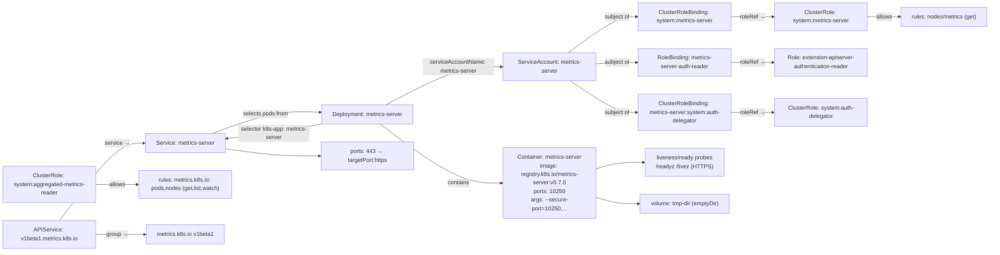

# Diagram: devops/k8s/metrics-server/helm/templates/components.yaml

> Auto-generated by Obscura crawlers

## Mermaid

### SVG

<svg id="container" width="2781.859375" xmlns="http://www.w3.org/2000/svg" class="flowchart" height="728" viewBox="0 0 2781.859375 728" role="graphics-document document" aria-roledescription="flowchart-v2"><g><marker id="container_flowchart-v2-pointEnd" class="marker flowchart-v2" viewBox="0 0 10 10" refX="5" refY="5" markerUnits="userSpaceOnUse" markerWidth="8" markerHeight="8" orient="auto"><path d="M 0 0 L 10 5 L 0 10 z" class="arrowMarkerPath" style="stroke-width: 1; stroke-dasharray: 1, 0;"></path></marker><marker id="container_flowchart-v2-pointStart" class="marker flowchart-v2" viewBox="0 0 10 10" refX="4.5" refY="5" markerUnits="userSpaceOnUse" markerWidth="8" markerHeight="8" orient="auto"><path d="M 0 5 L 10 10 L 10 0 z" class="arrowMarkerPath" style="stroke-width: 1; stroke-dasharray: 1, 0;"></path></marker><marker id="container_flowchart-v2-circleEnd" class="marker flowchart-v2" viewBox="0 0 10 10" refX="11" refY="5" markerUnits="userSpaceOnUse" markerWidth="11" markerHeight="11" orient="auto"><circle cx="5" cy="5" r="5" class="arrowMarkerPath" style="stroke-width: 1; stroke-dasharray: 1, 0;"></circle></marker><marker id="container_flowchart-v2-circleStart" class="marker flowchart-v2" viewBox="0 0 10 10" refX="-1" refY="5" markerUnits="userSpaceOnUse" markerWidth="11" markerHeight="11" orient="auto"><circle cx="5" cy="5" r="5" class="arrowMarkerPath" style="stroke-width: 1; stroke-dasharray: 1, 0;"></circle></marker><marker id="container_flowchart-v2-crossEnd" class="marker cross flowchart-v2" viewBox="0 0 11 11" refX="12" refY="5.2" markerUnits="userSpaceOnUse" markerWidth="11" markerHeight="11" orient="auto"><path d="M 1,1 l 9,9 M 10,1 l -9,9" class="arrowMarkerPath" style="stroke-width: 2; stroke-dasharray: 1, 0;"></path></marker><marker id="container_flowchart-v2-crossStart" class="marker cross flowchart-v2" viewBox="0 0 11 11" refX="-1" refY="5.2" markerUnits="userSpaceOnUse" markerWidth="11" markerHeight="11" orient="auto"><path d="M 1,1 l 9,9 M 10,1 l -9,9" class="arrowMarkerPath" style="stroke-width: 2; stroke-dasharray: 1, 0;"></path></marker><g class="root"><g class="clusters"></g><g class="edgePaths"><path d="M1590.641,226L1613.598,242.833C1636.555,259.667,1682.469,293.333,1714.914,310.167C1747.359,327,1766.336,327,1775.824,327L1785.313,327" id="L_SA_CRB1_0" class="edge-thickness-normal edge-pattern-solid edge-thickness-normal edge-pattern-solid flowchart-link" style=";" data-edge="true" data-et="edge" data-id="L_SA_CRB1_0" data-points="W3sieCI6MTU5MC42NDA2ODA4MDM1NzE1LCJ5IjoyMjZ9LHsieCI6MTcyOC4zODI4MTI1LCJ5IjozMjd9LHsieCI6MTc4OS4zMTI1LCJ5IjozMjd9XQ==" marker-end="url(#container_flowchart-v2-pointEnd)"></path><path d="M1590.641,148L1613.598,131.167C1636.555,114.333,1682.469,80.667,1714.914,63.833C1747.359,47,1766.336,47,1775.824,47L1785.313,47" id="L_SA_CRB2_0" class="edge-thickness-normal edge-pattern-solid edge-thickness-normal edge-pattern-solid flowchart-link" style=";" data-edge="true" data-et="edge" data-id="L_SA_CRB2_0" data-points="W3sieCI6MTU5MC42NDA2ODA4MDM1NzE1LCJ5IjoxNDh9LHsieCI6MTcyOC4zODI4MTI1LCJ5Ijo0N30seyJ4IjoxNzg5LjMxMjUsInkiOjQ3fV0=" marker-end="url(#container_flowchart-v2-pointEnd)"></path><path d="M1667.453,178.829L1677.608,178.191C1687.763,177.553,1708.073,176.276,1727.716,175.638C1747.359,175,1766.336,175,1775.824,175L1785.313,175" id="L_SA_RB_0" class="edge-thickness-normal edge-pattern-solid edge-thickness-normal edge-pattern-solid flowchart-link" style=";" data-edge="true" data-et="edge" data-id="L_SA_RB_0" data-points="W3sieCI6MTY2Ny40NTMxMjUsInkiOjE3OC44Mjk0NTI5MjM2MDU3MX0seyJ4IjoxNzI4LjM4MjgxMjUsInkiOjE3NX0seyJ4IjoxNzg5LjMxMjUsInkiOjE3NX1d" marker-end="url(#container_flowchart-v2-pointEnd)"></path><path d="M2049.313,327L2059.357,327C2069.401,327,2089.49,327,2108.911,327C2128.333,327,2147.089,327,2156.466,327L2165.844,327" id="L_CRB1_system_auth_delegator_0" class="edge-thickness-normal edge-pattern-solid edge-thickness-normal edge-pattern-solid flowchart-link" style=";" data-edge="true" data-et="edge" data-id="L_CRB1_system_auth_delegator_0" data-points="W3sieCI6MjA0OS4zMTI1LCJ5IjozMjd9LHsieCI6MjEwOS41NzgxMjUsInkiOjMyN30seyJ4IjoyMTY5Ljg0Mzc1LCJ5IjozMjd9XQ==" marker-end="url(#container_flowchart-v2-pointEnd)"></path><path d="M2049.313,47L2059.357,47C2069.401,47,2089.49,47,2108.911,47C2128.333,47,2147.089,47,2156.466,47L2165.844,47" id="L_CRB2_CR1_0" class="edge-thickness-normal edge-pattern-solid edge-thickness-normal edge-pattern-solid flowchart-link" style=";" data-edge="true" data-et="edge" data-id="L_CRB2_CR1_0" data-points="W3sieCI6MjA0OS4zMTI1LCJ5Ijo0N30seyJ4IjoyMTA5LjU3ODEyNSwieSI6NDd9LHsieCI6MjE2OS44NDM3NSwieSI6NDd9XQ==" marker-end="url(#container_flowchart-v2-pointEnd)"></path><path d="M2049.313,175L2059.357,175C2069.401,175,2089.49,175,2108.911,175C2128.333,175,2147.089,175,2156.466,175L2165.844,175" id="L_RB_RoleExt_0" class="edge-thickness-normal edge-pattern-solid edge-thickness-normal edge-pattern-solid flowchart-link" style=";" data-edge="true" data-et="edge" data-id="L_RB_RoleExt_0" data-points="W3sieCI6MjA0OS4zMTI1LCJ5IjoxNzV9LHsieCI6MjEwOS41NzgxMjUsInkiOjE3NX0seyJ4IjoyMTY5Ljg0Mzc1LCJ5IjoxNzV9XQ==" marker-end="url(#container_flowchart-v2-pointEnd)"></path><path d="M2429.844,47L2437.855,47C2445.867,47,2461.891,47,2477.247,47C2492.604,47,2507.294,47,2514.639,47L2521.984,47" id="L_CR1_RulesCR1_0" class="edge-thickness-normal edge-pattern-solid edge-thickness-normal edge-pattern-solid flowchart-link" style=";" data-edge="true" data-et="edge" data-id="L_CR1_RulesCR1_0" data-points="W3sieCI6MjQyOS44NDM3NSwieSI6NDd9LHsieCI6MjQ3Ny45MTQwNjI1LCJ5Ijo0N30seyJ4IjoyNTI1Ljk4NDM3NSwieSI6NDd9XQ==" marker-end="url(#container_flowchart-v2-pointEnd)"></path><path d="M268,541L277.954,541C287.909,541,307.818,541,327.06,541C346.302,541,364.878,541,374.165,541L383.453,541" id="L_CR2_RulesCR2_0" class="edge-thickness-normal edge-pattern-solid edge-thickness-normal edge-pattern-solid flowchart-link" style=";" data-edge="true" data-et="edge" data-id="L_CR2_RulesCR2_0" data-points="W3sieCI6MjY4LCJ5Ijo1NDF9LHsieCI6MzI3LjcyNjU2MjUsInkiOjU0MX0seyJ4IjozODcuNDUzMTI1LCJ5Ijo1NDF9XQ==" marker-end="url(#container_flowchart-v2-pointEnd)"></path><path d="M1092.881,300L1124.476,281.167C1156.072,262.333,1219.262,224.667,1271.024,205.833C1322.786,187,1363.12,187,1383.286,187L1403.453,187" id="L_Deploy_SA_0" class="edge-thickness-normal edge-pattern-solid edge-thickness-normal edge-pattern-solid flowchart-link" style=";" data-edge="true" data-et="edge" data-id="L_Deploy_SA_0" data-points="W3sieCI6MTA5Mi44ODA3NTY1Nzg5NDczLCJ5IjozMDB9LHsieCI6MTI4Mi40NTMxMjUsInkiOjE4N30seyJ4IjoxNDA3LjQ1MzEyNSwieSI6MTg3fV0=" marker-end="url(#container_flowchart-v2-pointEnd)"></path><path d="M1073.495,378L1108.321,407.5C1143.148,437,1212.8,496,1267.793,525.5C1322.786,555,1363.12,555,1383.286,555L1403.453,555" id="L_Deploy_Container_0" class="edge-thickness-normal edge-pattern-solid edge-thickness-normal edge-pattern-solid flowchart-link" style=";" data-edge="true" data-et="edge" data-id="L_Deploy_Container_0" data-points="W3sieCI6MTA3My40OTQ3OTE2NjY2NjY3LCJ5IjozNzh9LHsieCI6MTI4Mi40NTMxMjUsInkiOjU1NX0seyJ4IjoxNDA3LjQ1MzEyNSwieSI6NTU1fV0=" marker-end="url(#container_flowchart-v2-pointEnd)"></path><path d="M1667.453,511.424L1677.608,508.02C1687.763,504.616,1708.073,497.808,1727.716,494.404C1747.359,491,1766.336,491,1775.824,491L1785.313,491" id="L_Container_Probes_0" class="edge-thickness-normal edge-pattern-solid edge-thickness-normal edge-pattern-solid flowchart-link" style=";" data-edge="true" data-et="edge" data-id="L_Container_Probes_0" data-points="W3sieCI6MTY2Ny40NTMxMjUsInkiOjUxMS40MjM3NDg5MjU4OTcxNH0seyJ4IjoxNzI4LjM4MjgxMjUsInkiOjQ5MX0seyJ4IjoxNzg5LjMxMjUsInkiOjQ5MX1d" marker-end="url(#container_flowchart-v2-pointEnd)"></path><path d="M1667.453,598.576L1677.608,601.98C1687.763,605.384,1708.073,612.192,1727.844,615.596C1747.615,619,1766.846,619,1776.462,619L1786.078,619" id="L_Container_Volumes_0" class="edge-thickness-normal edge-pattern-solid edge-thickness-normal edge-pattern-solid flowchart-link" style=";" data-edge="true" data-et="edge" data-id="L_Container_Volumes_0" data-points="W3sieCI6MTY2Ny40NTMxMjUsInkiOjU5OC41NzYyNTEwNzQxMDI5fSx7IngiOjE3MjguMzgyODEyNSwieSI6NjE5fSx7IngiOjE3OTAuMDc4MTI1LCJ5Ijo2MTl9XQ==" marker-end="url(#container_flowchart-v2-pointEnd)"></path><path d="M897.453,360.412L876.62,363.843C855.786,367.275,814.12,374.137,770.236,381.546C726.353,388.955,680.253,396.909,657.203,400.886L634.153,404.864" id="L_Deploy_Svc_0" class="edge-thickness-normal edge-pattern-solid edge-thickness-normal edge-pattern-solid flowchart-link" style=";" data-edge="true" data-et="edge" data-id="L_Deploy_Svc_0" data-points="W3sieCI6ODk3LjQ1MzEyNSwieSI6MzYwLjQxMTc2NDcwNTg4MjR9LHsieCI6NzcyLjQ1MzEyNSwieSI6MzgxfSx7IngiOjYzMC4yMTA5Mzc1LCJ5Ijo0MDUuNTQzNzV9XQ==" marker-end="url(#container_flowchart-v2-pointEnd)"></path><path d="M577.848,398L610.282,383.5C642.716,369,707.585,340,760.19,327.715C812.794,315.43,853.136,319.859,873.306,322.074L893.477,324.289" id="L_Svc_Deploy_0" class="edge-thickness-normal edge-pattern-solid edge-thickness-normal edge-pattern-solid flowchart-link" style=";" data-edge="true" data-et="edge" data-id="L_Svc_Deploy_0" data-points="W3sieCI6NTc3Ljg0Nzg2MTg0MjEwNTIsInkiOjM5OH0seyJ4Ijo3NzIuNDUzMTI1LCJ5IjozMTF9LHsieCI6ODk3LjQ1MzEyNSwieSI6MzI0LjcyNTQ5MDE5NjA3ODQ1fV0=" marker-end="url(#container_flowchart-v2-pointEnd)"></path><path d="M630.211,443.572L653.918,447.477C677.625,451.381,725.039,459.191,768.913,463.095C812.786,467,853.12,467,873.286,467L893.453,467" id="L_Svc_ServicePorts_0" class="edge-thickness-normal edge-pattern-solid edge-thickness-normal edge-pattern-solid flowchart-link" style=";" data-edge="true" data-et="edge" data-id="L_Svc_ServicePorts_0" data-points="W3sieCI6NjMwLjIxMDkzNzUsInkiOjQ0My41NzE4NzV9LHsieCI6NzcyLjQ1MzEyNSwieSI6NDY3fSx7IngiOjg5Ny40NTMxMjUsInkiOjQ2N31d" marker-end="url(#container_flowchart-v2-pointEnd)"></path><path d="M166.904,642L193.707,605.833C220.511,569.667,274.119,497.333,313.084,461.167C352.049,425,376.372,425,388.534,425L400.695,425" id="L_API_Svc_0" class="edge-thickness-normal edge-pattern-solid edge-thickness-normal edge-pattern-solid flowchart-link" style=";" data-edge="true" data-et="edge" data-id="L_API_Svc_0" data-points="W3sieCI6MTY2LjkwMzY1NjAwNTg1OTM4LCJ5Ijo2NDJ9LHsieCI6MzI3LjcyNjU2MjUsInkiOjQyNX0seyJ4Ijo0MDQuNjk1MzEyNSwieSI6NDI1fV0=" marker-end="url(#container_flowchart-v2-pointEnd)"></path><path d="M268,681L277.954,681C287.909,681,307.818,681,330.577,681C353.336,681,378.945,681,391.75,681L404.555,681" id="L_API_metrics_k8s_io_0" class="edge-thickness-normal edge-pattern-solid edge-thickness-normal edge-pattern-solid flowchart-link" style=";" data-edge="true" data-et="edge" data-id="L_API_metrics_k8s_io_0" data-points="W3sieCI6MjY4LCJ5Ijo2ODF9LHsieCI6MzI3LjcyNjU2MjUsInkiOjY4MX0seyJ4Ijo0MDguNTU0Njg3NSwieSI6NjgxfV0=" marker-end="url(#container_flowchart-v2-pointEnd)"></path></g><g class="edgeLabels"><g class="edgeLabel" transform="translate(1728.3828125, 327)"><g class="label" data-id="L_SA_CRB1_0" transform="translate(-35.9296875, -12)"><foreignObject width="71.859375" height="24">

subject of

</foreignObject></g></g><g class="edgeLabel" transform="translate(1728.3828125, 47)"><g class="label" data-id="L_SA_CRB2_0" transform="translate(-35.9296875, -12)"><foreignObject width="71.859375" height="24">

subject of

</foreignObject></g></g><g class="edgeLabel" transform="translate(1728.3828125, 175)"><g class="label" data-id="L_SA_RB_0" transform="translate(-35.9296875, -12)"><foreignObject width="71.859375" height="24">

subject of

</foreignObject></g></g><g class="edgeLabel" transform="translate(2109.578125, 327)"><g class="label" data-id="L_CRB1_system_auth_delegator_0" transform="translate(-35.265625, -12)"><foreignObject width="70.53125" height="24">

roleRef →

</foreignObject></g></g><g class="edgeLabel" transform="translate(2109.578125, 47)"><g class="label" data-id="L_CRB2_CR1_0" transform="translate(-35.265625, -12)"><foreignObject width="70.53125" height="24">

roleRef →

</foreignObject></g></g><g class="edgeLabel" transform="translate(2109.578125, 175)"><g class="label" data-id="L_RB_RoleExt_0" transform="translate(-35.265625, -12)"><foreignObject width="70.53125" height="24">

roleRef →

</foreignObject></g></g><g class="edgeLabel" transform="translate(2477.9140625, 47)"><g class="label" data-id="L_CR1_RulesCR1_0" transform="translate(-23.0703125, -12)"><foreignObject width="46.140625" height="24">

allows

</foreignObject></g></g><g class="edgeLabel" transform="translate(327.7265625, 541)"><g class="label" data-id="L_CR2_RulesCR2_0" transform="translate(-23.0703125, -12)"><foreignObject width="46.140625" height="24">

allows

</foreignObject></g></g><g class="edgeLabel" transform="translate(1282.453125, 187)"><g class="label" data-id="L_Deploy_SA_0" transform="translate(-100, -24)"><foreignObject width="200" height="48">

serviceAccountName: metrics-server

</foreignObject></g></g><g class="edgeLabel" transform="translate(1282.453125, 555)"><g class="label" data-id="L_Deploy_Container_0" transform="translate(-30.890625, -12)"><foreignObject width="61.78125" height="24">

contains

</foreignObject></g></g><g class="edgeLabel"><g class="label" data-id="L_Container_Probes_0" transform="translate(0, 0)"><foreignObject width="0" height="0">

</foreignObject></g></g><g class="edgeLabel"><g class="label" data-id="L_Container_Volumes_0" transform="translate(0, 0)"><foreignObject width="0" height="0">

</foreignObject></g></g><g class="edgeLabel" transform="translate(763.75171, 382.50142)"><g class="label" data-id="L_Deploy_Svc_0" transform="translate(-100, -24)"><foreignObject width="200" height="48">

selector k8s-app: metrics-server

</foreignObject></g></g><g class="edgeLabel" transform="translate(732.55116, 328.83853)"><g class="label" data-id="L_Svc_Deploy_0" transform="translate(-64.453125, -12)"><foreignObject width="128.90625" height="24">

selects pods from

</foreignObject></g></g><g class="edgeLabel"><g class="label" data-id="L_Svc_ServicePorts_0" transform="translate(0, 0)"><foreignObject width="0" height="0">

</foreignObject></g></g><g class="edgeLabel" transform="translate(327.7265625, 425)"><g class="label" data-id="L_API_Svc_0" transform="translate(-34.7265625, -12)"><foreignObject width="69.453125" height="24">

service →

</foreignObject></g></g><g class="edgeLabel" transform="translate(327.7265625, 681)"><g class="label" data-id="L_API_metrics_k8s_io_0" transform="translate(-30.4140625, -12)"><foreignObject width="60.828125" height="24">

group →

</foreignObject></g></g></g><g class="nodes"><g class="node default" id="flowchart-SA-0" transform="translate(1537.453125, 187)"><rect class="basic label-container" style="" x="-130" y="-39" width="260" height="78"></rect><g class="label" style="" transform="translate(-100, -24)"><rect></rect><foreignObject width="200" height="48">

ServiceAccount: metrics-server

</foreignObject></g></g><g class="node default" id="flowchart-CR1-1" transform="translate(2299.84375, 47)"><rect class="basic label-container" style="" x="-130" y="-39" width="260" height="78"></rect><g class="label" style="" transform="translate(-100, -24)"><rect></rect><foreignObject width="200" height="48">

ClusterRole: system:metrics-server

</foreignObject></g></g><g class="node default" id="flowchart-CR2-2" transform="translate(138, 541)"><rect class="basic label-container" style="" x="-130" y="-51" width="260" height="102"></rect><g class="label" style="" transform="translate(-100, -36)"><rect></rect><foreignObject width="200" height="72">

ClusterRole: system:aggregated-metrics-reader

</foreignObject></g></g><g class="node default" id="flowchart-RoleExt-3" transform="translate(2299.84375, 175)"><rect class="basic label-container" style="" x="-130" y="-39" width="260" height="78"></rect><g class="label" style="" transform="translate(-100, -24)"><rect></rect><foreignObject width="200" height="48">

Role: extension-apiserver-authentication-reader

</foreignObject></g></g><g class="node default" id="flowchart-CRB1-4" transform="translate(1919.3125, 327)"><rect class="basic label-container" style="" x="-130" y="-63" width="260" height="126"></rect><g class="label" style="" transform="translate(-100, -48)"><rect></rect><foreignObject width="200" height="96">

ClusterRoleBinding: metrics-server:system:auth-delegator

</foreignObject></g></g><g class="node default" id="flowchart-CRB2-5" transform="translate(1919.3125, 47)"><rect class="basic label-container" style="" x="-130" y="-39" width="260" height="78"></rect><g class="label" style="" transform="translate(-100, -24)"><rect></rect><foreignObject width="200" height="48">

ClusterRoleBinding: system:metrics-server

</foreignObject></g></g><g class="node default" id="flowchart-RB-6" transform="translate(1919.3125, 175)"><rect class="basic label-container" style="" x="-130" y="-39" width="260" height="78"></rect><g class="label" style="" transform="translate(-100, -24)"><rect></rect><foreignObject width="200" height="48">

RoleBinding: metrics-server-auth-reader

</foreignObject></g></g><g class="node default" id="flowchart-Svc-7" transform="translate(517.453125, 425)"><rect class="basic label-container" style="" x="-112.7578125" y="-27" width="225.515625" height="54"></rect><g class="label" style="" transform="translate(-82.7578125, -12)"><rect></rect><foreignObject width="165.515625" height="24">

Service: metrics-server

</foreignObject></g></g><g class="node default" id="flowchart-Deploy-8" transform="translate(1027.453125, 339)"><rect class="basic label-container" style="" x="-130" y="-39" width="260" height="78"></rect><g class="label" style="" transform="translate(-100, -24)"><rect></rect><foreignObject width="200" height="48">

Deployment: metrics-server

</foreignObject></g></g><g class="node default" id="flowchart-API-9" transform="translate(138, 681)"><rect class="basic label-container" style="" x="-130" y="-39" width="260" height="78"></rect><g class="label" style="" transform="translate(-100, -24)"><rect></rect><foreignObject width="200" height="48">

APIService: v1beta1.metrics.k8s.io

</foreignObject></g></g><g class="node default" id="flowchart-ServicePorts-10" transform="translate(1027.453125, 467)"><rect class="basic label-container" style="" x="-130" y="-39" width="260" height="78"></rect><g class="label" style="" transform="translate(-100, -24)"><rect></rect><foreignObject width="200" height="48">

ports: 443 → targetPort:https

</foreignObject></g></g><g class="node default" id="flowchart-Container-11" transform="translate(1537.453125, 555)"><rect class="basic label-container" style="" x="-130" y="-87" width="260" height="174"></rect><g class="label" style="" transform="translate(-100, -72)"><rect></rect><foreignObject width="200" height="144">

Container: metrics-server\nimage: registry.k8s.io/metrics-server:v0.7.0\nports: 10250\nargs: --secure-port=10250,...

</foreignObject></g></g><g class="node default" id="flowchart-Probes-12" transform="translate(1919.3125, 491)"><rect class="basic label-container" style="" x="-130" y="-51" width="260" height="102"></rect><g class="label" style="" transform="translate(-100, -36)"><rect></rect><foreignObject width="200" height="72">

liveness/ready probes\n/readyz /livez (HTTPS)

</foreignObject></g></g><g class="node default" id="flowchart-Volumes-13" transform="translate(1919.3125, 619)"><rect class="basic label-container" style="" x="-129.234375" y="-27" width="258.46875" height="54"></rect><g class="label" style="" transform="translate(-99.234375, -12)"><rect></rect><foreignObject width="198.46875" height="24">

volume: tmp-dir (emptyDir)

</foreignObject></g></g><g class="node default" id="flowchart-RulesCR1-14" transform="translate(2649.921875, 47)"><rect class="basic label-container" style="" x="-123.9375" y="-27" width="247.875" height="54"></rect><g class="label" style="" transform="translate(-93.9375, -12)"><rect></rect><foreignObject width="187.875" height="24">

rules: nodes/metrics (get)

</foreignObject></g></g><g class="node default" id="flowchart-RulesCR2-15" transform="translate(517.453125, 541)"><rect class="basic label-container" style="" x="-130" y="-39" width="260" height="78"></rect><g class="label" style="" transform="translate(-100, -24)"><rect></rect><foreignObject width="200" height="48">

rules: metrics.k8s.io: pods,nodes (get,list,watch)

</foreignObject></g></g><g class="node default" id="flowchart-system_auth_delegator-23" transform="translate(2299.84375, 327)"><rect class="basic label-container" style="" x="-130" y="-39" width="260" height="78"></rect><g class="label" style="" transform="translate(-100, -24)"><rect></rect><foreignObject width="200" height="48">

ClusterRole: system:auth-delegator

</foreignObject></g></g><g class="node default" id="flowchart-metrics_k8s_io-49" transform="translate(517.453125, 681)"><rect class="basic label-container" style="" x="-108.8984375" y="-27" width="217.796875" height="54"></rect><g class="label" style="" transform="translate(-78.8984375, -12)"><rect></rect><foreignObject width="157.796875" height="24">

metrics.k8s.io v1beta1

</foreignObject></g></g></g></g></g></svg>
