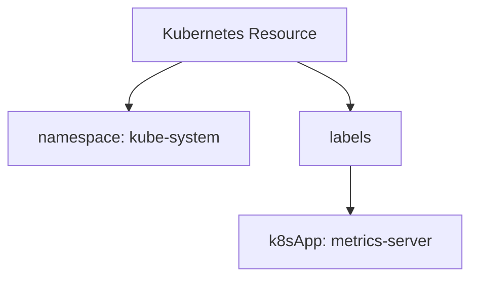

# Diagram: devops/k8s/metrics-server/helm/values.yaml

> Auto-generated by Obscura crawlers

## Mermaid

### SVG

<svg id="container" width="473.5390625" xmlns="http://www.w3.org/2000/svg" class="flowchart" height="278" viewBox="0 0 473.5390625 278" role="graphics-document document" aria-roledescription="flowchart-v2"><g><marker id="container_flowchart-v2-pointEnd" class="marker flowchart-v2" viewBox="0 0 10 10" refX="5" refY="5" markerUnits="userSpaceOnUse" markerWidth="8" markerHeight="8" orient="auto"><path d="M 0 0 L 10 5 L 0 10 z" class="arrowMarkerPath" style="stroke-width: 1; stroke-dasharray: 1, 0;"></path></marker><marker id="container_flowchart-v2-pointStart" class="marker flowchart-v2" viewBox="0 0 10 10" refX="4.5" refY="5" markerUnits="userSpaceOnUse" markerWidth="8" markerHeight="8" orient="auto"><path d="M 0 5 L 10 10 L 10 0 z" class="arrowMarkerPath" style="stroke-width: 1; stroke-dasharray: 1, 0;"></path></marker><marker id="container_flowchart-v2-circleEnd" class="marker flowchart-v2" viewBox="0 0 10 10" refX="11" refY="5" markerUnits="userSpaceOnUse" markerWidth="11" markerHeight="11" orient="auto"><circle cx="5" cy="5" r="5" class="arrowMarkerPath" style="stroke-width: 1; stroke-dasharray: 1, 0;"></circle></marker><marker id="container_flowchart-v2-circleStart" class="marker flowchart-v2" viewBox="0 0 10 10" refX="-1" refY="5" markerUnits="userSpaceOnUse" markerWidth="11" markerHeight="11" orient="auto"><circle cx="5" cy="5" r="5" class="arrowMarkerPath" style="stroke-width: 1; stroke-dasharray: 1, 0;"></circle></marker><marker id="container_flowchart-v2-crossEnd" class="marker cross flowchart-v2" viewBox="0 0 11 11" refX="12" refY="5.2" markerUnits="userSpaceOnUse" markerWidth="11" markerHeight="11" orient="auto"><path d="M 1,1 l 9,9 M 10,1 l -9,9" class="arrowMarkerPath" style="stroke-width: 2; stroke-dasharray: 1, 0;"></path></marker><marker id="container_flowchart-v2-crossStart" class="marker cross flowchart-v2" viewBox="0 0 11 11" refX="-1" refY="5.2" markerUnits="userSpaceOnUse" markerWidth="11" markerHeight="11" orient="auto"><path d="M 1,1 l 9,9 M 10,1 l -9,9" class="arrowMarkerPath" style="stroke-width: 2; stroke-dasharray: 1, 0;"></path></marker><g class="root"><g class="clusters"></g><g class="edgePaths"><path d="M182.958,62L174.017,66.167C165.076,70.333,147.194,78.667,138.253,86.333C129.313,94,129.313,101,129.313,104.5L129.313,108" id="L_A_B_0" class="edge-thickness-normal edge-pattern-solid edge-thickness-normal edge-pattern-solid flowchart-link" style=";" data-edge="true" data-et="edge" data-id="L_A_B_0" data-points="W3sieCI6MTgyLjk1NzcwNzMzMTczMDc3LCJ5Ijo2Mn0seyJ4IjoxMjkuMzEyNSwieSI6ODd9LHsieCI6MTI5LjMxMjUsInkiOjExMn1d" marker-end="url(#container_flowchart-v2-pointEnd)"></path><path d="M298.831,62L307.772,66.167C316.713,70.333,334.595,78.667,343.536,86.333C352.477,94,352.477,101,352.477,104.5L352.477,108" id="L_A_C_0" class="edge-thickness-normal edge-pattern-solid edge-thickness-normal edge-pattern-solid flowchart-link" style=";" data-edge="true" data-et="edge" data-id="L_A_C_0" data-points="W3sieCI6Mjk4LjgzMTM1NTE2ODI2OTIsInkiOjYyfSx7IngiOjM1Mi40NzY1NjI1LCJ5Ijo4N30seyJ4IjozNTIuNDc2NTYyNSwieSI6MTEyfV0=" marker-end="url(#container_flowchart-v2-pointEnd)"></path><path d="M352.477,166L352.477,170.167C352.477,174.333,352.477,182.667,352.477,190.333C352.477,198,352.477,205,352.477,208.5L352.477,212" id="L_C_D_0" class="edge-thickness-normal edge-pattern-solid edge-thickness-normal edge-pattern-solid flowchart-link" style=";" data-edge="true" data-et="edge" data-id="L_C_D_0" data-points="W3sieCI6MzUyLjQ3NjU2MjUsInkiOjE2Nn0seyJ4IjozNTIuNDc2NTYyNSwieSI6MTkxfSx7IngiOjM1Mi40NzY1NjI1LCJ5IjoyMTZ9XQ==" marker-end="url(#container_flowchart-v2-pointEnd)"></path></g><g class="edgeLabels"><g class="edgeLabel"><g class="label" data-id="L_A_B_0" transform="translate(0, 0)"><foreignObject width="0" height="0">

</foreignObject></g></g><g class="edgeLabel"><g class="label" data-id="L_A_C_0" transform="translate(0, 0)"><foreignObject width="0" height="0">

</foreignObject></g></g><g class="edgeLabel"><g class="label" data-id="L_C_D_0" transform="translate(0, 0)"><foreignObject width="0" height="0">

</foreignObject></g></g></g><g class="nodes"><g class="node default" id="flowchart-A-0" transform="translate(240.89453125, 35)"><rect class="basic label-container" style="" x="-106.546875" y="-27" width="213.09375" height="54"></rect><g class="label" style="" transform="translate(-76.546875, -12)"><rect></rect><foreignObject width="153.09375" height="24">

Kubernetes Resource

</foreignObject></g></g><g class="node default" id="flowchart-B-2" transform="translate(129.3125, 139)"><rect class="basic label-container" style="" x="-121.3125" y="-27" width="242.625" height="54"></rect><g class="label" style="" transform="translate(-91.3125, -12)"><rect></rect><foreignObject width="182.625" height="24">

namespace: kube-system

</foreignObject></g></g><g class="node default" id="flowchart-C-4" transform="translate(352.4765625, 139)"><rect class="basic label-container" style="" x="-51.8515625" y="-27" width="103.703125" height="54"></rect><g class="label" style="" transform="translate(-21.8515625, -12)"><rect></rect><foreignObject width="43.703125" height="24">

labels

</foreignObject></g></g><g class="node default" id="flowchart-D-6" transform="translate(352.4765625, 243)"><rect class="basic label-container" style="" x="-113.0625" y="-27" width="226.125" height="54"></rect><g class="label" style="" transform="translate(-83.0625, -12)"><rect></rect><foreignObject width="166.125" height="24">

k8sApp: metrics-server

</foreignObject></g></g></g></g></g></svg>
