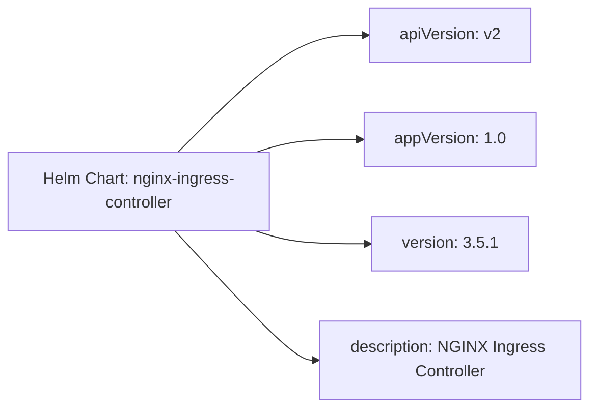

# Diagram: devops/k8s/nginx-ingress-controller/helm/Chart.yaml

> Auto-generated by Obscura crawlers

## Mermaid

### SVG

<svg id="container" width="586" xmlns="http://www.w3.org/2000/svg" class="flowchart" height="406" viewBox="0 0 586 406" role="graphics-document document" aria-roledescription="flowchart-v2"><g><marker id="container_flowchart-v2-pointEnd" class="marker flowchart-v2" viewBox="0 0 10 10" refX="5" refY="5" markerUnits="userSpaceOnUse" markerWidth="8" markerHeight="8" orient="auto"><path d="M 0 0 L 10 5 L 0 10 z" class="arrowMarkerPath" style="stroke-width: 1; stroke-dasharray: 1, 0;"></path></marker><marker id="container_flowchart-v2-pointStart" class="marker flowchart-v2" viewBox="0 0 10 10" refX="4.5" refY="5" markerUnits="userSpaceOnUse" markerWidth="8" markerHeight="8" orient="auto"><path d="M 0 5 L 10 10 L 10 0 z" class="arrowMarkerPath" style="stroke-width: 1; stroke-dasharray: 1, 0;"></path></marker><marker id="container_flowchart-v2-circleEnd" class="marker flowchart-v2" viewBox="0 0 10 10" refX="11" refY="5" markerUnits="userSpaceOnUse" markerWidth="11" markerHeight="11" orient="auto"><circle cx="5" cy="5" r="5" class="arrowMarkerPath" style="stroke-width: 1; stroke-dasharray: 1, 0;"></circle></marker><marker id="container_flowchart-v2-circleStart" class="marker flowchart-v2" viewBox="0 0 10 10" refX="-1" refY="5" markerUnits="userSpaceOnUse" markerWidth="11" markerHeight="11" orient="auto"><circle cx="5" cy="5" r="5" class="arrowMarkerPath" style="stroke-width: 1; stroke-dasharray: 1, 0;"></circle></marker><marker id="container_flowchart-v2-crossEnd" class="marker cross flowchart-v2" viewBox="0 0 11 11" refX="12" refY="5.2" markerUnits="userSpaceOnUse" markerWidth="11" markerHeight="11" orient="auto"><path d="M 1,1 l 9,9 M 10,1 l -9,9" class="arrowMarkerPath" style="stroke-width: 2; stroke-dasharray: 1, 0;"></path></marker><marker id="container_flowchart-v2-crossStart" class="marker cross flowchart-v2" viewBox="0 0 11 11" refX="-1" refY="5.2" markerUnits="userSpaceOnUse" markerWidth="11" markerHeight="11" orient="auto"><path d="M 1,1 l 9,9 M 10,1 l -9,9" class="arrowMarkerPath" style="stroke-width: 2; stroke-dasharray: 1, 0;"></path></marker><g class="root"><g class="clusters"></g><g class="edgePaths"><path d="M176.75,152L196.125,132.5C215.5,113,254.25,74,285.434,54.5C316.617,35,340.234,35,352.043,35L363.852,35" id="L_Chart_apiVersion_0" class="edge-thickness-normal edge-pattern-solid edge-thickness-normal edge-pattern-solid flowchart-link" style=";" data-edge="true" data-et="edge" data-id="L_Chart_apiVersion_0" data-points="W3sieCI6MTc2Ljc1LCJ5IjoxNTJ9LHsieCI6MjkzLCJ5IjozNX0seyJ4IjozNjcuODUxNTYyNSwieSI6MzV9XQ==" marker-end="url(#container_flowchart-v2-pointEnd)"></path><path d="M254.25,152L260.708,149.833C267.167,147.667,280.083,143.333,297.612,141.167C315.141,139,337.281,139,348.352,139L359.422,139" id="L_Chart_appVersion_0" class="edge-thickness-normal edge-pattern-solid edge-thickness-normal edge-pattern-solid flowchart-link" style=";" data-edge="true" data-et="edge" data-id="L_Chart_appVersion_0" data-points="W3sieCI6MjU0LjI1LCJ5IjoxNTJ9LHsieCI6MjkzLCJ5IjoxMzl9LHsieCI6MzYzLjQyMTg3NSwieSI6MTM5fV0=" marker-end="url(#container_flowchart-v2-pointEnd)"></path><path d="M254.25,230L260.708,232.167C267.167,234.333,280.083,238.667,299.173,240.833C318.263,243,343.526,243,356.158,243L368.789,243" id="L_Chart_version_0" class="edge-thickness-normal edge-pattern-solid edge-thickness-normal edge-pattern-solid flowchart-link" style=";" data-edge="true" data-et="edge" data-id="L_Chart_version_0" data-points="W3sieCI6MjU0LjI1LCJ5IjoyMzB9LHsieCI6MjkzLCJ5IjoyNDN9LHsieCI6MzcyLjc4OTA2MjUsInkiOjI0M31d" marker-end="url(#container_flowchart-v2-pointEnd)"></path><path d="M173.982,230L193.818,251.5C213.655,273,253.327,316,276.664,337.5C300,359,307,359,310.5,359L314,359" id="L_Chart_description_0" class="edge-thickness-normal edge-pattern-solid edge-thickness-normal edge-pattern-solid flowchart-link" style=";" data-edge="true" data-et="edge" data-id="L_Chart_description_0" data-points="W3sieCI6MTczLjk4MjE0Mjg1NzE0Mjg2LCJ5IjoyMzB9LHsieCI6MjkzLCJ5IjozNTl9LHsieCI6MzE4LCJ5IjozNTl9XQ==" marker-end="url(#container_flowchart-v2-pointEnd)"></path></g><g class="edgeLabels"><g class="edgeLabel"><g class="label" data-id="L_Chart_apiVersion_0" transform="translate(0, 0)"><foreignObject width="0" height="0">

</foreignObject></g></g><g class="edgeLabel"><g class="label" data-id="L_Chart_appVersion_0" transform="translate(0, 0)"><foreignObject width="0" height="0">

</foreignObject></g></g><g class="edgeLabel"><g class="label" data-id="L_Chart_version_0" transform="translate(0, 0)"><foreignObject width="0" height="0">

</foreignObject></g></g><g class="edgeLabel"><g class="label" data-id="L_Chart_description_0" transform="translate(0, 0)"><foreignObject width="0" height="0">

</foreignObject></g></g></g><g class="nodes"><g class="node default" id="flowchart-Chart-0" transform="translate(138, 191)"><rect class="basic label-container" style="" x="-130" y="-39" width="260" height="78"></rect><g class="label" style="" transform="translate(-100, -24)"><rect></rect><foreignObject width="200" height="48">

Helm Chart: nginx-ingress-controller

</foreignObject></g></g><g class="node default" id="flowchart-apiVersion-2" transform="translate(448, 35)"><rect class="basic label-container" style="" x="-80.1484375" y="-27" width="160.296875" height="54"></rect><g class="label" style="" transform="translate(-50.1484375, -12)"><rect></rect><foreignObject width="100.296875" height="24">

apiVersion: v2

</foreignObject></g></g><g class="node default" id="flowchart-appVersion-4" transform="translate(448, 139)"><rect class="basic label-container" style="" x="-84.578125" y="-27" width="169.15625" height="54"></rect><g class="label" style="" transform="translate(-54.578125, -12)"><rect></rect><foreignObject width="109.15625" height="24">

appVersion: 1.0

</foreignObject></g></g><g class="node default" id="flowchart-version-6" transform="translate(448, 243)"><rect class="basic label-container" style="" x="-75.2109375" y="-27" width="150.421875" height="54"></rect><g class="label" style="" transform="translate(-45.2109375, -12)"><rect></rect><foreignObject width="90.421875" height="24">

version: 3.5.1

</foreignObject></g></g><g class="node default" id="flowchart-description-8" transform="translate(448, 359)"><rect class="basic label-container" style="" x="-130" y="-39" width="260" height="78"></rect><g class="label" style="" transform="translate(-100, -24)"><rect></rect><foreignObject width="200" height="48">

description: NGINX Ingress Controller

</foreignObject></g></g></g></g></g></svg>
