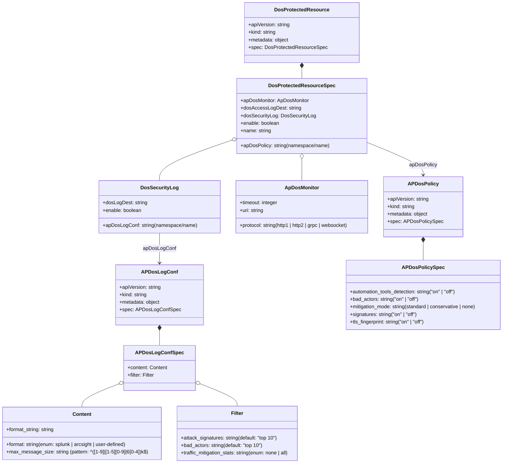

# Diagram: devops/k8s/nginx-ingress-controller/helm/crds/crds-nap-dos.yaml

> Auto-generated by Obscura crawlers

## Mermaid

### SVG

<svg id="container" width="1619.142578125" xmlns="http://www.w3.org/2000/svg" class="classDiagram" height="1478" viewBox="0 0 1619.142578125 1478" role="graphics-document document" aria-roledescription="class"><g><defs><marker id="container_class-aggregationStart" class="marker aggregation class" refX="18" refY="7" markerWidth="190" markerHeight="240" orient="auto"><path d="M 18,7 L9,13 L1,7 L9,1 Z"></path></marker></defs><defs><marker id="container_class-aggregationEnd" class="marker aggregation class" refX="1" refY="7" markerWidth="20" markerHeight="28" orient="auto"><path d="M 18,7 L9,13 L1,7 L9,1 Z"></path></marker></defs><defs><marker id="container_class-extensionStart" class="marker extension class" refX="18" refY="7" markerWidth="190" markerHeight="240" orient="auto"><path d="M 1,7 L18,13 V 1 Z"></path></marker></defs><defs><marker id="container_class-extensionEnd" class="marker extension class" refX="1" refY="7" markerWidth="20" markerHeight="28" orient="auto"><path d="M 1,1 V 13 L18,7 Z"></path></marker></defs><defs><marker id="container_class-compositionStart" class="marker composition class" refX="18" refY="7" markerWidth="190" markerHeight="240" orient="auto"><path d="M 18,7 L9,13 L1,7 L9,1 Z"></path></marker></defs><defs><marker id="container_class-compositionEnd" class="marker composition class" refX="1" refY="7" markerWidth="20" markerHeight="28" orient="auto"><path d="M 18,7 L9,13 L1,7 L9,1 Z"></path></marker></defs><defs><marker id="container_class-dependencyStart" class="marker dependency class" refX="6" refY="7" markerWidth="190" markerHeight="240" orient="auto"><path d="M 5,7 L9,13 L1,7 L9,1 Z"></path></marker></defs><defs><marker id="container_class-dependencyEnd" class="marker dependency class" refX="13" refY="7" markerWidth="20" markerHeight="28" orient="auto"><path d="M 18,7 L9,13 L14,7 L9,1 Z"></path></marker></defs><defs><marker id="container_class-lollipopStart" class="marker lollipop class" refX="13" refY="7" markerWidth="190" markerHeight="240" orient="auto"><circle stroke="black" fill="transparent" cx="7" cy="7" r="6"></circle></marker></defs><defs><marker id="container_class-lollipopEnd" class="marker lollipop class" refX="1" refY="7" markerWidth="190" markerHeight="240" orient="auto"><circle stroke="black" fill="transparent" cx="7" cy="7" r="6"></circle></marker></defs><g class="root"><g class="clusters"></g><g class="edgePaths"><path d="M515.666,1054.25L515.666,1058.042C515.666,1061.833,515.666,1069.417,515.666,1077.375C515.666,1085.333,515.666,1093.667,515.666,1097.833L515.666,1102" id="id_APDosLogConf_APDosLogConfSpec_1" class="edge-thickness-normal edge-pattern-solid relation" style=";;;" data-edge="true" data-et="edge" data-id="id_APDosLogConf_APDosLogConfSpec_1" data-points="W3sieCI6NTE1LjY2NjAxNTYyNSwieSI6MTAzN30seyJ4Ijo1MTUuNjY2MDE1NjI1LCJ5IjoxMDc3fSx7IngiOjUxNS42NjYwMTU2MjUsInkiOjExMDJ9XQ==" marker-start="url(#container_class-compositionStart)"></path><path d="M388.171,1223.032L367.383,1231.027C346.596,1239.022,305.021,1255.011,284.233,1267.672C263.445,1280.333,263.445,1289.667,263.445,1294.333L263.445,1299" id="id_APDosLogConfSpec_Content_2" class="edge-thickness-normal edge-pattern-solid relation" style=";;;" data-edge="true" data-et="edge" data-id="id_APDosLogConfSpec_Content_2" data-points="W3sieCI6NDA0LjI3MTQ4NDM3NSwieSI6MTIxNi44NDA1MzM2OTY3NzE3fSx7IngiOjI2My40NDUzMTI1LCJ5IjoxMjcxfSx7IngiOjI2My40NDUzMTI1LCJ5IjoxMjk5fV0=" marker-start="url(#container_class-aggregationStart)"></path><path d="M643.161,1223.032L663.949,1231.027C684.736,1239.022,726.311,1255.011,747.099,1267.172C767.887,1279.333,767.887,1287.667,767.887,1291.833L767.887,1296" id="id_APDosLogConfSpec_Filter_3" class="edge-thickness-normal edge-pattern-solid relation" style=";;;" data-edge="true" data-et="edge" data-id="id_APDosLogConfSpec_Filter_3" data-points="W3sieCI6NjI3LjA2MDU0Njg3NSwieSI6MTIxNi44NDA1MzM2OTY3NzE3fSx7IngiOjc2Ny44ODY3MTg3NSwieSI6MTI3MX0seyJ4Ijo3NjcuODg2NzE4NzUsInkiOjEyOTZ9XQ==" marker-start="url(#container_class-aggregationStart)"></path><path d="M1360.311,773.25L1360.311,776.542C1360.311,779.833,1360.311,786.417,1360.311,795.875C1360.311,805.333,1360.311,817.667,1360.311,823.833L1360.311,830" id="id_APDosPolicy_APDosPolicySpec_4" class="edge-thickness-normal edge-pattern-solid relation" style=";;;" data-edge="true" data-et="edge" data-id="id_APDosPolicy_APDosPolicySpec_4" data-points="W3sieCI6MTM2MC4zMTA1NDY4NzUsInkiOjc1Nn0seyJ4IjoxMzYwLjMxMDU0Njg3NSwieSI6NzkzfSx7IngiOjEzNjAuMzEwNTQ2ODc1LCJ5Ijo4MzB9XQ==" marker-start="url(#container_class-compositionStart)"></path><path d="M973.166,217.25L973.166,218.542C973.166,219.833,973.166,222.417,973.166,227.875C973.166,233.333,973.166,241.667,973.166,245.833L973.166,250" id="id_DosProtectedResource_DosProtectedResourceSpec_5" class="edge-thickness-normal edge-pattern-solid relation" style=";;;" data-edge="true" data-et="edge" data-id="id_DosProtectedResource_DosProtectedResourceSpec_5" data-points="W3sieCI6OTczLjE2NjAxNTYyNSwieSI6MjAwfSx7IngiOjk3My4xNjYwMTU2MjUsInkiOjIyNX0seyJ4Ijo5NzMuMTY2MDE1NjI1LCJ5IjoyNTB9XQ==" marker-start="url(#container_class-compositionStart)"></path><path d="M973.166,507.25L973.166,510.542C973.166,513.833,973.166,520.417,973.166,531.875C973.166,543.333,973.166,559.667,973.166,567.833L973.166,576" id="id_DosProtectedResourceSpec_ApDosMonitor_6" class="edge-thickness-normal edge-pattern-solid relation" style=";;;" data-edge="true" data-et="edge" data-id="id_DosProtectedResourceSpec_ApDosMonitor_6" data-points="W3sieCI6OTczLjE2NjAxNTYyNSwieSI6NDkwfSx7IngiOjk3My4xNjYwMTU2MjUsInkiOjUyN30seyJ4Ijo5NzMuMTY2MDE1NjI1LCJ5Ijo1NzZ9XQ==" marker-start="url(#container_class-aggregationStart)"></path><path d="M751.393,446.106L712.105,459.588C672.817,473.07,594.242,500.035,554.954,521.684C515.666,543.333,515.666,559.667,515.666,567.833L515.666,576" id="id_DosProtectedResourceSpec_DosSecurityLog_7" class="edge-thickness-normal edge-pattern-solid relation" style=";;;" data-edge="true" data-et="edge" data-id="id_DosProtectedResourceSpec_DosSecurityLog_7" data-points="W3sieCI6NzY3LjcwODk4NDM3NSwieSI6NDQwLjUwNjU2NTkxNTMwMDU0fSx7IngiOjUxNS42NjYwMTU2MjUsInkiOjUyN30seyJ4Ijo1MTUuNjY2MDE1NjI1LCJ5Ijo1NzZ9XQ==" marker-start="url(#container_class-aggregationStart)"></path><path d="M1178.623,453.32L1208.904,465.6C1239.186,477.88,1299.748,502.44,1330.029,519.887C1360.311,537.333,1360.311,547.667,1360.311,552.833L1360.311,558" id="id_DosProtectedResourceSpec_APDosPolicy_8" class="edge-thickness-normal edge-pattern-solid relation" style=";;;" data-edge="true" data-et="edge" data-id="id_DosProtectedResourceSpec_APDosPolicy_8" data-points="W3sieCI6MTE3OC42MjMwNDY4NzUsInkiOjQ1My4zMTk2NjgyNDQwNTQ1fSx7IngiOjEzNjAuMzEwNTQ2ODc1LCJ5Ijo1Mjd9LHsieCI6MTM2MC4zMTA1NDY4NzUsInkiOjU2NH1d" marker-end="url(#container_class-dependencyEnd)"></path><path d="M515.666,744L515.666,752.167C515.666,760.333,515.666,776.667,515.666,792.5C515.666,808.333,515.666,823.667,515.666,831.333L515.666,839" id="id_DosSecurityLog_APDosLogConf_9" class="edge-thickness-normal edge-pattern-solid relation" style=";;;" data-edge="true" data-et="edge" data-id="id_DosSecurityLog_APDosLogConf_9" data-points="W3sieCI6NTE1LjY2NjAxNTYyNSwieSI6NzQ0fSx7IngiOjUxNS42NjYwMTU2MjUsInkiOjc5M30seyJ4Ijo1MTUuNjY2MDE1NjI1LCJ5Ijo4NDV9XQ==" marker-end="url(#container_class-dependencyEnd)"></path></g><g class="edgeLabels"><g class="edgeLabel"><g class="label" data-id="id_APDosLogConf_APDosLogConfSpec_1" transform="translate(0, 0)"><foreignObject width="0" height="0">

</foreignObject></g></g><g class="edgeLabel"><g class="label" data-id="id_APDosLogConfSpec_Content_2" transform="translate(0, 0)"><foreignObject width="0" height="0">

</foreignObject></g></g><g class="edgeLabel"><g class="label" data-id="id_APDosLogConfSpec_Filter_3" transform="translate(0, 0)"><foreignObject width="0" height="0">

</foreignObject></g></g><g class="edgeLabel"><g class="label" data-id="id_APDosPolicy_APDosPolicySpec_4" transform="translate(0, 0)"><foreignObject width="0" height="0">

</foreignObject></g></g><g class="edgeLabel"><g class="label" data-id="id_DosProtectedResource_DosProtectedResourceSpec_5" transform="translate(0, 0)"><foreignObject width="0" height="0">

</foreignObject></g></g><g class="edgeLabel"><g class="label" data-id="id_DosProtectedResourceSpec_ApDosMonitor_6" transform="translate(0, 0)"><foreignObject width="0" height="0">

</foreignObject></g></g><g class="edgeLabel"><g class="label" data-id="id_DosProtectedResourceSpec_DosSecurityLog_7" transform="translate(0, 0)"><foreignObject width="0" height="0">

</foreignObject></g></g><g class="edgeLabel" transform="translate(1360.310546875, 527)"><g class="label" data-id="id_DosProtectedResourceSpec_APDosPolicy_8" transform="translate(-44.109375, -12)"><foreignObject width="88.21875" height="24">

apDosPolicy

</foreignObject></g></g><g class="edgeLabel" transform="translate(515.666015625, 793)"><g class="label" data-id="id_DosSecurityLog_APDosLogConf_9" transform="translate(-51.640625, -12)"><foreignObject width="103.28125" height="24">

apDosLogConf

</foreignObject></g></g></g><g class="nodes"><g class="node default" id="classId-APDosLogConf-0" transform="translate(515.666015625, 941)"><g class="basic label-container"><path d="M-132.21875 -96 L132.21875 -96 L132.21875 96 L-132.21875 96" stroke="none" stroke-width="0" fill="#ECECFF" style=""></path><path d="M-132.21875 -96 C-69.08993192028151 -96, -5.961113840563016 -96, 132.21875 -96 M-132.21875 -96 C-42.07639017396397 -96, 48.065969652072056 -96, 132.21875 -96 M132.21875 -96 C132.21875 -44.91014585934175, 132.21875 6.179708281316493, 132.21875 96 M132.21875 -96 C132.21875 -53.864243434697165, 132.21875 -11.728486869394331, 132.21875 96 M132.21875 96 C60.18704383843003 96, -11.844662323139943 96, -132.21875 96 M132.21875 96 C74.43541614672193 96, 16.652082293443854 96, -132.21875 96 M-132.21875 96 C-132.21875 43.802123959252285, -132.21875 -8.39575208149543, -132.21875 -96 M-132.21875 96 C-132.21875 42.34943009184033, -132.21875 -11.301139816319335, -132.21875 -96" stroke="#9370DB" stroke-width="1.3" fill="none" stroke-dasharray="0 0" style=""></path></g><g class="annotation-group text" transform="translate(0, -72)"></g><g class="label-group text" transform="translate(-52.828125, -72)"><g class="label" style="font-weight: bolder" transform="translate(0,-12)"><foreignObject width="105.65625" height="24">

APDosLogConf

</foreignObject></g></g><g class="members-group text" transform="translate(-120.21875, -24)"><g class="label" style="" transform="translate(0,-12)"><foreignObject width="134.046875" height="24">

+apiVersion: string

</foreignObject></g><g class="label" style="" transform="translate(0,12)"><foreignObject width="89.359375" height="24">

+kind: string

</foreignObject></g><g class="label" style="" transform="translate(0,36)"><foreignObject width="130.984375" height="24">

+metadata: object

</foreignObject></g><g class="label" style="" transform="translate(0,60)"><foreignObject width="187.609375" height="24">

+spec: APDosLogConfSpec

</foreignObject></g></g><g class="methods-group text" transform="translate(-120.21875, 96)"></g><g class="divider" style=""><path d="M-132.21875 -48 C-63.27980459329105 -48, 5.659140813417906 -48, 132.21875 -48 M-132.21875 -48 C-27.315802542748926 -48, 77.58714491450215 -48, 132.21875 -48" stroke="#9370DB" stroke-width="1.3" fill="none" stroke-dasharray="0 0" style=""></path></g><g class="divider" style=""><path d="M-132.21875 72 C-56.993368643062226 72, 18.232012713875548 72, 132.21875 72 M-132.21875 72 C-69.0848637517682 72, -5.950977503536393 72, 132.21875 72" stroke="#9370DB" stroke-width="1.3" fill="none" stroke-dasharray="0 0" style=""></path></g></g><g class="node default" id="classId-APDosLogConfSpec-1" transform="translate(515.666015625, 1174)"><g class="basic label-container"><path d="M-111.39453125 -72 L111.39453125 -72 L111.39453125 72 L-111.39453125 72" stroke="none" stroke-width="0" fill="#ECECFF" style=""></path><path d="M-111.39453125 -72 C-54.62282482875805 -72, 2.148881592483903 -72, 111.39453125 -72 M-111.39453125 -72 C-25.35264245590082 -72, 60.68924633819836 -72, 111.39453125 -72 M111.39453125 -72 C111.39453125 -30.156318539807586, 111.39453125 11.687362920384828, 111.39453125 72 M111.39453125 -72 C111.39453125 -14.782429748328603, 111.39453125 42.435140503342794, 111.39453125 72 M111.39453125 72 C47.19831460006975 72, -16.9979020498605 72, -111.39453125 72 M111.39453125 72 C66.51871903134128 72, 21.642906812682554 72, -111.39453125 72 M-111.39453125 72 C-111.39453125 32.060287173312716, -111.39453125 -7.879425653374568, -111.39453125 -72 M-111.39453125 72 C-111.39453125 34.64182902564558, -111.39453125 -2.7163419487088447, -111.39453125 -72" stroke="#9370DB" stroke-width="1.3" fill="none" stroke-dasharray="0 0" style=""></path></g><g class="annotation-group text" transform="translate(0, -48)"></g><g class="label-group text" transform="translate(-70.4296875, -48)"><g class="label" style="font-weight: bolder" transform="translate(0,-12)"><foreignObject width="140.859375" height="24">

APDosLogConfSpec

</foreignObject></g></g><g class="members-group text" transform="translate(-99.39453125, 0)"><g class="label" style="" transform="translate(0,-12)"><foreignObject width="128.359375" height="24">

+content: Content

</foreignObject></g><g class="label" style="" transform="translate(0,12)"><foreignObject width="87.234375" height="24">

+filter: Filter

</foreignObject></g></g><g class="methods-group text" transform="translate(-99.39453125, 72)"></g><g class="divider" style=""><path d="M-111.39453125 -24 C-61.85200488824307 -24, -12.309478526486146 -24, 111.39453125 -24 M-111.39453125 -24 C-59.10863505146378 -24, -6.822738852927557 -24, 111.39453125 -24" stroke="#9370DB" stroke-width="1.3" fill="none" stroke-dasharray="0 0" style=""></path></g><g class="divider" style=""><path d="M-111.39453125 48 C-33.33467419951056 48, 44.72518285097888 48, 111.39453125 48 M-111.39453125 48 C-47.42490702277886 48, 16.54471720444228 48, 111.39453125 48" stroke="#9370DB" stroke-width="1.3" fill="none" stroke-dasharray="0 0" style=""></path></g></g><g class="node default" id="classId-Content-2" transform="translate(263.4453125, 1383)"><g class="basic label-container"><path d="M-255.4453125 -84 L255.4453125 -84 L255.4453125 84 L-255.4453125 84" stroke="none" stroke-width="0" fill="#ECECFF" style=""></path><path d="M-255.4453125 -84 C-148.2403662311704 -84, -41.0354199623408 -84, 255.4453125 -84 M-255.4453125 -84 C-69.66441561410403 -84, 116.11648127179194 -84, 255.4453125 -84 M255.4453125 -84 C255.4453125 -25.72105991529348, 255.4453125 32.55788016941304, 255.4453125 84 M255.4453125 -84 C255.4453125 -40.83508048090298, 255.4453125 2.329839038194038, 255.4453125 84 M255.4453125 84 C54.8537735697671 84, -145.7377653604658 84, -255.4453125 84 M255.4453125 84 C107.96104518765009 84, -39.52322212469983 84, -255.4453125 84 M-255.4453125 84 C-255.4453125 33.423092721837115, -255.4453125 -17.15381455632577, -255.4453125 -84 M-255.4453125 84 C-255.4453125 45.84523139573336, -255.4453125 7.6904627914667145, -255.4453125 -84" stroke="#9370DB" stroke-width="1.3" fill="none" stroke-dasharray="0 0" style=""></path></g><g class="annotation-group text" transform="translate(0, -60)"></g><g class="label-group text" transform="translate(-28.796875, -60)"><g class="label" style="font-weight: bolder" transform="translate(0,-12)"><foreignObject width="57.59375" height="24">

Content

</foreignObject></g></g><g class="members-group text" transform="translate(-243.4453125, -12)"><g class="label" style="" transform="translate(0,-12)"><foreignObject width="156.328125" height="24">

+format_string: string

</foreignObject></g></g><g class="methods-group text" transform="translate(-243.4453125, 36)"><g class="label" style="" transform="translate(0,-12)"><foreignObject width="394.671875" height="24">

+format: string(enum: splunk | arcsight | user-defined)

</foreignObject></g><g class="label" style="" transform="translate(0,12)"><foreignObject width="458.09375" height="24">

+max_message_size: string (pattern: ^([1-9]|[1-5][0-9]|6[0-4])k$)

</foreignObject></g></g><g class="divider" style=""><path d="M-255.4453125 -36 C-143.8887506236391 -36, -32.332188747278224 -36, 255.4453125 -36 M-255.4453125 -36 C-96.5696227925005 -36, 62.30606691499901 -36, 255.4453125 -36" stroke="#9370DB" stroke-width="1.3" fill="none" stroke-dasharray="0 0" style=""></path></g><g class="divider" style=""><path d="M-255.4453125 12 C-102.56754372941296 12, 50.31022504117408 12, 255.4453125 12 M-255.4453125 12 C-146.79055962197356 12, -38.13580674394714 12, 255.4453125 12" stroke="#9370DB" stroke-width="1.3" fill="none" stroke-dasharray="0 0" style=""></path></g></g><g class="node default" id="classId-Filter-3" transform="translate(767.88671875, 1383)"><g class="basic label-container"><path d="M-198.99609375 -87 L198.99609375 -87 L198.99609375 87 L-198.99609375 87" stroke="none" stroke-width="0" fill="#ECECFF" style=""></path><path d="M-198.99609375 -87 C-119.20849671758087 -87, -39.42089968516174 -87, 198.99609375 -87 M-198.99609375 -87 C-44.07471512767896 -87, 110.84666349464209 -87, 198.99609375 -87 M198.99609375 -87 C198.99609375 -46.42467081238887, 198.99609375 -5.849341624777736, 198.99609375 87 M198.99609375 -87 C198.99609375 -19.511968302335788, 198.99609375 47.976063395328424, 198.99609375 87 M198.99609375 87 C48.54837816505682 87, -101.89933741988636 87, -198.99609375 87 M198.99609375 87 C115.47050703935585 87, 31.944920328711703 87, -198.99609375 87 M-198.99609375 87 C-198.99609375 35.29172669894651, -198.99609375 -16.416546602106976, -198.99609375 -87 M-198.99609375 87 C-198.99609375 31.128289147095067, -198.99609375 -24.743421705809865, -198.99609375 -87" stroke="#9370DB" stroke-width="1.3" fill="none" stroke-dasharray="0 0" style=""></path></g><g class="annotation-group text" transform="translate(0, -63)"></g><g class="label-group text" transform="translate(-18.8671875, -63)"><g class="label" style="font-weight: bolder" transform="translate(0,-12)"><foreignObject width="37.734375" height="24">

Filter

</foreignObject></g></g><g class="members-group text" transform="translate(-186.99609375, -15)"></g><g class="methods-group text" transform="translate(-186.99609375, 15)"><g class="label" style="" transform="translate(0,-12)"><foreignObject width="313.375" height="24">

+attack_signatures: string(default: "top 10")

</foreignObject></g><g class="label" style="" transform="translate(0,12)"><foreignObject width="265.5" height="24">

+bad_actors: string(default: "top 10")

</foreignObject></g><g class="label" style="" transform="translate(0,36)"><foreignObject width="355.125" height="24">

+traffic_mitigation_stats: string(enum: none | all)

</foreignObject></g></g><g class="divider" style=""><path d="M-198.99609375 -39 C-44.640384850287205 -39, 109.71532404942559 -39, 198.99609375 -39 M-198.99609375 -39 C-71.71922914021368 -39, 55.55763546957263 -39, 198.99609375 -39" stroke="#9370DB" stroke-width="1.3" fill="none" stroke-dasharray="0 0" style=""></path></g><g class="divider" style=""><path d="M-198.99609375 -15 C-66.93422135360089 -15, 65.12765104279822 -15, 198.99609375 -15 M-198.99609375 -15 C-45.60999876434252 -15, 107.77609622131496 -15, 198.99609375 -15" stroke="#9370DB" stroke-width="1.3" fill="none" stroke-dasharray="0 0" style=""></path></g></g><g class="node default" id="classId-APDosPolicy-4" transform="translate(1360.310546875, 660)"><g class="basic label-container"><path d="M-120.8203125 -96 L120.8203125 -96 L120.8203125 96 L-120.8203125 96" stroke="none" stroke-width="0" fill="#ECECFF" style=""></path><path d="M-120.8203125 -96 C-59.13453228719866 -96, 2.5512479256026808 -96, 120.8203125 -96 M-120.8203125 -96 C-24.497844571271244 -96, 71.82462335745751 -96, 120.8203125 -96 M120.8203125 -96 C120.8203125 -24.03458623346245, 120.8203125 47.9308275330751, 120.8203125 96 M120.8203125 -96 C120.8203125 -33.348038498206904, 120.8203125 29.303923003586192, 120.8203125 96 M120.8203125 96 C49.10178177304566 96, -22.616748953908683 96, -120.8203125 96 M120.8203125 96 C43.50047452282335 96, -33.819363454353294 96, -120.8203125 96 M-120.8203125 96 C-120.8203125 22.06032785564237, -120.8203125 -51.87934428871526, -120.8203125 -96 M-120.8203125 96 C-120.8203125 43.40512605516233, -120.8203125 -9.189747889675346, -120.8203125 -96" stroke="#9370DB" stroke-width="1.3" fill="none" stroke-dasharray="0 0" style=""></path></g><g class="annotation-group text" transform="translate(0, -72)"></g><g class="label-group text" transform="translate(-45.109375, -72)"><g class="label" style="font-weight: bolder" transform="translate(0,-12)"><foreignObject width="90.21875" height="24">

APDosPolicy

</foreignObject></g></g><g class="members-group text" transform="translate(-108.8203125, -24)"><g class="label" style="" transform="translate(0,-12)"><foreignObject width="134.046875" height="24">

+apiVersion: string

</foreignObject></g><g class="label" style="" transform="translate(0,12)"><foreignObject width="89.359375" height="24">

+kind: string

</foreignObject></g><g class="label" style="" transform="translate(0,36)"><foreignObject width="130.984375" height="24">

+metadata: object

</foreignObject></g><g class="label" style="" transform="translate(0,60)"><foreignObject width="172.53125" height="24">

+spec: APDosPolicySpec

</foreignObject></g></g><g class="methods-group text" transform="translate(-108.8203125, 96)"></g><g class="divider" style=""><path d="M-120.8203125 -48 C-38.2621665949238 -48, 44.295979310152404 -48, 120.8203125 -48 M-120.8203125 -48 C-35.12392861137482 -48, 50.572455277250356 -48, 120.8203125 -48" stroke="#9370DB" stroke-width="1.3" fill="none" stroke-dasharray="0 0" style=""></path></g><g class="divider" style=""><path d="M-120.8203125 72 C-56.42628642015576 72, 7.967739659688476 72, 120.8203125 72 M-120.8203125 72 C-52.993013211114686 72, 14.834286077770628 72, 120.8203125 72" stroke="#9370DB" stroke-width="1.3" fill="none" stroke-dasharray="0 0" style=""></path></g></g><g class="node default" id="classId-APDosPolicySpec-5" transform="translate(1360.310546875, 941)"><g class="basic label-container"><path d="M-250.83203125 -111 L250.83203125 -111 L250.83203125 111 L-250.83203125 111" stroke="none" stroke-width="0" fill="#ECECFF" style=""></path><path d="M-250.83203125 -111 C-92.30252853890855 -111, 66.2269741721829 -111, 250.83203125 -111 M-250.83203125 -111 C-130.0535237035764 -111, -9.275016157152777 -111, 250.83203125 -111 M250.83203125 -111 C250.83203125 -33.81168333433611, 250.83203125 43.37663333132778, 250.83203125 111 M250.83203125 -111 C250.83203125 -42.08544717773141, 250.83203125 26.82910564453718, 250.83203125 111 M250.83203125 111 C90.36713603176281 111, -70.09775918647438 111, -250.83203125 111 M250.83203125 111 C58.01942434620261 111, -134.79318255759478 111, -250.83203125 111 M-250.83203125 111 C-250.83203125 45.14600490644669, -250.83203125 -20.707990187106617, -250.83203125 -111 M-250.83203125 111 C-250.83203125 32.16050885093533, -250.83203125 -46.67898229812934, -250.83203125 -111" stroke="#9370DB" stroke-width="1.3" fill="none" stroke-dasharray="0 0" style=""></path></g><g class="annotation-group text" transform="translate(0, -87)"></g><g class="label-group text" transform="translate(-62.7109375, -87)"><g class="label" style="font-weight: bolder" transform="translate(0,-12)"><foreignObject width="125.421875" height="24">

APDosPolicySpec

</foreignObject></g></g><g class="members-group text" transform="translate(-238.83203125, -39)"></g><g class="methods-group text" transform="translate(-238.83203125, -9)"><g class="label" style="" transform="translate(0,-12)"><foreignObject width="353.296875" height="24">

+automation_tools_detection: string("on" | "off")

</foreignObject></g><g class="label" style="" transform="translate(0,12)"><foreignObject width="228.21875" height="24">

+bad_actors: string("on" | "off")

</foreignObject></g><g class="label" style="" transform="translate(0,36)"><foreignObject width="414.953125" height="24">

+mitigation_mode: string(standard | conservative | none)

</foreignObject></g><g class="label" style="" transform="translate(0,60)"><foreignObject width="223.3125" height="24">

+signatures: string("on" | "off")

</foreignObject></g><g class="label" style="" transform="translate(0,84)"><foreignObject width="250.28125" height="24">

+tls_fingerprint: string("on" | "off")

</foreignObject></g></g><g class="divider" style=""><path d="M-250.83203125 -63 C-90.73946443595139 -63, 69.35310237809722 -63, 250.83203125 -63 M-250.83203125 -63 C-144.17708531333355 -63, -37.5221393766671 -63, 250.83203125 -63" stroke="#9370DB" stroke-width="1.3" fill="none" stroke-dasharray="0 0" style=""></path></g><g class="divider" style=""><path d="M-250.83203125 -39 C-64.69770073023074 -39, 121.43662978953853 -39, 250.83203125 -39 M-250.83203125 -39 C-149.80406658072246 -39, -48.776101911444925 -39, 250.83203125 -39" stroke="#9370DB" stroke-width="1.3" fill="none" stroke-dasharray="0 0" style=""></path></g></g><g class="node default" id="classId-DosProtectedResource-6" transform="translate(973.166015625, 104)"><g class="basic label-container"><path d="M-176.875 -96 L176.875 -96 L176.875 96 L-176.875 96" stroke="none" stroke-width="0" fill="#ECECFF" style=""></path><path d="M-176.875 -96 C-79.79620988419404 -96, 17.282580231611917 -96, 176.875 -96 M-176.875 -96 C-53.66257453522755 -96, 69.5498509295449 -96, 176.875 -96 M176.875 -96 C176.875 -22.260955538924634, 176.875 51.47808892215073, 176.875 96 M176.875 -96 C176.875 -30.658287890223164, 176.875 34.68342421955367, 176.875 96 M176.875 96 C52.82211742377568 96, -71.23076515244864 96, -176.875 96 M176.875 96 C59.162597411589914 96, -58.54980517682017 96, -176.875 96 M-176.875 96 C-176.875 25.879100978237616, -176.875 -44.24179804352477, -176.875 -96 M-176.875 96 C-176.875 32.12854852313305, -176.875 -31.742902953733903, -176.875 -96" stroke="#9370DB" stroke-width="1.3" fill="none" stroke-dasharray="0 0" style=""></path></g><g class="annotation-group text" transform="translate(0, -72)"></g><g class="label-group text" transform="translate(-82.78125, -72)"><g class="label" style="font-weight: bolder" transform="translate(0,-12)"><foreignObject width="165.5625" height="24">

DosProtectedResource

</foreignObject></g></g><g class="members-group text" transform="translate(-164.875, -24)"><g class="label" style="" transform="translate(0,-12)"><foreignObject width="134.046875" height="24">

+apiVersion: string

</foreignObject></g><g class="label" style="" transform="translate(0,12)"><foreignObject width="89.359375" height="24">

+kind: string

</foreignObject></g><g class="label" style="" transform="translate(0,36)"><foreignObject width="130.984375" height="24">

+metadata: object

</foreignObject></g><g class="label" style="" transform="translate(0,60)"><foreignObject width="246.96875" height="24">

+spec: DosProtectedResourceSpec

</foreignObject></g></g><g class="methods-group text" transform="translate(-164.875, 96)"></g><g class="divider" style=""><path d="M-176.875 -48 C-86.35034660647013 -48, 4.174306787059749 -48, 176.875 -48 M-176.875 -48 C-52.003699105030776 -48, 72.86760178993845 -48, 176.875 -48" stroke="#9370DB" stroke-width="1.3" fill="none" stroke-dasharray="0 0" style=""></path></g><g class="divider" style=""><path d="M-176.875 72 C-46.05984258131792 72, 84.75531483736415 72, 176.875 72 M-176.875 72 C-39.12815706802664 72, 98.61868586394672 72, 176.875 72" stroke="#9370DB" stroke-width="1.3" fill="none" stroke-dasharray="0 0" style=""></path></g></g><g class="node default" id="classId-DosProtectedResourceSpec-7" transform="translate(973.166015625, 370)"><g class="basic label-container"><path d="M-205.45703125 -120 L205.45703125 -120 L205.45703125 120 L-205.45703125 120" stroke="none" stroke-width="0" fill="#ECECFF" style=""></path><path d="M-205.45703125 -120 C-80.57578790060057 -120, 44.30545544879885 -120, 205.45703125 -120 M-205.45703125 -120 C-115.5816735606757 -120, -25.706315871351393 -120, 205.45703125 -120 M205.45703125 -120 C205.45703125 -54.01645204560937, 205.45703125 11.96709590878126, 205.45703125 120 M205.45703125 -120 C205.45703125 -44.95445520235924, 205.45703125 30.091089595281517, 205.45703125 120 M205.45703125 120 C61.61141805531142 120, -82.23419513937716 120, -205.45703125 120 M205.45703125 120 C106.5457208383108 120, 7.634410426621599 120, -205.45703125 120 M-205.45703125 120 C-205.45703125 45.86785870891748, -205.45703125 -28.264282582165038, -205.45703125 -120 M-205.45703125 120 C-205.45703125 47.261585778138596, -205.45703125 -25.47682844372281, -205.45703125 -120" stroke="#9370DB" stroke-width="1.3" fill="none" stroke-dasharray="0 0" style=""></path></g><g class="annotation-group text" transform="translate(0, -96)"></g><g class="label-group text" transform="translate(-100.3828125, -96)"><g class="label" style="font-weight: bolder" transform="translate(0,-12)"><foreignObject width="200.765625" height="24">

DosProtectedResourceSpec

</foreignObject></g></g><g class="members-group text" transform="translate(-193.45703125, -48)"><g class="label" style="" transform="translate(0,-12)"><foreignObject width="220.578125" height="24">

+apDosMonitor: ApDosMonitor

</foreignObject></g><g class="label" style="" transform="translate(0,12)"><foreignObject width="188.984375" height="24">

+dosAccessLogDest: string

</foreignObject></g><g class="label" style="" transform="translate(0,36)"><foreignObject width="237.03125" height="24">

+dosSecurityLog: DosSecurityLog

</foreignObject></g><g class="label" style="" transform="translate(0,60)"><foreignObject width="125.140625" height="24">

+enable: boolean

</foreignObject></g><g class="label" style="" transform="translate(0,84)"><foreignObject width="98.21875" height="24">

+name: string

</foreignObject></g></g><g class="methods-group text" transform="translate(-193.45703125, 96)"><g class="label" style="" transform="translate(0,-12)"><foreignObject width="286.53125" height="24">

+apDosPolicy: string(namespace/name)

</foreignObject></g></g><g class="divider" style=""><path d="M-205.45703125 -72 C-95.69980504388958 -72, 14.057421162220834 -72, 205.45703125 -72 M-205.45703125 -72 C-54.14174447777282 -72, 97.17354229445436 -72, 205.45703125 -72" stroke="#9370DB" stroke-width="1.3" fill="none" stroke-dasharray="0 0" style=""></path></g><g class="divider" style=""><path d="M-205.45703125 72 C-47.652707868157876 72, 110.15161551368425 72, 205.45703125 72 M-205.45703125 72 C-87.55932067251784 72, 30.338389904964316 72, 205.45703125 72" stroke="#9370DB" stroke-width="1.3" fill="none" stroke-dasharray="0 0" style=""></path></g></g><g class="node default" id="classId-ApDosMonitor-8" transform="translate(973.166015625, 660)"><g class="basic label-container"><path d="M-216.32421875 -84 L216.32421875 -84 L216.32421875 84 L-216.32421875 84" stroke="none" stroke-width="0" fill="#ECECFF" style=""></path><path d="M-216.32421875 -84 C-92.49580822314981 -84, 31.332602303700384 -84, 216.32421875 -84 M-216.32421875 -84 C-108.29264434430738 -84, -0.261069938614753 -84, 216.32421875 -84 M216.32421875 -84 C216.32421875 -33.60113293322236, 216.32421875 16.79773413355528, 216.32421875 84 M216.32421875 -84 C216.32421875 -36.7892609501438, 216.32421875 10.421478099712402, 216.32421875 84 M216.32421875 84 C81.37717855389573 84, -53.56986164220854 84, -216.32421875 84 M216.32421875 84 C117.78243188310613 84, 19.240645016212255 84, -216.32421875 84 M-216.32421875 84 C-216.32421875 20.82092573208311, -216.32421875 -42.35814853583378, -216.32421875 -84 M-216.32421875 84 C-216.32421875 29.358984191218916, -216.32421875 -25.28203161756217, -216.32421875 -84" stroke="#9370DB" stroke-width="1.3" fill="none" stroke-dasharray="0 0" style=""></path></g><g class="annotation-group text" transform="translate(0, -60)"></g><g class="label-group text" transform="translate(-51.8984375, -60)"><g class="label" style="font-weight: bolder" transform="translate(0,-12)"><foreignObject width="103.796875" height="24">

ApDosMonitor

</foreignObject></g></g><g class="members-group text" transform="translate(-204.32421875, -12)"><g class="label" style="" transform="translate(0,-12)"><foreignObject width="124.3125" height="24">

+timeout: integer

</foreignObject></g><g class="label" style="" transform="translate(0,12)"><foreignObject width="77.703125" height="24">

+uri: string

</foreignObject></g></g><g class="methods-group text" transform="translate(-204.32421875, 60)"><g class="label" style="" transform="translate(0,-12)"><foreignObject width="356.75" height="24">

+protocol: string(http1 | http2 | grpc | websocket)

</foreignObject></g></g><g class="divider" style=""><path d="M-216.32421875 -36 C-88.69109628082784 -36, 38.94202618834433 -36, 216.32421875 -36 M-216.32421875 -36 C-112.99474022348402 -36, -9.665261696968031 -36, 216.32421875 -36" stroke="#9370DB" stroke-width="1.3" fill="none" stroke-dasharray="0 0" style=""></path></g><g class="divider" style=""><path d="M-216.32421875 36 C-103.43333419205781 36, 9.457550365884373 36, 216.32421875 36 M-216.32421875 36 C-83.08610501424553 36, 50.152008721508935 36, 216.32421875 36" stroke="#9370DB" stroke-width="1.3" fill="none" stroke-dasharray="0 0" style=""></path></g></g><g class="node default" id="classId-DosSecurityLog-9" transform="translate(515.666015625, 660)"><g class="basic label-container"><path d="M-191.17578125 -84 L191.17578125 -84 L191.17578125 84 L-191.17578125 84" stroke="none" stroke-width="0" fill="#ECECFF" style=""></path><path d="M-191.17578125 -84 C-46.982486472103176 -84, 97.21080830579365 -84, 191.17578125 -84 M-191.17578125 -84 C-76.6357736006403 -84, 37.90423404871939 -84, 191.17578125 -84 M191.17578125 -84 C191.17578125 -36.59439293606437, 191.17578125 10.811214127871267, 191.17578125 84 M191.17578125 -84 C191.17578125 -32.97187477128675, 191.17578125 18.0562504574265, 191.17578125 84 M191.17578125 84 C59.7564422013437 84, -71.6628968473126 84, -191.17578125 84 M191.17578125 84 C72.64914967690873 84, -45.87748189618253 84, -191.17578125 84 M-191.17578125 84 C-191.17578125 29.715536298648345, -191.17578125 -24.56892740270331, -191.17578125 -84 M-191.17578125 84 C-191.17578125 48.581894133629135, -191.17578125 13.16378826725827, -191.17578125 -84" stroke="#9370DB" stroke-width="1.3" fill="none" stroke-dasharray="0 0" style=""></path></g><g class="annotation-group text" transform="translate(0, -60)"></g><g class="label-group text" transform="translate(-56.7109375, -60)"><g class="label" style="font-weight: bolder" transform="translate(0,-12)"><foreignObject width="113.421875" height="24">

DosSecurityLog

</foreignObject></g></g><g class="members-group text" transform="translate(-179.17578125, -12)"><g class="label" style="" transform="translate(0,-12)"><foreignObject width="141.65625" height="24">

+dosLogDest: string

</foreignObject></g><g class="label" style="" transform="translate(0,12)"><foreignObject width="125.140625" height="24">

+enable: boolean

</foreignObject></g></g><g class="methods-group text" transform="translate(-179.17578125, 60)"><g class="label" style="" transform="translate(0,-12)"><foreignObject width="301.640625" height="24">

+apDosLogConf: string(namespace/name)

</foreignObject></g></g><g class="divider" style=""><path d="M-191.17578125 -36 C-43.01206919500211 -36, 105.15164285999577 -36, 191.17578125 -36 M-191.17578125 -36 C-98.51558522727466 -36, -5.855389204549311 -36, 191.17578125 -36" stroke="#9370DB" stroke-width="1.3" fill="none" stroke-dasharray="0 0" style=""></path></g><g class="divider" style=""><path d="M-191.17578125 36 C-44.13949744572429 36, 102.89678635855142 36, 191.17578125 36 M-191.17578125 36 C-103.23738826106661 36, -15.298995272133226 36, 191.17578125 36" stroke="#9370DB" stroke-width="1.3" fill="none" stroke-dasharray="0 0" style=""></path></g></g></g></g></g></svg>
