# Diagram: devops/k8s/nginx-ingress-controller/helm/crds/crds-nap-waf.yaml

> Auto-generated by Obscura crawlers

## Mermaid

```mermaid
classDiagram
class APLogConf {
  +apiVersion: string
  +kind: string
  +metadata: object
  +spec: APLogConfSpec
}
class APLogConfSpec {
  +content: Content
  +filter: Filter
}
class Content {
  +escaping_characters: EscapingCharacter[]
  +format: enum
  +format_string: string
  +list_delimiter: string
  +list_prefix: string
  +list_suffix: string
  +max_message_size: string
  +max_request_size: string
}
class EscapingCharacter {
  +from: string
  +to: string
}
class Filter {
  +request_type: enum
}
APLogConf --> APLogConfSpec : spec
APLogConfSpec --> Content : content
APLogConfSpec --> Filter : filter
Content --> EscapingCharacter : escaping_characters

class APPolicy {
  +apiVersion: string
  +kind: string
  +metadata: object
  +spec: APPolicySpec
}
class APPolicySpec {
  +modifications: Modification[]
  +modificationsReference: LinkRef
  +policy: Policy
}
class Modification {
  +action: string
  +description: string
  +entity: Entity
  +entityChanges: EntityChanges
}
class Entity {
  +name: string
}
class EntityChanges {
  +type: string
}
class LinkRef {
  +link: string
}
class Policy {
  +applicationLanguage: string
  +blockingSettings: BlockingSettings
  +blockingSettingReference: LinkRef
  +botDefense: BotDefense
  +cookies: Cookie[]
  +csrfProtection: CSRFProtection
  +dataGuard: DataGuard
  +enforcementMode: string
  +name: string
  +urls: Url[]
  +signatureSets: SignatureSet[]
}
class BlockingSettings {
  +evasions: Evasion[]
  +httpProtocols: HttpProtocol[]
  +violations: Violation[]
}
class Evasion {
  +description: string
  +enabled: boolean
  +maxDecodingPasses: integer
}
class HttpProtocol {
  +description: string
  +enabled: boolean
  +maxCookies: integer
  +maxHeaders: integer
  +maxParams: integer
}
class Violation {
  +alarm: boolean
  +block: boolean
  +description: string
  +name: string
}
class BotDefense {
  +mitigations: Mitigations
  +settings: BotSettings
}
class Mitigations {
  +anomalies: BotAnomaly[]
  +browsers: BotBrowser[]
  +classes: BotClass[]
  +signatures: BotSignature[]
}
class BotAnomaly {
  +action: string
  +name: string
  +scoreThreshold: int|string
}
class BotBrowser {
  +action: string
  +name: string
  +minVersion: integer
  +maxVersion: integer
}
class BotClass {
  +action: string
  +name: string
}
class BotSignature {
  +action: string
  +name: string
}
class BotSettings {
  +caseSensitiveHttpHeaders: boolean
  +isEnabled: boolean
}
class Cookie {
  +name: string
  +type: string
  +securedOverHttpsConnection: boolean
  +maskValueInLogs: boolean
  +signatureOverrides: SignatureOverride[]
}
class SignatureOverride {
  +enabled: boolean
  +name: string
  +signatureId: integer
  +tag: string
}
class CSRFProtection {
  +enabled: boolean
  +expirationTimeInSeconds: string
  +sslOnly: boolean
}
class DataGuard {
  +enabled: boolean
  +enforcementMode: string
}
class Url {
  +name: string
  +method: string
  +protocol: string
  +isAllowed: boolean
}
class SignatureSet {
  +name: string
  +alarm: boolean
  +block: boolean
}
APPolicy --> APPolicySpec : spec
APPolicySpec --> Modification : modifications
APPolicySpec --> LinkRef : modificationsReference
APPolicySpec --> Policy : policy
Policy --> BlockingSettings : blockingSettings
Policy --> LinkRef : blockingSettingReference
Policy --> BotDefense : botDefense
Policy --> Cookie : cookies
Policy --> CSRFProtection : csrfProtection
Policy --> DataGuard : dataGuard
Policy --> Url : urls
Policy --> SignatureSet : signatureSets
BlockingSettings --> Evasion : evasions
BlockingSettings --> HttpProtocol : httpProtocols
BlockingSettings --> Violation : violations
BotDefense --> Mitigations : mitigations
BotDefense --> BotSettings : settings
Mitigations --> BotAnomaly : anomalies
Mitigations --> BotBrowser : browsers
Mitigations --> BotClass : classes
Mitigations --> BotSignature : signatures
Cookie --> SignatureOverride : signatureOverrides

class APUserSig {
  +apiVersion: string
  +kind: string
  +metadata: object
  +spec: APUserSigSpec
}
class APUserSigSpec {
  +properties: string
  +signatures: UserSignature[]
  +tag: string
}
class UserSignature {
  +accuracy: string
  +attackType: AttackType
  +description: string
  +name: string
  +references: Reference
  +risk: string
  +rule: string
  +signatureType: string
  +systems: System[]
}
class AttackType {
  +name: string
}
class Reference {
  +type: string
  +value: string
}
class System {
  +name: string
}
APUserSig --> APUserSigSpec : spec
APUserSigSpec --> UserSignature : signatures
UserSignature --> AttackType : attackType
UserSignature --> Reference : references
UserSignature --> System : systems
```

### SVG

<svg id="container" width="4460.361328125" xmlns="http://www.w3.org/2000/svg" class="classDiagram" height="1730" viewBox="0 0 4460.361328125 1730" role="graphics-document document" aria-roledescription="class"><g><defs><marker id="container_class-aggregationStart" class="marker aggregation class" refX="18" refY="7" markerWidth="190" markerHeight="240" orient="auto"><path d="M 18,7 L9,13 L1,7 L9,1 Z"></path></marker></defs><defs><marker id="container_class-aggregationEnd" class="marker aggregation class" refX="1" refY="7" markerWidth="20" markerHeight="28" orient="auto"><path d="M 18,7 L9,13 L1,7 L9,1 Z"></path></marker></defs><defs><marker id="container_class-extensionStart" class="marker extension class" refX="18" refY="7" markerWidth="190" markerHeight="240" orient="auto"><path d="M 1,7 L18,13 V 1 Z"></path></marker></defs><defs><marker id="container_class-extensionEnd" class="marker extension class" refX="1" refY="7" markerWidth="20" markerHeight="28" orient="auto"><path d="M 1,1 V 13 L18,7 Z"></path></marker></defs><defs><marker id="container_class-compositionStart" class="marker composition class" refX="18" refY="7" markerWidth="190" markerHeight="240" orient="auto"><path d="M 18,7 L9,13 L1,7 L9,1 Z"></path></marker></defs><defs><marker id="container_class-compositionEnd" class="marker composition class" refX="1" refY="7" markerWidth="20" markerHeight="28" orient="auto"><path d="M 18,7 L9,13 L1,7 L9,1 Z"></path></marker></defs><defs><marker id="container_class-dependencyStart" class="marker dependency class" refX="6" refY="7" markerWidth="190" markerHeight="240" orient="auto"><path d="M 5,7 L9,13 L1,7 L9,1 Z"></path></marker></defs><defs><marker id="container_class-dependencyEnd" class="marker dependency class" refX="13" refY="7" markerWidth="20" markerHeight="28" orient="auto"><path d="M 18,7 L9,13 L14,7 L9,1 Z"></path></marker></defs><defs><marker id="container_class-lollipopStart" class="marker lollipop class" refX="13" refY="7" markerWidth="190" markerHeight="240" orient="auto"><circle stroke="black" fill="transparent" cx="7" cy="7" r="6"></circle></marker></defs><defs><marker id="container_class-lollipopEnd" class="marker lollipop class" refX="1" refY="7" markerWidth="190" markerHeight="240" orient="auto"><circle stroke="black" fill="transparent" cx="7" cy="7" r="6"></circle></marker></defs><g class="root"><g class="clusters"></g><g class="edgePaths"><path d="M235.309,200L235.309,206.167C235.309,212.333,235.309,224.667,235.309,238C235.309,251.333,235.309,265.667,235.309,272.833L235.309,280" id="id_APLogConf_APLogConfSpec_1" class="edge-thickness-normal edge-pattern-solid relation" style=";;;" data-edge="true" data-et="edge" data-id="id_APLogConf_APLogConfSpec_1" data-points="W3sieCI6MjM1LjMwODU5Mzc1LCJ5IjoyMDB9LHsieCI6MjM1LjMwODU5Mzc1LCJ5IjoyMzd9LHsieCI6MjM1LjMwODU5Mzc1LCJ5IjoyODZ9XQ==" marker-end="url(#container_class-dependencyEnd)"></path><path d="M207.107,430L203.908,438.167C200.709,446.333,194.312,462.667,191.113,482C187.914,501.333,187.914,523.667,187.914,534.833L187.914,546" id="id_APLogConfSpec_Content_2" class="edge-thickness-normal edge-pattern-solid relation" style=";;;" data-edge="true" data-et="edge" data-id="id_APLogConfSpec_Content_2" data-points="W3sieCI6MjA3LjEwNjg4OTIwNDU0NTQ0LCJ5Ijo0MzB9LHsieCI6MTg3LjkxNDA2MjUsInkiOjQ3OX0seyJ4IjoxODcuOTE0MDYyNSwieSI6NTUyfV0=" marker-end="url(#container_class-dependencyEnd)"></path><path d="M339.832,403.156L369.091,415.797C398.35,428.438,456.868,453.719,486.128,491.526C515.387,529.333,515.387,579.667,515.387,604.833L515.387,630" id="id_APLogConfSpec_Filter_3" class="edge-thickness-normal edge-pattern-solid relation" style=";;;" data-edge="true" data-et="edge" data-id="id_APLogConfSpec_Filter_3" data-points="W3sieCI6MzM5LjgzMjAzMTI1LCJ5Ijo0MDMuMTU2NDU3NDYxNjQ1NzR9LHsieCI6NTE1LjM4NjcxODc1LCJ5Ijo0Nzl9LHsieCI6NTE1LjM4NjcxODc1LCJ5Ijo2MzZ9XQ==" marker-end="url(#container_class-dependencyEnd)"></path><path d="M187.914,840L187.914,852.167C187.914,864.333,187.914,888.667,187.914,912C187.914,935.333,187.914,957.667,187.914,968.833L187.914,980" id="id_Content_EscapingCharacter_4" class="edge-thickness-normal edge-pattern-solid relation" style=";;;" data-edge="true" data-et="edge" data-id="id_Content_EscapingCharacter_4" data-points="W3sieCI6MTg3LjkxNDA2MjUsInkiOjg0MH0seyJ4IjoxODcuOTE0MDYyNSwieSI6OTEzfSx7IngiOjE4Ny45MTQwNjI1LCJ5Ijo5ODZ9XQ==" marker-end="url(#container_class-dependencyEnd)"></path><path d="M957.338,200L957.338,206.167C957.338,212.333,957.338,224.667,957.338,236C957.338,247.333,957.338,257.667,957.338,262.833L957.338,268" id="id_APPolicy_APPolicySpec_5" class="edge-thickness-normal edge-pattern-solid relation" style=";;;" data-edge="true" data-et="edge" data-id="id_APPolicy_APPolicySpec_5" data-points="W3sieCI6OTU3LjMzNzg5MDYyNSwieSI6MjAwfSx7IngiOjk1Ny4zMzc4OTA2MjUsInkiOjIzN30seyJ4Ijo5NTcuMzM3ODkwNjI1LCJ5IjoyNzR9XQ==" marker-end="url(#container_class-dependencyEnd)"></path><path d="M853.72,442L846.113,448.167C838.506,454.333,823.292,466.667,815.685,492C808.078,517.333,808.078,555.667,808.078,574.833L808.078,594" id="id_APPolicySpec_Modification_6" class="edge-thickness-normal edge-pattern-solid relation" style=";;;" data-edge="true" data-et="edge" data-id="id_APPolicySpec_Modification_6" data-points="W3sieCI6ODUzLjcxOTU0MDkzNDkxNzQsInkiOjQ0Mn0seyJ4Ijo4MDguMDc4MTI1LCJ5Ijo0Nzl9LHsieCI6ODA4LjA3ODEyNSwieSI6NjAwfV0=" marker-end="url(#container_class-dependencyEnd)"></path><path d="M1038.104,442L1044.033,448.167C1049.963,454.333,1061.821,466.667,1067.75,509C1073.68,551.333,1073.68,623.667,1073.68,696C1073.68,768.333,1073.68,840.667,1073.68,890C1073.68,939.333,1073.68,965.667,1073.68,978.833L1073.68,992" id="id_APPolicySpec_LinkRef_7" class="edge-thickness-normal edge-pattern-solid relation" style=";;;" data-edge="true" data-et="edge" data-id="id_APPolicySpec_LinkRef_7" data-points="W3sieCI6MTAzOC4xMDQwOTY3MjAwNDEzLCJ5Ijo0NDJ9LHsieCI6MTA3My42Nzk2ODc1LCJ5Ijo0Nzl9LHsieCI6MTA3My42Nzk2ODc1LCJ5Ijo2OTZ9LHsieCI6MTA3My42Nzk2ODc1LCJ5Ijo5MTN9LHsieCI6MTA3My42Nzk2ODc1LCJ5Ijo5OTh9XQ==" marker-end="url(#container_class-dependencyEnd)"></path><path d="M1114.1,368.819L1380.188,387.182C1646.276,405.546,2178.452,442.273,2444.541,465.803C2710.629,489.333,2710.629,499.667,2710.629,504.833L2710.629,510" id="id_APPolicySpec_Policy_8" class="edge-thickness-normal edge-pattern-solid relation" style=";;;" data-edge="true" data-et="edge" data-id="id_APPolicySpec_Policy_8" data-points="W3sieCI6MTExNC4wOTk2MDkzNzUsInkiOjM2OC44MTg2MDc4NjM1NjAxNX0seyJ4IjoyNzEwLjYyODkwNjI1LCJ5Ijo0Nzl9LHsieCI6MjcxMC42Mjg5MDYyNSwieSI6NTE2fV0=" marker-end="url(#container_class-dependencyEnd)"></path><path d="M2559.496,721.153L2367.377,753.128C2175.258,785.102,1791.021,849.051,1598.902,890.192C1406.783,931.333,1406.783,949.667,1406.783,958.833L1406.783,968" id="id_Policy_BlockingSettings_9" class="edge-thickness-normal edge-pattern-solid relation" style=";;;" data-edge="true" data-et="edge" data-id="id_Policy_BlockingSettings_9" data-points="W3sieCI6MjU1OS40OTYwOTM3NSwieSI6NzIxLjE1MzE0NTIxNzk0NzZ9LHsieCI6MTQwNi43ODMyMDMxMjUsInkiOjkxM30seyJ4IjoxNDA2Ljc4MzIwMzEyNSwieSI6OTc0fV0=" marker-end="url(#container_class-dependencyEnd)"></path><path d="M2559.496,717.511L2330.579,750.092C2101.661,782.674,1643.827,847.837,1404.549,893.795C1165.271,939.752,1144.549,966.504,1134.189,979.88L1123.828,993.257" id="id_Policy_LinkRef_10" class="edge-thickness-normal edge-pattern-solid relation" style=";;;" data-edge="true" data-et="edge" data-id="id_Policy_LinkRef_10" data-points="W3sieCI6MjU1OS40OTYwOTM3NSwieSI6NzE3LjUxMDU4MDEzMzA3NDh9LHsieCI6MTE4NS45OTIxODc1LCJ5Ijo5MTN9LHsieCI6MTEyMC4xNTM4MjU0MzEwMzQ0LCJ5Ijo5OTh9XQ==" marker-end="url(#container_class-dependencyEnd)"></path><path d="M2559.496,749.316L2482.165,776.597C2404.835,803.878,2250.173,858.439,2172.842,896.886C2095.512,935.333,2095.512,957.667,2095.512,968.833L2095.512,980" id="id_Policy_BotDefense_11" class="edge-thickness-normal edge-pattern-solid relation" style=";;;" data-edge="true" data-et="edge" data-id="id_Policy_BotDefense_11" data-points="W3sieCI6MjU1OS40OTYwOTM3NSwieSI6NzQ5LjMxNjM3NzcyMjc0MDl9LHsieCI6MjA5NS41MTE3MTg3NSwieSI6OTEzfSx7IngiOjIwOTUuNTExNzE4NzUsInkiOjk4Nn1d" marker-end="url(#container_class-dependencyEnd)"></path><path d="M2559.496,867.144L2552.747,874.787C2545.998,882.429,2532.5,897.715,2525.751,910.524C2519.002,923.333,2519.002,933.667,2519.002,938.833L2519.002,944" id="id_Policy_Cookie_12" class="edge-thickness-normal edge-pattern-solid relation" style=";;;" data-edge="true" data-et="edge" data-id="id_Policy_Cookie_12" data-points="W3sieCI6MjU1OS40OTYwOTM3NSwieSI6ODY3LjE0NDA4ODk1ODY0OTd9LHsieCI6MjUxOS4wMDE5NTMxMjUsInkiOjkxM30seyJ4IjoyNTE5LjAwMTk1MzEyNSwieSI6OTUwfV0=" marker-end="url(#container_class-dependencyEnd)"></path><path d="M2861.762,867.144L2868.511,874.787C2875.26,882.429,2888.758,897.715,2895.507,914.524C2902.256,931.333,2902.256,949.667,2902.256,958.833L2902.256,968" id="id_Policy_CSRFProtection_13" class="edge-thickness-normal edge-pattern-solid relation" style=";;;" data-edge="true" data-et="edge" data-id="id_Policy_CSRFProtection_13" data-points="W3sieCI6Mjg2MS43NjE3MTg3NSwieSI6ODY3LjE0NDA4ODk1ODY0OTd9LHsieCI6MjkwMi4yNTU4NTkzNzUsInkiOjkxM30seyJ4IjoyOTAyLjI1NTg1OTM3NSwieSI6OTc0fV0=" marker-end="url(#container_class-dependencyEnd)"></path><path d="M2861.762,758.052L2924.66,783.877C2987.558,809.701,3113.354,861.351,3176.252,898.342C3239.15,935.333,3239.15,957.667,3239.15,968.833L3239.15,980" id="id_Policy_DataGuard_14" class="edge-thickness-normal edge-pattern-solid relation" style=";;;" data-edge="true" data-et="edge" data-id="id_Policy_DataGuard_14" data-points="W3sieCI6Mjg2MS43NjE3MTg3NSwieSI6NzU4LjA1MjAwOTc3MDc3MTJ9LHsieCI6MzIzOS4xNTAzOTA2MjUsInkiOjkxM30seyJ4IjozMjM5LjE1MDM5MDYyNSwieSI6OTg2fV0=" marker-end="url(#container_class-dependencyEnd)"></path><path d="M2861.762,737.267L2969.026,766.556C3076.29,795.845,3290.818,854.422,3398.082,890.878C3505.346,927.333,3505.346,941.667,3505.346,948.833L3505.346,956" id="id_Policy_Url_15" class="edge-thickness-normal edge-pattern-solid relation" style=";;;" data-edge="true" data-et="edge" data-id="id_Policy_Url_15" data-points="W3sieCI6Mjg2MS43NjE3MTg3NSwieSI6NzM3LjI2NzMwNDgzMjk0MjJ9LHsieCI6MzUwNS4zNDU3MDMxMjUsInkiOjkxM30seyJ4IjozNTA1LjM0NTcwMzEyNSwieSI6OTYyfV0=" marker-end="url(#container_class-dependencyEnd)"></path><path d="M2861.762,727.876L3008.047,758.73C3154.331,789.584,3446.901,851.292,3593.186,891.313C3739.471,931.333,3739.471,949.667,3739.471,958.833L3739.471,968" id="id_Policy_SignatureSet_16" class="edge-thickness-normal edge-pattern-solid relation" style=";;;" data-edge="true" data-et="edge" data-id="id_Policy_SignatureSet_16" data-points="W3sieCI6Mjg2MS43NjE3MTg3NSwieSI6NzI3Ljg3NjQ0NjMyMjU2NzZ9LHsieCI6MzczOS40NzA3MDMxMjUsInkiOjkxM30seyJ4IjozNzM5LjQ3MDcwMzEyNSwieSI6OTc0fV0=" marker-end="url(#container_class-dependencyEnd)"></path><path d="M1255.557,1111.144L1211.992,1126.453C1168.427,1141.762,1081.298,1172.381,1037.733,1196.857C994.168,1221.333,994.168,1239.667,994.168,1248.833L994.168,1258" id="id_BlockingSettings_Evasion_17" class="edge-thickness-normal edge-pattern-solid relation" style=";;;" data-edge="true" data-et="edge" data-id="id_BlockingSettings_Evasion_17" data-points="W3sieCI6MTI1NS41NTY2NDA2MjUsInkiOjExMTEuMTQzNTgyMDQ4NTc1NH0seyJ4Ijo5OTQuMTY3OTY4NzUsInkiOjEyMDN9LHsieCI6OTk0LjE2Nzk2ODc1LCJ5IjoxMjY0fV0=" marker-end="url(#container_class-dependencyEnd)"></path><path d="M1339.385,1142L1331.228,1152.167C1323.071,1162.333,1306.756,1182.667,1298.599,1198C1290.441,1213.333,1290.441,1223.667,1290.441,1228.833L1290.441,1234" id="id_BlockingSettings_HttpProtocol_18" class="edge-thickness-normal edge-pattern-solid relation" style=";;;" data-edge="true" data-et="edge" data-id="id_BlockingSettings_HttpProtocol_18" data-points="W3sieCI6MTMzOS4zODUxOTY2NTk0ODI3LCJ5IjoxMTQyfSx7IngiOjEyOTAuNDQxNDA2MjUsInkiOjEyMDN9LHsieCI6MTI5MC40NDE0MDYyNSwieSI6MTI0MH1d" marker-end="url(#container_class-dependencyEnd)"></path><path d="M1491.524,1142L1501.781,1152.167C1512.037,1162.333,1532.55,1182.667,1542.806,1200C1553.063,1217.333,1553.063,1231.667,1553.063,1238.833L1553.063,1246" id="id_BlockingSettings_Violation_19" class="edge-thickness-normal edge-pattern-solid relation" style=";;;" data-edge="true" data-et="edge" data-id="id_BlockingSettings_Violation_19" data-points="W3sieCI6MTQ5MS41MjQzMTMwMzg3OTMsInkiOjExNDJ9LHsieCI6MTU1My4wNjI1LCJ5IjoxMjAzfSx7IngiOjE1NTMuMDYyNSwieSI6MTI1Mn1d" marker-end="url(#container_class-dependencyEnd)"></path><path d="M1973.191,1125.307L1949.659,1138.256C1926.126,1151.205,1879.061,1177.102,1855.529,1197.218C1831.996,1217.333,1831.996,1231.667,1831.996,1238.833L1831.996,1246" id="id_BotDefense_Mitigations_20" class="edge-thickness-normal edge-pattern-solid relation" style=";;;" data-edge="true" data-et="edge" data-id="id_BotDefense_Mitigations_20" data-points="W3sieCI6MTk3My4xOTE0MDYyNSwieSI6MTEyNS4zMDY5OTY3Mzg4MDgzfSx7IngiOjE4MzEuOTk2MDkzNzUsInkiOjEyMDN9LHsieCI6MTgzMS45OTYwOTM3NSwieSI6MTI1Mn1d" marker-end="url(#container_class-dependencyEnd)"></path><path d="M2136.662,1130L2143.615,1142.167C2150.569,1154.333,2164.476,1178.667,2171.429,1202C2178.383,1225.333,2178.383,1247.667,2178.383,1258.833L2178.383,1270" id="id_BotDefense_BotSettings_21" class="edge-thickness-normal edge-pattern-solid relation" style=";;;" data-edge="true" data-et="edge" data-id="id_BotDefense_BotSettings_21" data-points="W3sieCI6MjEzNi42NjE1MDMyMzI3NTg2LCJ5IjoxMTMwfSx7IngiOjIxNzguMzgyODEyNSwieSI6MTIwM30seyJ4IjoyMTc4LjM4MjgxMjUsInkiOjEyNzZ9XQ==" marker-end="url(#container_class-dependencyEnd)"></path><path d="M1701.641,1394.149L1655.104,1410.625C1608.568,1427.1,1515.496,1460.05,1468.96,1483.692C1422.424,1507.333,1422.424,1521.667,1422.424,1528.833L1422.424,1536" id="id_Mitigations_BotAnomaly_22" class="edge-thickness-normal edge-pattern-solid relation" style=";;;" data-edge="true" data-et="edge" data-id="id_Mitigations_BotAnomaly_22" data-points="W3sieCI6MTcwMS42NDA2MjUsInkiOjEzOTQuMTQ5NDY5OTU5NjA5Mn0seyJ4IjoxNDIyLjQyMzgyODEyNSwieSI6MTQ5M30seyJ4IjoxNDIyLjQyMzgyODEyNSwieSI6MTU0Mn1d" marker-end="url(#container_class-dependencyEnd)"></path><path d="M1753.157,1444L1746.45,1452.167C1739.743,1460.333,1726.33,1476.667,1719.623,1490C1712.916,1503.333,1712.916,1513.667,1712.916,1518.833L1712.916,1524" id="id_Mitigations_BotBrowser_23" class="edge-thickness-normal edge-pattern-solid relation" style=";;;" data-edge="true" data-et="edge" data-id="id_Mitigations_BotBrowser_23" data-points="W3sieCI6MTc1My4xNTY4Njk2MTIwNjksInkiOjE0NDR9LHsieCI6MTcxMi45MTYwMTU2MjUsInkiOjE0OTN9LHsieCI6MTcxMi45MTYwMTU2MjUsInkiOjE1MzB9XQ==" marker-end="url(#container_class-dependencyEnd)"></path><path d="M1910.835,1444L1917.542,1452.167C1924.249,1460.333,1937.663,1476.667,1944.369,1494C1951.076,1511.333,1951.076,1529.667,1951.076,1538.833L1951.076,1548" id="id_Mitigations_BotClass_24" class="edge-thickness-normal edge-pattern-solid relation" style=";;;" data-edge="true" data-et="edge" data-id="id_Mitigations_BotClass_24" data-points="W3sieCI6MTkxMC44MzUzMTc4ODc5MzEsInkiOjE0NDR9LHsieCI6MTk1MS4wNzYxNzE4NzUsInkiOjE0OTN9LHsieCI6MTk1MS4wNzYxNzE4NzUsInkiOjE1NTR9XQ==" marker-end="url(#container_class-dependencyEnd)"></path><path d="M1962.352,1404.311L1996.57,1419.092C2030.788,1433.874,2099.225,1463.437,2133.444,1487.385C2167.662,1511.333,2167.662,1529.667,2167.662,1538.833L2167.662,1548" id="id_Mitigations_BotSignature_25" class="edge-thickness-normal edge-pattern-solid relation" style=";;;" data-edge="true" data-et="edge" data-id="id_Mitigations_BotSignature_25" data-points="W3sieCI6MTk2Mi4zNTE1NjI1LCJ5IjoxNDA0LjMxMDU2NDkzMzI4OX0seyJ4IjoyMTY3LjY2MjEwOTM3NSwieSI6MTQ5M30seyJ4IjoyMTY3LjY2MjEwOTM3NSwieSI6MTU1NH1d" marker-end="url(#container_class-dependencyEnd)"></path><path d="M2519.002,1166L2519.002,1172.167C2519.002,1178.333,2519.002,1190.667,2519.002,1204C2519.002,1217.333,2519.002,1231.667,2519.002,1238.833L2519.002,1246" id="id_Cookie_SignatureOverride_26" class="edge-thickness-normal edge-pattern-solid relation" style=";;;" data-edge="true" data-et="edge" data-id="id_Cookie_SignatureOverride_26" data-points="W3sieCI6MjUxOS4wMDE5NTMxMjUsInkiOjExNjZ9LHsieCI6MjUxOS4wMDE5NTMxMjUsInkiOjEyMDN9LHsieCI6MjUxOS4wMDE5NTMxMjUsInkiOjEyNTJ9XQ==" marker-end="url(#container_class-dependencyEnd)"></path><path d="M4276.549,200L4276.549,206.167C4276.549,212.333,4276.549,224.667,4276.549,236C4276.549,247.333,4276.549,257.667,4276.549,262.833L4276.549,268" id="id_APUserSig_APUserSigSpec_27" class="edge-thickness-normal edge-pattern-solid relation" style=";;;" data-edge="true" data-et="edge" data-id="id_APUserSig_APUserSigSpec_27" data-points="W3sieCI6NDI3Ni41NDg4MjgxMjUsInkiOjIwMH0seyJ4Ijo0Mjc2LjU0ODgyODEyNSwieSI6MjM3fSx7IngiOjQyNzYuNTQ4ODI4MTI1LCJ5IjoyNzR9XQ==" marker-end="url(#container_class-dependencyEnd)"></path><path d="M4276.549,442L4276.549,448.167C4276.549,454.333,4276.549,466.667,4276.549,482C4276.549,497.333,4276.549,515.667,4276.549,524.833L4276.549,534" id="id_APUserSigSpec_UserSignature_28" class="edge-thickness-normal edge-pattern-solid relation" style=";;;" data-edge="true" data-et="edge" data-id="id_APUserSigSpec_UserSignature_28" data-points="W3sieCI6NDI3Ni41NDg4MjgxMjUsInkiOjQ0Mn0seyJ4Ijo0Mjc2LjU0ODgyODEyNSwieSI6NDc5fSx7IngiOjQyNzYuNTQ4ODI4MTI1LCJ5Ijo1NDB9XQ==" marker-end="url(#container_class-dependencyEnd)"></path><path d="M4152.014,782.786L4120.872,804.489C4089.73,826.191,4027.446,869.595,3996.304,904.464C3965.162,939.333,3965.162,965.667,3965.162,978.833L3965.162,992" id="id_UserSignature_AttackType_29" class="edge-thickness-normal edge-pattern-solid relation" style=";;;" data-edge="true" data-et="edge" data-id="id_UserSignature_AttackType_29" data-points="W3sieCI6NDE1Mi4wMTM2NzE4NzUsInkiOjc4Mi43ODYzODkwMTA4NTEyfSx7IngiOjM5NjUuMTYyMTA5Mzc1LCJ5Ijo5MTN9LHsieCI6Mzk2NS4xNjIxMDkzNzUsInkiOjk5OH1d" marker-end="url(#container_class-dependencyEnd)"></path><path d="M4203.634,852L4198.883,862.167C4194.131,872.333,4184.627,892.667,4179.875,914C4175.123,935.333,4175.123,957.667,4175.123,968.833L4175.123,980" id="id_UserSignature_Reference_30" class="edge-thickness-normal edge-pattern-solid relation" style=";;;" data-edge="true" data-et="edge" data-id="id_UserSignature_Reference_30" data-points="W3sieCI6NDIwMy42MzQ0NDE2MDQyNjMsInkiOjg1Mn0seyJ4Ijo0MTc1LjEyMzA0Njg3NSwieSI6OTEzfSx7IngiOjQxNzUuMTIzMDQ2ODc1LCJ5Ijo5ODZ9XQ==" marker-end="url(#container_class-dependencyEnd)"></path><path d="M4349.463,852L4354.215,862.167C4358.967,872.333,4368.471,892.667,4373.223,916C4377.975,939.333,4377.975,965.667,4377.975,978.833L4377.975,992" id="id_UserSignature_System_31" class="edge-thickness-normal edge-pattern-solid relation" style=";;;" data-edge="true" data-et="edge" data-id="id_UserSignature_System_31" data-points="W3sieCI6NDM0OS40NjMyMTQ2NDU3MzcsInkiOjg1Mn0seyJ4Ijo0Mzc3Ljk3NDYwOTM3NSwieSI6OTEzfSx7IngiOjQzNzcuOTc0NjA5Mzc1LCJ5Ijo5OTh9XQ==" marker-end="url(#container_class-dependencyEnd)"></path></g><g class="edgeLabels"><g class="edgeLabel" transform="translate(235.30859375, 237)"><g class="label" data-id="id_APLogConf_APLogConfSpec_1" transform="translate(-16.6796875, -12)"><foreignObject width="33.359375" height="24">

spec

</foreignObject></g></g><g class="edgeLabel" transform="translate(187.9140625, 479)"><g class="label" data-id="id_APLogConfSpec_Content_2" transform="translate(-27.734375, -12)"><foreignObject width="55.46875" height="24">

content

</foreignObject></g></g><g class="edgeLabel" transform="translate(515.38671875, 479)"><g class="label" data-id="id_APLogConfSpec_Filter_3" transform="translate(-17.1640625, -12)"><foreignObject width="34.328125" height="24">

filter

</foreignObject></g></g><g class="edgeLabel" transform="translate(187.9140625, 913)"><g class="label" data-id="id_Content_EscapingCharacter_4" transform="translate(-73.765625, -12)"><foreignObject width="147.53125" height="24">

escaping_characters

</foreignObject></g></g><g class="edgeLabel" transform="translate(957.337890625, 237)"><g class="label" data-id="id_APPolicy_APPolicySpec_5" transform="translate(-16.6796875, -12)"><foreignObject width="33.359375" height="24">

spec

</foreignObject></g></g><g class="edgeLabel" transform="translate(808.078125, 479)"><g class="label" data-id="id_APPolicySpec_Modification_6" transform="translate(-49.5078125, -12)"><foreignObject width="99.015625" height="24">

modifications

</foreignObject></g></g><g class="edgeLabel" transform="translate(1073.6796875, 696)"><g class="label" data-id="id_APPolicySpec_LinkRef_7" transform="translate(-85.46875, -12)"><foreignObject width="170.9375" height="24">

modificationsReference

</foreignObject></g></g><g class="edgeLabel" transform="translate(2710.62890625, 479)"><g class="label" data-id="id_APPolicySpec_Policy_8" transform="translate(-21.7890625, -12)"><foreignObject width="43.578125" height="24">

policy

</foreignObject></g></g><g class="edgeLabel" transform="translate(1406.783203125, 913)"><g class="label" data-id="id_Policy_BlockingSettings_9" transform="translate(-60.0390625, -12)"><foreignObject width="120.078125" height="24">

blockingSettings

</foreignObject></g></g><g class="edgeLabel" transform="translate(1819.52251, 822.83027)"><g class="label" data-id="id_Policy_LinkRef_10" transform="translate(-92.3125, -12)"><foreignObject width="184.625" height="24">

blockingSettingReference

</foreignObject></g></g><g class="edgeLabel" transform="translate(2095.51171875, 913)"><g class="label" data-id="id_Policy_BotDefense_11" transform="translate(-41.5703125, -12)"><foreignObject width="83.140625" height="24">

botDefense

</foreignObject></g></g><g class="edgeLabel" transform="translate(2519.001953125, 913)"><g class="label" data-id="id_Policy_Cookie_12" transform="translate(-27.4609375, -12)"><foreignObject width="54.921875" height="24">

cookies

</foreignObject></g></g><g class="edgeLabel" transform="translate(2902.255859375, 913)"><g class="label" data-id="id_Policy_CSRFProtection_13" transform="translate(-50.796875, -12)"><foreignObject width="101.59375" height="24">

csrfProtection

</foreignObject></g></g><g class="edgeLabel" transform="translate(3239.150390625, 913)"><g class="label" data-id="id_Policy_DataGuard_14" transform="translate(-38.015625, -12)"><foreignObject width="76.03125" height="24">

dataGuard

</foreignObject></g></g><g class="edgeLabel" transform="translate(3505.345703125, 913)"><g class="label" data-id="id_Policy_Url_15" transform="translate(-13.828125, -12)"><foreignObject width="27.65625" height="24">

urls

</foreignObject></g></g><g class="edgeLabel" transform="translate(3739.470703125, 913)"><g class="label" data-id="id_Policy_SignatureSet_16" transform="translate(-49.2890625, -12)"><foreignObject width="98.578125" height="24">

signatureSets

</foreignObject></g></g><g class="edgeLabel" transform="translate(994.16796875, 1203)"><g class="label" data-id="id_BlockingSettings_Evasion_17" transform="translate(-31.5, -12)"><foreignObject width="63" height="24">

evasions

</foreignObject></g></g><g class="edgeLabel" transform="translate(1290.44140625, 1203)"><g class="label" data-id="id_BlockingSettings_HttpProtocol_18" transform="translate(-49.0859375, -12)"><foreignObject width="98.171875" height="24">

httpProtocols

</foreignObject></g></g><g class="edgeLabel" transform="translate(1553.0625, 1203)"><g class="label" data-id="id_BlockingSettings_Violation_19" transform="translate(-35.765625, -12)"><foreignObject width="71.53125" height="24">

violations

</foreignObject></g></g><g class="edgeLabel" transform="translate(1831.99609375, 1203)"><g class="label" data-id="id_BotDefense_Mitigations_20" transform="translate(-40.859375, -12)"><foreignObject width="81.71875" height="24">

mitigations

</foreignObject></g></g><g class="edgeLabel" transform="translate(2178.3828125, 1203)"><g class="label" data-id="id_BotDefense_BotSettings_21" transform="translate(-28.65625, -12)"><foreignObject width="57.3125" height="24">

settings

</foreignObject></g></g><g class="edgeLabel" transform="translate(1422.423828125, 1493)"><g class="label" data-id="id_Mitigations_BotAnomaly_22" transform="translate(-37.5390625, -12)"><foreignObject width="75.078125" height="24">

anomalies

</foreignObject></g></g><g class="edgeLabel" transform="translate(1712.916015625, 1493)"><g class="label" data-id="id_Mitigations_BotBrowser_23" transform="translate(-32.8125, -12)"><foreignObject width="65.625" height="24">

browsers

</foreignObject></g></g><g class="edgeLabel" transform="translate(1951.076171875, 1493)"><g class="label" data-id="id_Mitigations_BotClass_24" transform="translate(-25.890625, -12)"><foreignObject width="51.78125" height="24">

classes

</foreignObject></g></g><g class="edgeLabel" transform="translate(2167.662109375, 1493)"><g class="label" data-id="id_Mitigations_BotSignature_25" transform="translate(-37.6875, -12)"><foreignObject width="75.375" height="24">

signatures

</foreignObject></g></g><g class="edgeLabel" transform="translate(2519.001953125, 1203)"><g class="label" data-id="id_Cookie_SignatureOverride_26" transform="translate(-69.0625, -12)"><foreignObject width="138.125" height="24">

signatureOverrides

</foreignObject></g></g><g class="edgeLabel" transform="translate(4276.548828125, 237)"><g class="label" data-id="id_APUserSig_APUserSigSpec_27" transform="translate(-16.6796875, -12)"><foreignObject width="33.359375" height="24">

spec

</foreignObject></g></g><g class="edgeLabel" transform="translate(4276.548828125, 479)"><g class="label" data-id="id_APUserSigSpec_UserSignature_28" transform="translate(-37.6875, -12)"><foreignObject width="75.375" height="24">

signatures

</foreignObject></g></g><g class="edgeLabel" transform="translate(3965.162109375, 913)"><g class="label" data-id="id_UserSignature_AttackType_29" transform="translate(-39.2109375, -12)"><foreignObject width="78.421875" height="24">

attackType

</foreignObject></g></g><g class="edgeLabel" transform="translate(4175.123046875, 913)"><g class="label" data-id="id_UserSignature_Reference_30" transform="translate(-37.828125, -12)"><foreignObject width="75.65625" height="24">

references

</foreignObject></g></g><g class="edgeLabel" transform="translate(4377.974609375, 913)"><g class="label" data-id="id_UserSignature_System_31" transform="translate(-28.9375, -12)"><foreignObject width="57.875" height="24">

systems

</foreignObject></g></g></g><g class="nodes"><g class="node default" id="classId-APLogConf-0" transform="translate(235.30859375, 104)"><g class="basic label-container"><path d="M-111.78515625 -96 L111.78515625 -96 L111.78515625 96 L-111.78515625 96" stroke="none" stroke-width="0" fill="#ECECFF" style=""></path><path d="M-111.78515625 -96 C-41.255293724952566 -96, 29.27456880009487 -96, 111.78515625 -96 M-111.78515625 -96 C-24.851287602410125 -96, 62.08258104517975 -96, 111.78515625 -96 M111.78515625 -96 C111.78515625 -56.74378655941392, 111.78515625 -17.48757311882784, 111.78515625 96 M111.78515625 -96 C111.78515625 -22.435490435777126, 111.78515625 51.12901912844575, 111.78515625 96 M111.78515625 96 C29.156234947743314 96, -53.47268635451337 96, -111.78515625 96 M111.78515625 96 C31.801543267847308 96, -48.182069714305385 96, -111.78515625 96 M-111.78515625 96 C-111.78515625 20.00370553177288, -111.78515625 -55.99258893645424, -111.78515625 -96 M-111.78515625 96 C-111.78515625 28.414306852378203, -111.78515625 -39.17138629524359, -111.78515625 -96" stroke="#9370DB" stroke-width="1.3" fill="none" stroke-dasharray="0 0" style=""></path></g><g class="annotation-group text" transform="translate(0, -72)"></g><g class="label-group text" transform="translate(-39.0859375, -72)"><g class="label" style="font-weight: bolder" transform="translate(0,-12)"><foreignObject width="78.171875" height="24">

APLogConf

</foreignObject></g></g><g class="members-group text" transform="translate(-99.78515625, -24)"><g class="label" style="" transform="translate(0,-12)"><foreignObject width="134.046875" height="24">

+apiVersion: string

</foreignObject></g><g class="label" style="" transform="translate(0,12)"><foreignObject width="89.359375" height="24">

+kind: string

</foreignObject></g><g class="label" style="" transform="translate(0,36)"><foreignObject width="130.984375" height="24">

+metadata: object

</foreignObject></g><g class="label" style="" transform="translate(0,60)"><foreignObject width="160.484375" height="24">

+spec: APLogConfSpec

</foreignObject></g></g><g class="methods-group text" transform="translate(-99.78515625, 96)"></g><g class="divider" style=""><path d="M-111.78515625 -48 C-53.07254494529637 -48, 5.640066359407257 -48, 111.78515625 -48 M-111.78515625 -48 C-38.88809866230228 -48, 34.00895892539543 -48, 111.78515625 -48" stroke="#9370DB" stroke-width="1.3" fill="none" stroke-dasharray="0 0" style=""></path></g><g class="divider" style=""><path d="M-111.78515625 72 C-65.32784511097073 72, -18.870533971941455 72, 111.78515625 72 M-111.78515625 72 C-36.28809354922795 72, 39.208969151544096 72, 111.78515625 72" stroke="#9370DB" stroke-width="1.3" fill="none" stroke-dasharray="0 0" style=""></path></g></g><g class="node default" id="classId-APLogConfSpec-1" transform="translate(235.30859375, 358)"><g class="basic label-container"><path d="M-104.5234375 -72 L104.5234375 -72 L104.5234375 72 L-104.5234375 72" stroke="none" stroke-width="0" fill="#ECECFF" style=""></path><path d="M-104.5234375 -72 C-60.024971664655055 -72, -15.52650582931011 -72, 104.5234375 -72 M-104.5234375 -72 C-42.76525338965722 -72, 18.992930720685564 -72, 104.5234375 -72 M104.5234375 -72 C104.5234375 -24.997432342945352, 104.5234375 22.005135314109296, 104.5234375 72 M104.5234375 -72 C104.5234375 -37.216631951853635, 104.5234375 -2.433263903707271, 104.5234375 72 M104.5234375 72 C23.646799421353734 72, -57.22983865729253 72, -104.5234375 72 M104.5234375 72 C39.681191051625206 72, -25.16105539674959 72, -104.5234375 72 M-104.5234375 72 C-104.5234375 31.11444562508892, -104.5234375 -9.771108749822162, -104.5234375 -72 M-104.5234375 72 C-104.5234375 32.20868601858977, -104.5234375 -7.582627962820453, -104.5234375 -72" stroke="#9370DB" stroke-width="1.3" fill="none" stroke-dasharray="0 0" style=""></path></g><g class="annotation-group text" transform="translate(0, -48)"></g><g class="label-group text" transform="translate(-56.6875, -48)"><g class="label" style="font-weight: bolder" transform="translate(0,-12)"><foreignObject width="113.375" height="24">

APLogConfSpec

</foreignObject></g></g><g class="members-group text" transform="translate(-92.5234375, 0)"><g class="label" style="" transform="translate(0,-12)"><foreignObject width="128.359375" height="24">

+content: Content

</foreignObject></g><g class="label" style="" transform="translate(0,12)"><foreignObject width="87.234375" height="24">

+filter: Filter

</foreignObject></g></g><g class="methods-group text" transform="translate(-92.5234375, 72)"></g><g class="divider" style=""><path d="M-104.5234375 -24 C-21.0719410809467 -24, 62.3795553381066 -24, 104.5234375 -24 M-104.5234375 -24 C-29.810323613735903 -24, 44.90279027252819 -24, 104.5234375 -24" stroke="#9370DB" stroke-width="1.3" fill="none" stroke-dasharray="0 0" style=""></path></g><g class="divider" style=""><path d="M-104.5234375 48 C-31.427219195400298 48, 41.668999109199405 48, 104.5234375 48 M-104.5234375 48 C-41.571336610719776 48, 21.38076427856045 48, 104.5234375 48" stroke="#9370DB" stroke-width="1.3" fill="none" stroke-dasharray="0 0" style=""></path></g></g><g class="node default" id="classId-Content-2" transform="translate(187.9140625, 696)"><g class="basic label-container"><path d="M-179.9140625 -144 L179.9140625 -144 L179.9140625 144 L-179.9140625 144" stroke="none" stroke-width="0" fill="#ECECFF" style=""></path><path d="M-179.9140625 -144 C-67.47941844701425 -144, 44.95522560597149 -144, 179.9140625 -144 M-179.9140625 -144 C-41.20056869767771 -144, 97.51292510464458 -144, 179.9140625 -144 M179.9140625 -144 C179.9140625 -32.4025137777507, 179.9140625 79.1949724444986, 179.9140625 144 M179.9140625 -144 C179.9140625 -53.967668225847575, 179.9140625 36.06466354830485, 179.9140625 144 M179.9140625 144 C55.57331025020203 144, -68.76744199959595 144, -179.9140625 144 M179.9140625 144 C98.55927299507707 144, 17.204483490154132 144, -179.9140625 144 M-179.9140625 144 C-179.9140625 81.53714466691223, -179.9140625 19.074289333824453, -179.9140625 -144 M-179.9140625 144 C-179.9140625 44.508475014718414, -179.9140625 -54.98304997056317, -179.9140625 -144" stroke="#9370DB" stroke-width="1.3" fill="none" stroke-dasharray="0 0" style=""></path></g><g class="annotation-group text" transform="translate(0, -120)"></g><g class="label-group text" transform="translate(-28.796875, -120)"><g class="label" style="font-weight: bolder" transform="translate(0,-12)"><foreignObject width="57.59375" height="24">

Content

</foreignObject></g></g><g class="members-group text" transform="translate(-167.9140625, -72)"><g class="label" style="" transform="translate(0,-12)"><foreignObject width="307.03125" height="24">

+escaping_characters: EscapingCharacter[]

</foreignObject></g><g class="label" style="" transform="translate(0,12)"><foreignObject width="105.921875" height="24">

+format: enum

</foreignObject></g><g class="label" style="" transform="translate(0,36)"><foreignObject width="156.328125" height="24">

+format_string: string

</foreignObject></g><g class="label" style="" transform="translate(0,60)"><foreignObject width="154.453125" height="24">

+list_delimiter: string

</foreignObject></g><g class="label" style="" transform="translate(0,84)"><foreignObject width="129.421875" height="24">

+list_prefix: string

</foreignObject></g><g class="label" style="" transform="translate(0,108)"><foreignObject width="127.640625" height="24">

+list_suffix: string

</foreignObject></g><g class="label" style="" transform="translate(0,132)"><foreignObject width="194.171875" height="24">

+max_message_size: string

</foreignObject></g><g class="label" style="" transform="translate(0,156)"><foreignObject width="187.375" height="24">

+max_request_size: string

</foreignObject></g></g><g class="methods-group text" transform="translate(-167.9140625, 144)"></g><g class="divider" style=""><path d="M-179.9140625 -96 C-80.57421088004332 -96, 18.76564073991335 -96, 179.9140625 -96 M-179.9140625 -96 C-45.56415355352908 -96, 88.78575539294184 -96, 179.9140625 -96" stroke="#9370DB" stroke-width="1.3" fill="none" stroke-dasharray="0 0" style=""></path></g><g class="divider" style=""><path d="M-179.9140625 120 C-67.32488848246805 120, 45.26428553506389 120, 179.9140625 120 M-179.9140625 120 C-50.05746325285617 120, 79.79913599428767 120, 179.9140625 120" stroke="#9370DB" stroke-width="1.3" fill="none" stroke-dasharray="0 0" style=""></path></g></g><g class="node default" id="classId-EscapingCharacter-3" transform="translate(187.9140625, 1058)"><g class="basic label-container"><path d="M-91.51953125 -72 L91.51953125 -72 L91.51953125 72 L-91.51953125 72" stroke="none" stroke-width="0" fill="#ECECFF" style=""></path><path d="M-91.51953125 -72 C-38.43425166508629 -72, 14.651027919827413 -72, 91.51953125 -72 M-91.51953125 -72 C-29.040560607028404 -72, 33.43841003594319 -72, 91.51953125 -72 M91.51953125 -72 C91.51953125 -18.73512350305959, 91.51953125 34.52975299388082, 91.51953125 72 M91.51953125 -72 C91.51953125 -20.90204353402634, 91.51953125 30.19591293194732, 91.51953125 72 M91.51953125 72 C54.00287989042148 72, 16.486228530842965 72, -91.51953125 72 M91.51953125 72 C26.00314751767486 72, -39.51323621465028 72, -91.51953125 72 M-91.51953125 72 C-91.51953125 35.206132767918874, -91.51953125 -1.5877344641622528, -91.51953125 -72 M-91.51953125 72 C-91.51953125 30.792391336452887, -91.51953125 -10.415217327094226, -91.51953125 -72" stroke="#9370DB" stroke-width="1.3" fill="none" stroke-dasharray="0 0" style=""></path></g><g class="annotation-group text" transform="translate(0, -48)"></g><g class="label-group text" transform="translate(-67.4609375, -48)"><g class="label" style="font-weight: bolder" transform="translate(0,-12)"><foreignObject width="134.921875" height="24">

EscapingCharacter

</foreignObject></g></g><g class="members-group text" transform="translate(-79.51953125, 0)"><g class="label" style="" transform="translate(0,-12)"><foreignObject width="91.578125" height="24">

+from: string

</foreignObject></g><g class="label" style="" transform="translate(0,12)"><foreignObject width="72.5" height="24">

+to: string

</foreignObject></g></g><g class="methods-group text" transform="translate(-79.51953125, 72)"></g><g class="divider" style=""><path d="M-91.51953125 -24 C-52.96106892464144 -24, -14.402606599282876 -24, 91.51953125 -24 M-91.51953125 -24 C-47.64228076215087 -24, -3.7650302743017363 -24, 91.51953125 -24" stroke="#9370DB" stroke-width="1.3" fill="none" stroke-dasharray="0 0" style=""></path></g><g class="divider" style=""><path d="M-91.51953125 48 C-38.53506769817154 48, 14.449395853656924 48, 91.51953125 48 M-91.51953125 48 C-47.14345119180084 48, -2.767371133601685 48, 91.51953125 48" stroke="#9370DB" stroke-width="1.3" fill="none" stroke-dasharray="0 0" style=""></path></g></g><g class="node default" id="classId-Filter-4" transform="translate(515.38671875, 696)"><g class="basic label-container"><path d="M-97.55859375 -60 L97.55859375 -60 L97.55859375 60 L-97.55859375 60" stroke="none" stroke-width="0" fill="#ECECFF" style=""></path><path d="M-97.55859375 -60 C-47.525674327406534 -60, 2.5072450951869314 -60, 97.55859375 -60 M-97.55859375 -60 C-34.81153425357342 -60, 27.93552524285316 -60, 97.55859375 -60 M97.55859375 -60 C97.55859375 -15.704131815794376, 97.55859375 28.591736368411247, 97.55859375 60 M97.55859375 -60 C97.55859375 -25.928781277305013, 97.55859375 8.142437445389973, 97.55859375 60 M97.55859375 60 C56.79367126862163 60, 16.02874878724326 60, -97.55859375 60 M97.55859375 60 C21.421689078863494 60, -54.71521559227301 60, -97.55859375 60 M-97.55859375 60 C-97.55859375 22.308180373385895, -97.55859375 -15.38363925322821, -97.55859375 -60 M-97.55859375 60 C-97.55859375 33.580731647460325, -97.55859375 7.161463294920651, -97.55859375 -60" stroke="#9370DB" stroke-width="1.3" fill="none" stroke-dasharray="0 0" style=""></path></g><g class="annotation-group text" transform="translate(0, -36)"></g><g class="label-group text" transform="translate(-18.8671875, -36)"><g class="label" style="font-weight: bolder" transform="translate(0,-12)"><foreignObject width="37.734375" height="24">

Filter

</foreignObject></g></g><g class="members-group text" transform="translate(-85.55859375, 12)"><g class="label" style="" transform="translate(0,-12)"><foreignObject width="152.25" height="24">

+request_type: enum

</foreignObject></g></g><g class="methods-group text" transform="translate(-85.55859375, 60)"></g><g class="divider" style=""><path d="M-97.55859375 -12 C-49.461200292287444 -12, -1.3638068345748877 -12, 97.55859375 -12 M-97.55859375 -12 C-35.634705331754745 -12, 26.28918308649051 -12, 97.55859375 -12" stroke="#9370DB" stroke-width="1.3" fill="none" stroke-dasharray="0 0" style=""></path></g><g class="divider" style=""><path d="M-97.55859375 36 C-34.81980980849122 36, 27.918974133017556 36, 97.55859375 36 M-97.55859375 36 C-47.637474448534505 36, 2.2836448529309905 36, 97.55859375 36" stroke="#9370DB" stroke-width="1.3" fill="none" stroke-dasharray="0 0" style=""></path></g></g><g class="node default" id="classId-APPolicy-5" transform="translate(957.337890625, 104)"><g class="basic label-container"><path d="M-100.39453125 -96 L100.39453125 -96 L100.39453125 96 L-100.39453125 96" stroke="none" stroke-width="0" fill="#ECECFF" style=""></path><path d="M-100.39453125 -96 C-34.692613265662985 -96, 31.00930471867403 -96, 100.39453125 -96 M-100.39453125 -96 C-32.86699359790953 -96, 34.660544054180946 -96, 100.39453125 -96 M100.39453125 -96 C100.39453125 -28.42980684037036, 100.39453125 39.14038631925928, 100.39453125 96 M100.39453125 -96 C100.39453125 -32.77121993276228, 100.39453125 30.457560134475443, 100.39453125 96 M100.39453125 96 C33.41494471436262 96, -33.56464182127476 96, -100.39453125 96 M100.39453125 96 C49.84392226370693 96, -0.7066867225861415 96, -100.39453125 96 M-100.39453125 96 C-100.39453125 51.303936067284155, -100.39453125 6.607872134568311, -100.39453125 -96 M-100.39453125 96 C-100.39453125 46.409562376324104, -100.39453125 -3.1808752473517927, -100.39453125 -96" stroke="#9370DB" stroke-width="1.3" fill="none" stroke-dasharray="0 0" style=""></path></g><g class="annotation-group text" transform="translate(0, -72)"></g><g class="label-group text" transform="translate(-31.3671875, -72)"><g class="label" style="font-weight: bolder" transform="translate(0,-12)"><foreignObject width="62.734375" height="24">

APPolicy

</foreignObject></g></g><g class="members-group text" transform="translate(-88.39453125, -24)"><g class="label" style="" transform="translate(0,-12)"><foreignObject width="134.046875" height="24">

+apiVersion: string

</foreignObject></g><g class="label" style="" transform="translate(0,12)"><foreignObject width="89.359375" height="24">

+kind: string

</foreignObject></g><g class="label" style="" transform="translate(0,36)"><foreignObject width="130.984375" height="24">

+metadata: object

</foreignObject></g><g class="label" style="" transform="translate(0,60)"><foreignObject width="145.421875" height="24">

+spec: APPolicySpec

</foreignObject></g></g><g class="methods-group text" transform="translate(-88.39453125, 96)"></g><g class="divider" style=""><path d="M-100.39453125 -48 C-31.179282211257487 -48, 38.035966827485026 -48, 100.39453125 -48 M-100.39453125 -48 C-38.5412992626485 -48, 23.311932724703 -48, 100.39453125 -48" stroke="#9370DB" stroke-width="1.3" fill="none" stroke-dasharray="0 0" style=""></path></g><g class="divider" style=""><path d="M-100.39453125 72 C-40.73948676580334 72, 18.915557718393316 72, 100.39453125 72 M-100.39453125 72 C-28.526977302705873 72, 43.34057664458825 72, 100.39453125 72" stroke="#9370DB" stroke-width="1.3" fill="none" stroke-dasharray="0 0" style=""></path></g></g><g class="node default" id="classId-APPolicySpec-6" transform="translate(957.337890625, 358)"><g class="basic label-container"><path d="M-156.76171875 -84 L156.76171875 -84 L156.76171875 84 L-156.76171875 84" stroke="none" stroke-width="0" fill="#ECECFF" style=""></path><path d="M-156.76171875 -84 C-55.824659912400676 -84, 45.11239892519865 -84, 156.76171875 -84 M-156.76171875 -84 C-80.32330705501981 -84, -3.8848953600396214 -84, 156.76171875 -84 M156.76171875 -84 C156.76171875 -28.282057514550544, 156.76171875 27.43588497089891, 156.76171875 84 M156.76171875 -84 C156.76171875 -46.205048936503175, 156.76171875 -8.41009787300635, 156.76171875 84 M156.76171875 84 C61.94782100550648 84, -32.86607673898703 84, -156.76171875 84 M156.76171875 84 C68.13982683942216 84, -20.482065071155688 84, -156.76171875 84 M-156.76171875 84 C-156.76171875 23.752658779287557, -156.76171875 -36.494682441424885, -156.76171875 -84 M-156.76171875 84 C-156.76171875 38.342211969867606, -156.76171875 -7.315576060264789, -156.76171875 -84" stroke="#9370DB" stroke-width="1.3" fill="none" stroke-dasharray="0 0" style=""></path></g><g class="annotation-group text" transform="translate(0, -60)"></g><g class="label-group text" transform="translate(-48.9609375, -60)"><g class="label" style="font-weight: bolder" transform="translate(0,-12)"><foreignObject width="97.921875" height="24">

APPolicySpec

</foreignObject></g></g><g class="members-group text" transform="translate(-144.76171875, -12)"><g class="label" style="" transform="translate(0,-12)"><foreignObject width="215.65625" height="24">

+modifications: Modification[]

</foreignObject></g><g class="label" style="" transform="translate(0,12)"><foreignObject width="240.5625" height="24">

+modificationsReference: LinkRef

</foreignObject></g><g class="label" style="" transform="translate(0,36)"><foreignObject width="102.578125" height="24">

+policy: Policy

</foreignObject></g></g><g class="methods-group text" transform="translate(-144.76171875, 84)"></g><g class="divider" style=""><path d="M-156.76171875 -36 C-93.71963568422396 -36, -30.677552618447933 -36, 156.76171875 -36 M-156.76171875 -36 C-36.29421140738063 -36, 84.17329593523874 -36, 156.76171875 -36" stroke="#9370DB" stroke-width="1.3" fill="none" stroke-dasharray="0 0" style=""></path></g><g class="divider" style=""><path d="M-156.76171875 60 C-33.86337712906713 60, 89.03496449186574 60, 156.76171875 60 M-156.76171875 60 C-31.512988081286736 60, 93.73574258742653 60, 156.76171875 60" stroke="#9370DB" stroke-width="1.3" fill="none" stroke-dasharray="0 0" style=""></path></g></g><g class="node default" id="classId-Modification-7" transform="translate(808.078125, 696)"><g class="basic label-container"><path d="M-145.1328125 -96 L145.1328125 -96 L145.1328125 96 L-145.1328125 96" stroke="none" stroke-width="0" fill="#ECECFF" style=""></path><path d="M-145.1328125 -96 C-76.37765560647276 -96, -7.622498712945514 -96, 145.1328125 -96 M-145.1328125 -96 C-43.9193481611576 -96, 57.2941161776848 -96, 145.1328125 -96 M145.1328125 -96 C145.1328125 -36.8353477837623, 145.1328125 22.329304432475396, 145.1328125 96 M145.1328125 -96 C145.1328125 -57.49604571097302, 145.1328125 -18.992091421946043, 145.1328125 96 M145.1328125 96 C76.15137664214808 96, 7.169940784296159 96, -145.1328125 96 M145.1328125 96 C64.27709170454132 96, -16.57862909091736 96, -145.1328125 96 M-145.1328125 96 C-145.1328125 24.650957220662008, -145.1328125 -46.698085558675984, -145.1328125 -96 M-145.1328125 96 C-145.1328125 54.23138138712859, -145.1328125 12.462762774257186, -145.1328125 -96" stroke="#9370DB" stroke-width="1.3" fill="none" stroke-dasharray="0 0" style=""></path></g><g class="annotation-group text" transform="translate(0, -72)"></g><g class="label-group text" transform="translate(-45.578125, -72)"><g class="label" style="font-weight: bolder" transform="translate(0,-12)"><foreignObject width="91.15625" height="24">

Modification

</foreignObject></g></g><g class="members-group text" transform="translate(-133.1328125, -24)"><g class="label" style="" transform="translate(0,-12)"><foreignObject width="102.828125" height="24">

+action: string

</foreignObject></g><g class="label" style="" transform="translate(0,12)"><foreignObject width="140.3125" height="24">

+description: string

</foreignObject></g><g class="label" style="" transform="translate(0,36)"><foreignObject width="99.71875" height="24">

+entity: Entity

</foreignObject></g><g class="label" style="" transform="translate(0,60)"><foreignObject width="220.6875" height="24">

+entityChanges: EntityChanges

</foreignObject></g></g><g class="methods-group text" transform="translate(-133.1328125, 96)"></g><g class="divider" style=""><path d="M-145.1328125 -48 C-65.34419358725084 -48, 14.444425325498315 -48, 145.1328125 -48 M-145.1328125 -48 C-77.97408467180523 -48, -10.81535684361046 -48, 145.1328125 -48" stroke="#9370DB" stroke-width="1.3" fill="none" stroke-dasharray="0 0" style=""></path></g><g class="divider" style=""><path d="M-145.1328125 72 C-29.461227787045658 72, 86.21035692590868 72, 145.1328125 72 M-145.1328125 72 C-73.07120887981199 72, -1.0096052596239815 72, 145.1328125 72" stroke="#9370DB" stroke-width="1.3" fill="none" stroke-dasharray="0 0" style=""></path></g></g><g class="node default" id="classId-Entity-8" transform="translate(3830.251953125, 104)"><g class="basic label-container"><path d="M-71.75 -60 L71.75 -60 L71.75 60 L-71.75 60" stroke="none" stroke-width="0" fill="#ECECFF" style=""></path><path d="M-71.75 -60 C-31.50255110865581 -60, 8.744897782688383 -60, 71.75 -60 M-71.75 -60 C-37.33524555356717 -60, -2.920491107134339 -60, 71.75 -60 M71.75 -60 C71.75 -30.341108023107903, 71.75 -0.6822160462158067, 71.75 60 M71.75 -60 C71.75 -35.08312065516485, 71.75 -10.166241310329703, 71.75 60 M71.75 60 C33.31146209353398 60, -5.127075812932034 60, -71.75 60 M71.75 60 C22.57532385191687 60, -26.59935229616626 60, -71.75 60 M-71.75 60 C-71.75 26.663992138283547, -71.75 -6.6720157234329065, -71.75 -60 M-71.75 60 C-71.75 18.295027632562068, -71.75 -23.409944734875864, -71.75 -60" stroke="#9370DB" stroke-width="1.3" fill="none" stroke-dasharray="0 0" style=""></path></g><g class="annotation-group text" transform="translate(0, -36)"></g><g class="label-group text" transform="translate(-21.28125, -36)"><g class="label" style="font-weight: bolder" transform="translate(0,-12)"><foreignObject width="42.5625" height="24">

Entity

</foreignObject></g></g><g class="members-group text" transform="translate(-59.75, 12)"><g class="label" style="" transform="translate(0,-12)"><foreignObject width="98.21875" height="24">

+name: string

</foreignObject></g></g><g class="methods-group text" transform="translate(-59.75, 60)"></g><g class="divider" style=""><path d="M-71.75 -12 C-34.49587170113285 -12, 2.7582565977343023 -12, 71.75 -12 M-71.75 -12 C-34.0651126561265 -12, 3.6197746877469967 -12, 71.75 -12" stroke="#9370DB" stroke-width="1.3" fill="none" stroke-dasharray="0 0" style=""></path></g><g class="divider" style=""><path d="M-71.75 36 C-18.415854293930806 36, 34.91829141213839 36, 71.75 36 M-71.75 36 C-30.751387893982823 36, 10.247224212034354 36, 71.75 36" stroke="#9370DB" stroke-width="1.3" fill="none" stroke-dasharray="0 0" style=""></path></g></g><g class="node default" id="classId-EntityChanges-9" transform="translate(4034.677734375, 104)"><g class="basic label-container"><path d="M-82.67578125 -60 L82.67578125 -60 L82.67578125 60 L-82.67578125 60" stroke="none" stroke-width="0" fill="#ECECFF" style=""></path><path d="M-82.67578125 -60 C-35.66074761394184 -60, 11.354286022116327 -60, 82.67578125 -60 M-82.67578125 -60 C-45.5172891202155 -60, -8.358796990431003 -60, 82.67578125 -60 M82.67578125 -60 C82.67578125 -29.069013609095514, 82.67578125 1.8619727818089729, 82.67578125 60 M82.67578125 -60 C82.67578125 -30.7080264654221, 82.67578125 -1.4160529308442023, 82.67578125 60 M82.67578125 60 C49.465710989124474 60, 16.25564072824895 60, -82.67578125 60 M82.67578125 60 C41.49549832489879 60, 0.3152153997975802 60, -82.67578125 60 M-82.67578125 60 C-82.67578125 16.015426149418936, -82.67578125 -27.96914770116213, -82.67578125 -60 M-82.67578125 60 C-82.67578125 14.616064993444681, -82.67578125 -30.767870013110638, -82.67578125 -60" stroke="#9370DB" stroke-width="1.3" fill="none" stroke-dasharray="0 0" style=""></path></g><g class="annotation-group text" transform="translate(0, -36)"></g><g class="label-group text" transform="translate(-51.9296875, -36)"><g class="label" style="font-weight: bolder" transform="translate(0,-12)"><foreignObject width="103.859375" height="24">

EntityChanges

</foreignObject></g></g><g class="members-group text" transform="translate(-70.67578125, 12)"><g class="label" style="" transform="translate(0,-12)"><foreignObject width="89.421875" height="24">

+type: string

</foreignObject></g></g><g class="methods-group text" transform="translate(-70.67578125, 60)"></g><g class="divider" style=""><path d="M-82.67578125 -12 C-23.069638284578666 -12, 36.53650468084267 -12, 82.67578125 -12 M-82.67578125 -12 C-28.462143981796196 -12, 25.75149328640761 -12, 82.67578125 -12" stroke="#9370DB" stroke-width="1.3" fill="none" stroke-dasharray="0 0" style=""></path></g><g class="divider" style=""><path d="M-82.67578125 36 C-31.759941260961583 36, 19.155898728076835 36, 82.67578125 36 M-82.67578125 36 C-31.368473302267603 36, 19.938834645464794 36, 82.67578125 36" stroke="#9370DB" stroke-width="1.3" fill="none" stroke-dasharray="0 0" style=""></path></g></g><g class="node default" id="classId-LinkRef-10" transform="translate(1073.6796875, 1058)"><g class="basic label-container"><path d="M-68.00390625 -60 L68.00390625 -60 L68.00390625 60 L-68.00390625 60" stroke="none" stroke-width="0" fill="#ECECFF" style=""></path><path d="M-68.00390625 -60 C-27.405889774791184 -60, 13.192126700417631 -60, 68.00390625 -60 M-68.00390625 -60 C-30.43726263758139 -60, 7.129380974837218 -60, 68.00390625 -60 M68.00390625 -60 C68.00390625 -27.27577441796064, 68.00390625 5.448451164078719, 68.00390625 60 M68.00390625 -60 C68.00390625 -19.622961626172113, 68.00390625 20.754076747655773, 68.00390625 60 M68.00390625 60 C35.51220289349792 60, 3.0204995369958425 60, -68.00390625 60 M68.00390625 60 C22.721824732021226 60, -22.56025678595755 60, -68.00390625 60 M-68.00390625 60 C-68.00390625 16.38495755133016, -68.00390625 -27.23008489733968, -68.00390625 -60 M-68.00390625 60 C-68.00390625 32.57197509374762, -68.00390625 5.143950187495236, -68.00390625 -60" stroke="#9370DB" stroke-width="1.3" fill="none" stroke-dasharray="0 0" style=""></path></g><g class="annotation-group text" transform="translate(0, -36)"></g><g class="label-group text" transform="translate(-27.4765625, -36)"><g class="label" style="font-weight: bolder" transform="translate(0,-12)"><foreignObject width="54.953125" height="24">

LinkRef

</foreignObject></g></g><g class="members-group text" transform="translate(-56.00390625, 12)"><g class="label" style="" transform="translate(0,-12)"><foreignObject width="84.53125" height="24">

+link: string

</foreignObject></g></g><g class="methods-group text" transform="translate(-56.00390625, 60)"></g><g class="divider" style=""><path d="M-68.00390625 -12 C-20.33889233525923 -12, 27.326121579481537 -12, 68.00390625 -12 M-68.00390625 -12 C-17.95355807069867 -12, 32.09679010860266 -12, 68.00390625 -12" stroke="#9370DB" stroke-width="1.3" fill="none" stroke-dasharray="0 0" style=""></path></g><g class="divider" style=""><path d="M-68.00390625 36 C-18.518560757897575 36, 30.96678473420485 36, 68.00390625 36 M-68.00390625 36 C-19.02282432297592 36, 29.958257604048157 36, 68.00390625 36" stroke="#9370DB" stroke-width="1.3" fill="none" stroke-dasharray="0 0" style=""></path></g></g><g class="node default" id="classId-Policy-11" transform="translate(2710.62890625, 696)"><g class="basic label-container"><path d="M-151.1328125 -180 L151.1328125 -180 L151.1328125 180 L-151.1328125 180" stroke="none" stroke-width="0" fill="#ECECFF" style=""></path><path d="M-151.1328125 -180 C-51.75755154554574 -180, 47.617709408908524 -180, 151.1328125 -180 M-151.1328125 -180 C-80.94616038327088 -180, -10.759508266541758 -180, 151.1328125 -180 M151.1328125 -180 C151.1328125 -92.16840283391421, 151.1328125 -4.336805667828429, 151.1328125 180 M151.1328125 -180 C151.1328125 -90.87480555703739, 151.1328125 -1.7496111140747814, 151.1328125 180 M151.1328125 180 C43.537197843076555 180, -64.05841681384689 180, -151.1328125 180 M151.1328125 180 C33.75767018383037 180, -83.61747213233926 180, -151.1328125 180 M-151.1328125 180 C-151.1328125 51.99396748917178, -151.1328125 -76.01206502165644, -151.1328125 -180 M-151.1328125 180 C-151.1328125 70.10380568094594, -151.1328125 -39.79238863810812, -151.1328125 -180" stroke="#9370DB" stroke-width="1.3" fill="none" stroke-dasharray="0 0" style=""></path></g><g class="annotation-group text" transform="translate(0, -156)"></g><g class="label-group text" transform="translate(-21.84375, -156)"><g class="label" style="font-weight: bolder" transform="translate(0,-12)"><foreignObject width="43.6875" height="24">

Policy

</foreignObject></g></g><g class="members-group text" transform="translate(-139.1328125, -108)"><g class="label" style="" transform="translate(0,-12)"><foreignObject width="208.265625" height="24">

+applicationLanguage: string

</foreignObject></g><g class="label" style="" transform="translate(0,12)"><foreignObject width="256.421875" height="24">

+blockingSettings: BlockingSettings

</foreignObject></g><g class="label" style="" transform="translate(0,36)"><foreignObject width="254.265625" height="24">

+blockingSettingReference: LinkRef

</foreignObject></g><g class="label" style="" transform="translate(0,60)"><foreignObject width="182.5625" height="24">

+botDefense: BotDefense

</foreignObject></g><g class="label" style="" transform="translate(0,84)"><foreignObject width="130.046875" height="24">

+cookies: Cookie[]

</foreignObject></g><g class="label" style="" transform="translate(0,108)"><foreignObject width="227.640625" height="24">

+csrfProtection: CSRFProtection

</foreignObject></g><g class="label" style="" transform="translate(0,132)"><foreignObject width="168.6875" height="24">

+dataGuard: DataGuard

</foreignObject></g><g class="label" style="" transform="translate(0,156)"><foreignObject width="189.75" height="24">

+enforcementMode: string

</foreignObject></g><g class="label" style="" transform="translate(0,180)"><foreignObject width="98.21875" height="24">

+name: string

</foreignObject></g><g class="label" style="" transform="translate(0,204)"><foreignObject width="75.484375" height="24">

+urls: Url[]

</foreignObject></g><g class="label" style="" transform="translate(0,228)"><foreignObject width="217.296875" height="24">

+signatureSets: SignatureSet[]

</foreignObject></g></g><g class="methods-group text" transform="translate(-139.1328125, 180)"></g><g class="divider" style=""><path d="M-151.1328125 -132 C-81.43687398642952 -132, -11.740935472859036 -132, 151.1328125 -132 M-151.1328125 -132 C-88.99141803657321 -132, -26.850023573146416 -132, 151.1328125 -132" stroke="#9370DB" stroke-width="1.3" fill="none" stroke-dasharray="0 0" style=""></path></g><g class="divider" style=""><path d="M-151.1328125 156 C-66.4819561870122 156, 18.168900125975597 156, 151.1328125 156 M-151.1328125 156 C-32.59098664192673 156, 85.95083921614653 156, 151.1328125 156" stroke="#9370DB" stroke-width="1.3" fill="none" stroke-dasharray="0 0" style=""></path></g></g><g class="node default" id="classId-BlockingSettings-12" transform="translate(1406.783203125, 1058)"><g class="basic label-container"><path d="M-151.2265625 -84 L151.2265625 -84 L151.2265625 84 L-151.2265625 84" stroke="none" stroke-width="0" fill="#ECECFF" style=""></path><path d="M-151.2265625 -84 C-83.45076367575619 -84, -15.674964851512385 -84, 151.2265625 -84 M-151.2265625 -84 C-68.41250588966602 -84, 14.401550720667956 -84, 151.2265625 -84 M151.2265625 -84 C151.2265625 -36.6048427589739, 151.2265625 10.790314482052196, 151.2265625 84 M151.2265625 -84 C151.2265625 -46.341545173877954, 151.2265625 -8.683090347755908, 151.2265625 84 M151.2265625 84 C72.69161573280665 84, -5.8433310343866935 84, -151.2265625 84 M151.2265625 84 C78.55881031891924 84, 5.891058137838485 84, -151.2265625 84 M-151.2265625 84 C-151.2265625 35.973039717357025, -151.2265625 -12.05392056528595, -151.2265625 -84 M-151.2265625 84 C-151.2265625 34.86024721774382, -151.2265625 -14.279505564512363, -151.2265625 -84" stroke="#9370DB" stroke-width="1.3" fill="none" stroke-dasharray="0 0" style=""></path></g><g class="annotation-group text" transform="translate(0, -60)"></g><g class="label-group text" transform="translate(-61.71875, -60)"><g class="label" style="font-weight: bolder" transform="translate(0,-12)"><foreignObject width="123.4375" height="24">

BlockingSettings

</foreignObject></g></g><g class="members-group text" transform="translate(-139.2265625, -12)"><g class="label" style="" transform="translate(0,-12)"><foreignObject width="144.46875" height="24">

+evasions: Evasion[]

</foreignObject></g><g class="label" style="" transform="translate(0,12)"><foreignObject width="216.734375" height="24">

+httpProtocols: HttpProtocol[]

</foreignObject></g><g class="label" style="" transform="translate(0,36)"><foreignObject width="162.8125" height="24">

+violations: Violation[]

</foreignObject></g></g><g class="methods-group text" transform="translate(-139.2265625, 84)"></g><g class="divider" style=""><path d="M-151.2265625 -36 C-82.37391336377704 -36, -13.52126422755407 -36, 151.2265625 -36 M-151.2265625 -36 C-55.19224670607571 -36, 40.842069087848586 -36, 151.2265625 -36" stroke="#9370DB" stroke-width="1.3" fill="none" stroke-dasharray="0 0" style=""></path></g><g class="divider" style=""><path d="M-151.2265625 60 C-58.167918518310216 60, 34.89072546337957 60, 151.2265625 60 M-151.2265625 60 C-69.08691326369723 60, 13.052735972605547 60, 151.2265625 60" stroke="#9370DB" stroke-width="1.3" fill="none" stroke-dasharray="0 0" style=""></path></g></g><g class="node default" id="classId-Evasion-13" transform="translate(994.16796875, 1348)"><g class="basic label-container"><path d="M-132.23046875 -84 L132.23046875 -84 L132.23046875 84 L-132.23046875 84" stroke="none" stroke-width="0" fill="#ECECFF" style=""></path><path d="M-132.23046875 -84 C-45.41384585544418 -84, 41.40277703911164 -84, 132.23046875 -84 M-132.23046875 -84 C-48.66761020635603 -84, 34.89524833728794 -84, 132.23046875 -84 M132.23046875 -84 C132.23046875 -33.28687106774434, 132.23046875 17.426257864511314, 132.23046875 84 M132.23046875 -84 C132.23046875 -27.409764389548172, 132.23046875 29.180471220903655, 132.23046875 84 M132.23046875 84 C38.84890666396933 84, -54.53265542206134 84, -132.23046875 84 M132.23046875 84 C38.965765612813684 84, -54.29893752437263 84, -132.23046875 84 M-132.23046875 84 C-132.23046875 48.22465834184311, -132.23046875 12.44931668368622, -132.23046875 -84 M-132.23046875 84 C-132.23046875 39.36172619282189, -132.23046875 -5.276547614356218, -132.23046875 -84" stroke="#9370DB" stroke-width="1.3" fill="none" stroke-dasharray="0 0" style=""></path></g><g class="annotation-group text" transform="translate(0, -60)"></g><g class="label-group text" transform="translate(-27.6953125, -60)"><g class="label" style="font-weight: bolder" transform="translate(0,-12)"><foreignObject width="55.390625" height="24">

Evasion

</foreignObject></g></g><g class="members-group text" transform="translate(-120.23046875, -12)"><g class="label" style="" transform="translate(0,-12)"><foreignObject width="140.3125" height="24">

+description: string

</foreignObject></g><g class="label" style="" transform="translate(0,12)"><foreignObject width="134.71875" height="24">

+enabled: boolean

</foreignObject></g><g class="label" style="" transform="translate(0,36)"><foreignObject width="212.765625" height="24">

+maxDecodingPasses: integer

</foreignObject></g></g><g class="methods-group text" transform="translate(-120.23046875, 84)"></g><g class="divider" style=""><path d="M-132.23046875 -36 C-72.51759147930153 -36, -12.804714208603059 -36, 132.23046875 -36 M-132.23046875 -36 C-76.69291508667973 -36, -21.155361423359466 -36, 132.23046875 -36" stroke="#9370DB" stroke-width="1.3" fill="none" stroke-dasharray="0 0" style=""></path></g><g class="divider" style=""><path d="M-132.23046875 60 C-74.69953293736515 60, -17.16859712473031 60, 132.23046875 60 M-132.23046875 60 C-66.91847247777078 60, -1.6064762055415542 60, 132.23046875 60" stroke="#9370DB" stroke-width="1.3" fill="none" stroke-dasharray="0 0" style=""></path></g></g><g class="node default" id="classId-HttpProtocol-14" transform="translate(1290.44140625, 1348)"><g class="basic label-container"><path d="M-114.04296875 -108 L114.04296875 -108 L114.04296875 108 L-114.04296875 108" stroke="none" stroke-width="0" fill="#ECECFF" style=""></path><path d="M-114.04296875 -108 C-42.24333302466394 -108, 29.55630270067212 -108, 114.04296875 -108 M-114.04296875 -108 C-49.32488002786337 -108, 15.393208694273255 -108, 114.04296875 -108 M114.04296875 -108 C114.04296875 -51.808479535941984, 114.04296875 4.383040928116031, 114.04296875 108 M114.04296875 -108 C114.04296875 -57.787597594332155, 114.04296875 -7.57519518866431, 114.04296875 108 M114.04296875 108 C62.87361579545195 108, 11.704262840903894 108, -114.04296875 108 M114.04296875 108 C57.913893578238074 108, 1.7848184064761483 108, -114.04296875 108 M-114.04296875 108 C-114.04296875 22.164420919786778, -114.04296875 -63.671158160426444, -114.04296875 -108 M-114.04296875 108 C-114.04296875 46.66960957516507, -114.04296875 -14.660780849669862, -114.04296875 -108" stroke="#9370DB" stroke-width="1.3" fill="none" stroke-dasharray="0 0" style=""></path></g><g class="annotation-group text" transform="translate(0, -84)"></g><g class="label-group text" transform="translate(-46.8984375, -84)"><g class="label" style="font-weight: bolder" transform="translate(0,-12)"><foreignObject width="93.796875" height="24">

HttpProtocol

</foreignObject></g></g><g class="members-group text" transform="translate(-102.04296875, -36)"><g class="label" style="" transform="translate(0,-12)"><foreignObject width="140.3125" height="24">

+description: string

</foreignObject></g><g class="label" style="" transform="translate(0,12)"><foreignObject width="134.71875" height="24">

+enabled: boolean

</foreignObject></g><g class="label" style="" transform="translate(0,36)"><foreignObject width="153.578125" height="24">

+maxCookies: integer

</foreignObject></g><g class="label" style="" transform="translate(0,60)"><foreignObject width="157.1875" height="24">

+maxHeaders: integer

</foreignObject></g><g class="label" style="" transform="translate(0,84)"><foreignObject width="149.96875" height="24">

+maxParams: integer

</foreignObject></g></g><g class="methods-group text" transform="translate(-102.04296875, 108)"></g><g class="divider" style=""><path d="M-114.04296875 -60 C-25.50157592516122 -60, 63.03981689967756 -60, 114.04296875 -60 M-114.04296875 -60 C-30.2939976486863 -60, 53.4549734526274 -60, 114.04296875 -60" stroke="#9370DB" stroke-width="1.3" fill="none" stroke-dasharray="0 0" style=""></path></g><g class="divider" style=""><path d="M-114.04296875 84 C-27.2834726405019 84, 59.4760234689962 84, 114.04296875 84 M-114.04296875 84 C-66.39840499287796 84, -18.753841235755914 84, 114.04296875 84" stroke="#9370DB" stroke-width="1.3" fill="none" stroke-dasharray="0 0" style=""></path></g></g><g class="node default" id="classId-Violation-15" transform="translate(1553.0625, 1348)"><g class="basic label-container"><path d="M-98.578125 -96 L98.578125 -96 L98.578125 96 L-98.578125 96" stroke="none" stroke-width="0" fill="#ECECFF" style=""></path><path d="M-98.578125 -96 C-55.23657217419638 -96, -11.895019348392765 -96, 98.578125 -96 M-98.578125 -96 C-57.536014285511385 -96, -16.49390357102277 -96, 98.578125 -96 M98.578125 -96 C98.578125 -21.55664205470771, 98.578125 52.88671589058458, 98.578125 96 M98.578125 -96 C98.578125 -19.559934092458747, 98.578125 56.88013181508251, 98.578125 96 M98.578125 96 C41.360546638084855 96, -15.85703172383029 96, -98.578125 96 M98.578125 96 C37.95360120608248 96, -22.670922587835037 96, -98.578125 96 M-98.578125 96 C-98.578125 29.26818599122126, -98.578125 -37.46362801755748, -98.578125 -96 M-98.578125 96 C-98.578125 29.265970053181874, -98.578125 -37.46805989363625, -98.578125 -96" stroke="#9370DB" stroke-width="1.3" fill="none" stroke-dasharray="0 0" style=""></path></g><g class="annotation-group text" transform="translate(0, -72)"></g><g class="label-group text" transform="translate(-32.84375, -72)"><g class="label" style="font-weight: bolder" transform="translate(0,-12)"><foreignObject width="65.6875" height="24">

Violation

</foreignObject></g></g><g class="members-group text" transform="translate(-86.578125, -24)"><g class="label" style="" transform="translate(0,-12)"><foreignObject width="117.015625" height="24">

+alarm: boolean

</foreignObject></g><g class="label" style="" transform="translate(0,12)"><foreignObject width="114.875" height="24">

+block: boolean

</foreignObject></g><g class="label" style="" transform="translate(0,36)"><foreignObject width="140.3125" height="24">

+description: string

</foreignObject></g><g class="label" style="" transform="translate(0,60)"><foreignObject width="98.21875" height="24">

+name: string

</foreignObject></g></g><g class="methods-group text" transform="translate(-86.578125, 96)"></g><g class="divider" style=""><path d="M-98.578125 -48 C-35.63847995868524 -48, 27.301165082629524 -48, 98.578125 -48 M-98.578125 -48 C-21.546805638396663 -48, 55.484513723206675 -48, 98.578125 -48" stroke="#9370DB" stroke-width="1.3" fill="none" stroke-dasharray="0 0" style=""></path></g><g class="divider" style=""><path d="M-98.578125 72 C-52.979128817047766 72, -7.380132634095531 72, 98.578125 72 M-98.578125 72 C-56.688097704865946 72, -14.798070409731892 72, 98.578125 72" stroke="#9370DB" stroke-width="1.3" fill="none" stroke-dasharray="0 0" style=""></path></g></g><g class="node default" id="classId-BotDefense-16" transform="translate(2095.51171875, 1058)"><g class="basic label-container"><path d="M-122.3203125 -72 L122.3203125 -72 L122.3203125 72 L-122.3203125 72" stroke="none" stroke-width="0" fill="#ECECFF" style=""></path><path d="M-122.3203125 -72 C-60.89481868892087 -72, 0.5306751221582573 -72, 122.3203125 -72 M-122.3203125 -72 C-68.9532721765975 -72, -15.586231853195002 -72, 122.3203125 -72 M122.3203125 -72 C122.3203125 -27.017946598408827, 122.3203125 17.964106803182347, 122.3203125 72 M122.3203125 -72 C122.3203125 -23.612201818229963, 122.3203125 24.775596363540075, 122.3203125 72 M122.3203125 72 C38.96474456730738 72, -44.390823365385245 72, -122.3203125 72 M122.3203125 72 C54.174574059383815 72, -13.97116438123237 72, -122.3203125 72 M-122.3203125 72 C-122.3203125 38.040171402041466, -122.3203125 4.080342804082932, -122.3203125 -72 M-122.3203125 72 C-122.3203125 32.231835876555614, -122.3203125 -7.536328246888772, -122.3203125 -72" stroke="#9370DB" stroke-width="1.3" fill="none" stroke-dasharray="0 0" style=""></path></g><g class="annotation-group text" transform="translate(0, -48)"></g><g class="label-group text" transform="translate(-42.40625, -48)"><g class="label" style="font-weight: bolder" transform="translate(0,-12)"><foreignObject width="84.8125" height="24">

BotDefense

</foreignObject></g></g><g class="members-group text" transform="translate(-110.3203125, 0)"><g class="label" style="" transform="translate(0,-12)"><foreignObject width="178.234375" height="24">

+mitigations: Mitigations

</foreignObject></g><g class="label" style="" transform="translate(0,12)"><foreignObject width="156.796875" height="24">

+settings: BotSettings

</foreignObject></g></g><g class="methods-group text" transform="translate(-110.3203125, 72)"></g><g class="divider" style=""><path d="M-122.3203125 -24 C-45.01728322495906 -24, 32.28574605008188 -24, 122.3203125 -24 M-122.3203125 -24 C-71.31178810884714 -24, -20.303263717694264 -24, 122.3203125 -24" stroke="#9370DB" stroke-width="1.3" fill="none" stroke-dasharray="0 0" style=""></path></g><g class="divider" style=""><path d="M-122.3203125 48 C-36.781697950332884 48, 48.75691659933423 48, 122.3203125 48 M-122.3203125 48 C-59.14262735262612 48, 4.0350577947477575 48, 122.3203125 48" stroke="#9370DB" stroke-width="1.3" fill="none" stroke-dasharray="0 0" style=""></path></g></g><g class="node default" id="classId-Mitigations-17" transform="translate(1831.99609375, 1348)"><g class="basic label-container"><path d="M-130.35546875 -96 L130.35546875 -96 L130.35546875 96 L-130.35546875 96" stroke="none" stroke-width="0" fill="#ECECFF" style=""></path><path d="M-130.35546875 -96 C-54.68793469272326 -96, 20.97959936455348 -96, 130.35546875 -96 M-130.35546875 -96 C-26.54144668593264 -96, 77.27257537813472 -96, 130.35546875 -96 M130.35546875 -96 C130.35546875 -50.78555151054303, 130.35546875 -5.57110302108606, 130.35546875 96 M130.35546875 -96 C130.35546875 -52.436440774177925, 130.35546875 -8.87288154835585, 130.35546875 96 M130.35546875 96 C26.141003920335407 96, -78.07346090932919 96, -130.35546875 96 M130.35546875 96 C59.92361159263521 96, -10.508245564729577 96, -130.35546875 96 M-130.35546875 96 C-130.35546875 57.488851909219925, -130.35546875 18.97770381843985, -130.35546875 -96 M-130.35546875 96 C-130.35546875 34.92965913305575, -130.35546875 -26.1406817338885, -130.35546875 -96" stroke="#9370DB" stroke-width="1.3" fill="none" stroke-dasharray="0 0" style=""></path></g><g class="annotation-group text" transform="translate(0, -72)"></g><g class="label-group text" transform="translate(-40.9921875, -72)"><g class="label" style="font-weight: bolder" transform="translate(0,-12)"><foreignObject width="81.984375" height="24">

Mitigations

</foreignObject></g></g><g class="members-group text" transform="translate(-118.35546875, -24)"><g class="label" style="" transform="translate(0,-12)"><foreignObject width="188.59375" height="24">

+anomalies: BotAnomaly[]

</foreignObject></g><g class="label" style="" transform="translate(0,12)"><foreignObject width="175.453125" height="24">

+browsers: BotBrowser[]

</foreignObject></g><g class="label" style="" transform="translate(0,36)"><foreignObject width="139.734375" height="24">

+classes: BotClass[]

</foreignObject></g><g class="label" style="" transform="translate(0,60)"><foreignObject width="195.71875" height="24">

+signatures: BotSignature[]

</foreignObject></g></g><g class="methods-group text" transform="translate(-118.35546875, 96)"></g><g class="divider" style=""><path d="M-130.35546875 -48 C-31.731681946332927 -48, 66.89210485733415 -48, 130.35546875 -48 M-130.35546875 -48 C-67.26871412339449 -48, -4.181959496788977 -48, 130.35546875 -48" stroke="#9370DB" stroke-width="1.3" fill="none" stroke-dasharray="0 0" style=""></path></g><g class="divider" style=""><path d="M-130.35546875 72 C-59.80918756457059 72, 10.737093620858815 72, 130.35546875 72 M-130.35546875 72 C-39.82139128826462 72, 50.71268617347076 72, 130.35546875 72" stroke="#9370DB" stroke-width="1.3" fill="none" stroke-dasharray="0 0" style=""></path></g></g><g class="node default" id="classId-BotAnomaly-18" transform="translate(1422.423828125, 1626)"><g class="basic label-container"><path d="M-131.51171875 -84 L131.51171875 -84 L131.51171875 84 L-131.51171875 84" stroke="none" stroke-width="0" fill="#ECECFF" style=""></path><path d="M-131.51171875 -84 C-69.24672221318131 -84, -6.981725676362629 -84, 131.51171875 -84 M-131.51171875 -84 C-36.57426658719747 -84, 58.36318557560506 -84, 131.51171875 -84 M131.51171875 -84 C131.51171875 -42.29724543545055, 131.51171875 -0.5944908709010974, 131.51171875 84 M131.51171875 -84 C131.51171875 -21.629073354293944, 131.51171875 40.74185329141211, 131.51171875 84 M131.51171875 84 C63.55949079948955 84, -4.392737151020896 84, -131.51171875 84 M131.51171875 84 C30.387215241835605 84, -70.73728826632879 84, -131.51171875 84 M-131.51171875 84 C-131.51171875 36.732183857530586, -131.51171875 -10.535632284938828, -131.51171875 -84 M-131.51171875 84 C-131.51171875 30.01867711940072, -131.51171875 -23.96264576119856, -131.51171875 -84" stroke="#9370DB" stroke-width="1.3" fill="none" stroke-dasharray="0 0" style=""></path></g><g class="annotation-group text" transform="translate(0, -60)"></g><g class="label-group text" transform="translate(-44.2109375, -60)"><g class="label" style="font-weight: bolder" transform="translate(0,-12)"><foreignObject width="88.421875" height="24">

BotAnomaly

</foreignObject></g></g><g class="members-group text" transform="translate(-119.51171875, -12)"><g class="label" style="" transform="translate(0,-12)"><foreignObject width="102.828125" height="24">

+action: string

</foreignObject></g><g class="label" style="" transform="translate(0,12)"><foreignObject width="98.21875" height="24">

+name: string

</foreignObject></g><g class="label" style="" transform="translate(0,36)"><foreignObject width="194.8125" height="24">

+scoreThreshold: int|string

</foreignObject></g></g><g class="methods-group text" transform="translate(-119.51171875, 84)"></g><g class="divider" style=""><path d="M-131.51171875 -36 C-26.978039576526683 -36, 77.55563959694663 -36, 131.51171875 -36 M-131.51171875 -36 C-61.44244575147039 -36, 8.626827247059225 -36, 131.51171875 -36" stroke="#9370DB" stroke-width="1.3" fill="none" stroke-dasharray="0 0" style=""></path></g><g class="divider" style=""><path d="M-131.51171875 60 C-73.44569405480378 60, -15.379669359607561 60, 131.51171875 60 M-131.51171875 60 C-55.10393830819379 60, 21.30384213361242 60, 131.51171875 60" stroke="#9370DB" stroke-width="1.3" fill="none" stroke-dasharray="0 0" style=""></path></g></g><g class="node default" id="classId-BotBrowser-19" transform="translate(1712.916015625, 1626)"><g class="basic label-container"><path d="M-108.98046875 -96 L108.98046875 -96 L108.98046875 96 L-108.98046875 96" stroke="none" stroke-width="0" fill="#ECECFF" style=""></path><path d="M-108.98046875 -96 C-44.11303252550256 -96, 20.754403698994878 -96, 108.98046875 -96 M-108.98046875 -96 C-55.73356932869753 -96, -2.4866699073950542 -96, 108.98046875 -96 M108.98046875 -96 C108.98046875 -55.666432413448696, 108.98046875 -15.332864826897392, 108.98046875 96 M108.98046875 -96 C108.98046875 -21.79840499250517, 108.98046875 52.40319001498966, 108.98046875 96 M108.98046875 96 C27.661690288001722 96, -53.657088173996556 96, -108.98046875 96 M108.98046875 96 C63.20162864099455 96, 17.4227885319891 96, -108.98046875 96 M-108.98046875 96 C-108.98046875 31.772428411113452, -108.98046875 -32.455143177773095, -108.98046875 -96 M-108.98046875 96 C-108.98046875 50.54233371095143, -108.98046875 5.084667421902864, -108.98046875 -96" stroke="#9370DB" stroke-width="1.3" fill="none" stroke-dasharray="0 0" style=""></path></g><g class="annotation-group text" transform="translate(0, -72)"></g><g class="label-group text" transform="translate(-42.7578125, -72)"><g class="label" style="font-weight: bolder" transform="translate(0,-12)"><foreignObject width="85.515625" height="24">

BotBrowser

</foreignObject></g></g><g class="members-group text" transform="translate(-96.98046875, -24)"><g class="label" style="" transform="translate(0,-12)"><foreignObject width="102.828125" height="24">

+action: string

</foreignObject></g><g class="label" style="" transform="translate(0,12)"><foreignObject width="98.21875" height="24">

+name: string

</foreignObject></g><g class="label" style="" transform="translate(0,36)"><foreignObject width="148.625" height="24">

+minVersion: integer

</foreignObject></g><g class="label" style="" transform="translate(0,60)"><foreignObject width="151.203125" height="24">

+maxVersion: integer

</foreignObject></g></g><g class="methods-group text" transform="translate(-96.98046875, 96)"></g><g class="divider" style=""><path d="M-108.98046875 -48 C-37.11511619269206 -48, 34.75023636461589 -48, 108.98046875 -48 M-108.98046875 -48 C-44.20253123309372 -48, 20.575406283812555 -48, 108.98046875 -48" stroke="#9370DB" stroke-width="1.3" fill="none" stroke-dasharray="0 0" style=""></path></g><g class="divider" style=""><path d="M-108.98046875 72 C-28.161541402718868 72, 52.657385944562265 72, 108.98046875 72 M-108.98046875 72 C-43.59946332435426 72, 21.78154210129148 72, 108.98046875 72" stroke="#9370DB" stroke-width="1.3" fill="none" stroke-dasharray="0 0" style=""></path></g></g><g class="node default" id="classId-BotClass-20" transform="translate(1951.076171875, 1626)"><g class="basic label-container"><path d="M-79.1796875 -72 L79.1796875 -72 L79.1796875 72 L-79.1796875 72" stroke="none" stroke-width="0" fill="#ECECFF" style=""></path><path d="M-79.1796875 -72 C-43.66832005220398 -72, -8.156952604407962 -72, 79.1796875 -72 M-79.1796875 -72 C-45.0081504143121 -72, -10.836613328624196 -72, 79.1796875 -72 M79.1796875 -72 C79.1796875 -37.439520874890825, 79.1796875 -2.879041749781649, 79.1796875 72 M79.1796875 -72 C79.1796875 -22.959310055086696, 79.1796875 26.081379889826607, 79.1796875 72 M79.1796875 72 C35.181192119643946 72, -8.817303260712109 72, -79.1796875 72 M79.1796875 72 C38.43256055311013 72, -2.3145663937797423 72, -79.1796875 72 M-79.1796875 72 C-79.1796875 22.39386044284725, -79.1796875 -27.212279114305503, -79.1796875 -72 M-79.1796875 72 C-79.1796875 36.017362586469616, -79.1796875 0.03472517293923261, -79.1796875 -72" stroke="#9370DB" stroke-width="1.3" fill="none" stroke-dasharray="0 0" style=""></path></g><g class="annotation-group text" transform="translate(0, -48)"></g><g class="label-group text" transform="translate(-31.53125, -48)"><g class="label" style="font-weight: bolder" transform="translate(0,-12)"><foreignObject width="63.0625" height="24">

BotClass

</foreignObject></g></g><g class="members-group text" transform="translate(-67.1796875, 0)"><g class="label" style="" transform="translate(0,-12)"><foreignObject width="102.828125" height="24">

+action: string

</foreignObject></g><g class="label" style="" transform="translate(0,12)"><foreignObject width="98.21875" height="24">

+name: string

</foreignObject></g></g><g class="methods-group text" transform="translate(-67.1796875, 72)"></g><g class="divider" style=""><path d="M-79.1796875 -24 C-22.272236999108408 -24, 34.635213501783184 -24, 79.1796875 -24 M-79.1796875 -24 C-32.43672079292114 -24, 14.306245914157714 -24, 79.1796875 -24" stroke="#9370DB" stroke-width="1.3" fill="none" stroke-dasharray="0 0" style=""></path></g><g class="divider" style=""><path d="M-79.1796875 48 C-29.830397512654038 48, 19.518892474691924 48, 79.1796875 48 M-79.1796875 48 C-39.966464448336055 48, -0.7532413966721094 48, 79.1796875 48" stroke="#9370DB" stroke-width="1.3" fill="none" stroke-dasharray="0 0" style=""></path></g></g><g class="node default" id="classId-BotSignature-21" transform="translate(2167.662109375, 1626)"><g class="basic label-container"><path d="M-87.40625 -72 L87.40625 -72 L87.40625 72 L-87.40625 72" stroke="none" stroke-width="0" fill="#ECECFF" style=""></path><path d="M-87.40625 -72 C-48.88417633213686 -72, -10.36210266427372 -72, 87.40625 -72 M-87.40625 -72 C-49.38918735689937 -72, -11.37212471379874 -72, 87.40625 -72 M87.40625 -72 C87.40625 -35.720912279194636, 87.40625 0.5581754416107287, 87.40625 72 M87.40625 -72 C87.40625 -36.23156813349115, 87.40625 -0.46313626698230337, 87.40625 72 M87.40625 72 C27.938633668281355 72, -31.52898266343729 72, -87.40625 72 M87.40625 72 C19.987731394165394 72, -47.43078721166921 72, -87.40625 72 M-87.40625 72 C-87.40625 32.95583863615378, -87.40625 -6.088322727692443, -87.40625 -72 M-87.40625 72 C-87.40625 16.432583746309213, -87.40625 -39.134832507381574, -87.40625 -72" stroke="#9370DB" stroke-width="1.3" fill="none" stroke-dasharray="0 0" style=""></path></g><g class="annotation-group text" transform="translate(0, -48)"></g><g class="label-group text" transform="translate(-47.984375, -48)"><g class="label" style="font-weight: bolder" transform="translate(0,-12)"><foreignObject width="95.96875" height="24">

BotSignature

</foreignObject></g></g><g class="members-group text" transform="translate(-75.40625, 0)"><g class="label" style="" transform="translate(0,-12)"><foreignObject width="102.828125" height="24">

+action: string

</foreignObject></g><g class="label" style="" transform="translate(0,12)"><foreignObject width="98.21875" height="24">

+name: string

</foreignObject></g></g><g class="methods-group text" transform="translate(-75.40625, 72)"></g><g class="divider" style=""><path d="M-87.40625 -24 C-36.41036716778129 -24, 14.585515664437423 -24, 87.40625 -24 M-87.40625 -24 C-44.119330942775115 -24, -0.8324118855502292 -24, 87.40625 -24" stroke="#9370DB" stroke-width="1.3" fill="none" stroke-dasharray="0 0" style=""></path></g><g class="divider" style=""><path d="M-87.40625 48 C-41.882448048366506 48, 3.641353903266989 48, 87.40625 48 M-87.40625 48 C-24.806558872851326 48, 37.79313225429735 48, 87.40625 48" stroke="#9370DB" stroke-width="1.3" fill="none" stroke-dasharray="0 0" style=""></path></g></g><g class="node default" id="classId-BotSettings-22" transform="translate(2178.3828125, 1348)"><g class="basic label-container"><path d="M-166.03125 -72 L166.03125 -72 L166.03125 72 L-166.03125 72" stroke="none" stroke-width="0" fill="#ECECFF" style=""></path><path d="M-166.03125 -72 C-86.79488900350155 -72, -7.558528007003105 -72, 166.03125 -72 M-166.03125 -72 C-37.92793276042448 -72, 90.17538447915103 -72, 166.03125 -72 M166.03125 -72 C166.03125 -25.28960277195636, 166.03125 21.42079445608728, 166.03125 72 M166.03125 -72 C166.03125 -22.447330683517194, 166.03125 27.105338632965612, 166.03125 72 M166.03125 72 C37.763274081534064 72, -90.50470183693187 72, -166.03125 72 M166.03125 72 C39.29605636955799 72, -87.43913726088402 72, -166.03125 72 M-166.03125 72 C-166.03125 33.31682145707259, -166.03125 -5.3663570858548155, -166.03125 -72 M-166.03125 72 C-166.03125 30.175555508412167, -166.03125 -11.648888983175667, -166.03125 -72" stroke="#9370DB" stroke-width="1.3" fill="none" stroke-dasharray="0 0" style=""></path></g><g class="annotation-group text" transform="translate(0, -48)"></g><g class="label-group text" transform="translate(-42.9375, -48)"><g class="label" style="font-weight: bolder" transform="translate(0,-12)"><foreignObject width="85.875" height="24">

BotSettings

</foreignObject></g></g><g class="members-group text" transform="translate(-154.03125, 0)"><g class="label" style="" transform="translate(0,-12)"><foreignObject width="265.125" height="24">

+caseSensitiveHttpHeaders: boolean

</foreignObject></g><g class="label" style="" transform="translate(0,12)"><foreignObject width="146.375" height="24">

+isEnabled: boolean

</foreignObject></g></g><g class="methods-group text" transform="translate(-154.03125, 72)"></g><g class="divider" style=""><path d="M-166.03125 -24 C-92.6467497505996 -24, -19.262249501199193 -24, 166.03125 -24 M-166.03125 -24 C-84.23191685545314 -24, -2.432583710906272 -24, 166.03125 -24" stroke="#9370DB" stroke-width="1.3" fill="none" stroke-dasharray="0 0" style=""></path></g><g class="divider" style=""><path d="M-166.03125 48 C-65.7929731287943 48, 34.4453037424114 48, 166.03125 48 M-166.03125 48 C-96.7573102210827 48, -27.48337044216541 48, 166.03125 48" stroke="#9370DB" stroke-width="1.3" fill="none" stroke-dasharray="0 0" style=""></path></g></g><g class="node default" id="classId-Cookie-23" transform="translate(2519.001953125, 1058)"><g class="basic label-container"><path d="M-172.625 -108 L172.625 -108 L172.625 108 L-172.625 108" stroke="none" stroke-width="0" fill="#ECECFF" style=""></path><path d="M-172.625 -108 C-84.176915358026 -108, 4.271169283948012 -108, 172.625 -108 M-172.625 -108 C-74.53028689039719 -108, 23.564426219205615 -108, 172.625 -108 M172.625 -108 C172.625 -33.08868388202298, 172.625 41.822632235954046, 172.625 108 M172.625 -108 C172.625 -39.33393820917841, 172.625 29.332123581643174, 172.625 108 M172.625 108 C101.85845025827236 108, 31.09190051654471 108, -172.625 108 M172.625 108 C91.28801488728513 108, 9.951029774570259 108, -172.625 108 M-172.625 108 C-172.625 37.8230292614675, -172.625 -32.35394147706501, -172.625 -108 M-172.625 108 C-172.625 34.58113707424451, -172.625 -38.83772585151098, -172.625 -108" stroke="#9370DB" stroke-width="1.3" fill="none" stroke-dasharray="0 0" style=""></path></g><g class="annotation-group text" transform="translate(0, -84)"></g><g class="label-group text" transform="translate(-24.875, -84)"><g class="label" style="font-weight: bolder" transform="translate(0,-12)"><foreignObject width="49.75" height="24">

Cookie

</foreignObject></g></g><g class="members-group text" transform="translate(-160.625, -36)"><g class="label" style="" transform="translate(0,-12)"><foreignObject width="98.21875" height="24">

+name: string

</foreignObject></g><g class="label" style="" transform="translate(0,12)"><foreignObject width="89.421875" height="24">

+type: string

</foreignObject></g><g class="label" style="" transform="translate(0,36)"><foreignObject width="287.78125" height="24">

+securedOverHttpsConnection: boolean

</foreignObject></g><g class="label" style="" transform="translate(0,60)"><foreignObject width="199.640625" height="24">

+maskValueInLogs: boolean

</foreignObject></g><g class="label" style="" transform="translate(0,84)"><foreignObject width="296.375" height="24">

+signatureOverrides: SignatureOverride[]

</foreignObject></g></g><g class="methods-group text" transform="translate(-160.625, 108)"></g><g class="divider" style=""><path d="M-172.625 -60 C-96.94037266181292 -60, -21.25574532362583 -60, 172.625 -60 M-172.625 -60 C-84.0883168413925 -60, 4.4483663172150045 -60, 172.625 -60" stroke="#9370DB" stroke-width="1.3" fill="none" stroke-dasharray="0 0" style=""></path></g><g class="divider" style=""><path d="M-172.625 84 C-85.5079260856262 84, 1.6091478287476093 84, 172.625 84 M-172.625 84 C-96.48029397122986 84, -20.33558794245971 84, 172.625 84" stroke="#9370DB" stroke-width="1.3" fill="none" stroke-dasharray="0 0" style=""></path></g></g><g class="node default" id="classId-SignatureOverride-24" transform="translate(2519.001953125, 1348)"><g class="basic label-container"><path d="M-120.26171875 -96 L120.26171875 -96 L120.26171875 96 L-120.26171875 96" stroke="none" stroke-width="0" fill="#ECECFF" style=""></path><path d="M-120.26171875 -96 C-60.1658656453157 -96, -0.07001254063139584 -96, 120.26171875 -96 M-120.26171875 -96 C-60.89636140580017 -96, -1.531004061600342 -96, 120.26171875 -96 M120.26171875 -96 C120.26171875 -56.019442630972435, 120.26171875 -16.03888526194487, 120.26171875 96 M120.26171875 -96 C120.26171875 -26.89890571404726, 120.26171875 42.20218857190548, 120.26171875 96 M120.26171875 96 C54.79236621768824 96, -10.67698631462352 96, -120.26171875 96 M120.26171875 96 C65.76502549499631 96, 11.268332239992603 96, -120.26171875 96 M-120.26171875 96 C-120.26171875 47.110064440752616, -120.26171875 -1.7798711184947678, -120.26171875 -96 M-120.26171875 96 C-120.26171875 39.707450390007615, -120.26171875 -16.58509921998477, -120.26171875 -96" stroke="#9370DB" stroke-width="1.3" fill="none" stroke-dasharray="0 0" style=""></path></g><g class="annotation-group text" transform="translate(0, -72)"></g><g class="label-group text" transform="translate(-67.1640625, -72)"><g class="label" style="font-weight: bolder" transform="translate(0,-12)"><foreignObject width="134.328125" height="24">

SignatureOverride

</foreignObject></g></g><g class="members-group text" transform="translate(-108.26171875, -24)"><g class="label" style="" transform="translate(0,-12)"><foreignObject width="134.71875" height="24">

+enabled: boolean

</foreignObject></g><g class="label" style="" transform="translate(0,12)"><foreignObject width="98.21875" height="24">

+name: string

</foreignObject></g><g class="label" style="" transform="translate(0,36)"><foreignObject width="149.359375" height="24">

+signatureId: integer

</foreignObject></g><g class="label" style="" transform="translate(0,60)"><foreignObject width="80.15625" height="24">

+tag: string

</foreignObject></g></g><g class="methods-group text" transform="translate(-108.26171875, 96)"></g><g class="divider" style=""><path d="M-120.26171875 -48 C-35.45403019549096 -48, 49.353658359018084 -48, 120.26171875 -48 M-120.26171875 -48 C-69.31852856337773 -48, -18.375338376755465 -48, 120.26171875 -48" stroke="#9370DB" stroke-width="1.3" fill="none" stroke-dasharray="0 0" style=""></path></g><g class="divider" style=""><path d="M-120.26171875 72 C-39.58205880582278 72, 41.097601138354435 72, 120.26171875 72 M-120.26171875 72 C-66.16302322580052 72, -12.064327701601016 72, 120.26171875 72" stroke="#9370DB" stroke-width="1.3" fill="none" stroke-dasharray="0 0" style=""></path></g></g><g class="node default" id="classId-CSRFProtection-25" transform="translate(2902.255859375, 1058)"><g class="basic label-container"><path d="M-160.62890625 -84 L160.62890625 -84 L160.62890625 84 L-160.62890625 84" stroke="none" stroke-width="0" fill="#ECECFF" style=""></path><path d="M-160.62890625 -84 C-40.71528031094462 -84, 79.19834562811076 -84, 160.62890625 -84 M-160.62890625 -84 C-45.67150755185891 -84, 69.28589114628218 -84, 160.62890625 -84 M160.62890625 -84 C160.62890625 -40.42262683829118, 160.62890625 3.1547463234176405, 160.62890625 84 M160.62890625 -84 C160.62890625 -44.670121873514695, 160.62890625 -5.34024374702939, 160.62890625 84 M160.62890625 84 C72.75118984542613 84, -15.126526559147749 84, -160.62890625 84 M160.62890625 84 C72.49486364280273 84, -15.639178964394546 84, -160.62890625 84 M-160.62890625 84 C-160.62890625 46.51920483144425, -160.62890625 9.038409662888498, -160.62890625 -84 M-160.62890625 84 C-160.62890625 40.29239859407999, -160.62890625 -3.415202811840018, -160.62890625 -84" stroke="#9370DB" stroke-width="1.3" fill="none" stroke-dasharray="0 0" style=""></path></g><g class="annotation-group text" transform="translate(0, -60)"></g><g class="label-group text" transform="translate(-56.0390625, -60)"><g class="label" style="font-weight: bolder" transform="translate(0,-12)"><foreignObject width="112.078125" height="24">

CSRFProtection

</foreignObject></g></g><g class="members-group text" transform="translate(-148.62890625, -12)"><g class="label" style="" transform="translate(0,-12)"><foreignObject width="134.71875" height="24">

+enabled: boolean

</foreignObject></g><g class="label" style="" transform="translate(0,12)"><foreignObject width="241.21875" height="24">

+expirationTimeInSeconds: string

</foreignObject></g><g class="label" style="" transform="translate(0,36)"><foreignObject width="127.890625" height="24">

+sslOnly: boolean

</foreignObject></g></g><g class="methods-group text" transform="translate(-148.62890625, 84)"></g><g class="divider" style=""><path d="M-160.62890625 -36 C-41.62435355633754 -36, 77.38019913732492 -36, 160.62890625 -36 M-160.62890625 -36 C-80.6435695907906 -36, -0.6582329315812103 -36, 160.62890625 -36" stroke="#9370DB" stroke-width="1.3" fill="none" stroke-dasharray="0 0" style=""></path></g><g class="divider" style=""><path d="M-160.62890625 60 C-36.901485176770066 60, 86.82593589645987 60, 160.62890625 60 M-160.62890625 60 C-64.11558936893834 60, 32.39772751212331 60, 160.62890625 60" stroke="#9370DB" stroke-width="1.3" fill="none" stroke-dasharray="0 0" style=""></path></g></g><g class="node default" id="classId-DataGuard-26" transform="translate(3239.150390625, 1058)"><g class="basic label-container"><path d="M-126.265625 -72 L126.265625 -72 L126.265625 72 L-126.265625 72" stroke="none" stroke-width="0" fill="#ECECFF" style=""></path><path d="M-126.265625 -72 C-60.10738605494724 -72, 6.050852890105517 -72, 126.265625 -72 M-126.265625 -72 C-43.866173336981305 -72, 38.53327832603739 -72, 126.265625 -72 M126.265625 -72 C126.265625 -36.85956908986152, 126.265625 -1.7191381797230463, 126.265625 72 M126.265625 -72 C126.265625 -38.00593878815673, 126.265625 -4.011877576313466, 126.265625 72 M126.265625 72 C49.64125612618342 72, -26.983112747633157 72, -126.265625 72 M126.265625 72 C47.23640006096085 72, -31.792824878078306 72, -126.265625 72 M-126.265625 72 C-126.265625 25.438147547891937, -126.265625 -21.123704904216126, -126.265625 -72 M-126.265625 72 C-126.265625 27.54905632964784, -126.265625 -16.90188734070432, -126.265625 -72" stroke="#9370DB" stroke-width="1.3" fill="none" stroke-dasharray="0 0" style=""></path></g><g class="annotation-group text" transform="translate(0, -48)"></g><g class="label-group text" transform="translate(-38.78125, -48)"><g class="label" style="font-weight: bolder" transform="translate(0,-12)"><foreignObject width="77.5625" height="24">

DataGuard

</foreignObject></g></g><g class="members-group text" transform="translate(-114.265625, 0)"><g class="label" style="" transform="translate(0,-12)"><foreignObject width="134.71875" height="24">

+enabled: boolean

</foreignObject></g><g class="label" style="" transform="translate(0,12)"><foreignObject width="189.75" height="24">

+enforcementMode: string

</foreignObject></g></g><g class="methods-group text" transform="translate(-114.265625, 72)"></g><g class="divider" style=""><path d="M-126.265625 -24 C-29.837191048057505 -24, 66.59124290388499 -24, 126.265625 -24 M-126.265625 -24 C-59.41780681517557 -24, 7.4300113696488665 -24, 126.265625 -24" stroke="#9370DB" stroke-width="1.3" fill="none" stroke-dasharray="0 0" style=""></path></g><g class="divider" style=""><path d="M-126.265625 48 C-28.13212249614034 48, 70.00138000771932 48, 126.265625 48 M-126.265625 48 C-52.925676706499885 48, 20.41427158700023 48, 126.265625 48" stroke="#9370DB" stroke-width="1.3" fill="none" stroke-dasharray="0 0" style=""></path></g></g><g class="node default" id="classId-Url-27" transform="translate(3505.345703125, 1058)"><g class="basic label-container"><path d="M-89.9296875 -96 L89.9296875 -96 L89.9296875 96 L-89.9296875 96" stroke="none" stroke-width="0" fill="#ECECFF" style=""></path><path d="M-89.9296875 -96 C-33.945204535773826 -96, 22.03927842845235 -96, 89.9296875 -96 M-89.9296875 -96 C-49.39199805527475 -96, -8.854308610549495 -96, 89.9296875 -96 M89.9296875 -96 C89.9296875 -54.4391070649705, 89.9296875 -12.878214129941, 89.9296875 96 M89.9296875 -96 C89.9296875 -45.17345442785855, 89.9296875 5.653091144282897, 89.9296875 96 M89.9296875 96 C20.28815164210026 96, -49.35338421579948 96, -89.9296875 96 M89.9296875 96 C32.71581788643242 96, -24.498051727135163 96, -89.9296875 96 M-89.9296875 96 C-89.9296875 46.85607898902958, -89.9296875 -2.287842021940847, -89.9296875 -96 M-89.9296875 96 C-89.9296875 23.87353696150835, -89.9296875 -48.2529260769833, -89.9296875 -96" stroke="#9370DB" stroke-width="1.3" fill="none" stroke-dasharray="0 0" style=""></path></g><g class="annotation-group text" transform="translate(0, -72)"></g><g class="label-group text" transform="translate(-10.796875, -72)"><g class="label" style="font-weight: bolder" transform="translate(0,-12)"><foreignObject width="21.59375" height="24">

Url

</foreignObject></g></g><g class="members-group text" transform="translate(-77.9296875, -24)"><g class="label" style="" transform="translate(0,-12)"><foreignObject width="98.21875" height="24">

+name: string

</foreignObject></g><g class="label" style="" transform="translate(0,12)"><foreignObject width="114.203125" height="24">

+method: string

</foreignObject></g><g class="label" style="" transform="translate(0,36)"><foreignObject width="118.640625" height="24">

+protocol: string

</foreignObject></g><g class="label" style="" transform="translate(0,60)"><foreignObject width="145.0625" height="24">

+isAllowed: boolean

</foreignObject></g></g><g class="methods-group text" transform="translate(-77.9296875, 96)"></g><g class="divider" style=""><path d="M-89.9296875 -48 C-30.945088611257837 -48, 28.039510277484325 -48, 89.9296875 -48 M-89.9296875 -48 C-36.019407124502386 -48, 17.890873250995227 -48, 89.9296875 -48" stroke="#9370DB" stroke-width="1.3" fill="none" stroke-dasharray="0 0" style=""></path></g><g class="divider" style=""><path d="M-89.9296875 72 C-18.85869206111154 72, 52.21230337777692 72, 89.9296875 72 M-89.9296875 72 C-20.787012106588975 72, 48.35566328682205 72, 89.9296875 72" stroke="#9370DB" stroke-width="1.3" fill="none" stroke-dasharray="0 0" style=""></path></g></g><g class="node default" id="classId-SignatureSet-28" transform="translate(3739.470703125, 1058)"><g class="basic label-container"><path d="M-94.1953125 -84 L94.1953125 -84 L94.1953125 84 L-94.1953125 84" stroke="none" stroke-width="0" fill="#ECECFF" style=""></path><path d="M-94.1953125 -84 C-53.657676428630545 -84, -13.12004035726109 -84, 94.1953125 -84 M-94.1953125 -84 C-21.482097352334975 -84, 51.23111779533005 -84, 94.1953125 -84 M94.1953125 -84 C94.1953125 -30.048195096435137, 94.1953125 23.903609807129726, 94.1953125 84 M94.1953125 -84 C94.1953125 -47.73416544700837, 94.1953125 -11.468330894016745, 94.1953125 84 M94.1953125 84 C28.311669682676552 84, -37.571973134646896 84, -94.1953125 84 M94.1953125 84 C43.79426860073667 84, -6.606775298526657 84, -94.1953125 84 M-94.1953125 84 C-94.1953125 47.9357409635125, -94.1953125 11.871481927025002, -94.1953125 -84 M-94.1953125 84 C-94.1953125 23.501752643133194, -94.1953125 -36.99649471373361, -94.1953125 -84" stroke="#9370DB" stroke-width="1.3" fill="none" stroke-dasharray="0 0" style=""></path></g><g class="annotation-group text" transform="translate(0, -60)"></g><g class="label-group text" transform="translate(-47.375, -60)"><g class="label" style="font-weight: bolder" transform="translate(0,-12)"><foreignObject width="94.75" height="24">

SignatureSet

</foreignObject></g></g><g class="members-group text" transform="translate(-82.1953125, -12)"><g class="label" style="" transform="translate(0,-12)"><foreignObject width="98.21875" height="24">

+name: string

</foreignObject></g><g class="label" style="" transform="translate(0,12)"><foreignObject width="117.015625" height="24">

+alarm: boolean

</foreignObject></g><g class="label" style="" transform="translate(0,36)"><foreignObject width="114.875" height="24">

+block: boolean

</foreignObject></g></g><g class="methods-group text" transform="translate(-82.1953125, 84)"></g><g class="divider" style=""><path d="M-94.1953125 -36 C-37.43190606350108 -36, 19.331500372997837 -36, 94.1953125 -36 M-94.1953125 -36 C-33.333907136197766 -36, 27.527498227604468 -36, 94.1953125 -36" stroke="#9370DB" stroke-width="1.3" fill="none" stroke-dasharray="0 0" style=""></path></g><g class="divider" style=""><path d="M-94.1953125 60 C-29.039266198571937 60, 36.116780102856126 60, 94.1953125 60 M-94.1953125 60 C-20.13533105049646 60, 53.92465039900708 60, 94.1953125 60" stroke="#9370DB" stroke-width="1.3" fill="none" stroke-dasharray="0 0" style=""></path></g></g><g class="node default" id="classId-APUserSig-29" transform="translate(4276.548828125, 104)"><g class="basic label-container"><path d="M-109.1953125 -96 L109.1953125 -96 L109.1953125 96 L-109.1953125 96" stroke="none" stroke-width="0" fill="#ECECFF" style=""></path><path d="M-109.1953125 -96 C-61.34756044561436 -96, -13.499808391228726 -96, 109.1953125 -96 M-109.1953125 -96 C-65.45875808132894 -96, -21.722203662657876 -96, 109.1953125 -96 M109.1953125 -96 C109.1953125 -32.520700956056835, 109.1953125 30.95859808788633, 109.1953125 96 M109.1953125 -96 C109.1953125 -23.42840353905595, 109.1953125 49.1431929218881, 109.1953125 96 M109.1953125 96 C43.65284116230082 96, -21.889630175398366 96, -109.1953125 96 M109.1953125 96 C28.087625148773824 96, -53.02006220245235 96, -109.1953125 96 M-109.1953125 96 C-109.1953125 56.78504402649517, -109.1953125 17.570088052990343, -109.1953125 -96 M-109.1953125 96 C-109.1953125 53.14529034037166, -109.1953125 10.290580680743318, -109.1953125 -96" stroke="#9370DB" stroke-width="1.3" fill="none" stroke-dasharray="0 0" style=""></path></g><g class="annotation-group text" transform="translate(0, -72)"></g><g class="label-group text" transform="translate(-37.421875, -72)"><g class="label" style="font-weight: bolder" transform="translate(0,-12)"><foreignObject width="74.84375" height="24">

APUserSig

</foreignObject></g></g><g class="members-group text" transform="translate(-97.1953125, -24)"><g class="label" style="" transform="translate(0,-12)"><foreignObject width="134.046875" height="24">

+apiVersion: string

</foreignObject></g><g class="label" style="" transform="translate(0,12)"><foreignObject width="89.359375" height="24">

+kind: string

</foreignObject></g><g class="label" style="" transform="translate(0,36)"><foreignObject width="130.984375" height="24">

+metadata: object

</foreignObject></g><g class="label" style="" transform="translate(0,60)"><foreignObject width="156.96875" height="24">

+spec: APUserSigSpec

</foreignObject></g></g><g class="methods-group text" transform="translate(-97.1953125, 96)"></g><g class="divider" style=""><path d="M-109.1953125 -48 C-56.60394390455026 -48, -4.0125753091005265 -48, 109.1953125 -48 M-109.1953125 -48 C-46.597565845274154 -48, 16.00018080945169 -48, 109.1953125 -48" stroke="#9370DB" stroke-width="1.3" fill="none" stroke-dasharray="0 0" style=""></path></g><g class="divider" style=""><path d="M-109.1953125 72 C-64.94429807295623 72, -20.693283645912473 72, 109.1953125 72 M-109.1953125 72 C-57.26101494577247 72, -5.326717391544946 72, 109.1953125 72" stroke="#9370DB" stroke-width="1.3" fill="none" stroke-dasharray="0 0" style=""></path></g></g><g class="node default" id="classId-APUserSigSpec-30" transform="translate(4276.548828125, 358)"><g class="basic label-container"><path d="M-141.38671875 -84 L141.38671875 -84 L141.38671875 84 L-141.38671875 84" stroke="none" stroke-width="0" fill="#ECECFF" style=""></path><path d="M-141.38671875 -84 C-75.20099892544489 -84, -9.015279100889785 -84, 141.38671875 -84 M-141.38671875 -84 C-34.18082900224816 -84, 73.02506074550368 -84, 141.38671875 -84 M141.38671875 -84 C141.38671875 -34.875260840496125, 141.38671875 14.24947831900775, 141.38671875 84 M141.38671875 -84 C141.38671875 -48.70424247688133, 141.38671875 -13.408484953762667, 141.38671875 84 M141.38671875 84 C46.95745833931632 84, -47.471802071367364 84, -141.38671875 84 M141.38671875 84 C84.71937882594455 84, 28.052038901889105 84, -141.38671875 84 M-141.38671875 84 C-141.38671875 32.88634716542673, -141.38671875 -18.227305669146546, -141.38671875 -84 M-141.38671875 84 C-141.38671875 39.698947184790974, -141.38671875 -4.602105630418052, -141.38671875 -84" stroke="#9370DB" stroke-width="1.3" fill="none" stroke-dasharray="0 0" style=""></path></g><g class="annotation-group text" transform="translate(0, -60)"></g><g class="label-group text" transform="translate(-55.0234375, -60)"><g class="label" style="font-weight: bolder" transform="translate(0,-12)"><foreignObject width="110.046875" height="24">

APUserSigSpec

</foreignObject></g></g><g class="members-group text" transform="translate(-129.38671875, -12)"><g class="label" style="" transform="translate(0,-12)"><foreignObject width="133.125" height="24">

+properties: string

</foreignObject></g><g class="label" style="" transform="translate(0,12)"><foreignObject width="203.75" height="24">

+signatures: UserSignature[]

</foreignObject></g><g class="label" style="" transform="translate(0,36)"><foreignObject width="80.15625" height="24">

+tag: string

</foreignObject></g></g><g class="methods-group text" transform="translate(-129.38671875, 84)"></g><g class="divider" style=""><path d="M-141.38671875 -36 C-63.51027213471876 -36, 14.366174480562478 -36, 141.38671875 -36 M-141.38671875 -36 C-74.81580179187463 -36, -8.244884833749268 -36, 141.38671875 -36" stroke="#9370DB" stroke-width="1.3" fill="none" stroke-dasharray="0 0" style=""></path></g><g class="divider" style=""><path d="M-141.38671875 60 C-44.23515946025121 60, 52.91639982949758 60, 141.38671875 60 M-141.38671875 60 C-34.663200462464204 60, 72.06031782507159 60, 141.38671875 60" stroke="#9370DB" stroke-width="1.3" fill="none" stroke-dasharray="0 0" style=""></path></g></g><g class="node default" id="classId-UserSignature-31" transform="translate(4276.548828125, 696)"><g class="basic label-container"><path d="M-124.53515625 -156 L124.53515625 -156 L124.53515625 156 L-124.53515625 156" stroke="none" stroke-width="0" fill="#ECECFF" style=""></path><path d="M-124.53515625 -156 C-67.05504501974013 -156, -9.574933789480284 -156, 124.53515625 -156 M-124.53515625 -156 C-48.51489352111339 -156, 27.505369207773214 -156, 124.53515625 -156 M124.53515625 -156 C124.53515625 -34.871388752596204, 124.53515625 86.25722249480759, 124.53515625 156 M124.53515625 -156 C124.53515625 -92.2816247202073, 124.53515625 -28.56324944041461, 124.53515625 156 M124.53515625 156 C49.85594946561562 156, -24.823257318768754 156, -124.53515625 156 M124.53515625 156 C36.73545794654339 156, -51.06424035691322 156, -124.53515625 156 M-124.53515625 156 C-124.53515625 68.65815364394614, -124.53515625 -18.683692712107728, -124.53515625 -156 M-124.53515625 156 C-124.53515625 43.85850086879286, -124.53515625 -68.28299826241428, -124.53515625 -156" stroke="#9370DB" stroke-width="1.3" fill="none" stroke-dasharray="0 0" style=""></path></g><g class="annotation-group text" transform="translate(0, -132)"></g><g class="label-group text" transform="translate(-51.9453125, -132)"><g class="label" style="font-weight: bolder" transform="translate(0,-12)"><foreignObject width="103.890625" height="24">

UserSignature

</foreignObject></g></g><g class="members-group text" transform="translate(-112.53515625, -84)"><g class="label" style="" transform="translate(0,-12)"><foreignObject width="120.203125" height="24">

+accuracy: string

</foreignObject></g><g class="label" style="" transform="translate(0,12)"><foreignObject width="173.125" height="24">

+attackType: AttackType

</foreignObject></g><g class="label" style="" transform="translate(0,36)"><foreignObject width="140.3125" height="24">

+description: string

</foreignObject></g><g class="label" style="" transform="translate(0,60)"><foreignObject width="98.21875" height="24">

+name: string

</foreignObject></g><g class="label" style="" transform="translate(0,84)"><foreignObject width="163.640625" height="24">

+references: Reference

</foreignObject></g><g class="label" style="" transform="translate(0,108)"><foreignObject width="84.125" height="24">

+risk: string

</foreignObject></g><g class="label" style="" transform="translate(0,132)"><foreignObject width="86.515625" height="24">

+rule: string

</foreignObject></g><g class="label" style="" transform="translate(0,156)"><foreignObject width="159.3125" height="24">

+signatureType: string

</foreignObject></g><g class="label" style="" transform="translate(0,180)"><foreignObject width="136.015625" height="24">

+systems: System[]

</foreignObject></g></g><g class="methods-group text" transform="translate(-112.53515625, 156)"></g><g class="divider" style=""><path d="M-124.53515625 -108 C-56.62501333316244 -108, 11.285129583675115 -108, 124.53515625 -108 M-124.53515625 -108 C-55.63377656070003 -108, 13.267603128599944 -108, 124.53515625 -108" stroke="#9370DB" stroke-width="1.3" fill="none" stroke-dasharray="0 0" style=""></path></g><g class="divider" style=""><path d="M-124.53515625 132 C-25.496827781183157 132, 73.54150068763369 132, 124.53515625 132 M-124.53515625 132 C-68.97107858983719 132, -13.407000929674396 132, 124.53515625 132" stroke="#9370DB" stroke-width="1.3" fill="none" stroke-dasharray="0 0" style=""></path></g></g><g class="node default" id="classId-AttackType-32" transform="translate(3965.162109375, 1058)"><g class="basic label-container"><path d="M-81.49609375 -60 L81.49609375 -60 L81.49609375 60 L-81.49609375 60" stroke="none" stroke-width="0" fill="#ECECFF" style=""></path><path d="M-81.49609375 -60 C-31.023710329922608 -60, 19.448673090154784 -60, 81.49609375 -60 M-81.49609375 -60 C-38.55303814935885 -60, 4.390017451282304 -60, 81.49609375 -60 M81.49609375 -60 C81.49609375 -26.32909757004282, 81.49609375 7.341804859914362, 81.49609375 60 M81.49609375 -60 C81.49609375 -13.544759457289068, 81.49609375 32.910481085421864, 81.49609375 60 M81.49609375 60 C39.42978067504464 60, -2.6365323999107204 60, -81.49609375 60 M81.49609375 60 C35.29852980687655 60, -10.899034136246897 60, -81.49609375 60 M-81.49609375 60 C-81.49609375 27.981995818014944, -81.49609375 -4.036008363970112, -81.49609375 -60 M-81.49609375 60 C-81.49609375 22.627613286616928, -81.49609375 -14.744773426766145, -81.49609375 -60" stroke="#9370DB" stroke-width="1.3" fill="none" stroke-dasharray="0 0" style=""></path></g><g class="annotation-group text" transform="translate(0, -36)"></g><g class="label-group text" transform="translate(-40.7734375, -36)"><g class="label" style="font-weight: bolder" transform="translate(0,-12)"><foreignObject width="81.546875" height="24">

AttackType

</foreignObject></g></g><g class="members-group text" transform="translate(-69.49609375, 12)"><g class="label" style="" transform="translate(0,-12)"><foreignObject width="98.21875" height="24">

+name: string

</foreignObject></g></g><g class="methods-group text" transform="translate(-69.49609375, 60)"></g><g class="divider" style=""><path d="M-81.49609375 -12 C-28.042503582788576 -12, 25.411086584422847 -12, 81.49609375 -12 M-81.49609375 -12 C-45.02223985299835 -12, -8.548385955996693 -12, 81.49609375 -12" stroke="#9370DB" stroke-width="1.3" fill="none" stroke-dasharray="0 0" style=""></path></g><g class="divider" style=""><path d="M-81.49609375 36 C-43.38426879307378 36, -5.272443836147559 36, 81.49609375 36 M-81.49609375 36 C-36.99763845475744 36, 7.500816840485115 36, 81.49609375 36" stroke="#9370DB" stroke-width="1.3" fill="none" stroke-dasharray="0 0" style=""></path></g></g><g class="node default" id="classId-Reference-33" transform="translate(4175.123046875, 1058)"><g class="basic label-container"><path d="M-78.46484375 -72 L78.46484375 -72 L78.46484375 72 L-78.46484375 72" stroke="none" stroke-width="0" fill="#ECECFF" style=""></path><path d="M-78.46484375 -72 C-30.137406639764137 -72, 18.190030470471726 -72, 78.46484375 -72 M-78.46484375 -72 C-18.61647112277975 -72, 41.2319015044405 -72, 78.46484375 -72 M78.46484375 -72 C78.46484375 -38.03085213168316, 78.46484375 -4.061704263366323, 78.46484375 72 M78.46484375 -72 C78.46484375 -25.363041380202475, 78.46484375 21.27391723959505, 78.46484375 72 M78.46484375 72 C16.550525524956207 72, -45.363792700087586 72, -78.46484375 72 M78.46484375 72 C37.74999897431884 72, -2.9648458013623156 72, -78.46484375 72 M-78.46484375 72 C-78.46484375 25.086588754985044, -78.46484375 -21.82682249002991, -78.46484375 -72 M-78.46484375 72 C-78.46484375 24.57165694633605, -78.46484375 -22.856686107327903, -78.46484375 -72" stroke="#9370DB" stroke-width="1.3" fill="none" stroke-dasharray="0 0" style=""></path></g><g class="annotation-group text" transform="translate(0, -48)"></g><g class="label-group text" transform="translate(-36.5078125, -48)"><g class="label" style="font-weight: bolder" transform="translate(0,-12)"><foreignObject width="73.015625" height="24">

Reference

</foreignObject></g></g><g class="members-group text" transform="translate(-66.46484375, 0)"><g class="label" style="" transform="translate(0,-12)"><foreignObject width="89.421875" height="24">

+type: string

</foreignObject></g><g class="label" style="" transform="translate(0,12)"><foreignObject width="96.421875" height="24">

+value: string

</foreignObject></g></g><g class="methods-group text" transform="translate(-66.46484375, 72)"></g><g class="divider" style=""><path d="M-78.46484375 -24 C-20.064534970736233 -24, 38.335773808527534 -24, 78.46484375 -24 M-78.46484375 -24 C-40.26176697693639 -24, -2.0586902038727857 -24, 78.46484375 -24" stroke="#9370DB" stroke-width="1.3" fill="none" stroke-dasharray="0 0" style=""></path></g><g class="divider" style=""><path d="M-78.46484375 48 C-32.37840166722946 48, 13.708040415541078 48, 78.46484375 48 M-78.46484375 48 C-22.689682281202074 48, 33.08547918759585 48, 78.46484375 48" stroke="#9370DB" stroke-width="1.3" fill="none" stroke-dasharray="0 0" style=""></path></g></g><g class="node default" id="classId-System-34" transform="translate(4377.974609375, 1058)"><g class="basic label-container"><path d="M-74.38671875 -60 L74.38671875 -60 L74.38671875 60 L-74.38671875 60" stroke="none" stroke-width="0" fill="#ECECFF" style=""></path><path d="M-74.38671875 -60 C-24.206092156351858 -60, 25.974534437296285 -60, 74.38671875 -60 M-74.38671875 -60 C-30.391130056131594 -60, 13.604458637736812 -60, 74.38671875 -60 M74.38671875 -60 C74.38671875 -16.87939454127541, 74.38671875 26.24121091744918, 74.38671875 60 M74.38671875 -60 C74.38671875 -34.4664272813577, 74.38671875 -8.932854562715406, 74.38671875 60 M74.38671875 60 C43.95512313502665 60, 13.523527520053307 60, -74.38671875 60 M74.38671875 60 C22.928482179415965 60, -28.52975439116807 60, -74.38671875 60 M-74.38671875 60 C-74.38671875 19.41443559208939, -74.38671875 -21.17112881582122, -74.38671875 -60 M-74.38671875 60 C-74.38671875 17.324268933358887, -74.38671875 -25.351462133282226, -74.38671875 -60" stroke="#9370DB" stroke-width="1.3" fill="none" stroke-dasharray="0 0" style=""></path></g><g class="annotation-group text" transform="translate(0, -36)"></g><g class="label-group text" transform="translate(-26.5546875, -36)"><g class="label" style="font-weight: bolder" transform="translate(0,-12)"><foreignObject width="53.109375" height="24">

System

</foreignObject></g></g><g class="members-group text" transform="translate(-62.38671875, 12)"><g class="label" style="" transform="translate(0,-12)"><foreignObject width="98.21875" height="24">

+name: string

</foreignObject></g></g><g class="methods-group text" transform="translate(-62.38671875, 60)"></g><g class="divider" style=""><path d="M-74.38671875 -12 C-20.769448812727532 -12, 32.847821124544936 -12, 74.38671875 -12 M-74.38671875 -12 C-32.39790301995865 -12, 9.590912710082705 -12, 74.38671875 -12" stroke="#9370DB" stroke-width="1.3" fill="none" stroke-dasharray="0 0" style=""></path></g><g class="divider" style=""><path d="M-74.38671875 36 C-18.090520183202884 36, 38.20567838359423 36, 74.38671875 36 M-74.38671875 36 C-27.13291500422087 36, 20.12088874155826 36, 74.38671875 36" stroke="#9370DB" stroke-width="1.3" fill="none" stroke-dasharray="0 0" style=""></path></g></g></g></g></g></svg>
