# Diagram: devops/k8s/nginx-ingress-controller/helm/crds/crds.yaml

> Auto-generated by Obscura crawlers

## Mermaid

```mermaid
classDiagram
  class DNSEndpoint {
    +apiVersion: string
    +kind: string
    +metadata: object
    +spec: DNSEndpointSpec
    +status: DNSEndpointStatus
  }
  class DNSEndpointSpec {
    +endpoints: Endpoint[]
  }
  class Endpoint {
    +dnsName: string
    +labels: map<string,string>
    +providerSpecific: ProviderSpecificProperty[]
    +recordTTL: integer
    +recordType: string
    +targets: string[]
  }
  class ProviderSpecificProperty {
    +name: string
    +value: string
  }
  class DNSEndpointStatus {
    +observedGeneration: integer
  }
  DNSEndpoint o-- DNSEndpointSpec : spec
  DNSEndpointSpec o-- Endpoint : endpoints
  Endpoint o-- ProviderSpecificProperty : providerSpecific
  DNSEndpoint o-- DNSEndpointStatus : status

  class GlobalConfiguration {
    +apiVersion: string
    +kind: string
    +metadata: object
    +spec: GlobalConfigurationSpec
  }
  class GlobalConfigurationSpec {
    +listeners: GlobalListener[]
  }
  class GlobalListener {
    +name: string
    +port: integer
    +protocol: string
    +ssl: boolean
  }
  GlobalConfiguration o-- GlobalConfigurationSpec : spec
  GlobalConfigurationSpec o-- GlobalListener : listeners

  class Policy {
    +apiVersion: string
    +kind: string
    +metadata: object
    +spec: PolicySpec
    +status: PolicyStatus
  }
  class PolicySpec {
    +ingressClassName: string
    +accessControl: AccessControl
    +basicAuth: BasicAuth
    +egressMTLS: EgressMTLS
    +ingressMTLS: IngressMTLS
    +jwt: JWT
    +oidc: OIDC
    +rateLimit: RateLimit
    +waf: WAF
  }
  class PolicyStatus {
    +message: string
    +reason: string
    +state: string
  }
  class AccessControl {
    +allow: string[]
    +deny: string[]
  }
  class BasicAuth {
    +realm: string
    +secret: string
  }
  class EgressMTLS {
    +ciphers: string
    +protocols: string
    +serverName: boolean
    +sessionReuse: boolean
    +sslName: string
    +tlsSecret: string
    +trustedCertSecret: string
    +verifyDepth: integer
    +verifyServer: boolean
  }
  class IngressMTLS {
    +clientCertSecret: string
    +crlFileName: string
    +verifyClient: string
    +verifyDepth: integer
  }
  class JWT {
    +jwksURI: string
    +keyCache: string
    +realm: string
    +secret: string
    +token: string
  }
  class OIDC {
    +accessTokenEnable: boolean
    +authEndpoint: string
    +authExtraArgs: string[]
    +clientID: string
    +clientSecret: string
    +jwksURI: string
    +redirectURI: string
    +scope: string
    +tokenEndpoint: string
    +zoneSyncLeeway: integer
  }
  class RateLimit {
    +burst: integer
    +delay: integer
    +dryRun: boolean
    +key: string
    +logLevel: string
    +noDelay: boolean
    +rate: string
    +rejectCode: integer
    +zoneSize: string
  }
  class WAF {
    +apBundle: string
    +apPolicy: string
    +enable: boolean
  }
  Policy o-- PolicySpec : spec
  PolicySpec o-- AccessControl
  PolicySpec o-- BasicAuth
  PolicySpec o-- EgressMTLS
  PolicySpec o-- IngressMTLS
  PolicySpec o-- JWT
  PolicySpec o-- OIDC
  PolicySpec o-- RateLimit
  PolicySpec o-- WAF
  Policy o-- PolicyStatus : status

  class Upstream {
    +name: string
    +service: string
    +port: integer
    +backup: string
    +backupPort: integer
    +failTimeout: string
    +lbMethod: string
    +maxConns: integer
    +maxFails: integer
    +keepalive: integer
    +nextUpstream: string
    +nextUpstreamTimeout: string
    +nextUpstreamTries: integer
    +ntlm: boolean
    +queueSize: integer
    +readTimeout: string
    +sendTimeout: string
    +sessionCookie: SessionCookie
    +tls: UpstreamTLS
    +type: string
    +useClusterIP: boolean
  }
  class SessionCookie {
    +name: string
    +enable: boolean
    +domain: string
    +path: string
    +expires: string
    +httpOnly: boolean
    +secure: boolean
    +samesite: string
  }
  class UpstreamTLS {
    +enable: boolean
  }
  class HealthCheck {
    +enable: boolean
    +fails: integer
    +passes: integer
    +interval: string
    +timeout: string
    +port: integer
    +connectTimeout: string
    +jitter: string
    +match: HealthMatch
  }
  class HealthMatch {
    +expect: string
    +send: string
  }
  Upstream o-- SessionCookie
  Upstream o-- UpstreamTLS
  Upstream o-- HealthCheck

  class TransportServer {
    +apiVersion: string
    +kind: string
    +metadata: object
    +spec: TransportServerSpec
    +status: TransportServerStatus
  }
  class TransportServerSpec {
    +action: TransportServerAction
    +host: string
    +ingressClassName: string
    +listener: TransportListener
    +serverSnippets: string
    +sessionParameters: SessionParameters
    +streamSnippets: string
    +tls: TransportTLS
    +upstreamParameters: UpstreamParameters
    +upstreams: Upstream[]
  }
  class TransportServerAction { +pass: string }
  class TransportListener { +name: string +protocol: string }
  class SessionParameters { +timeout: string }
  class TransportTLS { +secret: string }
  class UpstreamParameters {
    +connectTimeout: string
    +nextUpstream: boolean
    +nextUpstreamTimeout: string
    +nextUpstreamTries: integer
    +udpRequests: integer
    +udpResponses: integer
  }
  class TransportServerStatus { +message: string +reason: string +state: string }
  TransportServer o-- TransportServerSpec : spec
  TransportServerSpec o-- TransportServerAction
  TransportServerSpec o-- TransportListener
  TransportServerSpec o-- SessionParameters
  TransportServerSpec o-- TransportTLS
  TransportServerSpec o-- UpstreamParameters
  TransportServerSpec o-- Upstream : upstreams
  TransportServer o-- TransportServerStatus : status

  class VirtualServer {
    +apiVersion: string
    +kind: string
    +metadata: object
    +spec: VirtualServerSpec
    +status: VirtualServerStatus
  }
  class VirtualServerSpec {
    +dos: string
    +externalDNS: ExternalDNS
    +gunzip: boolean
    +host: string
    +httpSnippets: string
    +ingressClassName: string
    +internalRoute: boolean
    +listener: VirtualServerListener
    +policies: PolicyReference[]
    +routes: Route[]
    +serverSnippets: string
    +tls: VirtualServerTLS
    +upstreams: Upstream[]
  }
  class ExternalDNS {
    +enable: boolean
    +labels: map<string,string>
    +providerSpecific: ProviderSpecificProperty[]
    +recordTTL: integer
    +recordType: string
  }
  class VirtualServerListener { +http: string +https: string }
  class VirtualServerTLS {
    +certManager: CertManager
    +redirect: TLSRedirect
    +secret: string
  }
  class CertManager {
    +clusterIssuer: string
    +commonName: string
    +duration: string
    +issueTempCert: boolean
    +issuer: string
    +issuerGroup: string
    +issuerKind: string
    +renewBefore: string
    +usages: string
  }
  class TLSRedirect { +basedOn: string +code: integer +enable: boolean }
  class VirtualServerStatus {
    +externalEndpoints: ExternalEndpoint[]
    +message: string
    +reason: string
    +state: string
  }
  class ExternalEndpoint { +hostname: string +ip: string +ports: string }
  VirtualServer o-- VirtualServerSpec : spec
  VirtualServerSpec o-- ExternalDNS
  VirtualServerSpec o-- VirtualServerListener : listener
  VirtualServerListener ..> GlobalListener : references
  VirtualServerSpec o-- PolicyReference : policies
  VirtualServerSpec o-- Route : routes
  VirtualServerSpec o-- Upstream : upstreams
  VirtualServer o-- VirtualServerStatus : status

  class PolicyReference {
    +name: string
    +namespace: string
  }
  PolicyReference ..> Policy : resolves

  class VirtualServerRoute {
    +apiVersion: string
    +kind: string
    +metadata: object
    +spec: VirtualServerRouteSpec
    +status: VirtualServerRouteStatus
  }
  class VirtualServerRouteSpec {
    +host: string
    +ingressClassName: string
    +subroutes: Route[]
    +upstreams: Upstream[]
  }
  class VirtualServerRouteStatus {
    +externalEndpoints: ExternalEndpoint[]
    +message: string
    +reason: string
    +referencedBy: string
    +state: string
  }
  VirtualServerRoute o-- VirtualServerRouteSpec : spec
  VirtualServerRouteSpec o-- Route : subroutes
  VirtualServerRouteSpec o-- Upstream : upstreams
  VirtualServerRoute o-- VirtualServerRouteStatus : status

  class Route {
    +path: string
    +route: string
    +dos: string
    +locationSnippets: string
    +action: Action
    +policies: PolicyReference[]
    +matches: Match[]
    +splits: Split[]
    +errorPages: ErrorPage[]
  }
  class Action {
    +pass: string
    +proxy: Proxy
    +redirect: Redirect
    +returnAction: ReturnAction
  }
  class Proxy {
    +requestHeaders: RequestHeaders
    +responseHeaders: ResponseHeaders
    +rewritePath: string
    +upstream: string
  }
  class RequestHeaders { +pass: boolean +set: Header[] }
  class ResponseHeaders { +add: AddHeader[] +hide: string[] +ignore: string[] +pass: string[] }
  class Header { +name: string +value: string }
  class AddHeader { +name: string +value: string +always: boolean }
  class Redirect { +code: integer +url: string }
  class ReturnAction { +body: string +code: integer +type: string }
  class Match { +conditions: Condition[] +splits: Split[] +action: Action }
  class Condition { +argument: string +cookie: string +header: string +value: string +variable: string }
  class Split { +action: Action +weight: integer }
  class ErrorPage {
    +codes: integer[]
    +redirect: ErrorPageRedirect
    +return: ErrorPageReturn
  }
  class ErrorPageRedirect { +code: integer +url: string }
  class ErrorPageReturn { +body: string +code: integer +type: string +headers: Header[] }

  Route o-- Action
  Route o-- PolicyReference : policies
  Route o-- Match : matches
  Route o-- Split : splits
  Route o-- ErrorPage : errorPages
  Match o-- Condition
  Match o-- Split
  Split o-- Action
  Action o-- Proxy
  Action o-- Redirect
  Action o-- ReturnAction
  Proxy o-- RequestHeaders
  Proxy o-- ResponseHeaders
  RequestHeaders o-- Header
  ResponseHeaders o-- AddHeader

  %% cross-resource usages
  VirtualServerSpec ..> GlobalConfiguration : uses
  VirtualServerSpec ..> Policy : mayUse
  VirtualServerRouteSpec ..> Policy : mayUse
  VirtualServerSpec ..> Upstream : uses
  VirtualServerRouteSpec ..> Upstream : uses
  TransportServerSpec ..> Upstream : uses
```

### SVG

<svg id="container" width="6871.453125" xmlns="http://www.w3.org/2000/svg" class="classDiagram" height="3272" viewBox="0 0 6871.453125 3272" role="graphics-document document" aria-roledescription="class"><g><defs><marker id="container_class-aggregationStart" class="marker aggregation class" refX="18" refY="7" markerWidth="190" markerHeight="240" orient="auto"><path d="M 18,7 L9,13 L1,7 L9,1 Z"></path></marker></defs><defs><marker id="container_class-aggregationEnd" class="marker aggregation class" refX="1" refY="7" markerWidth="20" markerHeight="28" orient="auto"><path d="M 18,7 L9,13 L1,7 L9,1 Z"></path></marker></defs><defs><marker id="container_class-extensionStart" class="marker extension class" refX="18" refY="7" markerWidth="190" markerHeight="240" orient="auto"><path d="M 1,7 L18,13 V 1 Z"></path></marker></defs><defs><marker id="container_class-extensionEnd" class="marker extension class" refX="1" refY="7" markerWidth="20" markerHeight="28" orient="auto"><path d="M 1,1 V 13 L18,7 Z"></path></marker></defs><defs><marker id="container_class-compositionStart" class="marker composition class" refX="18" refY="7" markerWidth="190" markerHeight="240" orient="auto"><path d="M 18,7 L9,13 L1,7 L9,1 Z"></path></marker></defs><defs><marker id="container_class-compositionEnd" class="marker composition class" refX="1" refY="7" markerWidth="20" markerHeight="28" orient="auto"><path d="M 18,7 L9,13 L1,7 L9,1 Z"></path></marker></defs><defs><marker id="container_class-dependencyStart" class="marker dependency class" refX="6" refY="7" markerWidth="190" markerHeight="240" orient="auto"><path d="M 5,7 L9,13 L1,7 L9,1 Z"></path></marker></defs><defs><marker id="container_class-dependencyEnd" class="marker dependency class" refX="13" refY="7" markerWidth="20" markerHeight="28" orient="auto"><path d="M 18,7 L9,13 L14,7 L9,1 Z"></path></marker></defs><defs><marker id="container_class-lollipopStart" class="marker lollipop class" refX="13" refY="7" markerWidth="190" markerHeight="240" orient="auto"><circle stroke="black" fill="transparent" cx="7" cy="7" r="6"></circle></marker></defs><defs><marker id="container_class-lollipopEnd" class="marker lollipop class" refX="1" refY="7" markerWidth="190" markerHeight="240" orient="auto"><circle stroke="black" fill="transparent" cx="7" cy="7" r="6"></circle></marker></defs><g class="root"><g class="clusters"></g><g class="edgePaths"><path d="M315.037,252.073L345.2,269.56C375.363,287.048,435.689,322.024,465.852,369.679C496.016,417.333,496.016,477.667,496.016,507.833L496.016,538" id="id_DNSEndpoint_DNSEndpointSpec_1" class="edge-thickness-normal edge-pattern-solid relation" style=";;;" data-edge="true" data-et="edge" data-id="id_DNSEndpoint_DNSEndpointSpec_1" data-points="W3sieCI6MzAwLjExMzI4MTI1LCJ5IjoyNDMuNDIwMzY0MDAzMzMyNn0seyJ4Ijo0OTYuMDE1NjI1LCJ5IjozNTd9LHsieCI6NDk2LjAxNTYyNSwieSI6NTM4fV0=" marker-start="url(#container_class-aggregationStart)"></path><path d="M496.016,675.25L496.016,702.542C496.016,729.833,496.016,784.417,496.016,847.875C496.016,911.333,496.016,983.667,496.016,1019.833L496.016,1056" id="id_DNSEndpointSpec_Endpoint_2" class="edge-thickness-normal edge-pattern-solid relation" style=";;;" data-edge="true" data-et="edge" data-id="id_DNSEndpointSpec_Endpoint_2" data-points="W3sieCI6NDk2LjAxNTYyNSwieSI6NjU4fSx7IngiOjQ5Ni4wMTU2MjUsInkiOjgzOX0seyJ4Ijo0OTYuMDE1NjI1LCJ5IjoxMDU2fV0=" marker-start="url(#container_class-aggregationStart)"></path><path d="M496.016,1313.25L496.016,1346.542C496.016,1379.833,496.016,1446.417,496.016,1499.875C496.016,1553.333,496.016,1593.667,496.016,1613.833L496.016,1634" id="id_Endpoint_ProviderSpecificProperty_3" class="edge-thickness-normal edge-pattern-solid relation" style=";;;" data-edge="true" data-et="edge" data-id="id_Endpoint_ProviderSpecificProperty_3" data-points="W3sieCI6NDk2LjAxNTYyNSwieSI6MTI5Nn0seyJ4Ijo0OTYuMDE1NjI1LCJ5IjoxNTEzfSx7IngiOjQ5Ni4wMTU2MjUsInkiOjE2MzR9XQ==" marker-start="url(#container_class-aggregationStart)"></path><path d="M163.129,289.25L163.129,300.542C163.129,311.833,163.129,334.417,163.129,375.875C163.129,417.333,163.129,477.667,163.129,507.833L163.129,538" id="id_DNSEndpoint_DNSEndpointStatus_4" class="edge-thickness-normal edge-pattern-solid relation" style=";;;" data-edge="true" data-et="edge" data-id="id_DNSEndpoint_DNSEndpointStatus_4" data-points="W3sieCI6MTYzLjEyODkwNjI1LCJ5IjoyNzJ9LHsieCI6MTYzLjEyODkwNjI1LCJ5IjozNTd9LHsieCI6MTYzLjEyODkwNjI1LCJ5Ijo1Mzh9XQ==" marker-start="url(#container_class-aggregationStart)"></path><path d="M5789.43,1289.25L5789.43,1326.542C5789.43,1363.833,5789.43,1438.417,5820.496,1497.875C5851.562,1557.333,5913.694,1601.667,5944.76,1623.833L5975.826,1646" id="id_GlobalConfiguration_GlobalConfigurationSpec_5" class="edge-thickness-normal edge-pattern-solid relation" style=";;;" data-edge="true" data-et="edge" data-id="id_GlobalConfiguration_GlobalConfigurationSpec_5" data-points="W3sieCI6NTc4OS40Mjk2ODc1LCJ5IjoxMjcyfSx7IngiOjU3ODkuNDI5Njg3NSwieSI6MTUxM30seyJ4Ijo1OTc1LjgyNTY1NTc2NDI0OSwieSI6MTY0Nn1d" marker-start="url(#container_class-aggregationStart)"></path><path d="M6059.914,1783.25L6059.914,1802.542C6059.914,1821.833,6059.914,1860.417,6072.682,1890.311C6085.449,1920.205,6110.984,1941.409,6123.752,1952.011L6136.52,1962.614" id="id_GlobalConfigurationSpec_GlobalListener_6" class="edge-thickness-normal edge-pattern-solid relation" style=";;;" data-edge="true" data-et="edge" data-id="id_GlobalConfigurationSpec_GlobalListener_6" data-points="W3sieCI6NjA1OS45MTQwNjI1LCJ5IjoxNzY2fSx7IngiOjYwNTkuOTE0MDYyNSwieSI6MTg5OX0seyJ4Ijo2MTM2LjUxOTUzMTI1LCJ5IjoxOTYyLjYxMzY3NzU0NjM2MzV9XQ==" marker-start="url(#container_class-aggregationStart)"></path><path d="M3505.129,2155.662L3510.577,2161.219C3516.026,2166.775,3526.923,2177.887,3532.372,2189.61C3537.82,2201.333,3537.82,2213.667,3537.82,2219.833L3537.82,2226" id="id_Policy_PolicySpec_7" class="edge-thickness-normal edge-pattern-solid relation" style=";;;" data-edge="true" data-et="edge" data-id="id_Policy_PolicySpec_7" data-points="W3sieCI6MzQ5My4wNTA3ODEyNSwieSI6MjE0My4zNDYxNzE4MDg0Njd9LHsieCI6MzUzNy44MjAzMTI1LCJ5IjoyMTg5fSx7IngiOjM1MzcuODIwMzEyNSwieSI6MjIyNn1d" marker-start="url(#container_class-aggregationStart)"></path><path d="M3694.409,2413.427L3818.617,2438.356C3942.826,2463.285,4191.243,2513.142,4315.452,2558.238C4439.66,2603.333,4439.66,2643.667,4439.66,2663.833L4439.66,2684" id="id_PolicySpec_AccessControl_8" class="edge-thickness-normal edge-pattern-solid relation" style=";;;" data-edge="true" data-et="edge" data-id="id_PolicySpec_AccessControl_8" data-points="W3sieCI6MzY3Ny40OTYwOTM3NSwieSI6MjQxMC4wMzMwNDQ0Mjc0MDc3fSx7IngiOjQ0MzkuNjYwMTU2MjUsInkiOjI1NjN9LHsieCI6NDQzOS42NjAxNTYyNSwieSI6MjY4NH1d" marker-start="url(#container_class-aggregationStart)"></path><path d="M3694.166,2423.609L3781.46,2446.841C3868.754,2470.073,4043.342,2516.536,4130.636,2559.935C4217.93,2603.333,4217.93,2643.667,4217.93,2663.833L4217.93,2684" id="id_PolicySpec_BasicAuth_9" class="edge-thickness-normal edge-pattern-solid relation" style=";;;" data-edge="true" data-et="edge" data-id="id_PolicySpec_BasicAuth_9" data-points="W3sieCI6MzY3Ny40OTYwOTM3NSwieSI6MjQxOS4xNzI0Mjc0NTg4MTg3fSx7IngiOjQyMTcuOTI5Njg3NSwieSI6MjU2M30seyJ4Ijo0MjE3LjkyOTY4NzUsInkiOjI2ODR9XQ==" marker-start="url(#container_class-aggregationStart)"></path><path d="M3693.358,2448.489L3738.003,2467.574C3782.649,2486.66,3871.94,2524.83,3916.585,2550.082C3961.23,2575.333,3961.23,2587.667,3961.23,2593.833L3961.23,2600" id="id_PolicySpec_EgressMTLS_10" class="edge-thickness-normal edge-pattern-solid relation" style=";;;" data-edge="true" data-et="edge" data-id="id_PolicySpec_EgressMTLS_10" data-points="W3sieCI6MzY3Ny40OTYwOTM3NSwieSI6MjQ0MS43MDg4MDk2MDk0NzY3fSx7IngiOjM5NjEuMjMwNDY4NzUsInkiOjI1NjN9LHsieCI6Mzk2MS4yMzA0Njg3NSwieSI6MjYwMH1d" marker-start="url(#container_class-aggregationStart)"></path><path d="M3656.665,2552.142L3657.929,2553.951C3659.194,2555.761,3661.722,2559.381,3662.986,2577.357C3664.25,2595.333,3664.25,2627.667,3664.25,2643.833L3664.25,2660" id="id_PolicySpec_IngressMTLS_11" class="edge-thickness-normal edge-pattern-solid relation" style=";;;" data-edge="true" data-et="edge" data-id="id_PolicySpec_IngressMTLS_11" data-points="W3sieCI6MzY0Ni43ODczMzU5ODA2NjMsInkiOjI1Mzh9LHsieCI6MzY2NC4yNSwieSI6MjU2M30seyJ4IjozNjY0LjI1LCJ5IjoyNjYwfV0=" marker-start="url(#container_class-aggregationStart)"></path><path d="M3418.975,2552.142L3417.711,2553.951C3416.447,2555.761,3413.919,2559.381,3412.655,2575.357C3411.391,2591.333,3411.391,2619.667,3411.391,2633.833L3411.391,2648" id="id_PolicySpec_JWT_12" class="edge-thickness-normal edge-pattern-solid relation" style=";;;" data-edge="true" data-et="edge" data-id="id_PolicySpec_JWT_12" data-points="W3sieCI6MzQyOC44NTMyODkwMTkzMzcsInkiOjI1Mzh9LHsieCI6MzQxMS4zOTA2MjUsInkiOjI1NjN9LHsieCI6MzQxMS4zOTA2MjUsInkiOjI2NDh9XQ==" marker-start="url(#container_class-aggregationStart)"></path><path d="M3382.526,2454.816L3344.072,2472.846C3305.618,2490.877,3228.709,2526.939,3190.255,2549.136C3151.801,2571.333,3151.801,2579.667,3151.801,2583.833L3151.801,2588" id="id_PolicySpec_OIDC_13" class="edge-thickness-normal edge-pattern-solid relation" style=";;;" data-edge="true" data-et="edge" data-id="id_PolicySpec_OIDC_13" data-points="W3sieCI6MzM5OC4xNDQ1MzEyNSwieSI6MjQ0Ny40OTIzMjQ1MDU5MjV9LHsieCI6MzE1MS44MDA3ODEyNSwieSI6MjU2M30seyJ4IjozMTUxLjgwMDc4MTI1LCJ5IjoyNTg4fV0=" marker-start="url(#container_class-aggregationStart)"></path><path d="M3381.499,2424.496L3296.585,2447.58C3211.671,2470.664,3041.843,2516.832,2956.929,2546.083C2872.016,2575.333,2872.016,2587.667,2872.016,2593.833L2872.016,2600" id="id_PolicySpec_RateLimit_14" class="edge-thickness-normal edge-pattern-solid relation" style=";;;" data-edge="true" data-et="edge" data-id="id_PolicySpec_RateLimit_14" data-points="W3sieCI6MzM5OC4xNDQ1MzEyNSwieSI6MjQxOS45NzEwNzAwMTYzMX0seyJ4IjoyODcyLjAxNTYyNSwieSI6MjU2M30seyJ4IjoyODcyLjAxNTYyNSwieSI6MjYwMH1d" marker-start="url(#container_class-aggregationStart)"></path><path d="M3381.233,2413.464L3257.202,2438.387C3133.171,2463.31,2885.109,2513.155,2761.078,2556.244C2637.047,2599.333,2637.047,2635.667,2637.047,2653.833L2637.047,2672" id="id_PolicySpec_WAF_15" class="edge-thickness-normal edge-pattern-solid relation" style=";;;" data-edge="true" data-et="edge" data-id="id_PolicySpec_WAF_15" data-points="W3sieCI6MzM5OC4xNDQ1MzEyNSwieSI6MjQxMC4wNjYyMzIxNDQyNTF9LHsieCI6MjYzNy4wNDY4NzUsInkiOjI1NjN9LHsieCI6MjYzNy4wNDY4NzUsInkiOjI2NzJ9XQ==" marker-start="url(#container_class-aggregationStart)"></path><path d="M3286.129,2155.662L3280.681,2161.219C3275.232,2166.775,3264.335,2177.887,3258.886,2201.61C3253.438,2225.333,3253.438,2261.667,3253.438,2279.833L3253.438,2298" id="id_Policy_PolicyStatus_16" class="edge-thickness-normal edge-pattern-solid relation" style=";;;" data-edge="true" data-et="edge" data-id="id_Policy_PolicyStatus_16" data-points="W3sieCI6MzI5OC4yMDcwMzEyNSwieSI6MjE0My4zNDYxNzE4MDg0Njd9LHsieCI6MzI1My40Mzc1LCJ5IjoyMTg5fSx7IngiOjMyNTMuNDM3NSwieSI6MjI5OH1d" marker-start="url(#container_class-aggregationStart)"></path><path d="M2492.943,1284.481L2547.523,1322.567C2602.103,1360.654,2711.264,1436.827,2765.844,1483.08C2820.424,1529.333,2820.424,1545.667,2820.424,1553.833L2820.424,1562" id="id_Upstream_SessionCookie_17" class="edge-thickness-normal edge-pattern-solid relation" style=";;;" data-edge="true" data-et="edge" data-id="id_Upstream_SessionCookie_17" data-points="W3sieCI6MjQ3OC43OTY4NzUsInkiOjEyNzQuNjA5MjgxNTQwMDQ4Mn0seyJ4IjoyODIwLjQyMzgyODEyNSwieSI6MTUxM30seyJ4IjoyODIwLjQyMzgyODEyNSwieSI6MTU2Mn1d" marker-start="url(#container_class-aggregationStart)"></path><path d="M2261.789,1492.778L2260.984,1496.148C2260.178,1499.518,2258.568,1506.259,2257.762,1531.796C2256.957,1557.333,2256.957,1601.667,2256.957,1623.833L2256.957,1646" id="id_Upstream_UpstreamTLS_18" class="edge-thickness-normal edge-pattern-solid relation" style=";;;" data-edge="true" data-et="edge" data-id="id_Upstream_UpstreamTLS_18" data-points="W3sieCI6MjI2NS43OTgzMTIzMTQ1NCwieSI6MTQ3Nn0seyJ4IjoyMjU2Ljk1NzAzMTI1LCJ5IjoxNTEzfSx7IngiOjIyNTYuOTU3MDMxMjUsInkiOjE2NDZ9XQ==" marker-start="url(#container_class-aggregationStart)"></path><path d="M2179.981,1233.902L2053.449,1280.418C1926.917,1326.935,1673.852,1419.967,1547.319,1472.65C1420.787,1525.333,1420.787,1537.667,1420.787,1543.833L1420.787,1550" id="id_Upstream_HealthCheck_19" class="edge-thickness-normal edge-pattern-solid relation" style=";;;" data-edge="true" data-et="edge" data-id="id_Upstream_HealthCheck_19" data-points="W3sieCI6MjE5Ni4xNzE4NzUsInkiOjEyMjcuOTQ5ODc5NTEzOTY1fSx7IngiOjE0MjAuNzg3MTA5Mzc1LCJ5IjoxNTEzfSx7IngiOjE0MjAuNzg3MTA5Mzc1LCJ5IjoxNTUwfV0=" marker-start="url(#container_class-aggregationStart)"></path><path d="M1638.412,284.413L1650.086,296.511C1661.761,308.609,1685.11,332.804,1696.784,357.069C1708.459,381.333,1708.459,405.667,1708.459,417.833L1708.459,430" id="id_TransportServer_TransportServerSpec_20" class="edge-thickness-normal edge-pattern-solid relation" style=";;;" data-edge="true" data-et="edge" data-id="id_TransportServer_TransportServerSpec_20" data-points="W3sieCI6MTYyNi40MzM1MDI2NzE2MzIxLCJ5IjoyNzJ9LHsieCI6MTcwOC40NTg5ODQzNzUsInkiOjM1N30seyJ4IjoxNzA4LjQ1ODk4NDM3NSwieSI6NDMwfV0=" marker-start="url(#container_class-aggregationStart)"></path><path d="M1934.446,666.968L2028.396,695.64C2122.346,724.312,2310.245,781.656,2342.48,856.495C2374.715,931.333,2251.285,1023.667,2189.57,1069.833L2127.855,1116" id="id_TransportServerSpec_TransportServerAction_21" class="edge-thickness-normal edge-pattern-solid relation" style=";;;" data-edge="true" data-et="edge" data-id="id_TransportServerSpec_TransportServerAction_21" data-points="W3sieCI6MTkxNy45NDcyNjU2MjUsInkiOjY2MS45MzI2MzI0MDE2NDMyfSx7IngiOjI0OTguMTQ0NTMxMjUsInkiOjgzOX0seyJ4IjoyMTI3Ljg1NTQ1NzE1ODc1NCwieSI6MTExNn1d" marker-start="url(#container_class-aggregationStart)"></path><path d="M1933.401,709.57L1976.893,731.142C2020.384,752.713,2107.368,795.857,2089.145,863.595C2070.922,931.333,1947.492,1023.667,1885.777,1069.833L1824.062,1116" id="id_TransportServerSpec_TransportListener_22" class="edge-thickness-normal edge-pattern-solid relation" style=";;;" data-edge="true" data-et="edge" data-id="id_TransportServerSpec_TransportListener_22" data-points="W3sieCI6MTkxNy45NDcyNjU2MjUsInkiOjcwMS45MDUwMTUzMzUwMTg5fSx7IngiOjIxOTQuMzUxNTYyNSwieSI6ODM5fSx7IngiOjE4MjQuMDYyNDg4NDA4NzUzOCwieSI6MTExNn1d" marker-start="url(#container_class-aggregationStart)"></path><path d="M1841.541,779.922L1848.744,789.769C1855.946,799.615,1870.352,819.307,1815.84,875.32C1761.328,931.333,1637.898,1023.667,1576.184,1069.833L1514.469,1116" id="id_TransportServerSpec_SessionParameters_23" class="edge-thickness-normal edge-pattern-solid relation" style=";;;" data-edge="true" data-et="edge" data-id="id_TransportServerSpec_SessionParameters_23" data-points="W3sieCI6MTgzMS4zNTYwOTI3Nzc0ODk3LCJ5Ijo3NjZ9LHsieCI6MTg4NC43NTc4MTI1LCJ5Ijo4Mzl9LHsieCI6MTUxNC40Njg3Mzg0MDg3NTM4LCJ5IjoxMTE2fV0=" marker-start="url(#container_class-aggregationStart)"></path><path d="M1658.515,782.652L1655.974,792.043C1653.434,801.434,1648.354,820.217,1584.099,875.775C1519.844,931.333,1396.414,1023.667,1334.699,1069.833L1272.984,1116" id="id_TransportServerSpec_TransportTLS_24" class="edge-thickness-normal edge-pattern-solid relation" style=";;;" data-edge="true" data-et="edge" data-id="id_TransportServerSpec_TransportTLS_24" data-points="W3sieCI6MTY2My4wMTg0MzcxNzU4Mjk4LCJ5Ijo3NjZ9LHsieCI6MTY0My4yNzM0Mzc1LCJ5Ijo4Mzl9LHsieCI6MTI3Mi45ODQzNjM0MDg3NTM4LCJ5IjoxMTE2fV0=" marker-start="url(#container_class-aggregationStart)"></path><path d="M1484.608,746.906L1461.534,762.255C1438.46,777.604,1392.312,808.302,1320.814,859.876C1249.315,911.449,1152.466,983.898,1104.042,1020.123L1055.617,1056.348" id="id_TransportServerSpec_UpstreamParameters_25" class="edge-thickness-normal edge-pattern-solid relation" style=";;;" data-edge="true" data-et="edge" data-id="id_TransportServerSpec_UpstreamParameters_25" data-points="W3sieCI6MTQ5OC45NzA3MDMxMjUsInkiOjczNy4zNTI0MjQ1OTM2NTQ5fSx7IngiOjEzNDYuMTY0MDYyNSwieSI6ODM5fSx7IngiOjEwNTUuNjE3MTg3NSwieSI6MTA1Ni4zNDc3MTU2MjYwMDI2fV0=" marker-start="url(#container_class-aggregationStart)"></path><path d="M1483.335,702.898L1434.653,725.582C1385.971,748.265,1288.608,793.633,1407.414,865.559C1526.22,937.484,1861.196,1035.969,2028.684,1085.211L2196.172,1134.453" id="id_TransportServerSpec_Upstream_26" class="edge-thickness-normal edge-pattern-solid relation" style=";;;" data-edge="true" data-et="edge" data-id="id_TransportServerSpec_Upstream_26" data-points="W3sieCI6MTQ5OC45NzA3MDMxMjUsInkiOjY5NS42MTI1ODA5MDU4NDMzfSx7IngiOjExOTEuMjQ0MTQwNjI1LCJ5Ijo4Mzl9LHsieCI6MjE5Ni4xNzE4NzUsInkiOjExMzQuNDUzNDYyODMyODAwOH1d" marker-start="url(#container_class-aggregationStart)"></path><path d="M1352.875,215.841L1276.025,239.367C1199.176,262.894,1045.476,309.947,968.627,363.64C891.777,417.333,891.777,477.667,891.777,507.833L891.777,538" id="id_TransportServer_TransportServerStatus_27" class="edge-thickness-normal edge-pattern-solid relation" style=";;;" data-edge="true" data-et="edge" data-id="id_TransportServer_TransportServerStatus_27" data-points="W3sieCI6MTM2OS4zNjkxNDA2MjUsInkiOjIxMC43OTEyMTI2NzIyOTA2N30seyJ4Ijo4OTEuNzc3MzQzNzUsInkiOjM1N30seyJ4Ijo4OTEuNzc3MzQzNzUsInkiOjUzOH1d" marker-start="url(#container_class-aggregationStart)"></path><path d="M4838.741,283.253L4853.021,295.544C4867.302,307.835,4895.864,332.418,4910.145,350.875C4924.426,369.333,4924.426,381.667,4924.426,387.833L4924.426,394" id="id_VirtualServer_VirtualServerSpec_28" class="edge-thickness-normal edge-pattern-solid relation" style=";;;" data-edge="true" data-et="edge" data-id="id_VirtualServer_VirtualServerSpec_28" data-points="W3sieCI6NDgyNS42NjYyNjg2MjA0NjYsInkiOjI3Mn0seyJ4Ijo0OTI0LjQyNTc4MTI1LCJ5IjozNTd9LHsieCI6NDkyNC40MjU3ODEyNSwieSI6Mzk0fV0=" marker-start="url(#container_class-aggregationStart)"></path><path d="M5098.502,622.067L5360.018,658.222C5621.534,694.378,6144.566,766.689,6406.082,841.011C6667.598,915.333,6667.598,991.667,6667.598,1029.833L6667.598,1068" id="id_VirtualServerSpec_ExternalDNS_29" class="edge-thickness-normal edge-pattern-solid relation" style=";;;" data-edge="true" data-et="edge" data-id="id_VirtualServerSpec_ExternalDNS_29" data-points="W3sieCI6NTA4MS40MTQwNjI1LCJ5Ijo2MTkuNzA0MjE0MjEwODA0N30seyJ4Ijo2NjY3LjU5NzY1NjI1LCJ5Ijo4Mzl9LHsieCI6NjY2Ny41OTc2NTYyNSwieSI6MTA2OH1d" marker-start="url(#container_class-aggregationStart)"></path><path d="M5098.441,626.246L5316.891,661.705C5535.341,697.164,5972.241,768.082,6190.691,859.708C6409.141,951.333,6409.141,1063.667,6409.141,1176C6409.141,1288.333,6409.141,1400.667,6409.141,1479C6409.141,1557.333,6409.141,1601.667,6409.141,1623.833L6409.141,1646" id="id_VirtualServerSpec_VirtualServerListener_30" class="edge-thickness-normal edge-pattern-solid relation" style=";;;" data-edge="true" data-et="edge" data-id="id_VirtualServerSpec_VirtualServerListener_30" data-points="W3sieCI6NTA4MS40MTQwNjI1LCJ5Ijo2MjMuNDgyNDUyNzAxNjE4M30seyJ4Ijo2NDA5LjE0MDYyNSwieSI6ODM5fSx7IngiOjY0MDkuMTQwNjI1LCJ5IjoxMTc2fSx7IngiOjY0MDkuMTQwNjI1LCJ5IjoxNTEzfSx7IngiOjY0MDkuMTQwNjI1LCJ5IjoxNjQ2fV0=" marker-start="url(#container_class-aggregationStart)"></path><path d="M6409.141,1766L6409.141,1788.167C6409.141,1810.333,6409.141,1854.667,6397.142,1886.797C6385.144,1918.927,6361.148,1938.854,6349.149,1948.817L6337.151,1958.781" id="id_VirtualServerListener_GlobalListener_31" class="edge-thickness-normal edge-pattern-dashed relation" style=";;;" data-edge="true" data-et="edge" data-id="id_VirtualServerListener_GlobalListener_31" data-points="W3sieCI6NjQwOS4xNDA2MjUsInkiOjE3NjZ9LHsieCI6NjQwOS4xNDA2MjUsInkiOjE4OTl9LHsieCI6NjMzMi41MzUxNTYyNSwieSI6MTk2Mi42MTM2Nzc1NDYzNjM1fV0=" marker-end="url(#container_class-dependencyEnd)"></path><path d="M5098.274,635.591L5255.06,669.493C5411.845,703.394,5725.416,771.197,5882.201,861.265C6038.986,951.333,6038.986,1063.667,6038.986,1176C6038.986,1288.333,6038.986,1400.667,6008.23,1477C5977.473,1553.333,5915.959,1593.667,5885.203,1613.833L5854.446,1634" id="id_VirtualServerSpec_PolicyReference_32" class="edge-thickness-normal edge-pattern-solid relation" style=";;;" data-edge="true" data-et="edge" data-id="id_VirtualServerSpec_PolicyReference_32" data-points="W3sieCI6NTA4MS40MTQwNjI1LCJ5Ijo2MzEuOTQ1Mzc1MDUxNDc1OX0seyJ4Ijo2MDM4Ljk4NjMyODEyNSwieSI6ODM5fSx7IngiOjYwMzguOTg2MzI4MTI1LCJ5IjoxMTc2fSx7IngiOjYwMzguOTg2MzI4MTI1LCJ5IjoxNTEzfSx7IngiOjU4NTQuNDQ1ODk5NDQ5NDgyLCJ5IjoxNjM0fV0=" marker-start="url(#container_class-aggregationStart)"></path><path d="M5097.727,657.579L5185.68,687.815C5273.632,718.052,5449.538,778.526,5483.553,849.598C5517.569,920.67,5409.695,1002.341,5355.757,1043.176L5301.82,1084.011" id="id_VirtualServerSpec_Route_33" class="edge-thickness-normal edge-pattern-solid relation" style=";;;" data-edge="true" data-et="edge" data-id="id_VirtualServerSpec_Route_33" data-points="W3sieCI6NTA4MS40MTQwNjI1LCJ5Ijo2NTEuOTcwMzY2NzM4MDg0NH0seyJ4Ijo1NjI1LjQ0MzM1OTM3NSwieSI6ODM5fSx7IngiOjUzMDEuODIwMzEyNSwieSI6MTA4NC4wMTA5MjU2MDQ5Njd9XQ==" marker-start="url(#container_class-aggregationStart)"></path><path d="M5097.492,665.287L5171.958,694.24C5246.423,723.192,5395.355,781.096,4958.906,863.74C4522.457,946.383,3500.627,1053.766,2989.712,1107.458L2478.797,1161.15" id="id_VirtualServerSpec_Upstream_34" class="edge-thickness-normal edge-pattern-solid relation" style=";;;" data-edge="true" data-et="edge" data-id="id_VirtualServerSpec_Upstream_34" data-points="W3sieCI6NTA4MS40MTQwNjI1LCJ5Ijo2NTkuMDM2NTE1ODUzNzg1M30seyJ4Ijo1NTQ0LjI4NzEwOTM3NSwieSI6ODM5fSx7IngiOjI0NzguNzk2ODc1LCJ5IjoxMTYxLjE0OTU5NzEzOTM4Mn1d" marker-start="url(#container_class-aggregationStart)"></path><path d="M4546.87,189.02L4375.317,217.017C4203.764,245.013,3860.658,301.007,3689.106,353.17C3517.553,405.333,3517.553,453.667,3517.553,477.833L3517.553,502" id="id_VirtualServer_VirtualServerStatus_35" class="edge-thickness-normal edge-pattern-solid relation" style=";;;" data-edge="true" data-et="edge" data-id="id_VirtualServer_VirtualServerStatus_35" data-points="W3sieCI6NDU2My44OTQ1MzEyNSwieSI6MTg2LjI0MTc1NzczMzYwMTc2fSx7IngiOjM1MTcuNTUyNzM0Mzc1LCJ5IjozNTd9LHsieCI6MzUxNy41NTI3MzQzNzUsInkiOjUwMn1d" marker-start="url(#container_class-aggregationStart)"></path><path d="M5744.637,1778L5744.637,1798.167C5744.637,1818.333,5744.637,1858.667,5370.37,1901.936C4996.104,1945.206,4247.572,1991.411,3873.306,2014.514L3499.039,2037.617" id="id_PolicyReference_Policy_36" class="edge-thickness-normal edge-pattern-dashed relation" style=";;;" data-edge="true" data-et="edge" data-id="id_PolicyReference_Policy_36" data-points="W3sieCI6NTc0NC42MzY3MTg3NSwieSI6MTc3OH0seyJ4Ijo1NzQ0LjYzNjcxODc1LCJ5IjoxODk5fSx7IngiOjM0OTMuMDUwNzgxMjUsInkiOjIwMzcuOTg2MzI0MDEzMTMwNn1d" marker-end="url(#container_class-dependencyEnd)"></path><path d="M2953.895,280.716L2973.798,293.43C2993.702,306.144,3033.509,331.572,3053.413,368.453C3073.316,405.333,3073.316,453.667,3073.316,477.833L3073.316,502" id="id_VirtualServerRoute_VirtualServerRouteSpec_37" class="edge-thickness-normal edge-pattern-solid relation" style=";;;" data-edge="true" data-et="edge" data-id="id_VirtualServerRoute_VirtualServerRouteSpec_37" data-points="W3sieCI6MjkzOS4zNTc0MjE4NzUsInkiOjI3MS40Mjk3NDIzOTYzMjgyN30seyJ4IjozMDczLjMxNjQwNjI1LCJ5IjozNTd9LHsieCI6MzA3My4zMTY0MDYyNSwieSI6NTAyfV0=" marker-start="url(#container_class-aggregationStart)"></path><path d="M3237.784,694.299L3278.973,718.416C3320.162,742.533,3402.539,790.766,3706.043,867.025C4009.548,943.283,4534.18,1047.566,4796.496,1099.707L5058.813,1151.848" id="id_VirtualServerRouteSpec_Route_38" class="edge-thickness-normal edge-pattern-solid relation" style=";;;" data-edge="true" data-et="edge" data-id="id_VirtualServerRouteSpec_Route_38" data-points="W3sieCI6MzIyMi44OTg0Mzc1LCJ5Ijo2ODUuNTgzMzQyNDI4MzExOH0seyJ4IjozNDg0LjkxNjAxNTYyNSwieSI6ODM5fSx7IngiOjUwNTguODEyNSwieSI6MTE1MS44NDgyOTEyNzUyMjJ9XQ==" marker-start="url(#container_class-aggregationStart)"></path><path d="M3175.768,706.545L3196.605,728.62C3217.442,750.696,3259.115,794.848,3142.954,864.851C3026.792,934.855,2752.794,1030.709,2615.796,1078.636L2478.797,1126.564" id="id_VirtualServerRouteSpec_Upstream_39" class="edge-thickness-normal edge-pattern-solid relation" style=";;;" data-edge="true" data-et="edge" data-id="id_VirtualServerRouteSpec_Upstream_39" data-points="W3sieCI6MzE2My45Mjc5MjA3NzI4MjE0LCJ5Ijo2OTR9LHsieCI6MzMwMC43ODkwNjI1LCJ5Ijo4Mzl9LHsieCI6MjQ3OC43OTY4NzUsInkiOjExMjYuNTYzNjAzNDgwODU2fV0=" marker-start="url(#container_class-aggregationStart)"></path><path d="M2586.57,223.135L2516.92,245.445C2447.269,267.756,2307.967,312.378,2238.317,356.856C2168.666,401.333,2168.666,445.667,2168.666,467.833L2168.666,490" id="id_VirtualServerRoute_VirtualServerRouteStatus_40" class="edge-thickness-normal edge-pattern-solid relation" style=";;;" data-edge="true" data-et="edge" data-id="id_VirtualServerRoute_VirtualServerRouteStatus_40" data-points="W3sieCI6MjYwMi45OTgwNDY4NzUsInkiOjIxNy44NzIyNzk0NTUxNDU0NX0seyJ4IjoyMTY4LjY2NjAxNTYyNSwieSI6MzU3fSx7IngiOjIxNjguNjY2MDE1NjI1LCJ5Ijo0OTB9XQ==" marker-start="url(#container_class-aggregationStart)"></path><path d="M5314.415,1301.496L5352.082,1336.747C5389.749,1371.997,5465.084,1442.499,5502.751,1509.916C5540.418,1577.333,5540.418,1641.667,5540.418,1706C5540.418,1770.333,5540.418,1834.667,5540.418,1891C5540.418,1947.333,5540.418,1995.667,5540.418,2044C5540.418,2092.333,5540.418,2140.667,5490.392,2187.576C5440.366,2234.485,5340.314,2279.969,5290.288,2302.712L5240.262,2325.454" id="id_Route_Action_41" class="edge-thickness-normal edge-pattern-solid relation" style=";;;" data-edge="true" data-et="edge" data-id="id_Route_Action_41" data-points="W3sieCI6NTMwMS44MjAzMTI1LCJ5IjoxMjg5LjcwOTA3NzMwMDI0MDh9LHsieCI6NTU0MC40MTc5Njg3NSwieSI6MTUxM30seyJ4Ijo1NTQwLjQxNzk2ODc1LCJ5IjoxNzA2fSx7IngiOjU1NDAuNDE3OTY4NzUsInkiOjE4OTl9LHsieCI6NTU0MC40MTc5Njg3NSwieSI6MjA0NH0seyJ4Ijo1NTQwLjQxNzk2ODc1LCJ5IjoyMTg5fSx7IngiOjUyNDAuMjYxNzE4NzUsInkiOjIzMjUuNDU0MjQyNjUyODc3NH1d" marker-start="url(#container_class-aggregationStart)"></path><path d="M5281.872,1346.828L5298.337,1374.523C5314.801,1402.218,5347.731,1457.609,5406.347,1507.656C5464.964,1557.702,5549.267,1602.404,5591.419,1624.756L5633.57,1647.107" id="id_Route_PolicyReference_42" class="edge-thickness-normal edge-pattern-solid relation" style=";;;" data-edge="true" data-et="edge" data-id="id_Route_PolicyReference_42" data-points="W3sieCI6NTI3My4wNTcxMzMyNTI5NjcsInkiOjEzMzJ9LHsieCI6NTM4MC42NjAxNTYyNSwieSI6MTUxM30seyJ4Ijo1NjMzLjU3MDMxMjUsInkiOjE2NDcuMTA2NjAyNDE2ODc5NX1d" marker-start="url(#container_class-aggregationStart)"></path><path d="M5180.316,1349.25L5180.316,1376.542C5180.316,1403.833,5180.316,1458.417,5180.316,1507.875C5180.316,1557.333,5180.316,1601.667,5180.316,1623.833L5180.316,1646" id="id_Route_Match_43" class="edge-thickness-normal edge-pattern-solid relation" style=";;;" data-edge="true" data-et="edge" data-id="id_Route_Match_43" data-points="W3sieCI6NTE4MC4zMTY0MDYyNSwieSI6MTMzMn0seyJ4Ijo1MTgwLjMxNjQwNjI1LCJ5IjoxNTEzfSx7IngiOjUxODAuMzE2NDA2MjUsInkiOjE2NDZ9XQ==" marker-start="url(#container_class-aggregationStart)"></path><path d="M5043.687,1250.919L4964.028,1294.599C4884.369,1338.279,4725.051,1425.64,4645.392,1501.487C4565.732,1577.333,4565.732,1641.667,4565.732,1706C4565.732,1770.333,4565.732,1834.667,4566.709,1881C4567.686,1927.333,4569.64,1955.667,4570.617,1969.833L4571.594,1984" id="id_Route_Split_44" class="edge-thickness-normal edge-pattern-solid relation" style=";;;" data-edge="true" data-et="edge" data-id="id_Route_Split_44" data-points="W3sieCI6NTA1OC44MTI1LCJ5IjoxMjQyLjYyNTI1NzgxMjIyN30seyJ4Ijo0NTY1LjczMjQyMTg3NSwieSI6MTUxM30seyJ4Ijo0NTY1LjczMjQyMTg3NSwieSI6MTcwNn0seyJ4Ijo0NTY1LjczMjQyMTg3NSwieSI6MTg5OX0seyJ4Ijo0NTcxLjU5NDQ5MDg0MDUxNywieSI6MTk4NH1d" marker-start="url(#container_class-aggregationStart)"></path><path d="M5042.915,1233.872L4932.463,1280.394C4822.012,1326.915,4601.108,1419.957,4490.657,1484.645C4380.205,1549.333,4380.205,1585.667,4380.205,1603.833L4380.205,1622" id="id_Route_ErrorPage_45" class="edge-thickness-normal edge-pattern-solid relation" style=";;;" data-edge="true" data-et="edge" data-id="id_Route_ErrorPage_45" data-points="W3sieCI6NTA1OC44MTI1LCJ5IjoxMjI3LjE3NjM5ODc5MjE2MDJ9LHsieCI6NDM4MC4yMDUwNzgxMjUsInkiOjE1MTN9LHsieCI6NDM4MC4yMDUwNzgxMjUsInkiOjE2MjJ9XQ==" marker-start="url(#container_class-aggregationStart)"></path><path d="M5184.318,1783.227L5185.318,1802.522C5186.317,1821.818,5188.317,1860.409,5189.317,1893.871C5190.316,1927.333,5190.316,1955.667,5190.316,1969.833L5190.316,1984" id="id_Match_Condition_46" class="edge-thickness-normal edge-pattern-solid relation" style=";;;" data-edge="true" data-et="edge" data-id="id_Match_Condition_46" data-points="W3sieCI6NTE4My40MjUyMTQ1NDAxNTUsInkiOjE3NjZ9LHsieCI6NTE5MC4zMTY0MDYyNSwieSI6MTg5OX0seyJ4Ijo1MTkwLjMxNjQwNjI1LCJ5IjoxOTg0fV0=" marker-start="url(#container_class-aggregationStart)"></path><path d="M5051.565,1774.062L5012.174,1794.885C4972.783,1815.708,4894.002,1857.354,4831.213,1892.344C4768.424,1927.333,4721.628,1955.667,4698.229,1969.833L4674.831,1984" id="id_Match_Split_47" class="edge-thickness-normal edge-pattern-solid relation" style=";;;" data-edge="true" data-et="edge" data-id="id_Match_Split_47" data-points="W3sieCI6NTA2Ni44MTUxNTEzOTI0ODcsInkiOjE3NjZ9LHsieCI6NDgxNS4yMjA3MDMxMjUsInkiOjE4OTl9LHsieCI6NDY3NC44MzEwMjEwMTI5MzEsInkiOjE5ODR9XQ==" marker-start="url(#container_class-aggregationStart)"></path><path d="M4575.732,2121.25L4575.732,2132.542C4575.732,2143.833,4575.732,2166.417,4645.026,2202.468C4714.32,2238.519,4852.908,2288.038,4922.202,2312.797L4991.496,2337.557" id="id_Split_Action_48" class="edge-thickness-normal edge-pattern-solid relation" style=";;;" data-edge="true" data-et="edge" data-id="id_Split_Action_48" data-points="W3sieCI6NDU3NS43MzI0MjE4NzUsInkiOjIxMDR9LHsieCI6NDU3NS43MzI0MjE4NzUsInkiOjIxODl9LHsieCI6NDk5MS40OTYwOTM3NSwieSI6MjMzNy41NTY3MTc0NzAzMDR9XQ==" marker-start="url(#container_class-aggregationStart)"></path><path d="M5257.038,2415.772L5359.603,2440.31C5462.168,2464.848,5667.298,2513.924,5769.863,2554.629C5872.428,2595.333,5872.428,2627.667,5872.428,2643.833L5872.428,2660" id="id_Action_Proxy_49" class="edge-thickness-normal edge-pattern-solid relation" style=";;;" data-edge="true" data-et="edge" data-id="id_Action_Proxy_49" data-points="W3sieCI6NTI0MC4yNjE3MTg3NSwieSI6MjQxMS43NTc4Nzk3NjM0Mn0seyJ4Ijo1ODcyLjQyNzczNDM3NSwieSI6MjU2M30seyJ4Ijo1ODcyLjQyNzczNDM3NSwieSI6MjY2MH1d" marker-start="url(#container_class-aggregationStart)"></path><path d="M5115.879,2495.25L5115.879,2506.542C5115.879,2517.833,5115.879,2540.417,5115.879,2573.875C5115.879,2607.333,5115.879,2651.667,5115.879,2673.833L5115.879,2696" id="id_Action_Redirect_50" class="edge-thickness-normal edge-pattern-solid relation" style=";;;" data-edge="true" data-et="edge" data-id="id_Action_Redirect_50" data-points="W3sieCI6NTExNS44Nzg5MDYyNSwieSI6MjQ3OH0seyJ4Ijo1MTE1Ljg3ODkwNjI1LCJ5IjoyNTYzfSx7IngiOjUxMTUuODc4OTA2MjUsInkiOjI2OTZ9XQ==" marker-start="url(#container_class-aggregationStart)"></path><path d="M4976.151,2453.748L4940.69,2471.957C4905.23,2490.166,4834.308,2526.583,4798.847,2566.958C4763.387,2607.333,4763.387,2651.667,4763.387,2673.833L4763.387,2696" id="id_Action_ReturnAction_51" class="edge-thickness-normal edge-pattern-solid relation" style=";;;" data-edge="true" data-et="edge" data-id="id_Action_ReturnAction_51" data-points="W3sieCI6NDk5MS40OTYwOTM3NSwieSI6MjQ0NS44Njg5MDIyMzYzMDgzfSx7IngiOjQ3NjMuMzg2NzE4NzUsInkiOjI1NjN9LHsieCI6NDc2My4zODY3MTg3NSwieSI6MjY5Nn1d" marker-start="url(#container_class-aggregationStart)"></path><path d="M6003.919,2862.88L6021.577,2877.234C6039.236,2891.587,6074.552,2920.293,6092.211,2938.813C6109.869,2957.333,6109.869,2965.667,6109.869,2969.833L6109.869,2974" id="id_Proxy_RequestHeaders_52" class="edge-thickness-normal edge-pattern-solid relation" style=";;;" data-edge="true" data-et="edge" data-id="id_Proxy_RequestHeaders_52" data-points="W3sieCI6NTk5MC41MzMzMDQzMjMxODcsInkiOjI4NTJ9LHsieCI6NjEwOS44NjkxNDA2MjUsInkiOjI5NDl9LHsieCI6NjEwOS44NjkxNDA2MjUsInkiOjI5NzR9XQ==" marker-start="url(#container_class-aggregationStart)"></path><path d="M5740.936,2862.88L5723.278,2877.234C5705.62,2891.587,5670.303,2920.293,5652.645,2938.813C5634.986,2957.333,5634.986,2965.667,5634.986,2969.833L5634.986,2974" id="id_Proxy_ResponseHeaders_53" class="edge-thickness-normal edge-pattern-solid relation" style=";;;" data-edge="true" data-et="edge" data-id="id_Proxy_ResponseHeaders_53" data-points="W3sieCI6NTc1NC4zMjIxNjQ0MjY4MTMsInkiOjI4NTJ9LHsieCI6NTYzNC45ODYzMjgxMjUsInkiOjI5NDl9LHsieCI6NTYzNC45ODYzMjgxMjUsInkiOjI5NzR9XQ==" marker-start="url(#container_class-aggregationStart)"></path><path d="M6109.869,3111.25L6109.869,3112.542C6109.869,3113.833,6109.869,3116.417,6109.869,3121.875C6109.869,3127.333,6109.869,3135.667,6109.869,3139.833L6109.869,3144" id="id_RequestHeaders_Header_54" class="edge-thickness-normal edge-pattern-solid relation" style=";;;" data-edge="true" data-et="edge" data-id="id_RequestHeaders_Header_54" data-points="W3sieCI6NjEwOS44NjkxNDA2MjUsInkiOjMwOTR9LHsieCI6NjEwOS44NjkxNDA2MjUsInkiOjMxMTl9LHsieCI6NjEwOS44NjkxNDA2MjUsInkiOjMxNDR9XQ==" marker-start="url(#container_class-aggregationStart)"></path><path d="M5634.986,3111.25L5634.986,3112.542C5634.986,3113.833,5634.986,3116.417,5634.986,3121.875C5634.986,3127.333,5634.986,3135.667,5634.986,3139.833L5634.986,3144" id="id_ResponseHeaders_AddHeader_55" class="edge-thickness-normal edge-pattern-solid relation" style=";;;" data-edge="true" data-et="edge" data-id="id_ResponseHeaders_AddHeader_55" data-points="W3sieCI6NTYzNC45ODYzMjgxMjUsInkiOjMwOTR9LHsieCI6NTYzNC45ODYzMjgxMjUsInkiOjMxMTl9LHsieCI6NTYzNC45ODYzMjgxMjUsInkiOjMxNDR9XQ==" marker-start="url(#container_class-aggregationStart)"></path><path d="M5081.414,667.387L5146.126,695.99C5210.838,724.592,5340.262,781.796,5442.395,849.839C5544.529,917.882,5619.372,996.765,5656.794,1036.206L5694.216,1075.647" id="id_VirtualServerSpec_GlobalConfiguration_56" class="edge-thickness-normal edge-pattern-dashed relation" style=";;;" data-edge="true" data-et="edge" data-id="id_VirtualServerSpec_GlobalConfiguration_56" data-points="W3sieCI6NTA4MS40MTQwNjI1LCJ5Ijo2NjcuMzg3NDMzNTk4NTIxM30seyJ4Ijo1NDY5LjY4NTU0Njg3NSwieSI6ODM5fSx7IngiOjU2OTguMzQ1MzAzMjI3MDAzLCJ5IjoxMDgwfV0=" marker-end="url(#container_class-dependencyEnd)"></path><path d="M4767.438,631.819L4607.148,666.349C4446.859,700.879,4126.28,769.94,3965.991,860.637C3805.701,951.333,3805.701,1063.667,3805.701,1176C3805.701,1288.333,3805.701,1400.667,3805.701,1489C3805.701,1577.333,3805.701,1641.667,3805.701,1706C3805.701,1770.333,3805.701,1834.667,3754.536,1884.925C3703.37,1935.184,3601.039,1971.368,3549.873,1989.46L3498.708,2007.552" id="id_VirtualServerSpec_Policy_57" class="edge-thickness-normal edge-pattern-dashed relation" style=";;;" data-edge="true" data-et="edge" data-id="id_VirtualServerSpec_Policy_57" data-points="W3sieCI6NDc2Ny40Mzc1LCJ5Ijo2MzEuODE5MDI1MjIyMjkwM30seyJ4IjozODA1LjcwMTE3MTg3NSwieSI6ODM5fSx7IngiOjM4MDUuNzAxMTcxODc1LCJ5IjoxMTc2fSx7IngiOjM4MDUuNzAxMTcxODc1LCJ5IjoxNTEzfSx7IngiOjM4MDUuNzAxMTcxODc1LCJ5IjoxNzA2fSx7IngiOjM4MDUuNzAxMTcxODc1LCJ5IjoxODk5fSx7IngiOjM0OTMuMDUwNzgxMjUsInkiOjIwMDkuNTUxOTkzOTc5NzE5Nn1d" marker-end="url(#container_class-dependencyEnd)"></path><path d="M3029.531,694L3018.508,718.167C3007.486,742.333,2985.441,790.667,2974.419,871C2963.396,951.333,2963.396,1063.667,2963.396,1176C2963.396,1288.333,2963.396,1400.667,2963.396,1489C2963.396,1577.333,2963.396,1641.667,2963.396,1706C2963.396,1770.333,2963.396,1834.667,3018.25,1885.235C3073.104,1935.803,3182.811,1972.607,3237.665,1991.008L3292.519,2009.41" id="id_VirtualServerRouteSpec_Policy_58" class="edge-thickness-normal edge-pattern-dashed relation" style=";;;" data-edge="true" data-et="edge" data-id="id_VirtualServerRouteSpec_Policy_58" data-points="W3sieCI6MzAyOS41MzA4NzcyMDQzNTcsInkiOjY5NH0seyJ4IjoyOTYzLjM5NjQ4NDM3NSwieSI6ODM5fSx7IngiOjI5NjMuMzk2NDg0Mzc1LCJ5IjoxMTc2fSx7IngiOjI5NjMuMzk2NDg0Mzc1LCJ5IjoxNTEzfSx7IngiOjI5NjMuMzk2NDg0Mzc1LCJ5IjoxNzA2fSx7IngiOjI5NjMuMzk2NDg0Mzc1LCJ5IjoxODk5fSx7IngiOjMyOTguMjA3MDMxMjUsInkiOjIwMTEuMzE4MTExMzY3NjcyNH1d" marker-end="url(#container_class-dependencyEnd)"></path><path d="M4767.438,625.68L4565.797,661.234C4364.157,696.787,3960.876,767.893,3580.4,852.842C3199.924,937.79,2842.252,1036.581,2663.416,1085.976L2484.58,1135.371" id="id_VirtualServerSpec_Upstream_59" class="edge-thickness-normal edge-pattern-dashed relation" style=";;;" data-edge="true" data-et="edge" data-id="id_VirtualServerSpec_Upstream_59" data-points="W3sieCI6NDc2Ny40Mzc1LCJ5Ijo2MjUuNjgwMjMzNTQ2NzcwMX0seyJ4IjozNTU3LjU5NTcwMzEyNSwieSI6ODM5fSx7IngiOjI0NzguNzk2ODc1LCJ5IjoxMTM2Ljk2ODg3OTMxMjY5MX1d" marker-end="url(#container_class-dependencyEnd)"></path><path d="M2959.656,694L2931.043,718.167C2902.431,742.333,2845.206,790.667,2765.863,852.783C2686.521,914.898,2585.061,990.797,2534.331,1028.746L2483.601,1066.695" id="id_VirtualServerRouteSpec_Upstream_60" class="edge-thickness-normal edge-pattern-dashed relation" style=";;;" data-edge="true" data-et="edge" data-id="id_VirtualServerRouteSpec_Upstream_60" data-points="W3sieCI6Mjk1OS42NTU2MTc4NjgyNTcsInkiOjY5NH0seyJ4IjoyNzg3Ljk4MDQ2ODc1LCJ5Ijo4Mzl9LHsieCI6MjQ3OC43OTY4NzUsInkiOjEwNzAuMjg5MTc3NzI5NDEyOH1d" marker-end="url(#container_class-dependencyEnd)"></path><path d="M1498.971,666.303L1410.693,695.086C1322.415,723.869,1145.859,781.434,1261.088,860.344C1376.317,939.253,1783.332,1039.505,1986.839,1089.632L2190.346,1139.758" id="id_TransportServerSpec_Upstream_61" class="edge-thickness-normal edge-pattern-dashed relation" style=";;;" data-edge="true" data-et="edge" data-id="id_TransportServerSpec_Upstream_61" data-points="W3sieCI6MTQ5OC45NzA3MDMxMjUsInkiOjY2Ni4zMDMxMTY5NDA3Njg2fSx7IngiOjk2OS4zMDI3MzQzNzUsInkiOjgzOX0seyJ4IjoyMTk2LjE3MTg3NSwieSI6MTE0MS4xOTI5ODk2Njg5NDA4fV0=" marker-end="url(#container_class-dependencyEnd)"></path></g><g class="edgeLabels"><g class="edgeLabel" transform="translate(496.015625, 357)"><g class="label" data-id="id_DNSEndpoint_DNSEndpointSpec_1" transform="translate(-16.6796875, -12)"><foreignObject width="33.359375" height="24">

spec

</foreignObject></g></g><g class="edgeLabel" transform="translate(496.015625, 839)"><g class="label" data-id="id_DNSEndpointSpec_Endpoint_2" transform="translate(-36.828125, -12)"><foreignObject width="73.65625" height="24">

endpoints

</foreignObject></g></g><g class="edgeLabel" transform="translate(496.015625, 1513)"><g class="label" data-id="id_Endpoint_ProviderSpecificProperty_3" transform="translate(-58.640625, -12)"><foreignObject width="117.28125" height="24">

providerSpecific

</foreignObject></g></g><g class="edgeLabel" transform="translate(163.12890625, 357)"><g class="label" data-id="id_DNSEndpoint_DNSEndpointStatus_4" transform="translate(-22.203125, -12)"><foreignObject width="44.40625" height="24">

status

</foreignObject></g></g><g class="edgeLabel" transform="translate(5789.4296875, 1513)"><g class="label" data-id="id_GlobalConfiguration_GlobalConfigurationSpec_5" transform="translate(-16.6796875, -12)"><foreignObject width="33.359375" height="24">

spec

</foreignObject></g></g><g class="edgeLabel" transform="translate(6059.9140625, 1899)"><g class="label" data-id="id_GlobalConfigurationSpec_GlobalListener_6" transform="translate(-31.21875, -12)"><foreignObject width="62.4375" height="24">

listeners

</foreignObject></g></g><g class="edgeLabel" transform="translate(3537.8203125, 2189)"><g class="label" data-id="id_Policy_PolicySpec_7" transform="translate(-16.6796875, -12)"><foreignObject width="33.359375" height="24">

spec

</foreignObject></g></g><g class="edgeLabel"><g class="label" data-id="id_PolicySpec_AccessControl_8" transform="translate(0, 0)"><foreignObject width="0" height="0">

</foreignObject></g></g><g class="edgeLabel"><g class="label" data-id="id_PolicySpec_BasicAuth_9" transform="translate(0, 0)"><foreignObject width="0" height="0">

</foreignObject></g></g><g class="edgeLabel"><g class="label" data-id="id_PolicySpec_EgressMTLS_10" transform="translate(0, 0)"><foreignObject width="0" height="0">

</foreignObject></g></g><g class="edgeLabel"><g class="label" data-id="id_PolicySpec_IngressMTLS_11" transform="translate(0, 0)"><foreignObject width="0" height="0">

</foreignObject></g></g><g class="edgeLabel"><g class="label" data-id="id_PolicySpec_JWT_12" transform="translate(0, 0)"><foreignObject width="0" height="0">

</foreignObject></g></g><g class="edgeLabel"><g class="label" data-id="id_PolicySpec_OIDC_13" transform="translate(0, 0)"><foreignObject width="0" height="0">

</foreignObject></g></g><g class="edgeLabel"><g class="label" data-id="id_PolicySpec_RateLimit_14" transform="translate(0, 0)"><foreignObject width="0" height="0">

</foreignObject></g></g><g class="edgeLabel"><g class="label" data-id="id_PolicySpec_WAF_15" transform="translate(0, 0)"><foreignObject width="0" height="0">

</foreignObject></g></g><g class="edgeLabel" transform="translate(3253.4375, 2189)"><g class="label" data-id="id_Policy_PolicyStatus_16" transform="translate(-22.203125, -12)"><foreignObject width="44.40625" height="24">

status

</foreignObject></g></g><g class="edgeLabel"><g class="label" data-id="id_Upstream_SessionCookie_17" transform="translate(0, 0)"><foreignObject width="0" height="0">

</foreignObject></g></g><g class="edgeLabel"><g class="label" data-id="id_Upstream_UpstreamTLS_18" transform="translate(0, 0)"><foreignObject width="0" height="0">

</foreignObject></g></g><g class="edgeLabel"><g class="label" data-id="id_Upstream_HealthCheck_19" transform="translate(0, 0)"><foreignObject width="0" height="0">

</foreignObject></g></g><g class="edgeLabel" transform="translate(1708.458984375, 357)"><g class="label" data-id="id_TransportServer_TransportServerSpec_20" transform="translate(-16.6796875, -12)"><foreignObject width="33.359375" height="24">

spec

</foreignObject></g></g><g class="edgeLabel"><g class="label" data-id="id_TransportServerSpec_TransportServerAction_21" transform="translate(0, 0)"><foreignObject width="0" height="0">

</foreignObject></g></g><g class="edgeLabel"><g class="label" data-id="id_TransportServerSpec_TransportListener_22" transform="translate(0, 0)"><foreignObject width="0" height="0">

</foreignObject></g></g><g class="edgeLabel"><g class="label" data-id="id_TransportServerSpec_SessionParameters_23" transform="translate(0, 0)"><foreignObject width="0" height="0">

</foreignObject></g></g><g class="edgeLabel"><g class="label" data-id="id_TransportServerSpec_TransportTLS_24" transform="translate(0, 0)"><foreignObject width="0" height="0">

</foreignObject></g></g><g class="edgeLabel"><g class="label" data-id="id_TransportServerSpec_UpstreamParameters_25" transform="translate(0, 0)"><foreignObject width="0" height="0">

</foreignObject></g></g><g class="edgeLabel" transform="translate(1530.85403, 938.8469)"><g class="label" data-id="id_TransportServerSpec_Upstream_26" transform="translate(-38.109375, -12)"><foreignObject width="76.21875" height="24">

upstreams

</foreignObject></g></g><g class="edgeLabel" transform="translate(891.77734375, 357)"><g class="label" data-id="id_TransportServer_TransportServerStatus_27" transform="translate(-22.203125, -12)"><foreignObject width="44.40625" height="24">

status

</foreignObject></g></g><g class="edgeLabel" transform="translate(4924.42578125, 357)"><g class="label" data-id="id_VirtualServer_VirtualServerSpec_28" transform="translate(-16.6796875, -12)"><foreignObject width="33.359375" height="24">

spec

</foreignObject></g></g><g class="edgeLabel"><g class="label" data-id="id_VirtualServerSpec_ExternalDNS_29" transform="translate(0, 0)"><foreignObject width="0" height="0">

</foreignObject></g></g><g class="edgeLabel" transform="translate(6409.140625, 1176)"><g class="label" data-id="id_VirtualServerSpec_VirtualServerListener_30" transform="translate(-27.6015625, -12)"><foreignObject width="55.203125" height="24">

listener

</foreignObject></g></g><g class="edgeLabel" transform="translate(6409.140625, 1899)"><g class="label" data-id="id_VirtualServerListener_GlobalListener_31" transform="translate(-37.828125, -12)"><foreignObject width="75.65625" height="24">

references

</foreignObject></g></g><g class="edgeLabel" transform="translate(6038.986328125, 1176)"><g class="label" data-id="id_VirtualServerSpec_PolicyReference_32" transform="translate(-28.203125, -12)"><foreignObject width="56.40625" height="24">

policies

</foreignObject></g></g><g class="edgeLabel" transform="translate(5545.35801, 811.46778)"><g class="label" data-id="id_VirtualServerSpec_Route_33" transform="translate(-23.046875, -12)"><foreignObject width="46.09375" height="24">

routes

</foreignObject></g></g><g class="edgeLabel" transform="translate(4258.49556, 974.12267)"><g class="label" data-id="id_VirtualServerSpec_Upstream_34" transform="translate(-38.109375, -12)"><foreignObject width="76.21875" height="24">

upstreams

</foreignObject></g></g><g class="edgeLabel" transform="translate(3517.552734375, 357)"><g class="label" data-id="id_VirtualServer_VirtualServerStatus_35" transform="translate(-22.203125, -12)"><foreignObject width="44.40625" height="24">

status

</foreignObject></g></g><g class="edgeLabel" transform="translate(5744.63671875, 1899)"><g class="label" data-id="id_PolicyReference_Policy_36" transform="translate(-29.8828125, -12)"><foreignObject width="59.765625" height="24">

resolves

</foreignObject></g></g><g class="edgeLabel" transform="translate(3073.31640625, 357)"><g class="label" data-id="id_VirtualServerRoute_VirtualServerRouteSpec_37" transform="translate(-16.6796875, -12)"><foreignObject width="33.359375" height="24">

spec

</foreignObject></g></g><g class="edgeLabel" transform="translate(4122.96342, 965.82666)"><g class="label" data-id="id_VirtualServerRouteSpec_Route_38" transform="translate(-36.1875, -12)"><foreignObject width="72.375" height="24">

subroutes

</foreignObject></g></g><g class="edgeLabel" transform="translate(2983.89522, 949.86131)"><g class="label" data-id="id_VirtualServerRouteSpec_Upstream_39" transform="translate(-38.109375, -12)"><foreignObject width="76.21875" height="24">

upstreams

</foreignObject></g></g><g class="edgeLabel" transform="translate(2168.666015625, 357)"><g class="label" data-id="id_VirtualServerRoute_VirtualServerRouteStatus_40" transform="translate(-22.203125, -12)"><foreignObject width="44.40625" height="24">

status

</foreignObject></g></g><g class="edgeLabel"><g class="label" data-id="id_Route_Action_41" transform="translate(0, 0)"><foreignObject width="0" height="0">

</foreignObject></g></g><g class="edgeLabel" transform="translate(5414.09837, 1530.73074)"><g class="label" data-id="id_Route_PolicyReference_42" transform="translate(-28.203125, -12)"><foreignObject width="56.40625" height="24">

policies

</foreignObject></g></g><g class="edgeLabel" transform="translate(5180.31640625, 1513)"><g class="label" data-id="id_Route_Match_43" transform="translate(-30.5859375, -12)"><foreignObject width="61.171875" height="24">

matches

</foreignObject></g></g><g class="edgeLabel" transform="translate(4565.732421875, 1706)"><g class="label" data-id="id_Route_Split_44" transform="translate(-19.71875, -12)"><foreignObject width="39.4375" height="24">

splits

</foreignObject></g></g><g class="edgeLabel" transform="translate(4380.205078125, 1513)"><g class="label" data-id="id_Route_ErrorPage_45" transform="translate(-38.671875, -12)"><foreignObject width="77.34375" height="24">

errorPages

</foreignObject></g></g><g class="edgeLabel"><g class="label" data-id="id_Match_Condition_46" transform="translate(0, 0)"><foreignObject width="0" height="0">

</foreignObject></g></g><g class="edgeLabel"><g class="label" data-id="id_Match_Split_47" transform="translate(0, 0)"><foreignObject width="0" height="0">

</foreignObject></g></g><g class="edgeLabel"><g class="label" data-id="id_Split_Action_48" transform="translate(0, 0)"><foreignObject width="0" height="0">

</foreignObject></g></g><g class="edgeLabel"><g class="label" data-id="id_Action_Proxy_49" transform="translate(0, 0)"><foreignObject width="0" height="0">

</foreignObject></g></g><g class="edgeLabel"><g class="label" data-id="id_Action_Redirect_50" transform="translate(0, 0)"><foreignObject width="0" height="0">

</foreignObject></g></g><g class="edgeLabel"><g class="label" data-id="id_Action_ReturnAction_51" transform="translate(0, 0)"><foreignObject width="0" height="0">

</foreignObject></g></g><g class="edgeLabel"><g class="label" data-id="id_Proxy_RequestHeaders_52" transform="translate(0, 0)"><foreignObject width="0" height="0">

</foreignObject></g></g><g class="edgeLabel"><g class="label" data-id="id_Proxy_ResponseHeaders_53" transform="translate(0, 0)"><foreignObject width="0" height="0">

</foreignObject></g></g><g class="edgeLabel"><g class="label" data-id="id_RequestHeaders_Header_54" transform="translate(0, 0)"><foreignObject width="0" height="0">

</foreignObject></g></g><g class="edgeLabel"><g class="label" data-id="id_ResponseHeaders_AddHeader_55" transform="translate(0, 0)"><foreignObject width="0" height="0">

</foreignObject></g></g><g class="edgeLabel" transform="translate(5427.47841, 820.34482)"><g class="label" data-id="id_VirtualServerSpec_GlobalConfiguration_56" transform="translate(-16.4921875, -12)"><foreignObject width="32.984375" height="24">

uses

</foreignObject></g></g><g class="edgeLabel" transform="translate(3805.701171875, 1513)"><g class="label" data-id="id_VirtualServerSpec_Policy_57" transform="translate(-28.3828125, -12)"><foreignObject width="56.765625" height="24">

mayUse

</foreignObject></g></g><g class="edgeLabel" transform="translate(2963.396484375, 1513)"><g class="label" data-id="id_VirtualServerRouteSpec_Policy_58" transform="translate(-28.3828125, -12)"><foreignObject width="56.765625" height="24">

mayUse

</foreignObject></g></g><g class="edgeLabel" transform="translate(3611.42114, 829.50948)"><g class="label" data-id="id_VirtualServerSpec_Upstream_59" transform="translate(-16.4921875, -12)"><foreignObject width="32.984375" height="24">

uses

</foreignObject></g></g><g class="edgeLabel" transform="translate(2723.35867, 887.34125)"><g class="label" data-id="id_VirtualServerRouteSpec_Upstream_60" transform="translate(-16.4921875, -12)"><foreignObject width="32.984375" height="24">

uses

</foreignObject></g></g><g class="edgeLabel" transform="translate(1312.26585, 923.47604)"><g class="label" data-id="id_TransportServerSpec_Upstream_61" transform="translate(-16.4921875, -12)"><foreignObject width="32.984375" height="24">

uses

</foreignObject></g></g></g><g class="nodes"><g class="node default" id="classId-DNSEndpoint-0" transform="translate(163.12890625, 164)"><g class="basic label-container"><path d="M-136.984375 -108 L136.984375 -108 L136.984375 108 L-136.984375 108" stroke="none" stroke-width="0" fill="#ECECFF" style=""></path><path d="M-136.984375 -108 C-53.93235740029759 -108, 29.11966019940482 -108, 136.984375 -108 M-136.984375 -108 C-49.62840892841196 -108, 37.727557143176085 -108, 136.984375 -108 M136.984375 -108 C136.984375 -46.64007216287202, 136.984375 14.719855674255953, 136.984375 108 M136.984375 -108 C136.984375 -27.625606272066307, 136.984375 52.74878745586739, 136.984375 108 M136.984375 108 C35.69739469907138 108, -65.58958560185724 108, -136.984375 108 M136.984375 108 C31.04357313126279 108, -74.89722873747442 108, -136.984375 108 M-136.984375 108 C-136.984375 41.854126768778784, -136.984375 -24.291746462442433, -136.984375 -108 M-136.984375 108 C-136.984375 23.65260105992006, -136.984375 -60.69479788015988, -136.984375 -108" stroke="#9370DB" stroke-width="1.3" fill="none" stroke-dasharray="0 0" style=""></path></g><g class="annotation-group text" transform="translate(0, -84)"></g><g class="label-group text" transform="translate(-48.046875, -84)"><g class="label" style="font-weight: bolder" transform="translate(0,-12)"><foreignObject width="96.09375" height="24">

DNSEndpoint

</foreignObject></g></g><g class="members-group text" transform="translate(-124.984375, -36)"><g class="label" style="" transform="translate(0,-12)"><foreignObject width="134.046875" height="24">

+apiVersion: string

</foreignObject></g><g class="label" style="" transform="translate(0,12)"><foreignObject width="89.359375" height="24">

+kind: string

</foreignObject></g><g class="label" style="" transform="translate(0,36)"><foreignObject width="130.984375" height="24">

+metadata: object

</foreignObject></g><g class="label" style="" transform="translate(0,60)"><foreignObject width="179.875" height="24">

+spec: DNSEndpointSpec

</foreignObject></g><g class="label" style="" transform="translate(0,84)"><foreignObject width="201.921875" height="24">

+status: DNSEndpointStatus

</foreignObject></g></g><g class="methods-group text" transform="translate(-124.984375, 108)"></g><g class="divider" style=""><path d="M-136.984375 -60 C-42.89012876911447 -60, 51.20411746177106 -60, 136.984375 -60 M-136.984375 -60 C-29.75699621820185 -60, 77.4703825635963 -60, 136.984375 -60" stroke="#9370DB" stroke-width="1.3" fill="none" stroke-dasharray="0 0" style=""></path></g><g class="divider" style=""><path d="M-136.984375 84 C-28.389934391118018 84, 80.20450621776396 84, 136.984375 84 M-136.984375 84 C-55.59879041475007 84, 25.78679417049986 84, 136.984375 84" stroke="#9370DB" stroke-width="1.3" fill="none" stroke-dasharray="0 0" style=""></path></g></g><g class="node default" id="classId-DNSEndpointSpec-1" transform="translate(496.015625, 598)"><g class="basic label-container"><path d="M-127.7578125 -60 L127.7578125 -60 L127.7578125 60 L-127.7578125 60" stroke="none" stroke-width="0" fill="#ECECFF" style=""></path><path d="M-127.7578125 -60 C-30.313826494383818 -60, 67.13015951123236 -60, 127.7578125 -60 M-127.7578125 -60 C-42.81768545030383 -60, 42.122441599392346 -60, 127.7578125 -60 M127.7578125 -60 C127.7578125 -21.979083645351096, 127.7578125 16.041832709297807, 127.7578125 60 M127.7578125 -60 C127.7578125 -19.277451607570676, 127.7578125 21.44509678485865, 127.7578125 60 M127.7578125 60 C38.358494379840664 60, -51.04082374031867 60, -127.7578125 60 M127.7578125 60 C36.68206914272123 60, -54.393674214557535 60, -127.7578125 60 M-127.7578125 60 C-127.7578125 29.876535798235412, -127.7578125 -0.246928403529175, -127.7578125 -60 M-127.7578125 60 C-127.7578125 18.848350146993376, -127.7578125 -22.30329970601325, -127.7578125 -60" stroke="#9370DB" stroke-width="1.3" fill="none" stroke-dasharray="0 0" style=""></path></g><g class="annotation-group text" transform="translate(0, -36)"></g><g class="label-group text" transform="translate(-65.640625, -36)"><g class="label" style="font-weight: bolder" transform="translate(0,-12)"><foreignObject width="131.28125" height="24">

DNSEndpointSpec

</foreignObject></g></g><g class="members-group text" transform="translate(-115.7578125, 12)"><g class="label" style="" transform="translate(0,-12)"><foreignObject width="165.875" height="24">

+endpoints: Endpoint[]

</foreignObject></g></g><g class="methods-group text" transform="translate(-115.7578125, 60)"></g><g class="divider" style=""><path d="M-127.7578125 -12 C-65.57576043655101 -12, -3.3937083731020152 -12, 127.7578125 -12 M-127.7578125 -12 C-42.556562539141765 -12, 42.64468742171647 -12, 127.7578125 -12" stroke="#9370DB" stroke-width="1.3" fill="none" stroke-dasharray="0 0" style=""></path></g><g class="divider" style=""><path d="M-127.7578125 36 C-29.125043391621844 36, 69.50772571675631 36, 127.7578125 36 M-127.7578125 36 C-38.59671271723852 36, 50.564387065522965 36, 127.7578125 36" stroke="#9370DB" stroke-width="1.3" fill="none" stroke-dasharray="0 0" style=""></path></g></g><g class="node default" id="classId-Endpoint-2" transform="translate(496.015625, 1176)"><g class="basic label-container"><path d="M-189.703125 -120 L189.703125 -120 L189.703125 120 L-189.703125 120" stroke="none" stroke-width="0" fill="#ECECFF" style=""></path><path d="M-189.703125 -120 C-83.53229458920751 -120, 22.63853582158498 -120, 189.703125 -120 M-189.703125 -120 C-113.50320259865664 -120, -37.303280197313285 -120, 189.703125 -120 M189.703125 -120 C189.703125 -44.19643537548404, 189.703125 31.607129249031914, 189.703125 120 M189.703125 -120 C189.703125 -71.17396695914015, 189.703125 -22.34793391828029, 189.703125 120 M189.703125 120 C108.24509830204235 120, 26.7870716040847 120, -189.703125 120 M189.703125 120 C111.97409191789394 120, 34.24505883578789 120, -189.703125 120 M-189.703125 120 C-189.703125 44.8738960701244, -189.703125 -30.252207859751195, -189.703125 -120 M-189.703125 120 C-189.703125 41.87693147437753, -189.703125 -36.24613705124494, -189.703125 -120" stroke="#9370DB" stroke-width="1.3" fill="none" stroke-dasharray="0 0" style=""></path></g><g class="annotation-group text" transform="translate(0, -96)"></g><g class="label-group text" transform="translate(-32.953125, -96)"><g class="label" style="font-weight: bolder" transform="translate(0,-12)"><foreignObject width="65.90625" height="24">

Endpoint

</foreignObject></g></g><g class="members-group text" transform="translate(-177.703125, -48)"><g class="label" style="" transform="translate(0,-12)"><foreignObject width="126.1875" height="24">

+dnsName: string

</foreignObject></g><g class="label" style="" transform="translate(0,12)"><foreignObject width="91.6875" height="24">

+labels: map

</foreignObject></g><g class="label" style="" transform="translate(0,36)"><foreignObject width="322.453125" height="24">

+providerSpecific: ProviderSpecificProperty[]

</foreignObject></g><g class="label" style="" transform="translate(0,60)"><foreignObject width="138.046875" height="24">

+recordTTL: integer

</foreignObject></g><g class="label" style="" transform="translate(0,84)"><foreignObject width="137.78125" height="24">

+recordType: string

</foreignObject></g><g class="label" style="" transform="translate(0,108)"><foreignObject width="118.265625" height="24">

+targets: string[]

</foreignObject></g></g><g class="methods-group text" transform="translate(-177.703125, 120)"></g><g class="divider" style=""><path d="M-189.703125 -72 C-101.29573840025134 -72, -12.888351800502676 -72, 189.703125 -72 M-189.703125 -72 C-52.49889234078714 -72, 84.70534031842573 -72, 189.703125 -72" stroke="#9370DB" stroke-width="1.3" fill="none" stroke-dasharray="0 0" style=""></path></g><g class="divider" style=""><path d="M-189.703125 96 C-59.554003344384284 96, 70.59511831123143 96, 189.703125 96 M-189.703125 96 C-63.45531449476107 96, 62.79249601047786 96, 189.703125 96" stroke="#9370DB" stroke-width="1.3" fill="none" stroke-dasharray="0 0" style=""></path></g></g><g class="node default" id="classId-ProviderSpecificProperty-3" transform="translate(496.015625, 1706)"><g class="basic label-container"><path d="M-106.7890625 -72 L106.7890625 -72 L106.7890625 72 L-106.7890625 72" stroke="none" stroke-width="0" fill="#ECECFF" style=""></path><path d="M-106.7890625 -72 C-43.667157784502315 -72, 19.45474693099537 -72, 106.7890625 -72 M-106.7890625 -72 C-35.776633065269976 -72, 35.23579636946005 -72, 106.7890625 -72 M106.7890625 -72 C106.7890625 -39.178945094251716, 106.7890625 -6.357890188503433, 106.7890625 72 M106.7890625 -72 C106.7890625 -35.757070604007176, 106.7890625 0.48585879198564896, 106.7890625 72 M106.7890625 72 C58.36752702715963 72, 9.945991554319264 72, -106.7890625 72 M106.7890625 72 C30.970080889477018 72, -44.848900721045965 72, -106.7890625 72 M-106.7890625 72 C-106.7890625 17.19877161094081, -106.7890625 -37.60245677811838, -106.7890625 -72 M-106.7890625 72 C-106.7890625 16.994421594778473, -106.7890625 -38.011156810443055, -106.7890625 -72" stroke="#9370DB" stroke-width="1.3" fill="none" stroke-dasharray="0 0" style=""></path></g><g class="annotation-group text" transform="translate(0, -48)"></g><g class="label-group text" transform="translate(-91.359375, -48)"><g class="label" style="font-weight: bolder" transform="translate(0,-12)"><foreignObject width="182.71875" height="24">

ProviderSpecificProperty

</foreignObject></g></g><g class="members-group text" transform="translate(-94.7890625, 0)"><g class="label" style="" transform="translate(0,-12)"><foreignObject width="98.21875" height="24">

+name: string

</foreignObject></g><g class="label" style="" transform="translate(0,12)"><foreignObject width="96.421875" height="24">

+value: string

</foreignObject></g></g><g class="methods-group text" transform="translate(-94.7890625, 72)"></g><g class="divider" style=""><path d="M-106.7890625 -24 C-63.419121080997904 -24, -20.049179661995808 -24, 106.7890625 -24 M-106.7890625 -24 C-31.66571349240934 -24, 43.45763551518132 -24, 106.7890625 -24" stroke="#9370DB" stroke-width="1.3" fill="none" stroke-dasharray="0 0" style=""></path></g><g class="divider" style=""><path d="M-106.7890625 48 C-38.39829415267971 48, 29.99247419464058 48, 106.7890625 48 M-106.7890625 48 C-30.66467495600277 48, 45.45971258799446 48, 106.7890625 48" stroke="#9370DB" stroke-width="1.3" fill="none" stroke-dasharray="0 0" style=""></path></g></g><g class="node default" id="classId-DNSEndpointStatus-4" transform="translate(163.12890625, 598)"><g class="basic label-container"><path d="M-155.12890625 -60 L155.12890625 -60 L155.12890625 60 L-155.12890625 60" stroke="none" stroke-width="0" fill="#ECECFF" style=""></path><path d="M-155.12890625 -60 C-69.12240128374974 -60, 16.884103682500523 -60, 155.12890625 -60 M-155.12890625 -60 C-43.7903348709376 -60, 67.5482365081248 -60, 155.12890625 -60 M155.12890625 -60 C155.12890625 -20.700834763080643, 155.12890625 18.598330473838715, 155.12890625 60 M155.12890625 -60 C155.12890625 -14.487123303753066, 155.12890625 31.02575339249387, 155.12890625 60 M155.12890625 60 C88.31094779970769 60, 21.49298934941538 60, -155.12890625 60 M155.12890625 60 C47.096837867374205 60, -60.93523051525159 60, -155.12890625 60 M-155.12890625 60 C-155.12890625 17.268831482529038, -155.12890625 -25.462337034941925, -155.12890625 -60 M-155.12890625 60 C-155.12890625 30.950428862952595, -155.12890625 1.9008577259051904, -155.12890625 -60" stroke="#9370DB" stroke-width="1.3" fill="none" stroke-dasharray="0 0" style=""></path></g><g class="annotation-group text" transform="translate(0, -36)"></g><g class="label-group text" transform="translate(-71.5234375, -36)"><g class="label" style="font-weight: bolder" transform="translate(0,-12)"><foreignObject width="143.046875" height="24">

DNSEndpointStatus

</foreignObject></g></g><g class="members-group text" transform="translate(-143.12890625, 12)"><g class="label" style="" transform="translate(0,-12)"><foreignObject width="214.734375" height="24">

+observedGeneration: integer

</foreignObject></g></g><g class="methods-group text" transform="translate(-143.12890625, 60)"></g><g class="divider" style=""><path d="M-155.12890625 -12 C-39.90977548539486 -12, 75.30935527921028 -12, 155.12890625 -12 M-155.12890625 -12 C-57.444575397949905 -12, 40.23975545410019 -12, 155.12890625 -12" stroke="#9370DB" stroke-width="1.3" fill="none" stroke-dasharray="0 0" style=""></path></g><g class="divider" style=""><path d="M-155.12890625 36 C-53.18152555250697 36, 48.76585514498606 36, 155.12890625 36 M-155.12890625 36 C-52.31200092874647 36, 50.50490439250706 36, 155.12890625 36" stroke="#9370DB" stroke-width="1.3" fill="none" stroke-dasharray="0 0" style=""></path></g></g><g class="node default" id="classId-GlobalConfiguration-5" transform="translate(5789.4296875, 1176)"><g class="basic label-container"><path d="M-162.48828125 -96 L162.48828125 -96 L162.48828125 96 L-162.48828125 96" stroke="none" stroke-width="0" fill="#ECECFF" style=""></path><path d="M-162.48828125 -96 C-91.11569007207254 -96, -19.743098894145078 -96, 162.48828125 -96 M-162.48828125 -96 C-37.49996941206726 -96, 87.48834242586548 -96, 162.48828125 -96 M162.48828125 -96 C162.48828125 -37.236517511769925, 162.48828125 21.52696497646015, 162.48828125 96 M162.48828125 -96 C162.48828125 -48.84221471145001, 162.48828125 -1.684429422900024, 162.48828125 96 M162.48828125 96 C90.21113142527058 96, 17.93398160054116 96, -162.48828125 96 M162.48828125 96 C66.47791794732757 96, -29.532445355344862 96, -162.48828125 96 M-162.48828125 96 C-162.48828125 52.558286659362665, -162.48828125 9.11657331872533, -162.48828125 -96 M-162.48828125 96 C-162.48828125 19.60228075059078, -162.48828125 -56.79543849881844, -162.48828125 -96" stroke="#9370DB" stroke-width="1.3" fill="none" stroke-dasharray="0 0" style=""></path></g><g class="annotation-group text" transform="translate(0, -72)"></g><g class="label-group text" transform="translate(-72.9140625, -72)"><g class="label" style="font-weight: bolder" transform="translate(0,-12)"><foreignObject width="145.828125" height="24">

GlobalConfiguration

</foreignObject></g></g><g class="members-group text" transform="translate(-150.48828125, -24)"><g class="label" style="" transform="translate(0,-12)"><foreignObject width="134.046875" height="24">

+apiVersion: string

</foreignObject></g><g class="label" style="" transform="translate(0,12)"><foreignObject width="89.359375" height="24">

+kind: string

</foreignObject></g><g class="label" style="" transform="translate(0,36)"><foreignObject width="130.984375" height="24">

+metadata: object

</foreignObject></g><g class="label" style="" transform="translate(0,60)"><foreignObject width="228.0625" height="24">

+spec: GlobalConfigurationSpec

</foreignObject></g></g><g class="methods-group text" transform="translate(-150.48828125, 96)"></g><g class="divider" style=""><path d="M-162.48828125 -48 C-37.76031892381741 -48, 86.96764340236518 -48, 162.48828125 -48 M-162.48828125 -48 C-64.68230877002975 -48, 33.1236637099405 -48, 162.48828125 -48" stroke="#9370DB" stroke-width="1.3" fill="none" stroke-dasharray="0 0" style=""></path></g><g class="divider" style=""><path d="M-162.48828125 72 C-71.10112748050285 72, 20.286026288994293 72, 162.48828125 72 M-162.48828125 72 C-65.30154744760192 72, 31.88518635479616 72, 162.48828125 72" stroke="#9370DB" stroke-width="1.3" fill="none" stroke-dasharray="0 0" style=""></path></g></g><g class="node default" id="classId-GlobalConfigurationSpec-6" transform="translate(6059.9140625, 1706)"><g class="basic label-container"><path d="M-154.2109375 -60 L154.2109375 -60 L154.2109375 60 L-154.2109375 60" stroke="none" stroke-width="0" fill="#ECECFF" style=""></path><path d="M-154.2109375 -60 C-67.96193503208835 -60, 18.287067435823303 -60, 154.2109375 -60 M-154.2109375 -60 C-39.87229130009504 -60, 74.46635489980991 -60, 154.2109375 -60 M154.2109375 -60 C154.2109375 -34.489720821812355, 154.2109375 -8.97944164362471, 154.2109375 60 M154.2109375 -60 C154.2109375 -16.23040120278703, 154.2109375 27.539197594425943, 154.2109375 60 M154.2109375 60 C59.7204139460502 60, -34.7701096078996 60, -154.2109375 60 M154.2109375 60 C32.453281765002004 60, -89.30437396999599 60, -154.2109375 60 M-154.2109375 60 C-154.2109375 15.359092005646431, -154.2109375 -29.281815988707137, -154.2109375 -60 M-154.2109375 60 C-154.2109375 27.29063413148942, -154.2109375 -5.418731737021162, -154.2109375 -60" stroke="#9370DB" stroke-width="1.3" fill="none" stroke-dasharray="0 0" style=""></path></g><g class="annotation-group text" transform="translate(0, -36)"></g><g class="label-group text" transform="translate(-90.515625, -36)"><g class="label" style="font-weight: bolder" transform="translate(0,-12)"><foreignObject width="181.03125" height="24">

GlobalConfigurationSpec

</foreignObject></g></g><g class="members-group text" transform="translate(-142.2109375, 12)"><g class="label" style="" transform="translate(0,-12)"><foreignObject width="193.90625" height="24">

+listeners: GlobalListener[]

</foreignObject></g></g><g class="methods-group text" transform="translate(-142.2109375, 60)"></g><g class="divider" style=""><path d="M-154.2109375 -12 C-38.59804263860981 -12, 77.01485222278038 -12, 154.2109375 -12 M-154.2109375 -12 C-90.96801088716614 -12, -27.72508427433229 -12, 154.2109375 -12" stroke="#9370DB" stroke-width="1.3" fill="none" stroke-dasharray="0 0" style=""></path></g><g class="divider" style=""><path d="M-154.2109375 36 C-55.39453616943793 36, 43.421865161124146 36, 154.2109375 36 M-154.2109375 36 C-54.480756233553464 36, 45.24942503289307 36, 154.2109375 36" stroke="#9370DB" stroke-width="1.3" fill="none" stroke-dasharray="0 0" style=""></path></g></g><g class="node default" id="classId-GlobalListener-7" transform="translate(6234.52734375, 2044)"><g class="basic label-container"><path d="M-98.0078125 -96 L98.0078125 -96 L98.0078125 96 L-98.0078125 96" stroke="none" stroke-width="0" fill="#ECECFF" style=""></path><path d="M-98.0078125 -96 C-37.435343238399646 -96, 23.137126023200707 -96, 98.0078125 -96 M-98.0078125 -96 C-51.44284868570739 -96, -4.8778848714147784 -96, 98.0078125 -96 M98.0078125 -96 C98.0078125 -33.63714697919072, 98.0078125 28.725706041618565, 98.0078125 96 M98.0078125 -96 C98.0078125 -47.98375312975175, 98.0078125 0.03249374049650555, 98.0078125 96 M98.0078125 96 C47.60831525942722 96, -2.791181981145556 96, -98.0078125 96 M98.0078125 96 C45.38169296594562 96, -7.244426568108764 96, -98.0078125 96 M-98.0078125 96 C-98.0078125 35.82414653677825, -98.0078125 -24.351706926443498, -98.0078125 -96 M-98.0078125 96 C-98.0078125 41.57904533634011, -98.0078125 -12.841909327319783, -98.0078125 -96" stroke="#9370DB" stroke-width="1.3" fill="none" stroke-dasharray="0 0" style=""></path></g><g class="annotation-group text" transform="translate(0, -72)"></g><g class="label-group text" transform="translate(-53.375, -72)"><g class="label" style="font-weight: bolder" transform="translate(0,-12)"><foreignObject width="106.75" height="24">

GlobalListener

</foreignObject></g></g><g class="members-group text" transform="translate(-86.0078125, -24)"><g class="label" style="" transform="translate(0,-12)"><foreignObject width="98.21875" height="24">

+name: string

</foreignObject></g><g class="label" style="" transform="translate(0,12)"><foreignObject width="98.046875" height="24">

+port: integer

</foreignObject></g><g class="label" style="" transform="translate(0,36)"><foreignObject width="118.640625" height="24">

+protocol: string

</foreignObject></g><g class="label" style="" transform="translate(0,60)"><foreignObject width="95.140625" height="24">

+ssl: boolean

</foreignObject></g></g><g class="methods-group text" transform="translate(-86.0078125, 96)"></g><g class="divider" style=""><path d="M-98.0078125 -48 C-26.384120760556925 -48, 45.23957097888615 -48, 98.0078125 -48 M-98.0078125 -48 C-37.0633396541593 -48, 23.8811331916814 -48, 98.0078125 -48" stroke="#9370DB" stroke-width="1.3" fill="none" stroke-dasharray="0 0" style=""></path></g><g class="divider" style=""><path d="M-98.0078125 72 C-47.733782635964396 72, 2.540247228071209 72, 98.0078125 72 M-98.0078125 72 C-39.32745991111559 72, 19.35289267776882 72, 98.0078125 72" stroke="#9370DB" stroke-width="1.3" fill="none" stroke-dasharray="0 0" style=""></path></g></g><g class="node default" id="classId-Policy-8" transform="translate(3395.62890625, 2044)"><g class="basic label-container"><path d="M-97.421875 -108 L97.421875 -108 L97.421875 108 L-97.421875 108" stroke="none" stroke-width="0" fill="#ECECFF" style=""></path><path d="M-97.421875 -108 C-55.05070858943875 -108, -12.679542178877497 -108, 97.421875 -108 M-97.421875 -108 C-41.799291401300295 -108, 13.823292197399411 -108, 97.421875 -108 M97.421875 -108 C97.421875 -43.19659370355164, 97.421875 21.606812592896716, 97.421875 108 M97.421875 -108 C97.421875 -42.46696610224589, 97.421875 23.066067795508218, 97.421875 108 M97.421875 108 C19.52413633868234 108, -58.37360232263532 108, -97.421875 108 M97.421875 108 C26.18521738766667 108, -45.05144022466666 108, -97.421875 108 M-97.421875 108 C-97.421875 53.30519708517659, -97.421875 -1.3896058296468254, -97.421875 -108 M-97.421875 108 C-97.421875 27.03856096498029, -97.421875 -53.92287807003942, -97.421875 -108" stroke="#9370DB" stroke-width="1.3" fill="none" stroke-dasharray="0 0" style=""></path></g><g class="annotation-group text" transform="translate(0, -84)"></g><g class="label-group text" transform="translate(-21.84375, -84)"><g class="label" style="font-weight: bolder" transform="translate(0,-12)"><foreignObject width="43.6875" height="24">

Policy

</foreignObject></g></g><g class="members-group text" transform="translate(-85.421875, -36)"><g class="label" style="" transform="translate(0,-12)"><foreignObject width="134.046875" height="24">

+apiVersion: string

</foreignObject></g><g class="label" style="" transform="translate(0,12)"><foreignObject width="89.359375" height="24">

+kind: string

</foreignObject></g><g class="label" style="" transform="translate(0,36)"><foreignObject width="130.984375" height="24">

+metadata: object

</foreignObject></g><g class="label" style="" transform="translate(0,60)"><foreignObject width="126.953125" height="24">

+spec: PolicySpec

</foreignObject></g><g class="label" style="" transform="translate(0,84)"><foreignObject width="149" height="24">

+status: PolicyStatus

</foreignObject></g></g><g class="methods-group text" transform="translate(-85.421875, 108)"></g><g class="divider" style=""><path d="M-97.421875 -60 C-44.617194684314434 -60, 8.187485631371132 -60, 97.421875 -60 M-97.421875 -60 C-47.452159239444164 -60, 2.517556521111672 -60, 97.421875 -60" stroke="#9370DB" stroke-width="1.3" fill="none" stroke-dasharray="0 0" style=""></path></g><g class="divider" style=""><path d="M-97.421875 84 C-28.80356348495114 84, 39.81474803009772 84, 97.421875 84 M-97.421875 84 C-21.00800429796486 84, 55.40586640407028 84, 97.421875 84" stroke="#9370DB" stroke-width="1.3" fill="none" stroke-dasharray="0 0" style=""></path></g></g><g class="node default" id="classId-PolicySpec-9" transform="translate(3537.8203125, 2382)"><g class="basic label-container"><path d="M-139.67578125 -156 L139.67578125 -156 L139.67578125 156 L-139.67578125 156" stroke="none" stroke-width="0" fill="#ECECFF" style=""></path><path d="M-139.67578125 -156 C-59.64890035310718 -156, 20.37798054378564 -156, 139.67578125 -156 M-139.67578125 -156 C-45.520865193885214 -156, 48.63405086222957 -156, 139.67578125 -156 M139.67578125 -156 C139.67578125 -37.39271396747782, 139.67578125 81.21457206504436, 139.67578125 156 M139.67578125 -156 C139.67578125 -69.19101978484449, 139.67578125 17.61796043031103, 139.67578125 156 M139.67578125 156 C34.27752861005351 156, -71.12072402989298 156, -139.67578125 156 M139.67578125 156 C45.45221958434239 156, -48.771342081315225 156, -139.67578125 156 M-139.67578125 156 C-139.67578125 45.33795604705843, -139.67578125 -65.32408790588315, -139.67578125 -156 M-139.67578125 156 C-139.67578125 74.34043293606558, -139.67578125 -7.3191341278688355, -139.67578125 -156" stroke="#9370DB" stroke-width="1.3" fill="none" stroke-dasharray="0 0" style=""></path></g><g class="annotation-group text" transform="translate(0, -132)"></g><g class="label-group text" transform="translate(-39.4453125, -132)"><g class="label" style="font-weight: bolder" transform="translate(0,-12)"><foreignObject width="78.890625" height="24">

PolicySpec

</foreignObject></g></g><g class="members-group text" transform="translate(-127.67578125, -84)"><g class="label" style="" transform="translate(0,-12)"><foreignObject width="187.90625" height="24">

+ingressClassName: string

</foreignObject></g><g class="label" style="" transform="translate(0,12)"><foreignObject width="215.90625" height="24">

+accessControl: AccessControl

</foreignObject></g><g class="label" style="" transform="translate(0,36)"><foreignObject width="158.765625" height="24">

+basicAuth: BasicAuth

</foreignObject></g><g class="label" style="" transform="translate(0,60)"><foreignObject width="181.953125" height="24">

+egressMTLS: EgressMTLS

</foreignObject></g><g class="label" style="" transform="translate(0,84)"><foreignObject width="192.984375" height="24">

+ingressMTLS: IngressMTLS

</foreignObject></g><g class="label" style="" transform="translate(0,108)"><foreignObject width="64.078125" height="24">

+jwt: JWT

</foreignObject></g><g class="label" style="" transform="translate(0,132)"><foreignObject width="82.265625" height="24">

+oidc: OIDC

</foreignObject></g><g class="label" style="" transform="translate(0,156)"><foreignObject width="150.15625" height="24">

+rateLimit: RateLimit

</foreignObject></g><g class="label" style="" transform="translate(0,180)"><foreignObject width="71.75" height="24">

+waf: WAF

</foreignObject></g></g><g class="methods-group text" transform="translate(-127.67578125, 156)"></g><g class="divider" style=""><path d="M-139.67578125 -108 C-61.68312100787868 -108, 16.309539234242635 -108, 139.67578125 -108 M-139.67578125 -108 C-51.65737355165572 -108, 36.36103414668855 -108, 139.67578125 -108" stroke="#9370DB" stroke-width="1.3" fill="none" stroke-dasharray="0 0" style=""></path></g><g class="divider" style=""><path d="M-139.67578125 132 C-29.65117416809788 132, 80.37343291380424 132, 139.67578125 132 M-139.67578125 132 C-44.481388683624004 132, 50.71300388275199 132, 139.67578125 132" stroke="#9370DB" stroke-width="1.3" fill="none" stroke-dasharray="0 0" style=""></path></g></g><g class="node default" id="classId-PolicyStatus-10" transform="translate(3253.4375, 2382)"><g class="basic label-container"><path d="M-94.70703125 -84 L94.70703125 -84 L94.70703125 84 L-94.70703125 84" stroke="none" stroke-width="0" fill="#ECECFF" style=""></path><path d="M-94.70703125 -84 C-45.89968899596607 -84, 2.907653258067853 -84, 94.70703125 -84 M-94.70703125 -84 C-22.386910274846826 -84, 49.93321070030635 -84, 94.70703125 -84 M94.70703125 -84 C94.70703125 -36.30690355131252, 94.70703125 11.386192897374954, 94.70703125 84 M94.70703125 -84 C94.70703125 -17.402609393154364, 94.70703125 49.19478121369127, 94.70703125 84 M94.70703125 84 C41.2098047699806 84, -12.2874217100388 84, -94.70703125 84 M94.70703125 84 C48.49113312812405 84, 2.2752350062480957 84, -94.70703125 84 M-94.70703125 84 C-94.70703125 32.35845672387845, -94.70703125 -19.283086552243105, -94.70703125 -84 M-94.70703125 84 C-94.70703125 22.437245867582796, -94.70703125 -39.12550826483441, -94.70703125 -84" stroke="#9370DB" stroke-width="1.3" fill="none" stroke-dasharray="0 0" style=""></path></g><g class="annotation-group text" transform="translate(0, -60)"></g><g class="label-group text" transform="translate(-45.3203125, -60)"><g class="label" style="font-weight: bolder" transform="translate(0,-12)"><foreignObject width="90.640625" height="24">

PolicyStatus

</foreignObject></g></g><g class="members-group text" transform="translate(-82.70703125, -12)"><g class="label" style="" transform="translate(0,-12)"><foreignObject width="120.09375" height="24">

+message: string

</foreignObject></g><g class="label" style="" transform="translate(0,12)"><foreignObject width="106.703125" height="24">

+reason: string

</foreignObject></g><g class="label" style="" transform="translate(0,36)"><foreignObject width="93.796875" height="24">

+state: string

</foreignObject></g></g><g class="methods-group text" transform="translate(-82.70703125, 84)"></g><g class="divider" style=""><path d="M-94.70703125 -36 C-49.77500980850503 -36, -4.842988367010065 -36, 94.70703125 -36 M-94.70703125 -36 C-38.79657514266057 -36, 17.113880964678856 -36, 94.70703125 -36" stroke="#9370DB" stroke-width="1.3" fill="none" stroke-dasharray="0 0" style=""></path></g><g class="divider" style=""><path d="M-94.70703125 60 C-30.946412962824205 60, 32.81420532435159 60, 94.70703125 60 M-94.70703125 60 C-48.065425179360744 60, -1.4238191087214886 60, 94.70703125 60" stroke="#9370DB" stroke-width="1.3" fill="none" stroke-dasharray="0 0" style=""></path></g></g><g class="node default" id="classId-AccessControl-11" transform="translate(4439.66015625, 2756)"><g class="basic label-container"><path d="M-90.734375 -72 L90.734375 -72 L90.734375 72 L-90.734375 72" stroke="none" stroke-width="0" fill="#ECECFF" style=""></path><path d="M-90.734375 -72 C-34.6875467258451 -72, 21.359281548309795 -72, 90.734375 -72 M-90.734375 -72 C-43.13351757648058 -72, 4.4673398470388435 -72, 90.734375 -72 M90.734375 -72 C90.734375 -36.997312543711594, 90.734375 -1.994625087423188, 90.734375 72 M90.734375 -72 C90.734375 -24.080141639287227, 90.734375 23.839716721425546, 90.734375 72 M90.734375 72 C51.23180485369829 72, 11.729234707396586 72, -90.734375 72 M90.734375 72 C31.265729263331238 72, -28.202916473337524 72, -90.734375 72 M-90.734375 72 C-90.734375 37.430690917753914, -90.734375 2.861381835507828, -90.734375 -72 M-90.734375 72 C-90.734375 26.04765291644746, -90.734375 -19.904694167105077, -90.734375 -72" stroke="#9370DB" stroke-width="1.3" fill="none" stroke-dasharray="0 0" style=""></path></g><g class="annotation-group text" transform="translate(0, -48)"></g><g class="label-group text" transform="translate(-50.984375, -48)"><g class="label" style="font-weight: bolder" transform="translate(0,-12)"><foreignObject width="101.96875" height="24">

AccessControl

</foreignObject></g></g><g class="members-group text" transform="translate(-78.734375, 0)"><g class="label" style="" transform="translate(0,-12)"><foreignObject width="106.484375" height="24">

+allow: string[]

</foreignObject></g><g class="label" style="" transform="translate(0,12)"><foreignObject width="103.5" height="24">

+deny: string[]

</foreignObject></g></g><g class="methods-group text" transform="translate(-78.734375, 72)"></g><g class="divider" style=""><path d="M-90.734375 -24 C-30.57055533210135 -24, 29.5932643357973 -24, 90.734375 -24 M-90.734375 -24 C-41.14436312766345 -24, 8.445648744673093 -24, 90.734375 -24" stroke="#9370DB" stroke-width="1.3" fill="none" stroke-dasharray="0 0" style=""></path></g><g class="divider" style=""><path d="M-90.734375 48 C-37.74569443831791 48, 15.242986123364176 48, 90.734375 48 M-90.734375 48 C-35.52281475708056 48, 19.68874548583888 48, 90.734375 48" stroke="#9370DB" stroke-width="1.3" fill="none" stroke-dasharray="0 0" style=""></path></g></g><g class="node default" id="classId-BasicAuth-12" transform="translate(4217.9296875, 2756)"><g class="basic label-container"><path d="M-80.99609375 -72 L80.99609375 -72 L80.99609375 72 L-80.99609375 72" stroke="none" stroke-width="0" fill="#ECECFF" style=""></path><path d="M-80.99609375 -72 C-45.92240819425404 -72, -10.848722638508079 -72, 80.99609375 -72 M-80.99609375 -72 C-22.577766498451865 -72, 35.84056075309627 -72, 80.99609375 -72 M80.99609375 -72 C80.99609375 -28.01480611378247, 80.99609375 15.97038777243506, 80.99609375 72 M80.99609375 -72 C80.99609375 -36.86584847723111, 80.99609375 -1.7316969544622225, 80.99609375 72 M80.99609375 72 C41.135162283871544 72, 1.2742308177430886 72, -80.99609375 72 M80.99609375 72 C34.189621891866196 72, -12.616849966267608 72, -80.99609375 72 M-80.99609375 72 C-80.99609375 42.19673751422272, -80.99609375 12.393475028445437, -80.99609375 -72 M-80.99609375 72 C-80.99609375 28.612838162260147, -80.99609375 -14.774323675479707, -80.99609375 -72" stroke="#9370DB" stroke-width="1.3" fill="none" stroke-dasharray="0 0" style=""></path></g><g class="annotation-group text" transform="translate(0, -48)"></g><g class="label-group text" transform="translate(-36.1953125, -48)"><g class="label" style="font-weight: bolder" transform="translate(0,-12)"><foreignObject width="72.390625" height="24">

BasicAuth

</foreignObject></g></g><g class="members-group text" transform="translate(-68.99609375, 0)"><g class="label" style="" transform="translate(0,-12)"><foreignObject width="98.90625" height="24">

+realm: string

</foreignObject></g><g class="label" style="" transform="translate(0,12)"><foreignObject width="101.796875" height="24">

+secret: string

</foreignObject></g></g><g class="methods-group text" transform="translate(-68.99609375, 72)"></g><g class="divider" style=""><path d="M-80.99609375 -24 C-41.67477593353654 -24, -2.3534581170730746 -24, 80.99609375 -24 M-80.99609375 -24 C-37.69235355701589 -24, 5.611386635968216 -24, 80.99609375 -24" stroke="#9370DB" stroke-width="1.3" fill="none" stroke-dasharray="0 0" style=""></path></g><g class="divider" style=""><path d="M-80.99609375 48 C-41.10512939874264 48, -1.214165047485281 48, 80.99609375 48 M-80.99609375 48 C-30.209207615830067 48, 20.577678518339866 48, 80.99609375 48" stroke="#9370DB" stroke-width="1.3" fill="none" stroke-dasharray="0 0" style=""></path></g></g><g class="node default" id="classId-EgressMTLS-13" transform="translate(3961.23046875, 2756)"><g class="basic label-container"><path d="M-125.703125 -156 L125.703125 -156 L125.703125 156 L-125.703125 156" stroke="none" stroke-width="0" fill="#ECECFF" style=""></path><path d="M-125.703125 -156 C-68.97030014589956 -156, -12.237475291799115 -156, 125.703125 -156 M-125.703125 -156 C-39.58266398119355 -156, 46.537797037612904 -156, 125.703125 -156 M125.703125 -156 C125.703125 -46.24902094973953, 125.703125 63.50195810052094, 125.703125 156 M125.703125 -156 C125.703125 -34.69680351026503, 125.703125 86.60639297946994, 125.703125 156 M125.703125 156 C60.58615740492236 156, -4.530810190155279 156, -125.703125 156 M125.703125 156 C48.065434656470856 156, -29.572255687058288 156, -125.703125 156 M-125.703125 156 C-125.703125 41.39959110667296, -125.703125 -73.20081778665408, -125.703125 -156 M-125.703125 156 C-125.703125 71.69719923223394, -125.703125 -12.605601535532116, -125.703125 -156" stroke="#9370DB" stroke-width="1.3" fill="none" stroke-dasharray="0 0" style=""></path></g><g class="annotation-group text" transform="translate(0, -132)"></g><g class="label-group text" transform="translate(-42.5625, -132)"><g class="label" style="font-weight: bolder" transform="translate(0,-12)"><foreignObject width="85.125" height="24">

EgressMTLS

</foreignObject></g></g><g class="members-group text" transform="translate(-113.703125, -84)"><g class="label" style="" transform="translate(0,-12)"><foreignObject width="110.875" height="24">

+ciphers: string

</foreignObject></g><g class="label" style="" transform="translate(0,12)"><foreignObject width="125.953125" height="24">

+protocols: string

</foreignObject></g><g class="label" style="" transform="translate(0,36)"><foreignObject width="162.640625" height="24">

+serverName: boolean

</foreignObject></g><g class="label" style="" transform="translate(0,60)"><foreignObject width="173.390625" height="24">

+sessionReuse: boolean

</foreignObject></g><g class="label" style="" transform="translate(0,84)"><foreignObject width="119.234375" height="24">

+sslName: string

</foreignObject></g><g class="label" style="" transform="translate(0,108)"><foreignObject width="120.75" height="24">

+tlsSecret: string

</foreignObject></g><g class="label" style="" transform="translate(0,132)"><foreignObject width="184.84375" height="24">

+trustedCertSecret: string

</foreignObject></g><g class="label" style="" transform="translate(0,156)"><foreignObject width="151.140625" height="24">

+verifyDepth: integer

</foreignObject></g><g class="label" style="" transform="translate(0,180)"><foreignObject width="162.28125" height="24">

+verifyServer: boolean

</foreignObject></g></g><g class="methods-group text" transform="translate(-113.703125, 156)"></g><g class="divider" style=""><path d="M-125.703125 -108 C-74.9963991794468 -108, -24.28967335889358 -108, 125.703125 -108 M-125.703125 -108 C-34.75460865804945 -108, 56.1939076839011 -108, 125.703125 -108" stroke="#9370DB" stroke-width="1.3" fill="none" stroke-dasharray="0 0" style=""></path></g><g class="divider" style=""><path d="M-125.703125 132 C-41.57269059471952 132, 42.557743810560964 132, 125.703125 132 M-125.703125 132 C-70.36586329811404 132, -15.028601596228071 132, 125.703125 132" stroke="#9370DB" stroke-width="1.3" fill="none" stroke-dasharray="0 0" style=""></path></g></g><g class="node default" id="classId-IngressMTLS-14" transform="translate(3664.25, 2756)"><g class="basic label-container"><path d="M-121.27734375 -96 L121.27734375 -96 L121.27734375 96 L-121.27734375 96" stroke="none" stroke-width="0" fill="#ECECFF" style=""></path><path d="M-121.27734375 -96 C-60.09870408433989 -96, 1.079935581320214 -96, 121.27734375 -96 M-121.27734375 -96 C-44.89201819149679 -96, 31.493307367006423 -96, 121.27734375 -96 M121.27734375 -96 C121.27734375 -39.67909609588292, 121.27734375 16.641807808234162, 121.27734375 96 M121.27734375 -96 C121.27734375 -48.41106978139652, 121.27734375 -0.8221395627930406, 121.27734375 96 M121.27734375 96 C48.52189970117746 96, -24.23354434764508 96, -121.27734375 96 M121.27734375 96 C65.8488824840453 96, 10.420421218090596 96, -121.27734375 96 M-121.27734375 96 C-121.27734375 55.161810599019404, -121.27734375 14.323621198038808, -121.27734375 -96 M-121.27734375 96 C-121.27734375 53.117907385688426, -121.27734375 10.235814771376852, -121.27734375 -96" stroke="#9370DB" stroke-width="1.3" fill="none" stroke-dasharray="0 0" style=""></path></g><g class="annotation-group text" transform="translate(0, -72)"></g><g class="label-group text" transform="translate(-45.4765625, -72)"><g class="label" style="font-weight: bolder" transform="translate(0,-12)"><foreignObject width="90.953125" height="24">

IngressMTLS

</foreignObject></g></g><g class="members-group text" transform="translate(-109.27734375, -24)"><g class="label" style="" transform="translate(0,-12)"><foreignObject width="173.078125" height="24">

+clientCertSecret: string

</foreignObject></g><g class="label" style="" transform="translate(0,12)"><foreignObject width="143.421875" height="24">

+crlFileName: string

</foreignObject></g><g class="label" style="" transform="translate(0,36)"><foreignObject width="139.921875" height="24">

+verifyClient: string

</foreignObject></g><g class="label" style="" transform="translate(0,60)"><foreignObject width="151.140625" height="24">

+verifyDepth: integer

</foreignObject></g></g><g class="methods-group text" transform="translate(-109.27734375, 96)"></g><g class="divider" style=""><path d="M-121.27734375 -48 C-37.9748898797865 -48, 45.327563990426995 -48, 121.27734375 -48 M-121.27734375 -48 C-71.72565444321822 -48, -22.173965136436436 -48, 121.27734375 -48" stroke="#9370DB" stroke-width="1.3" fill="none" stroke-dasharray="0 0" style=""></path></g><g class="divider" style=""><path d="M-121.27734375 72 C-72.42096065830998 72, -23.56457756661996 72, 121.27734375 72 M-121.27734375 72 C-40.63097098421365 72, 40.015401781572706 72, 121.27734375 72" stroke="#9370DB" stroke-width="1.3" fill="none" stroke-dasharray="0 0" style=""></path></g></g><g class="node default" id="classId-JWT-15" transform="translate(3411.390625, 2756)"><g class="basic label-container"><path d="M-81.58203125 -108 L81.58203125 -108 L81.58203125 108 L-81.58203125 108" stroke="none" stroke-width="0" fill="#ECECFF" style=""></path><path d="M-81.58203125 -108 C-22.257943503688324 -108, 37.06614424262335 -108, 81.58203125 -108 M-81.58203125 -108 C-20.68090362309934 -108, 40.22022400380132 -108, 81.58203125 -108 M81.58203125 -108 C81.58203125 -28.494973053701656, 81.58203125 51.01005389259669, 81.58203125 108 M81.58203125 -108 C81.58203125 -36.73346084232068, 81.58203125 34.53307831535864, 81.58203125 108 M81.58203125 108 C23.105933181078 108, -35.370164887844 108, -81.58203125 108 M81.58203125 108 C46.03650930286849 108, 10.490987355736976 108, -81.58203125 108 M-81.58203125 108 C-81.58203125 37.043860517402464, -81.58203125 -33.91227896519507, -81.58203125 -108 M-81.58203125 108 C-81.58203125 54.82377151184615, -81.58203125 1.6475430236922932, -81.58203125 -108" stroke="#9370DB" stroke-width="1.3" fill="none" stroke-dasharray="0 0" style=""></path></g><g class="annotation-group text" transform="translate(0, -84)"></g><g class="label-group text" transform="translate(-13.6328125, -84)"><g class="label" style="font-weight: bolder" transform="translate(0,-12)"><foreignObject width="27.265625" height="24">

JWT

</foreignObject></g></g><g class="members-group text" transform="translate(-69.58203125, -36)"><g class="label" style="" transform="translate(0,-12)"><foreignObject width="114.078125" height="24">

+jwksURI: string

</foreignObject></g><g class="label" style="" transform="translate(0,12)"><foreignObject width="125.53125" height="24">

+keyCache: string

</foreignObject></g><g class="label" style="" transform="translate(0,36)"><foreignObject width="98.90625" height="24">

+realm: string

</foreignObject></g><g class="label" style="" transform="translate(0,60)"><foreignObject width="101.796875" height="24">

+secret: string

</foreignObject></g><g class="label" style="" transform="translate(0,84)"><foreignObject width="98.640625" height="24">

+token: string

</foreignObject></g></g><g class="methods-group text" transform="translate(-69.58203125, 108)"></g><g class="divider" style=""><path d="M-81.58203125 -60 C-47.26578138711532 -60, -12.949531524230636 -60, 81.58203125 -60 M-81.58203125 -60 C-27.43159365178125 -60, 26.718843946437502 -60, 81.58203125 -60" stroke="#9370DB" stroke-width="1.3" fill="none" stroke-dasharray="0 0" style=""></path></g><g class="divider" style=""><path d="M-81.58203125 84 C-23.04349997800474 84, 35.49503129399052 84, 81.58203125 84 M-81.58203125 84 C-36.087925137999214 84, 9.406180974001572 84, 81.58203125 84" stroke="#9370DB" stroke-width="1.3" fill="none" stroke-dasharray="0 0" style=""></path></g></g><g class="node default" id="classId-OIDC-16" transform="translate(3151.80078125, 2756)"><g class="basic label-container"><path d="M-128.0078125 -168 L128.0078125 -168 L128.0078125 168 L-128.0078125 168" stroke="none" stroke-width="0" fill="#ECECFF" style=""></path><path d="M-128.0078125 -168 C-76.18419650768911 -168, -24.360580515378217 -168, 128.0078125 -168 M-128.0078125 -168 C-31.749309117357114 -168, 64.50919426528577 -168, 128.0078125 -168 M128.0078125 -168 C128.0078125 -71.28184264217721, 128.0078125 25.43631471564558, 128.0078125 168 M128.0078125 -168 C128.0078125 -53.08528034235482, 128.0078125 61.82943931529036, 128.0078125 168 M128.0078125 168 C53.81946406920187 168, -20.36888436159626 168, -128.0078125 168 M128.0078125 168 C45.94292387798272 168, -36.12196474403456 168, -128.0078125 168 M-128.0078125 168 C-128.0078125 62.7941840753209, -128.0078125 -42.4116318493582, -128.0078125 -168 M-128.0078125 168 C-128.0078125 89.54841202285468, -128.0078125 11.096824045709354, -128.0078125 -168" stroke="#9370DB" stroke-width="1.3" fill="none" stroke-dasharray="0 0" style=""></path></g><g class="annotation-group text" transform="translate(0, -144)"></g><g class="label-group text" transform="translate(-17.6875, -144)"><g class="label" style="font-weight: bolder" transform="translate(0,-12)"><foreignObject width="35.375" height="24">

OIDC

</foreignObject></g></g><g class="members-group text" transform="translate(-116.0078125, -96)"><g class="label" style="" transform="translate(0,-12)"><foreignObject width="214.328125" height="24">

+accessTokenEnable: boolean

</foreignObject></g><g class="label" style="" transform="translate(0,12)"><foreignObject width="156.546875" height="24">

+authEndpoint: string

</foreignObject></g><g class="label" style="" transform="translate(0,36)"><foreignObject width="168.140625" height="24">

+authExtraArgs: string[]

</foreignObject></g><g class="label" style="" transform="translate(0,60)"><foreignObject width="113.453125" height="24">

+clientID: string

</foreignObject></g><g class="label" style="" transform="translate(0,84)"><foreignObject width="143.765625" height="24">

+clientSecret: string

</foreignObject></g><g class="label" style="" transform="translate(0,108)"><foreignObject width="114.078125" height="24">

+jwksURI: string

</foreignObject></g><g class="label" style="" transform="translate(0,132)"><foreignObject width="139.03125" height="24">

+redirectURI: string

</foreignObject></g><g class="label" style="" transform="translate(0,156)"><foreignObject width="100.078125" height="24">

+scope: string

</foreignObject></g><g class="label" style="" transform="translate(0,180)"><foreignObject width="164.5625" height="24">

+tokenEndpoint: string

</foreignObject></g><g class="label" style="" transform="translate(0,204)"><foreignObject width="187.15625" height="24">

+zoneSyncLeeway: integer

</foreignObject></g></g><g class="methods-group text" transform="translate(-116.0078125, 168)"></g><g class="divider" style=""><path d="M-128.0078125 -120 C-57.3223386440432 -120, 13.363135211913601 -120, 128.0078125 -120 M-128.0078125 -120 C-55.58912321676536 -120, 16.829566066469283 -120, 128.0078125 -120" stroke="#9370DB" stroke-width="1.3" fill="none" stroke-dasharray="0 0" style=""></path></g><g class="divider" style=""><path d="M-128.0078125 144 C-67.32597534938526 144, -6.644138198770506 144, 128.0078125 144 M-128.0078125 144 C-40.803418833573474 144, 46.40097483285305 144, 128.0078125 144" stroke="#9370DB" stroke-width="1.3" fill="none" stroke-dasharray="0 0" style=""></path></g></g><g class="node default" id="classId-RateLimit-17" transform="translate(2872.015625, 2756)"><g class="basic label-container"><path d="M-101.77734375 -156 L101.77734375 -156 L101.77734375 156 L-101.77734375 156" stroke="none" stroke-width="0" fill="#ECECFF" style=""></path><path d="M-101.77734375 -156 C-30.888194744855326 -156, 40.00095426028935 -156, 101.77734375 -156 M-101.77734375 -156 C-30.652549638779504 -156, 40.47224447244099 -156, 101.77734375 -156 M101.77734375 -156 C101.77734375 -49.95714510189724, 101.77734375 56.08570979620552, 101.77734375 156 M101.77734375 -156 C101.77734375 -76.05576797344422, 101.77734375 3.888464053111562, 101.77734375 156 M101.77734375 156 C47.506713685203046 156, -6.763916379593908 156, -101.77734375 156 M101.77734375 156 C47.43164463355946 156, -6.914054482881085 156, -101.77734375 156 M-101.77734375 156 C-101.77734375 84.04683424925139, -101.77734375 12.09366849850278, -101.77734375 -156 M-101.77734375 156 C-101.77734375 79.41890248263178, -101.77734375 2.837804965263558, -101.77734375 -156" stroke="#9370DB" stroke-width="1.3" fill="none" stroke-dasharray="0 0" style=""></path></g><g class="annotation-group text" transform="translate(0, -132)"></g><g class="label-group text" transform="translate(-35.0703125, -132)"><g class="label" style="font-weight: bolder" transform="translate(0,-12)"><foreignObject width="70.140625" height="24">

RateLimit

</foreignObject></g></g><g class="members-group text" transform="translate(-89.77734375, -84)"><g class="label" style="" transform="translate(0,-12)"><foreignObject width="105.234375" height="24">

+burst: integer

</foreignObject></g><g class="label" style="" transform="translate(0,12)"><foreignObject width="106.46875" height="24">

+delay: integer

</foreignObject></g><g class="label" style="" transform="translate(0,36)"><foreignObject width="127.5" height="24">

+dryRun: boolean

</foreignObject></g><g class="label" style="" transform="translate(0,60)"><foreignObject width="82.34375" height="24">

+key: string

</foreignObject></g><g class="label" style="" transform="translate(0,84)"><foreignObject width="117.578125" height="24">

+logLevel: string

</foreignObject></g><g class="label" style="" transform="translate(0,108)"><foreignObject width="134.265625" height="24">

+noDelay: boolean

</foreignObject></g><g class="label" style="" transform="translate(0,132)"><foreignObject width="86.28125" height="24">

+rate: string

</foreignObject></g><g class="label" style="" transform="translate(0,156)"><foreignObject width="144.484375" height="24">

+rejectCode: integer

</foreignObject></g><g class="label" style="" transform="translate(0,180)"><foreignObject width="120.375" height="24">

+zoneSize: string

</foreignObject></g></g><g class="methods-group text" transform="translate(-89.77734375, 156)"></g><g class="divider" style=""><path d="M-101.77734375 -108 C-58.204856315724825 -108, -14.63236888144965 -108, 101.77734375 -108 M-101.77734375 -108 C-38.159984938889 -108, 25.457373872222007 -108, 101.77734375 -108" stroke="#9370DB" stroke-width="1.3" fill="none" stroke-dasharray="0 0" style=""></path></g><g class="divider" style=""><path d="M-101.77734375 132 C-34.708416547836265 132, 32.36051065432747 132, 101.77734375 132 M-101.77734375 132 C-37.11126137625172 132, 27.554820997496563 132, 101.77734375 132" stroke="#9370DB" stroke-width="1.3" fill="none" stroke-dasharray="0 0" style=""></path></g></g><g class="node default" id="classId-WAF-18" transform="translate(2637.046875, 2756)"><g class="basic label-container"><path d="M-83.19140625 -84 L83.19140625 -84 L83.19140625 84 L-83.19140625 84" stroke="none" stroke-width="0" fill="#ECECFF" style=""></path><path d="M-83.19140625 -84 C-28.43959903422825 -84, 26.312208181543497 -84, 83.19140625 -84 M-83.19140625 -84 C-43.79292922418465 -84, -4.394452198369294 -84, 83.19140625 -84 M83.19140625 -84 C83.19140625 -30.054607678254683, 83.19140625 23.890784643490633, 83.19140625 84 M83.19140625 -84 C83.19140625 -39.847814222486306, 83.19140625 4.304371555027387, 83.19140625 84 M83.19140625 84 C20.529036025625913 84, -42.13333419874817 84, -83.19140625 84 M83.19140625 84 C47.86173175202866 84, 12.532057254057321 84, -83.19140625 84 M-83.19140625 84 C-83.19140625 32.091654089209726, -83.19140625 -19.816691821580548, -83.19140625 -84 M-83.19140625 84 C-83.19140625 34.92314817645696, -83.19140625 -14.153703647086076, -83.19140625 -84" stroke="#9370DB" stroke-width="1.3" fill="none" stroke-dasharray="0 0" style=""></path></g><g class="annotation-group text" transform="translate(0, -60)"></g><g class="label-group text" transform="translate(-15.3984375, -60)"><g class="label" style="font-weight: bolder" transform="translate(0,-12)"><foreignObject width="30.796875" height="24">

WAF

</foreignObject></g></g><g class="members-group text" transform="translate(-71.19140625, -12)"><g class="label" style="" transform="translate(0,-12)"><foreignObject width="126.984375" height="24">

+apBundle: string

</foreignObject></g><g class="label" style="" transform="translate(0,12)"><foreignObject width="118.609375" height="24">

+apPolicy: string

</foreignObject></g><g class="label" style="" transform="translate(0,36)"><foreignObject width="125.140625" height="24">

+enable: boolean

</foreignObject></g></g><g class="methods-group text" transform="translate(-71.19140625, 84)"></g><g class="divider" style=""><path d="M-83.19140625 -36 C-29.737511648035422 -36, 23.716382953929156 -36, 83.19140625 -36 M-83.19140625 -36 C-20.12996962787335 -36, 42.9314669942533 -36, 83.19140625 -36" stroke="#9370DB" stroke-width="1.3" fill="none" stroke-dasharray="0 0" style=""></path></g><g class="divider" style=""><path d="M-83.19140625 60 C-34.71461749192347 60, 13.76217126615306 60, 83.19140625 60 M-83.19140625 60 C-32.55518329275467 60, 18.08103966449066 60, 83.19140625 60" stroke="#9370DB" stroke-width="1.3" fill="none" stroke-dasharray="0 0" style=""></path></g></g><g class="node default" id="classId-Upstream-19" transform="translate(2337.484375, 1176)"><g class="basic label-container"><path d="M-141.3125 -300 L141.3125 -300 L141.3125 300 L-141.3125 300" stroke="none" stroke-width="0" fill="#ECECFF" style=""></path><path d="M-141.3125 -300 C-31.448083351302856 -300, 78.41633329739429 -300, 141.3125 -300 M-141.3125 -300 C-82.37560103895373 -300, -23.43870207790745 -300, 141.3125 -300 M141.3125 -300 C141.3125 -147.90176556292386, 141.3125 4.196468874152288, 141.3125 300 M141.3125 -300 C141.3125 -138.0935174183401, 141.3125 23.812965163319802, 141.3125 300 M141.3125 300 C66.36065580863637 300, -8.591188382727267 300, -141.3125 300 M141.3125 300 C60.051468021447505 300, -21.20956395710499 300, -141.3125 300 M-141.3125 300 C-141.3125 89.73717379774402, -141.3125 -120.52565240451196, -141.3125 -300 M-141.3125 300 C-141.3125 147.52563847755786, -141.3125 -4.948723044884275, -141.3125 -300" stroke="#9370DB" stroke-width="1.3" fill="none" stroke-dasharray="0 0" style=""></path></g><g class="annotation-group text" transform="translate(0, -276)"></g><g class="label-group text" transform="translate(-35.390625, -276)"><g class="label" style="font-weight: bolder" transform="translate(0,-12)"><foreignObject width="70.78125" height="24">

Upstream

</foreignObject></g></g><g class="members-group text" transform="translate(-129.3125, -228)"><g class="label" style="" transform="translate(0,-12)"><foreignObject width="98.21875" height="24">

+name: string

</foreignObject></g><g class="label" style="" transform="translate(0,12)"><foreignObject width="108.5" height="24">

+service: string

</foreignObject></g><g class="label" style="" transform="translate(0,36)"><foreignObject width="98.046875" height="24">

+port: integer

</foreignObject></g><g class="label" style="" transform="translate(0,60)"><foreignObject width="110.296875" height="24">

+backup: string

</foreignObject></g><g class="label" style="" transform="translate(0,84)"><foreignObject width="149.9375" height="24">

+backupPort: integer

</foreignObject></g><g class="label" style="" transform="translate(0,108)"><foreignObject width="140.09375" height="24">

+failTimeout: string

</foreignObject></g><g class="label" style="" transform="translate(0,132)"><foreignObject width="127.125" height="24">

+lbMethod: string

</foreignObject></g><g class="label" style="" transform="translate(0,156)"><foreignObject width="141.5625" height="24">

+maxConns: integer

</foreignObject></g><g class="label" style="" transform="translate(0,180)"><foreignObject width="129.625" height="24">

+maxFails: integer

</foreignObject></g><g class="label" style="" transform="translate(0,204)"><foreignObject width="136.28125" height="24">

+keepalive: integer

</foreignObject></g><g class="label" style="" transform="translate(0,228)"><foreignObject width="159.203125" height="24">

+nextUpstream: string

</foreignObject></g><g class="label" style="" transform="translate(0,252)"><foreignObject width="218.921875" height="24">

+nextUpstreamTimeout: string

</foreignObject></g><g class="label" style="" transform="translate(0,276)"><foreignObject width="203.359375" height="24">

+nextUpstreamTries: integer

</foreignObject></g><g class="label" style="" transform="translate(0,300)"><foreignObject width="108.90625" height="24">

+ntlm: boolean

</foreignObject></g><g class="label" style="" transform="translate(0,324)"><foreignObject width="141.640625" height="24">

+queueSize: integer

</foreignObject></g><g class="label" style="" transform="translate(0,348)"><foreignObject width="149.9375" height="24">

+readTimeout: string

</foreignObject></g><g class="label" style="" transform="translate(0,372)"><foreignObject width="152.546875" height="24">

+sendTimeout: string

</foreignObject></g><g class="label" style="" transform="translate(0,396)"><foreignObject width="223.234375" height="24">

+sessionCookie: SessionCookie

</foreignObject></g><g class="label" style="" transform="translate(0,420)"><foreignObject width="128.5" height="24">

+tls: UpstreamTLS

</foreignObject></g><g class="label" style="" transform="translate(0,444)"><foreignObject width="89.421875" height="24">

+type: string

</foreignObject></g><g class="label" style="" transform="translate(0,468)"><foreignObject width="165.65625" height="24">

+useClusterIP: boolean

</foreignObject></g></g><g class="methods-group text" transform="translate(-129.3125, 300)"></g><g class="divider" style=""><path d="M-141.3125 -252 C-54.402757118237446 -252, 32.50698576352511 -252, 141.3125 -252 M-141.3125 -252 C-73.75150499831858 -252, -6.190509996637161 -252, 141.3125 -252" stroke="#9370DB" stroke-width="1.3" fill="none" stroke-dasharray="0 0" style=""></path></g><g class="divider" style=""><path d="M-141.3125 276 C-71.68751526484175 276, -2.0625305296834995 276, 141.3125 276 M-141.3125 276 C-81.92762756747148 276, -22.54275513494295 276, 141.3125 276" stroke="#9370DB" stroke-width="1.3" fill="none" stroke-dasharray="0 0" style=""></path></g></g><g class="node default" id="classId-SessionCookie-20" transform="translate(2820.423828125, 1706)"><g class="basic label-container"><path d="M-107.97265625 -144 L107.97265625 -144 L107.97265625 144 L-107.97265625 144" stroke="none" stroke-width="0" fill="#ECECFF" style=""></path><path d="M-107.97265625 -144 C-34.913122479364915 -144, 38.14641129127017 -144, 107.97265625 -144 M-107.97265625 -144 C-60.46985791789868 -144, -12.967059585797358 -144, 107.97265625 -144 M107.97265625 -144 C107.97265625 -84.3722705657097, 107.97265625 -24.744541131419396, 107.97265625 144 M107.97265625 -144 C107.97265625 -55.554667685556836, 107.97265625 32.89066462888633, 107.97265625 144 M107.97265625 144 C49.12027608252524 144, -9.732104084949526 144, -107.97265625 144 M107.97265625 144 C53.406209086270344 144, -1.1602380774593115 144, -107.97265625 144 M-107.97265625 144 C-107.97265625 83.27421587487657, -107.97265625 22.548431749753163, -107.97265625 -144 M-107.97265625 144 C-107.97265625 47.03595059268157, -107.97265625 -49.928098814636854, -107.97265625 -144" stroke="#9370DB" stroke-width="1.3" fill="none" stroke-dasharray="0 0" style=""></path></g><g class="annotation-group text" transform="translate(0, -120)"></g><g class="label-group text" transform="translate(-53.0859375, -120)"><g class="label" style="font-weight: bolder" transform="translate(0,-12)"><foreignObject width="106.171875" height="24">

SessionCookie

</foreignObject></g></g><g class="members-group text" transform="translate(-95.97265625, -72)"><g class="label" style="" transform="translate(0,-12)"><foreignObject width="98.21875" height="24">

+name: string

</foreignObject></g><g class="label" style="" transform="translate(0,12)"><foreignObject width="125.140625" height="24">

+enable: boolean

</foreignObject></g><g class="label" style="" transform="translate(0,36)"><foreignObject width="112.921875" height="24">

+domain: string

</foreignObject></g><g class="label" style="" transform="translate(0,60)"><foreignObject width="90.90625" height="24">

+path: string

</foreignObject></g><g class="label" style="" transform="translate(0,84)"><foreignObject width="109.9375" height="24">

+expires: string

</foreignObject></g><g class="label" style="" transform="translate(0,108)"><foreignObject width="138.859375" height="24">

+httpOnly: boolean

</foreignObject></g><g class="label" style="" transform="translate(0,132)"><foreignObject width="122.921875" height="24">

+secure: boolean

</foreignObject></g><g class="label" style="" transform="translate(0,156)"><foreignObject width="122.390625" height="24">

+samesite: string

</foreignObject></g></g><g class="methods-group text" transform="translate(-95.97265625, 144)"></g><g class="divider" style=""><path d="M-107.97265625 -96 C-42.01367352989169 -96, 23.94530919021662 -96, 107.97265625 -96 M-107.97265625 -96 C-40.10527260281496 -96, 27.762111044370073 -96, 107.97265625 -96" stroke="#9370DB" stroke-width="1.3" fill="none" stroke-dasharray="0 0" style=""></path></g><g class="divider" style=""><path d="M-107.97265625 120 C-21.728311412910486 120, 64.51603342417903 120, 107.97265625 120 M-107.97265625 120 C-50.08431733796483 120, 7.804021574070333 120, 107.97265625 120" stroke="#9370DB" stroke-width="1.3" fill="none" stroke-dasharray="0 0" style=""></path></g></g><g class="node default" id="classId-UpstreamTLS-21" transform="translate(2256.95703125, 1706)"><g class="basic label-container"><path d="M-98.71484375 -60 L98.71484375 -60 L98.71484375 60 L-98.71484375 60" stroke="none" stroke-width="0" fill="#ECECFF" style=""></path><path d="M-98.71484375 -60 C-43.30760774940028 -60, 12.099628251199434 -60, 98.71484375 -60 M-98.71484375 -60 C-25.03406787679434 -60, 48.64670799641132 -60, 98.71484375 -60 M98.71484375 -60 C98.71484375 -20.2783102584725, 98.71484375 19.443379483054997, 98.71484375 60 M98.71484375 -60 C98.71484375 -28.401644511808747, 98.71484375 3.196710976382505, 98.71484375 60 M98.71484375 60 C47.5695333256713 60, -3.5757770986573973 60, -98.71484375 60 M98.71484375 60 C33.04128725399387 60, -32.632269242012256 60, -98.71484375 60 M-98.71484375 60 C-98.71484375 31.4076731187241, -98.71484375 2.8153462374482032, -98.71484375 -60 M-98.71484375 60 C-98.71484375 21.284663674541044, -98.71484375 -17.430672650917913, -98.71484375 -60" stroke="#9370DB" stroke-width="1.3" fill="none" stroke-dasharray="0 0" style=""></path></g><g class="annotation-group text" transform="translate(0, -36)"></g><g class="label-group text" transform="translate(-48.2890625, -36)"><g class="label" style="font-weight: bolder" transform="translate(0,-12)"><foreignObject width="96.578125" height="24">

UpstreamTLS

</foreignObject></g></g><g class="members-group text" transform="translate(-86.71484375, 12)"><g class="label" style="" transform="translate(0,-12)"><foreignObject width="125.140625" height="24">

+enable: boolean

</foreignObject></g></g><g class="methods-group text" transform="translate(-86.71484375, 60)"></g><g class="divider" style=""><path d="M-98.71484375 -12 C-58.409347330793054 -12, -18.103850911586107 -12, 98.71484375 -12 M-98.71484375 -12 C-42.95782386963912 -12, 12.799196010721758 -12, 98.71484375 -12" stroke="#9370DB" stroke-width="1.3" fill="none" stroke-dasharray="0 0" style=""></path></g><g class="divider" style=""><path d="M-98.71484375 36 C-23.81632669229107 36, 51.08219036541786 36, 98.71484375 36 M-98.71484375 36 C-36.602556356352586 36, 25.509731037294827 36, 98.71484375 36" stroke="#9370DB" stroke-width="1.3" fill="none" stroke-dasharray="0 0" style=""></path></g></g><g class="node default" id="classId-HealthCheck-22" transform="translate(1420.787109375, 1706)"><g class="basic label-container"><path d="M-122.41796875 -156 L122.41796875 -156 L122.41796875 156 L-122.41796875 156" stroke="none" stroke-width="0" fill="#ECECFF" style=""></path><path d="M-122.41796875 -156 C-70.04619178333454 -156, -17.674414816669056 -156, 122.41796875 -156 M-122.41796875 -156 C-52.19780571758329 -156, 18.022357314833414 -156, 122.41796875 -156 M122.41796875 -156 C122.41796875 -49.81130836572811, 122.41796875 56.37738326854378, 122.41796875 156 M122.41796875 -156 C122.41796875 -32.575258992565125, 122.41796875 90.84948201486975, 122.41796875 156 M122.41796875 156 C29.588997638012657 156, -63.239973473974686 156, -122.41796875 156 M122.41796875 156 C60.04163323923889 156, -2.334702271522218 156, -122.41796875 156 M-122.41796875 156 C-122.41796875 37.89850251120214, -122.41796875 -80.20299497759572, -122.41796875 -156 M-122.41796875 156 C-122.41796875 52.36738119767183, -122.41796875 -51.265237604656335, -122.41796875 -156" stroke="#9370DB" stroke-width="1.3" fill="none" stroke-dasharray="0 0" style=""></path></g><g class="annotation-group text" transform="translate(0, -132)"></g><g class="label-group text" transform="translate(-45.8515625, -132)"><g class="label" style="font-weight: bolder" transform="translate(0,-12)"><foreignObject width="91.703125" height="24">

HealthCheck

</foreignObject></g></g><g class="members-group text" transform="translate(-110.41796875, -84)"><g class="label" style="" transform="translate(0,-12)"><foreignObject width="125.140625" height="24">

+enable: boolean

</foreignObject></g><g class="label" style="" transform="translate(0,12)"><foreignObject width="97.3125" height="24">

+fails: integer

</foreignObject></g><g class="label" style="" transform="translate(0,36)"><foreignObject width="116.046875" height="24">

+passes: integer

</foreignObject></g><g class="label" style="" transform="translate(0,60)"><foreignObject width="113.03125" height="24">

+interval: string

</foreignObject></g><g class="label" style="" transform="translate(0,84)"><foreignObject width="114.84375" height="24">

+timeout: string

</foreignObject></g><g class="label" style="" transform="translate(0,108)"><foreignObject width="98.046875" height="24">

+port: integer

</foreignObject></g><g class="label" style="" transform="translate(0,132)"><foreignObject width="174.984375" height="24">

+connectTimeout: string

</foreignObject></g><g class="label" style="" transform="translate(0,156)"><foreignObject width="92.90625" height="24">

+jitter: string

</foreignObject></g><g class="label" style="" transform="translate(0,180)"><foreignObject width="152.578125" height="24">

+match: HealthMatch

</foreignObject></g></g><g class="methods-group text" transform="translate(-110.41796875, 156)"></g><g class="divider" style=""><path d="M-122.41796875 -108 C-25.459549845926958 -108, 71.49886905814608 -108, 122.41796875 -108 M-122.41796875 -108 C-62.54463803816972 -108, -2.671307326339445 -108, 122.41796875 -108" stroke="#9370DB" stroke-width="1.3" fill="none" stroke-dasharray="0 0" style=""></path></g><g class="divider" style=""><path d="M-122.41796875 132 C-67.63084813418334 132, -12.843727518366677 132, 122.41796875 132 M-122.41796875 132 C-43.243753717113506 132, 35.93046131577299 132, 122.41796875 132" stroke="#9370DB" stroke-width="1.3" fill="none" stroke-dasharray="0 0" style=""></path></g></g><g class="node default" id="classId-HealthMatch-23" transform="translate(685.966796875, 164)"><g class="basic label-container"><path d="M-87.93359375 -72 L87.93359375 -72 L87.93359375 72 L-87.93359375 72" stroke="none" stroke-width="0" fill="#ECECFF" style=""></path><path d="M-87.93359375 -72 C-35.34275180179382 -72, 17.248090146412366 -72, 87.93359375 -72 M-87.93359375 -72 C-24.32274567224728 -72, 39.28810240550544 -72, 87.93359375 -72 M87.93359375 -72 C87.93359375 -34.77132401153439, 87.93359375 2.4573519769312213, 87.93359375 72 M87.93359375 -72 C87.93359375 -17.174001960060664, 87.93359375 37.65199607987867, 87.93359375 72 M87.93359375 72 C33.44452146025706 72, -21.044550829485885 72, -87.93359375 72 M87.93359375 72 C30.646264308075395 72, -26.64106513384921 72, -87.93359375 72 M-87.93359375 72 C-87.93359375 37.397049029840204, -87.93359375 2.794098059680408, -87.93359375 -72 M-87.93359375 72 C-87.93359375 29.75880176264691, -87.93359375 -12.482396474706178, -87.93359375 -72" stroke="#9370DB" stroke-width="1.3" fill="none" stroke-dasharray="0 0" style=""></path></g><g class="annotation-group text" transform="translate(0, -48)"></g><g class="label-group text" transform="translate(-46.1171875, -48)"><g class="label" style="font-weight: bolder" transform="translate(0,-12)"><foreignObject width="92.234375" height="24">

HealthMatch

</foreignObject></g></g><g class="members-group text" transform="translate(-75.93359375, 0)"><g class="label" style="" transform="translate(0,-12)"><foreignObject width="105.75" height="24">

+expect: string

</foreignObject></g><g class="label" style="" transform="translate(0,12)"><foreignObject width="92.84375" height="24">

+send: string

</foreignObject></g></g><g class="methods-group text" transform="translate(-75.93359375, 72)"></g><g class="divider" style=""><path d="M-87.93359375 -24 C-35.97365867198575 -24, 15.986276406028495 -24, 87.93359375 -24 M-87.93359375 -24 C-31.677648251672167 -24, 24.578297246655666 -24, 87.93359375 -24" stroke="#9370DB" stroke-width="1.3" fill="none" stroke-dasharray="0 0" style=""></path></g><g class="divider" style=""><path d="M-87.93359375 48 C-44.21929928472895 48, -0.5050048194578949 48, 87.93359375 48 M-87.93359375 48 C-27.743465728358004 48, 32.44666229328399 48, 87.93359375 48" stroke="#9370DB" stroke-width="1.3" fill="none" stroke-dasharray="0 0" style=""></path></g></g><g class="node default" id="classId-TransportServer-24" transform="translate(1522.212890625, 164)"><g class="basic label-container"><path d="M-152.84375 -108 L152.84375 -108 L152.84375 108 L-152.84375 108" stroke="none" stroke-width="0" fill="#ECECFF" style=""></path><path d="M-152.84375 -108 C-70.80306020549762 -108, 11.237629589004769 -108, 152.84375 -108 M-152.84375 -108 C-44.15595495788925 -108, 64.5318400842215 -108, 152.84375 -108 M152.84375 -108 C152.84375 -32.01734126088833, 152.84375 43.96531747822334, 152.84375 108 M152.84375 -108 C152.84375 -30.615415301308957, 152.84375 46.769169397382086, 152.84375 108 M152.84375 108 C53.222809044355955 108, -46.39813191128809 108, -152.84375 108 M152.84375 108 C45.08944377885763 108, -62.66486244228474 108, -152.84375 108 M-152.84375 108 C-152.84375 27.70105550699546, -152.84375 -52.59788898600908, -152.84375 -108 M-152.84375 108 C-152.84375 33.518717915613806, -152.84375 -40.96256416877239, -152.84375 -108" stroke="#9370DB" stroke-width="1.3" fill="none" stroke-dasharray="0 0" style=""></path></g><g class="annotation-group text" transform="translate(0, -84)"></g><g class="label-group text" transform="translate(-59.484375, -84)"><g class="label" style="font-weight: bolder" transform="translate(0,-12)"><foreignObject width="118.96875" height="24">

TransportServer

</foreignObject></g></g><g class="members-group text" transform="translate(-140.84375, -36)"><g class="label" style="" transform="translate(0,-12)"><foreignObject width="134.046875" height="24">

+apiVersion: string

</foreignObject></g><g class="label" style="" transform="translate(0,12)"><foreignObject width="89.359375" height="24">

+kind: string

</foreignObject></g><g class="label" style="" transform="translate(0,36)"><foreignObject width="130.984375" height="24">

+metadata: object

</foreignObject></g><g class="label" style="" transform="translate(0,60)"><foreignObject width="200.15625" height="24">

+spec: TransportServerSpec

</foreignObject></g><g class="label" style="" transform="translate(0,84)"><foreignObject width="222.203125" height="24">

+status: TransportServerStatus

</foreignObject></g></g><g class="methods-group text" transform="translate(-140.84375, 108)"></g><g class="divider" style=""><path d="M-152.84375 -60 C-66.28829239508624 -60, 20.26716520982751 -60, 152.84375 -60 M-152.84375 -60 C-37.01333595833978 -60, 78.81707808332044 -60, 152.84375 -60" stroke="#9370DB" stroke-width="1.3" fill="none" stroke-dasharray="0 0" style=""></path></g><g class="divider" style=""><path d="M-152.84375 84 C-42.89809364171444 84, 67.04756271657112 84, 152.84375 84 M-152.84375 84 C-77.11525702155095 84, -1.3867640431018913 84, 152.84375 84" stroke="#9370DB" stroke-width="1.3" fill="none" stroke-dasharray="0 0" style=""></path></g></g><g class="node default" id="classId-TransportServerSpec-25" transform="translate(1708.458984375, 598)"><g class="basic label-container"><path d="M-209.48828125 -168 L209.48828125 -168 L209.48828125 168 L-209.48828125 168" stroke="none" stroke-width="0" fill="#ECECFF" style=""></path><path d="M-209.48828125 -168 C-76.61961805228597 -168, 56.249045145428056 -168, 209.48828125 -168 M-209.48828125 -168 C-73.52548337493107 -168, 62.43731450013786 -168, 209.48828125 -168 M209.48828125 -168 C209.48828125 -42.85856150078885, 209.48828125 82.2828769984223, 209.48828125 168 M209.48828125 -168 C209.48828125 -59.91833180439764, 209.48828125 48.16333639120472, 209.48828125 168 M209.48828125 168 C69.19666171468754 168, -71.09495782062493 168, -209.48828125 168 M209.48828125 168 C122.15820647056239 168, 34.82813169112478 168, -209.48828125 168 M-209.48828125 168 C-209.48828125 66.94682262880664, -209.48828125 -34.10635474238671, -209.48828125 -168 M-209.48828125 168 C-209.48828125 58.723390187312916, -209.48828125 -50.55321962537417, -209.48828125 -168" stroke="#9370DB" stroke-width="1.3" fill="none" stroke-dasharray="0 0" style=""></path></g><g class="annotation-group text" transform="translate(0, -144)"></g><g class="label-group text" transform="translate(-77.0859375, -144)"><g class="label" style="font-weight: bolder" transform="translate(0,-12)"><foreignObject width="154.171875" height="24">

TransportServerSpec

</foreignObject></g></g><g class="members-group text" transform="translate(-197.48828125, -96)"><g class="label" style="" transform="translate(0,-12)"><foreignObject width="223.09375" height="24">

+action: TransportServerAction

</foreignObject></g><g class="label" style="" transform="translate(0,12)"><foreignObject width="89.734375" height="24">

+host: string

</foreignObject></g><g class="label" style="" transform="translate(0,36)"><foreignObject width="187.90625" height="24">

+ingressClassName: string

</foreignObject></g><g class="label" style="" transform="translate(0,60)"><foreignObject width="199.671875" height="24">

+listener: TransportListener

</foreignObject></g><g class="label" style="" transform="translate(0,84)"><foreignObject width="166.359375" height="24">

+serverSnippets: string

</foreignObject></g><g class="label" style="" transform="translate(0,108)"><foreignObject width="288.8125" height="24">

+sessionParameters: SessionParameters

</foreignObject></g><g class="label" style="" transform="translate(0,132)"><foreignObject width="171.203125" height="24">

+streamSnippets: string

</foreignObject></g><g class="label" style="" transform="translate(0,156)"><foreignObject width="128.25" height="24">

+tls: TransportTLS

</foreignObject></g><g class="label" style="" transform="translate(0,180)"><foreignObject width="317.890625" height="24">

+upstreamParameters: UpstreamParameters

</foreignObject></g><g class="label" style="" transform="translate(0,204)"><foreignObject width="172.59375" height="24">

+upstreams: Upstream[]

</foreignObject></g></g><g class="methods-group text" transform="translate(-197.48828125, 168)"></g><g class="divider" style=""><path d="M-209.48828125 -120 C-65.62208376524012 -120, 78.24411371951976 -120, 209.48828125 -120 M-209.48828125 -120 C-83.81960743190187 -120, 41.849066386196256 -120, 209.48828125 -120" stroke="#9370DB" stroke-width="1.3" fill="none" stroke-dasharray="0 0" style=""></path></g><g class="divider" style=""><path d="M-209.48828125 144 C-46.11280112890964 144, 117.26267899218072 144, 209.48828125 144 M-209.48828125 144 C-70.45141397086175 144, 68.5854533082765 144, 209.48828125 144" stroke="#9370DB" stroke-width="1.3" fill="none" stroke-dasharray="0 0" style=""></path></g></g><g class="node default" id="classId-TransportServerAction-26" transform="translate(2047.6484375, 1176)"><g class="basic label-container"><path d="M-98.5234375 -60 L98.5234375 -60 L98.5234375 60 L-98.5234375 60" stroke="none" stroke-width="0" fill="#ECECFF" style=""></path><path d="M-98.5234375 -60 C-31.50166914404022 -60, 35.52009921191956 -60, 98.5234375 -60 M-98.5234375 -60 C-34.348416283590765 -60, 29.82660493281847 -60, 98.5234375 -60 M98.5234375 -60 C98.5234375 -25.52611297845072, 98.5234375 8.947774043098562, 98.5234375 60 M98.5234375 -60 C98.5234375 -27.11076301169372, 98.5234375 5.77847397661256, 98.5234375 60 M98.5234375 60 C53.35321020835483 60, 8.182982916709662 60, -98.5234375 60 M98.5234375 60 C33.74629533270219 60, -31.03084683459562 60, -98.5234375 60 M-98.5234375 60 C-98.5234375 28.286809835058577, -98.5234375 -3.4263803298828464, -98.5234375 -60 M-98.5234375 60 C-98.5234375 14.300544038928855, -98.5234375 -31.39891192214229, -98.5234375 -60" stroke="#9370DB" stroke-width="1.3" fill="none" stroke-dasharray="0 0" style=""></path></g><g class="annotation-group text" transform="translate(0, -36)"></g><g class="label-group text" transform="translate(-82.671875, -36)"><g class="label" style="font-weight: bolder" transform="translate(0,-12)"><foreignObject width="165.34375" height="24">

TransportServerAction

</foreignObject></g></g><g class="members-group text" transform="translate(-86.5234375, 12)"><g class="label" style="" transform="translate(0,-12)"><foreignObject width="90.375" height="24">

+pass: string

</foreignObject></g></g><g class="methods-group text" transform="translate(-86.5234375, 60)"></g><g class="divider" style=""><path d="M-98.5234375 -12 C-57.94770431031409 -12, -17.371971120628174 -12, 98.5234375 -12 M-98.5234375 -12 C-53.09693009774066 -12, -7.670422695481321 -12, 98.5234375 -12" stroke="#9370DB" stroke-width="1.3" fill="none" stroke-dasharray="0 0" style=""></path></g><g class="divider" style=""><path d="M-98.5234375 36 C-57.332944658944285 36, -16.14245181788857 36, 98.5234375 36 M-98.5234375 36 C-55.25029761104751 36, -11.977157722095015 36, 98.5234375 36" stroke="#9370DB" stroke-width="1.3" fill="none" stroke-dasharray="0 0" style=""></path></g></g><g class="node default" id="classId-TransportListener-27" transform="translate(1743.85546875, 1176)"><g class="basic label-container"><path d="M-155.26953125 -60 L155.26953125 -60 L155.26953125 60 L-155.26953125 60" stroke="none" stroke-width="0" fill="#ECECFF" style=""></path><path d="M-155.26953125 -60 C-42.74306316534282 -60, 69.78340491931436 -60, 155.26953125 -60 M-155.26953125 -60 C-60.76913447113567 -60, 33.731262307728656 -60, 155.26953125 -60 M155.26953125 -60 C155.26953125 -34.435521162072945, 155.26953125 -8.87104232414589, 155.26953125 60 M155.26953125 -60 C155.26953125 -34.53274223035747, 155.26953125 -9.065484460714934, 155.26953125 60 M155.26953125 60 C53.309482141213095 60, -48.65056696757381 60, -155.26953125 60 M155.26953125 60 C35.5142126969706 60, -84.2411058560588 60, -155.26953125 60 M-155.26953125 60 C-155.26953125 19.568382733701306, -155.26953125 -20.86323453259739, -155.26953125 -60 M-155.26953125 60 C-155.26953125 25.707604631693172, -155.26953125 -8.584790736613655, -155.26953125 -60" stroke="#9370DB" stroke-width="1.3" fill="none" stroke-dasharray="0 0" style=""></path></g><g class="annotation-group text" transform="translate(0, -36)"></g><g class="label-group text" transform="translate(-65.4453125, -36)"><g class="label" style="font-weight: bolder" transform="translate(0,-12)"><foreignObject width="130.890625" height="24">

TransportListener

</foreignObject></g></g><g class="members-group text" transform="translate(-143.26953125, 12)"><g class="label" style="" transform="translate(0,-12)"><foreignObject width="221.09375" height="24">

+name: string +protocol: string

</foreignObject></g></g><g class="methods-group text" transform="translate(-143.26953125, 60)"></g><g class="divider" style=""><path d="M-155.26953125 -12 C-57.54174685644148 -12, 40.186037537117045 -12, 155.26953125 -12 M-155.26953125 -12 C-89.54124565836516 -12, -23.812960066730312 -12, 155.26953125 -12" stroke="#9370DB" stroke-width="1.3" fill="none" stroke-dasharray="0 0" style=""></path></g><g class="divider" style=""><path d="M-155.26953125 36 C-50.658560234921154 36, 53.95241078015769 36, 155.26953125 36 M-155.26953125 36 C-52.0586229053891 36, 51.1522854392218 36, 155.26953125 36" stroke="#9370DB" stroke-width="1.3" fill="none" stroke-dasharray="0 0" style=""></path></g></g><g class="node default" id="classId-SessionParameters-28" transform="translate(1434.26171875, 1176)"><g class="basic label-container"><path d="M-104.32421875 -60 L104.32421875 -60 L104.32421875 60 L-104.32421875 60" stroke="none" stroke-width="0" fill="#ECECFF" style=""></path><path d="M-104.32421875 -60 C-30.79647998145417 -60, 42.73125878709166 -60, 104.32421875 -60 M-104.32421875 -60 C-47.82825717318883 -60, 8.667704403622338 -60, 104.32421875 -60 M104.32421875 -60 C104.32421875 -20.095014237188373, 104.32421875 19.809971525623254, 104.32421875 60 M104.32421875 -60 C104.32421875 -35.95385231124713, 104.32421875 -11.907704622494265, 104.32421875 60 M104.32421875 60 C42.93480459797053 60, -18.454609554058933 60, -104.32421875 60 M104.32421875 60 C50.83490485660561 60, -2.6544090367887776 60, -104.32421875 60 M-104.32421875 60 C-104.32421875 31.022113108774832, -104.32421875 2.0442262175496637, -104.32421875 -60 M-104.32421875 60 C-104.32421875 17.374861087134825, -104.32421875 -25.25027782573035, -104.32421875 -60" stroke="#9370DB" stroke-width="1.3" fill="none" stroke-dasharray="0 0" style=""></path></g><g class="annotation-group text" transform="translate(0, -36)"></g><g class="label-group text" transform="translate(-69.8046875, -36)"><g class="label" style="font-weight: bolder" transform="translate(0,-12)"><foreignObject width="139.609375" height="24">

SessionParameters

</foreignObject></g></g><g class="members-group text" transform="translate(-92.32421875, 12)"><g class="label" style="" transform="translate(0,-12)"><foreignObject width="114.84375" height="24">

+timeout: string

</foreignObject></g></g><g class="methods-group text" transform="translate(-92.32421875, 60)"></g><g class="divider" style=""><path d="M-104.32421875 -12 C-35.62103103875717 -12, 33.08215667248567 -12, 104.32421875 -12 M-104.32421875 -12 C-52.75439242220273 -12, -1.1845660944054544 -12, 104.32421875 -12" stroke="#9370DB" stroke-width="1.3" fill="none" stroke-dasharray="0 0" style=""></path></g><g class="divider" style=""><path d="M-104.32421875 36 C-49.204899843410736 36, 5.914419063178528 36, 104.32421875 36 M-104.32421875 36 C-38.04946487963399 36, 28.225288990732025 36, 104.32421875 36" stroke="#9370DB" stroke-width="1.3" fill="none" stroke-dasharray="0 0" style=""></path></g></g><g class="node default" id="classId-TransportTLS-29" transform="translate(1192.77734375, 1176)"><g class="basic label-container"><path d="M-87.16015625 -60 L87.16015625 -60 L87.16015625 60 L-87.16015625 60" stroke="none" stroke-width="0" fill="#ECECFF" style=""></path><path d="M-87.16015625 -60 C-31.740037157756966 -60, 23.68008193448607 -60, 87.16015625 -60 M-87.16015625 -60 C-22.162222850766497 -60, 42.835710548467006 -60, 87.16015625 -60 M87.16015625 -60 C87.16015625 -16.317776427764585, 87.16015625 27.36444714447083, 87.16015625 60 M87.16015625 -60 C87.16015625 -27.727854386855306, 87.16015625 4.544291226289388, 87.16015625 60 M87.16015625 60 C42.78878557496718 60, -1.5825851000656428 60, -87.16015625 60 M87.16015625 60 C39.96218631200074 60, -7.235783625998522 60, -87.16015625 60 M-87.16015625 60 C-87.16015625 15.183646173472845, -87.16015625 -29.63270765305431, -87.16015625 -60 M-87.16015625 60 C-87.16015625 30.69594989270262, -87.16015625 1.3918997854052435, -87.16015625 -60" stroke="#9370DB" stroke-width="1.3" fill="none" stroke-dasharray="0 0" style=""></path></g><g class="annotation-group text" transform="translate(0, -36)"></g><g class="label-group text" transform="translate(-48.5234375, -36)"><g class="label" style="font-weight: bolder" transform="translate(0,-12)"><foreignObject width="97.046875" height="24">

TransportTLS

</foreignObject></g></g><g class="members-group text" transform="translate(-75.16015625, 12)"><g class="label" style="" transform="translate(0,-12)"><foreignObject width="101.796875" height="24">

+secret: string

</foreignObject></g></g><g class="methods-group text" transform="translate(-75.16015625, 60)"></g><g class="divider" style=""><path d="M-87.16015625 -12 C-37.70696972541886 -12, 11.746216799162283 -12, 87.16015625 -12 M-87.16015625 -12 C-31.056569689472013 -12, 25.047016871055973 -12, 87.16015625 -12" stroke="#9370DB" stroke-width="1.3" fill="none" stroke-dasharray="0 0" style=""></path></g><g class="divider" style=""><path d="M-87.16015625 36 C-37.07673460451368 36, 13.006687040972636 36, 87.16015625 36 M-87.16015625 36 C-32.653094435012726 36, 21.85396737997455 36, 87.16015625 36" stroke="#9370DB" stroke-width="1.3" fill="none" stroke-dasharray="0 0" style=""></path></g></g><g class="node default" id="classId-UpstreamParameters-30" transform="translate(895.66796875, 1176)"><g class="basic label-container"><path d="M-159.94921875 -120 L159.94921875 -120 L159.94921875 120 L-159.94921875 120" stroke="none" stroke-width="0" fill="#ECECFF" style=""></path><path d="M-159.94921875 -120 C-50.83328660119483 -120, 58.28264554761034 -120, 159.94921875 -120 M-159.94921875 -120 C-91.29410819891775 -120, -22.63899764783551 -120, 159.94921875 -120 M159.94921875 -120 C159.94921875 -39.274258972215804, 159.94921875 41.45148205556839, 159.94921875 120 M159.94921875 -120 C159.94921875 -57.03850596356167, 159.94921875 5.922988072876663, 159.94921875 120 M159.94921875 120 C44.53473090470493 120, -70.87975694059014 120, -159.94921875 120 M159.94921875 120 C76.66729427823026 120, -6.614630193539483 120, -159.94921875 120 M-159.94921875 120 C-159.94921875 31.28234946254001, -159.94921875 -57.43530107491998, -159.94921875 -120 M-159.94921875 120 C-159.94921875 60.25363588219957, -159.94921875 0.5072717643991353, -159.94921875 -120" stroke="#9370DB" stroke-width="1.3" fill="none" stroke-dasharray="0 0" style=""></path></g><g class="annotation-group text" transform="translate(0, -96)"></g><g class="label-group text" transform="translate(-76.9765625, -96)"><g class="label" style="font-weight: bolder" transform="translate(0,-12)"><foreignObject width="153.953125" height="24">

UpstreamParameters

</foreignObject></g></g><g class="members-group text" transform="translate(-147.94921875, -48)"><g class="label" style="" transform="translate(0,-12)"><foreignObject width="174.984375" height="24">

+connectTimeout: string

</foreignObject></g><g class="label" style="" transform="translate(0,12)"><foreignObject width="177.015625" height="24">

+nextUpstream: boolean

</foreignObject></g><g class="label" style="" transform="translate(0,36)"><foreignObject width="218.921875" height="24">

+nextUpstreamTimeout: string

</foreignObject></g><g class="label" style="" transform="translate(0,60)"><foreignObject width="203.359375" height="24">

+nextUpstreamTries: integer

</foreignObject></g><g class="label" style="" transform="translate(0,84)"><foreignObject width="162.046875" height="24">

+udpRequests: integer

</foreignObject></g><g class="label" style="" transform="translate(0,108)"><foreignObject width="173.078125" height="24">

+udpResponses: integer

</foreignObject></g></g><g class="methods-group text" transform="translate(-147.94921875, 120)"></g><g class="divider" style=""><path d="M-159.94921875 -72 C-82.36462280426092 -72, -4.780026858521836 -72, 159.94921875 -72 M-159.94921875 -72 C-53.978264199576344 -72, 51.99269035084731 -72, 159.94921875 -72" stroke="#9370DB" stroke-width="1.3" fill="none" stroke-dasharray="0 0" style=""></path></g><g class="divider" style=""><path d="M-159.94921875 96 C-53.20014137026057 96, 53.548936009478865 96, 159.94921875 96 M-159.94921875 96 C-92.4854394984714 96, -25.021660246942787 96, 159.94921875 96" stroke="#9370DB" stroke-width="1.3" fill="none" stroke-dasharray="0 0" style=""></path></g></g><g class="node default" id="classId-TransportServerStatus-31" transform="translate(891.77734375, 598)"><g class="basic label-container"><path d="M-218.00390625 -60 L218.00390625 -60 L218.00390625 60 L-218.00390625 60" stroke="none" stroke-width="0" fill="#ECECFF" style=""></path><path d="M-218.00390625 -60 C-112.58222387452759 -60, -7.160541499055171 -60, 218.00390625 -60 M-218.00390625 -60 C-61.622478371247155 -60, 94.75894950750569 -60, 218.00390625 -60 M218.00390625 -60 C218.00390625 -34.33992854125398, 218.00390625 -8.679857082507965, 218.00390625 60 M218.00390625 -60 C218.00390625 -17.15146413251211, 218.00390625 25.69707173497578, 218.00390625 60 M218.00390625 60 C102.28271548392391 60, -13.438475282152183 60, -218.00390625 60 M218.00390625 60 C64.4124749242333 60, -89.17895640153341 60, -218.00390625 60 M-218.00390625 60 C-218.00390625 12.787897377787381, -218.00390625 -34.42420524442524, -218.00390625 -60 M-218.00390625 60 C-218.00390625 20.70186570036283, -218.00390625 -18.59626859927434, -218.00390625 -60" stroke="#9370DB" stroke-width="1.3" fill="none" stroke-dasharray="0 0" style=""></path></g><g class="annotation-group text" transform="translate(0, -36)"></g><g class="label-group text" transform="translate(-82.9609375, -36)"><g class="label" style="font-weight: bolder" transform="translate(0,-12)"><foreignObject width="165.921875" height="24">

TransportServerStatus

</foreignObject></g></g><g class="members-group text" transform="translate(-206.00390625, 12)"><g class="label" style="" transform="translate(0,-12)"><foreignObject width="329.046875" height="24">

+message: string +reason: string +state: string

</foreignObject></g></g><g class="methods-group text" transform="translate(-206.00390625, 60)"></g><g class="divider" style=""><path d="M-218.00390625 -12 C-88.24271696913027 -12, 41.51847231173946 -12, 218.00390625 -12 M-218.00390625 -12 C-116.6316280104497 -12, -15.259349770899405 -12, 218.00390625 -12" stroke="#9370DB" stroke-width="1.3" fill="none" stroke-dasharray="0 0" style=""></path></g><g class="divider" style=""><path d="M-218.00390625 36 C-74.02970908781688 36, 69.94448807436623 36, 218.00390625 36 M-218.00390625 36 C-94.37721008694629 36, 29.249486076107416 36, 218.00390625 36" stroke="#9370DB" stroke-width="1.3" fill="none" stroke-dasharray="0 0" style=""></path></g></g><g class="node default" id="classId-VirtualServer-32" transform="translate(4700.18359375, 164)"><g class="basic label-container"><path d="M-136.2890625 -108 L136.2890625 -108 L136.2890625 108 L-136.2890625 108" stroke="none" stroke-width="0" fill="#ECECFF" style=""></path><path d="M-136.2890625 -108 C-54.684462650150934 -108, 26.920137199698132 -108, 136.2890625 -108 M-136.2890625 -108 C-41.098569508331636 -108, 54.09192348333673 -108, 136.2890625 -108 M136.2890625 -108 C136.2890625 -61.556067754319194, 136.2890625 -15.112135508638389, 136.2890625 108 M136.2890625 -108 C136.2890625 -56.474914831714955, 136.2890625 -4.9498296634299095, 136.2890625 108 M136.2890625 108 C29.641375678008515 108, -77.00631114398297 108, -136.2890625 108 M136.2890625 108 C51.73336007491264 108, -32.82234235017472 108, -136.2890625 108 M-136.2890625 108 C-136.2890625 63.63223140739851, -136.2890625 19.264462814797014, -136.2890625 -108 M-136.2890625 108 C-136.2890625 27.469211890964218, -136.2890625 -53.061576218071565, -136.2890625 -108" stroke="#9370DB" stroke-width="1.3" fill="none" stroke-dasharray="0 0" style=""></path></g><g class="annotation-group text" transform="translate(0, -84)"></g><g class="label-group text" transform="translate(-48.234375, -84)"><g class="label" style="font-weight: bolder" transform="translate(0,-12)"><foreignObject width="96.46875" height="24">

VirtualServer

</foreignObject></g></g><g class="members-group text" transform="translate(-124.2890625, -36)"><g class="label" style="" transform="translate(0,-12)"><foreignObject width="134.046875" height="24">

+apiVersion: string

</foreignObject></g><g class="label" style="" transform="translate(0,12)"><foreignObject width="89.359375" height="24">

+kind: string

</foreignObject></g><g class="label" style="" transform="translate(0,36)"><foreignObject width="130.984375" height="24">

+metadata: object

</foreignObject></g><g class="label" style="" transform="translate(0,60)"><foreignObject width="178.296875" height="24">

+spec: VirtualServerSpec

</foreignObject></g><g class="label" style="" transform="translate(0,84)"><foreignObject width="200.34375" height="24">

+status: VirtualServerStatus

</foreignObject></g></g><g class="methods-group text" transform="translate(-124.2890625, 108)"></g><g class="divider" style=""><path d="M-136.2890625 -60 C-79.46069225880089 -60, -22.632322017601766 -60, 136.2890625 -60 M-136.2890625 -60 C-47.92447957331764 -60, 40.44010335336472 -60, 136.2890625 -60" stroke="#9370DB" stroke-width="1.3" fill="none" stroke-dasharray="0 0" style=""></path></g><g class="divider" style=""><path d="M-136.2890625 84 C-28.598354730792508 84, 79.09235303841498 84, 136.2890625 84 M-136.2890625 84 C-66.32050480759206 84, 3.6480528848158826 84, 136.2890625 84" stroke="#9370DB" stroke-width="1.3" fill="none" stroke-dasharray="0 0" style=""></path></g></g><g class="node default" id="classId-VirtualServerSpec-33" transform="translate(4924.42578125, 598)"><g class="basic label-container"><path d="M-156.98828125 -204 L156.98828125 -204 L156.98828125 204 L-156.98828125 204" stroke="none" stroke-width="0" fill="#ECECFF" style=""></path><path d="M-156.98828125 -204 C-62.1036049139781 -204, 32.781071422043794 -204, 156.98828125 -204 M-156.98828125 -204 C-50.659916109747115 -204, 55.66844903050577 -204, 156.98828125 -204 M156.98828125 -204 C156.98828125 -47.159443991647976, 156.98828125 109.68111201670405, 156.98828125 204 M156.98828125 -204 C156.98828125 -96.22625296994796, 156.98828125 11.547494060104071, 156.98828125 204 M156.98828125 204 C91.00623118386356 204, 25.024181117727125 204, -156.98828125 204 M156.98828125 204 C77.68891514595451 204, -1.6104509580909792 204, -156.98828125 204 M-156.98828125 204 C-156.98828125 99.76690800483318, -156.98828125 -4.466183990333633, -156.98828125 -204 M-156.98828125 204 C-156.98828125 108.77797145420372, -156.98828125 13.555942908407445, -156.98828125 -204" stroke="#9370DB" stroke-width="1.3" fill="none" stroke-dasharray="0 0" style=""></path></g><g class="annotation-group text" transform="translate(0, -180)"></g><g class="label-group text" transform="translate(-65.8359375, -180)"><g class="label" style="font-weight: bolder" transform="translate(0,-12)"><foreignObject width="131.671875" height="24">

VirtualServerSpec

</foreignObject></g></g><g class="members-group text" transform="translate(-144.98828125, -132)"><g class="label" style="" transform="translate(0,-12)"><foreignObject width="84.09375" height="24">

+dos: string

</foreignObject></g><g class="label" style="" transform="translate(0,12)"><foreignObject width="194.71875" height="24">

+externalDNS: ExternalDNS

</foreignObject></g><g class="label" style="" transform="translate(0,36)"><foreignObject width="123.375" height="24">

+gunzip: boolean

</foreignObject></g><g class="label" style="" transform="translate(0,60)"><foreignObject width="89.734375" height="24">

+host: string

</foreignObject></g><g class="label" style="" transform="translate(0,84)"><foreignObject width="151.71875" height="24">

+httpSnippets: string

</foreignObject></g><g class="label" style="" transform="translate(0,108)"><foreignObject width="187.90625" height="24">

+ingressClassName: string

</foreignObject></g><g class="label" style="" transform="translate(0,132)"><foreignObject width="174.796875" height="24">

+internalRoute: boolean

</foreignObject></g><g class="label" style="" transform="translate(0,156)"><foreignObject width="224.140625" height="24">

+listener: VirtualServerListener

</foreignObject></g><g class="label" style="" transform="translate(0,180)"><foreignObject width="197.578125" height="24">

+policies: PolicyReference[]

</foreignObject></g><g class="label" style="" transform="translate(0,204)"><foreignObject width="114.8125" height="24">

+routes: Route[]

</foreignObject></g><g class="label" style="" transform="translate(0,228)"><foreignObject width="166.359375" height="24">

+serverSnippets: string

</foreignObject></g><g class="label" style="" transform="translate(0,252)"><foreignObject width="152.71875" height="24">

+tls: VirtualServerTLS

</foreignObject></g><g class="label" style="" transform="translate(0,276)"><foreignObject width="172.59375" height="24">

+upstreams: Upstream[]

</foreignObject></g></g><g class="methods-group text" transform="translate(-144.98828125, 204)"></g><g class="divider" style=""><path d="M-156.98828125 -156 C-38.47453507631239 -156, 80.03921109737522 -156, 156.98828125 -156 M-156.98828125 -156 C-48.40418093374615 -156, 60.179919382507705 -156, 156.98828125 -156" stroke="#9370DB" stroke-width="1.3" fill="none" stroke-dasharray="0 0" style=""></path></g><g class="divider" style=""><path d="M-156.98828125 180 C-53.06488283594477 180, 50.858515578110456 180, 156.98828125 180 M-156.98828125 180 C-56.70907462521873 180, 43.570131999562534 180, 156.98828125 180" stroke="#9370DB" stroke-width="1.3" fill="none" stroke-dasharray="0 0" style=""></path></g></g><g class="node default" id="classId-ExternalDNS-34" transform="translate(6667.59765625, 1176)"><g class="basic label-container"><path d="M-195.85546875 -108 L195.85546875 -108 L195.85546875 108 L-195.85546875 108" stroke="none" stroke-width="0" fill="#ECECFF" style=""></path><path d="M-195.85546875 -108 C-82.30951777508244 -108, 31.23643319983512 -108, 195.85546875 -108 M-195.85546875 -108 C-68.28159643439538 -108, 59.292275881209235 -108, 195.85546875 -108 M195.85546875 -108 C195.85546875 -23.181978862101218, 195.85546875 61.636042275797564, 195.85546875 108 M195.85546875 -108 C195.85546875 -26.697202775966687, 195.85546875 54.605594448066626, 195.85546875 108 M195.85546875 108 C43.91143166338412 108, -108.03260542323176 108, -195.85546875 108 M195.85546875 108 C80.72689755993035 108, -34.4016736301393 108, -195.85546875 108 M-195.85546875 108 C-195.85546875 59.01752203277581, -195.85546875 10.035044065551617, -195.85546875 -108 M-195.85546875 108 C-195.85546875 25.246887173998587, -195.85546875 -57.506225652002826, -195.85546875 -108" stroke="#9370DB" stroke-width="1.3" fill="none" stroke-dasharray="0 0" style=""></path></g><g class="annotation-group text" transform="translate(0, -84)"></g><g class="label-group text" transform="translate(-45.2578125, -84)"><g class="label" style="font-weight: bolder" transform="translate(0,-12)"><foreignObject width="90.515625" height="24">

ExternalDNS

</foreignObject></g></g><g class="members-group text" transform="translate(-183.85546875, -36)"><g class="label" style="" transform="translate(0,-12)"><foreignObject width="125.140625" height="24">

+enable: boolean

</foreignObject></g><g class="label" style="" transform="translate(0,12)"><foreignObject width="91.6875" height="24">

+labels: map

</foreignObject></g><g class="label" style="" transform="translate(0,36)"><foreignObject width="322.453125" height="24">

+providerSpecific: ProviderSpecificProperty[]

</foreignObject></g><g class="label" style="" transform="translate(0,60)"><foreignObject width="138.046875" height="24">

+recordTTL: integer

</foreignObject></g><g class="label" style="" transform="translate(0,84)"><foreignObject width="137.78125" height="24">

+recordType: string

</foreignObject></g></g><g class="methods-group text" transform="translate(-183.85546875, 108)"></g><g class="divider" style=""><path d="M-195.85546875 -60 C-102.96267996607696 -60, -10.069891182153924 -60, 195.85546875 -60 M-195.85546875 -60 C-65.18689725954133 -60, 65.48167423091735 -60, 195.85546875 -60" stroke="#9370DB" stroke-width="1.3" fill="none" stroke-dasharray="0 0" style=""></path></g><g class="divider" style=""><path d="M-195.85546875 84 C-46.93056460419987 84, 101.99433954160025 84, 195.85546875 84 M-195.85546875 84 C-103.68219161500001 84, -11.508914480000016 84, 195.85546875 84" stroke="#9370DB" stroke-width="1.3" fill="none" stroke-dasharray="0 0" style=""></path></g></g><g class="node default" id="classId-VirtualServerListener-35" transform="translate(6409.140625, 1706)"><g class="basic label-container"><path d="M-145.015625 -60 L145.015625 -60 L145.015625 60 L-145.015625 60" stroke="none" stroke-width="0" fill="#ECECFF" style=""></path><path d="M-145.015625 -60 C-70.87463949111539 -60, 3.266346017769223 -60, 145.015625 -60 M-145.015625 -60 C-58.864799405226094 -60, 27.286026189547812 -60, 145.015625 -60 M145.015625 -60 C145.015625 -21.551462457354603, 145.015625 16.897075085290794, 145.015625 60 M145.015625 -60 C145.015625 -17.398120636423442, 145.015625 25.203758727153115, 145.015625 60 M145.015625 60 C77.92347682898901 60, 10.83132865797802 60, -145.015625 60 M145.015625 60 C62.591708205999055 60, -19.83220858800189 60, -145.015625 60 M-145.015625 60 C-145.015625 27.515718992040455, -145.015625 -4.96856201591909, -145.015625 -60 M-145.015625 60 C-145.015625 33.385729362114674, -145.015625 6.771458724229348, -145.015625 -60" stroke="#9370DB" stroke-width="1.3" fill="none" stroke-dasharray="0 0" style=""></path></g><g class="annotation-group text" transform="translate(0, -36)"></g><g class="label-group text" transform="translate(-78.0625, -36)"><g class="label" style="font-weight: bolder" transform="translate(0,-12)"><foreignObject width="156.125" height="24">

VirtualServerListener

</foreignObject></g></g><g class="members-group text" transform="translate(-133.015625, 12)"><g class="label" style="" transform="translate(0,-12)"><foreignObject width="187.96875" height="24">

+http: string +https: string

</foreignObject></g></g><g class="methods-group text" transform="translate(-133.015625, 60)"></g><g class="divider" style=""><path d="M-145.015625 -12 C-45.45572653366763 -12, 54.10417193266474 -12, 145.015625 -12 M-145.015625 -12 C-46.37373054460443 -12, 52.268163910791145 -12, 145.015625 -12" stroke="#9370DB" stroke-width="1.3" fill="none" stroke-dasharray="0 0" style=""></path></g><g class="divider" style=""><path d="M-145.015625 36 C-51.44826008269746 36, 42.11910483460508 36, 145.015625 36 M-145.015625 36 C-80.63029602545157 36, -16.244967050903142 36, 145.015625 36" stroke="#9370DB" stroke-width="1.3" fill="none" stroke-dasharray="0 0" style=""></path></g></g><g class="node default" id="classId-VirtualServerTLS-36" transform="translate(3130.732421875, 164)"><g class="basic label-container"><path d="M-141.375 -84 L141.375 -84 L141.375 84 L-141.375 84" stroke="none" stroke-width="0" fill="#ECECFF" style=""></path><path d="M-141.375 -84 C-44.97340766981954 -84, 51.42818466036093 -84, 141.375 -84 M-141.375 -84 C-33.114674706010874 -84, 75.14565058797825 -84, 141.375 -84 M141.375 -84 C141.375 -40.480256742199785, 141.375 3.03948651560043, 141.375 84 M141.375 -84 C141.375 -40.06676458589584, 141.375 3.866470828208321, 141.375 84 M141.375 84 C66.67490930742082 84, -8.025181385158362 84, -141.375 84 M141.375 84 C50.876794362993635 84, -39.62141127401273 84, -141.375 84 M-141.375 84 C-141.375 43.260292392144564, -141.375 2.5205847842891274, -141.375 -84 M-141.375 84 C-141.375 31.634638331341435, -141.375 -20.73072333731713, -141.375 -84" stroke="#9370DB" stroke-width="1.3" fill="none" stroke-dasharray="0 0" style=""></path></g><g class="annotation-group text" transform="translate(0, -60)"></g><g class="label-group text" transform="translate(-61.140625, -60)"><g class="label" style="font-weight: bolder" transform="translate(0,-12)"><foreignObject width="122.28125" height="24">

VirtualServerTLS

</foreignObject></g></g><g class="members-group text" transform="translate(-129.375, -12)"><g class="label" style="" transform="translate(0,-12)"><foreignObject width="197.609375" height="24">

+certManager: CertManager

</foreignObject></g><g class="label" style="" transform="translate(0,12)"><foreignObject width="157.265625" height="24">

+redirect: TLSRedirect

</foreignObject></g><g class="label" style="" transform="translate(0,36)"><foreignObject width="101.796875" height="24">

+secret: string

</foreignObject></g></g><g class="methods-group text" transform="translate(-129.375, 84)"></g><g class="divider" style=""><path d="M-141.375 -36 C-41.6632962565168 -36, 58.0484074869664 -36, 141.375 -36 M-141.375 -36 C-59.578795621729654 -36, 22.217408756540692 -36, 141.375 -36" stroke="#9370DB" stroke-width="1.3" fill="none" stroke-dasharray="0 0" style=""></path></g><g class="divider" style=""><path d="M-141.375 60 C-62.355578577429156 60, 16.663842845141687 60, 141.375 60 M-141.375 60 C-74.32955337851813 60, -7.284106757036255 60, 141.375 60" stroke="#9370DB" stroke-width="1.3" fill="none" stroke-dasharray="0 0" style=""></path></g></g><g class="node default" id="classId-CertManager-37" transform="translate(3448.181640625, 164)"><g class="basic label-container"><path d="M-126.07421875 -156 L126.07421875 -156 L126.07421875 156 L-126.07421875 156" stroke="none" stroke-width="0" fill="#ECECFF" style=""></path><path d="M-126.07421875 -156 C-33.83791467890889 -156, 58.398389392182224 -156, 126.07421875 -156 M-126.07421875 -156 C-65.2666380969325 -156, -4.459057443864978 -156, 126.07421875 -156 M126.07421875 -156 C126.07421875 -56.509575042542096, 126.07421875 42.98084991491581, 126.07421875 156 M126.07421875 -156 C126.07421875 -46.52324544287298, 126.07421875 62.95350911425405, 126.07421875 156 M126.07421875 156 C60.051087096662314 156, -5.972044556675371 156, -126.07421875 156 M126.07421875 156 C70.49538412850791 156, 14.916549507015816 156, -126.07421875 156 M-126.07421875 156 C-126.07421875 47.622681879667965, -126.07421875 -60.75463624066407, -126.07421875 -156 M-126.07421875 156 C-126.07421875 56.88712458175928, -126.07421875 -42.22575083648144, -126.07421875 -156" stroke="#9370DB" stroke-width="1.3" fill="none" stroke-dasharray="0 0" style=""></path></g><g class="annotation-group text" transform="translate(0, -132)"></g><g class="label-group text" transform="translate(-46.6015625, -132)"><g class="label" style="font-weight: bolder" transform="translate(0,-12)"><foreignObject width="93.203125" height="24">

CertManager

</foreignObject></g></g><g class="members-group text" transform="translate(-114.07421875, -84)"><g class="label" style="" transform="translate(0,-12)"><foreignObject width="151.125" height="24">

+clusterIssuer: string

</foreignObject></g><g class="label" style="" transform="translate(0,12)"><foreignObject width="162.578125" height="24">

+commonName: string

</foreignObject></g><g class="label" style="" transform="translate(0,36)"><foreignObject width="119.90625" height="24">

+duration: string

</foreignObject></g><g class="label" style="" transform="translate(0,60)"><foreignObject width="181.546875" height="24">

+issueTempCert: boolean

</foreignObject></g><g class="label" style="" transform="translate(0,84)"><foreignObject width="101.375" height="24">

+issuer: string

</foreignObject></g><g class="label" style="" transform="translate(0,108)"><foreignObject width="145.15625" height="24">

+issuerGroup: string

</foreignObject></g><g class="label" style="" transform="translate(0,132)"><foreignObject width="134.09375" height="24">

+issuerKind: string

</foreignObject></g><g class="label" style="" transform="translate(0,156)"><foreignObject width="149.09375" height="24">

+renewBefore: string

</foreignObject></g><g class="label" style="" transform="translate(0,180)"><foreignObject width="107.125" height="24">

+usages: string

</foreignObject></g></g><g class="methods-group text" transform="translate(-114.07421875, 156)"></g><g class="divider" style=""><path d="M-126.07421875 -108 C-42.04788446633992 -108, 41.978449817320154 -108, 126.07421875 -108 M-126.07421875 -108 C-58.690554949094576 -108, 8.693108851810848 -108, 126.07421875 -108" stroke="#9370DB" stroke-width="1.3" fill="none" stroke-dasharray="0 0" style=""></path></g><g class="divider" style=""><path d="M-126.07421875 132 C-49.410323741300004 132, 27.25357126739999 132, 126.07421875 132 M-126.07421875 132 C-55.30235173491165 132, 15.469515280176694 132, 126.07421875 132" stroke="#9370DB" stroke-width="1.3" fill="none" stroke-dasharray="0 0" style=""></path></g></g><g class="node default" id="classId-TLSRedirect-38" transform="translate(3836.779296875, 164)"><g class="basic label-container"><path d="M-212.5234375 -60 L212.5234375 -60 L212.5234375 60 L-212.5234375 60" stroke="none" stroke-width="0" fill="#ECECFF" style=""></path><path d="M-212.5234375 -60 C-124.22634737640458 -60, -35.92925725280915 -60, 212.5234375 -60 M-212.5234375 -60 C-43.2529977239883 -60, 126.0174420520234 -60, 212.5234375 -60 M212.5234375 -60 C212.5234375 -28.990689677401647, 212.5234375 2.0186206451967053, 212.5234375 60 M212.5234375 -60 C212.5234375 -24.563481968418074, 212.5234375 10.873036063163852, 212.5234375 60 M212.5234375 60 C126.06939520084889 60, 39.615352901697776 60, -212.5234375 60 M212.5234375 60 C126.47056386815427 60, 40.417690236308545 60, -212.5234375 60 M-212.5234375 60 C-212.5234375 16.900344154730455, -212.5234375 -26.19931169053909, -212.5234375 -60 M-212.5234375 60 C-212.5234375 18.41746594064074, -212.5234375 -23.165068118718523, -212.5234375 -60" stroke="#9370DB" stroke-width="1.3" fill="none" stroke-dasharray="0 0" style=""></path></g><g class="annotation-group text" transform="translate(0, -36)"></g><g class="label-group text" transform="translate(-43.5, -36)"><g class="label" style="font-weight: bolder" transform="translate(0,-12)"><foreignObject width="87" height="24">

TLSRedirect

</foreignObject></g></g><g class="members-group text" transform="translate(-200.5234375, 12)"><g class="label" style="" transform="translate(0,-12)"><foreignObject width="357.546875" height="24">

+basedOn: string +code: integer +enable: boolean

</foreignObject></g></g><g class="methods-group text" transform="translate(-200.5234375, 60)"></g><g class="divider" style=""><path d="M-212.5234375 -12 C-53.50145660847531 -12, 105.52052428304938 -12, 212.5234375 -12 M-212.5234375 -12 C-61.59570073322092 -12, 89.33203603355815 -12, 212.5234375 -12" stroke="#9370DB" stroke-width="1.3" fill="none" stroke-dasharray="0 0" style=""></path></g><g class="divider" style=""><path d="M-212.5234375 36 C-79.45513675319248 36, 53.613163993615046 36, 212.5234375 36 M-212.5234375 36 C-101.27597436167666 36, 9.97148877664668 36, 212.5234375 36" stroke="#9370DB" stroke-width="1.3" fill="none" stroke-dasharray="0 0" style=""></path></g></g><g class="node default" id="classId-VirtualServerStatus-39" transform="translate(3517.552734375, 598)"><g class="basic label-container"><path d="M-190.0078125 -96 L190.0078125 -96 L190.0078125 96 L-190.0078125 96" stroke="none" stroke-width="0" fill="#ECECFF" style=""></path><path d="M-190.0078125 -96 C-98.60148875616548 -96, -7.1951650123309605 -96, 190.0078125 -96 M-190.0078125 -96 C-72.3106999393909 -96, 45.3864126212182 -96, 190.0078125 -96 M190.0078125 -96 C190.0078125 -56.808375064384755, 190.0078125 -17.61675012876951, 190.0078125 96 M190.0078125 -96 C190.0078125 -19.71996611902746, 190.0078125 56.56006776194508, 190.0078125 96 M190.0078125 96 C108.91269985816838 96, 27.81758721633676 96, -190.0078125 96 M190.0078125 96 C85.93626604350426 96, -18.135280412991477 96, -190.0078125 96 M-190.0078125 96 C-190.0078125 36.66184200238113, -190.0078125 -22.676315995237744, -190.0078125 -96 M-190.0078125 96 C-190.0078125 23.119335350860936, -190.0078125 -49.76132929827813, -190.0078125 -96" stroke="#9370DB" stroke-width="1.3" fill="none" stroke-dasharray="0 0" style=""></path></g><g class="annotation-group text" transform="translate(0, -72)"></g><g class="label-group text" transform="translate(-71.71875, -72)"><g class="label" style="font-weight: bolder" transform="translate(0,-12)"><foreignObject width="143.4375" height="24">

VirtualServerStatus

</foreignObject></g></g><g class="members-group text" transform="translate(-178.0078125, -24)"><g class="label" style="" transform="translate(0,-12)"><foreignObject width="284.296875" height="24">

+externalEndpoints: ExternalEndpoint[]

</foreignObject></g><g class="label" style="" transform="translate(0,12)"><foreignObject width="120.09375" height="24">

+message: string

</foreignObject></g><g class="label" style="" transform="translate(0,36)"><foreignObject width="106.703125" height="24">

+reason: string

</foreignObject></g><g class="label" style="" transform="translate(0,60)"><foreignObject width="93.796875" height="24">

+state: string

</foreignObject></g></g><g class="methods-group text" transform="translate(-178.0078125, 96)"></g><g class="divider" style=""><path d="M-190.0078125 -48 C-68.86203266795663 -48, 52.28374716408675 -48, 190.0078125 -48 M-190.0078125 -48 C-94.62439221016905 -48, 0.7590280796619027 -48, 190.0078125 -48" stroke="#9370DB" stroke-width="1.3" fill="none" stroke-dasharray="0 0" style=""></path></g><g class="divider" style=""><path d="M-190.0078125 72 C-48.59617231645581 72, 92.81546786708839 72, 190.0078125 72 M-190.0078125 72 C-110.16233413876883 72, -30.316855777537654 72, 190.0078125 72" stroke="#9370DB" stroke-width="1.3" fill="none" stroke-dasharray="0 0" style=""></path></g></g><g class="node default" id="classId-ExternalEndpoint-40" transform="translate(4296.037109375, 164)"><g class="basic label-container"><path d="M-196.734375 -60 L196.734375 -60 L196.734375 60 L-196.734375 60" stroke="none" stroke-width="0" fill="#ECECFF" style=""></path><path d="M-196.734375 -60 C-90.35126832400506 -60, 16.031838351989876 -60, 196.734375 -60 M-196.734375 -60 C-102.32611146794112 -60, -7.917847935882236 -60, 196.734375 -60 M196.734375 -60 C196.734375 -30.932139952486857, 196.734375 -1.8642799049737135, 196.734375 60 M196.734375 -60 C196.734375 -19.486136861043533, 196.734375 21.027726277912933, 196.734375 60 M196.734375 60 C81.27338788539295 60, -34.1875992292141 60, -196.734375 60 M196.734375 60 C101.72160092854496 60, 6.708826857089917 60, -196.734375 60 M-196.734375 60 C-196.734375 31.96492223947071, -196.734375 3.929844478941419, -196.734375 -60 M-196.734375 60 C-196.734375 13.734604021175159, -196.734375 -32.53079195764968, -196.734375 -60" stroke="#9370DB" stroke-width="1.3" fill="none" stroke-dasharray="0 0" style=""></path></g><g class="annotation-group text" transform="translate(0, -36)"></g><g class="label-group text" transform="translate(-63.125, -36)"><g class="label" style="font-weight: bolder" transform="translate(0,-12)"><foreignObject width="126.25" height="24">

ExternalEndpoint

</foreignObject></g></g><g class="members-group text" transform="translate(-184.734375, 12)"><g class="label" style="" transform="translate(0,-12)"><foreignObject width="306.34375" height="24">

+hostname: string +ip: string +ports: string

</foreignObject></g></g><g class="methods-group text" transform="translate(-184.734375, 60)"></g><g class="divider" style=""><path d="M-196.734375 -12 C-98.68671789166613 -12, -0.639060783332269 -12, 196.734375 -12 M-196.734375 -12 C-55.29491283540429 -12, 86.14454932919142 -12, 196.734375 -12" stroke="#9370DB" stroke-width="1.3" fill="none" stroke-dasharray="0 0" style=""></path></g><g class="divider" style=""><path d="M-196.734375 36 C-82.100501594223 36, 32.53337181155399 36, 196.734375 36 M-196.734375 36 C-111.37907540671475 36, -26.023775813429495 36, 196.734375 36" stroke="#9370DB" stroke-width="1.3" fill="none" stroke-dasharray="0 0" style=""></path></g></g><g class="node default" id="classId-PolicyReference-41" transform="translate(5744.63671875, 1706)"><g class="basic label-container"><path d="M-111.06640625 -72 L111.06640625 -72 L111.06640625 72 L-111.06640625 72" stroke="none" stroke-width="0" fill="#ECECFF" style=""></path><path d="M-111.06640625 -72 C-29.73963448725688 -72, 51.58713727548624 -72, 111.06640625 -72 M-111.06640625 -72 C-27.070128514052882 -72, 56.926149221894235 -72, 111.06640625 -72 M111.06640625 -72 C111.06640625 -20.497859399879616, 111.06640625 31.00428120024077, 111.06640625 72 M111.06640625 -72 C111.06640625 -40.24270334736234, 111.06640625 -8.48540669472468, 111.06640625 72 M111.06640625 72 C42.50144274101491 72, -26.063520767970175 72, -111.06640625 72 M111.06640625 72 C53.567756277358086 72, -3.930893695283828 72, -111.06640625 72 M-111.06640625 72 C-111.06640625 31.45641065091393, -111.06640625 -9.087178698172139, -111.06640625 -72 M-111.06640625 72 C-111.06640625 16.71789427151881, -111.06640625 -38.56421145696238, -111.06640625 -72" stroke="#9370DB" stroke-width="1.3" fill="none" stroke-dasharray="0 0" style=""></path></g><g class="annotation-group text" transform="translate(0, -48)"></g><g class="label-group text" transform="translate(-58.3515625, -48)"><g class="label" style="font-weight: bolder" transform="translate(0,-12)"><foreignObject width="116.703125" height="24">

PolicyReference

</foreignObject></g></g><g class="members-group text" transform="translate(-99.06640625, 0)"><g class="label" style="" transform="translate(0,-12)"><foreignObject width="98.21875" height="24">

+name: string

</foreignObject></g><g class="label" style="" transform="translate(0,12)"><foreignObject width="139.78125" height="24">

+namespace: string

</foreignObject></g></g><g class="methods-group text" transform="translate(-99.06640625, 72)"></g><g class="divider" style=""><path d="M-111.06640625 -24 C-45.905208936647284 -24, 19.25598837670543 -24, 111.06640625 -24 M-111.06640625 -24 C-23.315159046298632 -24, 64.43608815740274 -24, 111.06640625 -24" stroke="#9370DB" stroke-width="1.3" fill="none" stroke-dasharray="0 0" style=""></path></g><g class="divider" style=""><path d="M-111.06640625 48 C-28.14610374375465 48, 54.7741987624907 48, 111.06640625 48 M-111.06640625 48 C-61.831563051095124 48, -12.596719852190247 48, 111.06640625 48" stroke="#9370DB" stroke-width="1.3" fill="none" stroke-dasharray="0 0" style=""></path></g></g><g class="node default" id="classId-Route-42" transform="translate(5180.31640625, 1176)"><g class="basic label-container"><path d="M-121.50390625 -156 L121.50390625 -156 L121.50390625 156 L-121.50390625 156" stroke="none" stroke-width="0" fill="#ECECFF" style=""></path><path d="M-121.50390625 -156 C-25.82003987132417 -156, 69.86382650735166 -156, 121.50390625 -156 M-121.50390625 -156 C-53.67672358872768 -156, 14.150459072544635 -156, 121.50390625 -156 M121.50390625 -156 C121.50390625 -47.54776467045609, 121.50390625 60.90447065908782, 121.50390625 156 M121.50390625 -156 C121.50390625 -60.572948089103846, 121.50390625 34.85410382179231, 121.50390625 156 M121.50390625 156 C66.60795223108872 156, 11.71199821217742 156, -121.50390625 156 M121.50390625 156 C39.086821525027034 156, -43.33026319994593 156, -121.50390625 156 M-121.50390625 156 C-121.50390625 92.10779366657745, -121.50390625 28.2155873331549, -121.50390625 -156 M-121.50390625 156 C-121.50390625 86.0070430907072, -121.50390625 16.0140861814144, -121.50390625 -156" stroke="#9370DB" stroke-width="1.3" fill="none" stroke-dasharray="0 0" style=""></path></g><g class="annotation-group text" transform="translate(0, -132)"></g><g class="label-group text" transform="translate(-21.4296875, -132)"><g class="label" style="font-weight: bolder" transform="translate(0,-12)"><foreignObject width="42.859375" height="24">

Route

</foreignObject></g></g><g class="members-group text" transform="translate(-109.50390625, -84)"><g class="label" style="" transform="translate(0,-12)"><foreignObject width="90.90625" height="24">

+path: string

</foreignObject></g><g class="label" style="" transform="translate(0,12)"><foreignObject width="96.3125" height="24">

+route: string

</foreignObject></g><g class="label" style="" transform="translate(0,36)"><foreignObject width="84.09375" height="24">

+dos: string

</foreignObject></g><g class="label" style="" transform="translate(0,60)"><foreignObject width="180.4375" height="24">

+locationSnippets: string

</foreignObject></g><g class="label" style="" transform="translate(0,84)"><foreignObject width="107.015625" height="24">

+action: Action

</foreignObject></g><g class="label" style="" transform="translate(0,108)"><foreignObject width="197.578125" height="24">

+policies: PolicyReference[]

</foreignObject></g><g class="label" style="" transform="translate(0,132)"><foreignObject width="131.25" height="24">

+matches: Match[]

</foreignObject></g><g class="label" style="" transform="translate(0,156)"><foreignObject width="99" height="24">

+splits: Split[]

</foreignObject></g><g class="label" style="" transform="translate(0,180)"><foreignObject width="173.234375" height="24">

+errorPages: ErrorPage[]

</foreignObject></g></g><g class="methods-group text" transform="translate(-109.50390625, 156)"></g><g class="divider" style=""><path d="M-121.50390625 -108 C-65.0126518940072 -108, -8.521397538014398 -108, 121.50390625 -108 M-121.50390625 -108 C-69.73488798978559 -108, -17.965869729571182 -108, 121.50390625 -108" stroke="#9370DB" stroke-width="1.3" fill="none" stroke-dasharray="0 0" style=""></path></g><g class="divider" style=""><path d="M-121.50390625 132 C-38.91319432370693 132, 43.677517602586136 132, 121.50390625 132 M-121.50390625 132 C-67.10531673459741 132, -12.706727219194818 132, 121.50390625 132" stroke="#9370DB" stroke-width="1.3" fill="none" stroke-dasharray="0 0" style=""></path></g></g><g class="node default" id="classId-VirtualServerRoute-43" transform="translate(2771.177734375, 164)"><g class="basic label-container"><path d="M-168.1796875 -108 L168.1796875 -108 L168.1796875 108 L-168.1796875 108" stroke="none" stroke-width="0" fill="#ECECFF" style=""></path><path d="M-168.1796875 -108 C-85.94166724398613 -108, -3.703646987972263 -108, 168.1796875 -108 M-168.1796875 -108 C-87.37418584363517 -108, -6.56868418727035 -108, 168.1796875 -108 M168.1796875 -108 C168.1796875 -29.707124580203725, 168.1796875 48.58575083959255, 168.1796875 108 M168.1796875 -108 C168.1796875 -64.44667570287231, 168.1796875 -20.893351405744625, 168.1796875 108 M168.1796875 108 C41.32999538545792 108, -85.51969672908416 108, -168.1796875 108 M168.1796875 108 C39.281244473267805 108, -89.61719855346439 108, -168.1796875 108 M-168.1796875 108 C-168.1796875 44.10609725273625, -168.1796875 -19.787805494527504, -168.1796875 -108 M-168.1796875 108 C-168.1796875 60.40934219359078, -168.1796875 12.818684387181563, -168.1796875 -108" stroke="#9370DB" stroke-width="1.3" fill="none" stroke-dasharray="0 0" style=""></path></g><g class="annotation-group text" transform="translate(0, -84)"></g><g class="label-group text" transform="translate(-69.65625, -84)"><g class="label" style="font-weight: bolder" transform="translate(0,-12)"><foreignObject width="139.3125" height="24">

VirtualServerRoute

</foreignObject></g></g><g class="members-group text" transform="translate(-156.1796875, -36)"><g class="label" style="" transform="translate(0,-12)"><foreignObject width="134.046875" height="24">

+apiVersion: string

</foreignObject></g><g class="label" style="" transform="translate(0,12)"><foreignObject width="89.359375" height="24">

+kind: string

</foreignObject></g><g class="label" style="" transform="translate(0,36)"><foreignObject width="130.984375" height="24">

+metadata: object

</foreignObject></g><g class="label" style="" transform="translate(0,60)"><foreignObject width="220.640625" height="24">

+spec: VirtualServerRouteSpec

</foreignObject></g><g class="label" style="" transform="translate(0,84)"><foreignObject width="242.703125" height="24">

+status: VirtualServerRouteStatus

</foreignObject></g></g><g class="methods-group text" transform="translate(-156.1796875, 108)"></g><g class="divider" style=""><path d="M-168.1796875 -60 C-82.35859798807397 -60, 3.4624915238520657 -60, 168.1796875 -60 M-168.1796875 -60 C-35.07147829013806 -60, 98.03673091972388 -60, 168.1796875 -60" stroke="#9370DB" stroke-width="1.3" fill="none" stroke-dasharray="0 0" style=""></path></g><g class="divider" style=""><path d="M-168.1796875 84 C-82.76104474001413 84, 2.6575980199717435 84, 168.1796875 84 M-168.1796875 84 C-50.67002411868688 84, 66.83963926262624 84, 168.1796875 84" stroke="#9370DB" stroke-width="1.3" fill="none" stroke-dasharray="0 0" style=""></path></g></g><g class="node default" id="classId-VirtualServerRouteSpec-44" transform="translate(3073.31640625, 598)"><g class="basic label-container"><path d="M-149.58203125 -96 L149.58203125 -96 L149.58203125 96 L-149.58203125 96" stroke="none" stroke-width="0" fill="#ECECFF" style=""></path><path d="M-149.58203125 -96 C-34.425804015232615 -96, 80.73042321953477 -96, 149.58203125 -96 M-149.58203125 -96 C-82.9345622850814 -96, -16.287093320162796 -96, 149.58203125 -96 M149.58203125 -96 C149.58203125 -27.179936238500773, 149.58203125 41.640127522998455, 149.58203125 96 M149.58203125 -96 C149.58203125 -51.84724744311282, 149.58203125 -7.694494886225641, 149.58203125 96 M149.58203125 96 C74.86424791154168 96, 0.1464645730833638 96, -149.58203125 96 M149.58203125 96 C83.88408295117378 96, 18.18613465234756 96, -149.58203125 96 M-149.58203125 96 C-149.58203125 37.080996892471916, -149.58203125 -21.83800621505617, -149.58203125 -96 M-149.58203125 96 C-149.58203125 28.906151033057228, -149.58203125 -38.187697933885545, -149.58203125 -96" stroke="#9370DB" stroke-width="1.3" fill="none" stroke-dasharray="0 0" style=""></path></g><g class="annotation-group text" transform="translate(0, -72)"></g><g class="label-group text" transform="translate(-87.2578125, -72)"><g class="label" style="font-weight: bolder" transform="translate(0,-12)"><foreignObject width="174.515625" height="24">

VirtualServerRouteSpec

</foreignObject></g></g><g class="members-group text" transform="translate(-137.58203125, -24)"><g class="label" style="" transform="translate(0,-12)"><foreignObject width="89.734375" height="24">

+host: string

</foreignObject></g><g class="label" style="" transform="translate(0,12)"><foreignObject width="187.90625" height="24">

+ingressClassName: string

</foreignObject></g><g class="label" style="" transform="translate(0,36)"><foreignObject width="141.09375" height="24">

+subroutes: Route[]

</foreignObject></g><g class="label" style="" transform="translate(0,60)"><foreignObject width="172.59375" height="24">

+upstreams: Upstream[]

</foreignObject></g></g><g class="methods-group text" transform="translate(-137.58203125, 96)"></g><g class="divider" style=""><path d="M-149.58203125 -48 C-74.54144814983292 -48, 0.49913495033416666 -48, 149.58203125 -48 M-149.58203125 -48 C-53.57600863996274 -48, 42.430013970074526 -48, 149.58203125 -48" stroke="#9370DB" stroke-width="1.3" fill="none" stroke-dasharray="0 0" style=""></path></g><g class="divider" style=""><path d="M-149.58203125 72 C-73.11941632339055 72, 3.3431986032188945 72, 149.58203125 72 M-149.58203125 72 C-39.85006577005713 72, 69.88189970988574 72, 149.58203125 72" stroke="#9370DB" stroke-width="1.3" fill="none" stroke-dasharray="0 0" style=""></path></g></g><g class="node default" id="classId-VirtualServerRouteStatus-45" transform="translate(2168.666015625, 598)"><g class="basic label-container"><path d="M-200.71875 -108 L200.71875 -108 L200.71875 108 L-200.71875 108" stroke="none" stroke-width="0" fill="#ECECFF" style=""></path><path d="M-200.71875 -108 C-110.66982576344232 -108, -20.620901526884637 -108, 200.71875 -108 M-200.71875 -108 C-89.3040877264783 -108, 22.1105745470434 -108, 200.71875 -108 M200.71875 -108 C200.71875 -28.45466400711905, 200.71875 51.0906719857619, 200.71875 108 M200.71875 -108 C200.71875 -23.440734462204205, 200.71875 61.11853107559159, 200.71875 108 M200.71875 108 C116.78182430685064 108, 32.844898613701275 108, -200.71875 108 M200.71875 108 C41.45751631811851 108, -117.80371736376298 108, -200.71875 108 M-200.71875 108 C-200.71875 60.321770087958924, -200.71875 12.643540175917849, -200.71875 -108 M-200.71875 108 C-200.71875 52.87573297242421, -200.71875 -2.2485340551515804, -200.71875 -108" stroke="#9370DB" stroke-width="1.3" fill="none" stroke-dasharray="0 0" style=""></path></g><g class="annotation-group text" transform="translate(0, -84)"></g><g class="label-group text" transform="translate(-93.140625, -84)"><g class="label" style="font-weight: bolder" transform="translate(0,-12)"><foreignObject width="186.28125" height="24">

VirtualServerRouteStatus

</foreignObject></g></g><g class="members-group text" transform="translate(-188.71875, -36)"><g class="label" style="" transform="translate(0,-12)"><foreignObject width="284.296875" height="24">

+externalEndpoints: ExternalEndpoint[]

</foreignObject></g><g class="label" style="" transform="translate(0,12)"><foreignObject width="120.09375" height="24">

+message: string

</foreignObject></g><g class="label" style="" transform="translate(0,36)"><foreignObject width="106.703125" height="24">

+reason: string

</foreignObject></g><g class="label" style="" transform="translate(0,60)"><foreignObject width="153.109375" height="24">

+referencedBy: string

</foreignObject></g><g class="label" style="" transform="translate(0,84)"><foreignObject width="93.796875" height="24">

+state: string

</foreignObject></g></g><g class="methods-group text" transform="translate(-188.71875, 108)"></g><g class="divider" style=""><path d="M-200.71875 -60 C-56.95514631120196 -60, 86.80845737759608 -60, 200.71875 -60 M-200.71875 -60 C-112.55983416280272 -60, -24.40091832560543 -60, 200.71875 -60" stroke="#9370DB" stroke-width="1.3" fill="none" stroke-dasharray="0 0" style=""></path></g><g class="divider" style=""><path d="M-200.71875 84 C-76.94188047206762 84, 46.83498905586475 84, 200.71875 84 M-200.71875 84 C-80.33850507610269 84, 40.04173984779462 84, 200.71875 84" stroke="#9370DB" stroke-width="1.3" fill="none" stroke-dasharray="0 0" style=""></path></g></g><g class="node default" id="classId-Action-46" transform="translate(5115.87890625, 2382)"><g class="basic label-container"><path d="M-124.3828125 -96 L124.3828125 -96 L124.3828125 96 L-124.3828125 96" stroke="none" stroke-width="0" fill="#ECECFF" style=""></path><path d="M-124.3828125 -96 C-49.955823719859026 -96, 24.471165060281947 -96, 124.3828125 -96 M-124.3828125 -96 C-43.785770118682024 -96, 36.81127226263595 -96, 124.3828125 -96 M124.3828125 -96 C124.3828125 -25.164668722817026, 124.3828125 45.67066255436595, 124.3828125 96 M124.3828125 -96 C124.3828125 -57.21138582555488, 124.3828125 -18.422771651109755, 124.3828125 96 M124.3828125 96 C56.956193149715645 96, -10.47042620056871 96, -124.3828125 96 M124.3828125 96 C58.389187715234485 96, -7.604437069531031 96, -124.3828125 96 M-124.3828125 96 C-124.3828125 30.392127980857822, -124.3828125 -35.215744038284356, -124.3828125 -96 M-124.3828125 96 C-124.3828125 31.28384159546559, -124.3828125 -33.43231680906882, -124.3828125 -96" stroke="#9370DB" stroke-width="1.3" fill="none" stroke-dasharray="0 0" style=""></path></g><g class="annotation-group text" transform="translate(0, -72)"></g><g class="label-group text" transform="translate(-23.1875, -72)"><g class="label" style="font-weight: bolder" transform="translate(0,-12)"><foreignObject width="46.375" height="24">

Action

</foreignObject></g></g><g class="members-group text" transform="translate(-112.3828125, -24)"><g class="label" style="" transform="translate(0,-12)"><foreignObject width="90.375" height="24">

+pass: string

</foreignObject></g><g class="label" style="" transform="translate(0,12)"><foreignObject width="95.671875" height="24">

+proxy: Proxy

</foreignObject></g><g class="label" style="" transform="translate(0,36)"><foreignObject width="132.546875" height="24">

+redirect: Redirect

</foreignObject></g><g class="label" style="" transform="translate(0,60)"><foreignObject width="201.578125" height="24">

+returnAction: ReturnAction

</foreignObject></g></g><g class="methods-group text" transform="translate(-112.3828125, 96)"></g><g class="divider" style=""><path d="M-124.3828125 -48 C-55.053873437280856 -48, 14.275065625438287 -48, 124.3828125 -48 M-124.3828125 -48 C-67.93328500374813 -48, -11.483757507496236 -48, 124.3828125 -48" stroke="#9370DB" stroke-width="1.3" fill="none" stroke-dasharray="0 0" style=""></path></g><g class="divider" style=""><path d="M-124.3828125 72 C-58.93203662509367 72, 6.518739249812654 72, 124.3828125 72 M-124.3828125 72 C-49.261471613993166 72, 25.85986927201367 72, 124.3828125 72" stroke="#9370DB" stroke-width="1.3" fill="none" stroke-dasharray="0 0" style=""></path></g></g><g class="node default" id="classId-Proxy-47" transform="translate(5872.427734375, 2756)"><g class="basic label-container"><path d="M-158.265625 -96 L158.265625 -96 L158.265625 96 L-158.265625 96" stroke="none" stroke-width="0" fill="#ECECFF" style=""></path><path d="M-158.265625 -96 C-82.48266300696581 -96, -6.699701013931616 -96, 158.265625 -96 M-158.265625 -96 C-59.577307619903564 -96, 39.11100976019287 -96, 158.265625 -96 M158.265625 -96 C158.265625 -31.431864754917015, 158.265625 33.13627049016597, 158.265625 96 M158.265625 -96 C158.265625 -29.932231118477873, 158.265625 36.135537763044255, 158.265625 96 M158.265625 96 C54.68730436253483 96, -48.89101627493034 96, -158.265625 96 M158.265625 96 C44.673744290423045 96, -68.91813641915391 96, -158.265625 96 M-158.265625 96 C-158.265625 57.00804309028605, -158.265625 18.016086180572103, -158.265625 -96 M-158.265625 96 C-158.265625 45.48827500137173, -158.265625 -5.0234499972565345, -158.265625 -96" stroke="#9370DB" stroke-width="1.3" fill="none" stroke-dasharray="0 0" style=""></path></g><g class="annotation-group text" transform="translate(0, -72)"></g><g class="label-group text" transform="translate(-20.421875, -72)"><g class="label" style="font-weight: bolder" transform="translate(0,-12)"><foreignObject width="40.84375" height="24">

Proxy

</foreignObject></g></g><g class="members-group text" transform="translate(-146.265625, -24)"><g class="label" style="" transform="translate(0,-12)"><foreignObject width="250.03125" height="24">

+requestHeaders: RequestHeaders

</foreignObject></g><g class="label" style="" transform="translate(0,12)"><foreignObject width="272.109375" height="24">

+responseHeaders: ResponseHeaders

</foreignObject></g><g class="label" style="" transform="translate(0,36)"><foreignObject width="140.8125" height="24">

+rewritePath: string

</foreignObject></g><g class="label" style="" transform="translate(0,60)"><foreignObject width="126.4375" height="24">

+upstream: string

</foreignObject></g></g><g class="methods-group text" transform="translate(-146.265625, 96)"></g><g class="divider" style=""><path d="M-158.265625 -48 C-92.79091500110658 -48, -27.316205002213167 -48, 158.265625 -48 M-158.265625 -48 C-77.62176556547772 -48, 3.022093869044568 -48, 158.265625 -48" stroke="#9370DB" stroke-width="1.3" fill="none" stroke-dasharray="0 0" style=""></path></g><g class="divider" style=""><path d="M-158.265625 72 C-71.22284317130878 72, 15.819938657382437 72, 158.265625 72 M-158.265625 72 C-91.18226432773739 72, -24.09890365547477 72, 158.265625 72" stroke="#9370DB" stroke-width="1.3" fill="none" stroke-dasharray="0 0" style=""></path></g></g><g class="node default" id="classId-RequestHeaders-48" transform="translate(6109.869140625, 3034)"><g class="basic label-container"><path d="M-148.828125 -60 L148.828125 -60 L148.828125 60 L-148.828125 60" stroke="none" stroke-width="0" fill="#ECECFF" style=""></path><path d="M-148.828125 -60 C-32.84164762802155 -60, 83.1448297439569 -60, 148.828125 -60 M-148.828125 -60 C-88.816611448763 -60, -28.805097897525997 -60, 148.828125 -60 M148.828125 -60 C148.828125 -25.66299159582791, 148.828125 8.674016808344177, 148.828125 60 M148.828125 -60 C148.828125 -15.716131770176318, 148.828125 28.567736459647364, 148.828125 60 M148.828125 60 C50.403823309002945 60, -48.02047838199411 60, -148.828125 60 M148.828125 60 C86.47207263752091 60, 24.11602027504182 60, -148.828125 60 M-148.828125 60 C-148.828125 18.514443777067584, -148.828125 -22.971112445864833, -148.828125 -60 M-148.828125 60 C-148.828125 17.596025732549684, -148.828125 -24.807948534900632, -148.828125 -60" stroke="#9370DB" stroke-width="1.3" fill="none" stroke-dasharray="0 0" style=""></path></g><g class="annotation-group text" transform="translate(0, -36)"></g><g class="label-group text" transform="translate(-60.21875, -36)"><g class="label" style="font-weight: bolder" transform="translate(0,-12)"><foreignObject width="120.4375" height="24">

RequestHeaders

</foreignObject></g></g><g class="members-group text" transform="translate(-136.828125, 12)"><g class="label" style="" transform="translate(0,-12)"><foreignObject width="213.4375" height="24">

+pass: boolean +set: Header[]

</foreignObject></g></g><g class="methods-group text" transform="translate(-136.828125, 60)"></g><g class="divider" style=""><path d="M-148.828125 -12 C-89.0212943911142 -12, -29.21446378222838 -12, 148.828125 -12 M-148.828125 -12 C-44.87488818763842 -12, 59.07834862472316 -12, 148.828125 -12" stroke="#9370DB" stroke-width="1.3" fill="none" stroke-dasharray="0 0" style=""></path></g><g class="divider" style=""><path d="M-148.828125 36 C-82.40724678977789 36, -15.986368579555773 36, 148.828125 36 M-148.828125 36 C-69.11819851107362 36, 10.59172797785277 36, 148.828125 36" stroke="#9370DB" stroke-width="1.3" fill="none" stroke-dasharray="0 0" style=""></path></g></g><g class="node default" id="classId-ResponseHeaders-49" transform="translate(5634.986328125, 3034)"><g class="basic label-container"><path d="M-276.0546875 -60 L276.0546875 -60 L276.0546875 60 L-276.0546875 60" stroke="none" stroke-width="0" fill="#ECECFF" style=""></path><path d="M-276.0546875 -60 C-81.63682747524288 -60, 112.78103254951424 -60, 276.0546875 -60 M-276.0546875 -60 C-69.09185089839332 -60, 137.87098570321336 -60, 276.0546875 -60 M276.0546875 -60 C276.0546875 -12.624369665942403, 276.0546875 34.751260668115194, 276.0546875 60 M276.0546875 -60 C276.0546875 -23.336831971682926, 276.0546875 13.326336056634148, 276.0546875 60 M276.0546875 60 C135.07854824554568 60, -5.897591008908648 60, -276.0546875 60 M276.0546875 60 C125.32404703832748 60, -25.406593423345043 60, -276.0546875 60 M-276.0546875 60 C-276.0546875 22.51059937252552, -276.0546875 -14.978801254948962, -276.0546875 -60 M-276.0546875 60 C-276.0546875 15.089513964717796, -276.0546875 -29.82097207056441, -276.0546875 -60" stroke="#9370DB" stroke-width="1.3" fill="none" stroke-dasharray="0 0" style=""></path></g><g class="annotation-group text" transform="translate(0, -36)"></g><g class="label-group text" transform="translate(-65.6875, -36)"><g class="label" style="font-weight: bolder" transform="translate(0,-12)"><foreignObject width="131.375" height="24">

ResponseHeaders

</foreignObject></g></g><g class="members-group text" transform="translate(-264.0546875, 12)"><g class="label" style="" transform="translate(0,-12)"><foreignObject width="462.421875" height="24">

+add: AddHeader[] +hide: string[] +ignore: string[] +pass: string[]

</foreignObject></g></g><g class="methods-group text" transform="translate(-264.0546875, 60)"></g><g class="divider" style=""><path d="M-276.0546875 -12 C-70.29044667679048 -12, 135.47379414641904 -12, 276.0546875 -12 M-276.0546875 -12 C-110.62707006432944 -12, 54.80054737134111 -12, 276.0546875 -12" stroke="#9370DB" stroke-width="1.3" fill="none" stroke-dasharray="0 0" style=""></path></g><g class="divider" style=""><path d="M-276.0546875 36 C-94.6963580648586 36, 86.6619713702828 36, 276.0546875 36 M-276.0546875 36 C-119.75525293300046 36, 36.544181633999074 36, 276.0546875 36" stroke="#9370DB" stroke-width="1.3" fill="none" stroke-dasharray="0 0" style=""></path></g></g><g class="node default" id="classId-Header-50" transform="translate(6109.869140625, 3204)"><g class="basic label-container"><path d="M-124.67578125 -60 L124.67578125 -60 L124.67578125 60 L-124.67578125 60" stroke="none" stroke-width="0" fill="#ECECFF" style=""></path><path d="M-124.67578125 -60 C-58.83536431903498 -60, 7.00505261193004 -60, 124.67578125 -60 M-124.67578125 -60 C-47.56410081022737 -60, 29.547579629545254 -60, 124.67578125 -60 M124.67578125 -60 C124.67578125 -16.010860092841163, 124.67578125 27.978279814317673, 124.67578125 60 M124.67578125 -60 C124.67578125 -22.063574260017397, 124.67578125 15.872851479965206, 124.67578125 60 M124.67578125 60 C43.50361446179545 60, -37.6685523264091 60, -124.67578125 60 M124.67578125 60 C28.97157760333181 60, -66.73262604333638 60, -124.67578125 60 M-124.67578125 60 C-124.67578125 22.505952933092424, -124.67578125 -14.988094133815153, -124.67578125 -60 M-124.67578125 60 C-124.67578125 14.186359976136565, -124.67578125 -31.62728004772687, -124.67578125 -60" stroke="#9370DB" stroke-width="1.3" fill="none" stroke-dasharray="0 0" style=""></path></g><g class="annotation-group text" transform="translate(0, -36)"></g><g class="label-group text" transform="translate(-26.4765625, -36)"><g class="label" style="font-weight: bolder" transform="translate(0,-12)"><foreignObject width="52.953125" height="24">

Header

</foreignObject></g></g><g class="members-group text" transform="translate(-112.67578125, 12)"><g class="label" style="" transform="translate(0,-12)"><foreignObject width="198.875" height="24">

+name: string +value: string

</foreignObject></g></g><g class="methods-group text" transform="translate(-112.67578125, 60)"></g><g class="divider" style=""><path d="M-124.67578125 -12 C-34.88360762945263 -12, 54.90856599109475 -12, 124.67578125 -12 M-124.67578125 -12 C-47.92479778669676 -12, 28.826185676606485 -12, 124.67578125 -12" stroke="#9370DB" stroke-width="1.3" fill="none" stroke-dasharray="0 0" style=""></path></g><g class="divider" style=""><path d="M-124.67578125 36 C-35.69152167215326 36, 53.292737905693485 36, 124.67578125 36 M-124.67578125 36 C-39.15284474253876 36, 46.37009176492248 36, 124.67578125 36" stroke="#9370DB" stroke-width="1.3" fill="none" stroke-dasharray="0 0" style=""></path></g></g><g class="node default" id="classId-AddHeader-51" transform="translate(5634.986328125, 3204)"><g class="basic label-container"><path d="M-195.6875 -60 L195.6875 -60 L195.6875 60 L-195.6875 60" stroke="none" stroke-width="0" fill="#ECECFF" style=""></path><path d="M-195.6875 -60 C-43.40661500730607 -60, 108.87426998538785 -60, 195.6875 -60 M-195.6875 -60 C-46.53819596026429 -60, 102.61110807947142 -60, 195.6875 -60 M195.6875 -60 C195.6875 -17.15133259744868, 195.6875 25.697334805102642, 195.6875 60 M195.6875 -60 C195.6875 -28.309374763921596, 195.6875 3.3812504721568075, 195.6875 60 M195.6875 60 C106.06187395656931 60, 16.43624791313863 60, -195.6875 60 M195.6875 60 C51.57493793966029 60, -92.53762412067942 60, -195.6875 60 M-195.6875 60 C-195.6875 23.68688172264808, -195.6875 -12.626236554703837, -195.6875 -60 M-195.6875 60 C-195.6875 22.449818737644392, -195.6875 -15.100362524711215, -195.6875 -60" stroke="#9370DB" stroke-width="1.3" fill="none" stroke-dasharray="0 0" style=""></path></g><g class="annotation-group text" transform="translate(0, -36)"></g><g class="label-group text" transform="translate(-40.796875, -36)"><g class="label" style="font-weight: bolder" transform="translate(0,-12)"><foreignObject width="81.59375" height="24">

AddHeader

</foreignObject></g></g><g class="members-group text" transform="translate(-183.6875, 12)"><g class="label" style="" transform="translate(0,-12)"><foreignObject width="326.578125" height="24">

+name: string +value: string +always: boolean

</foreignObject></g></g><g class="methods-group text" transform="translate(-183.6875, 60)"></g><g class="divider" style=""><path d="M-195.6875 -12 C-113.71271055103522 -12, -31.73792110207043 -12, 195.6875 -12 M-195.6875 -12 C-55.99169870694857 -12, 83.70410258610286 -12, 195.6875 -12" stroke="#9370DB" stroke-width="1.3" fill="none" stroke-dasharray="0 0" style=""></path></g><g class="divider" style=""><path d="M-195.6875 36 C-85.10379910248409 36, 25.47990179503182 36, 195.6875 36 M-195.6875 36 C-71.15441938590699 36, 53.37866122818602 36, 195.6875 36" stroke="#9370DB" stroke-width="1.3" fill="none" stroke-dasharray="0 0" style=""></path></g></g><g class="node default" id="classId-Redirect-52" transform="translate(5115.87890625, 2756)"><g class="basic label-container"><path d="M-119.5 -60 L119.5 -60 L119.5 60 L-119.5 60" stroke="none" stroke-width="0" fill="#ECECFF" style=""></path><path d="M-119.5 -60 C-53.97131591674375 -60, 11.557368166512504 -60, 119.5 -60 M-119.5 -60 C-70.49113883159313 -60, -21.482277663186252 -60, 119.5 -60 M119.5 -60 C119.5 -20.476389829902132, 119.5 19.047220340195736, 119.5 60 M119.5 -60 C119.5 -25.3792363077986, 119.5 9.2415273844028, 119.5 60 M119.5 60 C48.74091139386215 60, -22.018177212275702 60, -119.5 60 M119.5 60 C70.09322494890054 60, 20.68644989780107 60, -119.5 60 M-119.5 60 C-119.5 18.592356240001436, -119.5 -22.815287519997128, -119.5 -60 M-119.5 60 C-119.5 34.80863552032004, -119.5 9.617271040640077, -119.5 -60" stroke="#9370DB" stroke-width="1.3" fill="none" stroke-dasharray="0 0" style=""></path></g><g class="annotation-group text" transform="translate(0, -36)"></g><g class="label-group text" transform="translate(-30.59375, -36)"><g class="label" style="font-weight: bolder" transform="translate(0,-12)"><foreignObject width="61.1875" height="24">

Redirect

</foreignObject></g></g><g class="members-group text" transform="translate(-107.5, 12)"><g class="label" style="" transform="translate(0,-12)"><foreignObject width="184.40625" height="24">

+code: integer +url: string

</foreignObject></g></g><g class="methods-group text" transform="translate(-107.5, 60)"></g><g class="divider" style=""><path d="M-119.5 -12 C-58.78795972955896 -12, 1.9240805408820734 -12, 119.5 -12 M-119.5 -12 C-58.79360269167428 -12, 1.9127946166514391 -12, 119.5 -12" stroke="#9370DB" stroke-width="1.3" fill="none" stroke-dasharray="0 0" style=""></path></g><g class="divider" style=""><path d="M-119.5 36 C-31.285357750928355 36, 56.92928449814329 36, 119.5 36 M-119.5 36 C-67.9056348766698 36, -16.311269753339587 36, 119.5 36" stroke="#9370DB" stroke-width="1.3" fill="none" stroke-dasharray="0 0" style=""></path></g></g><g class="node default" id="classId-ReturnAction-53" transform="translate(4763.38671875, 2756)"><g class="basic label-container"><path d="M-182.9921875 -60 L182.9921875 -60 L182.9921875 60 L-182.9921875 60" stroke="none" stroke-width="0" fill="#ECECFF" style=""></path><path d="M-182.9921875 -60 C-38.230639380861334 -60, 106.53090873827733 -60, 182.9921875 -60 M-182.9921875 -60 C-89.53556609224984 -60, 3.9210553155003254 -60, 182.9921875 -60 M182.9921875 -60 C182.9921875 -22.94239939327513, 182.9921875 14.115201213449737, 182.9921875 60 M182.9921875 -60 C182.9921875 -21.236196636650178, 182.9921875 17.527606726699645, 182.9921875 60 M182.9921875 60 C63.40431736971124 60, -56.18355276057753 60, -182.9921875 60 M182.9921875 60 C96.77256799901483 60, 10.55294849802965 60, -182.9921875 60 M-182.9921875 60 C-182.9921875 25.65488613208685, -182.9921875 -8.690227735826298, -182.9921875 -60 M-182.9921875 60 C-182.9921875 20.83394714391585, -182.9921875 -18.3321057121683, -182.9921875 -60" stroke="#9370DB" stroke-width="1.3" fill="none" stroke-dasharray="0 0" style=""></path></g><g class="annotation-group text" transform="translate(0, -36)"></g><g class="label-group text" transform="translate(-47.90625, -36)"><g class="label" style="font-weight: bolder" transform="translate(0,-12)"><foreignObject width="95.8125" height="24">

ReturnAction

</foreignObject></g></g><g class="members-group text" transform="translate(-170.9921875, 12)"><g class="label" style="" transform="translate(0,-12)"><foreignObject width="294.078125" height="24">

+body: string +code: integer +type: string

</foreignObject></g></g><g class="methods-group text" transform="translate(-170.9921875, 60)"></g><g class="divider" style=""><path d="M-182.9921875 -12 C-37.26447835123318 -12, 108.46323079753364 -12, 182.9921875 -12 M-182.9921875 -12 C-83.14921055795817 -12, 16.69376638408366 -12, 182.9921875 -12" stroke="#9370DB" stroke-width="1.3" fill="none" stroke-dasharray="0 0" style=""></path></g><g class="divider" style=""><path d="M-182.9921875 36 C-51.38228288616824 36, 80.22762172766352 36, 182.9921875 36 M-182.9921875 36 C-38.214795915026286 36, 106.56259566994743 36, 182.9921875 36" stroke="#9370DB" stroke-width="1.3" fill="none" stroke-dasharray="0 0" style=""></path></g></g><g class="node default" id="classId-Match-54" transform="translate(5180.31640625, 1706)"><g class="basic label-container"><path d="M-216.98828125 -60 L216.98828125 -60 L216.98828125 60 L-216.98828125 60" stroke="none" stroke-width="0" fill="#ECECFF" style=""></path><path d="M-216.98828125 -60 C-100.26062906345622 -60, 16.467023123087557 -60, 216.98828125 -60 M-216.98828125 -60 C-85.89482059517368 -60, 45.19864005965263 -60, 216.98828125 -60 M216.98828125 -60 C216.98828125 -12.443761212444862, 216.98828125 35.112477575110276, 216.98828125 60 M216.98828125 -60 C216.98828125 -31.94945328058817, 216.98828125 -3.8989065611763394, 216.98828125 60 M216.98828125 60 C105.77508261705786 60, -5.438116015884276 60, -216.98828125 60 M216.98828125 60 C78.34409487913948 60, -60.30009149172105 60, -216.98828125 60 M-216.98828125 60 C-216.98828125 21.454425004244953, -216.98828125 -17.091149991510093, -216.98828125 -60 M-216.98828125 60 C-216.98828125 25.987044067006273, -216.98828125 -8.025911865987453, -216.98828125 -60" stroke="#9370DB" stroke-width="1.3" fill="none" stroke-dasharray="0 0" style=""></path></g><g class="annotation-group text" transform="translate(0, -36)"></g><g class="label-group text" transform="translate(-22.0703125, -36)"><g class="label" style="font-weight: bolder" transform="translate(0,-12)"><foreignObject width="44.140625" height="24">

Match

</foreignObject></g></g><g class="members-group text" transform="translate(-204.98828125, 12)"><g class="label" style="" transform="translate(0,-12)"><foreignObject width="387.90625" height="24">

+conditions: Condition[] +splits: Split[] +action: Action

</foreignObject></g></g><g class="methods-group text" transform="translate(-204.98828125, 60)"></g><g class="divider" style=""><path d="M-216.98828125 -12 C-91.789595183697 -12, 33.409090882605994 -12, 216.98828125 -12 M-216.98828125 -12 C-58.765130156270715 -12, 99.45802093745857 -12, 216.98828125 -12" stroke="#9370DB" stroke-width="1.3" fill="none" stroke-dasharray="0 0" style=""></path></g><g class="divider" style=""><path d="M-216.98828125 36 C-73.19537586780194 36, 70.59752951439611 36, 216.98828125 36 M-216.98828125 36 C-97.89288802894032 36, 21.20250519211936 36, 216.98828125 36" stroke="#9370DB" stroke-width="1.3" fill="none" stroke-dasharray="0 0" style=""></path></g></g><g class="node default" id="classId-Condition-55" transform="translate(5190.31640625, 2044)"><g class="basic label-container"><path d="M-315.1015625 -60 L315.1015625 -60 L315.1015625 60 L-315.1015625 60" stroke="none" stroke-width="0" fill="#ECECFF" style=""></path><path d="M-315.1015625 -60 C-124.82491255269596 -60, 65.45173739460807 -60, 315.1015625 -60 M-315.1015625 -60 C-127.96576908049923 -60, 59.17002433900154 -60, 315.1015625 -60 M315.1015625 -60 C315.1015625 -23.657446236526326, 315.1015625 12.685107526947348, 315.1015625 60 M315.1015625 -60 C315.1015625 -12.620878091836452, 315.1015625 34.758243816327095, 315.1015625 60 M315.1015625 60 C155.3681572502548 60, -4.365247999490407 60, -315.1015625 60 M315.1015625 60 C133.92623699663162 60, -47.24908850673677 60, -315.1015625 60 M-315.1015625 60 C-315.1015625 33.78839366796663, -315.1015625 7.576787335933261, -315.1015625 -60 M-315.1015625 60 C-315.1015625 26.78801547063361, -315.1015625 -6.42396905873278, -315.1015625 -60" stroke="#9370DB" stroke-width="1.3" fill="none" stroke-dasharray="0 0" style=""></path></g><g class="annotation-group text" transform="translate(0, -36)"></g><g class="label-group text" transform="translate(-35.421875, -36)"><g class="label" style="font-weight: bolder" transform="translate(0,-12)"><foreignObject width="70.84375" height="24">

Condition

</foreignObject></g></g><g class="members-group text" transform="translate(-303.1015625, 12)"><g class="label" style="" transform="translate(0,-12)"><foreignObject width="570.78125" height="24">

+argument: string +cookie: string +header: string +value: string +variable: string

</foreignObject></g></g><g class="methods-group text" transform="translate(-303.1015625, 60)"></g><g class="divider" style=""><path d="M-315.1015625 -12 C-147.87234433029968 -12, 19.356873839400635 -12, 315.1015625 -12 M-315.1015625 -12 C-137.39252076101727 -12, 40.31652097796547 -12, 315.1015625 -12" stroke="#9370DB" stroke-width="1.3" fill="none" stroke-dasharray="0 0" style=""></path></g><g class="divider" style=""><path d="M-315.1015625 36 C-175.69533122182807 36, -36.28909994365614 36, 315.1015625 36 M-315.1015625 36 C-83.38704621511778 36, 148.32747006976444 36, 315.1015625 36" stroke="#9370DB" stroke-width="1.3" fill="none" stroke-dasharray="0 0" style=""></path></g></g><g class="node default" id="classId-Split-56" transform="translate(4575.732421875, 2044)"><g class="basic label-container"><path d="M-133.875 -60 L133.875 -60 L133.875 60 L-133.875 60" stroke="none" stroke-width="0" fill="#ECECFF" style=""></path><path d="M-133.875 -60 C-41.71832727051216 -60, 50.438345458975675 -60, 133.875 -60 M-133.875 -60 C-30.69974951672917 -60, 72.47550096654166 -60, 133.875 -60 M133.875 -60 C133.875 -25.25198841725981, 133.875 9.49602316548038, 133.875 60 M133.875 -60 C133.875 -29.80710227580982, 133.875 0.38579544838035673, 133.875 60 M133.875 60 C34.14274649364644 60, -65.58950701270712 60, -133.875 60 M133.875 60 C55.85553817932987 60, -22.16392364134026 60, -133.875 60 M-133.875 60 C-133.875 19.607481544926642, -133.875 -20.785036910146715, -133.875 -60 M-133.875 60 C-133.875 29.264004192323302, -133.875 -1.4719916153533958, -133.875 -60" stroke="#9370DB" stroke-width="1.3" fill="none" stroke-dasharray="0 0" style=""></path></g><g class="annotation-group text" transform="translate(0, -36)"></g><g class="label-group text" transform="translate(-17.078125, -36)"><g class="label" style="font-weight: bolder" transform="translate(0,-12)"><foreignObject width="34.15625" height="24">

Split

</foreignObject></g></g><g class="members-group text" transform="translate(-121.875, 12)"><g class="label" style="" transform="translate(0,-12)"><foreignObject width="226.671875" height="24">

+action: Action +weight: integer

</foreignObject></g></g><g class="methods-group text" transform="translate(-121.875, 60)"></g><g class="divider" style=""><path d="M-133.875 -12 C-61.33610836822106 -12, 11.202783263557876 -12, 133.875 -12 M-133.875 -12 C-66.76139642567158 -12, 0.352207148656845 -12, 133.875 -12" stroke="#9370DB" stroke-width="1.3" fill="none" stroke-dasharray="0 0" style=""></path></g><g class="divider" style=""><path d="M-133.875 36 C-66.10101051014182 36, 1.672978979716362 36, 133.875 36 M-133.875 36 C-35.951024205491905 36, 61.97295158901619 36, 133.875 36" stroke="#9370DB" stroke-width="1.3" fill="none" stroke-dasharray="0 0" style=""></path></g></g><g class="node default" id="classId-ErrorPage-57" transform="translate(4380.205078125, 1706)"><g class="basic label-container"><path d="M-130.80859375 -84 L130.80859375 -84 L130.80859375 84 L-130.80859375 84" stroke="none" stroke-width="0" fill="#ECECFF" style=""></path><path d="M-130.80859375 -84 C-61.94781410587491 -84, 6.912965538250177 -84, 130.80859375 -84 M-130.80859375 -84 C-28.678418975616665 -84, 73.45175579876667 -84, 130.80859375 -84 M130.80859375 -84 C130.80859375 -39.78688158888732, 130.80859375 4.426236822225363, 130.80859375 84 M130.80859375 -84 C130.80859375 -37.53742367146507, 130.80859375 8.925152657069859, 130.80859375 84 M130.80859375 84 C65.85924197490868 84, 0.9098901998173687 84, -130.80859375 84 M130.80859375 84 C61.85857457712039 84, -7.091444595759214 84, -130.80859375 84 M-130.80859375 84 C-130.80859375 17.261026871630335, -130.80859375 -49.47794625673933, -130.80859375 -84 M-130.80859375 84 C-130.80859375 29.821446496626905, -130.80859375 -24.35710700674619, -130.80859375 -84" stroke="#9370DB" stroke-width="1.3" fill="none" stroke-dasharray="0 0" style=""></path></g><g class="annotation-group text" transform="translate(0, -60)"></g><g class="label-group text" transform="translate(-35.5234375, -60)"><g class="label" style="font-weight: bolder" transform="translate(0,-12)"><foreignObject width="71.046875" height="24">

ErrorPage

</foreignObject></g></g><g class="members-group text" transform="translate(-118.80859375, -12)"><g class="label" style="" transform="translate(0,-12)"><foreignObject width="119.90625" height="24">

+codes: integer[]

</foreignObject></g><g class="label" style="" transform="translate(0,12)"><foreignObject width="202.09375" height="24">

+redirect: ErrorPageRedirect

</foreignObject></g><g class="label" style="" transform="translate(0,36)"><foreignObject width="179.46875" height="24">

+return: ErrorPageReturn

</foreignObject></g></g><g class="methods-group text" transform="translate(-118.80859375, 84)"></g><g class="divider" style=""><path d="M-130.80859375 -36 C-66.6033659654741 -36, -2.3981381809481945 -36, 130.80859375 -36 M-130.80859375 -36 C-56.39317571542695 -36, 18.022242319146102 -36, 130.80859375 -36" stroke="#9370DB" stroke-width="1.3" fill="none" stroke-dasharray="0 0" style=""></path></g><g class="divider" style=""><path d="M-130.80859375 60 C-67.3959548296122 60, -3.9833159092243875 60, 130.80859375 60 M-130.80859375 60 C-32.93007637883133 60, 64.94844099233734 60, 130.80859375 60" stroke="#9370DB" stroke-width="1.3" fill="none" stroke-dasharray="0 0" style=""></path></g></g><g class="node default" id="classId-ErrorPageRedirect-58" transform="translate(5023.734375, 164)"><g class="basic label-container"><path d="M-137.26171875 -60 L137.26171875 -60 L137.26171875 60 L-137.26171875 60" stroke="none" stroke-width="0" fill="#ECECFF" style=""></path><path d="M-137.26171875 -60 C-33.72689778509593 -60, 69.80792317980814 -60, 137.26171875 -60 M-137.26171875 -60 C-73.56108657022821 -60, -9.860454390456425 -60, 137.26171875 -60 M137.26171875 -60 C137.26171875 -34.787783440370546, 137.26171875 -9.5755668807411, 137.26171875 60 M137.26171875 -60 C137.26171875 -21.864544729405957, 137.26171875 16.270910541188087, 137.26171875 60 M137.26171875 60 C72.88449274199154 60, 8.507266733983073 60, -137.26171875 60 M137.26171875 60 C51.4484116836757 60, -34.3648953826486 60, -137.26171875 60 M-137.26171875 60 C-137.26171875 22.864267709913037, -137.26171875 -14.271464580173927, -137.26171875 -60 M-137.26171875 60 C-137.26171875 26.248547871588464, -137.26171875 -7.502904256823072, -137.26171875 -60" stroke="#9370DB" stroke-width="1.3" fill="none" stroke-dasharray="0 0" style=""></path></g><g class="annotation-group text" transform="translate(0, -36)"></g><g class="label-group text" transform="translate(-66.1171875, -36)"><g class="label" style="font-weight: bolder" transform="translate(0,-12)"><foreignObject width="132.234375" height="24">

ErrorPageRedirect

</foreignObject></g></g><g class="members-group text" transform="translate(-125.26171875, 12)"><g class="label" style="" transform="translate(0,-12)"><foreignObject width="184.40625" height="24">

+code: integer +url: string

</foreignObject></g></g><g class="methods-group text" transform="translate(-125.26171875, 60)"></g><g class="divider" style=""><path d="M-137.26171875 -12 C-81.81760946001054 -12, -26.373500170021103 -12, 137.26171875 -12 M-137.26171875 -12 C-44.04453534019939 -12, 49.17264806960122 -12, 137.26171875 -12" stroke="#9370DB" stroke-width="1.3" fill="none" stroke-dasharray="0 0" style=""></path></g><g class="divider" style=""><path d="M-137.26171875 36 C-56.97029792583993 36, 23.32112289832014 36, 137.26171875 36 M-137.26171875 36 C-58.59762238292819 36, 20.066473984143613 36, 137.26171875 36" stroke="#9370DB" stroke-width="1.3" fill="none" stroke-dasharray="0 0" style=""></path></g></g><g class="node default" id="classId-ErrorPageReturn-59" transform="translate(5470.9296875, 164)"><g class="basic label-container"><path d="M-259.93359375 -60 L259.93359375 -60 L259.93359375 60 L-259.93359375 60" stroke="none" stroke-width="0" fill="#ECECFF" style=""></path><path d="M-259.93359375 -60 C-142.26037276589022 -60, -24.587151781780477 -60, 259.93359375 -60 M-259.93359375 -60 C-79.65741563807583 -60, 100.61876247384834 -60, 259.93359375 -60 M259.93359375 -60 C259.93359375 -35.526159619505975, 259.93359375 -11.052319239011958, 259.93359375 60 M259.93359375 -60 C259.93359375 -13.376966073403125, 259.93359375 33.24606785319375, 259.93359375 60 M259.93359375 60 C116.9459808692607 60, -26.04163201147861 60, -259.93359375 60 M259.93359375 60 C101.18996661181549 60, -57.553660526369015 60, -259.93359375 60 M-259.93359375 60 C-259.93359375 12.652243920686615, -259.93359375 -34.69551215862677, -259.93359375 -60 M-259.93359375 60 C-259.93359375 18.360562912472687, -259.93359375 -23.278874175054625, -259.93359375 -60" stroke="#9370DB" stroke-width="1.3" fill="none" stroke-dasharray="0 0" style=""></path></g><g class="annotation-group text" transform="translate(0, -36)"></g><g class="label-group text" transform="translate(-60.2421875, -36)"><g class="label" style="font-weight: bolder" transform="translate(0,-12)"><foreignObject width="120.484375" height="24">

ErrorPageReturn

</foreignObject></g></g><g class="members-group text" transform="translate(-247.93359375, 12)"><g class="label" style="" transform="translate(0,-12)"><foreignObject width="435.625" height="24">

+body: string +code: integer +type: string +headers: Header[]

</foreignObject></g></g><g class="methods-group text" transform="translate(-247.93359375, 60)"></g><g class="divider" style=""><path d="M-259.93359375 -12 C-133.87796380603174 -12, -7.822333862063516 -12, 259.93359375 -12 M-259.93359375 -12 C-52.35957830467163 -12, 155.21443714065674 -12, 259.93359375 -12" stroke="#9370DB" stroke-width="1.3" fill="none" stroke-dasharray="0 0" style=""></path></g><g class="divider" style=""><path d="M-259.93359375 36 C-131.96550925115923 36, -3.9974247523184943 36, 259.93359375 36 M-259.93359375 36 C-71.26679416530291 36, 117.40000541939418 36, 259.93359375 36" stroke="#9370DB" stroke-width="1.3" fill="none" stroke-dasharray="0 0" style=""></path></g></g></g></g></g></svg>
