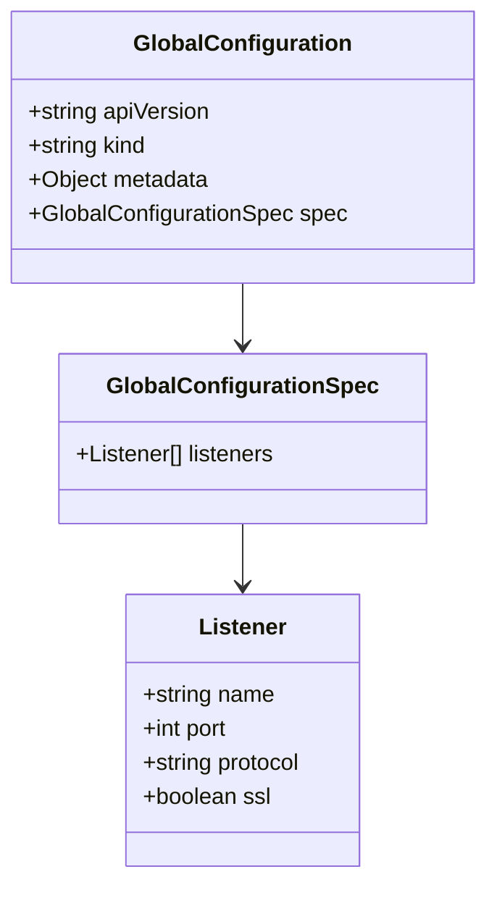
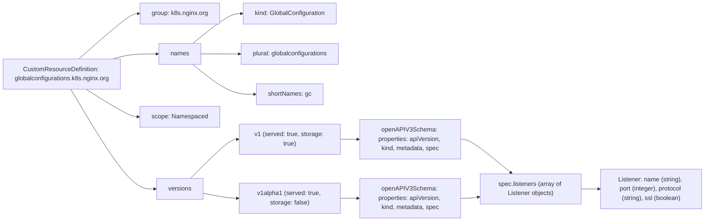

# Diagram: devops/k8s/nginx-ingress-controller/helm/crds/k8s.nginx.org_globalconfigurations.yaml

> Auto-generated by Obscura crawlers

## Diagram 1

### SVG

<svg id="container" width="337.0703125" xmlns="http://www.w3.org/2000/svg" class="classDiagram" height="620" viewBox="0 0 337.0703125 620" role="graphics-document document" aria-roledescription="class"><g><defs><marker id="container_class-aggregationStart" class="marker aggregation class" refX="18" refY="7" markerWidth="190" markerHeight="240" orient="auto"><path d="M 18,7 L9,13 L1,7 L9,1 Z"></path></marker></defs><defs><marker id="container_class-aggregationEnd" class="marker aggregation class" refX="1" refY="7" markerWidth="20" markerHeight="28" orient="auto"><path d="M 18,7 L9,13 L1,7 L9,1 Z"></path></marker></defs><defs><marker id="container_class-extensionStart" class="marker extension class" refX="18" refY="7" markerWidth="190" markerHeight="240" orient="auto"><path d="M 1,7 L18,13 V 1 Z"></path></marker></defs><defs><marker id="container_class-extensionEnd" class="marker extension class" refX="1" refY="7" markerWidth="20" markerHeight="28" orient="auto"><path d="M 1,1 V 13 L18,7 Z"></path></marker></defs><defs><marker id="container_class-compositionStart" class="marker composition class" refX="18" refY="7" markerWidth="190" markerHeight="240" orient="auto"><path d="M 18,7 L9,13 L1,7 L9,1 Z"></path></marker></defs><defs><marker id="container_class-compositionEnd" class="marker composition class" refX="1" refY="7" markerWidth="20" markerHeight="28" orient="auto"><path d="M 18,7 L9,13 L1,7 L9,1 Z"></path></marker></defs><defs><marker id="container_class-dependencyStart" class="marker dependency class" refX="6" refY="7" markerWidth="190" markerHeight="240" orient="auto"><path d="M 5,7 L9,13 L1,7 L9,1 Z"></path></marker></defs><defs><marker id="container_class-dependencyEnd" class="marker dependency class" refX="13" refY="7" markerWidth="20" markerHeight="28" orient="auto"><path d="M 18,7 L9,13 L14,7 L9,1 Z"></path></marker></defs><defs><marker id="container_class-lollipopStart" class="marker lollipop class" refX="13" refY="7" markerWidth="190" markerHeight="240" orient="auto"><circle stroke="black" fill="transparent" cx="7" cy="7" r="6"></circle></marker></defs><defs><marker id="container_class-lollipopEnd" class="marker lollipop class" refX="1" refY="7" markerWidth="190" markerHeight="240" orient="auto"><circle stroke="black" fill="transparent" cx="7" cy="7" r="6"></circle></marker></defs><g class="root"><g class="clusters"></g><g class="edgePaths"><path d="M168.535,200L168.535,204.167C168.535,208.333,168.535,216.667,168.535,224C168.535,231.333,168.535,237.667,168.535,240.833L168.535,244" id="id_GlobalConfiguration_GlobalConfigurationSpec_1" class="edge-thickness-normal edge-pattern-solid relation" style=";;;" data-edge="true" data-et="edge" data-id="id_GlobalConfiguration_GlobalConfigurationSpec_1" data-points="W3sieCI6MTY4LjUzNTE1NjI1LCJ5IjoyMDB9LHsieCI6MTY4LjUzNTE1NjI1LCJ5IjoyMjV9LHsieCI6MTY4LjUzNTE1NjI1LCJ5IjoyNTB9XQ==" marker-end="url(#container_class-dependencyEnd)"></path><path d="M168.535,370L168.535,374.167C168.535,378.333,168.535,386.667,168.535,394C168.535,401.333,168.535,407.667,168.535,410.833L168.535,414" id="id_GlobalConfigurationSpec_Listener_2" class="edge-thickness-normal edge-pattern-solid relation" style=";;;" data-edge="true" data-et="edge" data-id="id_GlobalConfigurationSpec_Listener_2" data-points="W3sieCI6MTY4LjUzNTE1NjI1LCJ5IjozNzB9LHsieCI6MTY4LjUzNTE1NjI1LCJ5IjozOTV9LHsieCI6MTY4LjUzNTE1NjI1LCJ5Ijo0MjB9XQ==" marker-end="url(#container_class-dependencyEnd)"></path></g><g class="edgeLabels"><g class="edgeLabel"><g class="label" data-id="id_GlobalConfiguration_GlobalConfigurationSpec_1" transform="translate(0, 0)"><foreignObject width="0" height="0">

</foreignObject></g></g><g class="edgeLabel"><g class="label" data-id="id_GlobalConfigurationSpec_Listener_2" transform="translate(0, 0)"><foreignObject width="0" height="0">

</foreignObject></g></g></g><g class="nodes"><g class="node default" id="classId-GlobalConfiguration-0" transform="translate(168.53515625, 104)"><g class="basic label-container"><path d="M-160.53515625 -96 L160.53515625 -96 L160.53515625 96 L-160.53515625 96" stroke="none" stroke-width="0" fill="#ECECFF" style=""></path><path d="M-160.53515625 -96 C-47.75015981581896 -96, 65.03483661836208 -96, 160.53515625 -96 M-160.53515625 -96 C-84.86344660028483 -96, -9.191736950569663 -96, 160.53515625 -96 M160.53515625 -96 C160.53515625 -45.23612429303762, 160.53515625 5.527751413924761, 160.53515625 96 M160.53515625 -96 C160.53515625 -45.4076876078979, 160.53515625 5.184624784204203, 160.53515625 96 M160.53515625 96 C61.86311993084438 96, -36.808916388311246 96, -160.53515625 96 M160.53515625 96 C38.11540018424857 96, -84.30435588150286 96, -160.53515625 96 M-160.53515625 96 C-160.53515625 46.1492634869679, -160.53515625 -3.701473026064207, -160.53515625 -96 M-160.53515625 96 C-160.53515625 50.73581198809785, -160.53515625 5.471623976195701, -160.53515625 -96" stroke="#9370DB" stroke-width="1.3" fill="none" stroke-dasharray="0 0" style=""></path></g><g class="annotation-group text" transform="translate(0, -72)"></g><g class="label-group text" transform="translate(-72.9140625, -72)"><g class="label" style="font-weight: bolder" transform="translate(0,-12)"><foreignObject width="145.828125" height="24">

GlobalConfiguration

</foreignObject></g></g><g class="members-group text" transform="translate(-148.53515625, -24)"><g class="label" style="" transform="translate(0,-12)"><foreignObject width="130.4375" height="24">

+string apiVersion

</foreignObject></g><g class="label" style="" transform="translate(0,12)"><foreignObject width="85.515625" height="24">

+string kind

</foreignObject></g><g class="label" style="" transform="translate(0,36)"><foreignObject width="128.875" height="24">

+Object metadata

</foreignObject></g><g class="label" style="" transform="translate(0,60)"><foreignObject width="224.15625" height="24">

+GlobalConfigurationSpec spec

</foreignObject></g></g><g class="methods-group text" transform="translate(-148.53515625, 96)"></g><g class="divider" style=""><path d="M-160.53515625 -48 C-41.14332014516059 -48, 78.24851595967883 -48, 160.53515625 -48 M-160.53515625 -48 C-60.581612998235684 -48, 39.37193025352863 -48, 160.53515625 -48" stroke="#9370DB" stroke-width="1.3" fill="none" stroke-dasharray="0 0" style=""></path></g><g class="divider" style=""><path d="M-160.53515625 72 C-35.08295231109503 72, 90.36925162780994 72, 160.53515625 72 M-160.53515625 72 C-45.02068382246574 72, 70.49378860506852 72, 160.53515625 72" stroke="#9370DB" stroke-width="1.3" fill="none" stroke-dasharray="0 0" style=""></path></g></g><g class="node default" id="classId-GlobalConfigurationSpec-1" transform="translate(168.53515625, 310)"><g class="basic label-container"><path d="M-128.984375 -60 L128.984375 -60 L128.984375 60 L-128.984375 60" stroke="none" stroke-width="0" fill="#ECECFF" style=""></path><path d="M-128.984375 -60 C-76.78792154578618 -60, -24.591468091572352 -60, 128.984375 -60 M-128.984375 -60 C-49.91547799902639 -60, 29.153419001947213 -60, 128.984375 -60 M128.984375 -60 C128.984375 -22.484510091486108, 128.984375 15.030979817027784, 128.984375 60 M128.984375 -60 C128.984375 -20.72896818933907, 128.984375 18.54206362132186, 128.984375 60 M128.984375 60 C49.90158222046253 60, -29.18121055907494 60, -128.984375 60 M128.984375 60 C29.086735733156345 60, -70.81090353368731 60, -128.984375 60 M-128.984375 60 C-128.984375 31.977201193359754, -128.984375 3.954402386719508, -128.984375 -60 M-128.984375 60 C-128.984375 21.775982251697606, -128.984375 -16.44803549660479, -128.984375 -60" stroke="#9370DB" stroke-width="1.3" fill="none" stroke-dasharray="0 0" style=""></path></g><g class="annotation-group text" transform="translate(0, -36)"></g><g class="label-group text" transform="translate(-90.515625, -36)"><g class="label" style="font-weight: bolder" transform="translate(0,-12)"><foreignObject width="181.03125" height="24">

GlobalConfigurationSpec

</foreignObject></g></g><g class="members-group text" transform="translate(-116.984375, 12)"><g class="label" style="" transform="translate(0,-12)"><foreignObject width="143.453125" height="24">

+Listener[] listeners

</foreignObject></g></g><g class="methods-group text" transform="translate(-116.984375, 60)"></g><g class="divider" style=""><path d="M-128.984375 -12 C-60.73521337855547 -12, 7.513948242889057 -12, 128.984375 -12 M-128.984375 -12 C-62.410146583751285 -12, 4.1640818324974305 -12, 128.984375 -12" stroke="#9370DB" stroke-width="1.3" fill="none" stroke-dasharray="0 0" style=""></path></g><g class="divider" style=""><path d="M-128.984375 36 C-38.6521434015625 36, 51.680088196875005 36, 128.984375 36 M-128.984375 36 C-76.4394790130527 36, -23.894583026105423 36, 128.984375 36" stroke="#9370DB" stroke-width="1.3" fill="none" stroke-dasharray="0 0" style=""></path></g></g><g class="node default" id="classId-Listener-2" transform="translate(168.53515625, 516)"><g class="basic label-container"><path d="M-84.234375 -96 L84.234375 -96 L84.234375 96 L-84.234375 96" stroke="none" stroke-width="0" fill="#ECECFF" style=""></path><path d="M-84.234375 -96 C-40.09176498702051 -96, 4.050845025958978 -96, 84.234375 -96 M-84.234375 -96 C-45.38133356600036 -96, -6.528292132000715 -96, 84.234375 -96 M84.234375 -96 C84.234375 -43.169609563440716, 84.234375 9.660780873118568, 84.234375 96 M84.234375 -96 C84.234375 -26.853431183821627, 84.234375 42.293137632356746, 84.234375 96 M84.234375 96 C42.16208731801093 96, 0.08979963602186558 96, -84.234375 96 M84.234375 96 C26.155129455389556 96, -31.924116089220888 96, -84.234375 96 M-84.234375 96 C-84.234375 27.678954579608686, -84.234375 -40.64209084078263, -84.234375 -96 M-84.234375 96 C-84.234375 51.41044308663264, -84.234375 6.820886173265279, -84.234375 -96" stroke="#9370DB" stroke-width="1.3" fill="none" stroke-dasharray="0 0" style=""></path></g><g class="annotation-group text" transform="translate(0, -72)"></g><g class="label-group text" transform="translate(-29.828125, -72)"><g class="label" style="font-weight: bolder" transform="translate(0,-12)"><foreignObject width="59.65625" height="24">

Listener

</foreignObject></g></g><g class="members-group text" transform="translate(-72.234375, -24)"><g class="label" style="" transform="translate(0,-12)"><foreignObject width="94.375" height="24">

+string name

</foreignObject></g><g class="label" style="" transform="translate(0,12)"><foreignObject width="62.703125" height="24">

+int port

</foreignObject></g><g class="label" style="" transform="translate(0,36)"><foreignObject width="114.640625" height="24">

+string protocol

</foreignObject></g><g class="label" style="" transform="translate(0,60)"><foreignObject width="91.140625" height="24">

+boolean ssl

</foreignObject></g></g><g class="methods-group text" transform="translate(-72.234375, 96)"></g><g class="divider" style=""><path d="M-84.234375 -48 C-37.286388096052534 -48, 9.661598807894933 -48, 84.234375 -48 M-84.234375 -48 C-37.80831998637139 -48, 8.617735027257226 -48, 84.234375 -48" stroke="#9370DB" stroke-width="1.3" fill="none" stroke-dasharray="0 0" style=""></path></g><g class="divider" style=""><path d="M-84.234375 72 C-44.37444507200397 72, -4.5145151440079445 72, 84.234375 72 M-84.234375 72 C-33.32937988242341 72, 17.57561523515318 72, 84.234375 72" stroke="#9370DB" stroke-width="1.3" fill="none" stroke-dasharray="0 0" style=""></path></g></g></g></g></g></svg>

## Diagram 2

### SVG

<svg id="container" width="1818.40625" xmlns="http://www.w3.org/2000/svg" class="flowchart" height="570" viewBox="0 0 1818.40625 570" role="graphics-document document" aria-roledescription="flowchart-v2"><g><marker id="container_flowchart-v2-pointEnd" class="marker flowchart-v2" viewBox="0 0 10 10" refX="5" refY="5" markerUnits="userSpaceOnUse" markerWidth="8" markerHeight="8" orient="auto"><path d="M 0 0 L 10 5 L 0 10 z" class="arrowMarkerPath" style="stroke-width: 1; stroke-dasharray: 1, 0;"></path></marker><marker id="container_flowchart-v2-pointStart" class="marker flowchart-v2" viewBox="0 0 10 10" refX="4.5" refY="5" markerUnits="userSpaceOnUse" markerWidth="8" markerHeight="8" orient="auto"><path d="M 0 5 L 10 10 L 10 0 z" class="arrowMarkerPath" style="stroke-width: 1; stroke-dasharray: 1, 0;"></path></marker><marker id="container_flowchart-v2-circleEnd" class="marker flowchart-v2" viewBox="0 0 10 10" refX="11" refY="5" markerUnits="userSpaceOnUse" markerWidth="11" markerHeight="11" orient="auto"><circle cx="5" cy="5" r="5" class="arrowMarkerPath" style="stroke-width: 1; stroke-dasharray: 1, 0;"></circle></marker><marker id="container_flowchart-v2-circleStart" class="marker flowchart-v2" viewBox="0 0 10 10" refX="-1" refY="5" markerUnits="userSpaceOnUse" markerWidth="11" markerHeight="11" orient="auto"><circle cx="5" cy="5" r="5" class="arrowMarkerPath" style="stroke-width: 1; stroke-dasharray: 1, 0;"></circle></marker><marker id="container_flowchart-v2-crossEnd" class="marker cross flowchart-v2" viewBox="0 0 11 11" refX="12" refY="5.2" markerUnits="userSpaceOnUse" markerWidth="11" markerHeight="11" orient="auto"><path d="M 1,1 l 9,9 M 10,1 l -9,9" class="arrowMarkerPath" style="stroke-width: 2; stroke-dasharray: 1, 0;"></path></marker><marker id="container_flowchart-v2-crossStart" class="marker cross flowchart-v2" viewBox="0 0 11 11" refX="-1" refY="5.2" markerUnits="userSpaceOnUse" markerWidth="11" markerHeight="11" orient="auto"><path d="M 1,1 l 9,9 M 10,1 l -9,9" class="arrowMarkerPath" style="stroke-width: 2; stroke-dasharray: 1, 0;"></path></marker><g class="root"><g class="clusters"></g><g class="edgePaths"><path d="M206.213,152L228.534,132.5C250.855,113,295.498,74,321.319,54.5C347.141,35,354.141,35,357.641,35L361.141,35" id="L_CRD_Group_0" class="edge-thickness-normal edge-pattern-solid edge-thickness-normal edge-pattern-solid flowchart-link" style=";" data-edge="true" data-et="edge" data-id="L_CRD_Group_0" data-points="W3sieCI6MjA2LjIxMjg5MDYyNSwieSI6MTUyfSx7IngiOjM0MC4xNDA2MjUsInkiOjM1fSx7IngiOjM2NS4xNDA2MjUsInkiOjM1fV0=" marker-end="url(#container_flowchart-v2-pointEnd)"></path><path d="M295.498,152L302.938,149.833C310.379,147.667,325.26,143.333,344.307,141.167C363.354,139,386.568,139,398.174,139L409.781,139" id="L_CRD_Names_0" class="edge-thickness-normal edge-pattern-solid edge-thickness-normal edge-pattern-solid flowchart-link" style=";" data-edge="true" data-et="edge" data-id="L_CRD_Names_0" data-points="W3sieCI6Mjk1LjQ5ODA0Njg3NSwieSI6MTUyfSx7IngiOjM0MC4xNDA2MjUsInkiOjEzOX0seyJ4Ijo0MTMuNzgxMjUsInkiOjEzOX1d" marker-end="url(#container_flowchart-v2-pointEnd)"></path><path d="M500.909,112L516.658,99.167C532.408,86.333,563.907,60.667,584.513,47.833C605.12,35,614.833,35,619.69,35L624.547,35" id="L_Names_Kind_0" class="edge-thickness-normal edge-pattern-solid edge-thickness-normal edge-pattern-solid flowchart-link" style=";" data-edge="true" data-et="edge" data-id="L_Names_Kind_0" data-points="W3sieCI6NTAwLjkwODg3OTIwNjczMDgsInkiOjExMn0seyJ4Ijo1OTUuNDA2MjUsInkiOjM1fSx7IngiOjYyOC41NDY4NzUsInkiOjM1fV0=" marker-end="url(#container_flowchart-v2-pointEnd)"></path><path d="M521.766,139L534.039,139C546.313,139,570.859,139,586.725,139C602.591,139,609.776,139,613.368,139L616.961,139" id="L_Names_Plural_0" class="edge-thickness-normal edge-pattern-solid edge-thickness-normal edge-pattern-solid flowchart-link" style=";" data-edge="true" data-et="edge" data-id="L_Names_Plural_0" data-points="W3sieCI6NTIxLjc2NTYyNSwieSI6MTM5fSx7IngiOjU5NS40MDYyNSwieSI6MTM5fSx7IngiOjYyMC45NjA5Mzc1LCJ5IjoxMzl9XQ==" marker-end="url(#container_flowchart-v2-pointEnd)"></path><path d="M500.909,166L516.658,178.833C532.408,191.667,563.907,217.333,590.533,230.167C617.159,243,638.911,243,649.788,243L660.664,243" id="L_Names_ShortNames_0" class="edge-thickness-normal edge-pattern-solid edge-thickness-normal edge-pattern-solid flowchart-link" style=";" data-edge="true" data-et="edge" data-id="L_Names_ShortNames_0" data-points="W3sieCI6NTAwLjkwODg3OTIwNjczMDgsInkiOjE2Nn0seyJ4Ijo1OTUuNDA2MjUsInkiOjI0M30seyJ4Ijo2NjQuNjY0MDYyNSwieSI6MjQzfV0=" marker-end="url(#container_flowchart-v2-pointEnd)"></path><path d="M224.882,230L244.091,241.833C263.301,253.667,301.721,277.333,324.565,289.167C347.409,301,354.677,301,358.311,301L361.945,301" id="L_CRD_Scope_0" class="edge-thickness-normal edge-pattern-solid edge-thickness-normal edge-pattern-solid flowchart-link" style=";" data-edge="true" data-et="edge" data-id="L_CRD_Scope_0" data-points="W3sieCI6MjI0Ljg4MTYwNTExMzYzNjM3LCJ5IjoyMzB9LHsieCI6MzQwLjE0MDYyNSwieSI6MzAxfSx7IngiOjM2NS45NDUzMTI1LCJ5IjozMDF9XQ==" marker-end="url(#container_flowchart-v2-pointEnd)"></path><path d="M185.098,230L210.939,272.833C236.779,315.667,288.46,401.333,324.852,444.167C361.245,487,382.349,487,392.901,487L403.453,487" id="L_CRD_Versions_0" class="edge-thickness-normal edge-pattern-solid edge-thickness-normal edge-pattern-solid flowchart-link" style=";" data-edge="true" data-et="edge" data-id="L_CRD_Versions_0" data-points="W3sieCI6MTg1LjA5ODE1NzcyODA0MDU1LCJ5IjoyMzB9LHsieCI6MzQwLjE0MDYyNSwieSI6NDg3fSx7IngiOjQwNy40NTMxMjUsInkiOjQ4N31d" marker-end="url(#container_flowchart-v2-pointEnd)"></path><path d="M494.696,460L511.481,443.167C528.266,426.333,561.836,392.667,582.121,375.833C602.406,359,609.406,359,612.906,359L616.406,359" id="L_Versions_V1_0" class="edge-thickness-normal edge-pattern-solid edge-thickness-normal edge-pattern-solid flowchart-link" style=";" data-edge="true" data-et="edge" data-id="L_Versions_V1_0" data-points="W3sieCI6NDk0LjY5NTk4Mzg4NjcxODc1LCJ5Ijo0NjB9LHsieCI6NTk1LjQwNjI1LCJ5IjozNTl9LHsieCI6NjIwLjQwNjI1LCJ5IjozNTl9XQ==" marker-end="url(#container_flowchart-v2-pointEnd)"></path><path d="M528.094,498.343L539.313,500.452C550.531,502.562,572.969,506.781,587.688,508.89C602.406,511,609.406,511,612.906,511L616.406,511" id="L_Versions_V1alpha1_0" class="edge-thickness-normal edge-pattern-solid edge-thickness-normal edge-pattern-solid flowchart-link" style=";" data-edge="true" data-et="edge" data-id="L_Versions_V1alpha1_0" data-points="W3sieCI6NTI4LjA5Mzc1LCJ5Ijo0OTguMzQyNTk2NTU5OTU1OTV9LHsieCI6NTk1LjQwNjI1LCJ5Ijo1MTF9LHsieCI6NjIwLjQwNjI1LCJ5Ijo1MTF9XQ==" marker-end="url(#container_flowchart-v2-pointEnd)"></path><path d="M880.406,359L884.573,359C888.74,359,897.073,359,904.74,359C912.406,359,919.406,359,922.906,359L926.406,359" id="L_V1_SchemaV1_0" class="edge-thickness-normal edge-pattern-solid edge-thickness-normal edge-pattern-solid flowchart-link" style=";" data-edge="true" data-et="edge" data-id="L_V1_SchemaV1_0" data-points="W3sieCI6ODgwLjQwNjI1LCJ5IjozNTl9LHsieCI6OTA1LjQwNjI1LCJ5IjozNTl9LHsieCI6OTMwLjQwNjI1LCJ5IjozNTl9XQ==" marker-end="url(#container_flowchart-v2-pointEnd)"></path><path d="M880.406,511L884.573,511C888.74,511,897.073,511,904.74,511C912.406,511,919.406,511,922.906,511L926.406,511" id="L_V1alpha1_SchemaV1alpha1_0" class="edge-thickness-normal edge-pattern-solid edge-thickness-normal edge-pattern-solid flowchart-link" style=";" data-edge="true" data-et="edge" data-id="L_V1alpha1_SchemaV1alpha1_0" data-points="W3sieCI6ODgwLjQwNjI1LCJ5Ijo1MTF9LHsieCI6OTA1LjQwNjI1LCJ5Ijo1MTF9LHsieCI6OTMwLjQwNjI1LCJ5Ijo1MTF9XQ==" marker-end="url(#container_flowchart-v2-pointEnd)"></path><path d="M1190.406,359L1194.573,359C1198.74,359,1207.073,359,1228.688,373.409C1250.303,387.818,1285.199,416.635,1302.647,431.044L1320.095,445.453" id="L_SchemaV1_SpecListeners_0" class="edge-thickness-normal edge-pattern-solid edge-thickness-normal edge-pattern-solid flowchart-link" style=";" data-edge="true" data-et="edge" data-id="L_SchemaV1_SpecListeners_0" data-points="W3sieCI6MTE5MC40MDYyNSwieSI6MzU5fSx7IngiOjEyMTUuNDA2MjUsInkiOjM1OX0seyJ4IjoxMzIzLjE3OTY4NzUsInkiOjQ0OH1d" marker-end="url(#container_flowchart-v2-pointEnd)"></path><path d="M1190.406,511L1194.573,511C1198.74,511,1207.073,511,1214.747,510.457C1222.422,509.914,1229.438,508.827,1232.946,508.284L1236.453,507.741" id="L_SchemaV1alpha1_SpecListeners_0" class="edge-thickness-normal edge-pattern-solid edge-thickness-normal edge-pattern-solid flowchart-link" style=";" data-edge="true" data-et="edge" data-id="L_SchemaV1alpha1_SpecListeners_0" data-points="W3sieCI6MTE5MC40MDYyNSwieSI6NTExfSx7IngiOjEyMTUuNDA2MjUsInkiOjUxMX0seyJ4IjoxMjQwLjQwNjI1LCJ5Ijo1MDcuMTI5MDMyMjU4MDY0NX1d" marker-end="url(#container_flowchart-v2-pointEnd)"></path><path d="M1500.406,487L1504.573,487C1508.74,487,1517.073,487,1524.74,487C1532.406,487,1539.406,487,1542.906,487L1546.406,487" id="L_SpecListeners_ListenerNode_0" class="edge-thickness-normal edge-pattern-solid edge-thickness-normal edge-pattern-solid flowchart-link" style=";" data-edge="true" data-et="edge" data-id="L_SpecListeners_ListenerNode_0" data-points="W3sieCI6MTUwMC40MDYyNSwieSI6NDg3fSx7IngiOjE1MjUuNDA2MjUsInkiOjQ4N30seyJ4IjoxNTUwLjQwNjI1LCJ5Ijo0ODd9XQ==" marker-end="url(#container_flowchart-v2-pointEnd)"></path></g><g class="edgeLabels"><g class="edgeLabel"><g class="label" data-id="L_CRD_Group_0" transform="translate(0, 0)"><foreignObject width="0" height="0">

</foreignObject></g></g><g class="edgeLabel"><g class="label" data-id="L_CRD_Names_0" transform="translate(0, 0)"><foreignObject width="0" height="0">

</foreignObject></g></g><g class="edgeLabel"><g class="label" data-id="L_Names_Kind_0" transform="translate(0, 0)"><foreignObject width="0" height="0">

</foreignObject></g></g><g class="edgeLabel"><g class="label" data-id="L_Names_Plural_0" transform="translate(0, 0)"><foreignObject width="0" height="0">

</foreignObject></g></g><g class="edgeLabel"><g class="label" data-id="L_Names_ShortNames_0" transform="translate(0, 0)"><foreignObject width="0" height="0">

</foreignObject></g></g><g class="edgeLabel"><g class="label" data-id="L_CRD_Scope_0" transform="translate(0, 0)"><foreignObject width="0" height="0">

</foreignObject></g></g><g class="edgeLabel"><g class="label" data-id="L_CRD_Versions_0" transform="translate(0, 0)"><foreignObject width="0" height="0">

</foreignObject></g></g><g class="edgeLabel"><g class="label" data-id="L_Versions_V1_0" transform="translate(0, 0)"><foreignObject width="0" height="0">

</foreignObject></g></g><g class="edgeLabel"><g class="label" data-id="L_Versions_V1alpha1_0" transform="translate(0, 0)"><foreignObject width="0" height="0">

</foreignObject></g></g><g class="edgeLabel"><g class="label" data-id="L_V1_SchemaV1_0" transform="translate(0, 0)"><foreignObject width="0" height="0">

</foreignObject></g></g><g class="edgeLabel"><g class="label" data-id="L_V1alpha1_SchemaV1alpha1_0" transform="translate(0, 0)"><foreignObject width="0" height="0">

</foreignObject></g></g><g class="edgeLabel"><g class="label" data-id="L_SchemaV1_SpecListeners_0" transform="translate(0, 0)"><foreignObject width="0" height="0">

</foreignObject></g></g><g class="edgeLabel"><g class="label" data-id="L_SchemaV1alpha1_SpecListeners_0" transform="translate(0, 0)"><foreignObject width="0" height="0">

</foreignObject></g></g><g class="edgeLabel"><g class="label" data-id="L_SpecListeners_ListenerNode_0" transform="translate(0, 0)"><foreignObject width="0" height="0">

</foreignObject></g></g></g><g class="nodes"><g class="node default" id="flowchart-CRD-0" transform="translate(161.5703125, 191)"><rect class="basic label-container" style="" x="-153.5703125" y="-39" width="307.140625" height="78"></rect><g class="label" style="" transform="translate(-123.5703125, -24)"><rect></rect><foreignObject width="247.140625" height="48">

CustomResourceDefinition: globalconfigurations.k8s.nginx.org

</foreignObject></g></g><g class="node default" id="flowchart-Group-2" transform="translate(467.7734375, 35)"><rect class="basic label-container" style="" x="-102.6328125" y="-27" width="205.265625" height="54"></rect><g class="label" style="" transform="translate(-72.6328125, -12)"><rect></rect><foreignObject width="145.265625" height="24">

group: k8s.nginx.org

</foreignObject></g></g><g class="node default" id="flowchart-Names-4" transform="translate(467.7734375, 139)"><rect class="basic label-container" style="" x="-53.9921875" y="-27" width="107.984375" height="54"></rect><g class="label" style="" transform="translate(-23.9921875, -12)"><rect></rect><foreignObject width="47.984375" height="24">

names

</foreignObject></g></g><g class="node default" id="flowchart-Kind-6" transform="translate(750.40625, 35)"><rect class="basic label-container" style="" x="-121.859375" y="-27" width="243.71875" height="54"></rect><g class="label" style="" transform="translate(-91.859375, -12)"><rect></rect><foreignObject width="183.71875" height="24">

kind: GlobalConfiguration

</foreignObject></g></g><g class="node default" id="flowchart-Plural-8" transform="translate(750.40625, 139)"><rect class="basic label-container" style="" x="-129.4453125" y="-27" width="258.890625" height="54"></rect><g class="label" style="" transform="translate(-99.4453125, -12)"><rect></rect><foreignObject width="198.890625" height="24">

plural: globalconfigurations

</foreignObject></g></g><g class="node default" id="flowchart-ShortNames-10" transform="translate(750.40625, 243)"><rect class="basic label-container" style="" x="-85.7421875" y="-27" width="171.484375" height="54"></rect><g class="label" style="" transform="translate(-55.7421875, -12)"><rect></rect><foreignObject width="111.484375" height="24">

shortNames: gc

</foreignObject></g></g><g class="node default" id="flowchart-Scope-12" transform="translate(467.7734375, 301)"><rect class="basic label-container" style="" x="-101.828125" y="-27" width="203.65625" height="54"></rect><g class="label" style="" transform="translate(-71.828125, -12)"><rect></rect><foreignObject width="143.65625" height="24">

scope: Namespaced

</foreignObject></g></g><g class="node default" id="flowchart-Versions-14" transform="translate(467.7734375, 487)"><rect class="basic label-container" style="" x="-60.3203125" y="-27" width="120.640625" height="54"></rect><g class="label" style="" transform="translate(-30.3203125, -12)"><rect></rect><foreignObject width="60.640625" height="24">

versions

</foreignObject></g></g><g class="node default" id="flowchart-V1-16" transform="translate(750.40625, 359)"><rect class="basic label-container" style="" x="-130" y="-39" width="260" height="78"></rect><g class="label" style="" transform="translate(-100, -24)"><rect></rect><foreignObject width="200" height="48">

v1 (served: true, storage: true)

</foreignObject></g></g><g class="node default" id="flowchart-V1alpha1-18" transform="translate(750.40625, 511)"><rect class="basic label-container" style="" x="-130" y="-39" width="260" height="78"></rect><g class="label" style="" transform="translate(-100, -24)"><rect></rect><foreignObject width="200" height="48">

v1alpha1 (served: true, storage: false)

</foreignObject></g></g><g class="node default" id="flowchart-SchemaV1-20" transform="translate(1060.40625, 359)"><rect class="basic label-container" style="" x="-130" y="-51" width="260" height="102"></rect><g class="label" style="" transform="translate(-100, -36)"><rect></rect><foreignObject width="200" height="72">

openAPIV3Schema: properties: apiVersion, kind, metadata, spec

</foreignObject></g></g><g class="node default" id="flowchart-SchemaV1alpha1-22" transform="translate(1060.40625, 511)"><rect class="basic label-container" style="" x="-130" y="-51" width="260" height="102"></rect><g class="label" style="" transform="translate(-100, -36)"><rect></rect><foreignObject width="200" height="72">

openAPIV3Schema: properties: apiVersion, kind, metadata, spec

</foreignObject></g></g><g class="node default" id="flowchart-SpecListeners-24" transform="translate(1370.40625, 487)"><rect class="basic label-container" style="" x="-130" y="-39" width="260" height="78"></rect><g class="label" style="" transform="translate(-100, -24)"><rect></rect><foreignObject width="200" height="48">

spec.listeners (array of Listener objects)

</foreignObject></g></g><g class="node default" id="flowchart-ListenerNode-28" transform="translate(1680.40625, 487)"><rect class="basic label-container" style="" x="-130" y="-51" width="260" height="102"></rect><g class="label" style="" transform="translate(-100, -36)"><rect></rect><foreignObject width="200" height="72">

Listener: name (string), port (integer), protocol (string), ssl (boolean)

</foreignObject></g></g></g></g></g></svg>
