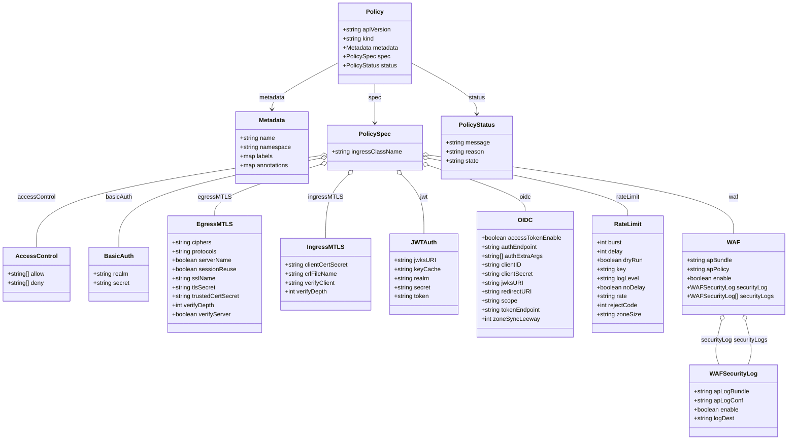
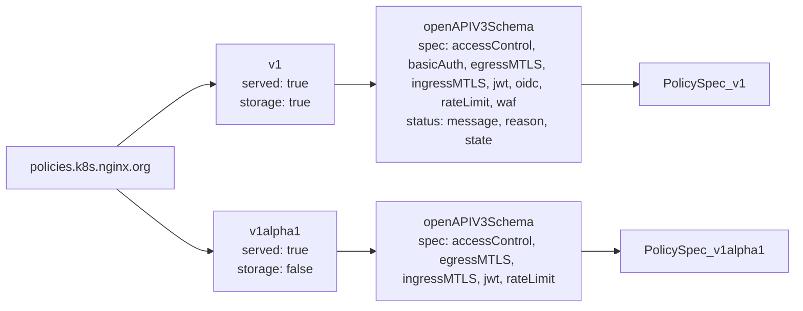

# Diagram: devops/k8s/nginx-ingress-controller/helm/crds/k8s.nginx.org_policies.yaml

> Auto-generated by Obscura crawlers

## Diagram 1

### SVG

<svg id="container" width="2071.328125" xmlns="http://www.w3.org/2000/svg" class="classDiagram" height="1174" viewBox="0 0 2071.328125 1174" role="graphics-document document" aria-roledescription="class"><g><defs><marker id="container_class-aggregationStart" class="marker aggregation class" refX="18" refY="7" markerWidth="190" markerHeight="240" orient="auto"><path d="M 18,7 L9,13 L1,7 L9,1 Z"></path></marker></defs><defs><marker id="container_class-aggregationEnd" class="marker aggregation class" refX="1" refY="7" markerWidth="20" markerHeight="28" orient="auto"><path d="M 18,7 L9,13 L1,7 L9,1 Z"></path></marker></defs><defs><marker id="container_class-extensionStart" class="marker extension class" refX="18" refY="7" markerWidth="190" markerHeight="240" orient="auto"><path d="M 1,7 L18,13 V 1 Z"></path></marker></defs><defs><marker id="container_class-extensionEnd" class="marker extension class" refX="1" refY="7" markerWidth="20" markerHeight="28" orient="auto"><path d="M 1,1 V 13 L18,7 Z"></path></marker></defs><defs><marker id="container_class-compositionStart" class="marker composition class" refX="18" refY="7" markerWidth="190" markerHeight="240" orient="auto"><path d="M 18,7 L9,13 L1,7 L9,1 Z"></path></marker></defs><defs><marker id="container_class-compositionEnd" class="marker composition class" refX="1" refY="7" markerWidth="20" markerHeight="28" orient="auto"><path d="M 18,7 L9,13 L1,7 L9,1 Z"></path></marker></defs><defs><marker id="container_class-dependencyStart" class="marker dependency class" refX="6" refY="7" markerWidth="190" markerHeight="240" orient="auto"><path d="M 5,7 L9,13 L1,7 L9,1 Z"></path></marker></defs><defs><marker id="container_class-dependencyEnd" class="marker dependency class" refX="13" refY="7" markerWidth="20" markerHeight="28" orient="auto"><path d="M 18,7 L9,13 L14,7 L9,1 Z"></path></marker></defs><defs><marker id="container_class-lollipopStart" class="marker lollipop class" refX="13" refY="7" markerWidth="190" markerHeight="240" orient="auto"><circle stroke="black" fill="transparent" cx="7" cy="7" r="6"></circle></marker></defs><defs><marker id="container_class-lollipopEnd" class="marker lollipop class" refX="1" refY="7" markerWidth="190" markerHeight="240" orient="auto"><circle stroke="black" fill="transparent" cx="7" cy="7" r="6"></circle></marker></defs><g class="root"><g class="clusters"></g><g class="edgePaths"><path d="M989.443,224L989.443,230.167C989.443,236.333,989.443,248.667,989.443,266C989.443,283.333,989.443,305.667,989.443,316.833L989.443,328" id="id_Policy_PolicySpec_1" class="edge-thickness-normal edge-pattern-solid relation" style=";;;" data-edge="true" data-et="edge" data-id="id_Policy_PolicySpec_1" data-points="W3sieCI6OTg5LjQ0MzM1OTM3NSwieSI6MjI0fSx7IngiOjk4OS40NDMzNTkzNzUsInkiOjI2MX0seyJ4Ijo5ODkuNDQzMzU5Mzc1LCJ5IjozMzR9XQ==" marker-end="url(#container_class-dependencyEnd)"></path><path d="M891.6,168.342L862.732,183.785C833.864,199.228,776.128,230.114,747.26,250.724C718.393,271.333,718.393,281.667,718.393,286.833L718.393,292" id="id_Policy_Metadata_2" class="edge-thickness-normal edge-pattern-solid relation" style=";;;" data-edge="true" data-et="edge" data-id="id_Policy_Metadata_2" data-points="W3sieCI6ODkxLjU5OTYwOTM3NSwieSI6MTY4LjM0MjAxMzg2Mzg2ODl9LHsieCI6NzE4LjM5MjU3ODEyNSwieSI6MjYxfSx7IngiOjcxOC4zOTI1NzgxMjUsInkiOjI5OH1d" marker-end="url(#container_class-dependencyEnd)"></path><path d="M1087.287,169.226L1115.404,184.522C1143.521,199.818,1199.756,230.409,1227.873,252.871C1255.99,275.333,1255.99,289.667,1255.99,296.833L1255.99,304" id="id_Policy_PolicyStatus_3" class="edge-thickness-normal edge-pattern-solid relation" style=";;;" data-edge="true" data-et="edge" data-id="id_Policy_PolicyStatus_3" data-points="W3sieCI6MTA4Ny4yODcxMDkzNzUsInkiOjE2OS4yMjY0NDkzODE1NTgxM30seyJ4IjoxMjU1Ljk5MDIzNDM3NSwieSI6MjYxfSx7IngiOjEyNTUuOTkwMjM0Mzc1LCJ5IjozMTB9XQ==" marker-end="url(#container_class-dependencyEnd)"></path><path d="M848.62,414.985L723.334,433.654C598.049,452.323,347.478,489.662,222.192,530.497C96.906,571.333,96.906,615.667,96.906,637.833L96.906,660" id="id_PolicySpec_AccessControl_4" class="edge-thickness-normal edge-pattern-solid relation" style=";;;" data-edge="true" data-et="edge" data-id="id_PolicySpec_AccessControl_4" data-points="W3sieCI6ODY1LjY4MTY0MDYyNSwieSI6NDEyLjQ0MjE1NTk4NTI4Nn0seyJ4Ijo5Ni45MDYyNSwieSI6NTI3fSx7IngiOjk2LjkwNjI1LCJ5Ijo2NjB9XQ==" marker-start="url(#container_class-aggregationStart)"></path><path d="M848.757,421.737L759.774,439.281C670.79,456.825,492.823,491.912,403.839,531.623C314.855,571.333,314.855,615.667,314.855,637.833L314.855,660" id="id_PolicySpec_BasicAuth_5" class="edge-thickness-normal edge-pattern-solid relation" style=";;;" data-edge="true" data-et="edge" data-id="id_PolicySpec_BasicAuth_5" data-points="W3sieCI6ODY1LjY4MTY0MDYyNSwieSI6NDE4LjQwMDUzOTY4MTM0NDh9LHsieCI6MzE0Ljg1NTQ2ODc1LCJ5Ijo1Mjd9LHsieCI6MzE0Ljg1NTQ2ODc1LCJ5Ijo2NjB9XQ==" marker-start="url(#container_class-aggregationStart)"></path><path d="M849.23,438.216L802.306,453.013C755.383,467.811,661.535,497.405,614.611,520.369C567.688,543.333,567.688,559.667,567.688,567.833L567.688,576" id="id_PolicySpec_EgressMTLS_6" class="edge-thickness-normal edge-pattern-solid relation" style=";;;" data-edge="true" data-et="edge" data-id="id_PolicySpec_EgressMTLS_6" data-points="W3sieCI6ODY1LjY4MTY0MDYyNSwieSI6NDMzLjAyODA0OTU4ODA3ODF9LHsieCI6NTY3LjY4NzUsInkiOjUyN30seyJ4Ijo1NjcuNjg3NSwieSI6NTc2fV0=" marker-start="url(#container_class-aggregationStart)"></path><path d="M919.416,466.399L909.647,476.499C899.878,486.599,880.339,506.8,870.57,535.067C860.801,563.333,860.801,599.667,860.801,617.833L860.801,636" id="id_PolicySpec_IngressMTLS_7" class="edge-thickness-normal edge-pattern-solid relation" style=";;;" data-edge="true" data-et="edge" data-id="id_PolicySpec_IngressMTLS_7" data-points="W3sieCI6OTMxLjQwOTExMzYwNDMyMzQsInkiOjQ1NH0seyJ4Ijo4NjAuODAwNzgxMjUsInkiOjUyN30seyJ4Ijo4NjAuODAwNzgxMjUsInkiOjYzNn1d" marker-start="url(#container_class-aggregationStart)"></path><path d="M1059.47,466.399L1069.24,476.499C1079.009,486.599,1098.547,506.8,1108.317,533.067C1118.086,559.333,1118.086,591.667,1118.086,607.833L1118.086,624" id="id_PolicySpec_JWTAuth_8" class="edge-thickness-normal edge-pattern-solid relation" style=";;;" data-edge="true" data-et="edge" data-id="id_PolicySpec_JWTAuth_8" data-points="W3sieCI6MTA0Ny40Nzc2MDUxNDU2NzY4LCJ5Ijo0NTR9LHsieCI6MTExOC4wODU5Mzc1LCJ5Ijo1Mjd9LHsieCI6MTExOC4wODU5Mzc1LCJ5Ijo2MjR9XQ==" marker-start="url(#container_class-aggregationStart)"></path><path d="M1129.544,441.436L1171.663,455.696C1213.782,469.957,1298.02,498.479,1340.139,518.906C1382.258,539.333,1382.258,551.667,1382.258,557.833L1382.258,564" id="id_PolicySpec_OIDC_9" class="edge-thickness-normal edge-pattern-solid relation" style=";;;" data-edge="true" data-et="edge" data-id="id_PolicySpec_OIDC_9" data-points="W3sieCI6MTExMy4yMDUwNzgxMjUsInkiOjQzNS45MDM1MjA3NjYxMDZ9LHsieCI6MTM4Mi4yNTc4MTI1LCJ5Ijo1Mjd9LHsieCI6MTM4Mi4yNTc4MTI1LCJ5Ijo1NjR9XQ==" marker-start="url(#container_class-aggregationStart)"></path><path d="M1130.119,422.188L1217.296,439.657C1304.474,457.126,1478.829,492.063,1566.006,517.698C1653.184,543.333,1653.184,559.667,1653.184,567.833L1653.184,576" id="id_PolicySpec_RateLimit_10" class="edge-thickness-normal edge-pattern-solid relation" style=";;;" data-edge="true" data-et="edge" data-id="id_PolicySpec_RateLimit_10" data-points="W3sieCI6MTExMy4yMDUwNzgxMjUsInkiOjQxOC43OTkzMjMyMDA5NjUxNX0seyJ4IjoxNjUzLjE4MzU5Mzc1LCJ5Ijo1Mjd9LHsieCI6MTY1My4xODM1OTM3NSwieSI6NTc2fV0=" marker-start="url(#container_class-aggregationStart)"></path><path d="M1130.285,413.903L1263.673,432.752C1397.061,451.602,1663.837,489.301,1797.225,524.317C1930.613,559.333,1930.613,591.667,1930.613,607.833L1930.613,624" id="id_PolicySpec_WAF_11" class="edge-thickness-normal edge-pattern-solid relation" style=";;;" data-edge="true" data-et="edge" data-id="id_PolicySpec_WAF_11" data-points="W3sieCI6MTExMy4yMDUwNzgxMjUsInkiOjQxMS40ODkxOTk1NzA4NDY2fSx7IngiOjE5MzAuNjEzMjgxMjUsInkiOjUyN30seyJ4IjoxOTMwLjYxMzI4MTI1LCJ5Ijo2MjR9XQ==" marker-start="url(#container_class-aggregationStart)"></path><path d="M1898.324,856.699L1894.859,870.083C1891.393,883.466,1884.462,910.233,1883.458,929.783C1882.454,949.333,1887.376,961.667,1889.837,967.833L1892.298,974" id="id_WAF_WAFSecurityLog_12" class="edge-thickness-normal edge-pattern-solid relation" style=";;;" data-edge="true" data-et="edge" data-id="id_WAF_WAFSecurityLog_12" data-points="W3sieCI6MTkwMi42NDgxMTM1NjcwNzMsInkiOjg0MH0seyJ4IjoxODc3LjUzMTI1LCJ5Ijo5Mzd9LHsieCI6MTg5Mi4yOTg0MzE2MjU5Mzk5LCJ5Ijo5NzR9XQ==" marker-start="url(#container_class-aggregationStart)"></path><path d="M1962.902,856.699L1966.368,870.083C1969.833,883.466,1976.764,910.233,1977.769,929.783C1978.773,949.333,1973.851,961.667,1971.389,967.833L1968.928,974" id="id_WAF_WAFSecurityLog_13" class="edge-thickness-normal edge-pattern-solid relation" style=";;;" data-edge="true" data-et="edge" data-id="id_WAF_WAFSecurityLog_13" data-points="W3sieCI6MTk1OC41Nzg0NDg5MzI5MjcsInkiOjg0MH0seyJ4IjoxOTgzLjY5NTMxMjUsInkiOjkzN30seyJ4IjoxOTY4LjkyODEzMDg3NDA2MDEsInkiOjk3NH1d" marker-start="url(#container_class-aggregationStart)"></path></g><g class="edgeLabels"><g class="edgeLabel" transform="translate(989.443359375, 261)"><g class="label" data-id="id_Policy_PolicySpec_1" transform="translate(-16.6796875, -12)"><foreignObject width="33.359375" height="24">

spec

</foreignObject></g></g><g class="edgeLabel" transform="translate(718.392578125, 261)"><g class="label" data-id="id_Policy_Metadata_2" transform="translate(-34.7265625, -12)"><foreignObject width="69.453125" height="24">

metadata

</foreignObject></g></g><g class="edgeLabel" transform="translate(1255.990234375, 261)"><g class="label" data-id="id_Policy_PolicyStatus_3" transform="translate(-22.203125, -12)"><foreignObject width="44.40625" height="24">

status

</foreignObject></g></g><g class="edgeLabel" transform="translate(96.90625, 527)"><g class="label" data-id="id_PolicySpec_AccessControl_4" transform="translate(-49.8671875, -12)"><foreignObject width="99.734375" height="24">

accessControl

</foreignObject></g></g><g class="edgeLabel" transform="translate(314.85546875, 527)"><g class="label" data-id="id_PolicySpec_BasicAuth_5" transform="translate(-35.578125, -12)"><foreignObject width="71.15625" height="24">

basicAuth

</foreignObject></g></g><g class="edgeLabel" transform="translate(567.6875, 527)"><g class="label" data-id="id_PolicySpec_EgressMTLS_6" transform="translate(-41.59375, -12)"><foreignObject width="83.1875" height="24">

egressMTLS

</foreignObject></g></g><g class="edgeLabel" transform="translate(860.80078125, 527)"><g class="label" data-id="id_PolicySpec_IngressMTLS_7" transform="translate(-44.1796875, -12)"><foreignObject width="88.359375" height="24">

ingressMTLS

</foreignObject></g></g><g class="edgeLabel" transform="translate(1118.0859375, 527)"><g class="label" data-id="id_PolicySpec_JWTAuth_8" transform="translate(-10.8671875, -12)"><foreignObject width="21.734375" height="24">

jwt

</foreignObject></g></g><g class="edgeLabel" transform="translate(1382.2578125, 527)"><g class="label" data-id="id_PolicySpec_OIDC_9" transform="translate(-15.5390625, -12)"><foreignObject width="31.078125" height="24">

oidc

</foreignObject></g></g><g class="edgeLabel" transform="translate(1653.18359375, 527)"><g class="label" data-id="id_PolicySpec_RateLimit_10" transform="translate(-32.53125, -12)"><foreignObject width="65.0625" height="24">

rateLimit

</foreignObject></g></g><g class="edgeLabel" transform="translate(1930.61328125, 527)"><g class="label" data-id="id_PolicySpec_WAF_11" transform="translate(-12.6796875, -12)"><foreignObject width="25.359375" height="24">

waf

</foreignObject></g></g><g class="edgeLabel" transform="translate(1885.09659, 907.78306)"><g class="label" data-id="id_WAF_WAFSecurityLog_12" transform="translate(-41.2421875, -12)"><foreignObject width="82.484375" height="24">

securityLog

</foreignObject></g></g><g class="edgeLabel" transform="translate(1976.12997, 907.78306)"><g class="label" data-id="id_WAF_WAFSecurityLog_13" transform="translate(-44.921875, -12)"><foreignObject width="89.84375" height="24">

securityLogs

</foreignObject></g></g></g><g class="nodes"><g class="node default" id="classId-Policy-0" transform="translate(989.443359375, 116)"><g class="basic label-container"><path d="M-97.84375 -108 L97.84375 -108 L97.84375 108 L-97.84375 108" stroke="none" stroke-width="0" fill="#ECECFF" style=""></path><path d="M-97.84375 -108 C-35.07271018297888 -108, 27.69832963404224 -108, 97.84375 -108 M-97.84375 -108 C-51.130450273092634 -108, -4.417150546185269 -108, 97.84375 -108 M97.84375 -108 C97.84375 -27.211415505460252, 97.84375 53.577168989079496, 97.84375 108 M97.84375 -108 C97.84375 -44.13529287003384, 97.84375 19.729414259932327, 97.84375 108 M97.84375 108 C25.871526310884505 108, -46.10069737823099 108, -97.84375 108 M97.84375 108 C19.65082451392459 108, -58.54210097215082 108, -97.84375 108 M-97.84375 108 C-97.84375 52.18132840900795, -97.84375 -3.637343181984093, -97.84375 -108 M-97.84375 108 C-97.84375 46.065889954244156, -97.84375 -15.868220091511688, -97.84375 -108" stroke="#9370DB" stroke-width="1.3" fill="none" stroke-dasharray="0 0" style=""></path></g><g class="annotation-group text" transform="translate(0, -84)"></g><g class="label-group text" transform="translate(-21.84375, -84)"><g class="label" style="font-weight: bolder" transform="translate(0,-12)"><foreignObject width="43.6875" height="24">

Policy

</foreignObject></g></g><g class="members-group text" transform="translate(-85.84375, -36)"><g class="label" style="" transform="translate(0,-12)"><foreignObject width="130.4375" height="24">

+string apiVersion

</foreignObject></g><g class="label" style="" transform="translate(0,12)"><foreignObject width="85.515625" height="24">

+string kind

</foreignObject></g><g class="label" style="" transform="translate(0,36)"><foreignObject width="149.84375" height="24">

+Metadata metadata

</foreignObject></g><g class="label" style="" transform="translate(0,60)"><foreignObject width="123.046875" height="24">

+PolicySpec spec

</foreignObject></g><g class="label" style="" transform="translate(0,84)"><foreignObject width="145.15625" height="24">

+PolicyStatus status

</foreignObject></g></g><g class="methods-group text" transform="translate(-85.84375, 108)"></g><g class="divider" style=""><path d="M-97.84375 -60 C-55.50300058076195 -60, -13.162251161523898 -60, 97.84375 -60 M-97.84375 -60 C-45.57273866710045 -60, 6.698272665799095 -60, 97.84375 -60" stroke="#9370DB" stroke-width="1.3" fill="none" stroke-dasharray="0 0" style=""></path></g><g class="divider" style=""><path d="M-97.84375 84 C-23.335577898569653 84, 51.172594202860694 84, 97.84375 84 M-97.84375 84 C-55.38498830675845 84, -12.926226613516903 84, 97.84375 84" stroke="#9370DB" stroke-width="1.3" fill="none" stroke-dasharray="0 0" style=""></path></g></g><g class="node default" id="classId-Metadata-1" transform="translate(718.392578125, 394)"><g class="basic label-container"><path d="M-97.2890625 -96 L97.2890625 -96 L97.2890625 96 L-97.2890625 96" stroke="none" stroke-width="0" fill="#ECECFF" style=""></path><path d="M-97.2890625 -96 C-51.82562009814055 -96, -6.362177696281094 -96, 97.2890625 -96 M-97.2890625 -96 C-50.482925732896916 -96, -3.6767889657938326 -96, 97.2890625 -96 M97.2890625 -96 C97.2890625 -32.0443708658754, 97.2890625 31.9112582682492, 97.2890625 96 M97.2890625 -96 C97.2890625 -22.683123439194233, 97.2890625 50.633753121611534, 97.2890625 96 M97.2890625 96 C37.41286131571517 96, -22.463339868569662 96, -97.2890625 96 M97.2890625 96 C43.06861429969551 96, -11.151833900608978 96, -97.2890625 96 M-97.2890625 96 C-97.2890625 42.56151762942452, -97.2890625 -10.876964741150957, -97.2890625 -96 M-97.2890625 96 C-97.2890625 34.00821535986564, -97.2890625 -27.983569280268725, -97.2890625 -96" stroke="#9370DB" stroke-width="1.3" fill="none" stroke-dasharray="0 0" style=""></path></g><g class="annotation-group text" transform="translate(0, -72)"></g><g class="label-group text" transform="translate(-34.640625, -72)"><g class="label" style="font-weight: bolder" transform="translate(0,-12)"><foreignObject width="69.28125" height="24">

Metadata

</foreignObject></g></g><g class="members-group text" transform="translate(-85.2890625, -24)"><g class="label" style="" transform="translate(0,-12)"><foreignObject width="94.375" height="24">

+string name

</foreignObject></g><g class="label" style="" transform="translate(0,12)"><foreignObject width="135.9375" height="24">

+string namespace

</foreignObject></g><g class="label" style="" transform="translate(0,36)"><foreignObject width="87.84375" height="24">

+map labels

</foreignObject></g><g class="label" style="" transform="translate(0,60)"><foreignObject width="131.796875" height="24">

+map annotations

</foreignObject></g></g><g class="methods-group text" transform="translate(-85.2890625, 96)"></g><g class="divider" style=""><path d="M-97.2890625 -48 C-36.19266568039252 -48, 24.903731139214955 -48, 97.2890625 -48 M-97.2890625 -48 C-46.14149199066419 -48, 5.006078518671615 -48, 97.2890625 -48" stroke="#9370DB" stroke-width="1.3" fill="none" stroke-dasharray="0 0" style=""></path></g><g class="divider" style=""><path d="M-97.2890625 72 C-38.17371631834828 72, 20.941629863303433 72, 97.2890625 72 M-97.2890625 72 C-23.79265182502928 72, 49.70375884994144 72, 97.2890625 72" stroke="#9370DB" stroke-width="1.3" fill="none" stroke-dasharray="0 0" style=""></path></g></g><g class="node default" id="classId-PolicySpec-2" transform="translate(989.443359375, 394)"><g class="basic label-container"><path d="M-123.76171875 -60 L123.76171875 -60 L123.76171875 60 L-123.76171875 60" stroke="none" stroke-width="0" fill="#ECECFF" style=""></path><path d="M-123.76171875 -60 C-63.3312097560089 -60, -2.900700762017806 -60, 123.76171875 -60 M-123.76171875 -60 C-57.3406088100312 -60, 9.080501129937602 -60, 123.76171875 -60 M123.76171875 -60 C123.76171875 -13.826070477793955, 123.76171875 32.34785904441209, 123.76171875 60 M123.76171875 -60 C123.76171875 -35.63913094427285, 123.76171875 -11.278261888545693, 123.76171875 60 M123.76171875 60 C40.915677587405995 60, -41.93036357518801 60, -123.76171875 60 M123.76171875 60 C72.53312784879881 60, 21.304536947597626 60, -123.76171875 60 M-123.76171875 60 C-123.76171875 26.19335401324834, -123.76171875 -7.613291973503323, -123.76171875 -60 M-123.76171875 60 C-123.76171875 26.666820485440752, -123.76171875 -6.666359029118496, -123.76171875 -60" stroke="#9370DB" stroke-width="1.3" fill="none" stroke-dasharray="0 0" style=""></path></g><g class="annotation-group text" transform="translate(0, -36)"></g><g class="label-group text" transform="translate(-39.4453125, -36)"><g class="label" style="font-weight: bolder" transform="translate(0,-12)"><foreignObject width="78.890625" height="24">

PolicySpec

</foreignObject></g></g><g class="members-group text" transform="translate(-111.76171875, 12)"><g class="label" style="" transform="translate(0,-12)"><foreignObject width="184.078125" height="24">

+string ingressClassName

</foreignObject></g></g><g class="methods-group text" transform="translate(-111.76171875, 60)"></g><g class="divider" style=""><path d="M-123.76171875 -12 C-39.03414757167573 -12, 45.69342360664854 -12, 123.76171875 -12 M-123.76171875 -12 C-55.190138040802665 -12, 13.38144266839467 -12, 123.76171875 -12" stroke="#9370DB" stroke-width="1.3" fill="none" stroke-dasharray="0 0" style=""></path></g><g class="divider" style=""><path d="M-123.76171875 36 C-29.240621440330642 36, 65.28047586933872 36, 123.76171875 36 M-123.76171875 36 C-59.680954485415924 36, 4.399809779168152 36, 123.76171875 36" stroke="#9370DB" stroke-width="1.3" fill="none" stroke-dasharray="0 0" style=""></path></g></g><g class="node default" id="classId-AccessControl-3" transform="translate(96.90625, 732)"><g class="basic label-container"><path d="M-88.90625 -72 L88.90625 -72 L88.90625 72 L-88.90625 72" stroke="none" stroke-width="0" fill="#ECECFF" style=""></path><path d="M-88.90625 -72 C-28.63438219957886 -72, 31.637485600842282 -72, 88.90625 -72 M-88.90625 -72 C-27.756393563711875 -72, 33.39346287257625 -72, 88.90625 -72 M88.90625 -72 C88.90625 -15.413124370581642, 88.90625 41.17375125883672, 88.90625 72 M88.90625 -72 C88.90625 -22.227604329442798, 88.90625 27.544791341114404, 88.90625 72 M88.90625 72 C26.307370448529838 72, -36.291509102940324 72, -88.90625 72 M88.90625 72 C31.90868029798412 72, -25.08888940403176 72, -88.90625 72 M-88.90625 72 C-88.90625 20.3022991608198, -88.90625 -31.3954016783604, -88.90625 -72 M-88.90625 72 C-88.90625 38.827934283004524, -88.90625 5.6558685660090475, -88.90625 -72" stroke="#9370DB" stroke-width="1.3" fill="none" stroke-dasharray="0 0" style=""></path></g><g class="annotation-group text" transform="translate(0, -48)"></g><g class="label-group text" transform="translate(-50.984375, -48)"><g class="label" style="font-weight: bolder" transform="translate(0,-12)"><foreignObject width="101.96875" height="24">

AccessControl

</foreignObject></g></g><g class="members-group text" transform="translate(-76.90625, 0)"><g class="label" style="" transform="translate(0,-12)"><foreignObject width="102.828125" height="24">

+string[] allow

</foreignObject></g><g class="label" style="" transform="translate(0,12)"><foreignObject width="99.59375" height="24">

+string[] deny

</foreignObject></g></g><g class="methods-group text" transform="translate(-76.90625, 72)"></g><g class="divider" style=""><path d="M-88.90625 -24 C-49.58213036574126 -24, -10.258010731482514 -24, 88.90625 -24 M-88.90625 -24 C-30.1862704774161 -24, 28.533709045167797 -24, 88.90625 -24" stroke="#9370DB" stroke-width="1.3" fill="none" stroke-dasharray="0 0" style=""></path></g><g class="divider" style=""><path d="M-88.90625 48 C-38.37332636495148 48, 12.159597270097038 48, 88.90625 48 M-88.90625 48 C-32.557690312960474 48, 23.79086937407905 48, 88.90625 48" stroke="#9370DB" stroke-width="1.3" fill="none" stroke-dasharray="0 0" style=""></path></g></g><g class="node default" id="classId-BasicAuth-4" transform="translate(314.85546875, 732)"><g class="basic label-container"><path d="M-79.04296875 -72 L79.04296875 -72 L79.04296875 72 L-79.04296875 72" stroke="none" stroke-width="0" fill="#ECECFF" style=""></path><path d="M-79.04296875 -72 C-40.03429148865447 -72, -1.0256142273089353 -72, 79.04296875 -72 M-79.04296875 -72 C-21.249815400291766 -72, 36.54333794941647 -72, 79.04296875 -72 M79.04296875 -72 C79.04296875 -22.96393427203983, 79.04296875 26.072131455920342, 79.04296875 72 M79.04296875 -72 C79.04296875 -21.31907614804136, 79.04296875 29.361847703917277, 79.04296875 72 M79.04296875 72 C40.62406244117091 72, 2.205156132341827 72, -79.04296875 72 M79.04296875 72 C31.447889543370863 72, -16.147189663258274 72, -79.04296875 72 M-79.04296875 72 C-79.04296875 20.03854580250748, -79.04296875 -31.922908394985043, -79.04296875 -72 M-79.04296875 72 C-79.04296875 19.703444929336058, -79.04296875 -32.593110141327884, -79.04296875 -72" stroke="#9370DB" stroke-width="1.3" fill="none" stroke-dasharray="0 0" style=""></path></g><g class="annotation-group text" transform="translate(0, -48)"></g><g class="label-group text" transform="translate(-36.1953125, -48)"><g class="label" style="font-weight: bolder" transform="translate(0,-12)"><foreignObject width="72.390625" height="24">

BasicAuth

</foreignObject></g></g><g class="members-group text" transform="translate(-67.04296875, 0)"><g class="label" style="" transform="translate(0,-12)"><foreignObject width="95.0625" height="24">

+string realm

</foreignObject></g><g class="label" style="" transform="translate(0,12)"><foreignObject width="97.890625" height="24">

+string secret

</foreignObject></g></g><g class="methods-group text" transform="translate(-67.04296875, 72)"></g><g class="divider" style=""><path d="M-79.04296875 -24 C-37.099544575308784 -24, 4.843879599382433 -24, 79.04296875 -24 M-79.04296875 -24 C-26.85313867142677 -24, 25.33669140714646 -24, 79.04296875 -24" stroke="#9370DB" stroke-width="1.3" fill="none" stroke-dasharray="0 0" style=""></path></g><g class="divider" style=""><path d="M-79.04296875 48 C-34.776770961878775 48, 9.48942682624245 48, 79.04296875 48 M-79.04296875 48 C-23.547657866444027 48, 31.947653017111946 48, 79.04296875 48" stroke="#9370DB" stroke-width="1.3" fill="none" stroke-dasharray="0 0" style=""></path></g></g><g class="node default" id="classId-EgressMTLS-5" transform="translate(567.6875, 732)"><g class="basic label-container"><path d="M-123.7890625 -156 L123.7890625 -156 L123.7890625 156 L-123.7890625 156" stroke="none" stroke-width="0" fill="#ECECFF" style=""></path><path d="M-123.7890625 -156 C-61.742451259647176 -156, 0.30415998070564854 -156, 123.7890625 -156 M-123.7890625 -156 C-70.24905282695991 -156, -16.709043153919836 -156, 123.7890625 -156 M123.7890625 -156 C123.7890625 -58.964677701844934, 123.7890625 38.07064459631013, 123.7890625 156 M123.7890625 -156 C123.7890625 -54.42134800510294, 123.7890625 47.157303989794116, 123.7890625 156 M123.7890625 156 C38.12110525807634 156, -47.54685198384732 156, -123.7890625 156 M123.7890625 156 C36.35096125241003 156, -51.08713999517994 156, -123.7890625 156 M-123.7890625 156 C-123.7890625 60.75277492504573, -123.7890625 -34.494450149908545, -123.7890625 -156 M-123.7890625 156 C-123.7890625 47.14533893578471, -123.7890625 -61.709322128430586, -123.7890625 -156" stroke="#9370DB" stroke-width="1.3" fill="none" stroke-dasharray="0 0" style=""></path></g><g class="annotation-group text" transform="translate(0, -132)"></g><g class="label-group text" transform="translate(-42.5625, -132)"><g class="label" style="font-weight: bolder" transform="translate(0,-12)"><foreignObject width="85.125" height="24">

EgressMTLS

</foreignObject></g></g><g class="members-group text" transform="translate(-111.7890625, -84)"><g class="label" style="" transform="translate(0,-12)"><foreignObject width="107.03125" height="24">

+string ciphers

</foreignObject></g><g class="label" style="" transform="translate(0,12)"><foreignObject width="122.125" height="24">

+string protocols

</foreignObject></g><g class="label" style="" transform="translate(0,36)"><foreignObject width="158.8125" height="24">

+boolean serverName

</foreignObject></g><g class="label" style="" transform="translate(0,60)"><foreignObject width="169.546875" height="24">

+boolean sessionReuse

</foreignObject></g><g class="label" style="" transform="translate(0,84)"><foreignObject width="115.40625" height="24">

+string sslName

</foreignObject></g><g class="label" style="" transform="translate(0,108)"><foreignObject width="116.921875" height="24">

+string tlsSecret

</foreignObject></g><g class="label" style="" transform="translate(0,132)"><foreignObject width="181.015625" height="24">

+string trustedCertSecret

</foreignObject></g><g class="label" style="" transform="translate(0,156)"><foreignObject width="116.03125" height="24">

+int verifyDepth

</foreignObject></g><g class="label" style="" transform="translate(0,180)"><foreignObject width="158.4375" height="24">

+boolean verifyServer

</foreignObject></g></g><g class="methods-group text" transform="translate(-111.7890625, 156)"></g><g class="divider" style=""><path d="M-123.7890625 -108 C-60.32817076039329 -108, 3.132720979213417 -108, 123.7890625 -108 M-123.7890625 -108 C-49.174998476296565 -108, 25.43906554740687 -108, 123.7890625 -108" stroke="#9370DB" stroke-width="1.3" fill="none" stroke-dasharray="0 0" style=""></path></g><g class="divider" style=""><path d="M-123.7890625 132 C-46.30220392308631 132, 31.18465465382738 132, 123.7890625 132 M-123.7890625 132 C-59.651713742770156 132, 4.485635014459689 132, 123.7890625 132" stroke="#9370DB" stroke-width="1.3" fill="none" stroke-dasharray="0 0" style=""></path></g></g><g class="node default" id="classId-IngressMTLS-6" transform="translate(860.80078125, 732)"><g class="basic label-container"><path d="M-119.32421875 -96 L119.32421875 -96 L119.32421875 96 L-119.32421875 96" stroke="none" stroke-width="0" fill="#ECECFF" style=""></path><path d="M-119.32421875 -96 C-30.554144240643936 -96, 58.21593026871213 -96, 119.32421875 -96 M-119.32421875 -96 C-34.294383970022764 -96, 50.73545080995447 -96, 119.32421875 -96 M119.32421875 -96 C119.32421875 -36.724715219326804, 119.32421875 22.550569561346393, 119.32421875 96 M119.32421875 -96 C119.32421875 -36.62767993434276, 119.32421875 22.744640131314483, 119.32421875 96 M119.32421875 96 C41.9614571626569 96, -35.4013044246862 96, -119.32421875 96 M119.32421875 96 C34.001753958398396 96, -51.32071083320321 96, -119.32421875 96 M-119.32421875 96 C-119.32421875 21.93307888999263, -119.32421875 -52.13384222001474, -119.32421875 -96 M-119.32421875 96 C-119.32421875 43.54719355101368, -119.32421875 -8.905612897972645, -119.32421875 -96" stroke="#9370DB" stroke-width="1.3" fill="none" stroke-dasharray="0 0" style=""></path></g><g class="annotation-group text" transform="translate(0, -72)"></g><g class="label-group text" transform="translate(-45.4765625, -72)"><g class="label" style="font-weight: bolder" transform="translate(0,-12)"><foreignObject width="90.953125" height="24">

IngressMTLS

</foreignObject></g></g><g class="members-group text" transform="translate(-107.32421875, -24)"><g class="label" style="" transform="translate(0,-12)"><foreignObject width="169.171875" height="24">

+string clientCertSecret

</foreignObject></g><g class="label" style="" transform="translate(0,12)"><foreignObject width="139.578125" height="24">

+string crlFileName

</foreignObject></g><g class="label" style="" transform="translate(0,36)"><foreignObject width="136.1875" height="24">

+string verifyClient

</foreignObject></g><g class="label" style="" transform="translate(0,60)"><foreignObject width="116.03125" height="24">

+int verifyDepth

</foreignObject></g></g><g class="methods-group text" transform="translate(-107.32421875, 96)"></g><g class="divider" style=""><path d="M-119.32421875 -48 C-33.656724662737716 -48, 52.01076942452457 -48, 119.32421875 -48 M-119.32421875 -48 C-56.48950920464619 -48, 6.3452003407076205 -48, 119.32421875 -48" stroke="#9370DB" stroke-width="1.3" fill="none" stroke-dasharray="0 0" style=""></path></g><g class="divider" style=""><path d="M-119.32421875 72 C-52.81818894132367 72, 13.687840867352662 72, 119.32421875 72 M-119.32421875 72 C-59.41460235905618 72, 0.49501403188763504 72, 119.32421875 72" stroke="#9370DB" stroke-width="1.3" fill="none" stroke-dasharray="0 0" style=""></path></g></g><g class="node default" id="classId-JWTAuth-7" transform="translate(1118.0859375, 732)"><g class="basic label-container"><path d="M-87.9609375 -108 L87.9609375 -108 L87.9609375 108 L-87.9609375 108" stroke="none" stroke-width="0" fill="#ECECFF" style=""></path><path d="M-87.9609375 -108 C-33.94061440671936 -108, 20.079708686561275 -108, 87.9609375 -108 M-87.9609375 -108 C-20.783975726264202 -108, 46.392986047471595 -108, 87.9609375 -108 M87.9609375 -108 C87.9609375 -56.13083333900725, 87.9609375 -4.261666678014507, 87.9609375 108 M87.9609375 -108 C87.9609375 -58.07927626708008, 87.9609375 -8.158552534160165, 87.9609375 108 M87.9609375 108 C35.58364344476377 108, -16.793650610472454 108, -87.9609375 108 M87.9609375 108 C20.84685300004375 108, -46.2672314999125 108, -87.9609375 108 M-87.9609375 108 C-87.9609375 62.140015091684525, -87.9609375 16.28003018336905, -87.9609375 -108 M-87.9609375 108 C-87.9609375 38.681459446729306, -87.9609375 -30.637081106541387, -87.9609375 -108" stroke="#9370DB" stroke-width="1.3" fill="none" stroke-dasharray="0 0" style=""></path></g><g class="annotation-group text" transform="translate(0, -84)"></g><g class="label-group text" transform="translate(-30.234375, -84)"><g class="label" style="font-weight: bolder" transform="translate(0,-12)"><foreignObject width="60.46875" height="24">

JWTAuth

</foreignObject></g></g><g class="members-group text" transform="translate(-75.9609375, -36)"><g class="label" style="" transform="translate(0,-12)"><foreignObject width="110.390625" height="24">

+string jwksURI

</foreignObject></g><g class="label" style="" transform="translate(0,12)"><foreignObject width="121.6875" height="24">

+string keyCache

</foreignObject></g><g class="label" style="" transform="translate(0,36)"><foreignObject width="95.0625" height="24">

+string realm

</foreignObject></g><g class="label" style="" transform="translate(0,60)"><foreignObject width="97.890625" height="24">

+string secret

</foreignObject></g><g class="label" style="" transform="translate(0,84)"><foreignObject width="94.890625" height="24">

+string token

</foreignObject></g></g><g class="methods-group text" transform="translate(-75.9609375, 108)"></g><g class="divider" style=""><path d="M-87.9609375 -60 C-42.047699992381816 -60, 3.865537515236369 -60, 87.9609375 -60 M-87.9609375 -60 C-47.144083025092336 -60, -6.327228550184671 -60, 87.9609375 -60" stroke="#9370DB" stroke-width="1.3" fill="none" stroke-dasharray="0 0" style=""></path></g><g class="divider" style=""><path d="M-87.9609375 84 C-24.625720683723138 84, 38.709496132553724 84, 87.9609375 84 M-87.9609375 84 C-40.65744733171643 84, 6.646042836567133 84, 87.9609375 84" stroke="#9370DB" stroke-width="1.3" fill="none" stroke-dasharray="0 0" style=""></path></g></g><g class="node default" id="classId-OIDC-8" transform="translate(1382.2578125, 732)"><g class="basic label-container"><path d="M-126.2109375 -168 L126.2109375 -168 L126.2109375 168 L-126.2109375 168" stroke="none" stroke-width="0" fill="#ECECFF" style=""></path><path d="M-126.2109375 -168 C-43.55726320700603 -168, 39.09641108598794 -168, 126.2109375 -168 M-126.2109375 -168 C-29.821000729730883 -168, 66.56893604053823 -168, 126.2109375 -168 M126.2109375 -168 C126.2109375 -43.76966071137318, 126.2109375 80.46067857725365, 126.2109375 168 M126.2109375 -168 C126.2109375 -52.30713404207475, 126.2109375 63.3857319158505, 126.2109375 168 M126.2109375 168 C61.92854626326155 168, -2.353844973476896 168, -126.2109375 168 M126.2109375 168 C57.559603583188874 168, -11.091730333622252 168, -126.2109375 168 M-126.2109375 168 C-126.2109375 86.77690854363195, -126.2109375 5.553817087263894, -126.2109375 -168 M-126.2109375 168 C-126.2109375 69.3499163129488, -126.2109375 -29.300167374102386, -126.2109375 -168" stroke="#9370DB" stroke-width="1.3" fill="none" stroke-dasharray="0 0" style=""></path></g><g class="annotation-group text" transform="translate(0, -144)"></g><g class="label-group text" transform="translate(-17.6875, -144)"><g class="label" style="font-weight: bolder" transform="translate(0,-12)"><foreignObject width="35.375" height="24">

OIDC

</foreignObject></g></g><g class="members-group text" transform="translate(-114.2109375, -96)"><g class="label" style="" transform="translate(0,-12)"><foreignObject width="210.734375" height="24">

+boolean accessTokenEnable

</foreignObject></g><g class="label" style="" transform="translate(0,12)"><foreignObject width="152.890625" height="24">

+string authEndpoint

</foreignObject></g><g class="label" style="" transform="translate(0,36)"><foreignObject width="164.53125" height="24">

+string[] authExtraArgs

</foreignObject></g><g class="label" style="" transform="translate(0,60)"><foreignObject width="109.609375" height="24">

+string clientID

</foreignObject></g><g class="label" style="" transform="translate(0,84)"><foreignObject width="139.859375" height="24">

+string clientSecret

</foreignObject></g><g class="label" style="" transform="translate(0,108)"><foreignObject width="110.390625" height="24">

+string jwksURI

</foreignObject></g><g class="label" style="" transform="translate(0,132)"><foreignObject width="135.1875" height="24">

+string redirectURI

</foreignObject></g><g class="label" style="" transform="translate(0,156)"><foreignObject width="96.234375" height="24">

+string scope

</foreignObject></g><g class="label" style="" transform="translate(0,180)"><foreignObject width="160.75" height="24">

+string tokenEndpoint

</foreignObject></g><g class="label" style="" transform="translate(0,204)"><foreignObject width="152.296875" height="24">

+int zoneSyncLeeway

</foreignObject></g></g><g class="methods-group text" transform="translate(-114.2109375, 168)"></g><g class="divider" style=""><path d="M-126.2109375 -120 C-43.818044863784536 -120, 38.57484777243093 -120, 126.2109375 -120 M-126.2109375 -120 C-64.98214495173266 -120, -3.7533524034653425 -120, 126.2109375 -120" stroke="#9370DB" stroke-width="1.3" fill="none" stroke-dasharray="0 0" style=""></path></g><g class="divider" style=""><path d="M-126.2109375 144 C-34.11395531170436 144, 57.98302687659128 144, 126.2109375 144 M-126.2109375 144 C-54.87874986369006 144, 16.45343777261988 144, 126.2109375 144" stroke="#9370DB" stroke-width="1.3" fill="none" stroke-dasharray="0 0" style=""></path></g></g><g class="node default" id="classId-RateLimit-9" transform="translate(1653.18359375, 732)"><g class="basic label-container"><path d="M-94.71484375 -156 L94.71484375 -156 L94.71484375 156 L-94.71484375 156" stroke="none" stroke-width="0" fill="#ECECFF" style=""></path><path d="M-94.71484375 -156 C-43.10439187696338 -156, 8.506059996073233 -156, 94.71484375 -156 M-94.71484375 -156 C-38.82228359207022 -156, 17.070276565859558 -156, 94.71484375 -156 M94.71484375 -156 C94.71484375 -69.35548691448851, 94.71484375 17.289026171022982, 94.71484375 156 M94.71484375 -156 C94.71484375 -69.25636763141878, 94.71484375 17.487264737162434, 94.71484375 156 M94.71484375 156 C30.484706983161317 156, -33.745429783677366 156, -94.71484375 156 M94.71484375 156 C48.45813069673157 156, 2.201417643463145 156, -94.71484375 156 M-94.71484375 156 C-94.71484375 45.03735047602251, -94.71484375 -65.92529904795498, -94.71484375 -156 M-94.71484375 156 C-94.71484375 36.74743836262347, -94.71484375 -82.50512327475306, -94.71484375 -156" stroke="#9370DB" stroke-width="1.3" fill="none" stroke-dasharray="0 0" style=""></path></g><g class="annotation-group text" transform="translate(0, -132)"></g><g class="label-group text" transform="translate(-35.0703125, -132)"><g class="label" style="font-weight: bolder" transform="translate(0,-12)"><foreignObject width="70.140625" height="24">

RateLimit

</foreignObject></g></g><g class="members-group text" transform="translate(-82.71484375, -84)"><g class="label" style="" transform="translate(0,-12)"><foreignObject width="69.890625" height="24">

+int burst

</foreignObject></g><g class="label" style="" transform="translate(0,12)"><foreignObject width="71.125" height="24">

+int delay

</foreignObject></g><g class="label" style="" transform="translate(0,36)"><foreignObject width="123.65625" height="24">

+boolean dryRun

</foreignObject></g><g class="label" style="" transform="translate(0,60)"><foreignObject width="78.4375" height="24">

+string key

</foreignObject></g><g class="label" style="" transform="translate(0,84)"><foreignObject width="113.578125" height="24">

+string logLevel

</foreignObject></g><g class="label" style="" transform="translate(0,108)"><foreignObject width="130.359375" height="24">

+boolean noDelay

</foreignObject></g><g class="label" style="" transform="translate(0,132)"><foreignObject width="82.4375" height="24">

+string rate

</foreignObject></g><g class="label" style="" transform="translate(0,156)"><foreignObject width="109.203125" height="24">

+int rejectCode

</foreignObject></g><g class="label" style="" transform="translate(0,180)"><foreignObject width="117.015625" height="24">

+string zoneSize

</foreignObject></g></g><g class="methods-group text" transform="translate(-82.71484375, 156)"></g><g class="divider" style=""><path d="M-94.71484375 -108 C-50.156650018109346 -108, -5.598456286218692 -108, 94.71484375 -108 M-94.71484375 -108 C-37.997319828974675 -108, 18.72020409205065 -108, 94.71484375 -108" stroke="#9370DB" stroke-width="1.3" fill="none" stroke-dasharray="0 0" style=""></path></g><g class="divider" style=""><path d="M-94.71484375 132 C-39.1187124552723 132, 16.477418839455396 132, 94.71484375 132 M-94.71484375 132 C-36.827434383946716 132, 21.059974982106567 132, 94.71484375 132" stroke="#9370DB" stroke-width="1.3" fill="none" stroke-dasharray="0 0" style=""></path></g></g><g class="node default" id="classId-WAF-10" transform="translate(1930.61328125, 732)"><g class="basic label-container"><path d="M-132.71484375 -108 L132.71484375 -108 L132.71484375 108 L-132.71484375 108" stroke="none" stroke-width="0" fill="#ECECFF" style=""></path><path d="M-132.71484375 -108 C-41.334491919092585 -108, 50.04585991181483 -108, 132.71484375 -108 M-132.71484375 -108 C-77.83621916397666 -108, -22.957594577953316 -108, 132.71484375 -108 M132.71484375 -108 C132.71484375 -57.02950274138502, 132.71484375 -6.059005482770047, 132.71484375 108 M132.71484375 -108 C132.71484375 -36.2529764039128, 132.71484375 35.494047192174406, 132.71484375 108 M132.71484375 108 C56.90586519214081 108, -18.903113365718383 108, -132.71484375 108 M132.71484375 108 C57.98357677479886 108, -16.747690200402275 108, -132.71484375 108 M-132.71484375 108 C-132.71484375 53.74551795463977, -132.71484375 -0.508964090720454, -132.71484375 -108 M-132.71484375 108 C-132.71484375 52.4902541509267, -132.71484375 -3.019491698146595, -132.71484375 -108" stroke="#9370DB" stroke-width="1.3" fill="none" stroke-dasharray="0 0" style=""></path></g><g class="annotation-group text" transform="translate(0, -84)"></g><g class="label-group text" transform="translate(-15.3984375, -84)"><g class="label" style="font-weight: bolder" transform="translate(0,-12)"><foreignObject width="30.796875" height="24">

WAF

</foreignObject></g></g><g class="members-group text" transform="translate(-120.71484375, -36)"><g class="label" style="" transform="translate(0,-12)"><foreignObject width="123.390625" height="24">

+string apBundle

</foreignObject></g><g class="label" style="" transform="translate(0,12)"><foreignObject width="114.953125" height="24">

+string apPolicy

</foreignObject></g><g class="label" style="" transform="translate(0,36)"><foreignObject width="121.296875" height="24">

+boolean enable

</foreignObject></g><g class="label" style="" transform="translate(0,60)"><foreignObject width="208.359375" height="24">

+WAFSecurityLog securityLog

</foreignObject></g><g class="label" style="" transform="translate(0,84)"><foreignObject width="226.03125" height="24">

+WAFSecurityLog[] securityLogs

</foreignObject></g></g><g class="methods-group text" transform="translate(-120.71484375, 108)"></g><g class="divider" style=""><path d="M-132.71484375 -60 C-59.04990140184724 -60, 14.615040946305527 -60, 132.71484375 -60 M-132.71484375 -60 C-60.71099309079257 -60, 11.29285756841486 -60, 132.71484375 -60" stroke="#9370DB" stroke-width="1.3" fill="none" stroke-dasharray="0 0" style=""></path></g><g class="divider" style=""><path d="M-132.71484375 84 C-32.67185782373072 84, 67.37112810253856 84, 132.71484375 84 M-132.71484375 84 C-64.64066754665944 84, 3.433508656681113 84, 132.71484375 84" stroke="#9370DB" stroke-width="1.3" fill="none" stroke-dasharray="0 0" style=""></path></g></g><g class="node default" id="classId-WAFSecurityLog-11" transform="translate(1930.61328125, 1070)"><g class="basic label-container"><path d="M-115.40234375 -96 L115.40234375 -96 L115.40234375 96 L-115.40234375 96" stroke="none" stroke-width="0" fill="#ECECFF" style=""></path><path d="M-115.40234375 -96 C-55.3166811202113 -96, 4.768981509577401 -96, 115.40234375 -96 M-115.40234375 -96 C-23.23000780942361 -96, 68.94232813115278 -96, 115.40234375 -96 M115.40234375 -96 C115.40234375 -34.97002815543316, 115.40234375 26.059943689133675, 115.40234375 96 M115.40234375 -96 C115.40234375 -36.6311582707929, 115.40234375 22.737683458414196, 115.40234375 96 M115.40234375 96 C68.93549176996763 96, 22.468639789935267 96, -115.40234375 96 M115.40234375 96 C28.946331482350118 96, -57.509680785299764 96, -115.40234375 96 M-115.40234375 96 C-115.40234375 41.71213051058965, -115.40234375 -12.575738978820695, -115.40234375 -96 M-115.40234375 96 C-115.40234375 32.53858561640999, -115.40234375 -30.92282876718002, -115.40234375 -96" stroke="#9370DB" stroke-width="1.3" fill="none" stroke-dasharray="0 0" style=""></path></g><g class="annotation-group text" transform="translate(0, -72)"></g><g class="label-group text" transform="translate(-58.1953125, -72)"><g class="label" style="font-weight: bolder" transform="translate(0,-12)"><foreignObject width="116.390625" height="24">

WAFSecurityLog

</foreignObject></g></g><g class="members-group text" transform="translate(-103.40234375, -24)"><g class="label" style="" transform="translate(0,-12)"><foreignObject width="148.609375" height="24">

+string apLogBundle

</foreignObject></g><g class="label" style="" transform="translate(0,12)"><foreignObject width="130.03125" height="24">

+string apLogConf

</foreignObject></g><g class="label" style="" transform="translate(0,36)"><foreignObject width="121.296875" height="24">

+boolean enable

</foreignObject></g><g class="label" style="" transform="translate(0,60)"><foreignObject width="108.40625" height="24">

+string logDest

</foreignObject></g></g><g class="methods-group text" transform="translate(-103.40234375, 96)"></g><g class="divider" style=""><path d="M-115.40234375 -48 C-47.63859546589333 -48, 20.125152818213337 -48, 115.40234375 -48 M-115.40234375 -48 C-68.08793878706572 -48, -20.773533824131434 -48, 115.40234375 -48" stroke="#9370DB" stroke-width="1.3" fill="none" stroke-dasharray="0 0" style=""></path></g><g class="divider" style=""><path d="M-115.40234375 72 C-41.931136113261076 72, 31.54007152347785 72, 115.40234375 72 M-115.40234375 72 C-54.74153423907941 72, 5.919275271841187 72, 115.40234375 72" stroke="#9370DB" stroke-width="1.3" fill="none" stroke-dasharray="0 0" style=""></path></g></g><g class="node default" id="classId-PolicyStatus-12" transform="translate(1255.990234375, 394)"><g class="basic label-container"><path d="M-92.78515625 -84 L92.78515625 -84 L92.78515625 84 L-92.78515625 84" stroke="none" stroke-width="0" fill="#ECECFF" style=""></path><path d="M-92.78515625 -84 C-34.72078575940275 -84, 23.343584731194497 -84, 92.78515625 -84 M-92.78515625 -84 C-52.16803161462694 -84, -11.550906979253881 -84, 92.78515625 -84 M92.78515625 -84 C92.78515625 -36.283833357827355, 92.78515625 11.43233328434529, 92.78515625 84 M92.78515625 -84 C92.78515625 -41.511714148874866, 92.78515625 0.9765717022502685, 92.78515625 84 M92.78515625 84 C21.1886658230096 84, -50.4078246039808 84, -92.78515625 84 M92.78515625 84 C31.273496912663497 84, -30.238162424673007 84, -92.78515625 84 M-92.78515625 84 C-92.78515625 24.66986696751158, -92.78515625 -34.66026606497684, -92.78515625 -84 M-92.78515625 84 C-92.78515625 46.20336002765697, -92.78515625 8.40672005531394, -92.78515625 -84" stroke="#9370DB" stroke-width="1.3" fill="none" stroke-dasharray="0 0" style=""></path></g><g class="annotation-group text" transform="translate(0, -60)"></g><g class="label-group text" transform="translate(-45.3203125, -60)"><g class="label" style="font-weight: bolder" transform="translate(0,-12)"><foreignObject width="90.640625" height="24">

PolicyStatus

</foreignObject></g></g><g class="members-group text" transform="translate(-80.78515625, -12)"><g class="label" style="" transform="translate(0,-12)"><foreignObject width="116.25" height="24">

+string message

</foreignObject></g><g class="label" style="" transform="translate(0,12)"><foreignObject width="102.859375" height="24">

+string reason

</foreignObject></g><g class="label" style="" transform="translate(0,36)"><foreignObject width="89.953125" height="24">

+string state

</foreignObject></g></g><g class="methods-group text" transform="translate(-80.78515625, 84)"></g><g class="divider" style=""><path d="M-92.78515625 -36 C-45.09733901432925 -36, 2.590478221341499 -36, 92.78515625 -36 M-92.78515625 -36 C-53.54924544307437 -36, -14.313334636148738 -36, 92.78515625 -36" stroke="#9370DB" stroke-width="1.3" fill="none" stroke-dasharray="0 0" style=""></path></g><g class="divider" style=""><path d="M-92.78515625 60 C-20.17008209762068 60, 52.44499205475864 60, 92.78515625 60 M-92.78515625 60 C-19.440989621030695 60, 53.90317700793861 60, 92.78515625 60" stroke="#9370DB" stroke-width="1.3" fill="none" stroke-dasharray="0 0" style=""></path></g></g></g></g></g></svg>

## Diagram 2

### SVG

<svg id="container" width="1004.125" xmlns="http://www.w3.org/2000/svg" class="flowchart" height="390" viewBox="0 0 1004.125 390" role="graphics-document document" aria-roledescription="flowchart-v2"><g><marker id="container_flowchart-v2-pointEnd" class="marker flowchart-v2" viewBox="0 0 10 10" refX="5" refY="5" markerUnits="userSpaceOnUse" markerWidth="8" markerHeight="8" orient="auto"><path d="M 0 0 L 10 5 L 0 10 z" class="arrowMarkerPath" style="stroke-width: 1; stroke-dasharray: 1, 0;"></path></marker><marker id="container_flowchart-v2-pointStart" class="marker flowchart-v2" viewBox="0 0 10 10" refX="4.5" refY="5" markerUnits="userSpaceOnUse" markerWidth="8" markerHeight="8" orient="auto"><path d="M 0 5 L 10 10 L 10 0 z" class="arrowMarkerPath" style="stroke-width: 1; stroke-dasharray: 1, 0;"></path></marker><marker id="container_flowchart-v2-circleEnd" class="marker flowchart-v2" viewBox="0 0 10 10" refX="11" refY="5" markerUnits="userSpaceOnUse" markerWidth="11" markerHeight="11" orient="auto"><circle cx="5" cy="5" r="5" class="arrowMarkerPath" style="stroke-width: 1; stroke-dasharray: 1, 0;"></circle></marker><marker id="container_flowchart-v2-circleStart" class="marker flowchart-v2" viewBox="0 0 10 10" refX="-1" refY="5" markerUnits="userSpaceOnUse" markerWidth="11" markerHeight="11" orient="auto"><circle cx="5" cy="5" r="5" class="arrowMarkerPath" style="stroke-width: 1; stroke-dasharray: 1, 0;"></circle></marker><marker id="container_flowchart-v2-crossEnd" class="marker cross flowchart-v2" viewBox="0 0 11 11" refX="12" refY="5.2" markerUnits="userSpaceOnUse" markerWidth="11" markerHeight="11" orient="auto"><path d="M 1,1 l 9,9 M 10,1 l -9,9" class="arrowMarkerPath" style="stroke-width: 2; stroke-dasharray: 1, 0;"></path></marker><marker id="container_flowchart-v2-crossStart" class="marker cross flowchart-v2" viewBox="0 0 11 11" refX="-1" refY="5.2" markerUnits="userSpaceOnUse" markerWidth="11" markerHeight="11" orient="auto"><path d="M 1,1 l 9,9 M 10,1 l -9,9" class="arrowMarkerPath" style="stroke-width: 2; stroke-dasharray: 1, 0;"></path></marker><g class="root"><g class="clusters"></g><g class="edgePaths"><path d="M149.407,186L165.881,172.833C182.355,159.667,215.302,133.333,235.646,120.167C255.99,107,263.729,107,267.599,107L271.469,107" id="L_CRD_V1_0" class="edge-thickness-normal edge-pattern-solid edge-thickness-normal edge-pattern-solid flowchart-link" style=";" data-edge="true" data-et="edge" data-id="L_CRD_V1_0" data-points="W3sieCI6MTQ5LjQwNjgzOTYyMjY0MTUsInkiOjE4Nn0seyJ4IjoyNDguMjUsInkiOjEwN30seyJ4IjoyNzUuNDY4NzUsInkiOjEwN31d" marker-end="url(#container_flowchart-v2-pointEnd)"></path><path d="M149.407,240L165.881,253.167C182.355,266.333,215.302,292.667,235.276,305.833C255.25,319,262.25,319,265.75,319L269.25,319" id="L_CRD_V1A_0" class="edge-thickness-normal edge-pattern-solid edge-thickness-normal edge-pattern-solid flowchart-link" style=";" data-edge="true" data-et="edge" data-id="L_CRD_V1A_0" data-points="W3sieCI6MTQ5LjQwNjgzOTYyMjY0MTUsInkiOjI0MH0seyJ4IjoyNDguMjUsInkiOjMxOX0seyJ4IjoyNzMuMjUsInkiOjMxOX1d" marker-end="url(#container_flowchart-v2-pointEnd)"></path><path d="M426.844,107L431.38,107C435.917,107,444.99,107,453.026,107C461.063,107,468.063,107,471.563,107L475.063,107" id="L_V1_SchemaV1_0" class="edge-thickness-normal edge-pattern-solid edge-thickness-normal edge-pattern-solid flowchart-link" style=";" data-edge="true" data-et="edge" data-id="L_V1_SchemaV1_0" data-points="W3sieCI6NDI2Ljg0Mzc1LCJ5IjoxMDd9LHsieCI6NDU0LjA2MjUsInkiOjEwN30seyJ4Ijo0NzkuMDYyNSwieSI6MTA3fV0=" marker-end="url(#container_flowchart-v2-pointEnd)"></path><path d="M429.063,319L433.229,319C437.396,319,445.729,319,453.396,319C461.063,319,468.063,319,471.563,319L475.063,319" id="L_V1A_SchemaV1A_0" class="edge-thickness-normal edge-pattern-solid edge-thickness-normal edge-pattern-solid flowchart-link" style=";" data-edge="true" data-et="edge" data-id="L_V1A_SchemaV1A_0" data-points="W3sieCI6NDI5LjA2MjUsInkiOjMxOX0seyJ4Ijo0NTQuMDYyNSwieSI6MzE5fSx7IngiOjQ3OS4wNjI1LCJ5IjozMTl9XQ==" marker-end="url(#container_flowchart-v2-pointEnd)"></path><path d="M739.063,107L743.229,107C747.396,107,755.729,107,767.307,107C778.885,107,793.708,107,801.12,107L808.531,107" id="L_SchemaV1_SpecV1_0" class="edge-thickness-normal edge-pattern-solid edge-thickness-normal edge-pattern-solid flowchart-link" style=";" data-edge="true" data-et="edge" data-id="L_SchemaV1_SpecV1_0" data-points="W3sieCI6NzM5LjA2MjUsInkiOjEwN30seyJ4Ijo3NjQuMDYyNSwieSI6MTA3fSx7IngiOjgxMi41MzEyNSwieSI6MTA3fV0=" marker-end="url(#container_flowchart-v2-pointEnd)"></path><path d="M739.063,319L743.229,319C747.396,319,755.729,319,763.396,319C771.063,319,778.063,319,781.563,319L785.063,319" id="L_SchemaV1A_SpecV1A_0" class="edge-thickness-normal edge-pattern-solid edge-thickness-normal edge-pattern-solid flowchart-link" style=";" data-edge="true" data-et="edge" data-id="L_SchemaV1A_SpecV1A_0" data-points="W3sieCI6NzM5LjA2MjUsInkiOjMxOX0seyJ4Ijo3NjQuMDYyNSwieSI6MzE5fSx7IngiOjc4OS4wNjI1LCJ5IjozMTl9XQ==" marker-end="url(#container_flowchart-v2-pointEnd)"></path></g><g class="edgeLabels"><g class="edgeLabel"><g class="label" data-id="L_CRD_V1_0" transform="translate(0, 0)"><foreignObject width="0" height="0">

</foreignObject></g></g><g class="edgeLabel"><g class="label" data-id="L_CRD_V1A_0" transform="translate(0, 0)"><foreignObject width="0" height="0">

</foreignObject></g></g><g class="edgeLabel"><g class="label" data-id="L_V1_SchemaV1_0" transform="translate(0, 0)"><foreignObject width="0" height="0">

</foreignObject></g></g><g class="edgeLabel"><g class="label" data-id="L_V1A_SchemaV1A_0" transform="translate(0, 0)"><foreignObject width="0" height="0">

</foreignObject></g></g><g class="edgeLabel"><g class="label" data-id="L_SchemaV1_SpecV1_0" transform="translate(0, 0)"><foreignObject width="0" height="0">

</foreignObject></g></g><g class="edgeLabel"><g class="label" data-id="L_SchemaV1A_SpecV1A_0" transform="translate(0, 0)"><foreignObject width="0" height="0">

</foreignObject></g></g></g><g class="nodes"><g class="node default" id="flowchart-CRD-0" transform="translate(115.625, 213)"><rect class="basic label-container" style="" x="-107.625" y="-27" width="215.25" height="54"></rect><g class="label" style="" transform="translate(-77.625, -12)"><rect></rect><foreignObject width="155.25" height="24">

policies.k8s.nginx.org

</foreignObject></g></g><g class="node default" id="flowchart-V1-1" transform="translate(351.15625, 107)"><rect class="basic label-container" style="" x="-75.6875" y="-51" width="151.375" height="102"></rect><g class="label" style="" transform="translate(-45.6875, -36)"><rect></rect><foreignObject width="91.375" height="72">

v1 served: true storage: true

</foreignObject></g></g><g class="node default" id="flowchart-V1A-2" transform="translate(351.15625, 319)"><rect class="basic label-container" style="" x="-77.90625" y="-51" width="155.8125" height="102"></rect><g class="label" style="" transform="translate(-47.90625, -36)"><rect></rect><foreignObject width="95.8125" height="72">

v1alpha1 served: true storage: false

</foreignObject></g></g><g class="node default" id="flowchart-SchemaV1-8" transform="translate(609.0625, 107)"><rect class="basic label-container" style="" x="-130" y="-99" width="260" height="198"></rect><g class="label" style="" transform="translate(-100, -84)"><rect></rect><foreignObject width="200" height="168">

openAPIV3Schema spec: accessControl, basicAuth, egressMTLS, ingressMTLS, jwt, oidc, rateLimit, waf status: message, reason, state

</foreignObject></g></g><g class="node default" id="flowchart-SchemaV1A-10" transform="translate(609.0625, 319)"><rect class="basic label-container" style="" x="-130" y="-63" width="260" height="126"></rect><g class="label" style="" transform="translate(-100, -48)"><rect></rect><foreignObject width="200" height="96">

openAPIV3Schema spec: accessControl, egressMTLS, ingressMTLS, jwt, rateLimit

</foreignObject></g></g><g class="node default" id="flowchart-SpecV1-12" transform="translate(892.59375, 107)"><rect class="basic label-container" style="" x="-80.0625" y="-27" width="160.125" height="54"></rect><g class="label" style="" transform="translate(-50.0625, -12)"><rect></rect><foreignObject width="100.125" height="24">

PolicySpec_v1

</foreignObject></g></g><g class="node default" id="flowchart-SpecV1A-14" transform="translate(892.59375, 319)"><rect class="basic label-container" style="" x="-103.53125" y="-27" width="207.0625" height="54"></rect><g class="label" style="" transform="translate(-73.53125, -12)"><rect></rect><foreignObject width="147.0625" height="24">

PolicySpec_v1alpha1

</foreignObject></g></g></g></g></g></svg>
