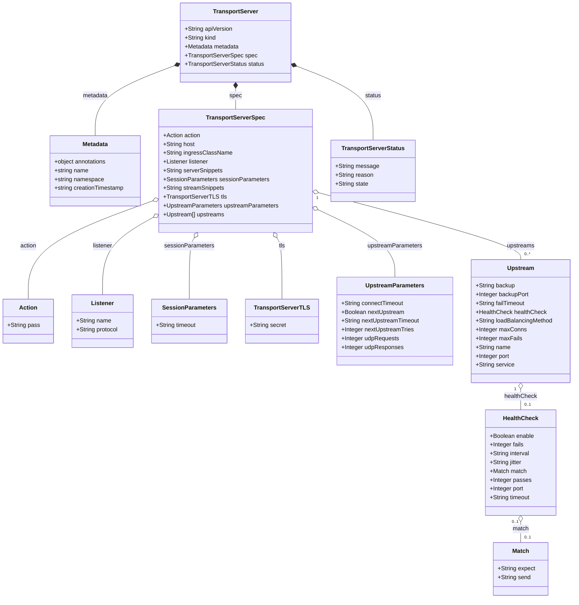

# Diagram: devops/k8s/nginx-ingress-controller/helm/crds/k8s.nginx.org_transportservers.yaml

> Auto-generated by Obscura crawlers

## Mermaid

### SVG

<svg id="container" width="1558.296875" xmlns="http://www.w3.org/2000/svg" class="classDiagram" height="1632" viewBox="0 0 1558.296875 1632" role="graphics-document document" aria-roledescription="class"><g><defs><marker id="container_class-aggregationStart" class="marker aggregation class" refX="18" refY="7" markerWidth="190" markerHeight="240" orient="auto"><path d="M 18,7 L9,13 L1,7 L9,1 Z"></path></marker></defs><defs><marker id="container_class-aggregationEnd" class="marker aggregation class" refX="1" refY="7" markerWidth="20" markerHeight="28" orient="auto"><path d="M 18,7 L9,13 L1,7 L9,1 Z"></path></marker></defs><defs><marker id="container_class-extensionStart" class="marker extension class" refX="18" refY="7" markerWidth="190" markerHeight="240" orient="auto"><path d="M 1,7 L18,13 V 1 Z"></path></marker></defs><defs><marker id="container_class-extensionEnd" class="marker extension class" refX="1" refY="7" markerWidth="20" markerHeight="28" orient="auto"><path d="M 1,1 V 13 L18,7 Z"></path></marker></defs><defs><marker id="container_class-compositionStart" class="marker composition class" refX="18" refY="7" markerWidth="190" markerHeight="240" orient="auto"><path d="M 18,7 L9,13 L1,7 L9,1 Z"></path></marker></defs><defs><marker id="container_class-compositionEnd" class="marker composition class" refX="1" refY="7" markerWidth="20" markerHeight="28" orient="auto"><path d="M 18,7 L9,13 L1,7 L9,1 Z"></path></marker></defs><defs><marker id="container_class-dependencyStart" class="marker dependency class" refX="6" refY="7" markerWidth="190" markerHeight="240" orient="auto"><path d="M 5,7 L9,13 L1,7 L9,1 Z"></path></marker></defs><defs><marker id="container_class-dependencyEnd" class="marker dependency class" refX="13" refY="7" markerWidth="20" markerHeight="28" orient="auto"><path d="M 18,7 L9,13 L14,7 L9,1 Z"></path></marker></defs><defs><marker id="container_class-lollipopStart" class="marker lollipop class" refX="13" refY="7" markerWidth="190" markerHeight="240" orient="auto"><circle stroke="black" fill="transparent" cx="7" cy="7" r="6"></circle></marker></defs><defs><marker id="container_class-lollipopEnd" class="marker lollipop class" refX="1" refY="7" markerWidth="190" markerHeight="240" orient="auto"><circle stroke="black" fill="transparent" cx="7" cy="7" r="6"></circle></marker></defs><g class="root"><g class="clusters"></g><g class="edgePaths"><path d="M639.201,241.25L639.201,244.542C639.201,247.833,639.201,254.417,639.201,263.875C639.201,273.333,639.201,285.667,639.201,291.833L639.201,298" id="id_TransportServer_TransportServerSpec_1" class="edge-thickness-normal edge-pattern-solid relation" style=";;;" data-edge="true" data-et="edge" data-id="id_TransportServer_TransportServerSpec_1" data-points="W3sieCI6NjM5LjIwMTE3MTg3NSwieSI6MjI0fSx7IngiOjYzOS4yMDExNzE4NzUsInkiOjI2MX0seyJ4Ijo2MzkuMjAxMTcxODc1LCJ5IjoyOTh9XQ==" marker-start="url(#container_class-compositionStart)"></path><path d="M805.782,181.373L839.6,194.644C873.417,207.915,941.051,234.458,974.868,267.895C1008.686,301.333,1008.686,341.667,1008.686,361.833L1008.686,382" id="id_TransportServer_TransportServerStatus_2" class="edge-thickness-normal edge-pattern-solid relation" style=";;;" data-edge="true" data-et="edge" data-id="id_TransportServer_TransportServerStatus_2" data-points="W3sieCI6Nzg5LjcyNDYwOTM3NSwieSI6MTc1LjA3MTIzNTI1MTgyOX0seyJ4IjoxMDA4LjY4NTU0Njg3NSwieSI6MjYxfSx7IngiOjEwMDguNjg1NTQ2ODc1LCJ5IjozODJ9XQ==" marker-start="url(#container_class-compositionStart)"></path><path d="M472.541,178.969L436.356,192.641C400.171,206.313,327.801,233.656,291.617,265.495C255.432,297.333,255.432,333.667,255.432,351.833L255.432,370" id="id_TransportServer_Metadata_3" class="edge-thickness-normal edge-pattern-solid relation" style=";;;" data-edge="true" data-et="edge" data-id="id_TransportServer_Metadata_3" data-points="W3sieCI6NDg4LjY3NzczNDM3NSwieSI6MTcyLjg3MjQxMDgwOTcxMDR9LHsieCI6MjU1LjQzMTY0MDYyNSwieSI6MjYxfSx7IngiOjI1NS40MzE2NDA2MjUsInkiOjM3MH1d" marker-start="url(#container_class-compositionStart)"></path><path d="M415.415,547.336L358.706,567.946C301.998,588.557,188.581,629.779,131.872,674.556C75.164,719.333,75.164,767.667,75.164,791.833L75.164,816" id="id_TransportServerSpec_Action_4" class="edge-thickness-normal edge-pattern-solid relation" style=";;;" data-edge="true" data-et="edge" data-id="id_TransportServerSpec_Action_4" data-points="W3sieCI6NDMxLjYyNjk1MzEyNSwieSI6NTQxLjQ0MzExMjA1MTQ0Mjh9LHsieCI6NzUuMTY0MDYyNSwieSI6NjcxfSx7IngiOjc1LjE2NDA2MjUsInkiOjgxNn1d" marker-start="url(#container_class-aggregationStart)"></path><path d="M416.613,591.935L393.322,605.112C370.031,618.29,323.449,644.645,300.158,679.989C276.867,715.333,276.867,759.667,276.867,781.833L276.867,804" id="id_TransportServerSpec_Listener_5" class="edge-thickness-normal edge-pattern-solid relation" style=";;;" data-edge="true" data-et="edge" data-id="id_TransportServerSpec_Listener_5" data-points="W3sieCI6NDMxLjYyNjk1MzEyNSwieSI6NTgzLjQ0MDU4NDMxOTMyNzN9LHsieCI6Mjc2Ljg2NzE4NzUsInkiOjY3MX0seyJ4IjoyNzYuODY3MTg3NSwieSI6ODA0fV0=" marker-start="url(#container_class-aggregationStart)"></path><path d="M527.712,648.725L525.447,652.438C523.182,656.15,518.651,663.575,516.386,691.454C514.121,719.333,514.121,767.667,514.121,791.833L514.121,816" id="id_TransportServerSpec_SessionParameters_6" class="edge-thickness-normal edge-pattern-solid relation" style=";;;" data-edge="true" data-et="edge" data-id="id_TransportServerSpec_SessionParameters_6" data-points="W3sieCI6NTM2LjY5NjUyMjQ4NDc1NjEsInkiOjYzNH0seyJ4Ijo1MTQuMTIxMDkzNzUsInkiOjY3MX0seyJ4Ijo1MTQuMTIxMDkzNzUsInkiOjgxNn1d" marker-start="url(#container_class-aggregationStart)"></path><path d="M750.69,648.725L752.956,652.438C755.221,656.15,759.751,663.575,762.016,691.454C764.281,719.333,764.281,767.667,764.281,791.833L764.281,816" id="id_TransportServerSpec_TransportServerTLS_7" class="edge-thickness-normal edge-pattern-solid relation" style=";;;" data-edge="true" data-et="edge" data-id="id_TransportServerSpec_TransportServerTLS_7" data-points="W3sieCI6NzQxLjcwNTgyMTI2NTI0MzksInkiOjYzNH0seyJ4Ijo3NjQuMjgxMjUsInkiOjY3MX0seyJ4Ijo3NjQuMjgxMjUsInkiOjgxNn1d" marker-start="url(#container_class-aggregationStart)"></path><path d="M862.352,572.182L896.964,588.652C931.577,605.121,1000.802,638.061,1035.415,668.697C1070.027,699.333,1070.027,727.667,1070.027,741.833L1070.027,756" id="id_TransportServerSpec_UpstreamParameters_8" class="edge-thickness-normal edge-pattern-solid relation" style=";;;" data-edge="true" data-et="edge" data-id="id_TransportServerSpec_UpstreamParameters_8" data-points="W3sieCI6ODQ2Ljc3NTM5MDYyNSwieSI6NTY0Ljc3MDAzMjE0MjA5NjJ9LHsieCI6MTA3MC4wMjczNDM3NSwieSI6NjcxfSx7IngiOjEwNzAuMDI3MzQzNzUsInkiOjc1Nn1d" marker-start="url(#container_class-aggregationStart)"></path><path d="M863.452,525.309L955.262,549.591C1047.072,573.873,1230.692,622.436,1322.502,652.885C1414.313,683.333,1414.313,695.667,1414.313,701.833L1414.313,708" id="id_TransportServerSpec_Upstream_9" class="edge-thickness-normal edge-pattern-solid relation" style=";;;" data-edge="true" data-et="edge" data-id="id_TransportServerSpec_Upstream_9" data-points="W3sieCI6ODQ2Ljc3NTM5MDYyNSwieSI6NTIwLjg5ODg0MjY1NjE3MDh9LHsieCI6MTQxNC4zMTI1LCJ5Ijo2NzF9LHsieCI6MTQxNC4zMTI1LCJ5Ijo3MDh9XQ==" marker-start="url(#container_class-aggregationStart)"></path><path d="M1414.313,1061.25L1414.313,1064.542C1414.313,1067.833,1414.313,1074.417,1414.313,1083.875C1414.313,1093.333,1414.313,1105.667,1414.313,1111.833L1414.313,1118" id="id_Upstream_HealthCheck_10" class="edge-thickness-normal edge-pattern-solid relation" style=";;;" data-edge="true" data-et="edge" data-id="id_Upstream_HealthCheck_10" data-points="W3sieCI6MTQxNC4zMTI1LCJ5IjoxMDQ0fSx7IngiOjE0MTQuMzEyNSwieSI6MTA4MX0seyJ4IjoxNDE0LjMxMjUsInkiOjExMTh9XQ==" marker-start="url(#container_class-aggregationStart)"></path><path d="M1414.313,1423.25L1414.313,1426.542C1414.313,1429.833,1414.313,1436.417,1414.313,1445.875C1414.313,1455.333,1414.313,1467.667,1414.313,1473.833L1414.313,1480" id="id_HealthCheck_Match_11" class="edge-thickness-normal edge-pattern-solid relation" style=";;;" data-edge="true" data-et="edge" data-id="id_HealthCheck_Match_11" data-points="W3sieCI6MTQxNC4zMTI1LCJ5IjoxNDA2fSx7IngiOjE0MTQuMzEyNSwieSI6MTQ0M30seyJ4IjoxNDE0LjMxMjUsInkiOjE0ODB9XQ==" marker-start="url(#container_class-aggregationStart)"></path></g><g class="edgeLabels"><g class="edgeLabel" transform="translate(639.201171875, 261)"><g class="label" data-id="id_TransportServer_TransportServerSpec_1" transform="translate(-16.6796875, -12)"><foreignObject width="33.359375" height="24">

spec

</foreignObject></g></g><g class="edgeLabel" transform="translate(1008.685546875, 261)"><g class="label" data-id="id_TransportServer_TransportServerStatus_2" transform="translate(-22.203125, -12)"><foreignObject width="44.40625" height="24">

status

</foreignObject></g></g><g class="edgeLabel" transform="translate(255.431640625, 261)"><g class="label" data-id="id_TransportServer_Metadata_3" transform="translate(-34.7265625, -12)"><foreignObject width="69.453125" height="24">

metadata

</foreignObject></g></g><g class="edgeLabel" transform="translate(75.1640625, 671)"><g class="label" data-id="id_TransportServerSpec_Action_4" transform="translate(-22.6875, -12)"><foreignObject width="45.375" height="24">

action

</foreignObject></g></g><g class="edgeLabel" transform="translate(276.8671875, 671)"><g class="label" data-id="id_TransportServerSpec_Listener_5" transform="translate(-27.6015625, -12)"><foreignObject width="55.203125" height="24">

listener

</foreignObject></g></g><g class="edgeLabel" transform="translate(514.12109375, 671)"><g class="label" data-id="id_TransportServerSpec_SessionParameters_6" transform="translate(-67.875, -12)"><foreignObject width="135.75" height="24">

sessionParameters

</foreignObject></g></g><g class="edgeLabel" transform="translate(764.28125, 671)"><g class="label" data-id="id_TransportServerSpec_TransportServerTLS_7" transform="translate(-8.890625, -12)"><foreignObject width="17.78125" height="24">

tls

</foreignObject></g></g><g class="edgeLabel" transform="translate(1070.02734375, 671)"><g class="label" data-id="id_TransportServerSpec_UpstreamParameters_8" transform="translate(-75.140625, -12)"><foreignObject width="150.28125" height="24">

upstreamParameters

</foreignObject></g></g><g class="edgeLabel" transform="translate(1414.3125, 671)"><g class="label" data-id="id_TransportServerSpec_Upstream_9" transform="translate(-38.109375, -12)"><foreignObject width="76.21875" height="24">

upstreams

</foreignObject></g></g><g class="edgeLabel" transform="translate(1414.3125, 1081)"><g class="label" data-id="id_Upstream_HealthCheck_10" transform="translate(-44.53125, -12)"><foreignObject width="89.0625" height="24">

healthCheck

</foreignObject></g></g><g class="edgeLabel" transform="translate(1414.3125, 1443)"><g class="label" data-id="id_HealthCheck_Match_11" transform="translate(-22.4921875, -12)"><foreignObject width="44.984375" height="24">

match

</foreignObject></g></g><g class="edgeTerminals" transform="translate(859.8583836718524, 539.8747564790784)"><g class="inner" transform="translate(0, 0)"><foreignObject style="width: 9px; height: 12px;">
1
</foreignObject></g></g><g class="edgeTerminals" transform="translate(1399.3125, 1061.5)"><g class="inner" transform="translate(0, 0)"><foreignObject style="width: 9px; height: 12px;">
1
</foreignObject></g></g><g class="edgeTerminals" transform="translate(1399.3125, 1423.5)"><g class="inner" transform="translate(0, 0)"><foreignObject style="width: 36px; height: 12px;">
0..1
</foreignObject></g></g><g class="edgeTerminals" transform="translate(1424.3125, 685.5)"><g class="inner" transform="translate(0, 0)"></g><foreignObject style="width: 36px; height: 12px;">
0..*
</foreignObject></g><g class="edgeTerminals" transform="translate(1424.3125, 1095.5)"><g class="inner" transform="translate(0, 0)"></g><foreignObject style="width: 36px; height: 12px;">
0..1
</foreignObject></g><g class="edgeTerminals" transform="translate(1424.3125, 1457.5)"><g class="inner" transform="translate(0, 0)"></g><foreignObject style="width: 36px; height: 12px;">
0..1
</foreignObject></g></g><g class="nodes"><g class="node default" id="classId-TransportServer-0" transform="translate(639.201171875, 116)"><g class="basic label-container"><path d="M-150.5234375 -108 L150.5234375 -108 L150.5234375 108 L-150.5234375 108" stroke="none" stroke-width="0" fill="#ECECFF" style=""></path><path d="M-150.5234375 -108 C-54.610100267117275 -108, 41.30323696576545 -108, 150.5234375 -108 M-150.5234375 -108 C-31.99048933323597 -108, 86.54245883352806 -108, 150.5234375 -108 M150.5234375 -108 C150.5234375 -25.269499347207827, 150.5234375 57.46100130558435, 150.5234375 108 M150.5234375 -108 C150.5234375 -39.6854454014873, 150.5234375 28.6291091970254, 150.5234375 108 M150.5234375 108 C86.30861898639982 108, 22.093800472799643 108, -150.5234375 108 M150.5234375 108 C65.3228479584853 108, -19.877741583029405 108, -150.5234375 108 M-150.5234375 108 C-150.5234375 21.76043155318726, -150.5234375 -64.47913689362548, -150.5234375 -108 M-150.5234375 108 C-150.5234375 51.6721583324474, -150.5234375 -4.655683335105195, -150.5234375 -108" stroke="#9370DB" stroke-width="1.3" fill="none" stroke-dasharray="0 0" style=""></path></g><g class="annotation-group text" transform="translate(0, -84)"></g><g class="label-group text" transform="translate(-59.484375, -84)"><g class="label" style="font-weight: bolder" transform="translate(0,-12)"><foreignObject width="118.96875" height="24">

TransportServer

</foreignObject></g></g><g class="members-group text" transform="translate(-138.5234375, -36)"><g class="label" style="" transform="translate(0,-12)"><foreignObject width="131.046875" height="24">

+String apiVersion

</foreignObject></g><g class="label" style="" transform="translate(0,12)"><foreignObject width="86.125" height="24">

+String kind

</foreignObject></g><g class="label" style="" transform="translate(0,36)"><foreignObject width="149.84375" height="24">

+Metadata metadata

</foreignObject></g><g class="label" style="" transform="translate(0,60)"><foreignObject width="195.453125" height="24">

+TransportServerSpec spec

</foreignObject></g><g class="label" style="" transform="translate(0,84)"><foreignObject width="217.5625" height="24">

+TransportServerStatus status

</foreignObject></g></g><g class="methods-group text" transform="translate(-138.5234375, 108)"></g><g class="divider" style=""><path d="M-150.5234375 -60 C-38.74742963546345 -60, 73.0285782290731 -60, 150.5234375 -60 M-150.5234375 -60 C-83.04344257785024 -60, -15.563447655700486 -60, 150.5234375 -60" stroke="#9370DB" stroke-width="1.3" fill="none" stroke-dasharray="0 0" style=""></path></g><g class="divider" style=""><path d="M-150.5234375 84 C-69.0581694040939 84, 12.407098691812195 84, 150.5234375 84 M-150.5234375 84 C-30.683526821563987 84, 89.15638385687203 84, 150.5234375 84" stroke="#9370DB" stroke-width="1.3" fill="none" stroke-dasharray="0 0" style=""></path></g></g><g class="node default" id="classId-Metadata-1" transform="translate(255.431640625, 466)"><g class="basic label-container"><path d="M-126.1953125 -96 L126.1953125 -96 L126.1953125 96 L-126.1953125 96" stroke="none" stroke-width="0" fill="#ECECFF" style=""></path><path d="M-126.1953125 -96 C-47.23975204086469 -96, 31.715808418270626 -96, 126.1953125 -96 M-126.1953125 -96 C-37.196930666680444 -96, 51.80145116663911 -96, 126.1953125 -96 M126.1953125 -96 C126.1953125 -20.194022954377886, 126.1953125 55.61195409124423, 126.1953125 96 M126.1953125 -96 C126.1953125 -29.746104303999147, 126.1953125 36.50779139200171, 126.1953125 96 M126.1953125 96 C44.584047524565634 96, -37.02721745086873 96, -126.1953125 96 M126.1953125 96 C59.5042790018027 96, -7.186754496394599 96, -126.1953125 96 M-126.1953125 96 C-126.1953125 34.22380497594551, -126.1953125 -27.552390048108975, -126.1953125 -96 M-126.1953125 96 C-126.1953125 26.60977225539338, -126.1953125 -42.78045548921324, -126.1953125 -96" stroke="#9370DB" stroke-width="1.3" fill="none" stroke-dasharray="0 0" style=""></path></g><g class="annotation-group text" transform="translate(0, -72)"></g><g class="label-group text" transform="translate(-34.640625, -72)"><g class="label" style="font-weight: bolder" transform="translate(0,-12)"><foreignObject width="69.28125" height="24">

Metadata

</foreignObject></g></g><g class="members-group text" transform="translate(-114.1953125, -24)"><g class="label" style="" transform="translate(0,-12)"><foreignObject width="145.359375" height="24">

+object annotations

</foreignObject></g><g class="label" style="" transform="translate(0,12)"><foreignObject width="94.375" height="24">

+string name

</foreignObject></g><g class="label" style="" transform="translate(0,36)"><foreignObject width="135.9375" height="24">

+string namespace

</foreignObject></g><g class="label" style="" transform="translate(0,60)"><foreignObject width="193.75" height="24">

+string creationTimestamp

</foreignObject></g></g><g class="methods-group text" transform="translate(-114.1953125, 96)"></g><g class="divider" style=""><path d="M-126.1953125 -48 C-26.99527475124067 -48, 72.20476299751866 -48, 126.1953125 -48 M-126.1953125 -48 C-46.708383593800576 -48, 32.77854531239885 -48, 126.1953125 -48" stroke="#9370DB" stroke-width="1.3" fill="none" stroke-dasharray="0 0" style=""></path></g><g class="divider" style=""><path d="M-126.1953125 72 C-38.41451805685453 72, 49.366276386290934 72, 126.1953125 72 M-126.1953125 72 C-72.44570432916808 72, -18.696096158336147 72, 126.1953125 72" stroke="#9370DB" stroke-width="1.3" fill="none" stroke-dasharray="0 0" style=""></path></g></g><g class="node default" id="classId-TransportServerSpec-2" transform="translate(639.201171875, 466)"><g class="basic label-container"><path d="M-207.57421875 -168 L207.57421875 -168 L207.57421875 168 L-207.57421875 168" stroke="none" stroke-width="0" fill="#ECECFF" style=""></path><path d="M-207.57421875 -168 C-66.59497348319675 -168, 74.3842717836065 -168, 207.57421875 -168 M-207.57421875 -168 C-71.47117793233932 -168, 64.63186288532137 -168, 207.57421875 -168 M207.57421875 -168 C207.57421875 -62.034489472368705, 207.57421875 43.93102105526259, 207.57421875 168 M207.57421875 -168 C207.57421875 -68.64040211837384, 207.57421875 30.719195763252316, 207.57421875 168 M207.57421875 168 C53.66542924441404 168, -100.24336026117192 168, -207.57421875 168 M207.57421875 168 C41.62023655608641 168, -124.33374563782718 168, -207.57421875 168 M-207.57421875 168 C-207.57421875 64.5895351357444, -207.57421875 -38.8209297285112, -207.57421875 -168 M-207.57421875 168 C-207.57421875 47.45421112136472, -207.57421875 -73.09157775727056, -207.57421875 -168" stroke="#9370DB" stroke-width="1.3" fill="none" stroke-dasharray="0 0" style=""></path></g><g class="annotation-group text" transform="translate(0, -144)"></g><g class="label-group text" transform="translate(-77.0859375, -144)"><g class="label" style="font-weight: bolder" transform="translate(0,-12)"><foreignObject width="154.171875" height="24">

TransportServerSpec

</foreignObject></g></g><g class="members-group text" transform="translate(-195.57421875, -96)"><g class="label" style="" transform="translate(0,-12)"><foreignObject width="103.25" height="24">

+Action action

</foreignObject></g><g class="label" style="" transform="translate(0,12)"><foreignObject width="86.4375" height="24">

+String host

</foreignObject></g><g class="label" style="" transform="translate(0,36)"><foreignObject width="184.6875" height="24">

+String ingressClassName

</foreignObject></g><g class="label" style="" transform="translate(0,60)"><foreignObject width="125.90625" height="24">

+Listener listener

</foreignObject></g><g class="label" style="" transform="translate(0,84)"><foreignObject width="163.125" height="24">

+String serverSnippets

</foreignObject></g><g class="label" style="" transform="translate(0,108)"><foreignObject width="284.328125" height="24">

+SessionParameters sessionParameters

</foreignObject></g><g class="label" style="" transform="translate(0,132)"><foreignObject width="167.96875" height="24">

+String streamSnippets

</foreignObject></g><g class="label" style="" transform="translate(0,156)"><foreignObject width="170.015625" height="24">

+TransportServerTLS tls

</foreignObject></g><g class="label" style="" transform="translate(0,180)"><foreignObject width="314.0625" height="24">

+UpstreamParameters upstreamParameters

</foreignObject></g><g class="label" style="" transform="translate(0,204)"><foreignObject width="168.765625" height="24">

+Upstream[] upstreams

</foreignObject></g></g><g class="methods-group text" transform="translate(-195.57421875, 168)"></g><g class="divider" style=""><path d="M-207.57421875 -120 C-42.852532566528026 -120, 121.86915361694395 -120, 207.57421875 -120 M-207.57421875 -120 C-62.83462427794083 -120, 81.90497019411833 -120, 207.57421875 -120" stroke="#9370DB" stroke-width="1.3" fill="none" stroke-dasharray="0 0" style=""></path></g><g class="divider" style=""><path d="M-207.57421875 144 C-50.098651646860276 144, 107.37691545627945 144, 207.57421875 144 M-207.57421875 144 C-58.06497343477119 144, 91.44427188045762 144, 207.57421875 144" stroke="#9370DB" stroke-width="1.3" fill="none" stroke-dasharray="0 0" style=""></path></g></g><g class="node default" id="classId-Action-3" transform="translate(75.1640625, 876)"><g class="basic label-container"><path d="M-67.1640625 -60 L67.1640625 -60 L67.1640625 60 L-67.1640625 60" stroke="none" stroke-width="0" fill="#ECECFF" style=""></path><path d="M-67.1640625 -60 C-30.62592168377286 -60, 5.9122191324542825 -60, 67.1640625 -60 M-67.1640625 -60 C-27.418260687017487 -60, 12.327541125965027 -60, 67.1640625 -60 M67.1640625 -60 C67.1640625 -13.387359265962985, 67.1640625 33.22528146807403, 67.1640625 60 M67.1640625 -60 C67.1640625 -22.94392907554291, 67.1640625 14.112141848914177, 67.1640625 60 M67.1640625 60 C19.29099063632384 60, -28.58208122735232 60, -67.1640625 60 M67.1640625 60 C22.676916409835428 60, -21.810229680329144 60, -67.1640625 60 M-67.1640625 60 C-67.1640625 17.131698670945134, -67.1640625 -25.73660265810973, -67.1640625 -60 M-67.1640625 60 C-67.1640625 20.92319307545663, -67.1640625 -18.15361384908674, -67.1640625 -60" stroke="#9370DB" stroke-width="1.3" fill="none" stroke-dasharray="0 0" style=""></path></g><g class="annotation-group text" transform="translate(0, -36)"></g><g class="label-group text" transform="translate(-23.1875, -36)"><g class="label" style="font-weight: bolder" transform="translate(0,-12)"><foreignObject width="46.375" height="24">

Action

</foreignObject></g></g><g class="members-group text" transform="translate(-55.1640625, 12)"><g class="label" style="" transform="translate(0,-12)"><foreignObject width="87.140625" height="24">

+String pass

</foreignObject></g></g><g class="methods-group text" transform="translate(-55.1640625, 60)"></g><g class="divider" style=""><path d="M-67.1640625 -12 C-38.34032075260846 -12, -9.516579005216933 -12, 67.1640625 -12 M-67.1640625 -12 C-28.02719200906742 -12, 11.10967848186516 -12, 67.1640625 -12" stroke="#9370DB" stroke-width="1.3" fill="none" stroke-dasharray="0 0" style=""></path></g><g class="divider" style=""><path d="M-67.1640625 36 C-35.79561704702666 36, -4.42717159405332 36, 67.1640625 36 M-67.1640625 36 C-27.979363161864356 36, 11.205336176271288 36, 67.1640625 36" stroke="#9370DB" stroke-width="1.3" fill="none" stroke-dasharray="0 0" style=""></path></g></g><g class="node default" id="classId-Listener-4" transform="translate(276.8671875, 876)"><g class="basic label-container"><path d="M-84.5390625 -72 L84.5390625 -72 L84.5390625 72 L-84.5390625 72" stroke="none" stroke-width="0" fill="#ECECFF" style=""></path><path d="M-84.5390625 -72 C-22.81784193490475 -72, 38.9033786301905 -72, 84.5390625 -72 M-84.5390625 -72 C-39.69682379589207 -72, 5.145414908215855 -72, 84.5390625 -72 M84.5390625 -72 C84.5390625 -21.980440416457604, 84.5390625 28.03911916708479, 84.5390625 72 M84.5390625 -72 C84.5390625 -20.08334784839608, 84.5390625 31.83330430320784, 84.5390625 72 M84.5390625 72 C48.347676761991266 72, 12.156291023982533 72, -84.5390625 72 M84.5390625 72 C23.40526603965433 72, -37.72853042069134 72, -84.5390625 72 M-84.5390625 72 C-84.5390625 26.494218599544162, -84.5390625 -19.011562800911676, -84.5390625 -72 M-84.5390625 72 C-84.5390625 19.185187781057103, -84.5390625 -33.629624437885795, -84.5390625 -72" stroke="#9370DB" stroke-width="1.3" fill="none" stroke-dasharray="0 0" style=""></path></g><g class="annotation-group text" transform="translate(0, -48)"></g><g class="label-group text" transform="translate(-29.828125, -48)"><g class="label" style="font-weight: bolder" transform="translate(0,-12)"><foreignObject width="59.65625" height="24">

Listener

</foreignObject></g></g><g class="members-group text" transform="translate(-72.5390625, 0)"><g class="label" style="" transform="translate(0,-12)"><foreignObject width="94.984375" height="24">

+String name

</foreignObject></g><g class="label" style="" transform="translate(0,12)"><foreignObject width="115.25" height="24">

+String protocol

</foreignObject></g></g><g class="methods-group text" transform="translate(-72.5390625, 72)"></g><g class="divider" style=""><path d="M-84.5390625 -24 C-37.45913930198086 -24, 9.620783896038276 -24, 84.5390625 -24 M-84.5390625 -24 C-18.117938029189474 -24, 48.30318644162105 -24, 84.5390625 -24" stroke="#9370DB" stroke-width="1.3" fill="none" stroke-dasharray="0 0" style=""></path></g><g class="divider" style=""><path d="M-84.5390625 48 C-47.776326678301004 48, -11.013590856602008 48, 84.5390625 48 M-84.5390625 48 C-33.02613441300945 48, 18.486793673981097 48, 84.5390625 48" stroke="#9370DB" stroke-width="1.3" fill="none" stroke-dasharray="0 0" style=""></path></g></g><g class="node default" id="classId-SessionParameters-5" transform="translate(514.12109375, 876)"><g class="basic label-container"><path d="M-102.71484375 -60 L102.71484375 -60 L102.71484375 60 L-102.71484375 60" stroke="none" stroke-width="0" fill="#ECECFF" style=""></path><path d="M-102.71484375 -60 C-26.113080954722648 -60, 50.488681840554705 -60, 102.71484375 -60 M-102.71484375 -60 C-23.857408127389974 -60, 55.00002749522005 -60, 102.71484375 -60 M102.71484375 -60 C102.71484375 -15.827387939430878, 102.71484375 28.345224121138244, 102.71484375 60 M102.71484375 -60 C102.71484375 -20.532246525547855, 102.71484375 18.93550694890429, 102.71484375 60 M102.71484375 60 C53.626508371572164 60, 4.538172993144329 60, -102.71484375 60 M102.71484375 60 C30.664696728391377 60, -41.38545029321725 60, -102.71484375 60 M-102.71484375 60 C-102.71484375 27.450191634075352, -102.71484375 -5.099616731849295, -102.71484375 -60 M-102.71484375 60 C-102.71484375 22.491714068796576, -102.71484375 -15.016571862406849, -102.71484375 -60" stroke="#9370DB" stroke-width="1.3" fill="none" stroke-dasharray="0 0" style=""></path></g><g class="annotation-group text" transform="translate(0, -36)"></g><g class="label-group text" transform="translate(-69.8046875, -36)"><g class="label" style="font-weight: bolder" transform="translate(0,-12)"><foreignObject width="139.609375" height="24">

SessionParameters

</foreignObject></g></g><g class="members-group text" transform="translate(-90.71484375, 12)"><g class="label" style="" transform="translate(0,-12)"><foreignObject width="111.625" height="24">

+String timeout

</foreignObject></g></g><g class="methods-group text" transform="translate(-90.71484375, 60)"></g><g class="divider" style=""><path d="M-102.71484375 -12 C-53.34653778316329 -12, -3.978231816326584 -12, 102.71484375 -12 M-102.71484375 -12 C-56.90549113347913 -12, -11.096138516958263 -12, 102.71484375 -12" stroke="#9370DB" stroke-width="1.3" fill="none" stroke-dasharray="0 0" style=""></path></g><g class="divider" style=""><path d="M-102.71484375 36 C-22.01852633062518 36, 58.67779108874964 36, 102.71484375 36 M-102.71484375 36 C-54.00058415138958 36, -5.286324552779163 36, 102.71484375 36" stroke="#9370DB" stroke-width="1.3" fill="none" stroke-dasharray="0 0" style=""></path></g></g><g class="node default" id="classId-TransportServerTLS-6" transform="translate(764.28125, 876)"><g class="basic label-container"><path d="M-97.4453125 -60 L97.4453125 -60 L97.4453125 60 L-97.4453125 60" stroke="none" stroke-width="0" fill="#ECECFF" style=""></path><path d="M-97.4453125 -60 C-25.069364585262875 -60, 47.30658332947425 -60, 97.4453125 -60 M-97.4453125 -60 C-54.882831468614064 -60, -12.320350437228129 -60, 97.4453125 -60 M97.4453125 -60 C97.4453125 -19.061421447135494, 97.4453125 21.87715710572901, 97.4453125 60 M97.4453125 -60 C97.4453125 -31.306915984206363, 97.4453125 -2.6138319684127254, 97.4453125 60 M97.4453125 60 C42.74084118232258 60, -11.963630135354833 60, -97.4453125 60 M97.4453125 60 C26.214192325995015 60, -45.01692784800997 60, -97.4453125 60 M-97.4453125 60 C-97.4453125 29.25602084233073, -97.4453125 -1.4879583153385383, -97.4453125 -60 M-97.4453125 60 C-97.4453125 12.872620491418857, -97.4453125 -34.254759017162286, -97.4453125 -60" stroke="#9370DB" stroke-width="1.3" fill="none" stroke-dasharray="0 0" style=""></path></g><g class="annotation-group text" transform="translate(0, -36)"></g><g class="label-group text" transform="translate(-72.390625, -36)"><g class="label" style="font-weight: bolder" transform="translate(0,-12)"><foreignObject width="144.78125" height="24">

TransportServerTLS

</foreignObject></g></g><g class="members-group text" transform="translate(-85.4453125, 12)"><g class="label" style="" transform="translate(0,-12)"><foreignObject width="98.5" height="24">

+String secret

</foreignObject></g></g><g class="methods-group text" transform="translate(-85.4453125, 60)"></g><g class="divider" style=""><path d="M-97.4453125 -12 C-47.43247242697479 -12, 2.5803676460504192 -12, 97.4453125 -12 M-97.4453125 -12 C-39.96360710636327 -12, 17.51809828727346 -12, 97.4453125 -12" stroke="#9370DB" stroke-width="1.3" fill="none" stroke-dasharray="0 0" style=""></path></g><g class="divider" style=""><path d="M-97.4453125 36 C-52.98421694801484 36, -8.52312139602968 36, 97.4453125 36 M-97.4453125 36 C-21.90960222849027 36, 53.62610804301946 36, 97.4453125 36" stroke="#9370DB" stroke-width="1.3" fill="none" stroke-dasharray="0 0" style=""></path></g></g><g class="node default" id="classId-UpstreamParameters-7" transform="translate(1070.02734375, 876)"><g class="basic label-container"><path d="M-158.30078125 -120 L158.30078125 -120 L158.30078125 120 L-158.30078125 120" stroke="none" stroke-width="0" fill="#ECECFF" style=""></path><path d="M-158.30078125 -120 C-75.56659781800919 -120, 7.167585613981629 -120, 158.30078125 -120 M-158.30078125 -120 C-46.236003950132826 -120, 65.82877334973435 -120, 158.30078125 -120 M158.30078125 -120 C158.30078125 -48.44956735751563, 158.30078125 23.100865284968734, 158.30078125 120 M158.30078125 -120 C158.30078125 -66.29667767703104, 158.30078125 -12.593355354062084, 158.30078125 120 M158.30078125 120 C91.73576499668744 120, 25.170748743374872 120, -158.30078125 120 M158.30078125 120 C94.54592660732231 120, 30.79107196464463 120, -158.30078125 120 M-158.30078125 120 C-158.30078125 27.23007948581693, -158.30078125 -65.53984102836614, -158.30078125 -120 M-158.30078125 120 C-158.30078125 44.4474569934024, -158.30078125 -31.105086013195205, -158.30078125 -120" stroke="#9370DB" stroke-width="1.3" fill="none" stroke-dasharray="0 0" style=""></path></g><g class="annotation-group text" transform="translate(0, -96)"></g><g class="label-group text" transform="translate(-76.9765625, -96)"><g class="label" style="font-weight: bolder" transform="translate(0,-12)"><foreignObject width="153.953125" height="24">

UpstreamParameters

</foreignObject></g></g><g class="members-group text" transform="translate(-146.30078125, -48)"><g class="label" style="" transform="translate(0,-12)"><foreignObject width="171.6875" height="24">

+String connectTimeout

</foreignObject></g><g class="label" style="" transform="translate(0,12)"><foreignObject width="173.40625" height="24">

+Boolean nextUpstream

</foreignObject></g><g class="label" style="" transform="translate(0,36)"><foreignObject width="215.625" height="24">

+String nextUpstreamTimeout

</foreignObject></g><g class="label" style="" transform="translate(0,60)"><foreignObject width="199.71875" height="24">

+Integer nextUpstreamTries

</foreignObject></g><g class="label" style="" transform="translate(0,84)"><foreignObject width="158.40625" height="24">

+Integer udpRequests

</foreignObject></g><g class="label" style="" transform="translate(0,108)"><foreignObject width="169.453125" height="24">

+Integer udpResponses

</foreignObject></g></g><g class="methods-group text" transform="translate(-146.30078125, 120)"></g><g class="divider" style=""><path d="M-158.30078125 -72 C-59.14912810529533 -72, 40.002525039409335 -72, 158.30078125 -72 M-158.30078125 -72 C-88.92904480924648 -72, -19.557308368492954 -72, 158.30078125 -72" stroke="#9370DB" stroke-width="1.3" fill="none" stroke-dasharray="0 0" style=""></path></g><g class="divider" style=""><path d="M-158.30078125 96 C-34.63459590644065 96, 89.0315894371187 96, 158.30078125 96 M-158.30078125 96 C-53.85017433364338 96, 50.60043258271324 96, 158.30078125 96" stroke="#9370DB" stroke-width="1.3" fill="none" stroke-dasharray="0 0" style=""></path></g></g><g class="node default" id="classId-Upstream-8" transform="translate(1414.3125, 876)"><g class="basic label-container"><path d="M-135.984375 -168 L135.984375 -168 L135.984375 168 L-135.984375 168" stroke="none" stroke-width="0" fill="#ECECFF" style=""></path><path d="M-135.984375 -168 C-67.97830957902762 -168, 0.027755841944753 -168, 135.984375 -168 M-135.984375 -168 C-48.28528150830641 -168, 39.41381198338718 -168, 135.984375 -168 M135.984375 -168 C135.984375 -73.73254034094194, 135.984375 20.534919318116124, 135.984375 168 M135.984375 -168 C135.984375 -37.45879355508572, 135.984375 93.08241288982856, 135.984375 168 M135.984375 168 C38.2883948939635 168, -59.407585212073 168, -135.984375 168 M135.984375 168 C37.888767150892406 168, -60.20684069821519 168, -135.984375 168 M-135.984375 168 C-135.984375 74.29203474702966, -135.984375 -19.41593050594068, -135.984375 -168 M-135.984375 168 C-135.984375 46.54035120678918, -135.984375 -74.91929758642164, -135.984375 -168" stroke="#9370DB" stroke-width="1.3" fill="none" stroke-dasharray="0 0" style=""></path></g><g class="annotation-group text" transform="translate(0, -144)"></g><g class="label-group text" transform="translate(-35.390625, -144)"><g class="label" style="font-weight: bolder" transform="translate(0,-12)"><foreignObject width="70.78125" height="24">

Upstream

</foreignObject></g></g><g class="members-group text" transform="translate(-123.984375, -96)"><g class="label" style="" transform="translate(0,-12)"><foreignObject width="107.0625" height="24">

+String backup

</foreignObject></g><g class="label" style="" transform="translate(0,12)"><foreignObject width="146.25" height="24">

+Integer backupPort

</foreignObject></g><g class="label" style="" transform="translate(0,36)"><foreignObject width="137.03125" height="24">

+String failTimeout

</foreignObject></g><g class="label" style="" transform="translate(0,60)"><foreignObject width="191.84375" height="24">

+HealthCheck healthCheck

</foreignObject></g><g class="label" style="" transform="translate(0,84)"><foreignObject width="212.578125" height="24">

+String loadBalancingMethod

</foreignObject></g><g class="label" style="" transform="translate(0,108)"><foreignObject width="137.921875" height="24">

+Integer maxConns

</foreignObject></g><g class="label" style="" transform="translate(0,132)"><foreignObject width="125.984375" height="24">

+Integer maxFails

</foreignObject></g><g class="label" style="" transform="translate(0,156)"><foreignObject width="94.984375" height="24">

+String name

</foreignObject></g><g class="label" style="" transform="translate(0,180)"><foreignObject width="94.34375" height="24">

+Integer port

</foreignObject></g><g class="label" style="" transform="translate(0,204)"><foreignObject width="105.265625" height="24">

+String service

</foreignObject></g></g><g class="methods-group text" transform="translate(-123.984375, 168)"></g><g class="divider" style=""><path d="M-135.984375 -120 C-79.01889711646817 -120, -22.05341923293635 -120, 135.984375 -120 M-135.984375 -120 C-43.07176485910121 -120, 49.840845281797584 -120, 135.984375 -120" stroke="#9370DB" stroke-width="1.3" fill="none" stroke-dasharray="0 0" style=""></path></g><g class="divider" style=""><path d="M-135.984375 144 C-55.63856183234603 144, 24.707251335307944 144, 135.984375 144 M-135.984375 144 C-80.2352452339216 144, -24.48611546784319 144, 135.984375 144" stroke="#9370DB" stroke-width="1.3" fill="none" stroke-dasharray="0 0" style=""></path></g></g><g class="node default" id="classId-HealthCheck-9" transform="translate(1414.3125, 1262)"><g class="basic label-container"><path d="M-95.69140625 -144 L95.69140625 -144 L95.69140625 144 L-95.69140625 144" stroke="none" stroke-width="0" fill="#ECECFF" style=""></path><path d="M-95.69140625 -144 C-26.157583227596433 -144, 43.376239794807134 -144, 95.69140625 -144 M-95.69140625 -144 C-46.380380654621725 -144, 2.930644940756551 -144, 95.69140625 -144 M95.69140625 -144 C95.69140625 -53.66606485518963, 95.69140625 36.66787028962074, 95.69140625 144 M95.69140625 -144 C95.69140625 -50.023408414436375, 95.69140625 43.95318317112725, 95.69140625 144 M95.69140625 144 C50.347630696469864 144, 5.003855142939727 144, -95.69140625 144 M95.69140625 144 C38.88669434389307 144, -17.918017562213862 144, -95.69140625 144 M-95.69140625 144 C-95.69140625 47.54217927331902, -95.69140625 -48.91564145336196, -95.69140625 -144 M-95.69140625 144 C-95.69140625 54.84329336732455, -95.69140625 -34.3134132653509, -95.69140625 -144" stroke="#9370DB" stroke-width="1.3" fill="none" stroke-dasharray="0 0" style=""></path></g><g class="annotation-group text" transform="translate(0, -120)"></g><g class="label-group text" transform="translate(-45.8515625, -120)"><g class="label" style="font-weight: bolder" transform="translate(0,-12)"><foreignObject width="91.703125" height="24">

HealthCheck

</foreignObject></g></g><g class="members-group text" transform="translate(-83.69140625, -72)"><g class="label" style="" transform="translate(0,-12)"><foreignObject width="121.53125" height="24">

+Boolean enable

</foreignObject></g><g class="label" style="" transform="translate(0,12)"><foreignObject width="93.921875" height="24">

+Integer fails

</foreignObject></g><g class="label" style="" transform="translate(0,36)"><foreignObject width="109.640625" height="24">

+String interval

</foreignObject></g><g class="label" style="" transform="translate(0,60)"><foreignObject width="89.671875" height="24">

+String jitter

</foreignObject></g><g class="label" style="" transform="translate(0,84)"><foreignObject width="100.921875" height="24">

+Match match

</foreignObject></g><g class="label" style="" transform="translate(0,108)"><foreignObject width="112.40625" height="24">

+Integer passes

</foreignObject></g><g class="label" style="" transform="translate(0,132)"><foreignObject width="94.34375" height="24">

+Integer port

</foreignObject></g><g class="label" style="" transform="translate(0,156)"><foreignObject width="111.625" height="24">

+String timeout

</foreignObject></g></g><g class="methods-group text" transform="translate(-83.69140625, 144)"></g><g class="divider" style=""><path d="M-95.69140625 -96 C-40.70128295199622 -96, 14.28884034600756 -96, 95.69140625 -96 M-95.69140625 -96 C-37.15565800846443 -96, 21.380090233071144 -96, 95.69140625 -96" stroke="#9370DB" stroke-width="1.3" fill="none" stroke-dasharray="0 0" style=""></path></g><g class="divider" style=""><path d="M-95.69140625 120 C-30.461737545928102 120, 34.767931158143796 120, 95.69140625 120 M-95.69140625 120 C-25.586630312490385 120, 44.51814562501923 120, 95.69140625 120" stroke="#9370DB" stroke-width="1.3" fill="none" stroke-dasharray="0 0" style=""></path></g></g><g class="node default" id="classId-Match-10" transform="translate(1414.3125, 1552)"><g class="basic label-container"><path d="M-74.26171875 -72 L74.26171875 -72 L74.26171875 72 L-74.26171875 72" stroke="none" stroke-width="0" fill="#ECECFF" style=""></path><path d="M-74.26171875 -72 C-31.210515792476926 -72, 11.840687165046148 -72, 74.26171875 -72 M-74.26171875 -72 C-29.647091787637315 -72, 14.96753517472537 -72, 74.26171875 -72 M74.26171875 -72 C74.26171875 -40.353207199527446, 74.26171875 -8.706414399054893, 74.26171875 72 M74.26171875 -72 C74.26171875 -30.679597251008097, 74.26171875 10.640805497983806, 74.26171875 72 M74.26171875 72 C19.69393420362588 72, -34.87385034274824 72, -74.26171875 72 M74.26171875 72 C23.96194420098398 72, -26.337830348032043 72, -74.26171875 72 M-74.26171875 72 C-74.26171875 14.528718224814867, -74.26171875 -42.94256355037027, -74.26171875 -72 M-74.26171875 72 C-74.26171875 15.80140499272116, -74.26171875 -40.39719001455768, -74.26171875 -72" stroke="#9370DB" stroke-width="1.3" fill="none" stroke-dasharray="0 0" style=""></path></g><g class="annotation-group text" transform="translate(0, -48)"></g><g class="label-group text" transform="translate(-22.0703125, -48)"><g class="label" style="font-weight: bolder" transform="translate(0,-12)"><foreignObject width="44.140625" height="24">

Match

</foreignObject></g></g><g class="members-group text" transform="translate(-62.26171875, 0)"><g class="label" style="" transform="translate(0,-12)"><foreignObject width="102.453125" height="24">

+String expect

</foreignObject></g><g class="label" style="" transform="translate(0,12)"><foreignObject width="89.609375" height="24">

+String send

</foreignObject></g></g><g class="methods-group text" transform="translate(-62.26171875, 72)"></g><g class="divider" style=""><path d="M-74.26171875 -24 C-27.015775492403193 -24, 20.230167765193613 -24, 74.26171875 -24 M-74.26171875 -24 C-25.841382195784107 -24, 22.578954358431787 -24, 74.26171875 -24" stroke="#9370DB" stroke-width="1.3" fill="none" stroke-dasharray="0 0" style=""></path></g><g class="divider" style=""><path d="M-74.26171875 48 C-27.820068103124974 48, 18.62158254375005 48, 74.26171875 48 M-74.26171875 48 C-28.504396469974637 48, 17.252925810050726 48, 74.26171875 48" stroke="#9370DB" stroke-width="1.3" fill="none" stroke-dasharray="0 0" style=""></path></g></g><g class="node default" id="classId-TransportServerStatus-11" transform="translate(1008.685546875, 466)"><g class="basic label-container"><path d="M-111.91015625 -84 L111.91015625 -84 L111.91015625 84 L-111.91015625 84" stroke="none" stroke-width="0" fill="#ECECFF" style=""></path><path d="M-111.91015625 -84 C-59.98209075271793 -84, -8.05402525543586 -84, 111.91015625 -84 M-111.91015625 -84 C-50.52322110606687 -84, 10.86371403786626 -84, 111.91015625 -84 M111.91015625 -84 C111.91015625 -21.277037679676127, 111.91015625 41.445924640647746, 111.91015625 84 M111.91015625 -84 C111.91015625 -42.36257031300883, 111.91015625 -0.7251406260176623, 111.91015625 84 M111.91015625 84 C25.32806447593137 84, -61.25402729813726 84, -111.91015625 84 M111.91015625 84 C30.624705220049833 84, -50.660745809900334 84, -111.91015625 84 M-111.91015625 84 C-111.91015625 47.943487565929765, -111.91015625 11.88697513185953, -111.91015625 -84 M-111.91015625 84 C-111.91015625 18.232667383569705, -111.91015625 -47.53466523286059, -111.91015625 -84" stroke="#9370DB" stroke-width="1.3" fill="none" stroke-dasharray="0 0" style=""></path></g><g class="annotation-group text" transform="translate(0, -60)"></g><g class="label-group text" transform="translate(-82.9609375, -60)"><g class="label" style="font-weight: bolder" transform="translate(0,-12)"><foreignObject width="165.921875" height="24">

TransportServerStatus

</foreignObject></g></g><g class="members-group text" transform="translate(-99.91015625, -12)"><g class="label" style="" transform="translate(0,-12)"><foreignObject width="116.859375" height="24">

+String message

</foreignObject></g><g class="label" style="" transform="translate(0,12)"><foreignObject width="103.46875" height="24">

+String reason

</foreignObject></g><g class="label" style="" transform="translate(0,36)"><foreignObject width="90.5625" height="24">

+String state

</foreignObject></g></g><g class="methods-group text" transform="translate(-99.91015625, 84)"></g><g class="divider" style=""><path d="M-111.91015625 -36 C-41.072942449072215 -36, 29.76427135185557 -36, 111.91015625 -36 M-111.91015625 -36 C-65.97627581232516 -36, -20.042395374650326 -36, 111.91015625 -36" stroke="#9370DB" stroke-width="1.3" fill="none" stroke-dasharray="0 0" style=""></path></g><g class="divider" style=""><path d="M-111.91015625 60 C-44.57701100126822 60, 22.756134247463564 60, 111.91015625 60 M-111.91015625 60 C-28.233352178084658 60, 55.443451893830684 60, 111.91015625 60" stroke="#9370DB" stroke-width="1.3" fill="none" stroke-dasharray="0 0" style=""></path></g></g></g></g></g></svg>
