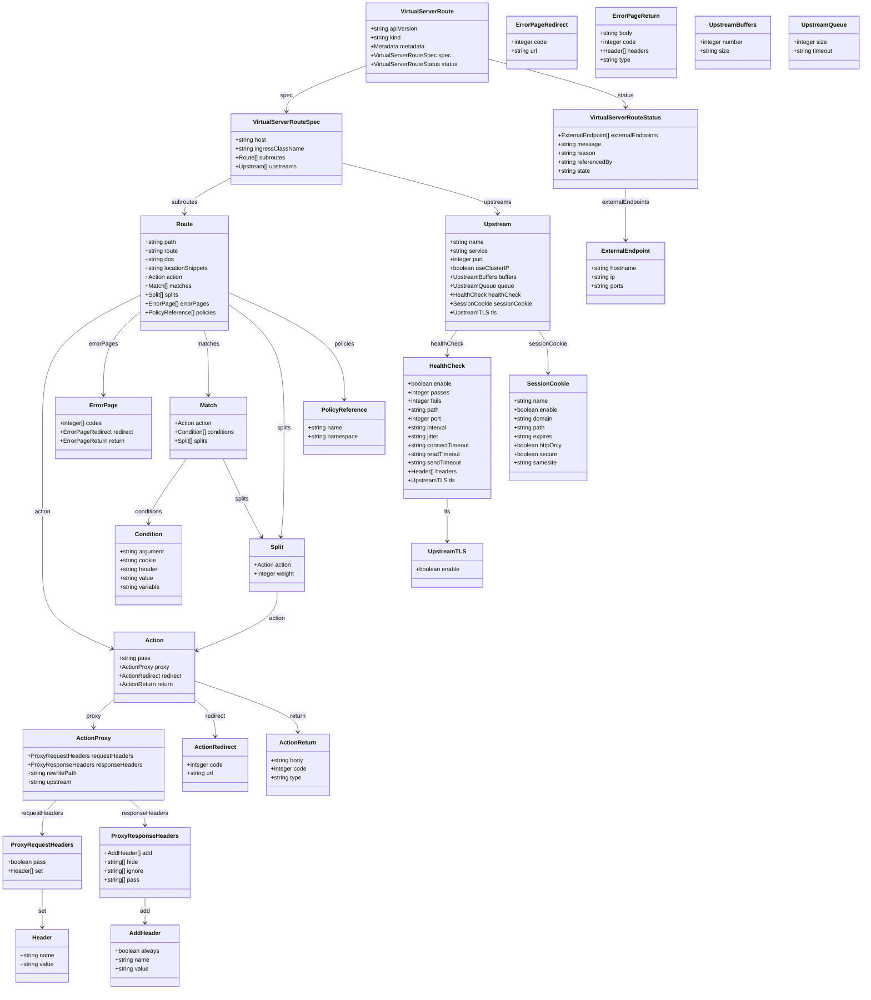

# Diagram: devops/k8s/nginx-ingress-controller/helm/crds/k8s.nginx.org_virtualserverroutes.yaml

> Auto-generated by Obscura crawlers

## Mermaid

### SVG

<svg id="container" width="2337.330078125" xmlns="http://www.w3.org/2000/svg" class="classDiagram" height="2696" viewBox="0 0 2337.330078125 2696" role="graphics-document document" aria-roledescription="class"><g><defs><marker id="container_class-aggregationStart" class="marker aggregation class" refX="18" refY="7" markerWidth="190" markerHeight="240" orient="auto"><path d="M 18,7 L9,13 L1,7 L9,1 Z"></path></marker></defs><defs><marker id="container_class-aggregationEnd" class="marker aggregation class" refX="1" refY="7" markerWidth="20" markerHeight="28" orient="auto"><path d="M 18,7 L9,13 L1,7 L9,1 Z"></path></marker></defs><defs><marker id="container_class-extensionStart" class="marker extension class" refX="18" refY="7" markerWidth="190" markerHeight="240" orient="auto"><path d="M 1,7 L18,13 V 1 Z"></path></marker></defs><defs><marker id="container_class-extensionEnd" class="marker extension class" refX="1" refY="7" markerWidth="20" markerHeight="28" orient="auto"><path d="M 1,1 V 13 L18,7 Z"></path></marker></defs><defs><marker id="container_class-compositionStart" class="marker composition class" refX="18" refY="7" markerWidth="190" markerHeight="240" orient="auto"><path d="M 18,7 L9,13 L1,7 L9,1 Z"></path></marker></defs><defs><marker id="container_class-compositionEnd" class="marker composition class" refX="1" refY="7" markerWidth="20" markerHeight="28" orient="auto"><path d="M 18,7 L9,13 L1,7 L9,1 Z"></path></marker></defs><defs><marker id="container_class-dependencyStart" class="marker dependency class" refX="6" refY="7" markerWidth="190" markerHeight="240" orient="auto"><path d="M 5,7 L9,13 L1,7 L9,1 Z"></path></marker></defs><defs><marker id="container_class-dependencyEnd" class="marker dependency class" refX="13" refY="7" markerWidth="20" markerHeight="28" orient="auto"><path d="M 18,7 L9,13 L14,7 L9,1 Z"></path></marker></defs><defs><marker id="container_class-lollipopStart" class="marker lollipop class" refX="13" refY="7" markerWidth="190" markerHeight="240" orient="auto"><circle stroke="black" fill="transparent" cx="7" cy="7" r="6"></circle></marker></defs><defs><marker id="container_class-lollipopEnd" class="marker lollipop class" refX="1" refY="7" markerWidth="190" markerHeight="240" orient="auto"><circle stroke="black" fill="transparent" cx="7" cy="7" r="6"></circle></marker></defs><g class="root"><g class="clusters"></g><g class="edgePaths"><path d="M991.127,178.654L954.752,192.378C918.378,206.102,845.628,233.551,809.254,254.442C772.879,275.333,772.879,289.667,772.879,296.833L772.879,304" id="id_VirtualServerRoute_VirtualServerRouteSpec_1" class="edge-thickness-normal edge-pattern-solid relation" style=";;;" data-edge="true" data-et="edge" data-id="id_VirtualServerRoute_VirtualServerRouteSpec_1" data-points="W3sieCI6OTkxLjEyNjk1MzEyNSwieSI6MTc4LjY1MzU0NzY2OTAyMzE0fSx7IngiOjc3Mi44Nzg5MDYyNSwieSI6MjYxfSx7IngiOjc3Mi44Nzg5MDYyNSwieSI6MzEwfV0=" marker-end="url(#container_class-dependencyEnd)"></path><path d="M1323.236,160.788L1385.16,177.49C1447.084,194.192,1570.932,227.596,1632.855,249.465C1694.779,271.333,1694.779,281.667,1694.779,286.833L1694.779,292" id="id_VirtualServerRoute_VirtualServerRouteStatus_2" class="edge-thickness-normal edge-pattern-solid relation" style=";;;" data-edge="true" data-et="edge" data-id="id_VirtualServerRoute_VirtualServerRouteStatus_2" data-points="W3sieCI6MTMyMy4yMzYzMjgxMjUsInkiOjE2MC43ODgwMTA4OTkxODI1NX0seyJ4IjoxNjk0Ljc3OTI5Njg3NSwieSI6MjYxfSx7IngiOjE2OTQuNzc5Mjk2ODc1LCJ5IjoyOTh9XQ==" marker-end="url(#container_class-dependencyEnd)"></path><path d="M625.211,483.008L603.481,494.34C581.751,505.672,538.292,528.336,516.562,544.835C494.832,561.333,494.832,571.667,494.832,576.833L494.832,582" id="id_VirtualServerRouteSpec_Route_3" class="edge-thickness-normal edge-pattern-solid relation" style=";;;" data-edge="true" data-et="edge" data-id="id_VirtualServerRouteSpec_Route_3" data-points="W3sieCI6NjI1LjIxMDkzNzUsInkiOjQ4My4wMDgwNzgxMTE4MjkxNX0seyJ4Ijo0OTQuODMyMDMxMjUsInkiOjU1MX0seyJ4Ijo0OTQuODMyMDMxMjUsInkiOjU4OH1d" marker-end="url(#container_class-dependencyEnd)"></path><path d="M920.547,443.189L991.896,461.157C1063.245,479.126,1205.943,515.063,1277.292,538.198C1348.641,561.333,1348.641,571.667,1348.641,576.833L1348.641,582" id="id_VirtualServerRouteSpec_Upstream_4" class="edge-thickness-normal edge-pattern-solid relation" style=";;;" data-edge="true" data-et="edge" data-id="id_VirtualServerRouteSpec_Upstream_4" data-points="W3sieCI6OTIwLjU0Njg3NSwieSI6NDQzLjE4ODc0NDUzMDAwNDR9LHsieCI6MTM0OC42NDA2MjUsInkiOjU1MX0seyJ4IjoxMzQ4LjY0MDYyNSwieSI6NTg4fV0=" marker-end="url(#container_class-dependencyEnd)"></path><path d="M375.25,803.41L330.434,825.675C285.618,847.94,195.986,892.47,151.17,952.902C106.354,1013.333,106.354,1089.667,106.354,1166C106.354,1242.333,106.354,1318.667,106.354,1381C106.354,1443.333,106.354,1491.667,106.354,1540C106.354,1588.333,106.354,1636.667,138.069,1674.594C169.784,1712.52,233.215,1740.041,264.931,1753.801L296.646,1767.561" id="id_Route_Action_5" class="edge-thickness-normal edge-pattern-solid relation" style=";;;" data-edge="true" data-et="edge" data-id="id_Route_Action_5" data-points="W3sieCI6Mzc1LjI1LCJ5Ijo4MDMuNDA5NTQ1NDUyMjYwMn0seyJ4IjoxMDYuMzUzNTE1NjI1LCJ5Ijo5Mzd9LHsieCI6MTA2LjM1MzUxNTYyNSwieSI6MTE2Nn0seyJ4IjoxMDYuMzUzNTE1NjI1LCJ5IjoxMzk1fSx7IngiOjEwNi4zNTM1MTU2MjUsInkiOjE1NDB9LHsieCI6MTA2LjM1MzUxNTYyNSwieSI6MTY4NX0seyJ4IjozMDIuMTUwMzkwNjI1LCJ5IjoxNzY5Ljk0OTQzNjc3MDQ3NzZ9XQ==" marker-end="url(#container_class-dependencyEnd)"></path><path d="M375.25,846.747L357.743,861.789C340.236,876.831,305.223,906.916,287.716,945.124C270.209,983.333,270.209,1029.667,270.209,1052.833L270.209,1076" id="id_Route_ErrorPage_6" class="edge-thickness-normal edge-pattern-solid relation" style=";;;" data-edge="true" data-et="edge" data-id="id_Route_ErrorPage_6" data-points="W3sieCI6Mzc1LjI1LCJ5Ijo4NDYuNzQ2OTQ1ODM4MDc5NX0seyJ4IjoyNzAuMjA4OTg0Mzc1LCJ5Ijo5Mzd9LHsieCI6MjcwLjIwODk4NDM3NSwieSI6MTA4Mn1d" marker-end="url(#container_class-dependencyEnd)"></path><path d="M544.998,900L546.981,906.167C548.964,912.333,552.93,924.667,554.913,954C556.896,983.333,556.896,1029.667,556.896,1052.833L556.896,1076" id="id_Route_Match_7" class="edge-thickness-normal edge-pattern-solid relation" style=";;;" data-edge="true" data-et="edge" data-id="id_Route_Match_7" data-points="W3sieCI6NTQ0Ljk5ODExNzcxMzczMDYsInkiOjkwMH0seyJ4Ijo1NTYuODk2NDg0Mzc1LCJ5Ijo5Mzd9LHsieCI6NTU2Ljg5NjQ4NDM3NSwieSI6MTA4Mn1d" marker-end="url(#container_class-dependencyEnd)"></path><path d="M614.414,828.821L639.833,846.851C665.251,864.881,716.089,900.94,741.507,957.137C766.926,1013.333,766.926,1089.667,766.926,1166C766.926,1242.333,766.926,1318.667,765.395,1368.009C763.864,1417.352,760.803,1439.704,759.272,1450.88L757.742,1462.055" id="id_Route_Split_8" class="edge-thickness-normal edge-pattern-solid relation" style=";;;" data-edge="true" data-et="edge" data-id="id_Route_Split_8" data-points="W3sieCI6NjE0LjQxNDA2MjUsInkiOjgyOC44MjEyNTAxNDM1NjI3fSx7IngiOjc2Ni45MjU3ODEyNSwieSI6OTM3fSx7IngiOjc2Ni45MjU3ODEyNSwieSI6MTE2Nn0seyJ4Ijo3NjYuOTI1NzgxMjUsInkiOjEzOTV9LHsieCI6NzU2LjkyNzYxMzE0NjU1MTcsInkiOjE0Njh9XQ==" marker-end="url(#container_class-dependencyEnd)"></path><path d="M614.414,796.939L667.143,820.283C719.872,843.626,825.331,890.313,878.06,938.823C930.789,987.333,930.789,1037.667,930.789,1062.833L930.789,1088" id="id_Route_PolicyReference_9" class="edge-thickness-normal edge-pattern-solid relation" style=";;;" data-edge="true" data-et="edge" data-id="id_Route_PolicyReference_9" data-points="W3sieCI6NjE0LjQxNDA2MjUsInkiOjc5Ni45Mzk0NjUwNzc3Mjk0fSx7IngiOjkzMC43ODkwNjI1LCJ5Ijo5Mzd9LHsieCI6OTMwLjc4OTA2MjUsInkiOjEwOTR9XQ==" marker-end="url(#container_class-dependencyEnd)"></path><path d="M497.464,1250L480.365,1274.167C463.266,1298.333,429.069,1346.667,411.97,1376C394.871,1405.333,394.871,1415.667,394.871,1420.833L394.871,1426" id="id_Match_Condition_10" class="edge-thickness-normal edge-pattern-solid relation" style=";;;" data-edge="true" data-et="edge" data-id="id_Match_Condition_10" data-points="W3sieCI6NDk3LjQ2MzU4OTk5NzI3MDczLCJ5IjoxMjUwfSx7IngiOjM5NC44NzEwOTM3NSwieSI6MTM5NX0seyJ4IjozOTQuODcxMDkzNzUsInkiOjE0MzJ9XQ==" marker-end="url(#container_class-dependencyEnd)"></path><path d="M596.84,1250L608.332,1274.167C619.824,1298.333,642.807,1346.667,660.63,1382.128C678.452,1417.589,691.114,1440.177,697.445,1451.472L703.775,1462.766" id="id_Match_Split_11" class="edge-thickness-normal edge-pattern-solid relation" style=";;;" data-edge="true" data-et="edge" data-id="id_Match_Split_11" data-points="W3sieCI6NTk2Ljg0MDMyOTg5OTAxNzQsInkiOjEyNTB9LHsieCI6NjY1Ljc5MTAxNTYyNSwieSI6MTM5NX0seyJ4Ijo3MDYuNzA4OTcwOTA1MTcyNSwieSI6MTQ2OH1d" marker-end="url(#container_class-dependencyEnd)"></path><path d="M747.066,1612L747.066,1624.167C747.066,1636.333,747.066,1660.667,710.76,1687.284C674.453,1713.901,601.839,1742.801,565.532,1757.252L529.225,1771.702" id="id_Split_Action_12" class="edge-thickness-normal edge-pattern-solid relation" style=";;;" data-edge="true" data-et="edge" data-id="id_Split_Action_12" data-points="W3sieCI6NzQ3LjA2NjQwNjI1LCJ5IjoxNjEyfSx7IngiOjc0Ny4wNjY0MDYyNSwieSI6MTY4NX0seyJ4Ijo1MjMuNjUwMzkwNjI1LCJ5IjoxNzczLjkyMDg2MTc1MzU0OTJ9XQ==" marker-end="url(#container_class-dependencyEnd)"></path><path d="M302.15,1908.444L293.465,1915.536C284.78,1922.629,267.41,1936.815,258.724,1949.074C250.039,1961.333,250.039,1971.667,250.039,1976.833L250.039,1982" id="id_Action_ActionProxy_13" class="edge-thickness-normal edge-pattern-solid relation" style=";;;" data-edge="true" data-et="edge" data-id="id_Action_ActionProxy_13" data-points="W3sieCI6MzAyLjE1MDM5MDYyNSwieSI6MTkwOC40NDM1MDkwMjQ0MDQ5fSx7IngiOjI1MC4wMzkwNjI1LCJ5IjoxOTUxfSx7IngiOjI1MC4wMzkwNjI1LCJ5IjoxOTg4fV0=" marker-end="url(#container_class-dependencyEnd)"></path><path d="M523.65,1908.444L532.336,1915.536C541.021,1922.629,558.391,1936.815,567.076,1953.074C575.762,1969.333,575.762,1987.667,575.762,1996.833L575.762,2006" id="id_Action_ActionRedirect_14" class="edge-thickness-normal edge-pattern-solid relation" style=";;;" data-edge="true" data-et="edge" data-id="id_Action_ActionRedirect_14" data-points="W3sieCI6NTIzLjY1MDM5MDYyNSwieSI6MTkwOC40NDM1MDkwMjQ0MDQ5fSx7IngiOjU3NS43NjE3MTg3NSwieSI6MTk1MX0seyJ4Ijo1NzUuNzYxNzE4NzUsInkiOjIwMTJ9XQ==" marker-end="url(#container_class-dependencyEnd)"></path><path d="M523.65,1856.16L569.526,1871.966C615.401,1887.773,707.152,1919.387,753.027,1942.36C798.902,1965.333,798.902,1979.667,798.902,1986.833L798.902,1994" id="id_Action_ActionReturn_15" class="edge-thickness-normal edge-pattern-solid relation" style=";;;" data-edge="true" data-et="edge" data-id="id_Action_ActionReturn_15" data-points="W3sieCI6NTIzLjY1MDM5MDYyNSwieSI6MTg1Ni4xNTk3ODEwMDgyMzI0fSx7IngiOjc5OC45MDIzNDM3NSwieSI6MTk1MX0seyJ4Ijo3OTguOTAyMzQzNzUsInkiOjIwMDB9XQ==" marker-end="url(#container_class-dependencyEnd)"></path><path d="M150.754,2180L144.377,2186.167C137.999,2192.333,125.244,2204.667,118.866,2220C112.488,2235.333,112.488,2253.667,112.488,2262.833L112.488,2272" id="id_ActionProxy_ProxyRequestHeaders_16" class="edge-thickness-normal edge-pattern-solid relation" style=";;;" data-edge="true" data-et="edge" data-id="id_ActionProxy_ProxyRequestHeaders_16" data-points="W3sieCI6MTUwLjc1NDI4ODA2MzkwOTc3LCJ5IjoyMTgwfSx7IngiOjExMi40ODgyODEyNSwieSI6MjIxN30seyJ4IjoxMTIuNDg4MjgxMjUsInkiOjIyNzh9XQ==" marker-end="url(#container_class-dependencyEnd)"></path><path d="M349.324,2180L355.702,2186.167C362.079,2192.333,374.835,2204.667,381.212,2216C387.59,2227.333,387.59,2237.667,387.59,2242.833L387.59,2248" id="id_ActionProxy_ProxyResponseHeaders_17" class="edge-thickness-normal edge-pattern-solid relation" style=";;;" data-edge="true" data-et="edge" data-id="id_ActionProxy_ProxyResponseHeaders_17" data-points="W3sieCI6MzQ5LjMyMzgzNjkzNjA5MDIzLCJ5IjoyMTgwfSx7IngiOjM4Ny41ODk4NDM3NSwieSI6MjIxN30seyJ4IjozODcuNTg5ODQzNzUsInkiOjIyNTR9XQ==" marker-end="url(#container_class-dependencyEnd)"></path><path d="M112.488,2422L112.488,2432.167C112.488,2442.333,112.488,2462.667,112.488,2480C112.488,2497.333,112.488,2511.667,112.488,2518.833L112.488,2526" id="id_ProxyRequestHeaders_Header_18" class="edge-thickness-normal edge-pattern-solid relation" style=";;;" data-edge="true" data-et="edge" data-id="id_ProxyRequestHeaders_Header_18" data-points="W3sieCI6MTEyLjQ4ODI4MTI1LCJ5IjoyNDIyfSx7IngiOjExMi40ODgyODEyNSwieSI6MjQ4M30seyJ4IjoxMTIuNDg4MjgxMjUsInkiOjI1MzJ9XQ==" marker-end="url(#container_class-dependencyEnd)"></path><path d="M387.59,2446L387.59,2452.167C387.59,2458.333,387.59,2470.667,387.59,2482C387.59,2493.333,387.59,2503.667,387.59,2508.833L387.59,2514" id="id_ProxyResponseHeaders_AddHeader_19" class="edge-thickness-normal edge-pattern-solid relation" style=";;;" data-edge="true" data-et="edge" data-id="id_ProxyResponseHeaders_AddHeader_19" data-points="W3sieCI6Mzg3LjU4OTg0Mzc1LCJ5IjoyNDQ2fSx7IngiOjM4Ny41ODk4NDM3NSwieSI6MjQ4M30seyJ4IjozODcuNTg5ODQzNzUsInkiOjI1MjB9XQ==" marker-end="url(#container_class-dependencyEnd)"></path><path d="M1236.901,900L1232.484,906.167C1228.067,912.333,1219.233,924.667,1214.816,936C1210.398,947.333,1210.398,957.667,1210.398,962.833L1210.398,968" id="id_Upstream_HealthCheck_20" class="edge-thickness-normal edge-pattern-solid relation" style=";;;" data-edge="true" data-et="edge" data-id="id_Upstream_HealthCheck_20" data-points="W3sieCI6MTIzNi45MDA4MjU3NzcyMDIsInkiOjkwMH0seyJ4IjoxMjEwLjM5ODQzNzUsInkiOjkzN30seyJ4IjoxMjEwLjM5ODQzNzUsInkiOjk3NH1d" marker-end="url(#container_class-dependencyEnd)"></path><path d="M1210.398,1358L1210.398,1364.167C1210.398,1370.333,1210.398,1382.667,1210.398,1402C1210.398,1421.333,1210.398,1447.667,1210.398,1460.833L1210.398,1474" id="id_HealthCheck_UpstreamTLS_21" class="edge-thickness-normal edge-pattern-solid relation" style=";;;" data-edge="true" data-et="edge" data-id="id_HealthCheck_UpstreamTLS_21" data-points="W3sieCI6MTIxMC4zOTg0Mzc1LCJ5IjoxMzU4fSx7IngiOjEyMTAuMzk4NDM3NSwieSI6MTM5NX0seyJ4IjoxMjEwLjM5ODQzNzUsInkiOjE0ODB9XQ==" marker-end="url(#container_class-dependencyEnd)"></path><path d="M1460.38,900L1464.797,906.167C1469.215,912.333,1478.049,924.667,1482.466,944C1486.883,963.333,1486.883,989.667,1486.883,1002.833L1486.883,1016" id="id_Upstream_SessionCookie_22" class="edge-thickness-normal edge-pattern-solid relation" style=";;;" data-edge="true" data-et="edge" data-id="id_Upstream_SessionCookie_22" data-points="W3sieCI6MTQ2MC4zODA0MjQyMjI3OTgsInkiOjkwMH0seyJ4IjoxNDg2Ljg4MjgxMjUsInkiOjkzN30seyJ4IjoxNDg2Ljg4MjgxMjUsInkiOjEwMjJ9XQ==" marker-end="url(#container_class-dependencyEnd)"></path><path d="M1694.779,514L1694.779,520.167C1694.779,526.333,1694.779,538.667,1694.779,562C1694.779,585.333,1694.779,619.667,1694.779,636.833L1694.779,654" id="id_VirtualServerRouteStatus_ExternalEndpoint_23" class="edge-thickness-normal edge-pattern-solid relation" style=";;;" data-edge="true" data-et="edge" data-id="id_VirtualServerRouteStatus_ExternalEndpoint_23" data-points="W3sieCI6MTY5NC43NzkyOTY4NzUsInkiOjUxNH0seyJ4IjoxNjk0Ljc3OTI5Njg3NSwieSI6NTUxfSx7IngiOjE2OTQuNzc5Mjk2ODc1LCJ5Ijo2NjB9XQ==" marker-end="url(#container_class-dependencyEnd)"></path></g><g class="edgeLabels"><g class="edgeLabel" transform="translate(772.87890625, 261)"><g class="label" data-id="id_VirtualServerRoute_VirtualServerRouteSpec_1" transform="translate(-16.6796875, -12)"><foreignObject width="33.359375" height="24">

spec

</foreignObject></g></g><g class="edgeLabel" transform="translate(1694.779296875, 261)"><g class="label" data-id="id_VirtualServerRoute_VirtualServerRouteStatus_2" transform="translate(-22.203125, -12)"><foreignObject width="44.40625" height="24">

status

</foreignObject></g></g><g class="edgeLabel" transform="translate(494.83203125, 551)"><g class="label" data-id="id_VirtualServerRouteSpec_Route_3" transform="translate(-36.1875, -12)"><foreignObject width="72.375" height="24">

subroutes

</foreignObject></g></g><g class="edgeLabel" transform="translate(1348.640625, 551)"><g class="label" data-id="id_VirtualServerRouteSpec_Upstream_4" transform="translate(-38.109375, -12)"><foreignObject width="76.21875" height="24">

upstreams

</foreignObject></g></g><g class="edgeLabel" transform="translate(106.353515625, 1395)"><g class="label" data-id="id_Route_Action_5" transform="translate(-22.6875, -12)"><foreignObject width="45.375" height="24">

action

</foreignObject></g></g><g class="edgeLabel" transform="translate(270.208984375, 937)"><g class="label" data-id="id_Route_ErrorPage_6" transform="translate(-38.671875, -12)"><foreignObject width="77.34375" height="24">

errorPages

</foreignObject></g></g><g class="edgeLabel" transform="translate(556.896484375, 937)"><g class="label" data-id="id_Route_Match_7" transform="translate(-30.5859375, -12)"><foreignObject width="61.171875" height="24">

matches

</foreignObject></g></g><g class="edgeLabel" transform="translate(766.92578125, 1166)"><g class="label" data-id="id_Route_Split_8" transform="translate(-19.71875, -12)"><foreignObject width="39.4375" height="24">

splits

</foreignObject></g></g><g class="edgeLabel" transform="translate(930.7890625, 937)"><g class="label" data-id="id_Route_PolicyReference_9" transform="translate(-28.203125, -12)"><foreignObject width="56.40625" height="24">

policies

</foreignObject></g></g><g class="edgeLabel" transform="translate(394.87109375, 1395)"><g class="label" data-id="id_Match_Condition_10" transform="translate(-38.3046875, -12)"><foreignObject width="76.609375" height="24">

conditions

</foreignObject></g></g><g class="edgeLabel" transform="translate(649.2847, 1360.28801)"><g class="label" data-id="id_Match_Split_11" transform="translate(-19.71875, -12)"><foreignObject width="39.4375" height="24">

splits

</foreignObject></g></g><g class="edgeLabel" transform="translate(747.06640625, 1685)"><g class="label" data-id="id_Split_Action_12" transform="translate(-22.6875, -12)"><foreignObject width="45.375" height="24">

action

</foreignObject></g></g><g class="edgeLabel" transform="translate(250.0390625, 1951)"><g class="label" data-id="id_Action_ActionProxy_13" transform="translate(-20.0234375, -12)"><foreignObject width="40.046875" height="24">

proxy

</foreignObject></g></g><g class="edgeLabel" transform="translate(575.76171875, 1951)"><g class="label" data-id="id_Action_ActionRedirect_14" transform="translate(-28.171875, -12)"><foreignObject width="56.34375" height="24">

redirect

</foreignObject></g></g><g class="edgeLabel" transform="translate(798.90234375, 1951)"><g class="label" data-id="id_Action_ActionReturn_15" transform="translate(-22.53125, -12)"><foreignObject width="45.0625" height="24">

return

</foreignObject></g></g><g class="edgeLabel" transform="translate(112.48828125, 2217)"><g class="label" data-id="id_ActionProxy_ProxyRequestHeaders_16" transform="translate(-57.5546875, -12)"><foreignObject width="115.109375" height="24">

requestHeaders

</foreignObject></g></g><g class="edgeLabel" transform="translate(387.58984375, 2217)"><g class="label" data-id="id_ActionProxy_ProxyResponseHeaders_17" transform="translate(-63.078125, -12)"><foreignObject width="126.15625" height="24">

responseHeaders

</foreignObject></g></g><g class="edgeLabel" transform="translate(112.48828125, 2483)"><g class="label" data-id="id_ProxyRequestHeaders_Header_18" transform="translate(-10.984375, -12)"><foreignObject width="21.96875" height="24">

set

</foreignObject></g></g><g class="edgeLabel" transform="translate(387.58984375, 2483)"><g class="label" data-id="id_ProxyResponseHeaders_AddHeader_19" transform="translate(-13.921875, -12)"><foreignObject width="27.84375" height="24">

add

</foreignObject></g></g><g class="edgeLabel" transform="translate(1210.3984375, 937)"><g class="label" data-id="id_Upstream_HealthCheck_20" transform="translate(-44.53125, -12)"><foreignObject width="89.0625" height="24">

healthCheck

</foreignObject></g></g><g class="edgeLabel" transform="translate(1210.3984375, 1395)"><g class="label" data-id="id_HealthCheck_UpstreamTLS_21" transform="translate(-8.890625, -12)"><foreignObject width="17.78125" height="24">

tls

</foreignObject></g></g><g class="edgeLabel" transform="translate(1486.8828125, 937)"><g class="label" data-id="id_Upstream_SessionCookie_22" transform="translate(-51.484375, -12)"><foreignObject width="102.96875" height="24">

sessionCookie

</foreignObject></g></g><g class="edgeLabel" transform="translate(1694.779296875, 551)"><g class="label" data-id="id_VirtualServerRouteStatus_ExternalEndpoint_23" transform="translate(-66.359375, -12)"><foreignObject width="132.71875" height="24">

externalEndpoints

</foreignObject></g></g></g><g class="nodes"><g class="node default" id="classId-VirtualServerRoute-0" transform="translate(1157.181640625, 116)"><g class="basic label-container"><path d="M-166.0546875 -108 L166.0546875 -108 L166.0546875 108 L-166.0546875 108" stroke="none" stroke-width="0" fill="#ECECFF" style=""></path><path d="M-166.0546875 -108 C-69.54945824332984 -108, 26.955771013340325 -108, 166.0546875 -108 M-166.0546875 -108 C-71.89654179531225 -108, 22.26160390937551 -108, 166.0546875 -108 M166.0546875 -108 C166.0546875 -58.599922858301845, 166.0546875 -9.19984571660369, 166.0546875 108 M166.0546875 -108 C166.0546875 -29.39465216028937, 166.0546875 49.21069567942126, 166.0546875 108 M166.0546875 108 C98.89687659533087 108, 31.739065690661732 108, -166.0546875 108 M166.0546875 108 C67.86867591213301 108, -30.317335675733972 108, -166.0546875 108 M-166.0546875 108 C-166.0546875 62.742775825091236, -166.0546875 17.485551650182472, -166.0546875 -108 M-166.0546875 108 C-166.0546875 22.53718962072361, -166.0546875 -62.92562075855278, -166.0546875 -108" stroke="#9370DB" stroke-width="1.3" fill="none" stroke-dasharray="0 0" style=""></path></g><g class="annotation-group text" transform="translate(0, -84)"></g><g class="label-group text" transform="translate(-69.65625, -84)"><g class="label" style="font-weight: bolder" transform="translate(0,-12)"><foreignObject width="139.3125" height="24">

VirtualServerRoute

</foreignObject></g></g><g class="members-group text" transform="translate(-154.0546875, -36)"><g class="label" style="" transform="translate(0,-12)"><foreignObject width="130.4375" height="24">

+string apiVersion

</foreignObject></g><g class="label" style="" transform="translate(0,12)"><foreignObject width="85.515625" height="24">

+string kind

</foreignObject></g><g class="label" style="" transform="translate(0,36)"><foreignObject width="149.84375" height="24">

+Metadata metadata

</foreignObject></g><g class="label" style="" transform="translate(0,60)"><foreignObject width="216.34375" height="24">

+VirtualServerRouteSpec spec

</foreignObject></g><g class="label" style="" transform="translate(0,84)"><foreignObject width="238.453125" height="24">

+VirtualServerRouteStatus status

</foreignObject></g></g><g class="methods-group text" transform="translate(-154.0546875, 108)"></g><g class="divider" style=""><path d="M-166.0546875 -60 C-36.102920599100884 -60, 93.84884630179823 -60, 166.0546875 -60 M-166.0546875 -60 C-72.1435301288682 -60, 21.767627242263586 -60, 166.0546875 -60" stroke="#9370DB" stroke-width="1.3" fill="none" stroke-dasharray="0 0" style=""></path></g><g class="divider" style=""><path d="M-166.0546875 84 C-44.632632139194385 84, 76.78942322161123 84, 166.0546875 84 M-166.0546875 84 C-96.33261504697983 84, -26.61054259395965 84, 166.0546875 84" stroke="#9370DB" stroke-width="1.3" fill="none" stroke-dasharray="0 0" style=""></path></g></g><g class="node default" id="classId-VirtualServerRouteSpec-1" transform="translate(772.87890625, 406)"><g class="basic label-container"><path d="M-147.66796875 -96 L147.66796875 -96 L147.66796875 96 L-147.66796875 96" stroke="none" stroke-width="0" fill="#ECECFF" style=""></path><path d="M-147.66796875 -96 C-86.92849688766697 -96, -26.189025025333933 -96, 147.66796875 -96 M-147.66796875 -96 C-54.41431975081913 -96, 38.839329248361736 -96, 147.66796875 -96 M147.66796875 -96 C147.66796875 -54.30670195055716, 147.66796875 -12.613403901114324, 147.66796875 96 M147.66796875 -96 C147.66796875 -33.614435195580526, 147.66796875 28.771129608838947, 147.66796875 96 M147.66796875 96 C83.25733807238187 96, 18.84670739476374 96, -147.66796875 96 M147.66796875 96 C68.46845568117503 96, -10.73105738764994 96, -147.66796875 96 M-147.66796875 96 C-147.66796875 39.37544199771449, -147.66796875 -17.24911600457102, -147.66796875 -96 M-147.66796875 96 C-147.66796875 44.63847730752774, -147.66796875 -6.723045384944527, -147.66796875 -96" stroke="#9370DB" stroke-width="1.3" fill="none" stroke-dasharray="0 0" style=""></path></g><g class="annotation-group text" transform="translate(0, -72)"></g><g class="label-group text" transform="translate(-87.2578125, -72)"><g class="label" style="font-weight: bolder" transform="translate(0,-12)"><foreignObject width="174.515625" height="24">

VirtualServerRouteSpec

</foreignObject></g></g><g class="members-group text" transform="translate(-135.66796875, -24)"><g class="label" style="" transform="translate(0,-12)"><foreignObject width="85.828125" height="24">

+string host

</foreignObject></g><g class="label" style="" transform="translate(0,12)"><foreignObject width="184.078125" height="24">

+string ingressClassName

</foreignObject></g><g class="label" style="" transform="translate(0,36)"><foreignObject width="137.25" height="24">

+Route[] subroutes

</foreignObject></g><g class="label" style="" transform="translate(0,60)"><foreignObject width="168.765625" height="24">

+Upstream[] upstreams

</foreignObject></g></g><g class="methods-group text" transform="translate(-135.66796875, 96)"></g><g class="divider" style=""><path d="M-147.66796875 -48 C-81.93792809777088 -48, -16.207887445541758 -48, 147.66796875 -48 M-147.66796875 -48 C-86.35306120736638 -48, -25.038153664732775 -48, 147.66796875 -48" stroke="#9370DB" stroke-width="1.3" fill="none" stroke-dasharray="0 0" style=""></path></g><g class="divider" style=""><path d="M-147.66796875 72 C-50.599033482927325 72, 46.46990178414535 72, 147.66796875 72 M-147.66796875 72 C-55.18151236224206 72, 37.30494402551588 72, 147.66796875 72" stroke="#9370DB" stroke-width="1.3" fill="none" stroke-dasharray="0 0" style=""></path></g></g><g class="node default" id="classId-VirtualServerRouteStatus-2" transform="translate(1694.779296875, 406)"><g class="basic label-container"><path d="M-198.796875 -108 L198.796875 -108 L198.796875 108 L-198.796875 108" stroke="none" stroke-width="0" fill="#ECECFF" style=""></path><path d="M-198.796875 -108 C-105.56524803759078 -108, -12.333621075181554 -108, 198.796875 -108 M-198.796875 -108 C-111.10604828435463 -108, -23.415221568709256 -108, 198.796875 -108 M198.796875 -108 C198.796875 -39.91469078644886, 198.796875 28.170618427102283, 198.796875 108 M198.796875 -108 C198.796875 -41.89696470659976, 198.796875 24.20607058680048, 198.796875 108 M198.796875 108 C119.06803112154162 108, 39.339187243083245 108, -198.796875 108 M198.796875 108 C106.7550553781147 108, 14.713235756229409 108, -198.796875 108 M-198.796875 108 C-198.796875 27.34536954125825, -198.796875 -53.3092609174835, -198.796875 -108 M-198.796875 108 C-198.796875 58.43742196098033, -198.796875 8.874843921960661, -198.796875 -108" stroke="#9370DB" stroke-width="1.3" fill="none" stroke-dasharray="0 0" style=""></path></g><g class="annotation-group text" transform="translate(0, -84)"></g><g class="label-group text" transform="translate(-93.140625, -84)"><g class="label" style="font-weight: bolder" transform="translate(0,-12)"><foreignObject width="186.28125" height="24">

VirtualServerRouteStatus

</foreignObject></g></g><g class="members-group text" transform="translate(-186.796875, -36)"><g class="label" style="" transform="translate(0,-12)"><foreignObject width="280.453125" height="24">

+ExternalEndpoint[] externalEndpoints

</foreignObject></g><g class="label" style="" transform="translate(0,12)"><foreignObject width="116.25" height="24">

+string message

</foreignObject></g><g class="label" style="" transform="translate(0,36)"><foreignObject width="102.859375" height="24">

+string reason

</foreignObject></g><g class="label" style="" transform="translate(0,60)"><foreignObject width="149.203125" height="24">

+string referencedBy

</foreignObject></g><g class="label" style="" transform="translate(0,84)"><foreignObject width="89.953125" height="24">

+string state

</foreignObject></g></g><g class="methods-group text" transform="translate(-186.796875, 108)"></g><g class="divider" style=""><path d="M-198.796875 -60 C-90.58602522822505 -60, 17.62482454354989 -60, 198.796875 -60 M-198.796875 -60 C-103.67201993742054 -60, -8.547164874841087 -60, 198.796875 -60" stroke="#9370DB" stroke-width="1.3" fill="none" stroke-dasharray="0 0" style=""></path></g><g class="divider" style=""><path d="M-198.796875 84 C-70.51545491601848 84, 57.76596516796303 84, 198.796875 84 M-198.796875 84 C-86.69320219690017 84, 25.410470606199652 84, 198.796875 84" stroke="#9370DB" stroke-width="1.3" fill="none" stroke-dasharray="0 0" style=""></path></g></g><g class="node default" id="classId-Route-3" transform="translate(494.83203125, 744)"><g class="basic label-container"><path d="M-119.58203125 -156 L119.58203125 -156 L119.58203125 156 L-119.58203125 156" stroke="none" stroke-width="0" fill="#ECECFF" style=""></path><path d="M-119.58203125 -156 C-65.7556128390698 -156, -11.929194428139596 -156, 119.58203125 -156 M-119.58203125 -156 C-47.2669546826603 -156, 25.048121884679404 -156, 119.58203125 -156 M119.58203125 -156 C119.58203125 -67.18000969977534, 119.58203125 21.63998060044932, 119.58203125 156 M119.58203125 -156 C119.58203125 -34.64126904583662, 119.58203125 86.71746190832675, 119.58203125 156 M119.58203125 156 C39.32708678823094 156, -40.927857673538114 156, -119.58203125 156 M119.58203125 156 C55.67559480385898 156, -8.230841642282044 156, -119.58203125 156 M-119.58203125 156 C-119.58203125 41.81109286130973, -119.58203125 -72.37781427738054, -119.58203125 -156 M-119.58203125 156 C-119.58203125 87.39111461963951, -119.58203125 18.78222923927902, -119.58203125 -156" stroke="#9370DB" stroke-width="1.3" fill="none" stroke-dasharray="0 0" style=""></path></g><g class="annotation-group text" transform="translate(0, -132)"></g><g class="label-group text" transform="translate(-21.4296875, -132)"><g class="label" style="font-weight: bolder" transform="translate(0,-12)"><foreignObject width="42.859375" height="24">

Route

</foreignObject></g></g><g class="members-group text" transform="translate(-107.58203125, -84)"><g class="label" style="" transform="translate(0,-12)"><foreignObject width="87.0625" height="24">

+string path

</foreignObject></g><g class="label" style="" transform="translate(0,12)"><foreignObject width="92.46875" height="24">

+string route

</foreignObject></g><g class="label" style="" transform="translate(0,36)"><foreignObject width="80.25" height="24">

+string dos

</foreignObject></g><g class="label" style="" transform="translate(0,60)"><foreignObject width="176.59375" height="24">

+string locationSnippets

</foreignObject></g><g class="label" style="" transform="translate(0,84)"><foreignObject width="103.25" height="24">

+Action action

</foreignObject></g><g class="label" style="" transform="translate(0,108)"><foreignObject width="127.421875" height="24">

+Match[] matches

</foreignObject></g><g class="label" style="" transform="translate(0,132)"><foreignObject width="94.515625" height="24">

+Split[] splits

</foreignObject></g><g class="label" style="" transform="translate(0,156)"><foreignObject width="169.40625" height="24">

+ErrorPage[] errorPages

</foreignObject></g><g class="label" style="" transform="translate(0,180)"><foreignObject width="193.734375" height="24">

+PolicyReference[] policies

</foreignObject></g></g><g class="methods-group text" transform="translate(-107.58203125, 156)"></g><g class="divider" style=""><path d="M-119.58203125 -108 C-62.45592982532377 -108, -5.329828400647543 -108, 119.58203125 -108 M-119.58203125 -108 C-52.5621165513933 -108, 14.457798147213396 -108, 119.58203125 -108" stroke="#9370DB" stroke-width="1.3" fill="none" stroke-dasharray="0 0" style=""></path></g><g class="divider" style=""><path d="M-119.58203125 132 C-44.10163337568791 132, 31.37876449862418 132, 119.58203125 132 M-119.58203125 132 C-69.3264624100517 132, -19.070893570103394 132, 119.58203125 132" stroke="#9370DB" stroke-width="1.3" fill="none" stroke-dasharray="0 0" style=""></path></g></g><g class="node default" id="classId-Action-4" transform="translate(412.900390625, 1818)"><g class="basic label-container"><path d="M-110.75 -96 L110.75 -96 L110.75 96 L-110.75 96" stroke="none" stroke-width="0" fill="#ECECFF" style=""></path><path d="M-110.75 -96 C-30.149123375584324 -96, 50.45175324883135 -96, 110.75 -96 M-110.75 -96 C-51.13070821945528 -96, 8.488583561089442 -96, 110.75 -96 M110.75 -96 C110.75 -42.040708010218054, 110.75 11.918583979563891, 110.75 96 M110.75 -96 C110.75 -52.261245019341274, 110.75 -8.522490038682548, 110.75 96 M110.75 96 C32.78521905394199 96, -45.17956189211603 96, -110.75 96 M110.75 96 C43.29592559409362 96, -24.158148811812765 96, -110.75 96 M-110.75 96 C-110.75 53.818270698050355, -110.75 11.63654139610071, -110.75 -96 M-110.75 96 C-110.75 37.832401668643385, -110.75 -20.33519666271323, -110.75 -96" stroke="#9370DB" stroke-width="1.3" fill="none" stroke-dasharray="0 0" style=""></path></g><g class="annotation-group text" transform="translate(0, -72)"></g><g class="label-group text" transform="translate(-23.1875, -72)"><g class="label" style="font-weight: bolder" transform="translate(0,-12)"><foreignObject width="46.375" height="24">

Action

</foreignObject></g></g><g class="members-group text" transform="translate(-98.75, -24)"><g class="label" style="" transform="translate(0,-12)"><foreignObject width="86.53125" height="24">

+string pass

</foreignObject></g><g class="label" style="" transform="translate(0,12)"><foreignObject width="137.4375" height="24">

+ActionProxy proxy

</foreignObject></g><g class="label" style="" transform="translate(0,36)"><foreignObject width="174.3125" height="24">

+ActionRedirect redirect

</foreignObject></g><g class="label" style="" transform="translate(0,60)"><foreignObject width="151.75" height="24">

+ActionReturn return

</foreignObject></g></g><g class="methods-group text" transform="translate(-98.75, 96)"></g><g class="divider" style=""><path d="M-110.75 -48 C-25.841345752456903 -48, 59.067308495086195 -48, 110.75 -48 M-110.75 -48 C-28.63562179470388 -48, 53.47875641059224 -48, 110.75 -48" stroke="#9370DB" stroke-width="1.3" fill="none" stroke-dasharray="0 0" style=""></path></g><g class="divider" style=""><path d="M-110.75 72 C-37.50044824588281 72, 35.749103508234384 72, 110.75 72 M-110.75 72 C-47.28961195936199 72, 16.170776081276017 72, 110.75 72" stroke="#9370DB" stroke-width="1.3" fill="none" stroke-dasharray="0 0" style=""></path></g></g><g class="node default" id="classId-ActionProxy-5" transform="translate(250.0390625, 2084)"><g class="basic label-container"><path d="M-187.68359375 -96 L187.68359375 -96 L187.68359375 96 L-187.68359375 96" stroke="none" stroke-width="0" fill="#ECECFF" style=""></path><path d="M-187.68359375 -96 C-86.65297118781419 -96, 14.377651374371624 -96, 187.68359375 -96 M-187.68359375 -96 C-40.627313125977906 -96, 106.42896749804419 -96, 187.68359375 -96 M187.68359375 -96 C187.68359375 -41.83154736568849, 187.68359375 12.336905268623013, 187.68359375 96 M187.68359375 -96 C187.68359375 -52.09291377782645, 187.68359375 -8.185827555652907, 187.68359375 96 M187.68359375 96 C85.17444981585821 96, -17.33469411828358 96, -187.68359375 96 M187.68359375 96 C62.262101953387514 96, -63.15938984322497 96, -187.68359375 96 M-187.68359375 96 C-187.68359375 56.54135228180906, -187.68359375 17.082704563618123, -187.68359375 -96 M-187.68359375 96 C-187.68359375 21.879853660835664, -187.68359375 -52.24029267832867, -187.68359375 -96" stroke="#9370DB" stroke-width="1.3" fill="none" stroke-dasharray="0 0" style=""></path></g><g class="annotation-group text" transform="translate(0, -72)"></g><g class="label-group text" transform="translate(-43.6015625, -72)"><g class="label" style="font-weight: bolder" transform="translate(0,-12)"><foreignObject width="87.203125" height="24">

ActionProxy

</foreignObject></g></g><g class="members-group text" transform="translate(-175.68359375, -24)"><g class="label" style="" transform="translate(0,-12)"><foreignObject width="285.6875" height="24">

+ProxyRequestHeaders requestHeaders

</foreignObject></g><g class="label" style="" transform="translate(0,12)"><foreignObject width="307.765625" height="24">

+ProxyResponseHeaders responseHeaders

</foreignObject></g><g class="label" style="" transform="translate(0,36)"><foreignObject width="136.96875" height="24">

+string rewritePath

</foreignObject></g><g class="label" style="" transform="translate(0,60)"><foreignObject width="122.59375" height="24">

+string upstream

</foreignObject></g></g><g class="methods-group text" transform="translate(-175.68359375, 96)"></g><g class="divider" style=""><path d="M-187.68359375 -48 C-69.7271508758481 -48, 48.22929199830381 -48, 187.68359375 -48 M-187.68359375 -48 C-70.93554413872488 -48, 45.81250547255024 -48, 187.68359375 -48" stroke="#9370DB" stroke-width="1.3" fill="none" stroke-dasharray="0 0" style=""></path></g><g class="divider" style=""><path d="M-187.68359375 72 C-53.660474578228076 72, 80.36264459354385 72, 187.68359375 72 M-187.68359375 72 C-111.29811515985857 72, -34.91263656971714 72, 187.68359375 72" stroke="#9370DB" stroke-width="1.3" fill="none" stroke-dasharray="0 0" style=""></path></g></g><g class="node default" id="classId-ProxyRequestHeaders-6" transform="translate(112.48828125, 2350)"><g class="basic label-container"><path d="M-104.48828125 -72 L104.48828125 -72 L104.48828125 72 L-104.48828125 72" stroke="none" stroke-width="0" fill="#ECECFF" style=""></path><path d="M-104.48828125 -72 C-57.35456471221523 -72, -10.220848174430458 -72, 104.48828125 -72 M-104.48828125 -72 C-40.42157431208527 -72, 23.64513262582946 -72, 104.48828125 -72 M104.48828125 -72 C104.48828125 -20.445690339490547, 104.48828125 31.108619321018907, 104.48828125 72 M104.48828125 -72 C104.48828125 -28.129322630059775, 104.48828125 15.74135473988045, 104.48828125 72 M104.48828125 72 C54.33541920782048 72, 4.182557165640958 72, -104.48828125 72 M104.48828125 72 C23.591312710906863 72, -57.305655828186275 72, -104.48828125 72 M-104.48828125 72 C-104.48828125 36.353075712143834, -104.48828125 0.7061514242876683, -104.48828125 -72 M-104.48828125 72 C-104.48828125 17.871958557152738, -104.48828125 -36.256082885694525, -104.48828125 -72" stroke="#9370DB" stroke-width="1.3" fill="none" stroke-dasharray="0 0" style=""></path></g><g class="annotation-group text" transform="translate(0, -48)"></g><g class="label-group text" transform="translate(-80.6328125, -48)"><g class="label" style="font-weight: bolder" transform="translate(0,-12)"><foreignObject width="161.265625" height="24">

ProxyRequestHeaders

</foreignObject></g></g><g class="members-group text" transform="translate(-92.48828125, 0)"><g class="label" style="" transform="translate(0,-12)"><foreignObject width="104.34375" height="24">

+boolean pass

</foreignObject></g><g class="label" style="" transform="translate(0,12)"><foreignObject width="97.109375" height="24">

+Header[] set

</foreignObject></g></g><g class="methods-group text" transform="translate(-92.48828125, 72)"></g><g class="divider" style=""><path d="M-104.48828125 -24 C-28.210217986822897 -24, 48.067845276354205 -24, 104.48828125 -24 M-104.48828125 -24 C-55.19051591889302 -24, -5.89275058778604 -24, 104.48828125 -24" stroke="#9370DB" stroke-width="1.3" fill="none" stroke-dasharray="0 0" style=""></path></g><g class="divider" style=""><path d="M-104.48828125 48 C-39.56332911404736 48, 25.361623021905274 48, 104.48828125 48 M-104.48828125 48 C-44.78564490986656 48, 14.916991430266876 48, 104.48828125 48" stroke="#9370DB" stroke-width="1.3" fill="none" stroke-dasharray="0 0" style=""></path></g></g><g class="node default" id="classId-ProxyResponseHeaders-7" transform="translate(387.58984375, 2350)"><g class="basic label-container"><path d="M-120.61328125 -96 L120.61328125 -96 L120.61328125 96 L-120.61328125 96" stroke="none" stroke-width="0" fill="#ECECFF" style=""></path><path d="M-120.61328125 -96 C-40.09439808682298 -96, 40.424485076354046 -96, 120.61328125 -96 M-120.61328125 -96 C-29.860494645645247 -96, 60.89229195870951 -96, 120.61328125 -96 M120.61328125 -96 C120.61328125 -27.88546938795386, 120.61328125 40.22906122409228, 120.61328125 96 M120.61328125 -96 C120.61328125 -35.630552609486, 120.61328125 24.738894781027994, 120.61328125 96 M120.61328125 96 C71.5254406336841 96, 22.43760001736821 96, -120.61328125 96 M120.61328125 96 C61.67921824938307 96, 2.745155248766139 96, -120.61328125 96 M-120.61328125 96 C-120.61328125 43.96693060669346, -120.61328125 -8.066138786613081, -120.61328125 -96 M-120.61328125 96 C-120.61328125 25.571025347271515, -120.61328125 -44.85794930545697, -120.61328125 -96" stroke="#9370DB" stroke-width="1.3" fill="none" stroke-dasharray="0 0" style=""></path></g><g class="annotation-group text" transform="translate(0, -72)"></g><g class="label-group text" transform="translate(-86.1015625, -72)"><g class="label" style="font-weight: bolder" transform="translate(0,-12)"><foreignObject width="172.203125" height="24">

ProxyResponseHeaders

</foreignObject></g></g><g class="members-group text" transform="translate(-108.61328125, -24)"><g class="label" style="" transform="translate(0,-12)"><foreignObject width="131.125" height="24">

+AddHeader[] add

</foreignObject></g><g class="label" style="" transform="translate(0,12)"><foreignObject width="96.34375" height="24">

+string[] hide

</foreignObject></g><g class="label" style="" transform="translate(0,36)"><foreignObject width="110.140625" height="24">

+string[] ignore

</foreignObject></g><g class="label" style="" transform="translate(0,60)"><foreignObject width="96.84375" height="24">

+string[] pass

</foreignObject></g></g><g class="methods-group text" transform="translate(-108.61328125, 96)"></g><g class="divider" style=""><path d="M-120.61328125 -48 C-30.5476482109174 -48, 59.5179848281652 -48, 120.61328125 -48 M-120.61328125 -48 C-58.26147309837582 -48, 4.090335053248367 -48, 120.61328125 -48" stroke="#9370DB" stroke-width="1.3" fill="none" stroke-dasharray="0 0" style=""></path></g><g class="divider" style=""><path d="M-120.61328125 72 C-66.93866963193204 72, -13.264058013864073 72, 120.61328125 72 M-120.61328125 72 C-61.25642697534878 72, -1.8995727006975613 72, 120.61328125 72" stroke="#9370DB" stroke-width="1.3" fill="none" stroke-dasharray="0 0" style=""></path></g></g><g class="node default" id="classId-Header-8" transform="translate(112.48828125, 2604)"><g class="basic label-container"><path d="M-72.42578125 -72 L72.42578125 -72 L72.42578125 72 L-72.42578125 72" stroke="none" stroke-width="0" fill="#ECECFF" style=""></path><path d="M-72.42578125 -72 C-34.44533994038567 -72, 3.5351013692286557 -72, 72.42578125 -72 M-72.42578125 -72 C-22.22688265455087 -72, 27.97201594089826 -72, 72.42578125 -72 M72.42578125 -72 C72.42578125 -31.755781882500386, 72.42578125 8.488436234999227, 72.42578125 72 M72.42578125 -72 C72.42578125 -42.79679042803575, 72.42578125 -13.593580856071505, 72.42578125 72 M72.42578125 72 C40.598854162795945 72, 8.771927075591897 72, -72.42578125 72 M72.42578125 72 C36.650307385662686 72, 0.8748335213253711 72, -72.42578125 72 M-72.42578125 72 C-72.42578125 14.510474346195366, -72.42578125 -42.97905130760927, -72.42578125 -72 M-72.42578125 72 C-72.42578125 29.730353342604317, -72.42578125 -12.539293314791365, -72.42578125 -72" stroke="#9370DB" stroke-width="1.3" fill="none" stroke-dasharray="0 0" style=""></path></g><g class="annotation-group text" transform="translate(0, -48)"></g><g class="label-group text" transform="translate(-26.4765625, -48)"><g class="label" style="font-weight: bolder" transform="translate(0,-12)"><foreignObject width="52.953125" height="24">

Header

</foreignObject></g></g><g class="members-group text" transform="translate(-60.42578125, 0)"><g class="label" style="" transform="translate(0,-12)"><foreignObject width="94.375" height="24">

+string name

</foreignObject></g><g class="label" style="" transform="translate(0,12)"><foreignObject width="92.75" height="24">

+string value

</foreignObject></g></g><g class="methods-group text" transform="translate(-60.42578125, 72)"></g><g class="divider" style=""><path d="M-72.42578125 -24 C-41.538027613160736 -24, -10.650273976321479 -24, 72.42578125 -24 M-72.42578125 -24 C-28.09912542842345 -24, 16.227530393153103 -24, 72.42578125 -24" stroke="#9370DB" stroke-width="1.3" fill="none" stroke-dasharray="0 0" style=""></path></g><g class="divider" style=""><path d="M-72.42578125 48 C-31.461076009358223 48, 9.503629231283554 48, 72.42578125 48 M-72.42578125 48 C-16.351725183507234 48, 39.72233088298553 48, 72.42578125 48" stroke="#9370DB" stroke-width="1.3" fill="none" stroke-dasharray="0 0" style=""></path></g></g><g class="node default" id="classId-AddHeader-9" transform="translate(387.58984375, 2604)"><g class="basic label-container"><path d="M-92.3359375 -84 L92.3359375 -84 L92.3359375 84 L-92.3359375 84" stroke="none" stroke-width="0" fill="#ECECFF" style=""></path><path d="M-92.3359375 -84 C-32.79072453904979 -84, 26.75448842190042 -84, 92.3359375 -84 M-92.3359375 -84 C-27.87906964867433 -84, 36.57779820265134 -84, 92.3359375 -84 M92.3359375 -84 C92.3359375 -43.350938303412555, 92.3359375 -2.7018766068251097, 92.3359375 84 M92.3359375 -84 C92.3359375 -19.558966259713003, 92.3359375 44.882067480573994, 92.3359375 84 M92.3359375 84 C49.54608842416814 84, 6.75623934833628 84, -92.3359375 84 M92.3359375 84 C51.88830529897915 84, 11.440673097958296 84, -92.3359375 84 M-92.3359375 84 C-92.3359375 39.74201021855195, -92.3359375 -4.515979562896106, -92.3359375 -84 M-92.3359375 84 C-92.3359375 32.335526715837766, -92.3359375 -19.32894656832447, -92.3359375 -84" stroke="#9370DB" stroke-width="1.3" fill="none" stroke-dasharray="0 0" style=""></path></g><g class="annotation-group text" transform="translate(0, -60)"></g><g class="label-group text" transform="translate(-40.796875, -60)"><g class="label" style="font-weight: bolder" transform="translate(0,-12)"><foreignObject width="81.59375" height="24">

AddHeader

</foreignObject></g></g><g class="members-group text" transform="translate(-80.3359375, -12)"><g class="label" style="" transform="translate(0,-12)"><foreignObject width="119.875" height="24">

+boolean always

</foreignObject></g><g class="label" style="" transform="translate(0,12)"><foreignObject width="94.375" height="24">

+string name

</foreignObject></g><g class="label" style="" transform="translate(0,36)"><foreignObject width="92.75" height="24">

+string value

</foreignObject></g></g><g class="methods-group text" transform="translate(-80.3359375, 84)"></g><g class="divider" style=""><path d="M-92.3359375 -36 C-19.986820533706506 -36, 52.36229643258699 -36, 92.3359375 -36 M-92.3359375 -36 C-47.04967380382026 -36, -1.7634101076405244 -36, 92.3359375 -36" stroke="#9370DB" stroke-width="1.3" fill="none" stroke-dasharray="0 0" style=""></path></g><g class="divider" style=""><path d="M-92.3359375 60 C-20.875601605618172 60, 50.584734288763656 60, 92.3359375 60 M-92.3359375 60 C-48.82714871250873 60, -5.318359925017461 60, 92.3359375 60" stroke="#9370DB" stroke-width="1.3" fill="none" stroke-dasharray="0 0" style=""></path></g></g><g class="node default" id="classId-ActionRedirect-10" transform="translate(575.76171875, 2084)"><g class="basic label-container"><path d="M-88.0390625 -72 L88.0390625 -72 L88.0390625 72 L-88.0390625 72" stroke="none" stroke-width="0" fill="#ECECFF" style=""></path><path d="M-88.0390625 -72 C-43.764430159896534 -72, 0.5102021802069316 -72, 88.0390625 -72 M-88.0390625 -72 C-46.98129155537289 -72, -5.923520610745783 -72, 88.0390625 -72 M88.0390625 -72 C88.0390625 -16.45843748403484, 88.0390625 39.08312503193032, 88.0390625 72 M88.0390625 -72 C88.0390625 -36.80252818820449, 88.0390625 -1.6050563764089816, 88.0390625 72 M88.0390625 72 C41.260765332517934 72, -5.517531834964132 72, -88.0390625 72 M88.0390625 72 C49.174432863385334 72, 10.309803226770669 72, -88.0390625 72 M-88.0390625 72 C-88.0390625 30.250902865970588, -88.0390625 -11.498194268058825, -88.0390625 -72 M-88.0390625 72 C-88.0390625 17.204308145263894, -88.0390625 -37.59138370947221, -88.0390625 -72" stroke="#9370DB" stroke-width="1.3" fill="none" stroke-dasharray="0 0" style=""></path></g><g class="annotation-group text" transform="translate(0, -48)"></g><g class="label-group text" transform="translate(-53.78125, -48)"><g class="label" style="font-weight: bolder" transform="translate(0,-12)"><foreignObject width="107.5625" height="24">

ActionRedirect

</foreignObject></g></g><g class="members-group text" transform="translate(-76.0390625, 0)"><g class="label" style="" transform="translate(0,-12)"><foreignObject width="98.296875" height="24">

+integer code

</foreignObject></g><g class="label" style="" transform="translate(0,12)"><foreignObject width="74.046875" height="24">

+string url

</foreignObject></g></g><g class="methods-group text" transform="translate(-76.0390625, 72)"></g><g class="divider" style=""><path d="M-88.0390625 -24 C-31.211300542503224 -24, 25.61646141499355 -24, 88.0390625 -24 M-88.0390625 -24 C-21.742089392959386 -24, 44.55488371408123 -24, 88.0390625 -24" stroke="#9370DB" stroke-width="1.3" fill="none" stroke-dasharray="0 0" style=""></path></g><g class="divider" style=""><path d="M-88.0390625 48 C-31.960857475136088 48, 24.117347549727825 48, 88.0390625 48 M-88.0390625 48 C-40.33298784410906 48, 7.373086811781874 48, 88.0390625 48" stroke="#9370DB" stroke-width="1.3" fill="none" stroke-dasharray="0 0" style=""></path></g></g><g class="node default" id="classId-ActionReturn-11" transform="translate(798.90234375, 2084)"><g class="basic label-container"><path d="M-85.1015625 -84 L85.1015625 -84 L85.1015625 84 L-85.1015625 84" stroke="none" stroke-width="0" fill="#ECECFF" style=""></path><path d="M-85.1015625 -84 C-48.8489413444348 -84, -12.596320188869598 -84, 85.1015625 -84 M-85.1015625 -84 C-39.243115629344736 -84, 6.615331241310528 -84, 85.1015625 -84 M85.1015625 -84 C85.1015625 -41.609702122057094, 85.1015625 0.7805957558858125, 85.1015625 84 M85.1015625 -84 C85.1015625 -38.58512749147442, 85.1015625 6.829745017051167, 85.1015625 84 M85.1015625 84 C17.536817370045767 84, -50.027927759908465 84, -85.1015625 84 M85.1015625 84 C41.872331567368384 84, -1.3568993652632315 84, -85.1015625 84 M-85.1015625 84 C-85.1015625 37.79069287700234, -85.1015625 -8.418614245995315, -85.1015625 -84 M-85.1015625 84 C-85.1015625 41.16327864750007, -85.1015625 -1.6734427049998573, -85.1015625 -84" stroke="#9370DB" stroke-width="1.3" fill="none" stroke-dasharray="0 0" style=""></path></g><g class="annotation-group text" transform="translate(0, -60)"></g><g class="label-group text" transform="translate(-47.90625, -60)"><g class="label" style="font-weight: bolder" transform="translate(0,-12)"><foreignObject width="95.8125" height="24">

ActionReturn

</foreignObject></g></g><g class="members-group text" transform="translate(-73.1015625, -12)"><g class="label" style="" transform="translate(0,-12)"><foreignObject width="90.15625" height="24">

+string body

</foreignObject></g><g class="label" style="" transform="translate(0,12)"><foreignObject width="98.296875" height="24">

+integer code

</foreignObject></g><g class="label" style="" transform="translate(0,36)"><foreignObject width="85.65625" height="24">

+string type

</foreignObject></g></g><g class="methods-group text" transform="translate(-73.1015625, 84)"></g><g class="divider" style=""><path d="M-85.1015625 -36 C-20.021137466018573 -36, 45.059287567962855 -36, 85.1015625 -36 M-85.1015625 -36 C-49.429313619784054 -36, -13.757064739568108 -36, 85.1015625 -36" stroke="#9370DB" stroke-width="1.3" fill="none" stroke-dasharray="0 0" style=""></path></g><g class="divider" style=""><path d="M-85.1015625 60 C-48.91316080284764 60, -12.724759105695284 60, 85.1015625 60 M-85.1015625 60 C-20.42673768080705 60, 44.2480871383859 60, 85.1015625 60" stroke="#9370DB" stroke-width="1.3" fill="none" stroke-dasharray="0 0" style=""></path></g></g><g class="node default" id="classId-ErrorPage-12" transform="translate(270.208984375, 1166)"><g class="basic label-container"><path d="M-128.85546875 -84 L128.85546875 -84 L128.85546875 84 L-128.85546875 84" stroke="none" stroke-width="0" fill="#ECECFF" style=""></path><path d="M-128.85546875 -84 C-70.03184121467643 -84, -11.20821367935288 -84, 128.85546875 -84 M-128.85546875 -84 C-68.35026835178518 -84, -7.84506795357035 -84, 128.85546875 -84 M128.85546875 -84 C128.85546875 -39.028069249063435, 128.85546875 5.94386150187313, 128.85546875 84 M128.85546875 -84 C128.85546875 -35.31519361435896, 128.85546875 13.369612771282078, 128.85546875 84 M128.85546875 84 C71.36647292514832 84, 13.877477100296645 84, -128.85546875 84 M128.85546875 84 C65.1196714601591 84, 1.3838741703181938 84, -128.85546875 84 M-128.85546875 84 C-128.85546875 19.478813561131673, -128.85546875 -45.04237287773665, -128.85546875 -84 M-128.85546875 84 C-128.85546875 23.402730650239427, -128.85546875 -37.194538699521146, -128.85546875 -84" stroke="#9370DB" stroke-width="1.3" fill="none" stroke-dasharray="0 0" style=""></path></g><g class="annotation-group text" transform="translate(0, -60)"></g><g class="label-group text" transform="translate(-35.5234375, -60)"><g class="label" style="font-weight: bolder" transform="translate(0,-12)"><foreignObject width="71.046875" height="24">

ErrorPage

</foreignObject></g></g><g class="members-group text" transform="translate(-116.85546875, -12)"><g class="label" style="" transform="translate(0,-12)"><foreignObject width="116.078125" height="24">

+integer[] codes

</foreignObject></g><g class="label" style="" transform="translate(0,12)"><foreignObject width="198.1875" height="24">

+ErrorPageRedirect redirect

</foreignObject></g><g class="label" style="" transform="translate(0,36)"><foreignObject width="175.625" height="24">

+ErrorPageReturn return

</foreignObject></g></g><g class="methods-group text" transform="translate(-116.85546875, 84)"></g><g class="divider" style=""><path d="M-128.85546875 -36 C-28.969220592652505 -36, 70.91702756469499 -36, 128.85546875 -36 M-128.85546875 -36 C-36.90019026022311 -36, 55.055088229553775 -36, 128.85546875 -36" stroke="#9370DB" stroke-width="1.3" fill="none" stroke-dasharray="0 0" style=""></path></g><g class="divider" style=""><path d="M-128.85546875 60 C-47.022122862500254 60, 34.81122302499949 60, 128.85546875 60 M-128.85546875 60 C-31.930528949926412 60, 64.99441085014718 60, 128.85546875 60" stroke="#9370DB" stroke-width="1.3" fill="none" stroke-dasharray="0 0" style=""></path></g></g><g class="node default" id="classId-ErrorPageRedirect-13" transform="translate(1467.443359375, 116)"><g class="basic label-container"><path d="M-94.20703125 -72 L94.20703125 -72 L94.20703125 72 L-94.20703125 72" stroke="none" stroke-width="0" fill="#ECECFF" style=""></path><path d="M-94.20703125 -72 C-56.063578138756384 -72, -17.920125027512768 -72, 94.20703125 -72 M-94.20703125 -72 C-52.92095215419473 -72, -11.63487305838946 -72, 94.20703125 -72 M94.20703125 -72 C94.20703125 -28.08992076537227, 94.20703125 15.82015846925546, 94.20703125 72 M94.20703125 -72 C94.20703125 -20.765411408841793, 94.20703125 30.469177182316415, 94.20703125 72 M94.20703125 72 C36.6920562292364 72, -20.8229187915272 72, -94.20703125 72 M94.20703125 72 C51.71342864264567 72, 9.219826035291334 72, -94.20703125 72 M-94.20703125 72 C-94.20703125 25.1855316790094, -94.20703125 -21.6289366419812, -94.20703125 -72 M-94.20703125 72 C-94.20703125 39.86816198407027, -94.20703125 7.736323968140539, -94.20703125 -72" stroke="#9370DB" stroke-width="1.3" fill="none" stroke-dasharray="0 0" style=""></path></g><g class="annotation-group text" transform="translate(0, -48)"></g><g class="label-group text" transform="translate(-66.1171875, -48)"><g class="label" style="font-weight: bolder" transform="translate(0,-12)"><foreignObject width="132.234375" height="24">

ErrorPageRedirect

</foreignObject></g></g><g class="members-group text" transform="translate(-82.20703125, 0)"><g class="label" style="" transform="translate(0,-12)"><foreignObject width="98.296875" height="24">

+integer code

</foreignObject></g><g class="label" style="" transform="translate(0,12)"><foreignObject width="74.046875" height="24">

+string url

</foreignObject></g></g><g class="methods-group text" transform="translate(-82.20703125, 72)"></g><g class="divider" style=""><path d="M-94.20703125 -24 C-51.37871014334642 -24, -8.550389036692835 -24, 94.20703125 -24 M-94.20703125 -24 C-28.8483704211138 -24, 36.5102904077724 -24, 94.20703125 -24" stroke="#9370DB" stroke-width="1.3" fill="none" stroke-dasharray="0 0" style=""></path></g><g class="divider" style=""><path d="M-94.20703125 48 C-53.81036277288897 48, -13.413694295777944 48, 94.20703125 48 M-94.20703125 48 C-24.854909846346473 48, 44.497211557307054 48, 94.20703125 48" stroke="#9370DB" stroke-width="1.3" fill="none" stroke-dasharray="0 0" style=""></path></g></g><g class="node default" id="classId-ErrorPageReturn-14" transform="translate(1720.513671875, 116)"><g class="basic label-container"><path d="M-108.86328125 -96 L108.86328125 -96 L108.86328125 96 L-108.86328125 96" stroke="none" stroke-width="0" fill="#ECECFF" style=""></path><path d="M-108.86328125 -96 C-22.758612930710825 -96, 63.34605538857835 -96, 108.86328125 -96 M-108.86328125 -96 C-63.56396109957723 -96, -18.264640949154455 -96, 108.86328125 -96 M108.86328125 -96 C108.86328125 -46.44196470124533, 108.86328125 3.116070597509335, 108.86328125 96 M108.86328125 -96 C108.86328125 -27.755625185944027, 108.86328125 40.48874962811195, 108.86328125 96 M108.86328125 96 C60.14563447571198 96, 11.427987701423959 96, -108.86328125 96 M108.86328125 96 C27.566217550242172 96, -53.730846149515656 96, -108.86328125 96 M-108.86328125 96 C-108.86328125 44.26779825352301, -108.86328125 -7.464403492953977, -108.86328125 -96 M-108.86328125 96 C-108.86328125 32.799593817008, -108.86328125 -30.400812365983995, -108.86328125 -96" stroke="#9370DB" stroke-width="1.3" fill="none" stroke-dasharray="0 0" style=""></path></g><g class="annotation-group text" transform="translate(0, -72)"></g><g class="label-group text" transform="translate(-60.2421875, -72)"><g class="label" style="font-weight: bolder" transform="translate(0,-12)"><foreignObject width="120.484375" height="24">

ErrorPageReturn

</foreignObject></g></g><g class="members-group text" transform="translate(-96.86328125, -24)"><g class="label" style="" transform="translate(0,-12)"><foreignObject width="90.15625" height="24">

+string body

</foreignObject></g><g class="label" style="" transform="translate(0,12)"><foreignObject width="98.296875" height="24">

+integer code

</foreignObject></g><g class="label" style="" transform="translate(0,36)"><foreignObject width="133.484375" height="24">

+Header[] headers

</foreignObject></g><g class="label" style="" transform="translate(0,60)"><foreignObject width="85.65625" height="24">

+string type

</foreignObject></g></g><g class="methods-group text" transform="translate(-96.86328125, 96)"></g><g class="divider" style=""><path d="M-108.86328125 -48 C-39.26551328426174 -48, 30.332254681476513 -48, 108.86328125 -48 M-108.86328125 -48 C-48.65291174223021 -48, 11.557457765539581 -48, 108.86328125 -48" stroke="#9370DB" stroke-width="1.3" fill="none" stroke-dasharray="0 0" style=""></path></g><g class="divider" style=""><path d="M-108.86328125 72 C-28.09107147508442 72, 52.68113829983116 72, 108.86328125 72 M-108.86328125 72 C-65.09447337172347 72, -21.32566549344692 72, 108.86328125 72" stroke="#9370DB" stroke-width="1.3" fill="none" stroke-dasharray="0 0" style=""></path></g></g><g class="node default" id="classId-Match-15" transform="translate(556.896484375, 1166)"><g class="basic label-container"><path d="M-107.83203125 -84 L107.83203125 -84 L107.83203125 84 L-107.83203125 84" stroke="none" stroke-width="0" fill="#ECECFF" style=""></path><path d="M-107.83203125 -84 C-48.75386894337642 -84, 10.324293363247165 -84, 107.83203125 -84 M-107.83203125 -84 C-28.757487764878533 -84, 50.317055720242934 -84, 107.83203125 -84 M107.83203125 -84 C107.83203125 -45.59067598006757, 107.83203125 -7.181351960135146, 107.83203125 84 M107.83203125 -84 C107.83203125 -44.82272573281635, 107.83203125 -5.6454514656327035, 107.83203125 84 M107.83203125 84 C64.48865364899288 84, 21.145276047985774 84, -107.83203125 84 M107.83203125 84 C46.65623578916929 84, -14.519559671661426 84, -107.83203125 84 M-107.83203125 84 C-107.83203125 29.58475364964199, -107.83203125 -24.83049270071602, -107.83203125 -84 M-107.83203125 84 C-107.83203125 40.54510557124442, -107.83203125 -2.9097888575111597, -107.83203125 -84" stroke="#9370DB" stroke-width="1.3" fill="none" stroke-dasharray="0 0" style=""></path></g><g class="annotation-group text" transform="translate(0, -60)"></g><g class="label-group text" transform="translate(-22.0703125, -60)"><g class="label" style="font-weight: bolder" transform="translate(0,-12)"><foreignObject width="44.140625" height="24">

Match

</foreignObject></g></g><g class="members-group text" transform="translate(-95.83203125, -12)"><g class="label" style="" transform="translate(0,-12)"><foreignObject width="103.25" height="24">

+Action action

</foreignObject></g><g class="label" style="" transform="translate(0,12)"><foreignObject width="169.59375" height="24">

+Condition[] conditions

</foreignObject></g><g class="label" style="" transform="translate(0,36)"><foreignObject width="94.515625" height="24">

+Split[] splits

</foreignObject></g></g><g class="methods-group text" transform="translate(-95.83203125, 84)"></g><g class="divider" style=""><path d="M-107.83203125 -36 C-32.211326174315445 -36, 43.40937890136911 -36, 107.83203125 -36 M-107.83203125 -36 C-47.65209089224471 -36, 12.527849465510585 -36, 107.83203125 -36" stroke="#9370DB" stroke-width="1.3" fill="none" stroke-dasharray="0 0" style=""></path></g><g class="divider" style=""><path d="M-107.83203125 60 C-62.776279812297226 60, -17.72052837459445 60, 107.83203125 60 M-107.83203125 60 C-37.92213896834282 60, 31.987753313314357 60, 107.83203125 60" stroke="#9370DB" stroke-width="1.3" fill="none" stroke-dasharray="0 0" style=""></path></g></g><g class="node default" id="classId-Condition-16" transform="translate(394.87109375, 1540)"><g class="basic label-container"><path d="M-91.4921875 -108 L91.4921875 -108 L91.4921875 108 L-91.4921875 108" stroke="none" stroke-width="0" fill="#ECECFF" style=""></path><path d="M-91.4921875 -108 C-53.54113734223056 -108, -15.590087184461126 -108, 91.4921875 -108 M-91.4921875 -108 C-27.343843480783704 -108, 36.80450053843259 -108, 91.4921875 -108 M91.4921875 -108 C91.4921875 -31.105443105874244, 91.4921875 45.78911378825151, 91.4921875 108 M91.4921875 -108 C91.4921875 -35.936633068854974, 91.4921875 36.12673386229005, 91.4921875 108 M91.4921875 108 C36.550711872193546 108, -18.39076375561291 108, -91.4921875 108 M91.4921875 108 C50.57318958922402 108, 9.654191678448043 108, -91.4921875 108 M-91.4921875 108 C-91.4921875 49.58193734921622, -91.4921875 -8.836125301567563, -91.4921875 -108 M-91.4921875 108 C-91.4921875 33.64666030061362, -91.4921875 -40.70667939877276, -91.4921875 -108" stroke="#9370DB" stroke-width="1.3" fill="none" stroke-dasharray="0 0" style=""></path></g><g class="annotation-group text" transform="translate(0, -84)"></g><g class="label-group text" transform="translate(-35.421875, -84)"><g class="label" style="font-weight: bolder" transform="translate(0,-12)"><foreignObject width="70.84375" height="24">

Condition

</foreignObject></g></g><g class="members-group text" transform="translate(-79.4921875, -36)"><g class="label" style="" transform="translate(0,-12)"><foreignObject width="123.5625" height="24">

+string argument

</foreignObject></g><g class="label" style="" transform="translate(0,12)"><foreignObject width="101.296875" height="24">

+string cookie

</foreignObject></g><g class="label" style="" transform="translate(0,36)"><foreignObject width="104.96875" height="24">

+string header

</foreignObject></g><g class="label" style="" transform="translate(0,60)"><foreignObject width="92.75" height="24">

+string value

</foreignObject></g><g class="label" style="" transform="translate(0,84)"><foreignObject width="112.40625" height="24">

+string variable

</foreignObject></g></g><g class="methods-group text" transform="translate(-79.4921875, 108)"></g><g class="divider" style=""><path d="M-91.4921875 -60 C-47.23641042362531 -60, -2.980633347250617 -60, 91.4921875 -60 M-91.4921875 -60 C-44.4379259458688 -60, 2.6163356082624034 -60, 91.4921875 -60" stroke="#9370DB" stroke-width="1.3" fill="none" stroke-dasharray="0 0" style=""></path></g><g class="divider" style=""><path d="M-91.4921875 84 C-36.64781363004246 84, 18.196560239915087 84, 91.4921875 84 M-91.4921875 84 C-37.18268055990421 84, 17.126826380191574 84, 91.4921875 84" stroke="#9370DB" stroke-width="1.3" fill="none" stroke-dasharray="0 0" style=""></path></g></g><g class="node default" id="classId-Split-17" transform="translate(747.06640625, 1540)"><g class="basic label-container"><path d="M-76.296875 -72 L76.296875 -72 L76.296875 72 L-76.296875 72" stroke="none" stroke-width="0" fill="#ECECFF" style=""></path><path d="M-76.296875 -72 C-43.90549417783085 -72, -11.514113355661706 -72, 76.296875 -72 M-76.296875 -72 C-31.57396360497932 -72, 13.148947790041362 -72, 76.296875 -72 M76.296875 -72 C76.296875 -32.870692463508135, 76.296875 6.25861507298373, 76.296875 72 M76.296875 -72 C76.296875 -41.044547209597454, 76.296875 -10.089094419194907, 76.296875 72 M76.296875 72 C37.89973125181749 72, -0.4974124963650155 72, -76.296875 72 M76.296875 72 C28.552034563418673 72, -19.192805873162655 72, -76.296875 72 M-76.296875 72 C-76.296875 19.274192309996437, -76.296875 -33.45161538000713, -76.296875 -72 M-76.296875 72 C-76.296875 25.328690604376156, -76.296875 -21.342618791247688, -76.296875 -72" stroke="#9370DB" stroke-width="1.3" fill="none" stroke-dasharray="0 0" style=""></path></g><g class="annotation-group text" transform="translate(0, -48)"></g><g class="label-group text" transform="translate(-17.078125, -48)"><g class="label" style="font-weight: bolder" transform="translate(0,-12)"><foreignObject width="34.15625" height="24">

Split

</foreignObject></g></g><g class="members-group text" transform="translate(-64.296875, 0)"><g class="label" style="" transform="translate(0,-12)"><foreignObject width="103.25" height="24">

+Action action

</foreignObject></g><g class="label" style="" transform="translate(0,12)"><foreignObject width="111.515625" height="24">

+integer weight

</foreignObject></g></g><g class="methods-group text" transform="translate(-64.296875, 72)"></g><g class="divider" style=""><path d="M-76.296875 -24 C-23.015168421600414 -24, 30.26653815679917 -24, 76.296875 -24 M-76.296875 -24 C-27.199252339546376 -24, 21.898370320907247 -24, 76.296875 -24" stroke="#9370DB" stroke-width="1.3" fill="none" stroke-dasharray="0 0" style=""></path></g><g class="divider" style=""><path d="M-76.296875 48 C-25.50757926727193 48, 25.281716465456142 48, 76.296875 48 M-76.296875 48 C-29.945176731366175 48, 16.40652153726765 48, 76.296875 48" stroke="#9370DB" stroke-width="1.3" fill="none" stroke-dasharray="0 0" style=""></path></g></g><g class="node default" id="classId-Upstream-18" transform="translate(1348.640625, 744)"><g class="basic label-container"><path d="M-139.078125 -156 L139.078125 -156 L139.078125 156 L-139.078125 156" stroke="none" stroke-width="0" fill="#ECECFF" style=""></path><path d="M-139.078125 -156 C-34.3310506256264 -156, 70.4160237487472 -156, 139.078125 -156 M-139.078125 -156 C-74.75653957128922 -156, -10.434954142578448 -156, 139.078125 -156 M139.078125 -156 C139.078125 -70.77271498647306, 139.078125 14.454570027053876, 139.078125 156 M139.078125 -156 C139.078125 -46.87153165411371, 139.078125 62.25693669177258, 139.078125 156 M139.078125 156 C68.4283810701067 156, -2.221362859786609 156, -139.078125 156 M139.078125 156 C53.1925575682222 156, -32.6930098635556 156, -139.078125 156 M-139.078125 156 C-139.078125 82.56250620639628, -139.078125 9.125012412792557, -139.078125 -156 M-139.078125 156 C-139.078125 33.32235832584087, -139.078125 -89.35528334831827, -139.078125 -156" stroke="#9370DB" stroke-width="1.3" fill="none" stroke-dasharray="0 0" style=""></path></g><g class="annotation-group text" transform="translate(0, -132)"></g><g class="label-group text" transform="translate(-35.390625, -132)"><g class="label" style="font-weight: bolder" transform="translate(0,-12)"><foreignObject width="70.78125" height="24">

Upstream

</foreignObject></g></g><g class="members-group text" transform="translate(-127.078125, -84)"><g class="label" style="" transform="translate(0,-12)"><foreignObject width="94.375" height="24">

+string name

</foreignObject></g><g class="label" style="" transform="translate(0,12)"><foreignObject width="104.65625" height="24">

+string service

</foreignObject></g><g class="label" style="" transform="translate(0,36)"><foreignObject width="94.140625" height="24">

+integer port

</foreignObject></g><g class="label" style="" transform="translate(0,60)"><foreignObject width="161.890625" height="24">

+boolean useClusterIP

</foreignObject></g><g class="label" style="" transform="translate(0,84)"><foreignObject width="185.484375" height="24">

+UpstreamBuffers buffers

</foreignObject></g><g class="label" style="" transform="translate(0,108)"><foreignObject width="175" height="24">

+UpstreamQueue queue

</foreignObject></g><g class="label" style="" transform="translate(0,132)"><foreignObject width="191.84375" height="24">

+HealthCheck healthCheck

</foreignObject></g><g class="label" style="" transform="translate(0,156)"><foreignObject width="218.765625" height="24">

+SessionCookie sessionCookie

</foreignObject></g><g class="label" style="" transform="translate(0,180)"><foreignObject width="124.75" height="24">

+UpstreamTLS tls

</foreignObject></g></g><g class="methods-group text" transform="translate(-127.078125, 156)"></g><g class="divider" style=""><path d="M-139.078125 -108 C-73.07716070737578 -108, -7.076196414751564 -108, 139.078125 -108 M-139.078125 -108 C-45.41922994137089 -108, 48.23966511725823 -108, 139.078125 -108" stroke="#9370DB" stroke-width="1.3" fill="none" stroke-dasharray="0 0" style=""></path></g><g class="divider" style=""><path d="M-139.078125 132 C-52.697027042267734 132, 33.68407091546453 132, 139.078125 132 M-139.078125 132 C-52.35262016192753 132, 34.372884676144935 132, 139.078125 132" stroke="#9370DB" stroke-width="1.3" fill="none" stroke-dasharray="0 0" style=""></path></g></g><g class="node default" id="classId-UpstreamBuffers-19" transform="translate(1982.400390625, 116)"><g class="basic label-container"><path d="M-103.0234375 -72 L103.0234375 -72 L103.0234375 72 L-103.0234375 72" stroke="none" stroke-width="0" fill="#ECECFF" style=""></path><path d="M-103.0234375 -72 C-44.18981758528015 -72, 14.643802329439694 -72, 103.0234375 -72 M-103.0234375 -72 C-52.618089826025496 -72, -2.2127421520509927 -72, 103.0234375 -72 M103.0234375 -72 C103.0234375 -34.88915967444281, 103.0234375 2.221680651114383, 103.0234375 72 M103.0234375 -72 C103.0234375 -30.244999884914392, 103.0234375 11.510000230171215, 103.0234375 72 M103.0234375 72 C36.02088573376756 72, -30.981666032464886 72, -103.0234375 72 M103.0234375 72 C40.59926515794214 72, -21.824907184115716 72, -103.0234375 72 M-103.0234375 72 C-103.0234375 41.06143096074321, -103.0234375 10.122861921486411, -103.0234375 -72 M-103.0234375 72 C-103.0234375 31.130349082800898, -103.0234375 -9.739301834398205, -103.0234375 -72" stroke="#9370DB" stroke-width="1.3" fill="none" stroke-dasharray="0 0" style=""></path></g><g class="annotation-group text" transform="translate(0, -48)"></g><g class="label-group text" transform="translate(-61.90625, -48)"><g class="label" style="font-weight: bolder" transform="translate(0,-12)"><foreignObject width="123.8125" height="24">

UpstreamBuffers

</foreignObject></g></g><g class="members-group text" transform="translate(-91.0234375, 0)"><g class="label" style="" transform="translate(0,-12)"><foreignObject width="120.140625" height="24">

+integer number

</foreignObject></g><g class="label" style="" transform="translate(0,12)"><foreignObject width="81.453125" height="24">

+string size

</foreignObject></g></g><g class="methods-group text" transform="translate(-91.0234375, 72)"></g><g class="divider" style=""><path d="M-103.0234375 -24 C-34.29774742838943 -24, 34.427942643221144 -24, 103.0234375 -24 M-103.0234375 -24 C-22.250826474242928 -24, 58.521784551514145 -24, 103.0234375 -24" stroke="#9370DB" stroke-width="1.3" fill="none" stroke-dasharray="0 0" style=""></path></g><g class="divider" style=""><path d="M-103.0234375 48 C-47.299873568873906 48, 8.423690362252188 48, 103.0234375 48 M-103.0234375 48 C-27.80285658181343 48, 47.41772433637314 48, 103.0234375 48" stroke="#9370DB" stroke-width="1.3" fill="none" stroke-dasharray="0 0" style=""></path></g></g><g class="node default" id="classId-UpstreamQueue-20" transform="translate(2232.376953125, 116)"><g class="basic label-container"><path d="M-96.953125 -72 L96.953125 -72 L96.953125 72 L-96.953125 72" stroke="none" stroke-width="0" fill="#ECECFF" style=""></path><path d="M-96.953125 -72 C-47.015238441767664 -72, 2.9226481164646714 -72, 96.953125 -72 M-96.953125 -72 C-26.21152253019372 -72, 44.53007993961256 -72, 96.953125 -72 M96.953125 -72 C96.953125 -22.313556200683692, 96.953125 27.372887598632616, 96.953125 72 M96.953125 -72 C96.953125 -33.31312031248249, 96.953125 5.373759375035021, 96.953125 72 M96.953125 72 C49.58304643248463 72, 2.212967864969258 72, -96.953125 72 M96.953125 72 C43.373184739345 72, -10.20675552131 72, -96.953125 72 M-96.953125 72 C-96.953125 41.636162453264234, -96.953125 11.272324906528468, -96.953125 -72 M-96.953125 72 C-96.953125 18.98259877204795, -96.953125 -34.0348024559041, -96.953125 -72" stroke="#9370DB" stroke-width="1.3" fill="none" stroke-dasharray="0 0" style=""></path></g><g class="annotation-group text" transform="translate(0, -48)"></g><g class="label-group text" transform="translate(-58.890625, -48)"><g class="label" style="font-weight: bolder" transform="translate(0,-12)"><foreignObject width="117.78125" height="24">

UpstreamQueue

</foreignObject></g></g><g class="members-group text" transform="translate(-84.953125, 0)"><g class="label" style="" transform="translate(0,-12)"><foreignObject width="90.921875" height="24">

+integer size

</foreignObject></g><g class="label" style="" transform="translate(0,12)"><foreignObject width="111.015625" height="24">

+string timeout

</foreignObject></g></g><g class="methods-group text" transform="translate(-84.953125, 72)"></g><g class="divider" style=""><path d="M-96.953125 -24 C-42.47920337692603 -24, 11.99471824614794 -24, 96.953125 -24 M-96.953125 -24 C-57.37052683124971 -24, -17.787928662499425 -24, 96.953125 -24" stroke="#9370DB" stroke-width="1.3" fill="none" stroke-dasharray="0 0" style=""></path></g><g class="divider" style=""><path d="M-96.953125 48 C-48.59265189846955 48, -0.23217879693909538 48, 96.953125 48 M-96.953125 48 C-46.57417987991385 48, 3.8047652401723013 48, 96.953125 48" stroke="#9370DB" stroke-width="1.3" fill="none" stroke-dasharray="0 0" style=""></path></g></g><g class="node default" id="classId-HealthCheck-21" transform="translate(1210.3984375, 1166)"><g class="basic label-container"><path d="M-120.46484375 -192 L120.46484375 -192 L120.46484375 192 L-120.46484375 192" stroke="none" stroke-width="0" fill="#ECECFF" style=""></path><path d="M-120.46484375 -192 C-39.80606293869282 -192, 40.85271787261436 -192, 120.46484375 -192 M-120.46484375 -192 C-53.22588213114153 -192, 14.013079487716936 -192, 120.46484375 -192 M120.46484375 -192 C120.46484375 -61.633041356649784, 120.46484375 68.73391728670043, 120.46484375 192 M120.46484375 -192 C120.46484375 -63.04003589532573, 120.46484375 65.91992820934854, 120.46484375 192 M120.46484375 192 C38.04924336813946 192, -44.366357013721085 192, -120.46484375 192 M120.46484375 192 C41.15416483082201 192, -38.156514088355976 192, -120.46484375 192 M-120.46484375 192 C-120.46484375 101.53064131260103, -120.46484375 11.061282625202068, -120.46484375 -192 M-120.46484375 192 C-120.46484375 38.76565174612867, -120.46484375 -114.46869650774266, -120.46484375 -192" stroke="#9370DB" stroke-width="1.3" fill="none" stroke-dasharray="0 0" style=""></path></g><g class="annotation-group text" transform="translate(0, -168)"></g><g class="label-group text" transform="translate(-45.8515625, -168)"><g class="label" style="font-weight: bolder" transform="translate(0,-12)"><foreignObject width="91.703125" height="24">

HealthCheck

</foreignObject></g></g><g class="members-group text" transform="translate(-108.46484375, -120)"><g class="label" style="" transform="translate(0,-12)"><foreignObject width="121.296875" height="24">

+boolean enable

</foreignObject></g><g class="label" style="" transform="translate(0,12)"><foreignObject width="112.203125" height="24">

+integer passes

</foreignObject></g><g class="label" style="" transform="translate(0,36)"><foreignObject width="93.71875" height="24">

+integer fails

</foreignObject></g><g class="label" style="" transform="translate(0,60)"><foreignObject width="87.0625" height="24">

+string path

</foreignObject></g><g class="label" style="" transform="translate(0,84)"><foreignObject width="94.140625" height="24">

+integer port

</foreignObject></g><g class="label" style="" transform="translate(0,108)"><foreignObject width="109.03125" height="24">

+string interval

</foreignObject></g><g class="label" style="" transform="translate(0,132)"><foreignObject width="89.0625" height="24">

+string jitter

</foreignObject></g><g class="label" style="" transform="translate(0,156)"><foreignObject width="171.078125" height="24">

+string connectTimeout

</foreignObject></g><g class="label" style="" transform="translate(0,180)"><foreignObject width="146.046875" height="24">

+string readTimeout

</foreignObject></g><g class="label" style="" transform="translate(0,204)"><foreignObject width="148.640625" height="24">

+string sendTimeout

</foreignObject></g><g class="label" style="" transform="translate(0,228)"><foreignObject width="133.484375" height="24">

+Header[] headers

</foreignObject></g><g class="label" style="" transform="translate(0,252)"><foreignObject width="124.75" height="24">

+UpstreamTLS tls

</foreignObject></g></g><g class="methods-group text" transform="translate(-108.46484375, 192)"></g><g class="divider" style=""><path d="M-120.46484375 -144 C-29.86522734382251 -144, 60.73438906235498 -144, 120.46484375 -144 M-120.46484375 -144 C-25.666771393141133 -144, 69.13130096371773 -144, 120.46484375 -144" stroke="#9370DB" stroke-width="1.3" fill="none" stroke-dasharray="0 0" style=""></path></g><g class="divider" style=""><path d="M-120.46484375 168 C-33.36038486909919 168, 53.744074011801615 168, 120.46484375 168 M-120.46484375 168 C-57.59106998016069 168, 5.282703789678621 168, 120.46484375 168" stroke="#9370DB" stroke-width="1.3" fill="none" stroke-dasharray="0 0" style=""></path></g></g><g class="node default" id="classId-UpstreamTLS-22" transform="translate(1210.3984375, 1540)"><g class="basic label-container"><path d="M-96.79296875 -60 L96.79296875 -60 L96.79296875 60 L-96.79296875 60" stroke="none" stroke-width="0" fill="#ECECFF" style=""></path><path d="M-96.79296875 -60 C-43.276283321468746 -60, 10.240402107062508 -60, 96.79296875 -60 M-96.79296875 -60 C-25.66102989541396 -60, 45.47090895917208 -60, 96.79296875 -60 M96.79296875 -60 C96.79296875 -15.255921310813335, 96.79296875 29.48815737837333, 96.79296875 60 M96.79296875 -60 C96.79296875 -29.698117122645588, 96.79296875 0.6037657547088244, 96.79296875 60 M96.79296875 60 C34.31944174667211 60, -28.154085256655776 60, -96.79296875 60 M96.79296875 60 C36.642148979126546 60, -23.50867079174691 60, -96.79296875 60 M-96.79296875 60 C-96.79296875 21.053808320293065, -96.79296875 -17.89238335941387, -96.79296875 -60 M-96.79296875 60 C-96.79296875 31.852780822176925, -96.79296875 3.7055616443538497, -96.79296875 -60" stroke="#9370DB" stroke-width="1.3" fill="none" stroke-dasharray="0 0" style=""></path></g><g class="annotation-group text" transform="translate(0, -36)"></g><g class="label-group text" transform="translate(-48.2890625, -36)"><g class="label" style="font-weight: bolder" transform="translate(0,-12)"><foreignObject width="96.578125" height="24">

UpstreamTLS

</foreignObject></g></g><g class="members-group text" transform="translate(-84.79296875, 12)"><g class="label" style="" transform="translate(0,-12)"><foreignObject width="121.296875" height="24">

+boolean enable

</foreignObject></g></g><g class="methods-group text" transform="translate(-84.79296875, 60)"></g><g class="divider" style=""><path d="M-96.79296875 -12 C-20.86282316409485 -12, 55.0673224218103 -12, 96.79296875 -12 M-96.79296875 -12 C-37.833211899019815 -12, 21.12654495196037 -12, 96.79296875 -12" stroke="#9370DB" stroke-width="1.3" fill="none" stroke-dasharray="0 0" style=""></path></g><g class="divider" style=""><path d="M-96.79296875 36 C-45.40958681285089 36, 5.973795124298221 36, 96.79296875 36 M-96.79296875 36 C-48.69160117898984 36, -0.5902336079796839 36, 96.79296875 36" stroke="#9370DB" stroke-width="1.3" fill="none" stroke-dasharray="0 0" style=""></path></g></g><g class="node default" id="classId-SessionCookie-23" transform="translate(1486.8828125, 1166)"><g class="basic label-container"><path d="M-106.01953125 -144 L106.01953125 -144 L106.01953125 144 L-106.01953125 144" stroke="none" stroke-width="0" fill="#ECECFF" style=""></path><path d="M-106.01953125 -144 C-62.08500178835553 -144, -18.150472326711053 -144, 106.01953125 -144 M-106.01953125 -144 C-40.40478385136092 -144, 25.209963547278164 -144, 106.01953125 -144 M106.01953125 -144 C106.01953125 -80.49660642083737, 106.01953125 -16.99321284167472, 106.01953125 144 M106.01953125 -144 C106.01953125 -73.11510031404735, 106.01953125 -2.230200628094707, 106.01953125 144 M106.01953125 144 C41.30515817427735 144, -23.409214901445296 144, -106.01953125 144 M106.01953125 144 C45.874097739479595 144, -14.27133577104081 144, -106.01953125 144 M-106.01953125 144 C-106.01953125 78.54810456847427, -106.01953125 13.096209136948545, -106.01953125 -144 M-106.01953125 144 C-106.01953125 76.56394061461104, -106.01953125 9.127881229222083, -106.01953125 -144" stroke="#9370DB" stroke-width="1.3" fill="none" stroke-dasharray="0 0" style=""></path></g><g class="annotation-group text" transform="translate(0, -120)"></g><g class="label-group text" transform="translate(-53.0859375, -120)"><g class="label" style="font-weight: bolder" transform="translate(0,-12)"><foreignObject width="106.171875" height="24">

SessionCookie

</foreignObject></g></g><g class="members-group text" transform="translate(-94.01953125, -72)"><g class="label" style="" transform="translate(0,-12)"><foreignObject width="94.375" height="24">

+string name

</foreignObject></g><g class="label" style="" transform="translate(0,12)"><foreignObject width="121.296875" height="24">

+boolean enable

</foreignObject></g><g class="label" style="" transform="translate(0,36)"><foreignObject width="109.078125" height="24">

+string domain

</foreignObject></g><g class="label" style="" transform="translate(0,60)"><foreignObject width="87.0625" height="24">

+string path

</foreignObject></g><g class="label" style="" transform="translate(0,84)"><foreignObject width="106.109375" height="24">

+string expires

</foreignObject></g><g class="label" style="" transform="translate(0,108)"><foreignObject width="134.953125" height="24">

+boolean httpOnly

</foreignObject></g><g class="label" style="" transform="translate(0,132)"><foreignObject width="119.078125" height="24">

+boolean secure

</foreignObject></g><g class="label" style="" transform="translate(0,156)"><foreignObject width="118.546875" height="24">

+string samesite

</foreignObject></g></g><g class="methods-group text" transform="translate(-94.01953125, 144)"></g><g class="divider" style=""><path d="M-106.01953125 -96 C-40.12533256837989 -96, 25.76886611324022 -96, 106.01953125 -96 M-106.01953125 -96 C-59.7546166658493 -96, -13.489702081698596 -96, 106.01953125 -96" stroke="#9370DB" stroke-width="1.3" fill="none" stroke-dasharray="0 0" style=""></path></g><g class="divider" style=""><path d="M-106.01953125 120 C-31.609854482971585 120, 42.79982228405683 120, 106.01953125 120 M-106.01953125 120 C-26.04889340276918 120, 53.92174444446164 120, 106.01953125 120" stroke="#9370DB" stroke-width="1.3" fill="none" stroke-dasharray="0 0" style=""></path></g></g><g class="node default" id="classId-PolicyReference-24" transform="translate(930.7890625, 1166)"><g class="basic label-container"><path d="M-109.14453125 -72 L109.14453125 -72 L109.14453125 72 L-109.14453125 72" stroke="none" stroke-width="0" fill="#ECECFF" style=""></path><path d="M-109.14453125 -72 C-64.0064939692783 -72, -18.868456688556577 -72, 109.14453125 -72 M-109.14453125 -72 C-59.36003027136034 -72, -9.575529292720674 -72, 109.14453125 -72 M109.14453125 -72 C109.14453125 -36.53515450799781, 109.14453125 -1.070309015995619, 109.14453125 72 M109.14453125 -72 C109.14453125 -36.595370869177124, 109.14453125 -1.190741738354248, 109.14453125 72 M109.14453125 72 C24.21274950224182 72, -60.71903224551636 72, -109.14453125 72 M109.14453125 72 C48.83261859010277 72, -11.479294069794463 72, -109.14453125 72 M-109.14453125 72 C-109.14453125 37.94499500168597, -109.14453125 3.889990003371935, -109.14453125 -72 M-109.14453125 72 C-109.14453125 33.42627230119015, -109.14453125 -5.147455397619694, -109.14453125 -72" stroke="#9370DB" stroke-width="1.3" fill="none" stroke-dasharray="0 0" style=""></path></g><g class="annotation-group text" transform="translate(0, -48)"></g><g class="label-group text" transform="translate(-58.3515625, -48)"><g class="label" style="font-weight: bolder" transform="translate(0,-12)"><foreignObject width="116.703125" height="24">

PolicyReference

</foreignObject></g></g><g class="members-group text" transform="translate(-97.14453125, 0)"><g class="label" style="" transform="translate(0,-12)"><foreignObject width="94.375" height="24">

+string name

</foreignObject></g><g class="label" style="" transform="translate(0,12)"><foreignObject width="135.9375" height="24">

+string namespace

</foreignObject></g></g><g class="methods-group text" transform="translate(-97.14453125, 72)"></g><g class="divider" style=""><path d="M-109.14453125 -24 C-46.07070438857122 -24, 17.003122472857555 -24, 109.14453125 -24 M-109.14453125 -24 C-46.129637900368564 -24, 16.88525544926287 -24, 109.14453125 -24" stroke="#9370DB" stroke-width="1.3" fill="none" stroke-dasharray="0 0" style=""></path></g><g class="divider" style=""><path d="M-109.14453125 48 C-49.98531385874475 48, 9.173903532510494 48, 109.14453125 48 M-109.14453125 48 C-60.60206840899916 48, -12.059605567998318 48, 109.14453125 48" stroke="#9370DB" stroke-width="1.3" fill="none" stroke-dasharray="0 0" style=""></path></g></g><g class="node default" id="classId-ExternalEndpoint-25" transform="translate(1694.779296875, 744)"><g class="basic label-container"><path d="M-106.734375 -84 L106.734375 -84 L106.734375 84 L-106.734375 84" stroke="none" stroke-width="0" fill="#ECECFF" style=""></path><path d="M-106.734375 -84 C-27.6604767080417 -84, 51.4134215839166 -84, 106.734375 -84 M-106.734375 -84 C-22.63132440170517 -84, 61.47172619658966 -84, 106.734375 -84 M106.734375 -84 C106.734375 -26.866749235326466, 106.734375 30.266501529347067, 106.734375 84 M106.734375 -84 C106.734375 -22.206164866548413, 106.734375 39.587670266903174, 106.734375 84 M106.734375 84 C31.124794995214003 84, -44.48478500957199 84, -106.734375 84 M106.734375 84 C52.094767993187645 84, -2.54483901362471 84, -106.734375 84 M-106.734375 84 C-106.734375 29.797509581737636, -106.734375 -24.40498083652473, -106.734375 -84 M-106.734375 84 C-106.734375 25.95742170429787, -106.734375 -32.08515659140426, -106.734375 -84" stroke="#9370DB" stroke-width="1.3" fill="none" stroke-dasharray="0 0" style=""></path></g><g class="annotation-group text" transform="translate(0, -60)"></g><g class="label-group text" transform="translate(-63.125, -60)"><g class="label" style="font-weight: bolder" transform="translate(0,-12)"><foreignObject width="126.25" height="24">

ExternalEndpoint

</foreignObject></g></g><g class="members-group text" transform="translate(-94.734375, -12)"><g class="label" style="" transform="translate(0,-12)"><foreignObject width="126.34375" height="24">

+string hostname

</foreignObject></g><g class="label" style="" transform="translate(0,12)"><foreignObject width="67.875" height="24">

+string ip

</foreignObject></g><g class="label" style="" transform="translate(0,36)"><foreignObject width="92.140625" height="24">

+string ports

</foreignObject></g></g><g class="methods-group text" transform="translate(-94.734375, 84)"></g><g class="divider" style=""><path d="M-106.734375 -36 C-28.51576489212829 -36, 49.70284521574342 -36, 106.734375 -36 M-106.734375 -36 C-57.41068479573693 -36, -8.086994591473854 -36, 106.734375 -36" stroke="#9370DB" stroke-width="1.3" fill="none" stroke-dasharray="0 0" style=""></path></g><g class="divider" style=""><path d="M-106.734375 60 C-52.25187905483338 60, 2.2306168903332377 60, 106.734375 60 M-106.734375 60 C-59.42206677126924 60, -12.109758542538486 60, 106.734375 60" stroke="#9370DB" stroke-width="1.3" fill="none" stroke-dasharray="0 0" style=""></path></g></g></g></g></g></svg>
