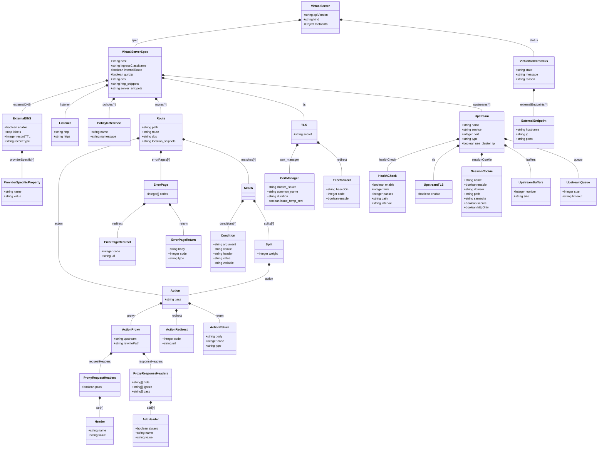

# Diagram: devops/k8s/nginx-ingress-controller/helm/crds/k8s.nginx.org_virtualservers.yaml

> Auto-generated by Obscura crawlers

## Mermaid

### SVG

<svg id="container" width="3140.44921875" xmlns="http://www.w3.org/2000/svg" class="classDiagram" height="2360" viewBox="0 0 3140.44921875 2360" role="graphics-document document" aria-roledescription="class"><g><defs><marker id="container_class-aggregationStart" class="marker aggregation class" refX="18" refY="7" markerWidth="190" markerHeight="240" orient="auto"><path d="M 18,7 L9,13 L1,7 L9,1 Z"></path></marker></defs><defs><marker id="container_class-aggregationEnd" class="marker aggregation class" refX="1" refY="7" markerWidth="20" markerHeight="28" orient="auto"><path d="M 18,7 L9,13 L1,7 L9,1 Z"></path></marker></defs><defs><marker id="container_class-extensionStart" class="marker extension class" refX="18" refY="7" markerWidth="190" markerHeight="240" orient="auto"><path d="M 1,7 L18,13 V 1 Z"></path></marker></defs><defs><marker id="container_class-extensionEnd" class="marker extension class" refX="1" refY="7" markerWidth="20" markerHeight="28" orient="auto"><path d="M 1,1 V 13 L18,7 Z"></path></marker></defs><defs><marker id="container_class-compositionStart" class="marker composition class" refX="18" refY="7" markerWidth="190" markerHeight="240" orient="auto"><path d="M 18,7 L9,13 L1,7 L9,1 Z"></path></marker></defs><defs><marker id="container_class-compositionEnd" class="marker composition class" refX="1" refY="7" markerWidth="20" markerHeight="28" orient="auto"><path d="M 18,7 L9,13 L1,7 L9,1 Z"></path></marker></defs><defs><marker id="container_class-dependencyStart" class="marker dependency class" refX="6" refY="7" markerWidth="190" markerHeight="240" orient="auto"><path d="M 5,7 L9,13 L1,7 L9,1 Z"></path></marker></defs><defs><marker id="container_class-dependencyEnd" class="marker dependency class" refX="13" refY="7" markerWidth="20" markerHeight="28" orient="auto"><path d="M 18,7 L9,13 L14,7 L9,1 Z"></path></marker></defs><defs><marker id="container_class-lollipopStart" class="marker lollipop class" refX="13" refY="7" markerWidth="190" markerHeight="240" orient="auto"><circle stroke="black" fill="transparent" cx="7" cy="7" r="6"></circle></marker></defs><defs><marker id="container_class-lollipopEnd" class="marker lollipop class" refX="1" refY="7" markerWidth="190" markerHeight="240" orient="auto"><circle stroke="black" fill="transparent" cx="7" cy="7" r="6"></circle></marker></defs><g class="root"><g class="clusters"></g><g class="edgePaths"><path d="M1562.112,106.71L1419.457,124.425C1276.803,142.14,991.493,177.57,848.838,201.452C706.184,225.333,706.184,237.667,706.184,243.833L706.184,250" id="id_VirtualServer_VirtualServerSpec_1" class="edge-thickness-normal edge-pattern-solid relation" style=";;;" data-edge="true" data-et="edge" data-id="id_VirtualServer_VirtualServerSpec_1" data-points="W3sieCI6MTU3OS4yMzA0Njg3NSwieSI6MTA0LjU4NDAxNTUyMjY0NjU1fSx7IngiOjcwNi4xODM1OTM3NSwieSI6MjEzfSx7IngiOjcwNi4xODM1OTM3NSwieSI6MjUwfV0=" marker-start="url(#container_class-compositionStart)"></path><path d="M1799.053,104.8L1965.984,122.833C2132.915,140.867,2466.778,176.933,2633.709,209.133C2800.641,241.333,2800.641,269.667,2800.641,283.833L2800.641,298" id="id_VirtualServer_VirtualServerStatus_2" class="edge-thickness-normal edge-pattern-solid relation" style=";;;" data-edge="true" data-et="edge" data-id="id_VirtualServer_VirtualServerStatus_2" data-points="W3sieCI6MTc4MS45MDIzNDM3NSwieSI6MTAyLjk0NzE3NDk1NzAxNjY2fSx7IngiOjI4MDAuNjQwNjI1LCJ5IjoyMTN9LHsieCI6MjgwMC42NDA2MjUsInkiOjI5OH1d" marker-start="url(#container_class-compositionStart)"></path><path d="M2800.641,483.25L2800.641,494.542C2800.641,505.833,2800.641,528.417,2800.641,549.875C2800.641,571.333,2800.641,591.667,2800.641,601.833L2800.641,612" id="id_VirtualServerStatus_ExternalEndpoint_3" class="edge-thickness-normal edge-pattern-solid relation" style=";;;" data-edge="true" data-et="edge" data-id="id_VirtualServerStatus_ExternalEndpoint_3" data-points="W3sieCI6MjgwMC42NDA2MjUsInkiOjQ2Nn0seyJ4IjoyODAwLjY0MDYyNSwieSI6NTUxfSx7IngiOjI4MDAuNjQwNjI1LCJ5Ijo2MTJ9XQ==" marker-start="url(#container_class-compositionStart)"></path><path d="M552.636,425.736L479.342,446.614C406.047,467.491,259.457,509.245,186.162,538.289C112.867,567.333,112.867,583.667,112.867,591.833L112.867,600" id="id_VirtualServerSpec_ExternalDNS_4" class="edge-thickness-normal edge-pattern-solid relation" style=";;;" data-edge="true" data-et="edge" data-id="id_VirtualServerSpec_ExternalDNS_4" data-points="W3sieCI6NTY5LjIyNjU2MjUsInkiOjQyMS4wMTA3ODQxOTEwODY5NH0seyJ4IjoxMTIuODY3MTg3NSwieSI6NTUxfSx7IngiOjExMi44NjcxODc1LCJ5Ijo2MDB9XQ==" marker-start="url(#container_class-compositionStart)"></path><path d="M112.867,809.25L112.867,814.542C112.867,819.833,112.867,830.417,112.867,851.875C112.867,873.333,112.867,905.667,112.867,921.833L112.867,938" id="id_ExternalDNS_ProviderSpecificProperty_5" class="edge-thickness-normal edge-pattern-solid relation" style=";;;" data-edge="true" data-et="edge" data-id="id_ExternalDNS_ProviderSpecificProperty_5" data-points="W3sieCI6MTEyLjg2NzE4NzUsInkiOjc5Mn0seyJ4IjoxMTIuODY3MTg3NSwieSI6ODQxfSx7IngiOjExMi44NjcxODc1LCJ5Ijo5Mzh9XQ==" marker-start="url(#container_class-compositionStart)"></path><path d="M553.545,451.948L517.52,468.456C481.495,484.965,409.445,517.983,373.42,546.658C337.395,575.333,337.395,599.667,337.395,611.833L337.395,624" id="id_VirtualServerSpec_Listener_6" class="edge-thickness-normal edge-pattern-solid relation" style=";;;" data-edge="true" data-et="edge" data-id="id_VirtualServerSpec_Listener_6" data-points="W3sieCI6NTY5LjIyNjU2MjUsInkiOjQ0NC43NjE0NTUzNTQzMDU2N30seyJ4IjozMzcuMzk0NTMxMjUsInkiOjU1MX0seyJ4IjozMzcuMzk0NTMxMjUsInkiOjYyNH1d" marker-start="url(#container_class-compositionStart)"></path><path d="M588.441,527.406L585.257,531.338C582.073,535.271,575.704,543.135,572.52,559.234C569.336,575.333,569.336,599.667,569.336,611.833L569.336,624" id="id_VirtualServerSpec_PolicyReference_7" class="edge-thickness-normal edge-pattern-solid relation" style=";;;" data-edge="true" data-et="edge" data-id="id_VirtualServerSpec_PolicyReference_7" data-points="W3sieCI6NTk5LjI5NjY2Njk3NDg1MjEsInkiOjUxNH0seyJ4Ijo1NjkuMzM1OTM3NSwieSI6NTUxfSx7IngiOjU2OS4zMzU5Mzc1LCJ5Ijo2MjR9XQ==" marker-start="url(#container_class-compositionStart)"></path><path d="M823.926,527.406L827.11,531.338C830.294,535.271,836.663,543.135,839.847,555.234C843.031,567.333,843.031,583.667,843.031,591.833L843.031,600" id="id_VirtualServerSpec_Route_8" class="edge-thickness-normal edge-pattern-solid relation" style=";;;" data-edge="true" data-et="edge" data-id="id_VirtualServerSpec_Route_8" data-points="W3sieCI6ODEzLjA3MDUyMDUyNTE0NzksInkiOjUxNH0seyJ4Ijo4NDMuMDMxMjUsInkiOjU1MX0seyJ4Ijo4NDMuMDMxMjUsInkiOjYwMH1d" marker-start="url(#container_class-compositionStart)"></path><path d="M711.82,731.228L643.678,749.523C575.535,767.819,439.249,804.409,371.106,850.871C302.963,897.333,302.963,953.667,302.963,1010C302.963,1066.333,302.963,1122.667,302.963,1175C302.963,1227.333,302.963,1275.667,302.963,1324C302.963,1372.333,302.963,1420.667,394.965,1459.253C486.967,1497.84,670.972,1526.68,762.974,1541.101L854.977,1555.521" id="id_Route_Action_9" class="edge-thickness-normal edge-pattern-solid relation" style=";;;" data-edge="true" data-et="edge" data-id="id_Route_Action_9" data-points="W3sieCI6NzI4LjQ4MDQ2ODc1LCJ5Ijo3MjYuNzU1MTEyNzQyNTI3Nn0seyJ4IjozMDIuOTYyODkwNjI1LCJ5Ijo4NDF9LHsieCI6MzAyLjk2Mjg5MDYyNSwieSI6MTAxMH0seyJ4IjozMDIuOTYyODkwNjI1LCJ5IjoxMTc5fSx7IngiOjMwMi45NjI4OTA2MjUsInkiOjEzMjR9LHsieCI6MzAyLjk2Mjg5MDYyNSwieSI6MTQ2OX0seyJ4Ijo4NTQuOTc2NTYyNSwieSI6MTU1NS41MjA2OTUwNjM3OTczfV0=" marker-start="url(#container_class-compositionStart)"></path><path d="M839.064,1600.647L814.238,1611.039C789.411,1621.431,739.757,1642.216,714.93,1660.775C690.104,1679.333,690.104,1695.667,690.104,1703.833L690.104,1712" id="id_Action_ActionProxy_10" class="edge-thickness-normal edge-pattern-solid relation" style=";;;" data-edge="true" data-et="edge" data-id="id_Action_ActionProxy_10" data-points="W3sieCI6ODU0Ljk3NjU2MjUsInkiOjE1OTMuOTg2NDEzNDc4NjM4M30seyJ4Ijo2OTAuMTAzNTE1NjI1LCJ5IjoxNjYzfSx7IngiOjY5MC4xMDM1MTU2MjUsInkiOjE3MTJ9XQ==" marker-start="url(#container_class-compositionStart)"></path><path d="M928.672,1643.183L928.965,1646.486C929.258,1649.788,929.843,1656.394,930.135,1667.864C930.428,1679.333,930.428,1695.667,930.428,1703.833L930.428,1712" id="id_Action_ActionRedirect_11" class="edge-thickness-normal edge-pattern-solid relation" style=";;;" data-edge="true" data-et="edge" data-id="id_Action_ActionRedirect_11" data-points="W3sieCI6OTI3LjE1MDQ1MTAzMDkyNzgsInkiOjE2MjZ9LHsieCI6OTMwLjQyNzczNDM3NSwieSI6MTY2M30seyJ4Ijo5MzAuNDI3NzM0Mzc1LCJ5IjoxNzEyfV0=" marker-start="url(#container_class-compositionStart)"></path><path d="M1004.608,1600.647L1029.434,1611.039C1054.261,1621.431,1103.915,1642.216,1128.742,1658.775C1153.568,1675.333,1153.568,1687.667,1153.568,1693.833L1153.568,1700" id="id_Action_ActionReturn_12" class="edge-thickness-normal edge-pattern-solid relation" style=";;;" data-edge="true" data-et="edge" data-id="id_Action_ActionReturn_12" data-points="W3sieCI6OTg4LjY5NTMxMjUsInkiOjE1OTMuOTg2NDEzNDc4NjM4M30seyJ4IjoxMTUzLjU2ODM1OTM3NSwieSI6MTY2M30seyJ4IjoxMTUzLjU2ODM1OTM3NSwieSI6MTcwMH1d" marker-start="url(#container_class-compositionStart)"></path><path d="M581.454,1866.426L572.98,1872.855C564.505,1879.284,547.556,1892.142,539.082,1908.738C530.607,1925.333,530.607,1945.667,530.607,1955.833L530.607,1966" id="id_ActionProxy_ProxyRequestHeaders_13" class="edge-thickness-normal edge-pattern-solid relation" style=";;;" data-edge="true" data-et="edge" data-id="id_ActionProxy_ProxyRequestHeaders_13" data-points="W3sieCI6NTk1LjE5Njc0OTA5NjA3NDQsInkiOjE4NTZ9LHsieCI6NTMwLjYwNzQyMTg3NSwieSI6MTkwNX0seyJ4Ijo1MzAuNjA3NDIxODc1LCJ5IjoxOTY2fV0=" marker-start="url(#container_class-compositionStart)"></path><path d="M530.607,2103.25L530.607,2110.542C530.607,2117.833,530.607,2132.417,530.607,2147.875C530.607,2163.333,530.607,2179.667,530.607,2187.833L530.607,2196" id="id_ProxyRequestHeaders_Header_14" class="edge-thickness-normal edge-pattern-solid relation" style=";;;" data-edge="true" data-et="edge" data-id="id_ProxyRequestHeaders_Header_14" data-points="W3sieCI6NTMwLjYwNzQyMTg3NSwieSI6MjA4Nn0seyJ4Ijo1MzAuNjA3NDIxODc1LCJ5IjoyMTQ3fSx7IngiOjUzMC42MDc0MjE4NzUsInkiOjIxOTZ9XQ==" marker-start="url(#container_class-compositionStart)"></path><path d="M763.963,1869.022L769.172,1875.019C774.381,1881.015,784.799,1893.007,790.008,1905.17C795.217,1917.333,795.217,1929.667,795.217,1935.833L795.217,1942" id="id_ActionProxy_ProxyResponseHeaders_15" class="edge-thickness-normal edge-pattern-solid relation" style=";;;" data-edge="true" data-et="edge" data-id="id_ActionProxy_ProxyResponseHeaders_15" data-points="W3sieCI6NzUyLjY1MDI2MTQ5Mjc2ODUsInkiOjE4NTZ9LHsieCI6Nzk1LjIxNjc5Njg3NSwieSI6MTkwNX0seyJ4Ijo3OTUuMjE2Nzk2ODc1LCJ5IjoxOTQyfV0=" marker-start="url(#container_class-compositionStart)"></path><path d="M795.217,2127.25L795.217,2130.542C795.217,2133.833,795.217,2140.417,795.217,2149.875C795.217,2159.333,795.217,2171.667,795.217,2177.833L795.217,2184" id="id_ProxyResponseHeaders_AddHeader_16" class="edge-thickness-normal edge-pattern-solid relation" style=";;;" data-edge="true" data-et="edge" data-id="id_ProxyResponseHeaders_AddHeader_16" data-points="W3sieCI6Nzk1LjIxNjc5Njg3NSwieSI6MjExMH0seyJ4Ijo3OTUuMjE2Nzk2ODc1LCJ5IjoyMTQ3fSx7IngiOjc5NS4yMTY3OTY4NzUsInkiOjIxODR9XQ==" marker-start="url(#container_class-compositionStart)"></path><path d="M843.031,809.25L843.031,814.542C843.031,819.833,843.031,830.417,843.031,853.875C843.031,877.333,843.031,913.667,843.031,931.833L843.031,950" id="id_Route_ErrorPage_17" class="edge-thickness-normal edge-pattern-solid relation" style=";;;" data-edge="true" data-et="edge" data-id="id_Route_ErrorPage_17" data-points="W3sieCI6ODQzLjAzMTI1LCJ5Ijo3OTJ9LHsieCI6ODQzLjAzMTI1LCJ5Ijo4NDF9LHsieCI6ODQzLjAzMTI1LCJ5Ijo5NTB9XQ==" marker-start="url(#container_class-compositionStart)"></path><path d="M747.269,1080.198L724.805,1096.665C702.341,1113.132,657.414,1146.066,634.95,1174.7C612.486,1203.333,612.486,1227.667,612.486,1239.833L612.486,1252" id="id_ErrorPage_ErrorPageRedirect_18" class="edge-thickness-normal edge-pattern-solid relation" style=";;;" data-edge="true" data-et="edge" data-id="id_ErrorPage_ErrorPageRedirect_18" data-points="W3sieCI6NzYxLjE4MDk4MTg3ODY5ODMsInkiOjEwNzB9LHsieCI6NjEyLjQ4NjMyODEyNSwieSI6MTE3OX0seyJ4Ijo2MTIuNDg2MzI4MTI1LCJ5IjoxMjUyfV0=" marker-start="url(#container_class-compositionStart)"></path><path d="M894.692,1084.154L905.705,1099.962C916.718,1115.769,938.744,1147.385,949.757,1173.359C960.77,1199.333,960.77,1219.667,960.77,1229.833L960.77,1240" id="id_ErrorPage_ErrorPageReturn_19" class="edge-thickness-normal edge-pattern-solid relation" style=";;;" data-edge="true" data-et="edge" data-id="id_ErrorPage_ErrorPageReturn_19" data-points="W3sieCI6ODg0LjgzMTgyMzIyNDg1MjEsInkiOjEwNzB9LHsieCI6OTYwLjc2OTUzMTI1LCJ5IjoxMTc5fSx7IngiOjk2MC43Njk1MzEyNSwieSI6MTI0MH1d" marker-start="url(#container_class-compositionStart)"></path><path d="M974.032,737.348L1028.764,754.623C1083.497,771.899,1192.961,806.449,1247.693,844.891C1302.426,883.333,1302.426,925.667,1302.426,946.833L1302.426,968" id="id_Route_Match_20" class="edge-thickness-normal edge-pattern-solid relation" style=";;;" data-edge="true" data-et="edge" data-id="id_Route_Match_20" data-points="W3sieCI6OTU3LjU4MjAzMTI1LCJ5Ijo3MzIuMTU1OTg4MjY1ODA1fSx7IngiOjEzMDIuNDI1NzgxMjUsInkiOjg0MX0seyJ4IjoxMzAyLjQyNTc4MTI1LCJ5Ijo5Njh9XQ==" marker-start="url(#container_class-compositionStart)"></path><path d="M1266.02,1066.5L1253.938,1085.25C1241.857,1104,1217.694,1141.5,1205.613,1166.417C1193.531,1191.333,1193.531,1203.667,1193.531,1209.833L1193.531,1216" id="id_Match_Condition_21" class="edge-thickness-normal edge-pattern-solid relation" style=";;;" data-edge="true" data-et="edge" data-id="id_Match_Condition_21" data-points="W3sieCI6MTI3NS4zNjMyMzUwMjIxODk0LCJ5IjoxMDUyfSx7IngiOjExOTMuNTMxMjUsInkiOjExNzl9LHsieCI6MTE5My41MzEyNSwieSI6MTIxNn1d" marker-start="url(#container_class-compositionStart)"></path><path d="M1338.832,1066.5L1350.913,1085.25C1362.995,1104,1387.157,1141.5,1399.239,1174.417C1411.32,1207.333,1411.32,1235.667,1411.32,1249.833L1411.32,1264" id="id_Match_Split_22" class="edge-thickness-normal edge-pattern-solid relation" style=";;;" data-edge="true" data-et="edge" data-id="id_Match_Split_22" data-points="W3sieCI6MTMyOS40ODgzMjc0Nzc4MTA2LCJ5IjoxMDUyfSx7IngiOjE0MTEuMzIwMzEyNSwieSI6MTE3OX0seyJ4IjoxNDExLjMyMDMxMjUsInkiOjEyNjR9XQ==" marker-start="url(#container_class-compositionStart)"></path><path d="M1411.32,1401.25L1411.32,1412.542C1411.32,1423.833,1411.32,1446.417,1340.883,1471.667C1270.445,1496.917,1129.57,1524.834,1059.133,1538.792L988.695,1552.751" id="id_Split_Action_23" class="edge-thickness-normal edge-pattern-solid relation" style=";;;" data-edge="true" data-et="edge" data-id="id_Split_Action_23" data-points="W3sieCI6MTQxMS4zMjAzMTI1LCJ5IjoxMzg0fSx7IngiOjE0MTEuMzIwMzEyNSwieSI6MTQ2OX0seyJ4Ijo5ODguNjk1MzEyNSwieSI6MTU1Mi43NTA2MzA0NDY1Nzk2fV0=" marker-start="url(#container_class-compositionStart)"></path><path d="M860.084,411.423L981.763,434.686C1103.442,457.949,1346.8,504.474,1468.479,541.904C1590.158,579.333,1590.158,607.667,1590.158,621.833L1590.158,636" id="id_VirtualServerSpec_TLS_24" class="edge-thickness-normal edge-pattern-solid relation" style=";;;" data-edge="true" data-et="edge" data-id="id_VirtualServerSpec_TLS_24" data-points="W3sieCI6ODQzLjE0MDYyNSwieSI6NDA4LjE4MzcxMzkxNjQxNTM0fSx7IngiOjE1OTAuMTU4MjAzMTI1LCJ5Ijo1NTF9LHsieCI6MTU5MC4xNTgyMDMxMjUsInkiOjYzNn1d" marker-start="url(#container_class-compositionStart)"></path><path d="M1551.971,771.388L1546.095,782.99C1540.218,794.592,1528.464,817.796,1522.588,841.565C1516.711,865.333,1516.711,889.667,1516.711,901.833L1516.711,914" id="id_TLS_CertManager_25" class="edge-thickness-normal edge-pattern-solid relation" style=";;;" data-edge="true" data-et="edge" data-id="id_TLS_CertManager_25" data-points="W3sieCI6MTU1OS43NjYyMzExNDIyNDE0LCJ5Ijo3NTZ9LHsieCI6MTUxNi43MTA5Mzc1LCJ5Ijo4NDF9LHsieCI6MTUxNi43MTA5Mzc1LCJ5Ijo5MTR9XQ==" marker-start="url(#container_class-compositionStart)"></path><path d="M1671.55,754.667L1691.513,769.056C1711.475,783.445,1751.4,812.222,1771.362,840.778C1791.324,869.333,1791.324,897.667,1791.324,911.833L1791.324,926" id="id_TLS_TLSRedirect_26" class="edge-thickness-normal edge-pattern-solid relation" style=";;;" data-edge="true" data-et="edge" data-id="id_TLS_TLSRedirect_26" data-points="W3sieCI6MTY1Ny41NTY2NDA2MjUsInkiOjc0NC41ODA2MzgyNzEwMTc2fSx7IngiOjE3OTEuMzI0MjE4NzUsInkiOjg0MX0seyJ4IjoxNzkxLjMyNDIxODc1LCJ5Ijo5MjZ9XQ==" marker-start="url(#container_class-compositionStart)"></path><path d="M860.317,396.31L1138.01,422.092C1415.703,447.873,1971.09,499.437,2248.783,531.385C2526.477,563.333,2526.477,575.667,2526.477,581.833L2526.477,588" id="id_VirtualServerSpec_Upstream_27" class="edge-thickness-normal edge-pattern-solid relation" style=";;;" data-edge="true" data-et="edge" data-id="id_VirtualServerSpec_Upstream_27" data-points="W3sieCI6ODQzLjE0MDYyNSwieSI6Mzk0LjcxNTM5MTc5NjA0OTN9LHsieCI6MjUyNi40NzY1NjI1LCJ5Ijo1NTF9LHsieCI6MjUyNi40NzY1NjI1LCJ5Ijo1ODh9XQ==" marker-start="url(#container_class-compositionStart)"></path><path d="M2392.492,735.234L2332.293,752.861C2272.094,770.489,2151.695,805.745,2091.496,833.539C2031.297,861.333,2031.297,881.667,2031.297,891.833L2031.297,902" id="id_Upstream_HealthCheck_28" class="edge-thickness-normal edge-pattern-solid relation" style=";;;" data-edge="true" data-et="edge" data-id="id_Upstream_HealthCheck_28" data-points="W3sieCI6MjQwOS4wNDY4NzUsInkiOjczMC4zODYxMTI5OTU1OTgyfSx7IngiOjIwMzEuMjk2ODc1LCJ5Ijo4NDF9LHsieCI6MjAzMS4yOTY4NzUsInkiOjkwMn1d" marker-start="url(#container_class-compositionStart)"></path><path d="M2394.083,771.934L2374.013,783.445C2353.944,794.956,2313.804,817.978,2293.734,847.656C2273.664,877.333,2273.664,913.667,2273.664,931.833L2273.664,950" id="id_Upstream_UpstreamTLS_29" class="edge-thickness-normal edge-pattern-solid relation" style=";;;" data-edge="true" data-et="edge" data-id="id_Upstream_UpstreamTLS_29" data-points="W3sieCI6MjQwOS4wNDY4NzUsInkiOjc2My4zNTE1MTQyMTUwODAzfSx7IngiOjIyNzMuNjY0MDYyNSwieSI6ODQxfSx7IngiOjIyNzMuNjY0MDYyNSwieSI6OTUwfV0=" marker-start="url(#container_class-compositionStart)"></path><path d="M2526.477,821.25L2526.477,824.542C2526.477,827.833,2526.477,834.417,2526.477,843.875C2526.477,853.333,2526.477,865.667,2526.477,871.833L2526.477,878" id="id_Upstream_SessionCookie_30" class="edge-thickness-normal edge-pattern-solid relation" style=";;;" data-edge="true" data-et="edge" data-id="id_Upstream_SessionCookie_30" data-points="W3sieCI6MjUyNi40NzY1NjI1LCJ5Ijo4MDR9LHsieCI6MjUyNi40NzY1NjI1LCJ5Ijo4NDF9LHsieCI6MjUyNi40NzY1NjI1LCJ5Ijo4Nzh9XQ==" marker-start="url(#container_class-compositionStart)"></path><path d="M2658.959,770.157L2680.052,781.964C2701.146,793.771,2743.333,817.386,2764.426,845.36C2785.52,873.333,2785.52,905.667,2785.52,921.833L2785.52,938" id="id_Upstream_UpstreamBuffers_31" class="edge-thickness-normal edge-pattern-solid relation" style=";;;" data-edge="true" data-et="edge" data-id="id_Upstream_UpstreamBuffers_31" data-points="W3sieCI6MjY0My45MDYyNSwieSI6NzYxLjczMTU4NDEwNjE2fSx7IngiOjI3ODUuNTE5NTMxMjUsInkiOjg0MX0seyJ4IjoyNzg1LjUxOTUzMTI1LCJ5Ijo5Mzh9XQ==" marker-start="url(#container_class-compositionStart)"></path><path d="M2660.496,734.177L2722.996,751.981C2785.496,769.785,2910.496,805.392,2972.996,839.363C3035.496,873.333,3035.496,905.667,3035.496,921.833L3035.496,938" id="id_Upstream_UpstreamQueue_32" class="edge-thickness-normal edge-pattern-solid relation" style=";;;" data-edge="true" data-et="edge" data-id="id_Upstream_UpstreamQueue_32" data-points="W3sieCI6MjY0My45MDYyNSwieSI6NzI5LjQ1MTE4MTQyMjYxODZ9LHsieCI6MzAzNS40OTYwOTM3NSwieSI6ODQxfSx7IngiOjMwMzUuNDk2MDkzNzUsInkiOjkzOH1d" marker-start="url(#container_class-compositionStart)"></path></g><g class="edgeLabels"><g class="edgeLabel" transform="translate(706.18359375, 213)"><g class="label" data-id="id_VirtualServer_VirtualServerSpec_1" transform="translate(-16.6796875, -12)"><foreignObject width="33.359375" height="24">

spec

</foreignObject></g></g><g class="edgeLabel" transform="translate(2800.640625, 213)"><g class="label" data-id="id_VirtualServer_VirtualServerStatus_2" transform="translate(-22.203125, -12)"><foreignObject width="44.40625" height="24">

status

</foreignObject></g></g><g class="edgeLabel" transform="translate(2800.640625, 551)"><g class="label" data-id="id_VirtualServerStatus_ExternalEndpoint_3" transform="translate(-75.0234375, -12)"><foreignObject width="150.046875" height="24">

externalEndpoints[*]

</foreignObject></g></g><g class="edgeLabel" transform="translate(112.8671875, 551)"><g class="label" data-id="id_VirtualServerSpec_ExternalDNS_4" transform="translate(-44.671875, -12)"><foreignObject width="89.34375" height="24">

externalDNS

</foreignObject></g></g><g class="edgeLabel" transform="translate(112.8671875, 841)"><g class="label" data-id="id_ExternalDNS_ProviderSpecificProperty_5" transform="translate(-67.3046875, -12)"><foreignObject width="134.609375" height="24">

providerSpecific[*]

</foreignObject></g></g><g class="edgeLabel" transform="translate(337.39453125, 551)"><g class="label" data-id="id_VirtualServerSpec_Listener_6" transform="translate(-27.6015625, -12)"><foreignObject width="55.203125" height="24">

listener

</foreignObject></g></g><g class="edgeLabel" transform="translate(569.3359375, 551)"><g class="label" data-id="id_VirtualServerSpec_PolicyReference_7" transform="translate(-36.8671875, -12)"><foreignObject width="73.734375" height="24">

policies[*]

</foreignObject></g></g><g class="edgeLabel" transform="translate(843.03125, 551)"><g class="label" data-id="id_VirtualServerSpec_Route_8" transform="translate(-31.7109375, -12)"><foreignObject width="63.421875" height="24">

routes[*]

</foreignObject></g></g><g class="edgeLabel" transform="translate(302.962890625, 1179)"><g class="label" data-id="id_Route_Action_9" transform="translate(-22.6875, -12)"><foreignObject width="45.375" height="24">

action

</foreignObject></g></g><g class="edgeLabel" transform="translate(690.103515625, 1663)"><g class="label" data-id="id_Action_ActionProxy_10" transform="translate(-20.0234375, -12)"><foreignObject width="40.046875" height="24">

proxy

</foreignObject></g></g><g class="edgeLabel" transform="translate(930.427734375, 1663)"><g class="label" data-id="id_Action_ActionRedirect_11" transform="translate(-28.171875, -12)"><foreignObject width="56.34375" height="24">

redirect

</foreignObject></g></g><g class="edgeLabel" transform="translate(1153.568359375, 1663)"><g class="label" data-id="id_Action_ActionReturn_12" transform="translate(-22.53125, -12)"><foreignObject width="45.0625" height="24">

return

</foreignObject></g></g><g class="edgeLabel" transform="translate(530.607421875, 1905)"><g class="label" data-id="id_ActionProxy_ProxyRequestHeaders_13" transform="translate(-57.5546875, -12)"><foreignObject width="115.109375" height="24">

requestHeaders

</foreignObject></g></g><g class="edgeLabel" transform="translate(530.607421875, 2147)"><g class="label" data-id="id_ProxyRequestHeaders_Header_14" transform="translate(-19.6484375, -12)"><foreignObject width="39.296875" height="24">

set[*]

</foreignObject></g></g><g class="edgeLabel" transform="translate(795.216796875, 1905)"><g class="label" data-id="id_ActionProxy_ProxyResponseHeaders_15" transform="translate(-63.078125, -12)"><foreignObject width="126.15625" height="24">

responseHeaders

</foreignObject></g></g><g class="edgeLabel" transform="translate(795.216796875, 2147)"><g class="label" data-id="id_ProxyResponseHeaders_AddHeader_16" transform="translate(-22.5859375, -12)"><foreignObject width="45.171875" height="24">

add[*]

</foreignObject></g></g><g class="edgeLabel" transform="translate(843.03125, 841)"><g class="label" data-id="id_Route_ErrorPage_17" transform="translate(-47.328125, -12)"><foreignObject width="94.65625" height="24">

errorPages[*]

</foreignObject></g></g><g class="edgeLabel" transform="translate(612.486328125, 1179)"><g class="label" data-id="id_ErrorPage_ErrorPageRedirect_18" transform="translate(-28.171875, -12)"><foreignObject width="56.34375" height="24">

redirect

</foreignObject></g></g><g class="edgeLabel" transform="translate(960.76953125, 1179)"><g class="label" data-id="id_ErrorPage_ErrorPageReturn_19" transform="translate(-22.53125, -12)"><foreignObject width="45.0625" height="24">

return

</foreignObject></g></g><g class="edgeLabel" transform="translate(1302.42578125, 841)"><g class="label" data-id="id_Route_Match_20" transform="translate(-39.25, -12)"><foreignObject width="78.5" height="24">

matches[*]

</foreignObject></g></g><g class="edgeLabel" transform="translate(1193.53125, 1179)"><g class="label" data-id="id_Match_Condition_21" transform="translate(-46.96875, -12)"><foreignObject width="93.9375" height="24">

conditions[*]

</foreignObject></g></g><g class="edgeLabel" transform="translate(1411.3203125, 1179)"><g class="label" data-id="id_Match_Split_22" transform="translate(-28.3828125, -12)"><foreignObject width="56.765625" height="24">

splits[*]

</foreignObject></g></g><g class="edgeLabel" transform="translate(1411.3203125, 1469)"><g class="label" data-id="id_Split_Action_23" transform="translate(-22.6875, -12)"><foreignObject width="45.375" height="24">

action

</foreignObject></g></g><g class="edgeLabel" transform="translate(1590.158203125, 551)"><g class="label" data-id="id_VirtualServerSpec_TLS_24" transform="translate(-8.890625, -12)"><foreignObject width="17.78125" height="24">

tls

</foreignObject></g></g><g class="edgeLabel" transform="translate(1516.7109375, 841)"><g class="label" data-id="id_TLS_CertManager_25" transform="translate(-49.8125, -12)"><foreignObject width="99.625" height="24">

cert_manager

</foreignObject></g></g><g class="edgeLabel" transform="translate(1791.32421875, 841)"><g class="label" data-id="id_TLS_TLSRedirect_26" transform="translate(-28.171875, -12)"><foreignObject width="56.34375" height="24">

redirect

</foreignObject></g></g><g class="edgeLabel" transform="translate(2526.4765625, 551)"><g class="label" data-id="id_VirtualServerSpec_Upstream_27" transform="translate(-46.7734375, -12)"><foreignObject width="93.546875" height="24">

upstreams[*]

</foreignObject></g></g><g class="edgeLabel" transform="translate(2031.296875, 841)"><g class="label" data-id="id_Upstream_HealthCheck_28" transform="translate(-44.53125, -12)"><foreignObject width="89.0625" height="24">

healthCheck

</foreignObject></g></g><g class="edgeLabel" transform="translate(2273.6640625, 841)"><g class="label" data-id="id_Upstream_UpstreamTLS_29" transform="translate(-8.890625, -12)"><foreignObject width="17.78125" height="24">

tls

</foreignObject></g></g><g class="edgeLabel" transform="translate(2526.4765625, 841)"><g class="label" data-id="id_Upstream_SessionCookie_30" transform="translate(-51.484375, -12)"><foreignObject width="102.96875" height="24">

sessionCookie

</foreignObject></g></g><g class="edgeLabel" transform="translate(2785.51953125, 841)"><g class="label" data-id="id_Upstream_UpstreamBuffers_31" transform="translate(-25.7578125, -12)"><foreignObject width="51.515625" height="24">

buffers

</foreignObject></g></g><g class="edgeLabel" transform="translate(3035.49609375, 841)"><g class="label" data-id="id_Upstream_UpstreamQueue_32" transform="translate(-22.8203125, -12)"><foreignObject width="45.640625" height="24">

queue

</foreignObject></g></g></g><g class="nodes"><g class="node default" id="classId-VirtualServer-0" transform="translate(1680.56640625, 92)"><g class="basic label-container"><path d="M-101.3359375 -84 L101.3359375 -84 L101.3359375 84 L-101.3359375 84" stroke="none" stroke-width="0" fill="#ECECFF" style=""></path><path d="M-101.3359375 -84 C-42.80710466777516 -84, 15.721728164449686 -84, 101.3359375 -84 M-101.3359375 -84 C-47.74511146744157 -84, 5.8457145651168645 -84, 101.3359375 -84 M101.3359375 -84 C101.3359375 -44.52298947549624, 101.3359375 -5.0459789509924775, 101.3359375 84 M101.3359375 -84 C101.3359375 -44.74875756099157, 101.3359375 -5.497515121983142, 101.3359375 84 M101.3359375 84 C43.66335716312371 84, -14.009223173752574 84, -101.3359375 84 M101.3359375 84 C58.032991330668686 84, 14.730045161337372 84, -101.3359375 84 M-101.3359375 84 C-101.3359375 28.339546030883227, -101.3359375 -27.320907938233546, -101.3359375 -84 M-101.3359375 84 C-101.3359375 38.704843671352315, -101.3359375 -6.590312657295371, -101.3359375 -84" stroke="#9370DB" stroke-width="1.3" fill="none" stroke-dasharray="0 0" style=""></path></g><g class="annotation-group text" transform="translate(0, -60)"></g><g class="label-group text" transform="translate(-48.234375, -60)"><g class="label" style="font-weight: bolder" transform="translate(0,-12)"><foreignObject width="96.46875" height="24">

VirtualServer

</foreignObject></g></g><g class="members-group text" transform="translate(-89.3359375, -12)"><g class="label" style="" transform="translate(0,-12)"><foreignObject width="130.4375" height="24">

+string apiVersion

</foreignObject></g><g class="label" style="" transform="translate(0,12)"><foreignObject width="85.515625" height="24">

+string kind

</foreignObject></g><g class="label" style="" transform="translate(0,36)"><foreignObject width="128.875" height="24">

+Object metadata

</foreignObject></g></g><g class="methods-group text" transform="translate(-89.3359375, 84)"></g><g class="divider" style=""><path d="M-101.3359375 -36 C-20.933402613138455 -36, 59.46913227372309 -36, 101.3359375 -36 M-101.3359375 -36 C-46.92785304116386 -36, 7.480231417672286 -36, 101.3359375 -36" stroke="#9370DB" stroke-width="1.3" fill="none" stroke-dasharray="0 0" style=""></path></g><g class="divider" style=""><path d="M-101.3359375 60 C-34.75242204972055 60, 31.8310934005589 60, 101.3359375 60 M-101.3359375 60 C-37.051537722820726 60, 27.23286205435855 60, 101.3359375 60" stroke="#9370DB" stroke-width="1.3" fill="none" stroke-dasharray="0 0" style=""></path></g></g><g class="node default" id="classId-VirtualServerSpec-1" transform="translate(706.18359375, 382)"><g class="basic label-container"><path d="M-136.95703125 -132 L136.95703125 -132 L136.95703125 132 L-136.95703125 132" stroke="none" stroke-width="0" fill="#ECECFF" style=""></path><path d="M-136.95703125 -132 C-59.558418392276025 -132, 17.84019446544795 -132, 136.95703125 -132 M-136.95703125 -132 C-62.74766343040427 -132, 11.461704389191453 -132, 136.95703125 -132 M136.95703125 -132 C136.95703125 -63.36944283780065, 136.95703125 5.261114324398704, 136.95703125 132 M136.95703125 -132 C136.95703125 -78.49808017234437, 136.95703125 -24.996160344688732, 136.95703125 132 M136.95703125 132 C80.05074001041623 132, 23.14444877083247 132, -136.95703125 132 M136.95703125 132 C38.8101270969193 132, -59.336777056161395 132, -136.95703125 132 M-136.95703125 132 C-136.95703125 39.03802996303642, -136.95703125 -53.923940073927156, -136.95703125 -132 M-136.95703125 132 C-136.95703125 71.38397071085355, -136.95703125 10.767941421707093, -136.95703125 -132" stroke="#9370DB" stroke-width="1.3" fill="none" stroke-dasharray="0 0" style=""></path></g><g class="annotation-group text" transform="translate(0, -108)"></g><g class="label-group text" transform="translate(-65.8359375, -108)"><g class="label" style="font-weight: bolder" transform="translate(0,-12)"><foreignObject width="131.671875" height="24">

VirtualServerSpec

</foreignObject></g></g><g class="members-group text" transform="translate(-124.95703125, -60)"><g class="label" style="" transform="translate(0,-12)"><foreignObject width="85.828125" height="24">

+string host

</foreignObject></g><g class="label" style="" transform="translate(0,12)"><foreignObject width="184.078125" height="24">

+string ingressClassName

</foreignObject></g><g class="label" style="" transform="translate(0,36)"><foreignObject width="170.953125" height="24">

+boolean internalRoute

</foreignObject></g><g class="label" style="" transform="translate(0,60)"><foreignObject width="119.53125" height="24">

+boolean gunzip

</foreignObject></g><g class="label" style="" transform="translate(0,84)"><foreignObject width="80.25" height="24">

+string dos

</foreignObject></g><g class="label" style="" transform="translate(0,108)"><foreignObject width="154.625" height="24">

+string http_snippets

</foreignObject></g><g class="label" style="" transform="translate(0,132)"><foreignObject width="168.3125" height="24">

+string server_snippets

</foreignObject></g></g><g class="methods-group text" transform="translate(-124.95703125, 132)"></g><g class="divider" style=""><path d="M-136.95703125 -84 C-62.92486688107053 -84, 11.107297487858943 -84, 136.95703125 -84 M-136.95703125 -84 C-64.50105306915873 -84, 7.954925111682542 -84, 136.95703125 -84" stroke="#9370DB" stroke-width="1.3" fill="none" stroke-dasharray="0 0" style=""></path></g><g class="divider" style=""><path d="M-136.95703125 108 C-69.92390403194172 108, -2.890776813883434 108, 136.95703125 108 M-136.95703125 108 C-73.26979444458215 108, -9.582557639164307 108, 136.95703125 108" stroke="#9370DB" stroke-width="1.3" fill="none" stroke-dasharray="0 0" style=""></path></g></g><g class="node default" id="classId-ExternalDNS-2" transform="translate(112.8671875, 696)"><g class="basic label-container"><path d="M-101.73046875 -96 L101.73046875 -96 L101.73046875 96 L-101.73046875 96" stroke="none" stroke-width="0" fill="#ECECFF" style=""></path><path d="M-101.73046875 -96 C-40.18245590697394 -96, 21.365556936052116 -96, 101.73046875 -96 M-101.73046875 -96 C-29.02220145118818 -96, 43.68606584762364 -96, 101.73046875 -96 M101.73046875 -96 C101.73046875 -52.994975049503196, 101.73046875 -9.989950099006393, 101.73046875 96 M101.73046875 -96 C101.73046875 -44.77656930343337, 101.73046875 6.446861393133261, 101.73046875 96 M101.73046875 96 C23.20562021025458 96, -55.31922832949084 96, -101.73046875 96 M101.73046875 96 C30.75044539961864 96, -40.22957795076272 96, -101.73046875 96 M-101.73046875 96 C-101.73046875 49.57399690010966, -101.73046875 3.147993800219325, -101.73046875 -96 M-101.73046875 96 C-101.73046875 46.970858370194875, -101.73046875 -2.058283259610249, -101.73046875 -96" stroke="#9370DB" stroke-width="1.3" fill="none" stroke-dasharray="0 0" style=""></path></g><g class="annotation-group text" transform="translate(0, -72)"></g><g class="label-group text" transform="translate(-45.2578125, -72)"><g class="label" style="font-weight: bolder" transform="translate(0,-12)"><foreignObject width="90.515625" height="24">

ExternalDNS

</foreignObject></g></g><g class="members-group text" transform="translate(-89.73046875, -24)"><g class="label" style="" transform="translate(0,-12)"><foreignObject width="121.296875" height="24">

+boolean enable

</foreignObject></g><g class="label" style="" transform="translate(0,12)"><foreignObject width="87.84375" height="24">

+map labels

</foreignObject></g><g class="label" style="" transform="translate(0,36)"><foreignObject width="134.203125" height="24">

+integer recordTTL

</foreignObject></g><g class="label" style="" transform="translate(0,60)"><foreignObject width="133.9375" height="24">

+string recordType

</foreignObject></g></g><g class="methods-group text" transform="translate(-89.73046875, 96)"></g><g class="divider" style=""><path d="M-101.73046875 -48 C-35.683340515835795 -48, 30.36378771832841 -48, 101.73046875 -48 M-101.73046875 -48 C-57.41588829895778 -48, -13.101307847915564 -48, 101.73046875 -48" stroke="#9370DB" stroke-width="1.3" fill="none" stroke-dasharray="0 0" style=""></path></g><g class="divider" style=""><path d="M-101.73046875 72 C-25.188882045297817 72, 51.35270465940437 72, 101.73046875 72 M-101.73046875 72 C-49.68959599915009 72, 2.351276751699814 72, 101.73046875 72" stroke="#9370DB" stroke-width="1.3" fill="none" stroke-dasharray="0 0" style=""></path></g></g><g class="node default" id="classId-ProviderSpecificProperty-3" transform="translate(112.8671875, 1010)"><g class="basic label-container"><path d="M-104.8671875 -72 L104.8671875 -72 L104.8671875 72 L-104.8671875 72" stroke="none" stroke-width="0" fill="#ECECFF" style=""></path><path d="M-104.8671875 -72 C-53.37000614471784 -72, -1.8728247894356826 -72, 104.8671875 -72 M-104.8671875 -72 C-39.09031700122836 -72, 26.686553497543287 -72, 104.8671875 -72 M104.8671875 -72 C104.8671875 -25.599635255545792, 104.8671875 20.800729488908416, 104.8671875 72 M104.8671875 -72 C104.8671875 -22.83505581760702, 104.8671875 26.32988836478596, 104.8671875 72 M104.8671875 72 C28.879438313546004 72, -47.10831087290799 72, -104.8671875 72 M104.8671875 72 C60.52257832748411 72, 16.177969154968224 72, -104.8671875 72 M-104.8671875 72 C-104.8671875 31.661277741957655, -104.8671875 -8.677444516084691, -104.8671875 -72 M-104.8671875 72 C-104.8671875 34.04782419608691, -104.8671875 -3.904351607826186, -104.8671875 -72" stroke="#9370DB" stroke-width="1.3" fill="none" stroke-dasharray="0 0" style=""></path></g><g class="annotation-group text" transform="translate(0, -48)"></g><g class="label-group text" transform="translate(-91.359375, -48)"><g class="label" style="font-weight: bolder" transform="translate(0,-12)"><foreignObject width="182.71875" height="24">

ProviderSpecificProperty

</foreignObject></g></g><g class="members-group text" transform="translate(-92.8671875, 0)"><g class="label" style="" transform="translate(0,-12)"><foreignObject width="94.375" height="24">

+string name

</foreignObject></g><g class="label" style="" transform="translate(0,12)"><foreignObject width="92.75" height="24">

+string value

</foreignObject></g></g><g class="methods-group text" transform="translate(-92.8671875, 72)"></g><g class="divider" style=""><path d="M-104.8671875 -24 C-44.537737485334446 -24, 15.791712529331107 -24, 104.8671875 -24 M-104.8671875 -24 C-46.657335496598044 -24, 11.552516506803912 -24, 104.8671875 -24" stroke="#9370DB" stroke-width="1.3" fill="none" stroke-dasharray="0 0" style=""></path></g><g class="divider" style=""><path d="M-104.8671875 48 C-50.36566907690132 48, 4.135849346197361 48, 104.8671875 48 M-104.8671875 48 C-59.552142240608475 48, -14.23709698121695 48, 104.8671875 48" stroke="#9370DB" stroke-width="1.3" fill="none" stroke-dasharray="0 0" style=""></path></g></g><g class="node default" id="classId-Listener-4" transform="translate(337.39453125, 696)"><g class="basic label-container"><path d="M-72.796875 -72 L72.796875 -72 L72.796875 72 L-72.796875 72" stroke="none" stroke-width="0" fill="#ECECFF" style=""></path><path d="M-72.796875 -72 C-17.15847590591553 -72, 38.47992318816894 -72, 72.796875 -72 M-72.796875 -72 C-41.42210871304725 -72, -10.047342426094495 -72, 72.796875 -72 M72.796875 -72 C72.796875 -22.97896779601534, 72.796875 26.04206440796932, 72.796875 72 M72.796875 -72 C72.796875 -21.517116828912613, 72.796875 28.965766342174774, 72.796875 72 M72.796875 72 C39.8392577503571 72, 6.881640500714198 72, -72.796875 72 M72.796875 72 C33.404561415983544 72, -5.987752168032912 72, -72.796875 72 M-72.796875 72 C-72.796875 19.006686703218577, -72.796875 -33.986626593562846, -72.796875 -72 M-72.796875 72 C-72.796875 34.41142629497573, -72.796875 -3.1771474100485335, -72.796875 -72" stroke="#9370DB" stroke-width="1.3" fill="none" stroke-dasharray="0 0" style=""></path></g><g class="annotation-group text" transform="translate(0, -48)"></g><g class="label-group text" transform="translate(-29.828125, -48)"><g class="label" style="font-weight: bolder" transform="translate(0,-12)"><foreignObject width="59.65625" height="24">

Listener

</foreignObject></g></g><g class="members-group text" transform="translate(-60.796875, 0)"><g class="label" style="" transform="translate(0,-12)"><foreignObject width="84.296875" height="24">

+string http

</foreignObject></g><g class="label" style="" transform="translate(0,12)"><foreignObject width="91.765625" height="24">

+string https

</foreignObject></g></g><g class="methods-group text" transform="translate(-60.796875, 72)"></g><g class="divider" style=""><path d="M-72.796875 -24 C-42.94341082038217 -24, -13.089946640764339 -24, 72.796875 -24 M-72.796875 -24 C-22.817859568033604 -24, 27.16115586393279 -24, 72.796875 -24" stroke="#9370DB" stroke-width="1.3" fill="none" stroke-dasharray="0 0" style=""></path></g><g class="divider" style=""><path d="M-72.796875 48 C-36.158138112394376 48, 0.4805987752112486 48, 72.796875 48 M-72.796875 48 C-19.818902907476087 48, 33.15906918504783 48, 72.796875 48" stroke="#9370DB" stroke-width="1.3" fill="none" stroke-dasharray="0 0" style=""></path></g></g><g class="node default" id="classId-PolicyReference-5" transform="translate(569.3359375, 696)"><g class="basic label-container"><path d="M-109.14453125 -72 L109.14453125 -72 L109.14453125 72 L-109.14453125 72" stroke="none" stroke-width="0" fill="#ECECFF" style=""></path><path d="M-109.14453125 -72 C-65.43951495730307 -72, -21.73449866460615 -72, 109.14453125 -72 M-109.14453125 -72 C-37.45249359225082 -72, 34.239544065498364 -72, 109.14453125 -72 M109.14453125 -72 C109.14453125 -24.880245161773175, 109.14453125 22.23950967645365, 109.14453125 72 M109.14453125 -72 C109.14453125 -29.77804983236947, 109.14453125 12.443900335261063, 109.14453125 72 M109.14453125 72 C49.44143863571009 72, -10.261653978579815 72, -109.14453125 72 M109.14453125 72 C55.12207157405458 72, 1.0996118981091598 72, -109.14453125 72 M-109.14453125 72 C-109.14453125 32.83871221727756, -109.14453125 -6.322575565444879, -109.14453125 -72 M-109.14453125 72 C-109.14453125 42.20906908119443, -109.14453125 12.418138162388857, -109.14453125 -72" stroke="#9370DB" stroke-width="1.3" fill="none" stroke-dasharray="0 0" style=""></path></g><g class="annotation-group text" transform="translate(0, -48)"></g><g class="label-group text" transform="translate(-58.3515625, -48)"><g class="label" style="font-weight: bolder" transform="translate(0,-12)"><foreignObject width="116.703125" height="24">

PolicyReference

</foreignObject></g></g><g class="members-group text" transform="translate(-97.14453125, 0)"><g class="label" style="" transform="translate(0,-12)"><foreignObject width="94.375" height="24">

+string name

</foreignObject></g><g class="label" style="" transform="translate(0,12)"><foreignObject width="135.9375" height="24">

+string namespace

</foreignObject></g></g><g class="methods-group text" transform="translate(-97.14453125, 72)"></g><g class="divider" style=""><path d="M-109.14453125 -24 C-48.1781020368655 -24, 12.788327176268993 -24, 109.14453125 -24 M-109.14453125 -24 C-28.955177337324244 -24, 51.23417657535151 -24, 109.14453125 -24" stroke="#9370DB" stroke-width="1.3" fill="none" stroke-dasharray="0 0" style=""></path></g><g class="divider" style=""><path d="M-109.14453125 48 C-29.77096857182906 48, 49.60259410634188 48, 109.14453125 48 M-109.14453125 48 C-51.5066402815682 48, 6.131250686863595 48, 109.14453125 48" stroke="#9370DB" stroke-width="1.3" fill="none" stroke-dasharray="0 0" style=""></path></g></g><g class="node default" id="classId-Route-6" transform="translate(843.03125, 696)"><g class="basic label-container"><path d="M-114.55078125 -96 L114.55078125 -96 L114.55078125 96 L-114.55078125 96" stroke="none" stroke-width="0" fill="#ECECFF" style=""></path><path d="M-114.55078125 -96 C-51.06798207915871 -96, 12.414817091682579 -96, 114.55078125 -96 M-114.55078125 -96 C-54.3023407987077 -96, 5.946099652584607 -96, 114.55078125 -96 M114.55078125 -96 C114.55078125 -20.893209614476106, 114.55078125 54.21358077104779, 114.55078125 96 M114.55078125 -96 C114.55078125 -55.25217370900491, 114.55078125 -14.504347418009814, 114.55078125 96 M114.55078125 96 C40.93228432397325 96, -32.6862126020535 96, -114.55078125 96 M114.55078125 96 C42.49986584017836 96, -29.551049569643283 96, -114.55078125 96 M-114.55078125 96 C-114.55078125 47.19174836603165, -114.55078125 -1.616503267936693, -114.55078125 -96 M-114.55078125 96 C-114.55078125 41.52058600047855, -114.55078125 -12.958827999042896, -114.55078125 -96" stroke="#9370DB" stroke-width="1.3" fill="none" stroke-dasharray="0 0" style=""></path></g><g class="annotation-group text" transform="translate(0, -72)"></g><g class="label-group text" transform="translate(-21.4296875, -72)"><g class="label" style="font-weight: bolder" transform="translate(0,-12)"><foreignObject width="42.859375" height="24">

Route

</foreignObject></g></g><g class="members-group text" transform="translate(-102.55078125, -24)"><g class="label" style="" transform="translate(0,-12)"><foreignObject width="87.0625" height="24">

+string path

</foreignObject></g><g class="label" style="" transform="translate(0,12)"><foreignObject width="92.46875" height="24">

+string route

</foreignObject></g><g class="label" style="" transform="translate(0,36)"><foreignObject width="80.25" height="24">

+string dos

</foreignObject></g><g class="label" style="" transform="translate(0,60)"><foreignObject width="183.671875" height="24">

+string location_snippets

</foreignObject></g></g><g class="methods-group text" transform="translate(-102.55078125, 96)"></g><g class="divider" style=""><path d="M-114.55078125 -48 C-37.760635880099386 -48, 39.02950948980123 -48, 114.55078125 -48 M-114.55078125 -48 C-54.26745247907836 -48, 6.015876291843284 -48, 114.55078125 -48" stroke="#9370DB" stroke-width="1.3" fill="none" stroke-dasharray="0 0" style=""></path></g><g class="divider" style=""><path d="M-114.55078125 72 C-27.90775144050795 72, 58.7352783689841 72, 114.55078125 72 M-114.55078125 72 C-24.339276550722346 72, 65.87222814855531 72, 114.55078125 72" stroke="#9370DB" stroke-width="1.3" fill="none" stroke-dasharray="0 0" style=""></path></g></g><g class="node default" id="classId-Action-7" transform="translate(921.8359375, 1566)"><g class="basic label-container"><path d="M-66.859375 -60 L66.859375 -60 L66.859375 60 L-66.859375 60" stroke="none" stroke-width="0" fill="#ECECFF" style=""></path><path d="M-66.859375 -60 C-33.99125111357703 -60, -1.1231272271540576 -60, 66.859375 -60 M-66.859375 -60 C-39.95343421360179 -60, -13.047493427203577 -60, 66.859375 -60 M66.859375 -60 C66.859375 -32.75904858617292, 66.859375 -5.518097172345847, 66.859375 60 M66.859375 -60 C66.859375 -21.851297651366714, 66.859375 16.297404697266572, 66.859375 60 M66.859375 60 C30.02728372739491 60, -6.804807545210181 60, -66.859375 60 M66.859375 60 C21.72616791425674 60, -23.407039171486517 60, -66.859375 60 M-66.859375 60 C-66.859375 20.01843690621301, -66.859375 -19.963126187573977, -66.859375 -60 M-66.859375 60 C-66.859375 32.300910472372706, -66.859375 4.60182094474542, -66.859375 -60" stroke="#9370DB" stroke-width="1.3" fill="none" stroke-dasharray="0 0" style=""></path></g><g class="annotation-group text" transform="translate(0, -36)"></g><g class="label-group text" transform="translate(-23.1875, -36)"><g class="label" style="font-weight: bolder" transform="translate(0,-12)"><foreignObject width="46.375" height="24">

Action

</foreignObject></g></g><g class="members-group text" transform="translate(-54.859375, 12)"><g class="label" style="" transform="translate(0,-12)"><foreignObject width="86.53125" height="24">

+string pass

</foreignObject></g></g><g class="methods-group text" transform="translate(-54.859375, 60)"></g><g class="divider" style=""><path d="M-66.859375 -12 C-38.966120512481766 -12, -11.072866024963524 -12, 66.859375 -12 M-66.859375 -12 C-13.454449824909837 -12, 39.95047535018033 -12, 66.859375 -12" stroke="#9370DB" stroke-width="1.3" fill="none" stroke-dasharray="0 0" style=""></path></g><g class="divider" style=""><path d="M-66.859375 36 C-36.55451190984771 36, -6.249648819695423 36, 66.859375 36 M-66.859375 36 C-20.17939118291232 36, 26.500592634175362 36, 66.859375 36" stroke="#9370DB" stroke-width="1.3" fill="none" stroke-dasharray="0 0" style=""></path></g></g><g class="node default" id="classId-ActionProxy-8" transform="translate(690.103515625, 1784)"><g class="basic label-container"><path d="M-102.28515625 -72 L102.28515625 -72 L102.28515625 72 L-102.28515625 72" stroke="none" stroke-width="0" fill="#ECECFF" style=""></path><path d="M-102.28515625 -72 C-48.429416410580735 -72, 5.426323428838529 -72, 102.28515625 -72 M-102.28515625 -72 C-36.40110279651927 -72, 29.482950656961464 -72, 102.28515625 -72 M102.28515625 -72 C102.28515625 -33.88890518485988, 102.28515625 4.222189630280241, 102.28515625 72 M102.28515625 -72 C102.28515625 -17.44473548870814, 102.28515625 37.11052902258372, 102.28515625 72 M102.28515625 72 C22.097787241517835 72, -58.08958176696433 72, -102.28515625 72 M102.28515625 72 C45.91701139357174 72, -10.451133462856518 72, -102.28515625 72 M-102.28515625 72 C-102.28515625 41.84405836857031, -102.28515625 11.688116737140618, -102.28515625 -72 M-102.28515625 72 C-102.28515625 31.068411402067355, -102.28515625 -9.86317719586529, -102.28515625 -72" stroke="#9370DB" stroke-width="1.3" fill="none" stroke-dasharray="0 0" style=""></path></g><g class="annotation-group text" transform="translate(0, -48)"></g><g class="label-group text" transform="translate(-43.6015625, -48)"><g class="label" style="font-weight: bolder" transform="translate(0,-12)"><foreignObject width="87.203125" height="24">

ActionProxy

</foreignObject></g></g><g class="members-group text" transform="translate(-90.28515625, 0)"><g class="label" style="" transform="translate(0,-12)"><foreignObject width="122.59375" height="24">

+string upstream

</foreignObject></g><g class="label" style="" transform="translate(0,12)"><foreignObject width="136.96875" height="24">

+string rewritePath

</foreignObject></g></g><g class="methods-group text" transform="translate(-90.28515625, 72)"></g><g class="divider" style=""><path d="M-102.28515625 -24 C-37.223540121076425 -24, 27.83807600784715 -24, 102.28515625 -24 M-102.28515625 -24 C-48.83054346271534 -24, 4.624069324569319 -24, 102.28515625 -24" stroke="#9370DB" stroke-width="1.3" fill="none" stroke-dasharray="0 0" style=""></path></g><g class="divider" style=""><path d="M-102.28515625 48 C-24.30058533437203 48, 53.68398558125594 48, 102.28515625 48 M-102.28515625 48 C-44.10003361485936 48, 14.085089020281274 48, 102.28515625 48" stroke="#9370DB" stroke-width="1.3" fill="none" stroke-dasharray="0 0" style=""></path></g></g><g class="node default" id="classId-ProxyRequestHeaders-9" transform="translate(530.607421875, 2026)"><g class="basic label-container"><path d="M-104.48828125 -60 L104.48828125 -60 L104.48828125 60 L-104.48828125 60" stroke="none" stroke-width="0" fill="#ECECFF" style=""></path><path d="M-104.48828125 -60 C-34.86949842830444 -60, 34.74928439339112 -60, 104.48828125 -60 M-104.48828125 -60 C-42.9651205599704 -60, 18.558040130059197 -60, 104.48828125 -60 M104.48828125 -60 C104.48828125 -24.3655199837779, 104.48828125 11.268960032444198, 104.48828125 60 M104.48828125 -60 C104.48828125 -24.52639748532703, 104.48828125 10.947205029345938, 104.48828125 60 M104.48828125 60 C53.44187032319743 60, 2.3954593963948554 60, -104.48828125 60 M104.48828125 60 C34.48022016059093 60, -35.52784092881814 60, -104.48828125 60 M-104.48828125 60 C-104.48828125 27.39832268473235, -104.48828125 -5.203354630535301, -104.48828125 -60 M-104.48828125 60 C-104.48828125 30.431294492508535, -104.48828125 0.8625889850170694, -104.48828125 -60" stroke="#9370DB" stroke-width="1.3" fill="none" stroke-dasharray="0 0" style=""></path></g><g class="annotation-group text" transform="translate(0, -36)"></g><g class="label-group text" transform="translate(-80.6328125, -36)"><g class="label" style="font-weight: bolder" transform="translate(0,-12)"><foreignObject width="161.265625" height="24">

ProxyRequestHeaders

</foreignObject></g></g><g class="members-group text" transform="translate(-92.48828125, 12)"><g class="label" style="" transform="translate(0,-12)"><foreignObject width="104.34375" height="24">

+boolean pass

</foreignObject></g></g><g class="methods-group text" transform="translate(-92.48828125, 60)"></g><g class="divider" style=""><path d="M-104.48828125 -12 C-43.097498340952725 -12, 18.29328456809455 -12, 104.48828125 -12 M-104.48828125 -12 C-59.0387214146554 -12, -13.589161579310797 -12, 104.48828125 -12" stroke="#9370DB" stroke-width="1.3" fill="none" stroke-dasharray="0 0" style=""></path></g><g class="divider" style=""><path d="M-104.48828125 36 C-44.903300871878656 36, 14.681679506242688 36, 104.48828125 36 M-104.48828125 36 C-51.325905328702646 36, 1.8364705925947078 36, 104.48828125 36" stroke="#9370DB" stroke-width="1.3" fill="none" stroke-dasharray="0 0" style=""></path></g></g><g class="node default" id="classId-Header-10" transform="translate(530.607421875, 2268)"><g class="basic label-container"><path d="M-72.42578125 -72 L72.42578125 -72 L72.42578125 72 L-72.42578125 72" stroke="none" stroke-width="0" fill="#ECECFF" style=""></path><path d="M-72.42578125 -72 C-24.95361499141007 -72, 22.51855126717986 -72, 72.42578125 -72 M-72.42578125 -72 C-22.840418870203344 -72, 26.744943509593313 -72, 72.42578125 -72 M72.42578125 -72 C72.42578125 -18.596432682713157, 72.42578125 34.807134634573686, 72.42578125 72 M72.42578125 -72 C72.42578125 -15.400763381922502, 72.42578125 41.198473236154996, 72.42578125 72 M72.42578125 72 C22.28937354022677 72, -27.84703416954646 72, -72.42578125 72 M72.42578125 72 C23.964982438686654 72, -24.49581637262669 72, -72.42578125 72 M-72.42578125 72 C-72.42578125 16.102646000296467, -72.42578125 -39.794707999407066, -72.42578125 -72 M-72.42578125 72 C-72.42578125 37.01163551040653, -72.42578125 2.0232710208130555, -72.42578125 -72" stroke="#9370DB" stroke-width="1.3" fill="none" stroke-dasharray="0 0" style=""></path></g><g class="annotation-group text" transform="translate(0, -48)"></g><g class="label-group text" transform="translate(-26.4765625, -48)"><g class="label" style="font-weight: bolder" transform="translate(0,-12)"><foreignObject width="52.953125" height="24">

Header

</foreignObject></g></g><g class="members-group text" transform="translate(-60.42578125, 0)"><g class="label" style="" transform="translate(0,-12)"><foreignObject width="94.375" height="24">

+string name

</foreignObject></g><g class="label" style="" transform="translate(0,12)"><foreignObject width="92.75" height="24">

+string value

</foreignObject></g></g><g class="methods-group text" transform="translate(-60.42578125, 72)"></g><g class="divider" style=""><path d="M-72.42578125 -24 C-35.88019037948559 -24, 0.6654004910288194 -24, 72.42578125 -24 M-72.42578125 -24 C-35.9587316626672 -24, 0.5083179246656044 -24, 72.42578125 -24" stroke="#9370DB" stroke-width="1.3" fill="none" stroke-dasharray="0 0" style=""></path></g><g class="divider" style=""><path d="M-72.42578125 48 C-40.84313973935447 48, -9.260498228708933 48, 72.42578125 48 M-72.42578125 48 C-40.6422840305342 48, -8.858786811068398 48, 72.42578125 48" stroke="#9370DB" stroke-width="1.3" fill="none" stroke-dasharray="0 0" style=""></path></g></g><g class="node default" id="classId-ProxyResponseHeaders-11" transform="translate(795.216796875, 2026)"><g class="basic label-container"><path d="M-110.12109375 -84 L110.12109375 -84 L110.12109375 84 L-110.12109375 84" stroke="none" stroke-width="0" fill="#ECECFF" style=""></path><path d="M-110.12109375 -84 C-49.54745912101674 -84, 11.026175507966514 -84, 110.12109375 -84 M-110.12109375 -84 C-65.35727645759599 -84, -20.593459165191973 -84, 110.12109375 -84 M110.12109375 -84 C110.12109375 -43.739818171383824, 110.12109375 -3.479636342767648, 110.12109375 84 M110.12109375 -84 C110.12109375 -26.45528466646087, 110.12109375 31.08943066707826, 110.12109375 84 M110.12109375 84 C51.1979387452844 84, -7.725216259431207 84, -110.12109375 84 M110.12109375 84 C37.38745818608466 84, -35.346177377830685 84, -110.12109375 84 M-110.12109375 84 C-110.12109375 33.901299090137236, -110.12109375 -16.197401819725528, -110.12109375 -84 M-110.12109375 84 C-110.12109375 42.61382014072182, -110.12109375 1.227640281443641, -110.12109375 -84" stroke="#9370DB" stroke-width="1.3" fill="none" stroke-dasharray="0 0" style=""></path></g><g class="annotation-group text" transform="translate(0, -60)"></g><g class="label-group text" transform="translate(-86.1015625, -60)"><g class="label" style="font-weight: bolder" transform="translate(0,-12)"><foreignObject width="172.203125" height="24">

ProxyResponseHeaders

</foreignObject></g></g><g class="members-group text" transform="translate(-98.12109375, -12)"><g class="label" style="" transform="translate(0,-12)"><foreignObject width="96.34375" height="24">

+string[] hide

</foreignObject></g><g class="label" style="" transform="translate(0,12)"><foreignObject width="110.140625" height="24">

+string[] ignore

</foreignObject></g><g class="label" style="" transform="translate(0,36)"><foreignObject width="96.84375" height="24">

+string[] pass

</foreignObject></g></g><g class="methods-group text" transform="translate(-98.12109375, 84)"></g><g class="divider" style=""><path d="M-110.12109375 -36 C-25.718603831071974 -36, 58.68388608785605 -36, 110.12109375 -36 M-110.12109375 -36 C-46.44665392921422 -36, 17.227785891571557 -36, 110.12109375 -36" stroke="#9370DB" stroke-width="1.3" fill="none" stroke-dasharray="0 0" style=""></path></g><g class="divider" style=""><path d="M-110.12109375 60 C-55.309511708220256 60, -0.4979296664405126 60, 110.12109375 60 M-110.12109375 60 C-36.04539516488708 60, 38.030303420225835 60, 110.12109375 60" stroke="#9370DB" stroke-width="1.3" fill="none" stroke-dasharray="0 0" style=""></path></g></g><g class="node default" id="classId-AddHeader-12" transform="translate(795.216796875, 2268)"><g class="basic label-container"><path d="M-92.3359375 -84 L92.3359375 -84 L92.3359375 84 L-92.3359375 84" stroke="none" stroke-width="0" fill="#ECECFF" style=""></path><path d="M-92.3359375 -84 C-26.286197924037353 -84, 39.763541651925294 -84, 92.3359375 -84 M-92.3359375 -84 C-51.51518196492028 -84, -10.694426429840561 -84, 92.3359375 -84 M92.3359375 -84 C92.3359375 -17.202037660944598, 92.3359375 49.595924678110805, 92.3359375 84 M92.3359375 -84 C92.3359375 -48.28842419199031, 92.3359375 -12.576848383980618, 92.3359375 84 M92.3359375 84 C33.186535324824554 84, -25.962866850350892 84, -92.3359375 84 M92.3359375 84 C54.76831569458495 84, 17.200693889169898 84, -92.3359375 84 M-92.3359375 84 C-92.3359375 27.85153960418559, -92.3359375 -28.29692079162882, -92.3359375 -84 M-92.3359375 84 C-92.3359375 30.138686406040996, -92.3359375 -23.722627187918008, -92.3359375 -84" stroke="#9370DB" stroke-width="1.3" fill="none" stroke-dasharray="0 0" style=""></path></g><g class="annotation-group text" transform="translate(0, -60)"></g><g class="label-group text" transform="translate(-40.796875, -60)"><g class="label" style="font-weight: bolder" transform="translate(0,-12)"><foreignObject width="81.59375" height="24">

AddHeader

</foreignObject></g></g><g class="members-group text" transform="translate(-80.3359375, -12)"><g class="label" style="" transform="translate(0,-12)"><foreignObject width="119.875" height="24">

+boolean always

</foreignObject></g><g class="label" style="" transform="translate(0,12)"><foreignObject width="94.375" height="24">

+string name

</foreignObject></g><g class="label" style="" transform="translate(0,36)"><foreignObject width="92.75" height="24">

+string value

</foreignObject></g></g><g class="methods-group text" transform="translate(-80.3359375, 84)"></g><g class="divider" style=""><path d="M-92.3359375 -36 C-53.8497783394425 -36, -15.363619178885003 -36, 92.3359375 -36 M-92.3359375 -36 C-22.91722791427138 -36, 46.50148167145724 -36, 92.3359375 -36" stroke="#9370DB" stroke-width="1.3" fill="none" stroke-dasharray="0 0" style=""></path></g><g class="divider" style=""><path d="M-92.3359375 60 C-24.29825518834849 60, 43.73942712330302 60, 92.3359375 60 M-92.3359375 60 C-53.017341433264036 60, -13.698745366528073 60, 92.3359375 60" stroke="#9370DB" stroke-width="1.3" fill="none" stroke-dasharray="0 0" style=""></path></g></g><g class="node default" id="classId-ActionRedirect-13" transform="translate(930.427734375, 1784)"><g class="basic label-container"><path d="M-88.0390625 -72 L88.0390625 -72 L88.0390625 72 L-88.0390625 72" stroke="none" stroke-width="0" fill="#ECECFF" style=""></path><path d="M-88.0390625 -72 C-35.59486549801679 -72, 16.849331503966425 -72, 88.0390625 -72 M-88.0390625 -72 C-45.34282148981802 -72, -2.646580479636043 -72, 88.0390625 -72 M88.0390625 -72 C88.0390625 -24.68299902922228, 88.0390625 22.63400194155544, 88.0390625 72 M88.0390625 -72 C88.0390625 -42.98101959055184, 88.0390625 -13.962039181103684, 88.0390625 72 M88.0390625 72 C27.21014226797402 72, -33.61877796405196 72, -88.0390625 72 M88.0390625 72 C28.26624322784339 72, -31.50657604431322 72, -88.0390625 72 M-88.0390625 72 C-88.0390625 21.355556287957505, -88.0390625 -29.28888742408499, -88.0390625 -72 M-88.0390625 72 C-88.0390625 16.989073674015337, -88.0390625 -38.021852651969326, -88.0390625 -72" stroke="#9370DB" stroke-width="1.3" fill="none" stroke-dasharray="0 0" style=""></path></g><g class="annotation-group text" transform="translate(0, -48)"></g><g class="label-group text" transform="translate(-53.78125, -48)"><g class="label" style="font-weight: bolder" transform="translate(0,-12)"><foreignObject width="107.5625" height="24">

ActionRedirect

</foreignObject></g></g><g class="members-group text" transform="translate(-76.0390625, 0)"><g class="label" style="" transform="translate(0,-12)"><foreignObject width="98.296875" height="24">

+integer code

</foreignObject></g><g class="label" style="" transform="translate(0,12)"><foreignObject width="74.046875" height="24">

+string url

</foreignObject></g></g><g class="methods-group text" transform="translate(-76.0390625, 72)"></g><g class="divider" style=""><path d="M-88.0390625 -24 C-19.706353463377354 -24, 48.62635557324529 -24, 88.0390625 -24 M-88.0390625 -24 C-40.83604234605775 -24, 6.366977807884496 -24, 88.0390625 -24" stroke="#9370DB" stroke-width="1.3" fill="none" stroke-dasharray="0 0" style=""></path></g><g class="divider" style=""><path d="M-88.0390625 48 C-18.40954413291577 48, 51.21997423416846 48, 88.0390625 48 M-88.0390625 48 C-38.44094479549153 48, 11.157172909016936 48, 88.0390625 48" stroke="#9370DB" stroke-width="1.3" fill="none" stroke-dasharray="0 0" style=""></path></g></g><g class="node default" id="classId-ActionReturn-14" transform="translate(1153.568359375, 1784)"><g class="basic label-container"><path d="M-85.1015625 -84 L85.1015625 -84 L85.1015625 84 L-85.1015625 84" stroke="none" stroke-width="0" fill="#ECECFF" style=""></path><path d="M-85.1015625 -84 C-32.88133536061747 -84, 19.33889177876506 -84, 85.1015625 -84 M-85.1015625 -84 C-48.449486237607836 -84, -11.797409975215672 -84, 85.1015625 -84 M85.1015625 -84 C85.1015625 -39.773021023866676, 85.1015625 4.453957952266649, 85.1015625 84 M85.1015625 -84 C85.1015625 -27.63123988232988, 85.1015625 28.73752023534024, 85.1015625 84 M85.1015625 84 C50.62263793610258 84, 16.143713372205156 84, -85.1015625 84 M85.1015625 84 C28.636994956199146 84, -27.827572587601708 84, -85.1015625 84 M-85.1015625 84 C-85.1015625 29.106986034473145, -85.1015625 -25.78602793105371, -85.1015625 -84 M-85.1015625 84 C-85.1015625 47.783907686756294, -85.1015625 11.567815373512587, -85.1015625 -84" stroke="#9370DB" stroke-width="1.3" fill="none" stroke-dasharray="0 0" style=""></path></g><g class="annotation-group text" transform="translate(0, -60)"></g><g class="label-group text" transform="translate(-47.90625, -60)"><g class="label" style="font-weight: bolder" transform="translate(0,-12)"><foreignObject width="95.8125" height="24">

ActionReturn

</foreignObject></g></g><g class="members-group text" transform="translate(-73.1015625, -12)"><g class="label" style="" transform="translate(0,-12)"><foreignObject width="90.15625" height="24">

+string body

</foreignObject></g><g class="label" style="" transform="translate(0,12)"><foreignObject width="98.296875" height="24">

+integer code

</foreignObject></g><g class="label" style="" transform="translate(0,36)"><foreignObject width="85.65625" height="24">

+string type

</foreignObject></g></g><g class="methods-group text" transform="translate(-73.1015625, 84)"></g><g class="divider" style=""><path d="M-85.1015625 -36 C-40.06069368924154 -36, 4.980175121516922 -36, 85.1015625 -36 M-85.1015625 -36 C-35.92970994816582 -36, 13.242142603668356 -36, 85.1015625 -36" stroke="#9370DB" stroke-width="1.3" fill="none" stroke-dasharray="0 0" style=""></path></g><g class="divider" style=""><path d="M-85.1015625 60 C-27.052816681341554 60, 30.995929137316892 60, 85.1015625 60 M-85.1015625 60 C-47.32064450443691 60, -9.539726508873827 60, 85.1015625 60" stroke="#9370DB" stroke-width="1.3" fill="none" stroke-dasharray="0 0" style=""></path></g></g><g class="node default" id="classId-ErrorPage-15" transform="translate(843.03125, 1010)"><g class="basic label-container"><path d="M-87.80078125 -60 L87.80078125 -60 L87.80078125 60 L-87.80078125 60" stroke="none" stroke-width="0" fill="#ECECFF" style=""></path><path d="M-87.80078125 -60 C-32.76622748631906 -60, 22.26832627736188 -60, 87.80078125 -60 M-87.80078125 -60 C-36.501202836678004 -60, 14.798375576643991 -60, 87.80078125 -60 M87.80078125 -60 C87.80078125 -16.004666033674333, 87.80078125 27.990667932651334, 87.80078125 60 M87.80078125 -60 C87.80078125 -24.262274465215498, 87.80078125 11.475451069569004, 87.80078125 60 M87.80078125 60 C43.76324648427381 60, -0.27428828145238526 60, -87.80078125 60 M87.80078125 60 C20.914422701446114 60, -45.97193584710777 60, -87.80078125 60 M-87.80078125 60 C-87.80078125 17.440579669154396, -87.80078125 -25.11884066169121, -87.80078125 -60 M-87.80078125 60 C-87.80078125 22.089997780465218, -87.80078125 -15.820004439069564, -87.80078125 -60" stroke="#9370DB" stroke-width="1.3" fill="none" stroke-dasharray="0 0" style=""></path></g><g class="annotation-group text" transform="translate(0, -36)"></g><g class="label-group text" transform="translate(-35.5234375, -36)"><g class="label" style="font-weight: bolder" transform="translate(0,-12)"><foreignObject width="71.046875" height="24">

ErrorPage

</foreignObject></g></g><g class="members-group text" transform="translate(-75.80078125, 12)"><g class="label" style="" transform="translate(0,-12)"><foreignObject width="116.078125" height="24">

+integer[] codes

</foreignObject></g></g><g class="methods-group text" transform="translate(-75.80078125, 60)"></g><g class="divider" style=""><path d="M-87.80078125 -12 C-40.11599333627875 -12, 7.568794577442503 -12, 87.80078125 -12 M-87.80078125 -12 C-36.24213745310158 -12, 15.316506343796846 -12, 87.80078125 -12" stroke="#9370DB" stroke-width="1.3" fill="none" stroke-dasharray="0 0" style=""></path></g><g class="divider" style=""><path d="M-87.80078125 36 C-43.855287486265496 36, 0.090206277469008 36, 87.80078125 36 M-87.80078125 36 C-41.989592940073074 36, 3.8215953698538527 36, 87.80078125 36" stroke="#9370DB" stroke-width="1.3" fill="none" stroke-dasharray="0 0" style=""></path></g></g><g class="node default" id="classId-ErrorPageRedirect-16" transform="translate(612.486328125, 1324)"><g class="basic label-container"><path d="M-94.20703125 -72 L94.20703125 -72 L94.20703125 72 L-94.20703125 72" stroke="none" stroke-width="0" fill="#ECECFF" style=""></path><path d="M-94.20703125 -72 C-35.42237346425937 -72, 23.362284321481255 -72, 94.20703125 -72 M-94.20703125 -72 C-26.548935642479975 -72, 41.10915996504005 -72, 94.20703125 -72 M94.20703125 -72 C94.20703125 -17.749644787985098, 94.20703125 36.500710424029805, 94.20703125 72 M94.20703125 -72 C94.20703125 -38.11574670575179, 94.20703125 -4.231493411503578, 94.20703125 72 M94.20703125 72 C34.59588534368255 72, -25.015260562634893 72, -94.20703125 72 M94.20703125 72 C49.7978376222257 72, 5.3886439944513995 72, -94.20703125 72 M-94.20703125 72 C-94.20703125 38.65915966063082, -94.20703125 5.31831932126164, -94.20703125 -72 M-94.20703125 72 C-94.20703125 33.18608335744525, -94.20703125 -5.627833285109503, -94.20703125 -72" stroke="#9370DB" stroke-width="1.3" fill="none" stroke-dasharray="0 0" style=""></path></g><g class="annotation-group text" transform="translate(0, -48)"></g><g class="label-group text" transform="translate(-66.1171875, -48)"><g class="label" style="font-weight: bolder" transform="translate(0,-12)"><foreignObject width="132.234375" height="24">

ErrorPageRedirect

</foreignObject></g></g><g class="members-group text" transform="translate(-82.20703125, 0)"><g class="label" style="" transform="translate(0,-12)"><foreignObject width="98.296875" height="24">

+integer code

</foreignObject></g><g class="label" style="" transform="translate(0,12)"><foreignObject width="74.046875" height="24">

+string url

</foreignObject></g></g><g class="methods-group text" transform="translate(-82.20703125, 72)"></g><g class="divider" style=""><path d="M-94.20703125 -24 C-41.73151629677425 -24, 10.743998656451495 -24, 94.20703125 -24 M-94.20703125 -24 C-45.21735106067204 -24, 3.772329128655926 -24, 94.20703125 -24" stroke="#9370DB" stroke-width="1.3" fill="none" stroke-dasharray="0 0" style=""></path></g><g class="divider" style=""><path d="M-94.20703125 48 C-33.70119318866866 48, 26.804644872662678 48, 94.20703125 48 M-94.20703125 48 C-22.799618594475447 48, 48.607794061049105 48, 94.20703125 48" stroke="#9370DB" stroke-width="1.3" fill="none" stroke-dasharray="0 0" style=""></path></g></g><g class="node default" id="classId-ErrorPageReturn-17" transform="translate(960.76953125, 1324)"><g class="basic label-container"><path d="M-91.26953125 -84 L91.26953125 -84 L91.26953125 84 L-91.26953125 84" stroke="none" stroke-width="0" fill="#ECECFF" style=""></path><path d="M-91.26953125 -84 C-31.340045089110696 -84, 28.58944107177861 -84, 91.26953125 -84 M-91.26953125 -84 C-24.876477555437546 -84, 41.51657613912491 -84, 91.26953125 -84 M91.26953125 -84 C91.26953125 -45.37452879660268, 91.26953125 -6.7490575932053645, 91.26953125 84 M91.26953125 -84 C91.26953125 -23.608194693748437, 91.26953125 36.783610612503125, 91.26953125 84 M91.26953125 84 C41.83285749063094 84, -7.603816268738115 84, -91.26953125 84 M91.26953125 84 C52.83627482002789 84, 14.403018390055777 84, -91.26953125 84 M-91.26953125 84 C-91.26953125 33.39486460369424, -91.26953125 -17.210270792611524, -91.26953125 -84 M-91.26953125 84 C-91.26953125 20.78306352228993, -91.26953125 -42.43387295542014, -91.26953125 -84" stroke="#9370DB" stroke-width="1.3" fill="none" stroke-dasharray="0 0" style=""></path></g><g class="annotation-group text" transform="translate(0, -60)"></g><g class="label-group text" transform="translate(-60.2421875, -60)"><g class="label" style="font-weight: bolder" transform="translate(0,-12)"><foreignObject width="120.484375" height="24">

ErrorPageReturn

</foreignObject></g></g><g class="members-group text" transform="translate(-79.26953125, -12)"><g class="label" style="" transform="translate(0,-12)"><foreignObject width="90.15625" height="24">

+string body

</foreignObject></g><g class="label" style="" transform="translate(0,12)"><foreignObject width="98.296875" height="24">

+integer code

</foreignObject></g><g class="label" style="" transform="translate(0,36)"><foreignObject width="85.65625" height="24">

+string type

</foreignObject></g></g><g class="methods-group text" transform="translate(-79.26953125, 84)"></g><g class="divider" style=""><path d="M-91.26953125 -36 C-21.008793435432437 -36, 49.251944379135125 -36, 91.26953125 -36 M-91.26953125 -36 C-22.0649884266074 -36, 47.1395543967852 -36, 91.26953125 -36" stroke="#9370DB" stroke-width="1.3" fill="none" stroke-dasharray="0 0" style=""></path></g><g class="divider" style=""><path d="M-91.26953125 60 C-27.37982690430323 60, 36.50987744139354 60, 91.26953125 60 M-91.26953125 60 C-32.096374597348046 60, 27.07678205530391 60, 91.26953125 60" stroke="#9370DB" stroke-width="1.3" fill="none" stroke-dasharray="0 0" style=""></path></g></g><g class="node default" id="classId-Match-18" transform="translate(1302.42578125, 1010)"><g class="basic label-container"><path d="M-34.0703125 -42 L34.0703125 -42 L34.0703125 42 L-34.0703125 42" stroke="none" stroke-width="0" fill="#ECECFF" style=""></path><path d="M-34.0703125 -42 C-11.142983097935183 -42, 11.784346304129635 -42, 34.0703125 -42 M-34.0703125 -42 C-15.890584058815577 -42, 2.289144382368846 -42, 34.0703125 -42 M34.0703125 -42 C34.0703125 -14.984784382368932, 34.0703125 12.030431235262135, 34.0703125 42 M34.0703125 -42 C34.0703125 -14.953745467037574, 34.0703125 12.092509065924851, 34.0703125 42 M34.0703125 42 C10.857950701991413 42, -12.354411096017174 42, -34.0703125 42 M34.0703125 42 C15.85313448731413 42, -2.3640435253717413 42, -34.0703125 42 M-34.0703125 42 C-34.0703125 22.34608049709802, -34.0703125 2.692160994196037, -34.0703125 -42 M-34.0703125 42 C-34.0703125 11.103048534726135, -34.0703125 -19.79390293054773, -34.0703125 -42" stroke="#9370DB" stroke-width="1.3" fill="none" stroke-dasharray="0 0" style=""></path></g><g class="annotation-group text" transform="translate(0, -18)"></g><g class="label-group text" transform="translate(-22.0703125, -18)"><g class="label" style="font-weight: bolder" transform="translate(0,-12)"><foreignObject width="44.140625" height="24">

Match

</foreignObject></g></g><g class="members-group text" transform="translate(-22.0703125, 30)"></g><g class="methods-group text" transform="translate(-22.0703125, 60)"></g><g class="divider" style=""><path d="M-34.0703125 6 C-17.858971177640985 6, -1.64762985528197 6, 34.0703125 6 M-34.0703125 6 C-9.181784060474747 6, 15.706744379050505 6, 34.0703125 6" stroke="#9370DB" stroke-width="1.3" fill="none" stroke-dasharray="0 0" style=""></path></g><g class="divider" style=""><path d="M-34.0703125 24 C-15.286015233212826 24, 3.4982820335743483 24, 34.0703125 24 M-34.0703125 24 C-19.85602537774548 24, -5.6417382554909565 24, 34.0703125 24" stroke="#9370DB" stroke-width="1.3" fill="none" stroke-dasharray="0 0" style=""></path></g></g><g class="node default" id="classId-Condition-19" transform="translate(1193.53125, 1324)"><g class="basic label-container"><path d="M-91.4921875 -108 L91.4921875 -108 L91.4921875 108 L-91.4921875 108" stroke="none" stroke-width="0" fill="#ECECFF" style=""></path><path d="M-91.4921875 -108 C-40.02487376769554 -108, 11.442439964608923 -108, 91.4921875 -108 M-91.4921875 -108 C-53.16923702933753 -108, -14.846286558675061 -108, 91.4921875 -108 M91.4921875 -108 C91.4921875 -60.39825900616024, 91.4921875 -12.796518012320476, 91.4921875 108 M91.4921875 -108 C91.4921875 -41.989085639573645, 91.4921875 24.02182872085271, 91.4921875 108 M91.4921875 108 C29.446962932386825 108, -32.59826163522635 108, -91.4921875 108 M91.4921875 108 C32.1589493627432 108, -27.1742887745136 108, -91.4921875 108 M-91.4921875 108 C-91.4921875 42.43200629325371, -91.4921875 -23.135987413492586, -91.4921875 -108 M-91.4921875 108 C-91.4921875 26.544966734443065, -91.4921875 -54.91006653111387, -91.4921875 -108" stroke="#9370DB" stroke-width="1.3" fill="none" stroke-dasharray="0 0" style=""></path></g><g class="annotation-group text" transform="translate(0, -84)"></g><g class="label-group text" transform="translate(-35.421875, -84)"><g class="label" style="font-weight: bolder" transform="translate(0,-12)"><foreignObject width="70.84375" height="24">

Condition

</foreignObject></g></g><g class="members-group text" transform="translate(-79.4921875, -36)"><g class="label" style="" transform="translate(0,-12)"><foreignObject width="123.5625" height="24">

+string argument

</foreignObject></g><g class="label" style="" transform="translate(0,12)"><foreignObject width="101.296875" height="24">

+string cookie

</foreignObject></g><g class="label" style="" transform="translate(0,36)"><foreignObject width="104.96875" height="24">

+string header

</foreignObject></g><g class="label" style="" transform="translate(0,60)"><foreignObject width="92.75" height="24">

+string value

</foreignObject></g><g class="label" style="" transform="translate(0,84)"><foreignObject width="112.40625" height="24">

+string variable

</foreignObject></g></g><g class="methods-group text" transform="translate(-79.4921875, 108)"></g><g class="divider" style=""><path d="M-91.4921875 -60 C-36.680803335838995 -60, 18.13058082832201 -60, 91.4921875 -60 M-91.4921875 -60 C-28.477490488249522 -60, 34.537206523500956 -60, 91.4921875 -60" stroke="#9370DB" stroke-width="1.3" fill="none" stroke-dasharray="0 0" style=""></path></g><g class="divider" style=""><path d="M-91.4921875 84 C-33.442856652410285 84, 24.60647419517943 84, 91.4921875 84 M-91.4921875 84 C-36.96431836630694 84, 17.56355076738612 84, 91.4921875 84" stroke="#9370DB" stroke-width="1.3" fill="none" stroke-dasharray="0 0" style=""></path></g></g><g class="node default" id="classId-Split-20" transform="translate(1411.3203125, 1324)"><g class="basic label-container"><path d="M-76.296875 -60 L76.296875 -60 L76.296875 60 L-76.296875 60" stroke="none" stroke-width="0" fill="#ECECFF" style=""></path><path d="M-76.296875 -60 C-27.00347564502475 -60, 22.2899237099505 -60, 76.296875 -60 M-76.296875 -60 C-34.52507947495886 -60, 7.246716050082284 -60, 76.296875 -60 M76.296875 -60 C76.296875 -25.07900527080467, 76.296875 9.841989458390657, 76.296875 60 M76.296875 -60 C76.296875 -22.405310868675627, 76.296875 15.189378262648745, 76.296875 60 M76.296875 60 C43.09448381798309 60, 9.89209263596618 60, -76.296875 60 M76.296875 60 C29.169614718987525 60, -17.95764556202495 60, -76.296875 60 M-76.296875 60 C-76.296875 22.32862131324361, -76.296875 -15.342757373512782, -76.296875 -60 M-76.296875 60 C-76.296875 25.642709166291823, -76.296875 -8.714581667416354, -76.296875 -60" stroke="#9370DB" stroke-width="1.3" fill="none" stroke-dasharray="0 0" style=""></path></g><g class="annotation-group text" transform="translate(0, -36)"></g><g class="label-group text" transform="translate(-17.078125, -36)"><g class="label" style="font-weight: bolder" transform="translate(0,-12)"><foreignObject width="34.15625" height="24">

Split

</foreignObject></g></g><g class="members-group text" transform="translate(-64.296875, 12)"><g class="label" style="" transform="translate(0,-12)"><foreignObject width="111.515625" height="24">

+integer weight

</foreignObject></g></g><g class="methods-group text" transform="translate(-64.296875, 60)"></g><g class="divider" style=""><path d="M-76.296875 -12 C-22.613786907527533 -12, 31.069301184944933 -12, 76.296875 -12 M-76.296875 -12 C-30.968783753928832 -12, 14.359307492142335 -12, 76.296875 -12" stroke="#9370DB" stroke-width="1.3" fill="none" stroke-dasharray="0 0" style=""></path></g><g class="divider" style=""><path d="M-76.296875 36 C-26.375625056507047 36, 23.545624886985905 36, 76.296875 36 M-76.296875 36 C-23.29275895732043 36, 29.71135708535914 36, 76.296875 36" stroke="#9370DB" stroke-width="1.3" fill="none" stroke-dasharray="0 0" style=""></path></g></g><g class="node default" id="classId-TLS-21" transform="translate(1590.158203125, 696)"><g class="basic label-container"><path d="M-67.3984375 -60 L67.3984375 -60 L67.3984375 60 L-67.3984375 60" stroke="none" stroke-width="0" fill="#ECECFF" style=""></path><path d="M-67.3984375 -60 C-26.979742225219958 -60, 13.438953049560084 -60, 67.3984375 -60 M-67.3984375 -60 C-13.8087536774567 -60, 39.7809301450866 -60, 67.3984375 -60 M67.3984375 -60 C67.3984375 -22.00598743135088, 67.3984375 15.988025137298237, 67.3984375 60 M67.3984375 -60 C67.3984375 -27.653372256706604, 67.3984375 4.693255486586793, 67.3984375 60 M67.3984375 60 C38.771562147378475 60, 10.144686794756957 60, -67.3984375 60 M67.3984375 60 C18.47236344722993 60, -30.453710605540138 60, -67.3984375 60 M-67.3984375 60 C-67.3984375 35.282221465715395, -67.3984375 10.564442931430797, -67.3984375 -60 M-67.3984375 60 C-67.3984375 29.864429374596853, -67.3984375 -0.2711412508062949, -67.3984375 -60" stroke="#9370DB" stroke-width="1.3" fill="none" stroke-dasharray="0 0" style=""></path></g><g class="annotation-group text" transform="translate(0, -36)"></g><g class="label-group text" transform="translate(-12.90625, -36)"><g class="label" style="font-weight: bolder" transform="translate(0,-12)"><foreignObject width="25.8125" height="24">

TLS

</foreignObject></g></g><g class="members-group text" transform="translate(-55.3984375, 12)"><g class="label" style="" transform="translate(0,-12)"><foreignObject width="97.890625" height="24">

+string secret

</foreignObject></g></g><g class="methods-group text" transform="translate(-55.3984375, 60)"></g><g class="divider" style=""><path d="M-67.3984375 -12 C-29.058507858138597 -12, 9.281421783722806 -12, 67.3984375 -12 M-67.3984375 -12 C-26.054684489542012 -12, 15.289068520915976 -12, 67.3984375 -12" stroke="#9370DB" stroke-width="1.3" fill="none" stroke-dasharray="0 0" style=""></path></g><g class="divider" style=""><path d="M-67.3984375 36 C-19.905519207585243 36, 27.587399084829514 36, 67.3984375 36 M-67.3984375 36 C-20.183277313220785 36, 27.03188287355843 36, 67.3984375 36" stroke="#9370DB" stroke-width="1.3" fill="none" stroke-dasharray="0 0" style=""></path></g></g><g class="node default" id="classId-CertManager-22" transform="translate(1516.7109375, 1010)"><g class="basic label-container"><path d="M-130.21484375 -96 L130.21484375 -96 L130.21484375 96 L-130.21484375 96" stroke="none" stroke-width="0" fill="#ECECFF" style=""></path><path d="M-130.21484375 -96 C-77.08358353960614 -96, -23.95232332921229 -96, 130.21484375 -96 M-130.21484375 -96 C-60.65842664017296 -96, 8.897990469654076 -96, 130.21484375 -96 M130.21484375 -96 C130.21484375 -34.12726381288866, 130.21484375 27.745472374222686, 130.21484375 96 M130.21484375 -96 C130.21484375 -24.761359277007827, 130.21484375 46.477281445984346, 130.21484375 96 M130.21484375 96 C40.34753211430201 96, -49.519779521395975 96, -130.21484375 96 M130.21484375 96 C45.969773734748074 96, -38.27529628050385 96, -130.21484375 96 M-130.21484375 96 C-130.21484375 30.46413826272874, -130.21484375 -35.07172347454252, -130.21484375 -96 M-130.21484375 96 C-130.21484375 48.43230468068085, -130.21484375 0.8646093613617012, -130.21484375 -96" stroke="#9370DB" stroke-width="1.3" fill="none" stroke-dasharray="0 0" style=""></path></g><g class="annotation-group text" transform="translate(0, -72)"></g><g class="label-group text" transform="translate(-46.6015625, -72)"><g class="label" style="font-weight: bolder" transform="translate(0,-12)"><foreignObject width="93.203125" height="24">

CertManager

</foreignObject></g></g><g class="members-group text" transform="translate(-118.21484375, -24)"><g class="label" style="" transform="translate(0,-12)"><foreignObject width="153.953125" height="24">

+string cluster_issuer

</foreignObject></g><g class="label" style="" transform="translate(0,12)"><foreignObject width="165.515625" height="24">

+string common_name

</foreignObject></g><g class="label" style="" transform="translate(0,36)"><foreignObject width="116.078125" height="24">

+string duration

</foreignObject></g><g class="label" style="" transform="translate(0,60)"><foreignObject width="189.828125" height="24">

+boolean issue_temp_cert

</foreignObject></g></g><g class="methods-group text" transform="translate(-118.21484375, 96)"></g><g class="divider" style=""><path d="M-130.21484375 -48 C-45.01648586826397 -48, 40.18187201347206 -48, 130.21484375 -48 M-130.21484375 -48 C-38.95193699725918 -48, 52.310969755481636 -48, 130.21484375 -48" stroke="#9370DB" stroke-width="1.3" fill="none" stroke-dasharray="0 0" style=""></path></g><g class="divider" style=""><path d="M-130.21484375 72 C-41.275981431411935 72, 47.66288088717613 72, 130.21484375 72 M-130.21484375 72 C-64.83691043678022 72, 0.5410228764395697 72, 130.21484375 72" stroke="#9370DB" stroke-width="1.3" fill="none" stroke-dasharray="0 0" style=""></path></g></g><g class="node default" id="classId-TLSRedirect-23" transform="translate(1791.32421875, 1010)"><g class="basic label-container"><path d="M-94.3984375 -84 L94.3984375 -84 L94.3984375 84 L-94.3984375 84" stroke="none" stroke-width="0" fill="#ECECFF" style=""></path><path d="M-94.3984375 -84 C-29.499443464215517 -84, 35.399550571568966 -84, 94.3984375 -84 M-94.3984375 -84 C-53.59958076639784 -84, -12.800724032795685 -84, 94.3984375 -84 M94.3984375 -84 C94.3984375 -21.905288553944246, 94.3984375 40.18942289211151, 94.3984375 84 M94.3984375 -84 C94.3984375 -42.45789135591876, 94.3984375 -0.9157827118375224, 94.3984375 84 M94.3984375 84 C45.291505277887964 84, -3.815426944224072 84, -94.3984375 84 M94.3984375 84 C25.918746033945823 84, -42.560945432108355 84, -94.3984375 84 M-94.3984375 84 C-94.3984375 22.25379780341283, -94.3984375 -39.49240439317434, -94.3984375 -84 M-94.3984375 84 C-94.3984375 42.73059317332036, -94.3984375 1.4611863466407158, -94.3984375 -84" stroke="#9370DB" stroke-width="1.3" fill="none" stroke-dasharray="0 0" style=""></path></g><g class="annotation-group text" transform="translate(0, -60)"></g><g class="label-group text" transform="translate(-43.5, -60)"><g class="label" style="font-weight: bolder" transform="translate(0,-12)"><foreignObject width="87" height="24">

TLSRedirect

</foreignObject></g></g><g class="members-group text" transform="translate(-82.3984375, -12)"><g class="label" style="" transform="translate(0,-12)"><foreignObject width="117.953125" height="24">

+string basedOn

</foreignObject></g><g class="label" style="" transform="translate(0,12)"><foreignObject width="98.296875" height="24">

+integer code

</foreignObject></g><g class="label" style="" transform="translate(0,36)"><foreignObject width="121.296875" height="24">

+boolean enable

</foreignObject></g></g><g class="methods-group text" transform="translate(-82.3984375, 84)"></g><g class="divider" style=""><path d="M-94.3984375 -36 C-30.91879628626451 -36, 32.56084492747098 -36, 94.3984375 -36 M-94.3984375 -36 C-36.381407930467994 -36, 21.635621639064013 -36, 94.3984375 -36" stroke="#9370DB" stroke-width="1.3" fill="none" stroke-dasharray="0 0" style=""></path></g><g class="divider" style=""><path d="M-94.3984375 60 C-51.08610723522008 60, -7.773776970440153 60, 94.3984375 60 M-94.3984375 60 C-23.312771558483405 60, 47.77289438303319 60, 94.3984375 60" stroke="#9370DB" stroke-width="1.3" fill="none" stroke-dasharray="0 0" style=""></path></g></g><g class="node default" id="classId-Upstream-24" transform="translate(2526.4765625, 696)"><g class="basic label-container"><path d="M-117.4296875 -108 L117.4296875 -108 L117.4296875 108 L-117.4296875 108" stroke="none" stroke-width="0" fill="#ECECFF" style=""></path><path d="M-117.4296875 -108 C-64.76422148722935 -108, -12.098755474458699 -108, 117.4296875 -108 M-117.4296875 -108 C-24.474890783137 -108, 68.479905933726 -108, 117.4296875 -108 M117.4296875 -108 C117.4296875 -64.56954004391966, 117.4296875 -21.139080087839332, 117.4296875 108 M117.4296875 -108 C117.4296875 -45.72656170456178, 117.4296875 16.546876590876437, 117.4296875 108 M117.4296875 108 C65.36183348288824 108, 13.293979465776474 108, -117.4296875 108 M117.4296875 108 C25.01453548339272 108, -67.40061653321456 108, -117.4296875 108 M-117.4296875 108 C-117.4296875 28.449898208625413, -117.4296875 -51.100203582749174, -117.4296875 -108 M-117.4296875 108 C-117.4296875 52.7234126142107, -117.4296875 -2.553174771578597, -117.4296875 -108" stroke="#9370DB" stroke-width="1.3" fill="none" stroke-dasharray="0 0" style=""></path></g><g class="annotation-group text" transform="translate(0, -84)"></g><g class="label-group text" transform="translate(-35.390625, -84)"><g class="label" style="font-weight: bolder" transform="translate(0,-12)"><foreignObject width="70.78125" height="24">

Upstream

</foreignObject></g></g><g class="members-group text" transform="translate(-105.4296875, -36)"><g class="label" style="" transform="translate(0,-12)"><foreignObject width="94.375" height="24">

+string name

</foreignObject></g><g class="label" style="" transform="translate(0,12)"><foreignObject width="104.65625" height="24">

+string service

</foreignObject></g><g class="label" style="" transform="translate(0,36)"><foreignObject width="94.140625" height="24">

+integer port

</foreignObject></g><g class="label" style="" transform="translate(0,60)"><foreignObject width="85.65625" height="24">

+string type

</foreignObject></g><g class="label" style="" transform="translate(0,84)"><foreignObject width="175.46875" height="24">

+boolean use_cluster_ip

</foreignObject></g></g><g class="methods-group text" transform="translate(-105.4296875, 108)"></g><g class="divider" style=""><path d="M-117.4296875 -60 C-59.4892441492991 -60, -1.5488007985981938 -60, 117.4296875 -60 M-117.4296875 -60 C-61.84545011299487 -60, -6.261212725989736 -60, 117.4296875 -60" stroke="#9370DB" stroke-width="1.3" fill="none" stroke-dasharray="0 0" style=""></path></g><g class="divider" style=""><path d="M-117.4296875 84 C-53.294558345849595 84, 10.84057080830081 84, 117.4296875 84 M-117.4296875 84 C-23.84127649178957 84, 69.74713451642086 84, 117.4296875 84" stroke="#9370DB" stroke-width="1.3" fill="none" stroke-dasharray="0 0" style=""></path></g></g><g class="node default" id="classId-UpstreamBuffers-25" transform="translate(2785.51953125, 1010)"><g class="basic label-container"><path d="M-103.0234375 -72 L103.0234375 -72 L103.0234375 72 L-103.0234375 72" stroke="none" stroke-width="0" fill="#ECECFF" style=""></path><path d="M-103.0234375 -72 C-47.42003127533825 -72, 8.183374949323493 -72, 103.0234375 -72 M-103.0234375 -72 C-36.298844695505224 -72, 30.425748108989552 -72, 103.0234375 -72 M103.0234375 -72 C103.0234375 -39.06005446491788, 103.0234375 -6.120108929835766, 103.0234375 72 M103.0234375 -72 C103.0234375 -33.857504606534576, 103.0234375 4.284990786930848, 103.0234375 72 M103.0234375 72 C49.51548413211316 72, -3.992469235773683 72, -103.0234375 72 M103.0234375 72 C43.60969207866222 72, -15.804053342675559 72, -103.0234375 72 M-103.0234375 72 C-103.0234375 30.590207399236412, -103.0234375 -10.819585201527175, -103.0234375 -72 M-103.0234375 72 C-103.0234375 19.91242435102687, -103.0234375 -32.17515129794626, -103.0234375 -72" stroke="#9370DB" stroke-width="1.3" fill="none" stroke-dasharray="0 0" style=""></path></g><g class="annotation-group text" transform="translate(0, -48)"></g><g class="label-group text" transform="translate(-61.90625, -48)"><g class="label" style="font-weight: bolder" transform="translate(0,-12)"><foreignObject width="123.8125" height="24">

UpstreamBuffers

</foreignObject></g></g><g class="members-group text" transform="translate(-91.0234375, 0)"><g class="label" style="" transform="translate(0,-12)"><foreignObject width="120.140625" height="24">

+integer number

</foreignObject></g><g class="label" style="" transform="translate(0,12)"><foreignObject width="81.453125" height="24">

+string size

</foreignObject></g></g><g class="methods-group text" transform="translate(-91.0234375, 72)"></g><g class="divider" style=""><path d="M-103.0234375 -24 C-61.296935184971574 -24, -19.570432869943147 -24, 103.0234375 -24 M-103.0234375 -24 C-24.579117966221318 -24, 53.865201567557364 -24, 103.0234375 -24" stroke="#9370DB" stroke-width="1.3" fill="none" stroke-dasharray="0 0" style=""></path></g><g class="divider" style=""><path d="M-103.0234375 48 C-59.88054017463418 48, -16.737642849268354 48, 103.0234375 48 M-103.0234375 48 C-36.789081303404245 48, 29.44527489319151 48, 103.0234375 48" stroke="#9370DB" stroke-width="1.3" fill="none" stroke-dasharray="0 0" style=""></path></g></g><g class="node default" id="classId-UpstreamQueue-26" transform="translate(3035.49609375, 1010)"><g class="basic label-container"><path d="M-96.953125 -72 L96.953125 -72 L96.953125 72 L-96.953125 72" stroke="none" stroke-width="0" fill="#ECECFF" style=""></path><path d="M-96.953125 -72 C-21.1033261316486 -72, 54.7464727367028 -72, 96.953125 -72 M-96.953125 -72 C-48.980933701062696 -72, -1.0087424021253923 -72, 96.953125 -72 M96.953125 -72 C96.953125 -17.47335476191575, 96.953125 37.0532904761685, 96.953125 72 M96.953125 -72 C96.953125 -36.77413838946377, 96.953125 -1.5482767789275442, 96.953125 72 M96.953125 72 C30.113414493501352 72, -36.726296012997295 72, -96.953125 72 M96.953125 72 C28.97774750056429 72, -38.99762999887142 72, -96.953125 72 M-96.953125 72 C-96.953125 27.53771024417349, -96.953125 -16.92457951165302, -96.953125 -72 M-96.953125 72 C-96.953125 31.621111049690363, -96.953125 -8.757777900619274, -96.953125 -72" stroke="#9370DB" stroke-width="1.3" fill="none" stroke-dasharray="0 0" style=""></path></g><g class="annotation-group text" transform="translate(0, -48)"></g><g class="label-group text" transform="translate(-58.890625, -48)"><g class="label" style="font-weight: bolder" transform="translate(0,-12)"><foreignObject width="117.78125" height="24">

UpstreamQueue

</foreignObject></g></g><g class="members-group text" transform="translate(-84.953125, 0)"><g class="label" style="" transform="translate(0,-12)"><foreignObject width="90.921875" height="24">

+integer size

</foreignObject></g><g class="label" style="" transform="translate(0,12)"><foreignObject width="111.015625" height="24">

+string timeout

</foreignObject></g></g><g class="methods-group text" transform="translate(-84.953125, 72)"></g><g class="divider" style=""><path d="M-96.953125 -24 C-57.456661535105766 -24, -17.960198070211533 -24, 96.953125 -24 M-96.953125 -24 C-50.37624893088126 -24, -3.799372861762521 -24, 96.953125 -24" stroke="#9370DB" stroke-width="1.3" fill="none" stroke-dasharray="0 0" style=""></path></g><g class="divider" style=""><path d="M-96.953125 48 C-21.775317509220855 48, 53.40248998155829 48, 96.953125 48 M-96.953125 48 C-52.20851528873485 48, -7.463905577469703 48, 96.953125 48" stroke="#9370DB" stroke-width="1.3" fill="none" stroke-dasharray="0 0" style=""></path></g></g><g class="node default" id="classId-HealthCheck-27" transform="translate(2031.296875, 1010)"><g class="basic label-container"><path d="M-95.57421875 -108 L95.57421875 -108 L95.57421875 108 L-95.57421875 108" stroke="none" stroke-width="0" fill="#ECECFF" style=""></path><path d="M-95.57421875 -108 C-33.73668009905486 -108, 28.100858551890283 -108, 95.57421875 -108 M-95.57421875 -108 C-43.593876668703004 -108, 8.386465412593992 -108, 95.57421875 -108 M95.57421875 -108 C95.57421875 -48.773834020246554, 95.57421875 10.452331959506893, 95.57421875 108 M95.57421875 -108 C95.57421875 -22.257404996308097, 95.57421875 63.48519000738381, 95.57421875 108 M95.57421875 108 C37.02449028833749 108, -21.52523817332502 108, -95.57421875 108 M95.57421875 108 C31.424002027567767 108, -32.72621469486447 108, -95.57421875 108 M-95.57421875 108 C-95.57421875 31.631237824364263, -95.57421875 -44.737524351271475, -95.57421875 -108 M-95.57421875 108 C-95.57421875 29.97587473358189, -95.57421875 -48.04825053283622, -95.57421875 -108" stroke="#9370DB" stroke-width="1.3" fill="none" stroke-dasharray="0 0" style=""></path></g><g class="annotation-group text" transform="translate(0, -84)"></g><g class="label-group text" transform="translate(-45.8515625, -84)"><g class="label" style="font-weight: bolder" transform="translate(0,-12)"><foreignObject width="91.703125" height="24">

HealthCheck

</foreignObject></g></g><g class="members-group text" transform="translate(-83.57421875, -36)"><g class="label" style="" transform="translate(0,-12)"><foreignObject width="121.296875" height="24">

+boolean enable

</foreignObject></g><g class="label" style="" transform="translate(0,12)"><foreignObject width="93.71875" height="24">

+integer fails

</foreignObject></g><g class="label" style="" transform="translate(0,36)"><foreignObject width="112.203125" height="24">

+integer passes

</foreignObject></g><g class="label" style="" transform="translate(0,60)"><foreignObject width="87.0625" height="24">

+string path

</foreignObject></g><g class="label" style="" transform="translate(0,84)"><foreignObject width="109.03125" height="24">

+string interval

</foreignObject></g></g><g class="methods-group text" transform="translate(-83.57421875, 108)"></g><g class="divider" style=""><path d="M-95.57421875 -60 C-40.12225792499408 -60, 15.329702900011839 -60, 95.57421875 -60 M-95.57421875 -60 C-44.2400669119528 -60, 7.094084926094396 -60, 95.57421875 -60" stroke="#9370DB" stroke-width="1.3" fill="none" stroke-dasharray="0 0" style=""></path></g><g class="divider" style=""><path d="M-95.57421875 84 C-47.63723731661252 84, 0.29974411677495993 84, 95.57421875 84 M-95.57421875 84 C-26.1641234328701 84, 43.2459718842598 84, 95.57421875 84" stroke="#9370DB" stroke-width="1.3" fill="none" stroke-dasharray="0 0" style=""></path></g></g><g class="node default" id="classId-UpstreamTLS-28" transform="translate(2273.6640625, 1010)"><g class="basic label-container"><path d="M-96.79296875 -60 L96.79296875 -60 L96.79296875 60 L-96.79296875 60" stroke="none" stroke-width="0" fill="#ECECFF" style=""></path><path d="M-96.79296875 -60 C-57.12001595815721 -60, -17.447063166314422 -60, 96.79296875 -60 M-96.79296875 -60 C-37.872534681427304 -60, 21.047899387145392 -60, 96.79296875 -60 M96.79296875 -60 C96.79296875 -22.670069277685755, 96.79296875 14.65986144462849, 96.79296875 60 M96.79296875 -60 C96.79296875 -18.169621937456768, 96.79296875 23.660756125086465, 96.79296875 60 M96.79296875 60 C58.07455310291832 60, 19.356137455836645 60, -96.79296875 60 M96.79296875 60 C57.53513235944501 60, 18.277295968890016 60, -96.79296875 60 M-96.79296875 60 C-96.79296875 20.783514940290964, -96.79296875 -18.432970119418073, -96.79296875 -60 M-96.79296875 60 C-96.79296875 33.772232002048156, -96.79296875 7.544464004096319, -96.79296875 -60" stroke="#9370DB" stroke-width="1.3" fill="none" stroke-dasharray="0 0" style=""></path></g><g class="annotation-group text" transform="translate(0, -36)"></g><g class="label-group text" transform="translate(-48.2890625, -36)"><g class="label" style="font-weight: bolder" transform="translate(0,-12)"><foreignObject width="96.578125" height="24">

UpstreamTLS

</foreignObject></g></g><g class="members-group text" transform="translate(-84.79296875, 12)"><g class="label" style="" transform="translate(0,-12)"><foreignObject width="121.296875" height="24">

+boolean enable

</foreignObject></g></g><g class="methods-group text" transform="translate(-84.79296875, 60)"></g><g class="divider" style=""><path d="M-96.79296875 -12 C-32.2755593057733 -12, 32.2418501384534 -12, 96.79296875 -12 M-96.79296875 -12 C-47.40926421266124 -12, 1.9744403246775164 -12, 96.79296875 -12" stroke="#9370DB" stroke-width="1.3" fill="none" stroke-dasharray="0 0" style=""></path></g><g class="divider" style=""><path d="M-96.79296875 36 C-32.72239867951984 36, 31.348171390960317 36, 96.79296875 36 M-96.79296875 36 C-23.2413063732607 36, 50.3103560034786 36, 96.79296875 36" stroke="#9370DB" stroke-width="1.3" fill="none" stroke-dasharray="0 0" style=""></path></g></g><g class="node default" id="classId-SessionCookie-29" transform="translate(2526.4765625, 1010)"><g class="basic label-container"><path d="M-106.01953125 -132 L106.01953125 -132 L106.01953125 132 L-106.01953125 132" stroke="none" stroke-width="0" fill="#ECECFF" style=""></path><path d="M-106.01953125 -132 C-46.91015279203595 -132, 12.199225665928097 -132, 106.01953125 -132 M-106.01953125 -132 C-44.53155596566199 -132, 16.956419318676026 -132, 106.01953125 -132 M106.01953125 -132 C106.01953125 -70.31581259501198, 106.01953125 -8.63162519002394, 106.01953125 132 M106.01953125 -132 C106.01953125 -65.43780762949022, 106.01953125 1.1243847410195542, 106.01953125 132 M106.01953125 132 C40.39238652903252 132, -25.234758191934958 132, -106.01953125 132 M106.01953125 132 C32.41089295056405 132, -41.197745348871905 132, -106.01953125 132 M-106.01953125 132 C-106.01953125 67.81000717155558, -106.01953125 3.6200143431111655, -106.01953125 -132 M-106.01953125 132 C-106.01953125 29.27857384273257, -106.01953125 -73.44285231453486, -106.01953125 -132" stroke="#9370DB" stroke-width="1.3" fill="none" stroke-dasharray="0 0" style=""></path></g><g class="annotation-group text" transform="translate(0, -108)"></g><g class="label-group text" transform="translate(-53.0859375, -108)"><g class="label" style="font-weight: bolder" transform="translate(0,-12)"><foreignObject width="106.171875" height="24">

SessionCookie

</foreignObject></g></g><g class="members-group text" transform="translate(-94.01953125, -60)"><g class="label" style="" transform="translate(0,-12)"><foreignObject width="94.375" height="24">

+string name

</foreignObject></g><g class="label" style="" transform="translate(0,12)"><foreignObject width="121.296875" height="24">

+boolean enable

</foreignObject></g><g class="label" style="" transform="translate(0,36)"><foreignObject width="109.078125" height="24">

+string domain

</foreignObject></g><g class="label" style="" transform="translate(0,60)"><foreignObject width="87.0625" height="24">

+string path

</foreignObject></g><g class="label" style="" transform="translate(0,84)"><foreignObject width="118.546875" height="24">

+string samesite

</foreignObject></g><g class="label" style="" transform="translate(0,108)"><foreignObject width="119.078125" height="24">

+boolean secure

</foreignObject></g><g class="label" style="" transform="translate(0,132)"><foreignObject width="134.953125" height="24">

+boolean httpOnly

</foreignObject></g></g><g class="methods-group text" transform="translate(-94.01953125, 132)"></g><g class="divider" style=""><path d="M-106.01953125 -84 C-21.39644147138803 -84, 63.22664830722394 -84, 106.01953125 -84 M-106.01953125 -84 C-25.027761738995707 -84, 55.964007772008586 -84, 106.01953125 -84" stroke="#9370DB" stroke-width="1.3" fill="none" stroke-dasharray="0 0" style=""></path></g><g class="divider" style=""><path d="M-106.01953125 108 C-62.529226782161714 108, -19.03892231432343 108, 106.01953125 108 M-106.01953125 108 C-54.59487047109162 108, -3.170209692183235 108, 106.01953125 108" stroke="#9370DB" stroke-width="1.3" fill="none" stroke-dasharray="0 0" style=""></path></g></g><g class="node default" id="classId-VirtualServerStatus-30" transform="translate(2800.640625, 382)"><g class="basic label-container"><path d="M-105.984375 -84 L105.984375 -84 L105.984375 84 L-105.984375 84" stroke="none" stroke-width="0" fill="#ECECFF" style=""></path><path d="M-105.984375 -84 C-52.784047590299295 -84, 0.4162798194014101 -84, 105.984375 -84 M-105.984375 -84 C-39.71157697770096 -84, 26.561221044598085 -84, 105.984375 -84 M105.984375 -84 C105.984375 -45.84187420970879, 105.984375 -7.683748419417583, 105.984375 84 M105.984375 -84 C105.984375 -29.857590944471987, 105.984375 24.284818111056026, 105.984375 84 M105.984375 84 C22.966521760913253 84, -60.051331478173495 84, -105.984375 84 M105.984375 84 C41.975724746283944 84, -22.03292550743211 84, -105.984375 84 M-105.984375 84 C-105.984375 48.53532200052092, -105.984375 13.070644001041842, -105.984375 -84 M-105.984375 84 C-105.984375 43.03768939091883, -105.984375 2.0753787818376566, -105.984375 -84" stroke="#9370DB" stroke-width="1.3" fill="none" stroke-dasharray="0 0" style=""></path></g><g class="annotation-group text" transform="translate(0, -60)"></g><g class="label-group text" transform="translate(-71.71875, -60)"><g class="label" style="font-weight: bolder" transform="translate(0,-12)"><foreignObject width="143.4375" height="24">

VirtualServerStatus

</foreignObject></g></g><g class="members-group text" transform="translate(-93.984375, -12)"><g class="label" style="" transform="translate(0,-12)"><foreignObject width="89.953125" height="24">

+string state

</foreignObject></g><g class="label" style="" transform="translate(0,12)"><foreignObject width="116.25" height="24">

+string message

</foreignObject></g><g class="label" style="" transform="translate(0,36)"><foreignObject width="102.859375" height="24">

+string reason

</foreignObject></g></g><g class="methods-group text" transform="translate(-93.984375, 84)"></g><g class="divider" style=""><path d="M-105.984375 -36 C-21.359305398955527 -36, 63.265764202088945 -36, 105.984375 -36 M-105.984375 -36 C-31.309267919281993 -36, 43.365839161436014 -36, 105.984375 -36" stroke="#9370DB" stroke-width="1.3" fill="none" stroke-dasharray="0 0" style=""></path></g><g class="divider" style=""><path d="M-105.984375 60 C-25.937904188489057 60, 54.108566623021886 60, 105.984375 60 M-105.984375 60 C-58.04163411324935 60, -10.098893226498703 60, 105.984375 60" stroke="#9370DB" stroke-width="1.3" fill="none" stroke-dasharray="0 0" style=""></path></g></g><g class="node default" id="classId-ExternalEndpoint-31" transform="translate(2800.640625, 696)"><g class="basic label-container"><path d="M-106.734375 -84 L106.734375 -84 L106.734375 84 L-106.734375 84" stroke="none" stroke-width="0" fill="#ECECFF" style=""></path><path d="M-106.734375 -84 C-34.690311932019895 -84, 37.35375113596021 -84, 106.734375 -84 M-106.734375 -84 C-63.050431192716076 -84, -19.36648738543215 -84, 106.734375 -84 M106.734375 -84 C106.734375 -46.37587572517749, 106.734375 -8.751751450354973, 106.734375 84 M106.734375 -84 C106.734375 -43.872191690333636, 106.734375 -3.744383380667273, 106.734375 84 M106.734375 84 C22.99197829337173 84, -60.75041841325654 84, -106.734375 84 M106.734375 84 C51.32537441494385 84, -4.0836261701122964 84, -106.734375 84 M-106.734375 84 C-106.734375 37.401251638721305, -106.734375 -9.19749672255739, -106.734375 -84 M-106.734375 84 C-106.734375 39.64151521810295, -106.734375 -4.716969563794095, -106.734375 -84" stroke="#9370DB" stroke-width="1.3" fill="none" stroke-dasharray="0 0" style=""></path></g><g class="annotation-group text" transform="translate(0, -60)"></g><g class="label-group text" transform="translate(-63.125, -60)"><g class="label" style="font-weight: bolder" transform="translate(0,-12)"><foreignObject width="126.25" height="24">

ExternalEndpoint

</foreignObject></g></g><g class="members-group text" transform="translate(-94.734375, -12)"><g class="label" style="" transform="translate(0,-12)"><foreignObject width="126.34375" height="24">

+string hostname

</foreignObject></g><g class="label" style="" transform="translate(0,12)"><foreignObject width="67.875" height="24">

+string ip

</foreignObject></g><g class="label" style="" transform="translate(0,36)"><foreignObject width="92.140625" height="24">

+string ports

</foreignObject></g></g><g class="methods-group text" transform="translate(-94.734375, 84)"></g><g class="divider" style=""><path d="M-106.734375 -36 C-25.91416190437421 -36, 54.90605119125158 -36, 106.734375 -36 M-106.734375 -36 C-51.579326119016464 -36, 3.5757227619670715 -36, 106.734375 -36" stroke="#9370DB" stroke-width="1.3" fill="none" stroke-dasharray="0 0" style=""></path></g><g class="divider" style=""><path d="M-106.734375 60 C-34.50564735836116 60, 37.72308028327768 60, 106.734375 60 M-106.734375 60 C-35.97781819229505 60, 34.77873861540991 60, 106.734375 60" stroke="#9370DB" stroke-width="1.3" fill="none" stroke-dasharray="0 0" style=""></path></g></g></g></g></g></svg>
