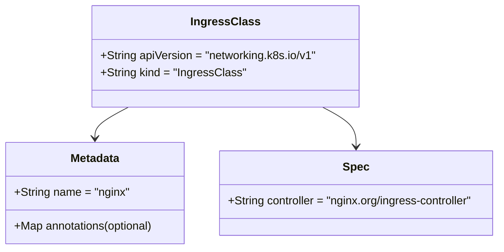

# Diagram: devops/k8s/nginx-ingress-controller/helm/templates/ingress-class.yaml

> Auto-generated by Obscura crawlers

## Mermaid

### SVG

<svg id="container" width="726.8359375" xmlns="http://www.w3.org/2000/svg" class="classDiagram" height="354" viewBox="0 0 726.8359375 354" role="graphics-document document" aria-roledescription="class"><g><defs><marker id="container_class-aggregationStart" class="marker aggregation class" refX="18" refY="7" markerWidth="190" markerHeight="240" orient="auto"><path d="M 18,7 L9,13 L1,7 L9,1 Z"></path></marker></defs><defs><marker id="container_class-aggregationEnd" class="marker aggregation class" refX="1" refY="7" markerWidth="20" markerHeight="28" orient="auto"><path d="M 18,7 L9,13 L1,7 L9,1 Z"></path></marker></defs><defs><marker id="container_class-extensionStart" class="marker extension class" refX="18" refY="7" markerWidth="190" markerHeight="240" orient="auto"><path d="M 1,7 L18,13 V 1 Z"></path></marker></defs><defs><marker id="container_class-extensionEnd" class="marker extension class" refX="1" refY="7" markerWidth="20" markerHeight="28" orient="auto"><path d="M 1,1 V 13 L18,7 Z"></path></marker></defs><defs><marker id="container_class-compositionStart" class="marker composition class" refX="18" refY="7" markerWidth="190" markerHeight="240" orient="auto"><path d="M 18,7 L9,13 L1,7 L9,1 Z"></path></marker></defs><defs><marker id="container_class-compositionEnd" class="marker composition class" refX="1" refY="7" markerWidth="20" markerHeight="28" orient="auto"><path d="M 18,7 L9,13 L1,7 L9,1 Z"></path></marker></defs><defs><marker id="container_class-dependencyStart" class="marker dependency class" refX="6" refY="7" markerWidth="190" markerHeight="240" orient="auto"><path d="M 5,7 L9,13 L1,7 L9,1 Z"></path></marker></defs><defs><marker id="container_class-dependencyEnd" class="marker dependency class" refX="13" refY="7" markerWidth="20" markerHeight="28" orient="auto"><path d="M 18,7 L9,13 L14,7 L9,1 Z"></path></marker></defs><defs><marker id="container_class-lollipopStart" class="marker lollipop class" refX="13" refY="7" markerWidth="190" markerHeight="240" orient="auto"><circle stroke="black" fill="transparent" cx="7" cy="7" r="6"></circle></marker></defs><defs><marker id="container_class-lollipopEnd" class="marker lollipop class" refX="1" refY="7" markerWidth="190" markerHeight="240" orient="auto"><circle stroke="black" fill="transparent" cx="7" cy="7" r="6"></circle></marker></defs><g class="root"><g class="clusters"></g><g class="edgePaths"><path d="M187.343,152L179.173,156.167C171.002,160.333,154.661,168.667,146.491,176C138.32,183.333,138.32,189.667,138.32,192.833L138.32,196" id="id_IngressClass_Metadata_1" class="edge-thickness-normal edge-pattern-solid relation" style=";;;" data-edge="true" data-et="edge" data-id="id_IngressClass_Metadata_1" data-points="W3sieCI6MTg3LjM0MzI0NjYxNzI2ODA1LCJ5IjoxNTJ9LHsieCI6MTM4LjMyMDMxMjUsInkiOjE3N30seyJ4IjoxMzguMzIwMzEyNSwieSI6MjAyfV0=" marker-end="url(#container_class-dependencyEnd)"></path><path d="M469.715,152L477.886,156.167C486.056,160.333,502.397,168.667,510.568,178C518.738,187.333,518.738,197.667,518.738,202.833L518.738,208" id="id_IngressClass_Spec_2" class="edge-thickness-normal edge-pattern-solid relation" style=";;;" data-edge="true" data-et="edge" data-id="id_IngressClass_Spec_2" data-points="W3sieCI6NDY5LjcxNTM0NzEzMjczMTk1LCJ5IjoxNTJ9LHsieCI6NTE4LjczODI4MTI1LCJ5IjoxNzd9LHsieCI6NTE4LjczODI4MTI1LCJ5IjoyMTR9XQ==" marker-end="url(#container_class-dependencyEnd)"></path></g><g class="edgeLabels"><g class="edgeLabel"><g class="label" data-id="id_IngressClass_Metadata_1" transform="translate(0, 0)"><foreignObject width="0" height="0">

</foreignObject></g></g><g class="edgeLabel"><g class="label" data-id="id_IngressClass_Spec_2" transform="translate(0, 0)"><foreignObject width="0" height="0">

</foreignObject></g></g></g><g class="nodes"><g class="node default" id="classId-IngressClass-0" transform="translate(328.529296875, 80)"><g class="basic label-container"><path d="M-189.81640625 -72 L189.81640625 -72 L189.81640625 72 L-189.81640625 72" stroke="none" stroke-width="0" fill="#ECECFF" style=""></path><path d="M-189.81640625 -72 C-102.94343836093307 -72, -16.070470471866145 -72, 189.81640625 -72 M-189.81640625 -72 C-40.67401198585327 -72, 108.46838227829346 -72, 189.81640625 -72 M189.81640625 -72 C189.81640625 -19.551745144796627, 189.81640625 32.89650971040675, 189.81640625 72 M189.81640625 -72 C189.81640625 -42.74729751521532, 189.81640625 -13.494595030430638, 189.81640625 72 M189.81640625 72 C102.38792075431317 72, 14.959435258626343 72, -189.81640625 72 M189.81640625 72 C81.86645411756002 72, -26.08349801487995 72, -189.81640625 72 M-189.81640625 72 C-189.81640625 27.60881683122747, -189.81640625 -16.782366337545056, -189.81640625 -72 M-189.81640625 72 C-189.81640625 33.89752829535851, -189.81640625 -4.204943409282976, -189.81640625 -72" stroke="#9370DB" stroke-width="1.3" fill="none" stroke-dasharray="0 0" style=""></path></g><g class="annotation-group text" transform="translate(0, -48)"></g><g class="label-group text" transform="translate(-45.2578125, -48)"><g class="label" style="font-weight: bolder" transform="translate(0,-12)"><foreignObject width="90.515625" height="24">

IngressClass

</foreignObject></g></g><g class="members-group text" transform="translate(-177.81640625, 0)"><g class="label" style="" transform="translate(0,-12)"><foreignObject width="310.375" height="24">

+String apiVersion = "networking.k8s.io/v1"

</foreignObject></g><g class="label" style="" transform="translate(0,12)"><foreignObject width="203.484375" height="24">

+String kind = "IngressClass"

</foreignObject></g></g><g class="methods-group text" transform="translate(-177.81640625, 72)"></g><g class="divider" style=""><path d="M-189.81640625 -24 C-89.17028309293555 -24, 11.475840064128903 -24, 189.81640625 -24 M-189.81640625 -24 C-88.94856774086318 -24, 11.919270768273634 -24, 189.81640625 -24" stroke="#9370DB" stroke-width="1.3" fill="none" stroke-dasharray="0 0" style=""></path></g><g class="divider" style=""><path d="M-189.81640625 48 C-87.99525831664431 48, 13.825889616711379 48, 189.81640625 48 M-189.81640625 48 C-67.83798144699826 48, 54.14044335600349 48, 189.81640625 48" stroke="#9370DB" stroke-width="1.3" fill="none" stroke-dasharray="0 0" style=""></path></g></g><g class="node default" id="classId-Metadata-1" transform="translate(138.3203125, 274)"><g class="basic label-container"><path d="M-130.3203125 -72 L130.3203125 -72 L130.3203125 72 L-130.3203125 72" stroke="none" stroke-width="0" fill="#ECECFF" style=""></path><path d="M-130.3203125 -72 C-37.932615451643784 -72, 54.45508159671243 -72, 130.3203125 -72 M-130.3203125 -72 C-62.3154330368742 -72, 5.689446426251607 -72, 130.3203125 -72 M130.3203125 -72 C130.3203125 -16.598369822679665, 130.3203125 38.80326035464067, 130.3203125 72 M130.3203125 -72 C130.3203125 -31.086204550025037, 130.3203125 9.827590899949925, 130.3203125 72 M130.3203125 72 C35.92232874255366 72, -58.47565501489268 72, -130.3203125 72 M130.3203125 72 C35.54229536707123 72, -59.235721765857534 72, -130.3203125 72 M-130.3203125 72 C-130.3203125 14.420537933343269, -130.3203125 -43.15892413331346, -130.3203125 -72 M-130.3203125 72 C-130.3203125 20.454571178931197, -130.3203125 -31.090857642137607, -130.3203125 -72" stroke="#9370DB" stroke-width="1.3" fill="none" stroke-dasharray="0 0" style=""></path></g><g class="annotation-group text" transform="translate(0, -48)"></g><g class="label-group text" transform="translate(-34.640625, -48)"><g class="label" style="font-weight: bolder" transform="translate(0,-12)"><foreignObject width="69.28125" height="24">

Metadata

</foreignObject></g></g><g class="members-group text" transform="translate(-118.3203125, 0)"><g class="label" style="" transform="translate(0,-12)"><foreignObject width="163.578125" height="24">

+String name = "nginx"

</foreignObject></g></g><g class="methods-group text" transform="translate(-118.3203125, 48)"><g class="label" style="" transform="translate(0,-12)"><foreignObject width="202" height="24">

+Map annotations(optional)

</foreignObject></g></g><g class="divider" style=""><path d="M-130.3203125 -24 C-66.81675298793704 -24, -3.3131934758740584 -24, 130.3203125 -24 M-130.3203125 -24 C-45.38206783645049 -24, 39.55617682709902 -24, 130.3203125 -24" stroke="#9370DB" stroke-width="1.3" fill="none" stroke-dasharray="0 0" style=""></path></g><g class="divider" style=""><path d="M-130.3203125 24 C-26.89700779831091 24, 76.52629690337818 24, 130.3203125 24 M-130.3203125 24 C-52.64812979973112 24, 25.024052900537754 24, 130.3203125 24" stroke="#9370DB" stroke-width="1.3" fill="none" stroke-dasharray="0 0" style=""></path></g></g><g class="node default" id="classId-Spec-2" transform="translate(518.73828125, 274)"><g class="basic label-container"><path d="M-200.09765625 -60 L200.09765625 -60 L200.09765625 60 L-200.09765625 60" stroke="none" stroke-width="0" fill="#ECECFF" style=""></path><path d="M-200.09765625 -60 C-117.26217994369097 -60, -34.426703637381934 -60, 200.09765625 -60 M-200.09765625 -60 C-52.43965408865219 -60, 95.21834807269562 -60, 200.09765625 -60 M200.09765625 -60 C200.09765625 -15.560702203302618, 200.09765625 28.878595593394763, 200.09765625 60 M200.09765625 -60 C200.09765625 -22.905701429789772, 200.09765625 14.188597140420455, 200.09765625 60 M200.09765625 60 C71.65972284800756 60, -56.77821055398488 60, -200.09765625 60 M200.09765625 60 C60.1079025306139 60, -79.8818511887722 60, -200.09765625 60 M-200.09765625 60 C-200.09765625 26.8460429422219, -200.09765625 -6.307914115556201, -200.09765625 -60 M-200.09765625 60 C-200.09765625 24.835329997405502, -200.09765625 -10.329340005188996, -200.09765625 -60" stroke="#9370DB" stroke-width="1.3" fill="none" stroke-dasharray="0 0" style=""></path></g><g class="annotation-group text" transform="translate(0, -36)"></g><g class="label-group text" transform="translate(-17.6015625, -36)"><g class="label" style="font-weight: bolder" transform="translate(0,-12)"><foreignObject width="35.203125" height="24">

Spec

</foreignObject></g></g><g class="members-group text" transform="translate(-188.09765625, 12)"><g class="label" style="" transform="translate(0,-12)"><foreignObject width="358.59375" height="24">

+String controller = "nginx.org/ingress-controller"

</foreignObject></g></g><g class="methods-group text" transform="translate(-188.09765625, 60)"></g><g class="divider" style=""><path d="M-200.09765625 -12 C-53.65311473926252 -12, 92.79142677147496 -12, 200.09765625 -12 M-200.09765625 -12 C-62.33734834572533 -12, 75.42295955854934 -12, 200.09765625 -12" stroke="#9370DB" stroke-width="1.3" fill="none" stroke-dasharray="0 0" style=""></path></g><g class="divider" style=""><path d="M-200.09765625 36 C-76.76045293632292 36, 46.57675037735416 36, 200.09765625 36 M-200.09765625 36 C-46.99571473617718 36, 106.10622677764565 36, 200.09765625 36" stroke="#9370DB" stroke-width="1.3" fill="none" stroke-dasharray="0 0" style=""></path></g></g></g></g></g></svg>
