# Diagram: devops/k8s/nginx-ingress-controller/helm/templates/rbac.yaml

> Auto-generated by Obscura crawlers

## Mermaid

```mermaid
flowchart TD
  CR[ClusterRole<br/>nginx-ingress]

  ES[endpointslices<br/>discovery.k8s.io<br/>verbs: get, list, watch]
  RS[replicasets<br/>apps<br/>verbs: get]
  DS[daemonsets<br/>apps<br/>verbs: get]
  SV[services<br/>core<br/>verbs: get, list, watch]
  SEC[secrets<br/>core<br/>verbs: get, list, watch]
  CM[configmaps<br/>core<br/>verbs: get, list, watch, update, create]
  PODS[pods<br/>core<br/>verbs: get, list, watch, update]
  NAMESPACES[namespaces<br/>core<br/>verbs: get, list, watch]
  NODES[nodes<br/>core<br/>verbs: list]
  EVENTS[events<br/>core<br/>verbs: create, patch, list]
  LEASES[leases<br/>coordination.k8s.io<br/>verbs: get, list, watch, update, create]
  INGRESS[ingresses<br/>networking.k8s.io<br/>verbs: list, watch, get]
  INGRESS_STATUS[ingresses/status<br/>networking.k8s.io<br/>verbs: update]
  INGRESSCLASSES[ingressclasses<br/>networking.k8s.io<br/>verbs: get]
  VIRTUALSERVERS[virtualservers<br/>k8s.nginx.org<br/>verbs: list, watch, get]
  VSR[virtualserverroutes<br/>k8s.nginx.org<br/>verbs: list, watch, get]
  GLOBALCONF[globalconfigurations<br/>k8s.nginx.org<br/>verbs: list, watch, get]
  TRANSPORTSERVERS[transportservers<br/>k8s.nginx.org<br/>verbs: list, watch, get]
  POLICIES[policies<br/>k8s.nginx.org<br/>verbs: list, watch, get]
  VS_STATUS[virtualservers/status<br/>k8s.nginx.org<br/>verbs: update]
  VSR_STATUS[virtualserverroutes/status<br/>k8s.nginx.org<br/>verbs: update]
  POL_STATUS[policies/status<br/>k8s.nginx.org<br/>verbs: update]
  TS_STATUS[transportservers/status<br/>k8s.nginx.org<br/>verbs: update]
  K8S_DNS_STATUS[dnsendpoints/status<br/>k8s.nginx.org<br/>verbs: update]
  INGRESSLINKS[ingresslinks<br/>cis.f5.com<br/>verbs: list, watch, get]
  CERTIFICATES[certificates<br/>cert-manager.io<br/>verbs: list, watch, get, update, create, delete]
  EXTERNAL_DNS[dnsendpoints<br/>externaldns.nginx.org<br/>verbs: list, watch, get, update, create, delete]
  EXTERNAL_DNS_STATUS[dnsendpoints/status<br/>externaldns.nginx.org<br/>verbs: update]

  CR --> ES
  CR --> RS
  CR --> DS
  CR --> SV
  CR --> SEC
  CR --> CM
  CR --> PODS
  CR --> NAMESPACES
  CR --> NODES
  CR --> EVENTS
  CR --> LEASES
  CR --> INGRESS
  CR --> INGRESS_STATUS
  CR --> INGRESSCLASSES
  CR --> VIRTUALSERVERS
  CR --> VSR
  CR --> GLOBALCONF
  CR --> TRANSPORTSERVERS
  CR --> POLICIES
  CR --> VS_STATUS
  CR --> VSR_STATUS
  CR --> POL_STATUS
  CR --> TS_STATUS
  CR --> K8S_DNS_STATUS
  CR --> INGRESSLINKS
  CR --> CERTIFICATES
  CR --> EXTERNAL_DNS
  CR --> EXTERNAL_DNS_STATUS

  SA[ServiceAccount<br/>nginx-ingress<br/>namespace: nginx-ingress]
  CRB[ClusterRoleBinding<br/>nginx-ingress]

  SA --> CRB
  CRB -->|roleRef: ClusterRole nginx-ingress| CR
```

### SVG

<svg id="container" width="7308.421875" xmlns="http://www.w3.org/2000/svg" class="flowchart" height="598" viewBox="0 0 7308.421875 598" role="graphics-document document" aria-roledescription="flowchart-v2"><g><marker id="container_flowchart-v2-pointEnd" class="marker flowchart-v2" viewBox="0 0 10 10" refX="5" refY="5" markerUnits="userSpaceOnUse" markerWidth="8" markerHeight="8" orient="auto"><path d="M 0 0 L 10 5 L 0 10 z" class="arrowMarkerPath" style="stroke-width: 1; stroke-dasharray: 1, 0;"></path></marker><marker id="container_flowchart-v2-pointStart" class="marker flowchart-v2" viewBox="0 0 10 10" refX="4.5" refY="5" markerUnits="userSpaceOnUse" markerWidth="8" markerHeight="8" orient="auto"><path d="M 0 5 L 10 10 L 10 0 z" class="arrowMarkerPath" style="stroke-width: 1; stroke-dasharray: 1, 0;"></path></marker><marker id="container_flowchart-v2-circleEnd" class="marker flowchart-v2" viewBox="0 0 10 10" refX="11" refY="5" markerUnits="userSpaceOnUse" markerWidth="11" markerHeight="11" orient="auto"><circle cx="5" cy="5" r="5" class="arrowMarkerPath" style="stroke-width: 1; stroke-dasharray: 1, 0;"></circle></marker><marker id="container_flowchart-v2-circleStart" class="marker flowchart-v2" viewBox="0 0 10 10" refX="-1" refY="5" markerUnits="userSpaceOnUse" markerWidth="11" markerHeight="11" orient="auto"><circle cx="5" cy="5" r="5" class="arrowMarkerPath" style="stroke-width: 1; stroke-dasharray: 1, 0;"></circle></marker><marker id="container_flowchart-v2-crossEnd" class="marker cross flowchart-v2" viewBox="0 0 11 11" refX="12" refY="5.2" markerUnits="userSpaceOnUse" markerWidth="11" markerHeight="11" orient="auto"><path d="M 1,1 l 9,9 M 10,1 l -9,9" class="arrowMarkerPath" style="stroke-width: 2; stroke-dasharray: 1, 0;"></path></marker><marker id="container_flowchart-v2-crossStart" class="marker cross flowchart-v2" viewBox="0 0 11 11" refX="-1" refY="5.2" markerUnits="userSpaceOnUse" markerWidth="11" markerHeight="11" orient="auto"><path d="M 1,1 l 9,9 M 10,1 l -9,9" class="arrowMarkerPath" style="stroke-width: 2; stroke-dasharray: 1, 0;"></path></marker><g class="root"><g class="clusters"></g><g class="edgePaths"><path d="M3472.668,376.458L2912.857,386.882C2353.047,397.306,1233.426,418.153,673.615,434.076C113.805,450,113.805,461,113.805,466.5L113.805,472" id="L_CR_ES_0" class="edge-thickness-normal edge-pattern-solid edge-thickness-normal edge-pattern-solid flowchart-link" style=";" data-edge="true" data-et="edge" data-id="L_CR_ES_0" data-points="W3sieCI6MzQ3Mi42Njc5Njg3NSwieSI6Mzc2LjQ1ODMxNjA0OTU0NTV9LHsieCI6MTEzLjgwNDY4NzUsInkiOjQzOX0seyJ4IjoxMTMuODA0Njg3NSwieSI6NDc2fV0=" marker-end="url(#container_flowchart-v2-pointEnd)"></path><path d="M3472.668,376.561L2950.374,386.967C2428.081,397.374,1383.493,418.187,861.2,434.093C338.906,450,338.906,461,338.906,466.5L338.906,472" id="L_CR_RS_0" class="edge-thickness-normal edge-pattern-solid edge-thickness-normal edge-pattern-solid flowchart-link" style=";" data-edge="true" data-et="edge" data-id="L_CR_RS_0" data-points="W3sieCI6MzQ3Mi42Njc5Njg3NSwieSI6Mzc2LjU2MDUxNDMxNzg4OTF9LHsieCI6MzM4LjkwNjI1LCJ5Ijo0Mzl9LHsieCI6MzM4LjkwNjI1LCJ5Ijo0NzZ9XQ==" marker-end="url(#container_flowchart-v2-pointEnd)"></path><path d="M3472.668,376.661L2982.663,387.051C2492.659,397.44,1512.65,418.22,1022.645,434.11C532.641,450,532.641,461,532.641,466.5L532.641,472" id="L_CR_DS_0" class="edge-thickness-normal edge-pattern-solid edge-thickness-normal edge-pattern-solid flowchart-link" style=";" data-edge="true" data-et="edge" data-id="L_CR_DS_0" data-points="W3sieCI6MzQ3Mi42Njc5Njg3NSwieSI6Mzc2LjY2MDY3NjgyNDE2MjY0fSx7IngiOjUzMi42NDA2MjUsInkiOjQzOX0seyJ4Ijo1MzIuNjQwNjI1LCJ5Ijo0NzZ9XQ==" marker-end="url(#container_flowchart-v2-pointEnd)"></path><path d="M3472.668,376.798L3021.037,387.165C2569.406,397.532,1666.145,418.266,1214.514,434.133C762.883,450,762.883,461,762.883,466.5L762.883,472" id="L_CR_SV_0" class="edge-thickness-normal edge-pattern-solid edge-thickness-normal edge-pattern-solid flowchart-link" style=";" data-edge="true" data-et="edge" data-id="L_CR_SV_0" data-points="W3sieCI6MzQ3Mi42Njc5Njg3NSwieSI6Mzc2Ljc5NzgxNTc3NzEyMjR9LHsieCI6NzYyLjg4MjgxMjUsInkiOjQzOX0seyJ4Ijo3NjIuODgyODEyNSwieSI6NDc2fV0=" marker-end="url(#container_flowchart-v2-pointEnd)"></path><path d="M3472.668,376.984L3064.639,387.32C2656.609,397.656,1840.551,418.328,1432.521,434.164C1024.492,450,1024.492,461,1024.492,466.5L1024.492,472" id="L_CR_SEC_0" class="edge-thickness-normal edge-pattern-solid edge-thickness-normal edge-pattern-solid flowchart-link" style=";" data-edge="true" data-et="edge" data-id="L_CR_SEC_0" data-points="W3sieCI6MzQ3Mi42Njc5Njg3NSwieSI6Mzc2Ljk4Mzk3Mjk4NjMwM30seyJ4IjoxMDI0LjQ5MjE4NzUsInkiOjQzOX0seyJ4IjoxMDI0LjQ5MjE4NzUsInkiOjQ3Nn1d" marker-end="url(#container_flowchart-v2-pointEnd)"></path><path d="M3472.668,377.237L3112.273,387.531C2751.878,397.825,2031.087,418.412,1670.692,432.206C1310.297,446,1310.297,453,1310.297,456.5L1310.297,460" id="L_CR_CM_0" class="edge-thickness-normal edge-pattern-solid edge-thickness-normal edge-pattern-solid flowchart-link" style=";" data-edge="true" data-et="edge" data-id="L_CR_CM_0" data-points="W3sieCI6MzQ3Mi42Njc5Njg3NSwieSI6Mzc3LjIzNzAzMjcyMzkyNTU1fSx7IngiOjEzMTAuMjk2ODc1LCJ5Ijo0Mzl9LHsieCI6MTMxMC4yOTY4NzUsInkiOjQ2NH1d" marker-end="url(#container_flowchart-v2-pointEnd)"></path><path d="M3472.668,377.596L3163.939,387.83C2855.211,398.064,2237.754,418.532,1929.025,432.266C1620.297,446,1620.297,453,1620.297,456.5L1620.297,460" id="L_CR_PODS_0" class="edge-thickness-normal edge-pattern-solid edge-thickness-normal edge-pattern-solid flowchart-link" style=";" data-edge="true" data-et="edge" data-id="L_CR_PODS_0" data-points="W3sieCI6MzQ3Mi42Njc5Njg3NSwieSI6Mzc3LjU5NjIyMDE4NTA0NTR9LHsieCI6MTYyMC4yOTY4NzUsInkiOjQzOX0seyJ4IjoxNjIwLjI5Njg3NSwieSI6NDY0fV0=" marker-end="url(#container_flowchart-v2-pointEnd)"></path><path d="M3472.668,378.047L3211.574,388.206C2950.479,398.365,2428.29,418.682,2167.196,434.341C1906.102,450,1906.102,461,1906.102,466.5L1906.102,472" id="L_CR_NAMESPACES_0" class="edge-thickness-normal edge-pattern-solid edge-thickness-normal edge-pattern-solid flowchart-link" style=";" data-edge="true" data-et="edge" data-id="L_CR_NAMESPACES_0" data-points="W3sieCI6MzQ3Mi42Njc5Njg3NSwieSI6Mzc4LjA0NzMyMjMxMjc1NDI2fSx7IngiOjE5MDYuMTAxNTYyNSwieSI6NDM5fSx7IngiOjE5MDYuMTAxNTYyNSwieSI6NDc2fV0=" marker-end="url(#container_flowchart-v2-pointEnd)"></path><path d="M3472.668,378.52L3248.393,388.6C3024.117,398.68,2575.566,418.84,2351.291,434.42C2127.016,450,2127.016,461,2127.016,466.5L2127.016,472" id="L_CR_NODES_0" class="edge-thickness-normal edge-pattern-solid edge-thickness-normal edge-pattern-solid flowchart-link" style=";" data-edge="true" data-et="edge" data-id="L_CR_NODES_0" data-points="W3sieCI6MzQ3Mi42Njc5Njg3NSwieSI6Mzc4LjUyMDA4MTYzNzgwMzU3fSx7IngiOjIxMjcuMDE1NjI1LCJ5Ijo0Mzl9LHsieCI6MjEyNy4wMTU2MjUsInkiOjQ3Nn1d" marker-end="url(#container_flowchart-v2-pointEnd)"></path><path d="M3472.668,379.202L3286.885,389.168C3101.102,399.134,2729.535,419.067,2543.752,434.534C2357.969,450,2357.969,461,2357.969,466.5L2357.969,472" id="L_CR_EVENTS_0" class="edge-thickness-normal edge-pattern-solid edge-thickness-normal edge-pattern-solid flowchart-link" style=";" data-edge="true" data-et="edge" data-id="L_CR_EVENTS_0" data-points="W3sieCI6MzQ3Mi42Njc5Njg3NSwieSI6Mzc5LjIwMTUyMzgzODIxMjV9LHsieCI6MjM1Ny45Njg3NSwieSI6NDM5fSx7IngiOjIzNTcuOTY4NzUsInkiOjQ3Nn1d" marker-end="url(#container_flowchart-v2-pointEnd)"></path><path d="M3472.668,380.587L3336.192,390.322C3199.716,400.058,2926.764,419.529,2790.288,432.764C2653.813,446,2653.813,453,2653.813,456.5L2653.813,460" id="L_CR_LEASES_0" class="edge-thickness-normal edge-pattern-solid edge-thickness-normal edge-pattern-solid flowchart-link" style=";" data-edge="true" data-et="edge" data-id="L_CR_LEASES_0" data-points="W3sieCI6MzQ3Mi42Njc5Njg3NSwieSI6MzgwLjU4Njk3NjQ5MzA3NTA0fSx7IngiOjI2NTMuODEyNSwieSI6NDM5fSx7IngiOjI2NTMuODEyNSwieSI6NDY0fV0=" marker-end="url(#container_flowchart-v2-pointEnd)"></path><path d="M3472.668,383.198L3383.821,392.499C3294.974,401.799,3117.28,420.399,3028.433,435.2C2939.586,450,2939.586,461,2939.586,466.5L2939.586,472" id="L_CR_INGRESS_0" class="edge-thickness-normal edge-pattern-solid edge-thickness-normal edge-pattern-solid flowchart-link" style=";" data-edge="true" data-et="edge" data-id="L_CR_INGRESS_0" data-points="W3sieCI6MzQ3Mi42Njc5Njg3NSwieSI6MzgzLjE5ODM2NTY5MzYyMTg0fSx7IngiOjI5MzkuNTg1OTM3NSwieSI6NDM5fSx7IngiOjI5MzkuNTg1OTM3NSwieSI6NDc2fV0=" marker-end="url(#container_flowchart-v2-pointEnd)"></path><path d="M3472.668,388.847L3425.39,397.206C3378.112,405.565,3283.556,422.282,3236.278,436.141C3189,450,3189,461,3189,466.5L3189,472" id="L_CR_INGRESS_STATUS_0" class="edge-thickness-normal edge-pattern-solid edge-thickness-normal edge-pattern-solid flowchart-link" style=";" data-edge="true" data-et="edge" data-id="L_CR_INGRESS_STATUS_0" data-points="W3sieCI6MzQ3Mi42Njc5Njg3NSwieSI6Mzg4Ljg0NzEzMzM0NTU2MzI0fSx7IngiOjMxODksInkiOjQzOX0seyJ4IjozMTg5LCJ5Ijo0NzZ9XQ==" marker-end="url(#container_flowchart-v2-pointEnd)"></path><path d="M3474.995,414L3466.876,418.167C3458.757,422.333,3442.519,430.667,3434.4,440.333C3426.281,450,3426.281,461,3426.281,466.5L3426.281,472" id="L_CR_INGRESSCLASSES_0" class="edge-thickness-normal edge-pattern-solid edge-thickness-normal edge-pattern-solid flowchart-link" style=";" data-edge="true" data-et="edge" data-id="L_CR_INGRESSCLASSES_0" data-points="W3sieCI6MzQ3NC45OTQ5MzQwODIwMzEyLCJ5Ijo0MTR9LHsieCI6MzQyNi4yODEyNSwieSI6NDM5fSx7IngiOjM0MjYuMjgxMjUsInkiOjQ3Nn1d" marker-end="url(#container_flowchart-v2-pointEnd)"></path><path d="M3626.982,414L3635.101,418.167C3643.22,422.333,3659.457,430.667,3667.576,440.333C3675.695,450,3675.695,461,3675.695,466.5L3675.695,472" id="L_CR_VIRTUALSERVERS_0" class="edge-thickness-normal edge-pattern-solid edge-thickness-normal edge-pattern-solid flowchart-link" style=";" data-edge="true" data-et="edge" data-id="L_CR_VIRTUALSERVERS_0" data-points="W3sieCI6MzYyNi45ODE2Mjg0MTc5Njg4LCJ5Ijo0MTR9LHsieCI6MzY3NS42OTUzMTI1LCJ5Ijo0Mzl9LHsieCI6MzY3NS42OTUzMTI1LCJ5Ijo0NzZ9XQ==" marker-end="url(#container_flowchart-v2-pointEnd)"></path><path d="M3629.309,387.977L3680.631,396.481C3731.953,404.985,3834.598,421.992,3885.92,435.996C3937.242,450,3937.242,461,3937.242,466.5L3937.242,472" id="L_CR_VSR_0" class="edge-thickness-normal edge-pattern-solid edge-thickness-normal edge-pattern-solid flowchart-link" style=";" data-edge="true" data-et="edge" data-id="L_CR_VSR_0" data-points="W3sieCI6MzYyOS4zMDg1OTM3NSwieSI6Mzg3Ljk3NzIxNTAzNjI1NTd9LHsieCI6MzkzNy4yNDIxODc1LCJ5Ijo0Mzl9LHsieCI6MzkzNy4yNDIxODc1LCJ5Ijo0NzZ9XQ==" marker-end="url(#container_flowchart-v2-pointEnd)"></path><path d="M3629.309,382.738L3724.222,392.115C3819.135,401.492,4008.962,420.246,4103.876,435.123C4198.789,450,4198.789,461,4198.789,466.5L4198.789,472" id="L_CR_GLOBALCONF_0" class="edge-thickness-normal edge-pattern-solid edge-thickness-normal edge-pattern-solid flowchart-link" style=";" data-edge="true" data-et="edge" data-id="L_CR_GLOBALCONF_0" data-points="W3sieCI6MzYyOS4zMDg1OTM3NSwieSI6MzgyLjczNzcxODM2MjAwNjF9LHsieCI6NDE5OC43ODkwNjI1LCJ5Ijo0Mzl9LHsieCI6NDE5OC43ODkwNjI1LCJ5Ijo0NzZ9XQ==" marker-end="url(#container_flowchart-v2-pointEnd)"></path><path d="M3629.309,380.512L3767.813,390.26C3906.318,400.008,4183.327,419.504,4321.831,434.752C4460.336,450,4460.336,461,4460.336,466.5L4460.336,472" id="L_CR_TRANSPORTSERVERS_0" class="edge-thickness-normal edge-pattern-solid edge-thickness-normal edge-pattern-solid flowchart-link" style=";" data-edge="true" data-et="edge" data-id="L_CR_TRANSPORTSERVERS_0" data-points="W3sieCI6MzYyOS4zMDg1OTM3NSwieSI6MzgwLjUxMjE5MzIzNjA1MDl9LHsieCI6NDQ2MC4zMzU5Mzc1LCJ5Ijo0Mzl9LHsieCI6NDQ2MC4zMzU5Mzc1LCJ5Ijo0NzZ9XQ==" marker-end="url(#container_flowchart-v2-pointEnd)"></path><path d="M3629.309,379.281L3811.404,389.234C3993.5,399.187,4357.691,419.094,4539.787,434.547C4721.883,450,4721.883,461,4721.883,466.5L4721.883,472" id="L_CR_POLICIES_0" class="edge-thickness-normal edge-pattern-solid edge-thickness-normal edge-pattern-solid flowchart-link" style=";" data-edge="true" data-et="edge" data-id="L_CR_POLICIES_0" data-points="W3sieCI6MzYyOS4zMDg1OTM3NSwieSI6Mzc5LjI4MDkxNTAzMjI0MzZ9LHsieCI6NDcyMS44ODI4MTI1LCJ5Ijo0Mzl9LHsieCI6NDcyMS44ODI4MTI1LCJ5Ijo0NzZ9XQ==" marker-end="url(#container_flowchart-v2-pointEnd)"></path><path d="M3629.309,378.499L3854.986,388.583C4080.664,398.666,4532.02,418.833,4757.697,434.417C4983.375,450,4983.375,461,4983.375,466.5L4983.375,472" id="L_CR_VS_STATUS_0" class="edge-thickness-normal edge-pattern-solid edge-thickness-normal edge-pattern-solid flowchart-link" style=";" data-edge="true" data-et="edge" data-id="L_CR_VS_STATUS_0" data-points="W3sieCI6MzYyOS4zMDg1OTM3NSwieSI6Mzc4LjQ5OTQwNDEzMDQ1MzJ9LHsieCI6NDk4My4zNzUsInkiOjQzOX0seyJ4Ijo0OTgzLjM3NSwieSI6NDc2fV0=" marker-end="url(#container_flowchart-v2-pointEnd)"></path><path d="M3629.309,377.926L3901.796,388.105C4174.284,398.284,4719.259,418.642,4991.747,434.321C5264.234,450,5264.234,461,5264.234,466.5L5264.234,472" id="L_CR_VSR_STATUS_0" class="edge-thickness-normal edge-pattern-solid edge-thickness-normal edge-pattern-solid flowchart-link" style=";" data-edge="true" data-et="edge" data-id="L_CR_VSR_STATUS_0" data-points="W3sieCI6MzYyOS4zMDg1OTM3NSwieSI6Mzc3LjkyNTczMjYzMDE3MjU1fSx7IngiOjUyNjQuMjM0Mzc1LCJ5Ijo0Mzl9LHsieCI6NTI2NC4yMzQzNzUsInkiOjQ3Nn1d" marker-end="url(#container_flowchart-v2-pointEnd)"></path><path d="M3629.309,377.541L3945.04,387.784C4260.771,398.027,4892.233,418.514,5207.964,434.257C5523.695,450,5523.695,461,5523.695,466.5L5523.695,472" id="L_CR_POL_STATUS_0" class="edge-thickness-normal edge-pattern-solid edge-thickness-normal edge-pattern-solid flowchart-link" style=";" data-edge="true" data-et="edge" data-id="L_CR_POL_STATUS_0" data-points="W3sieCI6MzYyOS4zMDg1OTM3NSwieSI6Mzc3LjU0MDkyNDY4OTA2NzR9LHsieCI6NTUyMy42OTUzMTI1LCJ5Ijo0Mzl9LHsieCI6NTUyMy42OTUzMTI1LCJ5Ijo0NzZ9XQ==" marker-end="url(#container_flowchart-v2-pointEnd)"></path><path d="M3629.309,377.255L3986.785,387.546C4344.26,397.836,5059.212,418.418,5416.688,434.209C5774.164,450,5774.164,461,5774.164,466.5L5774.164,472" id="L_CR_TS_STATUS_0" class="edge-thickness-normal edge-pattern-solid edge-thickness-normal edge-pattern-solid flowchart-link" style=";" data-edge="true" data-et="edge" data-id="L_CR_TS_STATUS_0" data-points="W3sieCI6MzYyOS4zMDg1OTM3NSwieSI6Mzc3LjI1NDY1NzUyMjkzNH0seyJ4Ijo1Nzc0LjE2NDA2MjUsInkiOjQzOX0seyJ4Ijo1Nzc0LjE2NDA2MjUsInkiOjQ3Nn1d" marker-end="url(#container_flowchart-v2-pointEnd)"></path><path d="M3629.309,377.009L4032.169,387.341C4435.029,397.672,5240.749,418.336,5643.609,434.168C6046.469,450,6046.469,461,6046.469,466.5L6046.469,472" id="L_CR_K8S_DNS_STATUS_0" class="edge-thickness-normal edge-pattern-solid edge-thickness-normal edge-pattern-solid flowchart-link" style=";" data-edge="true" data-et="edge" data-id="L_CR_K8S_DNS_STATUS_0" data-points="W3sieCI6MzYyOS4zMDg1OTM3NSwieSI6Mzc3LjAwODYzMTIyODY0M30seyJ4Ijo2MDQ2LjQ2ODc1LCJ5Ijo0Mzl9LHsieCI6NjA0Ni40Njg3NSwieSI6NDc2fV0=" marker-end="url(#container_flowchart-v2-pointEnd)"></path><path d="M3629.309,376.818L4075.824,387.182C4522.339,397.545,5415.368,418.273,5861.883,434.136C6308.398,450,6308.398,461,6308.398,466.5L6308.398,472" id="L_CR_INGRESSLINKS_0" class="edge-thickness-normal edge-pattern-solid edge-thickness-normal edge-pattern-solid flowchart-link" style=";" data-edge="true" data-et="edge" data-id="L_CR_INGRESSLINKS_0" data-points="W3sieCI6MzYyOS4zMDg1OTM3NSwieSI6Mzc2LjgxNzgyODk0NjcxNn0seyJ4Ijo2MzA4LjM5ODQzNzUsInkiOjQzOX0seyJ4Ijo2MzA4LjM5ODQzNzUsInkiOjQ3Nn1d" marker-end="url(#container_flowchart-v2-pointEnd)"></path><path d="M3629.309,376.647L4123.452,387.039C4617.596,397.431,5605.884,418.216,6100.028,432.108C6594.172,446,6594.172,453,6594.172,456.5L6594.172,460" id="L_CR_CERTIFICATES_0" class="edge-thickness-normal edge-pattern-solid edge-thickness-normal edge-pattern-solid flowchart-link" style=";" data-edge="true" data-et="edge" data-id="L_CR_CERTIFICATES_0" data-points="W3sieCI6MzYyOS4zMDg1OTM3NSwieSI6Mzc2LjY0NzEyMzc1ODkxMzA0fSx7IngiOjY1OTQuMTcxODc1LCJ5Ijo0Mzl9LHsieCI6NjU5NC4xNzE4NzUsInkiOjQ2NH1d" marker-end="url(#container_flowchart-v2-pointEnd)"></path><path d="M3629.309,376.495L4175.119,386.912C4720.93,397.33,5812.551,418.165,6358.361,432.082C6904.172,446,6904.172,453,6904.172,456.5L6904.172,460" id="L_CR_EXTERNAL_DNS_0" class="edge-thickness-normal edge-pattern-solid edge-thickness-normal edge-pattern-solid flowchart-link" style=";" data-edge="true" data-et="edge" data-id="L_CR_EXTERNAL_DNS_0" data-points="W3sieCI6MzYyOS4zMDg1OTM3NSwieSI6Mzc2LjQ5NDg0ODA2Mjk5OTg0fSx7IngiOjY5MDQuMTcxODc1LCJ5Ijo0Mzl9LHsieCI6NjkwNC4xNzE4NzUsInkiOjQ2NH1d" marker-end="url(#container_flowchart-v2-pointEnd)"></path><path d="M3629.309,376.377L4223.14,386.814C4816.971,397.251,6004.634,418.126,6598.465,434.063C7192.297,450,7192.297,461,7192.297,466.5L7192.297,472" id="L_CR_EXTERNAL_DNS_STATUS_0" class="edge-thickness-normal edge-pattern-solid edge-thickness-normal edge-pattern-solid flowchart-link" style=";" data-edge="true" data-et="edge" data-id="L_CR_EXTERNAL_DNS_STATUS_0" data-points="W3sieCI6MzYyOS4zMDg1OTM3NSwieSI6Mzc2LjM3NjU2NTU1OTA0MjA0fSx7IngiOjcxOTIuMjk2ODc1LCJ5Ijo0Mzl9LHsieCI6NzE5Mi4yOTY4NzUsInkiOjQ3Nn1d" marker-end="url(#container_flowchart-v2-pointEnd)"></path><path d="M3550.988,110L3550.988,114.167C3550.988,118.333,3550.988,126.667,3550.988,134.333C3550.988,142,3550.988,149,3550.988,152.5L3550.988,156" id="L_SA_CRB_0" class="edge-thickness-normal edge-pattern-solid edge-thickness-normal edge-pattern-solid flowchart-link" style=";" data-edge="true" data-et="edge" data-id="L_SA_CRB_0" data-points="W3sieCI6MzU1MC45ODgyODEyNSwieSI6MTEwfSx7IngiOjM1NTAuOTg4MjgxMjUsInkiOjEzNX0seyJ4IjozNTUwLjk4ODI4MTI1LCJ5IjoxNjB9XQ==" marker-end="url(#container_flowchart-v2-pointEnd)"></path><path d="M3550.988,238L3550.988,246.167C3550.988,254.333,3550.988,270.667,3550.988,286.333C3550.988,302,3550.988,317,3550.988,324.5L3550.988,332" id="L_CRB_CR_0" class="edge-thickness-normal edge-pattern-solid edge-thickness-normal edge-pattern-solid flowchart-link" style=";" data-edge="true" data-et="edge" data-id="L_CRB_CR_0" data-points="W3sieCI6MzU1MC45ODgyODEyNSwieSI6MjM4fSx7IngiOjM1NTAuOTg4MjgxMjUsInkiOjI4N30seyJ4IjozNTUwLjk4ODI4MTI1LCJ5IjozMzZ9XQ==" marker-end="url(#container_flowchart-v2-pointEnd)"></path></g><g class="edgeLabels"><g class="edgeLabel"><g class="label" data-id="L_CR_ES_0" transform="translate(0, 0)"><foreignObject width="0" height="0">

</foreignObject></g></g><g class="edgeLabel"><g class="label" data-id="L_CR_RS_0" transform="translate(0, 0)"><foreignObject width="0" height="0">

</foreignObject></g></g><g class="edgeLabel"><g class="label" data-id="L_CR_DS_0" transform="translate(0, 0)"><foreignObject width="0" height="0">

</foreignObject></g></g><g class="edgeLabel"><g class="label" data-id="L_CR_SV_0" transform="translate(0, 0)"><foreignObject width="0" height="0">

</foreignObject></g></g><g class="edgeLabel"><g class="label" data-id="L_CR_SEC_0" transform="translate(0, 0)"><foreignObject width="0" height="0">

</foreignObject></g></g><g class="edgeLabel"><g class="label" data-id="L_CR_CM_0" transform="translate(0, 0)"><foreignObject width="0" height="0">

</foreignObject></g></g><g class="edgeLabel"><g class="label" data-id="L_CR_PODS_0" transform="translate(0, 0)"><foreignObject width="0" height="0">

</foreignObject></g></g><g class="edgeLabel"><g class="label" data-id="L_CR_NAMESPACES_0" transform="translate(0, 0)"><foreignObject width="0" height="0">

</foreignObject></g></g><g class="edgeLabel"><g class="label" data-id="L_CR_NODES_0" transform="translate(0, 0)"><foreignObject width="0" height="0">

</foreignObject></g></g><g class="edgeLabel"><g class="label" data-id="L_CR_EVENTS_0" transform="translate(0, 0)"><foreignObject width="0" height="0">

</foreignObject></g></g><g class="edgeLabel"><g class="label" data-id="L_CR_LEASES_0" transform="translate(0, 0)"><foreignObject width="0" height="0">

</foreignObject></g></g><g class="edgeLabel"><g class="label" data-id="L_CR_INGRESS_0" transform="translate(0, 0)"><foreignObject width="0" height="0">

</foreignObject></g></g><g class="edgeLabel"><g class="label" data-id="L_CR_INGRESS_STATUS_0" transform="translate(0, 0)"><foreignObject width="0" height="0">

</foreignObject></g></g><g class="edgeLabel"><g class="label" data-id="L_CR_INGRESSCLASSES_0" transform="translate(0, 0)"><foreignObject width="0" height="0">

</foreignObject></g></g><g class="edgeLabel"><g class="label" data-id="L_CR_VIRTUALSERVERS_0" transform="translate(0, 0)"><foreignObject width="0" height="0">

</foreignObject></g></g><g class="edgeLabel"><g class="label" data-id="L_CR_VSR_0" transform="translate(0, 0)"><foreignObject width="0" height="0">

</foreignObject></g></g><g class="edgeLabel"><g class="label" data-id="L_CR_GLOBALCONF_0" transform="translate(0, 0)"><foreignObject width="0" height="0">

</foreignObject></g></g><g class="edgeLabel"><g class="label" data-id="L_CR_TRANSPORTSERVERS_0" transform="translate(0, 0)"><foreignObject width="0" height="0">

</foreignObject></g></g><g class="edgeLabel"><g class="label" data-id="L_CR_POLICIES_0" transform="translate(0, 0)"><foreignObject width="0" height="0">

</foreignObject></g></g><g class="edgeLabel"><g class="label" data-id="L_CR_VS_STATUS_0" transform="translate(0, 0)"><foreignObject width="0" height="0">

</foreignObject></g></g><g class="edgeLabel"><g class="label" data-id="L_CR_VSR_STATUS_0" transform="translate(0, 0)"><foreignObject width="0" height="0">

</foreignObject></g></g><g class="edgeLabel"><g class="label" data-id="L_CR_POL_STATUS_0" transform="translate(0, 0)"><foreignObject width="0" height="0">

</foreignObject></g></g><g class="edgeLabel"><g class="label" data-id="L_CR_TS_STATUS_0" transform="translate(0, 0)"><foreignObject width="0" height="0">

</foreignObject></g></g><g class="edgeLabel"><g class="label" data-id="L_CR_K8S_DNS_STATUS_0" transform="translate(0, 0)"><foreignObject width="0" height="0">

</foreignObject></g></g><g class="edgeLabel"><g class="label" data-id="L_CR_INGRESSLINKS_0" transform="translate(0, 0)"><foreignObject width="0" height="0">

</foreignObject></g></g><g class="edgeLabel"><g class="label" data-id="L_CR_CERTIFICATES_0" transform="translate(0, 0)"><foreignObject width="0" height="0">

</foreignObject></g></g><g class="edgeLabel"><g class="label" data-id="L_CR_EXTERNAL_DNS_0" transform="translate(0, 0)"><foreignObject width="0" height="0">

</foreignObject></g></g><g class="edgeLabel"><g class="label" data-id="L_CR_EXTERNAL_DNS_STATUS_0" transform="translate(0, 0)"><foreignObject width="0" height="0">

</foreignObject></g></g><g class="edgeLabel"><g class="label" data-id="L_SA_CRB_0" transform="translate(0, 0)"><foreignObject width="0" height="0">

</foreignObject></g></g><g class="edgeLabel" transform="translate(3550.98828125, 287)"><g class="label" data-id="L_CRB_CR_0" transform="translate(-100, -24)"><foreignObject width="200" height="48">

roleRef: ClusterRole nginx-ingress

</foreignObject></g></g></g><g class="nodes"><g class="node default" id="flowchart-CR-0" transform="translate(3550.98828125, 375)"><rect class="basic label-container" style="" x="-78.3203125" y="-39" width="156.640625" height="78"></rect><g class="label" style="" transform="translate(-48.3203125, -24)"><rect></rect><foreignObject width="96.640625" height="48">

ClusterRole nginx-ingress

</foreignObject></g></g><g class="node default" id="flowchart-ES-1" transform="translate(113.8046875, 527)"><rect class="basic label-container" style="" x="-105.8046875" y="-51" width="211.609375" height="102"></rect><g class="label" style="" transform="translate(-75.8046875, -36)"><rect></rect><foreignObject width="151.609375" height="72">

endpointslices discovery.k8s.io verbs: get, list, watch

</foreignObject></g></g><g class="node default" id="flowchart-RS-2" transform="translate(338.90625, 527)"><rect class="basic label-container" style="" x="-69.296875" y="-51" width="138.59375" height="102"></rect><g class="label" style="" transform="translate(-39.296875, -36)"><rect></rect><foreignObject width="78.59375" height="72">

replicasets apps verbs: get

</foreignObject></g></g><g class="node default" id="flowchart-DS-3" transform="translate(532.640625, 527)"><rect class="basic label-container" style="" x="-74.4375" y="-51" width="148.875" height="102"></rect><g class="label" style="" transform="translate(-44.4375, -36)"><rect></rect><foreignObject width="88.875" height="72">

daemonsets apps verbs: get

</foreignObject></g></g><g class="node default" id="flowchart-SV-4" transform="translate(762.8828125, 527)"><rect class="basic label-container" style="" x="-105.8046875" y="-51" width="211.609375" height="102"></rect><g class="label" style="" transform="translate(-75.8046875, -36)"><rect></rect><foreignObject width="151.609375" height="72">

services core verbs: get, list, watch

</foreignObject></g></g><g class="node default" id="flowchart-SEC-5" transform="translate(1024.4921875, 527)"><rect class="basic label-container" style="" x="-105.8046875" y="-51" width="211.609375" height="102"></rect><g class="label" style="" transform="translate(-75.8046875, -36)"><rect></rect><foreignObject width="151.609375" height="72">

secrets core verbs: get, list, watch

</foreignObject></g></g><g class="node default" id="flowchart-CM-6" transform="translate(1310.296875, 527)"><rect class="basic label-container" style="" x="-130" y="-63" width="260" height="126"></rect><g class="label" style="" transform="translate(-100, -48)"><rect></rect><foreignObject width="200" height="96">

configmaps core verbs: get, list, watch, update, create

</foreignObject></g></g><g class="node default" id="flowchart-PODS-7" transform="translate(1620.296875, 527)"><rect class="basic label-container" style="" x="-130" y="-63" width="260" height="126"></rect><g class="label" style="" transform="translate(-100, -48)"><rect></rect><foreignObject width="200" height="96">

pods core verbs: get, list, watch, update

</foreignObject></g></g><g class="node default" id="flowchart-NAMESPACES-8" transform="translate(1906.1015625, 527)"><rect class="basic label-container" style="" x="-105.8046875" y="-51" width="211.609375" height="102"></rect><g class="label" style="" transform="translate(-75.8046875, -36)"><rect></rect><foreignObject width="151.609375" height="72">

namespaces core verbs: get, list, watch

</foreignObject></g></g><g class="node default" id="flowchart-NODES-9" transform="translate(2127.015625, 527)"><rect class="basic label-container" style="" x="-65.109375" y="-51" width="130.21875" height="102"></rect><g class="label" style="" transform="translate(-35.109375, -36)"><rect></rect><foreignObject width="70.21875" height="72">

nodes core verbs: list

</foreignObject></g></g><g class="node default" id="flowchart-EVENTS-10" transform="translate(2357.96875, 527)"><rect class="basic label-container" style="" x="-115.84375" y="-51" width="231.6875" height="102"></rect><g class="label" style="" transform="translate(-85.84375, -36)"><rect></rect><foreignObject width="171.6875" height="72">

events core verbs: create, patch, list

</foreignObject></g></g><g class="node default" id="flowchart-LEASES-11" transform="translate(2653.8125, 527)"><rect class="basic label-container" style="" x="-130" y="-63" width="260" height="126"></rect><g class="label" style="" transform="translate(-100, -48)"><rect></rect><foreignObject width="200" height="96">

leases coordination.k8s.io verbs: get, list, watch, update, create

</foreignObject></g></g><g class="node default" id="flowchart-INGRESS-12" transform="translate(2939.5859375, 527)"><rect class="basic label-container" style="" x="-105.7734375" y="-51" width="211.546875" height="102"></rect><g class="label" style="" transform="translate(-75.7734375, -36)"><rect></rect><foreignObject width="151.546875" height="72">

ingresses networking.k8s.io verbs: list, watch, get

</foreignObject></g></g><g class="node default" id="flowchart-INGRESS_STATUS-13" transform="translate(3189, 527)"><rect class="basic label-container" style="" x="-93.640625" y="-51" width="187.28125" height="102"></rect><g class="label" style="" transform="translate(-63.640625, -36)"><rect></rect><foreignObject width="127.28125" height="72">

ingresses/status networking.k8s.io verbs: update

</foreignObject></g></g><g class="node default" id="flowchart-INGRESSCLASSES-14" transform="translate(3426.28125, 527)"><rect class="basic label-container" style="" x="-93.640625" y="-51" width="187.28125" height="102"></rect><g class="label" style="" transform="translate(-63.640625, -36)"><rect></rect><foreignObject width="127.28125" height="72">

ingressclasses networking.k8s.io verbs: get

</foreignObject></g></g><g class="node default" id="flowchart-VIRTUALSERVERS-15" transform="translate(3675.6953125, 527)"><rect class="basic label-container" style="" x="-105.7734375" y="-51" width="211.546875" height="102"></rect><g class="label" style="" transform="translate(-75.7734375, -36)"><rect></rect><foreignObject width="151.546875" height="72">

virtualservers k8s.nginx.org verbs: list, watch, get

</foreignObject></g></g><g class="node default" id="flowchart-VSR-16" transform="translate(3937.2421875, 527)"><rect class="basic label-container" style="" x="-105.7734375" y="-51" width="211.546875" height="102"></rect><g class="label" style="" transform="translate(-75.7734375, -36)"><rect></rect><foreignObject width="151.546875" height="72">

virtualserverroutes k8s.nginx.org verbs: list, watch, get

</foreignObject></g></g><g class="node default" id="flowchart-GLOBALCONF-17" transform="translate(4198.7890625, 527)"><rect class="basic label-container" style="" x="-105.7734375" y="-51" width="211.546875" height="102"></rect><g class="label" style="" transform="translate(-75.7734375, -36)"><rect></rect><foreignObject width="151.546875" height="72">

globalconfigurations k8s.nginx.org verbs: list, watch, get

</foreignObject></g></g><g class="node default" id="flowchart-TRANSPORTSERVERS-18" transform="translate(4460.3359375, 527)"><rect class="basic label-container" style="" x="-105.7734375" y="-51" width="211.546875" height="102"></rect><g class="label" style="" transform="translate(-75.7734375, -36)"><rect></rect><foreignObject width="151.546875" height="72">

transportservers k8s.nginx.org verbs: list, watch, get

</foreignObject></g></g><g class="node default" id="flowchart-POLICIES-19" transform="translate(4721.8828125, 527)"><rect class="basic label-container" style="" x="-105.7734375" y="-51" width="211.546875" height="102"></rect><g class="label" style="" transform="translate(-75.7734375, -36)"><rect></rect><foreignObject width="151.546875" height="72">

policies k8s.nginx.org verbs: list, watch, get

</foreignObject></g></g><g class="node default" id="flowchart-VS_STATUS-20" transform="translate(4983.375, 527)"><rect class="basic label-container" style="" x="-105.71875" y="-51" width="211.4375" height="102"></rect><g class="label" style="" transform="translate(-75.71875, -36)"><rect></rect><foreignObject width="151.4375" height="72">

virtualservers/status k8s.nginx.org verbs: update

</foreignObject></g></g><g class="node default" id="flowchart-VSR_STATUS-21" transform="translate(5264.234375, 527)"><rect class="basic label-container" style="" x="-125.140625" y="-51" width="250.28125" height="102"></rect><g class="label" style="" transform="translate(-95.140625, -36)"><rect></rect><foreignObject width="190.28125" height="72">

virtualserverroutes/status k8s.nginx.org verbs: update

</foreignObject></g></g><g class="node default" id="flowchart-POL_STATUS-22" transform="translate(5523.6953125, 527)"><rect class="basic label-container" style="" x="-84.3203125" y="-51" width="168.640625" height="102"></rect><g class="label" style="" transform="translate(-54.3203125, -36)"><rect></rect><foreignObject width="108.640625" height="72">

policies/status k8s.nginx.org verbs: update

</foreignObject></g></g><g class="node default" id="flowchart-TS_STATUS-23" transform="translate(5774.1640625, 527)"><rect class="basic label-container" style="" x="-116.1484375" y="-51" width="232.296875" height="102"></rect><g class="label" style="" transform="translate(-86.1484375, -36)"><rect></rect><foreignObject width="172.296875" height="72">

transportservers/status k8s.nginx.org verbs: update

</foreignObject></g></g><g class="node default" id="flowchart-K8S_DNS_STATUS-24" transform="translate(6046.46875, 527)"><rect class="basic label-container" style="" x="-106.15625" y="-51" width="212.3125" height="102"></rect><g class="label" style="" transform="translate(-76.15625, -36)"><rect></rect><foreignObject width="152.3125" height="72">

dnsendpoints/status k8s.nginx.org verbs: update

</foreignObject></g></g><g class="node default" id="flowchart-INGRESSLINKS-25" transform="translate(6308.3984375, 527)"><rect class="basic label-container" style="" x="-105.7734375" y="-51" width="211.546875" height="102"></rect><g class="label" style="" transform="translate(-75.7734375, -36)"><rect></rect><foreignObject width="151.546875" height="72">

ingresslinks cis.f5.com verbs: list, watch, get

</foreignObject></g></g><g class="node default" id="flowchart-CERTIFICATES-26" transform="translate(6594.171875, 527)"><rect class="basic label-container" style="" x="-130" y="-63" width="260" height="126"></rect><g class="label" style="" transform="translate(-100, -48)"><rect></rect><foreignObject width="200" height="96">

certificates cert-manager.io verbs: list, watch, get, update, create, delete

</foreignObject></g></g><g class="node default" id="flowchart-EXTERNAL_DNS-27" transform="translate(6904.171875, 527)"><rect class="basic label-container" style="" x="-130" y="-63" width="260" height="126"></rect><g class="label" style="" transform="translate(-100, -48)"><rect></rect><foreignObject width="200" height="96">

dnsendpoints externaldns.nginx.org verbs: list, watch, get, update, create, delete

</foreignObject></g></g><g class="node default" id="flowchart-EXTERNAL_DNS_STATUS-28" transform="translate(7192.296875, 527)"><rect class="basic label-container" style="" x="-108.125" y="-51" width="216.25" height="102"></rect><g class="label" style="" transform="translate(-78.125, -36)"><rect></rect><foreignObject width="156.25" height="72">

dnsendpoints/status externaldns.nginx.org verbs: update

</foreignObject></g></g><g class="node default" id="flowchart-SA-85" transform="translate(3550.98828125, 59)"><rect class="basic label-container" style="" x="-123.40625" y="-51" width="246.8125" height="102"></rect><g class="label" style="" transform="translate(-93.40625, -36)"><rect></rect><foreignObject width="186.8125" height="72">

ServiceAccount nginx-ingress namespace: nginx-ingress

</foreignObject></g></g><g class="node default" id="flowchart-CRB-86" transform="translate(3550.98828125, 199)"><rect class="basic label-container" style="" x="-99.109375" y="-39" width="198.21875" height="78"></rect><g class="label" style="" transform="translate(-69.109375, -24)"><rect></rect><foreignObject width="138.21875" height="48">

ClusterRoleBinding nginx-ingress

</foreignObject></g></g></g></g></g></svg>
