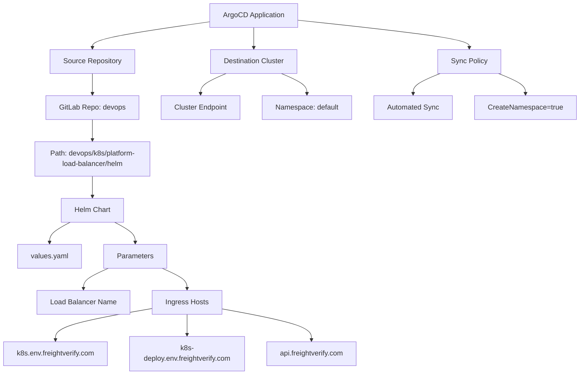
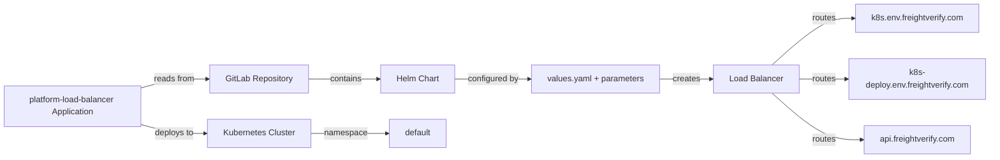
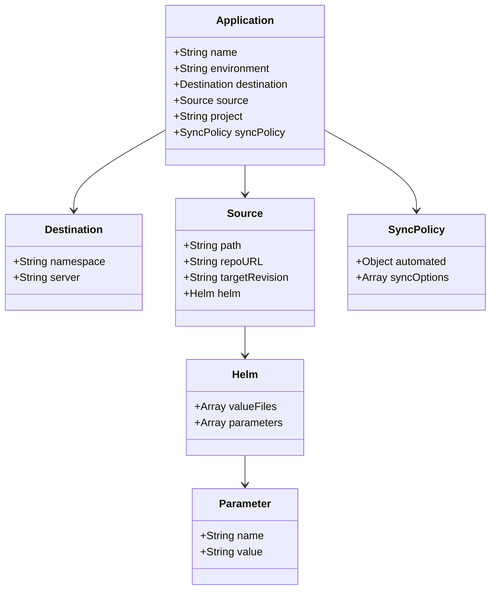
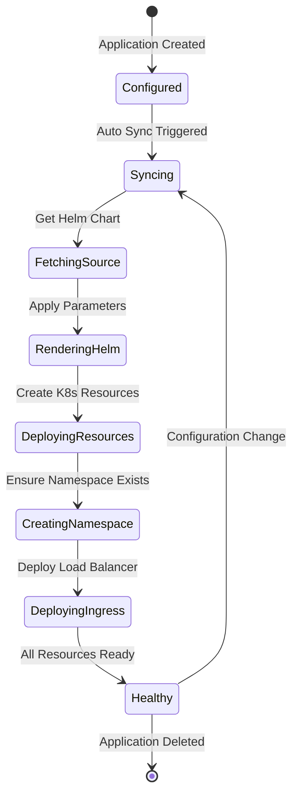

# Diagram: devops/k8s/platform-load-balancer/argocd/application.prod-b.yaml

> Auto-generated by Obscura crawlers

## Diagram 1

### SVG

<svg id="container" width="1316.69921875" xmlns="http://www.w3.org/2000/svg" class="flowchart" height="870" viewBox="0 0 1316.69921875 870" role="graphics-document document" aria-roledescription="flowchart-v2"><g><marker id="container_flowchart-v2-pointEnd" class="marker flowchart-v2" viewBox="0 0 10 10" refX="5" refY="5" markerUnits="userSpaceOnUse" markerWidth="8" markerHeight="8" orient="auto"><path d="M 0 0 L 10 5 L 0 10 z" class="arrowMarkerPath" style="stroke-width: 1; stroke-dasharray: 1, 0;"></path></marker><marker id="container_flowchart-v2-pointStart" class="marker flowchart-v2" viewBox="0 0 10 10" refX="4.5" refY="5" markerUnits="userSpaceOnUse" markerWidth="8" markerHeight="8" orient="auto"><path d="M 0 5 L 10 10 L 10 0 z" class="arrowMarkerPath" style="stroke-width: 1; stroke-dasharray: 1, 0;"></path></marker><marker id="container_flowchart-v2-circleEnd" class="marker flowchart-v2" viewBox="0 0 10 10" refX="11" refY="5" markerUnits="userSpaceOnUse" markerWidth="11" markerHeight="11" orient="auto"><circle cx="5" cy="5" r="5" class="arrowMarkerPath" style="stroke-width: 1; stroke-dasharray: 1, 0;"></circle></marker><marker id="container_flowchart-v2-circleStart" class="marker flowchart-v2" viewBox="0 0 10 10" refX="-1" refY="5" markerUnits="userSpaceOnUse" markerWidth="11" markerHeight="11" orient="auto"><circle cx="5" cy="5" r="5" class="arrowMarkerPath" style="stroke-width: 1; stroke-dasharray: 1, 0;"></circle></marker><marker id="container_flowchart-v2-crossEnd" class="marker cross flowchart-v2" viewBox="0 0 11 11" refX="12" refY="5.2" markerUnits="userSpaceOnUse" markerWidth="11" markerHeight="11" orient="auto"><path d="M 1,1 l 9,9 M 10,1 l -9,9" class="arrowMarkerPath" style="stroke-width: 2; stroke-dasharray: 1, 0;"></path></marker><marker id="container_flowchart-v2-crossStart" class="marker cross flowchart-v2" viewBox="0 0 11 11" refX="-1" refY="5.2" markerUnits="userSpaceOnUse" markerWidth="11" markerHeight="11" orient="auto"><path d="M 1,1 l 9,9 M 10,1 l -9,9" class="arrowMarkerPath" style="stroke-width: 2; stroke-dasharray: 1, 0;"></path></marker><g class="root"><g class="clusters"></g><g class="edgePaths"><path d="M481.715,49.114L437.292,55.429C392.87,61.743,304.025,74.371,259.602,84.186C215.18,94,215.18,101,215.18,104.5L215.18,108" id="L_A_B_0" class="edge-thickness-normal edge-pattern-solid edge-thickness-normal edge-pattern-solid flowchart-link" style=";" data-edge="true" data-et="edge" data-id="L_A_B_0" data-points="W3sieCI6NDgxLjcxNDg0Mzc1LCJ5Ijo0OS4xMTQyMzAxOTAxNzAxfSx7IngiOjIxNS4xNzk2ODc1LCJ5Ijo4N30seyJ4IjoyMTUuMTc5Njg3NSwieSI6MTEyfV0=" marker-end="url(#container_flowchart-v2-pointEnd)"></path><path d="M581.012,62L581.012,66.167C581.012,70.333,581.012,78.667,581.012,86.333C581.012,94,581.012,101,581.012,104.5L581.012,108" id="L_A_C_0" class="edge-thickness-normal edge-pattern-solid edge-thickness-normal edge-pattern-solid flowchart-link" style=";" data-edge="true" data-et="edge" data-id="L_A_C_0" data-points="W3sieCI6NTgxLjAxMTcxODc1LCJ5Ijo2Mn0seyJ4Ijo1ODEuMDExNzE4NzUsInkiOjg3fSx7IngiOjU4MS4wMTE3MTg3NSwieSI6MTEyfV0=" marker-end="url(#container_flowchart-v2-pointEnd)"></path><path d="M215.18,166L215.18,170.167C215.18,174.333,215.18,182.667,215.18,190.333C215.18,198,215.18,205,215.18,208.5L215.18,212" id="L_B_D_0" class="edge-thickness-normal edge-pattern-solid edge-thickness-normal edge-pattern-solid flowchart-link" style=";" data-edge="true" data-et="edge" data-id="L_B_D_0" data-points="W3sieCI6MjE1LjE3OTY4NzUsInkiOjE2Nn0seyJ4IjoyMTUuMTc5Njg3NSwieSI6MTkxfSx7IngiOjIxNS4xNzk2ODc1LCJ5IjoyMTZ9XQ==" marker-end="url(#container_flowchart-v2-pointEnd)"></path><path d="M215.18,270L215.18,274.167C215.18,278.333,215.18,286.667,215.18,294.333C215.18,302,215.18,309,215.18,312.5L215.18,316" id="L_D_E_0" class="edge-thickness-normal edge-pattern-solid edge-thickness-normal edge-pattern-solid flowchart-link" style=";" data-edge="true" data-et="edge" data-id="L_D_E_0" data-points="W3sieCI6MjE1LjE3OTY4NzUsInkiOjI3MH0seyJ4IjoyMTUuMTc5Njg3NSwieSI6Mjk1fSx7IngiOjIxNS4xNzk2ODc1LCJ5IjozMjB9XQ==" marker-end="url(#container_flowchart-v2-pointEnd)"></path><path d="M215.18,422L215.18,426.167C215.18,430.333,215.18,438.667,215.18,446.333C215.18,454,215.18,461,215.18,464.5L215.18,468" id="L_E_F_0" class="edge-thickness-normal edge-pattern-solid edge-thickness-normal edge-pattern-solid flowchart-link" style=";" data-edge="true" data-et="edge" data-id="L_E_F_0" data-points="W3sieCI6MjE1LjE3OTY4NzUsInkiOjQyMn0seyJ4IjoyMTUuMTc5Njg3NSwieSI6NDQ3fSx7IngiOjIxNS4xNzk2ODc1LCJ5Ijo0NzJ9XQ==" marker-end="url(#container_flowchart-v2-pointEnd)"></path><path d="M165.096,526L157.367,530.167C149.638,534.333,134.181,542.667,126.452,550.333C118.723,558,118.723,565,118.723,568.5L118.723,572" id="L_F_G_0" class="edge-thickness-normal edge-pattern-solid edge-thickness-normal edge-pattern-solid flowchart-link" style=";" data-edge="true" data-et="edge" data-id="L_F_G_0" data-points="W3sieCI6MTY1LjA5NjIyODk2NjM0NjE2LCJ5Ijo1MjZ9LHsieCI6MTE4LjcyMjY1NjI1LCJ5Ijo1NTF9LHsieCI6MTE4LjcyMjY1NjI1LCJ5Ijo1NzZ9XQ==" marker-end="url(#container_flowchart-v2-pointEnd)"></path><path d="M265.263,526L272.992,530.167C280.721,534.333,296.179,542.667,303.908,550.333C311.637,558,311.637,565,311.637,568.5L311.637,572" id="L_F_H_0" class="edge-thickness-normal edge-pattern-solid edge-thickness-normal edge-pattern-solid flowchart-link" style=";" data-edge="true" data-et="edge" data-id="L_F_H_0" data-points="W3sieCI6MjY1LjI2MzE0NjAzMzY1Mzg3LCJ5Ijo1MjZ9LHsieCI6MzExLjYzNjcxODc1LCJ5Ijo1NTF9LHsieCI6MzExLjYzNjcxODc1LCJ5Ijo1NzZ9XQ==" marker-end="url(#container_flowchart-v2-pointEnd)"></path><path d="M251.201,630L241.875,634.167C232.548,638.333,213.895,646.667,204.569,654.333C195.242,662,195.242,669,195.242,672.5L195.242,676" id="L_H_I_0" class="edge-thickness-normal edge-pattern-solid edge-thickness-normal edge-pattern-solid flowchart-link" style=";" data-edge="true" data-et="edge" data-id="L_H_I_0" data-points="W3sieCI6MjUxLjIwMTA5Njc1NDgwNzY4LCJ5Ijo2MzB9LHsieCI6MTk1LjI0MjE4NzUsInkiOjY1NX0seyJ4IjoxOTUuMjQyMTg3NSwieSI6NjgwfV0=" marker-end="url(#container_flowchart-v2-pointEnd)"></path><path d="M372.072,630L381.399,634.167C390.725,638.333,409.378,646.667,418.705,654.333C428.031,662,428.031,669,428.031,672.5L428.031,676" id="L_H_J_0" class="edge-thickness-normal edge-pattern-solid edge-thickness-normal edge-pattern-solid flowchart-link" style=";" data-edge="true" data-et="edge" data-id="L_H_J_0" data-points="W3sieCI6MzcyLjA3MjM0MDc0NTE5MjMsInkiOjYzMH0seyJ4Ijo0MjguMDMxMjUsInkiOjY1NX0seyJ4Ijo0MjguMDMxMjUsInkiOjY4MH1d" marker-end="url(#container_flowchart-v2-pointEnd)"></path><path d="M349.625,720.556L312.566,726.963C275.508,733.371,201.391,746.185,164.332,758.093C127.273,770,127.273,781,127.273,786.5L127.273,792" id="L_J_K_0" class="edge-thickness-normal edge-pattern-solid edge-thickness-normal edge-pattern-solid flowchart-link" style=";" data-edge="true" data-et="edge" data-id="L_J_K_0" data-points="W3sieCI6MzQ5LjYyNSwieSI6NzIwLjU1NjE3MzIwODMwMn0seyJ4IjoxMjcuMjczNDM3NSwieSI6NzU5fSx7IngiOjEyNy4yNzM0Mzc1LCJ5Ijo3OTZ9XQ==" marker-end="url(#container_flowchart-v2-pointEnd)"></path><path d="M428.031,734L428.031,738.167C428.031,742.333,428.031,750.667,428.031,758.333C428.031,766,428.031,773,428.031,776.5L428.031,780" id="L_J_L_0" class="edge-thickness-normal edge-pattern-solid edge-thickness-normal edge-pattern-solid flowchart-link" style=";" data-edge="true" data-et="edge" data-id="L_J_L_0" data-points="W3sieCI6NDI4LjAzMTI1LCJ5Ijo3MzR9LHsieCI6NDI4LjAzMTI1LCJ5Ijo3NTl9LHsieCI6NDI4LjAzMTI1LCJ5Ijo3ODR9XQ==" marker-end="url(#container_flowchart-v2-pointEnd)"></path><path d="M506.438,721.284L540.941,727.57C575.445,733.856,644.453,746.428,678.957,758.214C713.461,770,713.461,781,713.461,786.5L713.461,792" id="L_J_M_0" class="edge-thickness-normal edge-pattern-solid edge-thickness-normal edge-pattern-solid flowchart-link" style=";" data-edge="true" data-et="edge" data-id="L_J_M_0" data-points="W3sieCI6NTA2LjQzNzUsInkiOjcyMS4yODQxNjU4NjgzNDU0fSx7IngiOjcxMy40NjA5Mzc1LCJ5Ijo3NTl9LHsieCI6NzEzLjQ2MDkzNzUsInkiOjc5Nn1d" marker-end="url(#container_flowchart-v2-pointEnd)"></path><path d="M518.144,166L508.442,170.167C498.741,174.333,479.337,182.667,469.635,190.333C459.934,198,459.934,205,459.934,208.5L459.934,212" id="L_C_N_0" class="edge-thickness-normal edge-pattern-solid edge-thickness-normal edge-pattern-solid flowchart-link" style=";" data-edge="true" data-et="edge" data-id="L_C_N_0" data-points="W3sieCI6NTE4LjE0NDIzMDc2OTIzMDcsInkiOjE2Nn0seyJ4Ijo0NTkuOTMzNTkzNzUsInkiOjE5MX0seyJ4Ijo0NTkuOTMzNTkzNzUsInkiOjIxNn1d" marker-end="url(#container_flowchart-v2-pointEnd)"></path><path d="M643.879,166L653.581,170.167C663.283,174.333,682.686,182.667,692.388,190.333C702.09,198,702.09,205,702.09,208.5L702.09,212" id="L_C_O_0" class="edge-thickness-normal edge-pattern-solid edge-thickness-normal edge-pattern-solid flowchart-link" style=";" data-edge="true" data-et="edge" data-id="L_C_O_0" data-points="W3sieCI6NjQzLjg3OTIwNjczMDc2OTMsInkiOjE2Nn0seyJ4Ijo3MDIuMDg5ODQzNzUsInkiOjE5MX0seyJ4Ijo3MDIuMDg5ODQzNzUsInkiOjIxNn1d" marker-end="url(#container_flowchart-v2-pointEnd)"></path><path d="M680.309,45.588L745.041,52.49C809.773,59.392,939.238,73.196,1003.971,83.598C1068.703,94,1068.703,101,1068.703,104.5L1068.703,108" id="L_A_P_0" class="edge-thickness-normal edge-pattern-solid edge-thickness-normal edge-pattern-solid flowchart-link" style=";" data-edge="true" data-et="edge" data-id="L_A_P_0" data-points="W3sieCI6NjgwLjMwODU5Mzc1LCJ5Ijo0NS41ODc1MDk3MTE3MzE3N30seyJ4IjoxMDY4LjcwMzEyNSwieSI6ODd9LHsieCI6MTA2OC43MDMxMjUsInkiOjExMn1d" marker-end="url(#container_flowchart-v2-pointEnd)"></path><path d="M1003.168,166L993.055,170.167C982.942,174.333,962.715,182.667,952.602,190.333C942.488,198,942.488,205,942.488,208.5L942.488,212" id="L_P_Q_0" class="edge-thickness-normal edge-pattern-solid edge-thickness-normal edge-pattern-solid flowchart-link" style=";" data-edge="true" data-et="edge" data-id="L_P_Q_0" data-points="W3sieCI6MTAwMy4xNjg0OTQ1OTEzNDYyLCJ5IjoxNjZ9LHsieCI6OTQyLjQ4ODI4MTI1LCJ5IjoxOTF9LHsieCI6OTQyLjQ4ODI4MTI1LCJ5IjoyMTZ9XQ==" marker-end="url(#container_flowchart-v2-pointEnd)"></path><path d="M1134.238,166L1144.351,170.167C1154.464,174.333,1174.691,182.667,1184.805,190.333C1194.918,198,1194.918,205,1194.918,208.5L1194.918,212" id="L_P_R_0" class="edge-thickness-normal edge-pattern-solid edge-thickness-normal edge-pattern-solid flowchart-link" style=";" data-edge="true" data-et="edge" data-id="L_P_R_0" data-points="W3sieCI6MTEzNC4yMzc3NTU0MDg2NTM4LCJ5IjoxNjZ9LHsieCI6MTE5NC45MTc5Njg3NSwieSI6MTkxfSx7IngiOjExOTQuOTE3OTY4NzUsInkiOjIxNn1d" marker-end="url(#container_flowchart-v2-pointEnd)"></path></g><g class="edgeLabels"><g class="edgeLabel"><g class="label" data-id="L_A_B_0" transform="translate(0, 0)"><foreignObject width="0" height="0">

</foreignObject></g></g><g class="edgeLabel"><g class="label" data-id="L_A_C_0" transform="translate(0, 0)"><foreignObject width="0" height="0">

</foreignObject></g></g><g class="edgeLabel"><g class="label" data-id="L_B_D_0" transform="translate(0, 0)"><foreignObject width="0" height="0">

</foreignObject></g></g><g class="edgeLabel"><g class="label" data-id="L_D_E_0" transform="translate(0, 0)"><foreignObject width="0" height="0">

</foreignObject></g></g><g class="edgeLabel"><g class="label" data-id="L_E_F_0" transform="translate(0, 0)"><foreignObject width="0" height="0">

</foreignObject></g></g><g class="edgeLabel"><g class="label" data-id="L_F_G_0" transform="translate(0, 0)"><foreignObject width="0" height="0">

</foreignObject></g></g><g class="edgeLabel"><g class="label" data-id="L_F_H_0" transform="translate(0, 0)"><foreignObject width="0" height="0">

</foreignObject></g></g><g class="edgeLabel"><g class="label" data-id="L_H_I_0" transform="translate(0, 0)"><foreignObject width="0" height="0">

</foreignObject></g></g><g class="edgeLabel"><g class="label" data-id="L_H_J_0" transform="translate(0, 0)"><foreignObject width="0" height="0">

</foreignObject></g></g><g class="edgeLabel"><g class="label" data-id="L_J_K_0" transform="translate(0, 0)"><foreignObject width="0" height="0">

</foreignObject></g></g><g class="edgeLabel"><g class="label" data-id="L_J_L_0" transform="translate(0, 0)"><foreignObject width="0" height="0">

</foreignObject></g></g><g class="edgeLabel"><g class="label" data-id="L_J_M_0" transform="translate(0, 0)"><foreignObject width="0" height="0">

</foreignObject></g></g><g class="edgeLabel"><g class="label" data-id="L_C_N_0" transform="translate(0, 0)"><foreignObject width="0" height="0">

</foreignObject></g></g><g class="edgeLabel"><g class="label" data-id="L_C_O_0" transform="translate(0, 0)"><foreignObject width="0" height="0">

</foreignObject></g></g><g class="edgeLabel"><g class="label" data-id="L_A_P_0" transform="translate(0, 0)"><foreignObject width="0" height="0">

</foreignObject></g></g><g class="edgeLabel"><g class="label" data-id="L_P_Q_0" transform="translate(0, 0)"><foreignObject width="0" height="0">

</foreignObject></g></g><g class="edgeLabel"><g class="label" data-id="L_P_R_0" transform="translate(0, 0)"><foreignObject width="0" height="0">

</foreignObject></g></g></g><g class="nodes"><g class="node default" id="flowchart-A-0" transform="translate(581.01171875, 35)"><rect class="basic label-container" style="" x="-99.296875" y="-27" width="198.59375" height="54"></rect><g class="label" style="" transform="translate(-69.296875, -12)"><rect></rect><foreignObject width="138.59375" height="24">

ArgoCD Application

</foreignObject></g></g><g class="node default" id="flowchart-B-1" transform="translate(215.1796875, 139)"><rect class="basic label-container" style="" x="-95.640625" y="-27" width="191.28125" height="54"></rect><g class="label" style="" transform="translate(-65.640625, -12)"><rect></rect><foreignObject width="131.28125" height="24">

Source Repository

</foreignObject></g></g><g class="node default" id="flowchart-C-3" transform="translate(581.01171875, 139)"><rect class="basic label-container" style="" x="-99.4140625" y="-27" width="198.828125" height="54"></rect><g class="label" style="" transform="translate(-69.4140625, -12)"><rect></rect><foreignObject width="138.828125" height="24">

Destination Cluster

</foreignObject></g></g><g class="node default" id="flowchart-D-5" transform="translate(215.1796875, 243)"><rect class="basic label-container" style="" x="-104.046875" y="-27" width="208.09375" height="54"></rect><g class="label" style="" transform="translate(-74.046875, -12)"><rect></rect><foreignObject width="148.09375" height="24">

GitLab Repo: devops

</foreignObject></g></g><g class="node default" id="flowchart-E-7" transform="translate(215.1796875, 371)"><rect class="basic label-container" style="" x="-130" y="-51" width="260" height="102"></rect><g class="label" style="" transform="translate(-100, -36)"><rect></rect><foreignObject width="200" height="72">

Path: devops/k8s/platform-load-balancer/helm

</foreignObject></g></g><g class="node default" id="flowchart-F-9" transform="translate(215.1796875, 499)"><rect class="basic label-container" style="" x="-70.5390625" y="-27" width="141.078125" height="54"></rect><g class="label" style="" transform="translate(-40.5390625, -12)"><rect></rect><foreignObject width="81.078125" height="24">

Helm Chart

</foreignObject></g></g><g class="node default" id="flowchart-G-11" transform="translate(118.72265625, 603)"><rect class="basic label-container" style="" x="-72.140625" y="-27" width="144.28125" height="54"></rect><g class="label" style="" transform="translate(-42.140625, -12)"><rect></rect><foreignObject width="84.28125" height="24">

values.yaml

</foreignObject></g></g><g class="node default" id="flowchart-H-13" transform="translate(311.63671875, 603)"><rect class="basic label-container" style="" x="-70.7734375" y="-27" width="141.546875" height="54"></rect><g class="label" style="" transform="translate(-40.7734375, -12)"><rect></rect><foreignObject width="81.546875" height="24">

Parameters

</foreignObject></g></g><g class="node default" id="flowchart-I-15" transform="translate(195.2421875, 707)"><rect class="basic label-container" style="" x="-104.3828125" y="-27" width="208.765625" height="54"></rect><g class="label" style="" transform="translate(-74.3828125, -12)"><rect></rect><foreignObject width="148.765625" height="24">

Load Balancer Name

</foreignObject></g></g><g class="node default" id="flowchart-J-17" transform="translate(428.03125, 707)"><rect class="basic label-container" style="" x="-78.40625" y="-27" width="156.8125" height="54"></rect><g class="label" style="" transform="translate(-48.40625, -12)"><rect></rect><foreignObject width="96.8125" height="24">

Ingress Hosts

</foreignObject></g></g><g class="node default" id="flowchart-K-19" transform="translate(127.2734375, 823)"><rect class="basic label-container" style="" x="-119.2734375" y="-27" width="238.546875" height="54"></rect><g class="label" style="" transform="translate(-89.2734375, -12)"><rect></rect><foreignObject width="178.546875" height="24">

k8s.env.freightverify.com

</foreignObject></g></g><g class="node default" id="flowchart-L-21" transform="translate(428.03125, 823)"><rect class="basic label-container" style="" x="-131.484375" y="-39" width="262.96875" height="78"></rect><g class="label" style="" transform="translate(-101.484375, -24)"><rect></rect><foreignObject width="202.96875" height="48">

k8s-deploy.env.freightverify.com

</foreignObject></g></g><g class="node default" id="flowchart-M-23" transform="translate(713.4609375, 823)"><rect class="basic label-container" style="" x="-103.9453125" y="-27" width="207.890625" height="54"></rect><g class="label" style="" transform="translate(-73.9453125, -12)"><rect></rect><foreignObject width="147.890625" height="24">

api.freightverify.com

</foreignObject></g></g><g class="node default" id="flowchart-N-25" transform="translate(459.93359375, 243)"><rect class="basic label-container" style="" x="-90.40625" y="-27" width="180.8125" height="54"></rect><g class="label" style="" transform="translate(-60.40625, -12)"><rect></rect><foreignObject width="120.8125" height="24">

Cluster Endpoint

</foreignObject></g></g><g class="node default" id="flowchart-O-27" transform="translate(702.08984375, 243)"><rect class="basic label-container" style="" x="-101.75" y="-27" width="203.5" height="54"></rect><g class="label" style="" transform="translate(-71.75, -12)"><rect></rect><foreignObject width="143.5" height="24">

Namespace: default

</foreignObject></g></g><g class="node default" id="flowchart-P-29" transform="translate(1068.703125, 139)"><rect class="basic label-container" style="" x="-70.2890625" y="-27" width="140.578125" height="54"></rect><g class="label" style="" transform="translate(-40.2890625, -12)"><rect></rect><foreignObject width="80.578125" height="24">

Sync Policy

</foreignObject></g></g><g class="node default" id="flowchart-Q-31" transform="translate(942.48828125, 243)"><rect class="basic label-container" style="" x="-88.6484375" y="-27" width="177.296875" height="54"></rect><g class="label" style="" transform="translate(-58.6484375, -12)"><rect></rect><foreignObject width="117.296875" height="24">

Automated Sync

</foreignObject></g></g><g class="node default" id="flowchart-R-33" transform="translate(1194.91796875, 243)"><rect class="basic label-container" style="" x="-113.78125" y="-27" width="227.5625" height="54"></rect><g class="label" style="" transform="translate(-83.78125, -12)"><rect></rect><foreignObject width="167.5625" height="24">

CreateNamespace=true

</foreignObject></g></g></g></g></g></svg>

## Diagram 2

### SVG

<svg id="container" width="1890.625" xmlns="http://www.w3.org/2000/svg" class="flowchart" height="302" viewBox="0 0 1890.625 302" role="graphics-document document" aria-roledescription="flowchart-v2"><g><marker id="container_flowchart-v2-pointEnd" class="marker flowchart-v2" viewBox="0 0 10 10" refX="5" refY="5" markerUnits="userSpaceOnUse" markerWidth="8" markerHeight="8" orient="auto"><path d="M 0 0 L 10 5 L 0 10 z" class="arrowMarkerPath" style="stroke-width: 1; stroke-dasharray: 1, 0;"></path></marker><marker id="container_flowchart-v2-pointStart" class="marker flowchart-v2" viewBox="0 0 10 10" refX="4.5" refY="5" markerUnits="userSpaceOnUse" markerWidth="8" markerHeight="8" orient="auto"><path d="M 0 5 L 10 10 L 10 0 z" class="arrowMarkerPath" style="stroke-width: 1; stroke-dasharray: 1, 0;"></path></marker><marker id="container_flowchart-v2-circleEnd" class="marker flowchart-v2" viewBox="0 0 10 10" refX="11" refY="5" markerUnits="userSpaceOnUse" markerWidth="11" markerHeight="11" orient="auto"><circle cx="5" cy="5" r="5" class="arrowMarkerPath" style="stroke-width: 1; stroke-dasharray: 1, 0;"></circle></marker><marker id="container_flowchart-v2-circleStart" class="marker flowchart-v2" viewBox="0 0 10 10" refX="-1" refY="5" markerUnits="userSpaceOnUse" markerWidth="11" markerHeight="11" orient="auto"><circle cx="5" cy="5" r="5" class="arrowMarkerPath" style="stroke-width: 1; stroke-dasharray: 1, 0;"></circle></marker><marker id="container_flowchart-v2-crossEnd" class="marker cross flowchart-v2" viewBox="0 0 11 11" refX="12" refY="5.2" markerUnits="userSpaceOnUse" markerWidth="11" markerHeight="11" orient="auto"><path d="M 1,1 l 9,9 M 10,1 l -9,9" class="arrowMarkerPath" style="stroke-width: 2; stroke-dasharray: 1, 0;"></path></marker><marker id="container_flowchart-v2-crossStart" class="marker cross flowchart-v2" viewBox="0 0 11 11" refX="-1" refY="5.2" markerUnits="userSpaceOnUse" markerWidth="11" markerHeight="11" orient="auto"><path d="M 1,1 l 9,9 M 10,1 l -9,9" class="arrowMarkerPath" style="stroke-width: 2; stroke-dasharray: 1, 0;"></path></marker><g class="root"><g class="clusters"></g><g class="edgePaths"><path d="M268,168.187L278.697,165.322C289.393,162.458,310.786,156.729,332.28,153.864C353.773,151,375.367,151,386.164,151L396.961,151" id="L_App_Repo_0" class="edge-thickness-normal edge-pattern-solid edge-thickness-normal edge-pattern-solid flowchart-link" style=";" data-edge="true" data-et="edge" data-id="L_App_Repo_0" data-points="W3sieCI6MjY4LCJ5IjoxNjguMTg2ODgzOTI2Nzc1M30seyJ4IjozMzIuMTc5Njg3NSwieSI6MTUxfSx7IngiOjQwMC45NjA5Mzc1LCJ5IjoxNTF9XQ==" marker-end="url(#container_flowchart-v2-pointEnd)"></path><path d="M268,237.813L278.697,240.678C289.393,243.542,310.786,249.271,331.513,252.136C352.24,255,372.299,255,382.329,255L392.359,255" id="L_App_Cluster_0" class="edge-thickness-normal edge-pattern-solid edge-thickness-normal edge-pattern-solid flowchart-link" style=";" data-edge="true" data-et="edge" data-id="L_App_Cluster_0" data-points="W3sieCI6MjY4LCJ5IjoyMzcuODEzMTE2MDczMjI0N30seyJ4IjozMzIuMTc5Njg3NSwieSI6MjU1fSx7IngiOjM5Ni4zNTkzNzUsInkiOjI1NX1d" marker-end="url(#container_flowchart-v2-pointEnd)"></path><path d="M589.523,151L601.298,151C613.073,151,636.622,151,658.738,151C680.854,151,701.536,151,711.878,151L722.219,151" id="L_Repo_Helm_0" class="edge-thickness-normal edge-pattern-solid edge-thickness-normal edge-pattern-solid flowchart-link" style=";" data-edge="true" data-et="edge" data-id="L_Repo_Helm_0" data-points="W3sieCI6NTg5LjUyMzQzNzUsInkiOjE1MX0seyJ4Ijo2NjAuMTcxODc1LCJ5IjoxNTF9LHsieCI6NzI2LjIxODc1LCJ5IjoxNTF9XQ==" marker-end="url(#container_flowchart-v2-pointEnd)"></path><path d="M867.297,151L879.652,151C892.008,151,916.719,151,940.763,151C964.807,151,988.185,151,999.874,151L1011.563,151" id="L_Helm_Values_0" class="edge-thickness-normal edge-pattern-solid edge-thickness-normal edge-pattern-solid flowchart-link" style=";" data-edge="true" data-et="edge" data-id="L_Helm_Values_0" data-points="W3sieCI6ODY3LjI5Njg3NSwieSI6MTUxfSx7IngiOjk0MS40Mjk2ODc1LCJ5IjoxNTF9LHsieCI6MTAxNS41NjI1LCJ5IjoxNTF9XQ==" marker-end="url(#container_flowchart-v2-pointEnd)"></path><path d="M1258.766,151L1267.294,151C1275.823,151,1292.88,151,1309.271,151C1325.661,151,1341.385,151,1349.247,151L1357.109,151" id="L_Values_LB_0" class="edge-thickness-normal edge-pattern-solid edge-thickness-normal edge-pattern-solid flowchart-link" style=";" data-edge="true" data-et="edge" data-id="L_Values_LB_0" data-points="W3sieCI6MTI1OC43NjU2MjUsInkiOjE1MX0seyJ4IjoxMzA5LjkzNzUsInkiOjE1MX0seyJ4IjoxMzYxLjEwOTM3NSwieSI6MTUxfV0=" marker-end="url(#container_flowchart-v2-pointEnd)"></path><path d="M1472.425,124L1488.956,109.167C1505.487,94.333,1538.548,64.667,1564.455,49.833C1590.362,35,1609.115,35,1618.491,35L1627.867,35" id="L_LB_Host1_0" class="edge-thickness-normal edge-pattern-solid edge-thickness-normal edge-pattern-solid flowchart-link" style=";" data-edge="true" data-et="edge" data-id="L_LB_Host1_0" data-points="W3sieCI6MTQ3Mi40MjU0NDQ1MDQzMTAyLCJ5IjoxMjR9LHsieCI6MTU3MS42MDkzNzUsInkiOjM1fSx7IngiOjE2MzEuODY3MTg3NSwieSI6MzV9XQ==" marker-end="url(#container_flowchart-v2-pointEnd)"></path><path d="M1523.563,151L1531.57,151C1539.578,151,1555.594,151,1570.943,151C1586.292,151,1600.974,151,1608.315,151L1615.656,151" id="L_LB_Host2_0" class="edge-thickness-normal edge-pattern-solid edge-thickness-normal edge-pattern-solid flowchart-link" style=";" data-edge="true" data-et="edge" data-id="L_LB_Host2_0" data-points="W3sieCI6MTUyMy41NjI1LCJ5IjoxNTF9LHsieCI6MTU3MS42MDkzNzUsInkiOjE1MX0seyJ4IjoxNjE5LjY1NjI1LCJ5IjoxNTF9XQ==" marker-end="url(#container_flowchart-v2-pointEnd)"></path><path d="M1472.425,178L1488.956,192.833C1505.487,207.667,1538.548,237.333,1567.01,252.167C1595.471,267,1619.333,267,1631.264,267L1643.195,267" id="L_LB_Host3_0" class="edge-thickness-normal edge-pattern-solid edge-thickness-normal edge-pattern-solid flowchart-link" style=";" data-edge="true" data-et="edge" data-id="L_LB_Host3_0" data-points="W3sieCI6MTQ3Mi40MjU0NDQ1MDQzMTAyLCJ5IjoxNzh9LHsieCI6MTU3MS42MDkzNzUsInkiOjI2N30seyJ4IjoxNjQ3LjE5NTMxMjUsInkiOjI2N31d" marker-end="url(#container_flowchart-v2-pointEnd)"></path><path d="M594.125,255L605.133,255C616.141,255,638.156,255,661.947,255C685.737,255,711.302,255,724.085,255L736.867,255" id="L_Cluster_NS_0" class="edge-thickness-normal edge-pattern-solid edge-thickness-normal edge-pattern-solid flowchart-link" style=";" data-edge="true" data-et="edge" data-id="L_Cluster_NS_0" data-points="W3sieCI6NTk0LjEyNSwieSI6MjU1fSx7IngiOjY2MC4xNzE4NzUsInkiOjI1NX0seyJ4Ijo3NDAuODY3MTg3NSwieSI6MjU1fV0=" marker-end="url(#container_flowchart-v2-pointEnd)"></path></g><g class="edgeLabels"><g class="edgeLabel" transform="translate(332.1796875, 151)"><g class="label" data-id="L_App_Repo_0" transform="translate(-39.1796875, -12)"><foreignObject width="78.359375" height="24">

reads from

</foreignObject></g></g><g class="edgeLabel" transform="translate(332.1796875, 255)"><g class="label" data-id="L_App_Cluster_0" transform="translate(-38.0234375, -12)"><foreignObject width="76.046875" height="24">

deploys to

</foreignObject></g></g><g class="edgeLabel" transform="translate(660.171875, 151)"><g class="label" data-id="L_Repo_Helm_0" transform="translate(-30.890625, -12)"><foreignObject width="61.78125" height="24">

contains

</foreignObject></g></g><g class="edgeLabel" transform="translate(941.4296875, 151)"><g class="label" data-id="L_Helm_Values_0" transform="translate(-49.1328125, -12)"><foreignObject width="98.265625" height="24">

configured by

</foreignObject></g></g><g class="edgeLabel" transform="translate(1309.9375, 151)"><g class="label" data-id="L_Values_LB_0" transform="translate(-26.171875, -12)"><foreignObject width="52.34375" height="24">

creates

</foreignObject></g></g><g class="edgeLabel" transform="translate(1571.609375, 35)"><g class="label" data-id="L_LB_Host1_0" transform="translate(-23.046875, -12)"><foreignObject width="46.09375" height="24">

routes

</foreignObject></g></g><g class="edgeLabel" transform="translate(1571.609375, 151)"><g class="label" data-id="L_LB_Host2_0" transform="translate(-23.046875, -12)"><foreignObject width="46.09375" height="24">

routes

</foreignObject></g></g><g class="edgeLabel" transform="translate(1571.609375, 267)"><g class="label" data-id="L_LB_Host3_0" transform="translate(-23.046875, -12)"><foreignObject width="46.09375" height="24">

routes

</foreignObject></g></g><g class="edgeLabel" transform="translate(660.171875, 255)"><g class="label" data-id="L_Cluster_NS_0" transform="translate(-41.046875, -12)"><foreignObject width="82.09375" height="24">

namespace

</foreignObject></g></g></g><g class="nodes"><g class="node default" id="flowchart-App-0" transform="translate(138, 203)"><rect class="basic label-container" style="" x="-130" y="-39" width="260" height="78"></rect><g class="label" style="" transform="translate(-100, -24)"><rect></rect><foreignObject width="200" height="48">

platform-load-balancer Application

</foreignObject></g></g><g class="node default" id="flowchart-Repo-2" transform="translate(495.2421875, 151)"><rect class="basic label-container" style="" x="-94.28125" y="-27" width="188.5625" height="54"></rect><g class="label" style="" transform="translate(-64.28125, -12)"><rect></rect><foreignObject width="128.5625" height="24">

GitLab Repository

</foreignObject></g></g><g class="node default" id="flowchart-Cluster-4" transform="translate(495.2421875, 255)"><rect class="basic label-container" style="" x="-98.8828125" y="-27" width="197.765625" height="54"></rect><g class="label" style="" transform="translate(-68.8828125, -12)"><rect></rect><foreignObject width="137.765625" height="24">

Kubernetes Cluster

</foreignObject></g></g><g class="node default" id="flowchart-Helm-6" transform="translate(796.7578125, 151)"><rect class="basic label-container" style="" x="-70.5390625" y="-27" width="141.078125" height="54"></rect><g class="label" style="" transform="translate(-40.5390625, -12)"><rect></rect><foreignObject width="81.078125" height="24">

Helm Chart

</foreignObject></g></g><g class="node default" id="flowchart-Values-8" transform="translate(1137.1640625, 151)"><rect class="basic label-container" style="" x="-121.6015625" y="-27" width="243.203125" height="54"></rect><g class="label" style="" transform="translate(-91.6015625, -12)"><rect></rect><foreignObject width="183.203125" height="24">

values.yaml + parameters

</foreignObject></g></g><g class="node default" id="flowchart-LB-10" transform="translate(1442.3359375, 151)"><rect class="basic label-container" style="" x="-81.2265625" y="-27" width="162.453125" height="54"></rect><g class="label" style="" transform="translate(-51.2265625, -12)"><rect></rect><foreignObject width="102.453125" height="24">

Load Balancer

</foreignObject></g></g><g class="node default" id="flowchart-Host1-12" transform="translate(1751.140625, 35)"><rect class="basic label-container" style="" x="-119.2734375" y="-27" width="238.546875" height="54"></rect><g class="label" style="" transform="translate(-89.2734375, -12)"><rect></rect><foreignObject width="178.546875" height="24">

k8s.env.freightverify.com

</foreignObject></g></g><g class="node default" id="flowchart-Host2-14" transform="translate(1751.140625, 151)"><rect class="basic label-container" style="" x="-131.484375" y="-39" width="262.96875" height="78"></rect><g class="label" style="" transform="translate(-101.484375, -24)"><rect></rect><foreignObject width="202.96875" height="48">

k8s-deploy.env.freightverify.com

</foreignObject></g></g><g class="node default" id="flowchart-Host3-16" transform="translate(1751.140625, 267)"><rect class="basic label-container" style="" x="-103.9453125" y="-27" width="207.890625" height="54"></rect><g class="label" style="" transform="translate(-73.9453125, -12)"><rect></rect><foreignObject width="147.890625" height="24">

api.freightverify.com

</foreignObject></g></g><g class="node default" id="flowchart-NS-18" transform="translate(796.7578125, 255)"><rect class="basic label-container" style="" x="-55.890625" y="-27" width="111.78125" height="54"></rect><g class="label" style="" transform="translate(-25.890625, -12)"><rect></rect><foreignObject width="51.78125" height="24">

default

</foreignObject></g></g></g></g></g></svg>

## Diagram 3

### SVG

<svg id="container" width="727.90625" xmlns="http://www.w3.org/2000/svg" class="classDiagram" height="886" viewBox="0 0 727.90625 886" role="graphics-document document" aria-roledescription="class"><g><defs><marker id="container_class-aggregationStart" class="marker aggregation class" refX="18" refY="7" markerWidth="190" markerHeight="240" orient="auto"><path d="M 18,7 L9,13 L1,7 L9,1 Z"></path></marker></defs><defs><marker id="container_class-aggregationEnd" class="marker aggregation class" refX="1" refY="7" markerWidth="20" markerHeight="28" orient="auto"><path d="M 18,7 L9,13 L1,7 L9,1 Z"></path></marker></defs><defs><marker id="container_class-extensionStart" class="marker extension class" refX="18" refY="7" markerWidth="190" markerHeight="240" orient="auto"><path d="M 1,7 L18,13 V 1 Z"></path></marker></defs><defs><marker id="container_class-extensionEnd" class="marker extension class" refX="1" refY="7" markerWidth="20" markerHeight="28" orient="auto"><path d="M 1,1 V 13 L18,7 Z"></path></marker></defs><defs><marker id="container_class-compositionStart" class="marker composition class" refX="18" refY="7" markerWidth="190" markerHeight="240" orient="auto"><path d="M 18,7 L9,13 L1,7 L9,1 Z"></path></marker></defs><defs><marker id="container_class-compositionEnd" class="marker composition class" refX="1" refY="7" markerWidth="20" markerHeight="28" orient="auto"><path d="M 18,7 L9,13 L1,7 L9,1 Z"></path></marker></defs><defs><marker id="container_class-dependencyStart" class="marker dependency class" refX="6" refY="7" markerWidth="190" markerHeight="240" orient="auto"><path d="M 5,7 L9,13 L1,7 L9,1 Z"></path></marker></defs><defs><marker id="container_class-dependencyEnd" class="marker dependency class" refX="13" refY="7" markerWidth="20" markerHeight="28" orient="auto"><path d="M 18,7 L9,13 L14,7 L9,1 Z"></path></marker></defs><defs><marker id="container_class-lollipopStart" class="marker lollipop class" refX="13" refY="7" markerWidth="190" markerHeight="240" orient="auto"><circle stroke="black" fill="transparent" cx="7" cy="7" r="6"></circle></marker></defs><defs><marker id="container_class-lollipopEnd" class="marker lollipop class" refX="1" refY="7" markerWidth="190" markerHeight="240" orient="auto"><circle stroke="black" fill="transparent" cx="7" cy="7" r="6"></circle></marker></defs><g class="root"><g class="clusters"></g><g class="edgePaths"><path d="M242.258,197.576L220.133,210.147C198.008,222.717,153.758,247.859,131.633,267.596C109.508,287.333,109.508,301.667,109.508,308.833L109.508,316" id="id_Application_Destination_1" class="edge-thickness-normal edge-pattern-solid relation" style=";;;" data-edge="true" data-et="edge" data-id="id_Application_Destination_1" data-points="W3sieCI6MjQyLjI1NzgxMjUsInkiOjE5Ny41NzU5NDE3MTM5ODgzNn0seyJ4IjoxMDkuNTA3ODEyNSwieSI6MjczfSx7IngiOjEwOS41MDc4MTI1LCJ5IjozMjJ9XQ==" marker-end="url(#container_class-dependencyEnd)"></path><path d="M364.715,248L364.715,252.167C364.715,256.333,364.715,264.667,364.715,272C364.715,279.333,364.715,285.667,364.715,288.833L364.715,292" id="id_Application_Source_2" class="edge-thickness-normal edge-pattern-solid relation" style=";;;" data-edge="true" data-et="edge" data-id="id_Application_Source_2" data-points="W3sieCI6MzY0LjcxNDg0Mzc1LCJ5IjoyNDh9LHsieCI6MzY0LjcxNDg0Mzc1LCJ5IjoyNzN9LHsieCI6MzY0LjcxNDg0Mzc1LCJ5IjoyOTh9XQ==" marker-end="url(#container_class-dependencyEnd)"></path><path d="M487.172,197.784L509.17,210.32C531.168,222.856,575.164,247.928,597.162,267.631C619.16,287.333,619.16,301.667,619.16,308.833L619.16,316" id="id_Application_SyncPolicy_3" class="edge-thickness-normal edge-pattern-solid relation" style=";;;" data-edge="true" data-et="edge" data-id="id_Application_SyncPolicy_3" data-points="W3sieCI6NDg3LjE3MTg3NSwieSI6MTk3Ljc4NDIyNzMzMjczOTd9LHsieCI6NjE5LjE2MDE1NjI1LCJ5IjoyNzN9LHsieCI6NjE5LjE2MDE1NjI1LCJ5IjozMjJ9XQ==" marker-end="url(#container_class-dependencyEnd)"></path><path d="M364.715,490L364.715,494.167C364.715,498.333,364.715,506.667,364.715,514C364.715,521.333,364.715,527.667,364.715,530.833L364.715,534" id="id_Source_Helm_4" class="edge-thickness-normal edge-pattern-solid relation" style=";;;" data-edge="true" data-et="edge" data-id="id_Source_Helm_4" data-points="W3sieCI6MzY0LjcxNDg0Mzc1LCJ5Ijo0OTB9LHsieCI6MzY0LjcxNDg0Mzc1LCJ5Ijo1MTV9LHsieCI6MzY0LjcxNDg0Mzc1LCJ5Ijo1NDB9XQ==" marker-end="url(#container_class-dependencyEnd)"></path><path d="M364.715,684L364.715,688.167C364.715,692.333,364.715,700.667,364.715,708C364.715,715.333,364.715,721.667,364.715,724.833L364.715,728" id="id_Helm_Parameter_5" class="edge-thickness-normal edge-pattern-solid relation" style=";;;" data-edge="true" data-et="edge" data-id="id_Helm_Parameter_5" data-points="W3sieCI6MzY0LjcxNDg0Mzc1LCJ5Ijo2ODR9LHsieCI6MzY0LjcxNDg0Mzc1LCJ5Ijo3MDl9LHsieCI6MzY0LjcxNDg0Mzc1LCJ5Ijo3MzR9XQ==" marker-end="url(#container_class-dependencyEnd)"></path></g><g class="edgeLabels"><g class="edgeLabel"><g class="label" data-id="id_Application_Destination_1" transform="translate(0, 0)"><foreignObject width="0" height="0">

</foreignObject></g></g><g class="edgeLabel"><g class="label" data-id="id_Application_Source_2" transform="translate(0, 0)"><foreignObject width="0" height="0">

</foreignObject></g></g><g class="edgeLabel"><g class="label" data-id="id_Application_SyncPolicy_3" transform="translate(0, 0)"><foreignObject width="0" height="0">

</foreignObject></g></g><g class="edgeLabel"><g class="label" data-id="id_Source_Helm_4" transform="translate(0, 0)"><foreignObject width="0" height="0">

</foreignObject></g></g><g class="edgeLabel"><g class="label" data-id="id_Helm_Parameter_5" transform="translate(0, 0)"><foreignObject width="0" height="0">

</foreignObject></g></g></g><g class="nodes"><g class="node default" id="classId-Application-0" transform="translate(364.71484375, 128)"><g class="basic label-container"><path d="M-122.45703125 -120 L122.45703125 -120 L122.45703125 120 L-122.45703125 120" stroke="none" stroke-width="0" fill="#ECECFF" style=""></path><path d="M-122.45703125 -120 C-38.86665189989854 -120, 44.723727450202915 -120, 122.45703125 -120 M-122.45703125 -120 C-49.59877205459409 -120, 23.259487140811814 -120, 122.45703125 -120 M122.45703125 -120 C122.45703125 -25.8945411019251, 122.45703125 68.2109177961498, 122.45703125 120 M122.45703125 -120 C122.45703125 -29.12882803742589, 122.45703125 61.74234392514822, 122.45703125 120 M122.45703125 120 C32.93402208379602 120, -56.588987082407954 120, -122.45703125 120 M122.45703125 120 C62.99143812203047 120, 3.5258449940609466 120, -122.45703125 120 M-122.45703125 120 C-122.45703125 57.95066032414332, -122.45703125 -4.098679351713358, -122.45703125 -120 M-122.45703125 120 C-122.45703125 25.95437217280346, -122.45703125 -68.09125565439308, -122.45703125 -120" stroke="#9370DB" stroke-width="1.3" fill="none" stroke-dasharray="0 0" style=""></path></g><g class="annotation-group text" transform="translate(0, -96)"></g><g class="label-group text" transform="translate(-41.6796875, -96)"><g class="label" style="font-weight: bolder" transform="translate(0,-12)"><foreignObject width="83.359375" height="24">

Application

</foreignObject></g></g><g class="members-group text" transform="translate(-110.45703125, -48)"><g class="label" style="" transform="translate(0,-12)"><foreignObject width="94.984375" height="24">

+String name

</foreignObject></g><g class="label" style="" transform="translate(0,12)"><foreignObject width="146.84375" height="24">

+String environment

</foreignObject></g><g class="label" style="" transform="translate(0,36)"><foreignObject width="179.234375" height="24">

+Destination destination

</foreignObject></g><g class="label" style="" transform="translate(0,60)"><foreignObject width="108.578125" height="24">

+Source source

</foreignObject></g><g class="label" style="" transform="translate(0,84)"><foreignObject width="105.640625" height="24">

+String project

</foreignObject></g><g class="label" style="" transform="translate(0,108)"><foreignObject width="162.90625" height="24">

+SyncPolicy syncPolicy

</foreignObject></g></g><g class="methods-group text" transform="translate(-110.45703125, 120)"></g><g class="divider" style=""><path d="M-122.45703125 -72 C-59.19272000561272 -72, 4.071591238774559 -72, 122.45703125 -72 M-122.45703125 -72 C-54.19565934898739 -72, 14.065712552025218 -72, 122.45703125 -72" stroke="#9370DB" stroke-width="1.3" fill="none" stroke-dasharray="0 0" style=""></path></g><g class="divider" style=""><path d="M-122.45703125 96 C-63.436698132014534 96, -4.4163650140290684 96, 122.45703125 96 M-122.45703125 96 C-71.46398194033426 96, -20.47093263066853 96, 122.45703125 96" stroke="#9370DB" stroke-width="1.3" fill="none" stroke-dasharray="0 0" style=""></path></g></g><g class="node default" id="classId-Destination-1" transform="translate(109.5078125, 394)"><g class="basic label-container"><path d="M-101.5078125 -72 L101.5078125 -72 L101.5078125 72 L-101.5078125 72" stroke="none" stroke-width="0" fill="#ECECFF" style=""></path><path d="M-101.5078125 -72 C-38.69393216438006 -72, 24.119948171239884 -72, 101.5078125 -72 M-101.5078125 -72 C-35.862298648467586 -72, 29.783215203064827 -72, 101.5078125 -72 M101.5078125 -72 C101.5078125 -24.505576617171585, 101.5078125 22.98884676565683, 101.5078125 72 M101.5078125 -72 C101.5078125 -18.050289808015272, 101.5078125 35.899420383969456, 101.5078125 72 M101.5078125 72 C51.342441700754286 72, 1.1770709015085714 72, -101.5078125 72 M101.5078125 72 C45.867458609910614 72, -9.772895280178773 72, -101.5078125 72 M-101.5078125 72 C-101.5078125 30.680395157953384, -101.5078125 -10.639209684093231, -101.5078125 -72 M-101.5078125 72 C-101.5078125 16.992501712871594, -101.5078125 -38.01499657425681, -101.5078125 -72" stroke="#9370DB" stroke-width="1.3" fill="none" stroke-dasharray="0 0" style=""></path></g><g class="annotation-group text" transform="translate(0, -48)"></g><g class="label-group text" transform="translate(-42.46875, -48)"><g class="label" style="font-weight: bolder" transform="translate(0,-12)"><foreignObject width="84.9375" height="24">

Destination

</foreignObject></g></g><g class="members-group text" transform="translate(-89.5078125, 0)"><g class="label" style="" transform="translate(0,-12)"><foreignObject width="136.546875" height="24">

+String namespace

</foreignObject></g><g class="label" style="" transform="translate(0,12)"><foreignObject width="99.546875" height="24">

+String server

</foreignObject></g></g><g class="methods-group text" transform="translate(-89.5078125, 72)"></g><g class="divider" style=""><path d="M-101.5078125 -24 C-23.55441131005621 -24, 54.39898987988758 -24, 101.5078125 -24 M-101.5078125 -24 C-55.104448070408964 -24, -8.701083640817927 -24, 101.5078125 -24" stroke="#9370DB" stroke-width="1.3" fill="none" stroke-dasharray="0 0" style=""></path></g><g class="divider" style=""><path d="M-101.5078125 48 C-31.48597108754916 48, 38.53587032490168 48, 101.5078125 48 M-101.5078125 48 C-46.24872949543015 48, 9.010353509139705 48, 101.5078125 48" stroke="#9370DB" stroke-width="1.3" fill="none" stroke-dasharray="0 0" style=""></path></g></g><g class="node default" id="classId-Source-2" transform="translate(364.71484375, 394)"><g class="basic label-container"><path d="M-103.69921875 -96 L103.69921875 -96 L103.69921875 96 L-103.69921875 96" stroke="none" stroke-width="0" fill="#ECECFF" style=""></path><path d="M-103.69921875 -96 C-29.252014670533356 -96, 45.19518940893329 -96, 103.69921875 -96 M-103.69921875 -96 C-53.560067800571 -96, -3.420916851141996 -96, 103.69921875 -96 M103.69921875 -96 C103.69921875 -38.194131328033606, 103.69921875 19.611737343932788, 103.69921875 96 M103.69921875 -96 C103.69921875 -26.25506403253172, 103.69921875 43.48987193493656, 103.69921875 96 M103.69921875 96 C32.31925709806082 96, -39.06070455387837 96, -103.69921875 96 M103.69921875 96 C32.42625560643923 96, -38.846707537121546 96, -103.69921875 96 M-103.69921875 96 C-103.69921875 25.999660703725567, -103.69921875 -44.000678592548866, -103.69921875 -96 M-103.69921875 96 C-103.69921875 27.349970033251168, -103.69921875 -41.300059933497664, -103.69921875 -96" stroke="#9370DB" stroke-width="1.3" fill="none" stroke-dasharray="0 0" style=""></path></g><g class="annotation-group text" transform="translate(0, -72)"></g><g class="label-group text" transform="translate(-24.8828125, -72)"><g class="label" style="font-weight: bolder" transform="translate(0,-12)"><foreignObject width="49.765625" height="24">

Source

</foreignObject></g></g><g class="members-group text" transform="translate(-91.69921875, -24)"><g class="label" style="" transform="translate(0,-12)"><foreignObject width="87.671875" height="24">

+String path

</foreignObject></g><g class="label" style="" transform="translate(0,12)"><foreignObject width="115.96875" height="24">

+String repoURL

</foreignObject></g><g class="label" style="" transform="translate(0,36)"><foreignObject width="158.515625" height="24">

+String targetRevision

</foreignObject></g><g class="label" style="" transform="translate(0,60)"><foreignObject width="86.734375" height="24">

+Helm helm

</foreignObject></g></g><g class="methods-group text" transform="translate(-91.69921875, 96)"></g><g class="divider" style=""><path d="M-103.69921875 -48 C-21.584275437545756 -48, 60.53066787490849 -48, 103.69921875 -48 M-103.69921875 -48 C-27.85026202786554 -48, 47.99869469426892 -48, 103.69921875 -48" stroke="#9370DB" stroke-width="1.3" fill="none" stroke-dasharray="0 0" style=""></path></g><g class="divider" style=""><path d="M-103.69921875 72 C-54.52592903457955 72, -5.3526393191590955 72, 103.69921875 72 M-103.69921875 72 C-22.679507907118875 72, 58.34020293576225 72, 103.69921875 72" stroke="#9370DB" stroke-width="1.3" fill="none" stroke-dasharray="0 0" style=""></path></g></g><g class="node default" id="classId-Helm-3" transform="translate(364.71484375, 612)"><g class="basic label-container"><path d="M-87.35546875 -72 L87.35546875 -72 L87.35546875 72 L-87.35546875 72" stroke="none" stroke-width="0" fill="#ECECFF" style=""></path><path d="M-87.35546875 -72 C-46.9347365279856 -72, -6.5140043059711985 -72, 87.35546875 -72 M-87.35546875 -72 C-31.33546538659182 -72, 24.684537976816358 -72, 87.35546875 -72 M87.35546875 -72 C87.35546875 -30.417512057191963, 87.35546875 11.164975885616073, 87.35546875 72 M87.35546875 -72 C87.35546875 -21.162689493833334, 87.35546875 29.674621012333333, 87.35546875 72 M87.35546875 72 C41.69138579437987 72, -3.972697161240262 72, -87.35546875 72 M87.35546875 72 C52.00342616971368 72, 16.651383589427354 72, -87.35546875 72 M-87.35546875 72 C-87.35546875 39.53230610010001, -87.35546875 7.064612200200017, -87.35546875 -72 M-87.35546875 72 C-87.35546875 28.104315268232277, -87.35546875 -15.791369463535446, -87.35546875 -72" stroke="#9370DB" stroke-width="1.3" fill="none" stroke-dasharray="0 0" style=""></path></g><g class="annotation-group text" transform="translate(0, -48)"></g><g class="label-group text" transform="translate(-18.8828125, -48)"><g class="label" style="font-weight: bolder" transform="translate(0,-12)"><foreignObject width="37.765625" height="24">

Helm

</foreignObject></g></g><g class="members-group text" transform="translate(-75.35546875, 0)"><g class="label" style="" transform="translate(0,-12)"><foreignObject width="120.859375" height="24">

+Array valueFiles

</foreignObject></g><g class="label" style="" transform="translate(0,12)"><foreignObject width="131.828125" height="24">

+Array parameters

</foreignObject></g></g><g class="methods-group text" transform="translate(-75.35546875, 72)"></g><g class="divider" style=""><path d="M-87.35546875 -24 C-33.36122485760138 -24, 20.633019034797243 -24, 87.35546875 -24 M-87.35546875 -24 C-28.798394920804505 -24, 29.75867890839099 -24, 87.35546875 -24" stroke="#9370DB" stroke-width="1.3" fill="none" stroke-dasharray="0 0" style=""></path></g><g class="divider" style=""><path d="M-87.35546875 48 C-37.22033926950906 48, 12.914790210981877 48, 87.35546875 48 M-87.35546875 48 C-23.3649993488862 48, 40.6254700522276 48, 87.35546875 48" stroke="#9370DB" stroke-width="1.3" fill="none" stroke-dasharray="0 0" style=""></path></g></g><g class="node default" id="classId-Parameter-4" transform="translate(364.71484375, 806)"><g class="basic label-container"><path d="M-78.40625 -72 L78.40625 -72 L78.40625 72 L-78.40625 72" stroke="none" stroke-width="0" fill="#ECECFF" style=""></path><path d="M-78.40625 -72 C-44.24482213945773 -72, -10.083394278915463 -72, 78.40625 -72 M-78.40625 -72 C-43.105733423552195 -72, -7.80521684710439 -72, 78.40625 -72 M78.40625 -72 C78.40625 -37.21006479276896, 78.40625 -2.4201295855379215, 78.40625 72 M78.40625 -72 C78.40625 -32.556084117267936, 78.40625 6.887831765464128, 78.40625 72 M78.40625 72 C33.56036335012297 72, -11.285523299754061 72, -78.40625 72 M78.40625 72 C37.078093985301 72, -4.250062029397995 72, -78.40625 72 M-78.40625 72 C-78.40625 25.427841917690962, -78.40625 -21.144316164618076, -78.40625 -72 M-78.40625 72 C-78.40625 33.32064351891155, -78.40625 -5.358712962176895, -78.40625 -72" stroke="#9370DB" stroke-width="1.3" fill="none" stroke-dasharray="0 0" style=""></path></g><g class="annotation-group text" transform="translate(0, -48)"></g><g class="label-group text" transform="translate(-37.828125, -48)"><g class="label" style="font-weight: bolder" transform="translate(0,-12)"><foreignObject width="75.65625" height="24">

Parameter

</foreignObject></g></g><g class="members-group text" transform="translate(-66.40625, 0)"><g class="label" style="" transform="translate(0,-12)"><foreignObject width="94.984375" height="24">

+String name

</foreignObject></g><g class="label" style="" transform="translate(0,12)"><foreignObject width="93.359375" height="24">

+String value

</foreignObject></g></g><g class="methods-group text" transform="translate(-66.40625, 72)"></g><g class="divider" style=""><path d="M-78.40625 -24 C-28.79510643443617 -24, 20.816037131127658 -24, 78.40625 -24 M-78.40625 -24 C-37.54217858432534 -24, 3.3218928313493166 -24, 78.40625 -24" stroke="#9370DB" stroke-width="1.3" fill="none" stroke-dasharray="0 0" style=""></path></g><g class="divider" style=""><path d="M-78.40625 48 C-21.74293421446908 48, 34.92038157106184 48, 78.40625 48 M-78.40625 48 C-16.949912927056438 48, 44.506424145887124 48, 78.40625 48" stroke="#9370DB" stroke-width="1.3" fill="none" stroke-dasharray="0 0" style=""></path></g></g><g class="node default" id="classId-SyncPolicy-5" transform="translate(619.16015625, 394)"><g class="basic label-container"><path d="M-100.74609375 -72 L100.74609375 -72 L100.74609375 72 L-100.74609375 72" stroke="none" stroke-width="0" fill="#ECECFF" style=""></path><path d="M-100.74609375 -72 C-51.25753381827572 -72, -1.7689738865514357 -72, 100.74609375 -72 M-100.74609375 -72 C-39.8405355159306 -72, 21.065022718138806 -72, 100.74609375 -72 M100.74609375 -72 C100.74609375 -42.89351766889762, 100.74609375 -13.787035337795245, 100.74609375 72 M100.74609375 -72 C100.74609375 -36.365968340987486, 100.74609375 -0.7319366819749717, 100.74609375 72 M100.74609375 72 C56.405953689062414 72, 12.065813628124829 72, -100.74609375 72 M100.74609375 72 C30.832946254854477 72, -39.080201240291046 72, -100.74609375 72 M-100.74609375 72 C-100.74609375 25.626267466343464, -100.74609375 -20.747465067313072, -100.74609375 -72 M-100.74609375 72 C-100.74609375 36.136924217921965, -100.74609375 0.2738484358439308, -100.74609375 -72" stroke="#9370DB" stroke-width="1.3" fill="none" stroke-dasharray="0 0" style=""></path></g><g class="annotation-group text" transform="translate(0, -48)"></g><g class="label-group text" transform="translate(-38.9296875, -48)"><g class="label" style="font-weight: bolder" transform="translate(0,-12)"><foreignObject width="77.859375" height="24">

SyncPolicy

</foreignObject></g></g><g class="members-group text" transform="translate(-88.74609375, 0)"><g class="label" style="" transform="translate(0,-12)"><foreignObject width="138.5625" height="24">

+Object automated

</foreignObject></g><g class="label" style="" transform="translate(0,12)"><foreignObject width="138.515625" height="24">

+Array syncOptions

</foreignObject></g></g><g class="methods-group text" transform="translate(-88.74609375, 72)"></g><g class="divider" style=""><path d="M-100.74609375 -24 C-49.970836566969844 -24, 0.8044206160603125 -24, 100.74609375 -24 M-100.74609375 -24 C-28.899249849490616 -24, 42.94759405101877 -24, 100.74609375 -24" stroke="#9370DB" stroke-width="1.3" fill="none" stroke-dasharray="0 0" style=""></path></g><g class="divider" style=""><path d="M-100.74609375 48 C-21.287937646868684 48, 58.17021845626263 48, 100.74609375 48 M-100.74609375 48 C-36.01947901592574 48, 28.70713571814852 48, 100.74609375 48" stroke="#9370DB" stroke-width="1.3" fill="none" stroke-dasharray="0 0" style=""></path></g></g></g></g></g></svg>

## Diagram 4

### SVG

<svg id="container" width="377.96875" xmlns="http://www.w3.org/2000/svg" class="statediagram" height="1030" viewBox="0 0 377.96875 1030" role="graphics-document document" aria-roledescription="stateDiagram"><g><defs><marker id="container_stateDiagram-barbEnd" refX="19" refY="7" markerWidth="20" markerHeight="14" markerUnits="userSpaceOnUse" orient="auto"><path d="M 19,7 L9,13 L14,7 L9,1 Z"></path></marker></defs><g class="root"><g class="clusters"></g><g class="edgePaths"><path d="M195.984,22L195.984,28.167C195.984,34.333,195.984,46.667,196.068,59.083C196.151,71.5,196.318,84,196.401,90.25L196.484,96.5" id="edge0" class="edge-thickness-normal edge-pattern-solid transition" style="fill:none;;;fill:none" data-edge="true" data-et="edge" data-id="edge0" data-points="W3sieCI6MTk1Ljk4NDM3NSwieSI6MjJ9LHsieCI6MTk1Ljk4NDM3NSwieSI6NTl9LHsieCI6MTk2LjQ4NDM3NSwieSI6OTYuNX1d" marker-end="url(#container_stateDiagram-barbEnd)"></path><path d="M196.484,136.5L196.401,142.583C196.318,148.667,196.151,160.833,196.151,173.167C196.151,185.5,196.318,198,196.401,204.25L196.484,210.5" id="edge1" class="edge-thickness-normal edge-pattern-solid transition" style="fill:none;;;fill:none" data-edge="true" data-et="edge" data-id="edge1" data-points="W3sieCI6MTk2LjQ4NDM3NSwieSI6MTM2LjV9LHsieCI6MTk1Ljk4NDM3NSwieSI6MTczfSx7IngiOjE5Ni40ODQzNzUsInkiOjIxMC41fV0=" marker-end="url(#container_stateDiagram-barbEnd)"></path><path d="M163.444,249.983L152.757,256.153C142.069,262.322,120.695,274.661,110.091,287.081C99.487,299.5,99.654,312,99.737,318.25L99.82,324.5" id="edge2" class="edge-thickness-normal edge-pattern-solid transition" style="fill:none;;;fill:none" data-edge="true" data-et="edge" data-id="edge2" data-points="W3sieCI6MTYzLjQ0Mzg5Mzc4MTI2ODc0LCJ5IjoyNDkuOTgzMDE1NTE1Mzg1Mzh9LHsieCI6OTkuMzIwMzEyNSwieSI6Mjg3fSx7IngiOjk5LjgyMDMxMjUsInkiOjMyNC41fV0=" marker-end="url(#container_stateDiagram-barbEnd)"></path><path d="M99.82,364.5L99.737,370.583C99.654,376.667,99.487,388.833,99.487,401.167C99.487,413.5,99.654,426,99.737,432.25L99.82,438.5" id="edge3" class="edge-thickness-normal edge-pattern-solid transition" style="fill:none;;;fill:none" data-edge="true" data-et="edge" data-id="edge3" data-points="W3sieCI6OTkuODIwMzEyNSwieSI6MzY0LjV9LHsieCI6OTkuMzIwMzEyNSwieSI6NDAxfSx7IngiOjk5LjgyMDMxMjUsInkiOjQzOC41fV0=" marker-end="url(#container_stateDiagram-barbEnd)"></path><path d="M99.82,478.5L99.737,484.583C99.654,490.667,99.487,502.833,99.487,515.167C99.487,527.5,99.654,540,99.737,546.25L99.82,552.5" id="edge4" class="edge-thickness-normal edge-pattern-solid transition" style="fill:none;;;fill:none" data-edge="true" data-et="edge" data-id="edge4" data-points="W3sieCI6OTkuODIwMzEyNSwieSI6NDc4LjV9LHsieCI6OTkuMzIwMzEyNSwieSI6NTE1fSx7IngiOjk5LjgyMDMxMjUsInkiOjU1Mi41fV0=" marker-end="url(#container_stateDiagram-barbEnd)"></path><path d="M99.82,592.5L99.737,598.583C99.654,604.667,99.487,616.833,99.487,629.167C99.487,641.5,99.654,654,99.737,660.25L99.82,666.5" id="edge5" class="edge-thickness-normal edge-pattern-solid transition" style="fill:none;;;fill:none" data-edge="true" data-et="edge" data-id="edge5" data-points="W3sieCI6OTkuODIwMzEyNSwieSI6NTkyLjV9LHsieCI6OTkuMzIwMzEyNSwieSI6NjI5fSx7IngiOjk5LjgyMDMxMjUsInkiOjY2Ni41fV0=" marker-end="url(#container_stateDiagram-barbEnd)"></path><path d="M99.82,706.5L99.737,712.583C99.654,718.667,99.487,730.833,99.487,743.167C99.487,755.5,99.654,768,99.737,774.25L99.82,780.5" id="edge6" class="edge-thickness-normal edge-pattern-solid transition" style="fill:none;;;fill:none" data-edge="true" data-et="edge" data-id="edge6" data-points="W3sieCI6OTkuODIwMzEyNSwieSI6NzA2LjV9LHsieCI6OTkuMzIwMzEyNSwieSI6NzQzfSx7IngiOjk5LjgyMDMxMjUsInkiOjc4MC41fV0=" marker-end="url(#container_stateDiagram-barbEnd)"></path><path d="M99.82,820.5L99.737,826.583C99.654,832.667,99.487,844.833,110.094,857.255C120.701,869.676,142.081,882.352,152.771,888.69L163.462,895.027" id="edge7" class="edge-thickness-normal edge-pattern-solid transition" style="fill:none;;;fill:none" data-edge="true" data-et="edge" data-id="edge7" data-points="W3sieCI6OTkuODIwMzEyNSwieSI6ODIwLjV9LHsieCI6OTkuMzIwMzEyNSwieSI6ODU3fSx7IngiOjE2My40NjE1OTk2MzM3Mzg2NywieSI6ODk1LjAyNzQyNTExMzM3MjR9XQ==" marker-end="url(#container_stateDiagram-barbEnd)"></path><path d="M229.507,895.027L240.031,888.69C250.554,882.352,271.601,869.676,282.125,853.838C292.648,838,292.648,819,292.648,800C292.648,781,292.648,762,292.648,743C292.648,724,292.648,705,292.648,686C292.648,667,292.648,648,292.648,629C292.648,610,292.648,591,292.648,572C292.648,553,292.648,534,292.648,515C292.648,496,292.648,477,292.648,458C292.648,439,292.648,420,292.648,401C292.648,382,292.648,363,292.648,344C292.648,325,292.648,306,282.128,290.331C271.607,274.661,250.566,262.322,240.045,256.153L229.525,249.983" id="edge8" class="edge-thickness-normal edge-pattern-solid transition" style="fill:none;;;fill:none" data-edge="true" data-et="edge" data-id="edge8" data-points="W3sieCI6MjI5LjUwNzE1MDM2NjIyMTQ4LCJ5Ijo4OTUuMDI3NDI1MTEzMzk2MX0seyJ4IjoyOTIuNjQ4NDM3NSwieSI6ODU3fSx7IngiOjI5Mi42NDg0Mzc1LCJ5Ijo4MDB9LHsieCI6MjkyLjY0ODQzNzUsInkiOjc0M30seyJ4IjoyOTIuNjQ4NDM3NSwieSI6Njg2fSx7IngiOjI5Mi42NDg0Mzc1LCJ5Ijo2Mjl9LHsieCI6MjkyLjY0ODQzNzUsInkiOjU3Mn0seyJ4IjoyOTIuNjQ4NDM3NSwieSI6NTE1fSx7IngiOjI5Mi42NDg0Mzc1LCJ5Ijo0NTh9LHsieCI6MjkyLjY0ODQzNzUsInkiOjQwMX0seyJ4IjoyOTIuNjQ4NDM3NSwieSI6MzQ0fSx7IngiOjI5Mi42NDg0Mzc1LCJ5IjoyODd9LHsieCI6MjI5LjUyNDg1NjIxODczODQ1LCJ5IjoyNDkuOTgzMDE1NTE1Mzg5Njd9XQ==" marker-end="url(#container_stateDiagram-barbEnd)"></path><path d="M196.484,934.5L196.401,940.583C196.318,946.667,196.151,958.833,196.068,971.083C195.984,983.333,195.984,995.667,195.984,1001.833L195.984,1008" id="edge9" class="edge-thickness-normal edge-pattern-solid transition" style="fill:none;;;fill:none" data-edge="true" data-et="edge" data-id="edge9" data-points="W3sieCI6MTk2LjQ4NDM3NSwieSI6OTM0LjV9LHsieCI6MTk1Ljk4NDM3NSwieSI6OTcxfSx7IngiOjE5NS45ODQzNzUsInkiOjEwMDh9XQ==" marker-end="url(#container_stateDiagram-barbEnd)"></path></g><g class="edgeLabels"><g class="edgeLabel" transform="translate(195.984375, 59)"><g class="label" data-id="edge0" transform="translate(-71.1640625, -12)"><foreignObject width="142.328125" height="24">

Application Created

</foreignObject></g></g><g class="edgeLabel" transform="translate(195.984375, 173)"><g class="label" data-id="edge1" transform="translate(-71.4375, -12)"><foreignObject width="142.875" height="24">

Auto Sync Triggered

</foreignObject></g></g><g class="edgeLabel" transform="translate(99.3203125, 287)"><g class="label" data-id="edge2" transform="translate(-54.953125, -12)"><foreignObject width="109.90625" height="24">

Get Helm Chart

</foreignObject></g></g><g class="edgeLabel" transform="translate(99.3203125, 401)"><g class="label" data-id="edge3" transform="translate(-63.1796875, -12)"><foreignObject width="126.359375" height="24">

Apply Parameters

</foreignObject></g></g><g class="edgeLabel" transform="translate(99.3203125, 515)"><g class="label" data-id="edge4" transform="translate(-76.75, -12)"><foreignObject width="153.5" height="24">

Create K8s Resources

</foreignObject></g></g><g class="edgeLabel" transform="translate(99.3203125, 629)"><g class="label" data-id="edge5" transform="translate(-91.3203125, -12)"><foreignObject width="182.640625" height="24">

Ensure Namespace Exists

</foreignObject></g></g><g class="edgeLabel" transform="translate(99.3203125, 743)"><g class="label" data-id="edge6" transform="translate(-78.4921875, -12)"><foreignObject width="156.984375" height="24">

Deploy Load Balancer

</foreignObject></g></g><g class="edgeLabel" transform="translate(99.3203125, 857)"><g class="label" data-id="edge7" transform="translate(-72.34375, -12)"><foreignObject width="144.6875" height="24">

All Resources Ready

</foreignObject></g></g><g class="edgeLabel" transform="translate(292.6484375, 572)"><g class="label" data-id="edge8" transform="translate(-77.3203125, -12)"><foreignObject width="154.640625" height="24">

Configuration Change

</foreignObject></g></g><g class="edgeLabel" transform="translate(195.984375, 971)"><g class="label" data-id="edge9" transform="translate(-71.5, -12)"><foreignObject width="143" height="24">

Application Deleted

</foreignObject></g></g></g><g class="nodes"><g class="node default" id="state-root_start-0" transform="translate(195.984375, 15)"><circle class="state-start" r="7" width="14" height="14"></circle></g><g class="node  statediagram-state" id="state-Configured-1" transform="translate(195.984375, 116)"><g class="basic label-container outer-path"><path d="M-42.015625 -20 C-10.85545837736398 -20, 20.30470824527204 -20, 42.015625 -20 C42.015625 -20, 42.015625 -20, 42.015625 -20 C42.121526028436804 -19.995619901064146, 42.227427056873616 -19.991239802128295, 42.42852172736166 -19.982922465033347 C42.58214451842818 -19.963773404096816, 42.7357673094947 -19.944624343160285, 42.83859795140367 -19.931806517013612 C42.92050503221427 -19.914632408182197, 43.002412113024874 -19.897458299350777, 43.243052435703994 -19.847001329696653 C43.32380579056843 -19.82296001431892, 43.404559145432856 -19.798918698941186, 43.63912234602342 -19.729086208503173 C43.77448932657948 -19.676265848782666, 43.909856307135534 -19.62344548906216, 44.024102123264846 -19.578866633275286 C44.111473452897876 -19.53615339292522, 44.1988447825309 -19.493440152575154, 44.395361965185366 -19.397368756032446 C44.49226209607583 -19.33962881082256, 44.589162226966295 -19.281888865612675, 44.750365790612136 -19.185832391312644 C44.87146098776626 -19.099372082376103, 44.99255618492038 -19.012911773439566, 45.08668856344834 -18.94570254698197 C45.167547065036906 -18.877218889506914, 45.24840556662547 -18.808735232031857, 45.402032858128706 -18.678619553365657 C45.47579175569699 -18.604860655797374, 45.54955065326527 -18.53110175822909, 45.69424455336566 -18.386407858128706 C45.77533437074948 -18.290665291661153, 45.85642418813332 -18.1949227251936, 45.96132754698197 -18.07106356344834 C46.03972964314334 -17.961254595509928, 46.118131739304715 -17.85144562757151, 46.201457391312644 -17.734740790612136 C46.27625420788425 -17.609215536134794, 46.35105102445586 -17.483690281657452, 46.41299375603245 -17.37973696518537 C46.46791040522453 -17.2674031637791, 46.52282705441661 -17.15506936237283, 46.59449163327529 -17.008477123264846 C46.645888621909656 -16.876757930174847, 46.69728561054403 -16.745038737084847, 46.744711208503176 -16.623497346023417 C46.7863865456857 -16.48351235602937, 46.828061882868234 -16.343527366035325, 46.86262632969665 -16.227427435703994 C46.896498387835834 -16.06588418298208, 46.930370445975015 -15.904340930260165, 46.94743151701361 -15.82297295140367 C46.962494110554125 -15.702133727586693, 46.97755670409464 -15.581294503769717, 46.99854746503335 -15.412896727361662 C47.00261437632371 -15.314567878055232, 47.00668128761407 -15.216239028748804, 47.015625 -15 C47.015625 -15, 47.015625 -15, 47.015625 -15 C47.015625 -5.043985020901525, 47.015625 4.91202995819695, 47.015625 15 C47.015625 15, 47.015625 15, 47.015625 15 C47.01026212530794 15.129662355482049, 47.00489925061588 15.259324710964096, 46.99854746503335 15.412896727361662 C46.97876818802526 15.571575408751343, 46.95898891101719 15.730254090141024, 46.94743151701361 15.822972951403669 C46.927433443753046 15.918348136147644, 46.90743537049248 16.01372332089162, 46.86262632969665 16.227427435703994 C46.82023587142101 16.3698144751074, 46.777845413145364 16.51220151451081, 46.744711208503176 16.623497346023417 C46.701211318469774 16.73497800990947, 46.65771142843637 16.846458673795524, 46.59449163327529 17.008477123264846 C46.54689386671514 17.10583991095877, 46.49929610015498 17.2032026986527, 46.41299375603245 17.379736965185366 C46.33117672476358 17.517043660060178, 46.24935969349472 17.65435035493499, 46.201457391312644 17.734740790612133 C46.108623568407175 17.864762649492608, 46.0157897455017 17.994784508373083, 45.96132754698197 18.07106356344834 C45.905182153728376 18.137354303998233, 45.849036760474775 18.20364504454812, 45.69424455336566 18.386407858128706 C45.59748373894863 18.48316867254573, 45.50072292453161 18.579929486962754, 45.402032858128706 18.678619553365657 C45.280896885982834 18.781216488274964, 45.159760913836955 18.883813423184268, 45.08668856344834 18.94570254698197 C45.004211325651006 19.00459016290545, 44.92173408785367 19.06347777882893, 44.750365790612136 19.185832391312644 C44.638230618386004 19.25265045069955, 44.52609544615987 19.31946851008646, 44.395361965185366 19.397368756032446 C44.28655495749808 19.45056126083509, 44.1777479498108 19.50375376563774, 44.024102123264846 19.578866633275286 C43.88480022994281 19.633222400721618, 43.745498336620784 19.687578168167953, 43.63912234602342 19.729086208503173 C43.54611061724214 19.75677699991627, 43.45309888846086 19.78446779132937, 43.243052435703994 19.847001329696653 C43.10426422522911 19.876102157215154, 42.96547601475423 19.905202984733656, 42.83859795140367 19.931806517013612 C42.71304519362336 19.94745665194993, 42.58749243584304 19.963106786886247, 42.42852172736166 19.982922465033347 C42.30645341311673 19.987971247856496, 42.18438509887179 19.993020030679645, 42.015625 20 C42.015625 20, 42.015625 20, 42.015625 20 C24.59154981683306 20, 7.167474633666117 20, -42.015625 20 C-42.015625 20, -42.015625 20, -42.015625 20 C-42.14794414009526 19.99452723988351, -42.28026328019052 19.98905447976702, -42.42852172736166 19.982922465033347 C-42.558843015275926 19.966677933435708, -42.68916430319019 19.950433401838072, -42.83859795140367 19.931806517013612 C-42.99363867913502 19.899297894987182, -43.148679406866364 19.866789272960748, -43.243052435703994 19.847001329696653 C-43.35082794358659 19.814915170807645, -43.45860345146918 19.782829011918633, -43.63912234602342 19.729086208503173 C-43.77143965256228 19.677455835276838, -43.90375695910114 19.625825462050507, -44.024102123264846 19.578866633275286 C-44.15176376708996 19.516456658526252, -44.279425410915074 19.45404668377722, -44.395361965185366 19.397368756032446 C-44.53557507407348 19.31381987791938, -44.6757881829616 19.23027099980631, -44.750365790612136 19.185832391312644 C-44.82788892923741 19.13048193421119, -44.90541206786269 19.075131477109732, -45.08668856344834 18.94570254698197 C-45.20714986988962 18.843677024776536, -45.3276111763309 18.741651502571102, -45.402032858128706 18.67861955336566 C-45.46524990522322 18.61540250627115, -45.52846695231773 18.552185459176634, -45.69424455336566 18.386407858128706 C-45.74893136448461 18.32183926225098, -45.80361817560357 18.257270666373252, -45.96132754698197 18.07106356344834 C-46.024910679191834 17.982009845906326, -46.08849381140169 17.892956128364315, -46.201457391312644 17.734740790612133 C-46.24538598152848 17.66101910406957, -46.28931457174431 17.587297417527008, -46.41299375603244 17.37973696518537 C-46.47327598597666 17.2564276929245, -46.533558215920884 17.133118420663628, -46.59449163327528 17.00847712326485 C-46.6537800591043 16.85653390991185, -46.71306848493331 16.70459069655885, -46.744711208503176 16.623497346023417 C-46.77637036104514 16.51715612717746, -46.808029513587094 16.410814908331503, -46.86262632969665 16.227427435703994 C-46.89040350763579 16.094951999541074, -46.91818068557493 15.962476563378154, -46.94743151701361 15.82297295140367 C-46.96490163448554 15.682819436033197, -46.98237175195748 15.542665920662722, -46.99854746503335 15.412896727361664 C-47.00436848892632 15.27215734547804, -47.010189512819295 15.131417963594416, -47.015625 15 C-47.015625 15, -47.015625 15, -47.015625 15 C-47.015625 3.731681893984007, -47.015625 -7.536636212031986, -47.015625 -15 C-47.015625 -15, -47.015625 -15, -47.015625 -15 C-47.01012505623126 -15.132976380210588, -47.00462511246252 -15.265952760421177, -46.99854746503335 -15.41289672736166 C-46.98258568392137 -15.54094965763026, -46.966623902809395 -15.66900258789886, -46.94743151701361 -15.822972951403669 C-46.92217489604112 -15.943427300173862, -46.89691827506863 -16.063881648944054, -46.86262632969665 -16.227427435703994 C-46.82364443641082 -16.35836530712821, -46.78466254312498 -16.48930317855243, -46.744711208503176 -16.623497346023417 C-46.69273960289105 -16.75668915621915, -46.64076799727892 -16.88988096641488, -46.59449163327529 -17.008477123264846 C-46.542190736316414 -17.11546031795684, -46.48988983935754 -17.222443512648827, -46.41299375603245 -17.379736965185366 C-46.34701149871589 -17.490469480555475, -46.281029241399324 -17.601201995925585, -46.201457391312644 -17.734740790612133 C-46.13532822270995 -17.82736045399385, -46.06919905410725 -17.91998011737557, -45.96132754698197 -18.07106356344834 C-45.86217916946139 -18.188127831579337, -45.763030791940814 -18.305192099710332, -45.69424455336566 -18.386407858128706 C-45.62039464919817 -18.46025776229619, -45.54654474503069 -18.53410766646368, -45.402032858128706 -18.678619553365657 C-45.33433239559524 -18.735958920234413, -45.266631933061774 -18.793298287103173, -45.08668856344834 -18.945702546981966 C-44.96824423392952 -19.030270172805682, -44.84979990441069 -19.1148377986294, -44.750365790612136 -19.185832391312644 C-44.61622825706437 -19.265761012321345, -44.482090723516606 -19.345689633330043, -44.395361965185366 -19.397368756032446 C-44.24931671971787 -19.468765925994706, -44.10327147425036 -19.540163095956967, -44.024102123264846 -19.578866633275286 C-43.892387076933396 -19.630262003839448, -43.76067203060195 -19.68165737440361, -43.63912234602342 -19.729086208503173 C-43.55191708502133 -19.75504833956099, -43.46471182401924 -19.781010470618806, -43.243052435703994 -19.847001329696653 C-43.093134944686284 -19.878435721949316, -42.94321745366858 -19.909870114201983, -42.83859795140367 -19.931806517013612 C-42.6805046794053 -19.951512822817165, -42.52241140740694 -19.971219128620717, -42.42852172736166 -19.982922465033347 C-42.26808586411468 -19.989558141421515, -42.10765000086771 -19.996193817809683, -42.015625 -20 C-42.015625 -20, -42.015625 -20, -42.015625 -20" stroke="none" stroke-width="0" fill="#ECECFF" style=""></path><path d="M-42.015625 -20 C-17.039043439935835 -20, 7.93753812012833 -20, 42.015625 -20 M-42.015625 -20 C-9.619051387421635 -20, 22.77752222515673 -20, 42.015625 -20 M42.015625 -20 C42.015625 -20, 42.015625 -20, 42.015625 -20 M42.015625 -20 C42.015625 -20, 42.015625 -20, 42.015625 -20 M42.015625 -20 C42.1329078874789 -19.995149143891965, 42.250190774957794 -19.990298287783926, 42.42852172736166 -19.982922465033347 M42.015625 -20 C42.14881694670577 -19.99449114033507, 42.282008893411536 -19.98898228067014, 42.42852172736166 -19.982922465033347 M42.42852172736166 -19.982922465033347 C42.53424627983163 -19.969743913311433, 42.63997083230159 -19.956565361589522, 42.83859795140367 -19.931806517013612 M42.42852172736166 -19.982922465033347 C42.577387369370854 -19.964366382108416, 42.726253011380045 -19.945810299183485, 42.83859795140367 -19.931806517013612 M42.83859795140367 -19.931806517013612 C42.93232064943524 -19.912154933780045, 43.0260433474668 -19.892503350546477, 43.243052435703994 -19.847001329696653 M42.83859795140367 -19.931806517013612 C42.93110815134132 -19.912409167895294, 43.02361835127898 -19.89301181877698, 43.243052435703994 -19.847001329696653 M43.243052435703994 -19.847001329696653 C43.375607840547126 -19.807537875847498, 43.508163245390264 -19.768074421998346, 43.63912234602342 -19.729086208503173 M43.243052435703994 -19.847001329696653 C43.32565450767329 -19.822409627390268, 43.40825657964259 -19.79781792508388, 43.63912234602342 -19.729086208503173 M43.63912234602342 -19.729086208503173 C43.79058644576613 -19.669984733385025, 43.942050545508835 -19.61088325826688, 44.024102123264846 -19.578866633275286 M43.63912234602342 -19.729086208503173 C43.76299720494392 -19.68075008855996, 43.88687206386442 -19.632413968616753, 44.024102123264846 -19.578866633275286 M44.024102123264846 -19.578866633275286 C44.13781835778979 -19.52327415371283, 44.25153459231474 -19.467681674150377, 44.395361965185366 -19.397368756032446 M44.024102123264846 -19.578866633275286 C44.12379144795359 -19.530131492083655, 44.22348077264234 -19.481396350892023, 44.395361965185366 -19.397368756032446 M44.395361965185366 -19.397368756032446 C44.520551685337466 -19.32277187452158, 44.64574140548957 -19.248174993010714, 44.750365790612136 -19.185832391312644 M44.395361965185366 -19.397368756032446 C44.53594991634916 -19.31359652040416, 44.676537867512955 -19.229824284775876, 44.750365790612136 -19.185832391312644 M44.750365790612136 -19.185832391312644 C44.866159022317476 -19.10315761294582, 44.981952254022815 -19.020482834579, 45.08668856344834 -18.94570254698197 M44.750365790612136 -19.185832391312644 C44.85995714227213 -19.107585670187643, 44.969548493932116 -19.02933894906264, 45.08668856344834 -18.94570254698197 M45.08668856344834 -18.94570254698197 C45.16143022377064 -18.882399589790477, 45.23617188409293 -18.81909663259899, 45.402032858128706 -18.678619553365657 M45.08668856344834 -18.94570254698197 C45.195676562855965 -18.85339442014699, 45.304664562263596 -18.76108629331201, 45.402032858128706 -18.678619553365657 M45.402032858128706 -18.678619553365657 C45.48286488151293 -18.597787529981435, 45.56369690489715 -18.516955506597213, 45.69424455336566 -18.386407858128706 M45.402032858128706 -18.678619553365657 C45.47514170507891 -18.605510706415448, 45.548250552029124 -18.53240185946524, 45.69424455336566 -18.386407858128706 M45.69424455336566 -18.386407858128706 C45.7485657438621 -18.322270949704247, 45.802886934358554 -18.25813404127979, 45.96132754698197 -18.07106356344834 M45.69424455336566 -18.386407858128706 C45.75457965339326 -18.315170340138305, 45.81491475342085 -18.243932822147904, 45.96132754698197 -18.07106356344834 M45.96132754698197 -18.07106356344834 C46.04300510290563 -17.956667028676502, 46.12468265882929 -17.842270493904664, 46.201457391312644 -17.734740790612136 M45.96132754698197 -18.07106356344834 C46.028782490529395 -17.97658703672333, 46.09623743407682 -17.882110509998324, 46.201457391312644 -17.734740790612136 M46.201457391312644 -17.734740790612136 C46.24383468389724 -17.66362251740796, 46.28621197648184 -17.592504244203784, 46.41299375603245 -17.37973696518537 M46.201457391312644 -17.734740790612136 C46.24457076841634 -17.662387208195465, 46.28768414552003 -17.59003362577879, 46.41299375603245 -17.37973696518537 M46.41299375603245 -17.37973696518537 C46.47582290179674 -17.25121789334387, 46.53865204756103 -17.122698821502375, 46.59449163327529 -17.008477123264846 M46.41299375603245 -17.37973696518537 C46.450824408458324 -17.302353128786063, 46.488655060884206 -17.224969292386756, 46.59449163327529 -17.008477123264846 M46.59449163327529 -17.008477123264846 C46.63922650646278 -16.89383146880526, 46.68396137965026 -16.779185814345674, 46.744711208503176 -16.623497346023417 M46.59449163327529 -17.008477123264846 C46.65392366017601 -16.85616589190543, 46.71335568707674 -16.703854660546018, 46.744711208503176 -16.623497346023417 M46.744711208503176 -16.623497346023417 C46.77005666892055 -16.538363445189404, 46.79540212933794 -16.453229544355388, 46.86262632969665 -16.227427435703994 M46.744711208503176 -16.623497346023417 C46.78787663696037 -16.47850722766627, 46.831042065417556 -16.333517109309128, 46.86262632969665 -16.227427435703994 M46.86262632969665 -16.227427435703994 C46.889044609619646 -16.10143288135649, 46.915462889542646 -15.97543832700899, 46.94743151701361 -15.82297295140367 M46.86262632969665 -16.227427435703994 C46.88496673928133 -16.120881136786483, 46.907307148866 -16.014334837868972, 46.94743151701361 -15.82297295140367 M46.94743151701361 -15.82297295140367 C46.96659089528173 -15.669267389840984, 46.98575027354985 -15.5155618282783, 46.99854746503335 -15.412896727361662 M46.94743151701361 -15.82297295140367 C46.95790287721976 -15.738966765070943, 46.968374237425905 -15.654960578738214, 46.99854746503335 -15.412896727361662 M46.99854746503335 -15.412896727361662 C47.00255747265376 -15.315943681948662, 47.00656748027417 -15.218990636535663, 47.015625 -15 M46.99854746503335 -15.412896727361662 C47.004210454225316 -15.275978272267642, 47.009873443417284 -15.13905981717362, 47.015625 -15 M47.015625 -15 C47.015625 -15, 47.015625 -15, 47.015625 -15 M47.015625 -15 C47.015625 -15, 47.015625 -15, 47.015625 -15 M47.015625 -15 C47.015625 -8.319020849581385, 47.015625 -1.6380416991627698, 47.015625 15 M47.015625 -15 C47.015625 -4.1413618799005985, 47.015625 6.717276240198803, 47.015625 15 M47.015625 15 C47.015625 15, 47.015625 15, 47.015625 15 M47.015625 15 C47.015625 15, 47.015625 15, 47.015625 15 M47.015625 15 C47.01053998792504 15.122944256793758, 47.005454975850085 15.245888513587515, 46.99854746503335 15.412896727361662 M47.015625 15 C47.00965592527876 15.144318920885883, 47.003686850557514 15.288637841771765, 46.99854746503335 15.412896727361662 M46.99854746503335 15.412896727361662 C46.97984070961711 15.562971135102398, 46.961133954200875 15.713045542843135, 46.94743151701361 15.822972951403669 M46.99854746503335 15.412896727361662 C46.98597987717498 15.513719839793955, 46.973412289316606 15.614542952226248, 46.94743151701361 15.822972951403669 M46.94743151701361 15.822972951403669 C46.930153816635794 15.90537408295342, 46.912876116257976 15.987775214503172, 46.86262632969665 16.227427435703994 M46.94743151701361 15.822972951403669 C46.92487379871252 15.93055564311285, 46.90231608041143 16.038138334822033, 46.86262632969665 16.227427435703994 M46.86262632969665 16.227427435703994 C46.82293029627427 16.360764061562538, 46.78323426285189 16.494100687421085, 46.744711208503176 16.623497346023417 M46.86262632969665 16.227427435703994 C46.81622020172015 16.383302871864277, 46.769814073743646 16.53917830802456, 46.744711208503176 16.623497346023417 M46.744711208503176 16.623497346023417 C46.68932515415222 16.765439638390884, 46.63393909980126 16.90738193075835, 46.59449163327529 17.008477123264846 M46.744711208503176 16.623497346023417 C46.71381550220787 16.70267625535823, 46.68291979591257 16.78185516469305, 46.59449163327529 17.008477123264846 M46.59449163327529 17.008477123264846 C46.53492330048602 17.1303260955546, 46.47535496769675 17.25217506784436, 46.41299375603245 17.379736965185366 M46.59449163327529 17.008477123264846 C46.52940422036067 17.141615554395727, 46.46431680744605 17.274753985526612, 46.41299375603245 17.379736965185366 M46.41299375603245 17.379736965185366 C46.36096573859575 17.467051244429324, 46.30893772115906 17.554365523673283, 46.201457391312644 17.734740790612133 M46.41299375603245 17.379736965185366 C46.33124757669417 17.516924755178596, 46.249501397355886 17.65411254517183, 46.201457391312644 17.734740790612133 M46.201457391312644 17.734740790612133 C46.10701153065876 17.86702044883852, 46.01256567000487 17.999300107064908, 45.96132754698197 18.07106356344834 M46.201457391312644 17.734740790612133 C46.11753100713335 17.852287005327646, 46.03360462295406 17.969833220043164, 45.96132754698197 18.07106356344834 M45.96132754698197 18.07106356344834 C45.87045905845237 18.17835178512075, 45.77959056992277 18.285640006793162, 45.69424455336566 18.386407858128706 M45.96132754698197 18.07106356344834 C45.872841296341434 18.17553908216009, 45.78435504570089 18.280014600871837, 45.69424455336566 18.386407858128706 M45.69424455336566 18.386407858128706 C45.6258180591571 18.45483435233726, 45.557391564948546 18.52326084654582, 45.402032858128706 18.678619553365657 M45.69424455336566 18.386407858128706 C45.61402544825008 18.46662696324428, 45.53380634313451 18.54684606835986, 45.402032858128706 18.678619553365657 M45.402032858128706 18.678619553365657 C45.31330280684429 18.75377007335458, 45.224572755559876 18.828920593343508, 45.08668856344834 18.94570254698197 M45.402032858128706 18.678619553365657 C45.28622662774723 18.776702427264023, 45.17042039736576 18.874785301162394, 45.08668856344834 18.94570254698197 M45.08668856344834 18.94570254698197 C45.01054152687421 19.000070486103635, 44.93439449030008 19.0544384252253, 44.750365790612136 19.185832391312644 M45.08668856344834 18.94570254698197 C44.97699643745468 19.02402121959825, 44.86730431146102 19.10233989221453, 44.750365790612136 19.185832391312644 M44.750365790612136 19.185832391312644 C44.66842713956439 19.234657229613603, 44.58648848851665 19.28348206791456, 44.395361965185366 19.397368756032446 M44.750365790612136 19.185832391312644 C44.62786892598269 19.258824679218655, 44.50537206135325 19.33181696712467, 44.395361965185366 19.397368756032446 M44.395361965185366 19.397368756032446 C44.26854639751936 19.459365109351086, 44.141730829853344 19.521361462669724, 44.024102123264846 19.578866633275286 M44.395361965185366 19.397368756032446 C44.24776463353078 19.46952469469642, 44.1001673018762 19.5416806333604, 44.024102123264846 19.578866633275286 M44.024102123264846 19.578866633275286 C43.88314773925018 19.633867204590786, 43.742193355235514 19.68886777590628, 43.63912234602342 19.729086208503173 M44.024102123264846 19.578866633275286 C43.897073787338655 19.628433243764466, 43.77004545141247 19.677999854253645, 43.63912234602342 19.729086208503173 M43.63912234602342 19.729086208503173 C43.494505935653734 19.772140379272052, 43.34988952528404 19.815194550040935, 43.243052435703994 19.847001329696653 M43.63912234602342 19.729086208503173 C43.52008256282672 19.76452588745067, 43.401042779630025 19.799965566398164, 43.243052435703994 19.847001329696653 M43.243052435703994 19.847001329696653 C43.103428994588626 19.876277286664003, 42.96380555347325 19.90555324363135, 42.83859795140367 19.931806517013612 M43.243052435703994 19.847001329696653 C43.09929295143374 19.877144523715675, 42.95553346716348 19.9072877177347, 42.83859795140367 19.931806517013612 M42.83859795140367 19.931806517013612 C42.69961889774537 19.949130237985795, 42.56063984408706 19.966453958957977, 42.42852172736166 19.982922465033347 M42.83859795140367 19.931806517013612 C42.67466721749769 19.95224046168512, 42.510736483591714 19.972674406356628, 42.42852172736166 19.982922465033347 M42.42852172736166 19.982922465033347 C42.27627093519268 19.98921960437756, 42.124020143023685 19.995516743721776, 42.015625 20 M42.42852172736166 19.982922465033347 C42.31632068862335 19.987563134322716, 42.20411964988504 19.992203803612085, 42.015625 20 M42.015625 20 C42.015625 20, 42.015625 20, 42.015625 20 M42.015625 20 C42.015625 20, 42.015625 20, 42.015625 20 M42.015625 20 C23.88690670632848 20, 5.758188412656963 20, -42.015625 20 M42.015625 20 C12.141251700352996 20, -17.73312159929401 20, -42.015625 20 M-42.015625 20 C-42.015625 20, -42.015625 20, -42.015625 20 M-42.015625 20 C-42.015625 20, -42.015625 20, -42.015625 20 M-42.015625 20 C-42.16155553401949 19.993964268466488, -42.30748606803898 19.98792853693298, -42.42852172736166 19.982922465033347 M-42.015625 20 C-42.14453832424536 19.99466810546905, -42.27345164849071 19.989336210938095, -42.42852172736166 19.982922465033347 M-42.42852172736166 19.982922465033347 C-42.5580426135018 19.96677770341281, -42.68756349964193 19.950632941792268, -42.83859795140367 19.931806517013612 M-42.42852172736166 19.982922465033347 C-42.57622764735376 19.96451094130709, -42.72393356734587 19.946099417580832, -42.83859795140367 19.931806517013612 M-42.83859795140367 19.931806517013612 C-42.95868624991267 19.906626648709647, -43.078774548421656 19.881446780405682, -43.243052435703994 19.847001329696653 M-42.83859795140367 19.931806517013612 C-42.96488669920832 19.905326551209487, -43.09117544701297 19.878846585405363, -43.243052435703994 19.847001329696653 M-43.243052435703994 19.847001329696653 C-43.34810946556462 19.81572449678033, -43.45316649542525 19.78444766386401, -43.63912234602342 19.729086208503173 M-43.243052435703994 19.847001329696653 C-43.32901703904621 19.82140855842738, -43.414981642388426 19.795815787158105, -43.63912234602342 19.729086208503173 M-43.63912234602342 19.729086208503173 C-43.78327229793109 19.672838722726507, -43.92742224983876 19.61659123694984, -44.024102123264846 19.578866633275286 M-43.63912234602342 19.729086208503173 C-43.72793067542649 19.694433090837563, -43.81673900482956 19.659779973171954, -44.024102123264846 19.578866633275286 M-44.024102123264846 19.578866633275286 C-44.102769099982794 19.540408691771137, -44.181436076700734 19.50195075026699, -44.395361965185366 19.397368756032446 M-44.024102123264846 19.578866633275286 C-44.172565380855076 19.50628736921647, -44.3210286384453 19.433708105157656, -44.395361965185366 19.397368756032446 M-44.395361965185366 19.397368756032446 C-44.48058904465376 19.346584439709215, -44.56581612412216 19.295800123385987, -44.750365790612136 19.185832391312644 M-44.395361965185366 19.397368756032446 C-44.46860750325827 19.353723888720772, -44.54185304133117 19.3100790214091, -44.750365790612136 19.185832391312644 M-44.750365790612136 19.185832391312644 C-44.837129414839055 19.12388435430201, -44.92389303906598 19.06193631729138, -45.08668856344834 18.94570254698197 M-44.750365790612136 19.185832391312644 C-44.845871317265534 19.117642755937673, -44.94137684391893 19.049453120562706, -45.08668856344834 18.94570254698197 M-45.08668856344834 18.94570254698197 C-45.184706376696184 18.862685693873864, -45.28272418994403 18.779668840765762, -45.402032858128706 18.67861955336566 M-45.08668856344834 18.94570254698197 C-45.1533586663831 18.889235850178174, -45.22002876931786 18.832769153374382, -45.402032858128706 18.67861955336566 M-45.402032858128706 18.67861955336566 C-45.51262253258224 18.56802987891212, -45.623212207035785 18.45744020445858, -45.69424455336566 18.386407858128706 M-45.402032858128706 18.67861955336566 C-45.504086283953534 18.57656612754083, -45.60613970977836 18.474512701716, -45.69424455336566 18.386407858128706 M-45.69424455336566 18.386407858128706 C-45.76756843666228 18.299834512711524, -45.84089231995891 18.21326116729434, -45.96132754698197 18.07106356344834 M-45.69424455336566 18.386407858128706 C-45.76083875155122 18.307780236907718, -45.82743294973679 18.229152615686726, -45.96132754698197 18.07106356344834 M-45.96132754698197 18.07106356344834 C-46.01463264570649 17.99640512747046, -46.06793774443102 17.92174669149258, -46.201457391312644 17.734740790612133 M-45.96132754698197 18.07106356344834 C-46.0358727759285 17.96665647414676, -46.11041800487504 17.862249384845178, -46.201457391312644 17.734740790612133 M-46.201457391312644 17.734740790612133 C-46.26799872751419 17.623070019811813, -46.334540063715735 17.511399249011497, -46.41299375603244 17.37973696518537 M-46.201457391312644 17.734740790612133 C-46.250552574584574 17.652348442163436, -46.29964775785651 17.56995609371474, -46.41299375603244 17.37973696518537 M-46.41299375603244 17.37973696518537 C-46.451657687353624 17.300648629561913, -46.4903216186748 17.221560293938456, -46.59449163327528 17.00847712326485 M-46.41299375603244 17.37973696518537 C-46.46597821612149 17.271355519761716, -46.518962676210535 17.162974074338063, -46.59449163327528 17.00847712326485 M-46.59449163327528 17.00847712326485 C-46.64402415535524 16.88153614844437, -46.69355667743519 16.75459517362389, -46.744711208503176 16.623497346023417 M-46.59449163327528 17.00847712326485 C-46.63249033830019 16.911094788281154, -46.67048904332509 16.813712453297462, -46.744711208503176 16.623497346023417 M-46.744711208503176 16.623497346023417 C-46.78071947707572 16.50254770394245, -46.81672774564826 16.381598061861485, -46.86262632969665 16.227427435703994 M-46.744711208503176 16.623497346023417 C-46.78817751249671 16.477496604554585, -46.83164381649024 16.331495863085753, -46.86262632969665 16.227427435703994 M-46.86262632969665 16.227427435703994 C-46.88608263266119 16.11555919722398, -46.90953893562574 16.003690958743963, -46.94743151701361 15.82297295140367 M-46.86262632969665 16.227427435703994 C-46.88551027704641 16.118288886318936, -46.90839422439616 16.009150336933875, -46.94743151701361 15.82297295140367 M-46.94743151701361 15.82297295140367 C-46.961615540418435 15.709182031252341, -46.97579956382326 15.595391111101012, -46.99854746503335 15.412896727361664 M-46.94743151701361 15.82297295140367 C-46.96465614441511 15.684788873068461, -46.98188077181661 15.546604794733252, -46.99854746503335 15.412896727361664 M-46.99854746503335 15.412896727361664 C-47.004863779989996 15.260182311629093, -47.01118009494664 15.107467895896521, -47.015625 15 M-46.99854746503335 15.412896727361664 C-47.0052640164599 15.250505485967958, -47.01198056788645 15.088114244574252, -47.015625 15 M-47.015625 15 C-47.015625 15, -47.015625 15, -47.015625 15 M-47.015625 15 C-47.015625 15, -47.015625 15, -47.015625 15 M-47.015625 15 C-47.015625 4.1131289121730354, -47.015625 -6.773742175653929, -47.015625 -15 M-47.015625 15 C-47.015625 8.973267636523143, -47.015625 2.9465352730462886, -47.015625 -15 M-47.015625 -15 C-47.015625 -15, -47.015625 -15, -47.015625 -15 M-47.015625 -15 C-47.015625 -15, -47.015625 -15, -47.015625 -15 M-47.015625 -15 C-47.01021069006396 -15.130905945025475, -47.00479638012791 -15.26181189005095, -46.99854746503335 -15.41289672736166 M-47.015625 -15 C-47.01188594609584 -15.090401988546537, -47.00814689219167 -15.180803977093076, -46.99854746503335 -15.41289672736166 M-46.99854746503335 -15.41289672736166 C-46.97994968780106 -15.562096860753394, -46.96135191056878 -15.711296994145128, -46.94743151701361 -15.822972951403669 M-46.99854746503335 -15.41289672736166 C-46.98171910557078 -15.547901757544507, -46.964890746108225 -15.682906787727354, -46.94743151701361 -15.822972951403669 M-46.94743151701361 -15.822972951403669 C-46.92609557457773 -15.924728726822382, -46.90475963214185 -16.026484502241097, -46.86262632969665 -16.227427435703994 M-46.94743151701361 -15.822972951403669 C-46.9286141617639 -15.912717033743487, -46.909796806514194 -16.002461116083307, -46.86262632969665 -16.227427435703994 M-46.86262632969665 -16.227427435703994 C-46.83264644072618 -16.328128107642748, -46.8026665517557 -16.4288287795815, -46.744711208503176 -16.623497346023417 M-46.86262632969665 -16.227427435703994 C-46.82482869552165 -16.35438745089505, -46.78703106134665 -16.481347466086106, -46.744711208503176 -16.623497346023417 M-46.744711208503176 -16.623497346023417 C-46.694015879546775 -16.75341833947057, -46.643320550590374 -16.883339332917725, -46.59449163327529 -17.008477123264846 M-46.744711208503176 -16.623497346023417 C-46.687979134504474 -16.768889191109736, -46.63124706050577 -16.91428103619605, -46.59449163327529 -17.008477123264846 M-46.59449163327529 -17.008477123264846 C-46.522744885380334 -17.155237441823026, -46.45099813748538 -17.30199776038121, -46.41299375603245 -17.379736965185366 M-46.59449163327529 -17.008477123264846 C-46.54867889519967 -17.10218857683267, -46.502866157124046 -17.195900030400495, -46.41299375603245 -17.379736965185366 M-46.41299375603245 -17.379736965185366 C-46.35894458770712 -17.47044317327418, -46.30489541938179 -17.561149381362995, -46.201457391312644 -17.734740790612133 M-46.41299375603245 -17.379736965185366 C-46.36161134236721 -17.46596778150379, -46.31022892870197 -17.552198597822212, -46.201457391312644 -17.734740790612133 M-46.201457391312644 -17.734740790612133 C-46.114456437566915 -17.856593207935425, -46.027455483821186 -17.978445625258715, -45.96132754698197 -18.07106356344834 M-46.201457391312644 -17.734740790612133 C-46.113301282418675 -17.85821110338526, -46.025145173524706 -17.981681416158384, -45.96132754698197 -18.07106356344834 M-45.96132754698197 -18.07106356344834 C-45.89812926024248 -18.145681639601488, -45.834930973502985 -18.22029971575464, -45.69424455336566 -18.386407858128706 M-45.96132754698197 -18.07106356344834 C-45.86467311351635 -18.185183237397826, -45.76801868005073 -18.29930291134731, -45.69424455336566 -18.386407858128706 M-45.69424455336566 -18.386407858128706 C-45.61241156128657 -18.468240850207795, -45.53057856920748 -18.550073842286885, -45.402032858128706 -18.678619553365657 M-45.69424455336566 -18.386407858128706 C-45.58192699466597 -18.498725416828396, -45.46960943596628 -18.611042975528083, -45.402032858128706 -18.678619553365657 M-45.402032858128706 -18.678619553365657 C-45.32213301786402 -18.746291266116913, -45.24223317759934 -18.813962978868165, -45.08668856344834 -18.945702546981966 M-45.402032858128706 -18.678619553365657 C-45.28290089944881 -18.77951917544968, -45.16376894076891 -18.8804187975337, -45.08668856344834 -18.945702546981966 M-45.08668856344834 -18.945702546981966 C-44.96806118393159 -19.030400867992142, -44.84943380441484 -19.11509918900232, -44.750365790612136 -19.185832391312644 M-45.08668856344834 -18.945702546981966 C-44.962391657104256 -19.034448832341972, -44.83809475076016 -19.12319511770198, -44.750365790612136 -19.185832391312644 M-44.750365790612136 -19.185832391312644 C-44.61060834655899 -19.269109752118528, -44.470850902505845 -19.352387112924408, -44.395361965185366 -19.397368756032446 M-44.750365790612136 -19.185832391312644 C-44.66606937442656 -19.236062152688785, -44.58177295824099 -19.286291914064925, -44.395361965185366 -19.397368756032446 M-44.395361965185366 -19.397368756032446 C-44.2511469330329 -19.46787118922527, -44.10693190088044 -19.538373622418096, -44.024102123264846 -19.578866633275286 M-44.395361965185366 -19.397368756032446 C-44.26258107128736 -19.4622813796446, -44.12980017738935 -19.52719400325676, -44.024102123264846 -19.578866633275286 M-44.024102123264846 -19.578866633275286 C-43.87793377185715 -19.635901700980817, -43.731765420449456 -19.692936768686348, -43.63912234602342 -19.729086208503173 M-44.024102123264846 -19.578866633275286 C-43.873557357301245 -19.63760938323966, -43.72301259133764 -19.696352133204034, -43.63912234602342 -19.729086208503173 M-43.63912234602342 -19.729086208503173 C-43.52674226319331 -19.7625432087483, -43.414362180363206 -19.79600020899343, -43.243052435703994 -19.847001329696653 M-43.63912234602342 -19.729086208503173 C-43.52592752179599 -19.762785767771604, -43.412732697568565 -19.796485327040035, -43.243052435703994 -19.847001329696653 M-43.243052435703994 -19.847001329696653 C-43.10404598510752 -19.876147917356555, -42.965039534511035 -19.905294505016457, -42.83859795140367 -19.931806517013612 M-43.243052435703994 -19.847001329696653 C-43.08376331901664 -19.88040074521208, -42.924474202329286 -19.913800160727504, -42.83859795140367 -19.931806517013612 M-42.83859795140367 -19.931806517013612 C-42.68548846051791 -19.950891595149336, -42.53237896963215 -19.96997667328506, -42.42852172736166 -19.982922465033347 M-42.83859795140367 -19.931806517013612 C-42.732891236196025 -19.944982845323096, -42.62718452098838 -19.95815917363258, -42.42852172736166 -19.982922465033347 M-42.42852172736166 -19.982922465033347 C-42.306801941570654 -19.987956832613012, -42.18508215577965 -19.992991200192677, -42.015625 -20 M-42.42852172736166 -19.982922465033347 C-42.27294776041179 -19.989357051903202, -42.11737379346192 -19.995791638773056, -42.015625 -20 M-42.015625 -20 C-42.015625 -20, -42.015625 -20, -42.015625 -20 M-42.015625 -20 C-42.015625 -20, -42.015625 -20, -42.015625 -20" stroke="#9370DB" stroke-width="1.3" fill="none" stroke-dasharray="0 0" style=""></path></g><g class="label" style="" transform="translate(-39.015625, -12)"><rect></rect><foreignObject width="78.03125" height="24">

Configured

</foreignObject></g></g><g class="node  statediagram-state" id="state-Syncing-8" transform="translate(195.984375, 230)"><g class="basic label-container outer-path"><path d="M-30.8359375 -20 C-17.46446267167297 -20, -4.092987843345938 -20, 30.8359375 -20 C30.8359375 -20, 30.8359375 -20, 30.8359375 -20 C30.97419774303353 -19.994281514048343, 31.11245798606706 -19.988563028096685, 31.248834227361662 -19.982922465033347 C31.348898458131735 -19.970449471675522, 31.448962688901805 -19.957976478317697, 31.65891045140367 -19.931806517013612 C31.764940919573988 -19.909574265762785, 31.870971387744305 -19.887342014511958, 32.063364935703994 -19.847001329696653 C32.19765596263278 -19.807021158764876, 32.33194698956156 -19.7670409878331, 32.45943484602342 -19.729086208503173 C32.53846626465424 -19.698248053259153, 32.61749768328505 -19.667409898015137, 32.844414623264846 -19.578866633275286 C32.927596253191865 -19.53820161230438, 33.010777883118884 -19.497536591333475, 33.215674465185366 -19.397368756032446 C33.348342851881014 -19.318315556532127, 33.48101123857667 -19.239262357031805, 33.570678290612136 -19.185832391312644 C33.65350429771104 -19.126695758894126, 33.73633030480995 -19.067559126475608, 33.90700106344834 -18.94570254698197 C33.99101694308118 -18.874544726713204, 34.075032822714014 -18.80338690644444, 34.222345358128706 -18.678619553365657 C34.33904150200847 -18.56192340948589, 34.45573764588824 -18.44522726560612, 34.51455705336566 -18.386407858128706 C34.61404446252274 -18.268943296100893, 34.71353187167983 -18.15147873407308, 34.78164004698197 -18.07106356344834 C34.85707852219575 -17.965405404908523, 34.93251699740952 -17.859747246368702, 35.021769891312644 -17.734740790612136 C35.07139252110939 -17.651463272683177, 35.12101515090613 -17.568185754754214, 35.23330625603245 -17.37973696518537 C35.298660454146955 -17.24605281620565, 35.36401465226147 -17.11236866722593, 35.41480413327529 -17.008477123264846 C35.470286983725096 -16.866286763756225, 35.5257698341749 -16.724096404247607, 35.565023708503176 -16.623497346023417 C35.593128388246306 -16.529095390847942, 35.62123306798944 -16.43469343567247, 35.68293882969665 -16.227427435703994 C35.711011429011656 -16.09354307039407, 35.739084028326666 -15.959658705084141, 35.76774401701361 -15.82297295140367 C35.78480001211534 -15.686141720847317, 35.80185600721706 -15.549310490290964, 35.81885996503335 -15.412896727361662 C35.824454265403084 -15.277639014872612, 35.83004856577281 -15.142381302383562, 35.8359375 -15 C35.8359375 -15, 35.8359375 -15, 35.8359375 -15 C35.8359375 -8.89285390063528, 35.8359375 -2.7857078012705614, 35.8359375 15 C35.8359375 15, 35.8359375 15, 35.8359375 15 C35.830842881483136 15.123176519144922, 35.82574826296628 15.246353038289842, 35.81885996503335 15.412896727361662 C35.80228322892428 15.545883116422145, 35.78570649281521 15.678869505482625, 35.76774401701361 15.822972951403669 C35.74596362210803 15.926848417847369, 35.724183227202445 16.03072388429107, 35.68293882969665 16.227427435703994 C35.63881694190228 16.375630244342652, 35.59469505410791 16.52383305298131, 35.565023708503176 16.623497346023417 C35.53089148031385 16.710970750106394, 35.49675925212451 16.798444154189372, 35.41480413327529 17.008477123264846 C35.37502983254585 17.0898367558161, 35.335255531816415 17.171196388367356, 35.23330625603245 17.379736965185366 C35.183311698594025 17.46363865823312, 35.1333171411556 17.547540351280876, 35.021769891312644 17.734740790612133 C34.96657358723548 17.812048024493397, 34.911377283158316 17.889355258374657, 34.78164004698197 18.07106356344834 C34.6886770113995 18.180824812152984, 34.59571397581702 18.29058606085763, 34.51455705336566 18.386407858128706 C34.43638622969898 18.464578681795377, 34.358215406032315 18.54274950546205, 34.222345358128706 18.678619553365657 C34.111572562248476 18.772439325703473, 34.000799766368246 18.86625909804129, 33.90700106344834 18.94570254698197 C33.78791954731932 19.03072511530103, 33.6688380311903 19.115747683620093, 33.570678290612136 19.185832391312644 C33.48713577337935 19.235612926420174, 33.403593256146564 19.285393461527704, 33.215674465185366 19.397368756032446 C33.11511456228476 19.446529496978172, 33.01455465938415 19.4956902379239, 32.844414623264846 19.578866633275286 C32.707424082716635 19.6323205080706, 32.57043354216843 19.68577438286591, 32.45943484602342 19.729086208503173 C32.3476480905201 19.762366567549808, 32.235861335016786 19.795646926596447, 32.063364935703994 19.847001329696653 C31.941748558055906 19.872501602502624, 31.820132180407814 19.898001875308594, 31.65891045140367 19.931806517013612 C31.495795730124186 19.952138745817305, 31.332681008844702 19.972470974620993, 31.248834227361662 19.982922465033347 C31.089383943382455 19.98951737756147, 30.92993365940325 19.996112290089588, 30.8359375 20 C30.8359375 20, 30.8359375 20, 30.8359375 20 C16.620099986848235 20, 2.4042624736964697 20, -30.8359375 20 C-30.8359375 20, -30.8359375 20, -30.8359375 20 C-30.936160699021375 19.995854737825862, -31.036383898042747 19.991709475651724, -31.248834227361662 19.982922465033347 C-31.386414385206432 19.965773116242474, -31.523994543051202 19.948623767451604, -31.65891045140367 19.931806517013612 C-31.806671289984262 19.900824327223788, -31.954432128564857 19.869842137433963, -32.063364935703994 19.847001329696653 C-32.21663552136103 19.801370699314838, -32.36990610701807 19.75574006893302, -32.45943484602342 19.729086208503173 C-32.599628788315464 19.674382362468616, -32.7398227306075 19.619678516434057, -32.844414623264846 19.578866633275286 C-32.92604316208348 19.538960872282185, -33.007671700902115 19.499055111289085, -33.215674465185366 19.397368756032446 C-33.300435109301254 19.346862374851824, -33.385195753417136 19.296355993671202, -33.570678290612136 19.185832391312644 C-33.64121123619503 19.135472836114598, -33.711744181777924 19.085113280916552, -33.90700106344834 18.94570254698197 C-33.976621100633345 18.886737383315708, -34.04624113781834 18.82777221964945, -34.222345358128706 18.67861955336566 C-34.307372209193346 18.59359270230102, -34.392399060257986 18.50856585123638, -34.51455705336566 18.386407858128706 C-34.57292045064687 18.317498325171943, -34.63128384792808 18.248588792215184, -34.78164004698197 18.07106356344834 C-34.85379812220108 17.969999890967898, -34.92595619742019 17.86893621848746, -35.021769891312644 17.734740790612133 C-35.09972376618066 17.60391730869383, -35.17767764104867 17.47309382677553, -35.23330625603244 17.37973696518537 C-35.272324184267845 17.29992451730004, -35.31134211250325 17.220112069414714, -35.41480413327528 17.00847712326485 C-35.45159044255754 16.91420189228026, -35.48837675183979 16.81992666129567, -35.565023708503176 16.623497346023417 C-35.59043241660785 16.5381509999527, -35.61584112471252 16.452804653881984, -35.68293882969665 16.227427435703994 C-35.71636838889644 16.06799455719383, -35.74979794809622 15.90856167868367, -35.76774401701361 15.82297295140367 C-35.784570588552704 15.687982264785498, -35.801397160091796 15.552991578167326, -35.81885996503335 15.412896727361664 C-35.82315590695988 15.309030427812834, -35.82745184888642 15.205164128264002, -35.8359375 15 C-35.8359375 15, -35.8359375 15, -35.8359375 15 C-35.8359375 8.844783489074302, -35.8359375 2.689566978148603, -35.8359375 -15 C-35.8359375 -15, -35.8359375 -15, -35.8359375 -15 C-35.82975041869828 -15.149589834035693, -35.823563337396564 -15.299179668071387, -35.81885996503335 -15.41289672736166 C-35.80264121547371 -15.543011179616952, -35.78642246591408 -15.673125631872244, -35.76774401701361 -15.822972951403669 C-35.73435499602812 -15.982212494304605, -35.70096597504262 -16.14145203720554, -35.68293882969665 -16.227427435703994 C-35.65325955741346 -16.3271183539897, -35.623580285130274 -16.426809272275406, -35.565023708503176 -16.623497346023417 C-35.52483423390754 -16.726494142238607, -35.4846447593119 -16.829490938453798, -35.41480413327529 -17.008477123264846 C-35.362163648998354 -17.11615495491864, -35.30952316472142 -17.223832786572427, -35.23330625603245 -17.379736965185366 C-35.18794099158521 -17.455869702181193, -35.142575727137974 -17.53200243917702, -35.021769891312644 -17.734740790612133 C-34.969961355548 -17.80730315974837, -34.91815281978335 -17.879865528884604, -34.78164004698197 -18.07106356344834 C-34.70040123370726 -18.166982049031834, -34.61916242043255 -18.262900534615326, -34.51455705336566 -18.386407858128706 C-34.43688836807306 -18.464076543421303, -34.35921968278046 -18.541745228713896, -34.222345358128706 -18.678619553365657 C-34.09984691085407 -18.782370445845327, -33.97734846357943 -18.886121338324994, -33.90700106344834 -18.945702546981966 C-33.79071359829787 -19.02873020124608, -33.67442613314739 -19.111757855510195, -33.570678290612136 -19.185832391312644 C-33.498259868538206 -19.228984404465876, -33.425841446464275 -19.272136417619105, -33.215674465185366 -19.397368756032446 C-33.11578271073781 -19.44620285910297, -33.01589095629026 -19.4950369621735, -32.844414623264846 -19.578866633275286 C-32.718736756841 -19.627906288929452, -32.593058890417154 -19.67694594458362, -32.45943484602342 -19.729086208503173 C-32.35888187047964 -19.759022126351734, -32.25832889493586 -19.7889580442003, -32.063364935703994 -19.847001329696653 C-31.97188240829549 -19.86618319854533, -31.880399880886984 -19.885365067394, -31.658910451403674 -19.931806517013612 C-31.513732411903423 -19.949902940765167, -31.36855437240317 -19.96799936451672, -31.248834227361662 -19.982922465033347 C-31.125249085559137 -19.98803398430834, -31.001663943756615 -19.993145503583335, -30.8359375 -20 C-30.8359375 -20, -30.8359375 -20, -30.8359375 -20" stroke="none" stroke-width="0" fill="#ECECFF" style=""></path><path d="M-30.8359375 -20 C-11.931264300831046 -20, 6.973408898337908 -20, 30.8359375 -20 M-30.8359375 -20 C-11.51751976458883 -20, 7.800897970822341 -20, 30.8359375 -20 M30.8359375 -20 C30.8359375 -20, 30.8359375 -20, 30.8359375 -20 M30.8359375 -20 C30.8359375 -20, 30.8359375 -20, 30.8359375 -20 M30.8359375 -20 C30.94946396385347 -19.995304510722363, 31.062990427706943 -19.990609021444726, 31.248834227361662 -19.982922465033347 M30.8359375 -20 C30.969878941584565 -19.99446014099758, 31.103820383169126 -19.98892028199516, 31.248834227361662 -19.982922465033347 M31.248834227361662 -19.982922465033347 C31.406442239347104 -19.963276646827325, 31.56405025133255 -19.943630828621302, 31.65891045140367 -19.931806517013612 M31.248834227361662 -19.982922465033347 C31.35801922150857 -19.969312569706236, 31.46720421565548 -19.955702674379125, 31.65891045140367 -19.931806517013612 M31.65891045140367 -19.931806517013612 C31.81041836861809 -19.900038647455684, 31.96192628583251 -19.86827077789776, 32.063364935703994 -19.847001329696653 M31.65891045140367 -19.931806517013612 C31.742366301787612 -19.914307665352343, 31.825822152171554 -19.896808813691074, 32.063364935703994 -19.847001329696653 M32.063364935703994 -19.847001329696653 C32.203858306753716 -19.80517464091626, 32.34435167780344 -19.763347952135867, 32.45943484602342 -19.729086208503173 M32.063364935703994 -19.847001329696653 C32.154480466701386 -19.819875060822802, 32.24559599769878 -19.792748791948956, 32.45943484602342 -19.729086208503173 M32.45943484602342 -19.729086208503173 C32.540608382050245 -19.697412196457474, 32.62178191807707 -19.665738184411776, 32.844414623264846 -19.578866633275286 M32.45943484602342 -19.729086208503173 C32.601142480430106 -19.673791717972644, 32.742850114836784 -19.618497227442116, 32.844414623264846 -19.578866633275286 M32.844414623264846 -19.578866633275286 C32.95153824533039 -19.526497085556674, 33.058661867395934 -19.474127537838065, 33.215674465185366 -19.397368756032446 M32.844414623264846 -19.578866633275286 C32.92955841031043 -19.53724237213988, 33.014702197356 -19.495618111004475, 33.215674465185366 -19.397368756032446 M33.215674465185366 -19.397368756032446 C33.35681544899964 -19.31326698447222, 33.49795643281391 -19.229165212912, 33.570678290612136 -19.185832391312644 M33.215674465185366 -19.397368756032446 C33.34794572944295 -19.318552190142476, 33.48021699370052 -19.239735624252507, 33.570678290612136 -19.185832391312644 M33.570678290612136 -19.185832391312644 C33.676471368153365 -19.110297585783403, 33.782264445694594 -19.034762780254162, 33.90700106344834 -18.94570254698197 M33.570678290612136 -19.185832391312644 C33.676340509834716 -19.1103910168271, 33.7820027290573 -19.034949642341562, 33.90700106344834 -18.94570254698197 M33.90700106344834 -18.94570254698197 C33.98384776740625 -18.880616708776365, 34.06069447136417 -18.81553087057076, 34.222345358128706 -18.678619553365657 M33.90700106344834 -18.94570254698197 C34.0305417942129 -18.841068885416632, 34.15408252497746 -18.73643522385129, 34.222345358128706 -18.678619553365657 M34.222345358128706 -18.678619553365657 C34.33628018582746 -18.564684725666904, 34.45021501352621 -18.45074989796815, 34.51455705336566 -18.386407858128706 M34.222345358128706 -18.678619553365657 C34.338090192044604 -18.56287471944976, 34.4538350259605 -18.447129885533858, 34.51455705336566 -18.386407858128706 M34.51455705336566 -18.386407858128706 C34.57095017129277 -18.31982462960949, 34.62734328921988 -18.25324140109027, 34.78164004698197 -18.07106356344834 M34.51455705336566 -18.386407858128706 C34.57569531008627 -18.314222054822768, 34.63683356680688 -18.24203625151683, 34.78164004698197 -18.07106356344834 M34.78164004698197 -18.07106356344834 C34.86966550129784 -17.94777624379759, 34.957690955613714 -17.82448892414684, 35.021769891312644 -17.734740790612136 M34.78164004698197 -18.07106356344834 C34.837443578764166 -17.992905854249994, 34.89324711054636 -17.914748145051647, 35.021769891312644 -17.734740790612136 M35.021769891312644 -17.734740790612136 C35.073381115461366 -17.648125980756515, 35.124992339610095 -17.561511170900893, 35.23330625603245 -17.37973696518537 M35.021769891312644 -17.734740790612136 C35.08444690061097 -17.629555197124763, 35.14712390990929 -17.52436960363739, 35.23330625603245 -17.37973696518537 M35.23330625603245 -17.37973696518537 C35.27197569963601 -17.300637354008078, 35.31064514323957 -17.221537742830787, 35.41480413327529 -17.008477123264846 M35.23330625603245 -17.37973696518537 C35.282131312369046 -17.27986371612785, 35.33095636870564 -17.17999046707033, 35.41480413327529 -17.008477123264846 M35.41480413327529 -17.008477123264846 C35.46603328519096 -16.877188058821385, 35.51726243710664 -16.745898994377924, 35.565023708503176 -16.623497346023417 M35.41480413327529 -17.008477123264846 C35.457365146233954 -16.899402595107382, 35.49992615919262 -16.790328066949915, 35.565023708503176 -16.623497346023417 M35.565023708503176 -16.623497346023417 C35.60203575650128 -16.499176068285895, 35.639047804499384 -16.374854790548373, 35.68293882969665 -16.227427435703994 M35.565023708503176 -16.623497346023417 C35.59266558388135 -16.530649923307124, 35.62030745925952 -16.43780250059083, 35.68293882969665 -16.227427435703994 M35.68293882969665 -16.227427435703994 C35.70991252549474 -16.09878398158468, 35.73688622129283 -15.970140527465368, 35.76774401701361 -15.82297295140367 M35.68293882969665 -16.227427435703994 C35.70678094382245 -16.113719179423192, 35.73062305794824 -16.000010923142394, 35.76774401701361 -15.82297295140367 M35.76774401701361 -15.82297295140367 C35.781069448093604 -15.71607006350445, 35.7943948791736 -15.609167175605231, 35.81885996503335 -15.412896727361662 M35.76774401701361 -15.82297295140367 C35.78338804508882 -15.697469185741104, 35.79903207316403 -15.571965420078536, 35.81885996503335 -15.412896727361662 M35.81885996503335 -15.412896727361662 C35.82434951706324 -15.280171596231744, 35.82983906909313 -15.147446465101824, 35.8359375 -15 M35.81885996503335 -15.412896727361662 C35.82335014440533 -15.304334199363321, 35.827840323777316 -15.195771671364982, 35.8359375 -15 M35.8359375 -15 C35.8359375 -15, 35.8359375 -15, 35.8359375 -15 M35.8359375 -15 C35.8359375 -15, 35.8359375 -15, 35.8359375 -15 M35.8359375 -15 C35.8359375 -4.469119747862317, 35.8359375 6.061760504275366, 35.8359375 15 M35.8359375 -15 C35.8359375 -5.366285049327521, 35.8359375 4.267429901344958, 35.8359375 15 M35.8359375 15 C35.8359375 15, 35.8359375 15, 35.8359375 15 M35.8359375 15 C35.8359375 15, 35.8359375 15, 35.8359375 15 M35.8359375 15 C35.83109370318214 15.117112209578519, 35.82624990636428 15.234224419157039, 35.81885996503335 15.412896727361662 M35.8359375 15 C35.83138209667563 15.110139497774004, 35.82682669335126 15.220278995548009, 35.81885996503335 15.412896727361662 M35.81885996503335 15.412896727361662 C35.80137528824516 15.553167044428376, 35.783890611456975 15.69343736149509, 35.76774401701361 15.822972951403669 M35.81885996503335 15.412896727361662 C35.8020286333408 15.547925602174153, 35.78519730164825 15.682954476986644, 35.76774401701361 15.822972951403669 M35.76774401701361 15.822972951403669 C35.74010213400951 15.954803136433858, 35.7124602510054 16.086633321464046, 35.68293882969665 16.227427435703994 M35.76774401701361 15.822972951403669 C35.74619965664553 15.925722717519804, 35.72465529627745 16.02847248363594, 35.68293882969665 16.227427435703994 M35.68293882969665 16.227427435703994 C35.64172164978865 16.365873502540467, 35.60050446988065 16.50431956937694, 35.565023708503176 16.623497346023417 M35.68293882969665 16.227427435703994 C35.65741038316483 16.31317597606178, 35.631881936633015 16.398924516419562, 35.565023708503176 16.623497346023417 M35.565023708503176 16.623497346023417 C35.50607047909557 16.774581524570543, 35.44711724968796 16.925665703117673, 35.41480413327529 17.008477123264846 M35.565023708503176 16.623497346023417 C35.52723291453783 16.720346850626832, 35.489442120572484 16.817196355230244, 35.41480413327529 17.008477123264846 M35.41480413327529 17.008477123264846 C35.35627222155726 17.128206062367894, 35.297740309839234 17.247935001470942, 35.23330625603245 17.379736965185366 M35.41480413327529 17.008477123264846 C35.343642475185334 17.154040621497558, 35.27248081709538 17.29960411973027, 35.23330625603245 17.379736965185366 M35.23330625603245 17.379736965185366 C35.1512333609164 17.51747305499971, 35.06916046580035 17.65520914481405, 35.021769891312644 17.734740790612133 M35.23330625603245 17.379736965185366 C35.16501549759555 17.494343645311066, 35.09672473915864 17.608950325436766, 35.021769891312644 17.734740790612133 M35.021769891312644 17.734740790612133 C34.96319346854635 17.81678217527424, 34.904617045780064 17.89882355993635, 34.78164004698197 18.07106356344834 M35.021769891312644 17.734740790612133 C34.941220850572876 17.84755674152571, 34.860671809833114 17.96037269243929, 34.78164004698197 18.07106356344834 M34.78164004698197 18.07106356344834 C34.68074469445647 18.190190481070015, 34.579849341930974 18.309317398691686, 34.51455705336566 18.386407858128706 M34.78164004698197 18.07106356344834 C34.687261084189736 18.182496594250505, 34.59288212139751 18.29392962505267, 34.51455705336566 18.386407858128706 M34.51455705336566 18.386407858128706 C34.44414980184982 18.45681510964455, 34.37374255033397 18.527222361160387, 34.222345358128706 18.678619553365657 M34.51455705336566 18.386407858128706 C34.45416902481037 18.446795886683994, 34.39378099625508 18.507183915239285, 34.222345358128706 18.678619553365657 M34.222345358128706 18.678619553365657 C34.147992525017294 18.741593190708226, 34.07363969190588 18.804566828050795, 33.90700106344834 18.94570254698197 M34.222345358128706 18.678619553365657 C34.10906555867703 18.774562649417152, 33.99578575922535 18.87050574546865, 33.90700106344834 18.94570254698197 M33.90700106344834 18.94570254698197 C33.82364358410397 19.00521864329017, 33.7402861047596 19.064734739598375, 33.570678290612136 19.185832391312644 M33.90700106344834 18.94570254698197 C33.8225455483874 19.006002625723074, 33.73809003332647 19.066302704464174, 33.570678290612136 19.185832391312644 M33.570678290612136 19.185832391312644 C33.48959073545355 19.23415008654211, 33.40850318029495 19.282467781771576, 33.215674465185366 19.397368756032446 M33.570678290612136 19.185832391312644 C33.43522966679207 19.266542252550764, 33.299781042972 19.347252113788887, 33.215674465185366 19.397368756032446 M33.215674465185366 19.397368756032446 C33.12838697673435 19.440041008926176, 33.041099488283336 19.482713261819903, 32.844414623264846 19.578866633275286 M33.215674465185366 19.397368756032446 C33.10181771369409 19.453029930153875, 32.98796096220281 19.508691104275307, 32.844414623264846 19.578866633275286 M32.844414623264846 19.578866633275286 C32.72307494667969 19.62621352200155, 32.60173527009452 19.673560410727816, 32.45943484602342 19.729086208503173 M32.844414623264846 19.578866633275286 C32.69130697336735 19.638609423653904, 32.538199323469854 19.698352214032525, 32.45943484602342 19.729086208503173 M32.45943484602342 19.729086208503173 C32.37394115467189 19.754538783198544, 32.28844746332035 19.779991357893913, 32.063364935703994 19.847001329696653 M32.45943484602342 19.729086208503173 C32.3042693212624 19.775280986698995, 32.149103796501386 19.821475764894817, 32.063364935703994 19.847001329696653 M32.063364935703994 19.847001329696653 C31.90188633164464 19.88085983243677, 31.740407727585282 19.914718335176886, 31.65891045140367 19.931806517013612 M32.063364935703994 19.847001329696653 C31.947167094698788 19.871365454844923, 31.83096925369358 19.895729579993198, 31.65891045140367 19.931806517013612 M31.65891045140367 19.931806517013612 C31.499296872401 19.951702328887624, 31.33968329339833 19.971598140761632, 31.248834227361662 19.982922465033347 M31.65891045140367 19.931806517013612 C31.558510523602838 19.944321354962682, 31.458110595802008 19.95683619291175, 31.248834227361662 19.982922465033347 M31.248834227361662 19.982922465033347 C31.105081257180345 19.9888681318603, 30.961328286999027 19.994813798687254, 30.8359375 20 M31.248834227361662 19.982922465033347 C31.106848321782653 19.988795045527727, 30.964862416203648 19.994667626022107, 30.8359375 20 M30.8359375 20 C30.8359375 20, 30.8359375 20, 30.8359375 20 M30.8359375 20 C30.8359375 20, 30.8359375 20, 30.8359375 20 M30.8359375 20 C9.970518337436236 20, -10.894900825127529 20, -30.8359375 20 M30.8359375 20 C12.418857104749122 20, -5.998223290501755 20, -30.8359375 20 M-30.8359375 20 C-30.8359375 20, -30.8359375 20, -30.8359375 20 M-30.8359375 20 C-30.8359375 20, -30.8359375 20, -30.8359375 20 M-30.8359375 20 C-30.940463642421566 19.995676766770373, -31.04498978484313 19.99135353354075, -31.248834227361662 19.982922465033347 M-30.8359375 20 C-30.983059318240493 19.993914996586643, -31.13018113648099 19.987829993173285, -31.248834227361662 19.982922465033347 M-31.248834227361662 19.982922465033347 C-31.385079307287032 19.96593953353158, -31.521324387212402 19.948956602029806, -31.65891045140367 19.931806517013612 M-31.248834227361662 19.982922465033347 C-31.38634004050692 19.965782383299604, -31.52384585365218 19.94864230156586, -31.65891045140367 19.931806517013612 M-31.65891045140367 19.931806517013612 C-31.785848186499685 19.905190472884367, -31.912785921595702 19.878574428755122, -32.063364935703994 19.847001329696653 M-31.65891045140367 19.931806517013612 C-31.81107408024115 19.89990115918648, -31.963237709078623 19.867995801359346, -32.063364935703994 19.847001329696653 M-32.063364935703994 19.847001329696653 C-32.15479029595192 19.819782820658443, -32.24621565619985 19.792564311620232, -32.45943484602342 19.729086208503173 M-32.063364935703994 19.847001329696653 C-32.203007748967096 19.80542786294065, -32.3426505622302 19.763854396184648, -32.45943484602342 19.729086208503173 M-32.45943484602342 19.729086208503173 C-32.57574855184326 19.683700459655174, -32.69206225766311 19.638314710807173, -32.844414623264846 19.578866633275286 M-32.45943484602342 19.729086208503173 C-32.60568599226602 19.672018834152812, -32.75193713850862 19.61495145980245, -32.844414623264846 19.578866633275286 M-32.844414623264846 19.578866633275286 C-32.97103850565337 19.51696398917869, -33.0976623880419 19.455061345082097, -33.215674465185366 19.397368756032446 M-32.844414623264846 19.578866633275286 C-32.92847775666916 19.537770671513467, -33.01254089007348 19.496674709751645, -33.215674465185366 19.397368756032446 M-33.215674465185366 19.397368756032446 C-33.346710824395196 19.319288033831654, -33.477747183605025 19.241207311630866, -33.570678290612136 19.185832391312644 M-33.215674465185366 19.397368756032446 C-33.31697545939211 19.337006465481814, -33.41827645359886 19.276644174931178, -33.570678290612136 19.185832391312644 M-33.570678290612136 19.185832391312644 C-33.69443794334634 19.09746969765718, -33.818197596080545 19.009107004001713, -33.90700106344834 18.94570254698197 M-33.570678290612136 19.185832391312644 C-33.65623537675984 19.124745805932832, -33.74179246290754 19.063659220553024, -33.90700106344834 18.94570254698197 M-33.90700106344834 18.94570254698197 C-33.99332675383713 18.872588416794827, -34.07965244422593 18.79947428660768, -34.222345358128706 18.67861955336566 M-33.90700106344834 18.94570254698197 C-33.981293742378554 18.882779857632006, -34.05558642130877 18.81985716828204, -34.222345358128706 18.67861955336566 M-34.222345358128706 18.67861955336566 C-34.30692487530889 18.59404003618548, -34.39150439248907 18.509460519005295, -34.51455705336566 18.386407858128706 M-34.222345358128706 18.67861955336566 C-34.29185174069392 18.60911317080045, -34.36135812325913 18.539606788235233, -34.51455705336566 18.386407858128706 M-34.51455705336566 18.386407858128706 C-34.58842721801347 18.299189519538974, -34.66229738266128 18.21197118094924, -34.78164004698197 18.07106356344834 M-34.51455705336566 18.386407858128706 C-34.602555590454564 18.282508181719244, -34.690554127543464 18.178608505309786, -34.78164004698197 18.07106356344834 M-34.78164004698197 18.07106356344834 C-34.84076295794828 17.98825677443899, -34.899885868914595 17.90544998542964, -35.021769891312644 17.734740790612133 M-34.78164004698197 18.07106356344834 C-34.84913348839077 17.976533117113622, -34.91662692979957 17.882002670778903, -35.021769891312644 17.734740790612133 M-35.021769891312644 17.734740790612133 C-35.08664928845049 17.625859113431822, -35.15152868558834 17.51697743625151, -35.23330625603244 17.37973696518537 M-35.021769891312644 17.734740790612133 C-35.092664894649275 17.61576362362959, -35.163559897985905 17.49678645664705, -35.23330625603244 17.37973696518537 M-35.23330625603244 17.37973696518537 C-35.27773813556584 17.288850102912424, -35.322170015099246 17.197963240639478, -35.41480413327528 17.00847712326485 M-35.23330625603244 17.37973696518537 C-35.28382669531472 17.2763957548824, -35.334347134597 17.17305454457943, -35.41480413327528 17.00847712326485 M-35.41480413327528 17.00847712326485 C-35.45783409646166 16.8982007786735, -35.50086405964803 16.787924434082147, -35.565023708503176 16.623497346023417 M-35.41480413327528 17.00847712326485 C-35.45918721376424 16.89473303622423, -35.503570294253194 16.780988949183616, -35.565023708503176 16.623497346023417 M-35.565023708503176 16.623497346023417 C-35.597022060503924 16.516016776279436, -35.62902041250467 16.408536206535455, -35.68293882969665 16.227427435703994 M-35.565023708503176 16.623497346023417 C-35.58933547309787 16.54183556825256, -35.613647237692554 16.460173790481704, -35.68293882969665 16.227427435703994 M-35.68293882969665 16.227427435703994 C-35.712298945727866 16.08740262160836, -35.74165906175909 15.947377807512721, -35.76774401701361 15.82297295140367 M-35.68293882969665 16.227427435703994 C-35.716285538863254 16.068389687120508, -35.749632248029855 15.909351938537023, -35.76774401701361 15.82297295140367 M-35.76774401701361 15.82297295140367 C-35.786794584152915 15.67014032399496, -35.80584515129221 15.517307696586252, -35.81885996503335 15.412896727361664 M-35.76774401701361 15.82297295140367 C-35.77828310042029 15.738423457640884, -35.788822183826966 15.653873963878096, -35.81885996503335 15.412896727361664 M-35.81885996503335 15.412896727361664 C-35.82345352372842 15.30183471777764, -35.82804708242349 15.190772708193617, -35.8359375 15 M-35.81885996503335 15.412896727361664 C-35.82427944351779 15.281865818357332, -35.82969892200224 15.150834909352998, -35.8359375 15 M-35.8359375 15 C-35.8359375 15, -35.8359375 15, -35.8359375 15 M-35.8359375 15 C-35.8359375 15, -35.8359375 15, -35.8359375 15 M-35.8359375 15 C-35.8359375 4.917223370885825, -35.8359375 -5.16555325822835, -35.8359375 -15 M-35.8359375 15 C-35.8359375 6.86599680165993, -35.8359375 -1.2680063966801391, -35.8359375 -15 M-35.8359375 -15 C-35.8359375 -15, -35.8359375 -15, -35.8359375 -15 M-35.8359375 -15 C-35.8359375 -15, -35.8359375 -15, -35.8359375 -15 M-35.8359375 -15 C-35.83179820052825 -15.10007903416944, -35.82765890105649 -15.20015806833888, -35.81885996503335 -15.41289672736166 M-35.8359375 -15 C-35.829482609055525 -15.156064874213683, -35.82302771811105 -15.312129748427365, -35.81885996503335 -15.41289672736166 M-35.81885996503335 -15.41289672736166 C-35.80446768722396 -15.528358362488863, -35.79007540941458 -15.643819997616063, -35.76774401701361 -15.822972951403669 M-35.81885996503335 -15.41289672736166 C-35.805979555876476 -15.516229439671477, -35.7930991467196 -15.619562151981293, -35.76774401701361 -15.822972951403669 M-35.76774401701361 -15.822972951403669 C-35.746086952705035 -15.926260227259176, -35.72442988839646 -16.02954750311468, -35.68293882969665 -16.227427435703994 M-35.76774401701361 -15.822972951403669 C-35.746405877784255 -15.924739203810887, -35.72506773855489 -16.026505456218104, -35.68293882969665 -16.227427435703994 M-35.68293882969665 -16.227427435703994 C-35.655873233831706 -16.318339169656944, -35.62880763796676 -16.409250903609895, -35.565023708503176 -16.623497346023417 M-35.68293882969665 -16.227427435703994 C-35.65519035375975 -16.320632923385233, -35.62744187782285 -16.41383841106647, -35.565023708503176 -16.623497346023417 M-35.565023708503176 -16.623497346023417 C-35.52214943862218 -16.733374682869396, -35.47927516874118 -16.843252019715376, -35.41480413327529 -17.008477123264846 M-35.565023708503176 -16.623497346023417 C-35.51676391610571 -16.747176594208682, -35.46850412370824 -16.870855842393944, -35.41480413327529 -17.008477123264846 M-35.41480413327529 -17.008477123264846 C-35.35016853144183 -17.14069136005739, -35.285532929608365 -17.27290559684993, -35.23330625603245 -17.379736965185366 M-35.41480413327529 -17.008477123264846 C-35.36083258874832 -17.118877682178706, -35.30686104422135 -17.22927824109257, -35.23330625603245 -17.379736965185366 M-35.23330625603245 -17.379736965185366 C-35.157111343194686 -17.50760852793674, -35.08091643035692 -17.635480090688112, -35.021769891312644 -17.734740790612133 M-35.23330625603245 -17.379736965185366 C-35.18752574551564 -17.45656657500202, -35.14174523499884 -17.533396184818677, -35.021769891312644 -17.734740790612133 M-35.021769891312644 -17.734740790612133 C-34.92882266005061 -17.864921487778815, -34.83587542878859 -17.995102184945495, -34.78164004698197 -18.07106356344834 M-35.021769891312644 -17.734740790612133 C-34.95148800983346 -17.83317669026097, -34.88120612835427 -17.931612589909808, -34.78164004698197 -18.07106356344834 M-34.78164004698197 -18.07106356344834 C-34.69367313489257 -18.174925900291445, -34.605706222803164 -18.27878823713455, -34.51455705336566 -18.386407858128706 M-34.78164004698197 -18.07106356344834 C-34.69114192487786 -18.177914494308485, -34.60064380277375 -18.28476542516863, -34.51455705336566 -18.386407858128706 M-34.51455705336566 -18.386407858128706 C-34.400493893534986 -18.500471017959377, -34.286430733704314 -18.614534177790052, -34.222345358128706 -18.678619553365657 M-34.51455705336566 -18.386407858128706 C-34.399202969137 -18.50176194235736, -34.28384888490835 -18.617116026586014, -34.222345358128706 -18.678619553365657 M-34.222345358128706 -18.678619553365657 C-34.14056468261685 -18.747884252312602, -34.05878400710498 -18.817148951259544, -33.90700106344834 -18.945702546981966 M-34.222345358128706 -18.678619553365657 C-34.1266762908024 -18.759647120152266, -34.031007223476095 -18.840674686938875, -33.90700106344834 -18.945702546981966 M-33.90700106344834 -18.945702546981966 C-33.773080990361024 -19.041319641334574, -33.639160917273706 -19.136936735687183, -33.570678290612136 -19.185832391312644 M-33.90700106344834 -18.945702546981966 C-33.81156570815931 -19.01384208096577, -33.716130352870266 -19.081981614949573, -33.570678290612136 -19.185832391312644 M-33.570678290612136 -19.185832391312644 C-33.46594185278384 -19.248241761930732, -33.36120541495555 -19.31065113254882, -33.215674465185366 -19.397368756032446 M-33.570678290612136 -19.185832391312644 C-33.454551850124865 -19.25502873036335, -33.338425409637594 -19.324225069414055, -33.215674465185366 -19.397368756032446 M-33.215674465185366 -19.397368756032446 C-33.07349292574475 -19.46687707521423, -32.93131138630414 -19.536385394396017, -32.844414623264846 -19.578866633275286 M-33.215674465185366 -19.397368756032446 C-33.09729789449959 -19.455239535117016, -32.978921323813815 -19.513110314201587, -32.844414623264846 -19.578866633275286 M-32.844414623264846 -19.578866633275286 C-32.75874471370729 -19.61229513571706, -32.67307480414972 -19.64572363815883, -32.45943484602342 -19.729086208503173 M-32.844414623264846 -19.578866633275286 C-32.7101524175849 -19.63125590850143, -32.575890211904955 -19.683645183727574, -32.45943484602342 -19.729086208503173 M-32.45943484602342 -19.729086208503173 C-32.340308224060706 -19.764551740471443, -32.22118160209799 -19.80001727243971, -32.063364935703994 -19.847001329696653 M-32.45943484602342 -19.729086208503173 C-32.37580041512526 -19.753985257379043, -32.2921659842271 -19.77888430625491, -32.063364935703994 -19.847001329696653 M-32.063364935703994 -19.847001329696653 C-31.922437876373177 -19.87655062665958, -31.781510817042363 -19.90609992362251, -31.658910451403674 -19.931806517013612 M-32.063364935703994 -19.847001329696653 C-31.966428077090754 -19.86732685153339, -31.86949121847751 -19.887652373370134, -31.658910451403674 -19.931806517013612 M-31.658910451403674 -19.931806517013612 C-31.565287355667913 -19.943476623726713, -31.47166425993215 -19.955146730439814, -31.248834227361662 -19.982922465033347 M-31.658910451403674 -19.931806517013612 C-31.551493085847028 -19.945196077666726, -31.44407572029038 -19.95858563831984, -31.248834227361662 -19.982922465033347 M-31.248834227361662 -19.982922465033347 C-31.1537321763544 -19.98685591495884, -31.058630125347133 -19.990789364884332, -30.8359375 -20 M-31.248834227361662 -19.982922465033347 C-31.116080458371684 -19.988413201533895, -30.983326689381702 -19.993903938034443, -30.8359375 -20 M-30.8359375 -20 C-30.8359375 -20, -30.8359375 -20, -30.8359375 -20 M-30.8359375 -20 C-30.8359375 -20, -30.8359375 -20, -30.8359375 -20" stroke="#9370DB" stroke-width="1.3" fill="none" stroke-dasharray="0 0" style=""></path></g><g class="label" style="" transform="translate(-27.8359375, -12)"><rect></rect><foreignObject width="55.671875" height="24">

Syncing

</foreignObject></g></g><g class="node  statediagram-state" id="state-FetchingSource-3" transform="translate(99.3203125, 344)"><g class="basic label-container outer-path"><path d="M-57.953125 -20 C-21.60013518138004 -20, 14.75285463723992 -20, 57.953125 -20 C57.953125 -20, 57.953125 -20, 57.953125 -20 C58.087929876371824 -19.994424429070616, 58.22273475274365 -19.988848858141232, 58.36602172736166 -19.982922465033347 C58.47043014551224 -19.969907969283256, 58.574838563662816 -19.956893473533167, 58.77609795140367 -19.931806517013612 C58.85708435176839 -19.9148254545711, 58.93807075213312 -19.897844392128594, 59.180552435703994 -19.847001329696653 C59.3251766375208 -19.803944839313466, 59.4698008393376 -19.760888348930276, 59.57662234602342 -19.729086208503173 C59.71756181719925 -19.674091456195445, 59.85850128837508 -19.61909670388772, 59.961602123264846 -19.578866633275286 C60.036611144272655 -19.542196957350857, 60.111620165280456 -19.505527281426428, 60.332861965185366 -19.397368756032446 C60.473543091541146 -19.31354100004076, 60.61422421789693 -19.22971324404908, 60.687865790612136 -19.185832391312644 C60.763352510691846 -19.131935909106247, 60.83883923077155 -19.078039426899846, 61.02418856344834 -18.94570254698197 C61.149193912110555 -18.839828417333944, 61.27419926077277 -18.733954287685915, 61.339532858128706 -18.678619553365657 C61.45565951877506 -18.56249289271931, 61.5717861794214 -18.44636623207296, 61.63174455336566 -18.386407858128706 C61.726390483862744 -18.27465961915304, 61.82103641435983 -18.16291138017738, 61.89882754698197 -18.07106356344834 C61.97371612779697 -17.966175579933953, 62.04860470861197 -17.861287596419565, 62.138957391312644 -17.734740790612136 C62.19975302048711 -17.632712560360805, 62.26054864966157 -17.530684330109473, 62.35049375603245 -17.37973696518537 C62.395579473362176 -17.287512656323, 62.4406651906919 -17.19528834746063, 62.53199163327529 -17.008477123264846 C62.58577619151684 -16.870639113674887, 62.639560749758395 -16.732801104084924, 62.682211208503176 -16.623497346023417 C62.71894071576698 -16.500125105883125, 62.75567022303079 -16.376752865742834, 62.80012632969665 -16.227427435703994 C62.82508382626594 -16.108399676628, 62.850041322835224 -15.989371917552006, 62.88493151701361 -15.82297295140367 C62.90145042348113 -15.690450498980658, 62.91796932994865 -15.557928046557645, 62.93604746503335 -15.412896727361662 C62.94212643170807 -15.265920864004624, 62.9482053983828 -15.118945000647585, 62.953125 -15 C62.953125 -15, 62.953125 -15, 62.953125 -15 C62.953125 -4.924649355460167, 62.953125 5.150701289079667, 62.953125 15 C62.953125 15, 62.953125 15, 62.953125 15 C62.948242085017974 15.11805799958845, 62.94335917003594 15.2361159991769, 62.93604746503335 15.412896727361662 C62.92149615398983 15.529634202039476, 62.90694484294632 15.646371676717289, 62.88493151701361 15.822972951403669 C62.8639711092846 15.922937719679904, 62.843010701555585 16.02290248795614, 62.80012632969665 16.227427435703994 C62.76182786942481 16.356069696100363, 62.72352940915297 16.48471195649673, 62.682211208503176 16.623497346023417 C62.65011388767233 16.705755729491475, 62.61801656684149 16.78801411295953, 62.53199163327529 17.008477123264846 C62.48680403043358 17.100909842273083, 62.441616427591875 17.19334256128132, 62.35049375603245 17.379736965185366 C62.286162306505986 17.487699067622906, 62.221830856979516 17.595661170060442, 62.138957391312644 17.734740790612133 C62.04968682619626 17.85977199644282, 61.960416261079864 17.984803202273508, 61.89882754698197 18.07106356344834 C61.82259371630812 18.161072677241492, 61.74635988563428 18.251081791034647, 61.63174455336566 18.386407858128706 C61.546209897035006 18.471942514459357, 61.460675240704354 18.557477170790012, 61.339532858128706 18.678619553365657 C61.23508234443164 18.76708462583907, 61.130631830734565 18.855549698312476, 61.02418856344834 18.94570254698197 C60.9533605515059 18.996272775511432, 60.882532539563464 19.046843004040895, 60.687865790612136 19.185832391312644 C60.5563224544577 19.264215206201392, 60.42477911830326 19.342598021090144, 60.332861965185366 19.397368756032446 C60.235122538388374 19.445150650230374, 60.137383111591376 19.492932544428303, 59.961602123264846 19.578866633275286 C59.83967743920103 19.62644179262807, 59.71775275513722 19.674016951980857, 59.57662234602342 19.729086208503173 C59.486230319041105 19.75599708089928, 59.39583829205879 19.78290795329539, 59.180552435703994 19.847001329696653 C59.095061144851606 19.864926968343603, 59.00956985399922 19.88285260699055, 58.77609795140367 19.931806517013612 C58.678215839071015 19.944007509591874, 58.58033372673836 19.956208502170135, 58.36602172736166 19.982922465033347 C58.26964093300029 19.98690880417519, 58.17326013863891 19.99089514331703, 57.953125 20 C57.953125 20, 57.953125 20, 57.953125 20 C32.64425797437172 20, 7.335390948743438 20, -57.953125 20 C-57.953125 20, -57.953125 20, -57.953125 20 C-58.042288617623825 19.99631216549607, -58.13145223524765 19.99262433099214, -58.36602172736166 19.982922465033347 C-58.4697471538656 19.969993104103228, -58.57347258036953 19.95706374317311, -58.77609795140367 19.931806517013612 C-58.89656682879736 19.906546849709123, -59.017035706191045 19.88128718240463, -59.180552435703994 19.847001329696653 C-59.32970060957376 19.802597994478745, -59.47884878344353 19.758194659260838, -59.57662234602342 19.729086208503173 C-59.672939032406475 19.691503320852565, -59.76925571878954 19.653920433201957, -59.961602123264846 19.578866633275286 C-60.06215272632188 19.52971043874605, -60.16270332937891 19.480554244216815, -60.332861965185366 19.397368756032446 C-60.43456962973753 19.336764142553584, -60.536277294289704 19.27615952907472, -60.687865790612136 19.185832391312644 C-60.79786994682947 19.107290933398758, -60.90787410304681 19.028749475484872, -61.02418856344834 18.94570254698197 C-61.14499475234197 18.843384924239523, -61.265800941235604 18.74106730149708, -61.339532858128706 18.67861955336566 C-61.42296490395685 18.59518750753751, -61.506396949785 18.51175546170936, -61.63174455336566 18.386407858128706 C-61.720786726264734 18.28127596324661, -61.809828899163804 18.176144068364515, -61.89882754698197 18.07106356344834 C-61.989714318366 17.943768719897314, -62.08060108975002 17.816473876346286, -62.138957391312644 17.734740790612133 C-62.19968532602892 17.632826166319987, -62.260413260745196 17.53091154202784, -62.35049375603244 17.37973696518537 C-62.417065473763195 17.24356234002418, -62.48363719149394 17.107387714862988, -62.53199163327528 17.00847712326485 C-62.58917637073674 16.861925201146022, -62.6463611081982 16.715373279027194, -62.682211208503176 16.623497346023417 C-62.71060054727667 16.528139238019655, -62.738989886050156 16.43278113001589, -62.80012632969665 16.227427435703994 C-62.82766315784788 16.096098280241556, -62.8551999859991 15.964769124779115, -62.88493151701361 15.82297295140367 C-62.903651639195914 15.672791309166303, -62.922371761378216 15.522609666928936, -62.93604746503335 15.412896727361664 C-62.94120514311209 15.288195568578617, -62.94636282119084 15.163494409795572, -62.953125 15 C-62.953125 15, -62.953125 15, -62.953125 15 C-62.953125 3.670529339994891, -62.953125 -7.658941320010218, -62.953125 -15 C-62.953125 -15, -62.953125 -15, -62.953125 -15 C-62.9479338164797 -15.125511245671706, -62.942742632959394 -15.251022491343413, -62.93604746503335 -15.41289672736166 C-62.91831876096767 -15.555124746249318, -62.90059005690199 -15.697352765136975, -62.88493151701361 -15.822972951403669 C-62.85182103628629 -15.980884074899627, -62.81871055555896 -16.138795198395588, -62.80012632969665 -16.227427435703994 C-62.76320587551788 -16.351441055225642, -62.72628542133912 -16.47545467474729, -62.682211208503176 -16.623497346023417 C-62.634775826477025 -16.74506381149962, -62.58734044445087 -16.866630276975823, -62.53199163327529 -17.008477123264846 C-62.47051532333137 -17.134228925205207, -62.40903901338744 -17.259980727145567, -62.35049375603245 -17.379736965185366 C-62.28116630364467 -17.496083442243123, -62.211838851256886 -17.612429919300883, -62.138957391312644 -17.734740790612133 C-62.065048852139526 -17.83825614040242, -61.9911403129664 -17.941771490192714, -61.89882754698197 -18.07106356344834 C-61.82357364023552 -18.159915683246698, -61.748319733489076 -18.248767803045055, -61.63174455336566 -18.386407858128706 C-61.558481687788095 -18.459670723706264, -61.48521882221054 -18.532933589283825, -61.339532858128706 -18.678619553365657 C-61.25621193813263 -18.749188772846775, -61.17289101813655 -18.819757992327894, -61.02418856344834 -18.945702546981966 C-60.95671707319636 -18.993876265087156, -60.889245582944376 -19.04204998319235, -60.687865790612136 -19.185832391312644 C-60.59446793318182 -19.24148543451486, -60.50107007575149 -19.29713847771708, -60.332861965185366 -19.397368756032446 C-60.2321629975676 -19.44659748157579, -60.13146402994983 -19.495826207119133, -59.961602123264846 -19.578866633275286 C-59.82062597259649 -19.633875697965408, -59.67964982192814 -19.688884762655533, -59.57662234602342 -19.729086208503173 C-59.446590520556796 -19.76779836022038, -59.31655869509017 -19.80651051193759, -59.180552435703994 -19.847001329696653 C-59.09478993907419 -19.86498383421516, -59.009027442444385 -19.882966338733667, -58.77609795140367 -19.931806517013612 C-58.667783716861535 -19.94530787226918, -58.5594694823194 -19.95880922752475, -58.36602172736166 -19.982922465033347 C-58.27728755466548 -19.986592537563684, -58.18855338196929 -19.99026261009402, -57.953125 -20 C-57.953125 -20, -57.953125 -20, -57.953125 -20" stroke="none" stroke-width="0" fill="#ECECFF" style=""></path><path d="M-57.953125 -20 C-23.2884370946988 -20, 11.3762508106024 -20, 57.953125 -20 M-57.953125 -20 C-14.626673904671087 -20, 28.699777190657827 -20, 57.953125 -20 M57.953125 -20 C57.953125 -20, 57.953125 -20, 57.953125 -20 M57.953125 -20 C57.953125 -20, 57.953125 -20, 57.953125 -20 M57.953125 -20 C58.11116326421122 -19.99346348904148, 58.26920152842244 -19.986926978082963, 58.36602172736166 -19.982922465033347 M57.953125 -20 C58.07210446507086 -19.995078972923704, 58.191083930141716 -19.990157945847407, 58.36602172736166 -19.982922465033347 M58.36602172736166 -19.982922465033347 C58.51437723026943 -19.964429970881092, 58.66273273317721 -19.94593747672884, 58.77609795140367 -19.931806517013612 M58.36602172736166 -19.982922465033347 C58.50569248427869 -19.965512523339882, 58.645363241195724 -19.948102581646417, 58.77609795140367 -19.931806517013612 M58.77609795140367 -19.931806517013612 C58.868263541427474 -19.912481424995736, 58.96042913145128 -19.89315633297786, 59.180552435703994 -19.847001329696653 M58.77609795140367 -19.931806517013612 C58.92218147771549 -19.90117602262256, 59.06826500402732 -19.870545528231514, 59.180552435703994 -19.847001329696653 M59.180552435703994 -19.847001329696653 C59.338824366258464 -19.799881734426705, 59.49709629681293 -19.752762139156758, 59.57662234602342 -19.729086208503173 M59.180552435703994 -19.847001329696653 C59.31996007476629 -19.805497877333735, 59.45936771382859 -19.763994424970814, 59.57662234602342 -19.729086208503173 M59.57662234602342 -19.729086208503173 C59.67634590764173 -19.690173954010596, 59.77606946926004 -19.651261699518017, 59.961602123264846 -19.578866633275286 M59.57662234602342 -19.729086208503173 C59.67652927084321 -19.690102405467353, 59.776436195663 -19.651118602431534, 59.961602123264846 -19.578866633275286 M59.961602123264846 -19.578866633275286 C60.03673099180771 -19.54213836746111, 60.11185986035056 -19.505410101646937, 60.332861965185366 -19.397368756032446 M59.961602123264846 -19.578866633275286 C60.09874609421136 -19.511821031265967, 60.235890065157875 -19.444775429256648, 60.332861965185366 -19.397368756032446 M60.332861965185366 -19.397368756032446 C60.4190210685173 -19.34602907403199, 60.50518017184924 -19.294689392031536, 60.687865790612136 -19.185832391312644 M60.332861965185366 -19.397368756032446 C60.4203418248385 -19.345242074087604, 60.50782168449164 -19.293115392142766, 60.687865790612136 -19.185832391312644 M60.687865790612136 -19.185832391312644 C60.75953294170686 -19.13466302894425, 60.83120009280158 -19.083493666575855, 61.02418856344834 -18.94570254698197 M60.687865790612136 -19.185832391312644 C60.807235562746634 -19.100604012161508, 60.92660533488113 -19.015375633010375, 61.02418856344834 -18.94570254698197 M61.02418856344834 -18.94570254698197 C61.11585469778803 -18.868065291494297, 61.20752083212772 -18.790428036006624, 61.339532858128706 -18.678619553365657 M61.02418856344834 -18.94570254698197 C61.11197341451765 -18.87135257073928, 61.19975826558696 -18.79700259449659, 61.339532858128706 -18.678619553365657 M61.339532858128706 -18.678619553365657 C61.43339971552024 -18.584752695974124, 61.52726657291177 -18.490885838582592, 61.63174455336566 -18.386407858128706 M61.339532858128706 -18.678619553365657 C61.41292268901565 -18.60522972247871, 61.4863125199026 -18.531839891591762, 61.63174455336566 -18.386407858128706 M61.63174455336566 -18.386407858128706 C61.73700262164177 -18.262129891753833, 61.842260689917886 -18.13785192537896, 61.89882754698197 -18.07106356344834 M61.63174455336566 -18.386407858128706 C61.72212660608918 -18.279693970127266, 61.81250865881269 -18.172980082125825, 61.89882754698197 -18.07106356344834 M61.89882754698197 -18.07106356344834 C61.953646260690974 -17.994285177782384, 62.008464974399985 -17.917506792116427, 62.138957391312644 -17.734740790612136 M61.89882754698197 -18.07106356344834 C61.98140508744184 -17.955406521905378, 62.063982627901716 -17.839749480362414, 62.138957391312644 -17.734740790612136 M62.138957391312644 -17.734740790612136 C62.203766030122125 -17.625977861228616, 62.268574668931606 -17.517214931845096, 62.35049375603245 -17.37973696518537 M62.138957391312644 -17.734740790612136 C62.2214998874672 -17.59621660856922, 62.30404238362176 -17.45769242652631, 62.35049375603245 -17.37973696518537 M62.35049375603245 -17.37973696518537 C62.4096073655769 -17.258818144159928, 62.46872097512135 -17.137899323134487, 62.53199163327529 -17.008477123264846 M62.35049375603245 -17.37973696518537 C62.39880246939632 -17.28091991256024, 62.447111182760196 -17.18210285993511, 62.53199163327529 -17.008477123264846 M62.53199163327529 -17.008477123264846 C62.56436016824744 -16.925523677521795, 62.5967287032196 -16.842570231778748, 62.682211208503176 -16.623497346023417 M62.53199163327529 -17.008477123264846 C62.58944021859106 -16.861249017046674, 62.646888803906826 -16.714020910828502, 62.682211208503176 -16.623497346023417 M62.682211208503176 -16.623497346023417 C62.71123300013253 -16.526014866324417, 62.74025479176189 -16.428532386625417, 62.80012632969665 -16.227427435703994 M62.682211208503176 -16.623497346023417 C62.708820074520304 -16.53411974058627, 62.735428940537425 -16.444742135149124, 62.80012632969665 -16.227427435703994 M62.80012632969665 -16.227427435703994 C62.829437939859105 -16.0876339567042, 62.85874955002156 -15.947840477704405, 62.88493151701361 -15.82297295140367 M62.80012632969665 -16.227427435703994 C62.823119310412174 -16.117768882353175, 62.846112291127696 -16.008110329002356, 62.88493151701361 -15.82297295140367 M62.88493151701361 -15.82297295140367 C62.89609812791357 -15.733389136359664, 62.90726473881352 -15.643805321315655, 62.93604746503335 -15.412896727361662 M62.88493151701361 -15.82297295140367 C62.89902339033584 -15.709921302641773, 62.91311526365807 -15.596869653879873, 62.93604746503335 -15.412896727361662 M62.93604746503335 -15.412896727361662 C62.94197055371245 -15.269689646465574, 62.947893642391556 -15.126482565569486, 62.953125 -15 M62.93604746503335 -15.412896727361662 C62.94037853562345 -15.30818109503416, 62.944709606213564 -15.203465462706658, 62.953125 -15 M62.953125 -15 C62.953125 -15, 62.953125 -15, 62.953125 -15 M62.953125 -15 C62.953125 -15, 62.953125 -15, 62.953125 -15 M62.953125 -15 C62.953125 -8.942559338969133, 62.953125 -2.885118677938266, 62.953125 15 M62.953125 -15 C62.953125 -8.349756291777059, 62.953125 -1.6995125835541192, 62.953125 15 M62.953125 15 C62.953125 15, 62.953125 15, 62.953125 15 M62.953125 15 C62.953125 15, 62.953125 15, 62.953125 15 M62.953125 15 C62.94631790438598 15.164580398011454, 62.93951080877196 15.329160796022908, 62.93604746503335 15.412896727361662 M62.953125 15 C62.94638123617116 15.16304917662088, 62.939637472342326 15.326098353241763, 62.93604746503335 15.412896727361662 M62.93604746503335 15.412896727361662 C62.922790089763666 15.51925363947841, 62.909532714493984 15.625610551595157, 62.88493151701361 15.822972951403669 M62.93604746503335 15.412896727361662 C62.91644914344352 15.57012369910857, 62.896850821853704 15.727350670855479, 62.88493151701361 15.822972951403669 M62.88493151701361 15.822972951403669 C62.865014514842905 15.917961490390732, 62.8450975126722 16.012950029377798, 62.80012632969665 16.227427435703994 M62.88493151701361 15.822972951403669 C62.860747978013315 15.938309537576934, 62.83656443901302 16.053646123750198, 62.80012632969665 16.227427435703994 M62.80012632969665 16.227427435703994 C62.76535914358732 16.344208355275704, 62.73059195747798 16.460989274847417, 62.682211208503176 16.623497346023417 M62.80012632969665 16.227427435703994 C62.76827612707167 16.334410380466707, 62.7364259244467 16.441393325229416, 62.682211208503176 16.623497346023417 M62.682211208503176 16.623497346023417 C62.629974956820334 16.75736738597182, 62.577738705137484 16.891237425920217, 62.53199163327529 17.008477123264846 M62.682211208503176 16.623497346023417 C62.64295163041063 16.724111021742658, 62.60369205231808 16.8247246974619, 62.53199163327529 17.008477123264846 M62.53199163327529 17.008477123264846 C62.46685823284594 17.14170962336067, 62.401724832416576 17.27494212345649, 62.35049375603245 17.379736965185366 M62.53199163327529 17.008477123264846 C62.47208740916741 17.131013172228702, 62.412183185059526 17.253549221192554, 62.35049375603245 17.379736965185366 M62.35049375603245 17.379736965185366 C62.28891586027725 17.483078008148745, 62.22733796452205 17.58641905111212, 62.138957391312644 17.734740790612133 M62.35049375603245 17.379736965185366 C62.30130864405899 17.4622802334681, 62.252123532085534 17.54482350175083, 62.138957391312644 17.734740790612133 M62.138957391312644 17.734740790612133 C62.06693957969391 17.83560801169713, 61.99492176807518 17.936475232782126, 61.89882754698197 18.07106356344834 M62.138957391312644 17.734740790612133 C62.06697125768018 17.835563643916814, 61.99498512404772 17.936386497221495, 61.89882754698197 18.07106356344834 M61.89882754698197 18.07106356344834 C61.81797718345782 18.16652340727801, 61.73712681993367 18.26198325110768, 61.63174455336566 18.386407858128706 M61.89882754698197 18.07106356344834 C61.81509103284023 18.16993107887298, 61.73135451869849 18.268798594297625, 61.63174455336566 18.386407858128706 M61.63174455336566 18.386407858128706 C61.52513664787598 18.493015763618377, 61.418528742386314 18.59962366910805, 61.339532858128706 18.678619553365657 M61.63174455336566 18.386407858128706 C61.56507893584682 18.453073475647546, 61.49841331832798 18.519739093166383, 61.339532858128706 18.678619553365657 M61.339532858128706 18.678619553365657 C61.22642239963942 18.77441922493813, 61.11331194115014 18.8702188965106, 61.02418856344834 18.94570254698197 M61.339532858128706 18.678619553365657 C61.216285810874766 18.783004477685658, 61.093038763620825 18.88738940200566, 61.02418856344834 18.94570254698197 M61.02418856344834 18.94570254698197 C60.953017030660305 18.996518044680933, 60.88184549787226 19.047333542379896, 60.687865790612136 19.185832391312644 M61.02418856344834 18.94570254698197 C60.95252561144474 18.996868911256925, 60.88086265944115 19.04803527553188, 60.687865790612136 19.185832391312644 M60.687865790612136 19.185832391312644 C60.61612435634258 19.22858100729424, 60.54438292207303 19.271329623275832, 60.332861965185366 19.397368756032446 M60.687865790612136 19.185832391312644 C60.54933886931389 19.26837651970909, 60.41081194801565 19.350920648105536, 60.332861965185366 19.397368756032446 M60.332861965185366 19.397368756032446 C60.206631216696834 19.459079208676414, 60.0804004682083 19.520789661320382, 59.961602123264846 19.578866633275286 M60.332861965185366 19.397368756032446 C60.1939752202184 19.465266348344812, 60.055088475251424 19.53316394065718, 59.961602123264846 19.578866633275286 M59.961602123264846 19.578866633275286 C59.839456032314025 19.62652818586347, 59.717309941363204 19.674189738451652, 59.57662234602342 19.729086208503173 M59.961602123264846 19.578866633275286 C59.881741789227966 19.610028232314434, 59.80188145519108 19.641189831353582, 59.57662234602342 19.729086208503173 M59.57662234602342 19.729086208503173 C59.443745269578585 19.768645428137383, 59.31086819313376 19.808204647771593, 59.180552435703994 19.847001329696653 M59.57662234602342 19.729086208503173 C59.463446446883104 19.762780133529056, 59.350270547742795 19.79647405855494, 59.180552435703994 19.847001329696653 M59.180552435703994 19.847001329696653 C59.07063329400297 19.870048950043355, 58.96071415230193 19.893096570390057, 58.77609795140367 19.931806517013612 M59.180552435703994 19.847001329696653 C59.0376691756475 19.876960798818402, 58.894785915591015 19.90692026794015, 58.77609795140367 19.931806517013612 M58.77609795140367 19.931806517013612 C58.65600244339552 19.946776406475234, 58.53590693538737 19.961746295936855, 58.36602172736166 19.982922465033347 M58.77609795140367 19.931806517013612 C58.692445522459714 19.942233781407232, 58.60879309351575 19.952661045800856, 58.36602172736166 19.982922465033347 M58.36602172736166 19.982922465033347 C58.251714277962286 19.9876502561121, 58.137406828562916 19.992378047190854, 57.953125 20 M58.36602172736166 19.982922465033347 C58.25978242513683 19.987316555076564, 58.15354312291199 19.991710645119785, 57.953125 20 M57.953125 20 C57.953125 20, 57.953125 20, 57.953125 20 M57.953125 20 C57.953125 20, 57.953125 20, 57.953125 20 M57.953125 20 C13.906713632009613 20, -30.139697735980775 20, -57.953125 20 M57.953125 20 C23.07536141801171 20, -11.80240216397658 20, -57.953125 20 M-57.953125 20 C-57.953125 20, -57.953125 20, -57.953125 20 M-57.953125 20 C-57.953125 20, -57.953125 20, -57.953125 20 M-57.953125 20 C-58.055380978007854 19.995770661465066, -58.157636956015715 19.991541322930132, -58.36602172736166 19.982922465033347 M-57.953125 20 C-58.074463496885976 19.9949814026461, -58.19580199377195 19.989962805292198, -58.36602172736166 19.982922465033347 M-58.36602172736166 19.982922465033347 C-58.512315717453 19.96468693818568, -58.658609707544336 19.94645141133801, -58.77609795140367 19.931806517013612 M-58.36602172736166 19.982922465033347 C-58.46790397397973 19.9702228562364, -58.569786220597805 19.95752324743945, -58.77609795140367 19.931806517013612 M-58.77609795140367 19.931806517013612 C-58.88599478782751 19.908763573591717, -58.99589162425134 19.885720630169818, -59.180552435703994 19.847001329696653 M-58.77609795140367 19.931806517013612 C-58.899610509132884 19.905908657054553, -59.0231230668621 19.880010797095498, -59.180552435703994 19.847001329696653 M-59.180552435703994 19.847001329696653 C-59.2618656000971 19.82279335180127, -59.343178764490204 19.79858537390589, -59.57662234602342 19.729086208503173 M-59.180552435703994 19.847001329696653 C-59.3350318545287 19.801010814088126, -59.48951127335341 19.755020298479597, -59.57662234602342 19.729086208503173 M-59.57662234602342 19.729086208503173 C-59.69018417146045 19.684774246712628, -59.80374599689749 19.640462284922084, -59.961602123264846 19.578866633275286 M-59.57662234602342 19.729086208503173 C-59.66465319523537 19.694736464549543, -59.75268404444731 19.660386720595913, -59.961602123264846 19.578866633275286 M-59.961602123264846 19.578866633275286 C-60.06222485277677 19.52967517827083, -60.1628475822887 19.480483723266374, -60.332861965185366 19.397368756032446 M-59.961602123264846 19.578866633275286 C-60.0574658938012 19.532001691549194, -60.153329664337555 19.485136749823102, -60.332861965185366 19.397368756032446 M-60.332861965185366 19.397368756032446 C-60.46968183342774 19.31584181047167, -60.606501701670126 19.234314864910896, -60.687865790612136 19.185832391312644 M-60.332861965185366 19.397368756032446 C-60.43174237448226 19.33844882101618, -60.53062278377916 19.279528885999913, -60.687865790612136 19.185832391312644 M-60.687865790612136 19.185832391312644 C-60.805070920084006 19.102149537316482, -60.922276049555876 19.01846668332032, -61.02418856344834 18.94570254698197 M-60.687865790612136 19.185832391312644 C-60.79759395871191 19.10748798512722, -60.90732212681167 19.0291435789418, -61.02418856344834 18.94570254698197 M-61.02418856344834 18.94570254698197 C-61.099991683722784 18.881500579069797, -61.17579480399723 18.817298611157625, -61.339532858128706 18.67861955336566 M-61.02418856344834 18.94570254698197 C-61.095804439089754 18.885046994370338, -61.16742031473117 18.82439144175871, -61.339532858128706 18.67861955336566 M-61.339532858128706 18.67861955336566 C-61.428379209486295 18.589773202008075, -61.517225560843876 18.500926850650487, -61.63174455336566 18.386407858128706 M-61.339532858128706 18.67861955336566 C-61.45636210388454 18.56179030760983, -61.57319134964037 18.444961061853995, -61.63174455336566 18.386407858128706 M-61.63174455336566 18.386407858128706 C-61.69204365619376 18.31521284195144, -61.75234275902186 18.244017825774172, -61.89882754698197 18.07106356344834 M-61.63174455336566 18.386407858128706 C-61.69339114283272 18.313621867483153, -61.7550377322998 18.2408358768376, -61.89882754698197 18.07106356344834 M-61.89882754698197 18.07106356344834 C-61.98298928850183 17.953187710267407, -62.067151030021684 17.835311857086474, -62.138957391312644 17.734740790612133 M-61.89882754698197 18.07106356344834 C-61.95147333617828 17.99732854791953, -62.004119125374594 17.923593532390715, -62.138957391312644 17.734740790612133 M-62.138957391312644 17.734740790612133 C-62.19500977938279 17.640672746020535, -62.25106216745293 17.54660470142894, -62.35049375603244 17.37973696518537 M-62.138957391312644 17.734740790612133 C-62.18487982022795 17.657673010992223, -62.23080224914326 17.580605231372314, -62.35049375603244 17.37973696518537 M-62.35049375603244 17.37973696518537 C-62.42097948778978 17.235556096365247, -62.49146521954711 17.09137522754513, -62.53199163327528 17.00847712326485 M-62.35049375603244 17.37973696518537 C-62.41157894116484 17.25478522183469, -62.47266412629724 17.129833478484013, -62.53199163327528 17.00847712326485 M-62.53199163327528 17.00847712326485 C-62.57932631112469 16.88716874047509, -62.6266609889741 16.765860357685334, -62.682211208503176 16.623497346023417 M-62.53199163327528 17.00847712326485 C-62.57904787001453 16.887882323883936, -62.626104106753765 16.767287524503022, -62.682211208503176 16.623497346023417 M-62.682211208503176 16.623497346023417 C-62.717534476111176 16.504848581623346, -62.75285774371918 16.38619981722327, -62.80012632969665 16.227427435703994 M-62.682211208503176 16.623497346023417 C-62.70930000573759 16.532507680044194, -62.736388802971994 16.441518014064968, -62.80012632969665 16.227427435703994 M-62.80012632969665 16.227427435703994 C-62.8258340813781 16.104821545925372, -62.851541833059535 15.982215656146753, -62.88493151701361 15.82297295140367 M-62.80012632969665 16.227427435703994 C-62.818196108876606 16.14124870712772, -62.83626588805656 16.055069978551444, -62.88493151701361 15.82297295140367 M-62.88493151701361 15.82297295140367 C-62.90115165045205 15.692847397020426, -62.917371783890495 15.562721842637181, -62.93604746503335 15.412896727361664 M-62.88493151701361 15.82297295140367 C-62.90141315905559 15.69074945176364, -62.917894801097574 15.558525952123608, -62.93604746503335 15.412896727361664 M-62.93604746503335 15.412896727361664 C-62.941952482768926 15.270126561597452, -62.947857500504504 15.12735639583324, -62.953125 15 M-62.93604746503335 15.412896727361664 C-62.942273684909416 15.262360609843354, -62.948499904785486 15.111824492325045, -62.953125 15 M-62.953125 15 C-62.953125 15, -62.953125 15, -62.953125 15 M-62.953125 15 C-62.953125 15, -62.953125 15, -62.953125 15 M-62.953125 15 C-62.953125 5.1355711333883, -62.953125 -4.7288577332234, -62.953125 -15 M-62.953125 15 C-62.953125 5.635431722820009, -62.953125 -3.7291365543599824, -62.953125 -15 M-62.953125 -15 C-62.953125 -15, -62.953125 -15, -62.953125 -15 M-62.953125 -15 C-62.953125 -15, -62.953125 -15, -62.953125 -15 M-62.953125 -15 C-62.94632886310127 -15.164315440704156, -62.93953272620254 -15.328630881408314, -62.93604746503335 -15.41289672736166 M-62.953125 -15 C-62.949233509300875 -15.094087570446552, -62.94534201860174 -15.188175140893104, -62.93604746503335 -15.41289672736166 M-62.93604746503335 -15.41289672736166 C-62.922460729903875 -15.521895919488609, -62.908873994774396 -15.630895111615555, -62.88493151701361 -15.822972951403669 M-62.93604746503335 -15.41289672736166 C-62.91852125124813 -15.553500273793395, -62.90099503746291 -15.69410382022513, -62.88493151701361 -15.822972951403669 M-62.88493151701361 -15.822972951403669 C-62.85877522804119 -15.947718013613278, -62.832618939068766 -16.07246307582289, -62.80012632969665 -16.227427435703994 M-62.88493151701361 -15.822972951403669 C-62.852507446176844 -15.97761043602106, -62.82008337534008 -16.132247920638452, -62.80012632969665 -16.227427435703994 M-62.80012632969665 -16.227427435703994 C-62.76834291411433 -16.3341860467449, -62.73655949853201 -16.440944657785803, -62.682211208503176 -16.623497346023417 M-62.80012632969665 -16.227427435703994 C-62.75795094658166 -16.369092050377404, -62.715775563466664 -16.510756665050817, -62.682211208503176 -16.623497346023417 M-62.682211208503176 -16.623497346023417 C-62.64630918382022 -16.715506349803338, -62.61040715913726 -16.807515353583263, -62.53199163327529 -17.008477123264846 M-62.682211208503176 -16.623497346023417 C-62.64130991949865 -16.728318366226425, -62.60040863049412 -16.833139386429437, -62.53199163327529 -17.008477123264846 M-62.53199163327529 -17.008477123264846 C-62.494900913360674 -17.084347403520486, -62.45781019344606 -17.160217683776125, -62.35049375603245 -17.379736965185366 M-62.53199163327529 -17.008477123264846 C-62.48457518419452 -17.105469020126563, -62.437158735113755 -17.20246091698828, -62.35049375603245 -17.379736965185366 M-62.35049375603245 -17.379736965185366 C-62.288674856726026 -17.483482464293854, -62.22685595741961 -17.587227963402345, -62.138957391312644 -17.734740790612133 M-62.35049375603245 -17.379736965185366 C-62.26664457611771 -17.5204540455231, -62.18279539620298 -17.66117112586083, -62.138957391312644 -17.734740790612133 M-62.138957391312644 -17.734740790612133 C-62.05559037611136 -17.85150356032835, -61.97222336091008 -17.96826633004457, -61.89882754698197 -18.07106356344834 M-62.138957391312644 -17.734740790612133 C-62.06677318700141 -17.83584105916309, -61.99458898269017 -17.93694132771405, -61.89882754698197 -18.07106356344834 M-61.89882754698197 -18.07106356344834 C-61.81718267622485 -18.167461480195374, -61.73553780546773 -18.263859396942404, -61.63174455336566 -18.386407858128706 M-61.89882754698197 -18.07106356344834 C-61.81434730680923 -18.17080919453847, -61.729867066636494 -18.270554825628597, -61.63174455336566 -18.386407858128706 M-61.63174455336566 -18.386407858128706 C-61.54902444012272 -18.469127971371645, -61.46630432687978 -18.551848084614583, -61.339532858128706 -18.678619553365657 M-61.63174455336566 -18.386407858128706 C-61.52798627288959 -18.49016613860477, -61.42422799241353 -18.593924419080835, -61.339532858128706 -18.678619553365657 M-61.339532858128706 -18.678619553365657 C-61.255815481015645 -18.749524554896524, -61.172098103902584 -18.820429556427396, -61.02418856344834 -18.945702546981966 M-61.339532858128706 -18.678619553365657 C-61.25498079277071 -18.75023149977853, -61.17042872741271 -18.821843446191405, -61.02418856344834 -18.945702546981966 M-61.02418856344834 -18.945702546981966 C-60.947339290101624 -19.00057187352222, -60.87049001675491 -19.05544120006247, -60.687865790612136 -19.185832391312644 M-61.02418856344834 -18.945702546981966 C-60.93085728361391 -19.01233979996614, -60.83752600377949 -19.07897705295031, -60.687865790612136 -19.185832391312644 M-60.687865790612136 -19.185832391312644 C-60.60781394526024 -19.233532937453223, -60.527762099908344 -19.2812334835938, -60.332861965185366 -19.397368756032446 M-60.687865790612136 -19.185832391312644 C-60.56508672282385 -19.25899283580193, -60.44230765503557 -19.33215328029122, -60.332861965185366 -19.397368756032446 M-60.332861965185366 -19.397368756032446 C-60.220049470173166 -19.452519424268647, -60.10723697516096 -19.50767009250485, -59.961602123264846 -19.578866633275286 M-60.332861965185366 -19.397368756032446 C-60.24068318771896 -19.442432214419025, -60.14850441025255 -19.487495672805604, -59.961602123264846 -19.578866633275286 M-59.961602123264846 -19.578866633275286 C-59.82589508221552 -19.631819685012026, -59.69018804116619 -19.684772736748762, -59.57662234602342 -19.729086208503173 M-59.961602123264846 -19.578866633275286 C-59.88417087448426 -19.609080400306194, -59.806739625703685 -19.639294167337106, -59.57662234602342 -19.729086208503173 M-59.57662234602342 -19.729086208503173 C-59.47729078077647 -19.75865849675144, -59.37795921552952 -19.788230784999712, -59.180552435703994 -19.847001329696653 M-59.57662234602342 -19.729086208503173 C-59.48013604331321 -19.757811425393317, -59.383649740603 -19.786536642283462, -59.180552435703994 -19.847001329696653 M-59.180552435703994 -19.847001329696653 C-59.07621523518552 -19.868878540056684, -58.97187803466704 -19.890755750416716, -58.77609795140367 -19.931806517013612 M-59.180552435703994 -19.847001329696653 C-59.07821499621183 -19.868459234263305, -58.97587755671966 -19.88991713882996, -58.77609795140367 -19.931806517013612 M-58.77609795140367 -19.931806517013612 C-58.652299088848736 -19.94723802913808, -58.5285002262938 -19.96266954126255, -58.36602172736166 -19.982922465033347 M-58.77609795140367 -19.931806517013612 C-58.64640362026594 -19.947972898530555, -58.51670928912822 -19.964139280047497, -58.36602172736166 -19.982922465033347 M-58.36602172736166 -19.982922465033347 C-58.203757028948594 -19.989633782603505, -58.04149233053552 -19.99634510017366, -57.953125 -20 M-58.36602172736166 -19.982922465033347 C-58.2344427342439 -19.988364612444403, -58.102863741126136 -19.993806759855463, -57.953125 -20 M-57.953125 -20 C-57.953125 -20, -57.953125 -20, -57.953125 -20 M-57.953125 -20 C-57.953125 -20, -57.953125 -20, -57.953125 -20" stroke="#9370DB" stroke-width="1.3" fill="none" stroke-dasharray="0 0" style=""></path></g><g class="label" style="" transform="translate(-54.953125, -12)"><rect></rect><foreignObject width="109.90625" height="24">

FetchingSource

</foreignObject></g></g><g class="node  statediagram-state" id="state-RenderingHelm-4" transform="translate(99.3203125, 458)"><g class="basic label-container outer-path"><path d="M-59.109375 -20 C-29.863352655267445 -20, -0.6173303105348893 -20, 59.109375 -20 C59.109375 -20, 59.109375 -20, 59.109375 -20 C59.26548689981476 -19.993543164062277, 59.42159879962952 -19.987086328124555, 59.52227172736166 -19.982922465033347 C59.63068168490818 -19.969409177917726, 59.7390916424547 -19.955895890802104, 59.93234795140367 -19.931806517013612 C60.078154892262134 -19.901234016493547, 60.223961833120605 -19.870661515973477, 60.336802435703994 -19.847001329696653 C60.46086602097172 -19.81006600007077, 60.58492960623945 -19.77313067044489, 60.73287234602342 -19.729086208503173 C60.848133817427254 -19.684111042798385, 60.963395288831094 -19.639135877093597, 61.117852123264846 -19.578866633275286 C61.23453314549524 -19.521824757321802, 61.35121416772563 -19.464782881368315, 61.489111965185366 -19.397368756032446 C61.60929711792516 -19.3257539494221, 61.72948227066496 -19.254139142811756, 61.844115790612136 -19.185832391312644 C61.911780131015334 -19.137520980846038, 61.979444471418525 -19.08920957037943, 62.18043856344834 -18.94570254698197 C62.284832824616345 -18.85728511797037, 62.38922708578435 -18.768867688958775, 62.495782858128706 -18.678619553365657 C62.60229277726247 -18.572109634231897, 62.708802696396226 -18.465599715098136, 62.78799455336566 -18.386407858128706 C62.883638693077785 -18.27348103575992, 62.97928283278992 -18.160554213391137, 63.05507754698197 -18.07106356344834 C63.1086480286197 -17.99603343557402, 63.162218510257425 -17.921003307699696, 63.295207391312644 -17.734740790612136 C63.360278415149125 -17.62553752233727, 63.425349438985606 -17.516334254062404, 63.50674375603245 -17.37973696518537 C63.556879679011125 -17.27718229555308, 63.607015601989794 -17.174627625920788, 63.68824163327529 -17.008477123264846 C63.746423709860444 -16.85936924002648, 63.8046057864456 -16.710261356788116, 63.838461208503176 -16.623497346023417 C63.881642769715 -16.478453038698678, 63.924824330926825 -16.333408731373936, 63.95637632969665 -16.227427435703994 C63.97979622335592 -16.115732841163158, 64.00321611701519 -16.00403824662232, 64.04118151701361 -15.82297295140367 C64.05699069769257 -15.696144253723595, 64.07279987837154 -15.569315556043518, 64.09229746503335 -15.412896727361662 C64.09796013795926 -15.275985918875927, 64.10362281088517 -15.139075110390191, 64.109375 -15 C64.109375 -15, 64.109375 -15, 64.109375 -15 C64.109375 -8.94559643184926, 64.109375 -2.891192863698521, 64.109375 15 C64.109375 15, 64.109375 15, 64.109375 15 C64.10509271072567 15.103536208852166, 64.10081042145134 15.20707241770433, 64.09229746503335 15.412896727361662 C64.0811392554908 15.502413142757373, 64.06998104594824 15.591929558153083, 64.04118151701361 15.822972951403669 C64.01929211029264 15.927368319034713, 63.99740270357165 16.031763686665755, 63.95637632969665 16.227427435703994 C63.922051927635394 16.342721069875513, 63.887727525574135 16.45801470404703, 63.838461208503176 16.623497346023417 C63.78681510416155 16.75585496795562, 63.73516899981991 16.888212589887825, 63.68824163327529 17.008477123264846 C63.63135883026998 17.124832756578893, 63.57447602726468 17.241188389892937, 63.50674375603245 17.379736965185366 C63.44116201864431 17.489797321388238, 63.37558028125617 17.599857677591114, 63.295207391312644 17.734740790612133 C63.2147901117354 17.847372198535425, 63.13437283215815 17.960003606458713, 63.05507754698197 18.07106356344834 C62.97142100193452 18.16983665954177, 62.88776445688707 18.268609755635193, 62.78799455336566 18.386407858128706 C62.71871031570148 18.455692095792884, 62.6494260780373 18.52497633345706, 62.495782858128706 18.678619553365657 C62.38446235586277 18.772903209349327, 62.27314185359685 18.867186865332993, 62.18043856344834 18.94570254698197 C62.077520251331165 19.019184809449843, 61.97460193921399 19.092667071917717, 61.844115790612136 19.185832391312644 C61.71581166396931 19.26228505628307, 61.58750753732648 19.338737721253498, 61.489111965185366 19.397368756032446 C61.39963180872816 19.441112938996937, 61.31015165227095 19.484857121961433, 61.117852123264846 19.578866633275286 C61.011188150780264 19.620487044491597, 60.90452417829569 19.66210745570791, 60.73287234602342 19.729086208503173 C60.58389488274563 19.773438720975857, 60.43491741946785 19.817791233448542, 60.336802435703994 19.847001329696653 C60.234779402367195 19.86839331022504, 60.132756369030396 19.88978529075343, 59.93234795140367 19.931806517013612 C59.79680910737009 19.948701416303276, 59.661270263336505 19.96559631559294, 59.52227172736166 19.982922465033347 C59.37735231657986 19.9889163762004, 59.232432905798056 19.994910287367453, 59.109375 20 C59.109375 20, 59.109375 20, 59.109375 20 C22.355743292391757 20, -14.397888415216485 20, -59.109375 20 C-59.109375 20, -59.109375 20, -59.109375 20 C-59.21558426094759 19.995607152473198, -59.32179352189518 19.9912143049464, -59.52227172736166 19.982922465033347 C-59.65290505729331 19.966639037438807, -59.78353838722496 19.950355609844266, -59.93234795140367 19.931806517013612 C-60.02286327056375 19.912827450408123, -60.11337858972383 19.893848383802634, -60.336802435703994 19.847001329696653 C-60.445976932632334 19.814498673723214, -60.555151429560674 19.78199601774978, -60.73287234602342 19.729086208503173 C-60.87495155422686 19.673646729427237, -61.0170307624303 19.618207250351297, -61.117852123264846 19.578866633275286 C-61.23752131278909 19.520363931346456, -61.35719050231333 19.46186122941762, -61.489111965185366 19.397368756032446 C-61.62986226735714 19.313499780201443, -61.770612569528915 19.229630804370444, -61.844115790612136 19.185832391312644 C-61.918573536163215 19.13267058279871, -61.993031281714295 19.079508774284776, -62.18043856344834 18.94570254698197 C-62.257378083651865 18.880538097426324, -62.33431760385539 18.815373647870675, -62.495782858128706 18.67861955336566 C-62.600888701915174 18.57351370957919, -62.70599454570164 18.46840786579272, -62.78799455336566 18.386407858128706 C-62.8543224193828 18.308094694704767, -62.92065028539994 18.229781531280832, -63.05507754698197 18.07106356344834 C-63.1231833949468 17.975675388364404, -63.19128924291163 17.880287213280468, -63.295207391312644 17.734740790612133 C-63.34305387934879 17.654444023157676, -63.39090036738493 17.574147255703224, -63.50674375603244 17.37973696518537 C-63.552788509403406 17.28555091674525, -63.59883326277437 17.19136486830513, -63.68824163327528 17.00847712326485 C-63.728619771681586 16.90499682314084, -63.76899791008789 16.801516523016836, -63.838461208503176 16.623497346023417 C-63.86852732932582 16.522507026399012, -63.898593450148475 16.421516706774607, -63.95637632969665 16.227427435703994 C-63.981003194589604 16.109976531398047, -64.00563005948256 15.992525627092101, -64.04118151701361 15.82297295140367 C-64.05934356060767 15.677268478602718, -64.07750560420173 15.531564005801767, -64.09229746503335 15.412896727361664 C-64.09726110348491 15.29288701422366, -64.10222474193645 15.17287730108566, -64.109375 15 C-64.109375 15, -64.109375 15, -64.109375 15 C-64.109375 4.805550343463086, -64.109375 -5.3888993130738285, -64.109375 -15 C-64.109375 -15, -64.109375 -15, -64.109375 -15 C-64.10558719389363 -15.091580708120656, -64.10179938778727 -15.183161416241312, -64.09229746503335 -15.41289672736166 C-64.08035715535881 -15.508687518590554, -64.06841684568428 -15.604478309819447, -64.04118151701361 -15.822972951403669 C-64.02260970929288 -15.911545963879174, -64.00403790157215 -16.00011897635468, -63.95637632969665 -16.227427435703994 C-63.9101428040411 -16.38272311088801, -63.86390927838555 -16.538018786072023, -63.838461208503176 -16.623497346023417 C-63.79807329301834 -16.727002702652275, -63.757685377533505 -16.830508059281133, -63.68824163327529 -17.008477123264846 C-63.631428772884476 -17.12468968667419, -63.57461591249367 -17.240902250083536, -63.50674375603245 -17.379736965185366 C-63.44516183303345 -17.48308476673588, -63.38357991003446 -17.586432568286394, -63.295207391312644 -17.734740790612133 C-63.24588815086184 -17.803816684734436, -63.19656891041103 -17.87289257885674, -63.05507754698197 -18.07106356344834 C-62.962291559001855 -18.180615772443883, -62.86950557102175 -18.290167981439424, -62.78799455336566 -18.386407858128706 C-62.72639528021782 -18.44800713127654, -62.66479600706999 -18.509606404424375, -62.495782858128706 -18.678619553365657 C-62.411771193206405 -18.749773803956685, -62.32775952828411 -18.820928054547714, -62.18043856344834 -18.945702546981966 C-62.10568227367524 -18.999077511973393, -62.03092598390215 -19.052452476964824, -61.844115790612136 -19.185832391312644 C-61.74578603294875 -19.244424209175133, -61.64745627528536 -19.30301602703762, -61.489111965185366 -19.397368756032446 C-61.36183711229544 -19.459589640215395, -61.234562259405514 -19.52181052439834, -61.117852123264846 -19.578866633275286 C-60.97681789927198 -19.633898358246952, -60.8357836752791 -19.68893008321862, -60.73287234602342 -19.729086208503173 C-60.63457950727561 -19.75834925447415, -60.5362866685278 -19.787612300445133, -60.336802435703994 -19.847001329696653 C-60.19223121000296 -19.877314727995174, -60.04765998430193 -19.907628126293694, -59.93234795140367 -19.931806517013612 C-59.80234755782212 -19.94801104917439, -59.67234716424057 -19.96421558133517, -59.52227172736166 -19.982922465033347 C-59.38589120861568 -19.98856320501338, -59.249510689869695 -19.99420394499342, -59.109375 -20 C-59.109375 -20, -59.109375 -20, -59.109375 -20" stroke="none" stroke-width="0" fill="#ECECFF" style=""></path><path d="M-59.109375 -20 C-27.9045340837213 -20, 3.3003068325574034 -20, 59.109375 -20 M-59.109375 -20 C-17.37082262809062 -20, 24.367729743818757 -20, 59.109375 -20 M59.109375 -20 C59.109375 -20, 59.109375 -20, 59.109375 -20 M59.109375 -20 C59.109375 -20, 59.109375 -20, 59.109375 -20 M59.109375 -20 C59.216978720904194 -19.99554947718277, 59.32458244180839 -19.991098954365537, 59.52227172736166 -19.982922465033347 M59.109375 -20 C59.23174381256348 -19.99493878847446, 59.35411262512696 -19.98987757694892, 59.52227172736166 -19.982922465033347 M59.52227172736166 -19.982922465033347 C59.61913873548343 -19.970848005063015, 59.71600574360521 -19.958773545092686, 59.93234795140367 -19.931806517013612 M59.52227172736166 -19.982922465033347 C59.63296952468477 -19.969123998986976, 59.74366732200788 -19.95532553294061, 59.93234795140367 -19.931806517013612 M59.93234795140367 -19.931806517013612 C60.08616224740299 -19.899555050679115, 60.23997654340231 -19.86730358434462, 60.336802435703994 -19.847001329696653 M59.93234795140367 -19.931806517013612 C60.059953819490424 -19.905050380128245, 60.18755968757718 -19.878294243242877, 60.336802435703994 -19.847001329696653 M60.336802435703994 -19.847001329696653 C60.47109702661994 -19.807020097719924, 60.60539161753588 -19.7670388657432, 60.73287234602342 -19.729086208503173 M60.336802435703994 -19.847001329696653 C60.487440965833 -19.802154296196317, 60.63807949596201 -19.757307262695985, 60.73287234602342 -19.729086208503173 M60.73287234602342 -19.729086208503173 C60.869638961707246 -19.675719709461077, 61.00640557739108 -19.622353210418986, 61.117852123264846 -19.578866633275286 M60.73287234602342 -19.729086208503173 C60.82788211308666 -19.692013282353624, 60.9228918801499 -19.65494035620408, 61.117852123264846 -19.578866633275286 M61.117852123264846 -19.578866633275286 C61.20154360845831 -19.53795235925271, 61.28523509365178 -19.497038085230134, 61.489111965185366 -19.397368756032446 M61.117852123264846 -19.578866633275286 C61.21082741413616 -19.533413783212414, 61.30380270500747 -19.48796093314954, 61.489111965185366 -19.397368756032446 M61.489111965185366 -19.397368756032446 C61.619954892093205 -19.319403294465634, 61.750797819001036 -19.24143783289882, 61.844115790612136 -19.185832391312644 M61.489111965185366 -19.397368756032446 C61.598277085284714 -19.332320463574593, 61.70744220538407 -19.267272171116737, 61.844115790612136 -19.185832391312644 M61.844115790612136 -19.185832391312644 C61.92880204006915 -19.125367571379186, 62.013488289526165 -19.064902751445732, 62.18043856344834 -18.94570254698197 M61.844115790612136 -19.185832391312644 C61.97741661721141 -19.090657430454364, 62.11071744381068 -18.995482469596087, 62.18043856344834 -18.94570254698197 M62.18043856344834 -18.94570254698197 C62.27387144122975 -18.86656893612866, 62.36730431901117 -18.787435325275354, 62.495782858128706 -18.678619553365657 M62.18043856344834 -18.94570254698197 C62.256031914733946 -18.881678244340588, 62.33162526601956 -18.817653941699202, 62.495782858128706 -18.678619553365657 M62.495782858128706 -18.678619553365657 C62.57032623215611 -18.60407617933825, 62.64486960618352 -18.529532805310843, 62.78799455336566 -18.386407858128706 M62.495782858128706 -18.678619553365657 C62.590049770739064 -18.584352640755295, 62.68431668334943 -18.490085728144933, 62.78799455336566 -18.386407858128706 M62.78799455336566 -18.386407858128706 C62.86812643706352 -18.291796321826947, 62.94825832076139 -18.197184785525188, 63.05507754698197 -18.07106356344834 M62.78799455336566 -18.386407858128706 C62.84835982703097 -18.315134714191576, 62.90872510069628 -18.24386157025444, 63.05507754698197 -18.07106356344834 M63.05507754698197 -18.07106356344834 C63.12449705318921 -17.97383549551861, 63.19391655939645 -17.87660742758888, 63.295207391312644 -17.734740790612136 M63.05507754698197 -18.07106356344834 C63.1166325980659 -17.984850350258093, 63.17818764914983 -17.898637137067848, 63.295207391312644 -17.734740790612136 M63.295207391312644 -17.734740790612136 C63.35895123502934 -17.627764817961737, 63.422695078746024 -17.520788845311333, 63.50674375603245 -17.37973696518537 M63.295207391312644 -17.734740790612136 C63.37018360490394 -17.60891446908968, 63.44515981849525 -17.48308814756722, 63.50674375603245 -17.37973696518537 M63.50674375603245 -17.37973696518537 C63.555107501718275 -17.280807342146414, 63.60347124740411 -17.181877719107458, 63.68824163327529 -17.008477123264846 M63.50674375603245 -17.37973696518537 C63.56091938213206 -17.268918950742275, 63.61509500823168 -17.15810093629918, 63.68824163327529 -17.008477123264846 M63.68824163327529 -17.008477123264846 C63.729396724126666 -16.90300566467312, 63.77055181497805 -16.797534206081398, 63.838461208503176 -16.623497346023417 M63.68824163327529 -17.008477123264846 C63.72629194392316 -16.910962534404103, 63.76434225457102 -16.813447945543363, 63.838461208503176 -16.623497346023417 M63.838461208503176 -16.623497346023417 C63.880233379186066 -16.483187098035188, 63.92200554986895 -16.342876850046956, 63.95637632969665 -16.227427435703994 M63.838461208503176 -16.623497346023417 C63.87355519818612 -16.505618712598046, 63.90864918786906 -16.387740079172673, 63.95637632969665 -16.227427435703994 M63.95637632969665 -16.227427435703994 C63.97596829600302 -16.13398906383585, 63.99556026230938 -16.0405506919677, 64.04118151701361 -15.82297295140367 M63.95637632969665 -16.227427435703994 C63.98057000635407 -16.112042500826924, 64.00476368301149 -15.996657565949857, 64.04118151701361 -15.82297295140367 M64.04118151701361 -15.82297295140367 C64.05912055375408 -15.679057544676933, 64.07705959049456 -15.535142137950194, 64.09229746503335 -15.412896727361662 M64.04118151701361 -15.82297295140367 C64.05490995529348 -15.7128369498249, 64.06863839357335 -15.602700948246131, 64.09229746503335 -15.412896727361662 M64.09229746503335 -15.412896727361662 C64.09582379606528 -15.327637903678024, 64.09935012709718 -15.242379079994388, 64.109375 -15 M64.09229746503335 -15.412896727361662 C64.0975688053325 -15.285447469457642, 64.10284014563166 -15.157998211553622, 64.109375 -15 M64.109375 -15 C64.109375 -15, 64.109375 -15, 64.109375 -15 M64.109375 -15 C64.109375 -15, 64.109375 -15, 64.109375 -15 M64.109375 -15 C64.109375 -4.817921714751062, 64.109375 5.364156570497876, 64.109375 15 M64.109375 -15 C64.109375 -3.7233168514148147, 64.109375 7.553366297170371, 64.109375 15 M64.109375 15 C64.109375 15, 64.109375 15, 64.109375 15 M64.109375 15 C64.109375 15, 64.109375 15, 64.109375 15 M64.109375 15 C64.1050040098415 15.10568079850516, 64.100633019683 15.21136159701032, 64.09229746503335 15.412896727361662 M64.109375 15 C64.1056012428635 15.091241035346371, 64.10182748572699 15.182482070692743, 64.09229746503335 15.412896727361662 M64.09229746503335 15.412896727361662 C64.0795897034681 15.514844379329196, 64.06688194190284 15.616792031296729, 64.04118151701361 15.822972951403669 M64.09229746503335 15.412896727361662 C64.07806285846964 15.527093449451575, 64.06382825190592 15.64129017154149, 64.04118151701361 15.822972951403669 M64.04118151701361 15.822972951403669 C64.01029047284581 15.970299096580252, 63.979399428678015 16.117625241756834, 63.95637632969665 16.227427435703994 M64.04118151701361 15.822972951403669 C64.01919495794877 15.927831659808765, 63.997208398883934 16.032690368213864, 63.95637632969665 16.227427435703994 M63.95637632969665 16.227427435703994 C63.92412729735917 16.33575002585625, 63.89187826502169 16.4440726160085, 63.838461208503176 16.623497346023417 M63.95637632969665 16.227427435703994 C63.91697771028378 16.359765065514516, 63.87757909087091 16.492102695325034, 63.838461208503176 16.623497346023417 M63.838461208503176 16.623497346023417 C63.79087160726868 16.745459041458066, 63.74328200603418 16.86742073689272, 63.68824163327529 17.008477123264846 M63.838461208503176 16.623497346023417 C63.7964957592723 16.731045575155555, 63.75453031004142 16.83859380428769, 63.68824163327529 17.008477123264846 M63.68824163327529 17.008477123264846 C63.64215880591919 17.102741053286383, 63.596075978563086 17.197004983307917, 63.50674375603245 17.379736965185366 M63.68824163327529 17.008477123264846 C63.63660804861583 17.1140953088308, 63.584974463956364 17.21971349439676, 63.50674375603245 17.379736965185366 M63.50674375603245 17.379736965185366 C63.45609824378783 17.464731101353646, 63.40545273154321 17.549725237521926, 63.295207391312644 17.734740790612133 M63.50674375603245 17.379736965185366 C63.424193176604504 17.518274712711353, 63.34164259717656 17.656812460237337, 63.295207391312644 17.734740790612133 M63.295207391312644 17.734740790612133 C63.23233929580295 17.82279303694447, 63.169471200293266 17.91084528327681, 63.05507754698197 18.07106356344834 M63.295207391312644 17.734740790612133 C63.24108654186521 17.810541756565154, 63.186965692417765 17.886342722518172, 63.05507754698197 18.07106356344834 M63.05507754698197 18.07106356344834 C62.976719292787024 18.163580979353103, 62.898361038592085 18.25609839525786, 62.78799455336566 18.386407858128706 M63.05507754698197 18.07106356344834 C62.95092774292812 18.194033004728606, 62.846777938874276 18.31700244600887, 62.78799455336566 18.386407858128706 M62.78799455336566 18.386407858128706 C62.71404551386674 18.460356897627623, 62.64009647436782 18.534305937126536, 62.495782858128706 18.678619553365657 M62.78799455336566 18.386407858128706 C62.67955217869359 18.49485023280077, 62.57110980402153 18.60329260747283, 62.495782858128706 18.678619553365657 M62.495782858128706 18.678619553365657 C62.42916711337257 18.73504021114062, 62.362551368616444 18.791460868915582, 62.18043856344834 18.94570254698197 M62.495782858128706 18.678619553365657 C62.39337072983605 18.765358201466917, 62.290958601543394 18.85209684956818, 62.18043856344834 18.94570254698197 M62.18043856344834 18.94570254698197 C62.07564257618498 19.02052544373623, 61.970846588921624 19.09534834049049, 61.844115790612136 19.185832391312644 M62.18043856344834 18.94570254698197 C62.06874152453916 19.025452699905813, 61.957044485629986 19.105202852829656, 61.844115790612136 19.185832391312644 M61.844115790612136 19.185832391312644 C61.75849110153255 19.236853631538395, 61.67286641245296 19.287874871764142, 61.489111965185366 19.397368756032446 M61.844115790612136 19.185832391312644 C61.734744664013824 19.251003436999554, 61.62537353741551 19.316174482686467, 61.489111965185366 19.397368756032446 M61.489111965185366 19.397368756032446 C61.405461843716616 19.438262808562197, 61.321811722247865 19.479156861091944, 61.117852123264846 19.578866633275286 M61.489111965185366 19.397368756032446 C61.35807772321858 19.461427493546502, 61.22704348125179 19.52548623106056, 61.117852123264846 19.578866633275286 M61.117852123264846 19.578866633275286 C61.03097128099471 19.61276764312775, 60.94409043872458 19.64666865298021, 60.73287234602342 19.729086208503173 M61.117852123264846 19.578866633275286 C61.039500512944386 19.609439526493464, 60.96114890262393 19.640012419711642, 60.73287234602342 19.729086208503173 M60.73287234602342 19.729086208503173 C60.586713128559786 19.772599692844533, 60.44055391109615 19.816113177185894, 60.336802435703994 19.847001329696653 M60.73287234602342 19.729086208503173 C60.6061205151246 19.766821863529014, 60.47936868422578 19.804557518554855, 60.336802435703994 19.847001329696653 M60.336802435703994 19.847001329696653 C60.2315317356367 19.869074274328824, 60.1262610355694 19.891147218960995, 59.93234795140367 19.931806517013612 M60.336802435703994 19.847001329696653 C60.187996775367715 19.87820259557079, 60.03919111503144 19.90940386144493, 59.93234795140367 19.931806517013612 M59.93234795140367 19.931806517013612 C59.84957670925595 19.94212394158763, 59.766805467108234 19.95244136616165, 59.52227172736166 19.982922465033347 M59.93234795140367 19.931806517013612 C59.768882076753194 19.95218251703935, 59.605416202102724 19.972558517065085, 59.52227172736166 19.982922465033347 M59.52227172736166 19.982922465033347 C59.40358955517081 19.987831195985173, 59.28490738297996 19.992739926937, 59.109375 20 M59.52227172736166 19.982922465033347 C59.39609482201123 19.988141180441616, 59.2699179166608 19.993359895849885, 59.109375 20 M59.109375 20 C59.109375 20, 59.109375 20, 59.109375 20 M59.109375 20 C59.109375 20, 59.109375 20, 59.109375 20 M59.109375 20 C30.53880557564967 20, 1.9682361512993367 20, -59.109375 20 M59.109375 20 C24.634796763402214 20, -9.839781473195572 20, -59.109375 20 M-59.109375 20 C-59.109375 20, -59.109375 20, -59.109375 20 M-59.109375 20 C-59.109375 20, -59.109375 20, -59.109375 20 M-59.109375 20 C-59.20889139531116 19.995883971443558, -59.308407790622326 19.99176794288712, -59.52227172736166 19.982922465033347 M-59.109375 20 C-59.230685681048605 19.994982553117644, -59.35199636209721 19.989965106235285, -59.52227172736166 19.982922465033347 M-59.52227172736166 19.982922465033347 C-59.634146805129426 19.96897725113259, -59.74602188289718 19.95503203723183, -59.93234795140367 19.931806517013612 M-59.52227172736166 19.982922465033347 C-59.668640515909665 19.96467761456778, -59.81500930445767 19.946432764102212, -59.93234795140367 19.931806517013612 M-59.93234795140367 19.931806517013612 C-60.078787735992904 19.901101323117125, -60.22522752058214 19.870396129220637, -60.336802435703994 19.847001329696653 M-59.93234795140367 19.931806517013612 C-60.06274163469848 19.904465836749196, -60.193135317993296 19.877125156484777, -60.336802435703994 19.847001329696653 M-60.336802435703994 19.847001329696653 C-60.423912755986 19.821067463715842, -60.51102307626801 19.79513359773503, -60.73287234602342 19.729086208503173 M-60.336802435703994 19.847001329696653 C-60.47999095477179 19.804372260586664, -60.623179473839585 19.761743191476675, -60.73287234602342 19.729086208503173 M-60.73287234602342 19.729086208503173 C-60.81162267754684 19.69835773378881, -60.890373009070274 19.667629259074445, -61.117852123264846 19.578866633275286 M-60.73287234602342 19.729086208503173 C-60.82318153408713 19.693847453970886, -60.913490722150826 19.6586086994386, -61.117852123264846 19.578866633275286 M-61.117852123264846 19.578866633275286 C-61.2068606125621 19.535353034334783, -61.29586910185936 19.49183943539428, -61.489111965185366 19.397368756032446 M-61.117852123264846 19.578866633275286 C-61.2201026210159 19.528879410868363, -61.32235311876695 19.47889218846144, -61.489111965185366 19.397368756032446 M-61.489111965185366 19.397368756032446 C-61.579442086549086 19.343543686753236, -61.669772207912814 19.289718617474026, -61.844115790612136 19.185832391312644 M-61.489111965185366 19.397368756032446 C-61.62570351071105 19.315977861280178, -61.76229505623674 19.23458696652791, -61.844115790612136 19.185832391312644 M-61.844115790612136 19.185832391312644 C-61.928992428159575 19.12523163689539, -62.01386906570701 19.064630882478134, -62.18043856344834 18.94570254698197 M-61.844115790612136 19.185832391312644 C-61.97484893404869 19.092490720995336, -62.105582077485245 18.99914905067803, -62.18043856344834 18.94570254698197 M-62.18043856344834 18.94570254698197 C-62.28485536580043 18.85726602656131, -62.38927216815252 18.76882950614065, -62.495782858128706 18.67861955336566 M-62.18043856344834 18.94570254698197 C-62.29673903085764 18.847201075673805, -62.41303949826694 18.74869960436564, -62.495782858128706 18.67861955336566 M-62.495782858128706 18.67861955336566 C-62.58700863112823 18.587393780366135, -62.67823440412776 18.49616800736661, -62.78799455336566 18.386407858128706 M-62.495782858128706 18.67861955336566 C-62.5949218937044 18.57948051778996, -62.694060929280106 18.48034148221426, -62.78799455336566 18.386407858128706 M-62.78799455336566 18.386407858128706 C-62.874294835926875 18.284513307051153, -62.960595118488094 18.1826187559736, -63.05507754698197 18.07106356344834 M-62.78799455336566 18.386407858128706 C-62.842184371748964 18.32242606046513, -62.89637419013227 18.258444262801554, -63.05507754698197 18.07106356344834 M-63.05507754698197 18.07106356344834 C-63.13239559980017 17.9627728926798, -63.209713652618376 17.854482221911258, -63.295207391312644 17.734740790612133 M-63.05507754698197 18.07106356344834 C-63.10344197209 18.003324971419918, -63.151806397198044 17.9355863793915, -63.295207391312644 17.734740790612133 M-63.295207391312644 17.734740790612133 C-63.363097163209005 17.620807052729845, -63.43098693510536 17.506873314847557, -63.50674375603244 17.37973696518537 M-63.295207391312644 17.734740790612133 C-63.36422173502471 17.61891977771181, -63.43323607873676 17.50309876481149, -63.50674375603244 17.37973696518537 M-63.50674375603244 17.37973696518537 C-63.56722198997308 17.25602676034154, -63.627700223913706 17.132316555497717, -63.68824163327528 17.00847712326485 M-63.50674375603244 17.37973696518537 C-63.54884657550272 17.29361427141948, -63.590949394973 17.20749157765359, -63.68824163327528 17.00847712326485 M-63.68824163327528 17.00847712326485 C-63.73647184263819 16.884873689899585, -63.784702052001094 16.76127025653432, -63.838461208503176 16.623497346023417 M-63.68824163327528 17.00847712326485 C-63.739048924038585 16.87826919629778, -63.789856214801894 16.74806126933071, -63.838461208503176 16.623497346023417 M-63.838461208503176 16.623497346023417 C-63.88367759423471 16.47161818361919, -63.92889397996625 16.31973902121496, -63.95637632969665 16.227427435703994 M-63.838461208503176 16.623497346023417 C-63.88536509757009 16.465949959832965, -63.93226898663699 16.308402573642514, -63.95637632969665 16.227427435703994 M-63.95637632969665 16.227427435703994 C-63.97736194641562 16.12734244024174, -63.99834756313459 16.02725744477949, -64.04118151701361 15.82297295140367 M-63.95637632969665 16.227427435703994 C-63.97947941145386 16.117243786407467, -64.00258249321107 16.007060137110944, -64.04118151701361 15.82297295140367 M-64.04118151701361 15.82297295140367 C-64.05213060165727 15.735134234499608, -64.06307968630094 15.647295517595543, -64.09229746503335 15.412896727361664 M-64.04118151701361 15.82297295140367 C-64.05988169803584 15.672951286549978, -64.07858187905806 15.522929621696283, -64.09229746503335 15.412896727361664 M-64.09229746503335 15.412896727361664 C-64.09735458863585 15.290626751664686, -64.10241171223835 15.168356775967707, -64.109375 15 M-64.09229746503335 15.412896727361664 C-64.09872551108832 15.257480902735395, -64.10515355714328 15.102065078109126, -64.109375 15 M-64.109375 15 C-64.109375 15, -64.109375 15, -64.109375 15 M-64.109375 15 C-64.109375 15, -64.109375 15, -64.109375 15 M-64.109375 15 C-64.109375 8.662044826160795, -64.109375 2.3240896523215895, -64.109375 -15 M-64.109375 15 C-64.109375 7.253598597015837, -64.109375 -0.49280280596832604, -64.109375 -15 M-64.109375 -15 C-64.109375 -15, -64.109375 -15, -64.109375 -15 M-64.109375 -15 C-64.109375 -15, -64.109375 -15, -64.109375 -15 M-64.109375 -15 C-64.10526720485144 -15.09931732986194, -64.10115940970289 -15.198634659723878, -64.09229746503335 -15.41289672736166 M-64.109375 -15 C-64.10257145196917 -15.164494625358069, -64.09576790393834 -15.328989250716138, -64.09229746503335 -15.41289672736166 M-64.09229746503335 -15.41289672736166 C-64.0756915392952 -15.546117289382591, -64.05908561355706 -15.67933785140352, -64.04118151701361 -15.822972951403669 M-64.09229746503335 -15.41289672736166 C-64.07745296359926 -15.531986313522358, -64.06260846216514 -15.651075899683057, -64.04118151701361 -15.822972951403669 M-64.04118151701361 -15.822972951403669 C-64.0192049300023 -15.927784100904665, -63.99722834299101 -16.032595250405663, -63.95637632969665 -16.227427435703994 M-64.04118151701361 -15.822972951403669 C-64.01336408507835 -15.955640367677198, -63.985546653143096 -16.08830778395073, -63.95637632969665 -16.227427435703994 M-63.95637632969665 -16.227427435703994 C-63.924564219823516 -16.33428242916876, -63.89275210995037 -16.441137422633524, -63.838461208503176 -16.623497346023417 M-63.95637632969665 -16.227427435703994 C-63.93269523574147 -16.306970828138834, -63.909014141786294 -16.386514220573673, -63.838461208503176 -16.623497346023417 M-63.838461208503176 -16.623497346023417 C-63.79597994305995 -16.732367498814483, -63.75349867761672 -16.841237651605546, -63.68824163327529 -17.008477123264846 M-63.838461208503176 -16.623497346023417 C-63.785782513392725 -16.75850127129897, -63.733103818282274 -16.893505196574527, -63.68824163327529 -17.008477123264846 M-63.68824163327529 -17.008477123264846 C-63.633541195817415 -17.12036865649982, -63.57884075835954 -17.23226018973479, -63.50674375603245 -17.379736965185366 M-63.68824163327529 -17.008477123264846 C-63.620865976628174 -17.14629623176402, -63.55349031998105 -17.284115340263188, -63.50674375603245 -17.379736965185366 M-63.50674375603245 -17.379736965185366 C-63.44008247787247 -17.491609024563786, -63.373421199712496 -17.60348108394221, -63.295207391312644 -17.734740790612133 M-63.50674375603245 -17.379736965185366 C-63.45360264182922 -17.468919261830084, -63.40046152762599 -17.558101558474803, -63.295207391312644 -17.734740790612133 M-63.295207391312644 -17.734740790612133 C-63.21297958849238 -17.849907994113323, -63.13075178567212 -17.965075197614517, -63.05507754698197 -18.07106356344834 M-63.295207391312644 -17.734740790612133 C-63.213141587759814 -17.849681100022032, -63.131075784206985 -17.96462140943193, -63.05507754698197 -18.07106356344834 M-63.05507754698197 -18.07106356344834 C-62.98469244998128 -18.154167090442563, -62.91430735298059 -18.23727061743679, -62.78799455336566 -18.386407858128706 M-63.05507754698197 -18.07106356344834 C-62.99343501985997 -18.14384475769213, -62.931792492737976 -18.21662595193592, -62.78799455336566 -18.386407858128706 M-62.78799455336566 -18.386407858128706 C-62.671905196459434 -18.502497215034932, -62.555815839553205 -18.618586571941155, -62.495782858128706 -18.678619553365657 M-62.78799455336566 -18.386407858128706 C-62.68844593466963 -18.48595647682473, -62.58889731597361 -18.58550509552075, -62.495782858128706 -18.678619553365657 M-62.495782858128706 -18.678619553365657 C-62.40712262573535 -18.753710939770276, -62.318462393341996 -18.828802326174895, -62.18043856344834 -18.945702546981966 M-62.495782858128706 -18.678619553365657 C-62.37853751366198 -18.777921294719466, -62.26129216919525 -18.877223036073275, -62.18043856344834 -18.945702546981966 M-62.18043856344834 -18.945702546981966 C-62.080801890671545 -19.016841763995888, -61.98116521789475 -19.08798098100981, -61.844115790612136 -19.185832391312644 M-62.18043856344834 -18.945702546981966 C-62.05262216316804 -19.036961702713192, -61.92480576288773 -19.12822085844442, -61.844115790612136 -19.185832391312644 M-61.844115790612136 -19.185832391312644 C-61.7235521534761 -19.257672725671, -61.60298851634007 -19.329513060029353, -61.489111965185366 -19.397368756032446 M-61.844115790612136 -19.185832391312644 C-61.75540689254244 -19.238691421193252, -61.66669799447274 -19.291550451073856, -61.489111965185366 -19.397368756032446 M-61.489111965185366 -19.397368756032446 C-61.36207076373088 -19.459475414988862, -61.23502956227638 -19.521582073945275, -61.117852123264846 -19.578866633275286 M-61.489111965185366 -19.397368756032446 C-61.36501500159611 -19.45803606480255, -61.24091803800685 -19.518703373572652, -61.117852123264846 -19.578866633275286 M-61.117852123264846 -19.578866633275286 C-61.03829997185963 -19.6099079790784, -60.958747820454406 -19.640949324881515, -60.73287234602342 -19.729086208503173 M-61.117852123264846 -19.578866633275286 C-61.03897822357738 -19.609643324436878, -60.96010432388992 -19.64042001559847, -60.73287234602342 -19.729086208503173 M-60.73287234602342 -19.729086208503173 C-60.58191775922714 -19.77402733615016, -60.43096317243086 -19.818968463797145, -60.336802435703994 -19.847001329696653 M-60.73287234602342 -19.729086208503173 C-60.59257067265837 -19.770855826410138, -60.45226899929332 -19.812625444317103, -60.336802435703994 -19.847001329696653 M-60.336802435703994 -19.847001329696653 C-60.1950113442375 -19.87673179514691, -60.05322025277101 -19.906462260597166, -59.93234795140367 -19.931806517013612 M-60.336802435703994 -19.847001329696653 C-60.2208188701234 -19.87132052601306, -60.1048353045428 -19.89563972232947, -59.93234795140367 -19.931806517013612 M-59.93234795140367 -19.931806517013612 C-59.76848786406833 -19.952231655599274, -59.60462777673299 -19.972656794184935, -59.52227172736166 -19.982922465033347 M-59.93234795140367 -19.931806517013612 C-59.790829225112724 -19.949446807849313, -59.64931049882178 -19.967087098685013, -59.52227172736166 -19.982922465033347 M-59.52227172736166 -19.982922465033347 C-59.42231660212462 -19.98705663959375, -59.322361476887565 -19.99119081415415, -59.109375 -20 M-59.52227172736166 -19.982922465033347 C-59.39741416045007 -19.988086612200142, -59.27255659353848 -19.993250759366937, -59.109375 -20 M-59.109375 -20 C-59.109375 -20, -59.109375 -20, -59.109375 -20 M-59.109375 -20 C-59.109375 -20, -59.109375 -20, -59.109375 -20" stroke="#9370DB" stroke-width="1.3" fill="none" stroke-dasharray="0 0" style=""></path></g><g class="label" style="" transform="translate(-56.109375, -12)"><rect></rect><foreignObject width="112.21875" height="24">

RenderingHelm

</foreignObject></g></g><g class="node  statediagram-state" id="state-DeployingResources-5" transform="translate(99.3203125, 572)"><g class="basic label-container outer-path"><path d="M-76.0078125 -20 C-34.18532775187389 -20, 7.637156996252216 -20, 76.0078125 -20 C76.0078125 -20, 76.0078125 -20, 76.0078125 -20 C76.14167001326923 -19.99446361229838, 76.27552752653845 -19.988927224596758, 76.42070922736166 -19.982922465033347 C76.52402084614174 -19.970044685182213, 76.62733246492184 -19.95716690533108, 76.83078545140367 -19.931806517013612 C76.96010209401175 -19.904691668432935, 77.08941873661983 -19.877576819852262, 77.235239935704 -19.847001329696653 C77.3708579397828 -19.806626100550684, 77.5064759438616 -19.766250871404715, 77.63130984602341 -19.729086208503173 C77.76894151386732 -19.67538216506078, 77.90657318171124 -19.62167812161838, 78.01628962326485 -19.578866633275286 C78.12931451475245 -19.523612130729347, 78.24233940624006 -19.46835762818341, 78.38754946518537 -19.397368756032446 C78.49029616052475 -19.336145014589842, 78.59304285586411 -19.274921273147235, 78.74255329061214 -19.185832391312644 C78.861693097574 -19.10076820413887, 78.98083290453589 -19.015704016965092, 79.07887606344833 -18.94570254698197 C79.14502057296937 -18.88968100509212, 79.21116508249041 -18.833659463202267, 79.3942203581287 -18.678619553365657 C79.50025854202555 -18.57258136946882, 79.60629672592238 -18.466543185571986, 79.68643205336566 -18.386407858128706 C79.75260674251165 -18.308275550294788, 79.81878143165764 -18.23014324246087, 79.95351504698196 -18.07106356344834 C80.0324822620064 -17.960463097295545, 80.11144947703083 -17.849862631142752, 80.19364489131264 -17.734740790612136 C80.2731969255792 -17.601235251162617, 80.35274895984575 -17.467729711713094, 80.40518125603245 -17.37973696518537 C80.448102067928 -17.291941041169554, 80.49102287982356 -17.20414511715374, 80.58667913327528 -17.008477123264846 C80.63187457354579 -16.892651136529953, 80.67707001381629 -16.776825149795055, 80.73689870850318 -16.623497346023417 C80.77679474747549 -16.489488913364976, 80.81669078644782 -16.355480480706532, 80.85481382969665 -16.227427435703994 C80.87980251491828 -16.108250931124328, 80.90479120013993 -15.989074426544663, 80.93961901701361 -15.82297295140367 C80.95515451106426 -15.698339896834176, 80.9706900051149 -15.573706842264682, 80.99073496503335 -15.412896727361662 C80.99543985230895 -15.2991430408668, 81.00014473958456 -15.18538935437194, 81.0078125 -15 C81.0078125 -15, 81.0078125 -15, 81.0078125 -15 C81.0078125 -5.076422737273363, 81.0078125 4.8471545254532735, 81.0078125 15 C81.0078125 15, 81.0078125 15, 81.0078125 15 C81.00333630772364 15.108224351205271, 80.99886011544729 15.216448702410542, 80.99073496503335 15.412896727361662 C80.97480253331118 15.540714202994048, 80.95887010158899 15.668531678626435, 80.93961901701361 15.822972951403669 C80.90789733489902 15.974260590600146, 80.87617565278443 16.125548229796625, 80.85481382969665 16.227427435703994 C80.80799922561478 16.384674918916293, 80.7611846215329 16.541922402128595, 80.73689870850318 16.623497346023417 C80.69396317536008 16.733531687154347, 80.65102764221699 16.84356602828528, 80.58667913327528 17.008477123264846 C80.54067278154558 17.10258461989225, 80.49466642981587 17.196692116519657, 80.40518125603245 17.379736965185366 C80.35455234673097 17.46470323801991, 80.30392343742949 17.549669510854457, 80.19364489131264 17.734740790612133 C80.13126505194334 17.822109191671316, 80.06888521257403 17.909477592730497, 79.95351504698196 18.07106356344834 C79.8959035696164 18.1390853062383, 79.83829209225081 18.20710704902826, 79.68643205336566 18.386407858128706 C79.59711301734966 18.475726894144714, 79.50779398133365 18.56504593016072, 79.3942203581287 18.678619553365657 C79.31172895952938 18.748486204061958, 79.22923756093004 18.81835285475826, 79.07887606344833 18.94570254698197 C79.01110935371143 18.994087047747993, 78.94334264397453 19.042471548514015, 78.74255329061214 19.185832391312644 C78.67084575561917 19.228560807709833, 78.5991382206262 19.271289224107022, 78.38754946518537 19.397368756032446 C78.29498606497107 19.44262024502293, 78.20242266475677 19.487871734013414, 78.01628962326485 19.578866633275286 C77.90743191952383 19.621343041084117, 77.7985742157828 19.663819448892944, 77.63130984602341 19.729086208503173 C77.53024909876423 19.75917329654114, 77.42918835150506 19.789260384579105, 77.235239935704 19.847001329696653 C77.13090509747865 19.868878044735904, 77.02657025925328 19.89075475977516, 76.83078545140367 19.931806517013612 C76.73452453919951 19.943805427206602, 76.63826362699534 19.95580433739959, 76.42070922736166 19.982922465033347 C76.30511529105164 19.987703465604316, 76.18952135474161 19.992484466175284, 76.0078125 20 C76.0078125 20, 76.0078125 20, 76.0078125 20 C41.8789057201863 20, 7.749998940372606 20, -76.0078125 20 C-76.0078125 20, -76.0078125 20, -76.0078125 20 C-76.16995260117224 19.993293835809844, -76.33209270234447 19.986587671619688, -76.42070922736166 19.982922465033347 C-76.52293070297091 19.970180571386745, -76.62515217858017 19.957438677740143, -76.83078545140367 19.931806517013612 C-76.97962440871146 19.900598269498733, -77.12846336601925 19.86939002198385, -77.235239935704 19.847001329696653 C-77.37689674512262 19.80482827030669, -77.51855355454123 19.762655210916726, -77.63130984602341 19.729086208503173 C-77.76446724244397 19.677128031187788, -77.89762463886453 19.625169853872404, -78.01628962326485 19.578866633275286 C-78.1550223378699 19.511044341818454, -78.29375505247494 19.44322205036162, -78.38754946518537 19.397368756032446 C-78.48482955131595 19.33940240664183, -78.58210963744654 19.281436057251216, -78.74255329061214 19.185832391312644 C-78.84951608404658 19.10946242468806, -78.95647887748103 19.03309245806348, -79.07887606344833 18.94570254698197 C-79.15213045990112 18.883659238032955, -79.22538485635388 18.821615929083936, -79.3942203581287 18.67861955336566 C-79.48657553988934 18.58626437160502, -79.57893072165 18.493909189844377, -79.68643205336566 18.386407858128706 C-79.74649976376728 18.315486046473136, -79.80656747416889 18.244564234817567, -79.95351504698196 18.07106356344834 C-80.00667318539325 17.996610958195838, -80.05983132380454 17.922158352943338, -80.19364489131264 17.734740790612133 C-80.25182993046475 17.63709369570737, -80.31001496961686 17.53944660080261, -80.40518125603245 17.37973696518537 C-80.46516056426705 17.25704732918546, -80.52513987250164 17.134357693185557, -80.58667913327528 17.00847712326485 C-80.62798467358 16.90262009576877, -80.66929021388472 16.796763068272696, -80.73689870850318 16.623497346023417 C-80.77801236340947 16.48539901353794, -80.81912601831577 16.34730068105246, -80.85481382969665 16.227427435703994 C-80.87827505438038 16.11553572446884, -80.90173627906411 16.003644013233686, -80.93961901701361 15.82297295140367 C-80.95291124506734 15.71633643382856, -80.96620347312106 15.60969991625345, -80.99073496503335 15.412896727361664 C-80.99686365420499 15.264718684867534, -81.00299234337662 15.116540642373403, -81.0078125 15 C-81.0078125 15, -81.0078125 15, -81.0078125 15 C-81.0078125 6.338937028012046, -81.0078125 -2.3221259439759088, -81.0078125 -15 C-81.0078125 -15, -81.0078125 -15, -81.0078125 -15 C-81.00368343511126 -15.09983158476647, -80.99955437022251 -15.199663169532942, -80.99073496503335 -15.41289672736166 C-80.97179796995282 -15.5648182261927, -80.95286097487228 -15.716739725023741, -80.93961901701361 -15.822972951403669 C-80.91326711599491 -15.948650930240222, -80.88691521497621 -16.074328909076772, -80.85481382969665 -16.227427435703994 C-80.82909909329135 -16.313801712716554, -80.80338435688606 -16.400175989729117, -80.73689870850318 -16.623497346023417 C-80.67706180554326 -16.776846185795975, -80.61722490258335 -16.930195025568533, -80.58667913327528 -17.008477123264846 C-80.54158800976619 -17.100712490643883, -80.49649688625708 -17.19294785802292, -80.40518125603245 -17.379736965185366 C-80.34988433079963 -17.47253717955036, -80.2945874055668 -17.56533739391536, -80.19364489131264 -17.734740790612133 C-80.10966440931803 -17.85236277403229, -80.02568392732343 -17.969984757452448, -79.95351504698196 -18.07106356344834 C-79.84917304901285 -18.19425992765557, -79.74483105104373 -18.317456291862793, -79.68643205336566 -18.386407858128706 C-79.58196262298928 -18.490877288505086, -79.4774931926129 -18.59534671888147, -79.3942203581287 -18.678619553365657 C-79.32480103464259 -18.7374147212005, -79.25538171115646 -18.796209889035342, -79.07887606344833 -18.945702546981966 C-78.9484667116465 -19.038813034515584, -78.81805735984469 -19.131923522049203, -78.74255329061214 -19.185832391312644 C-78.66739746556715 -19.23061554258833, -78.59224164052216 -19.275398693864013, -78.38754946518537 -19.397368756032446 C-78.2993538197128 -19.440484979840893, -78.21115817424023 -19.48360120364934, -78.01628962326485 -19.578866633275286 C-77.89646148901741 -19.62562371635114, -77.77663335476997 -19.672380799426993, -77.63130984602341 -19.729086208503173 C-77.50459792625476 -19.76680998147075, -77.37788600648611 -19.80453375443833, -77.235239935704 -19.847001329696653 C-77.13245628260822 -19.868552795417173, -77.02967262951242 -19.890104261137697, -76.83078545140367 -19.931806517013612 C-76.67448134777092 -19.951289803212973, -76.51817724413817 -19.97077308941233, -76.42070922736167 -19.982922465033347 C-76.26476287561144 -19.98937245385247, -76.10881652386122 -19.9958224426716, -76.0078125 -20 C-76.0078125 -20, -76.0078125 -20, -76.0078125 -20" stroke="none" stroke-width="0" fill="#ECECFF" style=""></path><path d="M-76.0078125 -20 C-23.85273161144478 -20, 28.302349277110437 -20, 76.0078125 -20 M-76.0078125 -20 C-44.97842029302798 -20, -13.949028086055954 -20, 76.0078125 -20 M76.0078125 -20 C76.0078125 -20, 76.0078125 -20, 76.0078125 -20 M76.0078125 -20 C76.0078125 -20, 76.0078125 -20, 76.0078125 -20 M76.0078125 -20 C76.15266611726001 -19.994008810073137, 76.29751973452001 -19.988017620146273, 76.42070922736166 -19.982922465033347 M76.0078125 -20 C76.16491380538098 -19.993502241945357, 76.32201511076194 -19.98700448389071, 76.42070922736166 -19.982922465033347 M76.42070922736166 -19.982922465033347 C76.52170271015376 -19.970333640531774, 76.62269619294588 -19.957744816030196, 76.83078545140367 -19.931806517013612 M76.42070922736166 -19.982922465033347 C76.5723872950574 -19.964015813612182, 76.72406536275314 -19.94510916219102, 76.83078545140367 -19.931806517013612 M76.83078545140367 -19.931806517013612 C76.98121598589351 -19.900264550857223, 77.13164652038336 -19.868722584700834, 77.235239935704 -19.847001329696653 M76.83078545140367 -19.931806517013612 C76.98706059282603 -19.899039065654446, 77.14333573424838 -19.866271614295282, 77.235239935704 -19.847001329696653 M77.235239935704 -19.847001329696653 C77.36222030610219 -19.809197635513925, 77.48920067650039 -19.771393941331194, 77.63130984602341 -19.729086208503173 M77.235239935704 -19.847001329696653 C77.3407883637619 -19.815578201198477, 77.44633679181979 -19.7841550727003, 77.63130984602341 -19.729086208503173 M77.63130984602341 -19.729086208503173 C77.75552072160004 -19.680618974453882, 77.87973159717666 -19.63215174040459, 78.01628962326485 -19.578866633275286 M77.63130984602341 -19.729086208503173 C77.75599333930245 -19.680434558454138, 77.88067683258149 -19.631782908405107, 78.01628962326485 -19.578866633275286 M78.01628962326485 -19.578866633275286 C78.102259873754 -19.53683833878187, 78.18823012424313 -19.494810044288457, 78.38754946518537 -19.397368756032446 M78.01628962326485 -19.578866633275286 C78.0957806410999 -19.540005842616374, 78.17527165893495 -19.501145051957465, 78.38754946518537 -19.397368756032446 M78.38754946518537 -19.397368756032446 C78.48120961923502 -19.341559417969844, 78.57486977328468 -19.285750079907242, 78.74255329061214 -19.185832391312644 M78.38754946518537 -19.397368756032446 C78.46431295959417 -19.351627641747537, 78.54107645400296 -19.30588652746263, 78.74255329061214 -19.185832391312644 M78.74255329061214 -19.185832391312644 C78.86265507621448 -19.100081364591144, 78.98275686181682 -19.01433033786964, 79.07887606344833 -18.94570254698197 M78.74255329061214 -19.185832391312644 C78.86192486710921 -19.100602723871386, 78.9812964436063 -19.015373056430132, 79.07887606344833 -18.94570254698197 M79.07887606344833 -18.94570254698197 C79.14545841483162 -18.889310171951095, 79.21204076621491 -18.83291779692022, 79.3942203581287 -18.678619553365657 M79.07887606344833 -18.94570254698197 C79.14273333524343 -18.891618196629313, 79.20659060703852 -18.83753384627666, 79.3942203581287 -18.678619553365657 M79.3942203581287 -18.678619553365657 C79.49301875133952 -18.57982116015485, 79.59181714455033 -18.48102276694404, 79.68643205336566 -18.386407858128706 M79.3942203581287 -18.678619553365657 C79.48698320802706 -18.585856703467314, 79.57974605792539 -18.493093853568976, 79.68643205336566 -18.386407858128706 M79.68643205336566 -18.386407858128706 C79.75997562670804 -18.29957512516464, 79.83351920005043 -18.212742392200575, 79.95351504698196 -18.07106356344834 M79.68643205336566 -18.386407858128706 C79.78731396391515 -18.267296811418117, 79.88819587446463 -18.148185764707527, 79.95351504698196 -18.07106356344834 M79.95351504698196 -18.07106356344834 C80.0084618468609 -17.994105781939474, 80.06340864673983 -17.91714800043061, 80.19364489131264 -17.734740790612136 M79.95351504698196 -18.07106356344834 C80.02075069269094 -17.976894182456558, 80.0879863383999 -17.882724801464775, 80.19364489131264 -17.734740790612136 M80.19364489131264 -17.734740790612136 C80.25349682667597 -17.634296282920424, 80.31334876203928 -17.533851775228715, 80.40518125603245 -17.37973696518537 M80.19364489131264 -17.734740790612136 C80.26007050363779 -17.62326422953491, 80.32649611596294 -17.511787668457686, 80.40518125603245 -17.37973696518537 M80.40518125603245 -17.37973696518537 C80.46584893020032 -17.25563925416302, 80.5265166043682 -17.131541543140674, 80.58667913327528 -17.008477123264846 M80.40518125603245 -17.37973696518537 C80.45380726677001 -17.280270870408405, 80.50243327750758 -17.180804775631437, 80.58667913327528 -17.008477123264846 M80.58667913327528 -17.008477123264846 C80.64341921042701 -16.86306476785514, 80.70015928757874 -16.717652412445428, 80.73689870850318 -16.623497346023417 M80.58667913327528 -17.008477123264846 C80.63882262681072 -16.874844802074946, 80.69096612034616 -16.74121248088505, 80.73689870850318 -16.623497346023417 M80.73689870850318 -16.623497346023417 C80.77490325856695 -16.495842312613483, 80.81290780863073 -16.368187279203546, 80.85481382969665 -16.227427435703994 M80.73689870850318 -16.623497346023417 C80.78111725580297 -16.474969863829273, 80.82533580310276 -16.32644238163513, 80.85481382969665 -16.227427435703994 M80.85481382969665 -16.227427435703994 C80.88140822429315 -16.10059295196413, 80.90800261888967 -15.973758468224272, 80.93961901701361 -15.82297295140367 M80.85481382969665 -16.227427435703994 C80.8844225083441 -16.08621717213356, 80.91403118699155 -15.945006908563125, 80.93961901701361 -15.82297295140367 M80.93961901701361 -15.82297295140367 C80.95200600191302 -15.723598721019636, 80.96439298681241 -15.6242244906356, 80.99073496503335 -15.412896727361662 M80.93961901701361 -15.82297295140367 C80.95855717919311 -15.671042089554755, 80.9774953413726 -15.519111227705837, 80.99073496503335 -15.412896727361662 M80.99073496503335 -15.412896727361662 C80.9949585549698 -15.310779737650918, 80.99918214490623 -15.208662747940174, 81.0078125 -15 M80.99073496503335 -15.412896727361662 C80.99709654631395 -15.259087872820436, 81.00345812759457 -15.105279018279209, 81.0078125 -15 M81.0078125 -15 C81.0078125 -15, 81.0078125 -15, 81.0078125 -15 M81.0078125 -15 C81.0078125 -15, 81.0078125 -15, 81.0078125 -15 M81.0078125 -15 C81.0078125 -3.0288626176950473, 81.0078125 8.942274764609905, 81.0078125 15 M81.0078125 -15 C81.0078125 -8.758825984868018, 81.0078125 -2.517651969736036, 81.0078125 15 M81.0078125 15 C81.0078125 15, 81.0078125 15, 81.0078125 15 M81.0078125 15 C81.0078125 15, 81.0078125 15, 81.0078125 15 M81.0078125 15 C81.00304356300629 15.115302265903255, 80.99827462601259 15.23060453180651, 80.99073496503335 15.412896727361662 M81.0078125 15 C81.0036190551295 15.101388149213648, 80.99942561025901 15.202776298427295, 80.99073496503335 15.412896727361662 M80.99073496503335 15.412896727361662 C80.9710777575442 15.570596109543743, 80.95142055005503 15.728295491725824, 80.93961901701361 15.822972951403669 M80.99073496503335 15.412896727361662 C80.97670587277189 15.52544471686775, 80.96267678051042 15.637992706373836, 80.93961901701361 15.822972951403669 M80.93961901701361 15.822972951403669 C80.91368065744048 15.946678660649267, 80.88774229786733 16.070384369894864, 80.85481382969665 16.227427435703994 M80.93961901701361 15.822972951403669 C80.90952696241646 15.966488540587333, 80.87943490781933 16.110004129770996, 80.85481382969665 16.227427435703994 M80.85481382969665 16.227427435703994 C80.81516734170044 16.3605976414096, 80.77552085370424 16.49376784711521, 80.73689870850318 16.623497346023417 M80.85481382969665 16.227427435703994 C80.82805982648992 16.31729254836745, 80.80130582328319 16.40715766103091, 80.73689870850318 16.623497346023417 M80.73689870850318 16.623497346023417 C80.6978579991543 16.72355010922474, 80.65881728980541 16.823602872426065, 80.58667913327528 17.008477123264846 M80.73689870850318 16.623497346023417 C80.70478749459893 16.705791334387133, 80.67267628069469 16.788085322750852, 80.58667913327528 17.008477123264846 M80.58667913327528 17.008477123264846 C80.52525546556438 17.134121243796443, 80.46383179785349 17.259765364328036, 80.40518125603245 17.379736965185366 M80.58667913327528 17.008477123264846 C80.53318020642372 17.117910927271552, 80.47968127957218 17.227344731278258, 80.40518125603245 17.379736965185366 M80.40518125603245 17.379736965185366 C80.33508721920784 17.497369936921945, 80.26499318238322 17.61500290865852, 80.19364489131264 17.734740790612133 M80.40518125603245 17.379736965185366 C80.34369023807234 17.482932208396324, 80.28219922011225 17.586127451607286, 80.19364489131264 17.734740790612133 M80.19364489131264 17.734740790612133 C80.09971499347208 17.86629779795545, 80.00578509563151 17.997854805298772, 79.95351504698196 18.07106356344834 M80.19364489131264 17.734740790612133 C80.0993749109093 17.866774113220735, 80.00510493050596 17.998807435829335, 79.95351504698196 18.07106356344834 M79.95351504698196 18.07106356344834 C79.8587062703006 18.183004074550457, 79.76389749361924 18.294944585652573, 79.68643205336566 18.386407858128706 M79.95351504698196 18.07106356344834 C79.89913058899111 18.13527517166229, 79.84474613100026 18.19948677987624, 79.68643205336566 18.386407858128706 M79.68643205336566 18.386407858128706 C79.60996227273007 18.4628776387643, 79.53349249209447 18.5393474193999, 79.3942203581287 18.678619553365657 M79.68643205336566 18.386407858128706 C79.61202409688048 18.46081581461389, 79.53761614039529 18.53522377109908, 79.3942203581287 18.678619553365657 M79.3942203581287 18.678619553365657 C79.27140366999772 18.782639982101532, 79.14858698186673 18.88666041083741, 79.07887606344833 18.94570254698197 M79.3942203581287 18.678619553365657 C79.31245024963373 18.74787530250583, 79.23068014113875 18.817131051646005, 79.07887606344833 18.94570254698197 M79.07887606344833 18.94570254698197 C78.98483806574619 19.012844386825154, 78.89080006804404 19.07998622666834, 78.74255329061214 19.185832391312644 M79.07887606344833 18.94570254698197 C78.97611120018243 19.019075249075865, 78.87334633691654 19.09244795116976, 78.74255329061214 19.185832391312644 M78.74255329061214 19.185832391312644 C78.63115989351782 19.252208448660184, 78.51976649642349 19.318584506007724, 78.38754946518537 19.397368756032446 M78.74255329061214 19.185832391312644 C78.62667354215594 19.25488173381931, 78.51079379369975 19.323931076325973, 78.38754946518537 19.397368756032446 M78.38754946518537 19.397368756032446 C78.25948360985088 19.459976337747342, 78.13141775451639 19.522583919462242, 78.01628962326485 19.578866633275286 M78.38754946518537 19.397368756032446 C78.30755799422977 19.43647420331398, 78.22756652327418 19.475579650595517, 78.01628962326485 19.578866633275286 M78.01628962326485 19.578866633275286 C77.9214873522901 19.61585859419986, 77.82668508131535 19.65285055512443, 77.63130984602341 19.729086208503173 M78.01628962326485 19.578866633275286 C77.9335827054046 19.611138972769066, 77.85087578754434 19.643411312262845, 77.63130984602341 19.729086208503173 M77.63130984602341 19.729086208503173 C77.47380044513831 19.77597878885471, 77.31629104425319 19.82287136920625, 77.235239935704 19.847001329696653 M77.63130984602341 19.729086208503173 C77.51891352496396 19.762548043078635, 77.40651720390451 19.796009877654097, 77.235239935704 19.847001329696653 M77.235239935704 19.847001329696653 C77.10638997895792 19.87401832454228, 76.97754002221185 19.90103531938791, 76.83078545140367 19.931806517013612 M77.235239935704 19.847001329696653 C77.0955936882825 19.876282068643526, 76.955947440861 19.905562807590403, 76.83078545140367 19.931806517013612 M76.83078545140367 19.931806517013612 C76.74594570750355 19.942381780062174, 76.66110596360345 19.95295704311074, 76.42070922736166 19.982922465033347 M76.83078545140367 19.931806517013612 C76.74186671177549 19.942890226349437, 76.65294797214729 19.953973935685266, 76.42070922736166 19.982922465033347 M76.42070922736166 19.982922465033347 C76.30433629586965 19.987735685083372, 76.18796336437764 19.992548905133397, 76.0078125 20 M76.42070922736166 19.982922465033347 C76.26640780010709 19.98930441927208, 76.11210637285252 19.99568637351081, 76.0078125 20 M76.0078125 20 C76.0078125 20, 76.0078125 20, 76.0078125 20 M76.0078125 20 C76.0078125 20, 76.0078125 20, 76.0078125 20 M76.0078125 20 C44.89737592745787 20, 13.786939354915745 20, -76.0078125 20 M76.0078125 20 C22.529552737791825 20, -30.94870702441635 20, -76.0078125 20 M-76.0078125 20 C-76.0078125 20, -76.0078125 20, -76.0078125 20 M-76.0078125 20 C-76.0078125 20, -76.0078125 20, -76.0078125 20 M-76.0078125 20 C-76.15391592904172 19.993957117475475, -76.30001935808343 19.98791423495095, -76.42070922736166 19.982922465033347 M-76.0078125 20 C-76.15967004155063 19.993719125621674, -76.31152758310127 19.987438251243347, -76.42070922736166 19.982922465033347 M-76.42070922736166 19.982922465033347 C-76.50400876466885 19.972539188536377, -76.58730830197604 19.962155912039403, -76.83078545140367 19.931806517013612 M-76.42070922736166 19.982922465033347 C-76.51899531207947 19.970671117349788, -76.61728139679728 19.958419769666232, -76.83078545140367 19.931806517013612 M-76.83078545140367 19.931806517013612 C-76.96300201299485 19.9040836193641, -77.09521857458601 19.87636072171459, -77.235239935704 19.847001329696653 M-76.83078545140367 19.931806517013612 C-76.94052685517225 19.9087961643923, -77.05026825894085 19.88578581177099, -77.235239935704 19.847001329696653 M-77.235239935704 19.847001329696653 C-77.32933110012848 19.81898917636897, -77.42342226455298 19.790977023041286, -77.63130984602341 19.729086208503173 M-77.235239935704 19.847001329696653 C-77.37044228422153 19.806749846572803, -77.50564463273905 19.766498363448953, -77.63130984602341 19.729086208503173 M-77.63130984602341 19.729086208503173 C-77.71446952457585 19.696637201239085, -77.7976292031283 19.664188193974994, -78.01628962326485 19.578866633275286 M-77.63130984602341 19.729086208503173 C-77.74314320449801 19.685448696614266, -77.85497656297261 19.64181118472536, -78.01628962326485 19.578866633275286 M-78.01628962326485 19.578866633275286 C-78.10409096305916 19.535943173766952, -78.19189230285349 19.49301971425862, -78.38754946518537 19.397368756032446 M-78.01628962326485 19.578866633275286 C-78.09988778839096 19.537997980653724, -78.18348595351706 19.497129328032166, -78.38754946518537 19.397368756032446 M-78.38754946518537 19.397368756032446 C-78.48050382488027 19.34197998011974, -78.57345818457519 19.286591204207028, -78.74255329061214 19.185832391312644 M-78.38754946518537 19.397368756032446 C-78.51439624970746 19.321784478477294, -78.64124303422953 19.246200200922143, -78.74255329061214 19.185832391312644 M-78.74255329061214 19.185832391312644 C-78.83211762378617 19.121884686548874, -78.9216819569602 19.057936981785105, -79.07887606344833 18.94570254698197 M-78.74255329061214 19.185832391312644 C-78.84634925399537 19.111723497885112, -78.95014521737862 19.03761460445758, -79.07887606344833 18.94570254698197 M-79.07887606344833 18.94570254698197 C-79.15333452119889 18.882639450133407, -79.22779297894942 18.819576353284845, -79.3942203581287 18.67861955336566 M-79.07887606344833 18.94570254698197 C-79.16347664148036 18.87404951243011, -79.2480772195124 18.802396477878247, -79.3942203581287 18.67861955336566 M-79.3942203581287 18.67861955336566 C-79.50735339672202 18.56548651477235, -79.62048643531533 18.452353476179034, -79.68643205336566 18.386407858128706 M-79.3942203581287 18.67861955336566 C-79.50327692852952 18.569562982964854, -79.61233349893033 18.460506412564047, -79.68643205336566 18.386407858128706 M-79.68643205336566 18.386407858128706 C-79.78740899412976 18.26718460945574, -79.88838593489386 18.147961360782773, -79.95351504698196 18.07106356344834 M-79.68643205336566 18.386407858128706 C-79.79088664253244 18.26307855774559, -79.89534123169923 18.139749257362475, -79.95351504698196 18.07106356344834 M-79.95351504698196 18.07106356344834 C-80.01267008492349 17.988211777810545, -80.07182512286501 17.905359992172748, -80.19364489131264 17.734740790612133 M-79.95351504698196 18.07106356344834 C-80.00238469032895 18.002617369249588, -80.05125433367593 17.93417117505083, -80.19364489131264 17.734740790612133 M-80.19364489131264 17.734740790612133 C-80.24241571072933 17.65289279494929, -80.291186530146 17.571044799286447, -80.40518125603245 17.37973696518537 M-80.19364489131264 17.734740790612133 C-80.26823052857328 17.609569940746706, -80.34281616583392 17.48439909088128, -80.40518125603245 17.37973696518537 M-80.40518125603245 17.37973696518537 C-80.4675942829376 17.252069078075127, -80.53000730984274 17.124401190964882, -80.58667913327528 17.00847712326485 M-80.40518125603245 17.37973696518537 C-80.45437537011783 17.279108796436468, -80.50356948420321 17.178480627687563, -80.58667913327528 17.00847712326485 M-80.58667913327528 17.00847712326485 C-80.64441348145692 16.8605166695861, -80.70214782963856 16.712556215907348, -80.73689870850318 16.623497346023417 M-80.58667913327528 17.00847712326485 C-80.62088384780965 16.92081795260038, -80.655088562344 16.83315878193591, -80.73689870850318 16.623497346023417 M-80.73689870850318 16.623497346023417 C-80.77384038834391 16.49941243075999, -80.81078206818465 16.375327515496558, -80.85481382969665 16.227427435703994 M-80.73689870850318 16.623497346023417 C-80.7696298065857 16.513555525576766, -80.8023609046682 16.403613705130116, -80.85481382969665 16.227427435703994 M-80.85481382969665 16.227427435703994 C-80.87761513647396 16.118683017281512, -80.90041644325129 16.00993859885903, -80.93961901701361 15.82297295140367 M-80.85481382969665 16.227427435703994 C-80.88581046420137 16.079597707119174, -80.91680709870609 15.931767978534355, -80.93961901701361 15.82297295140367 M-80.93961901701361 15.82297295140367 C-80.96006245436378 15.658966062755956, -80.98050589171395 15.494959174108242, -80.99073496503335 15.412896727361664 M-80.93961901701361 15.82297295140367 C-80.95241558751627 15.720312832287979, -80.96521215801893 15.617652713172285, -80.99073496503335 15.412896727361664 M-80.99073496503335 15.412896727361664 C-80.99601589164953 15.285215693681227, -81.0012968182657 15.15753466000079, -81.0078125 15 M-80.99073496503335 15.412896727361664 C-80.99589333686255 15.288178795238988, -81.00105170869176 15.163460863116313, -81.0078125 15 M-81.0078125 15 C-81.0078125 15, -81.0078125 15, -81.0078125 15 M-81.0078125 15 C-81.0078125 15, -81.0078125 15, -81.0078125 15 M-81.0078125 15 C-81.0078125 5.829833860080919, -81.0078125 -3.3403322798381616, -81.0078125 -15 M-81.0078125 15 C-81.0078125 7.1983146794675585, -81.0078125 -0.6033706410648829, -81.0078125 -15 M-81.0078125 -15 C-81.0078125 -15, -81.0078125 -15, -81.0078125 -15 M-81.0078125 -15 C-81.0078125 -15, -81.0078125 -15, -81.0078125 -15 M-81.0078125 -15 C-81.00144119051298 -15.154044060887053, -80.99506988102594 -15.308088121774107, -80.99073496503335 -15.41289672736166 M-81.0078125 -15 C-81.00192805937449 -15.142272657111995, -80.99604361874897 -15.28454531422399, -80.99073496503335 -15.41289672736166 M-80.99073496503335 -15.41289672736166 C-80.97769584135177 -15.517502722384863, -80.9646567176702 -15.622108717408068, -80.93961901701361 -15.822972951403669 M-80.99073496503335 -15.41289672736166 C-80.975629989855 -15.53407595665025, -80.96052501467665 -15.655255185938842, -80.93961901701361 -15.822972951403669 M-80.93961901701361 -15.822972951403669 C-80.90761591644093 -15.975602736769984, -80.87561281586824 -16.1282325221363, -80.85481382969665 -16.227427435703994 M-80.93961901701361 -15.822972951403669 C-80.91483582405698 -15.941169418432606, -80.89005263110035 -16.059365885461542, -80.85481382969665 -16.227427435703994 M-80.85481382969665 -16.227427435703994 C-80.81947206491284 -16.346138331022395, -80.78413030012902 -16.4648492263408, -80.73689870850318 -16.623497346023417 M-80.85481382969665 -16.227427435703994 C-80.81866281590071 -16.348856550538386, -80.78251180210478 -16.47028566537278, -80.73689870850318 -16.623497346023417 M-80.73689870850318 -16.623497346023417 C-80.686279659889 -16.753222849707594, -80.63566061127482 -16.882948353391768, -80.58667913327528 -17.008477123264846 M-80.73689870850318 -16.623497346023417 C-80.68665024295892 -16.752273126693844, -80.63640177741466 -16.881048907364267, -80.58667913327528 -17.008477123264846 M-80.58667913327528 -17.008477123264846 C-80.52361215257217 -17.13748269424965, -80.46054517186906 -17.26648826523445, -80.40518125603245 -17.379736965185366 M-80.58667913327528 -17.008477123264846 C-80.52298720460324 -17.138761045752585, -80.45929527593121 -17.269044968240323, -80.40518125603245 -17.379736965185366 M-80.40518125603245 -17.379736965185366 C-80.3318905027226 -17.502734719391206, -80.25859974941277 -17.62573247359705, -80.19364489131264 -17.734740790612133 M-80.40518125603245 -17.379736965185366 C-80.35355690582496 -17.466373803409883, -80.30193255561746 -17.553010641634398, -80.19364489131264 -17.734740790612133 M-80.19364489131264 -17.734740790612133 C-80.14053796833313 -17.809121664189306, -80.08743104535363 -17.88350253776648, -79.95351504698196 -18.07106356344834 M-80.19364489131264 -17.734740790612133 C-80.12210225651356 -17.834942485152443, -80.05055962171448 -17.935144179692756, -79.95351504698196 -18.07106356344834 M-79.95351504698196 -18.07106356344834 C-79.86944808244431 -18.170321240918177, -79.78538111790665 -18.269578918388014, -79.68643205336566 -18.386407858128706 M-79.95351504698196 -18.07106356344834 C-79.88416970553212 -18.152939453383464, -79.81482436408227 -18.234815343318587, -79.68643205336566 -18.386407858128706 M-79.68643205336566 -18.386407858128706 C-79.57601268385233 -18.496827227642047, -79.46559331433897 -18.607246597155385, -79.3942203581287 -18.678619553365657 M-79.68643205336566 -18.386407858128706 C-79.60445178699887 -18.4683881244955, -79.52247152063207 -18.5503683908623, -79.3942203581287 -18.678619553365657 M-79.3942203581287 -18.678619553365657 C-79.30344780438398 -18.755499984695202, -79.21267525063926 -18.832380416024744, -79.07887606344833 -18.945702546981966 M-79.3942203581287 -18.678619553365657 C-79.27283311815316 -18.781429301271046, -79.1514458781776 -18.884239049176436, -79.07887606344833 -18.945702546981966 M-79.07887606344833 -18.945702546981966 C-78.95515400555388 -19.034038398437783, -78.83143194765942 -19.122374249893603, -78.74255329061214 -19.185832391312644 M-79.07887606344833 -18.945702546981966 C-78.97492008458664 -19.01992568926516, -78.87096410572497 -19.094148831548356, -78.74255329061214 -19.185832391312644 M-78.74255329061214 -19.185832391312644 C-78.63712004815801 -19.248656967364905, -78.53168680570388 -19.311481543417162, -78.38754946518537 -19.397368756032446 M-78.74255329061214 -19.185832391312644 C-78.61690999336636 -19.26069954610691, -78.49126669612058 -19.335566700901175, -78.38754946518537 -19.397368756032446 M-78.38754946518537 -19.397368756032446 C-78.27922806822701 -19.450323860215597, -78.17090667126865 -19.50327896439875, -78.01628962326485 -19.578866633275286 M-78.38754946518537 -19.397368756032446 C-78.28672483847043 -19.44665891256513, -78.18590021175551 -19.495949069097815, -78.01628962326485 -19.578866633275286 M-78.01628962326485 -19.578866633275286 C-77.88281304435593 -19.63094935598411, -77.749336465447 -19.683032078692936, -77.63130984602341 -19.729086208503173 M-78.01628962326485 -19.578866633275286 C-77.87040938604758 -19.63578927847485, -77.72452914883031 -19.692711923674413, -77.63130984602341 -19.729086208503173 M-77.63130984602341 -19.729086208503173 C-77.53430643949012 -19.75796537387155, -77.43730303295683 -19.78684453923993, -77.235239935704 -19.847001329696653 M-77.63130984602341 -19.729086208503173 C-77.5489695605383 -19.753599973596444, -77.4666292750532 -19.77811373868971, -77.235239935704 -19.847001329696653 M-77.235239935704 -19.847001329696653 C-77.09812047454753 -19.87575225727826, -76.96100101339105 -19.90450318485987, -76.83078545140367 -19.931806517013612 M-77.235239935704 -19.847001329696653 C-77.14787803283814 -19.86531919443667, -77.06051612997227 -19.88363705917668, -76.83078545140367 -19.931806517013612 M-76.83078545140367 -19.931806517013612 C-76.72726118425958 -19.944710803455678, -76.6237369171155 -19.957615089897743, -76.42070922736167 -19.982922465033347 M-76.83078545140367 -19.931806517013612 C-76.72554990686719 -19.944924113960187, -76.62031436233069 -19.95804171090676, -76.42070922736167 -19.982922465033347 M-76.42070922736167 -19.982922465033347 C-76.30085066586926 -19.987879851806593, -76.18099210437687 -19.99283723857984, -76.0078125 -20 M-76.42070922736167 -19.982922465033347 C-76.32796614608272 -19.986758347249165, -76.23522306480375 -19.990594229464985, -76.0078125 -20 M-76.0078125 -20 C-76.0078125 -20, -76.0078125 -20, -76.0078125 -20 M-76.0078125 -20 C-76.0078125 -20, -76.0078125 -20, -76.0078125 -20" stroke="#9370DB" stroke-width="1.3" fill="none" stroke-dasharray="0 0" style=""></path></g><g class="label" style="" transform="translate(-73.0078125, -12)"><rect></rect><foreignObject width="146.015625" height="24">

DeployingResources

</foreignObject></g></g><g class="node  statediagram-state" id="state-CreatingNamespace-6" transform="translate(99.3203125, 686)"><g class="basic label-container outer-path"><path d="M-74.6484375 -20 C-28.776675159399666 -20, 17.095087181200668 -20, 74.6484375 -20 C74.6484375 -20, 74.6484375 -20, 74.6484375 -20 C74.80155778805226 -19.993666898040036, 74.95467807610451 -19.987333796080073, 75.06133422736166 -19.982922465033347 C75.21159581811494 -19.964192377278927, 75.36185740886823 -19.94546228952451, 75.47141045140367 -19.931806517013612 C75.56947519373108 -19.911244502831345, 75.66753993605849 -19.890682488649077, 75.875864935704 -19.847001329696653 C75.96914703005191 -19.819230046966933, 76.06242912439983 -19.791458764237213, 76.27193484602341 -19.729086208503173 C76.40784999232945 -19.676051953843285, 76.5437651386355 -19.6230176991834, 76.65691462326485 -19.578866633275286 C76.73910469429417 -19.538686355911885, 76.82129476532349 -19.49850607854848, 77.02817446518537 -19.397368756032446 C77.10820593461426 -19.349680351306613, 77.18823740404315 -19.30199194658078, 77.38317829061214 -19.185832391312644 C77.47229575452577 -19.122203745068255, 77.56141321843941 -19.058575098823866, 77.71950106344833 -18.94570254698197 C77.80372852498593 -18.874365525980952, 77.88795598652354 -18.803028504979935, 78.0348453581287 -18.678619553365657 C78.14367607244753 -18.569788839046833, 78.25250678676636 -18.460958124728005, 78.32705705336566 -18.386407858128706 C78.40015835371196 -18.300097315904384, 78.47325965405824 -18.21378677368006, 78.59414004698196 -18.07106356344834 C78.64811668487079 -17.995464578350322, 78.70209332275961 -17.919865593252307, 78.83426989131264 -17.734740790612136 C78.89115143837631 -17.639281237685907, 78.94803298543997 -17.543821684759674, 79.04580625603245 -17.37973696518537 C79.11051641914528 -17.247370210858108, 79.17522658225812 -17.115003456530847, 79.22730413327528 -17.008477123264846 C79.26293178723047 -16.917171271397695, 79.29855944118566 -16.82586541953054, 79.37752370850318 -16.623497346023417 C79.42014802647479 -16.480324785748117, 79.46277234444639 -16.337152225472817, 79.49543882969665 -16.227427435703994 C79.51367963345513 -16.14043305351148, 79.53192043721361 -16.05343867131896, 79.58024401701361 -15.82297295140367 C79.59764727291405 -15.683355831069171, 79.61505052881446 -15.543738710734672, 79.63135996503335 -15.412896727361662 C79.63671768056768 -15.283359108813194, 79.642075396102 -15.153821490264725, 79.6484375 -15 C79.6484375 -15, 79.6484375 -15, 79.6484375 -15 C79.6484375 -6.667390483221867, 79.6484375 1.6652190335562658, 79.6484375 15 C79.6484375 15, 79.6484375 15, 79.6484375 15 C79.64426236649737 15.100945421157126, 79.64008723299474 15.201890842314253, 79.63135996503335 15.412896727361662 C79.61303475966683 15.559910160793335, 79.59470955430031 15.706923594225007, 79.58024401701361 15.822972951403669 C79.54660696910635 15.98339538893533, 79.5129699211991 16.143817826466993, 79.49543882969665 16.227427435703994 C79.47071268079125 16.31048110583877, 79.44598653188586 16.39353477597355, 79.37752370850318 16.623497346023417 C79.33988504881441 16.719956963890574, 79.30224638912563 16.81641658175773, 79.22730413327528 17.008477123264846 C79.18692517758399 17.09107359730961, 79.14654622189268 17.173670071354376, 79.04580625603245 17.379736965185366 C79.00120024467378 17.454595511092272, 78.9565942333151 17.52945405699918, 78.83426989131264 17.734740790612133 C78.76692068890007 17.829069217663076, 78.69957148648751 17.92339764471402, 78.59414004698196 18.07106356344834 C78.4875681550483 18.19689275848445, 78.38099626311464 18.32272195352056, 78.32705705336566 18.386407858128706 C78.2294188611576 18.484046050336776, 78.13178066894952 18.581684242544846, 78.0348453581287 18.678619553365657 C77.92567434043089 18.771082688785395, 77.81650332273307 18.86354582420513, 77.71950106344833 18.94570254698197 C77.6123805468017 19.022185125815565, 77.50526003015506 19.098667704649163, 77.38317829061214 19.185832391312644 C77.30790312225868 19.230686655764636, 77.23262795390522 19.27554092021663, 77.02817446518537 19.397368756032446 C76.93340004170561 19.443701148433163, 76.83862561822586 19.49003354083388, 76.65691462326485 19.578866633275286 C76.52788391656122 19.62921457126637, 76.39885320985759 19.679562509257458, 76.27193484602341 19.729086208503173 C76.13036445391961 19.77123354034382, 75.98879406181581 19.81338087218447, 75.875864935704 19.847001329696653 C75.77409758172031 19.86833969990231, 75.67233022773661 19.889678070107966, 75.47141045140367 19.931806517013612 C75.37843652139485 19.94339570530324, 75.28546259138601 19.954984893592865, 75.06133422736166 19.982922465033347 C74.91606752186428 19.98893074041609, 74.7708008163669 19.99493901579883, 74.6484375 20 C74.6484375 20, 74.6484375 20, 74.6484375 20 C15.587011913930418 20, -43.474413672139164 20, -74.6484375 20 C-74.6484375 20, -74.6484375 20, -74.6484375 20 C-74.78908936382604 19.994182595880662, -74.92974122765209 19.98836519176133, -75.06133422736166 19.982922465033347 C-75.20704196516769 19.964760014456832, -75.35274970297372 19.94659756388032, -75.47141045140367 19.931806517013612 C-75.62284222484979 19.90005461312496, -75.77427399829593 19.86830270923631, -75.875864935704 19.847001329696653 C-76.01506505920536 19.805559657392962, -76.1542651827067 19.764117985089275, -76.27193484602341 19.729086208503173 C-76.42507947936488 19.669328987139938, -76.57822411270634 19.609571765776703, -76.65691462326485 19.578866633275286 C-76.76873500919733 19.524200977614193, -76.8805553951298 19.4695353219531, -77.02817446518537 19.397368756032446 C-77.1559740581295 19.321216727891418, -77.28377365107363 19.245064699750394, -77.38317829061214 19.185832391312644 C-77.50672469391387 19.09762195482546, -77.63027109721561 19.009411518338275, -77.71950106344833 18.94570254698197 C-77.84204689495623 18.841911522103906, -77.9645927264641 18.738120497225843, -78.0348453581287 18.67861955336566 C-78.09606021232005 18.617404699174315, -78.1572750665114 18.55618984498297, -78.32705705336566 18.386407858128706 C-78.4249343322674 18.270844373301063, -78.52281161116912 18.15528088847342, -78.59414004698196 18.07106356344834 C-78.66549874901438 17.971119482776363, -78.7368574510468 17.871175402104384, -78.83426989131264 17.734740790612133 C-78.91794806296049 17.594310699175836, -79.00162623460834 17.45388060773954, -79.04580625603245 17.37973696518537 C-79.08323575242648 17.30317370656489, -79.1206652488205 17.226610447944417, -79.22730413327528 17.00847712326485 C-79.2853555861087 16.85970400001215, -79.3434070389421 16.710930876759452, -79.37752370850318 16.623497346023417 C-79.41821208244374 16.48682750712088, -79.45890045638433 16.35015766821834, -79.49543882969665 16.227427435703994 C-79.52778321592517 16.073169984409496, -79.5601276021537 15.918912533114998, -79.58024401701361 15.82297295140367 C-79.59148947101275 15.732756619862279, -79.60273492501187 15.642540288320886, -79.63135996503335 15.412896727361664 C-79.63514293970337 15.321432832601978, -79.6389259143734 15.229968937842292, -79.6484375 15 C-79.6484375 15, -79.6484375 15, -79.6484375 15 C-79.6484375 5.488722245413662, -79.6484375 -4.022555509172676, -79.6484375 -15 C-79.6484375 -15, -79.6484375 -15, -79.6484375 -15 C-79.64407611340772 -15.105448605681675, -79.63971472681543 -15.210897211363351, -79.63135996503335 -15.41289672736166 C-79.61378572957499 -15.553885526286248, -79.5962114941166 -15.694874325210833, -79.58024401701361 -15.822972951403669 C-79.54666216160136 -15.983132163856645, -79.51308030618911 -16.143291376309623, -79.49543882969665 -16.227427435703994 C-79.46329307583771 -16.33540311956195, -79.43114732197878 -16.4433788034199, -79.37752370850318 -16.623497346023417 C-79.34396864048827 -16.709491615346202, -79.31041357247335 -16.795485884668988, -79.22730413327528 -17.008477123264846 C-79.18429583801111 -17.096451997371425, -79.14128754274692 -17.184426871478, -79.04580625603245 -17.379736965185366 C-78.97134824478516 -17.504693630964656, -78.89689023353786 -17.629650296743947, -78.83426989131264 -17.734740790612133 C-78.76247354485584 -17.835297830438506, -78.69067719839903 -17.93585487026488, -78.59414004698196 -18.07106356344834 C-78.5012596007768 -18.18072729905946, -78.40837915457165 -18.290391034670574, -78.32705705336566 -18.386407858128706 C-78.24009488324602 -18.473370028248347, -78.15313271312638 -18.560332198367988, -78.0348453581287 -18.678619553365657 C-77.9210338656079 -18.775012970475697, -77.8072223730871 -18.871406387585736, -77.71950106344833 -18.945702546981966 C-77.64893117355118 -18.996088479913393, -77.57836128365403 -19.04647441284482, -77.38317829061214 -19.185832391312644 C-77.28240648193147 -19.24587935573316, -77.18163467325081 -19.30592632015367, -77.02817446518537 -19.397368756032446 C-76.93178837818702 -19.444489042717503, -76.83540229118867 -19.49160932940256, -76.65691462326485 -19.578866633275286 C-76.52119908787222 -19.631822999515066, -76.38548355247958 -19.684779365754846, -76.27193484602341 -19.729086208503173 C-76.17004757962005 -19.759419361951608, -76.06816031321667 -19.78975251540004, -75.875864935704 -19.847001329696653 C-75.76211445970195 -19.87085229636707, -75.64836398369988 -19.89470326303749, -75.47141045140367 -19.931806517013612 C-75.33924714525878 -19.94828065594425, -75.2070838391139 -19.96475479487488, -75.06133422736167 -19.982922465033347 C-74.9622602710309 -19.987020194178196, -74.86318631470012 -19.99111792332305, -74.6484375 -20 C-74.6484375 -20, -74.6484375 -20, -74.6484375 -20" stroke="none" stroke-width="0" fill="#ECECFF" style=""></path><path d="M-74.6484375 -20 C-34.96994089267969 -20, 4.7085557146406245 -20, 74.6484375 -20 M-74.6484375 -20 C-22.883416896726537 -20, 28.881603706546926 -20, 74.6484375 -20 M74.6484375 -20 C74.6484375 -20, 74.6484375 -20, 74.6484375 -20 M74.6484375 -20 C74.6484375 -20, 74.6484375 -20, 74.6484375 -20 M74.6484375 -20 C74.78892900442162 -19.994189228394692, 74.92942050884322 -19.988378456789384, 75.06133422736166 -19.982922465033347 M74.6484375 -20 C74.73242096315921 -19.99652641826956, 74.81640442631843 -19.99305283653912, 75.06133422736166 -19.982922465033347 M75.06133422736166 -19.982922465033347 C75.22300806079696 -19.962769842712127, 75.38468189423226 -19.94261722039091, 75.47141045140367 -19.931806517013612 M75.06133422736166 -19.982922465033347 C75.18724063216479 -19.967228248041607, 75.31314703696792 -19.951534031049867, 75.47141045140367 -19.931806517013612 M75.47141045140367 -19.931806517013612 C75.56962387096704 -19.91121332849323, 75.6678372905304 -19.89062013997285, 75.875864935704 -19.847001329696653 M75.47141045140367 -19.931806517013612 C75.56885201003398 -19.911375170711704, 75.66629356866429 -19.890943824409796, 75.875864935704 -19.847001329696653 M75.875864935704 -19.847001329696653 C75.98085751330215 -19.815743685050236, 76.08585009090031 -19.78448604040382, 76.27193484602341 -19.729086208503173 M75.875864935704 -19.847001329696653 C75.98804952398349 -19.81360253070092, 76.10023411226297 -19.780203731705186, 76.27193484602341 -19.729086208503173 M76.27193484602341 -19.729086208503173 C76.37482851131189 -19.688936975720015, 76.47772217660037 -19.648787742936857, 76.65691462326485 -19.578866633275286 M76.27193484602341 -19.729086208503173 C76.3542366861481 -19.696971930832294, 76.4365385262728 -19.664857653161416, 76.65691462326485 -19.578866633275286 M76.65691462326485 -19.578866633275286 C76.79630902205662 -19.51072086413049, 76.9357034208484 -19.4425750949857, 77.02817446518537 -19.397368756032446 M76.65691462326485 -19.578866633275286 C76.80393401954349 -19.50699323000047, 76.95095341582213 -19.435119826725657, 77.02817446518537 -19.397368756032446 M77.02817446518537 -19.397368756032446 C77.15865693433499 -19.319618080668903, 77.2891394034846 -19.24186740530536, 77.38317829061214 -19.185832391312644 M77.02817446518537 -19.397368756032446 C77.136979076906 -19.332535279941126, 77.24578368862664 -19.26770180384981, 77.38317829061214 -19.185832391312644 M77.38317829061214 -19.185832391312644 C77.51341831852153 -19.092842798714532, 77.64365834643093 -18.99985320611642, 77.71950106344833 -18.94570254698197 M77.38317829061214 -19.185832391312644 C77.49583915493334 -19.105394080271523, 77.60850001925455 -19.024955769230406, 77.71950106344833 -18.94570254698197 M77.71950106344833 -18.94570254698197 C77.84495474925569 -18.839448695141737, 77.97040843506306 -18.733194843301504, 78.0348453581287 -18.678619553365657 M77.71950106344833 -18.94570254698197 C77.79272583978846 -18.88368432498868, 77.86595061612859 -18.821666102995387, 78.0348453581287 -18.678619553365657 M78.0348453581287 -18.678619553365657 C78.13041537917886 -18.583049532315513, 78.22598540022899 -18.48747951126537, 78.32705705336566 -18.386407858128706 M78.0348453581287 -18.678619553365657 C78.12932143829886 -18.58414347319551, 78.223797518469 -18.48966739302536, 78.32705705336566 -18.386407858128706 M78.32705705336566 -18.386407858128706 C78.4067681025118 -18.292293200243247, 78.48647915165795 -18.198178542357788, 78.59414004698196 -18.07106356344834 M78.32705705336566 -18.386407858128706 C78.41058195147161 -18.287790197285382, 78.49410684957758 -18.189172536442058, 78.59414004698196 -18.07106356344834 M78.59414004698196 -18.07106356344834 C78.656066195937 -17.984330595350684, 78.71799234489205 -17.897597627253024, 78.83426989131264 -17.734740790612136 M78.59414004698196 -18.07106356344834 C78.67617364035826 -17.9561683671976, 78.75820723373455 -17.841273170946852, 78.83426989131264 -17.734740790612136 M78.83426989131264 -17.734740790612136 C78.8808580693698 -17.656555739772976, 78.92744624742693 -17.578370688933816, 79.04580625603245 -17.37973696518537 M78.83426989131264 -17.734740790612136 C78.88541010839371 -17.648916432606438, 78.9365503254748 -17.56309207460074, 79.04580625603245 -17.37973696518537 M79.04580625603245 -17.37973696518537 C79.11334133805724 -17.241591746863786, 79.18087642008204 -17.103446528542207, 79.22730413327528 -17.008477123264846 M79.04580625603245 -17.37973696518537 C79.09037088424617 -17.28857856114666, 79.13493551245988 -17.19742015710795, 79.22730413327528 -17.008477123264846 M79.22730413327528 -17.008477123264846 C79.27553995306995 -16.88485931159524, 79.32377577286462 -16.76124149992563, 79.37752370850318 -16.623497346023417 M79.22730413327528 -17.008477123264846 C79.2723474557079 -16.893040981137464, 79.31739077814052 -16.777604839010078, 79.37752370850318 -16.623497346023417 M79.37752370850318 -16.623497346023417 C79.4062572885671 -16.526982951907655, 79.43499086863103 -16.430468557791894, 79.49543882969665 -16.227427435703994 M79.37752370850318 -16.623497346023417 C79.40228499626106 -16.540325646563694, 79.42704628401896 -16.457153947103972, 79.49543882969665 -16.227427435703994 M79.49543882969665 -16.227427435703994 C79.51492666117723 -16.134485705593235, 79.53441449265779 -16.041543975482476, 79.58024401701361 -15.82297295140367 M79.49543882969665 -16.227427435703994 C79.5239672284532 -16.0913692631789, 79.55249562720975 -15.955311090653806, 79.58024401701361 -15.82297295140367 M79.58024401701361 -15.82297295140367 C79.59963465876102 -15.667412085224338, 79.61902530050843 -15.511851219045006, 79.63135996503335 -15.412896727361662 M79.58024401701361 -15.82297295140367 C79.59755012832252 -15.684135170762861, 79.61485623963145 -15.545297390122052, 79.63135996503335 -15.412896727361662 M79.63135996503335 -15.412896727361662 C79.63491879084542 -15.326852252329491, 79.63847761665747 -15.24080777729732, 79.6484375 -15 M79.63135996503335 -15.412896727361662 C79.63698217371191 -15.276964254176473, 79.64260438239047 -15.141031780991284, 79.6484375 -15 M79.6484375 -15 C79.6484375 -15, 79.6484375 -15, 79.6484375 -15 M79.6484375 -15 C79.6484375 -15, 79.6484375 -15, 79.6484375 -15 M79.6484375 -15 C79.6484375 -4.588272705157021, 79.6484375 5.823454589685959, 79.6484375 15 M79.6484375 -15 C79.6484375 -6.226164849728967, 79.6484375 2.547670300542066, 79.6484375 15 M79.6484375 15 C79.6484375 15, 79.6484375 15, 79.6484375 15 M79.6484375 15 C79.6484375 15, 79.6484375 15, 79.6484375 15 M79.6484375 15 C79.64301113772908 15.131197343616432, 79.63758477545817 15.262394687232865, 79.63135996503335 15.412896727361662 M79.6484375 15 C79.6434325839068 15.121007714499621, 79.6384276678136 15.242015428999244, 79.63135996503335 15.412896727361662 M79.63135996503335 15.412896727361662 C79.61579086270241 15.537799403394061, 79.60022176037145 15.662702079426458, 79.58024401701361 15.822972951403669 M79.63135996503335 15.412896727361662 C79.61887564147443 15.513051854344408, 79.60639131791551 15.613206981327153, 79.58024401701361 15.822972951403669 M79.58024401701361 15.822972951403669 C79.55356281286554 15.950221448879313, 79.52688160871745 16.07746994635496, 79.49543882969665 16.227427435703994 M79.58024401701361 15.822972951403669 C79.56140540493716 15.912818412198883, 79.5425667928607 16.002663872994095, 79.49543882969665 16.227427435703994 M79.49543882969665 16.227427435703994 C79.45381691381623 16.367232986707354, 79.4121949979358 16.507038537710713, 79.37752370850318 16.623497346023417 M79.49543882969665 16.227427435703994 C79.45335170603042 16.368795592114907, 79.41126458236417 16.510163748525816, 79.37752370850318 16.623497346023417 M79.37752370850318 16.623497346023417 C79.33488947527027 16.73275952166172, 79.29225524203737 16.842021697300023, 79.22730413327528 17.008477123264846 M79.37752370850318 16.623497346023417 C79.32621249083702 16.754996726960517, 79.27490127317087 16.886496107897617, 79.22730413327528 17.008477123264846 M79.22730413327528 17.008477123264846 C79.15810005865623 17.150036320505205, 79.08889598403718 17.291595517745563, 79.04580625603245 17.379736965185366 M79.22730413327528 17.008477123264846 C79.16088629067083 17.144336991824293, 79.09446844806638 17.28019686038374, 79.04580625603245 17.379736965185366 M79.04580625603245 17.379736965185366 C78.99851703865917 17.459098511797873, 78.9512278212859 17.538460058410383, 78.83426989131264 17.734740790612133 M79.04580625603245 17.379736965185366 C79.00269059669483 17.45209437768474, 78.95957493735723 17.52445179018412, 78.83426989131264 17.734740790612133 M78.83426989131264 17.734740790612133 C78.76568121855516 17.830805203893423, 78.69709254579766 17.92686961717471, 78.59414004698196 18.07106356344834 M78.83426989131264 17.734740790612133 C78.77884021625408 17.812374880889696, 78.72341054119552 17.89000897116726, 78.59414004698196 18.07106356344834 M78.59414004698196 18.07106356344834 C78.53414756688153 18.14189655085515, 78.4741550867811 18.21272953826196, 78.32705705336566 18.386407858128706 M78.59414004698196 18.07106356344834 C78.50536830457833 18.175876161647825, 78.4165965621747 18.280688759847312, 78.32705705336566 18.386407858128706 M78.32705705336566 18.386407858128706 C78.22537879786317 18.488086113631194, 78.12370054236068 18.589764369133682, 78.0348453581287 18.678619553365657 M78.32705705336566 18.386407858128706 C78.23745529876454 18.476009612729822, 78.14785354416342 18.565611367330938, 78.0348453581287 18.678619553365657 M78.0348453581287 18.678619553365657 C77.91541985043926 18.779767798778423, 77.79599434274981 18.88091604419119, 77.71950106344833 18.94570254698197 M78.0348453581287 18.678619553365657 C77.92741436906962 18.769608959703717, 77.81998338001054 18.860598366041774, 77.71950106344833 18.94570254698197 M77.71950106344833 18.94570254698197 C77.61748324266924 19.018541870992216, 77.51546542189013 19.091381195002462, 77.38317829061214 19.185832391312644 M77.71950106344833 18.94570254698197 C77.60723131705709 19.02586160518855, 77.49496157066584 19.106020663395128, 77.38317829061214 19.185832391312644 M77.38317829061214 19.185832391312644 C77.25153497617222 19.264274780328616, 77.11989166173231 19.34271716934459, 77.02817446518537 19.397368756032446 M77.38317829061214 19.185832391312644 C77.27363567978519 19.25110561942052, 77.16409306895822 19.316378847528394, 77.02817446518537 19.397368756032446 M77.02817446518537 19.397368756032446 C76.91613860580534 19.4521397502433, 76.80410274642531 19.50691074445416, 76.65691462326485 19.578866633275286 M77.02817446518537 19.397368756032446 C76.92498715493271 19.447813958164666, 76.82179984468004 19.498259160296886, 76.65691462326485 19.578866633275286 M76.65691462326485 19.578866633275286 C76.51479021028699 19.634323751308937, 76.37266579730912 19.689780869342588, 76.27193484602341 19.729086208503173 M76.65691462326485 19.578866633275286 C76.5162384120611 19.63375866122314, 76.37556220085735 19.688650689170995, 76.27193484602341 19.729086208503173 M76.27193484602341 19.729086208503173 C76.16042161195374 19.76228513669087, 76.04890837788408 19.79548406487857, 75.875864935704 19.847001329696653 M76.27193484602341 19.729086208503173 C76.12533528667697 19.772730788303, 75.97873572733052 19.816375368102833, 75.875864935704 19.847001329696653 M75.875864935704 19.847001329696653 C75.73904885737049 19.87568864458974, 75.60223277903698 19.904375959482827, 75.47141045140367 19.931806517013612 M75.875864935704 19.847001329696653 C75.75538684372256 19.872262929097015, 75.63490875174114 19.897524528497378, 75.47141045140367 19.931806517013612 M75.47141045140367 19.931806517013612 C75.37388231224497 19.943963386881755, 75.27635417308628 19.956120256749895, 75.06133422736166 19.982922465033347 M75.47141045140367 19.931806517013612 C75.35231226438559 19.946652090543466, 75.2332140773675 19.961497664073324, 75.06133422736166 19.982922465033347 M75.06133422736166 19.982922465033347 C74.94963493205353 19.987542382060937, 74.83793563674541 19.99216229908853, 74.6484375 20 M75.06133422736166 19.982922465033347 C74.93052710333163 19.988332687702787, 74.79971997930159 19.99374291037223, 74.6484375 20 M74.6484375 20 C74.6484375 20, 74.6484375 20, 74.6484375 20 M74.6484375 20 C74.6484375 20, 74.6484375 20, 74.6484375 20 M74.6484375 20 C43.19147562439497 20, 11.734513748789936 20, -74.6484375 20 M74.6484375 20 C28.046693240099785 20, -18.55505101980043 20, -74.6484375 20 M-74.6484375 20 C-74.6484375 20, -74.6484375 20, -74.6484375 20 M-74.6484375 20 C-74.6484375 20, -74.6484375 20, -74.6484375 20 M-74.6484375 20 C-74.79985424520568 19.99373735709336, -74.95127099041137 19.987474714186718, -75.06133422736166 19.982922465033347 M-74.6484375 20 C-74.74982538944863 19.995806565873462, -74.85121327889728 19.991613131746924, -75.06133422736166 19.982922465033347 M-75.06133422736166 19.982922465033347 C-75.22134356699645 19.96297732164799, -75.38135290663124 19.94303217826263, -75.47141045140367 19.931806517013612 M-75.06133422736166 19.982922465033347 C-75.17195325815612 19.969133817224535, -75.28257228895058 19.955345169415722, -75.47141045140367 19.931806517013612 M-75.47141045140367 19.931806517013612 C-75.59244878065866 19.906427448209968, -75.71348710991364 19.881048379406323, -75.875864935704 19.847001329696653 M-75.47141045140367 19.931806517013612 C-75.56077130671831 19.9130695160211, -75.65013216203296 19.894332515028584, -75.875864935704 19.847001329696653 M-75.875864935704 19.847001329696653 C-75.97696412358671 19.816902797389215, -76.07806331146942 19.78680426508178, -76.27193484602341 19.729086208503173 M-75.875864935704 19.847001329696653 C-76.01376949861533 19.805945362492, -76.15167406152665 19.76488939528735, -76.27193484602341 19.729086208503173 M-76.27193484602341 19.729086208503173 C-76.3910789015124 19.68259605378718, -76.51022295700137 19.63610589907119, -76.65691462326485 19.578866633275286 M-76.27193484602341 19.729086208503173 C-76.40942993166607 19.675435459601083, -76.54692501730874 19.621784710698996, -76.65691462326485 19.578866633275286 M-76.65691462326485 19.578866633275286 C-76.77304755141907 19.522092704188452, -76.88918047957328 19.465318775101615, -77.02817446518537 19.397368756032446 M-76.65691462326485 19.578866633275286 C-76.77821402311446 19.519566970080778, -76.89951342296405 19.46026730688627, -77.02817446518537 19.397368756032446 M-77.02817446518537 19.397368756032446 C-77.14782409694607 19.32607305066281, -77.26747372870676 19.254777345293178, -77.38317829061214 19.185832391312644 M-77.02817446518537 19.397368756032446 C-77.13473437671884 19.333872830929224, -77.24129428825232 19.270376905826005, -77.38317829061214 19.185832391312644 M-77.38317829061214 19.185832391312644 C-77.45647235279662 19.13350143675282, -77.52976641498113 19.081170482192995, -77.71950106344833 18.94570254698197 M-77.38317829061214 19.185832391312644 C-77.50004007145607 19.10239468352493, -77.61690185230002 19.01895697573722, -77.71950106344833 18.94570254698197 M-77.71950106344833 18.94570254698197 C-77.82291180403227 18.858118117413547, -77.9263225446162 18.770533687845127, -78.0348453581287 18.67861955336566 M-77.71950106344833 18.94570254698197 C-77.78855218090489 18.88721923374638, -77.85760329836145 18.828735920510788, -78.0348453581287 18.67861955336566 M-78.0348453581287 18.67861955336566 C-78.10902964236111 18.60443526913326, -78.18321392659351 18.530250984900853, -78.32705705336566 18.386407858128706 M-78.0348453581287 18.67861955336566 C-78.11342628831986 18.60003862317451, -78.19200721851101 18.521457692983358, -78.32705705336566 18.386407858128706 M-78.32705705336566 18.386407858128706 C-78.41283308749765 18.285132286001904, -78.49860912162963 18.183856713875105, -78.59414004698196 18.07106356344834 M-78.32705705336566 18.386407858128706 C-78.42802447474826 18.267195848968246, -78.52899189613085 18.14798383980779, -78.59414004698196 18.07106356344834 M-78.59414004698196 18.07106356344834 C-78.66716177972464 17.96879026334366, -78.74018351246733 17.86651696323898, -78.83426989131264 17.734740790612133 M-78.59414004698196 18.07106356344834 C-78.645960499862 17.998484503353495, -78.69778095274204 17.92590544325865, -78.83426989131264 17.734740790612133 M-78.83426989131264 17.734740790612133 C-78.90870203962498 17.609827528437982, -78.98313418793732 17.48491426626383, -79.04580625603245 17.37973696518537 M-78.83426989131264 17.734740790612133 C-78.91593488846163 17.597689241911468, -78.99759988561063 17.460637693210806, -79.04580625603245 17.37973696518537 M-79.04580625603245 17.37973696518537 C-79.0977591961917 17.273465527503337, -79.14971213635097 17.167194089821308, -79.22730413327528 17.00847712326485 M-79.04580625603245 17.37973696518537 C-79.08474423144213 17.300088063419096, -79.1236822068518 17.22043916165282, -79.22730413327528 17.00847712326485 M-79.22730413327528 17.00847712326485 C-79.28707561455589 16.8552959448872, -79.3468470958365 16.702114766509546, -79.37752370850318 16.623497346023417 M-79.22730413327528 17.00847712326485 C-79.27351927803636 16.890037857887414, -79.31973442279745 16.77159859250998, -79.37752370850318 16.623497346023417 M-79.37752370850318 16.623497346023417 C-79.42385118869531 16.46788608311411, -79.47017866888743 16.312274820204802, -79.49543882969665 16.227427435703994 M-79.37752370850318 16.623497346023417 C-79.4166589556339 16.492044368114286, -79.45579420276465 16.360591390205155, -79.49543882969665 16.227427435703994 M-79.49543882969665 16.227427435703994 C-79.5180992511675 16.119354930118167, -79.54075967263834 16.011282424532343, -79.58024401701361 15.82297295140367 M-79.49543882969665 16.227427435703994 C-79.52804604935388 16.071916474309138, -79.56065326901111 15.916405512914285, -79.58024401701361 15.82297295140367 M-79.58024401701361 15.82297295140367 C-79.600586015995 15.659779849154315, -79.62092801497641 15.496586746904962, -79.63135996503335 15.412896727361664 M-79.58024401701361 15.82297295140367 C-79.5936231785512 15.715639012452508, -79.60700234008878 15.608305073501345, -79.63135996503335 15.412896727361664 M-79.63135996503335 15.412896727361664 C-79.63757936904541 15.262525402241717, -79.64379877305745 15.11215407712177, -79.6484375 15 M-79.63135996503335 15.412896727361664 C-79.63603285694829 15.299916617365517, -79.64070574886324 15.186936507369369, -79.6484375 15 M-79.6484375 15 C-79.6484375 15, -79.6484375 15, -79.6484375 15 M-79.6484375 15 C-79.6484375 15, -79.6484375 15, -79.6484375 15 M-79.6484375 15 C-79.6484375 6.433533252356325, -79.6484375 -2.13293349528735, -79.6484375 -15 M-79.6484375 15 C-79.6484375 4.58104799429934, -79.6484375 -5.837904011401321, -79.6484375 -15 M-79.6484375 -15 C-79.6484375 -15, -79.6484375 -15, -79.6484375 -15 M-79.6484375 -15 C-79.6484375 -15, -79.6484375 -15, -79.6484375 -15 M-79.6484375 -15 C-79.64389031342019 -15.10994083520676, -79.63934312684039 -15.21988167041352, -79.63135996503335 -15.41289672736166 M-79.6484375 -15 C-79.64243400480228 -15.145151131279162, -79.63643050960457 -15.290302262558322, -79.63135996503335 -15.41289672736166 M-79.63135996503335 -15.41289672736166 C-79.61710966745375 -15.527219330175596, -79.60285936987415 -15.641541932989533, -79.58024401701361 -15.822972951403669 M-79.63135996503335 -15.41289672736166 C-79.61808837374934 -15.519367687044753, -79.60481678246535 -15.625838646727843, -79.58024401701361 -15.822972951403669 M-79.58024401701361 -15.822972951403669 C-79.55978303778845 -15.920555835925414, -79.53932205856327 -16.018138720447162, -79.49543882969665 -16.227427435703994 M-79.58024401701361 -15.822972951403669 C-79.56027837346217 -15.91819347177278, -79.54031272991074 -16.01341399214189, -79.49543882969665 -16.227427435703994 M-79.49543882969665 -16.227427435703994 C-79.470097233936 -16.31254835538486, -79.44475563817537 -16.397669275065724, -79.37752370850318 -16.623497346023417 M-79.49543882969665 -16.227427435703994 C-79.45707371181317 -16.35629359507107, -79.41870859392968 -16.485159754438143, -79.37752370850318 -16.623497346023417 M-79.37752370850318 -16.623497346023417 C-79.32557520364742 -16.75662995405441, -79.27362669879165 -16.889762562085405, -79.22730413327528 -17.008477123264846 M-79.37752370850318 -16.623497346023417 C-79.34347549248766 -16.710755445357254, -79.30942727647214 -16.798013544691095, -79.22730413327528 -17.008477123264846 M-79.22730413327528 -17.008477123264846 C-79.1609864581903 -17.1441320958883, -79.09466878310529 -17.27978706851175, -79.04580625603245 -17.379736965185366 M-79.22730413327528 -17.008477123264846 C-79.1895017605867 -17.08580311253693, -79.1516993878981 -17.16312910180901, -79.04580625603245 -17.379736965185366 M-79.04580625603245 -17.379736965185366 C-78.98272178666386 -17.485606364900793, -78.91963731729525 -17.59147576461622, -78.83426989131264 -17.734740790612133 M-79.04580625603245 -17.379736965185366 C-78.98521041467703 -17.48142990821491, -78.9246145733216 -17.583122851244454, -78.83426989131264 -17.734740790612133 M-78.83426989131264 -17.734740790612133 C-78.77358914797092 -17.819729459618827, -78.7129084046292 -17.904718128625518, -78.59414004698196 -18.07106356344834 M-78.83426989131264 -17.734740790612133 C-78.77380107647943 -17.819432635274392, -78.71333226164622 -17.904124479936655, -78.59414004698196 -18.07106356344834 M-78.59414004698196 -18.07106356344834 C-78.53871694912482 -18.136501491435137, -78.48329385126767 -18.201939419421933, -78.32705705336566 -18.386407858128706 M-78.59414004698196 -18.07106356344834 C-78.53116209383442 -18.145421492221057, -78.46818414068689 -18.21977942099377, -78.32705705336566 -18.386407858128706 M-78.32705705336566 -18.386407858128706 C-78.22804198111572 -18.48542293037865, -78.12902690886577 -18.58443800262859, -78.0348453581287 -18.678619553365657 M-78.32705705336566 -18.386407858128706 C-78.24098291107879 -18.472482000415585, -78.1549087687919 -18.558556142702464, -78.0348453581287 -18.678619553365657 M-78.0348453581287 -18.678619553365657 C-77.95669770718229 -18.74480723746506, -77.87855005623585 -18.810994921564465, -77.71950106344833 -18.945702546981966 M-78.0348453581287 -18.678619553365657 C-77.91401140401535 -18.780960692049646, -77.79317744990202 -18.883301830733636, -77.71950106344833 -18.945702546981966 M-77.71950106344833 -18.945702546981966 C-77.60689013687312 -19.026105203157762, -77.4942792102979 -19.106507859333558, -77.38317829061214 -19.185832391312644 M-77.71950106344833 -18.945702546981966 C-77.64904008368006 -18.99601071957598, -77.57857910391179 -19.04631889217, -77.38317829061214 -19.185832391312644 M-77.38317829061214 -19.185832391312644 C-77.24188735885606 -19.270023512452322, -77.10059642709999 -19.354214633592, -77.02817446518537 -19.397368756032446 M-77.38317829061214 -19.185832391312644 C-77.28792141434977 -19.242593169298296, -77.1926645380874 -19.29935394728395, -77.02817446518537 -19.397368756032446 M-77.02817446518537 -19.397368756032446 C-76.95364345052867 -19.43380474889117, -76.87911243587196 -19.470240741749894, -76.65691462326485 -19.578866633275286 M-77.02817446518537 -19.397368756032446 C-76.89595184843841 -19.462008454575994, -76.76372923169144 -19.52664815311954, -76.65691462326485 -19.578866633275286 M-76.65691462326485 -19.578866633275286 C-76.56862628861413 -19.6133168483589, -76.4803379539634 -19.647767063442515, -76.27193484602341 -19.729086208503173 M-76.65691462326485 -19.578866633275286 C-76.56217805325694 -19.615832957603047, -76.46744148324903 -19.652799281930804, -76.27193484602341 -19.729086208503173 M-76.27193484602341 -19.729086208503173 C-76.17010756595083 -19.75940150324717, -76.06828028587825 -19.789716797991165, -75.875864935704 -19.847001329696653 M-76.27193484602341 -19.729086208503173 C-76.19098680144624 -19.753185485519683, -76.11003875686907 -19.777284762536194, -75.875864935704 -19.847001329696653 M-75.875864935704 -19.847001329696653 C-75.72141098732436 -19.879386917031255, -75.56695703894472 -19.911772504365853, -75.47141045140367 -19.931806517013612 M-75.875864935704 -19.847001329696653 C-75.78127365278438 -19.86683503602934, -75.68668236986476 -19.886668742362023, -75.47141045140367 -19.931806517013612 M-75.47141045140367 -19.931806517013612 C-75.32256656564265 -19.950359888025037, -75.17372267988164 -19.968913259036462, -75.06133422736167 -19.982922465033347 M-75.47141045140367 -19.931806517013612 C-75.34798538390353 -19.94719143563309, -75.2245603164034 -19.96257635425257, -75.06133422736167 -19.982922465033347 M-75.06133422736167 -19.982922465033347 C-74.95411542943904 -19.987357067318296, -74.84689663151642 -19.991791669603245, -74.6484375 -20 M-75.06133422736167 -19.982922465033347 C-74.93309195588425 -19.988226604616514, -74.80484968440683 -19.993530744199678, -74.6484375 -20 M-74.6484375 -20 C-74.6484375 -20, -74.6484375 -20, -74.6484375 -20 M-74.6484375 -20 C-74.6484375 -20, -74.6484375 -20, -74.6484375 -20" stroke="#9370DB" stroke-width="1.3" fill="none" stroke-dasharray="0 0" style=""></path></g><g class="label" style="" transform="translate(-71.6484375, -12)"><rect></rect><foreignObject width="143.296875" height="24">

CreatingNamespace

</foreignObject></g></g><g class="node  statediagram-state" id="state-DeployingIngress-7" transform="translate(99.3203125, 800)"><g class="basic label-container outer-path"><path d="M-65.0625 -20 C-36.68924999777205 -20, -8.315999995544104 -20, 65.0625 -20 C65.0625 -20, 65.0625 -20, 65.0625 -20 C65.15963416049992 -19.995982501404182, 65.25676832099984 -19.99196500280836, 65.47539672736166 -19.982922465033347 C65.60688548506765 -19.966532408477935, 65.73837424277365 -19.95014235192252, 65.88547295140367 -19.931806517013612 C65.97928007190559 -19.91213723224949, 66.0730871924075 -19.89246794748537, 66.289927435704 -19.847001329696653 C66.37300141518959 -19.822269134435547, 66.4560753946752 -19.79753693917444, 66.68599734602341 -19.729086208503173 C66.80187197430041 -19.68387178824404, 66.91774660257742 -19.638657367984912, 67.07097712326485 -19.578866633275286 C67.21588423080199 -19.508025865043155, 67.36079133833911 -19.437185096811024, 67.44223696518537 -19.397368756032446 C67.58317827619972 -19.313385963635834, 67.72411958721406 -19.229403171239227, 67.79724079061214 -19.185832391312644 C67.89384402023578 -19.116859011081083, 67.99044724985941 -19.04788563084952, 68.13356356344833 -18.94570254698197 C68.2017378863986 -18.887961840812604, 68.26991220934889 -18.83022113464324, 68.4489078581287 -18.678619553365657 C68.55742309461424 -18.570104316880123, 68.66593833109978 -18.46158908039459, 68.74111955336566 -18.386407858128706 C68.83001233505149 -18.281452349118783, 68.91890511673732 -18.176496840108857, 69.00820254698196 -18.07106356344834 C69.0984245632934 -17.94469976730582, 69.18864657960485 -17.818335971163297, 69.24833239131264 -17.734740790612136 C69.3215941543785 -17.61179168831315, 69.39485591744437 -17.48884258601416, 69.45986875603245 -17.37973696518537 C69.521971683983 -17.252703395625343, 69.58407461193356 -17.125669826065316, 69.64136663327528 -17.008477123264846 C69.6924655526471 -16.877521816227144, 69.74356447201893 -16.746566509189442, 69.79158620850318 -16.623497346023417 C69.82175965835901 -16.522146514531503, 69.85193310821485 -16.420795683039586, 69.90950132969665 -16.227427435703994 C69.92670267778311 -16.14539044492915, 69.94390402586957 -16.063353454154303, 69.99430651701361 -15.82297295140367 C70.00528953974484 -15.734861967167463, 70.01627256247605 -15.646750982931257, 70.04542246503335 -15.412896727361662 C70.04905841694315 -15.324987515210589, 70.05269436885295 -15.237078303059516, 70.0625 -15 C70.0625 -15, 70.0625 -15, 70.0625 -15 C70.0625 -7.200461120640428, 70.0625 0.5990777587191438, 70.0625 15 C70.0625 15, 70.0625 15, 70.0625 15 C70.05854531722956 15.095615413867378, 70.0545906344591 15.191230827734756, 70.04542246503335 15.412896727361662 C70.0256472846349 15.571542543818344, 70.00587210423643 15.730188360275026, 69.99430651701361 15.822972951403669 C69.96812168499761 15.94785414163015, 69.94193685298161 16.07273533185663, 69.90950132969665 16.227427435703994 C69.88361483081518 16.314378652703958, 69.8577283319337 16.401329869703922, 69.79158620850318 16.623497346023417 C69.73974564077584 16.75635333490145, 69.6879050730485 16.889209323779486, 69.64136663327528 17.008477123264846 C69.59173484107798 17.11000057690144, 69.54210304888068 17.21152403053804, 69.45986875603245 17.379736965185366 C69.40186877818168 17.477073487153888, 69.34386880033091 17.574410009122413, 69.24833239131264 17.734740790612133 C69.17556369134371 17.836659696266917, 69.10279499137478 17.9385786019217, 69.00820254698196 18.07106356344834 C68.90272839062287 18.195596664540684, 68.79725423426378 18.32012976563303, 68.74111955336566 18.386407858128706 C68.66328644046963 18.464240971024733, 68.5854533275736 18.542074083920756, 68.4489078581287 18.678619553365657 C68.36264403737627 18.75168128264379, 68.27638021662383 18.82474301192192, 68.13356356344833 18.94570254698197 C68.01363360691863 19.03133089010368, 67.89370365038893 19.116959233225383, 67.79724079061214 19.185832391312644 C67.72465235421922 19.229085711010804, 67.6520639178263 19.27233903070896, 67.44223696518537 19.397368756032446 C67.35654955325768 19.43925877917866, 67.27086214132997 19.481148802324874, 67.07097712326485 19.578866633275286 C66.97628828281694 19.61581433347094, 66.88159944236904 19.652762033666594, 66.68599734602341 19.729086208503173 C66.53236591632017 19.77482426681206, 66.37873448661692 19.820562325120953, 66.289927435704 19.847001329696653 C66.17843315648588 19.87037922164961, 66.06693887726776 19.893757113602568, 65.88547295140367 19.931806517013612 C65.76064641032406 19.94736612913259, 65.63581986924446 19.962925741251567, 65.47539672736166 19.982922465033347 C65.3758172283509 19.98704110357811, 65.27623772934012 19.99115974212287, 65.0625 20 C65.0625 20, 65.0625 20, 65.0625 20 C32.61619176925714 20, 0.16988353851428428 20, -65.0625 20 C-65.0625 20, -65.0625 20, -65.0625 20 C-65.17096444585542 19.99551387733545, -65.27942889171082 19.991027754670906, -65.47539672736166 19.982922465033347 C-65.56997178146148 19.971133696833917, -65.66454683556128 19.959344928634483, -65.88547295140367 19.931806517013612 C-66.01403099792044 19.904850729306578, -66.14258904443722 19.877894941599546, -66.289927435704 19.847001329696653 C-66.38342444445048 19.819166064178305, -66.47692145319698 19.791330798659953, -66.68599734602341 19.729086208503173 C-66.78636672743492 19.689921954345305, -66.88673610884643 19.650757700187437, -67.07097712326485 19.578866633275286 C-67.17825051551733 19.52642386737379, -67.28552390776981 19.473981101472294, -67.44223696518537 19.397368756032446 C-67.58248505179 19.313799035724262, -67.72273313839462 19.23022931541608, -67.79724079061214 19.185832391312644 C-67.88018981219838 19.12660792823834, -67.96313883378461 19.06738346516403, -68.13356356344833 18.94570254698197 C-68.24980877460594 18.84724787533173, -68.36605398576354 18.748793203681487, -68.4489078581287 18.67861955336566 C-68.54972230304658 18.57780510844779, -68.65053674796445 18.476990663529918, -68.74111955336566 18.386407858128706 C-68.81378685275358 18.300609739867646, -68.8864541521415 18.214811621606582, -69.00820254698196 18.07106356344834 C-69.09795814773311 17.94535302294328, -69.18771374848426 17.81964248243822, -69.24833239131264 17.734740790612133 C-69.31008260407553 17.631110562396863, -69.37183281683842 17.527480334181593, -69.45986875603245 17.37973696518537 C-69.51214520120718 17.27280378741731, -69.56442164638189 17.16587060964925, -69.64136663327528 17.00847712326485 C-69.69235976084975 16.877792937367754, -69.74335288842423 16.747108751470662, -69.79158620850318 16.623497346023417 C-69.83103336263697 16.490996690959058, -69.87048051677077 16.3584960358947, -69.90950132969665 16.227427435703994 C-69.93398029672146 16.11068188867493, -69.95845926374626 15.99393634164586, -69.99430651701361 15.82297295140367 C-70.00809053204749 15.712391086913042, -70.02187454708135 15.601809222422414, -70.04542246503335 15.412896727361664 C-70.04960960723967 15.31166096251846, -70.05379674944598 15.210425197675255, -70.0625 15 C-70.0625 15, -70.0625 15, -70.0625 15 C-70.0625 6.909582969346532, -70.0625 -1.1808340613069355, -70.0625 -15 C-70.0625 -15, -70.0625 -15, -70.0625 -15 C-70.0587652787896 -15.090297233669787, -70.05503055757917 -15.180594467339573, -70.04542246503335 -15.41289672736166 C-70.03282860046288 -15.513930643961716, -70.02023473589239 -15.614964560561774, -69.99430651701361 -15.822972951403669 C-69.97648155894707 -15.907984074550306, -69.95865660088054 -15.992995197696944, -69.90950132969665 -16.227427435703994 C-69.8631479381974 -16.383125733159737, -69.81679454669813 -16.538824030615476, -69.79158620850318 -16.623497346023417 C-69.75459647811377 -16.718293900626442, -69.71760674772436 -16.813090455229464, -69.64136663327528 -17.008477123264846 C-69.58325426817898 -17.127347866036207, -69.52514190308267 -17.24621860880757, -69.45986875603245 -17.379736965185366 C-69.40062565957105 -17.479159709363564, -69.34138256310965 -17.57858245354176, -69.24833239131264 -17.734740790612133 C-69.1972295921434 -17.80631471414587, -69.14612679297416 -17.87788863767961, -69.00820254698196 -18.07106356344834 C-68.92586544855772 -18.168278791857542, -68.84352835013347 -18.26549402026674, -68.74111955336566 -18.386407858128706 C-68.68169372550334 -18.445833685991037, -68.622267897641 -18.505259513853368, -68.4489078581287 -18.678619553365657 C-68.34337265094877 -18.7680033143565, -68.23783744376883 -18.857387075347336, -68.13356356344833 -18.945702546981966 C-68.01436248744571 -19.03081047941002, -67.89516141144308 -19.115918411838074, -67.79724079061214 -19.185832391312644 C-67.70732844133927 -19.23940852245921, -67.61741609206642 -19.292984653605778, -67.44223696518537 -19.397368756032446 C-67.34973110839321 -19.442592113758003, -67.25722525160107 -19.48781547148356, -67.07097712326485 -19.578866633275286 C-66.91740044561823 -19.638792438849528, -66.76382376797162 -19.69871824442377, -66.68599734602341 -19.729086208503173 C-66.5354142698169 -19.773916732655486, -66.38483119361037 -19.8187472568078, -66.289927435704 -19.847001329696653 C-66.20356369011265 -19.865109902865125, -66.11719994452129 -19.883218476033594, -65.88547295140367 -19.931806517013612 C-65.77426050210832 -19.94566913436142, -65.66304805281297 -19.95953175170923, -65.47539672736167 -19.982922465033347 C-65.36540210016153 -19.98747187646646, -65.25540747296138 -19.992021287899576, -65.0625 -20 C-65.0625 -20, -65.0625 -20, -65.0625 -20" stroke="none" stroke-width="0" fill="#ECECFF" style=""></path><path d="M-65.0625 -20 C-37.99172679560071 -20, -10.920953591201432 -20, 65.0625 -20 M-65.0625 -20 C-18.57074767394601 -20, 27.92100465210798 -20, 65.0625 -20 M65.0625 -20 C65.0625 -20, 65.0625 -20, 65.0625 -20 M65.0625 -20 C65.0625 -20, 65.0625 -20, 65.0625 -20 M65.0625 -20 C65.15960998945071 -19.995983501126172, 65.25671997890142 -19.99196700225234, 65.47539672736166 -19.982922465033347 M65.0625 -20 C65.20590940079877 -19.994068543307822, 65.34931880159755 -19.988137086615644, 65.47539672736166 -19.982922465033347 M65.47539672736166 -19.982922465033347 C65.62600231464174 -19.96414949815658, 65.77660790192184 -19.945376531279813, 65.88547295140367 -19.931806517013612 M65.47539672736166 -19.982922465033347 C65.58619104222295 -19.969111968088388, 65.69698535708426 -19.955301471143432, 65.88547295140367 -19.931806517013612 M65.88547295140367 -19.931806517013612 C66.0344277842718 -19.900573972948735, 66.18338261713993 -19.869341428883857, 66.289927435704 -19.847001329696653 M65.88547295140367 -19.931806517013612 C65.99084678031788 -19.909711948536188, 66.0962206092321 -19.88761738005876, 66.289927435704 -19.847001329696653 M66.289927435704 -19.847001329696653 C66.4323252259767 -19.804607670748542, 66.57472301624941 -19.762214011800435, 66.68599734602341 -19.729086208503173 M66.289927435704 -19.847001329696653 C66.3895431268475 -19.81734445350405, 66.48915881799101 -19.787687577311445, 66.68599734602341 -19.729086208503173 M66.68599734602341 -19.729086208503173 C66.81642985122961 -19.67819128703903, 66.94686235643583 -19.627296365574892, 67.07097712326485 -19.578866633275286 M66.68599734602341 -19.729086208503173 C66.80402417241044 -19.683031997935547, 66.92205099879747 -19.636977787367922, 67.07097712326485 -19.578866633275286 M67.07097712326485 -19.578866633275286 C67.16697451141937 -19.531936369876018, 67.26297189957387 -19.48500610647675, 67.44223696518537 -19.397368756032446 M67.07097712326485 -19.578866633275286 C67.18738515670024 -19.5219582134116, 67.30379319013565 -19.46504979354792, 67.44223696518537 -19.397368756032446 M67.44223696518537 -19.397368756032446 C67.55763702094323 -19.328605248331836, 67.67303707670108 -19.259841740631224, 67.79724079061214 -19.185832391312644 M67.44223696518537 -19.397368756032446 C67.55926157421699 -19.327637224695998, 67.67628618324862 -19.257905693359547, 67.79724079061214 -19.185832391312644 M67.79724079061214 -19.185832391312644 C67.86974147448957 -19.134067897976248, 67.94224215836702 -19.082303404639852, 68.13356356344833 -18.94570254698197 M67.79724079061214 -19.185832391312644 C67.87407806975894 -19.130971628466533, 67.95091534890574 -19.07611086562042, 68.13356356344833 -18.94570254698197 M68.13356356344833 -18.94570254698197 C68.2591492475365 -18.839336898300687, 68.38473493162466 -18.732971249619403, 68.4489078581287 -18.678619553365657 M68.13356356344833 -18.94570254698197 C68.25324510370343 -18.8443374530476, 68.37292664395854 -18.74297235911323, 68.4489078581287 -18.678619553365657 M68.4489078581287 -18.678619553365657 C68.557333064516 -18.570194346978365, 68.6657582709033 -18.461769140591073, 68.74111955336566 -18.386407858128706 M68.4489078581287 -18.678619553365657 C68.53702491820208 -18.590502493292284, 68.62514197827545 -18.50238543321891, 68.74111955336566 -18.386407858128706 M68.74111955336566 -18.386407858128706 C68.84206884922712 -18.267217249730606, 68.94301814508859 -18.14802664133251, 69.00820254698196 -18.07106356344834 M68.74111955336566 -18.386407858128706 C68.8221355029644 -18.2907525071902, 68.90315145256314 -18.19509715625169, 69.00820254698196 -18.07106356344834 M69.00820254698196 -18.07106356344834 C69.08310899768351 -17.966150551600588, 69.15801544838506 -17.861237539752835, 69.24833239131264 -17.734740790612136 M69.00820254698196 -18.07106356344834 C69.05752192382268 -18.001987478300084, 69.10684130066339 -17.93291139315183, 69.24833239131264 -17.734740790612136 M69.24833239131264 -17.734740790612136 C69.3056833938084 -17.638493389816436, 69.36303439630416 -17.54224598902073, 69.45986875603245 -17.37973696518537 M69.24833239131264 -17.734740790612136 C69.31251889917074 -17.627021931679334, 69.37670540702884 -17.51930307274653, 69.45986875603245 -17.37973696518537 M69.45986875603245 -17.37973696518537 C69.5115292954267 -17.27406364282814, 69.56318983482093 -17.168390320470905, 69.64136663327528 -17.008477123264846 M69.45986875603245 -17.37973696518537 C69.51945949840437 -17.25784215336162, 69.57905024077628 -17.135947341537868, 69.64136663327528 -17.008477123264846 M69.64136663327528 -17.008477123264846 C69.68319838267888 -16.901271537424357, 69.72503013208248 -16.794065951583868, 69.79158620850318 -16.623497346023417 M69.64136663327528 -17.008477123264846 C69.6777112212242 -16.915333927038404, 69.71405580917312 -16.82219073081196, 69.79158620850318 -16.623497346023417 M69.79158620850318 -16.623497346023417 C69.83454454722177 -16.47920282983642, 69.87750288594036 -16.334908313649425, 69.90950132969665 -16.227427435703994 M69.79158620850318 -16.623497346023417 C69.81915560742787 -16.530893367422998, 69.84672500635257 -16.438289388822575, 69.90950132969665 -16.227427435703994 M69.90950132969665 -16.227427435703994 C69.92942971704342 -16.13238459832252, 69.94935810439017 -16.037341760941047, 69.99430651701361 -15.82297295140367 M69.90950132969665 -16.227427435703994 C69.93708460290156 -16.0958767736235, 69.96466787610647 -15.964326111543006, 69.99430651701361 -15.82297295140367 M69.99430651701361 -15.82297295140367 C70.01372052530243 -15.66722462781742, 70.03313453359124 -15.511476304231172, 70.04542246503335 -15.412896727361662 M69.99430651701361 -15.82297295140367 C70.01236242447476 -15.678119952678953, 70.03041833193589 -15.533266953954238, 70.04542246503335 -15.412896727361662 M70.04542246503335 -15.412896727361662 C70.05202459008993 -15.253272060522121, 70.0586267151465 -15.09364739368258, 70.0625 -15 M70.04542246503335 -15.412896727361662 C70.05055521463481 -15.288798283590555, 70.05568796423627 -15.164699839819448, 70.0625 -15 M70.0625 -15 C70.0625 -15, 70.0625 -15, 70.0625 -15 M70.0625 -15 C70.0625 -15, 70.0625 -15, 70.0625 -15 M70.0625 -15 C70.0625 -8.74910320937515, 70.0625 -2.4982064187503, 70.0625 15 M70.0625 -15 C70.0625 -8.690895927648524, 70.0625 -2.381791855297049, 70.0625 15 M70.0625 15 C70.0625 15, 70.0625 15, 70.0625 15 M70.0625 15 C70.0625 15, 70.0625 15, 70.0625 15 M70.0625 15 C70.05619911425349 15.152341371825363, 70.04989822850698 15.304682743650725, 70.04542246503335 15.412896727361662 M70.0625 15 C70.05604996111437 15.15594756224694, 70.04959992222872 15.311895124493882, 70.04542246503335 15.412896727361662 M70.04542246503335 15.412896727361662 C70.02653627778982 15.56441062178043, 70.00765009054629 15.715924516199197, 69.99430651701361 15.822972951403669 M70.04542246503335 15.412896727361662 C70.02624327713724 15.566761211095658, 70.00706408924113 15.720625694829652, 69.99430651701361 15.822972951403669 M69.99430651701361 15.822972951403669 C69.96485001676936 15.963457442889492, 69.9353935165251 16.103941934375314, 69.90950132969665 16.227427435703994 M69.99430651701361 15.822972951403669 C69.97675111457207 15.906698504825785, 69.95919571213052 15.990424058247903, 69.90950132969665 16.227427435703994 M69.90950132969665 16.227427435703994 C69.87108939522264 16.35645084922665, 69.83267746074861 16.485474262749307, 69.79158620850318 16.623497346023417 M69.90950132969665 16.227427435703994 C69.88368038499357 16.314158460100206, 69.85785944029048 16.400889484496414, 69.79158620850318 16.623497346023417 M69.79158620850318 16.623497346023417 C69.750047854819 16.729951023076158, 69.70850950113483 16.8364047001289, 69.64136663327528 17.008477123264846 M69.79158620850318 16.623497346023417 C69.75465298801379 16.718149078164465, 69.7177197675244 16.81280081030551, 69.64136663327528 17.008477123264846 M69.64136663327528 17.008477123264846 C69.58583526638643 17.122068349817884, 69.53030389949758 17.23565957637092, 69.45986875603245 17.379736965185366 M69.64136663327528 17.008477123264846 C69.603249582774 17.086446796291103, 69.56513253227271 17.16441646931736, 69.45986875603245 17.379736965185366 M69.45986875603245 17.379736965185366 C69.41555444418007 17.454105976157017, 69.37124013232769 17.528474987128664, 69.24833239131264 17.734740790612133 M69.45986875603245 17.379736965185366 C69.41550328316625 17.454191835416445, 69.37113781030006 17.528646705647525, 69.24833239131264 17.734740790612133 M69.24833239131264 17.734740790612133 C69.17250731030379 17.840940424258292, 69.09668222929494 17.947140057904452, 69.00820254698196 18.07106356344834 M69.24833239131264 17.734740790612133 C69.1777647200001 17.83357696382743, 69.10719704868755 17.93241313704273, 69.00820254698196 18.07106356344834 M69.00820254698196 18.07106356344834 C68.94904514362626 18.140910577605755, 68.88988774027058 18.21075759176317, 68.74111955336566 18.386407858128706 M69.00820254698196 18.07106356344834 C68.93697576605493 18.15516086477654, 68.86574898512791 18.239258166104737, 68.74111955336566 18.386407858128706 M68.74111955336566 18.386407858128706 C68.67564654403562 18.451880867458758, 68.61017353470555 18.51735387678881, 68.4489078581287 18.678619553365657 M68.74111955336566 18.386407858128706 C68.63726355399848 18.490263857495883, 68.53340755463131 18.59411985686306, 68.4489078581287 18.678619553365657 M68.4489078581287 18.678619553365657 C68.33161280071997 18.777963399433574, 68.21431774331123 18.877307245501495, 68.13356356344833 18.94570254698197 M68.4489078581287 18.678619553365657 C68.36329443160307 18.751130426832997, 68.27768100507744 18.82364130030034, 68.13356356344833 18.94570254698197 M68.13356356344833 18.94570254698197 C68.05093999887724 19.00469463821382, 67.96831643430615 19.063686729445667, 67.79724079061214 19.185832391312644 M68.13356356344833 18.94570254698197 C68.03374956677479 19.016968370824696, 67.93393557010124 19.08823419466742, 67.79724079061214 19.185832391312644 M67.79724079061214 19.185832391312644 C67.6960534427175 19.24612696335997, 67.59486609482285 19.306421535407296, 67.44223696518537 19.397368756032446 M67.79724079061214 19.185832391312644 C67.65607026888243 19.269951763650113, 67.51489974715273 19.35407113598758, 67.44223696518537 19.397368756032446 M67.44223696518537 19.397368756032446 C67.32461619752148 19.454870045534264, 67.20699542985757 19.512371335036082, 67.07097712326485 19.578866633275286 M67.44223696518537 19.397368756032446 C67.30489372793531 19.464511773401618, 67.16755049068524 19.531654790770794, 67.07097712326485 19.578866633275286 M67.07097712326485 19.578866633275286 C66.9326302117206 19.632849765675598, 66.79428330017635 19.68683289807591, 66.68599734602341 19.729086208503173 M67.07097712326485 19.578866633275286 C66.93387403726744 19.63236442344115, 66.79677095127003 19.685862213607013, 66.68599734602341 19.729086208503173 M66.68599734602341 19.729086208503173 C66.52999363358855 19.775530525981253, 66.37398992115368 19.821974843459333, 66.289927435704 19.847001329696653 M66.68599734602341 19.729086208503173 C66.56211683836548 19.76596703356311, 66.43823633070754 19.802847858623046, 66.289927435704 19.847001329696653 M66.289927435704 19.847001329696653 C66.14139858988793 19.878144553669543, 65.99286974407184 19.90928777764243, 65.88547295140367 19.931806517013612 M66.289927435704 19.847001329696653 C66.14583658550644 19.87721400384416, 66.00174573530889 19.907426677991666, 65.88547295140367 19.931806517013612 M65.88547295140367 19.931806517013612 C65.7913478152409 19.94353920300068, 65.69722267907814 19.955271888987745, 65.47539672736166 19.982922465033347 M65.88547295140367 19.931806517013612 C65.73468733761277 19.95060192417155, 65.58390172382187 19.96939733132949, 65.47539672736166 19.982922465033347 M65.47539672736166 19.982922465033347 C65.37300424010793 19.987157449632452, 65.27061175285421 19.99139243423156, 65.0625 20 M65.47539672736166 19.982922465033347 C65.33434875153418 19.98875625246625, 65.1933007757067 19.994590039899155, 65.0625 20 M65.0625 20 C65.0625 20, 65.0625 20, 65.0625 20 M65.0625 20 C65.0625 20, 65.0625 20, 65.0625 20 M65.0625 20 C32.81014524602684 20, 0.5577904920536838 20, -65.0625 20 M65.0625 20 C35.8651717662684 20, 6.667843532536807 20, -65.0625 20 M-65.0625 20 C-65.0625 20, -65.0625 20, -65.0625 20 M-65.0625 20 C-65.0625 20, -65.0625 20, -65.0625 20 M-65.0625 20 C-65.16318352955263 19.995835698414254, -65.26386705910527 19.99167139682851, -65.47539672736166 19.982922465033347 M-65.0625 20 C-65.19804276801746 19.9943939096464, -65.33358553603493 19.9887878192928, -65.47539672736166 19.982922465033347 M-65.47539672736166 19.982922465033347 C-65.6135456490263 19.965702219906262, -65.75169457069097 19.948481974779178, -65.88547295140367 19.931806517013612 M-65.47539672736166 19.982922465033347 C-65.61178359795156 19.965921859343673, -65.74817046854147 19.948921253654003, -65.88547295140367 19.931806517013612 M-65.88547295140367 19.931806517013612 C-66.02766877935355 19.90199118724705, -66.16986460730344 19.872175857480485, -66.289927435704 19.847001329696653 M-65.88547295140367 19.931806517013612 C-65.97471973161855 19.91309343505421, -66.06396651183344 19.894380353094814, -66.289927435704 19.847001329696653 M-66.289927435704 19.847001329696653 C-66.36999193954979 19.823165094152632, -66.4500564433956 19.79932885860861, -66.68599734602341 19.729086208503173 M-66.289927435704 19.847001329696653 C-66.39076816019578 19.81697974527461, -66.49160888468754 19.786958160852567, -66.68599734602341 19.729086208503173 M-66.68599734602341 19.729086208503173 C-66.78751700218372 19.689473115745532, -66.88903665834401 19.64986002298789, -67.07097712326485 19.578866633275286 M-66.68599734602341 19.729086208503173 C-66.77763953540493 19.69332731524263, -66.86928172478645 19.657568421982084, -67.07097712326485 19.578866633275286 M-67.07097712326485 19.578866633275286 C-67.21941759871387 19.50629850672665, -67.36785807416288 19.433730380178016, -67.44223696518537 19.397368756032446 M-67.07097712326485 19.578866633275286 C-67.14763815069367 19.541389340623304, -67.22429917812248 19.50391204797132, -67.44223696518537 19.397368756032446 M-67.44223696518537 19.397368756032446 C-67.52878536485032 19.34579710376805, -67.61533376451527 19.294225451503657, -67.79724079061214 19.185832391312644 M-67.44223696518537 19.397368756032446 C-67.52566185045154 19.34765831436282, -67.6090867357177 19.297947872693197, -67.79724079061214 19.185832391312644 M-67.79724079061214 19.185832391312644 C-67.90959434216944 19.105613497367585, -68.02194789372676 19.025394603422527, -68.13356356344833 18.94570254698197 M-67.79724079061214 19.185832391312644 C-67.89117996797214 19.1187611078376, -67.98511914533215 19.051689824362555, -68.13356356344833 18.94570254698197 M-68.13356356344833 18.94570254698197 C-68.23853742516219 18.85679422134881, -68.34351128687605 18.767885895715654, -68.4489078581287 18.67861955336566 M-68.13356356344833 18.94570254698197 C-68.2407336398378 18.854934122402735, -68.34790371622726 18.7641656978235, -68.4489078581287 18.67861955336566 M-68.4489078581287 18.67861955336566 C-68.54615197888126 18.58137543261311, -68.6433960996338 18.48413131186056, -68.74111955336566 18.386407858128706 M-68.4489078581287 18.67861955336566 C-68.52643647024708 18.601090941247296, -68.60396508236543 18.523562329128932, -68.74111955336566 18.386407858128706 M-68.74111955336566 18.386407858128706 C-68.84787595256667 18.260360815773694, -68.95463235176767 18.134313773418683, -69.00820254698196 18.07106356344834 M-68.74111955336566 18.386407858128706 C-68.81274968253334 18.30183432443268, -68.88437981170101 18.217260790736653, -69.00820254698196 18.07106356344834 M-69.00820254698196 18.07106356344834 C-69.0657934867255 17.990402433638444, -69.12338442646902 17.90974130382855, -69.24833239131264 17.734740790612133 M-69.00820254698196 18.07106356344834 C-69.09453482990874 17.950147677877588, -69.1808671128355 17.829231792306835, -69.24833239131264 17.734740790612133 M-69.24833239131264 17.734740790612133 C-69.33263544449349 17.59326201265356, -69.41693849767434 17.451783234694993, -69.45986875603245 17.37973696518537 M-69.24833239131264 17.734740790612133 C-69.31920681896511 17.615798154083006, -69.39008124661758 17.496855517553882, -69.45986875603245 17.37973696518537 M-69.45986875603245 17.37973696518537 C-69.50437576636001 17.288696420416567, -69.54888277668759 17.197655875647765, -69.64136663327528 17.00847712326485 M-69.45986875603245 17.37973696518537 C-69.52998099632566 17.2363200853663, -69.60009323661887 17.092903205547238, -69.64136663327528 17.00847712326485 M-69.64136663327528 17.00847712326485 C-69.6883723225456 16.888011865944595, -69.73537801181592 16.767546608624336, -69.79158620850318 16.623497346023417 M-69.64136663327528 17.00847712326485 C-69.68890089233625 16.88665725766568, -69.73643515139722 16.764837392066507, -69.79158620850318 16.623497346023417 M-69.79158620850318 16.623497346023417 C-69.82159951442296 16.522684428530578, -69.85161282034274 16.42187151103774, -69.90950132969665 16.227427435703994 M-69.79158620850318 16.623497346023417 C-69.8200415250685 16.527917622523432, -69.84849684163383 16.432337899023448, -69.90950132969665 16.227427435703994 M-69.90950132969665 16.227427435703994 C-69.93713093430745 16.095655809016677, -69.96476053891823 15.963884182329355, -69.99430651701361 15.82297295140367 M-69.90950132969665 16.227427435703994 C-69.93489270120996 16.106330432136183, -69.96028407272325 15.98523342856837, -69.99430651701361 15.82297295140367 M-69.99430651701361 15.82297295140367 C-70.00840727805154 15.709850001198028, -70.02250803908946 15.596727050992387, -70.04542246503335 15.412896727361664 M-69.99430651701361 15.82297295140367 C-70.0141346607298 15.663902238252577, -70.03396280444598 15.504831525101483, -70.04542246503335 15.412896727361664 M-70.04542246503335 15.412896727361664 C-70.0508290737208 15.28217698135988, -70.05623568240827 15.151457235358096, -70.0625 15 M-70.04542246503335 15.412896727361664 C-70.05101156329668 15.277764790209304, -70.05660066156001 15.142632853056941, -70.0625 15 M-70.0625 15 C-70.0625 15, -70.0625 15, -70.0625 15 M-70.0625 15 C-70.0625 15, -70.0625 15, -70.0625 15 M-70.0625 15 C-70.0625 8.207889731636437, -70.0625 1.415779463272873, -70.0625 -15 M-70.0625 15 C-70.0625 5.074858653388969, -70.0625 -4.850282693222063, -70.0625 -15 M-70.0625 -15 C-70.0625 -15, -70.0625 -15, -70.0625 -15 M-70.0625 -15 C-70.0625 -15, -70.0625 -15, -70.0625 -15 M-70.0625 -15 C-70.05640172750812 -15.147442634980814, -70.05030345501623 -15.294885269961627, -70.04542246503335 -15.41289672736166 M-70.0625 -15 C-70.05893171947183 -15.086273068991906, -70.05536343894366 -15.17254613798381, -70.04542246503335 -15.41289672736166 M-70.04542246503335 -15.41289672736166 C-70.02663758548988 -15.563597883668077, -70.00785270594639 -15.714299039974494, -69.99430651701361 -15.822972951403669 M-70.04542246503335 -15.41289672736166 C-70.02679163354085 -15.562362037606023, -70.00816080204837 -15.711827347850386, -69.99430651701361 -15.822972951403669 M-69.99430651701361 -15.822972951403669 C-69.97231281411078 -15.92786573033444, -69.95031911120795 -16.03275850926521, -69.90950132969665 -16.227427435703994 M-69.99430651701361 -15.822972951403669 C-69.9666784610975 -15.95473719202735, -69.9390504051814 -16.086501432651033, -69.90950132969665 -16.227427435703994 M-69.90950132969665 -16.227427435703994 C-69.86819677382772 -16.366166993219675, -69.82689221795879 -16.504906550735356, -69.79158620850318 -16.623497346023417 M-69.90950132969665 -16.227427435703994 C-69.8750038150025 -16.34330254495937, -69.84050630030835 -16.45917765421475, -69.79158620850318 -16.623497346023417 M-69.79158620850318 -16.623497346023417 C-69.74835578016817 -16.734287438760774, -69.70512535183315 -16.845077531498127, -69.64136663327528 -17.008477123264846 M-69.79158620850318 -16.623497346023417 C-69.75308592148504 -16.722165125488843, -69.71458563446689 -16.820832904954273, -69.64136663327528 -17.008477123264846 M-69.64136663327528 -17.008477123264846 C-69.58448464468827 -17.124831090659654, -69.52760265610125 -17.241185058054466, -69.45986875603245 -17.379736965185366 M-69.64136663327528 -17.008477123264846 C-69.58053566517025 -17.132908857374517, -69.5197046970652 -17.257340591484187, -69.45986875603245 -17.379736965185366 M-69.45986875603245 -17.379736965185366 C-69.39932897695506 -17.481335823572813, -69.33878919787767 -17.58293468196026, -69.24833239131264 -17.734740790612133 M-69.45986875603245 -17.379736965185366 C-69.40949338736336 -17.464277741937874, -69.35911801869425 -17.548818518690382, -69.24833239131264 -17.734740790612133 M-69.24833239131264 -17.734740790612133 C-69.1644261681834 -17.85225876802014, -69.08051994505415 -17.96977674542815, -69.00820254698196 -18.07106356344834 M-69.24833239131264 -17.734740790612133 C-69.17160963278339 -17.842197699852747, -69.09488687425412 -17.94965460909336, -69.00820254698196 -18.07106356344834 M-69.00820254698196 -18.07106356344834 C-68.94626566859287 -18.14419229757647, -68.88432879020378 -18.217321031704603, -68.74111955336566 -18.386407858128706 M-69.00820254698196 -18.07106356344834 C-68.9410704698863 -18.150326257098435, -68.87393839279065 -18.229588950748525, -68.74111955336566 -18.386407858128706 M-68.74111955336566 -18.386407858128706 C-68.6545514816001 -18.472975929894275, -68.56798340983453 -18.559544001659845, -68.4489078581287 -18.678619553365657 M-68.74111955336566 -18.386407858128706 C-68.62818573843096 -18.499341673063405, -68.51525192349627 -18.612275487998104, -68.4489078581287 -18.678619553365657 M-68.4489078581287 -18.678619553365657 C-68.33178175589124 -18.77782030170296, -68.21465565365378 -18.877021050040263, -68.13356356344833 -18.945702546981966 M-68.4489078581287 -18.678619553365657 C-68.34260091076509 -18.76865694495019, -68.23629396340148 -18.858694336534725, -68.13356356344833 -18.945702546981966 M-68.13356356344833 -18.945702546981966 C-68.05523122497165 -19.0016307616724, -67.97689888649496 -19.057558976362827, -67.79724079061214 -19.185832391312644 M-68.13356356344833 -18.945702546981966 C-68.05540037123086 -19.00150999356457, -67.97723717901339 -19.057317440147177, -67.79724079061214 -19.185832391312644 M-67.79724079061214 -19.185832391312644 C-67.66716007195416 -19.263343675344494, -67.53707935329619 -19.340854959376344, -67.44223696518537 -19.397368756032446 M-67.79724079061214 -19.185832391312644 C-67.67751158356866 -19.257175513258765, -67.55778237652518 -19.328518635204887, -67.44223696518537 -19.397368756032446 M-67.44223696518537 -19.397368756032446 C-67.3386077456861 -19.448029994431284, -67.23497852618684 -19.49869123283012, -67.07097712326485 -19.578866633275286 M-67.44223696518537 -19.397368756032446 C-67.36234406044557 -19.436426017227273, -67.28245115570574 -19.4754832784221, -67.07097712326485 -19.578866633275286 M-67.07097712326485 -19.578866633275286 C-66.93550615622665 -19.631727568647033, -66.80003518918845 -19.68458850401878, -66.68599734602341 -19.729086208503173 M-67.07097712326485 -19.578866633275286 C-66.9746544989518 -19.61645183791337, -66.87833187463873 -19.654037042551455, -66.68599734602341 -19.729086208503173 M-66.68599734602341 -19.729086208503173 C-66.5345747734172 -19.774166661562308, -66.383152200811 -19.81924711462144, -66.289927435704 -19.847001329696653 M-66.68599734602341 -19.729086208503173 C-66.5595775511673 -19.76672301211618, -66.43315775631118 -19.804359815729192, -66.289927435704 -19.847001329696653 M-66.289927435704 -19.847001329696653 C-66.15704528024499 -19.874863787704204, -66.02416312478597 -19.90272624571175, -65.88547295140367 -19.931806517013612 M-66.289927435704 -19.847001329696653 C-66.19963529504622 -19.865933600691196, -66.10934315438843 -19.884865871685744, -65.88547295140367 -19.931806517013612 M-65.88547295140367 -19.931806517013612 C-65.77580538426425 -19.94547656500151, -65.66613781712483 -19.959146612989404, -65.47539672736167 -19.982922465033347 M-65.88547295140367 -19.931806517013612 C-65.76957043848668 -19.946253750182183, -65.65366792556969 -19.96070098335075, -65.47539672736167 -19.982922465033347 M-65.47539672736167 -19.982922465033347 C-65.371378281699 -19.987224699769698, -65.2673598360363 -19.99152693450605, -65.0625 -20 M-65.47539672736167 -19.982922465033347 C-65.3695291961011 -19.987301178515743, -65.26366166484051 -19.99167989199814, -65.0625 -20 M-65.0625 -20 C-65.0625 -20, -65.0625 -20, -65.0625 -20 M-65.0625 -20 C-65.0625 -20, -65.0625 -20, -65.0625 -20" stroke="#9370DB" stroke-width="1.3" fill="none" stroke-dasharray="0 0" style=""></path></g><g class="label" style="" transform="translate(-62.0625, -12)"><rect></rect><foreignObject width="124.125" height="24">

DeployingIngress

</foreignObject></g></g><g class="node  statediagram-state" id="state-Healthy-9" transform="translate(195.984375, 914)"><g class="basic label-container outer-path"><path d="M-30.796875 -20 C-8.766607932828311 -20, 13.263659134343378 -20, 30.796875 -20 C30.796875 -20, 30.796875 -20, 30.796875 -20 C30.917448808939536 -19.995013030373517, 31.038022617879072 -19.99002606074703, 31.209771727361662 -19.982922465033347 C31.29373027344523 -19.972457043178068, 31.3776888195288 -19.961991621322785, 31.61984795140367 -19.931806517013612 C31.718861606637176 -19.911045536718042, 31.817875261870686 -19.89028455642247, 32.024302435703994 -19.847001329696653 C32.10408366668653 -19.823249428137952, 32.18386489766906 -19.799497526579252, 32.42037234602342 -19.729086208503173 C32.536760578313014 -19.683671379336438, 32.6531488106026 -19.638256550169704, 32.805352123264846 -19.578866633275286 C32.88852970519016 -19.538203591251825, 32.97170728711548 -19.497540549228365, 33.176611965185366 -19.397368756032446 C33.24812483721803 -19.354756333582415, 33.31963770925069 -19.312143911132388, 33.531615790612136 -19.185832391312644 C33.6494809794082 -19.101678264017227, 33.76734616820427 -19.017524136721814, 33.86793856344834 -18.94570254698197 C33.988227762130485 -18.843822792612865, 34.10851696081263 -18.74194303824376, 34.183282858128706 -18.678619553365657 C34.25548668938446 -18.606415722109904, 34.32769052064021 -18.53421189085415, 34.47549455336566 -18.386407858128706 C34.55422516359569 -18.29345080228407, 34.63295577382572 -18.20049374643943, 34.74257754698197 -18.07106356344834 C34.83535340186847 -17.941122893830002, 34.928129256754964 -17.81118222421166, 34.982707391312644 -17.734740790612136 C35.025952243402834 -17.662166564698932, 35.069197095493024 -17.58959233878573, 35.19424375603245 -17.37973696518537 C35.238543222984774 -17.289120957176205, 35.2828426899371 -17.198504949167045, 35.37574163327529 -17.008477123264846 C35.40606666491195 -16.930760727737773, 35.436391696548604 -16.853044332210704, 35.525961208503176 -16.623497346023417 C35.56266932822232 -16.5001969453793, 35.59937744794146 -16.376896544735185, 35.64387632969665 -16.227427435703994 C35.67052658819574 -16.100326524795868, 35.69717684669483 -15.973225613887742, 35.72868151701361 -15.82297295140367 C35.74739333026005 -15.672857967365491, 35.76610514350649 -15.522742983327312, 35.77979746503335 -15.412896727361662 C35.78458741470338 -15.297086421785089, 35.78937736437341 -15.181276116208515, 35.796875 -15 C35.796875 -15, 35.796875 -15, 35.796875 -15 C35.796875 -4.475194702491734, 35.796875 6.0496105950165315, 35.796875 15 C35.796875 15, 35.796875 15, 35.796875 15 C35.79139607010753 15.132468311525129, 35.78591714021506 15.264936623050257, 35.77979746503335 15.412896727361662 C35.76956704350959 15.494969990038898, 35.75933662198584 15.577043252716136, 35.72868151701361 15.822972951403669 C35.709506315150584 15.914423682499635, 35.690331113287556 16.0058744135956, 35.64387632969665 16.227427435703994 C35.604258485547156 16.36050142842451, 35.56464064139766 16.493575421145028, 35.525961208503176 16.623497346023417 C35.4797805654859 16.741848191009407, 35.43359992246862 16.860199035995397, 35.37574163327529 17.008477123264846 C35.31051984499316 17.14189042360334, 35.24529805671103 17.27530372394183, 35.19424375603245 17.379736965185366 C35.11691814055082 17.50950609181198, 35.03959252506919 17.639275218438588, 34.982707391312644 17.734740790612133 C34.91591374144341 17.82829111791313, 34.84912009157417 17.921841445214127, 34.74257754698197 18.07106356344834 C34.65473225527682 18.174782303375103, 34.56688696357167 18.278501043301866, 34.47549455336566 18.386407858128706 C34.39873493638588 18.463167475108488, 34.32197531940609 18.539927092088266, 34.183282858128706 18.678619553365657 C34.11268614254375 18.73841192144075, 34.042089426958796 18.798204289515844, 33.86793856344834 18.94570254698197 C33.7362731441972 19.03970984943695, 33.60460772494605 19.13371715189193, 33.531615790612136 19.185832391312644 C33.42022027462171 19.252209711248206, 33.30882475863128 19.31858703118377, 33.176611965185366 19.397368756032446 C33.05367031754093 19.457471265252874, 32.93072866989648 19.517573774473306, 32.805352123264846 19.578866633275286 C32.65395644848076 19.637941408891727, 32.50256077369668 19.697016184508165, 32.42037234602342 19.729086208503173 C32.32553884282461 19.75731936565937, 32.23070533962581 19.785552522815568, 32.024302435703994 19.847001329696653 C31.9179190390445 19.869307582269744, 31.811535642385007 19.891613834842836, 31.61984795140367 19.931806517013612 C31.475562494518208 19.949791680458265, 31.33127703763274 19.967776843902914, 31.209771727361662 19.982922465033347 C31.04749073001637 19.98963445673233, 30.88520973267108 19.996346448431307, 30.796875 20 C30.796875 20, 30.796875 20, 30.796875 20 C13.784357517989573 20, -3.228159964020854 20, -30.796875 20 C-30.796875 20, -30.796875 20, -30.796875 20 C-30.90477322574798 19.995537296372326, -31.012671451495958 19.991074592744656, -31.209771727361662 19.982922465033347 C-31.325398337006877 19.968509623171737, -31.441024946652092 19.95409678131013, -31.61984795140367 19.931806517013612 C-31.70853362314332 19.913211087129277, -31.797219294882968 19.894615657244945, -32.024302435703994 19.847001329696653 C-32.152277375865665 19.80890153926642, -32.28025231602733 19.770801748836185, -32.42037234602342 19.729086208503173 C-32.54645623963839 19.679888120547396, -32.672540133253364 19.63069003259162, -32.805352123264846 19.578866633275286 C-32.917734753174635 19.52392611328239, -33.03011738308442 19.46898559328949, -33.176611965185366 19.397368756032446 C-33.27702250992909 19.33753705819345, -33.37743305467281 19.277705360354457, -33.531615790612136 19.185832391312644 C-33.65850431751975 19.09523572443599, -33.78539284442736 19.00463905755934, -33.86793856344834 18.94570254698197 C-33.97184530099156 18.85769802941784, -34.07575203853477 18.769693511853706, -34.183282858128706 18.67861955336566 C-34.294179815788006 18.567722595706357, -34.40507677344731 18.45682563804705, -34.47549455336566 18.386407858128706 C-34.55942104471371 18.287316037040426, -34.64334753606176 18.188224215952147, -34.74257754698197 18.07106356344834 C-34.83118601347333 17.946959684439868, -34.919794479964686 17.822855805431395, -34.982707391312644 17.734740790612133 C-35.02532528794763 17.663218731711744, -35.067943184582624 17.591696672811356, -35.19424375603244 17.37973696518537 C-35.260923204020926 17.243341974259778, -35.3276026520094 17.10694698333419, -35.37574163327528 17.00847712326485 C-35.42895213383934 16.872110297416903, -35.482162634403394 16.735743471568956, -35.525961208503176 16.623497346023417 C-35.55194055555022 16.536234257532886, -35.57791990259726 16.448971169042352, -35.64387632969665 16.227427435703994 C-35.66251499923517 16.13853554459748, -35.681153668773696 16.049643653490964, -35.72868151701361 15.82297295140367 C-35.74083510717324 15.725471123612294, -35.75298869733286 15.627969295820916, -35.77979746503335 15.412896727361664 C-35.78657581313098 15.249011380214343, -35.79335416122861 15.08512603306702, -35.796875 15 C-35.796875 15, -35.796875 15, -35.796875 15 C-35.796875 3.8120270183412988, -35.796875 -7.3759459633174025, -35.796875 -15 C-35.796875 -15, -35.796875 -15, -35.796875 -15 C-35.790708680716726 -15.149087854710968, -35.78454236143346 -15.298175709421935, -35.77979746503335 -15.41289672736166 C-35.76829178958951 -15.505200677965092, -35.756786114145676 -15.597504628568522, -35.72868151701361 -15.822972951403669 C-35.7021171430226 -15.949664260310747, -35.67555276903159 -16.076355569217828, -35.64387632969665 -16.227427435703994 C-35.6147456485311 -16.32527566890772, -35.585614967365544 -16.42312390211145, -35.525961208503176 -16.623497346023417 C-35.49583026132674 -16.700716345707452, -35.4656993141503 -16.77793534539149, -35.37574163327529 -17.008477123264846 C-35.31502211407781 -17.132680884990304, -35.25430259488033 -17.25688464671576, -35.19424375603245 -17.379736965185366 C-35.1321342615354 -17.483970145948316, -35.07002476703834 -17.588203326711266, -34.982707391312644 -17.734740790612133 C-34.90561070796647 -17.8427214141441, -34.8285140246203 -17.950702037676066, -34.74257754698197 -18.07106356344834 C-34.676790999340334 -18.148737593474042, -34.611004451698705 -18.22641162349974, -34.47549455336566 -18.386407858128706 C-34.36122543957339 -18.500676971920974, -34.24695632578112 -18.614946085713246, -34.183282858128706 -18.678619553365657 C-34.06607208965769 -18.777892010344903, -33.948861321186676 -18.877164467324146, -33.86793856344834 -18.945702546981966 C-33.78806379407773 -19.002732036163348, -33.70818902470711 -19.05976152534473, -33.531615790612136 -19.185832391312644 C-33.39761487841237 -19.265679603668172, -33.263613966212596 -19.345526816023703, -33.176611965185366 -19.397368756032446 C-33.049658466335416 -19.459432539798076, -32.922704967485465 -19.521496323563706, -32.805352123264846 -19.578866633275286 C-32.65895759659634 -19.635989954841445, -32.51256306992783 -19.69311327640761, -32.42037234602342 -19.729086208503173 C-32.31109589024187 -19.76161921894237, -32.201819434460326 -19.794152229381574, -32.024302435703994 -19.847001329696653 C-31.862776610423712 -19.88086973368559, -31.70125078514343 -19.91473813767453, -31.619847951403674 -19.931806517013612 C-31.464517589430162 -19.951168426441726, -31.309187227456647 -19.970530335869842, -31.209771727361662 -19.982922465033347 C-31.103780042729692 -19.987306313537168, -30.99778835809772 -19.99169016204099, -30.796875 -20 C-30.796875 -20, -30.796875 -20, -30.796875 -20" stroke="none" stroke-width="0" fill="#ECECFF" style=""></path><path d="M-30.796875 -20 C-14.308665192953516 -20, 2.1795446140929684 -20, 30.796875 -20 M-30.796875 -20 C-10.943451755150399 -20, 8.909971489699203 -20, 30.796875 -20 M30.796875 -20 C30.796875 -20, 30.796875 -20, 30.796875 -20 M30.796875 -20 C30.796875 -20, 30.796875 -20, 30.796875 -20 M30.796875 -20 C30.892719638633615 -19.99603583642309, 30.988564277267233 -19.992071672846183, 31.209771727361662 -19.982922465033347 M30.796875 -20 C30.94334237214083 -19.993942064677547, 31.089809744281663 -19.9878841293551, 31.209771727361662 -19.982922465033347 M31.209771727361662 -19.982922465033347 C31.344670772400146 -19.966107316605253, 31.47956981743863 -19.94929216817716, 31.61984795140367 -19.931806517013612 M31.209771727361662 -19.982922465033347 C31.335978170894798 -19.967190848252915, 31.462184614427933 -19.951459231472484, 31.61984795140367 -19.931806517013612 M31.61984795140367 -19.931806517013612 C31.702291487722523 -19.91451992529072, 31.784735024041378 -19.897233333567826, 32.024302435703994 -19.847001329696653 M31.61984795140367 -19.931806517013612 C31.762738104287745 -19.901845602617904, 31.90562825717182 -19.871884688222192, 32.024302435703994 -19.847001329696653 M32.024302435703994 -19.847001329696653 C32.152690323155404 -19.80877859953167, 32.28107821060682 -19.77055586936669, 32.42037234602342 -19.729086208503173 M32.024302435703994 -19.847001329696653 C32.15278405547586 -19.808750694210822, 32.28126567524773 -19.77050005872499, 32.42037234602342 -19.729086208503173 M32.42037234602342 -19.729086208503173 C32.53017355137404 -19.68624164522385, 32.63997475672466 -19.643397081944524, 32.805352123264846 -19.578866633275286 M32.42037234602342 -19.729086208503173 C32.56858686200989 -19.671252724901432, 32.716801377996354 -19.613419241299688, 32.805352123264846 -19.578866633275286 M32.805352123264846 -19.578866633275286 C32.927060740076485 -19.519366916098218, 33.048769356888116 -19.45986719892115, 33.176611965185366 -19.397368756032446 M32.805352123264846 -19.578866633275286 C32.87997260446821 -19.542386902887024, 32.95459308567156 -19.505907172498766, 33.176611965185366 -19.397368756032446 M33.176611965185366 -19.397368756032446 C33.28441198311017 -19.333133887912, 33.39221200103498 -19.268899019791554, 33.531615790612136 -19.185832391312644 M33.176611965185366 -19.397368756032446 C33.24798528375396 -19.354839489397534, 33.31935860232255 -19.312310222762623, 33.531615790612136 -19.185832391312644 M33.531615790612136 -19.185832391312644 C33.620031152970164 -19.122705035943778, 33.7084465153282 -19.059577680574908, 33.86793856344834 -18.94570254698197 M33.531615790612136 -19.185832391312644 C33.62871909773649 -19.116501962608307, 33.72582240486085 -19.04717153390397, 33.86793856344834 -18.94570254698197 M33.86793856344834 -18.94570254698197 C33.94128354566584 -18.88358251580386, 34.01462852788333 -18.821462484625744, 34.183282858128706 -18.678619553365657 M33.86793856344834 -18.94570254698197 C33.959169281091896 -18.868434070624396, 34.05039999873546 -18.79116559426682, 34.183282858128706 -18.678619553365657 M34.183282858128706 -18.678619553365657 C34.28633707992769 -18.57556533156667, 34.38939130172668 -18.472511109767684, 34.47549455336566 -18.386407858128706 M34.183282858128706 -18.678619553365657 C34.26098552132158 -18.600916890172783, 34.33868818451445 -18.523214226979906, 34.47549455336566 -18.386407858128706 M34.47549455336566 -18.386407858128706 C34.56147499276838 -18.28489094515479, 34.647455432171114 -18.18337403218087, 34.74257754698197 -18.07106356344834 M34.47549455336566 -18.386407858128706 C34.581116346520204 -18.261700442601363, 34.68673813967475 -18.13699302707402, 34.74257754698197 -18.07106356344834 M34.74257754698197 -18.07106356344834 C34.81636530096998 -17.9677173838355, 34.890153054957985 -17.864371204222653, 34.982707391312644 -17.734740790612136 M34.74257754698197 -18.07106356344834 C34.803382464263215 -17.98590097801834, 34.864187381544454 -17.90073839258834, 34.982707391312644 -17.734740790612136 M34.982707391312644 -17.734740790612136 C35.0327479299661 -17.650761931128933, 35.082788468619555 -17.56678307164573, 35.19424375603245 -17.37973696518537 M34.982707391312644 -17.734740790612136 C35.0296386273965 -17.655980014119436, 35.07656986348035 -17.577219237626732, 35.19424375603245 -17.37973696518537 M35.19424375603245 -17.37973696518537 C35.23955443102819 -17.28705249806225, 35.28486510602393 -17.194368030939128, 35.37574163327529 -17.008477123264846 M35.19424375603245 -17.37973696518537 C35.262760592757054 -17.23958353552714, 35.331277429481666 -17.09943010586891, 35.37574163327529 -17.008477123264846 M35.37574163327529 -17.008477123264846 C35.41694289693519 -16.90288733390622, 35.45814416059509 -16.7972975445476, 35.525961208503176 -16.623497346023417 M35.37574163327529 -17.008477123264846 C35.426252690979624 -16.8790283765636, 35.47676374868396 -16.749579629862357, 35.525961208503176 -16.623497346023417 M35.525961208503176 -16.623497346023417 C35.56044967689955 -16.507652622746637, 35.59493814529593 -16.39180789946986, 35.64387632969665 -16.227427435703994 M35.525961208503176 -16.623497346023417 C35.55185316383953 -16.53652780111459, 35.57774511917589 -16.44955825620577, 35.64387632969665 -16.227427435703994 M35.64387632969665 -16.227427435703994 C35.676112534921145 -16.07368592327573, 35.70834874014564 -15.919944410847464, 35.72868151701361 -15.82297295140367 M35.64387632969665 -16.227427435703994 C35.674425102153606 -16.081733659167586, 35.70497387461056 -15.93603988263118, 35.72868151701361 -15.82297295140367 M35.72868151701361 -15.82297295140367 C35.744660404976855 -15.694782781912394, 35.7606392929401 -15.566592612421118, 35.77979746503335 -15.412896727361662 M35.72868151701361 -15.82297295140367 C35.748542577474126 -15.663638164617106, 35.76840363793464 -15.504303377830544, 35.77979746503335 -15.412896727361662 M35.77979746503335 -15.412896727361662 C35.78548128376217 -15.27547466049848, 35.791165102490986 -15.138052593635297, 35.796875 -15 M35.77979746503335 -15.412896727361662 C35.784275612685455 -15.304625099529726, 35.788753760337556 -15.196353471697789, 35.796875 -15 M35.796875 -15 C35.796875 -15, 35.796875 -15, 35.796875 -15 M35.796875 -15 C35.796875 -15, 35.796875 -15, 35.796875 -15 M35.796875 -15 C35.796875 -7.246754801751546, 35.796875 0.5064903964969076, 35.796875 15 M35.796875 -15 C35.796875 -8.626669755058224, 35.796875 -2.2533395101164473, 35.796875 15 M35.796875 15 C35.796875 15, 35.796875 15, 35.796875 15 M35.796875 15 C35.796875 15, 35.796875 15, 35.796875 15 M35.796875 15 C35.791495671115456 15.13006018117759, 35.78611634223092 15.26012036235518, 35.77979746503335 15.412896727361662 M35.796875 15 C35.79039304988574 15.156719104620358, 35.783911099771494 15.313438209240717, 35.77979746503335 15.412896727361662 M35.77979746503335 15.412896727361662 C35.761305104545755 15.561251157948547, 35.742812744058156 15.709605588535434, 35.72868151701361 15.822972951403669 M35.77979746503335 15.412896727361662 C35.76698061998949 15.51571949840149, 35.75416377494563 15.618542269441315, 35.72868151701361 15.822972951403669 M35.72868151701361 15.822972951403669 C35.705565669623674 15.93321748279441, 35.682449822233735 16.04346201418515, 35.64387632969665 16.227427435703994 M35.72868151701361 15.822972951403669 C35.701601161720745 15.95212508797886, 35.674520806427886 16.081277224554054, 35.64387632969665 16.227427435703994 M35.64387632969665 16.227427435703994 C35.605899369844636 16.354989795226242, 35.567922409992626 16.482552154748493, 35.525961208503176 16.623497346023417 M35.64387632969665 16.227427435703994 C35.620244390760064 16.306805719341856, 35.596612451823475 16.386184002979718, 35.525961208503176 16.623497346023417 M35.525961208503176 16.623497346023417 C35.48038119195015 16.740308917302492, 35.434801175397126 16.857120488581568, 35.37574163327529 17.008477123264846 M35.525961208503176 16.623497346023417 C35.49285780948687 16.70833408690687, 35.45975441047057 16.79317082779032, 35.37574163327529 17.008477123264846 M35.37574163327529 17.008477123264846 C35.331285539515775 17.099413516528983, 35.28682944575626 17.190349909793117, 35.19424375603245 17.379736965185366 M35.37574163327529 17.008477123264846 C35.325816060349325 17.11060151498699, 35.27589048742336 17.212725906709128, 35.19424375603245 17.379736965185366 M35.19424375603245 17.379736965185366 C35.14833441843825 17.456782774733693, 35.10242508084406 17.533828584282023, 34.982707391312644 17.734740790612133 M35.19424375603245 17.379736965185366 C35.11405385333164 17.514312985989612, 35.03386395063083 17.64888900679386, 34.982707391312644 17.734740790612133 M34.982707391312644 17.734740790612133 C34.887510588023076 17.868072209439855, 34.792313784733516 18.001403628267582, 34.74257754698197 18.07106356344834 M34.982707391312644 17.734740790612133 C34.92934602133487 17.80947803938388, 34.87598465135711 17.884215288155627, 34.74257754698197 18.07106356344834 M34.74257754698197 18.07106356344834 C34.64552452269243 18.18565385269434, 34.5484714984029 18.30024414194034, 34.47549455336566 18.386407858128706 M34.74257754698197 18.07106356344834 C34.672663322087075 18.153611132797806, 34.60274909719218 18.236158702147268, 34.47549455336566 18.386407858128706 M34.47549455336566 18.386407858128706 C34.41307628942459 18.44882612206978, 34.35065802548351 18.511244386010848, 34.183282858128706 18.678619553365657 M34.47549455336566 18.386407858128706 C34.36797983703479 18.493922574459575, 34.26046512070392 18.601437290790447, 34.183282858128706 18.678619553365657 M34.183282858128706 18.678619553365657 C34.05844901512685 18.78434842512901, 33.93361517212499 18.89007729689236, 33.86793856344834 18.94570254698197 M34.183282858128706 18.678619553365657 C34.0961830323007 18.752389342824454, 34.00908320647269 18.826159132283255, 33.86793856344834 18.94570254698197 M33.86793856344834 18.94570254698197 C33.79266943091007 18.999443674669813, 33.7174002983718 19.053184802357656, 33.531615790612136 19.185832391312644 M33.86793856344834 18.94570254698197 C33.751157199083664 19.029082838507072, 33.63437583471899 19.112463130032175, 33.531615790612136 19.185832391312644 M33.531615790612136 19.185832391312644 C33.44822455457424 19.23552278239432, 33.36483331853635 19.285213173475995, 33.176611965185366 19.397368756032446 M33.531615790612136 19.185832391312644 C33.40081585882763 19.263772233346824, 33.270015927043126 19.341712075381004, 33.176611965185366 19.397368756032446 M33.176611965185366 19.397368756032446 C33.095399801065525 19.437070963838707, 33.014187636945685 19.476773171644968, 32.805352123264846 19.578866633275286 M33.176611965185366 19.397368756032446 C33.03414478475754 19.467016716583913, 32.8916776043297 19.53666467713538, 32.805352123264846 19.578866633275286 M32.805352123264846 19.578866633275286 C32.692694933924244 19.622825604965634, 32.58003774458365 19.666784576655985, 32.42037234602342 19.729086208503173 M32.805352123264846 19.578866633275286 C32.694208863198 19.62223486792989, 32.58306560313116 19.665603102584495, 32.42037234602342 19.729086208503173 M32.42037234602342 19.729086208503173 C32.2629970144975 19.775938874677124, 32.105621682971574 19.822791540851078, 32.024302435703994 19.847001329696653 M32.42037234602342 19.729086208503173 C32.29625771538738 19.766036734993634, 32.17214308475133 19.8029872614841, 32.024302435703994 19.847001329696653 M32.024302435703994 19.847001329696653 C31.905357730438727 19.871941411713127, 31.78641302517346 19.896881493729605, 31.61984795140367 19.931806517013612 M32.024302435703994 19.847001329696653 C31.93676593645055 19.865355803449372, 31.849229437197103 19.883710277202088, 31.61984795140367 19.931806517013612 M31.61984795140367 19.931806517013612 C31.529033358497795 19.943126544214053, 31.438218765591916 19.954446571414497, 31.209771727361662 19.982922465033347 M31.61984795140367 19.931806517013612 C31.475504598241137 19.949798897221676, 31.331161245078604 19.967791277429736, 31.209771727361662 19.982922465033347 M31.209771727361662 19.982922465033347 C31.113310511654653 19.98691213042665, 31.01684929594764 19.99090179581995, 30.796875 20 M31.209771727361662 19.982922465033347 C31.07538971166335 19.988480546315902, 30.941007695965045 19.994038627598457, 30.796875 20 M30.796875 20 C30.796875 20, 30.796875 20, 30.796875 20 M30.796875 20 C30.796875 20, 30.796875 20, 30.796875 20 M30.796875 20 C7.526604741441812 20, -15.743665517116376 20, -30.796875 20 M30.796875 20 C7.135035621820773 20, -16.526803756358454 20, -30.796875 20 M-30.796875 20 C-30.796875 20, -30.796875 20, -30.796875 20 M-30.796875 20 C-30.796875 20, -30.796875 20, -30.796875 20 M-30.796875 20 C-30.946220984578336 19.993823004386442, -31.09556696915667 19.987646008772884, -31.209771727361662 19.982922465033347 M-30.796875 20 C-30.908539157009574 19.995381536303185, -31.020203314019152 19.990763072606374, -31.209771727361662 19.982922465033347 M-31.209771727361662 19.982922465033347 C-31.337979287094235 19.966941409378787, -31.46618684682681 19.950960353724227, -31.61984795140367 19.931806517013612 M-31.209771727361662 19.982922465033347 C-31.358137211102154 19.96442872677159, -31.506502694842645 19.945934988509837, -31.61984795140367 19.931806517013612 M-31.61984795140367 19.931806517013612 C-31.722758084674656 19.910228531189183, -31.82566821794564 19.888650545364754, -32.024302435703994 19.847001329696653 M-31.61984795140367 19.931806517013612 C-31.711667550699904 19.912553971622366, -31.803487149996133 19.89330142623112, -32.024302435703994 19.847001329696653 M-32.024302435703994 19.847001329696653 C-32.13782496146858 19.8132042094536, -32.251347487233176 19.779407089210544, -32.42037234602342 19.729086208503173 M-32.024302435703994 19.847001329696653 C-32.15533011195626 19.807992700355115, -32.286357788208534 19.768984071013577, -32.42037234602342 19.729086208503173 M-32.42037234602342 19.729086208503173 C-32.51491390457012 19.692195977883703, -32.609455463116824 19.655305747264237, -32.805352123264846 19.578866633275286 M-32.42037234602342 19.729086208503173 C-32.55003396223001 19.6784920888601, -32.67969557843661 19.62789796921703, -32.805352123264846 19.578866633275286 M-32.805352123264846 19.578866633275286 C-32.9386168458394 19.513717480235957, -33.07188156841395 19.448568327196625, -33.176611965185366 19.397368756032446 M-32.805352123264846 19.578866633275286 C-32.91546981209106 19.52503337550774, -33.02558750091728 19.471200117740192, -33.176611965185366 19.397368756032446 M-33.176611965185366 19.397368756032446 C-33.278995454722974 19.336361438271638, -33.38137894426058 19.27535412051083, -33.531615790612136 19.185832391312644 M-33.176611965185366 19.397368756032446 C-33.299564889364895 19.32410471562009, -33.422517813544424 19.250840675207737, -33.531615790612136 19.185832391312644 M-33.531615790612136 19.185832391312644 C-33.65478932726571 19.097888176495275, -33.777962863919285 19.0099439616779, -33.86793856344834 18.94570254698197 M-33.531615790612136 19.185832391312644 C-33.614176873136536 19.12688491140467, -33.696737955660936 19.067937431496695, -33.86793856344834 18.94570254698197 M-33.86793856344834 18.94570254698197 C-33.977495813777615 18.852912289209993, -34.08705306410688 18.760122031438016, -34.183282858128706 18.67861955336566 M-33.86793856344834 18.94570254698197 C-33.933140288507595 18.89047950279966, -33.99834201356685 18.835256458617348, -34.183282858128706 18.67861955336566 M-34.183282858128706 18.67861955336566 C-34.27461508134768 18.58728733014668, -34.36594730456666 18.495955106927703, -34.47549455336566 18.386407858128706 M-34.183282858128706 18.67861955336566 C-34.2807320426744 18.581170368819965, -34.3781812272201 18.483721184274266, -34.47549455336566 18.386407858128706 M-34.47549455336566 18.386407858128706 C-34.54835632845128 18.300380122845258, -34.621218103536904 18.21435238756181, -34.74257754698197 18.07106356344834 M-34.47549455336566 18.386407858128706 C-34.54916310633372 18.299427561999444, -34.62283165930178 18.212447265870182, -34.74257754698197 18.07106356344834 M-34.74257754698197 18.07106356344834 C-34.81010016500342 17.976492252725038, -34.877622783024876 17.881920942001734, -34.982707391312644 17.734740790612133 M-34.74257754698197 18.07106356344834 C-34.82547469898078 17.9549588780929, -34.90837185097959 17.838854192737458, -34.982707391312644 17.734740790612133 M-34.982707391312644 17.734740790612133 C-35.04204045668976 17.63516705911177, -35.10137352206687 17.535593327611405, -35.19424375603244 17.37973696518537 M-34.982707391312644 17.734740790612133 C-35.041176669624065 17.636616680849766, -35.09964594793549 17.5384925710874, -35.19424375603244 17.37973696518537 M-35.19424375603244 17.37973696518537 C-35.25191357779578 17.261771459270417, -35.309583399559116 17.143805953355468, -35.37574163327528 17.00847712326485 M-35.19424375603244 17.37973696518537 C-35.26366034579413 17.237743061272628, -35.33307693555582 17.09574915735989, -35.37574163327528 17.00847712326485 M-35.37574163327528 17.00847712326485 C-35.419367416071495 16.896673823878665, -35.462993198867714 16.784870524492476, -35.525961208503176 16.623497346023417 M-35.37574163327528 17.00847712326485 C-35.42992936836434 16.869605859968058, -35.48411710345341 16.73073459667127, -35.525961208503176 16.623497346023417 M-35.525961208503176 16.623497346023417 C-35.55930090823112 16.511511268685155, -35.59264060795906 16.399525191346893, -35.64387632969665 16.227427435703994 M-35.525961208503176 16.623497346023417 C-35.56880027446173 16.479603459975227, -35.61163934042029 16.335709573927033, -35.64387632969665 16.227427435703994 M-35.64387632969665 16.227427435703994 C-35.67012652844699 16.102234497226426, -35.69637672719734 15.977041558748857, -35.72868151701361 15.82297295140367 M-35.64387632969665 16.227427435703994 C-35.67642073681536 16.072216041041766, -35.708965143934066 15.91700464637954, -35.72868151701361 15.82297295140367 M-35.72868151701361 15.82297295140367 C-35.7445846867713 15.695390229040544, -35.76048785652898 15.567807506677418, -35.77979746503335 15.412896727361664 M-35.72868151701361 15.82297295140367 C-35.74220146089561 15.714509590140219, -35.7557214047776 15.606046228876767, -35.77979746503335 15.412896727361664 M-35.77979746503335 15.412896727361664 C-35.785743296592756 15.26913977431682, -35.791689128152164 15.125382821271975, -35.796875 15 M-35.77979746503335 15.412896727361664 C-35.7834988134719 15.32340637292296, -35.78720016191046 15.233916018484255, -35.796875 15 M-35.796875 15 C-35.796875 15, -35.796875 15, -35.796875 15 M-35.796875 15 C-35.796875 15, -35.796875 15, -35.796875 15 M-35.796875 15 C-35.796875 3.6473927430866038, -35.796875 -7.7052145138267925, -35.796875 -15 M-35.796875 15 C-35.796875 6.401872971010846, -35.796875 -2.196254057978308, -35.796875 -15 M-35.796875 -15 C-35.796875 -15, -35.796875 -15, -35.796875 -15 M-35.796875 -15 C-35.796875 -15, -35.796875 -15, -35.796875 -15 M-35.796875 -15 C-35.79316298915556 -15.089748147644926, -35.78945097831113 -15.179496295289852, -35.77979746503335 -15.41289672736166 M-35.796875 -15 C-35.792983308514934 -15.094092425002971, -35.78909161702987 -15.18818485000594, -35.77979746503335 -15.41289672736166 M-35.77979746503335 -15.41289672736166 C-35.76369106006603 -15.542109898353578, -35.74758465509872 -15.671323069345496, -35.72868151701361 -15.822972951403669 M-35.77979746503335 -15.41289672736166 C-35.76908072230516 -15.49887148792574, -35.758363979576984 -15.584846248489821, -35.72868151701361 -15.822972951403669 M-35.72868151701361 -15.822972951403669 C-35.70327186049681 -15.944157160151878, -35.67786220398002 -16.065341368900086, -35.64387632969665 -16.227427435703994 M-35.72868151701361 -15.822972951403669 C-35.70078473763337 -15.956018792994763, -35.67288795825313 -16.08906463458586, -35.64387632969665 -16.227427435703994 M-35.64387632969665 -16.227427435703994 C-35.617580523066714 -16.315753493195867, -35.591284716436775 -16.404079550687744, -35.525961208503176 -16.623497346023417 M-35.64387632969665 -16.227427435703994 C-35.61377836927309 -16.328524702662644, -35.583680408849524 -16.429621969621294, -35.525961208503176 -16.623497346023417 M-35.525961208503176 -16.623497346023417 C-35.46846529837505 -16.770846735341294, -35.41096938824692 -16.918196124659172, -35.37574163327529 -17.008477123264846 M-35.525961208503176 -16.623497346023417 C-35.492236931632576 -16.709925260478485, -35.458512654761975 -16.796353174933557, -35.37574163327529 -17.008477123264846 M-35.37574163327529 -17.008477123264846 C-35.339352794698314 -17.08291168229654, -35.30296395612134 -17.157346241328238, -35.19424375603245 -17.379736965185366 M-35.37574163327529 -17.008477123264846 C-35.333460077343645 -17.094965428306196, -35.291178521412 -17.18145373334755, -35.19424375603245 -17.379736965185366 M-35.19424375603245 -17.379736965185366 C-35.12754889355318 -17.4916653863238, -35.060854031073916 -17.603593807462236, -34.982707391312644 -17.734740790612133 M-35.19424375603245 -17.379736965185366 C-35.117042980530094 -17.509296583294294, -35.03984220502774 -17.638856201403225, -34.982707391312644 -17.734740790612133 M-34.982707391312644 -17.734740790612133 C-34.92118917715089 -17.82090241048276, -34.859670962989135 -17.90706403035339, -34.74257754698197 -18.07106356344834 M-34.982707391312644 -17.734740790612133 C-34.92760887454384 -17.811911064846466, -34.87251035777504 -17.889081339080796, -34.74257754698197 -18.07106356344834 M-34.74257754698197 -18.07106356344834 C-34.68662000058958 -18.137132513628313, -34.63066245419718 -18.203201463808284, -34.47549455336566 -18.386407858128706 M-34.74257754698197 -18.07106356344834 C-34.68180429534224 -18.142818406069633, -34.621031043702516 -18.214573248690925, -34.47549455336566 -18.386407858128706 M-34.47549455336566 -18.386407858128706 C-34.403838603854055 -18.458063807640308, -34.33218265434245 -18.52971975715191, -34.183282858128706 -18.678619553365657 M-34.47549455336566 -18.386407858128706 C-34.386585859542066 -18.475316551952297, -34.297677165718476 -18.56422524577589, -34.183282858128706 -18.678619553365657 M-34.183282858128706 -18.678619553365657 C-34.11610647873687 -18.735515044455685, -34.04893009934503 -18.79241053554571, -33.86793856344834 -18.945702546981966 M-34.183282858128706 -18.678619553365657 C-34.06766051994172 -18.77654667852008, -33.95203818175473 -18.874473803674505, -33.86793856344834 -18.945702546981966 M-33.86793856344834 -18.945702546981966 C-33.74553435061417 -19.03309747514998, -33.62313013778001 -19.120492403317996, -33.531615790612136 -19.185832391312644 M-33.86793856344834 -18.945702546981966 C-33.76575408505863 -19.018660862239084, -33.66356960666893 -19.091619177496202, -33.531615790612136 -19.185832391312644 M-33.531615790612136 -19.185832391312644 C-33.456230521365605 -19.230752261656757, -33.38084525211908 -19.275672132000867, -33.176611965185366 -19.397368756032446 M-33.531615790612136 -19.185832391312644 C-33.41381629025343 -19.256025657657688, -33.29601678989472 -19.326218924002728, -33.176611965185366 -19.397368756032446 M-33.176611965185366 -19.397368756032446 C-33.09198370273376 -19.438740992550834, -33.00735544028217 -19.48011322906922, -32.805352123264846 -19.578866633275286 M-33.176611965185366 -19.397368756032446 C-33.076621958745605 -19.446250891575133, -32.97663195230584 -19.49513302711782, -32.805352123264846 -19.578866633275286 M-32.805352123264846 -19.578866633275286 C-32.71767175606901 -19.613079618721855, -32.62999138887317 -19.647292604168424, -32.42037234602342 -19.729086208503173 M-32.805352123264846 -19.578866633275286 C-32.69797588888021 -19.620764969947434, -32.59059965449558 -19.66266330661958, -32.42037234602342 -19.729086208503173 M-32.42037234602342 -19.729086208503173 C-32.334702059312036 -19.754591357915068, -32.24903177260065 -19.780096507326963, -32.024302435703994 -19.847001329696653 M-32.42037234602342 -19.729086208503173 C-32.32969123749789 -19.756083144203547, -32.23901012897235 -19.783080079903925, -32.024302435703994 -19.847001329696653 M-32.024302435703994 -19.847001329696653 C-31.9307806170724 -19.86661079294935, -31.837258798440807 -19.886220256202044, -31.619847951403674 -19.931806517013612 M-32.024302435703994 -19.847001329696653 C-31.878053538970978 -19.877666498618684, -31.731804642237964 -19.908331667540715, -31.619847951403674 -19.931806517013612 M-31.619847951403674 -19.931806517013612 C-31.529144908299866 -19.943112639545728, -31.438441865196058 -19.954418762077843, -31.209771727361662 -19.982922465033347 M-31.619847951403674 -19.931806517013612 C-31.49244002579079 -19.9476878983791, -31.365032100177903 -19.96356927974459, -31.209771727361662 -19.982922465033347 M-31.209771727361662 -19.982922465033347 C-31.075770348196446 -19.98846480307244, -30.94176896903123 -19.994007141111535, -30.796875 -20 M-31.209771727361662 -19.982922465033347 C-31.09139338017411 -19.987818629690082, -30.973015032986556 -19.992714794346817, -30.796875 -20 M-30.796875 -20 C-30.796875 -20, -30.796875 -20, -30.796875 -20 M-30.796875 -20 C-30.796875 -20, -30.796875 -20, -30.796875 -20" stroke="#9370DB" stroke-width="1.3" fill="none" stroke-dasharray="0 0" style=""></path></g><g class="label" style="" transform="translate(-27.796875, -12)"><rect></rect><foreignObject width="55.59375" height="24">

Healthy

</foreignObject></g></g><g class="node default" id="state-root_end-9" transform="translate(195.984375, 1015)"><g><path d="M7 0 C7 0.40517908122283747, 6.964012880168563 0.816513743121899, 6.893654271085456 1.2155372436685123 C6.823295662002349 1.6145607442151257, 6.716427752933756 2.013397210557766, 6.5778483455013586 2.394141003279681 C6.439268938068961 2.7748847960015954, 6.26476736710249 3.149104622578984, 6.062177826491071 3.4999999999999996 C5.859588285879653 3.8508953774210153, 5.622755194947063 4.189128084166967, 5.362311101832846 4.499513267805774 C5.10186700871863 4.809898451444582, 4.809898451444583 5.10186700871863, 4.499513267805775 5.362311101832846 C4.189128084166968 5.622755194947063, 3.8508953774210166 5.859588285879652, 3.500000000000001 6.06217782649107 C3.149104622578985 6.264767367102489, 2.7748847960015963 6.439268938068961, 2.3941410032796817 6.5778483455013586 C2.013397210557767 6.716427752933756, 1.6145607442151264 6.823295662002349, 1.2155372436685128 6.893654271085456 C0.8165137431218992 6.964012880168563, 0.4051790812228379 7, 4.286263797015736e-16 7 C-0.405179081222837 7, -0.8165137431218985 6.964012880168563, -1.2155372436685121 6.893654271085456 C-1.6145607442151257 6.823295662002349, -2.0133972105577667 6.716427752933756, -2.394141003279681 6.5778483455013586 C-2.774884796001595 6.439268938068961, -3.149104622578983 6.26476736710249, -3.4999999999999982 6.062177826491071 C-3.8508953774210135 5.859588285879653, -4.189128084166966 5.6227551949470636, -4.499513267805773 5.362311101832848 C-4.809898451444581 5.101867008718632, -5.101867008718628 4.809898451444586, -5.3623111018328435 4.499513267805779 C-5.622755194947059 4.189128084166971, -5.859588285879649 3.8508953774210206, -6.062177826491068 3.5000000000000053 C-6.264767367102486 3.14910462257899, -6.439268938068958 2.774884796001602, -6.577848345501356 2.394141003279688 C-6.716427752933754 2.0133972105577738, -6.823295662002347 1.614560744215134, -6.893654271085454 1.215537243668521 C-6.9640128801685615 0.816513743121908, -6.999999999999999 0.4051790812228472, -7 1.0183126166254463e-14 C-7.000000000000001 -0.40517908122282686, -6.964012880168565 -0.8165137431218878, -6.893654271085459 -1.215537243668501 C-6.823295662002352 -1.6145607442151142, -6.716427752933759 -2.0133972105577542, -6.577848345501363 -2.394141003279669 C-6.439268938068967 -2.7748847960015834, -6.264767367102496 -3.149104622578972, -6.062177826491078 -3.4999999999999876 C-5.859588285879661 -3.8508953774210033, -5.6227551949470715 -4.1891280841669545, -5.362311101832856 -4.499513267805763 C-5.10186700871864 -4.809898451444571, -4.809898451444594 -5.10186700871862, -4.499513267805787 -5.362311101832836 C-4.189128084166979 -5.622755194947053, -3.850895377421028 -5.859588285879643, -3.5000000000000133 -6.062177826491062 C-3.1491046225789985 -6.264767367102482, -2.774884796001611 -6.439268938068954, -2.3941410032796973 -6.577848345501353 C-2.0133972105577835 -6.716427752933752, -1.6145607442151435 -6.823295662002345, -1.2155372436685306 -6.893654271085453 C-0.8165137431219176 -6.9640128801685615, -0.40517908122285695 -6.999999999999999, -1.9937625952807352e-14 -7 C0.4051790812228171 -7.000000000000001, 0.8165137431218781 -6.964012880168565, 1.2155372436684913 -6.89365427108546 C1.6145607442151044 -6.823295662002354, 2.013397210557745 -6.716427752933763, 2.3941410032796595 -6.5778483455013665 C2.774884796001574 -6.43926893806897, 3.149104622578963 -6.2647673671025, 3.499999999999979 -6.062177826491083 C3.8508953774209953 -5.859588285879665, 4.189128084166947 -5.622755194947077, 4.499513267805756 -5.362311101832862 C4.809898451444564 -5.1018670087186475, 5.101867008718613 -4.809898451444602, 5.362311101832829 -4.499513267805796 C5.622755194947046 -4.189128084166989, 5.859588285879637 -3.8508953774210393, 6.062177826491056 -3.500000000000025 C6.2647673671024755 -3.1491046225790105, 6.439268938068949 -2.774884796001623, 6.577848345501348 -2.3941410032797092 C6.716427752933747 -2.0133972105577955, 6.823295662002342 -1.6145607442151562, 6.893654271085451 -1.2155372436685434 C6.96401288016856 -0.8165137431219307, 6.982275711847575 -0.2025895406114567, 7 -3.2800750208310675e-14 C7.017724288152425 0.2025895406113911, 7.017724288152424 -0.2025895406114242, 7 0" stroke="none" stroke-width="0" fill="#ECECFF" style=""></path><path d="M7 0 C7 0.40517908122283747, 6.964012880168563 0.816513743121899, 6.893654271085456 1.2155372436685123 C6.823295662002349 1.6145607442151257, 6.716427752933756 2.013397210557766, 6.5778483455013586 2.394141003279681 C6.439268938068961 2.7748847960015954, 6.26476736710249 3.149104622578984, 6.062177826491071 3.4999999999999996 C5.859588285879653 3.8508953774210153, 5.622755194947063 4.189128084166967, 5.362311101832846 4.499513267805774 C5.10186700871863 4.809898451444582, 4.809898451444583 5.10186700871863, 4.499513267805775 5.362311101832846 C4.189128084166968 5.622755194947063, 3.8508953774210166 5.859588285879652, 3.500000000000001 6.06217782649107 C3.149104622578985 6.264767367102489, 2.7748847960015963 6.439268938068961, 2.3941410032796817 6.5778483455013586 C2.013397210557767 6.716427752933756, 1.6145607442151264 6.823295662002349, 1.2155372436685128 6.893654271085456 C0.8165137431218992 6.964012880168563, 0.4051790812228379 7, 4.286263797015736e-16 7 C-0.405179081222837 7, -0.8165137431218985 6.964012880168563, -1.2155372436685121 6.893654271085456 C-1.6145607442151257 6.823295662002349, -2.0133972105577667 6.716427752933756, -2.394141003279681 6.5778483455013586 C-2.774884796001595 6.439268938068961, -3.149104622578983 6.26476736710249, -3.4999999999999982 6.062177826491071 C-3.8508953774210135 5.859588285879653, -4.189128084166966 5.6227551949470636, -4.499513267805773 5.362311101832848 C-4.809898451444581 5.101867008718632, -5.101867008718628 4.809898451444586, -5.3623111018328435 4.499513267805779 C-5.622755194947059 4.189128084166971, -5.859588285879649 3.8508953774210206, -6.062177826491068 3.5000000000000053 C-6.264767367102486 3.14910462257899, -6.439268938068958 2.774884796001602, -6.577848345501356 2.394141003279688 C-6.716427752933754 2.0133972105577738, -6.823295662002347 1.614560744215134, -6.893654271085454 1.215537243668521 C-6.9640128801685615 0.816513743121908, -6.999999999999999 0.4051790812228472, -7 1.0183126166254463e-14 C-7.000000000000001 -0.40517908122282686, -6.964012880168565 -0.8165137431218878, -6.893654271085459 -1.215537243668501 C-6.823295662002352 -1.6145607442151142, -6.716427752933759 -2.0133972105577542, -6.577848345501363 -2.394141003279669 C-6.439268938068967 -2.7748847960015834, -6.264767367102496 -3.149104622578972, -6.062177826491078 -3.4999999999999876 C-5.859588285879661 -3.8508953774210033, -5.6227551949470715 -4.1891280841669545, -5.362311101832856 -4.499513267805763 C-5.10186700871864 -4.809898451444571, -4.809898451444594 -5.10186700871862, -4.499513267805787 -5.362311101832836 C-4.189128084166979 -5.622755194947053, -3.850895377421028 -5.859588285879643, -3.5000000000000133 -6.062177826491062 C-3.1491046225789985 -6.264767367102482, -2.774884796001611 -6.439268938068954, -2.3941410032796973 -6.577848345501353 C-2.0133972105577835 -6.716427752933752, -1.6145607442151435 -6.823295662002345, -1.2155372436685306 -6.893654271085453 C-0.8165137431219176 -6.9640128801685615, -0.40517908122285695 -6.999999999999999, -1.9937625952807352e-14 -7 C0.4051790812228171 -7.000000000000001, 0.8165137431218781 -6.964012880168565, 1.2155372436684913 -6.89365427108546 C1.6145607442151044 -6.823295662002354, 2.013397210557745 -6.716427752933763, 2.3941410032796595 -6.5778483455013665 C2.774884796001574 -6.43926893806897, 3.149104622578963 -6.2647673671025, 3.499999999999979 -6.062177826491083 C3.8508953774209953 -5.859588285879665, 4.189128084166947 -5.622755194947077, 4.499513267805756 -5.362311101832862 C4.809898451444564 -5.1018670087186475, 5.101867008718613 -4.809898451444602, 5.362311101832829 -4.499513267805796 C5.622755194947046 -4.189128084166989, 5.859588285879637 -3.8508953774210393, 6.062177826491056 -3.500000000000025 C6.2647673671024755 -3.1491046225790105, 6.439268938068949 -2.774884796001623, 6.577848345501348 -2.3941410032797092 C6.716427752933747 -2.0133972105577955, 6.823295662002342 -1.6145607442151562, 6.893654271085451 -1.2155372436685434 C6.96401288016856 -0.8165137431219307, 6.982275711847575 -0.2025895406114567, 7 -3.2800750208310675e-14 C7.017724288152425 0.2025895406113911, 7.017724288152424 -0.2025895406114242, 7 0" stroke="#333333" stroke-width="2" fill="none" stroke-dasharray="0 0" style=""></path><g><path d="M2.5 0 C2.5 0.14470681472244193, 2.487147457203058 0.29161205111496386, 2.46201938253052 0.4341204441673258 C2.436891307857982 0.5766288372196877, 2.3987241974763416 0.7190704323420595, 2.3492315519647713 0.8550503583141718 C2.299738906453201 0.991030284286284, 2.2374169168223177 1.124680222349637, 2.165063509461097 1.2499999999999998 C2.092710102099876 1.3753197776503625, 2.0081268553382365 1.496117172916774, 1.915111107797445 1.6069690242163481 C1.8220953602566536 1.7178208755159223, 1.7178208755159226 1.8220953602566536, 1.6069690242163484 1.915111107797445 C1.4961171729167742 2.0081268553382365, 1.375319777650363 2.0927101020998755, 1.2500000000000002 2.1650635094610964 C1.1246802223496375 2.2374169168223172, 0.9910302842862845 2.2997389064532, 0.8550503583141721 2.349231551964771 C0.7190704323420597 2.3987241974763416, 0.576628837219688 2.436891307857982, 0.43412044416732604 2.46201938253052 C0.291612051114964 2.487147457203058, 0.14470681472244212 2.5, 1.5308084989341916e-16 2.5 C-0.1447068147224418 2.5, -0.2916120511149638 2.487147457203058, -0.43412044416732576 2.46201938253052 C-0.5766288372196877 2.436891307857982, -0.7190704323420595 2.3987241974763416, -0.8550503583141718 2.3492315519647713 C-0.991030284286284 2.299738906453201, -1.124680222349637 2.2374169168223177, -1.2499999999999996 2.165063509461097 C-1.375319777650362 2.092710102099876, -1.4961171729167733 2.008126855338237, -1.6069690242163475 1.9151111077974459 C-1.7178208755159217 1.8220953602566548, -1.822095360256653 1.7178208755159234, -1.9151111077974443 1.6069690242163495 C-2.0081268553382357 1.4961171729167755, -2.0927101020998746 1.3753197776503645, -2.1650635094610955 1.250000000000002 C-2.2374169168223164 1.1246802223496395, -2.2997389064531992 0.9910302842862865, -2.34923155196477 0.8550503583141743 C-2.3987241974763407 0.7190704323420621, -2.436891307857981 0.5766288372196907, -2.4620193825305194 0.434120444167329 C-2.487147457203058 0.29161205111496724, -2.5 0.14470681472244545, -2.5 3.636830773662308e-15 C-2.5 -0.14470681472243818, -2.4871474572030587 -0.2916120511149599, -2.4620193825305208 -0.4341204441673218 C-2.436891307857983 -0.5766288372196837, -2.398724197476343 -0.7190704323420553, -2.3492315519647726 -0.8550503583141675 C-2.2997389064532023 -0.9910302842862798, -2.23741691682232 -1.1246802223496328, -2.165063509461099 -1.2499999999999956 C-2.092710102099878 -1.3753197776503583, -2.00812685533824 -1.4961171729167695, -1.9151111077974488 -1.606969024216344 C-1.8220953602566576 -1.7178208755159183, -1.7178208755159263 -1.82209536025665, -1.6069690242163523 -1.9151111077974416 C-1.4961171729167784 -2.0081268553382334, -1.3753197776503672 -2.0927101020998724, -1.2500000000000047 -2.1650635094610937 C-1.1246802223496422 -2.237416916822315, -0.9910302842862897 -2.299738906453198, -0.8550503583141776 -2.3492315519647686 C-0.7190704323420656 -2.3987241974763394, -0.5766288372196942 -2.4368913078579806, -0.43412044416733236 -2.462019382530519 C-0.29161205111497057 -2.4871474572030574, -0.1447068147224489 -2.4999999999999996, -7.120580697431198e-15 -2.5 C0.14470681472243463 -2.5000000000000004, 0.29161205111495647 -2.487147457203059, 0.4341204441673183 -2.4620193825305217 C0.5766288372196802 -2.436891307857984, 0.7190704323420518 -2.3987241974763442, 0.8550503583141642 -2.349231551964774 C0.9910302842862766 -2.2997389064532037, 1.1246802223496295 -2.2374169168223212, 1.2499999999999925 -2.165063509461101 C1.3753197776503554 -2.0927101020998804, 1.4961171729167668 -2.008126855338242, 1.6069690242163412 -1.915111107797451 C1.7178208755159157 -1.82209536025666, 1.8220953602566472 -1.7178208755159294, 1.915111107797439 -1.6069690242163557 C2.0081268553382308 -1.496117172916782, 2.09271010209987 -1.3753197776503712, 2.1650635094610915 -1.2500000000000089 C2.237416916822313 -1.1246802223496466, 2.299738906453196 -0.9910302842862939, 2.3492315519647673 -0.855050358314182 C2.3987241974763385 -0.71907043234207, 2.4368913078579792 -0.5766288372196986, 2.462019382530518 -0.4341204441673369 C2.487147457203057 -0.29161205111497523, 2.4936698970884197 -0.07235340736123454, 2.5 -1.1714553645825241e-14 C2.5063301029115803 0.07235340736121111, 2.50633010291158 -0.07235340736122292, 2.5 0" stroke="none" stroke-width="0" fill="#9370DB" style=""></path><path d="M2.5 0 C2.5 0.14470681472244193, 2.487147457203058 0.29161205111496386, 2.46201938253052 0.4341204441673258 C2.436891307857982 0.5766288372196877, 2.3987241974763416 0.7190704323420595, 2.3492315519647713 0.8550503583141718 C2.299738906453201 0.991030284286284, 2.2374169168223177 1.124680222349637, 2.165063509461097 1.2499999999999998 C2.092710102099876 1.3753197776503625, 2.0081268553382365 1.496117172916774, 1.915111107797445 1.6069690242163481 C1.8220953602566536 1.7178208755159223, 1.7178208755159226 1.8220953602566536, 1.6069690242163484 1.915111107797445 C1.4961171729167742 2.0081268553382365, 1.375319777650363 2.0927101020998755, 1.2500000000000002 2.1650635094610964 C1.1246802223496375 2.2374169168223172, 0.9910302842862845 2.2997389064532, 0.8550503583141721 2.349231551964771 C0.7190704323420597 2.3987241974763416, 0.576628837219688 2.436891307857982, 0.43412044416732604 2.46201938253052 C0.291612051114964 2.487147457203058, 0.14470681472244212 2.5, 1.5308084989341916e-16 2.5 C-0.1447068147224418 2.5, -0.2916120511149638 2.487147457203058, -0.43412044416732576 2.46201938253052 C-0.5766288372196877 2.436891307857982, -0.7190704323420595 2.3987241974763416, -0.8550503583141718 2.3492315519647713 C-0.991030284286284 2.299738906453201, -1.124680222349637 2.2374169168223177, -1.2499999999999996 2.165063509461097 C-1.375319777650362 2.092710102099876, -1.4961171729167733 2.008126855338237, -1.6069690242163475 1.9151111077974459 C-1.7178208755159217 1.8220953602566548, -1.822095360256653 1.7178208755159234, -1.9151111077974443 1.6069690242163495 C-2.0081268553382357 1.4961171729167755, -2.0927101020998746 1.3753197776503645, -2.1650635094610955 1.250000000000002 C-2.2374169168223164 1.1246802223496395, -2.2997389064531992 0.9910302842862865, -2.34923155196477 0.8550503583141743 C-2.3987241974763407 0.7190704323420621, -2.436891307857981 0.5766288372196907, -2.4620193825305194 0.434120444167329 C-2.487147457203058 0.29161205111496724, -2.5 0.14470681472244545, -2.5 3.636830773662308e-15 C-2.5 -0.14470681472243818, -2.4871474572030587 -0.2916120511149599, -2.4620193825305208 -0.4341204441673218 C-2.436891307857983 -0.5766288372196837, -2.398724197476343 -0.7190704323420553, -2.3492315519647726 -0.8550503583141675 C-2.2997389064532023 -0.9910302842862798, -2.23741691682232 -1.1246802223496328, -2.165063509461099 -1.2499999999999956 C-2.092710102099878 -1.3753197776503583, -2.00812685533824 -1.4961171729167695, -1.9151111077974488 -1.606969024216344 C-1.8220953602566576 -1.7178208755159183, -1.7178208755159263 -1.82209536025665, -1.6069690242163523 -1.9151111077974416 C-1.4961171729167784 -2.0081268553382334, -1.3753197776503672 -2.0927101020998724, -1.2500000000000047 -2.1650635094610937 C-1.1246802223496422 -2.237416916822315, -0.9910302842862897 -2.299738906453198, -0.8550503583141776 -2.3492315519647686 C-0.7190704323420656 -2.3987241974763394, -0.5766288372196942 -2.4368913078579806, -0.43412044416733236 -2.462019382530519 C-0.29161205111497057 -2.4871474572030574, -0.1447068147224489 -2.4999999999999996, -7.120580697431198e-15 -2.5 C0.14470681472243463 -2.5000000000000004, 0.29161205111495647 -2.487147457203059, 0.4341204441673183 -2.4620193825305217 C0.5766288372196802 -2.436891307857984, 0.7190704323420518 -2.3987241974763442, 0.8550503583141642 -2.349231551964774 C0.9910302842862766 -2.2997389064532037, 1.1246802223496295 -2.2374169168223212, 1.2499999999999925 -2.165063509461101 C1.3753197776503554 -2.0927101020998804, 1.4961171729167668 -2.008126855338242, 1.6069690242163412 -1.915111107797451 C1.7178208755159157 -1.82209536025666, 1.8220953602566472 -1.7178208755159294, 1.915111107797439 -1.6069690242163557 C2.0081268553382308 -1.496117172916782, 2.09271010209987 -1.3753197776503712, 2.1650635094610915 -1.2500000000000089 C2.237416916822313 -1.1246802223496466, 2.299738906453196 -0.9910302842862939, 2.3492315519647673 -0.855050358314182 C2.3987241974763385 -0.71907043234207, 2.4368913078579792 -0.5766288372196986, 2.462019382530518 -0.4341204441673369 C2.487147457203057 -0.29161205111497523, 2.4936698970884197 -0.07235340736123454, 2.5 -1.1714553645825241e-14 C2.5063301029115803 0.07235340736121111, 2.50633010291158 -0.07235340736122292, 2.5 0" stroke="#9370DB" stroke-width="2" fill="none" stroke-dasharray="0 0" style=""></path></g></g></g></g></g></g></svg>
