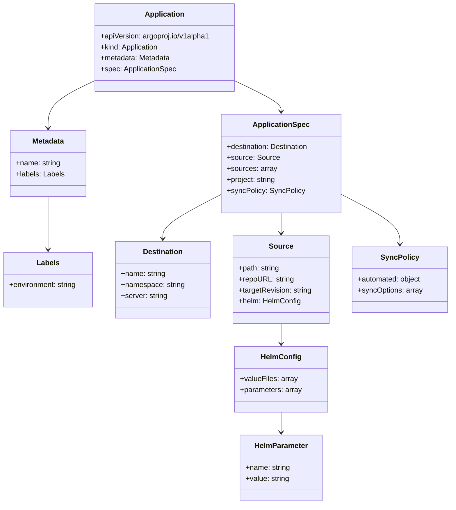
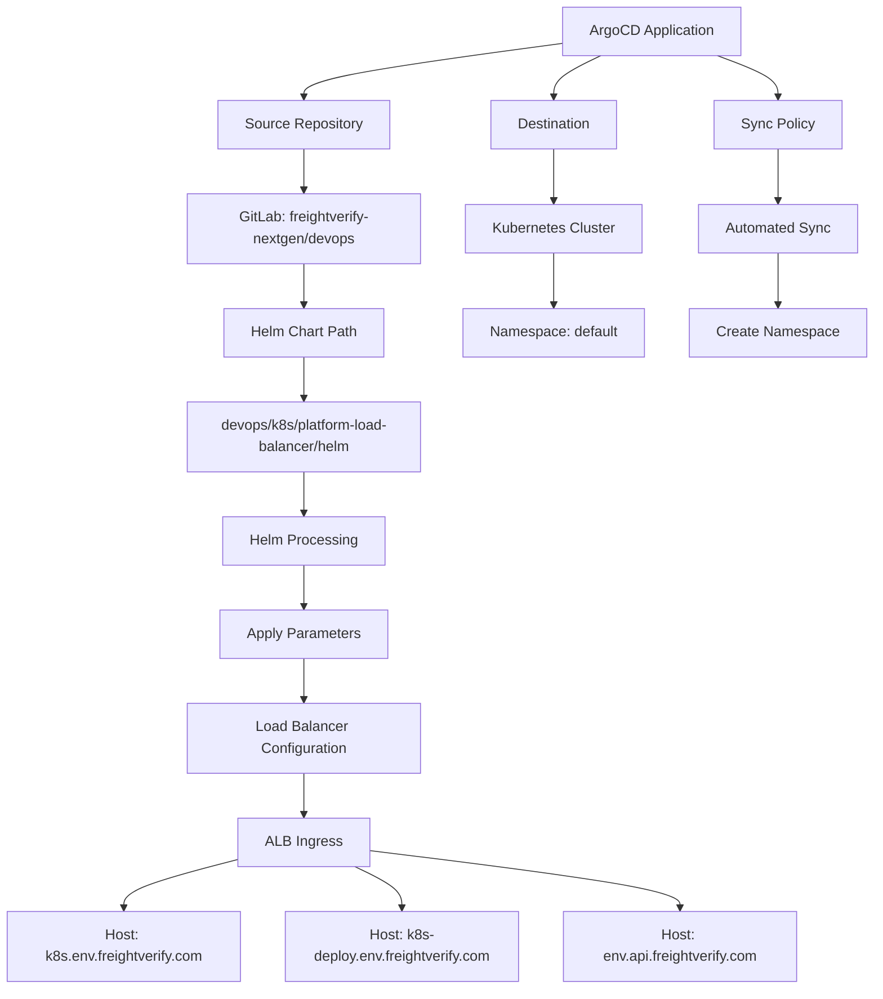

# Diagram: devops/k8s/platform-load-balancer/argocd/application.test.yaml

> Auto-generated by Obscura crawlers

## Diagram 1

### SVG

<svg id="container" width="985.78125" xmlns="http://www.w3.org/2000/svg" class="classDiagram" height="1104" viewBox="0 0 985.78125 1104" role="graphics-document document" aria-roledescription="class"><g><defs><marker id="container_class-aggregationStart" class="marker aggregation class" refX="18" refY="7" markerWidth="190" markerHeight="240" orient="auto"><path d="M 18,7 L9,13 L1,7 L9,1 Z"></path></marker></defs><defs><marker id="container_class-aggregationEnd" class="marker aggregation class" refX="1" refY="7" markerWidth="20" markerHeight="28" orient="auto"><path d="M 18,7 L9,13 L1,7 L9,1 Z"></path></marker></defs><defs><marker id="container_class-extensionStart" class="marker extension class" refX="18" refY="7" markerWidth="190" markerHeight="240" orient="auto"><path d="M 1,7 L18,13 V 1 Z"></path></marker></defs><defs><marker id="container_class-extensionEnd" class="marker extension class" refX="1" refY="7" markerWidth="20" markerHeight="28" orient="auto"><path d="M 1,1 V 13 L18,7 Z"></path></marker></defs><defs><marker id="container_class-compositionStart" class="marker composition class" refX="18" refY="7" markerWidth="190" markerHeight="240" orient="auto"><path d="M 18,7 L9,13 L1,7 L9,1 Z"></path></marker></defs><defs><marker id="container_class-compositionEnd" class="marker composition class" refX="1" refY="7" markerWidth="20" markerHeight="28" orient="auto"><path d="M 18,7 L9,13 L1,7 L9,1 Z"></path></marker></defs><defs><marker id="container_class-dependencyStart" class="marker dependency class" refX="6" refY="7" markerWidth="190" markerHeight="240" orient="auto"><path d="M 5,7 L9,13 L1,7 L9,1 Z"></path></marker></defs><defs><marker id="container_class-dependencyEnd" class="marker dependency class" refX="13" refY="7" markerWidth="20" markerHeight="28" orient="auto"><path d="M 18,7 L9,13 L14,7 L9,1 Z"></path></marker></defs><defs><marker id="container_class-lollipopStart" class="marker lollipop class" refX="13" refY="7" markerWidth="190" markerHeight="240" orient="auto"><circle stroke="black" fill="transparent" cx="7" cy="7" r="6"></circle></marker></defs><defs><marker id="container_class-lollipopEnd" class="marker lollipop class" refX="1" refY="7" markerWidth="190" markerHeight="240" orient="auto"><circle stroke="black" fill="transparent" cx="7" cy="7" r="6"></circle></marker></defs><g class="root"><g class="clusters"></g><g class="edgePaths"><path d="M208.951,176.669L191.958,184.724C174.965,192.779,140.979,208.89,123.985,226.111C106.992,243.333,106.992,261.667,106.992,270.833L106.992,280" id="id_Application_Metadata_1" class="edge-thickness-normal edge-pattern-solid relation" style=";;;" data-edge="true" data-et="edge" data-id="id_Application_Metadata_1" data-points="W3sieCI6MjA4Ljk1MTE3MTg3NSwieSI6MTc2LjY2ODY5Njg2OTc2MzV9LHsieCI6MTA2Ljk5MjE4NzUsInkiOjIyNX0seyJ4IjoxMDYuOTkyMTg3NSwieSI6Mjg2fV0=" marker-end="url(#container_class-dependencyEnd)"></path><path d="M515.553,176.669L532.546,184.724C549.539,192.779,583.525,208.89,600.519,220.111C617.512,231.333,617.512,237.667,617.512,240.833L617.512,244" id="id_Application_ApplicationSpec_2" class="edge-thickness-normal edge-pattern-solid relation" style=";;;" data-edge="true" data-et="edge" data-id="id_Application_ApplicationSpec_2" data-points="W3sieCI6NTE1LjU1MjczNDM3NSwieSI6MTc2LjY2ODY5Njg2OTc2MzV9LHsieCI6NjE3LjUxMTcxODc1LCJ5IjoyMjV9LHsieCI6NjE3LjUxMTcxODc1LCJ5IjoyNTB9XQ==" marker-end="url(#container_class-dependencyEnd)"></path><path d="M106.992,430L106.992,440.167C106.992,450.333,106.992,470.667,106.992,490C106.992,509.333,106.992,527.667,106.992,536.833L106.992,546" id="id_Metadata_Labels_3" class="edge-thickness-normal edge-pattern-solid relation" style=";;;" data-edge="true" data-et="edge" data-id="id_Metadata_Labels_3" data-points="W3sieCI6MTA2Ljk5MjE4NzUsInkiOjQzMH0seyJ4IjoxMDYuOTkyMTg3NSwieSI6NDkxfSx7IngiOjEwNi45OTIxODc1LCJ5Ijo1NTJ9XQ==" marker-end="url(#container_class-dependencyEnd)"></path><path d="M484.336,426.546L463.465,437.288C442.594,448.03,400.852,469.515,379.98,485.424C359.109,501.333,359.109,511.667,359.109,516.833L359.109,522" id="id_ApplicationSpec_Destination_4" class="edge-thickness-normal edge-pattern-solid relation" style=";;;" data-edge="true" data-et="edge" data-id="id_ApplicationSpec_Destination_4" data-points="W3sieCI6NDg0LjMzNTkzNzUsInkiOjQyNi41NDU3MzYyNzAwNDg4NX0seyJ4IjozNTkuMTA5Mzc1LCJ5Ijo0OTF9LHsieCI6MzU5LjEwOTM3NSwieSI6NTI4fV0=" marker-end="url(#container_class-dependencyEnd)"></path><path d="M617.512,466L617.512,470.167C617.512,474.333,617.512,482.667,617.512,490C617.512,497.333,617.512,503.667,617.512,506.833L617.512,510" id="id_ApplicationSpec_Source_5" class="edge-thickness-normal edge-pattern-solid relation" style=";;;" data-edge="true" data-et="edge" data-id="id_ApplicationSpec_Source_5" data-points="W3sieCI6NjE3LjUxMTcxODc1LCJ5Ijo0NjZ9LHsieCI6NjE3LjUxMTcxODc1LCJ5Ijo0OTF9LHsieCI6NjE3LjUxMTcxODc1LCJ5Ijo1MTZ9XQ==" marker-end="url(#container_class-dependencyEnd)"></path><path d="M750.688,426.713L771.454,437.427C792.22,448.142,833.753,469.571,854.519,487.452C875.285,505.333,875.285,519.667,875.285,526.833L875.285,534" id="id_ApplicationSpec_SyncPolicy_6" class="edge-thickness-normal edge-pattern-solid relation" style=";;;" data-edge="true" data-et="edge" data-id="id_ApplicationSpec_SyncPolicy_6" data-points="W3sieCI6NzUwLjY4NzUsInkiOjQyNi43MTI5NzE2NjIzNzMxfSx7IngiOjg3NS4yODUxNTYyNSwieSI6NDkxfSx7IngiOjg3NS4yODUxNTYyNSwieSI6NTQwfV0=" marker-end="url(#container_class-dependencyEnd)"></path><path d="M617.512,708L617.512,712.167C617.512,716.333,617.512,724.667,617.512,732C617.512,739.333,617.512,745.667,617.512,748.833L617.512,752" id="id_Source_HelmConfig_7" class="edge-thickness-normal edge-pattern-solid relation" style=";;;" data-edge="true" data-et="edge" data-id="id_Source_HelmConfig_7" data-points="W3sieCI6NjE3LjUxMTcxODc1LCJ5Ijo3MDh9LHsieCI6NjE3LjUxMTcxODc1LCJ5Ijo3MzN9LHsieCI6NjE3LjUxMTcxODc1LCJ5Ijo3NTh9XQ==" marker-end="url(#container_class-dependencyEnd)"></path><path d="M617.512,902L617.512,906.167C617.512,910.333,617.512,918.667,617.512,926C617.512,933.333,617.512,939.667,617.512,942.833L617.512,946" id="id_HelmConfig_HelmParameter_8" class="edge-thickness-normal edge-pattern-solid relation" style=";;;" data-edge="true" data-et="edge" data-id="id_HelmConfig_HelmParameter_8" data-points="W3sieCI6NjE3LjUxMTcxODc1LCJ5Ijo5MDJ9LHsieCI6NjE3LjUxMTcxODc1LCJ5Ijo5Mjd9LHsieCI6NjE3LjUxMTcxODc1LCJ5Ijo5NTJ9XQ==" marker-end="url(#container_class-dependencyEnd)"></path></g><g class="edgeLabels"><g class="edgeLabel"><g class="label" data-id="id_Application_Metadata_1" transform="translate(0, 0)"><foreignObject width="0" height="0">

</foreignObject></g></g><g class="edgeLabel"><g class="label" data-id="id_Application_ApplicationSpec_2" transform="translate(0, 0)"><foreignObject width="0" height="0">

</foreignObject></g></g><g class="edgeLabel"><g class="label" data-id="id_Metadata_Labels_3" transform="translate(0, 0)"><foreignObject width="0" height="0">

</foreignObject></g></g><g class="edgeLabel"><g class="label" data-id="id_ApplicationSpec_Destination_4" transform="translate(0, 0)"><foreignObject width="0" height="0">

</foreignObject></g></g><g class="edgeLabel"><g class="label" data-id="id_ApplicationSpec_Source_5" transform="translate(0, 0)"><foreignObject width="0" height="0">

</foreignObject></g></g><g class="edgeLabel"><g class="label" data-id="id_ApplicationSpec_SyncPolicy_6" transform="translate(0, 0)"><foreignObject width="0" height="0">

</foreignObject></g></g><g class="edgeLabel"><g class="label" data-id="id_Source_HelmConfig_7" transform="translate(0, 0)"><foreignObject width="0" height="0">

</foreignObject></g></g><g class="edgeLabel"><g class="label" data-id="id_HelmConfig_HelmParameter_8" transform="translate(0, 0)"><foreignObject width="0" height="0">

</foreignObject></g></g></g><g class="nodes"><g class="node default" id="classId-Application-0" transform="translate(362.251953125, 104)"><g class="basic label-container"><path d="M-153.30078125 -96 L153.30078125 -96 L153.30078125 96 L-153.30078125 96" stroke="none" stroke-width="0" fill="#ECECFF" style=""></path><path d="M-153.30078125 -96 C-37.57901085416846 -96, 78.14275954166308 -96, 153.30078125 -96 M-153.30078125 -96 C-64.97848861325524 -96, 23.343804023489525 -96, 153.30078125 -96 M153.30078125 -96 C153.30078125 -21.932887943693117, 153.30078125 52.134224112613765, 153.30078125 96 M153.30078125 -96 C153.30078125 -49.810283123893434, 153.30078125 -3.6205662477868685, 153.30078125 96 M153.30078125 96 C84.73424389013627 96, 16.16770653027254 96, -153.30078125 96 M153.30078125 96 C57.55365889921717 96, -38.19346345156566 96, -153.30078125 96 M-153.30078125 96 C-153.30078125 56.75708957514454, -153.30078125 17.51417915028908, -153.30078125 -96 M-153.30078125 96 C-153.30078125 39.05851298443369, -153.30078125 -17.88297403113262, -153.30078125 -96" stroke="#9370DB" stroke-width="1.3" fill="none" stroke-dasharray="0 0" style=""></path></g><g class="annotation-group text" transform="translate(0, -72)"></g><g class="label-group text" transform="translate(-41.6796875, -72)"><g class="label" style="font-weight: bolder" transform="translate(0,-12)"><foreignObject width="83.359375" height="24">

Application

</foreignObject></g></g><g class="members-group text" transform="translate(-141.30078125, -24)"><g class="label" style="" transform="translate(0,-12)"><foreignObject width="240.921875" height="24">

+apiVersion: argoproj.io/v1alpha1

</foreignObject></g><g class="label" style="" transform="translate(0,12)"><foreignObject width="130.296875" height="24">

+kind: Application

</foreignObject></g><g class="label" style="" transform="translate(0,36)"><foreignObject width="153.6875" height="24">

+metadata: Metadata

</foreignObject></g><g class="label" style="" transform="translate(0,60)"><foreignObject width="166.640625" height="24">

+spec: ApplicationSpec

</foreignObject></g></g><g class="methods-group text" transform="translate(-141.30078125, 96)"></g><g class="divider" style=""><path d="M-153.30078125 -48 C-79.68456399225083 -48, -6.0683467345016595 -48, 153.30078125 -48 M-153.30078125 -48 C-62.03939048213486 -48, 29.222000285730275 -48, 153.30078125 -48" stroke="#9370DB" stroke-width="1.3" fill="none" stroke-dasharray="0 0" style=""></path></g><g class="divider" style=""><path d="M-153.30078125 72 C-61.7807175065911 72, 29.739346236817795 72, 153.30078125 72 M-153.30078125 72 C-31.62514866947255 72, 90.0504839110549 72, 153.30078125 72" stroke="#9370DB" stroke-width="1.3" fill="none" stroke-dasharray="0 0" style=""></path></g></g><g class="node default" id="classId-Metadata-1" transform="translate(106.9921875, 358)"><g class="basic label-container"><path d="M-82.6484375 -72 L82.6484375 -72 L82.6484375 72 L-82.6484375 72" stroke="none" stroke-width="0" fill="#ECECFF" style=""></path><path d="M-82.6484375 -72 C-34.97287994931637 -72, 12.702677601367256 -72, 82.6484375 -72 M-82.6484375 -72 C-17.867189996236164 -72, 46.91405750752767 -72, 82.6484375 -72 M82.6484375 -72 C82.6484375 -39.761544241536235, 82.6484375 -7.5230884830724705, 82.6484375 72 M82.6484375 -72 C82.6484375 -14.742200021553423, 82.6484375 42.515599956893155, 82.6484375 72 M82.6484375 72 C46.80278475644287 72, 10.957132012885737 72, -82.6484375 72 M82.6484375 72 C36.23577041508275 72, -10.176896669834505 72, -82.6484375 72 M-82.6484375 72 C-82.6484375 27.22304811974132, -82.6484375 -17.553903760517358, -82.6484375 -72 M-82.6484375 72 C-82.6484375 40.6173184117754, -82.6484375 9.234636823550808, -82.6484375 -72" stroke="#9370DB" stroke-width="1.3" fill="none" stroke-dasharray="0 0" style=""></path></g><g class="annotation-group text" transform="translate(0, -48)"></g><g class="label-group text" transform="translate(-34.640625, -48)"><g class="label" style="font-weight: bolder" transform="translate(0,-12)"><foreignObject width="69.28125" height="24">

Metadata

</foreignObject></g></g><g class="members-group text" transform="translate(-70.6484375, 0)"><g class="label" style="" transform="translate(0,-12)"><foreignObject width="98.21875" height="24">

+name: string

</foreignObject></g><g class="label" style="" transform="translate(0,12)"><foreignObject width="106.65625" height="24">

+labels: Labels

</foreignObject></g></g><g class="methods-group text" transform="translate(-70.6484375, 72)"></g><g class="divider" style=""><path d="M-82.6484375 -24 C-46.91523230340659 -24, -11.18202710681318 -24, 82.6484375 -24 M-82.6484375 -24 C-21.493447464119093 -24, 39.661542571761814 -24, 82.6484375 -24" stroke="#9370DB" stroke-width="1.3" fill="none" stroke-dasharray="0 0" style=""></path></g><g class="divider" style=""><path d="M-82.6484375 48 C-24.106779174656843 48, 34.434879150686314 48, 82.6484375 48 M-82.6484375 48 C-29.11269596114328 48, 24.423045577713438 48, 82.6484375 48" stroke="#9370DB" stroke-width="1.3" fill="none" stroke-dasharray="0 0" style=""></path></g></g><g class="node default" id="classId-Labels-2" transform="translate(106.9921875, 612)"><g class="basic label-container"><path d="M-98.9921875 -60 L98.9921875 -60 L98.9921875 60 L-98.9921875 60" stroke="none" stroke-width="0" fill="#ECECFF" style=""></path><path d="M-98.9921875 -60 C-50.0738967040733 -60, -1.1556059081465975 -60, 98.9921875 -60 M-98.9921875 -60 C-34.886812162399735 -60, 29.21856317520053 -60, 98.9921875 -60 M98.9921875 -60 C98.9921875 -20.392926219063597, 98.9921875 19.214147561872807, 98.9921875 60 M98.9921875 -60 C98.9921875 -19.570568418873215, 98.9921875 20.85886316225357, 98.9921875 60 M98.9921875 60 C52.18133176392375 60, 5.370476027847502 60, -98.9921875 60 M98.9921875 60 C36.54036624182839 60, -25.911455016343226 60, -98.9921875 60 M-98.9921875 60 C-98.9921875 18.64985110447681, -98.9921875 -22.70029779104638, -98.9921875 -60 M-98.9921875 60 C-98.9921875 22.92574653237311, -98.9921875 -14.148506935253778, -98.9921875 -60" stroke="#9370DB" stroke-width="1.3" fill="none" stroke-dasharray="0 0" style=""></path></g><g class="annotation-group text" transform="translate(0, -36)"></g><g class="label-group text" transform="translate(-23.84375, -36)"><g class="label" style="font-weight: bolder" transform="translate(0,-12)"><foreignObject width="47.6875" height="24">

Labels

</foreignObject></g></g><g class="members-group text" transform="translate(-86.9921875, 12)"><g class="label" style="" transform="translate(0,-12)"><foreignObject width="150.140625" height="24">

+environment: string

</foreignObject></g></g><g class="methods-group text" transform="translate(-86.9921875, 60)"></g><g class="divider" style=""><path d="M-98.9921875 -12 C-36.32545855875798 -12, 26.34127038248404 -12, 98.9921875 -12 M-98.9921875 -12 C-45.91237893644384 -12, 7.167429627112327 -12, 98.9921875 -12" stroke="#9370DB" stroke-width="1.3" fill="none" stroke-dasharray="0 0" style=""></path></g><g class="divider" style=""><path d="M-98.9921875 36 C-23.533624142679486 36, 51.92493921464103 36, 98.9921875 36 M-98.9921875 36 C-28.718351092742594 36, 41.55548531451481 36, 98.9921875 36" stroke="#9370DB" stroke-width="1.3" fill="none" stroke-dasharray="0 0" style=""></path></g></g><g class="node default" id="classId-ApplicationSpec-3" transform="translate(617.51171875, 358)"><g class="basic label-container"><path d="M-133.17578125 -108 L133.17578125 -108 L133.17578125 108 L-133.17578125 108" stroke="none" stroke-width="0" fill="#ECECFF" style=""></path><path d="M-133.17578125 -108 C-30.45819712275184 -108, 72.25938700449632 -108, 133.17578125 -108 M-133.17578125 -108 C-39.22829915181457 -108, 54.719182946370864 -108, 133.17578125 -108 M133.17578125 -108 C133.17578125 -25.903621802056833, 133.17578125 56.192756395886335, 133.17578125 108 M133.17578125 -108 C133.17578125 -64.20390384181641, 133.17578125 -20.40780768363281, 133.17578125 108 M133.17578125 108 C38.19142796993856 108, -56.79292531012288 108, -133.17578125 108 M133.17578125 108 C63.17427200409206 108, -6.8272372418158795 108, -133.17578125 108 M-133.17578125 108 C-133.17578125 56.48394900560133, -133.17578125 4.967898011202664, -133.17578125 -108 M-133.17578125 108 C-133.17578125 55.07568427769246, -133.17578125 2.15136855538492, -133.17578125 -108" stroke="#9370DB" stroke-width="1.3" fill="none" stroke-dasharray="0 0" style=""></path></g><g class="annotation-group text" transform="translate(0, -84)"></g><g class="label-group text" transform="translate(-59.2734375, -84)"><g class="label" style="font-weight: bolder" transform="translate(0,-12)"><foreignObject width="118.546875" height="24">

ApplicationSpec

</foreignObject></g></g><g class="members-group text" transform="translate(-121.17578125, -36)"><g class="label" style="" transform="translate(0,-12)"><foreignObject width="183.078125" height="24">

+destination: Destination

</foreignObject></g><g class="label" style="" transform="translate(0,12)"><foreignObject width="113.0625" height="24">

+source: Source

</foreignObject></g><g class="label" style="" transform="translate(0,36)"><foreignObject width="108.25" height="24">

+sources: array

</foreignObject></g><g class="label" style="" transform="translate(0,60)"><foreignObject width="108.9375" height="24">

+project: string

</foreignObject></g><g class="label" style="" transform="translate(0,84)"><foreignObject width="167.453125" height="24">

+syncPolicy: SyncPolicy

</foreignObject></g></g><g class="methods-group text" transform="translate(-121.17578125, 108)"></g><g class="divider" style=""><path d="M-133.17578125 -60 C-44.589306286901234 -60, 43.99716867619753 -60, 133.17578125 -60 M-133.17578125 -60 C-36.21991648301234 -60, 60.73594828397532 -60, 133.17578125 -60" stroke="#9370DB" stroke-width="1.3" fill="none" stroke-dasharray="0 0" style=""></path></g><g class="divider" style=""><path d="M-133.17578125 84 C-47.1087765282513 84, 38.958228193497405 84, 133.17578125 84 M-133.17578125 84 C-70.6304439937968 84, -8.085106737593591 84, 133.17578125 84" stroke="#9370DB" stroke-width="1.3" fill="none" stroke-dasharray="0 0" style=""></path></g></g><g class="node default" id="classId-Destination-4" transform="translate(359.109375, 612)"><g class="basic label-container"><path d="M-103.125 -84 L103.125 -84 L103.125 84 L-103.125 84" stroke="none" stroke-width="0" fill="#ECECFF" style=""></path><path d="M-103.125 -84 C-57.79057192501761 -84, -12.456143850035218 -84, 103.125 -84 M-103.125 -84 C-54.224842035863674 -84, -5.324684071727347 -84, 103.125 -84 M103.125 -84 C103.125 -48.30895789013126, 103.125 -12.617915780262521, 103.125 84 M103.125 -84 C103.125 -40.421638071311115, 103.125 3.15672385737777, 103.125 84 M103.125 84 C57.803738124083594 84, 12.482476248167188 84, -103.125 84 M103.125 84 C50.22170565408016 84, -2.6815886918396785 84, -103.125 84 M-103.125 84 C-103.125 35.330374341260224, -103.125 -13.339251317479551, -103.125 -84 M-103.125 84 C-103.125 18.266318240089234, -103.125 -47.46736351982153, -103.125 -84" stroke="#9370DB" stroke-width="1.3" fill="none" stroke-dasharray="0 0" style=""></path></g><g class="annotation-group text" transform="translate(0, -60)"></g><g class="label-group text" transform="translate(-42.46875, -60)"><g class="label" style="font-weight: bolder" transform="translate(0,-12)"><foreignObject width="84.9375" height="24">

Destination

</foreignObject></g></g><g class="members-group text" transform="translate(-91.125, -12)"><g class="label" style="" transform="translate(0,-12)"><foreignObject width="98.21875" height="24">

+name: string

</foreignObject></g><g class="label" style="" transform="translate(0,12)"><foreignObject width="139.78125" height="24">

+namespace: string

</foreignObject></g><g class="label" style="" transform="translate(0,36)"><foreignObject width="102.9375" height="24">

+server: string

</foreignObject></g></g><g class="methods-group text" transform="translate(-91.125, 84)"></g><g class="divider" style=""><path d="M-103.125 -36 C-57.753797642491676 -36, -12.382595284983353 -36, 103.125 -36 M-103.125 -36 C-25.58822342512758 -36, 51.94855314974484 -36, 103.125 -36" stroke="#9370DB" stroke-width="1.3" fill="none" stroke-dasharray="0 0" style=""></path></g><g class="divider" style=""><path d="M-103.125 60 C-35.809208291155045 60, 31.50658341768991 60, 103.125 60 M-103.125 60 C-26.455413119551253 60, 50.214173760897495 60, 103.125 60" stroke="#9370DB" stroke-width="1.3" fill="none" stroke-dasharray="0 0" style=""></path></g></g><g class="node default" id="classId-Source-5" transform="translate(617.51171875, 612)"><g class="basic label-container"><path d="M-105.27734375 -96 L105.27734375 -96 L105.27734375 96 L-105.27734375 96" stroke="none" stroke-width="0" fill="#ECECFF" style=""></path><path d="M-105.27734375 -96 C-44.65473710321956 -96, 15.96786954356088 -96, 105.27734375 -96 M-105.27734375 -96 C-33.764095077114064 -96, 37.74915359577187 -96, 105.27734375 -96 M105.27734375 -96 C105.27734375 -44.18925409542652, 105.27734375 7.62149180914696, 105.27734375 96 M105.27734375 -96 C105.27734375 -25.32742392763383, 105.27734375 45.34515214473234, 105.27734375 96 M105.27734375 96 C52.8974499951792 96, 0.5175562403584024 96, -105.27734375 96 M105.27734375 96 C60.92826258223288 96, 16.579181414465765 96, -105.27734375 96 M-105.27734375 96 C-105.27734375 20.3383778527664, -105.27734375 -55.3232442944672, -105.27734375 -96 M-105.27734375 96 C-105.27734375 35.06379588214977, -105.27734375 -25.872408235700462, -105.27734375 -96" stroke="#9370DB" stroke-width="1.3" fill="none" stroke-dasharray="0 0" style=""></path></g><g class="annotation-group text" transform="translate(0, -72)"></g><g class="label-group text" transform="translate(-24.8828125, -72)"><g class="label" style="font-weight: bolder" transform="translate(0,-12)"><foreignObject width="49.765625" height="24">

Source

</foreignObject></g></g><g class="members-group text" transform="translate(-93.27734375, -24)"><g class="label" style="" transform="translate(0,-12)"><foreignObject width="90.90625" height="24">

+path: string

</foreignObject></g><g class="label" style="" transform="translate(0,12)"><foreignObject width="119.203125" height="24">

+repoURL: string

</foreignObject></g><g class="label" style="" transform="translate(0,36)"><foreignObject width="161.671875" height="24">

+targetRevision: string

</foreignObject></g><g class="label" style="" transform="translate(0,60)"><foreignObject width="135.453125" height="24">

+helm: HelmConfig

</foreignObject></g></g><g class="methods-group text" transform="translate(-93.27734375, 96)"></g><g class="divider" style=""><path d="M-105.27734375 -48 C-50.62524504532211 -48, 4.02685365935578 -48, 105.27734375 -48 M-105.27734375 -48 C-27.17499756102535 -48, 50.9273486279493 -48, 105.27734375 -48" stroke="#9370DB" stroke-width="1.3" fill="none" stroke-dasharray="0 0" style=""></path></g><g class="divider" style=""><path d="M-105.27734375 72 C-41.65736473540155 72, 21.9626142791969 72, 105.27734375 72 M-105.27734375 72 C-23.44972816770543 72, 58.37788741458914 72, 105.27734375 72" stroke="#9370DB" stroke-width="1.3" fill="none" stroke-dasharray="0 0" style=""></path></g></g><g class="node default" id="classId-HelmConfig-6" transform="translate(617.51171875, 830)"><g class="basic label-container"><path d="M-100.59375 -72 L100.59375 -72 L100.59375 72 L-100.59375 72" stroke="none" stroke-width="0" fill="#ECECFF" style=""></path><path d="M-100.59375 -72 C-43.46296237257502 -72, 13.667825254849959 -72, 100.59375 -72 M-100.59375 -72 C-46.89897466978685 -72, 6.795800660426295 -72, 100.59375 -72 M100.59375 -72 C100.59375 -19.55582812851548, 100.59375 32.88834374296904, 100.59375 72 M100.59375 -72 C100.59375 -20.80212743072545, 100.59375 30.395745138549103, 100.59375 72 M100.59375 72 C59.66222808098632 72, 18.730706161972634 72, -100.59375 72 M100.59375 72 C44.98016193362202 72, -10.633426132755957 72, -100.59375 72 M-100.59375 72 C-100.59375 24.40715204823097, -100.59375 -23.18569590353806, -100.59375 -72 M-100.59375 72 C-100.59375 23.388891488828172, -100.59375 -25.222217022343656, -100.59375 -72" stroke="#9370DB" stroke-width="1.3" fill="none" stroke-dasharray="0 0" style=""></path></g><g class="annotation-group text" transform="translate(0, -48)"></g><g class="label-group text" transform="translate(-41.8125, -48)"><g class="label" style="font-weight: bolder" transform="translate(0,-12)"><foreignObject width="83.625" height="24">

HelmConfig

</foreignObject></g></g><g class="members-group text" transform="translate(-88.59375, 0)"><g class="label" style="" transform="translate(0,-12)"><foreignObject width="124.234375" height="24">

+valueFiles: array

</foreignObject></g><g class="label" style="" transform="translate(0,12)"><foreignObject width="135.375" height="24">

+parameters: array

</foreignObject></g></g><g class="methods-group text" transform="translate(-88.59375, 72)"></g><g class="divider" style=""><path d="M-100.59375 -24 C-31.557676110892658 -24, 37.478397778214685 -24, 100.59375 -24 M-100.59375 -24 C-52.98831483999352 -24, -5.382879679987042 -24, 100.59375 -24" stroke="#9370DB" stroke-width="1.3" fill="none" stroke-dasharray="0 0" style=""></path></g><g class="divider" style=""><path d="M-100.59375 48 C-47.83321046875422 48, 4.927329062491566 48, 100.59375 48 M-100.59375 48 C-56.14795211032772 48, -11.702154220655444 48, 100.59375 48" stroke="#9370DB" stroke-width="1.3" fill="none" stroke-dasharray="0 0" style=""></path></g></g><g class="node default" id="classId-HelmParameter-7" transform="translate(617.51171875, 1024)"><g class="basic label-container"><path d="M-89.46484375 -72 L89.46484375 -72 L89.46484375 72 L-89.46484375 72" stroke="none" stroke-width="0" fill="#ECECFF" style=""></path><path d="M-89.46484375 -72 C-44.02499602790915 -72, 1.4148516941817064 -72, 89.46484375 -72 M-89.46484375 -72 C-33.0678272410614 -72, 23.329189267877197 -72, 89.46484375 -72 M89.46484375 -72 C89.46484375 -34.745657183176945, 89.46484375 2.5086856336461096, 89.46484375 72 M89.46484375 -72 C89.46484375 -41.56260245445851, 89.46484375 -11.125204908917027, 89.46484375 72 M89.46484375 72 C18.632131750990055 72, -52.20058024801989 72, -89.46484375 72 M89.46484375 72 C36.67537462915637 72, -16.114094491687254 72, -89.46484375 72 M-89.46484375 72 C-89.46484375 38.2597394734034, -89.46484375 4.5194789468067995, -89.46484375 -72 M-89.46484375 72 C-89.46484375 21.533542707631085, -89.46484375 -28.93291458473783, -89.46484375 -72" stroke="#9370DB" stroke-width="1.3" fill="none" stroke-dasharray="0 0" style=""></path></g><g class="annotation-group text" transform="translate(0, -48)"></g><g class="label-group text" transform="translate(-56.7109375, -48)"><g class="label" style="font-weight: bolder" transform="translate(0,-12)"><foreignObject width="113.421875" height="24">

HelmParameter

</foreignObject></g></g><g class="members-group text" transform="translate(-77.46484375, 0)"><g class="label" style="" transform="translate(0,-12)"><foreignObject width="98.21875" height="24">

+name: string

</foreignObject></g><g class="label" style="" transform="translate(0,12)"><foreignObject width="96.421875" height="24">

+value: string

</foreignObject></g></g><g class="methods-group text" transform="translate(-77.46484375, 72)"></g><g class="divider" style=""><path d="M-89.46484375 -24 C-49.27456717381416 -24, -9.084290597628325 -24, 89.46484375 -24 M-89.46484375 -24 C-34.353243110131274 -24, 20.758357529737452 -24, 89.46484375 -24" stroke="#9370DB" stroke-width="1.3" fill="none" stroke-dasharray="0 0" style=""></path></g><g class="divider" style=""><path d="M-89.46484375 48 C-33.373781882032404 48, 22.717279985935193 48, 89.46484375 48 M-89.46484375 48 C-29.217191911291756 48, 31.030459927416487 48, 89.46484375 48" stroke="#9370DB" stroke-width="1.3" fill="none" stroke-dasharray="0 0" style=""></path></g></g><g class="node default" id="classId-SyncPolicy-8" transform="translate(875.28515625, 612)"><g class="basic label-container"><path d="M-102.49609375 -72 L102.49609375 -72 L102.49609375 72 L-102.49609375 72" stroke="none" stroke-width="0" fill="#ECECFF" style=""></path><path d="M-102.49609375 -72 C-47.64038567679746 -72, 7.215322396405085 -72, 102.49609375 -72 M-102.49609375 -72 C-21.536615962569286 -72, 59.42286182486143 -72, 102.49609375 -72 M102.49609375 -72 C102.49609375 -17.37879867849206, 102.49609375 37.24240264301588, 102.49609375 72 M102.49609375 -72 C102.49609375 -25.604481562492914, 102.49609375 20.79103687501417, 102.49609375 72 M102.49609375 72 C27.93022610156325 72, -46.6356415468735 72, -102.49609375 72 M102.49609375 72 C55.578706079364984 72, 8.661318408729969 72, -102.49609375 72 M-102.49609375 72 C-102.49609375 28.913742072611228, -102.49609375 -14.172515854777544, -102.49609375 -72 M-102.49609375 72 C-102.49609375 29.922751518287726, -102.49609375 -12.154496963424549, -102.49609375 -72" stroke="#9370DB" stroke-width="1.3" fill="none" stroke-dasharray="0 0" style=""></path></g><g class="annotation-group text" transform="translate(0, -48)"></g><g class="label-group text" transform="translate(-38.9296875, -48)"><g class="label" style="font-weight: bolder" transform="translate(0,-12)"><foreignObject width="77.859375" height="24">

SyncPolicy

</foreignObject></g></g><g class="members-group text" transform="translate(-90.49609375, 0)"><g class="label" style="" transform="translate(0,-12)"><foreignObject width="140.4375" height="24">

+automated: object

</foreignObject></g><g class="label" style="" transform="translate(0,12)"><foreignObject width="142.0625" height="24">

+syncOptions: array

</foreignObject></g></g><g class="methods-group text" transform="translate(-90.49609375, 72)"></g><g class="divider" style=""><path d="M-102.49609375 -24 C-44.95314797034039 -24, 12.589797809319222 -24, 102.49609375 -24 M-102.49609375 -24 C-41.731717882770305 -24, 19.03265798445939 -24, 102.49609375 -24" stroke="#9370DB" stroke-width="1.3" fill="none" stroke-dasharray="0 0" style=""></path></g><g class="divider" style=""><path d="M-102.49609375 48 C-55.27084106297948 48, -8.045588375958957 48, 102.49609375 48 M-102.49609375 48 C-58.30017068426909 48, -14.104247618538182 48, 102.49609375 48" stroke="#9370DB" stroke-width="1.3" fill="none" stroke-dasharray="0 0" style=""></path></g></g></g></g></g></svg>

## Diagram 2

### SVG

<svg id="container" width="973.9140625" xmlns="http://www.w3.org/2000/svg" class="flowchart" height="1102" viewBox="0 0 973.9140625 1102" role="graphics-document document" aria-roledescription="flowchart-v2"><g><marker id="container_flowchart-v2-pointEnd" class="marker flowchart-v2" viewBox="0 0 10 10" refX="5" refY="5" markerUnits="userSpaceOnUse" markerWidth="8" markerHeight="8" orient="auto"><path d="M 0 0 L 10 5 L 0 10 z" class="arrowMarkerPath" style="stroke-width: 1; stroke-dasharray: 1, 0;"></path></marker><marker id="container_flowchart-v2-pointStart" class="marker flowchart-v2" viewBox="0 0 10 10" refX="4.5" refY="5" markerUnits="userSpaceOnUse" markerWidth="8" markerHeight="8" orient="auto"><path d="M 0 5 L 10 10 L 10 0 z" class="arrowMarkerPath" style="stroke-width: 1; stroke-dasharray: 1, 0;"></path></marker><marker id="container_flowchart-v2-circleEnd" class="marker flowchart-v2" viewBox="0 0 10 10" refX="11" refY="5" markerUnits="userSpaceOnUse" markerWidth="11" markerHeight="11" orient="auto"><circle cx="5" cy="5" r="5" class="arrowMarkerPath" style="stroke-width: 1; stroke-dasharray: 1, 0;"></circle></marker><marker id="container_flowchart-v2-circleStart" class="marker flowchart-v2" viewBox="0 0 10 10" refX="-1" refY="5" markerUnits="userSpaceOnUse" markerWidth="11" markerHeight="11" orient="auto"><circle cx="5" cy="5" r="5" class="arrowMarkerPath" style="stroke-width: 1; stroke-dasharray: 1, 0;"></circle></marker><marker id="container_flowchart-v2-crossEnd" class="marker cross flowchart-v2" viewBox="0 0 11 11" refX="12" refY="5.2" markerUnits="userSpaceOnUse" markerWidth="11" markerHeight="11" orient="auto"><path d="M 1,1 l 9,9 M 10,1 l -9,9" class="arrowMarkerPath" style="stroke-width: 2; stroke-dasharray: 1, 0;"></path></marker><marker id="container_flowchart-v2-crossStart" class="marker cross flowchart-v2" viewBox="0 0 11 11" refX="-1" refY="5.2" markerUnits="userSpaceOnUse" markerWidth="11" markerHeight="11" orient="auto"><path d="M 1,1 l 9,9 M 10,1 l -9,9" class="arrowMarkerPath" style="stroke-width: 2; stroke-dasharray: 1, 0;"></path></marker><g class="root"><g class="clusters"></g><g class="edgePaths"><path d="M629.078,48.345L581.143,54.788C533.208,61.23,437.339,74.115,389.404,84.058C341.469,94,341.469,101,341.469,104.5L341.469,108" id="L_A_B_0" class="edge-thickness-normal edge-pattern-solid edge-thickness-normal edge-pattern-solid flowchart-link" style=";" data-edge="true" data-et="edge" data-id="L_A_B_0" data-points="W3sieCI6NjI5LjA3ODEyNSwieSI6NDguMzQ1NDQ4NjcxMzUxMjY0fSx7IngiOjM0MS40Njg3NSwieSI6ODd9LHsieCI6MzQxLjQ2ODc1LCJ5IjoxMTJ9XQ==" marker-end="url(#container_flowchart-v2-pointEnd)"></path><path d="M341.469,166L341.469,170.167C341.469,174.333,341.469,182.667,341.469,190.333C341.469,198,341.469,205,341.469,208.5L341.469,212" id="L_B_C_0" class="edge-thickness-normal edge-pattern-solid edge-thickness-normal edge-pattern-solid flowchart-link" style=";" data-edge="true" data-et="edge" data-id="L_B_C_0" data-points="W3sieCI6MzQxLjQ2ODc1LCJ5IjoxNjZ9LHsieCI6MzQxLjQ2ODc1LCJ5IjoxOTF9LHsieCI6MzQxLjQ2ODc1LCJ5IjoyMTZ9XQ==" marker-end="url(#container_flowchart-v2-pointEnd)"></path><path d="M341.469,294L341.469,298.167C341.469,302.333,341.469,310.667,341.469,318.333C341.469,326,341.469,333,341.469,336.5L341.469,340" id="L_C_D_0" class="edge-thickness-normal edge-pattern-solid edge-thickness-normal edge-pattern-solid flowchart-link" style=";" data-edge="true" data-et="edge" data-id="L_C_D_0" data-points="W3sieCI6MzQxLjQ2ODc1LCJ5IjoyOTR9LHsieCI6MzQxLjQ2ODc1LCJ5IjozMTl9LHsieCI6MzQxLjQ2ODc1LCJ5IjozNDR9XQ==" marker-end="url(#container_flowchart-v2-pointEnd)"></path><path d="M341.469,398L341.469,402.167C341.469,406.333,341.469,414.667,341.469,422.333C341.469,430,341.469,437,341.469,440.5L341.469,444" id="L_D_E_0" class="edge-thickness-normal edge-pattern-solid edge-thickness-normal edge-pattern-solid flowchart-link" style=";" data-edge="true" data-et="edge" data-id="L_D_E_0" data-points="W3sieCI6MzQxLjQ2ODc1LCJ5IjozOTh9LHsieCI6MzQxLjQ2ODc1LCJ5Ijo0MjN9LHsieCI6MzQxLjQ2ODc1LCJ5Ijo0NDh9XQ==" marker-end="url(#container_flowchart-v2-pointEnd)"></path><path d="M672.286,62L663.63,66.167C654.974,70.333,637.663,78.667,629.007,86.333C620.352,94,620.352,101,620.352,104.5L620.352,108" id="L_A_F_0" class="edge-thickness-normal edge-pattern-solid edge-thickness-normal edge-pattern-solid flowchart-link" style=";" data-edge="true" data-et="edge" data-id="L_A_F_0" data-points="W3sieCI6NjcyLjI4NTkwNzQ1MTkyMzEsInkiOjYyfSx7IngiOjYyMC4zNTE1NjI1LCJ5Ijo4N30seyJ4Ijo2MjAuMzUxNTYyNSwieSI6MTEyfV0=" marker-end="url(#container_flowchart-v2-pointEnd)"></path><path d="M620.352,166L620.352,170.167C620.352,174.333,620.352,182.667,620.352,192.333C620.352,202,620.352,213,620.352,218.5L620.352,224" id="L_F_G_0" class="edge-thickness-normal edge-pattern-solid edge-thickness-normal edge-pattern-solid flowchart-link" style=";" data-edge="true" data-et="edge" data-id="L_F_G_0" data-points="W3sieCI6NjIwLjM1MTU2MjUsInkiOjE2Nn0seyJ4Ijo2MjAuMzUxNTYyNSwieSI6MTkxfSx7IngiOjYyMC4zNTE1NjI1LCJ5IjoyMjh9XQ==" marker-end="url(#container_flowchart-v2-pointEnd)"></path><path d="M620.352,282L620.352,288.167C620.352,294.333,620.352,306.667,620.352,316.333C620.352,326,620.352,333,620.352,336.5L620.352,340" id="L_G_H_0" class="edge-thickness-normal edge-pattern-solid edge-thickness-normal edge-pattern-solid flowchart-link" style=";" data-edge="true" data-et="edge" data-id="L_G_H_0" data-points="W3sieCI6NjIwLjM1MTU2MjUsInkiOjI4Mn0seyJ4Ijo2MjAuMzUxNTYyNSwieSI6MzE5fSx7IngiOjYyMC4zNTE1NjI1LCJ5IjozNDR9XQ==" marker-end="url(#container_flowchart-v2-pointEnd)"></path><path d="M341.469,526L341.469,530.167C341.469,534.333,341.469,542.667,341.469,550.333C341.469,558,341.469,565,341.469,568.5L341.469,572" id="L_E_I_0" class="edge-thickness-normal edge-pattern-solid edge-thickness-normal edge-pattern-solid flowchart-link" style=";" data-edge="true" data-et="edge" data-id="L_E_I_0" data-points="W3sieCI6MzQxLjQ2ODc1LCJ5Ijo1MjZ9LHsieCI6MzQxLjQ2ODc1LCJ5Ijo1NTF9LHsieCI6MzQxLjQ2ODc1LCJ5Ijo1NzZ9XQ==" marker-end="url(#container_flowchart-v2-pointEnd)"></path><path d="M341.469,630L341.469,634.167C341.469,638.333,341.469,646.667,341.469,654.333C341.469,662,341.469,669,341.469,672.5L341.469,676" id="L_I_J_0" class="edge-thickness-normal edge-pattern-solid edge-thickness-normal edge-pattern-solid flowchart-link" style=";" data-edge="true" data-et="edge" data-id="L_I_J_0" data-points="W3sieCI6MzQxLjQ2ODc1LCJ5Ijo2MzB9LHsieCI6MzQxLjQ2ODc1LCJ5Ijo2NTV9LHsieCI6MzQxLjQ2ODc1LCJ5Ijo2ODB9XQ==" marker-end="url(#container_flowchart-v2-pointEnd)"></path><path d="M341.469,734L341.469,738.167C341.469,742.333,341.469,750.667,341.469,758.333C341.469,766,341.469,773,341.469,776.5L341.469,780" id="L_J_K_0" class="edge-thickness-normal edge-pattern-solid edge-thickness-normal edge-pattern-solid flowchart-link" style=";" data-edge="true" data-et="edge" data-id="L_J_K_0" data-points="W3sieCI6MzQxLjQ2ODc1LCJ5Ijo3MzR9LHsieCI6MzQxLjQ2ODc1LCJ5Ijo3NTl9LHsieCI6MzQxLjQ2ODc1LCJ5Ijo3ODR9XQ==" marker-end="url(#container_flowchart-v2-pointEnd)"></path><path d="M341.469,862L341.469,866.167C341.469,870.333,341.469,878.667,341.469,886.333C341.469,894,341.469,901,341.469,904.5L341.469,908" id="L_K_L_0" class="edge-thickness-normal edge-pattern-solid edge-thickness-normal edge-pattern-solid flowchart-link" style=";" data-edge="true" data-et="edge" data-id="L_K_L_0" data-points="W3sieCI6MzQxLjQ2ODc1LCJ5Ijo4NjJ9LHsieCI6MzQxLjQ2ODc1LCJ5Ijo4ODd9LHsieCI6MzQxLjQ2ODc1LCJ5Ijo5MTJ9XQ==" marker-end="url(#container_flowchart-v2-pointEnd)"></path><path d="M270.102,957.239L248.085,962.866C226.068,968.493,182.034,979.746,160.017,988.873C138,998,138,1005,138,1008.5L138,1012" id="L_L_M_0" class="edge-thickness-normal edge-pattern-solid edge-thickness-normal edge-pattern-solid flowchart-link" style=";" data-edge="true" data-et="edge" data-id="L_L_M_0" data-points="W3sieCI6MjcwLjEwMTU2MjUsInkiOjk1Ny4yMzkxMzM3NzM2MTM4fSx7IngiOjEzOCwieSI6OTkxfSx7IngiOjEzOCwieSI6MTAxNn1d" marker-end="url(#container_flowchart-v2-pointEnd)"></path><path d="M397.558,966L406.214,970.167C414.869,974.333,432.181,982.667,440.836,990.333C449.492,998,449.492,1005,449.492,1008.5L449.492,1012" id="L_L_N_0" class="edge-thickness-normal edge-pattern-solid edge-thickness-normal edge-pattern-solid flowchart-link" style=";" data-edge="true" data-et="edge" data-id="L_L_N_0" data-points="W3sieCI6Mzk3LjU1Nzg0MjU0ODA3NjksInkiOjk2Nn0seyJ4Ijo0NDkuNDkyMTg3NSwieSI6OTkxfSx7IngiOjQ0OS40OTIxODc1LCJ5IjoxMDE2fV0=" marker-end="url(#container_flowchart-v2-pointEnd)"></path><path d="M412.836,947.846L470.861,955.038C528.885,962.231,644.935,976.615,702.96,987.308C760.984,998,760.984,1005,760.984,1008.5L760.984,1012" id="L_L_O_0" class="edge-thickness-normal edge-pattern-solid edge-thickness-normal edge-pattern-solid flowchart-link" style=";" data-edge="true" data-et="edge" data-id="L_L_O_0" data-points="W3sieCI6NDEyLjgzNTkzNzUsInkiOjk0Ny44NDYxMzk1MjEwMjV9LHsieCI6NzYwLjk4NDM3NSwieSI6OTkxfSx7IngiOjc2MC45ODQzNzUsInkiOjEwMTZ9XQ==" marker-end="url(#container_flowchart-v2-pointEnd)"></path><path d="M801.396,62L812.665,66.167C823.933,70.333,846.471,78.667,857.739,86.333C869.008,94,869.008,101,869.008,104.5L869.008,108" id="L_A_P_0" class="edge-thickness-normal edge-pattern-solid edge-thickness-normal edge-pattern-solid flowchart-link" style=";" data-edge="true" data-et="edge" data-id="L_A_P_0" data-points="W3sieCI6ODAxLjM5NTg4MzQxMzQ2MTUsInkiOjYyfSx7IngiOjg2OS4wMDc4MTI1LCJ5Ijo4N30seyJ4Ijo4NjkuMDA3ODEyNSwieSI6MTEyfV0=" marker-end="url(#container_flowchart-v2-pointEnd)"></path><path d="M869.008,166L869.008,170.167C869.008,174.333,869.008,182.667,869.008,192.333C869.008,202,869.008,213,869.008,218.5L869.008,224" id="L_P_Q_0" class="edge-thickness-normal edge-pattern-solid edge-thickness-normal edge-pattern-solid flowchart-link" style=";" data-edge="true" data-et="edge" data-id="L_P_Q_0" data-points="W3sieCI6ODY5LjAwNzgxMjUsInkiOjE2Nn0seyJ4Ijo4NjkuMDA3ODEyNSwieSI6MTkxfSx7IngiOjg2OS4wMDc4MTI1LCJ5IjoyMjh9XQ==" marker-end="url(#container_flowchart-v2-pointEnd)"></path><path d="M869.008,282L869.008,288.167C869.008,294.333,869.008,306.667,869.008,316.333C869.008,326,869.008,333,869.008,336.5L869.008,340" id="L_Q_R_0" class="edge-thickness-normal edge-pattern-solid edge-thickness-normal edge-pattern-solid flowchart-link" style=";" data-edge="true" data-et="edge" data-id="L_Q_R_0" data-points="W3sieCI6ODY5LjAwNzgxMjUsInkiOjI4Mn0seyJ4Ijo4NjkuMDA3ODEyNSwieSI6MzE5fSx7IngiOjg2OS4wMDc4MTI1LCJ5IjozNDR9XQ==" marker-end="url(#container_flowchart-v2-pointEnd)"></path></g><g class="edgeLabels"><g class="edgeLabel"><g class="label" data-id="L_A_B_0" transform="translate(0, 0)"><foreignObject width="0" height="0">

</foreignObject></g></g><g class="edgeLabel"><g class="label" data-id="L_B_C_0" transform="translate(0, 0)"><foreignObject width="0" height="0">

</foreignObject></g></g><g class="edgeLabel"><g class="label" data-id="L_C_D_0" transform="translate(0, 0)"><foreignObject width="0" height="0">

</foreignObject></g></g><g class="edgeLabel"><g class="label" data-id="L_D_E_0" transform="translate(0, 0)"><foreignObject width="0" height="0">

</foreignObject></g></g><g class="edgeLabel"><g class="label" data-id="L_A_F_0" transform="translate(0, 0)"><foreignObject width="0" height="0">

</foreignObject></g></g><g class="edgeLabel"><g class="label" data-id="L_F_G_0" transform="translate(0, 0)"><foreignObject width="0" height="0">

</foreignObject></g></g><g class="edgeLabel"><g class="label" data-id="L_G_H_0" transform="translate(0, 0)"><foreignObject width="0" height="0">

</foreignObject></g></g><g class="edgeLabel"><g class="label" data-id="L_E_I_0" transform="translate(0, 0)"><foreignObject width="0" height="0">

</foreignObject></g></g><g class="edgeLabel"><g class="label" data-id="L_I_J_0" transform="translate(0, 0)"><foreignObject width="0" height="0">

</foreignObject></g></g><g class="edgeLabel"><g class="label" data-id="L_J_K_0" transform="translate(0, 0)"><foreignObject width="0" height="0">

</foreignObject></g></g><g class="edgeLabel"><g class="label" data-id="L_K_L_0" transform="translate(0, 0)"><foreignObject width="0" height="0">

</foreignObject></g></g><g class="edgeLabel"><g class="label" data-id="L_L_M_0" transform="translate(0, 0)"><foreignObject width="0" height="0">

</foreignObject></g></g><g class="edgeLabel"><g class="label" data-id="L_L_N_0" transform="translate(0, 0)"><foreignObject width="0" height="0">

</foreignObject></g></g><g class="edgeLabel"><g class="label" data-id="L_L_O_0" transform="translate(0, 0)"><foreignObject width="0" height="0">

</foreignObject></g></g><g class="edgeLabel"><g class="label" data-id="L_A_P_0" transform="translate(0, 0)"><foreignObject width="0" height="0">

</foreignObject></g></g><g class="edgeLabel"><g class="label" data-id="L_P_Q_0" transform="translate(0, 0)"><foreignObject width="0" height="0">

</foreignObject></g></g><g class="edgeLabel"><g class="label" data-id="L_Q_R_0" transform="translate(0, 0)"><foreignObject width="0" height="0">

</foreignObject></g></g></g><g class="nodes"><g class="node default" id="flowchart-A-0" transform="translate(728.375, 35)"><rect class="basic label-container" style="" x="-99.296875" y="-27" width="198.59375" height="54"></rect><g class="label" style="" transform="translate(-69.296875, -12)"><rect></rect><foreignObject width="138.59375" height="24">

ArgoCD Application

</foreignObject></g></g><g class="node default" id="flowchart-B-1" transform="translate(341.46875, 139)"><rect class="basic label-container" style="" x="-95.640625" y="-27" width="191.28125" height="54"></rect><g class="label" style="" transform="translate(-65.640625, -12)"><rect></rect><foreignObject width="131.28125" height="24">

Source Repository

</foreignObject></g></g><g class="node default" id="flowchart-C-3" transform="translate(341.46875, 255)"><rect class="basic label-container" style="" x="-130" y="-39" width="260" height="78"></rect><g class="label" style="" transform="translate(-100, -24)"><rect></rect><foreignObject width="200" height="48">

GitLab: freightverify-nextgen/devops

</foreignObject></g></g><g class="node default" id="flowchart-D-5" transform="translate(341.46875, 371)"><rect class="basic label-container" style="" x="-88.796875" y="-27" width="177.59375" height="54"></rect><g class="label" style="" transform="translate(-58.796875, -12)"><rect></rect><foreignObject width="117.59375" height="24">

Helm Chart Path

</foreignObject></g></g><g class="node default" id="flowchart-E-7" transform="translate(341.46875, 487)"><rect class="basic label-container" style="" x="-130" y="-39" width="260" height="78"></rect><g class="label" style="" transform="translate(-100, -24)"><rect></rect><foreignObject width="200" height="48">

devops/k8s/platform-load-balancer/helm

</foreignObject></g></g><g class="node default" id="flowchart-F-9" transform="translate(620.3515625, 139)"><rect class="basic label-container" style="" x="-71.9375" y="-27" width="143.875" height="54"></rect><g class="label" style="" transform="translate(-41.9375, -12)"><rect></rect><foreignObject width="83.875" height="24">

Destination

</foreignObject></g></g><g class="node default" id="flowchart-G-11" transform="translate(620.3515625, 255)"><rect class="basic label-container" style="" x="-98.8828125" y="-27" width="197.765625" height="54"></rect><g class="label" style="" transform="translate(-68.8828125, -12)"><rect></rect><foreignObject width="137.765625" height="24">

Kubernetes Cluster

</foreignObject></g></g><g class="node default" id="flowchart-H-13" transform="translate(620.3515625, 371)"><rect class="basic label-container" style="" x="-101.75" y="-27" width="203.5" height="54"></rect><g class="label" style="" transform="translate(-71.75, -12)"><rect></rect><foreignObject width="143.5" height="24">

Namespace: default

</foreignObject></g></g><g class="node default" id="flowchart-I-15" transform="translate(341.46875, 603)"><rect class="basic label-container" style="" x="-89.6484375" y="-27" width="179.296875" height="54"></rect><g class="label" style="" transform="translate(-59.6484375, -12)"><rect></rect><foreignObject width="119.296875" height="24">

Helm Processing

</foreignObject></g></g><g class="node default" id="flowchart-J-17" transform="translate(341.46875, 707)"><rect class="basic label-container" style="" x="-93.1796875" y="-27" width="186.359375" height="54"></rect><g class="label" style="" transform="translate(-63.1796875, -12)"><rect></rect><foreignObject width="126.359375" height="24">

Apply Parameters

</foreignObject></g></g><g class="node default" id="flowchart-K-19" transform="translate(341.46875, 823)"><rect class="basic label-container" style="" x="-130" y="-39" width="260" height="78"></rect><g class="label" style="" transform="translate(-100, -24)"><rect></rect><foreignObject width="200" height="48">

Load Balancer Configuration

</foreignObject></g></g><g class="node default" id="flowchart-L-21" transform="translate(341.46875, 939)"><rect class="basic label-container" style="" x="-71.3671875" y="-27" width="142.734375" height="54"></rect><g class="label" style="" transform="translate(-41.3671875, -12)"><rect></rect><foreignObject width="82.734375" height="24">

ALB Ingress

</foreignObject></g></g><g class="node default" id="flowchart-M-23" transform="translate(138, 1055)"><rect class="basic label-container" style="" x="-130" y="-39" width="260" height="78"></rect><g class="label" style="" transform="translate(-100, -24)"><rect></rect><foreignObject width="200" height="48">

Host: k8s.env.freightverify.com

</foreignObject></g></g><g class="node default" id="flowchart-N-25" transform="translate(449.4921875, 1055)"><rect class="basic label-container" style="" x="-131.4921875" y="-39" width="262.984375" height="78"></rect><g class="label" style="" transform="translate(-101.4921875, -24)"><rect></rect><foreignObject width="202.984375" height="48">

Host: k8s-deploy.env.freightverify.com

</foreignObject></g></g><g class="node default" id="flowchart-O-27" transform="translate(760.984375, 1055)"><rect class="basic label-container" style="" x="-130" y="-39" width="260" height="78"></rect><g class="label" style="" transform="translate(-100, -24)"><rect></rect><foreignObject width="200" height="48">

Host: env.api.freightverify.com

</foreignObject></g></g><g class="node default" id="flowchart-P-29" transform="translate(869.0078125, 139)"><rect class="basic label-container" style="" x="-70.2890625" y="-27" width="140.578125" height="54"></rect><g class="label" style="" transform="translate(-40.2890625, -12)"><rect></rect><foreignObject width="80.578125" height="24">

Sync Policy

</foreignObject></g></g><g class="node default" id="flowchart-Q-31" transform="translate(869.0078125, 255)"><rect class="basic label-container" style="" x="-88.6484375" y="-27" width="177.296875" height="54"></rect><g class="label" style="" transform="translate(-58.6484375, -12)"><rect></rect><foreignObject width="117.296875" height="24">

Automated Sync

</foreignObject></g></g><g class="node default" id="flowchart-R-33" transform="translate(869.0078125, 371)"><rect class="basic label-container" style="" x="-96.90625" y="-27" width="193.8125" height="54"></rect><g class="label" style="" transform="translate(-66.90625, -12)"><rect></rect><foreignObject width="133.8125" height="24">

Create Namespace

</foreignObject></g></g></g></g></g></svg>

## Diagram 3

### SVG

<svg id="container" width="2598.7255859375" xmlns="http://www.w3.org/2000/svg" class="flowchart" height="70" viewBox="0 0 2598.7255859375 70" role="graphics-document document" aria-roledescription="flowchart-v2"><g><marker id="container_flowchart-v2-pointEnd" class="marker flowchart-v2" viewBox="0 0 10 10" refX="5" refY="5" markerUnits="userSpaceOnUse" markerWidth="8" markerHeight="8" orient="auto"><path d="M 0 0 L 10 5 L 0 10 z" class="arrowMarkerPath" style="stroke-width: 1; stroke-dasharray: 1, 0;"></path></marker><marker id="container_flowchart-v2-pointStart" class="marker flowchart-v2" viewBox="0 0 10 10" refX="4.5" refY="5" markerUnits="userSpaceOnUse" markerWidth="8" markerHeight="8" orient="auto"><path d="M 0 5 L 10 10 L 10 0 z" class="arrowMarkerPath" style="stroke-width: 1; stroke-dasharray: 1, 0;"></path></marker><marker id="container_flowchart-v2-circleEnd" class="marker flowchart-v2" viewBox="0 0 10 10" refX="11" refY="5" markerUnits="userSpaceOnUse" markerWidth="11" markerHeight="11" orient="auto"><circle cx="5" cy="5" r="5" class="arrowMarkerPath" style="stroke-width: 1; stroke-dasharray: 1, 0;"></circle></marker><marker id="container_flowchart-v2-circleStart" class="marker flowchart-v2" viewBox="0 0 10 10" refX="-1" refY="5" markerUnits="userSpaceOnUse" markerWidth="11" markerHeight="11" orient="auto"><circle cx="5" cy="5" r="5" class="arrowMarkerPath" style="stroke-width: 1; stroke-dasharray: 1, 0;"></circle></marker><marker id="container_flowchart-v2-crossEnd" class="marker cross flowchart-v2" viewBox="0 0 11 11" refX="12" refY="5.2" markerUnits="userSpaceOnUse" markerWidth="11" markerHeight="11" orient="auto"><path d="M 1,1 l 9,9 M 10,1 l -9,9" class="arrowMarkerPath" style="stroke-width: 2; stroke-dasharray: 1, 0;"></path></marker><marker id="container_flowchart-v2-crossStart" class="marker cross flowchart-v2" viewBox="0 0 11 11" refX="-1" refY="5.2" markerUnits="userSpaceOnUse" markerWidth="11" markerHeight="11" orient="auto"><path d="M 1,1 l 9,9 M 10,1 l -9,9" class="arrowMarkerPath" style="stroke-width: 2; stroke-dasharray: 1, 0;"></path></marker><g class="root"><g class="clusters"></g><g class="edgePaths"><path d="M200.714,35.5L204.798,35.417C208.881,35.333,217.048,35.167,224.631,35.083C232.214,35,239.214,35,242.714,35L246.214,35" id="L_Start_Fetch_0" class="edge-thickness-normal edge-pattern-solid edge-thickness-normal edge-pattern-solid flowchart-link" style=";" data-edge="true" data-et="edge" data-id="L_Start_Fetch_0" data-points="W3sieCI6MjAwLjcxNDMzNzQzMTgyNjI0LCJ5IjozNS41fSx7IngiOjIyNS4yMTQzNDAyMDk5NjA5NCwieSI6MzV9LHsieCI6MjUwLjIxNDM0MDIwOTk2MDk0LCJ5IjozNX1d" marker-end="url(#container_flowchart-v2-pointEnd)"></path><path d="M437.792,35L441.959,35C446.126,35,454.459,35,462.126,35C469.792,35,476.792,35,480.292,35L483.792,35" id="L_Fetch_Parse_0" class="edge-thickness-normal edge-pattern-solid edge-thickness-normal edge-pattern-solid flowchart-link" style=";" data-edge="true" data-et="edge" data-id="L_Fetch_Parse_0" data-points="W3sieCI6NDM3Ljc5MjQ2NTIwOTk2MDk0LCJ5IjozNX0seyJ4Ijo0NjIuNzkyNDY1MjA5OTYwOTQsInkiOjM1fSx7IngiOjQ4Ny43OTI0NjUyMDk5NjA5NCwieSI6MzV9XQ==" marker-end="url(#container_flowchart-v2-pointEnd)"></path><path d="M672.355,35L676.522,35C680.688,35,689.022,35,696.688,35C704.355,35,711.355,35,714.855,35L718.355,35" id="L_Parse_Inject_0" class="edge-thickness-normal edge-pattern-solid edge-thickness-normal edge-pattern-solid flowchart-link" style=";" data-edge="true" data-et="edge" data-id="L_Parse_Inject_0" data-points="W3sieCI6NjcyLjM1NDk2NTIwOTk2MDksInkiOjM1fSx7IngiOjY5Ny4zNTQ5NjUyMDk5NjA5LCJ5IjozNX0seyJ4Ijo3MjIuMzU0OTY1MjA5OTYwOSwieSI6MzV9XQ==" marker-end="url(#container_flowchart-v2-pointEnd)"></path><path d="M908.855,35L913.022,35C917.188,35,925.522,35,933.188,35C940.855,35,947.855,35,951.355,35L954.855,35" id="L_Inject_Render_0" class="edge-thickness-normal edge-pattern-solid edge-thickness-normal edge-pattern-solid flowchart-link" style=";" data-edge="true" data-et="edge" data-id="L_Inject_Render_0" data-points="W3sieCI6OTA4Ljg1NDk2NTIwOTk2MDksInkiOjM1fSx7IngiOjkzMy44NTQ5NjUyMDk5NjA5LCJ5IjozNX0seyJ4Ijo5NTguODU0OTY1MjA5OTYwOSwieSI6MzV9XQ==" marker-end="url(#container_flowchart-v2-pointEnd)"></path><path d="M1144.777,35L1148.944,35C1153.11,35,1161.444,35,1169.11,35C1176.777,35,1183.777,35,1187.277,35L1190.777,35" id="L_Render_Validate_0" class="edge-thickness-normal edge-pattern-solid edge-thickness-normal edge-pattern-solid flowchart-link" style=";" data-edge="true" data-et="edge" data-id="L_Render_Validate_0" data-points="W3sieCI6MTE0NC43NzY4NDAyMDk5NjEsInkiOjM1fSx7IngiOjExNjkuNzc2ODQwMjA5OTYxLCJ5IjozNX0seyJ4IjoxMTk0Ljc3Njg0MDIwOTk2MSwieSI6MzV9XQ==" marker-end="url(#container_flowchart-v2-pointEnd)"></path><path d="M1391.058,35L1395.225,35C1399.391,35,1407.725,35,1415.391,35C1423.058,35,1430.058,35,1433.558,35L1437.058,35" id="L_Validate_Sync_0" class="edge-thickness-normal edge-pattern-solid edge-thickness-normal edge-pattern-solid flowchart-link" style=";" data-edge="true" data-et="edge" data-id="L_Validate_Sync_0" data-points="W3sieCI6MTM5MS4wNTgwOTAyMDk5NjEsInkiOjM1fSx7IngiOjE0MTYuMDU4MDkwMjA5OTYxLCJ5IjozNX0seyJ4IjoxNDQxLjA1ODA5MDIwOTk2MSwieSI6MzV9XQ==" marker-end="url(#container_flowchart-v2-pointEnd)"></path><path d="M1608.589,35L1612.756,35C1616.923,35,1625.256,35,1632.923,35C1640.589,35,1647.589,35,1651.089,35L1654.589,35" id="L_Sync_Deploy_0" class="edge-thickness-normal edge-pattern-solid edge-thickness-normal edge-pattern-solid flowchart-link" style=";" data-edge="true" data-et="edge" data-id="L_Sync_Deploy_0" data-points="W3sieCI6MTYwOC41ODkzNDAyMDk5NjEsInkiOjM1fSx7IngiOjE2MzMuNTg5MzQwMjA5OTYxLCJ5IjozNX0seyJ4IjoxNjU4LjU4OTM0MDIwOTk2MSwieSI6MzV9XQ==" marker-end="url(#container_flowchart-v2-pointEnd)"></path><path d="M1875.574,35L1879.74,35C1883.907,35,1892.24,35,1899.907,35C1907.574,35,1914.574,35,1918.074,35L1921.574,35" id="L_Deploy_Configure_0" class="edge-thickness-normal edge-pattern-solid edge-thickness-normal edge-pattern-solid flowchart-link" style=";" data-edge="true" data-et="edge" data-id="L_Deploy_Configure_0" data-points="W3sieCI6MTg3NS41NzM3MTUyMDk5NjEsInkiOjM1fSx7IngiOjE5MDAuNTczNzE1MjA5OTYxLCJ5IjozNX0seyJ4IjoxOTI1LjU3MzcxNTIwOTk2MSwieSI6MzV9XQ==" marker-end="url(#container_flowchart-v2-pointEnd)"></path><path d="M2140.996,35L2145.162,35C2149.329,35,2157.662,35,2165.329,35C2172.996,35,2179.996,35,2183.496,35L2186.996,35" id="L_Configure_Register_0" class="edge-thickness-normal edge-pattern-solid edge-thickness-normal edge-pattern-solid flowchart-link" style=";" data-edge="true" data-et="edge" data-id="L_Configure_Register_0" data-points="W3sieCI6MjE0MC45OTU1OTAyMDk5NjEsInkiOjM1fSx7IngiOjIxNjUuOTk1NTkwMjA5OTYxLCJ5IjozNX0seyJ4IjoyMTkwLjk5NTU5MDIwOTk2MSwieSI6MzV9XQ==" marker-end="url(#container_flowchart-v2-pointEnd)"></path><path d="M2355.089,35L2359.256,35C2363.423,35,2371.756,35,2379.506,35.07C2387.256,35.141,2394.423,35.281,2398.007,35.351L2401.59,35.422" id="L_Register_End_0" class="edge-thickness-normal edge-pattern-solid edge-thickness-normal edge-pattern-solid flowchart-link" style=";" data-edge="true" data-et="edge" data-id="L_Register_End_0" data-points="W3sieCI6MjM1NS4wODkzNDAyMDk5NjEsInkiOjM1fSx7IngiOjIzODAuMDg5MzQwMjA5OTYxLCJ5IjozNX0seyJ4IjoyNDA1LjU4OTM0MDIwOTk2NCwieSI6MzUuNX1d" marker-end="url(#container_flowchart-v2-pointEnd)"></path></g><g class="edgeLabels"><g class="edgeLabel"><g class="label" data-id="L_Start_Fetch_0" transform="translate(0, 0)"><foreignObject width="0" height="0">

</foreignObject></g></g><g class="edgeLabel"><g class="label" data-id="L_Fetch_Parse_0" transform="translate(0, 0)"><foreignObject width="0" height="0">

</foreignObject></g></g><g class="edgeLabel"><g class="label" data-id="L_Parse_Inject_0" transform="translate(0, 0)"><foreignObject width="0" height="0">

</foreignObject></g></g><g class="edgeLabel"><g class="label" data-id="L_Inject_Render_0" transform="translate(0, 0)"><foreignObject width="0" height="0">

</foreignObject></g></g><g class="edgeLabel"><g class="label" data-id="L_Render_Validate_0" transform="translate(0, 0)"><foreignObject width="0" height="0">

</foreignObject></g></g><g class="edgeLabel"><g class="label" data-id="L_Validate_Sync_0" transform="translate(0, 0)"><foreignObject width="0" height="0">

</foreignObject></g></g><g class="edgeLabel"><g class="label" data-id="L_Sync_Deploy_0" transform="translate(0, 0)"><foreignObject width="0" height="0">

</foreignObject></g></g><g class="edgeLabel"><g class="label" data-id="L_Deploy_Configure_0" transform="translate(0, 0)"><foreignObject width="0" height="0">

</foreignObject></g></g><g class="edgeLabel"><g class="label" data-id="L_Configure_Register_0" transform="translate(0, 0)"><foreignObject width="0" height="0">

</foreignObject></g></g><g class="edgeLabel"><g class="label" data-id="L_Register_End_0" transform="translate(0, 0)"><foreignObject width="0" height="0">

</foreignObject></g></g></g><g class="nodes"><g class="node default" id="flowchart-Start-0" transform="translate(104.10717010498047, 35)"><g class="basic label-container outer-path"><path d="M-76.6171875 -19.5 C-21.651916817256144 -19.5, 33.31335386548771 -19.5, 76.6171875 -19.5 C76.6171875 -19.5, 76.6171875 -19.5, 76.6171875 -19.5 C77.05354356031563 -19.486006910461224, 77.48989962063128 -19.47201382092245, 77.8665567896239 -19.45993515863156 C78.19337158778755 -19.42840772810501, 78.5201863859512 -19.396880297578463, 79.11079215284786 -19.3399052695533 C79.45784550909464 -19.283796374354296, 79.80489886534141 -19.22768747915529, 80.34478075967675 -19.140403561325776 C80.65860911431325 -19.068774287301398, 80.97243746894975 -18.99714501327702, 81.56345188623538 -18.862249829261074 C81.84262317840454 -18.779393255145287, 82.12179447057369 -18.6965366810295, 82.7617977514606 -18.50658706670804 C83.11082188588408 -18.37814295889647, 83.45984602030755 -18.2496988510849, 83.9348940951478 -18.074876768247425 C84.28604610768241 -17.919432188852703, 84.63719812021701 -17.763987609457985, 85.07792041279238 -17.568892924097174 C85.3897337964114 -17.406220081589133, 85.70154718003043 -17.24354723908109, 86.18617976407678 -16.990714730406097 C86.57611508812741 -16.75433364545229, 86.96605041217802 -16.51795256049849, 87.2551180736057 -16.342718045390892 C87.605112817038 -16.098576863400766, 87.95510756047031 -15.854435681410639, 88.28034284457871 -15.627565626425154 C88.6238837189554 -15.353600921116358, 88.96742459333207 -15.079636215807563, 89.25764120850187 -14.848196188198123 C89.57433857480264 -14.560580019476905, 89.89103594110341 -14.272963850755685, 90.18299723676799 -14.007812326905688 C90.41511090020559 -13.768135912520185, 90.64722456364319 -13.528459498134682, 91.05260844296865 -13.10986736009568 C91.35397809550736 -12.755861417804688, 91.65534774804607 -12.401855475513694, 91.86290140812658 -12.158051136245305 C92.08635115385603 -11.858648833658458, 92.30980089958547 -11.55924653107161, 92.61054646464063 -11.156274872382312 C92.87080086555035 -10.756454224493096, 93.13105526646005 -10.356633576603882, 93.29247137860425 -10.108655082055241 C93.471108822309 -9.791466211754772, 93.64974626601376 -9.474277341454302, 93.9058739742735 -9.019496659696287 C94.07751330189224 -8.663083923402702, 94.24915262951096 -8.306671187109117, 94.44823364880834 -7.893275190886684 C94.56490396185592 -7.605097261992116, 94.6815742749035 -7.316919333097547, 94.91732172997033 -6.734618561215508 C95.01116271195897 -6.451984474995746, 95.10500369394761 -6.169350388775984, 95.31121063421489 -5.548287939305138 C95.37697028866232 -5.297517876482567, 95.44272994310974 -5.046747813659994, 95.62828178754556 -4.339158212148133 C95.685086081436 -4.047480168612466, 95.74189037532645 -3.7558021250768, 95.86723227658177 -3.1121979531509023 C95.90163886928951 -2.845347214459936, 95.93604546199724 -2.578496475768969, 96.02708020250937 -1.872449005199798 C96.05195904237897 -1.4849409923927832, 96.07683788224855 -1.0974329795857685, 96.10716871591342 -0.6250057626472757 C96.10716871591342 -0.25904110571415506, 96.10716871591342 0.10692355121896557, 96.10716871591342 0.625005762647271 C96.08065081497465 1.0380434746330636, 96.05413291403586 1.4510811866188562, 96.02708020250937 1.8724490051997846 C95.98090930571568 2.230541363256778, 95.934738408922 2.5886337213137716, 95.86723227658177 3.1121979531508885 C95.79015740200556 3.5079611443192187, 95.71308252742935 3.9037243354875493, 95.62828178754556 4.339158212148129 C95.54983790405434 4.638298737694296, 95.47139402056314 4.937439263240464, 95.31121063421489 5.548287939305125 C95.15676334052743 6.013458580057301, 95.00231604683997 6.478629220809475, 94.91732172997033 6.734618561215495 C94.74459764915103 7.161250380232068, 94.57187356833174 7.58788219924864, 94.44823364880834 7.893275190886679 C94.30716010902263 8.186217414741911, 94.16608656923691 8.479159638597144, 93.9058739742735 9.019496659696284 C93.69429566391568 9.395175374363735, 93.48271735355785 9.770854089031184, 93.29247137860425 10.108655082055236 C93.04192629894125 10.493559605191685, 92.79138121927826 10.878464128328135, 92.61054646464065 11.156274872382301 C92.38193811067192 11.4625892400509, 92.1533297567032 11.768903607719498, 91.86290140812659 12.158051136245302 C91.67463507772568 12.379199480591874, 91.48636874732479 12.600347824938448, 91.05260844296866 13.10986736009567 C90.80343502344309 13.367159373274024, 90.55426160391751 13.62445138645238, 90.18299723676799 14.007812326905684 C89.89430602427782 14.269994047738335, 89.60561481178767 14.532175768570983, 89.2576412085019 14.848196188198111 C88.89413342047503 15.138083975801036, 88.53062563244816 15.427971763403963, 88.28034284457871 15.627565626425152 C87.87992087529949 15.906882658206658, 87.47949890602028 16.186199689988165, 87.2551180736057 16.34271804539089 C87.0297220066611 16.47935446574702, 86.8043259397165 16.61599088610315, 86.18617976407678 16.990714730406093 C85.85138732164842 17.16537573317618, 85.51659487922004 17.340036735946267, 85.07792041279238 17.56889292409717 C84.6264219724596 17.768757890407123, 84.17492353212681 17.968622856717076, 83.9348940951478 18.07487676824742 C83.58112246650299 18.2050679978178, 83.22735083785818 18.335259227388175, 82.76179775146062 18.506587066708033 C82.33647841295684 18.63281961382919, 81.91115907445305 18.759052160950347, 81.56345188623541 18.86224982926107 C81.18152795129811 18.949421475123916, 80.7996040163608 19.036593120986765, 80.34478075967677 19.140403561325773 C80.02528285855271 19.19205750423628, 79.70578495742866 19.24371144714679, 79.11079215284788 19.3399052695533 C78.74657689604119 19.375040677344508, 78.38236163923452 19.410176085135713, 77.8665567896239 19.45993515863156 C77.61090674902437 19.46813335784097, 77.35525670842483 19.47633155705038, 76.6171875 19.5 C76.6171875 19.5, 76.6171875 19.5, 76.6171875 19.5 C27.392045016697182 19.5, -21.833097466605636 19.5, -76.6171875 19.5 C-76.97409929285594 19.488554533489772, -77.33101108571189 19.47710906697954, -77.8665567896239 19.45993515863156 C-78.29694656759898 19.41841597436974, -78.72733634557406 19.376896790107924, -79.11079215284786 19.3399052695533 C-79.36091238294708 19.29946777046221, -79.61103261304629 19.259030271371124, -80.34478075967675 19.140403561325773 C-80.70529521038425 19.05811849052844, -81.06580966109173 18.975833419731106, -81.56345188623538 18.862249829261074 C-81.82087623168098 18.785847634780783, -82.0783005771266 18.70944544030049, -82.76179775146059 18.506587066708043 C-83.02307419422235 18.410434920558757, -83.2843506369841 18.31428277440947, -83.9348940951478 18.074876768247425 C-84.36558166984811 17.88422415482057, -84.79626924454844 17.693571541393712, -85.07792041279238 17.568892924097174 C-85.31752492692226 17.44389140254963, -85.55712944105215 17.318889881002086, -86.18617976407678 16.990714730406097 C-86.60141968747077 16.73899384862401, -87.01665961086476 16.48727296684192, -87.25511807360569 16.3427180453909 C-87.66517411604202 16.05668070122729, -88.07523015847838 15.770643357063678, -88.28034284457871 15.627565626425156 C-88.55481348459531 15.40868259498239, -88.82928412461192 15.189799563539625, -89.25764120850187 14.848196188198125 C-89.5348445296135 14.596447466362504, -89.81204785072514 14.344698744526882, -90.18299723676797 14.007812326905697 C-90.42608740941616 13.756801765572106, -90.66917758206434 13.505791204238514, -91.05260844296865 13.109867360095677 C-91.28919811713348 12.83195566648783, -91.52578779129833 12.554043972879981, -91.86290140812658 12.158051136245307 C-92.10207119100927 11.837585415997953, -92.34124097389197 11.517119695750601, -92.61054646464063 11.156274872382316 C-92.8734294323464 10.752416040025345, -93.13631240005216 10.348557207668376, -93.29247137860425 10.108655082055249 C-93.43050353639782 9.863565008621142, -93.5685356941914 9.618474935187036, -93.9058739742735 9.019496659696289 C-94.11386459020436 8.587599695429612, -94.32185520613521 8.155702731162936, -94.44823364880834 7.893275190886686 C-94.5488886946003 7.644655281747647, -94.64954374039225 7.3960353726086066, -94.91732172997033 6.73461856121551 C-95.02870015648452 6.399164486297101, -95.14007858299871 6.063710411378692, -95.31121063421489 5.5482879393051325 C-95.39064559070776 5.245368022869848, -95.47008054720065 4.942448106434564, -95.62828178754556 4.339158212148136 C-95.71750191638445 3.881031707241342, -95.80672204522334 3.4229052023345488, -95.86723227658177 3.112197953150904 C-95.92557576960006 2.659697342526906, -95.98391926261836 2.2071967319029078, -96.02708020250937 1.872449005199809 C-96.04519810204027 1.5902480955006841, -96.06331600157118 1.3080471858015594, -96.10716871591342 0.6250057626472781 C-96.10716871591342 0.3642337018418784, -96.10716871591342 0.1034616410364787, -96.10716871591342 -0.6250057626472687 C-96.09015075468429 -0.8900742454421164, -96.07313279345514 -1.1551427282369642, -96.02708020250937 -1.8724490051997822 C-95.98011218309172 -2.23672368891859, -95.93314416367406 -2.600998372637398, -95.86723227658177 -3.112197953150895 C-95.81009182066508 -3.405602117643501, -95.75295136474838 -3.699006282136107, -95.62828178754556 -4.339158212148126 C-95.5292283681058 -4.716891830495451, -95.43017494866606 -5.094625448842774, -95.31121063421489 -5.548287939305123 C-95.22292309350593 -5.8141959452112095, -95.13463555279695 -6.080103951117296, -94.91732172997033 -6.734618561215485 C-94.82275725010201 -6.968194654770063, -94.7281927702337 -7.201770748324641, -94.44823364880834 -7.893275190886676 C-94.3110951705152 -8.178046175355748, -94.17395669222206 -8.462817159824821, -93.9058739742735 -9.019496659696282 C-93.7742918884106 -9.253133977276875, -93.6427098025477 -9.48677129485747, -93.29247137860425 -10.108655082055243 C-93.12686224435336 -10.363075184543865, -92.96125311010246 -10.617495287032487, -92.61054646464063 -11.156274872382308 C-92.41499243769562 -11.418299453150292, -92.21943841075058 -11.680324033918275, -91.86290140812659 -12.158051136245302 C-91.60013708981822 -12.466709056243591, -91.33737277150985 -12.77536697624188, -91.05260844296866 -13.10986736009567 C-90.8674390695733 -13.30106994081468, -90.68226969617791 -13.492272521533689, -90.18299723676799 -14.007812326905677 C-89.9165623529806 -14.249781438880664, -89.65012746919321 -14.491750550855649, -89.2576412085019 -14.848196188198107 C-88.92792174203295 -15.111138688503596, -88.59820227556399 -15.374081188809086, -88.28034284457871 -15.627565626425149 C-87.9321316160842 -15.870462705601787, -87.5839203875897 -16.113359784778424, -87.25511807360571 -16.342718045390885 C-86.83490525928269 -16.5974535228781, -86.41469244495967 -16.852189000365314, -86.18617976407678 -16.99071473040609 C-85.96381800077138 -17.10672071989301, -85.741456237466 -17.22272670937993, -85.0779204127924 -17.56889292409717 C-84.83266820723983 -17.677458800347097, -84.58741600168729 -17.78602467659702, -83.93489409514781 -18.07487676824742 C-83.61975125201512 -18.190852247668758, -83.30460840888242 -18.3068277270901, -82.76179775146062 -18.506587066708033 C-82.29464791276011 -18.6452346867148, -81.8274980740596 -18.78388230672157, -81.56345188623541 -18.862249829261067 C-81.17531003175696 -18.950840674683466, -80.78716817727852 -19.039431520105865, -80.34478075967677 -19.140403561325773 C-79.98432033248176 -19.1986800077823, -79.62385990528674 -19.25695645423883, -79.11079215284788 -19.3399052695533 C-78.76347873800216 -19.37341017697797, -78.41616532315645 -19.406915084402645, -77.8665567896239 -19.45993515863156 C-77.44241686114516 -19.473536500599582, -77.01827693266641 -19.48713784256761, -76.6171875 -19.5 C-76.6171875 -19.5, -76.6171875 -19.5, -76.6171875 -19.5" stroke="none" stroke-width="0" fill="#ECECFF" style=""></path><path d="M-76.6171875 -19.5 C-20.236109907092292 -19.5, 36.144967685815416 -19.5, 76.6171875 -19.5 M-76.6171875 -19.5 C-19.552597414005888 -19.5, 37.511992671988224 -19.5, 76.6171875 -19.5 M76.6171875 -19.5 C76.6171875 -19.5, 76.6171875 -19.5, 76.6171875 -19.5 M76.6171875 -19.5 C76.6171875 -19.5, 76.6171875 -19.5, 76.6171875 -19.5 M76.6171875 -19.5 C76.90015430384271 -19.490925805362235, 77.18312110768544 -19.48185161072447, 77.8665567896239 -19.45993515863156 M76.6171875 -19.5 C76.87556803354857 -19.491714239196295, 77.13394856709716 -19.483428478392593, 77.8665567896239 -19.45993515863156 M77.8665567896239 -19.45993515863156 C78.32643655054386 -19.415571111181944, 78.7863163114638 -19.371207063732324, 79.11079215284786 -19.3399052695533 M77.8665567896239 -19.45993515863156 C78.14800737158858 -19.432783959483274, 78.42945795355327 -19.40563276033499, 79.11079215284786 -19.3399052695533 M79.11079215284786 -19.3399052695533 C79.50194364639634 -19.276666929501516, 79.89309513994483 -19.213428589449737, 80.34478075967675 -19.140403561325776 M79.11079215284786 -19.3399052695533 C79.3758618709469 -19.29705085317741, 79.64093158904596 -19.25419643680152, 80.34478075967675 -19.140403561325776 M80.34478075967675 -19.140403561325776 C80.767326194661 -19.043960323157275, 81.18987162964524 -18.947517084988775, 81.56345188623538 -18.862249829261074 M80.34478075967675 -19.140403561325776 C80.73341802353382 -19.05169964194556, 81.12205528739086 -18.962995722565342, 81.56345188623538 -18.862249829261074 M81.56345188623538 -18.862249829261074 C81.83738512544197 -18.780947881769478, 82.11131836464855 -18.69964593427788, 82.7617977514606 -18.50658706670804 M81.56345188623538 -18.862249829261074 C81.9681028344347 -18.742151551891688, 82.37275378263404 -18.6220532745223, 82.7617977514606 -18.50658706670804 M82.7617977514606 -18.50658706670804 C83.19187504623591 -18.348314646639793, 83.62195234101122 -18.19004222657155, 83.9348940951478 -18.074876768247425 M82.7617977514606 -18.50658706670804 C83.17591653192181 -18.354187527426273, 83.59003531238301 -18.201787988144506, 83.9348940951478 -18.074876768247425 M83.9348940951478 -18.074876768247425 C84.24221179889899 -17.938836337052553, 84.54952950265017 -17.802795905857682, 85.07792041279238 -17.568892924097174 M83.9348940951478 -18.074876768247425 C84.31976529635456 -17.904505704271735, 84.70463649756132 -17.734134640296045, 85.07792041279238 -17.568892924097174 M85.07792041279238 -17.568892924097174 C85.47704339961875 -17.360670717520332, 85.8761663864451 -17.152448510943493, 86.18617976407678 -16.990714730406097 M85.07792041279238 -17.568892924097174 C85.46232065664027 -17.368351563101836, 85.84672090048817 -17.1678102021065, 86.18617976407678 -16.990714730406097 M86.18617976407678 -16.990714730406097 C86.48038908230967 -16.812363312727456, 86.77459840054254 -16.63401189504882, 87.2551180736057 -16.342718045390892 M86.18617976407678 -16.990714730406097 C86.60615651984236 -16.736122353003633, 87.02613327560795 -16.48152997560117, 87.2551180736057 -16.342718045390892 M87.2551180736057 -16.342718045390892 C87.571612568652 -16.121945186472466, 87.8881070636983 -15.90117232755404, 88.28034284457871 -15.627565626425154 M87.2551180736057 -16.342718045390892 C87.5181321379404 -16.159250819806342, 87.78114620227511 -15.975783594221793, 88.28034284457871 -15.627565626425154 M88.28034284457871 -15.627565626425154 C88.6415860403596 -15.339483790875057, 89.00282923614049 -15.05140195532496, 89.25764120850187 -14.848196188198123 M88.28034284457871 -15.627565626425154 C88.50067665456676 -15.45185527628861, 88.72101046455482 -15.276144926152064, 89.25764120850187 -14.848196188198123 M89.25764120850187 -14.848196188198123 C89.47383022839396 -14.651859040380135, 89.69001924828608 -14.455521892562144, 90.18299723676799 -14.007812326905688 M89.25764120850187 -14.848196188198123 C89.52708445432324 -14.603494961420777, 89.79652770014461 -14.358793734643433, 90.18299723676799 -14.007812326905688 M90.18299723676799 -14.007812326905688 C90.50629721722265 -13.673978553664213, 90.8295971976773 -13.34014478042274, 91.05260844296865 -13.10986736009568 M90.18299723676799 -14.007812326905688 C90.36977514754604 -13.81494879927569, 90.55655305832408 -13.622085271645693, 91.05260844296865 -13.10986736009568 M91.05260844296865 -13.10986736009568 C91.2779046630219 -12.845221600303049, 91.50320088307514 -12.580575840510418, 91.86290140812658 -12.158051136245305 M91.05260844296865 -13.10986736009568 C91.28884743784783 -12.83236759433098, 91.52508643272701 -12.554867828566278, 91.86290140812658 -12.158051136245305 M91.86290140812658 -12.158051136245305 C92.15561751317321 -11.765838222468574, 92.44833361821985 -11.373625308691842, 92.61054646464063 -11.156274872382312 M91.86290140812658 -12.158051136245305 C92.09397197311857 -11.848437630117571, 92.32504253811055 -11.538824123989839, 92.61054646464063 -11.156274872382312 M92.61054646464063 -11.156274872382312 C92.7764747635311 -10.90136444729961, 92.94240306242155 -10.64645402221691, 93.29247137860425 -10.108655082055241 M92.61054646464063 -11.156274872382312 C92.80320567857996 -10.86029858352881, 92.9958648925193 -10.564322294675305, 93.29247137860425 -10.108655082055241 M93.29247137860425 -10.108655082055241 C93.51365059846222 -9.71592898037277, 93.7348298183202 -9.323202878690298, 93.9058739742735 -9.019496659696287 M93.29247137860425 -10.108655082055241 C93.51990103304682 -9.70483070084268, 93.7473306874894 -9.301006319630117, 93.9058739742735 -9.019496659696287 M93.9058739742735 -9.019496659696287 C94.08428700914762 -8.649018175352785, 94.26270004402173 -8.278539691009282, 94.44823364880834 -7.893275190886684 M93.9058739742735 -9.019496659696287 C94.03408042884988 -8.753273213589765, 94.16228688342625 -8.487049767483242, 94.44823364880834 -7.893275190886684 M94.44823364880834 -7.893275190886684 C94.59369799727763 -7.533975437805699, 94.7391623457469 -7.174675684724714, 94.91732172997033 -6.734618561215508 M94.44823364880834 -7.893275190886684 C94.58732157375333 -7.549725327190457, 94.72640949869833 -7.20617546349423, 94.91732172997033 -6.734618561215508 M94.91732172997033 -6.734618561215508 C95.01670500445294 -6.4352919730482565, 95.11608827893558 -6.135965384881005, 95.31121063421489 -5.548287939305138 M94.91732172997033 -6.734618561215508 C95.0647368093332 -6.290627829577791, 95.21215188869607 -5.846637097940073, 95.31121063421489 -5.548287939305138 M95.31121063421489 -5.548287939305138 C95.37672866902915 -5.29843927686245, 95.44224670384341 -5.048590614419763, 95.62828178754556 -4.339158212148133 M95.31121063421489 -5.548287939305138 C95.40339197410819 -5.196760538646549, 95.49557331400149 -4.84523313798796, 95.62828178754556 -4.339158212148133 M95.62828178754556 -4.339158212148133 C95.68146196379938 -4.066089246718998, 95.7346421400532 -3.793020281289862, 95.86723227658177 -3.1121979531509023 M95.62828178754556 -4.339158212148133 C95.68422346374764 -4.051909528127915, 95.74016513994971 -3.7646608441076976, 95.86723227658177 -3.1121979531509023 M95.86723227658177 -3.1121979531509023 C95.91471746251997 -2.7439122280248096, 95.96220264845817 -2.3756265028987174, 96.02708020250937 -1.872449005199798 M95.86723227658177 -3.1121979531509023 C95.92570333429313 -2.6587079759579897, 95.98417439200448 -2.205217998765077, 96.02708020250937 -1.872449005199798 M96.02708020250937 -1.872449005199798 C96.04540979205443 -1.5869508526570535, 96.06373938159949 -1.301452700114309, 96.10716871591342 -0.6250057626472757 M96.02708020250937 -1.872449005199798 C96.05501228708945 -1.437384241492065, 96.08294437166954 -1.002319477784332, 96.10716871591342 -0.6250057626472757 M96.10716871591342 -0.6250057626472757 C96.10716871591342 -0.3037686617238156, 96.10716871591342 0.01746843919964447, 96.10716871591342 0.625005762647271 M96.10716871591342 -0.6250057626472757 C96.10716871591342 -0.152062147473305, 96.10716871591342 0.3208814677006657, 96.10716871591342 0.625005762647271 M96.10716871591342 0.625005762647271 C96.08581818751016 0.9575574763644287, 96.0644676591069 1.2901091900815862, 96.02708020250937 1.8724490051997846 M96.10716871591342 0.625005762647271 C96.07897350843798 1.0641688778390044, 96.05077830096255 1.5033319930307378, 96.02708020250937 1.8724490051997846 M96.02708020250937 1.8724490051997846 C95.96465894445345 2.3565759562098605, 95.90223768639753 2.8407029072199363, 95.86723227658177 3.1121979531508885 M96.02708020250937 1.8724490051997846 C95.98494338383196 2.1992538500057695, 95.94280656515454 2.5260586948117543, 95.86723227658177 3.1121979531508885 M95.86723227658177 3.1121979531508885 C95.7818138313607 3.5508036161663767, 95.6963953861396 3.989409279181865, 95.62828178754556 4.339158212148129 M95.86723227658177 3.1121979531508885 C95.77515563028578 3.584992071474748, 95.68307898398979 4.057786189798607, 95.62828178754556 4.339158212148129 M95.62828178754556 4.339158212148129 C95.52632317593415 4.727970587364212, 95.42436456432276 5.116782962580296, 95.31121063421489 5.548287939305125 M95.62828178754556 4.339158212148129 C95.53552425975742 4.692882866971167, 95.44276673196927 5.046607521794205, 95.31121063421489 5.548287939305125 M95.31121063421489 5.548287939305125 C95.15896311747358 6.006833202382388, 95.00671560073225 6.465378465459649, 94.91732172997033 6.734618561215495 M95.31121063421489 5.548287939305125 C95.22974877597044 5.79363807715291, 95.14828691772598 6.038988215000696, 94.91732172997033 6.734618561215495 M94.91732172997033 6.734618561215495 C94.7353534340522 7.184083770250941, 94.55338513813406 7.633548979286386, 94.44823364880834 7.893275190886679 M94.91732172997033 6.734618561215495 C94.7910516931275 7.046507993482357, 94.66478165628467 7.358397425749218, 94.44823364880834 7.893275190886679 M94.44823364880834 7.893275190886679 C94.24719806646509 8.310729879094811, 94.04616248412185 8.728184567302943, 93.9058739742735 9.019496659696284 M94.44823364880834 7.893275190886679 C94.27724020781378 8.248346729785434, 94.1062467668192 8.603418268684187, 93.9058739742735 9.019496659696284 M93.9058739742735 9.019496659696284 C93.77202492763958 9.257159195680503, 93.63817588100565 9.494821731664722, 93.29247137860425 10.108655082055236 M93.9058739742735 9.019496659696284 C93.68420346467727 9.413095096057509, 93.46253295508104 9.806693532418734, 93.29247137860425 10.108655082055236 M93.29247137860425 10.108655082055236 C93.11292890590806 10.384480534021074, 92.9333864332119 10.660305985986913, 92.61054646464065 11.156274872382301 M93.29247137860425 10.108655082055236 C93.14915582131215 10.32882626367152, 93.00584026402007 10.548997445287803, 92.61054646464065 11.156274872382301 M92.61054646464065 11.156274872382301 C92.33005800176045 11.532103859617125, 92.04956953888025 11.907932846851947, 91.86290140812659 12.158051136245302 M92.61054646464065 11.156274872382301 C92.38629712622141 11.456748556329082, 92.16204778780217 11.75722224027586, 91.86290140812659 12.158051136245302 M91.86290140812659 12.158051136245302 C91.53922978443792 12.538254242867138, 91.21555816074925 12.918457349488977, 91.05260844296866 13.10986736009567 M91.86290140812659 12.158051136245302 C91.5845576981736 12.48500949616186, 91.3062139882206 12.811967856078418, 91.05260844296866 13.10986736009567 M91.05260844296866 13.10986736009567 C90.86088279038223 13.30783983735997, 90.66915713779582 13.505812314624267, 90.18299723676799 14.007812326905684 M91.05260844296866 13.10986736009567 C90.77952084861656 13.39185272217268, 90.50643325426446 13.673838084249693, 90.18299723676799 14.007812326905684 M90.18299723676799 14.007812326905684 C89.92515292940402 14.241979704667118, 89.66730862204004 14.47614708242855, 89.2576412085019 14.848196188198111 M90.18299723676799 14.007812326905684 C89.83148296524516 14.32704828774475, 89.47996869372234 14.646284248583815, 89.2576412085019 14.848196188198111 M89.2576412085019 14.848196188198111 C88.95411913750893 15.09024696275348, 88.65059706651596 15.332297737308847, 88.28034284457871 15.627565626425152 M89.2576412085019 14.848196188198111 C89.02022341984919 15.03753055669595, 88.78280563119648 15.226864925193789, 88.28034284457871 15.627565626425152 M88.28034284457871 15.627565626425152 C88.04700345874802 15.790333080881426, 87.81366407291735 15.9531005353377, 87.2551180736057 16.34271804539089 M88.28034284457871 15.627565626425152 C87.93063036341717 15.871509914474137, 87.5809178822556 16.11545420252312, 87.2551180736057 16.34271804539089 M87.2551180736057 16.34271804539089 C86.84540314268037 16.59108964427002, 86.43568821175502 16.83946124314915, 86.18617976407678 16.990714730406093 M87.2551180736057 16.34271804539089 C86.86485924768172 16.579295239081436, 86.47460042175773 16.815872432771982, 86.18617976407678 16.990714730406093 M86.18617976407678 16.990714730406093 C85.93832152684365 17.12002221400984, 85.69046328961052 17.249329697613586, 85.07792041279238 17.56889292409717 M86.18617976407678 16.990714730406093 C85.77391553915568 17.20579271247959, 85.36165131423459 17.420870694553088, 85.07792041279238 17.56889292409717 M85.07792041279238 17.56889292409717 C84.62127949614238 17.771034312126616, 84.16463857949236 17.973175700156066, 83.9348940951478 18.07487676824742 M85.07792041279238 17.56889292409717 C84.80697574179133 17.688832092661233, 84.5360310707903 17.808771261225292, 83.9348940951478 18.07487676824742 M83.9348940951478 18.07487676824742 C83.61672503891172 18.19196592206481, 83.29855598267567 18.3090550758822, 82.76179775146062 18.506587066708033 M83.9348940951478 18.07487676824742 C83.6794078085404 18.168898083408287, 83.42392152193301 18.26291939856915, 82.76179775146062 18.506587066708033 M82.76179775146062 18.506587066708033 C82.4375486539223 18.60282249683916, 82.11329955638399 18.699057926970287, 81.56345188623541 18.86224982926107 M82.76179775146062 18.506587066708033 C82.28651422277845 18.64764872320675, 81.8112306940963 18.788710379705464, 81.56345188623541 18.86224982926107 M81.56345188623541 18.86224982926107 C81.1402200183709 18.9588497412551, 80.71698815050638 19.055449653249127, 80.34478075967677 19.140403561325773 M81.56345188623541 18.86224982926107 C81.25277562905208 18.93315965761112, 80.94209937186875 19.004069485961175, 80.34478075967677 19.140403561325773 M80.34478075967677 19.140403561325773 C80.04031575291486 19.189627102457646, 79.73585074615295 19.23885064358952, 79.11079215284788 19.3399052695533 M80.34478075967677 19.140403561325773 C80.06861790335049 19.18505143026167, 79.7924550470242 19.229699299197566, 79.11079215284788 19.3399052695533 M79.11079215284788 19.3399052695533 C78.62502321849331 19.386766814427865, 78.13925428413874 19.433628359302432, 77.8665567896239 19.45993515863156 M79.11079215284788 19.3399052695533 C78.6908309218763 19.38041842442785, 78.27086969090472 19.420931579302405, 77.8665567896239 19.45993515863156 M77.8665567896239 19.45993515863156 C77.39174524811348 19.4751614406032, 76.91693370660307 19.490387722574837, 76.6171875 19.5 M77.8665567896239 19.45993515863156 C77.44550446653122 19.473437487104512, 77.02445214343855 19.486939815577465, 76.6171875 19.5 M76.6171875 19.5 C76.6171875 19.5, 76.6171875 19.5, 76.6171875 19.5 M76.6171875 19.5 C76.6171875 19.5, 76.6171875 19.5, 76.6171875 19.5 M76.6171875 19.5 C44.28939702647871 19.5, 11.96160655295742 19.5, -76.6171875 19.5 M76.6171875 19.5 C29.910762861260608 19.5, -16.795661777478784 19.5, -76.6171875 19.5 M-76.6171875 19.5 C-77.07284009028854 19.48538810830341, -77.52849268057709 19.470776216606822, -77.8665567896239 19.45993515863156 M-76.6171875 19.5 C-76.952184496974 19.489257298339144, -77.287181493948 19.478514596678284, -77.8665567896239 19.45993515863156 M-77.8665567896239 19.45993515863156 C-78.29697911651138 19.418412834415307, -78.72740144339886 19.376890510199054, -79.11079215284786 19.3399052695533 M-77.8665567896239 19.45993515863156 C-78.33957430893527 19.41430372743039, -78.81259182824664 19.368672296229217, -79.11079215284786 19.3399052695533 M-79.11079215284786 19.3399052695533 C-79.53542247041496 19.271254332866345, -79.96005278798206 19.20260339617939, -80.34478075967675 19.140403561325773 M-79.11079215284786 19.3399052695533 C-79.47870792005453 19.28042350154071, -79.8466236872612 19.220941733528125, -80.34478075967675 19.140403561325773 M-80.34478075967675 19.140403561325773 C-80.77565225294337 19.042059954686927, -81.20652374621 18.943716348048085, -81.56345188623538 18.862249829261074 M-80.34478075967675 19.140403561325773 C-80.82853915060248 19.029988865415497, -81.3122975415282 18.91957416950522, -81.56345188623538 18.862249829261074 M-81.56345188623538 18.862249829261074 C-81.91915555328643 18.756678848006974, -82.27485922033748 18.651107866752877, -82.76179775146059 18.506587066708043 M-81.56345188623538 18.862249829261074 C-81.81972194815272 18.786190220073014, -82.07599201007007 18.710130610884953, -82.76179775146059 18.506587066708043 M-82.76179775146059 18.506587066708043 C-83.1392610748404 18.36767707447156, -83.51672439822023 18.228767082235073, -83.9348940951478 18.074876768247425 M-82.76179775146059 18.506587066708043 C-83.00919687410097 18.415541902643962, -83.25659599674135 18.324496738579885, -83.9348940951478 18.074876768247425 M-83.9348940951478 18.074876768247425 C-84.31973982052617 17.904516981665246, -84.70458554590455 17.73415719508307, -85.07792041279238 17.568892924097174 M-83.9348940951478 18.074876768247425 C-84.32099618087543 17.90396082820724, -84.70709826660305 17.733044888167054, -85.07792041279238 17.568892924097174 M-85.07792041279238 17.568892924097174 C-85.38320693717188 17.409625139873746, -85.68849346155136 17.25035735565032, -86.18617976407678 16.990714730406097 M-85.07792041279238 17.568892924097174 C-85.50476244630235 17.346209708620396, -85.93160447981231 17.12352649314362, -86.18617976407678 16.990714730406097 M-86.18617976407678 16.990714730406097 C-86.43021556588843 16.842778793234316, -86.6742513677001 16.694842856062536, -87.25511807360569 16.3427180453909 M-86.18617976407678 16.990714730406097 C-86.55157934923155 16.76920735455897, -86.91697893438631 16.54769997871184, -87.25511807360569 16.3427180453909 M-87.25511807360569 16.3427180453909 C-87.48827139090422 16.180080384287884, -87.72142470820273 16.01744272318487, -88.28034284457871 15.627565626425156 M-87.25511807360569 16.3427180453909 C-87.56842737265819 16.124167041312834, -87.8817366717107 15.905616037234767, -88.28034284457871 15.627565626425156 M-88.28034284457871 15.627565626425156 C-88.64353722081661 15.337927776383683, -89.00673159705451 15.048289926342212, -89.25764120850187 14.848196188198125 M-88.28034284457871 15.627565626425156 C-88.60183625381461 15.37118318785844, -88.92332966305052 15.114800749291723, -89.25764120850187 14.848196188198125 M-89.25764120850187 14.848196188198125 C-89.57810567817741 14.557158835864035, -89.89857014785294 14.266121483529945, -90.18299723676797 14.007812326905697 M-89.25764120850187 14.848196188198125 C-89.51696920353105 14.612681364555378, -89.77629719856023 14.377166540912631, -90.18299723676797 14.007812326905697 M-90.18299723676797 14.007812326905697 C-90.3898529093171 13.794216861832163, -90.59670858186622 13.58062139675863, -91.05260844296865 13.109867360095677 M-90.18299723676797 14.007812326905697 C-90.41803562715532 13.765115891820038, -90.65307401754266 13.52241945673438, -91.05260844296865 13.109867360095677 M-91.05260844296865 13.109867360095677 C-91.35015755883919 12.760349237569823, -91.64770667470971 12.410831115043967, -91.86290140812658 12.158051136245307 M-91.05260844296865 13.109867360095677 C-91.37036589346228 12.736611377834723, -91.6881233439559 12.36335539557377, -91.86290140812658 12.158051136245307 M-91.86290140812658 12.158051136245307 C-92.09516320888584 11.846841482713234, -92.32742500964511 11.535631829181161, -92.61054646464063 11.156274872382316 M-91.86290140812658 12.158051136245307 C-92.14287046293725 11.782918108504594, -92.42283951774793 11.407785080763881, -92.61054646464063 11.156274872382316 M-92.61054646464063 11.156274872382316 C-92.83490999217106 10.811592244052632, -93.05927351970149 10.466909615722948, -93.29247137860425 10.108655082055249 M-92.61054646464063 11.156274872382316 C-92.76149033114727 10.924384559324654, -92.91243419765391 10.692494246266993, -93.29247137860425 10.108655082055249 M-93.29247137860425 10.108655082055249 C-93.4707290360742 9.792140560672188, -93.64898669354416 9.475626039289125, -93.9058739742735 9.019496659696289 M-93.29247137860425 10.108655082055249 C-93.52793751832353 9.690561107451526, -93.76340365804279 9.272467132847803, -93.9058739742735 9.019496659696289 M-93.9058739742735 9.019496659696289 C-94.0851204884583 8.647287437730542, -94.26436700264311 8.275078215764793, -94.44823364880834 7.893275190886686 M-93.9058739742735 9.019496659696289 C-94.02030196330317 8.781884492109459, -94.13472995233282 8.54427232452263, -94.44823364880834 7.893275190886686 M-94.44823364880834 7.893275190886686 C-94.55486542875592 7.629892632830966, -94.66149720870348 7.366510074775246, -94.91732172997033 6.73461856121551 M-94.44823364880834 7.893275190886686 C-94.59003198113119 7.543030568564999, -94.73183031345404 7.192785946243314, -94.91732172997033 6.73461856121551 M-94.91732172997033 6.73461856121551 C-95.0230917085085 6.416056238016034, -95.12886168704668 6.097493914816559, -95.31121063421489 5.5482879393051325 M-94.91732172997033 6.73461856121551 C-95.01728335898437 6.433550061347909, -95.1172449879984 6.132481561480308, -95.31121063421489 5.5482879393051325 M-95.31121063421489 5.5482879393051325 C-95.39613693015762 5.22442716558599, -95.48106322610036 4.900566391866847, -95.62828178754556 4.339158212148136 M-95.31121063421489 5.5482879393051325 C-95.38730409069957 5.2581106106163835, -95.46339754718424 4.967933281927635, -95.62828178754556 4.339158212148136 M-95.62828178754556 4.339158212148136 C-95.69053643491058 4.019493755453143, -95.75279108227559 3.699829298758151, -95.86723227658177 3.112197953150904 M-95.62828178754556 4.339158212148136 C-95.70879515788715 3.9257390719508987, -95.78930852822874 3.5123199317536615, -95.86723227658177 3.112197953150904 M-95.86723227658177 3.112197953150904 C-95.91501221238843 2.741626206250019, -95.96279214819508 2.371054459349134, -96.02708020250937 1.872449005199809 M-95.86723227658177 3.112197953150904 C-95.90306915696101 2.8342541857219925, -95.93890603734026 2.556310418293081, -96.02708020250937 1.872449005199809 M-96.02708020250937 1.872449005199809 C-96.04650563001104 1.569882291938426, -96.06593105751271 1.267315578677043, -96.10716871591342 0.6250057626472781 M-96.02708020250937 1.872449005199809 C-96.04611671924924 1.5759398909764797, -96.06515323598911 1.2794307767531503, -96.10716871591342 0.6250057626472781 M-96.10716871591342 0.6250057626472781 C-96.10716871591342 0.3238262015814472, -96.10716871591342 0.022646640515616268, -96.10716871591342 -0.6250057626472687 M-96.10716871591342 0.6250057626472781 C-96.10716871591342 0.35981553800319094, -96.10716871591342 0.09462531335910374, -96.10716871591342 -0.6250057626472687 M-96.10716871591342 -0.6250057626472687 C-96.07909956058222 -1.06220551394502, -96.05103040525103 -1.4994052652427712, -96.02708020250937 -1.8724490051997822 M-96.10716871591342 -0.6250057626472687 C-96.07611871406387 -1.108634604564475, -96.0450687122143 -1.5922634464816814, -96.02708020250937 -1.8724490051997822 M-96.02708020250937 -1.8724490051997822 C-95.99395803593764 -2.129337988418464, -95.96083586936592 -2.3862269716371456, -95.86723227658177 -3.112197953150895 M-96.02708020250937 -1.8724490051997822 C-95.97938876814878 -2.2423343523615076, -95.93169733378821 -2.6122196995232327, -95.86723227658177 -3.112197953150895 M-95.86723227658177 -3.112197953150895 C-95.77761772363961 -3.572349742466436, -95.68800317069744 -4.032501531781977, -95.62828178754556 -4.339158212148126 M-95.86723227658177 -3.112197953150895 C-95.81253063071391 -3.3930793434854682, -95.75782898484603 -3.6739607338200413, -95.62828178754556 -4.339158212148126 M-95.62828178754556 -4.339158212148126 C-95.50513336480586 -4.8087765209186735, -95.38198494206614 -5.278394829689221, -95.31121063421489 -5.548287939305123 M-95.62828178754556 -4.339158212148126 C-95.52982800848143 -4.714605141857429, -95.4313742294173 -5.09005207156673, -95.31121063421489 -5.548287939305123 M-95.31121063421489 -5.548287939305123 C-95.16441080554098 -5.990425633894545, -95.01761097686709 -6.432563328483967, -94.91732172997033 -6.734618561215485 M-95.31121063421489 -5.548287939305123 C-95.19292529947826 -5.9045445213231, -95.07463996474164 -6.260801103341077, -94.91732172997033 -6.734618561215485 M-94.91732172997033 -6.734618561215485 C-94.76473496902265 -7.111510810820549, -94.612148208075 -7.488403060425614, -94.44823364880834 -7.893275190886676 M-94.91732172997033 -6.734618561215485 C-94.77117859411611 -7.095594932260718, -94.62503545826189 -7.456571303305951, -94.44823364880834 -7.893275190886676 M-94.44823364880834 -7.893275190886676 C-94.23276842174185 -8.34069334510756, -94.01730319467536 -8.788111499328444, -93.9058739742735 -9.019496659696282 M-94.44823364880834 -7.893275190886676 C-94.27473695783114 -8.253544781935348, -94.10124026685392 -8.61381437298402, -93.9058739742735 -9.019496659696282 M-93.9058739742735 -9.019496659696282 C-93.70466020683583 -9.376772078885221, -93.50344643939816 -9.734047498074162, -93.29247137860425 -10.108655082055243 M-93.9058739742735 -9.019496659696282 C-93.72258264092574 -9.34494898231536, -93.53929130757795 -9.670401304934437, -93.29247137860425 -10.108655082055243 M-93.29247137860425 -10.108655082055243 C-93.07626787871182 -10.440801716658717, -92.8600643788194 -10.772948351262192, -92.61054646464063 -11.156274872382308 M-93.29247137860425 -10.108655082055243 C-93.04552072166187 -10.488037606655167, -92.7985700647195 -10.867420131255091, -92.61054646464063 -11.156274872382308 M-92.61054646464063 -11.156274872382308 C-92.40426980467817 -11.4326668045417, -92.19799314471571 -11.709058736701092, -91.86290140812659 -12.158051136245302 M-92.61054646464063 -11.156274872382308 C-92.39767030723559 -11.441509529888174, -92.18479414983054 -11.726744187394042, -91.86290140812659 -12.158051136245302 M-91.86290140812659 -12.158051136245302 C-91.64762154904017 -12.41093110849922, -91.43234168995373 -12.663811080753138, -91.05260844296866 -13.10986736009567 M-91.86290140812659 -12.158051136245302 C-91.55322903514423 -12.52180992640759, -91.24355666216185 -12.885568716569878, -91.05260844296866 -13.10986736009567 M-91.05260844296866 -13.10986736009567 C-90.86764703492682 -13.300855199512892, -90.68268562688496 -13.491843038930112, -90.18299723676799 -14.007812326905677 M-91.05260844296866 -13.10986736009567 C-90.86184633092482 -13.306844902641608, -90.67108421888098 -13.503822445187543, -90.18299723676799 -14.007812326905677 M-90.18299723676799 -14.007812326905677 C-89.81478858566865 -14.342209681567052, -89.44657993456931 -14.676607036228429, -89.2576412085019 -14.848196188198107 M-90.18299723676799 -14.007812326905677 C-89.95410284067987 -14.21568816121907, -89.72520844459173 -14.423563995532461, -89.2576412085019 -14.848196188198107 M-89.2576412085019 -14.848196188198107 C-89.04947914418698 -15.014199895064078, -88.84131707987207 -15.180203601930046, -88.28034284457871 -15.627565626425149 M-89.2576412085019 -14.848196188198107 C-88.92811138046675 -15.110987456899135, -88.59858155243158 -15.373778725600163, -88.28034284457871 -15.627565626425149 M-88.28034284457871 -15.627565626425149 C-87.99348438625152 -15.827665669051683, -87.70662592792432 -16.027765711678217, -87.25511807360571 -16.342718045390885 M-88.28034284457871 -15.627565626425149 C-88.00519974719205 -15.819493540409365, -87.73005664980539 -16.01142145439358, -87.25511807360571 -16.342718045390885 M-87.25511807360571 -16.342718045390885 C-86.98594044540316 -16.5058951054706, -86.7167628172006 -16.669072165550315, -86.18617976407678 -16.99071473040609 M-87.25511807360571 -16.342718045390885 C-86.87202017847535 -16.57495424075203, -86.48892228334499 -16.80719043611318, -86.18617976407678 -16.99071473040609 M-86.18617976407678 -16.99071473040609 C-85.9555015725144 -17.111059395187755, -85.724823380952 -17.23140405996942, -85.0779204127924 -17.56889292409717 M-86.18617976407678 -16.99071473040609 C-85.88279333233228 -17.14899123751891, -85.5794069005878 -17.307267744631734, -85.0779204127924 -17.56889292409717 M-85.0779204127924 -17.56889292409717 C-84.66734846670899 -17.750640945444243, -84.25677652062556 -17.93238896679132, -83.93489409514781 -18.07487676824742 M-85.0779204127924 -17.56889292409717 C-84.73751971603458 -17.719578214923953, -84.39711901927679 -17.87026350575073, -83.93489409514781 -18.07487676824742 M-83.93489409514781 -18.07487676824742 C-83.69268186225179 -18.164013108938494, -83.45046962935577 -18.253149449629568, -82.76179775146062 -18.506587066708033 M-83.93489409514781 -18.07487676824742 C-83.61481914711638 -18.192667307863374, -83.29474419908495 -18.310457847479327, -82.76179775146062 -18.506587066708033 M-82.76179775146062 -18.506587066708033 C-82.47334155726305 -18.592199351008407, -82.18488536306549 -18.677811635308785, -81.56345188623541 -18.862249829261067 M-82.76179775146062 -18.506587066708033 C-82.30521562752443 -18.642098244443815, -81.84863350358826 -18.7776094221796, -81.56345188623541 -18.862249829261067 M-81.56345188623541 -18.862249829261067 C-81.19790581419234 -18.94568333479385, -80.83235974214928 -19.029116840326633, -80.34478075967677 -19.140403561325773 M-81.56345188623541 -18.862249829261067 C-81.22134165753788 -18.9403342564834, -80.87923142884034 -19.018418683705736, -80.34478075967677 -19.140403561325773 M-80.34478075967677 -19.140403561325773 C-80.01219017135361 -19.194174228367327, -79.67959958303047 -19.247944895408878, -79.11079215284788 -19.3399052695533 M-80.34478075967677 -19.140403561325773 C-79.85340195202924 -19.21984587624666, -79.36202314438172 -19.299288191167545, -79.11079215284788 -19.3399052695533 M-79.11079215284788 -19.3399052695533 C-78.66267713712794 -19.383134386182647, -78.21456212140801 -19.42636350281199, -77.8665567896239 -19.45993515863156 M-79.11079215284788 -19.3399052695533 C-78.79534569815345 -19.3703360096578, -78.47989924345903 -19.400766749762308, -77.8665567896239 -19.45993515863156 M-77.8665567896239 -19.45993515863156 C-77.43352030326366 -19.473821795894743, -77.00048381690343 -19.487708433157927, -76.6171875 -19.5 M-77.8665567896239 -19.45993515863156 C-77.51504307301343 -19.471207519343313, -77.16352935640298 -19.48247988005507, -76.6171875 -19.5 M-76.6171875 -19.5 C-76.6171875 -19.5, -76.6171875 -19.5, -76.6171875 -19.5 M-76.6171875 -19.5 C-76.6171875 -19.5, -76.6171875 -19.5, -76.6171875 -19.5" stroke="#9370DB" stroke-width="1.3" fill="none" stroke-dasharray="0 0" style=""></path></g><g class="label" style="" transform="translate(-83.7421875, -12)"><rect></rect><foreignObject width="167.484375" height="24">

ArgoCD Detects Change

</foreignObject></g></g><g class="node default" id="flowchart-Fetch-1" transform="translate(344.00340270996094, 35)"><rect class="basic label-container" style="" x="-93.7890625" y="-27" width="187.578125" height="54"></rect><g class="label" style="" transform="translate(-63.7890625, -12)"><rect></rect><foreignObject width="127.578125" height="24">

Fetch from GitLab

</foreignObject></g></g><g class="node default" id="flowchart-Parse-3" transform="translate(580.0737152099609, 35)"><rect class="basic label-container" style="" x="-92.28125" y="-27" width="184.5625" height="54"></rect><g class="label" style="" transform="translate(-62.28125, -12)"><rect></rect><foreignObject width="124.5625" height="24">

Parse Helm Chart

</foreignObject></g></g><g class="node default" id="flowchart-Inject-5" transform="translate(815.6049652099609, 35)"><rect class="basic label-container" style="" x="-93.25" y="-27" width="186.5" height="54"></rect><g class="label" style="" transform="translate(-63.25, -12)"><rect></rect><foreignObject width="126.5" height="24">

Inject Parameters

</foreignObject></g></g><g class="node default" id="flowchart-Render-7" transform="translate(1051.815902709961, 35)"><rect class="basic label-container" style="" x="-92.9609375" y="-27" width="185.921875" height="54"></rect><g class="label" style="" transform="translate(-62.9609375, -12)"><rect></rect><foreignObject width="125.921875" height="24">

Render Manifests

</foreignObject></g></g><g class="node default" id="flowchart-Validate-9" transform="translate(1292.917465209961, 35)"><rect class="basic label-container" style="" x="-98.140625" y="-27" width="196.28125" height="54"></rect><g class="label" style="" transform="translate(-68.140625, -12)"><rect></rect><foreignObject width="136.28125" height="24">

Validate Resources

</foreignObject></g></g><g class="node default" id="flowchart-Sync-11" transform="translate(1524.823715209961, 35)"><rect class="basic label-container" style="" x="-83.765625" y="-27" width="167.53125" height="54"></rect><g class="label" style="" transform="translate(-53.765625, -12)"><rect></rect><foreignObject width="107.53125" height="24">

Sync to Cluster

</foreignObject></g></g><g class="node default" id="flowchart-Deploy-13" transform="translate(1767.081527709961, 35)"><rect class="basic label-container" style="" x="-108.4921875" y="-27" width="216.984375" height="54"></rect><g class="label" style="" transform="translate(-78.4921875, -12)"><rect></rect><foreignObject width="156.984375" height="24">

Deploy Load Balancer

</foreignObject></g></g><g class="node default" id="flowchart-Configure-15" transform="translate(2033.284652709961, 35)"><rect class="basic label-container" style="" x="-107.7109375" y="-27" width="215.421875" height="54"></rect><g class="label" style="" transform="translate(-77.7109375, -12)"><rect></rect><foreignObject width="155.421875" height="24">

Configure ALB Ingress

</foreignObject></g></g><g class="node default" id="flowchart-Register-17" transform="translate(2273.042465209961, 35)"><rect class="basic label-container" style="" x="-82.046875" y="-27" width="164.09375" height="54"></rect><g class="label" style="" transform="translate(-52.046875, -12)"><rect></rect><foreignObject width="104.09375" height="24">

Register Hosts

</foreignObject></g></g><g class="node default" id="flowchart-End-19" transform="translate(2497.9074478149414, 35)"><g class="basic label-container outer-path"><path d="M-73.328125 -19.5 C-27.850557897389947 -19.5, 17.627009205220105 -19.5, 73.328125 -19.5 C73.328125 -19.5, 73.328125 -19.5, 73.328125 -19.5 C73.64702209606352 -19.489773590824786, 73.96591919212706 -19.47954718164957, 74.5774942896239 -19.45993515863156 C75.06116475776761 -19.41327605026858, 75.54483522591134 -19.366616941905594, 75.82172965284786 -19.3399052695533 C76.22427358358905 -19.274825088605873, 76.62681751433023 -19.209744907658443, 77.05571825967675 -19.140403561325776 C77.5366767882091 -19.030627915735977, 78.01763531674146 -18.920852270146177, 78.27438938623538 -18.862249829261074 C78.63004887108161 -18.75669196105345, 78.98570835592784 -18.651134092845822, 79.4727352514606 -18.50658706670804 C79.79916163996072 -18.386459138287538, 80.12558802846084 -18.266331209867037, 80.6458315951478 -18.074876768247425 C81.05168389452612 -17.895217994493347, 81.45753619390445 -17.71555922073927, 81.78885791279238 -17.568892924097174 C82.04114611748896 -17.437274329305275, 82.29343432218555 -17.305655734513376, 82.89711726407678 -16.990714730406097 C83.25905207388318 -16.771307721736427, 83.62098688368957 -16.55190071306676, 83.9660555736057 -16.342718045390892 C84.21287255399896 -16.17054920440343, 84.45968953439223 -15.998380363415961, 84.99128034457871 -15.627565626425154 C85.25118161978035 -15.420301275715241, 85.511082894982 -15.213036925005328, 85.96857870850187 -14.848196188198123 C86.28142061980462 -14.564081441696352, 86.59426253110738 -14.279966695194583, 86.89393473676799 -14.007812326905688 C87.2415826688058 -13.648837294650605, 87.58923060084362 -13.289862262395523, 87.76354594296865 -13.10986736009568 C88.02783547042962 -12.799417842639878, 88.29212499789061 -12.488968325184075, 88.57383890812658 -12.158051136245305 C88.81457777174985 -11.835482990751776, 89.05531663537312 -11.512914845258248, 89.32148396464063 -11.156274872382312 C89.47676767886486 -10.917717387818158, 89.63205139308907 -10.679159903254005, 90.00340887860425 -10.108655082055241 C90.23456235202308 -9.698218683172792, 90.46571582544189 -9.28778228429034, 90.6168114742735 -9.019496659696287 C90.81209491703227 -8.613986412411414, 91.00737835979102 -8.20847616512654, 91.15917114880834 -7.893275190886684 C91.25921100708234 -7.6461748068108095, 91.35925086535636 -7.399074422734934, 91.62825922997033 -6.734618561215508 C91.7081312470779 -6.494056771565228, 91.78800326418546 -6.2534949819149475, 92.02214813421489 -5.548287939305138 C92.10674246281869 -5.225693100924926, 92.19133679142247 -4.903098262544714, 92.33921928754556 -4.339158212148133 C92.4088416686341 -3.981661999953963, 92.47846404972263 -3.624165787759793, 92.57816977658177 -3.1121979531509023 C92.63663414490672 -2.658759857517985, 92.69509851323167 -2.2053217618850676, 92.73801770250937 -1.872449005199798 C92.76723403532591 -1.4173810385827412, 92.79645036814246 -0.9623130719656845, 92.81810621591342 -0.6250057626472757 C92.81810621591342 -0.2721785507519975, 92.81810621591342 0.08064866114328073, 92.81810621591342 0.625005762647271 C92.79695140355426 0.9545090409983275, 92.7757965911951 1.284012319349384, 92.73801770250937 1.8724490051997846 C92.68670029057274 2.270456718411014, 92.63538287863612 2.668464431622243, 92.57816977658177 3.1121979531508885 C92.49878630961707 3.5198152783129295, 92.41940284265237 3.9274326034749705, 92.33921928754556 4.339158212148129 C92.2610200725211 4.637365710790579, 92.18282085749664 4.93557320943303, 92.02214813421489 5.548287939305125 C91.9412974330085 5.791797369528888, 91.86044673180213 6.035306799752651, 91.62825922997033 6.734618561215495 C91.50462126913506 7.040006714855963, 91.38098330829979 7.34539486849643, 91.15917114880834 7.893275190886679 C91.04861814043635 8.122840878226565, 90.93806513206435 8.352406565566453, 90.6168114742735 9.019496659696284 C90.42305768597464 9.363526130519464, 90.22930389767578 9.707555601342644, 90.00340887860425 10.108655082055236 C89.78772665838511 10.440000891097359, 89.57204443816597 10.771346700139484, 89.32148396464065 11.156274872382301 C89.09689046349445 11.45720970302934, 88.87229696234824 11.758144533676377, 88.57383890812659 12.158051136245302 C88.2684956707939 12.516724677338686, 87.9631524334612 12.875398218432073, 87.76354594296866 13.10986736009567 C87.58058404629207 13.29879053986532, 87.3976221496155 13.48771371963497, 86.89393473676799 14.007812326905684 C86.64389396502301 14.234892740088188, 86.39385319327802 14.461973153270694, 85.9685787085019 14.848196188198111 C85.73471932015215 15.034692827147342, 85.50085993180241 15.221189466096574, 84.99128034457871 15.627565626425152 C84.68835363689288 15.838874184220963, 84.38542692920706 16.050182742016773, 83.9660555736057 16.34271804539089 C83.71086886209939 16.49741372954959, 83.45568215059308 16.652109413708292, 82.89711726407678 16.990714730406093 C82.64875208990911 17.120286682683883, 82.40038691574144 17.249858634961672, 81.78885791279238 17.56889292409717 C81.47771066285624 17.706628581788667, 81.1665634129201 17.844364239480164, 80.6458315951478 18.07487676824742 C80.36233410237952 18.179206466208242, 80.07883660961124 18.283536164169064, 79.47273525146062 18.506587066708033 C79.15737469920623 18.60018442325582, 78.84201414695184 18.6937817798036, 78.27438938623541 18.86224982926107 C77.9171903427653 18.943778179991526, 77.55999129929519 19.025306530721984, 77.05571825967677 19.140403561325773 C76.67899445232294 19.20130934496198, 76.3022706449691 19.26221512859819, 75.82172965284788 19.3399052695533 C75.50429962265865 19.37052736280019, 75.1868695924694 19.40114945604708, 74.5774942896239 19.45993515863156 C74.1459045628319 19.473775401131338, 73.7143148360399 19.487615643631116, 73.328125 19.5 C73.328125 19.5, 73.328125 19.5, 73.328125 19.5 C19.477972949721796 19.5, -34.37217910055641 19.5, -73.328125 19.5 C-73.71120591366943 19.487715340720385, -74.09428682733888 19.47543068144077, -74.5774942896239 19.45993515863156 C-74.89993307220271 19.428829877065553, -75.22237185478154 19.397724595499543, -75.82172965284786 19.3399052695533 C-76.1946723033484 19.27961079403382, -76.56761495384893 19.219316318514345, -77.05571825967675 19.140403561325773 C-77.53059209388687 19.032016707508685, -78.00546592809697 18.923629853691597, -78.27438938623538 18.862249829261074 C-78.60091793161583 18.765337870975472, -78.92744647699627 18.66842591268987, -79.47273525146059 18.506587066708043 C-79.71718482417604 18.416627364281677, -79.9616343968915 18.32666766185531, -80.6458315951478 18.074876768247425 C-80.88914248607588 17.9671702543947, -81.13245337700398 17.859463740541972, -81.78885791279238 17.568892924097174 C-82.10168911630208 17.405689085604113, -82.41452031981177 17.242485247111055, -82.89711726407678 16.990714730406097 C-83.18131949811551 16.818429665974104, -83.46552173215426 16.64614460154211, -83.96605557360569 16.3427180453909 C-84.33038419776078 16.08857816871225, -84.69471282191589 15.834438292033601, -84.99128034457871 15.627565626425156 C-85.24678519494957 15.423807307524015, -85.50229004532042 15.220048988622876, -85.96857870850187 14.848196188198125 C-86.24390869199932 14.598148782017908, -86.51923867549677 14.34810137583769, -86.89393473676797 14.007812326905697 C-87.09837133327326 13.796714756457268, -87.30280792977854 13.585617186008841, -87.76354594296865 13.109867360095677 C-88.00639756494394 12.824600026274753, -88.24924918691922 12.539332692453831, -88.57383890812658 12.158051136245307 C-88.75561336145904 11.914489928773166, -88.93738781479152 11.670928721301028, -89.32148396464063 11.156274872382316 C-89.50531631071352 10.87385902291755, -89.68914865678643 10.591443173452786, -90.00340887860425 10.108655082055249 C-90.12988202000754 9.884089212699413, -90.25635516141084 9.659523343343578, -90.6168114742735 9.019496659696289 C-90.81628407933897 8.605287527247826, -91.01575668440444 8.191078394799364, -91.15917114880834 7.893275190886686 C-91.31936690819259 7.497588568033266, -91.47956266757686 7.101901945179846, -91.62825922997033 6.73461856121551 C-91.77192158504563 6.301930437216511, -91.91558394012094 5.86924231321751, -92.02214813421489 5.5482879393051325 C-92.13976746062445 5.099754471166906, -92.25738678703402 4.651221003028681, -92.33921928754556 4.339158212148136 C-92.41765866971939 3.9363885628548365, -92.49609805189321 3.5336189135615372, -92.57816977658177 3.112197953150904 C-92.63149877200847 2.6985887956227153, -92.68482776743518 2.284979638094527, -92.73801770250937 1.872449005199809 C-92.76495344894461 1.4529030123277762, -92.79188919537985 1.0333570194557433, -92.81810621591342 0.6250057626472781 C-92.81810621591342 0.22672105033659284, -92.81810621591342 -0.17156366197409245, -92.81810621591342 -0.6250057626472687 C-92.78946084659587 -1.0711805118939972, -92.76081547727833 -1.5173552611407257, -92.73801770250937 -1.8724490051997822 C-92.68417668794484 -2.290029282051302, -92.63033567338033 -2.7076095589028215, -92.57816977658177 -3.112197953150895 C-92.50075943955306 -3.509683673112772, -92.42334910252437 -3.907169393074649, -92.33921928754556 -4.339158212148126 C-92.23993039621682 -4.717789786862327, -92.14064150488808 -5.096421361576527, -92.02214813421489 -5.548287939305123 C-91.94146873896744 -5.791281423274448, -91.86078934372001 -6.034274907243773, -91.62825922997033 -6.734618561215485 C-91.4455584802956 -7.1858929451907665, -91.26285773062087 -7.637167329166047, -91.15917114880834 -7.893275190886676 C-91.00872298304265 -8.205684026174195, -90.85827481727696 -8.518092861461712, -90.6168114742735 -9.019496659696282 C-90.42849355849688 -9.353874188414443, -90.24017564272026 -9.688251717132603, -90.00340887860425 -10.108655082055243 C-89.76899293533361 -10.468780920413472, -89.53457699206297 -10.828906758771701, -89.32148396464063 -11.156274872382308 C-89.02739640899604 -11.550325405018583, -88.73330885335146 -11.944375937654858, -88.57383890812659 -12.158051136245302 C-88.34839850406833 -12.422866262774518, -88.12295810001008 -12.687681389303734, -87.76354594296866 -13.10986736009567 C-87.47120175932594 -13.411736731610635, -87.17885757568321 -13.7136061031256, -86.89393473676799 -14.007812326905677 C-86.52962807003702 -14.338666002604551, -86.16532140330604 -14.669519678303427, -85.9685787085019 -14.848196188198107 C-85.6237121143502 -15.123218119748595, -85.27884552019849 -15.398240051299082, -84.99128034457871 -15.627565626425149 C-84.66013597932523 -15.858557600617448, -84.32899161407175 -16.089549574809748, -83.96605557360571 -16.342718045390885 C-83.59442483290519 -16.568002784348188, -83.22279409220467 -16.793287523305487, -82.89711726407678 -16.99071473040609 C-82.62200913783681 -17.134238463650323, -82.34690101159683 -17.277762196894557, -81.7888579127924 -17.56889292409717 C-81.40050047687009 -17.740807240765953, -81.01214304094778 -17.912721557434736, -80.64583159514781 -18.07487676824742 C-80.18597108850568 -18.24410968559565, -79.72611058186355 -18.413342602943874, -79.47273525146062 -18.506587066708033 C-79.15157386622667 -18.601906080034954, -78.83041248099273 -18.697225093361876, -78.27438938623541 -18.862249829261067 C-77.9165975219546 -18.94391348747305, -77.55880565767379 -19.025577145685034, -77.05571825967677 -19.140403561325773 C-76.74411699378538 -19.190780837491186, -76.432515727894 -19.241158113656596, -75.82172965284788 -19.3399052695533 C-75.57153524750815 -19.364041222933626, -75.32134084216842 -19.388177176313953, -74.5774942896239 -19.45993515863156 C-74.19415423309157 -19.472228128118395, -73.81081417655922 -19.48452109760523, -73.328125 -19.5 C-73.328125 -19.5, -73.328125 -19.5, -73.328125 -19.5" stroke="none" stroke-width="0" fill="#ECECFF" style=""></path><path d="M-73.328125 -19.5 C-33.98634351948608 -19.5, 5.355437961027846 -19.5, 73.328125 -19.5 M-73.328125 -19.5 C-24.2829366057385 -19.5, 24.762251788523002 -19.5, 73.328125 -19.5 M73.328125 -19.5 C73.328125 -19.5, 73.328125 -19.5, 73.328125 -19.5 M73.328125 -19.5 C73.328125 -19.5, 73.328125 -19.5, 73.328125 -19.5 M73.328125 -19.5 C73.78750200096371 -19.485268673702183, 74.24687900192743 -19.470537347404367, 74.5774942896239 -19.45993515863156 M73.328125 -19.5 C73.63019535122355 -19.49031319178053, 73.93226570244711 -19.480626383561063, 74.5774942896239 -19.45993515863156 M74.5774942896239 -19.45993515863156 C75.01584102116749 -19.417648376628623, 75.45418775271106 -19.37536159462569, 75.82172965284786 -19.3399052695533 M74.5774942896239 -19.45993515863156 C74.98487156608269 -19.420635962714435, 75.39224884254149 -19.38133676679731, 75.82172965284786 -19.3399052695533 M75.82172965284786 -19.3399052695533 C76.27017327847348 -19.267404381894405, 76.71861690409911 -19.194903494235515, 77.05571825967675 -19.140403561325776 M75.82172965284786 -19.3399052695533 C76.27418717268804 -19.26675544660601, 76.72664469252823 -19.193605623658723, 77.05571825967675 -19.140403561325776 M77.05571825967675 -19.140403561325776 C77.53706663626622 -19.030538935460935, 78.0184150128557 -18.920674309596095, 78.27438938623538 -18.862249829261074 M77.05571825967675 -19.140403561325776 C77.48571249311425 -19.042260183518273, 77.91570672655175 -18.944116805710767, 78.27438938623538 -18.862249829261074 M78.27438938623538 -18.862249829261074 C78.7471997210019 -18.721922203734465, 79.22001005576841 -18.581594578207856, 79.4727352514606 -18.50658706670804 M78.27438938623538 -18.862249829261074 C78.67194127466679 -18.74425851556708, 79.0694931630982 -18.626267201873084, 79.4727352514606 -18.50658706670804 M79.4727352514606 -18.50658706670804 C79.85214446738911 -18.366960968026003, 80.23155368331763 -18.227334869343967, 80.6458315951478 -18.074876768247425 M79.4727352514606 -18.50658706670804 C79.87230855990632 -18.359540395584848, 80.27188186835203 -18.212493724461652, 80.6458315951478 -18.074876768247425 M80.6458315951478 -18.074876768247425 C80.93318040180829 -17.94767597543832, 81.22052920846878 -17.820475182629213, 81.78885791279238 -17.568892924097174 M80.6458315951478 -18.074876768247425 C80.99342917377004 -17.92100563130717, 81.34102675239228 -17.76713449436692, 81.78885791279238 -17.568892924097174 M81.78885791279238 -17.568892924097174 C82.06366991352678 -17.425523679339527, 82.33848191426118 -17.28215443458188, 82.89711726407678 -16.990714730406097 M81.78885791279238 -17.568892924097174 C82.08069762444696 -17.41664033345924, 82.37253733610152 -17.26438774282131, 82.89711726407678 -16.990714730406097 M82.89711726407678 -16.990714730406097 C83.1400238356843 -16.843463339220158, 83.38293040729181 -16.696211948034218, 83.9660555736057 -16.342718045390892 M82.89711726407678 -16.990714730406097 C83.24956752271392 -16.777057312392643, 83.60201778135105 -16.56339989437919, 83.9660555736057 -16.342718045390892 M83.9660555736057 -16.342718045390892 C84.26503645709015 -16.13416192374599, 84.5640173405746 -15.925605802101085, 84.99128034457871 -15.627565626425154 M83.9660555736057 -16.342718045390892 C84.18795200504184 -16.187932700562747, 84.40984843647796 -16.033147355734606, 84.99128034457871 -15.627565626425154 M84.99128034457871 -15.627565626425154 C85.30674155890335 -15.375993702776718, 85.62220277322801 -15.124421779128282, 85.96857870850187 -14.848196188198123 M84.99128034457871 -15.627565626425154 C85.24703137977875 -15.423610981674, 85.50278241497878 -15.219656336922847, 85.96857870850187 -14.848196188198123 M85.96857870850187 -14.848196188198123 C86.30300426513125 -14.544479746082674, 86.63742982176062 -14.240763303967226, 86.89393473676799 -14.007812326905688 M85.96857870850187 -14.848196188198123 C86.25082482462405 -14.59186773335897, 86.53307094074623 -14.335539278519818, 86.89393473676799 -14.007812326905688 M86.89393473676799 -14.007812326905688 C87.14867728753137 -13.744769728490114, 87.40341983829475 -13.48172713007454, 87.76354594296865 -13.10986736009568 M86.89393473676799 -14.007812326905688 C87.16623081770969 -13.72664426740937, 87.43852689865139 -13.44547620791305, 87.76354594296865 -13.10986736009568 M87.76354594296865 -13.10986736009568 C87.94566696828201 -12.895937640782686, 88.12778799359539 -12.682007921469692, 88.57383890812658 -12.158051136245305 M87.76354594296865 -13.10986736009568 C88.08261101987468 -12.73507536544466, 88.40167609678072 -12.36028337079364, 88.57383890812658 -12.158051136245305 M88.57383890812658 -12.158051136245305 C88.82094636543161 -11.826949655409031, 89.06805382273664 -11.495848174572757, 89.32148396464063 -11.156274872382312 M88.57383890812658 -12.158051136245305 C88.86643203828125 -11.766002997620575, 89.1590251684359 -11.373954858995845, 89.32148396464063 -11.156274872382312 M89.32148396464063 -11.156274872382312 C89.48507600320518 -10.904953570533962, 89.64866804176971 -10.65363226868561, 90.00340887860425 -10.108655082055241 M89.32148396464063 -11.156274872382312 C89.55155279482675 -10.802827367085229, 89.78162162501286 -10.449379861788145, 90.00340887860425 -10.108655082055241 M90.00340887860425 -10.108655082055241 C90.17414051209279 -9.805503778343754, 90.34487214558133 -9.502352474632268, 90.6168114742735 -9.019496659696287 M90.00340887860425 -10.108655082055241 C90.18265103072103 -9.790392490735847, 90.36189318283782 -9.472129899416455, 90.6168114742735 -9.019496659696287 M90.6168114742735 -9.019496659696287 C90.73340082418824 -8.777396379985898, 90.84999017410296 -8.535296100275508, 91.15917114880834 -7.893275190886684 M90.6168114742735 -9.019496659696287 C90.74583736763049 -8.75157163142866, 90.87486326098747 -8.483646603161032, 91.15917114880834 -7.893275190886684 M91.15917114880834 -7.893275190886684 C91.33581220987168 -7.45696835493766, 91.51245327093501 -7.020661518988637, 91.62825922997033 -6.734618561215508 M91.15917114880834 -7.893275190886684 C91.34079520163107 -7.444660268952382, 91.52241925445378 -6.99604534701808, 91.62825922997033 -6.734618561215508 M91.62825922997033 -6.734618561215508 C91.70833879232724 -6.493431678342029, 91.78841835468417 -6.252244795468551, 92.02214813421489 -5.548287939305138 M91.62825922997033 -6.734618561215508 C91.70710949707808 -6.497134119770904, 91.78595976418585 -6.2596496783263005, 92.02214813421489 -5.548287939305138 M92.02214813421489 -5.548287939305138 C92.1062797647843 -5.227457569064632, 92.1904113953537 -4.9066271988241255, 92.33921928754556 -4.339158212148133 M92.02214813421489 -5.548287939305138 C92.10933519347783 -5.215805895224992, 92.19652225274079 -4.883323851144847, 92.33921928754556 -4.339158212148133 M92.33921928754556 -4.339158212148133 C92.40387789143239 -4.007149946790025, 92.46853649531923 -3.675141681431916, 92.57816977658177 -3.1121979531509023 M92.33921928754556 -4.339158212148133 C92.43086728580889 -3.8685651108772388, 92.52251528407221 -3.3979720096063444, 92.57816977658177 -3.1121979531509023 M92.57816977658177 -3.1121979531509023 C92.63865514630146 -2.643085369792314, 92.69914051602113 -2.173972786433725, 92.73801770250937 -1.872449005199798 M92.57816977658177 -3.1121979531509023 C92.61144032940184 -2.8541581154922646, 92.6447108822219 -2.596118277833627, 92.73801770250937 -1.872449005199798 M92.73801770250937 -1.872449005199798 C92.75722837325094 -1.5732273018256062, 92.7764390439925 -1.2740055984514145, 92.81810621591342 -0.6250057626472757 M92.73801770250937 -1.872449005199798 C92.76553255067702 -1.4438830354029284, 92.79304739884468 -1.0153170656060588, 92.81810621591342 -0.6250057626472757 M92.81810621591342 -0.6250057626472757 C92.81810621591342 -0.23355169965469047, 92.81810621591342 0.15790236333789476, 92.81810621591342 0.625005762647271 M92.81810621591342 -0.6250057626472757 C92.81810621591342 -0.21727400928645302, 92.81810621591342 0.19045774407436966, 92.81810621591342 0.625005762647271 M92.81810621591342 0.625005762647271 C92.79988668239676 0.9087897037120092, 92.78166714888009 1.1925736447767472, 92.73801770250937 1.8724490051997846 M92.81810621591342 0.625005762647271 C92.79381964981101 1.00328863345561, 92.7695330837086 1.381571504263949, 92.73801770250937 1.8724490051997846 M92.73801770250937 1.8724490051997846 C92.67527558075795 2.3590645116704034, 92.61253345900654 2.8456800181410222, 92.57816977658177 3.1121979531508885 M92.73801770250937 1.8724490051997846 C92.70253077752754 2.1476785876728295, 92.66704385254572 2.4229081701458743, 92.57816977658177 3.1121979531508885 M92.57816977658177 3.1121979531508885 C92.50900351000706 3.4673521137164482, 92.43983724343234 3.8225062742820084, 92.33921928754556 4.339158212148129 M92.57816977658177 3.1121979531508885 C92.49899509106854 3.5187432296856893, 92.41982040555528 3.9252885062204896, 92.33921928754556 4.339158212148129 M92.33921928754556 4.339158212148129 C92.26459860913884 4.623719199719569, 92.18997793073211 4.90828018729101, 92.02214813421489 5.548287939305125 M92.33921928754556 4.339158212148129 C92.25417714595372 4.663460755535124, 92.16913500436189 4.98776329892212, 92.02214813421489 5.548287939305125 M92.02214813421489 5.548287939305125 C91.89605039637112 5.928074234744414, 91.76995265852736 6.307860530183701, 91.62825922997033 6.734618561215495 M92.02214813421489 5.548287939305125 C91.8868601505341 5.955753790938685, 91.75157216685332 6.363219642572243, 91.62825922997033 6.734618561215495 M91.62825922997033 6.734618561215495 C91.48573403261165 7.086658554228657, 91.34320883525298 7.438698547241819, 91.15917114880834 7.893275190886679 M91.62825922997033 6.734618561215495 C91.4693379308587 7.127157242555511, 91.31041663174707 7.519695923895528, 91.15917114880834 7.893275190886679 M91.15917114880834 7.893275190886679 C90.97300217993596 8.279859038127984, 90.78683321106358 8.666442885369293, 90.6168114742735 9.019496659696284 M91.15917114880834 7.893275190886679 C90.9550942422938 8.317045253810411, 90.75101733577927 8.740815316734144, 90.6168114742735 9.019496659696284 M90.6168114742735 9.019496659696284 C90.44510909250485 9.324371625278028, 90.27340671073621 9.629246590859774, 90.00340887860425 10.108655082055236 M90.6168114742735 9.019496659696284 C90.43836667914888 9.33634346293495, 90.25992188402425 9.653190266173617, 90.00340887860425 10.108655082055236 M90.00340887860425 10.108655082055236 C89.81729256384122 10.394579720759513, 89.6311762490782 10.680504359463791, 89.32148396464065 11.156274872382301 M90.00340887860425 10.108655082055236 C89.83890223467301 10.361381463352764, 89.67439559074178 10.614107844650292, 89.32148396464065 11.156274872382301 M89.32148396464065 11.156274872382301 C89.12212499279599 11.423397732678184, 88.92276602095133 11.690520592974067, 88.57383890812659 12.158051136245302 M89.32148396464065 11.156274872382301 C89.15149604369739 11.384043200228081, 88.98150812275414 11.611811528073861, 88.57383890812659 12.158051136245302 M88.57383890812659 12.158051136245302 C88.26982071426308 12.51516820588267, 87.96580252039958 12.872285275520039, 87.76354594296866 13.10986736009567 M88.57383890812659 12.158051136245302 C88.33246912328084 12.441577819854949, 88.0910993384351 12.725104503464596, 87.76354594296866 13.10986736009567 M87.76354594296866 13.10986736009567 C87.44478198504942 13.439017317654953, 87.12601802713016 13.768167275214235, 86.89393473676799 14.007812326905684 M87.76354594296866 13.10986736009567 C87.49210928286509 13.390147997016852, 87.22067262276153 13.670428633938034, 86.89393473676799 14.007812326905684 M86.89393473676799 14.007812326905684 C86.58351140504121 14.289730583428668, 86.27308807331443 14.571648839951653, 85.9685787085019 14.848196188198111 M86.89393473676799 14.007812326905684 C86.70137069752597 14.182693892380005, 86.50880665828394 14.357575457854326, 85.9685787085019 14.848196188198111 M85.9685787085019 14.848196188198111 C85.72997416366603 15.038476963171115, 85.49136961883015 15.22875773814412, 84.99128034457871 15.627565626425152 M85.9685787085019 14.848196188198111 C85.69453677061367 15.06673734110173, 85.42049483272545 15.285278494005349, 84.99128034457871 15.627565626425152 M84.99128034457871 15.627565626425152 C84.65941054198107 15.859063634305057, 84.32754073938342 16.090561642184962, 83.9660555736057 16.34271804539089 M84.99128034457871 15.627565626425152 C84.70359622673921 15.828241613385249, 84.41591210889969 16.028917600345345, 83.9660555736057 16.34271804539089 M83.9660555736057 16.34271804539089 C83.58201561919135 16.575525322626145, 83.197975664777 16.8083325998614, 82.89711726407678 16.990714730406093 M83.9660555736057 16.34271804539089 C83.58386461040301 16.57440445328776, 83.20167364720032 16.806090861184632, 82.89711726407678 16.990714730406093 M82.89711726407678 16.990714730406093 C82.4634478195713 17.216959801826064, 82.02977837506583 17.443204873246035, 81.78885791279238 17.56889292409717 M82.89711726407678 16.990714730406093 C82.66386296132681 17.11240335074424, 82.43060865857684 17.234091971082385, 81.78885791279238 17.56889292409717 M81.78885791279238 17.56889292409717 C81.54501439344497 17.67683521675127, 81.30117087409755 17.78477750940537, 80.6458315951478 18.07487676824742 M81.78885791279238 17.56889292409717 C81.52218149850887 17.686942662025714, 81.25550508422536 17.804992399954262, 80.6458315951478 18.07487676824742 M80.6458315951478 18.07487676824742 C80.39113547309998 18.168607295546163, 80.13643935105215 18.262337822844906, 79.47273525146062 18.506587066708033 M80.6458315951478 18.07487676824742 C80.2487777117417 18.22099626766673, 79.85172382833558 18.367115767086045, 79.47273525146062 18.506587066708033 M79.47273525146062 18.506587066708033 C79.02552425572532 18.639316942783854, 78.57831325999001 18.77204681885967, 78.27438938623541 18.86224982926107 M79.47273525146062 18.506587066708033 C79.1580567037505 18.599982007886993, 78.84337815604039 18.693376949065954, 78.27438938623541 18.86224982926107 M78.27438938623541 18.86224982926107 C77.97188320483649 18.931294891128058, 77.66937702343758 19.00033995299504, 77.05571825967677 19.140403561325773 M78.27438938623541 18.86224982926107 C77.93844732153983 18.93892641330099, 77.60250525684424 19.015602997340913, 77.05571825967677 19.140403561325773 M77.05571825967677 19.140403561325773 C76.58154444236406 19.21706430683602, 76.10737062505135 19.293725052346264, 75.82172965284788 19.3399052695533 M77.05571825967677 19.140403561325773 C76.6382713616666 19.207893138447012, 76.22082446365643 19.275382715568252, 75.82172965284788 19.3399052695533 M75.82172965284788 19.3399052695533 C75.56600604914779 19.364574618049616, 75.31028244544768 19.389243966545937, 74.5774942896239 19.45993515863156 M75.82172965284788 19.3399052695533 C75.41074562285053 19.37955240464653, 74.99976159285319 19.41919953973976, 74.5774942896239 19.45993515863156 M74.5774942896239 19.45993515863156 C74.11405958440096 19.47479660760713, 73.65062487917803 19.489658056582694, 73.328125 19.5 M74.5774942896239 19.45993515863156 C74.14733986318294 19.473729373842723, 73.71718543674196 19.487523589053886, 73.328125 19.5 M73.328125 19.5 C73.328125 19.5, 73.328125 19.5, 73.328125 19.5 M73.328125 19.5 C73.328125 19.5, 73.328125 19.5, 73.328125 19.5 M73.328125 19.5 C28.79778236365201 19.5, -15.732560272695977 19.5, -73.328125 19.5 M73.328125 19.5 C19.97233208778436 19.5, -33.38346082443128 19.5, -73.328125 19.5 M-73.328125 19.5 C-73.62853165365756 19.490366543323283, -73.92893830731514 19.480733086646563, -74.5774942896239 19.45993515863156 M-73.328125 19.5 C-73.71735663495794 19.487518099060317, -74.10658826991587 19.475036198120634, -74.5774942896239 19.45993515863156 M-74.5774942896239 19.45993515863156 C-74.86067022461778 19.432617516751588, -75.14384615961167 19.405299874871616, -75.82172965284786 19.3399052695533 M-74.5774942896239 19.45993515863156 C-75.00118048835735 19.419062660596946, -75.42486668709081 19.378190162562333, -75.82172965284786 19.3399052695533 M-75.82172965284786 19.3399052695533 C-76.18735357174333 19.280794029802117, -76.55297749063881 19.221682790050934, -77.05571825967675 19.140403561325773 M-75.82172965284786 19.3399052695533 C-76.13295671867907 19.28958849115165, -76.44418378451027 19.239271712750003, -77.05571825967675 19.140403561325773 M-77.05571825967675 19.140403561325773 C-77.51020431394795 19.036670085237045, -77.96469036821917 18.932936609148314, -78.27438938623538 18.862249829261074 M-77.05571825967675 19.140403561325773 C-77.49766669814684 19.03953171422806, -77.93961513661692 18.938659867130347, -78.27438938623538 18.862249829261074 M-78.27438938623538 18.862249829261074 C-78.6783135583938 18.742367255205703, -79.08223773055222 18.622484681150333, -79.47273525146059 18.506587066708043 M-78.27438938623538 18.862249829261074 C-78.5830026839817 18.770655022434223, -78.89161598172802 18.679060215607375, -79.47273525146059 18.506587066708043 M-79.47273525146059 18.506587066708043 C-79.93464708013168 18.336599243890944, -80.39655890880277 18.166611421073846, -80.6458315951478 18.074876768247425 M-79.47273525146059 18.506587066708043 C-79.72814531137767 18.412593803673843, -79.98355537129476 18.318600540639647, -80.6458315951478 18.074876768247425 M-80.6458315951478 18.074876768247425 C-80.876814171255 17.97262763365944, -81.1077967473622 17.870378499071453, -81.78885791279238 17.568892924097174 M-80.6458315951478 18.074876768247425 C-80.95363567200306 17.93862103410713, -81.26143974885831 17.80236529996683, -81.78885791279238 17.568892924097174 M-81.78885791279238 17.568892924097174 C-82.15838050803175 17.376113222851313, -82.52790310327113 17.18333352160545, -82.89711726407678 16.990714730406097 M-81.78885791279238 17.568892924097174 C-82.1137543466157 17.39939466267764, -82.43865078043903 17.22989640125811, -82.89711726407678 16.990714730406097 M-82.89711726407678 16.990714730406097 C-83.23923963863164 16.783318136416696, -83.58136201318652 16.575921542427295, -83.96605557360569 16.3427180453909 M-82.89711726407678 16.990714730406097 C-83.21241823219792 16.799577430616907, -83.52771920031904 16.60844013082772, -83.96605557360569 16.3427180453909 M-83.96605557360569 16.3427180453909 C-84.2080482387123 16.173914437906163, -84.4500409038189 16.00511083042143, -84.99128034457871 15.627565626425156 M-83.96605557360569 16.3427180453909 C-84.37090471688238 16.06031280867803, -84.77575386015907 15.777907571965159, -84.99128034457871 15.627565626425156 M-84.99128034457871 15.627565626425156 C-85.25772153539957 15.415085867043386, -85.52416272622042 15.202606107661616, -85.96857870850187 14.848196188198125 M-84.99128034457871 15.627565626425156 C-85.24612857614952 15.424330943543694, -85.50097680772033 15.221096260662232, -85.96857870850187 14.848196188198125 M-85.96857870850187 14.848196188198125 C-86.19139427440022 14.645840986626055, -86.41420984029858 14.443485785053985, -86.89393473676797 14.007812326905697 M-85.96857870850187 14.848196188198125 C-86.27820993833281 14.566997297659077, -86.58784116816375 14.28579840712003, -86.89393473676797 14.007812326905697 M-86.89393473676797 14.007812326905697 C-87.14257503177392 13.751070808564194, -87.39121532677986 13.494329290222693, -87.76354594296865 13.109867360095677 M-86.89393473676797 14.007812326905697 C-87.16688225388447 13.725971606075007, -87.43982977100096 13.444130885244315, -87.76354594296865 13.109867360095677 M-87.76354594296865 13.109867360095677 C-87.99610049296555 12.836695552940556, -88.22865504296244 12.563523745785435, -88.57383890812658 12.158051136245307 M-87.76354594296865 13.109867360095677 C-88.02204469832009 12.806220013064006, -88.28054345367153 12.502572666032336, -88.57383890812658 12.158051136245307 M-88.57383890812658 12.158051136245307 C-88.83196156119543 11.812190296590497, -89.09008421426428 11.466329456935688, -89.32148396464063 11.156274872382316 M-88.57383890812658 12.158051136245307 C-88.77509348910918 11.888388332398113, -88.9763480700918 11.618725528550922, -89.32148396464063 11.156274872382316 M-89.32148396464063 11.156274872382316 C-89.55489073049716 10.79769940153423, -89.7882974963537 10.439123930686144, -90.00340887860425 10.108655082055249 M-89.32148396464063 11.156274872382316 C-89.52768909833895 10.839488413190233, -89.73389423203727 10.522701953998151, -90.00340887860425 10.108655082055249 M-90.00340887860425 10.108655082055249 C-90.1861854994248 9.784116683648548, -90.36896212024536 9.459578285241847, -90.6168114742735 9.019496659696289 M-90.00340887860425 10.108655082055249 C-90.19627220985167 9.766206707895442, -90.38913554109911 9.423758333735634, -90.6168114742735 9.019496659696289 M-90.6168114742735 9.019496659696289 C-90.73399893031551 8.776154399815196, -90.8511863863575 8.532812139934105, -91.15917114880834 7.893275190886686 M-90.6168114742735 9.019496659696289 C-90.76028828374339 8.721563994920132, -90.90376509321328 8.423631330143975, -91.15917114880834 7.893275190886686 M-91.15917114880834 7.893275190886686 C-91.31061811091385 7.519198266458266, -91.46206507301935 7.145121342029847, -91.62825922997033 6.73461856121551 M-91.15917114880834 7.893275190886686 C-91.30861860339873 7.52413708867846, -91.45806605798911 7.154998986470234, -91.62825922997033 6.73461856121551 M-91.62825922997033 6.73461856121551 C-91.72697907550922 6.437290115323743, -91.8256989210481 6.139961669431976, -92.02214813421489 5.5482879393051325 M-91.62825922997033 6.73461856121551 C-91.73721251510044 6.406468625752145, -91.84616580023055 6.07831869028878, -92.02214813421489 5.5482879393051325 M-92.02214813421489 5.5482879393051325 C-92.1228953229315 5.164095244620871, -92.22364251164812 4.779902549936609, -92.33921928754556 4.339158212148136 M-92.02214813421489 5.5482879393051325 C-92.13565749265236 5.1154275603159025, -92.24916685108984 4.682567181326673, -92.33921928754556 4.339158212148136 M-92.33921928754556 4.339158212148136 C-92.39384538456459 4.058664749185141, -92.44847148158361 3.778171286222146, -92.57816977658177 3.112197953150904 M-92.33921928754556 4.339158212148136 C-92.39776247993233 4.0385512923501565, -92.4563056723191 3.7379443725521764, -92.57816977658177 3.112197953150904 M-92.57816977658177 3.112197953150904 C-92.63430857444864 2.6767965227549944, -92.69044737231552 2.241395092359085, -92.73801770250937 1.872449005199809 M-92.57816977658177 3.112197953150904 C-92.61913126620821 2.7945087283692596, -92.66009275583465 2.4768195035876155, -92.73801770250937 1.872449005199809 M-92.73801770250937 1.872449005199809 C-92.75533733555528 1.6026817403534213, -92.77265696860121 1.3329144755070335, -92.81810621591342 0.6250057626472781 M-92.73801770250937 1.872449005199809 C-92.75472440143187 1.6122286840771136, -92.77143110035438 1.3520083629544182, -92.81810621591342 0.6250057626472781 M-92.81810621591342 0.6250057626472781 C-92.81810621591342 0.14976639474945613, -92.81810621591342 -0.3254729731483659, -92.81810621591342 -0.6250057626472687 M-92.81810621591342 0.6250057626472781 C-92.81810621591342 0.167603190913437, -92.81810621591342 -0.28979938082040413, -92.81810621591342 -0.6250057626472687 M-92.81810621591342 -0.6250057626472687 C-92.7975923745927 -0.9445253996921497, -92.77707853327198 -1.2640450367370306, -92.73801770250937 -1.8724490051997822 M-92.81810621591342 -0.6250057626472687 C-92.80051604048303 -0.8989869435095068, -92.78292586505265 -1.172968124371745, -92.73801770250937 -1.8724490051997822 M-92.73801770250937 -1.8724490051997822 C-92.69569353645652 -2.200706879253722, -92.65336937040368 -2.528964753307662, -92.57816977658177 -3.112197953150895 M-92.73801770250937 -1.8724490051997822 C-92.69977079169492 -2.169084492769838, -92.66152388088047 -2.4657199803398937, -92.57816977658177 -3.112197953150895 M-92.57816977658177 -3.112197953150895 C-92.49412188488658 -3.5437661134774903, -92.4100739931914 -3.975334273804085, -92.33921928754556 -4.339158212148126 M-92.57816977658177 -3.112197953150895 C-92.50103577350062 -3.5082647566953153, -92.42390177041946 -3.9043315602397355, -92.33921928754556 -4.339158212148126 M-92.33921928754556 -4.339158212148126 C-92.21332425843613 -4.81925052139315, -92.0874292293267 -5.299342830638175, -92.02214813421489 -5.548287939305123 M-92.33921928754556 -4.339158212148126 C-92.26537111295006 -4.620773307882067, -92.19152293835458 -4.902388403616009, -92.02214813421489 -5.548287939305123 M-92.02214813421489 -5.548287939305123 C-91.87632270353856 -5.987490902375084, -91.73049727286224 -6.426693865445046, -91.62825922997033 -6.734618561215485 M-92.02214813421489 -5.548287939305123 C-91.91491971273012 -5.8712428602883895, -91.80769129124536 -6.194197781271656, -91.62825922997033 -6.734618561215485 M-91.62825922997033 -6.734618561215485 C-91.46848511368364 -7.12926371746599, -91.30871099739696 -7.523908873716493, -91.15917114880834 -7.893275190886676 M-91.62825922997033 -6.734618561215485 C-91.51094898273689 -7.02437713992142, -91.39363873550344 -7.314135718627354, -91.15917114880834 -7.893275190886676 M-91.15917114880834 -7.893275190886676 C-91.04938799834098 -8.121242251815275, -90.93960484787361 -8.349209312743875, -90.6168114742735 -9.019496659696282 M-91.15917114880834 -7.893275190886676 C-90.96996618761939 -8.286163341133172, -90.78076122643044 -8.679051491379669, -90.6168114742735 -9.019496659696282 M-90.6168114742735 -9.019496659696282 C-90.46220229488938 -9.294020913569883, -90.30759311550524 -9.568545167443483, -90.00340887860425 -10.108655082055243 M-90.6168114742735 -9.019496659696282 C-90.47511404899072 -9.271094786706058, -90.33341662370795 -9.522692913715835, -90.00340887860425 -10.108655082055243 M-90.00340887860425 -10.108655082055243 C-89.81701935159752 -10.394999448133596, -89.6306298245908 -10.681343814211951, -89.32148396464063 -11.156274872382308 M-90.00340887860425 -10.108655082055243 C-89.85859735591009 -10.331124468252042, -89.71378583321594 -10.553593854448843, -89.32148396464063 -11.156274872382308 M-89.32148396464063 -11.156274872382308 C-89.07992939950972 -11.47993598358414, -88.83837483437881 -11.803597094785973, -88.57383890812659 -12.158051136245302 M-89.32148396464063 -11.156274872382308 C-89.11708978581085 -11.430144451321475, -88.91269560698106 -11.70401403026064, -88.57383890812659 -12.158051136245302 M-88.57383890812659 -12.158051136245302 C-88.30724358630198 -12.47120917096403, -88.04064826447738 -12.78436720568276, -87.76354594296866 -13.10986736009567 M-88.57383890812659 -12.158051136245302 C-88.31531113016214 -12.46173257488964, -88.0567833521977 -12.765414013533976, -87.76354594296866 -13.10986736009567 M-87.76354594296866 -13.10986736009567 C-87.48615026071849 -13.39630117662804, -87.2087545784683 -13.682734993160407, -86.89393473676799 -14.007812326905677 M-87.76354594296866 -13.10986736009567 C-87.4406748860345 -13.443258234586946, -87.11780382910034 -13.776649109078221, -86.89393473676799 -14.007812326905677 M-86.89393473676799 -14.007812326905677 C-86.66682842665297 -14.21406426884845, -86.43972211653795 -14.420316210791224, -85.9685787085019 -14.848196188198107 M-86.89393473676799 -14.007812326905677 C-86.5808787511205 -14.292121490063247, -86.26782276547301 -14.576430653220816, -85.9685787085019 -14.848196188198107 M-85.9685787085019 -14.848196188198107 C-85.59698445832501 -15.14453271417588, -85.22539020814813 -15.44086924015365, -84.99128034457871 -15.627565626425149 M-85.9685787085019 -14.848196188198107 C-85.77243265321675 -15.004617447622266, -85.5762865979316 -15.161038707046425, -84.99128034457871 -15.627565626425149 M-84.99128034457871 -15.627565626425149 C-84.62728927554295 -15.881470039265075, -84.2632982065072 -16.135374452105, -83.96605557360571 -16.342718045390885 M-84.99128034457871 -15.627565626425149 C-84.7564965853314 -15.79134061325094, -84.52171282608411 -15.95511560007673, -83.96605557360571 -16.342718045390885 M-83.96605557360571 -16.342718045390885 C-83.5648239895894 -16.58594698952008, -83.1635924055731 -16.829175933649275, -82.89711726407678 -16.99071473040609 M-83.96605557360571 -16.342718045390885 C-83.69221832510195 -16.508719794680164, -83.41838107659818 -16.67472154396944, -82.89711726407678 -16.99071473040609 M-82.89711726407678 -16.99071473040609 C-82.65678669589565 -17.116095033887113, -82.41645612771451 -17.241475337368136, -81.7888579127924 -17.56889292409717 M-82.89711726407678 -16.99071473040609 C-82.65898646787318 -17.11494741425546, -82.42085567166956 -17.239180098104836, -81.7888579127924 -17.56889292409717 M-81.7888579127924 -17.56889292409717 C-81.43158381697037 -17.72704756815808, -81.07430972114835 -17.885202212218992, -80.64583159514781 -18.07487676824742 M-81.7888579127924 -17.56889292409717 C-81.5236046405293 -17.68631267926929, -81.2583513682662 -17.803732434441407, -80.64583159514781 -18.07487676824742 M-80.64583159514781 -18.07487676824742 C-80.22164959885882 -18.230979663977163, -79.79746760256981 -18.3870825597069, -79.47273525146062 -18.506587066708033 M-80.64583159514781 -18.07487676824742 C-80.29910871890196 -18.202473991777026, -79.95238584265611 -18.330071215306635, -79.47273525146062 -18.506587066708033 M-79.47273525146062 -18.506587066708033 C-79.17524807800955 -18.594879698246274, -78.87776090455847 -18.683172329784515, -78.27438938623541 -18.862249829261067 M-79.47273525146062 -18.506587066708033 C-79.07644281303448 -18.624204582251455, -78.68015037460832 -18.74182209779488, -78.27438938623541 -18.862249829261067 M-78.27438938623541 -18.862249829261067 C-77.79141088316342 -18.972486520857974, -77.30843238009142 -19.08272321245488, -77.05571825967677 -19.140403561325773 M-78.27438938623541 -18.862249829261067 C-77.84615339448246 -18.959991899877675, -77.4179174027295 -19.057733970494283, -77.05571825967677 -19.140403561325773 M-77.05571825967677 -19.140403561325773 C-76.61583868110525 -19.21151988027214, -76.17595910253372 -19.2826361992185, -75.82172965284788 -19.3399052695533 M-77.05571825967677 -19.140403561325773 C-76.65628798622669 -19.20498035030915, -76.2568577127766 -19.269557139292527, -75.82172965284788 -19.3399052695533 M-75.82172965284788 -19.3399052695533 C-75.48810402092539 -19.372089733021333, -75.1544783890029 -19.40427419648937, -74.5774942896239 -19.45993515863156 M-75.82172965284788 -19.3399052695533 C-75.49418423486131 -19.371503182095463, -75.16663881687474 -19.40310109463763, -74.5774942896239 -19.45993515863156 M-74.5774942896239 -19.45993515863156 C-74.19397806790003 -19.472233777393203, -73.81046184617615 -19.484532396154847, -73.328125 -19.5 M-74.5774942896239 -19.45993515863156 C-74.09083247959477 -19.475541455649445, -73.60417066956562 -19.49114775266733, -73.328125 -19.5 M-73.328125 -19.5 C-73.328125 -19.5, -73.328125 -19.5, -73.328125 -19.5 M-73.328125 -19.5 C-73.328125 -19.5, -73.328125 -19.5, -73.328125 -19.5" stroke="#9370DB" stroke-width="1.3" fill="none" stroke-dasharray="0 0" style=""></path></g><g class="label" style="" transform="translate(-80.453125, -12)"><rect></rect><foreignObject width="160.90625" height="24">

Deployment Complete

</foreignObject></g></g></g></g></g></svg>
