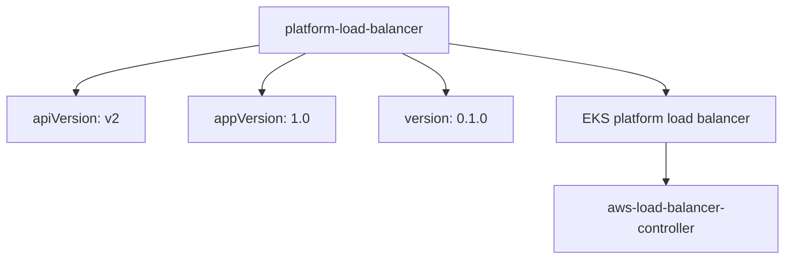
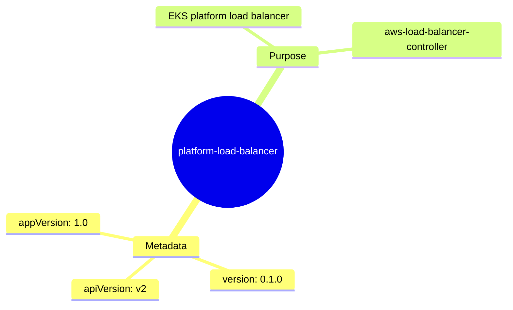

# Diagram: devops/k8s/platform-load-balancer/helm/Chart.yaml

> Auto-generated by Obscura crawlers

## Diagram 1

### SVG

<svg id="container" width="905.765625" xmlns="http://www.w3.org/2000/svg" class="flowchart" height="302" viewBox="0 0 905.765625 302" role="graphics-document document" aria-roledescription="flowchart-v2"><g><marker id="container_flowchart-v2-pointEnd" class="marker flowchart-v2" viewBox="0 0 10 10" refX="5" refY="5" markerUnits="userSpaceOnUse" markerWidth="8" markerHeight="8" orient="auto"><path d="M 0 0 L 10 5 L 0 10 z" class="arrowMarkerPath" style="stroke-width: 1; stroke-dasharray: 1, 0;"></path></marker><marker id="container_flowchart-v2-pointStart" class="marker flowchart-v2" viewBox="0 0 10 10" refX="4.5" refY="5" markerUnits="userSpaceOnUse" markerWidth="8" markerHeight="8" orient="auto"><path d="M 0 5 L 10 10 L 10 0 z" class="arrowMarkerPath" style="stroke-width: 1; stroke-dasharray: 1, 0;"></path></marker><marker id="container_flowchart-v2-circleEnd" class="marker flowchart-v2" viewBox="0 0 10 10" refX="11" refY="5" markerUnits="userSpaceOnUse" markerWidth="11" markerHeight="11" orient="auto"><circle cx="5" cy="5" r="5" class="arrowMarkerPath" style="stroke-width: 1; stroke-dasharray: 1, 0;"></circle></marker><marker id="container_flowchart-v2-circleStart" class="marker flowchart-v2" viewBox="0 0 10 10" refX="-1" refY="5" markerUnits="userSpaceOnUse" markerWidth="11" markerHeight="11" orient="auto"><circle cx="5" cy="5" r="5" class="arrowMarkerPath" style="stroke-width: 1; stroke-dasharray: 1, 0;"></circle></marker><marker id="container_flowchart-v2-crossEnd" class="marker cross flowchart-v2" viewBox="0 0 11 11" refX="12" refY="5.2" markerUnits="userSpaceOnUse" markerWidth="11" markerHeight="11" orient="auto"><path d="M 1,1 l 9,9 M 10,1 l -9,9" class="arrowMarkerPath" style="stroke-width: 2; stroke-dasharray: 1, 0;"></path></marker><marker id="container_flowchart-v2-crossStart" class="marker cross flowchart-v2" viewBox="0 0 11 11" refX="-1" refY="5.2" markerUnits="userSpaceOnUse" markerWidth="11" markerHeight="11" orient="auto"><path d="M 1,1 l 9,9 M 10,1 l -9,9" class="arrowMarkerPath" style="stroke-width: 2; stroke-dasharray: 1, 0;"></path></marker><g class="root"><g class="clusters"></g><g class="edgePaths"><path d="M292.699,53.755L258.607,59.296C224.516,64.837,156.332,75.918,122.24,84.959C88.148,94,88.148,101,88.148,104.5L88.148,108" id="L_Chart_API_0" class="edge-thickness-normal edge-pattern-solid edge-thickness-normal edge-pattern-solid flowchart-link" style=";" data-edge="true" data-et="edge" data-id="L_Chart_API_0" data-points="W3sieCI6MjkyLjY5OTIxODc1LCJ5Ijo1My43NTUyMjIzODYzNjUwMn0seyJ4Ijo4OC4xNDg0Mzc1LCJ5Ijo4N30seyJ4Ijo4OC4xNDg0Mzc1LCJ5IjoxMTJ9XQ==" marker-end="url(#container_flowchart-v2-pointEnd)"></path><path d="M353.463,62L345.032,66.167C336.6,70.333,319.738,78.667,311.306,86.333C302.875,94,302.875,101,302.875,104.5L302.875,108" id="L_Chart_App_0" class="edge-thickness-normal edge-pattern-solid edge-thickness-normal edge-pattern-solid flowchart-link" style=";" data-edge="true" data-et="edge" data-id="L_Chart_App_0" data-points="W3sieCI6MzUzLjQ2MjgxNTUwNDgwNzcsInkiOjYyfSx7IngiOjMwMi44NzUsInkiOjg3fSx7IngiOjMwMi44NzUsInkiOjExMn1d" marker-end="url(#container_flowchart-v2-pointEnd)"></path><path d="M462.732,62L471.164,66.167C479.595,70.333,496.458,78.667,504.889,86.333C513.32,94,513.32,101,513.32,104.5L513.32,108" id="L_Chart_Ver_0" class="edge-thickness-normal edge-pattern-solid edge-thickness-normal edge-pattern-solid flowchart-link" style=";" data-edge="true" data-et="edge" data-id="L_Chart_Ver_0" data-points="W3sieCI6NDYyLjczMjQ5Njk5NTE5MjMsInkiOjYyfSx7IngiOjUxMy4zMjAzMTI1LCJ5Ijo4N30seyJ4Ijo1MTMuMzIwMzEyNSwieSI6MTEyfV0=" marker-end="url(#container_flowchart-v2-pointEnd)"></path><path d="M523.496,51.684L564.208,57.57C604.919,63.456,686.342,75.228,727.054,84.614C767.766,94,767.766,101,767.766,104.5L767.766,108" id="L_Chart_Desc_0" class="edge-thickness-normal edge-pattern-solid edge-thickness-normal edge-pattern-solid flowchart-link" style=";" data-edge="true" data-et="edge" data-id="L_Chart_Desc_0" data-points="W3sieCI6NTIzLjQ5NjA5Mzc1LCJ5Ijo1MS42ODQwNTEwNDUzNDM0NjZ9LHsieCI6NzY3Ljc2NTYyNSwieSI6ODd9LHsieCI6NzY3Ljc2NTYyNSwieSI6MTEyfV0=" marker-end="url(#container_flowchart-v2-pointEnd)"></path><path d="M767.766,166L767.766,170.167C767.766,174.333,767.766,182.667,767.766,190.333C767.766,198,767.766,205,767.766,208.5L767.766,212" id="L_Desc_Controller_0" class="edge-thickness-normal edge-pattern-solid edge-thickness-normal edge-pattern-solid flowchart-link" style=";" data-edge="true" data-et="edge" data-id="L_Desc_Controller_0" data-points="W3sieCI6NzY3Ljc2NTYyNSwieSI6MTY2fSx7IngiOjc2Ny43NjU2MjUsInkiOjE5MX0seyJ4Ijo3NjcuNzY1NjI1LCJ5IjoyMTZ9XQ==" marker-end="url(#container_flowchart-v2-pointEnd)"></path></g><g class="edgeLabels"><g class="edgeLabel"><g class="label" data-id="L_Chart_API_0" transform="translate(0, 0)"><foreignObject width="0" height="0">

</foreignObject></g></g><g class="edgeLabel"><g class="label" data-id="L_Chart_App_0" transform="translate(0, 0)"><foreignObject width="0" height="0">

</foreignObject></g></g><g class="edgeLabel"><g class="label" data-id="L_Chart_Ver_0" transform="translate(0, 0)"><foreignObject width="0" height="0">

</foreignObject></g></g><g class="edgeLabel"><g class="label" data-id="L_Chart_Desc_0" transform="translate(0, 0)"><foreignObject width="0" height="0">

</foreignObject></g></g><g class="edgeLabel"><g class="label" data-id="L_Desc_Controller_0" transform="translate(0, 0)"><foreignObject width="0" height="0">

</foreignObject></g></g></g><g class="nodes"><g class="node default" id="flowchart-Chart-0" transform="translate(408.09765625, 35)"><rect class="basic label-container" style="" x="-115.3984375" y="-27" width="230.796875" height="54"></rect><g class="label" style="" transform="translate(-85.3984375, -12)"><rect></rect><foreignObject width="170.796875" height="24">

platform-load-balancer

</foreignObject></g></g><g class="node default" id="flowchart-API-2" transform="translate(88.1484375, 139)"><rect class="basic label-container" style="" x="-80.1484375" y="-27" width="160.296875" height="54"></rect><g class="label" style="" transform="translate(-50.1484375, -12)"><rect></rect><foreignObject width="100.296875" height="24">

apiVersion: v2

</foreignObject></g></g><g class="node default" id="flowchart-App-4" transform="translate(302.875, 139)"><rect class="basic label-container" style="" x="-84.578125" y="-27" width="169.15625" height="54"></rect><g class="label" style="" transform="translate(-54.578125, -12)"><rect></rect><foreignObject width="109.15625" height="24">

appVersion: 1.0

</foreignObject></g></g><g class="node default" id="flowchart-Ver-6" transform="translate(513.3203125, 139)"><rect class="basic label-container" style="" x="-75.8671875" y="-27" width="151.734375" height="54"></rect><g class="label" style="" transform="translate(-45.8671875, -12)"><rect></rect><foreignObject width="91.734375" height="24">

version: 0.1.0

</foreignObject></g></g><g class="node default" id="flowchart-Desc-8" transform="translate(767.765625, 139)"><rect class="basic label-container" style="" x="-128.578125" y="-27" width="257.15625" height="54"></rect><g class="label" style="" transform="translate(-98.578125, -12)"><rect></rect><foreignObject width="197.15625" height="24">

EKS platform load balancer

</foreignObject></g></g><g class="node default" id="flowchart-Controller-10" transform="translate(767.765625, 255)"><rect class="basic label-container" style="" x="-130" y="-39" width="260" height="78"></rect><g class="label" style="" transform="translate(-100, -24)"><rect></rect><foreignObject width="200" height="48">

aws-load-balancer-controller

</foreignObject></g></g></g></g></g></svg>

## Diagram 2

### SVG

<svg id="container" width="100%" xmlns="http://www.w3.org/2000/svg" class="mindmapDiagram" style="max-width: 826.9280395507812px;" viewBox="5 5 826.9280395507812 505.67083740234375" role="graphics-document document" aria-roledescription="mindmap"><g><marker id="container_mindmap-pointEnd" class="marker mindmap" viewBox="0 0 10 10" refX="5" refY="5" markerUnits="userSpaceOnUse" markerWidth="8" markerHeight="8" orient="auto"><path d="M 0 0 L 10 5 L 0 10 z" class="arrowMarkerPath" style="stroke-width: 1; stroke-dasharray: 1, 0;"></path></marker><marker id="container_mindmap-pointStart" class="marker mindmap" viewBox="0 0 10 10" refX="4.5" refY="5" markerUnits="userSpaceOnUse" markerWidth="8" markerHeight="8" orient="auto"><path d="M 0 5 L 10 10 L 10 0 z" class="arrowMarkerPath" style="stroke-width: 1; stroke-dasharray: 1, 0;"></path></marker><g class="subgraphs"></g><g class="edgePaths"><path d="M364.165,265.767L357.181,276.901C350.198,288.036,336.23,310.304,322.263,332.573C308.296,354.841,294.329,377.11,287.345,388.244L280.361,399.378" id="edge_0_1" class="edge-thickness-normal edge-pattern-solid edge section-edge-0 edge-depth-1" style="undefined;;;undefined" data-edge="true" data-et="edge" data-id="edge_0_1" data-points="W3sieCI6MzY0LjE2NDk5MDE0Mzc1Mjk2LCJ5IjoyNjUuNzY3MTQ3NjIyMjU1MX0seyJ4IjozMjIuMjYzMTkzNjg0MzYxMDYsInkiOjMzMi41NzI3NTE0OTAwMjQxfSx7IngiOjI4MC4zNjEzOTcyMjQ5NjkxNSwieSI6Mzk5LjM3ODM1NTM1Nzc5MzA1fV0="></path><path d="M261.496,422.396L257.008,426.643C252.52,430.89,243.544,439.384,234.568,447.878C225.592,456.372,216.616,464.867,212.128,469.114L207.64,473.361" id="edge_1_2" class="edge-thickness-normal edge-pattern-solid edge section-edge-0 edge-depth-3" style="undefined;;;undefined" data-edge="true" data-et="edge" data-id="edge_1_2" data-points="W3sieCI6MjYxLjQ5NjE0Mjk3OTc4MDQsInkiOjQyMi4zOTU3Nzk2MjY5NzgxfSx7IngiOjIzNC41NjgxNjYxNDc3ODkzOCwieSI6NDQ3Ljg3ODIzOTIxNTU0M30seyJ4IjoyMDcuNjQwMTg5MzE1Nzk4MzUsInkiOjQ3My4zNjA2OTg4MDQxMDc4N31d"></path><path d="M286.365,417.54L295.577,421.135C304.79,424.731,323.216,431.923,341.642,439.115C360.068,446.306,378.493,453.498,387.706,457.094L396.919,460.69" id="edge_1_3" class="edge-thickness-normal edge-pattern-solid edge section-edge-0 edge-depth-3" style="undefined;;;undefined" data-edge="true" data-et="edge" data-id="edge_1_3" data-points="W3sieCI6Mjg2LjM2NDUwODgxNzU0OTMsInkiOjQxNy41Mzk1Mjg2ODcyMDg1M30seyJ4IjozNDEuNjQxNzk3OTkzODc2OSwieSI6NDM5LjExNDU5NjAxMzAwNjM1fSx7IngiOjM5Ni45MTkwODcxNzAyMDQ1LCJ5Ijo0NjAuNjg5NjYzMzM4ODA0MTd9XQ=="></path><path d="M257.534,410.019L244.776,408.245C232.018,406.47,206.501,402.921,180.985,399.372C155.468,395.823,129.952,392.274,117.193,390.5L104.435,388.726" id="edge_1_4" class="edge-thickness-normal edge-pattern-solid edge section-edge-0 edge-depth-3" style="undefined;;;undefined" data-edge="true" data-et="edge" data-id="edge_1_4" data-points="W3sieCI6MjU3LjUzNDE1MTg2ODE1NTk2LCJ5Ijo0MTAuMDE5MjU2MjgzNjI0fSx7IngiOjE4MC45ODQ2MzIxMjEwOTQ5MywieSI6Mzk5LjM3MjM4NzU2Nzc1M30seyJ4IjoxMDQuNDM1MTEyMzc0MDMzOSwieSI6Mzg4LjcyNTUxODg1MTg4Mn1d"></path><path d="M380.516,240.62L387.95,229.585C395.385,218.551,410.253,196.482,425.121,174.413C439.989,152.345,454.857,130.276,462.291,119.241L469.725,108.207" id="edge_0_5" class="edge-thickness-normal edge-pattern-solid edge section-edge-1 edge-depth-1" style="undefined;;;undefined" data-edge="true" data-et="edge" data-id="edge_0_5" data-points="W3sieCI6MzgwLjUxNjM4NTU3NDcxNTMsInkiOjI0MC42MTk3NDg3NjA3OTgyNX0seyJ4Ijo0MjUuMTIwODUwNjQwNDMzMiwieSI6MTc0LjQxMzM2NDM5MTM3NDV9LHsieCI6NDY5LjcyNTMxNTcwNjE1MTE1LCJ5IjoxMDguMjA2OTgwMDIxOTUwNzZ9XQ=="></path><path d="M465.568,87.534L459.565,83.592C453.562,79.65,441.557,71.767,429.551,63.883C417.545,56,405.539,48.117,399.537,44.175L393.534,40.233" id="edge_5_6" class="edge-thickness-normal edge-pattern-solid edge section-edge-1 edge-depth-3" style="undefined;;;undefined" data-edge="true" data-et="edge" data-id="edge_5_6" data-points="W3sieCI6NDY1LjU2Nzk2NjA5MzIyMzg0LCJ5Ijo4Ny41MzM2MTU5MDAxMjA2OH0seyJ4Ijo0MjkuNTUwODc5ODE3Mjg1NTMsInkiOjYzLjg4MzQzMTAyNjYzNTYwNn0seyJ4IjozOTMuNTMzNzkzNTQxMzQ3MiwieSI6NDAuMjMzMjQ2MTUzMTUwNTR9XQ=="></path><path d="M492.962,93.691L509.138,91.431C525.314,89.171,557.666,84.651,590.017,80.13C622.369,75.61,654.721,71.09,670.897,68.83L687.072,66.57" id="edge_5_7" class="edge-thickness-normal edge-pattern-solid edge section-edge-1 edge-depth-3" style="undefined;;;undefined" data-edge="true" data-et="edge" data-id="edge_5_7" data-points="W3sieCI6NDkyLjk2MjE0NTQ0NDE2OTgsInkiOjkzLjY5MTE5MTg5ODkwNjQ1fSx7IngiOjU5MC4wMTcyNTEzNzI4NjQ0LCJ5Ijo4MC4xMzA0MzgwMjkzMTEzOX0seyJ4Ijo2ODcuMDcyMzU3MzAxNTU5LCJ5Ijo2Ni41Njk2ODQxNTk3MTYzM31d"></path></g><g class="edgeLabels"><g class="edgeLabel"><g class="label" data-id="edge_0_1" transform="translate(0, 0)"><foreignObject width="0" height="0">

</foreignObject></g></g><g class="edgeLabel"><g class="label" data-id="edge_1_2" transform="translate(0, 0)"><foreignObject width="0" height="0">

</foreignObject></g></g><g class="edgeLabel"><g class="label" data-id="edge_1_3" transform="translate(0, 0)"><foreignObject width="0" height="0">

</foreignObject></g></g><g class="edgeLabel"><g class="label" data-id="edge_1_4" transform="translate(0, 0)"><foreignObject width="0" height="0">

</foreignObject></g></g><g class="edgeLabel"><g class="label" data-id="edge_0_5" transform="translate(0, 0)"><foreignObject width="0" height="0">

</foreignObject></g></g><g class="edgeLabel"><g class="label" data-id="edge_5_6" transform="translate(0, 0)"><foreignObject width="0" height="0">

</foreignObject></g></g><g class="edgeLabel"><g class="label" data-id="edge_5_7" transform="translate(0, 0)"><foreignObject width="0" height="0">

</foreignObject></g></g></g><g class="nodes"><g class="node mindmap-node section-root section--1" id="node_0" transform="translate(372.13524812653225, 253.0598667294778)"><circle class="basic label-container" style="" r="95.3984375" cx="0" cy="0"></circle><g class="label" style="" transform="translate(-85.3984375, -12)"><rect></rect><foreignObject width="170.796875" height="24">

platform-load-balancer

</foreignObject></g></g><g class="node mindmap-node section-0" id="node_1" transform="translate(272.39113924218987, 412.08563625057036)"><path id="node-1" class="node-bkg node-0" style="" d="M-54.09375 12
    v-24
    q0,-5 5,-5
    h98.1875
    q5,0 5,5
    v24
    q0,5 -5,5
    h-98.1875
    q-5,0 -5,-5
    Z"></path><line class="node-line-" x1="-54.09375" y1="17" x2="54.09375" y2="17"></line><g class="label" style="" transform="translate(-34.09375, -12)"><rect></rect><foreignObject width="68.1875" height="24">

Metadata

</foreignObject></g></g><g class="node mindmap-node section-0" id="node_2" transform="translate(196.7451930533889, 483.6708421805156)"><path id="node-2" class="node-bkg node-0" style="" d="M-70.1484375 12
    v-24
    q0,-5 5,-5
    h130.296875
    q5,0 5,5
    v24
    q0,5 -5,5
    h-130.296875
    q-5,0 -5,-5
    Z"></path><line class="node-line-" x1="-70.1484375" y1="17" x2="70.1484375" y2="17"></line><g class="label" style="" transform="translate(-50.1484375, -12)"><rect></rect><foreignObject width="100.296875" height="24">

apiVersion: v2

</foreignObject></g></g><g class="node mindmap-node section-0" id="node_3" transform="translate(410.8924567455639, 466.14355577544234)"><path id="node-3" class="node-bkg node-0" style="" d="M-65.8671875 12
    v-24
    q0,-5 5,-5
    h121.734375
    q5,0 5,5
    v24
    q0,5 -5,5
    h-121.734375
    q-5,0 -5,-5
    Z"></path><line class="node-line-" x1="-65.8671875" y1="17" x2="65.8671875" y2="17"></line><g class="label" style="" transform="translate(-45.8671875, -12)"><rect></rect><foreignObject width="91.734375" height="24">

version: 0.1.0

</foreignObject></g></g><g class="node mindmap-node section-0" id="node_4" transform="translate(89.578125, 386.6591388849356)"><path id="node-4" class="node-bkg node-0" style="" d="M-74.578125 12
    v-24
    q0,-5 5,-5
    h139.15625
    q5,0 5,5
    v24
    q0,5 -5,5
    h-139.15625
    q-5,0 -5,-5
    Z"></path><line class="node-line-" x1="-74.578125" y1="17" x2="74.578125" y2="17"></line><g class="label" style="" transform="translate(-54.578125, -12)"><rect></rect><foreignObject width="109.15625" height="24">

appVersion: 1.0

</foreignObject></g></g><g class="node mindmap-node section-1" id="node_5" transform="translate(478.1064531543342, 95.76686205327121)"><path id="node-5" class="node-bkg node-0" style="" d="M-49.703125 12
    v-24
    q0,-5 5,-5
    h89.40625
    q5,0 5,5
    v24
    q0,5 -5,5
    h-89.40625
    q-5,0 -5,-5
    Z"></path><line class="node-line-" x1="-49.703125" y1="17" x2="49.703125" y2="17"></line><g class="label" style="" transform="translate(-29.703125, -12)"><rect></rect><foreignObject width="59.40625" height="24">

Purpose

</foreignObject></g></g><g class="node mindmap-node section-1" id="node_6" transform="translate(380.9953064802369, 32)"><path id="node-6" class="node-bkg node-0" style="" d="M-118.578125 12
    v-24
    q0,-5 5,-5
    h227.15625
    q5,0 5,5
    v24
    q0,5 -5,5
    h-227.15625
    q-5,0 -5,-5
    Z"></path><line class="node-line-" x1="-118.578125" y1="17" x2="118.578125" y2="17"></line><g class="label" style="" transform="translate(-98.578125, -12)"><rect></rect><foreignObject width="197.15625" height="24">

EKS platform load balancer

</foreignObject></g></g><g class="node mindmap-node section-1" id="node_7" transform="translate(701.9280495913946, 64.49401400535157)"><path id="node-7" class="node-bkg node-0" style="" d="M-120 24
    v-48
    q0,-5 5,-5
    h230
    q5,0 5,5
    v48
    q0,5 -5,5
    h-230
    q-5,0 -5,-5
    Z"></path><line class="node-line-" x1="-120" y1="29" x2="120" y2="29"></line><g class="label" style="" transform="translate(-100, -24)"><rect></rect><foreignObject width="200" height="48">

aws-load-balancer-controller

</foreignObject></g></g></g></g></svg>
