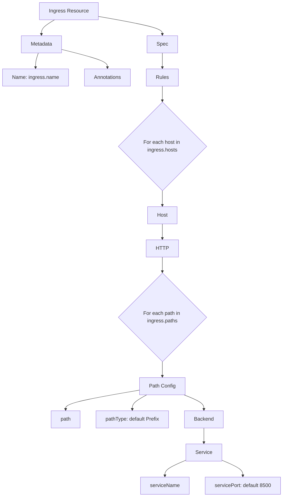
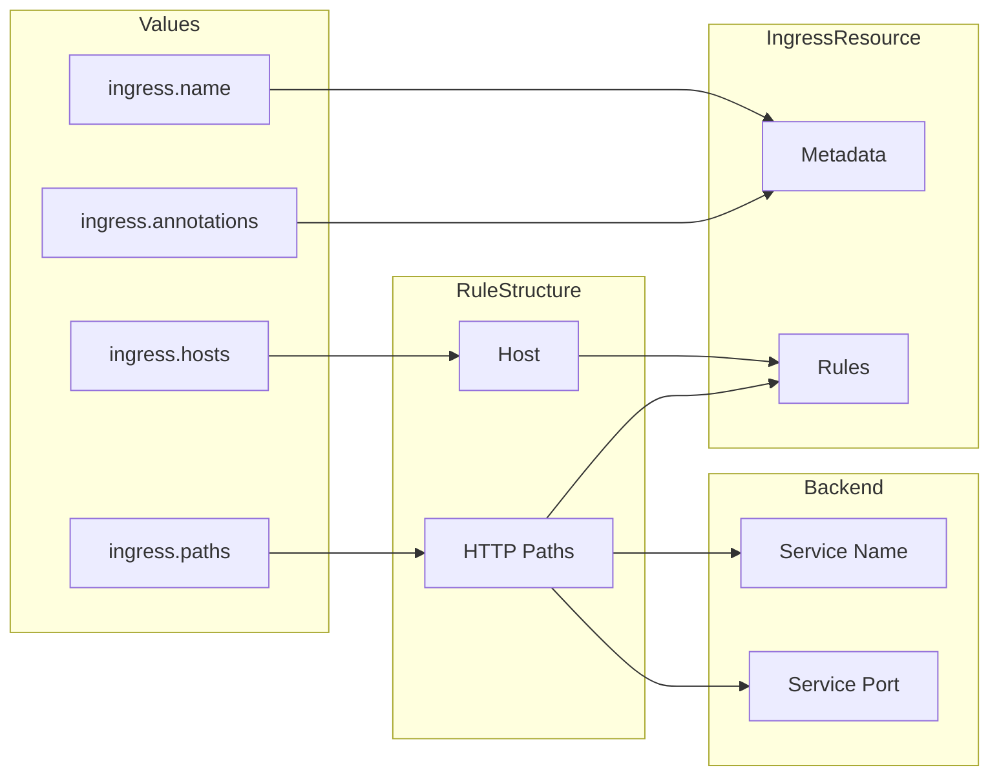

# Diagram: devops/k8s/platform-load-balancer/helm/templates/loadbalancer.yaml

> Auto-generated by Obscura crawlers

## Diagram 1

### SVG

<svg id="container" width="895.2265625" xmlns="http://www.w3.org/2000/svg" class="flowchart" height="1558" viewBox="0 0 895.2265625 1558" role="graphics-document document" aria-roledescription="flowchart-v2"><g><marker id="container_flowchart-v2-pointEnd" class="marker flowchart-v2" viewBox="0 0 10 10" refX="5" refY="5" markerUnits="userSpaceOnUse" markerWidth="8" markerHeight="8" orient="auto"><path d="M 0 0 L 10 5 L 0 10 z" class="arrowMarkerPath" style="stroke-width: 1; stroke-dasharray: 1, 0;"></path></marker><marker id="container_flowchart-v2-pointStart" class="marker flowchart-v2" viewBox="0 0 10 10" refX="4.5" refY="5" markerUnits="userSpaceOnUse" markerWidth="8" markerHeight="8" orient="auto"><path d="M 0 5 L 10 10 L 10 0 z" class="arrowMarkerPath" style="stroke-width: 1; stroke-dasharray: 1, 0;"></path></marker><marker id="container_flowchart-v2-circleEnd" class="marker flowchart-v2" viewBox="0 0 10 10" refX="11" refY="5" markerUnits="userSpaceOnUse" markerWidth="11" markerHeight="11" orient="auto"><circle cx="5" cy="5" r="5" class="arrowMarkerPath" style="stroke-width: 1; stroke-dasharray: 1, 0;"></circle></marker><marker id="container_flowchart-v2-circleStart" class="marker flowchart-v2" viewBox="0 0 10 10" refX="-1" refY="5" markerUnits="userSpaceOnUse" markerWidth="11" markerHeight="11" orient="auto"><circle cx="5" cy="5" r="5" class="arrowMarkerPath" style="stroke-width: 1; stroke-dasharray: 1, 0;"></circle></marker><marker id="container_flowchart-v2-crossEnd" class="marker cross flowchart-v2" viewBox="0 0 11 11" refX="12" refY="5.2" markerUnits="userSpaceOnUse" markerWidth="11" markerHeight="11" orient="auto"><path d="M 1,1 l 9,9 M 10,1 l -9,9" class="arrowMarkerPath" style="stroke-width: 2; stroke-dasharray: 1, 0;"></path></marker><marker id="container_flowchart-v2-crossStart" class="marker cross flowchart-v2" viewBox="0 0 11 11" refX="-1" refY="5.2" markerUnits="userSpaceOnUse" markerWidth="11" markerHeight="11" orient="auto"><path d="M 1,1 l 9,9 M 10,1 l -9,9" class="arrowMarkerPath" style="stroke-width: 2; stroke-dasharray: 1, 0;"></path></marker><g class="root"><g class="clusters"></g><g class="edgePaths"><path d="M171.939,62L164.969,66.167C157.999,70.333,144.06,78.667,137.091,86.333C130.121,94,130.121,101,130.121,104.5L130.121,108" id="L_A_B_0" class="edge-thickness-normal edge-pattern-solid edge-thickness-normal edge-pattern-solid flowchart-link" style=";" data-edge="true" data-et="edge" data-id="L_A_B_0" data-points="W3sieCI6MTcxLjkzODYyNjgwMjg4NDYsInkiOjYyfSx7IngiOjEzMC4xMjEwOTM3NSwieSI6ODd9LHsieCI6MTMwLjEyMTA5Mzc1LCJ5IjoxMTJ9XQ==" marker-end="url(#container_flowchart-v2-pointEnd)"></path><path d="M308.047,51.04L342.027,57.034C376.008,63.027,443.969,75.013,477.949,84.507C511.93,94,511.93,101,511.93,104.5L511.93,108" id="L_A_C_0" class="edge-thickness-normal edge-pattern-solid edge-thickness-normal edge-pattern-solid flowchart-link" style=";" data-edge="true" data-et="edge" data-id="L_A_C_0" data-points="W3sieCI6MzA4LjA0Njg3NSwieSI6NTEuMDQwMzgzNjk4MTI5MjA1fSx7IngiOjUxMS45Mjk2ODc1LCJ5Ijo4N30seyJ4Ijo1MTEuOTI5Njg3NSwieSI6MTEyfV0=" marker-end="url(#container_flowchart-v2-pointEnd)"></path><path d="M120.168,166L118.633,170.167C117.097,174.333,114.025,182.667,112.489,190.333C110.953,198,110.953,205,110.953,208.5L110.953,212" id="L_B_D_0" class="edge-thickness-normal edge-pattern-solid edge-thickness-normal edge-pattern-solid flowchart-link" style=";" data-edge="true" data-et="edge" data-id="L_B_D_0" data-points="W3sieCI6MTIwLjE2ODQ5NDU5MTM0NjE2LCJ5IjoxNjZ9LHsieCI6MTEwLjk1MzEyNSwieSI6MTkxfSx7IngiOjExMC45NTMxMjUsInkiOjIxNn1d" marker-end="url(#container_flowchart-v2-pointEnd)"></path><path d="M194.215,155.035L218.174,161.029C242.133,167.023,290.051,179.012,314.01,188.506C337.969,198,337.969,205,337.969,208.5L337.969,212" id="L_B_E_0" class="edge-thickness-normal edge-pattern-solid edge-thickness-normal edge-pattern-solid flowchart-link" style=";" data-edge="true" data-et="edge" data-id="L_B_E_0" data-points="W3sieCI6MTk0LjIxNDg0Mzc1LCJ5IjoxNTUuMDM1MTgyMDE4MDc5NjR9LHsieCI6MzM3Ljk2ODc1LCJ5IjoxOTF9LHsieCI6MzM3Ljk2ODc1LCJ5IjoyMTZ9XQ==" marker-end="url(#container_flowchart-v2-pointEnd)"></path><path d="M511.93,166L511.93,170.167C511.93,174.333,511.93,182.667,511.93,190.333C511.93,198,511.93,205,511.93,208.5L511.93,212" id="L_C_F_0" class="edge-thickness-normal edge-pattern-solid edge-thickness-normal edge-pattern-solid flowchart-link" style=";" data-edge="true" data-et="edge" data-id="L_C_F_0" data-points="W3sieCI6NTExLjkyOTY4NzUsInkiOjE2Nn0seyJ4Ijo1MTEuOTI5Njg3NSwieSI6MTkxfSx7IngiOjUxMS45Mjk2ODc1LCJ5IjoyMTZ9XQ==" marker-end="url(#container_flowchart-v2-pointEnd)"></path><path d="M511.93,270L511.93,274.167C511.93,278.333,511.93,286.667,511.93,294.333C511.93,302,511.93,309,511.93,312.5L511.93,316" id="L_F_G_0" class="edge-thickness-normal edge-pattern-solid edge-thickness-normal edge-pattern-solid flowchart-link" style=";" data-edge="true" data-et="edge" data-id="L_F_G_0" data-points="W3sieCI6NTExLjkyOTY4NzUsInkiOjI3MH0seyJ4Ijo1MTEuOTI5Njg3NSwieSI6Mjk1fSx7IngiOjUxMS45Mjk2ODc1LCJ5IjozMjB9XQ==" marker-end="url(#container_flowchart-v2-pointEnd)"></path><path d="M511.93,598L511.93,602.167C511.93,606.333,511.93,614.667,511.93,622.333C511.93,630,511.93,637,511.93,640.5L511.93,644" id="L_G_H_0" class="edge-thickness-normal edge-pattern-solid edge-thickness-normal edge-pattern-solid flowchart-link" style=";" data-edge="true" data-et="edge" data-id="L_G_H_0" data-points="W3sieCI6NTExLjkyOTY4NzUsInkiOjU5OH0seyJ4Ijo1MTEuOTI5Njg3NSwieSI6NjIzfSx7IngiOjUxMS45Mjk2ODc1LCJ5Ijo2NDh9XQ==" marker-end="url(#container_flowchart-v2-pointEnd)"></path><path d="M511.93,702L511.93,706.167C511.93,710.333,511.93,718.667,511.93,726.333C511.93,734,511.93,741,511.93,744.5L511.93,748" id="L_H_I_0" class="edge-thickness-normal edge-pattern-solid edge-thickness-normal edge-pattern-solid flowchart-link" style=";" data-edge="true" data-et="edge" data-id="L_H_I_0" data-points="W3sieCI6NTExLjkyOTY4NzUsInkiOjcwMn0seyJ4Ijo1MTEuOTI5Njg3NSwieSI6NzI3fSx7IngiOjUxMS45Mjk2ODc1LCJ5Ijo3NTJ9XQ==" marker-end="url(#container_flowchart-v2-pointEnd)"></path><path d="M511.93,806L511.93,810.167C511.93,814.333,511.93,822.667,511.93,830.333C511.93,838,511.93,845,511.93,848.5L511.93,852" id="L_I_J_0" class="edge-thickness-normal edge-pattern-solid edge-thickness-normal edge-pattern-solid flowchart-link" style=";" data-edge="true" data-et="edge" data-id="L_I_J_0" data-points="W3sieCI6NTExLjkyOTY4NzUsInkiOjgwNn0seyJ4Ijo1MTEuOTI5Njg3NSwieSI6ODMxfSx7IngiOjUxMS45Mjk2ODc1LCJ5Ijo4NTZ9XQ==" marker-end="url(#container_flowchart-v2-pointEnd)"></path><path d="M511.93,1134L511.93,1138.167C511.93,1142.333,511.93,1150.667,511.93,1158.333C511.93,1166,511.93,1173,511.93,1176.5L511.93,1180" id="L_J_K_0" class="edge-thickness-normal edge-pattern-solid edge-thickness-normal edge-pattern-solid flowchart-link" style=";" data-edge="true" data-et="edge" data-id="L_J_K_0" data-points="W3sieCI6NTExLjkyOTY4NzUsInkiOjExMzR9LHsieCI6NTExLjkyOTY4NzUsInkiOjExNTl9LHsieCI6NTExLjkyOTY4NzUsInkiOjExODR9XQ==" marker-end="url(#container_flowchart-v2-pointEnd)"></path><path d="M441.227,1222.99L401.904,1229.658C362.582,1236.327,283.938,1249.663,244.615,1259.832C205.293,1270,205.293,1277,205.293,1280.5L205.293,1284" id="L_K_L_0" class="edge-thickness-normal edge-pattern-solid edge-thickness-normal edge-pattern-solid flowchart-link" style=";" data-edge="true" data-et="edge" data-id="L_K_L_0" data-points="W3sieCI6NDQxLjIyNjU2MjUsInkiOjEyMjIuOTg5OTYxNjU1NTYyNH0seyJ4IjoyMDUuMjkyOTY4NzUsInkiOjEyNjN9LHsieCI6MjA1LjI5Mjk2ODc1LCJ5IjoxMjg4fV0=" marker-end="url(#container_flowchart-v2-pointEnd)"></path><path d="M462.946,1238L455.386,1242.167C447.827,1246.333,432.708,1254.667,425.149,1262.333C417.59,1270,417.59,1277,417.59,1280.5L417.59,1284" id="L_K_M_0" class="edge-thickness-normal edge-pattern-solid edge-thickness-normal edge-pattern-solid flowchart-link" style=";" data-edge="true" data-et="edge" data-id="L_K_M_0" data-points="W3sieCI6NDYyLjk0NTUzNzg2MDU3NjksInkiOjEyMzh9LHsieCI6NDE3LjU4OTg0Mzc1LCJ5IjoxMjYzfSx7IngiOjQxNy41ODk4NDM3NSwieSI6MTI4OH1d" marker-end="url(#container_flowchart-v2-pointEnd)"></path><path d="M580.6,1238L591.197,1242.167C601.795,1246.333,622.989,1254.667,633.586,1262.333C644.184,1270,644.184,1277,644.184,1280.5L644.184,1284" id="L_K_N_0" class="edge-thickness-normal edge-pattern-solid edge-thickness-normal edge-pattern-solid flowchart-link" style=";" data-edge="true" data-et="edge" data-id="L_K_N_0" data-points="W3sieCI6NTgwLjU5OTk4NDk3NTk2MTUsInkiOjEyMzh9LHsieCI6NjQ0LjE4MzU5Mzc1LCJ5IjoxMjYzfSx7IngiOjY0NC4xODM1OTM3NSwieSI6MTI4OH1d" marker-end="url(#container_flowchart-v2-pointEnd)"></path><path d="M644.184,1342L644.184,1346.167C644.184,1350.333,644.184,1358.667,644.184,1366.333C644.184,1374,644.184,1381,644.184,1384.5L644.184,1388" id="L_N_O_0" class="edge-thickness-normal edge-pattern-solid edge-thickness-normal edge-pattern-solid flowchart-link" style=";" data-edge="true" data-et="edge" data-id="L_N_O_0" data-points="W3sieCI6NjQ0LjE4MzU5Mzc1LCJ5IjoxMzQyfSx7IngiOjY0NC4xODM1OTM3NSwieSI6MTM2N30seyJ4Ijo2NDQuMTgzNTkzNzUsInkiOjEzOTJ9XQ==" marker-end="url(#container_flowchart-v2-pointEnd)"></path><path d="M588.152,1442.657L576.964,1447.381C565.776,1452.105,543.4,1461.552,532.212,1469.776C521.023,1478,521.023,1485,521.023,1488.5L521.023,1492" id="L_O_P_0" class="edge-thickness-normal edge-pattern-solid edge-thickness-normal edge-pattern-solid flowchart-link" style=";" data-edge="true" data-et="edge" data-id="L_O_P_0" data-points="W3sieCI6NTg4LjE1MjM0Mzc1LCJ5IjoxNDQyLjY1NzIwNDQ3ODQxNjZ9LHsieCI6NTIxLjAyMzQzNzUsInkiOjE0NzF9LHsieCI6NTIxLjAyMzQzNzUsInkiOjE0OTZ9XQ==" marker-end="url(#container_flowchart-v2-pointEnd)"></path><path d="M700.215,1442.657L711.403,1447.381C722.591,1452.105,744.967,1461.552,756.156,1469.776C767.344,1478,767.344,1485,767.344,1488.5L767.344,1492" id="L_O_Q_0" class="edge-thickness-normal edge-pattern-solid edge-thickness-normal edge-pattern-solid flowchart-link" style=";" data-edge="true" data-et="edge" data-id="L_O_Q_0" data-points="W3sieCI6NzAwLjIxNDg0Mzc1LCJ5IjoxNDQyLjY1NzIwNDQ3ODQxNjZ9LHsieCI6NzY3LjM0Mzc1LCJ5IjoxNDcxfSx7IngiOjc2Ny4zNDM3NSwieSI6MTQ5Nn1d" marker-end="url(#container_flowchart-v2-pointEnd)"></path></g><g class="edgeLabels"><g class="edgeLabel"><g class="label" data-id="L_A_B_0" transform="translate(0, 0)"><foreignObject width="0" height="0">

</foreignObject></g></g><g class="edgeLabel"><g class="label" data-id="L_A_C_0" transform="translate(0, 0)"><foreignObject width="0" height="0">

</foreignObject></g></g><g class="edgeLabel"><g class="label" data-id="L_B_D_0" transform="translate(0, 0)"><foreignObject width="0" height="0">

</foreignObject></g></g><g class="edgeLabel"><g class="label" data-id="L_B_E_0" transform="translate(0, 0)"><foreignObject width="0" height="0">

</foreignObject></g></g><g class="edgeLabel"><g class="label" data-id="L_C_F_0" transform="translate(0, 0)"><foreignObject width="0" height="0">

</foreignObject></g></g><g class="edgeLabel"><g class="label" data-id="L_F_G_0" transform="translate(0, 0)"><foreignObject width="0" height="0">

</foreignObject></g></g><g class="edgeLabel"><g class="label" data-id="L_G_H_0" transform="translate(0, 0)"><foreignObject width="0" height="0">

</foreignObject></g></g><g class="edgeLabel"><g class="label" data-id="L_H_I_0" transform="translate(0, 0)"><foreignObject width="0" height="0">

</foreignObject></g></g><g class="edgeLabel"><g class="label" data-id="L_I_J_0" transform="translate(0, 0)"><foreignObject width="0" height="0">

</foreignObject></g></g><g class="edgeLabel"><g class="label" data-id="L_J_K_0" transform="translate(0, 0)"><foreignObject width="0" height="0">

</foreignObject></g></g><g class="edgeLabel"><g class="label" data-id="L_K_L_0" transform="translate(0, 0)"><foreignObject width="0" height="0">

</foreignObject></g></g><g class="edgeLabel"><g class="label" data-id="L_K_M_0" transform="translate(0, 0)"><foreignObject width="0" height="0">

</foreignObject></g></g><g class="edgeLabel"><g class="label" data-id="L_K_N_0" transform="translate(0, 0)"><foreignObject width="0" height="0">

</foreignObject></g></g><g class="edgeLabel"><g class="label" data-id="L_N_O_0" transform="translate(0, 0)"><foreignObject width="0" height="0">

</foreignObject></g></g><g class="edgeLabel"><g class="label" data-id="L_O_P_0" transform="translate(0, 0)"><foreignObject width="0" height="0">

</foreignObject></g></g><g class="edgeLabel"><g class="label" data-id="L_O_Q_0" transform="translate(0, 0)"><foreignObject width="0" height="0">

</foreignObject></g></g></g><g class="nodes"><g class="node default" id="flowchart-A-0" transform="translate(217.1015625, 35)"><rect class="basic label-container" style="" x="-90.9453125" y="-27" width="181.890625" height="54"></rect><g class="label" style="" transform="translate(-60.9453125, -12)"><rect></rect><foreignObject width="121.890625" height="24">

Ingress Resource

</foreignObject></g></g><g class="node default" id="flowchart-B-1" transform="translate(130.12109375, 139)"><rect class="basic label-container" style="" x="-64.09375" y="-27" width="128.1875" height="54"></rect><g class="label" style="" transform="translate(-34.09375, -12)"><rect></rect><foreignObject width="68.1875" height="24">

Metadata

</foreignObject></g></g><g class="node default" id="flowchart-C-3" transform="translate(511.9296875, 139)"><rect class="basic label-container" style="" x="-47.296875" y="-27" width="94.59375" height="54"></rect><g class="label" style="" transform="translate(-17.296875, -12)"><rect></rect><foreignObject width="34.59375" height="24">

Spec

</foreignObject></g></g><g class="node default" id="flowchart-D-5" transform="translate(110.953125, 243)"><rect class="basic label-container" style="" x="-102.953125" y="-27" width="205.90625" height="54"></rect><g class="label" style="" transform="translate(-72.953125, -12)"><rect></rect><foreignObject width="145.90625" height="24">

Name: ingress.name

</foreignObject></g></g><g class="node default" id="flowchart-E-7" transform="translate(337.96875, 243)"><rect class="basic label-container" style="" x="-74.0625" y="-27" width="148.125" height="54"></rect><g class="label" style="" transform="translate(-44.0625, -12)"><rect></rect><foreignObject width="88.125" height="24">

Annotations

</foreignObject></g></g><g class="node default" id="flowchart-F-9" transform="translate(511.9296875, 243)"><rect class="basic label-container" style="" x="-49.8984375" y="-27" width="99.796875" height="54"></rect><g class="label" style="" transform="translate(-19.8984375, -12)"><rect></rect><foreignObject width="39.796875" height="24">

Rules

</foreignObject></g></g><g class="node default" id="flowchart-G-11" transform="translate(511.9296875, 459)"><polygon points="139,0 278,-139 139,-278 0,-139" class="label-container" transform="translate(-138.5, 139)"></polygon><g class="label" style="" transform="translate(-100, -24)"><rect></rect><foreignObject width="200" height="48">

For each host in ingress.hosts

</foreignObject></g></g><g class="node default" id="flowchart-H-13" transform="translate(511.9296875, 675)"><rect class="basic label-container" style="" x="-46.7421875" y="-27" width="93.484375" height="54"></rect><g class="label" style="" transform="translate(-16.7421875, -12)"><rect></rect><foreignObject width="33.484375" height="24">

Host

</foreignObject></g></g><g class="node default" id="flowchart-I-15" transform="translate(511.9296875, 779)"><rect class="basic label-container" style="" x="-48.3671875" y="-27" width="96.734375" height="54"></rect><g class="label" style="" transform="translate(-18.3671875, -12)"><rect></rect><foreignObject width="36.734375" height="24">

HTTP

</foreignObject></g></g><g class="node default" id="flowchart-J-17" transform="translate(511.9296875, 995)"><polygon points="139,0 278,-139 139,-278 0,-139" class="label-container" transform="translate(-138.5, 139)"></polygon><g class="label" style="" transform="translate(-100, -24)"><rect></rect><foreignObject width="200" height="48">

For each path in ingress.paths

</foreignObject></g></g><g class="node default" id="flowchart-K-19" transform="translate(511.9296875, 1211)"><rect class="basic label-container" style="" x="-70.703125" y="-27" width="141.40625" height="54"></rect><g class="label" style="" transform="translate(-40.703125, -12)"><rect></rect><foreignObject width="81.40625" height="24">

Path Config

</foreignObject></g></g><g class="node default" id="flowchart-L-21" transform="translate(205.29296875, 1315)"><rect class="basic label-container" style="" x="-46.6015625" y="-27" width="93.203125" height="54"></rect><g class="label" style="" transform="translate(-16.6015625, -12)"><rect></rect><foreignObject width="33.203125" height="24">

path

</foreignObject></g></g><g class="node default" id="flowchart-M-23" transform="translate(417.58984375, 1315)"><rect class="basic label-container" style="" x="-115.6953125" y="-27" width="231.390625" height="54"></rect><g class="label" style="" transform="translate(-85.6953125, -12)"><rect></rect><foreignObject width="171.390625" height="24">

pathType: default Prefix

</foreignObject></g></g><g class="node default" id="flowchart-N-25" transform="translate(644.18359375, 1315)"><rect class="basic label-container" style="" x="-60.8984375" y="-27" width="121.796875" height="54"></rect><g class="label" style="" transform="translate(-30.8984375, -12)"><rect></rect><foreignObject width="61.796875" height="24">

Backend

</foreignObject></g></g><g class="node default" id="flowchart-O-27" transform="translate(644.18359375, 1419)"><rect class="basic label-container" style="" x="-56.03125" y="-27" width="112.0625" height="54"></rect><g class="label" style="" transform="translate(-26.03125, -12)"><rect></rect><foreignObject width="52.0625" height="24">

Service

</foreignObject></g></g><g class="node default" id="flowchart-P-29" transform="translate(521.0234375, 1523)"><rect class="basic label-container" style="" x="-76.4375" y="-27" width="152.875" height="54"></rect><g class="label" style="" transform="translate(-46.4375, -12)"><rect></rect><foreignObject width="92.875" height="24">

serviceName

</foreignObject></g></g><g class="node default" id="flowchart-Q-31" transform="translate(767.34375, 1523)"><rect class="basic label-container" style="" x="-119.8828125" y="-27" width="239.765625" height="54"></rect><g class="label" style="" transform="translate(-89.8828125, -12)"><rect></rect><foreignObject width="179.765625" height="24">

servicePort: default 8500

</foreignObject></g></g></g></g></g></svg>

## Diagram 2

### SVG

<svg id="container" width="767.984375" xmlns="http://www.w3.org/2000/svg" class="flowchart" height="606" viewBox="0 0 767.984375 606" role="graphics-document document" aria-roledescription="flowchart-v2"><g><marker id="container_flowchart-v2-pointEnd" class="marker flowchart-v2" viewBox="0 0 10 10" refX="5" refY="5" markerUnits="userSpaceOnUse" markerWidth="8" markerHeight="8" orient="auto"><path d="M 0 0 L 10 5 L 0 10 z" class="arrowMarkerPath" style="stroke-width: 1; stroke-dasharray: 1, 0;"></path></marker><marker id="container_flowchart-v2-pointStart" class="marker flowchart-v2" viewBox="0 0 10 10" refX="4.5" refY="5" markerUnits="userSpaceOnUse" markerWidth="8" markerHeight="8" orient="auto"><path d="M 0 5 L 10 10 L 10 0 z" class="arrowMarkerPath" style="stroke-width: 1; stroke-dasharray: 1, 0;"></path></marker><marker id="container_flowchart-v2-circleEnd" class="marker flowchart-v2" viewBox="0 0 10 10" refX="11" refY="5" markerUnits="userSpaceOnUse" markerWidth="11" markerHeight="11" orient="auto"><circle cx="5" cy="5" r="5" class="arrowMarkerPath" style="stroke-width: 1; stroke-dasharray: 1, 0;"></circle></marker><marker id="container_flowchart-v2-circleStart" class="marker flowchart-v2" viewBox="0 0 10 10" refX="-1" refY="5" markerUnits="userSpaceOnUse" markerWidth="11" markerHeight="11" orient="auto"><circle cx="5" cy="5" r="5" class="arrowMarkerPath" style="stroke-width: 1; stroke-dasharray: 1, 0;"></circle></marker><marker id="container_flowchart-v2-crossEnd" class="marker cross flowchart-v2" viewBox="0 0 11 11" refX="12" refY="5.2" markerUnits="userSpaceOnUse" markerWidth="11" markerHeight="11" orient="auto"><path d="M 1,1 l 9,9 M 10,1 l -9,9" class="arrowMarkerPath" style="stroke-width: 2; stroke-dasharray: 1, 0;"></path></marker><marker id="container_flowchart-v2-crossStart" class="marker cross flowchart-v2" viewBox="0 0 11 11" refX="-1" refY="5.2" markerUnits="userSpaceOnUse" markerWidth="11" markerHeight="11" orient="auto"><path d="M 1,1 l 9,9 M 10,1 l -9,9" class="arrowMarkerPath" style="stroke-width: 2; stroke-dasharray: 1, 0;"></path></marker><g class="root"><g class="clusters"><g class="cluster" id="Backend" data-look="classic"><rect style="" x="551.625" y="370" width="208.359375" height="228"></rect><g class="cluster-label" transform="translate(624.90625, 370)"><foreignObject width="61.796875" height="24">

Backend

</foreignObject></g></g><g class="cluster" id="RuleStructure" data-look="classic"><rect style="" x="310.90625" y="216" width="190.71875" height="361"></rect><g class="cluster-label" transform="translate(356.53125, 216)"><foreignObject width="99.46875" height="24">

RuleStructure

</foreignObject></g></g><g class="cluster" id="IngressResource" data-look="classic"><rect style="" x="551.625" y="19" width="208.359375" height="331"></rect><g class="cluster-label" transform="translate(596.9765625, 19)"><foreignObject width="117.65625" height="24">

IngressResource

</foreignObject></g></g><g class="cluster" id="Values" data-look="classic"><rect style="" x="8" y="8" width="252.90625" height="486"></rect><g class="cluster-label" transform="translate(110.953125, 8)"><foreignObject width="47" height="24">

Values

</foreignObject></g></g></g><g class="edgePaths"><path d="M212.336,70L220.431,70C228.526,70,244.716,70,256.978,70C269.24,70,277.573,70,285.906,70C294.24,70,302.573,70,322.633,70C342.693,70,374.479,70,406.266,70C438.052,70,469.839,70,489.898,70C509.958,70,518.292,70,526.625,70C534.958,70,543.292,70,555.21,73.869C567.127,77.738,582.63,85.476,590.381,89.345L598.132,93.214" id="L_V1_I1_0" class="edge-thickness-normal edge-pattern-solid edge-thickness-normal edge-pattern-solid flowchart-link" style=";" data-edge="true" data-et="edge" data-id="L_V1_I1_0" data-points="W3sieCI6MjEyLjMzNTkzNzUsInkiOjcwfSx7IngiOjI2MC45MDYyNSwieSI6NzB9LHsieCI6Mjg1LjkwNjI1LCJ5Ijo3MH0seyJ4IjozMTAuOTA2MjUsInkiOjcwfSx7IngiOjQwNi4yNjU2MjUsInkiOjcwfSx7IngiOjUwMS42MjUsInkiOjcwfSx7IngiOjUyNi42MjUsInkiOjcwfSx7IngiOjU1MS42MjUsInkiOjcwfSx7IngiOjYwMS43MTEzODgyMjExNTM4LCJ5Ijo5NX1d" marker-end="url(#container_flowchart-v2-pointEnd)"></path><path d="M235.906,174L240.073,174C244.24,174,252.573,174,260.906,174C269.24,174,277.573,174,285.906,174C294.24,174,302.573,174,322.633,174C342.693,174,374.479,174,406.266,174C438.052,174,469.839,174,489.898,174C509.958,174,518.292,174,526.625,174C534.958,174,543.292,174,555.21,170.131C567.127,166.262,582.63,158.524,590.381,154.655L598.132,150.786" id="L_V2_I1_0" class="edge-thickness-normal edge-pattern-solid edge-thickness-normal edge-pattern-solid flowchart-link" style=";" data-edge="true" data-et="edge" data-id="L_V2_I1_0" data-points="W3sieCI6MjM1LjkwNjI1LCJ5IjoxNzR9LHsieCI6MjYwLjkwNjI1LCJ5IjoxNzR9LHsieCI6Mjg1LjkwNjI1LCJ5IjoxNzR9LHsieCI6MzEwLjkwNjI1LCJ5IjoxNzR9LHsieCI6NDA2LjI2NTYyNSwieSI6MTc0fSx7IngiOjUwMS42MjUsInkiOjE3NH0seyJ4Ijo1MjYuNjI1LCJ5IjoxNzR9LHsieCI6NTUxLjYyNSwieSI6MTc0fSx7IngiOjYwMS43MTEzODgyMjExNTM4LCJ5IjoxNDl9XQ==" marker-end="url(#container_flowchart-v2-pointEnd)"></path><path d="M211.805,278L219.988,278C228.172,278,244.539,278,256.889,278C269.24,278,277.573,278,285.906,278C294.24,278,302.573,278,314.176,278C325.779,278,340.651,278,348.087,278L355.523,278" id="L_V3_R1_0" class="edge-thickness-normal edge-pattern-solid edge-thickness-normal edge-pattern-solid flowchart-link" style=";" data-edge="true" data-et="edge" data-id="L_V3_R1_0" data-points="W3sieCI6MjExLjgwNDY4NzUsInkiOjI3OH0seyJ4IjoyNjAuOTA2MjUsInkiOjI3OH0seyJ4IjoyODUuOTA2MjUsInkiOjI3OH0seyJ4IjozMTAuOTA2MjUsInkiOjI3OH0seyJ4IjozNTkuNTIzNDM3NSwieSI6Mjc4fV0=" marker-end="url(#container_flowchart-v2-pointEnd)"></path><path d="M453.008,278L461.111,278C469.214,278,485.419,278,497.689,278C509.958,278,518.292,278,526.625,278C534.958,278,543.292,278,555.842,278.805C568.392,279.609,585.158,281.219,593.541,282.023L601.925,282.828" id="L_R1_I2_0" class="edge-thickness-normal edge-pattern-solid edge-thickness-normal edge-pattern-solid flowchart-link" style=";" data-edge="true" data-et="edge" data-id="L_R1_I2_0" data-points="W3sieCI6NDUzLjAwNzgxMjUsInkiOjI3OH0seyJ4Ijo1MDEuNjI1LCJ5IjoyNzh9LHsieCI6NTI2LjYyNSwieSI6Mjc4fSx7IngiOjU1MS42MjUsInkiOjI3OH0seyJ4Ijo2MDUuOTA2MjUsInkiOjI4My4yMTAzNDg3MDY0MTE3fV0=" marker-end="url(#container_flowchart-v2-pointEnd)"></path><path d="M212.414,432L220.496,432C228.578,432,244.742,432,256.991,432C269.24,432,277.573,432,285.906,432C294.24,432,302.573,432,310.24,432C317.906,432,324.906,432,328.406,432L331.906,432" id="L_V4_R2_0" class="edge-thickness-normal edge-pattern-solid edge-thickness-normal edge-pattern-solid flowchart-link" style=";" data-edge="true" data-et="edge" data-id="L_V4_R2_0" data-points="W3sieCI6MjEyLjQxNDA2MjUsInkiOjQzMn0seyJ4IjoyNjAuOTA2MjUsInkiOjQzMn0seyJ4IjoyODUuOTA2MjUsInkiOjQzMn0seyJ4IjozMTAuOTA2MjUsInkiOjQzMn0seyJ4IjozMzUuOTA2MjUsInkiOjQzMn1d" marker-end="url(#container_flowchart-v2-pointEnd)"></path><path d="M427.198,405L439.603,389C452.007,373,476.816,341,493.387,325C509.958,309,518.292,309,526.625,309C534.958,309,543.292,309,555.852,307.308C568.412,305.616,585.198,302.232,593.592,300.541L601.985,298.849" id="L_R2_I2_0" class="edge-thickness-normal edge-pattern-solid edge-thickness-normal edge-pattern-solid flowchart-link" style=";" data-edge="true" data-et="edge" data-id="L_R2_I2_0" data-points="W3sieCI6NDI3LjE5ODE3MDczMTcwNzMsInkiOjQwNX0seyJ4Ijo1MDEuNjI1LCJ5IjozMDl9LHsieCI6NTI2LjYyNSwieSI6MzA5fSx7IngiOjU1MS42MjUsInkiOjMwOX0seyJ4Ijo2MDUuOTA2MjUsInkiOjI5OC4wNTgyNjc3MTY1MzU0NX1d" marker-end="url(#container_flowchart-v2-pointEnd)"></path><path d="M476.625,432L480.792,432C484.958,432,493.292,432,501.625,432C509.958,432,518.292,432,526.625,432C534.958,432,543.292,432,550.958,432C558.625,432,565.625,432,569.125,432L572.625,432" id="L_R2_B1_0" class="edge-thickness-normal edge-pattern-solid edge-thickness-normal edge-pattern-solid flowchart-link" style=";" data-edge="true" data-et="edge" data-id="L_R2_B1_0" data-points="W3sieCI6NDc2LjYyNSwieSI6NDMyfSx7IngiOjUwMS42MjUsInkiOjQzMn0seyJ4Ijo1MjYuNjI1LCJ5Ijo0MzJ9LHsieCI6NTUxLjYyNSwieSI6NDMyfSx7IngiOjU3Ni42MjUsInkiOjQzMn1d" marker-end="url(#container_flowchart-v2-pointEnd)"></path><path d="M431.022,459L442.789,471.833C454.557,484.667,478.091,510.333,494.025,523.167C509.958,536,518.292,536,526.625,536C534.958,536,543.292,536,551.954,536C560.617,536,569.609,536,574.105,536L578.602,536" id="L_R2_B2_0" class="edge-thickness-normal edge-pattern-solid edge-thickness-normal edge-pattern-solid flowchart-link" style=";" data-edge="true" data-et="edge" data-id="L_R2_B2_0" data-points="W3sieCI6NDMxLjAyMjM4NTgxNzMwNzcsInkiOjQ1OX0seyJ4Ijo1MDEuNjI1LCJ5Ijo1MzZ9LHsieCI6NTI2LjYyNSwieSI6NTM2fSx7IngiOjU1MS42MjUsInkiOjUzNn0seyJ4Ijo1ODIuNjAxNTYyNSwieSI6NTM2fV0=" marker-end="url(#container_flowchart-v2-pointEnd)"></path></g><g class="edgeLabels"><g class="edgeLabel"><g class="label" data-id="L_V1_I1_0" transform="translate(0, 0)"><foreignObject width="0" height="0">

</foreignObject></g></g><g class="edgeLabel"><g class="label" data-id="L_V2_I1_0" transform="translate(0, 0)"><foreignObject width="0" height="0">

</foreignObject></g></g><g class="edgeLabel"><g class="label" data-id="L_V3_R1_0" transform="translate(0, 0)"><foreignObject width="0" height="0">

</foreignObject></g></g><g class="edgeLabel"><g class="label" data-id="L_R1_I2_0" transform="translate(0, 0)"><foreignObject width="0" height="0">

</foreignObject></g></g><g class="edgeLabel"><g class="label" data-id="L_V4_R2_0" transform="translate(0, 0)"><foreignObject width="0" height="0">

</foreignObject></g></g><g class="edgeLabel"><g class="label" data-id="L_R2_I2_0" transform="translate(0, 0)"><foreignObject width="0" height="0">

</foreignObject></g></g><g class="edgeLabel"><g class="label" data-id="L_R2_B1_0" transform="translate(0, 0)"><foreignObject width="0" height="0">

</foreignObject></g></g><g class="edgeLabel"><g class="label" data-id="L_R2_B2_0" transform="translate(0, 0)"><foreignObject width="0" height="0">

</foreignObject></g></g></g><g class="nodes"><g class="node default" id="flowchart-V1-0" transform="translate(134.453125, 70)"><rect class="basic label-container" style="" x="-77.8828125" y="-27" width="155.765625" height="54"></rect><g class="label" style="" transform="translate(-47.8828125, -12)"><rect></rect><foreignObject width="95.765625" height="24">

ingress.name

</foreignObject></g></g><g class="node default" id="flowchart-V2-1" transform="translate(134.453125, 174)"><rect class="basic label-container" style="" x="-101.453125" y="-27" width="202.90625" height="54"></rect><g class="label" style="" transform="translate(-71.453125, -12)"><rect></rect><foreignObject width="142.90625" height="24">

ingress.annotations

</foreignObject></g></g><g class="node default" id="flowchart-V3-2" transform="translate(134.453125, 278)"><rect class="basic label-container" style="" x="-77.3515625" y="-27" width="154.703125" height="54"></rect><g class="label" style="" transform="translate(-47.3515625, -12)"><rect></rect><foreignObject width="94.703125" height="24">

ingress.hosts

</foreignObject></g></g><g class="node default" id="flowchart-V4-3" transform="translate(134.453125, 432)"><rect class="basic label-container" style="" x="-77.9609375" y="-27" width="155.921875" height="54"></rect><g class="label" style="" transform="translate(-47.9609375, -12)"><rect></rect><foreignObject width="95.921875" height="24">

ingress.paths

</foreignObject></g></g><g class="node default" id="flowchart-I1-4" transform="translate(655.8046875, 122)"><rect class="basic label-container" style="" x="-64.09375" y="-27" width="128.1875" height="54"></rect><g class="label" style="" transform="translate(-34.09375, -12)"><rect></rect><foreignObject width="68.1875" height="24">

Metadata

</foreignObject></g></g><g class="node default" id="flowchart-I2-5" transform="translate(655.8046875, 288)"><rect class="basic label-container" style="" x="-49.8984375" y="-27" width="99.796875" height="54"></rect><g class="label" style="" transform="translate(-19.8984375, -12)"><rect></rect><foreignObject width="39.796875" height="24">

Rules

</foreignObject></g></g><g class="node default" id="flowchart-R1-6" transform="translate(406.265625, 278)"><rect class="basic label-container" style="" x="-46.7421875" y="-27" width="93.484375" height="54"></rect><g class="label" style="" transform="translate(-16.7421875, -12)"><rect></rect><foreignObject width="33.484375" height="24">

Host

</foreignObject></g></g><g class="node default" id="flowchart-R2-7" transform="translate(406.265625, 432)"><rect class="basic label-container" style="" x="-70.359375" y="-27" width="140.71875" height="54"></rect><g class="label" style="" transform="translate(-40.359375, -12)"><rect></rect><foreignObject width="80.71875" height="24">

HTTP Paths

</foreignObject></g></g><g class="node default" id="flowchart-B1-8" transform="translate(655.8046875, 432)"><rect class="basic label-container" style="" x="-79.1796875" y="-27" width="158.359375" height="54"></rect><g class="label" style="" transform="translate(-49.1796875, -12)"><rect></rect><foreignObject width="98.359375" height="24">

Service Name

</foreignObject></g></g><g class="node default" id="flowchart-B2-9" transform="translate(655.8046875, 536)"><rect class="basic label-container" style="" x="-73.203125" y="-27" width="146.40625" height="54"></rect><g class="label" style="" transform="translate(-43.203125, -12)"><rect></rect><foreignObject width="86.40625" height="24">

Service Port

</foreignObject></g></g></g></g></g></svg>
