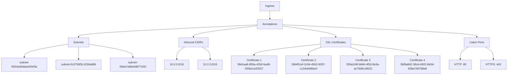
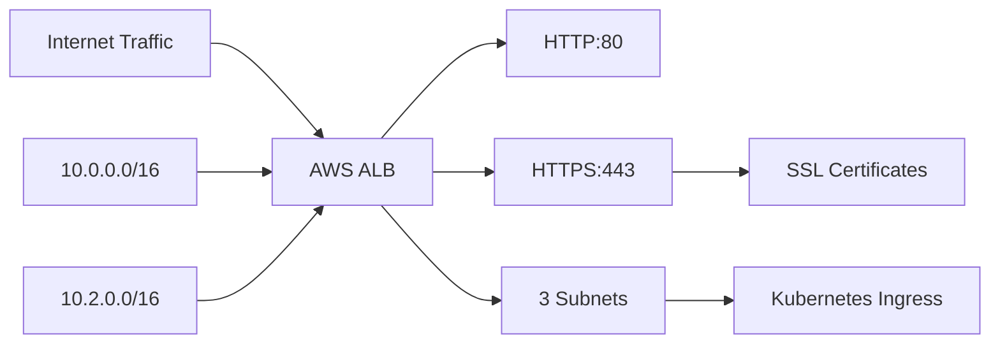
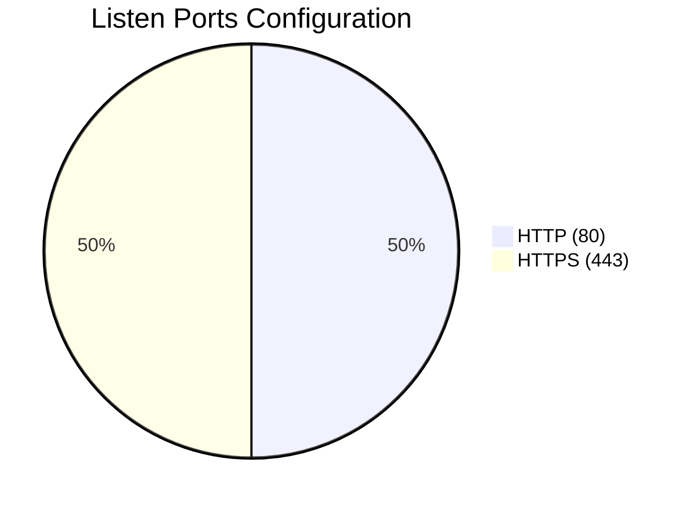

# Diagram: devops/k8s/platform-load-balancer/helm/values.dev1.yaml

> Auto-generated by Obscura crawlers

## Diagram 1

### SVG

<svg id="container" width="2858.578125" xmlns="http://www.w3.org/2000/svg" class="flowchart" height="430" viewBox="0 0 2858.578125 430" role="graphics-document document" aria-roledescription="flowchart-v2"><g><marker id="container_flowchart-v2-pointEnd" class="marker flowchart-v2" viewBox="0 0 10 10" refX="5" refY="5" markerUnits="userSpaceOnUse" markerWidth="8" markerHeight="8" orient="auto"><path d="M 0 0 L 10 5 L 0 10 z" class="arrowMarkerPath" style="stroke-width: 1; stroke-dasharray: 1, 0;"></path></marker><marker id="container_flowchart-v2-pointStart" class="marker flowchart-v2" viewBox="0 0 10 10" refX="4.5" refY="5" markerUnits="userSpaceOnUse" markerWidth="8" markerHeight="8" orient="auto"><path d="M 0 5 L 10 10 L 10 0 z" class="arrowMarkerPath" style="stroke-width: 1; stroke-dasharray: 1, 0;"></path></marker><marker id="container_flowchart-v2-circleEnd" class="marker flowchart-v2" viewBox="0 0 10 10" refX="11" refY="5" markerUnits="userSpaceOnUse" markerWidth="11" markerHeight="11" orient="auto"><circle cx="5" cy="5" r="5" class="arrowMarkerPath" style="stroke-width: 1; stroke-dasharray: 1, 0;"></circle></marker><marker id="container_flowchart-v2-circleStart" class="marker flowchart-v2" viewBox="0 0 10 10" refX="-1" refY="5" markerUnits="userSpaceOnUse" markerWidth="11" markerHeight="11" orient="auto"><circle cx="5" cy="5" r="5" class="arrowMarkerPath" style="stroke-width: 1; stroke-dasharray: 1, 0;"></circle></marker><marker id="container_flowchart-v2-crossEnd" class="marker cross flowchart-v2" viewBox="0 0 11 11" refX="12" refY="5.2" markerUnits="userSpaceOnUse" markerWidth="11" markerHeight="11" orient="auto"><path d="M 1,1 l 9,9 M 10,1 l -9,9" class="arrowMarkerPath" style="stroke-width: 2; stroke-dasharray: 1, 0;"></path></marker><marker id="container_flowchart-v2-crossStart" class="marker cross flowchart-v2" viewBox="0 0 11 11" refX="-1" refY="5.2" markerUnits="userSpaceOnUse" markerWidth="11" markerHeight="11" orient="auto"><path d="M 1,1 l 9,9 M 10,1 l -9,9" class="arrowMarkerPath" style="stroke-width: 2; stroke-dasharray: 1, 0;"></path></marker><g class="root"><g class="clusters"></g><g class="edgePaths"><path d="M1523.613,62L1523.613,66.167C1523.613,70.333,1523.613,78.667,1523.613,86.333C1523.613,94,1523.613,101,1523.613,104.5L1523.613,108" id="L_A_B_0" class="edge-thickness-normal edge-pattern-solid edge-thickness-normal edge-pattern-solid flowchart-link" style=";" data-edge="true" data-et="edge" data-id="L_A_B_0" data-points="W3sieCI6MTUyMy42MTMyODEyNSwieSI6NjJ9LHsieCI6MTUyMy42MTMyODEyNSwieSI6ODd9LHsieCI6MTUyMy42MTMyODEyNSwieSI6MTEyfV0=" marker-end="url(#container_flowchart-v2-pointEnd)"></path><path d="M1449.551,142.565L1281.85,150.638C1114.148,158.71,778.746,174.855,611.045,186.428C443.344,198,443.344,205,443.344,208.5L443.344,212" id="L_B_C_0" class="edge-thickness-normal edge-pattern-solid edge-thickness-normal edge-pattern-solid flowchart-link" style=";" data-edge="true" data-et="edge" data-id="L_B_C_0" data-points="W3sieCI6MTQ0OS41NTA3ODEyNSwieSI6MTQyLjU2NTA4MjQ5ODk0MjMzfSx7IngiOjQ0My4zNDM3NSwieSI6MTkxfSx7IngiOjQ0My4zNDM3NSwieSI6MjE2fV0=" marker-end="url(#container_flowchart-v2-pointEnd)"></path><path d="M1449.551,147.878L1389.594,155.065C1329.638,162.252,1209.725,176.626,1149.769,187.313C1089.813,198,1089.813,205,1089.813,208.5L1089.813,212" id="L_B_D_0" class="edge-thickness-normal edge-pattern-solid edge-thickness-normal edge-pattern-solid flowchart-link" style=";" data-edge="true" data-et="edge" data-id="L_B_D_0" data-points="W3sieCI6MTQ0OS41NTA3ODEyNSwieSI6MTQ3Ljg3NzkyMzE1MzgwOTQzfSx7IngiOjEwODkuODEyNSwieSI6MTkxfSx7IngiOjEwODkuODEyNSwieSI6MjE2fV0=" marker-end="url(#container_flowchart-v2-pointEnd)"></path><path d="M1597.676,149.365L1647.258,156.304C1696.841,163.243,1796.007,177.122,1845.589,187.561C1895.172,198,1895.172,205,1895.172,208.5L1895.172,212" id="L_B_E_0" class="edge-thickness-normal edge-pattern-solid edge-thickness-normal edge-pattern-solid flowchart-link" style=";" data-edge="true" data-et="edge" data-id="L_B_E_0" data-points="W3sieCI6MTU5Ny42NzU3ODEyNSwieSI6MTQ5LjM2NTEyMTU4NDU0MTQ3fSx7IngiOjE4OTUuMTcxODc1LCJ5IjoxOTF9LHsieCI6MTg5NS4xNzE4NzUsInkiOjIxNn1d" marker-end="url(#container_flowchart-v2-pointEnd)"></path><path d="M1597.676,142.298L1779.981,150.415C1962.286,158.532,2326.897,174.766,2509.202,186.383C2691.508,198,2691.508,205,2691.508,208.5L2691.508,212" id="L_B_F_0" class="edge-thickness-normal edge-pattern-solid edge-thickness-normal edge-pattern-solid flowchart-link" style=";" data-edge="true" data-et="edge" data-id="L_B_F_0" data-points="W3sieCI6MTU5Ny42NzU3ODEyNSwieSI6MTQyLjI5NzYwMDg1MDg5MDE4fSx7IngiOjI2OTEuNTA3ODEyNSwieSI6MTkxfSx7IngiOjI2OTEuNTA3ODEyNSwieSI6MjE2fV0=" marker-end="url(#container_flowchart-v2-pointEnd)"></path><path d="M383.898,253.114L342.868,260.095C301.839,267.076,219.779,281.038,178.749,295.519C137.719,310,137.719,325,137.719,332.5L137.719,340" id="L_C_C1_0" class="edge-thickness-normal edge-pattern-solid edge-thickness-normal edge-pattern-solid flowchart-link" style=";" data-edge="true" data-et="edge" data-id="L_C_C1_0" data-points="W3sieCI6MzgzLjg5ODQzNzUsInkiOjI1My4xMTQyMTI2Nzg5MzY2fSx7IngiOjEzNy43MTg3NSwieSI6Mjk1fSx7IngiOjEzNy43MTg3NSwieSI6MzQ0fV0=" marker-end="url(#container_flowchart-v2-pointEnd)"></path><path d="M443.344,270L443.344,274.167C443.344,278.333,443.344,286.667,443.344,298.333C443.344,310,443.344,325,443.344,332.5L443.344,340" id="L_C_C2_0" class="edge-thickness-normal edge-pattern-solid edge-thickness-normal edge-pattern-solid flowchart-link" style=";" data-edge="true" data-et="edge" data-id="L_C_C2_0" data-points="W3sieCI6NDQzLjM0Mzc1LCJ5IjoyNzB9LHsieCI6NDQzLjM0Mzc1LCJ5IjoyOTV9LHsieCI6NDQzLjM0Mzc1LCJ5IjozNDR9XQ==" marker-end="url(#container_flowchart-v2-pointEnd)"></path><path d="M502.789,253.107L543.857,260.089C584.924,267.071,667.06,281.036,708.128,295.518C749.195,310,749.195,325,749.195,332.5L749.195,340" id="L_C_C3_0" class="edge-thickness-normal edge-pattern-solid edge-thickness-normal edge-pattern-solid flowchart-link" style=";" data-edge="true" data-et="edge" data-id="L_C_C3_0" data-points="W3sieCI6NTAyLjc4OTA2MjUsInkiOjI1My4xMDY3MjA0NzgxNzMxNH0seyJ4Ijo3NDkuMTk1MzEyNSwieSI6Mjk1fSx7IngiOjc0OS4xOTUzMTI1LCJ5IjozNDR9XQ==" marker-end="url(#container_flowchart-v2-pointEnd)"></path><path d="M1041.65,270L1034.217,274.167C1026.785,278.333,1011.92,286.667,1004.487,298.333C997.055,310,997.055,325,997.055,332.5L997.055,340" id="L_D_D1_0" class="edge-thickness-normal edge-pattern-solid edge-thickness-normal edge-pattern-solid flowchart-link" style=";" data-edge="true" data-et="edge" data-id="L_D_D1_0" data-points="W3sieCI6MTA0MS42NDk3ODk2NjM0NjE0LCJ5IjoyNzB9LHsieCI6OTk3LjA1NDY4NzUsInkiOjI5NX0seyJ4Ijo5OTcuMDU0Njg3NSwieSI6MzQ0fV0=" marker-end="url(#container_flowchart-v2-pointEnd)"></path><path d="M1137.975,270L1145.408,274.167C1152.84,278.333,1167.705,286.667,1175.138,298.333C1182.57,310,1182.57,325,1182.57,332.5L1182.57,340" id="L_D_D2_0" class="edge-thickness-normal edge-pattern-solid edge-thickness-normal edge-pattern-solid flowchart-link" style=";" data-edge="true" data-et="edge" data-id="L_D_D2_0" data-points="W3sieCI6MTEzNy45NzUyMTAzMzY1Mzg2LCJ5IjoyNzB9LHsieCI6MTE4Mi41NzAzMTI1LCJ5IjoyOTV9LHsieCI6MTE4Mi41NzAzMTI1LCJ5IjozNDR9XQ==" marker-end="url(#container_flowchart-v2-pointEnd)"></path><path d="M1809.969,252.528L1746.669,259.607C1683.37,266.685,1556.771,280.843,1493.471,291.421C1430.172,302,1430.172,309,1430.172,312.5L1430.172,316" id="L_E_E1_0" class="edge-thickness-normal edge-pattern-solid edge-thickness-normal edge-pattern-solid flowchart-link" style=";" data-edge="true" data-et="edge" data-id="L_E_E1_0" data-points="W3sieCI6MTgwOS45Njg3NSwieSI6MjUyLjUyODA5MTM5Nzg0OTQ3fSx7IngiOjE0MzAuMTcxODc1LCJ5IjoyOTV9LHsieCI6MTQzMC4xNzE4NzUsInkiOjMyMH1d" marker-end="url(#container_flowchart-v2-pointEnd)"></path><path d="M1814.691,270L1802.271,274.167C1789.851,278.333,1765.012,286.667,1752.592,294.333C1740.172,302,1740.172,309,1740.172,312.5L1740.172,316" id="L_E_E2_0" class="edge-thickness-normal edge-pattern-solid edge-thickness-normal edge-pattern-solid flowchart-link" style=";" data-edge="true" data-et="edge" data-id="L_E_E2_0" data-points="W3sieCI6MTgxNC42OTExMDU3NjkyMzA3LCJ5IjoyNzB9LHsieCI6MTc0MC4xNzE4NzUsInkiOjI5NX0seyJ4IjoxNzQwLjE3MTg3NSwieSI6MzIwfV0=" marker-end="url(#container_flowchart-v2-pointEnd)"></path><path d="M1975.653,270L1988.073,274.167C2000.492,278.333,2025.332,286.667,2037.752,294.333C2050.172,302,2050.172,309,2050.172,312.5L2050.172,316" id="L_E_E3_0" class="edge-thickness-normal edge-pattern-solid edge-thickness-normal edge-pattern-solid flowchart-link" style=";" data-edge="true" data-et="edge" data-id="L_E_E3_0" data-points="W3sieCI6MTk3NS42NTI2NDQyMzA3NjkzLCJ5IjoyNzB9LHsieCI6MjA1MC4xNzE4NzUsInkiOjI5NX0seyJ4IjoyMDUwLjE3MTg3NSwieSI6MzIwfV0=" marker-end="url(#container_flowchart-v2-pointEnd)"></path><path d="M1980.375,252.528L2043.674,259.607C2106.974,266.685,2233.573,280.843,2296.872,291.421C2360.172,302,2360.172,309,2360.172,312.5L2360.172,316" id="L_E_E4_0" class="edge-thickness-normal edge-pattern-solid edge-thickness-normal edge-pattern-solid flowchart-link" style=";" data-edge="true" data-et="edge" data-id="L_E_E4_0" data-points="W3sieCI6MTk4MC4zNzUsInkiOjI1Mi41MjgwOTEzOTc4NDk0N30seyJ4IjoyMzYwLjE3MTg3NSwieSI6Mjk1fSx7IngiOjIzNjAuMTcxODc1LCJ5IjozMjB9XQ==" marker-end="url(#container_flowchart-v2-pointEnd)"></path><path d="M2644.724,270L2637.505,274.167C2630.285,278.333,2615.846,286.667,2608.626,298.333C2601.406,310,2601.406,325,2601.406,332.5L2601.406,340" id="L_F_F1_0" class="edge-thickness-normal edge-pattern-solid edge-thickness-normal edge-pattern-solid flowchart-link" style=";" data-edge="true" data-et="edge" data-id="L_F_F1_0" data-points="W3sieCI6MjY0NC43MjQzMDg4OTQyMzEsInkiOjI3MH0seyJ4IjoyNjAxLjQwNjI1LCJ5IjoyOTV9LHsieCI6MjYwMS40MDYyNSwieSI6MzQ0fV0=" marker-end="url(#container_flowchart-v2-pointEnd)"></path><path d="M2738.291,270L2745.511,274.167C2752.731,278.333,2767.17,286.667,2774.39,298.333C2781.609,310,2781.609,325,2781.609,332.5L2781.609,340" id="L_F_F2_0" class="edge-thickness-normal edge-pattern-solid edge-thickness-normal edge-pattern-solid flowchart-link" style=";" data-edge="true" data-et="edge" data-id="L_F_F2_0" data-points="W3sieCI6MjczOC4yOTEzMTYxMDU3NjksInkiOjI3MH0seyJ4IjoyNzgxLjYwOTM3NSwieSI6Mjk1fSx7IngiOjI3ODEuNjA5Mzc1LCJ5IjozNDR9XQ==" marker-end="url(#container_flowchart-v2-pointEnd)"></path></g><g class="edgeLabels"><g class="edgeLabel"><g class="label" data-id="L_A_B_0" transform="translate(0, 0)"><foreignObject width="0" height="0">

</foreignObject></g></g><g class="edgeLabel"><g class="label" data-id="L_B_C_0" transform="translate(0, 0)"><foreignObject width="0" height="0">

</foreignObject></g></g><g class="edgeLabel"><g class="label" data-id="L_B_D_0" transform="translate(0, 0)"><foreignObject width="0" height="0">

</foreignObject></g></g><g class="edgeLabel"><g class="label" data-id="L_B_E_0" transform="translate(0, 0)"><foreignObject width="0" height="0">

</foreignObject></g></g><g class="edgeLabel"><g class="label" data-id="L_B_F_0" transform="translate(0, 0)"><foreignObject width="0" height="0">

</foreignObject></g></g><g class="edgeLabel"><g class="label" data-id="L_C_C1_0" transform="translate(0, 0)"><foreignObject width="0" height="0">

</foreignObject></g></g><g class="edgeLabel"><g class="label" data-id="L_C_C2_0" transform="translate(0, 0)"><foreignObject width="0" height="0">

</foreignObject></g></g><g class="edgeLabel"><g class="label" data-id="L_C_C3_0" transform="translate(0, 0)"><foreignObject width="0" height="0">

</foreignObject></g></g><g class="edgeLabel"><g class="label" data-id="L_D_D1_0" transform="translate(0, 0)"><foreignObject width="0" height="0">

</foreignObject></g></g><g class="edgeLabel"><g class="label" data-id="L_D_D2_0" transform="translate(0, 0)"><foreignObject width="0" height="0">

</foreignObject></g></g><g class="edgeLabel"><g class="label" data-id="L_E_E1_0" transform="translate(0, 0)"><foreignObject width="0" height="0">

</foreignObject></g></g><g class="edgeLabel"><g class="label" data-id="L_E_E2_0" transform="translate(0, 0)"><foreignObject width="0" height="0">

</foreignObject></g></g><g class="edgeLabel"><g class="label" data-id="L_E_E3_0" transform="translate(0, 0)"><foreignObject width="0" height="0">

</foreignObject></g></g><g class="edgeLabel"><g class="label" data-id="L_E_E4_0" transform="translate(0, 0)"><foreignObject width="0" height="0">

</foreignObject></g></g><g class="edgeLabel"><g class="label" data-id="L_F_F1_0" transform="translate(0, 0)"><foreignObject width="0" height="0">

</foreignObject></g></g><g class="edgeLabel"><g class="label" data-id="L_F_F2_0" transform="translate(0, 0)"><foreignObject width="0" height="0">

</foreignObject></g></g></g><g class="nodes"><g class="node default" id="flowchart-A-0" transform="translate(1523.61328125, 35)"><rect class="basic label-container" style="" x="-55.8125" y="-27" width="111.625" height="54"></rect><g class="label" style="" transform="translate(-25.8125, -12)"><rect></rect><foreignObject width="51.625" height="24">

Ingress

</foreignObject></g></g><g class="node default" id="flowchart-B-1" transform="translate(1523.61328125, 139)"><rect class="basic label-container" style="" x="-74.0625" y="-27" width="148.125" height="54"></rect><g class="label" style="" transform="translate(-44.0625, -12)"><rect></rect><foreignObject width="88.125" height="24">

Annotations

</foreignObject></g></g><g class="node default" id="flowchart-C-3" transform="translate(443.34375, 243)"><rect class="basic label-container" style="" x="-59.4453125" y="-27" width="118.890625" height="54"></rect><g class="label" style="" transform="translate(-29.4453125, -12)"><rect></rect><foreignObject width="58.890625" height="24">

Subnets

</foreignObject></g></g><g class="node default" id="flowchart-D-5" transform="translate(1089.8125, 243)"><rect class="basic label-container" style="" x="-83.2890625" y="-27" width="166.578125" height="54"></rect><g class="label" style="" transform="translate(-53.2890625, -12)"><rect></rect><foreignObject width="106.578125" height="24">

Inbound CIDRs

</foreignObject></g></g><g class="node default" id="flowchart-E-7" transform="translate(1895.171875, 243)"><rect class="basic label-container" style="" x="-85.203125" y="-27" width="170.40625" height="54"></rect><g class="label" style="" transform="translate(-55.203125, -12)"><rect></rect><foreignObject width="110.40625" height="24">

SSL Certificates

</foreignObject></g></g><g class="node default" id="flowchart-F-9" transform="translate(2691.5078125, 243)"><rect class="basic label-container" style="" x="-72.7109375" y="-27" width="145.421875" height="54"></rect><g class="label" style="" transform="translate(-42.7109375, -12)"><rect></rect><foreignObject width="85.421875" height="24">

Listen Ports

</foreignObject></g></g><g class="node default" id="flowchart-C1-11" transform="translate(137.71875, 371)"><rect class="basic label-container" style="" x="-129.71875" y="-27" width="259.4375" height="54"></rect><g class="label" style="" transform="translate(-99.71875, -12)"><rect></rect><foreignObject width="199.4375" height="24">

subnet-0554a95dda440ef3a

</foreignObject></g></g><g class="node default" id="flowchart-C2-13" transform="translate(443.34375, 371)"><rect class="basic label-container" style="" x="-125.90625" y="-27" width="251.8125" height="54"></rect><g class="label" style="" transform="translate(-95.90625, -12)"><rect></rect><foreignObject width="191.8125" height="24">

subnet-0c3756f3c1036a686

</foreignObject></g></g><g class="node default" id="flowchart-C3-15" transform="translate(749.1953125, 371)"><rect class="basic label-container" style="" x="-129.9453125" y="-27" width="259.890625" height="54"></rect><g class="label" style="" transform="translate(-99.9453125, -12)"><rect></rect><foreignObject width="199.890625" height="24">

subnet-0bda7a86e0d877e50

</foreignObject></g></g><g class="node default" id="flowchart-D1-17" transform="translate(997.0546875, 371)"><rect class="basic label-container" style="" x="-67.9140625" y="-27" width="135.828125" height="54"></rect><g class="label" style="" transform="translate(-37.9140625, -12)"><rect></rect><foreignObject width="75.828125" height="24">

10.0.0.0/16

</foreignObject></g></g><g class="node default" id="flowchart-D2-19" transform="translate(1182.5703125, 371)"><rect class="basic label-container" style="" x="-67.6015625" y="-27" width="135.203125" height="54"></rect><g class="label" style="" transform="translate(-37.6015625, -12)"><rect></rect><foreignObject width="75.203125" height="24">

10.2.0.0/16

</foreignObject></g></g><g class="node default" id="flowchart-E1-21" transform="translate(1430.171875, 371)"><rect class="basic label-container" style="" x="-130" y="-51" width="260" height="102"></rect><g class="label" style="" transform="translate(-100, -36)"><rect></rect><foreignObject width="200" height="72">

Certificate 1 5fefcaa8-850a-42b0-ba48-055bcca33027

</foreignObject></g></g><g class="node default" id="flowchart-E2-23" transform="translate(1740.171875, 371)"><rect class="basic label-container" style="" x="-130" y="-51" width="260" height="102"></rect><g class="label" style="" transform="translate(-100, -36)"><rect></rect><foreignObject width="200" height="72">

Certificate 2 39d451ef-2c94-4563-9297-c12dcbb86acf

</foreignObject></g></g><g class="node default" id="flowchart-E3-25" transform="translate(2050.171875, 371)"><rect class="basic label-container" style="" x="-130" y="-51" width="260" height="102"></rect><g class="label" style="" transform="translate(-100, -36)"><rect></rect><foreignObject width="200" height="72">

Certificate 3 329a249f-b846-4f2d-8e3e-ac76d9cc8522

</foreignObject></g></g><g class="node default" id="flowchart-E4-27" transform="translate(2360.171875, 371)"><rect class="basic label-container" style="" x="-130" y="-51" width="260" height="102"></rect><g class="label" style="" transform="translate(-100, -36)"><rect></rect><foreignObject width="200" height="72">

Certificate 4 3bf8a8d2-36cd-4922-8e5d-638a736768a8

</foreignObject></g></g><g class="node default" id="flowchart-F1-29" transform="translate(2601.40625, 371)"><rect class="basic label-container" style="" x="-61.234375" y="-27" width="122.46875" height="54"></rect><g class="label" style="" transform="translate(-31.234375, -12)"><rect></rect><foreignObject width="62.46875" height="24">

HTTP: 80

</foreignObject></g></g><g class="node default" id="flowchart-F2-31" transform="translate(2781.609375, 371)"><rect class="basic label-container" style="" x="-68.96875" y="-27" width="137.9375" height="54"></rect><g class="label" style="" transform="translate(-38.96875, -12)"><rect></rect><foreignObject width="77.9375" height="24">

HTTPS: 443

</foreignObject></g></g></g></g></g></svg>

## Diagram 2

### SVG

<svg id="container" width="787.34375" xmlns="http://www.w3.org/2000/svg" class="flowchart" height="278" viewBox="0 0 787.34375 278" role="graphics-document document" aria-roledescription="flowchart-v2"><g><marker id="container_flowchart-v2-pointEnd" class="marker flowchart-v2" viewBox="0 0 10 10" refX="5" refY="5" markerUnits="userSpaceOnUse" markerWidth="8" markerHeight="8" orient="auto"><path d="M 0 0 L 10 5 L 0 10 z" class="arrowMarkerPath" style="stroke-width: 1; stroke-dasharray: 1, 0;"></path></marker><marker id="container_flowchart-v2-pointStart" class="marker flowchart-v2" viewBox="0 0 10 10" refX="4.5" refY="5" markerUnits="userSpaceOnUse" markerWidth="8" markerHeight="8" orient="auto"><path d="M 0 5 L 10 10 L 10 0 z" class="arrowMarkerPath" style="stroke-width: 1; stroke-dasharray: 1, 0;"></path></marker><marker id="container_flowchart-v2-circleEnd" class="marker flowchart-v2" viewBox="0 0 10 10" refX="11" refY="5" markerUnits="userSpaceOnUse" markerWidth="11" markerHeight="11" orient="auto"><circle cx="5" cy="5" r="5" class="arrowMarkerPath" style="stroke-width: 1; stroke-dasharray: 1, 0;"></circle></marker><marker id="container_flowchart-v2-circleStart" class="marker flowchart-v2" viewBox="0 0 10 10" refX="-1" refY="5" markerUnits="userSpaceOnUse" markerWidth="11" markerHeight="11" orient="auto"><circle cx="5" cy="5" r="5" class="arrowMarkerPath" style="stroke-width: 1; stroke-dasharray: 1, 0;"></circle></marker><marker id="container_flowchart-v2-crossEnd" class="marker cross flowchart-v2" viewBox="0 0 11 11" refX="12" refY="5.2" markerUnits="userSpaceOnUse" markerWidth="11" markerHeight="11" orient="auto"><path d="M 1,1 l 9,9 M 10,1 l -9,9" class="arrowMarkerPath" style="stroke-width: 2; stroke-dasharray: 1, 0;"></path></marker><marker id="container_flowchart-v2-crossStart" class="marker cross flowchart-v2" viewBox="0 0 11 11" refX="-1" refY="5.2" markerUnits="userSpaceOnUse" markerWidth="11" markerHeight="11" orient="auto"><path d="M 1,1 l 9,9 M 10,1 l -9,9" class="arrowMarkerPath" style="stroke-width: 2; stroke-dasharray: 1, 0;"></path></marker><g class="root"><g class="clusters"></g><g class="edgePaths"><path d="M174.969,35L179.135,35C183.302,35,191.635,35,205.993,47.32C220.351,59.639,240.733,84.279,250.924,96.598L261.115,108.918" id="L_Internet_ALB_0" class="edge-thickness-normal edge-pattern-solid edge-thickness-normal edge-pattern-solid flowchart-link" style=";" data-edge="true" data-et="edge" data-id="L_Internet_ALB_0" data-points="W3sieCI6MTc0Ljk2ODc1LCJ5IjozNX0seyJ4IjoxOTkuOTY4NzUsInkiOjM1fSx7IngiOjI2My42NjQ5NjM5NDIzMDc3LCJ5IjoxMTJ9XQ==" marker-end="url(#container_flowchart-v2-pointEnd)"></path><path d="M308.335,112L318.951,99.167C329.567,86.333,350.799,60.667,366.198,47.833C381.596,35,391.161,35,395.944,35L400.727,35" id="L_ALB_HTTP_0" class="edge-thickness-normal edge-pattern-solid edge-thickness-normal edge-pattern-solid flowchart-link" style=";" data-edge="true" data-et="edge" data-id="L_ALB_HTTP_0" data-points="W3sieCI6MzA4LjMzNTAzNjA1NzY5MjMsInkiOjExMn0seyJ4IjozNzIuMDMxMjUsInkiOjM1fSx7IngiOjQwNC43MjY1NjI1LCJ5IjozNX1d" marker-end="url(#container_flowchart-v2-pointEnd)"></path><path d="M347.031,139L351.198,139C355.365,139,363.698,139,371.365,139C379.031,139,386.031,139,389.531,139L393.031,139" id="L_ALB_HTTPS_0" class="edge-thickness-normal edge-pattern-solid edge-thickness-normal edge-pattern-solid flowchart-link" style=";" data-edge="true" data-et="edge" data-id="L_ALB_HTTPS_0" data-points="W3sieCI6MzQ3LjAzMTI1LCJ5IjoxMzl9LHsieCI6MzcyLjAzMTI1LCJ5IjoxMzl9LHsieCI6Mzk3LjAzMTI1LCJ5IjoxMzl9XQ==" marker-end="url(#container_flowchart-v2-pointEnd)"></path><path d="M530.656,139L534.823,139C538.99,139,547.323,139,557.346,139C567.37,139,579.083,139,584.94,139L590.797,139" id="L_HTTPS_SSL_0" class="edge-thickness-normal edge-pattern-solid edge-thickness-normal edge-pattern-solid flowchart-link" style=";" data-edge="true" data-et="edge" data-id="L_HTTPS_SSL_0" data-points="W3sieCI6NTMwLjY1NjI1LCJ5IjoxMzl9LHsieCI6NTU1LjY1NjI1LCJ5IjoxMzl9LHsieCI6NTk0Ljc5Njg3NSwieSI6MTM5fV0=" marker-end="url(#container_flowchart-v2-pointEnd)"></path><path d="M308.335,166L318.951,178.833C329.567,191.667,350.799,217.333,365.125,230.167C379.451,243,386.87,243,390.579,243L394.289,243" id="L_ALB_Subnets_0" class="edge-thickness-normal edge-pattern-solid edge-thickness-normal edge-pattern-solid flowchart-link" style=";" data-edge="true" data-et="edge" data-id="L_ALB_Subnets_0" data-points="W3sieCI6MzA4LjMzNTAzNjA1NzY5MjMsInkiOjE2Nn0seyJ4IjozNzIuMDMxMjUsInkiOjI0M30seyJ4IjozOTguMjg5MDYyNSwieSI6MjQzfV0=" marker-end="url(#container_flowchart-v2-pointEnd)"></path><path d="M159.398,139L166.16,139C172.922,139,186.445,139,196.707,139C206.969,139,213.969,139,217.469,139L220.969,139" id="L_CIDR1_ALB_0" class="edge-thickness-normal edge-pattern-solid edge-thickness-normal edge-pattern-solid flowchart-link" style=";" data-edge="true" data-et="edge" data-id="L_CIDR1_ALB_0" data-points="W3sieCI6MTU5LjM5ODQzNzUsInkiOjEzOX0seyJ4IjoxOTkuOTY4NzUsInkiOjEzOX0seyJ4IjoyMjQuOTY4NzUsInkiOjEzOX1d" marker-end="url(#container_flowchart-v2-pointEnd)"></path><path d="M159.086,243L165.9,243C172.714,243,186.341,243,203.346,230.68C220.351,218.361,240.733,193.721,250.924,181.402L261.115,169.082" id="L_CIDR2_ALB_0" class="edge-thickness-normal edge-pattern-solid edge-thickness-normal edge-pattern-solid flowchart-link" style=";" data-edge="true" data-et="edge" data-id="L_CIDR2_ALB_0" data-points="W3sieCI6MTU5LjA4NTkzNzUsInkiOjI0M30seyJ4IjoxOTkuOTY4NzUsInkiOjI0M30seyJ4IjoyNjMuNjY0OTYzOTQyMzA3NywieSI6MTY2fV0=" marker-end="url(#container_flowchart-v2-pointEnd)"></path><path d="M529.398,243L533.775,243C538.151,243,546.904,243,554.78,243C562.656,243,569.656,243,573.156,243L576.656,243" id="L_Subnets_K8s_0" class="edge-thickness-normal edge-pattern-solid edge-thickness-normal edge-pattern-solid flowchart-link" style=";" data-edge="true" data-et="edge" data-id="L_Subnets_K8s_0" data-points="W3sieCI6NTI5LjM5ODQzNzUsInkiOjI0M30seyJ4Ijo1NTUuNjU2MjUsInkiOjI0M30seyJ4Ijo1ODAuNjU2MjUsInkiOjI0M31d" marker-end="url(#container_flowchart-v2-pointEnd)"></path></g><g class="edgeLabels"><g class="edgeLabel"><g class="label" data-id="L_Internet_ALB_0" transform="translate(0, 0)"><foreignObject width="0" height="0">

</foreignObject></g></g><g class="edgeLabel"><g class="label" data-id="L_ALB_HTTP_0" transform="translate(0, 0)"><foreignObject width="0" height="0">

</foreignObject></g></g><g class="edgeLabel"><g class="label" data-id="L_ALB_HTTPS_0" transform="translate(0, 0)"><foreignObject width="0" height="0">

</foreignObject></g></g><g class="edgeLabel"><g class="label" data-id="L_HTTPS_SSL_0" transform="translate(0, 0)"><foreignObject width="0" height="0">

</foreignObject></g></g><g class="edgeLabel"><g class="label" data-id="L_ALB_Subnets_0" transform="translate(0, 0)"><foreignObject width="0" height="0">

</foreignObject></g></g><g class="edgeLabel"><g class="label" data-id="L_CIDR1_ALB_0" transform="translate(0, 0)"><foreignObject width="0" height="0">

</foreignObject></g></g><g class="edgeLabel"><g class="label" data-id="L_CIDR2_ALB_0" transform="translate(0, 0)"><foreignObject width="0" height="0">

</foreignObject></g></g><g class="edgeLabel"><g class="label" data-id="L_Subnets_K8s_0" transform="translate(0, 0)"><foreignObject width="0" height="0">

</foreignObject></g></g></g><g class="nodes"><g class="node default" id="flowchart-Internet-0" transform="translate(91.484375, 35)"><rect class="basic label-container" style="" x="-83.484375" y="-27" width="166.96875" height="54"></rect><g class="label" style="" transform="translate(-53.484375, -12)"><rect></rect><foreignObject width="106.96875" height="24">

Internet Traffic

</foreignObject></g></g><g class="node default" id="flowchart-ALB-1" transform="translate(286, 139)"><rect class="basic label-container" style="" x="-61.03125" y="-27" width="122.0625" height="54"></rect><g class="label" style="" transform="translate(-31.03125, -12)"><rect></rect><foreignObject width="62.0625" height="24">

AWS ALB

</foreignObject></g></g><g class="node default" id="flowchart-HTTP-3" transform="translate(463.84375, 35)"><rect class="basic label-container" style="" x="-59.1171875" y="-27" width="118.234375" height="54"></rect><g class="label" style="" transform="translate(-29.1171875, -12)"><rect></rect><foreignObject width="58.234375" height="24">

HTTP:80

</foreignObject></g></g><g class="node default" id="flowchart-HTTPS-5" transform="translate(463.84375, 139)"><rect class="basic label-container" style="" x="-66.8125" y="-27" width="133.625" height="54"></rect><g class="label" style="" transform="translate(-36.8125, -12)"><rect></rect><foreignObject width="73.625" height="24">

HTTPS:443

</foreignObject></g></g><g class="node default" id="flowchart-SSL-7" transform="translate(680, 139)"><rect class="basic label-container" style="" x="-85.203125" y="-27" width="170.40625" height="54"></rect><g class="label" style="" transform="translate(-55.203125, -12)"><rect></rect><foreignObject width="110.40625" height="24">

SSL Certificates

</foreignObject></g></g><g class="node default" id="flowchart-Subnets-9" transform="translate(463.84375, 243)"><rect class="basic label-container" style="" x="-65.5546875" y="-27" width="131.109375" height="54"></rect><g class="label" style="" transform="translate(-35.5546875, -12)"><rect></rect><foreignObject width="71.109375" height="24">

3 Subnets

</foreignObject></g></g><g class="node default" id="flowchart-CIDR1-10" transform="translate(91.484375, 139)"><rect class="basic label-container" style="" x="-67.9140625" y="-27" width="135.828125" height="54"></rect><g class="label" style="" transform="translate(-37.9140625, -12)"><rect></rect><foreignObject width="75.828125" height="24">

10.0.0.0/16

</foreignObject></g></g><g class="node default" id="flowchart-CIDR2-12" transform="translate(91.484375, 243)"><rect class="basic label-container" style="" x="-67.6015625" y="-27" width="135.203125" height="54"></rect><g class="label" style="" transform="translate(-37.6015625, -12)"><rect></rect><foreignObject width="75.203125" height="24">

10.2.0.0/16

</foreignObject></g></g><g class="node default" id="flowchart-K8s-15" transform="translate(680, 243)"><rect class="basic label-container" style="" x="-99.34375" y="-27" width="198.6875" height="54"></rect><g class="label" style="" transform="translate(-69.34375, -12)"><rect></rect><foreignObject width="138.6875" height="24">

Kubernetes Ingress

</foreignObject></g></g></g></g></g></svg>

## Diagram 3

### SVG

<svg id="container" width="100%" xmlns="http://www.w3.org/2000/svg" viewBox="0 0 601.578125 450" style="max-width: 601.578125px;" role="graphics-document document" aria-roledescription="pie"><g></g><g transform="translate(225,225)"><circle cx="0" cy="0" r="186" class="pieOuterCircle"></circle><path d="M0,-185A185,185,0,1,1,0,185L0,0Z" fill="#ECECFF" class="pieCircle"></path><path d="M0,185A185,185,0,1,1,0,-185L0,0Z" fill="#ffffde" class="pieCircle"></path><text transform="translate(138.75,0)" class="slice" style="text-anchor: middle;">50%</text><text transform="translate(-138.75,1.6991974338169527e-14)" class="slice" style="text-anchor: middle;">50%</text><text x="0" y="-200" class="pieTitleText">Listen Ports Configuration</text><g class="legend" transform="translate(216,-22)"><rect width="18" height="18" style="fill: rgb(236, 236, 255); stroke: rgb(236, 236, 255);"></rect><text x="22" y="14">HTTP (80)</text></g><g class="legend" transform="translate(216,0)"><rect width="18" height="18" style="fill: rgb(255, 255, 222); stroke: rgb(255, 255, 222);"></rect><text x="22" y="14">HTTPS (443)</text></g></g></svg>
