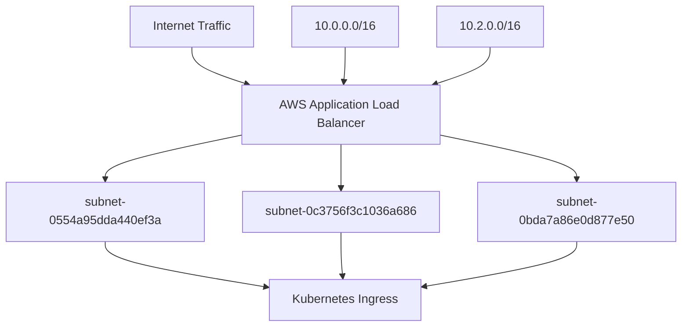
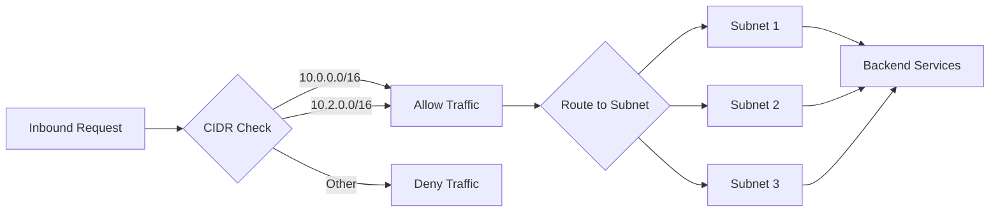
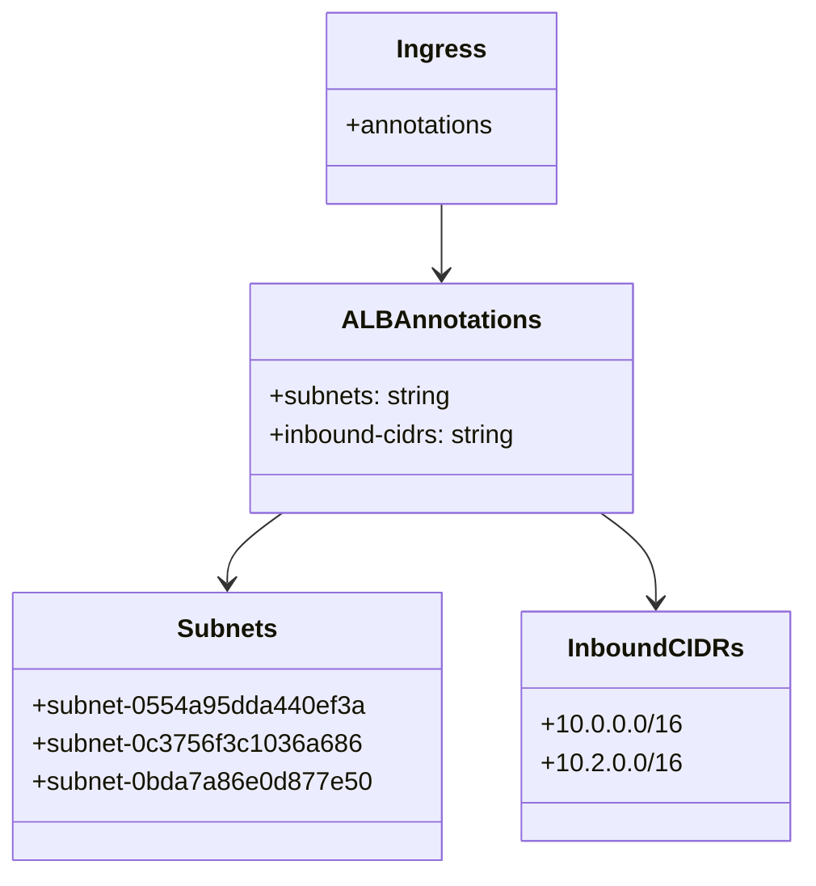

# Diagram: devops/k8s/platform-load-balancer/helm/values.dev2.yaml

> Auto-generated by Obscura crawlers

## Diagram 1

### SVG

<svg id="container" width="887.140625" xmlns="http://www.w3.org/2000/svg" class="flowchart" height="406" viewBox="0 0 887.140625 406" role="graphics-document document" aria-roledescription="flowchart-v2"><g><marker id="container_flowchart-v2-pointEnd" class="marker flowchart-v2" viewBox="0 0 10 10" refX="5" refY="5" markerUnits="userSpaceOnUse" markerWidth="8" markerHeight="8" orient="auto"><path d="M 0 0 L 10 5 L 0 10 z" class="arrowMarkerPath" style="stroke-width: 1; stroke-dasharray: 1, 0;"></path></marker><marker id="container_flowchart-v2-pointStart" class="marker flowchart-v2" viewBox="0 0 10 10" refX="4.5" refY="5" markerUnits="userSpaceOnUse" markerWidth="8" markerHeight="8" orient="auto"><path d="M 0 5 L 10 10 L 10 0 z" class="arrowMarkerPath" style="stroke-width: 1; stroke-dasharray: 1, 0;"></path></marker><marker id="container_flowchart-v2-circleEnd" class="marker flowchart-v2" viewBox="0 0 10 10" refX="11" refY="5" markerUnits="userSpaceOnUse" markerWidth="11" markerHeight="11" orient="auto"><circle cx="5" cy="5" r="5" class="arrowMarkerPath" style="stroke-width: 1; stroke-dasharray: 1, 0;"></circle></marker><marker id="container_flowchart-v2-circleStart" class="marker flowchart-v2" viewBox="0 0 10 10" refX="-1" refY="5" markerUnits="userSpaceOnUse" markerWidth="11" markerHeight="11" orient="auto"><circle cx="5" cy="5" r="5" class="arrowMarkerPath" style="stroke-width: 1; stroke-dasharray: 1, 0;"></circle></marker><marker id="container_flowchart-v2-crossEnd" class="marker cross flowchart-v2" viewBox="0 0 11 11" refX="12" refY="5.2" markerUnits="userSpaceOnUse" markerWidth="11" markerHeight="11" orient="auto"><path d="M 1,1 l 9,9 M 10,1 l -9,9" class="arrowMarkerPath" style="stroke-width: 2; stroke-dasharray: 1, 0;"></path></marker><marker id="container_flowchart-v2-crossStart" class="marker cross flowchart-v2" viewBox="0 0 11 11" refX="-1" refY="5.2" markerUnits="userSpaceOnUse" markerWidth="11" markerHeight="11" orient="auto"><path d="M 1,1 l 9,9 M 10,1 l -9,9" class="arrowMarkerPath" style="stroke-width: 2; stroke-dasharray: 1, 0;"></path></marker><g class="root"><g class="clusters"></g><g class="edgePaths"><path d="M250,62L250,66.167C250,70.333,250,78.667,261.955,86.791C273.909,94.914,297.818,102.829,309.773,106.786L321.728,110.743" id="L_Internet_ALB_0" class="edge-thickness-normal edge-pattern-solid edge-thickness-normal edge-pattern-solid flowchart-link" style=";" data-edge="true" data-et="edge" data-id="L_Internet_ALB_0" data-points="W3sieCI6MjUwLCJ5Ijo2Mn0seyJ4IjoyNTAsInkiOjg3fSx7IngiOjMyNS41MjQ5MDIzNDM3NSwieSI6MTEyfV0=" marker-end="url(#container_flowchart-v2-pointEnd)"></path><path d="M313.344,178.223L284.073,184.352C254.802,190.482,196.26,202.741,166.99,212.37C137.719,222,137.719,229,137.719,232.5L137.719,236" id="L_ALB_Subnet1_0" class="edge-thickness-normal edge-pattern-solid edge-thickness-normal edge-pattern-solid flowchart-link" style=";" data-edge="true" data-et="edge" data-id="L_ALB_Subnet1_0" data-points="W3sieCI6MzEzLjM0Mzc1LCJ5IjoxNzguMjIyOTAzODg1NDgwNTh9LHsieCI6MTM3LjcxODc1LCJ5IjoyMTV9LHsieCI6MTM3LjcxODc1LCJ5IjoyNDB9XQ==" marker-end="url(#container_flowchart-v2-pointEnd)"></path><path d="M443.344,190L443.344,194.167C443.344,198.333,443.344,206.667,443.344,214.333C443.344,222,443.344,229,443.344,232.5L443.344,236" id="L_ALB_Subnet2_0" class="edge-thickness-normal edge-pattern-solid edge-thickness-normal edge-pattern-solid flowchart-link" style=";" data-edge="true" data-et="edge" data-id="L_ALB_Subnet2_0" data-points="W3sieCI6NDQzLjM0Mzc1LCJ5IjoxOTB9LHsieCI6NDQzLjM0Mzc1LCJ5IjoyMTV9LHsieCI6NDQzLjM0Mzc1LCJ5IjoyNDB9XQ==" marker-end="url(#container_flowchart-v2-pointEnd)"></path><path d="M573.344,178.203L602.652,184.336C631.961,190.468,690.578,202.734,719.887,212.367C749.195,222,749.195,229,749.195,232.5L749.195,236" id="L_ALB_Subnet3_0" class="edge-thickness-normal edge-pattern-solid edge-thickness-normal edge-pattern-solid flowchart-link" style=";" data-edge="true" data-et="edge" data-id="L_ALB_Subnet3_0" data-points="W3sieCI6NTczLjM0Mzc1LCJ5IjoxNzguMjAyNzM4MjU2NDA1fSx7IngiOjc0OS4xOTUzMTI1LCJ5IjoyMTV9LHsieCI6NzQ5LjE5NTMxMjUsInkiOjI0MH1d" marker-end="url(#container_flowchart-v2-pointEnd)"></path><path d="M137.719,294L137.719,298.167C137.719,302.333,137.719,310.667,172.765,320.645C207.811,330.624,277.903,342.247,312.949,348.059L347.995,353.871" id="L_Subnet1_Ingress_0" class="edge-thickness-normal edge-pattern-solid edge-thickness-normal edge-pattern-solid flowchart-link" style=";" data-edge="true" data-et="edge" data-id="L_Subnet1_Ingress_0" data-points="W3sieCI6MTM3LjcxODc1LCJ5IjoyOTR9LHsieCI6MTM3LjcxODc1LCJ5IjozMTl9LHsieCI6MzUxLjk0MTQwNjI1LCJ5IjozNTQuNTI1NDE5NTA1OTM2fV0=" marker-end="url(#container_flowchart-v2-pointEnd)"></path><path d="M443.344,294L443.344,298.167C443.344,302.333,443.344,310.667,443.879,318.341C444.415,326.015,445.486,333.031,446.022,336.538L446.558,340.046" id="L_Subnet2_Ingress_0" class="edge-thickness-normal edge-pattern-solid edge-thickness-normal edge-pattern-solid flowchart-link" style=";" data-edge="true" data-et="edge" data-id="L_Subnet2_Ingress_0" data-points="W3sieCI6NDQzLjM0Mzc1LCJ5IjoyOTR9LHsieCI6NDQzLjM0Mzc1LCJ5IjozMTl9LHsieCI6NDQ3LjE2MTczMzc3NDAzODQ1LCJ5IjozNDR9XQ==" marker-end="url(#container_flowchart-v2-pointEnd)"></path><path d="M749.195,294L749.195,298.167C749.195,302.333,749.195,310.667,716.758,320.495C684.32,330.324,619.445,341.648,587.007,347.31L554.569,352.972" id="L_Subnet3_Ingress_0" class="edge-thickness-normal edge-pattern-solid edge-thickness-normal edge-pattern-solid flowchart-link" style=";" data-edge="true" data-et="edge" data-id="L_Subnet3_Ingress_0" data-points="W3sieCI6NzQ5LjE5NTMxMjUsInkiOjI5NH0seyJ4Ijo3NDkuMTk1MzEyNSwieSI6MzE5fSx7IngiOjU1MC42Mjg5MDYyNSwieSI6MzUzLjY1OTYyMTA1ODE1MjV9XQ==" marker-end="url(#container_flowchart-v2-pointEnd)"></path><path d="M451.398,62L451.398,66.167C451.398,70.333,451.398,78.667,450.957,86.339C450.516,94.01,449.634,101.021,449.193,104.526L448.752,108.031" id="L_CIDR1_ALB_0" class="edge-thickness-normal edge-pattern-solid edge-thickness-normal edge-pattern-solid flowchart-link" style=";" data-edge="true" data-et="edge" data-id="L_CIDR1_ALB_0" data-points="W3sieCI6NDUxLjM5ODQzNzUsInkiOjYyfSx7IngiOjQ1MS4zOTg0Mzc1LCJ5Ijo4N30seyJ4Ijo0NDguMjUyMDc1MTk1MzEyNSwieSI6MTEyfV0=" marker-end="url(#container_flowchart-v2-pointEnd)"></path><path d="M636.914,62L636.914,66.167C636.914,70.333,636.914,78.667,624.945,86.791C612.976,94.915,589.037,102.83,577.068,106.787L565.098,110.744" id="L_CIDR2_ALB_0" class="edge-thickness-normal edge-pattern-solid edge-thickness-normal edge-pattern-solid flowchart-link" style=";" data-edge="true" data-et="edge" data-id="L_CIDR2_ALB_0" data-points="W3sieCI6NjM2LjkxNDA2MjUsInkiOjYyfSx7IngiOjYzNi45MTQwNjI1LCJ5Ijo4N30seyJ4Ijo1NjEuMzAwNjU5MTc5Njg3NSwieSI6MTEyfV0=" marker-end="url(#container_flowchart-v2-pointEnd)"></path></g><g class="edgeLabels"><g class="edgeLabel"><g class="label" data-id="L_Internet_ALB_0" transform="translate(0, 0)"><foreignObject width="0" height="0">

</foreignObject></g></g><g class="edgeLabel"><g class="label" data-id="L_ALB_Subnet1_0" transform="translate(0, 0)"><foreignObject width="0" height="0">

</foreignObject></g></g><g class="edgeLabel"><g class="label" data-id="L_ALB_Subnet2_0" transform="translate(0, 0)"><foreignObject width="0" height="0">

</foreignObject></g></g><g class="edgeLabel"><g class="label" data-id="L_ALB_Subnet3_0" transform="translate(0, 0)"><foreignObject width="0" height="0">

</foreignObject></g></g><g class="edgeLabel"><g class="label" data-id="L_Subnet1_Ingress_0" transform="translate(0, 0)"><foreignObject width="0" height="0">

</foreignObject></g></g><g class="edgeLabel"><g class="label" data-id="L_Subnet2_Ingress_0" transform="translate(0, 0)"><foreignObject width="0" height="0">

</foreignObject></g></g><g class="edgeLabel"><g class="label" data-id="L_Subnet3_Ingress_0" transform="translate(0, 0)"><foreignObject width="0" height="0">

</foreignObject></g></g><g class="edgeLabel"><g class="label" data-id="L_CIDR1_ALB_0" transform="translate(0, 0)"><foreignObject width="0" height="0">

</foreignObject></g></g><g class="edgeLabel"><g class="label" data-id="L_CIDR2_ALB_0" transform="translate(0, 0)"><foreignObject width="0" height="0">

</foreignObject></g></g></g><g class="nodes"><g class="node default" id="flowchart-Internet-0" transform="translate(250, 35)"><rect class="basic label-container" style="" x="-83.484375" y="-27" width="166.96875" height="54"></rect><g class="label" style="" transform="translate(-53.484375, -12)"><rect></rect><foreignObject width="106.96875" height="24">

Internet Traffic

</foreignObject></g></g><g class="node default" id="flowchart-ALB-1" transform="translate(443.34375, 151)"><rect class="basic label-container" style="" x="-130" y="-39" width="260" height="78"></rect><g class="label" style="" transform="translate(-100, -24)"><rect></rect><foreignObject width="200" height="48">

AWS Application Load Balancer

</foreignObject></g></g><g class="node default" id="flowchart-Subnet1-3" transform="translate(137.71875, 267)"><rect class="basic label-container" style="" x="-129.71875" y="-27" width="259.4375" height="54"></rect><g class="label" style="" transform="translate(-99.71875, -12)"><rect></rect><foreignObject width="199.4375" height="24">

subnet-0554a95dda440ef3a

</foreignObject></g></g><g class="node default" id="flowchart-Subnet2-5" transform="translate(443.34375, 267)"><rect class="basic label-container" style="" x="-125.90625" y="-27" width="251.8125" height="54"></rect><g class="label" style="" transform="translate(-95.90625, -12)"><rect></rect><foreignObject width="191.8125" height="24">

subnet-0c3756f3c1036a686

</foreignObject></g></g><g class="node default" id="flowchart-Subnet3-7" transform="translate(749.1953125, 267)"><rect class="basic label-container" style="" x="-129.9453125" y="-27" width="259.890625" height="54"></rect><g class="label" style="" transform="translate(-99.9453125, -12)"><rect></rect><foreignObject width="199.890625" height="24">

subnet-0bda7a86e0d877e50

</foreignObject></g></g><g class="node default" id="flowchart-Ingress-9" transform="translate(451.28515625, 371)"><rect class="basic label-container" style="" x="-99.34375" y="-27" width="198.6875" height="54"></rect><g class="label" style="" transform="translate(-69.34375, -12)"><rect></rect><foreignObject width="138.6875" height="24">

Kubernetes Ingress

</foreignObject></g></g><g class="node default" id="flowchart-CIDR1-14" transform="translate(451.3984375, 35)"><rect class="basic label-container" style="" x="-67.9140625" y="-27" width="135.828125" height="54"></rect><g class="label" style="" transform="translate(-37.9140625, -12)"><rect></rect><foreignObject width="75.828125" height="24">

10.0.0.0/16

</foreignObject></g></g><g class="node default" id="flowchart-CIDR2-16" transform="translate(636.9140625, 35)"><rect class="basic label-container" style="" x="-67.6015625" y="-27" width="135.203125" height="54"></rect><g class="label" style="" transform="translate(-37.6015625, -12)"><rect></rect><foreignObject width="75.203125" height="24">

10.2.0.0/16

</foreignObject></g></g></g></g></g></svg>

## Diagram 2

### SVG

<svg id="container" width="1289.09375" xmlns="http://www.w3.org/2000/svg" class="flowchart" height="278" viewBox="0 0 1289.09375 278" role="graphics-document document" aria-roledescription="flowchart-v2"><g><marker id="container_flowchart-v2-pointEnd" class="marker flowchart-v2" viewBox="0 0 10 10" refX="5" refY="5" markerUnits="userSpaceOnUse" markerWidth="8" markerHeight="8" orient="auto"><path d="M 0 0 L 10 5 L 0 10 z" class="arrowMarkerPath" style="stroke-width: 1; stroke-dasharray: 1, 0;"></path></marker><marker id="container_flowchart-v2-pointStart" class="marker flowchart-v2" viewBox="0 0 10 10" refX="4.5" refY="5" markerUnits="userSpaceOnUse" markerWidth="8" markerHeight="8" orient="auto"><path d="M 0 5 L 10 10 L 10 0 z" class="arrowMarkerPath" style="stroke-width: 1; stroke-dasharray: 1, 0;"></path></marker><marker id="container_flowchart-v2-circleEnd" class="marker flowchart-v2" viewBox="0 0 10 10" refX="11" refY="5" markerUnits="userSpaceOnUse" markerWidth="11" markerHeight="11" orient="auto"><circle cx="5" cy="5" r="5" class="arrowMarkerPath" style="stroke-width: 1; stroke-dasharray: 1, 0;"></circle></marker><marker id="container_flowchart-v2-circleStart" class="marker flowchart-v2" viewBox="0 0 10 10" refX="-1" refY="5" markerUnits="userSpaceOnUse" markerWidth="11" markerHeight="11" orient="auto"><circle cx="5" cy="5" r="5" class="arrowMarkerPath" style="stroke-width: 1; stroke-dasharray: 1, 0;"></circle></marker><marker id="container_flowchart-v2-crossEnd" class="marker cross flowchart-v2" viewBox="0 0 11 11" refX="12" refY="5.2" markerUnits="userSpaceOnUse" markerWidth="11" markerHeight="11" orient="auto"><path d="M 1,1 l 9,9 M 10,1 l -9,9" class="arrowMarkerPath" style="stroke-width: 2; stroke-dasharray: 1, 0;"></path></marker><marker id="container_flowchart-v2-crossStart" class="marker cross flowchart-v2" viewBox="0 0 11 11" refX="-1" refY="5.2" markerUnits="userSpaceOnUse" markerWidth="11" markerHeight="11" orient="auto"><path d="M 1,1 l 9,9 M 10,1 l -9,9" class="arrowMarkerPath" style="stroke-width: 2; stroke-dasharray: 1, 0;"></path></marker><g class="root"><g class="clusters"></g><g class="edgePaths"><path d="M192.453,169L196.62,169C200.786,169,209.12,169,216.786,169C224.453,169,231.453,169,234.953,169L238.453,169" id="L_Request_CheckCIDR_0" class="edge-thickness-normal edge-pattern-solid edge-thickness-normal edge-pattern-solid flowchart-link" style=";" data-edge="true" data-et="edge" data-id="L_Request_CheckCIDR_0" data-points="W3sieCI6MTkyLjQ1MzEyNSwieSI6MTY5fSx7IngiOjIxNy40NTMxMjUsInkiOjE2OX0seyJ4IjoyNDIuNDUzMTI1LCJ5IjoxNjl9XQ==" marker-end="url(#container_flowchart-v2-pointEnd)"></path><path d="M352.702,144.608L367.253,136.34C381.804,128.072,410.906,111.536,435.308,106.436C459.71,101.335,479.412,107.67,489.263,110.838L499.114,114.006" id="L_CheckCIDR_Allow_0" class="edge-thickness-normal edge-pattern-solid edge-thickness-normal edge-pattern-solid flowchart-link" style=";" data-edge="true" data-et="edge" data-id="L_CheckCIDR_Allow_0" data-points="W3sieCI6MzUyLjcwMTY2MDY0MTg3ODk2LCJ5IjoxNDQuNjA3OTEwNjQxODc4OTZ9LHsieCI6NDQwLjAwNzgxMjUsInkiOjk1fSx7IngiOjUwMi45MjE4NzUsInkiOjExNS4yMzAyMDI2ODM0MTQyMn1d" marker-end="url(#container_flowchart-v2-pointEnd)"></path><path d="M364.49,156.396L377.076,153.497C389.662,150.597,414.835,144.799,437.24,141.899C459.646,139,479.284,139,489.103,139L498.922,139" id="L_CheckCIDR_Allow_2" class="edge-thickness-normal edge-pattern-solid edge-thickness-normal edge-pattern-solid flowchart-link" style=";" data-edge="true" data-et="edge" data-id="L_CheckCIDR_Allow_2" data-points="W3sieCI6MzY0LjQ4OTY1NDQzNjg2MDA2LCJ5IjoxNTYuMzk1OTA0NDM2ODYwMDZ9LHsieCI6NDQwLjAwNzgxMjUsInkiOjEzOX0seyJ4Ijo1MDIuOTIxODc1LCJ5IjoxMzl9XQ==" marker-end="url(#container_flowchart-v2-pointEnd)"></path><path d="M352.702,193.392L367.253,201.66C381.804,209.928,410.906,226.464,435.535,234.732C460.164,243,480.32,243,490.398,243L500.477,243" id="L_CheckCIDR_Deny_0" class="edge-thickness-normal edge-pattern-solid edge-thickness-normal edge-pattern-solid flowchart-link" style=";" data-edge="true" data-et="edge" data-id="L_CheckCIDR_Deny_0" data-points="W3sieCI6MzUyLjcwMTY2MDY0MTg3ODk2LCJ5IjoxOTMuMzkyMDg5MzU4MTIxMDR9LHsieCI6NDQwLjAwNzgxMjUsInkiOjI0M30seyJ4Ijo1MDQuNDc2NTYyNSwieSI6MjQzfV0=" marker-end="url(#container_flowchart-v2-pointEnd)"></path><path d="M650.766,139L654.932,139C659.099,139,667.432,139,675.099,139C682.766,139,689.766,139,693.266,139L696.766,139" id="L_Allow_RouteSubnet_0" class="edge-thickness-normal edge-pattern-solid edge-thickness-normal edge-pattern-solid flowchart-link" style=";" data-edge="true" data-et="edge" data-id="L_Allow_RouteSubnet_0" data-points="W3sieCI6NjUwLjc2NTYyNSwieSI6MTM5fSx7IngiOjY3NS43NjU2MjUsInkiOjEzOX0seyJ4Ijo3MDAuNzY1NjI1LCJ5IjoxMzl9XQ==" marker-end="url(#container_flowchart-v2-pointEnd)"></path><path d="M830.418,97.527L841.497,87.106C852.575,76.685,874.733,55.842,889.4,45.421C904.068,35,911.245,35,914.833,35L918.422,35" id="L_RouteSubnet_S1_0" class="edge-thickness-normal edge-pattern-solid edge-thickness-normal edge-pattern-solid flowchart-link" style=";" data-edge="true" data-et="edge" data-id="L_RouteSubnet_S1_0" data-points="W3sieCI6ODMwLjQxNzg2MDY1Mzk0NywieSI6OTcuNTI3MjM1NjUzOTQ2OTl9LHsieCI6ODk2Ljg5MDYyNSwieSI6MzV9LHsieCI6OTIyLjQyMTg3NSwieSI6MzV9XQ==" marker-end="url(#container_flowchart-v2-pointEnd)"></path><path d="M871.891,139L876.057,139C880.224,139,888.557,139,896.229,139C903.901,139,910.911,139,914.417,139L917.922,139" id="L_RouteSubnet_S2_0" class="edge-thickness-normal edge-pattern-solid edge-thickness-normal edge-pattern-solid flowchart-link" style=";" data-edge="true" data-et="edge" data-id="L_RouteSubnet_S2_0" data-points="W3sieCI6ODcxLjg5MDYyNSwieSI6MTM5fSx7IngiOjg5Ni44OTA2MjUsInkiOjEzOX0seyJ4Ijo5MjEuOTIxODc1LCJ5IjoxMzl9XQ==" marker-end="url(#container_flowchart-v2-pointEnd)"></path><path d="M830.418,180.473L841.497,190.894C852.575,201.315,874.733,222.158,889.312,232.579C903.891,243,910.891,243,914.391,243L917.891,243" id="L_RouteSubnet_S3_0" class="edge-thickness-normal edge-pattern-solid edge-thickness-normal edge-pattern-solid flowchart-link" style=";" data-edge="true" data-et="edge" data-id="L_RouteSubnet_S3_0" data-points="W3sieCI6ODMwLjQxNzg2MDY1Mzk0NywieSI6MTgwLjQ3Mjc2NDM0NjA1MzAzfSx7IngiOjg5Ni44OTA2MjUsInkiOjI0M30seyJ4Ijo5MjEuODkwNjI1LCJ5IjoyNDN9XQ==" marker-end="url(#container_flowchart-v2-pointEnd)"></path><path d="M1045,35L1049.255,35C1053.51,35,1062.021,35,1075.104,38.897C1088.187,42.795,1105.842,50.59,1114.67,54.487L1123.498,58.384" id="L_S1_Backend_0" class="edge-thickness-normal edge-pattern-solid edge-thickness-normal edge-pattern-solid flowchart-link" style=";" data-edge="true" data-et="edge" data-id="L_S1_Backend_0" data-points="W3sieCI6MTA0NSwieSI6MzV9LHsieCI6MTA3MC41MzEyNSwieSI6MzV9LHsieCI6MTEyNy4xNTY4NTA5NjE1Mzg2LCJ5Ijo2MH1d" marker-end="url(#container_flowchart-v2-pointEnd)"></path><path d="M1045.5,139L1049.672,139C1053.844,139,1062.188,139,1075.187,135.103C1088.187,131.205,1105.842,123.41,1114.67,119.513L1123.498,115.616" id="L_S2_Backend_0" class="edge-thickness-normal edge-pattern-solid edge-thickness-normal edge-pattern-solid flowchart-link" style=";" data-edge="true" data-et="edge" data-id="L_S2_Backend_0" data-points="W3sieCI6MTA0NS41LCJ5IjoxMzl9LHsieCI6MTA3MC41MzEyNSwieSI6MTM5fSx7IngiOjExMjcuMTU2ODUwOTYxNTM4NiwieSI6MTE0fV0=" marker-end="url(#container_flowchart-v2-pointEnd)"></path><path d="M1045.531,243L1049.698,243C1053.865,243,1062.198,243,1082.196,222.032C1102.193,201.064,1133.855,159.128,1149.686,138.16L1165.517,117.192" id="L_S3_Backend_0" class="edge-thickness-normal edge-pattern-solid edge-thickness-normal edge-pattern-solid flowchart-link" style=";" data-edge="true" data-et="edge" data-id="L_S3_Backend_0" data-points="W3sieCI6MTA0NS41MzEyNSwieSI6MjQzfSx7IngiOjEwNzAuNTMxMjUsInkiOjI0M30seyJ4IjoxMTY3LjkyNzI4MzY1Mzg0NjIsInkiOjExNH1d" marker-end="url(#container_flowchart-v2-pointEnd)"></path></g><g class="edgeLabels"><g class="edgeLabel"><g class="label" data-id="L_Request_CheckCIDR_0" transform="translate(0, 0)"><foreignObject width="0" height="0">

</foreignObject></g></g><g class="edgeLabel" transform="translate(425.08415, 103.47972)"><g class="label" data-id="L_CheckCIDR_Allow_0" transform="translate(-37.9140625, -12)"><foreignObject width="75.828125" height="24">

10.0.0.0/16

</foreignObject></g></g><g class="edgeLabel" transform="translate(440.0078125, 139)"><g class="label" data-id="L_CheckCIDR_Allow_2" transform="translate(-37.6015625, -12)"><foreignObject width="75.203125" height="24">

10.2.0.0/16

</foreignObject></g></g><g class="edgeLabel" transform="translate(440.0078125, 243)"><g class="label" data-id="L_CheckCIDR_Deny_0" transform="translate(-20.5625, -12)"><foreignObject width="41.125" height="24">

Other

</foreignObject></g></g><g class="edgeLabel"><g class="label" data-id="L_Allow_RouteSubnet_0" transform="translate(0, 0)"><foreignObject width="0" height="0">

</foreignObject></g></g><g class="edgeLabel"><g class="label" data-id="L_RouteSubnet_S1_0" transform="translate(0, 0)"><foreignObject width="0" height="0">

</foreignObject></g></g><g class="edgeLabel"><g class="label" data-id="L_RouteSubnet_S2_0" transform="translate(0, 0)"><foreignObject width="0" height="0">

</foreignObject></g></g><g class="edgeLabel"><g class="label" data-id="L_RouteSubnet_S3_0" transform="translate(0, 0)"><foreignObject width="0" height="0">

</foreignObject></g></g><g class="edgeLabel"><g class="label" data-id="L_S1_Backend_0" transform="translate(0, 0)"><foreignObject width="0" height="0">

</foreignObject></g></g><g class="edgeLabel"><g class="label" data-id="L_S2_Backend_0" transform="translate(0, 0)"><foreignObject width="0" height="0">

</foreignObject></g></g><g class="edgeLabel"><g class="label" data-id="L_S3_Backend_0" transform="translate(0, 0)"><foreignObject width="0" height="0">

</foreignObject></g></g></g><g class="nodes"><g class="node default" id="flowchart-Request-0" transform="translate(100.2265625, 169)"><rect class="basic label-container" style="" x="-92.2265625" y="-27" width="184.453125" height="54"></rect><g class="label" style="" transform="translate(-62.2265625, -12)"><rect></rect><foreignObject width="124.453125" height="24">

Inbound Request

</foreignObject></g></g><g class="node default" id="flowchart-CheckCIDR-1" transform="translate(309.7734375, 169)"><polygon points="67.3203125,0 134.640625,-67.3203125 67.3203125,-134.640625 0,-67.3203125" class="label-container" transform="translate(-66.8203125, 67.3203125)"></polygon><g class="label" style="" transform="translate(-40.3203125, -12)"><rect></rect><foreignObject width="80.640625" height="24">

CIDR Check

</foreignObject></g></g><g class="node default" id="flowchart-Allow-3" transform="translate(576.84375, 139)"><rect class="basic label-container" style="" x="-73.921875" y="-27" width="147.84375" height="54"></rect><g class="label" style="" transform="translate(-43.921875, -12)"><rect></rect><foreignObject width="87.84375" height="24">

Allow Traffic

</foreignObject></g></g><g class="node default" id="flowchart-Deny-7" transform="translate(576.84375, 243)"><rect class="basic label-container" style="" x="-72.3671875" y="-27" width="144.734375" height="54"></rect><g class="label" style="" transform="translate(-42.3671875, -12)"><rect></rect><foreignObject width="84.734375" height="24">

Deny Traffic

</foreignObject></g></g><g class="node default" id="flowchart-RouteSubnet-9" transform="translate(786.328125, 139)"><polygon points="85.5625,0 171.125,-85.5625 85.5625,-171.125 0,-85.5625" class="label-container" transform="translate(-85.0625, 85.5625)"></polygon><g class="label" style="" transform="translate(-58.5625, -12)"><rect></rect><foreignObject width="117.125" height="24">

Route to Subnet

</foreignObject></g></g><g class="node default" id="flowchart-S1-11" transform="translate(983.7109375, 35)"><rect class="basic label-container" style="" x="-61.2890625" y="-27" width="122.578125" height="54"></rect><g class="label" style="" transform="translate(-31.2890625, -12)"><rect></rect><foreignObject width="62.578125" height="24">

Subnet 1

</foreignObject></g></g><g class="node default" id="flowchart-S2-13" transform="translate(983.7109375, 139)"><rect class="basic label-container" style="" x="-61.7890625" y="-27" width="123.578125" height="54"></rect><g class="label" style="" transform="translate(-31.7890625, -12)"><rect></rect><foreignObject width="63.578125" height="24">

Subnet 2

</foreignObject></g></g><g class="node default" id="flowchart-S3-15" transform="translate(983.7109375, 243)"><rect class="basic label-container" style="" x="-61.8203125" y="-27" width="123.640625" height="54"></rect><g class="label" style="" transform="translate(-31.8203125, -12)"><rect></rect><foreignObject width="63.640625" height="24">

Subnet 3

</foreignObject></g></g><g class="node default" id="flowchart-Backend-17" transform="translate(1188.3125, 87)"><rect class="basic label-container" style="" x="-92.78125" y="-27" width="185.5625" height="54"></rect><g class="label" style="" transform="translate(-62.78125, -12)"><rect></rect><foreignObject width="125.5625" height="24">

Backend Services

</foreignObject></g></g></g></g></g></svg>

## Diagram 3

### SVG

<svg id="container" width="485.8515625" xmlns="http://www.w3.org/2000/svg" class="classDiagram" height="548" viewBox="0 0 485.8515625 548" role="graphics-document document" aria-roledescription="class"><g><defs><marker id="container_class-aggregationStart" class="marker aggregation class" refX="18" refY="7" markerWidth="190" markerHeight="240" orient="auto"><path d="M 18,7 L9,13 L1,7 L9,1 Z"></path></marker></defs><defs><marker id="container_class-aggregationEnd" class="marker aggregation class" refX="1" refY="7" markerWidth="20" markerHeight="28" orient="auto"><path d="M 18,7 L9,13 L1,7 L9,1 Z"></path></marker></defs><defs><marker id="container_class-extensionStart" class="marker extension class" refX="18" refY="7" markerWidth="190" markerHeight="240" orient="auto"><path d="M 1,7 L18,13 V 1 Z"></path></marker></defs><defs><marker id="container_class-extensionEnd" class="marker extension class" refX="1" refY="7" markerWidth="20" markerHeight="28" orient="auto"><path d="M 1,1 V 13 L18,7 Z"></path></marker></defs><defs><marker id="container_class-compositionStart" class="marker composition class" refX="18" refY="7" markerWidth="190" markerHeight="240" orient="auto"><path d="M 18,7 L9,13 L1,7 L9,1 Z"></path></marker></defs><defs><marker id="container_class-compositionEnd" class="marker composition class" refX="1" refY="7" markerWidth="20" markerHeight="28" orient="auto"><path d="M 18,7 L9,13 L1,7 L9,1 Z"></path></marker></defs><defs><marker id="container_class-dependencyStart" class="marker dependency class" refX="6" refY="7" markerWidth="190" markerHeight="240" orient="auto"><path d="M 5,7 L9,13 L1,7 L9,1 Z"></path></marker></defs><defs><marker id="container_class-dependencyEnd" class="marker dependency class" refX="13" refY="7" markerWidth="20" markerHeight="28" orient="auto"><path d="M 18,7 L9,13 L14,7 L9,1 Z"></path></marker></defs><defs><marker id="container_class-lollipopStart" class="marker lollipop class" refX="13" refY="7" markerWidth="190" markerHeight="240" orient="auto"><circle stroke="black" fill="transparent" cx="7" cy="7" r="6"></circle></marker></defs><defs><marker id="container_class-lollipopEnd" class="marker lollipop class" refX="1" refY="7" markerWidth="190" markerHeight="240" orient="auto"><circle stroke="black" fill="transparent" cx="7" cy="7" r="6"></circle></marker></defs><g class="root"><g class="clusters"></g><g class="edgePaths"><path d="M268.857,128L268.857,132.167C268.857,136.333,268.857,144.667,268.857,152C268.857,159.333,268.857,165.667,268.857,168.833L268.857,172" id="id_Ingress_ALBAnnotations_1" class="edge-thickness-normal edge-pattern-solid relation" style=";;;" data-edge="true" data-et="edge" data-id="id_Ingress_ALBAnnotations_1" data-points="W3sieCI6MjY4Ljg1NzQyMTg3NSwieSI6MTI4fSx7IngiOjI2OC44NTc0MjE4NzUsInkiOjE1M30seyJ4IjoyNjguODU3NDIxODc1LCJ5IjoxNzh9XQ==" marker-end="url(#container_class-dependencyEnd)"></path><path d="M172.39,322L166.808,326.167C161.225,330.333,150.06,338.667,144.477,346C138.895,353.333,138.895,359.667,138.895,362.833L138.895,366" id="id_ALBAnnotations_Subnets_2" class="edge-thickness-normal edge-pattern-solid relation" style=";;;" data-edge="true" data-et="edge" data-id="id_ALBAnnotations_Subnets_2" data-points="W3sieCI6MTcyLjM5MDEyMTYxNzI2ODA1LCJ5IjozMjJ9LHsieCI6MTM4Ljg5NDUzMTI1LCJ5IjozNDd9LHsieCI6MTM4Ljg5NDUzMTI1LCJ5IjozNzJ9XQ==" marker-end="url(#container_class-dependencyEnd)"></path><path d="M365.325,322L370.907,326.167C376.49,330.333,387.655,338.667,393.238,348C398.82,357.333,398.82,367.667,398.82,372.833L398.82,378" id="id_ALBAnnotations_InboundCIDRs_3" class="edge-thickness-normal edge-pattern-solid relation" style=";;;" data-edge="true" data-et="edge" data-id="id_ALBAnnotations_InboundCIDRs_3" data-points="W3sieCI6MzY1LjMyNDcyMjEzMjczMTk1LCJ5IjozMjJ9LHsieCI6Mzk4LjgyMDMxMjUsInkiOjM0N30seyJ4IjozOTguODIwMzEyNSwieSI6Mzg0fV0=" marker-end="url(#container_class-dependencyEnd)"></path></g><g class="edgeLabels"><g class="edgeLabel"><g class="label" data-id="id_Ingress_ALBAnnotations_1" transform="translate(0, 0)"><foreignObject width="0" height="0">

</foreignObject></g></g><g class="edgeLabel"><g class="label" data-id="id_ALBAnnotations_Subnets_2" transform="translate(0, 0)"><foreignObject width="0" height="0">

</foreignObject></g></g><g class="edgeLabel"><g class="label" data-id="id_ALBAnnotations_InboundCIDRs_3" transform="translate(0, 0)"><foreignObject width="0" height="0">

</foreignObject></g></g></g><g class="nodes"><g class="node default" id="classId-Ingress-0" transform="translate(268.857421875, 68)"><g class="basic label-container"><path d="M-72.91796875 -60 L72.91796875 -60 L72.91796875 60 L-72.91796875 60" stroke="none" stroke-width="0" fill="#ECECFF" style=""></path><path d="M-72.91796875 -60 C-24.493463085411392 -60, 23.931042579177216 -60, 72.91796875 -60 M-72.91796875 -60 C-33.78134586181151 -60, 5.3552770263769816 -60, 72.91796875 -60 M72.91796875 -60 C72.91796875 -15.640217165902541, 72.91796875 28.719565668194917, 72.91796875 60 M72.91796875 -60 C72.91796875 -20.055177207748336, 72.91796875 19.889645584503327, 72.91796875 60 M72.91796875 60 C38.540521725438836 60, 4.163074700877672 60, -72.91796875 60 M72.91796875 60 C33.8024475597836 60, -5.313073630432797 60, -72.91796875 60 M-72.91796875 60 C-72.91796875 23.917753102962777, -72.91796875 -12.164493794074446, -72.91796875 -60 M-72.91796875 60 C-72.91796875 18.27152876148157, -72.91796875 -23.45694247703686, -72.91796875 -60" stroke="#9370DB" stroke-width="1.3" fill="none" stroke-dasharray="0 0" style=""></path></g><g class="annotation-group text" transform="translate(0, -36)"></g><g class="label-group text" transform="translate(-26.4296875, -36)"><g class="label" style="font-weight: bolder" transform="translate(0,-12)"><foreignObject width="52.859375" height="24">

Ingress

</foreignObject></g></g><g class="members-group text" transform="translate(-60.91796875, 12)"><g class="label" style="" transform="translate(0,-12)"><foreignObject width="95.40625" height="24">

+annotations

</foreignObject></g></g><g class="methods-group text" transform="translate(-60.91796875, 60)"></g><g class="divider" style=""><path d="M-72.91796875 -12 C-17.764742670405234 -12, 37.38848340918953 -12, 72.91796875 -12 M-72.91796875 -12 C-24.572104337220004 -12, 23.77376007555999 -12, 72.91796875 -12" stroke="#9370DB" stroke-width="1.3" fill="none" stroke-dasharray="0 0" style=""></path></g><g class="divider" style=""><path d="M-72.91796875 36 C-25.21628449194673 36, 22.48539976610654 36, 72.91796875 36 M-72.91796875 36 C-40.27675807307234 36, -7.635547396144673 36, 72.91796875 36" stroke="#9370DB" stroke-width="1.3" fill="none" stroke-dasharray="0 0" style=""></path></g></g><g class="node default" id="classId-ALBAnnotations-1" transform="translate(268.857421875, 250)"><g class="basic label-container"><path d="M-121.25 -72 L121.25 -72 L121.25 72 L-121.25 72" stroke="none" stroke-width="0" fill="#ECECFF" style=""></path><path d="M-121.25 -72 C-69.49928966191803 -72, -17.74857932383604 -72, 121.25 -72 M-121.25 -72 C-55.77887391944559 -72, 9.692252161108826 -72, 121.25 -72 M121.25 -72 C121.25 -33.82963820281762, 121.25 4.340723594364761, 121.25 72 M121.25 -72 C121.25 -15.497741221465155, 121.25 41.00451755706969, 121.25 72 M121.25 72 C62.54937066635459 72, 3.8487413327091815 72, -121.25 72 M121.25 72 C37.8108202182829 72, -45.6283595634342 72, -121.25 72 M-121.25 72 C-121.25 31.42102360461667, -121.25 -9.157952790766657, -121.25 -72 M-121.25 72 C-121.25 41.77881809501649, -121.25 11.557636190032973, -121.25 -72" stroke="#9370DB" stroke-width="1.3" fill="none" stroke-dasharray="0 0" style=""></path></g><g class="annotation-group text" transform="translate(0, -48)"></g><g class="label-group text" transform="translate(-58.21875, -48)"><g class="label" style="font-weight: bolder" transform="translate(0,-12)"><foreignObject width="116.4375" height="24">

ALBAnnotations

</foreignObject></g></g><g class="members-group text" transform="translate(-109.25, 0)"><g class="label" style="" transform="translate(0,-12)"><foreignObject width="115.34375" height="24">

+subnets: string

</foreignObject></g><g class="label" style="" transform="translate(0,12)"><foreignObject width="160.28125" height="24">

+inbound-cidrs: string

</foreignObject></g></g><g class="methods-group text" transform="translate(-109.25, 72)"></g><g class="divider" style=""><path d="M-121.25 -24 C-32.23843189114328 -24, 56.77313621771344 -24, 121.25 -24 M-121.25 -24 C-34.52300951549553 -24, 52.20398096900894 -24, 121.25 -24" stroke="#9370DB" stroke-width="1.3" fill="none" stroke-dasharray="0 0" style=""></path></g><g class="divider" style=""><path d="M-121.25 48 C-26.08030564259191 48, 69.08938871481618 48, 121.25 48 M-121.25 48 C-60.58797276422203 48, 0.07405447155593947 48, 121.25 48" stroke="#9370DB" stroke-width="1.3" fill="none" stroke-dasharray="0 0" style=""></path></g></g><g class="node default" id="classId-Subnets-2" transform="translate(138.89453125, 456)"><g class="basic label-container"><path d="M-130.89453125 -84 L130.89453125 -84 L130.89453125 84 L-130.89453125 84" stroke="none" stroke-width="0" fill="#ECECFF" style=""></path><path d="M-130.89453125 -84 C-43.16791172942844 -84, 44.55870779114312 -84, 130.89453125 -84 M-130.89453125 -84 C-65.37578778220936 -84, 0.1429556855812848 -84, 130.89453125 -84 M130.89453125 -84 C130.89453125 -47.4284081269904, 130.89453125 -10.856816253980796, 130.89453125 84 M130.89453125 -84 C130.89453125 -31.901914650124276, 130.89453125 20.19617069975145, 130.89453125 84 M130.89453125 84 C41.317030819484074 84, -48.26046961103185 84, -130.89453125 84 M130.89453125 84 C42.50781813166927 84, -45.878894986661464 84, -130.89453125 84 M-130.89453125 84 C-130.89453125 23.333177141829935, -130.89453125 -37.33364571634013, -130.89453125 -84 M-130.89453125 84 C-130.89453125 20.670916226384875, -130.89453125 -42.65816754723025, -130.89453125 -84" stroke="#9370DB" stroke-width="1.3" fill="none" stroke-dasharray="0 0" style=""></path></g><g class="annotation-group text" transform="translate(0, -60)"></g><g class="label-group text" transform="translate(-29.9140625, -60)"><g class="label" style="font-weight: bolder" transform="translate(0,-12)"><foreignObject width="59.828125" height="24">

Subnets

</foreignObject></g></g><g class="members-group text" transform="translate(-118.89453125, -12)"><g class="label" style="" transform="translate(0,-12)"><foreignObject width="207.421875" height="24">

+subnet-0554a95dda440ef3a

</foreignObject></g><g class="label" style="" transform="translate(0,12)"><foreignObject width="199.796875" height="24">

+subnet-0c3756f3c1036a686

</foreignObject></g><g class="label" style="" transform="translate(0,36)"><foreignObject width="207.875" height="24">

+subnet-0bda7a86e0d877e50

</foreignObject></g></g><g class="methods-group text" transform="translate(-118.89453125, 84)"></g><g class="divider" style=""><path d="M-130.89453125 -36 C-45.552780894767466 -36, 39.78896946046507 -36, 130.89453125 -36 M-130.89453125 -36 C-53.685856567890326 -36, 23.522818114219348 -36, 130.89453125 -36" stroke="#9370DB" stroke-width="1.3" fill="none" stroke-dasharray="0 0" style=""></path></g><g class="divider" style=""><path d="M-130.89453125 60 C-72.59966774231032 60, -14.304804234620647 60, 130.89453125 60 M-130.89453125 60 C-35.631804624823474 60, 59.63092200035305 60, 130.89453125 60" stroke="#9370DB" stroke-width="1.3" fill="none" stroke-dasharray="0 0" style=""></path></g></g><g class="node default" id="classId-InboundCIDRs-3" transform="translate(398.8203125, 456)"><g class="basic label-container"><path d="M-79.03125 -72 L79.03125 -72 L79.03125 72 L-79.03125 72" stroke="none" stroke-width="0" fill="#ECECFF" style=""></path><path d="M-79.03125 -72 C-37.49512622001052 -72, 4.040997559978962 -72, 79.03125 -72 M-79.03125 -72 C-20.524218845221853 -72, 37.982812309556294 -72, 79.03125 -72 M79.03125 -72 C79.03125 -30.55720422240647, 79.03125 10.885591555187062, 79.03125 72 M79.03125 -72 C79.03125 -16.6264604902167, 79.03125 38.7470790195666, 79.03125 72 M79.03125 72 C34.93055107343605 72, -9.1701478531279 72, -79.03125 72 M79.03125 72 C38.423903206629866 72, -2.1834435867402675 72, -79.03125 72 M-79.03125 72 C-79.03125 29.84083696562398, -79.03125 -12.318326068752043, -79.03125 -72 M-79.03125 72 C-79.03125 27.316588055445216, -79.03125 -17.36682388910957, -79.03125 -72" stroke="#9370DB" stroke-width="1.3" fill="none" stroke-dasharray="0 0" style=""></path></g><g class="annotation-group text" transform="translate(0, -48)"></g><g class="label-group text" transform="translate(-51.359375, -48)"><g class="label" style="font-weight: bolder" transform="translate(0,-12)"><foreignObject width="102.71875" height="24">

InboundCIDRs

</foreignObject></g></g><g class="members-group text" transform="translate(-67.03125, 0)"><g class="label" style="" transform="translate(0,-12)"><foreignObject width="82.703125" height="24">

+10.0.0.0/16

</foreignObject></g><g class="label" style="" transform="translate(0,12)"><foreignObject width="82.078125" height="24">

+10.2.0.0/16

</foreignObject></g></g><g class="methods-group text" transform="translate(-67.03125, 72)"></g><g class="divider" style=""><path d="M-79.03125 -24 C-17.613059444849284 -24, 43.80513111030143 -24, 79.03125 -24 M-79.03125 -24 C-19.719638770139326 -24, 39.59197245972135 -24, 79.03125 -24" stroke="#9370DB" stroke-width="1.3" fill="none" stroke-dasharray="0 0" style=""></path></g><g class="divider" style=""><path d="M-79.03125 48 C-41.84761224256042 48, -4.663974485120846 48, 79.03125 48 M-79.03125 48 C-24.559562440867793 48, 29.912125118264413 48, 79.03125 48" stroke="#9370DB" stroke-width="1.3" fill="none" stroke-dasharray="0 0" style=""></path></g></g></g></g></g></svg>
