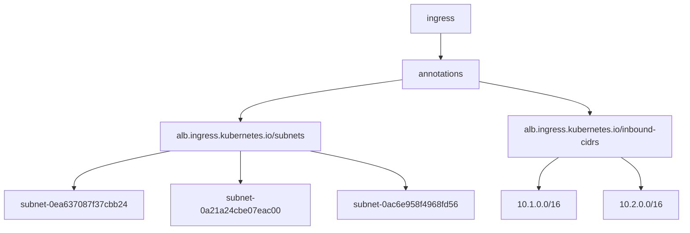

# Diagram: devops/k8s/platform-load-balancer/helm/values.ephemeral-test.yaml

> Auto-generated by Obscura crawlers

## Mermaid

### SVG

<svg id="container" width="1246.78125" xmlns="http://www.w3.org/2000/svg" class="flowchart" height="406" viewBox="0 0 1246.78125 406" role="graphics-document document" aria-roledescription="flowchart-v2"><g><marker id="container_flowchart-v2-pointEnd" class="marker flowchart-v2" viewBox="0 0 10 10" refX="5" refY="5" markerUnits="userSpaceOnUse" markerWidth="8" markerHeight="8" orient="auto"><path d="M 0 0 L 10 5 L 0 10 z" class="arrowMarkerPath" style="stroke-width: 1; stroke-dasharray: 1, 0;"></path></marker><marker id="container_flowchart-v2-pointStart" class="marker flowchart-v2" viewBox="0 0 10 10" refX="4.5" refY="5" markerUnits="userSpaceOnUse" markerWidth="8" markerHeight="8" orient="auto"><path d="M 0 5 L 10 10 L 10 0 z" class="arrowMarkerPath" style="stroke-width: 1; stroke-dasharray: 1, 0;"></path></marker><marker id="container_flowchart-v2-circleEnd" class="marker flowchart-v2" viewBox="0 0 10 10" refX="11" refY="5" markerUnits="userSpaceOnUse" markerWidth="11" markerHeight="11" orient="auto"><circle cx="5" cy="5" r="5" class="arrowMarkerPath" style="stroke-width: 1; stroke-dasharray: 1, 0;"></circle></marker><marker id="container_flowchart-v2-circleStart" class="marker flowchart-v2" viewBox="0 0 10 10" refX="-1" refY="5" markerUnits="userSpaceOnUse" markerWidth="11" markerHeight="11" orient="auto"><circle cx="5" cy="5" r="5" class="arrowMarkerPath" style="stroke-width: 1; stroke-dasharray: 1, 0;"></circle></marker><marker id="container_flowchart-v2-crossEnd" class="marker cross flowchart-v2" viewBox="0 0 11 11" refX="12" refY="5.2" markerUnits="userSpaceOnUse" markerWidth="11" markerHeight="11" orient="auto"><path d="M 1,1 l 9,9 M 10,1 l -9,9" class="arrowMarkerPath" style="stroke-width: 2; stroke-dasharray: 1, 0;"></path></marker><marker id="container_flowchart-v2-crossStart" class="marker cross flowchart-v2" viewBox="0 0 11 11" refX="-1" refY="5.2" markerUnits="userSpaceOnUse" markerWidth="11" markerHeight="11" orient="auto"><path d="M 1,1 l 9,9 M 10,1 l -9,9" class="arrowMarkerPath" style="stroke-width: 2; stroke-dasharray: 1, 0;"></path></marker><g class="root"><g class="clusters"></g><g class="edgePaths"><path d="M804.988,62L804.988,66.167C804.988,70.333,804.988,78.667,804.988,86.333C804.988,94,804.988,101,804.988,104.5L804.988,108" id="L_A_B_0" class="edge-thickness-normal edge-pattern-solid edge-thickness-normal edge-pattern-solid flowchart-link" style=";" data-edge="true" data-et="edge" data-id="L_A_B_0" data-points="W3sieCI6ODA0Ljk4ODI4MTI1LCJ5Ijo2Mn0seyJ4Ijo4MDQuOTg4MjgxMjUsInkiOjg3fSx7IngiOjgwNC45ODgyODEyNSwieSI6MTEyfV0=" marker-end="url(#container_flowchart-v2-pointEnd)"></path><path d="M731.16,149.484L682.433,156.403C633.706,163.323,536.251,177.161,487.524,189.581C438.797,202,438.797,213,438.797,218.5L438.797,224" id="L_B_C_0" class="edge-thickness-normal edge-pattern-solid edge-thickness-normal edge-pattern-solid flowchart-link" style=";" data-edge="true" data-et="edge" data-id="L_B_C_0" data-points="W3sieCI6NzMxLjE2MDE1NjI1LCJ5IjoxNDkuNDgzNzU5MTMzODIwNDZ9LHsieCI6NDM4Ljc5Njg3NSwieSI6MTkxfSx7IngiOjQzOC43OTY4NzUsInkiOjIyOH1d" marker-end="url(#container_flowchart-v2-pointEnd)"></path><path d="M878.816,152.999L912.218,159.333C945.62,165.666,1012.423,178.333,1045.825,188.167C1079.227,198,1079.227,205,1079.227,208.5L1079.227,212" id="L_B_D_0" class="edge-thickness-normal edge-pattern-solid edge-thickness-normal edge-pattern-solid flowchart-link" style=";" data-edge="true" data-et="edge" data-id="L_B_D_0" data-points="W3sieCI6ODc4LjgxNjQwNjI1LCJ5IjoxNTIuOTk5MDAyOTIwMDE5OTN9LHsieCI6MTA3OS4yMjY1NjI1LCJ5IjoxOTF9LHsieCI6MTA3OS4yMjY1NjI1LCJ5IjoyMTZ9XQ==" marker-end="url(#container_flowchart-v2-pointEnd)"></path><path d="M310.329,282L280.988,288.167C251.647,294.333,192.964,306.667,163.623,316.333C134.281,326,134.281,333,134.281,336.5L134.281,340" id="L_C_E_0" class="edge-thickness-normal edge-pattern-solid edge-thickness-normal edge-pattern-solid flowchart-link" style=";" data-edge="true" data-et="edge" data-id="L_C_E_0" data-points="W3sieCI6MzEwLjMyOTM0NTcwMzEyNSwieSI6MjgyfSx7IngiOjEzNC4yODEyNSwieSI6MzE5fSx7IngiOjEzNC4yODEyNSwieSI6MzQ0fV0=" marker-end="url(#container_flowchart-v2-pointEnd)"></path><path d="M438.797,282L438.797,288.167C438.797,294.333,438.797,306.667,438.797,316.333C438.797,326,438.797,333,438.797,336.5L438.797,340" id="L_C_F_0" class="edge-thickness-normal edge-pattern-solid edge-thickness-normal edge-pattern-solid flowchart-link" style=";" data-edge="true" data-et="edge" data-id="L_C_F_0" data-points="W3sieCI6NDM4Ljc5Njg3NSwieSI6MjgyfSx7IngiOjQzOC43OTY4NzUsInkiOjMxOX0seyJ4Ijo0MzguNzk2ODc1LCJ5IjozNDR9XQ==" marker-end="url(#container_flowchart-v2-pointEnd)"></path><path d="M567.554,282L596.962,288.167C626.37,294.333,685.185,306.667,714.592,316.333C744,326,744,333,744,336.5L744,340" id="L_C_G_0" class="edge-thickness-normal edge-pattern-solid edge-thickness-normal edge-pattern-solid flowchart-link" style=";" data-edge="true" data-et="edge" data-id="L_C_G_0" data-points="W3sieCI6NTY3LjU1NDQ0MzM1OTM3NSwieSI6MjgyfSx7IngiOjc0NCwieSI6MzE5fSx7IngiOjc0NCwieSI6MzQ0fV0=" marker-end="url(#container_flowchart-v2-pointEnd)"></path><path d="M1023.193,294L1017.206,298.167C1011.22,302.333,999.247,310.667,993.26,318.333C987.273,326,987.273,333,987.273,336.5L987.273,340" id="L_D_H_0" class="edge-thickness-normal edge-pattern-solid edge-thickness-normal edge-pattern-solid flowchart-link" style=";" data-edge="true" data-et="edge" data-id="L_D_H_0" data-points="W3sieCI6MTAyMy4xOTI2MjY5NTMxMjUsInkiOjI5NH0seyJ4Ijo5ODcuMjczNDM3NSwieSI6MzE5fSx7IngiOjk4Ny4yNzM0Mzc1LCJ5IjozNDR9XQ==" marker-end="url(#container_flowchart-v2-pointEnd)"></path><path d="M1135.26,294L1141.247,298.167C1147.234,302.333,1159.207,310.667,1165.193,318.333C1171.18,326,1171.18,333,1171.18,336.5L1171.18,340" id="L_D_I_0" class="edge-thickness-normal edge-pattern-solid edge-thickness-normal edge-pattern-solid flowchart-link" style=";" data-edge="true" data-et="edge" data-id="L_D_I_0" data-points="W3sieCI6MTEzNS4yNjA0OTgwNDY4NzUsInkiOjI5NH0seyJ4IjoxMTcxLjE3OTY4NzUsInkiOjMxOX0seyJ4IjoxMTcxLjE3OTY4NzUsInkiOjM0NH1d" marker-end="url(#container_flowchart-v2-pointEnd)"></path></g><g class="edgeLabels"><g class="edgeLabel"><g class="label" data-id="L_A_B_0" transform="translate(0, 0)"><foreignObject width="0" height="0">

</foreignObject></g></g><g class="edgeLabel"><g class="label" data-id="L_B_C_0" transform="translate(0, 0)"><foreignObject width="0" height="0">

</foreignObject></g></g><g class="edgeLabel"><g class="label" data-id="L_B_D_0" transform="translate(0, 0)"><foreignObject width="0" height="0">

</foreignObject></g></g><g class="edgeLabel"><g class="label" data-id="L_C_E_0" transform="translate(0, 0)"><foreignObject width="0" height="0">

</foreignObject></g></g><g class="edgeLabel"><g class="label" data-id="L_C_F_0" transform="translate(0, 0)"><foreignObject width="0" height="0">

</foreignObject></g></g><g class="edgeLabel"><g class="label" data-id="L_C_G_0" transform="translate(0, 0)"><foreignObject width="0" height="0">

</foreignObject></g></g><g class="edgeLabel"><g class="label" data-id="L_D_H_0" transform="translate(0, 0)"><foreignObject width="0" height="0">

</foreignObject></g></g><g class="edgeLabel"><g class="label" data-id="L_D_I_0" transform="translate(0, 0)"><foreignObject width="0" height="0">

</foreignObject></g></g></g><g class="nodes"><g class="node default" id="flowchart-A-0" transform="translate(804.98828125, 35)"><rect class="basic label-container" style="" x="-55.7109375" y="-27" width="111.421875" height="54"></rect><g class="label" style="" transform="translate(-25.7109375, -12)"><rect></rect><foreignObject width="51.421875" height="24">

ingress

</foreignObject></g></g><g class="node default" id="flowchart-B-1" transform="translate(804.98828125, 139)"><rect class="basic label-container" style="" x="-73.828125" y="-27" width="147.65625" height="54"></rect><g class="label" style="" transform="translate(-43.828125, -12)"><rect></rect><foreignObject width="87.65625" height="24">

annotations

</foreignObject></g></g><g class="node default" id="flowchart-C-3" transform="translate(438.796875, 255)"><rect class="basic label-container" style="" x="-153.2265625" y="-27" width="306.453125" height="54"></rect><g class="label" style="" transform="translate(-123.2265625, -12)"><rect></rect><foreignObject width="246.453125" height="24">

alb.ingress.kubernetes.io/subnets

</foreignObject></g></g><g class="node default" id="flowchart-D-5" transform="translate(1079.2265625, 255)"><rect class="basic label-container" style="" x="-158.375" y="-39" width="316.75" height="78"></rect><g class="label" style="" transform="translate(-128.375, -24)"><rect></rect><foreignObject width="256.75" height="48">

alb.ingress.kubernetes.io/inbound-cidrs

</foreignObject></g></g><g class="node default" id="flowchart-E-7" transform="translate(134.28125, 371)"><rect class="basic label-container" style="" x="-126.28125" y="-27" width="252.5625" height="54"></rect><g class="label" style="" transform="translate(-96.28125, -12)"><rect></rect><foreignObject width="192.5625" height="24">

subnet-0ea637087f37cbb24

</foreignObject></g></g><g class="node default" id="flowchart-F-9" transform="translate(438.796875, 371)"><rect class="basic label-container" style="" x="-128.234375" y="-27" width="256.46875" height="54"></rect><g class="label" style="" transform="translate(-98.234375, -12)"><rect></rect><foreignObject width="196.46875" height="24">

subnet-0a21a24cbe07eac00

</foreignObject></g></g><g class="node default" id="flowchart-G-11" transform="translate(744, 371)"><rect class="basic label-container" style="" x="-126.96875" y="-27" width="253.9375" height="54"></rect><g class="label" style="" transform="translate(-96.96875, -12)"><rect></rect><foreignObject width="193.9375" height="24">

subnet-0ac6e958f4968fd56

</foreignObject></g></g><g class="node default" id="flowchart-H-13" transform="translate(987.2734375, 371)"><rect class="basic label-container" style="" x="-66.3046875" y="-27" width="132.609375" height="54"></rect><g class="label" style="" transform="translate(-36.3046875, -12)"><rect></rect><foreignObject width="72.609375" height="24">

10.1.0.0/16

</foreignObject></g></g><g class="node default" id="flowchart-I-15" transform="translate(1171.1796875, 371)"><rect class="basic label-container" style="" x="-67.6015625" y="-27" width="135.203125" height="54"></rect><g class="label" style="" transform="translate(-37.6015625, -12)"><rect></rect><foreignObject width="75.203125" height="24">

10.2.0.0/16

</foreignObject></g></g></g></g></g></svg>
