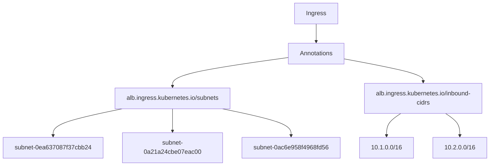
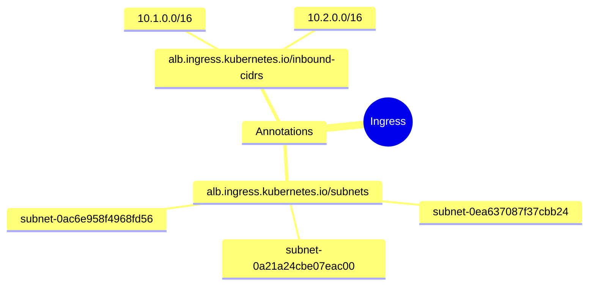
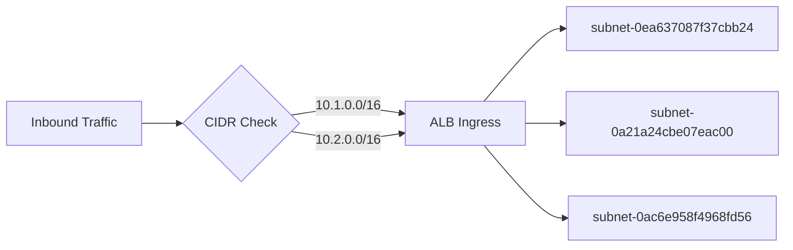

# Diagram: devops/k8s/platform-load-balancer/helm/values.prod-b.yaml

> Auto-generated by Obscura crawlers

## Diagram 1

### SVG

<svg id="container" width="1246.78125" xmlns="http://www.w3.org/2000/svg" class="flowchart" height="406" viewBox="0 0 1246.78125 406" role="graphics-document document" aria-roledescription="flowchart-v2"><g><marker id="container_flowchart-v2-pointEnd" class="marker flowchart-v2" viewBox="0 0 10 10" refX="5" refY="5" markerUnits="userSpaceOnUse" markerWidth="8" markerHeight="8" orient="auto"><path d="M 0 0 L 10 5 L 0 10 z" class="arrowMarkerPath" style="stroke-width: 1; stroke-dasharray: 1, 0;"></path></marker><marker id="container_flowchart-v2-pointStart" class="marker flowchart-v2" viewBox="0 0 10 10" refX="4.5" refY="5" markerUnits="userSpaceOnUse" markerWidth="8" markerHeight="8" orient="auto"><path d="M 0 5 L 10 10 L 10 0 z" class="arrowMarkerPath" style="stroke-width: 1; stroke-dasharray: 1, 0;"></path></marker><marker id="container_flowchart-v2-circleEnd" class="marker flowchart-v2" viewBox="0 0 10 10" refX="11" refY="5" markerUnits="userSpaceOnUse" markerWidth="11" markerHeight="11" orient="auto"><circle cx="5" cy="5" r="5" class="arrowMarkerPath" style="stroke-width: 1; stroke-dasharray: 1, 0;"></circle></marker><marker id="container_flowchart-v2-circleStart" class="marker flowchart-v2" viewBox="0 0 10 10" refX="-1" refY="5" markerUnits="userSpaceOnUse" markerWidth="11" markerHeight="11" orient="auto"><circle cx="5" cy="5" r="5" class="arrowMarkerPath" style="stroke-width: 1; stroke-dasharray: 1, 0;"></circle></marker><marker id="container_flowchart-v2-crossEnd" class="marker cross flowchart-v2" viewBox="0 0 11 11" refX="12" refY="5.2" markerUnits="userSpaceOnUse" markerWidth="11" markerHeight="11" orient="auto"><path d="M 1,1 l 9,9 M 10,1 l -9,9" class="arrowMarkerPath" style="stroke-width: 2; stroke-dasharray: 1, 0;"></path></marker><marker id="container_flowchart-v2-crossStart" class="marker cross flowchart-v2" viewBox="0 0 11 11" refX="-1" refY="5.2" markerUnits="userSpaceOnUse" markerWidth="11" markerHeight="11" orient="auto"><path d="M 1,1 l 9,9 M 10,1 l -9,9" class="arrowMarkerPath" style="stroke-width: 2; stroke-dasharray: 1, 0;"></path></marker><g class="root"><g class="clusters"></g><g class="edgePaths"><path d="M804.988,62L804.988,66.167C804.988,70.333,804.988,78.667,804.988,86.333C804.988,94,804.988,101,804.988,104.5L804.988,108" id="L_A_B_0" class="edge-thickness-normal edge-pattern-solid edge-thickness-normal edge-pattern-solid flowchart-link" style=";" data-edge="true" data-et="edge" data-id="L_A_B_0" data-points="W3sieCI6ODA0Ljk4ODI4MTI1LCJ5Ijo2Mn0seyJ4Ijo4MDQuOTg4MjgxMjUsInkiOjg3fSx7IngiOjgwNC45ODgyODEyNSwieSI6MTEyfV0=" marker-end="url(#container_flowchart-v2-pointEnd)"></path><path d="M730.926,149.517L682.238,156.431C633.549,163.345,536.173,177.172,487.485,189.586C438.797,202,438.797,213,438.797,218.5L438.797,224" id="L_B_C_0" class="edge-thickness-normal edge-pattern-solid edge-thickness-normal edge-pattern-solid flowchart-link" style=";" data-edge="true" data-et="edge" data-id="L_B_C_0" data-points="W3sieCI6NzMwLjkyNTc4MTI1LCJ5IjoxNDkuNTE3MDQwOTA4ODQ4NDZ9LHsieCI6NDM4Ljc5Njg3NSwieSI6MTkxfSx7IngiOjQzOC43OTY4NzUsInkiOjIyOH1d" marker-end="url(#container_flowchart-v2-pointEnd)"></path><path d="M879.051,153.043L912.413,159.37C945.776,165.696,1012.501,178.348,1045.864,188.174C1079.227,198,1079.227,205,1079.227,208.5L1079.227,212" id="L_B_D_0" class="edge-thickness-normal edge-pattern-solid edge-thickness-normal edge-pattern-solid flowchart-link" style=";" data-edge="true" data-et="edge" data-id="L_B_D_0" data-points="W3sieCI6ODc5LjA1MDc4MTI1LCJ5IjoxNTMuMDQzNDQ0MTk5MTMxMX0seyJ4IjoxMDc5LjIyNjU2MjUsInkiOjE5MX0seyJ4IjoxMDc5LjIyNjU2MjUsInkiOjIxNn1d" marker-end="url(#container_flowchart-v2-pointEnd)"></path><path d="M310.329,282L280.988,288.167C251.647,294.333,192.964,306.667,163.623,316.333C134.281,326,134.281,333,134.281,336.5L134.281,340" id="L_C_E_0" class="edge-thickness-normal edge-pattern-solid edge-thickness-normal edge-pattern-solid flowchart-link" style=";" data-edge="true" data-et="edge" data-id="L_C_E_0" data-points="W3sieCI6MzEwLjMyOTM0NTcwMzEyNSwieSI6MjgyfSx7IngiOjEzNC4yODEyNSwieSI6MzE5fSx7IngiOjEzNC4yODEyNSwieSI6MzQ0fV0=" marker-end="url(#container_flowchart-v2-pointEnd)"></path><path d="M438.797,282L438.797,288.167C438.797,294.333,438.797,306.667,438.797,316.333C438.797,326,438.797,333,438.797,336.5L438.797,340" id="L_C_F_0" class="edge-thickness-normal edge-pattern-solid edge-thickness-normal edge-pattern-solid flowchart-link" style=";" data-edge="true" data-et="edge" data-id="L_C_F_0" data-points="W3sieCI6NDM4Ljc5Njg3NSwieSI6MjgyfSx7IngiOjQzOC43OTY4NzUsInkiOjMxOX0seyJ4Ijo0MzguNzk2ODc1LCJ5IjozNDR9XQ==" marker-end="url(#container_flowchart-v2-pointEnd)"></path><path d="M567.554,282L596.962,288.167C626.37,294.333,685.185,306.667,714.592,316.333C744,326,744,333,744,336.5L744,340" id="L_C_G_0" class="edge-thickness-normal edge-pattern-solid edge-thickness-normal edge-pattern-solid flowchart-link" style=";" data-edge="true" data-et="edge" data-id="L_C_G_0" data-points="W3sieCI6NTY3LjU1NDQ0MzM1OTM3NSwieSI6MjgyfSx7IngiOjc0NCwieSI6MzE5fSx7IngiOjc0NCwieSI6MzQ0fV0=" marker-end="url(#container_flowchart-v2-pointEnd)"></path><path d="M1023.193,294L1017.206,298.167C1011.22,302.333,999.247,310.667,993.26,318.333C987.273,326,987.273,333,987.273,336.5L987.273,340" id="L_D_H_0" class="edge-thickness-normal edge-pattern-solid edge-thickness-normal edge-pattern-solid flowchart-link" style=";" data-edge="true" data-et="edge" data-id="L_D_H_0" data-points="W3sieCI6MTAyMy4xOTI2MjY5NTMxMjUsInkiOjI5NH0seyJ4Ijo5ODcuMjczNDM3NSwieSI6MzE5fSx7IngiOjk4Ny4yNzM0Mzc1LCJ5IjozNDR9XQ==" marker-end="url(#container_flowchart-v2-pointEnd)"></path><path d="M1135.26,294L1141.247,298.167C1147.234,302.333,1159.207,310.667,1165.193,318.333C1171.18,326,1171.18,333,1171.18,336.5L1171.18,340" id="L_D_I_0" class="edge-thickness-normal edge-pattern-solid edge-thickness-normal edge-pattern-solid flowchart-link" style=";" data-edge="true" data-et="edge" data-id="L_D_I_0" data-points="W3sieCI6MTEzNS4yNjA0OTgwNDY4NzUsInkiOjI5NH0seyJ4IjoxMTcxLjE3OTY4NzUsInkiOjMxOX0seyJ4IjoxMTcxLjE3OTY4NzUsInkiOjM0NH1d" marker-end="url(#container_flowchart-v2-pointEnd)"></path></g><g class="edgeLabels"><g class="edgeLabel"><g class="label" data-id="L_A_B_0" transform="translate(0, 0)"><foreignObject width="0" height="0">

</foreignObject></g></g><g class="edgeLabel"><g class="label" data-id="L_B_C_0" transform="translate(0, 0)"><foreignObject width="0" height="0">

</foreignObject></g></g><g class="edgeLabel"><g class="label" data-id="L_B_D_0" transform="translate(0, 0)"><foreignObject width="0" height="0">

</foreignObject></g></g><g class="edgeLabel"><g class="label" data-id="L_C_E_0" transform="translate(0, 0)"><foreignObject width="0" height="0">

</foreignObject></g></g><g class="edgeLabel"><g class="label" data-id="L_C_F_0" transform="translate(0, 0)"><foreignObject width="0" height="0">

</foreignObject></g></g><g class="edgeLabel"><g class="label" data-id="L_C_G_0" transform="translate(0, 0)"><foreignObject width="0" height="0">

</foreignObject></g></g><g class="edgeLabel"><g class="label" data-id="L_D_H_0" transform="translate(0, 0)"><foreignObject width="0" height="0">

</foreignObject></g></g><g class="edgeLabel"><g class="label" data-id="L_D_I_0" transform="translate(0, 0)"><foreignObject width="0" height="0">

</foreignObject></g></g></g><g class="nodes"><g class="node default" id="flowchart-A-0" transform="translate(804.98828125, 35)"><rect class="basic label-container" style="" x="-55.8125" y="-27" width="111.625" height="54"></rect><g class="label" style="" transform="translate(-25.8125, -12)"><rect></rect><foreignObject width="51.625" height="24">

Ingress

</foreignObject></g></g><g class="node default" id="flowchart-B-1" transform="translate(804.98828125, 139)"><rect class="basic label-container" style="" x="-74.0625" y="-27" width="148.125" height="54"></rect><g class="label" style="" transform="translate(-44.0625, -12)"><rect></rect><foreignObject width="88.125" height="24">

Annotations

</foreignObject></g></g><g class="node default" id="flowchart-C-3" transform="translate(438.796875, 255)"><rect class="basic label-container" style="" x="-153.2265625" y="-27" width="306.453125" height="54"></rect><g class="label" style="" transform="translate(-123.2265625, -12)"><rect></rect><foreignObject width="246.453125" height="24">

alb.ingress.kubernetes.io/subnets

</foreignObject></g></g><g class="node default" id="flowchart-D-5" transform="translate(1079.2265625, 255)"><rect class="basic label-container" style="" x="-158.375" y="-39" width="316.75" height="78"></rect><g class="label" style="" transform="translate(-128.375, -24)"><rect></rect><foreignObject width="256.75" height="48">

alb.ingress.kubernetes.io/inbound-cidrs

</foreignObject></g></g><g class="node default" id="flowchart-E-7" transform="translate(134.28125, 371)"><rect class="basic label-container" style="" x="-126.28125" y="-27" width="252.5625" height="54"></rect><g class="label" style="" transform="translate(-96.28125, -12)"><rect></rect><foreignObject width="192.5625" height="24">

subnet-0ea637087f37cbb24

</foreignObject></g></g><g class="node default" id="flowchart-F-9" transform="translate(438.796875, 371)"><rect class="basic label-container" style="" x="-128.234375" y="-27" width="256.46875" height="54"></rect><g class="label" style="" transform="translate(-98.234375, -12)"><rect></rect><foreignObject width="196.46875" height="24">

subnet-0a21a24cbe07eac00

</foreignObject></g></g><g class="node default" id="flowchart-G-11" transform="translate(744, 371)"><rect class="basic label-container" style="" x="-126.96875" y="-27" width="253.9375" height="54"></rect><g class="label" style="" transform="translate(-96.96875, -12)"><rect></rect><foreignObject width="193.9375" height="24">

subnet-0ac6e958f4968fd56

</foreignObject></g></g><g class="node default" id="flowchart-H-13" transform="translate(987.2734375, 371)"><rect class="basic label-container" style="" x="-66.3046875" y="-27" width="132.609375" height="54"></rect><g class="label" style="" transform="translate(-36.3046875, -12)"><rect></rect><foreignObject width="72.609375" height="24">

10.1.0.0/16

</foreignObject></g></g><g class="node default" id="flowchart-I-15" transform="translate(1171.1796875, 371)"><rect class="basic label-container" style="" x="-67.6015625" y="-27" width="135.203125" height="54"></rect><g class="label" style="" transform="translate(-37.6015625, -12)"><rect></rect><foreignObject width="75.203125" height="24">

10.2.0.0/16

</foreignObject></g></g></g></g></g></svg>

## Diagram 2

### SVG

<svg id="container" width="100%" xmlns="http://www.w3.org/2000/svg" class="mindmapDiagram" style="max-width: 847.5985107421875px;" viewBox="5 5 847.5985107421875 396.5853271484375" role="graphics-document document" aria-roledescription="mindmap"><g><marker id="container_mindmap-pointEnd" class="marker mindmap" viewBox="0 0 10 10" refX="5" refY="5" markerUnits="userSpaceOnUse" markerWidth="8" markerHeight="8" orient="auto"><path d="M 0 0 L 10 5 L 0 10 z" class="arrowMarkerPath" style="stroke-width: 1; stroke-dasharray: 1, 0;"></path></marker><marker id="container_mindmap-pointStart" class="marker mindmap" viewBox="0 0 10 10" refX="4.5" refY="5" markerUnits="userSpaceOnUse" markerWidth="8" markerHeight="8" orient="auto"><path d="M 0 5 L 10 10 L 10 0 z" class="arrowMarkerPath" style="stroke-width: 1; stroke-dasharray: 1, 0;"></path></marker><g class="subgraphs"></g><g class="edgePaths"><path d="M561.147,187.845L550.818,188.812C540.489,189.78,519.83,191.714,499.172,193.649C478.514,195.583,457.855,197.518,447.526,198.485L437.197,199.452" id="edge_0_1" class="edge-thickness-normal edge-pattern-solid edge section-edge-0 edge-depth-1" style="undefined;;;undefined" data-edge="true" data-et="edge" data-id="edge_0_1" data-points="W3sieCI6NTYxLjE0Njc3MjM1OTcyLCJ5IjoxODcuODQ1MDE2MDY5Nzg2Mn0seyJ4Ijo0OTkuMTcxOTY0MDEyNTU5MzMsInkiOjE5My42NDg3MzU1MjU0MDUzfSx7IngiOjQzNy4xOTcxNTU2NjUzOTg2NywieSI6MTk5LjQ1MjQ1NDk4MTAyNDR9XQ=="></path><path d="M420.679,215.767L420.166,220.609C419.652,225.45,418.624,235.133,417.597,244.816C416.569,254.498,415.541,264.181,415.028,269.022L414.514,273.864" id="edge_1_2" class="edge-thickness-normal edge-pattern-solid edge section-edge-0 edge-depth-3" style="undefined;;;undefined" data-edge="true" data-et="edge" data-id="edge_1_2" data-points="W3sieCI6NDIwLjY3OTQ1ODIyMzg2MDI1LCJ5IjoyMTUuNzY3MjY0NDc4NzM4MjR9LHsieCI6NDE3LjU5NjYwMTMyMDI4MzUsInkiOjI0NC44MTU1NTAzMDQyMTI4OH0seyJ4Ijo0MTQuNTEzNzQ0NDE2NzA2OCwieSI6MjczLjg2MzgzNjEyOTY4NzV9XQ=="></path><path d="M427.922,288.27L451.539,287.467C475.156,286.663,522.39,285.056,569.624,283.449C616.858,281.843,664.092,280.236,687.709,279.432L711.326,278.629" id="edge_2_3" class="edge-thickness-normal edge-pattern-solid edge section-edge-0 edge-depth-5" style="undefined;;;undefined" data-edge="true" data-et="edge" data-id="edge_2_3" data-points="W3sieCI6NDI3LjkyMjAzMTUzODUwMjg0LCJ5IjoyODguMjcwMDY4NTg3Mzk4N30seyJ4Ijo1NjkuNjIzOTQ2NjU0ODAzNCwieSI6MjgzLjQ0OTQxODczNDA1Njg1fSx7IngiOjcxMS4zMjU4NjE3NzExMDQsInkiOjI3OC42Mjg3Njg4ODA3MTV9XQ=="></path><path d="M409.042,303.267L407.771,308.003C406.5,312.739,403.958,322.211,401.416,331.683C398.874,341.154,396.332,350.626,395.06,355.362L393.789,360.098" id="edge_2_4" class="edge-thickness-normal edge-pattern-solid edge section-edge-0 edge-depth-5" style="undefined;;;undefined" data-edge="true" data-et="edge" data-id="edge_2_4" data-points="W3sieCI6NDA5LjA0MjM5Nzc3NjAxODczLCJ5IjozMDMuMjY3MzQxMTc2MjE2MjN9LHsieCI6NDAxLjQxNTg2Njk2NDM5MTE3LCJ5IjozMzEuNjgyNzAzODgxMTM0fSx7IngiOjM5My43ODkzMzYxNTI3NjM2LCJ5IjozNjAuMDk4MDY2NTg2MDUxNzR9XQ=="></path><path d="M398.094,286.571L377.154,283.453C356.213,280.335,314.331,274.098,272.45,267.862C230.568,261.626,188.687,255.389,167.746,252.271L146.805,249.153" id="edge_2_5" class="edge-thickness-normal edge-pattern-solid edge section-edge-0 edge-depth-5" style="undefined;;;undefined" data-edge="true" data-et="edge" data-id="edge_2_5" data-points="W3sieCI6Mzk4LjA5NDI4MTg2NDkwNzksInkiOjI4Ni41NzA4NjU1MDU5MDI1M30seyJ4IjoyNzIuNDQ5NzI3MDE4NDcxMTUsInkiOjI2Ny44NjE4ODY4NDQzNDMzNn0seyJ4IjoxNDYuODA1MTcyMTcyMDM0NDIsInkiOjI0OS4xNTI5MDgxODI3ODQyfV0="></path><path d="M415.679,187.373L412.918,181.722C410.158,176.07,404.636,164.768,399.115,153.465C393.594,142.163,388.073,130.86,385.312,125.209L382.552,119.557" id="edge_1_6" class="edge-thickness-normal edge-pattern-solid edge section-edge-0 edge-depth-3" style="undefined;;;undefined" data-edge="true" data-et="edge" data-id="edge_1_6" data-points="W3sieCI6NDE1LjY3ODcxNzI4ODk3MTIsInkiOjE4Ny4zNzMxMzA5Njk0OTI2NX0seyJ4IjozOTkuMTE1MTMxOTMyMjA4NiwieSI6MTUzLjQ2NTIwNTEwODI4NDEyfSx7IngiOjM4Mi41NTE1NDY1NzU0NDYsInkiOjExOS41NTcyNzkyNDcwNzU2MX1d"></path><path d="M362.547,99.38L353.117,94.672C343.686,89.964,324.826,80.549,305.965,71.134C287.105,61.718,268.244,52.303,258.814,47.595L249.383,42.888" id="edge_6_7" class="edge-thickness-normal edge-pattern-solid edge section-edge-0 edge-depth-5" style="undefined;;;undefined" data-edge="true" data-et="edge" data-id="edge_6_7" data-points="W3sieCI6MzYyLjU0NzEwNTE5NTY5MzEsInkiOjk5LjM3OTY4NTE1NjMwMTI0fSx7IngiOjMwNS45NjUyNjEzMTk3MjAwNywieSI6NzEuMTMzNjEwMTIzMTQwNzN9LHsieCI6MjQ5LjM4MzQxNzQ0Mzc0NzAyLCJ5Ijo0Mi44ODc1MzUwODk5ODAyMjZ9XQ=="></path><path d="M388.79,98.295L396.82,93.419C404.851,88.543,420.913,78.791,436.974,69.04C453.036,59.288,469.097,49.536,477.128,44.661L485.159,39.785" id="edge_6_8" class="edge-thickness-normal edge-pattern-solid edge section-edge-0 edge-depth-5" style="undefined;;;undefined" data-edge="true" data-et="edge" data-id="edge_6_8" data-points="W3sieCI6Mzg4Ljc4OTU3MjExNTAzOTQsInkiOjk4LjI5NDY5NjI1MzAwMzAxfSx7IngiOjQzNi45NzQyMDgwMzE4NTc0LCJ5Ijo2OS4wMzk2ODg5NzA3ODc0NH0seyJ4Ijo0ODUuMTU4ODQzOTQ4Njc1NTUsInkiOjM5Ljc4NDY4MTY4ODU3MTg2NX1d"></path></g><g class="edgeLabels"><g class="edgeLabel"><g class="label" data-id="edge_0_1" transform="translate(0, 0)"><foreignObject width="0" height="0">

</foreignObject></g></g><g class="edgeLabel"><g class="label" data-id="edge_1_2" transform="translate(0, 0)"><foreignObject width="0" height="0">

</foreignObject></g></g><g class="edgeLabel"><g class="label" data-id="edge_2_3" transform="translate(0, 0)"><foreignObject width="0" height="0">

</foreignObject></g></g><g class="edgeLabel"><g class="label" data-id="edge_2_4" transform="translate(0, 0)"><foreignObject width="0" height="0">

</foreignObject></g></g><g class="edgeLabel"><g class="label" data-id="edge_2_5" transform="translate(0, 0)"><foreignObject width="0" height="0">

</foreignObject></g></g><g class="edgeLabel"><g class="label" data-id="edge_1_6" transform="translate(0, 0)"><foreignObject width="0" height="0">

</foreignObject></g></g><g class="edgeLabel"><g class="label" data-id="edge_6_7" transform="translate(0, 0)"><foreignObject width="0" height="0">

</foreignObject></g></g><g class="edgeLabel"><g class="label" data-id="edge_6_8" transform="translate(0, 0)"><foreignObject width="0" height="0">

</foreignObject></g></g></g><g class="nodes"><g class="node mindmap-node section-root section--1" id="node_0" transform="translate(576.0814294214939, 186.44643877581723)"><circle class="basic label-container" style="" r="35.8125" cx="0" cy="0"></circle><g class="label" style="" transform="translate(-25.8125, -12)"><rect></rect><foreignObject width="51.625" height="24">

Ingress

</foreignObject></g></g><g class="node mindmap-node section-0" id="node_1" transform="translate(422.26249860362475, 200.85103227499337)"><path id="node-1" class="node-bkg node-0" style="" d="M-64.0625 12
    v-24
    q0,-5 5,-5
    h118.125
    q5,0 5,5
    v24
    q0,5 -5,5
    h-118.125
    q-5,0 -5,-5
    Z"></path><line class="node-line-" x1="-64.0625" y1="17" x2="64.0625" y2="17"></line><g class="label" style="" transform="translate(-44.0625, -12)"><rect></rect><foreignObject width="88.125" height="24">

Annotations

</foreignObject></g></g><g class="node mindmap-node section-0" id="node_2" transform="translate(412.9307040369423, 288.7800683334324)"><path id="node-2" class="node-bkg node-0" style="" d="M-143.2265625 12
    v-24
    q0,-5 5,-5
    h276.453125
    q5,0 5,5
    v24
    q0,5 -5,5
    h-276.453125
    q-5,0 -5,-5
    Z"></path><line class="node-line-" x1="-143.2265625" y1="17" x2="143.2265625" y2="17"></line><g class="label" style="" transform="translate(-123.2265625, -12)"><rect></rect><foreignObject width="246.453125" height="24">

alb.ingress.kubernetes.io/subnets

</foreignObject></g></g><g class="node mindmap-node section-0" id="node_3" transform="translate(726.3171892726645, 278.1187691346813)"><path id="node-3" class="node-bkg node-0" style="" d="M-116.28125 12
    v-24
    q0,-5 5,-5
    h222.5625
    q5,0 5,5
    v24
    q0,5 -5,5
    h-222.5625
    q-5,0 -5,-5
    Z"></path><line class="node-line-" x1="-116.28125" y1="17" x2="116.28125" y2="17"></line><g class="label" style="" transform="translate(-96.28125, -12)"><rect></rect><foreignObject width="192.5625" height="24">

subnet-0ea637087f37cbb24

</foreignObject></g></g><g class="node mindmap-node section-0" id="node_4" transform="translate(389.90102989184004, 374.5853394288356)"><path id="node-4" class="node-bkg node-0" style="" d="M-118.234375 12
    v-24
    q0,-5 5,-5
    h226.46875
    q5,0 5,5
    v24
    q0,5 -5,5
    h-226.46875
    q-5,0 -5,-5
    Z"></path><line class="node-line-" x1="-118.234375" y1="17" x2="118.234375" y2="17"></line><g class="label" style="" transform="translate(-98.234375, -12)"><rect></rect><foreignObject width="196.46875" height="24">

subnet-0a21a24cbe07eac00

</foreignObject></g></g><g class="node mindmap-node section-0" id="node_5" transform="translate(131.96875, 246.94370535525434)"><path id="node-5" class="node-bkg node-0" style="" d="M-116.96875 12
    v-24
    q0,-5 5,-5
    h223.9375
    q5,0 5,5
    v24
    q0,5 -5,5
    h-223.9375
    q-5,0 -5,-5
    Z"></path><line class="node-line-" x1="-116.96875" y1="17" x2="116.96875" y2="17"></line><g class="label" style="" transform="translate(-96.96875, -12)"><rect></rect><foreignObject width="193.9375" height="24">

subnet-0ac6e958f4968fd56

</foreignObject></g></g><g class="node mindmap-node section-0" id="node_6" transform="translate(375.9677652607925, 106.07937794157488)"><path id="node-6" class="node-bkg node-0" style="" d="M-148.375 24
    v-48
    q0,-5 5,-5
    h286.75
    q5,0 5,5
    v48
    q0,5 -5,5
    h-286.75
    q-5,0 -5,-5
    Z"></path><line class="node-line-" x1="-148.375" y1="29" x2="148.375" y2="29"></line><g class="label" style="" transform="translate(-128.375, -24)"><rect></rect><foreignObject width="256.75" height="48">

alb.ingress.kubernetes.io/inbound-cidrs

</foreignObject></g></g><g class="node mindmap-node section-0" id="node_7" transform="translate(235.96275737864767, 36.18784230470658)"><path id="node-7" class="node-bkg node-0" style="" d="M-56.3046875 12
    v-24
    q0,-5 5,-5
    h102.609375
    q5,0 5,5
    v24
    q0,5 -5,5
    h-102.609375
    q-5,0 -5,-5
    Z"></path><line class="node-line-" x1="-56.3046875" y1="17" x2="56.3046875" y2="17"></line><g class="label" style="" transform="translate(-36.3046875, -12)"><rect></rect><foreignObject width="72.609375" height="24">

10.1.0.0/16

</foreignObject></g></g><g class="node mindmap-node section-0" id="node_8" transform="translate(497.98065080292247, 32)"><path id="node-8" class="node-bkg node-0" style="" d="M-57.6015625 12
    v-24
    q0,-5 5,-5
    h105.203125
    q5,0 5,5
    v24
    q0,5 -5,5
    h-105.203125
    q-5,0 -5,-5
    Z"></path><line class="node-line-" x1="-57.6015625" y1="17" x2="57.6015625" y2="17"></line><g class="label" style="" transform="translate(-37.6015625, -12)"><rect></rect><foreignObject width="75.203125" height="24">

10.2.0.0/16

</foreignObject></g></g></g></g></svg>

## Diagram 3

### SVG

<svg id="container" width="944.8125" xmlns="http://www.w3.org/2000/svg" class="flowchart" height="278" viewBox="0 0 944.8125 278" role="graphics-document document" aria-roledescription="flowchart-v2"><g><marker id="container_flowchart-v2-pointEnd" class="marker flowchart-v2" viewBox="0 0 10 10" refX="5" refY="5" markerUnits="userSpaceOnUse" markerWidth="8" markerHeight="8" orient="auto"><path d="M 0 0 L 10 5 L 0 10 z" class="arrowMarkerPath" style="stroke-width: 1; stroke-dasharray: 1, 0;"></path></marker><marker id="container_flowchart-v2-pointStart" class="marker flowchart-v2" viewBox="0 0 10 10" refX="4.5" refY="5" markerUnits="userSpaceOnUse" markerWidth="8" markerHeight="8" orient="auto"><path d="M 0 5 L 10 10 L 10 0 z" class="arrowMarkerPath" style="stroke-width: 1; stroke-dasharray: 1, 0;"></path></marker><marker id="container_flowchart-v2-circleEnd" class="marker flowchart-v2" viewBox="0 0 10 10" refX="11" refY="5" markerUnits="userSpaceOnUse" markerWidth="11" markerHeight="11" orient="auto"><circle cx="5" cy="5" r="5" class="arrowMarkerPath" style="stroke-width: 1; stroke-dasharray: 1, 0;"></circle></marker><marker id="container_flowchart-v2-circleStart" class="marker flowchart-v2" viewBox="0 0 10 10" refX="-1" refY="5" markerUnits="userSpaceOnUse" markerWidth="11" markerHeight="11" orient="auto"><circle cx="5" cy="5" r="5" class="arrowMarkerPath" style="stroke-width: 1; stroke-dasharray: 1, 0;"></circle></marker><marker id="container_flowchart-v2-crossEnd" class="marker cross flowchart-v2" viewBox="0 0 11 11" refX="12" refY="5.2" markerUnits="userSpaceOnUse" markerWidth="11" markerHeight="11" orient="auto"><path d="M 1,1 l 9,9 M 10,1 l -9,9" class="arrowMarkerPath" style="stroke-width: 2; stroke-dasharray: 1, 0;"></path></marker><marker id="container_flowchart-v2-crossStart" class="marker cross flowchart-v2" viewBox="0 0 11 11" refX="-1" refY="5.2" markerUnits="userSpaceOnUse" markerWidth="11" markerHeight="11" orient="auto"><path d="M 1,1 l 9,9 M 10,1 l -9,9" class="arrowMarkerPath" style="stroke-width: 2; stroke-dasharray: 1, 0;"></path></marker><g class="root"><g class="clusters"></g><g class="edgePaths"><path d="M177.766,139L181.932,139C186.099,139,194.432,139,202.099,139C209.766,139,216.766,139,220.266,139L223.766,139" id="L_IN_CIDRS_0" class="edge-thickness-normal edge-pattern-solid edge-thickness-normal edge-pattern-solid flowchart-link" style=";" data-edge="true" data-et="edge" data-id="L_IN_CIDRS_0" data-points="W3sieCI6MTc3Ljc2NTYyNSwieSI6MTM5fSx7IngiOjIwMi43NjU2MjUsInkiOjEzOX0seyJ4IjoyMjcuNzY1NjI1LCJ5IjoxMzl9XQ==" marker-end="url(#container_flowchart-v2-pointEnd)"></path><path d="M352.658,129.251L364.716,127.209C376.774,125.168,400.891,121.084,422.725,120.647C444.559,120.211,464.111,123.421,473.887,125.027L483.662,126.632" id="L_CIDRS_ALB_0" class="edge-thickness-normal edge-pattern-solid edge-thickness-normal edge-pattern-solid flowchart-link" style=";" data-edge="true" data-et="edge" data-id="L_CIDRS_ALB_0" data-points="W3sieCI6MzUyLjY1NzUwOTg5OTIwODA0LCJ5IjoxMjkuMjUxMjU5ODk5MjA4MDd9LHsieCI6NDI1LjAwNzgxMjUsInkiOjExN30seyJ4Ijo0ODcuNjA5Mzc1LCJ5IjoxMjcuMjgwMjY1OTIwMjIzOTR9XQ==" marker-end="url(#container_flowchart-v2-pointEnd)"></path><path d="M352.658,148.749L364.716,150.791C376.774,152.832,400.891,156.916,422.725,157.353C444.559,157.789,464.111,154.579,473.887,152.973L483.662,151.368" id="L_CIDRS_ALB_2" class="edge-thickness-normal edge-pattern-solid edge-thickness-normal edge-pattern-solid flowchart-link" style=";" data-edge="true" data-et="edge" data-id="L_CIDRS_ALB_2" data-points="W3sieCI6MzUyLjY1NzUwOTg5OTIwODA0LCJ5IjoxNDguNzQ4NzQwMTAwNzkxOTN9LHsieCI6NDI1LjAwNzgxMjUsInkiOjE2MX0seyJ4Ijo0ODcuNjA5Mzc1LCJ5IjoxNTAuNzE5NzM0MDc5Nzc2MDZ9XQ==" marker-end="url(#container_flowchart-v2-pointEnd)"></path><path d="M583.995,112L595.886,99.167C607.778,86.333,631.561,60.667,647.278,47.833C662.995,35,670.646,35,674.471,35L678.297,35" id="L_ALB_SUB1_0" class="edge-thickness-normal edge-pattern-solid edge-thickness-normal edge-pattern-solid flowchart-link" style=";" data-edge="true" data-et="edge" data-id="L_ALB_SUB1_0" data-points="W3sieCI6NTgzLjk5NDk2Njk0NzExNTQsInkiOjExMn0seyJ4Ijo2NTUuMzQzNzUsInkiOjM1fSx7IngiOjY4Mi4yOTY4NzUsInkiOjM1fV0=" marker-end="url(#container_flowchart-v2-pointEnd)"></path><path d="M630.344,139L634.51,139C638.677,139,647.01,139,654.677,139C662.344,139,669.344,139,672.844,139L676.344,139" id="L_ALB_SUB2_0" class="edge-thickness-normal edge-pattern-solid edge-thickness-normal edge-pattern-solid flowchart-link" style=";" data-edge="true" data-et="edge" data-id="L_ALB_SUB2_0" data-points="W3sieCI6NjMwLjM0Mzc1LCJ5IjoxMzl9LHsieCI6NjU1LjM0Mzc1LCJ5IjoxMzl9LHsieCI6NjgwLjM0Mzc1LCJ5IjoxMzl9XQ==" marker-end="url(#container_flowchart-v2-pointEnd)"></path><path d="M583.995,166L595.886,178.833C607.778,191.667,631.561,217.333,647.163,230.167C662.766,243,670.188,243,673.898,243L677.609,243" id="L_ALB_SUB3_0" class="edge-thickness-normal edge-pattern-solid edge-thickness-normal edge-pattern-solid flowchart-link" style=";" data-edge="true" data-et="edge" data-id="L_ALB_SUB3_0" data-points="W3sieCI6NTgzLjk5NDk2Njk0NzExNTQsInkiOjE2Nn0seyJ4Ijo2NTUuMzQzNzUsInkiOjI0M30seyJ4Ijo2ODEuNjA5Mzc1LCJ5IjoyNDN9XQ==" marker-end="url(#container_flowchart-v2-pointEnd)"></path></g><g class="edgeLabels"><g class="edgeLabel"><g class="label" data-id="L_IN_CIDRS_0" transform="translate(0, 0)"><foreignObject width="0" height="0">

</foreignObject></g></g><g class="edgeLabel" transform="translate(420.10747, 117.82979)"><g class="label" data-id="L_CIDRS_ALB_0" transform="translate(-36.3046875, -12)"><foreignObject width="72.609375" height="24">

10.1.0.0/16

</foreignObject></g></g><g class="edgeLabel" transform="translate(420.10747, 160.17021)"><g class="label" data-id="L_CIDRS_ALB_2" transform="translate(-37.6015625, -12)"><foreignObject width="75.203125" height="24">

10.2.0.0/16

</foreignObject></g></g><g class="edgeLabel"><g class="label" data-id="L_ALB_SUB1_0" transform="translate(0, 0)"><foreignObject width="0" height="0">

</foreignObject></g></g><g class="edgeLabel"><g class="label" data-id="L_ALB_SUB2_0" transform="translate(0, 0)"><foreignObject width="0" height="0">

</foreignObject></g></g><g class="edgeLabel"><g class="label" data-id="L_ALB_SUB3_0" transform="translate(0, 0)"><foreignObject width="0" height="0">

</foreignObject></g></g></g><g class="nodes"><g class="node default" id="flowchart-IN-0" transform="translate(92.8828125, 139)"><rect class="basic label-container" style="" x="-84.8828125" y="-27" width="169.765625" height="54"></rect><g class="label" style="" transform="translate(-54.8828125, -12)"><rect></rect><foreignObject width="109.765625" height="24">

Inbound Traffic

</foreignObject></g></g><g class="node default" id="flowchart-CIDRS-1" transform="translate(295.0859375, 139)"><polygon points="67.3203125,0 134.640625,-67.3203125 67.3203125,-134.640625 0,-67.3203125" class="label-container" transform="translate(-66.8203125, 67.3203125)"></polygon><g class="label" style="" transform="translate(-40.3203125, -12)"><rect></rect><foreignObject width="80.640625" height="24">

CIDR Check

</foreignObject></g></g><g class="node default" id="flowchart-ALB-3" transform="translate(558.9765625, 139)"><rect class="basic label-container" style="" x="-71.3671875" y="-27" width="142.734375" height="54"></rect><g class="label" style="" transform="translate(-41.3671875, -12)"><rect></rect><foreignObject width="82.734375" height="24">

ALB Ingress

</foreignObject></g></g><g class="node default" id="flowchart-SUB1-7" transform="translate(808.578125, 35)"><rect class="basic label-container" style="" x="-126.28125" y="-27" width="252.5625" height="54"></rect><g class="label" style="" transform="translate(-96.28125, -12)"><rect></rect><foreignObject width="192.5625" height="24">

subnet-0ea637087f37cbb24

</foreignObject></g></g><g class="node default" id="flowchart-SUB2-9" transform="translate(808.578125, 139)"><rect class="basic label-container" style="" x="-128.234375" y="-27" width="256.46875" height="54"></rect><g class="label" style="" transform="translate(-98.234375, -12)"><rect></rect><foreignObject width="196.46875" height="24">

subnet-0a21a24cbe07eac00

</foreignObject></g></g><g class="node default" id="flowchart-SUB3-11" transform="translate(808.578125, 243)"><rect class="basic label-container" style="" x="-126.96875" y="-27" width="253.9375" height="54"></rect><g class="label" style="" transform="translate(-96.96875, -12)"><rect></rect><foreignObject width="193.9375" height="24">

subnet-0ac6e958f4968fd56

</foreignObject></g></g></g></g></g></svg>
