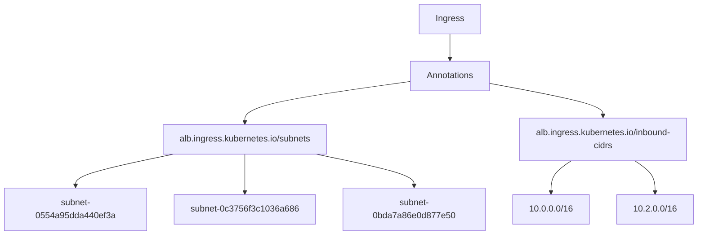
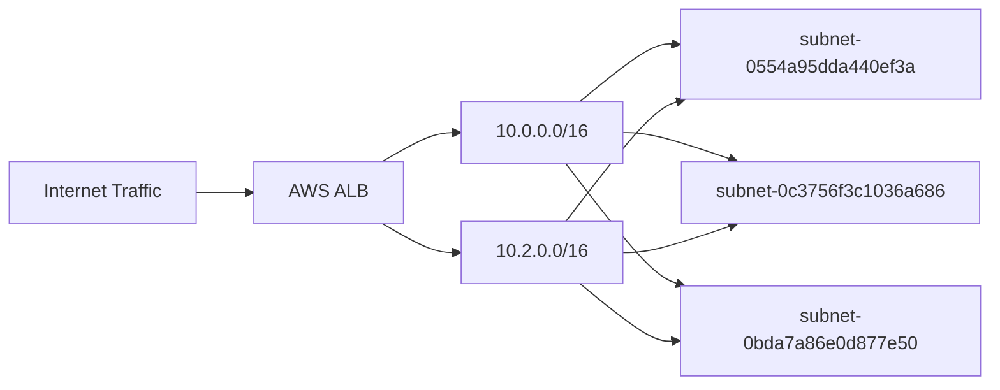
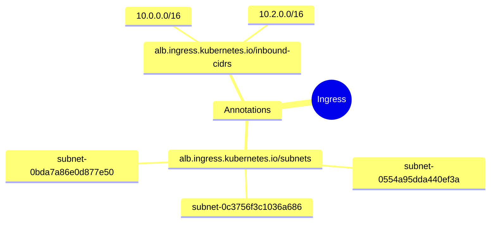

# Diagram: devops/k8s/platform-load-balancer/helm/values.qa1.yaml

> Auto-generated by Obscura crawlers

## Diagram 1

### SVG

<svg id="container" width="1258.171875" xmlns="http://www.w3.org/2000/svg" class="flowchart" height="406" viewBox="0 0 1258.171875 406" role="graphics-document document" aria-roledescription="flowchart-v2"><g><marker id="container_flowchart-v2-pointEnd" class="marker flowchart-v2" viewBox="0 0 10 10" refX="5" refY="5" markerUnits="userSpaceOnUse" markerWidth="8" markerHeight="8" orient="auto"><path d="M 0 0 L 10 5 L 0 10 z" class="arrowMarkerPath" style="stroke-width: 1; stroke-dasharray: 1, 0;"></path></marker><marker id="container_flowchart-v2-pointStart" class="marker flowchart-v2" viewBox="0 0 10 10" refX="4.5" refY="5" markerUnits="userSpaceOnUse" markerWidth="8" markerHeight="8" orient="auto"><path d="M 0 5 L 10 10 L 10 0 z" class="arrowMarkerPath" style="stroke-width: 1; stroke-dasharray: 1, 0;"></path></marker><marker id="container_flowchart-v2-circleEnd" class="marker flowchart-v2" viewBox="0 0 10 10" refX="11" refY="5" markerUnits="userSpaceOnUse" markerWidth="11" markerHeight="11" orient="auto"><circle cx="5" cy="5" r="5" class="arrowMarkerPath" style="stroke-width: 1; stroke-dasharray: 1, 0;"></circle></marker><marker id="container_flowchart-v2-circleStart" class="marker flowchart-v2" viewBox="0 0 10 10" refX="-1" refY="5" markerUnits="userSpaceOnUse" markerWidth="11" markerHeight="11" orient="auto"><circle cx="5" cy="5" r="5" class="arrowMarkerPath" style="stroke-width: 1; stroke-dasharray: 1, 0;"></circle></marker><marker id="container_flowchart-v2-crossEnd" class="marker cross flowchart-v2" viewBox="0 0 11 11" refX="12" refY="5.2" markerUnits="userSpaceOnUse" markerWidth="11" markerHeight="11" orient="auto"><path d="M 1,1 l 9,9 M 10,1 l -9,9" class="arrowMarkerPath" style="stroke-width: 2; stroke-dasharray: 1, 0;"></path></marker><marker id="container_flowchart-v2-crossStart" class="marker cross flowchart-v2" viewBox="0 0 11 11" refX="-1" refY="5.2" markerUnits="userSpaceOnUse" markerWidth="11" markerHeight="11" orient="auto"><path d="M 1,1 l 9,9 M 10,1 l -9,9" class="arrowMarkerPath" style="stroke-width: 2; stroke-dasharray: 1, 0;"></path></marker><g class="root"><g class="clusters"></g><g class="edgePaths"><path d="M812.957,62L812.957,66.167C812.957,70.333,812.957,78.667,812.957,86.333C812.957,94,812.957,101,812.957,104.5L812.957,108" id="L_A_B_0" class="edge-thickness-normal edge-pattern-solid edge-thickness-normal edge-pattern-solid flowchart-link" style=";" data-edge="true" data-et="edge" data-id="L_A_B_0" data-points="W3sieCI6ODEyLjk1NzAzMTI1LCJ5Ijo2Mn0seyJ4Ijo4MTIuOTU3MDMxMjUsInkiOjg3fSx7IngiOjgxMi45NTcwMzEyNSwieSI6MTEyfV0=" marker-end="url(#container_flowchart-v2-pointEnd)"></path><path d="M738.895,149.42L689.636,156.35C640.378,163.28,541.861,177.14,492.602,189.57C443.344,202,443.344,213,443.344,218.5L443.344,224" id="L_B_C_0" class="edge-thickness-normal edge-pattern-solid edge-thickness-normal edge-pattern-solid flowchart-link" style=";" data-edge="true" data-et="edge" data-id="L_B_C_0" data-points="W3sieCI6NzM4Ljg5NDUzMTI1LCJ5IjoxNDkuNDE5Njc0Mjc5NDk0fSx7IngiOjQ0My4zNDM3NSwieSI6MTkxfSx7IngiOjQ0My4zNDM3NSwieSI6MjI4fV0=" marker-end="url(#container_flowchart-v2-pointEnd)"></path><path d="M887.02,152.911L920.818,159.259C954.617,165.607,1022.215,178.304,1056.014,188.152C1089.813,198,1089.813,205,1089.813,208.5L1089.813,212" id="L_B_D_0" class="edge-thickness-normal edge-pattern-solid edge-thickness-normal edge-pattern-solid flowchart-link" style=";" data-edge="true" data-et="edge" data-id="L_B_D_0" data-points="W3sieCI6ODg3LjAxOTUzMTI1LCJ5IjoxNTIuOTEwNjg3ODMwNjg3ODN9LHsieCI6MTA4OS44MTI1LCJ5IjoxOTF9LHsieCI6MTA4OS44MTI1LCJ5IjoyMTZ9XQ==" marker-end="url(#container_flowchart-v2-pointEnd)"></path><path d="M314.408,282L284.96,288.167C255.512,294.333,196.615,306.667,167.167,316.333C137.719,326,137.719,333,137.719,336.5L137.719,340" id="L_C_E_0" class="edge-thickness-normal edge-pattern-solid edge-thickness-normal edge-pattern-solid flowchart-link" style=";" data-edge="true" data-et="edge" data-id="L_C_E_0" data-points="W3sieCI6MzE0LjQwODIwMzEyNSwieSI6MjgyfSx7IngiOjEzNy43MTg3NSwieSI6MzE5fSx7IngiOjEzNy43MTg3NSwieSI6MzQ0fV0=" marker-end="url(#container_flowchart-v2-pointEnd)"></path><path d="M443.344,282L443.344,288.167C443.344,294.333,443.344,306.667,443.344,316.333C443.344,326,443.344,333,443.344,336.5L443.344,340" id="L_C_F_0" class="edge-thickness-normal edge-pattern-solid edge-thickness-normal edge-pattern-solid flowchart-link" style=";" data-edge="true" data-et="edge" data-id="L_C_F_0" data-points="W3sieCI6NDQzLjM0Mzc1LCJ5IjoyODJ9LHsieCI6NDQzLjM0Mzc1LCJ5IjozMTl9LHsieCI6NDQzLjM0Mzc1LCJ5IjozNDR9XQ==" marker-end="url(#container_flowchart-v2-pointEnd)"></path><path d="M572.375,282L601.845,288.167C631.315,294.333,690.255,306.667,719.725,316.333C749.195,326,749.195,333,749.195,336.5L749.195,340" id="L_C_G_0" class="edge-thickness-normal edge-pattern-solid edge-thickness-normal edge-pattern-solid flowchart-link" style=";" data-edge="true" data-et="edge" data-id="L_C_G_0" data-points="W3sieCI6NTcyLjM3NDg3NzkyOTY4NzUsInkiOjI4Mn0seyJ4Ijo3NDkuMTk1MzEyNSwieSI6MzE5fSx7IngiOjc0OS4xOTUzMTI1LCJ5IjozNDR9XQ==" marker-end="url(#container_flowchart-v2-pointEnd)"></path><path d="M1033.288,294L1027.249,298.167C1021.21,302.333,1009.133,310.667,1003.094,318.333C997.055,326,997.055,333,997.055,336.5L997.055,340" id="L_D_H_0" class="edge-thickness-normal edge-pattern-solid edge-thickness-normal edge-pattern-solid flowchart-link" style=";" data-edge="true" data-et="edge" data-id="L_D_H_0" data-points="W3sieCI6MTAzMy4yODgyMDgwMDc4MTI1LCJ5IjoyOTR9LHsieCI6OTk3LjA1NDY4NzUsInkiOjMxOX0seyJ4Ijo5OTcuMDU0Njg3NSwieSI6MzQ0fV0=" marker-end="url(#container_flowchart-v2-pointEnd)"></path><path d="M1146.337,294L1152.376,298.167C1158.415,302.333,1170.492,310.667,1176.531,318.333C1182.57,326,1182.57,333,1182.57,336.5L1182.57,340" id="L_D_I_0" class="edge-thickness-normal edge-pattern-solid edge-thickness-normal edge-pattern-solid flowchart-link" style=";" data-edge="true" data-et="edge" data-id="L_D_I_0" data-points="W3sieCI6MTE0Ni4zMzY3OTE5OTIxODc1LCJ5IjoyOTR9LHsieCI6MTE4Mi41NzAzMTI1LCJ5IjozMTl9LHsieCI6MTE4Mi41NzAzMTI1LCJ5IjozNDR9XQ==" marker-end="url(#container_flowchart-v2-pointEnd)"></path></g><g class="edgeLabels"><g class="edgeLabel"><g class="label" data-id="L_A_B_0" transform="translate(0, 0)"><foreignObject width="0" height="0">

</foreignObject></g></g><g class="edgeLabel"><g class="label" data-id="L_B_C_0" transform="translate(0, 0)"><foreignObject width="0" height="0">

</foreignObject></g></g><g class="edgeLabel"><g class="label" data-id="L_B_D_0" transform="translate(0, 0)"><foreignObject width="0" height="0">

</foreignObject></g></g><g class="edgeLabel"><g class="label" data-id="L_C_E_0" transform="translate(0, 0)"><foreignObject width="0" height="0">

</foreignObject></g></g><g class="edgeLabel"><g class="label" data-id="L_C_F_0" transform="translate(0, 0)"><foreignObject width="0" height="0">

</foreignObject></g></g><g class="edgeLabel"><g class="label" data-id="L_C_G_0" transform="translate(0, 0)"><foreignObject width="0" height="0">

</foreignObject></g></g><g class="edgeLabel"><g class="label" data-id="L_D_H_0" transform="translate(0, 0)"><foreignObject width="0" height="0">

</foreignObject></g></g><g class="edgeLabel"><g class="label" data-id="L_D_I_0" transform="translate(0, 0)"><foreignObject width="0" height="0">

</foreignObject></g></g></g><g class="nodes"><g class="node default" id="flowchart-A-0" transform="translate(812.95703125, 35)"><rect class="basic label-container" style="" x="-55.8125" y="-27" width="111.625" height="54"></rect><g class="label" style="" transform="translate(-25.8125, -12)"><rect></rect><foreignObject width="51.625" height="24">

Ingress

</foreignObject></g></g><g class="node default" id="flowchart-B-1" transform="translate(812.95703125, 139)"><rect class="basic label-container" style="" x="-74.0625" y="-27" width="148.125" height="54"></rect><g class="label" style="" transform="translate(-44.0625, -12)"><rect></rect><foreignObject width="88.125" height="24">

Annotations

</foreignObject></g></g><g class="node default" id="flowchart-C-3" transform="translate(443.34375, 255)"><rect class="basic label-container" style="" x="-153.2265625" y="-27" width="306.453125" height="54"></rect><g class="label" style="" transform="translate(-123.2265625, -12)"><rect></rect><foreignObject width="246.453125" height="24">

alb.ingress.kubernetes.io/subnets

</foreignObject></g></g><g class="node default" id="flowchart-D-5" transform="translate(1089.8125, 255)"><rect class="basic label-container" style="" x="-158.375" y="-39" width="316.75" height="78"></rect><g class="label" style="" transform="translate(-128.375, -24)"><rect></rect><foreignObject width="256.75" height="48">

alb.ingress.kubernetes.io/inbound-cidrs

</foreignObject></g></g><g class="node default" id="flowchart-E-7" transform="translate(137.71875, 371)"><rect class="basic label-container" style="" x="-129.71875" y="-27" width="259.4375" height="54"></rect><g class="label" style="" transform="translate(-99.71875, -12)"><rect></rect><foreignObject width="199.4375" height="24">

subnet-0554a95dda440ef3a

</foreignObject></g></g><g class="node default" id="flowchart-F-9" transform="translate(443.34375, 371)"><rect class="basic label-container" style="" x="-125.90625" y="-27" width="251.8125" height="54"></rect><g class="label" style="" transform="translate(-95.90625, -12)"><rect></rect><foreignObject width="191.8125" height="24">

subnet-0c3756f3c1036a686

</foreignObject></g></g><g class="node default" id="flowchart-G-11" transform="translate(749.1953125, 371)"><rect class="basic label-container" style="" x="-129.9453125" y="-27" width="259.890625" height="54"></rect><g class="label" style="" transform="translate(-99.9453125, -12)"><rect></rect><foreignObject width="199.890625" height="24">

subnet-0bda7a86e0d877e50

</foreignObject></g></g><g class="node default" id="flowchart-H-13" transform="translate(997.0546875, 371)"><rect class="basic label-container" style="" x="-67.9140625" y="-27" width="135.828125" height="54"></rect><g class="label" style="" transform="translate(-37.9140625, -12)"><rect></rect><foreignObject width="75.828125" height="24">

10.0.0.0/16

</foreignObject></g></g><g class="node default" id="flowchart-I-15" transform="translate(1182.5703125, 371)"><rect class="basic label-container" style="" x="-67.6015625" y="-27" width="135.203125" height="54"></rect><g class="label" style="" transform="translate(-37.6015625, -12)"><rect></rect><foreignObject width="75.203125" height="24">

10.2.0.0/16

</foreignObject></g></g></g></g></g></svg>

## Diagram 2

### SVG

<svg id="container" width="850.75" xmlns="http://www.w3.org/2000/svg" class="flowchart" height="298" viewBox="0 0 850.75 298" role="graphics-document document" aria-roledescription="flowchart-v2"><g><marker id="container_flowchart-v2-pointEnd" class="marker flowchart-v2" viewBox="0 0 10 10" refX="5" refY="5" markerUnits="userSpaceOnUse" markerWidth="8" markerHeight="8" orient="auto"><path d="M 0 0 L 10 5 L 0 10 z" class="arrowMarkerPath" style="stroke-width: 1; stroke-dasharray: 1, 0;"></path></marker><marker id="container_flowchart-v2-pointStart" class="marker flowchart-v2" viewBox="0 0 10 10" refX="4.5" refY="5" markerUnits="userSpaceOnUse" markerWidth="8" markerHeight="8" orient="auto"><path d="M 0 5 L 10 10 L 10 0 z" class="arrowMarkerPath" style="stroke-width: 1; stroke-dasharray: 1, 0;"></path></marker><marker id="container_flowchart-v2-circleEnd" class="marker flowchart-v2" viewBox="0 0 10 10" refX="11" refY="5" markerUnits="userSpaceOnUse" markerWidth="11" markerHeight="11" orient="auto"><circle cx="5" cy="5" r="5" class="arrowMarkerPath" style="stroke-width: 1; stroke-dasharray: 1, 0;"></circle></marker><marker id="container_flowchart-v2-circleStart" class="marker flowchart-v2" viewBox="0 0 10 10" refX="-1" refY="5" markerUnits="userSpaceOnUse" markerWidth="11" markerHeight="11" orient="auto"><circle cx="5" cy="5" r="5" class="arrowMarkerPath" style="stroke-width: 1; stroke-dasharray: 1, 0;"></circle></marker><marker id="container_flowchart-v2-crossEnd" class="marker cross flowchart-v2" viewBox="0 0 11 11" refX="12" refY="5.2" markerUnits="userSpaceOnUse" markerWidth="11" markerHeight="11" orient="auto"><path d="M 1,1 l 9,9 M 10,1 l -9,9" class="arrowMarkerPath" style="stroke-width: 2; stroke-dasharray: 1, 0;"></path></marker><marker id="container_flowchart-v2-crossStart" class="marker cross flowchart-v2" viewBox="0 0 11 11" refX="-1" refY="5.2" markerUnits="userSpaceOnUse" markerWidth="11" markerHeight="11" orient="auto"><path d="M 1,1 l 9,9 M 10,1 l -9,9" class="arrowMarkerPath" style="stroke-width: 2; stroke-dasharray: 1, 0;"></path></marker><g class="root"><g class="clusters"></g><g class="edgePaths"><path d="M174.969,149L179.135,149C183.302,149,191.635,149,199.302,149C206.969,149,213.969,149,217.469,149L220.969,149" id="L_Internet_ALB_0" class="edge-thickness-normal edge-pattern-solid edge-thickness-normal edge-pattern-solid flowchart-link" style=";" data-edge="true" data-et="edge" data-id="L_Internet_ALB_0" data-points="W3sieCI6MTc0Ljk2ODc1LCJ5IjoxNDl9LHsieCI6MTk5Ljk2ODc1LCJ5IjoxNDl9LHsieCI6MjI0Ljk2ODc1LCJ5IjoxNDl9XQ==" marker-end="url(#container_flowchart-v2-pointEnd)"></path><path d="M330.67,122L337.564,117.833C344.457,113.667,358.244,105.333,368.638,101.167C379.031,97,386.031,97,389.531,97L393.031,97" id="L_ALB_CIDR1_0" class="edge-thickness-normal edge-pattern-solid edge-thickness-normal edge-pattern-solid flowchart-link" style=";" data-edge="true" data-et="edge" data-id="L_ALB_CIDR1_0" data-points="W3sieCI6MzMwLjY3MDA3MjExNTM4NDY0LCJ5IjoxMjJ9LHsieCI6MzcyLjAzMTI1LCJ5Ijo5N30seyJ4IjozOTcuMDMxMjUsInkiOjk3fV0=" marker-end="url(#container_flowchart-v2-pointEnd)"></path><path d="M330.67,176L337.564,180.167C344.457,184.333,358.244,192.667,368.69,196.833C379.135,201,386.24,201,389.792,201L393.344,201" id="L_ALB_CIDR2_0" class="edge-thickness-normal edge-pattern-solid edge-thickness-normal edge-pattern-solid flowchart-link" style=";" data-edge="true" data-et="edge" data-id="L_ALB_CIDR2_0" data-points="W3sieCI6MzMwLjY3MDA3MjExNTM4NDY0LCJ5IjoxNzZ9LHsieCI6MzcyLjAzMTI1LCJ5IjoyMDF9LHsieCI6Mzk3LjM0Mzc1LCJ5IjoyMDF9XQ==" marker-end="url(#container_flowchart-v2-pointEnd)"></path><path d="M499.788,70L509.467,62.5C519.145,55,538.502,40,551.72,32.728C564.938,25.457,572.016,25.914,575.555,26.142L579.094,26.37" id="L_CIDR1_S1_0" class="edge-thickness-normal edge-pattern-solid edge-thickness-normal edge-pattern-solid flowchart-link" style=";" data-edge="true" data-et="edge" data-id="L_CIDR1_S1_0" data-points="W3sieCI6NDk5Ljc4ODA4NTkzNzUsInkiOjcwfSx7IngiOjU1Ny44NTkzNzUsInkiOjI1fSx7IngiOjU4My4wODU5Mzc1LCJ5IjoyNi42MjgwOTQ1ODk4MjUwNH1d" marker-end="url(#container_flowchart-v2-pointEnd)"></path><path d="M532.859,97L537.026,97C541.193,97,549.526,97,565.476,100.955C581.426,104.909,604.993,112.818,616.777,116.773L628.56,120.727" id="L_CIDR1_S2_0" class="edge-thickness-normal edge-pattern-solid edge-thickness-normal edge-pattern-solid flowchart-link" style=";" data-edge="true" data-et="edge" data-id="L_CIDR1_S2_0" data-points="W3sieCI6NTMyLjg1OTM3NSwieSI6OTd9LHsieCI6NTU3Ljg1OTM3NSwieSI6OTd9LHsieCI6NjMyLjM1MjMxMzcwMTkyMzEsInkiOjEyMn1d" marker-end="url(#container_flowchart-v2-pointEnd)"></path><path d="M485.177,124L497.29,140.167C509.404,156.333,533.632,188.667,554.325,207.159C575.018,225.651,592.177,230.302,600.757,232.628L609.336,234.954" id="L_CIDR1_S3_0" class="edge-thickness-normal edge-pattern-solid edge-thickness-normal edge-pattern-solid flowchart-link" style=";" data-edge="true" data-et="edge" data-id="L_CIDR1_S3_0" data-points="W3sieCI6NDg1LjE3NjYwMDMwMjQxOTMzLCJ5IjoxMjR9LHsieCI6NTU3Ljg1OTM3NSwieSI6MjIxfSx7IngiOjYxMy4xOTY5ODY2MDcxNDI5LCJ5IjoyMzZ9XQ==" marker-end="url(#container_flowchart-v2-pointEnd)"></path><path d="M485.177,174L497.29,157.833C509.404,141.667,533.632,109.333,554.325,90.841C575.018,72.349,592.177,67.698,600.757,65.372L609.336,63.046" id="L_CIDR2_S1_0" class="edge-thickness-normal edge-pattern-solid edge-thickness-normal edge-pattern-solid flowchart-link" style=";" data-edge="true" data-et="edge" data-id="L_CIDR2_S1_0" data-points="W3sieCI6NDg1LjE3NjYwMDMwMjQxOTMzLCJ5IjoxNzR9LHsieCI6NTU3Ljg1OTM3NSwieSI6Nzd9LHsieCI6NjEzLjE5Njk4NjYwNzE0MjksInkiOjYyfV0=" marker-end="url(#container_flowchart-v2-pointEnd)"></path><path d="M532.547,201L536.766,201C540.984,201,549.422,201,565.424,197.045C581.426,193.091,604.993,185.182,616.777,181.227L628.56,177.273" id="L_CIDR2_S2_0" class="edge-thickness-normal edge-pattern-solid edge-thickness-normal edge-pattern-solid flowchart-link" style=";" data-edge="true" data-et="edge" data-id="L_CIDR2_S2_0" data-points="W3sieCI6NTMyLjU0Njg3NSwieSI6MjAxfSx7IngiOjU1Ny44NTkzNzUsInkiOjIwMX0seyJ4Ijo2MzIuMzUyMzEzNzAxOTIzMSwieSI6MTc2fV0=" marker-end="url(#container_flowchart-v2-pointEnd)"></path><path d="M499.788,228L509.467,235.5C519.145,243,538.502,258,551.682,265.274C564.862,272.548,571.865,272.096,575.366,271.87L578.868,271.644" id="L_CIDR2_S3_0" class="edge-thickness-normal edge-pattern-solid edge-thickness-normal edge-pattern-solid flowchart-link" style=";" data-edge="true" data-et="edge" data-id="L_CIDR2_S3_0" data-points="W3sieCI6NDk5Ljc4ODA4NTkzNzUsInkiOjIyOH0seyJ4Ijo1NTcuODU5Mzc1LCJ5IjoyNzN9LHsieCI6NTgyLjg1OTM3NSwieSI6MjcxLjM4NjUyNzUwNDY2Mzk1fV0=" marker-end="url(#container_flowchart-v2-pointEnd)"></path></g><g class="edgeLabels"><g class="edgeLabel"><g class="label" data-id="L_Internet_ALB_0" transform="translate(0, 0)"><foreignObject width="0" height="0">

</foreignObject></g></g><g class="edgeLabel"><g class="label" data-id="L_ALB_CIDR1_0" transform="translate(0, 0)"><foreignObject width="0" height="0">

</foreignObject></g></g><g class="edgeLabel"><g class="label" data-id="L_ALB_CIDR2_0" transform="translate(0, 0)"><foreignObject width="0" height="0">

</foreignObject></g></g><g class="edgeLabel"><g class="label" data-id="L_CIDR1_S1_0" transform="translate(0, 0)"><foreignObject width="0" height="0">

</foreignObject></g></g><g class="edgeLabel"><g class="label" data-id="L_CIDR1_S2_0" transform="translate(0, 0)"><foreignObject width="0" height="0">

</foreignObject></g></g><g class="edgeLabel"><g class="label" data-id="L_CIDR1_S3_0" transform="translate(0, 0)"><foreignObject width="0" height="0">

</foreignObject></g></g><g class="edgeLabel"><g class="label" data-id="L_CIDR2_S1_0" transform="translate(0, 0)"><foreignObject width="0" height="0">

</foreignObject></g></g><g class="edgeLabel"><g class="label" data-id="L_CIDR2_S2_0" transform="translate(0, 0)"><foreignObject width="0" height="0">

</foreignObject></g></g><g class="edgeLabel"><g class="label" data-id="L_CIDR2_S3_0" transform="translate(0, 0)"><foreignObject width="0" height="0">

</foreignObject></g></g></g><g class="nodes"><g class="node default" id="flowchart-Internet-0" transform="translate(91.484375, 149)"><rect class="basic label-container" style="" x="-83.484375" y="-27" width="166.96875" height="54"></rect><g class="label" style="" transform="translate(-53.484375, -12)"><rect></rect><foreignObject width="106.96875" height="24">

Internet Traffic

</foreignObject></g></g><g class="node default" id="flowchart-ALB-1" transform="translate(286, 149)"><rect class="basic label-container" style="" x="-61.03125" y="-27" width="122.0625" height="54"></rect><g class="label" style="" transform="translate(-31.03125, -12)"><rect></rect><foreignObject width="62.0625" height="24">

AWS ALB

</foreignObject></g></g><g class="node default" id="flowchart-CIDR1-3" transform="translate(464.9453125, 97)"><rect class="basic label-container" style="" x="-67.9140625" y="-27" width="135.828125" height="54"></rect><g class="label" style="" transform="translate(-37.9140625, -12)"><rect></rect><foreignObject width="75.828125" height="24">

10.0.0.0/16

</foreignObject></g></g><g class="node default" id="flowchart-CIDR2-5" transform="translate(464.9453125, 201)"><rect class="basic label-container" style="" x="-67.6015625" y="-27" width="135.203125" height="54"></rect><g class="label" style="" transform="translate(-37.6015625, -12)"><rect></rect><foreignObject width="75.203125" height="24">

10.2.0.0/16

</foreignObject></g></g><g class="node default" id="flowchart-S1-7" transform="translate(712.8046875, 35)"><rect class="basic label-container" style="" x="-129.71875" y="-27" width="259.4375" height="54"></rect><g class="label" style="" transform="translate(-99.71875, -12)"><rect></rect><foreignObject width="199.4375" height="24">

subnet-0554a95dda440ef3a

</foreignObject></g></g><g class="node default" id="flowchart-S2-9" transform="translate(712.8046875, 149)"><rect class="basic label-container" style="" x="-125.90625" y="-27" width="251.8125" height="54"></rect><g class="label" style="" transform="translate(-95.90625, -12)"><rect></rect><foreignObject width="191.8125" height="24">

subnet-0c3756f3c1036a686

</foreignObject></g></g><g class="node default" id="flowchart-S3-11" transform="translate(712.8046875, 263)"><rect class="basic label-container" style="" x="-129.9453125" y="-27" width="259.890625" height="54"></rect><g class="label" style="" transform="translate(-99.9453125, -12)"><rect></rect><foreignObject width="199.890625" height="24">

subnet-0bda7a86e0d877e50

</foreignObject></g></g></g></g></g></svg>

## Diagram 3

### SVG

<svg id="container" width="100%" xmlns="http://www.w3.org/2000/svg" class="mindmapDiagram" style="max-width: 726.3209228515625px;" viewBox="5 5 726.3209228515625 344.1291809082031" role="graphics-document document" aria-roledescription="mindmap"><g><marker id="container_mindmap-pointEnd" class="marker mindmap" viewBox="0 0 10 10" refX="5" refY="5" markerUnits="userSpaceOnUse" markerWidth="8" markerHeight="8" orient="auto"><path d="M 0 0 L 10 5 L 0 10 z" class="arrowMarkerPath" style="stroke-width: 1; stroke-dasharray: 1, 0;"></path></marker><marker id="container_mindmap-pointStart" class="marker mindmap" viewBox="0 0 10 10" refX="4.5" refY="5" markerUnits="userSpaceOnUse" markerWidth="8" markerHeight="8" orient="auto"><path d="M 0 5 L 10 10 L 10 0 z" class="arrowMarkerPath" style="stroke-width: 1; stroke-dasharray: 1, 0;"></path></marker><g class="subgraphs"></g><g class="edgePaths"><path d="M65.758,202.989L76.169,202.1C86.58,201.21,107.403,199.431,128.225,197.651C149.047,195.872,169.869,194.093,180.281,193.203L190.692,192.313" id="edge_0_1" class="edge-thickness-normal edge-pattern-solid edge section-edge-0 edge-depth-1" style="undefined;;;undefined" data-edge="true" data-et="edge" data-id="edge_0_1" data-points="W3sieCI6NjUuNzU4MDMyMTkxNzM1NCwieSI6MjAyLjk4OTI5Nzk0MDAxOTg3fSx7IngiOjEyOC4yMjQ4NjExNjg1MjAxNCwieSI6MTk3LjY1MTM1MzU2NTAzNTV9LHsieCI6MTkwLjY5MTY5MDE0NTMwNDg4LCJ5IjoxOTIuMzEzNDA5MTkwMDUxMTJ9XQ=="></path><path d="M217.358,200.397L222.567,204.557C227.777,208.718,238.196,217.039,248.615,225.36C259.034,233.681,269.453,242.002,274.662,246.162L279.871,250.323" id="edge_1_2" class="edge-thickness-normal edge-pattern-solid edge section-edge-0 edge-depth-3" style="undefined;;;undefined" data-edge="true" data-et="edge" data-id="edge_1_2" data-points="W3sieCI6MjE3LjM1ODAwNzcxNjA4OTg3LCJ5IjoyMDAuMzk3MDAyNTk2MDk2OH0seyJ4IjoyNDguNjE0NzI5ODEyNjI5NzgsInkiOjIyNS4zNTk5NzIyMTE0OTU1Mn0seyJ4IjoyNzkuODcxNDUxOTA5MTY5NjUsInkiOjI1MC4zMjI5NDE4MjY4OTQyNH1d"></path><path d="M306.17,263.217L319.879,266.539C333.589,269.861,361.007,276.506,388.425,283.151C415.843,289.795,443.262,296.44,456.971,299.762L470.68,303.085" id="edge_2_3" class="edge-thickness-normal edge-pattern-solid edge section-edge-0 edge-depth-5" style="undefined;;;undefined" data-edge="true" data-et="edge" data-id="edge_2_3" data-points="W3sieCI6MzA2LjE3MDI1Mzk2NTkzMDcsInkiOjI2My4yMTY1NzQ0NjQ2MDUwNn0seyJ4IjozODguNDI1MDQ0NDczMjUwODYsInkiOjI4My4xNTA1OTYxMzgzODk2fSx7IngiOjQ3MC42Nzk4MzQ5ODA1NzEsInkiOjMwMy4wODQ2MTc4MTIxNzQxfV0="></path><path d="M306.497,257.999L330.165,255.323C353.833,252.647,401.168,247.295,448.503,241.943C495.839,236.592,543.174,231.24,566.842,228.564L590.51,225.888" id="edge_2_4" class="edge-thickness-normal edge-pattern-solid edge section-edge-0 edge-depth-5" style="undefined;;;undefined" data-edge="true" data-et="edge" data-id="edge_2_4" data-points="W3sieCI6MzA2LjQ5NzI3ODk2MTQ3OTk0LCJ5IjoyNTcuOTk4NTE3MTEzOTk3Mzd9LHsieCI6NDQ4LjUwMzQ1NDI3MjcyNTU1LCJ5IjoyNDEuOTQzNDI2MjE5NzAxMjV9LHsieCI6NTkwLjUwOTYyOTU4Mzk3MTIsInkiOjIyNS44ODgzMzUzMjU0MDUxfV0="></path><path d="M278.674,267.307L272.009,271.241C265.345,275.174,252.016,283.04,238.686,290.906C225.357,298.773,212.028,306.639,205.363,310.572L198.698,314.505" id="edge_2_5" class="edge-thickness-normal edge-pattern-solid edge section-edge-0 edge-depth-5" style="undefined;;;undefined" data-edge="true" data-et="edge" data-id="edge_2_5" data-points="W3sieCI6Mjc4LjY3NDA3NTAwODI1MywieSI6MjY3LjMwNzM4NjIzNTQ0MTF9LHsieCI6MjM4LjY4NjIyNTQzODA0MzQ0LCJ5IjoyOTAuOTA2NDE2ODY2Mzg0fSx7IngiOjE5OC42OTgzNzU4Njc4MzM4NywieSI6MzE0LjUwNTQ0NzQ5NzMyNjk0fV0="></path><path d="M215.682,179.897L220.474,174.583C225.265,169.27,234.847,158.644,244.429,148.017C254.012,137.391,263.594,126.765,268.385,121.452L273.177,116.138" id="edge_1_6" class="edge-thickness-normal edge-pattern-solid edge section-edge-0 edge-depth-3" style="undefined;;;undefined" data-edge="true" data-et="edge" data-id="edge_1_6" data-points="W3sieCI6MjE1LjY4MjQ2OTQxOTQzNTc2LCJ5IjoxNzkuODk2NTcyMzk1MDY1NH0seyJ4IjoyNDQuNDI5NDk1NTkzMTA3NjIsInkiOjE0OC4wMTc0Nzg5OTE4NTI0NH0seyJ4IjoyNzMuMTc2NTIxNzY2Nzc5NSwieSI6MTE2LjEzODM4NTU4ODYzOTQ4fV0="></path><path d="M270.269,97.434L262.012,92.611C253.755,87.789,237.24,78.144,220.726,68.499C204.212,58.854,187.697,49.21,179.44,44.387L171.183,39.565" id="edge_6_7" class="edge-thickness-normal edge-pattern-solid edge section-edge-0 edge-depth-5" style="undefined;;;undefined" data-edge="true" data-et="edge" data-id="edge_6_7" data-points="W3sieCI6MjcwLjI2OTAwMzA0NzY0NDk2LCJ5Ijo5Ny40MzM5MDM4NjE1MjU2NX0seyJ4IjoyMjAuNzI1ODkwNTg2NDQ3NDYsInkiOjY4LjQ5OTM0MDY2MzEyMjE1fSx7IngiOjE3MS4xODI3NzgxMjUyNDk5NywieSI6MzkuNTY0Nzc3NDY0NzE4NjZ9XQ=="></path><path d="M298.012,102.5L317.111,99.274C336.21,96.048,374.408,89.596,412.606,83.143C450.804,76.691,489.002,70.238,508.101,67.012L527.2,63.786" id="edge_6_8" class="edge-thickness-normal edge-pattern-solid edge section-edge-0 edge-depth-5" style="undefined;;;undefined" data-edge="true" data-et="edge" data-id="edge_6_8" data-points="W3sieCI6Mjk4LjAxMjIzODk3MzE1NTI2LCJ5IjoxMDIuNTAwMjgzMTM3MDc0NzZ9LHsieCI6NDEyLjYwNjM0NDQ4NzMwMjA3LCJ5Ijo4My4xNDMxMDkwMDM1ODYxMn0seyJ4Ijo1MjcuMjAwNDUwMDAxNDQ4OSwieSI6NjMuNzg1OTM0ODcwMDk3NDh9XQ=="></path></g><g class="edgeLabels"><g class="edgeLabel"><g class="label" data-id="edge_0_1" transform="translate(0, 0)"><foreignObject width="0" height="0">

</foreignObject></g></g><g class="edgeLabel"><g class="label" data-id="edge_1_2" transform="translate(0, 0)"><foreignObject width="0" height="0">

</foreignObject></g></g><g class="edgeLabel"><g class="label" data-id="edge_2_3" transform="translate(0, 0)"><foreignObject width="0" height="0">

</foreignObject></g></g><g class="edgeLabel"><g class="label" data-id="edge_2_4" transform="translate(0, 0)"><foreignObject width="0" height="0">

</foreignObject></g></g><g class="edgeLabel"><g class="label" data-id="edge_2_5" transform="translate(0, 0)"><foreignObject width="0" height="0">

</foreignObject></g></g><g class="edgeLabel"><g class="label" data-id="edge_1_6" transform="translate(0, 0)"><foreignObject width="0" height="0">

</foreignObject></g></g><g class="edgeLabel"><g class="label" data-id="edge_6_7" transform="translate(0, 0)"><foreignObject width="0" height="0">

</foreignObject></g></g><g class="edgeLabel"><g class="label" data-id="edge_6_8" transform="translate(0, 0)"><foreignObject width="0" height="0">

</foreignObject></g></g></g><g class="nodes"><g class="node mindmap-node section-root section--1" id="node_0" transform="translate(50.8125, 204.2664304726104)"><circle class="basic label-container" style="" r="35.8125" cx="0" cy="0"></circle><g class="label" style="" transform="translate(-25.8125, -12)"><rect></rect><foreignObject width="51.625" height="24">

Ingress

</foreignObject></g></g><g class="node mindmap-node section-0" id="node_1" transform="translate(205.63722233704027, 191.03627665746058)"><path id="node-1" class="node-bkg node-0" style="" d="M-64.0625 12
    v-24
    q0,-5 5,-5
    h118.125
    q5,0 5,5
    v24
    q0,5 -5,5
    h-118.125
    q-5,0 -5,-5
    Z"></path><line class="node-line-" x1="-64.0625" y1="17" x2="64.0625" y2="17"></line><g class="label" style="" transform="translate(-44.0625, -12)"><rect></rect><foreignObject width="88.125" height="24">

Annotations

</foreignObject></g></g><g class="node mindmap-node section-0" id="node_2" transform="translate(291.5922372882193, 259.68366776553046)"><path id="node-2" class="node-bkg node-0" style="" d="M-143.2265625 12
    v-24
    q0,-5 5,-5
    h276.453125
    q5,0 5,5
    v24
    q0,5 -5,5
    h-276.453125
    q-5,0 -5,-5
    Z"></path><line class="node-line-" x1="-143.2265625" y1="17" x2="143.2265625" y2="17"></line><g class="label" style="" transform="translate(-123.2265625, -12)"><rect></rect><foreignObject width="246.453125" height="24">

alb.ingress.kubernetes.io/subnets

</foreignObject></g></g><g class="node mindmap-node section-0" id="node_3" transform="translate(485.25785165828245, 306.6175245112487)"><path id="node-3" class="node-bkg node-0" style="" d="M-119.71875 12
    v-24
    q0,-5 5,-5
    h229.4375
    q5,0 5,5
    v24
    q0,5 -5,5
    h-229.4375
    q-5,0 -5,-5
    Z"></path><line class="node-line-" x1="-119.71875" y1="17" x2="119.71875" y2="17"></line><g class="label" style="" transform="translate(-99.71875, -12)"><rect></rect><foreignObject width="199.4375" height="24">

subnet-0554a95dda440ef3a

</foreignObject></g></g><g class="node mindmap-node section-0" id="node_4" transform="translate(605.4146712572318, 224.203184673872)"><path id="node-4" class="node-bkg node-0" style="" d="M-115.90625 12
    v-24
    q0,-5 5,-5
    h221.8125
    q5,0 5,5
    v24
    q0,5 -5,5
    h-221.8125
    q-5,0 -5,-5
    Z"></path><line class="node-line-" x1="-115.90625" y1="17" x2="115.90625" y2="17"></line><g class="label" style="" transform="translate(-95.90625, -12)"><rect></rect><foreignObject width="191.8125" height="24">

subnet-0c3756f3c1036a686

</foreignObject></g></g><g class="node mindmap-node section-0" id="node_5" transform="translate(185.7802135878676, 322.12916596723755)"><path id="node-5" class="node-bkg node-0" style="" d="M-119.9453125 12
    v-24
    q0,-5 5,-5
    h229.890625
    q5,0 5,5
    v24
    q0,5 -5,5
    h-229.890625
    q-5,0 -5,-5
    Z"></path><line class="node-line-" x1="-119.9453125" y1="17" x2="119.9453125" y2="17"></line><g class="label" style="" transform="translate(-99.9453125, -12)"><rect></rect><foreignObject width="199.890625" height="24">

subnet-0bda7a86e0d877e50

</foreignObject></g></g><g class="node mindmap-node section-0" id="node_6" transform="translate(283.22176884917496, 104.99868132624431)"><path id="node-6" class="node-bkg node-0" style="" d="M-148.375 24
    v-48
    q0,-5 5,-5
    h286.75
    q5,0 5,5
    v48
    q0,5 -5,5
    h-286.75
    q-5,0 -5,-5
    Z"></path><line class="node-line-" x1="-148.375" y1="29" x2="148.375" y2="29"></line><g class="label" style="" transform="translate(-128.375, -24)"><rect></rect><foreignObject width="256.75" height="48">

alb.ingress.kubernetes.io/inbound-cidrs

</foreignObject></g></g><g class="node mindmap-node section-0" id="node_7" transform="translate(158.23001232371996, 32)"><path id="node-7" class="node-bkg node-0" style="" d="M-57.9140625 12
    v-24
    q0,-5 5,-5
    h105.828125
    q5,0 5,5
    v24
    q0,5 -5,5
    h-105.828125
    q-5,0 -5,-5
    Z"></path><line class="node-line-" x1="-57.9140625" y1="17" x2="57.9140625" y2="17"></line><g class="label" style="" transform="translate(-37.9140625, -12)"><rect></rect><foreignObject width="75.828125" height="24">

10.0.0.0/16

</foreignObject></g></g><g class="node mindmap-node section-0" id="node_8" transform="translate(541.9909201254292, 61.28753668092793)"><path id="node-8" class="node-bkg node-0" style="" d="M-57.6015625 12
    v-24
    q0,-5 5,-5
    h105.203125
    q5,0 5,5
    v24
    q0,5 -5,5
    h-105.203125
    q-5,0 -5,-5
    Z"></path><line class="node-line-" x1="-57.6015625" y1="17" x2="57.6015625" y2="17"></line><g class="label" style="" transform="translate(-37.6015625, -12)"><rect></rect><foreignObject width="75.203125" height="24">

10.2.0.0/16

</foreignObject></g></g></g></g></svg>
