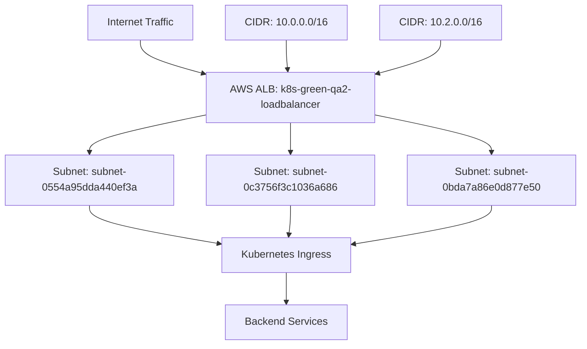
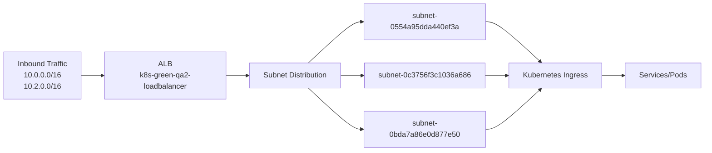

# Diagram: devops/k8s/platform-load-balancer/helm/values.qa2.yaml

> Auto-generated by Obscura crawlers

## Diagram 1

### SVG

<svg id="container" width="896" xmlns="http://www.w3.org/2000/svg" class="flowchart" height="534" viewBox="0 0 896 534" role="graphics-document document" aria-roledescription="flowchart-v2"><g><marker id="container_flowchart-v2-pointEnd" class="marker flowchart-v2" viewBox="0 0 10 10" refX="5" refY="5" markerUnits="userSpaceOnUse" markerWidth="8" markerHeight="8" orient="auto"><path d="M 0 0 L 10 5 L 0 10 z" class="arrowMarkerPath" style="stroke-width: 1; stroke-dasharray: 1, 0;"></path></marker><marker id="container_flowchart-v2-pointStart" class="marker flowchart-v2" viewBox="0 0 10 10" refX="4.5" refY="5" markerUnits="userSpaceOnUse" markerWidth="8" markerHeight="8" orient="auto"><path d="M 0 5 L 10 10 L 10 0 z" class="arrowMarkerPath" style="stroke-width: 1; stroke-dasharray: 1, 0;"></path></marker><marker id="container_flowchart-v2-circleEnd" class="marker flowchart-v2" viewBox="0 0 10 10" refX="11" refY="5" markerUnits="userSpaceOnUse" markerWidth="11" markerHeight="11" orient="auto"><circle cx="5" cy="5" r="5" class="arrowMarkerPath" style="stroke-width: 1; stroke-dasharray: 1, 0;"></circle></marker><marker id="container_flowchart-v2-circleStart" class="marker flowchart-v2" viewBox="0 0 10 10" refX="-1" refY="5" markerUnits="userSpaceOnUse" markerWidth="11" markerHeight="11" orient="auto"><circle cx="5" cy="5" r="5" class="arrowMarkerPath" style="stroke-width: 1; stroke-dasharray: 1, 0;"></circle></marker><marker id="container_flowchart-v2-crossEnd" class="marker cross flowchart-v2" viewBox="0 0 11 11" refX="12" refY="5.2" markerUnits="userSpaceOnUse" markerWidth="11" markerHeight="11" orient="auto"><path d="M 1,1 l 9,9 M 10,1 l -9,9" class="arrowMarkerPath" style="stroke-width: 2; stroke-dasharray: 1, 0;"></path></marker><marker id="container_flowchart-v2-crossStart" class="marker cross flowchart-v2" viewBox="0 0 11 11" refX="-1" refY="5.2" markerUnits="userSpaceOnUse" markerWidth="11" markerHeight="11" orient="auto"><path d="M 1,1 l 9,9 M 10,1 l -9,9" class="arrowMarkerPath" style="stroke-width: 2; stroke-dasharray: 1, 0;"></path></marker><g class="root"><g class="clusters"></g><g class="edgePaths"><path d="M223.23,62L223.23,66.167C223.23,70.333,223.23,78.667,238.384,87.148C253.538,95.63,283.845,104.259,298.999,108.574L314.153,112.889" id="L_Internet_ALB_0" class="edge-thickness-normal edge-pattern-solid edge-thickness-normal edge-pattern-solid flowchart-link" style=";" data-edge="true" data-et="edge" data-id="L_Internet_ALB_0" data-points="W3sieCI6MjIzLjIzMDQ2ODc1LCJ5Ijo2Mn0seyJ4IjoyMjMuMjMwNDY4NzUsInkiOjg3fSx7IngiOjMxOCwieSI6MTEzLjk4NDMwNjg0MjA3NzgxfV0=" marker-end="url(#container_flowchart-v2-pointEnd)"></path><path d="M445.504,62L445.504,66.167C445.504,70.333,445.504,78.667,445.64,86.334C445.777,94.001,446.05,101.002,446.187,104.503L446.323,108.003" id="L_CIDR1_ALB_0" class="edge-thickness-normal edge-pattern-solid edge-thickness-normal edge-pattern-solid flowchart-link" style=";" data-edge="true" data-et="edge" data-id="L_CIDR1_ALB_0" data-points="W3sieCI6NDQ1LjUwMzkwNjI1LCJ5Ijo2Mn0seyJ4Ijo0NDUuNTAzOTA2MjUsInkiOjg3fSx7IngiOjQ0Ni40Nzg5NDI4NzEwOTM3NSwieSI6MTEyfV0=" marker-end="url(#container_flowchart-v2-pointEnd)"></path><path d="M672.77,62L672.77,66.167C672.77,70.333,672.77,78.667,657.616,87.148C642.462,95.63,612.155,104.259,597.001,108.574L581.847,112.889" id="L_CIDR2_ALB_0" class="edge-thickness-normal edge-pattern-solid edge-thickness-normal edge-pattern-solid flowchart-link" style=";" data-edge="true" data-et="edge" data-id="L_CIDR2_ALB_0" data-points="W3sieCI6NjcyLjc2OTUzMTI1LCJ5Ijo2Mn0seyJ4Ijo2NzIuNzY5NTMxMjUsInkiOjg3fSx7IngiOjU3OCwieSI6MTEzLjk4NDMwNjg0MjA3NzgxfV0=" marker-end="url(#container_flowchart-v2-pointEnd)"></path><path d="M318,177.839L288,184.032C258,190.226,198,202.613,168,212.306C138,222,138,229,138,232.5L138,236" id="L_ALB_Subnet1_0" class="edge-thickness-normal edge-pattern-solid edge-thickness-normal edge-pattern-solid flowchart-link" style=";" data-edge="true" data-et="edge" data-id="L_ALB_Subnet1_0" data-points="W3sieCI6MzE4LCJ5IjoxNzcuODM4NzA5Njc3NDE5MzZ9LHsieCI6MTM4LCJ5IjoyMTV9LHsieCI6MTM4LCJ5IjoyNDB9XQ==" marker-end="url(#container_flowchart-v2-pointEnd)"></path><path d="M448,190L448,194.167C448,198.333,448,206.667,448,214.333C448,222,448,229,448,232.5L448,236" id="L_ALB_Subnet2_0" class="edge-thickness-normal edge-pattern-solid edge-thickness-normal edge-pattern-solid flowchart-link" style=";" data-edge="true" data-et="edge" data-id="L_ALB_Subnet2_0" data-points="W3sieCI6NDQ4LCJ5IjoxOTB9LHsieCI6NDQ4LCJ5IjoyMTV9LHsieCI6NDQ4LCJ5IjoyNDB9XQ==" marker-end="url(#container_flowchart-v2-pointEnd)"></path><path d="M578,177.839L608,184.032C638,190.226,698,202.613,728,212.306C758,222,758,229,758,232.5L758,236" id="L_ALB_Subnet3_0" class="edge-thickness-normal edge-pattern-solid edge-thickness-normal edge-pattern-solid flowchart-link" style=";" data-edge="true" data-et="edge" data-id="L_ALB_Subnet3_0" data-points="W3sieCI6NTc4LCJ5IjoxNzcuODM4NzA5Njc3NDE5MzZ9LHsieCI6NzU4LCJ5IjoyMTV9LHsieCI6NzU4LCJ5IjoyNDB9XQ==" marker-end="url(#container_flowchart-v2-pointEnd)"></path><path d="M138,318L138,322.167C138,326.333,138,334.667,172.036,344.589C206.072,354.511,274.144,366.022,308.18,371.778L342.216,377.534" id="L_Subnet1_Ingress_0" class="edge-thickness-normal edge-pattern-solid edge-thickness-normal edge-pattern-solid flowchart-link" style=";" data-edge="true" data-et="edge" data-id="L_Subnet1_Ingress_0" data-points="W3sieCI6MTM4LCJ5IjozMTh9LHsieCI6MTM4LCJ5IjozNDN9LHsieCI6MzQ2LjE2MDE1NjI1LCJ5IjozNzguMjAwNjE5OTEwODI0M31d" marker-end="url(#container_flowchart-v2-pointEnd)"></path><path d="M448,318L448,322.167C448,326.333,448,334.667,447.832,342.334C447.664,350.002,447.328,357.003,447.16,360.504L446.992,364.005" id="L_Subnet2_Ingress_0" class="edge-thickness-normal edge-pattern-solid edge-thickness-normal edge-pattern-solid flowchart-link" style=";" data-edge="true" data-et="edge" data-id="L_Subnet2_Ingress_0" data-points="W3sieCI6NDQ4LCJ5IjozMTh9LHsieCI6NDQ4LCJ5IjozNDN9LHsieCI6NDQ2Ljc5OTk1NDkyNzg4NDY0LCJ5IjozNjh9XQ==" marker-end="url(#container_flowchart-v2-pointEnd)"></path><path d="M758,318L758,322.167C758,326.333,758,334.667,723.132,344.635C688.264,354.604,618.529,366.208,583.661,372.01L548.793,377.812" id="L_Subnet3_Ingress_0" class="edge-thickness-normal edge-pattern-solid edge-thickness-normal edge-pattern-solid flowchart-link" style=";" data-edge="true" data-et="edge" data-id="L_Subnet3_Ingress_0" data-points="W3sieCI6NzU4LCJ5IjozMTh9LHsieCI6NzU4LCJ5IjozNDN9LHsieCI6NTQ0Ljg0NzY1NjI1LCJ5IjozNzguNDY4OTkzMzYyNDE3MDV9XQ==" marker-end="url(#container_flowchart-v2-pointEnd)"></path><path d="M445.504,422L445.504,426.167C445.504,430.333,445.504,438.667,445.504,446.333C445.504,454,445.504,461,445.504,464.5L445.504,468" id="L_Ingress_Service_0" class="edge-thickness-normal edge-pattern-solid edge-thickness-normal edge-pattern-solid flowchart-link" style=";" data-edge="true" data-et="edge" data-id="L_Ingress_Service_0" data-points="W3sieCI6NDQ1LjUwMzkwNjI1LCJ5Ijo0MjJ9LHsieCI6NDQ1LjUwMzkwNjI1LCJ5Ijo0NDd9LHsieCI6NDQ1LjUwMzkwNjI1LCJ5Ijo0NzJ9XQ==" marker-end="url(#container_flowchart-v2-pointEnd)"></path></g><g class="edgeLabels"><g class="edgeLabel"><g class="label" data-id="L_Internet_ALB_0" transform="translate(0, 0)"><foreignObject width="0" height="0">

</foreignObject></g></g><g class="edgeLabel"><g class="label" data-id="L_CIDR1_ALB_0" transform="translate(0, 0)"><foreignObject width="0" height="0">

</foreignObject></g></g><g class="edgeLabel"><g class="label" data-id="L_CIDR2_ALB_0" transform="translate(0, 0)"><foreignObject width="0" height="0">

</foreignObject></g></g><g class="edgeLabel"><g class="label" data-id="L_ALB_Subnet1_0" transform="translate(0, 0)"><foreignObject width="0" height="0">

</foreignObject></g></g><g class="edgeLabel"><g class="label" data-id="L_ALB_Subnet2_0" transform="translate(0, 0)"><foreignObject width="0" height="0">

</foreignObject></g></g><g class="edgeLabel"><g class="label" data-id="L_ALB_Subnet3_0" transform="translate(0, 0)"><foreignObject width="0" height="0">

</foreignObject></g></g><g class="edgeLabel"><g class="label" data-id="L_Subnet1_Ingress_0" transform="translate(0, 0)"><foreignObject width="0" height="0">

</foreignObject></g></g><g class="edgeLabel"><g class="label" data-id="L_Subnet2_Ingress_0" transform="translate(0, 0)"><foreignObject width="0" height="0">

</foreignObject></g></g><g class="edgeLabel"><g class="label" data-id="L_Subnet3_Ingress_0" transform="translate(0, 0)"><foreignObject width="0" height="0">

</foreignObject></g></g><g class="edgeLabel"><g class="label" data-id="L_Ingress_Service_0" transform="translate(0, 0)"><foreignObject width="0" height="0">

</foreignObject></g></g></g><g class="nodes"><g class="node default" id="flowchart-Internet-0" transform="translate(223.23046875, 35)"><rect class="basic label-container" style="" x="-83.484375" y="-27" width="166.96875" height="54"></rect><g class="label" style="" transform="translate(-53.484375, -12)"><rect></rect><foreignObject width="106.96875" height="24">

Internet Traffic

</foreignObject></g></g><g class="node default" id="flowchart-ALB-1" transform="translate(448, 151)"><rect class="basic label-container" style="" x="-130" y="-39" width="260" height="78"></rect><g class="label" style="" transform="translate(-100, -24)"><rect></rect><foreignObject width="200" height="48">

AWS ALB: k8s-green-qa2-loadbalancer

</foreignObject></g></g><g class="node default" id="flowchart-Subnet1-2" transform="translate(138, 279)"><rect class="basic label-container" style="" x="-130" y="-39" width="260" height="78"></rect><g class="label" style="" transform="translate(-100, -24)"><rect></rect><foreignObject width="200" height="48">

Subnet: subnet-0554a95dda440ef3a

</foreignObject></g></g><g class="node default" id="flowchart-Subnet2-3" transform="translate(448, 279)"><rect class="basic label-container" style="" x="-130" y="-39" width="260" height="78"></rect><g class="label" style="" transform="translate(-100, -24)"><rect></rect><foreignObject width="200" height="48">

Subnet: subnet-0c3756f3c1036a686

</foreignObject></g></g><g class="node default" id="flowchart-Subnet3-4" transform="translate(758, 279)"><rect class="basic label-container" style="" x="-130" y="-39" width="260" height="78"></rect><g class="label" style="" transform="translate(-100, -24)"><rect></rect><foreignObject width="200" height="48">

Subnet: subnet-0bda7a86e0d877e50

</foreignObject></g></g><g class="node default" id="flowchart-CIDR1-5" transform="translate(445.50390625, 35)"><rect class="basic label-container" style="" x="-88.7890625" y="-27" width="177.578125" height="54"></rect><g class="label" style="" transform="translate(-58.7890625, -12)"><rect></rect><foreignObject width="117.578125" height="24">

CIDR: 10.0.0.0/16

</foreignObject></g></g><g class="node default" id="flowchart-CIDR2-6" transform="translate(672.76953125, 35)"><rect class="basic label-container" style="" x="-88.4765625" y="-27" width="176.953125" height="54"></rect><g class="label" style="" transform="translate(-58.4765625, -12)"><rect></rect><foreignObject width="116.953125" height="24">

CIDR: 10.2.0.0/16

</foreignObject></g></g><g class="node default" id="flowchart-Ingress-7" transform="translate(445.50390625, 395)"><rect class="basic label-container" style="" x="-99.34375" y="-27" width="198.6875" height="54"></rect><g class="label" style="" transform="translate(-69.34375, -12)"><rect></rect><foreignObject width="138.6875" height="24">

Kubernetes Ingress

</foreignObject></g></g><g class="node default" id="flowchart-Service-8" transform="translate(445.50390625, 499)"><rect class="basic label-container" style="" x="-92.78125" y="-27" width="185.5625" height="54"></rect><g class="label" style="" transform="translate(-62.78125, -12)"><rect></rect><foreignObject width="125.5625" height="24">

Backend Services

</foreignObject></g></g></g></g></g></svg>

## Diagram 2

### SVG

<svg id="container" width="1519.625" xmlns="http://www.w3.org/2000/svg" class="flowchart" height="278" viewBox="0 0 1519.625 278" role="graphics-document document" aria-roledescription="flowchart-v2"><g><marker id="container_flowchart-v2-pointEnd" class="marker flowchart-v2" viewBox="0 0 10 10" refX="5" refY="5" markerUnits="userSpaceOnUse" markerWidth="8" markerHeight="8" orient="auto"><path d="M 0 0 L 10 5 L 0 10 z" class="arrowMarkerPath" style="stroke-width: 1; stroke-dasharray: 1, 0;"></path></marker><marker id="container_flowchart-v2-pointStart" class="marker flowchart-v2" viewBox="0 0 10 10" refX="4.5" refY="5" markerUnits="userSpaceOnUse" markerWidth="8" markerHeight="8" orient="auto"><path d="M 0 5 L 10 10 L 10 0 z" class="arrowMarkerPath" style="stroke-width: 1; stroke-dasharray: 1, 0;"></path></marker><marker id="container_flowchart-v2-circleEnd" class="marker flowchart-v2" viewBox="0 0 10 10" refX="11" refY="5" markerUnits="userSpaceOnUse" markerWidth="11" markerHeight="11" orient="auto"><circle cx="5" cy="5" r="5" class="arrowMarkerPath" style="stroke-width: 1; stroke-dasharray: 1, 0;"></circle></marker><marker id="container_flowchart-v2-circleStart" class="marker flowchart-v2" viewBox="0 0 10 10" refX="-1" refY="5" markerUnits="userSpaceOnUse" markerWidth="11" markerHeight="11" orient="auto"><circle cx="5" cy="5" r="5" class="arrowMarkerPath" style="stroke-width: 1; stroke-dasharray: 1, 0;"></circle></marker><marker id="container_flowchart-v2-crossEnd" class="marker cross flowchart-v2" viewBox="0 0 11 11" refX="12" refY="5.2" markerUnits="userSpaceOnUse" markerWidth="11" markerHeight="11" orient="auto"><path d="M 1,1 l 9,9 M 10,1 l -9,9" class="arrowMarkerPath" style="stroke-width: 2; stroke-dasharray: 1, 0;"></path></marker><marker id="container_flowchart-v2-crossStart" class="marker cross flowchart-v2" viewBox="0 0 11 11" refX="-1" refY="5.2" markerUnits="userSpaceOnUse" markerWidth="11" markerHeight="11" orient="auto"><path d="M 1,1 l 9,9 M 10,1 l -9,9" class="arrowMarkerPath" style="stroke-width: 2; stroke-dasharray: 1, 0;"></path></marker><g class="root"><g class="clusters"></g><g class="edgePaths"><path d="M177.766,139L181.932,139C186.099,139,194.432,139,202.099,139C209.766,139,216.766,139,220.266,139L223.766,139" id="L_A_B_0" class="edge-thickness-normal edge-pattern-solid edge-thickness-normal edge-pattern-solid flowchart-link" style=";" data-edge="true" data-et="edge" data-id="L_A_B_0" data-points="W3sieCI6MTc3Ljc2NTYyNSwieSI6MTM5fSx7IngiOjIwMi43NjU2MjUsInkiOjEzOX0seyJ4IjoyMjcuNzY1NjI1LCJ5IjoxMzl9XQ==" marker-end="url(#container_flowchart-v2-pointEnd)"></path><path d="M487.766,139L491.932,139C496.099,139,504.432,139,512.099,139C519.766,139,526.766,139,530.266,139L533.766,139" id="L_B_C_0" class="edge-thickness-normal edge-pattern-solid edge-thickness-normal edge-pattern-solid flowchart-link" style=";" data-edge="true" data-et="edge" data-id="L_B_C_0" data-points="W3sieCI6NDg3Ljc2NTYyNSwieSI6MTM5fSx7IngiOjUxMi43NjU2MjUsInkiOjEzOX0seyJ4Ijo1MzcuNzY1NjI1LCJ5IjoxMzl9XQ==" marker-end="url(#container_flowchart-v2-pointEnd)"></path><path d="M671.625,112L687.187,99.167C702.75,86.333,733.875,60.667,752.975,47.833C772.076,35,779.151,35,782.689,35L786.227,35" id="L_C_D_0" class="edge-thickness-normal edge-pattern-solid edge-thickness-normal edge-pattern-solid flowchart-link" style=";" data-edge="true" data-et="edge" data-id="L_C_D_0" data-points="W3sieCI6NjcxLjYyNDc3NDYzOTQyMzEsInkiOjExMn0seyJ4Ijo3NjUsInkiOjM1fSx7IngiOjc5MC4yMjY1NjI1LCJ5IjozNX1d" marker-end="url(#container_flowchart-v2-pointEnd)"></path><path d="M740,139L744.167,139C748.333,139,756.667,139,765.007,139C773.346,139,781.693,139,785.866,139L790.039,139" id="L_C_E_0" class="edge-thickness-normal edge-pattern-solid edge-thickness-normal edge-pattern-solid flowchart-link" style=";" data-edge="true" data-et="edge" data-id="L_C_E_0" data-points="W3sieCI6NzQwLCJ5IjoxMzl9LHsieCI6NzY1LCJ5IjoxMzl9LHsieCI6Nzk0LjAzOTA2MjUsInkiOjEzOX1d" marker-end="url(#container_flowchart-v2-pointEnd)"></path><path d="M671.625,166L687.187,178.833C702.75,191.667,733.875,217.333,752.937,230.167C772,243,779,243,782.5,243L786,243" id="L_C_F_0" class="edge-thickness-normal edge-pattern-solid edge-thickness-normal edge-pattern-solid flowchart-link" style=";" data-edge="true" data-et="edge" data-id="L_C_F_0" data-points="W3sieCI6NjcxLjYyNDc3NDYzOTQyMzEsInkiOjE2Nn0seyJ4Ijo3NjUsInkiOjI0M30seyJ4Ijo3OTAsInkiOjI0M31d" marker-end="url(#container_flowchart-v2-pointEnd)"></path><path d="M1049.664,35L1053.868,35C1058.073,35,1066.482,35,1085.519,47.406C1104.555,59.811,1134.22,84.622,1149.052,97.028L1163.885,109.434" id="L_D_G_0" class="edge-thickness-normal edge-pattern-solid edge-thickness-normal edge-pattern-solid flowchart-link" style=";" data-edge="true" data-et="edge" data-id="L_D_G_0" data-points="W3sieCI6MTA0OS42NjQwNjI1LCJ5IjozNX0seyJ4IjoxMDc0Ljg5MDYyNSwieSI6MzV9LHsieCI6MTE2Ni45NTI4MjQ1MTkyMzA3LCJ5IjoxMTJ9XQ==" marker-end="url(#container_flowchart-v2-pointEnd)"></path><path d="M1045.852,139L1050.691,139C1055.531,139,1065.211,139,1073.551,139C1081.891,139,1088.891,139,1092.391,139L1095.891,139" id="L_E_G_0" class="edge-thickness-normal edge-pattern-solid edge-thickness-normal edge-pattern-solid flowchart-link" style=";" data-edge="true" data-et="edge" data-id="L_E_G_0" data-points="W3sieCI6MTA0NS44NTE1NjI1LCJ5IjoxMzl9LHsieCI6MTA3NC44OTA2MjUsInkiOjEzOX0seyJ4IjoxMDk5Ljg5MDYyNSwieSI6MTM5fV0=" marker-end="url(#container_flowchart-v2-pointEnd)"></path><path d="M1049.891,243L1054.057,243C1058.224,243,1066.557,243,1085.556,230.594C1104.555,218.189,1134.22,193.378,1149.052,180.972L1163.885,168.566" id="L_F_G_0" class="edge-thickness-normal edge-pattern-solid edge-thickness-normal edge-pattern-solid flowchart-link" style=";" data-edge="true" data-et="edge" data-id="L_F_G_0" data-points="W3sieCI6MTA0OS44OTA2MjUsInkiOjI0M30seyJ4IjoxMDc0Ljg5MDYyNSwieSI6MjQzfSx7IngiOjExNjYuOTUyODI0NTE5MjMwNywieSI6MTY2fV0=" marker-end="url(#container_flowchart-v2-pointEnd)"></path><path d="M1298.578,139L1302.745,139C1306.911,139,1315.245,139,1322.911,139C1330.578,139,1337.578,139,1341.078,139L1344.578,139" id="L_G_H_0" class="edge-thickness-normal edge-pattern-solid edge-thickness-normal edge-pattern-solid flowchart-link" style=";" data-edge="true" data-et="edge" data-id="L_G_H_0" data-points="W3sieCI6MTI5OC41NzgxMjUsInkiOjEzOX0seyJ4IjoxMzIzLjU3ODEyNSwieSI6MTM5fSx7IngiOjEzNDguNTc4MTI1LCJ5IjoxMzl9XQ==" marker-end="url(#container_flowchart-v2-pointEnd)"></path></g><g class="edgeLabels"><g class="edgeLabel"><g class="label" data-id="L_A_B_0" transform="translate(0, 0)"><foreignObject width="0" height="0">

</foreignObject></g></g><g class="edgeLabel"><g class="label" data-id="L_B_C_0" transform="translate(0, 0)"><foreignObject width="0" height="0">

</foreignObject></g></g><g class="edgeLabel"><g class="label" data-id="L_C_D_0" transform="translate(0, 0)"><foreignObject width="0" height="0">

</foreignObject></g></g><g class="edgeLabel"><g class="label" data-id="L_C_E_0" transform="translate(0, 0)"><foreignObject width="0" height="0">

</foreignObject></g></g><g class="edgeLabel"><g class="label" data-id="L_C_F_0" transform="translate(0, 0)"><foreignObject width="0" height="0">

</foreignObject></g></g><g class="edgeLabel"><g class="label" data-id="L_D_G_0" transform="translate(0, 0)"><foreignObject width="0" height="0">

</foreignObject></g></g><g class="edgeLabel"><g class="label" data-id="L_E_G_0" transform="translate(0, 0)"><foreignObject width="0" height="0">

</foreignObject></g></g><g class="edgeLabel"><g class="label" data-id="L_F_G_0" transform="translate(0, 0)"><foreignObject width="0" height="0">

</foreignObject></g></g><g class="edgeLabel"><g class="label" data-id="L_G_H_0" transform="translate(0, 0)"><foreignObject width="0" height="0">

</foreignObject></g></g></g><g class="nodes"><g class="node default" id="flowchart-A-0" transform="translate(92.8828125, 139)"><rect class="basic label-container" style="" x="-84.8828125" y="-51" width="169.765625" height="102"></rect><g class="label" style="" transform="translate(-54.8828125, -36)"><rect></rect><foreignObject width="109.765625" height="72">

Inbound Traffic 10.0.0.0/16 10.2.0.0/16

</foreignObject></g></g><g class="node default" id="flowchart-B-1" transform="translate(357.765625, 139)"><rect class="basic label-container" style="" x="-130" y="-51" width="260" height="102"></rect><g class="label" style="" transform="translate(-100, -36)"><rect></rect><foreignObject width="200" height="72">

ALB k8s-green-qa2-loadbalancer

</foreignObject></g></g><g class="node default" id="flowchart-C-3" transform="translate(638.8828125, 139)"><rect class="basic label-container" style="" x="-101.1171875" y="-27" width="202.234375" height="54"></rect><g class="label" style="" transform="translate(-71.1171875, -12)"><rect></rect><foreignObject width="142.234375" height="24">

Subnet Distribution

</foreignObject></g></g><g class="node default" id="flowchart-D-5" transform="translate(919.9453125, 35)"><rect class="basic label-container" style="" x="-129.71875" y="-27" width="259.4375" height="54"></rect><g class="label" style="" transform="translate(-99.71875, -12)"><rect></rect><foreignObject width="199.4375" height="24">

subnet-0554a95dda440ef3a

</foreignObject></g></g><g class="node default" id="flowchart-E-7" transform="translate(919.9453125, 139)"><rect class="basic label-container" style="" x="-125.90625" y="-27" width="251.8125" height="54"></rect><g class="label" style="" transform="translate(-95.90625, -12)"><rect></rect><foreignObject width="191.8125" height="24">

subnet-0c3756f3c1036a686

</foreignObject></g></g><g class="node default" id="flowchart-F-9" transform="translate(919.9453125, 243)"><rect class="basic label-container" style="" x="-129.9453125" y="-27" width="259.890625" height="54"></rect><g class="label" style="" transform="translate(-99.9453125, -12)"><rect></rect><foreignObject width="199.890625" height="24">

subnet-0bda7a86e0d877e50

</foreignObject></g></g><g class="node default" id="flowchart-G-11" transform="translate(1199.234375, 139)"><rect class="basic label-container" style="" x="-99.34375" y="-27" width="198.6875" height="54"></rect><g class="label" style="" transform="translate(-69.34375, -12)"><rect></rect><foreignObject width="138.6875" height="24">

Kubernetes Ingress

</foreignObject></g></g><g class="node default" id="flowchart-H-17" transform="translate(1430.1015625, 139)"><rect class="basic label-container" style="" x="-81.5234375" y="-27" width="163.046875" height="54"></rect><g class="label" style="" transform="translate(-51.5234375, -12)"><rect></rect><foreignObject width="103.046875" height="24">

Services/Pods

</foreignObject></g></g></g></g></g></svg>
