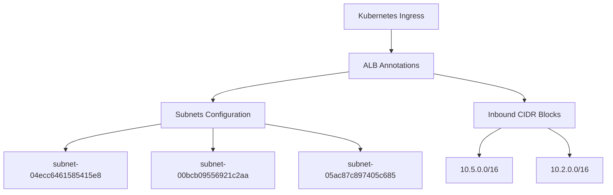
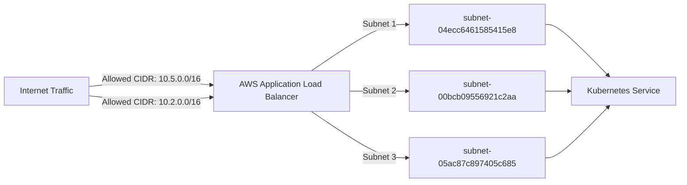

# Diagram: devops/k8s/platform-load-balancer/helm/values.staging1.yaml

> Auto-generated by Obscura crawlers

## Diagram 1

### SVG

<svg id="container" width="1250.96875" xmlns="http://www.w3.org/2000/svg" class="flowchart" height="382" viewBox="0 0 1250.96875 382" role="graphics-document document" aria-roledescription="flowchart-v2"><g><marker id="container_flowchart-v2-pointEnd" class="marker flowchart-v2" viewBox="0 0 10 10" refX="5" refY="5" markerUnits="userSpaceOnUse" markerWidth="8" markerHeight="8" orient="auto"><path d="M 0 0 L 10 5 L 0 10 z" class="arrowMarkerPath" style="stroke-width: 1; stroke-dasharray: 1, 0;"></path></marker><marker id="container_flowchart-v2-pointStart" class="marker flowchart-v2" viewBox="0 0 10 10" refX="4.5" refY="5" markerUnits="userSpaceOnUse" markerWidth="8" markerHeight="8" orient="auto"><path d="M 0 5 L 10 10 L 10 0 z" class="arrowMarkerPath" style="stroke-width: 1; stroke-dasharray: 1, 0;"></path></marker><marker id="container_flowchart-v2-circleEnd" class="marker flowchart-v2" viewBox="0 0 10 10" refX="11" refY="5" markerUnits="userSpaceOnUse" markerWidth="11" markerHeight="11" orient="auto"><circle cx="5" cy="5" r="5" class="arrowMarkerPath" style="stroke-width: 1; stroke-dasharray: 1, 0;"></circle></marker><marker id="container_flowchart-v2-circleStart" class="marker flowchart-v2" viewBox="0 0 10 10" refX="-1" refY="5" markerUnits="userSpaceOnUse" markerWidth="11" markerHeight="11" orient="auto"><circle cx="5" cy="5" r="5" class="arrowMarkerPath" style="stroke-width: 1; stroke-dasharray: 1, 0;"></circle></marker><marker id="container_flowchart-v2-crossEnd" class="marker cross flowchart-v2" viewBox="0 0 11 11" refX="12" refY="5.2" markerUnits="userSpaceOnUse" markerWidth="11" markerHeight="11" orient="auto"><path d="M 1,1 l 9,9 M 10,1 l -9,9" class="arrowMarkerPath" style="stroke-width: 2; stroke-dasharray: 1, 0;"></path></marker><marker id="container_flowchart-v2-crossStart" class="marker cross flowchart-v2" viewBox="0 0 11 11" refX="-1" refY="5.2" markerUnits="userSpaceOnUse" markerWidth="11" markerHeight="11" orient="auto"><path d="M 1,1 l 9,9 M 10,1 l -9,9" class="arrowMarkerPath" style="stroke-width: 2; stroke-dasharray: 1, 0;"></path></marker><g class="root"><g class="clusters"></g><g class="edgePaths"><path d="M807.832,62L807.832,66.167C807.832,70.333,807.832,78.667,807.832,86.333C807.832,94,807.832,101,807.832,104.5L807.832,108" id="L_Ingress_Annotations_0" class="edge-thickness-normal edge-pattern-solid edge-thickness-normal edge-pattern-solid flowchart-link" style=";" data-edge="true" data-et="edge" data-id="L_Ingress_Annotations_0" data-points="W3sieCI6ODA3LjgzMjAzMTI1LCJ5Ijo2Mn0seyJ4Ijo4MDcuODMyMDMxMjUsInkiOjg3fSx7IngiOjgwNy44MzIwMzEyNSwieSI6MTEyfV0=" marker-end="url(#container_flowchart-v2-pointEnd)"></path><path d="M718.223,151.678L671.902,158.232C625.581,164.785,532.939,177.893,486.618,187.946C440.297,198,440.297,205,440.297,208.5L440.297,212" id="L_Annotations_Subnets_0" class="edge-thickness-normal edge-pattern-solid edge-thickness-normal edge-pattern-solid flowchart-link" style=";" data-edge="true" data-et="edge" data-id="L_Annotations_Subnets_0" data-points="W3sieCI6NzE4LjIyMjY1NjI1LCJ5IjoxNTEuNjc4MjA4OTI5ODQzfSx7IngiOjQ0MC4yOTY4NzUsInkiOjE5MX0seyJ4Ijo0NDAuMjk2ODc1LCJ5IjoyMTZ9XQ==" marker-end="url(#container_flowchart-v2-pointEnd)"></path><path d="M897.441,155.953L928.318,161.794C959.194,167.635,1020.947,179.318,1051.823,188.659C1082.699,198,1082.699,205,1082.699,208.5L1082.699,212" id="L_Annotations_CIDR_0" class="edge-thickness-normal edge-pattern-solid edge-thickness-normal edge-pattern-solid flowchart-link" style=";" data-edge="true" data-et="edge" data-id="L_Annotations_CIDR_0" data-points="W3sieCI6ODk3LjQ0MTQwNjI1LCJ5IjoxNTUuOTUyNTA1NDcxMzkyNDR9LHsieCI6MTA4Mi42OTkyMTg3NSwieSI6MTkxfSx7IngiOjEwODIuNjk5MjE4NzUsInkiOjIxNn1d" marker-end="url(#container_flowchart-v2-pointEnd)"></path><path d="M330.055,261.769L297.523,267.307C264.992,272.846,199.93,283.923,167.398,292.961C134.867,302,134.867,309,134.867,312.5L134.867,316" id="L_Subnets_S1_0" class="edge-thickness-normal edge-pattern-solid edge-thickness-normal edge-pattern-solid flowchart-link" style=";" data-edge="true" data-et="edge" data-id="L_Subnets_S1_0" data-points="W3sieCI6MzMwLjA1NDY4NzUsInkiOjI2MS43Njg5NDc0MzU3MzM1fSx7IngiOjEzNC44NjcxODc1LCJ5IjoyOTV9LHsieCI6MTM0Ljg2NzE4NzUsInkiOjMyMH1d" marker-end="url(#container_flowchart-v2-pointEnd)"></path><path d="M440.297,270L440.297,274.167C440.297,278.333,440.297,286.667,440.297,294.333C440.297,302,440.297,309,440.297,312.5L440.297,316" id="L_Subnets_S2_0" class="edge-thickness-normal edge-pattern-solid edge-thickness-normal edge-pattern-solid flowchart-link" style=";" data-edge="true" data-et="edge" data-id="L_Subnets_S2_0" data-points="W3sieCI6NDQwLjI5Njg3NSwieSI6MjcwfSx7IngiOjQ0MC4yOTY4NzUsInkiOjI5NX0seyJ4Ijo0NDAuMjk2ODc1LCJ5IjozMjB9XQ==" marker-end="url(#container_flowchart-v2-pointEnd)"></path><path d="M550.539,261.778L583.046,267.315C615.552,272.852,680.565,283.926,713.072,292.963C745.578,302,745.578,309,745.578,312.5L745.578,316" id="L_Subnets_S3_0" class="edge-thickness-normal edge-pattern-solid edge-thickness-normal edge-pattern-solid flowchart-link" style=";" data-edge="true" data-et="edge" data-id="L_Subnets_S3_0" data-points="W3sieCI6NTUwLjUzOTA2MjUsInkiOjI2MS43NzgwNzM0OTc3OTkxNH0seyJ4Ijo3NDUuNTc4MTI1LCJ5IjoyOTV9LHsieCI6NzQ1LjU3ODEyNSwieSI6MzIwfV0=" marker-end="url(#container_flowchart-v2-pointEnd)"></path><path d="M1034.583,270L1027.158,274.167C1019.733,278.333,1004.882,286.667,997.457,294.333C990.031,302,990.031,309,990.031,312.5L990.031,316" id="L_CIDR_C1_0" class="edge-thickness-normal edge-pattern-solid edge-thickness-normal edge-pattern-solid flowchart-link" style=";" data-edge="true" data-et="edge" data-id="L_CIDR_C1_0" data-points="W3sieCI6MTAzNC41ODMxNTgwNTI4ODQ1LCJ5IjoyNzB9LHsieCI6OTkwLjAzMTI1LCJ5IjoyOTV9LHsieCI6OTkwLjAzMTI1LCJ5IjozMjB9XQ==" marker-end="url(#container_flowchart-v2-pointEnd)"></path><path d="M1130.815,270L1138.241,274.167C1145.666,278.333,1160.517,286.667,1167.942,294.333C1175.367,302,1175.367,309,1175.367,312.5L1175.367,316" id="L_CIDR_C2_0" class="edge-thickness-normal edge-pattern-solid edge-thickness-normal edge-pattern-solid flowchart-link" style=";" data-edge="true" data-et="edge" data-id="L_CIDR_C2_0" data-points="W3sieCI6MTEzMC44MTUyNzk0NDcxMTU1LCJ5IjoyNzB9LHsieCI6MTE3NS4zNjcxODc1LCJ5IjoyOTV9LHsieCI6MTE3NS4zNjcxODc1LCJ5IjozMjB9XQ==" marker-end="url(#container_flowchart-v2-pointEnd)"></path></g><g class="edgeLabels"><g class="edgeLabel"><g class="label" data-id="L_Ingress_Annotations_0" transform="translate(0, 0)"><foreignObject width="0" height="0">

</foreignObject></g></g><g class="edgeLabel"><g class="label" data-id="L_Annotations_Subnets_0" transform="translate(0, 0)"><foreignObject width="0" height="0">

</foreignObject></g></g><g class="edgeLabel"><g class="label" data-id="L_Annotations_CIDR_0" transform="translate(0, 0)"><foreignObject width="0" height="0">

</foreignObject></g></g><g class="edgeLabel"><g class="label" data-id="L_Subnets_S1_0" transform="translate(0, 0)"><foreignObject width="0" height="0">

</foreignObject></g></g><g class="edgeLabel"><g class="label" data-id="L_Subnets_S2_0" transform="translate(0, 0)"><foreignObject width="0" height="0">

</foreignObject></g></g><g class="edgeLabel"><g class="label" data-id="L_Subnets_S3_0" transform="translate(0, 0)"><foreignObject width="0" height="0">

</foreignObject></g></g><g class="edgeLabel"><g class="label" data-id="L_CIDR_C1_0" transform="translate(0, 0)"><foreignObject width="0" height="0">

</foreignObject></g></g><g class="edgeLabel"><g class="label" data-id="L_CIDR_C2_0" transform="translate(0, 0)"><foreignObject width="0" height="0">

</foreignObject></g></g></g><g class="nodes"><g class="node default" id="flowchart-Ingress-0" transform="translate(807.83203125, 35)"><rect class="basic label-container" style="" x="-99.34375" y="-27" width="198.6875" height="54"></rect><g class="label" style="" transform="translate(-69.34375, -12)"><rect></rect><foreignObject width="138.6875" height="24">

Kubernetes Ingress

</foreignObject></g></g><g class="node default" id="flowchart-Annotations-1" transform="translate(807.83203125, 139)"><rect class="basic label-container" style="" x="-89.609375" y="-27" width="179.21875" height="54"></rect><g class="label" style="" transform="translate(-59.609375, -12)"><rect></rect><foreignObject width="119.21875" height="24">

ALB Annotations

</foreignObject></g></g><g class="node default" id="flowchart-Subnets-2" transform="translate(440.296875, 243)"><rect class="basic label-container" style="" x="-110.2421875" y="-27" width="220.484375" height="54"></rect><g class="label" style="" transform="translate(-80.2421875, -12)"><rect></rect><foreignObject width="160.484375" height="24">

Subnets Configuration

</foreignObject></g></g><g class="node default" id="flowchart-CIDR-3" transform="translate(1082.69921875, 243)"><rect class="basic label-container" style="" x="-105.1328125" y="-27" width="210.265625" height="54"></rect><g class="label" style="" transform="translate(-75.1328125, -12)"><rect></rect><foreignObject width="150.265625" height="24">

Inbound CIDR Blocks

</foreignObject></g></g><g class="node default" id="flowchart-S1-11" transform="translate(134.8671875, 347)"><rect class="basic label-container" style="" x="-126.8671875" y="-27" width="253.734375" height="54"></rect><g class="label" style="" transform="translate(-96.8671875, -12)"><rect></rect><foreignObject width="193.734375" height="24">

subnet-04ecc6461585415e8

</foreignObject></g></g><g class="node default" id="flowchart-S2-13" transform="translate(440.296875, 347)"><rect class="basic label-container" style="" x="-128.5625" y="-27" width="257.125" height="54"></rect><g class="label" style="" transform="translate(-98.5625, -12)"><rect></rect><foreignObject width="197.125" height="24">

subnet-00bcb09556921c2aa

</foreignObject></g></g><g class="node default" id="flowchart-S3-15" transform="translate(745.578125, 347)"><rect class="basic label-container" style="" x="-126.71875" y="-27" width="253.4375" height="54"></rect><g class="label" style="" transform="translate(-96.71875, -12)"><rect></rect><foreignObject width="193.4375" height="24">

subnet-05ac87c897405c685

</foreignObject></g></g><g class="node default" id="flowchart-C1-17" transform="translate(990.03125, 347)"><rect class="basic label-container" style="" x="-67.734375" y="-27" width="135.46875" height="54"></rect><g class="label" style="" transform="translate(-37.734375, -12)"><rect></rect><foreignObject width="75.46875" height="24">

10.5.0.0/16

</foreignObject></g></g><g class="node default" id="flowchart-C2-19" transform="translate(1175.3671875, 347)"><rect class="basic label-container" style="" x="-67.6015625" y="-27" width="135.203125" height="54"></rect><g class="label" style="" transform="translate(-37.6015625, -12)"><rect></rect><foreignObject width="75.203125" height="24">

10.2.0.0/16

</foreignObject></g></g></g></g></g></svg>

## Diagram 2

### SVG

<svg id="container" width="1291.859375" xmlns="http://www.w3.org/2000/svg" class="flowchart" height="278" viewBox="0 0 1291.859375 278" role="graphics-document document" aria-roledescription="flowchart-v2"><g><marker id="container_flowchart-v2-pointEnd" class="marker flowchart-v2" viewBox="0 0 10 10" refX="5" refY="5" markerUnits="userSpaceOnUse" markerWidth="8" markerHeight="8" orient="auto"><path d="M 0 0 L 10 5 L 0 10 z" class="arrowMarkerPath" style="stroke-width: 1; stroke-dasharray: 1, 0;"></path></marker><marker id="container_flowchart-v2-pointStart" class="marker flowchart-v2" viewBox="0 0 10 10" refX="4.5" refY="5" markerUnits="userSpaceOnUse" markerWidth="8" markerHeight="8" orient="auto"><path d="M 0 5 L 10 10 L 10 0 z" class="arrowMarkerPath" style="stroke-width: 1; stroke-dasharray: 1, 0;"></path></marker><marker id="container_flowchart-v2-circleEnd" class="marker flowchart-v2" viewBox="0 0 10 10" refX="11" refY="5" markerUnits="userSpaceOnUse" markerWidth="11" markerHeight="11" orient="auto"><circle cx="5" cy="5" r="5" class="arrowMarkerPath" style="stroke-width: 1; stroke-dasharray: 1, 0;"></circle></marker><marker id="container_flowchart-v2-circleStart" class="marker flowchart-v2" viewBox="0 0 10 10" refX="-1" refY="5" markerUnits="userSpaceOnUse" markerWidth="11" markerHeight="11" orient="auto"><circle cx="5" cy="5" r="5" class="arrowMarkerPath" style="stroke-width: 1; stroke-dasharray: 1, 0;"></circle></marker><marker id="container_flowchart-v2-crossEnd" class="marker cross flowchart-v2" viewBox="0 0 11 11" refX="12" refY="5.2" markerUnits="userSpaceOnUse" markerWidth="11" markerHeight="11" orient="auto"><path d="M 1,1 l 9,9 M 10,1 l -9,9" class="arrowMarkerPath" style="stroke-width: 2; stroke-dasharray: 1, 0;"></path></marker><marker id="container_flowchart-v2-crossStart" class="marker cross flowchart-v2" viewBox="0 0 11 11" refX="-1" refY="5.2" markerUnits="userSpaceOnUse" markerWidth="11" markerHeight="11" orient="auto"><path d="M 1,1 l 9,9 M 10,1 l -9,9" class="arrowMarkerPath" style="stroke-width: 2; stroke-dasharray: 1, 0;"></path></marker><g class="root"><g class="clusters"></g><g class="edgePaths"><path d="M174.969,129.724L194.053,127.603C213.138,125.482,251.307,121.241,288.813,120.778C326.318,120.315,363.159,123.63,381.58,125.287L400,126.945" id="L_Internet_ALB_0" class="edge-thickness-normal edge-pattern-solid edge-thickness-normal edge-pattern-solid flowchart-link" style=";" data-edge="true" data-et="edge" data-id="L_Internet_ALB_0" data-points="W3sieCI6MTc0Ljk2ODc1LCJ5IjoxMjkuNzIzNTkyMzEzNDU5MzN9LHsieCI6Mjg5LjQ3NjU2MjUsInkiOjExN30seyJ4Ijo0MDMuOTg0Mzc1LCJ5IjoxMjcuMzAzMDMyMjM5NTExNzh9XQ==" marker-end="url(#container_flowchart-v2-pointEnd)"></path><path d="M174.969,148.276L194.053,150.397C213.138,152.518,251.307,156.759,288.813,157.222C326.318,157.685,363.159,154.37,381.58,152.713L400,151.055" id="L_Internet_ALB_2" class="edge-thickness-normal edge-pattern-solid edge-thickness-normal edge-pattern-solid flowchart-link" style=";" data-edge="true" data-et="edge" data-id="L_Internet_ALB_2" data-points="W3sieCI6MTc0Ljk2ODc1LCJ5IjoxNDguMjc2NDA3Njg2NTQwNjd9LHsieCI6Mjg5LjQ3NjU2MjUsInkiOjE2MX0seyJ4Ijo0MDMuOTg0Mzc1LCJ5IjoxNTAuNjk2OTY3NzYwNDg4MjN9XQ==" marker-end="url(#container_flowchart-v2-pointEnd)"></path><path d="M604.042,100L623.502,89.167C642.963,78.333,681.884,56.667,710.43,45.833C738.977,35,757.148,35,766.234,35L775.32,35" id="L_ALB_AZ1_0" class="edge-thickness-normal edge-pattern-solid edge-thickness-normal edge-pattern-solid flowchart-link" style=";" data-edge="true" data-et="edge" data-id="L_ALB_AZ1_0" data-points="W3sieCI6NjA0LjA0MTk5MjE4NzUsInkiOjEwMH0seyJ4Ijo3MjAuODA0Njg3NSwieSI6MzV9LHsieCI6Nzc5LjMyMDMxMjUsInkiOjM1fV0=" marker-end="url(#container_flowchart-v2-pointEnd)"></path><path d="M663.984,139L673.454,139C682.924,139,701.865,139,720.138,139C738.411,139,756.018,139,764.822,139L773.625,139" id="L_ALB_AZ2_0" class="edge-thickness-normal edge-pattern-solid edge-thickness-normal edge-pattern-solid flowchart-link" style=";" data-edge="true" data-et="edge" data-id="L_ALB_AZ2_0" data-points="W3sieCI6NjYzLjk4NDM3NSwieSI6MTM5fSx7IngiOjcyMC44MDQ2ODc1LCJ5IjoxMzl9LHsieCI6Nzc3LjYyNSwieSI6MTM5fV0=" marker-end="url(#container_flowchart-v2-pointEnd)"></path><path d="M604.042,178L623.502,188.833C642.963,199.667,681.884,221.333,710.455,232.167C739.026,243,757.247,243,766.358,243L775.469,243" id="L_ALB_AZ3_0" class="edge-thickness-normal edge-pattern-solid edge-thickness-normal edge-pattern-solid flowchart-link" style=";" data-edge="true" data-et="edge" data-id="L_ALB_AZ3_0" data-points="W3sieCI6NjA0LjA0MTk5MjE4NzUsInkiOjE3OH0seyJ4Ijo3MjAuODA0Njg3NSwieSI6MjQzfSx7IngiOjc3OS40Njg3NSwieSI6MjQzfV0=" marker-end="url(#container_flowchart-v2-pointEnd)"></path><path d="M1033.055,35L1037.504,35C1041.953,35,1050.852,35,1070.159,47.406C1089.466,59.812,1119.182,84.624,1134.04,97.03L1148.898,109.436" id="L_AZ1_Service_0" class="edge-thickness-normal edge-pattern-solid edge-thickness-normal edge-pattern-solid flowchart-link" style=";" data-edge="true" data-et="edge" data-id="L_AZ1_Service_0" data-points="W3sieCI6MTAzMy4wNTQ2ODc1LCJ5IjozNX0seyJ4IjoxMDU5Ljc1LCJ5IjozNX0seyJ4IjoxMTUxLjk2ODM3NDM5OTAzODYsInkiOjExMn1d" marker-end="url(#container_flowchart-v2-pointEnd)"></path><path d="M1034.75,139L1038.917,139C1043.083,139,1051.417,139,1059.083,139C1066.75,139,1073.75,139,1077.25,139L1080.75,139" id="L_AZ2_Service_0" class="edge-thickness-normal edge-pattern-solid edge-thickness-normal edge-pattern-solid flowchart-link" style=";" data-edge="true" data-et="edge" data-id="L_AZ2_Service_0" data-points="W3sieCI6MTAzNC43NSwieSI6MTM5fSx7IngiOjEwNTkuNzUsInkiOjEzOX0seyJ4IjoxMDg0Ljc1LCJ5IjoxMzl9XQ==" marker-end="url(#container_flowchart-v2-pointEnd)"></path><path d="M1032.906,243L1037.38,243C1041.854,243,1050.802,243,1070.134,230.594C1089.466,218.188,1119.182,193.376,1134.04,180.97L1148.898,168.564" id="L_AZ3_Service_0" class="edge-thickness-normal edge-pattern-solid edge-thickness-normal edge-pattern-solid flowchart-link" style=";" data-edge="true" data-et="edge" data-id="L_AZ3_Service_0" data-points="W3sieCI6MTAzMi45MDYyNSwieSI6MjQzfSx7IngiOjEwNTkuNzUsInkiOjI0M30seyJ4IjoxMTUxLjk2ODM3NDM5OTAzODYsInkiOjE2Nn1d" marker-end="url(#container_flowchart-v2-pointEnd)"></path></g><g class="edgeLabels"><g class="edgeLabel" transform="translate(289.4765625, 117)"><g class="label" data-id="L_Internet_ALB_0" transform="translate(-89.5078125, -12)"><foreignObject width="179.015625" height="24">

Allowed CIDR: 10.5.0.0/16

</foreignObject></g></g><g class="edgeLabel" transform="translate(289.4765625, 161)"><g class="label" data-id="L_Internet_ALB_2" transform="translate(-89.3828125, -12)"><foreignObject width="178.765625" height="24">

Allowed CIDR: 10.2.0.0/16

</foreignObject></g></g><g class="edgeLabel" transform="translate(720.8046875, 35)"><g class="label" data-id="L_ALB_AZ1_0" transform="translate(-31.2890625, -12)"><foreignObject width="62.578125" height="24">

Subnet 1

</foreignObject></g></g><g class="edgeLabel" transform="translate(720.8046875, 139)"><g class="label" data-id="L_ALB_AZ2_0" transform="translate(-31.7890625, -12)"><foreignObject width="63.578125" height="24">

Subnet 2

</foreignObject></g></g><g class="edgeLabel" transform="translate(720.8046875, 243)"><g class="label" data-id="L_ALB_AZ3_0" transform="translate(-31.8203125, -12)"><foreignObject width="63.640625" height="24">

Subnet 3

</foreignObject></g></g><g class="edgeLabel"><g class="label" data-id="L_AZ1_Service_0" transform="translate(0, 0)"><foreignObject width="0" height="0">

</foreignObject></g></g><g class="edgeLabel"><g class="label" data-id="L_AZ2_Service_0" transform="translate(0, 0)"><foreignObject width="0" height="0">

</foreignObject></g></g><g class="edgeLabel"><g class="label" data-id="L_AZ3_Service_0" transform="translate(0, 0)"><foreignObject width="0" height="0">

</foreignObject></g></g></g><g class="nodes"><g class="node default" id="flowchart-Internet-0" transform="translate(91.484375, 139)"><rect class="basic label-container" style="" x="-83.484375" y="-27" width="166.96875" height="54"></rect><g class="label" style="" transform="translate(-53.484375, -12)"><rect></rect><foreignObject width="106.96875" height="24">

Internet Traffic

</foreignObject></g></g><g class="node default" id="flowchart-ALB-1" transform="translate(533.984375, 139)"><rect class="basic label-container" style="" x="-130" y="-39" width="260" height="78"></rect><g class="label" style="" transform="translate(-100, -24)"><rect></rect><foreignObject width="200" height="48">

AWS Application Load Balancer

</foreignObject></g></g><g class="node default" id="flowchart-AZ1-7" transform="translate(906.1875, 35)"><rect class="basic label-container" style="" x="-126.8671875" y="-27" width="253.734375" height="54"></rect><g class="label" style="" transform="translate(-96.8671875, -12)"><rect></rect><foreignObject width="193.734375" height="24">

subnet-04ecc6461585415e8

</foreignObject></g></g><g class="node default" id="flowchart-AZ2-9" transform="translate(906.1875, 139)"><rect class="basic label-container" style="" x="-128.5625" y="-27" width="257.125" height="54"></rect><g class="label" style="" transform="translate(-98.5625, -12)"><rect></rect><foreignObject width="197.125" height="24">

subnet-00bcb09556921c2aa

</foreignObject></g></g><g class="node default" id="flowchart-AZ3-11" transform="translate(906.1875, 243)"><rect class="basic label-container" style="" x="-126.71875" y="-27" width="253.4375" height="54"></rect><g class="label" style="" transform="translate(-96.71875, -12)"><rect></rect><foreignObject width="193.4375" height="24">

subnet-05ac87c897405c685

</foreignObject></g></g><g class="node default" id="flowchart-Service-13" transform="translate(1184.3046875, 139)"><rect class="basic label-container" style="" x="-99.5546875" y="-27" width="199.109375" height="54"></rect><g class="label" style="" transform="translate(-69.5546875, -12)"><rect></rect><foreignObject width="139.109375" height="24">

Kubernetes Service

</foreignObject></g></g></g></g></g></svg>
