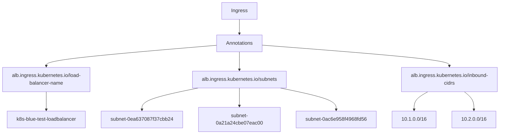
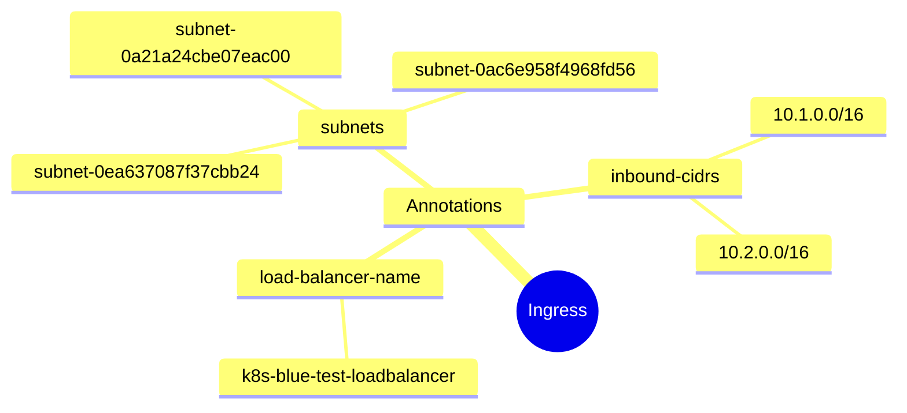
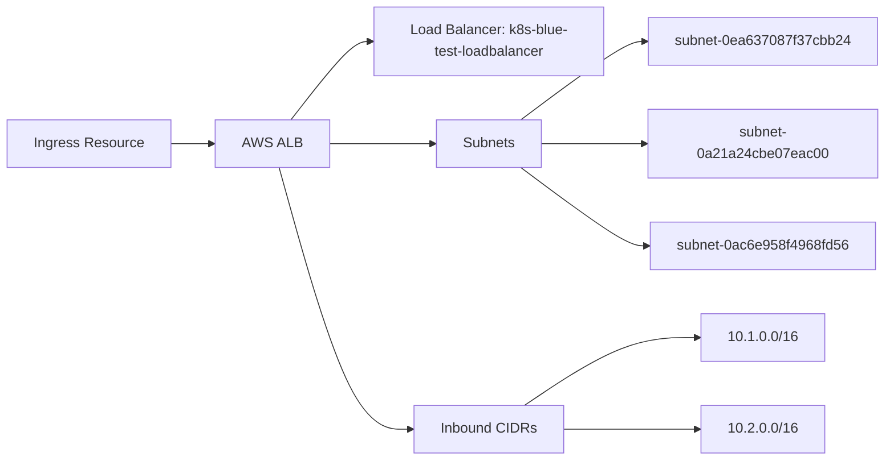

# Diagram: devops/k8s/platform-load-balancer/helm/values.test.yaml

> Auto-generated by Obscura crawlers

## Diagram 1

### SVG

<svg id="container" width="1589.3203125" xmlns="http://www.w3.org/2000/svg" class="flowchart" height="406" viewBox="0 0 1589.3203125 406" role="graphics-document document" aria-roledescription="flowchart-v2"><g><marker id="container_flowchart-v2-pointEnd" class="marker flowchart-v2" viewBox="0 0 10 10" refX="5" refY="5" markerUnits="userSpaceOnUse" markerWidth="8" markerHeight="8" orient="auto"><path d="M 0 0 L 10 5 L 0 10 z" class="arrowMarkerPath" style="stroke-width: 1; stroke-dasharray: 1, 0;"></path></marker><marker id="container_flowchart-v2-pointStart" class="marker flowchart-v2" viewBox="0 0 10 10" refX="4.5" refY="5" markerUnits="userSpaceOnUse" markerWidth="8" markerHeight="8" orient="auto"><path d="M 0 5 L 10 10 L 10 0 z" class="arrowMarkerPath" style="stroke-width: 1; stroke-dasharray: 1, 0;"></path></marker><marker id="container_flowchart-v2-circleEnd" class="marker flowchart-v2" viewBox="0 0 10 10" refX="11" refY="5" markerUnits="userSpaceOnUse" markerWidth="11" markerHeight="11" orient="auto"><circle cx="5" cy="5" r="5" class="arrowMarkerPath" style="stroke-width: 1; stroke-dasharray: 1, 0;"></circle></marker><marker id="container_flowchart-v2-circleStart" class="marker flowchart-v2" viewBox="0 0 10 10" refX="-1" refY="5" markerUnits="userSpaceOnUse" markerWidth="11" markerHeight="11" orient="auto"><circle cx="5" cy="5" r="5" class="arrowMarkerPath" style="stroke-width: 1; stroke-dasharray: 1, 0;"></circle></marker><marker id="container_flowchart-v2-crossEnd" class="marker cross flowchart-v2" viewBox="0 0 11 11" refX="12" refY="5.2" markerUnits="userSpaceOnUse" markerWidth="11" markerHeight="11" orient="auto"><path d="M 1,1 l 9,9 M 10,1 l -9,9" class="arrowMarkerPath" style="stroke-width: 2; stroke-dasharray: 1, 0;"></path></marker><marker id="container_flowchart-v2-crossStart" class="marker cross flowchart-v2" viewBox="0 0 11 11" refX="-1" refY="5.2" markerUnits="userSpaceOnUse" markerWidth="11" markerHeight="11" orient="auto"><path d="M 1,1 l 9,9 M 10,1 l -9,9" class="arrowMarkerPath" style="stroke-width: 2; stroke-dasharray: 1, 0;"></path></marker><g class="root"><g class="clusters"></g><g class="edgePaths"><path d="M761.477,62L761.477,66.167C761.477,70.333,761.477,78.667,761.477,86.333C761.477,94,761.477,101,761.477,104.5L761.477,108" id="L_A_B_0" class="edge-thickness-normal edge-pattern-solid edge-thickness-normal edge-pattern-solid flowchart-link" style=";" data-edge="true" data-et="edge" data-id="L_A_B_0" data-points="W3sieCI6NzYxLjQ3NjU2MjUsInkiOjYyfSx7IngiOjc2MS40NzY1NjI1LCJ5Ijo4N30seyJ4Ijo3NjEuNDc2NTYyNSwieSI6MTEyfV0=" marker-end="url(#container_flowchart-v2-pointEnd)"></path><path d="M687.414,145.318L598.163,152.932C508.911,160.545,330.409,175.773,241.158,186.886C151.906,198,151.906,205,151.906,208.5L151.906,212" id="L_B_C_0" class="edge-thickness-normal edge-pattern-solid edge-thickness-normal edge-pattern-solid flowchart-link" style=";" data-edge="true" data-et="edge" data-id="L_B_C_0" data-points="W3sieCI6Njg3LjQxNDA2MjUsInkiOjE0NS4zMTc5NzUwMDgwMTAyNX0seyJ4IjoxNTEuOTA2MjUsInkiOjE5MX0seyJ4IjoxNTEuOTA2MjUsInkiOjIxNn1d" marker-end="url(#container_flowchart-v2-pointEnd)"></path><path d="M151.906,294L151.906,298.167C151.906,302.333,151.906,310.667,151.906,318.333C151.906,326,151.906,333,151.906,336.5L151.906,340" id="L_C_D_0" class="edge-thickness-normal edge-pattern-solid edge-thickness-normal edge-pattern-solid flowchart-link" style=";" data-edge="true" data-et="edge" data-id="L_C_D_0" data-points="W3sieCI6MTUxLjkwNjI1LCJ5IjoyOTR9LHsieCI6MTUxLjkwNjI1LCJ5IjozMTl9LHsieCI6MTUxLjkwNjI1LCJ5IjozNDR9XQ==" marker-end="url(#container_flowchart-v2-pointEnd)"></path><path d="M761.477,166L761.477,170.167C761.477,174.333,761.477,182.667,761.477,192.333C761.477,202,761.477,213,761.477,218.5L761.477,224" id="L_B_E_0" class="edge-thickness-normal edge-pattern-solid edge-thickness-normal edge-pattern-solid flowchart-link" style=";" data-edge="true" data-et="edge" data-id="L_B_E_0" data-points="W3sieCI6NzYxLjQ3NjU2MjUsInkiOjE2Nn0seyJ4Ijo3NjEuNDc2NTYyNSwieSI6MTkxfSx7IngiOjc2MS40NzY1NjI1LCJ5IjoyMjh9XQ==" marker-end="url(#container_flowchart-v2-pointEnd)"></path><path d="M633.009,282L603.668,288.167C574.326,294.333,515.644,306.667,486.302,316.333C456.961,326,456.961,333,456.961,336.5L456.961,340" id="L_E_F1_0" class="edge-thickness-normal edge-pattern-solid edge-thickness-normal edge-pattern-solid flowchart-link" style=";" data-edge="true" data-et="edge" data-id="L_E_F1_0" data-points="W3sieCI6NjMzLjAwOTAzMzIwMzEyNSwieSI6MjgyfSx7IngiOjQ1Ni45NjA5Mzc1LCJ5IjozMTl9LHsieCI6NDU2Ljk2MDkzNzUsInkiOjM0NH1d" marker-end="url(#container_flowchart-v2-pointEnd)"></path><path d="M761.477,282L761.477,288.167C761.477,294.333,761.477,306.667,761.477,316.333C761.477,326,761.477,333,761.477,336.5L761.477,340" id="L_E_F2_0" class="edge-thickness-normal edge-pattern-solid edge-thickness-normal edge-pattern-solid flowchart-link" style=";" data-edge="true" data-et="edge" data-id="L_E_F2_0" data-points="W3sieCI6NzYxLjQ3NjU2MjUsInkiOjI4Mn0seyJ4Ijo3NjEuNDc2NTYyNSwieSI6MzE5fSx7IngiOjc2MS40NzY1NjI1LCJ5IjozNDR9XQ==" marker-end="url(#container_flowchart-v2-pointEnd)"></path><path d="M890.234,282L919.642,288.167C949.049,294.333,1007.865,306.667,1037.272,316.333C1066.68,326,1066.68,333,1066.68,336.5L1066.68,340" id="L_E_F3_0" class="edge-thickness-normal edge-pattern-solid edge-thickness-normal edge-pattern-solid flowchart-link" style=";" data-edge="true" data-et="edge" data-id="L_E_F3_0" data-points="W3sieCI6ODkwLjIzNDEzMDg1OTM3NSwieSI6MjgyfSx7IngiOjEwNjYuNjc5Njg3NSwieSI6MzE5fSx7IngiOjEwNjYuNjc5Njg3NSwieSI6MzQ0fV0=" marker-end="url(#container_flowchart-v2-pointEnd)"></path><path d="M835.539,144.822L933.44,152.519C1031.341,160.215,1227.143,175.607,1325.044,186.804C1422.945,198,1422.945,205,1422.945,208.5L1422.945,212" id="L_B_G_0" class="edge-thickness-normal edge-pattern-solid edge-thickness-normal edge-pattern-solid flowchart-link" style=";" data-edge="true" data-et="edge" data-id="L_B_G_0" data-points="W3sieCI6ODM1LjUzOTA2MjUsInkiOjE0NC44MjIyNzA1MTU0MjQ5NX0seyJ4IjoxNDIyLjk0NTMxMjUsInkiOjE5MX0seyJ4IjoxNDIyLjk0NTMxMjUsInkiOjIxNn1d" marker-end="url(#container_flowchart-v2-pointEnd)"></path><path d="M1354.091,294L1346.734,298.167C1339.378,302.333,1324.666,310.667,1317.309,318.333C1309.953,326,1309.953,333,1309.953,336.5L1309.953,340" id="L_G_H1_0" class="edge-thickness-normal edge-pattern-solid edge-thickness-normal edge-pattern-solid flowchart-link" style=";" data-edge="true" data-et="edge" data-id="L_G_H1_0" data-points="W3sieCI6MTM1NC4wOTA2OTgyNDIxODc1LCJ5IjoyOTR9LHsieCI6MTMwOS45NTMxMjUsInkiOjMxOX0seyJ4IjoxMzA5Ljk1MzEyNSwieSI6MzQ0fV0=" marker-end="url(#container_flowchart-v2-pointEnd)"></path><path d="M1466.159,294L1470.775,298.167C1475.392,302.333,1484.626,310.667,1489.243,318.333C1493.859,326,1493.859,333,1493.859,336.5L1493.859,340" id="L_G_H2_0" class="edge-thickness-normal edge-pattern-solid edge-thickness-normal edge-pattern-solid flowchart-link" style=";" data-edge="true" data-et="edge" data-id="L_G_H2_0" data-points="W3sieCI6MTQ2Ni4xNTg1NjkzMzU5Mzc1LCJ5IjoyOTR9LHsieCI6MTQ5My44NTkzNzUsInkiOjMxOX0seyJ4IjoxNDkzLjg1OTM3NSwieSI6MzQ0fV0=" marker-end="url(#container_flowchart-v2-pointEnd)"></path></g><g class="edgeLabels"><g class="edgeLabel"><g class="label" data-id="L_A_B_0" transform="translate(0, 0)"><foreignObject width="0" height="0">

</foreignObject></g></g><g class="edgeLabel"><g class="label" data-id="L_B_C_0" transform="translate(0, 0)"><foreignObject width="0" height="0">

</foreignObject></g></g><g class="edgeLabel"><g class="label" data-id="L_C_D_0" transform="translate(0, 0)"><foreignObject width="0" height="0">

</foreignObject></g></g><g class="edgeLabel"><g class="label" data-id="L_B_E_0" transform="translate(0, 0)"><foreignObject width="0" height="0">

</foreignObject></g></g><g class="edgeLabel"><g class="label" data-id="L_E_F1_0" transform="translate(0, 0)"><foreignObject width="0" height="0">

</foreignObject></g></g><g class="edgeLabel"><g class="label" data-id="L_E_F2_0" transform="translate(0, 0)"><foreignObject width="0" height="0">

</foreignObject></g></g><g class="edgeLabel"><g class="label" data-id="L_E_F3_0" transform="translate(0, 0)"><foreignObject width="0" height="0">

</foreignObject></g></g><g class="edgeLabel"><g class="label" data-id="L_B_G_0" transform="translate(0, 0)"><foreignObject width="0" height="0">

</foreignObject></g></g><g class="edgeLabel"><g class="label" data-id="L_G_H1_0" transform="translate(0, 0)"><foreignObject width="0" height="0">

</foreignObject></g></g><g class="edgeLabel"><g class="label" data-id="L_G_H2_0" transform="translate(0, 0)"><foreignObject width="0" height="0">

</foreignObject></g></g></g><g class="nodes"><g class="node default" id="flowchart-A-0" transform="translate(761.4765625, 35)"><rect class="basic label-container" style="" x="-55.8125" y="-27" width="111.625" height="54"></rect><g class="label" style="" transform="translate(-25.8125, -12)"><rect></rect><foreignObject width="51.625" height="24">

Ingress

</foreignObject></g></g><g class="node default" id="flowchart-B-1" transform="translate(761.4765625, 139)"><rect class="basic label-container" style="" x="-74.0625" y="-27" width="148.125" height="54"></rect><g class="label" style="" transform="translate(-44.0625, -12)"><rect></rect><foreignObject width="88.125" height="24">

Annotations

</foreignObject></g></g><g class="node default" id="flowchart-C-3" transform="translate(151.90625, 255)"><rect class="basic label-container" style="" x="-143.90625" y="-39" width="287.8125" height="78"></rect><g class="label" style="" transform="translate(-113.90625, -24)"><rect></rect><foreignObject width="227.8125" height="48">

alb.ingress.kubernetes.io/load-balancer-name

</foreignObject></g></g><g class="node default" id="flowchart-D-5" transform="translate(151.90625, 371)"><rect class="basic label-container" style="" x="-128.7734375" y="-27" width="257.546875" height="54"></rect><g class="label" style="" transform="translate(-98.7734375, -12)"><rect></rect><foreignObject width="197.546875" height="24">

k8s-blue-test-loadbalancer

</foreignObject></g></g><g class="node default" id="flowchart-E-7" transform="translate(761.4765625, 255)"><rect class="basic label-container" style="" x="-153.2265625" y="-27" width="306.453125" height="54"></rect><g class="label" style="" transform="translate(-123.2265625, -12)"><rect></rect><foreignObject width="246.453125" height="24">

alb.ingress.kubernetes.io/subnets

</foreignObject></g></g><g class="node default" id="flowchart-F1-9" transform="translate(456.9609375, 371)"><rect class="basic label-container" style="" x="-126.28125" y="-27" width="252.5625" height="54"></rect><g class="label" style="" transform="translate(-96.28125, -12)"><rect></rect><foreignObject width="192.5625" height="24">

subnet-0ea637087f37cbb24

</foreignObject></g></g><g class="node default" id="flowchart-F2-11" transform="translate(761.4765625, 371)"><rect class="basic label-container" style="" x="-128.234375" y="-27" width="256.46875" height="54"></rect><g class="label" style="" transform="translate(-98.234375, -12)"><rect></rect><foreignObject width="196.46875" height="24">

subnet-0a21a24cbe07eac00

</foreignObject></g></g><g class="node default" id="flowchart-F3-13" transform="translate(1066.6796875, 371)"><rect class="basic label-container" style="" x="-126.96875" y="-27" width="253.9375" height="54"></rect><g class="label" style="" transform="translate(-96.96875, -12)"><rect></rect><foreignObject width="193.9375" height="24">

subnet-0ac6e958f4968fd56

</foreignObject></g></g><g class="node default" id="flowchart-G-15" transform="translate(1422.9453125, 255)"><rect class="basic label-container" style="" x="-158.375" y="-39" width="316.75" height="78"></rect><g class="label" style="" transform="translate(-128.375, -24)"><rect></rect><foreignObject width="256.75" height="48">

alb.ingress.kubernetes.io/inbound-cidrs

</foreignObject></g></g><g class="node default" id="flowchart-H1-17" transform="translate(1309.953125, 371)"><rect class="basic label-container" style="" x="-66.3046875" y="-27" width="132.609375" height="54"></rect><g class="label" style="" transform="translate(-36.3046875, -12)"><rect></rect><foreignObject width="72.609375" height="24">

10.1.0.0/16

</foreignObject></g></g><g class="node default" id="flowchart-H2-19" transform="translate(1493.859375, 371)"><rect class="basic label-container" style="" x="-67.6015625" y="-27" width="135.203125" height="54"></rect><g class="label" style="" transform="translate(-37.6015625, -12)"><rect></rect><foreignObject width="75.203125" height="24">

10.2.0.0/16

</foreignObject></g></g></g></g></g></svg>

## Diagram 2

### SVG

<svg id="container" width="100%" xmlns="http://www.w3.org/2000/svg" class="mindmapDiagram" style="max-width: 787.7514038085938px;" viewBox="5 5 787.7514038085938 345.4234313964844" role="graphics-document document" aria-roledescription="mindmap"><g><marker id="container_mindmap-pointEnd" class="marker mindmap" viewBox="0 0 10 10" refX="5" refY="5" markerUnits="userSpaceOnUse" markerWidth="8" markerHeight="8" orient="auto"><path d="M 0 0 L 10 5 L 0 10 z" class="arrowMarkerPath" style="stroke-width: 1; stroke-dasharray: 1, 0;"></path></marker><marker id="container_mindmap-pointStart" class="marker mindmap" viewBox="0 0 10 10" refX="4.5" refY="5" markerUnits="userSpaceOnUse" markerWidth="8" markerHeight="8" orient="auto"><path d="M 0 5 L 10 10 L 10 0 z" class="arrowMarkerPath" style="stroke-width: 1; stroke-dasharray: 1, 0;"></path></marker><g class="subgraphs"></g><g class="edgePaths"><path d="M535.741,94.936L529.396,99.957C523.051,104.978,510.361,115.02,497.671,125.061C484.981,135.103,472.291,145.145,465.946,150.166L459.601,155.187" id="edge_0_1" class="edge-thickness-normal edge-pattern-solid edge section-edge-0 edge-depth-1" style="undefined;;;undefined" data-edge="true" data-et="edge" data-id="edge_0_1" data-points="W3sieCI6NTM1Ljc0MTIyMjIwOTgzOTksInkiOjk0LjkzNTk2MTQ5MDE5NDgzfSx7IngiOjQ5Ny42NzEwMjUxNDM0MzYxNywieSI6MTI1LjA2MTMxOTU1ODEzMDc4fSx7IngiOjQ1OS42MDA4MjgwNzcwMzI1LCJ5IjoxNTUuMTg2Njc3NjI2MDY2NzR9XQ=="></path><path d="M437.362,175.23L433.155,179.54C428.948,183.851,420.535,192.472,412.121,201.093C403.708,209.714,395.294,218.335,391.088,222.645L386.881,226.956" id="edge_1_2" class="edge-thickness-normal edge-pattern-solid edge section-edge-0 edge-depth-3" style="undefined;;;undefined" data-edge="true" data-et="edge" data-id="edge_1_2" data-points="W3sieCI6NDM3LjM2MTUzMzUyMTkzNjksInkiOjE3NS4yMjk3MDY1MTg0NzIwM30seyJ4Ijo0MTIuMTIxMjc3MDQxODQzNzcsInkiOjIwMS4wOTI3MTQ0ODY2MzUzN30seyJ4IjozODYuODgxMDIwNTYxNzUwNjMsInkiOjIyNi45NTU3MjI0NTQ3OTg3Mn1d"></path><path d="M380.345,252.164L381.633,256.896C382.921,261.628,385.498,271.093,388.075,280.557C390.651,290.021,393.228,299.486,394.516,304.218L395.804,308.95" id="edge_2_3" class="edge-thickness-normal edge-pattern-solid edge section-edge-0 edge-depth-5" style="undefined;;;undefined" data-edge="true" data-et="edge" data-id="edge_2_3" data-points="W3sieCI6MzgwLjM0NDY5NjE3NzkwODYsInkiOjI1Mi4xNjQwMTMyMzc1ODYzfSx7IngiOjM4OC4wNzQ1MzU2MzgxNTY3LCJ5IjoyODAuNTU3MTA0OTU4MjE3OH0seyJ4IjozOTUuODA0Mzc1MDk4NDA0OCwieSI6MzA4Ljk1MDE5NjY3ODg0OTN9XQ=="></path><path d="M434.53,157.575L426.974,153.647C419.419,149.718,404.309,141.862,389.199,134.005C374.088,126.149,358.978,118.292,351.423,114.364L343.868,110.435" id="edge_1_4" class="edge-thickness-normal edge-pattern-solid edge section-edge-0 edge-depth-3" style="undefined;;;undefined" data-edge="true" data-et="edge" data-id="edge_1_4" data-points="W3sieCI6NDM0LjUyOTU2MjczODUxMDQsInkiOjE1Ny41NzQ5MTMyNjEyMzIxfSx7IngiOjM4OS4xOTg1NzUxNTE5MzQ3MywieSI6MTM0LjAwNTIwNTQ5NDM2MDF9LHsieCI6MzQzLjg2NzU4NzU2NTM1OTEsInkiOjExMC40MzU0OTc3Mjc0ODgxfV0="></path><path d="M316.815,109.525L308.357,113.222C299.9,116.92,282.984,124.315,266.069,131.711C249.154,139.106,232.238,146.501,223.781,150.199L215.323,153.897" id="edge_4_5" class="edge-thickness-normal edge-pattern-solid edge section-edge-0 edge-depth-5" style="undefined;;;undefined" data-edge="true" data-et="edge" data-id="edge_4_5" data-points="W3sieCI6MzE2LjgxNTE2MjkyMzg3Mzk3LCJ5IjoxMDkuNTI0NTYxNjU4Mjk2MjV9LHsieCI6MjY2LjA2OTA4Mjg4MDg3MDI3LCJ5IjoxMzEuNzEwNjQ4NjI3MDk3fSx7IngiOjIxNS4zMjMwMDI4Mzc4NjY1NywieSI6MTUzLjg5NjczNTU5NTg5NzcyfV0="></path><path d="M315.814,100.761L301.828,98.148C287.842,95.535,259.869,90.309,231.897,85.084C203.924,79.858,175.952,74.632,161.966,72.019L147.979,69.406" id="edge_4_6" class="edge-thickness-normal edge-pattern-solid edge section-edge-0 edge-depth-5" style="undefined;;;undefined" data-edge="true" data-et="edge" data-id="edge_4_6" data-points="W3sieCI6MzE1LjgxNDE1MDI1MTA2NzQsInkiOjEwMC43NjExMjM2NjY1NDc1OX0seyJ4IjoyMzEuODk2NzEwNzI3MzU4NjUsInkiOjg1LjA4MzY4MTk3MjEwMDN9LHsieCI6MTQ3Ljk3OTI3MTIwMzY0OTksInkiOjY5LjQwNjI0MDI3NzY1M31d"></path><path d="M341.858,93.65L346.8,89.335C351.743,85.019,361.627,76.389,371.512,67.758C381.396,59.127,391.281,50.496,396.223,46.181L401.166,41.866" id="edge_4_7" class="edge-thickness-normal edge-pattern-solid edge section-edge-0 edge-depth-5" style="undefined;;;undefined" data-edge="true" data-et="edge" data-id="edge_4_7" data-points="W3sieCI6MzQxLjg1ODA1NzUxODE2OCwieSI6OTMuNjUwMDQ2ODE1MDMyOTd9LHsieCI6MzcxLjUxMTg0NzM4Mjk4MTYsInkiOjY3Ljc1Nzg4MTMyNjMxMDF9LHsieCI6NDAxLjE2NTYzNzI0Nzc5NTI1LCJ5Ijo0MS44NjU3MTU4Mzc1ODcyMjR9XQ=="></path><path d="M462.55,167.419L476,170.092C489.45,172.765,516.35,178.112,543.25,183.458C570.15,188.804,597.05,194.151,610.5,196.824L623.95,199.497" id="edge_1_8" class="edge-thickness-normal edge-pattern-solid edge section-edge-0 edge-depth-3" style="undefined;;;undefined" data-edge="true" data-et="edge" data-id="edge_1_8" data-points="W3sieCI6NDYyLjU1MDMzNjYxMTc2NzIsInkiOjE2Ny40MTg3MjIwNTkyODc1NX0seyJ4Ijo1NDMuMjUwMzAzNzIxNjk3NCwieSI6MTgzLjQ1NzkzNjMwMzM2MDF9LHsieCI6NjIzLjk1MDI3MDgzMTYyNzYsInkiOjE5OS40OTcxNTA1NDc0MzI2NX1d"></path><path d="M650.579,193.311L655.908,189.236C661.237,185.162,671.896,177.013,682.555,168.864C693.213,160.715,703.872,152.566,709.201,148.491L714.53,144.416" id="edge_8_9" class="edge-thickness-normal edge-pattern-solid edge section-edge-0 edge-depth-5" style="undefined;;;undefined" data-edge="true" data-et="edge" data-id="edge_8_9" data-points="W3sieCI6NjUwLjU3ODc3NDgwNjg3NTEsInkiOjE5My4zMTA2NTQ1NjM1NzE5Mn0seyJ4Ijo2ODIuNTU0NjE5MTY0MDIxNSwieSI6MTY4Ljg2MzU2NDIxNDY0Nzk3fSx7IngiOjcxNC41MzA0NjM1MjExNjc4LCJ5IjoxNDQuNDE2NDczODY1NzI0MDJ9XQ=="></path><path d="M650.265,211.929L655.283,216.041C660.302,220.153,670.339,228.378,680.377,236.603C690.414,244.828,700.451,253.053,705.47,257.166L710.488,261.278" id="edge_8_10" class="edge-thickness-normal edge-pattern-solid edge section-edge-0 edge-depth-5" style="undefined;;;undefined" data-edge="true" data-et="edge" data-id="edge_8_10" data-points="W3sieCI6NjUwLjI2NDcxMDYzMTQ4NjgsInkiOjIxMS45Mjg1MjYyOTkzMjAwOH0seyJ4Ijo2ODAuMzc2NTM2MDcyNjg0LCJ5IjoyMzYuNjAzMzMzMjcyMzM0NTd9LHsieCI6NzEwLjQ4ODM2MTUxMzg4MTIsInkiOjI2MS4yNzgxNDAyNDUzNDkwNX1d"></path></g><g class="edgeLabels"><g class="edgeLabel"><g class="label" data-id="edge_0_1" transform="translate(0, 0)"><foreignObject width="0" height="0">

</foreignObject></g></g><g class="edgeLabel"><g class="label" data-id="edge_1_2" transform="translate(0, 0)"><foreignObject width="0" height="0">

</foreignObject></g></g><g class="edgeLabel"><g class="label" data-id="edge_2_3" transform="translate(0, 0)"><foreignObject width="0" height="0">

</foreignObject></g></g><g class="edgeLabel"><g class="label" data-id="edge_1_4" transform="translate(0, 0)"><foreignObject width="0" height="0">

</foreignObject></g></g><g class="edgeLabel"><g class="label" data-id="edge_4_5" transform="translate(0, 0)"><foreignObject width="0" height="0">

</foreignObject></g></g><g class="edgeLabel"><g class="label" data-id="edge_4_6" transform="translate(0, 0)"><foreignObject width="0" height="0">

</foreignObject></g></g><g class="edgeLabel"><g class="label" data-id="edge_4_7" transform="translate(0, 0)"><foreignObject width="0" height="0">

</foreignObject></g></g><g class="edgeLabel"><g class="label" data-id="edge_1_8" transform="translate(0, 0)"><foreignObject width="0" height="0">

</foreignObject></g></g><g class="edgeLabel"><g class="label" data-id="edge_8_9" transform="translate(0, 0)"><foreignObject width="0" height="0">

</foreignObject></g></g><g class="edgeLabel"><g class="label" data-id="edge_8_10" transform="translate(0, 0)"><foreignObject width="0" height="0">

</foreignObject></g></g></g><g class="nodes"><g class="node mindmap-node section-root section--1" id="node_0" transform="translate(547.5039464377202, 85.62799078016155)"><circle class="basic label-container" style="" r="35.8125" cx="0" cy="0"></circle><g class="label" style="" transform="translate(-25.8125, -12)"><rect></rect><foreignObject width="51.625" height="24">

Ingress

</foreignObject></g></g><g class="node mindmap-node section-0" id="node_1" transform="translate(447.83810384915216, 164.4946483361)"><path id="node-1" class="node-bkg node-0" style="" d="M-64.0625 12
    v-24
    q0,-5 5,-5
    h118.125
    q5,0 5,5
    v24
    q0,5 -5,5
    h-118.125
    q-5,0 -5,-5
    Z"></path><line class="node-line-" x1="-64.0625" y1="17" x2="64.0625" y2="17"></line><g class="label" style="" transform="translate(-44.0625, -12)"><rect></rect><foreignObject width="88.125" height="24">

Annotations

</foreignObject></g></g><g class="node mindmap-node section-0" id="node_2" transform="translate(376.4044502345354, 237.69078063717075)"><path id="node-2" class="node-bkg node-0" style="" d="M-93.875 12
    v-24
    q0,-5 5,-5
    h177.75
    q5,0 5,5
    v24
    q0,5 -5,5
    h-177.75
    q-5,0 -5,-5
    Z"></path><line class="node-line-" x1="-93.875" y1="17" x2="93.875" y2="17"></line><g class="label" style="" transform="translate(-73.875, -12)"><rect></rect><foreignObject width="147.75" height="24">

load-balancer-name

</foreignObject></g></g><g class="node mindmap-node section-0" id="node_3" transform="translate(399.74462104177803, 323.42342927926484)"><path id="node-3" class="node-bkg node-0" style="" d="M-118.7734375 12
    v-24
    q0,-5 5,-5
    h227.546875
    q5,0 5,5
    v24
    q0,5 -5,5
    h-227.546875
    q-5,0 -5,-5
    Z"></path><line class="node-line-" x1="-118.7734375" y1="17" x2="118.7734375" y2="17"></line><g class="label" style="" transform="translate(-98.7734375, -12)"><rect></rect><foreignObject width="197.546875" height="24">

k8s-blue-test-loadbalancer

</foreignObject></g></g><g class="node mindmap-node section-0" id="node_4" transform="translate(330.5590464547173, 103.5157626526202)"><path id="node-4" class="node-bkg node-0" style="" d="M-48.8203125 12
    v-24
    q0,-5 5,-5
    h87.640625
    q5,0 5,5
    v24
    q0,5 -5,5
    h-87.640625
    q-5,0 -5,-5
    Z"></path><line class="node-line-" x1="-48.8203125" y1="17" x2="48.8203125" y2="17"></line><g class="label" style="" transform="translate(-28.8203125, -12)"><rect></rect><foreignObject width="57.640625" height="24">

subnets

</foreignObject></g></g><g class="node mindmap-node section-0" id="node_5" transform="translate(201.57911930702323, 159.90553460157378)"><path id="node-5" class="node-bkg node-0" style="" d="M-116.28125 12
    v-24
    q0,-5 5,-5
    h222.5625
    q5,0 5,5
    v24
    q0,5 -5,5
    h-222.5625
    q-5,0 -5,-5
    Z"></path><line class="node-line-" x1="-116.28125" y1="17" x2="116.28125" y2="17"></line><g class="label" style="" transform="translate(-96.28125, -12)"><rect></rect><foreignObject width="192.5625" height="24">

subnet-0ea637087f37cbb24

</foreignObject></g></g><g class="node mindmap-node section-0" id="node_6" transform="translate(133.234375, 66.65160129158039)"><path id="node-6" class="node-bkg node-0" style="" d="M-118.234375 12
    v-24
    q0,-5 5,-5
    h226.46875
    q5,0 5,5
    v24
    q0,5 -5,5
    h-226.46875
    q-5,0 -5,-5
    Z"></path><line class="node-line-" x1="-118.234375" y1="17" x2="118.234375" y2="17"></line><g class="label" style="" transform="translate(-98.234375, -12)"><rect></rect><foreignObject width="196.46875" height="24">

subnet-0a21a24cbe07eac00

</foreignObject></g></g><g class="node mindmap-node section-0" id="node_7" transform="translate(412.4646483112459, 32)"><path id="node-7" class="node-bkg node-0" style="" d="M-116.96875 12
    v-24
    q0,-5 5,-5
    h223.9375
    q5,0 5,5
    v24
    q0,5 -5,5
    h-223.9375
    q-5,0 -5,-5
    Z"></path><line class="node-line-" x1="-116.96875" y1="17" x2="116.96875" y2="17"></line><g class="label" style="" transform="translate(-96.96875, -12)"><rect></rect><foreignObject width="193.9375" height="24">

subnet-0ac6e958f4968fd56

</foreignObject></g></g><g class="node mindmap-node section-0" id="node_8" transform="translate(638.6625035942426, 202.4212242706202)"><path id="node-8" class="node-bkg node-0" style="" d="M-71.2890625 12
    v-24
    q0,-5 5,-5
    h132.578125
    q5,0 5,5
    v24
    q0,5 -5,5
    h-132.578125
    q-5,0 -5,-5
    Z"></path><line class="node-line-" x1="-71.2890625" y1="17" x2="71.2890625" y2="17"></line><g class="label" style="" transform="translate(-51.2890625, -12)"><rect></rect><foreignObject width="102.578125" height="24">

inbound-cidrs

</foreignObject></g></g><g class="node mindmap-node section-0" id="node_9" transform="translate(726.4467347338003, 135.30590415867573)"><path id="node-9" class="node-bkg node-0" style="" d="M-56.3046875 12
    v-24
    q0,-5 5,-5
    h102.609375
    q5,0 5,5
    v24
    q0,5 -5,5
    h-102.609375
    q-5,0 -5,-5
    Z"></path><line class="node-line-" x1="-56.3046875" y1="17" x2="56.3046875" y2="17"></line><g class="label" style="" transform="translate(-36.3046875, -12)"><rect></rect><foreignObject width="72.609375" height="24">

10.1.0.0/16

</foreignObject></g></g><g class="node mindmap-node section-0" id="node_10" transform="translate(722.0905685511253, 270.78544227404893)"><path id="node-10" class="node-bkg node-0" style="" d="M-57.6015625 12
    v-24
    q0,-5 5,-5
    h105.203125
    q5,0 5,5
    v24
    q0,5 -5,5
    h-105.203125
    q-5,0 -5,-5
    Z"></path><line class="node-line-" x1="-57.6015625" y1="17" x2="57.6015625" y2="17"></line><g class="label" style="" transform="translate(-37.6015625, -12)"><rect></rect><foreignObject width="75.203125" height="24">

10.2.0.0/16

</foreignObject></g></g></g></g></svg>

## Diagram 3

### SVG

<svg id="container" width="986.421875" xmlns="http://www.w3.org/2000/svg" class="flowchart" height="504" viewBox="0 0 986.421875 504" role="graphics-document document" aria-roledescription="flowchart-v2"><g><marker id="container_flowchart-v2-pointEnd" class="marker flowchart-v2" viewBox="0 0 10 10" refX="5" refY="5" markerUnits="userSpaceOnUse" markerWidth="8" markerHeight="8" orient="auto"><path d="M 0 0 L 10 5 L 0 10 z" class="arrowMarkerPath" style="stroke-width: 1; stroke-dasharray: 1, 0;"></path></marker><marker id="container_flowchart-v2-pointStart" class="marker flowchart-v2" viewBox="0 0 10 10" refX="4.5" refY="5" markerUnits="userSpaceOnUse" markerWidth="8" markerHeight="8" orient="auto"><path d="M 0 5 L 10 10 L 10 0 z" class="arrowMarkerPath" style="stroke-width: 1; stroke-dasharray: 1, 0;"></path></marker><marker id="container_flowchart-v2-circleEnd" class="marker flowchart-v2" viewBox="0 0 10 10" refX="11" refY="5" markerUnits="userSpaceOnUse" markerWidth="11" markerHeight="11" orient="auto"><circle cx="5" cy="5" r="5" class="arrowMarkerPath" style="stroke-width: 1; stroke-dasharray: 1, 0;"></circle></marker><marker id="container_flowchart-v2-circleStart" class="marker flowchart-v2" viewBox="0 0 10 10" refX="-1" refY="5" markerUnits="userSpaceOnUse" markerWidth="11" markerHeight="11" orient="auto"><circle cx="5" cy="5" r="5" class="arrowMarkerPath" style="stroke-width: 1; stroke-dasharray: 1, 0;"></circle></marker><marker id="container_flowchart-v2-crossEnd" class="marker cross flowchart-v2" viewBox="0 0 11 11" refX="12" refY="5.2" markerUnits="userSpaceOnUse" markerWidth="11" markerHeight="11" orient="auto"><path d="M 1,1 l 9,9 M 10,1 l -9,9" class="arrowMarkerPath" style="stroke-width: 2; stroke-dasharray: 1, 0;"></path></marker><marker id="container_flowchart-v2-crossStart" class="marker cross flowchart-v2" viewBox="0 0 11 11" refX="-1" refY="5.2" markerUnits="userSpaceOnUse" markerWidth="11" markerHeight="11" orient="auto"><path d="M 1,1 l 9,9 M 10,1 l -9,9" class="arrowMarkerPath" style="stroke-width: 2; stroke-dasharray: 1, 0;"></path></marker><g class="root"><g class="clusters"></g><g class="edgePaths"><path d="M189.891,157L194.057,157C198.224,157,206.557,157,214.224,157C221.891,157,228.891,157,232.391,157L235.891,157" id="L_I_ALB_0" class="edge-thickness-normal edge-pattern-solid edge-thickness-normal edge-pattern-solid flowchart-link" style=";" data-edge="true" data-et="edge" data-id="L_I_ALB_0" data-points="W3sieCI6MTg5Ljg5MDYyNSwieSI6MTU3fSx7IngiOjIxNC44OTA2MjUsInkiOjE1N30seyJ4IjoyMzkuODkwNjI1LCJ5IjoxNTd9XQ==" marker-end="url(#container_flowchart-v2-pointEnd)"></path><path d="M322.039,130L332.858,116.167C343.677,102.333,365.315,74.667,379.634,60.833C393.953,47,400.953,47,404.453,47L407.953,47" id="L_ALB_LB_0" class="edge-thickness-normal edge-pattern-solid edge-thickness-normal edge-pattern-solid flowchart-link" style=";" data-edge="true" data-et="edge" data-id="L_ALB_LB_0" data-points="W3sieCI6MzIyLjAzODYzNjM2MzYzNjQsInkiOjEzMH0seyJ4IjozODYuOTUzMTI1LCJ5Ijo0N30seyJ4Ijo0MTEuOTUzMTI1LCJ5Ijo0N31d" marker-end="url(#container_flowchart-v2-pointEnd)"></path><path d="M361.953,161.256L366.12,161.547C370.286,161.838,378.62,162.419,398.046,162.709C417.471,163,447.99,163,463.249,163L478.508,163" id="L_ALB_S_0" class="edge-thickness-normal edge-pattern-solid edge-thickness-normal edge-pattern-solid flowchart-link" style=";" data-edge="true" data-et="edge" data-id="L_ALB_S_0" data-points="W3sieCI6MzYxLjk1MzEyNSwieSI6MTYxLjI1NjQ0NzUxMTgwNTN9LHsieCI6Mzg2Ljk1MzEyNSwieSI6MTYzfSx7IngiOjQ4Mi41MDc4MTI1LCJ5IjoxNjN9XQ==" marker-end="url(#container_flowchart-v2-pointEnd)"></path><path d="M579.999,136L599.491,122.167C618.983,108.333,657.968,80.667,681.286,66.833C704.604,53,712.255,53,716.081,53L719.906,53" id="L_S_S1_0" class="edge-thickness-normal edge-pattern-solid edge-thickness-normal edge-pattern-solid flowchart-link" style=";" data-edge="true" data-et="edge" data-id="L_S_S1_0" data-points="W3sieCI6NTc5Ljk5ODU3OTU0NTQ1NDUsInkiOjEzNn0seyJ4Ijo2OTYuOTUzMTI1LCJ5Ijo1M30seyJ4Ijo3MjMuOTA2MjUsInkiOjUzfV0=" marker-end="url(#container_flowchart-v2-pointEnd)"></path><path d="M601.398,160.699L617.324,160.082C633.25,159.466,665.102,158.233,684.527,157.616C703.953,157,710.953,157,714.453,157L717.953,157" id="L_S_S2_0" class="edge-thickness-normal edge-pattern-solid edge-thickness-normal edge-pattern-solid flowchart-link" style=";" data-edge="true" data-et="edge" data-id="L_S_S2_0" data-points="W3sieCI6NjAxLjM5ODQzNzUsInkiOjE2MC42OTg4OTExMjkwMzIyNn0seyJ4Ijo2OTYuOTUzMTI1LCJ5IjoxNTd9LHsieCI6NzIxLjk1MzEyNSwieSI6MTU3fV0=" marker-end="url(#container_flowchart-v2-pointEnd)"></path><path d="M584.657,190L603.373,201.833C622.089,213.667,659.521,237.333,681.948,249.167C704.375,261,711.797,261,715.508,261L719.219,261" id="L_S_S3_0" class="edge-thickness-normal edge-pattern-solid edge-thickness-normal edge-pattern-solid flowchart-link" style=";" data-edge="true" data-et="edge" data-id="L_S_S3_0" data-points="W3sieCI6NTg0LjY1NzIwNjYzMjY1MywieSI6MTkwfSx7IngiOjY5Ni45NTMxMjUsInkiOjI2MX0seyJ4Ijo3MjMuMjE4NzUsInkiOjI2MX1d" marker-end="url(#container_flowchart-v2-pointEnd)"></path><path d="M308.513,184L321.586,230.5C334.66,277,360.806,370,385.165,416.5C409.523,463,432.094,463,443.379,463L454.664,463" id="L_ALB_C_0" class="edge-thickness-normal edge-pattern-solid edge-thickness-normal edge-pattern-solid flowchart-link" style=";" data-edge="true" data-et="edge" data-id="L_ALB_C_0" data-points="W3sieCI6MzA4LjUxMjg2NzY0NzA1ODg0LCJ5IjoxODR9LHsieCI6Mzg2Ljk1MzEyNSwieSI6NDYzfSx7IngiOjQ1OC42NjQwNjI1LCJ5Ijo0NjN9XQ==" marker-end="url(#container_flowchart-v2-pointEnd)"></path><path d="M584.657,436L603.373,424.167C622.089,412.333,659.521,388.667,692.059,376.833C724.596,365,752.24,365,766.061,365L779.883,365" id="L_C_C1_0" class="edge-thickness-normal edge-pattern-solid edge-thickness-normal edge-pattern-solid flowchart-link" style=";" data-edge="true" data-et="edge" data-id="L_C_C1_0" data-points="W3sieCI6NTg0LjY1NzIwNjYzMjY1MywieSI6NDM2fSx7IngiOjY5Ni45NTMxMjUsInkiOjM2NX0seyJ4Ijo3ODMuODgyODEyNSwieSI6MzY1fV0=" marker-end="url(#container_flowchart-v2-pointEnd)"></path><path d="M625.242,466.224L637.194,466.687C649.146,467.149,673.049,468.075,698.607,468.537C724.164,469,751.375,469,764.98,469L778.586,469" id="L_C_C2_0" class="edge-thickness-normal edge-pattern-solid edge-thickness-normal edge-pattern-solid flowchart-link" style=";" data-edge="true" data-et="edge" data-id="L_C_C2_0" data-points="W3sieCI6NjI1LjI0MjE4NzUsInkiOjQ2Ni4yMjQwOTI3NDE5MzU0Nn0seyJ4Ijo2OTYuOTUzMTI1LCJ5Ijo0Njl9LHsieCI6NzgyLjU4NTkzNzUsInkiOjQ2OX1d" marker-end="url(#container_flowchart-v2-pointEnd)"></path></g><g class="edgeLabels"><g class="edgeLabel"><g class="label" data-id="L_I_ALB_0" transform="translate(0, 0)"><foreignObject width="0" height="0">

</foreignObject></g></g><g class="edgeLabel"><g class="label" data-id="L_ALB_LB_0" transform="translate(0, 0)"><foreignObject width="0" height="0">

</foreignObject></g></g><g class="edgeLabel"><g class="label" data-id="L_ALB_S_0" transform="translate(0, 0)"><foreignObject width="0" height="0">

</foreignObject></g></g><g class="edgeLabel"><g class="label" data-id="L_S_S1_0" transform="translate(0, 0)"><foreignObject width="0" height="0">

</foreignObject></g></g><g class="edgeLabel"><g class="label" data-id="L_S_S2_0" transform="translate(0, 0)"><foreignObject width="0" height="0">

</foreignObject></g></g><g class="edgeLabel"><g class="label" data-id="L_S_S3_0" transform="translate(0, 0)"><foreignObject width="0" height="0">

</foreignObject></g></g><g class="edgeLabel"><g class="label" data-id="L_ALB_C_0" transform="translate(0, 0)"><foreignObject width="0" height="0">

</foreignObject></g></g><g class="edgeLabel"><g class="label" data-id="L_C_C1_0" transform="translate(0, 0)"><foreignObject width="0" height="0">

</foreignObject></g></g><g class="edgeLabel"><g class="label" data-id="L_C_C2_0" transform="translate(0, 0)"><foreignObject width="0" height="0">

</foreignObject></g></g></g><g class="nodes"><g class="node default" id="flowchart-I-0" transform="translate(98.9453125, 157)"><rect class="basic label-container" style="" x="-90.9453125" y="-27" width="181.890625" height="54"></rect><g class="label" style="" transform="translate(-60.9453125, -12)"><rect></rect><foreignObject width="121.890625" height="24">

Ingress Resource

</foreignObject></g></g><g class="node default" id="flowchart-ALB-1" transform="translate(300.921875, 157)"><rect class="basic label-container" style="" x="-61.03125" y="-27" width="122.0625" height="54"></rect><g class="label" style="" transform="translate(-31.03125, -12)"><rect></rect><foreignObject width="62.0625" height="24">

AWS ALB

</foreignObject></g></g><g class="node default" id="flowchart-LB-3" transform="translate(541.953125, 47)"><rect class="basic label-container" style="" x="-130" y="-39" width="260" height="78"></rect><g class="label" style="" transform="translate(-100, -24)"><rect></rect><foreignObject width="200" height="48">

Load Balancer: k8s-blue-test-loadbalancer

</foreignObject></g></g><g class="node default" id="flowchart-S-5" transform="translate(541.953125, 163)"><rect class="basic label-container" style="" x="-59.4453125" y="-27" width="118.890625" height="54"></rect><g class="label" style="" transform="translate(-29.4453125, -12)"><rect></rect><foreignObject width="58.890625" height="24">

Subnets

</foreignObject></g></g><g class="node default" id="flowchart-S1-7" transform="translate(850.1875, 53)"><rect class="basic label-container" style="" x="-126.28125" y="-27" width="252.5625" height="54"></rect><g class="label" style="" transform="translate(-96.28125, -12)"><rect></rect><foreignObject width="192.5625" height="24">

subnet-0ea637087f37cbb24

</foreignObject></g></g><g class="node default" id="flowchart-S2-9" transform="translate(850.1875, 157)"><rect class="basic label-container" style="" x="-128.234375" y="-27" width="256.46875" height="54"></rect><g class="label" style="" transform="translate(-98.234375, -12)"><rect></rect><foreignObject width="196.46875" height="24">

subnet-0a21a24cbe07eac00

</foreignObject></g></g><g class="node default" id="flowchart-S3-11" transform="translate(850.1875, 261)"><rect class="basic label-container" style="" x="-126.96875" y="-27" width="253.9375" height="54"></rect><g class="label" style="" transform="translate(-96.96875, -12)"><rect></rect><foreignObject width="193.9375" height="24">

subnet-0ac6e958f4968fd56

</foreignObject></g></g><g class="node default" id="flowchart-C-13" transform="translate(541.953125, 463)"><rect class="basic label-container" style="" x="-83.2890625" y="-27" width="166.578125" height="54"></rect><g class="label" style="" transform="translate(-53.2890625, -12)"><rect></rect><foreignObject width="106.578125" height="24">

Inbound CIDRs

</foreignObject></g></g><g class="node default" id="flowchart-C1-15" transform="translate(850.1875, 365)"><rect class="basic label-container" style="" x="-66.3046875" y="-27" width="132.609375" height="54"></rect><g class="label" style="" transform="translate(-36.3046875, -12)"><rect></rect><foreignObject width="72.609375" height="24">

10.1.0.0/16

</foreignObject></g></g><g class="node default" id="flowchart-C2-17" transform="translate(850.1875, 469)"><rect class="basic label-container" style="" x="-67.6015625" y="-27" width="135.203125" height="54"></rect><g class="label" style="" transform="translate(-37.6015625, -12)"><rect></rect><foreignObject width="75.203125" height="24">

10.2.0.0/16

</foreignObject></g></g></g></g></g></svg>
