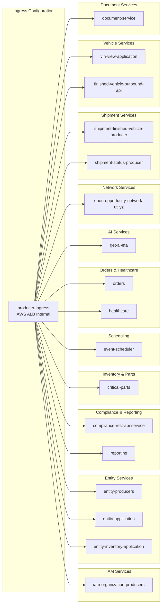

# Diagram: devops/k8s/platform-load-balancer/helm/values.yaml

> Auto-generated by Obscura crawlers

## Diagram 1

```mermaid
flowchart TB
    Internet[Internet Traffic]
    ALB[AWS ALB<br/>producer-ingress<br/>internal, ip targeting]
    
    Internet --> ALB
    
    ALB -->|/iam/organization| S1[iam-organization-producers:8800]
    ALB -->|/entity| S2[entity-producers]
    ALB -->|/compliance| S3[compliance-rest-api-service]
    ALB -->|/location-inventory| S4[critical-parts]
    ALB -->|/event-scheduler/v1/jobs| S5[event-scheduler]
    ALB -->|/orders| S6[orders]
    ALB -->|/get-ai-eta| S7[get-ai-eta:8000]
    ALB -->|/entity-inventory| S8[entity-inventory-application]
    ALB -->|/utilyz| S9[open-opportunity-network-utilyz]
    ALB -->|/healthcare| S10[healthcare]
    ALB -->|/shipment-finished-vehicle/publish| S11[shipment-finished-vehicle-producer]
    ALB -->|/shipment/status/publish| S12[shipment-status-producer]
    ALB -->|/finished-product/finished-product| S13[entity-application:8500]
    ALB -->|/reporting| S14[reporting:8500]
    ALB -->|/vin-view| S15[vin-view-application]
    ALB -->|/document| S16[document-service:8500]
    ALB -->|/finished-product/outbound| S17[finished-vehicle-outbound-api]
```

### SVG

<svg id="container" width="4384.578125" xmlns="http://www.w3.org/2000/svg" class="flowchart" height="398" viewBox="0 0 4384.578125 398" role="graphics-document document" aria-roledescription="flowchart-v2"><g><marker id="container_flowchart-v2-pointEnd" class="marker flowchart-v2" viewBox="0 0 10 10" refX="5" refY="5" markerUnits="userSpaceOnUse" markerWidth="8" markerHeight="8" orient="auto"><path d="M 0 0 L 10 5 L 0 10 z" class="arrowMarkerPath" style="stroke-width: 1; stroke-dasharray: 1, 0;"></path></marker><marker id="container_flowchart-v2-pointStart" class="marker flowchart-v2" viewBox="0 0 10 10" refX="4.5" refY="5" markerUnits="userSpaceOnUse" markerWidth="8" markerHeight="8" orient="auto"><path d="M 0 5 L 10 10 L 10 0 z" class="arrowMarkerPath" style="stroke-width: 1; stroke-dasharray: 1, 0;"></path></marker><marker id="container_flowchart-v2-circleEnd" class="marker flowchart-v2" viewBox="0 0 10 10" refX="11" refY="5" markerUnits="userSpaceOnUse" markerWidth="11" markerHeight="11" orient="auto"><circle cx="5" cy="5" r="5" class="arrowMarkerPath" style="stroke-width: 1; stroke-dasharray: 1, 0;"></circle></marker><marker id="container_flowchart-v2-circleStart" class="marker flowchart-v2" viewBox="0 0 10 10" refX="-1" refY="5" markerUnits="userSpaceOnUse" markerWidth="11" markerHeight="11" orient="auto"><circle cx="5" cy="5" r="5" class="arrowMarkerPath" style="stroke-width: 1; stroke-dasharray: 1, 0;"></circle></marker><marker id="container_flowchart-v2-crossEnd" class="marker cross flowchart-v2" viewBox="0 0 11 11" refX="12" refY="5.2" markerUnits="userSpaceOnUse" markerWidth="11" markerHeight="11" orient="auto"><path d="M 1,1 l 9,9 M 10,1 l -9,9" class="arrowMarkerPath" style="stroke-width: 2; stroke-dasharray: 1, 0;"></path></marker><marker id="container_flowchart-v2-crossStart" class="marker cross flowchart-v2" viewBox="0 0 11 11" refX="-1" refY="5.2" markerUnits="userSpaceOnUse" markerWidth="11" markerHeight="11" orient="auto"><path d="M 1,1 l 9,9 M 10,1 l -9,9" class="arrowMarkerPath" style="stroke-width: 2; stroke-dasharray: 1, 0;"></path></marker><g class="root"><g class="clusters"></g><g class="edgePaths"><path d="M2107.063,62L2107.063,66.167C2107.063,70.333,2107.063,78.667,2107.063,86.333C2107.063,94,2107.063,101,2107.063,104.5L2107.063,108" id="L_Internet_ALB_0" class="edge-thickness-normal edge-pattern-solid edge-thickness-normal edge-pattern-solid flowchart-link" style=";" data-edge="true" data-et="edge" data-id="L_Internet_ALB_0" data-points="W3sieCI6MjEwNy4wNjI1LCJ5Ijo2Mn0seyJ4IjoyMTA3LjA2MjUsInkiOjg3fSx7IngiOjIxMDcuMDYyNSwieSI6MTEyfV0=" marker-end="url(#container_flowchart-v2-pointEnd)"></path><path d="M2002.859,168.292L1692.049,184.077C1381.24,199.861,759.62,231.431,448.81,254.715C138,278,138,293,138,300.5L138,308" id="L_ALB_S1_0" class="edge-thickness-normal edge-pattern-solid edge-thickness-normal edge-pattern-solid flowchart-link" style=";" data-edge="true" data-et="edge" data-id="L_ALB_S1_0" data-points="W3sieCI6MjAwMi44NTkzNzUsInkiOjE2OC4yOTIwMTcxNDAxMzY1fSx7IngiOjEzOCwieSI6MjYzfSx7IngiOjEzOCwieSI6MzEyfV0=" marker-end="url(#container_flowchart-v2-pointEnd)"></path><path d="M2002.859,169.135L1737.143,184.779C1471.427,200.423,939.995,231.712,674.279,256.856C408.563,282,408.563,301,408.563,310.5L408.563,320" id="L_ALB_S2_0" class="edge-thickness-normal edge-pattern-solid edge-thickness-normal edge-pattern-solid flowchart-link" style=";" data-edge="true" data-et="edge" data-id="L_ALB_S2_0" data-points="W3sieCI6MjAwMi44NTkzNzUsInkiOjE2OS4xMzUwMDg4MzEzMjE3Nn0seyJ4Ijo0MDguNTYyNSwieSI6MjYzfSx7IngiOjQwOC41NjI1LCJ5IjozMjR9XQ==" marker-end="url(#container_flowchart-v2-pointEnd)"></path><path d="M2002.859,170.297L1782.237,185.748C1561.615,201.198,1120.37,232.099,899.747,255.05C679.125,278,679.125,293,679.125,300.5L679.125,308" id="L_ALB_S3_0" class="edge-thickness-normal edge-pattern-solid edge-thickness-normal edge-pattern-solid flowchart-link" style=";" data-edge="true" data-et="edge" data-id="L_ALB_S3_0" data-points="W3sieCI6MjAwMi44NTkzNzUsInkiOjE3MC4yOTc0NTY5OTY1NDIyMn0seyJ4Ijo2NzkuMTI1LCJ5IjoyNjN9LHsieCI6Njc5LjEyNSwieSI6MzEyfV0=" marker-end="url(#container_flowchart-v2-pointEnd)"></path><path d="M2002.859,171.896L1824.996,187.08C1647.133,202.264,1291.406,232.632,1113.543,257.316C935.68,282,935.68,301,935.68,310.5L935.68,320" id="L_ALB_S4_0" class="edge-thickness-normal edge-pattern-solid edge-thickness-normal edge-pattern-solid flowchart-link" style=";" data-edge="true" data-et="edge" data-id="L_ALB_S4_0" data-points="W3sieCI6MjAwMi44NTkzNzUsInkiOjE3MS44OTU3MzYyMDkyMDc4NX0seyJ4Ijo5MzUuNjc5Njg3NSwieSI6MjYzfSx7IngiOjkzNS42Nzk2ODc1LCJ5IjozMjR9XQ==" marker-end="url(#container_flowchart-v2-pointEnd)"></path><path d="M2002.859,173.9L1860.901,188.75C1718.943,203.6,1435.026,233.3,1293.068,257.65C1151.109,282,1151.109,301,1151.109,310.5L1151.109,320" id="L_ALB_S5_0" class="edge-thickness-normal edge-pattern-solid edge-thickness-normal edge-pattern-solid flowchart-link" style=";" data-edge="true" data-et="edge" data-id="L_ALB_S5_0" data-points="W3sieCI6MjAwMi44NTkzNzUsInkiOjE3My45MDA0NDI5NDc5NzQwNn0seyJ4IjoxMTUxLjEwOTM3NSwieSI6MjYzfSx7IngiOjExNTEuMTA5Mzc1LCJ5IjozMjR9XQ==" marker-end="url(#container_flowchart-v2-pointEnd)"></path><path d="M2002.859,176.644L1892.943,191.037C1783.026,205.43,1563.193,234.215,1453.276,258.107C1343.359,282,1343.359,301,1343.359,310.5L1343.359,320" id="L_ALB_S6_0" class="edge-thickness-normal edge-pattern-solid edge-thickness-normal edge-pattern-solid flowchart-link" style=";" data-edge="true" data-et="edge" data-id="L_ALB_S6_0" data-points="W3sieCI6MjAwMi44NTkzNzUsInkiOjE3Ni42NDQ0NTQ0NDY4NzY4Nn0seyJ4IjoxMzQzLjM1OTM3NSwieSI6MjYzfSx7IngiOjEzNDMuMzU5Mzc1LCJ5IjozMjR9XQ==" marker-end="url(#container_flowchart-v2-pointEnd)"></path><path d="M2002.859,181.117L1924.366,194.764C1845.872,208.411,1688.885,235.706,1610.392,258.853C1531.898,282,1531.898,301,1531.898,310.5L1531.898,320" id="L_ALB_S7_0" class="edge-thickness-normal edge-pattern-solid edge-thickness-normal edge-pattern-solid flowchart-link" style=";" data-edge="true" data-et="edge" data-id="L_ALB_S7_0" data-points="W3sieCI6MjAwMi44NTkzNzUsInkiOjE4MS4xMTcxMTMzMjM2NDQwOH0seyJ4IjoxNTMxLjg5ODQzNzUsInkiOjI2M30seyJ4IjoxNTMxLjg5ODQzNzUsInkiOjMyNH1d" marker-end="url(#container_flowchart-v2-pointEnd)"></path><path d="M2002.859,196.614L1968.56,207.678C1934.26,218.743,1865.661,240.871,1831.362,259.436C1797.063,278,1797.063,293,1797.063,300.5L1797.063,308" id="L_ALB_S8_0" class="edge-thickness-normal edge-pattern-solid edge-thickness-normal edge-pattern-solid flowchart-link" style=";" data-edge="true" data-et="edge" data-id="L_ALB_S8_0" data-points="W3sieCI6MjAwMi44NTkzNzUsInkiOjE5Ni42MTM5MTEyOTAzMjI2fSx7IngiOjE3OTcuMDYyNSwieSI6MjYzfSx7IngiOjE3OTcuMDYyNSwieSI6MzEyfV0=" marker-end="url(#container_flowchart-v2-pointEnd)"></path><path d="M2107.063,214L2107.063,222.167C2107.063,230.333,2107.063,246.667,2107.063,262.333C2107.063,278,2107.063,293,2107.063,300.5L2107.063,308" id="L_ALB_S9_0" class="edge-thickness-normal edge-pattern-solid edge-thickness-normal edge-pattern-solid flowchart-link" style=";" data-edge="true" data-et="edge" data-id="L_ALB_S9_0" data-points="W3sieCI6MjEwNy4wNjI1LCJ5IjoyMTR9LHsieCI6MjEwNy4wNjI1LCJ5IjoyNjN9LHsieCI6MjEwNy4wNjI1LCJ5IjozMTJ9XQ==" marker-end="url(#container_flowchart-v2-pointEnd)"></path><path d="M2211.266,204.938L2235.31,214.615C2259.354,224.292,2307.443,243.646,2331.487,262.823C2355.531,282,2355.531,301,2355.531,310.5L2355.531,320" id="L_ALB_S10_0" class="edge-thickness-normal edge-pattern-solid edge-thickness-normal edge-pattern-solid flowchart-link" style=";" data-edge="true" data-et="edge" data-id="L_ALB_S10_0" data-points="W3sieCI6MjIxMS4yNjU2MjUsInkiOjIwNC45MzgxMjA5OTEwNzAzMn0seyJ4IjoyMzU1LjUzMTI1LCJ5IjoyNjN9LHsieCI6MjM1NS41MzEyNSwieSI6MzI0fV0=" marker-end="url(#container_flowchart-v2-pointEnd)"></path><path d="M2211.266,183.969L2276.721,197.141C2342.177,210.313,2473.089,236.656,2538.544,257.328C2604,278,2604,293,2604,300.5L2604,308" id="L_ALB_S11_0" class="edge-thickness-normal edge-pattern-solid edge-thickness-normal edge-pattern-solid flowchart-link" style=";" data-edge="true" data-et="edge" data-id="L_ALB_S11_0" data-points="W3sieCI6MjIxMS4yNjU2MjUsInkiOjE4My45NjkwNjA0OTU1MzUxNn0seyJ4IjoyNjA0LCJ5IjoyNjN9LHsieCI6MjYwNCwieSI6MzEyfV0=" marker-end="url(#container_flowchart-v2-pointEnd)"></path><path d="M2211.266,175.989L2327.604,190.491C2443.943,204.993,2676.62,233.996,2792.958,257.998C2909.297,282,2909.297,301,2909.297,310.5L2909.297,320" id="L_ALB_S12_0" class="edge-thickness-normal edge-pattern-solid edge-thickness-normal edge-pattern-solid flowchart-link" style=";" data-edge="true" data-et="edge" data-id="L_ALB_S12_0" data-points="W3sieCI6MjIxMS4yNjU2MjUsInkiOjE3NS45ODkxMTI0Mzk4NjUyfSx7IngiOjI5MDkuMjk2ODc1LCJ5IjoyNjN9LHsieCI6MjkwOS4yOTY4NzUsInkiOjMyNH1d" marker-end="url(#container_flowchart-v2-pointEnd)"></path><path d="M2211.266,172.544L2375.874,187.62C2540.482,202.696,2869.698,232.848,3034.306,257.424C3198.914,282,3198.914,301,3198.914,310.5L3198.914,320" id="L_ALB_S13_0" class="edge-thickness-normal edge-pattern-solid edge-thickness-normal edge-pattern-solid flowchart-link" style=";" data-edge="true" data-et="edge" data-id="L_ALB_S13_0" data-points="W3sieCI6MjIxMS4yNjU2MjUsInkiOjE3Mi41NDM3MDgwMDc0NzAxMn0seyJ4IjozMTk4LjkxNDA2MjUsInkiOjI2M30seyJ4IjozMTk4LjkxNDA2MjUsInkiOjMyNH1d" marker-end="url(#container_flowchart-v2-pointEnd)"></path><path d="M2211.266,170.781L2417.09,186.151C2622.914,201.521,3034.563,232.26,3240.387,257.13C3446.211,282,3446.211,301,3446.211,310.5L3446.211,320" id="L_ALB_S14_0" class="edge-thickness-normal edge-pattern-solid edge-thickness-normal edge-pattern-solid flowchart-link" style=";" data-edge="true" data-et="edge" data-id="L_ALB_S14_0" data-points="W3sieCI6MjIxMS4yNjU2MjUsInkiOjE3MC43ODEyOTc1ODMwMDIyN30seyJ4IjozNDQ2LjIxMDkzNzUsInkiOjI2M30seyJ4IjozNDQ2LjIxMDkzNzUsInkiOjMyNH1d" marker-end="url(#container_flowchart-v2-pointEnd)"></path><path d="M2211.266,169.609L2456.665,185.174C2702.065,200.74,3192.865,231.87,3438.264,256.935C3683.664,282,3683.664,301,3683.664,310.5L3683.664,320" id="L_ALB_S15_0" class="edge-thickness-normal edge-pattern-solid edge-thickness-normal edge-pattern-solid flowchart-link" style=";" data-edge="true" data-et="edge" data-id="L_ALB_S15_0" data-points="W3sieCI6MjIxMS4yNjU2MjUsInkiOjE2OS42MDkzNTA2MTA3MzgxfSx7IngiOjM2ODMuNjY0MDYyNSwieSI6MjYzfSx7IngiOjM2ODMuNjY0MDYyNSwieSI6MzI0fV0=" marker-end="url(#container_flowchart-v2-pointEnd)"></path><path d="M2211.266,168.647L2501.448,184.372C2791.63,200.098,3371.995,231.549,3662.177,256.774C3952.359,282,3952.359,301,3952.359,310.5L3952.359,320" id="L_ALB_S16_0" class="edge-thickness-normal edge-pattern-solid edge-thickness-normal edge-pattern-solid flowchart-link" style=";" data-edge="true" data-et="edge" data-id="L_ALB_S16_0" data-points="W3sieCI6MjIxMS4yNjU2MjUsInkiOjE2OC42NDY5NTcyMTM4NjI5NX0seyJ4IjozOTUyLjM1OTM3NSwieSI6MjYzfSx7IngiOjM5NTIuMzU5Mzc1LCJ5IjozMjR9XQ==" marker-end="url(#container_flowchart-v2-pointEnd)"></path><path d="M2211.266,167.87L2550.484,183.725C2889.703,199.58,3568.141,231.29,3907.359,254.645C4246.578,278,4246.578,293,4246.578,300.5L4246.578,308" id="L_ALB_S17_0" class="edge-thickness-normal edge-pattern-solid edge-thickness-normal edge-pattern-solid flowchart-link" style=";" data-edge="true" data-et="edge" data-id="L_ALB_S17_0" data-points="W3sieCI6MjIxMS4yNjU2MjUsInkiOjE2Ny44NzA0MDcyOTEzN30seyJ4Ijo0MjQ2LjU3ODEyNSwieSI6MjYzfSx7IngiOjQyNDYuNTc4MTI1LCJ5IjozMTJ9XQ==" marker-end="url(#container_flowchart-v2-pointEnd)"></path></g><g class="edgeLabels"><g class="edgeLabel"><g class="label" data-id="L_Internet_ALB_0" transform="translate(0, 0)"><foreignObject width="0" height="0">

</foreignObject></g></g><g class="edgeLabel" transform="translate(138, 263)"><g class="label" data-id="L_ALB_S1_0" transform="translate(-66.5625, -12)"><foreignObject width="133.125" height="24">

/iam/organization

</foreignObject></g></g><g class="edgeLabel" transform="translate(408.5625, 263)"><g class="label" data-id="L_ALB_S2_0" transform="translate(-24.7421875, -12)"><foreignObject width="49.484375" height="24">

/entity

</foreignObject></g></g><g class="edgeLabel" transform="translate(679.125, 263)"><g class="label" data-id="L_ALB_S3_0" transform="translate(-45.375, -12)"><foreignObject width="90.75" height="24">

/compliance

</foreignObject></g></g><g class="edgeLabel" transform="translate(935.6796875, 263)"><g class="label" data-id="L_ALB_S4_0" transform="translate(-71.265625, -12)"><foreignObject width="142.53125" height="24">

/location-inventory

</foreignObject></g></g><g class="edgeLabel" transform="translate(1151.109375, 263)"><g class="label" data-id="L_ALB_S5_0" transform="translate(-93.1171875, -12)"><foreignObject width="186.234375" height="24">

/event-scheduler/v1/jobs

</foreignObject></g></g><g class="edgeLabel" transform="translate(1343.359375, 263)"><g class="label" data-id="L_ALB_S6_0" transform="translate(-27.1328125, -12)"><foreignObject width="54.265625" height="24">

/orders

</foreignObject></g></g><g class="edgeLabel" transform="translate(1531.8984375, 263)"><g class="label" data-id="L_ALB_S7_0" transform="translate(-39.3671875, -12)"><foreignObject width="78.734375" height="24">

/get-ai-eta

</foreignObject></g></g><g class="edgeLabel" transform="translate(1797.0625, 263)"><g class="label" data-id="L_ALB_S8_0" transform="translate(-62.1875, -12)"><foreignObject width="124.375" height="24">

/entity-inventory

</foreignObject></g></g><g class="edgeLabel" transform="translate(2107.0625, 263)"><g class="label" data-id="L_ALB_S9_0" transform="translate(-23.421875, -12)"><foreignObject width="46.84375" height="24">

/utilyz

</foreignObject></g></g><g class="edgeLabel" transform="translate(2355.53125, 263)"><g class="label" data-id="L_ALB_S10_0" transform="translate(-42.625, -12)"><foreignObject width="85.25" height="24">

/healthcare

</foreignObject></g></g><g class="edgeLabel" transform="translate(2604, 263)"><g class="label" data-id="L_ALB_S11_0" transform="translate(-100, -24)"><foreignObject width="200" height="48">

/shipment-finished-vehicle/publish

</foreignObject></g></g><g class="edgeLabel" transform="translate(2909.296875, 263)"><g class="label" data-id="L_ALB_S12_0" transform="translate(-95.375, -12)"><foreignObject width="190.75" height="24">

/shipment/status/publish

</foreignObject></g></g><g class="edgeLabel" transform="translate(3198.9140625, 263)"><g class="label" data-id="L_ALB_S13_0" transform="translate(-100, -24)"><foreignObject width="200" height="48">

/finished-product/finished-product

</foreignObject></g></g><g class="edgeLabel" transform="translate(3446.2109375, 263)"><g class="label" data-id="L_ALB_S14_0" transform="translate(-37.6328125, -12)"><foreignObject width="75.265625" height="24">

/reporting

</foreignObject></g></g><g class="edgeLabel" transform="translate(3683.6640625, 263)"><g class="label" data-id="L_ALB_S15_0" transform="translate(-34.3125, -12)"><foreignObject width="68.625" height="24">

/vin-view

</foreignObject></g></g><g class="edgeLabel" transform="translate(3952.359375, 263)"><g class="label" data-id="L_ALB_S16_0" transform="translate(-40.4140625, -12)"><foreignObject width="80.828125" height="24">

/document

</foreignObject></g></g><g class="edgeLabel" transform="translate(4246.578125, 263)"><g class="label" data-id="L_ALB_S17_0" transform="translate(-100, -24)"><foreignObject width="200" height="48">

/finished-product/outbound

</foreignObject></g></g></g><g class="nodes"><g class="node default" id="flowchart-Internet-0" transform="translate(2107.0625, 35)"><rect class="basic label-container" style="" x="-83.484375" y="-27" width="166.96875" height="54"></rect><g class="label" style="" transform="translate(-53.484375, -12)"><rect></rect><foreignObject width="106.96875" height="24">

Internet Traffic

</foreignObject></g></g><g class="node default" id="flowchart-ALB-1" transform="translate(2107.0625, 163)"><rect class="basic label-container" style="" x="-104.203125" y="-51" width="208.40625" height="102"></rect><g class="label" style="" transform="translate(-74.203125, -36)"><rect></rect><foreignObject width="148.40625" height="72">

AWS ALB producer-ingress internal, ip targeting

</foreignObject></g></g><g class="node default" id="flowchart-S1-5" transform="translate(138, 351)"><rect class="basic label-container" style="" x="-130" y="-39" width="260" height="78"></rect><g class="label" style="" transform="translate(-100, -24)"><rect></rect><foreignObject width="200" height="48">

iam-organization-producers:8800

</foreignObject></g></g><g class="node default" id="flowchart-S2-7" transform="translate(408.5625, 351)"><rect class="basic label-container" style="" x="-90.5625" y="-27" width="181.125" height="54"></rect><g class="label" style="" transform="translate(-60.5625, -12)"><rect></rect><foreignObject width="121.125" height="24">

entity-producers

</foreignObject></g></g><g class="node default" id="flowchart-S3-9" transform="translate(679.125, 351)"><rect class="basic label-container" style="" x="-130" y="-39" width="260" height="78"></rect><g class="label" style="" transform="translate(-100, -24)"><rect></rect><foreignObject width="200" height="48">

compliance-rest-api-service

</foreignObject></g></g><g class="node default" id="flowchart-S4-11" transform="translate(935.6796875, 351)"><rect class="basic label-container" style="" x="-76.5546875" y="-27" width="153.109375" height="54"></rect><g class="label" style="" transform="translate(-46.5546875, -12)"><rect></rect><foreignObject width="93.109375" height="24">

critical-parts

</foreignObject></g></g><g class="node default" id="flowchart-S5-13" transform="translate(1151.109375, 351)"><rect class="basic label-container" style="" x="-88.875" y="-27" width="177.75" height="54"></rect><g class="label" style="" transform="translate(-58.875, -12)"><rect></rect><foreignObject width="117.75" height="24">

event-scheduler

</foreignObject></g></g><g class="node default" id="flowchart-S6-15" transform="translate(1343.359375, 351)"><rect class="basic label-container" style="" x="-53.375" y="-27" width="106.75" height="54"></rect><g class="label" style="" transform="translate(-23.375, -12)"><rect></rect><foreignObject width="46.75" height="24">

orders

</foreignObject></g></g><g class="node default" id="flowchart-S7-17" transform="translate(1531.8984375, 351)"><rect class="basic label-container" style="" x="-85.1640625" y="-27" width="170.328125" height="54"></rect><g class="label" style="" transform="translate(-55.1640625, -12)"><rect></rect><foreignObject width="110.328125" height="24">

get-ai-eta:8000

</foreignObject></g></g><g class="node default" id="flowchart-S8-19" transform="translate(1797.0625, 351)"><rect class="basic label-container" style="" x="-130" y="-39" width="260" height="78"></rect><g class="label" style="" transform="translate(-100, -24)"><rect></rect><foreignObject width="200" height="48">

entity-inventory-application

</foreignObject></g></g><g class="node default" id="flowchart-S9-21" transform="translate(2107.0625, 351)"><rect class="basic label-container" style="" x="-130" y="-39" width="260" height="78"></rect><g class="label" style="" transform="translate(-100, -24)"><rect></rect><foreignObject width="200" height="48">

open-opportunity-network-utilyz

</foreignObject></g></g><g class="node default" id="flowchart-S10-23" transform="translate(2355.53125, 351)"><rect class="basic label-container" style="" x="-68.46875" y="-27" width="136.9375" height="54"></rect><g class="label" style="" transform="translate(-38.46875, -12)"><rect></rect><foreignObject width="76.9375" height="24">

healthcare

</foreignObject></g></g><g class="node default" id="flowchart-S11-25" transform="translate(2604, 351)"><rect class="basic label-container" style="" x="-130" y="-39" width="260" height="78"></rect><g class="label" style="" transform="translate(-100, -24)"><rect></rect><foreignObject width="200" height="48">

shipment-finished-vehicle-producer

</foreignObject></g></g><g class="node default" id="flowchart-S12-27" transform="translate(2909.296875, 351)"><rect class="basic label-container" style="" x="-125.296875" y="-27" width="250.59375" height="54"></rect><g class="label" style="" transform="translate(-95.296875, -12)"><rect></rect><foreignObject width="190.59375" height="24">

shipment-status-producer

</foreignObject></g></g><g class="node default" id="flowchart-S13-29" transform="translate(3198.9140625, 351)"><rect class="basic label-container" style="" x="-114.3203125" y="-27" width="228.640625" height="54"></rect><g class="label" style="" transform="translate(-84.3203125, -12)"><rect></rect><foreignObject width="168.640625" height="24">

entity-application:8500

</foreignObject></g></g><g class="node default" id="flowchart-S14-31" transform="translate(3446.2109375, 351)"><rect class="basic label-container" style="" x="-82.9765625" y="-27" width="165.953125" height="54"></rect><g class="label" style="" transform="translate(-52.9765625, -12)"><rect></rect><foreignObject width="105.953125" height="24">

reporting:8500

</foreignObject></g></g><g class="node default" id="flowchart-S15-33" transform="translate(3683.6640625, 351)"><rect class="basic label-container" style="" x="-104.4765625" y="-27" width="208.953125" height="54"></rect><g class="label" style="" transform="translate(-74.4765625, -12)"><rect></rect><foreignObject width="148.953125" height="24">

vin-view-application

</foreignObject></g></g><g class="node default" id="flowchart-S16-35" transform="translate(3952.359375, 351)"><rect class="basic label-container" style="" x="-114.21875" y="-27" width="228.4375" height="54"></rect><g class="label" style="" transform="translate(-84.21875, -12)"><rect></rect><foreignObject width="168.4375" height="24">

document-service:8500

</foreignObject></g></g><g class="node default" id="flowchart-S17-37" transform="translate(4246.578125, 351)"><rect class="basic label-container" style="" x="-130" y="-39" width="260" height="78"></rect><g class="label" style="" transform="translate(-100, -24)"><rect></rect><foreignObject width="200" height="48">

finished-vehicle-outbound-api

</foreignObject></g></g></g></g></g></svg>

## Diagram 2

### SVG

<svg id="container" width="609.4375" xmlns="http://www.w3.org/2000/svg" class="flowchart" height="2348" viewBox="0 0 609.4375 2348" role="graphics-document document" aria-roledescription="flowchart-v2"><g><marker id="container_flowchart-v2-pointEnd" class="marker flowchart-v2" viewBox="0 0 10 10" refX="5" refY="5" markerUnits="userSpaceOnUse" markerWidth="8" markerHeight="8" orient="auto"><path d="M 0 0 L 10 5 L 0 10 z" class="arrowMarkerPath" style="stroke-width: 1; stroke-dasharray: 1, 0;"></path></marker><marker id="container_flowchart-v2-pointStart" class="marker flowchart-v2" viewBox="0 0 10 10" refX="4.5" refY="5" markerUnits="userSpaceOnUse" markerWidth="8" markerHeight="8" orient="auto"><path d="M 0 5 L 10 10 L 10 0 z" class="arrowMarkerPath" style="stroke-width: 1; stroke-dasharray: 1, 0;"></path></marker><marker id="container_flowchart-v2-circleEnd" class="marker flowchart-v2" viewBox="0 0 10 10" refX="11" refY="5" markerUnits="userSpaceOnUse" markerWidth="11" markerHeight="11" orient="auto"><circle cx="5" cy="5" r="5" class="arrowMarkerPath" style="stroke-width: 1; stroke-dasharray: 1, 0;"></circle></marker><marker id="container_flowchart-v2-circleStart" class="marker flowchart-v2" viewBox="0 0 10 10" refX="-1" refY="5" markerUnits="userSpaceOnUse" markerWidth="11" markerHeight="11" orient="auto"><circle cx="5" cy="5" r="5" class="arrowMarkerPath" style="stroke-width: 1; stroke-dasharray: 1, 0;"></circle></marker><marker id="container_flowchart-v2-crossEnd" class="marker cross flowchart-v2" viewBox="0 0 11 11" refX="12" refY="5.2" markerUnits="userSpaceOnUse" markerWidth="11" markerHeight="11" orient="auto"><path d="M 1,1 l 9,9 M 10,1 l -9,9" class="arrowMarkerPath" style="stroke-width: 2; stroke-dasharray: 1, 0;"></path></marker><marker id="container_flowchart-v2-crossStart" class="marker cross flowchart-v2" viewBox="0 0 11 11" refX="-1" refY="5.2" markerUnits="userSpaceOnUse" markerWidth="11" markerHeight="11" orient="auto"><path d="M 1,1 l 9,9 M 10,1 l -9,9" class="arrowMarkerPath" style="stroke-width: 2; stroke-dasharray: 1, 0;"></path></marker><g class="root"><g class="clusters"><g class="cluster" id="subGraph11" data-look="classic"><rect style="" x="291.4375" y="8" width="310" height="124"></rect><g class="cluster-label" transform="translate(377.5390625, 8)"><foreignObject width="137.796875" height="24">

Document Services

</foreignObject></g></g><g class="cluster" id="subGraph10" data-look="classic"><rect style="" x="291.4375" y="152" width="310" height="252"></rect><g class="cluster-label" transform="translate(388.515625, 152)"><foreignObject width="115.84375" height="24">

Vehicle Services

</foreignObject></g></g><g class="cluster" id="subGraph9" data-look="classic"><rect style="" x="291.4375" y="424" width="310" height="252"></rect><g class="cluster-label" transform="translate(379.703125, 424)"><foreignObject width="133.46875" height="24">

Shipment Services

</foreignObject></g></g><g class="cluster" id="subGraph8" data-look="classic"><rect style="" x="291.4375" y="696" width="310" height="148"></rect><g class="cluster-label" transform="translate(384.25, 696)"><foreignObject width="124.375" height="24">

Network Services

</foreignObject></g></g><g class="cluster" id="subGraph7" data-look="classic"><rect style="" x="291.4375" y="864" width="310" height="124"></rect><g class="cluster-label" transform="translate(407.609375, 864)"><foreignObject width="77.65625" height="24">

AI Services

</foreignObject></g></g><g class="cluster" id="subGraph6" data-look="classic"><rect style="" x="291.4375" y="1008" width="310" height="228"></rect><g class="cluster-label" transform="translate(372.9140625, 1008)"><foreignObject width="147.046875" height="24">

Orders &amp; Healthcare

</foreignObject></g></g><g class="cluster" id="Scheduling" data-look="classic"><rect style="" x="291.4375" y="1256" width="310" height="124"></rect><g class="cluster-label" transform="translate(406.3125, 1256)"><foreignObject width="80.25" height="24">

Scheduling

</foreignObject></g></g><g class="cluster" id="subGraph4" data-look="classic"><rect style="" x="291.4375" y="1400" width="310" height="124"></rect><g class="cluster-label" transform="translate(383.6796875, 1400)"><foreignObject width="125.515625" height="24">

Inventory &amp; Parts

</foreignObject></g></g><g class="cluster" id="subGraph3" data-look="classic"><rect style="" x="291.4375" y="1544" width="310" height="252"></rect><g class="cluster-label" transform="translate(358.515625, 1544)"><foreignObject width="175.84375" height="24">

Compliance &amp; Reporting

</foreignObject></g></g><g class="cluster" id="subGraph2" data-look="classic"><rect style="" x="291.4375" y="1816" width="310" height="356"></rect><g class="cluster-label" transform="translate(393.734375, 1816)"><foreignObject width="105.40625" height="24">

Entity Services

</foreignObject></g></g><g class="cluster" id="subGraph1" data-look="classic"><rect style="" x="291.4375" y="2192" width="310" height="148"></rect><g class="cluster-label" transform="translate(401.3828125, 2192)"><foreignObject width="90.109375" height="24">

IAM Services

</foreignObject></g></g><g class="cluster" id="subGraph0" data-look="classic"><rect style="" x="8" y="30" width="233.4375" height="2262"></rect><g class="cluster-label" transform="translate(48.109375, 30)"><foreignObject width="153.21875" height="24">

Ingress Configuration

</foreignObject></g></g></g><g class="edgePaths"><path d="M128.887,1213L147.646,1388.5C166.404,1564,203.921,1915,226.846,2090.5C249.771,2266,258.104,2266,266.438,2266C274.771,2266,283.104,2266,290.771,2266C298.438,2266,305.438,2266,308.938,2266L312.438,2266" id="L_A_B1_0" class="edge-thickness-normal edge-pattern-solid edge-thickness-normal edge-pattern-solid flowchart-link" style=";" data-edge="true" data-et="edge" data-id="L_A_B1_0" data-points="W3sieCI6MTI4Ljg4NzI3Njc4NTcxNDI4LCJ5IjoxMjEzfSx7IngiOjI0MS40Mzc1LCJ5IjoyMjY2fSx7IngiOjI2Ni40Mzc1LCJ5IjoyMjY2fSx7IngiOjI5MS40Mzc1LCJ5IjoyMjY2fSx7IngiOjMxNi40Mzc1LCJ5IjoyMjY2fV0=" marker-end="url(#container_flowchart-v2-pointEnd)"></path><path d="M131.185,1213L149.56,1323.833C167.936,1434.667,204.687,1656.333,227.229,1767.167C249.771,1878,258.104,1878,266.438,1878C274.771,1878,283.104,1878,297.344,1878C311.583,1878,331.729,1878,341.802,1878L351.875,1878" id="L_A_C1_0" class="edge-thickness-normal edge-pattern-solid edge-thickness-normal edge-pattern-solid flowchart-link" style=";" data-edge="true" data-et="edge" data-id="L_A_C1_0" data-points="W3sieCI6MTMxLjE4NDcwMzQ4MDExMzYzLCJ5IjoxMjEzfSx7IngiOjI0MS40Mzc1LCJ5IjoxODc4fSx7IngiOjI2Ni40Mzc1LCJ5IjoxODc4fSx7IngiOjI5MS40Mzc1LCJ5IjoxODc4fSx7IngiOjM1NS44NzUsInkiOjE4Nzh9XQ==" marker-end="url(#container_flowchart-v2-pointEnd)"></path><path d="M130.352,1213L148.867,1341.167C167.381,1469.333,204.409,1725.667,227.09,1853.833C249.771,1982,258.104,1982,266.438,1982C274.771,1982,283.104,1982,296.594,1982C310.083,1982,328.729,1982,338.052,1982L347.375,1982" id="L_A_C2_0" class="edge-thickness-normal edge-pattern-solid edge-thickness-normal edge-pattern-solid flowchart-link" style=";" data-edge="true" data-et="edge" data-id="L_A_C2_0" data-points="W3sieCI6MTMwLjM1MjQ1MjA0MjA3OTIyLCJ5IjoxMjEzfSx7IngiOjI0MS40Mzc1LCJ5IjoxOTgyfSx7IngiOjI2Ni40Mzc1LCJ5IjoxOTgyfSx7IngiOjI5MS40Mzc1LCJ5IjoxOTgyfSx7IngiOjM1MS4zNzUsInkiOjE5ODJ9XQ==" marker-end="url(#container_flowchart-v2-pointEnd)"></path><path d="M129.645,1213L148.277,1360.5C166.909,1508,204.173,1803,226.972,1950.5C249.771,2098,258.104,2098,266.438,2098C274.771,2098,283.104,2098,290.771,2098C298.438,2098,305.438,2098,308.938,2098L312.438,2098" id="L_A_C3_0" class="edge-thickness-normal edge-pattern-solid edge-thickness-normal edge-pattern-solid flowchart-link" style=";" data-edge="true" data-et="edge" data-id="L_A_C3_0" data-points="W3sieCI6MTI5LjY0NTE5MDc0Njc1MzI2LCJ5IjoxMjEzfSx7IngiOjI0MS40Mzc1LCJ5IjoyMDk4fSx7IngiOjI2Ni40Mzc1LCJ5IjoyMDk4fSx7IngiOjI5MS40Mzc1LCJ5IjoyMDk4fSx7IngiOjMxNi40Mzc1LCJ5IjoyMDk4fV0=" marker-end="url(#container_flowchart-v2-pointEnd)"></path><path d="M134.971,1213L152.715,1280.5C170.46,1348,205.949,1483,227.86,1550.5C249.771,1618,258.104,1618,266.438,1618C274.771,1618,283.104,1618,290.771,1618C298.438,1618,305.438,1618,308.938,1618L312.438,1618" id="L_A_D1_0" class="edge-thickness-normal edge-pattern-solid edge-thickness-normal edge-pattern-solid flowchart-link" style=";" data-edge="true" data-et="edge" data-id="L_A_D1_0" data-points="W3sieCI6MTM0Ljk3MTA3MjYzNTEzNTEzLCJ5IjoxMjEzfSx7IngiOjI0MS40Mzc1LCJ5IjoxNjE4fSx7IngiOjI2Ni40Mzc1LCJ5IjoxNjE4fSx7IngiOjI5MS40Mzc1LCJ5IjoxNjE4fSx7IngiOjMxNi40Mzc1LCJ5IjoxNjE4fV0=" marker-end="url(#container_flowchart-v2-pointEnd)"></path><path d="M132.847,1213L150.946,1299.833C169.044,1386.667,205.241,1560.333,227.506,1647.167C249.771,1734,258.104,1734,266.438,1734C274.771,1734,283.104,1734,301.818,1734C320.531,1734,349.625,1734,364.172,1734L378.719,1734" id="L_A_D2_0" class="edge-thickness-normal edge-pattern-solid edge-thickness-normal edge-pattern-solid flowchart-link" style=";" data-edge="true" data-et="edge" data-id="L_A_D2_0" data-points="W3sieCI6MTMyLjg0NzM3NzIzMjE0Mjg2LCJ5IjoxMjEzfSx7IngiOjI0MS40Mzc1LCJ5IjoxNzM0fSx7IngiOjI2Ni40Mzc1LCJ5IjoxNzM0fSx7IngiOjI5MS40Mzc1LCJ5IjoxNzM0fSx7IngiOjM4Mi43MTg3NSwieSI6MTczNH1d" marker-end="url(#container_flowchart-v2-pointEnd)"></path><path d="M140.524,1213L157.343,1254.5C174.162,1296,207.8,1379,228.785,1420.5C249.771,1462,258.104,1462,266.438,1462C274.771,1462,283.104,1462,299.678,1462C316.253,1462,341.068,1462,353.475,1462L365.883,1462" id="L_A_E1_0" class="edge-thickness-normal edge-pattern-solid edge-thickness-normal edge-pattern-solid flowchart-link" style=";" data-edge="true" data-et="edge" data-id="L_A_E1_0" data-points="W3sieCI6MTQwLjUyNDQxNDA2MjUsInkiOjEyMTN9LHsieCI6MjQxLjQzNzUsInkiOjE0NjJ9LHsieCI6MjY2LjQzNzUsInkiOjE0NjJ9LHsieCI6MjkxLjQzNzUsInkiOjE0NjJ9LHsieCI6MzY5Ljg4MjgxMjUsInkiOjE0NjJ9XQ==" marker-end="url(#container_flowchart-v2-pointEnd)"></path><path d="M156.33,1213L170.515,1230.5C184.699,1248,213.068,1283,231.42,1300.5C249.771,1318,258.104,1318,266.438,1318C274.771,1318,283.104,1318,297.625,1318C312.146,1318,332.854,1318,343.208,1318L353.563,1318" id="L_A_F1_0" class="edge-thickness-normal edge-pattern-solid edge-thickness-normal edge-pattern-solid flowchart-link" style=";" data-edge="true" data-et="edge" data-id="L_A_F1_0" data-points="W3sieCI6MTU2LjMzMDA3ODEyNSwieSI6MTIxM30seyJ4IjoyNDEuNDM3NSwieSI6MTMxOH0seyJ4IjoyNjYuNDM3NSwieSI6MTMxOH0seyJ4IjoyOTEuNDM3NSwieSI6MTMxOH0seyJ4IjozNTcuNTYyNSwieSI6MTMxOH1d" marker-end="url(#container_flowchart-v2-pointEnd)"></path><path d="M168.488,1135L180.646,1124.167C192.805,1113.333,217.121,1091.667,233.446,1080.833C249.771,1070,258.104,1070,266.438,1070C274.771,1070,283.104,1070,303.542,1070C323.979,1070,356.521,1070,372.792,1070L389.063,1070" id="L_A_G1_0" class="edge-thickness-normal edge-pattern-solid edge-thickness-normal edge-pattern-solid flowchart-link" style=";" data-edge="true" data-et="edge" data-id="L_A_G1_0" data-points="W3sieCI6MTY4LjQ4ODI4MTI1LCJ5IjoxMTM1fSx7IngiOjI0MS40Mzc1LCJ5IjoxMDcwfSx7IngiOjI2Ni40Mzc1LCJ5IjoxMDcwfSx7IngiOjI5MS40Mzc1LCJ5IjoxMDcwfSx7IngiOjM5My4wNjI1LCJ5IjoxMDcwfV0=" marker-end="url(#container_flowchart-v2-pointEnd)"></path><path d="M216.438,1174L220.604,1174C224.771,1174,233.104,1174,241.438,1174C249.771,1174,258.104,1174,266.438,1174C274.771,1174,283.104,1174,301.026,1174C318.948,1174,346.458,1174,360.214,1174L373.969,1174" id="L_A_G2_0" class="edge-thickness-normal edge-pattern-solid edge-thickness-normal edge-pattern-solid flowchart-link" style=";" data-edge="true" data-et="edge" data-id="L_A_G2_0" data-points="W3sieCI6MjE2LjQzNzUsInkiOjExNzR9LHsieCI6MjQxLjQzNzUsInkiOjExNzR9LHsieCI6MjY2LjQzNzUsInkiOjExNzR9LHsieCI6MjkxLjQzNzUsInkiOjExNzR9LHsieCI6Mzc3Ljk2ODc1LCJ5IjoxMTc0fV0=" marker-end="url(#container_flowchart-v2-pointEnd)"></path><path d="M143.074,1135L159.468,1100.167C175.862,1065.333,208.65,995.667,229.21,960.833C249.771,926,258.104,926,266.438,926C274.771,926,283.104,926,301.53,926C319.956,926,348.474,926,362.733,926L376.992,926" id="L_A_H1_0" class="edge-thickness-normal edge-pattern-solid edge-thickness-normal edge-pattern-solid flowchart-link" style=";" data-edge="true" data-et="edge" data-id="L_A_H1_0" data-points="W3sieCI6MTQzLjA3MzcxNDcxNzc0MTk1LCJ5IjoxMTM1fSx7IngiOjI0MS40Mzc1LCJ5Ijo5MjZ9LHsieCI6MjY2LjQzNzUsInkiOjkyNn0seyJ4IjoyOTEuNDM3NSwieSI6OTI2fSx7IngiOjM4MC45OTIxODc1LCJ5Ijo5MjZ9XQ==" marker-end="url(#container_flowchart-v2-pointEnd)"></path><path d="M135.986,1135L153.561,1074.167C171.137,1013.333,206.287,891.667,228.029,830.833C249.771,770,258.104,770,266.438,770C274.771,770,283.104,770,290.771,770C298.438,770,305.438,770,308.938,770L312.438,770" id="L_A_I1_0" class="edge-thickness-normal edge-pattern-solid edge-thickness-normal edge-pattern-solid flowchart-link" style=";" data-edge="true" data-et="edge" data-id="L_A_I1_0" data-points="W3sieCI6MTM1Ljk4NjE1NDA4NDE1ODQxLCJ5IjoxMTM1fSx7IngiOjI0MS40Mzc1LCJ5Ijo3NzB9LHsieCI6MjY2LjQzNzUsInkiOjc3MH0seyJ4IjoyOTEuNDM3NSwieSI6NzcwfSx7IngiOjMxNi40Mzc1LCJ5Ijo3NzB9XQ==" marker-end="url(#container_flowchart-v2-pointEnd)"></path><path d="M131.453,1135L149.783,1028.833C168.114,922.667,204.776,710.333,227.273,604.167C249.771,498,258.104,498,266.438,498C274.771,498,283.104,498,290.771,498C298.438,498,305.438,498,308.938,498L312.438,498" id="L_A_J1_0" class="edge-thickness-normal edge-pattern-solid edge-thickness-normal edge-pattern-solid flowchart-link" style=";" data-edge="true" data-et="edge" data-id="L_A_J1_0" data-points="W3sieCI6MTMxLjQ1MjUyNDAzODQ2MTU1LCJ5IjoxMTM1fSx7IngiOjI0MS40Mzc1LCJ5Ijo0OTh9LHsieCI6MjY2LjQzNzUsInkiOjQ5OH0seyJ4IjoyOTEuNDM3NSwieSI6NDk4fSx7IngiOjMxNi40Mzc1LCJ5Ijo0OTh9XQ==" marker-end="url(#container_flowchart-v2-pointEnd)"></path><path d="M132.847,1135L150.946,1048.167C169.044,961.333,205.241,787.667,227.506,700.833C249.771,614,258.104,614,266.438,614C274.771,614,283.104,614,291.555,614C300.005,614,308.573,614,312.857,614L317.141,614" id="L_A_J2_0" class="edge-thickness-normal edge-pattern-solid edge-thickness-normal edge-pattern-solid flowchart-link" style=";" data-edge="true" data-et="edge" data-id="L_A_J2_0" data-points="W3sieCI6MTMyLjg0NzM3NzIzMjE0Mjg2LCJ5IjoxMTM1fSx7IngiOjI0MS40Mzc1LCJ5Ijo2MTR9LHsieCI6MjY2LjQzNzUsInkiOjYxNH0seyJ4IjoyOTEuNDM3NSwieSI6NjE0fSx7IngiOjMyMS4xNDA2MjUsInkiOjYxNH1d" marker-end="url(#container_flowchart-v2-pointEnd)"></path><path d="M129.46,1135L148.123,981.5C166.786,828,204.112,521,226.941,367.5C249.771,214,258.104,214,266.438,214C274.771,214,283.104,214,295.025,214C306.945,214,322.453,214,330.207,214L337.961,214" id="L_A_K1_0" class="edge-thickness-normal edge-pattern-solid edge-thickness-normal edge-pattern-solid flowchart-link" style=";" data-edge="true" data-et="edge" data-id="L_A_K1_0" data-points="W3sieCI6MTI5LjQ2MDQ0OTIxODc1LCJ5IjoxMTM1fSx7IngiOjI0MS40Mzc1LCJ5IjoyMTR9LHsieCI6MjY2LjQzNzUsInkiOjIxNH0seyJ4IjoyOTEuNDM3NSwieSI6MjE0fSx7IngiOjM0MS45NjA5Mzc1LCJ5IjoyMTR9XQ==" marker-end="url(#container_flowchart-v2-pointEnd)"></path><path d="M130.112,1135L148.666,1000.833C167.221,866.667,204.329,598.333,227.05,464.167C249.771,330,258.104,330,266.438,330C274.771,330,283.104,330,290.771,330C298.438,330,305.438,330,308.938,330L312.438,330" id="L_A_K2_0" class="edge-thickness-normal edge-pattern-solid edge-thickness-normal edge-pattern-solid flowchart-link" style=";" data-edge="true" data-et="edge" data-id="L_A_K2_0" data-points="W3sieCI6MTMwLjExMjE1MTk1NDk3NjMsInkiOjExMzV9LHsieCI6MjQxLjQzNzUsInkiOjMzMH0seyJ4IjoyNjYuNDM3NSwieSI6MzMwfSx7IngiOjI5MS40Mzc1LCJ5IjozMzB9LHsieCI6MzE2LjQzNzUsInkiOjMzMH1d" marker-end="url(#container_flowchart-v2-pointEnd)"></path><path d="M128.842,1135L147.608,957.5C166.374,780,203.906,425,226.838,247.5C249.771,70,258.104,70,266.438,70C274.771,70,283.104,70,296.612,70C310.12,70,328.802,70,338.143,70L347.484,70" id="L_A_L1_0" class="edge-thickness-normal edge-pattern-solid edge-thickness-normal edge-pattern-solid flowchart-link" style=";" data-edge="true" data-et="edge" data-id="L_A_L1_0" data-points="W3sieCI6MTI4Ljg0MTk2NjcxMTk1NjUzLCJ5IjoxMTM1fSx7IngiOjI0MS40Mzc1LCJ5Ijo3MH0seyJ4IjoyNjYuNDM3NSwieSI6NzB9LHsieCI6MjkxLjQzNzUsInkiOjcwfSx7IngiOjM1MS40ODQzNzUsInkiOjcwfV0=" marker-end="url(#container_flowchart-v2-pointEnd)"></path></g><g class="edgeLabels"><g class="edgeLabel"><g class="label" data-id="L_A_B1_0" transform="translate(0, 0)"><foreignObject width="0" height="0">

</foreignObject></g></g><g class="edgeLabel"><g class="label" data-id="L_A_C1_0" transform="translate(0, 0)"><foreignObject width="0" height="0">

</foreignObject></g></g><g class="edgeLabel"><g class="label" data-id="L_A_C2_0" transform="translate(0, 0)"><foreignObject width="0" height="0">

</foreignObject></g></g><g class="edgeLabel"><g class="label" data-id="L_A_C3_0" transform="translate(0, 0)"><foreignObject width="0" height="0">

</foreignObject></g></g><g class="edgeLabel"><g class="label" data-id="L_A_D1_0" transform="translate(0, 0)"><foreignObject width="0" height="0">

</foreignObject></g></g><g class="edgeLabel"><g class="label" data-id="L_A_D2_0" transform="translate(0, 0)"><foreignObject width="0" height="0">

</foreignObject></g></g><g class="edgeLabel"><g class="label" data-id="L_A_E1_0" transform="translate(0, 0)"><foreignObject width="0" height="0">

</foreignObject></g></g><g class="edgeLabel"><g class="label" data-id="L_A_F1_0" transform="translate(0, 0)"><foreignObject width="0" height="0">

</foreignObject></g></g><g class="edgeLabel"><g class="label" data-id="L_A_G1_0" transform="translate(0, 0)"><foreignObject width="0" height="0">

</foreignObject></g></g><g class="edgeLabel"><g class="label" data-id="L_A_G2_0" transform="translate(0, 0)"><foreignObject width="0" height="0">

</foreignObject></g></g><g class="edgeLabel"><g class="label" data-id="L_A_H1_0" transform="translate(0, 0)"><foreignObject width="0" height="0">

</foreignObject></g></g><g class="edgeLabel"><g class="label" data-id="L_A_I1_0" transform="translate(0, 0)"><foreignObject width="0" height="0">

</foreignObject></g></g><g class="edgeLabel"><g class="label" data-id="L_A_J1_0" transform="translate(0, 0)"><foreignObject width="0" height="0">

</foreignObject></g></g><g class="edgeLabel"><g class="label" data-id="L_A_J2_0" transform="translate(0, 0)"><foreignObject width="0" height="0">

</foreignObject></g></g><g class="edgeLabel"><g class="label" data-id="L_A_K1_0" transform="translate(0, 0)"><foreignObject width="0" height="0">

</foreignObject></g></g><g class="edgeLabel"><g class="label" data-id="L_A_K2_0" transform="translate(0, 0)"><foreignObject width="0" height="0">

</foreignObject></g></g><g class="edgeLabel"><g class="label" data-id="L_A_L1_0" transform="translate(0, 0)"><foreignObject width="0" height="0">

</foreignObject></g></g></g><g class="nodes"><g class="node default" id="flowchart-A-0" transform="translate(124.71875, 1174)"><rect class="basic label-container" style="" x="-91.71875" y="-39" width="183.4375" height="78"></rect><g class="label" style="" transform="translate(-61.71875, -24)"><rect></rect><foreignObject width="123.4375" height="48">

producer-ingress AWS ALB Internal

</foreignObject></g></g><g class="node default" id="flowchart-B1-2" transform="translate(446.4375, 2266)"><rect class="basic label-container" style="" x="-130" y="-39" width="260" height="78"></rect><g class="label" style="" transform="translate(-100, -24)"><rect></rect><foreignObject width="200" height="48">

iam-organization-producers

</foreignObject></g></g><g class="node default" id="flowchart-C1-4" transform="translate(446.4375, 1878)"><rect class="basic label-container" style="" x="-90.5625" y="-27" width="181.125" height="54"></rect><g class="label" style="" transform="translate(-60.5625, -12)"><rect></rect><foreignObject width="121.125" height="24">

entity-producers

</foreignObject></g></g><g class="node default" id="flowchart-C2-6" transform="translate(446.4375, 1982)"><rect class="basic label-container" style="" x="-95.0625" y="-27" width="190.125" height="54"></rect><g class="label" style="" transform="translate(-65.0625, -12)"><rect></rect><foreignObject width="130.125" height="24">

entity-application

</foreignObject></g></g><g class="node default" id="flowchart-C3-8" transform="translate(446.4375, 2098)"><rect class="basic label-container" style="" x="-130" y="-39" width="260" height="78"></rect><g class="label" style="" transform="translate(-100, -24)"><rect></rect><foreignObject width="200" height="48">

entity-inventory-application

</foreignObject></g></g><g class="node default" id="flowchart-D1-10" transform="translate(446.4375, 1618)"><rect class="basic label-container" style="" x="-130" y="-39" width="260" height="78"></rect><g class="label" style="" transform="translate(-100, -24)"><rect></rect><foreignObject width="200" height="48">

compliance-rest-api-service

</foreignObject></g></g><g class="node default" id="flowchart-D2-12" transform="translate(446.4375, 1734)"><rect class="basic label-container" style="" x="-63.71875" y="-27" width="127.4375" height="54"></rect><g class="label" style="" transform="translate(-33.71875, -12)"><rect></rect><foreignObject width="67.4375" height="24">

reporting

</foreignObject></g></g><g class="node default" id="flowchart-E1-14" transform="translate(446.4375, 1462)"><rect class="basic label-container" style="" x="-76.5546875" y="-27" width="153.109375" height="54"></rect><g class="label" style="" transform="translate(-46.5546875, -12)"><rect></rect><foreignObject width="93.109375" height="24">

critical-parts

</foreignObject></g></g><g class="node default" id="flowchart-F1-16" transform="translate(446.4375, 1318)"><rect class="basic label-container" style="" x="-88.875" y="-27" width="177.75" height="54"></rect><g class="label" style="" transform="translate(-58.875, -12)"><rect></rect><foreignObject width="117.75" height="24">

event-scheduler

</foreignObject></g></g><g class="node default" id="flowchart-G1-18" transform="translate(446.4375, 1070)"><rect class="basic label-container" style="" x="-53.375" y="-27" width="106.75" height="54"></rect><g class="label" style="" transform="translate(-23.375, -12)"><rect></rect><foreignObject width="46.75" height="24">

orders

</foreignObject></g></g><g class="node default" id="flowchart-G2-20" transform="translate(446.4375, 1174)"><rect class="basic label-container" style="" x="-68.46875" y="-27" width="136.9375" height="54"></rect><g class="label" style="" transform="translate(-38.46875, -12)"><rect></rect><foreignObject width="76.9375" height="24">

healthcare

</foreignObject></g></g><g class="node default" id="flowchart-H1-22" transform="translate(446.4375, 926)"><rect class="basic label-container" style="" x="-65.4453125" y="-27" width="130.890625" height="54"></rect><g class="label" style="" transform="translate(-35.4453125, -12)"><rect></rect><foreignObject width="70.890625" height="24">

get-ai-eta

</foreignObject></g></g><g class="node default" id="flowchart-I1-24" transform="translate(446.4375, 770)"><rect class="basic label-container" style="" x="-130" y="-39" width="260" height="78"></rect><g class="label" style="" transform="translate(-100, -24)"><rect></rect><foreignObject width="200" height="48">

open-opportunity-network-utilyz

</foreignObject></g></g><g class="node default" id="flowchart-J1-26" transform="translate(446.4375, 498)"><rect class="basic label-container" style="" x="-130" y="-39" width="260" height="78"></rect><g class="label" style="" transform="translate(-100, -24)"><rect></rect><foreignObject width="200" height="48">

shipment-finished-vehicle-producer

</foreignObject></g></g><g class="node default" id="flowchart-J2-28" transform="translate(446.4375, 614)"><rect class="basic label-container" style="" x="-125.296875" y="-27" width="250.59375" height="54"></rect><g class="label" style="" transform="translate(-95.296875, -12)"><rect></rect><foreignObject width="190.59375" height="24">

shipment-status-producer

</foreignObject></g></g><g class="node default" id="flowchart-K1-30" transform="translate(446.4375, 214)"><rect class="basic label-container" style="" x="-104.4765625" y="-27" width="208.953125" height="54"></rect><g class="label" style="" transform="translate(-74.4765625, -12)"><rect></rect><foreignObject width="148.953125" height="24">

vin-view-application

</foreignObject></g></g><g class="node default" id="flowchart-K2-32" transform="translate(446.4375, 330)"><rect class="basic label-container" style="" x="-130" y="-39" width="260" height="78"></rect><g class="label" style="" transform="translate(-100, -24)"><rect></rect><foreignObject width="200" height="48">

finished-vehicle-outbound-api

</foreignObject></g></g><g class="node default" id="flowchart-L1-34" transform="translate(446.4375, 70)"><rect class="basic label-container" style="" x="-94.953125" y="-27" width="189.90625" height="54"></rect><g class="label" style="" transform="translate(-64.953125, -12)"><rect></rect><foreignObject width="129.90625" height="24">

document-service

</foreignObject></g></g></g></g></g></svg>
