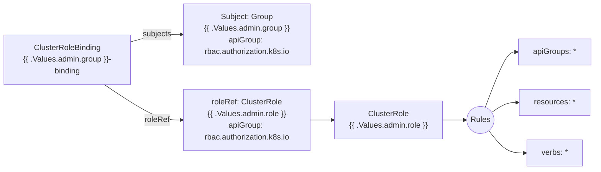

# Diagram: devops/k8s/rbac/helm/templates/admin.yaml

> Auto-generated by Obscura crawlers

## Mermaid

### SVG

<svg id="container" width="1221.484375" xmlns="http://www.w3.org/2000/svg" class="flowchart" height="350" viewBox="0 0 1221.484375 350" role="graphics-document document" aria-roledescription="flowchart-v2"><g><marker id="container_flowchart-v2-pointEnd" class="marker flowchart-v2" viewBox="0 0 10 10" refX="5" refY="5" markerUnits="userSpaceOnUse" markerWidth="8" markerHeight="8" orient="auto"><path d="M 0 0 L 10 5 L 0 10 z" class="arrowMarkerPath" style="stroke-width: 1; stroke-dasharray: 1, 0;"></path></marker><marker id="container_flowchart-v2-pointStart" class="marker flowchart-v2" viewBox="0 0 10 10" refX="4.5" refY="5" markerUnits="userSpaceOnUse" markerWidth="8" markerHeight="8" orient="auto"><path d="M 0 5 L 10 10 L 10 0 z" class="arrowMarkerPath" style="stroke-width: 1; stroke-dasharray: 1, 0;"></path></marker><marker id="container_flowchart-v2-circleEnd" class="marker flowchart-v2" viewBox="0 0 10 10" refX="11" refY="5" markerUnits="userSpaceOnUse" markerWidth="11" markerHeight="11" orient="auto"><circle cx="5" cy="5" r="5" class="arrowMarkerPath" style="stroke-width: 1; stroke-dasharray: 1, 0;"></circle></marker><marker id="container_flowchart-v2-circleStart" class="marker flowchart-v2" viewBox="0 0 10 10" refX="-1" refY="5" markerUnits="userSpaceOnUse" markerWidth="11" markerHeight="11" orient="auto"><circle cx="5" cy="5" r="5" class="arrowMarkerPath" style="stroke-width: 1; stroke-dasharray: 1, 0;"></circle></marker><marker id="container_flowchart-v2-crossEnd" class="marker cross flowchart-v2" viewBox="0 0 11 11" refX="12" refY="5.2" markerUnits="userSpaceOnUse" markerWidth="11" markerHeight="11" orient="auto"><path d="M 1,1 l 9,9 M 10,1 l -9,9" class="arrowMarkerPath" style="stroke-width: 2; stroke-dasharray: 1, 0;"></path></marker><marker id="container_flowchart-v2-crossStart" class="marker cross flowchart-v2" viewBox="0 0 11 11" refX="-1" refY="5.2" markerUnits="userSpaceOnUse" markerWidth="11" markerHeight="11" orient="auto"><path d="M 1,1 l 9,9 M 10,1 l -9,9" class="arrowMarkerPath" style="stroke-width: 2; stroke-dasharray: 1, 0;"></path></marker><g class="root"><g class="clusters"></g><g class="edgePaths"><path d="M909.438,247L913.604,247C917.771,247,926.104,247,933.771,247C941.438,247,948.438,247,951.938,247L955.438,247" id="L_CR_RULES_0" class="edge-thickness-normal edge-pattern-solid edge-thickness-normal edge-pattern-solid flowchart-link" style=";" data-edge="true" data-et="edge" data-id="L_CR_RULES_0" data-points="W3sieCI6OTA5LjQzNzUsInkiOjI0N30seyJ4Ijo5MzQuNDM3NSwieSI6MjQ3fSx7IngiOjk1OS40Mzc1LCJ5IjoyNDd9XQ==" marker-end="url(#container_flowchart-v2-pointEnd)"></path><path d="M996.44,221.34L1003.572,202.283C1010.705,183.227,1024.97,145.113,1035.602,126.057C1046.234,107,1053.234,107,1056.734,107L1060.234,107" id="L_RULES_AG_0" class="edge-thickness-normal edge-pattern-solid edge-thickness-normal edge-pattern-solid flowchart-link" style=";" data-edge="true" data-et="edge" data-id="L_RULES_AG_0" data-points="W3sieCI6OTk2LjQzOTg0OTIxNjMxMTIsInkiOjIyMS4zMzk5Mjg3Mzc2OTIzNn0seyJ4IjoxMDM5LjIzNDM3NSwieSI6MTA3fSx7IngiOjEwNjQuMjM0Mzc1LCJ5IjoxMDd9XQ==" marker-end="url(#container_flowchart-v2-pointEnd)"></path><path d="M1009.418,231.485L1014.388,228.071C1019.357,224.657,1029.296,217.828,1038.13,214.414C1046.964,211,1054.693,211,1058.557,211L1062.422,211" id="L_RULES_RS_0" class="edge-thickness-normal edge-pattern-solid edge-thickness-normal edge-pattern-solid flowchart-link" style=";" data-edge="true" data-et="edge" data-id="L_RULES_RS_0" data-points="W3sieCI6MTAwOS40MTgyMTEzNTc4MTE1LCJ5IjoyMzEuNDg0OTk4MDcxMTUwMjR9LHsieCI6MTAzOS4yMzQzNzUsInkiOjIxMX0seyJ4IjoxMDY2LjQyMTg3NSwieSI6MjExfV0=" marker-end="url(#container_flowchart-v2-pointEnd)"></path><path d="M1003.559,268.703L1009.505,276.419C1015.451,284.135,1027.343,299.568,1039.66,307.284C1051.977,315,1064.719,315,1071.09,315L1077.461,315" id="L_RULES_VB_0" class="edge-thickness-normal edge-pattern-solid edge-thickness-normal edge-pattern-solid flowchart-link" style=";" data-edge="true" data-et="edge" data-id="L_RULES_VB_0" data-points="W3sieCI6MTAwMy41NTkyNDkyMjcwOTI0LCJ5IjoyNjguNzAyNjU0NzI5Nzc2N30seyJ4IjoxMDM5LjIzNDM3NSwieSI6MzE1fSx7IngiOjEwODEuNDYwOTM3NSwieSI6MzE1fV0=" marker-end="url(#container_flowchart-v2-pointEnd)"></path><path d="M268,86.498L277.199,83.915C286.398,81.332,304.797,76.166,322.529,73.583C340.26,71,357.326,71,365.858,71L374.391,71" id="L_CRB_SUB_0" class="edge-thickness-normal edge-pattern-solid edge-thickness-normal edge-pattern-solid flowchart-link" style=";" data-edge="true" data-et="edge" data-id="L_CRB_SUB_0" data-points="W3sieCI6MjY4LCJ5Ijo4Ni40OTc5OTYyMDMzMzI2M30seyJ4IjozMjMuMTk1MzEyNSwieSI6NzF9LHsieCI6Mzc4LjM5MDYyNSwieSI6NzF9XQ==" marker-end="url(#container_flowchart-v2-pointEnd)"></path><path d="M214.169,174L232.34,186.167C250.511,198.333,286.853,222.667,313.557,234.833C340.26,247,357.326,247,365.858,247L374.391,247" id="L_CRB_REF_0" class="edge-thickness-normal edge-pattern-solid edge-thickness-normal edge-pattern-solid flowchart-link" style=";" data-edge="true" data-et="edge" data-id="L_CRB_REF_0" data-points="W3sieCI6MjE0LjE2OTAzOTgxODU0ODM4LCJ5IjoxNzR9LHsieCI6MzIzLjE5NTMxMjUsInkiOjI0N30seyJ4IjozNzguMzkwNjI1LCJ5IjoyNDd9XQ==" marker-end="url(#container_flowchart-v2-pointEnd)"></path><path d="M638.391,247L642.557,247C646.724,247,655.057,247,662.724,247C670.391,247,677.391,247,680.891,247L684.391,247" id="L_REF_CR_0" class="edge-thickness-normal edge-pattern-solid edge-thickness-normal edge-pattern-solid flowchart-link" style=";" data-edge="true" data-et="edge" data-id="L_REF_CR_0" data-points="W3sieCI6NjM4LjM5MDYyNSwieSI6MjQ3fSx7IngiOjY2My4zOTA2MjUsInkiOjI0N30seyJ4Ijo2ODguMzkwNjI1LCJ5IjoyNDd9XQ==" marker-end="url(#container_flowchart-v2-pointEnd)"></path></g><g class="edgeLabels"><g class="edgeLabel"><g class="label" data-id="L_CR_RULES_0" transform="translate(0, 0)"><foreignObject width="0" height="0">

</foreignObject></g></g><g class="edgeLabel"><g class="label" data-id="L_RULES_AG_0" transform="translate(0, 0)"><foreignObject width="0" height="0">

</foreignObject></g></g><g class="edgeLabel"><g class="label" data-id="L_RULES_RS_0" transform="translate(0, 0)"><foreignObject width="0" height="0">

</foreignObject></g></g><g class="edgeLabel"><g class="label" data-id="L_RULES_VB_0" transform="translate(0, 0)"><foreignObject width="0" height="0">

</foreignObject></g></g><g class="edgeLabel" transform="translate(323.1953125, 71)"><g class="label" data-id="L_CRB_SUB_0" transform="translate(-30.1953125, -12)"><foreignObject width="60.390625" height="24">

subjects

</foreignObject></g></g><g class="edgeLabel" transform="translate(323.1953125, 247)"><g class="label" data-id="L_CRB_REF_0" transform="translate(-25.9453125, -12)"><foreignObject width="51.890625" height="24">

roleRef

</foreignObject></g></g><g class="edgeLabel"><g class="label" data-id="L_REF_CR_0" transform="translate(0, 0)"><foreignObject width="0" height="0">

</foreignObject></g></g></g><g class="nodes"><g class="node default" id="flowchart-CR-0" transform="translate(798.9140625, 247)"><rect class="basic label-container" style="" x="-110.5234375" y="-39" width="221.046875" height="78"></rect><g class="label" style="" transform="translate(-80.5234375, -24)"><rect></rect><foreignObject width="161.046875" height="48">

ClusterRole {{ .Values.admin.role }}

</foreignObject></g></g><g class="node default" id="flowchart-CRB-1" transform="translate(138, 123)"><rect class="basic label-container" style="" x="-130" y="-51" width="260" height="102"></rect><g class="label" style="" transform="translate(-100, -36)"><rect></rect><foreignObject width="200" height="72">

ClusterRoleBinding {{ .Values.admin.group }}-binding

</foreignObject></g></g><g class="node default" id="flowchart-SUB-2" transform="translate(508.390625, 71)"><rect class="basic label-container" style="" x="-130" y="-63" width="260" height="126"></rect><g class="label" style="" transform="translate(-100, -48)"><rect></rect><foreignObject width="200" height="96">

Subject: Group {{ .Values.admin.group }} apiGroup: rbac.authorization.k8s.io

</foreignObject></g></g><g class="node default" id="flowchart-REF-3" transform="translate(508.390625, 247)"><rect class="basic label-container" style="" x="-130" y="-63" width="260" height="126"></rect><g class="label" style="" transform="translate(-100, -48)"><rect></rect><foreignObject width="200" height="96">

roleRef: ClusterRole {{ .Values.admin.role }} apiGroup: rbac.authorization.k8s.io

</foreignObject></g></g><g class="node default" id="flowchart-RULES-4" transform="translate(986.8359375, 247)"><circle class="basic label-container" style="" r="27.3984375" cx="0" cy="0"></circle><g class="label" style="" transform="translate(-19.8984375, -12)"><rect></rect><foreignObject width="39.796875" height="24">

Rules

</foreignObject></g></g><g class="node default" id="flowchart-AG-5" transform="translate(1138.859375, 107)"><rect class="basic label-container" style="" x="-74.625" y="-27" width="149.25" height="54"></rect><g class="label" style="" transform="translate(-44.625, -12)"><rect></rect><foreignObject width="89.25" height="24">

apiGroups: *

</foreignObject></g></g><g class="node default" id="flowchart-RS-6" transform="translate(1138.859375, 211)"><rect class="basic label-container" style="" x="-72.4375" y="-27" width="144.875" height="54"></rect><g class="label" style="" transform="translate(-42.4375, -12)"><rect></rect><foreignObject width="84.875" height="24">

resources: *

</foreignObject></g></g><g class="node default" id="flowchart-VB-7" transform="translate(1138.859375, 315)"><rect class="basic label-container" style="" x="-57.3984375" y="-27" width="114.796875" height="54"></rect><g class="label" style="" transform="translate(-27.3984375, -12)"><rect></rect><foreignObject width="54.796875" height="24">

verbs: *

</foreignObject></g></g></g></g></g></svg>
