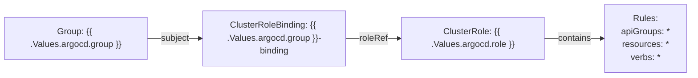

# Diagram: devops/k8s/rbac/helm/templates/argocd.yaml

> Auto-generated by Obscura crawlers

## Mermaid

### SVG

<svg id="container" width="1261.84375" xmlns="http://www.w3.org/2000/svg" class="flowchart" height="142" viewBox="0 0 1261.84375 142" role="graphics-document document" aria-roledescription="flowchart-v2"><g><marker id="container_flowchart-v2-pointEnd" class="marker flowchart-v2" viewBox="0 0 10 10" refX="5" refY="5" markerUnits="userSpaceOnUse" markerWidth="8" markerHeight="8" orient="auto"><path d="M 0 0 L 10 5 L 0 10 z" class="arrowMarkerPath" style="stroke-width: 1; stroke-dasharray: 1, 0;"></path></marker><marker id="container_flowchart-v2-pointStart" class="marker flowchart-v2" viewBox="0 0 10 10" refX="4.5" refY="5" markerUnits="userSpaceOnUse" markerWidth="8" markerHeight="8" orient="auto"><path d="M 0 5 L 10 10 L 10 0 z" class="arrowMarkerPath" style="stroke-width: 1; stroke-dasharray: 1, 0;"></path></marker><marker id="container_flowchart-v2-circleEnd" class="marker flowchart-v2" viewBox="0 0 10 10" refX="11" refY="5" markerUnits="userSpaceOnUse" markerWidth="11" markerHeight="11" orient="auto"><circle cx="5" cy="5" r="5" class="arrowMarkerPath" style="stroke-width: 1; stroke-dasharray: 1, 0;"></circle></marker><marker id="container_flowchart-v2-circleStart" class="marker flowchart-v2" viewBox="0 0 10 10" refX="-1" refY="5" markerUnits="userSpaceOnUse" markerWidth="11" markerHeight="11" orient="auto"><circle cx="5" cy="5" r="5" class="arrowMarkerPath" style="stroke-width: 1; stroke-dasharray: 1, 0;"></circle></marker><marker id="container_flowchart-v2-crossEnd" class="marker cross flowchart-v2" viewBox="0 0 11 11" refX="12" refY="5.2" markerUnits="userSpaceOnUse" markerWidth="11" markerHeight="11" orient="auto"><path d="M 1,1 l 9,9 M 10,1 l -9,9" class="arrowMarkerPath" style="stroke-width: 2; stroke-dasharray: 1, 0;"></path></marker><marker id="container_flowchart-v2-crossStart" class="marker cross flowchart-v2" viewBox="0 0 11 11" refX="-1" refY="5.2" markerUnits="userSpaceOnUse" markerWidth="11" markerHeight="11" orient="auto"><path d="M 1,1 l 9,9 M 10,1 l -9,9" class="arrowMarkerPath" style="stroke-width: 2; stroke-dasharray: 1, 0;"></path></marker><g class="root"><g class="clusters"></g><g class="edgePaths"><path d="M268,71L276.577,71C285.154,71,302.307,71,318.794,71C335.281,71,351.102,71,359.012,71L366.922,71" id="L_GroupNode_BindingNode_0" class="edge-thickness-normal edge-pattern-solid edge-thickness-normal edge-pattern-solid flowchart-link" style=";" data-edge="true" data-et="edge" data-id="L_GroupNode_BindingNode_0" data-points="W3sieCI6MjY4LCJ5Ijo3MX0seyJ4IjozMTkuNDYwOTM3NSwieSI6NzF9LHsieCI6MzcwLjkyMTg3NSwieSI6NzF9XQ==" marker-end="url(#container_flowchart-v2-pointEnd)"></path><path d="M630.922,71L639.413,71C647.904,71,664.885,71,681.201,71C697.516,71,713.164,71,720.988,71L728.813,71" id="L_BindingNode_RoleNode_0" class="edge-thickness-normal edge-pattern-solid edge-thickness-normal edge-pattern-solid flowchart-link" style=";" data-edge="true" data-et="edge" data-id="L_BindingNode_RoleNode_0" data-points="W3sieCI6NjMwLjkyMTg3NSwieSI6NzF9LHsieCI6NjgxLjg2NzE4NzUsInkiOjcxfSx7IngiOjczMi44MTI1LCJ5Ijo3MX1d" marker-end="url(#container_flowchart-v2-pointEnd)"></path><path d="M992.813,71L1002.128,71C1011.443,71,1030.073,71,1048.036,71C1066,71,1083.297,71,1091.945,71L1100.594,71" id="L_RoleNode_RulesNode_0" class="edge-thickness-normal edge-pattern-solid edge-thickness-normal edge-pattern-solid flowchart-link" style=";" data-edge="true" data-et="edge" data-id="L_RoleNode_RulesNode_0" data-points="W3sieCI6OTkyLjgxMjUsInkiOjcxfSx7IngiOjEwNDguNzAzMTI1LCJ5Ijo3MX0seyJ4IjoxMTA0LjU5Mzc1LCJ5Ijo3MX1d" marker-end="url(#container_flowchart-v2-pointEnd)"></path></g><g class="edgeLabels"><g class="edgeLabel" transform="translate(319.4609375, 71)"><g class="label" data-id="L_GroupNode_BindingNode_0" transform="translate(-26.4609375, -12)"><foreignObject width="52.921875" height="24">

subject

</foreignObject></g></g><g class="edgeLabel" transform="translate(681.8671875, 71)"><g class="label" data-id="L_BindingNode_RoleNode_0" transform="translate(-25.9453125, -12)"><foreignObject width="51.890625" height="24">

roleRef

</foreignObject></g></g><g class="edgeLabel" transform="translate(1048.703125, 71)"><g class="label" data-id="L_RoleNode_RulesNode_0" transform="translate(-30.890625, -12)"><foreignObject width="61.78125" height="24">

contains

</foreignObject></g></g></g><g class="nodes"><g class="node default" id="flowchart-GroupNode-0" transform="translate(138, 71)"><rect class="basic label-container" style="" x="-130" y="-39" width="260" height="78"></rect><g class="label" style="" transform="translate(-100, -24)"><rect></rect><foreignObject width="200" height="48">

Group: {{ .Values.argocd.group }}

</foreignObject></g></g><g class="node default" id="flowchart-BindingNode-1" transform="translate(500.921875, 71)"><rect class="basic label-container" style="" x="-130" y="-51" width="260" height="102"></rect><g class="label" style="" transform="translate(-100, -36)"><rect></rect><foreignObject width="200" height="72">

ClusterRoleBinding: {{ .Values.argocd.group }}-binding

</foreignObject></g></g><g class="node default" id="flowchart-RoleNode-2" transform="translate(862.8125, 71)"><rect class="basic label-container" style="" x="-130" y="-39" width="260" height="78"></rect><g class="label" style="" transform="translate(-100, -24)"><rect></rect><foreignObject width="200" height="48">

ClusterRole: {{ .Values.argocd.role }}

</foreignObject></g></g><g class="node default" id="flowchart-RulesNode-3" transform="translate(1179.21875, 71)"><rect class="basic label-container" style="" x="-74.625" y="-63" width="149.25" height="126"></rect><g class="label" style="" transform="translate(-44.625, -48)"><rect></rect><foreignObject width="89.25" height="96">

Rules: apiGroups: * resources: * verbs: *

</foreignObject></g></g></g></g></g></svg>
