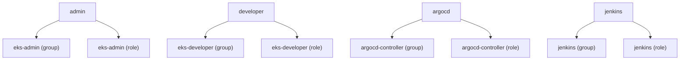

# Diagram: devops/k8s/rbac/helm/values.yaml

> Auto-generated by Obscura crawlers

## Mermaid

### SVG

<svg id="container" width="1962.09375" xmlns="http://www.w3.org/2000/svg" class="flowchart" height="174" viewBox="0 0 1962.09375 174" role="graphics-document document" aria-roledescription="flowchart-v2"><g><marker id="container_flowchart-v2-pointEnd" class="marker flowchart-v2" viewBox="0 0 10 10" refX="5" refY="5" markerUnits="userSpaceOnUse" markerWidth="8" markerHeight="8" orient="auto"><path d="M 0 0 L 10 5 L 0 10 z" class="arrowMarkerPath" style="stroke-width: 1; stroke-dasharray: 1, 0;"></path></marker><marker id="container_flowchart-v2-pointStart" class="marker flowchart-v2" viewBox="0 0 10 10" refX="4.5" refY="5" markerUnits="userSpaceOnUse" markerWidth="8" markerHeight="8" orient="auto"><path d="M 0 5 L 10 10 L 10 0 z" class="arrowMarkerPath" style="stroke-width: 1; stroke-dasharray: 1, 0;"></path></marker><marker id="container_flowchart-v2-circleEnd" class="marker flowchart-v2" viewBox="0 0 10 10" refX="11" refY="5" markerUnits="userSpaceOnUse" markerWidth="11" markerHeight="11" orient="auto"><circle cx="5" cy="5" r="5" class="arrowMarkerPath" style="stroke-width: 1; stroke-dasharray: 1, 0;"></circle></marker><marker id="container_flowchart-v2-circleStart" class="marker flowchart-v2" viewBox="0 0 10 10" refX="-1" refY="5" markerUnits="userSpaceOnUse" markerWidth="11" markerHeight="11" orient="auto"><circle cx="5" cy="5" r="5" class="arrowMarkerPath" style="stroke-width: 1; stroke-dasharray: 1, 0;"></circle></marker><marker id="container_flowchart-v2-crossEnd" class="marker cross flowchart-v2" viewBox="0 0 11 11" refX="12" refY="5.2" markerUnits="userSpaceOnUse" markerWidth="11" markerHeight="11" orient="auto"><path d="M 1,1 l 9,9 M 10,1 l -9,9" class="arrowMarkerPath" style="stroke-width: 2; stroke-dasharray: 1, 0;"></path></marker><marker id="container_flowchart-v2-crossStart" class="marker cross flowchart-v2" viewBox="0 0 11 11" refX="-1" refY="5.2" markerUnits="userSpaceOnUse" markerWidth="11" markerHeight="11" orient="auto"><path d="M 1,1 l 9,9 M 10,1 l -9,9" class="arrowMarkerPath" style="stroke-width: 2; stroke-dasharray: 1, 0;"></path></marker><g class="root"><g class="clusters"></g><g class="edgePaths"><path d="M169.625,58.318L158.772,63.098C147.919,67.878,126.214,77.439,115.361,85.72C104.508,94,104.508,101,104.508,104.5L104.508,108" id="L_admin_user_group_eks_admin_0" class="edge-thickness-normal edge-pattern-solid edge-thickness-normal edge-pattern-solid flowchart-link" style=";" data-edge="true" data-et="edge" data-id="L_admin_user_group_eks_admin_0" data-points="W3sieCI6MTY5LjYyNSwieSI6NTguMzE3NTgzMjE3NTIzNjZ9LHsieCI6MTA0LjUwNzgxMjUsInkiOjg3fSx7IngiOjEwNC41MDc4MTI1LCJ5IjoxMTJ9XQ==" marker-end="url(#container_flowchart-v2-pointEnd)"></path><path d="M275.5,58.318L286.353,63.098C297.206,67.878,318.911,77.439,329.764,85.72C340.617,94,340.617,101,340.617,104.5L340.617,108" id="L_admin_user_role_eks_admin_0" class="edge-thickness-normal edge-pattern-solid edge-thickness-normal edge-pattern-solid flowchart-link" style=";" data-edge="true" data-et="edge" data-id="L_admin_user_role_eks_admin_0" data-points="W3sieCI6Mjc1LjUsInkiOjU4LjMxNzU4MzIxNzUyMzY2fSx7IngiOjM0MC42MTcxODc1LCJ5Ijo4N30seyJ4IjozNDAuNjE3MTg3NSwieSI6MTEyfV0=" marker-end="url(#container_flowchart-v2-pointEnd)"></path><path d="M655.699,61.26L644.826,65.55C633.953,69.84,612.207,78.42,601.334,86.21C590.461,94,590.461,101,590.461,104.5L590.461,108" id="L_developer_user_group_eks_developer_0" class="edge-thickness-normal edge-pattern-solid edge-thickness-normal edge-pattern-solid flowchart-link" style=";" data-edge="true" data-et="edge" data-id="L_developer_user_group_eks_developer_0" data-points="W3sieCI6NjU1LjY5OTIxODc1LCJ5Ijo2MS4yNTk2OTk0NTc2MDA5OTV9LHsieCI6NTkwLjQ2MDkzNzUsInkiOjg3fSx7IngiOjU5MC40NjA5Mzc1LCJ5IjoxMTJ9XQ==" marker-end="url(#container_flowchart-v2-pointEnd)"></path><path d="M788.809,61.26L799.682,65.55C810.555,69.84,832.301,78.42,843.174,86.21C854.047,94,854.047,101,854.047,104.5L854.047,108" id="L_developer_user_role_eks_developer_0" class="edge-thickness-normal edge-pattern-solid edge-thickness-normal edge-pattern-solid flowchart-link" style=";" data-edge="true" data-et="edge" data-id="L_developer_user_role_eks_developer_0" data-points="W3sieCI6Nzg4LjgwODU5Mzc1LCJ5Ijo2MS4yNTk2OTk0NTc2MDA5OTV9LHsieCI6ODU0LjA0Njg3NSwieSI6ODd9LHsieCI6ODU0LjA0Njg3NSwieSI6MTEyfV0=" marker-end="url(#container_flowchart-v2-pointEnd)"></path><path d="M1217.699,54.786L1202.917,60.155C1188.135,65.524,1158.572,76.262,1143.79,85.131C1129.008,94,1129.008,101,1129.008,104.5L1129.008,108" id="L_argocd_user_group_argocd_controller_0" class="edge-thickness-normal edge-pattern-solid edge-thickness-normal edge-pattern-solid flowchart-link" style=";" data-edge="true" data-et="edge" data-id="L_argocd_user_group_argocd_controller_0" data-points="W3sieCI6MTIxNy42OTkyMTg3NSwieSI6NTQuNzg2NDE3ODMzMDc0MTN9LHsieCI6MTEyOS4wMDc4MTI1LCJ5Ijo4N30seyJ4IjoxMTI5LjAwNzgxMjUsInkiOjExMn1d" marker-end="url(#container_flowchart-v2-pointEnd)"></path><path d="M1326.652,54.786L1341.434,60.155C1356.216,65.524,1385.78,76.262,1400.562,85.131C1415.344,94,1415.344,101,1415.344,104.5L1415.344,108" id="L_argocd_user_role_argocd_controller_0" class="edge-thickness-normal edge-pattern-solid edge-thickness-normal edge-pattern-solid flowchart-link" style=";" data-edge="true" data-et="edge" data-id="L_argocd_user_role_argocd_controller_0" data-points="W3sieCI6MTMyNi42NTIzNDM3NSwieSI6NTQuNzg2NDE3ODMzMDc0MTN9LHsieCI6MTQxNS4zNDM3NSwieSI6ODd9LHsieCI6MTQxNS4zNDM3NSwieSI6MTEyfV0=" marker-end="url(#container_flowchart-v2-pointEnd)"></path><path d="M1715.489,62L1706.995,66.167C1698.5,70.333,1681.512,78.667,1673.018,86.333C1664.523,94,1664.523,101,1664.523,104.5L1664.523,108" id="L_jenkins_user_group_jenkins_0" class="edge-thickness-normal edge-pattern-solid edge-thickness-normal edge-pattern-solid flowchart-link" style=";" data-edge="true" data-et="edge" data-id="L_jenkins_user_group_jenkins_0" data-points="W3sieCI6MTcxNS40ODg3MzE5NzExNTM4LCJ5Ijo2Mn0seyJ4IjoxNjY0LjUyMzQzNzUsInkiOjg3fSx7IngiOjE2NjQuNTIzNDM3NSwieSI6MTEyfV0=" marker-end="url(#container_flowchart-v2-pointEnd)"></path><path d="M1825.574,62L1834.068,66.167C1842.562,70.333,1859.551,78.667,1868.045,86.333C1876.539,94,1876.539,101,1876.539,104.5L1876.539,108" id="L_jenkins_user_role_jenkins_0" class="edge-thickness-normal edge-pattern-solid edge-thickness-normal edge-pattern-solid flowchart-link" style=";" data-edge="true" data-et="edge" data-id="L_jenkins_user_role_jenkins_0" data-points="W3sieCI6MTgyNS41NzM3NjgwMjg4NDYyLCJ5Ijo2Mn0seyJ4IjoxODc2LjUzOTA2MjUsInkiOjg3fSx7IngiOjE4NzYuNTM5MDYyNSwieSI6MTEyfV0=" marker-end="url(#container_flowchart-v2-pointEnd)"></path></g><g class="edgeLabels"><g class="edgeLabel"><g class="label" data-id="L_admin_user_group_eks_admin_0" transform="translate(0, 0)"><foreignObject width="0" height="0">

</foreignObject></g></g><g class="edgeLabel"><g class="label" data-id="L_admin_user_role_eks_admin_0" transform="translate(0, 0)"><foreignObject width="0" height="0">

</foreignObject></g></g><g class="edgeLabel"><g class="label" data-id="L_developer_user_group_eks_developer_0" transform="translate(0, 0)"><foreignObject width="0" height="0">

</foreignObject></g></g><g class="edgeLabel"><g class="label" data-id="L_developer_user_role_eks_developer_0" transform="translate(0, 0)"><foreignObject width="0" height="0">

</foreignObject></g></g><g class="edgeLabel"><g class="label" data-id="L_argocd_user_group_argocd_controller_0" transform="translate(0, 0)"><foreignObject width="0" height="0">

</foreignObject></g></g><g class="edgeLabel"><g class="label" data-id="L_argocd_user_role_argocd_controller_0" transform="translate(0, 0)"><foreignObject width="0" height="0">

</foreignObject></g></g><g class="edgeLabel"><g class="label" data-id="L_jenkins_user_group_jenkins_0" transform="translate(0, 0)"><foreignObject width="0" height="0">

</foreignObject></g></g><g class="edgeLabel"><g class="label" data-id="L_jenkins_user_role_jenkins_0" transform="translate(0, 0)"><foreignObject width="0" height="0">

</foreignObject></g></g></g><g class="nodes"><g class="node default" id="flowchart-admin_user-0" transform="translate(222.5625, 35)"><rect class="basic label-container" style="" x="-52.9375" y="-27" width="105.875" height="54"></rect><g class="label" style="" transform="translate(-22.9375, -12)"><rect></rect><foreignObject width="45.875" height="24">

admin

</foreignObject></g></g><g class="node default" id="flowchart-developer_user-1" transform="translate(722.25390625, 35)"><rect class="basic label-container" style="" x="-66.5546875" y="-27" width="133.109375" height="54"></rect><g class="label" style="" transform="translate(-36.5546875, -12)"><rect></rect><foreignObject width="73.109375" height="24">

developer

</foreignObject></g></g><g class="node default" id="flowchart-argocd_user-2" transform="translate(1272.17578125, 35)"><rect class="basic label-container" style="" x="-54.4765625" y="-27" width="108.953125" height="54"></rect><g class="label" style="" transform="translate(-24.4765625, -12)"><rect></rect><foreignObject width="48.953125" height="24">

argocd

</foreignObject></g></g><g class="node default" id="flowchart-jenkins_user-3" transform="translate(1770.53125, 35)"><rect class="basic label-container" style="" x="-56.0703125" y="-27" width="112.140625" height="54"></rect><g class="label" style="" transform="translate(-26.0703125, -12)"><rect></rect><foreignObject width="52.140625" height="24">

jenkins

</foreignObject></g></g><g class="node default" id="flowchart-group_eks_admin-4" transform="translate(104.5078125, 139)"><rect class="basic label-container" style="" x="-96.5078125" y="-27" width="193.015625" height="54"></rect><g class="label" style="" transform="translate(-66.5078125, -12)"><rect></rect><foreignObject width="133.015625" height="24">

eks-admin (group)

</foreignObject></g></g><g class="node default" id="flowchart-role_eks_admin-5" transform="translate(340.6171875, 139)"><rect class="basic label-container" style="" x="-89.6015625" y="-27" width="179.203125" height="54"></rect><g class="label" style="" transform="translate(-59.6015625, -12)"><rect></rect><foreignObject width="119.203125" height="24">

eks-admin (role)

</foreignObject></g></g><g class="node default" id="flowchart-group_eks_developer-6" transform="translate(590.4609375, 139)"><rect class="basic label-container" style="" x="-110.2421875" y="-27" width="220.484375" height="54"></rect><g class="label" style="" transform="translate(-80.2421875, -12)"><rect></rect><foreignObject width="160.484375" height="24">

eks-developer (group)

</foreignObject></g></g><g class="node default" id="flowchart-role_eks_developer-7" transform="translate(854.046875, 139)"><rect class="basic label-container" style="" x="-103.34375" y="-27" width="206.6875" height="54"></rect><g class="label" style="" transform="translate(-73.34375, -12)"><rect></rect><foreignObject width="146.6875" height="24">

eks-developer (role)

</foreignObject></g></g><g class="node default" id="flowchart-group_argocd_controller-8" transform="translate(1129.0078125, 139)"><rect class="basic label-container" style="" x="-121.6171875" y="-27" width="243.234375" height="54"></rect><g class="label" style="" transform="translate(-91.6171875, -12)"><rect></rect><foreignObject width="183.234375" height="24">

argocd-controller (group)

</foreignObject></g></g><g class="node default" id="flowchart-role_argocd_controller-9" transform="translate(1415.34375, 139)"><rect class="basic label-container" style="" x="-114.71875" y="-27" width="229.4375" height="54"></rect><g class="label" style="" transform="translate(-84.71875, -12)"><rect></rect><foreignObject width="169.4375" height="24">

argocd-controller (role)

</foreignObject></g></g><g class="node default" id="flowchart-group_jenkins-10" transform="translate(1664.5234375, 139)"><rect class="basic label-container" style="" x="-84.4609375" y="-27" width="168.921875" height="54"></rect><g class="label" style="" transform="translate(-54.4609375, -12)"><rect></rect><foreignObject width="108.921875" height="24">

jenkins (group)

</foreignObject></g></g><g class="node default" id="flowchart-role_jenkins-11" transform="translate(1876.5390625, 139)"><rect class="basic label-container" style="" x="-77.5546875" y="-27" width="155.109375" height="54"></rect><g class="label" style="" transform="translate(-47.5546875, -12)"><rect></rect><foreignObject width="95.109375" height="24">

jenkins (role)

</foreignObject></g></g></g></g></g></svg>
