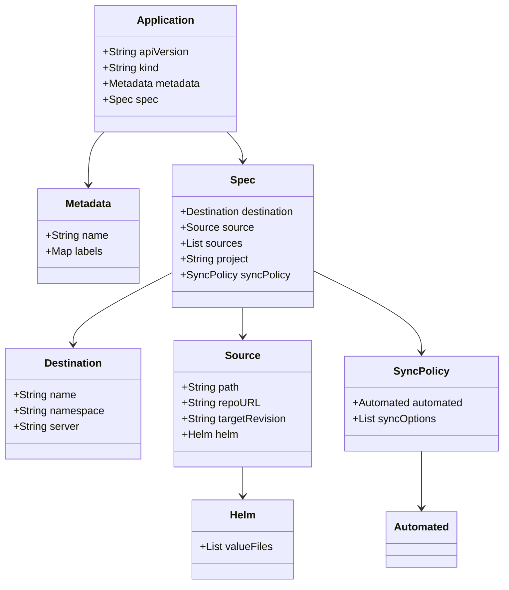

# Diagram: devops/k8s/secrets-store-csi-driver/argocd/application.yaml


> Auto-generated by Obscura crawlers

## Diagram 1



### SVG

<svg id="container" width="760.15625" xmlns="http://www.w3.org/2000/svg" class="classDiagram" height="886" viewBox="0 0 760.15625 886" role="graphics-document document" aria-roledescription="class"><style>#container{font-family:"trebuchet ms",verdana,arial,sans-serif;font-size:16px;fill:#333;}@keyframes edge-animation-frame{from{stroke-dashoffset:0;}}@keyframes dash{to{stroke-dashoffset:0;}}#container .edge-animation-slow{stroke-dasharray:9,5!important;stroke-dashoffset:900;animation:dash 50s linear infinite;stroke-linecap:round;}#container .edge-animation-fast{stroke-dasharray:9,5!important;stroke-dashoffset:900;animation:dash 20s linear infinite;stroke-linecap:round;}#container .error-icon{fill:#552222;}#container .error-text{fill:#552222;stroke:#552222;}#container .edge-thickness-normal{stroke-width:1px;}#container .edge-thickness-thick{stroke-width:3.5px;}#container .edge-pattern-solid{stroke-dasharray:0;}#container .edge-thickness-invisible{stroke-width:0;fill:none;}#container .edge-pattern-dashed{stroke-dasharray:3;}#container .edge-pattern-dotted{stroke-dasharray:2;}#container .marker{fill:#333333;stroke:#333333;}#container .marker.cross{stroke:#333333;}#container svg{font-family:"trebuchet ms",verdana,arial,sans-serif;font-size:16px;}#container p{margin:0;}#container g.classGroup text{fill:#9370DB;stroke:none;font-family:"trebuchet ms",verdana,arial,sans-serif;font-size:10px;}#container g.classGroup text .title{font-weight:bolder;}#container .nodeLabel,#container .edgeLabel{color:#131300;}#container .edgeLabel .label rect{fill:#ECECFF;}#container .label text{fill:#131300;}#container .labelBkg{background:#ECECFF;}#container .edgeLabel .label span{background:#ECECFF;}#container .classTitle{font-weight:bolder;}#container .node rect,#container .node circle,#container .node ellipse,#container .node polygon,#container .node path{fill:#ECECFF;stroke:#9370DB;stroke-width:1px;}#container .divider{stroke:#9370DB;stroke-width:1;}#container g.clickable{cursor:pointer;}#container g.classGroup rect{fill:#ECECFF;stroke:#9370DB;}#container g.classGroup line{stroke:#9370DB;stroke-width:1;}#container .classLabel .box{stroke:none;stroke-width:0;fill:#ECECFF;opacity:0.5;}#container .classLabel .label{fill:#9370DB;font-size:10px;}#container .relation{stroke:#333333;stroke-width:1;fill:none;}#container .dashed-line{stroke-dasharray:3;}#container .dotted-line{stroke-dasharray:1 2;}#container #compositionStart,#container .composition{fill:#333333!important;stroke:#333333!important;stroke-width:1;}#container #compositionEnd,#container .composition{fill:#333333!important;stroke:#333333!important;stroke-width:1;}#container #dependencyStart,#container .dependency{fill:#333333!important;stroke:#333333!important;stroke-width:1;}#container #dependencyStart,#container .dependency{fill:#333333!important;stroke:#333333!important;stroke-width:1;}#container #extensionStart,#container .extension{fill:transparent!important;stroke:#333333!important;stroke-width:1;}#container #extensionEnd,#container .extension{fill:transparent!important;stroke:#333333!important;stroke-width:1;}#container #aggregationStart,#container .aggregation{fill:transparent!important;stroke:#333333!important;stroke-width:1;}#container #aggregationEnd,#container .aggregation{fill:transparent!important;stroke:#333333!important;stroke-width:1;}#container #lollipopStart,#container .lollipop{fill:#ECECFF!important;stroke:#333333!important;stroke-width:1;}#container #lollipopEnd,#container .lollipop{fill:#ECECFF!important;stroke:#333333!important;stroke-width:1;}#container .edgeTerminals{font-size:11px;line-height:initial;}#container .classTitleText{text-anchor:middle;font-size:18px;fill:#333;}#container .label-icon{display:inline-block;height:1em;overflow:visible;vertical-align:-0.125em;}#container .node .label-icon path{fill:currentColor;stroke:revert;stroke-width:revert;}#container :root{--mermaid-font-family:"trebuchet ms",verdana,arial,sans-serif;}</style><g><defs><marker id="container_class-aggregationStart" class="marker aggregation class" refX="18" refY="7" markerWidth="190" markerHeight="240" orient="auto"><path d="M 18,7 L9,13 L1,7 L9,1 Z"></path></marker></defs><defs><marker id="container_class-aggregationEnd" class="marker aggregation class" refX="1" refY="7" markerWidth="20" markerHeight="28" orient="auto"><path d="M 18,7 L9,13 L1,7 L9,1 Z"></path></marker></defs><defs><marker id="container_class-extensionStart" class="marker extension class" refX="18" refY="7" markerWidth="190" markerHeight="240" orient="auto"><path d="M 1,7 L18,13 V 1 Z"></path></marker></defs><defs><marker id="container_class-extensionEnd" class="marker extension class" refX="1" refY="7" markerWidth="20" markerHeight="28" orient="auto"><path d="M 1,1 V 13 L18,7 Z"></path></marker></defs><defs><marker id="container_class-compositionStart" class="marker composition class" refX="18" refY="7" markerWidth="190" markerHeight="240" orient="auto"><path d="M 18,7 L9,13 L1,7 L9,1 Z"></path></marker></defs><defs><marker id="container_class-compositionEnd" class="marker composition class" refX="1" refY="7" markerWidth="20" markerHeight="28" orient="auto"><path d="M 18,7 L9,13 L1,7 L9,1 Z"></path></marker></defs><defs><marker id="container_class-dependencyStart" class="marker dependency class" refX="6" refY="7" markerWidth="190" markerHeight="240" orient="auto"><path d="M 5,7 L9,13 L1,7 L9,1 Z"></path></marker></defs><defs><marker id="container_class-dependencyEnd" class="marker dependency class" refX="13" refY="7" markerWidth="20" markerHeight="28" orient="auto"><path d="M 18,7 L9,13 L14,7 L9,1 Z"></path></marker></defs><defs><marker id="container_class-lollipopStart" class="marker lollipop class" refX="13" refY="7" markerWidth="190" markerHeight="240" orient="auto"><circle stroke="black" fill="transparent" cx="7" cy="7" r="6"></circle></marker></defs><defs><marker id="container_class-lollipopEnd" class="marker lollipop class" refX="1" refY="7" markerWidth="190" markerHeight="240" orient="auto"><circle stroke="black" fill="transparent" cx="7" cy="7" r="6"></circle></marker></defs><g class="root"><g class="clusters"></g><g class="edgePaths"><path d="M151.992,200L147.907,204.167C143.823,208.333,135.653,216.667,131.569,230C127.484,243.333,127.484,261.667,127.484,270.833L127.484,280" id="id_Application_Metadata_1" class="edge-thickness-normal edge-pattern-solid relation" style=";;;" data-edge="true" data-et="edge" data-id="id_Application_Metadata_1" data-points="W3sieCI6MTUxLjk5MTY1NDgyOTU0NTQ0LCJ5IjoyMDB9LHsieCI6MTI3LjQ4NDM3NSwieSI6MjI1fSx7IngiOjEyNy40ODQzNzUsInkiOjI4Nn1d" marker-end="url(#container_class-dependencyEnd)"></path><path d="M340.208,200L344.292,204.167C348.377,208.333,356.546,216.667,360.63,224C364.715,231.333,364.715,237.667,364.715,240.833L364.715,244" id="id_Application_Spec_2" class="edge-thickness-normal edge-pattern-solid relation" style=";;;" data-edge="true" data-et="edge" data-id="id_Application_Spec_2" data-points="W3sieCI6MzQwLjIwNzU2MzkyMDQ1NDU2LCJ5IjoyMDB9LHsieCI6MzY0LjcxNDg0Mzc1LCJ5IjoyMjV9LHsieCI6MzY0LjcxNDg0Mzc1LCJ5IjoyNTB9XQ==" marker-end="url(#container_class-dependencyEnd)"></path><path d="M254.297,415.544L230.165,428.12C206.034,440.696,157.771,465.848,133.639,483.591C109.508,501.333,109.508,511.667,109.508,516.833L109.508,522" id="id_Spec_Destination_3" class="edge-thickness-normal edge-pattern-solid relation" style=";;;" data-edge="true" data-et="edge" data-id="id_Spec_Destination_3" data-points="W3sieCI6MjU0LjI5Njg3NSwieSI6NDE1LjU0MzgyOTMwNTI1MTU2fSx7IngiOjEwOS41MDc4MTI1LCJ5Ijo0OTF9LHsieCI6MTA5LjUwNzgxMjUsInkiOjUyOH1d" marker-end="url(#container_class-dependencyEnd)"></path><path d="M364.715,466L364.715,470.167C364.715,474.333,364.715,482.667,364.715,490C364.715,497.333,364.715,503.667,364.715,506.833L364.715,510" id="id_Spec_Source_4" class="edge-thickness-normal edge-pattern-solid relation" style=";;;" data-edge="true" data-et="edge" data-id="id_Spec_Source_4" data-points="W3sieCI6MzY0LjcxNDg0Mzc1LCJ5Ijo0NjZ9LHsieCI6MzY0LjcxNDg0Mzc1LCJ5Ijo0OTF9LHsieCI6MzY0LjcxNDg0Mzc1LCJ5Ijo1MTZ9XQ==" marker-end="url(#container_class-dependencyEnd)"></path><path d="M475.133,412.276L501.825,425.397C528.517,438.518,581.901,464.759,608.593,485.046C635.285,505.333,635.285,519.667,635.285,526.833L635.285,534" id="id_Spec_SyncPolicy_5" class="edge-thickness-normal edge-pattern-solid relation" style=";;;" data-edge="true" data-et="edge" data-id="id_Spec_SyncPolicy_5" data-points="W3sieCI6NDc1LjEzMjgxMjUsInkiOjQxMi4yNzY0MjcxMDcwOTQ0fSx7IngiOjYzNS4yODUxNTYyNSwieSI6NDkxfSx7IngiOjYzNS4yODUxNTYyNSwieSI6NTQwfV0=" marker-end="url(#container_class-dependencyEnd)"></path><path d="M364.715,708L364.715,712.167C364.715,716.333,364.715,724.667,364.715,732C364.715,739.333,364.715,745.667,364.715,748.833L364.715,752" id="id_Source_Helm_6" class="edge-thickness-normal edge-pattern-solid relation" style=";;;" data-edge="true" data-et="edge" data-id="id_Source_Helm_6" data-points="W3sieCI6MzY0LjcxNDg0Mzc1LCJ5Ijo3MDh9LHsieCI6MzY0LjcxNDg0Mzc1LCJ5Ijo3MzN9LHsieCI6MzY0LjcxNDg0Mzc1LCJ5Ijo3NTh9XQ==" marker-end="url(#container_class-dependencyEnd)"></path><path d="M635.285,684L635.285,692.167C635.285,700.333,635.285,716.667,635.285,731C635.285,745.333,635.285,757.667,635.285,763.833L635.285,770" id="id_SyncPolicy_Automated_7" class="edge-thickness-normal edge-pattern-solid relation" style=";;;" data-edge="true" data-et="edge" data-id="id_SyncPolicy_Automated_7" data-points="W3sieCI6NjM1LjI4NTE1NjI1LCJ5Ijo2ODR9LHsieCI6NjM1LjI4NTE1NjI1LCJ5Ijo3MzN9LHsieCI6NjM1LjI4NTE1NjI1LCJ5Ijo3NzZ9XQ==" marker-end="url(#container_class-dependencyEnd)"></path></g><g class="edgeLabels"><g class="edgeLabel"><g class="label" data-id="id_Application_Metadata_1" transform="translate(0, 0)"><foreignObject width="0" height="0"><div xmlns="http://www.w3.org/1999/xhtml" class="labelBkg" style="display: table-cell; white-space: nowrap; line-height: 1.5; max-width: 200px; text-align: center;"><span class="edgeLabel"></span></div></foreignObject></g></g><g class="edgeLabel"><g class="label" data-id="id_Application_Spec_2" transform="translate(0, 0)"><foreignObject width="0" height="0"><div xmlns="http://www.w3.org/1999/xhtml" class="labelBkg" style="display: table-cell; white-space: nowrap; line-height: 1.5; max-width: 200px; text-align: center;"><span class="edgeLabel"></span></div></foreignObject></g></g><g class="edgeLabel"><g class="label" data-id="id_Spec_Destination_3" transform="translate(0, 0)"><foreignObject width="0" height="0"><div xmlns="http://www.w3.org/1999/xhtml" class="labelBkg" style="display: table-cell; white-space: nowrap; line-height: 1.5; max-width: 200px; text-align: center;"><span class="edgeLabel"></span></div></foreignObject></g></g><g class="edgeLabel"><g class="label" data-id="id_Spec_Source_4" transform="translate(0, 0)"><foreignObject width="0" height="0"><div xmlns="http://www.w3.org/1999/xhtml" class="labelBkg" style="display: table-cell; white-space: nowrap; line-height: 1.5; max-width: 200px; text-align: center;"><span class="edgeLabel"></span></div></foreignObject></g></g><g class="edgeLabel"><g class="label" data-id="id_Spec_SyncPolicy_5" transform="translate(0, 0)"><foreignObject width="0" height="0"><div xmlns="http://www.w3.org/1999/xhtml" class="labelBkg" style="display: table-cell; white-space: nowrap; line-height: 1.5; max-width: 200px; text-align: center;"><span class="edgeLabel"></span></div></foreignObject></g></g><g class="edgeLabel"><g class="label" data-id="id_Source_Helm_6" transform="translate(0, 0)"><foreignObject width="0" height="0"><div xmlns="http://www.w3.org/1999/xhtml" class="labelBkg" style="display: table-cell; white-space: nowrap; line-height: 1.5; max-width: 200px; text-align: center;"><span class="edgeLabel"></span></div></foreignObject></g></g><g class="edgeLabel"><g class="label" data-id="id_SyncPolicy_Automated_7" transform="translate(0, 0)"><foreignObject width="0" height="0"><div xmlns="http://www.w3.org/1999/xhtml" class="labelBkg" style="display: table-cell; white-space: nowrap; line-height: 1.5; max-width: 200px; text-align: center;"><span class="edgeLabel"></span></div></foreignObject></g></g></g><g class="nodes"><g class="node default" id="classId-Application-0" transform="translate(246.099609375, 104)"><g class="basic label-container"><path d="M-107.76171875 -96 L107.76171875 -96 L107.76171875 96 L-107.76171875 96" stroke="none" stroke-width="0" fill="#ECECFF" style=""></path><path d="M-107.76171875 -96 C-44.89175212133772 -96, 17.978214507324566 -96, 107.76171875 -96 M-107.76171875 -96 C-32.80145171377704 -96, 42.15881532244592 -96, 107.76171875 -96 M107.76171875 -96 C107.76171875 -48.50899038473884, 107.76171875 -1.0179807694776741, 107.76171875 96 M107.76171875 -96 C107.76171875 -46.68767970779555, 107.76171875 2.624640584408894, 107.76171875 96 M107.76171875 96 C31.748066388222227 96, -44.265585973555545 96, -107.76171875 96 M107.76171875 96 C27.356777640563337 96, -53.04816346887333 96, -107.76171875 96 M-107.76171875 96 C-107.76171875 27.895105592677908, -107.76171875 -40.209788814644185, -107.76171875 -96 M-107.76171875 96 C-107.76171875 23.761641352235984, -107.76171875 -48.47671729552803, -107.76171875 -96" stroke="#9370DB" stroke-width="1.3" fill="none" stroke-dasharray="0 0" style=""></path></g><g class="annotation-group text" transform="translate(0, -72)"></g><g class="label-group text" transform="translate(-41.6796875, -72)"><g class="label" style="font-weight: bolder" transform="translate(0,-12)"><foreignObject width="83.359375" height="24"><div xmlns="http://www.w3.org/1999/xhtml" style="display: table-cell; white-space: nowrap; line-height: 1.5; max-width: 133px; text-align: center;"><span class="nodeLabel markdown-node-label" style=""><p>Application</p></span></div></foreignObject></g></g><g class="members-group text" transform="translate(-95.76171875, -24)"><g class="label" style="" transform="translate(0,-12)"><foreignObject width="131.046875" height="24"><div xmlns="http://www.w3.org/1999/xhtml" style="display: table-cell; white-space: nowrap; line-height: 1.5; max-width: 188px; text-align: center;"><span class="nodeLabel markdown-node-label" style=""><p>+String apiVersion</p></span></div></foreignObject></g><g class="label" style="" transform="translate(0,12)"><foreignObject width="86.125" height="24"><div xmlns="http://www.w3.org/1999/xhtml" style="display: table-cell; white-space: nowrap; line-height: 1.5; max-width: 143px; text-align: center;"><span class="nodeLabel markdown-node-label" style=""><p>+String kind</p></span></div></foreignObject></g><g class="label" style="" transform="translate(0,36)"><foreignObject width="149.84375" height="24"><div xmlns="http://www.w3.org/1999/xhtml" style="display: table-cell; white-space: nowrap; line-height: 1.5; max-width: 207px; text-align: center;"><span class="nodeLabel markdown-node-label" style=""><p>+Metadata metadata</p></span></div></foreignObject></g><g class="label" style="" transform="translate(0,60)"><foreignObject width="79.53125" height="24"><div xmlns="http://www.w3.org/1999/xhtml" style="display: table-cell; white-space: nowrap; line-height: 1.5; max-width: 137px; text-align: center;"><span class="nodeLabel markdown-node-label" style=""><p>+Spec spec</p></span></div></foreignObject></g></g><g class="methods-group text" transform="translate(-95.76171875, 96)"></g><g class="divider" style=""><path d="M-107.76171875 -48 C-37.93383842552127 -48, 31.894041898957454 -48, 107.76171875 -48 M-107.76171875 -48 C-43.48154247282204 -48, 20.798633804355916 -48, 107.76171875 -48" stroke="#9370DB" stroke-width="1.3" fill="none" stroke-dasharray="0 0" style=""></path></g><g class="divider" style=""><path d="M-107.76171875 72 C-28.717464565968214 72, 50.32678961806357 72, 107.76171875 72 M-107.76171875 72 C-34.549415764065316 72, 38.66288722186937 72, 107.76171875 72" stroke="#9370DB" stroke-width="1.3" fill="none" stroke-dasharray="0 0" style=""></path></g></g><g class="node default" id="classId-Metadata-1" transform="translate(127.484375, 358)"><g class="basic label-container"><path d="M-76.8125 -72 L76.8125 -72 L76.8125 72 L-76.8125 72" stroke="none" stroke-width="0" fill="#ECECFF" style=""></path><path d="M-76.8125 -72 C-35.23337101579394 -72, 6.345757968412116 -72, 76.8125 -72 M-76.8125 -72 C-29.53383407152289 -72, 17.74483185695422 -72, 76.8125 -72 M76.8125 -72 C76.8125 -19.02523633877729, 76.8125 33.94952732244542, 76.8125 72 M76.8125 -72 C76.8125 -26.018837972438988, 76.8125 19.962324055122025, 76.8125 72 M76.8125 72 C29.610112813148305 72, -17.59227437370339 72, -76.8125 72 M76.8125 72 C28.855820660715295 72, -19.10085867856941 72, -76.8125 72 M-76.8125 72 C-76.8125 30.23954218567045, -76.8125 -11.520915628659097, -76.8125 -72 M-76.8125 72 C-76.8125 20.125429827365487, -76.8125 -31.749140345269026, -76.8125 -72" stroke="#9370DB" stroke-width="1.3" fill="none" stroke-dasharray="0 0" style=""></path></g><g class="annotation-group text" transform="translate(0, -48)"></g><g class="label-group text" transform="translate(-34.640625, -48)"><g class="label" style="font-weight: bolder" transform="translate(0,-12)"><foreignObject width="69.28125" height="24"><div xmlns="http://www.w3.org/1999/xhtml" style="display: table-cell; white-space: nowrap; line-height: 1.5; max-width: 118px; text-align: center;"><span class="nodeLabel markdown-node-label" style=""><p>Metadata</p></span></div></foreignObject></g></g><g class="members-group text" transform="translate(-64.8125, 0)"><g class="label" style="" transform="translate(0,-12)"><foreignObject width="94.984375" height="24"><div xmlns="http://www.w3.org/1999/xhtml" style="display: table-cell; white-space: nowrap; line-height: 1.5; max-width: 152px; text-align: center;"><span class="nodeLabel markdown-node-label" style=""><p>+String name</p></span></div></foreignObject></g><g class="label" style="" transform="translate(0,12)"><foreignObject width="86.578125" height="24"><div xmlns="http://www.w3.org/1999/xhtml" style="display: table-cell; white-space: nowrap; line-height: 1.5; max-width: 144px; text-align: center;"><span class="nodeLabel markdown-node-label" style=""><p>+Map labels</p></span></div></foreignObject></g></g><g class="methods-group text" transform="translate(-64.8125, 72)"></g><g class="divider" style=""><path d="M-76.8125 -24 C-26.660087087095462 -24, 23.492325825809075 -24, 76.8125 -24 M-76.8125 -24 C-38.67026897603059 -24, -0.5280379520611831 -24, 76.8125 -24" stroke="#9370DB" stroke-width="1.3" fill="none" stroke-dasharray="0 0" style=""></path></g><g class="divider" style=""><path d="M-76.8125 48 C-42.20798368289023 48, -7.60346736578046 48, 76.8125 48 M-76.8125 48 C-16.57080189151568 48, 43.67089621696864 48, 76.8125 48" stroke="#9370DB" stroke-width="1.3" fill="none" stroke-dasharray="0 0" style=""></path></g></g><g class="node default" id="classId-Spec-2" transform="translate(364.71484375, 358)"><g class="basic label-container"><path d="M-110.41796875 -108 L110.41796875 -108 L110.41796875 108 L-110.41796875 108" stroke="none" stroke-width="0" fill="#ECECFF" style=""></path><path d="M-110.41796875 -108 C-53.33994643804608 -108, 3.738075873907846 -108, 110.41796875 -108 M-110.41796875 -108 C-52.290133401848934 -108, 5.837701946302133 -108, 110.41796875 -108 M110.41796875 -108 C110.41796875 -33.6974810440927, 110.41796875 40.605037911814605, 110.41796875 108 M110.41796875 -108 C110.41796875 -39.21386470078323, 110.41796875 29.572270598433533, 110.41796875 108 M110.41796875 108 C29.38349970462616 108, -51.65096934074768 108, -110.41796875 108 M110.41796875 108 C45.8095914301543 108, -18.798785889691402 108, -110.41796875 108 M-110.41796875 108 C-110.41796875 45.6692734033185, -110.41796875 -16.661453193363002, -110.41796875 -108 M-110.41796875 108 C-110.41796875 39.43597636957118, -110.41796875 -29.12804726085764, -110.41796875 -108" stroke="#9370DB" stroke-width="1.3" fill="none" stroke-dasharray="0 0" style=""></path></g><g class="annotation-group text" transform="translate(0, -84)"></g><g class="label-group text" transform="translate(-17.6015625, -84)"><g class="label" style="font-weight: bolder" transform="translate(0,-12)"><foreignObject width="35.203125" height="24"><div xmlns="http://www.w3.org/1999/xhtml" style="display: table-cell; white-space: nowrap; line-height: 1.5; max-width: 85px; text-align: center;"><span class="nodeLabel markdown-node-label" style=""><p>Spec</p></span></div></foreignObject></g></g><g class="members-group text" transform="translate(-98.41796875, -36)"><g class="label" style="" transform="translate(0,-12)"><foreignObject width="179.234375" height="24"><div xmlns="http://www.w3.org/1999/xhtml" style="display: table-cell; white-space: nowrap; line-height: 1.5; max-width: 237px; text-align: center;"><span class="nodeLabel markdown-node-label" style=""><p>+Destination destination</p></span></div></foreignObject></g><g class="label" style="" transform="translate(0,12)"><foreignObject width="108.578125" height="24"><div xmlns="http://www.w3.org/1999/xhtml" style="display: table-cell; white-space: nowrap; line-height: 1.5; max-width: 166px; text-align: center;"><span class="nodeLabel markdown-node-label" style=""><p>+Source source</p></span></div></foreignObject></g><g class="label" style="" transform="translate(0,36)"><foreignObject width="93.296875" height="24"><div xmlns="http://www.w3.org/1999/xhtml" style="display: table-cell; white-space: nowrap; line-height: 1.5; max-width: 151px; text-align: center;"><span class="nodeLabel markdown-node-label" style=""><p>+List sources</p></span></div></foreignObject></g><g class="label" style="" transform="translate(0,60)"><foreignObject width="105.640625" height="24"><div xmlns="http://www.w3.org/1999/xhtml" style="display: table-cell; white-space: nowrap; line-height: 1.5; max-width: 163px; text-align: center;"><span class="nodeLabel markdown-node-label" style=""><p>+String project</p></span></div></foreignObject></g><g class="label" style="" transform="translate(0,84)"><foreignObject width="162.90625" height="24"><div xmlns="http://www.w3.org/1999/xhtml" style="display: table-cell; white-space: nowrap; line-height: 1.5; max-width: 220px; text-align: center;"><span class="nodeLabel markdown-node-label" style=""><p>+SyncPolicy syncPolicy</p></span></div></foreignObject></g></g><g class="methods-group text" transform="translate(-98.41796875, 108)"></g><g class="divider" style=""><path d="M-110.41796875 -60 C-36.402468316060066 -60, 37.61303211787987 -60, 110.41796875 -60 M-110.41796875 -60 C-31.29668201189388 -60, 47.82460472621224 -60, 110.41796875 -60" stroke="#9370DB" stroke-width="1.3" fill="none" stroke-dasharray="0 0" style=""></path></g><g class="divider" style=""><path d="M-110.41796875 84 C-61.549964705350675 84, -12.68196066070135 84, 110.41796875 84 M-110.41796875 84 C-59.14189582835194 84, -7.865822906703883 84, 110.41796875 84" stroke="#9370DB" stroke-width="1.3" fill="none" stroke-dasharray="0 0" style=""></path></g></g><g class="node default" id="classId-Destination-3" transform="translate(109.5078125, 612)"><g class="basic label-container"><path d="M-101.5078125 -84 L101.5078125 -84 L101.5078125 84 L-101.5078125 84" stroke="none" stroke-width="0" fill="#ECECFF" style=""></path><path d="M-101.5078125 -84 C-48.78931423998016 -84, 3.929184020039685 -84, 101.5078125 -84 M-101.5078125 -84 C-39.020133791995484 -84, 23.467544916009032 -84, 101.5078125 -84 M101.5078125 -84 C101.5078125 -27.114267545120015, 101.5078125 29.77146490975997, 101.5078125 84 M101.5078125 -84 C101.5078125 -33.77469768330038, 101.5078125 16.450604633399237, 101.5078125 84 M101.5078125 84 C56.40284282013604 84, 11.297873140272074 84, -101.5078125 84 M101.5078125 84 C49.443489784939075 84, -2.62083293012185 84, -101.5078125 84 M-101.5078125 84 C-101.5078125 26.982109167749513, -101.5078125 -30.035781664500973, -101.5078125 -84 M-101.5078125 84 C-101.5078125 48.306339521231585, -101.5078125 12.61267904246317, -101.5078125 -84" stroke="#9370DB" stroke-width="1.3" fill="none" stroke-dasharray="0 0" style=""></path></g><g class="annotation-group text" transform="translate(0, -60)"></g><g class="label-group text" transform="translate(-42.46875, -60)"><g class="label" style="font-weight: bolder" transform="translate(0,-12)"><foreignObject width="84.9375" height="24"><div xmlns="http://www.w3.org/1999/xhtml" style="display: table-cell; white-space: nowrap; line-height: 1.5; max-width: 134px; text-align: center;"><span class="nodeLabel markdown-node-label" style=""><p>Destination</p></span></div></foreignObject></g></g><g class="members-group text" transform="translate(-89.5078125, -12)"><g class="label" style="" transform="translate(0,-12)"><foreignObject width="94.984375" height="24"><div xmlns="http://www.w3.org/1999/xhtml" style="display: table-cell; white-space: nowrap; line-height: 1.5; max-width: 152px; text-align: center;"><span class="nodeLabel markdown-node-label" style=""><p>+String name</p></span></div></foreignObject></g><g class="label" style="" transform="translate(0,12)"><foreignObject width="136.546875" height="24"><div xmlns="http://www.w3.org/1999/xhtml" style="display: table-cell; white-space: nowrap; line-height: 1.5; max-width: 194px; text-align: center;"><span class="nodeLabel markdown-node-label" style=""><p>+String namespace</p></span></div></foreignObject></g><g class="label" style="" transform="translate(0,36)"><foreignObject width="99.546875" height="24"><div xmlns="http://www.w3.org/1999/xhtml" style="display: table-cell; white-space: nowrap; line-height: 1.5; max-width: 158px; text-align: center;"><span class="nodeLabel markdown-node-label" style=""><p>+String server</p></span></div></foreignObject></g></g><g class="methods-group text" transform="translate(-89.5078125, 84)"></g><g class="divider" style=""><path d="M-101.5078125 -36 C-55.215491947916256 -36, -8.923171395832512 -36, 101.5078125 -36 M-101.5078125 -36 C-38.58824372003099 -36, 24.331325059938024 -36, 101.5078125 -36" stroke="#9370DB" stroke-width="1.3" fill="none" stroke-dasharray="0 0" style=""></path></g><g class="divider" style=""><path d="M-101.5078125 60 C-27.347560509116903 60, 46.812691481766194 60, 101.5078125 60 M-101.5078125 60 C-54.99806467228702 60, -8.488316844574044 60, 101.5078125 60" stroke="#9370DB" stroke-width="1.3" fill="none" stroke-dasharray="0 0" style=""></path></g></g><g class="node default" id="classId-Source-4" transform="translate(364.71484375, 612)"><g class="basic label-container"><path d="M-103.69921875 -96 L103.69921875 -96 L103.69921875 96 L-103.69921875 96" stroke="none" stroke-width="0" fill="#ECECFF" style=""></path><path d="M-103.69921875 -96 C-52.1891657502916 -96, -0.6791127505832009 -96, 103.69921875 -96 M-103.69921875 -96 C-29.649592449103338 -96, 44.400033851793324 -96, 103.69921875 -96 M103.69921875 -96 C103.69921875 -53.383811392048905, 103.69921875 -10.76762278409781, 103.69921875 96 M103.69921875 -96 C103.69921875 -49.308346819296744, 103.69921875 -2.616693638593489, 103.69921875 96 M103.69921875 96 C54.52370305015566 96, 5.348187350311321 96, -103.69921875 96 M103.69921875 96 C21.20986144638111 96, -61.27949585723778 96, -103.69921875 96 M-103.69921875 96 C-103.69921875 35.02375378306612, -103.69921875 -25.95249243386776, -103.69921875 -96 M-103.69921875 96 C-103.69921875 43.02398458678432, -103.69921875 -9.952030826431354, -103.69921875 -96" stroke="#9370DB" stroke-width="1.3" fill="none" stroke-dasharray="0 0" style=""></path></g><g class="annotation-group text" transform="translate(0, -72)"></g><g class="label-group text" transform="translate(-24.8828125, -72)"><g class="label" style="font-weight: bolder" transform="translate(0,-12)"><foreignObject width="49.765625" height="24"><div xmlns="http://www.w3.org/1999/xhtml" style="display: table-cell; white-space: nowrap; line-height: 1.5; max-width: 99px; text-align: center;"><span class="nodeLabel markdown-node-label" style=""><p>Source</p></span></div></foreignObject></g></g><g class="members-group text" transform="translate(-91.69921875, -24)"><g class="label" style="" transform="translate(0,-12)"><foreignObject width="87.671875" height="24"><div xmlns="http://www.w3.org/1999/xhtml" style="display: table-cell; white-space: nowrap; line-height: 1.5; max-width: 145px; text-align: center;"><span class="nodeLabel markdown-node-label" style=""><p>+String path</p></span></div></foreignObject></g><g class="label" style="" transform="translate(0,12)"><foreignObject width="115.96875" height="24"><div xmlns="http://www.w3.org/1999/xhtml" style="display: table-cell; white-space: nowrap; line-height: 1.5; max-width: 173px; text-align: center;"><span class="nodeLabel markdown-node-label" style=""><p>+String repoURL</p></span></div></foreignObject></g><g class="label" style="" transform="translate(0,36)"><foreignObject width="158.515625" height="24"><div xmlns="http://www.w3.org/1999/xhtml" style="display: table-cell; white-space: nowrap; line-height: 1.5; max-width: 216px; text-align: center;"><span class="nodeLabel markdown-node-label" style=""><p>+String targetRevision</p></span></div></foreignObject></g><g class="label" style="" transform="translate(0,60)"><foreignObject width="86.734375" height="24"><div xmlns="http://www.w3.org/1999/xhtml" style="display: table-cell; white-space: nowrap; line-height: 1.5; max-width: 144px; text-align: center;"><span class="nodeLabel markdown-node-label" style=""><p>+Helm helm</p></span></div></foreignObject></g></g><g class="methods-group text" transform="translate(-91.69921875, 96)"></g><g class="divider" style=""><path d="M-103.69921875 -48 C-33.945393994127514 -48, 35.80843076174497 -48, 103.69921875 -48 M-103.69921875 -48 C-37.22651307109224 -48, 29.246192607815516 -48, 103.69921875 -48" stroke="#9370DB" stroke-width="1.3" fill="none" stroke-dasharray="0 0" style=""></path></g><g class="divider" style=""><path d="M-103.69921875 72 C-35.389196843137924 72, 32.92082506372415 72, 103.69921875 72 M-103.69921875 72 C-61.504205198802985 72, -19.30919164760597 72, 103.69921875 72" stroke="#9370DB" stroke-width="1.3" fill="none" stroke-dasharray="0 0" style=""></path></g></g><g class="node default" id="classId-Helm-5" transform="translate(364.71484375, 818)"><g class="basic label-container"><path d="M-76.16796875 -60 L76.16796875 -60 L76.16796875 60 L-76.16796875 60" stroke="none" stroke-width="0" fill="#ECECFF" style=""></path><path d="M-76.16796875 -60 C-16.560682405835294 -60, 43.04660393832941 -60, 76.16796875 -60 M-76.16796875 -60 C-22.439906144549056 -60, 31.288156460901888 -60, 76.16796875 -60 M76.16796875 -60 C76.16796875 -32.43108480651612, 76.16796875 -4.862169613032236, 76.16796875 60 M76.16796875 -60 C76.16796875 -19.51782464117474, 76.16796875 20.964350717650518, 76.16796875 60 M76.16796875 60 C22.13696891870876 60, -31.89403091258248 60, -76.16796875 60 M76.16796875 60 C40.964749229596244 60, 5.761529709192487 60, -76.16796875 60 M-76.16796875 60 C-76.16796875 31.845661246416608, -76.16796875 3.6913224928332156, -76.16796875 -60 M-76.16796875 60 C-76.16796875 17.028373997128206, -76.16796875 -25.943252005743588, -76.16796875 -60" stroke="#9370DB" stroke-width="1.3" fill="none" stroke-dasharray="0 0" style=""></path></g><g class="annotation-group text" transform="translate(0, -36)"></g><g class="label-group text" transform="translate(-18.8828125, -36)"><g class="label" style="font-weight: bolder" transform="translate(0,-12)"><foreignObject width="37.765625" height="24"><div xmlns="http://www.w3.org/1999/xhtml" style="display: table-cell; white-space: nowrap; line-height: 1.5; max-width: 88px; text-align: center;"><span class="nodeLabel markdown-node-label" style=""><p>Helm</p></span></div></foreignObject></g></g><g class="members-group text" transform="translate(-64.16796875, 12)"><g class="label" style="" transform="translate(0,-12)"><foreignObject width="109.453125" height="24"><div xmlns="http://www.w3.org/1999/xhtml" style="display: table-cell; white-space: nowrap; line-height: 1.5; max-width: 167px; text-align: center;"><span class="nodeLabel markdown-node-label" style=""><p>+List valueFiles</p></span></div></foreignObject></g></g><g class="methods-group text" transform="translate(-64.16796875, 60)"></g><g class="divider" style=""><path d="M-76.16796875 -12 C-34.062422565241356 -12, 8.043123619517289 -12, 76.16796875 -12 M-76.16796875 -12 C-33.85489941961428 -12, 8.458169910771446 -12, 76.16796875 -12" stroke="#9370DB" stroke-width="1.3" fill="none" stroke-dasharray="0 0" style=""></path></g><g class="divider" style=""><path d="M-76.16796875 36 C-29.30492323047588 36, 17.558122289048242 36, 76.16796875 36 M-76.16796875 36 C-36.34129789627227 36, 3.4853729574554535 36, 76.16796875 36" stroke="#9370DB" stroke-width="1.3" fill="none" stroke-dasharray="0 0" style=""></path></g></g><g class="node default" id="classId-SyncPolicy-6" transform="translate(635.28515625, 612)"><g class="basic label-container"><path d="M-116.87109375 -72 L116.87109375 -72 L116.87109375 72 L-116.87109375 72" stroke="none" stroke-width="0" fill="#ECECFF" style=""></path><path d="M-116.87109375 -72 C-45.74993557957082 -72, 25.371222590858366 -72, 116.87109375 -72 M-116.87109375 -72 C-28.60945011010196 -72, 59.65219352979608 -72, 116.87109375 -72 M116.87109375 -72 C116.87109375 -42.49088007293172, 116.87109375 -12.981760145863447, 116.87109375 72 M116.87109375 -72 C116.87109375 -30.3790510049431, 116.87109375 11.241897990113799, 116.87109375 72 M116.87109375 72 C24.537201178179515 72, -67.79669139364097 72, -116.87109375 72 M116.87109375 72 C51.309888993484904 72, -14.251315763030192 72, -116.87109375 72 M-116.87109375 72 C-116.87109375 24.119346969001775, -116.87109375 -23.76130606199645, -116.87109375 -72 M-116.87109375 72 C-116.87109375 37.85642639838612, -116.87109375 3.712852796772239, -116.87109375 -72" stroke="#9370DB" stroke-width="1.3" fill="none" stroke-dasharray="0 0" style=""></path></g><g class="annotation-group text" transform="translate(0, -48)"></g><g class="label-group text" transform="translate(-38.9296875, -48)"><g class="label" style="font-weight: bolder" transform="translate(0,-12)"><foreignObject width="77.859375" height="24"><div xmlns="http://www.w3.org/1999/xhtml" style="display: table-cell; white-space: nowrap; line-height: 1.5; max-width: 126px; text-align: center;"><span class="nodeLabel markdown-node-label" style=""><p>SyncPolicy</p></span></div></foreignObject></g></g><g class="members-group text" transform="translate(-104.87109375, 0)"><g class="label" style="" transform="translate(0,-12)"><foreignObject width="170.8125" height="24"><div xmlns="http://www.w3.org/1999/xhtml" style="display: table-cell; white-space: nowrap; line-height: 1.5; max-width: 228px; text-align: center;"><span class="nodeLabel markdown-node-label" style=""><p>+Automated automated</p></span></div></foreignObject></g><g class="label" style="" transform="translate(0,12)"><foreignObject width="127.109375" height="24"><div xmlns="http://www.w3.org/1999/xhtml" style="display: table-cell; white-space: nowrap; line-height: 1.5; max-width: 184px; text-align: center;"><span class="nodeLabel markdown-node-label" style=""><p>+List syncOptions</p></span></div></foreignObject></g></g><g class="methods-group text" transform="translate(-104.87109375, 72)"></g><g class="divider" style=""><path d="M-116.87109375 -24 C-47.41882902552214 -24, 22.033435698955714 -24, 116.87109375 -24 M-116.87109375 -24 C-35.445397873370936 -24, 45.98029800325813 -24, 116.87109375 -24" stroke="#9370DB" stroke-width="1.3" fill="none" stroke-dasharray="0 0" style=""></path></g><g class="divider" style=""><path d="M-116.87109375 48 C-61.920821525247334 48, -6.9705493004946675 48, 116.87109375 48 M-116.87109375 48 C-59.620100022363935 48, -2.369106294727871 48, 116.87109375 48" stroke="#9370DB" stroke-width="1.3" fill="none" stroke-dasharray="0 0" style=""></path></g></g><g class="node default" id="classId-Automated-7" transform="translate(635.28515625, 818)"><g class="basic label-container"><path d="M-52.21875 -42 L52.21875 -42 L52.21875 42 L-52.21875 42" stroke="none" stroke-width="0" fill="#ECECFF" style=""></path><path d="M-52.21875 -42 C-26.962016933718143 -42, -1.705283867436286 -42, 52.21875 -42 M-52.21875 -42 C-25.040591219665178 -42, 2.1375675606696447 -42, 52.21875 -42 M52.21875 -42 C52.21875 -14.786003617187443, 52.21875 12.427992765625113, 52.21875 42 M52.21875 -42 C52.21875 -11.78581898545806, 52.21875 18.42836202908388, 52.21875 42 M52.21875 42 C12.69540290466734 42, -26.82794419066532 42, -52.21875 42 M52.21875 42 C19.84492635489989 42, -12.52889729020022 42, -52.21875 42 M-52.21875 42 C-52.21875 18.48017393922615, -52.21875 -5.039652121547697, -52.21875 -42 M-52.21875 42 C-52.21875 11.089980751386825, -52.21875 -19.82003849722635, -52.21875 -42" stroke="#9370DB" stroke-width="1.3" fill="none" stroke-dasharray="0 0" style=""></path></g><g class="annotation-group text" transform="translate(0, -18)"></g><g class="label-group text" transform="translate(-40.21875, -18)"><g class="label" style="font-weight: bolder" transform="translate(0,-12)"><foreignObject width="80.4375" height="24"><div xmlns="http://www.w3.org/1999/xhtml" style="display: table-cell; white-space: nowrap; line-height: 1.5; max-width: 130px; text-align: center;"><span class="nodeLabel markdown-node-label" style=""><p>Automated</p></span></div></foreignObject></g></g><g class="members-group text" transform="translate(-40.21875, 30)"></g><g class="methods-group text" transform="translate(-40.21875, 60)"></g><g class="divider" style=""><path d="M-52.21875 6 C-20.768913249314885 6, 10.68092350137023 6, 52.21875 6 M-52.21875 6 C-20.385792698809865 6, 11.44716460238027 6, 52.21875 6" stroke="#9370DB" stroke-width="1.3" fill="none" stroke-dasharray="0 0" style=""></path></g><g class="divider" style=""><path d="M-52.21875 24 C-22.696312153918655 24, 6.826125692162691 24, 52.21875 24 M-52.21875 24 C-12.02506383395572 24, 28.16862233208856 24, 52.21875 24" stroke="#9370DB" stroke-width="1.3" fill="none" stroke-dasharray="0 0" style=""></path></g></g></g></g></g></svg>

## Diagram 2

```mermaid
graph TD
    App[Application: ${name_prefix}-secret-store-csi-driver]
    Dest[Destination<br/>namespace: kube-system<br/>server: ${cluster_endpoint}]
    Src[Source<br/>repoURL: https://gitlab.com/freightverify-nextgen/devops.git<br/>path: devops/k8s/secret-store-csi-driver/helm<br/>targetRevision: ${revision}]
    Helm[Helm<br/>valueFiles: values.yaml]
    Project[Project: ${env}-services]
    Sync[SyncPolicy<br/>automated<br/>syncOptions: CreateNamespace=true]
    App -->|deploys to| Dest
    App -->|sources from| Src
    Src --> Helm
    App --> Project
    App --> Sync
```

> SVG rendering failed for this diagram.
