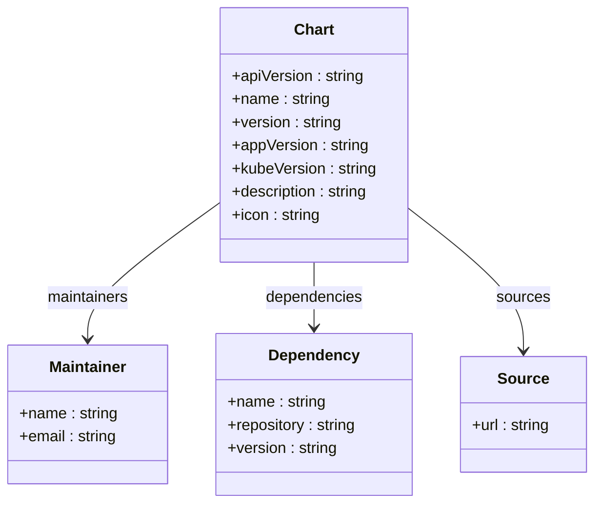
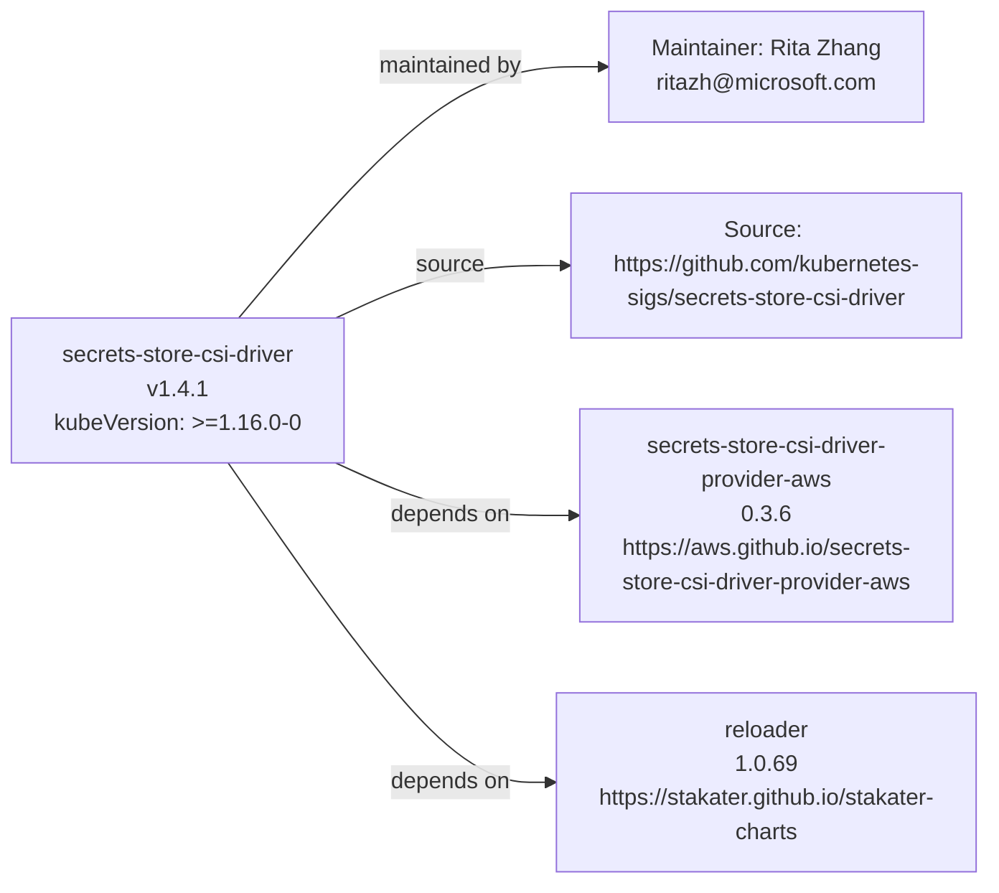

# Diagram: devops/k8s/secrets-store-csi-driver/helm/Chart.yaml

> Auto-generated by Obscura crawlers

## Diagram 1

### SVG

<svg id="container" width="618.25" xmlns="http://www.w3.org/2000/svg" class="classDiagram" height="522" viewBox="0 0 618.25 522" role="graphics-document document" aria-roledescription="class"><g><defs><marker id="container_class-aggregationStart" class="marker aggregation class" refX="18" refY="7" markerWidth="190" markerHeight="240" orient="auto"><path d="M 18,7 L9,13 L1,7 L9,1 Z"></path></marker></defs><defs><marker id="container_class-aggregationEnd" class="marker aggregation class" refX="1" refY="7" markerWidth="20" markerHeight="28" orient="auto"><path d="M 18,7 L9,13 L1,7 L9,1 Z"></path></marker></defs><defs><marker id="container_class-extensionStart" class="marker extension class" refX="18" refY="7" markerWidth="190" markerHeight="240" orient="auto"><path d="M 1,7 L18,13 V 1 Z"></path></marker></defs><defs><marker id="container_class-extensionEnd" class="marker extension class" refX="1" refY="7" markerWidth="20" markerHeight="28" orient="auto"><path d="M 1,1 V 13 L18,7 Z"></path></marker></defs><defs><marker id="container_class-compositionStart" class="marker composition class" refX="18" refY="7" markerWidth="190" markerHeight="240" orient="auto"><path d="M 18,7 L9,13 L1,7 L9,1 Z"></path></marker></defs><defs><marker id="container_class-compositionEnd" class="marker composition class" refX="1" refY="7" markerWidth="20" markerHeight="28" orient="auto"><path d="M 18,7 L9,13 L1,7 L9,1 Z"></path></marker></defs><defs><marker id="container_class-dependencyStart" class="marker dependency class" refX="6" refY="7" markerWidth="190" markerHeight="240" orient="auto"><path d="M 5,7 L9,13 L1,7 L9,1 Z"></path></marker></defs><defs><marker id="container_class-dependencyEnd" class="marker dependency class" refX="13" refY="7" markerWidth="20" markerHeight="28" orient="auto"><path d="M 18,7 L9,13 L14,7 L9,1 Z"></path></marker></defs><defs><marker id="container_class-lollipopStart" class="marker lollipop class" refX="13" refY="7" markerWidth="190" markerHeight="240" orient="auto"><circle stroke="black" fill="transparent" cx="7" cy="7" r="6"></circle></marker></defs><defs><marker id="container_class-lollipopEnd" class="marker lollipop class" refX="1" refY="7" markerWidth="190" markerHeight="240" orient="auto"><circle stroke="black" fill="transparent" cx="7" cy="7" r="6"></circle></marker></defs><g class="root"><g class="clusters"></g><g class="edgePaths"><path d="M228.938,210.019L205.938,226.516C182.938,243.013,136.938,276.006,113.938,299.67C90.938,323.333,90.938,337.667,90.938,344.833L90.938,352" id="id_Chart_Maintainer_1" class="edge-thickness-normal edge-pattern-solid relation" style=";;;" data-edge="true" data-et="edge" data-id="id_Chart_Maintainer_1" data-points="W3sieCI6MjI4LjkzNzUsInkiOjIxMC4wMTkwNDg3MjQyODI1OH0seyJ4Ijo5MC45Mzc1LCJ5IjozMDl9LHsieCI6OTAuOTM3NSwieSI6MzU4fV0=" marker-end="url(#container_class-dependencyEnd)"></path><path d="M326.559,272L326.559,278.167C326.559,284.333,326.559,296.667,326.559,308C326.559,319.333,326.559,329.667,326.559,334.833L326.559,340" id="id_Chart_Dependency_2" class="edge-thickness-normal edge-pattern-solid relation" style=";;;" data-edge="true" data-et="edge" data-id="id_Chart_Dependency_2" data-points="W3sieCI6MzI2LjU1ODU5Mzc1LCJ5IjoyNzJ9LHsieCI6MzI2LjU1ODU5Mzc1LCJ5IjozMDl9LHsieCI6MzI2LjU1ODU5Mzc1LCJ5IjozNDZ9XQ==" marker-end="url(#container_class-dependencyEnd)"></path><path d="M424.18,215.614L444.274,231.178C464.368,246.742,504.557,277.871,524.652,302.602C544.746,327.333,544.746,345.667,544.746,354.833L544.746,364" id="id_Chart_Source_3" class="edge-thickness-normal edge-pattern-solid relation" style=";;;" data-edge="true" data-et="edge" data-id="id_Chart_Source_3" data-points="W3sieCI6NDI0LjE3OTY4NzUsInkiOjIxNS42MTM3MDMwOTM2Njk0MX0seyJ4Ijo1NDQuNzQ2MDkzNzUsInkiOjMwOX0seyJ4Ijo1NDQuNzQ2MDkzNzUsInkiOjM3MH1d" marker-end="url(#container_class-dependencyEnd)"></path></g><g class="edgeLabels"><g class="edgeLabel" transform="translate(90.9375, 309)"><g class="label" data-id="id_Chart_Maintainer_1" transform="translate(-43.3515625, -12)"><foreignObject width="86.703125" height="24">

maintainers

</foreignObject></g></g><g class="edgeLabel" transform="translate(326.55859375, 309)"><g class="label" data-id="id_Chart_Dependency_2" transform="translate(-50.953125, -12)"><foreignObject width="101.90625" height="24">

dependencies

</foreignObject></g></g><g class="edgeLabel" transform="translate(544.74609375, 309)"><g class="label" data-id="id_Chart_Source_3" transform="translate(-27.6796875, -12)"><foreignObject width="55.359375" height="24">

sources

</foreignObject></g></g></g><g class="nodes"><g class="node default" id="classId-Chart-0" transform="translate(326.55859375, 140)"><g class="basic label-container"><path d="M-97.62109375 -132 L97.62109375 -132 L97.62109375 132 L-97.62109375 132" stroke="none" stroke-width="0" fill="#ECECFF" style=""></path><path d="M-97.62109375 -132 C-45.98182054691971 -132, 5.6574526561605865 -132, 97.62109375 -132 M-97.62109375 -132 C-26.823630412348564 -132, 43.97383292530287 -132, 97.62109375 -132 M97.62109375 -132 C97.62109375 -49.76944785676834, 97.62109375 32.461104286463325, 97.62109375 132 M97.62109375 -132 C97.62109375 -30.645287055179836, 97.62109375 70.70942588964033, 97.62109375 132 M97.62109375 132 C34.48959332767454 132, -28.641907094650918 132, -97.62109375 132 M97.62109375 132 C21.039823919400433 132, -55.54144591119913 132, -97.62109375 132 M-97.62109375 132 C-97.62109375 62.51845715048367, -97.62109375 -6.963085699032661, -97.62109375 -132 M-97.62109375 132 C-97.62109375 68.31907421854996, -97.62109375 4.6381484370999, -97.62109375 -132" stroke="#9370DB" stroke-width="1.3" fill="none" stroke-dasharray="0 0" style=""></path></g><g class="annotation-group text" transform="translate(0, -108)"></g><g class="label-group text" transform="translate(-19.8203125, -108)"><g class="label" style="font-weight: bolder" transform="translate(0,-12)"><foreignObject width="39.640625" height="24">

Chart

</foreignObject></g></g><g class="members-group text" transform="translate(-85.62109375, -60)"><g class="label" style="" transform="translate(0,-12)"><foreignObject width="138.28125" height="24">

+apiVersion : string

</foreignObject></g><g class="label" style="" transform="translate(0,12)"><foreignObject width="102.453125" height="24">

+name : string

</foreignObject></g><g class="label" style="" transform="translate(0,36)"><foreignObject width="114.953125" height="24">

+version : string

</foreignObject></g><g class="label" style="" transform="translate(0,60)"><foreignObject width="143.265625" height="24">

+appVersion : string

</foreignObject></g><g class="label" style="" transform="translate(0,84)"><foreignObject width="151.421875" height="24">

+kubeVersion : string

</foreignObject></g><g class="label" style="" transform="translate(0,108)"><foreignObject width="144.546875" height="24">

+description : string

</foreignObject></g><g class="label" style="" transform="translate(0,132)"><foreignObject width="92.5" height="24">

+icon : string

</foreignObject></g></g><g class="methods-group text" transform="translate(-85.62109375, 132)"></g><g class="divider" style=""><path d="M-97.62109375 -84 C-36.46190714118597 -84, 24.697279467628064 -84, 97.62109375 -84 M-97.62109375 -84 C-58.36200794269763 -84, -19.10292213539526 -84, 97.62109375 -84" stroke="#9370DB" stroke-width="1.3" fill="none" stroke-dasharray="0 0" style=""></path></g><g class="divider" style=""><path d="M-97.62109375 108 C-34.59691668842799 108, 28.427260373144023 108, 97.62109375 108 M-97.62109375 108 C-21.236070263925242 108, 55.148953222149515 108, 97.62109375 108" stroke="#9370DB" stroke-width="1.3" fill="none" stroke-dasharray="0 0" style=""></path></g></g><g class="node default" id="classId-Maintainer-1" transform="translate(90.9375, 430)"><g class="basic label-container"><path d="M-82.9375 -72 L82.9375 -72 L82.9375 72 L-82.9375 72" stroke="none" stroke-width="0" fill="#ECECFF" style=""></path><path d="M-82.9375 -72 C-40.04003366905378 -72, 2.857432661892446 -72, 82.9375 -72 M-82.9375 -72 C-16.808198668517434 -72, 49.32110266296513 -72, 82.9375 -72 M82.9375 -72 C82.9375 -32.7659451983082, 82.9375 6.468109603383596, 82.9375 72 M82.9375 -72 C82.9375 -14.539098769932593, 82.9375 42.92180246013481, 82.9375 72 M82.9375 72 C19.136987239567404 72, -44.66352552086519 72, -82.9375 72 M82.9375 72 C20.461896795227382 72, -42.013706409545236 72, -82.9375 72 M-82.9375 72 C-82.9375 39.805184851619934, -82.9375 7.6103697032398685, -82.9375 -72 M-82.9375 72 C-82.9375 39.347799814172916, -82.9375 6.695599628345832, -82.9375 -72" stroke="#9370DB" stroke-width="1.3" fill="none" stroke-dasharray="0 0" style=""></path></g><g class="annotation-group text" transform="translate(0, -48)"></g><g class="label-group text" transform="translate(-39.421875, -48)"><g class="label" style="font-weight: bolder" transform="translate(0,-12)"><foreignObject width="78.84375" height="24">

Maintainer

</foreignObject></g></g><g class="members-group text" transform="translate(-70.9375, 0)"><g class="label" style="" transform="translate(0,-12)"><foreignObject width="102.453125" height="24">

+name : string

</foreignObject></g><g class="label" style="" transform="translate(0,12)"><foreignObject width="102.28125" height="24">

+email : string

</foreignObject></g></g><g class="methods-group text" transform="translate(-70.9375, 72)"></g><g class="divider" style=""><path d="M-82.9375 -24 C-22.644534977043918 -24, 37.648430045912164 -24, 82.9375 -24 M-82.9375 -24 C-47.975798606196435 -24, -13.014097212392869 -24, 82.9375 -24" stroke="#9370DB" stroke-width="1.3" fill="none" stroke-dasharray="0 0" style=""></path></g><g class="divider" style=""><path d="M-82.9375 48 C-19.408932076495873 48, 44.119635847008254 48, 82.9375 48 M-82.9375 48 C-39.18595690116979 48, 4.565586197660423 48, 82.9375 48" stroke="#9370DB" stroke-width="1.3" fill="none" stroke-dasharray="0 0" style=""></path></g></g><g class="node default" id="classId-Dependency-2" transform="translate(326.55859375, 430)"><g class="basic label-container"><path d="M-102.68359375 -84 L102.68359375 -84 L102.68359375 84 L-102.68359375 84" stroke="none" stroke-width="0" fill="#ECECFF" style=""></path><path d="M-102.68359375 -84 C-59.4727774933836 -84, -16.261961236767206 -84, 102.68359375 -84 M-102.68359375 -84 C-40.80909081573896 -84, 21.065412118522076 -84, 102.68359375 -84 M102.68359375 -84 C102.68359375 -25.074891566240858, 102.68359375 33.850216867518284, 102.68359375 84 M102.68359375 -84 C102.68359375 -39.747570554908094, 102.68359375 4.504858890183812, 102.68359375 84 M102.68359375 84 C59.962285806462894 84, 17.24097786292579 84, -102.68359375 84 M102.68359375 84 C52.70177326661801 84, 2.7199527832360246 84, -102.68359375 84 M-102.68359375 84 C-102.68359375 39.379342963383884, -102.68359375 -5.241314073232232, -102.68359375 -84 M-102.68359375 84 C-102.68359375 23.795614601474995, -102.68359375 -36.40877079705001, -102.68359375 -84" stroke="#9370DB" stroke-width="1.3" fill="none" stroke-dasharray="0 0" style=""></path></g><g class="annotation-group text" transform="translate(0, -60)"></g><g class="label-group text" transform="translate(-45.2421875, -60)"><g class="label" style="font-weight: bolder" transform="translate(0,-12)"><foreignObject width="90.484375" height="24">

Dependency

</foreignObject></g></g><g class="members-group text" transform="translate(-90.68359375, -12)"><g class="label" style="" transform="translate(0,-12)"><foreignObject width="102.453125" height="24">

+name : string

</foreignObject></g><g class="label" style="" transform="translate(0,12)"><foreignObject width="136.125" height="24">

+repository : string

</foreignObject></g><g class="label" style="" transform="translate(0,36)"><foreignObject width="114.953125" height="24">

+version : string

</foreignObject></g></g><g class="methods-group text" transform="translate(-90.68359375, 84)"></g><g class="divider" style=""><path d="M-102.68359375 -36 C-41.03999517647814 -36, 20.603603397043713 -36, 102.68359375 -36 M-102.68359375 -36 C-25.067225302812375 -36, 52.54914314437525 -36, 102.68359375 -36" stroke="#9370DB" stroke-width="1.3" fill="none" stroke-dasharray="0 0" style=""></path></g><g class="divider" style=""><path d="M-102.68359375 60 C-59.97210358202204 60, -17.260613414044073 60, 102.68359375 60 M-102.68359375 60 C-44.64744067364946 60, 13.388712402701074 60, 102.68359375 60" stroke="#9370DB" stroke-width="1.3" fill="none" stroke-dasharray="0 0" style=""></path></g></g><g class="node default" id="classId-Source-3" transform="translate(544.74609375, 430)"><g class="basic label-container"><path d="M-65.50390625 -60 L65.50390625 -60 L65.50390625 60 L-65.50390625 60" stroke="none" stroke-width="0" fill="#ECECFF" style=""></path><path d="M-65.50390625 -60 C-33.93909947285208 -60, -2.374292695704149 -60, 65.50390625 -60 M-65.50390625 -60 C-19.571959251682486 -60, 26.359987746635028 -60, 65.50390625 -60 M65.50390625 -60 C65.50390625 -30.297689747395186, 65.50390625 -0.5953794947903717, 65.50390625 60 M65.50390625 -60 C65.50390625 -27.16988530914351, 65.50390625 5.6602293817129805, 65.50390625 60 M65.50390625 60 C14.579155792562204 60, -36.34559466487559 60, -65.50390625 60 M65.50390625 60 C23.507502566909885 60, -18.48890111618023 60, -65.50390625 60 M-65.50390625 60 C-65.50390625 12.599994901937464, -65.50390625 -34.80001019612507, -65.50390625 -60 M-65.50390625 60 C-65.50390625 24.95285856192612, -65.50390625 -10.094282876147759, -65.50390625 -60" stroke="#9370DB" stroke-width="1.3" fill="none" stroke-dasharray="0 0" style=""></path></g><g class="annotation-group text" transform="translate(0, -36)"></g><g class="label-group text" transform="translate(-24.8828125, -36)"><g class="label" style="font-weight: bolder" transform="translate(0,-12)"><foreignObject width="49.765625" height="24">

Source

</foreignObject></g></g><g class="members-group text" transform="translate(-53.50390625, 12)"><g class="label" style="" transform="translate(0,-12)"><foreignObject width="82.125" height="24">

+url : string

</foreignObject></g></g><g class="methods-group text" transform="translate(-53.50390625, 60)"></g><g class="divider" style=""><path d="M-65.50390625 -12 C-33.804974249281294 -12, -2.106042248562588 -12, 65.50390625 -12 M-65.50390625 -12 C-28.599865641244754 -12, 8.304174967510491 -12, 65.50390625 -12" stroke="#9370DB" stroke-width="1.3" fill="none" stroke-dasharray="0 0" style=""></path></g><g class="divider" style=""><path d="M-65.50390625 36 C-17.35109133348312 36, 30.801723583033763 36, 65.50390625 36 M-65.50390625 36 C-17.748771753145938 36, 30.006362743708124 36, 65.50390625 36" stroke="#9370DB" stroke-width="1.3" fill="none" stroke-dasharray="0 0" style=""></path></g></g></g></g></g></svg>

## Diagram 2

### SVG

<svg id="container" width="890.0625" xmlns="http://www.w3.org/2000/svg" class="flowchart" height="526" viewBox="0 0 890.0625 526" role="graphics-document document" aria-roledescription="flowchart-v2"><g><marker id="container_flowchart-v2-pointEnd" class="marker flowchart-v2" viewBox="0 0 10 10" refX="5" refY="5" markerUnits="userSpaceOnUse" markerWidth="8" markerHeight="8" orient="auto"><path d="M 0 0 L 10 5 L 0 10 z" class="arrowMarkerPath" style="stroke-width: 1; stroke-dasharray: 1, 0;"></path></marker><marker id="container_flowchart-v2-pointStart" class="marker flowchart-v2" viewBox="0 0 10 10" refX="4.5" refY="5" markerUnits="userSpaceOnUse" markerWidth="8" markerHeight="8" orient="auto"><path d="M 0 5 L 10 10 L 10 0 z" class="arrowMarkerPath" style="stroke-width: 1; stroke-dasharray: 1, 0;"></path></marker><marker id="container_flowchart-v2-circleEnd" class="marker flowchart-v2" viewBox="0 0 10 10" refX="11" refY="5" markerUnits="userSpaceOnUse" markerWidth="11" markerHeight="11" orient="auto"><circle cx="5" cy="5" r="5" class="arrowMarkerPath" style="stroke-width: 1; stroke-dasharray: 1, 0;"></circle></marker><marker id="container_flowchart-v2-circleStart" class="marker flowchart-v2" viewBox="0 0 10 10" refX="-1" refY="5" markerUnits="userSpaceOnUse" markerWidth="11" markerHeight="11" orient="auto"><circle cx="5" cy="5" r="5" class="arrowMarkerPath" style="stroke-width: 1; stroke-dasharray: 1, 0;"></circle></marker><marker id="container_flowchart-v2-crossEnd" class="marker cross flowchart-v2" viewBox="0 0 11 11" refX="12" refY="5.2" markerUnits="userSpaceOnUse" markerWidth="11" markerHeight="11" orient="auto"><path d="M 1,1 l 9,9 M 10,1 l -9,9" class="arrowMarkerPath" style="stroke-width: 2; stroke-dasharray: 1, 0;"></path></marker><marker id="container_flowchart-v2-crossStart" class="marker cross flowchart-v2" viewBox="0 0 11 11" refX="-1" refY="5.2" markerUnits="userSpaceOnUse" markerWidth="11" markerHeight="11" orient="auto"><path d="M 1,1 l 9,9 M 10,1 l -9,9" class="arrowMarkerPath" style="stroke-width: 2; stroke-dasharray: 1, 0;"></path></marker><g class="root"><g class="clusters"></g><g class="edgePaths"><path d="M193.586,212L220.653,184.5C247.719,157,301.852,102,355.004,74.5C408.156,47,460.328,47,486.414,47L512.5,47" id="L_CHART_MAINT_0" class="edge-thickness-normal edge-pattern-solid edge-thickness-normal edge-pattern-solid flowchart-link" style=";" data-edge="true" data-et="edge" data-id="L_CHART_MAINT_0" data-points="W3sieCI6MTkzLjU4NjM3MTUyNzc3Nzc3LCJ5IjoyMTJ9LHsieCI6MzU1Ljk4NDM3NSwieSI6NDd9LHsieCI6NTE2LjUsInkiOjQ3fV0=" marker-end="url(#container_flowchart-v2-pointEnd)"></path><path d="M278.781,214.599L291.648,209.999C304.516,205.4,330.25,196.2,368.314,191.6C406.378,187,456.771,187,481.967,187L507.164,187" id="L_CHART_SRC_0" class="edge-thickness-normal edge-pattern-solid edge-thickness-normal edge-pattern-solid flowchart-link" style=";" data-edge="true" data-et="edge" data-id="L_CHART_SRC_0" data-points="W3sieCI6Mjc4Ljc4MTI1LCJ5IjoyMTQuNTk5Mjk0NDI4OTI4NDN9LHsieCI6MzU1Ljk4NDM3NSwieSI6MTg3fSx7IngiOjUxMS4xNjQwNjI1LCJ5IjoxODd9XQ==" marker-end="url(#container_flowchart-v2-pointEnd)"></path><path d="M278.781,311.401L291.648,316.001C304.516,320.6,330.25,329.8,361.755,334.4C393.26,339,430.536,339,449.174,339L467.813,339" id="L_CHART_DEP_AWS_0" class="edge-thickness-normal edge-pattern-solid edge-thickness-normal edge-pattern-solid flowchart-link" style=";" data-edge="true" data-et="edge" data-id="L_CHART_DEP_AWS_0" data-points="W3sieCI6Mjc4Ljc4MTI1LCJ5IjozMTEuNDAwNzA1NTcxMDcxNTd9LHsieCI6MzU1Ljk4NDM3NSwieSI6MzM5fSx7IngiOjQ3MS44MTI1LCJ5IjozMzl9XQ==" marker-end="url(#container_flowchart-v2-pointEnd)"></path><path d="M193.586,314L220.653,341.5C247.719,369,301.852,424,341.119,451.5C380.385,479,404.786,479,416.987,479L429.188,479" id="L_CHART_DEP_RELOADER_0" class="edge-thickness-normal edge-pattern-solid edge-thickness-normal edge-pattern-solid flowchart-link" style=";" data-edge="true" data-et="edge" data-id="L_CHART_DEP_RELOADER_0" data-points="W3sieCI6MTkzLjU4NjM3MTUyNzc3Nzc3LCJ5IjozMTR9LHsieCI6MzU1Ljk4NDM3NSwieSI6NDc5fSx7IngiOjQzMy4xODc1LCJ5Ijo0Nzl9XQ==" marker-end="url(#container_flowchart-v2-pointEnd)"></path></g><g class="edgeLabels"><g class="edgeLabel" transform="translate(355.984375, 47)"><g class="label" data-id="L_CHART_MAINT_0" transform="translate(-52.203125, -12)"><foreignObject width="104.40625" height="24">

maintained by

</foreignObject></g></g><g class="edgeLabel" transform="translate(355.984375, 187)"><g class="label" data-id="L_CHART_SRC_0" transform="translate(-23.9375, -12)"><foreignObject width="47.875" height="24">

source

</foreignObject></g></g><g class="edgeLabel" transform="translate(355.984375, 339)"><g class="label" data-id="L_CHART_DEP_AWS_0" transform="translate(-42.9453125, -12)"><foreignObject width="85.890625" height="24">

depends on

</foreignObject></g></g><g class="edgeLabel" transform="translate(355.984375, 479)"><g class="label" data-id="L_CHART_DEP_RELOADER_0" transform="translate(-42.9453125, -12)"><foreignObject width="85.890625" height="24">

depends on

</foreignObject></g></g></g><g class="nodes"><g class="node default" id="flowchart-CHART-0" transform="translate(143.390625, 263)"><rect class="basic label-container" style="" x="-135.390625" y="-51" width="270.78125" height="102"></rect><g class="label" style="" transform="translate(-105.390625, -36)"><rect></rect><foreignObject width="210.78125" height="72">

secrets-store-csi-driver\nv1.4.1\nkubeVersion: &gt;=1.16.0-0

</foreignObject></g></g><g class="node default" id="flowchart-MAINT-1" transform="translate(657.625, 47)"><rect class="basic label-container" style="" x="-141.125" y="-39" width="282.25" height="78"></rect><g class="label" style="" transform="translate(-111.125, -24)"><rect></rect><foreignObject width="222.25" height="48">

Maintainer: Rita Zhang\nritazh@microsoft.com

</foreignObject></g></g><g class="node default" id="flowchart-SRC-2" transform="translate(657.625, 187)"><rect class="basic label-container" style="" x="-146.4609375" y="-51" width="292.921875" height="102"></rect><g class="label" style="" transform="translate(-116.4609375, -36)"><rect></rect><foreignObject width="232.921875" height="72">

Source: https://github.com/kubernetes-sigs/secrets-store-csi-driver

</foreignObject></g></g><g class="node default" id="flowchart-DEP_AWS-3" transform="translate(657.625, 339)"><rect class="basic label-container" style="" x="-185.8125" y="-51" width="371.625" height="102"></rect><g class="label" style="" transform="translate(-155.8125, -36)"><rect></rect><foreignObject width="311.625" height="72">

secrets-store-csi-driver-provider-aws\n0.3.6\nhttps://aws.github.io/secrets-store-csi-driver-provider-aws

</foreignObject></g></g><g class="node default" id="flowchart-DEP_RELOADER-4" transform="translate(657.625, 479)"><rect class="basic label-container" style="" x="-224.4375" y="-39" width="448.875" height="78"></rect><g class="label" style="" transform="translate(-194.4375, -24)"><rect></rect><foreignObject width="388.875" height="48">

reloader\n1.0.69\nhttps://stakater.github.io/stakater-charts

</foreignObject></g></g></g></g></g></svg>
