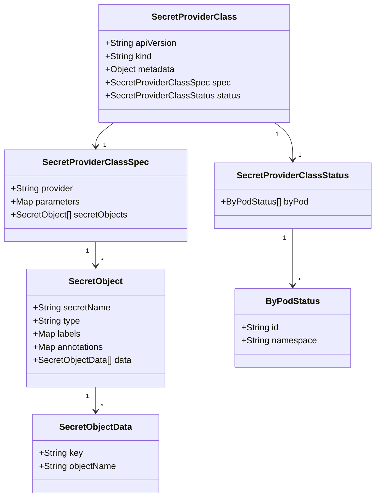
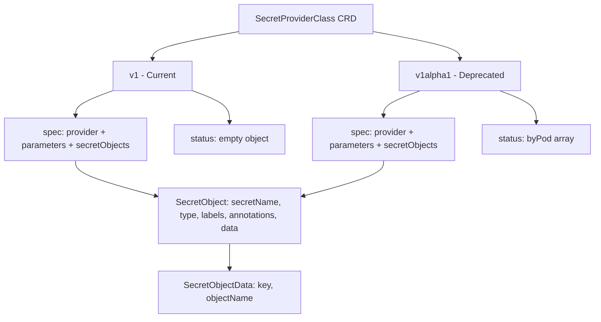

# Diagram: devops/k8s/secrets-store-csi-driver/helm/crds/secrets-store.csi.x-k8s.io_secretproviderclasses.yaml

> Auto-generated by Obscura crawlers

## Diagram 1

### SVG

<svg id="container" width="672.96875" xmlns="http://www.w3.org/2000/svg" class="classDiagram" height="910" viewBox="0 0 672.96875 910" role="graphics-document document" aria-roledescription="class"><g><defs><marker id="container_class-aggregationStart" class="marker aggregation class" refX="18" refY="7" markerWidth="190" markerHeight="240" orient="auto"><path d="M 18,7 L9,13 L1,7 L9,1 Z"></path></marker></defs><defs><marker id="container_class-aggregationEnd" class="marker aggregation class" refX="1" refY="7" markerWidth="20" markerHeight="28" orient="auto"><path d="M 18,7 L9,13 L1,7 L9,1 Z"></path></marker></defs><defs><marker id="container_class-extensionStart" class="marker extension class" refX="18" refY="7" markerWidth="190" markerHeight="240" orient="auto"><path d="M 1,7 L18,13 V 1 Z"></path></marker></defs><defs><marker id="container_class-extensionEnd" class="marker extension class" refX="1" refY="7" markerWidth="20" markerHeight="28" orient="auto"><path d="M 1,1 V 13 L18,7 Z"></path></marker></defs><defs><marker id="container_class-compositionStart" class="marker composition class" refX="18" refY="7" markerWidth="190" markerHeight="240" orient="auto"><path d="M 18,7 L9,13 L1,7 L9,1 Z"></path></marker></defs><defs><marker id="container_class-compositionEnd" class="marker composition class" refX="1" refY="7" markerWidth="20" markerHeight="28" orient="auto"><path d="M 18,7 L9,13 L1,7 L9,1 Z"></path></marker></defs><defs><marker id="container_class-dependencyStart" class="marker dependency class" refX="6" refY="7" markerWidth="190" markerHeight="240" orient="auto"><path d="M 5,7 L9,13 L1,7 L9,1 Z"></path></marker></defs><defs><marker id="container_class-dependencyEnd" class="marker dependency class" refX="13" refY="7" markerWidth="20" markerHeight="28" orient="auto"><path d="M 18,7 L9,13 L14,7 L9,1 Z"></path></marker></defs><defs><marker id="container_class-lollipopStart" class="marker lollipop class" refX="13" refY="7" markerWidth="190" markerHeight="240" orient="auto"><circle stroke="black" fill="transparent" cx="7" cy="7" r="6"></circle></marker></defs><defs><marker id="container_class-lollipopEnd" class="marker lollipop class" refX="1" refY="7" markerWidth="190" markerHeight="240" orient="auto"><circle stroke="black" fill="transparent" cx="7" cy="7" r="6"></circle></marker></defs><g class="root"><g class="clusters"></g><g class="edgePaths"><path d="M205.128,224L199.591,228.167C194.054,232.333,182.98,240.667,177.443,248C171.906,255.333,171.906,261.667,171.906,264.833L171.906,268" id="id_SecretProviderClass_SecretProviderClassSpec_1" class="edge-thickness-normal edge-pattern-solid relation" style=";;;" data-edge="true" data-et="edge" data-id="id_SecretProviderClass_SecretProviderClassSpec_1" data-points="W3sieCI6MjA1LjEyODQ2NTY5NTQ4ODczLCJ5IjoyMjR9LHsieCI6MTcxLjkwNjI1LCJ5IjoyNDl9LHsieCI6MTcxLjkwNjI1LCJ5IjoyNzR9XQ==" marker-end="url(#container_class-dependencyEnd)"></path><path d="M492.168,224L497.705,228.167C503.242,232.333,514.317,240.667,519.854,252C525.391,263.333,525.391,277.667,525.391,284.833L525.391,292" id="id_SecretProviderClass_SecretProviderClassStatus_2" class="edge-thickness-normal edge-pattern-solid relation" style=";;;" data-edge="true" data-et="edge" data-id="id_SecretProviderClass_SecretProviderClassStatus_2" data-points="W3sieCI6NDkyLjE2ODQwOTMwNDUxMTMsInkiOjIyNH0seyJ4Ijo1MjUuMzkwNjI1LCJ5IjoyNDl9LHsieCI6NTI1LjM5MDYyNSwieSI6Mjk4fV0=" marker-end="url(#container_class-dependencyEnd)"></path><path d="M171.906,442L171.906,446.167C171.906,450.333,171.906,458.667,171.906,466C171.906,473.333,171.906,479.667,171.906,482.833L171.906,486" id="id_SecretProviderClassSpec_SecretObject_3" class="edge-thickness-normal edge-pattern-solid relation" style=";;;" data-edge="true" data-et="edge" data-id="id_SecretProviderClassSpec_SecretObject_3" data-points="W3sieCI6MTcxLjkwNjI1LCJ5Ijo0NDJ9LHsieCI6MTcxLjkwNjI1LCJ5Ijo0Njd9LHsieCI6MTcxLjkwNjI1LCJ5Ijo0OTJ9XQ==" marker-end="url(#container_class-dependencyEnd)"></path><path d="M171.906,708L171.906,712.167C171.906,716.333,171.906,724.667,171.906,732C171.906,739.333,171.906,745.667,171.906,748.833L171.906,752" id="id_SecretObject_SecretObjectData_4" class="edge-thickness-normal edge-pattern-solid relation" style=";;;" data-edge="true" data-et="edge" data-id="id_SecretObject_SecretObjectData_4" data-points="W3sieCI6MTcxLjkwNjI1LCJ5Ijo3MDh9LHsieCI6MTcxLjkwNjI1LCJ5Ijo3MzN9LHsieCI6MTcxLjkwNjI1LCJ5Ijo3NTh9XQ==" marker-end="url(#container_class-dependencyEnd)"></path><path d="M525.391,418L525.391,426.167C525.391,434.333,525.391,450.667,525.391,468C525.391,485.333,525.391,503.667,525.391,512.833L525.391,522" id="id_SecretProviderClassStatus_ByPodStatus_5" class="edge-thickness-normal edge-pattern-solid relation" style=";;;" data-edge="true" data-et="edge" data-id="id_SecretProviderClassStatus_ByPodStatus_5" data-points="W3sieCI6NTI1LjM5MDYyNSwieSI6NDE4fSx7IngiOjUyNS4zOTA2MjUsInkiOjQ2N30seyJ4Ijo1MjUuMzkwNjI1LCJ5Ijo1Mjh9XQ==" marker-end="url(#container_class-dependencyEnd)"></path></g><g class="edgeLabels"><g class="edgeLabel"><g class="label" data-id="id_SecretProviderClass_SecretProviderClassSpec_1" transform="translate(0, 0)"><foreignObject width="0" height="0">

</foreignObject></g></g><g class="edgeLabel"><g class="label" data-id="id_SecretProviderClass_SecretProviderClassStatus_2" transform="translate(0, 0)"><foreignObject width="0" height="0">

</foreignObject></g></g><g class="edgeLabel"><g class="label" data-id="id_SecretProviderClassSpec_SecretObject_3" transform="translate(0, 0)"><foreignObject width="0" height="0">

</foreignObject></g></g><g class="edgeLabel"><g class="label" data-id="id_SecretObject_SecretObjectData_4" transform="translate(0, 0)"><foreignObject width="0" height="0">

</foreignObject></g></g><g class="edgeLabel"><g class="label" data-id="id_SecretProviderClassStatus_ByPodStatus_5" transform="translate(0, 0)"><foreignObject width="0" height="0">

</foreignObject></g></g><g class="edgeTerminals" transform="translate(182.12609170255445, 222.536882465818)"><g class="inner" transform="translate(0, 0)"><foreignObject style="width: 9px; height: 12px;">
1
</foreignObject></g></g><g class="edgeTerminals" transform="translate(497.13232453659407, 246.50798830891083)"><g class="inner" transform="translate(0, 0)"><foreignObject style="width: 9px; height: 12px;">
1
</foreignObject></g></g><g class="edgeTerminals" transform="translate(156.90625, 459.5)"><g class="inner" transform="translate(0, 0)"><foreignObject style="width: 9px; height: 12px;">
1
</foreignObject></g></g><g class="edgeTerminals" transform="translate(156.90625, 725.5)"><g class="inner" transform="translate(0, 0)"><foreignObject style="width: 9px; height: 12px;">
1
</foreignObject></g></g><g class="edgeTerminals" transform="translate(510.3906275000001, 435.5000021428571)"><g class="inner" transform="translate(0, 0)"><foreignObject style="width: 9px; height: 12px;">
1
</foreignObject></g></g><g class="edgeTerminals" transform="translate(185.42705997240856, 257.236078364837)"><g class="inner" transform="translate(0, 0)"></g><foreignObject style="width: 9px; height: 12px;">
1
</foreignObject></g><g class="edgeTerminals" transform="translate(535.3906274999998, 275.5000021428571)"><g class="inner" transform="translate(0, 0)"></g><foreignObject style="width: 9px; height: 12px;">
1
</foreignObject></g><g class="edgeTerminals" transform="translate(181.90625, 469.5)"><g class="inner" transform="translate(0, 0)"></g><foreignObject style="width: 9px; height: 12px;">
*
</foreignObject></g><g class="edgeTerminals" transform="translate(181.90625, 735.5)"><g class="inner" transform="translate(0, 0)"></g><foreignObject style="width: 9px; height: 12px;">
*
</foreignObject></g><g class="edgeTerminals" transform="translate(535.3906274999998, 505.5000021428571)"><g class="inner" transform="translate(0, 0)"></g><foreignObject style="width: 9px; height: 12px;">
*
</foreignObject></g></g><g class="nodes"><g class="node default" id="classId-SecretProviderClass-0" transform="translate(348.6484375, 116)"><g class="basic label-container"><path d="M-170.79296875 -108 L170.79296875 -108 L170.79296875 108 L-170.79296875 108" stroke="none" stroke-width="0" fill="#ECECFF" style=""></path><path d="M-170.79296875 -108 C-57.73322071389292 -108, 55.32652732221416 -108, 170.79296875 -108 M-170.79296875 -108 C-37.916970588798705 -108, 94.95902757240259 -108, 170.79296875 -108 M170.79296875 -108 C170.79296875 -48.50099707082623, 170.79296875 10.99800585834754, 170.79296875 108 M170.79296875 -108 C170.79296875 -26.416516061023927, 170.79296875 55.166967877952146, 170.79296875 108 M170.79296875 108 C75.05541435615395 108, -20.682140037692108 108, -170.79296875 108 M170.79296875 108 C39.50032003123957 108, -91.79232868752086 108, -170.79296875 108 M-170.79296875 108 C-170.79296875 44.581965532196435, -170.79296875 -18.83606893560713, -170.79296875 -108 M-170.79296875 108 C-170.79296875 46.50486745258219, -170.79296875 -14.990265094835621, -170.79296875 -108" stroke="#9370DB" stroke-width="1.3" fill="none" stroke-dasharray="0 0" style=""></path></g><g class="annotation-group text" transform="translate(0, -84)"></g><g class="label-group text" transform="translate(-73.1328125, -84)"><g class="label" style="font-weight: bolder" transform="translate(0,-12)"><foreignObject width="146.265625" height="24">

SecretProviderClass

</foreignObject></g></g><g class="members-group text" transform="translate(-158.79296875, -36)"><g class="label" style="" transform="translate(0,-12)"><foreignObject width="131.046875" height="24">

+String apiVersion

</foreignObject></g><g class="label" style="" transform="translate(0,12)"><foreignObject width="86.125" height="24">

+String kind

</foreignObject></g><g class="label" style="" transform="translate(0,36)"><foreignObject width="128.875" height="24">

+Object metadata

</foreignObject></g><g class="label" style="" transform="translate(0,60)"><foreignObject width="222.34375" height="24">

+SecretProviderClassSpec spec

</foreignObject></g><g class="label" style="" transform="translate(0,84)"><foreignObject width="244.453125" height="24">

+SecretProviderClassStatus status

</foreignObject></g></g><g class="methods-group text" transform="translate(-158.79296875, 108)"></g><g class="divider" style=""><path d="M-170.79296875 -60 C-41.79089207452364 -60, 87.21118460095272 -60, 170.79296875 -60 M-170.79296875 -60 C-77.03605611885841 -60, 16.720856512283177 -60, 170.79296875 -60" stroke="#9370DB" stroke-width="1.3" fill="none" stroke-dasharray="0 0" style=""></path></g><g class="divider" style=""><path d="M-170.79296875 84 C-59.03297330507152 84, 52.727022139856956 84, 170.79296875 84 M-170.79296875 84 C-65.52456653710621 84, 39.74383567578758 84, 170.79296875 84" stroke="#9370DB" stroke-width="1.3" fill="none" stroke-dasharray="0 0" style=""></path></g></g><g class="node default" id="classId-SecretProviderClassSpec-1" transform="translate(171.90625, 358)"><g class="basic label-container"><path d="M-163.90625 -84 L163.90625 -84 L163.90625 84 L-163.90625 84" stroke="none" stroke-width="0" fill="#ECECFF" style=""></path><path d="M-163.90625 -84 C-96.72711186604826 -84, -29.547973732096523 -84, 163.90625 -84 M-163.90625 -84 C-50.188859355892006 -84, 63.52853128821599 -84, 163.90625 -84 M163.90625 -84 C163.90625 -21.064452790625907, 163.90625 41.871094418748186, 163.90625 84 M163.90625 -84 C163.90625 -21.73596095495811, 163.90625 40.52807809008378, 163.90625 84 M163.90625 84 C57.52230666761885 84, -48.8616366647623 84, -163.90625 84 M163.90625 84 C40.266765514834944 84, -83.37271897033011 84, -163.90625 84 M-163.90625 84 C-163.90625 30.883190909748684, -163.90625 -22.23361818050263, -163.90625 -84 M-163.90625 84 C-163.90625 31.827461414960588, -163.90625 -20.345077170078824, -163.90625 -84" stroke="#9370DB" stroke-width="1.3" fill="none" stroke-dasharray="0 0" style=""></path></g><g class="annotation-group text" transform="translate(0, -60)"></g><g class="label-group text" transform="translate(-90.734375, -60)"><g class="label" style="font-weight: bolder" transform="translate(0,-12)"><foreignObject width="181.46875" height="24">

SecretProviderClassSpec

</foreignObject></g></g><g class="members-group text" transform="translate(-151.90625, -12)"><g class="label" style="" transform="translate(0,-12)"><foreignObject width="115.796875" height="24">

+String provider

</foreignObject></g><g class="label" style="" transform="translate(0,12)"><foreignObject width="125.359375" height="24">

+Map parameters

</foreignObject></g><g class="label" style="" transform="translate(0,36)"><foreignObject width="213.078125" height="24">

+SecretObject[] secretObjects

</foreignObject></g></g><g class="methods-group text" transform="translate(-151.90625, 84)"></g><g class="divider" style=""><path d="M-163.90625 -36 C-63.76513893040784 -36, 36.37597213918431 -36, 163.90625 -36 M-163.90625 -36 C-42.816908884475026 -36, 78.27243223104995 -36, 163.90625 -36" stroke="#9370DB" stroke-width="1.3" fill="none" stroke-dasharray="0 0" style=""></path></g><g class="divider" style=""><path d="M-163.90625 60 C-92.33472709528353 60, -20.763204190567052 60, 163.90625 60 M-163.90625 60 C-36.55589778459067 60, 90.79445443081866 60, 163.90625 60" stroke="#9370DB" stroke-width="1.3" fill="none" stroke-dasharray="0 0" style=""></path></g></g><g class="node default" id="classId-SecretObject-2" transform="translate(171.90625, 600)"><g class="basic label-container"><path d="M-125.7109375 -108 L125.7109375 -108 L125.7109375 108 L-125.7109375 108" stroke="none" stroke-width="0" fill="#ECECFF" style=""></path><path d="M-125.7109375 -108 C-55.807690938636355 -108, 14.09555562272729 -108, 125.7109375 -108 M-125.7109375 -108 C-41.21897875742455 -108, 43.2729799851509 -108, 125.7109375 -108 M125.7109375 -108 C125.7109375 -49.81691671560899, 125.7109375 8.36616656878202, 125.7109375 108 M125.7109375 -108 C125.7109375 -42.946761934157465, 125.7109375 22.10647613168507, 125.7109375 108 M125.7109375 108 C35.959991763324695 108, -53.79095397335061 108, -125.7109375 108 M125.7109375 108 C48.32455610957811 108, -29.061825280843777 108, -125.7109375 108 M-125.7109375 108 C-125.7109375 63.31075976716037, -125.7109375 18.62151953432074, -125.7109375 -108 M-125.7109375 108 C-125.7109375 43.57769368041839, -125.7109375 -20.844612639163216, -125.7109375 -108" stroke="#9370DB" stroke-width="1.3" fill="none" stroke-dasharray="0 0" style=""></path></g><g class="annotation-group text" transform="translate(0, -84)"></g><g class="label-group text" transform="translate(-47.1875, -84)"><g class="label" style="font-weight: bolder" transform="translate(0,-12)"><foreignObject width="94.375" height="24">

SecretObject

</foreignObject></g></g><g class="members-group text" transform="translate(-113.7109375, -36)"><g class="label" style="" transform="translate(0,-12)"><foreignObject width="140.5625" height="24">

+String secretName

</foreignObject></g><g class="label" style="" transform="translate(0,12)"><foreignObject width="86.265625" height="24">

+String type

</foreignObject></g><g class="label" style="" transform="translate(0,36)"><foreignObject width="86.578125" height="24">

+Map labels

</foreignObject></g><g class="label" style="" transform="translate(0,60)"><foreignObject width="130.53125" height="24">

+Map annotations

</foreignObject></g><g class="label" style="" transform="translate(0,84)"><foreignObject width="180.234375" height="24">

+SecretObjectData[] data

</foreignObject></g></g><g class="methods-group text" transform="translate(-113.7109375, 108)"></g><g class="divider" style=""><path d="M-125.7109375 -60 C-35.99603870847153 -60, 53.71886008305694 -60, 125.7109375 -60 M-125.7109375 -60 C-39.69150571696284 -60, 46.327926066074326 -60, 125.7109375 -60" stroke="#9370DB" stroke-width="1.3" fill="none" stroke-dasharray="0 0" style=""></path></g><g class="divider" style=""><path d="M-125.7109375 84 C-61.19771960542721 84, 3.31549828914558 84, 125.7109375 84 M-125.7109375 84 C-68.00557832017793 84, -10.300219140355864 84, 125.7109375 84" stroke="#9370DB" stroke-width="1.3" fill="none" stroke-dasharray="0 0" style=""></path></g></g><g class="node default" id="classId-SecretObjectData-3" transform="translate(171.90625, 830)"><g class="basic label-container"><path d="M-115.046875 -72 L115.046875 -72 L115.046875 72 L-115.046875 72" stroke="none" stroke-width="0" fill="#ECECFF" style=""></path><path d="M-115.046875 -72 C-23.9400706654027 -72, 67.1667336691946 -72, 115.046875 -72 M-115.046875 -72 C-44.7691216994761 -72, 25.508631601047796 -72, 115.046875 -72 M115.046875 -72 C115.046875 -42.065209869304084, 115.046875 -12.130419738608168, 115.046875 72 M115.046875 -72 C115.046875 -27.71126229466057, 115.046875 16.577475410678858, 115.046875 72 M115.046875 72 C36.92078085799206 72, -41.20531328401589 72, -115.046875 72 M115.046875 72 C65.65580206825908 72, 16.26472913651817 72, -115.046875 72 M-115.046875 72 C-115.046875 16.859698860227745, -115.046875 -38.28060227954451, -115.046875 -72 M-115.046875 72 C-115.046875 42.95359237644021, -115.046875 13.907184752880426, -115.046875 -72" stroke="#9370DB" stroke-width="1.3" fill="none" stroke-dasharray="0 0" style=""></path></g><g class="annotation-group text" transform="translate(0, -48)"></g><g class="label-group text" transform="translate(-64.078125, -48)"><g class="label" style="font-weight: bolder" transform="translate(0,-12)"><foreignObject width="128.15625" height="24">

SecretObjectData

</foreignObject></g></g><g class="members-group text" transform="translate(-103.046875, 0)"><g class="label" style="" transform="translate(0,-12)"><foreignObject width="79.046875" height="24">

+String key

</foreignObject></g><g class="label" style="" transform="translate(0,12)"><foreignObject width="142.015625" height="24">

+String objectName

</foreignObject></g></g><g class="methods-group text" transform="translate(-103.046875, 72)"></g><g class="divider" style=""><path d="M-115.046875 -24 C-56.45520972474724 -24, 2.1364555505055165 -24, 115.046875 -24 M-115.046875 -24 C-65.03991869917805 -24, -15.03296239835609 -24, 115.046875 -24" stroke="#9370DB" stroke-width="1.3" fill="none" stroke-dasharray="0 0" style=""></path></g><g class="divider" style=""><path d="M-115.046875 48 C-51.16827671249009 48, 12.710321575019819 48, 115.046875 48 M-115.046875 48 C-63.04199200944533 48, -11.03710901889066 48, 115.046875 48" stroke="#9370DB" stroke-width="1.3" fill="none" stroke-dasharray="0 0" style=""></path></g></g><g class="node default" id="classId-SecretProviderClassStatus-4" transform="translate(525.390625, 358)"><g class="basic label-container"><path d="M-139.578125 -60 L139.578125 -60 L139.578125 60 L-139.578125 60" stroke="none" stroke-width="0" fill="#ECECFF" style=""></path><path d="M-139.578125 -60 C-35.09756172332591 -60, 69.38300155334818 -60, 139.578125 -60 M-139.578125 -60 C-45.34335691339116 -60, 48.891411173217676 -60, 139.578125 -60 M139.578125 -60 C139.578125 -35.08500225784661, 139.578125 -10.170004515693222, 139.578125 60 M139.578125 -60 C139.578125 -30.424123987299136, 139.578125 -0.848247974598273, 139.578125 60 M139.578125 60 C75.85744035658462 60, 12.136755713169237 60, -139.578125 60 M139.578125 60 C28.24425569362822 60, -83.08961361274356 60, -139.578125 60 M-139.578125 60 C-139.578125 20.725762569521756, -139.578125 -18.54847486095649, -139.578125 -60 M-139.578125 60 C-139.578125 29.33022063351348, -139.578125 -1.339558732973039, -139.578125 -60" stroke="#9370DB" stroke-width="1.3" fill="none" stroke-dasharray="0 0" style=""></path></g><g class="annotation-group text" transform="translate(0, -36)"></g><g class="label-group text" transform="translate(-96.609375, -36)"><g class="label" style="font-weight: bolder" transform="translate(0,-12)"><foreignObject width="193.21875" height="24">

SecretProviderClassStatus

</foreignObject></g></g><g class="members-group text" transform="translate(-127.578125, 12)"><g class="label" style="" transform="translate(0,-12)"><foreignObject width="158.546875" height="24">

+ByPodStatus[] byPod

</foreignObject></g></g><g class="methods-group text" transform="translate(-127.578125, 60)"></g><g class="divider" style=""><path d="M-139.578125 -12 C-32.45007052501299 -12, 74.67798394997402 -12, 139.578125 -12 M-139.578125 -12 C-66.4899694395362 -12, 6.598186120927608 -12, 139.578125 -12" stroke="#9370DB" stroke-width="1.3" fill="none" stroke-dasharray="0 0" style=""></path></g><g class="divider" style=""><path d="M-139.578125 36 C-53.349535648738225 36, 32.87905370252355 36, 139.578125 36 M-139.578125 36 C-33.980543738723014 36, 71.61703752255397 36, 139.578125 36" stroke="#9370DB" stroke-width="1.3" fill="none" stroke-dasharray="0 0" style=""></path></g></g><g class="node default" id="classId-ByPodStatus-5" transform="translate(525.390625, 600)"><g class="basic label-container"><path d="M-103.5703125 -72 L103.5703125 -72 L103.5703125 72 L-103.5703125 72" stroke="none" stroke-width="0" fill="#ECECFF" style=""></path><path d="M-103.5703125 -72 C-32.93532193179641 -72, 37.69966863640718 -72, 103.5703125 -72 M-103.5703125 -72 C-28.029087965269582 -72, 47.512136569460836 -72, 103.5703125 -72 M103.5703125 -72 C103.5703125 -30.97254829801612, 103.5703125 10.054903403967757, 103.5703125 72 M103.5703125 -72 C103.5703125 -26.843351723269315, 103.5703125 18.31329655346137, 103.5703125 72 M103.5703125 72 C59.389983479417126 72, 15.209654458834251 72, -103.5703125 72 M103.5703125 72 C61.3232604773096 72, 19.076208454619206 72, -103.5703125 72 M-103.5703125 72 C-103.5703125 42.377401239834896, -103.5703125 12.754802479669792, -103.5703125 -72 M-103.5703125 72 C-103.5703125 30.767529175217938, -103.5703125 -10.464941649564125, -103.5703125 -72" stroke="#9370DB" stroke-width="1.3" fill="none" stroke-dasharray="0 0" style=""></path></g><g class="annotation-group text" transform="translate(0, -48)"></g><g class="label-group text" transform="translate(-46.59375, -48)"><g class="label" style="font-weight: bolder" transform="translate(0,-12)"><foreignObject width="93.1875" height="24">

ByPodStatus

</foreignObject></g></g><g class="members-group text" transform="translate(-91.5703125, 0)"><g class="label" style="" transform="translate(0,-12)"><foreignObject width="68.546875" height="24">

+String id

</foreignObject></g><g class="label" style="" transform="translate(0,12)"><foreignObject width="136.546875" height="24">

+String namespace

</foreignObject></g></g><g class="methods-group text" transform="translate(-91.5703125, 72)"></g><g class="divider" style=""><path d="M-103.5703125 -24 C-36.626683712944896 -24, 30.31694507411021 -24, 103.5703125 -24 M-103.5703125 -24 C-45.31823746307606 -24, 12.933837573847882 -24, 103.5703125 -24" stroke="#9370DB" stroke-width="1.3" fill="none" stroke-dasharray="0 0" style=""></path></g><g class="divider" style=""><path d="M-103.5703125 48 C-57.51965017063912 48, -11.468987841278235 48, 103.5703125 48 M-103.5703125 48 C-38.28375146559621 48, 27.002809568807578 48, 103.5703125 48" stroke="#9370DB" stroke-width="1.3" fill="none" stroke-dasharray="0 0" style=""></path></g></g></g></g></g></svg>

## Diagram 2

### SVG

<svg id="container" width="1092.296875" xmlns="http://www.w3.org/2000/svg" class="flowchart" height="582" viewBox="0 0 1092.296875 582" role="graphics-document document" aria-roledescription="flowchart-v2"><g><marker id="container_flowchart-v2-pointEnd" class="marker flowchart-v2" viewBox="0 0 10 10" refX="5" refY="5" markerUnits="userSpaceOnUse" markerWidth="8" markerHeight="8" orient="auto"><path d="M 0 0 L 10 5 L 0 10 z" class="arrowMarkerPath" style="stroke-width: 1; stroke-dasharray: 1, 0;"></path></marker><marker id="container_flowchart-v2-pointStart" class="marker flowchart-v2" viewBox="0 0 10 10" refX="4.5" refY="5" markerUnits="userSpaceOnUse" markerWidth="8" markerHeight="8" orient="auto"><path d="M 0 5 L 10 10 L 10 0 z" class="arrowMarkerPath" style="stroke-width: 1; stroke-dasharray: 1, 0;"></path></marker><marker id="container_flowchart-v2-circleEnd" class="marker flowchart-v2" viewBox="0 0 10 10" refX="11" refY="5" markerUnits="userSpaceOnUse" markerWidth="11" markerHeight="11" orient="auto"><circle cx="5" cy="5" r="5" class="arrowMarkerPath" style="stroke-width: 1; stroke-dasharray: 1, 0;"></circle></marker><marker id="container_flowchart-v2-circleStart" class="marker flowchart-v2" viewBox="0 0 10 10" refX="-1" refY="5" markerUnits="userSpaceOnUse" markerWidth="11" markerHeight="11" orient="auto"><circle cx="5" cy="5" r="5" class="arrowMarkerPath" style="stroke-width: 1; stroke-dasharray: 1, 0;"></circle></marker><marker id="container_flowchart-v2-crossEnd" class="marker cross flowchart-v2" viewBox="0 0 11 11" refX="12" refY="5.2" markerUnits="userSpaceOnUse" markerWidth="11" markerHeight="11" orient="auto"><path d="M 1,1 l 9,9 M 10,1 l -9,9" class="arrowMarkerPath" style="stroke-width: 2; stroke-dasharray: 1, 0;"></path></marker><marker id="container_flowchart-v2-crossStart" class="marker cross flowchart-v2" viewBox="0 0 11 11" refX="-1" refY="5.2" markerUnits="userSpaceOnUse" markerWidth="11" markerHeight="11" orient="auto"><path d="M 1,1 l 9,9 M 10,1 l -9,9" class="arrowMarkerPath" style="stroke-width: 2; stroke-dasharray: 1, 0;"></path></marker><g class="root"><g class="clusters"></g><g class="edgePaths"><path d="M443.492,56.793L416.231,61.828C388.97,66.862,334.448,76.931,307.187,85.466C279.926,94,279.926,101,279.926,104.5L279.926,108" id="L_A_B_0" class="edge-thickness-normal edge-pattern-solid edge-thickness-normal edge-pattern-solid flowchart-link" style=";" data-edge="true" data-et="edge" data-id="L_A_B_0" data-points="W3sieCI6NDQzLjQ5MjE4NzUsInkiOjU2Ljc5MzIxMDYwNDQ0MjF9LHsieCI6Mjc5LjkyNTc4MTI1LCJ5Ijo4N30seyJ4IjoyNzkuOTI1NzgxMjUsInkiOjExMn1d" marker-end="url(#container_flowchart-v2-pointEnd)"></path><path d="M679.508,56.618L707.148,61.682C734.789,66.746,790.07,76.873,817.711,85.436C845.352,94,845.352,101,845.352,104.5L845.352,108" id="L_A_C_0" class="edge-thickness-normal edge-pattern-solid edge-thickness-normal edge-pattern-solid flowchart-link" style=";" data-edge="true" data-et="edge" data-id="L_A_C_0" data-points="W3sieCI6Njc5LjUwNzgxMjUsInkiOjU2LjYxODM2MzQ3MTIyNDUwNX0seyJ4Ijo4NDUuMzUxNTYyNSwieSI6ODd9LHsieCI6ODQ1LjM1MTU2MjUsInkiOjExMn1d" marker-end="url(#container_flowchart-v2-pointEnd)"></path><path d="M208.184,165.286L196.486,169.571C184.789,173.857,161.395,182.429,149.697,190.214C138,198,138,205,138,208.5L138,212" id="L_B_D_0" class="edge-thickness-normal edge-pattern-solid edge-thickness-normal edge-pattern-solid flowchart-link" style=";" data-edge="true" data-et="edge" data-id="L_B_D_0" data-points="W3sieCI6MjA4LjE4MzU5Mzc1LCJ5IjoxNjUuMjg1NTI1NTU1MjgwMzJ9LHsieCI6MTM4LCJ5IjoxOTF9LHsieCI6MTM4LCJ5IjoyMTZ9XQ==" marker-end="url(#container_flowchart-v2-pointEnd)"></path><path d="M351.668,165.286L363.365,169.571C375.063,173.857,398.457,182.429,410.154,192.214C421.852,202,421.852,213,421.852,218.5L421.852,224" id="L_B_E_0" class="edge-thickness-normal edge-pattern-solid edge-thickness-normal edge-pattern-solid flowchart-link" style=";" data-edge="true" data-et="edge" data-id="L_B_E_0" data-points="W3sieCI6MzUxLjY2Nzk2ODc1LCJ5IjoxNjUuMjg1NTI1NTU1MjgwMzJ9LHsieCI6NDIxLjg1MTU2MjUsInkiOjE5MX0seyJ4Ijo0MjEuODUxNTYyNSwieSI6MjI4fV0=" marker-end="url(#container_flowchart-v2-pointEnd)"></path><path d="M772.842,166L761.652,170.167C750.462,174.333,728.083,182.667,716.893,190.333C705.703,198,705.703,205,705.703,208.5L705.703,212" id="L_C_F_0" class="edge-thickness-normal edge-pattern-solid edge-thickness-normal edge-pattern-solid flowchart-link" style=";" data-edge="true" data-et="edge" data-id="L_C_F_0" data-points="W3sieCI6NzcyLjg0MTc5Njg3NSwieSI6MTY2fSx7IngiOjcwNS43MDMxMjUsInkiOjE5MX0seyJ4Ijo3MDUuNzAzMTI1LCJ5IjoyMTZ9XQ==" marker-end="url(#container_flowchart-v2-pointEnd)"></path><path d="M917.861,166L929.051,170.167C940.241,174.333,962.62,182.667,973.81,192.333C985,202,985,213,985,218.5L985,224" id="L_C_G_0" class="edge-thickness-normal edge-pattern-solid edge-thickness-normal edge-pattern-solid flowchart-link" style=";" data-edge="true" data-et="edge" data-id="L_C_G_0" data-points="W3sieCI6OTE3Ljg2MTMyODEyNSwieSI6MTY2fSx7IngiOjk4NSwieSI6MTkxfSx7IngiOjk4NSwieSI6MjI4fV0=" marker-end="url(#container_flowchart-v2-pointEnd)"></path><path d="M138,294L138,298.167C138,302.333,138,310.667,162.998,321.526C187.996,332.386,237.992,345.772,262.99,352.465L287.988,359.159" id="L_D_H_0" class="edge-thickness-normal edge-pattern-solid edge-thickness-normal edge-pattern-solid flowchart-link" style=";" data-edge="true" data-et="edge" data-id="L_D_H_0" data-points="W3sieCI6MTM4LCJ5IjoyOTR9LHsieCI6MTM4LCJ5IjozMTl9LHsieCI6MjkxLjg1MTU2MjUsInkiOjM2MC4xOTMwNzUxNjU4MjcyfV0=" marker-end="url(#container_flowchart-v2-pointEnd)"></path><path d="M705.703,294L705.703,298.167C705.703,302.333,705.703,310.667,680.705,321.526C655.707,332.386,605.711,345.772,580.713,352.465L555.715,359.159" id="L_F_H_0" class="edge-thickness-normal edge-pattern-solid edge-thickness-normal edge-pattern-solid flowchart-link" style=";" data-edge="true" data-et="edge" data-id="L_F_H_0" data-points="W3sieCI6NzA1LjcwMzEyNSwieSI6Mjk0fSx7IngiOjcwNS43MDMxMjUsInkiOjMxOX0seyJ4Ijo1NTEuODUxNTYyNSwieSI6MzYwLjE5MzA3NTE2NTgyNzJ9XQ==" marker-end="url(#container_flowchart-v2-pointEnd)"></path><path d="M421.852,446L421.852,450.167C421.852,454.333,421.852,462.667,421.852,470.333C421.852,478,421.852,485,421.852,488.5L421.852,492" id="L_H_I_0" class="edge-thickness-normal edge-pattern-solid edge-thickness-normal edge-pattern-solid flowchart-link" style=";" data-edge="true" data-et="edge" data-id="L_H_I_0" data-points="W3sieCI6NDIxLjg1MTU2MjUsInkiOjQ0Nn0seyJ4Ijo0MjEuODUxNTYyNSwieSI6NDcxfSx7IngiOjQyMS44NTE1NjI1LCJ5Ijo0OTZ9XQ==" marker-end="url(#container_flowchart-v2-pointEnd)"></path></g><g class="edgeLabels"><g class="edgeLabel"><g class="label" data-id="L_A_B_0" transform="translate(0, 0)"><foreignObject width="0" height="0">

</foreignObject></g></g><g class="edgeLabel"><g class="label" data-id="L_A_C_0" transform="translate(0, 0)"><foreignObject width="0" height="0">

</foreignObject></g></g><g class="edgeLabel"><g class="label" data-id="L_B_D_0" transform="translate(0, 0)"><foreignObject width="0" height="0">

</foreignObject></g></g><g class="edgeLabel"><g class="label" data-id="L_B_E_0" transform="translate(0, 0)"><foreignObject width="0" height="0">

</foreignObject></g></g><g class="edgeLabel"><g class="label" data-id="L_C_F_0" transform="translate(0, 0)"><foreignObject width="0" height="0">

</foreignObject></g></g><g class="edgeLabel"><g class="label" data-id="L_C_G_0" transform="translate(0, 0)"><foreignObject width="0" height="0">

</foreignObject></g></g><g class="edgeLabel"><g class="label" data-id="L_D_H_0" transform="translate(0, 0)"><foreignObject width="0" height="0">

</foreignObject></g></g><g class="edgeLabel"><g class="label" data-id="L_F_H_0" transform="translate(0, 0)"><foreignObject width="0" height="0">

</foreignObject></g></g><g class="edgeLabel"><g class="label" data-id="L_H_I_0" transform="translate(0, 0)"><foreignObject width="0" height="0">

</foreignObject></g></g></g><g class="nodes"><g class="node default" id="flowchart-A-0" transform="translate(561.5, 35)"><rect class="basic label-container" style="" x="-118.0078125" y="-27" width="236.015625" height="54"></rect><g class="label" style="" transform="translate(-88.0078125, -12)"><rect></rect><foreignObject width="176.015625" height="24">

SecretProviderClass CRD

</foreignObject></g></g><g class="node default" id="flowchart-B-1" transform="translate(279.92578125, 139)"><rect class="basic label-container" style="" x="-71.7421875" y="-27" width="143.484375" height="54"></rect><g class="label" style="" transform="translate(-41.7421875, -12)"><rect></rect><foreignObject width="83.484375" height="24">

v1 - Current

</foreignObject></g></g><g class="node default" id="flowchart-C-3" transform="translate(845.3515625, 139)"><rect class="basic label-container" style="" x="-109.8203125" y="-27" width="219.640625" height="54"></rect><g class="label" style="" transform="translate(-79.8203125, -12)"><rect></rect><foreignObject width="159.640625" height="24">

v1alpha1 - Deprecated

</foreignObject></g></g><g class="node default" id="flowchart-D-5" transform="translate(138, 255)"><rect class="basic label-container" style="" x="-130" y="-39" width="260" height="78"></rect><g class="label" style="" transform="translate(-100, -24)"><rect></rect><foreignObject width="200" height="48">

spec: provider + parameters + secretObjects

</foreignObject></g></g><g class="node default" id="flowchart-E-7" transform="translate(421.8515625, 255)"><rect class="basic label-container" style="" x="-103.8515625" y="-27" width="207.703125" height="54"></rect><g class="label" style="" transform="translate(-73.8515625, -12)"><rect></rect><foreignObject width="147.703125" height="24">

status: empty object

</foreignObject></g></g><g class="node default" id="flowchart-F-9" transform="translate(705.703125, 255)"><rect class="basic label-container" style="" x="-130" y="-39" width="260" height="78"></rect><g class="label" style="" transform="translate(-100, -24)"><rect></rect><foreignObject width="200" height="48">

spec: provider + parameters + secretObjects

</foreignObject></g></g><g class="node default" id="flowchart-G-11" transform="translate(985, 255)"><rect class="basic label-container" style="" x="-99.296875" y="-27" width="198.59375" height="54"></rect><g class="label" style="" transform="translate(-69.296875, -12)"><rect></rect><foreignObject width="138.59375" height="24">

status: byPod array

</foreignObject></g></g><g class="node default" id="flowchart-H-13" transform="translate(421.8515625, 395)"><rect class="basic label-container" style="" x="-130" y="-51" width="260" height="102"></rect><g class="label" style="" transform="translate(-100, -36)"><rect></rect><foreignObject width="200" height="72">

SecretObject: secretName, type, labels, annotations, data

</foreignObject></g></g><g class="node default" id="flowchart-I-17" transform="translate(421.8515625, 535)"><rect class="basic label-container" style="" x="-130" y="-39" width="260" height="78"></rect><g class="label" style="" transform="translate(-100, -24)"><rect></rect><foreignObject width="200" height="48">

SecretObjectData: key, objectName

</foreignObject></g></g></g></g></g></svg>
