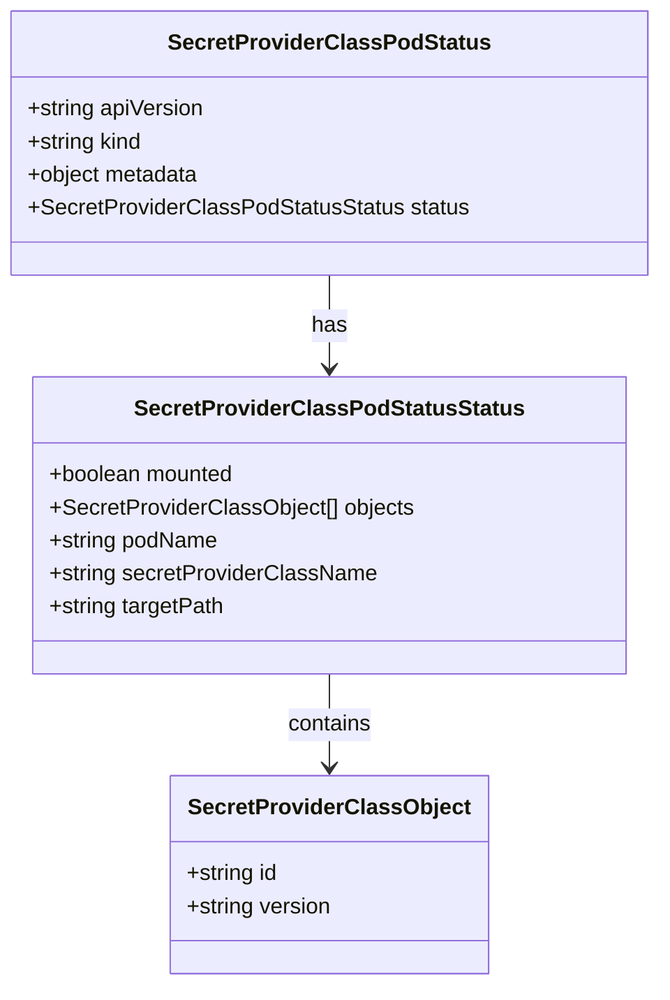
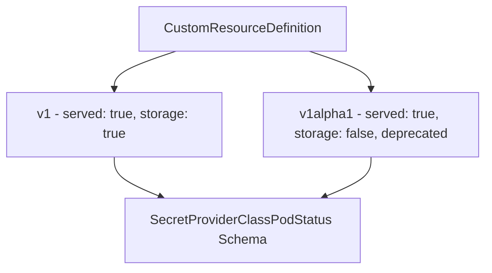
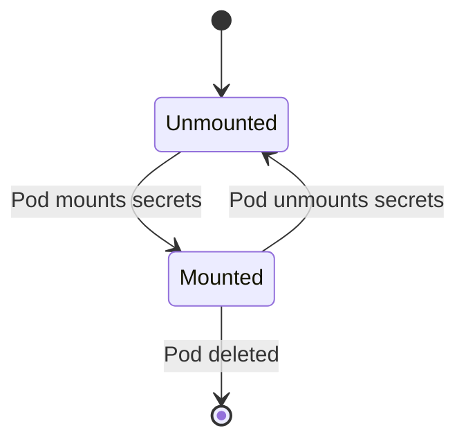

# Diagram: devops/k8s/secrets-store-csi-driver/helm/crds/secrets-store.csi.x-k8s.io_secretproviderclasspodstatuses.yaml

> Auto-generated by Obscura crawlers

## Diagram 1

### SVG

<svg id="container" width="468.46875" xmlns="http://www.w3.org/2000/svg" class="classDiagram" height="716" viewBox="0 0 468.46875 716" role="graphics-document document" aria-roledescription="class"><g><defs><marker id="container_class-aggregationStart" class="marker aggregation class" refX="18" refY="7" markerWidth="190" markerHeight="240" orient="auto"><path d="M 18,7 L9,13 L1,7 L9,1 Z"></path></marker></defs><defs><marker id="container_class-aggregationEnd" class="marker aggregation class" refX="1" refY="7" markerWidth="20" markerHeight="28" orient="auto"><path d="M 18,7 L9,13 L1,7 L9,1 Z"></path></marker></defs><defs><marker id="container_class-extensionStart" class="marker extension class" refX="18" refY="7" markerWidth="190" markerHeight="240" orient="auto"><path d="M 1,7 L18,13 V 1 Z"></path></marker></defs><defs><marker id="container_class-extensionEnd" class="marker extension class" refX="1" refY="7" markerWidth="20" markerHeight="28" orient="auto"><path d="M 1,1 V 13 L18,7 Z"></path></marker></defs><defs><marker id="container_class-compositionStart" class="marker composition class" refX="18" refY="7" markerWidth="190" markerHeight="240" orient="auto"><path d="M 18,7 L9,13 L1,7 L9,1 Z"></path></marker></defs><defs><marker id="container_class-compositionEnd" class="marker composition class" refX="1" refY="7" markerWidth="20" markerHeight="28" orient="auto"><path d="M 18,7 L9,13 L1,7 L9,1 Z"></path></marker></defs><defs><marker id="container_class-dependencyStart" class="marker dependency class" refX="6" refY="7" markerWidth="190" markerHeight="240" orient="auto"><path d="M 5,7 L9,13 L1,7 L9,1 Z"></path></marker></defs><defs><marker id="container_class-dependencyEnd" class="marker dependency class" refX="13" refY="7" markerWidth="20" markerHeight="28" orient="auto"><path d="M 18,7 L9,13 L14,7 L9,1 Z"></path></marker></defs><defs><marker id="container_class-lollipopStart" class="marker lollipop class" refX="13" refY="7" markerWidth="190" markerHeight="240" orient="auto"><circle stroke="black" fill="transparent" cx="7" cy="7" r="6"></circle></marker></defs><defs><marker id="container_class-lollipopEnd" class="marker lollipop class" refX="1" refY="7" markerWidth="190" markerHeight="240" orient="auto"><circle stroke="black" fill="transparent" cx="7" cy="7" r="6"></circle></marker></defs><g class="root"><g class="clusters"></g><g class="edgePaths"><path d="M234.234,200L234.234,206.167C234.234,212.333,234.234,224.667,234.234,236C234.234,247.333,234.234,257.667,234.234,262.833L234.234,268" id="id_SecretProviderClassPodStatus_SecretProviderClassPodStatusStatus_1" class="edge-thickness-normal edge-pattern-solid relation" style=";;;" data-edge="true" data-et="edge" data-id="id_SecretProviderClassPodStatus_SecretProviderClassPodStatusStatus_1" data-points="W3sieCI6MjM0LjIzNDM3NSwieSI6MjAwfSx7IngiOjIzNC4yMzQzNzUsInkiOjIzN30seyJ4IjoyMzQuMjM0Mzc1LCJ5IjoyNzR9XQ==" marker-end="url(#container_class-dependencyEnd)"></path><path d="M234.234,490L234.234,496.167C234.234,502.333,234.234,514.667,234.234,526C234.234,537.333,234.234,547.667,234.234,552.833L234.234,558" id="id_SecretProviderClassPodStatusStatus_SecretProviderClassObject_2" class="edge-thickness-normal edge-pattern-solid relation" style=";;;" data-edge="true" data-et="edge" data-id="id_SecretProviderClassPodStatusStatus_SecretProviderClassObject_2" data-points="W3sieCI6MjM0LjIzNDM3NSwieSI6NDkwfSx7IngiOjIzNC4yMzQzNzUsInkiOjUyN30seyJ4IjoyMzQuMjM0Mzc1LCJ5Ijo1NjR9XQ==" marker-end="url(#container_class-dependencyEnd)"></path></g><g class="edgeLabels"><g class="edgeLabel" transform="translate(234.234375, 237)"><g class="label" data-id="id_SecretProviderClassPodStatus_SecretProviderClassPodStatusStatus_1" transform="translate(-12.703125, -12)"><foreignObject width="25.40625" height="24">

has

</foreignObject></g></g><g class="edgeLabel" transform="translate(234.234375, 527)"><g class="label" data-id="id_SecretProviderClassPodStatusStatus_SecretProviderClassObject_2" transform="translate(-30.890625, -12)"><foreignObject width="61.78125" height="24">

contains

</foreignObject></g></g></g><g class="nodes"><g class="node default" id="classId-SecretProviderClassPodStatus-0" transform="translate(234.234375, 104)"><g class="basic label-container"><path d="M-226.234375 -96 L226.234375 -96 L226.234375 96 L-226.234375 96" stroke="none" stroke-width="0" fill="#ECECFF" style=""></path><path d="M-226.234375 -96 C-114.78328151563056 -96, -3.3321880312611256 -96, 226.234375 -96 M-226.234375 -96 C-127.23052988157094 -96, -28.22668476314189 -96, 226.234375 -96 M226.234375 -96 C226.234375 -25.037582913002666, 226.234375 45.92483417399467, 226.234375 96 M226.234375 -96 C226.234375 -37.00280254366625, 226.234375 21.994394912667502, 226.234375 96 M226.234375 96 C75.06313684911169 96, -76.10810130177663 96, -226.234375 96 M226.234375 96 C131.30675000966716 96, 36.37912501933428 96, -226.234375 96 M-226.234375 96 C-226.234375 27.00284972577063, -226.234375 -41.99430054845874, -226.234375 -96 M-226.234375 96 C-226.234375 55.44114292942008, -226.234375 14.882285858840163, -226.234375 -96" stroke="#9370DB" stroke-width="1.3" fill="none" stroke-dasharray="0 0" style=""></path></g><g class="annotation-group text" transform="translate(0, -72)"></g><g class="label-group text" transform="translate(-110.640625, -72)"><g class="label" style="font-weight: bolder" transform="translate(0,-12)"><foreignObject width="221.28125" height="24">

SecretProviderClassPodStatus

</foreignObject></g></g><g class="members-group text" transform="translate(-214.234375, -24)"><g class="label" style="" transform="translate(0,-12)"><foreignObject width="130.4375" height="24">

+string apiVersion

</foreignObject></g><g class="label" style="" transform="translate(0,12)"><foreignObject width="85.515625" height="24">

+string kind

</foreignObject></g><g class="label" style="" transform="translate(0,36)"><foreignObject width="127.140625" height="24">

+object metadata

</foreignObject></g><g class="label" style="" transform="translate(0,60)"><foreignObject width="317.828125" height="24">

+SecretProviderClassPodStatusStatus status

</foreignObject></g></g><g class="methods-group text" transform="translate(-214.234375, 96)"></g><g class="divider" style=""><path d="M-226.234375 -48 C-117.98318654115486 -48, -9.73199808230973 -48, 226.234375 -48 M-226.234375 -48 C-111.20677372875325 -48, 3.820827542493504 -48, 226.234375 -48" stroke="#9370DB" stroke-width="1.3" fill="none" stroke-dasharray="0 0" style=""></path></g><g class="divider" style=""><path d="M-226.234375 72 C-60.332119916221586 72, 105.57013516755683 72, 226.234375 72 M-226.234375 72 C-109.93243416814566 72, 6.369506663708677 72, 226.234375 72" stroke="#9370DB" stroke-width="1.3" fill="none" stroke-dasharray="0 0" style=""></path></g></g><g class="node default" id="classId-SecretProviderClassPodStatusStatus-1" transform="translate(234.234375, 382)"><g class="basic label-container"><path d="M-211.4921875 -108 L211.4921875 -108 L211.4921875 108 L-211.4921875 108" stroke="none" stroke-width="0" fill="#ECECFF" style=""></path><path d="M-211.4921875 -108 C-115.150177014858 -108, -18.808166529716004 -108, 211.4921875 -108 M-211.4921875 -108 C-59.22307301543631 -108, 93.04604146912737 -108, 211.4921875 -108 M211.4921875 -108 C211.4921875 -41.0120060994888, 211.4921875 25.9759878010224, 211.4921875 108 M211.4921875 -108 C211.4921875 -31.21053105448577, 211.4921875 45.57893789102846, 211.4921875 108 M211.4921875 108 C47.14535271246902 108, -117.20148207506196 108, -211.4921875 108 M211.4921875 108 C103.30957741146919 108, -4.873032677061616 108, -211.4921875 108 M-211.4921875 108 C-211.4921875 54.035678927548126, -211.4921875 0.07135785509625237, -211.4921875 -108 M-211.4921875 108 C-211.4921875 46.14924572809174, -211.4921875 -15.701508543816516, -211.4921875 -108" stroke="#9370DB" stroke-width="1.3" fill="none" stroke-dasharray="0 0" style=""></path></g><g class="annotation-group text" transform="translate(0, -84)"></g><g class="label-group text" transform="translate(-134.125, -84)"><g class="label" style="font-weight: bolder" transform="translate(0,-12)"><foreignObject width="268.25" height="24">

SecretProviderClassPodStatusStatus

</foreignObject></g></g><g class="members-group text" transform="translate(-199.4921875, -36)"><g class="label" style="" transform="translate(0,-12)"><foreignObject width="137.234375" height="24">

+boolean mounted

</foreignObject></g><g class="label" style="" transform="translate(0,12)"><foreignObject width="264.859375" height="24">

+SecretProviderClassObject[] objects

</foreignObject></g><g class="label" style="" transform="translate(0,36)"><foreignObject width="124.34375" height="24">

+string podName

</foreignObject></g><g class="label" style="" transform="translate(0,60)"><foreignObject width="237.5" height="24">

+string secretProviderClassName

</foreignObject></g><g class="label" style="" transform="translate(0,84)"><foreignObject width="129" height="24">

+string targetPath

</foreignObject></g></g><g class="methods-group text" transform="translate(-199.4921875, 108)"></g><g class="divider" style=""><path d="M-211.4921875 -60 C-77.76423714366217 -60, 55.96371321267566 -60, 211.4921875 -60 M-211.4921875 -60 C-109.78307305387008 -60, -8.073958607740167 -60, 211.4921875 -60" stroke="#9370DB" stroke-width="1.3" fill="none" stroke-dasharray="0 0" style=""></path></g><g class="divider" style=""><path d="M-211.4921875 84 C-116.16792266700634 84, -20.843657834012674 84, 211.4921875 84 M-211.4921875 84 C-117.02221808469605 84, -22.5522486693921 84, 211.4921875 84" stroke="#9370DB" stroke-width="1.3" fill="none" stroke-dasharray="0 0" style=""></path></g></g><g class="node default" id="classId-SecretProviderClassObject-2" transform="translate(234.234375, 636)"><g class="basic label-container"><path d="M-114.02734375 -72 L114.02734375 -72 L114.02734375 72 L-114.02734375 72" stroke="none" stroke-width="0" fill="#ECECFF" style=""></path><path d="M-114.02734375 -72 C-38.21590990573874 -72, 37.59552393852252 -72, 114.02734375 -72 M-114.02734375 -72 C-53.50610619545939 -72, 7.015131359081224 -72, 114.02734375 -72 M114.02734375 -72 C114.02734375 -19.622354852844246, 114.02734375 32.75529029431151, 114.02734375 72 M114.02734375 -72 C114.02734375 -34.00868730528302, 114.02734375 3.982625389433963, 114.02734375 72 M114.02734375 72 C67.84238823861497 72, 21.65743272722996 72, -114.02734375 72 M114.02734375 72 C30.890051097259104 72, -52.24724155548179 72, -114.02734375 72 M-114.02734375 72 C-114.02734375 30.96847712359788, -114.02734375 -10.063045752804243, -114.02734375 -72 M-114.02734375 72 C-114.02734375 36.10761659440753, -114.02734375 0.2152331888150627, -114.02734375 -72" stroke="#9370DB" stroke-width="1.3" fill="none" stroke-dasharray="0 0" style=""></path></g><g class="annotation-group text" transform="translate(0, -48)"></g><g class="label-group text" transform="translate(-97.0234375, -48)"><g class="label" style="font-weight: bolder" transform="translate(0,-12)"><foreignObject width="194.046875" height="24">

SecretProviderClassObject

</foreignObject></g></g><g class="members-group text" transform="translate(-102.02734375, 0)"><g class="label" style="" transform="translate(0,-12)"><foreignObject width="67.9375" height="24">

+string id

</foreignObject></g><g class="label" style="" transform="translate(0,12)"><foreignObject width="107.03125" height="24">

+string version

</foreignObject></g></g><g class="methods-group text" transform="translate(-102.02734375, 72)"></g><g class="divider" style=""><path d="M-114.02734375 -24 C-60.783316041688614 -24, -7.539288333377229 -24, 114.02734375 -24 M-114.02734375 -24 C-25.132595807407228 -24, 63.762152135185545 -24, 114.02734375 -24" stroke="#9370DB" stroke-width="1.3" fill="none" stroke-dasharray="0 0" style=""></path></g><g class="divider" style=""><path d="M-114.02734375 48 C-64.37185793561977 48, -14.716372121239559 48, 114.02734375 48 M-114.02734375 48 C-37.283280100081015 48, 39.46078354983797 48, 114.02734375 48" stroke="#9370DB" stroke-width="1.3" fill="none" stroke-dasharray="0 0" style=""></path></g></g></g></g></g></svg>

## Diagram 2

### SVG

<svg id="container" width="586" xmlns="http://www.w3.org/2000/svg" class="flowchart" height="326" viewBox="0 0 586 326" role="graphics-document document" aria-roledescription="flowchart-v2"><g><marker id="container_flowchart-v2-pointEnd" class="marker flowchart-v2" viewBox="0 0 10 10" refX="5" refY="5" markerUnits="userSpaceOnUse" markerWidth="8" markerHeight="8" orient="auto"><path d="M 0 0 L 10 5 L 0 10 z" class="arrowMarkerPath" style="stroke-width: 1; stroke-dasharray: 1, 0;"></path></marker><marker id="container_flowchart-v2-pointStart" class="marker flowchart-v2" viewBox="0 0 10 10" refX="4.5" refY="5" markerUnits="userSpaceOnUse" markerWidth="8" markerHeight="8" orient="auto"><path d="M 0 5 L 10 10 L 10 0 z" class="arrowMarkerPath" style="stroke-width: 1; stroke-dasharray: 1, 0;"></path></marker><marker id="container_flowchart-v2-circleEnd" class="marker flowchart-v2" viewBox="0 0 10 10" refX="11" refY="5" markerUnits="userSpaceOnUse" markerWidth="11" markerHeight="11" orient="auto"><circle cx="5" cy="5" r="5" class="arrowMarkerPath" style="stroke-width: 1; stroke-dasharray: 1, 0;"></circle></marker><marker id="container_flowchart-v2-circleStart" class="marker flowchart-v2" viewBox="0 0 10 10" refX="-1" refY="5" markerUnits="userSpaceOnUse" markerWidth="11" markerHeight="11" orient="auto"><circle cx="5" cy="5" r="5" class="arrowMarkerPath" style="stroke-width: 1; stroke-dasharray: 1, 0;"></circle></marker><marker id="container_flowchart-v2-crossEnd" class="marker cross flowchart-v2" viewBox="0 0 11 11" refX="12" refY="5.2" markerUnits="userSpaceOnUse" markerWidth="11" markerHeight="11" orient="auto"><path d="M 1,1 l 9,9 M 10,1 l -9,9" class="arrowMarkerPath" style="stroke-width: 2; stroke-dasharray: 1, 0;"></path></marker><marker id="container_flowchart-v2-crossStart" class="marker cross flowchart-v2" viewBox="0 0 11 11" refX="-1" refY="5.2" markerUnits="userSpaceOnUse" markerWidth="11" markerHeight="11" orient="auto"><path d="M 1,1 l 9,9 M 10,1 l -9,9" class="arrowMarkerPath" style="stroke-width: 2; stroke-dasharray: 1, 0;"></path></marker><g class="root"><g class="clusters"></g><g class="edgePaths"><path d="M212.519,62L200.099,66.167C187.679,70.333,162.84,78.667,150.42,86.333C138,94,138,101,138,104.5L138,108" id="L_A_B_0" class="edge-thickness-normal edge-pattern-solid edge-thickness-normal edge-pattern-solid flowchart-link" style=";" data-edge="true" data-et="edge" data-id="L_A_B_0" data-points="W3sieCI6MjEyLjUxOTIzMDc2OTIzMDc3LCJ5Ijo2Mn0seyJ4IjoxMzgsInkiOjg3fSx7IngiOjEzOCwieSI6MTEyfV0=" marker-end="url(#container_flowchart-v2-pointEnd)"></path><path d="M373.481,62L385.901,66.167C398.321,70.333,423.16,78.667,435.58,86.333C448,94,448,101,448,104.5L448,108" id="L_A_C_0" class="edge-thickness-normal edge-pattern-solid edge-thickness-normal edge-pattern-solid flowchart-link" style=";" data-edge="true" data-et="edge" data-id="L_A_C_0" data-points="W3sieCI6MzczLjQ4MDc2OTIzMDc2OTIsInkiOjYyfSx7IngiOjQ0OCwieSI6ODd9LHsieCI6NDQ4LCJ5IjoxMTJ9XQ==" marker-end="url(#container_flowchart-v2-pointEnd)"></path><path d="M138,190L138,194.167C138,198.333,138,206.667,147.475,214.746C156.95,222.824,175.9,230.649,185.375,234.561L194.85,238.473" id="L_B_D_0" class="edge-thickness-normal edge-pattern-solid edge-thickness-normal edge-pattern-solid flowchart-link" style=";" data-edge="true" data-et="edge" data-id="L_B_D_0" data-points="W3sieCI6MTM4LCJ5IjoxOTB9LHsieCI6MTM4LCJ5IjoyMTV9LHsieCI6MTk4LjU0Njg3NSwieSI6MjQwfV0=" marker-end="url(#container_flowchart-v2-pointEnd)"></path><path d="M448,190L448,194.167C448,198.333,448,206.667,438.525,214.746C429.05,222.824,410.1,230.649,400.625,234.561L391.15,238.473" id="L_C_D_0" class="edge-thickness-normal edge-pattern-solid edge-thickness-normal edge-pattern-solid flowchart-link" style=";" data-edge="true" data-et="edge" data-id="L_C_D_0" data-points="W3sieCI6NDQ4LCJ5IjoxOTB9LHsieCI6NDQ4LCJ5IjoyMTV9LHsieCI6Mzg3LjQ1MzEyNSwieSI6MjQwfV0=" marker-end="url(#container_flowchart-v2-pointEnd)"></path></g><g class="edgeLabels"><g class="edgeLabel"><g class="label" data-id="L_A_B_0" transform="translate(0, 0)"><foreignObject width="0" height="0">

</foreignObject></g></g><g class="edgeLabel"><g class="label" data-id="L_A_C_0" transform="translate(0, 0)"><foreignObject width="0" height="0">

</foreignObject></g></g><g class="edgeLabel"><g class="label" data-id="L_B_D_0" transform="translate(0, 0)"><foreignObject width="0" height="0">

</foreignObject></g></g><g class="edgeLabel"><g class="label" data-id="L_C_D_0" transform="translate(0, 0)"><foreignObject width="0" height="0">

</foreignObject></g></g></g><g class="nodes"><g class="node default" id="flowchart-A-0" transform="translate(293, 35)"><rect class="basic label-container" style="" x="-125.609375" y="-27" width="251.21875" height="54"></rect><g class="label" style="" transform="translate(-95.609375, -12)"><rect></rect><foreignObject width="191.21875" height="24">

CustomResourceDefinition

</foreignObject></g></g><g class="node default" id="flowchart-B-1" transform="translate(138, 151)"><rect class="basic label-container" style="" x="-130" y="-39" width="260" height="78"></rect><g class="label" style="" transform="translate(-100, -24)"><rect></rect><foreignObject width="200" height="48">

v1 - served: true, storage: true

</foreignObject></g></g><g class="node default" id="flowchart-C-2" transform="translate(448, 151)"><rect class="basic label-container" style="" x="-130" y="-39" width="260" height="78"></rect><g class="label" style="" transform="translate(-100, -24)"><rect></rect><foreignObject width="200" height="48">

v1alpha1 - served: true, storage: false, deprecated

</foreignObject></g></g><g class="node default" id="flowchart-D-3" transform="translate(293, 279)"><rect class="basic label-container" style="" x="-140.21875" y="-39" width="280.4375" height="78"></rect><g class="label" style="" transform="translate(-110.21875, -24)"><rect></rect><foreignObject width="220.4375" height="48">

SecretProviderClassPodStatus Schema

</foreignObject></g></g></g></g></g></svg>

## Diagram 3

### SVG

<svg id="container" width="340.125" xmlns="http://www.w3.org/2000/svg" class="statediagram" height="322" viewBox="0 0 340.125 322" role="graphics-document document" aria-roledescription="stateDiagram"><g><defs><marker id="container_stateDiagram-barbEnd" refX="19" refY="7" markerWidth="20" markerHeight="14" markerUnits="userSpaceOnUse" orient="auto"><path d="M 19,7 L9,13 L14,7 L9,1 Z"></path></marker></defs><g class="root"><g class="clusters"></g><g class="edgePaths"><path d="M165.391,22L165.391,26.167C165.391,30.333,165.391,38.667,165.474,47.083C165.557,55.5,165.724,64,165.807,68.25L165.891,72.5" id="edge0" class="edge-thickness-normal edge-pattern-solid transition" style="fill:none;;;fill:none" data-edge="true" data-et="edge" data-id="edge0" data-points="W3sieCI6MTY1LjM5MDYyNSwieSI6MjJ9LHsieCI6MTY1LjM5MDYyNSwieSI6NDd9LHsieCI6MTY1Ljg5MDYyNSwieSI6NzIuNX1d" marker-end="url(#container_stateDiagram-barbEnd)"></path><path d="M135.704,112.5L126.313,118.583C116.923,124.667,98.141,136.833,98.141,149.167C98.141,161.5,116.923,174,126.313,180.25L135.704,186.5" id="edge1" class="edge-thickness-normal edge-pattern-solid transition" style="fill:none;;;fill:none" data-edge="true" data-et="edge" data-id="edge1" data-points="W3sieCI6MTM1LjcwNDIyMTQ5MTIyODA4LCJ5IjoxMTIuNX0seyJ4Ijo3OS4zNTkzNzUsInkiOjE0OX0seyJ4IjoxMzUuNzA0MjIxNDkxMjI4MDgsInkiOjE4Ni41fV0=" marker-end="url(#container_stateDiagram-barbEnd)"></path><path d="M196.077,186.5L205.301,180.25C214.525,174,232.974,161.5,232.974,149.167C232.974,136.833,214.525,124.667,205.301,118.583L196.077,112.5" id="edge2" class="edge-thickness-normal edge-pattern-solid transition" style="fill:none;;;fill:none" data-edge="true" data-et="edge" data-id="edge2" data-points="W3sieCI6MTk2LjA3NzAyODUwODc3MTkyLCJ5IjoxODYuNX0seyJ4IjoyNTEuNDIxODc1LCJ5IjoxNDl9LHsieCI6MTk2LjA3NzAyODUwODc3MTkyLCJ5IjoxMTIuNX1d" marker-end="url(#container_stateDiagram-barbEnd)"></path><path d="M165.891,226.5L165.807,232.583C165.724,238.667,165.557,250.833,165.474,263.083C165.391,275.333,165.391,287.667,165.391,293.833L165.391,300" id="edge3" class="edge-thickness-normal edge-pattern-solid transition" style="fill:none;;;fill:none" data-edge="true" data-et="edge" data-id="edge3" data-points="W3sieCI6MTY1Ljg5MDYyNSwieSI6MjI2LjV9LHsieCI6MTY1LjM5MDYyNSwieSI6MjYzfSx7IngiOjE2NS4zOTA2MjUsInkiOjMwMH1d" marker-end="url(#container_stateDiagram-barbEnd)"></path></g><g class="edgeLabels"><g class="edgeLabel"><g class="label" data-id="edge0" transform="translate(0, 0)"><foreignObject width="0" height="0">

</foreignObject></g></g><g class="edgeLabel" transform="translate(79.359375, 149)"><g class="label" data-id="edge1" transform="translate(-71.359375, -12)"><foreignObject width="142.71875" height="24">

Pod mounts secrets

</foreignObject></g></g><g class="edgeLabel" transform="translate(251.421875, 149)"><g class="label" data-id="edge2" transform="translate(-80.703125, -12)"><foreignObject width="161.40625" height="24">

Pod unmounts secrets

</foreignObject></g></g><g class="edgeLabel" transform="translate(165.390625, 263)"><g class="label" data-id="edge3" transform="translate(-43.7109375, -12)"><foreignObject width="87.421875" height="24">

Pod deleted

</foreignObject></g></g></g><g class="nodes"><g class="node default" id="state-root_start-0" transform="translate(165.390625, 15)"><circle class="state-start" r="7" width="14" height="14"></circle></g><g class="node  statediagram-state" id="state-Unmounted-2" transform="translate(165.390625, 92)"><g class="basic label-container outer-path"><path d="M-45.7734375 -20 C-18.954551582725976 -20, 7.864334334548047 -20, 45.7734375 -20 C45.7734375 -20, 45.7734375 -20, 45.7734375 -20 C45.90874159410529 -19.99440378127243, 46.04404568821058 -19.988807562544856, 46.18633422736166 -19.982922465033347 C46.331162381516485 -19.964869654444616, 46.47599053567131 -19.946816843855885, 46.59641045140367 -19.931806517013612 C46.67986611109268 -19.914307705336867, 46.763321770781694 -19.89680889366012, 47.000864935703994 -19.847001329696653 C47.130976162105945 -19.80826553929681, 47.26108738850789 -19.769529748896964, 47.39693484602342 -19.729086208503173 C47.548194203521575 -19.67006462405676, 47.69945356101973 -19.611043039610347, 47.781914623264846 -19.578866633275286 C47.914932779229396 -19.513838019306608, 48.047950935193946 -19.448809405337926, 48.153174465185366 -19.397368756032446 C48.268873523605286 -19.328427081417445, 48.3845725820252 -19.259485406802444, 48.508178290612136 -19.185832391312644 C48.63543880730609 -19.09497012883349, 48.76269932400004 -19.004107866354335, 48.84450106344834 -18.94570254698197 C48.917459030784705 -18.883910300687777, 48.99041699812107 -18.822118054393584, 49.159845358128706 -18.678619553365657 C49.27415395870208 -18.56431095279228, 49.38846255927546 -18.450002352218906, 49.45205705336566 -18.386407858128706 C49.5062228779299 -18.32245438991377, 49.56038870249414 -18.258500921698833, 49.71914004698197 -18.07106356344834 C49.773718184846516 -17.99462212521727, 49.828296322711054 -17.9181806869862, 49.959269891312644 -17.734740790612136 C50.00323528761417 -17.66095733548791, 50.0472006839157 -17.587173880363682, 50.17080625603245 -17.37973696518537 C50.236740388767295 -17.24486654097895, 50.30267452150215 -17.10999611677253, 50.35230413327529 -17.008477123264846 C50.387158883888134 -16.919152052904458, 50.42201363450098 -16.82982698254407, 50.502523708503176 -16.623497346023417 C50.54338893808021 -16.48623345950965, 50.58425416765724 -16.348969572995884, 50.62043882969665 -16.227427435703994 C50.646438284019716 -16.103430352235225, 50.672437738342786 -15.979433268766456, 50.70524401701361 -15.82297295140367 C50.71936517687334 -15.709686352236359, 50.73348633673306 -15.596399753069049, 50.75635996503335 -15.412896727361662 C50.76042369452141 -15.314644806942203, 50.764487424009474 -15.216392886522746, 50.7734375 -15 C50.7734375 -15, 50.7734375 -15, 50.7734375 -15 C50.7734375 -6.236353203557284, 50.7734375 2.5272935928854317, 50.7734375 15 C50.7734375 15, 50.7734375 15, 50.7734375 15 C50.768314013512594 15.12387448232209, 50.76319052702519 15.247748964644181, 50.75635996503335 15.412896727361662 C50.744806545690224 15.505583702025053, 50.73325312634711 15.598270676688443, 50.70524401701361 15.822972951403669 C50.67847510893211 15.950639728117702, 50.65170620085061 16.078306504831737, 50.62043882969665 16.227427435703994 C50.578422374231145 16.368558221812904, 50.536405918765645 16.509689007921814, 50.502523708503176 16.623497346023417 C50.46952002972349 16.70807852584287, 50.436516350943805 16.792659705662324, 50.35230413327529 17.008477123264846 C50.31370159506412 17.087439877274555, 50.275099056852945 17.166402631284267, 50.17080625603245 17.379736965185366 C50.1165451416847 17.470798864593934, 50.06228402733696 17.561860764002503, 49.959269891312644 17.734740790612133 C49.892172562035874 17.828716447387183, 49.82507523275911 17.922692104162238, 49.71914004698197 18.07106356344834 C49.6505525845497 18.152044627318286, 49.58196512211744 18.233025691188235, 49.45205705336566 18.386407858128706 C49.348270013332446 18.490194898161917, 49.244482973299235 18.59398193819513, 49.159845358128706 18.678619553365657 C49.07490541316987 18.750560017042684, 48.98996546821104 18.822500480719707, 48.84450106344834 18.94570254698197 C48.76933267493517 18.999371744818436, 48.694164286422 19.053040942654903, 48.508178290612136 19.185832391312644 C48.42265424290687 19.236793662295977, 48.33713019520162 19.287754933279313, 48.153174465185366 19.397368756032446 C48.06376036695919 19.4410806450956, 47.974346268733015 19.484792534158753, 47.781914623264846 19.578866633275286 C47.67520204828017 19.620506009245986, 47.5684894732955 19.662145385216682, 47.39693484602342 19.729086208503173 C47.29993612612818 19.75796397859895, 47.202937406232934 19.78684174869473, 47.000864935703994 19.847001329696653 C46.87338712456817 19.87373061586301, 46.74590931343234 19.900459902029365, 46.59641045140367 19.931806517013612 C46.433390789214315 19.952126896714077, 46.27037112702496 19.972447276414538, 46.18633422736166 19.982922465033347 C46.058927308203764 19.988192054189007, 45.93152038904587 19.993461643344666, 45.7734375 20 C45.7734375 20, 45.7734375 20, 45.7734375 20 C23.67079130329607 20, 1.5681451065921408 20, -45.7734375 20 C-45.7734375 20, -45.7734375 20, -45.7734375 20 C-45.86950705757047 19.996026533707052, -45.96557661514095 19.9920530674141, -46.18633422736166 19.982922465033347 C-46.28336175103948 19.97082799681982, -46.380389274717295 19.958733528606295, -46.59641045140367 19.931806517013612 C-46.733057853739005 19.90315456975811, -46.86970525607433 19.87450262250261, -47.000864935703994 19.847001329696653 C-47.151115385660106 19.802269832669623, -47.30136583561622 19.757538335642593, -47.39693484602342 19.729086208503173 C-47.49233001562963 19.691862897814698, -47.587725185235854 19.65463958712622, -47.781914623264846 19.578866633275286 C-47.87356747737916 19.534060283148794, -47.965220331493484 19.489253933022304, -48.153174465185366 19.397368756032446 C-48.22689827285968 19.35343890189643, -48.300622080534 19.309509047760407, -48.508178290612136 19.185832391312644 C-48.60994464638645 19.113172609864872, -48.71171100216077 19.040512828417103, -48.84450106344834 18.94570254698197 C-48.91099440241706 18.889385561620585, -48.97748774138578 18.833068576259205, -49.159845358128706 18.67861955336566 C-49.22018237882345 18.61828253267091, -49.280519399518205 18.55794551197616, -49.45205705336566 18.386407858128706 C-49.534830080491794 18.288677929673774, -49.61760310761793 18.190948001218846, -49.71914004698197 18.07106356344834 C-49.77858620586449 17.987804037563254, -49.838032364747015 17.904544511678164, -49.959269891312644 17.734740790612133 C-50.00925719475448 17.650851271341406, -50.05924449819632 17.56696175207068, -50.17080625603244 17.37973696518537 C-50.24279427167103 17.23248312556941, -50.31478228730962 17.085229285953446, -50.35230413327528 17.00847712326485 C-50.38456397193399 16.925802242299202, -50.41682381059271 16.843127361333558, -50.502523708503176 16.623497346023417 C-50.52741020382935 16.539905081755393, -50.55229669915552 16.456312817487365, -50.62043882969665 16.227427435703994 C-50.64324531487584 16.11865832035052, -50.66605180005503 16.009889204997048, -50.70524401701361 15.82297295140367 C-50.72081458157583 15.698058544662912, -50.73638514613805 15.573144137922155, -50.75635996503335 15.412896727361664 C-50.761637325841605 15.285301906968083, -50.766914686649855 15.1577070865745, -50.7734375 15 C-50.7734375 15, -50.7734375 15, -50.7734375 15 C-50.7734375 8.265542827336981, -50.7734375 1.5310856546739622, -50.7734375 -15 C-50.7734375 -15, -50.7734375 -15, -50.7734375 -15 C-50.76665582517481 -15.163965780003984, -50.75987415034962 -15.32793156000797, -50.75635996503335 -15.41289672736166 C-50.745413454435905 -15.500714794053893, -50.73446694383847 -15.588532860746128, -50.70524401701361 -15.822972951403669 C-50.68129585736686 -15.937186961964922, -50.65734769772011 -16.051400972526178, -50.62043882969665 -16.227427435703994 C-50.59139272339571 -16.324991586945178, -50.56234661709477 -16.422555738186357, -50.502523708503176 -16.623497346023417 C-50.47103208282033 -16.704203465861404, -50.439540457137475 -16.784909585699396, -50.35230413327529 -17.008477123264846 C-50.29011903423453 -17.135678776476443, -50.22793393519377 -17.26288042968804, -50.17080625603245 -17.379736965185366 C-50.09438745222355 -17.507984265466952, -50.01796864841466 -17.636231565748535, -49.959269891312644 -17.734740790612133 C-49.8673882489001 -17.86342903773554, -49.77550660648756 -17.992117284858946, -49.71914004698197 -18.07106356344834 C-49.61866495474177 -18.189694280688798, -49.518189862501565 -18.30832499792925, -49.45205705336566 -18.386407858128706 C-49.38281500575373 -18.455649905740632, -49.313572958141805 -18.52489195335256, -49.159845358128706 -18.678619553365657 C-49.08528162849584 -18.74177181095043, -49.01071789886298 -18.804924068535197, -48.84450106344834 -18.945702546981966 C-48.742895205662016 -19.01824773506888, -48.64128934787569 -19.090792923155796, -48.508178290612136 -19.185832391312644 C-48.3866625715086 -19.25824004338392, -48.26514685240507 -19.330647695455202, -48.153174465185366 -19.397368756032446 C-48.007535300893544 -19.46856740500468, -47.86189613660172 -19.539766053976916, -47.781914623264846 -19.578866633275286 C-47.67667908536371 -19.619929667587535, -47.57144354746257 -19.660992701899787, -47.39693484602342 -19.729086208503173 C-47.283990479204185 -19.762711203370543, -47.17104611238495 -19.796336198237913, -47.000864935703994 -19.847001329696653 C-46.89228080986951 -19.869769026652644, -46.783696684035036 -19.892536723608636, -46.59641045140367 -19.931806517013612 C-46.506028141167036 -19.943072660235526, -46.4156458309304 -19.954338803457443, -46.18633422736166 -19.982922465033347 C-46.0641254394728 -19.98797705788939, -45.94191665158393 -19.993031650745426, -45.7734375 -20 C-45.7734375 -20, -45.7734375 -20, -45.7734375 -20" stroke="none" stroke-width="0" fill="#ECECFF" style=""></path><path d="M-45.7734375 -20 C-19.58794259295894 -20, 6.597552314082122 -20, 45.7734375 -20 M-45.7734375 -20 C-22.527200985701775 -20, 0.71903552859645 -20, 45.7734375 -20 M45.7734375 -20 C45.7734375 -20, 45.7734375 -20, 45.7734375 -20 M45.7734375 -20 C45.7734375 -20, 45.7734375 -20, 45.7734375 -20 M45.7734375 -20 C45.869599910442076 -19.996022693283873, 45.96576232088416 -19.992045386567746, 46.18633422736166 -19.982922465033347 M45.7734375 -20 C45.90480826232794 -19.994566465078115, 46.03617902465588 -19.98913293015623, 46.18633422736166 -19.982922465033347 M46.18633422736166 -19.982922465033347 C46.299046088647 -19.9688729461759, 46.411757949932344 -19.954823427318452, 46.59641045140367 -19.931806517013612 M46.18633422736166 -19.982922465033347 C46.33493187611655 -19.964399787432725, 46.48352952487144 -19.945877109832107, 46.59641045140367 -19.931806517013612 M46.59641045140367 -19.931806517013612 C46.7084534298236 -19.908313574936606, 46.82049640824353 -19.884820632859604, 47.000864935703994 -19.847001329696653 M46.59641045140367 -19.931806517013612 C46.754871335529366 -19.89858076360421, 46.91333221965506 -19.8653550101948, 47.000864935703994 -19.847001329696653 M47.000864935703994 -19.847001329696653 C47.14959253247581 -19.802723205705814, 47.29832012924762 -19.758445081714978, 47.39693484602342 -19.729086208503173 M47.000864935703994 -19.847001329696653 C47.125826919691725 -19.80979853518341, 47.25078890367946 -19.772595740670173, 47.39693484602342 -19.729086208503173 M47.39693484602342 -19.729086208503173 C47.50138637212137 -19.68832909654584, 47.60583789821931 -19.647571984588506, 47.781914623264846 -19.578866633275286 M47.39693484602342 -19.729086208503173 C47.50896721201037 -19.68537104364198, 47.62099957799732 -19.641655878780785, 47.781914623264846 -19.578866633275286 M47.781914623264846 -19.578866633275286 C47.87266105131504 -19.534503407849986, 47.96340747936524 -19.49014018242469, 48.153174465185366 -19.397368756032446 M47.781914623264846 -19.578866633275286 C47.8784908361551 -19.53165339970534, 47.975067049045364 -19.484440166135393, 48.153174465185366 -19.397368756032446 M48.153174465185366 -19.397368756032446 C48.29118507789519 -19.31513228077674, 48.42919569060503 -19.232895805521032, 48.508178290612136 -19.185832391312644 M48.153174465185366 -19.397368756032446 C48.26723572022935 -19.32940300040044, 48.38129697527334 -19.261437244768437, 48.508178290612136 -19.185832391312644 M48.508178290612136 -19.185832391312644 C48.62938749994082 -19.099290679248096, 48.7505967092695 -19.012748967183548, 48.84450106344834 -18.94570254698197 M48.508178290612136 -19.185832391312644 C48.585998973553416 -19.130269491652868, 48.66381965649469 -19.074706591993092, 48.84450106344834 -18.94570254698197 M48.84450106344834 -18.94570254698197 C48.91978265346598 -18.88194229266538, 48.99506424348362 -18.818182038348784, 49.159845358128706 -18.678619553365657 M48.84450106344834 -18.94570254698197 C48.94737671086852 -18.85857131820535, 49.05025235828869 -18.771440089428733, 49.159845358128706 -18.678619553365657 M49.159845358128706 -18.678619553365657 C49.26649583194055 -18.57196907955381, 49.3731463057524 -18.465318605741967, 49.45205705336566 -18.386407858128706 M49.159845358128706 -18.678619553365657 C49.268354316999975 -18.570110594494384, 49.37686327587125 -18.461601635623115, 49.45205705336566 -18.386407858128706 M49.45205705336566 -18.386407858128706 C49.50771922177915 -18.320687660069417, 49.56338139019264 -18.254967462010125, 49.71914004698197 -18.07106356344834 M49.45205705336566 -18.386407858128706 C49.54801430295156 -18.27311134763054, 49.64397155253745 -18.159814837132373, 49.71914004698197 -18.07106356344834 M49.71914004698197 -18.07106356344834 C49.78923093793523 -17.972895162674718, 49.85932182888849 -17.874726761901098, 49.959269891312644 -17.734740790612136 M49.71914004698197 -18.07106356344834 C49.79728882595318 -17.961609388309792, 49.87543760492439 -17.852155213171244, 49.959269891312644 -17.734740790612136 M49.959269891312644 -17.734740790612136 C50.01206787069464 -17.646134348498787, 50.06486585007664 -17.557527906385438, 50.17080625603245 -17.37973696518537 M49.959269891312644 -17.734740790612136 C50.039987001834696 -17.599280000923894, 50.120704112356755 -17.463819211235652, 50.17080625603245 -17.37973696518537 M50.17080625603245 -17.37973696518537 C50.222220028323946 -17.274568413004786, 50.27363380061544 -17.169399860824203, 50.35230413327529 -17.008477123264846 M50.17080625603245 -17.37973696518537 C50.22515547473077 -17.26856386140607, 50.27950469342908 -17.157390757626768, 50.35230413327529 -17.008477123264846 M50.35230413327529 -17.008477123264846 C50.39141549470376 -16.908243294301478, 50.43052685613223 -16.80800946533811, 50.502523708503176 -16.623497346023417 M50.35230413327529 -17.008477123264846 C50.396564968496214 -16.895046323996365, 50.44082580371714 -16.781615524727883, 50.502523708503176 -16.623497346023417 M50.502523708503176 -16.623497346023417 C50.53679156178848 -16.50839365584206, 50.57105941507379 -16.393289965660703, 50.62043882969665 -16.227427435703994 M50.502523708503176 -16.623497346023417 C50.53635057431313 -16.50987490666084, 50.57017744012309 -16.396252467298265, 50.62043882969665 -16.227427435703994 M50.62043882969665 -16.227427435703994 C50.64316664589276 -16.119033509934876, 50.66589446208887 -16.010639584165755, 50.70524401701361 -15.82297295140367 M50.62043882969665 -16.227427435703994 C50.64684037328914 -16.101512700576755, 50.67324191688162 -15.975597965449518, 50.70524401701361 -15.82297295140367 M50.70524401701361 -15.82297295140367 C50.71905486145553 -15.712175848757964, 50.73286570589746 -15.601378746112255, 50.75635996503335 -15.412896727361662 M50.70524401701361 -15.82297295140367 C50.71786868816927 -15.721691889859317, 50.73049335932493 -15.620410828314961, 50.75635996503335 -15.412896727361662 M50.75635996503335 -15.412896727361662 C50.760027939303754 -15.324213285913205, 50.76369591357417 -15.235529844464745, 50.7734375 -15 M50.75635996503335 -15.412896727361662 C50.761661751571445 -15.284711347268717, 50.76696353810954 -15.156525967175769, 50.7734375 -15 M50.7734375 -15 C50.7734375 -15, 50.7734375 -15, 50.7734375 -15 M50.7734375 -15 C50.7734375 -15, 50.7734375 -15, 50.7734375 -15 M50.7734375 -15 C50.7734375 -4.690647955398445, 50.7734375 5.61870408920311, 50.7734375 15 M50.7734375 -15 C50.7734375 -8.224388772044552, 50.7734375 -1.448777544089106, 50.7734375 15 M50.7734375 15 C50.7734375 15, 50.7734375 15, 50.7734375 15 M50.7734375 15 C50.7734375 15, 50.7734375 15, 50.7734375 15 M50.7734375 15 C50.76848741579745 15.119682001611402, 50.7635373315949 15.239364003222803, 50.75635996503335 15.412896727361662 M50.7734375 15 C50.76661088702605 15.16505228426782, 50.759784274052095 15.330104568535639, 50.75635996503335 15.412896727361662 M50.75635996503335 15.412896727361662 C50.74586560198701 15.49708745331877, 50.73537123894068 15.581278179275877, 50.70524401701361 15.822972951403669 M50.75635996503335 15.412896727361662 C50.73958858618157 15.547444632231953, 50.7228172073298 15.681992537102243, 50.70524401701361 15.822972951403669 M50.70524401701361 15.822972951403669 C50.68628698518702 15.913383181884418, 50.66732995336043 16.003793412365166, 50.62043882969665 16.227427435703994 M50.70524401701361 15.822972951403669 C50.68793604156467 15.90551847138845, 50.670628066115725 15.988063991373235, 50.62043882969665 16.227427435703994 M50.62043882969665 16.227427435703994 C50.57940599120784 16.365254310628263, 50.53837315271904 16.50308118555253, 50.502523708503176 16.623497346023417 M50.62043882969665 16.227427435703994 C50.57702863017015 16.373239725590025, 50.53361843064365 16.51905201547606, 50.502523708503176 16.623497346023417 M50.502523708503176 16.623497346023417 C50.462824253919706 16.725238328574893, 50.423124799336236 16.826979311126372, 50.35230413327529 17.008477123264846 M50.502523708503176 16.623497346023417 C50.46382179469194 16.72268185067446, 50.4251198808807 16.8218663553255, 50.35230413327529 17.008477123264846 M50.35230413327529 17.008477123264846 C50.31115562998074 17.0926477320922, 50.27000712668618 17.176818340919553, 50.17080625603245 17.379736965185366 M50.35230413327529 17.008477123264846 C50.30334544892161 17.10862371280023, 50.25438676456794 17.208770302335612, 50.17080625603245 17.379736965185366 M50.17080625603245 17.379736965185366 C50.12059506363233 17.464002218608304, 50.07038387123221 17.54826747203124, 49.959269891312644 17.734740790612133 M50.17080625603245 17.379736965185366 C50.10842600201022 17.484424539060992, 50.04604574798798 17.58911211293662, 49.959269891312644 17.734740790612133 M49.959269891312644 17.734740790612133 C49.90132691289323 17.81589498126563, 49.84338393447381 17.897049171919125, 49.71914004698197 18.07106356344834 M49.959269891312644 17.734740790612133 C49.899103032506424 17.81900971954496, 49.8389361737002 17.90327864847779, 49.71914004698197 18.07106356344834 M49.71914004698197 18.07106356344834 C49.62777819977307 18.178934292612677, 49.536416352564174 18.286805021777013, 49.45205705336566 18.386407858128706 M49.71914004698197 18.07106356344834 C49.61933037628927 18.18890861895227, 49.51952070559657 18.306753674456196, 49.45205705336566 18.386407858128706 M49.45205705336566 18.386407858128706 C49.35372095569798 18.484743955796382, 49.255384858030304 18.58308005346406, 49.159845358128706 18.678619553365657 M49.45205705336566 18.386407858128706 C49.37527107605046 18.463193835443903, 49.29848509873526 18.539979812759096, 49.159845358128706 18.678619553365657 M49.159845358128706 18.678619553365657 C49.05948035779448 18.763624372529225, 48.95911535746025 18.848629191692797, 48.84450106344834 18.94570254698197 M49.159845358128706 18.678619553365657 C49.06397180482863 18.759820310937542, 48.96809825152855 18.841021068509427, 48.84450106344834 18.94570254698197 M48.84450106344834 18.94570254698197 C48.73591243540513 19.023233337205316, 48.627323807361925 19.100764127428658, 48.508178290612136 19.185832391312644 M48.84450106344834 18.94570254698197 C48.723543819959794 19.032064358894473, 48.60258657647125 19.118426170806973, 48.508178290612136 19.185832391312644 M48.508178290612136 19.185832391312644 C48.40203184779737 19.24908194253644, 48.295885404982606 19.312331493760237, 48.153174465185366 19.397368756032446 M48.508178290612136 19.185832391312644 C48.43167179182894 19.231420369443814, 48.355165293045744 19.277008347574984, 48.153174465185366 19.397368756032446 M48.153174465185366 19.397368756032446 C48.05985513249396 19.44298979789249, 47.96653579980254 19.488610839752535, 47.781914623264846 19.578866633275286 M48.153174465185366 19.397368756032446 C48.039176226361796 19.453099099095862, 47.925177987538234 19.508829442159275, 47.781914623264846 19.578866633275286 M47.781914623264846 19.578866633275286 C47.69635120875779 19.612253581219406, 47.610787794250726 19.645640529163526, 47.39693484602342 19.729086208503173 M47.781914623264846 19.578866633275286 C47.69971592597635 19.610940664486595, 47.617517228687845 19.643014695697904, 47.39693484602342 19.729086208503173 M47.39693484602342 19.729086208503173 C47.28625255209745 19.76203775509182, 47.17557025817148 19.794989301680474, 47.000864935703994 19.847001329696653 M47.39693484602342 19.729086208503173 C47.307637508766305 19.755671177647727, 47.21834017150919 19.782256146792278, 47.000864935703994 19.847001329696653 M47.000864935703994 19.847001329696653 C46.91466793768153 19.86507493957664, 46.828470939659056 19.883148549456624, 46.59641045140367 19.931806517013612 M47.000864935703994 19.847001329696653 C46.85098363452284 19.87842813373856, 46.70110233334169 19.90985493778047, 46.59641045140367 19.931806517013612 M46.59641045140367 19.931806517013612 C46.49675686623738 19.944228323450307, 46.39710328107109 19.956650129887002, 46.18633422736166 19.982922465033347 M46.59641045140367 19.931806517013612 C46.46409073373688 19.94830015262012, 46.331771016070086 19.96479378822663, 46.18633422736166 19.982922465033347 M46.18633422736166 19.982922465033347 C46.08662760042738 19.98704636162792, 45.9869209734931 19.991170258222493, 45.7734375 20 M46.18633422736166 19.982922465033347 C46.06139170421456 19.988090126016036, 45.936449181067445 19.993257786998722, 45.7734375 20 M45.7734375 20 C45.7734375 20, 45.7734375 20, 45.7734375 20 M45.7734375 20 C45.7734375 20, 45.7734375 20, 45.7734375 20 M45.7734375 20 C22.954106779757602 20, 0.13477605951520388 20, -45.7734375 20 M45.7734375 20 C20.12563135051782 20, -5.5221747989643575 20, -45.7734375 20 M-45.7734375 20 C-45.7734375 20, -45.7734375 20, -45.7734375 20 M-45.7734375 20 C-45.7734375 20, -45.7734375 20, -45.7734375 20 M-45.7734375 20 C-45.93799826849299 19.99319371626887, -46.10255903698598 19.98638743253774, -46.18633422736166 19.982922465033347 M-45.7734375 20 C-45.937624162866726 19.99320918939203, -46.10181082573345 19.986418378784055, -46.18633422736166 19.982922465033347 M-46.18633422736166 19.982922465033347 C-46.27386195099209 19.97201214566082, -46.361389674622515 19.961101826288292, -46.59641045140367 19.931806517013612 M-46.18633422736166 19.982922465033347 C-46.33680712154981 19.96416603833324, -46.487280015737966 19.945409611633135, -46.59641045140367 19.931806517013612 M-46.59641045140367 19.931806517013612 C-46.69002463998927 19.91217768581828, -46.78363882857487 19.892548854622945, -47.000864935703994 19.847001329696653 M-46.59641045140367 19.931806517013612 C-46.75473465155724 19.89860942321934, -46.91305885171082 19.86541232942507, -47.000864935703994 19.847001329696653 M-47.000864935703994 19.847001329696653 C-47.08314359571131 19.82250591130303, -47.16542225571863 19.798010492909402, -47.39693484602342 19.729086208503173 M-47.000864935703994 19.847001329696653 C-47.10956061666578 19.81464122341269, -47.21825629762756 19.782281117128726, -47.39693484602342 19.729086208503173 M-47.39693484602342 19.729086208503173 C-47.52236443679433 19.680143430309403, -47.64779402756524 19.631200652115634, -47.781914623264846 19.578866633275286 M-47.39693484602342 19.729086208503173 C-47.52512757103985 19.67906525198109, -47.653320296056286 19.62904429545901, -47.781914623264846 19.578866633275286 M-47.781914623264846 19.578866633275286 C-47.91751661849436 19.512574857260038, -48.05311861372388 19.44628308124479, -48.153174465185366 19.397368756032446 M-47.781914623264846 19.578866633275286 C-47.913610056795285 19.51448465890202, -48.045305490325724 19.45010268452875, -48.153174465185366 19.397368756032446 M-48.153174465185366 19.397368756032446 C-48.237705161510846 19.346999393994082, -48.322235857836326 19.296630031955715, -48.508178290612136 19.185832391312644 M-48.153174465185366 19.397368756032446 C-48.237620072582146 19.34705009599041, -48.322065679978934 19.296731435948377, -48.508178290612136 19.185832391312644 M-48.508178290612136 19.185832391312644 C-48.6001688780922 19.120152374270702, -48.69215946557227 19.054472357228757, -48.84450106344834 18.94570254698197 M-48.508178290612136 19.185832391312644 C-48.634914597817925 19.09534440721413, -48.761650905023714 19.00485642311562, -48.84450106344834 18.94570254698197 M-48.84450106344834 18.94570254698197 C-48.945867610853874 18.859849460719346, -49.047234158259414 18.773996374456722, -49.159845358128706 18.67861955336566 M-48.84450106344834 18.94570254698197 C-48.95026138853384 18.856128120851004, -49.05602171361933 18.766553694720034, -49.159845358128706 18.67861955336566 M-49.159845358128706 18.67861955336566 C-49.218478789322475 18.61998612217189, -49.277112220516244 18.561352690978122, -49.45205705336566 18.386407858128706 M-49.159845358128706 18.67861955336566 C-49.257704095237656 18.580760816256713, -49.3555628323466 18.482902079147763, -49.45205705336566 18.386407858128706 M-49.45205705336566 18.386407858128706 C-49.50730859130362 18.321172490555725, -49.56256012924158 18.25593712298274, -49.71914004698197 18.07106356344834 M-49.45205705336566 18.386407858128706 C-49.553079517635496 18.267130859954083, -49.65410198190534 18.147853861779463, -49.71914004698197 18.07106356344834 M-49.71914004698197 18.07106356344834 C-49.79144065635044 17.96980025947074, -49.86374126571891 17.86853695549314, -49.959269891312644 17.734740790612133 M-49.71914004698197 18.07106356344834 C-49.781962091771916 17.98307581516205, -49.844784136561856 17.895088066875754, -49.959269891312644 17.734740790612133 M-49.959269891312644 17.734740790612133 C-50.025881848959955 17.622951501733674, -50.092493806607266 17.51116221285521, -50.17080625603244 17.37973696518537 M-49.959269891312644 17.734740790612133 C-50.03632141886284 17.605431642884604, -50.113372946413044 17.476122495157078, -50.17080625603244 17.37973696518537 M-50.17080625603244 17.37973696518537 C-50.22777276817656 17.263210102091044, -50.28473928032067 17.146683238996715, -50.35230413327528 17.00847712326485 M-50.17080625603244 17.37973696518537 C-50.213359014675426 17.29269390613108, -50.25591177331841 17.20565084707679, -50.35230413327528 17.00847712326485 M-50.35230413327528 17.00847712326485 C-50.40672371081591 16.86901169868633, -50.46114328835654 16.729546274107808, -50.502523708503176 16.623497346023417 M-50.35230413327528 17.00847712326485 C-50.41229808494088 16.854725802153624, -50.47229203660648 16.7009744810424, -50.502523708503176 16.623497346023417 M-50.502523708503176 16.623497346023417 C-50.53534694217469 16.513246047588687, -50.5681701758462 16.402994749153955, -50.62043882969665 16.227427435703994 M-50.502523708503176 16.623497346023417 C-50.54250370138353 16.489206917158807, -50.58248369426389 16.354916488294197, -50.62043882969665 16.227427435703994 M-50.62043882969665 16.227427435703994 C-50.64820303602058 16.09501386401076, -50.67596724234451 15.962600292317521, -50.70524401701361 15.82297295140367 M-50.62043882969665 16.227427435703994 C-50.639995568898534 16.134157069600914, -50.659552308100416 16.040886703497836, -50.70524401701361 15.82297295140367 M-50.70524401701361 15.82297295140367 C-50.716549097999135 15.732278264077477, -50.72785417898466 15.641583576751282, -50.75635996503335 15.412896727361664 M-50.70524401701361 15.82297295140367 C-50.72496142837503 15.664790585386463, -50.74467883973645 15.506608219369257, -50.75635996503335 15.412896727361664 M-50.75635996503335 15.412896727361664 C-50.7623748307995 15.267470681084244, -50.768389696565656 15.122044634806826, -50.7734375 15 M-50.75635996503335 15.412896727361664 C-50.75997107362992 15.325588171145368, -50.76358218222649 15.23827961492907, -50.7734375 15 M-50.7734375 15 C-50.7734375 15, -50.7734375 15, -50.7734375 15 M-50.7734375 15 C-50.7734375 15, -50.7734375 15, -50.7734375 15 M-50.7734375 15 C-50.7734375 8.115763321072116, -50.7734375 1.2315266421442335, -50.7734375 -15 M-50.7734375 15 C-50.7734375 5.627722180160932, -50.7734375 -3.7445556396781363, -50.7734375 -15 M-50.7734375 -15 C-50.7734375 -15, -50.7734375 -15, -50.7734375 -15 M-50.7734375 -15 C-50.7734375 -15, -50.7734375 -15, -50.7734375 -15 M-50.7734375 -15 C-50.7695062013867 -15.095050037074072, -50.765574902773395 -15.190100074148145, -50.75635996503335 -15.41289672736166 M-50.7734375 -15 C-50.76889207980576 -15.109898127941282, -50.76434665961151 -15.219796255882562, -50.75635996503335 -15.41289672736166 M-50.75635996503335 -15.41289672736166 C-50.742044897744584 -15.527738943306028, -50.72772983045582 -15.642581159250396, -50.70524401701361 -15.822972951403669 M-50.75635996503335 -15.41289672736166 C-50.739455705279184 -15.548510665452664, -50.72255144552503 -15.684124603543665, -50.70524401701361 -15.822972951403669 M-50.70524401701361 -15.822972951403669 C-50.680457931624694 -15.941183213074709, -50.65567184623577 -16.05939347474575, -50.62043882969665 -16.227427435703994 M-50.70524401701361 -15.822972951403669 C-50.68147951258692 -15.936311070057041, -50.657715008160224 -16.04964918871041, -50.62043882969665 -16.227427435703994 M-50.62043882969665 -16.227427435703994 C-50.57793757975219 -16.370186617762986, -50.53543632980772 -16.51294579982198, -50.502523708503176 -16.623497346023417 M-50.62043882969665 -16.227427435703994 C-50.57692354503182 -16.373592700347576, -50.53340826036698 -16.51975796499116, -50.502523708503176 -16.623497346023417 M-50.502523708503176 -16.623497346023417 C-50.46598794512846 -16.71713048287662, -50.429452181753746 -16.810763619729826, -50.35230413327529 -17.008477123264846 M-50.502523708503176 -16.623497346023417 C-50.46617008411498 -16.71666370065899, -50.42981645972678 -16.809830055294565, -50.35230413327529 -17.008477123264846 M-50.35230413327529 -17.008477123264846 C-50.31210463384332 -17.09070651366388, -50.27190513441135 -17.172935904062914, -50.17080625603245 -17.379736965185366 M-50.35230413327529 -17.008477123264846 C-50.3137180428854 -17.087406232718372, -50.2751319524955 -17.166335342171898, -50.17080625603245 -17.379736965185366 M-50.17080625603245 -17.379736965185366 C-50.10347576545475 -17.492732107909895, -50.03614527487706 -17.605727250634427, -49.959269891312644 -17.734740790612133 M-50.17080625603245 -17.379736965185366 C-50.1053066557619 -17.489659477519204, -50.03980705549136 -17.599581989853043, -49.959269891312644 -17.734740790612133 M-49.959269891312644 -17.734740790612133 C-49.869944083140965 -17.859849369155853, -49.78061827496928 -17.98495794769957, -49.71914004698197 -18.07106356344834 M-49.959269891312644 -17.734740790612133 C-49.882285548311394 -17.84256407170126, -49.805301205310144 -17.950387352790386, -49.71914004698197 -18.07106356344834 M-49.71914004698197 -18.07106356344834 C-49.65186243430666 -18.150498090632624, -49.58458482163135 -18.229932617816903, -49.45205705336566 -18.386407858128706 M-49.71914004698197 -18.07106356344834 C-49.63055983253089 -18.175650025021547, -49.54197961807982 -18.280236486594756, -49.45205705336566 -18.386407858128706 M-49.45205705336566 -18.386407858128706 C-49.33905605252825 -18.499408858966117, -49.226055051690835 -18.612409859803527, -49.159845358128706 -18.678619553365657 M-49.45205705336566 -18.386407858128706 C-49.3391888184148 -18.499276093079565, -49.22632058346394 -18.612144328030425, -49.159845358128706 -18.678619553365657 M-49.159845358128706 -18.678619553365657 C-49.094339953659045 -18.73409980088857, -49.02883454918938 -18.789580048411477, -48.84450106344834 -18.945702546981966 M-49.159845358128706 -18.678619553365657 C-49.071153721730276 -18.753737537605808, -48.982462085331846 -18.828855521845963, -48.84450106344834 -18.945702546981966 M-48.84450106344834 -18.945702546981966 C-48.716134252117456 -19.037354688649824, -48.58776744078658 -19.12900683031768, -48.508178290612136 -19.185832391312644 M-48.84450106344834 -18.945702546981966 C-48.776378589073225 -18.99434105881739, -48.708256114698116 -19.042979570652815, -48.508178290612136 -19.185832391312644 M-48.508178290612136 -19.185832391312644 C-48.43029461888138 -19.232240986400733, -48.35241094715063 -19.278649581488825, -48.153174465185366 -19.397368756032446 M-48.508178290612136 -19.185832391312644 C-48.42000742767751 -19.238370821840757, -48.331836564742886 -19.29090925236887, -48.153174465185366 -19.397368756032446 M-48.153174465185366 -19.397368756032446 C-48.07564947280185 -19.435268415414104, -47.998124480418326 -19.473168074795762, -47.781914623264846 -19.578866633275286 M-48.153174465185366 -19.397368756032446 C-48.02121943974387 -19.46187763715804, -47.88926441430237 -19.52638651828363, -47.781914623264846 -19.578866633275286 M-47.781914623264846 -19.578866633275286 C-47.688100496325944 -19.61547301920059, -47.594286369387035 -19.652079405125892, -47.39693484602342 -19.729086208503173 M-47.781914623264846 -19.578866633275286 C-47.644108242567484 -19.63263884988465, -47.506301861870114 -19.686411066494014, -47.39693484602342 -19.729086208503173 M-47.39693484602342 -19.729086208503173 C-47.2440728151671 -19.774595206850883, -47.09121078431078 -19.820104205198593, -47.000864935703994 -19.847001329696653 M-47.39693484602342 -19.729086208503173 C-47.30334440443689 -19.75694929018319, -47.209753962850364 -19.784812371863204, -47.000864935703994 -19.847001329696653 M-47.000864935703994 -19.847001329696653 C-46.8499395812066 -19.878647048698067, -46.6990142267092 -19.91029276769948, -46.59641045140367 -19.931806517013612 M-47.000864935703994 -19.847001329696653 C-46.87500562819662 -19.873391251339406, -46.74914632068924 -19.89978117298216, -46.59641045140367 -19.931806517013612 M-46.59641045140367 -19.931806517013612 C-46.43822566510767 -19.951524230062468, -46.280040878811675 -19.971241943111327, -46.18633422736166 -19.982922465033347 M-46.59641045140367 -19.931806517013612 C-46.47686553147635 -19.94670777574253, -46.357320611549035 -19.96160903447145, -46.18633422736166 -19.982922465033347 M-46.18633422736166 -19.982922465033347 C-46.063337609399305 -19.98800964278226, -45.94034099143695 -19.993096820531168, -45.7734375 -20 M-46.18633422736166 -19.982922465033347 C-46.05705966233302 -19.988269300593615, -45.92778509730438 -19.993616136153882, -45.7734375 -20 M-45.7734375 -20 C-45.7734375 -20, -45.7734375 -20, -45.7734375 -20 M-45.7734375 -20 C-45.7734375 -20, -45.7734375 -20, -45.7734375 -20" stroke="#9370DB" stroke-width="1.3" fill="none" stroke-dasharray="0 0" style=""></path></g><g class="label" style="" transform="translate(-42.7734375, -12)"><rect></rect><foreignObject width="85.546875" height="24">

Unmounted

</foreignObject></g></g><g class="node  statediagram-state" id="state-Mounted-3" transform="translate(165.390625, 206)"><g class="basic label-container outer-path"><path d="M-35.15625 -20 C-20.586995594939925 -20, -6.01774118987985 -20, 35.15625 -20 C35.15625 -20, 35.15625 -20, 35.15625 -20 C35.27649209709996 -19.995026750076686, 35.396734194199915 -19.990053500153373, 35.56914672736166 -19.982922465033347 C35.68749879400913 -19.968169895310698, 35.805850860656605 -19.95341732558805, 35.97922295140367 -19.931806517013612 C36.13043750017761 -19.900100160349012, 36.281652048951536 -19.868393803684413, 36.383677435703994 -19.847001329696653 C36.52080632826167 -19.80617628956163, 36.65793522081934 -19.765351249426605, 36.77974734602342 -19.729086208503173 C36.86624477706281 -19.695334806177197, 36.952742208102194 -19.66158340385122, 37.164727123264846 -19.578866633275286 C37.270522148973654 -19.52714659673788, 37.37631717468247 -19.475426560200475, 37.535986965185366 -19.397368756032446 C37.62802109090927 -19.34252832054588, 37.72005521663318 -19.287687885059317, 37.890990790612136 -19.185832391312644 C37.995980862284696 -19.1108709209537, 38.10097093395726 -19.035909450594758, 38.22731356344834 -18.94570254698197 C38.32487784709385 -18.86306981385297, 38.42244213073937 -18.78043708072397, 38.542657858128706 -18.678619553365657 C38.65573132873559 -18.56554608275877, 38.768804799342476 -18.45247261215189, 38.83486955336566 -18.386407858128706 C38.912147020996414 -18.295166524508957, 38.98942448862718 -18.203925190889212, 39.10195254698197 -18.07106356344834 C39.183878009139285 -17.95631981439276, 39.26580347129659 -17.841576065337176, 39.342082391312644 -17.734740790612136 C39.409964905563974 -17.620819232629753, 39.477847419815305 -17.50689767464737, 39.55361875603245 -17.37973696518537 C39.61613675533825 -17.251854353597547, 39.67865475464406 -17.123971742009722, 39.73511663327529 -17.008477123264846 C39.7808323298055 -16.89131783400486, 39.82654802633571 -16.77415854474487, 39.885336208503176 -16.623497346023417 C39.91357259011759 -16.52865301206038, 39.941808971732 -16.433808678097343, 40.00325132969665 -16.227427435703994 C40.030499397802735 -16.097475440045557, 40.057747465908825 -15.967523444387117, 40.08805651701361 -15.82297295140367 C40.107763239926 -15.66487633316166, 40.12746996283839 -15.50677971491965, 40.13917246503335 -15.412896727361662 C40.14582789977624 -15.251983151141442, 40.15248333451913 -15.091069574921223, 40.15625 -15 C40.15625 -15, 40.15625 -15, 40.15625 -15 C40.15625 -7.826137474754814, 40.15625 -0.6522749495096285, 40.15625 15 C40.15625 15, 40.15625 15, 40.15625 15 C40.151906718335745 15.105010868880305, 40.14756343667148 15.210021737760608, 40.13917246503335 15.412896727361662 C40.12146611963193 15.55494537450781, 40.10375977423052 15.696994021653957, 40.08805651701361 15.822972951403669 C40.056580466025785 15.973089122039699, 40.02510441503795 16.12320529267573, 40.00325132969665 16.227427435703994 C39.9783480191778 16.311076181208602, 39.95344470865895 16.39472492671321, 39.885336208503176 16.623497346023417 C39.83931400076719 16.741442156182025, 39.793291793031194 16.859386966340637, 39.73511663327529 17.008477123264846 C39.68722444508945 17.106442160020137, 39.639332256903614 17.204407196775428, 39.55361875603245 17.379736965185366 C39.50221706107877 17.46600013968091, 39.45081536612508 17.55226331417646, 39.342082391312644 17.734740790612133 C39.280087752817884 17.821569684278614, 39.21809311432312 17.908398577945093, 39.10195254698197 18.07106356344834 C39.02380779681233 18.163328895626776, 38.94566304664268 18.25559422780521, 38.83486955336566 18.386407858128706 C38.7237935089858 18.49748390250856, 38.61271746460595 18.608559946888413, 38.542657858128706 18.678619553365657 C38.4424568173828 18.76348550584155, 38.34225577663689 18.848351458317442, 38.22731356344834 18.94570254698197 C38.11633382301748 19.024940558636033, 38.00535408258662 19.10417857029009, 37.890990790612136 19.185832391312644 C37.78054986891203 19.251640896515816, 37.67010894721193 19.31744940171899, 37.535986965185366 19.397368756032446 C37.437599927649025 19.445467247829143, 37.339212890112684 19.49356573962584, 37.164727123264846 19.578866633275286 C37.01895806642855 19.635745895755573, 36.87318900959226 19.69262515823586, 36.77974734602342 19.729086208503173 C36.6821811806801 19.7581329144283, 36.58461501533678 19.78717962035343, 36.383677435703994 19.847001329696653 C36.224750321343606 19.880324841306106, 36.06582320698322 19.913648352915555, 35.97922295140367 19.931806517013612 C35.86329136854687 19.946257373746402, 35.747359785690065 19.960708230479188, 35.56914672736166 19.982922465033347 C35.43490023868673 19.988474940876753, 35.3006537500118 19.994027416720158, 35.15625 20 C35.15625 20, 35.15625 20, 35.15625 20 C10.038541658146517 20, -15.079166683706966 20, -35.15625 20 C-35.15625 20, -35.15625 20, -35.15625 20 C-35.27449688672579 19.99510927258818, -35.392743773451585 19.990218545176365, -35.56914672736166 19.982922465033347 C-35.729185591141636 19.96297364146713, -35.88922445492162 19.943024817900913, -35.97922295140367 19.931806517013612 C-36.09248088367877 19.90805882590237, -36.20573881595386 19.884311134791126, -36.383677435703994 19.847001329696653 C-36.50932677459158 19.809593900763563, -36.634976113479155 19.77218647183047, -36.77974734602342 19.729086208503173 C-36.90498056255682 19.680220055774654, -37.03021377909023 19.63135390304614, -37.164727123264846 19.578866633275286 C-37.25133329293019 19.53652745684004, -37.337939462595536 19.4941882804048, -37.535986965185366 19.397368756032446 C-37.627231410675854 19.34299886782989, -37.71847585616635 19.288628979627337, -37.890990790612136 19.185832391312644 C-38.006994807100995 19.103007115503058, -38.12299882358986 19.020181839693475, -38.22731356344834 18.94570254698197 C-38.32354604088104 18.86419779617653, -38.41977851831375 18.782693045371094, -38.542657858128706 18.67861955336566 C-38.65201686985637 18.569260541638, -38.76137588158402 18.45990152991034, -38.83486955336566 18.386407858128706 C-38.92656309443349 18.27814549876516, -39.018256635501324 18.169883139401612, -39.10195254698197 18.07106356344834 C-39.16527717207876 17.982371907645504, -39.22860179717554 17.893680251842667, -39.342082391312644 17.734740790612133 C-39.41174953226276 17.617824242591663, -39.481416673212884 17.500907694571197, -39.55361875603244 17.37973696518537 C-39.601501709961816 17.281790817403593, -39.64938466389118 17.18384466962182, -39.73511663327528 17.00847712326485 C-39.78775889869189 16.873566559293245, -39.8404011641085 16.738655995321643, -39.885336208503176 16.623497346023417 C-39.91728859045758 16.516171186943204, -39.949240972411985 16.408845027862995, -40.00325132969665 16.227427435703994 C-40.02686913480158 16.114788958197693, -40.050486939906506 16.00215048069139, -40.08805651701361 15.82297295140367 C-40.10196156695421 15.711420087852057, -40.11586661689481 15.599867224300443, -40.13917246503335 15.412896727361664 C-40.14279955999892 15.325201656378615, -40.1464266549645 15.237506585395565, -40.15625 15 C-40.15625 15, -40.15625 15, -40.15625 15 C-40.15625 5.018808663536786, -40.15625 -4.962382672926427, -40.15625 -15 C-40.15625 -15, -40.15625 -15, -40.15625 -15 C-40.15250596822586 -15.090522342346265, -40.14876193645171 -15.181044684692532, -40.13917246503335 -15.41289672736166 C-40.12859522656691 -15.497752318994937, -40.11801798810046 -15.582607910628214, -40.08805651701361 -15.822972951403669 C-40.05823740143303 -15.965186834728508, -40.02841828585245 -16.10740071805335, -40.00325132969665 -16.227427435703994 C-39.96218806776712 -16.365356501164282, -39.921124805837586 -16.50328556662457, -39.885336208503176 -16.623497346023417 C-39.83438661333989 -16.754069967912056, -39.783437018176606 -16.884642589800695, -39.73511663327529 -17.008477123264846 C-39.68926150972727 -17.102275277702258, -39.64340638617924 -17.196073432139666, -39.55361875603245 -17.379736965185366 C-39.49477087804299 -17.47849644718827, -39.435923000053535 -17.57725592919117, -39.342082391312644 -17.734740790612133 C-39.276216987136536 -17.82699102892896, -39.21035158296042 -17.919241267245784, -39.10195254698197 -18.07106356344834 C-39.017919046434436 -18.1702817300597, -38.93388554588691 -18.269499896671054, -38.83486955336566 -18.386407858128706 C-38.71823280506985 -18.503044606424513, -38.60159605677404 -18.619681354720317, -38.542657858128706 -18.678619553365657 C-38.43358186939626 -18.77100220335731, -38.324505880663814 -18.86338485334896, -38.22731356344834 -18.945702546981966 C-38.135825056501666 -19.011024085413293, -38.04433654955499 -19.076345623844624, -37.890990790612136 -19.185832391312644 C-37.762902716757964 -19.262156316764717, -37.63481464290379 -19.33848024221679, -37.535986965185366 -19.397368756032446 C-37.40387975896193 -19.46195203380901, -37.27177255273849 -19.526535311585572, -37.164727123264846 -19.578866633275286 C-37.07690763253107 -19.613133904894816, -36.98908814179729 -19.647401176514343, -36.77974734602342 -19.729086208503173 C-36.63717239251262 -19.771532611232484, -36.49459743900182 -19.813979013961795, -36.383677435703994 -19.847001329696653 C-36.25394049063781 -19.874204306435313, -36.124203545571625 -19.90140728317397, -35.97922295140367 -19.931806517013612 C-35.845390043951696 -19.94848877153014, -35.71155713649972 -19.965171026046665, -35.56914672736166 -19.982922465033347 C-35.47197793346859 -19.986941396076904, -35.374809139575504 -19.990960327120458, -35.15625 -20 C-35.15625 -20, -35.15625 -20, -35.15625 -20" stroke="none" stroke-width="0" fill="#ECECFF" style=""></path><path d="M-35.15625 -20 C-10.954736692428668 -20, 13.246776615142664 -20, 35.15625 -20 M-35.15625 -20 C-11.277198026689902 -20, 12.601853946620196 -20, 35.15625 -20 M35.15625 -20 C35.15625 -20, 35.15625 -20, 35.15625 -20 M35.15625 -20 C35.15625 -20, 35.15625 -20, 35.15625 -20 M35.15625 -20 C35.25234399654189 -19.996025522903714, 35.34843799308378 -19.992051045807433, 35.56914672736166 -19.982922465033347 M35.15625 -20 C35.30036032804734 -19.99403955274238, 35.44447065609467 -19.988079105484754, 35.56914672736166 -19.982922465033347 M35.56914672736166 -19.982922465033347 C35.65540943356392 -19.972169829918798, 35.74167213976617 -19.96141719480425, 35.97922295140367 -19.931806517013612 M35.56914672736166 -19.982922465033347 C35.69539078550709 -19.967186159596384, 35.82163484365251 -19.95144985415942, 35.97922295140367 -19.931806517013612 M35.97922295140367 -19.931806517013612 C36.11885871406098 -19.902527976490607, 36.258494476718276 -19.873249435967598, 36.383677435703994 -19.847001329696653 M35.97922295140367 -19.931806517013612 C36.07181791660653 -19.912391394488218, 36.16441288180938 -19.892976271962826, 36.383677435703994 -19.847001329696653 M36.383677435703994 -19.847001329696653 C36.5324187306385 -19.80271912758609, 36.68116002557301 -19.758436925475525, 36.77974734602342 -19.729086208503173 M36.383677435703994 -19.847001329696653 C36.464688043649545 -19.822883426758374, 36.5456986515951 -19.79876552382009, 36.77974734602342 -19.729086208503173 M36.77974734602342 -19.729086208503173 C36.892551215701886 -19.685070001967382, 37.00535508538035 -19.641053795431592, 37.164727123264846 -19.578866633275286 M36.77974734602342 -19.729086208503173 C36.91091667051461 -19.67790377926186, 37.042085995005806 -19.626721350020546, 37.164727123264846 -19.578866633275286 M37.164727123264846 -19.578866633275286 C37.26994946681484 -19.527426563985678, 37.37517181036483 -19.475986494696066, 37.535986965185366 -19.397368756032446 M37.164727123264846 -19.578866633275286 C37.258866664793125 -19.532844615748125, 37.35300620632141 -19.486822598220964, 37.535986965185366 -19.397368756032446 M37.535986965185366 -19.397368756032446 C37.62096954819114 -19.346730127978425, 37.70595213119691 -19.296091499924408, 37.890990790612136 -19.185832391312644 M37.535986965185366 -19.397368756032446 C37.643780988439126 -19.333137459960604, 37.75157501169289 -19.268906163888765, 37.890990790612136 -19.185832391312644 M37.890990790612136 -19.185832391312644 C37.96144796458114 -19.13552693600708, 38.031905138550144 -19.085221480701513, 38.22731356344834 -18.94570254698197 M37.890990790612136 -19.185832391312644 C38.008241997275995 -19.10211663883374, 38.12549320393985 -19.01840088635483, 38.22731356344834 -18.94570254698197 M38.22731356344834 -18.94570254698197 C38.31601580453466 -18.870575581029332, 38.404718045620974 -18.795448615076698, 38.542657858128706 -18.678619553365657 M38.22731356344834 -18.94570254698197 C38.33243375876016 -18.85667028311346, 38.43755395407198 -18.767638019244945, 38.542657858128706 -18.678619553365657 M38.542657858128706 -18.678619553365657 C38.613857702108405 -18.607419709385958, 38.6850575460881 -18.536219865406263, 38.83486955336566 -18.386407858128706 M38.542657858128706 -18.678619553365657 C38.65209790203871 -18.569179509455648, 38.761537945948724 -18.459739465545642, 38.83486955336566 -18.386407858128706 M38.83486955336566 -18.386407858128706 C38.90427819974097 -18.304457224209326, 38.97368684611629 -18.222506590289942, 39.10195254698197 -18.07106356344834 M38.83486955336566 -18.386407858128706 C38.94101664387774 -18.261080225183303, 39.04716373438981 -18.135752592237903, 39.10195254698197 -18.07106356344834 M39.10195254698197 -18.07106356344834 C39.17472308600233 -17.969142082041767, 39.24749362502269 -17.867220600635193, 39.342082391312644 -17.734740790612136 M39.10195254698197 -18.07106356344834 C39.16881481846255 -17.977417125600702, 39.23567708994313 -17.883770687753064, 39.342082391312644 -17.734740790612136 M39.342082391312644 -17.734740790612136 C39.413600829249155 -17.614717365374403, 39.485119267185674 -17.49469394013667, 39.55361875603245 -17.37973696518537 M39.342082391312644 -17.734740790612136 C39.394442405893365 -17.646869348270872, 39.446802420474086 -17.558997905929605, 39.55361875603245 -17.37973696518537 M39.55361875603245 -17.37973696518537 C39.61351646329361 -17.257214246644562, 39.673414170554764 -17.134691528103755, 39.73511663327529 -17.008477123264846 M39.55361875603245 -17.37973696518537 C39.61175053817148 -17.260826504218286, 39.6698823203105 -17.141916043251207, 39.73511663327529 -17.008477123264846 M39.73511663327529 -17.008477123264846 C39.78563879099866 -16.878999929652807, 39.83616094872203 -16.749522736040767, 39.885336208503176 -16.623497346023417 M39.73511663327529 -17.008477123264846 C39.78973737879581 -16.86849614933816, 39.84435812431634 -16.728515175411474, 39.885336208503176 -16.623497346023417 M39.885336208503176 -16.623497346023417 C39.93234759506794 -16.46558888210261, 39.9793589816327 -16.307680418181803, 40.00325132969665 -16.227427435703994 M39.885336208503176 -16.623497346023417 C39.9120388755554 -16.533804668463322, 39.93874154260764 -16.444111990903227, 40.00325132969665 -16.227427435703994 M40.00325132969665 -16.227427435703994 C40.03562260273131 -16.07304175535118, 40.067993875765964 -15.918656074998369, 40.08805651701361 -15.82297295140367 M40.00325132969665 -16.227427435703994 C40.025418642025585 -16.121706675453634, 40.047585954354524 -16.01598591520327, 40.08805651701361 -15.82297295140367 M40.08805651701361 -15.82297295140367 C40.10456073569918 -15.690568331289251, 40.12106495438475 -15.558163711174831, 40.13917246503335 -15.412896727361662 M40.08805651701361 -15.82297295140367 C40.10369531782052 -15.697511121350855, 40.11933411862742 -15.572049291298038, 40.13917246503335 -15.412896727361662 M40.13917246503335 -15.412896727361662 C40.14521095372316 -15.266899531448937, 40.15124944241297 -15.120902335536211, 40.15625 -15 M40.13917246503335 -15.412896727361662 C40.14478068735148 -15.2773024131943, 40.15038890966961 -15.141708099026939, 40.15625 -15 M40.15625 -15 C40.15625 -15, 40.15625 -15, 40.15625 -15 M40.15625 -15 C40.15625 -15, 40.15625 -15, 40.15625 -15 M40.15625 -15 C40.15625 -4.433401047706013, 40.15625 6.133197904587973, 40.15625 15 M40.15625 -15 C40.15625 -8.003672219976847, 40.15625 -1.0073444399536946, 40.15625 15 M40.15625 15 C40.15625 15, 40.15625 15, 40.15625 15 M40.15625 15 C40.15625 15, 40.15625 15, 40.15625 15 M40.15625 15 C40.152151419461035 15.099094541142623, 40.14805283892207 15.198189082285245, 40.13917246503335 15.412896727361662 M40.15625 15 C40.14981330451254 15.155624948623094, 40.14337660902509 15.31124989724619, 40.13917246503335 15.412896727361662 M40.13917246503335 15.412896727361662 C40.11912239169886 15.573747864497921, 40.09907231836437 15.734599001634182, 40.08805651701361 15.822972951403669 M40.13917246503335 15.412896727361662 C40.12775727286885 15.504474778456881, 40.11634208070435 15.596052829552098, 40.08805651701361 15.822972951403669 M40.08805651701361 15.822972951403669 C40.06002633443097 15.956655022040845, 40.03199615184834 16.090337092678023, 40.00325132969665 16.227427435703994 M40.08805651701361 15.822972951403669 C40.06860988054426 15.91571821349702, 40.04916324407491 16.00846347559037, 40.00325132969665 16.227427435703994 M40.00325132969665 16.227427435703994 C39.978445081269655 16.310750155389126, 39.95363883284266 16.394072875074258, 39.885336208503176 16.623497346023417 M40.00325132969665 16.227427435703994 C39.95795924589822 16.37956086343283, 39.91266716209979 16.531694291161664, 39.885336208503176 16.623497346023417 M39.885336208503176 16.623497346023417 C39.85525471050547 16.700589618323335, 39.82517321250776 16.777681890623256, 39.73511663327529 17.008477123264846 M39.885336208503176 16.623497346023417 C39.83418400829681 16.75458920013752, 39.78303180809044 16.88568105425162, 39.73511663327529 17.008477123264846 M39.73511663327529 17.008477123264846 C39.67645881544169 17.128463607443763, 39.61780099760809 17.248450091622676, 39.55361875603245 17.379736965185366 M39.73511663327529 17.008477123264846 C39.66889915649187 17.143927136986477, 39.602681679708446 17.279377150708104, 39.55361875603245 17.379736965185366 M39.55361875603245 17.379736965185366 C39.47529020854428 17.511189228890732, 39.39696166105611 17.642641492596095, 39.342082391312644 17.734740790612133 M39.55361875603245 17.379736965185366 C39.5072828353985 17.457498673445375, 39.46094691476454 17.535260381705385, 39.342082391312644 17.734740790612133 M39.342082391312644 17.734740790612133 C39.28445203161791 17.8154571314989, 39.226821671923176 17.89617347238567, 39.10195254698197 18.07106356344834 M39.342082391312644 17.734740790612133 C39.292381249924944 17.804351570276893, 39.24268010853724 17.873962349941657, 39.10195254698197 18.07106356344834 M39.10195254698197 18.07106356344834 C39.01090167023693 18.178567130479795, 38.9198507934919 18.28607069751125, 38.83486955336566 18.386407858128706 M39.10195254698197 18.07106356344834 C39.00504869063713 18.185477730434837, 38.908144834292294 18.299891897421336, 38.83486955336566 18.386407858128706 M38.83486955336566 18.386407858128706 C38.764216182804475 18.457061228689888, 38.69356281224329 18.52771459925107, 38.542657858128706 18.678619553365657 M38.83486955336566 18.386407858128706 C38.73748773413305 18.48378967736132, 38.64010591490043 18.58117149659393, 38.542657858128706 18.678619553365657 M38.542657858128706 18.678619553365657 C38.46593168125368 18.743603310339243, 38.38920550437866 18.808587067312832, 38.22731356344834 18.94570254698197 M38.542657858128706 18.678619553365657 C38.454676289688116 18.753136140722944, 38.366694721247526 18.82765272808023, 38.22731356344834 18.94570254698197 M38.22731356344834 18.94570254698197 C38.101183611489525 19.035757601755368, 37.97505365953071 19.12581265652877, 37.890990790612136 19.185832391312644 M38.22731356344834 18.94570254698197 C38.14984967738652 19.00101069856626, 38.0723857913247 19.056318850150554, 37.890990790612136 19.185832391312644 M37.890990790612136 19.185832391312644 C37.80281892361329 19.23837142013317, 37.71464705661444 19.290910448953696, 37.535986965185366 19.397368756032446 M37.890990790612136 19.185832391312644 C37.81404736039775 19.23168072406527, 37.737103930183366 19.2775290568179, 37.535986965185366 19.397368756032446 M37.535986965185366 19.397368756032446 C37.39343620322779 19.46705757710399, 37.25088544127022 19.536746398175534, 37.164727123264846 19.578866633275286 M37.535986965185366 19.397368756032446 C37.44133468601271 19.443641435719982, 37.34668240684006 19.489914115407515, 37.164727123264846 19.578866633275286 M37.164727123264846 19.578866633275286 C37.02392192225112 19.633808993203182, 36.883116721237386 19.688751353131078, 36.77974734602342 19.729086208503173 M37.164727123264846 19.578866633275286 C37.086099522134965 19.60954721844148, 37.00747192100508 19.64022780360768, 36.77974734602342 19.729086208503173 M36.77974734602342 19.729086208503173 C36.67442867113736 19.760440936518513, 36.569109996251306 19.791795664533854, 36.383677435703994 19.847001329696653 M36.77974734602342 19.729086208503173 C36.675719531447434 19.760056630753446, 36.57169171687145 19.791027053003717, 36.383677435703994 19.847001329696653 M36.383677435703994 19.847001329696653 C36.269706410051874 19.870898540765666, 36.155735384399755 19.89479575183468, 35.97922295140367 19.931806517013612 M36.383677435703994 19.847001329696653 C36.22933721162398 19.879363071553193, 36.07499698754397 19.911724813409734, 35.97922295140367 19.931806517013612 M35.97922295140367 19.931806517013612 C35.880249559332626 19.944143537469404, 35.78127616726159 19.956480557925197, 35.56914672736166 19.982922465033347 M35.97922295140367 19.931806517013612 C35.88081482866461 19.944073076720652, 35.78240670592555 19.956339636427696, 35.56914672736166 19.982922465033347 M35.56914672736166 19.982922465033347 C35.45583695713647 19.987608991796222, 35.34252718691128 19.992295518559096, 35.15625 20 M35.56914672736166 19.982922465033347 C35.42118814220315 19.989042077382436, 35.27322955704464 19.995161689731525, 35.15625 20 M35.15625 20 C35.15625 20, 35.15625 20, 35.15625 20 M35.15625 20 C35.15625 20, 35.15625 20, 35.15625 20 M35.15625 20 C17.63487504066199 20, 0.11350008132397704 20, -35.15625 20 M35.15625 20 C20.00922605003786 20, 4.862202100075724 20, -35.15625 20 M-35.15625 20 C-35.15625 20, -35.15625 20, -35.15625 20 M-35.15625 20 C-35.15625 20, -35.15625 20, -35.15625 20 M-35.15625 20 C-35.30693367652948 19.993767677038083, -35.457617353058964 19.98753535407617, -35.56914672736166 19.982922465033347 M-35.15625 20 C-35.309213986638795 19.99367336271432, -35.46217797327759 19.987346725428633, -35.56914672736166 19.982922465033347 M-35.56914672736166 19.982922465033347 C-35.66168983273158 19.971386978978956, -35.75423293810151 19.959851492924564, -35.97922295140367 19.931806517013612 M-35.56914672736166 19.982922465033347 C-35.73028393973866 19.962836732457287, -35.89142115211566 19.94275099988123, -35.97922295140367 19.931806517013612 M-35.97922295140367 19.931806517013612 C-36.13315212108167 19.89953096420161, -36.287081290759666 19.867255411389607, -36.383677435703994 19.847001329696653 M-35.97922295140367 19.931806517013612 C-36.11386744450771 19.90357453566066, -36.24851193761175 19.875342554307704, -36.383677435703994 19.847001329696653 M-36.383677435703994 19.847001329696653 C-36.49342991413826 19.81432660117354, -36.60318239257253 19.781651872650425, -36.77974734602342 19.729086208503173 M-36.383677435703994 19.847001329696653 C-36.53946415951893 19.800621612529657, -36.695250883333856 19.754241895362657, -36.77974734602342 19.729086208503173 M-36.77974734602342 19.729086208503173 C-36.92527000425311 19.672303091057532, -37.070792662482795 19.615519973611892, -37.164727123264846 19.578866633275286 M-36.77974734602342 19.729086208503173 C-36.89134139990284 19.68554207355706, -37.00293545378227 19.64199793861095, -37.164727123264846 19.578866633275286 M-37.164727123264846 19.578866633275286 C-37.26493655021361 19.529877229582073, -37.36514597716238 19.480887825888864, -37.535986965185366 19.397368756032446 M-37.164727123264846 19.578866633275286 C-37.240699862634564 19.541725824151957, -37.31667260200428 19.504585015028628, -37.535986965185366 19.397368756032446 M-37.535986965185366 19.397368756032446 C-37.63886896307952 19.33606439176686, -37.74175096097367 19.274760027501276, -37.890990790612136 19.185832391312644 M-37.535986965185366 19.397368756032446 C-37.635684875203076 19.337961696319905, -37.73538278522079 19.27855463660736, -37.890990790612136 19.185832391312644 M-37.890990790612136 19.185832391312644 C-38.02179649305983 19.092438914857137, -38.15260219550753 18.999045438401627, -38.22731356344834 18.94570254698197 M-37.890990790612136 19.185832391312644 C-37.990295036811304 19.114930522313145, -38.08959928301047 19.044028653313646, -38.22731356344834 18.94570254698197 M-38.22731356344834 18.94570254698197 C-38.346723295434664 18.844567662908187, -38.46613302742098 18.743432778834404, -38.542657858128706 18.67861955336566 M-38.22731356344834 18.94570254698197 C-38.318304201604356 18.86863740757807, -38.40929483976037 18.79157226817417, -38.542657858128706 18.67861955336566 M-38.542657858128706 18.67861955336566 C-38.65563497618675 18.565642435307616, -38.768612094244794 18.452665317249572, -38.83486955336566 18.386407858128706 M-38.542657858128706 18.67861955336566 C-38.63664490689088 18.584632504603483, -38.73063195565305 18.49064545584131, -38.83486955336566 18.386407858128706 M-38.83486955336566 18.386407858128706 C-38.88904948431616 18.32243773453498, -38.943229415266664 18.258467610941256, -39.10195254698197 18.07106356344834 M-38.83486955336566 18.386407858128706 C-38.92102194599096 18.284687920368537, -39.00717433861625 18.18296798260837, -39.10195254698197 18.07106356344834 M-39.10195254698197 18.07106356344834 C-39.184643901953834 17.955247114763093, -39.2673352569257 17.839430666077845, -39.342082391312644 17.734740790612133 M-39.10195254698197 18.07106356344834 C-39.15180389340945 18.001242408535916, -39.20165523983693 17.93142125362349, -39.342082391312644 17.734740790612133 M-39.342082391312644 17.734740790612133 C-39.397665819035964 17.641459763029726, -39.45324924675928 17.548178735447316, -39.55361875603244 17.37973696518537 M-39.342082391312644 17.734740790612133 C-39.38892505447012 17.656128658669193, -39.435767717627606 17.57751652672625, -39.55361875603244 17.37973696518537 M-39.55361875603244 17.37973696518537 C-39.61674458655033 17.250611014980365, -39.67987041706822 17.121485064775356, -39.73511663327528 17.00847712326485 M-39.55361875603244 17.37973696518537 C-39.623989974723976 17.23579033658532, -39.6943611934155 17.091843707985273, -39.73511663327528 17.00847712326485 M-39.73511663327528 17.00847712326485 C-39.78433881067493 16.88233149369622, -39.83356098807458 16.756185864127588, -39.885336208503176 16.623497346023417 M-39.73511663327528 17.00847712326485 C-39.768458458484666 16.92302934841621, -39.80180028369405 16.837581573567572, -39.885336208503176 16.623497346023417 M-39.885336208503176 16.623497346023417 C-39.927972175717294 16.48028565663229, -39.97060814293141 16.337073967241167, -40.00325132969665 16.227427435703994 M-39.885336208503176 16.623497346023417 C-39.91441316704109 16.525829563945017, -39.943490125579004 16.428161781866613, -40.00325132969665 16.227427435703994 M-40.00325132969665 16.227427435703994 C-40.02091802694141 16.143171093026375, -40.038584724186165 16.058914750348755, -40.08805651701361 15.82297295140367 M-40.00325132969665 16.227427435703994 C-40.021082228693956 16.142387978959317, -40.03891312769126 16.057348522214635, -40.08805651701361 15.82297295140367 M-40.08805651701361 15.82297295140367 C-40.108288179167474 15.66066502318242, -40.12851984132133 15.49835709496117, -40.13917246503335 15.412896727361664 M-40.08805651701361 15.82297295140367 C-40.10656514307093 15.67448803075112, -40.12507376912825 15.526003110098568, -40.13917246503335 15.412896727361664 M-40.13917246503335 15.412896727361664 C-40.14447952027204 15.284583961832897, -40.14978657551074 15.156271196304129, -40.15625 15 M-40.13917246503335 15.412896727361664 C-40.14268241496346 15.328033962203984, -40.14619236489357 15.243171197046303, -40.15625 15 M-40.15625 15 C-40.15625 15, -40.15625 15, -40.15625 15 M-40.15625 15 C-40.15625 15, -40.15625 15, -40.15625 15 M-40.15625 15 C-40.15625 3.2055347336010893, -40.15625 -8.588930532797821, -40.15625 -15 M-40.15625 15 C-40.15625 6.865048575037356, -40.15625 -1.2699028499252876, -40.15625 -15 M-40.15625 -15 C-40.15625 -15, -40.15625 -15, -40.15625 -15 M-40.15625 -15 C-40.15625 -15, -40.15625 -15, -40.15625 -15 M-40.15625 -15 C-40.152351649277705 -15.094253430514827, -40.14845329855541 -15.188506861029653, -40.13917246503335 -15.41289672736166 M-40.15625 -15 C-40.15030552797318 -15.143724082577428, -40.14436105594636 -15.287448165154856, -40.13917246503335 -15.41289672736166 M-40.13917246503335 -15.41289672736166 C-40.121827907476195 -15.552042941924118, -40.104483349919036 -15.691189156486573, -40.08805651701361 -15.822972951403669 M-40.13917246503335 -15.41289672736166 C-40.12796749890072 -15.502788246157508, -40.11676253276811 -15.592679764953354, -40.08805651701361 -15.822972951403669 M-40.08805651701361 -15.822972951403669 C-40.05617195903093 -15.975037381234278, -40.02428740104824 -16.12710181106489, -40.00325132969665 -16.227427435703994 M-40.08805651701361 -15.822972951403669 C-40.06738117308584 -15.921578188071395, -40.046705829158064 -16.02018342473912, -40.00325132969665 -16.227427435703994 M-40.00325132969665 -16.227427435703994 C-39.977276230274306 -16.31467625667468, -39.95130113085196 -16.40192507764537, -39.885336208503176 -16.623497346023417 M-40.00325132969665 -16.227427435703994 C-39.97164202843001 -16.33360120706787, -39.94003272716336 -16.43977497843174, -39.885336208503176 -16.623497346023417 M-39.885336208503176 -16.623497346023417 C-39.83334848868014 -16.75673045340241, -39.78136076885709 -16.88996356078141, -39.73511663327529 -17.008477123264846 M-39.885336208503176 -16.623497346023417 C-39.83516091366147 -16.752085606254354, -39.78498561881976 -16.880673866485292, -39.73511663327529 -17.008477123264846 M-39.73511663327529 -17.008477123264846 C-39.67040808791993 -17.1408405684163, -39.605699542564565 -17.273204013567753, -39.55361875603245 -17.379736965185366 M-39.73511663327529 -17.008477123264846 C-39.696854401587615 -17.086743769154516, -39.65859216989994 -17.16501041504419, -39.55361875603245 -17.379736965185366 M-39.55361875603245 -17.379736965185366 C-39.49299700680124 -17.481473387240488, -39.43237525757004 -17.583209809295614, -39.342082391312644 -17.734740790612133 M-39.55361875603245 -17.379736965185366 C-39.48920557996588 -17.487836222454, -39.42479240389932 -17.595935479722637, -39.342082391312644 -17.734740790612133 M-39.342082391312644 -17.734740790612133 C-39.25642453186572 -17.854712087327474, -39.17076667241879 -17.974683384042816, -39.10195254698197 -18.07106356344834 M-39.342082391312644 -17.734740790612133 C-39.28725819686231 -17.811526852533937, -39.23243400241197 -17.888312914455742, -39.10195254698197 -18.07106356344834 M-39.10195254698197 -18.07106356344834 C-39.00105789186771 -18.19018965763812, -38.90016323675345 -18.309315751827896, -38.83486955336566 -18.386407858128706 M-39.10195254698197 -18.07106356344834 C-39.04069532537091 -18.14338982833501, -38.979438103759854 -18.215716093221683, -38.83486955336566 -18.386407858128706 M-38.83486955336566 -18.386407858128706 C-38.74912441809963 -18.47215299339473, -38.66337928283361 -18.557898128660756, -38.542657858128706 -18.678619553365657 M-38.83486955336566 -18.386407858128706 C-38.72211636652095 -18.499161044973416, -38.60936317967624 -18.611914231818123, -38.542657858128706 -18.678619553365657 M-38.542657858128706 -18.678619553365657 C-38.44451274001591 -18.761744228194363, -38.346367621903106 -18.844868903023066, -38.22731356344834 -18.945702546981966 M-38.542657858128706 -18.678619553365657 C-38.44432583420325 -18.761902529342702, -38.34599381027778 -18.845185505319744, -38.22731356344834 -18.945702546981966 M-38.22731356344834 -18.945702546981966 C-38.11514550549114 -19.02578900104214, -38.002977447533944 -19.10587545510231, -37.890990790612136 -19.185832391312644 M-38.22731356344834 -18.945702546981966 C-38.14249903974459 -19.006258952967237, -38.05768451604085 -19.066815358952507, -37.890990790612136 -19.185832391312644 M-37.890990790612136 -19.185832391312644 C-37.772134630214545 -19.25665529037531, -37.653278469816954 -19.327478189437972, -37.535986965185366 -19.397368756032446 M-37.890990790612136 -19.185832391312644 C-37.75290647831089 -19.26811278199273, -37.61482216600964 -19.350393172672817, -37.535986965185366 -19.397368756032446 M-37.535986965185366 -19.397368756032446 C-37.43808195632705 -19.445231598367624, -37.34017694746875 -19.4930944407028, -37.164727123264846 -19.578866633275286 M-37.535986965185366 -19.397368756032446 C-37.46139310900261 -19.433835470241267, -37.386799252819856 -19.470302184450087, -37.164727123264846 -19.578866633275286 M-37.164727123264846 -19.578866633275286 C-37.02786786910093 -19.63226927996448, -36.891008614937014 -19.685671926653676, -36.77974734602342 -19.729086208503173 M-37.164727123264846 -19.578866633275286 C-37.03857436393433 -19.628091592716654, -36.912421604603814 -19.677316552158022, -36.77974734602342 -19.729086208503173 M-36.77974734602342 -19.729086208503173 C-36.67897004170791 -19.759088911920685, -36.57819273739241 -19.7890916153382, -36.383677435703994 -19.847001329696653 M-36.77974734602342 -19.729086208503173 C-36.69324721509629 -19.754838413242226, -36.606747084169164 -19.78059061798128, -36.383677435703994 -19.847001329696653 M-36.383677435703994 -19.847001329696653 C-36.25935910820973 -19.873068141808577, -36.13504078071547 -19.899134953920502, -35.97922295140367 -19.931806517013612 M-36.383677435703994 -19.847001329696653 C-36.28842985779658 -19.866972646617267, -36.19318227988916 -19.88694396353788, -35.97922295140367 -19.931806517013612 M-35.97922295140367 -19.931806517013612 C-35.84822597562165 -19.94813527301613, -35.71722899983964 -19.96446402901865, -35.56914672736166 -19.982922465033347 M-35.97922295140367 -19.931806517013612 C-35.8387549381331 -19.94931583660791, -35.69828692486253 -19.966825156202205, -35.56914672736166 -19.982922465033347 M-35.56914672736166 -19.982922465033347 C-35.418638299139715 -19.98914753967165, -35.26812987091777 -19.995372614309947, -35.15625 -20 M-35.56914672736166 -19.982922465033347 C-35.47130676824483 -19.986969155675897, -35.373466809128 -19.991015846318444, -35.15625 -20 M-35.15625 -20 C-35.15625 -20, -35.15625 -20, -35.15625 -20 M-35.15625 -20 C-35.15625 -20, -35.15625 -20, -35.15625 -20" stroke="#9370DB" stroke-width="1.3" fill="none" stroke-dasharray="0 0" style=""></path></g><g class="label" style="" transform="translate(-32.15625, -12)"><rect></rect><foreignObject width="64.3125" height="24">

Mounted

</foreignObject></g></g><g class="node default" id="state-root_end-3" transform="translate(165.390625, 307)"><g><path d="M7 0 C7 0.40517908122283747, 6.964012880168563 0.816513743121899, 6.893654271085456 1.2155372436685123 C6.823295662002349 1.6145607442151257, 6.716427752933756 2.013397210557766, 6.5778483455013586 2.394141003279681 C6.439268938068961 2.7748847960015954, 6.26476736710249 3.149104622578984, 6.062177826491071 3.4999999999999996 C5.859588285879653 3.8508953774210153, 5.622755194947063 4.189128084166967, 5.362311101832846 4.499513267805774 C5.10186700871863 4.809898451444582, 4.809898451444583 5.10186700871863, 4.499513267805775 5.362311101832846 C4.189128084166968 5.622755194947063, 3.8508953774210166 5.859588285879652, 3.500000000000001 6.06217782649107 C3.149104622578985 6.264767367102489, 2.7748847960015963 6.439268938068961, 2.3941410032796817 6.5778483455013586 C2.013397210557767 6.716427752933756, 1.6145607442151264 6.823295662002349, 1.2155372436685128 6.893654271085456 C0.8165137431218992 6.964012880168563, 0.4051790812228379 7, 4.286263797015736e-16 7 C-0.405179081222837 7, -0.8165137431218985 6.964012880168563, -1.2155372436685121 6.893654271085456 C-1.6145607442151257 6.823295662002349, -2.0133972105577667 6.716427752933756, -2.394141003279681 6.5778483455013586 C-2.774884796001595 6.439268938068961, -3.149104622578983 6.26476736710249, -3.4999999999999982 6.062177826491071 C-3.8508953774210135 5.859588285879653, -4.189128084166966 5.6227551949470636, -4.499513267805773 5.362311101832848 C-4.809898451444581 5.101867008718632, -5.101867008718628 4.809898451444586, -5.3623111018328435 4.499513267805779 C-5.622755194947059 4.189128084166971, -5.859588285879649 3.8508953774210206, -6.062177826491068 3.5000000000000053 C-6.264767367102486 3.14910462257899, -6.439268938068958 2.774884796001602, -6.577848345501356 2.394141003279688 C-6.716427752933754 2.0133972105577738, -6.823295662002347 1.614560744215134, -6.893654271085454 1.215537243668521 C-6.9640128801685615 0.816513743121908, -6.999999999999999 0.4051790812228472, -7 1.0183126166254463e-14 C-7.000000000000001 -0.40517908122282686, -6.964012880168565 -0.8165137431218878, -6.893654271085459 -1.215537243668501 C-6.823295662002352 -1.6145607442151142, -6.716427752933759 -2.0133972105577542, -6.577848345501363 -2.394141003279669 C-6.439268938068967 -2.7748847960015834, -6.264767367102496 -3.149104622578972, -6.062177826491078 -3.4999999999999876 C-5.859588285879661 -3.8508953774210033, -5.6227551949470715 -4.1891280841669545, -5.362311101832856 -4.499513267805763 C-5.10186700871864 -4.809898451444571, -4.809898451444594 -5.10186700871862, -4.499513267805787 -5.362311101832836 C-4.189128084166979 -5.622755194947053, -3.850895377421028 -5.859588285879643, -3.5000000000000133 -6.062177826491062 C-3.1491046225789985 -6.264767367102482, -2.774884796001611 -6.439268938068954, -2.3941410032796973 -6.577848345501353 C-2.0133972105577835 -6.716427752933752, -1.6145607442151435 -6.823295662002345, -1.2155372436685306 -6.893654271085453 C-0.8165137431219176 -6.9640128801685615, -0.40517908122285695 -6.999999999999999, -1.9937625952807352e-14 -7 C0.4051790812228171 -7.000000000000001, 0.8165137431218781 -6.964012880168565, 1.2155372436684913 -6.89365427108546 C1.6145607442151044 -6.823295662002354, 2.013397210557745 -6.716427752933763, 2.3941410032796595 -6.5778483455013665 C2.774884796001574 -6.43926893806897, 3.149104622578963 -6.2647673671025, 3.499999999999979 -6.062177826491083 C3.8508953774209953 -5.859588285879665, 4.189128084166947 -5.622755194947077, 4.499513267805756 -5.362311101832862 C4.809898451444564 -5.1018670087186475, 5.101867008718613 -4.809898451444602, 5.362311101832829 -4.499513267805796 C5.622755194947046 -4.189128084166989, 5.859588285879637 -3.8508953774210393, 6.062177826491056 -3.500000000000025 C6.2647673671024755 -3.1491046225790105, 6.439268938068949 -2.774884796001623, 6.577848345501348 -2.3941410032797092 C6.716427752933747 -2.0133972105577955, 6.823295662002342 -1.6145607442151562, 6.893654271085451 -1.2155372436685434 C6.96401288016856 -0.8165137431219307, 6.982275711847575 -0.2025895406114567, 7 -3.2800750208310675e-14 C7.017724288152425 0.2025895406113911, 7.017724288152424 -0.2025895406114242, 7 0" stroke="none" stroke-width="0" fill="#ECECFF" style=""></path><path d="M7 0 C7 0.40517908122283747, 6.964012880168563 0.816513743121899, 6.893654271085456 1.2155372436685123 C6.823295662002349 1.6145607442151257, 6.716427752933756 2.013397210557766, 6.5778483455013586 2.394141003279681 C6.439268938068961 2.7748847960015954, 6.26476736710249 3.149104622578984, 6.062177826491071 3.4999999999999996 C5.859588285879653 3.8508953774210153, 5.622755194947063 4.189128084166967, 5.362311101832846 4.499513267805774 C5.10186700871863 4.809898451444582, 4.809898451444583 5.10186700871863, 4.499513267805775 5.362311101832846 C4.189128084166968 5.622755194947063, 3.8508953774210166 5.859588285879652, 3.500000000000001 6.06217782649107 C3.149104622578985 6.264767367102489, 2.7748847960015963 6.439268938068961, 2.3941410032796817 6.5778483455013586 C2.013397210557767 6.716427752933756, 1.6145607442151264 6.823295662002349, 1.2155372436685128 6.893654271085456 C0.8165137431218992 6.964012880168563, 0.4051790812228379 7, 4.286263797015736e-16 7 C-0.405179081222837 7, -0.8165137431218985 6.964012880168563, -1.2155372436685121 6.893654271085456 C-1.6145607442151257 6.823295662002349, -2.0133972105577667 6.716427752933756, -2.394141003279681 6.5778483455013586 C-2.774884796001595 6.439268938068961, -3.149104622578983 6.26476736710249, -3.4999999999999982 6.062177826491071 C-3.8508953774210135 5.859588285879653, -4.189128084166966 5.6227551949470636, -4.499513267805773 5.362311101832848 C-4.809898451444581 5.101867008718632, -5.101867008718628 4.809898451444586, -5.3623111018328435 4.499513267805779 C-5.622755194947059 4.189128084166971, -5.859588285879649 3.8508953774210206, -6.062177826491068 3.5000000000000053 C-6.264767367102486 3.14910462257899, -6.439268938068958 2.774884796001602, -6.577848345501356 2.394141003279688 C-6.716427752933754 2.0133972105577738, -6.823295662002347 1.614560744215134, -6.893654271085454 1.215537243668521 C-6.9640128801685615 0.816513743121908, -6.999999999999999 0.4051790812228472, -7 1.0183126166254463e-14 C-7.000000000000001 -0.40517908122282686, -6.964012880168565 -0.8165137431218878, -6.893654271085459 -1.215537243668501 C-6.823295662002352 -1.6145607442151142, -6.716427752933759 -2.0133972105577542, -6.577848345501363 -2.394141003279669 C-6.439268938068967 -2.7748847960015834, -6.264767367102496 -3.149104622578972, -6.062177826491078 -3.4999999999999876 C-5.859588285879661 -3.8508953774210033, -5.6227551949470715 -4.1891280841669545, -5.362311101832856 -4.499513267805763 C-5.10186700871864 -4.809898451444571, -4.809898451444594 -5.10186700871862, -4.499513267805787 -5.362311101832836 C-4.189128084166979 -5.622755194947053, -3.850895377421028 -5.859588285879643, -3.5000000000000133 -6.062177826491062 C-3.1491046225789985 -6.264767367102482, -2.774884796001611 -6.439268938068954, -2.3941410032796973 -6.577848345501353 C-2.0133972105577835 -6.716427752933752, -1.6145607442151435 -6.823295662002345, -1.2155372436685306 -6.893654271085453 C-0.8165137431219176 -6.9640128801685615, -0.40517908122285695 -6.999999999999999, -1.9937625952807352e-14 -7 C0.4051790812228171 -7.000000000000001, 0.8165137431218781 -6.964012880168565, 1.2155372436684913 -6.89365427108546 C1.6145607442151044 -6.823295662002354, 2.013397210557745 -6.716427752933763, 2.3941410032796595 -6.5778483455013665 C2.774884796001574 -6.43926893806897, 3.149104622578963 -6.2647673671025, 3.499999999999979 -6.062177826491083 C3.8508953774209953 -5.859588285879665, 4.189128084166947 -5.622755194947077, 4.499513267805756 -5.362311101832862 C4.809898451444564 -5.1018670087186475, 5.101867008718613 -4.809898451444602, 5.362311101832829 -4.499513267805796 C5.622755194947046 -4.189128084166989, 5.859588285879637 -3.8508953774210393, 6.062177826491056 -3.500000000000025 C6.2647673671024755 -3.1491046225790105, 6.439268938068949 -2.774884796001623, 6.577848345501348 -2.3941410032797092 C6.716427752933747 -2.0133972105577955, 6.823295662002342 -1.6145607442151562, 6.893654271085451 -1.2155372436685434 C6.96401288016856 -0.8165137431219307, 6.982275711847575 -0.2025895406114567, 7 -3.2800750208310675e-14 C7.017724288152425 0.2025895406113911, 7.017724288152424 -0.2025895406114242, 7 0" stroke="#333333" stroke-width="2" fill="none" stroke-dasharray="0 0" style=""></path><g><path d="M2.5 0 C2.5 0.14470681472244193, 2.487147457203058 0.29161205111496386, 2.46201938253052 0.4341204441673258 C2.436891307857982 0.5766288372196877, 2.3987241974763416 0.7190704323420595, 2.3492315519647713 0.8550503583141718 C2.299738906453201 0.991030284286284, 2.2374169168223177 1.124680222349637, 2.165063509461097 1.2499999999999998 C2.092710102099876 1.3753197776503625, 2.0081268553382365 1.496117172916774, 1.915111107797445 1.6069690242163481 C1.8220953602566536 1.7178208755159223, 1.7178208755159226 1.8220953602566536, 1.6069690242163484 1.915111107797445 C1.4961171729167742 2.0081268553382365, 1.375319777650363 2.0927101020998755, 1.2500000000000002 2.1650635094610964 C1.1246802223496375 2.2374169168223172, 0.9910302842862845 2.2997389064532, 0.8550503583141721 2.349231551964771 C0.7190704323420597 2.3987241974763416, 0.576628837219688 2.436891307857982, 0.43412044416732604 2.46201938253052 C0.291612051114964 2.487147457203058, 0.14470681472244212 2.5, 1.5308084989341916e-16 2.5 C-0.1447068147224418 2.5, -0.2916120511149638 2.487147457203058, -0.43412044416732576 2.46201938253052 C-0.5766288372196877 2.436891307857982, -0.7190704323420595 2.3987241974763416, -0.8550503583141718 2.3492315519647713 C-0.991030284286284 2.299738906453201, -1.124680222349637 2.2374169168223177, -1.2499999999999996 2.165063509461097 C-1.375319777650362 2.092710102099876, -1.4961171729167733 2.008126855338237, -1.6069690242163475 1.9151111077974459 C-1.7178208755159217 1.8220953602566548, -1.822095360256653 1.7178208755159234, -1.9151111077974443 1.6069690242163495 C-2.0081268553382357 1.4961171729167755, -2.0927101020998746 1.3753197776503645, -2.1650635094610955 1.250000000000002 C-2.2374169168223164 1.1246802223496395, -2.2997389064531992 0.9910302842862865, -2.34923155196477 0.8550503583141743 C-2.3987241974763407 0.7190704323420621, -2.436891307857981 0.5766288372196907, -2.4620193825305194 0.434120444167329 C-2.487147457203058 0.29161205111496724, -2.5 0.14470681472244545, -2.5 3.636830773662308e-15 C-2.5 -0.14470681472243818, -2.4871474572030587 -0.2916120511149599, -2.4620193825305208 -0.4341204441673218 C-2.436891307857983 -0.5766288372196837, -2.398724197476343 -0.7190704323420553, -2.3492315519647726 -0.8550503583141675 C-2.2997389064532023 -0.9910302842862798, -2.23741691682232 -1.1246802223496328, -2.165063509461099 -1.2499999999999956 C-2.092710102099878 -1.3753197776503583, -2.00812685533824 -1.4961171729167695, -1.9151111077974488 -1.606969024216344 C-1.8220953602566576 -1.7178208755159183, -1.7178208755159263 -1.82209536025665, -1.6069690242163523 -1.9151111077974416 C-1.4961171729167784 -2.0081268553382334, -1.3753197776503672 -2.0927101020998724, -1.2500000000000047 -2.1650635094610937 C-1.1246802223496422 -2.237416916822315, -0.9910302842862897 -2.299738906453198, -0.8550503583141776 -2.3492315519647686 C-0.7190704323420656 -2.3987241974763394, -0.5766288372196942 -2.4368913078579806, -0.43412044416733236 -2.462019382530519 C-0.29161205111497057 -2.4871474572030574, -0.1447068147224489 -2.4999999999999996, -7.120580697431198e-15 -2.5 C0.14470681472243463 -2.5000000000000004, 0.29161205111495647 -2.487147457203059, 0.4341204441673183 -2.4620193825305217 C0.5766288372196802 -2.436891307857984, 0.7190704323420518 -2.3987241974763442, 0.8550503583141642 -2.349231551964774 C0.9910302842862766 -2.2997389064532037, 1.1246802223496295 -2.2374169168223212, 1.2499999999999925 -2.165063509461101 C1.3753197776503554 -2.0927101020998804, 1.4961171729167668 -2.008126855338242, 1.6069690242163412 -1.915111107797451 C1.7178208755159157 -1.82209536025666, 1.8220953602566472 -1.7178208755159294, 1.915111107797439 -1.6069690242163557 C2.0081268553382308 -1.496117172916782, 2.09271010209987 -1.3753197776503712, 2.1650635094610915 -1.2500000000000089 C2.237416916822313 -1.1246802223496466, 2.299738906453196 -0.9910302842862939, 2.3492315519647673 -0.855050358314182 C2.3987241974763385 -0.71907043234207, 2.4368913078579792 -0.5766288372196986, 2.462019382530518 -0.4341204441673369 C2.487147457203057 -0.29161205111497523, 2.4936698970884197 -0.07235340736123454, 2.5 -1.1714553645825241e-14 C2.5063301029115803 0.07235340736121111, 2.50633010291158 -0.07235340736122292, 2.5 0" stroke="none" stroke-width="0" fill="#9370DB" style=""></path><path d="M2.5 0 C2.5 0.14470681472244193, 2.487147457203058 0.29161205111496386, 2.46201938253052 0.4341204441673258 C2.436891307857982 0.5766288372196877, 2.3987241974763416 0.7190704323420595, 2.3492315519647713 0.8550503583141718 C2.299738906453201 0.991030284286284, 2.2374169168223177 1.124680222349637, 2.165063509461097 1.2499999999999998 C2.092710102099876 1.3753197776503625, 2.0081268553382365 1.496117172916774, 1.915111107797445 1.6069690242163481 C1.8220953602566536 1.7178208755159223, 1.7178208755159226 1.8220953602566536, 1.6069690242163484 1.915111107797445 C1.4961171729167742 2.0081268553382365, 1.375319777650363 2.0927101020998755, 1.2500000000000002 2.1650635094610964 C1.1246802223496375 2.2374169168223172, 0.9910302842862845 2.2997389064532, 0.8550503583141721 2.349231551964771 C0.7190704323420597 2.3987241974763416, 0.576628837219688 2.436891307857982, 0.43412044416732604 2.46201938253052 C0.291612051114964 2.487147457203058, 0.14470681472244212 2.5, 1.5308084989341916e-16 2.5 C-0.1447068147224418 2.5, -0.2916120511149638 2.487147457203058, -0.43412044416732576 2.46201938253052 C-0.5766288372196877 2.436891307857982, -0.7190704323420595 2.3987241974763416, -0.8550503583141718 2.3492315519647713 C-0.991030284286284 2.299738906453201, -1.124680222349637 2.2374169168223177, -1.2499999999999996 2.165063509461097 C-1.375319777650362 2.092710102099876, -1.4961171729167733 2.008126855338237, -1.6069690242163475 1.9151111077974459 C-1.7178208755159217 1.8220953602566548, -1.822095360256653 1.7178208755159234, -1.9151111077974443 1.6069690242163495 C-2.0081268553382357 1.4961171729167755, -2.0927101020998746 1.3753197776503645, -2.1650635094610955 1.250000000000002 C-2.2374169168223164 1.1246802223496395, -2.2997389064531992 0.9910302842862865, -2.34923155196477 0.8550503583141743 C-2.3987241974763407 0.7190704323420621, -2.436891307857981 0.5766288372196907, -2.4620193825305194 0.434120444167329 C-2.487147457203058 0.29161205111496724, -2.5 0.14470681472244545, -2.5 3.636830773662308e-15 C-2.5 -0.14470681472243818, -2.4871474572030587 -0.2916120511149599, -2.4620193825305208 -0.4341204441673218 C-2.436891307857983 -0.5766288372196837, -2.398724197476343 -0.7190704323420553, -2.3492315519647726 -0.8550503583141675 C-2.2997389064532023 -0.9910302842862798, -2.23741691682232 -1.1246802223496328, -2.165063509461099 -1.2499999999999956 C-2.092710102099878 -1.3753197776503583, -2.00812685533824 -1.4961171729167695, -1.9151111077974488 -1.606969024216344 C-1.8220953602566576 -1.7178208755159183, -1.7178208755159263 -1.82209536025665, -1.6069690242163523 -1.9151111077974416 C-1.4961171729167784 -2.0081268553382334, -1.3753197776503672 -2.0927101020998724, -1.2500000000000047 -2.1650635094610937 C-1.1246802223496422 -2.237416916822315, -0.9910302842862897 -2.299738906453198, -0.8550503583141776 -2.3492315519647686 C-0.7190704323420656 -2.3987241974763394, -0.5766288372196942 -2.4368913078579806, -0.43412044416733236 -2.462019382530519 C-0.29161205111497057 -2.4871474572030574, -0.1447068147224489 -2.4999999999999996, -7.120580697431198e-15 -2.5 C0.14470681472243463 -2.5000000000000004, 0.29161205111495647 -2.487147457203059, 0.4341204441673183 -2.4620193825305217 C0.5766288372196802 -2.436891307857984, 0.7190704323420518 -2.3987241974763442, 0.8550503583141642 -2.349231551964774 C0.9910302842862766 -2.2997389064532037, 1.1246802223496295 -2.2374169168223212, 1.2499999999999925 -2.165063509461101 C1.3753197776503554 -2.0927101020998804, 1.4961171729167668 -2.008126855338242, 1.6069690242163412 -1.915111107797451 C1.7178208755159157 -1.82209536025666, 1.8220953602566472 -1.7178208755159294, 1.915111107797439 -1.6069690242163557 C2.0081268553382308 -1.496117172916782, 2.09271010209987 -1.3753197776503712, 2.1650635094610915 -1.2500000000000089 C2.237416916822313 -1.1246802223496466, 2.299738906453196 -0.9910302842862939, 2.3492315519647673 -0.855050358314182 C2.3987241974763385 -0.71907043234207, 2.4368913078579792 -0.5766288372196986, 2.462019382530518 -0.4341204441673369 C2.487147457203057 -0.29161205111497523, 2.4936698970884197 -0.07235340736123454, 2.5 -1.1714553645825241e-14 C2.5063301029115803 0.07235340736121111, 2.50633010291158 -0.07235340736122292, 2.5 0" stroke="#9370DB" stroke-width="2" fill="none" stroke-dasharray="0 0" style=""></path></g></g></g></g></g></g></svg>
