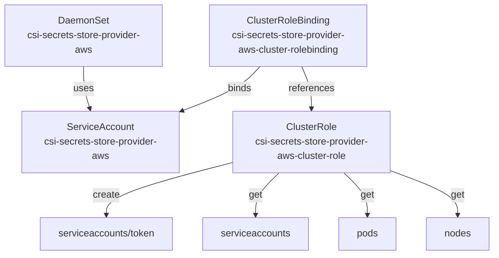
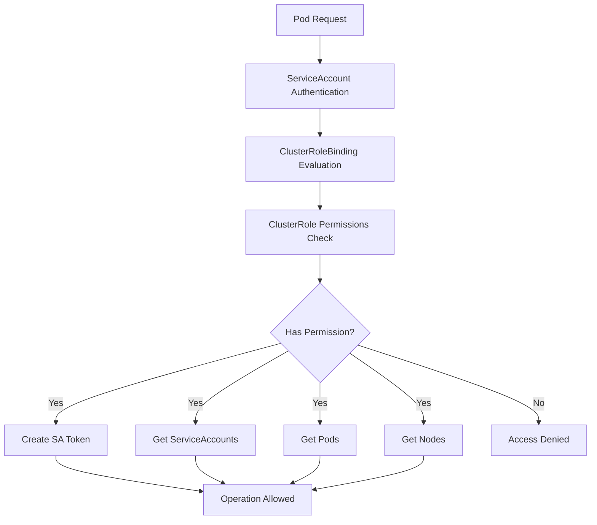
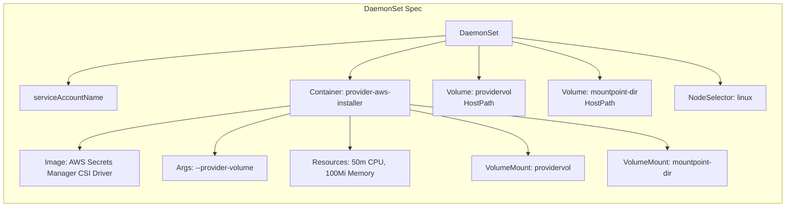
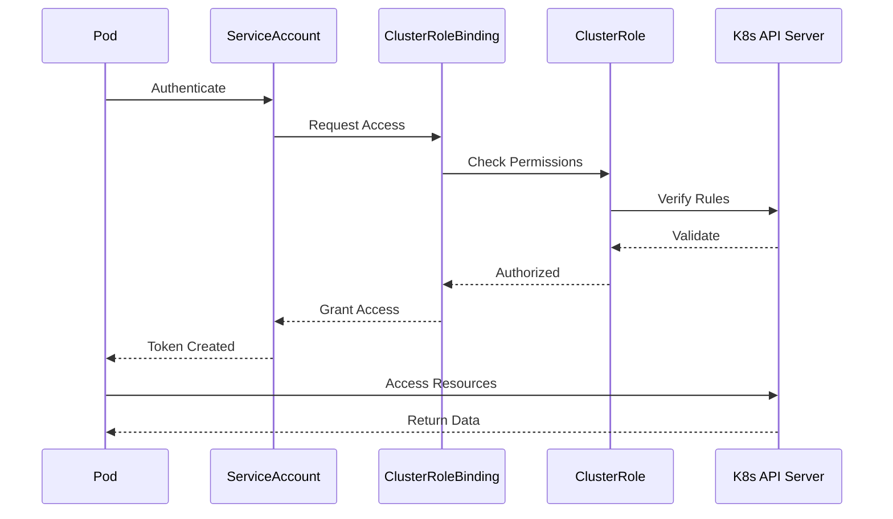

# Diagram: devops/k8s/secrets-store-csi-driver/helm/templates/aws-provider.yaml

> Auto-generated by Obscura crawlers

## Diagram 1

### SVG

<svg id="container" width="818.6015625" xmlns="http://www.w3.org/2000/svg" class="flowchart" height="422" viewBox="0 0 818.6015625 422" role="graphics-document document" aria-roledescription="flowchart-v2"><g><marker id="container_flowchart-v2-pointEnd" class="marker flowchart-v2" viewBox="0 0 10 10" refX="5" refY="5" markerUnits="userSpaceOnUse" markerWidth="8" markerHeight="8" orient="auto"><path d="M 0 0 L 10 5 L 0 10 z" class="arrowMarkerPath" style="stroke-width: 1; stroke-dasharray: 1, 0;"></path></marker><marker id="container_flowchart-v2-pointStart" class="marker flowchart-v2" viewBox="0 0 10 10" refX="4.5" refY="5" markerUnits="userSpaceOnUse" markerWidth="8" markerHeight="8" orient="auto"><path d="M 0 5 L 10 10 L 10 0 z" class="arrowMarkerPath" style="stroke-width: 1; stroke-dasharray: 1, 0;"></path></marker><marker id="container_flowchart-v2-circleEnd" class="marker flowchart-v2" viewBox="0 0 10 10" refX="11" refY="5" markerUnits="userSpaceOnUse" markerWidth="11" markerHeight="11" orient="auto"><circle cx="5" cy="5" r="5" class="arrowMarkerPath" style="stroke-width: 1; stroke-dasharray: 1, 0;"></circle></marker><marker id="container_flowchart-v2-circleStart" class="marker flowchart-v2" viewBox="0 0 10 10" refX="-1" refY="5" markerUnits="userSpaceOnUse" markerWidth="11" markerHeight="11" orient="auto"><circle cx="5" cy="5" r="5" class="arrowMarkerPath" style="stroke-width: 1; stroke-dasharray: 1, 0;"></circle></marker><marker id="container_flowchart-v2-crossEnd" class="marker cross flowchart-v2" viewBox="0 0 11 11" refX="12" refY="5.2" markerUnits="userSpaceOnUse" markerWidth="11" markerHeight="11" orient="auto"><path d="M 1,1 l 9,9 M 10,1 l -9,9" class="arrowMarkerPath" style="stroke-width: 2; stroke-dasharray: 1, 0;"></path></marker><marker id="container_flowchart-v2-crossStart" class="marker cross flowchart-v2" viewBox="0 0 11 11" refX="-1" refY="5.2" markerUnits="userSpaceOnUse" markerWidth="11" markerHeight="11" orient="auto"><path d="M 1,1 l 9,9 M 10,1 l -9,9" class="arrowMarkerPath" style="stroke-width: 2; stroke-dasharray: 1, 0;"></path></marker><g class="root"><g class="clusters"></g><g class="edgePaths"><path d="M430.046,110L424.447,116.167C418.847,122.333,407.648,134.667,385.989,146.975C364.33,159.284,332.211,171.568,316.151,177.71L300.092,183.852" id="L_CRB_SA_0" class="edge-thickness-normal edge-pattern-solid edge-thickness-normal edge-pattern-solid flowchart-link" style=";" data-edge="true" data-et="edge" data-id="L_CRB_SA_0" data-points="W3sieCI6NDMwLjA0NjE2NDc3MjcyNzI1LCJ5IjoxMTB9LHsieCI6Mzk2LjQ0OTIxODc1LCJ5IjoxNDd9LHsieCI6Mjk2LjM1NTQ2ODc1LCJ5IjoxODUuMjgxMTM1NDA2NzYzNTV9XQ==" marker-end="url(#container_flowchart-v2-pointEnd)"></path><path d="M498.971,110L501.706,116.167C504.441,122.333,509.91,134.667,512.644,146.333C515.379,158,515.379,169,515.379,174.5L515.379,180" id="L_CRB_CR_0" class="edge-thickness-normal edge-pattern-solid edge-thickness-normal edge-pattern-solid flowchart-link" style=";" data-edge="true" data-et="edge" data-id="L_CRB_CR_0" data-points="W3sieCI6NDk4Ljk3MTMyNDU3Mzg2MzYsInkiOjExMH0seyJ4Ijo1MTUuMzc4OTA2MjUsInkiOjE0N30seyJ4Ijo1MTUuMzc4OTA2MjUsInkiOjE4NH1d" marker-end="url(#container_flowchart-v2-pointEnd)"></path><path d="M138,110L138,116.167C138,122.333,138,134.667,139.783,146.365C141.565,158.064,145.13,169.129,146.913,174.661L148.695,180.193" id="L_DS_SA_0" class="edge-thickness-normal edge-pattern-solid edge-thickness-normal edge-pattern-solid flowchart-link" style=";" data-edge="true" data-et="edge" data-id="L_DS_SA_0" data-points="W3sieCI6MTM4LCJ5IjoxMTB9LHsieCI6MTM4LCJ5IjoxNDd9LHsieCI6MTQ5LjkyMjE4NTcyNDQzMTgsInkiOjE4NH1d" marker-end="url(#container_flowchart-v2-pointEnd)"></path><path d="M385.379,268.4L349.96,277.5C314.542,286.6,243.704,304.8,208.286,319.4C172.867,334,172.867,345,172.867,350.5L172.867,356" id="L_CR_SAT_0" class="edge-thickness-normal edge-pattern-solid edge-thickness-normal edge-pattern-solid flowchart-link" style=";" data-edge="true" data-et="edge" data-id="L_CR_SAT_0" data-points="W3sieCI6Mzg1LjM3ODkwNjI1LCJ5IjoyNjguNDAwMzE3MDUxMTk1Nzd9LHsieCI6MTcyLjg2NzE4NzUsInkiOjMyM30seyJ4IjoxNzIuODY3MTg3NSwieSI6MzYwfV0=" marker-end="url(#container_flowchart-v2-pointEnd)"></path><path d="M461.601,286L455.099,292.167C448.596,298.333,435.591,310.667,429.088,322.333C422.586,334,422.586,345,422.586,350.5L422.586,356" id="L_CR_SAR_0" class="edge-thickness-normal edge-pattern-solid edge-thickness-normal edge-pattern-solid flowchart-link" style=";" data-edge="true" data-et="edge" data-id="L_CR_SAR_0" data-points="W3sieCI6NDYxLjYwMTE2Mjk5NzE1OTEsInkiOjI4Nn0seyJ4Ijo0MjIuNTg1OTM3NSwieSI6MzIzfSx7IngiOjQyMi41ODU5Mzc1LCJ5IjozNjB9XQ==" marker-end="url(#container_flowchart-v2-pointEnd)"></path><path d="M569.157,286L575.659,292.167C582.162,298.333,595.167,310.667,601.669,322.333C608.172,334,608.172,345,608.172,350.5L608.172,356" id="L_CR_PODS_0" class="edge-thickness-normal edge-pattern-solid edge-thickness-normal edge-pattern-solid flowchart-link" style=";" data-edge="true" data-et="edge" data-id="L_CR_PODS_0" data-points="W3sieCI6NTY5LjE1NjY0OTUwMjg0MDksInkiOjI4Nn0seyJ4Ijo2MDguMTcxODc1LCJ5IjozMjN9LHsieCI6NjA4LjE3MTg3NSwieSI6MzYwfV0=" marker-end="url(#container_flowchart-v2-pointEnd)"></path><path d="M645.379,282.082L664.209,288.902C683.039,295.721,720.699,309.361,739.529,321.68C758.359,334,758.359,345,758.359,350.5L758.359,356" id="L_CR_NODES_0" class="edge-thickness-normal edge-pattern-solid edge-thickness-normal edge-pattern-solid flowchart-link" style=";" data-edge="true" data-et="edge" data-id="L_CR_NODES_0" data-points="W3sieCI6NjQ1LjM3ODkwNjI1LCJ5IjoyODIuMDgxOTczNTM4MjUzOH0seyJ4Ijo3NTguMzU5Mzc1LCJ5IjozMjN9LHsieCI6NzU4LjM1OTM3NSwieSI6MzYwfV0=" marker-end="url(#container_flowchart-v2-pointEnd)"></path></g><g class="edgeLabels"><g class="edgeLabel" transform="translate(396.44921875, 147)"><g class="label" data-id="L_CRB_SA_0" transform="translate(-20.21875, -12)"><foreignObject width="40.4375" height="24">

binds

</foreignObject></g></g><g class="edgeLabel" transform="translate(515.37890625, 147)"><g class="label" data-id="L_CRB_CR_0" transform="translate(-37.828125, -12)"><foreignObject width="75.65625" height="24">

references

</foreignObject></g></g><g class="edgeLabel" transform="translate(138, 147)"><g class="label" data-id="L_DS_SA_0" transform="translate(-16.4921875, -12)"><foreignObject width="32.984375" height="24">

uses

</foreignObject></g></g><g class="edgeLabel" transform="translate(172.8671875, 323)"><g class="label" data-id="L_CR_SAT_0" transform="translate(-22.4375, -12)"><foreignObject width="44.875" height="24">

create

</foreignObject></g></g><g class="edgeLabel" transform="translate(422.5859375, 323)"><g class="label" data-id="L_CR_SAR_0" transform="translate(-11.28125, -12)"><foreignObject width="22.5625" height="24">

get

</foreignObject></g></g><g class="edgeLabel" transform="translate(608.171875, 323)"><g class="label" data-id="L_CR_PODS_0" transform="translate(-11.28125, -12)"><foreignObject width="22.5625" height="24">

get

</foreignObject></g></g><g class="edgeLabel" transform="translate(758.359375, 323)"><g class="label" data-id="L_CR_NODES_0" transform="translate(-11.28125, -12)"><foreignObject width="22.5625" height="24">

get

</foreignObject></g></g></g><g class="nodes"><g class="node default" id="flowchart-SA-0" transform="translate(166.35546875, 235)"><rect class="basic label-container" style="" x="-130" y="-51" width="260" height="102"></rect><g class="label" style="" transform="translate(-100, -36)"><rect></rect><foreignObject width="200" height="72">

ServiceAccount csi-secrets-store-provider-aws

</foreignObject></g></g><g class="node default" id="flowchart-CR-1" transform="translate(515.37890625, 235)"><rect class="basic label-container" style="" x="-130" y="-51" width="260" height="102"></rect><g class="label" style="" transform="translate(-100, -36)"><rect></rect><foreignObject width="200" height="72">

ClusterRole csi-secrets-store-provider-aws-cluster-role

</foreignObject></g></g><g class="node default" id="flowchart-CRB-2" transform="translate(476.35546875, 59)"><rect class="basic label-container" style="" x="-130" y="-51" width="260" height="102"></rect><g class="label" style="" transform="translate(-100, -36)"><rect></rect><foreignObject width="200" height="72">

ClusterRoleBinding csi-secrets-store-provider-aws-cluster-rolebinding

</foreignObject></g></g><g class="node default" id="flowchart-DS-3" transform="translate(138, 59)"><rect class="basic label-container" style="" x="-130" y="-51" width="260" height="102"></rect><g class="label" style="" transform="translate(-100, -36)"><rect></rect><foreignObject width="200" height="72">

DaemonSet csi-secrets-store-provider-aws

</foreignObject></g></g><g class="node default" id="flowchart-SAT-11" transform="translate(172.8671875, 387)"><rect class="basic label-container" style="" x="-112.078125" y="-27" width="224.15625" height="54"></rect><g class="label" style="" transform="translate(-82.078125, -12)"><rect></rect><foreignObject width="164.15625" height="24">

serviceaccounts/token

</foreignObject></g></g><g class="node default" id="flowchart-SAR-13" transform="translate(422.5859375, 387)"><rect class="basic label-container" style="" x="-87.640625" y="-27" width="175.28125" height="54"></rect><g class="label" style="" transform="translate(-57.640625, -12)"><rect></rect><foreignObject width="115.28125" height="24">

serviceaccounts

</foreignObject></g></g><g class="node default" id="flowchart-PODS-15" transform="translate(608.171875, 387)"><rect class="basic label-container" style="" x="-47.9453125" y="-27" width="95.890625" height="54"></rect><g class="label" style="" transform="translate(-17.9453125, -12)"><rect></rect><foreignObject width="35.890625" height="24">

pods

</foreignObject></g></g><g class="node default" id="flowchart-NODES-17" transform="translate(758.359375, 387)"><rect class="basic label-container" style="" x="-52.2421875" y="-27" width="104.484375" height="54"></rect><g class="label" style="" transform="translate(-22.2421875, -12)"><rect></rect><foreignObject width="44.484375" height="24">

nodes

</foreignObject></g></g></g></g></g></svg>

## Diagram 2

### SVG

<svg id="container" width="1018.796875" xmlns="http://www.w3.org/2000/svg" class="flowchart" height="907.953125" viewBox="0 0 1018.796875 907.953125" role="graphics-document document" aria-roledescription="flowchart-v2"><g><marker id="container_flowchart-v2-pointEnd" class="marker flowchart-v2" viewBox="0 0 10 10" refX="5" refY="5" markerUnits="userSpaceOnUse" markerWidth="8" markerHeight="8" orient="auto"><path d="M 0 0 L 10 5 L 0 10 z" class="arrowMarkerPath" style="stroke-width: 1; stroke-dasharray: 1, 0;"></path></marker><marker id="container_flowchart-v2-pointStart" class="marker flowchart-v2" viewBox="0 0 10 10" refX="4.5" refY="5" markerUnits="userSpaceOnUse" markerWidth="8" markerHeight="8" orient="auto"><path d="M 0 5 L 10 10 L 10 0 z" class="arrowMarkerPath" style="stroke-width: 1; stroke-dasharray: 1, 0;"></path></marker><marker id="container_flowchart-v2-circleEnd" class="marker flowchart-v2" viewBox="0 0 10 10" refX="11" refY="5" markerUnits="userSpaceOnUse" markerWidth="11" markerHeight="11" orient="auto"><circle cx="5" cy="5" r="5" class="arrowMarkerPath" style="stroke-width: 1; stroke-dasharray: 1, 0;"></circle></marker><marker id="container_flowchart-v2-circleStart" class="marker flowchart-v2" viewBox="0 0 10 10" refX="-1" refY="5" markerUnits="userSpaceOnUse" markerWidth="11" markerHeight="11" orient="auto"><circle cx="5" cy="5" r="5" class="arrowMarkerPath" style="stroke-width: 1; stroke-dasharray: 1, 0;"></circle></marker><marker id="container_flowchart-v2-crossEnd" class="marker cross flowchart-v2" viewBox="0 0 11 11" refX="12" refY="5.2" markerUnits="userSpaceOnUse" markerWidth="11" markerHeight="11" orient="auto"><path d="M 1,1 l 9,9 M 10,1 l -9,9" class="arrowMarkerPath" style="stroke-width: 2; stroke-dasharray: 1, 0;"></path></marker><marker id="container_flowchart-v2-crossStart" class="marker cross flowchart-v2" viewBox="0 0 11 11" refX="-1" refY="5.2" markerUnits="userSpaceOnUse" markerWidth="11" markerHeight="11" orient="auto"><path d="M 1,1 l 9,9 M 10,1 l -9,9" class="arrowMarkerPath" style="stroke-width: 2; stroke-dasharray: 1, 0;"></path></marker><g class="root"><g class="clusters"></g><g class="edgePaths"><path d="M551.117,62L551.117,66.167C551.117,70.333,551.117,78.667,551.117,86.333C551.117,94,551.117,101,551.117,104.5L551.117,108" id="L_Start_SA_0" class="edge-thickness-normal edge-pattern-solid edge-thickness-normal edge-pattern-solid flowchart-link" style=";" data-edge="true" data-et="edge" data-id="L_Start_SA_0" data-points="W3sieCI6NTUxLjExNzE4NzUsInkiOjYyfSx7IngiOjU1MS4xMTcxODc1LCJ5Ijo4N30seyJ4Ijo1NTEuMTE3MTg3NSwieSI6MTEyfV0=" marker-end="url(#container_flowchart-v2-pointEnd)"></path><path d="M551.117,190L551.117,194.167C551.117,198.333,551.117,206.667,551.117,214.333C551.117,222,551.117,229,551.117,232.5L551.117,236" id="L_SA_CRB_0" class="edge-thickness-normal edge-pattern-solid edge-thickness-normal edge-pattern-solid flowchart-link" style=";" data-edge="true" data-et="edge" data-id="L_SA_CRB_0" data-points="W3sieCI6NTUxLjExNzE4NzUsInkiOjE5MH0seyJ4Ijo1NTEuMTE3MTg3NSwieSI6MjE1fSx7IngiOjU1MS4xMTcxODc1LCJ5IjoyNDB9XQ==" marker-end="url(#container_flowchart-v2-pointEnd)"></path><path d="M551.117,318L551.117,322.167C551.117,326.333,551.117,334.667,551.117,342.333C551.117,350,551.117,357,551.117,360.5L551.117,364" id="L_CRB_CR_0" class="edge-thickness-normal edge-pattern-solid edge-thickness-normal edge-pattern-solid flowchart-link" style=";" data-edge="true" data-et="edge" data-id="L_CRB_CR_0" data-points="W3sieCI6NTUxLjExNzE4NzUsInkiOjMxOH0seyJ4Ijo1NTEuMTE3MTg3NSwieSI6MzQzfSx7IngiOjU1MS4xMTcxODc1LCJ5IjozNjh9XQ==" marker-end="url(#container_flowchart-v2-pointEnd)"></path><path d="M551.117,446L551.117,450.167C551.117,454.333,551.117,462.667,551.117,470.333C551.117,478,551.117,485,551.117,488.5L551.117,492" id="L_CR_P1_0" class="edge-thickness-normal edge-pattern-solid edge-thickness-normal edge-pattern-solid flowchart-link" style=";" data-edge="true" data-et="edge" data-id="L_CR_P1_0" data-points="W3sieCI6NTUxLjExNzE4NzUsInkiOjQ0Nn0seyJ4Ijo1NTEuMTE3MTg3NSwieSI6NDcxfSx7IngiOjU1MS4xMTcxODc1LCJ5Ijo0OTZ9XQ==" marker-end="url(#container_flowchart-v2-pointEnd)"></path><path d="M483.416,600.252L418.773,617.702C354.129,635.152,224.842,670.053,160.198,693.003C95.555,715.953,95.555,726.953,95.555,732.453L95.555,737.953" id="L_P1_A1_0" class="edge-thickness-normal edge-pattern-solid edge-thickness-normal edge-pattern-solid flowchart-link" style=";" data-edge="true" data-et="edge" data-id="L_P1_A1_0" data-points="W3sieCI6NDgzLjQxNjE0NDgzNDYxMTcsInkiOjYwMC4yNTIwODIzMzQ2MTE3fSx7IngiOjk1LjU1NDY4NzUsInkiOjcwNC45NTMxMjV9LHsieCI6OTUuNTU0Njg3NSwieSI6NzQxLjk1MzEyNX1d" marker-end="url(#container_flowchart-v2-pointEnd)"></path><path d="M496.423,613.259L469.703,628.541C442.982,643.823,389.542,674.388,362.822,695.171C336.102,715.953,336.102,726.953,336.102,732.453L336.102,737.953" id="L_P1_A2_0" class="edge-thickness-normal edge-pattern-solid edge-thickness-normal edge-pattern-solid flowchart-link" style=";" data-edge="true" data-et="edge" data-id="L_P1_A2_0" data-points="W3sieCI6NDk2LjQyMjcxNTI0NTk5NTQ1LCJ5Ijo2MTMuMjU4NjUyNzQ1OTk1NH0seyJ4IjozMzYuMTAxNTYyNSwieSI6NzA0Ljk1MzEyNX0seyJ4IjozMzYuMTAxNTYyNSwieSI6NzQxLjk1MzEyNX1d" marker-end="url(#container_flowchart-v2-pointEnd)"></path><path d="M551.117,667.953L551.117,674.12C551.117,680.286,551.117,692.62,551.117,704.286C551.117,715.953,551.117,726.953,551.117,732.453L551.117,737.953" id="L_P1_A3_0" class="edge-thickness-normal edge-pattern-solid edge-thickness-normal edge-pattern-solid flowchart-link" style=";" data-edge="true" data-et="edge" data-id="L_P1_A3_0" data-points="W3sieCI6NTUxLjExNzE4NzUsInkiOjY2Ny45NTMxMjV9LHsieCI6NTUxLjExNzE4NzUsInkiOjcwNC45NTMxMjV9LHsieCI6NTUxLjExNzE4NzUsInkiOjc0MS45NTMxMjV9XQ==" marker-end="url(#container_flowchart-v2-pointEnd)"></path><path d="M602.134,616.936L623.541,631.606C644.949,646.275,687.763,675.614,709.171,695.784C730.578,715.953,730.578,726.953,730.578,732.453L730.578,737.953" id="L_P1_A4_0" class="edge-thickness-normal edge-pattern-solid edge-thickness-normal edge-pattern-solid flowchart-link" style=";" data-edge="true" data-et="edge" data-id="L_P1_A4_0" data-points="W3sieCI6NjAyLjEzNDEyMzI2MTE5OCwieSI6NjE2LjkzNjE4OTIzODgwMn0seyJ4Ijo3MzAuNTc4MTI1LCJ5Ijo3MDQuOTUzMTI1fSx7IngiOjczMC41NzgxMjUsInkiOjc0MS45NTMxMjV9XQ==" marker-end="url(#container_flowchart-v2-pointEnd)"></path><path d="M616.001,603.069L668.235,620.05C720.469,637.031,824.938,670.992,877.172,693.473C929.406,715.953,929.406,726.953,929.406,732.453L929.406,737.953" id="L_P1_Deny_0" class="edge-thickness-normal edge-pattern-solid edge-thickness-normal edge-pattern-solid flowchart-link" style=";" data-edge="true" data-et="edge" data-id="L_P1_Deny_0" data-points="W3sieCI6NjE2LjAwMDkzNjk1OTM3NjMsInkiOjYwMy4wNjkzNzU1NDA2MjM3fSx7IngiOjkyOS40MDYyNSwieSI6NzA0Ljk1MzEyNX0seyJ4Ijo5MjkuNDA2MjUsInkiOjc0MS45NTMxMjV9XQ==" marker-end="url(#container_flowchart-v2-pointEnd)"></path><path d="M95.555,795.953L95.555,800.12C95.555,804.286,95.555,812.62,136.701,822.934C177.848,833.248,260.141,845.543,301.288,851.69L342.435,857.837" id="L_A1_Success_0" class="edge-thickness-normal edge-pattern-solid edge-thickness-normal edge-pattern-solid flowchart-link" style=";" data-edge="true" data-et="edge" data-id="L_A1_Success_0" data-points="W3sieCI6OTUuNTU0Njg3NSwieSI6Nzk1Ljk1MzEyNX0seyJ4Ijo5NS41NTQ2ODc1LCJ5Ijo4MjAuOTUzMTI1fSx7IngiOjM0Ni4zOTA2MjUsInkiOjg1OC40Mjg0Njc4NjU0OH1d" marker-end="url(#container_flowchart-v2-pointEnd)"></path><path d="M336.102,795.953L336.102,800.12C336.102,804.286,336.102,812.62,344.116,820.663C352.13,828.706,368.159,836.459,376.173,840.335L384.187,844.211" id="L_A2_Success_0" class="edge-thickness-normal edge-pattern-solid edge-thickness-normal edge-pattern-solid flowchart-link" style=";" data-edge="true" data-et="edge" data-id="L_A2_Success_0" data-points="W3sieCI6MzM2LjEwMTU2MjUsInkiOjc5NS45NTMxMjV9LHsieCI6MzM2LjEwMTU2MjUsInkiOjgyMC45NTMxMjV9LHsieCI6Mzg3Ljc4ODAxMDgxNzMwNzcsInkiOjg0NS45NTMxMjV9XQ==" marker-end="url(#container_flowchart-v2-pointEnd)"></path><path d="M551.117,795.953L551.117,800.12C551.117,804.286,551.117,812.62,543.103,820.663C535.089,828.706,519.06,836.459,511.046,840.335L503.032,844.211" id="L_A3_Success_0" class="edge-thickness-normal edge-pattern-solid edge-thickness-normal edge-pattern-solid flowchart-link" style=";" data-edge="true" data-et="edge" data-id="L_A3_Success_0" data-points="W3sieCI6NTUxLjExNzE4NzUsInkiOjc5NS45NTMxMjV9LHsieCI6NTUxLjExNzE4NzUsInkiOjgyMC45NTMxMjV9LHsieCI6NDk5LjQzMDczOTE4MjY5MjMsInkiOjg0NS45NTMxMjV9XQ==" marker-end="url(#container_flowchart-v2-pointEnd)"></path><path d="M730.578,795.953L730.578,800.12C730.578,804.286,730.578,812.62,699.609,822.398C668.64,832.177,606.702,843.4,575.733,849.012L544.764,854.623" id="L_A4_Success_0" class="edge-thickness-normal edge-pattern-solid edge-thickness-normal edge-pattern-solid flowchart-link" style=";" data-edge="true" data-et="edge" data-id="L_A4_Success_0" data-points="W3sieCI6NzMwLjU3ODEyNSwieSI6Nzk1Ljk1MzEyNX0seyJ4Ijo3MzAuNTc4MTI1LCJ5Ijo4MjAuOTUzMTI1fSx7IngiOjU0MC44MjgxMjUsInkiOjg1NS4zMzY2NTk3OTI1NTE1fV0=" marker-end="url(#container_flowchart-v2-pointEnd)"></path></g><g class="edgeLabels"><g class="edgeLabel"><g class="label" data-id="L_Start_SA_0" transform="translate(0, 0)"><foreignObject width="0" height="0">

</foreignObject></g></g><g class="edgeLabel"><g class="label" data-id="L_SA_CRB_0" transform="translate(0, 0)"><foreignObject width="0" height="0">

</foreignObject></g></g><g class="edgeLabel"><g class="label" data-id="L_CRB_CR_0" transform="translate(0, 0)"><foreignObject width="0" height="0">

</foreignObject></g></g><g class="edgeLabel"><g class="label" data-id="L_CR_P1_0" transform="translate(0, 0)"><foreignObject width="0" height="0">

</foreignObject></g></g><g class="edgeLabel" transform="translate(95.5546875, 704.953125)"><g class="label" data-id="L_P1_A1_0" transform="translate(-12.03125, -12)"><foreignObject width="24.0625" height="24">

Yes

</foreignObject></g></g><g class="edgeLabel" transform="translate(336.1015625, 704.953125)"><g class="label" data-id="L_P1_A2_0" transform="translate(-12.03125, -12)"><foreignObject width="24.0625" height="24">

Yes

</foreignObject></g></g><g class="edgeLabel" transform="translate(551.1171875, 704.953125)"><g class="label" data-id="L_P1_A3_0" transform="translate(-12.03125, -12)"><foreignObject width="24.0625" height="24">

Yes

</foreignObject></g></g><g class="edgeLabel" transform="translate(730.578125, 704.953125)"><g class="label" data-id="L_P1_A4_0" transform="translate(-12.03125, -12)"><foreignObject width="24.0625" height="24">

Yes

</foreignObject></g></g><g class="edgeLabel" transform="translate(929.40625, 704.953125)"><g class="label" data-id="L_P1_Deny_0" transform="translate(-10.140625, -12)"><foreignObject width="20.28125" height="24">

No

</foreignObject></g></g><g class="edgeLabel"><g class="label" data-id="L_A1_Success_0" transform="translate(0, 0)"><foreignObject width="0" height="0">

</foreignObject></g></g><g class="edgeLabel"><g class="label" data-id="L_A2_Success_0" transform="translate(0, 0)"><foreignObject width="0" height="0">

</foreignObject></g></g><g class="edgeLabel"><g class="label" data-id="L_A3_Success_0" transform="translate(0, 0)"><foreignObject width="0" height="0">

</foreignObject></g></g><g class="edgeLabel"><g class="label" data-id="L_A4_Success_0" transform="translate(0, 0)"><foreignObject width="0" height="0">

</foreignObject></g></g></g><g class="nodes"><g class="node default" id="flowchart-Start-0" transform="translate(551.1171875, 35)"><rect class="basic label-container" style="" x="-75.4921875" y="-27" width="150.984375" height="54"></rect><g class="label" style="" transform="translate(-45.4921875, -12)"><rect></rect><foreignObject width="90.984375" height="24">

Pod Request

</foreignObject></g></g><g class="node default" id="flowchart-SA-1" transform="translate(551.1171875, 151)"><rect class="basic label-container" style="" x="-130" y="-39" width="260" height="78"></rect><g class="label" style="" transform="translate(-100, -24)"><rect></rect><foreignObject width="200" height="48">

ServiceAccount Authentication

</foreignObject></g></g><g class="node default" id="flowchart-CRB-3" transform="translate(551.1171875, 279)"><rect class="basic label-container" style="" x="-130" y="-39" width="260" height="78"></rect><g class="label" style="" transform="translate(-100, -24)"><rect></rect><foreignObject width="200" height="48">

ClusterRoleBinding Evaluation

</foreignObject></g></g><g class="node default" id="flowchart-CR-5" transform="translate(551.1171875, 407)"><rect class="basic label-container" style="" x="-130" y="-39" width="260" height="78"></rect><g class="label" style="" transform="translate(-100, -24)"><rect></rect><foreignObject width="200" height="48">

ClusterRole Permissions Check

</foreignObject></g></g><g class="node default" id="flowchart-P1-7" transform="translate(551.1171875, 581.9765625)"><polygon points="85.9765625,0 171.953125,-85.9765625 85.9765625,-171.953125 0,-85.9765625" class="label-container" transform="translate(-85.4765625, 85.9765625)"></polygon><g class="label" style="" transform="translate(-58.9765625, -12)"><rect></rect><foreignObject width="117.953125" height="24">

Has Permission?

</foreignObject></g></g><g class="node default" id="flowchart-A1-9" transform="translate(95.5546875, 768.953125)"><rect class="basic label-container" style="" x="-87.5546875" y="-27" width="175.109375" height="54"></rect><g class="label" style="" transform="translate(-57.5546875, -12)"><rect></rect><foreignObject width="115.109375" height="24">

Create SA Token

</foreignObject></g></g><g class="node default" id="flowchart-A2-11" transform="translate(336.1015625, 768.953125)"><rect class="basic label-container" style="" x="-102.9921875" y="-27" width="205.984375" height="54"></rect><g class="label" style="" transform="translate(-72.9921875, -12)"><rect></rect><foreignObject width="145.984375" height="24">

Get ServiceAccounts

</foreignObject></g></g><g class="node default" id="flowchart-A3-13" transform="translate(551.1171875, 768.953125)"><rect class="basic label-container" style="" x="-62.0234375" y="-27" width="124.046875" height="54"></rect><g class="label" style="" transform="translate(-32.0234375, -12)"><rect></rect><foreignObject width="64.046875" height="24">

Get Pods

</foreignObject></g></g><g class="node default" id="flowchart-A4-15" transform="translate(730.578125, 768.953125)"><rect class="basic label-container" style="" x="-67.4375" y="-27" width="134.875" height="54"></rect><g class="label" style="" transform="translate(-37.4375, -12)"><rect></rect><foreignObject width="74.875" height="24">

Get Nodes

</foreignObject></g></g><g class="node default" id="flowchart-Deny-17" transform="translate(929.40625, 768.953125)"><rect class="basic label-container" style="" x="-81.390625" y="-27" width="162.78125" height="54"></rect><g class="label" style="" transform="translate(-51.390625, -12)"><rect></rect><foreignObject width="102.78125" height="24">

Access Denied

</foreignObject></g></g><g class="node default" id="flowchart-Success-19" transform="translate(443.609375, 872.953125)"><rect class="basic label-container" style="" x="-97.21875" y="-27" width="194.4375" height="54"></rect><g class="label" style="" transform="translate(-67.21875, -12)"><rect></rect><foreignObject width="134.4375" height="24">

Operation Allowed

</foreignObject></g></g></g></g></g></svg>

## Diagram 3

### SVG

<svg id="container" width="1730.34375" xmlns="http://www.w3.org/2000/svg" class="flowchart" height="451" viewBox="0 0 1730.34375 451" role="graphics-document document" aria-roledescription="flowchart-v2"><g><marker id="container_flowchart-v2-pointEnd" class="marker flowchart-v2" viewBox="0 0 10 10" refX="5" refY="5" markerUnits="userSpaceOnUse" markerWidth="8" markerHeight="8" orient="auto"><path d="M 0 0 L 10 5 L 0 10 z" class="arrowMarkerPath" style="stroke-width: 1; stroke-dasharray: 1, 0;"></path></marker><marker id="container_flowchart-v2-pointStart" class="marker flowchart-v2" viewBox="0 0 10 10" refX="4.5" refY="5" markerUnits="userSpaceOnUse" markerWidth="8" markerHeight="8" orient="auto"><path d="M 0 5 L 10 10 L 10 0 z" class="arrowMarkerPath" style="stroke-width: 1; stroke-dasharray: 1, 0;"></path></marker><marker id="container_flowchart-v2-circleEnd" class="marker flowchart-v2" viewBox="0 0 10 10" refX="11" refY="5" markerUnits="userSpaceOnUse" markerWidth="11" markerHeight="11" orient="auto"><circle cx="5" cy="5" r="5" class="arrowMarkerPath" style="stroke-width: 1; stroke-dasharray: 1, 0;"></circle></marker><marker id="container_flowchart-v2-circleStart" class="marker flowchart-v2" viewBox="0 0 10 10" refX="-1" refY="5" markerUnits="userSpaceOnUse" markerWidth="11" markerHeight="11" orient="auto"><circle cx="5" cy="5" r="5" class="arrowMarkerPath" style="stroke-width: 1; stroke-dasharray: 1, 0;"></circle></marker><marker id="container_flowchart-v2-crossEnd" class="marker cross flowchart-v2" viewBox="0 0 11 11" refX="12" refY="5.2" markerUnits="userSpaceOnUse" markerWidth="11" markerHeight="11" orient="auto"><path d="M 1,1 l 9,9 M 10,1 l -9,9" class="arrowMarkerPath" style="stroke-width: 2; stroke-dasharray: 1, 0;"></path></marker><marker id="container_flowchart-v2-crossStart" class="marker cross flowchart-v2" viewBox="0 0 11 11" refX="-1" refY="5.2" markerUnits="userSpaceOnUse" markerWidth="11" markerHeight="11" orient="auto"><path d="M 1,1 l 9,9 M 10,1 l -9,9" class="arrowMarkerPath" style="stroke-width: 2; stroke-dasharray: 1, 0;"></path></marker><g class="root"><g class="clusters"></g><g class="edgePaths"></g><g class="edgeLabels"></g><g class="nodes"><g class="root" transform="translate(0, 0)"><g class="clusters"><g class="cluster" id="subGraph0" data-look="classic"><rect style="" x="8" y="8" width="1714.34375" height="435"></rect><g class="cluster-label" transform="translate(804.140625, 8)"><foreignObject width="122.0625" height="24">

DaemonSet Spec

</foreignObject></g></g></g><g class="edgePaths"><path d="M976.594,77.632L838.536,87.527C700.479,97.422,424.365,117.211,286.307,134.689C148.25,152.167,148.25,167.333,148.25,174.917L148.25,182.5" id="L_DS_SA_0" class="edge-thickness-normal edge-pattern-solid edge-thickness-normal edge-pattern-solid flowchart-link" style=";" data-edge="true" data-et="edge" data-id="L_DS_SA_0" data-points="W3sieCI6OTc2LjU5Mzc1LCJ5Ijo3Ny42MzIyNzI1MTQxOTM0NX0seyJ4IjoxNDguMjUsInkiOjEzN30seyJ4IjoxNDguMjUsInkiOjE4Ni41fV0=" marker-end="url(#container_flowchart-v2-pointEnd)"></path><path d="M976.594,88.834L941.401,96.862C906.208,104.89,835.823,120.945,800.63,134.556C765.438,148.167,765.438,159.333,765.438,164.917L765.438,170.5" id="L_DS_C_0" class="edge-thickness-normal edge-pattern-solid edge-thickness-normal edge-pattern-solid flowchart-link" style=";" data-edge="true" data-et="edge" data-id="L_DS_C_0" data-points="W3sieCI6OTc2LjU5Mzc1LCJ5Ijo4OC44MzQzOTI0NDA3MzYwMn0seyJ4Ijo3NjUuNDM3NSwieSI6MTM3fSx7IngiOjc2NS40Mzc1LCJ5IjoxNzQuNX1d" marker-end="url(#container_flowchart-v2-pointEnd)"></path><path d="M635.438,230.287L558.365,240.239C481.292,250.191,327.146,270.096,250.073,285.631C173,301.167,173,312.333,173,317.917L173,323.5" id="L_C_IMG_0" class="edge-thickness-normal edge-pattern-solid edge-thickness-normal edge-pattern-solid flowchart-link" style=";" data-edge="true" data-et="edge" data-id="L_C_IMG_0" data-points="W3sieCI6NjM1LjQzNzUsInkiOjIzMC4yODY1ODA4NjI5NjAyMn0seyJ4IjoxNzMsInkiOjI5MH0seyJ4IjoxNzMsInkiOjMyNy41fV0=" marker-end="url(#container_flowchart-v2-pointEnd)"></path><path d="M635.438,247.073L607.734,254.228C580.031,261.382,524.625,275.691,496.922,290.429C469.219,305.167,469.219,320.333,469.219,327.917L469.219,335.5" id="L_C_ARGS_0" class="edge-thickness-normal edge-pattern-solid edge-thickness-normal edge-pattern-solid flowchart-link" style=";" data-edge="true" data-et="edge" data-id="L_C_ARGS_0" data-points="W3sieCI6NjM1LjQzNzUsInkiOjI0Ny4wNzMxNjE3MjU5MjA0NH0seyJ4Ijo0NjkuMjE4NzUsInkiOjI5MH0seyJ4Ijo0NjkuMjE4NzUsInkiOjMzOS41fV0=" marker-end="url(#container_flowchart-v2-pointEnd)"></path><path d="M765.438,252.5L765.438,258.75C765.438,265,765.438,277.5,765.438,289.333C765.438,301.167,765.438,312.333,765.438,317.917L765.438,323.5" id="L_C_RES_0" class="edge-thickness-normal edge-pattern-solid edge-thickness-normal edge-pattern-solid flowchart-link" style=";" data-edge="true" data-et="edge" data-id="L_C_RES_0" data-points="W3sieCI6NzY1LjQzNzUsInkiOjI1Mi41fSx7IngiOjc2NS40Mzc1LCJ5IjoyOTB9LHsieCI6NzY1LjQzNzUsInkiOjMyNy41fV0=" marker-end="url(#container_flowchart-v2-pointEnd)"></path><path d="M895.438,238.617L939.763,247.181C984.089,255.744,1072.74,272.872,1117.065,289.019C1161.391,305.167,1161.391,320.333,1161.391,327.917L1161.391,335.5" id="L_C_VM1_0" class="edge-thickness-normal edge-pattern-solid edge-thickness-normal edge-pattern-solid flowchart-link" style=";" data-edge="true" data-et="edge" data-id="L_C_VM1_0" data-points="W3sieCI6ODk1LjQzNzUsInkiOjIzOC42MTY2MDk0NDcxNDF9LHsieCI6MTE2MS4zOTA2MjUsInkiOjI5MH0seyJ4IjoxMTYxLjM5MDYyNSwieSI6MzM5LjV9XQ==" marker-end="url(#container_flowchart-v2-pointEnd)"></path><path d="M895.438,227.669L990.75,238.058C1086.063,248.446,1276.688,269.223,1372,285.195C1467.313,301.167,1467.313,312.333,1467.313,317.917L1467.313,323.5" id="L_C_VM2_0" class="edge-thickness-normal edge-pattern-solid edge-thickness-normal edge-pattern-solid flowchart-link" style=";" data-edge="true" data-et="edge" data-id="L_C_VM2_0" data-points="W3sieCI6ODk1LjQzNzUsInkiOjIyNy42NjkxODk2NzA1MjUzOH0seyJ4IjoxNDY3LjMxMjUsInkiOjI5MH0seyJ4IjoxNDY3LjMxMjUsInkiOjMyNy41fV0=" marker-end="url(#container_flowchart-v2-pointEnd)"></path><path d="M1048.203,99.5L1048.203,105.75C1048.203,112,1048.203,124.5,1048.203,136.333C1048.203,148.167,1048.203,159.333,1048.203,164.917L1048.203,170.5" id="L_DS_V1_0" class="edge-thickness-normal edge-pattern-solid edge-thickness-normal edge-pattern-solid flowchart-link" style=";" data-edge="true" data-et="edge" data-id="L_DS_V1_0" data-points="W3sieCI6MTA0OC4yMDMxMjUsInkiOjk5LjV9LHsieCI6MTA0OC4yMDMxMjUsInkiOjEzN30seyJ4IjoxMDQ4LjIwMzEyNSwieSI6MTc0LjV9XQ==" marker-end="url(#container_flowchart-v2-pointEnd)"></path><path d="M1119.813,89.607L1152.876,97.506C1185.94,105.405,1252.068,121.202,1285.132,134.685C1318.195,148.167,1318.195,159.333,1318.195,164.917L1318.195,170.5" id="L_DS_V2_0" class="edge-thickness-normal edge-pattern-solid edge-thickness-normal edge-pattern-solid flowchart-link" style=";" data-edge="true" data-et="edge" data-id="L_DS_V2_0" data-points="W3sieCI6MTExOS44MTI1LCJ5Ijo4OS42MDcxNzkwMjcxNzA5M30seyJ4IjoxMzE4LjE5NTMxMjUsInkiOjEzN30seyJ4IjoxMzE4LjE5NTMxMjUsInkiOjE3NC41fV0=" marker-end="url(#container_flowchart-v2-pointEnd)"></path><path d="M1119.813,81.082L1197.574,90.402C1275.336,99.722,1430.859,118.361,1508.621,135.264C1586.383,152.167,1586.383,167.333,1586.383,174.917L1586.383,182.5" id="L_DS_NS_0" class="edge-thickness-normal edge-pattern-solid edge-thickness-normal edge-pattern-solid flowchart-link" style=";" data-edge="true" data-et="edge" data-id="L_DS_NS_0" data-points="W3sieCI6MTExOS44MTI1LCJ5Ijo4MS4wODIyNzI0MTcxNDY5Mn0seyJ4IjoxNTg2LjM4MjgxMjUsInkiOjEzN30seyJ4IjoxNTg2LjM4MjgxMjUsInkiOjE4Ni41fV0=" marker-end="url(#container_flowchart-v2-pointEnd)"></path></g><g class="edgeLabels"><g class="edgeLabel"><g class="label" data-id="L_DS_SA_0" transform="translate(0, 0)"><foreignObject width="0" height="0">

</foreignObject></g></g><g class="edgeLabel"><g class="label" data-id="L_DS_C_0" transform="translate(0, 0)"><foreignObject width="0" height="0">

</foreignObject></g></g><g class="edgeLabel"><g class="label" data-id="L_C_IMG_0" transform="translate(0, 0)"><foreignObject width="0" height="0">

</foreignObject></g></g><g class="edgeLabel"><g class="label" data-id="L_C_ARGS_0" transform="translate(0, 0)"><foreignObject width="0" height="0">

</foreignObject></g></g><g class="edgeLabel"><g class="label" data-id="L_C_RES_0" transform="translate(0, 0)"><foreignObject width="0" height="0">

</foreignObject></g></g><g class="edgeLabel"><g class="label" data-id="L_C_VM1_0" transform="translate(0, 0)"><foreignObject width="0" height="0">

</foreignObject></g></g><g class="edgeLabel"><g class="label" data-id="L_C_VM2_0" transform="translate(0, 0)"><foreignObject width="0" height="0">

</foreignObject></g></g><g class="edgeLabel"><g class="label" data-id="L_DS_V1_0" transform="translate(0, 0)"><foreignObject width="0" height="0">

</foreignObject></g></g><g class="edgeLabel"><g class="label" data-id="L_DS_V2_0" transform="translate(0, 0)"><foreignObject width="0" height="0">

</foreignObject></g></g><g class="edgeLabel"><g class="label" data-id="L_DS_NS_0" transform="translate(0, 0)"><foreignObject width="0" height="0">

</foreignObject></g></g></g><g class="nodes"><g class="node default" id="flowchart-DS-0" transform="translate(1048.203125, 72.5)"><rect class="basic label-container" style="" x="-71.609375" y="-27" width="143.21875" height="54"></rect><g class="label" style="" transform="translate(-41.609375, -12)"><rect></rect><foreignObject width="83.21875" height="24">

DaemonSet

</foreignObject></g></g><g class="node default" id="flowchart-SA-1" transform="translate(148.25, 213.5)"><rect class="basic label-container" style="" x="-105.25" y="-27" width="210.5" height="54"></rect><g class="label" style="" transform="translate(-75.25, -12)"><rect></rect><foreignObject width="150.5" height="24">

serviceAccountName

</foreignObject></g></g><g class="node default" id="flowchart-C-3" transform="translate(765.4375, 213.5)"><rect class="basic label-container" style="" x="-130" y="-39" width="260" height="78"></rect><g class="label" style="" transform="translate(-100, -24)"><rect></rect><foreignObject width="200" height="48">

Container: provider-aws-installer

</foreignObject></g></g><g class="node default" id="flowchart-IMG-5" transform="translate(173, 366.5)"><rect class="basic label-container" style="" x="-130" y="-39" width="260" height="78"></rect><g class="label" style="" transform="translate(-100, -24)"><rect></rect><foreignObject width="200" height="48">

Image: AWS Secrets Manager CSI Driver

</foreignObject></g></g><g class="node default" id="flowchart-ARGS-7" transform="translate(469.21875, 366.5)"><rect class="basic label-container" style="" x="-116.21875" y="-27" width="232.4375" height="54"></rect><g class="label" style="" transform="translate(-86.21875, -12)"><rect></rect><foreignObject width="172.4375" height="24">

Args: --provider-volume

</foreignObject></g></g><g class="node default" id="flowchart-RES-9" transform="translate(765.4375, 366.5)"><rect class="basic label-container" style="" x="-130" y="-39" width="260" height="78"></rect><g class="label" style="" transform="translate(-100, -24)"><rect></rect><foreignObject width="200" height="48">

Resources: 50m CPU, 100Mi Memory

</foreignObject></g></g><g class="node default" id="flowchart-VM1-11" transform="translate(1161.390625, 366.5)"><rect class="basic label-container" style="" x="-125.921875" y="-27" width="251.84375" height="54"></rect><g class="label" style="" transform="translate(-95.921875, -12)"><rect></rect><foreignObject width="191.84375" height="24">

VolumeMount: providervol

</foreignObject></g></g><g class="node default" id="flowchart-VM2-13" transform="translate(1467.3125, 366.5)"><rect class="basic label-container" style="" x="-130" y="-39" width="260" height="78"></rect><g class="label" style="" transform="translate(-100, -24)"><rect></rect><foreignObject width="200" height="48">

VolumeMount: mountpoint-dir

</foreignObject></g></g><g class="node default" id="flowchart-V1-15" transform="translate(1048.203125, 213.5)"><rect class="basic label-container" style="" x="-102.765625" y="-39" width="205.53125" height="78"></rect><g class="label" style="" transform="translate(-72.765625, -24)"><rect></rect><foreignObject width="145.53125" height="48">

Volume: providervol HostPath

</foreignObject></g></g><g class="node default" id="flowchart-V2-17" transform="translate(1318.1953125, 213.5)"><rect class="basic label-container" style="" x="-117.2265625" y="-39" width="234.453125" height="78"></rect><g class="label" style="" transform="translate(-87.2265625, -24)"><rect></rect><foreignObject width="174.453125" height="48">

Volume: mountpoint-dir HostPath

</foreignObject></g></g><g class="node default" id="flowchart-NS-19" transform="translate(1586.3828125, 213.5)"><rect class="basic label-container" style="" x="-100.9609375" y="-27" width="201.921875" height="54"></rect><g class="label" style="" transform="translate(-70.9609375, -12)"><rect></rect><foreignObject width="141.921875" height="24">

NodeSelector: linux

</foreignObject></g></g></g></g></g></g></g></svg>

## Diagram 4

### SVG

<svg id="container" width="1059" xmlns="http://www.w3.org/2000/svg" height="651" viewBox="-50 -10 1059 651" role="graphics-document document" aria-roledescription="sequence"><g><rect x="809" y="565" fill="#eaeaea" stroke="#666" width="150" height="65" name="API" rx="3" ry="3" class="actor actor-bottom"></rect><text x="884" y="597.5" dominant-baseline="central" alignment-baseline="central" class="actor actor-box" style="text-anchor: middle; font-size: 16px; font-weight: 400;"><tspan x="884" dy="0">K8s API Server</tspan></text></g><g><rect x="609" y="565" fill="#eaeaea" stroke="#666" width="150" height="65" name="CR" rx="3" ry="3" class="actor actor-bottom"></rect><text x="684" y="597.5" dominant-baseline="central" alignment-baseline="central" class="actor actor-box" style="text-anchor: middle; font-size: 16px; font-weight: 400;"><tspan x="684" dy="0">ClusterRole</tspan></text></g><g><rect x="400" y="565" fill="#eaeaea" stroke="#666" width="159" height="65" name="CRB" rx="3" ry="3" class="actor actor-bottom"></rect><text x="479.5" y="597.5" dominant-baseline="central" alignment-baseline="central" class="actor actor-box" style="text-anchor: middle; font-size: 16px; font-weight: 400;"><tspan x="479.5" dy="0">ClusterRoleBinding</tspan></text></g><g><rect x="200" y="565" fill="#eaeaea" stroke="#666" width="150" height="65" name="SA" rx="3" ry="3" class="actor actor-bottom"></rect><text x="275" y="597.5" dominant-baseline="central" alignment-baseline="central" class="actor actor-box" style="text-anchor: middle; font-size: 16px; font-weight: 400;"><tspan x="275" dy="0">ServiceAccount</tspan></text></g><g><rect x="0" y="565" fill="#eaeaea" stroke="#666" width="150" height="65" name="Pod" rx="3" ry="3" class="actor actor-bottom"></rect><text x="75" y="597.5" dominant-baseline="central" alignment-baseline="central" class="actor actor-box" style="text-anchor: middle; font-size: 16px; font-weight: 400;"><tspan x="75" dy="0">Pod</tspan></text></g><g><line id="actor4" x1="884" y1="65" x2="884" y2="565" class="actor-line 200" stroke-width="0.5px" stroke="#999" name="API"></line><g id="root-4"><rect x="809" y="0" fill="#eaeaea" stroke="#666" width="150" height="65" name="API" rx="3" ry="3" class="actor actor-top"></rect><text x="884" y="32.5" dominant-baseline="central" alignment-baseline="central" class="actor actor-box" style="text-anchor: middle; font-size: 16px; font-weight: 400;"><tspan x="884" dy="0">K8s API Server</tspan></text></g></g><g><line id="actor3" x1="684" y1="65" x2="684" y2="565" class="actor-line 200" stroke-width="0.5px" stroke="#999" name="CR"></line><g id="root-3"><rect x="609" y="0" fill="#eaeaea" stroke="#666" width="150" height="65" name="CR" rx="3" ry="3" class="actor actor-top"></rect><text x="684" y="32.5" dominant-baseline="central" alignment-baseline="central" class="actor actor-box" style="text-anchor: middle; font-size: 16px; font-weight: 400;"><tspan x="684" dy="0">ClusterRole</tspan></text></g></g><g><line id="actor2" x1="479.5" y1="65" x2="479.5" y2="565" class="actor-line 200" stroke-width="0.5px" stroke="#999" name="CRB"></line><g id="root-2"><rect x="400" y="0" fill="#eaeaea" stroke="#666" width="159" height="65" name="CRB" rx="3" ry="3" class="actor actor-top"></rect><text x="479.5" y="32.5" dominant-baseline="central" alignment-baseline="central" class="actor actor-box" style="text-anchor: middle; font-size: 16px; font-weight: 400;"><tspan x="479.5" dy="0">ClusterRoleBinding</tspan></text></g></g><g><line id="actor1" x1="275" y1="65" x2="275" y2="565" class="actor-line 200" stroke-width="0.5px" stroke="#999" name="SA"></line><g id="root-1"><rect x="200" y="0" fill="#eaeaea" stroke="#666" width="150" height="65" name="SA" rx="3" ry="3" class="actor actor-top"></rect><text x="275" y="32.5" dominant-baseline="central" alignment-baseline="central" class="actor actor-box" style="text-anchor: middle; font-size: 16px; font-weight: 400;"><tspan x="275" dy="0">ServiceAccount</tspan></text></g></g><g><line id="actor0" x1="75" y1="65" x2="75" y2="565" class="actor-line 200" stroke-width="0.5px" stroke="#999" name="Pod"></line><g id="root-0"><rect x="0" y="0" fill="#eaeaea" stroke="#666" width="150" height="65" name="Pod" rx="3" ry="3" class="actor actor-top"></rect><text x="75" y="32.5" dominant-baseline="central" alignment-baseline="central" class="actor actor-box" style="text-anchor: middle; font-size: 16px; font-weight: 400;"><tspan x="75" dy="0">Pod</tspan></text></g></g><g></g><defs><symbol id="computer" width="24" height="24"><path transform="scale(.5)" d="M2 2v13h20v-13h-20zm18 11h-16v-9h16v9zm-10.228 6l.466-1h3.524l.467 1h-4.457zm14.228 3h-24l2-6h2.104l-1.33 4h18.45l-1.297-4h2.073l2 6zm-5-10h-14v-7h14v7z"></path></symbol></defs><defs><symbol id="database" fill-rule="evenodd" clip-rule="evenodd"><path transform="scale(.5)" d="M12.258.001l.256.004.255.005.253.008.251.01.249.012.247.015.246.016.242.019.241.02.239.023.236.024.233.027.231.028.229.031.225.032.223.034.22.036.217.038.214.04.211.041.208.043.205.045.201.046.198.048.194.05.191.051.187.053.183.054.18.056.175.057.172.059.168.06.163.061.16.063.155.064.15.066.074.033.073.033.071.034.07.034.069.035.068.035.067.035.066.035.064.036.064.036.062.036.06.036.06.037.058.037.058.037.055.038.055.038.053.038.052.038.051.039.05.039.048.039.047.039.045.04.044.04.043.04.041.04.04.041.039.041.037.041.036.041.034.041.033.042.032.042.03.042.029.042.027.042.026.043.024.043.023.043.021.043.02.043.018.044.017.043.015.044.013.044.012.044.011.045.009.044.007.045.006.045.004.045.002.045.001.045v17l-.001.045-.002.045-.004.045-.006.045-.007.045-.009.044-.011.045-.012.044-.013.044-.015.044-.017.043-.018.044-.02.043-.021.043-.023.043-.024.043-.026.043-.027.042-.029.042-.03.042-.032.042-.033.042-.034.041-.036.041-.037.041-.039.041-.04.041-.041.04-.043.04-.044.04-.045.04-.047.039-.048.039-.05.039-.051.039-.052.038-.053.038-.055.038-.055.038-.058.037-.058.037-.06.037-.06.036-.062.036-.064.036-.064.036-.066.035-.067.035-.068.035-.069.035-.07.034-.071.034-.073.033-.074.033-.15.066-.155.064-.16.063-.163.061-.168.06-.172.059-.175.057-.18.056-.183.054-.187.053-.191.051-.194.05-.198.048-.201.046-.205.045-.208.043-.211.041-.214.04-.217.038-.22.036-.223.034-.225.032-.229.031-.231.028-.233.027-.236.024-.239.023-.241.02-.242.019-.246.016-.247.015-.249.012-.251.01-.253.008-.255.005-.256.004-.258.001-.258-.001-.256-.004-.255-.005-.253-.008-.251-.01-.249-.012-.247-.015-.245-.016-.243-.019-.241-.02-.238-.023-.236-.024-.234-.027-.231-.028-.228-.031-.226-.032-.223-.034-.22-.036-.217-.038-.214-.04-.211-.041-.208-.043-.204-.045-.201-.046-.198-.048-.195-.05-.19-.051-.187-.053-.184-.054-.179-.056-.176-.057-.172-.059-.167-.06-.164-.061-.159-.063-.155-.064-.151-.066-.074-.033-.072-.033-.072-.034-.07-.034-.069-.035-.068-.035-.067-.035-.066-.035-.064-.036-.063-.036-.062-.036-.061-.036-.06-.037-.058-.037-.057-.037-.056-.038-.055-.038-.053-.038-.052-.038-.051-.039-.049-.039-.049-.039-.046-.039-.046-.04-.044-.04-.043-.04-.041-.04-.04-.041-.039-.041-.037-.041-.036-.041-.034-.041-.033-.042-.032-.042-.03-.042-.029-.042-.027-.042-.026-.043-.024-.043-.023-.043-.021-.043-.02-.043-.018-.044-.017-.043-.015-.044-.013-.044-.012-.044-.011-.045-.009-.044-.007-.045-.006-.045-.004-.045-.002-.045-.001-.045v-17l.001-.045.002-.045.004-.045.006-.045.007-.045.009-.044.011-.045.012-.044.013-.044.015-.044.017-.043.018-.044.02-.043.021-.043.023-.043.024-.043.026-.043.027-.042.029-.042.03-.042.032-.042.033-.042.034-.041.036-.041.037-.041.039-.041.04-.041.041-.04.043-.04.044-.04.046-.04.046-.039.049-.039.049-.039.051-.039.052-.038.053-.038.055-.038.056-.038.057-.037.058-.037.06-.037.061-.036.062-.036.063-.036.064-.036.066-.035.067-.035.068-.035.069-.035.07-.034.072-.034.072-.033.074-.033.151-.066.155-.064.159-.063.164-.061.167-.06.172-.059.176-.057.179-.056.184-.054.187-.053.19-.051.195-.05.198-.048.201-.046.204-.045.208-.043.211-.041.214-.04.217-.038.22-.036.223-.034.226-.032.228-.031.231-.028.234-.027.236-.024.238-.023.241-.02.243-.019.245-.016.247-.015.249-.012.251-.01.253-.008.255-.005.256-.004.258-.001.258.001zm-9.258 20.499v.01l.001.021.003.021.004.022.005.021.006.022.007.022.009.023.01.022.011.023.012.023.013.023.015.023.016.024.017.023.018.024.019.024.021.024.022.025.023.024.024.025.052.049.056.05.061.051.066.051.07.051.075.051.079.052.084.052.088.052.092.052.097.052.102.051.105.052.11.052.114.051.119.051.123.051.127.05.131.05.135.05.139.048.144.049.147.047.152.047.155.047.16.045.163.045.167.043.171.043.176.041.178.041.183.039.187.039.19.037.194.035.197.035.202.033.204.031.209.03.212.029.216.027.219.025.222.024.226.021.23.02.233.018.236.016.24.015.243.012.246.01.249.008.253.005.256.004.259.001.26-.001.257-.004.254-.005.25-.008.247-.011.244-.012.241-.014.237-.016.233-.018.231-.021.226-.021.224-.024.22-.026.216-.027.212-.028.21-.031.205-.031.202-.034.198-.034.194-.036.191-.037.187-.039.183-.04.179-.04.175-.042.172-.043.168-.044.163-.045.16-.046.155-.046.152-.047.148-.048.143-.049.139-.049.136-.05.131-.05.126-.05.123-.051.118-.052.114-.051.11-.052.106-.052.101-.052.096-.052.092-.052.088-.053.083-.051.079-.052.074-.052.07-.051.065-.051.06-.051.056-.05.051-.05.023-.024.023-.025.021-.024.02-.024.019-.024.018-.024.017-.024.015-.023.014-.024.013-.023.012-.023.01-.023.01-.022.008-.022.006-.022.006-.022.004-.022.004-.021.001-.021.001-.021v-4.127l-.077.055-.08.053-.083.054-.085.053-.087.052-.09.052-.093.051-.095.05-.097.05-.1.049-.102.049-.105.048-.106.047-.109.047-.111.046-.114.045-.115.045-.118.044-.12.043-.122.042-.124.042-.126.041-.128.04-.13.04-.132.038-.134.038-.135.037-.138.037-.139.035-.142.035-.143.034-.144.033-.147.032-.148.031-.15.03-.151.03-.153.029-.154.027-.156.027-.158.026-.159.025-.161.024-.162.023-.163.022-.165.021-.166.02-.167.019-.169.018-.169.017-.171.016-.173.015-.173.014-.175.013-.175.012-.177.011-.178.01-.179.008-.179.008-.181.006-.182.005-.182.004-.184.003-.184.002h-.37l-.184-.002-.184-.003-.182-.004-.182-.005-.181-.006-.179-.008-.179-.008-.178-.01-.176-.011-.176-.012-.175-.013-.173-.014-.172-.015-.171-.016-.17-.017-.169-.018-.167-.019-.166-.02-.165-.021-.163-.022-.162-.023-.161-.024-.159-.025-.157-.026-.156-.027-.155-.027-.153-.029-.151-.03-.15-.03-.148-.031-.146-.032-.145-.033-.143-.034-.141-.035-.14-.035-.137-.037-.136-.037-.134-.038-.132-.038-.13-.04-.128-.04-.126-.041-.124-.042-.122-.042-.12-.044-.117-.043-.116-.045-.113-.045-.112-.046-.109-.047-.106-.047-.105-.048-.102-.049-.1-.049-.097-.05-.095-.05-.093-.052-.09-.051-.087-.052-.085-.053-.083-.054-.08-.054-.077-.054v4.127zm0-5.654v.011l.001.021.003.021.004.021.005.022.006.022.007.022.009.022.01.022.011.023.012.023.013.023.015.024.016.023.017.024.018.024.019.024.021.024.022.024.023.025.024.024.052.05.056.05.061.05.066.051.07.051.075.052.079.051.084.052.088.052.092.052.097.052.102.052.105.052.11.051.114.051.119.052.123.05.127.051.131.05.135.049.139.049.144.048.147.048.152.047.155.046.16.045.163.045.167.044.171.042.176.042.178.04.183.04.187.038.19.037.194.036.197.034.202.033.204.032.209.03.212.028.216.027.219.025.222.024.226.022.23.02.233.018.236.016.24.014.243.012.246.01.249.008.253.006.256.003.259.001.26-.001.257-.003.254-.006.25-.008.247-.01.244-.012.241-.015.237-.016.233-.018.231-.02.226-.022.224-.024.22-.025.216-.027.212-.029.21-.03.205-.032.202-.033.198-.035.194-.036.191-.037.187-.039.183-.039.179-.041.175-.042.172-.043.168-.044.163-.045.16-.045.155-.047.152-.047.148-.048.143-.048.139-.05.136-.049.131-.05.126-.051.123-.051.118-.051.114-.052.11-.052.106-.052.101-.052.096-.052.092-.052.088-.052.083-.052.079-.052.074-.051.07-.052.065-.051.06-.05.056-.051.051-.049.023-.025.023-.024.021-.025.02-.024.019-.024.018-.024.017-.024.015-.023.014-.023.013-.024.012-.022.01-.023.01-.023.008-.022.006-.022.006-.022.004-.021.004-.022.001-.021.001-.021v-4.139l-.077.054-.08.054-.083.054-.085.052-.087.053-.09.051-.093.051-.095.051-.097.05-.1.049-.102.049-.105.048-.106.047-.109.047-.111.046-.114.045-.115.044-.118.044-.12.044-.122.042-.124.042-.126.041-.128.04-.13.039-.132.039-.134.038-.135.037-.138.036-.139.036-.142.035-.143.033-.144.033-.147.033-.148.031-.15.03-.151.03-.153.028-.154.028-.156.027-.158.026-.159.025-.161.024-.162.023-.163.022-.165.021-.166.02-.167.019-.169.018-.169.017-.171.016-.173.015-.173.014-.175.013-.175.012-.177.011-.178.009-.179.009-.179.007-.181.007-.182.005-.182.004-.184.003-.184.002h-.37l-.184-.002-.184-.003-.182-.004-.182-.005-.181-.007-.179-.007-.179-.009-.178-.009-.176-.011-.176-.012-.175-.013-.173-.014-.172-.015-.171-.016-.17-.017-.169-.018-.167-.019-.166-.02-.165-.021-.163-.022-.162-.023-.161-.024-.159-.025-.157-.026-.156-.027-.155-.028-.153-.028-.151-.03-.15-.03-.148-.031-.146-.033-.145-.033-.143-.033-.141-.035-.14-.036-.137-.036-.136-.037-.134-.038-.132-.039-.13-.039-.128-.04-.126-.041-.124-.042-.122-.043-.12-.043-.117-.044-.116-.044-.113-.046-.112-.046-.109-.046-.106-.047-.105-.048-.102-.049-.1-.049-.097-.05-.095-.051-.093-.051-.09-.051-.087-.053-.085-.052-.083-.054-.08-.054-.077-.054v4.139zm0-5.666v.011l.001.02.003.022.004.021.005.022.006.021.007.022.009.023.01.022.011.023.012.023.013.023.015.023.016.024.017.024.018.023.019.024.021.025.022.024.023.024.024.025.052.05.056.05.061.05.066.051.07.051.075.052.079.051.084.052.088.052.092.052.097.052.102.052.105.051.11.052.114.051.119.051.123.051.127.05.131.05.135.05.139.049.144.048.147.048.152.047.155.046.16.045.163.045.167.043.171.043.176.042.178.04.183.04.187.038.19.037.194.036.197.034.202.033.204.032.209.03.212.028.216.027.219.025.222.024.226.021.23.02.233.018.236.017.24.014.243.012.246.01.249.008.253.006.256.003.259.001.26-.001.257-.003.254-.006.25-.008.247-.01.244-.013.241-.014.237-.016.233-.018.231-.02.226-.022.224-.024.22-.025.216-.027.212-.029.21-.03.205-.032.202-.033.198-.035.194-.036.191-.037.187-.039.183-.039.179-.041.175-.042.172-.043.168-.044.163-.045.16-.045.155-.047.152-.047.148-.048.143-.049.139-.049.136-.049.131-.051.126-.05.123-.051.118-.052.114-.051.11-.052.106-.052.101-.052.096-.052.092-.052.088-.052.083-.052.079-.052.074-.052.07-.051.065-.051.06-.051.056-.05.051-.049.023-.025.023-.025.021-.024.02-.024.019-.024.018-.024.017-.024.015-.023.014-.024.013-.023.012-.023.01-.022.01-.023.008-.022.006-.022.006-.022.004-.022.004-.021.001-.021.001-.021v-4.153l-.077.054-.08.054-.083.053-.085.053-.087.053-.09.051-.093.051-.095.051-.097.05-.1.049-.102.048-.105.048-.106.048-.109.046-.111.046-.114.046-.115.044-.118.044-.12.043-.122.043-.124.042-.126.041-.128.04-.13.039-.132.039-.134.038-.135.037-.138.036-.139.036-.142.034-.143.034-.144.033-.147.032-.148.032-.15.03-.151.03-.153.028-.154.028-.156.027-.158.026-.159.024-.161.024-.162.023-.163.023-.165.021-.166.02-.167.019-.169.018-.169.017-.171.016-.173.015-.173.014-.175.013-.175.012-.177.01-.178.01-.179.009-.179.007-.181.006-.182.006-.182.004-.184.003-.184.001-.185.001-.185-.001-.184-.001-.184-.003-.182-.004-.182-.006-.181-.006-.179-.007-.179-.009-.178-.01-.176-.01-.176-.012-.175-.013-.173-.014-.172-.015-.171-.016-.17-.017-.169-.018-.167-.019-.166-.02-.165-.021-.163-.023-.162-.023-.161-.024-.159-.024-.157-.026-.156-.027-.155-.028-.153-.028-.151-.03-.15-.03-.148-.032-.146-.032-.145-.033-.143-.034-.141-.034-.14-.036-.137-.036-.136-.037-.134-.038-.132-.039-.13-.039-.128-.041-.126-.041-.124-.041-.122-.043-.12-.043-.117-.044-.116-.044-.113-.046-.112-.046-.109-.046-.106-.048-.105-.048-.102-.048-.1-.05-.097-.049-.095-.051-.093-.051-.09-.052-.087-.052-.085-.053-.083-.053-.08-.054-.077-.054v4.153zm8.74-8.179l-.257.004-.254.005-.25.008-.247.011-.244.012-.241.014-.237.016-.233.018-.231.021-.226.022-.224.023-.22.026-.216.027-.212.028-.21.031-.205.032-.202.033-.198.034-.194.036-.191.038-.187.038-.183.04-.179.041-.175.042-.172.043-.168.043-.163.045-.16.046-.155.046-.152.048-.148.048-.143.048-.139.049-.136.05-.131.05-.126.051-.123.051-.118.051-.114.052-.11.052-.106.052-.101.052-.096.052-.092.052-.088.052-.083.052-.079.052-.074.051-.07.052-.065.051-.06.05-.056.05-.051.05-.023.025-.023.024-.021.024-.02.025-.019.024-.018.024-.017.023-.015.024-.014.023-.013.023-.012.023-.01.023-.01.022-.008.022-.006.023-.006.021-.004.022-.004.021-.001.021-.001.021.001.021.001.021.004.021.004.022.006.021.006.023.008.022.01.022.01.023.012.023.013.023.014.023.015.024.017.023.018.024.019.024.02.025.021.024.023.024.023.025.051.05.056.05.06.05.065.051.07.052.074.051.079.052.083.052.088.052.092.052.096.052.101.052.106.052.11.052.114.052.118.051.123.051.126.051.131.05.136.05.139.049.143.048.148.048.152.048.155.046.16.046.163.045.168.043.172.043.175.042.179.041.183.04.187.038.191.038.194.036.198.034.202.033.205.032.21.031.212.028.216.027.22.026.224.023.226.022.231.021.233.018.237.016.241.014.244.012.247.011.25.008.254.005.257.004.26.001.26-.001.257-.004.254-.005.25-.008.247-.011.244-.012.241-.014.237-.016.233-.018.231-.021.226-.022.224-.023.22-.026.216-.027.212-.028.21-.031.205-.032.202-.033.198-.034.194-.036.191-.038.187-.038.183-.04.179-.041.175-.042.172-.043.168-.043.163-.045.16-.046.155-.046.152-.048.148-.048.143-.048.139-.049.136-.05.131-.05.126-.051.123-.051.118-.051.114-.052.11-.052.106-.052.101-.052.096-.052.092-.052.088-.052.083-.052.079-.052.074-.051.07-.052.065-.051.06-.05.056-.05.051-.05.023-.025.023-.024.021-.024.02-.025.019-.024.018-.024.017-.023.015-.024.014-.023.013-.023.012-.023.01-.023.01-.022.008-.022.006-.023.006-.021.004-.022.004-.021.001-.021.001-.021-.001-.021-.001-.021-.004-.021-.004-.022-.006-.021-.006-.023-.008-.022-.01-.022-.01-.023-.012-.023-.013-.023-.014-.023-.015-.024-.017-.023-.018-.024-.019-.024-.02-.025-.021-.024-.023-.024-.023-.025-.051-.05-.056-.05-.06-.05-.065-.051-.07-.052-.074-.051-.079-.052-.083-.052-.088-.052-.092-.052-.096-.052-.101-.052-.106-.052-.11-.052-.114-.052-.118-.051-.123-.051-.126-.051-.131-.05-.136-.05-.139-.049-.143-.048-.148-.048-.152-.048-.155-.046-.16-.046-.163-.045-.168-.043-.172-.043-.175-.042-.179-.041-.183-.04-.187-.038-.191-.038-.194-.036-.198-.034-.202-.033-.205-.032-.21-.031-.212-.028-.216-.027-.22-.026-.224-.023-.226-.022-.231-.021-.233-.018-.237-.016-.241-.014-.244-.012-.247-.011-.25-.008-.254-.005-.257-.004-.26-.001-.26.001z"></path></symbol></defs><defs><symbol id="clock" width="24" height="24"><path transform="scale(.5)" d="M12 2c5.514 0 10 4.486 10 10s-4.486 10-10 10-10-4.486-10-10 4.486-10 10-10zm0-2c-6.627 0-12 5.373-12 12s5.373 12 12 12 12-5.373 12-12-5.373-12-12-12zm5.848 12.459c.202.038.202.333.001.372-1.907.361-6.045 1.111-6.547 1.111-.719 0-1.301-.582-1.301-1.301 0-.512.77-5.447 1.125-7.445.034-.192.312-.181.343.014l.985 6.238 5.394 1.011z"></path></symbol></defs><defs><marker id="arrowhead" refX="7.9" refY="5" markerUnits="userSpaceOnUse" markerWidth="12" markerHeight="12" orient="auto-start-reverse"><path d="M -1 0 L 10 5 L 0 10 z"></path></marker></defs><defs><marker id="crosshead" markerWidth="15" markerHeight="8" orient="auto" refX="4" refY="4.5"><path fill="none" stroke="#000000" stroke-width="1pt" d="M 1,2 L 6,7 M 6,2 L 1,7" style="stroke-dasharray: 0, 0;"></path></marker></defs><defs><marker id="filled-head" refX="15.5" refY="7" markerWidth="20" markerHeight="28" orient="auto"><path d="M 18,7 L9,13 L14,7 L9,1 Z"></path></marker></defs><defs><marker id="sequencenumber" refX="15" refY="15" markerWidth="60" markerHeight="40" orient="auto"><circle cx="15" cy="15" r="6"></circle></marker></defs><text x="174" y="80" text-anchor="middle" dominant-baseline="middle" alignment-baseline="middle" class="messageText" dy="1em" style="font-size: 16px; font-weight: 400;">Authenticate</text><line x1="76" y1="113" x2="271" y2="113" class="messageLine0" stroke-width="2" stroke="none" marker-end="url(#arrowhead)" style="fill: none;"></line><text x="376" y="128" text-anchor="middle" dominant-baseline="middle" alignment-baseline="middle" class="messageText" dy="1em" style="font-size: 16px; font-weight: 400;">Request Access</text><line x1="276" y1="161" x2="475.5" y2="161" class="messageLine0" stroke-width="2" stroke="none" marker-end="url(#arrowhead)" style="fill: none;"></line><text x="580" y="176" text-anchor="middle" dominant-baseline="middle" alignment-baseline="middle" class="messageText" dy="1em" style="font-size: 16px; font-weight: 400;">Check Permissions</text><line x1="480.5" y1="209" x2="680" y2="209" class="messageLine0" stroke-width="2" stroke="none" marker-end="url(#arrowhead)" style="fill: none;"></line><text x="783" y="224" text-anchor="middle" dominant-baseline="middle" alignment-baseline="middle" class="messageText" dy="1em" style="font-size: 16px; font-weight: 400;">Verify Rules</text><line x1="685" y1="257" x2="880" y2="257" class="messageLine0" stroke-width="2" stroke="none" marker-end="url(#arrowhead)" style="fill: none;"></line><text x="786" y="272" text-anchor="middle" dominant-baseline="middle" alignment-baseline="middle" class="messageText" dy="1em" style="font-size: 16px; font-weight: 400;">Validate</text><line x1="883" y1="305" x2="688" y2="305" class="messageLine1" stroke-width="2" stroke="none" marker-end="url(#arrowhead)" style="stroke-dasharray: 3, 3; fill: none;"></line><text x="583" y="320" text-anchor="middle" dominant-baseline="middle" alignment-baseline="middle" class="messageText" dy="1em" style="font-size: 16px; font-weight: 400;">Authorized</text><line x1="683" y1="353" x2="483.5" y2="353" class="messageLine1" stroke-width="2" stroke="none" marker-end="url(#arrowhead)" style="stroke-dasharray: 3, 3; fill: none;"></line><text x="379" y="368" text-anchor="middle" dominant-baseline="middle" alignment-baseline="middle" class="messageText" dy="1em" style="font-size: 16px; font-weight: 400;">Grant Access</text><line x1="478.5" y1="401" x2="279" y2="401" class="messageLine1" stroke-width="2" stroke="none" marker-end="url(#arrowhead)" style="stroke-dasharray: 3, 3; fill: none;"></line><text x="177" y="416" text-anchor="middle" dominant-baseline="middle" alignment-baseline="middle" class="messageText" dy="1em" style="font-size: 16px; font-weight: 400;">Token Created</text><line x1="274" y1="449" x2="79" y2="449" class="messageLine1" stroke-width="2" stroke="none" marker-end="url(#arrowhead)" style="stroke-dasharray: 3, 3; fill: none;"></line><text x="478" y="464" text-anchor="middle" dominant-baseline="middle" alignment-baseline="middle" class="messageText" dy="1em" style="font-size: 16px; font-weight: 400;">Access Resources</text><line x1="76" y1="497" x2="880" y2="497" class="messageLine0" stroke-width="2" stroke="none" marker-end="url(#arrowhead)" style="fill: none;"></line><text x="481" y="512" text-anchor="middle" dominant-baseline="middle" alignment-baseline="middle" class="messageText" dy="1em" style="font-size: 16px; font-weight: 400;">Return Data</text><line x1="883" y1="545" x2="79" y2="545" class="messageLine1" stroke-width="2" stroke="none" marker-end="url(#arrowhead)" style="stroke-dasharray: 3, 3; fill: none;"></line></svg>
