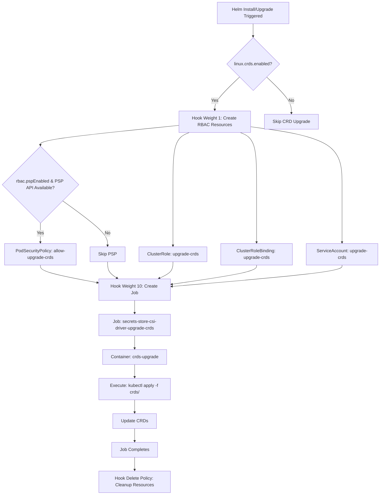
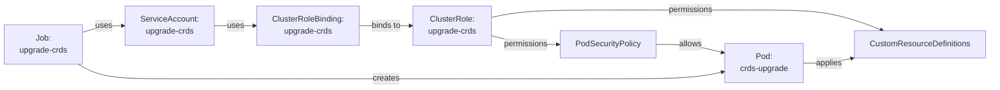
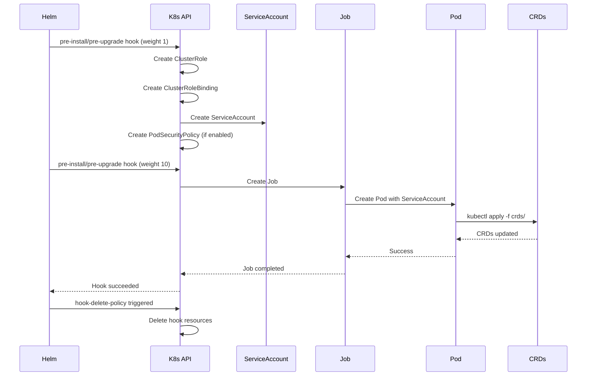

# Diagram: devops/k8s/secrets-store-csi-driver/helm/templates/crds-upgrade-hook.yaml


> Auto-generated by Obscura crawlers

## Diagram 1

```mermaid
flowchart TD
      A[Helm Install/Upgrade Triggered] --> B{linux.crds.enabled?}
      B -->|Yes| C[Hook Weight 1: Create RBAC Resources]
      B -->|No| Z[Skip CRD Upgrade]...
  └ 109 lines...
```

> SVG rendering failed for this diagram.

## Diagram 2



### SVG

<svg id="container" width="1374.15625" xmlns="http://www.w3.org/2000/svg" class="flowchart" height="1770.015625" viewBox="0.5 0 1374.15625 1770.015625" role="graphics-document document" aria-roledescription="flowchart-v2"><style>#container{font-family:"trebuchet ms",verdana,arial,sans-serif;font-size:16px;fill:#333;}@keyframes edge-animation-frame{from{stroke-dashoffset:0;}}@keyframes dash{to{stroke-dashoffset:0;}}#container .edge-animation-slow{stroke-dasharray:9,5!important;stroke-dashoffset:900;animation:dash 50s linear infinite;stroke-linecap:round;}#container .edge-animation-fast{stroke-dasharray:9,5!important;stroke-dashoffset:900;animation:dash 20s linear infinite;stroke-linecap:round;}#container .error-icon{fill:#552222;}#container .error-text{fill:#552222;stroke:#552222;}#container .edge-thickness-normal{stroke-width:1px;}#container .edge-thickness-thick{stroke-width:3.5px;}#container .edge-pattern-solid{stroke-dasharray:0;}#container .edge-thickness-invisible{stroke-width:0;fill:none;}#container .edge-pattern-dashed{stroke-dasharray:3;}#container .edge-pattern-dotted{stroke-dasharray:2;}#container .marker{fill:#333333;stroke:#333333;}#container .marker.cross{stroke:#333333;}#container svg{font-family:"trebuchet ms",verdana,arial,sans-serif;font-size:16px;}#container p{margin:0;}#container .label{font-family:"trebuchet ms",verdana,arial,sans-serif;color:#333;}#container .cluster-label text{fill:#333;}#container .cluster-label span{color:#333;}#container .cluster-label span p{background-color:transparent;}#container .label text,#container span{fill:#333;color:#333;}#container .node rect,#container .node circle,#container .node ellipse,#container .node polygon,#container .node path{fill:#ECECFF;stroke:#9370DB;stroke-width:1px;}#container .rough-node .label text,#container .node .label text,#container .image-shape .label,#container .icon-shape .label{text-anchor:middle;}#container .node .katex path{fill:#000;stroke:#000;stroke-width:1px;}#container .rough-node .label,#container .node .label,#container .image-shape .label,#container .icon-shape .label{text-align:center;}#container .node.clickable{cursor:pointer;}#container .root .anchor path{fill:#333333!important;stroke-width:0;stroke:#333333;}#container .arrowheadPath{fill:#333333;}#container .edgePath .path{stroke:#333333;stroke-width:2.0px;}#container .flowchart-link{stroke:#333333;fill:none;}#container .edgeLabel{background-color:rgba(232,232,232, 0.8);text-align:center;}#container .edgeLabel p{background-color:rgba(232,232,232, 0.8);}#container .edgeLabel rect{opacity:0.5;background-color:rgba(232,232,232, 0.8);fill:rgba(232,232,232, 0.8);}#container .labelBkg{background-color:rgba(232, 232, 232, 0.5);}#container .cluster rect{fill:#ffffde;stroke:#aaaa33;stroke-width:1px;}#container .cluster text{fill:#333;}#container .cluster span{color:#333;}#container div.mermaidTooltip{position:absolute;text-align:center;max-width:200px;padding:2px;font-family:"trebuchet ms",verdana,arial,sans-serif;font-size:12px;background:hsl(80, 100%, 96.2745098039%);border:1px solid #aaaa33;border-radius:2px;pointer-events:none;z-index:100;}#container .flowchartTitleText{text-anchor:middle;font-size:18px;fill:#333;}#container rect.text{fill:none;stroke-width:0;}#container .icon-shape,#container .image-shape{background-color:rgba(232,232,232, 0.8);text-align:center;}#container .icon-shape p,#container .image-shape p{background-color:rgba(232,232,232, 0.8);padding:2px;}#container .icon-shape rect,#container .image-shape rect{opacity:0.5;background-color:rgba(232,232,232, 0.8);fill:rgba(232,232,232, 0.8);}#container .label-icon{display:inline-block;height:1em;overflow:visible;vertical-align:-0.125em;}#container .node .label-icon path{fill:currentColor;stroke:revert;stroke-width:revert;}#container :root{--mermaid-font-family:"trebuchet ms",verdana,arial,sans-serif;}</style><g><marker id="container_flowchart-v2-pointEnd" class="marker flowchart-v2" viewBox="0 0 10 10" refX="5" refY="5" markerUnits="userSpaceOnUse" markerWidth="8" markerHeight="8" orient="auto"><path d="M 0 0 L 10 5 L 0 10 z" class="arrowMarkerPath" style="stroke-width: 1; stroke-dasharray: 1, 0;"></path></marker><marker id="container_flowchart-v2-pointStart" class="marker flowchart-v2" viewBox="0 0 10 10" refX="4.5" refY="5" markerUnits="userSpaceOnUse" markerWidth="8" markerHeight="8" orient="auto"><path d="M 0 5 L 10 10 L 10 0 z" class="arrowMarkerPath" style="stroke-width: 1; stroke-dasharray: 1, 0;"></path></marker><marker id="container_flowchart-v2-circleEnd" class="marker flowchart-v2" viewBox="0 0 10 10" refX="11" refY="5" markerUnits="userSpaceOnUse" markerWidth="11" markerHeight="11" orient="auto"><circle cx="5" cy="5" r="5" class="arrowMarkerPath" style="stroke-width: 1; stroke-dasharray: 1, 0;"></circle></marker><marker id="container_flowchart-v2-circleStart" class="marker flowchart-v2" viewBox="0 0 10 10" refX="-1" refY="5" markerUnits="userSpaceOnUse" markerWidth="11" markerHeight="11" orient="auto"><circle cx="5" cy="5" r="5" class="arrowMarkerPath" style="stroke-width: 1; stroke-dasharray: 1, 0;"></circle></marker><marker id="container_flowchart-v2-crossEnd" class="marker cross flowchart-v2" viewBox="0 0 11 11" refX="12" refY="5.2" markerUnits="userSpaceOnUse" markerWidth="11" markerHeight="11" orient="auto"><path d="M 1,1 l 9,9 M 10,1 l -9,9" class="arrowMarkerPath" style="stroke-width: 2; stroke-dasharray: 1, 0;"></path></marker><marker id="container_flowchart-v2-crossStart" class="marker cross flowchart-v2" viewBox="0 0 11 11" refX="-1" refY="5.2" markerUnits="userSpaceOnUse" markerWidth="11" markerHeight="11" orient="auto"><path d="M 1,1 l 9,9 M 10,1 l -9,9" class="arrowMarkerPath" style="stroke-width: 2; stroke-dasharray: 1, 0;"></path></marker><g class="root"><g class="clusters"></g><g class="edgePaths"><path d="M912.133,86L912.133,90.167C912.133,94.333,912.133,102.667,912.133,110.333C912.133,118,912.133,125,912.133,128.5L912.133,132" id="L_A_B_0" class="edge-thickness-normal edge-pattern-solid edge-thickness-normal edge-pattern-solid flowchart-link" style=";" data-edge="true" data-et="edge" data-id="L_A_B_0" data-points="W3sieCI6OTEyLjEzMjgxMjUsInkiOjg2fSx7IngiOjkxMi4xMzI4MTI1LCJ5IjoxMTF9LHsieCI6OTEyLjEzMjgxMjUsInkiOjEzNn1d" marker-end="url(#container_flowchart-v2-pointEnd)"></path><path d="M863.032,280.915L848.324,295.265C833.616,309.615,804.201,338.315,789.493,358.165C774.785,378.016,774.785,389.016,774.785,394.516L774.785,400.016" id="L_B_C_0" class="edge-thickness-normal edge-pattern-solid edge-thickness-normal edge-pattern-solid flowchart-link" style=";" data-edge="true" data-et="edge" data-id="L_B_C_0" data-points="W3sieCI6ODYzLjAzMTkyMDA1NzM2NTQsInkiOjI4MC45MTQ3MzI1NTczNjUzN30seyJ4Ijo3NzQuNzg1MTU2MjUsInkiOjM2Ny4wMTU2MjV9LHsieCI6Nzc0Ljc4NTE1NjI1LCJ5Ijo0MDQuMDE1NjI1fV0=" marker-end="url(#container_flowchart-v2-pointEnd)"></path><path d="M961.234,280.915L975.941,295.265C990.649,309.615,1020.065,338.315,1034.773,360.165C1049.48,382.016,1049.48,397.016,1049.48,404.516L1049.48,412.016" id="L_B_Z_0" class="edge-thickness-normal edge-pattern-solid edge-thickness-normal edge-pattern-solid flowchart-link" style=";" data-edge="true" data-et="edge" data-id="L_B_Z_0" data-points="W3sieCI6OTYxLjIzMzcwNDk0MjYzNDYsInkiOjI4MC45MTQ3MzI1NTczNjUzN30seyJ4IjoxMDQ5LjQ4MDQ2ODc1LCJ5IjozNjcuMDE1NjI1fSx7IngiOjEwNDkuNDgwNDY4NzUsInkiOjQxNi4wMTU2MjV9XQ==" marker-end="url(#container_flowchart-v2-pointEnd)"></path><path d="M682.239,482.016L672.351,486.182C662.464,490.349,642.689,498.682,632.802,530.182C622.914,561.682,622.914,616.349,622.914,673.016C622.914,729.682,622.914,788.349,622.914,825.182C622.914,862.016,622.914,877.016,622.914,884.516L622.914,892.016" id="L_C_D_0" class="edge-thickness-normal edge-pattern-solid edge-thickness-normal edge-pattern-solid flowchart-link" style=";" data-edge="true" data-et="edge" data-id="L_C_D_0" data-points="W3sieCI6NjgyLjIzODcwODQ5NjA5MzgsInkiOjQ4Mi4wMTU2MjV9LHsieCI6NjIyLjkxNDA2MjUsInkiOjUwNy4wMTU2MjV9LHsieCI6NjIyLjkxNDA2MjUsInkiOjY3MS4wMTU2MjV9LHsieCI6NjIyLjkxNDA2MjUsInkiOjg0Ny4wMTU2MjV9LHsieCI6NjIyLjkxNDA2MjUsInkiOjg5Ni4wMTU2MjV9XQ==" marker-end="url(#container_flowchart-v2-pointEnd)"></path><path d="M867.332,482.016L877.219,486.182C887.106,490.349,906.881,498.682,916.769,530.182C926.656,561.682,926.656,616.349,926.656,673.016C926.656,729.682,926.656,788.349,926.656,823.182C926.656,858.016,926.656,869.016,926.656,874.516L926.656,880.016" id="L_C_E_0" class="edge-thickness-normal edge-pattern-solid edge-thickness-normal edge-pattern-solid flowchart-link" style=";" data-edge="true" data-et="edge" data-id="L_C_E_0" data-points="W3sieCI6ODY3LjMzMTYwNDAwMzkwNjIsInkiOjQ4Mi4wMTU2MjV9LHsieCI6OTI2LjY1NjI1LCJ5Ijo1MDcuMDE1NjI1fSx7IngiOjkyNi42NTYyNSwieSI6NjcxLjAxNTYyNX0seyJ4Ijo5MjYuNjU2MjUsInkiOjg0Ny4wMTU2MjV9LHsieCI6OTI2LjY1NjI1LCJ5Ijo4ODQuMDE1NjI1fV0=" marker-end="url(#container_flowchart-v2-pointEnd)"></path><path d="M904.785,461.029L960.097,468.694C1015.409,476.358,1126.033,491.687,1181.344,526.685C1236.656,561.682,1236.656,616.349,1236.656,673.016C1236.656,729.682,1236.656,788.349,1236.656,823.182C1236.656,858.016,1236.656,869.016,1236.656,874.516L1236.656,880.016" id="L_C_F_0" class="edge-thickness-normal edge-pattern-solid edge-thickness-normal edge-pattern-solid flowchart-link" style=";" data-edge="true" data-et="edge" data-id="L_C_F_0" data-points="W3sieCI6OTA0Ljc4NTE1NjI1LCJ5Ijo0NjEuMDI5MzA5MTQ4MjA4M30seyJ4IjoxMjM2LjY1NjI1LCJ5Ijo1MDcuMDE1NjI1fSx7IngiOjEyMzYuNjU2MjUsInkiOjY3MS4wMTU2MjV9LHsieCI6MTIzNi42NTYyNSwieSI6ODQ3LjAxNTYyNX0seyJ4IjoxMjM2LjY1NjI1LCJ5Ijo4ODQuMDE1NjI1fV0=" marker-end="url(#container_flowchart-v2-pointEnd)"></path><path d="M644.785,456.269L561.821,464.726C478.857,473.184,312.928,490.1,229.964,502.058C147,514.016,147,521.016,147,524.516L147,528.016" id="L_C_G_0" class="edge-thickness-normal edge-pattern-solid edge-thickness-normal edge-pattern-solid flowchart-link" style=";" data-edge="true" data-et="edge" data-id="L_C_G_0" data-points="W3sieCI6NjQ0Ljc4NTE1NjI1LCJ5Ijo0NTYuMjY4NTY2NTc5MDg4Mn0seyJ4IjoxNDcsInkiOjUwNy4wMTU2MjV9LHsieCI6MTQ3LCJ5Ijo1MzIuMDE1NjI1fV0=" marker-end="url(#container_flowchart-v2-pointEnd)"></path><path d="M147,810.016L147,816.182C147,822.349,147,834.682,147,846.349C147,858.016,147,869.016,147,874.516L147,880.016" id="L_G_H_0" class="edge-thickness-normal edge-pattern-solid edge-thickness-normal edge-pattern-solid flowchart-link" style=";" data-edge="true" data-et="edge" data-id="L_G_H_0" data-points="W3sieCI6MTQ3LCJ5Ijo4MTAuMDE1NjI1fSx7IngiOjE0NywieSI6ODQ3LjAxNTYyNX0seyJ4IjoxNDcsInkiOjg4NC4wMTU2MjV9XQ==" marker-end="url(#container_flowchart-v2-pointEnd)"></path><path d="M227.345,729.67L254.136,749.228C280.926,768.785,334.506,807.9,361.296,834.958C388.086,862.016,388.086,877.016,388.086,884.516L388.086,892.016" id="L_G_I_0" class="edge-thickness-normal edge-pattern-solid edge-thickness-normal edge-pattern-solid flowchart-link" style=";" data-edge="true" data-et="edge" data-id="L_G_I_0" data-points="W3sieCI6MjI3LjM0NTQyMTE2OTk0Nzc0LCJ5Ijo3MjkuNjcwMjAzODMwMDUyM30seyJ4IjozODguMDg1OTM3NSwieSI6ODQ3LjAxNTYyNX0seyJ4IjozODguMDg1OTM3NSwieSI6ODk2LjAxNTYyNX1d" marker-end="url(#container_flowchart-v2-pointEnd)"></path><path d="M147,962.016L147,966.182C147,970.349,147,978.682,181.615,988.165C216.23,997.649,285.461,1008.282,320.076,1013.598L354.691,1018.915" id="L_H_J_0" class="edge-thickness-normal edge-pattern-solid edge-thickness-normal edge-pattern-solid flowchart-link" style=";" data-edge="true" data-et="edge" data-id="L_H_J_0" data-points="W3sieCI6MTQ3LCJ5Ijo5NjIuMDE1NjI1fSx7IngiOjE0NywieSI6OTg3LjAxNTYyNX0seyJ4IjozNTguNjQ0NTMxMjUsInkiOjEwMTkuNTIxODQ5NTQ1MTI5NH1d" marker-end="url(#container_flowchart-v2-pointEnd)"></path><path d="M388.086,950.016L388.086,956.182C388.086,962.349,388.086,974.682,395.309,984.702C402.531,994.721,416.977,1002.427,424.2,1006.28L431.422,1010.133" id="L_I_J_0" class="edge-thickness-normal edge-pattern-solid edge-thickness-normal edge-pattern-solid flowchart-link" style=";" data-edge="true" data-et="edge" data-id="L_I_J_0" data-points="W3sieCI6Mzg4LjA4NTkzNzUsInkiOjk1MC4wMTU2MjV9LHsieCI6Mzg4LjA4NTkzNzUsInkiOjk4Ny4wMTU2MjV9LHsieCI6NDM0Ljk1MTU0NzQ3NTk2MTU1LCJ5IjoxMDEyLjAxNTYyNX1d" marker-end="url(#container_flowchart-v2-pointEnd)"></path><path d="M622.914,950.016L622.914,956.182C622.914,962.349,622.914,974.682,612.532,984.78C602.15,994.877,581.386,1002.738,571.004,1006.669L560.622,1010.599" id="L_D_J_0" class="edge-thickness-normal edge-pattern-solid edge-thickness-normal edge-pattern-solid flowchart-link" style=";" data-edge="true" data-et="edge" data-id="L_D_J_0" data-points="W3sieCI6NjIyLjkxNDA2MjUsInkiOjk1MC4wMTU2MjV9LHsieCI6NjIyLjkxNDA2MjUsInkiOjk4Ny4wMTU2MjV9LHsieCI6NTU2Ljg4MTUzNTQ1NjczMDcsInkiOjEwMTIuMDE1NjI1fV0=" marker-end="url(#container_flowchart-v2-pointEnd)"></path><path d="M926.656,962.016L926.656,966.182C926.656,970.349,926.656,978.682,874.957,988.944C823.258,999.205,719.859,1011.395,668.16,1017.49L616.461,1023.585" id="L_E_J_0" class="edge-thickness-normal edge-pattern-solid edge-thickness-normal edge-pattern-solid flowchart-link" style=";" data-edge="true" data-et="edge" data-id="L_E_J_0" data-points="W3sieCI6OTI2LjY1NjI1LCJ5Ijo5NjIuMDE1NjI1fSx7IngiOjkyNi42NTYyNSwieSI6OTg3LjAxNTYyNX0seyJ4Ijo2MTIuNDg4MjgxMjUsInkiOjEwMjQuMDUyODI4NjU5MjYwM31d" marker-end="url(#container_flowchart-v2-pointEnd)"></path><path d="M1236.656,962.016L1236.656,966.182C1236.656,970.349,1236.656,978.682,1133.293,990.005C1029.93,1001.328,823.205,1015.64,719.842,1022.796L616.479,1029.952" id="L_F_J_0" class="edge-thickness-normal edge-pattern-solid edge-thickness-normal edge-pattern-solid flowchart-link" style=";" data-edge="true" data-et="edge" data-id="L_F_J_0" data-points="W3sieCI6MTIzNi42NTYyNSwieSI6OTYyLjAxNTYyNX0seyJ4IjoxMjM2LjY1NjI1LCJ5Ijo5ODcuMDE1NjI1fSx7IngiOjYxMi40ODgyODEyNSwieSI6MTAzMC4yMjg0NzcxNTc1NDE5fV0=" marker-end="url(#container_flowchart-v2-pointEnd)"></path><path d="M485.566,1066.016L485.566,1070.182C485.566,1074.349,485.566,1082.682,485.566,1090.349C485.566,1098.016,485.566,1105.016,485.566,1108.516L485.566,1112.016" id="L_J_K_0" class="edge-thickness-normal edge-pattern-solid edge-thickness-normal edge-pattern-solid flowchart-link" style=";" data-edge="true" data-et="edge" data-id="L_J_K_0" data-points="W3sieCI6NDg1LjU2NjQwNjI1LCJ5IjoxMDY2LjAxNTYyNX0seyJ4Ijo0ODUuNTY2NDA2MjUsInkiOjEwOTEuMDE1NjI1fSx7IngiOjQ4NS41NjY0MDYyNSwieSI6MTExNi4wMTU2MjV9XQ==" marker-end="url(#container_flowchart-v2-pointEnd)"></path><path d="M485.566,1194.016L485.566,1198.182C485.566,1202.349,485.566,1210.682,485.566,1218.349C485.566,1226.016,485.566,1233.016,485.566,1236.516L485.566,1240.016" id="L_K_L_0" class="edge-thickness-normal edge-pattern-solid edge-thickness-normal edge-pattern-solid flowchart-link" style=";" data-edge="true" data-et="edge" data-id="L_K_L_0" data-points="W3sieCI6NDg1LjU2NjQwNjI1LCJ5IjoxMTk0LjAxNTYyNX0seyJ4Ijo0ODUuNTY2NDA2MjUsInkiOjEyMTkuMDE1NjI1fSx7IngiOjQ4NS41NjY0MDYyNSwieSI6MTI0NC4wMTU2MjV9XQ==" marker-end="url(#container_flowchart-v2-pointEnd)"></path><path d="M485.566,1298.016L485.566,1302.182C485.566,1306.349,485.566,1314.682,485.566,1322.349C485.566,1330.016,485.566,1337.016,485.566,1340.516L485.566,1344.016" id="L_L_M_0" class="edge-thickness-normal edge-pattern-solid edge-thickness-normal edge-pattern-solid flowchart-link" style=";" data-edge="true" data-et="edge" data-id="L_L_M_0" data-points="W3sieCI6NDg1LjU2NjQwNjI1LCJ5IjoxMjk4LjAxNTYyNX0seyJ4Ijo0ODUuNTY2NDA2MjUsInkiOjEzMjMuMDE1NjI1fSx7IngiOjQ4NS41NjY0MDYyNSwieSI6MTM0OC4wMTU2MjV9XQ==" marker-end="url(#container_flowchart-v2-pointEnd)"></path><path d="M485.566,1426.016L485.566,1430.182C485.566,1434.349,485.566,1442.682,485.566,1450.349C485.566,1458.016,485.566,1465.016,485.566,1468.516L485.566,1472.016" id="L_M_N_0" class="edge-thickness-normal edge-pattern-solid edge-thickness-normal edge-pattern-solid flowchart-link" style=";" data-edge="true" data-et="edge" data-id="L_M_N_0" data-points="W3sieCI6NDg1LjU2NjQwNjI1LCJ5IjoxNDI2LjAxNTYyNX0seyJ4Ijo0ODUuNTY2NDA2MjUsInkiOjE0NTEuMDE1NjI1fSx7IngiOjQ4NS41NjY0MDYyNSwieSI6MTQ3Ni4wMTU2MjV9XQ==" marker-end="url(#container_flowchart-v2-pointEnd)"></path><path d="M485.566,1530.016L485.566,1534.182C485.566,1538.349,485.566,1546.682,485.566,1554.349C485.566,1562.016,485.566,1569.016,485.566,1572.516L485.566,1576.016" id="L_N_O_0" class="edge-thickness-normal edge-pattern-solid edge-thickness-normal edge-pattern-solid flowchart-link" style=";" data-edge="true" data-et="edge" data-id="L_N_O_0" data-points="W3sieCI6NDg1LjU2NjQwNjI1LCJ5IjoxNTMwLjAxNTYyNX0seyJ4Ijo0ODUuNTY2NDA2MjUsInkiOjE1NTUuMDE1NjI1fSx7IngiOjQ4NS41NjY0MDYyNSwieSI6MTU4MC4wMTU2MjV9XQ==" marker-end="url(#container_flowchart-v2-pointEnd)"></path><path d="M485.566,1634.016L485.566,1638.182C485.566,1642.349,485.566,1650.682,485.566,1658.349C485.566,1666.016,485.566,1673.016,485.566,1676.516L485.566,1680.016" id="L_O_P_0" class="edge-thickness-normal edge-pattern-solid edge-thickness-normal edge-pattern-solid flowchart-link" style=";" data-edge="true" data-et="edge" data-id="L_O_P_0" data-points="W3sieCI6NDg1LjU2NjQwNjI1LCJ5IjoxNjM0LjAxNTYyNX0seyJ4Ijo0ODUuNTY2NDA2MjUsInkiOjE2NTkuMDE1NjI1fSx7IngiOjQ4NS41NjY0MDYyNSwieSI6MTY4NC4wMTU2MjV9XQ==" marker-end="url(#container_flowchart-v2-pointEnd)"></path></g><g class="edgeLabels"><g class="edgeLabel"><g class="label" data-id="L_A_B_0" transform="translate(0, 0)"><foreignObject width="0" height="0"><div xmlns="http://www.w3.org/1999/xhtml" class="labelBkg" style="display: table-cell; white-space: nowrap; line-height: 1.5; max-width: 200px; text-align: center;"><span class="edgeLabel"></span></div></foreignObject></g></g><g class="edgeLabel" transform="translate(774.78515625, 367.015625)"><g class="label" data-id="L_B_C_0" transform="translate(-12.03125, -12)"><foreignObject width="24.0625" height="24"><div xmlns="http://www.w3.org/1999/xhtml" class="labelBkg" style="display: table-cell; white-space: nowrap; line-height: 1.5; max-width: 200px; text-align: center;"><span class="edgeLabel"><p>Yes</p></span></div></foreignObject></g></g><g class="edgeLabel" transform="translate(1049.48046875, 367.015625)"><g class="label" data-id="L_B_Z_0" transform="translate(-10.140625, -12)"><foreignObject width="20.28125" height="24"><div xmlns="http://www.w3.org/1999/xhtml" class="labelBkg" style="display: table-cell; white-space: nowrap; line-height: 1.5; max-width: 200px; text-align: center;"><span class="edgeLabel"><p>No</p></span></div></foreignObject></g></g><g class="edgeLabel"><g class="label" data-id="L_C_D_0" transform="translate(0, 0)"><foreignObject width="0" height="0"><div xmlns="http://www.w3.org/1999/xhtml" class="labelBkg" style="display: table-cell; white-space: nowrap; line-height: 1.5; max-width: 200px; text-align: center;"><span class="edgeLabel"></span></div></foreignObject></g></g><g class="edgeLabel"><g class="label" data-id="L_C_E_0" transform="translate(0, 0)"><foreignObject width="0" height="0"><div xmlns="http://www.w3.org/1999/xhtml" class="labelBkg" style="display: table-cell; white-space: nowrap; line-height: 1.5; max-width: 200px; text-align: center;"><span class="edgeLabel"></span></div></foreignObject></g></g><g class="edgeLabel"><g class="label" data-id="L_C_F_0" transform="translate(0, 0)"><foreignObject width="0" height="0"><div xmlns="http://www.w3.org/1999/xhtml" class="labelBkg" style="display: table-cell; white-space: nowrap; line-height: 1.5; max-width: 200px; text-align: center;"><span class="edgeLabel"></span></div></foreignObject></g></g><g class="edgeLabel"><g class="label" data-id="L_C_G_0" transform="translate(0, 0)"><foreignObject width="0" height="0"><div xmlns="http://www.w3.org/1999/xhtml" class="labelBkg" style="display: table-cell; white-space: nowrap; line-height: 1.5; max-width: 200px; text-align: center;"><span class="edgeLabel"></span></div></foreignObject></g></g><g class="edgeLabel" transform="translate(147, 847.015625)"><g class="label" data-id="L_G_H_0" transform="translate(-12.03125, -12)"><foreignObject width="24.0625" height="24"><div xmlns="http://www.w3.org/1999/xhtml" class="labelBkg" style="display: table-cell; white-space: nowrap; line-height: 1.5; max-width: 200px; text-align: center;"><span class="edgeLabel"><p>Yes</p></span></div></foreignObject></g></g><g class="edgeLabel" transform="translate(388.0859375, 847.015625)"><g class="label" data-id="L_G_I_0" transform="translate(-10.140625, -12)"><foreignObject width="20.28125" height="24"><div xmlns="http://www.w3.org/1999/xhtml" class="labelBkg" style="display: table-cell; white-space: nowrap; line-height: 1.5; max-width: 200px; text-align: center;"><span class="edgeLabel"><p>No</p></span></div></foreignObject></g></g><g class="edgeLabel"><g class="label" data-id="L_H_J_0" transform="translate(0, 0)"><foreignObject width="0" height="0"><div xmlns="http://www.w3.org/1999/xhtml" class="labelBkg" style="display: table-cell; white-space: nowrap; line-height: 1.5; max-width: 200px; text-align: center;"><span class="edgeLabel"></span></div></foreignObject></g></g><g class="edgeLabel"><g class="label" data-id="L_I_J_0" transform="translate(0, 0)"><foreignObject width="0" height="0"><div xmlns="http://www.w3.org/1999/xhtml" class="labelBkg" style="display: table-cell; white-space: nowrap; line-height: 1.5; max-width: 200px; text-align: center;"><span class="edgeLabel"></span></div></foreignObject></g></g><g class="edgeLabel"><g class="label" data-id="L_D_J_0" transform="translate(0, 0)"><foreignObject width="0" height="0"><div xmlns="http://www.w3.org/1999/xhtml" class="labelBkg" style="display: table-cell; white-space: nowrap; line-height: 1.5; max-width: 200px; text-align: center;"><span class="edgeLabel"></span></div></foreignObject></g></g><g class="edgeLabel"><g class="label" data-id="L_E_J_0" transform="translate(0, 0)"><foreignObject width="0" height="0"><div xmlns="http://www.w3.org/1999/xhtml" class="labelBkg" style="display: table-cell; white-space: nowrap; line-height: 1.5; max-width: 200px; text-align: center;"><span class="edgeLabel"></span></div></foreignObject></g></g><g class="edgeLabel"><g class="label" data-id="L_F_J_0" transform="translate(0, 0)"><foreignObject width="0" height="0"><div xmlns="http://www.w3.org/1999/xhtml" class="labelBkg" style="display: table-cell; white-space: nowrap; line-height: 1.5; max-width: 200px; text-align: center;"><span class="edgeLabel"></span></div></foreignObject></g></g><g class="edgeLabel"><g class="label" data-id="L_J_K_0" transform="translate(0, 0)"><foreignObject width="0" height="0"><div xmlns="http://www.w3.org/1999/xhtml" class="labelBkg" style="display: table-cell; white-space: nowrap; line-height: 1.5; max-width: 200px; text-align: center;"><span class="edgeLabel"></span></div></foreignObject></g></g><g class="edgeLabel"><g class="label" data-id="L_K_L_0" transform="translate(0, 0)"><foreignObject width="0" height="0"><div xmlns="http://www.w3.org/1999/xhtml" class="labelBkg" style="display: table-cell; white-space: nowrap; line-height: 1.5; max-width: 200px; text-align: center;"><span class="edgeLabel"></span></div></foreignObject></g></g><g class="edgeLabel"><g class="label" data-id="L_L_M_0" transform="translate(0, 0)"><foreignObject width="0" height="0"><div xmlns="http://www.w3.org/1999/xhtml" class="labelBkg" style="display: table-cell; white-space: nowrap; line-height: 1.5; max-width: 200px; text-align: center;"><span class="edgeLabel"></span></div></foreignObject></g></g><g class="edgeLabel"><g class="label" data-id="L_M_N_0" transform="translate(0, 0)"><foreignObject width="0" height="0"><div xmlns="http://www.w3.org/1999/xhtml" class="labelBkg" style="display: table-cell; white-space: nowrap; line-height: 1.5; max-width: 200px; text-align: center;"><span class="edgeLabel"></span></div></foreignObject></g></g><g class="edgeLabel"><g class="label" data-id="L_N_O_0" transform="translate(0, 0)"><foreignObject width="0" height="0"><div xmlns="http://www.w3.org/1999/xhtml" class="labelBkg" style="display: table-cell; white-space: nowrap; line-height: 1.5; max-width: 200px; text-align: center;"><span class="edgeLabel"></span></div></foreignObject></g></g><g class="edgeLabel"><g class="label" data-id="L_O_P_0" transform="translate(0, 0)"><foreignObject width="0" height="0"><div xmlns="http://www.w3.org/1999/xhtml" class="labelBkg" style="display: table-cell; white-space: nowrap; line-height: 1.5; max-width: 200px; text-align: center;"><span class="edgeLabel"></span></div></foreignObject></g></g></g><g class="nodes"><g class="node default" id="flowchart-A-0" transform="translate(912.1328125, 47)"><rect class="basic label-container" style="" x="-130" y="-39" width="260" height="78"></rect><g class="label" style="" transform="translate(-100, -24)"><rect></rect><foreignObject width="200" height="48"><div xmlns="http://www.w3.org/1999/xhtml" style="display: table; white-space: break-spaces; line-height: 1.5; max-width: 200px; text-align: center; width: 200px;"><span class="nodeLabel"><p>Helm Install/Upgrade Triggered</p></span></div></foreignObject></g></g><g class="node default" id="flowchart-B-1" transform="translate(912.1328125, 233.0078125)"><polygon points="97.0078125,0 194.015625,-97.0078125 97.0078125,-194.015625 0,-97.0078125" class="label-container" transform="translate(-96.5078125, 97.0078125)"></polygon><g class="label" style="" transform="translate(-70.0078125, -12)"><rect></rect><foreignObject width="140.015625" height="24"><div xmlns="http://www.w3.org/1999/xhtml" style="display: table-cell; white-space: nowrap; line-height: 1.5; max-width: 200px; text-align: center;"><span class="nodeLabel"><p>linux.crds.enabled?</p></span></div></foreignObject></g></g><g class="node default" id="flowchart-C-3" transform="translate(774.78515625, 443.015625)"><rect class="basic label-container" style="" x="-130" y="-39" width="260" height="78"></rect><g class="label" style="" transform="translate(-100, -24)"><rect></rect><foreignObject width="200" height="48"><div xmlns="http://www.w3.org/1999/xhtml" style="display: table; white-space: break-spaces; line-height: 1.5; max-width: 200px; text-align: center; width: 200px;"><span class="nodeLabel"><p>Hook Weight 1: Create RBAC Resources</p></span></div></foreignObject></g></g><g class="node default" id="flowchart-Z-5" transform="translate(1049.48046875, 443.015625)"><rect class="basic label-container" style="" x="-94.6953125" y="-27" width="189.390625" height="54"></rect><g class="label" style="" transform="translate(-64.6953125, -12)"><rect></rect><foreignObject width="129.390625" height="24"><div xmlns="http://www.w3.org/1999/xhtml" style="display: table-cell; white-space: nowrap; line-height: 1.5; max-width: 200px; text-align: center;"><span class="nodeLabel"><p>Skip CRD Upgrade</p></span></div></foreignObject></g></g><g class="node default" id="flowchart-D-7" transform="translate(622.9140625, 923.015625)"><rect class="basic label-container" style="" x="-123.7421875" y="-27" width="247.484375" height="54"></rect><g class="label" style="" transform="translate(-93.7421875, -12)"><rect></rect><foreignObject width="187.484375" height="24"><div xmlns="http://www.w3.org/1999/xhtml" style="display: table-cell; white-space: nowrap; line-height: 1.5; max-width: 200px; text-align: center;"><span class="nodeLabel"><p>ClusterRole: upgrade-crds</p></span></div></foreignObject></g></g><g class="node default" id="flowchart-E-9" transform="translate(926.65625, 923.015625)"><rect class="basic label-container" style="" x="-130" y="-39" width="260" height="78"></rect><g class="label" style="" transform="translate(-100, -24)"><rect></rect><foreignObject width="200" height="48"><div xmlns="http://www.w3.org/1999/xhtml" style="display: table; white-space: break-spaces; line-height: 1.5; max-width: 200px; text-align: center; width: 200px;"><span class="nodeLabel"><p>ClusterRoleBinding: upgrade-crds</p></span></div></foreignObject></g></g><g class="node default" id="flowchart-F-11" transform="translate(1236.65625, 923.015625)"><rect class="basic label-container" style="" x="-130" y="-39" width="260" height="78"></rect><g class="label" style="" transform="translate(-100, -24)"><rect></rect><foreignObject width="200" height="48"><div xmlns="http://www.w3.org/1999/xhtml" style="display: table; white-space: break-spaces; line-height: 1.5; max-width: 200px; text-align: center; width: 200px;"><span class="nodeLabel"><p>ServiceAccount: upgrade-crds</p></span></div></foreignObject></g></g><g class="node default" id="flowchart-G-13" transform="translate(147, 671.015625)"><polygon points="139,0 278,-139 139,-278 0,-139" class="label-container" transform="translate(-138.5, 139)"></polygon><g class="label" style="" transform="translate(-100, -24)"><rect></rect><foreignObject width="200" height="48"><div xmlns="http://www.w3.org/1999/xhtml" style="display: table; white-space: break-spaces; line-height: 1.5; max-width: 200px; text-align: center; width: 200px;"><span class="nodeLabel"><p>rbac.pspEnabled &amp; PSP API Available?</p></span></div></foreignObject></g></g><g class="node default" id="flowchart-H-15" transform="translate(147, 923.015625)"><rect class="basic label-container" style="" x="-130" y="-39" width="260" height="78"></rect><g class="label" style="" transform="translate(-100, -24)"><rect></rect><foreignObject width="200" height="48"><div xmlns="http://www.w3.org/1999/xhtml" style="display: table; white-space: break-spaces; line-height: 1.5; max-width: 200px; text-align: center; width: 200px;"><span class="nodeLabel"><p>PodSecurityPolicy: allow-upgrade-crds</p></span></div></foreignObject></g></g><g class="node default" id="flowchart-I-17" transform="translate(388.0859375, 923.015625)"><rect class="basic label-container" style="" x="-61.0859375" y="-27" width="122.171875" height="54"></rect><g class="label" style="" transform="translate(-31.0859375, -12)"><rect></rect><foreignObject width="62.171875" height="24"><div xmlns="http://www.w3.org/1999/xhtml" style="display: table-cell; white-space: nowrap; line-height: 1.5; max-width: 200px; text-align: center;"><span class="nodeLabel"><p>Skip PSP</p></span></div></foreignObject></g></g><g class="node default" id="flowchart-J-19" transform="translate(485.56640625, 1039.015625)"><rect class="basic label-container" style="" x="-126.921875" y="-27" width="253.84375" height="54"></rect><g class="label" style="" transform="translate(-96.921875, -12)"><rect></rect><foreignObject width="193.84375" height="24"><div xmlns="http://www.w3.org/1999/xhtml" style="display: table-cell; white-space: nowrap; line-height: 1.5; max-width: 200px; text-align: center;"><span class="nodeLabel"><p>Hook Weight 10: Create Job</p></span></div></foreignObject></g></g><g class="node default" id="flowchart-K-29" transform="translate(485.56640625, 1155.015625)"><rect class="basic label-container" style="" x="-130" y="-39" width="260" height="78"></rect><g class="label" style="" transform="translate(-100, -24)"><rect></rect><foreignObject width="200" height="48"><div xmlns="http://www.w3.org/1999/xhtml" style="display: table; white-space: break-spaces; line-height: 1.5; max-width: 200px; text-align: center; width: 200px;"><span class="nodeLabel"><p>Job: secrets-store-csi-driver-upgrade-crds</p></span></div></foreignObject></g></g><g class="node default" id="flowchart-L-31" transform="translate(485.56640625, 1271.015625)"><rect class="basic label-container" style="" x="-117.5859375" y="-27" width="235.171875" height="54"></rect><g class="label" style="" transform="translate(-87.5859375, -12)"><rect></rect><foreignObject width="175.171875" height="24"><div xmlns="http://www.w3.org/1999/xhtml" style="display: table-cell; white-space: nowrap; line-height: 1.5; max-width: 200px; text-align: center;"><span class="nodeLabel"><p>Container: crds-upgrade</p></span></div></foreignObject></g></g><g class="node default" id="flowchart-M-33" transform="translate(485.56640625, 1387.015625)"><rect class="basic label-container" style="" x="-130" y="-39" width="260" height="78"></rect><g class="label" style="" transform="translate(-100, -24)"><rect></rect><foreignObject width="200" height="48"><div xmlns="http://www.w3.org/1999/xhtml" style="display: table; white-space: break-spaces; line-height: 1.5; max-width: 200px; text-align: center; width: 200px;"><span class="nodeLabel"><p>Execute: kubectl apply -f crds/</p></span></div></foreignObject></g></g><g class="node default" id="flowchart-N-35" transform="translate(485.56640625, 1503.015625)"><rect class="basic label-container" style="" x="-76.640625" y="-27" width="153.28125" height="54"></rect><g class="label" style="" transform="translate(-46.640625, -12)"><rect></rect><foreignObject width="93.28125" height="24"><div xmlns="http://www.w3.org/1999/xhtml" style="display: table-cell; white-space: nowrap; line-height: 1.5; max-width: 200px; text-align: center;"><span class="nodeLabel"><p>Update CRDs</p></span></div></foreignObject></g></g><g class="node default" id="flowchart-O-37" transform="translate(485.56640625, 1607.015625)"><rect class="basic label-container" style="" x="-82.1171875" y="-27" width="164.234375" height="54"></rect><g class="label" style="" transform="translate(-52.1171875, -12)"><rect></rect><foreignObject width="104.234375" height="24"><div xmlns="http://www.w3.org/1999/xhtml" style="display: table-cell; white-space: nowrap; line-height: 1.5; max-width: 200px; text-align: center;"><span class="nodeLabel"><p>Job Completes</p></span></div></foreignObject></g></g><g class="node default" id="flowchart-P-39" transform="translate(485.56640625, 1723.015625)"><rect class="basic label-container" style="" x="-130" y="-39" width="260" height="78"></rect><g class="label" style="" transform="translate(-100, -24)"><rect></rect><foreignObject width="200" height="48"><div xmlns="http://www.w3.org/1999/xhtml" style="display: table; white-space: break-spaces; line-height: 1.5; max-width: 200px; text-align: center; width: 200px;"><span class="nodeLabel"><p>Hook Delete Policy: Cleanup Resources</p></span></div></foreignObject></g></g></g></g></g></svg>

## Diagram 3



### SVG

<svg id="container" width="1963.9375" xmlns="http://www.w3.org/2000/svg" class="flowchart" height="176" viewBox="0 0 1963.9375 176" role="graphics-document document" aria-roledescription="flowchart-v2"><style>#container{font-family:"trebuchet ms",verdana,arial,sans-serif;font-size:16px;fill:#333;}@keyframes edge-animation-frame{from{stroke-dashoffset:0;}}@keyframes dash{to{stroke-dashoffset:0;}}#container .edge-animation-slow{stroke-dasharray:9,5!important;stroke-dashoffset:900;animation:dash 50s linear infinite;stroke-linecap:round;}#container .edge-animation-fast{stroke-dasharray:9,5!important;stroke-dashoffset:900;animation:dash 20s linear infinite;stroke-linecap:round;}#container .error-icon{fill:#552222;}#container .error-text{fill:#552222;stroke:#552222;}#container .edge-thickness-normal{stroke-width:1px;}#container .edge-thickness-thick{stroke-width:3.5px;}#container .edge-pattern-solid{stroke-dasharray:0;}#container .edge-thickness-invisible{stroke-width:0;fill:none;}#container .edge-pattern-dashed{stroke-dasharray:3;}#container .edge-pattern-dotted{stroke-dasharray:2;}#container .marker{fill:#333333;stroke:#333333;}#container .marker.cross{stroke:#333333;}#container svg{font-family:"trebuchet ms",verdana,arial,sans-serif;font-size:16px;}#container p{margin:0;}#container .label{font-family:"trebuchet ms",verdana,arial,sans-serif;color:#333;}#container .cluster-label text{fill:#333;}#container .cluster-label span{color:#333;}#container .cluster-label span p{background-color:transparent;}#container .label text,#container span{fill:#333;color:#333;}#container .node rect,#container .node circle,#container .node ellipse,#container .node polygon,#container .node path{fill:#ECECFF;stroke:#9370DB;stroke-width:1px;}#container .rough-node .label text,#container .node .label text,#container .image-shape .label,#container .icon-shape .label{text-anchor:middle;}#container .node .katex path{fill:#000;stroke:#000;stroke-width:1px;}#container .rough-node .label,#container .node .label,#container .image-shape .label,#container .icon-shape .label{text-align:center;}#container .node.clickable{cursor:pointer;}#container .root .anchor path{fill:#333333!important;stroke-width:0;stroke:#333333;}#container .arrowheadPath{fill:#333333;}#container .edgePath .path{stroke:#333333;stroke-width:2.0px;}#container .flowchart-link{stroke:#333333;fill:none;}#container .edgeLabel{background-color:rgba(232,232,232, 0.8);text-align:center;}#container .edgeLabel p{background-color:rgba(232,232,232, 0.8);}#container .edgeLabel rect{opacity:0.5;background-color:rgba(232,232,232, 0.8);fill:rgba(232,232,232, 0.8);}#container .labelBkg{background-color:rgba(232, 232, 232, 0.5);}#container .cluster rect{fill:#ffffde;stroke:#aaaa33;stroke-width:1px;}#container .cluster text{fill:#333;}#container .cluster span{color:#333;}#container div.mermaidTooltip{position:absolute;text-align:center;max-width:200px;padding:2px;font-family:"trebuchet ms",verdana,arial,sans-serif;font-size:12px;background:hsl(80, 100%, 96.2745098039%);border:1px solid #aaaa33;border-radius:2px;pointer-events:none;z-index:100;}#container .flowchartTitleText{text-anchor:middle;font-size:18px;fill:#333;}#container rect.text{fill:none;stroke-width:0;}#container .icon-shape,#container .image-shape{background-color:rgba(232,232,232, 0.8);text-align:center;}#container .icon-shape p,#container .image-shape p{background-color:rgba(232,232,232, 0.8);padding:2px;}#container .icon-shape rect,#container .image-shape rect{opacity:0.5;background-color:rgba(232,232,232, 0.8);fill:rgba(232,232,232, 0.8);}#container .label-icon{display:inline-block;height:1em;overflow:visible;vertical-align:-0.125em;}#container .node .label-icon path{fill:currentColor;stroke:revert;stroke-width:revert;}#container :root{--mermaid-font-family:"trebuchet ms",verdana,arial,sans-serif;}</style><g><marker id="container_flowchart-v2-pointEnd" class="marker flowchart-v2" viewBox="0 0 10 10" refX="5" refY="5" markerUnits="userSpaceOnUse" markerWidth="8" markerHeight="8" orient="auto"><path d="M 0 0 L 10 5 L 0 10 z" class="arrowMarkerPath" style="stroke-width: 1; stroke-dasharray: 1, 0;"></path></marker><marker id="container_flowchart-v2-pointStart" class="marker flowchart-v2" viewBox="0 0 10 10" refX="4.5" refY="5" markerUnits="userSpaceOnUse" markerWidth="8" markerHeight="8" orient="auto"><path d="M 0 5 L 10 10 L 10 0 z" class="arrowMarkerPath" style="stroke-width: 1; stroke-dasharray: 1, 0;"></path></marker><marker id="container_flowchart-v2-circleEnd" class="marker flowchart-v2" viewBox="0 0 10 10" refX="11" refY="5" markerUnits="userSpaceOnUse" markerWidth="11" markerHeight="11" orient="auto"><circle cx="5" cy="5" r="5" class="arrowMarkerPath" style="stroke-width: 1; stroke-dasharray: 1, 0;"></circle></marker><marker id="container_flowchart-v2-circleStart" class="marker flowchart-v2" viewBox="0 0 10 10" refX="-1" refY="5" markerUnits="userSpaceOnUse" markerWidth="11" markerHeight="11" orient="auto"><circle cx="5" cy="5" r="5" class="arrowMarkerPath" style="stroke-width: 1; stroke-dasharray: 1, 0;"></circle></marker><marker id="container_flowchart-v2-crossEnd" class="marker cross flowchart-v2" viewBox="0 0 11 11" refX="12" refY="5.2" markerUnits="userSpaceOnUse" markerWidth="11" markerHeight="11" orient="auto"><path d="M 1,1 l 9,9 M 10,1 l -9,9" class="arrowMarkerPath" style="stroke-width: 2; stroke-dasharray: 1, 0;"></path></marker><marker id="container_flowchart-v2-crossStart" class="marker cross flowchart-v2" viewBox="0 0 11 11" refX="-1" refY="5.2" markerUnits="userSpaceOnUse" markerWidth="11" markerHeight="11" orient="auto"><path d="M 1,1 l 9,9 M 10,1 l -9,9" class="arrowMarkerPath" style="stroke-width: 2; stroke-dasharray: 1, 0;"></path></marker><g class="root"><g class="clusters"></g><g class="edgePaths"><path d="M421.156,51L428.072,51C434.987,51,448.818,51,461.982,51C475.146,51,487.643,51,493.892,51L500.141,51" id="L_SA_CRB_0" class="edge-thickness-normal edge-pattern-solid edge-thickness-normal edge-pattern-solid flowchart-link" style=";" data-edge="true" data-et="edge" data-id="L_SA_CRB_0" data-points="W3sieCI6NDIxLjE1NjI1LCJ5Ijo1MX0seyJ4Ijo0NjIuNjQ4NDM3NSwieSI6NTF9LHsieCI6NTA0LjE0MDYyNSwieSI6NTF9XQ==" marker-end="url(#container_flowchart-v2-pointEnd)"></path><path d="M706.203,51L715.333,51C724.464,51,742.724,51,760.318,51C777.911,51,794.839,51,803.302,51L811.766,51" id="L_CRB_CR_0" class="edge-thickness-normal edge-pattern-solid edge-thickness-normal edge-pattern-solid flowchart-link" style=";" data-edge="true" data-et="edge" data-id="L_CRB_CR_0" data-points="W3sieCI6NzA2LjIwMzEyNSwieSI6NTF9LHsieCI6NzYwLjk4NDM3NSwieSI6NTF9LHsieCI6ODE1Ljc2NTYyNSwieSI6NTF9XQ==" marker-end="url(#container_flowchart-v2-pointEnd)"></path><path d="M972.344,34.529L983.854,32.108C995.365,29.686,1018.385,24.843,1057.165,22.422C1095.945,20,1150.484,20,1205.023,20C1259.563,20,1314.102,20,1365.917,20C1417.732,20,1466.823,20,1512.996,20C1559.169,20,1602.424,20,1641.607,26.599C1680.79,33.198,1715.901,46.395,1733.456,52.994L1751.011,59.593" id="L_CR_CRD_0" class="edge-thickness-normal edge-pattern-solid edge-thickness-normal edge-pattern-solid flowchart-link" style=";" data-edge="true" data-et="edge" data-id="L_CR_CRD_0" data-points="W3sieCI6OTcyLjM0Mzc1LCJ5IjozNC41Mjk0NTIzMDg5OTc0MDZ9LHsieCI6MTA0MS40MDYyNSwieSI6MjB9LHsieCI6MTIwNS4wMjM0Mzc1LCJ5IjoyMH0seyJ4IjoxMzY4LjY0MDYyNSwieSI6MjB9LHsieCI6MTUxNS45MTQwNjI1LCJ5IjoyMH0seyJ4IjoxNjQ1LjY3OTY4NzUsInkiOjIwfSx7IngiOjE3NTQuNzU1NTE0NzA1ODgyNCwieSI6NjF9XQ==" marker-end="url(#container_flowchart-v2-pointEnd)"></path><path d="M972.344,70.658L983.854,73.549C995.365,76.439,1018.385,82.219,1040.74,85.11C1063.094,88,1084.781,88,1095.625,88L1106.469,88" id="L_CR_PSP_0" class="edge-thickness-normal edge-pattern-solid edge-thickness-normal edge-pattern-solid flowchart-link" style=";" data-edge="true" data-et="edge" data-id="L_CR_PSP_0" data-points="W3sieCI6OTcyLjM0Mzc1LCJ5Ijo3MC42NTgzOTU2MzExOTY2NH0seyJ4IjoxMDQxLjQwNjI1LCJ5Ijo4OH0seyJ4IjoxMTEwLjQ2ODc1LCJ5Ijo4OH1d" marker-end="url(#container_flowchart-v2-pointEnd)"></path><path d="M164.578,63.817L171.493,61.681C178.409,59.545,192.24,55.272,205.404,53.136C218.568,51,231.065,51,237.314,51L243.563,51" id="L_Job_SA_0" class="edge-thickness-normal edge-pattern-solid edge-thickness-normal edge-pattern-solid flowchart-link" style=";" data-edge="true" data-et="edge" data-id="L_Job_SA_0" data-points="W3sieCI6MTY0LjU3ODEyNSwieSI6NjMuODE2Nzg4NDE2Mzg0MDN9LHsieCI6MjA2LjA3MDMxMjUsInkiOjUxfSx7IngiOjI0Ny41NjI1LCJ5Ijo1MX1d" marker-end="url(#container_flowchart-v2-pointEnd)"></path><path d="M154.987,127L163.501,131.833C172.015,136.667,189.043,146.333,218.938,151.167C248.833,156,291.596,156,334.359,156C377.122,156,419.885,156,465.021,156C510.156,156,557.664,156,607.387,156C657.109,156,709.047,156,757.194,156C805.341,156,849.698,156,896.435,156C943.172,156,992.289,156,1044.117,156C1095.945,156,1150.484,156,1205.023,156C1259.563,156,1314.102,156,1352.229,153.714C1390.357,151.429,1412.073,146.858,1422.931,144.572L1433.789,142.287" id="L_Job_Pod_0" class="edge-thickness-normal edge-pattern-solid edge-thickness-normal edge-pattern-solid flowchart-link" style=";" data-edge="true" data-et="edge" data-id="L_Job_Pod_0" data-points="W3sieCI6MTU0Ljk4NzEzMjM1Mjk0MTE2LCJ5IjoxMjd9LHsieCI6MjA2LjA3MDMxMjUsInkiOjE1Nn0seyJ4IjozMzQuMzU5Mzc1LCJ5IjoxNTZ9LHsieCI6NDYyLjY0ODQzNzUsInkiOjE1Nn0seyJ4Ijo2MDUuMTcxODc1LCJ5IjoxNTZ9LHsieCI6NzYwLjk4NDM3NSwieSI6MTU2fSx7IngiOjg5NC4wNTQ2ODc1LCJ5IjoxNTZ9LHsieCI6MTA0MS40MDYyNSwieSI6MTU2fSx7IngiOjEyMDUuMDIzNDM3NSwieSI6MTU2fSx7IngiOjEzNjguNjQwNjI1LCJ5IjoxNTZ9LHsieCI6MTQzNy43MDMxMjUsInkiOjE0MS40NjI4NDAxNjc2MzAzNn1d" marker-end="url(#container_flowchart-v2-pointEnd)"></path><path d="M1594.125,125L1602.717,125C1611.31,125,1628.495,125,1645.027,123.376C1661.558,121.752,1677.437,118.505,1685.376,116.881L1693.316,115.257" id="L_Pod_CRD_0" class="edge-thickness-normal edge-pattern-solid edge-thickness-normal edge-pattern-solid flowchart-link" style=";" data-edge="true" data-et="edge" data-id="L_Pod_CRD_0" data-points="W3sieCI6MTU5NC4xMjUsInkiOjEyNX0seyJ4IjoxNjQ1LjY3OTY4NzUsInkiOjEyNX0seyJ4IjoxNjk3LjIzNDM3NSwieSI6MTE0LjQ1NTczNTAxNDY4MzAxfV0=" marker-end="url(#container_flowchart-v2-pointEnd)"></path><path d="M1299.578,88L1311.089,88C1322.599,88,1345.62,88,1367.994,90.729C1390.368,93.459,1412.096,98.917,1422.96,101.647L1433.824,104.376" id="L_PSP_Pod_0" class="edge-thickness-normal edge-pattern-solid edge-thickness-normal edge-pattern-solid flowchart-link" style=";" data-edge="true" data-et="edge" data-id="L_PSP_Pod_0" data-points="W3sieCI6MTI5OS41NzgxMjUsInkiOjg4fSx7IngiOjEzNjguNjQwNjI1LCJ5Ijo4OH0seyJ4IjoxNDM3LjcwMzEyNSwieSI6MTA1LjM1MDgwMzY3MDg5Mjc5fV0=" marker-end="url(#container_flowchart-v2-pointEnd)"></path></g><g class="edgeLabels"><g class="edgeLabel" transform="translate(462.6484375, 51)"><g class="label" data-id="L_SA_CRB_0" transform="translate(-16.4921875, -12)"><foreignObject width="32.984375" height="24"><div xmlns="http://www.w3.org/1999/xhtml" class="labelBkg" style="display: table-cell; white-space: nowrap; line-height: 1.5; max-width: 200px; text-align: center;"><span class="edgeLabel"><p>uses</p></span></div></foreignObject></g></g><g class="edgeLabel" transform="translate(760.984375, 51)"><g class="label" data-id="L_CRB_CR_0" transform="translate(-29.78125, -12)"><foreignObject width="59.5625" height="24"><div xmlns="http://www.w3.org/1999/xhtml" class="labelBkg" style="display: table-cell; white-space: nowrap; line-height: 1.5; max-width: 200px; text-align: center;"><span class="edgeLabel"><p>binds to</p></span></div></foreignObject></g></g><g class="edgeLabel" transform="translate(1368.640625, 20)"><g class="label" data-id="L_CR_CRD_0" transform="translate(-44.0625, -12)"><foreignObject width="88.125" height="24"><div xmlns="http://www.w3.org/1999/xhtml" class="labelBkg" style="display: table-cell; white-space: nowrap; line-height: 1.5; max-width: 200px; text-align: center;"><span class="edgeLabel"><p>permissions</p></span></div></foreignObject></g></g><g class="edgeLabel" transform="translate(1041.40625, 88)"><g class="label" data-id="L_CR_PSP_0" transform="translate(-44.0625, -12)"><foreignObject width="88.125" height="24"><div xmlns="http://www.w3.org/1999/xhtml" class="labelBkg" style="display: table-cell; white-space: nowrap; line-height: 1.5; max-width: 200px; text-align: center;"><span class="edgeLabel"><p>permissions</p></span></div></foreignObject></g></g><g class="edgeLabel" transform="translate(206.0703125, 51)"><g class="label" data-id="L_Job_SA_0" transform="translate(-16.4921875, -12)"><foreignObject width="32.984375" height="24"><div xmlns="http://www.w3.org/1999/xhtml" class="labelBkg" style="display: table-cell; white-space: nowrap; line-height: 1.5; max-width: 200px; text-align: center;"><span class="edgeLabel"><p>uses</p></span></div></foreignObject></g></g><g class="edgeLabel" transform="translate(760.984375, 156)"><g class="label" data-id="L_Job_Pod_0" transform="translate(-26.171875, -12)"><foreignObject width="52.34375" height="24"><div xmlns="http://www.w3.org/1999/xhtml" class="labelBkg" style="display: table-cell; white-space: nowrap; line-height: 1.5; max-width: 200px; text-align: center;"><span class="edgeLabel"><p>creates</p></span></div></foreignObject></g></g><g class="edgeLabel" transform="translate(1645.6796875, 125)"><g class="label" data-id="L_Pod_CRD_0" transform="translate(-26.5546875, -12)"><foreignObject width="53.109375" height="24"><div xmlns="http://www.w3.org/1999/xhtml" class="labelBkg" style="display: table-cell; white-space: nowrap; line-height: 1.5; max-width: 200px; text-align: center;"><span class="edgeLabel"><p>applies</p></span></div></foreignObject></g></g><g class="edgeLabel" transform="translate(1368.640625, 88)"><g class="label" data-id="L_PSP_Pod_0" transform="translate(-23.0703125, -12)"><foreignObject width="46.140625" height="24"><div xmlns="http://www.w3.org/1999/xhtml" class="labelBkg" style="display: table-cell; white-space: nowrap; line-height: 1.5; max-width: 200px; text-align: center;"><span class="edgeLabel"><p>allows</p></span></div></foreignObject></g></g></g><g class="nodes"><g class="node default" id="flowchart-SA-0" transform="translate(334.359375, 51)"><rect class="basic label-container" style="" x="-86.796875" y="-39" width="173.59375" height="78"></rect><g class="label" style="" transform="translate(-56.796875, -24)"><rect></rect><foreignObject width="113.59375" height="48"><div xmlns="http://www.w3.org/1999/xhtml" style="display: table-cell; white-space: nowrap; line-height: 1.5; max-width: 200px; text-align: center;"><span class="nodeLabel"><p>ServiceAccount:<br/>upgrade-crds</p></span></div></foreignObject></g></g><g class="node default" id="flowchart-CRB-1" transform="translate(605.171875, 51)"><rect class="basic label-container" style="" x="-101.03125" y="-39" width="202.0625" height="78"></rect><g class="label" style="" transform="translate(-71.03125, -24)"><rect></rect><foreignObject width="142.0625" height="48"><div xmlns="http://www.w3.org/1999/xhtml" style="display: table-cell; white-space: nowrap; line-height: 1.5; max-width: 200px; text-align: center;"><span class="nodeLabel"><p>ClusterRoleBinding:<br/>upgrade-crds</p></span></div></foreignObject></g></g><g class="node default" id="flowchart-CR-3" transform="translate(894.0546875, 51)"><rect class="basic label-container" style="" x="-78.2890625" y="-39" width="156.578125" height="78"></rect><g class="label" style="" transform="translate(-48.2890625, -24)"><rect></rect><foreignObject width="96.578125" height="48"><div xmlns="http://www.w3.org/1999/xhtml" style="display: table-cell; white-space: nowrap; line-height: 1.5; max-width: 200px; text-align: center;"><span class="nodeLabel"><p>ClusterRole:<br/>upgrade-crds</p></span></div></foreignObject></g></g><g class="node default" id="flowchart-CRD-5" transform="translate(1826.5859375, 88)"><rect class="basic label-container" style="" x="-129.3515625" y="-27" width="258.703125" height="54"></rect><g class="label" style="" transform="translate(-99.3515625, -12)"><rect></rect><foreignObject width="198.703125" height="24"><div xmlns="http://www.w3.org/1999/xhtml" style="display: table-cell; white-space: nowrap; line-height: 1.5; max-width: 200px; text-align: center;"><span class="nodeLabel"><p>CustomResourceDefinitions</p></span></div></foreignObject></g></g><g class="node default" id="flowchart-PSP-7" transform="translate(1205.0234375, 88)"><rect class="basic label-container" style="" x="-94.5546875" y="-27" width="189.109375" height="54"></rect><g class="label" style="" transform="translate(-64.5546875, -12)"><rect></rect><foreignObject width="129.109375" height="24"><div xmlns="http://www.w3.org/1999/xhtml" style="display: table-cell; white-space: nowrap; line-height: 1.5; max-width: 200px; text-align: center;"><span class="nodeLabel"><p>PodSecurityPolicy</p></span></div></foreignObject></g></g><g class="node default" id="flowchart-Job-8" transform="translate(86.2890625, 88)"><rect class="basic label-container" style="" x="-78.2890625" y="-39" width="156.578125" height="78"></rect><g class="label" style="" transform="translate(-48.2890625, -24)"><rect></rect><foreignObject width="96.578125" height="48"><div xmlns="http://www.w3.org/1999/xhtml" style="display: table-cell; white-space: nowrap; line-height: 1.5; max-width: 200px; text-align: center;"><span class="nodeLabel"><p>Job:<br/>upgrade-crds</p></span></div></foreignObject></g></g><g class="node default" id="flowchart-Pod-11" transform="translate(1515.9140625, 125)"><rect class="basic label-container" style="" x="-78.2109375" y="-39" width="156.421875" height="78"></rect><g class="label" style="" transform="translate(-48.2109375, -24)"><rect></rect><foreignObject width="96.421875" height="48"><div xmlns="http://www.w3.org/1999/xhtml" style="display: table-cell; white-space: nowrap; line-height: 1.5; max-width: 200px; text-align: center;"><span class="nodeLabel"><p>Pod:<br/>crds-upgrade</p></span></div></foreignObject></g></g></g></g></g></svg>

## Diagram 4



### SVG

<svg id="container" width="1571" xmlns="http://www.w3.org/2000/svg" height="1011" viewBox="-50 -10 1571 1011" role="graphics-document document" aria-roledescription="sequence"><g><rect x="1321" y="925" fill="#eaeaea" stroke="#666" width="150" height="65" name="CRDs" rx="3" ry="3" class="actor actor-bottom"></rect><text x="1396" y="957.5" dominant-baseline="central" alignment-baseline="central" class="actor actor-box" style="text-anchor: middle; font-size: 16px; font-weight: 400;"><tspan x="1396" dy="0">CRDs</tspan></text></g><g><rect x="1094" y="925" fill="#eaeaea" stroke="#666" width="150" height="65" name="Pod" rx="3" ry="3" class="actor actor-bottom"></rect><text x="1169" y="957.5" dominant-baseline="central" alignment-baseline="central" class="actor actor-box" style="text-anchor: middle; font-size: 16px; font-weight: 400;"><tspan x="1169" dy="0">Pod</tspan></text></g><g><rect x="797" y="925" fill="#eaeaea" stroke="#666" width="150" height="65" name="Job" rx="3" ry="3" class="actor actor-bottom"></rect><text x="872" y="957.5" dominant-baseline="central" alignment-baseline="central" class="actor actor-box" style="text-anchor: middle; font-size: 16px; font-weight: 400;"><tspan x="872" dy="0">Job</tspan></text></g><g><rect x="597" y="925" fill="#eaeaea" stroke="#666" width="150" height="65" name="ServiceAccount" rx="3" ry="3" class="actor actor-bottom"></rect><text x="672" y="957.5" dominant-baseline="central" alignment-baseline="central" class="actor actor-box" style="text-anchor: middle; font-size: 16px; font-weight: 400;"><tspan x="672" dy="0">ServiceAccount</tspan></text></g><g><rect x="367" y="925" fill="#eaeaea" stroke="#666" width="150" height="65" name="K8s API" rx="3" ry="3" class="actor actor-bottom"></rect><text x="442" y="957.5" dominant-baseline="central" alignment-baseline="central" class="actor actor-box" style="text-anchor: middle; font-size: 16px; font-weight: 400;"><tspan x="442" dy="0">K8s API</tspan></text></g><g><rect x="0" y="925" fill="#eaeaea" stroke="#666" width="150" height="65" name="Helm" rx="3" ry="3" class="actor actor-bottom"></rect><text x="75" y="957.5" dominant-baseline="central" alignment-baseline="central" class="actor actor-box" style="text-anchor: middle; font-size: 16px; font-weight: 400;"><tspan x="75" dy="0">Helm</tspan></text></g><g><line id="actor5" x1="1396" y1="65" x2="1396" y2="925" class="actor-line 200" stroke-width="0.5px" stroke="#999" name="CRDs"></line><g id="root-5"><rect x="1321" y="0" fill="#eaeaea" stroke="#666" width="150" height="65" name="CRDs" rx="3" ry="3" class="actor actor-top"></rect><text x="1396" y="32.5" dominant-baseline="central" alignment-baseline="central" class="actor actor-box" style="text-anchor: middle; font-size: 16px; font-weight: 400;"><tspan x="1396" dy="0">CRDs</tspan></text></g></g><g><line id="actor4" x1="1169" y1="65" x2="1169" y2="925" class="actor-line 200" stroke-width="0.5px" stroke="#999" name="Pod"></line><g id="root-4"><rect x="1094" y="0" fill="#eaeaea" stroke="#666" width="150" height="65" name="Pod" rx="3" ry="3" class="actor actor-top"></rect><text x="1169" y="32.5" dominant-baseline="central" alignment-baseline="central" class="actor actor-box" style="text-anchor: middle; font-size: 16px; font-weight: 400;"><tspan x="1169" dy="0">Pod</tspan></text></g></g><g><line id="actor3" x1="872" y1="65" x2="872" y2="925" class="actor-line 200" stroke-width="0.5px" stroke="#999" name="Job"></line><g id="root-3"><rect x="797" y="0" fill="#eaeaea" stroke="#666" width="150" height="65" name="Job" rx="3" ry="3" class="actor actor-top"></rect><text x="872" y="32.5" dominant-baseline="central" alignment-baseline="central" class="actor actor-box" style="text-anchor: middle; font-size: 16px; font-weight: 400;"><tspan x="872" dy="0">Job</tspan></text></g></g><g><line id="actor2" x1="672" y1="65" x2="672" y2="925" class="actor-line 200" stroke-width="0.5px" stroke="#999" name="ServiceAccount"></line><g id="root-2"><rect x="597" y="0" fill="#eaeaea" stroke="#666" width="150" height="65" name="ServiceAccount" rx="3" ry="3" class="actor actor-top"></rect><text x="672" y="32.5" dominant-baseline="central" alignment-baseline="central" class="actor actor-box" style="text-anchor: middle; font-size: 16px; font-weight: 400;"><tspan x="672" dy="0">ServiceAccount</tspan></text></g></g><g><line id="actor1" x1="442" y1="65" x2="442" y2="925" class="actor-line 200" stroke-width="0.5px" stroke="#999" name="K8s API"></line><g id="root-1"><rect x="367" y="0" fill="#eaeaea" stroke="#666" width="150" height="65" name="K8s API" rx="3" ry="3" class="actor actor-top"></rect><text x="442" y="32.5" dominant-baseline="central" alignment-baseline="central" class="actor actor-box" style="text-anchor: middle; font-size: 16px; font-weight: 400;"><tspan x="442" dy="0">K8s API</tspan></text></g></g><g><line id="actor0" x1="75" y1="65" x2="75" y2="925" class="actor-line 200" stroke-width="0.5px" stroke="#999" name="Helm"></line><g id="root-0"><rect x="0" y="0" fill="#eaeaea" stroke="#666" width="150" height="65" name="Helm" rx="3" ry="3" class="actor actor-top"></rect><text x="75" y="32.5" dominant-baseline="central" alignment-baseline="central" class="actor actor-box" style="text-anchor: middle; font-size: 16px; font-weight: 400;"><tspan x="75" dy="0">Helm</tspan></text></g></g><style>#container{font-family:"trebuchet ms",verdana,arial,sans-serif;font-size:16px;fill:#333;}@keyframes edge-animation-frame{from{stroke-dashoffset:0;}}@keyframes dash{to{stroke-dashoffset:0;}}#container .edge-animation-slow{stroke-dasharray:9,5!important;stroke-dashoffset:900;animation:dash 50s linear infinite;stroke-linecap:round;}#container .edge-animation-fast{stroke-dasharray:9,5!important;stroke-dashoffset:900;animation:dash 20s linear infinite;stroke-linecap:round;}#container .error-icon{fill:#552222;}#container .error-text{fill:#552222;stroke:#552222;}#container .edge-thickness-normal{stroke-width:1px;}#container .edge-thickness-thick{stroke-width:3.5px;}#container .edge-pattern-solid{stroke-dasharray:0;}#container .edge-thickness-invisible{stroke-width:0;fill:none;}#container .edge-pattern-dashed{stroke-dasharray:3;}#container .edge-pattern-dotted{stroke-dasharray:2;}#container .marker{fill:#333333;stroke:#333333;}#container .marker.cross{stroke:#333333;}#container svg{font-family:"trebuchet ms",verdana,arial,sans-serif;font-size:16px;}#container p{margin:0;}#container .actor{stroke:hsl(259.6261682243, 59.7765363128%, 87.9019607843%);fill:#ECECFF;}#container text.actor&gt;tspan{fill:black;stroke:none;}#container .actor-line{stroke:hsl(259.6261682243, 59.7765363128%, 87.9019607843%);}#container .innerArc{stroke-width:1.5;stroke-dasharray:none;}#container .messageLine0{stroke-width:1.5;stroke-dasharray:none;stroke:#333;}#container .messageLine1{stroke-width:1.5;stroke-dasharray:2,2;stroke:#333;}#container #arrowhead path{fill:#333;stroke:#333;}#container .sequenceNumber{fill:white;}#container #sequencenumber{fill:#333;}#container #crosshead path{fill:#333;stroke:#333;}#container .messageText{fill:#333;stroke:none;}#container .labelBox{stroke:hsl(259.6261682243, 59.7765363128%, 87.9019607843%);fill:#ECECFF;}#container .labelText,#container .labelText&gt;tspan{fill:black;stroke:none;}#container .loopText,#container .loopText&gt;tspan{fill:black;stroke:none;}#container .loopLine{stroke-width:2px;stroke-dasharray:2,2;stroke:hsl(259.6261682243, 59.7765363128%, 87.9019607843%);fill:hsl(259.6261682243, 59.7765363128%, 87.9019607843%);}#container .note{stroke:#aaaa33;fill:#fff5ad;}#container .noteText,#container .noteText&gt;tspan{fill:black;stroke:none;}#container .activation0{fill:#f4f4f4;stroke:#666;}#container .activation1{fill:#f4f4f4;stroke:#666;}#container .activation2{fill:#f4f4f4;stroke:#666;}#container .actorPopupMenu{position:absolute;}#container .actorPopupMenuPanel{position:absolute;fill:#ECECFF;box-shadow:0px 8px 16px 0px rgba(0,0,0,0.2);filter:drop-shadow(3px 5px 2px rgb(0 0 0 / 0.4));}#container .actor-man line{stroke:hsl(259.6261682243, 59.7765363128%, 87.9019607843%);fill:#ECECFF;}#container .actor-man circle,#container line{stroke:hsl(259.6261682243, 59.7765363128%, 87.9019607843%);fill:#ECECFF;stroke-width:2px;}#container :root{--mermaid-font-family:"trebuchet ms",verdana,arial,sans-serif;}</style><g></g><defs><symbol id="computer" width="24" height="24"><path transform="scale(.5)" d="M2 2v13h20v-13h-20zm18 11h-16v-9h16v9zm-10.228 6l.466-1h3.524l.467 1h-4.457zm14.228 3h-24l2-6h2.104l-1.33 4h18.45l-1.297-4h2.073l2 6zm-5-10h-14v-7h14v7z"></path></symbol></defs><defs><symbol id="database" fill-rule="evenodd" clip-rule="evenodd"><path transform="scale(.5)" d="M12.258.001l.256.004.255.005.253.008.251.01.249.012.247.015.246.016.242.019.241.02.239.023.236.024.233.027.231.028.229.031.225.032.223.034.22.036.217.038.214.04.211.041.208.043.205.045.201.046.198.048.194.05.191.051.187.053.183.054.18.056.175.057.172.059.168.06.163.061.16.063.155.064.15.066.074.033.073.033.071.034.07.034.069.035.068.035.067.035.066.035.064.036.064.036.062.036.06.036.06.037.058.037.058.037.055.038.055.038.053.038.052.038.051.039.05.039.048.039.047.039.045.04.044.04.043.04.041.04.04.041.039.041.037.041.036.041.034.041.033.042.032.042.03.042.029.042.027.042.026.043.024.043.023.043.021.043.02.043.018.044.017.043.015.044.013.044.012.044.011.045.009.044.007.045.006.045.004.045.002.045.001.045v17l-.001.045-.002.045-.004.045-.006.045-.007.045-.009.044-.011.045-.012.044-.013.044-.015.044-.017.043-.018.044-.02.043-.021.043-.023.043-.024.043-.026.043-.027.042-.029.042-.03.042-.032.042-.033.042-.034.041-.036.041-.037.041-.039.041-.04.041-.041.04-.043.04-.044.04-.045.04-.047.039-.048.039-.05.039-.051.039-.052.038-.053.038-.055.038-.055.038-.058.037-.058.037-.06.037-.06.036-.062.036-.064.036-.064.036-.066.035-.067.035-.068.035-.069.035-.07.034-.071.034-.073.033-.074.033-.15.066-.155.064-.16.063-.163.061-.168.06-.172.059-.175.057-.18.056-.183.054-.187.053-.191.051-.194.05-.198.048-.201.046-.205.045-.208.043-.211.041-.214.04-.217.038-.22.036-.223.034-.225.032-.229.031-.231.028-.233.027-.236.024-.239.023-.241.02-.242.019-.246.016-.247.015-.249.012-.251.01-.253.008-.255.005-.256.004-.258.001-.258-.001-.256-.004-.255-.005-.253-.008-.251-.01-.249-.012-.247-.015-.245-.016-.243-.019-.241-.02-.238-.023-.236-.024-.234-.027-.231-.028-.228-.031-.226-.032-.223-.034-.22-.036-.217-.038-.214-.04-.211-.041-.208-.043-.204-.045-.201-.046-.198-.048-.195-.05-.19-.051-.187-.053-.184-.054-.179-.056-.176-.057-.172-.059-.167-.06-.164-.061-.159-.063-.155-.064-.151-.066-.074-.033-.072-.033-.072-.034-.07-.034-.069-.035-.068-.035-.067-.035-.066-.035-.064-.036-.063-.036-.062-.036-.061-.036-.06-.037-.058-.037-.057-.037-.056-.038-.055-.038-.053-.038-.052-.038-.051-.039-.049-.039-.049-.039-.046-.039-.046-.04-.044-.04-.043-.04-.041-.04-.04-.041-.039-.041-.037-.041-.036-.041-.034-.041-.033-.042-.032-.042-.03-.042-.029-.042-.027-.042-.026-.043-.024-.043-.023-.043-.021-.043-.02-.043-.018-.044-.017-.043-.015-.044-.013-.044-.012-.044-.011-.045-.009-.044-.007-.045-.006-.045-.004-.045-.002-.045-.001-.045v-17l.001-.045.002-.045.004-.045.006-.045.007-.045.009-.044.011-.045.012-.044.013-.044.015-.044.017-.043.018-.044.02-.043.021-.043.023-.043.024-.043.026-.043.027-.042.029-.042.03-.042.032-.042.033-.042.034-.041.036-.041.037-.041.039-.041.04-.041.041-.04.043-.04.044-.04.046-.04.046-.039.049-.039.049-.039.051-.039.052-.038.053-.038.055-.038.056-.038.057-.037.058-.037.06-.037.061-.036.062-.036.063-.036.064-.036.066-.035.067-.035.068-.035.069-.035.07-.034.072-.034.072-.033.074-.033.151-.066.155-.064.159-.063.164-.061.167-.06.172-.059.176-.057.179-.056.184-.054.187-.053.19-.051.195-.05.198-.048.201-.046.204-.045.208-.043.211-.041.214-.04.217-.038.22-.036.223-.034.226-.032.228-.031.231-.028.234-.027.236-.024.238-.023.241-.02.243-.019.245-.016.247-.015.249-.012.251-.01.253-.008.255-.005.256-.004.258-.001.258.001zm-9.258 20.499v.01l.001.021.003.021.004.022.005.021.006.022.007.022.009.023.01.022.011.023.012.023.013.023.015.023.016.024.017.023.018.024.019.024.021.024.022.025.023.024.024.025.052.049.056.05.061.051.066.051.07.051.075.051.079.052.084.052.088.052.092.052.097.052.102.051.105.052.11.052.114.051.119.051.123.051.127.05.131.05.135.05.139.048.144.049.147.047.152.047.155.047.16.045.163.045.167.043.171.043.176.041.178.041.183.039.187.039.19.037.194.035.197.035.202.033.204.031.209.03.212.029.216.027.219.025.222.024.226.021.23.02.233.018.236.016.24.015.243.012.246.01.249.008.253.005.256.004.259.001.26-.001.257-.004.254-.005.25-.008.247-.011.244-.012.241-.014.237-.016.233-.018.231-.021.226-.021.224-.024.22-.026.216-.027.212-.028.21-.031.205-.031.202-.034.198-.034.194-.036.191-.037.187-.039.183-.04.179-.04.175-.042.172-.043.168-.044.163-.045.16-.046.155-.046.152-.047.148-.048.143-.049.139-.049.136-.05.131-.05.126-.05.123-.051.118-.052.114-.051.11-.052.106-.052.101-.052.096-.052.092-.052.088-.053.083-.051.079-.052.074-.052.07-.051.065-.051.06-.051.056-.05.051-.05.023-.024.023-.025.021-.024.02-.024.019-.024.018-.024.017-.024.015-.023.014-.024.013-.023.012-.023.01-.023.01-.022.008-.022.006-.022.006-.022.004-.022.004-.021.001-.021.001-.021v-4.127l-.077.055-.08.053-.083.054-.085.053-.087.052-.09.052-.093.051-.095.05-.097.05-.1.049-.102.049-.105.048-.106.047-.109.047-.111.046-.114.045-.115.045-.118.044-.12.043-.122.042-.124.042-.126.041-.128.04-.13.04-.132.038-.134.038-.135.037-.138.037-.139.035-.142.035-.143.034-.144.033-.147.032-.148.031-.15.03-.151.03-.153.029-.154.027-.156.027-.158.026-.159.025-.161.024-.162.023-.163.022-.165.021-.166.02-.167.019-.169.018-.169.017-.171.016-.173.015-.173.014-.175.013-.175.012-.177.011-.178.01-.179.008-.179.008-.181.006-.182.005-.182.004-.184.003-.184.002h-.37l-.184-.002-.184-.003-.182-.004-.182-.005-.181-.006-.179-.008-.179-.008-.178-.01-.176-.011-.176-.012-.175-.013-.173-.014-.172-.015-.171-.016-.17-.017-.169-.018-.167-.019-.166-.02-.165-.021-.163-.022-.162-.023-.161-.024-.159-.025-.157-.026-.156-.027-.155-.027-.153-.029-.151-.03-.15-.03-.148-.031-.146-.032-.145-.033-.143-.034-.141-.035-.14-.035-.137-.037-.136-.037-.134-.038-.132-.038-.13-.04-.128-.04-.126-.041-.124-.042-.122-.042-.12-.044-.117-.043-.116-.045-.113-.045-.112-.046-.109-.047-.106-.047-.105-.048-.102-.049-.1-.049-.097-.05-.095-.05-.093-.052-.09-.051-.087-.052-.085-.053-.083-.054-.08-.054-.077-.054v4.127zm0-5.654v.011l.001.021.003.021.004.021.005.022.006.022.007.022.009.022.01.022.011.023.012.023.013.023.015.024.016.023.017.024.018.024.019.024.021.024.022.024.023.025.024.024.052.05.056.05.061.05.066.051.07.051.075.052.079.051.084.052.088.052.092.052.097.052.102.052.105.052.11.051.114.051.119.052.123.05.127.051.131.05.135.049.139.049.144.048.147.048.152.047.155.046.16.045.163.045.167.044.171.042.176.042.178.04.183.04.187.038.19.037.194.036.197.034.202.033.204.032.209.03.212.028.216.027.219.025.222.024.226.022.23.02.233.018.236.016.24.014.243.012.246.01.249.008.253.006.256.003.259.001.26-.001.257-.003.254-.006.25-.008.247-.01.244-.012.241-.015.237-.016.233-.018.231-.02.226-.022.224-.024.22-.025.216-.027.212-.029.21-.03.205-.032.202-.033.198-.035.194-.036.191-.037.187-.039.183-.039.179-.041.175-.042.172-.043.168-.044.163-.045.16-.045.155-.047.152-.047.148-.048.143-.048.139-.05.136-.049.131-.05.126-.051.123-.051.118-.051.114-.052.11-.052.106-.052.101-.052.096-.052.092-.052.088-.052.083-.052.079-.052.074-.051.07-.052.065-.051.06-.05.056-.051.051-.049.023-.025.023-.024.021-.025.02-.024.019-.024.018-.024.017-.024.015-.023.014-.023.013-.024.012-.022.01-.023.01-.023.008-.022.006-.022.006-.022.004-.021.004-.022.001-.021.001-.021v-4.139l-.077.054-.08.054-.083.054-.085.052-.087.053-.09.051-.093.051-.095.051-.097.05-.1.049-.102.049-.105.048-.106.047-.109.047-.111.046-.114.045-.115.044-.118.044-.12.044-.122.042-.124.042-.126.041-.128.04-.13.039-.132.039-.134.038-.135.037-.138.036-.139.036-.142.035-.143.033-.144.033-.147.033-.148.031-.15.03-.151.03-.153.028-.154.028-.156.027-.158.026-.159.025-.161.024-.162.023-.163.022-.165.021-.166.02-.167.019-.169.018-.169.017-.171.016-.173.015-.173.014-.175.013-.175.012-.177.011-.178.009-.179.009-.179.007-.181.007-.182.005-.182.004-.184.003-.184.002h-.37l-.184-.002-.184-.003-.182-.004-.182-.005-.181-.007-.179-.007-.179-.009-.178-.009-.176-.011-.176-.012-.175-.013-.173-.014-.172-.015-.171-.016-.17-.017-.169-.018-.167-.019-.166-.02-.165-.021-.163-.022-.162-.023-.161-.024-.159-.025-.157-.026-.156-.027-.155-.028-.153-.028-.151-.03-.15-.03-.148-.031-.146-.033-.145-.033-.143-.033-.141-.035-.14-.036-.137-.036-.136-.037-.134-.038-.132-.039-.13-.039-.128-.04-.126-.041-.124-.042-.122-.043-.12-.043-.117-.044-.116-.044-.113-.046-.112-.046-.109-.046-.106-.047-.105-.048-.102-.049-.1-.049-.097-.05-.095-.051-.093-.051-.09-.051-.087-.053-.085-.052-.083-.054-.08-.054-.077-.054v4.139zm0-5.666v.011l.001.02.003.022.004.021.005.022.006.021.007.022.009.023.01.022.011.023.012.023.013.023.015.023.016.024.017.024.018.023.019.024.021.025.022.024.023.024.024.025.052.05.056.05.061.05.066.051.07.051.075.052.079.051.084.052.088.052.092.052.097.052.102.052.105.051.11.052.114.051.119.051.123.051.127.05.131.05.135.05.139.049.144.048.147.048.152.047.155.046.16.045.163.045.167.043.171.043.176.042.178.04.183.04.187.038.19.037.194.036.197.034.202.033.204.032.209.03.212.028.216.027.219.025.222.024.226.021.23.02.233.018.236.017.24.014.243.012.246.01.249.008.253.006.256.003.259.001.26-.001.257-.003.254-.006.25-.008.247-.01.244-.013.241-.014.237-.016.233-.018.231-.02.226-.022.224-.024.22-.025.216-.027.212-.029.21-.03.205-.032.202-.033.198-.035.194-.036.191-.037.187-.039.183-.039.179-.041.175-.042.172-.043.168-.044.163-.045.16-.045.155-.047.152-.047.148-.048.143-.049.139-.049.136-.049.131-.051.126-.05.123-.051.118-.052.114-.051.11-.052.106-.052.101-.052.096-.052.092-.052.088-.052.083-.052.079-.052.074-.052.07-.051.065-.051.06-.051.056-.05.051-.049.023-.025.023-.025.021-.024.02-.024.019-.024.018-.024.017-.024.015-.023.014-.024.013-.023.012-.023.01-.022.01-.023.008-.022.006-.022.006-.022.004-.022.004-.021.001-.021.001-.021v-4.153l-.077.054-.08.054-.083.053-.085.053-.087.053-.09.051-.093.051-.095.051-.097.05-.1.049-.102.048-.105.048-.106.048-.109.046-.111.046-.114.046-.115.044-.118.044-.12.043-.122.043-.124.042-.126.041-.128.04-.13.039-.132.039-.134.038-.135.037-.138.036-.139.036-.142.034-.143.034-.144.033-.147.032-.148.032-.15.03-.151.03-.153.028-.154.028-.156.027-.158.026-.159.024-.161.024-.162.023-.163.023-.165.021-.166.02-.167.019-.169.018-.169.017-.171.016-.173.015-.173.014-.175.013-.175.012-.177.01-.178.01-.179.009-.179.007-.181.006-.182.006-.182.004-.184.003-.184.001-.185.001-.185-.001-.184-.001-.184-.003-.182-.004-.182-.006-.181-.006-.179-.007-.179-.009-.178-.01-.176-.01-.176-.012-.175-.013-.173-.014-.172-.015-.171-.016-.17-.017-.169-.018-.167-.019-.166-.02-.165-.021-.163-.023-.162-.023-.161-.024-.159-.024-.157-.026-.156-.027-.155-.028-.153-.028-.151-.03-.15-.03-.148-.032-.146-.032-.145-.033-.143-.034-.141-.034-.14-.036-.137-.036-.136-.037-.134-.038-.132-.039-.13-.039-.128-.041-.126-.041-.124-.041-.122-.043-.12-.043-.117-.044-.116-.044-.113-.046-.112-.046-.109-.046-.106-.048-.105-.048-.102-.048-.1-.05-.097-.049-.095-.051-.093-.051-.09-.052-.087-.052-.085-.053-.083-.053-.08-.054-.077-.054v4.153zm8.74-8.179l-.257.004-.254.005-.25.008-.247.011-.244.012-.241.014-.237.016-.233.018-.231.021-.226.022-.224.023-.22.026-.216.027-.212.028-.21.031-.205.032-.202.033-.198.034-.194.036-.191.038-.187.038-.183.04-.179.041-.175.042-.172.043-.168.043-.163.045-.16.046-.155.046-.152.048-.148.048-.143.048-.139.049-.136.05-.131.05-.126.051-.123.051-.118.051-.114.052-.11.052-.106.052-.101.052-.096.052-.092.052-.088.052-.083.052-.079.052-.074.051-.07.052-.065.051-.06.05-.056.05-.051.05-.023.025-.023.024-.021.024-.02.025-.019.024-.018.024-.017.023-.015.024-.014.023-.013.023-.012.023-.01.023-.01.022-.008.022-.006.023-.006.021-.004.022-.004.021-.001.021-.001.021.001.021.001.021.004.021.004.022.006.021.006.023.008.022.01.022.01.023.012.023.013.023.014.023.015.024.017.023.018.024.019.024.02.025.021.024.023.024.023.025.051.05.056.05.06.05.065.051.07.052.074.051.079.052.083.052.088.052.092.052.096.052.101.052.106.052.11.052.114.052.118.051.123.051.126.051.131.05.136.05.139.049.143.048.148.048.152.048.155.046.16.046.163.045.168.043.172.043.175.042.179.041.183.04.187.038.191.038.194.036.198.034.202.033.205.032.21.031.212.028.216.027.22.026.224.023.226.022.231.021.233.018.237.016.241.014.244.012.247.011.25.008.254.005.257.004.26.001.26-.001.257-.004.254-.005.25-.008.247-.011.244-.012.241-.014.237-.016.233-.018.231-.021.226-.022.224-.023.22-.026.216-.027.212-.028.21-.031.205-.032.202-.033.198-.034.194-.036.191-.038.187-.038.183-.04.179-.041.175-.042.172-.043.168-.043.163-.045.16-.046.155-.046.152-.048.148-.048.143-.048.139-.049.136-.05.131-.05.126-.051.123-.051.118-.051.114-.052.11-.052.106-.052.101-.052.096-.052.092-.052.088-.052.083-.052.079-.052.074-.051.07-.052.065-.051.06-.05.056-.05.051-.05.023-.025.023-.024.021-.024.02-.025.019-.024.018-.024.017-.023.015-.024.014-.023.013-.023.012-.023.01-.023.01-.022.008-.022.006-.023.006-.021.004-.022.004-.021.001-.021.001-.021-.001-.021-.001-.021-.004-.021-.004-.022-.006-.021-.006-.023-.008-.022-.01-.022-.01-.023-.012-.023-.013-.023-.014-.023-.015-.024-.017-.023-.018-.024-.019-.024-.02-.025-.021-.024-.023-.024-.023-.025-.051-.05-.056-.05-.06-.05-.065-.051-.07-.052-.074-.051-.079-.052-.083-.052-.088-.052-.092-.052-.096-.052-.101-.052-.106-.052-.11-.052-.114-.052-.118-.051-.123-.051-.126-.051-.131-.05-.136-.05-.139-.049-.143-.048-.148-.048-.152-.048-.155-.046-.16-.046-.163-.045-.168-.043-.172-.043-.175-.042-.179-.041-.183-.04-.187-.038-.191-.038-.194-.036-.198-.034-.202-.033-.205-.032-.21-.031-.212-.028-.216-.027-.22-.026-.224-.023-.226-.022-.231-.021-.233-.018-.237-.016-.241-.014-.244-.012-.247-.011-.25-.008-.254-.005-.257-.004-.26-.001-.26.001z"></path></symbol></defs><defs><symbol id="clock" width="24" height="24"><path transform="scale(.5)" d="M12 2c5.514 0 10 4.486 10 10s-4.486 10-10 10-10-4.486-10-10 4.486-10 10-10zm0-2c-6.627 0-12 5.373-12 12s5.373 12 12 12 12-5.373 12-12-5.373-12-12-12zm5.848 12.459c.202.038.202.333.001.372-1.907.361-6.045 1.111-6.547 1.111-.719 0-1.301-.582-1.301-1.301 0-.512.77-5.447 1.125-7.445.034-.192.312-.181.343.014l.985 6.238 5.394 1.011z"></path></symbol></defs><defs><marker id="arrowhead" refX="7.9" refY="5" markerUnits="userSpaceOnUse" markerWidth="12" markerHeight="12" orient="auto-start-reverse"><path d="M -1 0 L 10 5 L 0 10 z"></path></marker></defs><defs><marker id="crosshead" markerWidth="15" markerHeight="8" orient="auto" refX="4" refY="4.5"><path fill="none" stroke="#000000" stroke-width="1pt" d="M 1,2 L 6,7 M 6,2 L 1,7" style="stroke-dasharray: 0, 0;"></path></marker></defs><defs><marker id="filled-head" refX="15.5" refY="7" markerWidth="20" markerHeight="28" orient="auto"><path d="M 18,7 L9,13 L14,7 L9,1 Z"></path></marker></defs><defs><marker id="sequencenumber" refX="15" refY="15" markerWidth="60" markerHeight="40" orient="auto"><circle cx="15" cy="15" r="6"></circle></marker></defs><text x="257" y="80" text-anchor="middle" dominant-baseline="middle" alignment-baseline="middle" class="messageText" dy="1em" style="font-size: 16px; font-weight: 400;">pre-install/pre-upgrade hook (weight 1)</text><line x1="76" y1="113" x2="438" y2="113" class="messageLine0" stroke-width="2" stroke="none" marker-end="url(#arrowhead)" style="fill: none;"></line><text x="443" y="128" text-anchor="middle" dominant-baseline="middle" alignment-baseline="middle" class="messageText" dy="1em" style="font-size: 16px; font-weight: 400;">Create ClusterRole</text><path d="M 443,161 C 503,151 503,191 443,181" class="messageLine0" stroke-width="2" stroke="none" marker-end="url(#arrowhead)" style="fill: none;"></path><text x="443" y="206" text-anchor="middle" dominant-baseline="middle" alignment-baseline="middle" class="messageText" dy="1em" style="font-size: 16px; font-weight: 400;">Create ClusterRoleBinding</text><path d="M 443,239 C 503,229 503,269 443,259" class="messageLine0" stroke-width="2" stroke="none" marker-end="url(#arrowhead)" style="fill: none;"></path><text x="556" y="284" text-anchor="middle" dominant-baseline="middle" alignment-baseline="middle" class="messageText" dy="1em" style="font-size: 16px; font-weight: 400;">Create ServiceAccount</text><line x1="443" y1="317" x2="668" y2="317" class="messageLine0" stroke-width="2" stroke="none" marker-end="url(#arrowhead)" style="fill: none;"></line><text x="443" y="332" text-anchor="middle" dominant-baseline="middle" alignment-baseline="middle" class="messageText" dy="1em" style="font-size: 16px; font-weight: 400;">Create PodSecurityPolicy (if enabled)</text><path d="M 443,365 C 503,355 503,395 443,385" class="messageLine0" stroke-width="2" stroke="none" marker-end="url(#arrowhead)" style="fill: none;"></path><text x="257" y="410" text-anchor="middle" dominant-baseline="middle" alignment-baseline="middle" class="messageText" dy="1em" style="font-size: 16px; font-weight: 400;">pre-install/pre-upgrade hook (weight 10)</text><line x1="76" y1="443" x2="438" y2="443" class="messageLine0" stroke-width="2" stroke="none" marker-end="url(#arrowhead)" style="fill: none;"></line><text x="656" y="458" text-anchor="middle" dominant-baseline="middle" alignment-baseline="middle" class="messageText" dy="1em" style="font-size: 16px; font-weight: 400;">Create Job</text><line x1="443" y1="491" x2="868" y2="491" class="messageLine0" stroke-width="2" stroke="none" marker-end="url(#arrowhead)" style="fill: none;"></line><text x="1019" y="506" text-anchor="middle" dominant-baseline="middle" alignment-baseline="middle" class="messageText" dy="1em" style="font-size: 16px; font-weight: 400;">Create Pod with ServiceAccount</text><line x1="873" y1="539" x2="1165" y2="539" class="messageLine0" stroke-width="2" stroke="none" marker-end="url(#arrowhead)" style="fill: none;"></line><text x="1281" y="554" text-anchor="middle" dominant-baseline="middle" alignment-baseline="middle" class="messageText" dy="1em" style="font-size: 16px; font-weight: 400;">kubectl apply -f crds/</text><line x1="1170" y1="587" x2="1392" y2="587" class="messageLine0" stroke-width="2" stroke="none" marker-end="url(#arrowhead)" style="fill: none;"></line><text x="1284" y="602" text-anchor="middle" dominant-baseline="middle" alignment-baseline="middle" class="messageText" dy="1em" style="font-size: 16px; font-weight: 400;">CRDs updated</text><line x1="1395" y1="635" x2="1173" y2="635" class="messageLine1" stroke-width="2" stroke="none" marker-end="url(#arrowhead)" style="stroke-dasharray: 3, 3; fill: none;"></line><text x="1022" y="650" text-anchor="middle" dominant-baseline="middle" alignment-baseline="middle" class="messageText" dy="1em" style="font-size: 16px; font-weight: 400;">Success</text><line x1="1168" y1="683" x2="876" y2="683" class="messageLine1" stroke-width="2" stroke="none" marker-end="url(#arrowhead)" style="stroke-dasharray: 3, 3; fill: none;"></line><text x="659" y="698" text-anchor="middle" dominant-baseline="middle" alignment-baseline="middle" class="messageText" dy="1em" style="font-size: 16px; font-weight: 400;">Job completed</text><line x1="871" y1="731" x2="446" y2="731" class="messageLine1" stroke-width="2" stroke="none" marker-end="url(#arrowhead)" style="stroke-dasharray: 3, 3; fill: none;"></line><text x="260" y="746" text-anchor="middle" dominant-baseline="middle" alignment-baseline="middle" class="messageText" dy="1em" style="font-size: 16px; font-weight: 400;">Hook succeeded</text><line x1="441" y1="779" x2="79" y2="779" class="messageLine1" stroke-width="2" stroke="none" marker-end="url(#arrowhead)" style="stroke-dasharray: 3, 3; fill: none;"></line><text x="257" y="794" text-anchor="middle" dominant-baseline="middle" alignment-baseline="middle" class="messageText" dy="1em" style="font-size: 16px; font-weight: 400;">hook-delete-policy triggered</text><line x1="76" y1="827" x2="438" y2="827" class="messageLine0" stroke-width="2" stroke="none" marker-end="url(#arrowhead)" style="fill: none;"></line><text x="443" y="842" text-anchor="middle" dominant-baseline="middle" alignment-baseline="middle" class="messageText" dy="1em" style="font-size: 16px; font-weight: 400;">Delete hook resources</text><path d="M 443,875 C 503,865 503,905 443,895" class="messageLine0" stroke-width="2" stroke="none" marker-end="url(#arrowhead)" style="fill: none;"></path></svg>
