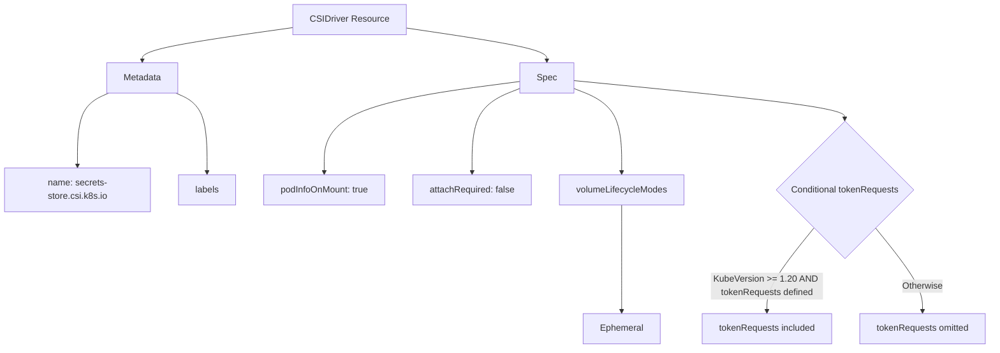
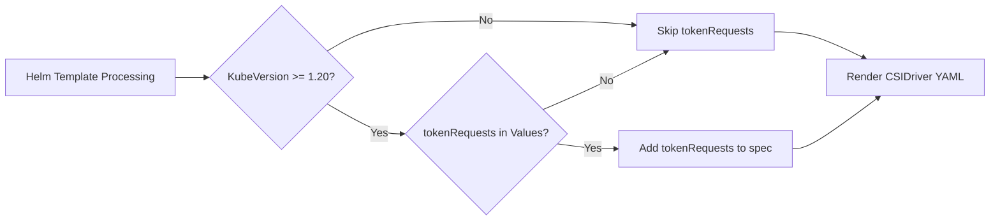

# Diagram: devops/k8s/secrets-store-csi-driver/helm/templates/csidriver.yaml

> Auto-generated by Obscura crawlers

## Diagram 1

### SVG

<svg id="container" width="1785.44921875" xmlns="http://www.w3.org/2000/svg" class="flowchart" height="625.4375" viewBox="0 0 1785.44921875 625.4375" role="graphics-document document" aria-roledescription="flowchart-v2"><g><marker id="container_flowchart-v2-pointEnd" class="marker flowchart-v2" viewBox="0 0 10 10" refX="5" refY="5" markerUnits="userSpaceOnUse" markerWidth="8" markerHeight="8" orient="auto"><path d="M 0 0 L 10 5 L 0 10 z" class="arrowMarkerPath" style="stroke-width: 1; stroke-dasharray: 1, 0;"></path></marker><marker id="container_flowchart-v2-pointStart" class="marker flowchart-v2" viewBox="0 0 10 10" refX="4.5" refY="5" markerUnits="userSpaceOnUse" markerWidth="8" markerHeight="8" orient="auto"><path d="M 0 5 L 10 10 L 10 0 z" class="arrowMarkerPath" style="stroke-width: 1; stroke-dasharray: 1, 0;"></path></marker><marker id="container_flowchart-v2-circleEnd" class="marker flowchart-v2" viewBox="0 0 10 10" refX="11" refY="5" markerUnits="userSpaceOnUse" markerWidth="11" markerHeight="11" orient="auto"><circle cx="5" cy="5" r="5" class="arrowMarkerPath" style="stroke-width: 1; stroke-dasharray: 1, 0;"></circle></marker><marker id="container_flowchart-v2-circleStart" class="marker flowchart-v2" viewBox="0 0 10 10" refX="-1" refY="5" markerUnits="userSpaceOnUse" markerWidth="11" markerHeight="11" orient="auto"><circle cx="5" cy="5" r="5" class="arrowMarkerPath" style="stroke-width: 1; stroke-dasharray: 1, 0;"></circle></marker><marker id="container_flowchart-v2-crossEnd" class="marker cross flowchart-v2" viewBox="0 0 11 11" refX="12" refY="5.2" markerUnits="userSpaceOnUse" markerWidth="11" markerHeight="11" orient="auto"><path d="M 1,1 l 9,9 M 10,1 l -9,9" class="arrowMarkerPath" style="stroke-width: 2; stroke-dasharray: 1, 0;"></path></marker><marker id="container_flowchart-v2-crossStart" class="marker cross flowchart-v2" viewBox="0 0 11 11" refX="-1" refY="5.2" markerUnits="userSpaceOnUse" markerWidth="11" markerHeight="11" orient="auto"><path d="M 1,1 l 9,9 M 10,1 l -9,9" class="arrowMarkerPath" style="stroke-width: 2; stroke-dasharray: 1, 0;"></path></marker><g class="root"><g class="clusters"></g><g class="edgePaths"><path d="M530.641,48.611L484.521,55.009C438.402,61.407,346.164,74.204,300.045,84.102C253.926,94,253.926,101,253.926,104.5L253.926,108" id="L_A_B_0" class="edge-thickness-normal edge-pattern-solid edge-thickness-normal edge-pattern-solid flowchart-link" style=";" data-edge="true" data-et="edge" data-id="L_A_B_0" data-points="W3sieCI6NTMwLjY0MDYyNSwieSI6NDguNjEwODgwMTAwMDQ2OX0seyJ4IjoyNTMuOTI1NzgxMjUsInkiOjg3fSx7IngiOjI1My45MjU3ODEyNSwieSI6MTEyfV0=" marker-end="url(#container_flowchart-v2-pointEnd)"></path><path d="M726.859,49.319L769.887,55.6C812.915,61.88,898.971,74.44,941.999,84.22C985.027,94,985.027,101,985.027,104.5L985.027,108" id="L_A_C_0" class="edge-thickness-normal edge-pattern-solid edge-thickness-normal edge-pattern-solid flowchart-link" style=";" data-edge="true" data-et="edge" data-id="L_A_C_0" data-points="W3sieCI6NzI2Ljg1OTM3NSwieSI6NDkuMzE5NDI3MjM2OTQ0NTM0fSx7IngiOjk4NS4wMjczNDM3NSwieSI6ODd9LHsieCI6OTg1LjAyNzM0Mzc1LCJ5IjoxMTJ9XQ==" marker-end="url(#container_flowchart-v2-pointEnd)"></path><path d="M193.734,166L184.445,170.167C175.156,174.333,156.578,182.667,147.289,204.62C138,226.573,138,262.146,138,279.932L138,297.719" id="L_B_D_0" class="edge-thickness-normal edge-pattern-solid edge-thickness-normal edge-pattern-solid flowchart-link" style=";" data-edge="true" data-et="edge" data-id="L_B_D_0" data-points="W3sieCI6MTkzLjczMzU0ODY3Nzg4NDYsInkiOjE2Nn0seyJ4IjoxMzgsInkiOjE5MX0seyJ4IjoxMzgsInkiOjMwMS43MTg3NX1d" marker-end="url(#container_flowchart-v2-pointEnd)"></path><path d="M314.118,166L323.407,170.167C332.696,174.333,351.274,182.667,360.563,206.62C369.852,230.573,369.852,270.146,369.852,289.932L369.852,309.719" id="L_B_E_0" class="edge-thickness-normal edge-pattern-solid edge-thickness-normal edge-pattern-solid flowchart-link" style=";" data-edge="true" data-et="edge" data-id="L_B_E_0" data-points="W3sieCI6MzE0LjExODAxMzgyMjExNTM2LCJ5IjoxNjZ9LHsieCI6MzY5Ljg1MTU2MjUsInkiOjE5MX0seyJ4IjozNjkuODUxNTYyNSwieSI6MzEzLjcxODc1fV0=" marker-end="url(#container_flowchart-v2-pointEnd)"></path><path d="M937.73,145.112L878.55,152.76C819.37,160.408,701.009,175.704,641.829,203.138C582.648,230.573,582.648,270.146,582.648,289.932L582.648,309.719" id="L_C_F_0" class="edge-thickness-normal edge-pattern-solid edge-thickness-normal edge-pattern-solid flowchart-link" style=";" data-edge="true" data-et="edge" data-id="L_C_F_0" data-points="W3sieCI6OTM3LjczMDQ2ODc1LCJ5IjoxNDUuMTEyMjQyNjE5NTc2OTN9LHsieCI6NTgyLjY0ODQzNzUsInkiOjE5MX0seyJ4Ijo1ODIuNjQ4NDM3NSwieSI6MzEzLjcxODc1fV0=" marker-end="url(#container_flowchart-v2-pointEnd)"></path><path d="M937.73,157.289L923.201,162.908C908.672,168.526,879.613,179.763,865.084,205.168C850.555,230.573,850.555,270.146,850.555,289.932L850.555,309.719" id="L_C_G_0" class="edge-thickness-normal edge-pattern-solid edge-thickness-normal edge-pattern-solid flowchart-link" style=";" data-edge="true" data-et="edge" data-id="L_C_G_0" data-points="W3sieCI6OTM3LjczMDQ2ODc1LCJ5IjoxNTcuMjg5NDk4OTEwNjc1Mzh9LHsieCI6ODUwLjU1NDY4NzUsInkiOjE5MX0seyJ4Ijo4NTAuNTU0Njg3NSwieSI6MzEzLjcxODc1fV0=" marker-end="url(#container_flowchart-v2-pointEnd)"></path><path d="M1032.324,157.289L1046.854,162.908C1061.383,168.526,1090.441,179.763,1104.971,205.168C1119.5,230.573,1119.5,270.146,1119.5,289.932L1119.5,309.719" id="L_C_H_0" class="edge-thickness-normal edge-pattern-solid edge-thickness-normal edge-pattern-solid flowchart-link" style=";" data-edge="true" data-et="edge" data-id="L_C_H_0" data-points="W3sieCI6MTAzMi4zMjQyMTg3NSwieSI6MTU3LjI4OTQ5ODkxMDY3NTM4fSx7IngiOjExMTkuNSwieSI6MTkxfSx7IngiOjExMTkuNSwieSI6MzEzLjcxODc1fV0=" marker-end="url(#container_flowchart-v2-pointEnd)"></path><path d="M1032.324,143.58L1113.932,151.484C1195.54,159.387,1358.757,175.193,1440.365,186.597C1521.973,198,1521.973,205,1521.973,208.5L1521.973,212" id="L_C_I_0" class="edge-thickness-normal edge-pattern-solid edge-thickness-normal edge-pattern-solid flowchart-link" style=";" data-edge="true" data-et="edge" data-id="L_C_I_0" data-points="W3sieCI6MTAzMi4zMjQyMTg3NSwieSI6MTQzLjU4MDQyNDU2NjA0OTI2fSx7IngiOjE1MjEuOTcyNjU2MjUsInkiOjE5MX0seyJ4IjoxNTIxLjk3MjY1NjI1LCJ5IjoyMTZ9XQ==" marker-end="url(#container_flowchart-v2-pointEnd)"></path><path d="M1119.5,367.719L1119.5,392.172C1119.5,416.625,1119.5,465.531,1119.5,497.484C1119.5,529.438,1119.5,544.438,1119.5,551.938L1119.5,559.438" id="L_H_J_0" class="edge-thickness-normal edge-pattern-solid edge-thickness-normal edge-pattern-solid flowchart-link" style=";" data-edge="true" data-et="edge" data-id="L_H_J_0" data-points="W3sieCI6MTExOS41LCJ5IjozNjcuNzE4NzV9LHsieCI6MTExOS41LCJ5Ijo1MTQuNDM3NX0seyJ4IjoxMTE5LjUsInkiOjU2My40Mzc1fV0=" marker-end="url(#container_flowchart-v2-pointEnd)"></path><path d="M1466.093,409.558L1451.904,427.038C1437.714,444.518,1409.336,479.478,1395.146,504.458C1380.957,529.438,1380.957,544.438,1380.957,551.938L1380.957,559.438" id="L_I_K_0" class="edge-thickness-normal edge-pattern-solid edge-thickness-normal edge-pattern-solid flowchart-link" style=";" data-edge="true" data-et="edge" data-id="L_I_K_0" data-points="W3sieCI6MTQ2Ni4wOTI4NjA4NDk2MTI5LCJ5Ijo0MDkuNTU3NzA0NTk5NjEyNzV9LHsieCI6MTM4MC45NTcwMzEyNSwieSI6NTE0LjQzNzV9LHsieCI6MTM4MC45NTcwMzEyNSwieSI6NTYzLjQzNzV9XQ==" marker-end="url(#container_flowchart-v2-pointEnd)"></path><path d="M1577.852,409.558L1592.042,427.038C1606.231,444.518,1634.61,479.478,1648.799,504.458C1662.988,529.438,1662.988,544.438,1662.988,551.938L1662.988,559.438" id="L_I_L_0" class="edge-thickness-normal edge-pattern-solid edge-thickness-normal edge-pattern-solid flowchart-link" style=";" data-edge="true" data-et="edge" data-id="L_I_L_0" data-points="W3sieCI6MTU3Ny44NTI0NTE2NTAzODcxLCJ5Ijo0MDkuNTU3NzA0NTk5NjEyNzV9LHsieCI6MTY2Mi45ODgyODEyNSwieSI6NTE0LjQzNzV9LHsieCI6MTY2Mi45ODgyODEyNSwieSI6NTYzLjQzNzV9XQ==" marker-end="url(#container_flowchart-v2-pointEnd)"></path></g><g class="edgeLabels"><g class="edgeLabel"><g class="label" data-id="L_A_B_0" transform="translate(0, 0)"><foreignObject width="0" height="0">

</foreignObject></g></g><g class="edgeLabel"><g class="label" data-id="L_A_C_0" transform="translate(0, 0)"><foreignObject width="0" height="0">

</foreignObject></g></g><g class="edgeLabel"><g class="label" data-id="L_B_D_0" transform="translate(0, 0)"><foreignObject width="0" height="0">

</foreignObject></g></g><g class="edgeLabel"><g class="label" data-id="L_B_E_0" transform="translate(0, 0)"><foreignObject width="0" height="0">

</foreignObject></g></g><g class="edgeLabel"><g class="label" data-id="L_C_F_0" transform="translate(0, 0)"><foreignObject width="0" height="0">

</foreignObject></g></g><g class="edgeLabel"><g class="label" data-id="L_C_G_0" transform="translate(0, 0)"><foreignObject width="0" height="0">

</foreignObject></g></g><g class="edgeLabel"><g class="label" data-id="L_C_H_0" transform="translate(0, 0)"><foreignObject width="0" height="0">

</foreignObject></g></g><g class="edgeLabel"><g class="label" data-id="L_C_I_0" transform="translate(0, 0)"><foreignObject width="0" height="0">

</foreignObject></g></g><g class="edgeLabel"><g class="label" data-id="L_H_J_0" transform="translate(0, 0)"><foreignObject width="0" height="0">

</foreignObject></g></g><g class="edgeLabel" transform="translate(1380.95703125, 514.4375)"><g class="label" data-id="L_I_K_0" transform="translate(-100, -24)"><foreignObject width="200" height="48">

KubeVersion &gt;= 1.20 AND tokenRequests defined

</foreignObject></g></g><g class="edgeLabel" transform="translate(1662.98828125, 514.4375)"><g class="label" data-id="L_I_L_0" transform="translate(-36.6484375, -12)"><foreignObject width="73.296875" height="24">

Otherwise

</foreignObject></g></g></g><g class="nodes"><g class="node default" id="flowchart-A-0" transform="translate(628.75, 35)"><rect class="basic label-container" style="" x="-98.109375" y="-27" width="196.21875" height="54"></rect><g class="label" style="" transform="translate(-68.109375, -12)"><rect></rect><foreignObject width="136.21875" height="24">

CSIDriver Resource

</foreignObject></g></g><g class="node default" id="flowchart-B-1" transform="translate(253.92578125, 139)"><rect class="basic label-container" style="" x="-64.09375" y="-27" width="128.1875" height="54"></rect><g class="label" style="" transform="translate(-34.09375, -12)"><rect></rect><foreignObject width="68.1875" height="24">

Metadata

</foreignObject></g></g><g class="node default" id="flowchart-C-3" transform="translate(985.02734375, 139)"><rect class="basic label-container" style="" x="-47.296875" y="-27" width="94.59375" height="54"></rect><g class="label" style="" transform="translate(-17.296875, -12)"><rect></rect><foreignObject width="34.59375" height="24">

Spec

</foreignObject></g></g><g class="node default" id="flowchart-D-5" transform="translate(138, 340.71875)"><rect class="basic label-container" style="" x="-130" y="-39" width="260" height="78"></rect><g class="label" style="" transform="translate(-100, -24)"><rect></rect><foreignObject width="200" height="48">

name: secrets-store.csi.k8s.io

</foreignObject></g></g><g class="node default" id="flowchart-E-7" transform="translate(369.8515625, 340.71875)"><rect class="basic label-container" style="" x="-51.8515625" y="-27" width="103.703125" height="54"></rect><g class="label" style="" transform="translate(-21.8515625, -12)"><rect></rect><foreignObject width="43.703125" height="24">

labels

</foreignObject></g></g><g class="node default" id="flowchart-F-9" transform="translate(582.6484375, 340.71875)"><rect class="basic label-container" style="" x="-110.9453125" y="-27" width="221.890625" height="54"></rect><g class="label" style="" transform="translate(-80.9453125, -12)"><rect></rect><foreignObject width="161.890625" height="24">

podInfoOnMount: true

</foreignObject></g></g><g class="node default" id="flowchart-G-11" transform="translate(850.5546875, 340.71875)"><rect class="basic label-container" style="" x="-106.9609375" y="-27" width="213.921875" height="54"></rect><g class="label" style="" transform="translate(-76.9609375, -12)"><rect></rect><foreignObject width="153.921875" height="24">

attachRequired: false

</foreignObject></g></g><g class="node default" id="flowchart-H-13" transform="translate(1119.5, 340.71875)"><rect class="basic label-container" style="" x="-111.984375" y="-27" width="223.96875" height="54"></rect><g class="label" style="" transform="translate(-81.984375, -12)"><rect></rect><foreignObject width="163.96875" height="24">

volumeLifecycleModes

</foreignObject></g></g><g class="node default" id="flowchart-I-15" transform="translate(1521.97265625, 340.71875)"><polygon points="124.71875,0 249.4375,-124.71875 124.71875,-249.4375 0,-124.71875" class="label-container" transform="translate(-124.21875, 124.71875)"></polygon><g class="label" style="" transform="translate(-97.71875, -12)"><rect></rect><foreignObject width="195.4375" height="24">

Conditional tokenRequests

</foreignObject></g></g><g class="node default" id="flowchart-J-17" transform="translate(1119.5, 590.4375)"><rect class="basic label-container" style="" x="-68.640625" y="-27" width="137.28125" height="54"></rect><g class="label" style="" transform="translate(-38.640625, -12)"><rect></rect><foreignObject width="77.28125" height="24">

Ephemeral

</foreignObject></g></g><g class="node default" id="flowchart-K-19" transform="translate(1380.95703125, 590.4375)"><rect class="basic label-container" style="" x="-117.5703125" y="-27" width="235.140625" height="54"></rect><g class="label" style="" transform="translate(-87.5703125, -12)"><rect></rect><foreignObject width="175.140625" height="24">

tokenRequests included

</foreignObject></g></g><g class="node default" id="flowchart-L-21" transform="translate(1662.98828125, 590.4375)"><rect class="basic label-container" style="" x="-114.4609375" y="-27" width="228.921875" height="54"></rect><g class="label" style="" transform="translate(-84.4609375, -12)"><rect></rect><foreignObject width="168.921875" height="24">

tokenRequests omitted

</foreignObject></g></g></g></g></g></svg>

## Diagram 2

### SVG

<svg id="container" width="1436.890625" xmlns="http://www.w3.org/2000/svg" class="flowchart" height="319.69921875" viewBox="0 0 1436.890625 319.69921875" role="graphics-document document" aria-roledescription="flowchart-v2"><g><marker id="container_flowchart-v2-pointEnd" class="marker flowchart-v2" viewBox="0 0 10 10" refX="5" refY="5" markerUnits="userSpaceOnUse" markerWidth="8" markerHeight="8" orient="auto"><path d="M 0 0 L 10 5 L 0 10 z" class="arrowMarkerPath" style="stroke-width: 1; stroke-dasharray: 1, 0;"></path></marker><marker id="container_flowchart-v2-pointStart" class="marker flowchart-v2" viewBox="0 0 10 10" refX="4.5" refY="5" markerUnits="userSpaceOnUse" markerWidth="8" markerHeight="8" orient="auto"><path d="M 0 5 L 10 10 L 10 0 z" class="arrowMarkerPath" style="stroke-width: 1; stroke-dasharray: 1, 0;"></path></marker><marker id="container_flowchart-v2-circleEnd" class="marker flowchart-v2" viewBox="0 0 10 10" refX="11" refY="5" markerUnits="userSpaceOnUse" markerWidth="11" markerHeight="11" orient="auto"><circle cx="5" cy="5" r="5" class="arrowMarkerPath" style="stroke-width: 1; stroke-dasharray: 1, 0;"></circle></marker><marker id="container_flowchart-v2-circleStart" class="marker flowchart-v2" viewBox="0 0 10 10" refX="-1" refY="5" markerUnits="userSpaceOnUse" markerWidth="11" markerHeight="11" orient="auto"><circle cx="5" cy="5" r="5" class="arrowMarkerPath" style="stroke-width: 1; stroke-dasharray: 1, 0;"></circle></marker><marker id="container_flowchart-v2-crossEnd" class="marker cross flowchart-v2" viewBox="0 0 11 11" refX="12" refY="5.2" markerUnits="userSpaceOnUse" markerWidth="11" markerHeight="11" orient="auto"><path d="M 1,1 l 9,9 M 10,1 l -9,9" class="arrowMarkerPath" style="stroke-width: 2; stroke-dasharray: 1, 0;"></path></marker><marker id="container_flowchart-v2-crossStart" class="marker cross flowchart-v2" viewBox="0 0 11 11" refX="-1" refY="5.2" markerUnits="userSpaceOnUse" markerWidth="11" markerHeight="11" orient="auto"><path d="M 1,1 l 9,9 M 10,1 l -9,9" class="arrowMarkerPath" style="stroke-width: 2; stroke-dasharray: 1, 0;"></path></marker><g class="root"><g class="clusters"></g><g class="edgePaths"><path d="M258.438,109.898L262.604,109.898C266.771,109.898,275.104,109.898,282.771,109.898C290.438,109.898,297.438,109.898,300.938,109.898L304.438,109.898" id="L_Start_CheckVersion_0" class="edge-thickness-normal edge-pattern-solid edge-thickness-normal edge-pattern-solid flowchart-link" style=";" data-edge="true" data-et="edge" data-id="L_Start_CheckVersion_0" data-points="W3sieCI6MjU4LjQzNzUsInkiOjEwOS44OTg0Mzc1fSx7IngiOjI4My40Mzc1LCJ5IjoxMDkuODk4NDM3NX0seyJ4IjozMDguNDM3NSwieSI6MTA5Ljg5ODQzNzV9XQ==" marker-end="url(#container_flowchart-v2-pointEnd)"></path><path d="M474.144,71.808L486.664,64.334C499.185,56.86,524.225,41.913,562.728,34.439C601.232,26.965,653.198,26.965,705.164,26.965C757.13,26.965,809.096,26.965,845.094,27.934C881.092,28.902,901.122,30.84,911.137,31.808L921.151,32.777" id="L_CheckVersion_SkipToken_0" class="edge-thickness-normal edge-pattern-solid edge-thickness-normal edge-pattern-solid flowchart-link" style=";" data-edge="true" data-et="edge" data-id="L_CheckVersion_SkipToken_0" data-points="W3sieCI6NDc0LjE0NDIzNDIwODAxMjczLCJ5Ijo3MS44MDgyOTY3MDgwMTI3NX0seyJ4Ijo1NDkuMjY1NjI1LCJ5IjoyNi45NjQ4NDM3NX0seyJ4Ijo3MDUuMTY0MDYyNSwieSI6MjYuOTY0ODQzNzV9LHsieCI6ODYxLjA2MjUsInkiOjI2Ljk2NDg0Mzc1fSx7IngiOjkyNS4xMzI4MTI1LCJ5IjozMy4xNjIxNzA1MzQxMTE4NH1d" marker-end="url(#container_flowchart-v2-pointEnd)"></path><path d="M474.144,147.989L486.664,155.462C499.185,162.936,524.225,177.884,542.251,185.358C560.276,192.832,571.286,192.832,576.792,192.832L582.297,192.832" id="L_CheckVersion_CheckValues_0" class="edge-thickness-normal edge-pattern-solid edge-thickness-normal edge-pattern-solid flowchart-link" style=";" data-edge="true" data-et="edge" data-id="L_CheckVersion_CheckValues_0" data-points="W3sieCI6NDc0LjE0NDIzNDIwODAxMjczLCJ5IjoxNDcuOTg4NTc4MjkxOTg3Mjd9LHsieCI6NTQ5LjI2NTYyNSwieSI6MTkyLjgzMjAzMTI1fSx7IngiOjU4Ni4yOTY4NzUsInkiOjE5Mi44MzIwMzEyNX1d" marker-end="url(#container_flowchart-v2-pointEnd)"></path><path d="M788.326,157.127L800.449,151.922C812.572,146.718,836.817,136.308,866.937,122.08C897.058,107.851,933.053,89.805,951.051,80.781L969.048,71.758" id="L_CheckValues_SkipToken_0" class="edge-thickness-normal edge-pattern-solid edge-thickness-normal edge-pattern-solid flowchart-link" style=";" data-edge="true" data-et="edge" data-id="L_CheckValues_SkipToken_0" data-points="W3sieCI6Nzg4LjMyNjI5MzI0OTg0NjYsInkiOjE1Ny4xMjcwNzQ0OTk4NDY2fSx7IngiOjg2MS4wNjI1LCJ5IjoxMjUuODk4NDM3NX0seyJ4Ijo5NzIuNjI0MDgyNjM1NjUwNywieSI6NjkuOTY0ODQzNzV9XQ==" marker-end="url(#container_flowchart-v2-pointEnd)"></path><path d="M809.331,207.532L817.953,208.749C826.575,209.965,843.819,212.399,857.946,213.615C872.073,214.832,883.083,214.832,888.589,214.832L894.094,214.832" id="L_CheckValues_AddToken_0" class="edge-thickness-normal edge-pattern-solid edge-thickness-normal edge-pattern-solid flowchart-link" style=";" data-edge="true" data-et="edge" data-id="L_CheckValues_AddToken_0" data-points="W3sieCI6ODA5LjMzMTQxMjQ4NzM3NDMsInkiOjIwNy41MzE4Njg3NjI2MjU3Mn0seyJ4Ijo4NjEuMDYyNSwieSI6MjE0LjgzMjAzMTI1fSx7IngiOjg5OC4wOTM3NSwieSI6MjE0LjgzMjAzMTI1fV0=" marker-end="url(#container_flowchart-v2-pointEnd)"></path><path d="M1127.82,42.965L1136.493,42.965C1145.167,42.965,1162.513,42.965,1184.211,49.328C1205.91,55.691,1231.96,68.417,1244.986,74.78L1258.011,81.143" id="L_SkipToken_Render_0" class="edge-thickness-normal edge-pattern-solid edge-thickness-normal edge-pattern-solid flowchart-link" style=";" data-edge="true" data-et="edge" data-id="L_SkipToken_Render_0" data-points="W3sieCI6MTEyNy44MjAzMTI1LCJ5Ijo0Mi45NjQ4NDM3NX0seyJ4IjoxMTc5Ljg1OTM3NSwieSI6NDIuOTY0ODQzNzV9LHsieCI6MTI2MS42MDQ5Njc5MDE5NTUsInkiOjgyLjg5ODQzNzV9XQ==" marker-end="url(#container_flowchart-v2-pointEnd)"></path><path d="M1154.859,214.832L1159.026,214.832C1163.193,214.832,1171.526,214.832,1192.124,202.248C1212.721,189.665,1245.583,164.498,1262.014,151.914L1278.444,139.331" id="L_AddToken_Render_0" class="edge-thickness-normal edge-pattern-solid edge-thickness-normal edge-pattern-solid flowchart-link" style=";" data-edge="true" data-et="edge" data-id="L_AddToken_Render_0" data-points="W3sieCI6MTE1NC44NTkzNzUsInkiOjIxNC44MzIwMzEyNX0seyJ4IjoxMTc5Ljg1OTM3NSwieSI6MjE0LjgzMjAzMTI1fSx7IngiOjEyODEuNjIwMTE0MDk3NDU3NCwieSI6MTM2Ljg5ODQzNzV9XQ==" marker-end="url(#container_flowchart-v2-pointEnd)"></path></g><g class="edgeLabels"><g class="edgeLabel"><g class="label" data-id="L_Start_CheckVersion_0" transform="translate(0, 0)"><foreignObject width="0" height="0">

</foreignObject></g></g><g class="edgeLabel" transform="translate(705.1640625, 26.96484375)"><g class="label" data-id="L_CheckVersion_SkipToken_0" transform="translate(-10.140625, -12)"><foreignObject width="20.28125" height="24">

No

</foreignObject></g></g><g class="edgeLabel" transform="translate(549.265625, 192.83203125)"><g class="label" data-id="L_CheckVersion_CheckValues_0" transform="translate(-12.03125, -12)"><foreignObject width="24.0625" height="24">

Yes

</foreignObject></g></g><g class="edgeLabel" transform="translate(881.46274, 115.67037)"><g class="label" data-id="L_CheckValues_SkipToken_0" transform="translate(-10.140625, -12)"><foreignObject width="20.28125" height="24">

No

</foreignObject></g></g><g class="edgeLabel" transform="translate(861.0625, 214.83203125)"><g class="label" data-id="L_CheckValues_AddToken_0" transform="translate(-12.03125, -12)"><foreignObject width="24.0625" height="24">

Yes

</foreignObject></g></g><g class="edgeLabel"><g class="label" data-id="L_SkipToken_Render_0" transform="translate(0, 0)"><foreignObject width="0" height="0">

</foreignObject></g></g><g class="edgeLabel"><g class="label" data-id="L_AddToken_Render_0" transform="translate(0, 0)"><foreignObject width="0" height="0">

</foreignObject></g></g></g><g class="nodes"><g class="node default" id="flowchart-Start-0" transform="translate(133.21875, 109.8984375)"><rect class="basic label-container" style="" x="-125.21875" y="-27" width="250.4375" height="54"></rect><g class="label" style="" transform="translate(-95.21875, -12)"><rect></rect><foreignObject width="190.4375" height="24">

Helm Template Processing

</foreignObject></g></g><g class="node default" id="flowchart-CheckVersion-1" transform="translate(410.3359375, 109.8984375)"><polygon points="101.8984375,0 203.796875,-101.8984375 101.8984375,-203.796875 0,-101.8984375" class="label-container" transform="translate(-101.3984375, 101.8984375)"></polygon><g class="label" style="" transform="translate(-74.8984375, -12)"><rect></rect><foreignObject width="149.796875" height="24">

KubeVersion &gt;= 1.20?

</foreignObject></g></g><g class="node default" id="flowchart-SkipToken-3" transform="translate(1026.4765625, 42.96484375)"><rect class="basic label-container" style="" x="-101.34375" y="-27" width="202.6875" height="54"></rect><g class="label" style="" transform="translate(-71.34375, -12)"><rect></rect><foreignObject width="142.6875" height="24">

Skip tokenRequests

</foreignObject></g></g><g class="node default" id="flowchart-CheckValues-5" transform="translate(705.1640625, 192.83203125)"><polygon points="118.8671875,0 237.734375,-118.8671875 118.8671875,-237.734375 0,-118.8671875" class="label-container" transform="translate(-118.3671875, 118.8671875)"></polygon><g class="label" style="" transform="translate(-91.8671875, -12)"><rect></rect><foreignObject width="183.734375" height="24">

tokenRequests in Values?

</foreignObject></g></g><g class="node default" id="flowchart-AddToken-9" transform="translate(1026.4765625, 214.83203125)"><rect class="basic label-container" style="" x="-128.3828125" y="-27" width="256.765625" height="54"></rect><g class="label" style="" transform="translate(-98.3828125, -12)"><rect></rect><foreignObject width="196.765625" height="24">

Add tokenRequests to spec

</foreignObject></g></g><g class="node default" id="flowchart-Render-11" transform="translate(1316.875, 109.8984375)"><rect class="basic label-container" style="" x="-112.015625" y="-27" width="224.03125" height="54"></rect><g class="label" style="" transform="translate(-82.015625, -12)"><rect></rect><foreignObject width="164.03125" height="24">

Render CSIDriver YAML

</foreignObject></g></g></g></g></g></svg>
