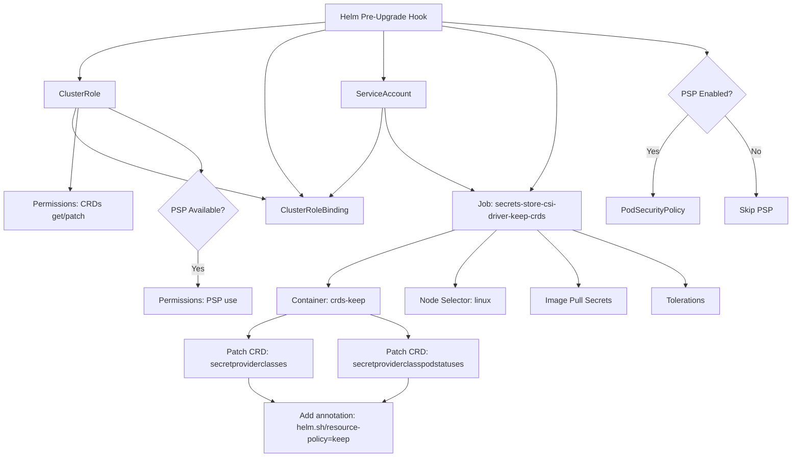
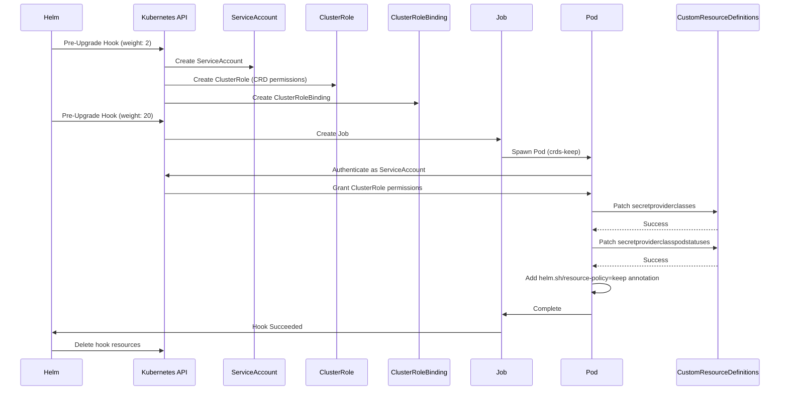

# Diagram: devops/k8s/secrets-store-csi-driver/helm/templates/keep-crds-upgrade-hook.yaml

> Auto-generated by Obscura crawlers

## Diagram 1

### SVG

<svg id="container" width="1590.640625" xmlns="http://www.w3.org/2000/svg" class="flowchart" height="911.5625" viewBox="0 0 1590.640625 911.5625" role="graphics-document document" aria-roledescription="flowchart-v2"><g><marker id="container_flowchart-v2-pointEnd" class="marker flowchart-v2" viewBox="0 0 10 10" refX="5" refY="5" markerUnits="userSpaceOnUse" markerWidth="8" markerHeight="8" orient="auto"><path d="M 0 0 L 10 5 L 0 10 z" class="arrowMarkerPath" style="stroke-width: 1; stroke-dasharray: 1, 0;"></path></marker><marker id="container_flowchart-v2-pointStart" class="marker flowchart-v2" viewBox="0 0 10 10" refX="4.5" refY="5" markerUnits="userSpaceOnUse" markerWidth="8" markerHeight="8" orient="auto"><path d="M 0 5 L 10 10 L 10 0 z" class="arrowMarkerPath" style="stroke-width: 1; stroke-dasharray: 1, 0;"></path></marker><marker id="container_flowchart-v2-circleEnd" class="marker flowchart-v2" viewBox="0 0 10 10" refX="11" refY="5" markerUnits="userSpaceOnUse" markerWidth="11" markerHeight="11" orient="auto"><circle cx="5" cy="5" r="5" class="arrowMarkerPath" style="stroke-width: 1; stroke-dasharray: 1, 0;"></circle></marker><marker id="container_flowchart-v2-circleStart" class="marker flowchart-v2" viewBox="0 0 10 10" refX="-1" refY="5" markerUnits="userSpaceOnUse" markerWidth="11" markerHeight="11" orient="auto"><circle cx="5" cy="5" r="5" class="arrowMarkerPath" style="stroke-width: 1; stroke-dasharray: 1, 0;"></circle></marker><marker id="container_flowchart-v2-crossEnd" class="marker cross flowchart-v2" viewBox="0 0 11 11" refX="12" refY="5.2" markerUnits="userSpaceOnUse" markerWidth="11" markerHeight="11" orient="auto"><path d="M 1,1 l 9,9 M 10,1 l -9,9" class="arrowMarkerPath" style="stroke-width: 2; stroke-dasharray: 1, 0;"></path></marker><marker id="container_flowchart-v2-crossStart" class="marker cross flowchart-v2" viewBox="0 0 11 11" refX="-1" refY="5.2" markerUnits="userSpaceOnUse" markerWidth="11" markerHeight="11" orient="auto"><path d="M 1,1 l 9,9 M 10,1 l -9,9" class="arrowMarkerPath" style="stroke-width: 2; stroke-dasharray: 1, 0;"></path></marker><g class="root"><g class="clusters"></g><g class="edgePaths"><path d="M653.387,44.992L571.017,51.993C488.647,58.995,323.908,72.997,241.538,91.621C159.168,110.245,159.168,133.49,159.168,145.112L159.168,156.734" id="L_A_B_0" class="edge-thickness-normal edge-pattern-solid edge-thickness-normal edge-pattern-solid flowchart-link" style=";" data-edge="true" data-et="edge" data-id="L_A_B_0" data-points="W3sieCI6NjUzLjM4NjcxODc1LCJ5Ijo0NC45OTIwMDU4MjMyMzQxOTR9LHsieCI6MTU5LjE2Nzk2ODc1LCJ5Ijo4N30seyJ4IjoxNTkuMTY3OTY4NzUsInkiOjE2MC43MzQzNzV9XQ==" marker-end="url(#container_flowchart-v2-pointEnd)"></path><path d="M653.387,60.49L633.01,64.908C612.633,69.326,571.879,78.163,551.502,99.371C531.125,120.578,531.125,154.156,531.125,189.734C531.125,225.313,531.125,262.891,543.512,296.016C555.898,329.142,580.671,357.815,593.058,372.152L605.444,386.489" id="L_A_C_0" class="edge-thickness-normal edge-pattern-solid edge-thickness-normal edge-pattern-solid flowchart-link" style=";" data-edge="true" data-et="edge" data-id="L_A_C_0" data-points="W3sieCI6NjUzLjM4NjcxODc1LCJ5Ijo2MC40ODk2ODEyMzQwMTY5MDZ9LHsieCI6NTMxLjEyNSwieSI6ODd9LHsieCI6NTMxLjEyNSwieSI6MTg3LjczNDM3NX0seyJ4Ijo1MzEuMTI1LCJ5IjozMDAuNDY4NzV9LHsieCI6NjA4LjA1OTM2NTg0ODQyNDcsInkiOjM4OS41MTU2MjV9XQ==" marker-end="url(#container_flowchart-v2-pointEnd)"></path><path d="M770.941,62L770.941,66.167C770.941,70.333,770.941,78.667,770.941,94.456C770.941,110.245,770.941,133.49,770.941,145.112L770.941,156.734" id="L_A_D_0" class="edge-thickness-normal edge-pattern-solid edge-thickness-normal edge-pattern-solid flowchart-link" style=";" data-edge="true" data-et="edge" data-id="L_A_D_0" data-points="W3sieCI6NzcwLjk0MTQwNjI1LCJ5Ijo2Mn0seyJ4Ijo3NzAuOTQxNDA2MjUsInkiOjg3fSx7IngiOjc3MC45NDE0MDYyNSwieSI6MTYwLjczNDM3NX1d" marker-end="url(#container_flowchart-v2-pointEnd)"></path><path d="M888.496,52.35L927.625,58.125C966.754,63.9,1045.012,75.45,1084.141,98.014C1123.27,120.578,1123.27,154.156,1123.27,189.734C1123.27,225.313,1123.27,262.891,1114.59,293.976C1105.911,325.062,1088.552,349.655,1079.873,361.951L1071.194,374.248" id="L_A_E_0" class="edge-thickness-normal edge-pattern-solid edge-thickness-normal edge-pattern-solid flowchart-link" style=";" data-edge="true" data-et="edge" data-id="L_A_E_0" data-points="W3sieCI6ODg4LjQ5NjA5Mzc1LCJ5Ijo1Mi4zNDk4NjAzMDQyMjYzNTR9LHsieCI6MTEyMy4yNjk1MzEyNSwieSI6ODd9LHsieCI6MTEyMy4yNjk1MzEyNSwieSI6MTg3LjczNDM3NX0seyJ4IjoxMTIzLjI2OTUzMTI1LCJ5IjozMDAuNDY4NzV9LHsieCI6MTA2OC44ODcwMTA2NTM2OTYsInkiOjM3Ny41MTU2MjV9XQ==" marker-end="url(#container_flowchart-v2-pointEnd)"></path><path d="M888.496,44.381L977.505,51.484C1066.514,58.587,1244.533,72.794,1333.542,83.397C1422.551,94,1422.551,101,1422.551,104.5L1422.551,108" id="L_A_F_0" class="edge-thickness-normal edge-pattern-solid edge-thickness-normal edge-pattern-solid flowchart-link" style=";" data-edge="true" data-et="edge" data-id="L_A_F_0" data-points="W3sieCI6ODg4LjQ5NjA5Mzc1LCJ5Ijo0NC4zODExNDc2MzkyNTg1NjV9LHsieCI6MTQyMi41NTA3ODEyNSwieSI6ODd9LHsieCI6MTQyMi41NTA3ODEyNSwieSI6MTEyfV0=" marker-end="url(#container_flowchart-v2-pointEnd)"></path><path d="M1385.736,226.654L1374.099,238.957C1362.462,251.259,1339.188,275.864,1327.551,302.341C1315.914,328.818,1315.914,357.167,1315.914,371.341L1315.914,385.516" id="L_F_G_0" class="edge-thickness-normal edge-pattern-solid edge-thickness-normal edge-pattern-solid flowchart-link" style=";" data-edge="true" data-et="edge" data-id="L_F_G_0" data-points="W3sieCI6MTM4NS43MzYxNTMwODQ4Nzk2LCJ5IjoyMjYuNjU0MTIxODM0ODc5NTN9LHsieCI6MTMxNS45MTQwNjI1LCJ5IjozMDAuNDY4NzV9LHsieCI6MTMxNS45MTQwNjI1LCJ5IjozODkuNTE1NjI1fV0=" marker-end="url(#container_flowchart-v2-pointEnd)"></path><path d="M1457.962,228.057L1468.561,240.126C1479.16,252.194,1500.357,276.332,1510.956,302.575C1521.555,328.818,1521.555,357.167,1521.555,371.341L1521.555,385.516" id="L_F_H_0" class="edge-thickness-normal edge-pattern-solid edge-thickness-normal edge-pattern-solid flowchart-link" style=";" data-edge="true" data-et="edge" data-id="L_F_H_0" data-points="W3sieCI6MTQ1Ny45NjI0MTczNDIxNTAzLCJ5IjoyMjguMDU3MTEzOTA3ODQ5ODR9LHsieCI6MTUyMS41NTQ2ODc1LCJ5IjozMDAuNDY4NzV9LHsieCI6MTUyMS41NTQ2ODc1LCJ5IjozODkuNTE1NjI1fV0=" marker-end="url(#container_flowchart-v2-pointEnd)"></path><path d="M768.546,214.734L767.279,229.023C766.011,243.313,763.476,271.891,746.137,300.576C728.797,329.261,696.653,358.054,680.581,372.45L664.509,386.847" id="L_D_C_0" class="edge-thickness-normal edge-pattern-solid edge-thickness-normal edge-pattern-solid flowchart-link" style=";" data-edge="true" data-et="edge" data-id="L_D_C_0" data-points="W3sieCI6NzY4LjU0NjM5NTg1NDk4OTYsInkiOjIxNC43MzQzNzV9LHsieCI6NzYwLjk0MTQwNjI1LCJ5IjozMDAuNDY4NzV9LHsieCI6NjYxLjUyOTUwODU3MDkyMzcsInkiOjM4OS41MTU2MjV9XQ==" marker-end="url(#container_flowchart-v2-pointEnd)"></path><path d="M151.703,214.734L147.753,229.023C143.802,243.313,135.901,271.891,198.68,301.563C261.46,331.236,394.92,362.002,461.65,377.386L528.38,392.769" id="L_B_C_0" class="edge-thickness-normal edge-pattern-solid edge-thickness-normal edge-pattern-solid flowchart-link" style=";" data-edge="true" data-et="edge" data-id="L_B_C_0" data-points="W3sieCI6MTUxLjcwMzIwNzgzNTIzOTA4LCJ5IjoyMTQuNzM0Mzc1fSx7IngiOjEyOCwieSI6MzAwLjQ2ODc1fSx7IngiOjUzMi4yNzczNDM3NSwieSI6MzkzLjY2NzcxNzM3MDQyODR9XQ==" marker-end="url(#container_flowchart-v2-pointEnd)"></path><path d="M773.336,214.734L774.604,229.023C775.871,243.313,778.406,271.891,807.881,298.749C837.357,325.608,893.772,350.748,921.979,363.318L950.187,375.887" id="L_D_E_0" class="edge-thickness-normal edge-pattern-solid edge-thickness-normal edge-pattern-solid flowchart-link" style=";" data-edge="true" data-et="edge" data-id="L_D_E_0" data-points="W3sieCI6NzczLjMzNjQxNjY0NTAxMDQsInkiOjIxNC43MzQzNzV9LHsieCI6NzgwLjk0MTQwNjI1LCJ5IjozMDAuNDY4NzV9LHsieCI6OTUzLjg0MDQyMzg3NTcyMzcsInkiOjM3Ny41MTU2MjV9XQ==" marker-end="url(#container_flowchart-v2-pointEnd)"></path><path d="M156.493,214.734L155.078,229.023C153.662,243.313,150.831,271.891,148.366,298.357C145.901,324.823,143.803,349.177,142.753,361.353L141.704,373.53" id="L_B_I_0" class="edge-thickness-normal edge-pattern-solid edge-thickness-normal edge-pattern-solid flowchart-link" style=";" data-edge="true" data-et="edge" data-id="L_B_I_0" data-points="W3sieCI6MTU2LjQ5MzIyODYyNTI1OTksInkiOjIxNC43MzQzNzV9LHsieCI6MTQ4LCJ5IjozMDAuNDY4NzV9LHsieCI6MTQxLjM2MDcxMDkxOTYxNzYyLCJ5IjozNzcuNTE1NjI1fV0=" marker-end="url(#container_flowchart-v2-pointEnd)"></path><path d="M218.535,214.734L249.954,229.023C281.372,243.313,344.21,271.891,375.064,292.727C405.918,313.564,404.79,326.659,404.226,333.207L403.662,339.755" id="L_B_J_0" class="edge-thickness-normal edge-pattern-solid edge-thickness-normal edge-pattern-solid flowchart-link" style=";" data-edge="true" data-et="edge" data-id="L_B_J_0" data-points="W3sieCI6MjE4LjUzNTIyNDQ2NzI1NTcyLCJ5IjoyMTQuNzM0Mzc1fSx7IngiOjQwNy4wNDY4NzUsInkiOjMwMC40Njg3NX0seyJ4Ijo0MDMuMzE4MTAzNDYxNjMzOCwieSI6MzQzLjczOTk3ODQ2MTYzMzh9XQ==" marker-end="url(#container_flowchart-v2-pointEnd)"></path><path d="M397.047,495.563L397.047,501.729C397.047,507.896,397.047,520.229,397.047,531.896C397.047,543.563,397.047,554.563,397.047,560.063L397.047,565.563" id="L_J_K_0" class="edge-thickness-normal edge-pattern-solid edge-thickness-normal edge-pattern-solid flowchart-link" style=";" data-edge="true" data-et="edge" data-id="L_J_K_0" data-points="W3sieCI6Mzk3LjA0Njg3NSwieSI6NDk1LjU2MjV9LHsieCI6Mzk3LjA0Njg3NSwieSI6NTMyLjU2MjV9LHsieCI6Mzk3LjA0Njg3NSwieSI6NTY5LjU2MjV9XQ==" marker-end="url(#container_flowchart-v2-pointEnd)"></path><path d="M912.652,455.516L870.274,468.357C827.896,481.198,743.139,506.88,700.761,525.221C658.383,543.563,658.383,554.563,658.383,560.063L658.383,565.563" id="L_E_L_0" class="edge-thickness-normal edge-pattern-solid edge-thickness-normal edge-pattern-solid flowchart-link" style=";" data-edge="true" data-et="edge" data-id="L_E_L_0" data-points="W3sieCI6OTEyLjY1MjAyMzQ0NDg2MzMsInkiOjQ1NS41MTU2MjV9LHsieCI6NjU4LjM4MjgxMjUsInkiOjUzMi41NjI1fSx7IngiOjY1OC4zODI4MTI1LCJ5Ijo1NjkuNTYyNX1d" marker-end="url(#container_flowchart-v2-pointEnd)"></path><path d="M574.077,623.563L561.067,627.729C548.056,631.896,522.036,640.229,509.026,647.896C496.016,655.563,496.016,662.563,496.016,666.063L496.016,669.563" id="L_L_M_0" class="edge-thickness-normal edge-pattern-solid edge-thickness-normal edge-pattern-solid flowchart-link" style=";" data-edge="true" data-et="edge" data-id="L_L_M_0" data-points="W3sieCI6NTc0LjA3Njc3MjgzNjUzODUsInkiOjYyMy41NjI1fSx7IngiOjQ5Ni4wMTU2MjUsInkiOjY0OC41NjI1fSx7IngiOjQ5Ni4wMTU2MjUsInkiOjY3My41NjI1fV0=" marker-end="url(#container_flowchart-v2-pointEnd)"></path><path d="M742.689,623.563L755.699,627.729C768.709,631.896,794.73,640.229,807.74,647.896C820.75,655.563,820.75,662.563,820.75,666.063L820.75,669.563" id="L_L_N_0" class="edge-thickness-normal edge-pattern-solid edge-thickness-normal edge-pattern-solid flowchart-link" style=";" data-edge="true" data-et="edge" data-id="L_L_N_0" data-points="W3sieCI6NzQyLjY4ODg1MjE2MzQ2MTUsInkiOjYyMy41NjI1fSx7IngiOjgyMC43NSwieSI6NjQ4LjU2MjV9LHsieCI6ODIwLjc1LCJ5Ijo2NzMuNTYyNX1d" marker-end="url(#container_flowchart-v2-pointEnd)"></path><path d="M496.016,751.563L496.016,755.729C496.016,759.896,496.016,768.229,504.314,776.28C512.611,784.331,529.207,792.099,537.505,795.983L545.803,799.867" id="L_M_O_0" class="edge-thickness-normal edge-pattern-solid edge-thickness-normal edge-pattern-solid flowchart-link" style=";" data-edge="true" data-et="edge" data-id="L_M_O_0" data-points="W3sieCI6NDk2LjAxNTYyNSwieSI6NzUxLjU2MjV9LHsieCI6NDk2LjAxNTYyNSwieSI6Nzc2LjU2MjV9LHsieCI6NTQ5LjQyNTg4NDA0NjA1MjYsInkiOjgwMS41NjI1fV0=" marker-end="url(#container_flowchart-v2-pointEnd)"></path><path d="M820.75,751.563L820.75,755.729C820.75,759.896,820.75,768.229,812.452,776.28C804.154,784.331,787.558,792.099,779.26,795.983L770.963,799.867" id="L_N_O_0" class="edge-thickness-normal edge-pattern-solid edge-thickness-normal edge-pattern-solid flowchart-link" style=";" data-edge="true" data-et="edge" data-id="L_N_O_0" data-points="W3sieCI6ODIwLjc1LCJ5Ijo3NTEuNTYyNX0seyJ4Ijo4MjAuNzUsInkiOjc3Ni41NjI1fSx7IngiOjc2Ny4zMzk3NDA5NTM5NDc0LCJ5Ijo4MDEuNTYyNX1d" marker-end="url(#container_flowchart-v2-pointEnd)"></path><path d="M999.458,455.516L985.662,468.357C971.865,481.198,944.273,506.88,930.476,525.221C916.68,543.563,916.68,554.563,916.68,560.063L916.68,565.563" id="L_E_P_0" class="edge-thickness-normal edge-pattern-solid edge-thickness-normal edge-pattern-solid flowchart-link" style=";" data-edge="true" data-et="edge" data-id="L_E_P_0" data-points="W3sieCI6OTk5LjQ1ODEzNjI3NjQyMzgsInkiOjQ1NS41MTU2MjV9LHsieCI6OTE2LjY3OTY4NzUsInkiOjUzMi41NjI1fSx7IngiOjkxNi42Nzk2ODc1LCJ5Ijo1NjkuNTYyNX1d" marker-end="url(#container_flowchart-v2-pointEnd)"></path><path d="M1083.261,455.516L1097.057,468.357C1110.853,481.198,1138.446,506.88,1152.243,525.221C1166.039,543.563,1166.039,554.563,1166.039,560.063L1166.039,565.563" id="L_E_Q_0" class="edge-thickness-normal edge-pattern-solid edge-thickness-normal edge-pattern-solid flowchart-link" style=";" data-edge="true" data-et="edge" data-id="L_E_Q_0" data-points="W3sieCI6MTA4My4yNjA2MTM3MjM1NzYyLCJ5Ijo0NTUuNTE1NjI1fSx7IngiOjExNjYuMDM5MDYyNSwieSI6NTMyLjU2MjV9LHsieCI6MTE2Ni4wMzkwNjI1LCJ5Ijo1NjkuNTYyNX1d" marker-end="url(#container_flowchart-v2-pointEnd)"></path><path d="M1156.091,455.516L1193.867,468.357C1231.644,481.198,1307.197,506.88,1344.973,525.221C1382.75,543.563,1382.75,554.563,1382.75,560.063L1382.75,565.563" id="L_E_R_0" class="edge-thickness-normal edge-pattern-solid edge-thickness-normal edge-pattern-solid flowchart-link" style=";" data-edge="true" data-et="edge" data-id="L_E_R_0" data-points="W3sieCI6MTE1Ni4wOTA4OTUxMjkyNTgxLCJ5Ijo0NTUuNTE1NjI1fSx7IngiOjEzODIuNzUsInkiOjUzMi41NjI1fSx7IngiOjEzODIuNzUsInkiOjU2OS41NjI1fV0=" marker-end="url(#container_flowchart-v2-pointEnd)"></path></g><g class="edgeLabels"><g class="edgeLabel"><g class="label" data-id="L_A_B_0" transform="translate(0, 0)"><foreignObject width="0" height="0">

</foreignObject></g></g><g class="edgeLabel"><g class="label" data-id="L_A_C_0" transform="translate(0, 0)"><foreignObject width="0" height="0">

</foreignObject></g></g><g class="edgeLabel"><g class="label" data-id="L_A_D_0" transform="translate(0, 0)"><foreignObject width="0" height="0">

</foreignObject></g></g><g class="edgeLabel"><g class="label" data-id="L_A_E_0" transform="translate(0, 0)"><foreignObject width="0" height="0">

</foreignObject></g></g><g class="edgeLabel"><g class="label" data-id="L_A_F_0" transform="translate(0, 0)"><foreignObject width="0" height="0">

</foreignObject></g></g><g class="edgeLabel" transform="translate(1315.9140625, 300.46875)"><g class="label" data-id="L_F_G_0" transform="translate(-12.03125, -12)"><foreignObject width="24.0625" height="24">

Yes

</foreignObject></g></g><g class="edgeLabel" transform="translate(1521.5546875, 300.46875)"><g class="label" data-id="L_F_H_0" transform="translate(-10.140625, -12)"><foreignObject width="20.28125" height="24">

No

</foreignObject></g></g><g class="edgeLabel"><g class="label" data-id="L_D_C_0" transform="translate(0, 0)"><foreignObject width="0" height="0">

</foreignObject></g></g><g class="edgeLabel"><g class="label" data-id="L_B_C_0" transform="translate(0, 0)"><foreignObject width="0" height="0">

</foreignObject></g></g><g class="edgeLabel"><g class="label" data-id="L_D_E_0" transform="translate(0, 0)"><foreignObject width="0" height="0">

</foreignObject></g></g><g class="edgeLabel"><g class="label" data-id="L_B_I_0" transform="translate(0, 0)"><foreignObject width="0" height="0">

</foreignObject></g></g><g class="edgeLabel"><g class="label" data-id="L_B_J_0" transform="translate(0, 0)"><foreignObject width="0" height="0">

</foreignObject></g></g><g class="edgeLabel" transform="translate(397.046875, 532.5625)"><g class="label" data-id="L_J_K_0" transform="translate(-12.03125, -12)"><foreignObject width="24.0625" height="24">

Yes

</foreignObject></g></g><g class="edgeLabel"><g class="label" data-id="L_E_L_0" transform="translate(0, 0)"><foreignObject width="0" height="0">

</foreignObject></g></g><g class="edgeLabel"><g class="label" data-id="L_L_M_0" transform="translate(0, 0)"><foreignObject width="0" height="0">

</foreignObject></g></g><g class="edgeLabel"><g class="label" data-id="L_L_N_0" transform="translate(0, 0)"><foreignObject width="0" height="0">

</foreignObject></g></g><g class="edgeLabel"><g class="label" data-id="L_M_O_0" transform="translate(0, 0)"><foreignObject width="0" height="0">

</foreignObject></g></g><g class="edgeLabel"><g class="label" data-id="L_N_O_0" transform="translate(0, 0)"><foreignObject width="0" height="0">

</foreignObject></g></g><g class="edgeLabel"><g class="label" data-id="L_E_P_0" transform="translate(0, 0)"><foreignObject width="0" height="0">

</foreignObject></g></g><g class="edgeLabel"><g class="label" data-id="L_E_Q_0" transform="translate(0, 0)"><foreignObject width="0" height="0">

</foreignObject></g></g><g class="edgeLabel"><g class="label" data-id="L_E_R_0" transform="translate(0, 0)"><foreignObject width="0" height="0">

</foreignObject></g></g></g><g class="nodes"><g class="node default" id="flowchart-A-0" transform="translate(770.94140625, 35)"><rect class="basic label-container" style="" x="-117.5546875" y="-27" width="235.109375" height="54"></rect><g class="label" style="" transform="translate(-87.5546875, -12)"><rect></rect><foreignObject width="175.109375" height="24">

Helm Pre-Upgrade Hook

</foreignObject></g></g><g class="node default" id="flowchart-B-1" transform="translate(159.16796875, 187.734375)"><rect class="basic label-container" style="" x="-71.4140625" y="-27" width="142.828125" height="54"></rect><g class="label" style="" transform="translate(-41.4140625, -12)"><rect></rect><foreignObject width="82.828125" height="24">

ClusterRole

</foreignObject></g></g><g class="node default" id="flowchart-C-3" transform="translate(631.38671875, 416.515625)"><rect class="basic label-container" style="" x="-99.109375" y="-27" width="198.21875" height="54"></rect><g class="label" style="" transform="translate(-69.109375, -12)"><rect></rect><foreignObject width="138.21875" height="24">

ClusterRoleBinding

</foreignObject></g></g><g class="node default" id="flowchart-D-5" transform="translate(770.94140625, 187.734375)"><rect class="basic label-container" style="" x="-84.84375" y="-27" width="169.6875" height="54"></rect><g class="label" style="" transform="translate(-54.84375, -12)"><rect></rect><foreignObject width="109.6875" height="24">

ServiceAccount

</foreignObject></g></g><g class="node default" id="flowchart-E-7" transform="translate(1041.359375, 416.515625)"><rect class="basic label-container" style="" x="-130" y="-39" width="260" height="78"></rect><g class="label" style="" transform="translate(-100, -24)"><rect></rect><foreignObject width="200" height="48">

Job: secrets-store-csi-driver-keep-crds

</foreignObject></g></g><g class="node default" id="flowchart-F-9" transform="translate(1422.55078125, 187.734375)"><polygon points="75.734375,0 151.46875,-75.734375 75.734375,-151.46875 0,-75.734375" class="label-container" transform="translate(-75.234375, 75.734375)"></polygon><g class="label" style="" transform="translate(-48.734375, -12)"><rect></rect><foreignObject width="97.46875" height="24">

PSP Enabled?

</foreignObject></g></g><g class="node default" id="flowchart-G-11" transform="translate(1315.9140625, 416.515625)"><rect class="basic label-container" style="" x="-94.5546875" y="-27" width="189.109375" height="54"></rect><g class="label" style="" transform="translate(-64.5546875, -12)"><rect></rect><foreignObject width="129.109375" height="24">

PodSecurityPolicy

</foreignObject></g></g><g class="node default" id="flowchart-H-13" transform="translate(1521.5546875, 416.515625)"><rect class="basic label-container" style="" x="-61.0859375" y="-27" width="122.171875" height="54"></rect><g class="label" style="" transform="translate(-31.0859375, -12)"><rect></rect><foreignObject width="62.171875" height="24">

Skip PSP

</foreignObject></g></g><g class="node default" id="flowchart-I-21" transform="translate(138, 416.515625)"><rect class="basic label-container" style="" x="-130" y="-39" width="260" height="78"></rect><g class="label" style="" transform="translate(-100, -24)"><rect></rect><foreignObject width="200" height="48">

Permissions: CRDs get/patch

</foreignObject></g></g><g class="node default" id="flowchart-J-23" transform="translate(397.046875, 416.515625)"><polygon points="79.046875,0 158.09375,-79.046875 79.046875,-158.09375 0,-79.046875" class="label-container" transform="translate(-78.546875, 79.046875)"></polygon><g class="label" style="" transform="translate(-52.046875, -12)"><rect></rect><foreignObject width="104.09375" height="24">

PSP Available?

</foreignObject></g></g><g class="node default" id="flowchart-K-25" transform="translate(397.046875, 596.5625)"><rect class="basic label-container" style="" x="-106.125" y="-27" width="212.25" height="54"></rect><g class="label" style="" transform="translate(-76.125, -12)"><rect></rect><foreignObject width="152.25" height="24">

Permissions: PSP use

</foreignObject></g></g><g class="node default" id="flowchart-L-27" transform="translate(658.3828125, 596.5625)"><rect class="basic label-container" style="" x="-105.2109375" y="-27" width="210.421875" height="54"></rect><g class="label" style="" transform="translate(-75.2109375, -12)"><rect></rect><foreignObject width="150.421875" height="24">

Container: crds-keep

</foreignObject></g></g><g class="node default" id="flowchart-M-29" transform="translate(496.015625, 712.5625)"><rect class="basic label-container" style="" x="-130" y="-39" width="260" height="78"></rect><g class="label" style="" transform="translate(-100, -24)"><rect></rect><foreignObject width="200" height="48">

Patch CRD: secretproviderclasses

</foreignObject></g></g><g class="node default" id="flowchart-N-31" transform="translate(820.75, 712.5625)"><rect class="basic label-container" style="" x="-144.734375" y="-39" width="289.46875" height="78"></rect><g class="label" style="" transform="translate(-114.734375, -24)"><rect></rect><foreignObject width="229.46875" height="48">

Patch CRD: secretproviderclasspodstatuses

</foreignObject></g></g><g class="node default" id="flowchart-O-33" transform="translate(658.3828125, 852.5625)"><rect class="basic label-container" style="" x="-130" y="-51" width="260" height="102"></rect><g class="label" style="" transform="translate(-100, -36)"><rect></rect><foreignObject width="200" height="72">

Add annotation: helm.sh/resource-policy=keep

</foreignObject></g></g><g class="node default" id="flowchart-P-37" transform="translate(916.6796875, 596.5625)"><rect class="basic label-container" style="" x="-103.0859375" y="-27" width="206.171875" height="54"></rect><g class="label" style="" transform="translate(-73.0859375, -12)"><rect></rect><foreignObject width="146.171875" height="24">

Node Selector: linux

</foreignObject></g></g><g class="node default" id="flowchart-Q-39" transform="translate(1166.0390625, 596.5625)"><rect class="basic label-container" style="" x="-96.2734375" y="-27" width="192.546875" height="54"></rect><g class="label" style="" transform="translate(-66.2734375, -12)"><rect></rect><foreignObject width="132.546875" height="24">

Image Pull Secrets

</foreignObject></g></g><g class="node default" id="flowchart-R-41" transform="translate(1382.75, 596.5625)"><rect class="basic label-container" style="" x="-70.4375" y="-27" width="140.875" height="54"></rect><g class="label" style="" transform="translate(-40.4375, -12)"><rect></rect><foreignObject width="80.875" height="24">

Tolerations

</foreignObject></g></g></g></g></g></svg>

## Diagram 2

### SVG

<svg id="container" width="1993.5" xmlns="http://www.w3.org/2000/svg" height="1017" viewBox="-50 -10 1993.5 1017" role="graphics-document document" aria-roledescription="sequence"><g><rect x="1674.5" y="931" fill="#eaeaea" stroke="#666" width="219" height="65" name="CRD" rx="3" ry="3" class="actor actor-bottom"></rect><text x="1784" y="963.5" dominant-baseline="central" alignment-baseline="central" class="actor actor-box" style="text-anchor: middle; font-size: 16px; font-weight: 400;"><tspan x="1784" dy="0">CustomResourceDefinitions</tspan></text></g><g><rect x="1366" y="931" fill="#eaeaea" stroke="#666" width="150" height="65" name="Pod" rx="3" ry="3" class="actor actor-bottom"></rect><text x="1441" y="963.5" dominant-baseline="central" alignment-baseline="central" class="actor actor-box" style="text-anchor: middle; font-size: 16px; font-weight: 400;"><tspan x="1441" dy="0">Pod</tspan></text></g><g><rect x="1130" y="931" fill="#eaeaea" stroke="#666" width="150" height="65" name="Job" rx="3" ry="3" class="actor actor-bottom"></rect><text x="1205" y="963.5" dominant-baseline="central" alignment-baseline="central" class="actor actor-box" style="text-anchor: middle; font-size: 16px; font-weight: 400;"><tspan x="1205" dy="0">Job</tspan></text></g><g><rect x="921" y="931" fill="#eaeaea" stroke="#666" width="159" height="65" name="CRB" rx="3" ry="3" class="actor actor-bottom"></rect><text x="1000.5" y="963.5" dominant-baseline="central" alignment-baseline="central" class="actor actor-box" style="text-anchor: middle; font-size: 16px; font-weight: 400;"><tspan x="1000.5" dy="0">ClusterRoleBinding</tspan></text></g><g><rect x="721" y="931" fill="#eaeaea" stroke="#666" width="150" height="65" name="CR" rx="3" ry="3" class="actor actor-bottom"></rect><text x="796" y="963.5" dominant-baseline="central" alignment-baseline="central" class="actor actor-box" style="text-anchor: middle; font-size: 16px; font-weight: 400;"><tspan x="796" dy="0">ClusterRole</tspan></text></g><g><rect x="521" y="931" fill="#eaeaea" stroke="#666" width="150" height="65" name="SA" rx="3" ry="3" class="actor actor-bottom"></rect><text x="596" y="963.5" dominant-baseline="central" alignment-baseline="central" class="actor actor-box" style="text-anchor: middle; font-size: 16px; font-weight: 400;"><tspan x="596" dy="0">ServiceAccount</tspan></text></g><g><rect x="291" y="931" fill="#eaeaea" stroke="#666" width="150" height="65" name="K8s" rx="3" ry="3" class="actor actor-bottom"></rect><text x="366" y="963.5" dominant-baseline="central" alignment-baseline="central" class="actor actor-box" style="text-anchor: middle; font-size: 16px; font-weight: 400;"><tspan x="366" dy="0">Kubernetes API</tspan></text></g><g><rect x="0" y="931" fill="#eaeaea" stroke="#666" width="150" height="65" name="Helm" rx="3" ry="3" class="actor actor-bottom"></rect><text x="75" y="963.5" dominant-baseline="central" alignment-baseline="central" class="actor actor-box" style="text-anchor: middle; font-size: 16px; font-weight: 400;"><tspan x="75" dy="0">Helm</tspan></text></g><g><line id="actor7" x1="1784" y1="65" x2="1784" y2="931" class="actor-line 200" stroke-width="0.5px" stroke="#999" name="CRD"></line><g id="root-7"><rect x="1674.5" y="0" fill="#eaeaea" stroke="#666" width="219" height="65" name="CRD" rx="3" ry="3" class="actor actor-top"></rect><text x="1784" y="32.5" dominant-baseline="central" alignment-baseline="central" class="actor actor-box" style="text-anchor: middle; font-size: 16px; font-weight: 400;"><tspan x="1784" dy="0">CustomResourceDefinitions</tspan></text></g></g><g><line id="actor6" x1="1441" y1="65" x2="1441" y2="931" class="actor-line 200" stroke-width="0.5px" stroke="#999" name="Pod"></line><g id="root-6"><rect x="1366" y="0" fill="#eaeaea" stroke="#666" width="150" height="65" name="Pod" rx="3" ry="3" class="actor actor-top"></rect><text x="1441" y="32.5" dominant-baseline="central" alignment-baseline="central" class="actor actor-box" style="text-anchor: middle; font-size: 16px; font-weight: 400;"><tspan x="1441" dy="0">Pod</tspan></text></g></g><g><line id="actor5" x1="1205" y1="65" x2="1205" y2="931" class="actor-line 200" stroke-width="0.5px" stroke="#999" name="Job"></line><g id="root-5"><rect x="1130" y="0" fill="#eaeaea" stroke="#666" width="150" height="65" name="Job" rx="3" ry="3" class="actor actor-top"></rect><text x="1205" y="32.5" dominant-baseline="central" alignment-baseline="central" class="actor actor-box" style="text-anchor: middle; font-size: 16px; font-weight: 400;"><tspan x="1205" dy="0">Job</tspan></text></g></g><g><line id="actor4" x1="1000.5" y1="65" x2="1000.5" y2="931" class="actor-line 200" stroke-width="0.5px" stroke="#999" name="CRB"></line><g id="root-4"><rect x="921" y="0" fill="#eaeaea" stroke="#666" width="159" height="65" name="CRB" rx="3" ry="3" class="actor actor-top"></rect><text x="1000.5" y="32.5" dominant-baseline="central" alignment-baseline="central" class="actor actor-box" style="text-anchor: middle; font-size: 16px; font-weight: 400;"><tspan x="1000.5" dy="0">ClusterRoleBinding</tspan></text></g></g><g><line id="actor3" x1="796" y1="65" x2="796" y2="931" class="actor-line 200" stroke-width="0.5px" stroke="#999" name="CR"></line><g id="root-3"><rect x="721" y="0" fill="#eaeaea" stroke="#666" width="150" height="65" name="CR" rx="3" ry="3" class="actor actor-top"></rect><text x="796" y="32.5" dominant-baseline="central" alignment-baseline="central" class="actor actor-box" style="text-anchor: middle; font-size: 16px; font-weight: 400;"><tspan x="796" dy="0">ClusterRole</tspan></text></g></g><g><line id="actor2" x1="596" y1="65" x2="596" y2="931" class="actor-line 200" stroke-width="0.5px" stroke="#999" name="SA"></line><g id="root-2"><rect x="521" y="0" fill="#eaeaea" stroke="#666" width="150" height="65" name="SA" rx="3" ry="3" class="actor actor-top"></rect><text x="596" y="32.5" dominant-baseline="central" alignment-baseline="central" class="actor actor-box" style="text-anchor: middle; font-size: 16px; font-weight: 400;"><tspan x="596" dy="0">ServiceAccount</tspan></text></g></g><g><line id="actor1" x1="366" y1="65" x2="366" y2="931" class="actor-line 200" stroke-width="0.5px" stroke="#999" name="K8s"></line><g id="root-1"><rect x="291" y="0" fill="#eaeaea" stroke="#666" width="150" height="65" name="K8s" rx="3" ry="3" class="actor actor-top"></rect><text x="366" y="32.5" dominant-baseline="central" alignment-baseline="central" class="actor actor-box" style="text-anchor: middle; font-size: 16px; font-weight: 400;"><tspan x="366" dy="0">Kubernetes API</tspan></text></g></g><g><line id="actor0" x1="75" y1="65" x2="75" y2="931" class="actor-line 200" stroke-width="0.5px" stroke="#999" name="Helm"></line><g id="root-0"><rect x="0" y="0" fill="#eaeaea" stroke="#666" width="150" height="65" name="Helm" rx="3" ry="3" class="actor actor-top"></rect><text x="75" y="32.5" dominant-baseline="central" alignment-baseline="central" class="actor actor-box" style="text-anchor: middle; font-size: 16px; font-weight: 400;"><tspan x="75" dy="0">Helm</tspan></text></g></g><g></g><defs><symbol id="computer" width="24" height="24"><path transform="scale(.5)" d="M2 2v13h20v-13h-20zm18 11h-16v-9h16v9zm-10.228 6l.466-1h3.524l.467 1h-4.457zm14.228 3h-24l2-6h2.104l-1.33 4h18.45l-1.297-4h2.073l2 6zm-5-10h-14v-7h14v7z"></path></symbol></defs><defs><symbol id="database" fill-rule="evenodd" clip-rule="evenodd"><path transform="scale(.5)" d="M12.258.001l.256.004.255.005.253.008.251.01.249.012.247.015.246.016.242.019.241.02.239.023.236.024.233.027.231.028.229.031.225.032.223.034.22.036.217.038.214.04.211.041.208.043.205.045.201.046.198.048.194.05.191.051.187.053.183.054.18.056.175.057.172.059.168.06.163.061.16.063.155.064.15.066.074.033.073.033.071.034.07.034.069.035.068.035.067.035.066.035.064.036.064.036.062.036.06.036.06.037.058.037.058.037.055.038.055.038.053.038.052.038.051.039.05.039.048.039.047.039.045.04.044.04.043.04.041.04.04.041.039.041.037.041.036.041.034.041.033.042.032.042.03.042.029.042.027.042.026.043.024.043.023.043.021.043.02.043.018.044.017.043.015.044.013.044.012.044.011.045.009.044.007.045.006.045.004.045.002.045.001.045v17l-.001.045-.002.045-.004.045-.006.045-.007.045-.009.044-.011.045-.012.044-.013.044-.015.044-.017.043-.018.044-.02.043-.021.043-.023.043-.024.043-.026.043-.027.042-.029.042-.03.042-.032.042-.033.042-.034.041-.036.041-.037.041-.039.041-.04.041-.041.04-.043.04-.044.04-.045.04-.047.039-.048.039-.05.039-.051.039-.052.038-.053.038-.055.038-.055.038-.058.037-.058.037-.06.037-.06.036-.062.036-.064.036-.064.036-.066.035-.067.035-.068.035-.069.035-.07.034-.071.034-.073.033-.074.033-.15.066-.155.064-.16.063-.163.061-.168.06-.172.059-.175.057-.18.056-.183.054-.187.053-.191.051-.194.05-.198.048-.201.046-.205.045-.208.043-.211.041-.214.04-.217.038-.22.036-.223.034-.225.032-.229.031-.231.028-.233.027-.236.024-.239.023-.241.02-.242.019-.246.016-.247.015-.249.012-.251.01-.253.008-.255.005-.256.004-.258.001-.258-.001-.256-.004-.255-.005-.253-.008-.251-.01-.249-.012-.247-.015-.245-.016-.243-.019-.241-.02-.238-.023-.236-.024-.234-.027-.231-.028-.228-.031-.226-.032-.223-.034-.22-.036-.217-.038-.214-.04-.211-.041-.208-.043-.204-.045-.201-.046-.198-.048-.195-.05-.19-.051-.187-.053-.184-.054-.179-.056-.176-.057-.172-.059-.167-.06-.164-.061-.159-.063-.155-.064-.151-.066-.074-.033-.072-.033-.072-.034-.07-.034-.069-.035-.068-.035-.067-.035-.066-.035-.064-.036-.063-.036-.062-.036-.061-.036-.06-.037-.058-.037-.057-.037-.056-.038-.055-.038-.053-.038-.052-.038-.051-.039-.049-.039-.049-.039-.046-.039-.046-.04-.044-.04-.043-.04-.041-.04-.04-.041-.039-.041-.037-.041-.036-.041-.034-.041-.033-.042-.032-.042-.03-.042-.029-.042-.027-.042-.026-.043-.024-.043-.023-.043-.021-.043-.02-.043-.018-.044-.017-.043-.015-.044-.013-.044-.012-.044-.011-.045-.009-.044-.007-.045-.006-.045-.004-.045-.002-.045-.001-.045v-17l.001-.045.002-.045.004-.045.006-.045.007-.045.009-.044.011-.045.012-.044.013-.044.015-.044.017-.043.018-.044.02-.043.021-.043.023-.043.024-.043.026-.043.027-.042.029-.042.03-.042.032-.042.033-.042.034-.041.036-.041.037-.041.039-.041.04-.041.041-.04.043-.04.044-.04.046-.04.046-.039.049-.039.049-.039.051-.039.052-.038.053-.038.055-.038.056-.038.057-.037.058-.037.06-.037.061-.036.062-.036.063-.036.064-.036.066-.035.067-.035.068-.035.069-.035.07-.034.072-.034.072-.033.074-.033.151-.066.155-.064.159-.063.164-.061.167-.06.172-.059.176-.057.179-.056.184-.054.187-.053.19-.051.195-.05.198-.048.201-.046.204-.045.208-.043.211-.041.214-.04.217-.038.22-.036.223-.034.226-.032.228-.031.231-.028.234-.027.236-.024.238-.023.241-.02.243-.019.245-.016.247-.015.249-.012.251-.01.253-.008.255-.005.256-.004.258-.001.258.001zm-9.258 20.499v.01l.001.021.003.021.004.022.005.021.006.022.007.022.009.023.01.022.011.023.012.023.013.023.015.023.016.024.017.023.018.024.019.024.021.024.022.025.023.024.024.025.052.049.056.05.061.051.066.051.07.051.075.051.079.052.084.052.088.052.092.052.097.052.102.051.105.052.11.052.114.051.119.051.123.051.127.05.131.05.135.05.139.048.144.049.147.047.152.047.155.047.16.045.163.045.167.043.171.043.176.041.178.041.183.039.187.039.19.037.194.035.197.035.202.033.204.031.209.03.212.029.216.027.219.025.222.024.226.021.23.02.233.018.236.016.24.015.243.012.246.01.249.008.253.005.256.004.259.001.26-.001.257-.004.254-.005.25-.008.247-.011.244-.012.241-.014.237-.016.233-.018.231-.021.226-.021.224-.024.22-.026.216-.027.212-.028.21-.031.205-.031.202-.034.198-.034.194-.036.191-.037.187-.039.183-.04.179-.04.175-.042.172-.043.168-.044.163-.045.16-.046.155-.046.152-.047.148-.048.143-.049.139-.049.136-.05.131-.05.126-.05.123-.051.118-.052.114-.051.11-.052.106-.052.101-.052.096-.052.092-.052.088-.053.083-.051.079-.052.074-.052.07-.051.065-.051.06-.051.056-.05.051-.05.023-.024.023-.025.021-.024.02-.024.019-.024.018-.024.017-.024.015-.023.014-.024.013-.023.012-.023.01-.023.01-.022.008-.022.006-.022.006-.022.004-.022.004-.021.001-.021.001-.021v-4.127l-.077.055-.08.053-.083.054-.085.053-.087.052-.09.052-.093.051-.095.05-.097.05-.1.049-.102.049-.105.048-.106.047-.109.047-.111.046-.114.045-.115.045-.118.044-.12.043-.122.042-.124.042-.126.041-.128.04-.13.04-.132.038-.134.038-.135.037-.138.037-.139.035-.142.035-.143.034-.144.033-.147.032-.148.031-.15.03-.151.03-.153.029-.154.027-.156.027-.158.026-.159.025-.161.024-.162.023-.163.022-.165.021-.166.02-.167.019-.169.018-.169.017-.171.016-.173.015-.173.014-.175.013-.175.012-.177.011-.178.01-.179.008-.179.008-.181.006-.182.005-.182.004-.184.003-.184.002h-.37l-.184-.002-.184-.003-.182-.004-.182-.005-.181-.006-.179-.008-.179-.008-.178-.01-.176-.011-.176-.012-.175-.013-.173-.014-.172-.015-.171-.016-.17-.017-.169-.018-.167-.019-.166-.02-.165-.021-.163-.022-.162-.023-.161-.024-.159-.025-.157-.026-.156-.027-.155-.027-.153-.029-.151-.03-.15-.03-.148-.031-.146-.032-.145-.033-.143-.034-.141-.035-.14-.035-.137-.037-.136-.037-.134-.038-.132-.038-.13-.04-.128-.04-.126-.041-.124-.042-.122-.042-.12-.044-.117-.043-.116-.045-.113-.045-.112-.046-.109-.047-.106-.047-.105-.048-.102-.049-.1-.049-.097-.05-.095-.05-.093-.052-.09-.051-.087-.052-.085-.053-.083-.054-.08-.054-.077-.054v4.127zm0-5.654v.011l.001.021.003.021.004.021.005.022.006.022.007.022.009.022.01.022.011.023.012.023.013.023.015.024.016.023.017.024.018.024.019.024.021.024.022.024.023.025.024.024.052.05.056.05.061.05.066.051.07.051.075.052.079.051.084.052.088.052.092.052.097.052.102.052.105.052.11.051.114.051.119.052.123.05.127.051.131.05.135.049.139.049.144.048.147.048.152.047.155.046.16.045.163.045.167.044.171.042.176.042.178.04.183.04.187.038.19.037.194.036.197.034.202.033.204.032.209.03.212.028.216.027.219.025.222.024.226.022.23.02.233.018.236.016.24.014.243.012.246.01.249.008.253.006.256.003.259.001.26-.001.257-.003.254-.006.25-.008.247-.01.244-.012.241-.015.237-.016.233-.018.231-.02.226-.022.224-.024.22-.025.216-.027.212-.029.21-.03.205-.032.202-.033.198-.035.194-.036.191-.037.187-.039.183-.039.179-.041.175-.042.172-.043.168-.044.163-.045.16-.045.155-.047.152-.047.148-.048.143-.048.139-.05.136-.049.131-.05.126-.051.123-.051.118-.051.114-.052.11-.052.106-.052.101-.052.096-.052.092-.052.088-.052.083-.052.079-.052.074-.051.07-.052.065-.051.06-.05.056-.051.051-.049.023-.025.023-.024.021-.025.02-.024.019-.024.018-.024.017-.024.015-.023.014-.023.013-.024.012-.022.01-.023.01-.023.008-.022.006-.022.006-.022.004-.021.004-.022.001-.021.001-.021v-4.139l-.077.054-.08.054-.083.054-.085.052-.087.053-.09.051-.093.051-.095.051-.097.05-.1.049-.102.049-.105.048-.106.047-.109.047-.111.046-.114.045-.115.044-.118.044-.12.044-.122.042-.124.042-.126.041-.128.04-.13.039-.132.039-.134.038-.135.037-.138.036-.139.036-.142.035-.143.033-.144.033-.147.033-.148.031-.15.03-.151.03-.153.028-.154.028-.156.027-.158.026-.159.025-.161.024-.162.023-.163.022-.165.021-.166.02-.167.019-.169.018-.169.017-.171.016-.173.015-.173.014-.175.013-.175.012-.177.011-.178.009-.179.009-.179.007-.181.007-.182.005-.182.004-.184.003-.184.002h-.37l-.184-.002-.184-.003-.182-.004-.182-.005-.181-.007-.179-.007-.179-.009-.178-.009-.176-.011-.176-.012-.175-.013-.173-.014-.172-.015-.171-.016-.17-.017-.169-.018-.167-.019-.166-.02-.165-.021-.163-.022-.162-.023-.161-.024-.159-.025-.157-.026-.156-.027-.155-.028-.153-.028-.151-.03-.15-.03-.148-.031-.146-.033-.145-.033-.143-.033-.141-.035-.14-.036-.137-.036-.136-.037-.134-.038-.132-.039-.13-.039-.128-.04-.126-.041-.124-.042-.122-.043-.12-.043-.117-.044-.116-.044-.113-.046-.112-.046-.109-.046-.106-.047-.105-.048-.102-.049-.1-.049-.097-.05-.095-.051-.093-.051-.09-.051-.087-.053-.085-.052-.083-.054-.08-.054-.077-.054v4.139zm0-5.666v.011l.001.02.003.022.004.021.005.022.006.021.007.022.009.023.01.022.011.023.012.023.013.023.015.023.016.024.017.024.018.023.019.024.021.025.022.024.023.024.024.025.052.05.056.05.061.05.066.051.07.051.075.052.079.051.084.052.088.052.092.052.097.052.102.052.105.051.11.052.114.051.119.051.123.051.127.05.131.05.135.05.139.049.144.048.147.048.152.047.155.046.16.045.163.045.167.043.171.043.176.042.178.04.183.04.187.038.19.037.194.036.197.034.202.033.204.032.209.03.212.028.216.027.219.025.222.024.226.021.23.02.233.018.236.017.24.014.243.012.246.01.249.008.253.006.256.003.259.001.26-.001.257-.003.254-.006.25-.008.247-.01.244-.013.241-.014.237-.016.233-.018.231-.02.226-.022.224-.024.22-.025.216-.027.212-.029.21-.03.205-.032.202-.033.198-.035.194-.036.191-.037.187-.039.183-.039.179-.041.175-.042.172-.043.168-.044.163-.045.16-.045.155-.047.152-.047.148-.048.143-.049.139-.049.136-.049.131-.051.126-.05.123-.051.118-.052.114-.051.11-.052.106-.052.101-.052.096-.052.092-.052.088-.052.083-.052.079-.052.074-.052.07-.051.065-.051.06-.051.056-.05.051-.049.023-.025.023-.025.021-.024.02-.024.019-.024.018-.024.017-.024.015-.023.014-.024.013-.023.012-.023.01-.022.01-.023.008-.022.006-.022.006-.022.004-.022.004-.021.001-.021.001-.021v-4.153l-.077.054-.08.054-.083.053-.085.053-.087.053-.09.051-.093.051-.095.051-.097.05-.1.049-.102.048-.105.048-.106.048-.109.046-.111.046-.114.046-.115.044-.118.044-.12.043-.122.043-.124.042-.126.041-.128.04-.13.039-.132.039-.134.038-.135.037-.138.036-.139.036-.142.034-.143.034-.144.033-.147.032-.148.032-.15.03-.151.03-.153.028-.154.028-.156.027-.158.026-.159.024-.161.024-.162.023-.163.023-.165.021-.166.02-.167.019-.169.018-.169.017-.171.016-.173.015-.173.014-.175.013-.175.012-.177.01-.178.01-.179.009-.179.007-.181.006-.182.006-.182.004-.184.003-.184.001-.185.001-.185-.001-.184-.001-.184-.003-.182-.004-.182-.006-.181-.006-.179-.007-.179-.009-.178-.01-.176-.01-.176-.012-.175-.013-.173-.014-.172-.015-.171-.016-.17-.017-.169-.018-.167-.019-.166-.02-.165-.021-.163-.023-.162-.023-.161-.024-.159-.024-.157-.026-.156-.027-.155-.028-.153-.028-.151-.03-.15-.03-.148-.032-.146-.032-.145-.033-.143-.034-.141-.034-.14-.036-.137-.036-.136-.037-.134-.038-.132-.039-.13-.039-.128-.041-.126-.041-.124-.041-.122-.043-.12-.043-.117-.044-.116-.044-.113-.046-.112-.046-.109-.046-.106-.048-.105-.048-.102-.048-.1-.05-.097-.049-.095-.051-.093-.051-.09-.052-.087-.052-.085-.053-.083-.053-.08-.054-.077-.054v4.153zm8.74-8.179l-.257.004-.254.005-.25.008-.247.011-.244.012-.241.014-.237.016-.233.018-.231.021-.226.022-.224.023-.22.026-.216.027-.212.028-.21.031-.205.032-.202.033-.198.034-.194.036-.191.038-.187.038-.183.04-.179.041-.175.042-.172.043-.168.043-.163.045-.16.046-.155.046-.152.048-.148.048-.143.048-.139.049-.136.05-.131.05-.126.051-.123.051-.118.051-.114.052-.11.052-.106.052-.101.052-.096.052-.092.052-.088.052-.083.052-.079.052-.074.051-.07.052-.065.051-.06.05-.056.05-.051.05-.023.025-.023.024-.021.024-.02.025-.019.024-.018.024-.017.023-.015.024-.014.023-.013.023-.012.023-.01.023-.01.022-.008.022-.006.023-.006.021-.004.022-.004.021-.001.021-.001.021.001.021.001.021.004.021.004.022.006.021.006.023.008.022.01.022.01.023.012.023.013.023.014.023.015.024.017.023.018.024.019.024.02.025.021.024.023.024.023.025.051.05.056.05.06.05.065.051.07.052.074.051.079.052.083.052.088.052.092.052.096.052.101.052.106.052.11.052.114.052.118.051.123.051.126.051.131.05.136.05.139.049.143.048.148.048.152.048.155.046.16.046.163.045.168.043.172.043.175.042.179.041.183.04.187.038.191.038.194.036.198.034.202.033.205.032.21.031.212.028.216.027.22.026.224.023.226.022.231.021.233.018.237.016.241.014.244.012.247.011.25.008.254.005.257.004.26.001.26-.001.257-.004.254-.005.25-.008.247-.011.244-.012.241-.014.237-.016.233-.018.231-.021.226-.022.224-.023.22-.026.216-.027.212-.028.21-.031.205-.032.202-.033.198-.034.194-.036.191-.038.187-.038.183-.04.179-.041.175-.042.172-.043.168-.043.163-.045.16-.046.155-.046.152-.048.148-.048.143-.048.139-.049.136-.05.131-.05.126-.051.123-.051.118-.051.114-.052.11-.052.106-.052.101-.052.096-.052.092-.052.088-.052.083-.052.079-.052.074-.051.07-.052.065-.051.06-.05.056-.05.051-.05.023-.025.023-.024.021-.024.02-.025.019-.024.018-.024.017-.023.015-.024.014-.023.013-.023.012-.023.01-.023.01-.022.008-.022.006-.023.006-.021.004-.022.004-.021.001-.021.001-.021-.001-.021-.001-.021-.004-.021-.004-.022-.006-.021-.006-.023-.008-.022-.01-.022-.01-.023-.012-.023-.013-.023-.014-.023-.015-.024-.017-.023-.018-.024-.019-.024-.02-.025-.021-.024-.023-.024-.023-.025-.051-.05-.056-.05-.06-.05-.065-.051-.07-.052-.074-.051-.079-.052-.083-.052-.088-.052-.092-.052-.096-.052-.101-.052-.106-.052-.11-.052-.114-.052-.118-.051-.123-.051-.126-.051-.131-.05-.136-.05-.139-.049-.143-.048-.148-.048-.152-.048-.155-.046-.16-.046-.163-.045-.168-.043-.172-.043-.175-.042-.179-.041-.183-.04-.187-.038-.191-.038-.194-.036-.198-.034-.202-.033-.205-.032-.21-.031-.212-.028-.216-.027-.22-.026-.224-.023-.226-.022-.231-.021-.233-.018-.237-.016-.241-.014-.244-.012-.247-.011-.25-.008-.254-.005-.257-.004-.26-.001-.26.001z"></path></symbol></defs><defs><symbol id="clock" width="24" height="24"><path transform="scale(.5)" d="M12 2c5.514 0 10 4.486 10 10s-4.486 10-10 10-10-4.486-10-10 4.486-10 10-10zm0-2c-6.627 0-12 5.373-12 12s5.373 12 12 12 12-5.373 12-12-5.373-12-12-12zm5.848 12.459c.202.038.202.333.001.372-1.907.361-6.045 1.111-6.547 1.111-.719 0-1.301-.582-1.301-1.301 0-.512.77-5.447 1.125-7.445.034-.192.312-.181.343.014l.985 6.238 5.394 1.011z"></path></symbol></defs><defs><marker id="arrowhead" refX="7.9" refY="5" markerUnits="userSpaceOnUse" markerWidth="12" markerHeight="12" orient="auto-start-reverse"><path d="M -1 0 L 10 5 L 0 10 z"></path></marker></defs><defs><marker id="crosshead" markerWidth="15" markerHeight="8" orient="auto" refX="4" refY="4.5"><path fill="none" stroke="#000000" stroke-width="1pt" d="M 1,2 L 6,7 M 6,2 L 1,7" style="stroke-dasharray: 0, 0;"></path></marker></defs><defs><marker id="filled-head" refX="15.5" refY="7" markerWidth="20" markerHeight="28" orient="auto"><path d="M 18,7 L9,13 L14,7 L9,1 Z"></path></marker></defs><defs><marker id="sequencenumber" refX="15" refY="15" markerWidth="60" markerHeight="40" orient="auto"><circle cx="15" cy="15" r="6"></circle></marker></defs><text x="219" y="80" text-anchor="middle" dominant-baseline="middle" alignment-baseline="middle" class="messageText" dy="1em" style="font-size: 16px; font-weight: 400;">Pre-Upgrade Hook (weight: 2)</text><line x1="76" y1="113" x2="362" y2="113" class="messageLine0" stroke-width="2" stroke="none" marker-end="url(#arrowhead)" style="fill: none;"></line><text x="480" y="128" text-anchor="middle" dominant-baseline="middle" alignment-baseline="middle" class="messageText" dy="1em" style="font-size: 16px; font-weight: 400;">Create ServiceAccount</text><line x1="367" y1="161" x2="592" y2="161" class="messageLine0" stroke-width="2" stroke="none" marker-end="url(#arrowhead)" style="fill: none;"></line><text x="580" y="176" text-anchor="middle" dominant-baseline="middle" alignment-baseline="middle" class="messageText" dy="1em" style="font-size: 16px; font-weight: 400;">Create ClusterRole (CRD permissions)</text><line x1="367" y1="209" x2="792" y2="209" class="messageLine0" stroke-width="2" stroke="none" marker-end="url(#arrowhead)" style="fill: none;"></line><text x="682" y="224" text-anchor="middle" dominant-baseline="middle" alignment-baseline="middle" class="messageText" dy="1em" style="font-size: 16px; font-weight: 400;">Create ClusterRoleBinding</text><line x1="367" y1="257" x2="996.5" y2="257" class="messageLine0" stroke-width="2" stroke="none" marker-end="url(#arrowhead)" style="fill: none;"></line><text x="219" y="272" text-anchor="middle" dominant-baseline="middle" alignment-baseline="middle" class="messageText" dy="1em" style="font-size: 16px; font-weight: 400;">Pre-Upgrade Hook (weight: 20)</text><line x1="76" y1="305" x2="362" y2="305" class="messageLine0" stroke-width="2" stroke="none" marker-end="url(#arrowhead)" style="fill: none;"></line><text x="784" y="320" text-anchor="middle" dominant-baseline="middle" alignment-baseline="middle" class="messageText" dy="1em" style="font-size: 16px; font-weight: 400;">Create Job</text><line x1="367" y1="353" x2="1201" y2="353" class="messageLine0" stroke-width="2" stroke="none" marker-end="url(#arrowhead)" style="fill: none;"></line><text x="1322" y="368" text-anchor="middle" dominant-baseline="middle" alignment-baseline="middle" class="messageText" dy="1em" style="font-size: 16px; font-weight: 400;">Spawn Pod (crds-keep)</text><line x1="1206" y1="401" x2="1437" y2="401" class="messageLine0" stroke-width="2" stroke="none" marker-end="url(#arrowhead)" style="fill: none;"></line><text x="905" y="416" text-anchor="middle" dominant-baseline="middle" alignment-baseline="middle" class="messageText" dy="1em" style="font-size: 16px; font-weight: 400;">Authenticate as ServiceAccount</text><line x1="1440" y1="449" x2="370" y2="449" class="messageLine0" stroke-width="2" stroke="none" marker-end="url(#arrowhead)" style="fill: none;"></line><text x="902" y="464" text-anchor="middle" dominant-baseline="middle" alignment-baseline="middle" class="messageText" dy="1em" style="font-size: 16px; font-weight: 400;">Grant ClusterRole permissions</text><line x1="367" y1="497" x2="1437" y2="497" class="messageLine0" stroke-width="2" stroke="none" marker-end="url(#arrowhead)" style="fill: none;"></line><text x="1611" y="512" text-anchor="middle" dominant-baseline="middle" alignment-baseline="middle" class="messageText" dy="1em" style="font-size: 16px; font-weight: 400;">Patch secretproviderclasses</text><line x1="1442" y1="545" x2="1780" y2="545" class="messageLine0" stroke-width="2" stroke="none" marker-end="url(#arrowhead)" style="fill: none;"></line><text x="1614" y="560" text-anchor="middle" dominant-baseline="middle" alignment-baseline="middle" class="messageText" dy="1em" style="font-size: 16px; font-weight: 400;">Success</text><line x1="1783" y1="593" x2="1445" y2="593" class="messageLine1" stroke-width="2" stroke="none" marker-end="url(#arrowhead)" style="stroke-dasharray: 3, 3; fill: none;"></line><text x="1611" y="608" text-anchor="middle" dominant-baseline="middle" alignment-baseline="middle" class="messageText" dy="1em" style="font-size: 16px; font-weight: 400;">Patch secretproviderclasspodstatuses</text><line x1="1442" y1="641" x2="1780" y2="641" class="messageLine0" stroke-width="2" stroke="none" marker-end="url(#arrowhead)" style="fill: none;"></line><text x="1614" y="656" text-anchor="middle" dominant-baseline="middle" alignment-baseline="middle" class="messageText" dy="1em" style="font-size: 16px; font-weight: 400;">Success</text><line x1="1783" y1="689" x2="1445" y2="689" class="messageLine1" stroke-width="2" stroke="none" marker-end="url(#arrowhead)" style="stroke-dasharray: 3, 3; fill: none;"></line><text x="1442" y="704" text-anchor="middle" dominant-baseline="middle" alignment-baseline="middle" class="messageText" dy="1em" style="font-size: 16px; font-weight: 400;">Add helm.sh/resource-policy=keep annotation</text><path d="M 1442,737 C 1502,727 1502,767 1442,757" class="messageLine0" stroke-width="2" stroke="none" marker-end="url(#arrowhead)" style="fill: none;"></path><text x="1325" y="782" text-anchor="middle" dominant-baseline="middle" alignment-baseline="middle" class="messageText" dy="1em" style="font-size: 16px; font-weight: 400;">Complete</text><line x1="1440" y1="815" x2="1209" y2="815" class="messageLine0" stroke-width="2" stroke="none" marker-end="url(#arrowhead)" style="fill: none;"></line><text x="642" y="830" text-anchor="middle" dominant-baseline="middle" alignment-baseline="middle" class="messageText" dy="1em" style="font-size: 16px; font-weight: 400;">Hook Succeeded</text><line x1="1204" y1="863" x2="79" y2="863" class="messageLine0" stroke-width="2" stroke="none" marker-end="url(#arrowhead)" style="fill: none;"></line><text x="219" y="878" text-anchor="middle" dominant-baseline="middle" alignment-baseline="middle" class="messageText" dy="1em" style="font-size: 16px; font-weight: 400;">Delete hook resources</text><line x1="76" y1="911" x2="362" y2="911" class="messageLine0" stroke-width="2" stroke="none" marker-end="url(#arrowhead)" style="fill: none;"></line></svg>
