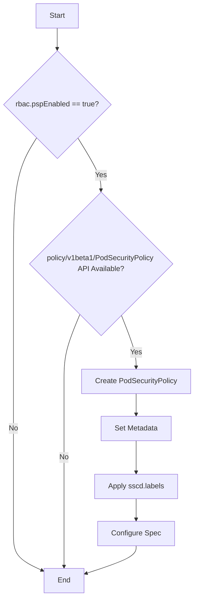
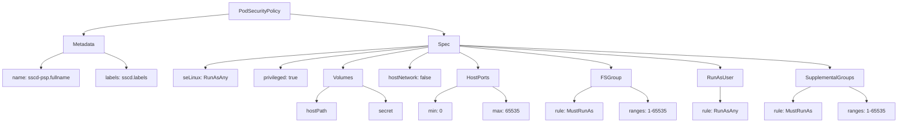
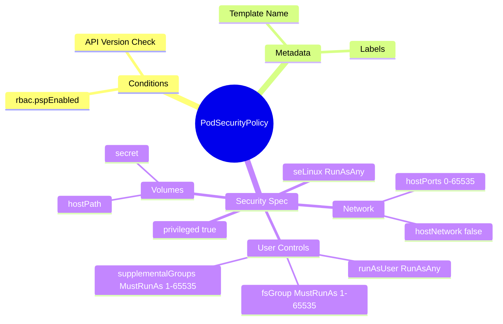

# Diagram: devops/k8s/secrets-store-csi-driver/helm/templates/podsecuritypolicy.yaml

> Auto-generated by Obscura crawlers

## Diagram 1

### SVG

<svg id="container" width="429.35546875" xmlns="http://www.w3.org/2000/svg" class="flowchart" height="1323.171875" viewBox="0.5 0 429.35546875 1323.171875" role="graphics-document document" aria-roledescription="flowchart-v2"><g><marker id="container_flowchart-v2-pointEnd" class="marker flowchart-v2" viewBox="0 0 10 10" refX="5" refY="5" markerUnits="userSpaceOnUse" markerWidth="8" markerHeight="8" orient="auto"><path d="M 0 0 L 10 5 L 0 10 z" class="arrowMarkerPath" style="stroke-width: 1; stroke-dasharray: 1, 0;"></path></marker><marker id="container_flowchart-v2-pointStart" class="marker flowchart-v2" viewBox="0 0 10 10" refX="4.5" refY="5" markerUnits="userSpaceOnUse" markerWidth="8" markerHeight="8" orient="auto"><path d="M 0 5 L 10 10 L 10 0 z" class="arrowMarkerPath" style="stroke-width: 1; stroke-dasharray: 1, 0;"></path></marker><marker id="container_flowchart-v2-circleEnd" class="marker flowchart-v2" viewBox="0 0 10 10" refX="11" refY="5" markerUnits="userSpaceOnUse" markerWidth="11" markerHeight="11" orient="auto"><circle cx="5" cy="5" r="5" class="arrowMarkerPath" style="stroke-width: 1; stroke-dasharray: 1, 0;"></circle></marker><marker id="container_flowchart-v2-circleStart" class="marker flowchart-v2" viewBox="0 0 10 10" refX="-1" refY="5" markerUnits="userSpaceOnUse" markerWidth="11" markerHeight="11" orient="auto"><circle cx="5" cy="5" r="5" class="arrowMarkerPath" style="stroke-width: 1; stroke-dasharray: 1, 0;"></circle></marker><marker id="container_flowchart-v2-crossEnd" class="marker cross flowchart-v2" viewBox="0 0 11 11" refX="12" refY="5.2" markerUnits="userSpaceOnUse" markerWidth="11" markerHeight="11" orient="auto"><path d="M 1,1 l 9,9 M 10,1 l -9,9" class="arrowMarkerPath" style="stroke-width: 2; stroke-dasharray: 1, 0;"></path></marker><marker id="container_flowchart-v2-crossStart" class="marker cross flowchart-v2" viewBox="0 0 11 11" refX="-1" refY="5.2" markerUnits="userSpaceOnUse" markerWidth="11" markerHeight="11" orient="auto"><path d="M 1,1 l 9,9 M 10,1 l -9,9" class="arrowMarkerPath" style="stroke-width: 2; stroke-dasharray: 1, 0;"></path></marker><g class="root"><g class="clusters"></g><g class="edgePaths"><path d="M126.203,62L126.203,66.167C126.203,70.333,126.203,78.667,126.203,86.333C126.203,94,126.203,101,126.203,104.5L126.203,108" id="L_A_B_0" class="edge-thickness-normal edge-pattern-solid edge-thickness-normal edge-pattern-solid flowchart-link" style=";" data-edge="true" data-et="edge" data-id="L_A_B_0" data-points="W3sieCI6MTI2LjIwMzEyNSwieSI6NjJ9LHsieCI6MTI2LjIwMzEyNSwieSI6ODd9LHsieCI6MTI2LjIwMzEyNSwieSI6MTEyfV0=" marker-end="url(#container_flowchart-v2-pointEnd)"></path><path d="M80.256,302.459L71.466,316.284C62.675,330.108,45.093,357.757,36.302,404.812C27.512,451.867,27.512,518.328,27.512,584.789C27.512,651.25,27.512,717.711,27.512,761.608C27.512,805.505,27.512,826.839,27.512,846.172C27.512,865.505,27.512,882.839,27.512,900.172C27.512,917.505,27.512,934.839,27.512,954.172C27.512,973.505,27.512,994.839,27.512,1016.172C27.512,1037.505,27.512,1058.839,27.512,1078.172C27.512,1097.505,27.512,1114.839,27.512,1132.172C27.512,1149.505,27.512,1166.839,27.512,1184.172C27.512,1201.505,27.512,1218.839,38.586,1232.567C49.66,1246.296,71.808,1256.419,82.882,1261.481L93.956,1266.543" id="L_B_Z_0" class="edge-thickness-normal edge-pattern-solid edge-thickness-normal edge-pattern-solid flowchart-link" style=";" data-edge="true" data-et="edge" data-id="L_B_Z_0" data-points="W3sieCI6ODAuMjU2MzU4OTQ3MzM2MDMsInkiOjMwMi40NTk0ODM5NDczMzZ9LHsieCI6MjcuNTExNzE4NzUsInkiOjM4NS40MDYyNX0seyJ4IjoyNy41MTE3MTg3NSwieSI6NTg0Ljc4OTA2MjV9LHsieCI6MjcuNTExNzE4NzUsInkiOjc4NC4xNzE4NzV9LHsieCI6MjcuNTExNzE4NzUsInkiOjg0OC4xNzE4NzV9LHsieCI6MjcuNTExNzE4NzUsInkiOjkwMC4xNzE4NzV9LHsieCI6MjcuNTExNzE4NzUsInkiOjk1Mi4xNzE4NzV9LHsieCI6MjcuNTExNzE4NzUsInkiOjEwMTYuMTcxODc1fSx7IngiOjI3LjUxMTcxODc1LCJ5IjoxMDgwLjE3MTg3NX0seyJ4IjoyNy41MTE3MTg3NSwieSI6MTEzMi4xNzE4NzV9LHsieCI6MjcuNTExNzE4NzUsInkiOjExODQuMTcxODc1fSx7IngiOjI3LjUxMTcxODc1LCJ5IjoxMjM2LjE3MTg3NX0seyJ4Ijo5Ny41OTM3NSwieSI6MTI2OC4yMDYwNzQ3NzMzNzV9XQ==" marker-end="url(#container_flowchart-v2-pointEnd)"></path><path d="M172.15,302.459L180.941,316.284C189.731,330.108,207.313,357.757,216.104,377.082C224.895,396.406,224.895,407.406,224.895,412.906L224.895,418.406" id="L_B_C_0" class="edge-thickness-normal edge-pattern-solid edge-thickness-normal edge-pattern-solid flowchart-link" style=";" data-edge="true" data-et="edge" data-id="L_B_C_0" data-points="W3sieCI6MTcyLjE0OTg5MTA1MjY2Mzk3LCJ5IjozMDIuNDU5NDgzOTQ3MzM2fSx7IngiOjIyNC44OTQ1MzEyNSwieSI6Mzg1LjQwNjI1fSx7IngiOjIyNC44OTQ1MzEyNSwieSI6NDIyLjQwNjI1fV0=" marker-end="url(#container_flowchart-v2-pointEnd)"></path><path d="M176.914,699.192L170.974,713.355C165.034,727.518,153.154,755.845,147.214,780.675C141.273,805.505,141.273,826.839,141.273,846.172C141.273,865.505,141.273,882.839,141.273,900.172C141.273,917.505,141.273,934.839,141.273,954.172C141.273,973.505,141.273,994.839,141.273,1016.172C141.273,1037.505,141.273,1058.839,141.273,1078.172C141.273,1097.505,141.273,1114.839,141.273,1132.172C141.273,1149.505,141.273,1166.839,141.273,1184.172C141.273,1201.505,141.273,1218.839,141.273,1231.005C141.273,1243.172,141.273,1250.172,141.273,1253.672L141.273,1257.172" id="L_C_Z_0" class="edge-thickness-normal edge-pattern-solid edge-thickness-normal edge-pattern-solid flowchart-link" style=";" data-edge="true" data-et="edge" data-id="L_C_Z_0" data-points="W3sieCI6MTc2LjkxNDE3NDQ4NjEwNDAzLCJ5Ijo2OTkuMTkxNTE4MjM2MTA0fSx7IngiOjE0MS4yNzM0Mzc1LCJ5Ijo3ODQuMTcxODc1fSx7IngiOjE0MS4yNzM0Mzc1LCJ5Ijo4NDguMTcxODc1fSx7IngiOjE0MS4yNzM0Mzc1LCJ5Ijo5MDAuMTcxODc1fSx7IngiOjE0MS4yNzM0Mzc1LCJ5Ijo5NTIuMTcxODc1fSx7IngiOjE0MS4yNzM0Mzc1LCJ5IjoxMDE2LjE3MTg3NX0seyJ4IjoxNDEuMjczNDM3NSwieSI6MTA4MC4xNzE4NzV9LHsieCI6MTQxLjI3MzQzNzUsInkiOjExMzIuMTcxODc1fSx7IngiOjE0MS4yNzM0Mzc1LCJ5IjoxMTg0LjE3MTg3NX0seyJ4IjoxNDEuMjczNDM3NSwieSI6MTIzNi4xNzE4NzV9LHsieCI6MTQxLjI3MzQzNzUsInkiOjEyNjEuMTcxODc1fV0=" marker-end="url(#container_flowchart-v2-pointEnd)"></path><path d="M270.27,701.797L275.594,715.526C280.918,729.255,291.567,756.713,296.891,775.943C302.215,795.172,302.215,806.172,302.215,811.672L302.215,817.172" id="L_C_D_0" class="edge-thickness-normal edge-pattern-solid edge-thickness-normal edge-pattern-solid flowchart-link" style=";" data-edge="true" data-et="edge" data-id="L_C_D_0" data-points="W3sieCI6MjcwLjI2OTg0MDI4MjQ4MzUsInkiOjcwMS43OTY1NjU5Njc1MTY1fSx7IngiOjMwMi4yMTQ4NDM3NSwieSI6Nzg0LjE3MTg3NX0seyJ4IjozMDIuMjE0ODQzNzUsInkiOjgyMS4xNzE4NzV9XQ==" marker-end="url(#container_flowchart-v2-pointEnd)"></path><path d="M302.215,875.172L302.215,879.339C302.215,883.505,302.215,891.839,302.215,899.505C302.215,907.172,302.215,914.172,302.215,917.672L302.215,921.172" id="L_D_E_0" class="edge-thickness-normal edge-pattern-solid edge-thickness-normal edge-pattern-solid flowchart-link" style=";" data-edge="true" data-et="edge" data-id="L_D_E_0" data-points="W3sieCI6MzAyLjIxNDg0Mzc1LCJ5Ijo4NzUuMTcxODc1fSx7IngiOjMwMi4yMTQ4NDM3NSwieSI6OTAwLjE3MTg3NX0seyJ4IjozMDIuMjE0ODQzNzUsInkiOjkyNS4xNzE4NzV9XQ==" marker-end="url(#container_flowchart-v2-pointEnd)"></path><path d="M302.215,979.172L302.215,985.339C302.215,991.505,302.215,1003.839,302.215,1015.505C302.215,1027.172,302.215,1038.172,302.215,1043.672L302.215,1049.172" id="L_E_F_0" class="edge-thickness-normal edge-pattern-solid edge-thickness-normal edge-pattern-solid flowchart-link" style=";" data-edge="true" data-et="edge" data-id="L_E_F_0" data-points="W3sieCI6MzAyLjIxNDg0Mzc1LCJ5Ijo5NzkuMTcxODc1fSx7IngiOjMwMi4yMTQ4NDM3NSwieSI6MTAxNi4xNzE4NzV9LHsieCI6MzAyLjIxNDg0Mzc1LCJ5IjoxMDUzLjE3MTg3NX1d" marker-end="url(#container_flowchart-v2-pointEnd)"></path><path d="M302.215,1107.172L302.215,1111.339C302.215,1115.505,302.215,1123.839,302.215,1131.505C302.215,1139.172,302.215,1146.172,302.215,1149.672L302.215,1153.172" id="L_F_G_0" class="edge-thickness-normal edge-pattern-solid edge-thickness-normal edge-pattern-solid flowchart-link" style=";" data-edge="true" data-et="edge" data-id="L_F_G_0" data-points="W3sieCI6MzAyLjIxNDg0Mzc1LCJ5IjoxMTA3LjE3MTg3NX0seyJ4IjozMDIuMjE0ODQzNzUsInkiOjExMzIuMTcxODc1fSx7IngiOjMwMi4yMTQ4NDM3NSwieSI6MTE1Ny4xNzE4NzV9XQ==" marker-end="url(#container_flowchart-v2-pointEnd)"></path><path d="M302.215,1211.172L302.215,1215.339C302.215,1219.505,302.215,1227.839,283.306,1238.115C264.396,1248.391,226.578,1260.61,207.669,1266.72L188.759,1272.829" id="L_G_Z_0" class="edge-thickness-normal edge-pattern-solid edge-thickness-normal edge-pattern-solid flowchart-link" style=";" data-edge="true" data-et="edge" data-id="L_G_Z_0" data-points="W3sieCI6MzAyLjIxNDg0Mzc1LCJ5IjoxMjExLjE3MTg3NX0seyJ4IjozMDIuMjE0ODQzNzUsInkiOjEyMzYuMTcxODc1fSx7IngiOjE4NC45NTMxMjUsInkiOjEyNzQuMDU5MDEzNjYxNjgzfV0=" marker-end="url(#container_flowchart-v2-pointEnd)"></path></g><g class="edgeLabels"><g class="edgeLabel"><g class="label" data-id="L_A_B_0" transform="translate(0, 0)"><foreignObject width="0" height="0">

</foreignObject></g></g><g class="edgeLabel" transform="translate(27.51171875, 952.171875)"><g class="label" data-id="L_B_Z_0" transform="translate(-10.140625, -12)"><foreignObject width="20.28125" height="24">

No

</foreignObject></g></g><g class="edgeLabel" transform="translate(224.89453125, 385.40625)"><g class="label" data-id="L_B_C_0" transform="translate(-12.03125, -12)"><foreignObject width="24.0625" height="24">

Yes

</foreignObject></g></g><g class="edgeLabel" transform="translate(141.2734375, 1016.171875)"><g class="label" data-id="L_C_Z_0" transform="translate(-10.140625, -12)"><foreignObject width="20.28125" height="24">

No

</foreignObject></g></g><g class="edgeLabel" transform="translate(302.21484375, 784.171875)"><g class="label" data-id="L_C_D_0" transform="translate(-12.03125, -12)"><foreignObject width="24.0625" height="24">

Yes

</foreignObject></g></g><g class="edgeLabel"><g class="label" data-id="L_D_E_0" transform="translate(0, 0)"><foreignObject width="0" height="0">

</foreignObject></g></g><g class="edgeLabel"><g class="label" data-id="L_E_F_0" transform="translate(0, 0)"><foreignObject width="0" height="0">

</foreignObject></g></g><g class="edgeLabel"><g class="label" data-id="L_F_G_0" transform="translate(0, 0)"><foreignObject width="0" height="0">

</foreignObject></g></g><g class="edgeLabel"><g class="label" data-id="L_G_Z_0" transform="translate(0, 0)"><foreignObject width="0" height="0">

</foreignObject></g></g></g><g class="nodes"><g class="node default" id="flowchart-A-0" transform="translate(126.203125, 35)"><rect class="basic label-container" style="" x="-47.5234375" y="-27" width="95.046875" height="54"></rect><g class="label" style="" transform="translate(-17.5234375, -12)"><rect></rect><foreignObject width="35.046875" height="24">

Start

</foreignObject></g></g><g class="node default" id="flowchart-B-1" transform="translate(126.203125, 230.203125)"><polygon points="118.203125,0 236.40625,-118.203125 118.203125,-236.40625 0,-118.203125" class="label-container" transform="translate(-117.703125, 118.203125)"></polygon><g class="label" style="" transform="translate(-91.203125, -12)"><rect></rect><foreignObject width="182.40625" height="24">

rbac.pspEnabled == true?

</foreignObject></g></g><g class="node default" id="flowchart-Z-3" transform="translate(141.2734375, 1288.171875)"><rect class="basic label-container" style="" x="-43.6796875" y="-27" width="87.359375" height="54"></rect><g class="label" style="" transform="translate(-13.6796875, -12)"><rect></rect><foreignObject width="27.359375" height="24">

End

</foreignObject></g></g><g class="node default" id="flowchart-C-5" transform="translate(224.89453125, 584.7890625)"><polygon points="162.3828125,0 324.765625,-162.3828125 162.3828125,-324.765625 0,-162.3828125" class="label-container" transform="translate(-161.8828125, 162.3828125)"></polygon><g class="label" style="" transform="translate(-123.3828125, -24)"><rect></rect><foreignObject width="246.765625" height="48">

policy/v1beta1/PodSecurityPolicy API Available?

</foreignObject></g></g><g class="node default" id="flowchart-D-9" transform="translate(302.21484375, 848.171875)"><rect class="basic label-container" style="" x="-119.640625" y="-27" width="239.28125" height="54"></rect><g class="label" style="" transform="translate(-89.640625, -12)"><rect></rect><foreignObject width="179.28125" height="24">

Create PodSecurityPolicy

</foreignObject></g></g><g class="node default" id="flowchart-E-11" transform="translate(302.21484375, 952.171875)"><rect class="basic label-container" style="" x="-77.8203125" y="-27" width="155.640625" height="54"></rect><g class="label" style="" transform="translate(-47.8203125, -12)"><rect></rect><foreignObject width="95.640625" height="24">

Set Metadata

</foreignObject></g></g><g class="node default" id="flowchart-F-13" transform="translate(302.21484375, 1080.171875)"><rect class="basic label-container" style="" x="-92.0234375" y="-27" width="184.046875" height="54"></rect><g class="label" style="" transform="translate(-62.0234375, -12)"><rect></rect><foreignObject width="124.046875" height="24">

Apply sscd.labels

</foreignObject></g></g><g class="node default" id="flowchart-G-15" transform="translate(302.21484375, 1184.171875)"><rect class="basic label-container" style="" x="-83.640625" y="-27" width="167.28125" height="54"></rect><g class="label" style="" transform="translate(-53.640625, -12)"><rect></rect><foreignObject width="107.28125" height="24">

Configure Spec

</foreignObject></g></g></g></g></g></svg>

## Diagram 2

### SVG

<svg id="container" width="2763.453125" xmlns="http://www.w3.org/2000/svg" class="flowchart" height="382" viewBox="0 0 2763.453125 382" role="graphics-document document" aria-roledescription="flowchart-v2"><g><marker id="container_flowchart-v2-pointEnd" class="marker flowchart-v2" viewBox="0 0 10 10" refX="5" refY="5" markerUnits="userSpaceOnUse" markerWidth="8" markerHeight="8" orient="auto"><path d="M 0 0 L 10 5 L 0 10 z" class="arrowMarkerPath" style="stroke-width: 1; stroke-dasharray: 1, 0;"></path></marker><marker id="container_flowchart-v2-pointStart" class="marker flowchart-v2" viewBox="0 0 10 10" refX="4.5" refY="5" markerUnits="userSpaceOnUse" markerWidth="8" markerHeight="8" orient="auto"><path d="M 0 5 L 10 10 L 10 0 z" class="arrowMarkerPath" style="stroke-width: 1; stroke-dasharray: 1, 0;"></path></marker><marker id="container_flowchart-v2-circleEnd" class="marker flowchart-v2" viewBox="0 0 10 10" refX="11" refY="5" markerUnits="userSpaceOnUse" markerWidth="11" markerHeight="11" orient="auto"><circle cx="5" cy="5" r="5" class="arrowMarkerPath" style="stroke-width: 1; stroke-dasharray: 1, 0;"></circle></marker><marker id="container_flowchart-v2-circleStart" class="marker flowchart-v2" viewBox="0 0 10 10" refX="-1" refY="5" markerUnits="userSpaceOnUse" markerWidth="11" markerHeight="11" orient="auto"><circle cx="5" cy="5" r="5" class="arrowMarkerPath" style="stroke-width: 1; stroke-dasharray: 1, 0;"></circle></marker><marker id="container_flowchart-v2-crossEnd" class="marker cross flowchart-v2" viewBox="0 0 11 11" refX="12" refY="5.2" markerUnits="userSpaceOnUse" markerWidth="11" markerHeight="11" orient="auto"><path d="M 1,1 l 9,9 M 10,1 l -9,9" class="arrowMarkerPath" style="stroke-width: 2; stroke-dasharray: 1, 0;"></path></marker><marker id="container_flowchart-v2-crossStart" class="marker cross flowchart-v2" viewBox="0 0 11 11" refX="-1" refY="5.2" markerUnits="userSpaceOnUse" markerWidth="11" markerHeight="11" orient="auto"><path d="M 1,1 l 9,9 M 10,1 l -9,9" class="arrowMarkerPath" style="stroke-width: 2; stroke-dasharray: 1, 0;"></path></marker><g class="root"><g class="clusters"></g><g class="edgePaths"><path d="M713.531,43.998L638.22,51.165C562.909,58.332,412.286,72.666,336.975,83.333C261.664,94,261.664,101,261.664,104.5L261.664,108" id="L_PSP_Metadata_0" class="edge-thickness-normal edge-pattern-solid edge-thickness-normal edge-pattern-solid flowchart-link" style=";" data-edge="true" data-et="edge" data-id="L_PSP_Metadata_0" data-points="W3sieCI6NzEzLjUzMTI1LCJ5Ijo0My45OTgyNTU2OTc1Nzc5OTZ9LHsieCI6MjYxLjY2NDA2MjUsInkiOjg3fSx7IngiOjI2MS42NjQwNjI1LCJ5IjoxMTJ9XQ==" marker-end="url(#container_flowchart-v2-pointEnd)"></path><path d="M902.641,43.582L982.368,50.818C1062.096,58.055,1221.552,72.527,1301.28,83.264C1381.008,94,1381.008,101,1381.008,104.5L1381.008,108" id="L_PSP_Spec_0" class="edge-thickness-normal edge-pattern-solid edge-thickness-normal edge-pattern-solid flowchart-link" style=";" data-edge="true" data-et="edge" data-id="L_PSP_Spec_0" data-points="W3sieCI6OTAyLjY0MDYyNSwieSI6NDMuNTgyMDQ5MjU0MDk3Njl9LHsieCI6MTM4MS4wMDc4MTI1LCJ5Ijo4N30seyJ4IjoxMzgxLjAwNzgxMjUsInkiOjExMn1d" marker-end="url(#container_flowchart-v2-pointEnd)"></path><path d="M197.57,164.049L186.077,168.541C174.583,173.033,151.596,182.016,140.103,190.008C128.609,198,128.609,205,128.609,208.5L128.609,212" id="L_Metadata_Name_0" class="edge-thickness-normal edge-pattern-solid edge-thickness-normal edge-pattern-solid flowchart-link" style=";" data-edge="true" data-et="edge" data-id="L_Metadata_Name_0" data-points="W3sieCI6MTk3LjU3MDMxMjUsInkiOjE2NC4wNDg5MTA4MDk2OTk5NX0seyJ4IjoxMjguNjA5Mzc1LCJ5IjoxOTF9LHsieCI6MTI4LjYwOTM3NSwieSI6MjE2fV0=" marker-end="url(#container_flowchart-v2-pointEnd)"></path><path d="M325.758,164.049L337.251,168.541C348.745,173.033,371.732,182.016,383.225,190.008C394.719,198,394.719,205,394.719,208.5L394.719,212" id="L_Metadata_Labels_0" class="edge-thickness-normal edge-pattern-solid edge-thickness-normal edge-pattern-solid flowchart-link" style=";" data-edge="true" data-et="edge" data-id="L_Metadata_Labels_0" data-points="W3sieCI6MzI1Ljc1NzgxMjUsInkiOjE2NC4wNDg5MTA4MDk2OTk5NX0seyJ4IjozOTQuNzE4NzUsInkiOjE5MX0seyJ4IjozOTQuNzE4NzUsInkiOjIxNn1d" marker-end="url(#container_flowchart-v2-pointEnd)"></path><path d="M1333.711,142.308L1217.677,150.423C1101.643,158.539,869.576,174.769,753.542,186.385C637.508,198,637.508,205,637.508,208.5L637.508,212" id="L_Spec_SELinux_0" class="edge-thickness-normal edge-pattern-solid edge-thickness-normal edge-pattern-solid flowchart-link" style=";" data-edge="true" data-et="edge" data-id="L_Spec_SELinux_0" data-points="W3sieCI6MTMzMy43MTA5Mzc1LCJ5IjoxNDIuMzA3OTE4NjI4MTEwM30seyJ4Ijo2MzcuNTA3ODEyNSwieSI6MTkxfSx7IngiOjYzNy41MDc4MTI1LCJ5IjoyMTZ9XQ==" marker-end="url(#container_flowchart-v2-pointEnd)"></path><path d="M1333.711,143.813L1256.419,151.677C1179.128,159.542,1024.544,175.271,947.253,186.635C869.961,198,869.961,205,869.961,208.5L869.961,212" id="L_Spec_Privileged_0" class="edge-thickness-normal edge-pattern-solid edge-thickness-normal edge-pattern-solid flowchart-link" style=";" data-edge="true" data-et="edge" data-id="L_Spec_Privileged_0" data-points="W3sieCI6MTMzMy43MTA5Mzc1LCJ5IjoxNDMuODEyNTQ3NzcyNjQ4MDZ9LHsieCI6ODY5Ljk2MDkzNzUsInkiOjE5MX0seyJ4Ijo4NjkuOTYwOTM3NSwieSI6MjE2fV0=" marker-end="url(#container_flowchart-v2-pointEnd)"></path><path d="M1333.711,146.808L1289.092,154.173C1244.474,161.538,1155.237,176.269,1110.618,187.135C1066,198,1066,205,1066,208.5L1066,212" id="L_Spec_Volumes_0" class="edge-thickness-normal edge-pattern-solid edge-thickness-normal edge-pattern-solid flowchart-link" style=";" data-edge="true" data-et="edge" data-id="L_Spec_Volumes_0" data-points="W3sieCI6MTMzMy43MTA5Mzc1LCJ5IjoxNDYuODA3NTQ0NDU1NzQyNjZ9LHsieCI6MTA2NiwieSI6MTkxfSx7IngiOjEwNjYsInkiOjIxNn1d" marker-end="url(#container_flowchart-v2-pointEnd)"></path><path d="M1333.711,162.081L1323.835,166.901C1313.958,171.721,1294.206,181.36,1284.329,189.68C1274.453,198,1274.453,205,1274.453,208.5L1274.453,212" id="L_Spec_HostNetwork_0" class="edge-thickness-normal edge-pattern-solid edge-thickness-normal edge-pattern-solid flowchart-link" style=";" data-edge="true" data-et="edge" data-id="L_Spec_HostNetwork_0" data-points="W3sieCI6MTMzMy43MTA5Mzc1LCJ5IjoxNjIuMDgxNDU3NTg0ODY2OTR9LHsieCI6MTI3NC40NTMxMjUsInkiOjE5MX0seyJ4IjoxMjc0LjQ1MzEyNSwieSI6MjE2fV0=" marker-end="url(#container_flowchart-v2-pointEnd)"></path><path d="M1428.305,162.081L1438.181,166.901C1448.057,171.721,1467.81,181.36,1477.686,189.68C1487.563,198,1487.563,205,1487.563,208.5L1487.563,212" id="L_Spec_HostPorts_0" class="edge-thickness-normal edge-pattern-solid edge-thickness-normal edge-pattern-solid flowchart-link" style=";" data-edge="true" data-et="edge" data-id="L_Spec_HostPorts_0" data-points="W3sieCI6MTQyOC4zMDQ2ODc1LCJ5IjoxNjIuMDgxNDU3NTg0ODY2OTR9LHsieCI6MTQ4Ny41NjI1LCJ5IjoxOTF9LHsieCI6MTQ4Ny41NjI1LCJ5IjoyMTZ9XQ==" marker-end="url(#container_flowchart-v2-pointEnd)"></path><path d="M1428.305,143.806L1505.719,151.671C1583.133,159.537,1737.961,175.269,1815.375,186.634C1892.789,198,1892.789,205,1892.789,208.5L1892.789,212" id="L_Spec_FSGroup_0" class="edge-thickness-normal edge-pattern-solid edge-thickness-normal edge-pattern-solid flowchart-link" style=";" data-edge="true" data-et="edge" data-id="L_Spec_FSGroup_0" data-points="W3sieCI6MTQyOC4zMDQ2ODc1LCJ5IjoxNDMuODA1NjQyMDU4OTg1MTd9LHsieCI6MTg5Mi43ODkwNjI1LCJ5IjoxOTF9LHsieCI6MTg5Mi43ODkwNjI1LCJ5IjoyMTZ9XQ==" marker-end="url(#container_flowchart-v2-pointEnd)"></path><path d="M1428.305,141.92L1560.822,150.1C1693.339,158.28,1958.372,174.64,2090.889,186.32C2223.406,198,2223.406,205,2223.406,208.5L2223.406,212" id="L_Spec_RunAsUser_0" class="edge-thickness-normal edge-pattern-solid edge-thickness-normal edge-pattern-solid flowchart-link" style=";" data-edge="true" data-et="edge" data-id="L_Spec_RunAsUser_0" data-points="W3sieCI6MTQyOC4zMDQ2ODc1LCJ5IjoxNDEuOTE5NTY1NjAwNDUyNn0seyJ4IjoyMjIzLjQwNjI1LCJ5IjoxOTF9LHsieCI6MjIyMy40MDYyNSwieSI6MjE2fV0=" marker-end="url(#container_flowchart-v2-pointEnd)"></path><path d="M1428.305,141.088L1616.745,149.407C1805.185,157.725,2182.065,174.363,2370.505,186.181C2558.945,198,2558.945,205,2558.945,208.5L2558.945,212" id="L_Spec_SupplementalGroups_0" class="edge-thickness-normal edge-pattern-solid edge-thickness-normal edge-pattern-solid flowchart-link" style=";" data-edge="true" data-et="edge" data-id="L_Spec_SupplementalGroups_0" data-points="W3sieCI6MTQyOC4zMDQ2ODc1LCJ5IjoxNDEuMDg3OTE4NTAxNjE4M30seyJ4IjoyNTU4Ljk0NTMxMjUsInkiOjE5MX0seyJ4IjoyNTU4Ljk0NTMxMjUsInkiOjIxNn1d" marker-end="url(#container_flowchart-v2-pointEnd)"></path><path d="M1023.385,270L1016.808,274.167C1010.232,278.333,997.079,286.667,990.502,294.333C983.926,302,983.926,309,983.926,312.5L983.926,316" id="L_Volumes_V1_0" class="edge-thickness-normal edge-pattern-solid edge-thickness-normal edge-pattern-solid flowchart-link" style=";" data-edge="true" data-et="edge" data-id="L_Volumes_V1_0" data-points="W3sieCI6MTAyMy4zODQ1NDAyNjQ0MjMxLCJ5IjoyNzB9LHsieCI6OTgzLjkyNTc4MTI1LCJ5IjoyOTV9LHsieCI6OTgzLjkyNTc4MTI1LCJ5IjozMjB9XQ==" marker-end="url(#container_flowchart-v2-pointEnd)"></path><path d="M1126.875,266.691L1138.999,271.409C1151.122,276.127,1175.37,285.564,1187.493,293.782C1199.617,302,1199.617,309,1199.617,312.5L1199.617,316" id="L_Volumes_V2_0" class="edge-thickness-normal edge-pattern-solid edge-thickness-normal edge-pattern-solid flowchart-link" style=";" data-edge="true" data-et="edge" data-id="L_Volumes_V2_0" data-points="W3sieCI6MTEyNi44NzUsInkiOjI2Ni42OTA4MTQ0NzY5OTIzM30seyJ4IjoxMTk5LjYxNzE4NzUsInkiOjI5NX0seyJ4IjoxMTk5LjYxNzE4NzUsInkiOjMyMH1d" marker-end="url(#container_flowchart-v2-pointEnd)"></path><path d="M1422.031,268.503L1410.684,272.919C1399.336,277.335,1376.641,286.168,1365.293,294.084C1353.945,302,1353.945,309,1353.945,312.5L1353.945,316" id="L_HostPorts_HP1_0" class="edge-thickness-normal edge-pattern-solid edge-thickness-normal edge-pattern-solid flowchart-link" style=";" data-edge="true" data-et="edge" data-id="L_HostPorts_HP1_0" data-points="W3sieCI6MTQyMi4wMzEyNSwieSI6MjY4LjUwMjg5NDIyOTA4MjY0fSx7IngiOjEzNTMuOTQ1MzEyNSwieSI6Mjk1fSx7IngiOjEzNTMuOTQ1MzEyNSwieSI6MzIwfV0=" marker-end="url(#container_flowchart-v2-pointEnd)"></path><path d="M1532.115,270L1538.99,274.167C1545.866,278.333,1559.616,286.667,1566.492,294.333C1573.367,302,1573.367,309,1573.367,312.5L1573.367,316" id="L_HostPorts_HP2_0" class="edge-thickness-normal edge-pattern-solid edge-thickness-normal edge-pattern-solid flowchart-link" style=";" data-edge="true" data-et="edge" data-id="L_HostPorts_HP2_0" data-points="W3sieCI6MTUzMi4xMTQ5MzM4OTQyMzA3LCJ5IjoyNzB9LHsieCI6MTU3My4zNjcxODc1LCJ5IjoyOTV9LHsieCI6MTU3My4zNjcxODc1LCJ5IjozMjB9XQ==" marker-end="url(#container_flowchart-v2-pointEnd)"></path><path d="M1834.814,270L1825.867,274.167C1816.92,278.333,1799.026,286.667,1790.08,294.333C1781.133,302,1781.133,309,1781.133,312.5L1781.133,316" id="L_FSGroup_FG1_0" class="edge-thickness-normal edge-pattern-solid edge-thickness-normal edge-pattern-solid flowchart-link" style=";" data-edge="true" data-et="edge" data-id="L_FSGroup_FG1_0" data-points="W3sieCI6MTgzNC44MTM3MDE5MjMwNzcsInkiOjI3MH0seyJ4IjoxNzgxLjEzMjgxMjUsInkiOjI5NX0seyJ4IjoxNzgxLjEzMjgxMjUsInkiOjMyMH1d" marker-end="url(#container_flowchart-v2-pointEnd)"></path><path d="M1950.764,270L1959.711,274.167C1968.658,278.333,1986.552,286.667,1995.498,294.333C2004.445,302,2004.445,309,2004.445,312.5L2004.445,316" id="L_FSGroup_FG2_0" class="edge-thickness-normal edge-pattern-solid edge-thickness-normal edge-pattern-solid flowchart-link" style=";" data-edge="true" data-et="edge" data-id="L_FSGroup_FG2_0" data-points="W3sieCI6MTk1MC43NjQ0MjMwNzY5MjMsInkiOjI3MH0seyJ4IjoyMDA0LjQ0NTMxMjUsInkiOjI5NX0seyJ4IjoyMDA0LjQ0NTMxMjUsInkiOjMyMH1d" marker-end="url(#container_flowchart-v2-pointEnd)"></path><path d="M2223.406,270L2223.406,274.167C2223.406,278.333,2223.406,286.667,2223.406,294.333C2223.406,302,2223.406,309,2223.406,312.5L2223.406,316" id="L_RunAsUser_RU1_0" class="edge-thickness-normal edge-pattern-solid edge-thickness-normal edge-pattern-solid flowchart-link" style=";" data-edge="true" data-et="edge" data-id="L_RunAsUser_RU1_0" data-points="W3sieCI6MjIyMy40MDYyNSwieSI6MjcwfSx7IngiOjIyMjMuNDA2MjUsInkiOjI5NX0seyJ4IjoyMjIzLjQwNjI1LCJ5IjozMjB9XQ==" marker-end="url(#container_flowchart-v2-pointEnd)"></path><path d="M2500.97,270L2492.023,274.167C2483.076,278.333,2465.183,286.667,2456.236,294.333C2447.289,302,2447.289,309,2447.289,312.5L2447.289,316" id="L_SupplementalGroups_SG1_0" class="edge-thickness-normal edge-pattern-solid edge-thickness-normal edge-pattern-solid flowchart-link" style=";" data-edge="true" data-et="edge" data-id="L_SupplementalGroups_SG1_0" data-points="W3sieCI6MjUwMC45Njk5NTE5MjMwNzcsInkiOjI3MH0seyJ4IjoyNDQ3LjI4OTA2MjUsInkiOjI5NX0seyJ4IjoyNDQ3LjI4OTA2MjUsInkiOjMyMH1d" marker-end="url(#container_flowchart-v2-pointEnd)"></path><path d="M2616.921,270L2625.867,274.167C2634.814,278.333,2652.708,286.667,2661.655,294.333C2670.602,302,2670.602,309,2670.602,312.5L2670.602,316" id="L_SupplementalGroups_SG2_0" class="edge-thickness-normal edge-pattern-solid edge-thickness-normal edge-pattern-solid flowchart-link" style=";" data-edge="true" data-et="edge" data-id="L_SupplementalGroups_SG2_0" data-points="W3sieCI6MjYxNi45MjA2NzMwNzY5MjMsInkiOjI3MH0seyJ4IjoyNjcwLjYwMTU2MjUsInkiOjI5NX0seyJ4IjoyNjcwLjYwMTU2MjUsInkiOjMyMH1d" marker-end="url(#container_flowchart-v2-pointEnd)"></path></g><g class="edgeLabels"><g class="edgeLabel"><g class="label" data-id="L_PSP_Metadata_0" transform="translate(0, 0)"><foreignObject width="0" height="0">

</foreignObject></g></g><g class="edgeLabel"><g class="label" data-id="L_PSP_Spec_0" transform="translate(0, 0)"><foreignObject width="0" height="0">

</foreignObject></g></g><g class="edgeLabel"><g class="label" data-id="L_Metadata_Name_0" transform="translate(0, 0)"><foreignObject width="0" height="0">

</foreignObject></g></g><g class="edgeLabel"><g class="label" data-id="L_Metadata_Labels_0" transform="translate(0, 0)"><foreignObject width="0" height="0">

</foreignObject></g></g><g class="edgeLabel"><g class="label" data-id="L_Spec_SELinux_0" transform="translate(0, 0)"><foreignObject width="0" height="0">

</foreignObject></g></g><g class="edgeLabel"><g class="label" data-id="L_Spec_Privileged_0" transform="translate(0, 0)"><foreignObject width="0" height="0">

</foreignObject></g></g><g class="edgeLabel"><g class="label" data-id="L_Spec_Volumes_0" transform="translate(0, 0)"><foreignObject width="0" height="0">

</foreignObject></g></g><g class="edgeLabel"><g class="label" data-id="L_Spec_HostNetwork_0" transform="translate(0, 0)"><foreignObject width="0" height="0">

</foreignObject></g></g><g class="edgeLabel"><g class="label" data-id="L_Spec_HostPorts_0" transform="translate(0, 0)"><foreignObject width="0" height="0">

</foreignObject></g></g><g class="edgeLabel"><g class="label" data-id="L_Spec_FSGroup_0" transform="translate(0, 0)"><foreignObject width="0" height="0">

</foreignObject></g></g><g class="edgeLabel"><g class="label" data-id="L_Spec_RunAsUser_0" transform="translate(0, 0)"><foreignObject width="0" height="0">

</foreignObject></g></g><g class="edgeLabel"><g class="label" data-id="L_Spec_SupplementalGroups_0" transform="translate(0, 0)"><foreignObject width="0" height="0">

</foreignObject></g></g><g class="edgeLabel"><g class="label" data-id="L_Volumes_V1_0" transform="translate(0, 0)"><foreignObject width="0" height="0">

</foreignObject></g></g><g class="edgeLabel"><g class="label" data-id="L_Volumes_V2_0" transform="translate(0, 0)"><foreignObject width="0" height="0">

</foreignObject></g></g><g class="edgeLabel"><g class="label" data-id="L_HostPorts_HP1_0" transform="translate(0, 0)"><foreignObject width="0" height="0">

</foreignObject></g></g><g class="edgeLabel"><g class="label" data-id="L_HostPorts_HP2_0" transform="translate(0, 0)"><foreignObject width="0" height="0">

</foreignObject></g></g><g class="edgeLabel"><g class="label" data-id="L_FSGroup_FG1_0" transform="translate(0, 0)"><foreignObject width="0" height="0">

</foreignObject></g></g><g class="edgeLabel"><g class="label" data-id="L_FSGroup_FG2_0" transform="translate(0, 0)"><foreignObject width="0" height="0">

</foreignObject></g></g><g class="edgeLabel"><g class="label" data-id="L_RunAsUser_RU1_0" transform="translate(0, 0)"><foreignObject width="0" height="0">

</foreignObject></g></g><g class="edgeLabel"><g class="label" data-id="L_SupplementalGroups_SG1_0" transform="translate(0, 0)"><foreignObject width="0" height="0">

</foreignObject></g></g><g class="edgeLabel"><g class="label" data-id="L_SupplementalGroups_SG2_0" transform="translate(0, 0)"><foreignObject width="0" height="0">

</foreignObject></g></g></g><g class="nodes"><g class="node default" id="flowchart-PSP-0" transform="translate(808.0859375, 35)"><rect class="basic label-container" style="" x="-94.5546875" y="-27" width="189.109375" height="54"></rect><g class="label" style="" transform="translate(-64.5546875, -12)"><rect></rect><foreignObject width="129.109375" height="24">

PodSecurityPolicy

</foreignObject></g></g><g class="node default" id="flowchart-Metadata-2" transform="translate(261.6640625, 139)"><rect class="basic label-container" style="" x="-64.09375" y="-27" width="128.1875" height="54"></rect><g class="label" style="" transform="translate(-34.09375, -12)"><rect></rect><foreignObject width="68.1875" height="24">

Metadata

</foreignObject></g></g><g class="node default" id="flowchart-Spec-4" transform="translate(1381.0078125, 139)"><rect class="basic label-container" style="" x="-47.296875" y="-27" width="94.59375" height="54"></rect><g class="label" style="" transform="translate(-17.296875, -12)"><rect></rect><foreignObject width="34.59375" height="24">

Spec

</foreignObject></g></g><g class="node default" id="flowchart-Name-6" transform="translate(128.609375, 243)"><rect class="basic label-container" style="" x="-120.609375" y="-27" width="241.21875" height="54"></rect><g class="label" style="" transform="translate(-90.609375, -12)"><rect></rect><foreignObject width="181.21875" height="24">

name: sscd-psp.fullname

</foreignObject></g></g><g class="node default" id="flowchart-Labels-8" transform="translate(394.71875, 243)"><rect class="basic label-container" style="" x="-95.5" y="-27" width="191" height="54"></rect><g class="label" style="" transform="translate(-65.5, -12)"><rect></rect><foreignObject width="131" height="24">

labels: sscd.labels

</foreignObject></g></g><g class="node default" id="flowchart-SELinux-10" transform="translate(637.5078125, 243)"><rect class="basic label-container" style="" x="-97.2890625" y="-27" width="194.578125" height="54"></rect><g class="label" style="" transform="translate(-67.2890625, -12)"><rect></rect><foreignObject width="134.578125" height="24">

seLinux: RunAsAny

</foreignObject></g></g><g class="node default" id="flowchart-Privileged-12" transform="translate(869.9609375, 243)"><rect class="basic label-container" style="" x="-85.1640625" y="-27" width="170.328125" height="54"></rect><g class="label" style="" transform="translate(-55.1640625, -12)"><rect></rect><foreignObject width="110.328125" height="24">

privileged: true

</foreignObject></g></g><g class="node default" id="flowchart-Volumes-14" transform="translate(1066, 243)"><rect class="basic label-container" style="" x="-60.875" y="-27" width="121.75" height="54"></rect><g class="label" style="" transform="translate(-30.875, -12)"><rect></rect><foreignObject width="61.75" height="24">

Volumes

</foreignObject></g></g><g class="node default" id="flowchart-HostNetwork-16" transform="translate(1274.453125, 243)"><rect class="basic label-container" style="" x="-97.578125" y="-27" width="195.15625" height="54"></rect><g class="label" style="" transform="translate(-67.578125, -12)"><rect></rect><foreignObject width="135.15625" height="24">

hostNetwork: false

</foreignObject></g></g><g class="node default" id="flowchart-HostPorts-18" transform="translate(1487.5625, 243)"><rect class="basic label-container" style="" x="-65.53125" y="-27" width="131.0625" height="54"></rect><g class="label" style="" transform="translate(-35.53125, -12)"><rect></rect><foreignObject width="71.0625" height="24">

HostPorts

</foreignObject></g></g><g class="node default" id="flowchart-FSGroup-20" transform="translate(1892.7890625, 243)"><rect class="basic label-container" style="" x="-60.109375" y="-27" width="120.21875" height="54"></rect><g class="label" style="" transform="translate(-30.109375, -12)"><rect></rect><foreignObject width="60.21875" height="24">

FSGroup

</foreignObject></g></g><g class="node default" id="flowchart-RunAsUser-22" transform="translate(2223.40625, 243)"><rect class="basic label-container" style="" x="-68.9453125" y="-27" width="137.890625" height="54"></rect><g class="label" style="" transform="translate(-38.9453125, -12)"><rect></rect><foreignObject width="77.890625" height="24">

RunAsUser

</foreignObject></g></g><g class="node default" id="flowchart-SupplementalGroups-24" transform="translate(2558.9453125, 243)"><rect class="basic label-container" style="" x="-106.25" y="-27" width="212.5" height="54"></rect><g class="label" style="" transform="translate(-76.25, -12)"><rect></rect><foreignObject width="152.5" height="24">

SupplementalGroups

</foreignObject></g></g><g class="node default" id="flowchart-V1-26" transform="translate(983.92578125, 347)"><rect class="basic label-container" style="" x="-62.125" y="-27" width="124.25" height="54"></rect><g class="label" style="" transform="translate(-32.125, -12)"><rect></rect><foreignObject width="64.25" height="24">

hostPath

</foreignObject></g></g><g class="node default" id="flowchart-V2-28" transform="translate(1199.6171875, 347)"><rect class="basic label-container" style="" x="-52.0234375" y="-27" width="104.046875" height="54"></rect><g class="label" style="" transform="translate(-22.0234375, -12)"><rect></rect><foreignObject width="44.046875" height="24">

secret

</foreignObject></g></g><g class="node default" id="flowchart-HP1-30" transform="translate(1353.9453125, 347)"><rect class="basic label-container" style="" x="-52.3046875" y="-27" width="104.609375" height="54"></rect><g class="label" style="" transform="translate(-22.3046875, -12)"><rect></rect><foreignObject width="44.609375" height="24">

min: 0

</foreignObject></g></g><g class="node default" id="flowchart-HP2-32" transform="translate(1573.3671875, 347)"><rect class="basic label-container" style="" x="-69.3046875" y="-27" width="138.609375" height="54"></rect><g class="label" style="" transform="translate(-39.3046875, -12)"><rect></rect><foreignObject width="78.609375" height="24">

max: 65535

</foreignObject></g></g><g class="node default" id="flowchart-FG1-34" transform="translate(1781.1328125, 347)"><rect class="basic label-container" style="" x="-88.4609375" y="-27" width="176.921875" height="54"></rect><g class="label" style="" transform="translate(-58.4609375, -12)"><rect></rect><foreignObject width="116.921875" height="24">

rule: MustRunAs

</foreignObject></g></g><g class="node default" id="flowchart-FG2-36" transform="translate(2004.4453125, 347)"><rect class="basic label-container" style="" x="-84.8515625" y="-27" width="169.703125" height="54"></rect><g class="label" style="" transform="translate(-54.8515625, -12)"><rect></rect><foreignObject width="109.703125" height="24">

ranges: 1-65535

</foreignObject></g></g><g class="node default" id="flowchart-RU1-38" transform="translate(2223.40625, 347)"><rect class="basic label-container" style="" x="-84.109375" y="-27" width="168.21875" height="54"></rect><g class="label" style="" transform="translate(-54.109375, -12)"><rect></rect><foreignObject width="108.21875" height="24">

rule: RunAsAny

</foreignObject></g></g><g class="node default" id="flowchart-SG1-40" transform="translate(2447.2890625, 347)"><rect class="basic label-container" style="" x="-88.4609375" y="-27" width="176.921875" height="54"></rect><g class="label" style="" transform="translate(-58.4609375, -12)"><rect></rect><foreignObject width="116.921875" height="24">

rule: MustRunAs

</foreignObject></g></g><g class="node default" id="flowchart-SG2-42" transform="translate(2670.6015625, 347)"><rect class="basic label-container" style="" x="-84.8515625" y="-27" width="169.703125" height="54"></rect><g class="label" style="" transform="translate(-54.8515625, -12)"><rect></rect><foreignObject width="109.703125" height="24">

ranges: 1-65535

</foreignObject></g></g></g></g></g></svg>

## Diagram 3

### SVG

<svg id="container" width="100%" xmlns="http://www.w3.org/2000/svg" class="mindmapDiagram" style="max-width: 901.0073852539062px;" viewBox="5 5 901.0073852539062 568.0758666992188" role="graphics-document document" aria-roledescription="mindmap"><g><marker id="container_mindmap-pointEnd" class="marker mindmap" viewBox="0 0 10 10" refX="5" refY="5" markerUnits="userSpaceOnUse" markerWidth="8" markerHeight="8" orient="auto"><path d="M 0 0 L 10 5 L 0 10 z" class="arrowMarkerPath" style="stroke-width: 1; stroke-dasharray: 1, 0;"></path></marker><marker id="container_mindmap-pointStart" class="marker mindmap" viewBox="0 0 10 10" refX="4.5" refY="5" markerUnits="userSpaceOnUse" markerWidth="8" markerHeight="8" orient="auto"><path d="M 0 5 L 10 10 L 10 0 z" class="arrowMarkerPath" style="stroke-width: 1; stroke-dasharray: 1, 0;"></path></marker><g class="subgraphs"></g><g class="edgePaths"><path d="M528.927,222.784L519.3,215.355C509.673,207.925,490.419,193.065,471.165,178.205C451.91,163.345,432.656,148.485,423.029,141.055L413.402,133.625" id="edge_0_1" class="edge-thickness-normal edge-pattern-solid edge section-edge-0 edge-depth-1" style="undefined;;;undefined" data-edge="true" data-et="edge" data-id="edge_0_1" data-points="W3sieCI6NTI4LjkyNzE1OTkyODI2MjIsInkiOjIyMi43ODQ0ODM4NDIzMjk1Nn0seyJ4Ijo0NzEuMTY0NTMwNTc3OTg1MTUsInkiOjE3OC4yMDQ4NjQ0MTQyOTMzfSx7IngiOjQxMy40MDE5MDEyMjc3MDgxLCJ5IjoxMzMuNjI1MjQ0OTg2MjU3MDN9XQ=="></path><path d="M386.57,125.597L372.942,126.633C359.314,127.669,332.058,129.741,304.802,131.812C277.546,133.884,250.29,135.955,236.662,136.991L223.034,138.027" id="edge_1_2" class="edge-thickness-normal edge-pattern-solid edge section-edge-0 edge-depth-3" style="undefined;;;undefined" data-edge="true" data-et="edge" data-id="edge_1_2" data-points="W3sieCI6Mzg2LjU3MDI4MTkzMjMzOTMsInkiOjEyNS41OTc0MTY5ODY2ODcyfSx7IngiOjMwNC44MDIwMTcxNTQwMTYxLCJ5IjoxMzEuODEyMTU0MTAyMTQ5NH0seyJ4IjoyMjMuMDMzNzUyMzc1NjkyOSwieSI6MTM4LjAyNjg5MTIxNzYxMTYyfV0="></path><path d="M400.087,109.53L399.624,104.73C399.162,99.929,398.236,90.329,397.31,80.728C396.384,71.127,395.458,61.527,394.995,56.726L394.532,51.926" id="edge_1_3" class="edge-thickness-normal edge-pattern-solid edge section-edge-0 edge-depth-3" style="undefined;;;undefined" data-edge="true" data-et="edge" data-id="edge_1_3" data-points="W3sieCI6NDAwLjA4NzMyNTY0NDA3MzY0LCJ5IjoxMDkuNTI5ODk0MTAzMDAzMTJ9LHsieCI6Mzk3LjMwOTg2OTgyNjkyNjA1LCJ5Ijo4MC43MjgwMTk2NTEyMTg4fSx7IngiOjM5NC41MzI0MTQwMDk3Nzg0NSwieSI6NTEuOTI2MTQ1MTk5NDM0NDl9XQ=="></path><path d="M552.319,222.339L561.818,214.413C571.317,206.488,590.315,190.636,609.313,174.785C628.311,158.933,647.309,143.082,656.808,135.156L666.307,127.23" id="edge_0_4" class="edge-thickness-normal edge-pattern-solid edge section-edge-1 edge-depth-1" style="undefined;;;undefined" data-edge="true" data-et="edge" data-id="edge_0_4" data-points="W3sieCI6NTUyLjMxOTMyMDg1NjYzMTUsInkiOjIyMi4zMzkyMzY4ODgyNzI1Mn0seyJ4Ijo2MDkuMzEzNDA2OTU1NDk2LCJ5IjoxNzQuNzg0NjY0MjEzNzAwNn0seyJ4Ijo2NjYuMzA3NDkzMDU0MzYwNSwieSI6MTI3LjIzMDA5MTUzOTEyODc0fV0="></path><path d="M673.773,103.178L672.446,98.45C671.119,93.722,668.466,84.266,665.813,74.81C663.16,65.354,660.506,55.898,659.18,51.17L657.853,46.442" id="edge_4_5" class="edge-thickness-normal edge-pattern-solid edge section-edge-1 edge-depth-3" style="undefined;;;undefined" data-edge="true" data-et="edge" data-id="edge_4_5" data-points="W3sieCI6NjczLjc3MjUzNzIwMDkyNjUsInkiOjEwMy4xNzc5ODgyMzM5Mn0seyJ4Ijo2NjUuODEyNzc1Mjc3MjYzOCwieSI6NzQuODEwMTE1NjIwNjExOTV9LHsieCI6NjU3Ljg1MzAxMzM1MzYwMSwieSI6NDYuNDQyMjQzMDA3MzAzOX1d"></path><path d="M692.822,117.938L702.999,118.153C713.177,118.369,733.533,118.799,753.889,119.23C774.245,119.661,794.601,120.092,804.779,120.308L814.957,120.523" id="edge_4_6" class="edge-thickness-normal edge-pattern-solid edge section-edge-1 edge-depth-3" style="undefined;;;undefined" data-edge="true" data-et="edge" data-id="edge_4_6" data-points="W3sieCI6NjkyLjgyMTUzNzIxMDEyNTUsInkiOjExNy45Mzc2NzYwNzEzMzczNX0seyJ4Ijo3NTMuODg5MDk0OTY2ODY4LCJ5IjoxMTkuMjMwMzM3NjEwNDM3NTJ9LHsieCI6ODE0Ljk1NjY1MjcyMzYxMDUsInkiOjEyMC41MjI5OTkxNDk1Mzc2OH1d"></path><path d="M539.948,246.925L539.382,256.859C538.816,266.793,537.683,286.661,536.551,306.528C535.418,326.396,534.285,346.264,533.719,356.198L533.153,366.132" id="edge_0_7" class="edge-thickness-normal edge-pattern-solid edge section-edge-2 edge-depth-1" style="undefined;;;undefined" data-edge="true" data-et="edge" data-id="edge_0_7" data-points="W3sieCI6NTM5Ljk0ODIzMzg5ODA2MTIsInkiOjI0Ni45MjQ3ODQ5NzI2MDUxOH0seyJ4Ijo1MzYuNTUwNTQ3MTU1NDY3OCwieSI6MzA2LjUyODQ5MzY2NzE0NzZ9LHsieCI6NTMzLjE1Mjg2MDQxMjg3NDUsInkiOjM2Ni4xMzIyMDIzNjE2OX1d"></path><path d="M519.656,389.179L513.482,393.12C507.308,397.061,494.96,404.943,482.612,412.825C470.264,420.707,457.916,428.589,451.742,432.53L445.568,436.471" id="edge_7_8" class="edge-thickness-normal edge-pattern-solid edge section-edge-2 edge-depth-3" style="undefined;;;undefined" data-edge="true" data-et="edge" data-id="edge_7_8" data-points="W3sieCI6NTE5LjY1NTUxNzMwMzY0MzksInkiOjM4OS4xNzg2OTM2Mjc0MzM3fSx7IngiOjQ4Mi42MTE3OTA3Njc1NzQyLCJ5Ijo0MTIuODI0NzQ1NzY0MDIzNH0seyJ4Ijo0NDUuNTY4MDY0MjMxNTA0NSwieSI6NDM2LjQ3MDc5NzkwMDYxMzE1fV0="></path><path d="M547.157,383.167L561.202,385.114C575.246,387.06,603.336,390.953,631.425,394.846C659.514,398.739,687.603,402.632,701.648,404.578L715.692,406.525" id="edge_7_9" class="edge-thickness-normal edge-pattern-solid edge section-edge-2 edge-depth-3" style="undefined;;;undefined" data-edge="true" data-et="edge" data-id="edge_7_9" data-points="W3sieCI6NTQ3LjE1NzE1ODg4NzMwODcsInkiOjM4My4xNjcxMDcyNDEyNTc1fSx7IngiOjYzMS40MjQ3MzEzMDY4MDcsInkiOjM5NC44NDYwMzAyMDM2MjU4fSx7IngiOjcxNS42OTIzMDM3MjYzMDUyLCJ5Ijo0MDYuNTI0OTUzMTY1OTk0MX1d"></path><path d="M546.476,376.207L556.835,372.625C567.194,369.043,587.913,361.88,608.631,354.717C629.35,347.554,650.068,340.391,660.428,336.81L670.787,333.228" id="edge_7_10" class="edge-thickness-normal edge-pattern-solid edge section-edge-2 edge-depth-3" style="undefined;;;undefined" data-edge="true" data-et="edge" data-id="edge_7_10" data-points="W3sieCI6NTQ2LjQ3NTgxMDE1NzE4MTMsInkiOjM3Ni4yMDY1NTYzNDA4NDgzfSx7IngiOjYwOC42MzEzMDEzNjM5NTEzLCJ5IjozNTQuNzE3MzM0Nzc3NDM0NjR9LHsieCI6NjcwLjc4Njc5MjU3MDcyMTIsInkiOjMzMy4yMjgxMTMyMTQwMjF9XQ=="></path><path d="M699.943,329.111L710.69,329.673C721.436,330.236,742.93,331.361,764.423,332.486C785.916,333.611,807.41,334.736,818.156,335.299L828.903,335.861" id="edge_10_11" class="edge-thickness-normal edge-pattern-solid edge section-edge-2 edge-depth-5" style="undefined;;;undefined" data-edge="true" data-et="edge" data-id="edge_10_11" data-points="W3sieCI6Njk5Ljk0MjkxNjgyNjI5NjQsInkiOjMyOS4xMTA5MDAzMzI1ODA0Nn0seyJ4Ijo3NjQuNDIyOTAyNjEzMDcwNCwieSI6MzMyLjQ4NjE4ODk2NzUyNTF9LHsieCI6ODI4LjkwMjg4ODM5OTg0NDQsInkiOjMzNS44NjE0Nzc2MDI0Njk3M31d"></path><path d="M693.94,316.309L697.216,311.924C700.492,307.539,707.043,298.769,713.594,289.999C720.145,281.229,726.697,272.459,729.972,268.074L733.248,263.689" id="edge_10_12" class="edge-thickness-normal edge-pattern-solid edge section-edge-2 edge-depth-5" style="undefined;;;undefined" data-edge="true" data-et="edge" data-id="edge_10_12" data-points="W3sieCI6NjkzLjk0MDMzNTIzOTc5NDMsInkiOjMxNi4zMDk0OTYyMjI0NDU3fSx7IngiOjcxMy41OTQwNjA1NDUwMTEzLCJ5IjoyODkuOTk5Mjg1Mzg2NzU0M30seyJ4Ijo3MzMuMjQ3Nzg1ODUwMjI4MywieSI6MjYzLjY4OTA3NDU1MTA2Mjl9XQ=="></path><path d="M542.644,391.97L547.041,396.587C551.438,401.204,560.232,410.438,569.025,419.671C577.819,428.905,586.613,438.139,591.01,442.756L595.407,447.373" id="edge_7_13" class="edge-thickness-normal edge-pattern-solid edge section-edge-2 edge-depth-3" style="undefined;;;undefined" data-edge="true" data-et="edge" data-id="edge_7_13" data-points="W3sieCI6NTQyLjY0Mzg4NzQ2NjA5OCwieSI6MzkxLjk3MDA3MDY4MTAzOTV9LHsieCI6NTY5LjAyNTQ2NDAxODY2OCwieSI6NDE5LjY3MTMyNDI3NzQ3OTEzfSx7IngiOjU5NS40MDcwNDA1NzEyMzgsInkiOjQ0Ny4zNzI1Nzc4NzM5MTg4fV0="></path><path d="M620.51,460.918L634.014,463.373C647.518,465.828,674.526,470.738,701.534,475.648C728.542,480.558,755.55,485.468,769.054,487.923L782.558,490.378" id="edge_13_14" class="edge-thickness-normal edge-pattern-solid edge section-edge-2 edge-depth-5" style="undefined;;;undefined" data-edge="true" data-et="edge" data-id="edge_13_14" data-points="W3sieCI6NjIwLjUwOTg1NTM5MzIwMiwieSI6NDYwLjkxNzczMzQzOTYxMjMzfSx7IngiOjcwMS41MzQwNzg4Mzg4ODcxLCJ5Ijo0NzUuNjQ3NjcxODQ2MDU4NjR9LHsieCI6NzgyLjU1ODMwMjI4NDU3MjMsInkiOjQ5MC4zNzc2MTAyNTI1MDQ5NX1d"></path><path d="M607.149,473.17L607.601,478C608.053,482.831,608.957,492.493,609.861,502.155C610.765,511.817,611.669,521.479,612.121,526.31L612.573,531.141" id="edge_13_15" class="edge-thickness-normal edge-pattern-solid edge section-edge-2 edge-depth-5" style="undefined;;;undefined" data-edge="true" data-et="edge" data-id="edge_13_15" data-points="W3sieCI6NjA3LjE0OTEwNjkyMjUyMTcsInkiOjQ3My4xNjk1Mjk3OTYyODE3fSx7IngiOjYwOS44NjExMzA2MTEwOTQyLCJ5Ijo1MDIuMTU1MzExNzU4MDQxMn0seyJ4Ijo2MTIuNTczMTU0Mjk5NjY2NiwieSI6NTMxLjE0MTA5MzcxOTgwMDd9XQ=="></path><path d="M517.31,380.546L503.04,380.011C488.77,379.475,460.231,378.405,431.692,377.335C403.152,376.265,374.613,375.194,360.343,374.659L346.074,374.124" id="edge_7_16" class="edge-thickness-normal edge-pattern-solid edge section-edge-2 edge-depth-3" style="undefined;;;undefined" data-edge="true" data-et="edge" data-id="edge_7_16" data-points="W3sieCI6NTE3LjMwOTcxNDE5NzEyODgsInkiOjM4MC41NDU3NDc3NTE1Nzh9LHsieCI6NDMxLjY5MTYyNTIwMTk0MjEsInkiOjM3Ny4zMzQ4NTQ5ODc2ODA5Nn0seyJ4IjozNDYuMDczNTM2MjA2NzU1NCwieSI6Mzc0LjEyMzk2MjIyMzc4Mzl9XQ=="></path><path d="M316.956,378.603L306.902,382.19C296.848,385.777,276.739,392.952,256.63,400.127C236.522,407.302,216.413,414.477,206.359,418.064L196.304,421.651" id="edge_16_17" class="edge-thickness-normal edge-pattern-solid edge section-edge-2 edge-depth-5" style="undefined;;;undefined" data-edge="true" data-et="edge" data-id="edge_16_17" data-points="W3sieCI6MzE2Ljk1NjQxOTkzOTkwNzczLCJ5IjozNzguNjAyNTk0NDA2ODgyNTN9LHsieCI6MjU2LjYzMDQ0OTU1ODYyNzk2LCJ5Ijo0MDAuMTI3MDE5NDg4ODY5OX0seyJ4IjoxOTYuMzA0NDc5MTc3MzQ4MiwieSI6NDIxLjY1MTQ0NDU3MDg1NzN9XQ=="></path><path d="M316.238,371.421L300.286,369.121C284.334,366.82,252.43,362.22,220.526,357.62C188.623,353.019,156.719,348.419,140.767,346.118L124.815,343.818" id="edge_16_18" class="edge-thickness-normal edge-pattern-solid edge section-edge-2 edge-depth-5" style="undefined;;;undefined" data-edge="true" data-et="edge" data-id="edge_16_18" data-points="W3sieCI6MzE2LjIzNzYzMjUzNTI1NTU2LCJ5IjozNzEuNDIwOTgwMTk0MzA0N30seyJ4IjoyMjAuNTI2NDExNjg4NDc2NzQsInkiOjM1Ny42MTk1MzI2MjI0MTg5fSx7IngiOjEyNC44MTUxOTA4NDE2OTc5LCJ5IjozNDMuODE4MDg1MDUwNTMzMDZ9XQ=="></path><path d="M325.679,359.569L323.494,353.913C321.31,348.257,316.94,336.945,312.57,325.632C308.201,314.32,303.831,303.008,301.646,297.352L299.462,291.695" id="edge_16_19" class="edge-thickness-normal edge-pattern-solid edge section-edge-2 edge-depth-5" style="undefined;;;undefined" data-edge="true" data-et="edge" data-id="edge_16_19" data-points="W3sieCI6MzI1LjY3OTIzMTMyOTE1MDg3LCJ5IjozNTkuNTY5NDA0NjUxOTMxOTZ9LHsieCI6MzEyLjU3MDM5Nzk5NjU1OTIsInkiOjMyNS42MzIzODM1ODI0MzI1N30seyJ4IjoyOTkuNDYxNTY0NjYzOTY3NiwieSI6MjkxLjY5NTM2MjUxMjkzMzJ9XQ=="></path></g><g class="edgeLabels"><g class="edgeLabel"><g class="label" data-id="edge_0_1" transform="translate(0, 0)"><foreignObject width="0" height="0">

</foreignObject></g></g><g class="edgeLabel"><g class="label" data-id="edge_1_2" transform="translate(0, 0)"><foreignObject width="0" height="0">

</foreignObject></g></g><g class="edgeLabel"><g class="label" data-id="edge_1_3" transform="translate(0, 0)"><foreignObject width="0" height="0">

</foreignObject></g></g><g class="edgeLabel"><g class="label" data-id="edge_0_4" transform="translate(0, 0)"><foreignObject width="0" height="0">

</foreignObject></g></g><g class="edgeLabel"><g class="label" data-id="edge_4_5" transform="translate(0, 0)"><foreignObject width="0" height="0">

</foreignObject></g></g><g class="edgeLabel"><g class="label" data-id="edge_4_6" transform="translate(0, 0)"><foreignObject width="0" height="0">

</foreignObject></g></g><g class="edgeLabel"><g class="label" data-id="edge_0_7" transform="translate(0, 0)"><foreignObject width="0" height="0">

</foreignObject></g></g><g class="edgeLabel"><g class="label" data-id="edge_7_8" transform="translate(0, 0)"><foreignObject width="0" height="0">

</foreignObject></g></g><g class="edgeLabel"><g class="label" data-id="edge_7_9" transform="translate(0, 0)"><foreignObject width="0" height="0">

</foreignObject></g></g><g class="edgeLabel"><g class="label" data-id="edge_7_10" transform="translate(0, 0)"><foreignObject width="0" height="0">

</foreignObject></g></g><g class="edgeLabel"><g class="label" data-id="edge_10_11" transform="translate(0, 0)"><foreignObject width="0" height="0">

</foreignObject></g></g><g class="edgeLabel"><g class="label" data-id="edge_10_12" transform="translate(0, 0)"><foreignObject width="0" height="0">

</foreignObject></g></g><g class="edgeLabel"><g class="label" data-id="edge_7_13" transform="translate(0, 0)"><foreignObject width="0" height="0">

</foreignObject></g></g><g class="edgeLabel"><g class="label" data-id="edge_13_14" transform="translate(0, 0)"><foreignObject width="0" height="0">

</foreignObject></g></g><g class="edgeLabel"><g class="label" data-id="edge_13_15" transform="translate(0, 0)"><foreignObject width="0" height="0">

</foreignObject></g></g><g class="edgeLabel"><g class="label" data-id="edge_7_16" transform="translate(0, 0)"><foreignObject width="0" height="0">

</foreignObject></g></g><g class="edgeLabel"><g class="label" data-id="edge_16_17" transform="translate(0, 0)"><foreignObject width="0" height="0">

</foreignObject></g></g><g class="edgeLabel"><g class="label" data-id="edge_16_18" transform="translate(0, 0)"><foreignObject width="0" height="0">

</foreignObject></g></g><g class="edgeLabel"><g class="label" data-id="edge_16_19" transform="translate(0, 0)"><foreignObject width="0" height="0">

</foreignObject></g></g></g><g class="nodes"><g class="node mindmap-node section-root section--1" id="node_0" transform="translate(540.801917284005, 231.94909718617737)"><circle class="basic label-container" style="" r="74.5546875" cx="0" cy="0"></circle><g class="label" style="" transform="translate(-64.5546875, -12)"><rect></rect><foreignObject width="129.109375" height="24">

PodSecurityPolicy

</foreignObject></g></g><g class="node mindmap-node section-0" id="node_1" transform="translate(401.52714387196534, 124.46063164240923)"><path id="node-1" class="node-bkg node-0" style="" d="M-58.9609375 12
    v-24
    q0,-5 5,-5
    h107.921875
    q5,0 5,5
    v24
    q0,5 -5,5
    h-107.921875
    q-5,0 -5,-5
    Z"></path><line class="node-line-" x1="-58.9609375" y1="17" x2="58.9609375" y2="17"></line><g class="label" style="" transform="translate(-38.9609375, -12)"><rect></rect><foreignObject width="77.921875" height="24">

Conditions

</foreignObject></g></g><g class="node mindmap-node section-0" id="node_2" transform="translate(208.07689043606683, 139.1636765618896)"><path id="node-2" class="node-bkg node-0" style="" d="M-80.6171875 12
    v-24
    q0,-5 5,-5
    h151.234375
    q5,0 5,5
    v24
    q0,5 -5,5
    h-151.234375
    q-5,0 -5,-5
    Z"></path><line class="node-line-" x1="-80.6171875" y1="17" x2="80.6171875" y2="17"></line><g class="label" style="" transform="translate(-60.6171875, -12)"><rect></rect><foreignObject width="121.234375" height="24">

rbac.pspEnabled

</foreignObject></g></g><g class="node mindmap-node section-0" id="node_3" transform="translate(393.09259578188676, 36.99540766002838)"><path id="node-3" class="node-bkg node-0" style="" d="M-84.1328125 12
    v-24
    q0,-5 5,-5
    h158.265625
    q5,0 5,5
    v24
    q0,5 -5,5
    h-158.265625
    q-5,0 -5,-5
    Z"></path><line class="node-line-" x1="-84.1328125" y1="17" x2="84.1328125" y2="17"></line><g class="label" style="" transform="translate(-64.1328125, -12)"><rect></rect><foreignObject width="128.265625" height="24">

API Version Check

</foreignObject></g></g><g class="node mindmap-node section-1" id="node_4" transform="translate(677.8248966269871, 117.6202312412239)"><path id="node-4" class="node-bkg node-0" style="" d="M-54.09375 12
    v-24
    q0,-5 5,-5
    h98.1875
    q5,0 5,5
    v24
    q0,5 -5,5
    h-98.1875
    q-5,0 -5,-5
    Z"></path><line class="node-line-" x1="-54.09375" y1="17" x2="54.09375" y2="17"></line><g class="label" style="" transform="translate(-34.09375, -12)"><rect></rect><foreignObject width="68.1875" height="24">

Metadata

</foreignObject></g></g><g class="node mindmap-node section-1" id="node_5" transform="translate(653.8006539275405, 32)"><path id="node-5" class="node-bkg node-0" style="" d="M-76.6015625 12
    v-24
    q0,-5 5,-5
    h143.203125
    q5,0 5,5
    v24
    q0,5 -5,5
    h-143.203125
    q-5,0 -5,-5
    Z"></path><line class="node-line-" x1="-76.6015625" y1="17" x2="76.6015625" y2="17"></line><g class="label" style="" transform="translate(-56.6015625, -12)"><rect></rect><foreignObject width="113.203125" height="24">

Template Name

</foreignObject></g></g><g class="node mindmap-node section-1" id="node_6" transform="translate(829.953293306749, 120.84044397965113)"><path id="node-6" class="node-bkg node-0" style="" d="M-43.453125 12
    v-24
    q0,-5 5,-5
    h76.90625
    q5,0 5,5
    v24
    q0,5 -5,5
    h-76.90625
    q-5,0 -5,-5
    Z"></path><line class="node-line-" x1="-43.453125" y1="17" x2="43.453125" y2="17"></line><g class="label" style="" transform="translate(-23.453125, -12)"><rect></rect><foreignObject width="46.90625" height="24">

Labels

</foreignObject></g></g><g class="node mindmap-node section-2" id="node_7" transform="translate(532.2991770269307, 381.1078901481178)"><path id="node-7" class="node-bkg node-0" style="" d="M-68.671875 12
    v-24
    q0,-5 5,-5
    h127.34375
    q5,0 5,5
    v24
    q0,5 -5,5
    h-127.34375
    q-5,0 -5,-5
    Z"></path><line class="node-line-" x1="-68.671875" y1="17" x2="68.671875" y2="17"></line><g class="label" style="" transform="translate(-48.671875, -12)"><rect></rect><foreignObject width="97.34375" height="24">

Security Spec

</foreignObject></g></g><g class="node mindmap-node section-2" id="node_8" transform="translate(432.9244045082178, 444.54160137992903)"><path id="node-8" class="node-bkg node-0" style="" d="M-85.34375 12
    v-24
    q0,-5 5,-5
    h160.6875
    q5,0 5,5
    v24
    q0,5 -5,5
    h-160.6875
    q-5,0 -5,-5
    Z"></path><line class="node-line-" x1="-85.34375" y1="17" x2="85.34375" y2="17"></line><g class="label" style="" transform="translate(-65.34375, -12)"><rect></rect><foreignObject width="130.6875" height="24">

seLinux RunAsAny

</foreignObject></g></g><g class="node mindmap-node section-2" id="node_9" transform="translate(730.5502855866832, 408.58417025913377)"><path id="node-9" class="node-bkg node-0" style="" d="M-73.2421875 12
    v-24
    q0,-5 5,-5
    h136.484375
    q5,0 5,5
    v24
    q0,5 -5,5
    h-136.484375
    q-5,0 -5,-5
    Z"></path><line class="node-line-" x1="-73.2421875" y1="17" x2="73.2421875" y2="17"></line><g class="label" style="" transform="translate(-53.2421875, -12)"><rect></rect><foreignObject width="106.484375" height="24">

privileged true

</foreignObject></g></g><g class="node mindmap-node section-2" id="node_10" transform="translate(684.9634257009718, 328.3267794067515)"><path id="node-10" class="node-bkg node-0" style="" d="M-50.875 12
    v-24
    q0,-5 5,-5
    h91.75
    q5,0 5,5
    v24
    q0,5 -5,5
    h-91.75
    q-5,0 -5,-5
    Z"></path><line class="node-line-" x1="-50.875" y1="17" x2="50.875" y2="17"></line><g class="label" style="" transform="translate(-30.875, -12)"><rect></rect><foreignObject width="61.75" height="24">

Volumes

</foreignObject></g></g><g class="node mindmap-node section-2" id="node_11" transform="translate(843.882379525169, 336.6455985282987)"><path id="node-11" class="node-bkg node-0" style="" d="M-52.125 12
    v-24
    q0,-5 5,-5
    h94.25
    q5,0 5,5
    v24
    q0,5 -5,5
    h-94.25
    q-5,0 -5,-5
    Z"></path><line class="node-line-" x1="-52.125" y1="17" x2="52.125" y2="17"></line><g class="label" style="" transform="translate(-32.125, -12)"><rect></rect><foreignObject width="64.25" height="24">

hostPath

</foreignObject></g></g><g class="node mindmap-node section-2" id="node_12" transform="translate(742.2246953890508, 251.67179136675713)"><path id="node-12" class="node-bkg node-0" style="" d="M-42.0234375 12
    v-24
    q0,-5 5,-5
    h74.046875
    q5,0 5,5
    v24
    q0,5 -5,5
    h-74.046875
    q-5,0 -5,-5
    Z"></path><line class="node-line-" x1="-42.0234375" y1="17" x2="42.0234375" y2="17"></line><g class="label" style="" transform="translate(-22.0234375, -12)"><rect></rect><foreignObject width="44.046875" height="24">

secret

</foreignObject></g></g><g class="node mindmap-node section-2" id="node_13" transform="translate(605.7517510104053, 458.23475840684046)"><path id="node-13" class="node-bkg node-0" style="" d="M-50.3046875 12
    v-24
    q0,-5 5,-5
    h90.609375
    q5,0 5,5
    v24
    q0,5 -5,5
    h-90.609375
    q-5,0 -5,-5
    Z"></path><line class="node-line-" x1="-50.3046875" y1="17" x2="50.3046875" y2="17"></line><g class="label" style="" transform="translate(-30.3046875, -12)"><rect></rect><foreignObject width="60.609375" height="24">

Network

</foreignObject></g></g><g class="node mindmap-node section-2" id="node_14" transform="translate(797.3164066673689, 493.06058528527683)"><path id="node-14" class="node-bkg node-0" style="" d="M-85.625 12
    v-24
    q0,-5 5,-5
    h161.25
    q5,0 5,5
    v24
    q0,5 -5,5
    h-161.25
    q-5,0 -5,-5
    Z"></path><line class="node-line-" x1="-85.625" y1="17" x2="85.625" y2="17"></line><g class="label" style="" transform="translate(-65.625, -12)"><rect></rect><foreignObject width="131.25" height="24">

hostNetwork false

</foreignObject></g></g><g class="node mindmap-node section-2" id="node_15" transform="translate(613.970510211783, 546.0758651092419)"><path id="node-15" class="node-bkg node-0" style="" d="M-84.734375 12
    v-24
    q0,-5 5,-5
    h159.46875
    q5,0 5,5
    v24
    q0,5 -5,5
    h-159.46875
    q-5,0 -5,-5
    Z"></path><line class="node-line-" x1="-84.734375" y1="17" x2="84.734375" y2="17"></line><g class="label" style="" transform="translate(-64.734375, -12)"><rect></rect><foreignObject width="129.46875" height="24">

hostPorts 0-65535

</foreignObject></g></g><g class="node mindmap-node section-2" id="node_16" transform="translate(331.0840733769535, 373.5618198272441)"><path id="node-16" class="node-bkg node-0" style="" d="M-68.734375 12
    v-24
    q0,-5 5,-5
    h127.46875
    q5,0 5,5
    v24
    q0,5 -5,5
    h-127.46875
    q-5,0 -5,-5
    Z"></path><line class="node-line-" x1="-68.734375" y1="17" x2="68.734375" y2="17"></line><g class="label" style="" transform="translate(-48.734375, -12)"><rect></rect><foreignObject width="97.46875" height="24">

User Controls

</foreignObject></g></g><g class="node mindmap-node section-2" id="node_17" transform="translate(182.17682574030243, 426.6922191504957)"><path id="node-17" class="node-bkg node-0" style="" d="M-119.4375 12
    v-24
    q0,-5 5,-5
    h228.875
    q5,0 5,5
    v24
    q0,5 -5,5
    h-228.875
    q-5,0 -5,-5
    Z"></path><line class="node-line-" x1="-119.4375" y1="17" x2="119.4375" y2="17"></line><g class="label" style="" transform="translate(-99.4375, -12)"><rect></rect><foreignObject width="198.875" height="24">

fsGroup MustRunAs 1-65535

</foreignObject></g></g><g class="node mindmap-node section-2" id="node_18" transform="translate(109.96875, 341.67724541759367)"><path id="node-18" class="node-bkg node-0" style="" d="M-94.96875 12
    v-24
    q0,-5 5,-5
    h179.9375
    q5,0 5,5
    v24
    q0,5 -5,5
    h-179.9375
    q-5,0 -5,-5
    Z"></path><line class="node-line-" x1="-94.96875" y1="17" x2="94.96875" y2="17"></line><g class="label" style="" transform="translate(-74.96875, -12)"><rect></rect><foreignObject width="149.9375" height="24">

runAsUser RunAsAny

</foreignObject></g></g><g class="node mindmap-node section-2" id="node_19" transform="translate(294.05672261616496, 277.702947337621)"><path id="node-19" class="node-bkg node-0" style="" d="M-120 24
    v-48
    q0,-5 5,-5
    h230
    q5,0 5,5
    v48
    q0,5 -5,5
    h-230
    q-5,0 -5,-5
    Z"></path><line class="node-line-" x1="-120" y1="29" x2="120" y2="29"></line><g class="label" style="" transform="translate(-100, -24)"><rect></rect><foreignObject width="200" height="48">

supplementalGroups MustRunAs 1-65535

</foreignObject></g></g></g></g></svg>
