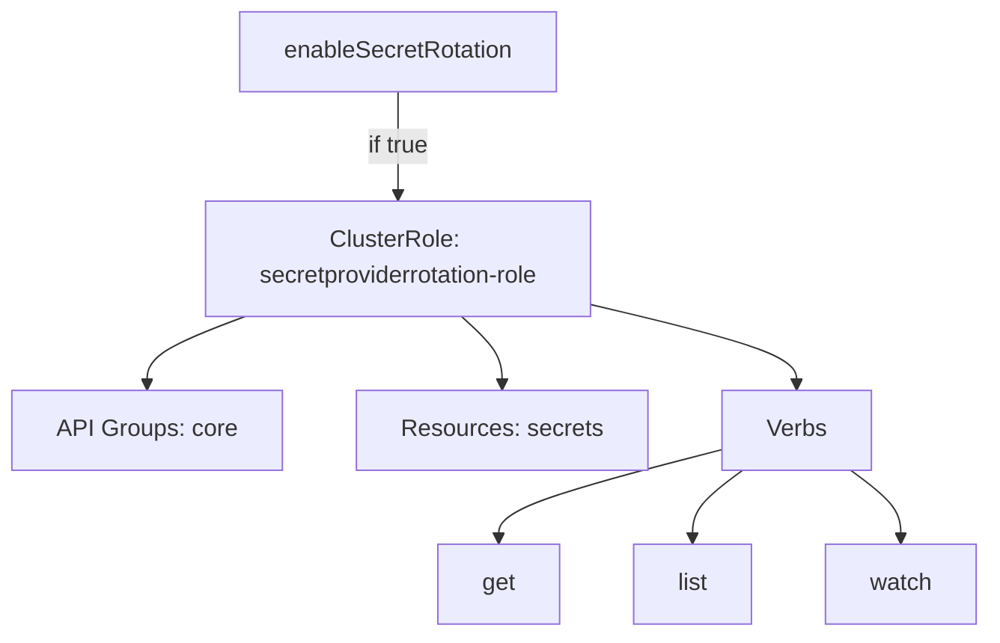
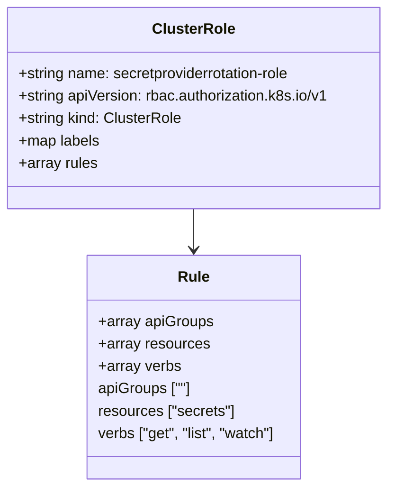
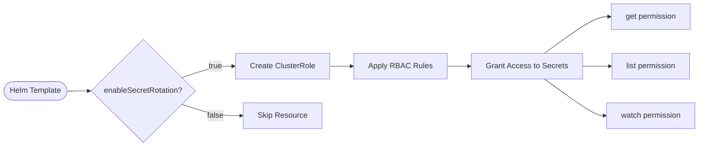

# Diagram: devops/k8s/secrets-store-csi-driver/helm/templates/role-rotation.yaml

> Auto-generated by Obscura crawlers

## Diagram 1

### SVG

<svg id="container" width="659.8359375" xmlns="http://www.w3.org/2000/svg" class="flowchart" height="430" viewBox="0 0 659.8359375 430" role="graphics-document document" aria-roledescription="flowchart-v2"><g><marker id="container_flowchart-v2-pointEnd" class="marker flowchart-v2" viewBox="0 0 10 10" refX="5" refY="5" markerUnits="userSpaceOnUse" markerWidth="8" markerHeight="8" orient="auto"><path d="M 0 0 L 10 5 L 0 10 z" class="arrowMarkerPath" style="stroke-width: 1; stroke-dasharray: 1, 0;"></path></marker><marker id="container_flowchart-v2-pointStart" class="marker flowchart-v2" viewBox="0 0 10 10" refX="4.5" refY="5" markerUnits="userSpaceOnUse" markerWidth="8" markerHeight="8" orient="auto"><path d="M 0 5 L 10 10 L 10 0 z" class="arrowMarkerPath" style="stroke-width: 1; stroke-dasharray: 1, 0;"></path></marker><marker id="container_flowchart-v2-circleEnd" class="marker flowchart-v2" viewBox="0 0 10 10" refX="11" refY="5" markerUnits="userSpaceOnUse" markerWidth="11" markerHeight="11" orient="auto"><circle cx="5" cy="5" r="5" class="arrowMarkerPath" style="stroke-width: 1; stroke-dasharray: 1, 0;"></circle></marker><marker id="container_flowchart-v2-circleStart" class="marker flowchart-v2" viewBox="0 0 10 10" refX="-1" refY="5" markerUnits="userSpaceOnUse" markerWidth="11" markerHeight="11" orient="auto"><circle cx="5" cy="5" r="5" class="arrowMarkerPath" style="stroke-width: 1; stroke-dasharray: 1, 0;"></circle></marker><marker id="container_flowchart-v2-crossEnd" class="marker cross flowchart-v2" viewBox="0 0 11 11" refX="12" refY="5.2" markerUnits="userSpaceOnUse" markerWidth="11" markerHeight="11" orient="auto"><path d="M 1,1 l 9,9 M 10,1 l -9,9" class="arrowMarkerPath" style="stroke-width: 2; stroke-dasharray: 1, 0;"></path></marker><marker id="container_flowchart-v2-crossStart" class="marker cross flowchart-v2" viewBox="0 0 11 11" refX="-1" refY="5.2" markerUnits="userSpaceOnUse" markerWidth="11" markerHeight="11" orient="auto"><path d="M 1,1 l 9,9 M 10,1 l -9,9" class="arrowMarkerPath" style="stroke-width: 2; stroke-dasharray: 1, 0;"></path></marker><g class="root"><g class="clusters"></g><g class="edgePaths"><path d="M261.328,62L261.328,68.167C261.328,74.333,261.328,86.667,261.328,98.333C261.328,110,261.328,121,261.328,126.5L261.328,132" id="L_A_B_0" class="edge-thickness-normal edge-pattern-solid edge-thickness-normal edge-pattern-solid flowchart-link" style=";" data-edge="true" data-et="edge" data-id="L_A_B_0" data-points="W3sieCI6MjYxLjMyODEyNSwieSI6NjJ9LHsieCI6MjYxLjMyODEyNSwieSI6OTl9LHsieCI6MjYxLjMyODEyNSwieSI6MTM2fV0=" marker-end="url(#container_flowchart-v2-pointEnd)"></path><path d="M161.2,214L150.503,218.167C139.805,222.333,118.41,230.667,107.713,238.333C97.016,246,97.016,253,97.016,256.5L97.016,260" id="L_B_C_0" class="edge-thickness-normal edge-pattern-solid edge-thickness-normal edge-pattern-solid flowchart-link" style=";" data-edge="true" data-et="edge" data-id="L_B_C_0" data-points="W3sieCI6MTYxLjIwMDE5NTMxMjUsInkiOjIxNH0seyJ4Ijo5Ny4wMTU2MjUsInkiOjIzOX0seyJ4Ijo5Ny4wMTU2MjUsInkiOjI2NH1d" marker-end="url(#container_flowchart-v2-pointEnd)"></path><path d="M304.746,214L309.385,218.167C314.023,222.333,323.301,230.667,327.939,238.333C332.578,246,332.578,253,332.578,256.5L332.578,260" id="L_B_D_0" class="edge-thickness-normal edge-pattern-solid edge-thickness-normal edge-pattern-solid flowchart-link" style=";" data-edge="true" data-et="edge" data-id="L_B_D_0" data-points="W3sieCI6MzA0Ljc0NjA5Mzc1LCJ5IjoyMTR9LHsieCI6MzMyLjU3ODEyNSwieSI6MjM5fSx7IngiOjMzMi41NzgxMjUsInkiOjI2NH1d" marker-end="url(#container_flowchart-v2-pointEnd)"></path><path d="M391.328,206.047L414.326,211.539C437.323,217.031,483.318,228.016,506.315,237.008C529.313,246,529.313,253,529.313,256.5L529.313,260" id="L_B_E_0" class="edge-thickness-normal edge-pattern-solid edge-thickness-normal edge-pattern-solid flowchart-link" style=";" data-edge="true" data-et="edge" data-id="L_B_E_0" data-points="W3sieCI6MzkxLjMyODEyNSwieSI6MjA2LjA0NjU4NjIwNDg4Nn0seyJ4Ijo1MjkuMzEyNSwieSI6MjM5fSx7IngiOjUyOS4zMTI1LCJ5IjoyNjR9XQ==" marker-end="url(#container_flowchart-v2-pointEnd)"></path><path d="M479.125,303.808L453.53,310.34C427.935,316.872,376.745,329.936,351.15,339.968C325.555,350,325.555,357,325.555,360.5L325.555,364" id="L_E_F_0" class="edge-thickness-normal edge-pattern-solid edge-thickness-normal edge-pattern-solid flowchart-link" style=";" data-edge="true" data-et="edge" data-id="L_E_F_0" data-points="W3sieCI6NDc5LjEyNSwieSI6MzAzLjgwODA5Nzg0OTAwODg1fSx7IngiOjMyNS41NTQ2ODc1LCJ5IjozNDN9LHsieCI6MzI1LjU1NDY4NzUsInkiOjM2OH1d" marker-end="url(#container_flowchart-v2-pointEnd)"></path><path d="M492.317,318L486.608,322.167C480.899,326.333,469.481,334.667,463.772,342.333C458.063,350,458.063,357,458.063,360.5L458.063,364" id="L_E_G_0" class="edge-thickness-normal edge-pattern-solid edge-thickness-normal edge-pattern-solid flowchart-link" style=";" data-edge="true" data-et="edge" data-id="L_E_G_0" data-points="W3sieCI6NDkyLjMxNzMwNzY5MjMwNzcsInkiOjMxOH0seyJ4Ijo0NTguMDYyNSwieSI6MzQzfSx7IngiOjQ1OC4wNjI1LCJ5IjozNjh9XQ==" marker-end="url(#container_flowchart-v2-pointEnd)"></path><path d="M566.308,318L572.017,322.167C577.726,326.333,589.144,334.667,594.853,342.333C600.563,350,600.563,357,600.563,360.5L600.563,364" id="L_E_H_0" class="edge-thickness-normal edge-pattern-solid edge-thickness-normal edge-pattern-solid flowchart-link" style=";" data-edge="true" data-et="edge" data-id="L_E_H_0" data-points="W3sieCI6NTY2LjMwNzY5MjMwNzY5MjMsInkiOjMxOH0seyJ4Ijo2MDAuNTYyNSwieSI6MzQzfSx7IngiOjYwMC41NjI1LCJ5IjozNjh9XQ==" marker-end="url(#container_flowchart-v2-pointEnd)"></path></g><g class="edgeLabels"><g class="edgeLabel" transform="translate(261.328125, 99)"><g class="label" data-id="L_A_B_0" transform="translate(-22.0546875, -12)"><foreignObject width="44.109375" height="24">

if true

</foreignObject></g></g><g class="edgeLabel"><g class="label" data-id="L_B_C_0" transform="translate(0, 0)"><foreignObject width="0" height="0">

</foreignObject></g></g><g class="edgeLabel"><g class="label" data-id="L_B_D_0" transform="translate(0, 0)"><foreignObject width="0" height="0">

</foreignObject></g></g><g class="edgeLabel"><g class="label" data-id="L_B_E_0" transform="translate(0, 0)"><foreignObject width="0" height="0">

</foreignObject></g></g><g class="edgeLabel"><g class="label" data-id="L_E_F_0" transform="translate(0, 0)"><foreignObject width="0" height="0">

</foreignObject></g></g><g class="edgeLabel"><g class="label" data-id="L_E_G_0" transform="translate(0, 0)"><foreignObject width="0" height="0">

</foreignObject></g></g><g class="edgeLabel"><g class="label" data-id="L_E_H_0" transform="translate(0, 0)"><foreignObject width="0" height="0">

</foreignObject></g></g></g><g class="nodes"><g class="node default" id="flowchart-A-0" transform="translate(261.328125, 35)"><rect class="basic label-container" style="" x="-108.5390625" y="-27" width="217.078125" height="54"></rect><g class="label" style="" transform="translate(-78.5390625, -12)"><rect></rect><foreignObject width="157.078125" height="24">

enableSecretRotation

</foreignObject></g></g><g class="node default" id="flowchart-B-1" transform="translate(261.328125, 175)"><rect class="basic label-container" style="" x="-130" y="-39" width="260" height="78"></rect><g class="label" style="" transform="translate(-100, -24)"><rect></rect><foreignObject width="200" height="48">

ClusterRole: secretproviderrotation-role

</foreignObject></g></g><g class="node default" id="flowchart-C-3" transform="translate(97.015625, 291)"><rect class="basic label-container" style="" x="-89.015625" y="-27" width="178.03125" height="54"></rect><g class="label" style="" transform="translate(-59.015625, -12)"><rect></rect><foreignObject width="118.03125" height="24">

API Groups: core

</foreignObject></g></g><g class="node default" id="flowchart-D-5" transform="translate(332.578125, 291)"><rect class="basic label-container" style="" x="-96.546875" y="-27" width="193.09375" height="54"></rect><g class="label" style="" transform="translate(-66.546875, -12)"><rect></rect><foreignObject width="133.09375" height="24">

Resources: secrets

</foreignObject></g></g><g class="node default" id="flowchart-E-7" transform="translate(529.3125, 291)"><rect class="basic label-container" style="" x="-50.1875" y="-27" width="100.375" height="54"></rect><g class="label" style="" transform="translate(-20.1875, -12)"><rect></rect><foreignObject width="40.375" height="24">

Verbs

</foreignObject></g></g><g class="node default" id="flowchart-F-9" transform="translate(325.5546875, 395)"><rect class="basic label-container" style="" x="-41.28125" y="-27" width="82.5625" height="54"></rect><g class="label" style="" transform="translate(-11.28125, -12)"><rect></rect><foreignObject width="22.5625" height="24">

get

</foreignObject></g></g><g class="node default" id="flowchart-G-11" transform="translate(458.0625, 395)"><rect class="basic label-container" style="" x="-41.2265625" y="-27" width="82.453125" height="54"></rect><g class="label" style="" transform="translate(-11.2265625, -12)"><rect></rect><foreignObject width="22.453125" height="24">

list

</foreignObject></g></g><g class="node default" id="flowchart-H-13" transform="translate(600.5625, 395)"><rect class="basic label-container" style="" x="-51.2734375" y="-27" width="102.546875" height="54"></rect><g class="label" style="" transform="translate(-21.2734375, -12)"><rect></rect><foreignObject width="42.546875" height="24">

watch

</foreignObject></g></g></g></g></g></svg>

## Diagram 2

### SVG

<svg id="container" width="423.0234375" xmlns="http://www.w3.org/2000/svg" class="classDiagram" height="522" viewBox="0 0 423.0234375 522" role="graphics-document document" aria-roledescription="class"><g><defs><marker id="container_class-aggregationStart" class="marker aggregation class" refX="18" refY="7" markerWidth="190" markerHeight="240" orient="auto"><path d="M 18,7 L9,13 L1,7 L9,1 Z"></path></marker></defs><defs><marker id="container_class-aggregationEnd" class="marker aggregation class" refX="1" refY="7" markerWidth="20" markerHeight="28" orient="auto"><path d="M 18,7 L9,13 L1,7 L9,1 Z"></path></marker></defs><defs><marker id="container_class-extensionStart" class="marker extension class" refX="18" refY="7" markerWidth="190" markerHeight="240" orient="auto"><path d="M 1,7 L18,13 V 1 Z"></path></marker></defs><defs><marker id="container_class-extensionEnd" class="marker extension class" refX="1" refY="7" markerWidth="20" markerHeight="28" orient="auto"><path d="M 1,1 V 13 L18,7 Z"></path></marker></defs><defs><marker id="container_class-compositionStart" class="marker composition class" refX="18" refY="7" markerWidth="190" markerHeight="240" orient="auto"><path d="M 18,7 L9,13 L1,7 L9,1 Z"></path></marker></defs><defs><marker id="container_class-compositionEnd" class="marker composition class" refX="1" refY="7" markerWidth="20" markerHeight="28" orient="auto"><path d="M 18,7 L9,13 L1,7 L9,1 Z"></path></marker></defs><defs><marker id="container_class-dependencyStart" class="marker dependency class" refX="6" refY="7" markerWidth="190" markerHeight="240" orient="auto"><path d="M 5,7 L9,13 L1,7 L9,1 Z"></path></marker></defs><defs><marker id="container_class-dependencyEnd" class="marker dependency class" refX="13" refY="7" markerWidth="20" markerHeight="28" orient="auto"><path d="M 18,7 L9,13 L14,7 L9,1 Z"></path></marker></defs><defs><marker id="container_class-lollipopStart" class="marker lollipop class" refX="13" refY="7" markerWidth="190" markerHeight="240" orient="auto"><circle stroke="black" fill="transparent" cx="7" cy="7" r="6"></circle></marker></defs><defs><marker id="container_class-lollipopEnd" class="marker lollipop class" refX="1" refY="7" markerWidth="190" markerHeight="240" orient="auto"><circle stroke="black" fill="transparent" cx="7" cy="7" r="6"></circle></marker></defs><g class="root"><g class="clusters"></g><g class="edgePaths"><path d="M211.512,224L211.512,228.167C211.512,232.333,211.512,240.667,211.512,248C211.512,255.333,211.512,261.667,211.512,264.833L211.512,268" id="id_ClusterRole_Rule_1" class="edge-thickness-normal edge-pattern-solid relation" style=";;;" data-edge="true" data-et="edge" data-id="id_ClusterRole_Rule_1" data-points="W3sieCI6MjExLjUxMTcxODc1LCJ5IjoyMjR9LHsieCI6MjExLjUxMTcxODc1LCJ5IjoyNDl9LHsieCI6MjExLjUxMTcxODc1LCJ5IjoyNzR9XQ==" marker-end="url(#container_class-dependencyEnd)"></path></g><g class="edgeLabels"><g class="edgeLabel"><g class="label" data-id="id_ClusterRole_Rule_1" transform="translate(0, 0)"><foreignObject width="0" height="0">

</foreignObject></g></g></g><g class="nodes"><g class="node default" id="classId-ClusterRole-0" transform="translate(211.51171875, 116)"><g class="basic label-container"><path d="M-203.51171875 -108 L203.51171875 -108 L203.51171875 108 L-203.51171875 108" stroke="none" stroke-width="0" fill="#ECECFF" style=""></path><path d="M-203.51171875 -108 C-68.04542280270189 -108, 67.42087314459621 -108, 203.51171875 -108 M-203.51171875 -108 C-46.586248627567045 -108, 110.33922149486591 -108, 203.51171875 -108 M203.51171875 -108 C203.51171875 -29.28650779494822, 203.51171875 49.42698441010356, 203.51171875 108 M203.51171875 -108 C203.51171875 -22.04476133881559, 203.51171875 63.91047732236882, 203.51171875 108 M203.51171875 108 C118.21936434383515 108, 32.927009937670306 108, -203.51171875 108 M203.51171875 108 C112.948695438139 108, 22.385672126277996 108, -203.51171875 108 M-203.51171875 108 C-203.51171875 61.32352478431626, -203.51171875 14.647049568632525, -203.51171875 -108 M-203.51171875 108 C-203.51171875 32.9949191845307, -203.51171875 -42.0101616309386, -203.51171875 -108" stroke="#9370DB" stroke-width="1.3" fill="none" stroke-dasharray="0 0" style=""></path></g><g class="annotation-group text" transform="translate(0, -84)"></g><g class="label-group text" transform="translate(-42.1484375, -84)"><g class="label" style="font-weight: bolder" transform="translate(0,-12)"><foreignObject width="84.296875" height="24">

ClusterRole

</foreignObject></g></g><g class="members-group text" transform="translate(-191.51171875, -36)"><g class="label" style="" transform="translate(0,-12)"><foreignObject width="301.046875" height="24">

+string name: secretproviderrotation-role

</foreignObject></g><g class="label" style="" transform="translate(0,12)"><foreignObject width="340.875" height="24">

+string apiVersion: rbac.authorization.k8s.io/v1

</foreignObject></g><g class="label" style="" transform="translate(0,36)"><foreignObject width="176.40625" height="24">

+string kind: ClusterRole

</foreignObject></g><g class="label" style="" transform="translate(0,60)"><foreignObject width="87.84375" height="24">

+map labels

</foreignObject></g><g class="label" style="" transform="translate(0,84)"><foreignObject width="85.109375" height="24">

+array rules

</foreignObject></g></g><g class="methods-group text" transform="translate(-191.51171875, 108)"></g><g class="divider" style=""><path d="M-203.51171875 -60 C-118.05940019045411 -60, -32.607081630908226 -60, 203.51171875 -60 M-203.51171875 -60 C-114.60842238435625 -60, -25.70512601871249 -60, 203.51171875 -60" stroke="#9370DB" stroke-width="1.3" fill="none" stroke-dasharray="0 0" style=""></path></g><g class="divider" style=""><path d="M-203.51171875 84 C-117.23445393236311 84, -30.95718911472622 84, 203.51171875 84 M-203.51171875 84 C-67.90386615465047 84, 67.70398644069905 84, 203.51171875 84" stroke="#9370DB" stroke-width="1.3" fill="none" stroke-dasharray="0 0" style=""></path></g></g><g class="node default" id="classId-Rule-1" transform="translate(211.51171875, 394)"><g class="basic label-container"><path d="M-116.5 -120 L116.5 -120 L116.5 120 L-116.5 120" stroke="none" stroke-width="0" fill="#ECECFF" style=""></path><path d="M-116.5 -120 C-40.624305837249125 -120, 35.25138832550175 -120, 116.5 -120 M-116.5 -120 C-33.654302727371956 -120, 49.19139454525609 -120, 116.5 -120 M116.5 -120 C116.5 -32.92308082088121, 116.5 54.15383835823758, 116.5 120 M116.5 -120 C116.5 -27.675364625834305, 116.5 64.64927074833139, 116.5 120 M116.5 120 C53.964920907344386 120, -8.570158185311229 120, -116.5 120 M116.5 120 C69.8126125162376 120, 23.125225032475228 120, -116.5 120 M-116.5 120 C-116.5 51.61161692115773, -116.5 -16.776766157684534, -116.5 -120 M-116.5 120 C-116.5 59.72322792884709, -116.5 -0.5535441423058245, -116.5 -120" stroke="#9370DB" stroke-width="1.3" fill="none" stroke-dasharray="0 0" style=""></path></g><g class="annotation-group text" transform="translate(0, -96)"></g><g class="label-group text" transform="translate(-16.265625, -96)"><g class="label" style="font-weight: bolder" transform="translate(0,-12)"><foreignObject width="32.53125" height="24">

Rule

</foreignObject></g></g><g class="members-group text" transform="translate(-104.5, -48)"><g class="label" style="" transform="translate(0,-12)"><foreignObject width="122.96875" height="24">

+array apiGroups

</foreignObject></g><g class="label" style="" transform="translate(0,12)"><foreignObject width="118.578125" height="24">

+array resources

</foreignObject></g><g class="label" style="" transform="translate(0,36)"><foreignObject width="88.5" height="24">

+array verbs

</foreignObject></g><g class="label" style="" transform="translate(0,60)"><foreignObject width="101.78125" height="24">

apiGroups [""]

</foreignObject></g><g class="label" style="" transform="translate(0,84)"><foreignObject width="148.5" height="24">

resources ["secrets"]

</foreignObject></g><g class="label" style="" transform="translate(0,108)"><foreignObject width="192.734375" height="24">

verbs ["get", "list", "watch"]

</foreignObject></g></g><g class="methods-group text" transform="translate(-104.5, 120)"></g><g class="divider" style=""><path d="M-116.5 -72 C-42.03092625628548 -72, 32.438147487429035 -72, 116.5 -72 M-116.5 -72 C-26.514181183426132 -72, 63.471637633147736 -72, 116.5 -72" stroke="#9370DB" stroke-width="1.3" fill="none" stroke-dasharray="0 0" style=""></path></g><g class="divider" style=""><path d="M-116.5 96 C-57.12209615550301 96, 2.2558076889939827 96, 116.5 96 M-116.5 96 C-39.434544231804395 96, 37.63091153639121 96, 116.5 96" stroke="#9370DB" stroke-width="1.3" fill="none" stroke-dasharray="0 0" style=""></path></g></g></g></g></g></svg>

## Diagram 3

### SVG

<svg id="container" width="1446.08935546875" xmlns="http://www.w3.org/2000/svg" class="flowchart" height="307.96875" viewBox="0 0 1446.08935546875 307.96875" role="graphics-document document" aria-roledescription="flowchart-v2"><g><marker id="container_flowchart-v2-pointEnd" class="marker flowchart-v2" viewBox="0 0 10 10" refX="5" refY="5" markerUnits="userSpaceOnUse" markerWidth="8" markerHeight="8" orient="auto"><path d="M 0 0 L 10 5 L 0 10 z" class="arrowMarkerPath" style="stroke-width: 1; stroke-dasharray: 1, 0;"></path></marker><marker id="container_flowchart-v2-pointStart" class="marker flowchart-v2" viewBox="0 0 10 10" refX="4.5" refY="5" markerUnits="userSpaceOnUse" markerWidth="8" markerHeight="8" orient="auto"><path d="M 0 5 L 10 10 L 10 0 z" class="arrowMarkerPath" style="stroke-width: 1; stroke-dasharray: 1, 0;"></path></marker><marker id="container_flowchart-v2-circleEnd" class="marker flowchart-v2" viewBox="0 0 10 10" refX="11" refY="5" markerUnits="userSpaceOnUse" markerWidth="11" markerHeight="11" orient="auto"><circle cx="5" cy="5" r="5" class="arrowMarkerPath" style="stroke-width: 1; stroke-dasharray: 1, 0;"></circle></marker><marker id="container_flowchart-v2-circleStart" class="marker flowchart-v2" viewBox="0 0 10 10" refX="-1" refY="5" markerUnits="userSpaceOnUse" markerWidth="11" markerHeight="11" orient="auto"><circle cx="5" cy="5" r="5" class="arrowMarkerPath" style="stroke-width: 1; stroke-dasharray: 1, 0;"></circle></marker><marker id="container_flowchart-v2-crossEnd" class="marker cross flowchart-v2" viewBox="0 0 11 11" refX="12" refY="5.2" markerUnits="userSpaceOnUse" markerWidth="11" markerHeight="11" orient="auto"><path d="M 1,1 l 9,9 M 10,1 l -9,9" class="arrowMarkerPath" style="stroke-width: 2; stroke-dasharray: 1, 0;"></path></marker><marker id="container_flowchart-v2-crossStart" class="marker cross flowchart-v2" viewBox="0 0 11 11" refX="-1" refY="5.2" markerUnits="userSpaceOnUse" markerWidth="11" markerHeight="11" orient="auto"><path d="M 1,1 l 9,9 M 10,1 l -9,9" class="arrowMarkerPath" style="stroke-width: 2; stroke-dasharray: 1, 0;"></path></marker><g class="root"><g class="clusters"></g><g class="edgePaths"><path d="M142.371,191.5L146.454,191.417C150.537,191.333,158.704,191.167,166.287,191.083C173.871,191,180.871,191,184.371,191L187.871,191" id="L_Start_Condition_0" class="edge-thickness-normal edge-pattern-solid edge-thickness-normal edge-pattern-solid flowchart-link" style=";" data-edge="true" data-et="edge" data-id="L_Start_Condition_0" data-points="W3sieCI6MTQyLjM3MDU4NzQzMTgyNzIzLCJ5IjoxOTEuNX0seyJ4IjoxNjYuODcwNTkwMjA5OTYwOTQsInkiOjE5MX0seyJ4IjoxOTEuODcwNTkwMjA5OTYwOTQsInkiOjE5MX1d" marker-end="url(#container_flowchart-v2-pointEnd)"></path><path d="M381.921,163.113L393.605,159.094C405.289,155.075,428.658,147.038,446.712,143.019C464.766,139,477.506,139,483.876,139L490.246,139" id="L_Condition_Create_0" class="edge-thickness-normal edge-pattern-solid edge-thickness-normal edge-pattern-solid flowchart-link" style=";" data-edge="true" data-et="edge" data-id="L_Condition_Create_0" data-points="W3sieCI6MzgxLjkyMDY3MDk1NDM0NzI2LCJ5IjoxNjMuMTEyNTgwNzQ0Mzg2MzV9LHsieCI6NDUyLjAyNjg0MDIwOTk2MDk0LCJ5IjoxMzl9LHsieCI6NDk0LjI0NTU5MDIwOTk2MDk0LCJ5IjoxMzl9XQ==" marker-end="url(#container_flowchart-v2-pointEnd)"></path><path d="M381.921,218.887L393.605,222.906C405.289,226.925,428.658,234.962,449.362,238.981C470.066,243,488.105,243,497.124,243L506.144,243" id="L_Condition_Skip_0" class="edge-thickness-normal edge-pattern-solid edge-thickness-normal edge-pattern-solid flowchart-link" style=";" data-edge="true" data-et="edge" data-id="L_Condition_Skip_0" data-points="W3sieCI6MzgxLjkyMDY3MDk1NDM0NzI2LCJ5IjoyMTguODg3NDE5MjU1NjEzNjV9LHsieCI6NDUyLjAyNjg0MDIwOTk2MDk0LCJ5IjoyNDN9LHsieCI6NTEwLjE0NDAyNzcwOTk2MDk0LCJ5IjoyNDN9XQ==" marker-end="url(#container_flowchart-v2-pointEnd)"></path><path d="M687.246,139L691.412,139C695.579,139,703.912,139,711.579,139C719.246,139,726.246,139,729.746,139L733.246,139" id="L_Create_Apply_0" class="edge-thickness-normal edge-pattern-solid edge-thickness-normal edge-pattern-solid flowchart-link" style=";" data-edge="true" data-et="edge" data-id="L_Create_Apply_0" data-points="W3sieCI6Njg3LjI0NTU5MDIwOTk2MDksInkiOjEzOX0seyJ4Ijo3MTIuMjQ1NTkwMjA5OTYwOSwieSI6MTM5fSx7IngiOjczNy4yNDU1OTAyMDk5NjA5LCJ5IjoxMzl9XQ==" marker-end="url(#container_flowchart-v2-pointEnd)"></path><path d="M923.402,139L927.569,139C931.735,139,940.069,139,947.735,139C955.402,139,962.402,139,965.902,139L969.402,139" id="L_Apply_Secrets_0" class="edge-thickness-normal edge-pattern-solid edge-thickness-normal edge-pattern-solid flowchart-link" style=";" data-edge="true" data-et="edge" data-id="L_Apply_Secrets_0" data-points="W3sieCI6OTIzLjQwMTg0MDIwOTk2MDksInkiOjEzOX0seyJ4Ijo5NDguNDAxODQwMjA5OTYwOSwieSI6MTM5fSx7IngiOjk3My40MDE4NDAyMDk5NjA5LCJ5IjoxMzl9XQ==" marker-end="url(#container_flowchart-v2-pointEnd)"></path><path d="M1123.016,112L1140.122,99.167C1157.228,86.333,1191.44,60.667,1213.711,47.833C1235.983,35,1246.313,35,1251.479,35L1256.644,35" id="L_Secrets_Get_0" class="edge-thickness-normal edge-pattern-solid edge-thickness-normal edge-pattern-solid flowchart-link" style=";" data-edge="true" data-et="edge" data-id="L_Secrets_Get_0" data-points="W3sieCI6MTEyMy4wMTYwMjI5MDIyNjg2LCJ5IjoxMTJ9LHsieCI6MTIyNS42NTE4NDAyMDk5NjEsInkiOjM1fSx7IngiOjEyNjAuNjQ0MDI3NzA5OTYxLCJ5IjozNX1d" marker-end="url(#container_flowchart-v2-pointEnd)"></path><path d="M1200.652,139L1204.819,139C1208.985,139,1217.319,139,1226.66,139C1236.001,139,1246.35,139,1251.524,139L1256.699,139" id="L_Secrets_List_0" class="edge-thickness-normal edge-pattern-solid edge-thickness-normal edge-pattern-solid flowchart-link" style=";" data-edge="true" data-et="edge" data-id="L_Secrets_List_0" data-points="W3sieCI6MTIwMC42NTE4NDAyMDk5NjEsInkiOjEzOX0seyJ4IjoxMjI1LjY1MTg0MDIwOTk2MSwieSI6MTM5fSx7IngiOjEyNjAuNjk4NzE1MjA5OTYxLCJ5IjoxMzl9XQ==" marker-end="url(#container_flowchart-v2-pointEnd)"></path><path d="M1123.016,166L1140.122,178.833C1157.228,191.667,1191.44,217.333,1212.046,230.167C1232.652,243,1239.652,243,1243.152,243L1246.652,243" id="L_Secrets_Watch_0" class="edge-thickness-normal edge-pattern-solid edge-thickness-normal edge-pattern-solid flowchart-link" style=";" data-edge="true" data-et="edge" data-id="L_Secrets_Watch_0" data-points="W3sieCI6MTEyMy4wMTYwMjI5MDIyNjg2LCJ5IjoxNjZ9LHsieCI6MTIyNS42NTE4NDAyMDk5NjEsInkiOjI0M30seyJ4IjoxMjUwLjY1MTg0MDIwOTk2MSwieSI6MjQzfV0=" marker-end="url(#container_flowchart-v2-pointEnd)"></path></g><g class="edgeLabels"><g class="edgeLabel"><g class="label" data-id="L_Start_Condition_0" transform="translate(0, 0)"><foreignObject width="0" height="0">

</foreignObject></g></g><g class="edgeLabel" transform="translate(452.02684020996094, 139)"><g class="label" data-id="L_Condition_Create_0" transform="translate(-14.9921875, -12)"><foreignObject width="29.984375" height="24">

true

</foreignObject></g></g><g class="edgeLabel" transform="translate(452.02684020996094, 243)"><g class="label" data-id="L_Condition_Skip_0" transform="translate(-17.21875, -12)"><foreignObject width="34.4375" height="24">

false

</foreignObject></g></g><g class="edgeLabel"><g class="label" data-id="L_Create_Apply_0" transform="translate(0, 0)"><foreignObject width="0" height="0">

</foreignObject></g></g><g class="edgeLabel"><g class="label" data-id="L_Apply_Secrets_0" transform="translate(0, 0)"><foreignObject width="0" height="0">

</foreignObject></g></g><g class="edgeLabel"><g class="label" data-id="L_Secrets_Get_0" transform="translate(0, 0)"><foreignObject width="0" height="0">

</foreignObject></g></g><g class="edgeLabel"><g class="label" data-id="L_Secrets_List_0" transform="translate(0, 0)"><foreignObject width="0" height="0">

</foreignObject></g></g><g class="edgeLabel"><g class="label" data-id="L_Secrets_Watch_0" transform="translate(0, 0)"><foreignObject width="0" height="0">

</foreignObject></g></g></g><g class="nodes"><g class="node default" id="flowchart-Start-0" transform="translate(74.93529510498047, 191)"><g class="basic label-container outer-path"><path d="M-47.4453125 -19.5 C-14.040996723626975 -19.5, 19.36331905274605 -19.5, 47.4453125 -19.5 C47.4453125 -19.5, 47.4453125 -19.5, 47.4453125 -19.5 C47.796602591766195 -19.488734810501743, 48.14789268353239 -19.477469621003483, 48.6946817896239 -19.45993515863156 C49.09921482436873 -19.42091034329188, 49.50374785911357 -19.3818855279522, 49.938917152847864 -19.3399052695533 C50.22427408365533 -19.2937709739564, 50.509631014462805 -19.247636678359495, 51.17290575967676 -19.140403561325776 C51.45025367338312 -19.077100709886576, 51.72760158708948 -19.013797858447376, 52.39157688623539 -18.862249829261074 C52.657056873650816 -18.783456762529067, 52.92253686106624 -18.70466369579706, 53.589922751460605 -18.50658706670804 C53.97292898006702 -18.365637234110114, 54.35593520867343 -18.22468740151219, 54.7630190951478 -18.074876768247425 C55.135377546982944 -17.910044727241026, 55.50773599881809 -17.74521268623463, 55.90604541279238 -17.568892924097174 C56.17134941793302 -17.430483994550627, 56.43665342307366 -17.29207506500408, 57.01430476407678 -16.990714730406097 C57.258775099420646 -16.84251537645349, 57.50324543476451 -16.69431602250088, 58.0832430736057 -16.342718045390892 C58.29938938254383 -16.191943737098562, 58.51553569148196 -16.041169428806235, 59.10846784457871 -15.627565626425154 C59.48389268734475 -15.328174304793876, 59.85931753011079 -15.028782983162596, 60.085766208501866 -14.848196188198123 C60.28478178443025 -14.667455507803556, 60.483797360358636 -14.486714827408989, 61.01112223676799 -14.007812326905688 C61.28886730743942 -13.721017738143049, 61.56661237811085 -13.43422314938041, 61.88073344296865 -13.10986736009568 C62.194833234056475 -12.740907872699495, 62.5089330251443 -12.371948385303307, 62.69102640812658 -12.158051136245305 C62.96770497866557 -11.78732705765937, 63.24438354920456 -11.416602979073435, 63.438671464640635 -11.156274872382312 C63.57794806089537 -10.942308619532303, 63.71722465715011 -10.728342366682295, 64.12059637860425 -10.108655082055241 C64.29044850541825 -9.8070654315041, 64.46030063223226 -9.505475780952958, 64.7339989742735 -9.019496659696287 C64.89191187100809 -8.691587150832195, 65.04982476774268 -8.363677641968103, 65.27635864880834 -7.893275190886684 C65.37205226299763 -7.656910113728964, 65.46774587718693 -7.4205450365712435, 65.74544672997033 -6.734618561215508 C65.84747901231701 -6.427313583423789, 65.9495112946637 -6.120008605632069, 66.13933563421489 -5.548287939305138 C66.2528993952965 -5.115220099455555, 66.3664631563781 -4.682152259605972, 66.45640678754556 -4.339158212148133 C66.50946147086371 -4.066733626420683, 66.56251615418188 -3.794309040693232, 66.69535727658177 -3.1121979531509023 C66.73926334439267 -2.7716711614433387, 66.78316941220358 -2.431144369735775, 66.85520520250937 -1.872449005199798 C66.87922990566346 -1.4982448611832935, 66.90325460881758 -1.124040717166789, 66.93529371591342 -0.6250057626472757 C66.93529371591342 -0.23912771897735535, 66.93529371591342 0.146750324692565, 66.93529371591342 0.625005762647271 C66.90347235657495 1.1206491200828683, 66.87165099723647 1.6162924775184657, 66.85520520250937 1.8724490051997846 C66.79469790600255 2.3417316483894477, 66.73419060949574 2.811014291579111, 66.69535727658177 3.1121979531508885 C66.62967777274099 3.4494483240052665, 66.5639982689002 3.7866986948596444, 66.45640678754556 4.339158212148129 C66.3894736151371 4.594403407562013, 66.32254044272864 4.849648602975897, 66.13933563421489 5.548287939305125 C66.0451611397134 5.831926512075591, 65.9509866452119 6.1155650848460565, 65.74544672997033 6.734618561215495 C65.57981292548163 7.143737260614316, 65.41417912099296 7.552855960013137, 65.27635864880834 7.893275190886679 C65.09694231109728 8.265837055038363, 64.9175259733862 8.638398919190045, 64.7339989742735 9.019496659696284 C64.52861433950967 9.384177876168932, 64.32322970474584 9.748859092641581, 64.12059637860425 10.108655082055236 C63.95175852242763 10.368035368455002, 63.782920666251016 10.627415654854767, 63.43867146464064 11.156274872382301 C63.251502865620395 11.407063743659284, 63.06433426660014 11.657852614936267, 62.69102640812658 12.158051136245302 C62.46845405280973 12.419497289526271, 62.24588169749288 12.680943442807239, 61.88073344296866 13.10986736009567 C61.68622933134521 13.310708824431433, 61.49172521972176 13.511550288767198, 61.01112223676799 14.007812326905684 C60.80478948957384 14.195198268642077, 60.598456742379696 14.382584210378468, 60.08576620850189 14.848196188198111 C59.80930505462973 15.068666601470875, 59.532843900757584 15.28913701474364, 59.10846784457871 15.627565626425152 C58.863723746308075 15.798288514577493, 58.61897964803744 15.969011402729835, 58.08324307360571 16.34271804539089 C57.683766249739215 16.58488324360515, 57.28428942587272 16.827048441819414, 57.01430476407678 16.990714730406093 C56.574319231838174 17.220254900750792, 56.134333699599566 17.44979507109549, 55.90604541279239 17.56889292409717 C55.5489224316317 17.726980674180165, 55.19179945047101 17.88506842426316, 54.763019095147804 18.07487676824742 C54.42214739790116 18.200320703817614, 54.081275700654516 18.325764639387806, 53.58992275146062 18.506587066708033 C53.28780767793059 18.596253234697365, 52.98569260440056 18.685919402686697, 52.39157688623541 18.86224982926107 C52.09818017901313 18.929215713092116, 51.804783471790834 18.996181596923158, 51.172905759676766 19.140403561325773 C50.697214831207475 19.217309581602443, 50.221523902738184 19.294215601879113, 49.93891715284788 19.3399052695533 C49.45292467185624 19.38678837970309, 48.966932190864604 19.43367148985288, 48.6946817896239 19.45993515863156 C48.21860980103809 19.475201860687594, 47.74253781245229 19.49046856274363, 47.44531250000001 19.5 C47.44531250000001 19.5, 47.44531250000001 19.5, 47.4453125 19.5 C15.251649529818721 19.5, -16.942013440362558 19.5, -47.44531249999999 19.5 C-47.704730145936374 19.491680981020636, -47.96414779187275 19.483361962041272, -48.69468178962389 19.45993515863156 C-49.078352861040514 19.42292287180397, -49.462023932457136 19.385910584976383, -49.93891715284787 19.3399052695533 C-50.27678098793638 19.285282064869364, -50.61464482302488 19.230658860185425, -51.17290575967676 19.140403561325773 C-51.63313757846678 19.03535865198024, -52.09336939725681 18.93031374263471, -52.391576886235384 18.862249829261074 C-52.70965372629375 18.767846292751155, -53.02773056635212 18.673442756241236, -53.58992275146059 18.506587066708043 C-54.03698213843843 18.342065079728528, -54.484041525416266 18.177543092749012, -54.7630190951478 18.074876768247425 C-55.153537158467415 17.902006005922587, -55.54405522178704 17.729135243597746, -55.90604541279238 17.568892924097174 C-56.18794265020848 17.421827315900998, -56.469839887624566 17.27476170770482, -57.01430476407678 16.990714730406097 C-57.349422869467936 16.787564165545394, -57.68454097485909 16.58441360068469, -58.083243073605686 16.3427180453909 C-58.347985001081206 16.158045537277307, -58.61272692855673 15.973373029163712, -59.10846784457871 15.627565626425156 C-59.39346546912136 15.400287604957692, -59.678463093664014 15.173009583490229, -60.085766208501866 14.848196188198125 C-60.41534263044455 14.548883601904057, -60.74491905238723 14.249571015609991, -61.011122236767974 14.007812326905697 C-61.35514594150676 13.652579606891457, -61.69916964624555 13.297346886877216, -61.880733442968655 13.109867360095677 C-62.136071411406604 12.809932853226464, -62.39140937984455 12.509998346357248, -62.691026408126575 12.158051136245307 C-62.967966971104154 11.786976011659668, -63.24490753408173 11.415900887074029, -63.438671464640635 11.156274872382316 C-63.65546827637651 10.82321675146076, -63.872265088112385 10.490158630539208, -64.12059637860425 10.108655082055249 C-64.271227316345 9.841194599060106, -64.42185825408576 9.573734116064962, -64.7339989742735 9.019496659696289 C-64.91674698855044 8.640016497869114, -65.09949500282738 8.26053633604194, -65.27635864880834 7.893275190886686 C-65.40957524623289 7.564227619680349, -65.54279184365744 7.235180048474011, -65.74544672997033 6.73461856121551 C-65.88590877069456 6.311569274141096, -66.0263708114188 5.888519987066682, -66.13933563421489 5.5482879393051325 C-66.25420859406066 5.11022755715748, -66.36908155390643 4.672167175009827, -66.45640678754556 4.339158212148136 C-66.53103714838011 3.955947082395076, -66.60566750921465 3.5727359526420166, -66.69535727658177 3.112197953150904 C-66.75792429646503 2.6269405021919505, -66.82049131634828 2.1416830512329974, -66.85520520250937 1.872449005199809 C-66.8729213388336 1.5965058817419944, -66.89063747515783 1.3205627582841797, -66.93529371591342 0.6250057626472781 C-66.93529371591342 0.32502454810219106, -66.93529371591342 0.025043333557103975, -66.93529371591342 -0.6250057626472687 C-66.91031018702145 -1.0141443914811359, -66.88532665812949 -1.4032830203150028, -66.85520520250937 -1.8724490051997822 C-66.80045719154425 -2.2970637670275478, -66.74570918057915 -2.721678528855314, -66.69535727658177 -3.112197953150895 C-66.63108997208474 -3.442196978843578, -66.5668226675877 -3.7721960045362604, -66.45640678754556 -4.339158212148126 C-66.33696020421822 -4.794659802851974, -66.21751362089087 -5.25016139355582, -66.13933563421489 -5.548287939305123 C-66.03952466803838 -5.848902666710902, -65.93971370186189 -6.149517394116681, -65.74544672997033 -6.734618561215485 C-65.59994345163662 -7.094014471814244, -65.45444017330293 -7.453410382413003, -65.27635864880834 -7.893275190886676 C-65.13484785137844 -8.187125389595872, -64.99333705394855 -8.48097558830507, -64.7339989742735 -9.019496659696282 C-64.60661400800858 -9.245681566426235, -64.47922904174364 -9.471866473156188, -64.12059637860425 -10.108655082055243 C-63.95419476631494 -10.364292643621017, -63.787793154025636 -10.619930205186792, -63.43867146464064 -11.156274872382308 C-63.2863487312587 -11.360373458227627, -63.134025997876755 -11.564472044072946, -62.69102640812659 -12.158051136245302 C-62.43019657977722 -12.464436694262153, -62.169366751427845 -12.770822252279004, -61.88073344296866 -13.10986736009567 C-61.63814552844204 -13.360359298682596, -61.39555761391541 -13.610851237269522, -61.011122236767996 -14.007812326905677 C-60.79603409997662 -14.203149681819353, -60.58094596318526 -14.398487036733028, -60.08576620850189 -14.848196188198107 C-59.71586808207621 -15.143180100620043, -59.34596995565054 -15.438164013041977, -59.10846784457872 -15.627565626425149 C-58.83661307900213 -15.817199742488253, -58.564758313425536 -16.006833858551357, -58.083243073605715 -16.342718045390885 C-57.810885079238 -16.507823062129827, -57.53852708487028 -16.67292807886877, -57.01430476407679 -16.99071473040609 C-56.75252775447347 -17.127283628639965, -56.490750744870155 -17.263852526873837, -55.90604541279239 -17.56889292409717 C-55.51527840459285 -17.74187388693566, -55.124511396393316 -17.91485484977415, -54.763019095147804 -18.07487676824742 C-54.367607623468196 -18.220391844969093, -53.97219615178858 -18.365906921690765, -53.58992275146062 -18.506587066708033 C-53.15119608369609 -18.63679883877727, -52.71246941593157 -18.76701061084651, -52.39157688623541 -18.862249829261067 C-51.970720095166875 -18.95830764547524, -51.549863304098345 -19.05436546168941, -51.172905759676766 -19.140403561325773 C-50.833992136438454 -19.195196487616542, -50.49507851320014 -19.24998941390731, -49.93891715284788 -19.3399052695533 C-49.60185459854805 -19.372421288789575, -49.264792044248225 -19.404937308025847, -48.6946817896239 -19.45993515863156 C-48.218585120571966 -19.475202652142105, -47.74248845152003 -19.49047014565265, -47.44531250000001 -19.5 C-47.44531250000001 -19.5, -47.4453125 -19.5, -47.4453125 -19.5" stroke="none" stroke-width="0" fill="#ECECFF" style=""></path><path d="M-47.4453125 -19.5 C-24.380114851423677 -19.5, -1.3149172028473544 -19.5, 47.4453125 -19.5 M-47.4453125 -19.5 C-26.07907297954505 -19.5, -4.712833459090099 -19.5, 47.4453125 -19.5 M47.4453125 -19.5 C47.4453125 -19.5, 47.4453125 -19.5, 47.4453125 -19.5 M47.4453125 -19.5 C47.4453125 -19.5, 47.4453125 -19.5, 47.4453125 -19.5 M47.4453125 -19.5 C47.93972071728006 -19.484145290779043, 48.43412893456013 -19.468290581558087, 48.6946817896239 -19.45993515863156 M47.4453125 -19.5 C47.816659013188314 -19.48809164010419, 48.18800552637663 -19.47618328020838, 48.6946817896239 -19.45993515863156 M48.6946817896239 -19.45993515863156 C49.01064160603407 -19.429454895139745, 49.32660142244424 -19.39897463164793, 49.938917152847864 -19.3399052695533 M48.6946817896239 -19.45993515863156 C49.06247957666201 -19.42445414845755, 49.43027736370012 -19.388973138283536, 49.938917152847864 -19.3399052695533 M49.938917152847864 -19.3399052695533 C50.34266796639984 -19.27462996915254, 50.74641877995181 -19.20935466875178, 51.17290575967676 -19.140403561325776 M49.938917152847864 -19.3399052695533 C50.41279283415219 -19.26329272436081, 50.88666851545652 -19.186680179168324, 51.17290575967676 -19.140403561325776 M51.17290575967676 -19.140403561325776 C51.46499367836263 -19.073736399937523, 51.7570815970485 -19.007069238549274, 52.39157688623539 -18.862249829261074 M51.17290575967676 -19.140403561325776 C51.599355954260346 -19.043069087259664, 52.02580614884393 -18.94573461319355, 52.39157688623539 -18.862249829261074 M52.39157688623539 -18.862249829261074 C52.656095628206415 -18.783742055131285, 52.92061437017744 -18.705234281001495, 53.589922751460605 -18.50658706670804 M52.39157688623539 -18.862249829261074 C52.77685123666089 -18.747902424401122, 53.162125587086386 -18.63355501954117, 53.589922751460605 -18.50658706670804 M53.589922751460605 -18.50658706670804 C54.0367393692253 -18.342154421043094, 54.48355598699 -18.17772177537815, 54.7630190951478 -18.074876768247425 M53.589922751460605 -18.50658706670804 C53.935224593115564 -18.37951279704378, 54.28052643477052 -18.25243852737952, 54.7630190951478 -18.074876768247425 M54.7630190951478 -18.074876768247425 C55.11740343724137 -17.9180013324406, 55.471787779334946 -17.76112589663377, 55.90604541279238 -17.568892924097174 M54.7630190951478 -18.074876768247425 C55.04239610656605 -17.951204852717154, 55.321773117984314 -17.82753293718688, 55.90604541279238 -17.568892924097174 M55.90604541279238 -17.568892924097174 C56.33739479654408 -17.34385822688638, 56.76874418029579 -17.11882352967558, 57.01430476407678 -16.990714730406097 M55.90604541279238 -17.568892924097174 C56.30124375889292 -17.362718200073143, 56.696442104993466 -17.156543476049116, 57.01430476407678 -16.990714730406097 M57.01430476407678 -16.990714730406097 C57.36681496792978 -16.77702097325051, 57.71932517178277 -16.563327216094926, 58.0832430736057 -16.342718045390892 M57.01430476407678 -16.990714730406097 C57.31811774784114 -16.80654151424487, 57.62193073160551 -16.622368298083646, 58.0832430736057 -16.342718045390892 M58.0832430736057 -16.342718045390892 C58.2908584798814 -16.19789452549905, 58.49847388615709 -16.053071005607208, 59.10846784457871 -15.627565626425154 M58.0832430736057 -16.342718045390892 C58.32550314464515 -16.173727907103224, 58.5677632156846 -16.004737768815552, 59.10846784457871 -15.627565626425154 M59.10846784457871 -15.627565626425154 C59.470787687739076 -15.338625193240718, 59.83310753089943 -15.049684760056282, 60.085766208501866 -14.848196188198123 M59.10846784457871 -15.627565626425154 C59.35940576549417 -15.427449312233598, 59.61034368640963 -15.227332998042044, 60.085766208501866 -14.848196188198123 M60.085766208501866 -14.848196188198123 C60.30822400995378 -14.646165898830382, 60.5306818114057 -14.444135609462641, 61.01112223676799 -14.007812326905688 M60.085766208501866 -14.848196188198123 C60.348322992815156 -14.60974906355663, 60.61087977712845 -14.371301938915135, 61.01112223676799 -14.007812326905688 M61.01112223676799 -14.007812326905688 C61.33670602063801 -13.671620339134101, 61.66228980450804 -13.335428351362514, 61.88073344296865 -13.10986736009568 M61.01112223676799 -14.007812326905688 C61.28802579228267 -13.721886671632072, 61.564929347797346 -13.435961016358457, 61.88073344296865 -13.10986736009568 M61.88073344296865 -13.10986736009568 C62.12281249225552 -12.825507534115197, 62.36489154154239 -12.541147708134712, 62.69102640812658 -12.158051136245305 M61.88073344296865 -13.10986736009568 C62.12072058668847 -12.827964805427051, 62.3607077304083 -12.546062250758421, 62.69102640812658 -12.158051136245305 M62.69102640812658 -12.158051136245305 C62.85426840171298 -11.939321736491092, 63.01751039529937 -11.720592336736878, 63.438671464640635 -11.156274872382312 M62.69102640812658 -12.158051136245305 C62.93152587586163 -11.835803759432583, 63.17202534359667 -11.513556382619862, 63.438671464640635 -11.156274872382312 M63.438671464640635 -11.156274872382312 C63.59832847159866 -10.9109988357855, 63.75798547855669 -10.66572279918869, 64.12059637860425 -10.108655082055241 M63.438671464640635 -11.156274872382312 C63.59907995814926 -10.909844350641386, 63.75948845165789 -10.663413828900461, 64.12059637860425 -10.108655082055241 M64.12059637860425 -10.108655082055241 C64.36300708230884 -9.67823033088222, 64.60541778601345 -9.247805579709198, 64.7339989742735 -9.019496659696287 M64.12059637860425 -10.108655082055241 C64.35528660945504 -9.691938812216803, 64.58997684030584 -9.275222542378364, 64.7339989742735 -9.019496659696287 M64.7339989742735 -9.019496659696287 C64.85526263369528 -8.767690076280326, 64.97652629311703 -8.515883492864365, 65.27635864880834 -7.893275190886684 M64.7339989742735 -9.019496659696287 C64.87639674370097 -8.723804644655981, 65.01879451312843 -8.428112629615676, 65.27635864880834 -7.893275190886684 M65.27635864880834 -7.893275190886684 C65.38960301870766 -7.613559407804408, 65.502847388607 -7.333843624722133, 65.74544672997033 -6.734618561215508 M65.27635864880834 -7.893275190886684 C65.44989272150666 -7.46464267626879, 65.62342679420497 -7.036010161650895, 65.74544672997033 -6.734618561215508 M65.74544672997033 -6.734618561215508 C65.8473624380138 -6.42766468665145, 65.9492781460573 -6.120710812087394, 66.13933563421489 -5.548287939305138 M65.74544672997033 -6.734618561215508 C65.8636310705201 -6.378666157597083, 65.98181541106987 -6.022713753978658, 66.13933563421489 -5.548287939305138 M66.13933563421489 -5.548287939305138 C66.26601394538513 -5.065208636085636, 66.39269225655538 -4.582129332866134, 66.45640678754556 -4.339158212148133 M66.13933563421489 -5.548287939305138 C66.21828171163034 -5.247232330673617, 66.29722778904579 -4.946176722042097, 66.45640678754556 -4.339158212148133 M66.45640678754556 -4.339158212148133 C66.53338439907048 -3.943894446191605, 66.61036201059541 -3.5486306802350764, 66.69535727658177 -3.1121979531509023 M66.45640678754556 -4.339158212148133 C66.52083842690006 -4.008315361694598, 66.58527006625455 -3.6774725112410627, 66.69535727658177 -3.1121979531509023 M66.69535727658177 -3.1121979531509023 C66.73081538677603 -2.8371918524801236, 66.76627349697029 -2.562185751809345, 66.85520520250937 -1.872449005199798 M66.69535727658177 -3.1121979531509023 C66.72924675729267 -2.8493578329921205, 66.76313623800357 -2.5865177128333388, 66.85520520250937 -1.872449005199798 M66.85520520250937 -1.872449005199798 C66.87798702740324 -1.5176036933197408, 66.9007688522971 -1.1627583814396836, 66.93529371591342 -0.6250057626472757 M66.85520520250937 -1.872449005199798 C66.87960439071088 -1.4924119542910717, 66.90400357891238 -1.1123749033823456, 66.93529371591342 -0.6250057626472757 M66.93529371591342 -0.6250057626472757 C66.93529371591342 -0.3074218961738057, 66.93529371591342 0.010161970299664258, 66.93529371591342 0.625005762647271 M66.93529371591342 -0.6250057626472757 C66.93529371591342 -0.22793923971186875, 66.93529371591342 0.1691272832235382, 66.93529371591342 0.625005762647271 M66.93529371591342 0.625005762647271 C66.91916609241572 0.8762065166073171, 66.90303846891801 1.127407270567363, 66.85520520250937 1.8724490051997846 M66.93529371591342 0.625005762647271 C66.90450395310074 1.1045811715038059, 66.87371419028808 1.5841565803603408, 66.85520520250937 1.8724490051997846 M66.85520520250937 1.8724490051997846 C66.80844169074294 2.2351375679602614, 66.76167817897652 2.5978261307207386, 66.69535727658177 3.1121979531508885 M66.85520520250937 1.8724490051997846 C66.79706572492829 2.3233673123801735, 66.73892624734721 2.7742856195605623, 66.69535727658177 3.1121979531508885 M66.69535727658177 3.1121979531508885 C66.60734594817932 3.5641175232966997, 66.51933461977684 4.016037093442511, 66.45640678754556 4.339158212148129 M66.69535727658177 3.1121979531508885 C66.6091875518347 3.554661277749368, 66.52301782708761 3.9971246023478466, 66.45640678754556 4.339158212148129 M66.45640678754556 4.339158212148129 C66.3667308274665 4.68113151373656, 66.27705486738743 5.02310481532499, 66.13933563421489 5.548287939305125 M66.45640678754556 4.339158212148129 C66.37872002305078 4.6354115148234785, 66.30103325855599 4.931664817498829, 66.13933563421489 5.548287939305125 M66.13933563421489 5.548287939305125 C66.03556914910075 5.860816059524705, 65.93180266398662 6.173344179744285, 65.74544672997033 6.734618561215495 M66.13933563421489 5.548287939305125 C66.00074259897643 5.965708079641939, 65.86214956373799 6.383128219978753, 65.74544672997033 6.734618561215495 M65.74544672997033 6.734618561215495 C65.56748504495576 7.1741873638565785, 65.38952335994121 7.613756166497662, 65.27635864880834 7.893275190886679 M65.74544672997033 6.734618561215495 C65.62842102947015 7.023674303988936, 65.51139532896997 7.312730046762377, 65.27635864880834 7.893275190886679 M65.27635864880834 7.893275190886679 C65.09345543532824 8.273077627179964, 64.91055222184812 8.65288006347325, 64.7339989742735 9.019496659696284 M65.27635864880834 7.893275190886679 C65.13408590257654 8.188707592586105, 64.99181315634475 8.484139994285533, 64.7339989742735 9.019496659696284 M64.7339989742735 9.019496659696284 C64.49813470169882 9.438297559500104, 64.26227042912414 9.857098459303923, 64.12059637860425 10.108655082055236 M64.7339989742735 9.019496659696284 C64.50631779290055 9.423767652443603, 64.27863661152759 9.828038645190922, 64.12059637860425 10.108655082055236 M64.12059637860425 10.108655082055236 C63.91029302775621 10.431737503314682, 63.69998967690817 10.754819924574129, 63.43867146464064 11.156274872382301 M64.12059637860425 10.108655082055236 C63.917254644042266 10.421042591243573, 63.71391290948029 10.733430100431908, 63.43867146464064 11.156274872382301 M63.43867146464064 11.156274872382301 C63.266843503533536 11.386508686416539, 63.095015542426424 11.616742500450776, 62.69102640812658 12.158051136245302 M63.43867146464064 11.156274872382301 C63.253226679010545 11.404753990759108, 63.06778189338045 11.653233109135916, 62.69102640812658 12.158051136245302 M62.69102640812658 12.158051136245302 C62.468178029843145 12.41982152180897, 62.245329651559715 12.68159190737264, 61.88073344296866 13.10986736009567 M62.69102640812658 12.158051136245302 C62.48198192803419 12.403606677529714, 62.2729374479418 12.649162218814125, 61.88073344296866 13.10986736009567 M61.88073344296866 13.10986736009567 C61.682283928826855 13.314782776455207, 61.48383441468504 13.519698192814744, 61.01112223676799 14.007812326905684 M61.88073344296866 13.10986736009567 C61.7016114492332 13.29482552481672, 61.522489455497734 13.479783689537769, 61.01112223676799 14.007812326905684 M61.01112223676799 14.007812326905684 C60.81662631037348 14.184448381176963, 60.62213038397896 14.361084435448245, 60.08576620850189 14.848196188198111 M61.01112223676799 14.007812326905684 C60.77891899500421 14.21869316731444, 60.54671575324043 14.429574007723197, 60.08576620850189 14.848196188198111 M60.08576620850189 14.848196188198111 C59.841531602169105 15.042966787392674, 59.597296995836324 15.237737386587236, 59.10846784457871 15.627565626425152 M60.08576620850189 14.848196188198111 C59.75338674307109 15.113259966890132, 59.42100727764029 15.37832374558215, 59.10846784457871 15.627565626425152 M59.10846784457871 15.627565626425152 C58.69855719775905 15.913501548900646, 58.28864655093938 16.19943747137614, 58.08324307360571 16.34271804539089 M59.10846784457871 15.627565626425152 C58.792761370312554 15.847788796160224, 58.47705489604639 16.068011965895295, 58.08324307360571 16.34271804539089 M58.08324307360571 16.34271804539089 C57.65666928839624 16.601309580810685, 57.23009550318676 16.859901116230482, 57.01430476407678 16.990714730406093 M58.08324307360571 16.34271804539089 C57.840543784745165 16.489843780557482, 57.59784449588462 16.636969515724076, 57.01430476407678 16.990714730406093 M57.01430476407678 16.990714730406093 C56.62600419230158 17.193290889982833, 56.237703620526375 17.39586704955957, 55.90604541279239 17.56889292409717 M57.01430476407678 16.990714730406093 C56.727642208913316 17.140266401818746, 56.44097965374984 17.289818073231398, 55.90604541279239 17.56889292409717 M55.90604541279239 17.56889292409717 C55.52614118770993 17.73706525508274, 55.14623696262748 17.90523758606831, 54.763019095147804 18.07487676824742 M55.90604541279239 17.56889292409717 C55.484198697450104 17.755631951341, 55.06235198210781 17.94237097858483, 54.763019095147804 18.07487676824742 M54.763019095147804 18.07487676824742 C54.32309485462821 18.236772955373734, 53.883170614108614 18.398669142500044, 53.58992275146062 18.506587066708033 M54.763019095147804 18.07487676824742 C54.33280945024911 18.233197894384503, 53.90259980535041 18.391519020521585, 53.58992275146062 18.506587066708033 M53.58992275146062 18.506587066708033 C53.14325685431233 18.639155160384508, 52.696590957164034 18.771723254060984, 52.39157688623541 18.86224982926107 M53.58992275146062 18.506587066708033 C53.17613047892434 18.62939844115684, 52.762338206388065 18.752209815605646, 52.39157688623541 18.86224982926107 M52.39157688623541 18.86224982926107 C51.986331588627635 18.954744423967337, 51.581086291019865 19.047239018673608, 51.172905759676766 19.140403561325773 M52.39157688623541 18.86224982926107 C51.91919071684635 18.970068889816282, 51.4468045474573 19.077887950371494, 51.172905759676766 19.140403561325773 M51.172905759676766 19.140403561325773 C50.895923380283335 19.18518392439567, 50.6189410008899 19.229964287465567, 49.93891715284788 19.3399052695533 M51.172905759676766 19.140403561325773 C50.824132475120045 19.196790521195684, 50.47535919056333 19.2531774810656, 49.93891715284788 19.3399052695533 M49.93891715284788 19.3399052695533 C49.60909187623052 19.371723117315646, 49.27926659961316 19.40354096507799, 48.6946817896239 19.45993515863156 M49.93891715284788 19.3399052695533 C49.60483066699244 19.372134191045987, 49.270744181137005 19.40436311253868, 48.6946817896239 19.45993515863156 M48.6946817896239 19.45993515863156 C48.28214633045851 19.473164367855436, 47.86961087129311 19.48639357707931, 47.44531250000001 19.5 M48.6946817896239 19.45993515863156 C48.39780780209736 19.469455329581372, 48.10093381457083 19.478975500531188, 47.44531250000001 19.5 M47.44531250000001 19.5 C47.44531250000001 19.5, 47.44531250000001 19.5, 47.4453125 19.5 M47.44531250000001 19.5 C47.44531250000001 19.5, 47.4453125 19.5, 47.4453125 19.5 M47.4453125 19.5 C12.284994392527352 19.5, -22.875323714945296 19.5, -47.44531249999999 19.5 M47.4453125 19.5 C23.751147764454842 19.5, 0.05698302890968421 19.5, -47.44531249999999 19.5 M-47.44531249999999 19.5 C-47.83814956750518 19.487402479856076, -48.23098663501035 19.47480495971215, -48.69468178962389 19.45993515863156 M-47.44531249999999 19.5 C-47.881817422397845 19.48600213674399, -48.318322344795696 19.47200427348798, -48.69468178962389 19.45993515863156 M-48.69468178962389 19.45993515863156 C-49.1359221247428 19.41736923417178, -49.57716245986171 19.374803309712004, -49.93891715284787 19.3399052695533 M-48.69468178962389 19.45993515863156 C-49.10868485833566 19.419996780504473, -49.52268792704742 19.380058402377387, -49.93891715284787 19.3399052695533 M-49.93891715284787 19.3399052695533 C-50.30519409407769 19.280688454215362, -50.67147103530751 19.22147163887743, -51.17290575967676 19.140403561325773 M-49.93891715284787 19.3399052695533 C-50.32262461787886 19.27787042230292, -50.70633208290985 19.215835575052544, -51.17290575967676 19.140403561325773 M-51.17290575967676 19.140403561325773 C-51.595106984932855 19.044038886781543, -52.01730821018894 18.947674212237313, -52.391576886235384 18.862249829261074 M-51.17290575967676 19.140403561325773 C-51.52924754399018 19.05907087440369, -51.8855893283036 18.977738187481613, -52.391576886235384 18.862249829261074 M-52.391576886235384 18.862249829261074 C-52.730563222239454 18.761640464110656, -53.06954955824352 18.661031098960237, -53.58992275146059 18.506587066708043 M-52.391576886235384 18.862249829261074 C-52.742946175217746 18.757965268666144, -53.094315464200115 18.653680708071214, -53.58992275146059 18.506587066708043 M-53.58992275146059 18.506587066708043 C-53.98048525639663 18.36285645457136, -54.37104776133268 18.21912584243468, -54.7630190951478 18.074876768247425 M-53.58992275146059 18.506587066708043 C-53.991439193954875 18.35882530429284, -54.39295563644916 18.211063541877635, -54.7630190951478 18.074876768247425 M-54.7630190951478 18.074876768247425 C-55.11585438176204 17.9186870533502, -55.46868966837629 17.762497338452974, -55.90604541279238 17.568892924097174 M-54.7630190951478 18.074876768247425 C-55.068741441497494 17.9395425544496, -55.3744637878472 17.80420834065177, -55.90604541279238 17.568892924097174 M-55.90604541279238 17.568892924097174 C-56.18264909812912 17.424588958630114, -56.45925278346586 17.280284993163054, -57.01430476407678 16.990714730406097 M-55.90604541279238 17.568892924097174 C-56.15963520822446 17.436595290252274, -56.413225003656535 17.30429765640738, -57.01430476407678 16.990714730406097 M-57.01430476407678 16.990714730406097 C-57.32053684355531 16.80507504420676, -57.626768923033836 16.619435358007422, -58.083243073605686 16.3427180453909 M-57.01430476407678 16.990714730406097 C-57.423165116885684 16.742861181803207, -57.83202546969459 16.495007633200316, -58.083243073605686 16.3427180453909 M-58.083243073605686 16.3427180453909 C-58.29909887367819 16.192146383507307, -58.51495467375069 16.04157472162371, -59.10846784457871 15.627565626425156 M-58.083243073605686 16.3427180453909 C-58.479883178285704 16.066039078639516, -58.87652328296572 15.789360111888136, -59.10846784457871 15.627565626425156 M-59.10846784457871 15.627565626425156 C-59.413611233048194 15.38422189432734, -59.71875462151767 15.140878162229523, -60.085766208501866 14.848196188198125 M-59.10846784457871 15.627565626425156 C-59.45570410481913 15.35065394922838, -59.802940365059534 15.073742272031607, -60.085766208501866 14.848196188198125 M-60.085766208501866 14.848196188198125 C-60.41079339856353 14.553015093932324, -60.73582058862519 14.257833999666524, -61.011122236767974 14.007812326905697 M-60.085766208501866 14.848196188198125 C-60.314550287627895 14.64042054083089, -60.543334366753925 14.432644893463657, -61.011122236767974 14.007812326905697 M-61.011122236767974 14.007812326905697 C-61.20352773177691 13.809137856524053, -61.39593322678584 13.610463386142412, -61.880733442968655 13.109867360095677 M-61.011122236767974 14.007812326905697 C-61.24264226742443 13.768748887104886, -61.47416229808089 13.529685447304075, -61.880733442968655 13.109867360095677 M-61.880733442968655 13.109867360095677 C-62.19427452771165 12.741564160963419, -62.50781561245464 12.37326096183116, -62.691026408126575 12.158051136245307 M-61.880733442968655 13.109867360095677 C-62.12094608205066 12.827699925743579, -62.36115872113266 12.545532491391478, -62.691026408126575 12.158051136245307 M-62.691026408126575 12.158051136245307 C-62.94489728159627 11.81788729390828, -63.19876815506597 11.477723451571253, -63.438671464640635 11.156274872382316 M-62.691026408126575 12.158051136245307 C-62.86417519842237 11.926047531428237, -63.03732398871818 11.694043926611167, -63.438671464640635 11.156274872382316 M-63.438671464640635 11.156274872382316 C-63.704125078303875 10.748466837519569, -63.96957869196712 10.34065880265682, -64.12059637860425 10.108655082055249 M-63.438671464640635 11.156274872382316 C-63.57910599553824 10.940529720971874, -63.71954052643585 10.72478456956143, -64.12059637860425 10.108655082055249 M-64.12059637860425 10.108655082055249 C-64.33541075168344 9.727230410339125, -64.55022512476263 9.345805738623, -64.7339989742735 9.019496659696289 M-64.12059637860425 10.108655082055249 C-64.29291055129882 9.80269381973399, -64.46522472399337 9.496732557412733, -64.7339989742735 9.019496659696289 M-64.7339989742735 9.019496659696289 C-64.88183903002292 8.712503620662186, -65.02967908577233 8.405510581628084, -65.27635864880834 7.893275190886686 M-64.7339989742735 9.019496659696289 C-64.92948271800283 8.613570483160274, -65.12496646173216 8.20764430662426, -65.27635864880834 7.893275190886686 M-65.27635864880834 7.893275190886686 C-65.42769389330778 7.519474211105159, -65.57902913780723 7.145673231323633, -65.74544672997033 6.73461856121551 M-65.27635864880834 7.893275190886686 C-65.45450972607264 7.4532385857270835, -65.63266080333696 7.01320198056748, -65.74544672997033 6.73461856121551 M-65.74544672997033 6.73461856121551 C-65.86025916861615 6.388821788892145, -65.975071607262 6.043025016568779, -66.13933563421489 5.5482879393051325 M-65.74544672997033 6.73461856121551 C-65.86274163013115 6.3813450103355205, -65.98003653029197 6.028071459455531, -66.13933563421489 5.5482879393051325 M-66.13933563421489 5.5482879393051325 C-66.24552163910316 5.143354681360491, -66.35170764399145 4.738421423415851, -66.45640678754556 4.339158212148136 M-66.13933563421489 5.5482879393051325 C-66.21383073968634 5.264205815759534, -66.2883258451578 4.980123692213935, -66.45640678754556 4.339158212148136 M-66.45640678754556 4.339158212148136 C-66.51018005611795 4.063043843013274, -66.56395332469033 3.7869294738784127, -66.69535727658177 3.112197953150904 M-66.45640678754556 4.339158212148136 C-66.51253426149478 4.050955495964734, -66.568661735444 3.762752779781332, -66.69535727658177 3.112197953150904 M-66.69535727658177 3.112197953150904 C-66.75284137800001 2.666362614070766, -66.81032547941827 2.220527274990628, -66.85520520250937 1.872449005199809 M-66.69535727658177 3.112197953150904 C-66.7366736238599 2.791756522497415, -66.77798997113801 2.471315091843926, -66.85520520250937 1.872449005199809 M-66.85520520250937 1.872449005199809 C-66.88093451507261 1.4716941936999828, -66.90666382763585 1.0709393822001565, -66.93529371591342 0.6250057626472781 M-66.85520520250937 1.872449005199809 C-66.87593780004293 1.5495220635628875, -66.89667039757651 1.2265951219259659, -66.93529371591342 0.6250057626472781 M-66.93529371591342 0.6250057626472781 C-66.93529371591342 0.2366750883467133, -66.93529371591342 -0.15165558595385153, -66.93529371591342 -0.6250057626472687 M-66.93529371591342 0.6250057626472781 C-66.93529371591342 0.20512472318272823, -66.93529371591342 -0.21475631628182168, -66.93529371591342 -0.6250057626472687 M-66.93529371591342 -0.6250057626472687 C-66.90834457055308 -1.0447604545930513, -66.88139542519275 -1.464515146538834, -66.85520520250937 -1.8724490051997822 M-66.93529371591342 -0.6250057626472687 C-66.90349341447755 -1.120321126252073, -66.8716931130417 -1.6156364898568771, -66.85520520250937 -1.8724490051997822 M-66.85520520250937 -1.8724490051997822 C-66.8038234550917 -2.2709556916975497, -66.75244170767402 -2.669462378195317, -66.69535727658177 -3.112197953150895 M-66.85520520250937 -1.8724490051997822 C-66.8199952606706 -2.1455303611118737, -66.78478531883181 -2.4186117170239654, -66.69535727658177 -3.112197953150895 M-66.69535727658177 -3.112197953150895 C-66.62582906839143 -3.469210607416345, -66.55630086020108 -3.826223261681795, -66.45640678754556 -4.339158212148126 M-66.69535727658177 -3.112197953150895 C-66.612863173706 -3.535787736283181, -66.53036907083023 -3.9593775194154675, -66.45640678754556 -4.339158212148126 M-66.45640678754556 -4.339158212148126 C-66.38650314739066 -4.605731088488057, -66.31659950723576 -4.872303964827989, -66.13933563421489 -5.548287939305123 M-66.45640678754556 -4.339158212148126 C-66.34607551197315 -4.759899183783014, -66.23574423640076 -5.180640155417902, -66.13933563421489 -5.548287939305123 M-66.13933563421489 -5.548287939305123 C-66.03780624976753 -5.854078268749952, -65.93627686532018 -6.159868598194782, -65.74544672997033 -6.734618561215485 M-66.13933563421489 -5.548287939305123 C-65.9938239990399 -5.986545800321584, -65.8483123638649 -6.424803661338044, -65.74544672997033 -6.734618561215485 M-65.74544672997033 -6.734618561215485 C-65.63385383829802 -7.010255161147878, -65.5222609466257 -7.28589176108027, -65.27635864880834 -7.893275190886676 M-65.74544672997033 -6.734618561215485 C-65.6154572450727 -7.0556951020883485, -65.48546776017507 -7.376771642961213, -65.27635864880834 -7.893275190886676 M-65.27635864880834 -7.893275190886676 C-65.07418111412386 -8.313101167565263, -64.87200357943937 -8.73292714424385, -64.7339989742735 -9.019496659696282 M-65.27635864880834 -7.893275190886676 C-65.06281136932873 -8.336710685905903, -64.84926408984911 -8.780146180925131, -64.7339989742735 -9.019496659696282 M-64.7339989742735 -9.019496659696282 C-64.56752337149524 -9.31509094991183, -64.40104776871698 -9.610685240127381, -64.12059637860425 -10.108655082055243 M-64.7339989742735 -9.019496659696282 C-64.49757448349315 -9.439292283652524, -64.26114999271279 -9.859087907608766, -64.12059637860425 -10.108655082055243 M-64.12059637860425 -10.108655082055243 C-63.96376128850797 -10.34959589656163, -63.806926198411695 -10.590536711068015, -63.43867146464064 -11.156274872382308 M-64.12059637860425 -10.108655082055243 C-63.90114316956484 -10.445794142577576, -63.68168996052544 -10.782933203099908, -63.43867146464064 -11.156274872382308 M-63.43867146464064 -11.156274872382308 C-63.14107261140388 -11.555030223906304, -62.843473758167114 -11.953785575430297, -62.69102640812659 -12.158051136245302 M-63.43867146464064 -11.156274872382308 C-63.2686848513618 -11.384041448076909, -63.09869823808296 -11.611808023771507, -62.69102640812659 -12.158051136245302 M-62.69102640812659 -12.158051136245302 C-62.498095288234595 -12.384679007762156, -62.3051641683426 -12.61130687927901, -61.88073344296866 -13.10986736009567 M-62.69102640812659 -12.158051136245302 C-62.44487529060426 -12.447194245282402, -62.19872417308193 -12.736337354319502, -61.88073344296866 -13.10986736009567 M-61.88073344296866 -13.10986736009567 C-61.62071946434773 -13.378353140566439, -61.3607054857268 -13.646838921037208, -61.011122236767996 -14.007812326905677 M-61.88073344296866 -13.10986736009567 C-61.55737130746299 -13.443765313530337, -61.23400917195732 -13.777663266965003, -61.011122236767996 -14.007812326905677 M-61.011122236767996 -14.007812326905677 C-60.677907553637574 -14.31042908574733, -60.34469287050716 -14.613045844588983, -60.08576620850189 -14.848196188198107 M-61.011122236767996 -14.007812326905677 C-60.64378144366908 -14.341421515893332, -60.27644065057016 -14.675030704880987, -60.08576620850189 -14.848196188198107 M-60.08576620850189 -14.848196188198107 C-59.853431995373434 -15.033476540494982, -59.62109778224498 -15.218756892791856, -59.10846784457872 -15.627565626425149 M-60.08576620850189 -14.848196188198107 C-59.70853808058521 -15.149025581749587, -59.33130995266853 -15.449854975301067, -59.10846784457872 -15.627565626425149 M-59.10846784457872 -15.627565626425149 C-58.7086170065831 -15.906484261747096, -58.308766168587475 -16.185402897069043, -58.083243073605715 -16.342718045390885 M-59.10846784457872 -15.627565626425149 C-58.900335363023444 -15.772749835648197, -58.69220288146817 -15.917934044871245, -58.083243073605715 -16.342718045390885 M-58.083243073605715 -16.342718045390885 C-57.684090497534875 -16.58468668268593, -57.284937921464035 -16.826655319980976, -57.01430476407679 -16.99071473040609 M-58.083243073605715 -16.342718045390885 C-57.690304773250226 -16.58091955222815, -57.29736647289474 -16.81912105906541, -57.01430476407679 -16.99071473040609 M-57.01430476407679 -16.99071473040609 C-56.67851721757629 -17.165894878333212, -56.3427296710758 -17.34107502626033, -55.90604541279239 -17.56889292409717 M-57.01430476407679 -16.99071473040609 C-56.747806509042285 -17.129746699357312, -56.48130825400777 -17.26877866830854, -55.90604541279239 -17.56889292409717 M-55.90604541279239 -17.56889292409717 C-55.639787791737426 -17.6867572746865, -55.37353017068246 -17.80462162527583, -54.763019095147804 -18.07487676824742 M-55.90604541279239 -17.56889292409717 C-55.64805493397427 -17.683097656054308, -55.39006445515616 -17.797302388011445, -54.763019095147804 -18.07487676824742 M-54.763019095147804 -18.07487676824742 C-54.496107983287644 -18.173102524711233, -54.229196871427476 -18.271328281175045, -53.58992275146062 -18.506587066708033 M-54.763019095147804 -18.07487676824742 C-54.47490549117178 -18.180905237803557, -54.18679188719575 -18.286933707359694, -53.58992275146062 -18.506587066708033 M-53.58992275146062 -18.506587066708033 C-53.210953033554055 -18.619063289730057, -52.83198331564749 -18.731539512752086, -52.39157688623541 -18.862249829261067 M-53.58992275146062 -18.506587066708033 C-53.144134960002404 -18.638894543224964, -52.69834716854419 -18.771202019741892, -52.39157688623541 -18.862249829261067 M-52.39157688623541 -18.862249829261067 C-52.10440808622643 -18.927794233911566, -51.81723928621745 -18.99333863856207, -51.172905759676766 -19.140403561325773 M-52.39157688623541 -18.862249829261067 C-52.027332920534256 -18.945386137518348, -51.66308895483309 -19.02852244577563, -51.172905759676766 -19.140403561325773 M-51.172905759676766 -19.140403561325773 C-50.77497599484327 -19.20473775971264, -50.37704623000977 -19.269071958099502, -49.93891715284788 -19.3399052695533 M-51.172905759676766 -19.140403561325773 C-50.75721374804368 -19.207609422026913, -50.3415217364106 -19.274815282728053, -49.93891715284788 -19.3399052695533 M-49.93891715284788 -19.3399052695533 C-49.576324730003215 -19.374884124503932, -49.21373230715855 -19.40986297945457, -48.6946817896239 -19.45993515863156 M-49.93891715284788 -19.3399052695533 C-49.458839230436226 -19.386217809350175, -48.97876130802457 -19.432530349147054, -48.6946817896239 -19.45993515863156 M-48.6946817896239 -19.45993515863156 C-48.226919673668924 -19.47493537924651, -47.75915755771395 -19.48993559986146, -47.44531250000001 -19.5 M-48.6946817896239 -19.45993515863156 C-48.44438448402429 -19.467961706047987, -48.19408717842468 -19.47598825346442, -47.44531250000001 -19.5 M-47.44531250000001 -19.5 C-47.44531250000001 -19.5, -47.4453125 -19.5, -47.4453125 -19.5 M-47.44531250000001 -19.5 C-47.44531250000001 -19.5, -47.4453125 -19.5, -47.4453125 -19.5" stroke="#9370DB" stroke-width="1.3" fill="none" stroke-dasharray="0 0" style=""></path></g><g class="label" style="" transform="translate(-54.5703125, -12)"><rect></rect><foreignObject width="109.140625" height="24">

Helm Template

</foreignObject></g></g><g class="node default" id="flowchart-Condition-1" transform="translate(300.83934020996094, 191)"><polygon points="108.96875,0 217.9375,-108.96875 108.96875,-217.9375 0,-108.96875" class="label-container" transform="translate(-108.46875, 108.96875)"></polygon><g class="label" style="" transform="translate(-81.96875, -12)"><rect></rect><foreignObject width="163.9375" height="24">

enableSecretRotation?

</foreignObject></g></g><g class="node default" id="flowchart-Create-3" transform="translate(590.7455902099609, 139)"><rect class="basic label-container" style="" x="-96.5" y="-27" width="193" height="54"></rect><g class="label" style="" transform="translate(-66.5, -12)"><rect></rect><foreignObject width="133" height="24">

Create ClusterRole

</foreignObject></g></g><g class="node default" id="flowchart-Skip-5" transform="translate(590.7455902099609, 243)"><rect class="basic label-container" style="" x="-80.6015625" y="-27" width="161.203125" height="54"></rect><g class="label" style="" transform="translate(-50.6015625, -12)"><rect></rect><foreignObject width="101.203125" height="24">

Skip Resource

</foreignObject></g></g><g class="node default" id="flowchart-Apply-7" transform="translate(830.3237152099609, 139)"><rect class="basic label-container" style="" x="-93.078125" y="-27" width="186.15625" height="54"></rect><g class="label" style="" transform="translate(-63.078125, -12)"><rect></rect><foreignObject width="126.15625" height="24">

Apply RBAC Rules

</foreignObject></g></g><g class="node default" id="flowchart-Secrets-9" transform="translate(1087.026840209961, 139)"><rect class="basic label-container" style="" x="-113.625" y="-27" width="227.25" height="54"></rect><g class="label" style="" transform="translate(-83.625, -12)"><rect></rect><foreignObject width="167.25" height="24">

Grant Access to Secrets

</foreignObject></g></g><g class="node default" id="flowchart-Get-11" transform="translate(1344.370590209961, 35)"><rect class="basic label-container" style="" x="-83.7265625" y="-27" width="167.453125" height="54"></rect><g class="label" style="" transform="translate(-53.7265625, -12)"><rect></rect><foreignObject width="107.453125" height="24">

get permission

</foreignObject></g></g><g class="node default" id="flowchart-List-13" transform="translate(1344.370590209961, 139)"><rect class="basic label-container" style="" x="-83.671875" y="-27" width="167.34375" height="54"></rect><g class="label" style="" transform="translate(-53.671875, -12)"><rect></rect><foreignObject width="107.34375" height="24">

list permission

</foreignObject></g></g><g class="node default" id="flowchart-Watch-15" transform="translate(1344.370590209961, 243)"><rect class="basic label-container" style="" x="-93.71875" y="-27" width="187.4375" height="54"></rect><g class="label" style="" transform="translate(-63.71875, -12)"><rect></rect><foreignObject width="127.4375" height="24">

watch permission

</foreignObject></g></g></g></g></g></svg>
