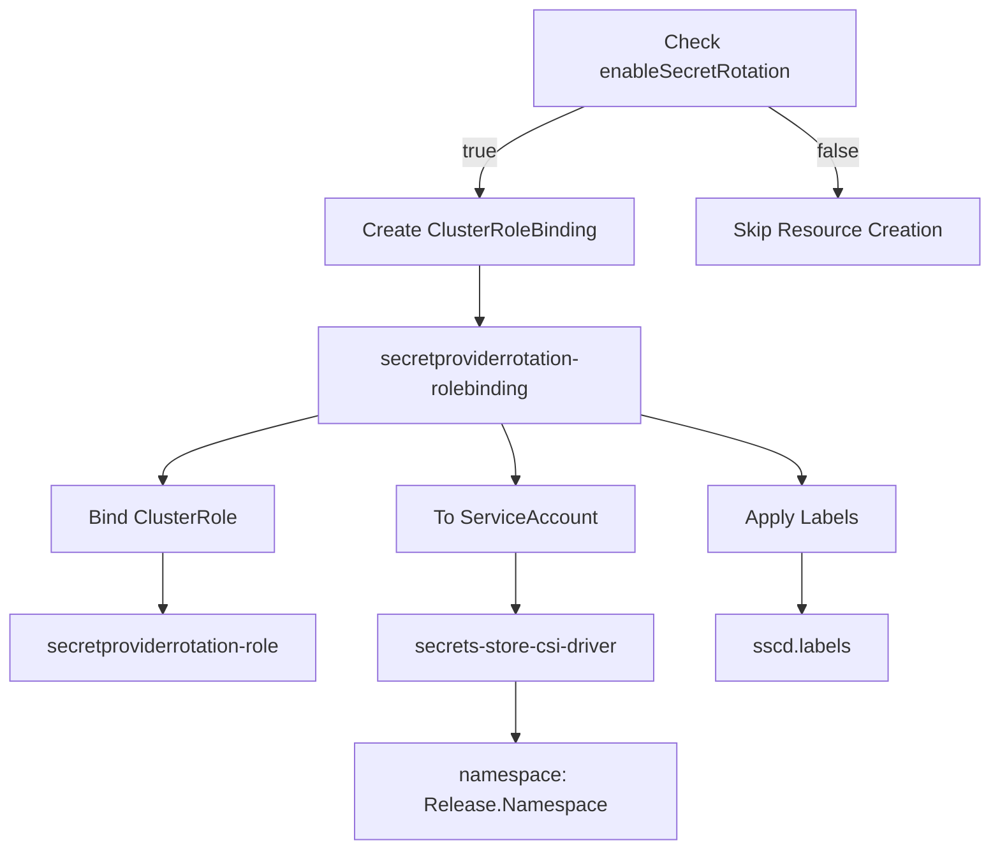
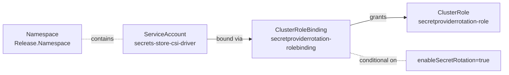
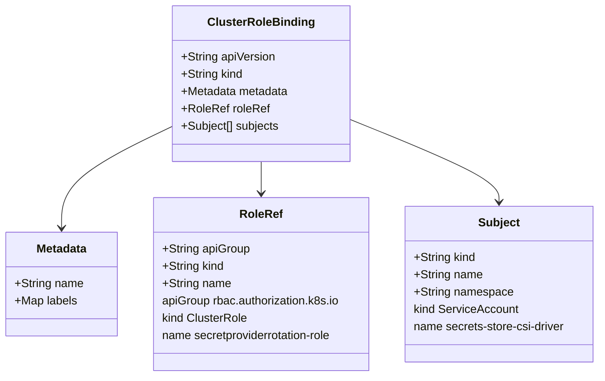

# Diagram: devops/k8s/secrets-store-csi-driver/helm/templates/role-rotation_binding.yaml

> Auto-generated by Obscura crawlers

## Diagram 1

### SVG

<svg id="container" width="813.6484375" xmlns="http://www.w3.org/2000/svg" class="flowchart" height="686" viewBox="0 0 813.6484375 686" role="graphics-document document" aria-roledescription="flowchart-v2"><g><marker id="container_flowchart-v2-pointEnd" class="marker flowchart-v2" viewBox="0 0 10 10" refX="5" refY="5" markerUnits="userSpaceOnUse" markerWidth="8" markerHeight="8" orient="auto"><path d="M 0 0 L 10 5 L 0 10 z" class="arrowMarkerPath" style="stroke-width: 1; stroke-dasharray: 1, 0;"></path></marker><marker id="container_flowchart-v2-pointStart" class="marker flowchart-v2" viewBox="0 0 10 10" refX="4.5" refY="5" markerUnits="userSpaceOnUse" markerWidth="8" markerHeight="8" orient="auto"><path d="M 0 5 L 10 10 L 10 0 z" class="arrowMarkerPath" style="stroke-width: 1; stroke-dasharray: 1, 0;"></path></marker><marker id="container_flowchart-v2-circleEnd" class="marker flowchart-v2" viewBox="0 0 10 10" refX="11" refY="5" markerUnits="userSpaceOnUse" markerWidth="11" markerHeight="11" orient="auto"><circle cx="5" cy="5" r="5" class="arrowMarkerPath" style="stroke-width: 1; stroke-dasharray: 1, 0;"></circle></marker><marker id="container_flowchart-v2-circleStart" class="marker flowchart-v2" viewBox="0 0 10 10" refX="-1" refY="5" markerUnits="userSpaceOnUse" markerWidth="11" markerHeight="11" orient="auto"><circle cx="5" cy="5" r="5" class="arrowMarkerPath" style="stroke-width: 1; stroke-dasharray: 1, 0;"></circle></marker><marker id="container_flowchart-v2-crossEnd" class="marker cross flowchart-v2" viewBox="0 0 11 11" refX="12" refY="5.2" markerUnits="userSpaceOnUse" markerWidth="11" markerHeight="11" orient="auto"><path d="M 1,1 l 9,9 M 10,1 l -9,9" class="arrowMarkerPath" style="stroke-width: 2; stroke-dasharray: 1, 0;"></path></marker><marker id="container_flowchart-v2-crossStart" class="marker cross flowchart-v2" viewBox="0 0 11 11" refX="-1" refY="5.2" markerUnits="userSpaceOnUse" markerWidth="11" markerHeight="11" orient="auto"><path d="M 1,1 l 9,9 M 10,1 l -9,9" class="arrowMarkerPath" style="stroke-width: 2; stroke-dasharray: 1, 0;"></path></marker><g class="root"><g class="clusters"></g><g class="edgePaths"><path d="M488.049,86L474.26,92.167C460.47,98.333,432.891,110.667,419.102,122.333C405.313,134,405.313,145,405.313,150.5L405.313,156" id="L_A_B_0" class="edge-thickness-normal edge-pattern-solid edge-thickness-normal edge-pattern-solid flowchart-link" style=";" data-edge="true" data-et="edge" data-id="L_A_B_0" data-points="W3sieCI6NDg4LjA0OTAzMzcxNzEwNTI2LCJ5Ijo4Nn0seyJ4Ijo0MDUuMzEyNSwieSI6MTIzfSx7IngiOjQwNS4zMTI1LCJ5IjoxNjB9XQ==" marker-end="url(#container_flowchart-v2-pointEnd)"></path><path d="M635.462,86L644.981,92.167C654.5,98.333,673.539,110.667,683.059,122.333C692.578,134,692.578,145,692.578,150.5L692.578,156" id="L_A_C_0" class="edge-thickness-normal edge-pattern-solid edge-thickness-normal edge-pattern-solid flowchart-link" style=";" data-edge="true" data-et="edge" data-id="L_A_C_0" data-points="W3sieCI6NjM1LjQ2MTY1NzA3MjM2ODQsInkiOjg2fSx7IngiOjY5Mi41NzgxMjUsInkiOjEyM30seyJ4Ijo2OTIuNTc4MTI1LCJ5IjoxNjB9XQ==" marker-end="url(#container_flowchart-v2-pointEnd)"></path><path d="M405.313,214L405.313,218.167C405.313,222.333,405.313,230.667,405.313,238.333C405.313,246,405.313,253,405.313,256.5L405.313,260" id="L_B_D_0" class="edge-thickness-normal edge-pattern-solid edge-thickness-normal edge-pattern-solid flowchart-link" style=";" data-edge="true" data-et="edge" data-id="L_B_D_0" data-points="W3sieCI6NDA1LjMxMjUsInkiOjIxNH0seyJ4Ijo0MDUuMzEyNSwieSI6MjM5fSx7IngiOjQwNS4zMTI1LCJ5IjoyNjR9XQ==" marker-end="url(#container_flowchart-v2-pointEnd)"></path><path d="M275.313,334.043L252.31,339.536C229.307,345.029,183.302,356.014,160.299,365.007C137.297,374,137.297,381,137.297,384.5L137.297,388" id="L_D_E_0" class="edge-thickness-normal edge-pattern-solid edge-thickness-normal edge-pattern-solid flowchart-link" style=";" data-edge="true" data-et="edge" data-id="L_D_E_0" data-points="W3sieCI6Mjc1LjMxMjUsInkiOjMzNC4wNDI5NjYyNDQ5NzE3NX0seyJ4IjoxMzcuMjk2ODc1LCJ5IjozNjd9LHsieCI6MTM3LjI5Njg3NSwieSI6MzkyfV0=" marker-end="url(#container_flowchart-v2-pointEnd)"></path><path d="M421.347,342L423.06,346.167C424.773,350.333,428.199,358.667,429.912,366.333C431.625,374,431.625,381,431.625,384.5L431.625,388" id="L_D_F_0" class="edge-thickness-normal edge-pattern-solid edge-thickness-normal edge-pattern-solid flowchart-link" style=";" data-edge="true" data-et="edge" data-id="L_D_F_0" data-points="W3sieCI6NDIxLjM0NjY3OTY4NzUsInkiOjM0Mn0seyJ4Ijo0MzEuNjI1LCJ5IjozNjd9LHsieCI6NDMxLjYyNSwieSI6MzkyfV0=" marker-end="url(#container_flowchart-v2-pointEnd)"></path><path d="M137.297,446L137.297,450.167C137.297,454.333,137.297,462.667,137.297,470.333C137.297,478,137.297,485,137.297,488.5L137.297,492" id="L_E_G_0" class="edge-thickness-normal edge-pattern-solid edge-thickness-normal edge-pattern-solid flowchart-link" style=";" data-edge="true" data-et="edge" data-id="L_E_G_0" data-points="W3sieCI6MTM3LjI5Njg3NSwieSI6NDQ2fSx7IngiOjEzNy4yOTY4NzUsInkiOjQ3MX0seyJ4IjoxMzcuMjk2ODc1LCJ5Ijo0OTZ9XQ==" marker-end="url(#container_flowchart-v2-pointEnd)"></path><path d="M431.625,446L431.625,450.167C431.625,454.333,431.625,462.667,431.625,470.333C431.625,478,431.625,485,431.625,488.5L431.625,492" id="L_F_H_0" class="edge-thickness-normal edge-pattern-solid edge-thickness-normal edge-pattern-solid flowchart-link" style=";" data-edge="true" data-et="edge" data-id="L_F_H_0" data-points="W3sieCI6NDMxLjYyNSwieSI6NDQ2fSx7IngiOjQzMS42MjUsInkiOjQ3MX0seyJ4Ijo0MzEuNjI1LCJ5Ijo0OTZ9XQ==" marker-end="url(#container_flowchart-v2-pointEnd)"></path><path d="M431.625,550L431.625,554.167C431.625,558.333,431.625,566.667,431.625,574.333C431.625,582,431.625,589,431.625,592.5L431.625,596" id="L_H_I_0" class="edge-thickness-normal edge-pattern-solid edge-thickness-normal edge-pattern-solid flowchart-link" style=";" data-edge="true" data-et="edge" data-id="L_H_I_0" data-points="W3sieCI6NDMxLjYyNSwieSI6NTUwfSx7IngiOjQzMS42MjUsInkiOjU3NX0seyJ4Ijo0MzEuNjI1LCJ5Ijo2MDB9XQ==" marker-end="url(#container_flowchart-v2-pointEnd)"></path><path d="M535.313,334.883L557.138,340.236C578.964,345.589,622.615,356.294,644.44,365.147C666.266,374,666.266,381,666.266,384.5L666.266,388" id="L_D_J_0" class="edge-thickness-normal edge-pattern-solid edge-thickness-normal edge-pattern-solid flowchart-link" style=";" data-edge="true" data-et="edge" data-id="L_D_J_0" data-points="W3sieCI6NTM1LjMxMjUsInkiOjMzNC44ODMxMjA3NzEyMTEzfSx7IngiOjY2Ni4yNjU2MjUsInkiOjM2N30seyJ4Ijo2NjYuMjY1NjI1LCJ5IjozOTJ9XQ==" marker-end="url(#container_flowchart-v2-pointEnd)"></path><path d="M666.266,446L666.266,450.167C666.266,454.333,666.266,462.667,666.266,470.333C666.266,478,666.266,485,666.266,488.5L666.266,492" id="L_J_K_0" class="edge-thickness-normal edge-pattern-solid edge-thickness-normal edge-pattern-solid flowchart-link" style=";" data-edge="true" data-et="edge" data-id="L_J_K_0" data-points="W3sieCI6NjY2LjI2NTYyNSwieSI6NDQ2fSx7IngiOjY2Ni4yNjU2MjUsInkiOjQ3MX0seyJ4Ijo2NjYuMjY1NjI1LCJ5Ijo0OTZ9XQ==" marker-end="url(#container_flowchart-v2-pointEnd)"></path></g><g class="edgeLabels"><g class="edgeLabel" transform="translate(405.3125, 123)"><g class="label" data-id="L_A_B_0" transform="translate(-14.9921875, -12)"><foreignObject width="29.984375" height="24">

true

</foreignObject></g></g><g class="edgeLabel" transform="translate(692.578125, 123)"><g class="label" data-id="L_A_C_0" transform="translate(-17.21875, -12)"><foreignObject width="34.4375" height="24">

false

</foreignObject></g></g><g class="edgeLabel"><g class="label" data-id="L_B_D_0" transform="translate(0, 0)"><foreignObject width="0" height="0">

</foreignObject></g></g><g class="edgeLabel"><g class="label" data-id="L_D_E_0" transform="translate(0, 0)"><foreignObject width="0" height="0">

</foreignObject></g></g><g class="edgeLabel"><g class="label" data-id="L_D_F_0" transform="translate(0, 0)"><foreignObject width="0" height="0">

</foreignObject></g></g><g class="edgeLabel"><g class="label" data-id="L_E_G_0" transform="translate(0, 0)"><foreignObject width="0" height="0">

</foreignObject></g></g><g class="edgeLabel"><g class="label" data-id="L_F_H_0" transform="translate(0, 0)"><foreignObject width="0" height="0">

</foreignObject></g></g><g class="edgeLabel"><g class="label" data-id="L_H_I_0" transform="translate(0, 0)"><foreignObject width="0" height="0">

</foreignObject></g></g><g class="edgeLabel"><g class="label" data-id="L_D_J_0" transform="translate(0, 0)"><foreignObject width="0" height="0">

</foreignObject></g></g><g class="edgeLabel"><g class="label" data-id="L_J_K_0" transform="translate(0, 0)"><foreignObject width="0" height="0">

</foreignObject></g></g></g><g class="nodes"><g class="node default" id="flowchart-A-0" transform="translate(575.2578125, 47)"><rect class="basic label-container" style="" x="-130" y="-39" width="260" height="78"></rect><g class="label" style="" transform="translate(-100, -24)"><rect></rect><foreignObject width="200" height="48">

Check enableSecretRotation

</foreignObject></g></g><g class="node default" id="flowchart-B-1" transform="translate(405.3125, 187)"><rect class="basic label-container" style="" x="-124.1953125" y="-27" width="248.390625" height="54"></rect><g class="label" style="" transform="translate(-94.1953125, -12)"><rect></rect><foreignObject width="188.390625" height="24">

Create ClusterRoleBinding

</foreignObject></g></g><g class="node default" id="flowchart-C-3" transform="translate(692.578125, 187)"><rect class="basic label-container" style="" x="-113.0703125" y="-27" width="226.140625" height="54"></rect><g class="label" style="" transform="translate(-83.0703125, -12)"><rect></rect><foreignObject width="166.140625" height="24">

Skip Resource Creation

</foreignObject></g></g><g class="node default" id="flowchart-D-5" transform="translate(405.3125, 303)"><rect class="basic label-container" style="" x="-130" y="-39" width="260" height="78"></rect><g class="label" style="" transform="translate(-100, -24)"><rect></rect><foreignObject width="200" height="48">

secretproviderrotation-rolebinding

</foreignObject></g></g><g class="node default" id="flowchart-E-7" transform="translate(137.296875, 419)"><rect class="basic label-container" style="" x="-90.125" y="-27" width="180.25" height="54"></rect><g class="label" style="" transform="translate(-60.125, -12)"><rect></rect><foreignObject width="120.25" height="24">

Bind ClusterRole

</foreignObject></g></g><g class="node default" id="flowchart-F-9" transform="translate(431.625, 419)"><rect class="basic label-container" style="" x="-95.328125" y="-27" width="190.65625" height="54"></rect><g class="label" style="" transform="translate(-65.328125, -12)"><rect></rect><foreignObject width="130.65625" height="24">

To ServiceAccount

</foreignObject></g></g><g class="node default" id="flowchart-G-11" transform="translate(137.296875, 523)"><rect class="basic label-container" style="" x="-129.296875" y="-27" width="258.59375" height="54"></rect><g class="label" style="" transform="translate(-99.296875, -12)"><rect></rect><foreignObject width="198.59375" height="24">

secretproviderrotation-role

</foreignObject></g></g><g class="node default" id="flowchart-H-13" transform="translate(431.625, 523)"><rect class="basic label-container" style="" x="-115.03125" y="-27" width="230.0625" height="54"></rect><g class="label" style="" transform="translate(-85.03125, -12)"><rect></rect><foreignObject width="170.0625" height="24">

secrets-store-csi-driver

</foreignObject></g></g><g class="node default" id="flowchart-I-15" transform="translate(431.625, 639)"><rect class="basic label-container" style="" x="-130" y="-39" width="260" height="78"></rect><g class="label" style="" transform="translate(-100, -24)"><rect></rect><foreignObject width="200" height="48">

namespace: Release.Namespace

</foreignObject></g></g><g class="node default" id="flowchart-J-17" transform="translate(666.265625, 419)"><rect class="basic label-container" style="" x="-75.859375" y="-27" width="151.71875" height="54"></rect><g class="label" style="" transform="translate(-45.859375, -12)"><rect></rect><foreignObject width="91.71875" height="24">

Apply Labels

</foreignObject></g></g><g class="node default" id="flowchart-K-19" transform="translate(666.265625, 523)"><rect class="basic label-container" style="" x="-69.609375" y="-27" width="139.21875" height="54"></rect><g class="label" style="" transform="translate(-39.609375, -12)"><rect></rect><foreignObject width="79.21875" height="24">

sscd.labels

</foreignObject></g></g></g></g></g></svg>

## Diagram 2

### SVG

<svg id="container" width="1357.609375" xmlns="http://www.w3.org/2000/svg" class="flowchart" height="198" viewBox="0 0 1357.609375 198" role="graphics-document document" aria-roledescription="flowchart-v2"><g><marker id="container_flowchart-v2-pointEnd" class="marker flowchart-v2" viewBox="0 0 10 10" refX="5" refY="5" markerUnits="userSpaceOnUse" markerWidth="8" markerHeight="8" orient="auto"><path d="M 0 0 L 10 5 L 0 10 z" class="arrowMarkerPath" style="stroke-width: 1; stroke-dasharray: 1, 0;"></path></marker><marker id="container_flowchart-v2-pointStart" class="marker flowchart-v2" viewBox="0 0 10 10" refX="4.5" refY="5" markerUnits="userSpaceOnUse" markerWidth="8" markerHeight="8" orient="auto"><path d="M 0 5 L 10 10 L 10 0 z" class="arrowMarkerPath" style="stroke-width: 1; stroke-dasharray: 1, 0;"></path></marker><marker id="container_flowchart-v2-circleEnd" class="marker flowchart-v2" viewBox="0 0 10 10" refX="11" refY="5" markerUnits="userSpaceOnUse" markerWidth="11" markerHeight="11" orient="auto"><circle cx="5" cy="5" r="5" class="arrowMarkerPath" style="stroke-width: 1; stroke-dasharray: 1, 0;"></circle></marker><marker id="container_flowchart-v2-circleStart" class="marker flowchart-v2" viewBox="0 0 10 10" refX="-1" refY="5" markerUnits="userSpaceOnUse" markerWidth="11" markerHeight="11" orient="auto"><circle cx="5" cy="5" r="5" class="arrowMarkerPath" style="stroke-width: 1; stroke-dasharray: 1, 0;"></circle></marker><marker id="container_flowchart-v2-crossEnd" class="marker cross flowchart-v2" viewBox="0 0 11 11" refX="12" refY="5.2" markerUnits="userSpaceOnUse" markerWidth="11" markerHeight="11" orient="auto"><path d="M 1,1 l 9,9 M 10,1 l -9,9" class="arrowMarkerPath" style="stroke-width: 2; stroke-dasharray: 1, 0;"></path></marker><marker id="container_flowchart-v2-crossStart" class="marker cross flowchart-v2" viewBox="0 0 11 11" refX="-1" refY="5.2" markerUnits="userSpaceOnUse" markerWidth="11" markerHeight="11" orient="auto"><path d="M 1,1 l 9,9 M 10,1 l -9,9" class="arrowMarkerPath" style="stroke-width: 2; stroke-dasharray: 1, 0;"></path></marker><g class="root"><g class="clusters"></g><g class="edgePaths"><path d="M553.234,105L563.438,105C573.641,105,594.047,105,613.786,105C633.526,105,652.599,105,662.135,105L671.672,105" id="L_SA_CRB_0" class="edge-thickness-normal edge-pattern-solid edge-thickness-normal edge-pattern-solid flowchart-link" style=";" data-edge="true" data-et="edge" data-id="L_SA_CRB_0" data-points="W3sieCI6NTUzLjIzNDM3NSwieSI6MTA1fSx7IngiOjYxNC40NTMxMjUsInkiOjEwNX0seyJ4Ijo2NzUuNjcxODc1LCJ5IjoxMDV9XQ==" marker-end="url(#container_flowchart-v2-pointEnd)"></path><path d="M935.672,68.693L948.617,65.077C961.563,61.462,987.453,54.231,1012.677,50.615C1037.901,47,1062.458,47,1074.737,47L1087.016,47" id="L_CRB_CR_0" class="edge-thickness-normal edge-pattern-solid edge-thickness-normal edge-pattern-solid flowchart-link" style=";" data-edge="true" data-et="edge" data-id="L_CRB_CR_0" data-points="W3sieCI6OTM1LjY3MTg3NSwieSI6NjguNjkyNzI0Mzk5OTY5OX0seyJ4IjoxMDEzLjM0Mzc1LCJ5Ijo0N30seyJ4IjoxMDkxLjAxNTYyNSwieSI6NDd9XQ==" marker-end="url(#container_flowchart-v2-pointEnd)"></path><path d="M211.391,105L220.706,105C230.021,105,248.651,105,267.281,105C285.911,105,304.542,105,313.857,105L323.172,105" id="L_NS_SA_0" class="edge-thickness-normal edge-pattern-dotted edge-thickness-normal edge-pattern-solid flowchart-link" style=";" data-edge="true" data-et="edge" data-id="L_NS_SA_0" data-points="W3sieCI6MjExLjM5MDYyNSwieSI6MTA1fSx7IngiOjI2Ny4yODEyNSwieSI6MTA1fSx7IngiOjMyMy4xNzE4NzUsInkiOjEwNX1d"></path><path d="M935.672,141.307L948.617,144.923C961.563,148.538,987.453,155.769,1013.638,159.385C1039.823,163,1066.302,163,1079.542,163L1092.781,163" id="L_CRB_EV_0" class="edge-thickness-normal edge-pattern-dotted edge-thickness-normal edge-pattern-solid flowchart-link" style=";" data-edge="true" data-et="edge" data-id="L_CRB_EV_0" data-points="W3sieCI6OTM1LjY3MTg3NSwieSI6MTQxLjMwNzI3NTYwMDAzMDF9LHsieCI6MTAxMy4zNDM3NSwieSI6MTYzfSx7IngiOjEwOTIuNzgxMjUsInkiOjE2M31d"></path></g><g class="edgeLabels"><g class="edgeLabel" transform="translate(614.453125, 105)"><g class="label" data-id="L_SA_CRB_0" transform="translate(-36.21875, -12)"><foreignObject width="72.4375" height="24">

bound via

</foreignObject></g></g><g class="edgeLabel" transform="translate(1013.34375, 47)"><g class="label" data-id="L_CRB_CR_0" transform="translate(-22.6328125, -12)"><foreignObject width="45.265625" height="24">

grants

</foreignObject></g></g><g class="edgeLabel" transform="translate(267.28125, 105)"><g class="label" data-id="L_NS_SA_0" transform="translate(-30.890625, -12)"><foreignObject width="61.78125" height="24">

contains

</foreignObject></g></g><g class="edgeLabel" transform="translate(1013.34375, 163)"><g class="label" data-id="L_CRB_EV_0" transform="translate(-52.671875, -12)"><foreignObject width="105.34375" height="24">

conditional on

</foreignObject></g></g></g><g class="nodes"><g class="node default" id="flowchart-SA-0" transform="translate(438.203125, 105)"><rect class="basic label-container" style="" x="-115.03125" y="-39" width="230.0625" height="78"></rect><g class="label" style="" transform="translate(-85.03125, -24)"><rect></rect><foreignObject width="170.0625" height="48">

ServiceAccount secrets-store-csi-driver

</foreignObject></g></g><g class="node default" id="flowchart-CRB-1" transform="translate(805.671875, 105)"><rect class="basic label-container" style="" x="-130" y="-51" width="260" height="102"></rect><g class="label" style="" transform="translate(-100, -36)"><rect></rect><foreignObject width="200" height="72">

ClusterRoleBinding secretproviderrotation-rolebinding

</foreignObject></g></g><g class="node default" id="flowchart-CR-3" transform="translate(1220.3125, 47)"><rect class="basic label-container" style="" x="-129.296875" y="-39" width="258.59375" height="78"></rect><g class="label" style="" transform="translate(-99.296875, -24)"><rect></rect><foreignObject width="198.59375" height="48">

ClusterRole secretproviderrotation-role

</foreignObject></g></g><g class="node default" id="flowchart-NS-4" transform="translate(109.6953125, 105)"><rect class="basic label-container" style="" x="-101.6953125" y="-39" width="203.390625" height="78"></rect><g class="label" style="" transform="translate(-71.6953125, -24)"><rect></rect><foreignObject width="143.390625" height="48">

Namespace Release.Namespace

</foreignObject></g></g><g class="node default" id="flowchart-EV-7" transform="translate(1220.3125, 163)"><rect class="basic label-container" style="" x="-127.53125" y="-27" width="255.0625" height="54"></rect><g class="label" style="" transform="translate(-97.53125, -12)"><rect></rect><foreignObject width="195.0625" height="24">

enableSecretRotation=true

</foreignObject></g></g></g></g></g></svg>

## Diagram 3

### SVG

<svg id="container" width="838.7421875" xmlns="http://www.w3.org/2000/svg" class="classDiagram" height="522" viewBox="0 0 838.7421875 522" role="graphics-document document" aria-roledescription="class"><g><defs><marker id="container_class-aggregationStart" class="marker aggregation class" refX="18" refY="7" markerWidth="190" markerHeight="240" orient="auto"><path d="M 18,7 L9,13 L1,7 L9,1 Z"></path></marker></defs><defs><marker id="container_class-aggregationEnd" class="marker aggregation class" refX="1" refY="7" markerWidth="20" markerHeight="28" orient="auto"><path d="M 18,7 L9,13 L1,7 L9,1 Z"></path></marker></defs><defs><marker id="container_class-extensionStart" class="marker extension class" refX="18" refY="7" markerWidth="190" markerHeight="240" orient="auto"><path d="M 1,7 L18,13 V 1 Z"></path></marker></defs><defs><marker id="container_class-extensionEnd" class="marker extension class" refX="1" refY="7" markerWidth="20" markerHeight="28" orient="auto"><path d="M 1,1 V 13 L18,7 Z"></path></marker></defs><defs><marker id="container_class-compositionStart" class="marker composition class" refX="18" refY="7" markerWidth="190" markerHeight="240" orient="auto"><path d="M 18,7 L9,13 L1,7 L9,1 Z"></path></marker></defs><defs><marker id="container_class-compositionEnd" class="marker composition class" refX="1" refY="7" markerWidth="20" markerHeight="28" orient="auto"><path d="M 18,7 L9,13 L1,7 L9,1 Z"></path></marker></defs><defs><marker id="container_class-dependencyStart" class="marker dependency class" refX="6" refY="7" markerWidth="190" markerHeight="240" orient="auto"><path d="M 5,7 L9,13 L1,7 L9,1 Z"></path></marker></defs><defs><marker id="container_class-dependencyEnd" class="marker dependency class" refX="13" refY="7" markerWidth="20" markerHeight="28" orient="auto"><path d="M 18,7 L9,13 L14,7 L9,1 Z"></path></marker></defs><defs><marker id="container_class-lollipopStart" class="marker lollipop class" refX="13" refY="7" markerWidth="190" markerHeight="240" orient="auto"><circle stroke="black" fill="transparent" cx="7" cy="7" r="6"></circle></marker></defs><defs><marker id="container_class-lollipopEnd" class="marker lollipop class" refX="1" refY="7" markerWidth="190" markerHeight="240" orient="auto"><circle stroke="black" fill="transparent" cx="7" cy="7" r="6"></circle></marker></defs><g class="root"><g class="clusters"></g><g class="edgePaths"><path d="M241.078,174.295L215.034,186.746C188.99,199.197,136.901,224.098,110.857,247.716C84.813,271.333,84.813,293.667,84.813,304.833L84.813,316" id="id_ClusterRoleBinding_Metadata_1" class="edge-thickness-normal edge-pattern-solid relation" style=";;;" data-edge="true" data-et="edge" data-id="id_ClusterRoleBinding_Metadata_1" data-points="W3sieCI6MjQxLjA3ODEyNSwieSI6MTc0LjI5NTQ2MDYwODUyODM3fSx7IngiOjg0LjgxMjUsInkiOjI0OX0seyJ4Ijo4NC44MTI1LCJ5IjozMjJ9XQ==" marker-end="url(#container_class-dependencyEnd)"></path><path d="M363.02,224L363.02,228.167C363.02,232.333,363.02,240.667,363.02,248C363.02,255.333,363.02,261.667,363.02,264.833L363.02,268" id="id_ClusterRoleBinding_RoleRef_2" class="edge-thickness-normal edge-pattern-solid relation" style=";;;" data-edge="true" data-et="edge" data-id="id_ClusterRoleBinding_RoleRef_2" data-points="W3sieCI6MzYzLjAxOTUzMTI1LCJ5IjoyMjR9LHsieCI6MzYzLjAxOTUzMTI1LCJ5IjoyNDl9LHsieCI6MzYzLjAxOTUzMTI1LCJ5IjoyNzR9XQ==" marker-end="url(#container_class-dependencyEnd)"></path><path d="M484.961,164.476L520.397,178.564C555.833,192.651,626.706,220.825,662.142,240.079C697.578,259.333,697.578,269.667,697.578,274.833L697.578,280" id="id_ClusterRoleBinding_Subject_3" class="edge-thickness-normal edge-pattern-solid relation" style=";;;" data-edge="true" data-et="edge" data-id="id_ClusterRoleBinding_Subject_3" data-points="W3sieCI6NDg0Ljk2MDkzNzUsInkiOjE2NC40NzY0MzIzMzI3MTQ1Mn0seyJ4Ijo2OTcuNTc4MTI1LCJ5IjoyNDl9LHsieCI6Njk3LjU3ODEyNSwieSI6Mjg2fV0=" marker-end="url(#container_class-dependencyEnd)"></path></g><g class="edgeLabels"><g class="edgeLabel"><g class="label" data-id="id_ClusterRoleBinding_Metadata_1" transform="translate(0, 0)"><foreignObject width="0" height="0">

</foreignObject></g></g><g class="edgeLabel"><g class="label" data-id="id_ClusterRoleBinding_RoleRef_2" transform="translate(0, 0)"><foreignObject width="0" height="0">

</foreignObject></g></g><g class="edgeLabel"><g class="label" data-id="id_ClusterRoleBinding_Subject_3" transform="translate(0, 0)"><foreignObject width="0" height="0">

</foreignObject></g></g></g><g class="nodes"><g class="node default" id="classId-ClusterRoleBinding-0" transform="translate(363.01953125, 116)"><g class="basic label-container"><path d="M-121.94140625 -108 L121.94140625 -108 L121.94140625 108 L-121.94140625 108" stroke="none" stroke-width="0" fill="#ECECFF" style=""></path><path d="M-121.94140625 -108 C-27.578136027927528 -108, 66.78513419414494 -108, 121.94140625 -108 M-121.94140625 -108 C-62.05265732967288 -108, -2.1639084093457654 -108, 121.94140625 -108 M121.94140625 -108 C121.94140625 -60.41375975507932, 121.94140625 -12.827519510158638, 121.94140625 108 M121.94140625 -108 C121.94140625 -59.15902910686571, 121.94140625 -10.318058213731419, 121.94140625 108 M121.94140625 108 C32.20752781087931 108, -57.526350628241374 108, -121.94140625 108 M121.94140625 108 C46.09691938517386 108, -29.747567479652275 108, -121.94140625 108 M-121.94140625 108 C-121.94140625 35.961331986910054, -121.94140625 -36.07733602617989, -121.94140625 -108 M-121.94140625 108 C-121.94140625 59.142279519951515, -121.94140625 10.28455903990303, -121.94140625 -108" stroke="#9370DB" stroke-width="1.3" fill="none" stroke-dasharray="0 0" style=""></path></g><g class="annotation-group text" transform="translate(0, -84)"></g><g class="label-group text" transform="translate(-70.0390625, -84)"><g class="label" style="font-weight: bolder" transform="translate(0,-12)"><foreignObject width="140.078125" height="24">

ClusterRoleBinding

</foreignObject></g></g><g class="members-group text" transform="translate(-109.94140625, -36)"><g class="label" style="" transform="translate(0,-12)"><foreignObject width="131.046875" height="24">

+String apiVersion

</foreignObject></g><g class="label" style="" transform="translate(0,12)"><foreignObject width="86.125" height="24">

+String kind

</foreignObject></g><g class="label" style="" transform="translate(0,36)"><foreignObject width="149.84375" height="24">

+Metadata metadata

</foreignObject></g><g class="label" style="" transform="translate(0,60)"><foreignObject width="119.75" height="24">

+RoleRef roleRef

</foreignObject></g><g class="label" style="" transform="translate(0,84)"><foreignObject width="136.4375" height="24">

+Subject[] subjects

</foreignObject></g></g><g class="methods-group text" transform="translate(-109.94140625, 108)"></g><g class="divider" style=""><path d="M-121.94140625 -60 C-34.87499167598769 -60, 52.191422898024626 -60, 121.94140625 -60 M-121.94140625 -60 C-43.62409651735328 -60, 34.69321321529344 -60, 121.94140625 -60" stroke="#9370DB" stroke-width="1.3" fill="none" stroke-dasharray="0 0" style=""></path></g><g class="divider" style=""><path d="M-121.94140625 84 C-46.34296513163876 84, 29.255475986722473 84, 121.94140625 84 M-121.94140625 84 C-32.25391767334203 84, 57.43357090331594 84, 121.94140625 84" stroke="#9370DB" stroke-width="1.3" fill="none" stroke-dasharray="0 0" style=""></path></g></g><g class="node default" id="classId-Metadata-1" transform="translate(84.8125, 394)"><g class="basic label-container"><path d="M-76.8125 -72 L76.8125 -72 L76.8125 72 L-76.8125 72" stroke="none" stroke-width="0" fill="#ECECFF" style=""></path><path d="M-76.8125 -72 C-27.3255350727951 -72, 22.161429854409803 -72, 76.8125 -72 M-76.8125 -72 C-27.175187388190544 -72, 22.462125223618912 -72, 76.8125 -72 M76.8125 -72 C76.8125 -35.37107989276786, 76.8125 1.2578402144642808, 76.8125 72 M76.8125 -72 C76.8125 -34.41974987382292, 76.8125 3.1605002523541543, 76.8125 72 M76.8125 72 C44.34202938291117 72, 11.871558765822343 72, -76.8125 72 M76.8125 72 C45.08560621602136 72, 13.358712432042715 72, -76.8125 72 M-76.8125 72 C-76.8125 32.58720758106822, -76.8125 -6.825584837863559, -76.8125 -72 M-76.8125 72 C-76.8125 23.778357384047823, -76.8125 -24.443285231904355, -76.8125 -72" stroke="#9370DB" stroke-width="1.3" fill="none" stroke-dasharray="0 0" style=""></path></g><g class="annotation-group text" transform="translate(0, -48)"></g><g class="label-group text" transform="translate(-34.640625, -48)"><g class="label" style="font-weight: bolder" transform="translate(0,-12)"><foreignObject width="69.28125" height="24">

Metadata

</foreignObject></g></g><g class="members-group text" transform="translate(-64.8125, 0)"><g class="label" style="" transform="translate(0,-12)"><foreignObject width="94.984375" height="24">

+String name

</foreignObject></g><g class="label" style="" transform="translate(0,12)"><foreignObject width="86.578125" height="24">

+Map labels

</foreignObject></g></g><g class="methods-group text" transform="translate(-64.8125, 72)"></g><g class="divider" style=""><path d="M-76.8125 -24 C-15.997044974337946 -24, 44.81841005132411 -24, 76.8125 -24 M-76.8125 -24 C-28.239331431918536 -24, 20.333837136162927 -24, 76.8125 -24" stroke="#9370DB" stroke-width="1.3" fill="none" stroke-dasharray="0 0" style=""></path></g><g class="divider" style=""><path d="M-76.8125 48 C-26.92709835857415 48, 22.958303282851702 48, 76.8125 48 M-76.8125 48 C-33.289713436536665 48, 10.23307312692667 48, 76.8125 48" stroke="#9370DB" stroke-width="1.3" fill="none" stroke-dasharray="0 0" style=""></path></g></g><g class="node default" id="classId-RoleRef-2" transform="translate(363.01953125, 394)"><g class="basic label-container"><path d="M-151.39453125 -120 L151.39453125 -120 L151.39453125 120 L-151.39453125 120" stroke="none" stroke-width="0" fill="#ECECFF" style=""></path><path d="M-151.39453125 -120 C-90.0908475781928 -120, -28.787163906385587 -120, 151.39453125 -120 M-151.39453125 -120 C-81.0935977361757 -120, -10.792664222351391 -120, 151.39453125 -120 M151.39453125 -120 C151.39453125 -25.055900417064507, 151.39453125 69.88819916587099, 151.39453125 120 M151.39453125 -120 C151.39453125 -41.52743869428319, 151.39453125 36.94512261143362, 151.39453125 120 M151.39453125 120 C40.05119303331588 120, -71.29214518336823 120, -151.39453125 120 M151.39453125 120 C79.92284860298594 120, 8.451165955971874 120, -151.39453125 120 M-151.39453125 120 C-151.39453125 28.83248123888808, -151.39453125 -62.33503752222384, -151.39453125 -120 M-151.39453125 120 C-151.39453125 49.83528044373408, -151.39453125 -20.329439112531844, -151.39453125 -120" stroke="#9370DB" stroke-width="1.3" fill="none" stroke-dasharray="0 0" style=""></path></g><g class="annotation-group text" transform="translate(0, -96)"></g><g class="label-group text" transform="translate(-28.3203125, -96)"><g class="label" style="font-weight: bolder" transform="translate(0,-12)"><foreignObject width="56.640625" height="24">

RoleRef

</foreignObject></g></g><g class="members-group text" transform="translate(-139.39453125, -48)"><g class="label" style="" transform="translate(0,-12)"><foreignObject width="121.140625" height="24">

+String apiGroup

</foreignObject></g><g class="label" style="" transform="translate(0,12)"><foreignObject width="86.125" height="24">

+String kind

</foreignObject></g><g class="label" style="" transform="translate(0,36)"><foreignObject width="94.984375" height="24">

+String name

</foreignObject></g><g class="label" style="" transform="translate(0,60)"><foreignObject width="250.46875" height="24">

apiGroup rbac.authorization.k8s.io

</foreignObject></g><g class="label" style="" transform="translate(0,84)"><foreignObject width="118.71875" height="24">

kind ClusterRole

</foreignObject></g><g class="label" style="" transform="translate(0,108)"><foreignObject width="243.359375" height="24">

name secretproviderrotation-role

</foreignObject></g></g><g class="methods-group text" transform="translate(-139.39453125, 120)"></g><g class="divider" style=""><path d="M-151.39453125 -72 C-57.71281504175555 -72, 35.968901166488905 -72, 151.39453125 -72 M-151.39453125 -72 C-74.48538444434539 -72, 2.4237623613092296 -72, 151.39453125 -72" stroke="#9370DB" stroke-width="1.3" fill="none" stroke-dasharray="0 0" style=""></path></g><g class="divider" style=""><path d="M-151.39453125 96 C-32.75008244871049 96, 85.89436635257903 96, 151.39453125 96 M-151.39453125 96 C-84.4522547000168 96, -17.50997815003359 96, 151.39453125 96" stroke="#9370DB" stroke-width="1.3" fill="none" stroke-dasharray="0 0" style=""></path></g></g><g class="node default" id="classId-Subject-3" transform="translate(697.578125, 394)"><g class="basic label-container"><path d="M-133.1640625 -108 L133.1640625 -108 L133.1640625 108 L-133.1640625 108" stroke="none" stroke-width="0" fill="#ECECFF" style=""></path><path d="M-133.1640625 -108 C-46.23403318512331 -108, 40.69599612975338 -108, 133.1640625 -108 M-133.1640625 -108 C-42.61507010258366 -108, 47.93392229483268 -108, 133.1640625 -108 M133.1640625 -108 C133.1640625 -38.75715519138855, 133.1640625 30.485689617222903, 133.1640625 108 M133.1640625 -108 C133.1640625 -48.170490002818084, 133.1640625 11.659019994363831, 133.1640625 108 M133.1640625 108 C58.075209332751854 108, -17.013643834496293 108, -133.1640625 108 M133.1640625 108 C49.03533366777002 108, -35.09339516445996 108, -133.1640625 108 M-133.1640625 108 C-133.1640625 32.19011504639805, -133.1640625 -43.6197699072039, -133.1640625 -108 M-133.1640625 108 C-133.1640625 35.22147558932576, -133.1640625 -37.557048821348474, -133.1640625 -108" stroke="#9370DB" stroke-width="1.3" fill="none" stroke-dasharray="0 0" style=""></path></g><g class="annotation-group text" transform="translate(0, -84)"></g><g class="label-group text" transform="translate(-27.515625, -84)"><g class="label" style="font-weight: bolder" transform="translate(0,-12)"><foreignObject width="55.03125" height="24">

Subject

</foreignObject></g></g><g class="members-group text" transform="translate(-121.1640625, -36)"><g class="label" style="" transform="translate(0,-12)"><foreignObject width="86.125" height="24">

+String kind

</foreignObject></g><g class="label" style="" transform="translate(0,12)"><foreignObject width="94.984375" height="24">

+String name

</foreignObject></g><g class="label" style="" transform="translate(0,36)"><foreignObject width="136.546875" height="24">

+String namespace

</foreignObject></g><g class="label" style="" transform="translate(0,60)"><foreignObject width="145.578125" height="24">

kind ServiceAccount

</foreignObject></g><g class="label" style="" transform="translate(0,84)"><foreignObject width="214.8125" height="24">

name secrets-store-csi-driver

</foreignObject></g></g><g class="methods-group text" transform="translate(-121.1640625, 108)"></g><g class="divider" style=""><path d="M-133.1640625 -60 C-40.836149664188355 -60, 51.49176317162329 -60, 133.1640625 -60 M-133.1640625 -60 C-44.10748597324262 -60, 44.949090553514765 -60, 133.1640625 -60" stroke="#9370DB" stroke-width="1.3" fill="none" stroke-dasharray="0 0" style=""></path></g><g class="divider" style=""><path d="M-133.1640625 84 C-74.53566230032254 84, -15.907262100645099 84, 133.1640625 84 M-133.1640625 84 C-72.235048594663 84, -11.306034689326012 84, 133.1640625 84" stroke="#9370DB" stroke-width="1.3" fill="none" stroke-dasharray="0 0" style=""></path></g></g></g></g></g></svg>
