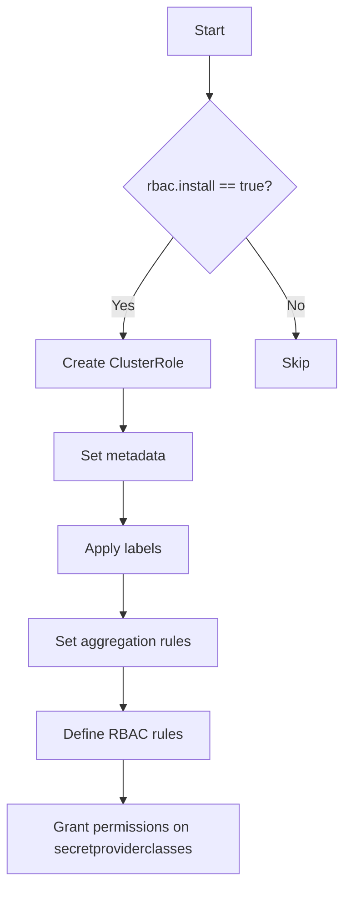
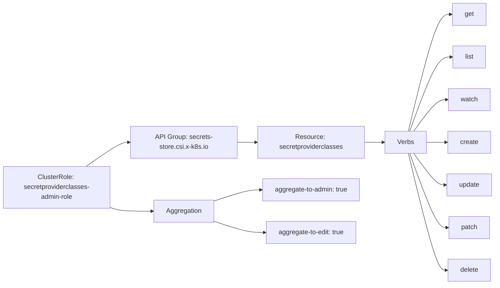
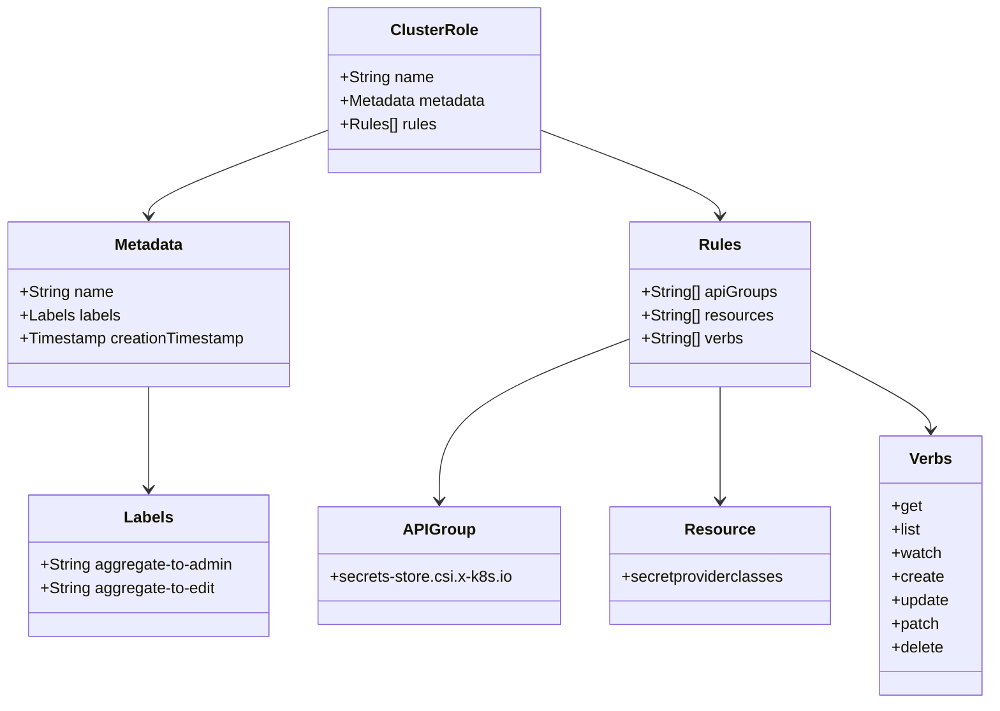

# Diagram: devops/k8s/secrets-store-csi-driver/helm/templates/role-secretproviderclasses-admin.yaml

> Auto-generated by Obscura crawlers

## Diagram 1

### SVG

<svg id="container" width="383.4375" xmlns="http://www.w3.org/2000/svg" class="flowchart" height="987.984375" viewBox="0 0 383.4375 987.984375" role="graphics-document document" aria-roledescription="flowchart-v2"><g><marker id="container_flowchart-v2-pointEnd" class="marker flowchart-v2" viewBox="0 0 10 10" refX="5" refY="5" markerUnits="userSpaceOnUse" markerWidth="8" markerHeight="8" orient="auto"><path d="M 0 0 L 10 5 L 0 10 z" class="arrowMarkerPath" style="stroke-width: 1; stroke-dasharray: 1, 0;"></path></marker><marker id="container_flowchart-v2-pointStart" class="marker flowchart-v2" viewBox="0 0 10 10" refX="4.5" refY="5" markerUnits="userSpaceOnUse" markerWidth="8" markerHeight="8" orient="auto"><path d="M 0 5 L 10 10 L 10 0 z" class="arrowMarkerPath" style="stroke-width: 1; stroke-dasharray: 1, 0;"></path></marker><marker id="container_flowchart-v2-circleEnd" class="marker flowchart-v2" viewBox="0 0 10 10" refX="11" refY="5" markerUnits="userSpaceOnUse" markerWidth="11" markerHeight="11" orient="auto"><circle cx="5" cy="5" r="5" class="arrowMarkerPath" style="stroke-width: 1; stroke-dasharray: 1, 0;"></circle></marker><marker id="container_flowchart-v2-circleStart" class="marker flowchart-v2" viewBox="0 0 10 10" refX="-1" refY="5" markerUnits="userSpaceOnUse" markerWidth="11" markerHeight="11" orient="auto"><circle cx="5" cy="5" r="5" class="arrowMarkerPath" style="stroke-width: 1; stroke-dasharray: 1, 0;"></circle></marker><marker id="container_flowchart-v2-crossEnd" class="marker cross flowchart-v2" viewBox="0 0 11 11" refX="12" refY="5.2" markerUnits="userSpaceOnUse" markerWidth="11" markerHeight="11" orient="auto"><path d="M 1,1 l 9,9 M 10,1 l -9,9" class="arrowMarkerPath" style="stroke-width: 2; stroke-dasharray: 1, 0;"></path></marker><marker id="container_flowchart-v2-crossStart" class="marker cross flowchart-v2" viewBox="0 0 11 11" refX="-1" refY="5.2" markerUnits="userSpaceOnUse" markerWidth="11" markerHeight="11" orient="auto"><path d="M 1,1 l 9,9 M 10,1 l -9,9" class="arrowMarkerPath" style="stroke-width: 2; stroke-dasharray: 1, 0;"></path></marker><g class="root"><g class="clusters"></g><g class="edgePaths"><path d="M233.984,62L233.984,66.167C233.984,70.333,233.984,78.667,233.984,86.333C233.984,94,233.984,101,233.984,104.5L233.984,108" id="L_A_B_0" class="edge-thickness-normal edge-pattern-solid edge-thickness-normal edge-pattern-solid flowchart-link" style=";" data-edge="true" data-et="edge" data-id="L_A_B_0" data-points="W3sieCI6MjMzLjk4NDM3NSwieSI6NjJ9LHsieCI6MjMzLjk4NDM3NSwieSI6ODd9LHsieCI6MjMzLjk4NDM3NSwieSI6MTEyfV0=" marker-end="url(#container_flowchart-v2-pointEnd)"></path><path d="M193.263,267.263L184.052,280.216C174.842,293.17,156.421,319.077,147.21,337.531C138,355.984,138,366.984,138,372.484L138,377.984" id="L_B_C_0" class="edge-thickness-normal edge-pattern-solid edge-thickness-normal edge-pattern-solid flowchart-link" style=";" data-edge="true" data-et="edge" data-id="L_B_C_0" data-points="W3sieCI6MTkzLjI2Mjg0NTYzNjczMjY0LCJ5IjoyNjcuMjYyODQ1NjM2NzMyNn0seyJ4IjoxMzgsInkiOjM0NC45ODQzNzV9LHsieCI6MTM4LCJ5IjozODEuOTg0Mzc1fV0=" marker-end="url(#container_flowchart-v2-pointEnd)"></path><path d="M274.706,267.263L283.916,280.216C293.127,293.17,311.548,319.077,320.758,337.531C329.969,355.984,329.969,366.984,329.969,372.484L329.969,377.984" id="L_B_D_0" class="edge-thickness-normal edge-pattern-solid edge-thickness-normal edge-pattern-solid flowchart-link" style=";" data-edge="true" data-et="edge" data-id="L_B_D_0" data-points="W3sieCI6Mjc0LjcwNTkwNDM2MzI2NzQsInkiOjI2Ny4yNjI4NDU2MzY3MzI2fSx7IngiOjMyOS45Njg3NSwieSI6MzQ0Ljk4NDM3NX0seyJ4IjozMjkuOTY4NzUsInkiOjM4MS45ODQzNzV9XQ==" marker-end="url(#container_flowchart-v2-pointEnd)"></path><path d="M138,435.984L138,440.151C138,444.318,138,452.651,138,460.318C138,467.984,138,474.984,138,478.484L138,481.984" id="L_C_E_0" class="edge-thickness-normal edge-pattern-solid edge-thickness-normal edge-pattern-solid flowchart-link" style=";" data-edge="true" data-et="edge" data-id="L_C_E_0" data-points="W3sieCI6MTM4LCJ5Ijo0MzUuOTg0Mzc1fSx7IngiOjEzOCwieSI6NDYwLjk4NDM3NX0seyJ4IjoxMzgsInkiOjQ4NS45ODQzNzV9XQ==" marker-end="url(#container_flowchart-v2-pointEnd)"></path><path d="M138,539.984L138,544.151C138,548.318,138,556.651,138,564.318C138,571.984,138,578.984,138,582.484L138,585.984" id="L_E_F_0" class="edge-thickness-normal edge-pattern-solid edge-thickness-normal edge-pattern-solid flowchart-link" style=";" data-edge="true" data-et="edge" data-id="L_E_F_0" data-points="W3sieCI6MTM4LCJ5Ijo1MzkuOTg0Mzc1fSx7IngiOjEzOCwieSI6NTY0Ljk4NDM3NX0seyJ4IjoxMzgsInkiOjU4OS45ODQzNzV9XQ==" marker-end="url(#container_flowchart-v2-pointEnd)"></path><path d="M138,643.984L138,648.151C138,652.318,138,660.651,138,668.318C138,675.984,138,682.984,138,686.484L138,689.984" id="L_F_G_0" class="edge-thickness-normal edge-pattern-solid edge-thickness-normal edge-pattern-solid flowchart-link" style=";" data-edge="true" data-et="edge" data-id="L_F_G_0" data-points="W3sieCI6MTM4LCJ5Ijo2NDMuOTg0Mzc1fSx7IngiOjEzOCwieSI6NjY4Ljk4NDM3NX0seyJ4IjoxMzgsInkiOjY5My45ODQzNzV9XQ==" marker-end="url(#container_flowchart-v2-pointEnd)"></path><path d="M138,747.984L138,752.151C138,756.318,138,764.651,138,772.318C138,779.984,138,786.984,138,790.484L138,793.984" id="L_G_H_0" class="edge-thickness-normal edge-pattern-solid edge-thickness-normal edge-pattern-solid flowchart-link" style=";" data-edge="true" data-et="edge" data-id="L_G_H_0" data-points="W3sieCI6MTM4LCJ5Ijo3NDcuOTg0Mzc1fSx7IngiOjEzOCwieSI6NzcyLjk4NDM3NX0seyJ4IjoxMzgsInkiOjc5Ny45ODQzNzV9XQ==" marker-end="url(#container_flowchart-v2-pointEnd)"></path><path d="M138,851.984L138,856.151C138,860.318,138,868.651,138,876.318C138,883.984,138,890.984,138,894.484L138,897.984" id="L_H_I_0" class="edge-thickness-normal edge-pattern-solid edge-thickness-normal edge-pattern-solid flowchart-link" style=";" data-edge="true" data-et="edge" data-id="L_H_I_0" data-points="W3sieCI6MTM4LCJ5Ijo4NTEuOTg0Mzc1fSx7IngiOjEzOCwieSI6ODc2Ljk4NDM3NX0seyJ4IjoxMzgsInkiOjkwMS45ODQzNzV9XQ==" marker-end="url(#container_flowchart-v2-pointEnd)"></path></g><g class="edgeLabels"><g class="edgeLabel"><g class="label" data-id="L_A_B_0" transform="translate(0, 0)"><foreignObject width="0" height="0">

</foreignObject></g></g><g class="edgeLabel" transform="translate(138, 344.984375)"><g class="label" data-id="L_B_C_0" transform="translate(-12.03125, -12)"><foreignObject width="24.0625" height="24">

Yes

</foreignObject></g></g><g class="edgeLabel" transform="translate(329.96875, 344.984375)"><g class="label" data-id="L_B_D_0" transform="translate(-10.140625, -12)"><foreignObject width="20.28125" height="24">

No

</foreignObject></g></g><g class="edgeLabel"><g class="label" data-id="L_C_E_0" transform="translate(0, 0)"><foreignObject width="0" height="0">

</foreignObject></g></g><g class="edgeLabel"><g class="label" data-id="L_E_F_0" transform="translate(0, 0)"><foreignObject width="0" height="0">

</foreignObject></g></g><g class="edgeLabel"><g class="label" data-id="L_F_G_0" transform="translate(0, 0)"><foreignObject width="0" height="0">

</foreignObject></g></g><g class="edgeLabel"><g class="label" data-id="L_G_H_0" transform="translate(0, 0)"><foreignObject width="0" height="0">

</foreignObject></g></g><g class="edgeLabel"><g class="label" data-id="L_H_I_0" transform="translate(0, 0)"><foreignObject width="0" height="0">

</foreignObject></g></g></g><g class="nodes"><g class="node default" id="flowchart-A-0" transform="translate(233.984375, 35)"><rect class="basic label-container" style="" x="-47.5234375" y="-27" width="95.046875" height="54"></rect><g class="label" style="" transform="translate(-17.5234375, -12)"><rect></rect><foreignObject width="35.046875" height="24">

Start

</foreignObject></g></g><g class="node default" id="flowchart-B-1" transform="translate(233.984375, 209.9921875)"><polygon points="97.9921875,0 195.984375,-97.9921875 97.9921875,-195.984375 0,-97.9921875" class="label-container" transform="translate(-97.4921875, 97.9921875)"></polygon><g class="label" style="" transform="translate(-70.9921875, -12)"><rect></rect><foreignObject width="141.984375" height="24">

rbac.install == true?

</foreignObject></g></g><g class="node default" id="flowchart-C-3" transform="translate(138, 408.984375)"><rect class="basic label-container" style="" x="-96.5" y="-27" width="193" height="54"></rect><g class="label" style="" transform="translate(-66.5, -12)"><rect></rect><foreignObject width="133" height="24">

Create ClusterRole

</foreignObject></g></g><g class="node default" id="flowchart-D-5" transform="translate(329.96875, 408.984375)"><rect class="basic label-container" style="" x="-45.46875" y="-27" width="90.9375" height="54"></rect><g class="label" style="" transform="translate(-15.46875, -12)"><rect></rect><foreignObject width="30.9375" height="24">

Skip

</foreignObject></g></g><g class="node default" id="flowchart-E-7" transform="translate(138, 512.984375)"><rect class="basic label-container" style="" x="-78.453125" y="-27" width="156.90625" height="54"></rect><g class="label" style="" transform="translate(-48.453125, -12)"><rect></rect><foreignObject width="96.90625" height="24">

Set metadata

</foreignObject></g></g><g class="node default" id="flowchart-F-9" transform="translate(138, 616.984375)"><rect class="basic label-container" style="" x="-74.2578125" y="-27" width="148.515625" height="54"></rect><g class="label" style="" transform="translate(-44.2578125, -12)"><rect></rect><foreignObject width="88.515625" height="24">

Apply labels

</foreignObject></g></g><g class="node default" id="flowchart-G-11" transform="translate(138, 720.984375)"><rect class="basic label-container" style="" x="-106.65625" y="-27" width="213.3125" height="54"></rect><g class="label" style="" transform="translate(-76.65625, -12)"><rect></rect><foreignObject width="153.3125" height="24">

Set aggregation rules

</foreignObject></g></g><g class="node default" id="flowchart-H-13" transform="translate(138, 824.984375)"><rect class="basic label-container" style="" x="-94.1953125" y="-27" width="188.390625" height="54"></rect><g class="label" style="" transform="translate(-64.1953125, -12)"><rect></rect><foreignObject width="128.390625" height="24">

Define RBAC rules

</foreignObject></g></g><g class="node default" id="flowchart-I-15" transform="translate(138, 940.984375)"><rect class="basic label-container" style="" x="-130" y="-39" width="260" height="78"></rect><g class="label" style="" transform="translate(-100, -24)"><rect></rect><foreignObject width="200" height="48">

Grant permissions on secretproviderclasses

</foreignObject></g></g></g></g></g></svg>

## Diagram 2

### SVG

<svg id="container" width="1207.734375" xmlns="http://www.w3.org/2000/svg" class="flowchart" height="694" viewBox="0 0 1207.734375 694" role="graphics-document document" aria-roledescription="flowchart-v2"><g><marker id="container_flowchart-v2-pointEnd" class="marker flowchart-v2" viewBox="0 0 10 10" refX="5" refY="5" markerUnits="userSpaceOnUse" markerWidth="8" markerHeight="8" orient="auto"><path d="M 0 0 L 10 5 L 0 10 z" class="arrowMarkerPath" style="stroke-width: 1; stroke-dasharray: 1, 0;"></path></marker><marker id="container_flowchart-v2-pointStart" class="marker flowchart-v2" viewBox="0 0 10 10" refX="4.5" refY="5" markerUnits="userSpaceOnUse" markerWidth="8" markerHeight="8" orient="auto"><path d="M 0 5 L 10 10 L 10 0 z" class="arrowMarkerPath" style="stroke-width: 1; stroke-dasharray: 1, 0;"></path></marker><marker id="container_flowchart-v2-circleEnd" class="marker flowchart-v2" viewBox="0 0 10 10" refX="11" refY="5" markerUnits="userSpaceOnUse" markerWidth="11" markerHeight="11" orient="auto"><circle cx="5" cy="5" r="5" class="arrowMarkerPath" style="stroke-width: 1; stroke-dasharray: 1, 0;"></circle></marker><marker id="container_flowchart-v2-circleStart" class="marker flowchart-v2" viewBox="0 0 10 10" refX="-1" refY="5" markerUnits="userSpaceOnUse" markerWidth="11" markerHeight="11" orient="auto"><circle cx="5" cy="5" r="5" class="arrowMarkerPath" style="stroke-width: 1; stroke-dasharray: 1, 0;"></circle></marker><marker id="container_flowchart-v2-crossEnd" class="marker cross flowchart-v2" viewBox="0 0 11 11" refX="12" refY="5.2" markerUnits="userSpaceOnUse" markerWidth="11" markerHeight="11" orient="auto"><path d="M 1,1 l 9,9 M 10,1 l -9,9" class="arrowMarkerPath" style="stroke-width: 2; stroke-dasharray: 1, 0;"></path></marker><marker id="container_flowchart-v2-crossStart" class="marker cross flowchart-v2" viewBox="0 0 11 11" refX="-1" refY="5.2" markerUnits="userSpaceOnUse" markerWidth="11" markerHeight="11" orient="auto"><path d="M 1,1 l 9,9 M 10,1 l -9,9" class="arrowMarkerPath" style="stroke-width: 2; stroke-dasharray: 1, 0;"></path></marker><g class="root"><g class="clusters"></g><g class="edgePaths"><path d="M209.864,406L223.72,396.167C237.576,386.333,265.288,366.667,282.644,356.833C300,347,307,347,310.5,347L314,347" id="L_A_B_0" class="edge-thickness-normal edge-pattern-solid edge-thickness-normal edge-pattern-solid flowchart-link" style=";" data-edge="true" data-et="edge" data-id="L_A_B_0" data-points="W3sieCI6MjA5Ljg2MzYzNjM2MzYzNjM3LCJ5Ijo0MDZ9LHsieCI6MjkzLCJ5IjozNDd9LHsieCI6MzE4LCJ5IjozNDd9XQ==" marker-end="url(#container_flowchart-v2-pointEnd)"></path><path d="M578,347L582.167,347C586.333,347,594.667,347,602.333,347C610,347,617,347,620.5,347L624,347" id="L_B_C_0" class="edge-thickness-normal edge-pattern-solid edge-thickness-normal edge-pattern-solid flowchart-link" style=";" data-edge="true" data-et="edge" data-id="L_B_C_0" data-points="W3sieCI6NTc4LCJ5IjozNDd9LHsieCI6NjAzLCJ5IjozNDd9LHsieCI6NjI4LCJ5IjozNDd9XQ==" marker-end="url(#container_flowchart-v2-pointEnd)"></path><path d="M888,347L892.167,347C896.333,347,904.667,347,912.333,347C920,347,927,347,930.5,347L934,347" id="L_C_D_0" class="edge-thickness-normal edge-pattern-solid edge-thickness-normal edge-pattern-solid flowchart-link" style=";" data-edge="true" data-et="edge" data-id="L_C_D_0" data-points="W3sieCI6ODg4LCJ5IjozNDd9LHsieCI6OTEzLCJ5IjozNDd9LHsieCI6OTM4LCJ5IjozNDd9XQ==" marker-end="url(#container_flowchart-v2-pointEnd)"></path><path d="M994.694,320L1006.141,272.5C1017.588,225,1040.481,130,1057.828,82.5C1075.174,35,1086.974,35,1092.874,35L1098.773,35" id="L_D_E_0" class="edge-thickness-normal edge-pattern-solid edge-thickness-normal edge-pattern-solid flowchart-link" style=";" data-edge="true" data-et="edge" data-id="L_D_E_0" data-points="W3sieCI6OTk0LjY5NDExMDU3NjkyMzEsInkiOjMyMH0seyJ4IjoxMDYzLjM3NSwieSI6MzV9LHsieCI6MTEwMi43NzM0Mzc1LCJ5IjozNX1d" marker-end="url(#container_flowchart-v2-pointEnd)"></path><path d="M997.947,320L1008.852,289.833C1019.757,259.667,1041.566,199.333,1058.379,169.167C1075.193,139,1087.01,139,1092.919,139L1098.828,139" id="L_D_F_0" class="edge-thickness-normal edge-pattern-solid edge-thickness-normal edge-pattern-solid flowchart-link" style=";" data-edge="true" data-et="edge" data-id="L_D_F_0" data-points="W3sieCI6OTk3Ljk0NzQxNTg2NTM4NDYsInkiOjMyMH0seyJ4IjoxMDYzLjM3NSwieSI6MTM5fSx7IngiOjExMDIuODI4MTI1LCJ5IjoxMzl9XQ==" marker-end="url(#container_flowchart-v2-pointEnd)"></path><path d="M1007.707,320L1016.985,307.167C1026.263,294.333,1044.819,268.667,1058.331,255.833C1071.844,243,1080.313,243,1084.547,243L1088.781,243" id="L_D_G_0" class="edge-thickness-normal edge-pattern-solid edge-thickness-normal edge-pattern-solid flowchart-link" style=";" data-edge="true" data-et="edge" data-id="L_D_G_0" data-points="W3sieCI6MTAwNy43MDczMzE3MzA3NjkzLCJ5IjozMjB9LHsieCI6MTA2My4zNzUsInkiOjI0M30seyJ4IjoxMDkyLjc4MTI1LCJ5IjoyNDN9XQ==" marker-end="url(#container_flowchart-v2-pointEnd)"></path><path d="M1038.375,347L1042.542,347C1046.708,347,1055.042,347,1063.249,347C1071.456,347,1079.536,347,1083.577,347L1087.617,347" id="L_D_H_0" class="edge-thickness-normal edge-pattern-solid edge-thickness-normal edge-pattern-solid flowchart-link" style=";" data-edge="true" data-et="edge" data-id="L_D_H_0" data-points="W3sieCI6MTAzOC4zNzUsInkiOjM0N30seyJ4IjoxMDYzLjM3NSwieSI6MzQ3fSx7IngiOjEwOTEuNjE3MTg3NSwieSI6MzQ3fV0=" marker-end="url(#container_flowchart-v2-pointEnd)"></path><path d="M1007.707,374L1016.985,386.833C1026.263,399.667,1044.819,425.333,1057.597,438.167C1070.375,451,1077.375,451,1080.875,451L1084.375,451" id="L_D_I_0" class="edge-thickness-normal edge-pattern-solid edge-thickness-normal edge-pattern-solid flowchart-link" style=";" data-edge="true" data-et="edge" data-id="L_D_I_0" data-points="W3sieCI6MTAwNy43MDczMzE3MzA3NjkzLCJ5IjozNzR9LHsieCI6MTA2My4zNzUsInkiOjQ1MX0seyJ4IjoxMDg4LjM3NSwieSI6NDUxfV0=" marker-end="url(#container_flowchart-v2-pointEnd)"></path><path d="M997.947,374L1008.852,404.167C1019.757,434.333,1041.566,494.667,1056.866,524.833C1072.167,555,1080.958,555,1085.354,555L1089.75,555" id="L_D_J_0" class="edge-thickness-normal edge-pattern-solid edge-thickness-normal edge-pattern-solid flowchart-link" style=";" data-edge="true" data-et="edge" data-id="L_D_J_0" data-points="W3sieCI6OTk3Ljk0NzQxNTg2NTM4NDYsInkiOjM3NH0seyJ4IjoxMDYzLjM3NSwieSI6NTU1fSx7IngiOjEwOTMuNzUsInkiOjU1NX1d" marker-end="url(#container_flowchart-v2-pointEnd)"></path><path d="M994.694,374L1006.141,421.5C1017.588,469,1040.481,564,1055.885,611.5C1071.289,659,1079.203,659,1083.16,659L1087.117,659" id="L_D_K_0" class="edge-thickness-normal edge-pattern-solid edge-thickness-normal edge-pattern-solid flowchart-link" style=";" data-edge="true" data-et="edge" data-id="L_D_K_0" data-points="W3sieCI6OTk0LjY5NDExMDU3NjkyMzEsInkiOjM3NH0seyJ4IjoxMDYzLjM3NSwieSI6NjU5fSx7IngiOjEwOTEuMTE3MTg3NSwieSI6NjU5fV0=" marker-end="url(#container_flowchart-v2-pointEnd)"></path><path d="M268,505.645L272.167,507.204C276.333,508.763,284.667,511.882,301.837,513.441C319.008,515,345.016,515,358.02,515L371.023,515" id="L_A_L_0" class="edge-thickness-normal edge-pattern-solid edge-thickness-normal edge-pattern-solid flowchart-link" style=";" data-edge="true" data-et="edge" data-id="L_A_L_0" data-points="W3sieCI6MjY4LCJ5Ijo1MDUuNjQ1MTYxMjkwMzIyNTZ9LHsieCI6MjkzLCJ5Ijo1MTV9LHsieCI6Mzc1LjAyMzQzNzUsInkiOjUxNX1d" marker-end="url(#container_flowchart-v2-pointEnd)"></path><path d="M520.977,490.518L534.647,485.931C548.318,481.345,575.659,472.173,594.332,467.586C613.005,463,623.01,463,628.013,463L633.016,463" id="L_L_M_0" class="edge-thickness-normal edge-pattern-solid edge-thickness-normal edge-pattern-solid flowchart-link" style=";" data-edge="true" data-et="edge" data-id="L_L_M_0" data-points="W3sieCI6NTIwLjk3NjU2MjUsInkiOjQ5MC41MTc1NDAzMjI1ODA2Nn0seyJ4Ijo2MDMsInkiOjQ2M30seyJ4Ijo2MzcuMDE1NjI1LCJ5Ijo0NjN9XQ==" marker-end="url(#container_flowchart-v2-pointEnd)"></path><path d="M520.977,539.482L534.647,544.069C548.318,548.655,575.659,557.827,595.747,562.414C615.836,567,628.672,567,635.09,567L641.508,567" id="L_L_N_0" class="edge-thickness-normal edge-pattern-solid edge-thickness-normal edge-pattern-solid flowchart-link" style=";" data-edge="true" data-et="edge" data-id="L_L_N_0" data-points="W3sieCI6NTIwLjk3NjU2MjUsInkiOjUzOS40ODI0NTk2Nzc0MTkzfSx7IngiOjYwMywieSI6NTY3fSx7IngiOjY0NS41MDc4MTI1LCJ5Ijo1Njd9XQ==" marker-end="url(#container_flowchart-v2-pointEnd)"></path></g><g class="edgeLabels"><g class="edgeLabel"><g class="label" data-id="L_A_B_0" transform="translate(0, 0)"><foreignObject width="0" height="0">

</foreignObject></g></g><g class="edgeLabel"><g class="label" data-id="L_B_C_0" transform="translate(0, 0)"><foreignObject width="0" height="0">

</foreignObject></g></g><g class="edgeLabel"><g class="label" data-id="L_C_D_0" transform="translate(0, 0)"><foreignObject width="0" height="0">

</foreignObject></g></g><g class="edgeLabel"><g class="label" data-id="L_D_E_0" transform="translate(0, 0)"><foreignObject width="0" height="0">

</foreignObject></g></g><g class="edgeLabel"><g class="label" data-id="L_D_F_0" transform="translate(0, 0)"><foreignObject width="0" height="0">

</foreignObject></g></g><g class="edgeLabel"><g class="label" data-id="L_D_G_0" transform="translate(0, 0)"><foreignObject width="0" height="0">

</foreignObject></g></g><g class="edgeLabel"><g class="label" data-id="L_D_H_0" transform="translate(0, 0)"><foreignObject width="0" height="0">

</foreignObject></g></g><g class="edgeLabel"><g class="label" data-id="L_D_I_0" transform="translate(0, 0)"><foreignObject width="0" height="0">

</foreignObject></g></g><g class="edgeLabel"><g class="label" data-id="L_D_J_0" transform="translate(0, 0)"><foreignObject width="0" height="0">

</foreignObject></g></g><g class="edgeLabel"><g class="label" data-id="L_D_K_0" transform="translate(0, 0)"><foreignObject width="0" height="0">

</foreignObject></g></g><g class="edgeLabel"><g class="label" data-id="L_A_L_0" transform="translate(0, 0)"><foreignObject width="0" height="0">

</foreignObject></g></g><g class="edgeLabel"><g class="label" data-id="L_L_M_0" transform="translate(0, 0)"><foreignObject width="0" height="0">

</foreignObject></g></g><g class="edgeLabel"><g class="label" data-id="L_L_N_0" transform="translate(0, 0)"><foreignObject width="0" height="0">

</foreignObject></g></g></g><g class="nodes"><g class="node default" id="flowchart-A-0" transform="translate(138, 457)"><rect class="basic label-container" style="" x="-130" y="-51" width="260" height="102"></rect><g class="label" style="" transform="translate(-100, -36)"><rect></rect><foreignObject width="200" height="72">

ClusterRole: secretproviderclasses-admin-role

</foreignObject></g></g><g class="node default" id="flowchart-B-1" transform="translate(448, 347)"><rect class="basic label-container" style="" x="-130" y="-39" width="260" height="78"></rect><g class="label" style="" transform="translate(-100, -24)"><rect></rect><foreignObject width="200" height="48">

API Group: secrets-store.csi.x-k8s.io

</foreignObject></g></g><g class="node default" id="flowchart-C-3" transform="translate(758, 347)"><rect class="basic label-container" style="" x="-130" y="-39" width="260" height="78"></rect><g class="label" style="" transform="translate(-100, -24)"><rect></rect><foreignObject width="200" height="48">

Resource: secretproviderclasses

</foreignObject></g></g><g class="node default" id="flowchart-D-5" transform="translate(988.1875, 347)"><rect class="basic label-container" style="" x="-50.1875" y="-27" width="100.375" height="54"></rect><g class="label" style="" transform="translate(-20.1875, -12)"><rect></rect><foreignObject width="40.375" height="24">

Verbs

</foreignObject></g></g><g class="node default" id="flowchart-E-7" transform="translate(1144.0546875, 35)"><rect class="basic label-container" style="" x="-41.28125" y="-27" width="82.5625" height="54"></rect><g class="label" style="" transform="translate(-11.28125, -12)"><rect></rect><foreignObject width="22.5625" height="24">

get

</foreignObject></g></g><g class="node default" id="flowchart-F-9" transform="translate(1144.0546875, 139)"><rect class="basic label-container" style="" x="-41.2265625" y="-27" width="82.453125" height="54"></rect><g class="label" style="" transform="translate(-11.2265625, -12)"><rect></rect><foreignObject width="22.453125" height="24">

list

</foreignObject></g></g><g class="node default" id="flowchart-G-11" transform="translate(1144.0546875, 243)"><rect class="basic label-container" style="" x="-51.2734375" y="-27" width="102.546875" height="54"></rect><g class="label" style="" transform="translate(-21.2734375, -12)"><rect></rect><foreignObject width="42.546875" height="24">

watch

</foreignObject></g></g><g class="node default" id="flowchart-H-13" transform="translate(1144.0546875, 347)"><rect class="basic label-container" style="" x="-52.4375" y="-27" width="104.875" height="54"></rect><g class="label" style="" transform="translate(-22.4375, -12)"><rect></rect><foreignObject width="44.875" height="24">

create

</foreignObject></g></g><g class="node default" id="flowchart-I-15" transform="translate(1144.0546875, 451)"><rect class="basic label-container" style="" x="-55.6796875" y="-27" width="111.359375" height="54"></rect><g class="label" style="" transform="translate(-25.6796875, -12)"><rect></rect><foreignObject width="51.359375" height="24">

update

</foreignObject></g></g><g class="node default" id="flowchart-J-17" transform="translate(1144.0546875, 555)"><rect class="basic label-container" style="" x="-50.3046875" y="-27" width="100.609375" height="54"></rect><g class="label" style="" transform="translate(-20.3046875, -12)"><rect></rect><foreignObject width="40.609375" height="24">

patch

</foreignObject></g></g><g class="node default" id="flowchart-K-19" transform="translate(1144.0546875, 659)"><rect class="basic label-container" style="" x="-52.9375" y="-27" width="105.875" height="54"></rect><g class="label" style="" transform="translate(-22.9375, -12)"><rect></rect><foreignObject width="45.875" height="24">

delete

</foreignObject></g></g><g class="node default" id="flowchart-L-21" transform="translate(448, 515)"><rect class="basic label-container" style="" x="-72.9765625" y="-27" width="145.953125" height="54"></rect><g class="label" style="" transform="translate(-42.9765625, -12)"><rect></rect><foreignObject width="85.953125" height="24">

Aggregation

</foreignObject></g></g><g class="node default" id="flowchart-M-23" transform="translate(758, 463)"><rect class="basic label-container" style="" x="-120.984375" y="-27" width="241.96875" height="54"></rect><g class="label" style="" transform="translate(-90.984375, -12)"><rect></rect><foreignObject width="181.96875" height="24">

aggregate-to-admin: true

</foreignObject></g></g><g class="node default" id="flowchart-N-25" transform="translate(758, 567)"><rect class="basic label-container" style="" x="-112.4921875" y="-27" width="224.984375" height="54"></rect><g class="label" style="" transform="translate(-82.4921875, -12)"><rect></rect><foreignObject width="164.984375" height="24">

aggregate-to-edit: true

</foreignObject></g></g></g></g></g></svg>

## Diagram 3

### SVG

<svg id="container" width="1003.6875" xmlns="http://www.w3.org/2000/svg" class="classDiagram" height="716" viewBox="0 0 1003.6875 716" role="graphics-document document" aria-roledescription="class"><g><defs><marker id="container_class-aggregationStart" class="marker aggregation class" refX="18" refY="7" markerWidth="190" markerHeight="240" orient="auto"><path d="M 18,7 L9,13 L1,7 L9,1 Z"></path></marker></defs><defs><marker id="container_class-aggregationEnd" class="marker aggregation class" refX="1" refY="7" markerWidth="20" markerHeight="28" orient="auto"><path d="M 18,7 L9,13 L1,7 L9,1 Z"></path></marker></defs><defs><marker id="container_class-extensionStart" class="marker extension class" refX="18" refY="7" markerWidth="190" markerHeight="240" orient="auto"><path d="M 1,7 L18,13 V 1 Z"></path></marker></defs><defs><marker id="container_class-extensionEnd" class="marker extension class" refX="1" refY="7" markerWidth="20" markerHeight="28" orient="auto"><path d="M 1,1 V 13 L18,7 Z"></path></marker></defs><defs><marker id="container_class-compositionStart" class="marker composition class" refX="18" refY="7" markerWidth="190" markerHeight="240" orient="auto"><path d="M 18,7 L9,13 L1,7 L9,1 Z"></path></marker></defs><defs><marker id="container_class-compositionEnd" class="marker composition class" refX="1" refY="7" markerWidth="20" markerHeight="28" orient="auto"><path d="M 18,7 L9,13 L1,7 L9,1 Z"></path></marker></defs><defs><marker id="container_class-dependencyStart" class="marker dependency class" refX="6" refY="7" markerWidth="190" markerHeight="240" orient="auto"><path d="M 5,7 L9,13 L1,7 L9,1 Z"></path></marker></defs><defs><marker id="container_class-dependencyEnd" class="marker dependency class" refX="13" refY="7" markerWidth="20" markerHeight="28" orient="auto"><path d="M 18,7 L9,13 L14,7 L9,1 Z"></path></marker></defs><defs><marker id="container_class-lollipopStart" class="marker lollipop class" refX="13" refY="7" markerWidth="190" markerHeight="240" orient="auto"><circle stroke="black" fill="transparent" cx="7" cy="7" r="6"></circle></marker></defs><defs><marker id="container_class-lollipopEnd" class="marker lollipop class" refX="1" refY="7" markerWidth="190" markerHeight="240" orient="auto"><circle stroke="black" fill="transparent" cx="7" cy="7" r="6"></circle></marker></defs><g class="root"><g class="clusters"></g><g class="edgePaths"><path d="M333.918,132.761L303.785,144.134C273.651,155.507,213.384,178.254,183.251,192.793C153.117,207.333,153.117,213.667,153.117,216.833L153.117,220" id="id_ClusterRole_Metadata_1" class="edge-thickness-normal edge-pattern-solid relation" style=";;;" data-edge="true" data-et="edge" data-id="id_ClusterRole_Metadata_1" data-points="W3sieCI6MzMzLjkxNzk2ODc1LCJ5IjoxMzIuNzYwNzM5NTk4NTV9LHsieCI6MTUzLjExNzE4NzUsInkiOjIwMX0seyJ4IjoxNTMuMTE3MTg3NSwieSI6MjI2fV0=" marker-end="url(#container_class-dependencyEnd)"></path><path d="M549.91,132.761L580.044,144.134C610.177,155.507,670.444,178.254,700.577,192.793C730.711,207.333,730.711,213.667,730.711,216.833L730.711,220" id="id_ClusterRole_Rules_2" class="edge-thickness-normal edge-pattern-solid relation" style=";;;" data-edge="true" data-et="edge" data-id="id_ClusterRole_Rules_2" data-points="W3sieCI6NTQ5LjkxMDE1NjI1LCJ5IjoxMzIuNzYwNzM5NTk4NTV9LHsieCI6NzMwLjcxMDkzNzUsInkiOjIwMX0seyJ4Ijo3MzAuNzEwOTM3NSwieSI6MjI2fV0=" marker-end="url(#container_class-dependencyEnd)"></path><path d="M153.117,394L153.117,398.167C153.117,402.333,153.117,410.667,153.117,428C153.117,445.333,153.117,471.667,153.117,484.833L153.117,498" id="id_Metadata_Labels_3" class="edge-thickness-normal edge-pattern-solid relation" style=";;;" data-edge="true" data-et="edge" data-id="id_Metadata_Labels_3" data-points="W3sieCI6MTUzLjExNzE4NzUsInkiOjM5NH0seyJ4IjoxNTMuMTE3MTg3NSwieSI6NDE5fSx7IngiOjE1My4xMTcxODc1LCJ5Ijo1MDR9XQ==" marker-end="url(#container_class-dependencyEnd)"></path><path d="M639.184,345.283L607.313,357.569C575.441,369.856,511.699,394.428,479.828,421.881C447.957,449.333,447.957,479.667,447.957,494.833L447.957,510" id="id_Rules_APIGroup_4" class="edge-thickness-normal edge-pattern-solid relation" style=";;;" data-edge="true" data-et="edge" data-id="id_Rules_APIGroup_4" data-points="W3sieCI6NjM5LjE4MzU5Mzc1LCJ5IjozNDUuMjgzMjYzMTA2OTk3M30seyJ4Ijo0NDcuOTU3MDMxMjUsInkiOjQxOX0seyJ4Ijo0NDcuOTU3MDMxMjUsInkiOjUxNn1d" marker-end="url(#container_class-dependencyEnd)"></path><path d="M730.711,394L730.711,398.167C730.711,402.333,730.711,410.667,730.711,430C730.711,449.333,730.711,479.667,730.711,494.833L730.711,510" id="id_Rules_Resource_5" class="edge-thickness-normal edge-pattern-solid relation" style=";;;" data-edge="true" data-et="edge" data-id="id_Rules_Resource_5" data-points="W3sieCI6NzMwLjcxMDkzNzUsInkiOjM5NH0seyJ4Ijo3MzAuNzEwOTM3NSwieSI6NDE5fSx7IngiOjczMC43MTA5Mzc1LCJ5Ijo1MTZ9XQ==" marker-end="url(#container_class-dependencyEnd)"></path><path d="M822.238,356.838L842.484,367.198C862.729,377.559,903.22,398.279,923.465,411.806C943.711,425.333,943.711,431.667,943.711,434.833L943.711,438" id="id_Rules_Verbs_6" class="edge-thickness-normal edge-pattern-solid relation" style=";;;" data-edge="true" data-et="edge" data-id="id_Rules_Verbs_6" data-points="W3sieCI6ODIyLjIzODI4MTI1LCJ5IjozNTYuODM3OTM2NDczMDA0N30seyJ4Ijo5NDMuNzEwOTM3NSwieSI6NDE5fSx7IngiOjk0My43MTA5Mzc1LCJ5Ijo0NDR9XQ==" marker-end="url(#container_class-dependencyEnd)"></path></g><g class="edgeLabels"><g class="edgeLabel"><g class="label" data-id="id_ClusterRole_Metadata_1" transform="translate(0, 0)"><foreignObject width="0" height="0">

</foreignObject></g></g><g class="edgeLabel"><g class="label" data-id="id_ClusterRole_Rules_2" transform="translate(0, 0)"><foreignObject width="0" height="0">

</foreignObject></g></g><g class="edgeLabel"><g class="label" data-id="id_Metadata_Labels_3" transform="translate(0, 0)"><foreignObject width="0" height="0">

</foreignObject></g></g><g class="edgeLabel"><g class="label" data-id="id_Rules_APIGroup_4" transform="translate(0, 0)"><foreignObject width="0" height="0">

</foreignObject></g></g><g class="edgeLabel"><g class="label" data-id="id_Rules_Resource_5" transform="translate(0, 0)"><foreignObject width="0" height="0">

</foreignObject></g></g><g class="edgeLabel"><g class="label" data-id="id_Rules_Verbs_6" transform="translate(0, 0)"><foreignObject width="0" height="0">

</foreignObject></g></g></g><g class="nodes"><g class="node default" id="classId-ClusterRole-0" transform="translate(441.9140625, 92)"><g class="basic label-container"><path d="M-107.99609375 -84 L107.99609375 -84 L107.99609375 84 L-107.99609375 84" stroke="none" stroke-width="0" fill="#ECECFF" style=""></path><path d="M-107.99609375 -84 C-59.8834678117424 -84, -11.770841873484798 -84, 107.99609375 -84 M-107.99609375 -84 C-59.11987290039131 -84, -10.243652050782615 -84, 107.99609375 -84 M107.99609375 -84 C107.99609375 -41.46011200124721, 107.99609375 1.0797759975055783, 107.99609375 84 M107.99609375 -84 C107.99609375 -18.587350487625216, 107.99609375 46.82529902474957, 107.99609375 84 M107.99609375 84 C56.33948456789225 84, 4.682875385784499 84, -107.99609375 84 M107.99609375 84 C42.419301459773635 84, -23.15749083045273 84, -107.99609375 84 M-107.99609375 84 C-107.99609375 37.74243975508343, -107.99609375 -8.515120489833137, -107.99609375 -84 M-107.99609375 84 C-107.99609375 42.22863518164044, -107.99609375 0.4572703632808839, -107.99609375 -84" stroke="#9370DB" stroke-width="1.3" fill="none" stroke-dasharray="0 0" style=""></path></g><g class="annotation-group text" transform="translate(0, -60)"></g><g class="label-group text" transform="translate(-42.1484375, -60)"><g class="label" style="font-weight: bolder" transform="translate(0,-12)"><foreignObject width="84.296875" height="24">

ClusterRole

</foreignObject></g></g><g class="members-group text" transform="translate(-95.99609375, -12)"><g class="label" style="" transform="translate(0,-12)"><foreignObject width="94.984375" height="24">

+String name

</foreignObject></g><g class="label" style="" transform="translate(0,12)"><foreignObject width="149.84375" height="24">

+Metadata metadata

</foreignObject></g><g class="label" style="" transform="translate(0,36)"><foreignObject width="98.609375" height="24">

+Rules[] rules

</foreignObject></g></g><g class="methods-group text" transform="translate(-95.99609375, 84)"></g><g class="divider" style=""><path d="M-107.99609375 -36 C-51.72441434270287 -36, 4.5472650645942565 -36, 107.99609375 -36 M-107.99609375 -36 C-46.02039887509085 -36, 15.955295999818304 -36, 107.99609375 -36" stroke="#9370DB" stroke-width="1.3" fill="none" stroke-dasharray="0 0" style=""></path></g><g class="divider" style=""><path d="M-107.99609375 60 C-58.097033107467134 60, -8.197972464934267 60, 107.99609375 60 M-107.99609375 60 C-32.691238598455996 60, 42.61361655308801 60, 107.99609375 60" stroke="#9370DB" stroke-width="1.3" fill="none" stroke-dasharray="0 0" style=""></path></g></g><g class="node default" id="classId-Metadata-1" transform="translate(153.1171875, 310)"><g class="basic label-container"><path d="M-145.1171875 -84 L145.1171875 -84 L145.1171875 84 L-145.1171875 84" stroke="none" stroke-width="0" fill="#ECECFF" style=""></path><path d="M-145.1171875 -84 C-86.50298281343109 -84, -27.888778126862178 -84, 145.1171875 -84 M-145.1171875 -84 C-64.62217538639065 -84, 15.872836727218697 -84, 145.1171875 -84 M145.1171875 -84 C145.1171875 -17.906582089291092, 145.1171875 48.186835821417816, 145.1171875 84 M145.1171875 -84 C145.1171875 -49.351637931275285, 145.1171875 -14.70327586255057, 145.1171875 84 M145.1171875 84 C58.54879757320391 84, -28.019592353592174 84, -145.1171875 84 M145.1171875 84 C48.966780628780356 84, -47.18362624243929 84, -145.1171875 84 M-145.1171875 84 C-145.1171875 24.568276427411, -145.1171875 -34.863447145178, -145.1171875 -84 M-145.1171875 84 C-145.1171875 33.811017963894756, -145.1171875 -16.37796407221049, -145.1171875 -84" stroke="#9370DB" stroke-width="1.3" fill="none" stroke-dasharray="0 0" style=""></path></g><g class="annotation-group text" transform="translate(0, -60)"></g><g class="label-group text" transform="translate(-34.640625, -60)"><g class="label" style="font-weight: bolder" transform="translate(0,-12)"><foreignObject width="69.28125" height="24">

Metadata

</foreignObject></g></g><g class="members-group text" transform="translate(-133.1171875, -12)"><g class="label" style="" transform="translate(0,-12)"><foreignObject width="94.984375" height="24">

+String name

</foreignObject></g><g class="label" style="" transform="translate(0,12)"><foreignObject width="102.828125" height="24">

+Labels labels

</foreignObject></g><g class="label" style="" transform="translate(0,36)"><foreignObject width="231.59375" height="24">

+Timestamp creationTimestamp

</foreignObject></g></g><g class="methods-group text" transform="translate(-133.1171875, 84)"></g><g class="divider" style=""><path d="M-145.1171875 -36 C-44.82906133113295 -36, 55.459064837734104 -36, 145.1171875 -36 M-145.1171875 -36 C-44.15791898832222 -36, 56.801349523355555 -36, 145.1171875 -36" stroke="#9370DB" stroke-width="1.3" fill="none" stroke-dasharray="0 0" style=""></path></g><g class="divider" style=""><path d="M-145.1171875 60 C-51.67325606753462 60, 41.77067536493075 60, 145.1171875 60 M-145.1171875 60 C-70.45308501700002 60, 4.211017465999959 60, 145.1171875 60" stroke="#9370DB" stroke-width="1.3" fill="none" stroke-dasharray="0 0" style=""></path></g></g><g class="node default" id="classId-Labels-2" transform="translate(153.1171875, 576)"><g class="basic label-container"><path d="M-123.109375 -72 L123.109375 -72 L123.109375 72 L-123.109375 72" stroke="none" stroke-width="0" fill="#ECECFF" style=""></path><path d="M-123.109375 -72 C-70.46920203333246 -72, -17.829029066664944 -72, 123.109375 -72 M-123.109375 -72 C-39.71581179979533 -72, 43.677751400409335 -72, 123.109375 -72 M123.109375 -72 C123.109375 -25.521970707295786, 123.109375 20.956058585408428, 123.109375 72 M123.109375 -72 C123.109375 -33.04545119793708, 123.109375 5.909097604125833, 123.109375 72 M123.109375 72 C64.48039536130551 72, 5.851415722611023 72, -123.109375 72 M123.109375 72 C38.13876527274999 72, -46.831844454500015 72, -123.109375 72 M-123.109375 72 C-123.109375 23.783478087156453, -123.109375 -24.433043825687093, -123.109375 -72 M-123.109375 72 C-123.109375 23.523908767385848, -123.109375 -24.952182465228304, -123.109375 -72" stroke="#9370DB" stroke-width="1.3" fill="none" stroke-dasharray="0 0" style=""></path></g><g class="annotation-group text" transform="translate(0, -48)"></g><g class="label-group text" transform="translate(-23.84375, -48)"><g class="label" style="font-weight: bolder" transform="translate(0,-12)"><foreignObject width="47.6875" height="24">

Labels

</foreignObject></g></g><g class="members-group text" transform="translate(-111.109375, 0)"><g class="label" style="" transform="translate(0,-12)"><foreignObject width="198.375" height="24">

+String aggregate-to-admin

</foreignObject></g><g class="label" style="" transform="translate(0,12)"><foreignObject width="181.3125" height="24">

+String aggregate-to-edit

</foreignObject></g></g><g class="methods-group text" transform="translate(-111.109375, 72)"></g><g class="divider" style=""><path d="M-123.109375 -24 C-50.50273972712344 -24, 22.10389554575312 -24, 123.109375 -24 M-123.109375 -24 C-31.164577770571157 -24, 60.78021945885769 -24, 123.109375 -24" stroke="#9370DB" stroke-width="1.3" fill="none" stroke-dasharray="0 0" style=""></path></g><g class="divider" style=""><path d="M-123.109375 48 C-25.171543955310867 48, 72.76628708937827 48, 123.109375 48 M-123.109375 48 C-44.508265322901636 48, 34.09284435419673 48, 123.109375 48" stroke="#9370DB" stroke-width="1.3" fill="none" stroke-dasharray="0 0" style=""></path></g></g><g class="node default" id="classId-Rules-3" transform="translate(730.7109375, 310)"><g class="basic label-container"><path d="M-91.52734375 -84 L91.52734375 -84 L91.52734375 84 L-91.52734375 84" stroke="none" stroke-width="0" fill="#ECECFF" style=""></path><path d="M-91.52734375 -84 C-27.741358943301307 -84, 36.044625863397386 -84, 91.52734375 -84 M-91.52734375 -84 C-53.23792961256992 -84, -14.948515475139843 -84, 91.52734375 -84 M91.52734375 -84 C91.52734375 -30.59174100909076, 91.52734375 22.81651798181848, 91.52734375 84 M91.52734375 -84 C91.52734375 -47.87805411569785, 91.52734375 -11.7561082313957, 91.52734375 84 M91.52734375 84 C24.270802509958216 84, -42.98573873008357 84, -91.52734375 84 M91.52734375 84 C27.03418803897192 84, -37.45896767205616 84, -91.52734375 84 M-91.52734375 84 C-91.52734375 28.83234773324603, -91.52734375 -26.335304533507937, -91.52734375 -84 M-91.52734375 84 C-91.52734375 33.985869563280446, -91.52734375 -16.02826087343911, -91.52734375 -84" stroke="#9370DB" stroke-width="1.3" fill="none" stroke-dasharray="0 0" style=""></path></g><g class="annotation-group text" transform="translate(0, -60)"></g><g class="label-group text" transform="translate(-20.1328125, -60)"><g class="label" style="font-weight: bolder" transform="translate(0,-12)"><foreignObject width="40.265625" height="24">

Rules

</foreignObject></g></g><g class="members-group text" transform="translate(-79.52734375, -12)"><g class="label" style="" transform="translate(0,-12)"><foreignObject width="138.921875" height="24">

+String[] apiGroups

</foreignObject></g><g class="label" style="" transform="translate(0,12)"><foreignObject width="134.53125" height="24">

+String[] resources

</foreignObject></g><g class="label" style="" transform="translate(0,36)"><foreignObject width="104.453125" height="24">

+String[] verbs

</foreignObject></g></g><g class="methods-group text" transform="translate(-79.52734375, 84)"></g><g class="divider" style=""><path d="M-91.52734375 -36 C-45.498540944760684 -36, 0.5302618604786318 -36, 91.52734375 -36 M-91.52734375 -36 C-33.42257090180312 -36, 24.68220194639376 -36, 91.52734375 -36" stroke="#9370DB" stroke-width="1.3" fill="none" stroke-dasharray="0 0" style=""></path></g><g class="divider" style=""><path d="M-91.52734375 60 C-27.241811862530824 60, 37.04372002493835 60, 91.52734375 60 M-91.52734375 60 C-51.81027895878201 60, -12.093214167564014 60, 91.52734375 60" stroke="#9370DB" stroke-width="1.3" fill="none" stroke-dasharray="0 0" style=""></path></g></g><g class="node default" id="classId-APIGroup-4" transform="translate(447.95703125, 576)"><g class="basic label-container"><path d="M-121.73046875 -60 L121.73046875 -60 L121.73046875 60 L-121.73046875 60" stroke="none" stroke-width="0" fill="#ECECFF" style=""></path><path d="M-121.73046875 -60 C-29.140478458738528 -60, 63.449511832522944 -60, 121.73046875 -60 M-121.73046875 -60 C-34.57834502711147 -60, 52.573778695777065 -60, 121.73046875 -60 M121.73046875 -60 C121.73046875 -32.42395231149053, 121.73046875 -4.847904622981062, 121.73046875 60 M121.73046875 -60 C121.73046875 -13.43951788108182, 121.73046875 33.12096423783636, 121.73046875 60 M121.73046875 60 C45.102593027904476 60, -31.52528269419105 60, -121.73046875 60 M121.73046875 60 C35.87882086649567 60, -49.972827017008655 60, -121.73046875 60 M-121.73046875 60 C-121.73046875 24.730875144077565, -121.73046875 -10.53824971184487, -121.73046875 -60 M-121.73046875 60 C-121.73046875 15.77944571994356, -121.73046875 -28.44110856011288, -121.73046875 -60" stroke="#9370DB" stroke-width="1.3" fill="none" stroke-dasharray="0 0" style=""></path></g><g class="annotation-group text" transform="translate(0, -36)"></g><g class="label-group text" transform="translate(-34.0234375, -36)"><g class="label" style="font-weight: bolder" transform="translate(0,-12)"><foreignObject width="68.046875" height="24">

APIGroup

</foreignObject></g></g><g class="members-group text" transform="translate(-109.73046875, 12)"><g class="label" style="" transform="translate(0,-12)"><foreignObject width="185.4375" height="24">

+secrets-store.csi.x-k8s.io

</foreignObject></g></g><g class="methods-group text" transform="translate(-109.73046875, 60)"></g><g class="divider" style=""><path d="M-121.73046875 -12 C-59.71048506705975 -12, 2.3094986158805 -12, 121.73046875 -12 M-121.73046875 -12 C-68.32062298084217 -12, -14.910777211684348 -12, 121.73046875 -12" stroke="#9370DB" stroke-width="1.3" fill="none" stroke-dasharray="0 0" style=""></path></g><g class="divider" style=""><path d="M-121.73046875 36 C-41.012252623181325 36, 39.70596350363735 36, 121.73046875 36 M-121.73046875 36 C-41.49884684102092 36, 38.73277506795816 36, 121.73046875 36" stroke="#9370DB" stroke-width="1.3" fill="none" stroke-dasharray="0 0" style=""></path></g></g><g class="node default" id="classId-Resource-5" transform="translate(730.7109375, 576)"><g class="basic label-container"><path d="M-111.0234375 -60 L111.0234375 -60 L111.0234375 60 L-111.0234375 60" stroke="none" stroke-width="0" fill="#ECECFF" style=""></path><path d="M-111.0234375 -60 C-45.34085245411352 -60, 20.341732591772967 -60, 111.0234375 -60 M-111.0234375 -60 C-33.978480112109835 -60, 43.06647727578033 -60, 111.0234375 -60 M111.0234375 -60 C111.0234375 -26.63219156712922, 111.0234375 6.735616865741562, 111.0234375 60 M111.0234375 -60 C111.0234375 -24.466518580854313, 111.0234375 11.066962838291374, 111.0234375 60 M111.0234375 60 C38.69536691770038 60, -33.632703664599234 60, -111.0234375 60 M111.0234375 60 C62.753563967281416 60, 14.483690434562831 60, -111.0234375 60 M-111.0234375 60 C-111.0234375 23.466056967895824, -111.0234375 -13.067886064208352, -111.0234375 -60 M-111.0234375 60 C-111.0234375 29.835086157804355, -111.0234375 -0.3298276843912902, -111.0234375 -60" stroke="#9370DB" stroke-width="1.3" fill="none" stroke-dasharray="0 0" style=""></path></g><g class="annotation-group text" transform="translate(0, -36)"></g><g class="label-group text" transform="translate(-33.40625, -36)"><g class="label" style="font-weight: bolder" transform="translate(0,-12)"><foreignObject width="66.8125" height="24">

Resource

</foreignObject></g></g><g class="members-group text" transform="translate(-99.0234375, 12)"><g class="label" style="" transform="translate(0,-12)"><foreignObject width="164.640625" height="24">

+secretproviderclasses

</foreignObject></g></g><g class="methods-group text" transform="translate(-99.0234375, 60)"></g><g class="divider" style=""><path d="M-111.0234375 -12 C-53.11343405332346 -12, 4.7965693933530815 -12, 111.0234375 -12 M-111.0234375 -12 C-46.45882997628418 -12, 18.105777547431643 -12, 111.0234375 -12" stroke="#9370DB" stroke-width="1.3" fill="none" stroke-dasharray="0 0" style=""></path></g><g class="divider" style=""><path d="M-111.0234375 36 C-40.95149646753832 36, 29.12044456492336 36, 111.0234375 36 M-111.0234375 36 C-35.4505738286033 36, 40.12228984279341 36, 111.0234375 36" stroke="#9370DB" stroke-width="1.3" fill="none" stroke-dasharray="0 0" style=""></path></g></g><g class="node default" id="classId-Verbs-6" transform="translate(943.7109375, 576)"><g class="basic label-container"><path d="M-51.9765625 -132 L51.9765625 -132 L51.9765625 132 L-51.9765625 132" stroke="none" stroke-width="0" fill="#ECECFF" style=""></path><path d="M-51.9765625 -132 C-26.770258658793775 -132, -1.5639548175875504 -132, 51.9765625 -132 M-51.9765625 -132 C-12.164267894323842 -132, 27.648026711352315 -132, 51.9765625 -132 M51.9765625 -132 C51.9765625 -74.60268406170167, 51.9765625 -17.205368123403346, 51.9765625 132 M51.9765625 -132 C51.9765625 -38.93990694680646, 51.9765625 54.12018610638708, 51.9765625 132 M51.9765625 132 C28.26073080767472 132, 4.544899115349438 132, -51.9765625 132 M51.9765625 132 C15.006851793121996 132, -21.96285891375601 132, -51.9765625 132 M-51.9765625 132 C-51.9765625 41.8758676087982, -51.9765625 -48.248264782403595, -51.9765625 -132 M-51.9765625 132 C-51.9765625 63.982187519308965, -51.9765625 -4.035624961382069, -51.9765625 -132" stroke="#9370DB" stroke-width="1.3" fill="none" stroke-dasharray="0 0" style=""></path></g><g class="annotation-group text" transform="translate(0, -108)"></g><g class="label-group text" transform="translate(-20.625, -108)"><g class="label" style="font-weight: bolder" transform="translate(0,-12)"><foreignObject width="41.25" height="24">

Verbs

</foreignObject></g></g><g class="members-group text" transform="translate(-39.9765625, -60)"><g class="label" style="" transform="translate(0,-12)"><foreignObject width="30.546875" height="24">

+get

</foreignObject></g><g class="label" style="" transform="translate(0,12)"><foreignObject width="30.4375" height="24">

+list

</foreignObject></g><g class="label" style="" transform="translate(0,36)"><foreignObject width="50.53125" height="24">

+watch

</foreignObject></g><g class="label" style="" transform="translate(0,60)"><foreignObject width="52.859375" height="24">

+create

</foreignObject></g><g class="label" style="" transform="translate(0,84)"><foreignObject width="59.328125" height="24">

+update

</foreignObject></g><g class="label" style="" transform="translate(0,108)"><foreignObject width="48.59375" height="24">

+patch

</foreignObject></g><g class="label" style="" transform="translate(0,132)"><foreignObject width="53.859375" height="24">

+delete

</foreignObject></g></g><g class="methods-group text" transform="translate(-39.9765625, 132)"></g><g class="divider" style=""><path d="M-51.9765625 -84 C-26.924680784047112 -84, -1.8727990680942241 -84, 51.9765625 -84 M-51.9765625 -84 C-27.30595966802141 -84, -2.635356836042817 -84, 51.9765625 -84" stroke="#9370DB" stroke-width="1.3" fill="none" stroke-dasharray="0 0" style=""></path></g><g class="divider" style=""><path d="M-51.9765625 108 C-16.57449822297248 108, 18.82756605405504 108, 51.9765625 108 M-51.9765625 108 C-28.42846889081537 108, -4.880375281630741 108, 51.9765625 108" stroke="#9370DB" stroke-width="1.3" fill="none" stroke-dasharray="0 0" style=""></path></g></g></g></g></g></svg>
