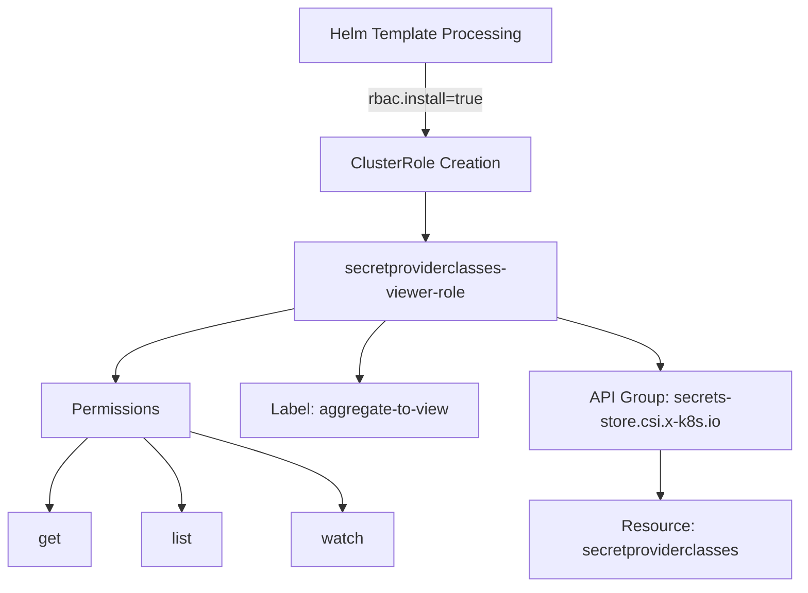
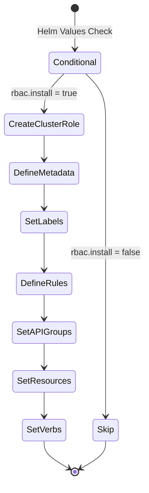

# Diagram: devops/k8s/secrets-store-csi-driver/helm/templates/role-secretproviderclasses-viewer.yaml

> Auto-generated by Obscura crawlers

## Diagram 1

### SVG

<svg id="container" width="795.61328125" xmlns="http://www.w3.org/2000/svg" class="flowchart" height="582" viewBox="0 0 795.61328125 582" role="graphics-document document" aria-roledescription="flowchart-v2"><g><marker id="container_flowchart-v2-pointEnd" class="marker flowchart-v2" viewBox="0 0 10 10" refX="5" refY="5" markerUnits="userSpaceOnUse" markerWidth="8" markerHeight="8" orient="auto"><path d="M 0 0 L 10 5 L 0 10 z" class="arrowMarkerPath" style="stroke-width: 1; stroke-dasharray: 1, 0;"></path></marker><marker id="container_flowchart-v2-pointStart" class="marker flowchart-v2" viewBox="0 0 10 10" refX="4.5" refY="5" markerUnits="userSpaceOnUse" markerWidth="8" markerHeight="8" orient="auto"><path d="M 0 5 L 10 10 L 10 0 z" class="arrowMarkerPath" style="stroke-width: 1; stroke-dasharray: 1, 0;"></path></marker><marker id="container_flowchart-v2-circleEnd" class="marker flowchart-v2" viewBox="0 0 10 10" refX="11" refY="5" markerUnits="userSpaceOnUse" markerWidth="11" markerHeight="11" orient="auto"><circle cx="5" cy="5" r="5" class="arrowMarkerPath" style="stroke-width: 1; stroke-dasharray: 1, 0;"></circle></marker><marker id="container_flowchart-v2-circleStart" class="marker flowchart-v2" viewBox="0 0 10 10" refX="-1" refY="5" markerUnits="userSpaceOnUse" markerWidth="11" markerHeight="11" orient="auto"><circle cx="5" cy="5" r="5" class="arrowMarkerPath" style="stroke-width: 1; stroke-dasharray: 1, 0;"></circle></marker><marker id="container_flowchart-v2-crossEnd" class="marker cross flowchart-v2" viewBox="0 0 11 11" refX="12" refY="5.2" markerUnits="userSpaceOnUse" markerWidth="11" markerHeight="11" orient="auto"><path d="M 1,1 l 9,9 M 10,1 l -9,9" class="arrowMarkerPath" style="stroke-width: 2; stroke-dasharray: 1, 0;"></path></marker><marker id="container_flowchart-v2-crossStart" class="marker cross flowchart-v2" viewBox="0 0 11 11" refX="-1" refY="5.2" markerUnits="userSpaceOnUse" markerWidth="11" markerHeight="11" orient="auto"><path d="M 1,1 l 9,9 M 10,1 l -9,9" class="arrowMarkerPath" style="stroke-width: 2; stroke-dasharray: 1, 0;"></path></marker><g class="root"><g class="clusters"></g><g class="edgePaths"><path d="M424.688,62L424.688,68.167C424.688,74.333,424.688,86.667,424.688,98.333C424.688,110,424.688,121,424.688,126.5L424.688,132" id="L_A_B_0" class="edge-thickness-normal edge-pattern-solid edge-thickness-normal edge-pattern-solid flowchart-link" style=";" data-edge="true" data-et="edge" data-id="L_A_B_0" data-points="W3sieCI6NDI0LjY4NzUsInkiOjYyfSx7IngiOjQyNC42ODc1LCJ5Ijo5OX0seyJ4Ijo0MjQuNjg3NSwieSI6MTM2fV0=" marker-end="url(#container_flowchart-v2-pointEnd)"></path><path d="M424.688,190L424.688,194.167C424.688,198.333,424.688,206.667,424.688,214.333C424.688,222,424.688,229,424.688,232.5L424.688,236" id="L_B_C_0" class="edge-thickness-normal edge-pattern-solid edge-thickness-normal edge-pattern-solid flowchart-link" style=";" data-edge="true" data-et="edge" data-id="L_B_C_0" data-points="W3sieCI6NDI0LjY4NzUsInkiOjE5MH0seyJ4Ijo0MjQuNjg3NSwieSI6MjE1fSx7IngiOjQyNC42ODc1LCJ5IjoyNDB9XQ==" marker-end="url(#container_flowchart-v2-pointEnd)"></path><path d="M294.688,305.912L264.829,312.094C234.97,318.275,175.253,330.637,145.394,342.319C115.535,354,115.535,365,115.535,370.5L115.535,376" id="L_C_D_0" class="edge-thickness-normal edge-pattern-solid edge-thickness-normal edge-pattern-solid flowchart-link" style=";" data-edge="true" data-et="edge" data-id="L_C_D_0" data-points="W3sieCI6Mjk0LjY4NzUsInkiOjMwNS45MTIyOTc5OTIyNDE5fSx7IngiOjExNS41MzUxNTYyNSwieSI6MzQzfSx7IngiOjExNS41MzUxNTYyNSwieSI6MzgwfV0=" marker-end="url(#container_flowchart-v2-pointEnd)"></path><path d="M87.584,434L81.2,440.167C74.817,446.333,62.049,458.667,55.665,470.333C49.281,482,49.281,493,49.281,498.5L49.281,504" id="L_D_E_0" class="edge-thickness-normal edge-pattern-solid edge-thickness-normal edge-pattern-solid flowchart-link" style=";" data-edge="true" data-et="edge" data-id="L_D_E_0" data-points="W3sieCI6ODcuNTg0Mjg5NTUwNzgxMjUsInkiOjQzNH0seyJ4Ijo0OS4yODEyNSwieSI6NDcxfSx7IngiOjQ5LjI4MTI1LCJ5Ijo1MDh9XQ==" marker-end="url(#container_flowchart-v2-pointEnd)"></path><path d="M143.486,434L149.87,440.167C156.254,446.333,169.021,458.667,175.405,470.333C181.789,482,181.789,493,181.789,498.5L181.789,504" id="L_D_F_0" class="edge-thickness-normal edge-pattern-solid edge-thickness-normal edge-pattern-solid flowchart-link" style=";" data-edge="true" data-et="edge" data-id="L_D_F_0" data-points="W3sieCI6MTQzLjQ4NjAyMjk0OTIxODc1LCJ5Ijo0MzR9LHsieCI6MTgxLjc4OTA2MjUsInkiOjQ3MX0seyJ4IjoxODEuNzg5MDYyNSwieSI6NTA4fV0=" marker-end="url(#container_flowchart-v2-pointEnd)"></path><path d="M189.254,427.816L214.743,435.013C240.232,442.211,291.21,456.605,316.699,469.303C342.188,482,342.188,493,342.188,498.5L342.188,504" id="L_D_G_0" class="edge-thickness-normal edge-pattern-solid edge-thickness-normal edge-pattern-solid flowchart-link" style=";" data-edge="true" data-et="edge" data-id="L_D_G_0" data-points="W3sieCI6MTg5LjI1MzkwNjI1LCJ5Ijo0MjcuODE2MDIxMjMyOTU5M30seyJ4IjozNDIuMTg3NSwieSI6NDcxfSx7IngiOjM0Mi4xODc1LCJ5Ijo1MDh9XQ==" marker-end="url(#container_flowchart-v2-pointEnd)"></path><path d="M384.314,318L380.001,322.167C375.687,326.333,367.06,334.667,362.747,344.333C358.434,354,358.434,365,358.434,370.5L358.434,376" id="L_C_H_0" class="edge-thickness-normal edge-pattern-solid edge-thickness-normal edge-pattern-solid flowchart-link" style=";" data-edge="true" data-et="edge" data-id="L_C_H_0" data-points="W3sieCI6Mzg0LjMxNDAyNTg3ODkwNjI1LCJ5IjozMTh9LHsieCI6MzU4LjQzMzU5Mzc1LCJ5IjozNDN9LHsieCI6MzU4LjQzMzU5Mzc1LCJ5IjozODB9XQ==" marker-end="url(#container_flowchart-v2-pointEnd)"></path><path d="M554.688,314.72L571.842,319.433C588.996,324.146,623.305,333.573,640.459,341.787C657.613,350,657.613,357,657.613,360.5L657.613,364" id="L_C_I_0" class="edge-thickness-normal edge-pattern-solid edge-thickness-normal edge-pattern-solid flowchart-link" style=";" data-edge="true" data-et="edge" data-id="L_C_I_0" data-points="W3sieCI6NTU0LjY4NzUsInkiOjMxNC43MTk1MzI0NDIyNjh9LHsieCI6NjU3LjYxMzI4MTI1LCJ5IjozNDN9LHsieCI6NjU3LjYxMzI4MTI1LCJ5IjozNjh9XQ==" marker-end="url(#container_flowchart-v2-pointEnd)"></path><path d="M657.613,446L657.613,450.167C657.613,454.333,657.613,462.667,657.613,470.333C657.613,478,657.613,485,657.613,488.5L657.613,492" id="L_I_J_0" class="edge-thickness-normal edge-pattern-solid edge-thickness-normal edge-pattern-solid flowchart-link" style=";" data-edge="true" data-et="edge" data-id="L_I_J_0" data-points="W3sieCI6NjU3LjYxMzI4MTI1LCJ5Ijo0NDZ9LHsieCI6NjU3LjYxMzI4MTI1LCJ5Ijo0NzF9LHsieCI6NjU3LjYxMzI4MTI1LCJ5Ijo0OTZ9XQ==" marker-end="url(#container_flowchart-v2-pointEnd)"></path></g><g class="edgeLabels"><g class="edgeLabel" transform="translate(424.6875, 99)"><g class="label" data-id="L_A_B_0" transform="translate(-59.40625, -12)"><foreignObject width="118.8125" height="24">

rbac.install=true

</foreignObject></g></g><g class="edgeLabel"><g class="label" data-id="L_B_C_0" transform="translate(0, 0)"><foreignObject width="0" height="0">

</foreignObject></g></g><g class="edgeLabel"><g class="label" data-id="L_C_D_0" transform="translate(0, 0)"><foreignObject width="0" height="0">

</foreignObject></g></g><g class="edgeLabel"><g class="label" data-id="L_D_E_0" transform="translate(0, 0)"><foreignObject width="0" height="0">

</foreignObject></g></g><g class="edgeLabel"><g class="label" data-id="L_D_F_0" transform="translate(0, 0)"><foreignObject width="0" height="0">

</foreignObject></g></g><g class="edgeLabel"><g class="label" data-id="L_D_G_0" transform="translate(0, 0)"><foreignObject width="0" height="0">

</foreignObject></g></g><g class="edgeLabel"><g class="label" data-id="L_C_H_0" transform="translate(0, 0)"><foreignObject width="0" height="0">

</foreignObject></g></g><g class="edgeLabel"><g class="label" data-id="L_C_I_0" transform="translate(0, 0)"><foreignObject width="0" height="0">

</foreignObject></g></g><g class="edgeLabel"><g class="label" data-id="L_I_J_0" transform="translate(0, 0)"><foreignObject width="0" height="0">

</foreignObject></g></g></g><g class="nodes"><g class="node default" id="flowchart-A-0" transform="translate(424.6875, 35)"><rect class="basic label-container" style="" x="-125.21875" y="-27" width="250.4375" height="54"></rect><g class="label" style="" transform="translate(-95.21875, -12)"><rect></rect><foreignObject width="190.4375" height="24">

Helm Template Processing

</foreignObject></g></g><g class="node default" id="flowchart-B-1" transform="translate(424.6875, 163)"><rect class="basic label-container" style="" x="-103.875" y="-27" width="207.75" height="54"></rect><g class="label" style="" transform="translate(-73.875, -12)"><rect></rect><foreignObject width="147.75" height="24">

ClusterRole Creation

</foreignObject></g></g><g class="node default" id="flowchart-C-3" transform="translate(424.6875, 279)"><rect class="basic label-container" style="" x="-130" y="-39" width="260" height="78"></rect><g class="label" style="" transform="translate(-100, -24)"><rect></rect><foreignObject width="200" height="48">

secretproviderclasses-viewer-role

</foreignObject></g></g><g class="node default" id="flowchart-D-5" transform="translate(115.53515625, 407)"><rect class="basic label-container" style="" x="-73.71875" y="-27" width="147.4375" height="54"></rect><g class="label" style="" transform="translate(-43.71875, -12)"><rect></rect><foreignObject width="87.4375" height="24">

Permissions

</foreignObject></g></g><g class="node default" id="flowchart-E-7" transform="translate(49.28125, 535)"><rect class="basic label-container" style="" x="-41.28125" y="-27" width="82.5625" height="54"></rect><g class="label" style="" transform="translate(-11.28125, -12)"><rect></rect><foreignObject width="22.5625" height="24">

get

</foreignObject></g></g><g class="node default" id="flowchart-F-9" transform="translate(181.7890625, 535)"><rect class="basic label-container" style="" x="-41.2265625" y="-27" width="82.453125" height="54"></rect><g class="label" style="" transform="translate(-11.2265625, -12)"><rect></rect><foreignObject width="22.453125" height="24">

list

</foreignObject></g></g><g class="node default" id="flowchart-G-11" transform="translate(342.1875, 535)"><rect class="basic label-container" style="" x="-51.2734375" y="-27" width="102.546875" height="54"></rect><g class="label" style="" transform="translate(-21.2734375, -12)"><rect></rect><foreignObject width="42.546875" height="24">

watch

</foreignObject></g></g><g class="node default" id="flowchart-H-13" transform="translate(358.43359375, 407)"><rect class="basic label-container" style="" x="-119.1796875" y="-27" width="238.359375" height="54"></rect><g class="label" style="" transform="translate(-89.1796875, -12)"><rect></rect><foreignObject width="178.359375" height="24">

Label: aggregate-to-view

</foreignObject></g></g><g class="node default" id="flowchart-I-15" transform="translate(657.61328125, 407)"><rect class="basic label-container" style="" x="-130" y="-39" width="260" height="78"></rect><g class="label" style="" transform="translate(-100, -24)"><rect></rect><foreignObject width="200" height="48">

API Group: secrets-store.csi.x-k8s.io

</foreignObject></g></g><g class="node default" id="flowchart-J-17" transform="translate(657.61328125, 535)"><rect class="basic label-container" style="" x="-130" y="-39" width="260" height="78"></rect><g class="label" style="" transform="translate(-100, -24)"><rect></rect><foreignObject width="200" height="48">

Resource: secretproviderclasses

</foreignObject></g></g></g></g></g></svg>

## Diagram 2

### SVG

<svg id="container" width="267.515625" xmlns="http://www.w3.org/2000/svg" class="statediagram" height="886" viewBox="0 0 267.515625 886" role="graphics-document document" aria-roledescription="stateDiagram"><g><defs><marker id="container_stateDiagram-barbEnd" refX="19" refY="7" markerWidth="20" markerHeight="14" markerUnits="userSpaceOnUse" orient="auto"><path d="M 19,7 L9,13 L14,7 L9,1 Z"></path></marker></defs><g class="root"><g class="clusters"></g><g class="edgePaths"><path d="M137.016,22L137.016,28.167C137.016,34.333,137.016,46.667,137.099,59.083C137.182,71.5,137.349,84,137.432,90.25L137.516,96.5" id="edge0" class="edge-thickness-normal edge-pattern-solid transition" style="fill:none;;;fill:none" data-edge="true" data-et="edge" data-id="edge0" data-points="W3sieCI6MTM3LjAxNTYyNSwieSI6MjJ9LHsieCI6MTM3LjAxNTYyNSwieSI6NTl9LHsieCI6MTM3LjUxNTYyNSwieSI6OTYuNX1d" marker-end="url(#container_stateDiagram-barbEnd)"></path><path d="M117.644,136.5L111.434,142.583C105.224,148.667,92.803,160.833,86.676,173.167C80.549,185.5,80.716,198,80.799,204.25L80.883,210.5" id="edge1" class="edge-thickness-normal edge-pattern-solid transition" style="fill:none;;;fill:none" data-edge="true" data-et="edge" data-id="edge1" data-points="W3sieCI6MTE3LjY0NDQ2MjcxOTI5ODI1LCJ5IjoxMzYuNX0seyJ4Ijo4MC4zODI4MTI1LCJ5IjoxNzN9LHsieCI6ODAuODgyODEyNSwieSI6MjEwLjV9XQ==" marker-end="url(#container_stateDiagram-barbEnd)"></path><path d="M157.387,136.5L163.43,142.583C169.474,148.667,181.561,160.833,187.605,176.417C193.648,192,193.648,211,193.648,228C193.648,245,193.648,260,193.648,275C193.648,290,193.648,305,193.648,320C193.648,335,193.648,350,193.648,365C193.648,380,193.648,395,193.648,412C193.648,429,193.648,448,193.648,467C193.648,486,193.648,505,193.648,522C193.648,539,193.648,554,193.648,569C193.648,584,193.648,599,193.648,614C193.648,629,193.648,644,193.648,659C193.648,674,193.648,689,193.648,704C193.648,719,193.648,734,193.732,745.75C193.815,757.5,193.982,766,194.065,770.25L194.148,774.5" id="edge2" class="edge-thickness-normal edge-pattern-solid transition" style="fill:none;;;fill:none" data-edge="true" data-et="edge" data-id="edge2" data-points="W3sieCI6MTU3LjM4Njc4NzI4MDcwMTc1LCJ5IjoxMzYuNX0seyJ4IjoxOTMuNjQ4NDM3NSwieSI6MTczfSx7IngiOjE5My42NDg0Mzc1LCJ5IjoyMzB9LHsieCI6MTkzLjY0ODQzNzUsInkiOjI3NX0seyJ4IjoxOTMuNjQ4NDM3NSwieSI6MzIwfSx7IngiOjE5My42NDg0Mzc1LCJ5IjozNjV9LHsieCI6MTkzLjY0ODQzNzUsInkiOjQxMH0seyJ4IjoxOTMuNjQ4NDM3NSwieSI6NDY3fSx7IngiOjE5My42NDg0Mzc1LCJ5Ijo1MjR9LHsieCI6MTkzLjY0ODQzNzUsInkiOjU2OX0seyJ4IjoxOTMuNjQ4NDM3NSwieSI6NjE0fSx7IngiOjE5My42NDg0Mzc1LCJ5Ijo2NTl9LHsieCI6MTkzLjY0ODQzNzUsInkiOjcwNH0seyJ4IjoxOTMuNjQ4NDM3NSwieSI6NzQ5fSx7IngiOjE5NC4xNDg0Mzc1LCJ5Ijo3NzQuNX1d" marker-end="url(#container_stateDiagram-barbEnd)"></path><path d="M80.883,250.5L80.799,254.583C80.716,258.667,80.549,266.833,80.549,275.167C80.549,283.5,80.716,292,80.799,296.25L80.883,300.5" id="edge3" class="edge-thickness-normal edge-pattern-solid transition" style="fill:none;;;fill:none" data-edge="true" data-et="edge" data-id="edge3" data-points="W3sieCI6ODAuODgyODEyNSwieSI6MjUwLjV9LHsieCI6ODAuMzgyODEyNSwieSI6Mjc1fSx7IngiOjgwLjg4MjgxMjUsInkiOjMwMC41fV0=" marker-end="url(#container_stateDiagram-barbEnd)"></path><path d="M80.883,340.5L80.799,344.583C80.716,348.667,80.549,356.833,80.549,365.167C80.549,373.5,80.716,382,80.799,386.25L80.883,390.5" id="edge4" class="edge-thickness-normal edge-pattern-solid transition" style="fill:none;;;fill:none" data-edge="true" data-et="edge" data-id="edge4" data-points="W3sieCI6ODAuODgyODEyNSwieSI6MzQwLjV9LHsieCI6ODAuMzgyODEyNSwieSI6MzY1fSx7IngiOjgwLjg4MjgxMjUsInkiOjM5MC41fV0=" marker-end="url(#container_stateDiagram-barbEnd)"></path><path d="M80.883,430.5L80.799,436.583C80.716,442.667,80.549,454.833,80.549,467.167C80.549,479.5,80.716,492,80.799,498.25L80.883,504.5" id="edge5" class="edge-thickness-normal edge-pattern-solid transition" style="fill:none;;;fill:none" data-edge="true" data-et="edge" data-id="edge5" data-points="W3sieCI6ODAuODgyODEyNSwieSI6NDMwLjV9LHsieCI6ODAuMzgyODEyNSwieSI6NDY3fSx7IngiOjgwLjg4MjgxMjUsInkiOjUwNC41fV0=" marker-end="url(#container_stateDiagram-barbEnd)"></path><path d="M80.883,544.5L80.799,548.583C80.716,552.667,80.549,560.833,80.549,569.167C80.549,577.5,80.716,586,80.799,590.25L80.883,594.5" id="edge6" class="edge-thickness-normal edge-pattern-solid transition" style="fill:none;;;fill:none" data-edge="true" data-et="edge" data-id="edge6" data-points="W3sieCI6ODAuODgyODEyNSwieSI6NTQ0LjV9LHsieCI6ODAuMzgyODEyNSwieSI6NTY5fSx7IngiOjgwLjg4MjgxMjUsInkiOjU5NC41fV0=" marker-end="url(#container_stateDiagram-barbEnd)"></path><path d="M80.883,634.5L80.799,638.583C80.716,642.667,80.549,650.833,80.549,659.167C80.549,667.5,80.716,676,80.799,680.25L80.883,684.5" id="edge7" class="edge-thickness-normal edge-pattern-solid transition" style="fill:none;;;fill:none" data-edge="true" data-et="edge" data-id="edge7" data-points="W3sieCI6ODAuODgyODEyNSwieSI6NjM0LjV9LHsieCI6ODAuMzgyODEyNSwieSI6NjU5fSx7IngiOjgwLjg4MjgxMjUsInkiOjY4NC41fV0=" marker-end="url(#container_stateDiagram-barbEnd)"></path><path d="M80.883,724.5L80.799,728.583C80.716,732.667,80.549,740.833,80.549,749.167C80.549,757.5,80.716,766,80.799,770.25L80.883,774.5" id="edge8" class="edge-thickness-normal edge-pattern-solid transition" style="fill:none;;;fill:none" data-edge="true" data-et="edge" data-id="edge8" data-points="W3sieCI6ODAuODgyODEyNSwieSI6NzI0LjV9LHsieCI6ODAuMzgyODEyNSwieSI6NzQ5fSx7IngiOjgwLjg4MjgxMjUsInkiOjc3NC41fV0=" marker-end="url(#container_stateDiagram-barbEnd)"></path><path d="M80.883,814.5L80.799,818.583C80.716,822.667,80.549,830.833,88.889,839.676C97.229,848.519,114.075,858.038,122.498,862.797L130.921,867.556" id="edge9" class="edge-thickness-normal edge-pattern-solid transition" style="fill:none;;;fill:none" data-edge="true" data-et="edge" data-id="edge9" data-points="W3sieCI6ODAuODgyODEyNSwieSI6ODE0LjV9LHsieCI6ODAuMzgyODEyNSwieSI6ODM5fSx7IngiOjEzMC45MjEyMzEwOTU2NjgxLCJ5Ijo4NjcuNTU2NDAyNjE2NjE3fV0=" marker-end="url(#container_stateDiagram-barbEnd)"></path><path d="M194.148,814.5L194.065,818.583C193.982,822.667,193.815,830.833,185.309,839.676C176.802,848.519,159.956,858.038,151.533,862.797L143.11,867.556" id="edge10" class="edge-thickness-normal edge-pattern-solid transition" style="fill:none;;;fill:none" data-edge="true" data-et="edge" data-id="edge10" data-points="W3sieCI6MTk0LjE0ODQzNzUsInkiOjgxNC41fSx7IngiOjE5My42NDg0Mzc1LCJ5Ijo4Mzl9LHsieCI6MTQzLjExMDAxODkwNDMzMTksInkiOjg2Ny41NTY0MDI2MTY2MTd9XQ==" marker-end="url(#container_stateDiagram-barbEnd)"></path></g><g class="edgeLabels"><g class="edgeLabel" transform="translate(137.015625, 59)"><g class="label" data-id="edge0" transform="translate(-68.109375, -12)"><foreignObject width="136.21875" height="24">

Helm Values Check

</foreignObject></g></g><g class="edgeLabel" transform="translate(80.3828125, 173)"><g class="label" data-id="edge1" transform="translate(-63.640625, -12)"><foreignObject width="127.28125" height="24">

rbac.install = true

</foreignObject></g></g><g class="edgeLabel" transform="translate(193.6484375, 467)"><g class="label" data-id="edge2" transform="translate(-65.8671875, -12)"><foreignObject width="131.734375" height="24">

rbac.install = false

</foreignObject></g></g><g class="edgeLabel"><g class="label" data-id="edge3" transform="translate(0, 0)"><foreignObject width="0" height="0">

</foreignObject></g></g><g class="edgeLabel"><g class="label" data-id="edge4" transform="translate(0, 0)"><foreignObject width="0" height="0">

</foreignObject></g></g><g class="edgeLabel"><g class="label" data-id="edge5" transform="translate(0, 0)"><foreignObject width="0" height="0">

</foreignObject></g></g><g class="edgeLabel"><g class="label" data-id="edge6" transform="translate(0, 0)"><foreignObject width="0" height="0">

</foreignObject></g></g><g class="edgeLabel"><g class="label" data-id="edge7" transform="translate(0, 0)"><foreignObject width="0" height="0">

</foreignObject></g></g><g class="edgeLabel"><g class="label" data-id="edge8" transform="translate(0, 0)"><foreignObject width="0" height="0">

</foreignObject></g></g><g class="edgeLabel"><g class="label" data-id="edge9" transform="translate(0, 0)"><foreignObject width="0" height="0">

</foreignObject></g></g><g class="edgeLabel"><g class="label" data-id="edge10" transform="translate(0, 0)"><foreignObject width="0" height="0">

</foreignObject></g></g></g><g class="nodes"><g class="node default" id="state-root_start-0" transform="translate(137.015625, 15)"><circle class="state-start" r="7" width="14" height="14"></circle></g><g class="node  statediagram-state" id="state-Conditional-2" transform="translate(137.015625, 116)"><g class="basic label-container outer-path"><path d="M-44.84375 -20 C-16.904190863030266 -20, 11.035368273939469 -20, 44.84375 -20 C44.84375 -20, 44.84375 -20, 44.84375 -20 C44.99285391948994 -19.993833016272557, 45.14195783897987 -19.98766603254511, 45.25664672736166 -19.982922465033347 C45.375401024050824 -19.968119757388287, 45.494155320739985 -19.95331704974323, 45.66672295140367 -19.931806517013612 C45.8093856031289 -19.901893304594612, 45.952048254854134 -19.871980092175615, 46.071177435703994 -19.847001329696653 C46.221405770562484 -19.802276416619446, 46.37163410542097 -19.75755150354224, 46.46724734602342 -19.729086208503173 C46.55734709196268 -19.693929178541445, 46.64744683790194 -19.658772148579718, 46.852227123264846 -19.578866633275286 C46.99071653890328 -19.511163283435586, 47.1292059545417 -19.443459933595886, 47.223486965185366 -19.397368756032446 C47.34046929069938 -19.32766242020366, 47.45745161621339 -19.25795608437487, 47.578490790612136 -19.185832391312644 C47.70325163640616 -19.09675485955219, 47.82801248220018 -19.007677327791733, 47.91481356344834 -18.94570254698197 C48.01720579342007 -18.858980751898855, 48.1195980233918 -18.772258956815744, 48.230157858128706 -18.678619553365657 C48.30100985192052 -18.607767559573848, 48.371861845712324 -18.536915565782035, 48.52236955336566 -18.386407858128706 C48.622572755904436 -18.268098160452116, 48.722775958443215 -18.149788462775525, 48.78945254698197 -18.07106356344834 C48.84259279340421 -17.996636017485685, 48.89573303982645 -17.922208471523025, 49.029582391312644 -17.734740790612136 C49.10859865513314 -17.60213438998517, 49.187614918953635 -17.469527989358202, 49.24111875603245 -17.37973696518537 C49.30792931551773 -17.243073781406423, 49.37473987500301 -17.106410597627473, 49.42261663327529 -17.008477123264846 C49.46996620885351 -16.887130560868254, 49.51731578443174 -16.76578399847166, 49.572836208503176 -16.623497346023417 C49.60668397810674 -16.509804692055837, 49.6405317477103 -16.396112038088262, 49.69075132969665 -16.227427435703994 C49.714545360249886 -16.1139485004961, 49.73833939080312 -16.000469565288206, 49.77555651701361 -15.82297295140367 C49.786676453501244 -15.733763580491178, 49.79779638998888 -15.644554209578686, 49.82667246503335 -15.412896727361662 C49.83194057529089 -15.28552556466348, 49.83720868554844 -15.158154401965298, 49.84375 -15 C49.84375 -15, 49.84375 -15, 49.84375 -15 C49.84375 -3.776157515056422, 49.84375 7.447684969887156, 49.84375 15 C49.84375 15, 49.84375 15, 49.84375 15 C49.837601490079045 15.148657264029671, 49.83145298015809 15.297314528059344, 49.82667246503335 15.412896727361662 C49.81484665429742 15.507768954146005, 49.80302084356149 15.602641180930348, 49.77555651701361 15.822972951403669 C49.75178146944202 15.93636135262074, 49.728006421870425 16.04974975383781, 49.69075132969665 16.227427435703994 C49.65508181087733 16.347239237421316, 49.619412292058 16.467051039138635, 49.572836208503176 16.623497346023417 C49.530332546325944 16.732424896724524, 49.48782888414872 16.841352447425635, 49.42261663327529 17.008477123264846 C49.36935771962711 17.117419972416883, 49.31609880597893 17.22636282156892, 49.24111875603245 17.379736965185366 C49.169764930653486 17.49948413490684, 49.098411105274515 17.619231304628315, 49.029582391312644 17.734740790612133 C48.95574407449308 17.838157787876813, 48.881905757673515 17.941574785141498, 48.78945254698197 18.07106356344834 C48.68616014702456 18.193020669624875, 48.582867747067155 18.31497777580141, 48.52236955336566 18.386407858128706 C48.409839742371055 18.49893766912331, 48.29730993137645 18.611467480117916, 48.230157858128706 18.678619553365657 C48.12363352462127 18.768841061622172, 48.01710919111383 18.859062569878684, 47.91481356344834 18.94570254698197 C47.816738673330676 19.015726672610157, 47.71866378321302 19.085750798238344, 47.578490790612136 19.185832391312644 C47.445275561701166 19.265211438046197, 47.3120603327902 19.344590484779754, 47.223486965185366 19.397368756032446 C47.1415481378976 19.437426207814912, 47.05960931060984 19.47748365959738, 46.852227123264846 19.578866633275286 C46.74428027397432 19.620987624574635, 46.63633342468379 19.663108615873988, 46.46724734602342 19.729086208503173 C46.326438419445005 19.771006842234797, 46.18562949286659 19.812927475966422, 46.071177435703994 19.847001329696653 C45.9160194462574 19.879534538919202, 45.760861456810815 19.91206774814175, 45.66672295140367 19.931806517013612 C45.555953979516026 19.9456138549602, 45.44518500762839 19.959421192906785, 45.25664672736166 19.982922465033347 C45.14678352732395 19.987466440598812, 45.03692032728624 19.99201041616428, 44.84375 20 C44.84375 20, 44.84375 20, 44.84375 20 C25.174542517358745 20, 5.50533503471749 20, -44.84375 20 C-44.84375 20, -44.84375 20, -44.84375 20 C-44.99224971403034 19.993858006395218, -45.140749428060694 19.987716012790433, -45.25664672736166 19.982922465033347 C-45.35208293210583 19.97102635451804, -45.44751913684999 19.959130244002733, -45.66672295140367 19.931806517013612 C-45.8146180177408 19.900796182622905, -45.962513084077926 19.869785848232198, -46.071177435703994 19.847001329696653 C-46.19262374390753 19.81084519721294, -46.31407005211107 19.77468906472923, -46.46724734602342 19.729086208503173 C-46.56005367858828 19.692873065162896, -46.652860011153145 19.65665992182262, -46.852227123264846 19.578866633275286 C-46.969707010114526 19.521434216206835, -47.08718689696421 19.464001799138384, -47.223486965185366 19.397368756032446 C-47.35047979691287 19.32169745323221, -47.47747262864038 19.24602615043198, -47.578490790612136 19.185832391312644 C-47.6659290652491 19.123402663167703, -47.75336733988606 19.06097293502276, -47.91481356344834 18.94570254698197 C-48.01073989635394 18.86445708736447, -48.106666229259545 18.78321162774697, -48.230157858128706 18.67861955336566 C-48.32997947425596 18.578797937238413, -48.4298010903832 18.478976321111162, -48.52236955336566 18.386407858128706 C-48.61936328702365 18.271887573199088, -48.71635702068165 18.15736728826947, -48.78945254698197 18.07106356344834 C-48.85288174403493 17.982225445508078, -48.916310941087886 17.893387327567815, -49.029582391312644 17.734740790612133 C-49.08035699081133 17.64953001807938, -49.13113159031001 17.56431924554662, -49.24111875603244 17.37973696518537 C-49.28687322692601 17.286144699043454, -49.33262769781959 17.19255243290154, -49.42261663327528 17.00847712326485 C-49.45803926163041 16.917696706979065, -49.49346188998553 16.82691629069328, -49.572836208503176 16.623497346023417 C-49.60090760212624 16.529207196954367, -49.62897899574931 16.434917047885314, -49.69075132969665 16.227427435703994 C-49.71437670561817 16.11475285131773, -49.73800208153968 16.002078266931463, -49.77555651701361 15.82297295140367 C-49.795103159747626 15.66616057179235, -49.81464980248165 15.50934819218103, -49.82667246503335 15.412896727361664 C-49.83127053802254 15.30172557220884, -49.83586861101172 15.190554417056017, -49.84375 15 C-49.84375 15, -49.84375 15, -49.84375 15 C-49.84375 8.8283193971039, -49.84375 2.656638794207799, -49.84375 -15 C-49.84375 -15, -49.84375 -15, -49.84375 -15 C-49.83771082215592 -15.146013858126736, -49.83167164431184 -15.292027716253472, -49.82667246503335 -15.41289672736166 C-49.810543949276216 -15.542287281529463, -49.794415433519085 -15.671677835697267, -49.77555651701361 -15.822972951403669 C-49.74806080657195 -15.954106007517222, -49.72056509613028 -16.085239063630777, -49.69075132969665 -16.227427435703994 C-49.64898388667641 -16.367721803753323, -49.60721644365617 -16.508016171802648, -49.572836208503176 -16.623497346023417 C-49.52619936153749 -16.74301734152903, -49.4795625145718 -16.86253733703464, -49.42261663327529 -17.008477123264846 C-49.3690828117899 -17.117982305385926, -49.315548990304514 -17.227487487507005, -49.24111875603245 -17.379736965185366 C-49.180128794218724 -17.48209132768556, -49.11913883240501 -17.58444569018575, -49.029582391312644 -17.734740790612133 C-48.940830960898104 -17.85904490305346, -48.85207953048356 -17.983349015494788, -48.78945254698197 -18.07106356344834 C-48.696296370303884 -18.181052853413664, -48.60314019362579 -18.291042143378988, -48.52236955336566 -18.386407858128706 C-48.438969439110785 -18.469807972383578, -48.355569324855914 -18.553208086638445, -48.230157858128706 -18.678619553365657 C-48.12613898690126 -18.76671904331576, -48.022120115673815 -18.854818533265863, -47.91481356344834 -18.945702546981966 C-47.82876548250345 -19.00713969590888, -47.74271740155856 -19.068576844835796, -47.578490790612136 -19.185832391312644 C-47.449166953156166 -19.26289267204107, -47.31984311570019 -19.33995295276949, -47.223486965185366 -19.397368756032446 C-47.13488682462787 -19.440682725438396, -47.046286684070374 -19.483996694844343, -46.852227123264846 -19.578866633275286 C-46.7030842169993 -19.637062375888057, -46.55394131073375 -19.695258118500824, -46.46724734602342 -19.729086208503173 C-46.3269463340577 -19.770855629503025, -46.186645322091984 -19.812625050502877, -46.071177435703994 -19.847001329696653 C-45.92264084273263 -19.878146178077184, -45.77410424976128 -19.909291026457712, -45.66672295140367 -19.931806517013612 C-45.5724373873757 -19.94355920031322, -45.47815182334772 -19.95531188361283, -45.25664672736166 -19.982922465033347 C-45.11493908133239 -19.98878353662762, -44.97323143530311 -19.99464460822189, -44.84375 -20 C-44.84375 -20, -44.84375 -20, -44.84375 -20" stroke="none" stroke-width="0" fill="#ECECFF" style=""></path><path d="M-44.84375 -20 C-11.941369090721018 -20, 20.961011818557964 -20, 44.84375 -20 M-44.84375 -20 C-23.77547644105718 -20, -2.707202882114359 -20, 44.84375 -20 M44.84375 -20 C44.84375 -20, 44.84375 -20, 44.84375 -20 M44.84375 -20 C44.84375 -20, 44.84375 -20, 44.84375 -20 M44.84375 -20 C44.94494091150654 -19.99581471294141, 45.04613182301308 -19.991629425882824, 45.25664672736166 -19.982922465033347 M44.84375 -20 C44.95587873161842 -19.99536232135523, 45.06800746323684 -19.990724642710465, 45.25664672736166 -19.982922465033347 M45.25664672736166 -19.982922465033347 C45.407504284490756 -19.964118090147654, 45.55836184161984 -19.945313715261964, 45.66672295140367 -19.931806517013612 M45.25664672736166 -19.982922465033347 C45.40433799358169 -19.964512767897872, 45.55202925980173 -19.9461030707624, 45.66672295140367 -19.931806517013612 M45.66672295140367 -19.931806517013612 C45.77341149983293 -19.90943628084286, 45.8801000482622 -19.887066044672107, 46.071177435703994 -19.847001329696653 M45.66672295140367 -19.931806517013612 C45.79060056730135 -19.905832112406, 45.91447818319902 -19.879857707798383, 46.071177435703994 -19.847001329696653 M46.071177435703994 -19.847001329696653 C46.173074129009116 -19.816665369737972, 46.27497082231424 -19.78632940977929, 46.46724734602342 -19.729086208503173 M46.071177435703994 -19.847001329696653 C46.1770954128874 -19.815468181657014, 46.2830133900708 -19.783935033617375, 46.46724734602342 -19.729086208503173 M46.46724734602342 -19.729086208503173 C46.61166976452192 -19.672732405932855, 46.756092183020414 -19.616378603362538, 46.852227123264846 -19.578866633275286 M46.46724734602342 -19.729086208503173 C46.55464280397654 -19.694984394988094, 46.64203826192966 -19.66088258147301, 46.852227123264846 -19.578866633275286 M46.852227123264846 -19.578866633275286 C46.94323053240367 -19.534377777450974, 47.034233941542496 -19.489888921626665, 47.223486965185366 -19.397368756032446 M46.852227123264846 -19.578866633275286 C46.96065731357815 -19.52585834326175, 47.06908750389146 -19.472850053248212, 47.223486965185366 -19.397368756032446 M47.223486965185366 -19.397368756032446 C47.31559158338017 -19.34248631615053, 47.40769620157498 -19.287603876268616, 47.578490790612136 -19.185832391312644 M47.223486965185366 -19.397368756032446 C47.34041563133255 -19.32769439424613, 47.45734429747973 -19.258020032459818, 47.578490790612136 -19.185832391312644 M47.578490790612136 -19.185832391312644 C47.64645965271774 -19.137303556529577, 47.71442851482334 -19.088774721746507, 47.91481356344834 -18.94570254698197 M47.578490790612136 -19.185832391312644 C47.65073570164952 -19.134250516273987, 47.72298061268692 -19.08266864123533, 47.91481356344834 -18.94570254698197 M47.91481356344834 -18.94570254698197 C48.017791513519484 -18.858484672279815, 48.12076946359062 -18.771266797577663, 48.230157858128706 -18.678619553365657 M47.91481356344834 -18.94570254698197 C48.01604541197382 -18.859963544851286, 48.1172772604993 -18.774224542720606, 48.230157858128706 -18.678619553365657 M48.230157858128706 -18.678619553365657 C48.31808356005785 -18.590693851436512, 48.406009261986995 -18.50276814950737, 48.52236955336566 -18.386407858128706 M48.230157858128706 -18.678619553365657 C48.296914825858266 -18.611862585636096, 48.36367179358783 -18.54510561790654, 48.52236955336566 -18.386407858128706 M48.52236955336566 -18.386407858128706 C48.61757950143847 -18.273993684859754, 48.71278944951128 -18.1615795115908, 48.78945254698197 -18.07106356344834 M48.52236955336566 -18.386407858128706 C48.62077897871664 -18.270216069175692, 48.71918840406762 -18.154024280222675, 48.78945254698197 -18.07106356344834 M48.78945254698197 -18.07106356344834 C48.874767288680935 -17.951572833039638, 48.9600820303799 -17.832082102630935, 49.029582391312644 -17.734740790612136 M48.78945254698197 -18.07106356344834 C48.87268850940389 -17.954484344570066, 48.95592447182582 -17.83790512569179, 49.029582391312644 -17.734740790612136 M49.029582391312644 -17.734740790612136 C49.11392698521777 -17.593192298323117, 49.1982715791229 -17.451643806034095, 49.24111875603245 -17.37973696518537 M49.029582391312644 -17.734740790612136 C49.09320168807889 -17.627973834713583, 49.15682098484515 -17.52120687881503, 49.24111875603245 -17.37973696518537 M49.24111875603245 -17.37973696518537 C49.29000220838234 -17.279744265173413, 49.33888566073223 -17.179751565161457, 49.42261663327529 -17.008477123264846 M49.24111875603245 -17.37973696518537 C49.30280848842738 -17.253548600643686, 49.36449822082231 -17.127360236102003, 49.42261663327529 -17.008477123264846 M49.42261663327529 -17.008477123264846 C49.45872333934299 -16.91594356605184, 49.49483004541068 -16.82341000883883, 49.572836208503176 -16.623497346023417 M49.42261663327529 -17.008477123264846 C49.47515575168598 -16.873830902414294, 49.52769487009668 -16.73918468156374, 49.572836208503176 -16.623497346023417 M49.572836208503176 -16.623497346023417 C49.60136121299158 -16.52768354491606, 49.62988621747998 -16.431869743808704, 49.69075132969665 -16.227427435703994 M49.572836208503176 -16.623497346023417 C49.60026687653015 -16.5313593562942, 49.627697544557115 -16.43922136656498, 49.69075132969665 -16.227427435703994 M49.69075132969665 -16.227427435703994 C49.71154054088171 -16.128279141184745, 49.73232975206676 -16.029130846665495, 49.77555651701361 -15.82297295140367 M49.69075132969665 -16.227427435703994 C49.7223502530429 -16.076725259919797, 49.75394917638915 -15.926023084135602, 49.77555651701361 -15.82297295140367 M49.77555651701361 -15.82297295140367 C49.79483930980848 -15.66827730034675, 49.81412210260335 -15.513581649289828, 49.82667246503335 -15.412896727361662 M49.77555651701361 -15.82297295140367 C49.789095194553724 -15.714359299906334, 49.802633872093836 -15.605745648408998, 49.82667246503335 -15.412896727361662 M49.82667246503335 -15.412896727361662 C49.83102786981028 -15.307592748640994, 49.83538327458721 -15.202288769920328, 49.84375 -15 M49.82667246503335 -15.412896727361662 C49.833204103334474 -15.254976273144388, 49.8397357416356 -15.097055818927114, 49.84375 -15 M49.84375 -15 C49.84375 -15, 49.84375 -15, 49.84375 -15 M49.84375 -15 C49.84375 -15, 49.84375 -15, 49.84375 -15 M49.84375 -15 C49.84375 -4.2696299688976715, 49.84375 6.460740062204657, 49.84375 15 M49.84375 -15 C49.84375 -3.731416140445555, 49.84375 7.53716771910889, 49.84375 15 M49.84375 15 C49.84375 15, 49.84375 15, 49.84375 15 M49.84375 15 C49.84375 15, 49.84375 15, 49.84375 15 M49.84375 15 C49.8371095010524 15.160552461983807, 49.830469002104806 15.321104923967614, 49.82667246503335 15.412896727361662 M49.84375 15 C49.83875068165325 15.120872373468556, 49.833751363306504 15.24174474693711, 49.82667246503335 15.412896727361662 M49.82667246503335 15.412896727361662 C49.808713081878444 15.556975362613475, 49.79075369872354 15.701053997865287, 49.77555651701361 15.822972951403669 M49.82667246503335 15.412896727361662 C49.813676097794925 15.517159710048352, 49.8006797305565 15.621422692735042, 49.77555651701361 15.822972951403669 M49.77555651701361 15.822972951403669 C49.750306788583735 15.94339442813079, 49.72505706015386 16.063815904857915, 49.69075132969665 16.227427435703994 M49.77555651701361 15.822972951403669 C49.74717502413195 15.958330497684692, 49.718793531250284 16.093688043965717, 49.69075132969665 16.227427435703994 M49.69075132969665 16.227427435703994 C49.65488814673293 16.347889743815475, 49.619024963769206 16.468352051926953, 49.572836208503176 16.623497346023417 M49.69075132969665 16.227427435703994 C49.65461022906702 16.348823252799736, 49.618469128437376 16.47021906989548, 49.572836208503176 16.623497346023417 M49.572836208503176 16.623497346023417 C49.523602162358436 16.749673392578874, 49.474368116213704 16.875849439134335, 49.42261663327529 17.008477123264846 M49.572836208503176 16.623497346023417 C49.52830557217364 16.73761958627443, 49.48377493584412 16.85174182652544, 49.42261663327529 17.008477123264846 M49.42261663327529 17.008477123264846 C49.38230459734724 17.09093671074595, 49.3419925614192 17.173396298227058, 49.24111875603245 17.379736965185366 M49.42261663327529 17.008477123264846 C49.36736840822162 17.12148917393676, 49.31212018316796 17.23450122460867, 49.24111875603245 17.379736965185366 M49.24111875603245 17.379736965185366 C49.19486979121176 17.45735274276158, 49.14862082639107 17.534968520337795, 49.029582391312644 17.734740790612133 M49.24111875603245 17.379736965185366 C49.18575919220826 17.472642300670245, 49.13039962838407 17.56554763615512, 49.029582391312644 17.734740790612133 M49.029582391312644 17.734740790612133 C48.96168723196915 17.829833877921665, 48.89379207262565 17.924926965231194, 48.78945254698197 18.07106356344834 M49.029582391312644 17.734740790612133 C48.935905025252595 17.86594410519023, 48.84222765919255 17.997147419768332, 48.78945254698197 18.07106356344834 M48.78945254698197 18.07106356344834 C48.6956598019367 18.181804448264565, 48.60186705689143 18.29254533308079, 48.52236955336566 18.386407858128706 M48.78945254698197 18.07106356344834 C48.68600728963655 18.19320114800187, 48.58256203229112 18.315338732555393, 48.52236955336566 18.386407858128706 M48.52236955336566 18.386407858128706 C48.42761998837316 18.481157423121203, 48.33287042338066 18.575906988113697, 48.230157858128706 18.678619553365657 M48.52236955336566 18.386407858128706 C48.46185048504737 18.44692692644699, 48.401331416729086 18.507445994765273, 48.230157858128706 18.678619553365657 M48.230157858128706 18.678619553365657 C48.1325895861533 18.761255664437765, 48.03502131417789 18.843891775509874, 47.91481356344834 18.94570254698197 M48.230157858128706 18.678619553365657 C48.116547654737765 18.774842487279106, 48.00293745134682 18.871065421192554, 47.91481356344834 18.94570254698197 M47.91481356344834 18.94570254698197 C47.82816616445382 19.00756760077167, 47.74151876545929 19.06943265456137, 47.578490790612136 19.185832391312644 M47.91481356344834 18.94570254698197 C47.78776105083568 19.036416297401594, 47.66070853822302 19.12713004782122, 47.578490790612136 19.185832391312644 M47.578490790612136 19.185832391312644 C47.44669216450023 19.264367325997533, 47.314893538388326 19.342902260682422, 47.223486965185366 19.397368756032446 M47.578490790612136 19.185832391312644 C47.499130450541365 19.233120889743095, 47.419770110470594 19.280409388173545, 47.223486965185366 19.397368756032446 M47.223486965185366 19.397368756032446 C47.09594071334341 19.459722319078328, 46.968394461501454 19.52207588212421, 46.852227123264846 19.578866633275286 M47.223486965185366 19.397368756032446 C47.092031476380825 19.461633428576945, 46.96057598757628 19.52589810112144, 46.852227123264846 19.578866633275286 M46.852227123264846 19.578866633275286 C46.753781501446994 19.617280234110346, 46.65533587962914 19.655693834945406, 46.46724734602342 19.729086208503173 M46.852227123264846 19.578866633275286 C46.76473325625268 19.613006846124364, 46.67723938924052 19.64714705897344, 46.46724734602342 19.729086208503173 M46.46724734602342 19.729086208503173 C46.380131972281504 19.755021578964183, 46.29301659853958 19.780956949425196, 46.071177435703994 19.847001329696653 M46.46724734602342 19.729086208503173 C46.31967186559124 19.773021332598596, 46.17209638515906 19.816956456694015, 46.071177435703994 19.847001329696653 M46.071177435703994 19.847001329696653 C45.94544409967564 19.87336483789787, 45.81971076364729 19.89972834609909, 45.66672295140367 19.931806517013612 M46.071177435703994 19.847001329696653 C45.95459858484257 19.871445344210674, 45.838019733981156 19.8958893587247, 45.66672295140367 19.931806517013612 M45.66672295140367 19.931806517013612 C45.52678726008456 19.949249482745856, 45.38685156876546 19.966692448478103, 45.25664672736166 19.982922465033347 M45.66672295140367 19.931806517013612 C45.510872603897916 19.951233242570726, 45.35502225639216 19.97065996812784, 45.25664672736166 19.982922465033347 M45.25664672736166 19.982922465033347 C45.09798155816511 19.989484904973857, 44.93931638896855 19.996047344914366, 44.84375 20 M45.25664672736166 19.982922465033347 C45.16313872258136 19.986789984719206, 45.069630717801054 19.990657504405064, 44.84375 20 M44.84375 20 C44.84375 20, 44.84375 20, 44.84375 20 M44.84375 20 C44.84375 20, 44.84375 20, 44.84375 20 M44.84375 20 C24.003692998567452 20, 3.1636359971349037 20, -44.84375 20 M44.84375 20 C17.564806659257222 20, -9.714136681485556 20, -44.84375 20 M-44.84375 20 C-44.84375 20, -44.84375 20, -44.84375 20 M-44.84375 20 C-44.84375 20, -44.84375 20, -44.84375 20 M-44.84375 20 C-44.96355274983292 19.995044921614067, -45.08335549966584 19.99008984322813, -45.25664672736166 19.982922465033347 M-44.84375 20 C-44.984571530263786 19.99417557842489, -45.125393060527564 19.98835115684978, -45.25664672736166 19.982922465033347 M-45.25664672736166 19.982922465033347 C-45.347676215729926 19.971575651141453, -45.4387057040982 19.96022883724956, -45.66672295140367 19.931806517013612 M-45.25664672736166 19.982922465033347 C-45.38798970271188 19.96655058022963, -45.519332678062085 19.950178695425915, -45.66672295140367 19.931806517013612 M-45.66672295140367 19.931806517013612 C-45.795944525181234 19.90471160227047, -45.9251660989588 19.87761668752733, -46.071177435703994 19.847001329696653 M-45.66672295140367 19.931806517013612 C-45.79237002712792 19.905461095696165, -45.918017102852176 19.879115674378717, -46.071177435703994 19.847001329696653 M-46.071177435703994 19.847001329696653 C-46.19314530748956 19.810689921006944, -46.31511317927512 19.77437851231723, -46.46724734602342 19.729086208503173 M-46.071177435703994 19.847001329696653 C-46.20940264732274 19.805849901235767, -46.347627858941486 19.76469847277488, -46.46724734602342 19.729086208503173 M-46.46724734602342 19.729086208503173 C-46.56464707993907 19.69108071439395, -46.662046813854715 19.653075220284734, -46.852227123264846 19.578866633275286 M-46.46724734602342 19.729086208503173 C-46.60769819033719 19.67428211898867, -46.74814903465096 19.619478029474166, -46.852227123264846 19.578866633275286 M-46.852227123264846 19.578866633275286 C-46.98125066954022 19.515790864988077, -47.11027421581561 19.452715096700867, -47.223486965185366 19.397368756032446 M-46.852227123264846 19.578866633275286 C-46.96144370985117 19.52547389754986, -47.07066029643749 19.47208116182443, -47.223486965185366 19.397368756032446 M-47.223486965185366 19.397368756032446 C-47.320663489200015 19.339464116268484, -47.417840013214665 19.281559476504523, -47.578490790612136 19.185832391312644 M-47.223486965185366 19.397368756032446 C-47.31096352147975 19.345244042462173, -47.39844007777413 19.2931193288919, -47.578490790612136 19.185832391312644 M-47.578490790612136 19.185832391312644 C-47.67166131860984 19.119309912933836, -47.76483184660756 19.052787434555032, -47.91481356344834 18.94570254698197 M-47.578490790612136 19.185832391312644 C-47.70694009501754 19.094121350721657, -47.83538939942296 19.00241031013067, -47.91481356344834 18.94570254698197 M-47.91481356344834 18.94570254698197 C-48.01815876063576 18.858173629838692, -48.12150395782317 18.770644712695418, -48.230157858128706 18.67861955336566 M-47.91481356344834 18.94570254698197 C-48.00109611381151 18.872624954532725, -48.087378664174686 18.799547362083477, -48.230157858128706 18.67861955336566 M-48.230157858128706 18.67861955336566 C-48.29171467444234 18.617062737052024, -48.35327149075598 18.555505920738387, -48.52236955336566 18.386407858128706 M-48.230157858128706 18.67861955336566 C-48.30210239481286 18.6066750166815, -48.37404693149703 18.53473047999734, -48.52236955336566 18.386407858128706 M-48.52236955336566 18.386407858128706 C-48.60177941108388 18.29264881629021, -48.68118926880211 18.198889774451715, -48.78945254698197 18.07106356344834 M-48.52236955336566 18.386407858128706 C-48.611852248462164 18.280755839670945, -48.70133494355866 18.17510382121318, -48.78945254698197 18.07106356344834 M-48.78945254698197 18.07106356344834 C-48.84570098624693 17.9922827225494, -48.901949425511894 17.913501881650465, -49.029582391312644 17.734740790612133 M-48.78945254698197 18.07106356344834 C-48.878634243513964 17.946156825814455, -48.96781594004596 17.82125008818057, -49.029582391312644 17.734740790612133 M-49.029582391312644 17.734740790612133 C-49.07495620035828 17.658593713929967, -49.12033000940392 17.582446637247802, -49.24111875603244 17.37973696518537 M-49.029582391312644 17.734740790612133 C-49.11299735127878 17.594752425372793, -49.196412311244906 17.454764060133456, -49.24111875603244 17.37973696518537 M-49.24111875603244 17.37973696518537 C-49.28958334183111 17.280601070398657, -49.33804792762979 17.18146517561194, -49.42261663327528 17.00847712326485 M-49.24111875603244 17.37973696518537 C-49.3127514287467 17.233209991138956, -49.38438410146096 17.086683017092543, -49.42261663327528 17.00847712326485 M-49.42261663327528 17.00847712326485 C-49.47485200564194 16.8746093368107, -49.5270873780086 16.740741550356553, -49.572836208503176 16.623497346023417 M-49.42261663327528 17.00847712326485 C-49.46459885080324 16.900885920670273, -49.50658106833121 16.793294718075693, -49.572836208503176 16.623497346023417 M-49.572836208503176 16.623497346023417 C-49.608352534627315 16.504200109498655, -49.64386886075146 16.384902872973893, -49.69075132969665 16.227427435703994 M-49.572836208503176 16.623497346023417 C-49.60539645085241 16.51412941986847, -49.637956693201644 16.40476149371353, -49.69075132969665 16.227427435703994 M-49.69075132969665 16.227427435703994 C-49.72315623741388 16.072881344194446, -49.75556114513111 15.9183352526849, -49.77555651701361 15.82297295140367 M-49.69075132969665 16.227427435703994 C-49.7181589760766 16.09671437635944, -49.74556662245655 15.966001317014884, -49.77555651701361 15.82297295140367 M-49.77555651701361 15.82297295140367 C-49.79284950191673 15.684240476976164, -49.81014248681985 15.545508002548658, -49.82667246503335 15.412896727361664 M-49.77555651701361 15.82297295140367 C-49.78824053266945 15.721215800312072, -49.800924548325284 15.619458649220473, -49.82667246503335 15.412896727361664 M-49.82667246503335 15.412896727361664 C-49.83127387062495 15.30164499731129, -49.83587527621655 15.190393267260914, -49.84375 15 M-49.82667246503335 15.412896727361664 C-49.830219950032635 15.327126447902065, -49.83376743503192 15.241356168442469, -49.84375 15 M-49.84375 15 C-49.84375 15, -49.84375 15, -49.84375 15 M-49.84375 15 C-49.84375 15, -49.84375 15, -49.84375 15 M-49.84375 15 C-49.84375 4.392945116934889, -49.84375 -6.214109766130221, -49.84375 -15 M-49.84375 15 C-49.84375 4.949446127393312, -49.84375 -5.101107745213376, -49.84375 -15 M-49.84375 -15 C-49.84375 -15, -49.84375 -15, -49.84375 -15 M-49.84375 -15 C-49.84375 -15, -49.84375 -15, -49.84375 -15 M-49.84375 -15 C-49.838600479899796 -15.124503917047093, -49.83345095979959 -15.249007834094188, -49.82667246503335 -15.41289672736166 M-49.84375 -15 C-49.83811619789998 -15.136212776272718, -49.83248239579996 -15.272425552545434, -49.82667246503335 -15.41289672736166 M-49.82667246503335 -15.41289672736166 C-49.80886649576501 -15.555744604117233, -49.79106052649667 -15.698592480872808, -49.77555651701361 -15.822972951403669 M-49.82667246503335 -15.41289672736166 C-49.814151887514754 -15.51334270069402, -49.80163130999617 -15.61378867402638, -49.77555651701361 -15.822972951403669 M-49.77555651701361 -15.822972951403669 C-49.74499736113721 -15.968716248738174, -49.714438205260805 -16.11445954607268, -49.69075132969665 -16.227427435703994 M-49.77555651701361 -15.822972951403669 C-49.74882033629499 -15.950483644166997, -49.722084155576376 -16.077994336930328, -49.69075132969665 -16.227427435703994 M-49.69075132969665 -16.227427435703994 C-49.65289583630559 -16.354581796575943, -49.61504034291453 -16.481736157447894, -49.572836208503176 -16.623497346023417 M-49.69075132969665 -16.227427435703994 C-49.65350352072789 -16.35254062058253, -49.616255711759116 -16.477653805461063, -49.572836208503176 -16.623497346023417 M-49.572836208503176 -16.623497346023417 C-49.538558096059965 -16.711344619407228, -49.504279983616755 -16.79919189279104, -49.42261663327529 -17.008477123264846 M-49.572836208503176 -16.623497346023417 C-49.54010095743082 -16.707390604586152, -49.50736570635847 -16.791283863148887, -49.42261663327529 -17.008477123264846 M-49.42261663327529 -17.008477123264846 C-49.35250852136375 -17.151885558344215, -49.282400409452215 -17.29529399342358, -49.24111875603245 -17.379736965185366 M-49.42261663327529 -17.008477123264846 C-49.38449866130255 -17.08644868119108, -49.34638068932982 -17.164420239117312, -49.24111875603245 -17.379736965185366 M-49.24111875603245 -17.379736965185366 C-49.15932246974823 -17.51700884548388, -49.077526183464016 -17.654280725782396, -49.029582391312644 -17.734740790612133 M-49.24111875603245 -17.379736965185366 C-49.162469032703605 -17.5117282314978, -49.08381930937476 -17.643719497810235, -49.029582391312644 -17.734740790612133 M-49.029582391312644 -17.734740790612133 C-48.94036966335373 -17.85969099046362, -48.85115693539482 -17.984641190315106, -48.78945254698197 -18.07106356344834 M-49.029582391312644 -17.734740790612133 C-48.96061409249347 -17.831336903274906, -48.8916457936743 -17.927933015937676, -48.78945254698197 -18.07106356344834 M-48.78945254698197 -18.07106356344834 C-48.701717949287314 -18.174651607203877, -48.61398335159266 -18.278239650959414, -48.52236955336566 -18.386407858128706 M-48.78945254698197 -18.07106356344834 C-48.72926062381391 -18.142132032840124, -48.66906870064585 -18.213200502231903, -48.52236955336566 -18.386407858128706 M-48.52236955336566 -18.386407858128706 C-48.460954409390844 -18.447823002103515, -48.39953926541604 -18.509238146078328, -48.230157858128706 -18.678619553365657 M-48.52236955336566 -18.386407858128706 C-48.46133384213742 -18.447443569356942, -48.400298130909185 -18.508479280585178, -48.230157858128706 -18.678619553365657 M-48.230157858128706 -18.678619553365657 C-48.159899429898374 -18.73812540666658, -48.08964100166805 -18.797631259967503, -47.91481356344834 -18.945702546981966 M-48.230157858128706 -18.678619553365657 C-48.141671762207864 -18.75356345370136, -48.05318566628702 -18.828507354037065, -47.91481356344834 -18.945702546981966 M-47.91481356344834 -18.945702546981966 C-47.78630835339022 -19.03745350344178, -47.657803143332096 -19.12920445990159, -47.578490790612136 -19.185832391312644 M-47.91481356344834 -18.945702546981966 C-47.82256760954005 -19.011564892149178, -47.73032165563176 -19.077427237316392, -47.578490790612136 -19.185832391312644 M-47.578490790612136 -19.185832391312644 C-47.44654439590884 -19.264455376966012, -47.31459800120554 -19.34307836261938, -47.223486965185366 -19.397368756032446 M-47.578490790612136 -19.185832391312644 C-47.49179010631628 -19.23749478552098, -47.405089422020424 -19.289157179729315, -47.223486965185366 -19.397368756032446 M-47.223486965185366 -19.397368756032446 C-47.13721610547662 -19.43954400941847, -47.05094524576787 -19.48171926280449, -46.852227123264846 -19.578866633275286 M-47.223486965185366 -19.397368756032446 C-47.08717342471861 -19.464008385317936, -46.95085988425185 -19.530648014603425, -46.852227123264846 -19.578866633275286 M-46.852227123264846 -19.578866633275286 C-46.74568292424092 -19.620440308742225, -46.639138725216995 -19.662013984209164, -46.46724734602342 -19.729086208503173 M-46.852227123264846 -19.578866633275286 C-46.712855257872455 -19.6332497039082, -46.573483392480064 -19.687632774541107, -46.46724734602342 -19.729086208503173 M-46.46724734602342 -19.729086208503173 C-46.34615406331142 -19.76513724074439, -46.22506078059942 -19.80118827298561, -46.071177435703994 -19.847001329696653 M-46.46724734602342 -19.729086208503173 C-46.37534912580483 -19.756445494054052, -46.28345090558624 -19.783804779604928, -46.071177435703994 -19.847001329696653 M-46.071177435703994 -19.847001329696653 C-45.96808029370312 -19.86861852712828, -45.86498315170225 -19.890235724559908, -45.66672295140367 -19.931806517013612 M-46.071177435703994 -19.847001329696653 C-45.9876398676032 -19.864517315761308, -45.904102299502405 -19.88203330182596, -45.66672295140367 -19.931806517013612 M-45.66672295140367 -19.931806517013612 C-45.561350098051584 -19.9449412294862, -45.455977244699504 -19.95807594195879, -45.25664672736166 -19.982922465033347 M-45.66672295140367 -19.931806517013612 C-45.57713362886768 -19.942973814421723, -45.48754430633169 -19.954141111829838, -45.25664672736166 -19.982922465033347 M-45.25664672736166 -19.982922465033347 C-45.12426048454501 -19.988398000538925, -44.991874241728354 -19.9938735360445, -44.84375 -20 M-45.25664672736166 -19.982922465033347 C-45.158077863893816 -19.98699930338286, -45.05950900042597 -19.991076141732368, -44.84375 -20 M-44.84375 -20 C-44.84375 -20, -44.84375 -20, -44.84375 -20 M-44.84375 -20 C-44.84375 -20, -44.84375 -20, -44.84375 -20" stroke="#9370DB" stroke-width="1.3" fill="none" stroke-dasharray="0 0" style=""></path></g><g class="label" style="" transform="translate(-41.84375, -12)"><rect></rect><foreignObject width="83.6875" height="24">

Conditional

</foreignObject></g></g><g class="node  statediagram-state" id="state-CreateClusterRole-3" transform="translate(80.3828125, 230)"><g class="basic label-container outer-path"><path d="M-67.3828125 -20 C-29.45567375914591 -20, 8.47146498170818 -20, 67.3828125 -20 C67.3828125 -20, 67.3828125 -20, 67.3828125 -20 C67.53911852561144 -19.993535134959934, 67.69542455122289 -19.98707026991987, 67.79570922736166 -19.982922465033347 C67.94585613140394 -19.964206672962547, 68.09600303544623 -19.945490880891743, 68.20578545140367 -19.931806517013612 C68.33063248632973 -19.905628846611002, 68.45547952125581 -19.879451176208388, 68.610239935704 -19.847001329696653 C68.69151413196799 -19.822804953115956, 68.77278832823198 -19.798608576535262, 69.00630984602341 -19.729086208503173 C69.08993161498883 -19.696456893000423, 69.17355338395424 -19.663827577497678, 69.39128962326485 -19.578866633275286 C69.5245024799502 -19.513742835924152, 69.65771533663555 -19.44861903857302, 69.76254946518537 -19.397368756032446 C69.85866770207711 -19.340094718517744, 69.95478593896885 -19.28282068100304, 70.11755329061214 -19.185832391312644 C70.23067930423053 -19.10506197005673, 70.34380531784893 -19.024291548800818, 70.45387606344833 -18.94570254698197 C70.52594463007968 -18.88466358465971, 70.59801319671101 -18.823624622337448, 70.7692203581287 -18.678619553365657 C70.87506517819114 -18.572774733303227, 70.98090999825358 -18.466929913240794, 71.06143205336566 -18.386407858128706 C71.1266017207003 -18.309462177305175, 71.19177138803492 -18.232516496481644, 71.32851504698196 -18.07106356344834 C71.3969016166306 -17.975282213183043, 71.46528818627925 -17.879500862917745, 71.56864489131264 -17.734740790612136 C71.64654390116301 -17.604009384073745, 71.72444291101338 -17.473277977535354, 71.78018125603245 -17.37973696518537 C71.83844747377184 -17.26055151180242, 71.89671369151122 -17.141366058419464, 71.96167913327528 -17.008477123264846 C72.0170810186544 -16.86649425944934, 72.0724829040335 -16.724511395633836, 72.11189870850318 -16.623497346023417 C72.15707272165662 -16.471760510600145, 72.20224673481005 -16.32002367517687, 72.22981382969665 -16.227427435703994 C72.24748008981197 -16.143173177792235, 72.26514634992729 -16.058918919880472, 72.31461901701361 -15.82297295140367 C72.33260931970403 -15.67864626506678, 72.35059962239444 -15.53431957872989, 72.36573496503335 -15.412896727361662 C72.37139560959474 -15.276034960208392, 72.37705625415614 -15.139173193055122, 72.3828125 -15 C72.3828125 -15, 72.3828125 -15, 72.3828125 -15 C72.3828125 -3.317699105294727, 72.3828125 8.364601789410546, 72.3828125 15 C72.3828125 15, 72.3828125 15, 72.3828125 15 C72.37693344089953 15.142142543832682, 72.37105438179906 15.284285087665364, 72.36573496503335 15.412896727361662 C72.3490276604557 15.546930598209121, 72.33232035587805 15.680964469056578, 72.31461901701361 15.822972951403669 C72.28164424877633 15.980236832355738, 72.24866948053905 16.137500713307805, 72.22981382969665 16.227427435703994 C72.18720060253398 16.370562742608787, 72.14458737537129 16.51369804951358, 72.11189870850318 16.623497346023417 C72.0538294126313 16.772316197064658, 71.99576011675944 16.921135048105903, 71.96167913327528 17.008477123264846 C71.89035031763964 17.15438254772243, 71.819021502004 17.300287972180012, 71.78018125603245 17.379736965185366 C71.7257389520313 17.471102940066565, 71.67129664803018 17.562468914947765, 71.56864489131264 17.734740790612133 C71.49885799801395 17.832483416179, 71.42907110471525 17.930226041745865, 71.32851504698196 18.07106356344834 C71.26029407807192 18.151611909234273, 71.19207310916188 18.232160255020204, 71.06143205336566 18.386407858128706 C70.99574227065972 18.452097640834655, 70.93005248795377 18.5177874235406, 70.7692203581287 18.678619553365657 C70.68090642733672 18.753417637275348, 70.59259249654475 18.828215721185042, 70.45387606344833 18.94570254698197 C70.3593312543414 19.013206243213027, 70.26478644523446 19.08070993944408, 70.11755329061214 19.185832391312644 C69.97668145358568 19.26977378619805, 69.83580961655922 19.353715181083455, 69.76254946518537 19.397368756032446 C69.64969628687089 19.452539313123218, 69.53684310855641 19.507709870213986, 69.39128962326485 19.578866633275286 C69.30390241882331 19.61296522626015, 69.21651521438179 19.647063819245016, 69.00630984602341 19.729086208503173 C68.85009946756344 19.775592053122704, 68.69388908910346 19.82209789774224, 68.610239935704 19.847001329696653 C68.50519446919078 19.869027047818832, 68.40014900267755 19.891052765941016, 68.20578545140367 19.931806517013612 C68.05078227579425 19.951127642703973, 67.89577910018482 19.970448768394338, 67.79570922736166 19.982922465033347 C67.657976164504 19.988619146651644, 67.52024310164637 19.99431582826994, 67.3828125 20 C67.3828125 20, 67.3828125 20, 67.3828125 20 C15.294068946656274 20, -36.79467460668745 20, -67.3828125 20 C-67.3828125 20, -67.3828125 20, -67.3828125 20 C-67.49557197278561 19.995336233707587, -67.60833144557124 19.99067246741517, -67.79570922736166 19.982922465033347 C-67.90884434509536 19.96882018731463, -68.02197946282908 19.954717909595914, -68.20578545140367 19.931806517013612 C-68.34636790419937 19.90232947644268, -68.48695035699505 19.872852435871746, -68.610239935704 19.847001329696653 C-68.69644673811267 19.82133645264118, -68.78265354052132 19.795671575585708, -69.00630984602341 19.729086208503173 C-69.15044529520465 19.672844381707925, -69.29458074438588 19.616602554912678, -69.39128962326485 19.578866633275286 C-69.50592801410504 19.522823338960457, -69.62056640494522 19.466780044645628, -69.76254946518537 19.397368756032446 C-69.86033987561251 19.33909831936505, -69.95813028603965 19.28082788269765, -70.11755329061214 19.185832391312644 C-70.21448929484151 19.116621414579363, -70.3114252990709 19.047410437846082, -70.45387606344833 18.94570254698197 C-70.56422071777678 18.852245392041308, -70.67456537210522 18.75878823710065, -70.7692203581287 18.67861955336566 C-70.87736434405477 18.570475567439605, -70.98550832998082 18.46233158151355, -71.06143205336566 18.386407858128706 C-71.16781256769538 18.26080462220261, -71.27419308202508 18.13520138627651, -71.32851504698196 18.07106356344834 C-71.38038682097915 17.998412623656602, -71.43225859497635 17.925761683864863, -71.56864489131264 17.734740790612133 C-71.63265894497754 17.627311347158237, -71.69667299864241 17.519881903704338, -71.78018125603245 17.37973696518537 C-71.82825598002255 17.281398545474516, -71.87633070401263 17.183060125763667, -71.96167913327528 17.00847712326485 C-72.01051408439838 16.88332386959305, -72.05934903552148 16.758170615921248, -72.11189870850318 16.623497346023417 C-72.13976408994179 16.52989917968391, -72.16762947138041 16.436301013344398, -72.22981382969665 16.227427435703994 C-72.25321572395316 16.115818684251224, -72.27661761820966 16.004209932798453, -72.31461901701361 15.82297295140367 C-72.33089573957727 15.692393412389634, -72.34717246214092 15.561813873375598, -72.36573496503335 15.412896727361664 C-72.37096666817635 15.286405807536829, -72.37619837131935 15.159914887711992, -72.3828125 15 C-72.3828125 15, -72.3828125 15, -72.3828125 15 C-72.3828125 4.495548459498236, -72.3828125 -6.0089030810035275, -72.3828125 -15 C-72.3828125 -15, -72.3828125 -15, -72.3828125 -15 C-72.37833562037652 -15.108240969726596, -72.37385874075302 -15.216481939453194, -72.36573496503335 -15.41289672736166 C-72.35249037335198 -15.519151083508508, -72.33924578167061 -15.625405439655353, -72.31461901701361 -15.822972951403669 C-72.29729253925073 -15.905606712969892, -72.27996606148784 -15.988240474536113, -72.22981382969665 -16.227427435703994 C-72.20051846929448 -16.32582881671286, -72.17122310889229 -16.42423019772173, -72.11189870850318 -16.623497346023417 C-72.07907744922554 -16.707611024725537, -72.0462561899479 -16.791724703427654, -71.96167913327528 -17.008477123264846 C-71.89910707310096 -17.136470318126733, -71.83653501292663 -17.264463512988616, -71.78018125603245 -17.379736965185366 C-71.73459183353619 -17.456245887925938, -71.68900241103994 -17.53275481066651, -71.56864489131264 -17.734740790612133 C-71.49840055081143 -17.83312411084986, -71.4281562103102 -17.931507431087585, -71.32851504698196 -18.07106356344834 C-71.24926536941993 -18.1646334809338, -71.17001569185788 -18.258203398419262, -71.06143205336566 -18.386407858128706 C-70.98040465367654 -18.46743525781783, -70.89937725398741 -18.548462657506956, -70.7692203581287 -18.678619553365657 C-70.70262388755901 -18.735023886737416, -70.63602741698932 -18.79142822010917, -70.45387606344833 -18.945702546981966 C-70.33000587671953 -19.03414416039269, -70.20613568999072 -19.12258577380341, -70.11755329061214 -19.185832391312644 C-69.98139971708154 -19.266962311401947, -69.84524614355097 -19.34809223149125, -69.76254946518537 -19.397368756032446 C-69.66311999901231 -19.445976860136696, -69.56369053283925 -19.494584964240943, -69.39128962326485 -19.578866633275286 C-69.24645475477968 -19.635381374329814, -69.1016198862945 -19.691896115384342, -69.00630984602341 -19.729086208503173 C-68.91180586288786 -19.757221263286073, -68.8173018797523 -19.785356318068974, -68.610239935704 -19.847001329696653 C-68.45616559442355 -19.87930732179272, -68.3020912531431 -19.911613313888786, -68.20578545140367 -19.931806517013612 C-68.04443489686736 -19.951918842662096, -67.88308434233105 -19.972031168310583, -67.79570922736167 -19.982922465033347 C-67.65151887414054 -19.98888622215664, -67.50732852091939 -19.994849979279934, -67.3828125 -20 C-67.3828125 -20, -67.3828125 -20, -67.3828125 -20" stroke="none" stroke-width="0" fill="#ECECFF" style=""></path><path d="M-67.3828125 -20 C-35.722064094423416 -20, -4.0613156888468325 -20, 67.3828125 -20 M-67.3828125 -20 C-13.900517276841832 -20, 39.581777946316336 -20, 67.3828125 -20 M67.3828125 -20 C67.3828125 -20, 67.3828125 -20, 67.3828125 -20 M67.3828125 -20 C67.3828125 -20, 67.3828125 -20, 67.3828125 -20 M67.3828125 -20 C67.46649971456914 -19.99653867120188, 67.55018692913826 -19.99307734240376, 67.79570922736166 -19.982922465033347 M67.3828125 -20 C67.505036297262 -19.994944786351695, 67.62726009452398 -19.98988957270339, 67.79570922736166 -19.982922465033347 M67.79570922736166 -19.982922465033347 C67.95257661044113 -19.96336896612418, 68.1094439935206 -19.943815467215007, 68.20578545140367 -19.931806517013612 M67.79570922736166 -19.982922465033347 C67.95121509909835 -19.963538678336068, 68.10672097083504 -19.94415489163879, 68.20578545140367 -19.931806517013612 M68.20578545140367 -19.931806517013612 C68.30956170305885 -19.910046925261543, 68.41333795471402 -19.88828733350947, 68.610239935704 -19.847001329696653 M68.20578545140367 -19.931806517013612 C68.33826181535518 -19.904029144537667, 68.47073817930668 -19.876251772061718, 68.610239935704 -19.847001329696653 M68.610239935704 -19.847001329696653 C68.7207592140044 -19.814098314962465, 68.8312784923048 -19.781195300228276, 69.00630984602341 -19.729086208503173 M68.610239935704 -19.847001329696653 C68.73454623359493 -19.809993741392102, 68.85885253148587 -19.772986153087547, 69.00630984602341 -19.729086208503173 M69.00630984602341 -19.729086208503173 C69.1583476409237 -19.66976087683989, 69.31038543582397 -19.610435545176607, 69.39128962326485 -19.578866633275286 M69.00630984602341 -19.729086208503173 C69.09165008065655 -19.695786345616096, 69.17699031528967 -19.662486482729022, 69.39128962326485 -19.578866633275286 M69.39128962326485 -19.578866633275286 C69.4834510033791 -19.53381167993593, 69.57561238349335 -19.488756726596574, 69.76254946518537 -19.397368756032446 M69.39128962326485 -19.578866633275286 C69.5290278944353 -19.511530495590115, 69.66676616560574 -19.444194357904948, 69.76254946518537 -19.397368756032446 M69.76254946518537 -19.397368756032446 C69.88712229352276 -19.323139462256027, 70.01169512186016 -19.248910168479608, 70.11755329061214 -19.185832391312644 M69.76254946518537 -19.397368756032446 C69.90274680420059 -19.31382927472399, 70.0429441432158 -19.230289793415537, 70.11755329061214 -19.185832391312644 M70.11755329061214 -19.185832391312644 C70.18934624129935 -19.1345732097616, 70.26113919198656 -19.08331402821056, 70.45387606344833 -18.94570254698197 M70.11755329061214 -19.185832391312644 C70.18506617233943 -19.137629120262105, 70.25257905406674 -19.089425849211565, 70.45387606344833 -18.94570254698197 M70.45387606344833 -18.94570254698197 C70.52227835758917 -18.887768759063352, 70.59068065173001 -18.829834971144734, 70.7692203581287 -18.678619553365657 M70.45387606344833 -18.94570254698197 C70.56879092329419 -18.84837462541694, 70.68370578314006 -18.751046703851912, 70.7692203581287 -18.678619553365657 M70.7692203581287 -18.678619553365657 C70.88144809028617 -18.566391821208196, 70.99367582244363 -18.45416408905073, 71.06143205336566 -18.386407858128706 M70.7692203581287 -18.678619553365657 C70.8768986778235 -18.57094123367086, 70.9845769975183 -18.46326291397607, 71.06143205336566 -18.386407858128706 M71.06143205336566 -18.386407858128706 C71.13694410824904 -18.29725094340103, 71.2124561631324 -18.208094028673347, 71.32851504698196 -18.07106356344834 M71.06143205336566 -18.386407858128706 C71.1278929595618 -18.307937614462237, 71.19435386575796 -18.229467370795764, 71.32851504698196 -18.07106356344834 M71.32851504698196 -18.07106356344834 C71.38423353967993 -17.993024958898104, 71.43995203237789 -17.91498635434787, 71.56864489131264 -17.734740790612136 M71.32851504698196 -18.07106356344834 C71.40433798040341 -17.964866937685493, 71.48016091382486 -17.858670311922648, 71.56864489131264 -17.734740790612136 M71.56864489131264 -17.734740790612136 C71.64017065778897 -17.614705066497702, 71.7116964242653 -17.494669342383265, 71.78018125603245 -17.37973696518537 M71.56864489131264 -17.734740790612136 C71.63487635464463 -17.623590053585854, 71.7011078179766 -17.512439316559572, 71.78018125603245 -17.37973696518537 M71.78018125603245 -17.37973696518537 C71.83998208734818 -17.257412409558263, 71.8997829186639 -17.135087853931154, 71.96167913327528 -17.008477123264846 M71.78018125603245 -17.37973696518537 C71.85202505615541 -17.23277812312169, 71.92386885627839 -17.085819281058008, 71.96167913327528 -17.008477123264846 M71.96167913327528 -17.008477123264846 C72.00777658934342 -16.890339468158395, 72.05387404541158 -16.772201813051947, 72.11189870850318 -16.623497346023417 M71.96167913327528 -17.008477123264846 C71.99843617167224 -16.91427690713024, 72.0351932100692 -16.820076690995634, 72.11189870850318 -16.623497346023417 M72.11189870850318 -16.623497346023417 C72.13797974991414 -16.535892672185806, 72.1640607913251 -16.448287998348196, 72.22981382969665 -16.227427435703994 M72.11189870850318 -16.623497346023417 C72.14257691974387 -16.520451050926752, 72.17325513098456 -16.417404755830088, 72.22981382969665 -16.227427435703994 M72.22981382969665 -16.227427435703994 C72.25108525834247 -16.12597934065857, 72.27235668698829 -16.024531245613147, 72.31461901701361 -15.82297295140367 M72.22981382969665 -16.227427435703994 C72.25984118094694 -16.08422043093142, 72.28986853219722 -15.94101342615885, 72.31461901701361 -15.82297295140367 M72.31461901701361 -15.82297295140367 C72.327309126351 -15.721166913926934, 72.3399992356884 -15.619360876450198, 72.36573496503335 -15.412896727361662 M72.31461901701361 -15.82297295140367 C72.32824130376382 -15.713688547421134, 72.34186359051401 -15.604404143438598, 72.36573496503335 -15.412896727361662 M72.36573496503335 -15.412896727361662 C72.37074091064613 -15.291864121373576, 72.37574685625891 -15.17083151538549, 72.3828125 -15 M72.36573496503335 -15.412896727361662 C72.37233145102802 -15.253408400468846, 72.37892793702268 -15.09392007357603, 72.3828125 -15 M72.3828125 -15 C72.3828125 -15, 72.3828125 -15, 72.3828125 -15 M72.3828125 -15 C72.3828125 -15, 72.3828125 -15, 72.3828125 -15 M72.3828125 -15 C72.3828125 -5.105441041245262, 72.3828125 4.789117917509476, 72.3828125 15 M72.3828125 -15 C72.3828125 -8.261586727983325, 72.3828125 -1.5231734559666492, 72.3828125 15 M72.3828125 15 C72.3828125 15, 72.3828125 15, 72.3828125 15 M72.3828125 15 C72.3828125 15, 72.3828125 15, 72.3828125 15 M72.3828125 15 C72.37933843886215 15.08399505416181, 72.3758643777243 15.167990108323622, 72.36573496503335 15.412896727361662 M72.3828125 15 C72.37904762688956 15.0910262394, 72.3752827537791 15.1820524788, 72.36573496503335 15.412896727361662 M72.36573496503335 15.412896727361662 C72.34597995441841 15.571380732309757, 72.32622494380345 15.729864737257852, 72.31461901701361 15.822972951403669 M72.36573496503335 15.412896727361662 C72.35544798291498 15.495423745783745, 72.34516100079662 15.577950764205829, 72.31461901701361 15.822972951403669 M72.31461901701361 15.822972951403669 C72.29743616462795 15.90492173213655, 72.28025331224231 15.98687051286943, 72.22981382969665 16.227427435703994 M72.31461901701361 15.822972951403669 C72.28756577512041 15.951995778246484, 72.2605125332272 16.081018605089298, 72.22981382969665 16.227427435703994 M72.22981382969665 16.227427435703994 C72.18694796153335 16.371411348770955, 72.14408209337006 16.515395261837913, 72.11189870850318 16.623497346023417 M72.22981382969665 16.227427435703994 C72.18391677699125 16.381592918171062, 72.13801972428584 16.53575840063813, 72.11189870850318 16.623497346023417 M72.11189870850318 16.623497346023417 C72.07393076300457 16.7208008510972, 72.03596281750596 16.818104356170984, 71.96167913327528 17.008477123264846 M72.11189870850318 16.623497346023417 C72.05598852467082 16.766782867132466, 72.00007834083846 16.910068388241516, 71.96167913327528 17.008477123264846 M71.96167913327528 17.008477123264846 C71.90349164629565 17.127501530304635, 71.84530415931603 17.246525937344423, 71.78018125603245 17.379736965185366 M71.96167913327528 17.008477123264846 C71.90061209755274 17.133391741404278, 71.8395450618302 17.25830635954371, 71.78018125603245 17.379736965185366 M71.78018125603245 17.379736965185366 C71.71786905441496 17.484310332389985, 71.65555685279746 17.588883699594604, 71.56864489131264 17.734740790612133 M71.78018125603245 17.379736965185366 C71.70147110703589 17.511829638852625, 71.62276095803932 17.643922312519887, 71.56864489131264 17.734740790612133 M71.56864489131264 17.734740790612133 C71.49781681515935 17.83394168349958, 71.42698873900608 17.933142576387027, 71.32851504698196 18.07106356344834 M71.56864489131264 17.734740790612133 C71.49096893995137 17.84353272947892, 71.4132929885901 17.952324668345703, 71.32851504698196 18.07106356344834 M71.32851504698196 18.07106356344834 C71.22631603060137 18.19172971407516, 71.12411701422077 18.312395864701976, 71.06143205336566 18.386407858128706 M71.32851504698196 18.07106356344834 C71.2281024289831 18.18962051749143, 71.12768981098425 18.30817747153452, 71.06143205336566 18.386407858128706 M71.06143205336566 18.386407858128706 C71.00180747390786 18.446032437586506, 70.94218289445006 18.505657017044303, 70.7692203581287 18.678619553365657 M71.06143205336566 18.386407858128706 C70.96996270319434 18.477877208300033, 70.878493353023 18.569346558471356, 70.7692203581287 18.678619553365657 M70.7692203581287 18.678619553365657 C70.68884665455182 18.746692607869793, 70.60847295097493 18.81476566237393, 70.45387606344833 18.94570254698197 M70.7692203581287 18.678619553365657 C70.65213918677996 18.77778224718139, 70.5350580154312 18.876944940997124, 70.45387606344833 18.94570254698197 M70.45387606344833 18.94570254698197 C70.36032138774343 19.01249930155193, 70.2667667120385 19.07929605612189, 70.11755329061214 19.185832391312644 M70.45387606344833 18.94570254698197 C70.36022944592388 19.012564946749333, 70.26658282839942 19.0794273465167, 70.11755329061214 19.185832391312644 M70.11755329061214 19.185832391312644 C70.00468573164619 19.25308685847156, 69.89181817268025 19.320341325630473, 69.76254946518537 19.397368756032446 M70.11755329061214 19.185832391312644 C69.99405694944289 19.259420237966783, 69.87056060827365 19.33300808462092, 69.76254946518537 19.397368756032446 M69.76254946518537 19.397368756032446 C69.66912560852762 19.443040896545966, 69.57570175186987 19.488713037059483, 69.39128962326485 19.578866633275286 M69.76254946518537 19.397368756032446 C69.66375354781457 19.445667137000076, 69.56495763044377 19.493965517967705, 69.39128962326485 19.578866633275286 M69.39128962326485 19.578866633275286 C69.2672485681951 19.62726760315717, 69.14320751312536 19.67566857303905, 69.00630984602341 19.729086208503173 M69.39128962326485 19.578866633275286 C69.264736681131 19.628247744531073, 69.13818373899714 19.677628855786857, 69.00630984602341 19.729086208503173 M69.00630984602341 19.729086208503173 C68.92154909150636 19.754320578448795, 68.83678833698931 19.779554948394413, 68.610239935704 19.847001329696653 M69.00630984602341 19.729086208503173 C68.86016292460226 19.77259603215408, 68.71401600318111 19.81610585580499, 68.610239935704 19.847001329696653 M68.610239935704 19.847001329696653 C68.51305065016363 19.86737977989411, 68.41586136462327 19.887758230091567, 68.20578545140367 19.931806517013612 M68.610239935704 19.847001329696653 C68.45534658286482 19.87947905045775, 68.30045323002562 19.911956771218843, 68.20578545140367 19.931806517013612 M68.20578545140367 19.931806517013612 C68.06058383108609 19.949905880110983, 67.91538221076853 19.96800524320835, 67.79570922736166 19.982922465033347 M68.20578545140367 19.931806517013612 C68.06267746697036 19.949644908670166, 67.91956948253704 19.96748330032672, 67.79570922736166 19.982922465033347 M67.79570922736166 19.982922465033347 C67.67202296557254 19.988038166661926, 67.5483367037834 19.993153868290502, 67.3828125 20 M67.79570922736166 19.982922465033347 C67.67115670947378 19.988073995279194, 67.5466041915859 19.99322552552504, 67.3828125 20 M67.3828125 20 C67.3828125 20, 67.3828125 20, 67.3828125 20 M67.3828125 20 C67.3828125 20, 67.3828125 20, 67.3828125 20 M67.3828125 20 C27.083121127711287 20, -13.216570244577426 20, -67.3828125 20 M67.3828125 20 C24.121995551238022 20, -19.138821397523955 20, -67.3828125 20 M-67.3828125 20 C-67.3828125 20, -67.3828125 20, -67.3828125 20 M-67.3828125 20 C-67.3828125 20, -67.3828125 20, -67.3828125 20 M-67.3828125 20 C-67.53615980044724 19.99365750873793, -67.68950710089446 19.987315017475858, -67.79570922736166 19.982922465033347 M-67.3828125 20 C-67.47179836089273 19.99631951756885, -67.56078422178547 19.992639035137703, -67.79570922736166 19.982922465033347 M-67.79570922736166 19.982922465033347 C-67.91244755413801 19.968371047775857, -68.02918588091435 19.95381963051837, -68.20578545140367 19.931806517013612 M-67.79570922736166 19.982922465033347 C-67.92841204712838 19.966381075799884, -68.06111486689508 19.94983968656642, -68.20578545140367 19.931806517013612 M-68.20578545140367 19.931806517013612 C-68.35307593616727 19.90092295004812, -68.50036642093089 19.870039383082624, -68.610239935704 19.847001329696653 M-68.20578545140367 19.931806517013612 C-68.288578074288 19.914446729535143, -68.37137069717234 19.89708694205667, -68.610239935704 19.847001329696653 M-68.610239935704 19.847001329696653 C-68.7348349791619 19.809907778112294, -68.8594300226198 19.772814226527935, -69.00630984602341 19.729086208503173 M-68.610239935704 19.847001329696653 C-68.74238315048721 19.807660590145165, -68.87452636527041 19.768319850593674, -69.00630984602341 19.729086208503173 M-69.00630984602341 19.729086208503173 C-69.10603511547181 19.690173287613227, -69.20576038492021 19.65126036672328, -69.39128962326485 19.578866633275286 M-69.00630984602341 19.729086208503173 C-69.13137062602911 19.680287340716564, -69.25643140603479 19.631488472929956, -69.39128962326485 19.578866633275286 M-69.39128962326485 19.578866633275286 C-69.53659401003469 19.507831647060847, -69.68189839680454 19.436796660846408, -69.76254946518537 19.397368756032446 M-69.39128962326485 19.578866633275286 C-69.50225909808381 19.524616962709768, -69.61322857290277 19.47036729214425, -69.76254946518537 19.397368756032446 M-69.76254946518537 19.397368756032446 C-69.84099295124601 19.350626584008616, -69.91943643730664 19.303884411984786, -70.11755329061214 19.185832391312644 M-69.76254946518537 19.397368756032446 C-69.88239397991163 19.32595692562097, -70.00223849463788 19.254545095209497, -70.11755329061214 19.185832391312644 M-70.11755329061214 19.185832391312644 C-70.24370883235619 19.095759065783756, -70.36986437410026 19.005685740254865, -70.45387606344833 18.94570254698197 M-70.11755329061214 19.185832391312644 C-70.2023191568598 19.12531072608327, -70.28708502310747 19.064789060853897, -70.45387606344833 18.94570254698197 M-70.45387606344833 18.94570254698197 C-70.56791575092176 18.849115858605884, -70.68195543839518 18.752529170229803, -70.7692203581287 18.67861955336566 M-70.45387606344833 18.94570254698197 C-70.53345355573242 18.87830384904372, -70.61303104801651 18.810905151105473, -70.7692203581287 18.67861955336566 M-70.7692203581287 18.67861955336566 C-70.85745289159 18.59038701990437, -70.9456854250513 18.502154486443075, -71.06143205336566 18.386407858128706 M-70.7692203581287 18.67861955336566 C-70.85265375982013 18.595186151674238, -70.93608716151155 18.511752749982815, -71.06143205336566 18.386407858128706 M-71.06143205336566 18.386407858128706 C-71.12826263402914 18.307501140643435, -71.1950932146926 18.228594423158167, -71.32851504698196 18.07106356344834 M-71.06143205336566 18.386407858128706 C-71.1663027435605 18.262587268190128, -71.27117343375532 18.13876667825155, -71.32851504698196 18.07106356344834 M-71.32851504698196 18.07106356344834 C-71.41073329260944 17.955909745628507, -71.49295153823691 17.840755927808672, -71.56864489131264 17.734740790612133 M-71.32851504698196 18.07106356344834 C-71.38279052081204 17.995046032572873, -71.43706599464211 17.919028501697404, -71.56864489131264 17.734740790612133 M-71.56864489131264 17.734740790612133 C-71.64603195900399 17.60486853387094, -71.72341902669535 17.474996277129744, -71.78018125603245 17.37973696518537 M-71.56864489131264 17.734740790612133 C-71.61467445137703 17.657493221726238, -71.6607040114414 17.580245652840343, -71.78018125603245 17.37973696518537 M-71.78018125603245 17.37973696518537 C-71.8464319084713 17.24421908957587, -71.91268256091017 17.108701213966373, -71.96167913327528 17.00847712326485 M-71.78018125603245 17.37973696518537 C-71.82161576782113 17.29498131663232, -71.86305027960981 17.21022566807927, -71.96167913327528 17.00847712326485 M-71.96167913327528 17.00847712326485 C-72.01861068644982 16.862574056864275, -72.07554223962435 16.7166709904637, -72.11189870850318 16.623497346023417 M-71.96167913327528 17.00847712326485 C-72.01588357139427 16.86956305377099, -72.07008800951327 16.730648984277124, -72.11189870850318 16.623497346023417 M-72.11189870850318 16.623497346023417 C-72.15117037440984 16.491586145523286, -72.19044204031653 16.359674945023155, -72.22981382969665 16.227427435703994 M-72.11189870850318 16.623497346023417 C-72.14886171777113 16.499340786476903, -72.18582472703908 16.375184226930386, -72.22981382969665 16.227427435703994 M-72.22981382969665 16.227427435703994 C-72.25559326002578 16.104479694779233, -72.2813726903549 15.98153195385447, -72.31461901701361 15.82297295140367 M-72.22981382969665 16.227427435703994 C-72.26181694624547 16.074797574143975, -72.29382006279431 15.922167712583956, -72.31461901701361 15.82297295140367 M-72.31461901701361 15.82297295140367 C-72.32715564392711 15.72239822226183, -72.33969227084063 15.62182349311999, -72.36573496503335 15.412896727361664 M-72.31461901701361 15.82297295140367 C-72.3262491319329 15.729670688684529, -72.33787924685218 15.636368425965385, -72.36573496503335 15.412896727361664 M-72.36573496503335 15.412896727361664 C-72.37000078125301 15.309758800250895, -72.37426659747267 15.206620873140126, -72.3828125 15 M-72.36573496503335 15.412896727361664 C-72.3692642970891 15.327565345611564, -72.37279362914484 15.242233963861466, -72.3828125 15 M-72.3828125 15 C-72.3828125 15, -72.3828125 15, -72.3828125 15 M-72.3828125 15 C-72.3828125 15, -72.3828125 15, -72.3828125 15 M-72.3828125 15 C-72.3828125 4.578210542374343, -72.3828125 -5.843578915251314, -72.3828125 -15 M-72.3828125 15 C-72.3828125 8.64833367562009, -72.3828125 2.296667351240181, -72.3828125 -15 M-72.3828125 -15 C-72.3828125 -15, -72.3828125 -15, -72.3828125 -15 M-72.3828125 -15 C-72.3828125 -15, -72.3828125 -15, -72.3828125 -15 M-72.3828125 -15 C-72.37710781625545 -15.137926536432772, -72.37140313251089 -15.275853072865543, -72.36573496503335 -15.41289672736166 M-72.3828125 -15 C-72.37900771648577 -15.091991183997841, -72.37520293297153 -15.183982367995684, -72.36573496503335 -15.41289672736166 M-72.36573496503335 -15.41289672736166 C-72.35532138468837 -15.496439376418705, -72.34490780434338 -15.579982025475749, -72.31461901701361 -15.822972951403669 M-72.36573496503335 -15.41289672736166 C-72.34618017782914 -15.569774445751076, -72.32662539062493 -15.726652164140491, -72.31461901701361 -15.822972951403669 M-72.31461901701361 -15.822972951403669 C-72.28740651271079 -15.952755335506907, -72.26019400840798 -16.082537719610148, -72.22981382969665 -16.227427435703994 M-72.31461901701361 -15.822972951403669 C-72.28643388281483 -15.95739402018446, -72.25824874861607 -16.091815088965248, -72.22981382969665 -16.227427435703994 M-72.22981382969665 -16.227427435703994 C-72.19965140310576 -16.328741240701667, -72.16948897651486 -16.430055045699337, -72.11189870850318 -16.623497346023417 M-72.22981382969665 -16.227427435703994 C-72.20000743780635 -16.32754534122323, -72.17020104591604 -16.427663246742465, -72.11189870850318 -16.623497346023417 M-72.11189870850318 -16.623497346023417 C-72.06269017069681 -16.74960802031025, -72.01348163289045 -16.875718694597087, -71.96167913327528 -17.008477123264846 M-72.11189870850318 -16.623497346023417 C-72.08175653649134 -16.70074511249518, -72.05161436447949 -16.777992878966945, -71.96167913327528 -17.008477123264846 M-71.96167913327528 -17.008477123264846 C-71.89024378377279 -17.154600466230182, -71.81880843427028 -17.300723809195517, -71.78018125603245 -17.379736965185366 M-71.96167913327528 -17.008477123264846 C-71.89744196150599 -17.13987635833457, -71.83320478973671 -17.271275593404287, -71.78018125603245 -17.379736965185366 M-71.78018125603245 -17.379736965185366 C-71.70356166956783 -17.508321222240106, -71.62694208310322 -17.636905479294843, -71.56864489131264 -17.734740790612133 M-71.78018125603245 -17.379736965185366 C-71.72362234160484 -17.474655070686424, -71.66706342717724 -17.569573176187482, -71.56864489131264 -17.734740790612133 M-71.56864489131264 -17.734740790612133 C-71.51493780014768 -17.80996225203403, -71.46123070898273 -17.885183713455927, -71.32851504698196 -18.07106356344834 M-71.56864489131264 -17.734740790612133 C-71.48824661045839 -17.847345589168253, -71.40784832960412 -17.959950387724376, -71.32851504698196 -18.07106356344834 M-71.32851504698196 -18.07106356344834 C-71.2613966343434 -18.150310123504433, -71.19427822170483 -18.229556683560524, -71.06143205336566 -18.386407858128706 M-71.32851504698196 -18.07106356344834 C-71.24812735553371 -18.16597713139026, -71.16773966408546 -18.26089069933218, -71.06143205336566 -18.386407858128706 M-71.06143205336566 -18.386407858128706 C-70.99445837720582 -18.45338153428855, -70.92748470104597 -18.520355210448393, -70.7692203581287 -18.678619553365657 M-71.06143205336566 -18.386407858128706 C-70.98573435025966 -18.4621055612347, -70.91003664715367 -18.537803264340695, -70.7692203581287 -18.678619553365657 M-70.7692203581287 -18.678619553365657 C-70.64365729437068 -18.784966043604584, -70.51809423061266 -18.89131253384351, -70.45387606344833 -18.945702546981966 M-70.7692203581287 -18.678619553365657 C-70.66362481189407 -18.76805441892897, -70.55802926565943 -18.85748928449228, -70.45387606344833 -18.945702546981966 M-70.45387606344833 -18.945702546981966 C-70.38103718418516 -18.997708507182598, -70.308198304922 -19.049714467383232, -70.11755329061214 -19.185832391312644 M-70.45387606344833 -18.945702546981966 C-70.3743754136914 -19.00246491989336, -70.29487476393446 -19.059227292804753, -70.11755329061214 -19.185832391312644 M-70.11755329061214 -19.185832391312644 C-70.03348669020829 -19.235925212206627, -69.94942008980443 -19.286018033100614, -69.76254946518537 -19.397368756032446 M-70.11755329061214 -19.185832391312644 C-70.03709737205972 -19.233773712818998, -69.9566414535073 -19.281715034325355, -69.76254946518537 -19.397368756032446 M-69.76254946518537 -19.397368756032446 C-69.61528405742466 -19.4693624269924, -69.46801864966395 -19.541356097952352, -69.39128962326485 -19.578866633275286 M-69.76254946518537 -19.397368756032446 C-69.6255444039356 -19.46434644922901, -69.48853934268585 -19.53132414242557, -69.39128962326485 -19.578866633275286 M-69.39128962326485 -19.578866633275286 C-69.30891733893537 -19.61100839836017, -69.2265450546059 -19.643150163445053, -69.00630984602341 -19.729086208503173 M-69.39128962326485 -19.578866633275286 C-69.26474004390387 -19.628246432373025, -69.13819046454289 -19.67762623147076, -69.00630984602341 -19.729086208503173 M-69.00630984602341 -19.729086208503173 C-68.8558241773859 -19.773887733165736, -68.7053385087484 -19.818689257828296, -68.610239935704 -19.847001329696653 M-69.00630984602341 -19.729086208503173 C-68.8803108487622 -19.766597735244325, -68.754311851501 -19.804109261985477, -68.610239935704 -19.847001329696653 M-68.610239935704 -19.847001329696653 C-68.45149253369948 -19.880287159587656, -68.29274513169496 -19.91357298947866, -68.20578545140367 -19.931806517013612 M-68.610239935704 -19.847001329696653 C-68.46466037832721 -19.877526152914317, -68.31908082095042 -19.90805097613198, -68.20578545140367 -19.931806517013612 M-68.20578545140367 -19.931806517013612 C-68.10272511267534 -19.94465297483896, -67.99966477394702 -19.957499432664306, -67.79570922736167 -19.982922465033347 M-68.20578545140367 -19.931806517013612 C-68.05065272578935 -19.951143791095244, -67.89552000017503 -19.97048106517688, -67.79570922736167 -19.982922465033347 M-67.79570922736167 -19.982922465033347 C-67.71266449936651 -19.986357220390204, -67.62961977137135 -19.989791975747057, -67.3828125 -20 M-67.79570922736167 -19.982922465033347 C-67.69805385779915 -19.986961520995457, -67.60039848823662 -19.991000576957564, -67.3828125 -20 M-67.3828125 -20 C-67.3828125 -20, -67.3828125 -20, -67.3828125 -20 M-67.3828125 -20 C-67.3828125 -20, -67.3828125 -20, -67.3828125 -20" stroke="#9370DB" stroke-width="1.3" fill="none" stroke-dasharray="0 0" style=""></path></g><g class="label" style="" transform="translate(-64.3828125, -12)"><rect></rect><foreignObject width="128.765625" height="24">

CreateClusterRole

</foreignObject></g></g><g class="node  statediagram-state" id="state-Skip-10" transform="translate(193.6484375, 794)"><g class="basic label-container outer-path"><path d="M-18.46875 -20 C-4.756425054330869 -20, 8.955899891338262 -20, 18.46875 -20 C18.46875 -20, 18.46875 -20, 18.46875 -20 C18.563280403831566 -19.996090193576585, 18.657810807663132 -19.992180387153173, 18.881646727361662 -19.982922465033347 C19.013665636086564 -19.966466325222342, 19.145684544811466 -19.950010185411337, 19.29172295140367 -19.931806517013612 C19.42456451913242 -19.903952569358157, 19.557406086861175 -19.876098621702702, 19.696177435703998 -19.847001329696653 C19.841945442872188 -19.80360431370645, 19.987713450040374 -19.760207297716253, 20.092247346023417 -19.729086208503173 C20.179906633268324 -19.69488144847898, 20.26756592051323 -19.660676688454792, 20.477227123264846 -19.578866633275286 C20.5989605593937 -19.519354782673375, 20.720693995522556 -19.45984293207146, 20.84848696518537 -19.397368756032446 C20.960637541521113 -19.330541517788536, 21.072788117856856 -19.26371427954463, 21.203490790612136 -19.185832391312644 C21.274272285971666 -19.135295374985017, 21.345053781331195 -19.08475835865739, 21.53981356344834 -18.94570254698197 C21.663105513283263 -18.841279592115825, 21.78639746311819 -18.736856637249684, 21.855157858128706 -18.678619553365657 C21.93783996770228 -18.59593744379208, 22.02052207727586 -18.513255334218503, 22.147369553365657 -18.386407858128706 C22.2119799236625 -18.31012253806986, 22.276590293959348 -18.233837218011008, 22.41445254698197 -18.07106356344834 C22.48371643194489 -17.974053456632713, 22.552980316907817 -17.87704334981709, 22.654582391312644 -17.734740790612136 C22.714527790609594 -17.634139430201408, 22.774473189906544 -17.53353806979068, 22.866118756032446 -17.37973696518537 C22.90641815017476 -17.2973032368903, 22.94671754431707 -17.214869508595232, 23.047616633275286 -17.008477123264846 C23.10169922320498 -16.869875323917537, 23.155781813134677 -16.731273524570224, 23.197836208503173 -16.623497346023417 C23.239962709818613 -16.481996922420407, 23.282089211134053 -16.3404964988174, 23.315751329696653 -16.227427435703994 C23.339242942539155 -16.1153907966941, 23.362734555381653 -16.00335415768421, 23.400556517013612 -15.82297295140367 C23.419645285335015 -15.66983385610936, 23.438734053656415 -15.51669476081505, 23.451672465033347 -15.412896727361662 C23.456748212958995 -15.29017645704713, 23.461823960884647 -15.167456186732595, 23.46875 -15 C23.46875 -15, 23.46875 -15, 23.46875 -15 C23.46875 -5.2626421616316925, 23.46875 4.474715676736615, 23.46875 15 C23.46875 15, 23.46875 15, 23.46875 15 C23.463301139982264 15.131741288983944, 23.457852279964527 15.26348257796789, 23.451672465033347 15.412896727361662 C23.43922531421994 15.512753637061813, 23.426778163406528 15.612610546761964, 23.400556517013612 15.822972951403669 C23.366900284564547 15.983486884210649, 23.333244052115486 16.14400081701763, 23.315751329696653 16.227427435703994 C23.281556465051008 16.342285961366386, 23.247361600405362 16.457144487028778, 23.197836208503173 16.623497346023417 C23.151625108296848 16.74192624609535, 23.105414008090527 16.860355146167286, 23.047616633275286 17.008477123264846 C23.00909047709679 17.087283635329428, 22.970564320918292 17.16609014739401, 22.866118756032446 17.379736965185366 C22.805400160311365 17.481635916621336, 22.744681564590284 17.583534868057306, 22.654582391312644 17.734740790612133 C22.56027891340417 17.866821029395783, 22.465975435495693 17.998901268179438, 22.41445254698197 18.07106356344834 C22.335169024552513 18.16467344149325, 22.255885502123057 18.258283319538155, 22.147369553365657 18.386407858128706 C22.074379883631654 18.45939752786271, 22.001390213897654 18.53238719759671, 21.855157858128706 18.678619553365657 C21.735935986429418 18.779595327892547, 21.61671411473013 18.880571102419438, 21.53981356344834 18.94570254698197 C21.463128499058072 19.000454630580812, 21.386443434667807 19.055206714179654, 21.203490790612136 19.185832391312644 C21.115772589656675 19.238101093847252, 21.028054388701218 19.290369796381857, 20.84848696518537 19.397368756032446 C20.754747014730384 19.443195425387305, 20.6610070642754 19.48902209474216, 20.477227123264846 19.578866633275286 C20.397003453692566 19.61017000628029, 20.316779784120282 19.641473379285287, 20.092247346023417 19.729086208503173 C19.981283352549465 19.76212162068089, 19.870319359075513 19.795157032858608, 19.696177435703998 19.847001329696653 C19.544411008650663 19.878823403067774, 19.392644581597327 19.910645476438894, 19.29172295140367 19.931806517013612 C19.19183849346344 19.944257101711568, 19.09195403552321 19.95670768640952, 18.881646727361662 19.982922465033347 C18.752221105149662 19.988275548364932, 18.62279548293766 19.99362863169652, 18.46875 20 C18.46875 20, 18.46875 20, 18.46875 20 C3.9011479020014175 20, -10.666454195997165 20, -18.46875 20 C-18.46875 20, -18.46875 20, -18.46875 20 C-18.618552330360266 19.993804129785286, -18.768354660720536 19.98760825957057, -18.881646727361662 19.982922465033347 C-19.02114771410348 19.965533685170154, -19.1606487008453 19.948144905306957, -19.29172295140367 19.931806517013612 C-19.39043668301262 19.91110842408893, -19.48915041462157 19.890410331164244, -19.696177435703994 19.847001329696653 C-19.845093782786854 19.802667012303534, -19.994010129869714 19.75833269491041, -20.092247346023417 19.729086208503173 C-20.205332968260073 19.68496006177802, -20.318418590496726 19.64083391505287, -20.477227123264846 19.578866633275286 C-20.557629185217905 19.539560460286204, -20.638031247170968 19.50025428729712, -20.84848696518537 19.397368756032446 C-20.955381263428368 19.33367357969902, -21.062275561671363 19.269978403365595, -21.203490790612133 19.185832391312644 C-21.33146469911992 19.094460776868537, -21.45943860762771 19.00308916242443, -21.53981356344834 18.94570254698197 C-21.64866206282635 18.85351257064519, -21.757510562204356 18.76132259430841, -21.855157858128706 18.67861955336566 C-21.927921150952375 18.60585626054199, -22.000684443776045 18.53309296771832, -22.147369553365657 18.386407858128706 C-22.202318315148762 18.32152997768625, -22.257267076931868 18.25665209724379, -22.414452546981966 18.07106356344834 C-22.477409853403607 17.98288636945963, -22.540367159825244 17.894709175470926, -22.654582391312644 17.734740790612133 C-22.71133550877891 17.639496770360076, -22.768088626245177 17.544252750108022, -22.866118756032446 17.37973696518537 C-22.90550740759311 17.299166190617527, -22.944896059153773 17.218595416049688, -23.047616633275286 17.00847712326485 C-23.097258153300498 16.881256810650868, -23.146899673325706 16.754036498036882, -23.197836208503173 16.623497346023417 C-23.223436011929838 16.537509122080902, -23.2490358153565 16.451520898138387, -23.315751329696653 16.227427435703994 C-23.336370689871163 16.12908919779862, -23.356990050045678 16.03075095989325, -23.400556517013612 15.82297295140367 C-23.4204888583722 15.663066315660771, -23.440421199730782 15.50315967991787, -23.451672465033347 15.412896727361664 C-23.456490769900025 15.296400856337696, -23.461309074766707 15.179904985313726, -23.46875 15 C-23.46875 15, -23.46875 15, -23.46875 15 C-23.46875 7.545278532007307, -23.46875 0.0905570640146145, -23.46875 -15 C-23.46875 -15, -23.46875 -15, -23.46875 -15 C-23.462871523669385 -15.142128453756596, -23.456993047338766 -15.28425690751319, -23.451672465033347 -15.41289672736166 C-23.431260107916838 -15.576654275728052, -23.410847750800325 -15.74041182409444, -23.400556517013612 -15.822972951403669 C-23.367942974298092 -15.978514068846318, -23.33532943158257 -16.134055186288965, -23.315751329696653 -16.227427435703994 C-23.2726336196832 -16.372257270634023, -23.229515909669754 -16.517087105564052, -23.197836208503173 -16.623497346023417 C-23.16763469341253 -16.700897195772097, -23.137433178321892 -16.778297045520777, -23.04761663327529 -17.008477123264846 C-22.998029706841002 -17.109908802516312, -22.948442780406715 -17.211340481767778, -22.866118756032446 -17.379736965185366 C-22.80693272881454 -17.47906393481539, -22.747746701596633 -17.578390904445413, -22.654582391312644 -17.734740790612133 C-22.59303903604547 -17.820937622791796, -22.531495680778296 -17.90713445497146, -22.41445254698197 -18.07106356344834 C-22.307903772877285 -18.196865463315348, -22.201354998772597 -18.322667363182354, -22.14736955336566 -18.386407858128706 C-22.050494853251813 -18.483282558242554, -21.953620153137965 -18.5801572583564, -21.855157858128706 -18.678619553365657 C-21.763934841331093 -18.75588150743942, -21.67271182453348 -18.83314346151318, -21.53981356344834 -18.945702546981966 C-21.463009008233772 -19.000539945389548, -21.386204453019204 -19.055377343797126, -21.203490790612136 -19.185832391312644 C-21.099179183198423 -19.24798861795006, -20.99486757578471 -19.310144844587477, -20.848486965185366 -19.397368756032446 C-20.7380965910881 -19.451335321505976, -20.627706216990838 -19.50530188697951, -20.47722712326485 -19.578866633275286 C-20.382177432622647 -19.615955137653685, -20.287127741980445 -19.653043642032085, -20.09224734602342 -19.729086208503173 C-19.961111771494277 -19.768126960553513, -19.829976196965134 -19.80716771260385, -19.696177435703994 -19.847001329696653 C-19.59363751526492 -19.868501690053257, -19.491097594825842 -19.890002050409866, -19.291722951403674 -19.931806517013612 C-19.157143025216048 -19.94858188731843, -19.02256309902842 -19.96535725762325, -18.881646727361662 -19.982922465033347 C-18.74511018166346 -19.988569658335862, -18.60857363596526 -19.994216851638377, -18.46875 -20 C-18.46875 -20, -18.46875 -20, -18.46875 -20" stroke="none" stroke-width="0" fill="#ECECFF" style=""></path><path d="M-18.46875 -20 C-10.545843748959761 -20, -2.622937497919521 -20, 18.46875 -20 M-18.46875 -20 C-9.33317668012186 -20, -0.19760336024371838 -20, 18.46875 -20 M18.46875 -20 C18.46875 -20, 18.46875 -20, 18.46875 -20 M18.46875 -20 C18.46875 -20, 18.46875 -20, 18.46875 -20 M18.46875 -20 C18.56686825944713 -19.995941798770644, 18.664986518894256 -19.991883597541293, 18.881646727361662 -19.982922465033347 M18.46875 -20 C18.57519816265849 -19.995597271425346, 18.68164632531698 -19.991194542850693, 18.881646727361662 -19.982922465033347 M18.881646727361662 -19.982922465033347 C19.014675181142252 -19.966340485562384, 19.14770363492284 -19.949758506091424, 19.29172295140367 -19.931806517013612 M18.881646727361662 -19.982922465033347 C19.016832154436322 -19.96607161912167, 19.152017581510986 -19.949220773209994, 19.29172295140367 -19.931806517013612 M19.29172295140367 -19.931806517013612 C19.399205951665266 -19.909269701810928, 19.506688951926858 -19.886732886608243, 19.696177435703998 -19.847001329696653 M19.29172295140367 -19.931806517013612 C19.411181371070366 -19.90675872041433, 19.530639790737062 -19.88171092381505, 19.696177435703998 -19.847001329696653 M19.696177435703998 -19.847001329696653 C19.78487826128905 -19.820593949771254, 19.873579086874102 -19.794186569845856, 20.092247346023417 -19.729086208503173 M19.696177435703998 -19.847001329696653 C19.82340655351593 -19.80912358020027, 19.950635671327863 -19.771245830703887, 20.092247346023417 -19.729086208503173 M20.092247346023417 -19.729086208503173 C20.2191294576039 -19.67957665493074, 20.346011569184377 -19.63006710135831, 20.477227123264846 -19.578866633275286 M20.092247346023417 -19.729086208503173 C20.22704227035611 -19.67648906581369, 20.361837194688807 -19.62389192312421, 20.477227123264846 -19.578866633275286 M20.477227123264846 -19.578866633275286 C20.606864487749963 -19.515490787550387, 20.73650185223508 -19.452114941825492, 20.84848696518537 -19.397368756032446 M20.477227123264846 -19.578866633275286 C20.620946858877005 -19.50860633580661, 20.76466659448916 -19.438346038337937, 20.84848696518537 -19.397368756032446 M20.84848696518537 -19.397368756032446 C20.943336543416553 -19.340850674994556, 21.038186121647737 -19.284332593956666, 21.203490790612136 -19.185832391312644 M20.84848696518537 -19.397368756032446 C20.97668017745378 -19.320982181683807, 21.104873389722194 -19.244595607335164, 21.203490790612136 -19.185832391312644 M21.203490790612136 -19.185832391312644 C21.31577172837623 -19.10566534261944, 21.428052666140324 -19.025498293926233, 21.53981356344834 -18.94570254698197 M21.203490790612136 -19.185832391312644 C21.31767034188856 -19.104309758626965, 21.43184989316499 -19.02278712594129, 21.53981356344834 -18.94570254698197 M21.53981356344834 -18.94570254698197 C21.625230342568138 -18.87335822537151, 21.710647121687938 -18.801013903761056, 21.855157858128706 -18.678619553365657 M21.53981356344834 -18.94570254698197 C21.609053058145484 -18.887059686362157, 21.67829255284263 -18.82841682574234, 21.855157858128706 -18.678619553365657 M21.855157858128706 -18.678619553365657 C21.955080839887657 -18.578696571606706, 22.055003821646604 -18.47877358984776, 22.147369553365657 -18.386407858128706 M21.855157858128706 -18.678619553365657 C21.929316980117314 -18.60446043137705, 22.00347610210592 -18.53030130938844, 22.147369553365657 -18.386407858128706 M22.147369553365657 -18.386407858128706 C22.248864709323804 -18.266572753932312, 22.350359865281952 -18.14673764973592, 22.41445254698197 -18.07106356344834 M22.147369553365657 -18.386407858128706 C22.232767648622197 -18.285578517588938, 22.318165743878737 -18.18474917704917, 22.41445254698197 -18.07106356344834 M22.41445254698197 -18.07106356344834 C22.499525701558696 -17.951911196857175, 22.584598856135425 -17.83275883026601, 22.654582391312644 -17.734740790612136 M22.41445254698197 -18.07106356344834 C22.478137628845207 -17.981867056532483, 22.54182271070845 -17.89267054961662, 22.654582391312644 -17.734740790612136 M22.654582391312644 -17.734740790612136 C22.716197764962903 -17.631336851625495, 22.777813138613165 -17.527932912638857, 22.866118756032446 -17.37973696518537 M22.654582391312644 -17.734740790612136 C22.721964150830352 -17.621659607504643, 22.78934591034806 -17.50857842439715, 22.866118756032446 -17.37973696518537 M22.866118756032446 -17.37973696518537 C22.902431362553763 -17.30545834131591, 22.93874396907508 -17.231179717446448, 23.047616633275286 -17.008477123264846 M22.866118756032446 -17.37973696518537 C22.908776233097296 -17.292479701175417, 22.951433710162146 -17.20522243716546, 23.047616633275286 -17.008477123264846 M23.047616633275286 -17.008477123264846 C23.093301140287778 -16.891397765888332, 23.138985647300274 -16.774318408511814, 23.197836208503173 -16.623497346023417 M23.047616633275286 -17.008477123264846 C23.077717618331523 -16.93133490991404, 23.10781860338776 -16.85419269656323, 23.197836208503173 -16.623497346023417 M23.197836208503173 -16.623497346023417 C23.227426977418325 -16.524103705310655, 23.257017746333474 -16.424710064597893, 23.315751329696653 -16.227427435703994 M23.197836208503173 -16.623497346023417 C23.231979318798324 -16.508812660159947, 23.26612242909348 -16.394127974296477, 23.315751329696653 -16.227427435703994 M23.315751329696653 -16.227427435703994 C23.342434087649497 -16.100171527793634, 23.369116845602342 -15.97291561988327, 23.400556517013612 -15.82297295140367 M23.315751329696653 -16.227427435703994 C23.33719577442855 -16.1251541891073, 23.35864021916045 -16.022880942510604, 23.400556517013612 -15.82297295140367 M23.400556517013612 -15.82297295140367 C23.417436561842887 -15.687553276851693, 23.43431660667216 -15.552133602299715, 23.451672465033347 -15.412896727361662 M23.400556517013612 -15.82297295140367 C23.419502389360524 -15.670980234958243, 23.438448261707432 -15.518987518512816, 23.451672465033347 -15.412896727361662 M23.451672465033347 -15.412896727361662 C23.457394747532938 -15.274544692262149, 23.463117030032528 -15.136192657162633, 23.46875 -15 M23.451672465033347 -15.412896727361662 C23.45639781691392 -15.298648252336948, 23.461123168794494 -15.184399777312235, 23.46875 -15 M23.46875 -15 C23.46875 -15, 23.46875 -15, 23.46875 -15 M23.46875 -15 C23.46875 -15, 23.46875 -15, 23.46875 -15 M23.46875 -15 C23.46875 -8.2692913465449, 23.46875 -1.5385826930898023, 23.46875 15 M23.46875 -15 C23.46875 -7.609992936009702, 23.46875 -0.21998587201940367, 23.46875 15 M23.46875 15 C23.46875 15, 23.46875 15, 23.46875 15 M23.46875 15 C23.46875 15, 23.46875 15, 23.46875 15 M23.46875 15 C23.464480698240138 15.103222199703245, 23.460211396480272 15.20644439940649, 23.451672465033347 15.412896727361662 M23.46875 15 C23.46420645152976 15.10985287382721, 23.45966290305952 15.21970574765442, 23.451672465033347 15.412896727361662 M23.451672465033347 15.412896727361662 C23.433606776918868 15.557828191096737, 23.41554108880439 15.702759654831812, 23.400556517013612 15.822972951403669 M23.451672465033347 15.412896727361662 C23.437760539556233 15.524504749707376, 23.42384861407912 15.63611277205309, 23.400556517013612 15.822972951403669 M23.400556517013612 15.822972951403669 C23.37198379834069 15.959242495302242, 23.343411079667767 16.095512039200813, 23.315751329696653 16.227427435703994 M23.400556517013612 15.822972951403669 C23.382424886617333 15.909446661956808, 23.364293256221053 15.99592037250995, 23.315751329696653 16.227427435703994 M23.315751329696653 16.227427435703994 C23.283179751814814 16.336833437241783, 23.250608173932974 16.44623943877957, 23.197836208503173 16.623497346023417 M23.315751329696653 16.227427435703994 C23.285910679771842 16.327660411932722, 23.256070029847027 16.42789338816145, 23.197836208503173 16.623497346023417 M23.197836208503173 16.623497346023417 C23.140413467438727 16.77065921910185, 23.08299072637428 16.91782109218029, 23.047616633275286 17.008477123264846 M23.197836208503173 16.623497346023417 C23.141106519771473 16.768883078194303, 23.08437683103977 16.91426881036519, 23.047616633275286 17.008477123264846 M23.047616633275286 17.008477123264846 C22.98056103634015 17.145641539158902, 22.91350543940501 17.282805955052957, 22.866118756032446 17.379736965185366 M23.047616633275286 17.008477123264846 C22.993585406085938 17.11899976501591, 22.93955417889659 17.229522406766975, 22.866118756032446 17.379736965185366 M22.866118756032446 17.379736965185366 C22.80113652362289 17.488791222219238, 22.73615429121333 17.597845479253106, 22.654582391312644 17.734740790612133 M22.866118756032446 17.379736965185366 C22.812193377782204 17.470235426723075, 22.75826799953196 17.56073388826078, 22.654582391312644 17.734740790612133 M22.654582391312644 17.734740790612133 C22.572412269605532 17.8498272066878, 22.49024214789842 17.96491362276346, 22.41445254698197 18.07106356344834 M22.654582391312644 17.734740790612133 C22.586406067915515 17.830227672680508, 22.518229744518386 17.925714554748883, 22.41445254698197 18.07106356344834 M22.41445254698197 18.07106356344834 C22.32384251511409 18.178046625916892, 22.233232483246212 18.285029688385446, 22.147369553365657 18.386407858128706 M22.41445254698197 18.07106356344834 C22.329105648412437 18.171832456173984, 22.243758749842907 18.272601348899624, 22.147369553365657 18.386407858128706 M22.147369553365657 18.386407858128706 C22.08176882195427 18.452008589540092, 22.016168090542884 18.51760932095148, 21.855157858128706 18.678619553365657 M22.147369553365657 18.386407858128706 C22.052971856923026 18.480805554571337, 21.958574160480396 18.575203251013967, 21.855157858128706 18.678619553365657 M21.855157858128706 18.678619553365657 C21.767214004235335 18.75310419813085, 21.67927015034196 18.827588842896045, 21.53981356344834 18.94570254698197 M21.855157858128706 18.678619553365657 C21.751951209541698 18.766031125830175, 21.64874456095469 18.853442698294693, 21.53981356344834 18.94570254698197 M21.53981356344834 18.94570254698197 C21.439550970138608 19.017288662666683, 21.339288376828875 19.088874778351396, 21.203490790612136 19.185832391312644 M21.53981356344834 18.94570254698197 C21.435496594940457 19.02018343091856, 21.331179626432572 19.09466431485515, 21.203490790612136 19.185832391312644 M21.203490790612136 19.185832391312644 C21.11598421859025 19.237974990374354, 21.02847764656836 19.29011758943607, 20.84848696518537 19.397368756032446 M21.203490790612136 19.185832391312644 C21.10048034502528 19.247213293790004, 20.997469899438425 19.308594196267364, 20.84848696518537 19.397368756032446 M20.84848696518537 19.397368756032446 C20.727820852287614 19.4563588241012, 20.60715473938986 19.515348892169957, 20.477227123264846 19.578866633275286 M20.84848696518537 19.397368756032446 C20.76231544679957 19.43949544440496, 20.67614392841377 19.481622132777478, 20.477227123264846 19.578866633275286 M20.477227123264846 19.578866633275286 C20.35221035043227 19.627648329409663, 20.227193577599692 19.676430025544036, 20.092247346023417 19.729086208503173 M20.477227123264846 19.578866633275286 C20.338112134222182 19.6331494704455, 20.198997145179515 19.687432307615712, 20.092247346023417 19.729086208503173 M20.092247346023417 19.729086208503173 C19.9545528504068 19.77007963596454, 19.81685835479018 19.811073063425905, 19.696177435703998 19.847001329696653 M20.092247346023417 19.729086208503173 C19.968086839149272 19.766050392941473, 19.843926332275128 19.803014577379777, 19.696177435703998 19.847001329696653 M19.696177435703998 19.847001329696653 C19.597351305144706 19.867722990202875, 19.498525174585417 19.8884446507091, 19.29172295140367 19.931806517013612 M19.696177435703998 19.847001329696653 C19.53718406030981 19.880338734783866, 19.37819068491562 19.91367613987108, 19.29172295140367 19.931806517013612 M19.29172295140367 19.931806517013612 C19.1967263404549 19.94364783221947, 19.101729729506133 19.95548914742532, 18.881646727361662 19.982922465033347 M19.29172295140367 19.931806517013612 C19.201886688421265 19.94300459551627, 19.112050425438856 19.95420267401893, 18.881646727361662 19.982922465033347 M18.881646727361662 19.982922465033347 C18.731005677467163 19.9891530249446, 18.580364627572667 19.99538358485585, 18.46875 20 M18.881646727361662 19.982922465033347 C18.754463533202948 19.988182800854595, 18.627280339044233 19.99344313667584, 18.46875 20 M18.46875 20 C18.46875 20, 18.46875 20, 18.46875 20 M18.46875 20 C18.46875 20, 18.46875 20, 18.46875 20 M18.46875 20 C5.321480513565314 20, -7.825788972869372 20, -18.46875 20 M18.46875 20 C5.279853203811511 20, -7.909043592376978 20, -18.46875 20 M-18.46875 20 C-18.46875 20, -18.46875 20, -18.46875 20 M-18.46875 20 C-18.46875 20, -18.46875 20, -18.46875 20 M-18.46875 20 C-18.602434464352086 19.994470769654537, -18.736118928704173 19.98894153930907, -18.881646727361662 19.982922465033347 M-18.46875 20 C-18.630589580319384 19.99330626544426, -18.79242916063877 19.98661253088852, -18.881646727361662 19.982922465033347 M-18.881646727361662 19.982922465033347 C-19.038477475063143 19.96337353271928, -19.195308222764623 19.943824600405215, -19.29172295140367 19.931806517013612 M-18.881646727361662 19.982922465033347 C-19.033415519553884 19.96400450481549, -19.185184311746106 19.945086544597633, -19.29172295140367 19.931806517013612 M-19.29172295140367 19.931806517013612 C-19.397690291359503 19.909587502357414, -19.50365763131534 19.887368487701213, -19.696177435703994 19.847001329696653 M-19.29172295140367 19.931806517013612 C-19.447088828533474 19.899229718327724, -19.602454705663273 19.866652919641837, -19.696177435703994 19.847001329696653 M-19.696177435703994 19.847001329696653 C-19.837961099498543 19.804790504122685, -19.97974476329309 19.762579678548718, -20.092247346023417 19.729086208503173 M-19.696177435703994 19.847001329696653 C-19.786048218299015 19.820245638478156, -19.875919000894037 19.793489947259655, -20.092247346023417 19.729086208503173 M-20.092247346023417 19.729086208503173 C-20.190100417661537 19.690903821465724, -20.287953489299657 19.65272143442828, -20.477227123264846 19.578866633275286 M-20.092247346023417 19.729086208503173 C-20.241696097523203 19.670771124709677, -20.391144849022986 19.61245604091618, -20.477227123264846 19.578866633275286 M-20.477227123264846 19.578866633275286 C-20.607179184393807 19.515336941735722, -20.737131245522768 19.451807250196158, -20.84848696518537 19.397368756032446 M-20.477227123264846 19.578866633275286 C-20.599774697604154 19.518956774754674, -20.722322271943465 19.459046916234062, -20.84848696518537 19.397368756032446 M-20.84848696518537 19.397368756032446 C-20.930526329832016 19.348483905452564, -21.012565694478663 19.299599054872683, -21.203490790612133 19.185832391312644 M-20.84848696518537 19.397368756032446 C-20.927390057564395 19.350352718087095, -21.006293149943424 19.30333668014174, -21.203490790612133 19.185832391312644 M-21.203490790612133 19.185832391312644 C-21.301844636363846 19.115609095189953, -21.40019848211556 19.045385799067258, -21.53981356344834 18.94570254698197 M-21.203490790612133 19.185832391312644 C-21.29175942836298 19.122809795299755, -21.380028066113827 19.059787199286863, -21.53981356344834 18.94570254698197 M-21.53981356344834 18.94570254698197 C-21.64269321819742 18.8585679241709, -21.7455728729465 18.77143330135983, -21.855157858128706 18.67861955336566 M-21.53981356344834 18.94570254698197 C-21.630439301377457 18.868946462305285, -21.72106503930657 18.792190377628604, -21.855157858128706 18.67861955336566 M-21.855157858128706 18.67861955336566 C-21.936137644708257 18.597639766786106, -22.01711743128781 18.516659980206555, -22.147369553365657 18.386407858128706 M-21.855157858128706 18.67861955336566 C-21.950799363594257 18.58297804790011, -22.046440869059808 18.487336542434555, -22.147369553365657 18.386407858128706 M-22.147369553365657 18.386407858128706 C-22.220487425835323 18.30007774923529, -22.293605298304993 18.213747640341868, -22.414452546981966 18.07106356344834 M-22.147369553365657 18.386407858128706 C-22.250100981864 18.265113089702314, -22.35283241036235 18.143818321275926, -22.414452546981966 18.07106356344834 M-22.414452546981966 18.07106356344834 C-22.493079148815944 17.96094015575114, -22.571705750649926 17.85081674805394, -22.654582391312644 17.734740790612133 M-22.414452546981966 18.07106356344834 C-22.510336175096914 17.93677018660008, -22.606219803211857 17.802476809751816, -22.654582391312644 17.734740790612133 M-22.654582391312644 17.734740790612133 C-22.727359256457994 17.612605452022056, -22.800136121603344 17.49047011343198, -22.866118756032446 17.37973696518537 M-22.654582391312644 17.734740790612133 C-22.723648794167843 17.6188324111969, -22.792715197023043 17.50292403178167, -22.866118756032446 17.37973696518537 M-22.866118756032446 17.37973696518537 C-22.908302915594536 17.29344788760229, -22.950487075156623 17.207158810019216, -23.047616633275286 17.00847712326485 M-22.866118756032446 17.37973696518537 C-22.9224987717718 17.264409799662314, -22.97887878751115 17.149082634139255, -23.047616633275286 17.00847712326485 M-23.047616633275286 17.00847712326485 C-23.084438939965377 16.9141096388304, -23.12126124665547 16.819742154395946, -23.197836208503173 16.623497346023417 M-23.047616633275286 17.00847712326485 C-23.097868746532807 16.879691994306498, -23.148120859790332 16.750906865348146, -23.197836208503173 16.623497346023417 M-23.197836208503173 16.623497346023417 C-23.242015924499068 16.475100295879866, -23.286195640494963 16.326703245736315, -23.315751329696653 16.227427435703994 M-23.197836208503173 16.623497346023417 C-23.24172437691312 16.476079586958495, -23.28561254532307 16.32866182789357, -23.315751329696653 16.227427435703994 M-23.315751329696653 16.227427435703994 C-23.3488795951461 16.069431492978897, -23.382007860595554 15.9114355502538, -23.400556517013612 15.82297295140367 M-23.315751329696653 16.227427435703994 C-23.33940641410163 16.114611165063167, -23.36306149850661 16.001794894422343, -23.400556517013612 15.82297295140367 M-23.400556517013612 15.82297295140367 C-23.413796869754236 15.716752602037095, -23.427037222494864 15.61053225267052, -23.451672465033347 15.412896727361664 M-23.400556517013612 15.82297295140367 C-23.41424879567017 15.713127039363785, -23.42794107432672 15.603281127323902, -23.451672465033347 15.412896727361664 M-23.451672465033347 15.412896727361664 C-23.457351288899044 15.275595425154531, -23.46303011276474 15.138294122947396, -23.46875 15 M-23.451672465033347 15.412896727361664 C-23.455596391216133 15.3180249392233, -23.459520317398923 15.223153151084936, -23.46875 15 M-23.46875 15 C-23.46875 15, -23.46875 15, -23.46875 15 M-23.46875 15 C-23.46875 15, -23.46875 15, -23.46875 15 M-23.46875 15 C-23.46875 4.86684706012451, -23.46875 -5.2663058797509805, -23.46875 -15 M-23.46875 15 C-23.46875 8.806989580724508, -23.46875 2.6139791614490164, -23.46875 -15 M-23.46875 -15 C-23.46875 -15, -23.46875 -15, -23.46875 -15 M-23.46875 -15 C-23.46875 -15, -23.46875 -15, -23.46875 -15 M-23.46875 -15 C-23.464681629059655 -15.09836414038921, -23.460613258119313 -15.196728280778421, -23.451672465033347 -15.41289672736166 M-23.46875 -15 C-23.463036398543792 -15.138142146821792, -23.45732279708758 -15.276284293643585, -23.451672465033347 -15.41289672736166 M-23.451672465033347 -15.41289672736166 C-23.433743832006098 -15.556728670598055, -23.41581519897885 -15.700560613834448, -23.400556517013612 -15.822972951403669 M-23.451672465033347 -15.41289672736166 C-23.433322339305583 -15.560110083675267, -23.414972213577823 -15.707323439988873, -23.400556517013612 -15.822972951403669 M-23.400556517013612 -15.822972951403669 C-23.372830842115125 -15.955202758302573, -23.345105167216634 -16.087432565201475, -23.315751329696653 -16.227427435703994 M-23.400556517013612 -15.822972951403669 C-23.38091439477782 -15.916650527867816, -23.36127227254203 -16.010328104331965, -23.315751329696653 -16.227427435703994 M-23.315751329696653 -16.227427435703994 C-23.280347143668955 -16.346348000284625, -23.244942957641257 -16.465268564865255, -23.197836208503173 -16.623497346023417 M-23.315751329696653 -16.227427435703994 C-23.270785172287727 -16.378466095988617, -23.2258190148788 -16.529504756273237, -23.197836208503173 -16.623497346023417 M-23.197836208503173 -16.623497346023417 C-23.141134287598675 -16.76881191535208, -23.084432366694177 -16.91412648468075, -23.04761663327529 -17.008477123264846 M-23.197836208503173 -16.623497346023417 C-23.13785800260147 -16.77720831420017, -23.077879796699765 -16.930919282376923, -23.04761663327529 -17.008477123264846 M-23.04761663327529 -17.008477123264846 C-22.977631988472726 -17.151633002336087, -22.907647343670163 -17.294788881407328, -22.866118756032446 -17.379736965185366 M-23.04761663327529 -17.008477123264846 C-23.008405616962165 -17.088684539126113, -22.969194600649036 -17.168891954987384, -22.866118756032446 -17.379736965185366 M-22.866118756032446 -17.379736965185366 C-22.78961989145832 -17.50811862476712, -22.713121026884192 -17.636500284348873, -22.654582391312644 -17.734740790612133 M-22.866118756032446 -17.379736965185366 C-22.807381247687456 -17.478311223025752, -22.74864373934247 -17.576885480866135, -22.654582391312644 -17.734740790612133 M-22.654582391312644 -17.734740790612133 C-22.59258233778703 -17.82157726850121, -22.530582284261417 -17.908413746390284, -22.41445254698197 -18.07106356344834 M-22.654582391312644 -17.734740790612133 C-22.5999796364232 -17.811216707131802, -22.545376881533755 -17.88769262365147, -22.41445254698197 -18.07106356344834 M-22.41445254698197 -18.07106356344834 C-22.312886736929492 -18.190982088776277, -22.211320926877015 -18.310900614104213, -22.14736955336566 -18.386407858128706 M-22.41445254698197 -18.07106356344834 C-22.353316332124177 -18.143246955931406, -22.292180117266383 -18.21543034841447, -22.14736955336566 -18.386407858128706 M-22.14736955336566 -18.386407858128706 C-22.07211403521554 -18.461663376278825, -21.996858517065423 -18.53691889442894, -21.855157858128706 -18.678619553365657 M-22.14736955336566 -18.386407858128706 C-22.032016473242855 -18.50176093825151, -21.916663393120047 -18.617114018374316, -21.855157858128706 -18.678619553365657 M-21.855157858128706 -18.678619553365657 C-21.73049831361903 -18.784200801836434, -21.60583876910935 -18.889782050307215, -21.53981356344834 -18.945702546981966 M-21.855157858128706 -18.678619553365657 C-21.750381625468744 -18.767360495728436, -21.645605392808783 -18.856101438091212, -21.53981356344834 -18.945702546981966 M-21.53981356344834 -18.945702546981966 C-21.460968322014534 -19.001996967345036, -21.382123080580723 -19.05829138770811, -21.203490790612136 -19.185832391312644 M-21.53981356344834 -18.945702546981966 C-21.40932642092833 -19.038868576020818, -21.278839278408324 -19.13203460505967, -21.203490790612136 -19.185832391312644 M-21.203490790612136 -19.185832391312644 C-21.089761436109246 -19.253600377149272, -20.97603208160636 -19.321368362985904, -20.848486965185366 -19.397368756032446 M-21.203490790612136 -19.185832391312644 C-21.09823191843968 -19.248553065229608, -20.992973046267224 -19.31127373914657, -20.848486965185366 -19.397368756032446 M-20.848486965185366 -19.397368756032446 C-20.73680326005236 -19.45196759252227, -20.625119554919348 -19.506566429012096, -20.47722712326485 -19.578866633275286 M-20.848486965185366 -19.397368756032446 C-20.741662543746667 -19.44959203347749, -20.634838122307972 -19.501815310922535, -20.47722712326485 -19.578866633275286 M-20.47722712326485 -19.578866633275286 C-20.37805688367045 -19.617562980844152, -20.278886644076046 -19.656259328413018, -20.09224734602342 -19.729086208503173 M-20.47722712326485 -19.578866633275286 C-20.341333866558102 -19.631892346587026, -20.205440609851355 -19.684918059898767, -20.09224734602342 -19.729086208503173 M-20.09224734602342 -19.729086208503173 C-19.93783871860366 -19.775055648597313, -19.783430091183902 -19.82102508869145, -19.696177435703994 -19.847001329696653 M-20.09224734602342 -19.729086208503173 C-19.935805583204072 -19.77566093923111, -19.779363820384727 -19.822235669959046, -19.696177435703994 -19.847001329696653 M-19.696177435703994 -19.847001329696653 C-19.535895533512015 -19.88060891044192, -19.375613631320032 -19.914216491187194, -19.291722951403674 -19.931806517013612 M-19.696177435703994 -19.847001329696653 C-19.551051860037543 -19.877430962959753, -19.405926284371095 -19.907860596222854, -19.291722951403674 -19.931806517013612 M-19.291722951403674 -19.931806517013612 C-19.201038328579322 -19.943110343460287, -19.11035370575497 -19.95441416990696, -18.881646727361662 -19.982922465033347 M-19.291722951403674 -19.931806517013612 C-19.160235440696223 -19.94819641813082, -19.028747929988768 -19.964586319248028, -18.881646727361662 -19.982922465033347 M-18.881646727361662 -19.982922465033347 C-18.74557620935676 -19.98855038328789, -18.60950569135186 -19.99417830154243, -18.46875 -20 M-18.881646727361662 -19.982922465033347 C-18.79194276833416 -19.986632648223047, -18.702238809306653 -19.990342831412747, -18.46875 -20 M-18.46875 -20 C-18.46875 -20, -18.46875 -20, -18.46875 -20 M-18.46875 -20 C-18.46875 -20, -18.46875 -20, -18.46875 -20" stroke="#9370DB" stroke-width="1.3" fill="none" stroke-dasharray="0 0" style=""></path></g><g class="label" style="" transform="translate(-15.46875, -12)"><rect></rect><foreignObject width="30.9375" height="24">

Skip

</foreignObject></g></g><g class="node  statediagram-state" id="state-DefineMetadata-4" transform="translate(80.3828125, 320)"><g class="basic label-container outer-path"><path d="M-60.25 -20 C-20.627186835942496 -20, 18.99562632811501 -20, 60.25 -20 C60.25 -20, 60.25 -20, 60.25 -20 C60.37461710774458 -19.99484579829792, 60.49923421548915 -19.989691596595836, 60.66289672736166 -19.982922465033347 C60.79615053696869 -19.966312394987913, 60.929404346575716 -19.949702324942482, 61.07297295140367 -19.931806517013612 C61.218806846052814 -19.90122836487796, 61.36464074070195 -19.87065021274231, 61.477427435703994 -19.847001329696653 C61.56437978085571 -19.821114494949846, 61.65133212600743 -19.795227660203036, 61.87349734602342 -19.729086208503173 C61.97912913667275 -19.687868555888777, 62.084760927322094 -19.64665090327438, 62.258477123264846 -19.578866633275286 C62.39508963538668 -19.512080845653706, 62.53170214750851 -19.44529505803213, 62.629736965185366 -19.397368756032446 C62.70339426243561 -19.353478533506895, 62.77705155968585 -19.309588310981344, 62.984740790612136 -19.185832391312644 C63.058304261090086 -19.133309082928474, 63.13186773156804 -19.080785774544307, 63.32106356344834 -18.94570254698197 C63.39906073789178 -18.87964230997948, 63.47705791233522 -18.813582072976992, 63.636407858128706 -18.678619553365657 C63.72144983733927 -18.59357757415509, 63.80649181654984 -18.50853559494453, 63.92861955336566 -18.386407858128706 C64.01962785727248 -18.278954556752346, 64.1106361611793 -18.171501255375986, 64.19570254698196 -18.07106356344834 C64.27574003650909 -17.95896408458663, 64.35577752603622 -17.846864605724914, 64.43583239131264 -17.734740790612136 C64.48864016505307 -17.64611791144451, 64.5414479387935 -17.557495032276883, 64.64736875603245 -17.37973696518537 C64.7034052484518 -17.265112487844764, 64.75944174087115 -17.15048801050416, 64.82886663327528 -17.008477123264846 C64.8748500780609 -16.8906316540342, 64.92083352284651 -16.77278618480355, 64.97908620850318 -16.623497346023417 C65.00408616064912 -16.53952398701554, 65.02908611279508 -16.455550628007657, 65.09700132969665 -16.227427435703994 C65.1237982316784 -16.09962714995768, 65.15059513366016 -15.971826864211362, 65.18180651701361 -15.82297295140367 C65.19420760574879 -15.723485573402423, 65.20660869448398 -15.623998195401176, 65.23292246503335 -15.412896727361662 C65.23843947121462 -15.279507816050636, 65.24395647739588 -15.146118904739609, 65.25 -15 C65.25 -15, 65.25 -15, 65.25 -15 C65.25 -8.070077011141592, 65.25 -1.1401540222831859, 65.25 15 C65.25 15, 65.25 15, 65.25 15 C65.24476030882562 15.126684052617213, 65.23952061765124 15.253368105234426, 65.23292246503335 15.412896727361662 C65.21837935009609 15.529568449012622, 65.20383623515882 15.646240170663582, 65.18180651701361 15.822972951403669 C65.15330062182325 15.958923799500328, 65.12479472663289 16.09487464759699, 65.09700132969665 16.227427435703994 C65.05623110000244 16.364372223236312, 65.01546087030823 16.501317010768634, 64.97908620850318 16.623497346023417 C64.93725126712545 16.73071111219253, 64.89541632574772 16.837924878361648, 64.82886663327528 17.008477123264846 C64.77900043251321 17.110480067284573, 64.72913423175116 17.212483011304304, 64.64736875603245 17.379736965185366 C64.60046603609379 17.45844988541162, 64.55356331615515 17.537162805637877, 64.43583239131264 17.734740790612133 C64.37512109044025 17.81977225810344, 64.31440978956785 17.904803725594753, 64.19570254698196 18.07106356344834 C64.10994388434541 18.172318625089233, 64.02418522170886 18.273573686730128, 63.92861955336566 18.386407858128706 C63.8372893139261 18.47773809756826, 63.74595907448655 18.569068337007817, 63.636407858128706 18.678619553365657 C63.536858826520806 18.762933282270733, 63.437309794912906 18.84724701117581, 63.32106356344834 18.94570254698197 C63.25235145601431 18.994762048729722, 63.18363934858027 19.043821550477478, 62.984740790612136 19.185832391312644 C62.85032057879115 19.265929452011342, 62.71590036697016 19.34602651271004, 62.629736965185366 19.397368756032446 C62.49666879499749 19.462421820465035, 62.363600624809614 19.527474884897625, 62.258477123264846 19.578866633275286 C62.1643001361864 19.615614607666405, 62.07012314910794 19.652362582057528, 61.87349734602342 19.729086208503173 C61.763292744706206 19.76189553984046, 61.653088143388985 19.794704871177743, 61.477427435703994 19.847001329696653 C61.34975299038722 19.87377184571506, 61.222078545070445 19.900542361733464, 61.07297295140367 19.931806517013612 C60.97150203044918 19.944454854120064, 60.87003110949468 19.95710319122652, 60.66289672736166 19.982922465033347 C60.50893325474397 19.989290441364904, 60.35496978212628 19.995658417696458, 60.25 20 C60.25 20, 60.25 20, 60.25 20 C23.066758593175486 20, -14.116482813649029 20, -60.25 20 C-60.25 20, -60.25 20, -60.25 20 C-60.341205366971984 19.99622771811837, -60.43241073394396 19.992455436236742, -60.66289672736166 19.982922465033347 C-60.815936843176935 19.96384603449114, -60.96897695899221 19.944769603948934, -61.07297295140367 19.931806517013612 C-61.22691646640129 19.899527956304393, -61.38085998139891 19.86724939559517, -61.477427435703994 19.847001329696653 C-61.61241774091512 19.80681297460026, -61.747408046126246 19.76662461950386, -61.87349734602342 19.729086208503173 C-62.01499316266999 19.67387436951912, -62.156488979316556 19.618662530535065, -62.258477123264846 19.578866633275286 C-62.359577335429734 19.529441751225544, -62.46067754759462 19.480016869175802, -62.629736965185366 19.397368756032446 C-62.7031858841228 19.35360270003024, -62.77663480306024 19.30983664402804, -62.984740790612136 19.185832391312644 C-63.07876633144764 19.11869944550129, -63.17279187228315 19.051566499689933, -63.32106356344834 18.94570254698197 C-63.44166414312405 18.843559066364065, -63.56226472279976 18.74141558574616, -63.636407858128706 18.67861955336566 C-63.73172072015686 18.583306691337505, -63.82703358218502 18.48799382930935, -63.92861955336566 18.386407858128706 C-64.02299375821254 18.274980445022, -64.11736796305942 18.16355303191529, -64.19570254698196 18.07106356344834 C-64.24417650518797 18.003171560771083, -64.29265046339395 17.935279558093825, -64.43583239131264 17.734740790612133 C-64.4885923331337 17.646198183762582, -64.54135227495476 17.557655576913028, -64.64736875603245 17.37973696518537 C-64.70152407576343 17.26896048808321, -64.75567939549443 17.15818401098105, -64.82886663327528 17.00847712326485 C-64.88804709534625 16.85681059731068, -64.94722755741721 16.705144071356514, -64.97908620850318 16.623497346023417 C-65.01454607980463 16.504389737905356, -65.05000595110609 16.385282129787292, -65.09700132969665 16.227427435703994 C-65.12486832859352 16.094523623750742, -65.1527353274904 15.961619811797489, -65.18180651701361 15.82297295140367 C-65.19942678256233 15.6816148774021, -65.21704704811104 15.540256803400528, -65.23292246503335 15.412896727361664 C-65.23729881633047 15.307086308475531, -65.24167516762758 15.201275889589398, -65.25 15 C-65.25 15, -65.25 15, -65.25 15 C-65.25 5.585316201167769, -65.25 -3.8293675976644614, -65.25 -15 C-65.25 -15, -65.25 -15, -65.25 -15 C-65.24456588600093 -15.131384763123673, -65.23913177200184 -15.262769526247345, -65.23292246503335 -15.41289672736166 C-65.21572927422196 -15.550828606556179, -65.19853608341056 -15.688760485750699, -65.18180651701361 -15.822972951403669 C-65.15802094848938 -15.936411529344715, -65.13423537996513 -16.04985010728576, -65.09700132969665 -16.227427435703994 C-65.06190581150237 -16.34531120330844, -65.02681029330809 -16.463194970912888, -64.97908620850318 -16.623497346023417 C-64.92701509816396 -16.756944164979547, -64.87494398782475 -16.890390983935674, -64.82886663327528 -17.008477123264846 C-64.78823510528368 -17.091590242207655, -64.74760357729208 -17.174703361150467, -64.64736875603245 -17.379736965185366 C-64.58905013630987 -17.47760823721251, -64.53073151658728 -17.57547950923966, -64.43583239131264 -17.734740790612133 C-64.37550402009357 -17.819235931753987, -64.31517564887449 -17.90373107289584, -64.19570254698196 -18.07106356344834 C-64.1406714670465 -18.13603863674963, -64.08564038711104 -18.20101371005092, -63.92861955336566 -18.386407858128706 C-63.86437065068625 -18.450656760808116, -63.80012174800684 -18.514905663487525, -63.636407858128706 -18.678619553365657 C-63.565211236509185 -18.738920015933985, -63.494014614889664 -18.799220478502313, -63.32106356344834 -18.945702546981966 C-63.229343529583325 -19.011189392455666, -63.1376234957183 -19.07667623792937, -62.984740790612136 -19.185832391312644 C-62.89687036308356 -19.238191801196255, -62.80899993555498 -19.290551211079865, -62.629736965185366 -19.397368756032446 C-62.48794145684287 -19.466688356109856, -62.34614594850037 -19.536007956187266, -62.258477123264846 -19.578866633275286 C-62.129692270328306 -19.629118638828764, -62.000907417391765 -19.679370644382242, -61.87349734602342 -19.729086208503173 C-61.76104185110539 -19.762565659899614, -61.64858635618736 -19.796045111296056, -61.477427435703994 -19.847001329696653 C-61.356902378092684 -19.87227277675403, -61.236377320481374 -19.89754422381141, -61.07297295140367 -19.931806517013612 C-60.92451820173499 -19.950311382261713, -60.7760634520663 -19.968816247509814, -60.66289672736166 -19.982922465033347 C-60.515274958365694 -19.98902814656291, -60.36765318936972 -19.995133828092467, -60.25 -20 C-60.25 -20, -60.25 -20, -60.25 -20" stroke="none" stroke-width="0" fill="#ECECFF" style=""></path><path d="M-60.25 -20 C-15.619475082007853 -20, 29.011049835984295 -20, 60.25 -20 M-60.25 -20 C-32.330920003772064 -20, -4.411840007544136 -20, 60.25 -20 M60.25 -20 C60.25 -20, 60.25 -20, 60.25 -20 M60.25 -20 C60.25 -20, 60.25 -20, 60.25 -20 M60.25 -20 C60.34607926339276 -19.996026132271272, 60.44215852678551 -19.992052264542544, 60.66289672736166 -19.982922465033347 M60.25 -20 C60.37575389861572 -19.994798780279694, 60.50150779723143 -19.98959756055939, 60.66289672736166 -19.982922465033347 M60.66289672736166 -19.982922465033347 C60.783226917359414 -19.96792332249223, 60.90355710735716 -19.95292417995111, 61.07297295140367 -19.931806517013612 M60.66289672736166 -19.982922465033347 C60.76642307156213 -19.970017919686477, 60.8699494157626 -19.957113374339603, 61.07297295140367 -19.931806517013612 M61.07297295140367 -19.931806517013612 C61.18831816478858 -19.907621169077256, 61.3036633781735 -19.883435821140903, 61.477427435703994 -19.847001329696653 M61.07297295140367 -19.931806517013612 C61.215843580338905 -19.90184969635948, 61.35871420927414 -19.871892875705345, 61.477427435703994 -19.847001329696653 M61.477427435703994 -19.847001329696653 C61.60413254599378 -19.80927958399877, 61.73083765628356 -19.771557838300886, 61.87349734602342 -19.729086208503173 M61.477427435703994 -19.847001329696653 C61.56712092180943 -19.820298421930044, 61.65681440791487 -19.793595514163435, 61.87349734602342 -19.729086208503173 M61.87349734602342 -19.729086208503173 C62.008094033980484 -19.676566417887493, 62.14269072193755 -19.624046627271817, 62.258477123264846 -19.578866633275286 M61.87349734602342 -19.729086208503173 C61.98328857311085 -19.68624553875423, 62.09307980019828 -19.643404869005284, 62.258477123264846 -19.578866633275286 M62.258477123264846 -19.578866633275286 C62.3556575285312 -19.531358028050978, 62.45283793379755 -19.48384942282667, 62.629736965185366 -19.397368756032446 M62.258477123264846 -19.578866633275286 C62.36883329528759 -19.524916788177144, 62.47918946731033 -19.470966943079, 62.629736965185366 -19.397368756032446 M62.629736965185366 -19.397368756032446 C62.744141572608335 -19.329198406790834, 62.85854618003131 -19.26102805754922, 62.984740790612136 -19.185832391312644 M62.629736965185366 -19.397368756032446 C62.74548455252791 -19.328398164456157, 62.86123213987046 -19.25942757287987, 62.984740790612136 -19.185832391312644 M62.984740790612136 -19.185832391312644 C63.09342565072376 -19.108232892713076, 63.20211051083538 -19.03063339411351, 63.32106356344834 -18.94570254698197 M62.984740790612136 -19.185832391312644 C63.11725255291794 -19.0912208115313, 63.249764315223736 -18.996609231749957, 63.32106356344834 -18.94570254698197 M63.32106356344834 -18.94570254698197 C63.43484088660278 -18.849338069849004, 63.54861820975721 -18.75297359271604, 63.636407858128706 -18.678619553365657 M63.32106356344834 -18.94570254698197 C63.417349212253065 -18.86415276232162, 63.51363486105778 -18.78260297766127, 63.636407858128706 -18.678619553365657 M63.636407858128706 -18.678619553365657 C63.7434846130067 -18.571542798487666, 63.85056136788469 -18.464466043609672, 63.92861955336566 -18.386407858128706 M63.636407858128706 -18.678619553365657 C63.70822159585803 -18.606805815636335, 63.78003533358735 -18.534992077907013, 63.92861955336566 -18.386407858128706 M63.92861955336566 -18.386407858128706 C63.983361542367625 -18.321774113847614, 64.03810353136959 -18.25714036956652, 64.19570254698196 -18.07106356344834 M63.92861955336566 -18.386407858128706 C64.03492980451712 -18.26088758178041, 64.14124005566858 -18.13536730543211, 64.19570254698196 -18.07106356344834 M64.19570254698196 -18.07106356344834 C64.28238661189506 -17.94965497655009, 64.36907067680815 -17.828246389651834, 64.43583239131264 -17.734740790612136 M64.19570254698196 -18.07106356344834 C64.27923580180001 -17.95406796066207, 64.36276905661808 -17.837072357875794, 64.43583239131264 -17.734740790612136 M64.43583239131264 -17.734740790612136 C64.4996157191622 -17.62769855503704, 64.56339904701173 -17.520656319461942, 64.64736875603245 -17.37973696518537 M64.43583239131264 -17.734740790612136 C64.49775976201114 -17.630813253019674, 64.55968713270966 -17.526885715427216, 64.64736875603245 -17.37973696518537 M64.64736875603245 -17.37973696518537 C64.71569484545793 -17.239973715363938, 64.7840209348834 -17.100210465542506, 64.82886663327528 -17.008477123264846 M64.64736875603245 -17.37973696518537 C64.69780544726163 -17.276567064263144, 64.7482421384908 -17.173397163340915, 64.82886663327528 -17.008477123264846 M64.82886663327528 -17.008477123264846 C64.86190574728587 -16.92380513073154, 64.89494486129647 -16.839133138198235, 64.97908620850318 -16.623497346023417 M64.82886663327528 -17.008477123264846 C64.86350336174797 -16.91971079576354, 64.89814009022065 -16.830944468262228, 64.97908620850318 -16.623497346023417 M64.97908620850318 -16.623497346023417 C65.00851645727124 -16.524642882980306, 65.03794670603929 -16.425788419937195, 65.09700132969665 -16.227427435703994 M64.97908620850318 -16.623497346023417 C65.01432603266689 -16.50512886321203, 65.0495658568306 -16.386760380400645, 65.09700132969665 -16.227427435703994 M65.09700132969665 -16.227427435703994 C65.12491556103846 -16.09429836189159, 65.15282979238029 -15.961169288079187, 65.18180651701361 -15.82297295140367 M65.09700132969665 -16.227427435703994 C65.11823292760423 -16.12616930215984, 65.13946452551178 -16.024911168615688, 65.18180651701361 -15.82297295140367 M65.18180651701361 -15.82297295140367 C65.19246510308392 -15.73746475095614, 65.20312368915422 -15.651956550508606, 65.23292246503335 -15.412896727361662 M65.18180651701361 -15.82297295140367 C65.19520352266765 -15.715495858541082, 65.20860052832168 -15.608018765678494, 65.23292246503335 -15.412896727361662 M65.23292246503335 -15.412896727361662 C65.23858885919748 -15.275895947630893, 65.24425525336162 -15.138895167900124, 65.25 -15 M65.23292246503335 -15.412896727361662 C65.23897755144367 -15.266498235565583, 65.24503263785398 -15.120099743769506, 65.25 -15 M65.25 -15 C65.25 -15, 65.25 -15, 65.25 -15 M65.25 -15 C65.25 -15, 65.25 -15, 65.25 -15 M65.25 -15 C65.25 -3.2464340155234357, 65.25 8.507131968953129, 65.25 15 M65.25 -15 C65.25 -3.4712128339157395, 65.25 8.057574332168521, 65.25 15 M65.25 15 C65.25 15, 65.25 15, 65.25 15 M65.25 15 C65.25 15, 65.25 15, 65.25 15 M65.25 15 C65.24379219872738 15.150090796744536, 65.23758439745475 15.300181593489073, 65.23292246503335 15.412896727361662 M65.25 15 C65.24552860766958 15.108108299212127, 65.24105721533917 15.216216598424253, 65.23292246503335 15.412896727361662 M65.23292246503335 15.412896727361662 C65.21400584831862 15.564654741338662, 65.19508923160389 15.716412755315663, 65.18180651701361 15.822972951403669 M65.23292246503335 15.412896727361662 C65.21990001572745 15.517368952685198, 65.20687756642154 15.621841178008733, 65.18180651701361 15.822972951403669 M65.18180651701361 15.822972951403669 C65.15822519703697 15.93543742335425, 65.13464387706034 16.047901895304832, 65.09700132969665 16.227427435703994 M65.18180651701361 15.822972951403669 C65.16361552422619 15.909729774182098, 65.14542453143876 15.996486596960528, 65.09700132969665 16.227427435703994 M65.09700132969665 16.227427435703994 C65.05270516743876 16.376215621946802, 65.00840900518087 16.525003808189606, 64.97908620850318 16.623497346023417 M65.09700132969665 16.227427435703994 C65.0572216572401 16.36104500012603, 65.01744198478356 16.49466256454806, 64.97908620850318 16.623497346023417 M64.97908620850318 16.623497346023417 C64.94441922967151 16.712341198550643, 64.90975225083984 16.801185051077866, 64.82886663327528 17.008477123264846 M64.97908620850318 16.623497346023417 C64.93855428601007 16.72737176098489, 64.89802236351699 16.831246175946365, 64.82886663327528 17.008477123264846 M64.82886663327528 17.008477123264846 C64.76429687143577 17.140556682197133, 64.69972710959628 17.272636241129415, 64.64736875603245 17.379736965185366 M64.82886663327528 17.008477123264846 C64.76353637525804 17.142112301992906, 64.69820611724079 17.27574748072097, 64.64736875603245 17.379736965185366 M64.64736875603245 17.379736965185366 C64.56762266149335 17.513568179793428, 64.48787656695424 17.647399394401493, 64.43583239131264 17.734740790612133 M64.64736875603245 17.379736965185366 C64.58691603690207 17.481189718130047, 64.52646331777169 17.582642471074728, 64.43583239131264 17.734740790612133 M64.43583239131264 17.734740790612133 C64.36725719306861 17.83078633166311, 64.29868199482458 17.926831872714082, 64.19570254698196 18.07106356344834 M64.43583239131264 17.734740790612133 C64.35142532695203 17.85296023980993, 64.26701826259142 17.97117968900773, 64.19570254698196 18.07106356344834 M64.19570254698196 18.07106356344834 C64.13075304791357 18.147749292091138, 64.06580354884517 18.22443502073394, 63.92861955336566 18.386407858128706 M64.19570254698196 18.07106356344834 C64.0955892638409 18.18926709349267, 63.99547598069984 18.307470623536997, 63.92861955336566 18.386407858128706 M63.92861955336566 18.386407858128706 C63.840284390670405 18.474743020823958, 63.75194922797515 18.56307818351921, 63.636407858128706 18.678619553365657 M63.92861955336566 18.386407858128706 C63.8121631468114 18.50286426468296, 63.69570674025715 18.619320671237215, 63.636407858128706 18.678619553365657 M63.636407858128706 18.678619553365657 C63.55936220755064 18.743873890763336, 63.48231655697258 18.809128228161015, 63.32106356344834 18.94570254698197 M63.636407858128706 18.678619553365657 C63.51237175451906 18.783672774328945, 63.38833565090941 18.88872599529223, 63.32106356344834 18.94570254698197 M63.32106356344834 18.94570254698197 C63.19454179232357 19.036037355262792, 63.0680200211988 19.126372163543614, 62.984740790612136 19.185832391312644 M63.32106356344834 18.94570254698197 C63.22078753134716 19.01729825777935, 63.120511499245985 19.088893968576727, 62.984740790612136 19.185832391312644 M62.984740790612136 19.185832391312644 C62.89230575006084 19.240911720183092, 62.79987070950955 19.295991049053537, 62.629736965185366 19.397368756032446 M62.984740790612136 19.185832391312644 C62.86288131812637 19.2584448759396, 62.74102184564061 19.33105736056655, 62.629736965185366 19.397368756032446 M62.629736965185366 19.397368756032446 C62.500958749927655 19.460324589293293, 62.37218053466994 19.52328042255414, 62.258477123264846 19.578866633275286 M62.629736965185366 19.397368756032446 C62.496479619035604 19.46251430295743, 62.36322227288585 19.527659849882415, 62.258477123264846 19.578866633275286 M62.258477123264846 19.578866633275286 C62.12753876230216 19.629958940268118, 61.996600401339464 19.68105124726095, 61.87349734602342 19.729086208503173 M62.258477123264846 19.578866633275286 C62.16926644298856 19.613676748738808, 62.08005576271227 19.64848686420233, 61.87349734602342 19.729086208503173 M61.87349734602342 19.729086208503173 C61.72853304386039 19.772243951146375, 61.58356874169736 19.81540169378958, 61.477427435703994 19.847001329696653 M61.87349734602342 19.729086208503173 C61.740355132533956 19.76872436285556, 61.60721291904449 19.80836251720795, 61.477427435703994 19.847001329696653 M61.477427435703994 19.847001329696653 C61.39346535887689 19.864606325880985, 61.30950328204978 19.88221132206532, 61.07297295140367 19.931806517013612 M61.477427435703994 19.847001329696653 C61.37735616695151 19.867984068227248, 61.27728489819902 19.888966806757843, 61.07297295140367 19.931806517013612 M61.07297295140367 19.931806517013612 C60.97956503139315 19.943449802100535, 60.88615711138264 19.955093087187453, 60.66289672736166 19.982922465033347 M61.07297295140367 19.931806517013612 C60.91521386268741 19.951471166914494, 60.75745477397115 19.971135816815373, 60.66289672736166 19.982922465033347 M60.66289672736166 19.982922465033347 C60.51155711320026 19.9891819177764, 60.36021749903886 19.99544137051945, 60.25 20 M60.66289672736166 19.982922465033347 C60.55571189013129 19.987355662693673, 60.44852705290092 19.991788860354003, 60.25 20 M60.25 20 C60.25 20, 60.25 20, 60.25 20 M60.25 20 C60.25 20, 60.25 20, 60.25 20 M60.25 20 C32.89627384370459 20, 5.542547687409176 20, -60.25 20 M60.25 20 C27.22755742578908 20, -5.794885148421841 20, -60.25 20 M-60.25 20 C-60.25 20, -60.25 20, -60.25 20 M-60.25 20 C-60.25 20, -60.25 20, -60.25 20 M-60.25 20 C-60.378941393014784 19.994666944536156, -60.507882786029576 19.989333889072313, -60.66289672736166 19.982922465033347 M-60.25 20 C-60.344821745195766 19.996078143608628, -60.43964349039153 19.992156287217256, -60.66289672736166 19.982922465033347 M-60.66289672736166 19.982922465033347 C-60.782705038806014 19.96798837458607, -60.902513350250366 19.95305428413879, -61.07297295140367 19.931806517013612 M-60.66289672736166 19.982922465033347 C-60.76222507092677 19.97054119991996, -60.86155341449187 19.958159934806577, -61.07297295140367 19.931806517013612 M-61.07297295140367 19.931806517013612 C-61.20266807702723 19.90461230888997, -61.332363202650804 19.87741810076633, -61.477427435703994 19.847001329696653 M-61.07297295140367 19.931806517013612 C-61.187104650968614 19.907875616167868, -61.30123635053356 19.883944715322123, -61.477427435703994 19.847001329696653 M-61.477427435703994 19.847001329696653 C-61.600318470381694 19.810415083506108, -61.723209505059394 19.773828837315566, -61.87349734602342 19.729086208503173 M-61.477427435703994 19.847001329696653 C-61.59374045326749 19.81237344405061, -61.710053470831 19.777745558404565, -61.87349734602342 19.729086208503173 M-61.87349734602342 19.729086208503173 C-61.98154303332752 19.68692665049125, -62.08958872063161 19.64476709247933, -62.258477123264846 19.578866633275286 M-61.87349734602342 19.729086208503173 C-61.978426453919305 19.68814274355001, -62.08335556181518 19.647199278596847, -62.258477123264846 19.578866633275286 M-62.258477123264846 19.578866633275286 C-62.354812252849065 19.531771258152023, -62.45114738243329 19.48467588302876, -62.629736965185366 19.397368756032446 M-62.258477123264846 19.578866633275286 C-62.40354200601545 19.50794873344126, -62.54860688876605 19.43703083360723, -62.629736965185366 19.397368756032446 M-62.629736965185366 19.397368756032446 C-62.7465587194749 19.3277580998856, -62.86338047376443 19.258147443738753, -62.984740790612136 19.185832391312644 M-62.629736965185366 19.397368756032446 C-62.703382491057035 19.35348554772605, -62.7770280169287 19.30960233941965, -62.984740790612136 19.185832391312644 M-62.984740790612136 19.185832391312644 C-63.07360449881006 19.122384923166894, -63.162468207008 19.058937455021145, -63.32106356344834 18.94570254698197 M-62.984740790612136 19.185832391312644 C-63.093022186023305 19.108520960972317, -63.20130358143447 19.03120953063199, -63.32106356344834 18.94570254698197 M-63.32106356344834 18.94570254698197 C-63.438132158200716 18.84655050500001, -63.55520075295309 18.74739846301805, -63.636407858128706 18.67861955336566 M-63.32106356344834 18.94570254698197 C-63.396335035856225 18.881950861843723, -63.47160650826411 18.818199176705473, -63.636407858128706 18.67861955336566 M-63.636407858128706 18.67861955336566 C-63.718461120987136 18.59656629050723, -63.80051438384556 18.514513027648803, -63.92861955336566 18.386407858128706 M-63.636407858128706 18.67861955336566 C-63.71579839681931 18.599229014675053, -63.79518893550991 18.51983847598445, -63.92861955336566 18.386407858128706 M-63.92861955336566 18.386407858128706 C-64.02799351045502 18.269077248704136, -64.12736746754437 18.151746639279565, -64.19570254698196 18.07106356344834 M-63.92861955336566 18.386407858128706 C-63.98779832215317 18.31653561785361, -64.04697709094069 18.246663377578518, -64.19570254698196 18.07106356344834 M-64.19570254698196 18.07106356344834 C-64.28186599133973 17.950384151006734, -64.3680294356975 17.829704738565127, -64.43583239131264 17.734740790612133 M-64.19570254698196 18.07106356344834 C-64.27037516673164 17.966478052225625, -64.34504778648132 17.861892541002906, -64.43583239131264 17.734740790612133 M-64.43583239131264 17.734740790612133 C-64.5109509548609 17.608675575037875, -64.58606951840918 17.48261035946362, -64.64736875603245 17.37973696518537 M-64.43583239131264 17.734740790612133 C-64.51459556603275 17.60255912829874, -64.59335874075286 17.470377465985347, -64.64736875603245 17.37973696518537 M-64.64736875603245 17.37973696518537 C-64.69133018293404 17.28981242915211, -64.73529160983561 17.199887893118852, -64.82886663327528 17.00847712326485 M-64.64736875603245 17.37973696518537 C-64.70794279830405 17.25583078126812, -64.76851684057564 17.131924597350874, -64.82886663327528 17.00847712326485 M-64.82886663327528 17.00847712326485 C-64.87835805749317 16.88164147323816, -64.92784948171105 16.75480582321147, -64.97908620850318 16.623497346023417 M-64.82886663327528 17.00847712326485 C-64.87216959121916 16.89750115307031, -64.91547254916303 16.786525182875767, -64.97908620850318 16.623497346023417 M-64.97908620850318 16.623497346023417 C-65.00392543393406 16.54006385853481, -65.02876465936494 16.456630371046206, -65.09700132969665 16.227427435703994 M-64.97908620850318 16.623497346023417 C-65.00363089252242 16.541053205696674, -65.02817557654166 16.45860906536993, -65.09700132969665 16.227427435703994 M-65.09700132969665 16.227427435703994 C-65.11758830319255 16.12924365695156, -65.13817527668844 16.031059878199127, -65.18180651701361 15.82297295140367 M-65.09700132969665 16.227427435703994 C-65.11943739351693 16.120424940818314, -65.14187345733723 16.013422445932633, -65.18180651701361 15.82297295140367 M-65.18180651701361 15.82297295140367 C-65.1954436145642 15.713569728200705, -65.20908071211477 15.604166504997739, -65.23292246503335 15.412896727361664 M-65.18180651701361 15.82297295140367 C-65.19648722495366 15.70519739384206, -65.21116793289369 15.587421836280448, -65.23292246503335 15.412896727361664 M-65.23292246503335 15.412896727361664 C-65.2377843158172 15.295348013130427, -65.24264616660103 15.177799298899188, -65.25 15 M-65.23292246503335 15.412896727361664 C-65.2393927118366 15.256460582713197, -65.24586295863985 15.10002443806473, -65.25 15 M-65.25 15 C-65.25 15, -65.25 15, -65.25 15 M-65.25 15 C-65.25 15, -65.25 15, -65.25 15 M-65.25 15 C-65.25 3.3196403339207414, -65.25 -8.360719332158517, -65.25 -15 M-65.25 15 C-65.25 8.64195314818796, -65.25 2.283906296375921, -65.25 -15 M-65.25 -15 C-65.25 -15, -65.25 -15, -65.25 -15 M-65.25 -15 C-65.25 -15, -65.25 -15, -65.25 -15 M-65.25 -15 C-65.24346600779451 -15.157977366377777, -65.236932015589 -15.315954732755554, -65.23292246503335 -15.41289672736166 M-65.25 -15 C-65.24597728292457 -15.097260331704078, -65.24195456584916 -15.194520663408156, -65.23292246503335 -15.41289672736166 M-65.23292246503335 -15.41289672736166 C-65.21343280048363 -15.569252001126928, -65.19394313593389 -15.725607274892196, -65.18180651701361 -15.822972951403669 M-65.23292246503335 -15.41289672736166 C-65.22232131842274 -15.497944121394436, -65.21172017181213 -15.58299151542721, -65.18180651701361 -15.822972951403669 M-65.18180651701361 -15.822972951403669 C-65.16367969838382 -15.909423713590149, -65.14555287975402 -15.995874475776631, -65.09700132969665 -16.227427435703994 M-65.18180651701361 -15.822972951403669 C-65.15101713848864 -15.969814230896413, -65.12022775996367 -16.116655510389155, -65.09700132969665 -16.227427435703994 M-65.09700132969665 -16.227427435703994 C-65.05993351767565 -16.351936021492655, -65.02286570565464 -16.476444607281316, -64.97908620850318 -16.623497346023417 M-65.09700132969665 -16.227427435703994 C-65.05783319480624 -16.358990881650595, -65.01866505991583 -16.490554327597195, -64.97908620850318 -16.623497346023417 M-64.97908620850318 -16.623497346023417 C-64.934353727804 -16.738136869060966, -64.8896212471048 -16.852776392098516, -64.82886663327528 -17.008477123264846 M-64.97908620850318 -16.623497346023417 C-64.9413449260512 -16.720219963492703, -64.90360364359923 -16.81694258096199, -64.82886663327528 -17.008477123264846 M-64.82886663327528 -17.008477123264846 C-64.76396161723204 -17.141242455631904, -64.69905660118881 -17.27400778799896, -64.64736875603245 -17.379736965185366 M-64.82886663327528 -17.008477123264846 C-64.78174712545126 -17.104861617077486, -64.73462761762724 -17.20124611089013, -64.64736875603245 -17.379736965185366 M-64.64736875603245 -17.379736965185366 C-64.57728584783567 -17.497351260674684, -64.50720293963887 -17.614965556164005, -64.43583239131264 -17.734740790612133 M-64.64736875603245 -17.379736965185366 C-64.58689207189431 -17.481229936602368, -64.52641538775619 -17.58272290801937, -64.43583239131264 -17.734740790612133 M-64.43583239131264 -17.734740790612133 C-64.3552637155291 -17.84758424211559, -64.27469503974557 -17.960427693619046, -64.19570254698196 -18.07106356344834 M-64.43583239131264 -17.734740790612133 C-64.34006340869485 -17.868873596450975, -64.24429442607706 -18.003006402289813, -64.19570254698196 -18.07106356344834 M-64.19570254698196 -18.07106356344834 C-64.09175821127475 -18.19379040871016, -63.987813875567525 -18.316517253971977, -63.92861955336566 -18.386407858128706 M-64.19570254698196 -18.07106356344834 C-64.10144484228148 -18.18235342509212, -64.00718713758098 -18.2936432867359, -63.92861955336566 -18.386407858128706 M-63.92861955336566 -18.386407858128706 C-63.861559061054415 -18.453468350439948, -63.79449856874317 -18.52052884275119, -63.636407858128706 -18.678619553365657 M-63.92861955336566 -18.386407858128706 C-63.81904924321441 -18.495978168279958, -63.70947893306315 -18.605548478431206, -63.636407858128706 -18.678619553365657 M-63.636407858128706 -18.678619553365657 C-63.53696672509204 -18.76284189684249, -63.43752559205538 -18.847064240319327, -63.32106356344834 -18.945702546981966 M-63.636407858128706 -18.678619553365657 C-63.55497654994003 -18.747588353283753, -63.47354524175135 -18.816557153201853, -63.32106356344834 -18.945702546981966 M-63.32106356344834 -18.945702546981966 C-63.1917183569626 -19.038053249363536, -63.06237315047686 -19.1304039517451, -62.984740790612136 -19.185832391312644 M-63.32106356344834 -18.945702546981966 C-63.235157060586324 -19.00703861110063, -63.14925055772431 -19.068374675219296, -62.984740790612136 -19.185832391312644 M-62.984740790612136 -19.185832391312644 C-62.89064595569398 -19.241900742952428, -62.796551120775824 -19.29796909459221, -62.629736965185366 -19.397368756032446 M-62.984740790612136 -19.185832391312644 C-62.87468993252089 -19.251408469054713, -62.76463907442964 -19.316984546796782, -62.629736965185366 -19.397368756032446 M-62.629736965185366 -19.397368756032446 C-62.5311230100242 -19.445578181096263, -62.43250905486303 -19.493787606160083, -62.258477123264846 -19.578866633275286 M-62.629736965185366 -19.397368756032446 C-62.48383534767472 -19.468695710565136, -62.33793373016408 -19.540022665097826, -62.258477123264846 -19.578866633275286 M-62.258477123264846 -19.578866633275286 C-62.17179203420617 -19.61269125998761, -62.0851069451475 -19.646515886699937, -61.87349734602342 -19.729086208503173 M-62.258477123264846 -19.578866633275286 C-62.14009814856915 -19.62505825253935, -62.021719173873464 -19.67124987180341, -61.87349734602342 -19.729086208503173 M-61.87349734602342 -19.729086208503173 C-61.76255453847978 -19.76211531335616, -61.651611730936146 -19.795144418209144, -61.477427435703994 -19.847001329696653 M-61.87349734602342 -19.729086208503173 C-61.77297181494683 -19.75901395577985, -61.67244628387024 -19.788941703056523, -61.477427435703994 -19.847001329696653 M-61.477427435703994 -19.847001329696653 C-61.3307720771388 -19.877751724702588, -61.18411671857362 -19.908502119708523, -61.07297295140367 -19.931806517013612 M-61.477427435703994 -19.847001329696653 C-61.35287477846308 -19.873117275589586, -61.22832212122217 -19.899233221482515, -61.07297295140367 -19.931806517013612 M-61.07297295140367 -19.931806517013612 C-60.9785423977508 -19.94357727325112, -60.88411184409793 -19.955348029488622, -60.66289672736166 -19.982922465033347 M-61.07297295140367 -19.931806517013612 C-60.92837691708086 -19.949830393895457, -60.783780882758045 -19.967854270777302, -60.66289672736166 -19.982922465033347 M-60.66289672736166 -19.982922465033347 C-60.53917361515962 -19.98803969080628, -60.415450502957576 -19.993156916579206, -60.25 -20 M-60.66289672736166 -19.982922465033347 C-60.574016817956576 -19.986598565278552, -60.48513690855149 -19.990274665523756, -60.25 -20 M-60.25 -20 C-60.25 -20, -60.25 -20, -60.25 -20 M-60.25 -20 C-60.25 -20, -60.25 -20, -60.25 -20" stroke="#9370DB" stroke-width="1.3" fill="none" stroke-dasharray="0 0" style=""></path></g><g class="label" style="" transform="translate(-57.25, -12)"><rect></rect><foreignObject width="114.5" height="24">

DefineMetadata

</foreignObject></g></g><g class="node  statediagram-state" id="state-SetLabels-5" transform="translate(80.3828125, 410)"><g class="basic label-container outer-path"><path d="M-38.0625 -20 C-11.549258806840069 -20, 14.963982386319863 -20, 38.0625 -20 C38.0625 -20, 38.0625 -20, 38.0625 -20 C38.191265102230155 -19.994674235976944, 38.3200302044603 -19.98934847195389, 38.47539672736166 -19.982922465033347 C38.605965130337694 -19.96664713057538, 38.73653353331373 -19.95037179611742, 38.88547295140367 -19.931806517013612 C39.019416723801534 -19.903721461342165, 39.1533604961994 -19.87563640567072, 39.289927435703994 -19.847001329696653 C39.37589940157901 -19.821406366506395, 39.46187136745402 -19.79581140331614, 39.68599734602342 -19.729086208503173 C39.79647971826024 -19.685975853080073, 39.90696209049705 -19.642865497656974, 40.070977123264846 -19.578866633275286 C40.20504351812799 -19.51332556653511, 40.33910991299113 -19.44778449979493, 40.442236965185366 -19.397368756032446 C40.521556974634464 -19.350104289436256, 40.60087698408357 -19.302839822840067, 40.797240790612136 -19.185832391312644 C40.931509678546654 -19.089966247946045, 41.065778566481164 -18.994100104579445, 41.13356356344834 -18.94570254698197 C41.22372680400296 -18.869338177599978, 41.313890044557574 -18.79297380821799, 41.448907858128706 -18.678619553365657 C41.53088318019322 -18.596644231301138, 41.612858502257744 -18.514668909236622, 41.74111955336566 -18.386407858128706 C41.84476549158896 -18.2640333301104, 41.94841142981227 -18.141658802092095, 42.00820254698197 -18.07106356344834 C42.07060770222344 -17.98365970530406, 42.13301285746492 -17.89625584715978, 42.248332391312644 -17.734740790612136 C42.29645294598415 -17.653984079998008, 42.344573500655656 -17.573227369383876, 42.45986875603245 -17.37973696518537 C42.52796850667146 -17.240436698751726, 42.596068257310485 -17.101136432318086, 42.64136663327529 -17.008477123264846 C42.69434495247132 -16.872705327267077, 42.74732327166735 -16.736933531269308, 42.791586208503176 -16.623497346023417 C42.835634509936455 -16.47554170961462, 42.87968281136973 -16.327586073205826, 42.90950132969665 -16.227427435703994 C42.92825512434763 -16.137986487759566, 42.9470089189986 -16.048545539815137, 42.99430651701361 -15.82297295140367 C43.012798699009736 -15.674619952759507, 43.03129088100585 -15.526266954115343, 43.04542246503335 -15.412896727361662 C43.05040265123087 -15.292486926613355, 43.05538283742838 -15.172077125865048, 43.0625 -15 C43.0625 -15, 43.0625 -15, 43.0625 -15 C43.0625 -7.3153055443369235, 43.0625 0.36938891132615304, 43.0625 15 C43.0625 15, 43.0625 15, 43.0625 15 C43.05827834168339 15.102070287449076, 43.05405668336678 15.204140574898151, 43.04542246503335 15.412896727361662 C43.02739586933382 15.55751457332119, 43.0093692736343 15.702132419280717, 42.99430651701361 15.822972951403669 C42.96941314734986 15.9416948752433, 42.94451977768611 16.06041679908293, 42.90950132969665 16.227427435703994 C42.876697449654365 16.337613726444097, 42.84389356961207 16.447800017184203, 42.791586208503176 16.623497346023417 C42.74772319440441 16.735908617132818, 42.70386018030564 16.848319888242223, 42.64136663327529 17.008477123264846 C42.57469757620255 17.144850859232555, 42.508028519129816 17.281224595200264, 42.45986875603245 17.379736965185366 C42.38904522098716 17.49859419289951, 42.31822168594187 17.61745142061366, 42.248332391312644 17.734740790612133 C42.15243192020884 17.86905775753406, 42.05653144910504 18.003374724455984, 42.00820254698197 18.07106356344834 C41.926900995171096 18.167056124281515, 41.845599443360214 18.26304868511469, 41.74111955336566 18.386407858128706 C41.62457396071412 18.502953450780243, 41.50802836806258 18.61949904343178, 41.448907858128706 18.678619553365657 C41.331090902457404 18.778405424714133, 41.21327394678611 18.87819129606261, 41.13356356344834 18.94570254698197 C41.03862244667812 19.013489201445946, 40.94368132990789 19.081275855909926, 40.797240790612136 19.185832391312644 C40.670859198472186 19.26113947437477, 40.54447760633224 19.336446557436894, 40.442236965185366 19.397368756032446 C40.36759834724881 19.433857352929294, 40.292959729312244 19.47034594982614, 40.070977123264846 19.578866633275286 C39.94952818953703 19.62625615427091, 39.828079255809214 19.673645675266528, 39.68599734602342 19.729086208503173 C39.57823023100601 19.761169868727958, 39.47046311598859 19.793253528952746, 39.289927435703994 19.847001329696653 C39.193494627580534 19.867221163259774, 39.09706181945707 19.887440996822896, 38.88547295140367 19.931806517013612 C38.79425915157718 19.943176305304814, 38.703045351750696 19.95454609359602, 38.47539672736166 19.982922465033347 C38.38317830397256 19.986736647238327, 38.29095988058345 19.990550829443308, 38.0625 20 C38.0625 20, 38.0625 20, 38.0625 20 C15.188752280406245 20, -7.68499543918751 20, -38.0625 20 C-38.0625 20, -38.0625 20, -38.0625 20 C-38.222691993850475 19.993374410124684, -38.38288398770095 19.986748820249364, -38.47539672736166 19.982922465033347 C-38.63413021969128 19.96313635584873, -38.792863712020896 19.943350246664107, -38.88547295140367 19.931806517013612 C-39.00416332012751 19.906919763761866, -39.12285368885134 19.88203301051012, -39.289927435703994 19.847001329696653 C-39.370362885726394 19.823054658691035, -39.45079833574879 19.79910798768542, -39.68599734602342 19.729086208503173 C-39.79092924940994 19.68814165274618, -39.895861152796456 19.647197096989185, -40.070977123264846 19.578866633275286 C-40.215470110975296 19.50822831589019, -40.35996309868574 19.437589998505093, -40.442236965185366 19.397368756032446 C-40.54229771988054 19.337745487821486, -40.642358474575715 19.278122219610527, -40.797240790612136 19.185832391312644 C-40.91916573201642 19.09877965636836, -41.0410906734207 19.011726921424078, -41.13356356344834 18.94570254698197 C-41.25911271495744 18.839367839816816, -41.384661866466544 18.733033132651666, -41.448907858128706 18.67861955336566 C-41.510235877826815 18.617291533667547, -41.57156389752493 18.555963513969434, -41.74111955336566 18.386407858128706 C-41.81047662736978 18.304518115592927, -41.879833701373904 18.222628373057148, -42.00820254698197 18.07106356344834 C-42.09470128549539 17.949914542322894, -42.1812000240088 17.82876552119745, -42.248332391312644 17.734740790612133 C-42.291448185351136 17.662383152055504, -42.334563979389635 17.590025513498876, -42.45986875603244 17.37973696518537 C-42.51540976888497 17.26612600749827, -42.5709507817375 17.152515049811164, -42.64136663327528 17.00847712326485 C-42.69467950429659 16.871847944419503, -42.74799237531789 16.735218765574157, -42.791586208503176 16.623497346023417 C-42.838620822097866 16.465510863884376, -42.88565543569255 16.30752438174533, -42.90950132969665 16.227427435703994 C-42.93263182085193 16.117113064993895, -42.95576231200722 16.006798694283795, -42.99430651701361 15.82297295140367 C-43.00919472614914 15.703532721464336, -43.02408293528467 15.584092491525002, -43.04542246503335 15.412896727361664 C-43.05041181517389 15.292265362898748, -43.05540116531443 15.171633998435832, -43.0625 15 C-43.0625 15, -43.0625 15, -43.0625 15 C-43.0625 4.9009855799580855, -43.0625 -5.198028840083829, -43.0625 -15 C-43.0625 -15, -43.0625 -15, -43.0625 -15 C-43.0564346508548 -15.1466466218485, -43.0503693017096 -15.293293243697002, -43.04542246503335 -15.41289672736166 C-43.032354021644444 -15.517737938894319, -43.019285578255534 -15.622579150426978, -42.99430651701361 -15.822972951403669 C-42.96413681023638 -15.966858880815872, -42.93396710345915 -16.110744810228073, -42.90950132969665 -16.227427435703994 C-42.873509746257774 -16.348321033408908, -42.837518162818895 -16.469214631113818, -42.791586208503176 -16.623497346023417 C-42.758229567720925 -16.70898308993125, -42.724872926938666 -16.794468833839087, -42.64136663327529 -17.008477123264846 C-42.587486641160105 -17.118690408727126, -42.53360664904491 -17.22890369418941, -42.45986875603245 -17.379736965185366 C-42.39518059826717 -17.488297701288133, -42.330492440501885 -17.596858437390903, -42.248332391312644 -17.734740790612133 C-42.19184917638069 -17.81385045529195, -42.13536596144875 -17.892960119971768, -42.00820254698197 -18.07106356344834 C-41.921083549826825 -18.17392476902033, -41.83396455267168 -18.276785974592322, -41.74111955336566 -18.386407858128706 C-41.65191663955908 -18.47561077193528, -41.56271372575251 -18.564813685741854, -41.448907858128706 -18.678619553365657 C-41.32903827918753 -18.780143907943206, -41.209168700246344 -18.88166826252076, -41.13356356344834 -18.945702546981966 C-41.06349664186989 -18.995729367436248, -40.993429720291445 -19.04575618789053, -40.797240790612136 -19.185832391312644 C-40.65894937337739 -19.268236189746705, -40.52065795614264 -19.350639988180763, -40.442236965185366 -19.397368756032446 C-40.3337544995322 -19.450402601902407, -40.22527203387903 -19.50343644777237, -40.070977123264846 -19.578866633275286 C-39.9647161949474 -19.620329776169562, -39.85845526662995 -19.661792919063835, -39.68599734602342 -19.729086208503173 C-39.54555267001503 -19.770898400141647, -39.405107994006634 -19.812710591780117, -39.289927435703994 -19.847001329696653 C-39.13609822301713 -19.879255923731623, -38.98226901033026 -19.911510517766594, -38.88547295140367 -19.931806517013612 C-38.764453116618654 -19.946891623687815, -38.64343328183363 -19.961976730362018, -38.47539672736166 -19.982922465033347 C-38.34922699858738 -19.988140883616232, -38.223057269813104 -19.993359302199114, -38.0625 -20 C-38.0625 -20, -38.0625 -20, -38.0625 -20" stroke="none" stroke-width="0" fill="#ECECFF" style=""></path><path d="M-38.0625 -20 C-12.249345832177202 -20, 13.563808335645597 -20, 38.0625 -20 M-38.0625 -20 C-9.473897998649662 -20, 19.114704002700677 -20, 38.0625 -20 M38.0625 -20 C38.0625 -20, 38.0625 -20, 38.0625 -20 M38.0625 -20 C38.0625 -20, 38.0625 -20, 38.0625 -20 M38.0625 -20 C38.15926279701337 -19.9959978611116, 38.25602559402674 -19.9919957222232, 38.47539672736166 -19.982922465033347 M38.0625 -20 C38.20349448940382 -19.994168424781943, 38.34448897880765 -19.988336849563886, 38.47539672736166 -19.982922465033347 M38.47539672736166 -19.982922465033347 C38.583960853739875 -19.969389960792896, 38.69252498011808 -19.955857456552447, 38.88547295140367 -19.931806517013612 M38.47539672736166 -19.982922465033347 C38.57156732592132 -19.970934812424407, 38.66773792448098 -19.958947159815462, 38.88547295140367 -19.931806517013612 M38.88547295140367 -19.931806517013612 C39.00057714805138 -19.90767170497274, 39.115681344699084 -19.883536892931865, 39.289927435703994 -19.847001329696653 M38.88547295140367 -19.931806517013612 C39.00171159492088 -19.90743383647825, 39.11795023843809 -19.88306115594289, 39.289927435703994 -19.847001329696653 M39.289927435703994 -19.847001329696653 C39.400132679487356 -19.814191807088907, 39.510337923270725 -19.781382284481165, 39.68599734602342 -19.729086208503173 M39.289927435703994 -19.847001329696653 C39.44700341379656 -19.80023778490116, 39.60407939188912 -19.753474240105668, 39.68599734602342 -19.729086208503173 M39.68599734602342 -19.729086208503173 C39.83264319970526 -19.671864818832095, 39.97928905338709 -19.614643429161017, 40.070977123264846 -19.578866633275286 M39.68599734602342 -19.729086208503173 C39.811510676405106 -19.68011075501188, 39.9370240067868 -19.63113530152059, 40.070977123264846 -19.578866633275286 M40.070977123264846 -19.578866633275286 C40.19122388638808 -19.520081572819265, 40.31147064951132 -19.461296512363244, 40.442236965185366 -19.397368756032446 M40.070977123264846 -19.578866633275286 C40.208983353922925 -19.511399498178868, 40.346989584580996 -19.44393236308245, 40.442236965185366 -19.397368756032446 M40.442236965185366 -19.397368756032446 C40.52096507380049 -19.350456985778454, 40.59969318241562 -19.30354521552446, 40.797240790612136 -19.185832391312644 M40.442236965185366 -19.397368756032446 C40.531413379441226 -19.344231146972167, 40.620589793697086 -19.291093537911888, 40.797240790612136 -19.185832391312644 M40.797240790612136 -19.185832391312644 C40.89763831332951 -19.114149937882562, 40.99803583604688 -19.042467484452477, 41.13356356344834 -18.94570254698197 M40.797240790612136 -19.185832391312644 C40.87079350076077 -19.13331676565594, 40.9443462109094 -19.080801139999238, 41.13356356344834 -18.94570254698197 M41.13356356344834 -18.94570254698197 C41.196750234536196 -18.892186166456046, 41.25993690562405 -18.838669785930122, 41.448907858128706 -18.678619553365657 M41.13356356344834 -18.94570254698197 C41.220621118701935 -18.871968558873462, 41.30767867395553 -18.798234570764958, 41.448907858128706 -18.678619553365657 M41.448907858128706 -18.678619553365657 C41.524977422185806 -18.602549989308557, 41.601046986242906 -18.526480425251453, 41.74111955336566 -18.386407858128706 M41.448907858128706 -18.678619553365657 C41.524845976326 -18.60268143516836, 41.6007840945233 -18.526743316971064, 41.74111955336566 -18.386407858128706 M41.74111955336566 -18.386407858128706 C41.799445793479286 -18.317542196556808, 41.857772033592916 -18.24867653498491, 42.00820254698197 -18.07106356344834 M41.74111955336566 -18.386407858128706 C41.837847415427255 -18.272201487199773, 41.934575277488854 -18.15799511627084, 42.00820254698197 -18.07106356344834 M42.00820254698197 -18.07106356344834 C42.085280457987736 -17.963109232215018, 42.162358368993495 -17.85515490098169, 42.248332391312644 -17.734740790612136 M42.00820254698197 -18.07106356344834 C42.08084897039785 -17.96931591676175, 42.153495393813735 -17.86756827007516, 42.248332391312644 -17.734740790612136 M42.248332391312644 -17.734740790612136 C42.29718536932197 -17.65275491504046, 42.34603834733131 -17.57076903946879, 42.45986875603245 -17.37973696518537 M42.248332391312644 -17.734740790612136 C42.32298862907776 -17.609451457812582, 42.39764486684288 -17.484162125013032, 42.45986875603245 -17.37973696518537 M42.45986875603245 -17.37973696518537 C42.501551366030405 -17.294473823633744, 42.54323397602836 -17.209210682082123, 42.64136663327529 -17.008477123264846 M42.45986875603245 -17.37973696518537 C42.5002475243396 -17.29714087444101, 42.54062629264675 -17.21454478369665, 42.64136663327529 -17.008477123264846 M42.64136663327529 -17.008477123264846 C42.67469150421479 -16.923072798486096, 42.70801637515429 -16.837668473707346, 42.791586208503176 -16.623497346023417 M42.64136663327529 -17.008477123264846 C42.674287725904364 -16.92410759361028, 42.70720881853344 -16.839738063955718, 42.791586208503176 -16.623497346023417 M42.791586208503176 -16.623497346023417 C42.83663478681447 -16.472181838807877, 42.88168336512577 -16.320866331592338, 42.90950132969665 -16.227427435703994 M42.791586208503176 -16.623497346023417 C42.820477485834395 -16.5264532561241, 42.84936876316561 -16.429409166224783, 42.90950132969665 -16.227427435703994 M42.90950132969665 -16.227427435703994 C42.936350393341066 -16.09937837958127, 42.96319945698548 -15.971329323458546, 42.99430651701361 -15.82297295140367 M42.90950132969665 -16.227427435703994 C42.927405757038294 -16.142037306205314, 42.94531018437993 -16.056647176706633, 42.99430651701361 -15.82297295140367 M42.99430651701361 -15.82297295140367 C43.01094167501205 -15.689517874414658, 43.02757683301048 -15.556062797425644, 43.04542246503335 -15.412896727361662 M42.99430651701361 -15.82297295140367 C43.0095643583181 -15.700567358011153, 43.02482219962259 -15.578161764618635, 43.04542246503335 -15.412896727361662 M43.04542246503335 -15.412896727361662 C43.050164404815234 -15.298247193859892, 43.05490634459712 -15.183597660358119, 43.0625 -15 M43.04542246503335 -15.412896727361662 C43.05221249159915 -15.248729020886932, 43.059002518164945 -15.0845613144122, 43.0625 -15 M43.0625 -15 C43.0625 -15, 43.0625 -15, 43.0625 -15 M43.0625 -15 C43.0625 -15, 43.0625 -15, 43.0625 -15 M43.0625 -15 C43.0625 -8.833880780288261, 43.0625 -2.6677615605765226, 43.0625 15 M43.0625 -15 C43.0625 -4.8682973526423154, 43.0625 5.263405294715369, 43.0625 15 M43.0625 15 C43.0625 15, 43.0625 15, 43.0625 15 M43.0625 15 C43.0625 15, 43.0625 15, 43.0625 15 M43.0625 15 C43.05587407481925 15.160200100788403, 43.0492481496385 15.320400201576806, 43.04542246503335 15.412896727361662 M43.0625 15 C43.057454014800996 15.12200067392945, 43.052408029601985 15.2440013478589, 43.04542246503335 15.412896727361662 M43.04542246503335 15.412896727361662 C43.0310344499189 15.528324165141244, 43.01664643480445 15.643751602920826, 42.99430651701361 15.822972951403669 M43.04542246503335 15.412896727361662 C43.0297232984757 15.53884283991504, 43.014024131918056 15.664788952468417, 42.99430651701361 15.822972951403669 M42.99430651701361 15.822972951403669 C42.971654168227296 15.931006956591547, 42.94900181944099 16.039040961779428, 42.90950132969665 16.227427435703994 M42.99430651701361 15.822972951403669 C42.96225879809639 15.975815531412598, 42.93021107917918 16.12865811142153, 42.90950132969665 16.227427435703994 M42.90950132969665 16.227427435703994 C42.877066014683294 16.336375738334713, 42.84463069966993 16.445324040965428, 42.791586208503176 16.623497346023417 M42.90950132969665 16.227427435703994 C42.86736684212849 16.368954684657027, 42.825232354560335 16.51048193361006, 42.791586208503176 16.623497346023417 M42.791586208503176 16.623497346023417 C42.73712171871557 16.763077870826464, 42.68265722892797 16.902658395629512, 42.64136663327529 17.008477123264846 M42.791586208503176 16.623497346023417 C42.738703906017754 16.759023072280907, 42.68582160353233 16.8945487985384, 42.64136663327529 17.008477123264846 M42.64136663327529 17.008477123264846 C42.58198467205417 17.12994486641859, 42.52260271083305 17.251412609572338, 42.45986875603245 17.379736965185366 M42.64136663327529 17.008477123264846 C42.58090399059448 17.132155435676957, 42.52044134791367 17.25583374808907, 42.45986875603245 17.379736965185366 M42.45986875603245 17.379736965185366 C42.38956600032922 17.4977202123956, 42.319263244625986 17.61570345960583, 42.248332391312644 17.734740790612133 M42.45986875603245 17.379736965185366 C42.39173033656149 17.494087987539206, 42.323591917090525 17.60843900989305, 42.248332391312644 17.734740790612133 M42.248332391312644 17.734740790612133 C42.195870829153435 17.808217780121222, 42.143409266994226 17.88169476963031, 42.00820254698197 18.07106356344834 M42.248332391312644 17.734740790612133 C42.15704076705416 17.86260266589429, 42.06574914279569 17.990464541176447, 42.00820254698197 18.07106356344834 M42.00820254698197 18.07106356344834 C41.912805561055144 18.183698571894237, 41.81740857512831 18.296333580340132, 41.74111955336566 18.386407858128706 M42.00820254698197 18.07106356344834 C41.94511056584183 18.145556124817514, 41.88201858470168 18.220048686186686, 41.74111955336566 18.386407858128706 M41.74111955336566 18.386407858128706 C41.62788054262319 18.499646868871174, 41.51464153188072 18.612885879613646, 41.448907858128706 18.678619553365657 M41.74111955336566 18.386407858128706 C41.678745363073915 18.448782048420448, 41.61637117278217 18.51115623871219, 41.448907858128706 18.678619553365657 M41.448907858128706 18.678619553365657 C41.329345336749384 18.779883843454275, 41.20978281537006 18.881148133542894, 41.13356356344834 18.94570254698197 M41.448907858128706 18.678619553365657 C41.365600973148645 18.749176885794576, 41.28229408816858 18.81973421822349, 41.13356356344834 18.94570254698197 M41.13356356344834 18.94570254698197 C41.01087837028582 19.033298091248433, 40.888193177123306 19.1208936355149, 40.797240790612136 19.185832391312644 M41.13356356344834 18.94570254698197 C41.00112271140381 19.040263497809892, 40.868681859359285 19.134824448637815, 40.797240790612136 19.185832391312644 M40.797240790612136 19.185832391312644 C40.65907741639862 19.26815989266679, 40.5209140421851 19.350487394020938, 40.442236965185366 19.397368756032446 M40.797240790612136 19.185832391312644 C40.67200610506976 19.26045606638041, 40.54677141952739 19.335079741448176, 40.442236965185366 19.397368756032446 M40.442236965185366 19.397368756032446 C40.35244770912157 19.441264048586824, 40.262658453057774 19.4851593411412, 40.070977123264846 19.578866633275286 M40.442236965185366 19.397368756032446 C40.34136212147332 19.446683462159104, 40.24048727776127 19.495998168285762, 40.070977123264846 19.578866633275286 M40.070977123264846 19.578866633275286 C39.923252121233986 19.636509107938824, 39.77552711920313 19.694151582602366, 39.68599734602342 19.729086208503173 M40.070977123264846 19.578866633275286 C39.9351233937446 19.631876923030994, 39.79926966422434 19.684887212786705, 39.68599734602342 19.729086208503173 M39.68599734602342 19.729086208503173 C39.54318168245083 19.77160427372279, 39.40036601887823 19.814122338942408, 39.289927435703994 19.847001329696653 M39.68599734602342 19.729086208503173 C39.539876367322215 19.77258830867172, 39.39375538862101 19.816090408840264, 39.289927435703994 19.847001329696653 M39.289927435703994 19.847001329696653 C39.173501170861286 19.871413350287007, 39.05707490601858 19.895825370877358, 38.88547295140367 19.931806517013612 M39.289927435703994 19.847001329696653 C39.188076524247215 19.868357220062013, 39.08622561279043 19.88971311042737, 38.88547295140367 19.931806517013612 M38.88547295140367 19.931806517013612 C38.72254058989208 19.952116014695942, 38.55960822838049 19.97242551237827, 38.47539672736166 19.982922465033347 M38.88547295140367 19.931806517013612 C38.792135275163346 19.94344104622371, 38.69879759892302 19.955075575433806, 38.47539672736166 19.982922465033347 M38.47539672736166 19.982922465033347 C38.34489368896791 19.98832011062784, 38.21439065057415 19.99371775622233, 38.0625 20 M38.47539672736166 19.982922465033347 C38.35523796981924 19.987892268007066, 38.23507921227683 19.99286207098078, 38.0625 20 M38.0625 20 C38.0625 20, 38.0625 20, 38.0625 20 M38.0625 20 C38.0625 20, 38.0625 20, 38.0625 20 M38.0625 20 C17.188232661473993 20, -3.686034677052014 20, -38.0625 20 M38.0625 20 C19.23099921704263 20, 0.39949843408525965 20, -38.0625 20 M-38.0625 20 C-38.0625 20, -38.0625 20, -38.0625 20 M-38.0625 20 C-38.0625 20, -38.0625 20, -38.0625 20 M-38.0625 20 C-38.146911175015 19.996508727976348, -38.23132235003 19.993017455952696, -38.47539672736166 19.982922465033347 M-38.0625 20 C-38.16325277053919 19.995832834585865, -38.26400554107838 19.991665669171734, -38.47539672736166 19.982922465033347 M-38.47539672736166 19.982922465033347 C-38.63592411199846 19.96291274740583, -38.79645149663527 19.942903029778314, -38.88547295140367 19.931806517013612 M-38.47539672736166 19.982922465033347 C-38.59944197055299 19.96746024159458, -38.723487213744306 19.951998018155816, -38.88547295140367 19.931806517013612 M-38.88547295140367 19.931806517013612 C-38.9721720854189 19.91362762028782, -39.05887121943412 19.895448723562026, -39.289927435703994 19.847001329696653 M-38.88547295140367 19.931806517013612 C-39.04136463703706 19.899119467878364, -39.19725632267046 19.866432418743113, -39.289927435703994 19.847001329696653 M-39.289927435703994 19.847001329696653 C-39.41010164784472 19.81122391661956, -39.53027585998544 19.775446503542472, -39.68599734602342 19.729086208503173 M-39.289927435703994 19.847001329696653 C-39.42236919312191 19.807571710151922, -39.554810950539824 19.76814209060719, -39.68599734602342 19.729086208503173 M-39.68599734602342 19.729086208503173 C-39.8195439229218 19.676976172494104, -39.953090499820185 19.62486613648504, -40.070977123264846 19.578866633275286 M-39.68599734602342 19.729086208503173 C-39.78997817354571 19.688512763699997, -39.89395900106801 19.647939318896825, -40.070977123264846 19.578866633275286 M-40.070977123264846 19.578866633275286 C-40.154969055113824 19.537805479832848, -40.238960986962795 19.496744326390406, -40.442236965185366 19.397368756032446 M-40.070977123264846 19.578866633275286 C-40.19833940476271 19.51660300785033, -40.32570168626059 19.45433938242537, -40.442236965185366 19.397368756032446 M-40.442236965185366 19.397368756032446 C-40.54613451135324 19.33545925634399, -40.65003205752111 19.273549756655534, -40.797240790612136 19.185832391312644 M-40.442236965185366 19.397368756032446 C-40.55136802142847 19.332340761227186, -40.66049907767158 19.267312766421927, -40.797240790612136 19.185832391312644 M-40.797240790612136 19.185832391312644 C-40.91756693982406 19.09992117205292, -41.03789308903599 19.014009952793195, -41.13356356344834 18.94570254698197 M-40.797240790612136 19.185832391312644 C-40.9069293861239 19.10751623941199, -41.01661798163566 19.029200087511335, -41.13356356344834 18.94570254698197 M-41.13356356344834 18.94570254698197 C-41.24370480151953 18.852417676822906, -41.353846039590714 18.759132806663843, -41.448907858128706 18.67861955336566 M-41.13356356344834 18.94570254698197 C-41.224575643476776 18.868619247238495, -41.31558772350521 18.791535947495017, -41.448907858128706 18.67861955336566 M-41.448907858128706 18.67861955336566 C-41.51606404792213 18.611463363572238, -41.583220237715544 18.54430717377882, -41.74111955336566 18.386407858128706 M-41.448907858128706 18.67861955336566 C-41.547023175024904 18.58050423646946, -41.6451384919211 18.48238891957326, -41.74111955336566 18.386407858128706 M-41.74111955336566 18.386407858128706 C-41.81753800762125 18.296180759684493, -41.89395646187685 18.205953661240283, -42.00820254698197 18.07106356344834 M-41.74111955336566 18.386407858128706 C-41.807188004376506 18.30840098542392, -41.87325645538736 18.23039411271913, -42.00820254698197 18.07106356344834 M-42.00820254698197 18.07106356344834 C-42.065987628782516 17.9901305207693, -42.123772710583054 17.90919747809026, -42.248332391312644 17.734740790612133 M-42.00820254698197 18.07106356344834 C-42.06127118048396 17.99673631762112, -42.11433981398595 17.9224090717939, -42.248332391312644 17.734740790612133 M-42.248332391312644 17.734740790612133 C-42.29907119521379 17.649590090843116, -42.34980999911493 17.564439391074103, -42.45986875603244 17.37973696518537 M-42.248332391312644 17.734740790612133 C-42.31316952914372 17.62593003369928, -42.3780066669748 17.517119276786424, -42.45986875603244 17.37973696518537 M-42.45986875603244 17.37973696518537 C-42.50159165224606 17.29439141686245, -42.54331454845969 17.20904586853953, -42.64136663327528 17.00847712326485 M-42.45986875603244 17.37973696518537 C-42.52979496712776 17.23670061417276, -42.599721178223085 17.093664263160157, -42.64136663327528 17.00847712326485 M-42.64136663327528 17.00847712326485 C-42.68872357659374 16.887111678968296, -42.736080519912186 16.76574623467174, -42.791586208503176 16.623497346023417 M-42.64136663327528 17.00847712326485 C-42.67254336147295 16.92857801651765, -42.703720089670604 16.84867890977045, -42.791586208503176 16.623497346023417 M-42.791586208503176 16.623497346023417 C-42.81826304026405 16.533891447677266, -42.84493987202493 16.44428554933112, -42.90950132969665 16.227427435703994 M-42.791586208503176 16.623497346023417 C-42.81541537537457 16.54345658543043, -42.839244542245964 16.463415824837448, -42.90950132969665 16.227427435703994 M-42.90950132969665 16.227427435703994 C-42.92966355154508 16.131269390446942, -42.94982577339352 16.035111345189893, -42.99430651701361 15.82297295140367 M-42.90950132969665 16.227427435703994 C-42.93665569938589 16.097922308286336, -42.96381006907513 15.968417180868677, -42.99430651701361 15.82297295140367 M-42.99430651701361 15.82297295140367 C-43.0045737519664 15.74060435404997, -43.01484098691918 15.658235756696266, -43.04542246503335 15.412896727361664 M-42.99430651701361 15.82297295140367 C-43.011352258505674 15.686223980136177, -43.028397999997736 15.549475008868683, -43.04542246503335 15.412896727361664 M-43.04542246503335 15.412896727361664 C-43.05056259359287 15.288619876833202, -43.0557027221524 15.16434302630474, -43.0625 15 M-43.04542246503335 15.412896727361664 C-43.05086897912736 15.281212157583951, -43.056315493221376 15.149527587806238, -43.0625 15 M-43.0625 15 C-43.0625 15, -43.0625 15, -43.0625 15 M-43.0625 15 C-43.0625 15, -43.0625 15, -43.0625 15 M-43.0625 15 C-43.0625 6.80766174445848, -43.0625 -1.3846765110830397, -43.0625 -15 M-43.0625 15 C-43.0625 4.641060411095342, -43.0625 -5.717879177809316, -43.0625 -15 M-43.0625 -15 C-43.0625 -15, -43.0625 -15, -43.0625 -15 M-43.0625 -15 C-43.0625 -15, -43.0625 -15, -43.0625 -15 M-43.0625 -15 C-43.05819129767435 -15.104174817554911, -43.05388259534869 -15.208349635109823, -43.04542246503335 -15.41289672736166 M-43.0625 -15 C-43.058076181227264 -15.106958076635204, -43.05365236245453 -15.213916153270409, -43.04542246503335 -15.41289672736166 M-43.04542246503335 -15.41289672736166 C-43.02584820664438 -15.569930652771173, -43.006273948255426 -15.726964578180688, -42.99430651701361 -15.822972951403669 M-43.04542246503335 -15.41289672736166 C-43.03111285262512 -15.52769518168369, -43.016803240216895 -15.642493636005721, -42.99430651701361 -15.822972951403669 M-42.99430651701361 -15.822972951403669 C-42.97382078736231 -15.920673876120313, -42.953335057711 -16.018374800836956, -42.90950132969665 -16.227427435703994 M-42.99430651701361 -15.822972951403669 C-42.966820976014915 -15.95405750721976, -42.93933543501622 -16.085142063035853, -42.90950132969665 -16.227427435703994 M-42.90950132969665 -16.227427435703994 C-42.88505491731527 -16.309541487417842, -42.860608504933886 -16.391655539131694, -42.791586208503176 -16.623497346023417 M-42.90950132969665 -16.227427435703994 C-42.87509701297786 -16.342989498478403, -42.84069269625907 -16.45855156125281, -42.791586208503176 -16.623497346023417 M-42.791586208503176 -16.623497346023417 C-42.75035791885038 -16.729156397065868, -42.709129629197584 -16.834815448108316, -42.64136663327529 -17.008477123264846 M-42.791586208503176 -16.623497346023417 C-42.74900528100658 -16.73262291076759, -42.70642435350999 -16.841748475511764, -42.64136663327529 -17.008477123264846 M-42.64136663327529 -17.008477123264846 C-42.585951668290555 -17.121830245917277, -42.53053670330582 -17.235183368569704, -42.45986875603245 -17.379736965185366 M-42.64136663327529 -17.008477123264846 C-42.58235908643898 -17.129178989553097, -42.523351539602665 -17.249880855841344, -42.45986875603245 -17.379736965185366 M-42.45986875603245 -17.379736965185366 C-42.3756666996581 -17.521046248633102, -42.29146464328375 -17.662355532080838, -42.248332391312644 -17.734740790612133 M-42.45986875603245 -17.379736965185366 C-42.38545742708237 -17.50461528796148, -42.3110460981323 -17.629493610737597, -42.248332391312644 -17.734740790612133 M-42.248332391312644 -17.734740790612133 C-42.192407706407934 -17.813068185316315, -42.13648302150323 -17.891395580020497, -42.00820254698197 -18.07106356344834 M-42.248332391312644 -17.734740790612133 C-42.17403046107214 -17.83880711887392, -42.09972853083164 -17.942873447135707, -42.00820254698197 -18.07106356344834 M-42.00820254698197 -18.07106356344834 C-41.94630922032369 -18.14414087614507, -41.884415893665405 -18.217218188841795, -41.74111955336566 -18.386407858128706 M-42.00820254698197 -18.07106356344834 C-41.950899591334746 -18.138721035333774, -41.89359663568753 -18.20637850721921, -41.74111955336566 -18.386407858128706 M-41.74111955336566 -18.386407858128706 C-41.671192053043356 -18.456335358451003, -41.60126455272106 -18.5262628587733, -41.448907858128706 -18.678619553365657 M-41.74111955336566 -18.386407858128706 C-41.652488637084005 -18.475038774410358, -41.56385772080235 -18.56366969069201, -41.448907858128706 -18.678619553365657 M-41.448907858128706 -18.678619553365657 C-41.36429887189982 -18.750279709296994, -41.27968988567093 -18.82193986522833, -41.13356356344834 -18.945702546981966 M-41.448907858128706 -18.678619553365657 C-41.36901922289179 -18.746281775942492, -41.28913058765487 -18.813943998519324, -41.13356356344834 -18.945702546981966 M-41.13356356344834 -18.945702546981966 C-41.01369278626705 -19.031288636861046, -40.89382200908576 -19.116874726740125, -40.797240790612136 -19.185832391312644 M-41.13356356344834 -18.945702546981966 C-41.04312502309724 -19.010274423673113, -40.95268648274613 -19.07484630036426, -40.797240790612136 -19.185832391312644 M-40.797240790612136 -19.185832391312644 C-40.673634523517734 -19.259485739600656, -40.55002825642333 -19.333139087888668, -40.442236965185366 -19.397368756032446 M-40.797240790612136 -19.185832391312644 C-40.66626592932399 -19.263876468706084, -40.535291068035846 -19.341920546099523, -40.442236965185366 -19.397368756032446 M-40.442236965185366 -19.397368756032446 C-40.35195653253186 -19.441504170189855, -40.26167609987835 -19.48563958434727, -40.070977123264846 -19.578866633275286 M-40.442236965185366 -19.397368756032446 C-40.3242530599314 -19.45504757268453, -40.20626915467743 -19.512726389336613, -40.070977123264846 -19.578866633275286 M-40.070977123264846 -19.578866633275286 C-39.91924631351837 -19.638072178959845, -39.76751550377189 -19.697277724644408, -39.68599734602342 -19.729086208503173 M-40.070977123264846 -19.578866633275286 C-39.988797515221705 -19.61093321583994, -39.90661790717857 -19.642999798404595, -39.68599734602342 -19.729086208503173 M-39.68599734602342 -19.729086208503173 C-39.58671011033994 -19.75864529926859, -39.48742287465647 -19.788204390034007, -39.289927435703994 -19.847001329696653 M-39.68599734602342 -19.729086208503173 C-39.576208298809604 -19.761771824023658, -39.46641925159579 -19.794457439544143, -39.289927435703994 -19.847001329696653 M-39.289927435703994 -19.847001329696653 C-39.18882952254767 -19.86819933292168, -39.08773160939135 -19.88939733614671, -38.88547295140367 -19.931806517013612 M-39.289927435703994 -19.847001329696653 C-39.18218967065784 -19.86959156345721, -39.07445190561169 -19.892181797217766, -38.88547295140367 -19.931806517013612 M-38.88547295140367 -19.931806517013612 C-38.77875842424115 -19.945108468952263, -38.672043897078616 -19.958410420890914, -38.47539672736166 -19.982922465033347 M-38.88547295140367 -19.931806517013612 C-38.799797974381505 -19.942485891762264, -38.71412299735934 -19.95316526651092, -38.47539672736166 -19.982922465033347 M-38.47539672736166 -19.982922465033347 C-38.38060112894483 -19.98684323998594, -38.285805530528 -19.990764014938538, -38.0625 -20 M-38.47539672736166 -19.982922465033347 C-38.37157873830313 -19.987216408823222, -38.267760749244594 -19.991510352613098, -38.0625 -20 M-38.0625 -20 C-38.0625 -20, -38.0625 -20, -38.0625 -20 M-38.0625 -20 C-38.0625 -20, -38.0625 -20, -38.0625 -20" stroke="#9370DB" stroke-width="1.3" fill="none" stroke-dasharray="0 0" style=""></path></g><g class="label" style="" transform="translate(-35.0625, -12)"><rect></rect><foreignObject width="70.125" height="24">

SetLabels

</foreignObject></g></g><g class="node  statediagram-state" id="state-DefineRules-6" transform="translate(80.3828125, 524)"><g class="basic label-container outer-path"><path d="M-46.0625 -20 C-24.88483617275022 -20, -3.707172345500439 -20, 46.0625 -20 C46.0625 -20, 46.0625 -20, 46.0625 -20 C46.15707431769203 -19.996088377285883, 46.25164863538405 -19.992176754571762, 46.47539672736166 -19.982922465033347 C46.62221839098853 -19.96462116374807, 46.769040054615395 -19.94631986246279, 46.88547295140367 -19.931806517013612 C47.01520890002682 -19.904603749207087, 47.14494484864997 -19.877400981400562, 47.289927435703994 -19.847001329696653 C47.39840614141942 -19.814705819742287, 47.50688484713484 -19.78241030978792, 47.68599734602342 -19.729086208503173 C47.77366619893126 -19.694877715945722, 47.8613350518391 -19.660669223388275, 48.070977123264846 -19.578866633275286 C48.18003595694185 -19.525551018247917, 48.28909479061886 -19.472235403220544, 48.442236965185366 -19.397368756032446 C48.56217743285403 -19.32589975007759, 48.6821179005227 -19.254430744122736, 48.797240790612136 -19.185832391312644 C48.89326328846164 -19.11727364559823, 48.989285786311136 -19.04871489988382, 49.13356356344834 -18.94570254698197 C49.259583617786674 -18.838969005465106, 49.385603672125015 -18.73223546394824, 49.448907858128706 -18.678619553365657 C49.51407341157743 -18.61345399991694, 49.57923896502614 -18.548288446468217, 49.74111955336566 -18.386407858128706 C49.80188194578606 -18.314665836963442, 49.86264433820646 -18.242923815798182, 50.00820254698197 -18.07106356344834 C50.08520728398815 -17.963211718778105, 50.162212020994325 -17.855359874107865, 50.248332391312644 -17.734740790612136 C50.30126804512483 -17.645903300993343, 50.35420369893701 -17.557065811374553, 50.45986875603245 -17.37973696518537 C50.50385750370413 -17.28975654362363, 50.54784625137582 -17.199776122061888, 50.64136663327529 -17.008477123264846 C50.6999288890035 -16.85839492438496, 50.75849114473172 -16.708312725505074, 50.791586208503176 -16.623497346023417 C50.83450906867747 -16.479322000166018, 50.87743192885177 -16.33514665430862, 50.90950132969665 -16.227427435703994 C50.935675675869604 -16.102596254756165, 50.96185002204255 -15.977765073808333, 50.99430651701361 -15.82297295140367 C51.006130386858985 -15.728116295358022, 51.017954256704364 -15.633259639312374, 51.04542246503335 -15.412896727361662 C51.05176135467236 -15.259636506131496, 51.058100244311376 -15.10637628490133, 51.0625 -15 C51.0625 -15, 51.0625 -15, 51.0625 -15 C51.0625 -7.656680742203158, 51.0625 -0.3133614844063164, 51.0625 15 C51.0625 15, 51.0625 15, 51.0625 15 C51.05598313465258 15.15756327712763, 51.04946626930516 15.315126554255263, 51.04542246503335 15.412896727361662 C51.031865736841326 15.521655189695196, 51.01830900864931 15.630413652028727, 50.99430651701361 15.822972951403669 C50.964603902361205 15.964631216324536, 50.934901287708804 16.106289481245405, 50.90950132969665 16.227427435703994 C50.88045950669042 16.32497719961185, 50.85141768368419 16.42252696351971, 50.791586208503176 16.623497346023417 C50.73701872003549 16.763341833820984, 50.68245123156782 16.903186321618552, 50.64136663327529 17.008477123264846 C50.57061518451268 17.153201524906788, 50.49986373575008 17.29792592654873, 50.45986875603245 17.379736965185366 C50.40890662144321 17.46526246220834, 50.35794448685397 17.550787959231318, 50.248332391312644 17.734740790612133 C50.16054406232906 17.857695995570992, 50.072755733345474 17.98065120052985, 50.00820254698197 18.07106356344834 C49.92675075519126 18.167233512290508, 49.845298963400545 18.26340346113268, 49.74111955336566 18.386407858128706 C49.634547366838085 18.492980044656278, 49.52797518031051 18.599552231183846, 49.448907858128706 18.678619553365657 C49.34317791623627 18.768168246244763, 49.23744797434384 18.857716939123865, 49.13356356344834 18.94570254698197 C49.025170626227506 19.023093616643674, 48.916777689006665 19.10048468630538, 48.797240790612136 19.185832391312644 C48.70074452041704 19.24333168778234, 48.60424825022195 19.300830984252034, 48.442236965185366 19.397368756032446 C48.33022617031731 19.452127496950045, 48.21821537544926 19.506886237867647, 48.070977123264846 19.578866633275286 C47.942684232043504 19.628926674771808, 47.814391340822155 19.67898671626833, 47.68599734602342 19.729086208503173 C47.54479618573916 19.771123615268436, 47.4035950254549 19.813161022033697, 47.289927435703994 19.847001329696653 C47.15206510290575 19.875908021081553, 47.01420277010751 19.90481471246645, 46.88547295140367 19.931806517013612 C46.7713649068305 19.946030069936395, 46.657256862257334 19.960253622859174, 46.47539672736166 19.982922465033347 C46.32310109922887 19.989221458806743, 46.170805471096074 19.995520452580138, 46.0625 20 C46.0625 20, 46.0625 20, 46.0625 20 C24.23705329218127 20, 2.411606584362538 20, -46.0625 20 C-46.0625 20, -46.0625 20, -46.0625 20 C-46.206953773775055 19.994025347722005, -46.3514075475501 19.98805069544401, -46.47539672736166 19.982922465033347 C-46.63256657988401 19.963331263347442, -46.789736432406364 19.943740061661536, -46.88547295140367 19.931806517013612 C-46.98204033989105 19.911558464915615, -47.07860772837842 19.891310412817617, -47.289927435703994 19.847001329696653 C-47.39561478537689 19.815536842441745, -47.5013021350498 19.784072355186836, -47.68599734602342 19.729086208503173 C-47.77191807831189 19.695559834728094, -47.857838810600356 19.662033460953015, -48.070977123264846 19.578866633275286 C-48.198848786985224 19.51635398605575, -48.326720450705594 19.453841338836213, -48.442236965185366 19.397368756032446 C-48.57411777175468 19.318784852423942, -48.705998578323985 19.24020094881544, -48.797240790612136 19.185832391312644 C-48.91483404334175 19.101872422636802, -49.03242729607137 19.01791245396096, -49.13356356344834 18.94570254698197 C-49.25017400859915 18.846938537918867, -49.366784453749965 18.748174528855763, -49.448907858128706 18.67861955336566 C-49.55957425097618 18.56795316051818, -49.67024064382366 18.457286767670702, -49.74111955336566 18.386407858128706 C-49.83996165863198 18.269705204964993, -49.9388037638983 18.153002551801283, -50.00820254698197 18.07106356344834 C-50.07810989668063 17.973152228196287, -50.14801724637929 17.875240892944234, -50.248332391312644 17.734740790612133 C-50.31647608996695 17.620380908645505, -50.384619788621244 17.50602102667888, -50.45986875603244 17.37973696518537 C-50.49803515293091 17.30166635249031, -50.53620154982938 17.223595739795254, -50.64136663327528 17.00847712326485 C-50.69954530465071 16.859377966831094, -50.75772397602615 16.710278810397334, -50.791586208503176 16.623497346023417 C-50.81645119443241 16.539977330546115, -50.84131618036165 16.456457315068818, -50.90950132969665 16.227427435703994 C-50.92791195557094 16.139623134702898, -50.94632258144524 16.051818833701798, -50.99430651701361 15.82297295140367 C-51.013523185570946 15.668807780142146, -51.03273985412828 15.514642608880619, -51.04542246503335 15.412896727361664 C-51.05125237423513 15.271942518517422, -51.05708228343693 15.130988309673178, -51.0625 15 C-51.0625 15, -51.0625 15, -51.0625 15 C-51.0625 5.987309590979365, -51.0625 -3.0253808180412705, -51.0625 -15 C-51.0625 -15, -51.0625 -15, -51.0625 -15 C-51.057647978980185 -15.117311052448919, -51.05279595796037 -15.234622104897838, -51.04542246503335 -15.41289672736166 C-51.02593556403815 -15.569229830590123, -51.00644866304296 -15.725562933818583, -50.99430651701361 -15.822972951403669 C-50.97586558150133 -15.910921805696741, -50.95742464598904 -15.998870659989814, -50.90950132969665 -16.227427435703994 C-50.88000382091199 -16.326507821160412, -50.850506312127315 -16.42558820661683, -50.791586208503176 -16.623497346023417 C-50.73859609995944 -16.75929935552997, -50.6856059914157 -16.89510136503652, -50.64136663327529 -17.008477123264846 C-50.589902228732456 -17.11374924537095, -50.538437824189614 -17.219021367477055, -50.45986875603245 -17.379736965185366 C-50.39880159676975 -17.48222088172104, -50.337734437507045 -17.584704798256716, -50.248332391312644 -17.734740790612133 C-50.176635361206564 -17.835158729234507, -50.104938331100485 -17.935576667856886, -50.00820254698197 -18.07106356344834 C-49.92734632276094 -18.166530326989744, -49.84649009853991 -18.261997090531143, -49.74111955336566 -18.386407858128706 C-49.639958972501766 -18.487568438992596, -49.538798391637876 -18.588729019856487, -49.448907858128706 -18.678619553365657 C-49.3274035040854 -18.7815284918267, -49.20589915004209 -18.884437430287736, -49.13356356344834 -18.945702546981966 C-49.063938024878595 -18.995414226025282, -48.99431248630886 -19.045125905068602, -48.797240790612136 -19.185832391312644 C-48.724870690293066 -19.228955610949782, -48.652500589974 -19.272078830586924, -48.442236965185366 -19.397368756032446 C-48.33369313336464 -19.450432601993686, -48.22514930154392 -19.503496447954927, -48.070977123264846 -19.578866633275286 C-47.97677969518288 -19.61562258377073, -47.88258226710091 -19.652378534266173, -47.68599734602342 -19.729086208503173 C-47.534574912327535 -19.77416662020691, -47.38315247863165 -19.819247031910646, -47.289927435703994 -19.847001329696653 C-47.20103177656176 -19.86564078930918, -47.11213611741953 -19.88428024892171, -46.88547295140367 -19.931806517013612 C-46.79597423793516 -19.942962520013243, -46.70647552446666 -19.95411852301287, -46.47539672736166 -19.982922465033347 C-46.36460620774343 -19.98750479482037, -46.2538156881252 -19.992087124607394, -46.0625 -20 C-46.0625 -20, -46.0625 -20, -46.0625 -20" stroke="none" stroke-width="0" fill="#ECECFF" style=""></path><path d="M-46.0625 -20 C-10.04116031998349 -20, 25.98017936003302 -20, 46.0625 -20 M-46.0625 -20 C-19.44307658975194 -20, 7.176346820496121 -20, 46.0625 -20 M46.0625 -20 C46.0625 -20, 46.0625 -20, 46.0625 -20 M46.0625 -20 C46.0625 -20, 46.0625 -20, 46.0625 -20 M46.0625 -20 C46.22066833237015 -19.993458109382633, 46.37883666474031 -19.986916218765266, 46.47539672736166 -19.982922465033347 M46.0625 -20 C46.18914541041152 -19.99476190707907, 46.31579082082305 -19.989523814158137, 46.47539672736166 -19.982922465033347 M46.47539672736166 -19.982922465033347 C46.619917467951154 -19.964907973505575, 46.764438208540646 -19.9468934819778, 46.88547295140367 -19.931806517013612 M46.47539672736166 -19.982922465033347 C46.623344538396836 -19.964480789620016, 46.77129234943202 -19.946039114206684, 46.88547295140367 -19.931806517013612 M46.88547295140367 -19.931806517013612 C47.002568501563466 -19.907254162049707, 47.11966405172327 -19.882701807085805, 47.289927435703994 -19.847001329696653 M46.88547295140367 -19.931806517013612 C47.006591388139256 -19.906410651437618, 47.12770982487485 -19.881014785861627, 47.289927435703994 -19.847001329696653 M47.289927435703994 -19.847001329696653 C47.372177995395 -19.82251427712966, 47.45442855508601 -19.798027224562663, 47.68599734602342 -19.729086208503173 M47.289927435703994 -19.847001329696653 C47.41128734363244 -19.81087091968931, 47.53264725156089 -19.774740509681966, 47.68599734602342 -19.729086208503173 M47.68599734602342 -19.729086208503173 C47.79590755810488 -19.686199110665488, 47.90581777018634 -19.6433120128278, 48.070977123264846 -19.578866633275286 M47.68599734602342 -19.729086208503173 C47.82267680933314 -19.675753716422985, 47.95935627264285 -19.622421224342794, 48.070977123264846 -19.578866633275286 M48.070977123264846 -19.578866633275286 C48.15794329097024 -19.53635146452226, 48.24490945867562 -19.49383629576923, 48.442236965185366 -19.397368756032446 M48.070977123264846 -19.578866633275286 C48.17024174850519 -19.530339114992593, 48.26950637374553 -19.4818115967099, 48.442236965185366 -19.397368756032446 M48.442236965185366 -19.397368756032446 C48.51725759243481 -19.352666165156787, 48.59227821968425 -19.30796357428113, 48.797240790612136 -19.185832391312644 M48.442236965185366 -19.397368756032446 C48.55139006734652 -19.332327624711393, 48.66054316950766 -19.26728649339034, 48.797240790612136 -19.185832391312644 M48.797240790612136 -19.185832391312644 C48.87195310256873 -19.132488825878678, 48.94666541452532 -19.079145260444708, 49.13356356344834 -18.94570254698197 M48.797240790612136 -19.185832391312644 C48.87888908655189 -19.127536628499623, 48.96053738249163 -19.069240865686606, 49.13356356344834 -18.94570254698197 M49.13356356344834 -18.94570254698197 C49.23614411866277 -18.858821248554598, 49.33872467387721 -18.771939950127223, 49.448907858128706 -18.678619553365657 M49.13356356344834 -18.94570254698197 C49.21925203986745 -18.873128109497273, 49.30494051628655 -18.80055367201258, 49.448907858128706 -18.678619553365657 M49.448907858128706 -18.678619553365657 C49.556352817005376 -18.57117459448899, 49.66379777588204 -18.463729635612324, 49.74111955336566 -18.386407858128706 M49.448907858128706 -18.678619553365657 C49.53309250006414 -18.594434911430216, 49.61727714199959 -18.51025026949478, 49.74111955336566 -18.386407858128706 M49.74111955336566 -18.386407858128706 C49.83893957915341 -18.270911971925, 49.93675960494117 -18.155416085721292, 50.00820254698197 -18.07106356344834 M49.74111955336566 -18.386407858128706 C49.80439797857486 -18.311695162663167, 49.86767640378407 -18.236982467197624, 50.00820254698197 -18.07106356344834 M50.00820254698197 -18.07106356344834 C50.063770851352736 -17.993235310738335, 50.1193391557235 -17.91540705802833, 50.248332391312644 -17.734740790612136 M50.00820254698197 -18.07106356344834 C50.061257306758975 -17.996755748981972, 50.11431206653599 -17.9224479345156, 50.248332391312644 -17.734740790612136 M50.248332391312644 -17.734740790612136 C50.29644611576238 -17.65399554258914, 50.344559840212106 -17.57325029456614, 50.45986875603245 -17.37973696518537 M50.248332391312644 -17.734740790612136 C50.297654721592934 -17.651967240297715, 50.34697705187322 -17.56919368998329, 50.45986875603245 -17.37973696518537 M50.45986875603245 -17.37973696518537 C50.51596063422905 -17.26499919442657, 50.572052512425664 -17.15026142366777, 50.64136663327529 -17.008477123264846 M50.45986875603245 -17.37973696518537 C50.49945595872664 -17.29876004778232, 50.539043161420835 -17.217783130379274, 50.64136663327529 -17.008477123264846 M50.64136663327529 -17.008477123264846 C50.67811106514253 -16.914309214897024, 50.714855497009765 -16.8201413065292, 50.791586208503176 -16.623497346023417 M50.64136663327529 -17.008477123264846 C50.678383156571215 -16.91361190432717, 50.71539967986715 -16.818746685389492, 50.791586208503176 -16.623497346023417 M50.791586208503176 -16.623497346023417 C50.82309580118483 -16.517658489892785, 50.85460539386647 -16.411819633762153, 50.90950132969665 -16.227427435703994 M50.791586208503176 -16.623497346023417 C50.82142236845194 -16.523279451358373, 50.851258528400706 -16.42306155669333, 50.90950132969665 -16.227427435703994 M50.90950132969665 -16.227427435703994 C50.93318822137302 -16.114459469229978, 50.9568751130494 -16.001491502755957, 50.99430651701361 -15.82297295140367 M50.90950132969665 -16.227427435703994 C50.93878408956168 -16.08777155008188, 50.968066849426705 -15.948115664459765, 50.99430651701361 -15.82297295140367 M50.99430651701361 -15.82297295140367 C51.006503647491414 -15.725121822660983, 51.01870077796921 -15.627270693918293, 51.04542246503335 -15.412896727361662 M50.99430651701361 -15.82297295140367 C51.01183949017664 -15.682315178057687, 51.02937246333967 -15.541657404711703, 51.04542246503335 -15.412896727361662 M51.04542246503335 -15.412896727361662 C51.0501056560221 -15.29966760871895, 51.05478884701085 -15.186438490076236, 51.0625 -15 M51.04542246503335 -15.412896727361662 C51.05151261582389 -15.265650457015003, 51.05760276661444 -15.118404186668343, 51.0625 -15 M51.0625 -15 C51.0625 -15, 51.0625 -15, 51.0625 -15 M51.0625 -15 C51.0625 -15, 51.0625 -15, 51.0625 -15 M51.0625 -15 C51.0625 -3.4794513511400407, 51.0625 8.041097297719919, 51.0625 15 M51.0625 -15 C51.0625 -8.969799489628961, 51.0625 -2.939598979257923, 51.0625 15 M51.0625 15 C51.0625 15, 51.0625 15, 51.0625 15 M51.0625 15 C51.0625 15, 51.0625 15, 51.0625 15 M51.0625 15 C51.058746987063955 15.090739486820864, 51.05499397412791 15.181478973641726, 51.04542246503335 15.412896727361662 M51.0625 15 C51.05691132373224 15.135121734240286, 51.051322647464474 15.270243468480574, 51.04542246503335 15.412896727361662 M51.04542246503335 15.412896727361662 C51.026962342864245 15.560992526964913, 51.008502220695135 15.709088326568164, 50.99430651701361 15.822972951403669 M51.04542246503335 15.412896727361662 C51.029293255426204 15.54229284792127, 51.01316404581905 15.67168896848088, 50.99430651701361 15.822972951403669 M50.99430651701361 15.822972951403669 C50.965325763281456 15.961188503732615, 50.936345009549306 16.099404056061562, 50.90950132969665 16.227427435703994 M50.99430651701361 15.822972951403669 C50.960921741339824 15.982192247484683, 50.92753696566603 16.1414115435657, 50.90950132969665 16.227427435703994 M50.90950132969665 16.227427435703994 C50.87697623939075 16.33667728822676, 50.84445114908484 16.445927140749525, 50.791586208503176 16.623497346023417 M50.90950132969665 16.227427435703994 C50.87997354180425 16.326609526890472, 50.85044575391184 16.42579161807695, 50.791586208503176 16.623497346023417 M50.791586208503176 16.623497346023417 C50.73856486482123 16.759379404328737, 50.68554352113929 16.89526146263406, 50.64136663327529 17.008477123264846 M50.791586208503176 16.623497346023417 C50.732645568397096 16.774549260955823, 50.67370492829102 16.925601175888232, 50.64136663327529 17.008477123264846 M50.64136663327529 17.008477123264846 C50.58553961262374 17.12267311925578, 50.5297125919722 17.236869115246712, 50.45986875603245 17.379736965185366 M50.64136663327529 17.008477123264846 C50.590429825451274 17.112670029032977, 50.539493017627265 17.21686293480111, 50.45986875603245 17.379736965185366 M50.45986875603245 17.379736965185366 C50.38557434157033 17.504419080134394, 50.31127992710821 17.629101195083418, 50.248332391312644 17.734740790612133 M50.45986875603245 17.379736965185366 C50.415099363961836 17.454869699304865, 50.37032997189122 17.53000243342436, 50.248332391312644 17.734740790612133 M50.248332391312644 17.734740790612133 C50.18816127669464 17.81901568018023, 50.12799016207664 17.903290569748325, 50.00820254698197 18.07106356344834 M50.248332391312644 17.734740790612133 C50.154074580203826 17.866757069063283, 50.05981676909501 17.998773347514433, 50.00820254698197 18.07106356344834 M50.00820254698197 18.07106356344834 C49.929264777899675 18.164265211287653, 49.85032700881739 18.257466859126968, 49.74111955336566 18.386407858128706 M50.00820254698197 18.07106356344834 C49.93430151678888 18.15831834491852, 49.860400486595786 18.2455731263887, 49.74111955336566 18.386407858128706 M49.74111955336566 18.386407858128706 C49.68056172335304 18.44696568814133, 49.62000389334041 18.50752351815395, 49.448907858128706 18.678619553365657 M49.74111955336566 18.386407858128706 C49.6742536416168 18.45327376987756, 49.60738772986795 18.52013968162641, 49.448907858128706 18.678619553365657 M49.448907858128706 18.678619553365657 C49.345531072481265 18.766175224569846, 49.24215428683382 18.85373089577404, 49.13356356344834 18.94570254698197 M49.448907858128706 18.678619553365657 C49.33987778799669 18.770963312286586, 49.230847717864684 18.863307071207515, 49.13356356344834 18.94570254698197 M49.13356356344834 18.94570254698197 C49.05604206856402 19.001051830474943, 48.97852057367969 19.05640111396792, 48.797240790612136 19.185832391312644 M49.13356356344834 18.94570254698197 C49.027125333908316 19.02169798218471, 48.920687104368284 19.09769341738745, 48.797240790612136 19.185832391312644 M48.797240790612136 19.185832391312644 C48.66324368201227 19.265677337214576, 48.52924657341241 19.34552228311651, 48.442236965185366 19.397368756032446 M48.797240790612136 19.185832391312644 C48.6793006123936 19.256109483467252, 48.56136043417505 19.32638657562186, 48.442236965185366 19.397368756032446 M48.442236965185366 19.397368756032446 C48.33345440267445 19.450549310316564, 48.22467184016354 19.503729864600686, 48.070977123264846 19.578866633275286 M48.442236965185366 19.397368756032446 C48.30556294258559 19.464184614294354, 48.16888891998581 19.531000472556258, 48.070977123264846 19.578866633275286 M48.070977123264846 19.578866633275286 C47.921415341701184 19.637225821536568, 47.77185356013753 19.69558500979785, 47.68599734602342 19.729086208503173 M48.070977123264846 19.578866633275286 C47.988821131835 19.610924000608836, 47.90666514040515 19.64298136794239, 47.68599734602342 19.729086208503173 M47.68599734602342 19.729086208503173 C47.545517355679586 19.770908913674823, 47.40503736533575 19.812731618846477, 47.289927435703994 19.847001329696653 M47.68599734602342 19.729086208503173 C47.534734761434656 19.774119031065833, 47.38347217684589 19.819151853628494, 47.289927435703994 19.847001329696653 M47.289927435703994 19.847001329696653 C47.162448733932294 19.873730802609714, 47.034970032160594 19.900460275522775, 46.88547295140367 19.931806517013612 M47.289927435703994 19.847001329696653 C47.19487442085156 19.866931851034664, 47.09982140599912 19.88686237237268, 46.88547295140367 19.931806517013612 M46.88547295140367 19.931806517013612 C46.78557515693958 19.94425876410753, 46.68567736247549 19.956711011201453, 46.47539672736166 19.982922465033347 M46.88547295140367 19.931806517013612 C46.80184642886607 19.942230552177048, 46.718219906328464 19.952654587340486, 46.47539672736166 19.982922465033347 M46.47539672736166 19.982922465033347 C46.38529510414549 19.986649095735554, 46.29519348092932 19.990375726437758, 46.0625 20 M46.47539672736166 19.982922465033347 C46.38747324662268 19.986559007096307, 46.299549765883704 19.99019554915927, 46.0625 20 M46.0625 20 C46.0625 20, 46.0625 20, 46.0625 20 M46.0625 20 C46.0625 20, 46.0625 20, 46.0625 20 M46.0625 20 C13.065289684495085 20, -19.93192063100983 20, -46.0625 20 M46.0625 20 C12.390576378746438 20, -21.281347242507124 20, -46.0625 20 M-46.0625 20 C-46.0625 20, -46.0625 20, -46.0625 20 M-46.0625 20 C-46.0625 20, -46.0625 20, -46.0625 20 M-46.0625 20 C-46.17295260295132 19.995431646549704, -46.28340520590264 19.990863293099405, -46.47539672736166 19.982922465033347 M-46.0625 20 C-46.16146351756228 19.9959068386364, -46.260427035124565 19.991813677272805, -46.47539672736166 19.982922465033347 M-46.47539672736166 19.982922465033347 C-46.62369824445034 19.964436700206427, -46.77199976153902 19.945950935379503, -46.88547295140367 19.931806517013612 M-46.47539672736166 19.982922465033347 C-46.61516983989572 19.965499764725525, -46.75494295242978 19.948077064417703, -46.88547295140367 19.931806517013612 M-46.88547295140367 19.931806517013612 C-47.02444784138033 19.90266654691979, -47.16342273135698 19.873526576825967, -47.289927435703994 19.847001329696653 M-46.88547295140367 19.931806517013612 C-46.98502665405161 19.91093230068304, -47.084580356699554 19.890058084352464, -47.289927435703994 19.847001329696653 M-47.289927435703994 19.847001329696653 C-47.387743950533284 19.8178800915003, -47.48556046536258 19.788758853303946, -47.68599734602342 19.729086208503173 M-47.289927435703994 19.847001329696653 C-47.444659000423854 19.80093574700272, -47.59939056514371 19.754870164308784, -47.68599734602342 19.729086208503173 M-47.68599734602342 19.729086208503173 C-47.83828029801326 19.6696652162467, -47.99056325000309 19.610244223990225, -48.070977123264846 19.578866633275286 M-47.68599734602342 19.729086208503173 C-47.81399357429536 19.679141925248718, -47.941989802567306 19.629197641994264, -48.070977123264846 19.578866633275286 M-48.070977123264846 19.578866633275286 C-48.158209957510095 19.536221099194663, -48.245442791755345 19.493575565114035, -48.442236965185366 19.397368756032446 M-48.070977123264846 19.578866633275286 C-48.19941338830338 19.516077969290233, -48.3278496533419 19.453289305305177, -48.442236965185366 19.397368756032446 M-48.442236965185366 19.397368756032446 C-48.55664363211661 19.32919717959027, -48.67105029904786 19.2610256031481, -48.797240790612136 19.185832391312644 M-48.442236965185366 19.397368756032446 C-48.5217668037584 19.349979258417118, -48.60129664233145 19.302589760801794, -48.797240790612136 19.185832391312644 M-48.797240790612136 19.185832391312644 C-48.92846475732621 19.092140279910925, -49.059688724040285 18.99844816850921, -49.13356356344834 18.94570254698197 M-48.797240790612136 19.185832391312644 C-48.92234970007149 19.096506346871738, -49.04745860953085 19.007180302430832, -49.13356356344834 18.94570254698197 M-49.13356356344834 18.94570254698197 C-49.201842608433594 18.887873145773337, -49.27012165341885 18.83004374456471, -49.448907858128706 18.67861955336566 M-49.13356356344834 18.94570254698197 C-49.20974478458281 18.881180343976638, -49.28592600571727 18.81665814097131, -49.448907858128706 18.67861955336566 M-49.448907858128706 18.67861955336566 C-49.510026449459225 18.617500962035137, -49.57114504078975 18.556382370704615, -49.74111955336566 18.386407858128706 M-49.448907858128706 18.67861955336566 C-49.55221520294849 18.575312208545874, -49.65552254776828 18.472004863726088, -49.74111955336566 18.386407858128706 M-49.74111955336566 18.386407858128706 C-49.810959995628814 18.303947403767918, -49.88080043789198 18.22148694940713, -50.00820254698197 18.07106356344834 M-49.74111955336566 18.386407858128706 C-49.79788567774873 18.31938422171914, -49.854651802131805 18.252360585309578, -50.00820254698197 18.07106356344834 M-50.00820254698197 18.07106356344834 C-50.084250373892594 17.9645519547558, -50.16029820080322 17.85804034606326, -50.248332391312644 17.734740790612133 M-50.00820254698197 18.07106356344834 C-50.08472394457161 17.963888677751047, -50.16124534216125 17.85671379205375, -50.248332391312644 17.734740790612133 M-50.248332391312644 17.734740790612133 C-50.31452958474849 17.62364756589226, -50.38072677818434 17.51255434117239, -50.45986875603244 17.37973696518537 M-50.248332391312644 17.734740790612133 C-50.31399298349772 17.62454809898502, -50.3796535756828 17.514355407357904, -50.45986875603244 17.37973696518537 M-50.45986875603244 17.37973696518537 C-50.49974709993062 17.29816450893079, -50.539625443828804 17.216592052676212, -50.64136663327528 17.00847712326485 M-50.45986875603244 17.37973696518537 C-50.49654020672507 17.304724313831187, -50.5332116574177 17.229711662477005, -50.64136663327528 17.00847712326485 M-50.64136663327528 17.00847712326485 C-50.68487746769019 16.896968411332807, -50.7283883021051 16.785459699400764, -50.791586208503176 16.623497346023417 M-50.64136663327528 17.00847712326485 C-50.69863621462095 16.86170776490582, -50.75590579596661 16.714938406546793, -50.791586208503176 16.623497346023417 M-50.791586208503176 16.623497346023417 C-50.825919074128876 16.508175283240078, -50.86025193975457 16.39285322045674, -50.90950132969665 16.227427435703994 M-50.791586208503176 16.623497346023417 C-50.8196061038184 16.529380176721162, -50.84762599913363 16.43526300741891, -50.90950132969665 16.227427435703994 M-50.90950132969665 16.227427435703994 C-50.93946951028805 16.084502628743646, -50.969437690879445 15.941577821783296, -50.99430651701361 15.82297295140367 M-50.90950132969665 16.227427435703994 C-50.93921442508357 16.085719185868214, -50.96892752047049 15.944010936032434, -50.99430651701361 15.82297295140367 M-50.99430651701361 15.82297295140367 C-51.00627198450726 15.726980332293925, -51.0182374520009 15.63098771318418, -51.04542246503335 15.412896727361664 M-50.99430651701361 15.82297295140367 C-51.00597663511315 15.729349764320574, -51.01764675321268 15.635726577237476, -51.04542246503335 15.412896727361664 M-51.04542246503335 15.412896727361664 C-51.051479658012056 15.266447303437753, -51.057536850990765 15.11999787951384, -51.0625 15 M-51.04542246503335 15.412896727361664 C-51.05005221960714 15.300959582115642, -51.05468197418093 15.18902243686962, -51.0625 15 M-51.0625 15 C-51.0625 15, -51.0625 15, -51.0625 15 M-51.0625 15 C-51.0625 15, -51.0625 15, -51.0625 15 M-51.0625 15 C-51.0625 5.00107465736032, -51.0625 -4.99785068527936, -51.0625 -15 M-51.0625 15 C-51.0625 8.795559466689848, -51.0625 2.591118933379697, -51.0625 -15 M-51.0625 -15 C-51.0625 -15, -51.0625 -15, -51.0625 -15 M-51.0625 -15 C-51.0625 -15, -51.0625 -15, -51.0625 -15 M-51.0625 -15 C-51.057297848914644 -15.125776416946474, -51.052095697829294 -15.251552833892948, -51.04542246503335 -15.41289672736166 M-51.0625 -15 C-51.058567584280134 -15.095077046220577, -51.05463516856027 -15.190154092441155, -51.04542246503335 -15.41289672736166 M-51.04542246503335 -15.41289672736166 C-51.02575378046765 -15.570688184060463, -51.00608509590195 -15.728479640759266, -50.99430651701361 -15.822972951403669 M-51.04542246503335 -15.41289672736166 C-51.025562492160304 -15.572222789009016, -51.005702519287254 -15.731548850656372, -50.99430651701361 -15.822972951403669 M-50.99430651701361 -15.822972951403669 C-50.96146779590882 -15.97958799382888, -50.928629074804014 -16.13620303625409, -50.90950132969665 -16.227427435703994 M-50.99430651701361 -15.822972951403669 C-50.977049638998224 -15.905274776553355, -50.959792760982836 -15.987576601703044, -50.90950132969665 -16.227427435703994 M-50.90950132969665 -16.227427435703994 C-50.86589443141685 -16.373900425055822, -50.822287533137036 -16.52037341440765, -50.791586208503176 -16.623497346023417 M-50.90950132969665 -16.227427435703994 C-50.88297752205217 -16.316519335103752, -50.85645371440769 -16.405611234503507, -50.791586208503176 -16.623497346023417 M-50.791586208503176 -16.623497346023417 C-50.74889739747768 -16.732899392556746, -50.70620858645218 -16.84230143909008, -50.64136663327529 -17.008477123264846 M-50.791586208503176 -16.623497346023417 C-50.75892800638704 -16.707193145034317, -50.7262698042709 -16.790888944045218, -50.64136663327529 -17.008477123264846 M-50.64136663327529 -17.008477123264846 C-50.57240635764368 -17.14953762170545, -50.503446082012076 -17.29059812014605, -50.45986875603245 -17.379736965185366 M-50.64136663327529 -17.008477123264846 C-50.573059037895646 -17.148202542910866, -50.504751442516 -17.287927962556886, -50.45986875603245 -17.379736965185366 M-50.45986875603245 -17.379736965185366 C-50.411549924839264 -17.46082642673706, -50.36323109364607 -17.541915888288756, -50.248332391312644 -17.734740790612133 M-50.45986875603245 -17.379736965185366 C-50.417186573017446 -17.451366910551794, -50.374504390002436 -17.522996855918223, -50.248332391312644 -17.734740790612133 M-50.248332391312644 -17.734740790612133 C-50.16078972975471 -17.85735191693295, -50.07324706819678 -17.979963043253765, -50.00820254698197 -18.07106356344834 M-50.248332391312644 -17.734740790612133 C-50.17942802730686 -17.83124735699722, -50.11052366330109 -17.927753923382312, -50.00820254698197 -18.07106356344834 M-50.00820254698197 -18.07106356344834 C-49.93645176843041 -18.155779547602737, -49.86470098987885 -18.240495531757137, -49.74111955336566 -18.386407858128706 M-50.00820254698197 -18.07106356344834 C-49.90545582237371 -18.192376391957573, -49.80270909776546 -18.31368922046681, -49.74111955336566 -18.386407858128706 M-49.74111955336566 -18.386407858128706 C-49.65961515617254 -18.46791225532182, -49.57811075897943 -18.54941665251493, -49.448907858128706 -18.678619553365657 M-49.74111955336566 -18.386407858128706 C-49.6551946163895 -18.472332795104858, -49.56926967941335 -18.558257732081014, -49.448907858128706 -18.678619553365657 M-49.448907858128706 -18.678619553365657 C-49.344685832143156 -18.76689110661888, -49.2404638061576 -18.855162659872104, -49.13356356344834 -18.945702546981966 M-49.448907858128706 -18.678619553365657 C-49.36704463245471 -18.747954168733475, -49.28518140678071 -18.817288784101297, -49.13356356344834 -18.945702546981966 M-49.13356356344834 -18.945702546981966 C-49.01243334004066 -19.03218786418287, -48.89130311663298 -19.118673181383773, -48.797240790612136 -19.185832391312644 M-49.13356356344834 -18.945702546981966 C-49.041631961497146 -19.011340449165775, -48.94970035954595 -19.076978351349585, -48.797240790612136 -19.185832391312644 M-48.797240790612136 -19.185832391312644 C-48.70338473215683 -19.241758463063274, -48.60952867370152 -19.297684534813904, -48.442236965185366 -19.397368756032446 M-48.797240790612136 -19.185832391312644 C-48.685676290898165 -19.252310403691542, -48.574111791184194 -19.31878841607044, -48.442236965185366 -19.397368756032446 M-48.442236965185366 -19.397368756032446 C-48.34890005779139 -19.44299838964104, -48.25556315039741 -19.48862802324964, -48.070977123264846 -19.578866633275286 M-48.442236965185366 -19.397368756032446 C-48.33367191851517 -19.450442973301623, -48.225106871844986 -19.503517190570797, -48.070977123264846 -19.578866633275286 M-48.070977123264846 -19.578866633275286 C-47.93458568171165 -19.632086738917334, -47.79819424015845 -19.685306844559378, -47.68599734602342 -19.729086208503173 M-48.070977123264846 -19.578866633275286 C-47.952891801726594 -19.62494366872175, -47.83480648018835 -19.67102070416821, -47.68599734602342 -19.729086208503173 M-47.68599734602342 -19.729086208503173 C-47.56149090173397 -19.766153382972245, -47.436984457444524 -19.803220557441318, -47.289927435703994 -19.847001329696653 M-47.68599734602342 -19.729086208503173 C-47.56524618161192 -19.76503538771336, -47.44449501720041 -19.80098456692355, -47.289927435703994 -19.847001329696653 M-47.289927435703994 -19.847001329696653 C-47.13818226123996 -19.878818946868407, -46.98643708677593 -19.91063656404016, -46.88547295140367 -19.931806517013612 M-47.289927435703994 -19.847001329696653 C-47.13897124126861 -19.878653515153058, -46.98801504683321 -19.910305700609463, -46.88547295140367 -19.931806517013612 M-46.88547295140367 -19.931806517013612 C-46.75967440440123 -19.947487289544515, -46.6338758573988 -19.96316806207542, -46.47539672736166 -19.982922465033347 M-46.88547295140367 -19.931806517013612 C-46.75525977115145 -19.94803757300523, -46.62504659089923 -19.964268628996848, -46.47539672736166 -19.982922465033347 M-46.47539672736166 -19.982922465033347 C-46.37494826067123 -19.987077044347195, -46.2744997939808 -19.991231623661044, -46.0625 -20 M-46.47539672736166 -19.982922465033347 C-46.31048783825849 -19.989743147139418, -46.145578949155315 -19.996563829245492, -46.0625 -20 M-46.0625 -20 C-46.0625 -20, -46.0625 -20, -46.0625 -20 M-46.0625 -20 C-46.0625 -20, -46.0625 -20, -46.0625 -20" stroke="#9370DB" stroke-width="1.3" fill="none" stroke-dasharray="0 0" style=""></path></g><g class="label" style="" transform="translate(-43.0625, -12)"><rect></rect><foreignObject width="86.125" height="24">

DefineRules

</foreignObject></g></g><g class="node  statediagram-state" id="state-SetAPIGroups-7" transform="translate(80.3828125, 614)"><g class="basic label-container outer-path"><path d="M-51.9140625 -20 C-11.316398798760488 -20, 29.281264902479023 -20, 51.9140625 -20 C51.9140625 -20, 51.9140625 -20, 51.9140625 -20 C51.99777904258275 -19.996537458186264, 52.081495585165506 -19.993074916372528, 52.32695922736166 -19.982922465033347 C52.49083272605213 -19.962495654724012, 52.654706224742604 -19.942068844414678, 52.73703545140367 -19.931806517013612 C52.8460697556524 -19.908944427570386, 52.95510405990113 -19.88608233812716, 53.141489935703994 -19.847001329696653 C53.25970308499013 -19.811807750327052, 53.37791623427627 -19.776614170957448, 53.53755984602342 -19.729086208503173 C53.61736361564058 -19.697946680969093, 53.69716738525774 -19.66680715343501, 53.922539623264846 -19.578866633275286 C54.04152706975957 -19.52069721520512, 54.160514516254295 -19.462527797134953, 54.293799465185366 -19.397368756032446 C54.42610417701516 -19.318532259715454, 54.55840888884495 -19.239695763398462, 54.648803290612136 -19.185832391312644 C54.72010510281272 -19.134923875900995, 54.791406915013305 -19.084015360489342, 54.98512606344834 -18.94570254698197 C55.05190067010607 -18.88914734003974, 55.11867527676381 -18.83259213309751, 55.300470358128706 -18.678619553365657 C55.37424126027114 -18.60484865122322, 55.448012162413576 -18.531077749080783, 55.59268205336566 -18.386407858128706 C55.66601626681012 -18.29982231592902, 55.739350480254586 -18.21323677372933, 55.85976504698197 -18.07106356344834 C55.92181018964202 -17.984163934297246, 55.98385533230207 -17.89726430514615, 56.099894891312644 -17.734740790612136 C56.183385647658525 -17.59462522263487, 56.26687640400441 -17.454509654657603, 56.31143125603245 -17.37973696518537 C56.361965143437736 -17.27636824630711, 56.41249903084302 -17.17299952742885, 56.49292913327529 -17.008477123264846 C56.53209819576803 -16.908095419147152, 56.571267258260775 -16.807713715029454, 56.643148708503176 -16.623497346023417 C56.67360744904754 -16.521188240000843, 56.7040661895919 -16.41887913397827, 56.76106382969665 -16.227427435703994 C56.78711198800874 -16.103198072260557, 56.813160146320826 -15.978968708817117, 56.84586901701361 -15.82297295140367 C56.85920751152657 -15.715965262488933, 56.87254600603952 -15.608957573574195, 56.89698496503335 -15.412896727361662 C56.902659467250835 -15.27569991297465, 56.90833396946832 -15.138503098587638, 56.9140625 -15 C56.9140625 -15, 56.9140625 -15, 56.9140625 -15 C56.9140625 -8.7820275694546, 56.9140625 -2.5640551389092003, 56.9140625 15 C56.9140625 15, 56.9140625 15, 56.9140625 15 C56.90878101704003 15.127694484833357, 56.90349953408005 15.255388969666717, 56.89698496503335 15.412896727361662 C56.881464146884554 15.537412044930338, 56.86594332873575 15.661927362499014, 56.84586901701361 15.822972951403669 C56.82870776157264 15.904818731584337, 56.81154650613167 15.986664511765005, 56.76106382969665 16.227427435703994 C56.73005847247998 16.33157259476362, 56.699053115263304 16.435717753823248, 56.643148708503176 16.623497346023417 C56.60009162736027 16.733843187981194, 56.55703454621737 16.84418902993897, 56.49292913327529 17.008477123264846 C56.45480814768355 17.086454845647282, 56.41668716209181 17.16443256802972, 56.31143125603245 17.379736965185366 C56.24026926311556 17.49916219849667, 56.16910727019867 17.618587431807974, 56.099894891312644 17.734740790612133 C56.033028268388215 17.828393323036085, 55.966161645463785 17.922045855460038, 55.85976504698197 18.07106356344834 C55.774352918455996 18.17190947303802, 55.68894078993003 18.272755382627697, 55.59268205336566 18.386407858128706 C55.51822116812705 18.46086874336731, 55.44376028288845 18.535329628605915, 55.300470358128706 18.678619553365657 C55.23077902066459 18.737645105287907, 55.16108768320047 18.796670657210157, 54.98512606344834 18.94570254698197 C54.87252427961923 19.026098675362515, 54.759922495790114 19.106494803743065, 54.648803290612136 19.185832391312644 C54.53780364580969 19.25197382322108, 54.42680400100725 19.318115255129513, 54.293799465185366 19.397368756032446 C54.18310253807843 19.451485186140488, 54.072405610971494 19.505601616248526, 53.922539623264846 19.578866633275286 C53.77312974766885 19.637166547644053, 53.62371987207285 19.69546646201282, 53.53755984602342 19.729086208503173 C53.44217814771516 19.757482570414602, 53.3467964494069 19.785878932326032, 53.141489935703994 19.847001329696653 C52.980845858874346 19.880684850477653, 52.820201782044705 19.91436837125865, 52.73703545140367 19.931806517013612 C52.61229945180578 19.947354843148663, 52.487563452207894 19.962903169283713, 52.32695922736166 19.982922465033347 C52.17430333880126 19.989236359288245, 52.021647450240856 19.995550253543147, 51.9140625 20 C51.9140625 20, 51.9140625 20, 51.9140625 20 C24.034780506950483 20, -3.844501486099034 20, -51.9140625 20 C-51.9140625 20, -51.9140625 20, -51.9140625 20 C-52.008943365935245 19.996075698356755, -52.10382423187048 19.992151396713513, -52.32695922736166 19.982922465033347 C-52.437724893317615 19.969115539170716, -52.54849055927357 19.955308613308084, -52.73703545140367 19.931806517013612 C-52.85449810968716 19.907177187570742, -52.97196076797065 19.88254785812787, -53.141489935703994 19.847001329696653 C-53.29285243628201 19.80193876085518, -53.44421493686003 19.756876192013706, -53.53755984602342 19.729086208503173 C-53.67298118313335 19.67624463878953, -53.80840252024328 19.623403069075884, -53.922539623264846 19.578866633275286 C-54.068642600203255 19.507441240116666, -54.214745577141656 19.436015846958046, -54.293799465185366 19.397368756032446 C-54.38501231707952 19.343017693527077, -54.476225168973684 19.288666631021705, -54.648803290612136 19.185832391312644 C-54.76575744630395 19.102328729151242, -54.88271160199576 19.01882506698984, -54.98512606344834 18.94570254698197 C-55.09664076690249 18.85125441098205, -55.208155470356644 18.756806274982132, -55.300470358128706 18.67861955336566 C-55.378144018052105 18.600945893442262, -55.4558176779755 18.52327223351886, -55.59268205336566 18.386407858128706 C-55.6572002283685 18.31023139284779, -55.72171840337134 18.234054927566877, -55.85976504698197 18.07106356344834 C-55.953754167130256 17.939423610102196, -56.047743287278536 17.807783656756055, -56.099894891312644 17.734740790612133 C-56.143400242050575 17.661729391560456, -56.186905592788506 17.58871799250878, -56.31143125603244 17.37973696518537 C-56.35746400089158 17.285575480548797, -56.40349674575072 17.19141399591222, -56.49292913327528 17.00847712326485 C-56.52511237776334 16.92599853633553, -56.5572956222514 16.84351994940621, -56.643148708503176 16.623497346023417 C-56.681003353396434 16.496345835205354, -56.71885799828969 16.369194324387287, -56.76106382969665 16.227427435703994 C-56.79479824036725 16.066540653861793, -56.82853265103784 15.905653872019593, -56.84586901701361 15.82297295140367 C-56.85717087294662 15.732304136968613, -56.868472728879624 15.641635322533556, -56.89698496503335 15.412896727361664 C-56.902716733050795 15.274315353584853, -56.90844850106824 15.135733979808045, -56.9140625 15 C-56.9140625 15, -56.9140625 15, -56.9140625 15 C-56.9140625 4.27462819167817, -56.9140625 -6.45074361664366, -56.9140625 -15 C-56.9140625 -15, -56.9140625 -15, -56.9140625 -15 C-56.90927296110251 -15.115800374012277, -56.90448342220501 -15.231600748024556, -56.89698496503335 -15.41289672736166 C-56.8780069257464 -15.565147502159151, -56.85902888645945 -15.717398276956642, -56.84586901701361 -15.822972951403669 C-56.82227708201985 -15.935488048692283, -56.7986851470261 -16.0480031459809, -56.76106382969665 -16.227427435703994 C-56.73454206443005 -16.31651247487737, -56.70802029916346 -16.405597514050747, -56.643148708503176 -16.623497346023417 C-56.59405696296661 -16.749308707374887, -56.54496521743005 -16.875120068726357, -56.49292913327529 -17.008477123264846 C-56.42336811045325 -17.150766469724744, -56.353807087631196 -17.293055816184644, -56.31143125603245 -17.379736965185366 C-56.226924107712776 -17.52155825898101, -56.14241695939311 -17.663379552776657, -56.099894891312644 -17.734740790612133 C-56.050007187531946 -17.80461286716606, -56.00011948375125 -17.874484943719988, -55.85976504698197 -18.07106356344834 C-55.770686141264626 -18.17623882868702, -55.681607235547276 -18.281414093925694, -55.59268205336566 -18.386407858128706 C-55.519900577417374 -18.45918933407699, -55.44711910146909 -18.53197081002527, -55.300470358128706 -18.678619553365657 C-55.20322680184861 -18.760980644272696, -55.1059832455685 -18.84334173517973, -54.98512606344834 -18.945702546981966 C-54.87351889679834 -19.025388532346106, -54.76191173014834 -19.105074517710246, -54.648803290612136 -19.185832391312644 C-54.508516537783834 -19.269425151689155, -54.36822978495553 -19.353017912065663, -54.293799465185366 -19.397368756032446 C-54.205838435525024 -19.44037028315927, -54.11787740586468 -19.4833718102861, -53.922539623264846 -19.578866633275286 C-53.77752394755418 -19.63545192552813, -53.63250827184352 -19.692037217780975, -53.53755984602342 -19.729086208503173 C-53.43054360866528 -19.76094632276325, -53.323527371307144 -19.792806437023327, -53.141489935703994 -19.847001329696653 C-53.04683747939311 -19.866847862740638, -52.95218502308222 -19.886694395784627, -52.73703545140367 -19.931806517013612 C-52.58810561995949 -19.95037060114327, -52.43917578851531 -19.96893468527293, -52.32695922736166 -19.982922465033347 C-52.22755332435763 -19.98703392359416, -52.12814742135359 -19.991145382154976, -51.9140625 -20 C-51.9140625 -20, -51.9140625 -20, -51.9140625 -20" stroke="none" stroke-width="0" fill="#ECECFF" style=""></path><path d="M-51.9140625 -20 C-27.11130621267003 -20, -2.30854992534006 -20, 51.9140625 -20 M-51.9140625 -20 C-12.562151999536177 -20, 26.789758500927647 -20, 51.9140625 -20 M51.9140625 -20 C51.9140625 -20, 51.9140625 -20, 51.9140625 -20 M51.9140625 -20 C51.9140625 -20, 51.9140625 -20, 51.9140625 -20 M51.9140625 -20 C52.00450826423519 -19.99625913551996, 52.09495402847038 -19.99251827103992, 52.32695922736166 -19.982922465033347 M51.9140625 -20 C52.07505121748042 -19.993341457391594, 52.23603993496084 -19.98668291478319, 52.32695922736166 -19.982922465033347 M52.32695922736166 -19.982922465033347 C52.44317147501254 -19.968436623470463, 52.55938372266341 -19.953950781907576, 52.73703545140367 -19.931806517013612 M52.32695922736166 -19.982922465033347 C52.42231588310756 -19.971036270290334, 52.51767253885345 -19.95915007554732, 52.73703545140367 -19.931806517013612 M52.73703545140367 -19.931806517013612 C52.82927830862906 -19.91246522376727, 52.921521165854436 -19.89312393052093, 53.141489935703994 -19.847001329696653 M52.73703545140367 -19.931806517013612 C52.883545880420904 -19.90108651053825, 53.030056309438145 -19.87036650406289, 53.141489935703994 -19.847001329696653 M53.141489935703994 -19.847001329696653 C53.23512488581035 -19.819124997256168, 53.32875983591671 -19.791248664815686, 53.53755984602342 -19.729086208503173 M53.141489935703994 -19.847001329696653 C53.26763016632005 -19.809447755963998, 53.39377039693611 -19.771894182231346, 53.53755984602342 -19.729086208503173 M53.53755984602342 -19.729086208503173 C53.669230187030145 -19.677708282010848, 53.80090052803687 -19.626330355518522, 53.922539623264846 -19.578866633275286 M53.53755984602342 -19.729086208503173 C53.640688799694466 -19.688845165908237, 53.74381775336551 -19.6486041233133, 53.922539623264846 -19.578866633275286 M53.922539623264846 -19.578866633275286 C54.00680625098551 -19.5376711892041, 54.09107287870618 -19.496475745132916, 54.293799465185366 -19.397368756032446 M53.922539623264846 -19.578866633275286 C54.039506243105244 -19.521685137157945, 54.15647286294564 -19.464503641040604, 54.293799465185366 -19.397368756032446 M54.293799465185366 -19.397368756032446 C54.375926975989024 -19.34843138174357, 54.45805448679268 -19.299494007454694, 54.648803290612136 -19.185832391312644 M54.293799465185366 -19.397368756032446 C54.430718276750596 -19.31578285304831, 54.567637088315834 -19.234196950064177, 54.648803290612136 -19.185832391312644 M54.648803290612136 -19.185832391312644 C54.778367801037376 -19.09332510892786, 54.907932311462616 -19.000817826543074, 54.98512606344834 -18.94570254698197 M54.648803290612136 -19.185832391312644 C54.77127400334508 -19.098389983129508, 54.89374471607801 -19.010947574946375, 54.98512606344834 -18.94570254698197 M54.98512606344834 -18.94570254698197 C55.059110923678084 -18.883040566772454, 55.13309578390783 -18.820378586562942, 55.300470358128706 -18.678619553365657 M54.98512606344834 -18.94570254698197 C55.07861075659805 -18.866525050750315, 55.17209544974777 -18.78734755451866, 55.300470358128706 -18.678619553365657 M55.300470358128706 -18.678619553365657 C55.396936723883265 -18.5821531876111, 55.493403089637816 -18.485686821856543, 55.59268205336566 -18.386407858128706 M55.300470358128706 -18.678619553365657 C55.389007305528445 -18.590082605965915, 55.47754425292819 -18.501545658566172, 55.59268205336566 -18.386407858128706 M55.59268205336566 -18.386407858128706 C55.66460204688549 -18.3014920822388, 55.736522040405326 -18.216576306348887, 55.85976504698197 -18.07106356344834 M55.59268205336566 -18.386407858128706 C55.66519080076281 -18.300796941849402, 55.73769954815996 -18.2151860255701, 55.85976504698197 -18.07106356344834 M55.85976504698197 -18.07106356344834 C55.950588351773916 -17.94385761039025, 56.041411656565856 -17.81665165733216, 56.099894891312644 -17.734740790612136 M55.85976504698197 -18.07106356344834 C55.92233428665864 -17.98342989075361, 55.98490352633531 -17.89579621805888, 56.099894891312644 -17.734740790612136 M56.099894891312644 -17.734740790612136 C56.175925086016214 -17.6071456605575, 56.25195528071978 -17.479550530502866, 56.31143125603245 -17.37973696518537 M56.099894891312644 -17.734740790612136 C56.16015643172626 -17.633608876951435, 56.22041797213987 -17.532476963290733, 56.31143125603245 -17.37973696518537 M56.31143125603245 -17.37973696518537 C56.36112561454924 -17.27808553009669, 56.41081997306602 -17.176434095008013, 56.49292913327529 -17.008477123264846 M56.31143125603245 -17.37973696518537 C56.377257430442754 -17.245087373261473, 56.44308360485305 -17.11043778133758, 56.49292913327529 -17.008477123264846 M56.49292913327529 -17.008477123264846 C56.54602595901664 -16.872401621020074, 56.59912278475799 -16.736326118775303, 56.643148708503176 -16.623497346023417 M56.49292913327529 -17.008477123264846 C56.53796750897783 -16.893053658520152, 56.58300588468037 -16.77763019377546, 56.643148708503176 -16.623497346023417 M56.643148708503176 -16.623497346023417 C56.673974831063695 -16.519954225561307, 56.704800953624215 -16.416411105099197, 56.76106382969665 -16.227427435703994 M56.643148708503176 -16.623497346023417 C56.669794921689736 -16.533994293655475, 56.69644113487629 -16.444491241287533, 56.76106382969665 -16.227427435703994 M56.76106382969665 -16.227427435703994 C56.792658833395954 -16.07674395357326, 56.82425383709526 -15.926060471442526, 56.84586901701361 -15.82297295140367 M56.76106382969665 -16.227427435703994 C56.78259205610015 -16.124754615993286, 56.804120282503646 -16.022081796282578, 56.84586901701361 -15.82297295140367 M56.84586901701361 -15.82297295140367 C56.85761313618529 -15.728756092845869, 56.86935725535698 -15.634539234288066, 56.89698496503335 -15.412896727361662 M56.84586901701361 -15.82297295140367 C56.85687228115291 -15.734699581052853, 56.8678755452922 -15.646426210702035, 56.89698496503335 -15.412896727361662 M56.89698496503335 -15.412896727361662 C56.90166432908215 -15.299760135595994, 56.906343693130964 -15.186623543830326, 56.9140625 -15 M56.89698496503335 -15.412896727361662 C56.901318114435405 -15.308130833995227, 56.905651263837456 -15.203364940628793, 56.9140625 -15 M56.9140625 -15 C56.9140625 -15, 56.9140625 -15, 56.9140625 -15 M56.9140625 -15 C56.9140625 -15, 56.9140625 -15, 56.9140625 -15 M56.9140625 -15 C56.9140625 -7.717956779702527, 56.9140625 -0.43591355940505316, 56.9140625 15 M56.9140625 -15 C56.9140625 -7.965550037580325, 56.9140625 -0.93110007516065, 56.9140625 15 M56.9140625 15 C56.9140625 15, 56.9140625 15, 56.9140625 15 M56.9140625 15 C56.9140625 15, 56.9140625 15, 56.9140625 15 M56.9140625 15 C56.90763847652561 15.155318567594655, 56.90121445305123 15.31063713518931, 56.89698496503335 15.412896727361662 M56.9140625 15 C56.909453020615594 15.111446936362762, 56.904843541231195 15.222893872725525, 56.89698496503335 15.412896727361662 M56.89698496503335 15.412896727361662 C56.88107061452764 15.540569146954537, 56.86515626402193 15.668241566547412, 56.84586901701361 15.822972951403669 M56.89698496503335 15.412896727361662 C56.87836635278035 15.562264009108372, 56.85974774052734 15.711631290855083, 56.84586901701361 15.822972951403669 M56.84586901701361 15.822972951403669 C56.813194636714776 15.978804216585665, 56.78052025641594 16.134635481767663, 56.76106382969665 16.227427435703994 M56.84586901701361 15.822972951403669 C56.82395782210086 15.927472231686131, 56.802046627188105 16.031971511968592, 56.76106382969665 16.227427435703994 M56.76106382969665 16.227427435703994 C56.71807052244578 16.371839409120447, 56.6750772151949 16.5162513825369, 56.643148708503176 16.623497346023417 M56.76106382969665 16.227427435703994 C56.72933449279407 16.33400439966167, 56.69760515589148 16.44058136361934, 56.643148708503176 16.623497346023417 M56.643148708503176 16.623497346023417 C56.600277383472424 16.73336713586503, 56.55740605844167 16.84323692570664, 56.49292913327529 17.008477123264846 M56.643148708503176 16.623497346023417 C56.60090894954699 16.73174857073241, 56.558669190590805 16.839999795441404, 56.49292913327529 17.008477123264846 M56.49292913327529 17.008477123264846 C56.43049896150579 17.136180080755658, 56.36806878973629 17.263883038246473, 56.31143125603245 17.379736965185366 M56.49292913327529 17.008477123264846 C56.42451870102336 17.148412899095348, 56.35610826877143 17.28834867492585, 56.31143125603245 17.379736965185366 M56.31143125603245 17.379736965185366 C56.263673449734654 17.459884905480003, 56.21591564343686 17.54003284577464, 56.099894891312644 17.734740790612133 M56.31143125603245 17.379736965185366 C56.2417483245554 17.496680013129254, 56.17206539307835 17.61362306107314, 56.099894891312644 17.734740790612133 M56.099894891312644 17.734740790612133 C56.0317018581503 17.830251076162845, 55.96350882498796 17.925761361713555, 55.85976504698197 18.07106356344834 M56.099894891312644 17.734740790612133 C56.03998634871944 17.818647925177952, 55.98007780612623 17.90255505974377, 55.85976504698197 18.07106356344834 M55.85976504698197 18.07106356344834 C55.79862888769049 18.14324689032438, 55.73749272839901 18.21543021720042, 55.59268205336566 18.386407858128706 M55.85976504698197 18.07106356344834 C55.78994990092985 18.1534941506292, 55.72013475487772 18.235924737810056, 55.59268205336566 18.386407858128706 M55.59268205336566 18.386407858128706 C55.49856636701524 18.480523544479123, 55.40445068066482 18.57463923082954, 55.300470358128706 18.678619553365657 M55.59268205336566 18.386407858128706 C55.52763748181501 18.45145242967935, 55.46259291026437 18.516497001229997, 55.300470358128706 18.678619553365657 M55.300470358128706 18.678619553365657 C55.22676619003707 18.741043799461078, 55.15306202194544 18.803468045556496, 54.98512606344834 18.94570254698197 M55.300470358128706 18.678619553365657 C55.18018560171387 18.78049554532627, 55.05990084529904 18.882371537286886, 54.98512606344834 18.94570254698197 M54.98512606344834 18.94570254698197 C54.8862394865148 19.01630620585763, 54.787352909581266 19.08690986473329, 54.648803290612136 19.185832391312644 M54.98512606344834 18.94570254698197 C54.9020375427891 19.005026610479998, 54.81894902212987 19.06435067397803, 54.648803290612136 19.185832391312644 M54.648803290612136 19.185832391312644 C54.55444532153761 19.242057536876565, 54.460087352463084 19.298282682440487, 54.293799465185366 19.397368756032446 M54.648803290612136 19.185832391312644 C54.54823374671542 19.245758832082302, 54.44766420281871 19.305685272851964, 54.293799465185366 19.397368756032446 M54.293799465185366 19.397368756032446 C54.15506187739061 19.465193429846565, 54.01632428959585 19.533018103660684, 53.922539623264846 19.578866633275286 M54.293799465185366 19.397368756032446 C54.16535668343057 19.460160605845953, 54.03691390167578 19.522952455659464, 53.922539623264846 19.578866633275286 M53.922539623264846 19.578866633275286 C53.78686577052694 19.631806734892724, 53.65119191778903 19.68474683651016, 53.53755984602342 19.729086208503173 M53.922539623264846 19.578866633275286 C53.78970802199598 19.630697684928, 53.6568764207271 19.68252873658071, 53.53755984602342 19.729086208503173 M53.53755984602342 19.729086208503173 C53.39202169671992 19.772414792842124, 53.246483547416425 19.81574337718108, 53.141489935703994 19.847001329696653 M53.53755984602342 19.729086208503173 C53.4338176117808 19.759971609804513, 53.33007537753818 19.790857011105853, 53.141489935703994 19.847001329696653 M53.141489935703994 19.847001329696653 C53.05579839438773 19.864968956450443, 52.97010685307147 19.88293658320423, 52.73703545140367 19.931806517013612 M53.141489935703994 19.847001329696653 C52.99103452389091 19.878548512079192, 52.84057911207783 19.910095694461734, 52.73703545140367 19.931806517013612 M52.73703545140367 19.931806517013612 C52.60092998089527 19.948772046219705, 52.46482451038688 19.9657375754258, 52.32695922736166 19.982922465033347 M52.73703545140367 19.931806517013612 C52.58920802493276 19.950233186506658, 52.44138059846185 19.968659855999704, 52.32695922736166 19.982922465033347 M52.32695922736166 19.982922465033347 C52.208075785317035 19.987839520567903, 52.0891923432724 19.992756576102458, 51.9140625 20 M52.32695922736166 19.982922465033347 C52.179196717244764 19.989033967658727, 52.031434207127866 19.995145470284108, 51.9140625 20 M51.9140625 20 C51.9140625 20, 51.9140625 20, 51.9140625 20 M51.9140625 20 C51.9140625 20, 51.9140625 20, 51.9140625 20 M51.9140625 20 C26.511956420836757 20, 1.1098503416735142 20, -51.9140625 20 M51.9140625 20 C23.192812515295284 20, -5.5284374694094325 20, -51.9140625 20 M-51.9140625 20 C-51.9140625 20, -51.9140625 20, -51.9140625 20 M-51.9140625 20 C-51.9140625 20, -51.9140625 20, -51.9140625 20 M-51.9140625 20 C-52.071351031492284 19.993494498216112, -52.22863956298457 19.986988996432224, -52.32695922736166 19.982922465033347 M-51.9140625 20 C-52.060851238002265 19.9939287728872, -52.20763997600453 19.9878575457744, -52.32695922736166 19.982922465033347 M-52.32695922736166 19.982922465033347 C-52.43433008326842 19.969538701802048, -52.54170093917518 19.956154938570744, -52.73703545140367 19.931806517013612 M-52.32695922736166 19.982922465033347 C-52.48704218517974 19.962968145151013, -52.64712514299781 19.94301382526868, -52.73703545140367 19.931806517013612 M-52.73703545140367 19.931806517013612 C-52.84888190233136 19.90835478241839, -52.96072835325904 19.884903047823162, -53.141489935703994 19.847001329696653 M-52.73703545140367 19.931806517013612 C-52.842162239122445 19.90976374762772, -52.94728902684122 19.887720978241834, -53.141489935703994 19.847001329696653 M-53.141489935703994 19.847001329696653 C-53.23220631165145 19.819993894429857, -53.322922687598904 19.79298645916306, -53.53755984602342 19.729086208503173 M-53.141489935703994 19.847001329696653 C-53.26896783555874 19.809049514577097, -53.39644573541348 19.77109769945754, -53.53755984602342 19.729086208503173 M-53.53755984602342 19.729086208503173 C-53.63980095776186 19.689191602905375, -53.742042069500286 19.64929699730758, -53.922539623264846 19.578866633275286 M-53.53755984602342 19.729086208503173 C-53.65077040526537 19.684911311207276, -53.763980964507326 19.640736413911377, -53.922539623264846 19.578866633275286 M-53.922539623264846 19.578866633275286 C-54.023640803070414 19.52944127817484, -54.124741982875975 19.480015923074397, -54.293799465185366 19.397368756032446 M-53.922539623264846 19.578866633275286 C-54.02305429373141 19.529728005119132, -54.12356896419797 19.48058937696298, -54.293799465185366 19.397368756032446 M-54.293799465185366 19.397368756032446 C-54.38593634537355 19.34246709217516, -54.47807322556173 19.28756542831787, -54.648803290612136 19.185832391312644 M-54.293799465185366 19.397368756032446 C-54.37065802307726 19.351570996206863, -54.44751658096916 19.30577323638128, -54.648803290612136 19.185832391312644 M-54.648803290612136 19.185832391312644 C-54.71656713370307 19.137449937292498, -54.78433097679402 19.089067483272355, -54.98512606344834 18.94570254698197 M-54.648803290612136 19.185832391312644 C-54.75157552057139 19.112454429500787, -54.85434775053065 19.039076467688933, -54.98512606344834 18.94570254698197 M-54.98512606344834 18.94570254698197 C-55.08200883009408 18.863647029307856, -55.17889159673983 18.781591511633742, -55.300470358128706 18.67861955336566 M-54.98512606344834 18.94570254698197 C-55.05160828251622 18.88939497969618, -55.1180905015841 18.83308741241039, -55.300470358128706 18.67861955336566 M-55.300470358128706 18.67861955336566 C-55.37641000824981 18.602679903244553, -55.45234965837092 18.526740253123446, -55.59268205336566 18.386407858128706 M-55.300470358128706 18.67861955336566 C-55.4044688856731 18.57462102582127, -55.50846741321749 18.470622498276878, -55.59268205336566 18.386407858128706 M-55.59268205336566 18.386407858128706 C-55.680524373447675 18.282692626790745, -55.7683666935297 18.178977395452783, -55.85976504698197 18.07106356344834 M-55.59268205336566 18.386407858128706 C-55.64893345924258 18.319991948710975, -55.705184865119506 18.253576039293243, -55.85976504698197 18.07106356344834 M-55.85976504698197 18.07106356344834 C-55.940995802897696 17.957292811023514, -56.02222655881342 17.843522058598683, -56.099894891312644 17.734740790612133 M-55.85976504698197 18.07106356344834 C-55.954895673638525 17.937824830762036, -56.05002630029508 17.804586098075735, -56.099894891312644 17.734740790612133 M-56.099894891312644 17.734740790612133 C-56.1798912404548 17.60048959459079, -56.25988758959695 17.466238398569452, -56.31143125603244 17.37973696518537 M-56.099894891312644 17.734740790612133 C-56.17493365686212 17.608809493359043, -56.2499724224116 17.48287819610595, -56.31143125603244 17.37973696518537 M-56.31143125603244 17.37973696518537 C-56.348792588286464 17.303313138541885, -56.38615392054048 17.226889311898397, -56.49292913327528 17.00847712326485 M-56.31143125603244 17.37973696518537 C-56.366937893787934 17.266196322883143, -56.42244453154342 17.15265568058092, -56.49292913327528 17.00847712326485 M-56.49292913327528 17.00847712326485 C-56.53782410312773 16.893421176216428, -56.58271907298018 16.778365229168006, -56.643148708503176 16.623497346023417 M-56.49292913327528 17.00847712326485 C-56.52743176555194 16.920054454861212, -56.5619343978286 16.831631786457578, -56.643148708503176 16.623497346023417 M-56.643148708503176 16.623497346023417 C-56.68777859466395 16.473588200950648, -56.73240848082474 16.323679055877875, -56.76106382969665 16.227427435703994 M-56.643148708503176 16.623497346023417 C-56.681967900454474 16.493105978748336, -56.72078709240578 16.362714611473255, -56.76106382969665 16.227427435703994 M-56.76106382969665 16.227427435703994 C-56.78604364190386 16.108293248470574, -56.81102345411106 15.989159061237155, -56.84586901701361 15.82297295140367 M-56.76106382969665 16.227427435703994 C-56.787867893904284 16.099592991736174, -56.814671958111916 15.971758547768351, -56.84586901701361 15.82297295140367 M-56.84586901701361 15.82297295140367 C-56.862842267057836 15.686805540693229, -56.87981551710207 15.550638129982788, -56.89698496503335 15.412896727361664 M-56.84586901701361 15.82297295140367 C-56.865205089774186 15.667849863353052, -56.88454116253475 15.512726775302433, -56.89698496503335 15.412896727361664 M-56.89698496503335 15.412896727361664 C-56.90359198282424 15.253153765112941, -56.91019900061513 15.093410802864216, -56.9140625 15 M-56.89698496503335 15.412896727361664 C-56.90055069851729 15.326685240221337, -56.904116432001246 15.24047375308101, -56.9140625 15 M-56.9140625 15 C-56.9140625 15, -56.9140625 15, -56.9140625 15 M-56.9140625 15 C-56.9140625 15, -56.9140625 15, -56.9140625 15 M-56.9140625 15 C-56.9140625 5.275621273679935, -56.9140625 -4.44875745264013, -56.9140625 -15 M-56.9140625 15 C-56.9140625 7.437836723665837, -56.9140625 -0.12432655266832526, -56.9140625 -15 M-56.9140625 -15 C-56.9140625 -15, -56.9140625 -15, -56.9140625 -15 M-56.9140625 -15 C-56.9140625 -15, -56.9140625 -15, -56.9140625 -15 M-56.9140625 -15 C-56.90847450246042 -15.135105324105746, -56.90288650492084 -15.27021064821149, -56.89698496503335 -15.41289672736166 M-56.9140625 -15 C-56.90921425402199 -15.117219780353224, -56.90436600804398 -15.234439560706448, -56.89698496503335 -15.41289672736166 M-56.89698496503335 -15.41289672736166 C-56.882943722679016 -15.525542190638594, -56.868902480324685 -15.638187653915526, -56.84586901701361 -15.822972951403669 M-56.89698496503335 -15.41289672736166 C-56.884741840631506 -15.511116841038241, -56.87249871622966 -15.609336954714824, -56.84586901701361 -15.822972951403669 M-56.84586901701361 -15.822972951403669 C-56.817013074465756 -15.960593251899844, -56.78815713191789 -16.098213552396018, -56.76106382969665 -16.227427435703994 M-56.84586901701361 -15.822972951403669 C-56.81749683634076 -15.958286085724403, -56.789124655667905 -16.093599220045135, -56.76106382969665 -16.227427435703994 M-56.76106382969665 -16.227427435703994 C-56.72509603850581 -16.348241116656506, -56.68912824731496 -16.46905479760902, -56.643148708503176 -16.623497346023417 M-56.76106382969665 -16.227427435703994 C-56.7147754602592 -16.38290732790411, -56.66848709082174 -16.538387220104223, -56.643148708503176 -16.623497346023417 M-56.643148708503176 -16.623497346023417 C-56.60462106132256 -16.72223524357591, -56.566093414141946 -16.820973141128402, -56.49292913327529 -17.008477123264846 M-56.643148708503176 -16.623497346023417 C-56.605061448254915 -16.7211066285944, -56.566974188006654 -16.81871591116538, -56.49292913327529 -17.008477123264846 M-56.49292913327529 -17.008477123264846 C-56.44773615898211 -17.100920829752692, -56.40254318468893 -17.193364536240537, -56.31143125603245 -17.379736965185366 M-56.49292913327529 -17.008477123264846 C-56.429231804923894 -17.138772090973237, -56.365534476572506 -17.269067058681628, -56.31143125603245 -17.379736965185366 M-56.31143125603245 -17.379736965185366 C-56.24770320930771 -17.48668642706264, -56.183975162582975 -17.59363588893991, -56.099894891312644 -17.734740790612133 M-56.31143125603245 -17.379736965185366 C-56.261549582840686 -17.463449214023623, -56.21166790964892 -17.547161462861876, -56.099894891312644 -17.734740790612133 M-56.099894891312644 -17.734740790612133 C-56.026506449209265 -17.83752769913296, -55.953118007105886 -17.94031460765379, -55.85976504698197 -18.07106356344834 M-56.099894891312644 -17.734740790612133 C-56.004475720352225 -17.868383654740875, -55.909056549391806 -18.002026518869613, -55.85976504698197 -18.07106356344834 M-55.85976504698197 -18.07106356344834 C-55.780829908562374 -18.164262105270076, -55.70189477014278 -18.257460647091815, -55.59268205336566 -18.386407858128706 M-55.85976504698197 -18.07106356344834 C-55.77070094530512 -18.176221349589426, -55.68163684362828 -18.28137913573051, -55.59268205336566 -18.386407858128706 M-55.59268205336566 -18.386407858128706 C-55.50265923950479 -18.47643067198958, -55.41263642564391 -18.56645348585045, -55.300470358128706 -18.678619553365657 M-55.59268205336566 -18.386407858128706 C-55.49862437304024 -18.480465538454123, -55.40456669271482 -18.574523218779536, -55.300470358128706 -18.678619553365657 M-55.300470358128706 -18.678619553365657 C-55.19362834523537 -18.769110122337167, -55.08678633234202 -18.859600691308678, -54.98512606344834 -18.945702546981966 M-55.300470358128706 -18.678619553365657 C-55.178140123635565 -18.78222797688678, -55.05580988914242 -18.885836400407907, -54.98512606344834 -18.945702546981966 M-54.98512606344834 -18.945702546981966 C-54.875101442099044 -19.024258616719223, -54.76507682074975 -19.10281468645648, -54.648803290612136 -19.185832391312644 M-54.98512606344834 -18.945702546981966 C-54.90734200777811 -19.001239295272864, -54.82955795210788 -19.05677604356376, -54.648803290612136 -19.185832391312644 M-54.648803290612136 -19.185832391312644 C-54.53668656338055 -19.252639459868426, -54.42456983614896 -19.319446528424212, -54.293799465185366 -19.397368756032446 M-54.648803290612136 -19.185832391312644 C-54.55157471277155 -19.243768048424368, -54.45434613493095 -19.301703705536088, -54.293799465185366 -19.397368756032446 M-54.293799465185366 -19.397368756032446 C-54.15906012018017 -19.463238808050537, -54.024320775174985 -19.52910886006863, -53.922539623264846 -19.578866633275286 M-54.293799465185366 -19.397368756032446 C-54.14741672975483 -19.46893091478413, -54.001033994324295 -19.540493073535817, -53.922539623264846 -19.578866633275286 M-53.922539623264846 -19.578866633275286 C-53.787464148033806 -19.631573247265006, -53.652388672802765 -19.684279861254726, -53.53755984602342 -19.729086208503173 M-53.922539623264846 -19.578866633275286 C-53.78492426487095 -19.63256431275054, -53.64730890647706 -19.68626199222579, -53.53755984602342 -19.729086208503173 M-53.53755984602342 -19.729086208503173 C-53.39308060848833 -19.772099541149803, -53.24860137095325 -19.815112873796437, -53.141489935703994 -19.847001329696653 M-53.53755984602342 -19.729086208503173 C-53.41827596004038 -19.764598559998834, -53.29899207405735 -19.800110911494496, -53.141489935703994 -19.847001329696653 M-53.141489935703994 -19.847001329696653 C-53.05438818427605 -19.86526464641636, -52.967286432848105 -19.883527963136064, -52.73703545140367 -19.931806517013612 M-53.141489935703994 -19.847001329696653 C-53.05372586174709 -19.865403520846765, -52.965961787790185 -19.883805711996878, -52.73703545140367 -19.931806517013612 M-52.73703545140367 -19.931806517013612 C-52.648781618158864 -19.942807345855183, -52.56052778491405 -19.953808174696753, -52.32695922736166 -19.982922465033347 M-52.73703545140367 -19.931806517013612 C-52.61171179238128 -19.947428094819536, -52.48638813335888 -19.96304967262546, -52.32695922736166 -19.982922465033347 M-52.32695922736166 -19.982922465033347 C-52.202003026796724 -19.98809069171822, -52.07704682623179 -19.993258918403097, -51.9140625 -20 M-52.32695922736166 -19.982922465033347 C-52.198145543344005 -19.988250238413997, -52.06933185932635 -19.993578011794646, -51.9140625 -20 M-51.9140625 -20 C-51.9140625 -20, -51.9140625 -20, -51.9140625 -20 M-51.9140625 -20 C-51.9140625 -20, -51.9140625 -20, -51.9140625 -20" stroke="#9370DB" stroke-width="1.3" fill="none" stroke-dasharray="0 0" style=""></path></g><g class="label" style="" transform="translate(-48.9140625, -12)"><rect></rect><foreignObject width="97.828125" height="24">

SetAPIGroups

</foreignObject></g></g><g class="node  statediagram-state" id="state-SetResources-8" transform="translate(80.3828125, 704)"><g class="basic label-container outer-path"><path d="M-51.3671875 -20 C-26.90069294931619 -20, -2.4341983986323825 -20, 51.3671875 -20 C51.3671875 -20, 51.3671875 -20, 51.3671875 -20 C51.47395042733503 -19.995584252662024, 51.58071335467006 -19.991168505324048, 51.78008422736166 -19.982922465033347 C51.891097007012725 -19.969084736480742, 52.002109786663794 -19.95524700792814, 52.19016045140367 -19.931806517013612 C52.34677602844307 -19.898967683812007, 52.50339160548246 -19.8661288506104, 52.594614935703994 -19.847001329696653 C52.679349345859244 -19.821774802807358, 52.76408375601449 -19.79654827591806, 52.99068484602342 -19.729086208503173 C53.117202829750326 -19.679718738060107, 53.24372081347723 -19.63035126761704, 53.375664623264846 -19.578866633275286 C53.48110304298459 -19.527320930782988, 53.58654146270433 -19.47577522829069, 53.746924465185366 -19.397368756032446 C53.86568463602137 -19.326603054333457, 53.98444480685737 -19.25583735263447, 54.101928290612136 -19.185832391312644 C54.19028624756554 -19.122746022614887, 54.27864420451894 -19.05965965391713, 54.43825106344834 -18.94570254698197 C54.5105296032169 -18.884485746484057, 54.58280814298546 -18.823268945986143, 54.753595358128706 -18.678619553365657 C54.83749980582074 -18.594715105673618, 54.92140425351278 -18.51081065798158, 55.04580705336566 -18.386407858128706 C55.11494564910738 -18.304776072389902, 55.1840842448491 -18.2231442866511, 55.31289004698197 -18.07106356344834 C55.3638976930693 -17.99962291009784, 55.414905339156626 -17.92818225674734, 55.553019891312644 -17.734740790612136 C55.612638163015 -17.634688421140336, 55.67225643471735 -17.53463605166853, 55.76455625603245 -17.37973696518537 C55.82917839478617 -17.247550267562605, 55.893800533539896 -17.115363569939838, 55.94605413327529 -17.008477123264846 C55.996225326904174 -16.879899373541598, 56.04639652053306 -16.75132162381835, 56.096273708503176 -16.623497346023417 C56.12908241209941 -16.51329485325124, 56.16189111569563 -16.40309236047906, 56.21418882969665 -16.227427435703994 C56.24180632379253 -16.095713566710725, 56.26942381788841 -15.963999697717458, 56.29899401701361 -15.82297295140367 C56.31079757875694 -15.728279216523077, 56.32260114050027 -15.633585481642482, 56.35010996503335 -15.412896727361662 C56.35534890371312 -15.286230868386596, 56.360587842392896 -15.159565009411528, 56.3671875 -15 C56.3671875 -15, 56.3671875 -15, 56.3671875 -15 C56.3671875 -3.3364271879260894, 56.3671875 8.327145624147821, 56.3671875 15 C56.3671875 15, 56.3671875 15, 56.3671875 15 C56.36153326671359 15.136706756815563, 56.35587903342719 15.273413513631127, 56.35010996503335 15.412896727361662 C56.33528094965034 15.53186207712251, 56.32045193426733 15.650827426883357, 56.29899401701361 15.822972951403669 C56.26862159650807 15.967825666917532, 56.23824917600252 16.112678382431397, 56.21418882969665 16.227427435703994 C56.18101263179159 16.338864320100168, 56.147836433886525 16.450301204496338, 56.096273708503176 16.623497346023417 C56.057415750813185 16.723081756862385, 56.0185577931232 16.82266616770135, 55.94605413327529 17.008477123264846 C55.9093985266052 17.083457365152903, 55.87274291993512 17.158437607040955, 55.76455625603245 17.379736965185366 C55.718588002576936 17.456881648306442, 55.672619749121424 17.53402633142752, 55.553019891312644 17.734740790612133 C55.499036955908466 17.810348595929195, 55.445054020504294 17.885956401246258, 55.31289004698197 18.07106356344834 C55.22390737061632 18.176125210906164, 55.134924694250664 18.28118685836399, 55.04580705336566 18.386407858128706 C54.93002704942073 18.502187862073633, 54.8142470454758 18.617967866018564, 54.753595358128706 18.678619553365657 C54.68682251967868 18.73517326271235, 54.62004968122865 18.791726972059045, 54.43825106344834 18.94570254698197 C54.370634961711396 18.99397951570287, 54.30301885997445 19.042256484423767, 54.101928290612136 19.185832391312644 C53.99640496648003 19.24871064439406, 53.89088164234792 19.311588897475477, 53.746924465185366 19.397368756032446 C53.62731808376012 19.455840752952668, 53.50771170233488 19.514312749872893, 53.375664623264846 19.578866633275286 C53.28132326656627 19.615678744891206, 53.18698190986769 19.652490856507125, 52.99068484602342 19.729086208503173 C52.87960271164031 19.76215679275344, 52.7685205772572 19.79522737700371, 52.594614935703994 19.847001329696653 C52.46773956106557 19.87360429821296, 52.34086418642715 19.900207266729268, 52.19016045140367 19.931806517013612 C52.088360480215286 19.944495870188945, 51.986560509026894 19.957185223364277, 51.78008422736166 19.982922465033347 C51.654779117533856 19.98810512271208, 51.52947400770604 19.993287780390812, 51.3671875 20 C51.3671875 20, 51.3671875 20, 51.3671875 20 C25.701022025882843 20, 0.03485655176568514 20, -51.3671875 20 C-51.3671875 20, -51.3671875 20, -51.3671875 20 C-51.460823218344615 19.99612719804205, -51.55445893668923 19.9922543960841, -51.78008422736166 19.982922465033347 C-51.91134786027707 19.966560470253814, -52.042611493192474 19.950198475474284, -52.19016045140367 19.931806517013612 C-52.288296952248366 19.911229456652514, -52.386433453093055 19.890652396291415, -52.594614935703994 19.847001329696653 C-52.68677540007147 19.819563970679976, -52.778935864438935 19.792126611663296, -52.99068484602342 19.729086208503173 C-53.093183390285205 19.689091152423053, -53.195681934547 19.649096096342934, -53.375664623264846 19.578866633275286 C-53.47292839409569 19.531317273109877, -53.57019216492653 19.483767912944465, -53.746924465185366 19.397368756032446 C-53.83819749085584 19.342981837739103, -53.929470516526315 19.288594919445764, -54.101928290612136 19.185832391312644 C-54.198780513739074 19.11668123313675, -54.29563273686602 19.047530074960854, -54.43825106344834 18.94570254698197 C-54.53470443608119 18.864010707485452, -54.631157808714036 18.782318867988934, -54.753595358128706 18.67861955336566 C-54.814478436699275 18.61773647479509, -54.875361515269844 18.556853396224522, -55.04580705336566 18.386407858128706 C-55.13553992303476 18.28046045911123, -55.22527279270387 18.17451306009375, -55.31289004698197 18.07106356344834 C-55.37260810026141 17.987423225766427, -55.432326153540856 17.903782888084518, -55.553019891312644 17.734740790612133 C-55.625120378279355 17.61374056106664, -55.69722086524607 17.492740331521144, -55.76455625603244 17.37973696518537 C-55.82254463151769 17.261119847217245, -55.880533007002924 17.142502729249117, -55.94605413327528 17.00847712326485 C-55.99932642784281 16.87195193295837, -56.05259872241034 16.73542674265189, -56.096273708503176 16.623497346023417 C-56.12744053263964 16.518809829140697, -56.1586073567761 16.414122312257973, -56.21418882969665 16.227427435703994 C-56.24461601221226 16.082313548188278, -56.27504319472787 15.937199660672558, -56.29899401701361 15.82297295140367 C-56.31166470152247 15.72132274905559, -56.32433538603133 15.61967254670751, -56.35010996503335 15.412896727361664 C-56.35509068573374 15.2924740035252, -56.360071406434145 15.172051279688738, -56.3671875 15 C-56.3671875 15, -56.3671875 15, -56.3671875 15 C-56.3671875 5.285666896192895, -56.3671875 -4.42866620761421, -56.3671875 -15 C-56.3671875 -15, -56.3671875 -15, -56.3671875 -15 C-56.36236951247842 -15.116488198326856, -56.35755152495684 -15.23297639665371, -56.35010996503335 -15.41289672736166 C-56.33441317685889 -15.538823759404261, -56.31871638868443 -15.664750791446862, -56.29899401701361 -15.822972951403669 C-56.278384393559804 -15.92126475275869, -56.257774770105996 -16.019556554113713, -56.21418882969665 -16.227427435703994 C-56.182334703800905 -16.334423558500923, -56.15048057790516 -16.44141968129785, -56.096273708503176 -16.623497346023417 C-56.06423852853516 -16.70559647610861, -56.03220334856714 -16.787695606193804, -55.94605413327529 -17.008477123264846 C-55.894077246662924 -17.11479754419963, -55.84210036005055 -17.22111796513441, -55.76455625603245 -17.379736965185366 C-55.699192184466774 -17.48943203100546, -55.63382811290111 -17.59912709682555, -55.553019891312644 -17.734740790612133 C-55.497913421572555 -17.81192220367581, -55.44280695183246 -17.889103616739487, -55.31289004698197 -18.07106356344834 C-55.2196921501453 -18.18110211231182, -55.12649425330863 -18.2911406611753, -55.04580705336566 -18.386407858128706 C-54.93534730926929 -18.49686760222507, -54.82488756517293 -18.607327346321433, -54.753595358128706 -18.678619553365657 C-54.63794468933628 -18.776570673318908, -54.522294020543846 -18.874521793272162, -54.43825106344834 -18.945702546981966 C-54.368948028684216 -18.995183962733904, -54.29964499392009 -19.044665378485846, -54.101928290612136 -19.185832391312644 C-54.02543835023777 -19.23141050277377, -53.948948409863405 -19.2769886142349, -53.746924465185366 -19.397368756032446 C-53.63171827518078 -19.45368963044456, -53.516512085176196 -19.510010504856677, -53.375664623264846 -19.578866633275286 C-53.242374531466446 -19.630876588487777, -53.10908443966805 -19.682886543700267, -52.99068484602342 -19.729086208503173 C-52.8856126078373 -19.760367569134164, -52.780540369651185 -19.791648929765156, -52.594614935703994 -19.847001329696653 C-52.509776418834804 -19.8647900960327, -52.42493790196561 -19.882578862368746, -52.19016045140367 -19.931806517013612 C-52.06836666729776 -19.946988096370056, -51.94657288319185 -19.9621696757265, -51.78008422736166 -19.982922465033347 C-51.653216721662595 -19.98816974388332, -51.526349215963535 -19.993417022733293, -51.3671875 -20 C-51.3671875 -20, -51.3671875 -20, -51.3671875 -20" stroke="none" stroke-width="0" fill="#ECECFF" style=""></path><path d="M-51.3671875 -20 C-29.706423616656707 -20, -8.045659733313414 -20, 51.3671875 -20 M-51.3671875 -20 C-29.522818628350276 -20, -7.678449756700552 -20, 51.3671875 -20 M51.3671875 -20 C51.3671875 -20, 51.3671875 -20, 51.3671875 -20 M51.3671875 -20 C51.3671875 -20, 51.3671875 -20, 51.3671875 -20 M51.3671875 -20 C51.50554656073889 -19.994277426917815, 51.64390562147778 -19.988554853835634, 51.78008422736166 -19.982922465033347 M51.3671875 -20 C51.46788561824133 -19.995835095021626, 51.568583736482665 -19.991670190043255, 51.78008422736166 -19.982922465033347 M51.78008422736166 -19.982922465033347 C51.925567334928935 -19.964788014586894, 52.0710504424962 -19.946653564140444, 52.19016045140367 -19.931806517013612 M51.78008422736166 -19.982922465033347 C51.88621212367352 -19.969693636553973, 51.99234001998539 -19.9564648080746, 52.19016045140367 -19.931806517013612 M52.19016045140367 -19.931806517013612 C52.338921630059744 -19.900614577967012, 52.48768280871582 -19.869422638920412, 52.594614935703994 -19.847001329696653 M52.19016045140367 -19.931806517013612 C52.31638914855929 -19.9053391425065, 52.44261784571491 -19.878871767999385, 52.594614935703994 -19.847001329696653 M52.594614935703994 -19.847001329696653 C52.7441056943455 -19.80249600257321, 52.893596452987005 -19.75799067544977, 52.99068484602342 -19.729086208503173 M52.594614935703994 -19.847001329696653 C52.68022846410785 -19.821513077965033, 52.765841992511696 -19.796024826233413, 52.99068484602342 -19.729086208503173 M52.99068484602342 -19.729086208503173 C53.13984677408308 -19.670883043563308, 53.289008702142745 -19.612679878623446, 53.375664623264846 -19.578866633275286 M52.99068484602342 -19.729086208503173 C53.13854078272222 -19.67139264297366, 53.28639671942102 -19.61369907744415, 53.375664623264846 -19.578866633275286 M53.375664623264846 -19.578866633275286 C53.47849592304943 -19.528595474055702, 53.581327222834005 -19.478324314836122, 53.746924465185366 -19.397368756032446 M53.375664623264846 -19.578866633275286 C53.477786508071965 -19.528942285905398, 53.57990839287909 -19.479017938535506, 53.746924465185366 -19.397368756032446 M53.746924465185366 -19.397368756032446 C53.8377386885547 -19.343255224570335, 53.92855291192404 -19.289141693108224, 54.101928290612136 -19.185832391312644 M53.746924465185366 -19.397368756032446 C53.85092014886487 -19.335400779079897, 53.95491583254437 -19.27343280212735, 54.101928290612136 -19.185832391312644 M54.101928290612136 -19.185832391312644 C54.21733809182551 -19.10343137705513, 54.332747893038885 -19.02103036279762, 54.43825106344834 -18.94570254698197 M54.101928290612136 -19.185832391312644 C54.176461475126146 -19.132616720414454, 54.25099465964015 -19.079401049516264, 54.43825106344834 -18.94570254698197 M54.43825106344834 -18.94570254698197 C54.55351588229965 -18.848078225258778, 54.66878070115096 -18.750453903535583, 54.753595358128706 -18.678619553365657 M54.43825106344834 -18.94570254698197 C54.53940606636551 -18.86002862976153, 54.640561069282676 -18.77435471254109, 54.753595358128706 -18.678619553365657 M54.753595358128706 -18.678619553365657 C54.86931128519882 -18.562903626295544, 54.98502721226893 -18.447187699225427, 55.04580705336566 -18.386407858128706 M54.753595358128706 -18.678619553365657 C54.859653058523854 -18.572561852970512, 54.965710758918995 -18.466504152575364, 55.04580705336566 -18.386407858128706 M55.04580705336566 -18.386407858128706 C55.136159809235444 -18.279728560857095, 55.22651256510524 -18.173049263585483, 55.31289004698197 -18.07106356344834 M55.04580705336566 -18.386407858128706 C55.108831435250494 -18.311995111049455, 55.17185581713533 -18.2375823639702, 55.31289004698197 -18.07106356344834 M55.31289004698197 -18.07106356344834 C55.36992146345099 -17.99118609474343, 55.426952879920016 -17.911308626038522, 55.553019891312644 -17.734740790612136 M55.31289004698197 -18.07106356344834 C55.3924941833556 -17.95957103344218, 55.47209831972924 -17.84807850343602, 55.553019891312644 -17.734740790612136 M55.553019891312644 -17.734740790612136 C55.602717234089994 -17.651337888123606, 55.652414576867336 -17.56793498563508, 55.76455625603245 -17.37973696518537 M55.553019891312644 -17.734740790612136 C55.615515994050796 -17.629858797505683, 55.67801209678894 -17.524976804399227, 55.76455625603245 -17.37973696518537 M55.76455625603245 -17.37973696518537 C55.824511608773825 -17.257096330930068, 55.8844669615152 -17.134455696674767, 55.94605413327529 -17.008477123264846 M55.76455625603245 -17.37973696518537 C55.82119868309068 -17.26387302873009, 55.87784111014891 -17.148009092274805, 55.94605413327529 -17.008477123264846 M55.94605413327529 -17.008477123264846 C55.98446235441514 -16.91004528842421, 56.022870575555004 -16.81161345358358, 56.096273708503176 -16.623497346023417 M55.94605413327529 -17.008477123264846 C55.98284108749987 -16.914200239434724, 56.01962804172445 -16.8199233556046, 56.096273708503176 -16.623497346023417 M56.096273708503176 -16.623497346023417 C56.13604922057774 -16.489893756078125, 56.17582473265231 -16.356290166132837, 56.21418882969665 -16.227427435703994 M56.096273708503176 -16.623497346023417 C56.130589682891795 -16.5082320199053, 56.164905657280414 -16.392966693787184, 56.21418882969665 -16.227427435703994 M56.21418882969665 -16.227427435703994 C56.239822488901375 -16.10517490915007, 56.265456148106104 -15.982922382596145, 56.29899401701361 -15.82297295140367 M56.21418882969665 -16.227427435703994 C56.233007833358634 -16.137675491725567, 56.25182683702061 -16.04792354774714, 56.29899401701361 -15.82297295140367 M56.29899401701361 -15.82297295140367 C56.31827489482617 -15.668292663237324, 56.33755577263872 -15.513612375070977, 56.35010996503335 -15.412896727361662 M56.29899401701361 -15.82297295140367 C56.311049314502476 -15.726259673738767, 56.32310461199135 -15.629546396073863, 56.35010996503335 -15.412896727361662 M56.35010996503335 -15.412896727361662 C56.35603050935767 -15.269751163292426, 56.361951053682 -15.126605599223192, 56.3671875 -15 M56.35010996503335 -15.412896727361662 C56.35664989345571 -15.25477583649264, 56.36318982187808 -15.096654945623616, 56.3671875 -15 M56.3671875 -15 C56.3671875 -15, 56.3671875 -15, 56.3671875 -15 M56.3671875 -15 C56.3671875 -15, 56.3671875 -15, 56.3671875 -15 M56.3671875 -15 C56.3671875 -4.332401856178949, 56.3671875 6.335196287642102, 56.3671875 15 M56.3671875 -15 C56.3671875 -7.504738197173398, 56.3671875 -0.009476394346796368, 56.3671875 15 M56.3671875 15 C56.3671875 15, 56.3671875 15, 56.3671875 15 M56.3671875 15 C56.3671875 15, 56.3671875 15, 56.3671875 15 M56.3671875 15 C56.362257870741196 15.119187446668413, 56.35732824148239 15.238374893336827, 56.35010996503335 15.412896727361662 M56.3671875 15 C56.36215874982744 15.121583969409306, 56.357129999654866 15.243167938818612, 56.35010996503335 15.412896727361662 M56.35010996503335 15.412896727361662 C56.33902434725995 15.50183077737542, 56.327938729486554 15.590764827389176, 56.29899401701361 15.822972951403669 M56.35010996503335 15.412896727361662 C56.33111687541873 15.565268242980348, 56.31212378580412 15.717639758599033, 56.29899401701361 15.822972951403669 M56.29899401701361 15.822972951403669 C56.27767386726739 15.924653408031721, 56.25635371752116 16.026333864659776, 56.21418882969665 16.227427435703994 M56.29899401701361 15.822972951403669 C56.27106206894841 15.956186520144362, 56.24313012088321 16.089400088885057, 56.21418882969665 16.227427435703994 M56.21418882969665 16.227427435703994 C56.19052433319375 16.306915078279374, 56.16685983669085 16.386402720854754, 56.096273708503176 16.623497346023417 M56.21418882969665 16.227427435703994 C56.170690516286086 16.373535694909357, 56.12719220287553 16.51964395411472, 56.096273708503176 16.623497346023417 M56.096273708503176 16.623497346023417 C56.064618252659606 16.704623326579856, 56.03296279681603 16.7857493071363, 55.94605413327529 17.008477123264846 M56.096273708503176 16.623497346023417 C56.04678529644314 16.75032527655113, 55.997296884383104 16.87715320707884, 55.94605413327529 17.008477123264846 M55.94605413327529 17.008477123264846 C55.88304891477213 17.137356357650344, 55.820043696268975 17.266235592035844, 55.76455625603245 17.379736965185366 M55.94605413327529 17.008477123264846 C55.892016879531596 17.119012092529857, 55.8379796257879 17.229547061794868, 55.76455625603245 17.379736965185366 M55.76455625603245 17.379736965185366 C55.718250791411215 17.45744756166118, 55.67194532678998 17.535158158136994, 55.553019891312644 17.734740790612133 M55.76455625603245 17.379736965185366 C55.71955847979969 17.45525297738255, 55.67456070356692 17.530768989579734, 55.553019891312644 17.734740790612133 M55.553019891312644 17.734740790612133 C55.45828917221802 17.867419417908447, 55.363558453123396 18.000098045204766, 55.31289004698197 18.07106356344834 M55.553019891312644 17.734740790612133 C55.48765368248966 17.826291862335076, 55.42228747366668 17.917842934058015, 55.31289004698197 18.07106356344834 M55.31289004698197 18.07106356344834 C55.22749128137056 18.17189369547461, 55.14209251575915 18.272723827500876, 55.04580705336566 18.386407858128706 M55.31289004698197 18.07106356344834 C55.21842690945479 18.182595979172255, 55.12396377192761 18.29412839489617, 55.04580705336566 18.386407858128706 M55.04580705336566 18.386407858128706 C54.9672954744583 18.46491943703607, 54.88878389555093 18.543431015943433, 54.753595358128706 18.678619553365657 M55.04580705336566 18.386407858128706 C54.9870675952984 18.445147316195964, 54.92832813723114 18.503886774263226, 54.753595358128706 18.678619553365657 M54.753595358128706 18.678619553365657 C54.6861147277355 18.73577273190913, 54.6186340973423 18.792925910452603, 54.43825106344834 18.94570254698197 M54.753595358128706 18.678619553365657 C54.645000600433946 18.770594621459257, 54.536405842739185 18.862569689552853, 54.43825106344834 18.94570254698197 M54.43825106344834 18.94570254698197 C54.333610650301935 19.020414365951723, 54.22897023715553 19.095126184921476, 54.101928290612136 19.185832391312644 M54.43825106344834 18.94570254698197 C54.37087579302891 18.993807565447177, 54.303500522609475 19.041912583912385, 54.101928290612136 19.185832391312644 M54.101928290612136 19.185832391312644 C53.98267308552276 19.25689306940025, 53.863417880433396 19.327953747487854, 53.746924465185366 19.397368756032446 M54.101928290612136 19.185832391312644 C54.009564443002574 19.240869298397723, 53.91720059539301 19.2959062054828, 53.746924465185366 19.397368756032446 M53.746924465185366 19.397368756032446 C53.669273302711765 19.43533009621266, 53.591622140238165 19.473291436392877, 53.375664623264846 19.578866633275286 M53.746924465185366 19.397368756032446 C53.60938245156598 19.46460894924723, 53.47184043794658 19.531849142462008, 53.375664623264846 19.578866633275286 M53.375664623264846 19.578866633275286 C53.231494649577385 19.63512193157467, 53.08732467588992 19.69137722987405, 52.99068484602342 19.729086208503173 M53.375664623264846 19.578866633275286 C53.22735012783723 19.636739128976025, 53.07903563240961 19.69461162467676, 52.99068484602342 19.729086208503173 M52.99068484602342 19.729086208503173 C52.86076123928729 19.767766142108403, 52.730837632551165 19.80644607571363, 52.594614935703994 19.847001329696653 M52.99068484602342 19.729086208503173 C52.86026204985098 19.767914757242618, 52.72983925367855 19.806743305982064, 52.594614935703994 19.847001329696653 M52.594614935703994 19.847001329696653 C52.45431281953526 19.87641958985821, 52.31401070336652 19.90583785001977, 52.19016045140367 19.931806517013612 M52.594614935703994 19.847001329696653 C52.450601175887265 19.87719783969111, 52.306587416070535 19.907394349685564, 52.19016045140367 19.931806517013612 M52.19016045140367 19.931806517013612 C52.093308790945464 19.943879063899676, 51.99645713048726 19.95595161078574, 51.78008422736166 19.982922465033347 M52.19016045140367 19.931806517013612 C52.04492447158647 19.949910163018142, 51.89968849176926 19.968013809022676, 51.78008422736166 19.982922465033347 M51.78008422736166 19.982922465033347 C51.66882471073308 19.987524192680205, 51.55756519410449 19.992125920327066, 51.3671875 20 M51.78008422736166 19.982922465033347 C51.69616508001501 19.986393386642103, 51.61224593266835 19.98986430825086, 51.3671875 20 M51.3671875 20 C51.3671875 20, 51.3671875 20, 51.3671875 20 M51.3671875 20 C51.3671875 20, 51.3671875 20, 51.3671875 20 M51.3671875 20 C23.30658472471181 20, -4.754018050576377 20, -51.3671875 20 M51.3671875 20 C19.232479468922143 20, -12.902228562155713 20, -51.3671875 20 M-51.3671875 20 C-51.3671875 20, -51.3671875 20, -51.3671875 20 M-51.3671875 20 C-51.3671875 20, -51.3671875 20, -51.3671875 20 M-51.3671875 20 C-51.45171458555327 19.996503933881023, -51.53624167110653 19.99300786776205, -51.78008422736166 19.982922465033347 M-51.3671875 20 C-51.485095463403695 19.995123290560475, -51.60300342680739 19.99024658112095, -51.78008422736166 19.982922465033347 M-51.78008422736166 19.982922465033347 C-51.8642772475905 19.972427816006338, -51.94847026781933 19.961933166979332, -52.19016045140367 19.931806517013612 M-51.78008422736166 19.982922465033347 C-51.88520400879931 19.969819297941996, -51.990323790236964 19.956716130850644, -52.19016045140367 19.931806517013612 M-52.19016045140367 19.931806517013612 C-52.349668811463125 19.898361130997273, -52.50917717152259 19.864915744980937, -52.594614935703994 19.847001329696653 M-52.19016045140367 19.931806517013612 C-52.31068701118437 19.90653475498444, -52.43121357096506 19.88126299295526, -52.594614935703994 19.847001329696653 M-52.594614935703994 19.847001329696653 C-52.70969021805585 19.81274193378862, -52.82476550040771 19.778482537880585, -52.99068484602342 19.729086208503173 M-52.594614935703994 19.847001329696653 C-52.74336456022644 19.802716647760317, -52.89211418474888 19.758431965823984, -52.99068484602342 19.729086208503173 M-52.99068484602342 19.729086208503173 C-53.084069590380686 19.692647368181134, -53.17745433473796 19.6562085278591, -53.375664623264846 19.578866633275286 M-52.99068484602342 19.729086208503173 C-53.08996782154869 19.69034587123758, -53.18925079707396 19.65160553397198, -53.375664623264846 19.578866633275286 M-53.375664623264846 19.578866633275286 C-53.46938903580802 19.533047559942652, -53.5631134483512 19.487228486610014, -53.746924465185366 19.397368756032446 M-53.375664623264846 19.578866633275286 C-53.49504109848861 19.52050703064828, -53.61441757371239 19.46214742802127, -53.746924465185366 19.397368756032446 M-53.746924465185366 19.397368756032446 C-53.88664022946184 19.314116230982712, -54.026355993738306 19.23086370593298, -54.101928290612136 19.185832391312644 M-53.746924465185366 19.397368756032446 C-53.86505137465224 19.326980396205148, -53.983178284119106 19.25659203637785, -54.101928290612136 19.185832391312644 M-54.101928290612136 19.185832391312644 C-54.17594778840122 19.132983485686548, -54.249967286190305 19.080134580060456, -54.43825106344834 18.94570254698197 M-54.101928290612136 19.185832391312644 C-54.22528176083355 19.09775970639712, -54.34863523105498 19.009687021481597, -54.43825106344834 18.94570254698197 M-54.43825106344834 18.94570254698197 C-54.548069827369716 18.852690798495782, -54.6578885912911 18.759679050009595, -54.753595358128706 18.67861955336566 M-54.43825106344834 18.94570254698197 C-54.55041086390969 18.850708041687405, -54.66257066437104 18.75571353639284, -54.753595358128706 18.67861955336566 M-54.753595358128706 18.67861955336566 C-54.852075941351174 18.58013897014319, -54.95055652457364 18.48165838692072, -55.04580705336566 18.386407858128706 M-54.753595358128706 18.67861955336566 C-54.83746647617466 18.594748435319705, -54.92133759422062 18.51087731727375, -55.04580705336566 18.386407858128706 M-55.04580705336566 18.386407858128706 C-55.1392086478455 18.2761288039124, -55.232610242325336 18.165849749696093, -55.31289004698197 18.07106356344834 M-55.04580705336566 18.386407858128706 C-55.13630097723091 18.27956188411981, -55.22679490109616 18.172715910110913, -55.31289004698197 18.07106356344834 M-55.31289004698197 18.07106356344834 C-55.38248883846989 17.973584390859397, -55.45208762995781 17.87610521827045, -55.553019891312644 17.734740790612133 M-55.31289004698197 18.07106356344834 C-55.36364766433877 17.99997309712342, -55.41440528169557 17.9288826307985, -55.553019891312644 17.734740790612133 M-55.553019891312644 17.734740790612133 C-55.60910487236902 17.640618047932062, -55.66518985342538 17.546495305251995, -55.76455625603244 17.37973696518537 M-55.553019891312644 17.734740790612133 C-55.61175398287944 17.636172266865408, -55.67048807444624 17.53760374311868, -55.76455625603244 17.37973696518537 M-55.76455625603244 17.37973696518537 C-55.83022125705846 17.24541705868854, -55.89588625808449 17.111097152191704, -55.94605413327528 17.00847712326485 M-55.76455625603244 17.37973696518537 C-55.80541473165152 17.296159617450574, -55.8462732072706 17.21258226971578, -55.94605413327528 17.00847712326485 M-55.94605413327528 17.00847712326485 C-56.00168609193114 16.865904632174086, -56.057318050587 16.72333214108332, -56.096273708503176 16.623497346023417 M-55.94605413327528 17.00847712326485 C-55.98312513799302 16.91347228040931, -56.020196142710766 16.818467437553767, -56.096273708503176 16.623497346023417 M-56.096273708503176 16.623497346023417 C-56.133028580770585 16.500039906337886, -56.169783453038 16.37658246665236, -56.21418882969665 16.227427435703994 M-56.096273708503176 16.623497346023417 C-56.12499610771533 16.527020507726725, -56.15371850692749 16.43054366943003, -56.21418882969665 16.227427435703994 M-56.21418882969665 16.227427435703994 C-56.24559001880284 16.07766829775303, -56.27699120790902 15.927909159802065, -56.29899401701361 15.82297295140367 M-56.21418882969665 16.227427435703994 C-56.232074600053544 16.142126285445666, -56.249960370410435 16.05682513518734, -56.29899401701361 15.82297295140367 M-56.29899401701361 15.82297295140367 C-56.31323955702599 15.708688516036075, -56.32748509703836 15.594404080668479, -56.35010996503335 15.412896727361664 M-56.29899401701361 15.82297295140367 C-56.31214682809463 15.717454902485551, -56.325299639175654 15.61193685356743, -56.35010996503335 15.412896727361664 M-56.35010996503335 15.412896727361664 C-56.35668579056092 15.25390792450834, -56.36326161608848 15.094919121655016, -56.3671875 15 M-56.35010996503335 15.412896727361664 C-56.35603202180703 15.269714595638328, -56.36195407858072 15.126532463914993, -56.3671875 15 M-56.3671875 15 C-56.3671875 15, -56.3671875 15, -56.3671875 15 M-56.3671875 15 C-56.3671875 15, -56.3671875 15, -56.3671875 15 M-56.3671875 15 C-56.3671875 6.336829918786584, -56.3671875 -2.326340162426831, -56.3671875 -15 M-56.3671875 15 C-56.3671875 8.87150940643426, -56.3671875 2.7430188128685185, -56.3671875 -15 M-56.3671875 -15 C-56.3671875 -15, -56.3671875 -15, -56.3671875 -15 M-56.3671875 -15 C-56.3671875 -15, -56.3671875 -15, -56.3671875 -15 M-56.3671875 -15 C-56.36373678077388 -15.083430698768487, -56.36028606154775 -15.166861397536971, -56.35010996503335 -15.41289672736166 M-56.3671875 -15 C-56.36253955113498 -15.112377042650369, -56.35789160226996 -15.224754085300736, -56.35010996503335 -15.41289672736166 M-56.35010996503335 -15.41289672736166 C-56.33521350080419 -15.532403183552418, -56.320317036575034 -15.651909639743174, -56.29899401701361 -15.822972951403669 M-56.35010996503335 -15.41289672736166 C-56.33486520511996 -15.535197375669966, -56.31962044520658 -15.657498023978272, -56.29899401701361 -15.822972951403669 M-56.29899401701361 -15.822972951403669 C-56.27186821277962 -15.952341843918285, -56.24474240854563 -16.081710736432903, -56.21418882969665 -16.227427435703994 M-56.29899401701361 -15.822972951403669 C-56.27271130502224 -15.948320952638005, -56.24642859303087 -16.073668953872343, -56.21418882969665 -16.227427435703994 M-56.21418882969665 -16.227427435703994 C-56.18099719442927 -16.33891617328616, -56.14780555916188 -16.45040491086833, -56.096273708503176 -16.623497346023417 M-56.21418882969665 -16.227427435703994 C-56.16811004771076 -16.382203336064002, -56.12203126572487 -16.53697923642401, -56.096273708503176 -16.623497346023417 M-56.096273708503176 -16.623497346023417 C-56.065047008893615 -16.703524518523643, -56.03382030928406 -16.783551691023874, -55.94605413327529 -17.008477123264846 M-56.096273708503176 -16.623497346023417 C-56.054305061621655 -16.731053770031817, -56.01233641474013 -16.838610194040214, -55.94605413327529 -17.008477123264846 M-55.94605413327529 -17.008477123264846 C-55.897760949723306 -17.10726240915201, -55.84946776617133 -17.20604769503917, -55.76455625603245 -17.379736965185366 M-55.94605413327529 -17.008477123264846 C-55.899639912734116 -17.103418928881254, -55.85322569219294 -17.19836073449766, -55.76455625603245 -17.379736965185366 M-55.76455625603245 -17.379736965185366 C-55.71420206152703 -17.464242207106224, -55.663847867021616 -17.548747449027083, -55.553019891312644 -17.734740790612133 M-55.76455625603245 -17.379736965185366 C-55.68540762561652 -17.51256550562172, -55.60625899520059 -17.645394046058076, -55.553019891312644 -17.734740790612133 M-55.553019891312644 -17.734740790612133 C-55.45800519973822 -17.867817146112884, -55.36299050816378 -18.00089350161364, -55.31289004698197 -18.07106356344834 M-55.553019891312644 -17.734740790612133 C-55.47375449307993 -17.845758888332966, -55.39448909484722 -17.9567769860538, -55.31289004698197 -18.07106356344834 M-55.31289004698197 -18.07106356344834 C-55.21313915323373 -18.18883922114507, -55.113388259485504 -18.3066148788418, -55.04580705336566 -18.386407858128706 M-55.31289004698197 -18.07106356344834 C-55.22728232898511 -18.17214040508992, -55.141674610988254 -18.273217246731498, -55.04580705336566 -18.386407858128706 M-55.04580705336566 -18.386407858128706 C-54.955786888301674 -18.47642802319269, -54.86576672323769 -18.566448188256672, -54.753595358128706 -18.678619553365657 M-55.04580705336566 -18.386407858128706 C-54.982038694479485 -18.450176217014878, -54.91827033559331 -18.51394457590105, -54.753595358128706 -18.678619553365657 M-54.753595358128706 -18.678619553365657 C-54.674065132715555 -18.74597821830632, -54.5945349073024 -18.813336883246983, -54.43825106344834 -18.945702546981966 M-54.753595358128706 -18.678619553365657 C-54.6833305796627 -18.738130785041843, -54.613065801196704 -18.79764201671803, -54.43825106344834 -18.945702546981966 M-54.43825106344834 -18.945702546981966 C-54.309154109661876 -19.03787600034311, -54.18005715587541 -19.130049453704256, -54.101928290612136 -19.185832391312644 M-54.43825106344834 -18.945702546981966 C-54.318047370268744 -19.031526334315114, -54.19784367708915 -19.117350121648258, -54.101928290612136 -19.185832391312644 M-54.101928290612136 -19.185832391312644 C-54.027305616128196 -19.230297853810196, -53.952682941644255 -19.27476331630775, -53.746924465185366 -19.397368756032446 M-54.101928290612136 -19.185832391312644 C-53.99313310613218 -19.25066024998781, -53.884337921652225 -19.315488108662976, -53.746924465185366 -19.397368756032446 M-53.746924465185366 -19.397368756032446 C-53.62657451428805 -19.456204261917346, -53.50622456339074 -19.51503976780225, -53.375664623264846 -19.578866633275286 M-53.746924465185366 -19.397368756032446 C-53.62102361775004 -19.458917929878936, -53.495122770314715 -19.520467103725426, -53.375664623264846 -19.578866633275286 M-53.375664623264846 -19.578866633275286 C-53.24256418999125 -19.630802583501755, -53.10946375671766 -19.68273853372822, -52.99068484602342 -19.729086208503173 M-53.375664623264846 -19.578866633275286 C-53.23447760112874 -19.633957980267457, -53.09329057899263 -19.689049327259628, -52.99068484602342 -19.729086208503173 M-52.99068484602342 -19.729086208503173 C-52.89602737131612 -19.757266959706865, -52.801369896608826 -19.785447710910553, -52.594614935703994 -19.847001329696653 M-52.99068484602342 -19.729086208503173 C-52.86626047374822 -19.766128949074957, -52.74183610147303 -19.803171689646742, -52.594614935703994 -19.847001329696653 M-52.594614935703994 -19.847001329696653 C-52.49381224711297 -19.86813743083991, -52.393009558521946 -19.889273531983164, -52.19016045140367 -19.931806517013612 M-52.594614935703994 -19.847001329696653 C-52.461223372647815 -19.874970599245117, -52.327831809591636 -19.902939868793585, -52.19016045140367 -19.931806517013612 M-52.19016045140367 -19.931806517013612 C-52.037430620258135 -19.95084427061207, -51.8847007891126 -19.96988202421053, -51.78008422736166 -19.982922465033347 M-52.19016045140367 -19.931806517013612 C-52.03639270476508 -19.95097364664336, -51.88262495812649 -19.970140776273105, -51.78008422736166 -19.982922465033347 M-51.78008422736166 -19.982922465033347 C-51.633488085121726 -19.988985726326494, -51.4868919428818 -19.99504898761964, -51.3671875 -20 M-51.78008422736166 -19.982922465033347 C-51.64355313840907 -19.988569432643192, -51.50702204945648 -19.99421640025304, -51.3671875 -20 M-51.3671875 -20 C-51.3671875 -20, -51.3671875 -20, -51.3671875 -20 M-51.3671875 -20 C-51.3671875 -20, -51.3671875 -20, -51.3671875 -20" stroke="#9370DB" stroke-width="1.3" fill="none" stroke-dasharray="0 0" style=""></path></g><g class="label" style="" transform="translate(-48.3671875, -12)"><rect></rect><foreignObject width="96.734375" height="24">

SetResources

</foreignObject></g></g><g class="node  statediagram-state" id="state-SetVerbs-9" transform="translate(80.3828125, 794)"><g class="basic label-container outer-path"><path d="M-34.796875 -20 C-10.44352656395748 -20, 13.90982187208504 -20, 34.796875 -20 C34.796875 -20, 34.796875 -20, 34.796875 -20 C34.89918363695721 -19.995768483474812, 35.00149227391443 -19.99153696694962, 35.20977172736166 -19.982922465033347 C35.2935803791682 -19.972475727480212, 35.377389030974726 -19.96202898992708, 35.61984795140367 -19.931806517013612 C35.78056553380708 -19.89810758373456, 35.941283116210485 -19.86440865045551, 36.024302435703994 -19.847001329696653 C36.11315809159135 -19.82054785479311, 36.20201374747871 -19.794094379889565, 36.42037234602342 -19.729086208503173 C36.569561048944365 -19.670872595980015, 36.7187497518653 -19.61265898345686, 36.805352123264846 -19.578866633275286 C36.93228418357514 -19.51681333017306, 37.05921624388544 -19.454760027070833, 37.176611965185366 -19.397368756032446 C37.26936826590025 -19.34209799765542, 37.36212456661514 -19.28682723927839, 37.531615790612136 -19.185832391312644 C37.63217830666745 -19.114032134903535, 37.732740822722754 -19.042231878494423, 37.86793856344834 -18.94570254698197 C37.990512313029704 -18.841887876701826, 38.11308606261107 -18.738073206421678, 38.183282858128706 -18.678619553365657 C38.29425325299682 -18.567649158497545, 38.40522364786493 -18.45667876362943, 38.47549455336566 -18.386407858128706 C38.56937036303241 -18.27556889909922, 38.66324617269917 -18.164729940069734, 38.74257754698197 -18.07106356344834 C38.80582757411953 -17.98247638858815, 38.8690776012571 -17.89388921372796, 38.982707391312644 -17.734740790612136 C39.0275766206843 -17.659440507883033, 39.07244585005595 -17.58414022515393, 39.19424375603245 -17.37973696518537 C39.256929376203146 -17.25151147963809, 39.31961499637385 -17.123285994090807, 39.37574163327529 -17.008477123264846 C39.42604446353434 -16.879562017771004, 39.476347293793395 -16.750646912277162, 39.525961208503176 -16.623497346023417 C39.56497001018539 -16.492469090889003, 39.60397881186761 -16.361440835754586, 39.64387632969665 -16.227427435703994 C39.67319550948969 -16.08759785548056, 39.70251468928272 -15.947768275257125, 39.72868151701361 -15.82297295140367 C39.7427584859015 -15.71004087303797, 39.75683545478939 -15.59710879467227, 39.77979746503335 -15.412896727361662 C39.78598561875263 -15.2632809646598, 39.79217377247192 -15.11366520195794, 39.796875 -15 C39.796875 -15, 39.796875 -15, 39.796875 -15 C39.796875 -8.72902177311235, 39.796875 -2.458043546224701, 39.796875 15 C39.796875 15, 39.796875 15, 39.796875 15 C39.790618785169144 15.151261328662324, 39.78436257033828 15.30252265732465, 39.77979746503335 15.412896727361662 C39.76540244739672 15.528380342674188, 39.751007429760094 15.643863957986714, 39.72868151701361 15.822972951403669 C39.699928121668094 15.960104181865898, 39.671174726322576 16.09723541232813, 39.64387632969665 16.227427435703994 C39.59918668180733 16.377537316884442, 39.554497033918004 16.527647198064894, 39.525961208503176 16.623497346023417 C39.49139061629222 16.712094180812016, 39.45682002408126 16.80069101560062, 39.37574163327529 17.008477123264846 C39.30342917402547 17.156394622895174, 39.231116714775645 17.304312122525506, 39.19424375603245 17.379736965185366 C39.11225399221533 17.51733354267912, 39.0302642283982 17.65493012017287, 38.982707391312644 17.734740790612133 C38.92645138753225 17.81353222627413, 38.87019538375186 17.892323661936125, 38.74257754698197 18.07106356344834 C38.64510659442776 18.186147299664015, 38.54763564187354 18.301231035879688, 38.47549455336566 18.386407858128706 C38.40641570352036 18.455486707974003, 38.33733685367506 18.5245655578193, 38.183282858128706 18.678619553365657 C38.08157503138919 18.764761688479698, 37.979867204649686 18.850903823593736, 37.86793856344834 18.94570254698197 C37.753607374005234 19.027333447237673, 37.63927618456213 19.108964347493377, 37.531615790612136 19.185832391312644 C37.4051472325933 19.261191294790653, 37.278678674574465 19.336550198268657, 37.176611965185366 19.397368756032446 C37.067137218666936 19.450887698458345, 36.957662472148506 19.50440664088425, 36.805352123264846 19.578866633275286 C36.65450327687245 19.63772803579117, 36.503654430480054 19.69658943830705, 36.42037234602342 19.729086208503173 C36.32965168777539 19.75609491866609, 36.23893102952735 19.783103628829004, 36.024302435703994 19.847001329696653 C35.9234700893578 19.868143649417227, 35.822637743011605 19.889285969137802, 35.61984795140367 19.931806517013612 C35.455870716952425 19.952246257972043, 35.29189348250117 19.972685998930473, 35.20977172736166 19.982922465033347 C35.07071079781053 19.988674067624338, 34.93164986825939 19.99442567021533, 34.796875 20 C34.796875 20, 34.796875 20, 34.796875 20 C20.714065034721308 20, 6.6312550694426164 20, -34.796875 20 C-34.796875 20, -34.796875 20, -34.796875 20 C-34.93167333194454 19.99442469975013, -35.066471663889075 19.988849399500264, -35.20977172736166 19.982922465033347 C-35.34623745046324 19.965912030388345, -35.48270317356482 19.948901595743344, -35.61984795140367 19.931806517013612 C-35.74532568329786 19.90549660336337, -35.87080341519204 19.879186689713134, -36.024302435703994 19.847001329696653 C-36.17239572919946 19.802912045973038, -36.32048902269493 19.758822762249423, -36.42037234602342 19.729086208503173 C-36.56479583820754 19.672731986979425, -36.70921933039165 19.61637776545568, -36.805352123264846 19.578866633275286 C-36.92736865301803 19.519216386633524, -37.04938518277121 19.45956613999176, -37.176611965185366 19.397368756032446 C-37.25906975258874 19.34823457960722, -37.34152753999213 19.299100403181992, -37.531615790612136 19.185832391312644 C-37.663962361781245 19.091338755735926, -37.796308932950346 18.996845120159207, -37.86793856344834 18.94570254698197 C-37.97670679717193 18.853580552186724, -38.085475030895516 18.76145855739148, -38.183282858128706 18.67861955336566 C-38.25683253086212 18.605069880632243, -38.33038220359553 18.53152020789883, -38.47549455336566 18.386407858128706 C-38.562159121872824 18.28408319544752, -38.64882369037999 18.18175853276633, -38.74257754698197 18.07106356344834 C-38.80659050671177 17.9814078350078, -38.87060346644158 17.891752106567257, -38.982707391312644 17.734740790612133 C-39.031857162022014 17.652256832623216, -39.08100693273139 17.5697728746343, -39.19424375603244 17.37973696518537 C-39.24828819271276 17.269187302988648, -39.30233262939308 17.158637640791927, -39.37574163327528 17.00847712326485 C-39.425874141140476 16.879998516657032, -39.476006649005676 16.75151991004922, -39.525961208503176 16.623497346023417 C-39.56000137898186 16.509158428908382, -39.59404154946054 16.394819511793347, -39.64387632969665 16.227427435703994 C-39.66409076812047 16.131020358179754, -39.68430520654428 16.034613280655517, -39.72868151701361 15.82297295140367 C-39.746297428736845 15.681649805841888, -39.763913340460086 15.540326660280103, -39.77979746503335 15.412896727361664 C-39.78364788303787 15.31980220311406, -39.7874983010424 15.226707678866456, -39.796875 15 C-39.796875 15, -39.796875 15, -39.796875 15 C-39.796875 5.744680980613772, -39.796875 -3.5106380387724556, -39.796875 -15 C-39.796875 -15, -39.796875 -15, -39.796875 -15 C-39.79096564631403 -15.142874999379298, -39.785056292628056 -15.285749998758597, -39.77979746503335 -15.41289672736166 C-39.76761193245527 -15.51065481228713, -39.755426399877194 -15.608412897212599, -39.72868151701361 -15.822972951403669 C-39.708314018654825 -15.920110005230361, -39.687946520296045 -16.017247059057055, -39.64387632969665 -16.227427435703994 C-39.620099344890406 -16.307292919829866, -39.59632236008415 -16.387158403955734, -39.525961208503176 -16.623497346023417 C-39.494238873914625 -16.704794722114055, -39.46251653932608 -16.786092098204698, -39.37574163327529 -17.008477123264846 C-39.32571182269645 -17.110814736513966, -39.275682012117606 -17.21315234976308, -39.19424375603245 -17.379736965185366 C-39.12287283473387 -17.499512825561855, -39.05150191343528 -17.619288685938347, -38.982707391312644 -17.734740790612133 C-38.92432044581235 -17.81651679585143, -38.865933500312046 -17.898292801090726, -38.74257754698197 -18.07106356344834 C-38.64885078807733 -18.18172653857554, -38.555124029172696 -18.292389513702734, -38.47549455336566 -18.386407858128706 C-38.39100841259686 -18.470893998897502, -38.306522271828065 -18.555380139666294, -38.183282858128706 -18.678619553365657 C-38.06149978198815 -18.7817645574013, -37.93971670584759 -18.884909561436945, -37.86793856344834 -18.945702546981966 C-37.74496589076378 -19.03350334768199, -37.62199321807922 -19.121304148382013, -37.531615790612136 -19.185832391312644 C-37.43046840495663 -19.246103151034056, -37.32932101930111 -19.306373910755465, -37.176611965185366 -19.397368756032446 C-37.07400843312595 -19.447528566396176, -36.97140490106653 -19.49768837675991, -36.805352123264846 -19.578866633275286 C-36.709928290326204 -19.61610112843078, -36.614504457387554 -19.65333562358628, -36.42037234602342 -19.729086208503173 C-36.26682117617935 -19.774800372416717, -36.11327000633528 -19.820514536330258, -36.024302435703994 -19.847001329696653 C-35.89681128655676 -19.873733412549903, -35.76932013740953 -19.900465495403157, -35.61984795140367 -19.931806517013612 C-35.479677304330764 -19.949278769950027, -35.339506657257864 -19.966751022886438, -35.20977172736166 -19.982922465033347 C-35.052541797935596 -19.98942554301785, -34.89531186850952 -19.99592862100235, -34.796875 -20 C-34.796875 -20, -34.796875 -20, -34.796875 -20" stroke="none" stroke-width="0" fill="#ECECFF" style=""></path><path d="M-34.796875 -20 C-15.099799172580017 -20, 4.597276654839966 -20, 34.796875 -20 M-34.796875 -20 C-12.271852257940086 -20, 10.253170484119828 -20, 34.796875 -20 M34.796875 -20 C34.796875 -20, 34.796875 -20, 34.796875 -20 M34.796875 -20 C34.796875 -20, 34.796875 -20, 34.796875 -20 M34.796875 -20 C34.95939185052344 -19.993278253341416, 35.12190870104687 -19.986556506682827, 35.20977172736166 -19.982922465033347 M34.796875 -20 C34.94889586165625 -19.993712370652137, 35.100916723312494 -19.987424741304277, 35.20977172736166 -19.982922465033347 M35.20977172736166 -19.982922465033347 C35.29223824920778 -19.97264302380531, 35.37470477105389 -19.96236358257728, 35.61984795140367 -19.931806517013612 M35.20977172736166 -19.982922465033347 C35.32498874330047 -19.968560678973997, 35.440205759239284 -19.954198892914647, 35.61984795140367 -19.931806517013612 M35.61984795140367 -19.931806517013612 C35.72995250977285 -19.908720018879954, 35.84005706814204 -19.885633520746293, 36.024302435703994 -19.847001329696653 M35.61984795140367 -19.931806517013612 C35.722458681488376 -19.91029130943564, 35.82506941157308 -19.888776101857665, 36.024302435703994 -19.847001329696653 M36.024302435703994 -19.847001329696653 C36.16746269294522 -19.80438067449698, 36.310622950186456 -19.76176001929731, 36.42037234602342 -19.729086208503173 M36.024302435703994 -19.847001329696653 C36.118335128564 -19.81900658410794, 36.21236782142401 -19.791011838519225, 36.42037234602342 -19.729086208503173 M36.42037234602342 -19.729086208503173 C36.524514061145666 -19.68844998516369, 36.628655776267905 -19.647813761824207, 36.805352123264846 -19.578866633275286 M36.42037234602342 -19.729086208503173 C36.56228213855565 -19.673712835627274, 36.704191931087884 -19.61833946275138, 36.805352123264846 -19.578866633275286 M36.805352123264846 -19.578866633275286 C36.94192939815733 -19.512098072085454, 37.07850667304981 -19.445329510895622, 37.176611965185366 -19.397368756032446 M36.805352123264846 -19.578866633275286 C36.943505395922365 -19.511327613725577, 37.08165866857989 -19.44378859417587, 37.176611965185366 -19.397368756032446 M37.176611965185366 -19.397368756032446 C37.272487574927894 -19.340239292917936, 37.36836318467042 -19.283109829803426, 37.531615790612136 -19.185832391312644 M37.176611965185366 -19.397368756032446 C37.28626285896637 -19.332031005288982, 37.39591375274736 -19.266693254545523, 37.531615790612136 -19.185832391312644 M37.531615790612136 -19.185832391312644 C37.63046292776773 -19.115256891897193, 37.72931006492332 -19.04468139248174, 37.86793856344834 -18.94570254698197 M37.531615790612136 -19.185832391312644 C37.644148567686436 -19.10548553280803, 37.756681344760736 -19.025138674303417, 37.86793856344834 -18.94570254698197 M37.86793856344834 -18.94570254698197 C37.95554333003369 -18.87150509451691, 38.04314809661904 -18.79730764205185, 38.183282858128706 -18.678619553365657 M37.86793856344834 -18.94570254698197 C37.94211337819989 -18.882879683499183, 38.01628819295144 -18.820056820016397, 38.183282858128706 -18.678619553365657 M38.183282858128706 -18.678619553365657 C38.2661568889207 -18.59574552257366, 38.349030919712696 -18.51287149178167, 38.47549455336566 -18.386407858128706 M38.183282858128706 -18.678619553365657 C38.2817690718756 -18.580133339618758, 38.3802552856225 -18.48164712587186, 38.47549455336566 -18.386407858128706 M38.47549455336566 -18.386407858128706 C38.56732029199203 -18.277989413402732, 38.65914603061841 -18.169570968676755, 38.74257754698197 -18.07106356344834 M38.47549455336566 -18.386407858128706 C38.568866018304476 -18.276164377794263, 38.662237483243295 -18.165920897459817, 38.74257754698197 -18.07106356344834 M38.74257754698197 -18.07106356344834 C38.82449076102747 -17.9563369689407, 38.90640397507297 -17.841610374433056, 38.982707391312644 -17.734740790612136 M38.74257754698197 -18.07106356344834 C38.810737539197504 -17.975599554622956, 38.87889753141303 -17.880135545797575, 38.982707391312644 -17.734740790612136 M38.982707391312644 -17.734740790612136 C39.035573643343206 -17.64601977221096, 39.08843989537376 -17.557298753809786, 39.19424375603245 -17.37973696518537 M38.982707391312644 -17.734740790612136 C39.053572150603536 -17.615814379687297, 39.12443690989443 -17.496887968762458, 39.19424375603245 -17.37973696518537 M39.19424375603245 -17.37973696518537 C39.25187450100522 -17.261851392123127, 39.30950524597799 -17.143965819060888, 39.37574163327529 -17.008477123264846 M39.19424375603245 -17.37973696518537 C39.25423230114574 -17.2570284348481, 39.31422084625903 -17.13431990451083, 39.37574163327529 -17.008477123264846 M39.37574163327529 -17.008477123264846 C39.41543903498219 -16.906741401785116, 39.455136436689095 -16.80500568030539, 39.525961208503176 -16.623497346023417 M39.37574163327529 -17.008477123264846 C39.43040408308492 -16.868389270405068, 39.48506653289455 -16.72830141754529, 39.525961208503176 -16.623497346023417 M39.525961208503176 -16.623497346023417 C39.55205284665505 -16.535857078360518, 39.57814448480693 -16.448216810697616, 39.64387632969665 -16.227427435703994 M39.525961208503176 -16.623497346023417 C39.551382142584785 -16.538109933620056, 39.576803076666394 -16.4527225212167, 39.64387632969665 -16.227427435703994 M39.64387632969665 -16.227427435703994 C39.6729765151768 -16.088642287250433, 39.702076700656946 -15.949857138796869, 39.72868151701361 -15.82297295140367 M39.64387632969665 -16.227427435703994 C39.661354578604886 -16.144069844354874, 39.67883282751312 -16.060712253005754, 39.72868151701361 -15.82297295140367 M39.72868151701361 -15.82297295140367 C39.7410494618858 -15.723751469090777, 39.75341740675799 -15.624529986777885, 39.77979746503335 -15.412896727361662 M39.72868151701361 -15.82297295140367 C39.74190595294585 -15.716880294174956, 39.755130388878094 -15.610787636946242, 39.77979746503335 -15.412896727361662 M39.77979746503335 -15.412896727361662 C39.7856466100055 -15.271477440469205, 39.791495754977646 -15.130058153576748, 39.796875 -15 M39.77979746503335 -15.412896727361662 C39.78625509330151 -15.256765670763071, 39.79271272156967 -15.10063461416448, 39.796875 -15 M39.796875 -15 C39.796875 -15, 39.796875 -15, 39.796875 -15 M39.796875 -15 C39.796875 -15, 39.796875 -15, 39.796875 -15 M39.796875 -15 C39.796875 -7.015451628110674, 39.796875 0.9690967437786515, 39.796875 15 M39.796875 -15 C39.796875 -5.034855716134151, 39.796875 4.930288567731697, 39.796875 15 M39.796875 15 C39.796875 15, 39.796875 15, 39.796875 15 M39.796875 15 C39.796875 15, 39.796875 15, 39.796875 15 M39.796875 15 C39.792694323323886 15.101079442735491, 39.78851364664777 15.20215888547098, 39.77979746503335 15.412896727361662 M39.796875 15 C39.79034238231827 15.157944133456967, 39.78380976463655 15.315888266913934, 39.77979746503335 15.412896727361662 M39.77979746503335 15.412896727361662 C39.76706047856604 15.515078835266065, 39.75432349209873 15.61726094317047, 39.72868151701361 15.822972951403669 M39.77979746503335 15.412896727361662 C39.75953760470984 15.575430874588562, 39.739277744386335 15.737965021815462, 39.72868151701361 15.822972951403669 M39.72868151701361 15.822972951403669 C39.69985628369887 15.960446792851336, 39.67103105038412 16.097920634299005, 39.64387632969665 16.227427435703994 M39.72868151701361 15.822972951403669 C39.700913985463316 15.955402381828653, 39.67314645391301 16.08783181225364, 39.64387632969665 16.227427435703994 M39.64387632969665 16.227427435703994 C39.59792537152613 16.381773983436634, 39.551974413355616 16.536120531169274, 39.525961208503176 16.623497346023417 M39.64387632969665 16.227427435703994 C39.61335500425351 16.32994676069591, 39.58283367881037 16.432466085687828, 39.525961208503176 16.623497346023417 M39.525961208503176 16.623497346023417 C39.47779692087304 16.74693183646657, 39.42963263324291 16.870366326909725, 39.37574163327529 17.008477123264846 M39.525961208503176 16.623497346023417 C39.48453774504498 16.729656584661328, 39.443114281586794 16.83581582329924, 39.37574163327529 17.008477123264846 M39.37574163327529 17.008477123264846 C39.305264001054184 17.152641424218796, 39.23478636883308 17.296805725172746, 39.19424375603245 17.379736965185366 M39.37574163327529 17.008477123264846 C39.328577888771854 17.104952104651534, 39.28141414426841 17.201427086038226, 39.19424375603245 17.379736965185366 M39.19424375603245 17.379736965185366 C39.13739281522548 17.47514515418548, 39.080541874418515 17.570553343185594, 38.982707391312644 17.734740790612133 M39.19424375603245 17.379736965185366 C39.122263791668765 17.50053493170539, 39.05028382730508 17.62133289822541, 38.982707391312644 17.734740790612133 M38.982707391312644 17.734740790612133 C38.90400048291811 17.844976674645626, 38.82529357452356 17.95521255867912, 38.74257754698197 18.07106356344834 M38.982707391312644 17.734740790612133 C38.93370392341795 17.803374417751947, 38.88470045552326 17.87200804489176, 38.74257754698197 18.07106356344834 M38.74257754698197 18.07106356344834 C38.68097441527371 18.143798243615024, 38.61937128356545 18.216532923781706, 38.47549455336566 18.386407858128706 M38.74257754698197 18.07106356344834 C38.688408397041805 18.135020957927217, 38.63423924710163 18.19897835240609, 38.47549455336566 18.386407858128706 M38.47549455336566 18.386407858128706 C38.41645002589436 18.445452385599996, 38.35740549842308 18.504496913071286, 38.183282858128706 18.678619553365657 M38.47549455336566 18.386407858128706 C38.40567691622383 18.45622549527053, 38.33585927908201 18.526043132412358, 38.183282858128706 18.678619553365657 M38.183282858128706 18.678619553365657 C38.06056768418481 18.782554003970837, 37.93785251024092 18.886488454576018, 37.86793856344834 18.94570254698197 M38.183282858128706 18.678619553365657 C38.07976014048617 18.766298822664915, 37.97623742284364 18.85397809196417, 37.86793856344834 18.94570254698197 M37.86793856344834 18.94570254698197 C37.78556973388862 19.004512760911517, 37.7032009043289 19.063322974841064, 37.531615790612136 19.185832391312644 M37.86793856344834 18.94570254698197 C37.756623939348515 19.025179660979948, 37.64530931524869 19.104656774977922, 37.531615790612136 19.185832391312644 M37.531615790612136 19.185832391312644 C37.398330284167486 19.265253314366767, 37.26504477772284 19.34467423742089, 37.176611965185366 19.397368756032446 M37.531615790612136 19.185832391312644 C37.43566731834171 19.243005271069944, 37.33971884607128 19.30017815082724, 37.176611965185366 19.397368756032446 M37.176611965185366 19.397368756032446 C37.09221964308056 19.43862564834372, 37.00782732097576 19.479882540654998, 36.805352123264846 19.578866633275286 M37.176611965185366 19.397368756032446 C37.07389993940428 19.447581605744777, 36.9711879136232 19.497794455457107, 36.805352123264846 19.578866633275286 M36.805352123264846 19.578866633275286 C36.70719135963872 19.617169082099018, 36.609030596012595 19.65547153092275, 36.42037234602342 19.729086208503173 M36.805352123264846 19.578866633275286 C36.67300146550734 19.63051002018752, 36.54065080774984 19.682153407099747, 36.42037234602342 19.729086208503173 M36.42037234602342 19.729086208503173 C36.312679813286564 19.761147664621003, 36.20498728054971 19.793209120738833, 36.024302435703994 19.847001329696653 M36.42037234602342 19.729086208503173 C36.27745851380028 19.771633499796334, 36.13454468157714 19.81418079108949, 36.024302435703994 19.847001329696653 M36.024302435703994 19.847001329696653 C35.92732436472895 19.86733549285695, 35.83034629375391 19.887669656017245, 35.61984795140367 19.931806517013612 M36.024302435703994 19.847001329696653 C35.93027797508292 19.86671618589151, 35.836253514461845 19.886431042086368, 35.61984795140367 19.931806517013612 M35.61984795140367 19.931806517013612 C35.50722218843813 19.94584530372669, 35.39459642547259 19.959884090439765, 35.20977172736166 19.982922465033347 M35.61984795140367 19.931806517013612 C35.48379947710017 19.948764941650172, 35.34775100279667 19.965723366286735, 35.20977172736166 19.982922465033347 M35.20977172736166 19.982922465033347 C35.078605466870194 19.988347541696708, 34.947439206378725 19.99377261836007, 34.796875 20 M35.20977172736166 19.982922465033347 C35.04775480336686 19.98962353457776, 34.885737879372044 19.996324604122172, 34.796875 20 M34.796875 20 C34.796875 20, 34.796875 20, 34.796875 20 M34.796875 20 C34.796875 20, 34.796875 20, 34.796875 20 M34.796875 20 C9.081886276046607 20, -16.633102447906786 20, -34.796875 20 M34.796875 20 C20.401274469463882 20, 6.005673938927764 20, -34.796875 20 M-34.796875 20 C-34.796875 20, -34.796875 20, -34.796875 20 M-34.796875 20 C-34.796875 20, -34.796875 20, -34.796875 20 M-34.796875 20 C-34.958652785745336 19.99330882128675, -35.12043057149067 19.986617642573496, -35.20977172736166 19.982922465033347 M-34.796875 20 C-34.880018500044514 19.996561159400965, -34.96316200008903 19.99312231880193, -35.20977172736166 19.982922465033347 M-35.20977172736166 19.982922465033347 C-35.344935754617914 19.966074286606254, -35.480099781874166 19.94922610817916, -35.61984795140367 19.931806517013612 M-35.20977172736166 19.982922465033347 C-35.3448686451588 19.96608265179161, -35.479965562955925 19.94924283854987, -35.61984795140367 19.931806517013612 M-35.61984795140367 19.931806517013612 C-35.74265494039901 19.906056599260573, -35.86546192939435 19.880306681507534, -36.024302435703994 19.847001329696653 M-35.61984795140367 19.931806517013612 C-35.71945616688099 19.9109208705447, -35.81906438235831 19.890035224075792, -36.024302435703994 19.847001329696653 M-36.024302435703994 19.847001329696653 C-36.16232845072731 19.805909204631657, -36.300354465750615 19.764817079566665, -36.42037234602342 19.729086208503173 M-36.024302435703994 19.847001329696653 C-36.13989184464365 19.81258887167173, -36.255481253583305 19.778176413646808, -36.42037234602342 19.729086208503173 M-36.42037234602342 19.729086208503173 C-36.51364358335296 19.692691658760793, -36.606914820682505 19.656297109018414, -36.805352123264846 19.578866633275286 M-36.42037234602342 19.729086208503173 C-36.54708727297765 19.679641890574338, -36.67380219993187 19.630197572645507, -36.805352123264846 19.578866633275286 M-36.805352123264846 19.578866633275286 C-36.890294551631506 19.537340810399723, -36.975236979998165 19.495814987524163, -37.176611965185366 19.397368756032446 M-36.805352123264846 19.578866633275286 C-36.89257011905153 19.536228353275032, -36.97978811483821 19.493590073274778, -37.176611965185366 19.397368756032446 M-37.176611965185366 19.397368756032446 C-37.2718898099551 19.340595483528414, -37.36716765472484 19.283822211024386, -37.531615790612136 19.185832391312644 M-37.176611965185366 19.397368756032446 C-37.31712052179959 19.313643829287027, -37.45762907841382 19.22991890254161, -37.531615790612136 19.185832391312644 M-37.531615790612136 19.185832391312644 C-37.64292988400631 19.106355656231223, -37.75424397740047 19.026878921149805, -37.86793856344834 18.94570254698197 M-37.531615790612136 19.185832391312644 C-37.65610432302958 19.096949287566016, -37.78059285544702 19.008066183819384, -37.86793856344834 18.94570254698197 M-37.86793856344834 18.94570254698197 C-37.96806505782985 18.860899732056065, -38.068191552211346 18.776096917130165, -38.183282858128706 18.67861955336566 M-37.86793856344834 18.94570254698197 C-37.9411705838904 18.88367818954731, -38.01440260433246 18.82165383211265, -38.183282858128706 18.67861955336566 M-38.183282858128706 18.67861955336566 C-38.24360794170376 18.618294469790605, -38.303933025278816 18.55796938621555, -38.47549455336566 18.386407858128706 M-38.183282858128706 18.67861955336566 C-38.242798601323656 18.61910381017071, -38.30231434451861 18.559588066975763, -38.47549455336566 18.386407858128706 M-38.47549455336566 18.386407858128706 C-38.57394186047935 18.270171342262973, -38.67238916759305 18.15393482639724, -38.74257754698197 18.07106356344834 M-38.47549455336566 18.386407858128706 C-38.56851448428026 18.27657943323236, -38.66153441519486 18.166751008336014, -38.74257754698197 18.07106356344834 M-38.74257754698197 18.07106356344834 C-38.80004205858241 17.990579507270283, -38.85750657018285 17.91009545109222, -38.982707391312644 17.734740790612133 M-38.74257754698197 18.07106356344834 C-38.82318945286505 17.95815956442323, -38.90380135874814 17.845255565398123, -38.982707391312644 17.734740790612133 M-38.982707391312644 17.734740790612133 C-39.055225120153004 17.6130403388544, -39.127742848993364 17.491339887096665, -39.19424375603244 17.37973696518537 M-38.982707391312644 17.734740790612133 C-39.04846516289228 17.624385010918036, -39.114222934471904 17.51402923122394, -39.19424375603244 17.37973696518537 M-39.19424375603244 17.37973696518537 C-39.238128528426195 17.28996922845409, -39.28201330081994 17.200201491722808, -39.37574163327528 17.00847712326485 M-39.19424375603244 17.37973696518537 C-39.231750461727884 17.303015772414508, -39.26925716742333 17.226294579643646, -39.37574163327528 17.00847712326485 M-39.37574163327528 17.00847712326485 C-39.423807385525095 16.885295157359252, -39.471873137774914 16.762113191453658, -39.525961208503176 16.623497346023417 M-39.37574163327528 17.00847712326485 C-39.41177809095794 16.91612359723342, -39.447814548640594 16.823770071201988, -39.525961208503176 16.623497346023417 M-39.525961208503176 16.623497346023417 C-39.54983139173501 16.543318813904285, -39.573701574966854 16.46314028178515, -39.64387632969665 16.227427435703994 M-39.525961208503176 16.623497346023417 C-39.55561206970729 16.52390185887011, -39.5852629309114 16.424306371716806, -39.64387632969665 16.227427435703994 M-39.64387632969665 16.227427435703994 C-39.675641643541375 16.075931707244745, -39.707406957386105 15.924435978785493, -39.72868151701361 15.82297295140367 M-39.64387632969665 16.227427435703994 C-39.67528393019025 16.077637720444347, -39.70669153068385 15.927848005184703, -39.72868151701361 15.82297295140367 M-39.72868151701361 15.82297295140367 C-39.745765029943506 15.685920959861646, -39.7628485428734 15.54886896831962, -39.77979746503335 15.412896727361664 M-39.72868151701361 15.82297295140367 C-39.744018790762 15.699930113512698, -39.75935606451038 15.576887275621726, -39.77979746503335 15.412896727361664 M-39.77979746503335 15.412896727361664 C-39.784271101945485 15.304734159167053, -39.78874473885762 15.196571590972441, -39.796875 15 M-39.77979746503335 15.412896727361664 C-39.78513074905562 15.283949808313546, -39.79046403307789 15.155002889265425, -39.796875 15 M-39.796875 15 C-39.796875 15, -39.796875 15, -39.796875 15 M-39.796875 15 C-39.796875 15, -39.796875 15, -39.796875 15 M-39.796875 15 C-39.796875 5.9984138553018465, -39.796875 -3.003172289396307, -39.796875 -15 M-39.796875 15 C-39.796875 5.6169643788953305, -39.796875 -3.766071242209339, -39.796875 -15 M-39.796875 -15 C-39.796875 -15, -39.796875 -15, -39.796875 -15 M-39.796875 -15 C-39.796875 -15, -39.796875 -15, -39.796875 -15 M-39.796875 -15 C-39.79328522423394 -15.08679277592827, -39.78969544846788 -15.17358555185654, -39.77979746503335 -15.41289672736166 M-39.796875 -15 C-39.7903860892653 -15.156887396906713, -39.78389717853059 -15.313774793813426, -39.77979746503335 -15.41289672736166 M-39.77979746503335 -15.41289672736166 C-39.76896207200651 -15.499823356536998, -39.75812667897967 -15.586749985712336, -39.72868151701361 -15.822972951403669 M-39.77979746503335 -15.41289672736166 C-39.762435668822576 -15.552181238527359, -39.745073872611805 -15.691465749693057, -39.72868151701361 -15.822972951403669 M-39.72868151701361 -15.822972951403669 C-39.70806140960356 -15.921314753038747, -39.687441302193506 -16.019656554673823, -39.64387632969665 -16.227427435703994 M-39.72868151701361 -15.822972951403669 C-39.710033859263994 -15.911907709254516, -39.69138620151438 -16.00084246710536, -39.64387632969665 -16.227427435703994 M-39.64387632969665 -16.227427435703994 C-39.61185022007279 -16.335001241660486, -39.579824110448925 -16.442575047616977, -39.525961208503176 -16.623497346023417 M-39.64387632969665 -16.227427435703994 C-39.59974564314537 -16.375659798846137, -39.555614956594084 -16.52389216198828, -39.525961208503176 -16.623497346023417 M-39.525961208503176 -16.623497346023417 C-39.47664686879149 -16.749879167355363, -39.42733252907981 -16.87626098868731, -39.37574163327529 -17.008477123264846 M-39.525961208503176 -16.623497346023417 C-39.47163285828023 -16.762728975023794, -39.417304508057285 -16.901960604024172, -39.37574163327529 -17.008477123264846 M-39.37574163327529 -17.008477123264846 C-39.32501263983943 -17.112244937907587, -39.27428364640356 -17.216012752550327, -39.19424375603245 -17.379736965185366 M-39.37574163327529 -17.008477123264846 C-39.31588961205989 -17.130906389505366, -39.25603759084449 -17.25333565574589, -39.19424375603245 -17.379736965185366 M-39.19424375603245 -17.379736965185366 C-39.13909270581972 -17.472292369679323, -39.08394165560699 -17.56484777417328, -38.982707391312644 -17.734740790612133 M-39.19424375603245 -17.379736965185366 C-39.12662145218683 -17.49322183376181, -39.05899914834121 -17.606706702338258, -38.982707391312644 -17.734740790612133 M-38.982707391312644 -17.734740790612133 C-38.92170296287695 -17.820182808800123, -38.860698534441255 -17.905624826988113, -38.74257754698197 -18.07106356344834 M-38.982707391312644 -17.734740790612133 C-38.925856764180274 -17.81436504809637, -38.869006137047904 -17.89398930558061, -38.74257754698197 -18.07106356344834 M-38.74257754698197 -18.07106356344834 C-38.650792580502134 -18.179433868591865, -38.55900761402229 -18.287804173735385, -38.47549455336566 -18.386407858128706 M-38.74257754698197 -18.07106356344834 C-38.66515304712614 -18.162478497688188, -38.58772854727031 -18.253893431928034, -38.47549455336566 -18.386407858128706 M-38.47549455336566 -18.386407858128706 C-38.394103913734945 -18.46779849775942, -38.312713274104226 -18.549189137390133, -38.183282858128706 -18.678619553365657 M-38.47549455336566 -18.386407858128706 C-38.38791433770823 -18.473988073786135, -38.3003341220508 -18.56156828944356, -38.183282858128706 -18.678619553365657 M-38.183282858128706 -18.678619553365657 C-38.103867157247485 -18.745881220975633, -38.02445145636627 -18.81314288858561, -37.86793856344834 -18.945702546981966 M-38.183282858128706 -18.678619553365657 C-38.05968831949875 -18.7832987878683, -37.93609378086878 -18.887978022370945, -37.86793856344834 -18.945702546981966 M-37.86793856344834 -18.945702546981966 C-37.75547134754377 -19.026002595711116, -37.643004131639195 -19.106302644440266, -37.531615790612136 -19.185832391312644 M-37.86793856344834 -18.945702546981966 C-37.75482638729533 -19.026463088477488, -37.641714211142315 -19.10722362997301, -37.531615790612136 -19.185832391312644 M-37.531615790612136 -19.185832391312644 C-37.41291389457686 -19.256563368767505, -37.294211998541584 -19.327294346222367, -37.176611965185366 -19.397368756032446 M-37.531615790612136 -19.185832391312644 C-37.390628424864545 -19.269842626373674, -37.24964105911695 -19.3538528614347, -37.176611965185366 -19.397368756032446 M-37.176611965185366 -19.397368756032446 C-37.045039997814484 -19.46169037147824, -36.9134680304436 -19.52601198692404, -36.805352123264846 -19.578866633275286 M-37.176611965185366 -19.397368756032446 C-37.09115986249071 -19.439143743504257, -37.00570775979606 -19.48091873097607, -36.805352123264846 -19.578866633275286 M-36.805352123264846 -19.578866633275286 C-36.68127753820486 -19.62728068659996, -36.55720295314488 -19.67569473992463, -36.42037234602342 -19.729086208503173 M-36.805352123264846 -19.578866633275286 C-36.69268421320836 -19.622829788201955, -36.58001630315187 -19.666792943128623, -36.42037234602342 -19.729086208503173 M-36.42037234602342 -19.729086208503173 C-36.32535411366236 -19.75737436191379, -36.23033588130129 -19.785662515324407, -36.024302435703994 -19.847001329696653 M-36.42037234602342 -19.729086208503173 C-36.285429553037616 -19.76926041859723, -36.150486760051805 -19.809434628691292, -36.024302435703994 -19.847001329696653 M-36.024302435703994 -19.847001329696653 C-35.90274915237004 -19.87248837301615, -35.7811958690361 -19.897975416335647, -35.61984795140367 -19.931806517013612 M-36.024302435703994 -19.847001329696653 C-35.87810435736985 -19.877655843120962, -35.7319062790357 -19.908310356545275, -35.61984795140367 -19.931806517013612 M-35.61984795140367 -19.931806517013612 C-35.50023120889271 -19.946716728418245, -35.38061446638175 -19.961626939822878, -35.20977172736166 -19.982922465033347 M-35.61984795140367 -19.931806517013612 C-35.50449384603102 -19.94618539125307, -35.38913974065837 -19.960564265492525, -35.20977172736166 -19.982922465033347 M-35.20977172736166 -19.982922465033347 C-35.1146394332868 -19.98685716582137, -35.01950713921194 -19.99079186660939, -34.796875 -20 M-35.20977172736166 -19.982922465033347 C-35.05350907413567 -19.989385536178283, -34.89724642090968 -19.995848607323214, -34.796875 -20 M-34.796875 -20 C-34.796875 -20, -34.796875 -20, -34.796875 -20 M-34.796875 -20 C-34.796875 -20, -34.796875 -20, -34.796875 -20" stroke="#9370DB" stroke-width="1.3" fill="none" stroke-dasharray="0 0" style=""></path></g><g class="label" style="" transform="translate(-31.796875, -12)"><rect></rect><foreignObject width="63.59375" height="24">

SetVerbs

</foreignObject></g></g><g class="node default" id="state-root_end-10" transform="translate(137.015625, 871)"><g><path d="M7 0 C7 0.40517908122283747, 6.964012880168563 0.816513743121899, 6.893654271085456 1.2155372436685123 C6.823295662002349 1.6145607442151257, 6.716427752933756 2.013397210557766, 6.5778483455013586 2.394141003279681 C6.439268938068961 2.7748847960015954, 6.26476736710249 3.149104622578984, 6.062177826491071 3.4999999999999996 C5.859588285879653 3.8508953774210153, 5.622755194947063 4.189128084166967, 5.362311101832846 4.499513267805774 C5.10186700871863 4.809898451444582, 4.809898451444583 5.10186700871863, 4.499513267805775 5.362311101832846 C4.189128084166968 5.622755194947063, 3.8508953774210166 5.859588285879652, 3.500000000000001 6.06217782649107 C3.149104622578985 6.264767367102489, 2.7748847960015963 6.439268938068961, 2.3941410032796817 6.5778483455013586 C2.013397210557767 6.716427752933756, 1.6145607442151264 6.823295662002349, 1.2155372436685128 6.893654271085456 C0.8165137431218992 6.964012880168563, 0.4051790812228379 7, 4.286263797015736e-16 7 C-0.405179081222837 7, -0.8165137431218985 6.964012880168563, -1.2155372436685121 6.893654271085456 C-1.6145607442151257 6.823295662002349, -2.0133972105577667 6.716427752933756, -2.394141003279681 6.5778483455013586 C-2.774884796001595 6.439268938068961, -3.149104622578983 6.26476736710249, -3.4999999999999982 6.062177826491071 C-3.8508953774210135 5.859588285879653, -4.189128084166966 5.6227551949470636, -4.499513267805773 5.362311101832848 C-4.809898451444581 5.101867008718632, -5.101867008718628 4.809898451444586, -5.3623111018328435 4.499513267805779 C-5.622755194947059 4.189128084166971, -5.859588285879649 3.8508953774210206, -6.062177826491068 3.5000000000000053 C-6.264767367102486 3.14910462257899, -6.439268938068958 2.774884796001602, -6.577848345501356 2.394141003279688 C-6.716427752933754 2.0133972105577738, -6.823295662002347 1.614560744215134, -6.893654271085454 1.215537243668521 C-6.9640128801685615 0.816513743121908, -6.999999999999999 0.4051790812228472, -7 1.0183126166254463e-14 C-7.000000000000001 -0.40517908122282686, -6.964012880168565 -0.8165137431218878, -6.893654271085459 -1.215537243668501 C-6.823295662002352 -1.6145607442151142, -6.716427752933759 -2.0133972105577542, -6.577848345501363 -2.394141003279669 C-6.439268938068967 -2.7748847960015834, -6.264767367102496 -3.149104622578972, -6.062177826491078 -3.4999999999999876 C-5.859588285879661 -3.8508953774210033, -5.6227551949470715 -4.1891280841669545, -5.362311101832856 -4.499513267805763 C-5.10186700871864 -4.809898451444571, -4.809898451444594 -5.10186700871862, -4.499513267805787 -5.362311101832836 C-4.189128084166979 -5.622755194947053, -3.850895377421028 -5.859588285879643, -3.5000000000000133 -6.062177826491062 C-3.1491046225789985 -6.264767367102482, -2.774884796001611 -6.439268938068954, -2.3941410032796973 -6.577848345501353 C-2.0133972105577835 -6.716427752933752, -1.6145607442151435 -6.823295662002345, -1.2155372436685306 -6.893654271085453 C-0.8165137431219176 -6.9640128801685615, -0.40517908122285695 -6.999999999999999, -1.9937625952807352e-14 -7 C0.4051790812228171 -7.000000000000001, 0.8165137431218781 -6.964012880168565, 1.2155372436684913 -6.89365427108546 C1.6145607442151044 -6.823295662002354, 2.013397210557745 -6.716427752933763, 2.3941410032796595 -6.5778483455013665 C2.774884796001574 -6.43926893806897, 3.149104622578963 -6.2647673671025, 3.499999999999979 -6.062177826491083 C3.8508953774209953 -5.859588285879665, 4.189128084166947 -5.622755194947077, 4.499513267805756 -5.362311101832862 C4.809898451444564 -5.1018670087186475, 5.101867008718613 -4.809898451444602, 5.362311101832829 -4.499513267805796 C5.622755194947046 -4.189128084166989, 5.859588285879637 -3.8508953774210393, 6.062177826491056 -3.500000000000025 C6.2647673671024755 -3.1491046225790105, 6.439268938068949 -2.774884796001623, 6.577848345501348 -2.3941410032797092 C6.716427752933747 -2.0133972105577955, 6.823295662002342 -1.6145607442151562, 6.893654271085451 -1.2155372436685434 C6.96401288016856 -0.8165137431219307, 6.982275711847575 -0.2025895406114567, 7 -3.2800750208310675e-14 C7.017724288152425 0.2025895406113911, 7.017724288152424 -0.2025895406114242, 7 0" stroke="none" stroke-width="0" fill="#ECECFF" style=""></path><path d="M7 0 C7 0.40517908122283747, 6.964012880168563 0.816513743121899, 6.893654271085456 1.2155372436685123 C6.823295662002349 1.6145607442151257, 6.716427752933756 2.013397210557766, 6.5778483455013586 2.394141003279681 C6.439268938068961 2.7748847960015954, 6.26476736710249 3.149104622578984, 6.062177826491071 3.4999999999999996 C5.859588285879653 3.8508953774210153, 5.622755194947063 4.189128084166967, 5.362311101832846 4.499513267805774 C5.10186700871863 4.809898451444582, 4.809898451444583 5.10186700871863, 4.499513267805775 5.362311101832846 C4.189128084166968 5.622755194947063, 3.8508953774210166 5.859588285879652, 3.500000000000001 6.06217782649107 C3.149104622578985 6.264767367102489, 2.7748847960015963 6.439268938068961, 2.3941410032796817 6.5778483455013586 C2.013397210557767 6.716427752933756, 1.6145607442151264 6.823295662002349, 1.2155372436685128 6.893654271085456 C0.8165137431218992 6.964012880168563, 0.4051790812228379 7, 4.286263797015736e-16 7 C-0.405179081222837 7, -0.8165137431218985 6.964012880168563, -1.2155372436685121 6.893654271085456 C-1.6145607442151257 6.823295662002349, -2.0133972105577667 6.716427752933756, -2.394141003279681 6.5778483455013586 C-2.774884796001595 6.439268938068961, -3.149104622578983 6.26476736710249, -3.4999999999999982 6.062177826491071 C-3.8508953774210135 5.859588285879653, -4.189128084166966 5.6227551949470636, -4.499513267805773 5.362311101832848 C-4.809898451444581 5.101867008718632, -5.101867008718628 4.809898451444586, -5.3623111018328435 4.499513267805779 C-5.622755194947059 4.189128084166971, -5.859588285879649 3.8508953774210206, -6.062177826491068 3.5000000000000053 C-6.264767367102486 3.14910462257899, -6.439268938068958 2.774884796001602, -6.577848345501356 2.394141003279688 C-6.716427752933754 2.0133972105577738, -6.823295662002347 1.614560744215134, -6.893654271085454 1.215537243668521 C-6.9640128801685615 0.816513743121908, -6.999999999999999 0.4051790812228472, -7 1.0183126166254463e-14 C-7.000000000000001 -0.40517908122282686, -6.964012880168565 -0.8165137431218878, -6.893654271085459 -1.215537243668501 C-6.823295662002352 -1.6145607442151142, -6.716427752933759 -2.0133972105577542, -6.577848345501363 -2.394141003279669 C-6.439268938068967 -2.7748847960015834, -6.264767367102496 -3.149104622578972, -6.062177826491078 -3.4999999999999876 C-5.859588285879661 -3.8508953774210033, -5.6227551949470715 -4.1891280841669545, -5.362311101832856 -4.499513267805763 C-5.10186700871864 -4.809898451444571, -4.809898451444594 -5.10186700871862, -4.499513267805787 -5.362311101832836 C-4.189128084166979 -5.622755194947053, -3.850895377421028 -5.859588285879643, -3.5000000000000133 -6.062177826491062 C-3.1491046225789985 -6.264767367102482, -2.774884796001611 -6.439268938068954, -2.3941410032796973 -6.577848345501353 C-2.0133972105577835 -6.716427752933752, -1.6145607442151435 -6.823295662002345, -1.2155372436685306 -6.893654271085453 C-0.8165137431219176 -6.9640128801685615, -0.40517908122285695 -6.999999999999999, -1.9937625952807352e-14 -7 C0.4051790812228171 -7.000000000000001, 0.8165137431218781 -6.964012880168565, 1.2155372436684913 -6.89365427108546 C1.6145607442151044 -6.823295662002354, 2.013397210557745 -6.716427752933763, 2.3941410032796595 -6.5778483455013665 C2.774884796001574 -6.43926893806897, 3.149104622578963 -6.2647673671025, 3.499999999999979 -6.062177826491083 C3.8508953774209953 -5.859588285879665, 4.189128084166947 -5.622755194947077, 4.499513267805756 -5.362311101832862 C4.809898451444564 -5.1018670087186475, 5.101867008718613 -4.809898451444602, 5.362311101832829 -4.499513267805796 C5.622755194947046 -4.189128084166989, 5.859588285879637 -3.8508953774210393, 6.062177826491056 -3.500000000000025 C6.2647673671024755 -3.1491046225790105, 6.439268938068949 -2.774884796001623, 6.577848345501348 -2.3941410032797092 C6.716427752933747 -2.0133972105577955, 6.823295662002342 -1.6145607442151562, 6.893654271085451 -1.2155372436685434 C6.96401288016856 -0.8165137431219307, 6.982275711847575 -0.2025895406114567, 7 -3.2800750208310675e-14 C7.017724288152425 0.2025895406113911, 7.017724288152424 -0.2025895406114242, 7 0" stroke="#333333" stroke-width="2" fill="none" stroke-dasharray="0 0" style=""></path><g><path d="M2.5 0 C2.5 0.14470681472244193, 2.487147457203058 0.29161205111496386, 2.46201938253052 0.4341204441673258 C2.436891307857982 0.5766288372196877, 2.3987241974763416 0.7190704323420595, 2.3492315519647713 0.8550503583141718 C2.299738906453201 0.991030284286284, 2.2374169168223177 1.124680222349637, 2.165063509461097 1.2499999999999998 C2.092710102099876 1.3753197776503625, 2.0081268553382365 1.496117172916774, 1.915111107797445 1.6069690242163481 C1.8220953602566536 1.7178208755159223, 1.7178208755159226 1.8220953602566536, 1.6069690242163484 1.915111107797445 C1.4961171729167742 2.0081268553382365, 1.375319777650363 2.0927101020998755, 1.2500000000000002 2.1650635094610964 C1.1246802223496375 2.2374169168223172, 0.9910302842862845 2.2997389064532, 0.8550503583141721 2.349231551964771 C0.7190704323420597 2.3987241974763416, 0.576628837219688 2.436891307857982, 0.43412044416732604 2.46201938253052 C0.291612051114964 2.487147457203058, 0.14470681472244212 2.5, 1.5308084989341916e-16 2.5 C-0.1447068147224418 2.5, -0.2916120511149638 2.487147457203058, -0.43412044416732576 2.46201938253052 C-0.5766288372196877 2.436891307857982, -0.7190704323420595 2.3987241974763416, -0.8550503583141718 2.3492315519647713 C-0.991030284286284 2.299738906453201, -1.124680222349637 2.2374169168223177, -1.2499999999999996 2.165063509461097 C-1.375319777650362 2.092710102099876, -1.4961171729167733 2.008126855338237, -1.6069690242163475 1.9151111077974459 C-1.7178208755159217 1.8220953602566548, -1.822095360256653 1.7178208755159234, -1.9151111077974443 1.6069690242163495 C-2.0081268553382357 1.4961171729167755, -2.0927101020998746 1.3753197776503645, -2.1650635094610955 1.250000000000002 C-2.2374169168223164 1.1246802223496395, -2.2997389064531992 0.9910302842862865, -2.34923155196477 0.8550503583141743 C-2.3987241974763407 0.7190704323420621, -2.436891307857981 0.5766288372196907, -2.4620193825305194 0.434120444167329 C-2.487147457203058 0.29161205111496724, -2.5 0.14470681472244545, -2.5 3.636830773662308e-15 C-2.5 -0.14470681472243818, -2.4871474572030587 -0.2916120511149599, -2.4620193825305208 -0.4341204441673218 C-2.436891307857983 -0.5766288372196837, -2.398724197476343 -0.7190704323420553, -2.3492315519647726 -0.8550503583141675 C-2.2997389064532023 -0.9910302842862798, -2.23741691682232 -1.1246802223496328, -2.165063509461099 -1.2499999999999956 C-2.092710102099878 -1.3753197776503583, -2.00812685533824 -1.4961171729167695, -1.9151111077974488 -1.606969024216344 C-1.8220953602566576 -1.7178208755159183, -1.7178208755159263 -1.82209536025665, -1.6069690242163523 -1.9151111077974416 C-1.4961171729167784 -2.0081268553382334, -1.3753197776503672 -2.0927101020998724, -1.2500000000000047 -2.1650635094610937 C-1.1246802223496422 -2.237416916822315, -0.9910302842862897 -2.299738906453198, -0.8550503583141776 -2.3492315519647686 C-0.7190704323420656 -2.3987241974763394, -0.5766288372196942 -2.4368913078579806, -0.43412044416733236 -2.462019382530519 C-0.29161205111497057 -2.4871474572030574, -0.1447068147224489 -2.4999999999999996, -7.120580697431198e-15 -2.5 C0.14470681472243463 -2.5000000000000004, 0.29161205111495647 -2.487147457203059, 0.4341204441673183 -2.4620193825305217 C0.5766288372196802 -2.436891307857984, 0.7190704323420518 -2.3987241974763442, 0.8550503583141642 -2.349231551964774 C0.9910302842862766 -2.2997389064532037, 1.1246802223496295 -2.2374169168223212, 1.2499999999999925 -2.165063509461101 C1.3753197776503554 -2.0927101020998804, 1.4961171729167668 -2.008126855338242, 1.6069690242163412 -1.915111107797451 C1.7178208755159157 -1.82209536025666, 1.8220953602566472 -1.7178208755159294, 1.915111107797439 -1.6069690242163557 C2.0081268553382308 -1.496117172916782, 2.09271010209987 -1.3753197776503712, 2.1650635094610915 -1.2500000000000089 C2.237416916822313 -1.1246802223496466, 2.299738906453196 -0.9910302842862939, 2.3492315519647673 -0.855050358314182 C2.3987241974763385 -0.71907043234207, 2.4368913078579792 -0.5766288372196986, 2.462019382530518 -0.4341204441673369 C2.487147457203057 -0.29161205111497523, 2.4936698970884197 -0.07235340736123454, 2.5 -1.1714553645825241e-14 C2.5063301029115803 0.07235340736121111, 2.50633010291158 -0.07235340736122292, 2.5 0" stroke="none" stroke-width="0" fill="#9370DB" style=""></path><path d="M2.5 0 C2.5 0.14470681472244193, 2.487147457203058 0.29161205111496386, 2.46201938253052 0.4341204441673258 C2.436891307857982 0.5766288372196877, 2.3987241974763416 0.7190704323420595, 2.3492315519647713 0.8550503583141718 C2.299738906453201 0.991030284286284, 2.2374169168223177 1.124680222349637, 2.165063509461097 1.2499999999999998 C2.092710102099876 1.3753197776503625, 2.0081268553382365 1.496117172916774, 1.915111107797445 1.6069690242163481 C1.8220953602566536 1.7178208755159223, 1.7178208755159226 1.8220953602566536, 1.6069690242163484 1.915111107797445 C1.4961171729167742 2.0081268553382365, 1.375319777650363 2.0927101020998755, 1.2500000000000002 2.1650635094610964 C1.1246802223496375 2.2374169168223172, 0.9910302842862845 2.2997389064532, 0.8550503583141721 2.349231551964771 C0.7190704323420597 2.3987241974763416, 0.576628837219688 2.436891307857982, 0.43412044416732604 2.46201938253052 C0.291612051114964 2.487147457203058, 0.14470681472244212 2.5, 1.5308084989341916e-16 2.5 C-0.1447068147224418 2.5, -0.2916120511149638 2.487147457203058, -0.43412044416732576 2.46201938253052 C-0.5766288372196877 2.436891307857982, -0.7190704323420595 2.3987241974763416, -0.8550503583141718 2.3492315519647713 C-0.991030284286284 2.299738906453201, -1.124680222349637 2.2374169168223177, -1.2499999999999996 2.165063509461097 C-1.375319777650362 2.092710102099876, -1.4961171729167733 2.008126855338237, -1.6069690242163475 1.9151111077974459 C-1.7178208755159217 1.8220953602566548, -1.822095360256653 1.7178208755159234, -1.9151111077974443 1.6069690242163495 C-2.0081268553382357 1.4961171729167755, -2.0927101020998746 1.3753197776503645, -2.1650635094610955 1.250000000000002 C-2.2374169168223164 1.1246802223496395, -2.2997389064531992 0.9910302842862865, -2.34923155196477 0.8550503583141743 C-2.3987241974763407 0.7190704323420621, -2.436891307857981 0.5766288372196907, -2.4620193825305194 0.434120444167329 C-2.487147457203058 0.29161205111496724, -2.5 0.14470681472244545, -2.5 3.636830773662308e-15 C-2.5 -0.14470681472243818, -2.4871474572030587 -0.2916120511149599, -2.4620193825305208 -0.4341204441673218 C-2.436891307857983 -0.5766288372196837, -2.398724197476343 -0.7190704323420553, -2.3492315519647726 -0.8550503583141675 C-2.2997389064532023 -0.9910302842862798, -2.23741691682232 -1.1246802223496328, -2.165063509461099 -1.2499999999999956 C-2.092710102099878 -1.3753197776503583, -2.00812685533824 -1.4961171729167695, -1.9151111077974488 -1.606969024216344 C-1.8220953602566576 -1.7178208755159183, -1.7178208755159263 -1.82209536025665, -1.6069690242163523 -1.9151111077974416 C-1.4961171729167784 -2.0081268553382334, -1.3753197776503672 -2.0927101020998724, -1.2500000000000047 -2.1650635094610937 C-1.1246802223496422 -2.237416916822315, -0.9910302842862897 -2.299738906453198, -0.8550503583141776 -2.3492315519647686 C-0.7190704323420656 -2.3987241974763394, -0.5766288372196942 -2.4368913078579806, -0.43412044416733236 -2.462019382530519 C-0.29161205111497057 -2.4871474572030574, -0.1447068147224489 -2.4999999999999996, -7.120580697431198e-15 -2.5 C0.14470681472243463 -2.5000000000000004, 0.29161205111495647 -2.487147457203059, 0.4341204441673183 -2.4620193825305217 C0.5766288372196802 -2.436891307857984, 0.7190704323420518 -2.3987241974763442, 0.8550503583141642 -2.349231551964774 C0.9910302842862766 -2.2997389064532037, 1.1246802223496295 -2.2374169168223212, 1.2499999999999925 -2.165063509461101 C1.3753197776503554 -2.0927101020998804, 1.4961171729167668 -2.008126855338242, 1.6069690242163412 -1.915111107797451 C1.7178208755159157 -1.82209536025666, 1.8220953602566472 -1.7178208755159294, 1.915111107797439 -1.6069690242163557 C2.0081268553382308 -1.496117172916782, 2.09271010209987 -1.3753197776503712, 2.1650635094610915 -1.2500000000000089 C2.237416916822313 -1.1246802223496466, 2.299738906453196 -0.9910302842862939, 2.3492315519647673 -0.855050358314182 C2.3987241974763385 -0.71907043234207, 2.4368913078579792 -0.5766288372196986, 2.462019382530518 -0.4341204441673369 C2.487147457203057 -0.29161205111497523, 2.4936698970884197 -0.07235340736123454, 2.5 -1.1714553645825241e-14 C2.5063301029115803 0.07235340736121111, 2.50633010291158 -0.07235340736122292, 2.5 0" stroke="#9370DB" stroke-width="2" fill="none" stroke-dasharray="0 0" style=""></path></g></g></g></g></g></g></svg>
