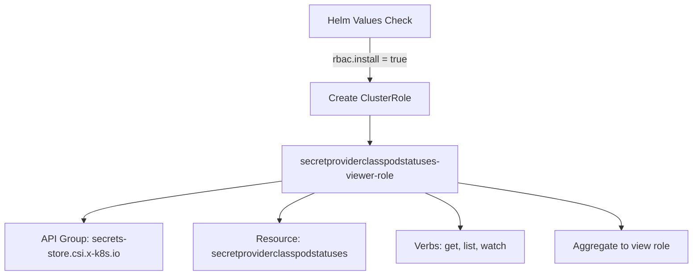
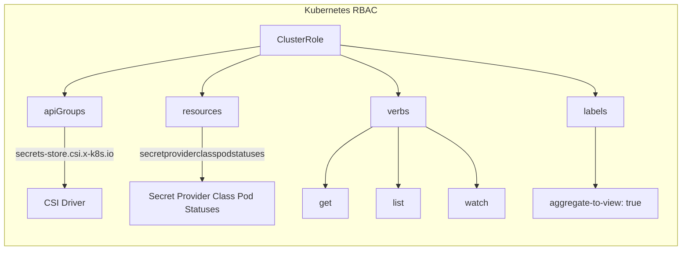

# Diagram: devops/k8s/secrets-store-csi-driver/helm/templates/role-secretproviderclasspodstatuses-viewer.yaml

> Auto-generated by Obscura crawlers

## Diagram 1

### SVG

<svg id="container" width="1147.515625" xmlns="http://www.w3.org/2000/svg" class="flowchart" height="454" viewBox="0 0 1147.515625 454" role="graphics-document document" aria-roledescription="flowchart-v2"><g><marker id="container_flowchart-v2-pointEnd" class="marker flowchart-v2" viewBox="0 0 10 10" refX="5" refY="5" markerUnits="userSpaceOnUse" markerWidth="8" markerHeight="8" orient="auto"><path d="M 0 0 L 10 5 L 0 10 z" class="arrowMarkerPath" style="stroke-width: 1; stroke-dasharray: 1, 0;"></path></marker><marker id="container_flowchart-v2-pointStart" class="marker flowchart-v2" viewBox="0 0 10 10" refX="4.5" refY="5" markerUnits="userSpaceOnUse" markerWidth="8" markerHeight="8" orient="auto"><path d="M 0 5 L 10 10 L 10 0 z" class="arrowMarkerPath" style="stroke-width: 1; stroke-dasharray: 1, 0;"></path></marker><marker id="container_flowchart-v2-circleEnd" class="marker flowchart-v2" viewBox="0 0 10 10" refX="11" refY="5" markerUnits="userSpaceOnUse" markerWidth="11" markerHeight="11" orient="auto"><circle cx="5" cy="5" r="5" class="arrowMarkerPath" style="stroke-width: 1; stroke-dasharray: 1, 0;"></circle></marker><marker id="container_flowchart-v2-circleStart" class="marker flowchart-v2" viewBox="0 0 10 10" refX="-1" refY="5" markerUnits="userSpaceOnUse" markerWidth="11" markerHeight="11" orient="auto"><circle cx="5" cy="5" r="5" class="arrowMarkerPath" style="stroke-width: 1; stroke-dasharray: 1, 0;"></circle></marker><marker id="container_flowchart-v2-crossEnd" class="marker cross flowchart-v2" viewBox="0 0 11 11" refX="12" refY="5.2" markerUnits="userSpaceOnUse" markerWidth="11" markerHeight="11" orient="auto"><path d="M 1,1 l 9,9 M 10,1 l -9,9" class="arrowMarkerPath" style="stroke-width: 2; stroke-dasharray: 1, 0;"></path></marker><marker id="container_flowchart-v2-crossStart" class="marker cross flowchart-v2" viewBox="0 0 11 11" refX="-1" refY="5.2" markerUnits="userSpaceOnUse" markerWidth="11" markerHeight="11" orient="auto"><path d="M 1,1 l 9,9 M 10,1 l -9,9" class="arrowMarkerPath" style="stroke-width: 2; stroke-dasharray: 1, 0;"></path></marker><g class="root"><g class="clusters"></g><g class="edgePaths"><path d="M613.176,62L613.176,68.167C613.176,74.333,613.176,86.667,613.176,98.333C613.176,110,613.176,121,613.176,126.5L613.176,132" id="L_A_B_0" class="edge-thickness-normal edge-pattern-solid edge-thickness-normal edge-pattern-solid flowchart-link" style=";" data-edge="true" data-et="edge" data-id="L_A_B_0" data-points="W3sieCI6NjEzLjE3NTc4MTI1LCJ5Ijo2Mn0seyJ4Ijo2MTMuMTc1NzgxMjUsInkiOjk5fSx7IngiOjYxMy4xNzU3ODEyNSwieSI6MTM2fV0=" marker-end="url(#container_flowchart-v2-pointEnd)"></path><path d="M613.176,190L613.176,194.167C613.176,198.333,613.176,206.667,613.176,214.333C613.176,222,613.176,229,613.176,232.5L613.176,236" id="L_B_C_0" class="edge-thickness-normal edge-pattern-solid edge-thickness-normal edge-pattern-solid flowchart-link" style=";" data-edge="true" data-et="edge" data-id="L_B_C_0" data-points="W3sieCI6NjEzLjE3NTc4MTI1LCJ5IjoxOTB9LHsieCI6NjEzLjE3NTc4MTI1LCJ5IjoyMTV9LHsieCI6NjEzLjE3NTc4MTI1LCJ5IjoyNDB9XQ==" marker-end="url(#container_flowchart-v2-pointEnd)"></path><path d="M465.371,298.907L410.809,306.256C356.247,313.605,247.124,328.302,192.562,339.151C138,350,138,357,138,360.5L138,364" id="L_C_D_0" class="edge-thickness-normal edge-pattern-solid edge-thickness-normal edge-pattern-solid flowchart-link" style=";" data-edge="true" data-et="edge" data-id="L_C_D_0" data-points="W3sieCI6NDY1LjM3MTA5Mzc1LCJ5IjoyOTguOTA3MzY5ODA1NTgxOH0seyJ4IjoxMzgsInkiOjM0M30seyJ4IjoxMzgsInkiOjM2OH1d" marker-end="url(#container_flowchart-v2-pointEnd)"></path><path d="M521.501,318L511.706,322.167C501.912,326.333,482.323,334.667,472.529,342.333C462.734,350,462.734,357,462.734,360.5L462.734,364" id="L_C_E_0" class="edge-thickness-normal edge-pattern-solid edge-thickness-normal edge-pattern-solid flowchart-link" style=";" data-edge="true" data-et="edge" data-id="L_C_E_0" data-points="W3sieCI6NTIxLjUwMDU0OTMxNjQwNjIsInkiOjMxOH0seyJ4Ijo0NjIuNzM0Mzc1LCJ5IjozNDN9LHsieCI6NDYyLjczNDM3NSwieSI6MzY4fV0=" marker-end="url(#container_flowchart-v2-pointEnd)"></path><path d="M704.851,318L714.645,322.167C724.44,326.333,744.028,334.667,753.823,344.333C763.617,354,763.617,365,763.617,370.5L763.617,376" id="L_C_F_0" class="edge-thickness-normal edge-pattern-solid edge-thickness-normal edge-pattern-solid flowchart-link" style=";" data-edge="true" data-et="edge" data-id="L_C_F_0" data-points="W3sieCI6NzA0Ljg1MTAxMzE4MzU5MzgsInkiOjMxOH0seyJ4Ijo3NjMuNjE3MTg3NSwieSI6MzQzfSx7IngiOjc2My42MTcxODc1LCJ5IjozODB9XQ==" marker-end="url(#container_flowchart-v2-pointEnd)"></path><path d="M760.98,301.714L805.757,308.595C850.534,315.476,940.087,329.238,984.864,341.619C1029.641,354,1029.641,365,1029.641,370.5L1029.641,376" id="L_C_G_0" class="edge-thickness-normal edge-pattern-solid edge-thickness-normal edge-pattern-solid flowchart-link" style=";" data-edge="true" data-et="edge" data-id="L_C_G_0" data-points="W3sieCI6NzYwLjk4MDQ2ODc1LCJ5IjozMDEuNzEzODAxOTk3ODQyN30seyJ4IjoxMDI5LjY0MDYyNSwieSI6MzQzfSx7IngiOjEwMjkuNjQwNjI1LCJ5IjozODB9XQ==" marker-end="url(#container_flowchart-v2-pointEnd)"></path></g><g class="edgeLabels"><g class="edgeLabel" transform="translate(613.17578125, 99)"><g class="label" data-id="L_A_B_0" transform="translate(-63.640625, -12)"><foreignObject width="127.28125" height="24">

rbac.install = true

</foreignObject></g></g><g class="edgeLabel"><g class="label" data-id="L_B_C_0" transform="translate(0, 0)"><foreignObject width="0" height="0">

</foreignObject></g></g><g class="edgeLabel"><g class="label" data-id="L_C_D_0" transform="translate(0, 0)"><foreignObject width="0" height="0">

</foreignObject></g></g><g class="edgeLabel"><g class="label" data-id="L_C_E_0" transform="translate(0, 0)"><foreignObject width="0" height="0">

</foreignObject></g></g><g class="edgeLabel"><g class="label" data-id="L_C_F_0" transform="translate(0, 0)"><foreignObject width="0" height="0">

</foreignObject></g></g><g class="edgeLabel"><g class="label" data-id="L_C_G_0" transform="translate(0, 0)"><foreignObject width="0" height="0">

</foreignObject></g></g></g><g class="nodes"><g class="node default" id="flowchart-A-0" transform="translate(613.17578125, 35)"><rect class="basic label-container" style="" x="-98.109375" y="-27" width="196.21875" height="54"></rect><g class="label" style="" transform="translate(-68.109375, -12)"><rect></rect><foreignObject width="136.21875" height="24">

Helm Values Check

</foreignObject></g></g><g class="node default" id="flowchart-B-1" transform="translate(613.17578125, 163)"><rect class="basic label-container" style="" x="-96.5" y="-27" width="193" height="54"></rect><g class="label" style="" transform="translate(-66.5, -12)"><rect></rect><foreignObject width="133" height="24">

Create ClusterRole

</foreignObject></g></g><g class="node default" id="flowchart-C-3" transform="translate(613.17578125, 279)"><rect class="basic label-container" style="" x="-147.8046875" y="-39" width="295.609375" height="78"></rect><g class="label" style="" transform="translate(-117.8046875, -24)"><rect></rect><foreignObject width="235.609375" height="48">

secretproviderclasspodstatuses-viewer-role

</foreignObject></g></g><g class="node default" id="flowchart-D-5" transform="translate(138, 407)"><rect class="basic label-container" style="" x="-130" y="-39" width="260" height="78"></rect><g class="label" style="" transform="translate(-100, -24)"><rect></rect><foreignObject width="200" height="48">

API Group: secrets-store.csi.x-k8s.io

</foreignObject></g></g><g class="node default" id="flowchart-E-7" transform="translate(462.734375, 407)"><rect class="basic label-container" style="" x="-144.734375" y="-39" width="289.46875" height="78"></rect><g class="label" style="" transform="translate(-114.734375, -24)"><rect></rect><foreignObject width="229.46875" height="48">

Resource: secretproviderclasspodstatuses

</foreignObject></g></g><g class="node default" id="flowchart-F-9" transform="translate(763.6171875, 407)"><rect class="basic label-container" style="" x="-106.1484375" y="-27" width="212.296875" height="54"></rect><g class="label" style="" transform="translate(-76.1484375, -12)"><rect></rect><foreignObject width="152.296875" height="24">

Verbs: get, list, watch

</foreignObject></g></g><g class="node default" id="flowchart-G-11" transform="translate(1029.640625, 407)"><rect class="basic label-container" style="" x="-109.875" y="-27" width="219.75" height="54"></rect><g class="label" style="" transform="translate(-79.875, -12)"><rect></rect><foreignObject width="159.75" height="24">

Aggregate to view role

</foreignObject></g></g></g></g></g></svg>

## Diagram 2

### SVG

<svg id="container" width="1231.2109375" xmlns="http://www.w3.org/2000/svg" class="flowchart" height="451" viewBox="0 0 1231.2109375 451" role="graphics-document document" aria-roledescription="flowchart-v2"><g><marker id="container_flowchart-v2-pointEnd" class="marker flowchart-v2" viewBox="0 0 10 10" refX="5" refY="5" markerUnits="userSpaceOnUse" markerWidth="8" markerHeight="8" orient="auto"><path d="M 0 0 L 10 5 L 0 10 z" class="arrowMarkerPath" style="stroke-width: 1; stroke-dasharray: 1, 0;"></path></marker><marker id="container_flowchart-v2-pointStart" class="marker flowchart-v2" viewBox="0 0 10 10" refX="4.5" refY="5" markerUnits="userSpaceOnUse" markerWidth="8" markerHeight="8" orient="auto"><path d="M 0 5 L 10 10 L 10 0 z" class="arrowMarkerPath" style="stroke-width: 1; stroke-dasharray: 1, 0;"></path></marker><marker id="container_flowchart-v2-circleEnd" class="marker flowchart-v2" viewBox="0 0 10 10" refX="11" refY="5" markerUnits="userSpaceOnUse" markerWidth="11" markerHeight="11" orient="auto"><circle cx="5" cy="5" r="5" class="arrowMarkerPath" style="stroke-width: 1; stroke-dasharray: 1, 0;"></circle></marker><marker id="container_flowchart-v2-circleStart" class="marker flowchart-v2" viewBox="0 0 10 10" refX="-1" refY="5" markerUnits="userSpaceOnUse" markerWidth="11" markerHeight="11" orient="auto"><circle cx="5" cy="5" r="5" class="arrowMarkerPath" style="stroke-width: 1; stroke-dasharray: 1, 0;"></circle></marker><marker id="container_flowchart-v2-crossEnd" class="marker cross flowchart-v2" viewBox="0 0 11 11" refX="12" refY="5.2" markerUnits="userSpaceOnUse" markerWidth="11" markerHeight="11" orient="auto"><path d="M 1,1 l 9,9 M 10,1 l -9,9" class="arrowMarkerPath" style="stroke-width: 2; stroke-dasharray: 1, 0;"></path></marker><marker id="container_flowchart-v2-crossStart" class="marker cross flowchart-v2" viewBox="0 0 11 11" refX="-1" refY="5.2" markerUnits="userSpaceOnUse" markerWidth="11" markerHeight="11" orient="auto"><path d="M 1,1 l 9,9 M 10,1 l -9,9" class="arrowMarkerPath" style="stroke-width: 2; stroke-dasharray: 1, 0;"></path></marker><g class="root"><g class="clusters"></g><g class="edgePaths"></g><g class="edgeLabels"></g><g class="nodes"><g class="root" transform="translate(0, 0)"><g class="clusters"><g class="cluster" id="subGraph0" data-look="classic"><rect style="" x="8" y="8" width="1215.2109375" height="435"></rect><g class="cluster-label" transform="translate(553.42578125, 8)"><foreignObject width="124.359375" height="24">

Kubernetes RBAC

</foreignObject></g></g></g><g class="edgePaths"><path d="M467.301,83.415L408.872,92.346C350.443,101.277,233.585,119.138,175.156,133.653C116.727,148.167,116.727,159.333,116.727,164.917L116.727,170.5" id="L_CR_AG_0" class="edge-thickness-normal edge-pattern-solid edge-thickness-normal edge-pattern-solid flowchart-link" style=";" data-edge="true" data-et="edge" data-id="L_CR_AG_0" data-points="W3sieCI6NDY3LjMwMDc4MTI1LCJ5Ijo4My40MTU0ODU2NTY2MjkyNH0seyJ4IjoxMTYuNzI2NTYyNSwieSI6MTM3fSx7IngiOjExNi43MjY1NjI1LCJ5IjoxNzQuNX1d" marker-end="url(#container_flowchart-v2-pointEnd)"></path><path d="M467.301,98.539L449.721,104.949C432.141,111.36,396.98,124.18,379.4,136.173C361.82,148.167,361.82,159.333,361.82,164.917L361.82,170.5" id="L_CR_R_0" class="edge-thickness-normal edge-pattern-solid edge-thickness-normal edge-pattern-solid flowchart-link" style=";" data-edge="true" data-et="edge" data-id="L_CR_R_0" data-points="W3sieCI6NDY3LjMwMDc4MTI1LCJ5Ijo5OC41MzkyODQ1MzEzMDE3Nn0seyJ4IjozNjEuODIwMzEyNSwieSI6MTM3fSx7IngiOjM2MS44MjAzMTI1LCJ5IjoxNzQuNX1d" marker-end="url(#container_flowchart-v2-pointEnd)"></path><path d="M610.129,98.539L627.709,104.949C645.289,111.36,680.449,124.18,698.029,136.173C715.609,148.167,715.609,159.333,715.609,164.917L715.609,170.5" id="L_CR_V_0" class="edge-thickness-normal edge-pattern-solid edge-thickness-normal edge-pattern-solid flowchart-link" style=";" data-edge="true" data-et="edge" data-id="L_CR_V_0" data-points="W3sieCI6NjEwLjEyODkwNjI1LCJ5Ijo5OC41MzkyODQ1MzEzMDE3Nn0seyJ4Ijo3MTUuNjA5Mzc1LCJ5IjoxMzd9LHsieCI6NzE1LjYwOTM3NSwieSI6MTc0LjV9XQ==" marker-end="url(#container_flowchart-v2-pointEnd)"></path><path d="M610.129,81.108L687.407,90.424C764.685,99.739,919.241,118.369,996.519,133.268C1073.797,148.167,1073.797,159.333,1073.797,164.917L1073.797,170.5" id="L_CR_L_0" class="edge-thickness-normal edge-pattern-solid edge-thickness-normal edge-pattern-solid flowchart-link" style=";" data-edge="true" data-et="edge" data-id="L_CR_L_0" data-points="W3sieCI6NjEwLjEyODkwNjI1LCJ5Ijo4MS4xMDg0MTI4NDU1NzcxMn0seyJ4IjoxMDczLjc5Njg3NSwieSI6MTM3fSx7IngiOjEwNzMuNzk2ODc1LCJ5IjoxNzQuNX1d" marker-end="url(#container_flowchart-v2-pointEnd)"></path><path d="M116.727,228.5L116.727,236.75C116.727,245,116.727,261.5,116.727,279.333C116.727,297.167,116.727,316.333,116.727,325.917L116.727,335.5" id="L_AG_CSI_0" class="edge-thickness-normal edge-pattern-solid edge-thickness-normal edge-pattern-solid flowchart-link" style=";" data-edge="true" data-et="edge" data-id="L_AG_CSI_0" data-points="W3sieCI6MTE2LjcyNjU2MjUsInkiOjIyOC41fSx7IngiOjExNi43MjY1NjI1LCJ5IjoyNzh9LHsieCI6MTE2LjcyNjU2MjUsInkiOjMzOS41fV0=" marker-end="url(#container_flowchart-v2-pointEnd)"></path><path d="M361.82,228.5L361.82,236.75C361.82,245,361.82,261.5,361.82,277.333C361.82,293.167,361.82,308.333,361.82,315.917L361.82,323.5" id="L_R_SPC_0" class="edge-thickness-normal edge-pattern-solid edge-thickness-normal edge-pattern-solid flowchart-link" style=";" data-edge="true" data-et="edge" data-id="L_R_SPC_0" data-points="W3sieCI6MzYxLjgyMDMxMjUsInkiOjIyOC41fSx7IngiOjM2MS44MjAzMTI1LCJ5IjoyNzh9LHsieCI6MzYxLjgyMDMxMjUsInkiOjMyNy41fV0=" marker-end="url(#container_flowchart-v2-pointEnd)"></path><path d="M668.842,228.5L654.552,236.75C640.262,245,611.682,261.5,597.392,279.333C583.102,297.167,583.102,316.333,583.102,325.917L583.102,335.5" id="L_V_GET_0" class="edge-thickness-normal edge-pattern-solid edge-thickness-normal edge-pattern-solid flowchart-link" style=";" data-edge="true" data-et="edge" data-id="L_V_GET_0" data-points="W3sieCI6NjY4Ljg0MTkxMTc2NDcwNTksInkiOjIyOC41fSx7IngiOjU4My4xMDE1NjI1LCJ5IjoyNzh9LHsieCI6NTgzLjEwMTU2MjUsInkiOjMzOS41fV0=" marker-end="url(#container_flowchart-v2-pointEnd)"></path><path d="M715.609,228.5L715.609,236.75C715.609,245,715.609,261.5,715.609,279.333C715.609,297.167,715.609,316.333,715.609,325.917L715.609,335.5" id="L_V_LIST_0" class="edge-thickness-normal edge-pattern-solid edge-thickness-normal edge-pattern-solid flowchart-link" style=";" data-edge="true" data-et="edge" data-id="L_V_LIST_0" data-points="W3sieCI6NzE1LjYwOTM3NSwieSI6MjI4LjV9LHsieCI6NzE1LjYwOTM3NSwieSI6Mjc4fSx7IngiOjcxNS42MDkzNzUsInkiOjMzOS41fV0=" marker-end="url(#container_flowchart-v2-pointEnd)"></path><path d="M765.453,228.258L780.896,236.549C796.339,244.839,827.224,261.419,842.667,279.293C858.109,297.167,858.109,316.333,858.109,325.917L858.109,335.5" id="L_V_WATCH_0" class="edge-thickness-normal edge-pattern-solid edge-thickness-normal edge-pattern-solid flowchart-link" style=";" data-edge="true" data-et="edge" data-id="L_V_WATCH_0" data-points="W3sieCI6NzY1LjQ1MzEyNSwieSI6MjI4LjI1ODIyMzY4NDIxMDUyfSx7IngiOjg1OC4xMDkzNzUsInkiOjI3OH0seyJ4Ijo4NTguMTA5Mzc1LCJ5IjozMzkuNX1d" marker-end="url(#container_flowchart-v2-pointEnd)"></path><path d="M1073.797,228.5L1073.797,236.75C1073.797,245,1073.797,261.5,1073.797,279.333C1073.797,297.167,1073.797,316.333,1073.797,325.917L1073.797,335.5" id="L_L_AGG_0" class="edge-thickness-normal edge-pattern-solid edge-thickness-normal edge-pattern-solid flowchart-link" style=";" data-edge="true" data-et="edge" data-id="L_L_AGG_0" data-points="W3sieCI6MTA3My43OTY4NzUsInkiOjIyOC41fSx7IngiOjEwNzMuNzk2ODc1LCJ5IjoyNzh9LHsieCI6MTA3My43OTY4NzUsInkiOjMzOS41fV0=" marker-end="url(#container_flowchart-v2-pointEnd)"></path></g><g class="edgeLabels"><g class="edgeLabel"><g class="label" data-id="L_CR_AG_0" transform="translate(0, 0)"><foreignObject width="0" height="0">

</foreignObject></g></g><g class="edgeLabel"><g class="label" data-id="L_CR_R_0" transform="translate(0, 0)"><foreignObject width="0" height="0">

</foreignObject></g></g><g class="edgeLabel"><g class="label" data-id="L_CR_V_0" transform="translate(0, 0)"><foreignObject width="0" height="0">

</foreignObject></g></g><g class="edgeLabel"><g class="label" data-id="L_CR_L_0" transform="translate(0, 0)"><foreignObject width="0" height="0">

</foreignObject></g></g><g class="edgeLabel" transform="translate(116.7265625, 278)"><g class="label" data-id="L_AG_CSI_0" transform="translate(-88.7265625, -12)"><foreignObject width="177.453125" height="24">

secrets-store.csi.x-k8s.io

</foreignObject></g></g><g class="edgeLabel" transform="translate(361.8203125, 278)"><g class="label" data-id="L_R_SPC_0" transform="translate(-114.7421875, -12)"><foreignObject width="229.484375" height="24">

secretproviderclasspodstatuses

</foreignObject></g></g><g class="edgeLabel"><g class="label" data-id="L_V_GET_0" transform="translate(0, 0)"><foreignObject width="0" height="0">

</foreignObject></g></g><g class="edgeLabel"><g class="label" data-id="L_V_LIST_0" transform="translate(0, 0)"><foreignObject width="0" height="0">

</foreignObject></g></g><g class="edgeLabel"><g class="label" data-id="L_V_WATCH_0" transform="translate(0, 0)"><foreignObject width="0" height="0">

</foreignObject></g></g><g class="edgeLabel"><g class="label" data-id="L_L_AGG_0" transform="translate(0, 0)"><foreignObject width="0" height="0">

</foreignObject></g></g></g><g class="nodes"><g class="node default" id="flowchart-CR-0" transform="translate(538.71484375, 72.5)"><rect class="basic label-container" style="" x="-71.4140625" y="-27" width="142.828125" height="54"></rect><g class="label" style="" transform="translate(-41.4140625, -12)"><rect></rect><foreignObject width="82.828125" height="24">

ClusterRole

</foreignObject></g></g><g class="node default" id="flowchart-AG-1" transform="translate(116.7265625, 201.5)"><rect class="basic label-container" style="" x="-67.078125" y="-27" width="134.15625" height="54"></rect><g class="label" style="" transform="translate(-37.078125, -12)"><rect></rect><foreignObject width="74.15625" height="24">

apiGroups

</foreignObject></g></g><g class="node default" id="flowchart-R-3" transform="translate(361.8203125, 201.5)"><rect class="basic label-container" style="" x="-64.8828125" y="-27" width="129.765625" height="54"></rect><g class="label" style="" transform="translate(-34.8828125, -12)"><rect></rect><foreignObject width="69.765625" height="24">

resources

</foreignObject></g></g><g class="node default" id="flowchart-V-5" transform="translate(715.609375, 201.5)"><rect class="basic label-container" style="" x="-49.84375" y="-27" width="99.6875" height="54"></rect><g class="label" style="" transform="translate(-19.84375, -12)"><rect></rect><foreignObject width="39.6875" height="24">

verbs

</foreignObject></g></g><g class="node default" id="flowchart-L-7" transform="translate(1073.796875, 201.5)"><rect class="basic label-container" style="" x="-51.8515625" y="-27" width="103.703125" height="54"></rect><g class="label" style="" transform="translate(-21.8515625, -12)"><rect></rect><foreignObject width="43.703125" height="24">

labels

</foreignObject></g></g><g class="node default" id="flowchart-CSI-9" transform="translate(116.7265625, 366.5)"><rect class="basic label-container" style="" x="-65.09375" y="-27" width="130.1875" height="54"></rect><g class="label" style="" transform="translate(-35.09375, -12)"><rect></rect><foreignObject width="70.1875" height="24">

CSI Driver

</foreignObject></g></g><g class="node default" id="flowchart-SPC-11" transform="translate(361.8203125, 366.5)"><rect class="basic label-container" style="" x="-130" y="-39" width="260" height="78"></rect><g class="label" style="" transform="translate(-100, -24)"><rect></rect><foreignObject width="200" height="48">

Secret Provider Class Pod Statuses

</foreignObject></g></g><g class="node default" id="flowchart-GET-13" transform="translate(583.1015625, 366.5)"><rect class="basic label-container" style="" x="-41.28125" y="-27" width="82.5625" height="54"></rect><g class="label" style="" transform="translate(-11.28125, -12)"><rect></rect><foreignObject width="22.5625" height="24">

get

</foreignObject></g></g><g class="node default" id="flowchart-LIST-15" transform="translate(715.609375, 366.5)"><rect class="basic label-container" style="" x="-41.2265625" y="-27" width="82.453125" height="54"></rect><g class="label" style="" transform="translate(-11.2265625, -12)"><rect></rect><foreignObject width="22.453125" height="24">

list

</foreignObject></g></g><g class="node default" id="flowchart-WATCH-17" transform="translate(858.109375, 366.5)"><rect class="basic label-container" style="" x="-51.2734375" y="-27" width="102.546875" height="54"></rect><g class="label" style="" transform="translate(-21.2734375, -12)"><rect></rect><foreignObject width="42.546875" height="24">

watch

</foreignObject></g></g><g class="node default" id="flowchart-AGG-19" transform="translate(1073.796875, 366.5)"><rect class="basic label-container" style="" x="-114.4140625" y="-27" width="228.828125" height="54"></rect><g class="label" style="" transform="translate(-84.4140625, -12)"><rect></rect><foreignObject width="168.828125" height="24">

aggregate-to-view: true

</foreignObject></g></g></g></g></g></g></g></svg>
