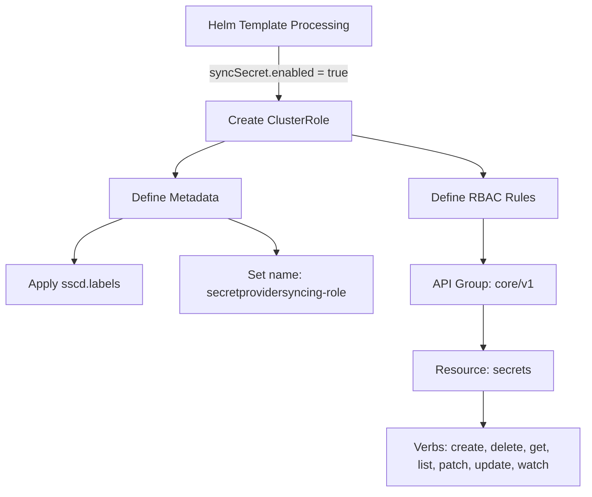
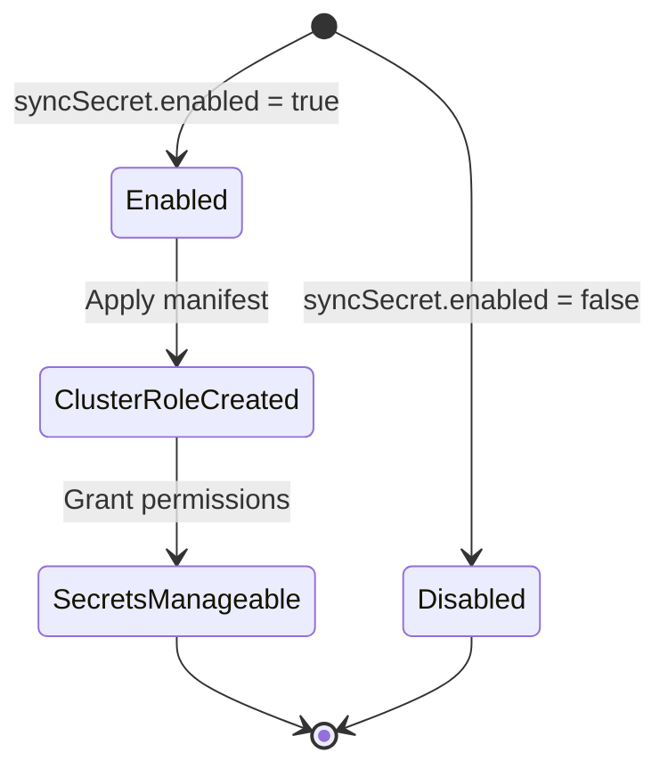

# Diagram: devops/k8s/secrets-store-csi-driver/helm/templates/role-syncsecret.yaml

> Auto-generated by Obscura crawlers

## Diagram 1

### SVG

<svg id="container" width="786.7265625" xmlns="http://www.w3.org/2000/svg" class="flowchart" height="662" viewBox="0 0 786.7265625 662" role="graphics-document document" aria-roledescription="flowchart-v2"><g><marker id="container_flowchart-v2-pointEnd" class="marker flowchart-v2" viewBox="0 0 10 10" refX="5" refY="5" markerUnits="userSpaceOnUse" markerWidth="8" markerHeight="8" orient="auto"><path d="M 0 0 L 10 5 L 0 10 z" class="arrowMarkerPath" style="stroke-width: 1; stroke-dasharray: 1, 0;"></path></marker><marker id="container_flowchart-v2-pointStart" class="marker flowchart-v2" viewBox="0 0 10 10" refX="4.5" refY="5" markerUnits="userSpaceOnUse" markerWidth="8" markerHeight="8" orient="auto"><path d="M 0 5 L 10 10 L 10 0 z" class="arrowMarkerPath" style="stroke-width: 1; stroke-dasharray: 1, 0;"></path></marker><marker id="container_flowchart-v2-circleEnd" class="marker flowchart-v2" viewBox="0 0 10 10" refX="11" refY="5" markerUnits="userSpaceOnUse" markerWidth="11" markerHeight="11" orient="auto"><circle cx="5" cy="5" r="5" class="arrowMarkerPath" style="stroke-width: 1; stroke-dasharray: 1, 0;"></circle></marker><marker id="container_flowchart-v2-circleStart" class="marker flowchart-v2" viewBox="0 0 10 10" refX="-1" refY="5" markerUnits="userSpaceOnUse" markerWidth="11" markerHeight="11" orient="auto"><circle cx="5" cy="5" r="5" class="arrowMarkerPath" style="stroke-width: 1; stroke-dasharray: 1, 0;"></circle></marker><marker id="container_flowchart-v2-crossEnd" class="marker cross flowchart-v2" viewBox="0 0 11 11" refX="12" refY="5.2" markerUnits="userSpaceOnUse" markerWidth="11" markerHeight="11" orient="auto"><path d="M 1,1 l 9,9 M 10,1 l -9,9" class="arrowMarkerPath" style="stroke-width: 2; stroke-dasharray: 1, 0;"></path></marker><marker id="container_flowchart-v2-crossStart" class="marker cross flowchart-v2" viewBox="0 0 11 11" refX="-1" refY="5.2" markerUnits="userSpaceOnUse" markerWidth="11" markerHeight="11" orient="auto"><path d="M 1,1 l 9,9 M 10,1 l -9,9" class="arrowMarkerPath" style="stroke-width: 2; stroke-dasharray: 1, 0;"></path></marker><g class="root"><g class="clusters"></g><g class="edgePaths"><path d="M374.375,62L374.375,68.167C374.375,74.333,374.375,86.667,374.375,98.333C374.375,110,374.375,121,374.375,126.5L374.375,132" id="L_A_B_0" class="edge-thickness-normal edge-pattern-solid edge-thickness-normal edge-pattern-solid flowchart-link" style=";" data-edge="true" data-et="edge" data-id="L_A_B_0" data-points="W3sieCI6Mzc0LjM3NSwieSI6NjJ9LHsieCI6Mzc0LjM3NSwieSI6OTl9LHsieCI6Mzc0LjM3NSwieSI6MTM2fV0=" marker-end="url(#container_flowchart-v2-pointEnd)"></path><path d="M302.545,190L291.46,194.167C280.375,198.333,258.205,206.667,247.12,214.333C236.035,222,236.035,229,236.035,232.5L236.035,236" id="L_B_C_0" class="edge-thickness-normal edge-pattern-solid edge-thickness-normal edge-pattern-solid flowchart-link" style=";" data-edge="true" data-et="edge" data-id="L_B_C_0" data-points="W3sieCI6MzAyLjU0NDY5NjUxNDQyMzEsInkiOjE5MH0seyJ4IjoyMzYuMDM1MTU2MjUsInkiOjIxNX0seyJ4IjoyMzYuMDM1MTU2MjUsInkiOjI0MH1d" marker-end="url(#container_flowchart-v2-pointEnd)"></path><path d="M165.414,294L154.515,298.167C143.617,302.333,121.82,310.667,110.922,320.333C100.023,330,100.023,341,100.023,346.5L100.023,352" id="L_C_D_0" class="edge-thickness-normal edge-pattern-solid edge-thickness-normal edge-pattern-solid flowchart-link" style=";" data-edge="true" data-et="edge" data-id="L_C_D_0" data-points="W3sieCI6MTY1LjQxMzY4Njg5OTAzODQ1LCJ5IjoyOTR9LHsieCI6MTAwLjAyMzQzNzUsInkiOjMxOX0seyJ4IjoxMDAuMDIzNDM3NSwieSI6MzU2fV0=" marker-end="url(#container_flowchart-v2-pointEnd)"></path><path d="M306.657,294L317.555,298.167C328.453,302.333,350.25,310.667,361.149,318.333C372.047,326,372.047,333,372.047,336.5L372.047,340" id="L_C_E_0" class="edge-thickness-normal edge-pattern-solid edge-thickness-normal edge-pattern-solid flowchart-link" style=";" data-edge="true" data-et="edge" data-id="L_C_E_0" data-points="W3sieCI6MzA2LjY1NjYyNTYwMDk2MTU1LCJ5IjoyOTR9LHsieCI6MzcyLjA0Njg3NSwieSI6MzE5fSx7IngiOjM3Mi4wNDY4NzUsInkiOjM0NH1d" marker-end="url(#container_flowchart-v2-pointEnd)"></path><path d="M470.875,181.29L500.517,186.909C530.159,192.527,589.443,203.763,619.085,212.882C648.727,222,648.727,229,648.727,232.5L648.727,236" id="L_B_F_0" class="edge-thickness-normal edge-pattern-solid edge-thickness-normal edge-pattern-solid flowchart-link" style=";" data-edge="true" data-et="edge" data-id="L_B_F_0" data-points="W3sieCI6NDcwLjg3NSwieSI6MTgxLjI5MDQwMDY2MDY0ODd9LHsieCI6NjQ4LjcyNjU2MjUsInkiOjIxNX0seyJ4Ijo2NDguNzI2NTYyNSwieSI6MjQwfV0=" marker-end="url(#container_flowchart-v2-pointEnd)"></path><path d="M648.727,294L648.727,298.167C648.727,302.333,648.727,310.667,648.727,320.333C648.727,330,648.727,341,648.727,346.5L648.727,352" id="L_F_G_0" class="edge-thickness-normal edge-pattern-solid edge-thickness-normal edge-pattern-solid flowchart-link" style=";" data-edge="true" data-et="edge" data-id="L_F_G_0" data-points="W3sieCI6NjQ4LjcyNjU2MjUsInkiOjI5NH0seyJ4Ijo2NDguNzI2NTYyNSwieSI6MzE5fSx7IngiOjY0OC43MjY1NjI1LCJ5IjozNTZ9XQ==" marker-end="url(#container_flowchart-v2-pointEnd)"></path><path d="M648.727,410L648.727,416.167C648.727,422.333,648.727,434.667,648.727,444.333C648.727,454,648.727,461,648.727,464.5L648.727,468" id="L_G_H_0" class="edge-thickness-normal edge-pattern-solid edge-thickness-normal edge-pattern-solid flowchart-link" style=";" data-edge="true" data-et="edge" data-id="L_G_H_0" data-points="W3sieCI6NjQ4LjcyNjU2MjUsInkiOjQxMH0seyJ4Ijo2NDguNzI2NTYyNSwieSI6NDQ3fSx7IngiOjY0OC43MjY1NjI1LCJ5Ijo0NzJ9XQ==" marker-end="url(#container_flowchart-v2-pointEnd)"></path><path d="M648.727,526L648.727,530.167C648.727,534.333,648.727,542.667,648.727,550.333C648.727,558,648.727,565,648.727,568.5L648.727,572" id="L_H_I_0" class="edge-thickness-normal edge-pattern-solid edge-thickness-normal edge-pattern-solid flowchart-link" style=";" data-edge="true" data-et="edge" data-id="L_H_I_0" data-points="W3sieCI6NjQ4LjcyNjU2MjUsInkiOjUyNn0seyJ4Ijo2NDguNzI2NTYyNSwieSI6NTUxfSx7IngiOjY0OC43MjY1NjI1LCJ5Ijo1NzZ9XQ==" marker-end="url(#container_flowchart-v2-pointEnd)"></path></g><g class="edgeLabels"><g class="edgeLabel" transform="translate(374.375, 99)"><g class="label" data-id="L_A_B_0" transform="translate(-93.3984375, -12)"><foreignObject width="186.796875" height="24">

syncSecret.enabled = true

</foreignObject></g></g><g class="edgeLabel"><g class="label" data-id="L_B_C_0" transform="translate(0, 0)"><foreignObject width="0" height="0">

</foreignObject></g></g><g class="edgeLabel"><g class="label" data-id="L_C_D_0" transform="translate(0, 0)"><foreignObject width="0" height="0">

</foreignObject></g></g><g class="edgeLabel"><g class="label" data-id="L_C_E_0" transform="translate(0, 0)"><foreignObject width="0" height="0">

</foreignObject></g></g><g class="edgeLabel"><g class="label" data-id="L_B_F_0" transform="translate(0, 0)"><foreignObject width="0" height="0">

</foreignObject></g></g><g class="edgeLabel"><g class="label" data-id="L_F_G_0" transform="translate(0, 0)"><foreignObject width="0" height="0">

</foreignObject></g></g><g class="edgeLabel"><g class="label" data-id="L_G_H_0" transform="translate(0, 0)"><foreignObject width="0" height="0">

</foreignObject></g></g><g class="edgeLabel"><g class="label" data-id="L_H_I_0" transform="translate(0, 0)"><foreignObject width="0" height="0">

</foreignObject></g></g></g><g class="nodes"><g class="node default" id="flowchart-A-0" transform="translate(374.375, 35)"><rect class="basic label-container" style="" x="-125.21875" y="-27" width="250.4375" height="54"></rect><g class="label" style="" transform="translate(-95.21875, -12)"><rect></rect><foreignObject width="190.4375" height="24">

Helm Template Processing

</foreignObject></g></g><g class="node default" id="flowchart-B-1" transform="translate(374.375, 163)"><rect class="basic label-container" style="" x="-96.5" y="-27" width="193" height="54"></rect><g class="label" style="" transform="translate(-66.5, -12)"><rect></rect><foreignObject width="133" height="24">

Create ClusterRole

</foreignObject></g></g><g class="node default" id="flowchart-C-3" transform="translate(236.03515625, 267)"><rect class="basic label-container" style="" x="-89.375" y="-27" width="178.75" height="54"></rect><g class="label" style="" transform="translate(-59.375, -12)"><rect></rect><foreignObject width="118.75" height="24">

Define Metadata

</foreignObject></g></g><g class="node default" id="flowchart-D-5" transform="translate(100.0234375, 383)"><rect class="basic label-container" style="" x="-92.0234375" y="-27" width="184.046875" height="54"></rect><g class="label" style="" transform="translate(-62.0234375, -12)"><rect></rect><foreignObject width="124.046875" height="24">

Apply sscd.labels

</foreignObject></g></g><g class="node default" id="flowchart-E-7" transform="translate(372.046875, 383)"><rect class="basic label-container" style="" x="-130" y="-39" width="260" height="78"></rect><g class="label" style="" transform="translate(-100, -24)"><rect></rect><foreignObject width="200" height="48">

Set name: secretprovidersyncing-role

</foreignObject></g></g><g class="node default" id="flowchart-F-9" transform="translate(648.7265625, 267)"><rect class="basic label-container" style="" x="-95.9453125" y="-27" width="191.890625" height="54"></rect><g class="label" style="" transform="translate(-65.9453125, -12)"><rect></rect><foreignObject width="131.890625" height="24">

Define RBAC Rules

</foreignObject></g></g><g class="node default" id="flowchart-G-11" transform="translate(648.7265625, 383)"><rect class="basic label-container" style="" x="-96.6796875" y="-27" width="193.359375" height="54"></rect><g class="label" style="" transform="translate(-66.6796875, -12)"><rect></rect><foreignObject width="133.359375" height="24">

API Group: core/v1

</foreignObject></g></g><g class="node default" id="flowchart-H-13" transform="translate(648.7265625, 499)"><rect class="basic label-container" style="" x="-92.8125" y="-27" width="185.625" height="54"></rect><g class="label" style="" transform="translate(-62.8125, -12)"><rect></rect><foreignObject width="125.625" height="24">

Resource: secrets

</foreignObject></g></g><g class="node default" id="flowchart-I-15" transform="translate(648.7265625, 615)"><rect class="basic label-container" style="" x="-130" y="-39" width="260" height="78"></rect><g class="label" style="" transform="translate(-100, -24)"><rect></rect><foreignObject width="200" height="48">

Verbs: create, delete, get, list, patch, update, watch

</foreignObject></g></g></g></g></g></svg>

## Diagram 2

### SVG

<svg id="container" width="359.375" xmlns="http://www.w3.org/2000/svg" class="statediagram" height="436" viewBox="15.40625 0 359.375 436" role="graphics-document document" aria-roledescription="stateDiagram"><g><defs><marker id="container_stateDiagram-barbEnd" refX="19" refY="7" markerWidth="20" markerHeight="14" markerUnits="userSpaceOnUse" orient="auto"><path d="M 19,7 L9,13 L14,7 L9,1 Z"></path></marker></defs><g class="root"><g class="clusters"></g><g class="edgePaths"><path d="M192.496,18.221L205.607,25.018C218.719,31.814,244.941,45.407,258.053,61.704C271.164,78,271.164,97,271.164,116C271.164,135,271.164,154,271.164,173C271.164,192,271.164,211,271.164,230C271.164,249,271.164,268,271.247,283.75C271.331,299.5,271.497,312,271.581,318.25L271.664,324.5" id="edge0" class="edge-thickness-normal edge-pattern-solid transition" style="fill:none;;;fill:none" data-edge="true" data-et="edge" data-id="edge0" data-points="W3sieCI6MTkyLjQ5NTkyOTkwMTk0NTIsInkiOjE4LjIyMTQ1MjExMzAwMDk1N30seyJ4IjoyNzEuMTY0MDYyNSwieSI6NTl9LHsieCI6MjcxLjE2NDA2MjUsInkiOjExNn0seyJ4IjoyNzEuMTY0MDYyNSwieSI6MTczfSx7IngiOjI3MS4xNjQwNjI1LCJ5IjoyMzB9LHsieCI6MjcxLjE2NDA2MjUsInkiOjI4N30seyJ4IjoyNzEuNjY0MDYyNSwieSI6MzI0LjV9XQ==" marker-end="url(#container_stateDiagram-barbEnd)"></path><path d="M180.067,18.221L166.955,25.018C153.844,31.814,127.621,45.407,114.593,58.454C101.565,71.5,101.732,84,101.815,90.25L101.898,96.5" id="edge1" class="edge-thickness-normal edge-pattern-solid transition" style="fill:none;;;fill:none" data-edge="true" data-et="edge" data-id="edge1" data-points="W3sieCI6MTgwLjA2NjU3MDA5ODA1NDgsInkiOjE4LjIyMTQ1MjExMzAwMDk1N30seyJ4IjoxMDEuMzk4NDM3NSwieSI6NTl9LHsieCI6MTAxLjg5ODQzNzUsInkiOjk2LjV9XQ==" marker-end="url(#container_stateDiagram-barbEnd)"></path><path d="M101.898,136.5L101.815,142.583C101.732,148.667,101.565,160.833,101.565,173.167C101.565,185.5,101.732,198,101.815,204.25L101.898,210.5" id="edge2" class="edge-thickness-normal edge-pattern-solid transition" style="fill:none;;;fill:none" data-edge="true" data-et="edge" data-id="edge2" data-points="W3sieCI6MTAxLjg5ODQzNzUsInkiOjEzNi41fSx7IngiOjEwMS4zOTg0Mzc1LCJ5IjoxNzN9LHsieCI6MTAxLjg5ODQzNzUsInkiOjIxMC41fV0=" marker-end="url(#container_stateDiagram-barbEnd)"></path><path d="M101.898,250.5L101.815,256.583C101.732,262.667,101.565,274.833,101.565,287.167C101.565,299.5,101.732,312,101.815,318.25L101.898,324.5" id="edge3" class="edge-thickness-normal edge-pattern-solid transition" style="fill:none;;;fill:none" data-edge="true" data-et="edge" data-id="edge3" data-points="W3sieCI6MTAxLjg5ODQzNzUsInkiOjI1MC41fSx7IngiOjEwMS4zOTg0Mzc1LCJ5IjoyODd9LHsieCI6MTAxLjg5ODQzNzUsInkiOjMyNC41fV0=" marker-end="url(#container_stateDiagram-barbEnd)"></path><path d="M101.898,364.5L101.815,368.583C101.732,372.667,101.565,380.833,114.537,389.838C127.509,398.844,153.62,408.687,166.676,413.609L179.731,418.531" id="edge4" class="edge-thickness-normal edge-pattern-solid transition" style="fill:none;;;fill:none" data-edge="true" data-et="edge" data-id="edge4" data-points="W3sieCI6MTAxLjg5ODQzNzUsInkiOjM2NC41fSx7IngiOjEwMS4zOTg0Mzc1LCJ5IjozODl9LHsieCI6MTc5LjczMTI0MTc2NjI4OTc0LCJ5Ijo0MTguNTMwNzEwMTk1NTU2NjV9XQ==" marker-end="url(#container_stateDiagram-barbEnd)"></path><path d="M271.664,364.5L271.581,368.583C271.497,372.667,271.331,380.833,258.192,389.838C245.053,398.844,218.942,408.687,205.887,413.609L192.831,418.531" id="edge5" class="edge-thickness-normal edge-pattern-solid transition" style="fill:none;;;fill:none" data-edge="true" data-et="edge" data-id="edge5" data-points="W3sieCI6MjcxLjY2NDA2MjUsInkiOjM2NC41fSx7IngiOjI3MS4xNjQwNjI1LCJ5IjozODl9LHsieCI6MTkyLjgzMTI1ODIzMzcxMDI2LCJ5Ijo0MTguNTMwNzEwMTk1NTU2NjV9XQ==" marker-end="url(#container_stateDiagram-barbEnd)"></path></g><g class="edgeLabels"><g class="edgeLabel" transform="translate(271.1640625, 173)"><g class="label" data-id="edge0" transform="translate(-95.6171875, -12)"><foreignObject width="191.234375" height="24">

syncSecret.enabled = false

</foreignObject></g></g><g class="edgeLabel" transform="translate(124.08456, 47.24038)"><g class="label" data-id="edge1" transform="translate(-93.3984375, -12)"><foreignObject width="186.796875" height="24">

syncSecret.enabled = true

</foreignObject></g></g><g class="edgeLabel" transform="translate(101.3984375, 173)"><g class="label" data-id="edge2" transform="translate(-54.1484375, -12)"><foreignObject width="108.296875" height="24">

Apply manifest

</foreignObject></g></g><g class="edgeLabel" transform="translate(101.3984375, 287)"><g class="label" data-id="edge3" transform="translate(-65.9609375, -12)"><foreignObject width="131.921875" height="24">

Grant permissions

</foreignObject></g></g><g class="edgeLabel"><g class="label" data-id="edge4" transform="translate(0, 0)"><foreignObject width="0" height="0">

</foreignObject></g></g><g class="edgeLabel"><g class="label" data-id="edge5" transform="translate(0, 0)"><foreignObject width="0" height="0">

</foreignObject></g></g></g><g class="nodes"><g class="node default" id="state-root_start-1" transform="translate(186.28125, 15)"><circle class="state-start" r="7" width="14" height="14"></circle></g><g class="node  statediagram-state" id="state-Disabled-5" transform="translate(271.1640625, 344)"><g class="basic label-container outer-path"><path d="M-34.6171875 -20 C-10.716343740559346 -20, 13.184500018881309 -20, 34.6171875 -20 C34.6171875 -20, 34.6171875 -20, 34.6171875 -20 C34.73174657152854 -19.995261801753003, 34.84630564305708 -19.990523603506006, 35.03008422736166 -19.982922465033347 C35.13602067720774 -19.969717500331047, 35.241957127053816 -19.956512535628747, 35.44016045140367 -19.931806517013612 C35.59532125209157 -19.899272718335745, 35.750482052779475 -19.86673891965788, 35.844614935703994 -19.847001329696653 C35.94514205731056 -19.817073108898686, 36.04566917891714 -19.78714488810072, 36.24068484602342 -19.729086208503173 C36.34514515724411 -19.68832566858031, 36.4496054684648 -19.64756512865744, 36.625664623264846 -19.578866633275286 C36.77044108747096 -19.508089732675952, 36.915217551677074 -19.437312832076614, 36.996924465185366 -19.397368756032446 C37.11521475145455 -19.32688304476168, 37.233505037723745 -19.256397333490913, 37.351928290612136 -19.185832391312644 C37.45209158274693 -19.11431717530409, 37.55225487488173 -19.042801959295538, 37.68825106344834 -18.94570254698197 C37.780215323148596 -18.86781279219396, 37.872179582848844 -18.789923037405952, 38.003595358128706 -18.678619553365657 C38.071156071163614 -18.611058840330752, 38.138716784198515 -18.543498127295845, 38.29580705336566 -18.386407858128706 C38.390161687131815 -18.275003552553343, 38.48451632089798 -18.16359924697798, 38.56289004698197 -18.07106356344834 C38.6321975308731 -17.97399239253438, 38.70150501476423 -17.876921221620425, 38.803019891312644 -17.734740790612136 C38.87861643933448 -17.60787341358995, 38.95421298735632 -17.48100603656776, 39.01455625603245 -17.37973696518537 C39.069382309392346 -17.267588480515833, 39.12420836275224 -17.1554399958463, 39.19605413327529 -17.008477123264846 C39.23022107424136 -16.920914757959345, 39.264388015207444 -16.833352392653847, 39.346273708503176 -16.623497346023417 C39.38980895279031 -16.477265038190335, 39.433344197077446 -16.331032730357254, 39.46418882969665 -16.227427435703994 C39.4834421606378 -16.135604089948497, 39.50269549157895 -16.043780744193, 39.54899401701361 -15.82297295140367 C39.565037175007475 -15.69426717743869, 39.581080333001346 -15.565561403473708, 39.60010996503335 -15.412896727361662 C39.606723710086406 -15.252991114909713, 39.613337455139465 -15.093085502457766, 39.6171875 -15 C39.6171875 -15, 39.6171875 -15, 39.6171875 -15 C39.6171875 -8.450510900582536, 39.6171875 -1.9010218011650704, 39.6171875 15 C39.6171875 15, 39.6171875 15, 39.6171875 15 C39.61168561276403 15.133023368916009, 39.60618372552806 15.266046737832017, 39.60010996503335 15.412896727361662 C39.588740937059725 15.504104427562211, 39.577371909086104 15.59531212776276, 39.54899401701361 15.822972951403669 C39.52282995019743 15.947755107851082, 39.496665883381255 16.072537264298493, 39.46418882969665 16.227427435703994 C39.427131490546216 16.351900843740506, 39.39007415139578 16.476374251777017, 39.346273708503176 16.623497346023417 C39.29867150040487 16.745491350081032, 39.251069292306575 16.86748535413865, 39.19605413327529 17.008477123264846 C39.137362147594295 17.128533498892708, 39.07867016191331 17.248589874520572, 39.01455625603245 17.379736965185366 C38.95498968730988 17.479702565861476, 38.895423118587324 17.57966816653759, 38.803019891312644 17.734740790612133 C38.714519824288864 17.858692846719915, 38.62601975726508 17.9826449028277, 38.56289004698197 18.07106356344834 C38.49660293944861 18.14932860342142, 38.430315831915244 18.227593643394496, 38.29580705336566 18.386407858128706 C38.22820431493869 18.454010596555676, 38.160601576511716 18.521613334982643, 38.003595358128706 18.678619553365657 C37.90145649574952 18.76512675704425, 37.79931763337034 18.851633960722843, 37.68825106344834 18.94570254698197 C37.60408973651983 19.005792579433766, 37.51992840959133 19.06588261188556, 37.351928290612136 19.185832391312644 C37.278371588473156 19.229662672162583, 37.20481488633417 19.273492953012518, 36.996924465185366 19.397368756032446 C36.90856133066553 19.440566860246765, 36.82019819614569 19.483764964461084, 36.625664623264846 19.578866633275286 C36.48312606926852 19.6344853496358, 36.340587515272205 19.690104065996312, 36.24068484602342 19.729086208503173 C36.13116593844492 19.761691399969703, 36.021647030866426 19.794296591436233, 35.844614935703994 19.847001329696653 C35.6834744412018 19.880788938317796, 35.522333946699604 19.914576546938942, 35.44016045140367 19.931806517013612 C35.28033724253016 19.951728459223773, 35.12051403365665 19.971650401433934, 35.03008422736166 19.982922465033347 C34.912274045401404 19.987795130202457, 34.794463863441145 19.992667795371563, 34.6171875 20 C34.6171875 20, 34.6171875 20, 34.6171875 20 C13.89195245934884 20, -6.833282581302321 20, -34.6171875 20 C-34.6171875 20, -34.6171875 20, -34.6171875 20 C-34.741137494409074 19.994873390309575, -34.86508748881815 19.98974678061915, -35.03008422736166 19.982922465033347 C-35.191411543029304 19.962813036106823, -35.35273885869694 19.9427036071803, -35.44016045140367 19.931806517013612 C-35.530832643520576 19.912794557608056, -35.62150483563749 19.893782598202495, -35.844614935703994 19.847001329696653 C-35.96480364313835 19.811219601183673, -36.08499235057272 19.77543787267069, -36.24068484602342 19.729086208503173 C-36.352988982752706 19.68526499836925, -36.46529311948199 19.641443788235325, -36.625664623264846 19.578866633275286 C-36.77015067865831 19.508231704893458, -36.91463673405177 19.43759677651163, -36.996924465185366 19.397368756032446 C-37.107255505412176 19.33162572597558, -37.21758654563899 19.26588269591872, -37.351928290612136 19.185832391312644 C-37.425957578499585 19.13297649569067, -37.49998686638703 19.080120600068696, -37.68825106344834 18.94570254698197 C-37.7978022380703 18.8529174350716, -37.907353412692245 18.76013232316123, -38.003595358128706 18.67861955336566 C-38.09164142308204 18.590573488412325, -38.17968748803537 18.502527423458993, -38.29580705336566 18.386407858128706 C-38.35345835684369 18.318339092736625, -38.41110966032172 18.250270327344545, -38.56289004698197 18.07106356344834 C-38.635826816724354 17.96890926142958, -38.70876358646674 17.866754959410816, -38.803019891312644 17.734740790612133 C-38.86229740377499 17.635260288932013, -38.921574916237326 17.535779787251894, -39.01455625603244 17.37973696518537 C-39.0861893471964 17.233209135186414, -39.15782243836036 17.08668130518746, -39.19605413327528 17.00847712326485 C-39.242085598931325 16.890508587090547, -39.28811706458737 16.772540050916245, -39.346273708503176 16.623497346023417 C-39.37188070135799 16.53748497321745, -39.39748769421279 16.451472600411485, -39.46418882969665 16.227427435703994 C-39.48242833260714 16.140439257540034, -39.50066783551763 16.053451079376075, -39.54899401701361 15.82297295140367 C-39.56880417448245 15.664046532405, -39.58861433195129 15.505120113406328, -39.60010996503335 15.412896727361664 C-39.60555625336321 15.281217616057814, -39.611002541693075 15.149538504753965, -39.6171875 15 C-39.6171875 15, -39.6171875 15, -39.6171875 15 C-39.6171875 8.305900305288706, -39.6171875 1.6118006105774096, -39.6171875 -15 C-39.6171875 -15, -39.6171875 -15, -39.6171875 -15 C-39.61349981516529 -15.089159998955761, -39.609812130330575 -15.17831999791152, -39.60010996503335 -15.41289672736166 C-39.58650053832099 -15.522077962060171, -39.572891111608634 -15.63125919675868, -39.54899401701361 -15.822972951403669 C-39.515764572383134 -15.981451439769911, -39.48253512775265 -16.139929928136155, -39.46418882969665 -16.227427435703994 C-39.41887272469067 -16.379641549246674, -39.3735566196847 -16.531855662789354, -39.346273708503176 -16.623497346023417 C-39.312052359389064 -16.71119914746219, -39.277831010274944 -16.79890094890096, -39.19605413327529 -17.008477123264846 C-39.13993903842632 -17.123262384445113, -39.08382394357735 -17.23804764562538, -39.01455625603245 -17.379736965185366 C-38.94601544496843 -17.494763287764982, -38.87747463390441 -17.609789610344603, -38.803019891312644 -17.734740790612133 C-38.72436544226491 -17.844903200758914, -38.64571099321717 -17.955065610905695, -38.56289004698197 -18.07106356344834 C-38.468572254472065 -18.182424370634635, -38.37425446196216 -18.293785177820933, -38.29580705336566 -18.386407858128706 C-38.22462035453058 -18.457594556963784, -38.1534336556955 -18.52878125579886, -38.003595358128706 -18.678619553365657 C-37.91137894670113 -18.756722869772872, -37.81916253527355 -18.83482618618009, -37.68825106344834 -18.945702546981966 C-37.59484256609459 -19.01239493221525, -37.501434068740835 -19.079087317448536, -37.351928290612136 -19.185832391312644 C-37.22157688825397 -19.26350496782031, -37.0912254858958 -19.341177544327977, -36.996924465185366 -19.397368756032446 C-36.91027030695079 -19.43973139264965, -36.82361614871622 -19.482094029266857, -36.625664623264846 -19.578866633275286 C-36.524731662719944 -19.618250796693406, -36.42379870217504 -19.65763496011153, -36.24068484602342 -19.729086208503173 C-36.096557535243335 -19.77199476801535, -35.95243022446325 -19.814903327527528, -35.844614935703994 -19.847001329696653 C-35.73415233366218 -19.87016290169376, -35.62368973162037 -19.893324473690868, -35.44016045140367 -19.931806517013612 C-35.28098390092744 -19.951647853338613, -35.1218073504512 -19.971489189663615, -35.03008422736166 -19.982922465033347 C-34.86703421179543 -19.989666263561222, -34.70398419622919 -19.996410062089097, -34.6171875 -20 C-34.6171875 -20, -34.6171875 -20, -34.6171875 -20" stroke="none" stroke-width="0" fill="#ECECFF" style=""></path><path d="M-34.6171875 -20 C-11.886963938307403 -20, 10.843259623385194 -20, 34.6171875 -20 M-34.6171875 -20 C-14.035166353042388 -20, 6.546854793915223 -20, 34.6171875 -20 M34.6171875 -20 C34.6171875 -20, 34.6171875 -20, 34.6171875 -20 M34.6171875 -20 C34.6171875 -20, 34.6171875 -20, 34.6171875 -20 M34.6171875 -20 C34.72996436714251 -19.995335514271662, 34.84274123428502 -19.990671028543325, 35.03008422736166 -19.982922465033347 M34.6171875 -20 C34.75902494604267 -19.994133559837465, 34.900862392085344 -19.988267119674926, 35.03008422736166 -19.982922465033347 M35.03008422736166 -19.982922465033347 C35.130194219660105 -19.97044376750696, 35.23030421195855 -19.957965069980574, 35.44016045140367 -19.931806517013612 M35.03008422736166 -19.982922465033347 C35.153004787975945 -19.967600433131608, 35.27592534859023 -19.95227840122987, 35.44016045140367 -19.931806517013612 M35.44016045140367 -19.931806517013612 C35.58227439450052 -19.902008356695205, 35.724388337597375 -19.872210196376795, 35.844614935703994 -19.847001329696653 M35.44016045140367 -19.931806517013612 C35.541130567208356 -19.910635310075346, 35.64210068301305 -19.88946410313708, 35.844614935703994 -19.847001329696653 M35.844614935703994 -19.847001329696653 C35.976240905740575 -19.807814580578157, 36.10786687577715 -19.76862783145966, 36.24068484602342 -19.729086208503173 M35.844614935703994 -19.847001329696653 C35.977773797827126 -19.807358218831272, 36.11093265995026 -19.767715107965888, 36.24068484602342 -19.729086208503173 M36.24068484602342 -19.729086208503173 C36.341574880677435 -19.68971879481965, 36.44246491533145 -19.65035138113613, 36.625664623264846 -19.578866633275286 M36.24068484602342 -19.729086208503173 C36.35291984289685 -19.685291976824722, 36.46515483977028 -19.64149774514627, 36.625664623264846 -19.578866633275286 M36.625664623264846 -19.578866633275286 C36.7663628914066 -19.510083441246294, 36.907061159548356 -19.441300249217303, 36.996924465185366 -19.397368756032446 M36.625664623264846 -19.578866633275286 C36.73121231114046 -19.527267512836577, 36.836759999016074 -19.475668392397864, 36.996924465185366 -19.397368756032446 M36.996924465185366 -19.397368756032446 C37.10672945547724 -19.331939183698925, 37.21653444576912 -19.266509611365407, 37.351928290612136 -19.185832391312644 M36.996924465185366 -19.397368756032446 C37.11002979065811 -19.329972610787557, 37.223135116130855 -19.262576465542665, 37.351928290612136 -19.185832391312644 M37.351928290612136 -19.185832391312644 C37.42216055879936 -19.135687515648804, 37.492392826986595 -19.08554263998496, 37.68825106344834 -18.94570254698197 M37.351928290612136 -19.185832391312644 C37.450360040266 -19.115553472872918, 37.54879178991987 -19.045274554433192, 37.68825106344834 -18.94570254698197 M37.68825106344834 -18.94570254698197 C37.8025015652636 -18.848937307966267, 37.916752067078846 -18.752172068950564, 38.003595358128706 -18.678619553365657 M37.68825106344834 -18.94570254698197 C37.757079167742546 -18.887408116259937, 37.82590727203676 -18.829113685537905, 38.003595358128706 -18.678619553365657 M38.003595358128706 -18.678619553365657 C38.08794357054493 -18.594271340949433, 38.17229178296115 -18.50992312853321, 38.29580705336566 -18.386407858128706 M38.003595358128706 -18.678619553365657 C38.11176382086767 -18.570451090626694, 38.21993228360663 -18.46228262788773, 38.29580705336566 -18.386407858128706 M38.29580705336566 -18.386407858128706 C38.37065998371006 -18.298029170273633, 38.44551291405446 -18.209650482418564, 38.56289004698197 -18.07106356344834 M38.29580705336566 -18.386407858128706 C38.36123411503973 -18.309158272382863, 38.42666117671381 -18.23190868663702, 38.56289004698197 -18.07106356344834 M38.56289004698197 -18.07106356344834 C38.627318336960855 -17.98082612880047, 38.69174662693973 -17.890588694152598, 38.803019891312644 -17.734740790612136 M38.56289004698197 -18.07106356344834 C38.6302635523767 -17.976701097953022, 38.69763705777142 -17.882338632457703, 38.803019891312644 -17.734740790612136 M38.803019891312644 -17.734740790612136 C38.880605276708366 -17.604535713819907, 38.95819066210409 -17.474330637027673, 39.01455625603245 -17.37973696518537 M38.803019891312644 -17.734740790612136 C38.86637891634142 -17.628410627047508, 38.929737941370185 -17.52208046348288, 39.01455625603245 -17.37973696518537 M39.01455625603245 -17.37973696518537 C39.07538318563569 -17.255313491963186, 39.13621011523892 -17.130890018741006, 39.19605413327529 -17.008477123264846 M39.01455625603245 -17.37973696518537 C39.07723612288848 -17.251523248231354, 39.1399159897445 -17.12330953127734, 39.19605413327529 -17.008477123264846 M39.19605413327529 -17.008477123264846 C39.2534550495089 -16.861371182434254, 39.31085596574251 -16.714265241603663, 39.346273708503176 -16.623497346023417 M39.19605413327529 -17.008477123264846 C39.24420312139503 -16.885081842106466, 39.292352109514766 -16.761686560948085, 39.346273708503176 -16.623497346023417 M39.346273708503176 -16.623497346023417 C39.37396596981296 -16.5304806799462, 39.401658231122745 -16.43746401386899, 39.46418882969665 -16.227427435703994 M39.346273708503176 -16.623497346023417 C39.378894773681274 -16.513925119587633, 39.41151583885938 -16.404352893151845, 39.46418882969665 -16.227427435703994 M39.46418882969665 -16.227427435703994 C39.485864544219844 -16.12405121289638, 39.50754025874304 -16.020674990088768, 39.54899401701361 -15.82297295140367 M39.46418882969665 -16.227427435703994 C39.484143569720864 -16.132258916640698, 39.50409830974508 -16.0370903975774, 39.54899401701361 -15.82297295140367 M39.54899401701361 -15.82297295140367 C39.56522763305666 -15.692739233212428, 39.5814612490997 -15.562505515021186, 39.60010996503335 -15.412896727361662 M39.54899401701361 -15.82297295140367 C39.56210349316936 -15.717802555678182, 39.575212969325115 -15.612632159952692, 39.60010996503335 -15.412896727361662 M39.60010996503335 -15.412896727361662 C39.603846107578384 -15.32256512898895, 39.60758225012343 -15.23223353061624, 39.6171875 -15 M39.60010996503335 -15.412896727361662 C39.60626204546596 -15.264153136319324, 39.61241412589857 -15.115409545276984, 39.6171875 -15 M39.6171875 -15 C39.6171875 -15, 39.6171875 -15, 39.6171875 -15 M39.6171875 -15 C39.6171875 -15, 39.6171875 -15, 39.6171875 -15 M39.6171875 -15 C39.6171875 -6.0755780313412995, 39.6171875 2.848843937317401, 39.6171875 15 M39.6171875 -15 C39.6171875 -8.436246416805854, 39.6171875 -1.8724928336117088, 39.6171875 15 M39.6171875 15 C39.6171875 15, 39.6171875 15, 39.6171875 15 M39.6171875 15 C39.6171875 15, 39.6171875 15, 39.6171875 15 M39.6171875 15 C39.613237448061845 15.09550345066526, 39.60928739612369 15.191006901330521, 39.60010996503335 15.412896727361662 M39.6171875 15 C39.61309562115478 15.098932509126955, 39.60900374230955 15.19786501825391, 39.60010996503335 15.412896727361662 M39.60010996503335 15.412896727361662 C39.589063695942 15.501515103704444, 39.57801742685066 15.590133480047225, 39.54899401701361 15.822972951403669 M39.60010996503335 15.412896727361662 C39.58258582517957 15.553483635738035, 39.56506168532579 15.694070544114409, 39.54899401701361 15.822972951403669 M39.54899401701361 15.822972951403669 C39.528116216079496 15.922543749809815, 39.50723841514538 16.02211454821596, 39.46418882969665 16.227427435703994 M39.54899401701361 15.822972951403669 C39.521735157765924 15.952976412376321, 39.49447629851824 16.082979873348975, 39.46418882969665 16.227427435703994 M39.46418882969665 16.227427435703994 C39.434842450281344 16.326000186557135, 39.40549607086603 16.42457293741027, 39.346273708503176 16.623497346023417 M39.46418882969665 16.227427435703994 C39.43242728933001 16.334112569190665, 39.40066574896336 16.44079770267734, 39.346273708503176 16.623497346023417 M39.346273708503176 16.623497346023417 C39.29175026692232 16.763228951324464, 39.237226825341466 16.902960556625512, 39.19605413327529 17.008477123264846 M39.346273708503176 16.623497346023417 C39.299278434083874 16.743935912368034, 39.252283159664564 16.86437447871265, 39.19605413327529 17.008477123264846 M39.19605413327529 17.008477123264846 C39.148396836515474 17.1059616819285, 39.10073953975566 17.20344624059215, 39.01455625603245 17.379736965185366 M39.19605413327529 17.008477123264846 C39.1395563074768 17.124045273115637, 39.08305848167831 17.239613422966425, 39.01455625603245 17.379736965185366 M39.01455625603245 17.379736965185366 C38.96203267154576 17.467882913247774, 38.909509087059064 17.55602886131018, 38.803019891312644 17.734740790612133 M39.01455625603245 17.379736965185366 C38.962079025201774 17.4678051217757, 38.90960179437109 17.555873278366036, 38.803019891312644 17.734740790612133 M38.803019891312644 17.734740790612133 C38.731847555866246 17.834423848639684, 38.66067522041985 17.934106906667235, 38.56289004698197 18.07106356344834 M38.803019891312644 17.734740790612133 C38.73316325072431 17.832581103336185, 38.66330661013597 17.93042141606024, 38.56289004698197 18.07106356344834 M38.56289004698197 18.07106356344834 C38.50725579047334 18.136750805983837, 38.451621533964705 18.202438048519333, 38.29580705336566 18.386407858128706 M38.56289004698197 18.07106356344834 C38.50377455010778 18.140861098716545, 38.44465905323358 18.21065863398475, 38.29580705336566 18.386407858128706 M38.29580705336566 18.386407858128706 C38.22643476460698 18.455780146887385, 38.1570624758483 18.525152435646067, 38.003595358128706 18.678619553365657 M38.29580705336566 18.386407858128706 C38.23589255681058 18.446322354683776, 38.17597806025552 18.50623685123885, 38.003595358128706 18.678619553365657 M38.003595358128706 18.678619553365657 C37.899988829842016 18.766369806659604, 37.79638230155532 18.85412005995355, 37.68825106344834 18.94570254698197 M38.003595358128706 18.678619553365657 C37.90856890131328 18.759102856812575, 37.813542444497855 18.839586160259497, 37.68825106344834 18.94570254698197 M37.68825106344834 18.94570254698197 C37.610698838775996 19.001073771121877, 37.53314661410364 19.056444995261785, 37.351928290612136 19.185832391312644 M37.68825106344834 18.94570254698197 C37.55547671721301 19.040501608085464, 37.42270237097769 19.13530066918896, 37.351928290612136 19.185832391312644 M37.351928290612136 19.185832391312644 C37.225426415553095 19.26121114743748, 37.09892454049405 19.336589903562313, 36.996924465185366 19.397368756032446 M37.351928290612136 19.185832391312644 C37.26855235965277 19.23551366254703, 37.18517642869341 19.285194933781423, 36.996924465185366 19.397368756032446 M36.996924465185366 19.397368756032446 C36.90078124145131 19.444370314102255, 36.80463801771725 19.49137187217206, 36.625664623264846 19.578866633275286 M36.996924465185366 19.397368756032446 C36.9183532994834 19.435779858385, 36.83978213378143 19.474190960737555, 36.625664623264846 19.578866633275286 M36.625664623264846 19.578866633275286 C36.4870867688338 19.632939879869664, 36.34850891440276 19.687013126464038, 36.24068484602342 19.729086208503173 M36.625664623264846 19.578866633275286 C36.52505934064484 19.618122936370348, 36.42445405802483 19.657379239465413, 36.24068484602342 19.729086208503173 M36.24068484602342 19.729086208503173 C36.104341047400375 19.769677516046958, 35.96799724877734 19.810268823590743, 35.844614935703994 19.847001329696653 M36.24068484602342 19.729086208503173 C36.094701621671945 19.772547297424914, 35.94871839732047 19.816008386346656, 35.844614935703994 19.847001329696653 M35.844614935703994 19.847001329696653 C35.70393649995428 19.876498495776662, 35.56325806420457 19.90599566185667, 35.44016045140367 19.931806517013612 M35.844614935703994 19.847001329696653 C35.6854231313591 19.880380340959558, 35.52623132701421 19.913759352222463, 35.44016045140367 19.931806517013612 M35.44016045140367 19.931806517013612 C35.28272507312046 19.951430816451094, 35.12528969483725 19.971055115888575, 35.03008422736166 19.982922465033347 M35.44016045140367 19.931806517013612 C35.29729745860713 19.94961437049449, 35.1544344658106 19.967422223975365, 35.03008422736166 19.982922465033347 M35.03008422736166 19.982922465033347 C34.89058245980017 19.988692300819316, 34.75108069223868 19.994462136605286, 34.6171875 20 M35.03008422736166 19.982922465033347 C34.88437580080268 19.988949010134338, 34.73866737424369 19.99497555523533, 34.6171875 20 M34.6171875 20 C34.6171875 20, 34.6171875 20, 34.6171875 20 M34.6171875 20 C34.6171875 20, 34.6171875 20, 34.6171875 20 M34.6171875 20 C8.344679568771088 20, -17.927828362457824 20, -34.6171875 20 M34.6171875 20 C9.760910054876284 20, -15.095367390247432 20, -34.6171875 20 M-34.6171875 20 C-34.6171875 20, -34.6171875 20, -34.6171875 20 M-34.6171875 20 C-34.6171875 20, -34.6171875 20, -34.6171875 20 M-34.6171875 20 C-34.72051562419361 19.995726317170806, -34.823843748387226 19.991452634341616, -35.03008422736166 19.982922465033347 M-34.6171875 20 C-34.760957446691066 19.99405363101941, -34.90472739338214 19.98810726203882, -35.03008422736166 19.982922465033347 M-35.03008422736166 19.982922465033347 C-35.13761461740439 19.969518815892737, -35.24514500744711 19.956115166752124, -35.44016045140367 19.931806517013612 M-35.03008422736166 19.982922465033347 C-35.168509285568746 19.965667799522144, -35.306934343775836 19.94841313401094, -35.44016045140367 19.931806517013612 M-35.44016045140367 19.931806517013612 C-35.54629496316881 19.909552450115065, -35.65242947493395 19.887298383216518, -35.844614935703994 19.847001329696653 M-35.44016045140367 19.931806517013612 C-35.59587764489267 19.89915605503357, -35.751594838381656 19.866505593053528, -35.844614935703994 19.847001329696653 M-35.844614935703994 19.847001329696653 C-35.99672992483591 19.801714735306362, -36.148844913967835 19.756428140916068, -36.24068484602342 19.729086208503173 M-35.844614935703994 19.847001329696653 C-35.981493920572404 19.80625069030427, -36.11837290544082 19.765500050911893, -36.24068484602342 19.729086208503173 M-36.24068484602342 19.729086208503173 C-36.35327565626666 19.68515313801699, -36.4658664665099 19.641220067530803, -36.625664623264846 19.578866633275286 M-36.24068484602342 19.729086208503173 C-36.329070579392464 19.694597988321735, -36.417456312761516 19.660109768140295, -36.625664623264846 19.578866633275286 M-36.625664623264846 19.578866633275286 C-36.76088740350739 19.512760244170725, -36.896110183749926 19.44665385506616, -36.996924465185366 19.397368756032446 M-36.625664623264846 19.578866633275286 C-36.7451448086154 19.520456329856717, -36.864624993965954 19.462046026438152, -36.996924465185366 19.397368756032446 M-36.996924465185366 19.397368756032446 C-37.13782067507726 19.313412838071567, -37.27871688496914 19.229456920110685, -37.351928290612136 19.185832391312644 M-36.996924465185366 19.397368756032446 C-37.08409252879479 19.3454278642028, -37.17126059240421 19.29348697237316, -37.351928290612136 19.185832391312644 M-37.351928290612136 19.185832391312644 C-37.42979886363418 19.130233870819858, -37.50766943665623 19.074635350327075, -37.68825106344834 18.94570254698197 M-37.351928290612136 19.185832391312644 C-37.45618850536959 19.111392028775008, -37.56044872012705 19.036951666237368, -37.68825106344834 18.94570254698197 M-37.68825106344834 18.94570254698197 C-37.760384557346185 18.884608594070063, -37.83251805124404 18.823514641158155, -38.003595358128706 18.67861955336566 M-37.68825106344834 18.94570254698197 C-37.77926444600899 18.868618144049982, -37.87027782856964 18.791533741117995, -38.003595358128706 18.67861955336566 M-38.003595358128706 18.67861955336566 C-38.08327289358491 18.598942017909454, -38.16295042904111 18.519264482453252, -38.29580705336566 18.386407858128706 M-38.003595358128706 18.67861955336566 C-38.07199041685687 18.610224494637492, -38.14038547558504 18.541829435909325, -38.29580705336566 18.386407858128706 M-38.29580705336566 18.386407858128706 C-38.35147657565501 18.32067897736459, -38.40714609794437 18.254950096600474, -38.56289004698197 18.07106356344834 M-38.29580705336566 18.386407858128706 C-38.394422719310924 18.269972561366163, -38.493038385256185 18.15353726460362, -38.56289004698197 18.07106356344834 M-38.56289004698197 18.07106356344834 C-38.643042351374994 17.95880327636153, -38.72319465576802 17.846542989274713, -38.803019891312644 17.734740790612133 M-38.56289004698197 18.07106356344834 C-38.618902252770035 17.992613588120104, -38.6749144585581 17.914163612791867, -38.803019891312644 17.734740790612133 M-38.803019891312644 17.734740790612133 C-38.872146073582314 17.61873208839497, -38.94127225585198 17.50272338617781, -39.01455625603244 17.37973696518537 M-38.803019891312644 17.734740790612133 C-38.8854896681488 17.596338647331912, -38.967959444984956 17.457936504051695, -39.01455625603244 17.37973696518537 M-39.01455625603244 17.37973696518537 C-39.06612986530338 17.274241461237516, -39.11770347457432 17.168745957289662, -39.19605413327528 17.00847712326485 M-39.01455625603244 17.37973696518537 C-39.066896683190144 17.272672910179246, -39.119237110347854 17.165608855173122, -39.19605413327528 17.00847712326485 M-39.19605413327528 17.00847712326485 C-39.24794045850149 16.875503867967335, -39.2998267837277 16.74253061266982, -39.346273708503176 16.623497346023417 M-39.19605413327528 17.00847712326485 C-39.2469694139639 16.877992441837986, -39.297884694652524 16.74750776041112, -39.346273708503176 16.623497346023417 M-39.346273708503176 16.623497346023417 C-39.37466860358326 16.528120574714805, -39.40306349866334 16.432743803406193, -39.46418882969665 16.227427435703994 M-39.346273708503176 16.623497346023417 C-39.37265687005731 16.534877868513444, -39.399040031611456 16.44625839100347, -39.46418882969665 16.227427435703994 M-39.46418882969665 16.227427435703994 C-39.49627683354284 16.074392728058925, -39.52836483738903 15.921358020413853, -39.54899401701361 15.82297295140367 M-39.46418882969665 16.227427435703994 C-39.49361082827769 16.08710749019522, -39.523032826858724 15.946787544686446, -39.54899401701361 15.82297295140367 M-39.54899401701361 15.82297295140367 C-39.56088162057244 15.727604993473411, -39.572769224131264 15.632237035543154, -39.60010996503335 15.412896727361664 M-39.54899401701361 15.82297295140367 C-39.56526765047424 15.6924181946299, -39.58154128393486 15.561863437856129, -39.60010996503335 15.412896727361664 M-39.60010996503335 15.412896727361664 C-39.606536644540604 15.257513942812803, -39.61296332404786 15.102131158263942, -39.6171875 15 M-39.60010996503335 15.412896727361664 C-39.60424588399829 15.312899426311414, -39.60838180296322 15.212902125261165, -39.6171875 15 M-39.6171875 15 C-39.6171875 15, -39.6171875 15, -39.6171875 15 M-39.6171875 15 C-39.6171875 15, -39.6171875 15, -39.6171875 15 M-39.6171875 15 C-39.6171875 5.576573722565902, -39.6171875 -3.846852554868196, -39.6171875 -15 M-39.6171875 15 C-39.6171875 5.355395972296982, -39.6171875 -4.289208055406036, -39.6171875 -15 M-39.6171875 -15 C-39.6171875 -15, -39.6171875 -15, -39.6171875 -15 M-39.6171875 -15 C-39.6171875 -15, -39.6171875 -15, -39.6171875 -15 M-39.6171875 -15 C-39.61210740273063 -15.122825427750403, -39.60702730546126 -15.245650855500807, -39.60010996503335 -15.41289672736166 M-39.6171875 -15 C-39.6130482960084 -15.100076725672169, -39.608909092016795 -15.200153451344338, -39.60010996503335 -15.41289672736166 M-39.60010996503335 -15.41289672736166 C-39.584741156337856 -15.536192553459573, -39.569372347642364 -15.659488379557484, -39.54899401701361 -15.822972951403669 M-39.60010996503335 -15.41289672736166 C-39.583291566103114 -15.547821849460117, -39.56647316717289 -15.682746971558574, -39.54899401701361 -15.822972951403669 M-39.54899401701361 -15.822972951403669 C-39.530388970979125 -15.911704484666357, -39.51178392494463 -16.000436017929044, -39.46418882969665 -16.227427435703994 M-39.54899401701361 -15.822972951403669 C-39.52277052183923 -15.94803853468772, -39.496547026664835 -16.073104117971774, -39.46418882969665 -16.227427435703994 M-39.46418882969665 -16.227427435703994 C-39.43347689560075 -16.33058700387457, -39.40276496150485 -16.43374657204514, -39.346273708503176 -16.623497346023417 M-39.46418882969665 -16.227427435703994 C-39.43121966916207 -16.338168893831437, -39.398250508627484 -16.448910351958876, -39.346273708503176 -16.623497346023417 M-39.346273708503176 -16.623497346023417 C-39.28985013560277 -16.768098570553658, -39.233426562702356 -16.912699795083903, -39.19605413327529 -17.008477123264846 M-39.346273708503176 -16.623497346023417 C-39.295084442018734 -16.75468419286703, -39.24389517553429 -16.885871039710644, -39.19605413327529 -17.008477123264846 M-39.19605413327529 -17.008477123264846 C-39.14854097895896 -17.105666833847653, -39.101027824642635 -17.20285654443046, -39.01455625603245 -17.379736965185366 M-39.19605413327529 -17.008477123264846 C-39.145833881341105 -17.111204290532747, -39.09561362940692 -17.213931457800648, -39.01455625603245 -17.379736965185366 M-39.01455625603245 -17.379736965185366 C-38.96400169250868 -17.464578469706307, -38.913447128984906 -17.54941997422725, -38.803019891312644 -17.734740790612133 M-39.01455625603245 -17.379736965185366 C-38.93525360646958 -17.51282398310111, -38.85595095690672 -17.645911001016852, -38.803019891312644 -17.734740790612133 M-38.803019891312644 -17.734740790612133 C-38.7302070354781 -17.836721540404625, -38.65739417964356 -17.938702290197114, -38.56289004698197 -18.07106356344834 M-38.803019891312644 -17.734740790612133 C-38.72492380596821 -17.844121163734457, -38.64682772062377 -17.953501536856777, -38.56289004698197 -18.07106356344834 M-38.56289004698197 -18.07106356344834 C-38.47381117089688 -18.176238793700275, -38.3847322948118 -18.281414023952205, -38.29580705336566 -18.386407858128706 M-38.56289004698197 -18.07106356344834 C-38.48210536677369 -18.166445855133507, -38.40132068656541 -18.261828146818672, -38.29580705336566 -18.386407858128706 M-38.29580705336566 -18.386407858128706 C-38.18175846624296 -18.500456445251405, -38.06770987912026 -18.614505032374105, -38.003595358128706 -18.678619553365657 M-38.29580705336566 -18.386407858128706 C-38.1812395885298 -18.500975322964564, -38.06667212369394 -18.615542787800422, -38.003595358128706 -18.678619553365657 M-38.003595358128706 -18.678619553365657 C-37.923027133201316 -18.746857359049667, -37.842458908273926 -18.815095164733677, -37.68825106344834 -18.945702546981966 M-38.003595358128706 -18.678619553365657 C-37.90632833701299 -18.7610005179747, -37.80906131589727 -18.843381482583744, -37.68825106344834 -18.945702546981966 M-37.68825106344834 -18.945702546981966 C-37.61101254413496 -19.00084978980066, -37.53377402482157 -19.05599703261936, -37.351928290612136 -19.185832391312644 M-37.68825106344834 -18.945702546981966 C-37.61170826976612 -19.000353051247693, -37.535165476083904 -19.055003555513423, -37.351928290612136 -19.185832391312644 M-37.351928290612136 -19.185832391312644 C-37.226837161762894 -19.26037052515854, -37.101746032913645 -19.334908659004434, -36.996924465185366 -19.397368756032446 M-37.351928290612136 -19.185832391312644 C-37.2297926281434 -19.258609449447786, -37.107656965674664 -19.331386507582923, -36.996924465185366 -19.397368756032446 M-36.996924465185366 -19.397368756032446 C-36.862501598864725 -19.463084091049254, -36.728078732544084 -19.528799426066065, -36.625664623264846 -19.578866633275286 M-36.996924465185366 -19.397368756032446 C-36.88452275386504 -19.45231860435854, -36.77212104254472 -19.507268452684627, -36.625664623264846 -19.578866633275286 M-36.625664623264846 -19.578866633275286 C-36.48772955558884 -19.632689063699534, -36.34979448791284 -19.686511494123785, -36.24068484602342 -19.729086208503173 M-36.625664623264846 -19.578866633275286 C-36.53278124294965 -19.615109840741034, -36.43989786263446 -19.651353048206783, -36.24068484602342 -19.729086208503173 M-36.24068484602342 -19.729086208503173 C-36.118036465705465 -19.76560021336083, -35.99538808538752 -19.802114218218488, -35.844614935703994 -19.847001329696653 M-36.24068484602342 -19.729086208503173 C-36.11989597790304 -19.76504661259383, -35.999107109782656 -19.801007016684494, -35.844614935703994 -19.847001329696653 M-35.844614935703994 -19.847001329696653 C-35.735853884727746 -19.86980612395375, -35.6270928337515 -19.892610918210853, -35.44016045140367 -19.931806517013612 M-35.844614935703994 -19.847001329696653 C-35.71863978446711 -19.87341554121518, -35.59266463323023 -19.899829752733712, -35.44016045140367 -19.931806517013612 M-35.44016045140367 -19.931806517013612 C-35.27903014905271 -19.951891388255824, -35.117899846701754 -19.971976259498035, -35.03008422736166 -19.982922465033347 M-35.44016045140367 -19.931806517013612 C-35.31391858606727 -19.947542549117216, -35.187676720730856 -19.963278581220823, -35.03008422736166 -19.982922465033347 M-35.03008422736166 -19.982922465033347 C-34.88437654907696 -19.988948979185487, -34.73866887079226 -19.994975493337623, -34.6171875 -20 M-35.03008422736166 -19.982922465033347 C-34.91410103686699 -19.987719565276482, -34.79811784637231 -19.99251666551962, -34.6171875 -20 M-34.6171875 -20 C-34.6171875 -20, -34.6171875 -20, -34.6171875 -20 M-34.6171875 -20 C-34.6171875 -20, -34.6171875 -20, -34.6171875 -20" stroke="#9370DB" stroke-width="1.3" fill="none" stroke-dasharray="0 0" style=""></path></g><g class="label" style="" transform="translate(-31.6171875, -12)"><rect></rect><foreignObject width="63.234375" height="24">

Disabled

</foreignObject></g></g><g class="node  statediagram-state" id="state-Enabled-2" transform="translate(101.3984375, 116)"><g class="basic label-container outer-path"><path d="M-32.4453125 -20 C-9.904914078561891 -20, 12.635484342876218 -20, 32.4453125 -20 C32.4453125 -20, 32.4453125 -20, 32.4453125 -20 C32.54867340327334 -19.99572496141804, 32.65203430654668 -19.991449922836082, 32.85820922736166 -19.982922465033347 C33.003888971884905 -19.964763503815895, 33.149568716408155 -19.94660454259844, 33.26828545140367 -19.931806517013612 C33.38433490747194 -19.907473504914794, 33.500384363540206 -19.883140492815976, 33.672739935703994 -19.847001329696653 C33.79089375367892 -19.811825414023712, 33.90904757165385 -19.776649498350768, 34.06880984602342 -19.729086208503173 C34.17133001552865 -19.689082714226874, 34.27385018503389 -19.64907921995058, 34.453789623264846 -19.578866633275286 C34.54450095317086 -19.53452056628714, 34.635212283076875 -19.49017449929899, 34.825049465185366 -19.397368756032446 C34.94159018516324 -19.32792555998713, 35.05813090514112 -19.258482363941813, 35.180053290612136 -19.185832391312644 C35.250092013258424 -19.135825704508946, 35.320130735904705 -19.085819017705244, 35.51637606344834 -18.94570254698197 C35.631575358988236 -18.84813372067271, 35.746774654528124 -18.75056489436345, 35.831720358128706 -18.678619553365657 C35.92606138246473 -18.584278529029636, 36.02040240680075 -18.48993750469361, 36.12393205336566 -18.386407858128706 C36.180351972497796 -18.31979298548651, 36.23677189162993 -18.253178112844317, 36.39101504698197 -18.07106356344834 C36.444897531668204 -17.99559644811543, 36.49878001635443 -17.920129332782512, 36.631144891312644 -17.734740790612136 C36.67828488199029 -17.655629678707985, 36.72542487266793 -17.576518566803838, 36.84268125603245 -17.37973696518537 C36.884913551453856 -17.29334942412827, 36.92714584687526 -17.20696188307117, 37.02417913327529 -17.008477123264846 C37.054224427467496 -16.931477633366672, 37.084269721659695 -16.854478143468494, 37.174398708503176 -16.623497346023417 C37.216845829928296 -16.480919978455955, 37.25929295135341 -16.338342610888496, 37.29231382969665 -16.227427435703994 C37.31866065640098 -16.10177365738239, 37.3450074831053 -15.976119879060787, 37.37711901701361 -15.82297295140367 C37.389829974151255 -15.720999663048511, 37.4025409312889 -15.619026374693354, 37.42823496503335 -15.412896727361662 C37.43489842862263 -15.2517890315331, 37.441561892211915 -15.09068133570454, 37.4453125 -15 C37.4453125 -15, 37.4453125 -15, 37.4453125 -15 C37.4453125 -8.41072534349422, 37.4453125 -1.8214506869884417, 37.4453125 15 C37.4453125 15, 37.4453125 15, 37.4453125 15 C37.43950964437426 15.140300113681452, 37.433706788748516 15.280600227362905, 37.42823496503335 15.412896727361662 C37.41157535308017 15.546547985499872, 37.39491574112699 15.680199243638082, 37.37711901701361 15.822972951403669 C37.34523991349811 15.975011367687417, 37.31336080998262 16.127049783971163, 37.29231382969665 16.227427435703994 C37.25420762879981 16.355423908243434, 37.21610142790297 16.483420380782874, 37.174398708503176 16.623497346023417 C37.13549186993403 16.723207027819527, 37.096585031364874 16.822916709615637, 37.02417913327529 17.008477123264846 C36.95172270132991 17.15668912375108, 36.87926626938453 17.304901124237315, 36.84268125603245 17.379736965185366 C36.79711866024157 17.45620086690533, 36.751556064450696 17.5326647686253, 36.631144891312644 17.734740790612133 C36.55974336581195 17.834744849283247, 36.48834184031124 17.93474890795436, 36.39101504698197 18.07106356344834 C36.32946182997803 18.143739309434995, 36.2679086129741 18.21641505542165, 36.12393205336566 18.386407858128706 C36.03237470937403 18.477965202120327, 35.940817365382415 18.56952254611195, 35.831720358128706 18.678619553365657 C35.72925087336397 18.765406779920763, 35.62678138859925 18.85219400647587, 35.51637606344834 18.94570254698197 C35.40784246772438 19.023194044884598, 35.299308872000424 19.100685542787225, 35.180053290612136 19.185832391312644 C35.10795583428995 19.228793150390675, 35.03585837796777 19.271753909468707, 34.825049465185366 19.397368756032446 C34.70679184715105 19.455181382709203, 34.58853422911674 19.51299400938596, 34.453789623264846 19.578866633275286 C34.331337099487655 19.62664775632336, 34.20888457571046 19.674428879371437, 34.06880984602342 19.729086208503173 C33.93836848299096 19.76792028483634, 33.8079271199585 19.806754361169506, 33.672739935703994 19.847001329696653 C33.56435951775828 19.869726313600037, 33.455979099812566 19.892451297503424, 33.26828545140367 19.931806517013612 C33.16843404055959 19.944252982395327, 33.068582629715515 19.95669944777704, 32.85820922736166 19.982922465033347 C32.711449768935694 19.988992481133913, 32.56469031050973 19.99506249723448, 32.4453125 20 C32.4453125 20, 32.4453125 20, 32.4453125 20 C13.269816485720415 20, -5.905679528559169 20, -32.4453125 20 C-32.4453125 20, -32.4453125 20, -32.4453125 20 C-32.59422197585702 19.9938410585207, -32.74313145171404 19.987682117041405, -32.85820922736166 19.982922465033347 C-32.945078970248176 19.972094162875013, -33.031948713134696 19.961265860716683, -33.26828545140367 19.931806517013612 C-33.36293675135672 19.911960226432367, -33.45758805130978 19.89211393585112, -33.672739935703994 19.847001329696653 C-33.81032975666463 19.806039065230568, -33.947919577625264 19.765076800764483, -34.06880984602342 19.729086208503173 C-34.18698424940129 19.682974413215028, -34.30515865277916 19.63686261792688, -34.453789623264846 19.578866633275286 C-34.573629111104374 19.520280677573133, -34.69346859894391 19.46169472187098, -34.825049465185366 19.397368756032446 C-34.95301604573358 19.32111722487711, -35.080982626281795 19.244865693721774, -35.180053290612136 19.185832391312644 C-35.29352870710415 19.104812501199948, -35.40700412359617 19.023792611087256, -35.51637606344834 18.94570254698197 C-35.62578589758525 18.853037144356026, -35.735195731722165 18.760371741730083, -35.831720358128706 18.67861955336566 C-35.94055627122265 18.569783640271716, -36.049392184316595 18.460947727177768, -36.12393205336566 18.386407858128706 C-36.22267101808012 18.269826982784462, -36.32140998279458 18.153246107440218, -36.39101504698197 18.07106356344834 C-36.44141768929122 18.000470270611423, -36.49182033160047 17.92987697777451, -36.631144891312644 17.734740790612133 C-36.711333731636515 17.60016655270643, -36.791522571960385 17.465592314800723, -36.84268125603244 17.37973696518537 C-36.88551822527273 17.292112544062107, -36.928355194513024 17.204488122938844, -37.02417913327528 17.00847712326485 C-37.07475997114141 16.878849545335367, -37.12534080900754 16.749221967405884, -37.174398708503176 16.623497346023417 C-37.20375973942399 16.524875381630814, -37.233120770344804 16.42625341723821, -37.29231382969665 16.227427435703994 C-37.325826829938876 16.06759660861477, -37.359339830181106 15.907765781525551, -37.37711901701361 15.82297295140367 C-37.39158278994592 15.70693774870738, -37.40604656287823 15.59090254601109, -37.42823496503335 15.412896727361664 C-37.4324118970983 15.31190782097684, -37.43658882916325 15.210918914592014, -37.4453125 15 C-37.4453125 15, -37.4453125 15, -37.4453125 15 C-37.4453125 7.816677201813564, -37.4453125 0.6333544036271288, -37.4453125 -15 C-37.4453125 -15, -37.4453125 -15, -37.4453125 -15 C-37.44136119086311 -15.095533846928275, -37.43740988172622 -15.19106769385655, -37.42823496503335 -15.41289672736166 C-37.41077429650848 -15.552974438825842, -37.393313627983616 -15.693052150290026, -37.37711901701361 -15.822972951403669 C-37.35649123590367 -15.921351350591687, -37.335863454793724 -16.019729749779707, -37.29231382969665 -16.227427435703994 C-37.25297200080108 -16.359574309529485, -37.21363017190551 -16.491721183354972, -37.174398708503176 -16.623497346023417 C-37.12273464766016 -16.755900986524733, -37.071070586817136 -16.888304627026045, -37.02417913327529 -17.008477123264846 C-36.957100606692705 -17.14568844250243, -36.89002208011013 -17.282899761740012, -36.84268125603245 -17.379736965185366 C-36.76990113533437 -17.501877767297863, -36.697121014636295 -17.62401856941036, -36.631144891312644 -17.734740790612133 C-36.57220065052142 -17.81729733647126, -36.51325640973019 -17.899853882330387, -36.39101504698197 -18.07106356344834 C-36.29629851504185 -18.182895161390277, -36.201581983101725 -18.294726759332214, -36.12393205336566 -18.386407858128706 C-36.041737650270115 -18.468602261224245, -35.95954324717458 -18.550796664319783, -35.831720358128706 -18.678619553365657 C-35.74704847109158 -18.750332983564036, -35.662376584054456 -18.822046413762415, -35.51637606344834 -18.945702546981966 C-35.424039609855825 -19.011629507681757, -35.33170315626331 -19.07755646838155, -35.180053290612136 -19.185832391312644 C-35.03863258170486 -19.27010084284941, -34.89721187279759 -19.354369294386174, -34.825049465185366 -19.397368756032446 C-34.69261024248485 -19.462114346774207, -34.56017101978432 -19.526859937515965, -34.453789623264846 -19.578866633275286 C-34.330574726733715 -19.626945235095057, -34.20735983020259 -19.675023836914825, -34.06880984602342 -19.729086208503173 C-33.944233992225996 -19.76617404707808, -33.819658138428565 -19.803261885652987, -33.672739935703994 -19.847001329696653 C-33.569264553234014 -19.86869783581462, -33.465789170764026 -19.890394341932584, -33.26828545140367 -19.931806517013612 C-33.126738541934344 -19.949450320878835, -32.98519163246502 -19.967094124744058, -32.85820922736166 -19.982922465033347 C-32.70531222864686 -19.989246331678, -32.55241522993206 -19.99557019832265, -32.4453125 -20 C-32.4453125 -20, -32.4453125 -20, -32.4453125 -20" stroke="none" stroke-width="0" fill="#ECECFF" style=""></path><path d="M-32.4453125 -20 C-12.074926291473815 -20, 8.29545991705237 -20, 32.4453125 -20 M-32.4453125 -20 C-12.541750691516935 -20, 7.36181111696613 -20, 32.4453125 -20 M32.4453125 -20 C32.4453125 -20, 32.4453125 -20, 32.4453125 -20 M32.4453125 -20 C32.4453125 -20, 32.4453125 -20, 32.4453125 -20 M32.4453125 -20 C32.58865669835604 -19.9940712401008, 32.73200089671208 -19.988142480201603, 32.85820922736166 -19.982922465033347 M32.4453125 -20 C32.545000496651724 -19.995876873959613, 32.644688493303455 -19.991753747919226, 32.85820922736166 -19.982922465033347 M32.85820922736166 -19.982922465033347 C33.02181878849782 -19.962528554505848, 33.185428349633966 -19.94213464397835, 33.26828545140367 -19.931806517013612 M32.85820922736166 -19.982922465033347 C32.95336088255369 -19.971061823582726, 33.04851253774572 -19.9592011821321, 33.26828545140367 -19.931806517013612 M33.26828545140367 -19.931806517013612 C33.39211891678676 -19.905841369795407, 33.51595238216984 -19.879876222577202, 33.672739935703994 -19.847001329696653 M33.26828545140367 -19.931806517013612 C33.372299665850306 -19.909997029711146, 33.47631388029694 -19.88818754240868, 33.672739935703994 -19.847001329696653 M33.672739935703994 -19.847001329696653 C33.766600031599374 -19.81905796845063, 33.860460127494754 -19.79111460720461, 34.06880984602342 -19.729086208503173 M33.672739935703994 -19.847001329696653 C33.786428576751796 -19.81315475479107, 33.900117217799604 -19.779308179885486, 34.06880984602342 -19.729086208503173 M34.06880984602342 -19.729086208503173 C34.19290821616947 -19.680662874209116, 34.31700658631553 -19.63223953991506, 34.453789623264846 -19.578866633275286 M34.06880984602342 -19.729086208503173 C34.17978931362147 -19.685781885868217, 34.290768781219526 -19.64247756323326, 34.453789623264846 -19.578866633275286 M34.453789623264846 -19.578866633275286 C34.53508719006397 -19.53912267464319, 34.61638475686309 -19.499378716011087, 34.825049465185366 -19.397368756032446 M34.453789623264846 -19.578866633275286 C34.56245081930319 -19.525745411444216, 34.671112015341535 -19.47262418961315, 34.825049465185366 -19.397368756032446 M34.825049465185366 -19.397368756032446 C34.94031342145184 -19.328686346025957, 35.05557737771832 -19.26000393601947, 35.180053290612136 -19.185832391312644 M34.825049465185366 -19.397368756032446 C34.91246582312889 -19.345279912893396, 34.99988218107241 -19.293191069754347, 35.180053290612136 -19.185832391312644 M35.180053290612136 -19.185832391312644 C35.313729362211475 -19.090389510673937, 35.447405433810815 -18.994946630035226, 35.51637606344834 -18.94570254698197 M35.180053290612136 -19.185832391312644 C35.26666708705736 -19.123991329282006, 35.35328088350258 -19.06215026725137, 35.51637606344834 -18.94570254698197 M35.51637606344834 -18.94570254698197 C35.62017921880798 -18.85778575905221, 35.72398237416763 -18.769868971122452, 35.831720358128706 -18.678619553365657 M35.51637606344834 -18.94570254698197 C35.591347420638606 -18.882205046467018, 35.66631877782886 -18.81870754595207, 35.831720358128706 -18.678619553365657 M35.831720358128706 -18.678619553365657 C35.924336923512435 -18.586002987981928, 36.01695348889616 -18.493386422598203, 36.12393205336566 -18.386407858128706 M35.831720358128706 -18.678619553365657 C35.89140481607048 -18.61893509542389, 35.95108927401224 -18.55925063748212, 36.12393205336566 -18.386407858128706 M36.12393205336566 -18.386407858128706 C36.20250009696314 -18.293642744344417, 36.281068140560635 -18.20087763056013, 36.39101504698197 -18.07106356344834 M36.12393205336566 -18.386407858128706 C36.224422305120804 -18.26775924208278, 36.32491255687595 -18.14911062603685, 36.39101504698197 -18.07106356344834 M36.39101504698197 -18.07106356344834 C36.45453600668397 -17.98209692392154, 36.51805696638598 -17.893130284394733, 36.631144891312644 -17.734740790612136 M36.39101504698197 -18.07106356344834 C36.48497753431597 -17.93946091167949, 36.57894002164997 -17.807858259910642, 36.631144891312644 -17.734740790612136 M36.631144891312644 -17.734740790612136 C36.6972441925457 -17.623811850205815, 36.76334349377877 -17.512882909799494, 36.84268125603245 -17.37973696518537 M36.631144891312644 -17.734740790612136 C36.71304105073134 -17.597301301567747, 36.79493721015004 -17.45986181252336, 36.84268125603245 -17.37973696518537 M36.84268125603245 -17.37973696518537 C36.90306642947308 -17.25621711863689, 36.9634516029137 -17.13269727208841, 37.02417913327529 -17.008477123264846 M36.84268125603245 -17.37973696518537 C36.88383334982782 -17.29555901187121, 36.924985443623186 -17.211381058557045, 37.02417913327529 -17.008477123264846 M37.02417913327529 -17.008477123264846 C37.06079574387324 -16.91463679273568, 37.097412354471196 -16.820796462206513, 37.174398708503176 -16.623497346023417 M37.02417913327529 -17.008477123264846 C37.0632603228066 -16.908320618246982, 37.10234151233791 -16.808164113229118, 37.174398708503176 -16.623497346023417 M37.174398708503176 -16.623497346023417 C37.20165574961643 -16.531942558816915, 37.22891279072967 -16.440387771610414, 37.29231382969665 -16.227427435703994 M37.174398708503176 -16.623497346023417 C37.20228624652026 -16.529824757048754, 37.230173784537335 -16.436152168074088, 37.29231382969665 -16.227427435703994 M37.29231382969665 -16.227427435703994 C37.31779711736054 -16.105892063912954, 37.34328040502443 -15.984356692121912, 37.37711901701361 -15.82297295140367 M37.29231382969665 -16.227427435703994 C37.31617503330222 -16.11362813751949, 37.34003623690779 -15.99982883933499, 37.37711901701361 -15.82297295140367 M37.37711901701361 -15.82297295140367 C37.39520548267028 -15.677874800433512, 37.41329194832694 -15.532776649463354, 37.42823496503335 -15.412896727361662 M37.37711901701361 -15.82297295140367 C37.39075554842573 -15.713574270030234, 37.40439207983785 -15.604175588656798, 37.42823496503335 -15.412896727361662 M37.42823496503335 -15.412896727361662 C37.43339636410932 -15.288105603160297, 37.438557763185294 -15.163314478958931, 37.4453125 -15 M37.42823496503335 -15.412896727361662 C37.432321440355985 -15.314094863365757, 37.43640791567862 -15.215292999369849, 37.4453125 -15 M37.4453125 -15 C37.4453125 -15, 37.4453125 -15, 37.4453125 -15 M37.4453125 -15 C37.4453125 -15, 37.4453125 -15, 37.4453125 -15 M37.4453125 -15 C37.4453125 -8.289784916943745, 37.4453125 -1.57956983388749, 37.4453125 15 M37.4453125 -15 C37.4453125 -3.830456940693715, 37.4453125 7.33908611861257, 37.4453125 15 M37.4453125 15 C37.4453125 15, 37.4453125 15, 37.4453125 15 M37.4453125 15 C37.4453125 15, 37.4453125 15, 37.4453125 15 M37.4453125 15 C37.44162453575048 15.089166754583054, 37.437936571500956 15.17833350916611, 37.42823496503335 15.412896727361662 M37.4453125 15 C37.44101411142478 15.103925454060159, 37.436715722849556 15.207850908120317, 37.42823496503335 15.412896727361662 M37.42823496503335 15.412896727361662 C37.40978300445498 15.560927050837742, 37.39133104387662 15.70895737431382, 37.37711901701361 15.822972951403669 M37.42823496503335 15.412896727361662 C37.41766172026451 15.497720279670654, 37.40708847549568 15.582543831979647, 37.37711901701361 15.822972951403669 M37.37711901701361 15.822972951403669 C37.357114024783776 15.918381134225191, 37.33710903255394 16.013789317046715, 37.29231382969665 16.227427435703994 M37.37711901701361 15.822972951403669 C37.35929277007589 15.907990221458856, 37.341466523138166 15.993007491514046, 37.29231382969665 16.227427435703994 M37.29231382969665 16.227427435703994 C37.24560834662977 16.384308387888005, 37.198902863562886 16.54118934007202, 37.174398708503176 16.623497346023417 M37.29231382969665 16.227427435703994 C37.25546285587491 16.351207674820348, 37.21861188205316 16.4749879139367, 37.174398708503176 16.623497346023417 M37.174398708503176 16.623497346023417 C37.13621222785703 16.721360908681515, 37.09802574721088 16.819224471339613, 37.02417913327529 17.008477123264846 M37.174398708503176 16.623497346023417 C37.141301513339236 16.70831818779588, 37.10820431817529 16.793139029568337, 37.02417913327529 17.008477123264846 M37.02417913327529 17.008477123264846 C36.98429016559788 17.09007131080717, 36.94440119792048 17.171665498349494, 36.84268125603245 17.379736965185366 M37.02417913327529 17.008477123264846 C36.95643017606367 17.14705983027366, 36.88868121885205 17.285642537282467, 36.84268125603245 17.379736965185366 M36.84268125603245 17.379736965185366 C36.76026662650698 17.51804655933682, 36.677851996981516 17.65635615348827, 36.631144891312644 17.734740790612133 M36.84268125603245 17.379736965185366 C36.77585433607598 17.491887007365865, 36.70902741611951 17.60403704954636, 36.631144891312644 17.734740790612133 M36.631144891312644 17.734740790612133 C36.556169774622084 17.83974997516132, 36.481194657931525 17.944759159710507, 36.39101504698197 18.07106356344834 M36.631144891312644 17.734740790612133 C36.56768177286013 17.823626418428514, 36.504218654407616 17.9125120462449, 36.39101504698197 18.07106356344834 M36.39101504698197 18.07106356344834 C36.32191088466607 18.1526546937181, 36.25280672235016 18.234245823987862, 36.12393205336566 18.386407858128706 M36.39101504698197 18.07106356344834 C36.28813110375197 18.192538405678118, 36.185247160521975 18.314013247907898, 36.12393205336566 18.386407858128706 M36.12393205336566 18.386407858128706 C36.03297919801595 18.477360713478415, 35.94202634266624 18.56831356882812, 35.831720358128706 18.678619553365657 M36.12393205336566 18.386407858128706 C36.04302696341888 18.467312948075477, 35.962121873472114 18.54821803802225, 35.831720358128706 18.678619553365657 M35.831720358128706 18.678619553365657 C35.74069766526104 18.75571184172545, 35.64967497239338 18.832804130085243, 35.51637606344834 18.94570254698197 M35.831720358128706 18.678619553365657 C35.71976034015206 18.77344485152699, 35.6078003221754 18.868270149688318, 35.51637606344834 18.94570254698197 M35.51637606344834 18.94570254698197 C35.41543415194867 19.01777368653178, 35.314492240449 19.089844826081585, 35.180053290612136 19.185832391312644 M35.51637606344834 18.94570254698197 C35.415362970056776 19.017824509425736, 35.31434987666522 19.0899464718695, 35.180053290612136 19.185832391312644 M35.180053290612136 19.185832391312644 C35.08377611544138 19.24320113548499, 34.98749894027062 19.300569879657342, 34.825049465185366 19.397368756032446 M35.180053290612136 19.185832391312644 C35.10848147945389 19.22847993385849, 35.03690966829566 19.271127476404335, 34.825049465185366 19.397368756032446 M34.825049465185366 19.397368756032446 C34.689800388878645 19.463488000499453, 34.554551312571924 19.529607244966456, 34.453789623264846 19.578866633275286 M34.825049465185366 19.397368756032446 C34.742934645175445 19.43751224541412, 34.660819825165525 19.477655734795796, 34.453789623264846 19.578866633275286 M34.453789623264846 19.578866633275286 C34.31259083942003 19.633962569700437, 34.17139205557521 19.689058506125587, 34.06880984602342 19.729086208503173 M34.453789623264846 19.578866633275286 C34.36248191145685 19.61449501298165, 34.27117419964884 19.650123392688013, 34.06880984602342 19.729086208503173 M34.06880984602342 19.729086208503173 C33.94359432713458 19.76636448362681, 33.81837880824575 19.803642758750446, 33.672739935703994 19.847001329696653 M34.06880984602342 19.729086208503173 C33.926128536522704 19.771564274782566, 33.78344722702199 19.814042341061956, 33.672739935703994 19.847001329696653 M33.672739935703994 19.847001329696653 C33.56800849720903 19.868961203067585, 33.463277058714056 19.890921076438516, 33.26828545140367 19.931806517013612 M33.672739935703994 19.847001329696653 C33.5519907551407 19.87231977039525, 33.43124157457741 19.897638211093845, 33.26828545140367 19.931806517013612 M33.26828545140367 19.931806517013612 C33.142380044899554 19.94750060956751, 33.01647463839544 19.963194702121406, 32.85820922736166 19.982922465033347 M33.26828545140367 19.931806517013612 C33.14660353300144 19.946974152324636, 33.02492161459921 19.962141787635655, 32.85820922736166 19.982922465033347 M32.85820922736166 19.982922465033347 C32.69977809429839 19.989475225167784, 32.54134696123512 19.99602798530222, 32.4453125 20 M32.85820922736166 19.982922465033347 C32.76009631227232 19.98698044521843, 32.66198339718297 19.99103842540351, 32.4453125 20 M32.4453125 20 C32.4453125 20, 32.4453125 20, 32.4453125 20 M32.4453125 20 C32.4453125 20, 32.4453125 20, 32.4453125 20 M32.4453125 20 C7.384699491094441 20, -17.675913517811118 20, -32.4453125 20 M32.4453125 20 C7.938585871133004 20, -16.568140757733993 20, -32.4453125 20 M-32.4453125 20 C-32.4453125 20, -32.4453125 20, -32.4453125 20 M-32.4453125 20 C-32.4453125 20, -32.4453125 20, -32.4453125 20 M-32.4453125 20 C-32.5507712913669 19.99563819212466, -32.656230082733806 19.991276384249314, -32.85820922736166 19.982922465033347 M-32.4453125 20 C-32.539712516420146 19.996095586439814, -32.63411253284029 19.992191172879625, -32.85820922736166 19.982922465033347 M-32.85820922736166 19.982922465033347 C-32.95921037109646 19.97033268559626, -33.06021151483126 19.957742906159176, -33.26828545140367 19.931806517013612 M-32.85820922736166 19.982922465033347 C-33.01540217209522 19.963328384906315, -33.17259511682879 19.943734304779284, -33.26828545140367 19.931806517013612 M-33.26828545140367 19.931806517013612 C-33.425778304918474 19.89878373827867, -33.58327115843328 19.865760959543724, -33.672739935703994 19.847001329696653 M-33.26828545140367 19.931806517013612 C-33.37413203013964 19.909612823322487, -33.47997860887562 19.88741912963136, -33.672739935703994 19.847001329696653 M-33.672739935703994 19.847001329696653 C-33.824337687137465 19.801868723641018, -33.97593543857093 19.756736117585387, -34.06880984602342 19.729086208503173 M-33.672739935703994 19.847001329696653 C-33.7908389552782 19.81184172821445, -33.9089379748524 19.776682126732243, -34.06880984602342 19.729086208503173 M-34.06880984602342 19.729086208503173 C-34.17643891038084 19.687089217269506, -34.284067974738264 19.645092226035842, -34.453789623264846 19.578866633275286 M-34.06880984602342 19.729086208503173 C-34.18799620420062 19.682579547227014, -34.307182562377825 19.636072885950853, -34.453789623264846 19.578866633275286 M-34.453789623264846 19.578866633275286 C-34.56396883164425 19.525003300430793, -34.67414804002366 19.4711399675863, -34.825049465185366 19.397368756032446 M-34.453789623264846 19.578866633275286 C-34.58576588055579 19.514347372530978, -34.717742137846734 19.449828111786665, -34.825049465185366 19.397368756032446 M-34.825049465185366 19.397368756032446 C-34.905193106603555 19.349613511309013, -34.98533674802174 19.30185826658558, -35.180053290612136 19.185832391312644 M-34.825049465185366 19.397368756032446 C-34.93851658386621 19.329757028828883, -35.05198370254705 19.262145301625324, -35.180053290612136 19.185832391312644 M-35.180053290612136 19.185832391312644 C-35.28839036929201 19.10848120388262, -35.39672744797189 19.031130016452593, -35.51637606344834 18.94570254698197 M-35.180053290612136 19.185832391312644 C-35.26170604407492 19.12753344588935, -35.34335879753771 19.06923450046605, -35.51637606344834 18.94570254698197 M-35.51637606344834 18.94570254698197 C-35.60074139580399 18.874248755354564, -35.68510672815964 18.802794963727163, -35.831720358128706 18.67861955336566 M-35.51637606344834 18.94570254698197 C-35.62098400609211 18.857104138992188, -35.72559194873588 18.768505731002403, -35.831720358128706 18.67861955336566 M-35.831720358128706 18.67861955336566 C-35.92490052747512 18.585439384019246, -36.01808069682153 18.49225921467283, -36.12393205336566 18.386407858128706 M-35.831720358128706 18.67861955336566 C-35.89635746114236 18.613982450352005, -35.96099456415602 18.54934534733835, -36.12393205336566 18.386407858128706 M-36.12393205336566 18.386407858128706 C-36.183265033592384 18.31635354075139, -36.242598013819105 18.246299223374074, -36.39101504698197 18.07106356344834 M-36.12393205336566 18.386407858128706 C-36.19364971056675 18.30409237581675, -36.26336736776785 18.221776893504796, -36.39101504698197 18.07106356344834 M-36.39101504698197 18.07106356344834 C-36.44325335542693 17.99789926022125, -36.4954916638719 17.924734956994158, -36.631144891312644 17.734740790612133 M-36.39101504698197 18.07106356344834 C-36.46839993153841 17.96267928900642, -36.54578481609485 17.8542950145645, -36.631144891312644 17.734740790612133 M-36.631144891312644 17.734740790612133 C-36.67659882146789 17.65845925335887, -36.72205275162314 17.58217771610561, -36.84268125603244 17.37973696518537 M-36.631144891312644 17.734740790612133 C-36.71474885295843 17.594435239628503, -36.79835281460421 17.454129688644873, -36.84268125603244 17.37973696518537 M-36.84268125603244 17.37973696518537 C-36.90375151366993 17.254815756513576, -36.96482177130743 17.12989454784178, -37.02417913327528 17.00847712326485 M-36.84268125603244 17.37973696518537 C-36.90949250484607 17.243072371362757, -36.97630375365969 17.106407777540145, -37.02417913327528 17.00847712326485 M-37.02417913327528 17.00847712326485 C-37.07166604094861 16.886778608871992, -37.11915294862193 16.765080094479135, -37.174398708503176 16.623497346023417 M-37.02417913327528 17.00847712326485 C-37.08155837760203 16.861426722771572, -37.13893762192877 16.714376322278294, -37.174398708503176 16.623497346023417 M-37.174398708503176 16.623497346023417 C-37.21395271140221 16.490637792283163, -37.25350671430124 16.35777823854291, -37.29231382969665 16.227427435703994 M-37.174398708503176 16.623497346023417 C-37.20613601567797 16.51689361039331, -37.23787332285277 16.410289874763205, -37.29231382969665 16.227427435703994 M-37.29231382969665 16.227427435703994 C-37.317228364462714 16.10860457086285, -37.34214289922878 15.9897817060217, -37.37711901701361 15.82297295140367 M-37.29231382969665 16.227427435703994 C-37.31394568312847 16.124260396033076, -37.3355775365603 16.021093356362154, -37.37711901701361 15.82297295140367 M-37.37711901701361 15.82297295140367 C-37.387476414686084 15.739881026222342, -37.397833812358556 15.656789101041014, -37.42823496503335 15.412896727361664 M-37.37711901701361 15.82297295140367 C-37.388196446423514 15.73410459230076, -37.39927387583341 15.64523623319785, -37.42823496503335 15.412896727361664 M-37.42823496503335 15.412896727361664 C-37.43258019855922 15.307838666818416, -37.4369254320851 15.202780606275168, -37.4453125 15 M-37.42823496503335 15.412896727361664 C-37.43463293686727 15.258208030360853, -37.44103090870119 15.103519333360042, -37.4453125 15 M-37.4453125 15 C-37.4453125 15, -37.4453125 15, -37.4453125 15 M-37.4453125 15 C-37.4453125 15, -37.4453125 15, -37.4453125 15 M-37.4453125 15 C-37.4453125 5.011019749826016, -37.4453125 -4.977960500347969, -37.4453125 -15 M-37.4453125 15 C-37.4453125 4.9445982679333955, -37.4453125 -5.110803464133209, -37.4453125 -15 M-37.4453125 -15 C-37.4453125 -15, -37.4453125 -15, -37.4453125 -15 M-37.4453125 -15 C-37.4453125 -15, -37.4453125 -15, -37.4453125 -15 M-37.4453125 -15 C-37.440454199495214 -15.117462876397797, -37.43559589899042 -15.234925752795592, -37.42823496503335 -15.41289672736166 M-37.4453125 -15 C-37.44061688820341 -15.113529426088624, -37.43592127640682 -15.22705885217725, -37.42823496503335 -15.41289672736166 M-37.42823496503335 -15.41289672736166 C-37.410782410852136 -15.552909341737049, -37.393329856670924 -15.69292195611244, -37.37711901701361 -15.822972951403669 M-37.42823496503335 -15.41289672736166 C-37.4123894983894 -15.540016528153075, -37.39654403174546 -15.667136328944487, -37.37711901701361 -15.822972951403669 M-37.37711901701361 -15.822972951403669 C-37.35053775011335 -15.949744826289281, -37.32395648321308 -16.076516701174896, -37.29231382969665 -16.227427435703994 M-37.37711901701361 -15.822972951403669 C-37.34856470010922 -15.959154733243853, -37.320010383204824 -16.095336515084036, -37.29231382969665 -16.227427435703994 M-37.29231382969665 -16.227427435703994 C-37.25590130660291 -16.349734944785705, -37.21948878350917 -16.472042453867413, -37.174398708503176 -16.623497346023417 M-37.29231382969665 -16.227427435703994 C-37.25544841322419 -16.351256186828977, -37.218582996751714 -16.475084937953955, -37.174398708503176 -16.623497346023417 M-37.174398708503176 -16.623497346023417 C-37.1157930103733 -16.773690878237122, -37.05718731224342 -16.923884410450828, -37.02417913327529 -17.008477123264846 M-37.174398708503176 -16.623497346023417 C-37.13969374930305 -16.712438533893042, -37.104988790102915 -16.801379721762668, -37.02417913327529 -17.008477123264846 M-37.02417913327529 -17.008477123264846 C-36.978475403122395 -17.101965597562746, -36.93277167296951 -17.19545407186065, -36.84268125603245 -17.379736965185366 M-37.02417913327529 -17.008477123264846 C-36.96439349932253 -17.130770592189123, -36.90460786536977 -17.253064061113395, -36.84268125603245 -17.379736965185366 M-36.84268125603245 -17.379736965185366 C-36.76309552487991 -17.513299055306195, -36.68350979372736 -17.64686114542702, -36.631144891312644 -17.734740790612133 M-36.84268125603245 -17.379736965185366 C-36.79975482586439 -17.451776810163132, -36.75682839569634 -17.523816655140898, -36.631144891312644 -17.734740790612133 M-36.631144891312644 -17.734740790612133 C-36.54784674747675 -17.85140709997941, -36.46454860364085 -17.968073409346687, -36.39101504698197 -18.07106356344834 M-36.631144891312644 -17.734740790612133 C-36.53754152843599 -17.865840457282967, -36.44393816555933 -17.996940123953806, -36.39101504698197 -18.07106356344834 M-36.39101504698197 -18.07106356344834 C-36.29996575526185 -18.17856525904441, -36.208916463541726 -18.286066954640486, -36.12393205336566 -18.386407858128706 M-36.39101504698197 -18.07106356344834 C-36.31406304530324 -18.161920620144667, -36.23711104362451 -18.25277767684099, -36.12393205336566 -18.386407858128706 M-36.12393205336566 -18.386407858128706 C-36.04499068183252 -18.46534922966184, -35.96604931029939 -18.544290601194977, -35.831720358128706 -18.678619553365657 M-36.12393205336566 -18.386407858128706 C-36.024846211918195 -18.48549369957617, -35.92576037047073 -18.584579541023633, -35.831720358128706 -18.678619553365657 M-35.831720358128706 -18.678619553365657 C-35.762115826546996 -18.737571584455825, -35.692511294965286 -18.796523615545997, -35.51637606344834 -18.945702546981966 M-35.831720358128706 -18.678619553365657 C-35.72143706988547 -18.772024733883384, -35.61115378164222 -18.865429914401112, -35.51637606344834 -18.945702546981966 M-35.51637606344834 -18.945702546981966 C-35.39370560297178 -19.033287572312844, -35.27103514249521 -19.120872597643725, -35.180053290612136 -19.185832391312644 M-35.51637606344834 -18.945702546981966 C-35.420570583027406 -19.014106345230587, -35.32476510260647 -19.08251014347921, -35.180053290612136 -19.185832391312644 M-35.180053290612136 -19.185832391312644 C-35.10858527688 -19.228418084017413, -35.03711726314786 -19.27100377672218, -34.825049465185366 -19.397368756032446 M-35.180053290612136 -19.185832391312644 C-35.09980800676838 -19.233648201775562, -35.019562722924626 -19.281464012238477, -34.825049465185366 -19.397368756032446 M-34.825049465185366 -19.397368756032446 C-34.70059687261935 -19.458209921215442, -34.576144280053335 -19.51905108639844, -34.453789623264846 -19.578866633275286 M-34.825049465185366 -19.397368756032446 C-34.7185914275499 -19.44941291935031, -34.61213338991444 -19.50145708266817, -34.453789623264846 -19.578866633275286 M-34.453789623264846 -19.578866633275286 C-34.3482052816654 -19.62006577121296, -34.242620940065954 -19.661264909150635, -34.06880984602342 -19.729086208503173 M-34.453789623264846 -19.578866633275286 C-34.31162708004408 -19.634338629775886, -34.16946453682333 -19.68981062627649, -34.06880984602342 -19.729086208503173 M-34.06880984602342 -19.729086208503173 C-33.9126494919025 -19.77557716023171, -33.75648913778157 -19.82206811196024, -33.672739935703994 -19.847001329696653 M-34.06880984602342 -19.729086208503173 C-33.9501458641684 -19.764414006543806, -33.831481882313376 -19.799741804584436, -33.672739935703994 -19.847001329696653 M-33.672739935703994 -19.847001329696653 C-33.54590893062327 -19.87359499489504, -33.419077925542545 -19.900188660093427, -33.26828545140367 -19.931806517013612 M-33.672739935703994 -19.847001329696653 C-33.58645028166142 -19.86509436750103, -33.500160627618854 -19.883187405305407, -33.26828545140367 -19.931806517013612 M-33.26828545140367 -19.931806517013612 C-33.10705418278456 -19.951903973688022, -32.945822914165454 -19.972001430362432, -32.85820922736166 -19.982922465033347 M-33.26828545140367 -19.931806517013612 C-33.137028542634866 -19.948167673629143, -33.005771633866054 -19.964528830244678, -32.85820922736166 -19.982922465033347 M-32.85820922736166 -19.982922465033347 C-32.715495452077796 -19.988825150441407, -32.57278167679392 -19.994727835849467, -32.4453125 -20 M-32.85820922736166 -19.982922465033347 C-32.7327762133333 -19.988110412868945, -32.607343199304935 -19.993298360704546, -32.4453125 -20 M-32.4453125 -20 C-32.4453125 -20, -32.4453125 -20, -32.4453125 -20 M-32.4453125 -20 C-32.4453125 -20, -32.4453125 -20, -32.4453125 -20" stroke="#9370DB" stroke-width="1.3" fill="none" stroke-dasharray="0 0" style=""></path></g><g class="label" style="" transform="translate(-29.4453125, -12)"><rect></rect><foreignObject width="58.890625" height="24">

Enabled

</foreignObject></g></g><g class="node  statediagram-state" id="state-ClusterRoleCreated-3" transform="translate(101.3984375, 230)"><g class="basic label-container outer-path"><path d="M-72.1640625 -20 C-16.817565165350274 -20, 38.52893216929945 -20, 72.1640625 -20 C72.1640625 -20, 72.1640625 -20, 72.1640625 -20 C72.28694125781394 -19.99491769698289, 72.40982001562787 -19.989835393965773, 72.57695922736166 -19.982922465033347 C72.66925010293915 -19.971418419389796, 72.76154097851662 -19.959914373746244, 72.98703545140367 -19.931806517013612 C73.13337377318767 -19.901122597630174, 73.27971209497167 -19.870438678246735, 73.391489935704 -19.847001329696653 C73.49485969943514 -19.816226817671065, 73.59822946316628 -19.785452305645475, 73.78755984602341 -19.729086208503173 C73.87237910002447 -19.695989632889553, 73.95719835402554 -19.662893057275934, 74.17253962326485 -19.578866633275286 C74.29640457349139 -19.51831274892676, 74.42026952371792 -19.45775886457824, 74.54379946518537 -19.397368756032446 C74.62923165898927 -19.346462218094192, 74.71466385279315 -19.29555568015594, 74.89880329061214 -19.185832391312644 C75.03290242750909 -19.09008744785731, 75.16700156440604 -18.99434250440198, 75.23512606344833 -18.94570254698197 C75.35387037398084 -18.845131246131032, 75.47261468451335 -18.744559945280095, 75.5504703581287 -18.678619553365657 C75.63876356642275 -18.590326345071617, 75.72705677471679 -18.502033136777577, 75.84268205336566 -18.386407858128706 C75.93617439945555 -18.276021653688883, 76.02966674554544 -18.165635449249056, 76.10976504698196 -18.07106356344834 C76.16658297265869 -17.991485107202465, 76.22340089833541 -17.911906650956585, 76.34989489131264 -17.734740790612136 C76.43157070886986 -17.59767108292347, 76.51324652642705 -17.460601375234802, 76.56143125603245 -17.37973696518537 C76.61689172500444 -17.266290762639283, 76.67235219397641 -17.152844560093193, 76.74292913327528 -17.008477123264846 C76.77889405295085 -16.91630693343305, 76.81485897262642 -16.82413674360125, 76.89314870850318 -16.623497346023417 C76.93808326459344 -16.472564832697017, 76.98301782068373 -16.321632319370618, 77.01106382969665 -16.227427435703994 C77.0333551885435 -16.12111507048211, 77.05564654739032 -16.01480270526022, 77.09586901701361 -15.82297295140367 C77.10822654000843 -15.723835078302457, 77.12058406300326 -15.624697205201242, 77.14698496503335 -15.412896727361662 C77.15308241122155 -15.265474070562346, 77.15917985740973 -15.118051413763029, 77.1640625 -15 C77.1640625 -15, 77.1640625 -15, 77.1640625 -15 C77.1640625 -6.224601106046519, 77.1640625 2.550797787906962, 77.1640625 15 C77.1640625 15, 77.1640625 15, 77.1640625 15 C77.15973681462648 15.10458542979456, 77.15541112925298 15.209170859589118, 77.14698496503335 15.412896727361662 C77.12692657223977 15.573814607119395, 77.1068681794462 15.734732486877128, 77.09586901701361 15.822972951403669 C77.07318894657563 15.931139167210825, 77.05050887613763 16.03930538301798, 77.01106382969665 16.227427435703994 C76.97021364502935 16.364640787256786, 76.92936346036205 16.501854138809573, 76.89314870850318 16.623497346023417 C76.84340934262808 16.75096841605988, 76.793669976753 16.878439486096344, 76.74292913327528 17.008477123264846 C76.69819051236777 17.09999143504735, 76.65345189146026 17.191505746829858, 76.56143125603245 17.379736965185366 C76.50976853428665 17.466438199160006, 76.45810581254085 17.553139433134646, 76.34989489131264 17.734740790612133 C76.28613003365103 17.824049030485586, 76.22236517598942 17.91335727035904, 76.10976504698196 18.07106356344834 C76.04156426531263 18.151588074204202, 75.97336348364331 18.232112584960067, 75.84268205336566 18.386407858128706 C75.73741789557737 18.491672015917008, 75.63215373778905 18.59693617370531, 75.5504703581287 18.678619553365657 C75.43824538243231 18.7736692592685, 75.32602040673594 18.868718965171347, 75.23512606344833 18.94570254698197 C75.14351018116251 19.011115029657436, 75.05189429887669 19.076527512332902, 74.89880329061214 19.185832391312644 C74.76282410757705 19.266858397221824, 74.62684492454197 19.347884403131005, 74.54379946518537 19.397368756032446 C74.42976966381484 19.453114529084854, 74.3157398624443 19.508860302137265, 74.17253962326485 19.578866633275286 C74.08646504242022 19.61245303894327, 74.00039046157558 19.64603944461125, 73.78755984602341 19.729086208503173 C73.69723633732849 19.755976682121307, 73.60691282863357 19.782867155739446, 73.391489935704 19.847001329696653 C73.23233649893945 19.880372296123948, 73.0731830621749 19.913743262551243, 72.98703545140367 19.931806517013612 C72.87255714392577 19.946076223159334, 72.75807883644788 19.96034592930506, 72.57695922736166 19.982922465033347 C72.41522427623465 19.98961187209368, 72.25348932510765 19.99630127915401, 72.1640625 20 C72.1640625 20, 72.1640625 20, 72.1640625 20 C34.883579931448644 20, -2.3969026371027127 20, -72.1640625 20 C-72.1640625 20, -72.1640625 20, -72.1640625 20 C-72.31647488922354 19.99369617695217, -72.46888727844707 19.98739235390434, -72.57695922736166 19.982922465033347 C-72.70658743764962 19.966764325471733, -72.83621564793759 19.950606185910118, -72.98703545140367 19.931806517013612 C-73.11756967005732 19.904436369583188, -73.24810388871099 19.877066222152763, -73.391489935704 19.847001329696653 C-73.53429297080793 19.804487024135053, -73.67709600591184 19.76197271857345, -73.78755984602341 19.729086208503173 C-73.91503669891382 19.679344586151473, -74.04251355180423 19.629602963799773, -74.17253962326485 19.578866633275286 C-74.30164565244957 19.515750541550787, -74.43075168163429 19.452634449826288, -74.54379946518537 19.397368756032446 C-74.65141025370738 19.333246644161648, -74.75902104222938 19.26912453229085, -74.89880329061214 19.185832391312644 C-75.01304387138117 19.104266184406768, -75.12728445215022 19.022699977500892, -75.23512606344833 18.94570254698197 C-75.33699091223252 18.859427420979994, -75.43885576101671 18.77315229497802, -75.5504703581287 18.67861955336566 C-75.62641159355555 18.602678317938814, -75.7023528289824 18.52673708251197, -75.84268205336566 18.386407858128706 C-75.90310777287256 18.31506334592128, -75.96353349237944 18.24371883371386, -76.10976504698196 18.07106356344834 C-76.15839662519615 18.00295080021399, -76.20702820341035 17.93483803697964, -76.34989489131264 17.734740790612133 C-76.41224003413875 17.630112140926485, -76.47458517696485 17.525483491240838, -76.56143125603245 17.37973696518537 C-76.6129448746304 17.274364174120496, -76.66445849322834 17.168991383055623, -76.74292913327528 17.00847712326485 C-76.7976561617731 16.868223769411227, -76.85238319027093 16.727970415557607, -76.89314870850318 16.623497346023417 C-76.92401712664616 16.51981215720413, -76.95488554478915 16.416126968384837, -77.01106382969665 16.227427435703994 C-77.02814257027333 16.145975186956278, -77.04522131085 16.064522938208565, -77.09586901701361 15.82297295140367 C-77.11282209910307 15.686967337530799, -77.12977518119253 15.55096172365793, -77.14698496503335 15.412896727361664 C-77.15143275040657 15.305359191751537, -77.15588053577979 15.197821656141409, -77.1640625 15 C-77.1640625 15, -77.1640625 15, -77.1640625 15 C-77.1640625 8.539645198875675, -77.1640625 2.0792903977513486, -77.1640625 -15 C-77.1640625 -15, -77.1640625 -15, -77.1640625 -15 C-77.15776883056719 -15.152166897445992, -77.1514751611344 -15.304333794891985, -77.14698496503335 -15.41289672736166 C-77.13350500231681 -15.521039340874184, -77.12002503960028 -15.629181954386706, -77.09586901701361 -15.822972951403669 C-77.0685850389878 -15.953096209322398, -77.04130106096198 -16.08321946724113, -77.01106382969665 -16.227427435703994 C-76.9758135901391 -16.345830903206608, -76.94056335058154 -16.464234370709224, -76.89314870850318 -16.623497346023417 C-76.83345644088425 -16.776475517184583, -76.77376417326532 -16.929453688345752, -76.74292913327528 -17.008477123264846 C-76.70384244542221 -17.08843022119619, -76.66475575756914 -17.168383319127535, -76.56143125603245 -17.379736965185366 C-76.48567538159526 -17.506871726432564, -76.40991950715807 -17.63400648767976, -76.34989489131264 -17.734740790612133 C-76.27794972185089 -17.83550627002596, -76.20600455238913 -17.936271749439786, -76.10976504698196 -18.07106356344834 C-76.03171134746147 -18.163221392328467, -75.95365764794099 -18.255379221208592, -75.84268205336566 -18.386407858128706 C-75.78056186049487 -18.4485280509995, -75.71844166762408 -18.510648243870296, -75.5504703581287 -18.678619553365657 C-75.4384644852754 -18.773483688626413, -75.32645861242212 -18.868347823887166, -75.23512606344833 -18.945702546981966 C-75.14804270888268 -19.007878867066683, -75.06095935431703 -19.0700551871514, -74.89880329061214 -19.185832391312644 C-74.76288214655607 -19.266823813496934, -74.6269610025 -19.347815235681225, -74.54379946518537 -19.397368756032446 C-74.42760629913921 -19.454172133630227, -74.31141313309304 -19.510975511228008, -74.17253962326485 -19.578866633275286 C-74.03751127490338 -19.631554858303435, -73.90248292654191 -19.684243083331584, -73.78755984602341 -19.729086208503173 C-73.69521169696837 -19.75657944367228, -73.60286354791333 -19.784072678841387, -73.391489935704 -19.847001329696653 C-73.25664362896003 -19.875275626919997, -73.12179732221607 -19.903549924143345, -72.98703545140367 -19.931806517013612 C-72.8734107274067 -19.9459698240894, -72.75978600340973 -19.960133131165186, -72.57695922736167 -19.982922465033347 C-72.43490853077004 -19.988797725303833, -72.2928578341784 -19.994672985574315, -72.1640625 -20 C-72.1640625 -20, -72.1640625 -20, -72.1640625 -20" stroke="none" stroke-width="0" fill="#ECECFF" style=""></path><path d="M-72.1640625 -20 C-20.126199138032874 -20, 31.911664223934253 -20, 72.1640625 -20 M-72.1640625 -20 C-18.48286295333034 -20, 35.19833659333932 -20, 72.1640625 -20 M72.1640625 -20 C72.1640625 -20, 72.1640625 -20, 72.1640625 -20 M72.1640625 -20 C72.1640625 -20, 72.1640625 -20, 72.1640625 -20 M72.1640625 -20 C72.29474448884743 -19.994594952959996, 72.42542647769486 -19.98918990591999, 72.57695922736166 -19.982922465033347 M72.1640625 -20 C72.24762877217293 -19.99654367341639, 72.33119504434588 -19.993087346832777, 72.57695922736166 -19.982922465033347 M72.57695922736166 -19.982922465033347 C72.6700917247083 -19.971313511345674, 72.76322422205494 -19.959704557658004, 72.98703545140367 -19.931806517013612 M72.57695922736166 -19.982922465033347 C72.69695801466104 -19.9679646317955, 72.81695680196042 -19.953006798557652, 72.98703545140367 -19.931806517013612 M72.98703545140367 -19.931806517013612 C73.10954443004667 -19.90611908546046, 73.23205340868968 -19.880431653907312, 73.391489935704 -19.847001329696653 M72.98703545140367 -19.931806517013612 C73.08048948990913 -19.91221126575885, 73.17394352841458 -19.892616014504082, 73.391489935704 -19.847001329696653 M73.391489935704 -19.847001329696653 C73.52695613505861 -19.8066712947752, 73.66242233441321 -19.766341259853746, 73.78755984602341 -19.729086208503173 M73.391489935704 -19.847001329696653 C73.54825225384656 -19.800331165514166, 73.70501457198911 -19.753661001331675, 73.78755984602341 -19.729086208503173 M73.78755984602341 -19.729086208503173 C73.86755378943153 -19.697872474925592, 73.94754773283964 -19.666658741348012, 74.17253962326485 -19.578866633275286 M73.78755984602341 -19.729086208503173 C73.86624226763081 -19.698384232320276, 73.94492468923819 -19.66768225613738, 74.17253962326485 -19.578866633275286 M74.17253962326485 -19.578866633275286 C74.28267429736229 -19.525025071914616, 74.39280897145971 -19.47118351055395, 74.54379946518537 -19.397368756032446 M74.17253962326485 -19.578866633275286 C74.27863151376992 -19.527001468382302, 74.38472340427501 -19.475136303489318, 74.54379946518537 -19.397368756032446 M74.54379946518537 -19.397368756032446 C74.65054429950287 -19.333762640867363, 74.75728913382035 -19.27015652570228, 74.89880329061214 -19.185832391312644 M74.54379946518537 -19.397368756032446 C74.616127919844 -19.35427035182259, 74.68845637450264 -19.311171947612735, 74.89880329061214 -19.185832391312644 M74.89880329061214 -19.185832391312644 C75.00772222853048 -19.10806576437141, 75.11664116644882 -19.030299137430177, 75.23512606344833 -18.94570254698197 M74.89880329061214 -19.185832391312644 C75.01928670215224 -19.09980888890876, 75.13977011369235 -19.01378538650488, 75.23512606344833 -18.94570254698197 M75.23512606344833 -18.94570254698197 C75.33687206574477 -18.859528078820528, 75.43861806804122 -18.773353610659086, 75.5504703581287 -18.678619553365657 M75.23512606344833 -18.94570254698197 C75.30854232834501 -18.88352214245425, 75.38195859324169 -18.821341737926534, 75.5504703581287 -18.678619553365657 M75.5504703581287 -18.678619553365657 C75.62003073385844 -18.609059177635928, 75.68959110958816 -18.5394988019062, 75.84268205336566 -18.386407858128706 M75.5504703581287 -18.678619553365657 C75.66541307548565 -18.56367683600872, 75.78035579284258 -18.44873411865179, 75.84268205336566 -18.386407858128706 M75.84268205336566 -18.386407858128706 C75.90407965667735 -18.313915844881304, 75.96547725998903 -18.241423831633906, 76.10976504698196 -18.07106356344834 M75.84268205336566 -18.386407858128706 C75.91940790393673 -18.295817817540637, 75.9961337545078 -18.205227776952565, 76.10976504698196 -18.07106356344834 M76.10976504698196 -18.07106356344834 C76.20336787373091 -17.939964647671093, 76.29697070047985 -17.808865731893846, 76.34989489131264 -17.734740790612136 M76.10976504698196 -18.07106356344834 C76.18408593946096 -17.96697067691911, 76.25840683193994 -17.86287779038988, 76.34989489131264 -17.734740790612136 M76.34989489131264 -17.734740790612136 C76.39349254502365 -17.66157448718465, 76.43709019873464 -17.588408183757167, 76.56143125603245 -17.37973696518537 M76.34989489131264 -17.734740790612136 C76.42201222198904 -17.613712293674524, 76.49412955266541 -17.492683796736912, 76.56143125603245 -17.37973696518537 M76.56143125603245 -17.37973696518537 C76.605087278609 -17.290437143684052, 76.64874330118558 -17.20113732218274, 76.74292913327528 -17.008477123264846 M76.56143125603245 -17.37973696518537 C76.62471412866871 -17.250289780192784, 76.68799700130496 -17.120842595200198, 76.74292913327528 -17.008477123264846 M76.74292913327528 -17.008477123264846 C76.78696904502729 -16.895612502323814, 76.83100895677929 -16.782747881382782, 76.89314870850318 -16.623497346023417 M76.74292913327528 -17.008477123264846 C76.80053792287076 -16.86083844866488, 76.85814671246624 -16.71319977406491, 76.89314870850318 -16.623497346023417 M76.89314870850318 -16.623497346023417 C76.93760987455327 -16.474154921812502, 76.98207104060336 -16.324812497601588, 77.01106382969665 -16.227427435703994 M76.89314870850318 -16.623497346023417 C76.93189653915908 -16.493345677114274, 76.97064436981498 -16.36319400820513, 77.01106382969665 -16.227427435703994 M77.01106382969665 -16.227427435703994 C77.03803992717866 -16.09877252742884, 77.06501602466066 -15.970117619153683, 77.09586901701361 -15.82297295140367 M77.01106382969665 -16.227427435703994 C77.04232336319801 -16.07834388431102, 77.07358289669936 -15.929260332918044, 77.09586901701361 -15.82297295140367 M77.09586901701361 -15.82297295140367 C77.10735715451874 -15.730809698409605, 77.11884529202385 -15.63864644541554, 77.14698496503335 -15.412896727361662 M77.09586901701361 -15.82297295140367 C77.11604739207161 -15.661092517377714, 77.13622576712959 -15.499212083351757, 77.14698496503335 -15.412896727361662 M77.14698496503335 -15.412896727361662 C77.15070939417818 -15.322848332895278, 77.15443382332302 -15.232799938428895, 77.1640625 -15 M77.14698496503335 -15.412896727361662 C77.15263617890403 -15.276262973287768, 77.1582873927747 -15.139629219213871, 77.1640625 -15 M77.1640625 -15 C77.1640625 -15, 77.1640625 -15, 77.1640625 -15 M77.1640625 -15 C77.1640625 -15, 77.1640625 -15, 77.1640625 -15 M77.1640625 -15 C77.1640625 -8.19374555780295, 77.1640625 -1.3874911156059007, 77.1640625 15 M77.1640625 -15 C77.1640625 -5.1827300518071695, 77.1640625 4.634539896385661, 77.1640625 15 M77.1640625 15 C77.1640625 15, 77.1640625 15, 77.1640625 15 M77.1640625 15 C77.1640625 15, 77.1640625 15, 77.1640625 15 M77.1640625 15 C77.1600162386254 15.097829580374816, 77.15596997725079 15.195659160749631, 77.14698496503335 15.412896727361662 M77.1640625 15 C77.16055098556218 15.084900591466468, 77.15703947112436 15.169801182932934, 77.14698496503335 15.412896727361662 M77.14698496503335 15.412896727361662 C77.13220258596523 15.53148793862657, 77.1174202068971 15.650079149891477, 77.09586901701361 15.822972951403669 M77.14698496503335 15.412896727361662 C77.12690265369646 15.574006492945792, 77.10682034235955 15.735116258529919, 77.09586901701361 15.822972951403669 M77.09586901701361 15.822972951403669 C77.07258409018787 15.93402385959958, 77.04929916336215 16.045074767795494, 77.01106382969665 16.227427435703994 M77.09586901701361 15.822972951403669 C77.06933189455293 15.949534291803001, 77.04279477209224 16.076095632202332, 77.01106382969665 16.227427435703994 M77.01106382969665 16.227427435703994 C76.97713214909587 16.341401941742884, 76.94320046849508 16.455376447781774, 76.89314870850318 16.623497346023417 M77.01106382969665 16.227427435703994 C76.9664941096853 16.377134486243268, 76.92192438967396 16.526841536782538, 76.89314870850318 16.623497346023417 M76.89314870850318 16.623497346023417 C76.85544784409623 16.720116380920672, 76.81774697968929 16.81673541581793, 76.74292913327528 17.008477123264846 M76.89314870850318 16.623497346023417 C76.8581913321456 16.713085423626946, 76.82323395578801 16.802673501230476, 76.74292913327528 17.008477123264846 M76.74292913327528 17.008477123264846 C76.68442665540957 17.128145854460666, 76.62592417754385 17.247814585656485, 76.56143125603245 17.379736965185366 M76.74292913327528 17.008477123264846 C76.6752757255946 17.14686438058415, 76.60762231791394 17.285251637903457, 76.56143125603245 17.379736965185366 M76.56143125603245 17.379736965185366 C76.50576889139901 17.473150465995708, 76.45010652676557 17.566563966806054, 76.34989489131264 17.734740790612133 M76.56143125603245 17.379736965185366 C76.5111766945764 17.46407500127514, 76.46092213312036 17.54841303736492, 76.34989489131264 17.734740790612133 M76.34989489131264 17.734740790612133 C76.26306059384524 17.85635979129454, 76.17622629637785 17.97797879197695, 76.10976504698196 18.07106356344834 M76.34989489131264 17.734740790612133 C76.30162309177953 17.80234965245111, 76.25335129224644 17.869958514290087, 76.10976504698196 18.07106356344834 M76.10976504698196 18.07106356344834 C76.0098096066981 18.189080728783335, 75.90985416641423 18.307097894118332, 75.84268205336566 18.386407858128706 M76.10976504698196 18.07106356344834 C76.01591872556679 18.181867705764976, 75.92207240415162 18.292671848081614, 75.84268205336566 18.386407858128706 M75.84268205336566 18.386407858128706 C75.7809069888857 18.44818292260866, 75.71913192440576 18.509957987088615, 75.5504703581287 18.678619553365657 M75.84268205336566 18.386407858128706 C75.76505278411805 18.46403712737632, 75.68742351487043 18.54166639662393, 75.5504703581287 18.678619553365657 M75.5504703581287 18.678619553365657 C75.46216760801192 18.7534081677265, 75.37386485789514 18.828196782087343, 75.23512606344833 18.94570254698197 M75.5504703581287 18.678619553365657 C75.44571755203886 18.76734065443566, 75.34096474594901 18.856061755505667, 75.23512606344833 18.94570254698197 M75.23512606344833 18.94570254698197 C75.11125471402008 19.03414499054414, 74.98738336459182 19.122587434106308, 74.89880329061214 19.185832391312644 M75.23512606344833 18.94570254698197 C75.124754886709 19.024506052511818, 75.01438370996965 19.103309558041666, 74.89880329061214 19.185832391312644 M74.89880329061214 19.185832391312644 C74.76451354015917 19.265851713909523, 74.6302237897062 19.3458710365064, 74.54379946518537 19.397368756032446 M74.89880329061214 19.185832391312644 C74.80848383217072 19.23965110686927, 74.71816437372931 19.293469822425898, 74.54379946518537 19.397368756032446 M74.54379946518537 19.397368756032446 C74.42362027085386 19.456120784119005, 74.30344107652233 19.51487281220556, 74.17253962326485 19.578866633275286 M74.54379946518537 19.397368756032446 C74.45946324003849 19.438598224212072, 74.37512701489159 19.479827692391698, 74.17253962326485 19.578866633275286 M74.17253962326485 19.578866633275286 C74.03286383011823 19.633368296885905, 73.89318803697161 19.687869960496524, 73.78755984602341 19.729086208503173 M74.17253962326485 19.578866633275286 C74.06466284950704 19.620960281016917, 73.95678607574924 19.66305392875855, 73.78755984602341 19.729086208503173 M73.78755984602341 19.729086208503173 C73.69146375855024 19.757695253283877, 73.59536767107708 19.786304298064582, 73.391489935704 19.847001329696653 M73.78755984602341 19.729086208503173 C73.70534306930035 19.753563203444845, 73.6231262925773 19.778040198386513, 73.391489935704 19.847001329696653 M73.391489935704 19.847001329696653 C73.3070660008526 19.86470316732492, 73.2226420660012 19.88240500495318, 72.98703545140367 19.931806517013612 M73.391489935704 19.847001329696653 C73.24767454538113 19.877156245982206, 73.10385915505826 19.907311162267757, 72.98703545140367 19.931806517013612 M72.98703545140367 19.931806517013612 C72.83865775010946 19.95030177819185, 72.69028004881527 19.968797039370088, 72.57695922736166 19.982922465033347 M72.98703545140367 19.931806517013612 C72.83253758471147 19.95106465601313, 72.67803971801928 19.970322795012645, 72.57695922736166 19.982922465033347 M72.57695922736166 19.982922465033347 C72.47753249605437 19.987034785059155, 72.37810576474708 19.991147105084966, 72.1640625 20 M72.57695922736166 19.982922465033347 C72.45873123861057 19.98781241081915, 72.34050324985947 19.99270235660495, 72.1640625 20 M72.1640625 20 C72.1640625 20, 72.1640625 20, 72.1640625 20 M72.1640625 20 C72.1640625 20, 72.1640625 20, 72.1640625 20 M72.1640625 20 C37.65142318955241 20, 3.138783879104821 20, -72.1640625 20 M72.1640625 20 C25.49859208699086 20, -21.166878326018278 20, -72.1640625 20 M-72.1640625 20 C-72.1640625 20, -72.1640625 20, -72.1640625 20 M-72.1640625 20 C-72.1640625 20, -72.1640625 20, -72.1640625 20 M-72.1640625 20 C-72.32841055136966 19.99320251431417, -72.49275860273931 19.98640502862834, -72.57695922736166 19.982922465033347 M-72.1640625 20 C-72.27892870780065 19.99524909850282, -72.39379491560129 19.990498197005643, -72.57695922736166 19.982922465033347 M-72.57695922736166 19.982922465033347 C-72.67369402351478 19.97086448526772, -72.77042881966791 19.958806505502096, -72.98703545140367 19.931806517013612 M-72.57695922736166 19.982922465033347 C-72.67593049927034 19.97058570885552, -72.774901771179 19.95824895267769, -72.98703545140367 19.931806517013612 M-72.98703545140367 19.931806517013612 C-73.12365331180183 19.903160764050952, -73.26027117219999 19.874515011088288, -73.391489935704 19.847001329696653 M-72.98703545140367 19.931806517013612 C-73.06865666146976 19.914692348973997, -73.15027787153585 19.897578180934385, -73.391489935704 19.847001329696653 M-73.391489935704 19.847001329696653 C-73.5082869612461 19.81222934863218, -73.6250839867882 19.777457367567703, -73.78755984602341 19.729086208503173 M-73.391489935704 19.847001329696653 C-73.51430647796396 19.810437260859747, -73.63712302022391 19.77387319202284, -73.78755984602341 19.729086208503173 M-73.78755984602341 19.729086208503173 C-73.91613598481727 19.67891564346089, -74.04471212361113 19.628745078418607, -74.17253962326485 19.578866633275286 M-73.78755984602341 19.729086208503173 C-73.91352468968607 19.67993457398294, -74.03948953334874 19.630782939462705, -74.17253962326485 19.578866633275286 M-74.17253962326485 19.578866633275286 C-74.31897008337688 19.507281143348486, -74.46540054348893 19.435695653421686, -74.54379946518537 19.397368756032446 M-74.17253962326485 19.578866633275286 C-74.32040818782794 19.50657809692211, -74.46827675239102 19.434289560568935, -74.54379946518537 19.397368756032446 M-74.54379946518537 19.397368756032446 C-74.6788041715368 19.31692341219055, -74.8138088778882 19.236478068348656, -74.89880329061214 19.185832391312644 M-74.54379946518537 19.397368756032446 C-74.6512131089328 19.33336411694913, -74.7586267526802 19.269359477865816, -74.89880329061214 19.185832391312644 M-74.89880329061214 19.185832391312644 C-74.9708244688849 19.134410258397565, -75.04284564715766 19.082988125482487, -75.23512606344833 18.94570254698197 M-74.89880329061214 19.185832391312644 C-74.98757118410508 19.12245333355136, -75.076339077598 19.05907427579007, -75.23512606344833 18.94570254698197 M-75.23512606344833 18.94570254698197 C-75.31713818941073 18.876241819502894, -75.39915031537312 18.80678109202382, -75.5504703581287 18.67861955336566 M-75.23512606344833 18.94570254698197 C-75.30182219155094 18.889213807985392, -75.36851831965353 18.83272506898881, -75.5504703581287 18.67861955336566 M-75.5504703581287 18.67861955336566 C-75.64048696477052 18.588602946723853, -75.73050357141233 18.498586340082042, -75.84268205336566 18.386407858128706 M-75.5504703581287 18.67861955336566 C-75.66596996447753 18.563119947016848, -75.78146957082633 18.44762034066803, -75.84268205336566 18.386407858128706 M-75.84268205336566 18.386407858128706 C-75.89827958494102 18.320763976639984, -75.95387711651638 18.255120095151266, -76.10976504698196 18.07106356344834 M-75.84268205336566 18.386407858128706 C-75.93598546358919 18.276244729844763, -76.02928887381273 18.166081601560816, -76.10976504698196 18.07106356344834 M-76.10976504698196 18.07106356344834 C-76.16843620112533 17.98888949923737, -76.22710735526871 17.9067154350264, -76.34989489131264 17.734740790612133 M-76.10976504698196 18.07106356344834 C-76.18153768633435 17.970539727487637, -76.25331032568673 17.870015891526936, -76.34989489131264 17.734740790612133 M-76.34989489131264 17.734740790612133 C-76.41942511665756 17.618054016624473, -76.48895534200248 17.501367242636814, -76.56143125603245 17.37973696518537 M-76.34989489131264 17.734740790612133 C-76.41191689284011 17.630654441997606, -76.47393889436758 17.52656809338308, -76.56143125603245 17.37973696518537 M-76.56143125603245 17.37973696518537 C-76.60796677047749 17.284547048922928, -76.65450228492253 17.189357132660486, -76.74292913327528 17.00847712326485 M-76.56143125603245 17.37973696518537 C-76.60961774323465 17.281169930170083, -76.65780423043685 17.182602895154798, -76.74292913327528 17.00847712326485 M-76.74292913327528 17.00847712326485 C-76.79397663172912 16.87765359674589, -76.84502413018296 16.746830070226935, -76.89314870850318 16.623497346023417 M-76.74292913327528 17.00847712326485 C-76.78302442976526 16.90572168484927, -76.82311972625526 16.80296624643369, -76.89314870850318 16.623497346023417 M-76.89314870850318 16.623497346023417 C-76.93174189334174 16.493865123258114, -76.9703350781803 16.364232900492816, -77.01106382969665 16.227427435703994 M-76.89314870850318 16.623497346023417 C-76.92845999843159 16.504888813939875, -76.96377128836001 16.386280281856337, -77.01106382969665 16.227427435703994 M-77.01106382969665 16.227427435703994 C-77.02981715303777 16.13798873553935, -77.04857047637888 16.048550035374706, -77.09586901701361 15.82297295140367 M-77.01106382969665 16.227427435703994 C-77.0382954916303 16.09755368466978, -77.06552715356393 15.967679933635564, -77.09586901701361 15.82297295140367 M-77.09586901701361 15.82297295140367 C-77.11583001793247 15.662836395162095, -77.13579101885134 15.50269983892052, -77.14698496503335 15.412896727361664 M-77.09586901701361 15.82297295140367 C-77.11041306241763 15.70629376510992, -77.12495710782166 15.589614578816173, -77.14698496503335 15.412896727361664 M-77.14698496503335 15.412896727361664 C-77.15201968013561 15.291168539249162, -77.15705439523785 15.169440351136657, -77.1640625 15 M-77.14698496503335 15.412896727361664 C-77.15258333890905 15.277540526578576, -77.15818171278477 15.142184325795489, -77.1640625 15 M-77.1640625 15 C-77.1640625 15, -77.1640625 15, -77.1640625 15 M-77.1640625 15 C-77.1640625 15, -77.1640625 15, -77.1640625 15 M-77.1640625 15 C-77.1640625 8.110172378907269, -77.1640625 1.2203447578145354, -77.1640625 -15 M-77.1640625 15 C-77.1640625 4.336100806795928, -77.1640625 -6.327798386408144, -77.1640625 -15 M-77.1640625 -15 C-77.1640625 -15, -77.1640625 -15, -77.1640625 -15 M-77.1640625 -15 C-77.1640625 -15, -77.1640625 -15, -77.1640625 -15 M-77.1640625 -15 C-77.1586963174219 -15.129742332792656, -77.15333013484381 -15.259484665585314, -77.14698496503335 -15.41289672736166 M-77.1640625 -15 C-77.15976537908053 -15.10389480497012, -77.15546825816104 -15.207789609940239, -77.14698496503335 -15.41289672736166 M-77.14698496503335 -15.41289672736166 C-77.12942809707334 -15.553746196029683, -77.11187122911335 -15.694595664697706, -77.09586901701361 -15.822972951403669 M-77.14698496503335 -15.41289672736166 C-77.12844918386801 -15.561599499087897, -77.10991340270269 -15.710302270814134, -77.09586901701361 -15.822972951403669 M-77.09586901701361 -15.822972951403669 C-77.07375704324929 -15.92842978993746, -77.05164506948496 -16.033886628471254, -77.01106382969665 -16.227427435703994 M-77.09586901701361 -15.822972951403669 C-77.06776225896485 -15.957020227185055, -77.03965550091607 -16.09106750296644, -77.01106382969665 -16.227427435703994 M-77.01106382969665 -16.227427435703994 C-76.97906975196975 -16.33489364841523, -76.94707567424284 -16.44235986112646, -76.89314870850318 -16.623497346023417 M-77.01106382969665 -16.227427435703994 C-76.9705902467592 -16.363375804344848, -76.93011666382175 -16.499324172985702, -76.89314870850318 -16.623497346023417 M-76.89314870850318 -16.623497346023417 C-76.85969178900791 -16.7092400822476, -76.82623486951263 -16.79498281847178, -76.74292913327528 -17.008477123264846 M-76.89314870850318 -16.623497346023417 C-76.83828763603397 -16.764094225134404, -76.78342656356477 -16.90469110424539, -76.74292913327528 -17.008477123264846 M-76.74292913327528 -17.008477123264846 C-76.68541181523167 -17.126130677835036, -76.62789449718807 -17.243784232405226, -76.56143125603245 -17.379736965185366 M-76.74292913327528 -17.008477123264846 C-76.69448103057401 -17.107579301336933, -76.64603292787272 -17.20668147940902, -76.56143125603245 -17.379736965185366 M-76.56143125603245 -17.379736965185366 C-76.47758910021189 -17.52044225757211, -76.39374694439131 -17.661147549958855, -76.34989489131264 -17.734740790612133 M-76.56143125603245 -17.379736965185366 C-76.50449468292666 -17.475288863725453, -76.44755810982087 -17.57084076226554, -76.34989489131264 -17.734740790612133 M-76.34989489131264 -17.734740790612133 C-76.28851229043221 -17.820712472264404, -76.22712968955177 -17.90668415391668, -76.10976504698196 -18.07106356344834 M-76.34989489131264 -17.734740790612133 C-76.2641714322307 -17.854803965332927, -76.17844797314875 -17.974867140053725, -76.10976504698196 -18.07106356344834 M-76.10976504698196 -18.07106356344834 C-76.00890244572358 -18.190151811722018, -75.90803984446518 -18.30924005999569, -75.84268205336566 -18.386407858128706 M-76.10976504698196 -18.07106356344834 C-76.02353274880859 -18.172877845510854, -75.9373004506352 -18.27469212757337, -75.84268205336566 -18.386407858128706 M-75.84268205336566 -18.386407858128706 C-75.77125236113373 -18.457837550360637, -75.6998226689018 -18.529267242592567, -75.5504703581287 -18.678619553365657 M-75.84268205336566 -18.386407858128706 C-75.76696962237902 -18.46212028911534, -75.6912571913924 -18.537832720101974, -75.5504703581287 -18.678619553365657 M-75.5504703581287 -18.678619553365657 C-75.44457446053649 -18.768308803552614, -75.33867856294425 -18.85799805373957, -75.23512606344833 -18.945702546981966 M-75.5504703581287 -18.678619553365657 C-75.45447797932582 -18.75992095100474, -75.35848560052294 -18.841222348643825, -75.23512606344833 -18.945702546981966 M-75.23512606344833 -18.945702546981966 C-75.14371327161487 -19.010970025861525, -75.05230047978141 -19.076237504741083, -74.89880329061214 -19.185832391312644 M-75.23512606344833 -18.945702546981966 C-75.1048978342236 -19.03868371548115, -74.97466960499887 -19.13166488398033, -74.89880329061214 -19.185832391312644 M-74.89880329061214 -19.185832391312644 C-74.79815493699489 -19.245805792482702, -74.69750658337765 -19.30577919365276, -74.54379946518537 -19.397368756032446 M-74.89880329061214 -19.185832391312644 C-74.77672220859485 -19.258576926558014, -74.65464112657756 -19.33132146180338, -74.54379946518537 -19.397368756032446 M-74.54379946518537 -19.397368756032446 C-74.41060092191984 -19.46248555597902, -74.27740237865429 -19.52760235592559, -74.17253962326485 -19.578866633275286 M-74.54379946518537 -19.397368756032446 C-74.46329949244502 -19.436722794688773, -74.38279951970465 -19.4760768333451, -74.17253962326485 -19.578866633275286 M-74.17253962326485 -19.578866633275286 C-74.03033087866837 -19.634356657608635, -73.88812213407189 -19.689846681941983, -73.78755984602341 -19.729086208503173 M-74.17253962326485 -19.578866633275286 C-74.08237894013912 -19.61404744100096, -73.99221825701339 -19.649228248726633, -73.78755984602341 -19.729086208503173 M-73.78755984602341 -19.729086208503173 C-73.63296223000208 -19.775111912941757, -73.47836461398076 -19.82113761738034, -73.391489935704 -19.847001329696653 M-73.78755984602341 -19.729086208503173 C-73.64477151461266 -19.771596136585657, -73.5019831832019 -19.814106064668138, -73.391489935704 -19.847001329696653 M-73.391489935704 -19.847001329696653 C-73.27061485475176 -19.872346168930765, -73.1497397737995 -19.89769100816488, -72.98703545140367 -19.931806517013612 M-73.391489935704 -19.847001329696653 C-73.2488587051184 -19.876907953795495, -73.1062274745328 -19.906814577894334, -72.98703545140367 -19.931806517013612 M-72.98703545140367 -19.931806517013612 C-72.853163831927 -19.948493596978984, -72.71929221245033 -19.96518067694436, -72.57695922736167 -19.982922465033347 M-72.98703545140367 -19.931806517013612 C-72.87771620521532 -19.945433146840237, -72.76839695902697 -19.959059776666862, -72.57695922736167 -19.982922465033347 M-72.57695922736167 -19.982922465033347 C-72.44645725736925 -19.988320066438433, -72.31595528737684 -19.99371766784352, -72.1640625 -20 M-72.57695922736167 -19.982922465033347 C-72.45378944232374 -19.98801680502548, -72.33061965728582 -19.993111145017618, -72.1640625 -20 M-72.1640625 -20 C-72.1640625 -20, -72.1640625 -20, -72.1640625 -20 M-72.1640625 -20 C-72.1640625 -20, -72.1640625 -20, -72.1640625 -20" stroke="#9370DB" stroke-width="1.3" fill="none" stroke-dasharray="0 0" style=""></path></g><g class="label" style="" transform="translate(-69.1640625, -12)"><rect></rect><foreignObject width="138.328125" height="24">

ClusterRoleCreated

</foreignObject></g></g><g class="node  statediagram-state" id="state-SecretsManageable-4" transform="translate(101.3984375, 344)"><g class="basic label-container outer-path"><path d="M-72.9921875 -20 C-14.760543228718944 -20, 43.47110104256211 -20, 72.9921875 -20 C72.9921875 -20, 72.9921875 -20, 72.9921875 -20 C73.09636064858715 -19.995691366703362, 73.2005337971743 -19.991382733406724, 73.40508422736166 -19.982922465033347 C73.51132793702547 -19.969679200434708, 73.61757164668929 -19.95643593583607, 73.81516045140367 -19.931806517013612 C73.92667041494306 -19.908425336404317, 74.03818037848247 -19.88504415579502, 74.219614935704 -19.847001329696653 C74.36181514427248 -19.804666493370487, 74.50401535284097 -19.762331657044324, 74.61568484602341 -19.729086208503173 C74.76862648802539 -19.669408194606394, 74.92156813002738 -19.609730180709615, 75.00066462326485 -19.578866633275286 C75.143686886998 -19.50894730903125, 75.28670915073113 -19.439027984787216, 75.37192446518537 -19.397368756032446 C75.48604610048693 -19.329367021576342, 75.6001677357885 -19.26136528712024, 75.72692829061214 -19.185832391312644 C75.84476750392466 -19.10169681015601, 75.96260671723718 -19.017561228999373, 76.06325106344833 -18.94570254698197 C76.15378160574272 -18.86902708889512, 76.2443121480371 -18.792351630808266, 76.3785953581287 -18.678619553365657 C76.46707870074741 -18.590136210746962, 76.5555620433661 -18.501652868128268, 76.67080705336566 -18.386407858128706 C76.75426530494599 -18.287868886689502, 76.83772355652631 -18.1893299152503, 76.93789004698196 -18.07106356344834 C77.0068435971467 -17.97448810756137, 77.07579714731142 -17.877912651674404, 77.17801989131264 -17.734740790612136 C77.24962103515152 -17.61457856696137, 77.32122217899038 -17.494416343310604, 77.38955625603245 -17.37973696518537 C77.45108067275045 -17.2538867592658, 77.51260508946844 -17.12803655334623, 77.57105413327528 -17.008477123264846 C77.60466330208614 -16.922344205484688, 77.63827247089701 -16.83621128770453, 77.72127370850318 -16.623497346023417 C77.75906407809232 -16.49656173214609, 77.79685444768148 -16.36962611826877, 77.83918882969665 -16.227427435703994 C77.87050302540123 -16.07808318830976, 77.90181722110583 -15.928738940915519, 77.92399401701361 -15.82297295140367 C77.93474213802139 -15.736746459493245, 77.94549025902917 -15.650519967582822, 77.97510996503335 -15.412896727361662 C77.97943916039604 -15.308226433852958, 77.98376835575874 -15.203556140344256, 77.9921875 -15 C77.9921875 -15, 77.9921875 -15, 77.9921875 -15 C77.9921875 -3.047169661826585, 77.9921875 8.90566067634683, 77.9921875 15 C77.9921875 15, 77.9921875 15, 77.9921875 15 C77.98797994625721 15.101729270295023, 77.98377239251442 15.203458540590045, 77.97510996503335 15.412896727361662 C77.96196847890195 15.518323922196949, 77.94882699277053 15.623751117032235, 77.92399401701361 15.822972951403669 C77.89641067921289 15.95452392155574, 77.86882734141216 16.08607489170781, 77.83918882969665 16.227427435703994 C77.80205056899159 16.352172654451095, 77.76491230828654 16.476917873198197, 77.72127370850318 16.623497346023417 C77.67746662859949 16.735765270076165, 77.63365954869579 16.848033194128913, 77.57105413327528 17.008477123264846 C77.53309437671146 17.08612504639934, 77.49513462014764 17.16377296953383, 77.38955625603245 17.379736965185366 C77.32967682625576 17.480227614456254, 77.26979739647908 17.580718263727146, 77.17801989131264 17.734740790612133 C77.11899651235508 17.81740817636963, 77.0599731333975 17.900075562127125, 76.93789004698196 18.07106356344834 C76.84480414958935 18.180969874818114, 76.75171825219672 18.29087618618789, 76.67080705336566 18.386407858128706 C76.56706764649013 18.490147265004236, 76.4633282396146 18.59388667187977, 76.3785953581287 18.678619553365657 C76.2717917962937 18.76907755595198, 76.16498823445869 18.8595355585383, 76.06325106344833 18.94570254698197 C75.96272640849399 19.017475771084566, 75.86220175353967 19.089248995187162, 75.72692829061214 19.185832391312644 C75.62198672869673 19.24836398935646, 75.51704516678133 19.31089558740027, 75.37192446518537 19.397368756032446 C75.24832470324176 19.457792997729154, 75.12472494129814 19.51821723942586, 75.00066462326485 19.578866633275286 C74.86975759581483 19.629946713893535, 74.7388505683648 19.681026794511784, 74.61568484602341 19.729086208503173 C74.50870409736868 19.760935757318478, 74.40172334871394 19.792785306133787, 74.219614935704 19.847001329696653 C74.0970051036025 19.872709907996278, 73.974395271501 19.898418486295903, 73.81516045140367 19.931806517013612 C73.67376899093473 19.949430944181145, 73.5323775304658 19.967055371348675, 73.40508422736166 19.982922465033347 C73.31273845417078 19.98674191446509, 73.22039268097993 19.99056136389683, 72.9921875 20 C72.9921875 20, 72.9921875 20, 72.9921875 20 C24.298578954880867 20, -24.395029590238266 20, -72.9921875 20 C-72.9921875 20, -72.9921875 20, -72.9921875 20 C-73.13957154643066 19.99390415074847, -73.2869555928613 19.987808301496944, -73.40508422736166 19.982922465033347 C-73.56007778616453 19.96360253807667, -73.7150713449674 19.944282611119995, -73.81516045140367 19.931806517013612 C-73.90848754463254 19.91223788338426, -74.00181463786141 19.89266924975491, -74.219614935704 19.847001329696653 C-74.3525029141587 19.80743886439348, -74.4853908926134 19.76787639909031, -74.61568484602341 19.729086208503173 C-74.74628665365609 19.67812522502723, -74.87688846128876 19.627164241551284, -75.00066462326485 19.578866633275286 C-75.13038155211567 19.515451890902142, -75.26009848096648 19.452037148529, -75.37192446518537 19.397368756032446 C-75.44319753639404 19.354899223858325, -75.51447060760272 19.312429691684205, -75.72692829061214 19.185832391312644 C-75.83420923360252 19.1092352702712, -75.9414901765929 19.032638149229754, -76.06325106344833 18.94570254698197 C-76.1611525217805 18.86278424146051, -76.25905398011267 18.779865935939046, -76.3785953581287 18.67861955336566 C-76.4476134537439 18.609601457750465, -76.5166315493591 18.540583362135266, -76.67080705336566 18.386407858128706 C-76.75156551854924 18.29105651846471, -76.83232398373282 18.195705178800715, -76.93789004698196 18.07106356344834 C-77.02738533928873 17.945717607603935, -77.11688063159549 17.820371651759526, -77.17801989131264 17.734740790612133 C-77.22185198185423 17.661181051418716, -77.2656840723958 17.5876213122253, -77.38955625603245 17.37973696518537 C-77.45218653531067 17.251624681242994, -77.5148168145889 17.12351239730062, -77.57105413327528 17.00847712326485 C-77.61175475528793 16.90417036848773, -77.65245537730058 16.79986361371061, -77.72127370850318 16.623497346023417 C-77.76707880501654 16.469640738960674, -77.8128839015299 16.315784131897935, -77.83918882969665 16.227427435703994 C-77.86221397484154 16.117615483155536, -77.88523911998642 16.007803530607074, -77.92399401701361 15.82297295140367 C-77.94107724772263 15.685923223970521, -77.95816047843165 15.548873496537372, -77.97510996503335 15.412896727361664 C-77.98015188312785 15.290994386953106, -77.98519380122235 15.169092046544549, -77.9921875 15 C-77.9921875 15, -77.9921875 15, -77.9921875 15 C-77.9921875 6.646058612509764, -77.9921875 -1.7078827749804724, -77.9921875 -15 C-77.9921875 -15, -77.9921875 -15, -77.9921875 -15 C-77.98636611233255 -15.14074817713954, -77.98054472466511 -15.281496354279081, -77.97510996503335 -15.41289672736166 C-77.95876098494983 -15.544055950252332, -77.94241200486631 -15.675215173143002, -77.92399401701361 -15.822972951403669 C-77.89112589555505 -15.979728210545526, -77.85825777409649 -16.136483469687384, -77.83918882969665 -16.227427435703994 C-77.80961561447099 -16.326762114613118, -77.78004239924533 -16.426096793522245, -77.72127370850318 -16.623497346023417 C-77.68170118447723 -16.72491303343482, -77.6421286604513 -16.826328720846227, -77.57105413327528 -17.008477123264846 C-77.52051497926902 -17.111856615147595, -77.46997582526276 -17.215236107030343, -77.38955625603245 -17.379736965185366 C-77.31124071723441 -17.51116739749183, -77.23292517843637 -17.642597829798294, -77.17801989131264 -17.734740790612133 C-77.10285922635009 -17.840009851685632, -77.02769856138755 -17.945278912759136, -76.93789004698196 -18.07106356344834 C-76.84390056092573 -18.18203673993726, -76.74991107486952 -18.29300991642618, -76.67080705336566 -18.386407858128706 C-76.57951092648054 -18.477703985013825, -76.48821479959543 -18.56900011189894, -76.3785953581287 -18.678619553365657 C-76.31481999234 -18.73263453286952, -76.25104462655132 -18.78664951237338, -76.06325106344833 -18.945702546981966 C-75.97666129019245 -19.0075264567851, -75.89007151693656 -19.069350366588232, -75.72692829061214 -19.185832391312644 C-75.59511881135954 -19.264373793065666, -75.46330933210696 -19.342915194818687, -75.37192446518537 -19.397368756032446 C-75.22782153352198 -19.467816386635533, -75.08371860185856 -19.53826401723862, -75.00066462326485 -19.578866633275286 C-74.89072599569437 -19.621764818871196, -74.78078736812388 -19.664663004467105, -74.61568484602341 -19.729086208503173 C-74.49275559206004 -19.765683833068056, -74.36982633809664 -19.802281457632937, -74.219614935704 -19.847001329696653 C-74.09603217905364 -19.87291390882162, -73.97244942240327 -19.898826487946586, -73.81516045140367 -19.931806517013612 C-73.72729948811882 -19.942758374665747, -73.63943852483396 -19.953710232317878, -73.40508422736167 -19.982922465033347 C-73.31230252190167 -19.98675994475711, -73.21952081644167 -19.990597424480875, -72.9921875 -20 C-72.9921875 -20, -72.9921875 -20, -72.9921875 -20" stroke="none" stroke-width="0" fill="#ECECFF" style=""></path><path d="M-72.9921875 -20 C-42.37984849812381 -20, -11.767509496247627 -20, 72.9921875 -20 M-72.9921875 -20 C-16.14711931701836 -20, 40.69794886596328 -20, 72.9921875 -20 M72.9921875 -20 C72.9921875 -20, 72.9921875 -20, 72.9921875 -20 M72.9921875 -20 C72.9921875 -20, 72.9921875 -20, 72.9921875 -20 M72.9921875 -20 C73.09234429020154 -19.995857484514968, 73.19250108040308 -19.99171496902994, 73.40508422736166 -19.982922465033347 M72.9921875 -20 C73.11020131421753 -19.99511891253843, 73.22821512843508 -19.99023782507686, 73.40508422736166 -19.982922465033347 M73.40508422736166 -19.982922465033347 C73.5351258593398 -19.966712792511796, 73.66516749131793 -19.95050311999024, 73.81516045140367 -19.931806517013612 M73.40508422736166 -19.982922465033347 C73.5590338884637 -19.96373265978938, 73.71298354956576 -19.94454285454541, 73.81516045140367 -19.931806517013612 M73.81516045140367 -19.931806517013612 C73.90019715898036 -19.913976194456218, 73.98523386655705 -19.896145871898828, 74.219614935704 -19.847001329696653 M73.81516045140367 -19.931806517013612 C73.90493805025056 -19.912982134091394, 73.99471564909744 -19.89415775116918, 74.219614935704 -19.847001329696653 M74.219614935704 -19.847001329696653 C74.32282324026163 -19.816274886149674, 74.42603154481924 -19.7855484426027, 74.61568484602341 -19.729086208503173 M74.219614935704 -19.847001329696653 C74.34779958616016 -19.8088391058067, 74.47598423661633 -19.77067688191675, 74.61568484602341 -19.729086208503173 M74.61568484602341 -19.729086208503173 C74.73802180172544 -19.68135018025797, 74.86035875742745 -19.633614152012765, 75.00066462326485 -19.578866633275286 M74.61568484602341 -19.729086208503173 C74.71563491716687 -19.690085569719617, 74.81558498831033 -19.651084930936058, 75.00066462326485 -19.578866633275286 M75.00066462326485 -19.578866633275286 C75.12578148561226 -19.51770072638412, 75.25089834795968 -19.456534819492955, 75.37192446518537 -19.397368756032446 M75.00066462326485 -19.578866633275286 C75.10925531237672 -19.52577988018024, 75.21784600148858 -19.472693127085194, 75.37192446518537 -19.397368756032446 M75.37192446518537 -19.397368756032446 C75.45182193665669 -19.349760196758393, 75.531719408128 -19.302151637484343, 75.72692829061214 -19.185832391312644 M75.37192446518537 -19.397368756032446 C75.49787858400008 -19.322316391783925, 75.62383270281477 -19.247264027535405, 75.72692829061214 -19.185832391312644 M75.72692829061214 -19.185832391312644 C75.82295407642513 -19.11727129803742, 75.91897986223812 -19.048710204762198, 76.06325106344833 -18.94570254698197 M75.72692829061214 -19.185832391312644 C75.85697574355996 -19.092980294594327, 75.98702319650776 -19.00012819787601, 76.06325106344833 -18.94570254698197 M76.06325106344833 -18.94570254698197 C76.16776450123113 -18.857184180526488, 76.27227793901393 -18.768665814071003, 76.3785953581287 -18.678619553365657 M76.06325106344833 -18.94570254698197 C76.17666881130204 -18.84964261459382, 76.29008655915572 -18.753582682205668, 76.3785953581287 -18.678619553365657 M76.3785953581287 -18.678619553365657 C76.43709420355921 -18.620120707935147, 76.49559304898973 -18.561621862504634, 76.67080705336566 -18.386407858128706 M76.3785953581287 -18.678619553365657 C76.49534555069529 -18.561869360799072, 76.61209574326189 -18.445119168232484, 76.67080705336566 -18.386407858128706 M76.67080705336566 -18.386407858128706 C76.75808186264571 -18.28336268552847, 76.84535667192576 -18.18031751292823, 76.93789004698196 -18.07106356344834 M76.67080705336566 -18.386407858128706 C76.7638711813828 -18.276527249812, 76.85693530939993 -18.16664664149529, 76.93789004698196 -18.07106356344834 M76.93789004698196 -18.07106356344834 C77.0183389844454 -17.95838781589664, 77.09878792190887 -17.845712068344938, 77.17801989131264 -17.734740790612136 M76.93789004698196 -18.07106356344834 C76.98813288503793 -18.000694090394123, 77.03837572309389 -17.930324617339906, 77.17801989131264 -17.734740790612136 M77.17801989131264 -17.734740790612136 C77.25916887281934 -17.598555227895666, 77.34031785432603 -17.462369665179196, 77.38955625603245 -17.37973696518537 M77.17801989131264 -17.734740790612136 C77.2360587690229 -17.637338986256133, 77.29409764673316 -17.53993718190013, 77.38955625603245 -17.37973696518537 M77.38955625603245 -17.37973696518537 C77.42861483808662 -17.299841358584587, 77.46767342014078 -17.219945751983804, 77.57105413327528 -17.008477123264846 M77.38955625603245 -17.37973696518537 C77.44632842397228 -17.263607639514934, 77.5031005919121 -17.1474783138445, 77.57105413327528 -17.008477123264846 M77.57105413327528 -17.008477123264846 C77.61369712889359 -16.899192491557304, 77.6563401245119 -16.789907859849766, 77.72127370850318 -16.623497346023417 M77.57105413327528 -17.008477123264846 C77.61621214163692 -16.892747066290873, 77.66137014999856 -16.7770170093169, 77.72127370850318 -16.623497346023417 M77.72127370850318 -16.623497346023417 C77.76007724610503 -16.493158560781236, 77.79888078370688 -16.362819775539055, 77.83918882969665 -16.227427435703994 M77.72127370850318 -16.623497346023417 C77.75112785874212 -16.52321902303886, 77.78098200898107 -16.4229407000543, 77.83918882969665 -16.227427435703994 M77.83918882969665 -16.227427435703994 C77.86549302922991 -16.10197695568328, 77.89179722876318 -15.976526475662569, 77.92399401701361 -15.82297295140367 M77.83918882969665 -16.227427435703994 C77.85734540710128 -16.14083474741242, 77.8755019845059 -16.05424205912085, 77.92399401701361 -15.82297295140367 M77.92399401701361 -15.82297295140367 C77.94222957813258 -15.676678686371801, 77.96046513925155 -15.530384421339932, 77.97510996503335 -15.412896727361662 M77.92399401701361 -15.82297295140367 C77.94370246957311 -15.664862457117456, 77.96341092213261 -15.50675196283124, 77.97510996503335 -15.412896727361662 M77.97510996503335 -15.412896727361662 C77.97964331304068 -15.303290477989405, 77.98417666104801 -15.193684228617146, 77.9921875 -15 M77.97510996503335 -15.412896727361662 C77.97894371245245 -15.320205260708844, 77.98277745987153 -15.227513794056026, 77.9921875 -15 M77.9921875 -15 C77.9921875 -15, 77.9921875 -15, 77.9921875 -15 M77.9921875 -15 C77.9921875 -15, 77.9921875 -15, 77.9921875 -15 M77.9921875 -15 C77.9921875 -4.1980062939687794, 77.9921875 6.603987412062441, 77.9921875 15 M77.9921875 -15 C77.9921875 -3.6263231319479505, 77.9921875 7.747353736104099, 77.9921875 15 M77.9921875 15 C77.9921875 15, 77.9921875 15, 77.9921875 15 M77.9921875 15 C77.9921875 15, 77.9921875 15, 77.9921875 15 M77.9921875 15 C77.98826924887825 15.09473457781297, 77.98435099775651 15.18946915562594, 77.97510996503335 15.412896727361662 M77.9921875 15 C77.98826789616881 15.094767283311983, 77.98434829233761 15.189534566623964, 77.97510996503335 15.412896727361662 M77.97510996503335 15.412896727361662 C77.9634958365158 15.506070739632284, 77.95188170799825 15.599244751902905, 77.92399401701361 15.822972951403669 M77.97510996503335 15.412896727361662 C77.95792490525598 15.550763375569346, 77.94073984547862 15.68863002377703, 77.92399401701361 15.822972951403669 M77.92399401701361 15.822972951403669 C77.89991353810446 15.937818021464167, 77.87583305919529 16.052663091524664, 77.83918882969665 16.227427435703994 M77.92399401701361 15.822972951403669 C77.90325856043012 15.921864878472519, 77.88252310384662 16.02075680554137, 77.83918882969665 16.227427435703994 M77.83918882969665 16.227427435703994 C77.80478531456797 16.342986805984715, 77.77038179943928 16.45854617626544, 77.72127370850318 16.623497346023417 M77.83918882969665 16.227427435703994 C77.80872265181661 16.32976152329676, 77.77825647393657 16.432095610889526, 77.72127370850318 16.623497346023417 M77.72127370850318 16.623497346023417 C77.67572172237458 16.740237081481254, 77.63016973624597 16.856976816939092, 77.57105413327528 17.008477123264846 M77.72127370850318 16.623497346023417 C77.6732631983866 16.74653773847482, 77.62525268827004 16.869578130926225, 77.57105413327528 17.008477123264846 M77.57105413327528 17.008477123264846 C77.50345017850832 17.146763223032323, 77.43584622374134 17.2850493227998, 77.38955625603245 17.379736965185366 M77.57105413327528 17.008477123264846 C77.51674621796481 17.119565739613908, 77.46243830265435 17.23065435596297, 77.38955625603245 17.379736965185366 M77.38955625603245 17.379736965185366 C77.32485874619931 17.48831339608306, 77.26016123636617 17.59688982698076, 77.17801989131264 17.734740790612133 M77.38955625603245 17.379736965185366 C77.30572789099172 17.52041911365732, 77.221899525951 17.661101262129275, 77.17801989131264 17.734740790612133 M77.17801989131264 17.734740790612133 C77.12465851289717 17.80947805120161, 77.07129713448171 17.884215311791085, 76.93789004698196 18.07106356344834 M77.17801989131264 17.734740790612133 C77.0955730999959 17.85021470658614, 77.01312630867918 17.965688622560144, 76.93789004698196 18.07106356344834 M76.93789004698196 18.07106356344834 C76.84388138194075 18.182059384522056, 76.74987271689952 18.293055205595767, 76.67080705336566 18.386407858128706 M76.93789004698196 18.07106356344834 C76.86437641992684 18.157860938897848, 76.79086279287172 18.244658314347358, 76.67080705336566 18.386407858128706 M76.67080705336566 18.386407858128706 C76.58869089554511 18.468524015949257, 76.50657473772456 18.550640173769807, 76.3785953581287 18.678619553365657 M76.67080705336566 18.386407858128706 C76.60550535523066 18.45170955626371, 76.54020365709565 18.517011254398717, 76.3785953581287 18.678619553365657 M76.3785953581287 18.678619553365657 C76.30408086815356 18.74173010708767, 76.2295663781784 18.80484066080968, 76.06325106344833 18.94570254698197 M76.3785953581287 18.678619553365657 C76.3126390618158 18.734481686799686, 76.2466827655029 18.790343820233712, 76.06325106344833 18.94570254698197 M76.06325106344833 18.94570254698197 C75.97162667450436 19.011121103294613, 75.8800022855604 19.076539659607256, 75.72692829061214 19.185832391312644 M76.06325106344833 18.94570254698197 C75.97897949453997 19.005871290694493, 75.89470792563161 19.066040034407013, 75.72692829061214 19.185832391312644 M75.72692829061214 19.185832391312644 C75.62108463141205 19.24890152266331, 75.51524097221196 19.311970654013976, 75.37192446518537 19.397368756032446 M75.72692829061214 19.185832391312644 C75.5914828236048 19.266540371498664, 75.45603735659749 19.347248351684687, 75.37192446518537 19.397368756032446 M75.37192446518537 19.397368756032446 C75.27378979493048 19.445343872983024, 75.17565512467557 19.493318989933602, 75.00066462326485 19.578866633275286 M75.37192446518537 19.397368756032446 C75.22871328849841 19.46738043419207, 75.08550211181146 19.53739211235169, 75.00066462326485 19.578866633275286 M75.00066462326485 19.578866633275286 C74.84810475230293 19.638395679649967, 74.69554488134102 19.69792472602465, 74.61568484602341 19.729086208503173 M75.00066462326485 19.578866633275286 C74.87663961432571 19.627261341937576, 74.75261460538657 19.675656050599866, 74.61568484602341 19.729086208503173 M74.61568484602341 19.729086208503173 C74.47430127982518 19.77117791986187, 74.33291771362695 19.81326963122057, 74.219614935704 19.847001329696653 M74.61568484602341 19.729086208503173 C74.48436888288568 19.76818066456912, 74.35305291974794 19.80727512063506, 74.219614935704 19.847001329696653 M74.219614935704 19.847001329696653 C74.09413285912429 19.87331215433165, 73.96865078254456 19.899622978966647, 73.81516045140367 19.931806517013612 M74.219614935704 19.847001329696653 C74.07876597785842 19.876534250500228, 73.93791702001285 19.906067171303803, 73.81516045140367 19.931806517013612 M73.81516045140367 19.931806517013612 C73.73078118707332 19.942324381343663, 73.64640192274297 19.952842245673715, 73.40508422736166 19.982922465033347 M73.81516045140367 19.931806517013612 C73.67936831304313 19.948732989408207, 73.54357617468257 19.9656594618028, 73.40508422736166 19.982922465033347 M73.40508422736166 19.982922465033347 C73.30839903470599 19.98692139418177, 73.21171384205032 19.990920323330194, 72.9921875 20 M73.40508422736166 19.982922465033347 C73.25481071663519 19.98913782341216, 73.10453720590874 19.99535318179098, 72.9921875 20 M72.9921875 20 C72.9921875 20, 72.9921875 20, 72.9921875 20 M72.9921875 20 C72.9921875 20, 72.9921875 20, 72.9921875 20 M72.9921875 20 C34.693784644427254 20, -3.6046182111454925 20, -72.9921875 20 M72.9921875 20 C36.84624225639614 20, 0.7002970127922765 20, -72.9921875 20 M-72.9921875 20 C-72.9921875 20, -72.9921875 20, -72.9921875 20 M-72.9921875 20 C-72.9921875 20, -72.9921875 20, -72.9921875 20 M-72.9921875 20 C-73.09445156695509 19.995770326903735, -73.19671563391017 19.99154065380747, -73.40508422736166 19.982922465033347 M-72.9921875 20 C-73.07579028078186 19.996542163409153, -73.15939306156372 19.99308432681831, -73.40508422736166 19.982922465033347 M-73.40508422736166 19.982922465033347 C-73.50433574642904 19.970550776083616, -73.60358726549642 19.958179087133885, -73.81516045140367 19.931806517013612 M-73.40508422736166 19.982922465033347 C-73.56134385915747 19.96344472224268, -73.7176034909533 19.943966979452014, -73.81516045140367 19.931806517013612 M-73.81516045140367 19.931806517013612 C-73.94455310010694 19.904675731630675, -74.07394574881022 19.87754494624774, -74.219614935704 19.847001329696653 M-73.81516045140367 19.931806517013612 C-73.93729107414927 19.906198418349568, -74.05942169689487 19.880590319685528, -74.219614935704 19.847001329696653 M-74.219614935704 19.847001329696653 C-74.35553033262168 19.80653756286649, -74.49144572953935 19.76607379603633, -74.61568484602341 19.729086208503173 M-74.219614935704 19.847001329696653 C-74.30090705528784 19.822799617112445, -74.38219917487169 19.798597904528236, -74.61568484602341 19.729086208503173 M-74.61568484602341 19.729086208503173 C-74.7343549773316 19.682780979576368, -74.8530251086398 19.636475750649566, -75.00066462326485 19.578866633275286 M-74.61568484602341 19.729086208503173 C-74.69631719660073 19.69762336767516, -74.77694954717806 19.666160526847143, -75.00066462326485 19.578866633275286 M-75.00066462326485 19.578866633275286 C-75.13434091579015 19.513516275947314, -75.26801720831543 19.448165918619342, -75.37192446518537 19.397368756032446 M-75.00066462326485 19.578866633275286 C-75.07727248926366 19.541415329662804, -75.15388035526247 19.503964026050323, -75.37192446518537 19.397368756032446 M-75.37192446518537 19.397368756032446 C-75.47532856738458 19.335753285128604, -75.57873266958379 19.274137814224762, -75.72692829061214 19.185832391312644 M-75.37192446518537 19.397368756032446 C-75.51245623008818 19.313630000148727, -75.65298799499098 19.229891244265012, -75.72692829061214 19.185832391312644 M-75.72692829061214 19.185832391312644 C-75.8172636873787 19.12133415772539, -75.90759908414525 19.05683592413813, -76.06325106344833 18.94570254698197 M-75.72692829061214 19.185832391312644 C-75.85513418440347 19.0942951425597, -75.98334007819479 19.00275789380676, -76.06325106344833 18.94570254698197 M-76.06325106344833 18.94570254698197 C-76.12923769594956 18.88981472010707, -76.19522432845078 18.833926893232167, -76.3785953581287 18.67861955336566 M-76.06325106344833 18.94570254698197 C-76.18031515873388 18.84655431585403, -76.29737925401942 18.747406084726087, -76.3785953581287 18.67861955336566 M-76.3785953581287 18.67861955336566 C-76.46162386094105 18.595591050553324, -76.54465236375339 18.512562547740984, -76.67080705336566 18.386407858128706 M-76.3785953581287 18.67861955336566 C-76.48464502407157 18.572569887422794, -76.59069469001443 18.466520221479932, -76.67080705336566 18.386407858128706 M-76.67080705336566 18.386407858128706 C-76.73455709489791 18.311138326322755, -76.79830713643017 18.2358687945168, -76.93789004698196 18.07106356344834 M-76.67080705336566 18.386407858128706 C-76.76158802268728 18.279222970189895, -76.85236899200889 18.172038082251085, -76.93789004698196 18.07106356344834 M-76.93789004698196 18.07106356344834 C-77.0167883294455 17.960559643354127, -77.09568661190904 17.850055723259914, -77.17801989131264 17.734740790612133 M-76.93789004698196 18.07106356344834 C-76.9866393568585 18.002785906761268, -77.03538866673505 17.93450825007419, -77.17801989131264 17.734740790612133 M-77.17801989131264 17.734740790612133 C-77.22978267345458 17.647871633625996, -77.28154545559653 17.561002476639864, -77.38955625603245 17.37973696518537 M-77.17801989131264 17.734740790612133 C-77.25738045310702 17.601556583431787, -77.33674101490139 17.468372376251445, -77.38955625603245 17.37973696518537 M-77.38955625603245 17.37973696518537 C-77.42586527028716 17.30546568941469, -77.46217428454187 17.23119441364401, -77.57105413327528 17.00847712326485 M-77.38955625603245 17.37973696518537 C-77.43619164047841 17.28434276157082, -77.48282702492438 17.188948557956266, -77.57105413327528 17.00847712326485 M-77.57105413327528 17.00847712326485 C-77.63109576125765 16.85460361822531, -77.69113738924003 16.700730113185763, -77.72127370850318 16.623497346023417 M-77.57105413327528 17.00847712326485 C-77.61176900139293 16.90413385884964, -77.65248386951058 16.79979059443443, -77.72127370850318 16.623497346023417 M-77.72127370850318 16.623497346023417 C-77.7551979810639 16.509547723152483, -77.78912225362463 16.395598100281546, -77.83918882969665 16.227427435703994 M-77.72127370850318 16.623497346023417 C-77.75266965265469 16.518040228576357, -77.78406559680622 16.412583111129294, -77.83918882969665 16.227427435703994 M-77.83918882969665 16.227427435703994 C-77.86440817890114 16.107150844146346, -77.88962752810563 15.9868742525887, -77.92399401701361 15.82297295140367 M-77.83918882969665 16.227427435703994 C-77.87265610376181 16.06781468675301, -77.90612337782697 15.908201937802026, -77.92399401701361 15.82297295140367 M-77.92399401701361 15.82297295140367 C-77.93833655364344 15.707910363460021, -77.95267909027326 15.592847775516374, -77.97510996503335 15.412896727361664 M-77.92399401701361 15.82297295140367 C-77.93751571845236 15.714495490191641, -77.95103741989112 15.606018028979612, -77.97510996503335 15.412896727361664 M-77.97510996503335 15.412896727361664 C-77.98189992366943 15.248730663276257, -77.9886898823055 15.084564599190848, -77.9921875 15 M-77.97510996503335 15.412896727361664 C-77.98056474828962 15.281012227673507, -77.9860195315459 15.14912772798535, -77.9921875 15 M-77.9921875 15 C-77.9921875 15, -77.9921875 15, -77.9921875 15 M-77.9921875 15 C-77.9921875 15, -77.9921875 15, -77.9921875 15 M-77.9921875 15 C-77.9921875 6.147477048870805, -77.9921875 -2.705045902258391, -77.9921875 -15 M-77.9921875 15 C-77.9921875 7.160905707744109, -77.9921875 -0.6781885845117817, -77.9921875 -15 M-77.9921875 -15 C-77.9921875 -15, -77.9921875 -15, -77.9921875 -15 M-77.9921875 -15 C-77.9921875 -15, -77.9921875 -15, -77.9921875 -15 M-77.9921875 -15 C-77.98733079802017 -15.117424227627701, -77.98247409604033 -15.234848455255404, -77.97510996503335 -15.41289672736166 M-77.9921875 -15 C-77.9873938778658 -15.115899097573978, -77.98260025573158 -15.231798195147954, -77.97510996503335 -15.41289672736166 M-77.97510996503335 -15.41289672736166 C-77.9578169516474 -15.55162943029192, -77.94052393826144 -15.69036213322218, -77.92399401701361 -15.822972951403669 M-77.97510996503335 -15.41289672736166 C-77.95843897774041 -15.546639243836228, -77.94176799044746 -15.680381760310798, -77.92399401701361 -15.822972951403669 M-77.92399401701361 -15.822972951403669 C-77.89510785577417 -15.960737371448502, -77.86622169453473 -16.098501791493337, -77.83918882969665 -16.227427435703994 M-77.92399401701361 -15.822972951403669 C-77.89420813243221 -15.965028348826177, -77.8644222478508 -16.107083746248684, -77.83918882969665 -16.227427435703994 M-77.83918882969665 -16.227427435703994 C-77.79239732721862 -16.38459732199682, -77.7456058247406 -16.541767208289652, -77.72127370850318 -16.623497346023417 M-77.83918882969665 -16.227427435703994 C-77.80519364710592 -16.341615241167133, -77.7711984645152 -16.455803046630272, -77.72127370850318 -16.623497346023417 M-77.72127370850318 -16.623497346023417 C-77.6690997514231 -16.75720773858721, -77.61692579434305 -16.890918131151004, -77.57105413327528 -17.008477123264846 M-77.72127370850318 -16.623497346023417 C-77.68639441228362 -16.71288532138265, -77.65151511606405 -16.802273296741884, -77.57105413327528 -17.008477123264846 M-77.57105413327528 -17.008477123264846 C-77.5335594437399 -17.085173736587436, -77.49606475420453 -17.16187034991002, -77.38955625603245 -17.379736965185366 M-77.57105413327528 -17.008477123264846 C-77.52984079007774 -17.092780364233672, -77.48862744688022 -17.177083605202494, -77.38955625603245 -17.379736965185366 M-77.38955625603245 -17.379736965185366 C-77.34258963346647 -17.45855712785755, -77.2956230109005 -17.53737729052973, -77.17801989131264 -17.734740790612133 M-77.38955625603245 -17.379736965185366 C-77.33960573530146 -17.463564755102468, -77.28965521457047 -17.547392545019573, -77.17801989131264 -17.734740790612133 M-77.17801989131264 -17.734740790612133 C-77.0868660395912 -17.862409703450144, -76.99571218786974 -17.99007861628815, -76.93789004698196 -18.07106356344834 M-77.17801989131264 -17.734740790612133 C-77.12574085988402 -17.80796212992659, -77.07346182845541 -17.881183469241048, -76.93789004698196 -18.07106356344834 M-76.93789004698196 -18.07106356344834 C-76.87877688937631 -18.140858336747403, -76.81966373177065 -18.21065311004647, -76.67080705336566 -18.386407858128706 M-76.93789004698196 -18.07106356344834 C-76.86040239337159 -18.16255306318528, -76.78291473976122 -18.254042562922212, -76.67080705336566 -18.386407858128706 M-76.67080705336566 -18.386407858128706 C-76.55883778866368 -18.49837712283069, -76.44686852396168 -18.610346387532676, -76.3785953581287 -18.678619553365657 M-76.67080705336566 -18.386407858128706 C-76.56752864925971 -18.48968626223466, -76.46425024515375 -18.592964666340613, -76.3785953581287 -18.678619553365657 M-76.3785953581287 -18.678619553365657 C-76.28436631055222 -18.75842748563807, -76.19013726297572 -18.83823541791048, -76.06325106344833 -18.945702546981966 M-76.3785953581287 -18.678619553365657 C-76.31372967896485 -18.733557981192927, -76.24886399980099 -18.788496409020198, -76.06325106344833 -18.945702546981966 M-76.06325106344833 -18.945702546981966 C-75.97126348082966 -19.011380418594115, -75.87927589821099 -19.077058290206264, -75.72692829061214 -19.185832391312644 M-76.06325106344833 -18.945702546981966 C-75.95474943381629 -19.023171221533648, -75.84624780418424 -19.100639896085333, -75.72692829061214 -19.185832391312644 M-75.72692829061214 -19.185832391312644 C-75.58792290016034 -19.268661625440707, -75.44891750970852 -19.35149085956877, -75.37192446518537 -19.397368756032446 M-75.72692829061214 -19.185832391312644 C-75.62851651974226 -19.244473078438833, -75.53010474887239 -19.303113765565026, -75.37192446518537 -19.397368756032446 M-75.37192446518537 -19.397368756032446 C-75.28141651568929 -19.441615396396685, -75.1909085661932 -19.485862036760928, -75.00066462326485 -19.578866633275286 M-75.37192446518537 -19.397368756032446 C-75.22811573192753 -19.467672561798942, -75.08430699866969 -19.537976367565438, -75.00066462326485 -19.578866633275286 M-75.00066462326485 -19.578866633275286 C-74.85645261101604 -19.63513833507221, -74.71224059876721 -19.691410036869136, -74.61568484602341 -19.729086208503173 M-75.00066462326485 -19.578866633275286 C-74.88893938775293 -19.62246195545324, -74.777214152241 -19.66605727763119, -74.61568484602341 -19.729086208503173 M-74.61568484602341 -19.729086208503173 C-74.52642041832218 -19.755661380048444, -74.43715599062092 -19.782236551593716, -74.219614935704 -19.847001329696653 M-74.61568484602341 -19.729086208503173 C-74.48198364855213 -19.768890779597264, -74.34828245108085 -19.808695350691355, -74.219614935704 -19.847001329696653 M-74.219614935704 -19.847001329696653 C-74.13788695496649 -19.86413788519182, -74.05615897422898 -19.881274440686983, -73.81516045140367 -19.931806517013612 M-74.219614935704 -19.847001329696653 C-74.08234364895024 -19.875784091758323, -73.94507236219648 -19.904566853819997, -73.81516045140367 -19.931806517013612 M-73.81516045140367 -19.931806517013612 C-73.70203028987734 -19.945908176941725, -73.58890012835101 -19.960009836869833, -73.40508422736167 -19.982922465033347 M-73.81516045140367 -19.931806517013612 C-73.72837364503543 -19.942624481145725, -73.6415868386672 -19.953442445277833, -73.40508422736167 -19.982922465033347 M-73.40508422736167 -19.982922465033347 C-73.24515106354725 -19.989537349619187, -73.08521789973284 -19.996152234205024, -72.9921875 -20 M-73.40508422736167 -19.982922465033347 C-73.24049905531722 -19.989729758102833, -73.07591388327275 -19.996537051172314, -72.9921875 -20 M-72.9921875 -20 C-72.9921875 -20, -72.9921875 -20, -72.9921875 -20 M-72.9921875 -20 C-72.9921875 -20, -72.9921875 -20, -72.9921875 -20" stroke="#9370DB" stroke-width="1.3" fill="none" stroke-dasharray="0 0" style=""></path></g><g class="label" style="" transform="translate(-69.9921875, -12)"><rect></rect><foreignObject width="139.984375" height="24">

SecretsManageable

</foreignObject></g></g><g class="node default" id="state-root_end-5" transform="translate(186.28125, 421)"><g><path d="M7 0 C7 0.40517908122283747, 6.964012880168563 0.816513743121899, 6.893654271085456 1.2155372436685123 C6.823295662002349 1.6145607442151257, 6.716427752933756 2.013397210557766, 6.5778483455013586 2.394141003279681 C6.439268938068961 2.7748847960015954, 6.26476736710249 3.149104622578984, 6.062177826491071 3.4999999999999996 C5.859588285879653 3.8508953774210153, 5.622755194947063 4.189128084166967, 5.362311101832846 4.499513267805774 C5.10186700871863 4.809898451444582, 4.809898451444583 5.10186700871863, 4.499513267805775 5.362311101832846 C4.189128084166968 5.622755194947063, 3.8508953774210166 5.859588285879652, 3.500000000000001 6.06217782649107 C3.149104622578985 6.264767367102489, 2.7748847960015963 6.439268938068961, 2.3941410032796817 6.5778483455013586 C2.013397210557767 6.716427752933756, 1.6145607442151264 6.823295662002349, 1.2155372436685128 6.893654271085456 C0.8165137431218992 6.964012880168563, 0.4051790812228379 7, 4.286263797015736e-16 7 C-0.405179081222837 7, -0.8165137431218985 6.964012880168563, -1.2155372436685121 6.893654271085456 C-1.6145607442151257 6.823295662002349, -2.0133972105577667 6.716427752933756, -2.394141003279681 6.5778483455013586 C-2.774884796001595 6.439268938068961, -3.149104622578983 6.26476736710249, -3.4999999999999982 6.062177826491071 C-3.8508953774210135 5.859588285879653, -4.189128084166966 5.6227551949470636, -4.499513267805773 5.362311101832848 C-4.809898451444581 5.101867008718632, -5.101867008718628 4.809898451444586, -5.3623111018328435 4.499513267805779 C-5.622755194947059 4.189128084166971, -5.859588285879649 3.8508953774210206, -6.062177826491068 3.5000000000000053 C-6.264767367102486 3.14910462257899, -6.439268938068958 2.774884796001602, -6.577848345501356 2.394141003279688 C-6.716427752933754 2.0133972105577738, -6.823295662002347 1.614560744215134, -6.893654271085454 1.215537243668521 C-6.9640128801685615 0.816513743121908, -6.999999999999999 0.4051790812228472, -7 1.0183126166254463e-14 C-7.000000000000001 -0.40517908122282686, -6.964012880168565 -0.8165137431218878, -6.893654271085459 -1.215537243668501 C-6.823295662002352 -1.6145607442151142, -6.716427752933759 -2.0133972105577542, -6.577848345501363 -2.394141003279669 C-6.439268938068967 -2.7748847960015834, -6.264767367102496 -3.149104622578972, -6.062177826491078 -3.4999999999999876 C-5.859588285879661 -3.8508953774210033, -5.6227551949470715 -4.1891280841669545, -5.362311101832856 -4.499513267805763 C-5.10186700871864 -4.809898451444571, -4.809898451444594 -5.10186700871862, -4.499513267805787 -5.362311101832836 C-4.189128084166979 -5.622755194947053, -3.850895377421028 -5.859588285879643, -3.5000000000000133 -6.062177826491062 C-3.1491046225789985 -6.264767367102482, -2.774884796001611 -6.439268938068954, -2.3941410032796973 -6.577848345501353 C-2.0133972105577835 -6.716427752933752, -1.6145607442151435 -6.823295662002345, -1.2155372436685306 -6.893654271085453 C-0.8165137431219176 -6.9640128801685615, -0.40517908122285695 -6.999999999999999, -1.9937625952807352e-14 -7 C0.4051790812228171 -7.000000000000001, 0.8165137431218781 -6.964012880168565, 1.2155372436684913 -6.89365427108546 C1.6145607442151044 -6.823295662002354, 2.013397210557745 -6.716427752933763, 2.3941410032796595 -6.5778483455013665 C2.774884796001574 -6.43926893806897, 3.149104622578963 -6.2647673671025, 3.499999999999979 -6.062177826491083 C3.8508953774209953 -5.859588285879665, 4.189128084166947 -5.622755194947077, 4.499513267805756 -5.362311101832862 C4.809898451444564 -5.1018670087186475, 5.101867008718613 -4.809898451444602, 5.362311101832829 -4.499513267805796 C5.622755194947046 -4.189128084166989, 5.859588285879637 -3.8508953774210393, 6.062177826491056 -3.500000000000025 C6.2647673671024755 -3.1491046225790105, 6.439268938068949 -2.774884796001623, 6.577848345501348 -2.3941410032797092 C6.716427752933747 -2.0133972105577955, 6.823295662002342 -1.6145607442151562, 6.893654271085451 -1.2155372436685434 C6.96401288016856 -0.8165137431219307, 6.982275711847575 -0.2025895406114567, 7 -3.2800750208310675e-14 C7.017724288152425 0.2025895406113911, 7.017724288152424 -0.2025895406114242, 7 0" stroke="none" stroke-width="0" fill="#ECECFF" style=""></path><path d="M7 0 C7 0.40517908122283747, 6.964012880168563 0.816513743121899, 6.893654271085456 1.2155372436685123 C6.823295662002349 1.6145607442151257, 6.716427752933756 2.013397210557766, 6.5778483455013586 2.394141003279681 C6.439268938068961 2.7748847960015954, 6.26476736710249 3.149104622578984, 6.062177826491071 3.4999999999999996 C5.859588285879653 3.8508953774210153, 5.622755194947063 4.189128084166967, 5.362311101832846 4.499513267805774 C5.10186700871863 4.809898451444582, 4.809898451444583 5.10186700871863, 4.499513267805775 5.362311101832846 C4.189128084166968 5.622755194947063, 3.8508953774210166 5.859588285879652, 3.500000000000001 6.06217782649107 C3.149104622578985 6.264767367102489, 2.7748847960015963 6.439268938068961, 2.3941410032796817 6.5778483455013586 C2.013397210557767 6.716427752933756, 1.6145607442151264 6.823295662002349, 1.2155372436685128 6.893654271085456 C0.8165137431218992 6.964012880168563, 0.4051790812228379 7, 4.286263797015736e-16 7 C-0.405179081222837 7, -0.8165137431218985 6.964012880168563, -1.2155372436685121 6.893654271085456 C-1.6145607442151257 6.823295662002349, -2.0133972105577667 6.716427752933756, -2.394141003279681 6.5778483455013586 C-2.774884796001595 6.439268938068961, -3.149104622578983 6.26476736710249, -3.4999999999999982 6.062177826491071 C-3.8508953774210135 5.859588285879653, -4.189128084166966 5.6227551949470636, -4.499513267805773 5.362311101832848 C-4.809898451444581 5.101867008718632, -5.101867008718628 4.809898451444586, -5.3623111018328435 4.499513267805779 C-5.622755194947059 4.189128084166971, -5.859588285879649 3.8508953774210206, -6.062177826491068 3.5000000000000053 C-6.264767367102486 3.14910462257899, -6.439268938068958 2.774884796001602, -6.577848345501356 2.394141003279688 C-6.716427752933754 2.0133972105577738, -6.823295662002347 1.614560744215134, -6.893654271085454 1.215537243668521 C-6.9640128801685615 0.816513743121908, -6.999999999999999 0.4051790812228472, -7 1.0183126166254463e-14 C-7.000000000000001 -0.40517908122282686, -6.964012880168565 -0.8165137431218878, -6.893654271085459 -1.215537243668501 C-6.823295662002352 -1.6145607442151142, -6.716427752933759 -2.0133972105577542, -6.577848345501363 -2.394141003279669 C-6.439268938068967 -2.7748847960015834, -6.264767367102496 -3.149104622578972, -6.062177826491078 -3.4999999999999876 C-5.859588285879661 -3.8508953774210033, -5.6227551949470715 -4.1891280841669545, -5.362311101832856 -4.499513267805763 C-5.10186700871864 -4.809898451444571, -4.809898451444594 -5.10186700871862, -4.499513267805787 -5.362311101832836 C-4.189128084166979 -5.622755194947053, -3.850895377421028 -5.859588285879643, -3.5000000000000133 -6.062177826491062 C-3.1491046225789985 -6.264767367102482, -2.774884796001611 -6.439268938068954, -2.3941410032796973 -6.577848345501353 C-2.0133972105577835 -6.716427752933752, -1.6145607442151435 -6.823295662002345, -1.2155372436685306 -6.893654271085453 C-0.8165137431219176 -6.9640128801685615, -0.40517908122285695 -6.999999999999999, -1.9937625952807352e-14 -7 C0.4051790812228171 -7.000000000000001, 0.8165137431218781 -6.964012880168565, 1.2155372436684913 -6.89365427108546 C1.6145607442151044 -6.823295662002354, 2.013397210557745 -6.716427752933763, 2.3941410032796595 -6.5778483455013665 C2.774884796001574 -6.43926893806897, 3.149104622578963 -6.2647673671025, 3.499999999999979 -6.062177826491083 C3.8508953774209953 -5.859588285879665, 4.189128084166947 -5.622755194947077, 4.499513267805756 -5.362311101832862 C4.809898451444564 -5.1018670087186475, 5.101867008718613 -4.809898451444602, 5.362311101832829 -4.499513267805796 C5.622755194947046 -4.189128084166989, 5.859588285879637 -3.8508953774210393, 6.062177826491056 -3.500000000000025 C6.2647673671024755 -3.1491046225790105, 6.439268938068949 -2.774884796001623, 6.577848345501348 -2.3941410032797092 C6.716427752933747 -2.0133972105577955, 6.823295662002342 -1.6145607442151562, 6.893654271085451 -1.2155372436685434 C6.96401288016856 -0.8165137431219307, 6.982275711847575 -0.2025895406114567, 7 -3.2800750208310675e-14 C7.017724288152425 0.2025895406113911, 7.017724288152424 -0.2025895406114242, 7 0" stroke="#333333" stroke-width="2" fill="none" stroke-dasharray="0 0" style=""></path><g><path d="M2.5 0 C2.5 0.14470681472244193, 2.487147457203058 0.29161205111496386, 2.46201938253052 0.4341204441673258 C2.436891307857982 0.5766288372196877, 2.3987241974763416 0.7190704323420595, 2.3492315519647713 0.8550503583141718 C2.299738906453201 0.991030284286284, 2.2374169168223177 1.124680222349637, 2.165063509461097 1.2499999999999998 C2.092710102099876 1.3753197776503625, 2.0081268553382365 1.496117172916774, 1.915111107797445 1.6069690242163481 C1.8220953602566536 1.7178208755159223, 1.7178208755159226 1.8220953602566536, 1.6069690242163484 1.915111107797445 C1.4961171729167742 2.0081268553382365, 1.375319777650363 2.0927101020998755, 1.2500000000000002 2.1650635094610964 C1.1246802223496375 2.2374169168223172, 0.9910302842862845 2.2997389064532, 0.8550503583141721 2.349231551964771 C0.7190704323420597 2.3987241974763416, 0.576628837219688 2.436891307857982, 0.43412044416732604 2.46201938253052 C0.291612051114964 2.487147457203058, 0.14470681472244212 2.5, 1.5308084989341916e-16 2.5 C-0.1447068147224418 2.5, -0.2916120511149638 2.487147457203058, -0.43412044416732576 2.46201938253052 C-0.5766288372196877 2.436891307857982, -0.7190704323420595 2.3987241974763416, -0.8550503583141718 2.3492315519647713 C-0.991030284286284 2.299738906453201, -1.124680222349637 2.2374169168223177, -1.2499999999999996 2.165063509461097 C-1.375319777650362 2.092710102099876, -1.4961171729167733 2.008126855338237, -1.6069690242163475 1.9151111077974459 C-1.7178208755159217 1.8220953602566548, -1.822095360256653 1.7178208755159234, -1.9151111077974443 1.6069690242163495 C-2.0081268553382357 1.4961171729167755, -2.0927101020998746 1.3753197776503645, -2.1650635094610955 1.250000000000002 C-2.2374169168223164 1.1246802223496395, -2.2997389064531992 0.9910302842862865, -2.34923155196477 0.8550503583141743 C-2.3987241974763407 0.7190704323420621, -2.436891307857981 0.5766288372196907, -2.4620193825305194 0.434120444167329 C-2.487147457203058 0.29161205111496724, -2.5 0.14470681472244545, -2.5 3.636830773662308e-15 C-2.5 -0.14470681472243818, -2.4871474572030587 -0.2916120511149599, -2.4620193825305208 -0.4341204441673218 C-2.436891307857983 -0.5766288372196837, -2.398724197476343 -0.7190704323420553, -2.3492315519647726 -0.8550503583141675 C-2.2997389064532023 -0.9910302842862798, -2.23741691682232 -1.1246802223496328, -2.165063509461099 -1.2499999999999956 C-2.092710102099878 -1.3753197776503583, -2.00812685533824 -1.4961171729167695, -1.9151111077974488 -1.606969024216344 C-1.8220953602566576 -1.7178208755159183, -1.7178208755159263 -1.82209536025665, -1.6069690242163523 -1.9151111077974416 C-1.4961171729167784 -2.0081268553382334, -1.3753197776503672 -2.0927101020998724, -1.2500000000000047 -2.1650635094610937 C-1.1246802223496422 -2.237416916822315, -0.9910302842862897 -2.299738906453198, -0.8550503583141776 -2.3492315519647686 C-0.7190704323420656 -2.3987241974763394, -0.5766288372196942 -2.4368913078579806, -0.43412044416733236 -2.462019382530519 C-0.29161205111497057 -2.4871474572030574, -0.1447068147224489 -2.4999999999999996, -7.120580697431198e-15 -2.5 C0.14470681472243463 -2.5000000000000004, 0.29161205111495647 -2.487147457203059, 0.4341204441673183 -2.4620193825305217 C0.5766288372196802 -2.436891307857984, 0.7190704323420518 -2.3987241974763442, 0.8550503583141642 -2.349231551964774 C0.9910302842862766 -2.2997389064532037, 1.1246802223496295 -2.2374169168223212, 1.2499999999999925 -2.165063509461101 C1.3753197776503554 -2.0927101020998804, 1.4961171729167668 -2.008126855338242, 1.6069690242163412 -1.915111107797451 C1.7178208755159157 -1.82209536025666, 1.8220953602566472 -1.7178208755159294, 1.915111107797439 -1.6069690242163557 C2.0081268553382308 -1.496117172916782, 2.09271010209987 -1.3753197776503712, 2.1650635094610915 -1.2500000000000089 C2.237416916822313 -1.1246802223496466, 2.299738906453196 -0.9910302842862939, 2.3492315519647673 -0.855050358314182 C2.3987241974763385 -0.71907043234207, 2.4368913078579792 -0.5766288372196986, 2.462019382530518 -0.4341204441673369 C2.487147457203057 -0.29161205111497523, 2.4936698970884197 -0.07235340736123454, 2.5 -1.1714553645825241e-14 C2.5063301029115803 0.07235340736121111, 2.50633010291158 -0.07235340736122292, 2.5 0" stroke="none" stroke-width="0" fill="#9370DB" style=""></path><path d="M2.5 0 C2.5 0.14470681472244193, 2.487147457203058 0.29161205111496386, 2.46201938253052 0.4341204441673258 C2.436891307857982 0.5766288372196877, 2.3987241974763416 0.7190704323420595, 2.3492315519647713 0.8550503583141718 C2.299738906453201 0.991030284286284, 2.2374169168223177 1.124680222349637, 2.165063509461097 1.2499999999999998 C2.092710102099876 1.3753197776503625, 2.0081268553382365 1.496117172916774, 1.915111107797445 1.6069690242163481 C1.8220953602566536 1.7178208755159223, 1.7178208755159226 1.8220953602566536, 1.6069690242163484 1.915111107797445 C1.4961171729167742 2.0081268553382365, 1.375319777650363 2.0927101020998755, 1.2500000000000002 2.1650635094610964 C1.1246802223496375 2.2374169168223172, 0.9910302842862845 2.2997389064532, 0.8550503583141721 2.349231551964771 C0.7190704323420597 2.3987241974763416, 0.576628837219688 2.436891307857982, 0.43412044416732604 2.46201938253052 C0.291612051114964 2.487147457203058, 0.14470681472244212 2.5, 1.5308084989341916e-16 2.5 C-0.1447068147224418 2.5, -0.2916120511149638 2.487147457203058, -0.43412044416732576 2.46201938253052 C-0.5766288372196877 2.436891307857982, -0.7190704323420595 2.3987241974763416, -0.8550503583141718 2.3492315519647713 C-0.991030284286284 2.299738906453201, -1.124680222349637 2.2374169168223177, -1.2499999999999996 2.165063509461097 C-1.375319777650362 2.092710102099876, -1.4961171729167733 2.008126855338237, -1.6069690242163475 1.9151111077974459 C-1.7178208755159217 1.8220953602566548, -1.822095360256653 1.7178208755159234, -1.9151111077974443 1.6069690242163495 C-2.0081268553382357 1.4961171729167755, -2.0927101020998746 1.3753197776503645, -2.1650635094610955 1.250000000000002 C-2.2374169168223164 1.1246802223496395, -2.2997389064531992 0.9910302842862865, -2.34923155196477 0.8550503583141743 C-2.3987241974763407 0.7190704323420621, -2.436891307857981 0.5766288372196907, -2.4620193825305194 0.434120444167329 C-2.487147457203058 0.29161205111496724, -2.5 0.14470681472244545, -2.5 3.636830773662308e-15 C-2.5 -0.14470681472243818, -2.4871474572030587 -0.2916120511149599, -2.4620193825305208 -0.4341204441673218 C-2.436891307857983 -0.5766288372196837, -2.398724197476343 -0.7190704323420553, -2.3492315519647726 -0.8550503583141675 C-2.2997389064532023 -0.9910302842862798, -2.23741691682232 -1.1246802223496328, -2.165063509461099 -1.2499999999999956 C-2.092710102099878 -1.3753197776503583, -2.00812685533824 -1.4961171729167695, -1.9151111077974488 -1.606969024216344 C-1.8220953602566576 -1.7178208755159183, -1.7178208755159263 -1.82209536025665, -1.6069690242163523 -1.9151111077974416 C-1.4961171729167784 -2.0081268553382334, -1.3753197776503672 -2.0927101020998724, -1.2500000000000047 -2.1650635094610937 C-1.1246802223496422 -2.237416916822315, -0.9910302842862897 -2.299738906453198, -0.8550503583141776 -2.3492315519647686 C-0.7190704323420656 -2.3987241974763394, -0.5766288372196942 -2.4368913078579806, -0.43412044416733236 -2.462019382530519 C-0.29161205111497057 -2.4871474572030574, -0.1447068147224489 -2.4999999999999996, -7.120580697431198e-15 -2.5 C0.14470681472243463 -2.5000000000000004, 0.29161205111495647 -2.487147457203059, 0.4341204441673183 -2.4620193825305217 C0.5766288372196802 -2.436891307857984, 0.7190704323420518 -2.3987241974763442, 0.8550503583141642 -2.349231551964774 C0.9910302842862766 -2.2997389064532037, 1.1246802223496295 -2.2374169168223212, 1.2499999999999925 -2.165063509461101 C1.3753197776503554 -2.0927101020998804, 1.4961171729167668 -2.008126855338242, 1.6069690242163412 -1.915111107797451 C1.7178208755159157 -1.82209536025666, 1.8220953602566472 -1.7178208755159294, 1.915111107797439 -1.6069690242163557 C2.0081268553382308 -1.496117172916782, 2.09271010209987 -1.3753197776503712, 2.1650635094610915 -1.2500000000000089 C2.237416916822313 -1.1246802223496466, 2.299738906453196 -0.9910302842862939, 2.3492315519647673 -0.855050358314182 C2.3987241974763385 -0.71907043234207, 2.4368913078579792 -0.5766288372196986, 2.462019382530518 -0.4341204441673369 C2.487147457203057 -0.29161205111497523, 2.4936698970884197 -0.07235340736123454, 2.5 -1.1714553645825241e-14 C2.5063301029115803 0.07235340736121111, 2.50633010291158 -0.07235340736122292, 2.5 0" stroke="#9370DB" stroke-width="2" fill="none" stroke-dasharray="0 0" style=""></path></g></g></g></g></g></g></svg>
