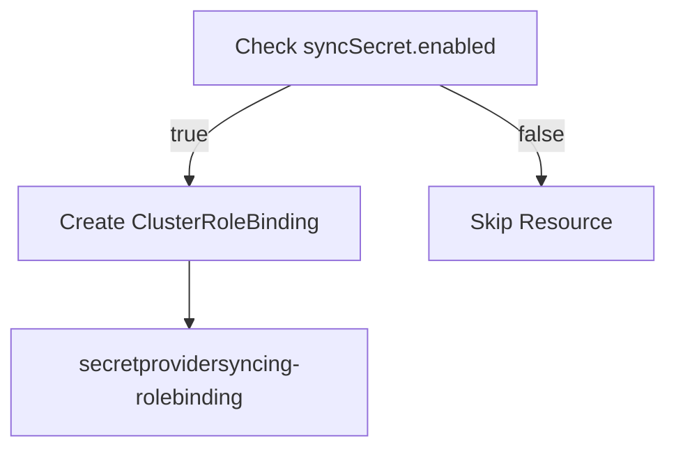
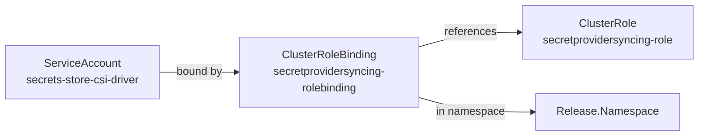
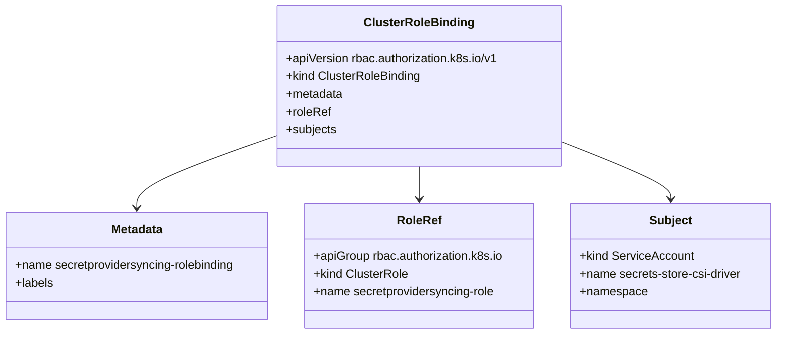

# Diagram: devops/k8s/secrets-store-csi-driver/helm/templates/role-syncsecret_binding.yaml

> Auto-generated by Obscura crawlers

## Diagram 1

### SVG

<svg id="container" width="481.3984375" xmlns="http://www.w3.org/2000/svg" class="flowchart" height="326" viewBox="0 0 481.3984375 326" role="graphics-document document" aria-roledescription="flowchart-v2"><g><marker id="container_flowchart-v2-pointEnd" class="marker flowchart-v2" viewBox="0 0 10 10" refX="5" refY="5" markerUnits="userSpaceOnUse" markerWidth="8" markerHeight="8" orient="auto"><path d="M 0 0 L 10 5 L 0 10 z" class="arrowMarkerPath" style="stroke-width: 1; stroke-dasharray: 1, 0;"></path></marker><marker id="container_flowchart-v2-pointStart" class="marker flowchart-v2" viewBox="0 0 10 10" refX="4.5" refY="5" markerUnits="userSpaceOnUse" markerWidth="8" markerHeight="8" orient="auto"><path d="M 0 5 L 10 10 L 10 0 z" class="arrowMarkerPath" style="stroke-width: 1; stroke-dasharray: 1, 0;"></path></marker><marker id="container_flowchart-v2-circleEnd" class="marker flowchart-v2" viewBox="0 0 10 10" refX="11" refY="5" markerUnits="userSpaceOnUse" markerWidth="11" markerHeight="11" orient="auto"><circle cx="5" cy="5" r="5" class="arrowMarkerPath" style="stroke-width: 1; stroke-dasharray: 1, 0;"></circle></marker><marker id="container_flowchart-v2-circleStart" class="marker flowchart-v2" viewBox="0 0 10 10" refX="-1" refY="5" markerUnits="userSpaceOnUse" markerWidth="11" markerHeight="11" orient="auto"><circle cx="5" cy="5" r="5" class="arrowMarkerPath" style="stroke-width: 1; stroke-dasharray: 1, 0;"></circle></marker><marker id="container_flowchart-v2-crossEnd" class="marker cross flowchart-v2" viewBox="0 0 11 11" refX="12" refY="5.2" markerUnits="userSpaceOnUse" markerWidth="11" markerHeight="11" orient="auto"><path d="M 1,1 l 9,9 M 10,1 l -9,9" class="arrowMarkerPath" style="stroke-width: 2; stroke-dasharray: 1, 0;"></path></marker><marker id="container_flowchart-v2-crossStart" class="marker cross flowchart-v2" viewBox="0 0 11 11" refX="-1" refY="5.2" markerUnits="userSpaceOnUse" markerWidth="11" markerHeight="11" orient="auto"><path d="M 1,1 l 9,9 M 10,1 l -9,9" class="arrowMarkerPath" style="stroke-width: 2; stroke-dasharray: 1, 0;"></path></marker><g class="root"><g class="clusters"></g><g class="edgePaths"><path d="M211.652,62L199.377,68.167C187.101,74.333,162.551,86.667,150.275,98.333C138,110,138,121,138,126.5L138,132" id="L_A_B_0" class="edge-thickness-normal edge-pattern-solid edge-thickness-normal edge-pattern-solid flowchart-link" style=";" data-edge="true" data-et="edge" data-id="L_A_B_0" data-points="W3sieCI6MjExLjY1MjIyMTY3OTY4NzUsInkiOjYyfSx7IngiOjEzOCwieSI6OTl9LHsieCI6MTM4LCJ5IjoxMzZ9XQ==" marker-end="url(#container_flowchart-v2-pointEnd)"></path><path d="M319.145,62L331.42,68.167C343.695,74.333,368.246,86.667,380.522,98.333C392.797,110,392.797,121,392.797,126.5L392.797,132" id="L_A_C_0" class="edge-thickness-normal edge-pattern-solid edge-thickness-normal edge-pattern-solid flowchart-link" style=";" data-edge="true" data-et="edge" data-id="L_A_C_0" data-points="W3sieCI6MzE5LjE0NDY1MzMyMDMxMjUsInkiOjYyfSx7IngiOjM5Mi43OTY4NzUsInkiOjk5fSx7IngiOjM5Mi43OTY4NzUsInkiOjEzNn1d" marker-end="url(#container_flowchart-v2-pointEnd)"></path><path d="M138,190L138,194.167C138,198.333,138,206.667,138,214.333C138,222,138,229,138,232.5L138,236" id="L_B_D_0" class="edge-thickness-normal edge-pattern-solid edge-thickness-normal edge-pattern-solid flowchart-link" style=";" data-edge="true" data-et="edge" data-id="L_B_D_0" data-points="W3sieCI6MTM4LCJ5IjoxOTB9LHsieCI6MTM4LCJ5IjoyMTV9LHsieCI6MTM4LCJ5IjoyNDB9XQ==" marker-end="url(#container_flowchart-v2-pointEnd)"></path></g><g class="edgeLabels"><g class="edgeLabel" transform="translate(138, 99)"><g class="label" data-id="L_A_B_0" transform="translate(-14.9921875, -12)"><foreignObject width="29.984375" height="24">

true

</foreignObject></g></g><g class="edgeLabel" transform="translate(392.796875, 99)"><g class="label" data-id="L_A_C_0" transform="translate(-17.21875, -12)"><foreignObject width="34.4375" height="24">

false

</foreignObject></g></g><g class="edgeLabel"><g class="label" data-id="L_B_D_0" transform="translate(0, 0)"><foreignObject width="0" height="0">

</foreignObject></g></g></g><g class="nodes"><g class="node default" id="flowchart-A-0" transform="translate(265.3984375, 35)"><rect class="basic label-container" style="" x="-123.6484375" y="-27" width="247.296875" height="54"></rect><g class="label" style="" transform="translate(-93.6484375, -12)"><rect></rect><foreignObject width="187.296875" height="24">

Check syncSecret.enabled

</foreignObject></g></g><g class="node default" id="flowchart-B-1" transform="translate(138, 163)"><rect class="basic label-container" style="" x="-124.1953125" y="-27" width="248.390625" height="54"></rect><g class="label" style="" transform="translate(-94.1953125, -12)"><rect></rect><foreignObject width="188.390625" height="24">

Create ClusterRoleBinding

</foreignObject></g></g><g class="node default" id="flowchart-C-3" transform="translate(392.796875, 163)"><rect class="basic label-container" style="" x="-80.6015625" y="-27" width="161.203125" height="54"></rect><g class="label" style="" transform="translate(-50.6015625, -12)"><rect></rect><foreignObject width="101.203125" height="24">

Skip Resource

</foreignObject></g></g><g class="node default" id="flowchart-D-5" transform="translate(138, 279)"><rect class="basic label-container" style="" x="-130" y="-39" width="260" height="78"></rect><g class="label" style="" transform="translate(-100, -24)"><rect></rect><foreignObject width="200" height="48">

secretprovidersyncing-rolebinding

</foreignObject></g></g></g></g></g></svg>

## Diagram 2

### SVG

<svg id="container" width="1029.03125" xmlns="http://www.w3.org/2000/svg" class="flowchart" height="198" viewBox="0 0 1029.03125 198" role="graphics-document document" aria-roledescription="flowchart-v2"><g><marker id="container_flowchart-v2-pointEnd" class="marker flowchart-v2" viewBox="0 0 10 10" refX="5" refY="5" markerUnits="userSpaceOnUse" markerWidth="8" markerHeight="8" orient="auto"><path d="M 0 0 L 10 5 L 0 10 z" class="arrowMarkerPath" style="stroke-width: 1; stroke-dasharray: 1, 0;"></path></marker><marker id="container_flowchart-v2-pointStart" class="marker flowchart-v2" viewBox="0 0 10 10" refX="4.5" refY="5" markerUnits="userSpaceOnUse" markerWidth="8" markerHeight="8" orient="auto"><path d="M 0 5 L 10 10 L 10 0 z" class="arrowMarkerPath" style="stroke-width: 1; stroke-dasharray: 1, 0;"></path></marker><marker id="container_flowchart-v2-circleEnd" class="marker flowchart-v2" viewBox="0 0 10 10" refX="11" refY="5" markerUnits="userSpaceOnUse" markerWidth="11" markerHeight="11" orient="auto"><circle cx="5" cy="5" r="5" class="arrowMarkerPath" style="stroke-width: 1; stroke-dasharray: 1, 0;"></circle></marker><marker id="container_flowchart-v2-circleStart" class="marker flowchart-v2" viewBox="0 0 10 10" refX="-1" refY="5" markerUnits="userSpaceOnUse" markerWidth="11" markerHeight="11" orient="auto"><circle cx="5" cy="5" r="5" class="arrowMarkerPath" style="stroke-width: 1; stroke-dasharray: 1, 0;"></circle></marker><marker id="container_flowchart-v2-crossEnd" class="marker cross flowchart-v2" viewBox="0 0 11 11" refX="12" refY="5.2" markerUnits="userSpaceOnUse" markerWidth="11" markerHeight="11" orient="auto"><path d="M 1,1 l 9,9 M 10,1 l -9,9" class="arrowMarkerPath" style="stroke-width: 2; stroke-dasharray: 1, 0;"></path></marker><marker id="container_flowchart-v2-crossStart" class="marker cross flowchart-v2" viewBox="0 0 11 11" refX="-1" refY="5.2" markerUnits="userSpaceOnUse" markerWidth="11" markerHeight="11" orient="auto"><path d="M 1,1 l 9,9 M 10,1 l -9,9" class="arrowMarkerPath" style="stroke-width: 2; stroke-dasharray: 1, 0;"></path></marker><g class="root"><g class="clusters"></g><g class="edgePaths"><path d="M238.063,105L247.951,105C257.839,105,277.615,105,296.724,105C315.833,105,334.276,105,343.497,105L352.719,105" id="L_SA_CRB_0" class="edge-thickness-normal edge-pattern-solid edge-thickness-normal edge-pattern-solid flowchart-link" style=";" data-edge="true" data-et="edge" data-id="L_SA_CRB_0" data-points="W3sieCI6MjM4LjA2MjUsInkiOjEwNX0seyJ4IjoyOTcuMzkwNjI1LCJ5IjoxMDV9LHsieCI6MzU2LjcxODc1LCJ5IjoxMDV9XQ==" marker-end="url(#container_flowchart-v2-pointEnd)"></path><path d="M616.719,68.239L629.237,64.699C641.755,61.159,666.792,54.08,691.161,50.54C715.531,47,739.234,47,751.086,47L762.938,47" id="L_CRB_CR_0" class="edge-thickness-normal edge-pattern-solid edge-thickness-normal edge-pattern-solid flowchart-link" style=";" data-edge="true" data-et="edge" data-id="L_CRB_CR_0" data-points="W3sieCI6NjE2LjcxODc1LCJ5Ijo2OC4yMzkxMjU0NjY1OTU1N30seyJ4Ijo2OTEuODI4MTI1LCJ5Ijo0N30seyJ4Ijo3NjYuOTM3NSwieSI6NDd9XQ==" marker-end="url(#container_flowchart-v2-pointEnd)"></path><path d="M616.719,141.761L629.237,145.301C641.755,148.841,666.792,155.92,695.387,159.46C723.982,163,756.135,163,772.212,163L788.289,163" id="L_CRB_NS_0" class="edge-thickness-normal edge-pattern-solid edge-thickness-normal edge-pattern-solid flowchart-link" style=";" data-edge="true" data-et="edge" data-id="L_CRB_NS_0" data-points="W3sieCI6NjE2LjcxODc1LCJ5IjoxNDEuNzYwODc0NTMzNDA0NDN9LHsieCI6NjkxLjgyODEyNSwieSI6MTYzfSx7IngiOjc5Mi4yODkwNjI1LCJ5IjoxNjN9XQ==" marker-end="url(#container_flowchart-v2-pointEnd)"></path></g><g class="edgeLabels"><g class="edgeLabel" transform="translate(297.390625, 105)"><g class="label" data-id="L_SA_CRB_0" transform="translate(-34.328125, -12)"><foreignObject width="68.65625" height="24">

bound by

</foreignObject></g></g><g class="edgeLabel" transform="translate(691.828125, 47)"><g class="label" data-id="L_CRB_CR_0" transform="translate(-37.828125, -12)"><foreignObject width="75.65625" height="24">

references

</foreignObject></g></g><g class="edgeLabel" transform="translate(691.828125, 163)"><g class="label" data-id="L_CRB_NS_0" transform="translate(-50.109375, -12)"><foreignObject width="100.21875" height="24">

in namespace

</foreignObject></g></g></g><g class="nodes"><g class="node default" id="flowchart-SA-0" transform="translate(123.03125, 105)"><rect class="basic label-container" style="" x="-115.03125" y="-39" width="230.0625" height="78"></rect><g class="label" style="" transform="translate(-85.03125, -24)"><rect></rect><foreignObject width="170.0625" height="48">

ServiceAccount secrets-store-csi-driver

</foreignObject></g></g><g class="node default" id="flowchart-CRB-1" transform="translate(486.71875, 105)"><rect class="basic label-container" style="" x="-130" y="-51" width="260" height="102"></rect><g class="label" style="" transform="translate(-100, -36)"><rect></rect><foreignObject width="200" height="72">

ClusterRoleBinding secretprovidersyncing-rolebinding

</foreignObject></g></g><g class="node default" id="flowchart-CR-3" transform="translate(893.984375, 47)"><rect class="basic label-container" style="" x="-127.046875" y="-39" width="254.09375" height="78"></rect><g class="label" style="" transform="translate(-97.046875, -24)"><rect></rect><foreignObject width="194.09375" height="48">

ClusterRole secretprovidersyncing-role

</foreignObject></g></g><g class="node default" id="flowchart-NS-5" transform="translate(893.984375, 163)"><rect class="basic label-container" style="" x="-101.6953125" y="-27" width="203.390625" height="54"></rect><g class="label" style="" transform="translate(-71.6953125, -12)"><rect></rect><foreignObject width="143.390625" height="24">

Release.Namespace

</foreignObject></g></g></g></g></g></svg>

## Diagram 3

### SVG

<svg id="container" width="1061.4921875" xmlns="http://www.w3.org/2000/svg" class="classDiagram" height="450" viewBox="0 0 1061.4921875 450" role="graphics-document document" aria-roledescription="class"><g><defs><marker id="container_class-aggregationStart" class="marker aggregation class" refX="18" refY="7" markerWidth="190" markerHeight="240" orient="auto"><path d="M 18,7 L9,13 L1,7 L9,1 Z"></path></marker></defs><defs><marker id="container_class-aggregationEnd" class="marker aggregation class" refX="1" refY="7" markerWidth="20" markerHeight="28" orient="auto"><path d="M 18,7 L9,13 L1,7 L9,1 Z"></path></marker></defs><defs><marker id="container_class-extensionStart" class="marker extension class" refX="18" refY="7" markerWidth="190" markerHeight="240" orient="auto"><path d="M 1,7 L18,13 V 1 Z"></path></marker></defs><defs><marker id="container_class-extensionEnd" class="marker extension class" refX="1" refY="7" markerWidth="20" markerHeight="28" orient="auto"><path d="M 1,1 V 13 L18,7 Z"></path></marker></defs><defs><marker id="container_class-compositionStart" class="marker composition class" refX="18" refY="7" markerWidth="190" markerHeight="240" orient="auto"><path d="M 18,7 L9,13 L1,7 L9,1 Z"></path></marker></defs><defs><marker id="container_class-compositionEnd" class="marker composition class" refX="1" refY="7" markerWidth="20" markerHeight="28" orient="auto"><path d="M 18,7 L9,13 L1,7 L9,1 Z"></path></marker></defs><defs><marker id="container_class-dependencyStart" class="marker dependency class" refX="6" refY="7" markerWidth="190" markerHeight="240" orient="auto"><path d="M 5,7 L9,13 L1,7 L9,1 Z"></path></marker></defs><defs><marker id="container_class-dependencyEnd" class="marker dependency class" refX="13" refY="7" markerWidth="20" markerHeight="28" orient="auto"><path d="M 18,7 L9,13 L14,7 L9,1 Z"></path></marker></defs><defs><marker id="container_class-lollipopStart" class="marker lollipop class" refX="13" refY="7" markerWidth="190" markerHeight="240" orient="auto"><circle stroke="black" fill="transparent" cx="7" cy="7" r="6"></circle></marker></defs><defs><marker id="container_class-lollipopEnd" class="marker lollipop class" refX="1" refY="7" markerWidth="190" markerHeight="240" orient="auto"><circle stroke="black" fill="transparent" cx="7" cy="7" r="6"></circle></marker></defs><g class="root"><g class="clusters"></g><g class="edgePaths"><path d="M381.43,182.392L349.245,193.493C317.06,204.594,252.69,226.797,220.505,243.065C188.32,259.333,188.32,269.667,188.32,274.833L188.32,280" id="id_ClusterRoleBinding_Metadata_1" class="edge-thickness-normal edge-pattern-solid relation" style=";;;" data-edge="true" data-et="edge" data-id="id_ClusterRoleBinding_Metadata_1" data-points="W3sieCI6MzgxLjQyOTY4NzUsInkiOjE4Mi4zOTE1MzY5MTA3Nzk5Nn0seyJ4IjoxODguMzIwMzEyNSwieSI6MjQ5fSx7IngiOjE4OC4zMjAzMTI1LCJ5IjoyODZ9XQ==" marker-end="url(#container_class-dependencyEnd)"></path><path d="M573.91,224L573.91,228.167C573.91,232.333,573.91,240.667,573.91,248C573.91,255.333,573.91,261.667,573.91,264.833L573.91,268" id="id_ClusterRoleBinding_RoleRef_2" class="edge-thickness-normal edge-pattern-solid relation" style=";;;" data-edge="true" data-et="edge" data-id="id_ClusterRoleBinding_RoleRef_2" data-points="W3sieCI6NTczLjkxMDE1NjI1LCJ5IjoyMjR9LHsieCI6NTczLjkxMDE1NjI1LCJ5IjoyNDl9LHsieCI6NTczLjkxMDE1NjI1LCJ5IjoyNzR9XQ==" marker-end="url(#container_class-dependencyEnd)"></path><path d="M766.391,190.76L791.382,200.467C816.372,210.174,866.354,229.587,891.345,242.46C916.336,255.333,916.336,261.667,916.336,264.833L916.336,268" id="id_ClusterRoleBinding_Subject_3" class="edge-thickness-normal edge-pattern-solid relation" style=";;;" data-edge="true" data-et="edge" data-id="id_ClusterRoleBinding_Subject_3" data-points="W3sieCI6NzY2LjM5MDYyNSwieSI6MTkwLjc2MDQ0MDc4ODk0ODMzfSx7IngiOjkxNi4zMzU5Mzc1LCJ5IjoyNDl9LHsieCI6OTE2LjMzNTkzNzUsInkiOjI3NH1d" marker-end="url(#container_class-dependencyEnd)"></path></g><g class="edgeLabels"><g class="edgeLabel"><g class="label" data-id="id_ClusterRoleBinding_Metadata_1" transform="translate(0, 0)"><foreignObject width="0" height="0">

</foreignObject></g></g><g class="edgeLabel"><g class="label" data-id="id_ClusterRoleBinding_RoleRef_2" transform="translate(0, 0)"><foreignObject width="0" height="0">

</foreignObject></g></g><g class="edgeLabel"><g class="label" data-id="id_ClusterRoleBinding_Subject_3" transform="translate(0, 0)"><foreignObject width="0" height="0">

</foreignObject></g></g></g><g class="nodes"><g class="node default" id="classId-ClusterRoleBinding-0" transform="translate(573.91015625, 116)"><g class="basic label-container"><path d="M-192.48046875 -108 L192.48046875 -108 L192.48046875 108 L-192.48046875 108" stroke="none" stroke-width="0" fill="#ECECFF" style=""></path><path d="M-192.48046875 -108 C-72.17951487568378 -108, 48.12143899863244 -108, 192.48046875 -108 M-192.48046875 -108 C-92.05383410207611 -108, 8.372800545847781 -108, 192.48046875 -108 M192.48046875 -108 C192.48046875 -48.560074690034064, 192.48046875 10.879850619931872, 192.48046875 108 M192.48046875 -108 C192.48046875 -50.718375532179955, 192.48046875 6.56324893564009, 192.48046875 108 M192.48046875 108 C93.51693623372581 108, -5.44659628254837 108, -192.48046875 108 M192.48046875 108 C68.6554941692672 108, -55.1694804114656 108, -192.48046875 108 M-192.48046875 108 C-192.48046875 61.14717540353787, -192.48046875 14.294350807075745, -192.48046875 -108 M-192.48046875 108 C-192.48046875 50.01991597475529, -192.48046875 -7.960168050489415, -192.48046875 -108" stroke="#9370DB" stroke-width="1.3" fill="none" stroke-dasharray="0 0" style=""></path></g><g class="annotation-group text" transform="translate(0, -84)"></g><g class="label-group text" transform="translate(-70.0390625, -84)"><g class="label" style="font-weight: bolder" transform="translate(0,-12)"><foreignObject width="140.078125" height="24">

ClusterRoleBinding

</foreignObject></g></g><g class="members-group text" transform="translate(-180.48046875, -36)"><g class="label" style="" transform="translate(0,-12)"><foreignObject width="290.921875" height="24">

+apiVersion rbac.authorization.k8s.io/v1

</foreignObject></g><g class="label" style="" transform="translate(0,12)"><foreignObject width="182.09375" height="24">

+kind ClusterRoleBinding

</foreignObject></g><g class="label" style="" transform="translate(0,36)"><foreignObject width="77.4375" height="24">

+metadata

</foreignObject></g><g class="label" style="" transform="translate(0,60)"><foreignObject width="59.875" height="24">

+roleRef

</foreignObject></g><g class="label" style="" transform="translate(0,84)"><foreignObject width="68.375" height="24">

+subjects

</foreignObject></g></g><g class="methods-group text" transform="translate(-180.48046875, 108)"></g><g class="divider" style=""><path d="M-192.48046875 -60 C-43.693612780793984 -60, 105.09324318841203 -60, 192.48046875 -60 M-192.48046875 -60 C-72.58889704844476 -60, 47.30267465311047 -60, 192.48046875 -60" stroke="#9370DB" stroke-width="1.3" fill="none" stroke-dasharray="0 0" style=""></path></g><g class="divider" style=""><path d="M-192.48046875 84 C-78.54617499353228 84, 35.38811876293545 84, 192.48046875 84 M-192.48046875 84 C-107.82850445702672 84, -23.17654016405345 84, 192.48046875 84" stroke="#9370DB" stroke-width="1.3" fill="none" stroke-dasharray="0 0" style=""></path></g></g><g class="node default" id="classId-Metadata-1" transform="translate(188.3203125, 358)"><g class="basic label-container"><path d="M-180.3203125 -72 L180.3203125 -72 L180.3203125 72 L-180.3203125 72" stroke="none" stroke-width="0" fill="#ECECFF" style=""></path><path d="M-180.3203125 -72 C-43.99357428781224 -72, 92.33316392437553 -72, 180.3203125 -72 M-180.3203125 -72 C-39.24475848259914 -72, 101.83079553480172 -72, 180.3203125 -72 M180.3203125 -72 C180.3203125 -23.488288334353015, 180.3203125 25.02342333129397, 180.3203125 72 M180.3203125 -72 C180.3203125 -37.16296409748671, 180.3203125 -2.3259281949734145, 180.3203125 72 M180.3203125 72 C104.82703304642556 72, 29.33375359285111 72, -180.3203125 72 M180.3203125 72 C47.50734266954194 72, -85.30562716091612 72, -180.3203125 72 M-180.3203125 72 C-180.3203125 25.86885342877016, -180.3203125 -20.262293142459683, -180.3203125 -72 M-180.3203125 72 C-180.3203125 36.07820203449644, -180.3203125 0.1564040689928845, -180.3203125 -72" stroke="#9370DB" stroke-width="1.3" fill="none" stroke-dasharray="0 0" style=""></path></g><g class="annotation-group text" transform="translate(0, -48)"></g><g class="label-group text" transform="translate(-34.640625, -48)"><g class="label" style="font-weight: bolder" transform="translate(0,-12)"><foreignObject width="69.28125" height="24">

Metadata

</foreignObject></g></g><g class="members-group text" transform="translate(-168.3203125, 0)"><g class="label" style="" transform="translate(0,-12)"><foreignObject width="302" height="24">

+name secretprovidersyncing-rolebinding

</foreignObject></g><g class="label" style="" transform="translate(0,12)"><foreignObject width="51.6875" height="24">

+labels

</foreignObject></g></g><g class="methods-group text" transform="translate(-168.3203125, 72)"></g><g class="divider" style=""><path d="M-180.3203125 -24 C-48.61755312168705 -24, 83.0852062566259 -24, 180.3203125 -24 M-180.3203125 -24 C-94.99830228260888 -24, -9.676292065217751 -24, 180.3203125 -24" stroke="#9370DB" stroke-width="1.3" fill="none" stroke-dasharray="0 0" style=""></path></g><g class="divider" style=""><path d="M-180.3203125 48 C-50.616729532257466 48, 79.08685343548507 48, 180.3203125 48 M-180.3203125 48 C-57.793177086626415 48, 64.73395832674717 48, 180.3203125 48" stroke="#9370DB" stroke-width="1.3" fill="none" stroke-dasharray="0 0" style=""></path></g></g><g class="node default" id="classId-RoleRef-2" transform="translate(573.91015625, 358)"><g class="basic label-container"><path d="M-155.26953125 -84 L155.26953125 -84 L155.26953125 84 L-155.26953125 84" stroke="none" stroke-width="0" fill="#ECECFF" style=""></path><path d="M-155.26953125 -84 C-78.9300682064648 -84, -2.5906051629295916 -84, 155.26953125 -84 M-155.26953125 -84 C-69.81285255994243 -84, 15.643826130115144 -84, 155.26953125 -84 M155.26953125 -84 C155.26953125 -49.00750207787241, 155.26953125 -14.015004155744819, 155.26953125 84 M155.26953125 -84 C155.26953125 -38.86697740085733, 155.26953125 6.26604519828534, 155.26953125 84 M155.26953125 84 C47.027669951861114 84, -61.21419134627777 84, -155.26953125 84 M155.26953125 84 C70.96394204064157 84, -13.341647168716861 84, -155.26953125 84 M-155.26953125 84 C-155.26953125 48.899163172687125, -155.26953125 13.79832634537425, -155.26953125 -84 M-155.26953125 84 C-155.26953125 18.942974459967388, -155.26953125 -46.114051080065224, -155.26953125 -84" stroke="#9370DB" stroke-width="1.3" fill="none" stroke-dasharray="0 0" style=""></path></g><g class="annotation-group text" transform="translate(0, -60)"></g><g class="label-group text" transform="translate(-28.3203125, -60)"><g class="label" style="font-weight: bolder" transform="translate(0,-12)"><foreignObject width="56.640625" height="24">

RoleRef

</foreignObject></g></g><g class="members-group text" transform="translate(-143.26953125, -12)"><g class="label" style="" transform="translate(0,-12)"><foreignObject width="258.21875" height="24">

+apiGroup rbac.authorization.k8s.io

</foreignObject></g><g class="label" style="" transform="translate(0,12)"><foreignObject width="126.703125" height="24">

+kind ClusterRole

</foreignObject></g><g class="label" style="" transform="translate(0,36)"><foreignObject width="246.828125" height="24">

+name secretprovidersyncing-role

</foreignObject></g></g><g class="methods-group text" transform="translate(-143.26953125, 84)"></g><g class="divider" style=""><path d="M-155.26953125 -36 C-45.02730227025745 -36, 65.2149267094851 -36, 155.26953125 -36 M-155.26953125 -36 C-60.794714353316195 -36, 33.68010254336761 -36, 155.26953125 -36" stroke="#9370DB" stroke-width="1.3" fill="none" stroke-dasharray="0 0" style=""></path></g><g class="divider" style=""><path d="M-155.26953125 60 C-77.97317253156284 60, -0.6768138131256762 60, 155.26953125 60 M-155.26953125 60 C-55.40858542066205 60, 44.4523604086759 60, 155.26953125 60" stroke="#9370DB" stroke-width="1.3" fill="none" stroke-dasharray="0 0" style=""></path></g></g><g class="node default" id="classId-Subject-3" transform="translate(916.3359375, 358)"><g class="basic label-container"><path d="M-137.15625 -84 L137.15625 -84 L137.15625 84 L-137.15625 84" stroke="none" stroke-width="0" fill="#ECECFF" style=""></path><path d="M-137.15625 -84 C-79.51291820219507 -84, -21.86958640439012 -84, 137.15625 -84 M-137.15625 -84 C-53.09679836243261 -84, 30.962653275134784 -84, 137.15625 -84 M137.15625 -84 C137.15625 -47.89587160229515, 137.15625 -11.791743204590304, 137.15625 84 M137.15625 -84 C137.15625 -22.63347727857432, 137.15625 38.73304544285136, 137.15625 84 M137.15625 84 C46.13273231119665 84, -44.890785377606704 84, -137.15625 84 M137.15625 84 C36.18299050213584 84, -64.79026899572833 84, -137.15625 84 M-137.15625 84 C-137.15625 19.654555139672297, -137.15625 -44.690889720655406, -137.15625 -84 M-137.15625 84 C-137.15625 20.700882517158654, -137.15625 -42.59823496568269, -137.15625 -84" stroke="#9370DB" stroke-width="1.3" fill="none" stroke-dasharray="0 0" style=""></path></g><g class="annotation-group text" transform="translate(0, -60)"></g><g class="label-group text" transform="translate(-27.515625, -60)"><g class="label" style="font-weight: bolder" transform="translate(0,-12)"><foreignObject width="55.03125" height="24">

Subject

</foreignObject></g></g><g class="members-group text" transform="translate(-125.15625, -12)"><g class="label" style="" transform="translate(0,-12)"><foreignObject width="153.5625" height="24">

+kind ServiceAccount

</foreignObject></g><g class="label" style="" transform="translate(0,12)"><foreignObject width="222.796875" height="24">

+name secrets-store-csi-driver

</foreignObject></g><g class="label" style="" transform="translate(0,36)"><foreignObject width="90.078125" height="24">

+namespace

</foreignObject></g></g><g class="methods-group text" transform="translate(-125.15625, 84)"></g><g class="divider" style=""><path d="M-137.15625 -36 C-49.35644170511554 -36, 38.443366589768914 -36, 137.15625 -36 M-137.15625 -36 C-60.66169737240118 -36, 15.832855255197643 -36, 137.15625 -36" stroke="#9370DB" stroke-width="1.3" fill="none" stroke-dasharray="0 0" style=""></path></g><g class="divider" style=""><path d="M-137.15625 60 C-37.62579670445206 60, 61.904656591095886 60, 137.15625 60 M-137.15625 60 C-67.63735239439777 60, 1.8815452112044682 60, 137.15625 60" stroke="#9370DB" stroke-width="1.3" fill="none" stroke-dasharray="0 0" style=""></path></g></g></g></g></g></svg>
