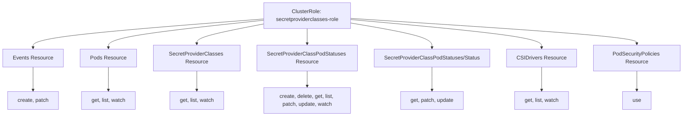
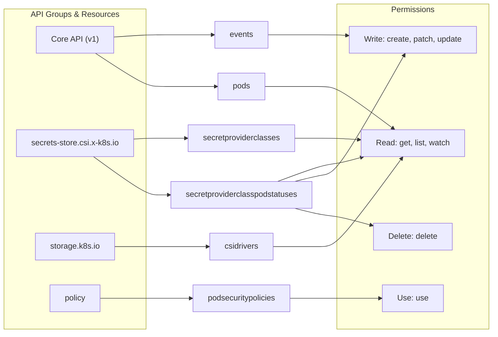

# Diagram: devops/k8s/secrets-store-csi-driver/helm/templates/role.yaml


> Auto-generated by Obscura crawlers

## Diagram 1

```mermaid
graph TD
      CR[ClusterRole: secretproviderclasses-role]
      CR --> E[Events Resource]
      CR --> P[Pods Resource]...
  └ 215 lines...
```

> SVG rendering failed for this diagram.

## Diagram 2



### SVG

<svg id="container" width="2025.59375" xmlns="http://www.w3.org/2000/svg" class="flowchart" height="350" viewBox="0 0 2025.59375 350" role="graphics-document document" aria-roledescription="flowchart-v2"><style>#container{font-family:"trebuchet ms",verdana,arial,sans-serif;font-size:16px;fill:#333;}@keyframes edge-animation-frame{from{stroke-dashoffset:0;}}@keyframes dash{to{stroke-dashoffset:0;}}#container .edge-animation-slow{stroke-dasharray:9,5!important;stroke-dashoffset:900;animation:dash 50s linear infinite;stroke-linecap:round;}#container .edge-animation-fast{stroke-dasharray:9,5!important;stroke-dashoffset:900;animation:dash 20s linear infinite;stroke-linecap:round;}#container .error-icon{fill:#552222;}#container .error-text{fill:#552222;stroke:#552222;}#container .edge-thickness-normal{stroke-width:1px;}#container .edge-thickness-thick{stroke-width:3.5px;}#container .edge-pattern-solid{stroke-dasharray:0;}#container .edge-thickness-invisible{stroke-width:0;fill:none;}#container .edge-pattern-dashed{stroke-dasharray:3;}#container .edge-pattern-dotted{stroke-dasharray:2;}#container .marker{fill:#333333;stroke:#333333;}#container .marker.cross{stroke:#333333;}#container svg{font-family:"trebuchet ms",verdana,arial,sans-serif;font-size:16px;}#container p{margin:0;}#container .label{font-family:"trebuchet ms",verdana,arial,sans-serif;color:#333;}#container .cluster-label text{fill:#333;}#container .cluster-label span{color:#333;}#container .cluster-label span p{background-color:transparent;}#container .label text,#container span{fill:#333;color:#333;}#container .node rect,#container .node circle,#container .node ellipse,#container .node polygon,#container .node path{fill:#ECECFF;stroke:#9370DB;stroke-width:1px;}#container .rough-node .label text,#container .node .label text,#container .image-shape .label,#container .icon-shape .label{text-anchor:middle;}#container .node .katex path{fill:#000;stroke:#000;stroke-width:1px;}#container .rough-node .label,#container .node .label,#container .image-shape .label,#container .icon-shape .label{text-align:center;}#container .node.clickable{cursor:pointer;}#container .root .anchor path{fill:#333333!important;stroke-width:0;stroke:#333333;}#container .arrowheadPath{fill:#333333;}#container .edgePath .path{stroke:#333333;stroke-width:2.0px;}#container .flowchart-link{stroke:#333333;fill:none;}#container .edgeLabel{background-color:rgba(232,232,232, 0.8);text-align:center;}#container .edgeLabel p{background-color:rgba(232,232,232, 0.8);}#container .edgeLabel rect{opacity:0.5;background-color:rgba(232,232,232, 0.8);fill:rgba(232,232,232, 0.8);}#container .labelBkg{background-color:rgba(232, 232, 232, 0.5);}#container .cluster rect{fill:#ffffde;stroke:#aaaa33;stroke-width:1px;}#container .cluster text{fill:#333;}#container .cluster span{color:#333;}#container div.mermaidTooltip{position:absolute;text-align:center;max-width:200px;padding:2px;font-family:"trebuchet ms",verdana,arial,sans-serif;font-size:12px;background:hsl(80, 100%, 96.2745098039%);border:1px solid #aaaa33;border-radius:2px;pointer-events:none;z-index:100;}#container .flowchartTitleText{text-anchor:middle;font-size:18px;fill:#333;}#container rect.text{fill:none;stroke-width:0;}#container .icon-shape,#container .image-shape{background-color:rgba(232,232,232, 0.8);text-align:center;}#container .icon-shape p,#container .image-shape p{background-color:rgba(232,232,232, 0.8);padding:2px;}#container .icon-shape rect,#container .image-shape rect{opacity:0.5;background-color:rgba(232,232,232, 0.8);fill:rgba(232,232,232, 0.8);}#container .label-icon{display:inline-block;height:1em;overflow:visible;vertical-align:-0.125em;}#container .node .label-icon path{fill:currentColor;stroke:revert;stroke-width:revert;}#container :root{--mermaid-font-family:"trebuchet ms",verdana,arial,sans-serif;}</style><g><marker id="container_flowchart-v2-pointEnd" class="marker flowchart-v2" viewBox="0 0 10 10" refX="5" refY="5" markerUnits="userSpaceOnUse" markerWidth="8" markerHeight="8" orient="auto"><path d="M 0 0 L 10 5 L 0 10 z" class="arrowMarkerPath" style="stroke-width: 1; stroke-dasharray: 1, 0;"></path></marker><marker id="container_flowchart-v2-pointStart" class="marker flowchart-v2" viewBox="0 0 10 10" refX="4.5" refY="5" markerUnits="userSpaceOnUse" markerWidth="8" markerHeight="8" orient="auto"><path d="M 0 5 L 10 10 L 10 0 z" class="arrowMarkerPath" style="stroke-width: 1; stroke-dasharray: 1, 0;"></path></marker><marker id="container_flowchart-v2-circleEnd" class="marker flowchart-v2" viewBox="0 0 10 10" refX="11" refY="5" markerUnits="userSpaceOnUse" markerWidth="11" markerHeight="11" orient="auto"><circle cx="5" cy="5" r="5" class="arrowMarkerPath" style="stroke-width: 1; stroke-dasharray: 1, 0;"></circle></marker><marker id="container_flowchart-v2-circleStart" class="marker flowchart-v2" viewBox="0 0 10 10" refX="-1" refY="5" markerUnits="userSpaceOnUse" markerWidth="11" markerHeight="11" orient="auto"><circle cx="5" cy="5" r="5" class="arrowMarkerPath" style="stroke-width: 1; stroke-dasharray: 1, 0;"></circle></marker><marker id="container_flowchart-v2-crossEnd" class="marker cross flowchart-v2" viewBox="0 0 11 11" refX="12" refY="5.2" markerUnits="userSpaceOnUse" markerWidth="11" markerHeight="11" orient="auto"><path d="M 1,1 l 9,9 M 10,1 l -9,9" class="arrowMarkerPath" style="stroke-width: 2; stroke-dasharray: 1, 0;"></path></marker><marker id="container_flowchart-v2-crossStart" class="marker cross flowchart-v2" viewBox="0 0 11 11" refX="-1" refY="5.2" markerUnits="userSpaceOnUse" markerWidth="11" markerHeight="11" orient="auto"><path d="M 1,1 l 9,9 M 10,1 l -9,9" class="arrowMarkerPath" style="stroke-width: 2; stroke-dasharray: 1, 0;"></path></marker><g class="root"><g class="clusters"></g><g class="edgePaths"><path d="M779.469,57.238L665.697,66.199C551.924,75.159,324.38,93.079,210.608,107.54C96.836,122,96.836,133,96.836,138.5L96.836,144" id="L_CR_E_0" class="edge-thickness-normal edge-pattern-solid edge-thickness-normal edge-pattern-solid flowchart-link" style=";" data-edge="true" data-et="edge" data-id="L_CR_E_0" data-points="W3sieCI6Nzc5LjQ2ODc1LCJ5Ijo1Ny4yMzgzMjY0Mjc0MTA5MDR9LHsieCI6OTYuODM1OTM3NSwieSI6MTExfSx7IngiOjk2LjgzNTkzNzUsInkiOjE0OH1d" marker-end="url(#container_flowchart-v2-pointEnd)"></path><path d="M779.469,61.077L702.626,69.397C625.784,77.718,472.099,94.359,395.257,108.179C318.414,122,318.414,133,318.414,138.5L318.414,144" id="L_CR_P_0" class="edge-thickness-normal edge-pattern-solid edge-thickness-normal edge-pattern-solid flowchart-link" style=";" data-edge="true" data-et="edge" data-id="L_CR_P_0" data-points="W3sieCI6Nzc5LjQ2ODc1LCJ5Ijo2MS4wNzY1MzE2MjM4MTg2NX0seyJ4IjozMTguNDE0MDYyNSwieSI6MTExfSx7IngiOjMxOC40MTQwNjI1LCJ5IjoxNDh9XQ==" marker-end="url(#container_flowchart-v2-pointEnd)"></path><path d="M779.469,72.342L746.417,78.785C713.365,85.228,647.26,98.114,614.208,108.057C581.156,118,581.156,125,581.156,128.5L581.156,132" id="L_CR_SPC_0" class="edge-thickness-normal edge-pattern-solid edge-thickness-normal edge-pattern-solid flowchart-link" style=";" data-edge="true" data-et="edge" data-id="L_CR_SPC_0" data-points="W3sieCI6Nzc5LjQ2ODc1LCJ5Ijo3Mi4zNDE3MDk0OTkzMzM3Mn0seyJ4Ijo1ODEuMTU2MjUsInkiOjExMX0seyJ4Ijo1ODEuMTU2MjUsInkiOjEzNn1d" marker-end="url(#container_flowchart-v2-pointEnd)"></path><path d="M909.469,86L909.469,90.167C909.469,94.333,909.469,102.667,909.469,110.333C909.469,118,909.469,125,909.469,128.5L909.469,132" id="L_CR_SPCPS_0" class="edge-thickness-normal edge-pattern-solid edge-thickness-normal edge-pattern-solid flowchart-link" style=";" data-edge="true" data-et="edge" data-id="L_CR_SPCPS_0" data-points="W3sieCI6OTA5LjQ2ODc1LCJ5Ijo4Nn0seyJ4Ijo5MDkuNDY4NzUsInkiOjExMX0seyJ4Ijo5MDkuNDY4NzUsInkiOjEzNn1d" marker-end="url(#container_flowchart-v2-pointEnd)"></path><path d="M1039.469,69.396L1079.717,76.33C1119.966,83.264,1200.464,97.132,1240.712,109.566C1280.961,122,1280.961,133,1280.961,138.5L1280.961,144" id="L_CR_SPCPS_Status_0" class="edge-thickness-normal edge-pattern-solid edge-thickness-normal edge-pattern-solid flowchart-link" style=";" data-edge="true" data-et="edge" data-id="L_CR_SPCPS_Status_0" data-points="W3sieCI6MTAzOS40Njg3NSwieSI6NjkuMzk2MTY0MTE4NTI1Mzh9LHsieCI6MTI4MC45NjA5Mzc1LCJ5IjoxMTF9LHsieCI6MTI4MC45NjA5Mzc1LCJ5IjoxNDh9XQ==" marker-end="url(#container_flowchart-v2-pointEnd)"></path><path d="M1039.469,58.947L1133.868,67.623C1228.268,76.298,1417.068,93.649,1511.467,107.825C1605.867,122,1605.867,133,1605.867,138.5L1605.867,144" id="L_CR_CSID_0" class="edge-thickness-normal edge-pattern-solid edge-thickness-normal edge-pattern-solid flowchart-link" style=";" data-edge="true" data-et="edge" data-id="L_CR_CSID_0" data-points="W3sieCI6MTAzOS40Njg3NSwieSI6NTguOTQ3MTgzNjEyMTExNDI0fSx7IngiOjE2MDUuODY3MTg3NSwieSI6MTExfSx7IngiOjE2MDUuODY3MTg3NSwieSI6MTQ4fV0=" marker-end="url(#container_flowchart-v2-pointEnd)"></path><path d="M1039.469,55.506L1180.823,64.755C1322.177,74.004,1604.885,92.502,1746.24,105.251C1887.594,118,1887.594,125,1887.594,128.5L1887.594,132" id="L_CR_PSP_0" class="edge-thickness-normal edge-pattern-solid edge-thickness-normal edge-pattern-solid flowchart-link" style=";" data-edge="true" data-et="edge" data-id="L_CR_PSP_0" data-points="W3sieCI6MTAzOS40Njg3NSwieSI6NTUuNTA2MDcwMjg3NTM5OTM0fSx7IngiOjE4ODcuNTkzNzUsInkiOjExMX0seyJ4IjoxODg3LjU5Mzc1LCJ5IjoxMzZ9XQ==" marker-end="url(#container_flowchart-v2-pointEnd)"></path><path d="M96.836,202L96.836,208.167C96.836,214.333,96.836,226.667,96.836,238.333C96.836,250,96.836,261,96.836,266.5L96.836,272" id="L_E_E_Verbs_0" class="edge-thickness-normal edge-pattern-solid edge-thickness-normal edge-pattern-solid flowchart-link" style=";" data-edge="true" data-et="edge" data-id="L_E_E_Verbs_0" data-points="W3sieCI6OTYuODM1OTM3NSwieSI6MjAyfSx7IngiOjk2LjgzNTkzNzUsInkiOjIzOX0seyJ4Ijo5Ni44MzU5Mzc1LCJ5IjoyNzZ9XQ==" marker-end="url(#container_flowchart-v2-pointEnd)"></path><path d="M318.414,202L318.414,208.167C318.414,214.333,318.414,226.667,318.414,238.333C318.414,250,318.414,261,318.414,266.5L318.414,272" id="L_P_P_Verbs_0" class="edge-thickness-normal edge-pattern-solid edge-thickness-normal edge-pattern-solid flowchart-link" style=";" data-edge="true" data-et="edge" data-id="L_P_P_Verbs_0" data-points="W3sieCI6MzE4LjQxNDA2MjUsInkiOjIwMn0seyJ4IjozMTguNDE0MDYyNSwieSI6MjM5fSx7IngiOjMxOC40MTQwNjI1LCJ5IjoyNzZ9XQ==" marker-end="url(#container_flowchart-v2-pointEnd)"></path><path d="M581.156,214L581.156,218.167C581.156,222.333,581.156,230.667,581.156,240.333C581.156,250,581.156,261,581.156,266.5L581.156,272" id="L_SPC_SPC_Verbs_0" class="edge-thickness-normal edge-pattern-solid edge-thickness-normal edge-pattern-solid flowchart-link" style=";" data-edge="true" data-et="edge" data-id="L_SPC_SPC_Verbs_0" data-points="W3sieCI6NTgxLjE1NjI1LCJ5IjoyMTR9LHsieCI6NTgxLjE1NjI1LCJ5IjoyMzl9LHsieCI6NTgxLjE1NjI1LCJ5IjoyNzZ9XQ==" marker-end="url(#container_flowchart-v2-pointEnd)"></path><path d="M909.469,214L909.469,218.167C909.469,222.333,909.469,230.667,909.469,238.333C909.469,246,909.469,253,909.469,256.5L909.469,260" id="L_SPCPS_SPCPS_Verbs_0" class="edge-thickness-normal edge-pattern-solid edge-thickness-normal edge-pattern-solid flowchart-link" style=";" data-edge="true" data-et="edge" data-id="L_SPCPS_SPCPS_Verbs_0" data-points="W3sieCI6OTA5LjQ2ODc1LCJ5IjoyMTR9LHsieCI6OTA5LjQ2ODc1LCJ5IjoyMzl9LHsieCI6OTA5LjQ2ODc1LCJ5IjoyNjR9XQ==" marker-end="url(#container_flowchart-v2-pointEnd)"></path><path d="M1280.961,202L1280.961,208.167C1280.961,214.333,1280.961,226.667,1280.961,238.333C1280.961,250,1280.961,261,1280.961,266.5L1280.961,272" id="L_SPCPS_Status_SPCPS_Status_Verbs_0" class="edge-thickness-normal edge-pattern-solid edge-thickness-normal edge-pattern-solid flowchart-link" style=";" data-edge="true" data-et="edge" data-id="L_SPCPS_Status_SPCPS_Status_Verbs_0" data-points="W3sieCI6MTI4MC45NjA5Mzc1LCJ5IjoyMDJ9LHsieCI6MTI4MC45NjA5Mzc1LCJ5IjoyMzl9LHsieCI6MTI4MC45NjA5Mzc1LCJ5IjoyNzZ9XQ==" marker-end="url(#container_flowchart-v2-pointEnd)"></path><path d="M1605.867,202L1605.867,208.167C1605.867,214.333,1605.867,226.667,1605.867,238.333C1605.867,250,1605.867,261,1605.867,266.5L1605.867,272" id="L_CSID_CSID_Verbs_0" class="edge-thickness-normal edge-pattern-solid edge-thickness-normal edge-pattern-solid flowchart-link" style=";" data-edge="true" data-et="edge" data-id="L_CSID_CSID_Verbs_0" data-points="W3sieCI6MTYwNS44NjcxODc1LCJ5IjoyMDJ9LHsieCI6MTYwNS44NjcxODc1LCJ5IjoyMzl9LHsieCI6MTYwNS44NjcxODc1LCJ5IjoyNzZ9XQ==" marker-end="url(#container_flowchart-v2-pointEnd)"></path><path d="M1887.594,214L1887.594,218.167C1887.594,222.333,1887.594,230.667,1887.594,240.333C1887.594,250,1887.594,261,1887.594,266.5L1887.594,272" id="L_PSP_PSP_Verbs_0" class="edge-thickness-normal edge-pattern-solid edge-thickness-normal edge-pattern-solid flowchart-link" style=";" data-edge="true" data-et="edge" data-id="L_PSP_PSP_Verbs_0" data-points="W3sieCI6MTg4Ny41OTM3NSwieSI6MjE0fSx7IngiOjE4ODcuNTkzNzUsInkiOjIzOX0seyJ4IjoxODg3LjU5Mzc1LCJ5IjoyNzZ9XQ==" marker-end="url(#container_flowchart-v2-pointEnd)"></path></g><g class="edgeLabels"><g class="edgeLabel"><g class="label" data-id="L_CR_E_0" transform="translate(0, 0)"><foreignObject width="0" height="0"><div xmlns="http://www.w3.org/1999/xhtml" class="labelBkg" style="display: table-cell; white-space: nowrap; line-height: 1.5; max-width: 200px; text-align: center;"><span class="edgeLabel"></span></div></foreignObject></g></g><g class="edgeLabel"><g class="label" data-id="L_CR_P_0" transform="translate(0, 0)"><foreignObject width="0" height="0"><div xmlns="http://www.w3.org/1999/xhtml" class="labelBkg" style="display: table-cell; white-space: nowrap; line-height: 1.5; max-width: 200px; text-align: center;"><span class="edgeLabel"></span></div></foreignObject></g></g><g class="edgeLabel"><g class="label" data-id="L_CR_SPC_0" transform="translate(0, 0)"><foreignObject width="0" height="0"><div xmlns="http://www.w3.org/1999/xhtml" class="labelBkg" style="display: table-cell; white-space: nowrap; line-height: 1.5; max-width: 200px; text-align: center;"><span class="edgeLabel"></span></div></foreignObject></g></g><g class="edgeLabel"><g class="label" data-id="L_CR_SPCPS_0" transform="translate(0, 0)"><foreignObject width="0" height="0"><div xmlns="http://www.w3.org/1999/xhtml" class="labelBkg" style="display: table-cell; white-space: nowrap; line-height: 1.5; max-width: 200px; text-align: center;"><span class="edgeLabel"></span></div></foreignObject></g></g><g class="edgeLabel"><g class="label" data-id="L_CR_SPCPS_Status_0" transform="translate(0, 0)"><foreignObject width="0" height="0"><div xmlns="http://www.w3.org/1999/xhtml" class="labelBkg" style="display: table-cell; white-space: nowrap; line-height: 1.5; max-width: 200px; text-align: center;"><span class="edgeLabel"></span></div></foreignObject></g></g><g class="edgeLabel"><g class="label" data-id="L_CR_CSID_0" transform="translate(0, 0)"><foreignObject width="0" height="0"><div xmlns="http://www.w3.org/1999/xhtml" class="labelBkg" style="display: table-cell; white-space: nowrap; line-height: 1.5; max-width: 200px; text-align: center;"><span class="edgeLabel"></span></div></foreignObject></g></g><g class="edgeLabel"><g class="label" data-id="L_CR_PSP_0" transform="translate(0, 0)"><foreignObject width="0" height="0"><div xmlns="http://www.w3.org/1999/xhtml" class="labelBkg" style="display: table-cell; white-space: nowrap; line-height: 1.5; max-width: 200px; text-align: center;"><span class="edgeLabel"></span></div></foreignObject></g></g><g class="edgeLabel"><g class="label" data-id="L_E_E_Verbs_0" transform="translate(0, 0)"><foreignObject width="0" height="0"><div xmlns="http://www.w3.org/1999/xhtml" class="labelBkg" style="display: table-cell; white-space: nowrap; line-height: 1.5; max-width: 200px; text-align: center;"><span class="edgeLabel"></span></div></foreignObject></g></g><g class="edgeLabel"><g class="label" data-id="L_P_P_Verbs_0" transform="translate(0, 0)"><foreignObject width="0" height="0"><div xmlns="http://www.w3.org/1999/xhtml" class="labelBkg" style="display: table-cell; white-space: nowrap; line-height: 1.5; max-width: 200px; text-align: center;"><span class="edgeLabel"></span></div></foreignObject></g></g><g class="edgeLabel"><g class="label" data-id="L_SPC_SPC_Verbs_0" transform="translate(0, 0)"><foreignObject width="0" height="0"><div xmlns="http://www.w3.org/1999/xhtml" class="labelBkg" style="display: table-cell; white-space: nowrap; line-height: 1.5; max-width: 200px; text-align: center;"><span class="edgeLabel"></span></div></foreignObject></g></g><g class="edgeLabel"><g class="label" data-id="L_SPCPS_SPCPS_Verbs_0" transform="translate(0, 0)"><foreignObject width="0" height="0"><div xmlns="http://www.w3.org/1999/xhtml" class="labelBkg" style="display: table-cell; white-space: nowrap; line-height: 1.5; max-width: 200px; text-align: center;"><span class="edgeLabel"></span></div></foreignObject></g></g><g class="edgeLabel"><g class="label" data-id="L_SPCPS_Status_SPCPS_Status_Verbs_0" transform="translate(0, 0)"><foreignObject width="0" height="0"><div xmlns="http://www.w3.org/1999/xhtml" class="labelBkg" style="display: table-cell; white-space: nowrap; line-height: 1.5; max-width: 200px; text-align: center;"><span class="edgeLabel"></span></div></foreignObject></g></g><g class="edgeLabel"><g class="label" data-id="L_CSID_CSID_Verbs_0" transform="translate(0, 0)"><foreignObject width="0" height="0"><div xmlns="http://www.w3.org/1999/xhtml" class="labelBkg" style="display: table-cell; white-space: nowrap; line-height: 1.5; max-width: 200px; text-align: center;"><span class="edgeLabel"></span></div></foreignObject></g></g><g class="edgeLabel"><g class="label" data-id="L_PSP_PSP_Verbs_0" transform="translate(0, 0)"><foreignObject width="0" height="0"><div xmlns="http://www.w3.org/1999/xhtml" class="labelBkg" style="display: table-cell; white-space: nowrap; line-height: 1.5; max-width: 200px; text-align: center;"><span class="edgeLabel"></span></div></foreignObject></g></g></g><g class="nodes"><g class="node default" id="flowchart-CR-0" transform="translate(909.46875, 47)"><rect class="basic label-container" style="" x="-130" y="-39" width="260" height="78"></rect><g class="label" style="" transform="translate(-100, -24)"><rect></rect><foreignObject width="200" height="48"><div xmlns="http://www.w3.org/1999/xhtml" style="display: table; white-space: break-spaces; line-height: 1.5; max-width: 200px; text-align: center; width: 200px;"><span class="nodeLabel"><p>ClusterRole: secretproviderclasses-role</p></span></div></foreignObject></g></g><g class="node default" id="flowchart-E-2" transform="translate(96.8359375, 175)"><rect class="basic label-container" style="" x="-88.8359375" y="-27" width="177.671875" height="54"></rect><g class="label" style="" transform="translate(-58.8359375, -12)"><rect></rect><foreignObject width="117.671875" height="24"><div xmlns="http://www.w3.org/1999/xhtml" style="display: table-cell; white-space: nowrap; line-height: 1.5; max-width: 200px; text-align: center;"><span class="nodeLabel"><p>Events Resource</p></span></div></foreignObject></g></g><g class="node default" id="flowchart-P-4" transform="translate(318.4140625, 175)"><rect class="basic label-container" style="" x="-82.7421875" y="-27" width="165.484375" height="54"></rect><g class="label" style="" transform="translate(-52.7421875, -12)"><rect></rect><foreignObject width="105.484375" height="24"><div xmlns="http://www.w3.org/1999/xhtml" style="display: table-cell; white-space: nowrap; line-height: 1.5; max-width: 200px; text-align: center;"><span class="nodeLabel"><p>Pods Resource</p></span></div></foreignObject></g></g><g class="node default" id="flowchart-SPC-6" transform="translate(581.15625, 175)"><rect class="basic label-container" style="" x="-130" y="-39" width="260" height="78"></rect><g class="label" style="" transform="translate(-100, -24)"><rect></rect><foreignObject width="200" height="48"><div xmlns="http://www.w3.org/1999/xhtml" style="display: table; white-space: break-spaces; line-height: 1.5; max-width: 200px; text-align: center; width: 200px;"><span class="nodeLabel"><p>SecretProviderClasses Resource</p></span></div></foreignObject></g></g><g class="node default" id="flowchart-SPCPS-8" transform="translate(909.46875, 175)"><rect class="basic label-container" style="" x="-148.3125" y="-39" width="296.625" height="78"></rect><g class="label" style="" transform="translate(-118.3125, -24)"><rect></rect><foreignObject width="236.625" height="48"><div xmlns="http://www.w3.org/1999/xhtml" style="display: table; white-space: break-spaces; line-height: 1.5; max-width: 200px; text-align: center; width: 200px;"><span class="nodeLabel"><p>SecretProviderClassPodStatuses Resource</p></span></div></foreignObject></g></g><g class="node default" id="flowchart-SPCPS_Status-10" transform="translate(1280.9609375, 175)"><rect class="basic label-container" style="" x="-173.1796875" y="-27" width="346.359375" height="54"></rect><g class="label" style="" transform="translate(-143.1796875, -12)"><rect></rect><foreignObject width="286.359375" height="24"><div xmlns="http://www.w3.org/1999/xhtml" style="display: table; white-space: break-spaces; line-height: 1.5; max-width: 200px; text-align: center; width: 200px;"><span class="nodeLabel"><p>SecretProviderClassPodStatuses/Status</p></span></div></foreignObject></g></g><g class="node default" id="flowchart-CSID-12" transform="translate(1605.8671875, 175)"><rect class="basic label-container" style="" x="-101.7265625" y="-27" width="203.453125" height="54"></rect><g class="label" style="" transform="translate(-71.7265625, -12)"><rect></rect><foreignObject width="143.453125" height="24"><div xmlns="http://www.w3.org/1999/xhtml" style="display: table-cell; white-space: nowrap; line-height: 1.5; max-width: 200px; text-align: center;"><span class="nodeLabel"><p>CSIDrivers Resource</p></span></div></foreignObject></g></g><g class="node default" id="flowchart-PSP-14" transform="translate(1887.59375, 175)"><rect class="basic label-container" style="" x="-130" y="-39" width="260" height="78"></rect><g class="label" style="" transform="translate(-100, -24)"><rect></rect><foreignObject width="200" height="48"><div xmlns="http://www.w3.org/1999/xhtml" style="display: table; white-space: break-spaces; line-height: 1.5; max-width: 200px; text-align: center; width: 200px;"><span class="nodeLabel"><p>PodSecurityPolicies Resource</p></span></div></foreignObject></g></g><g class="node default" id="flowchart-E_Verbs-16" transform="translate(96.8359375, 303)"><rect class="basic label-container" style="" x="-76.703125" y="-27" width="153.40625" height="54"></rect><g class="label" style="" transform="translate(-46.703125, -12)"><rect></rect><foreignObject width="93.40625" height="24"><div xmlns="http://www.w3.org/1999/xhtml" style="display: table-cell; white-space: nowrap; line-height: 1.5; max-width: 200px; text-align: center;"><span class="nodeLabel"><p>create, patch</p></span></div></foreignObject></g></g><g class="node default" id="flowchart-P_Verbs-18" transform="translate(318.4140625, 303)"><rect class="basic label-container" style="" x="-81.921875" y="-27" width="163.84375" height="54"></rect><g class="label" style="" transform="translate(-51.921875, -12)"><rect></rect><foreignObject width="103.84375" height="24"><div xmlns="http://www.w3.org/1999/xhtml" style="display: table-cell; white-space: nowrap; line-height: 1.5; max-width: 200px; text-align: center;"><span class="nodeLabel"><p>get, list, watch</p></span></div></foreignObject></g></g><g class="node default" id="flowchart-SPC_Verbs-20" transform="translate(581.15625, 303)"><rect class="basic label-container" style="" x="-81.921875" y="-27" width="163.84375" height="54"></rect><g class="label" style="" transform="translate(-51.921875, -12)"><rect></rect><foreignObject width="103.84375" height="24"><div xmlns="http://www.w3.org/1999/xhtml" style="display: table-cell; white-space: nowrap; line-height: 1.5; max-width: 200px; text-align: center;"><span class="nodeLabel"><p>get, list, watch</p></span></div></foreignObject></g></g><g class="node default" id="flowchart-SPCPS_Verbs-22" transform="translate(909.46875, 303)"><rect class="basic label-container" style="" x="-130" y="-39" width="260" height="78"></rect><g class="label" style="" transform="translate(-100, -24)"><rect></rect><foreignObject width="200" height="48"><div xmlns="http://www.w3.org/1999/xhtml" style="display: table; white-space: break-spaces; line-height: 1.5; max-width: 200px; text-align: center; width: 200px;"><span class="nodeLabel"><p>create, delete, get, list, patch, update, watch</p></span></div></foreignObject></g></g><g class="node default" id="flowchart-SPCPS_Status_Verbs-24" transform="translate(1280.9609375, 303)"><rect class="basic label-container" style="" x="-95.375" y="-27" width="190.75" height="54"></rect><g class="label" style="" transform="translate(-65.375, -12)"><rect></rect><foreignObject width="130.75" height="24"><div xmlns="http://www.w3.org/1999/xhtml" style="display: table-cell; white-space: nowrap; line-height: 1.5; max-width: 200px; text-align: center;"><span class="nodeLabel"><p>get, patch, update</p></span></div></foreignObject></g></g><g class="node default" id="flowchart-CSID_Verbs-26" transform="translate(1605.8671875, 303)"><rect class="basic label-container" style="" x="-81.921875" y="-27" width="163.84375" height="54"></rect><g class="label" style="" transform="translate(-51.921875, -12)"><rect></rect><foreignObject width="103.84375" height="24"><div xmlns="http://www.w3.org/1999/xhtml" style="display: table-cell; white-space: nowrap; line-height: 1.5; max-width: 200px; text-align: center;"><span class="nodeLabel"><p>get, list, watch</p></span></div></foreignObject></g></g><g class="node default" id="flowchart-PSP_Verbs-28" transform="translate(1887.59375, 303)"><rect class="basic label-container" style="" x="-42.7578125" y="-27" width="85.515625" height="54"></rect><g class="label" style="" transform="translate(-12.7578125, -12)"><rect></rect><foreignObject width="25.515625" height="24"><div xmlns="http://www.w3.org/1999/xhtml" style="display: table-cell; white-space: nowrap; line-height: 1.5; max-width: 200px; text-align: center;"><span class="nodeLabel"><p>use</p></span></div></foreignObject></g></g></g></g></g></svg>

## Diagram 3



### SVG

<svg id="container" width="1001.921875" xmlns="http://www.w3.org/2000/svg" class="flowchart" height="670" viewBox="0 0 1001.921875 670" role="graphics-document document" aria-roledescription="flowchart-v2"><style>#container{font-family:"trebuchet ms",verdana,arial,sans-serif;font-size:16px;fill:#333;}@keyframes edge-animation-frame{from{stroke-dashoffset:0;}}@keyframes dash{to{stroke-dashoffset:0;}}#container .edge-animation-slow{stroke-dasharray:9,5!important;stroke-dashoffset:900;animation:dash 50s linear infinite;stroke-linecap:round;}#container .edge-animation-fast{stroke-dasharray:9,5!important;stroke-dashoffset:900;animation:dash 20s linear infinite;stroke-linecap:round;}#container .error-icon{fill:#552222;}#container .error-text{fill:#552222;stroke:#552222;}#container .edge-thickness-normal{stroke-width:1px;}#container .edge-thickness-thick{stroke-width:3.5px;}#container .edge-pattern-solid{stroke-dasharray:0;}#container .edge-thickness-invisible{stroke-width:0;fill:none;}#container .edge-pattern-dashed{stroke-dasharray:3;}#container .edge-pattern-dotted{stroke-dasharray:2;}#container .marker{fill:#333333;stroke:#333333;}#container .marker.cross{stroke:#333333;}#container svg{font-family:"trebuchet ms",verdana,arial,sans-serif;font-size:16px;}#container p{margin:0;}#container .label{font-family:"trebuchet ms",verdana,arial,sans-serif;color:#333;}#container .cluster-label text{fill:#333;}#container .cluster-label span{color:#333;}#container .cluster-label span p{background-color:transparent;}#container .label text,#container span{fill:#333;color:#333;}#container .node rect,#container .node circle,#container .node ellipse,#container .node polygon,#container .node path{fill:#ECECFF;stroke:#9370DB;stroke-width:1px;}#container .rough-node .label text,#container .node .label text,#container .image-shape .label,#container .icon-shape .label{text-anchor:middle;}#container .node .katex path{fill:#000;stroke:#000;stroke-width:1px;}#container .rough-node .label,#container .node .label,#container .image-shape .label,#container .icon-shape .label{text-align:center;}#container .node.clickable{cursor:pointer;}#container .root .anchor path{fill:#333333!important;stroke-width:0;stroke:#333333;}#container .arrowheadPath{fill:#333333;}#container .edgePath .path{stroke:#333333;stroke-width:2.0px;}#container .flowchart-link{stroke:#333333;fill:none;}#container .edgeLabel{background-color:rgba(232,232,232, 0.8);text-align:center;}#container .edgeLabel p{background-color:rgba(232,232,232, 0.8);}#container .edgeLabel rect{opacity:0.5;background-color:rgba(232,232,232, 0.8);fill:rgba(232,232,232, 0.8);}#container .labelBkg{background-color:rgba(232, 232, 232, 0.5);}#container .cluster rect{fill:#ffffde;stroke:#aaaa33;stroke-width:1px;}#container .cluster text{fill:#333;}#container .cluster span{color:#333;}#container div.mermaidTooltip{position:absolute;text-align:center;max-width:200px;padding:2px;font-family:"trebuchet ms",verdana,arial,sans-serif;font-size:12px;background:hsl(80, 100%, 96.2745098039%);border:1px solid #aaaa33;border-radius:2px;pointer-events:none;z-index:100;}#container .flowchartTitleText{text-anchor:middle;font-size:18px;fill:#333;}#container rect.text{fill:none;stroke-width:0;}#container .icon-shape,#container .image-shape{background-color:rgba(232,232,232, 0.8);text-align:center;}#container .icon-shape p,#container .image-shape p{background-color:rgba(232,232,232, 0.8);padding:2px;}#container .icon-shape rect,#container .image-shape rect{opacity:0.5;background-color:rgba(232,232,232, 0.8);fill:rgba(232,232,232, 0.8);}#container .label-icon{display:inline-block;height:1em;overflow:visible;vertical-align:-0.125em;}#container .node .label-icon path{fill:currentColor;stroke:revert;stroke-width:revert;}#container :root{--mermaid-font-family:"trebuchet ms",verdana,arial,sans-serif;}</style><g><marker id="container_flowchart-v2-pointEnd" class="marker flowchart-v2" viewBox="0 0 10 10" refX="5" refY="5" markerUnits="userSpaceOnUse" markerWidth="8" markerHeight="8" orient="auto"><path d="M 0 0 L 10 5 L 0 10 z" class="arrowMarkerPath" style="stroke-width: 1; stroke-dasharray: 1, 0;"></path></marker><marker id="container_flowchart-v2-pointStart" class="marker flowchart-v2" viewBox="0 0 10 10" refX="4.5" refY="5" markerUnits="userSpaceOnUse" markerWidth="8" markerHeight="8" orient="auto"><path d="M 0 5 L 10 10 L 10 0 z" class="arrowMarkerPath" style="stroke-width: 1; stroke-dasharray: 1, 0;"></path></marker><marker id="container_flowchart-v2-circleEnd" class="marker flowchart-v2" viewBox="0 0 10 10" refX="11" refY="5" markerUnits="userSpaceOnUse" markerWidth="11" markerHeight="11" orient="auto"><circle cx="5" cy="5" r="5" class="arrowMarkerPath" style="stroke-width: 1; stroke-dasharray: 1, 0;"></circle></marker><marker id="container_flowchart-v2-circleStart" class="marker flowchart-v2" viewBox="0 0 10 10" refX="-1" refY="5" markerUnits="userSpaceOnUse" markerWidth="11" markerHeight="11" orient="auto"><circle cx="5" cy="5" r="5" class="arrowMarkerPath" style="stroke-width: 1; stroke-dasharray: 1, 0;"></circle></marker><marker id="container_flowchart-v2-crossEnd" class="marker cross flowchart-v2" viewBox="0 0 11 11" refX="12" refY="5.2" markerUnits="userSpaceOnUse" markerWidth="11" markerHeight="11" orient="auto"><path d="M 1,1 l 9,9 M 10,1 l -9,9" class="arrowMarkerPath" style="stroke-width: 2; stroke-dasharray: 1, 0;"></path></marker><marker id="container_flowchart-v2-crossStart" class="marker cross flowchart-v2" viewBox="0 0 11 11" refX="-1" refY="5.2" markerUnits="userSpaceOnUse" markerWidth="11" markerHeight="11" orient="auto"><path d="M 1,1 l 9,9 M 10,1 l -9,9" class="arrowMarkerPath" style="stroke-width: 2; stroke-dasharray: 1, 0;"></path></marker><g class="root"><g class="clusters"><g class="cluster" id="Permissions" data-look="classic"><rect style="" x="684.9375" y="8" width="308.984375" height="654"></rect><g class="cluster-label" transform="translate(795.7109375, 8)"><foreignObject width="87.4375" height="24"><div xmlns="http://www.w3.org/1999/xhtml" style="display: table-cell; white-space: nowrap; line-height: 1.5; max-width: 200px; text-align: center;"><span class="nodeLabel"><p>Permissions</p></span></div></foreignObject></g></g><g class="cluster" id="API_Groups" data-look="classic"><rect style="" x="8" y="18" width="287.453125" height="644"></rect><g class="cluster-label" transform="translate(65.4765625, 18)"><foreignObject width="172.5" height="24"><div xmlns="http://www.w3.org/1999/xhtml" style="display: table-cell; white-space: nowrap; line-height: 1.5; max-width: 200px; text-align: center;"><span class="nodeLabel"><p>API Groups &amp; Resources</p></span></div></foreignObject></g></g></g><g class="edgePaths"><path d="M226.344,74.808L237.862,74.007C249.38,73.206,272.417,71.603,288.102,70.801C303.786,70,312.12,70,334.926,70C357.732,70,395.01,70,413.65,70L432.289,70" id="L_Core_Events_0" class="edge-thickness-normal edge-pattern-solid edge-thickness-normal edge-pattern-solid flowchart-link" style=";" data-edge="true" data-et="edge" data-id="L_Core_Events_0" data-points="W3sieCI6MjI2LjM0Mzc1LCJ5Ijo3NC44MDgzOTI2NzI3MTgzOH0seyJ4IjoyOTUuNDUzMTI1LCJ5Ijo3MH0seyJ4IjozMjAuNDUzMTI1LCJ5Ijo3MH0seyJ4Ijo0MzYuMjg5MDYyNSwieSI6NzB9XQ==" marker-end="url(#container_flowchart-v2-pointEnd)"></path><path d="M193.01,107L210.084,118.167C227.158,129.333,261.305,151.667,282.546,162.833C303.786,174,312.12,174,335.919,174C359.719,174,398.984,174,418.617,174L438.25,174" id="L_Core_Pods_0" class="edge-thickness-normal edge-pattern-solid edge-thickness-normal edge-pattern-solid flowchart-link" style=";" data-edge="true" data-et="edge" data-id="L_Core_Pods_0" data-points="W3sieCI6MTkzLjAwOTcyNDA2OTE0ODk0LCJ5IjoxMDd9LHsieCI6Mjk1LjQ1MzEyNSwieSI6MTc0fSx7IngiOjMyMC40NTMxMjUsInkiOjE3NH0seyJ4Ijo0NDIuMjUsInkiOjE3NH1d" marker-end="url(#container_flowchart-v2-pointEnd)"></path><path d="M270.453,279.739L274.62,279.45C278.786,279.16,287.12,278.58,295.453,278.29C303.786,278,312.12,278,325.854,278C339.589,278,358.724,278,368.292,278L377.859,278" id="L_SSC_SPC_0" class="edge-thickness-normal edge-pattern-solid edge-thickness-normal edge-pattern-solid flowchart-link" style=";" data-edge="true" data-et="edge" data-id="L_SSC_SPC_0" data-points="W3sieCI6MjcwLjQ1MzEyNSwieSI6Mjc5LjczOTQxNDAzNDg5N30seyJ4IjoyOTUuNDUzMTI1LCJ5IjoyNzh9LHsieCI6MzIwLjQ1MzEyNSwieSI6Mjc4fSx7IngiOjM4MS44NTkzNzUsInkiOjI3OH1d" marker-end="url(#container_flowchart-v2-pointEnd)"></path><path d="M189.04,315L206.776,327.833C224.511,340.667,259.982,366.333,281.884,379.167C303.786,392,312.12,392,319.786,392C327.453,392,334.453,392,337.953,392L341.453,392" id="L_SSC_SPCPS_0" class="edge-thickness-normal edge-pattern-solid edge-thickness-normal edge-pattern-solid flowchart-link" style=";" data-edge="true" data-et="edge" data-id="L_SSC_SPCPS_0" data-points="W3sieCI6MTg5LjA0MDE4OTMwMjg4NDYsInkiOjMxNX0seyJ4IjoyOTUuNDUzMTI1LCJ5IjozOTJ9LHsieCI6MzIwLjQ1MzEyNSwieSI6MzkyfSx7IngiOjM0NS40NTMxMjUsInkiOjM5Mn1d" marker-end="url(#container_flowchart-v2-pointEnd)"></path><path d="M231.305,496L241.996,496C252.688,496,274.07,496,288.928,496C303.786,496,312.12,496,333.091,496C354.063,496,387.672,496,404.477,496L421.281,496" id="L_Storage_CSID_0" class="edge-thickness-normal edge-pattern-solid edge-thickness-normal edge-pattern-solid flowchart-link" style=";" data-edge="true" data-et="edge" data-id="L_Storage_CSID_0" data-points="W3sieCI6MjMxLjMwNDY4NzUsInkiOjQ5Nn0seyJ4IjoyOTUuNDUzMTI1LCJ5Ijo0OTZ9LHsieCI6MzIwLjQ1MzEyNSwieSI6NDk2fSx7IngiOjQyNS4yODEyNSwieSI6NDk2fV0=" marker-end="url(#container_flowchart-v2-pointEnd)"></path><path d="M203.516,600L218.839,600C234.161,600,264.807,600,284.297,600C303.786,600,312.12,600,327.07,600C342.021,600,363.589,600,374.372,600L385.156,600" id="L_Policy_PSP_0" class="edge-thickness-normal edge-pattern-solid edge-thickness-normal edge-pattern-solid flowchart-link" style=";" data-edge="true" data-et="edge" data-id="L_Policy_PSP_0" data-points="W3sieCI6MjAzLjUxNTYyNSwieSI6NjAwfSx7IngiOjI5NS40NTMxMjUsInkiOjYwMH0seyJ4IjozMjAuNDUzMTI1LCJ5Ijo2MDB9LHsieCI6Mzg5LjE1NjI1LCJ5Ijo2MDB9XQ==" marker-end="url(#container_flowchart-v2-pointEnd)"></path><path d="M544.102,70L563.408,70C582.714,70,621.326,70,644.798,70C668.271,70,676.604,70,684.272,70.227C691.94,70.453,698.943,70.907,702.444,71.133L705.946,71.36" id="L_Events_Write_0" class="edge-thickness-normal edge-pattern-solid edge-thickness-normal edge-pattern-solid flowchart-link" style=";" data-edge="true" data-et="edge" data-id="L_Events_Write_0" data-points="W3sieCI6NTQ0LjEwMTU2MjUsInkiOjcwfSx7IngiOjY1OS45Mzc1LCJ5Ijo3MH0seyJ4Ijo2ODQuOTM3NSwieSI6NzB9LHsieCI6NzA5LjkzNzUsInkiOjcxLjYxODIwNDgwNDA0NTUyfV0=" marker-end="url(#container_flowchart-v2-pointEnd)"></path><path d="M538.141,174L558.44,174C578.74,174,619.339,174,643.805,174C668.271,174,676.604,174,699.885,188.104C723.165,202.208,761.393,230.417,780.507,244.521L799.621,258.625" id="L_Pods_Read_0" class="edge-thickness-normal edge-pattern-solid edge-thickness-normal edge-pattern-solid flowchart-link" style=";" data-edge="true" data-et="edge" data-id="L_Pods_Read_0" data-points="W3sieCI6NTM4LjE0MDYyNSwieSI6MTc0fSx7IngiOjY1OS45Mzc1LCJ5IjoxNzR9LHsieCI6Njg0LjkzNzUsInkiOjE3NH0seyJ4Ijo4MDIuODM5NDMyNTY1Nzg5NSwieSI6MjYxfV0=" marker-end="url(#container_flowchart-v2-pointEnd)"></path><path d="M598.531,278L608.766,278C619,278,639.469,278,653.87,278C668.271,278,676.604,278,688.504,278.501C700.404,279.001,715.87,280.002,723.603,280.503L731.336,281.003" id="L_SPC_Read_0" class="edge-thickness-normal edge-pattern-solid edge-thickness-normal edge-pattern-solid flowchart-link" style=";" data-edge="true" data-et="edge" data-id="L_SPC_Read_0" data-points="W3sieCI6NTk4LjUzMTI1LCJ5IjoyNzh9LHsieCI6NjU5LjkzNzUsInkiOjI3OH0seyJ4Ijo2ODQuOTM3NSwieSI6Mjc4fSx7IngiOjczNS4zMjgxMjUsInkiOjI4MS4yNjE2OTQwNTgxNTQyNn1d" marker-end="url(#container_flowchart-v2-pointEnd)"></path><path d="M564.115,365L580.086,359.167C596.056,353.333,627.997,341.667,648.134,335.833C668.271,330,676.604,330,689.323,327.675C702.043,325.35,719.148,320.7,727.701,318.374L736.253,316.049" id="L_SPCPS_Read_0" class="edge-thickness-normal edge-pattern-solid edge-thickness-normal edge-pattern-solid flowchart-link" style=";" data-edge="true" data-et="edge" data-id="L_SPCPS_Read_0" data-points="W3sieCI6NTY0LjExNTI5NzM3OTAzMjIsInkiOjM2NX0seyJ4Ijo2NTkuOTM3NSwieSI6MzMwfSx7IngiOjY4NC45Mzc1LCJ5IjozMzB9LHsieCI6NzQwLjExMzI4MTI1LCJ5IjozMTV9XQ==" marker-end="url(#container_flowchart-v2-pointEnd)"></path><path d="M599.315,365L609.419,362.5C619.523,360,639.73,355,654,352.5C668.271,350,676.604,350,703.614,310.079C730.623,270.157,776.308,190.315,799.151,150.393L821.994,110.472" id="L_SPCPS_Write_0" class="edge-thickness-normal edge-pattern-solid edge-thickness-normal edge-pattern-solid flowchart-link" style=";" data-edge="true" data-et="edge" data-id="L_SPCPS_Write_0" data-points="W3sieCI6NTk5LjMxNTI5MDE3ODU3MTQsInkiOjM2NX0seyJ4Ijo2NTkuOTM3NSwieSI6MzUwfSx7IngiOjY4NC45Mzc1LCJ5IjozNTB9LHsieCI6ODIzLjk4MDQ2ODc1LCJ5IjoxMDd9XQ==" marker-end="url(#container_flowchart-v2-pointEnd)"></path><path d="M599.315,419L609.419,421.5C619.523,424,639.73,429,654,431.5C668.271,434,676.604,434,692.496,437.188C708.388,440.375,731.838,446.75,743.563,449.938L755.289,453.126" id="L_SPCPS_Delete_0" class="edge-thickness-normal edge-pattern-solid edge-thickness-normal edge-pattern-solid flowchart-link" style=";" data-edge="true" data-et="edge" data-id="L_SPCPS_Delete_0" data-points="W3sieCI6NTk5LjMxNTI5MDE3ODU3MTQsInkiOjQxOX0seyJ4Ijo2NTkuOTM3NSwieSI6NDM0fSx7IngiOjY4NC45Mzc1LCJ5Ijo0MzR9LHsieCI6NzU5LjE0ODQzNzUsInkiOjQ1NC4xNzQ4NjcyNTY2MzcyfV0=" marker-end="url(#container_flowchart-v2-pointEnd)"></path><path d="M555.109,496L572.581,496C590.052,496,624.995,496,646.633,496C668.271,496,676.604,496,702.78,466.369C728.955,436.737,772.973,377.474,794.982,347.843L816.99,318.211" id="L_CSID_Read_0" class="edge-thickness-normal edge-pattern-solid edge-thickness-normal edge-pattern-solid flowchart-link" style=";" data-edge="true" data-et="edge" data-id="L_CSID_Read_0" data-points="W3sieCI6NTU1LjEwOTM3NSwieSI6NDk2fSx7IngiOjY1OS45Mzc1LCJ5Ijo0OTZ9LHsieCI6Njg0LjkzNzUsInkiOjQ5Nn0seyJ4Ijo4MTkuMzc1NDEzMTYxMDU3NywieSI6MzE1fV0=" marker-end="url(#container_flowchart-v2-pointEnd)"></path><path d="M591.234,600L602.685,600C614.135,600,637.036,600,652.654,600C668.271,600,676.604,600,695.828,600C715.052,600,745.167,600,760.224,600L775.281,600" id="L_PSP_Use_0" class="edge-thickness-normal edge-pattern-solid edge-thickness-normal edge-pattern-solid flowchart-link" style=";" data-edge="true" data-et="edge" data-id="L_PSP_Use_0" data-points="W3sieCI6NTkxLjIzNDM3NSwieSI6NjAwfSx7IngiOjY1OS45Mzc1LCJ5Ijo2MDB9LHsieCI6Njg0LjkzNzUsInkiOjYwMH0seyJ4Ijo3NzkuMjgxMjUsInkiOjYwMH1d" marker-end="url(#container_flowchart-v2-pointEnd)"></path></g><g class="edgeLabels"><g class="edgeLabel"><g class="label" data-id="L_Core_Events_0" transform="translate(0, 0)"><foreignObject width="0" height="0"><div xmlns="http://www.w3.org/1999/xhtml" class="labelBkg" style="display: table-cell; white-space: nowrap; line-height: 1.5; max-width: 200px; text-align: center;"><span class="edgeLabel"></span></div></foreignObject></g></g><g class="edgeLabel"><g class="label" data-id="L_Core_Pods_0" transform="translate(0, 0)"><foreignObject width="0" height="0"><div xmlns="http://www.w3.org/1999/xhtml" class="labelBkg" style="display: table-cell; white-space: nowrap; line-height: 1.5; max-width: 200px; text-align: center;"><span class="edgeLabel"></span></div></foreignObject></g></g><g class="edgeLabel"><g class="label" data-id="L_SSC_SPC_0" transform="translate(0, 0)"><foreignObject width="0" height="0"><div xmlns="http://www.w3.org/1999/xhtml" class="labelBkg" style="display: table-cell; white-space: nowrap; line-height: 1.5; max-width: 200px; text-align: center;"><span class="edgeLabel"></span></div></foreignObject></g></g><g class="edgeLabel"><g class="label" data-id="L_SSC_SPCPS_0" transform="translate(0, 0)"><foreignObject width="0" height="0"><div xmlns="http://www.w3.org/1999/xhtml" class="labelBkg" style="display: table-cell; white-space: nowrap; line-height: 1.5; max-width: 200px; text-align: center;"><span class="edgeLabel"></span></div></foreignObject></g></g><g class="edgeLabel"><g class="label" data-id="L_Storage_CSID_0" transform="translate(0, 0)"><foreignObject width="0" height="0"><div xmlns="http://www.w3.org/1999/xhtml" class="labelBkg" style="display: table-cell; white-space: nowrap; line-height: 1.5; max-width: 200px; text-align: center;"><span class="edgeLabel"></span></div></foreignObject></g></g><g class="edgeLabel"><g class="label" data-id="L_Policy_PSP_0" transform="translate(0, 0)"><foreignObject width="0" height="0"><div xmlns="http://www.w3.org/1999/xhtml" class="labelBkg" style="display: table-cell; white-space: nowrap; line-height: 1.5; max-width: 200px; text-align: center;"><span class="edgeLabel"></span></div></foreignObject></g></g><g class="edgeLabel"><g class="label" data-id="L_Events_Write_0" transform="translate(0, 0)"><foreignObject width="0" height="0"><div xmlns="http://www.w3.org/1999/xhtml" class="labelBkg" style="display: table-cell; white-space: nowrap; line-height: 1.5; max-width: 200px; text-align: center;"><span class="edgeLabel"></span></div></foreignObject></g></g><g class="edgeLabel"><g class="label" data-id="L_Pods_Read_0" transform="translate(0, 0)"><foreignObject width="0" height="0"><div xmlns="http://www.w3.org/1999/xhtml" class="labelBkg" style="display: table-cell; white-space: nowrap; line-height: 1.5; max-width: 200px; text-align: center;"><span class="edgeLabel"></span></div></foreignObject></g></g><g class="edgeLabel"><g class="label" data-id="L_SPC_Read_0" transform="translate(0, 0)"><foreignObject width="0" height="0"><div xmlns="http://www.w3.org/1999/xhtml" class="labelBkg" style="display: table-cell; white-space: nowrap; line-height: 1.5; max-width: 200px; text-align: center;"><span class="edgeLabel"></span></div></foreignObject></g></g><g class="edgeLabel"><g class="label" data-id="L_SPCPS_Read_0" transform="translate(0, 0)"><foreignObject width="0" height="0"><div xmlns="http://www.w3.org/1999/xhtml" class="labelBkg" style="display: table-cell; white-space: nowrap; line-height: 1.5; max-width: 200px; text-align: center;"><span class="edgeLabel"></span></div></foreignObject></g></g><g class="edgeLabel"><g class="label" data-id="L_SPCPS_Write_0" transform="translate(0, 0)"><foreignObject width="0" height="0"><div xmlns="http://www.w3.org/1999/xhtml" class="labelBkg" style="display: table-cell; white-space: nowrap; line-height: 1.5; max-width: 200px; text-align: center;"><span class="edgeLabel"></span></div></foreignObject></g></g><g class="edgeLabel"><g class="label" data-id="L_SPCPS_Delete_0" transform="translate(0, 0)"><foreignObject width="0" height="0"><div xmlns="http://www.w3.org/1999/xhtml" class="labelBkg" style="display: table-cell; white-space: nowrap; line-height: 1.5; max-width: 200px; text-align: center;"><span class="edgeLabel"></span></div></foreignObject></g></g><g class="edgeLabel"><g class="label" data-id="L_CSID_Read_0" transform="translate(0, 0)"><foreignObject width="0" height="0"><div xmlns="http://www.w3.org/1999/xhtml" class="labelBkg" style="display: table-cell; white-space: nowrap; line-height: 1.5; max-width: 200px; text-align: center;"><span class="edgeLabel"></span></div></foreignObject></g></g><g class="edgeLabel"><g class="label" data-id="L_PSP_Use_0" transform="translate(0, 0)"><foreignObject width="0" height="0"><div xmlns="http://www.w3.org/1999/xhtml" class="labelBkg" style="display: table-cell; white-space: nowrap; line-height: 1.5; max-width: 200px; text-align: center;"><span class="edgeLabel"></span></div></foreignObject></g></g></g><g class="nodes"><g class="node default" id="flowchart-Core-0" transform="translate(151.7265625, 80)"><rect class="basic label-container" style="" x="-74.6171875" y="-27" width="149.234375" height="54"></rect><g class="label" style="" transform="translate(-44.6171875, -12)"><rect></rect><foreignObject width="89.234375" height="24"><div xmlns="http://www.w3.org/1999/xhtml" style="display: table-cell; white-space: nowrap; line-height: 1.5; max-width: 200px; text-align: center;"><span class="nodeLabel"><p>Core API (v1)</p></span></div></foreignObject></g></g><g class="node default" id="flowchart-SSC-1" transform="translate(151.7265625, 288)"><rect class="basic label-container" style="" x="-118.7265625" y="-27" width="237.453125" height="54"></rect><g class="label" style="" transform="translate(-88.7265625, -12)"><rect></rect><foreignObject width="177.453125" height="24"><div xmlns="http://www.w3.org/1999/xhtml" style="display: table-cell; white-space: nowrap; line-height: 1.5; max-width: 200px; text-align: center;"><span class="nodeLabel"><p>secrets-store.csi.x-k8s.io</p></span></div></foreignObject></g></g><g class="node default" id="flowchart-Storage-2" transform="translate(151.7265625, 496)"><rect class="basic label-container" style="" x="-79.578125" y="-27" width="159.15625" height="54"></rect><g class="label" style="" transform="translate(-49.578125, -12)"><rect></rect><foreignObject width="99.15625" height="24"><div xmlns="http://www.w3.org/1999/xhtml" style="display: table-cell; white-space: nowrap; line-height: 1.5; max-width: 200px; text-align: center;"><span class="nodeLabel"><p>storage.k8s.io</p></span></div></foreignObject></g></g><g class="node default" id="flowchart-Policy-3" transform="translate(151.7265625, 600)"><rect class="basic label-container" style="" x="-51.7890625" y="-27" width="103.578125" height="54"></rect><g class="label" style="" transform="translate(-21.7890625, -12)"><rect></rect><foreignObject width="43.578125" height="24"><div xmlns="http://www.w3.org/1999/xhtml" style="display: table-cell; white-space: nowrap; line-height: 1.5; max-width: 200px; text-align: center;"><span class="nodeLabel"><p>policy</p></span></div></foreignObject></g></g><g class="node default" id="flowchart-Read-4" transform="translate(839.4296875, 288)"><rect class="basic label-container" style="" x="-104.1015625" y="-27" width="208.203125" height="54"></rect><g class="label" style="" transform="translate(-74.1015625, -12)"><rect></rect><foreignObject width="148.203125" height="24"><div xmlns="http://www.w3.org/1999/xhtml" style="display: table-cell; white-space: nowrap; line-height: 1.5; max-width: 200px; text-align: center;"><span class="nodeLabel"><p>Read: get, list, watch</p></span></div></foreignObject></g></g><g class="node default" id="flowchart-Write-5" transform="translate(839.4296875, 80)"><rect class="basic label-container" style="" x="-129.4921875" y="-27" width="258.984375" height="54"></rect><g class="label" style="" transform="translate(-99.4921875, -12)"><rect></rect><foreignObject width="198.984375" height="24"><div xmlns="http://www.w3.org/1999/xhtml" style="display: table-cell; white-space: nowrap; line-height: 1.5; max-width: 200px; text-align: center;"><span class="nodeLabel"><p>Write: create, patch, update</p></span></div></foreignObject></g></g><g class="node default" id="flowchart-Delete-6" transform="translate(839.4296875, 476)"><rect class="basic label-container" style="" x="-80.28125" y="-27" width="160.5625" height="54"></rect><g class="label" style="" transform="translate(-50.28125, -12)"><rect></rect><foreignObject width="100.5625" height="24"><div xmlns="http://www.w3.org/1999/xhtml" style="display: table-cell; white-space: nowrap; line-height: 1.5; max-width: 200px; text-align: center;"><span class="nodeLabel"><p>Delete: delete</p></span></div></foreignObject></g></g><g class="node default" id="flowchart-Use-7" transform="translate(839.4296875, 600)"><rect class="basic label-container" style="" x="-60.1484375" y="-27" width="120.296875" height="54"></rect><g class="label" style="" transform="translate(-30.1484375, -12)"><rect></rect><foreignObject width="60.296875" height="24"><div xmlns="http://www.w3.org/1999/xhtml" style="display: table-cell; white-space: nowrap; line-height: 1.5; max-width: 200px; text-align: center;"><span class="nodeLabel"><p>Use: use</p></span></div></foreignObject></g></g><g class="node default" id="flowchart-Events-9" transform="translate(490.1953125, 70)"><rect class="basic label-container" style="" x="-53.90625" y="-27" width="107.8125" height="54"></rect><g class="label" style="" transform="translate(-23.90625, -12)"><rect></rect><foreignObject width="47.8125" height="24"><div xmlns="http://www.w3.org/1999/xhtml" style="display: table-cell; white-space: nowrap; line-height: 1.5; max-width: 200px; text-align: center;"><span class="nodeLabel"><p>events</p></span></div></foreignObject></g></g><g class="node default" id="flowchart-Pods-11" transform="translate(490.1953125, 174)"><rect class="basic label-container" style="" x="-47.9453125" y="-27" width="95.890625" height="54"></rect><g class="label" style="" transform="translate(-17.9453125, -12)"><rect></rect><foreignObject width="35.890625" height="24"><div xmlns="http://www.w3.org/1999/xhtml" style="display: table-cell; white-space: nowrap; line-height: 1.5; max-width: 200px; text-align: center;"><span class="nodeLabel"><p>pods</p></span></div></foreignObject></g></g><g class="node default" id="flowchart-SPC-13" transform="translate(490.1953125, 278)"><rect class="basic label-container" style="" x="-108.3359375" y="-27" width="216.671875" height="54"></rect><g class="label" style="" transform="translate(-78.3359375, -12)"><rect></rect><foreignObject width="156.671875" height="24"><div xmlns="http://www.w3.org/1999/xhtml" style="display: table-cell; white-space: nowrap; line-height: 1.5; max-width: 200px; text-align: center;"><span class="nodeLabel"><p>secretproviderclasses</p></span></div></foreignObject></g></g><g class="node default" id="flowchart-SPCPS-15" transform="translate(490.1953125, 392)"><rect class="basic label-container" style="" x="-144.7421875" y="-27" width="289.484375" height="54"></rect><g class="label" style="" transform="translate(-114.7421875, -12)"><rect></rect><foreignObject width="229.484375" height="24"><div xmlns="http://www.w3.org/1999/xhtml" style="display: table; white-space: break-spaces; line-height: 1.5; max-width: 200px; text-align: center; width: 200px;"><span class="nodeLabel"><p>secretproviderclasspodstatuses</p></span></div></foreignObject></g></g><g class="node default" id="flowchart-CSID-17" transform="translate(490.1953125, 496)"><rect class="basic label-container" style="" x="-64.9140625" y="-27" width="129.828125" height="54"></rect><g class="label" style="" transform="translate(-34.9140625, -12)"><rect></rect><foreignObject width="69.828125" height="24"><div xmlns="http://www.w3.org/1999/xhtml" style="display: table-cell; white-space: nowrap; line-height: 1.5; max-width: 200px; text-align: center;"><span class="nodeLabel"><p>csidrivers</p></span></div></foreignObject></g></g><g class="node default" id="flowchart-PSP-19" transform="translate(490.1953125, 600)"><rect class="basic label-container" style="" x="-101.0390625" y="-27" width="202.078125" height="54"></rect><g class="label" style="" transform="translate(-71.0390625, -12)"><rect></rect><foreignObject width="142.078125" height="24"><div xmlns="http://www.w3.org/1999/xhtml" style="display: table-cell; white-space: nowrap; line-height: 1.5; max-width: 200px; text-align: center;"><span class="nodeLabel"><p>podsecuritypolicies</p></span></div></foreignObject></g></g></g></g></g></svg>

## Diagram 4

```mermaid
classDiagram
    class ClusterRole {
        +name: secretproviderclasses-role
        +apiVersion: rbac.authorization.k8s.io/v1
        +kind: ClusterRole
    }
    
    class EventsRule {
        +apiGroups: [""]
        +resources: [events]
        +verbs: [create, patch]
    }
    
    class PodsRule {
        +apiGroups: [""]
        +resources: [pods]
        +verbs: [get, list, watch]
    }
    
    class SecretProviderClassesRule {
        +apiGroups: [secrets-store.csi.x-k8s.io]
        +resources: [secretproviderclasses]
        +verbs: [get, list, watch]
    }
    
    class SecretProviderClassPodStatusesRule {
        +apiGroups: [secrets-store.csi.x-k8s.io]
        +resources: [secretproviderclasspodstatuses]
        +verbs: [create, delete, get, list, patch, update, watch]
    }
    
    class SecretProviderClassPodStatusesStatusRule {
        +apiGroups: [secrets-store.csi.x-k8s.io]
        +resources: [secretproviderclasspodstatuses/status]
        +verbs: [get, patch, update]
    }
    
    class CSIDriversRule {
        +apiGroups: [storage.k8s.io]
        +resources: [csidrivers]
        +resourceNames: [secrets-store.csi.k8s.io]
        +verbs: [get, list, watch]
    }
    
    class PodSecurityPoliciesRule {
        +apiGroups: [policy]
        +resources: [podsecuritypolicies]
        +verbs: [use]
    }
    
    ClusterRole "1" --> "*" EventsRule
    ClusterRole "1" --> "*" PodsRule
    ClusterRole "1" --> "*" SecretProviderClassesRule
    ClusterRole "1" --> "*" SecretProviderClassPodStatusesRule
    ClusterRole "1" --> "*" SecretProviderClassPodStatusesStatusRule
    ClusterRole "1" --> "*" CSIDriversRule
    ClusterRole "1" --> "*" PodSecurityPoliciesRule
```



### SVG

<svg id="container" width="3001.3359375" xmlns="http://www.w3.org/2000/svg" class="classDiagram" height="426" viewBox="0 0 3001.3359375 426" role="graphics-document document" aria-roledescription="class"><style>#container{font-family:"trebuchet ms",verdana,arial,sans-serif;font-size:16px;fill:#333;}@keyframes edge-animation-frame{from{stroke-dashoffset:0;}}@keyframes dash{to{stroke-dashoffset:0;}}#container .edge-animation-slow{stroke-dasharray:9,5!important;stroke-dashoffset:900;animation:dash 50s linear infinite;stroke-linecap:round;}#container .edge-animation-fast{stroke-dasharray:9,5!important;stroke-dashoffset:900;animation:dash 20s linear infinite;stroke-linecap:round;}#container .error-icon{fill:#552222;}#container .error-text{fill:#552222;stroke:#552222;}#container .edge-thickness-normal{stroke-width:1px;}#container .edge-thickness-thick{stroke-width:3.5px;}#container .edge-pattern-solid{stroke-dasharray:0;}#container .edge-thickness-invisible{stroke-width:0;fill:none;}#container .edge-pattern-dashed{stroke-dasharray:3;}#container .edge-pattern-dotted{stroke-dasharray:2;}#container .marker{fill:#333333;stroke:#333333;}#container .marker.cross{stroke:#333333;}#container svg{font-family:"trebuchet ms",verdana,arial,sans-serif;font-size:16px;}#container p{margin:0;}#container g.classGroup text{fill:#9370DB;stroke:none;font-family:"trebuchet ms",verdana,arial,sans-serif;font-size:10px;}#container g.classGroup text .title{font-weight:bolder;}#container .nodeLabel,#container .edgeLabel{color:#131300;}#container .edgeLabel .label rect{fill:#ECECFF;}#container .label text{fill:#131300;}#container .labelBkg{background:#ECECFF;}#container .edgeLabel .label span{background:#ECECFF;}#container .classTitle{font-weight:bolder;}#container .node rect,#container .node circle,#container .node ellipse,#container .node polygon,#container .node path{fill:#ECECFF;stroke:#9370DB;stroke-width:1px;}#container .divider{stroke:#9370DB;stroke-width:1;}#container g.clickable{cursor:pointer;}#container g.classGroup rect{fill:#ECECFF;stroke:#9370DB;}#container g.classGroup line{stroke:#9370DB;stroke-width:1;}#container .classLabel .box{stroke:none;stroke-width:0;fill:#ECECFF;opacity:0.5;}#container .classLabel .label{fill:#9370DB;font-size:10px;}#container .relation{stroke:#333333;stroke-width:1;fill:none;}#container .dashed-line{stroke-dasharray:3;}#container .dotted-line{stroke-dasharray:1 2;}#container #compositionStart,#container .composition{fill:#333333!important;stroke:#333333!important;stroke-width:1;}#container #compositionEnd,#container .composition{fill:#333333!important;stroke:#333333!important;stroke-width:1;}#container #dependencyStart,#container .dependency{fill:#333333!important;stroke:#333333!important;stroke-width:1;}#container #dependencyStart,#container .dependency{fill:#333333!important;stroke:#333333!important;stroke-width:1;}#container #extensionStart,#container .extension{fill:transparent!important;stroke:#333333!important;stroke-width:1;}#container #extensionEnd,#container .extension{fill:transparent!important;stroke:#333333!important;stroke-width:1;}#container #aggregationStart,#container .aggregation{fill:transparent!important;stroke:#333333!important;stroke-width:1;}#container #aggregationEnd,#container .aggregation{fill:transparent!important;stroke:#333333!important;stroke-width:1;}#container #lollipopStart,#container .lollipop{fill:#ECECFF!important;stroke:#333333!important;stroke-width:1;}#container #lollipopEnd,#container .lollipop{fill:#ECECFF!important;stroke:#333333!important;stroke-width:1;}#container .edgeTerminals{font-size:11px;line-height:initial;}#container .classTitleText{text-anchor:middle;font-size:18px;fill:#333;}#container .label-icon{display:inline-block;height:1em;overflow:visible;vertical-align:-0.125em;}#container .node .label-icon path{fill:currentColor;stroke:revert;stroke-width:revert;}#container :root{--mermaid-font-family:"trebuchet ms",verdana,arial,sans-serif;}</style><g><defs><marker id="container_class-aggregationStart" class="marker aggregation class" refX="18" refY="7" markerWidth="190" markerHeight="240" orient="auto"><path d="M 18,7 L9,13 L1,7 L9,1 Z"></path></marker></defs><defs><marker id="container_class-aggregationEnd" class="marker aggregation class" refX="1" refY="7" markerWidth="20" markerHeight="28" orient="auto"><path d="M 18,7 L9,13 L1,7 L9,1 Z"></path></marker></defs><defs><marker id="container_class-extensionStart" class="marker extension class" refX="18" refY="7" markerWidth="190" markerHeight="240" orient="auto"><path d="M 1,7 L18,13 V 1 Z"></path></marker></defs><defs><marker id="container_class-extensionEnd" class="marker extension class" refX="1" refY="7" markerWidth="20" markerHeight="28" orient="auto"><path d="M 1,1 V 13 L18,7 Z"></path></marker></defs><defs><marker id="container_class-compositionStart" class="marker composition class" refX="18" refY="7" markerWidth="190" markerHeight="240" orient="auto"><path d="M 18,7 L9,13 L1,7 L9,1 Z"></path></marker></defs><defs><marker id="container_class-compositionEnd" class="marker composition class" refX="1" refY="7" markerWidth="20" markerHeight="28" orient="auto"><path d="M 18,7 L9,13 L1,7 L9,1 Z"></path></marker></defs><defs><marker id="container_class-dependencyStart" class="marker dependency class" refX="6" refY="7" markerWidth="190" markerHeight="240" orient="auto"><path d="M 5,7 L9,13 L1,7 L9,1 Z"></path></marker></defs><defs><marker id="container_class-dependencyEnd" class="marker dependency class" refX="13" refY="7" markerWidth="20" markerHeight="28" orient="auto"><path d="M 18,7 L9,13 L14,7 L9,1 Z"></path></marker></defs><defs><marker id="container_class-lollipopStart" class="marker lollipop class" refX="13" refY="7" markerWidth="190" markerHeight="240" orient="auto"><circle stroke="black" fill="transparent" cx="7" cy="7" r="6"></circle></marker></defs><defs><marker id="container_class-lollipopEnd" class="marker lollipop class" refX="1" refY="7" markerWidth="190" markerHeight="240" orient="auto"><circle stroke="black" fill="transparent" cx="7" cy="7" r="6"></circle></marker></defs><g class="root"><g class="clusters"></g><g class="edgePaths"><path d="M1100.191,108.945L936.795,124.287C773.398,139.63,446.605,170.315,283.209,190.824C119.813,211.333,119.813,221.667,119.813,226.833L119.813,232" id="id_ClusterRole_EventsRule_1" class="edge-thickness-normal edge-pattern-solid relation" style=";;;" data-edge="true" data-et="edge" data-id="id_ClusterRole_EventsRule_1" data-points="W3sieCI6MTEwMC4xOTE0MDYyNSwieSI6MTA4Ljk0NDUyNzQ0ODU2NTQ4fSx7IngiOjExOS44MTI1LCJ5IjoyMDF9LHsieCI6MTE5LjgxMjUsInkiOjIzOH1d" marker-end="url(#container_class-dependencyEnd)"></path><path d="M1100.191,114.224L982.755,128.687C865.319,143.149,630.447,172.075,513.01,191.704C395.574,211.333,395.574,221.667,395.574,226.833L395.574,232" id="id_ClusterRole_PodsRule_2" class="edge-thickness-normal edge-pattern-solid relation" style=";;;" data-edge="true" data-et="edge" data-id="id_ClusterRole_PodsRule_2" data-points="W3sieCI6MTEwMC4xOTE0MDYyNSwieSI6MTE0LjIyMzkxNzQ4NTczMzQ1fSx7IngiOjM5NS41NzQyMTg3NSwieSI6MjAxfSx7IngiOjM5NS41NzQyMTg3NSwieSI6MjM4fV0=" marker-end="url(#container_class-dependencyEnd)"></path><path d="M1100.191,129.723L1043.363,141.603C986.535,153.482,872.879,177.241,816.051,194.287C759.223,211.333,759.223,221.667,759.223,226.833L759.223,232" id="id_ClusterRole_SecretProviderClassesRule_3" class="edge-thickness-normal edge-pattern-solid relation" style=";;;" data-edge="true" data-et="edge" data-id="id_ClusterRole_SecretProviderClassesRule_3" data-points="W3sieCI6MTEwMC4xOTE0MDYyNSwieSI6MTI5LjcyMzEzNzQzMTE3MjAzfSx7IngiOjc1OS4yMjI2NTYyNSwieSI6MjAxfSx7IngiOjc1OS4yMjI2NTYyNSwieSI6MjM4fV0=" marker-end="url(#container_class-dependencyEnd)"></path><path d="M1280.648,176L1280.648,180.167C1280.648,184.333,1280.648,192.667,1280.648,202C1280.648,211.333,1280.648,221.667,1280.648,226.833L1280.648,232" id="id_ClusterRole_SecretProviderClassPodStatusesRule_4" class="edge-thickness-normal edge-pattern-solid relation" style=";;;" data-edge="true" data-et="edge" data-id="id_ClusterRole_SecretProviderClassPodStatusesRule_4" data-points="W3sieCI6MTI4MC42NDg0Mzc1LCJ5IjoxNzZ9LHsieCI6MTI4MC42NDg0Mzc1LCJ5IjoyMDF9LHsieCI6MTI4MC42NDg0Mzc1LCJ5IjoyMzh9XQ==" marker-end="url(#container_class-dependencyEnd)"></path><path d="M1461.105,124.675L1531.36,137.396C1601.615,150.117,1742.124,175.558,1812.378,193.446C1882.633,211.333,1882.633,221.667,1882.633,226.833L1882.633,232" id="id_ClusterRole_SecretProviderClassPodStatusesStatusRule_5" class="edge-thickness-normal edge-pattern-solid relation" style=";;;" data-edge="true" data-et="edge" data-id="id_ClusterRole_SecretProviderClassPodStatusesStatusRule_5" data-points="W3sieCI6MTQ2MS4xMDU0Njg3NSwieSI6MTI0LjY3NDk2MTcxNTE2MDh9LHsieCI6MTg4Mi42MzI4MTI1LCJ5IjoyMDF9LHsieCI6MTg4Mi42MzI4MTI1LCJ5IjoyMzh9XQ==" marker-end="url(#container_class-dependencyEnd)"></path><path d="M1461.105,109.529L1618.048,124.774C1774.99,140.02,2088.874,170.51,2245.816,188.922C2402.758,207.333,2402.758,213.667,2402.758,216.833L2402.758,220" id="id_ClusterRole_CSIDriversRule_6" class="edge-thickness-normal edge-pattern-solid relation" style=";;;" data-edge="true" data-et="edge" data-id="id_ClusterRole_CSIDriversRule_6" data-points="W3sieCI6MTQ2MS4xMDU0Njg3NSwieSI6MTA5LjUyOTMyMTg2ODY5MDM5fSx7IngiOjI0MDIuNzU3ODEyNSwieSI6MjAxfSx7IngiOjI0MDIuNzU3ODEyNSwieSI6MjI2fV0=" marker-end="url(#container_class-dependencyEnd)"></path><path d="M1461.105,104.795L1687.251,120.829C1913.397,136.863,2365.689,168.932,2591.835,190.132C2817.98,211.333,2817.98,221.667,2817.98,226.833L2817.98,232" id="id_ClusterRole_PodSecurityPoliciesRule_7" class="edge-thickness-normal edge-pattern-solid relation" style=";;;" data-edge="true" data-et="edge" data-id="id_ClusterRole_PodSecurityPoliciesRule_7" data-points="W3sieCI6MTQ2MS4xMDU0Njg3NSwieSI6MTA0Ljc5NDc3NDMyNzQ3OTg5fSx7IngiOjI4MTcuOTgwNDY4NzUsInkiOjIwMX0seyJ4IjoyODE3Ljk4MDQ2ODc1LCJ5IjoyMzh9XQ==" marker-end="url(#container_class-dependencyEnd)"></path></g><g class="edgeLabels"><g class="edgeLabel"><g class="label" data-id="id_ClusterRole_EventsRule_1" transform="translate(0, 0)"><foreignObject width="0" height="0"><div xmlns="http://www.w3.org/1999/xhtml" class="labelBkg" style="display: table-cell; white-space: nowrap; line-height: 1.5; max-width: 200px; text-align: center;"><span class="edgeLabel"></span></div></foreignObject></g></g><g class="edgeLabel"><g class="label" data-id="id_ClusterRole_PodsRule_2" transform="translate(0, 0)"><foreignObject width="0" height="0"><div xmlns="http://www.w3.org/1999/xhtml" class="labelBkg" style="display: table-cell; white-space: nowrap; line-height: 1.5; max-width: 200px; text-align: center;"><span class="edgeLabel"></span></div></foreignObject></g></g><g class="edgeLabel"><g class="label" data-id="id_ClusterRole_SecretProviderClassesRule_3" transform="translate(0, 0)"><foreignObject width="0" height="0"><div xmlns="http://www.w3.org/1999/xhtml" class="labelBkg" style="display: table-cell; white-space: nowrap; line-height: 1.5; max-width: 200px; text-align: center;"><span class="edgeLabel"></span></div></foreignObject></g></g><g class="edgeLabel"><g class="label" data-id="id_ClusterRole_SecretProviderClassPodStatusesRule_4" transform="translate(0, 0)"><foreignObject width="0" height="0"><div xmlns="http://www.w3.org/1999/xhtml" class="labelBkg" style="display: table-cell; white-space: nowrap; line-height: 1.5; max-width: 200px; text-align: center;"><span class="edgeLabel"></span></div></foreignObject></g></g><g class="edgeLabel"><g class="label" data-id="id_ClusterRole_SecretProviderClassPodStatusesStatusRule_5" transform="translate(0, 0)"><foreignObject width="0" height="0"><div xmlns="http://www.w3.org/1999/xhtml" class="labelBkg" style="display: table-cell; white-space: nowrap; line-height: 1.5; max-width: 200px; text-align: center;"><span class="edgeLabel"></span></div></foreignObject></g></g><g class="edgeLabel"><g class="label" data-id="id_ClusterRole_CSIDriversRule_6" transform="translate(0, 0)"><foreignObject width="0" height="0"><div xmlns="http://www.w3.org/1999/xhtml" class="labelBkg" style="display: table-cell; white-space: nowrap; line-height: 1.5; max-width: 200px; text-align: center;"><span class="edgeLabel"></span></div></foreignObject></g></g><g class="edgeLabel"><g class="label" data-id="id_ClusterRole_PodSecurityPoliciesRule_7" transform="translate(0, 0)"><foreignObject width="0" height="0"><div xmlns="http://www.w3.org/1999/xhtml" class="labelBkg" style="display: table-cell; white-space: nowrap; line-height: 1.5; max-width: 200px; text-align: center;"><span class="edgeLabel"></span></div></foreignObject></g></g><g class="edgeTerminals" transform="translate(1081.3657483630407, 95.64623572633356)"><g class="inner" transform="translate(0, 0)"><foreignObject style="width: 9px; height: 12px;"><div xmlns="http://www.w3.org/1999/xhtml" style="display: inline-block; padding-right: 1px; white-space: nowrap;"><span class="edgeLabel">1</span></div></foreignObject></g></g><g class="edgeTerminals" transform="translate(1080.9891722287728, 101.47541682228238)"><g class="inner" transform="translate(0, 0)"><foreignObject style="width: 9px; height: 12px;"><div xmlns="http://www.w3.org/1999/xhtml" style="display: inline-block; padding-right: 1px; white-space: nowrap;"><span class="edgeLabel">1</span></div></foreignObject></g></g><g class="edgeTerminals" transform="translate(1079.992389751591, 118.62134898834955)"><g class="inner" transform="translate(0, 0)"><foreignObject style="width: 9px; height: 12px;"><div xmlns="http://www.w3.org/1999/xhtml" style="display: inline-block; padding-right: 1px; white-space: nowrap;"><span class="edgeLabel">1</span></div></foreignObject></g></g><g class="edgeTerminals" transform="translate(1265.64843875, 193.50000107142856)"><g class="inner" transform="translate(0, 0)"><foreignObject style="width: 9px; height: 12px;"><div xmlns="http://www.w3.org/1999/xhtml" style="display: inline-block; padding-right: 1px; white-space: nowrap;"><span class="edgeLabel">1</span></div></foreignObject></g></g><g class="edgeTerminals" transform="translate(1475.6529011120672, 142.5529401777429)"><g class="inner" transform="translate(0, 0)"><foreignObject style="width: 9px; height: 12px;"><div xmlns="http://www.w3.org/1999/xhtml" style="display: inline-block; padding-right: 1px; white-space: nowrap;"><span class="edgeLabel">1</span></div></foreignObject></g></g><g class="edgeTerminals" transform="translate(1477.0732337325983, 126.15100876422252)"><g class="inner" transform="translate(0, 0)"><foreignObject style="width: 9px; height: 12px;"><div xmlns="http://www.w3.org/1999/xhtml" style="display: inline-block; padding-right: 1px; white-space: nowrap;"><span class="edgeLabel">1</span></div></foreignObject></g></g><g class="edgeTerminals" transform="translate(1477.5007775090387, 120.99489051758806)"><g class="inner" transform="translate(0, 0)"><foreignObject style="width: 9px; height: 12px;"><div xmlns="http://www.w3.org/1999/xhtml" style="display: inline-block; padding-right: 1px; white-space: nowrap;"><span class="edgeLabel">1</span></div></foreignObject></g></g><g class="edgeTerminals" transform="translate(129.8125, 215.5)"><g class="inner" transform="translate(0, 0)"></g><foreignObject style="width: 9px; height: 12px;"><div xmlns="http://www.w3.org/1999/xhtml" style="display: inline-block; padding-right: 1px; white-space: nowrap;"><span class="edgeLabel">*</span></div></foreignObject></g><g class="edgeTerminals" transform="translate(405.574219375, 215.5000005357143)"><g class="inner" transform="translate(0, 0)"></g><foreignObject style="width: 9px; height: 12px;"><div xmlns="http://www.w3.org/1999/xhtml" style="display: inline-block; padding-right: 1px; white-space: nowrap;"><span class="edgeLabel">*</span></div></foreignObject></g><g class="edgeTerminals" transform="translate(769.2226581249998, 215.50000160714288)"><g class="inner" transform="translate(0, 0)"></g><foreignObject style="width: 9px; height: 12px;"><div xmlns="http://www.w3.org/1999/xhtml" style="display: inline-block; padding-right: 1px; white-space: nowrap;"><span class="edgeLabel">*</span></div></foreignObject></g><g class="edgeTerminals" transform="translate(1290.64843875, 215.50000107142856)"><g class="inner" transform="translate(0, 0)"></g><foreignObject style="width: 9px; height: 12px;"><div xmlns="http://www.w3.org/1999/xhtml" style="display: inline-block; padding-right: 1px; white-space: nowrap;"><span class="edgeLabel">*</span></div></foreignObject></g><g class="edgeTerminals" transform="translate(1892.63281125, 215.49999892857144)"><g class="inner" transform="translate(0, 0)"></g><foreignObject style="width: 9px; height: 12px;"><div xmlns="http://www.w3.org/1999/xhtml" style="display: inline-block; padding-right: 1px; white-space: nowrap;"><span class="edgeLabel">*</span></div></foreignObject></g><g class="edgeTerminals" transform="translate(2406.787572045641, 202.64792058696898)"><g class="inner" transform="translate(0, 0)"></g><foreignObject style="width: 9px; height: 12px;"><div xmlns="http://www.w3.org/1999/xhtml" style="display: inline-block; padding-right: 1px; white-space: nowrap;"><span class="edgeLabel">*</span></div></foreignObject></g><g class="edgeTerminals" transform="translate(2827.980469375, 215.50000053571426)"><g class="inner" transform="translate(0, 0)"></g><foreignObject style="width: 9px; height: 12px;"><div xmlns="http://www.w3.org/1999/xhtml" style="display: inline-block; padding-right: 1px; white-space: nowrap;"><span class="edgeLabel">*</span></div></foreignObject></g></g><g class="nodes"><g class="node default" id="classId-ClusterRole-0" transform="translate(1280.6484375, 92)"><g class="basic label-container"><path d="M-180.45703125 -84 L180.45703125 -84 L180.45703125 84 L-180.45703125 84" stroke="none" stroke-width="0" fill="#ECECFF" style=""></path><path d="M-180.45703125 -84 C-73.52886902490188 -84, 33.39929320019624 -84, 180.45703125 -84 M-180.45703125 -84 C-93.90857550448226 -84, -7.360119758964515 -84, 180.45703125 -84 M180.45703125 -84 C180.45703125 -18.66615557691982, 180.45703125 46.66768884616036, 180.45703125 84 M180.45703125 -84 C180.45703125 -46.46825155822447, 180.45703125 -8.936503116448947, 180.45703125 84 M180.45703125 84 C59.08310012458537 84, -62.29083100082926 84, -180.45703125 84 M180.45703125 84 C107.32921304576577 84, 34.20139484153154 84, -180.45703125 84 M-180.45703125 84 C-180.45703125 17.861779454948035, -180.45703125 -48.27644109010393, -180.45703125 -84 M-180.45703125 84 C-180.45703125 42.746694392992836, -180.45703125 1.4933887859856725, -180.45703125 -84" stroke="#9370DB" stroke-width="1.3" fill="none" stroke-dasharray="0 0" style=""></path></g><g class="annotation-group text" transform="translate(0, -60)"></g><g class="label-group text" transform="translate(-42.1484375, -60)"><g class="label" style="font-weight: bolder" transform="translate(0,-12)"><foreignObject width="84.296875" height="24"><div xmlns="http://www.w3.org/1999/xhtml" style="display: table-cell; white-space: nowrap; line-height: 1.5; max-width: 133px; text-align: center;"><span class="nodeLabel markdown-node-label" style=""><p>ClusterRole</p></span></div></foreignObject></g></g><g class="members-group text" transform="translate(-168.45703125, -12)"><g class="label" style="" transform="translate(0,-12)"><foreignObject width="247.890625" height="24"><div xmlns="http://www.w3.org/1999/xhtml" style="display: table-cell; white-space: nowrap; line-height: 1.5; max-width: 305px; text-align: center;"><span class="nodeLabel markdown-node-label" style=""><p>+name: secretproviderclasses-role</p></span></div></foreignObject></g><g class="label" style="" transform="translate(0,12)"><foreignObject width="294.765625" height="24"><div xmlns="http://www.w3.org/1999/xhtml" style="display: table-cell; white-space: nowrap; line-height: 1.5; max-width: 352px; text-align: center;"><span class="nodeLabel markdown-node-label" style=""><p>+apiVersion: rbac.authorization.k8s.io/v1</p></span></div></foreignObject></g><g class="label" style="" transform="translate(0,36)"><foreignObject width="130.53125" height="24"><div xmlns="http://www.w3.org/1999/xhtml" style="display: table-cell; white-space: nowrap; line-height: 1.5; max-width: 188px; text-align: center;"><span class="nodeLabel markdown-node-label" style=""><p>+kind: ClusterRole</p></span></div></foreignObject></g></g><g class="methods-group text" transform="translate(-168.45703125, 84)"></g><g class="divider" style=""><path d="M-180.45703125 -36 C-83.08207079196939 -36, 14.292889666061228 -36, 180.45703125 -36 M-180.45703125 -36 C-53.919799016254245 -36, 72.61743321749151 -36, 180.45703125 -36" stroke="#9370DB" stroke-width="1.3" fill="none" stroke-dasharray="0 0" style=""></path></g><g class="divider" style=""><path d="M-180.45703125 60 C-42.949017871800095 60, 94.55899550639981 60, 180.45703125 60 M-180.45703125 60 C-54.25668958267761 60, 71.94365208464478 60, 180.45703125 60" stroke="#9370DB" stroke-width="1.3" fill="none" stroke-dasharray="0 0" style=""></path></g></g><g class="node default" id="classId-EventsRule-1" transform="translate(119.8125, 322)"><g class="basic label-container"><path d="M-111.8125 -84 L111.8125 -84 L111.8125 84 L-111.8125 84" stroke="none" stroke-width="0" fill="#ECECFF" style=""></path><path d="M-111.8125 -84 C-55.326176817318355 -84, 1.160146365363289 -84, 111.8125 -84 M-111.8125 -84 C-42.777173772051285 -84, 26.25815245589743 -84, 111.8125 -84 M111.8125 -84 C111.8125 -48.816934597126895, 111.8125 -13.63386919425379, 111.8125 84 M111.8125 -84 C111.8125 -35.16862555274706, 111.8125 13.662748894505881, 111.8125 84 M111.8125 84 C25.91492543206276 84, -59.98264913587448 84, -111.8125 84 M111.8125 84 C60.79491470904684 84, 9.777329418093686 84, -111.8125 84 M-111.8125 84 C-111.8125 46.678555038970174, -111.8125 9.357110077940348, -111.8125 -84 M-111.8125 84 C-111.8125 22.696052205518015, -111.8125 -38.60789558896397, -111.8125 -84" stroke="#9370DB" stroke-width="1.3" fill="none" stroke-dasharray="0 0" style=""></path></g><g class="annotation-group text" transform="translate(0, -60)"></g><g class="label-group text" transform="translate(-40.34375, -60)"><g class="label" style="font-weight: bolder" transform="translate(0,-12)"><foreignObject width="80.6875" height="24"><div xmlns="http://www.w3.org/1999/xhtml" style="display: table-cell; white-space: nowrap; line-height: 1.5; max-width: 130px; text-align: center;"><span class="nodeLabel markdown-node-label" style=""><p>EventsRule</p></span></div></foreignObject></g></g><g class="members-group text" transform="translate(-99.8125, -12)"><g class="label" style="" transform="translate(0,-12)"><foreignObject width="113.375" height="24"><div xmlns="http://www.w3.org/1999/xhtml" style="display: table-cell; white-space: nowrap; line-height: 1.5; max-width: 171px; text-align: center;"><span class="nodeLabel markdown-node-label" style=""><p>+apiGroups: [""]</p></span></div></foreignObject></g><g class="label" style="" transform="translate(0,12)"><foreignObject width="143.9375" height="24"><div xmlns="http://www.w3.org/1999/xhtml" style="display: table-cell; white-space: nowrap; line-height: 1.5; max-width: 201px; text-align: center;"><span class="nodeLabel markdown-node-label" style=""><p>+resources: [events]</p></span></div></foreignObject></g><g class="label" style="" transform="translate(0,36)"><foreignObject width="159.28125" height="24"><div xmlns="http://www.w3.org/1999/xhtml" style="display: table-cell; white-space: nowrap; line-height: 1.5; max-width: 217px; text-align: center;"><span class="nodeLabel markdown-node-label" style=""><p>+verbs: [create, patch]</p></span></div></foreignObject></g></g><g class="methods-group text" transform="translate(-99.8125, 84)"></g><g class="divider" style=""><path d="M-111.8125 -36 C-56.7444394711497 -36, -1.6763789422993938 -36, 111.8125 -36 M-111.8125 -36 C-49.18773408288946 -36, 13.437031834221074 -36, 111.8125 -36" stroke="#9370DB" stroke-width="1.3" fill="none" stroke-dasharray="0 0" style=""></path></g><g class="divider" style=""><path d="M-111.8125 60 C-25.729028323384668 60, 60.354443353230664 60, 111.8125 60 M-111.8125 60 C-46.717996905696566 60, 18.376506188606868 60, 111.8125 60" stroke="#9370DB" stroke-width="1.3" fill="none" stroke-dasharray="0 0" style=""></path></g></g><g class="node default" id="classId-PodsRule-2" transform="translate(395.57421875, 322)"><g class="basic label-container"><path d="M-113.94921875 -84 L113.94921875 -84 L113.94921875 84 L-113.94921875 84" stroke="none" stroke-width="0" fill="#ECECFF" style=""></path><path d="M-113.94921875 -84 C-24.631726134610744 -84, 64.68576648077851 -84, 113.94921875 -84 M-113.94921875 -84 C-51.33915333622154 -84, 11.270912077556915 -84, 113.94921875 -84 M113.94921875 -84 C113.94921875 -17.850171583841657, 113.94921875 48.299656832316685, 113.94921875 84 M113.94921875 -84 C113.94921875 -36.79918495997681, 113.94921875 10.401630080046374, 113.94921875 84 M113.94921875 84 C54.75334866188256 84, -4.442521426234876 84, -113.94921875 84 M113.94921875 84 C66.51599507092854 84, 19.082771391857065 84, -113.94921875 84 M-113.94921875 84 C-113.94921875 28.190171438136858, -113.94921875 -27.619657123726284, -113.94921875 -84 M-113.94921875 84 C-113.94921875 45.58571150546513, -113.94921875 7.171423010930255, -113.94921875 -84" stroke="#9370DB" stroke-width="1.3" fill="none" stroke-dasharray="0 0" style=""></path></g><g class="annotation-group text" transform="translate(0, -60)"></g><g class="label-group text" transform="translate(-34.1640625, -60)"><g class="label" style="font-weight: bolder" transform="translate(0,-12)"><foreignObject width="68.328125" height="24"><div xmlns="http://www.w3.org/1999/xhtml" style="display: table-cell; white-space: nowrap; line-height: 1.5; max-width: 118px; text-align: center;"><span class="nodeLabel markdown-node-label" style=""><p>PodsRule</p></span></div></foreignObject></g></g><g class="members-group text" transform="translate(-101.94921875, -12)"><g class="label" style="" transform="translate(0,-12)"><foreignObject width="113.375" height="24"><div xmlns="http://www.w3.org/1999/xhtml" style="display: table-cell; white-space: nowrap; line-height: 1.5; max-width: 171px; text-align: center;"><span class="nodeLabel markdown-node-label" style=""><p>+apiGroups: [""]</p></span></div></foreignObject></g><g class="label" style="" transform="translate(0,12)"><foreignObject width="132.03125" height="24"><div xmlns="http://www.w3.org/1999/xhtml" style="display: table-cell; white-space: nowrap; line-height: 1.5; max-width: 189px; text-align: center;"><span class="nodeLabel markdown-node-label" style=""><p>+resources: [pods]</p></span></div></foreignObject></g><g class="label" style="" transform="translate(0,36)"><foreignObject width="169.734375" height="24"><div xmlns="http://www.w3.org/1999/xhtml" style="display: table-cell; white-space: nowrap; line-height: 1.5; max-width: 227px; text-align: center;"><span class="nodeLabel markdown-node-label" style=""><p>+verbs: [get, list, watch]</p></span></div></foreignObject></g></g><g class="methods-group text" transform="translate(-101.94921875, 84)"></g><g class="divider" style=""><path d="M-113.94921875 -36 C-45.857058258780214 -36, 22.235102232439573 -36, 113.94921875 -36 M-113.94921875 -36 C-49.13552952295245 -36, 15.678159704095094 -36, 113.94921875 -36" stroke="#9370DB" stroke-width="1.3" fill="none" stroke-dasharray="0 0" style=""></path></g><g class="divider" style=""><path d="M-113.94921875 60 C-65.98573388799876 60, -18.022249025997525 60, 113.94921875 60 M-113.94921875 60 C-62.55576686687272 60, -11.162314983745446 60, 113.94921875 60" stroke="#9370DB" stroke-width="1.3" fill="none" stroke-dasharray="0 0" style=""></path></g></g><g class="node default" id="classId-SecretProviderClassesRule-3" transform="translate(759.22265625, 322)"><g class="basic label-container"><path d="M-199.69921875 -84 L199.69921875 -84 L199.69921875 84 L-199.69921875 84" stroke="none" stroke-width="0" fill="#ECECFF" style=""></path><path d="M-199.69921875 -84 C-72.61911859254634 -84, 54.460981564907314 -84, 199.69921875 -84 M-199.69921875 -84 C-104.42965671671857 -84, -9.160094683437137 -84, 199.69921875 -84 M199.69921875 -84 C199.69921875 -40.273358002841114, 199.69921875 3.453283994317772, 199.69921875 84 M199.69921875 -84 C199.69921875 -49.68333630661085, 199.69921875 -15.366672613221695, 199.69921875 84 M199.69921875 84 C75.69057193455002 84, -48.31807488089996 84, -199.69921875 84 M199.69921875 84 C51.91090682221264 84, -95.87740510557472 84, -199.69921875 84 M-199.69921875 84 C-199.69921875 20.86577525009354, -199.69921875 -42.26844949981292, -199.69921875 -84 M-199.69921875 84 C-199.69921875 37.39603529490152, -199.69921875 -9.207929410196954, -199.69921875 -84" stroke="#9370DB" stroke-width="1.3" fill="none" stroke-dasharray="0 0" style=""></path></g><g class="annotation-group text" transform="translate(0, -60)"></g><g class="label-group text" transform="translate(-97.6796875, -60)"><g class="label" style="font-weight: bolder" transform="translate(0,-12)"><foreignObject width="195.359375" height="24"><div xmlns="http://www.w3.org/1999/xhtml" style="display: table-cell; white-space: nowrap; line-height: 1.5; max-width: 241px; text-align: center;"><span class="nodeLabel markdown-node-label" style=""><p>SecretProviderClassesRule</p></span></div></foreignObject></g></g><g class="members-group text" transform="translate(-187.69921875, -12)"><g class="label" style="" transform="translate(0,-12)"><foreignObject width="277.71875" height="24"><div xmlns="http://www.w3.org/1999/xhtml" style="display: table-cell; white-space: nowrap; line-height: 1.5; max-width: 335px; text-align: center;"><span class="nodeLabel markdown-node-label" style=""><p>+apiGroups: [secrets-store.csi.x-k8s.io]</p></span></div></foreignObject></g><g class="label" style="" transform="translate(0,12)"><foreignObject width="252.796875" height="24"><div xmlns="http://www.w3.org/1999/xhtml" style="display: table-cell; white-space: nowrap; line-height: 1.5; max-width: 310px; text-align: center;"><span class="nodeLabel markdown-node-label" style=""><p>+resources: [secretproviderclasses]</p></span></div></foreignObject></g><g class="label" style="" transform="translate(0,36)"><foreignObject width="169.734375" height="24"><div xmlns="http://www.w3.org/1999/xhtml" style="display: table-cell; white-space: nowrap; line-height: 1.5; max-width: 227px; text-align: center;"><span class="nodeLabel markdown-node-label" style=""><p>+verbs: [get, list, watch]</p></span></div></foreignObject></g></g><g class="methods-group text" transform="translate(-187.69921875, 84)"></g><g class="divider" style=""><path d="M-199.69921875 -36 C-71.34533594458048 -36, 57.00854686083903 -36, 199.69921875 -36 M-199.69921875 -36 C-83.80901008405914 -36, 32.08119858188172 -36, 199.69921875 -36" stroke="#9370DB" stroke-width="1.3" fill="none" stroke-dasharray="0 0" style=""></path></g><g class="divider" style=""><path d="M-199.69921875 60 C-111.52402261584173 60, -23.34882648168346 60, 199.69921875 60 M-199.69921875 60 C-73.62653852086386 60, 52.44614170827228 60, 199.69921875 60" stroke="#9370DB" stroke-width="1.3" fill="none" stroke-dasharray="0 0" style=""></path></g></g><g class="node default" id="classId-SecretProviderClassPodStatusesRule-4" transform="translate(1280.6484375, 322)"><g class="basic label-container"><path d="M-271.7265625 -84 L271.7265625 -84 L271.7265625 84 L-271.7265625 84" stroke="none" stroke-width="0" fill="#ECECFF" style=""></path><path d="M-271.7265625 -84 C-55.615871514182146 -84, 160.4948194716357 -84, 271.7265625 -84 M-271.7265625 -84 C-106.79280840876763 -84, 58.140945682464746 -84, 271.7265625 -84 M271.7265625 -84 C271.7265625 -23.25070061086958, 271.7265625 37.49859877826084, 271.7265625 84 M271.7265625 -84 C271.7265625 -47.95203267917861, 271.7265625 -11.904065358357215, 271.7265625 84 M271.7265625 84 C71.91995289461804 84, -127.88665671076393 84, -271.7265625 84 M271.7265625 84 C85.33605125356166 84, -101.05445999287667 84, -271.7265625 84 M-271.7265625 84 C-271.7265625 27.123269292877893, -271.7265625 -29.753461414244214, -271.7265625 -84 M-271.7265625 84 C-271.7265625 23.9628351606073, -271.7265625 -36.0743296787854, -271.7265625 -84" stroke="#9370DB" stroke-width="1.3" fill="none" stroke-dasharray="0 0" style=""></path></g><g class="annotation-group text" transform="translate(0, -60)"></g><g class="label-group text" transform="translate(-135.1875, -60)"><g class="label" style="font-weight: bolder" transform="translate(0,-12)"><foreignObject width="270.375" height="24"><div xmlns="http://www.w3.org/1999/xhtml" style="display: table-cell; white-space: nowrap; line-height: 1.5; max-width: 315px; text-align: center;"><span class="nodeLabel markdown-node-label" style=""><p>SecretProviderClassPodStatusesRule</p></span></div></foreignObject></g></g><g class="members-group text" transform="translate(-259.7265625, -12)"><g class="label" style="" transform="translate(0,-12)"><foreignObject width="277.71875" height="24"><div xmlns="http://www.w3.org/1999/xhtml" style="display: table-cell; white-space: nowrap; line-height: 1.5; max-width: 335px; text-align: center;"><span class="nodeLabel markdown-node-label" style=""><p>+apiGroups: [secrets-store.csi.x-k8s.io]</p></span></div></foreignObject></g><g class="label" style="" transform="translate(0,12)"><foreignObject width="325.609375" height="24"><div xmlns="http://www.w3.org/1999/xhtml" style="display: table-cell; white-space: nowrap; line-height: 1.5; max-width: 383px; text-align: center;"><span class="nodeLabel markdown-node-label" style=""><p>+resources: [secretproviderclasspodstatuses]</p></span></div></foreignObject></g><g class="label" style="" transform="translate(0,36)"><foreignObject width="384.265625" height="24"><div xmlns="http://www.w3.org/1999/xhtml" style="display: table-cell; white-space: nowrap; line-height: 1.5; max-width: 442px; text-align: center;"><span class="nodeLabel markdown-node-label" style=""><p>+verbs: [create, delete, get, list, patch, update, watch]</p></span></div></foreignObject></g></g><g class="methods-group text" transform="translate(-259.7265625, 84)"></g><g class="divider" style=""><path d="M-271.7265625 -36 C-93.51295294157859 -36, 84.70065661684282 -36, 271.7265625 -36 M-271.7265625 -36 C-94.41406833443844 -36, 82.89842583112312 -36, 271.7265625 -36" stroke="#9370DB" stroke-width="1.3" fill="none" stroke-dasharray="0 0" style=""></path></g><g class="divider" style=""><path d="M-271.7265625 60 C-113.32589075114987 60, 45.07478099770026 60, 271.7265625 60 M-271.7265625 60 C-79.16324514863715 60, 113.40007220272571 60, 271.7265625 60" stroke="#9370DB" stroke-width="1.3" fill="none" stroke-dasharray="0 0" style=""></path></g></g><g class="node default" id="classId-SecretProviderClassPodStatusesStatusRule-5" transform="translate(1882.6328125, 322)"><g class="basic label-container"><path d="M-280.2578125 -84 L280.2578125 -84 L280.2578125 84 L-280.2578125 84" stroke="none" stroke-width="0" fill="#ECECFF" style=""></path><path d="M-280.2578125 -84 C-58.85947185908461 -84, 162.5388687818308 -84, 280.2578125 -84 M-280.2578125 -84 C-102.95656117671481 -84, 74.34469014657037 -84, 280.2578125 -84 M280.2578125 -84 C280.2578125 -27.08029200126397, 280.2578125 29.83941599747206, 280.2578125 84 M280.2578125 -84 C280.2578125 -49.563506610121465, 280.2578125 -15.12701322024293, 280.2578125 84 M280.2578125 84 C156.17981511657086 84, 32.10181773314176 84, -280.2578125 84 M280.2578125 84 C79.32282091632362 84, -121.61217066735276 84, -280.2578125 84 M-280.2578125 84 C-280.2578125 22.732983327474308, -280.2578125 -38.534033345051384, -280.2578125 -84 M-280.2578125 84 C-280.2578125 31.548431951766602, -280.2578125 -20.903136096466795, -280.2578125 -84" stroke="#9370DB" stroke-width="1.3" fill="none" stroke-dasharray="0 0" style=""></path></g><g class="annotation-group text" transform="translate(0, -60)"></g><g class="label-group text" transform="translate(-158.671875, -60)"><g class="label" style="font-weight: bolder" transform="translate(0,-12)"><foreignObject width="317.34375" height="24"><div xmlns="http://www.w3.org/1999/xhtml" style="display: table-cell; white-space: nowrap; line-height: 1.5; max-width: 360px; text-align: center;"><span class="nodeLabel markdown-node-label" style=""><p>SecretProviderClassPodStatusesStatusRule</p></span></div></foreignObject></g></g><g class="members-group text" transform="translate(-268.2578125, -12)"><g class="label" style="" transform="translate(0,-12)"><foreignObject width="277.71875" height="24"><div xmlns="http://www.w3.org/1999/xhtml" style="display: table-cell; white-space: nowrap; line-height: 1.5; max-width: 335px; text-align: center;"><span class="nodeLabel markdown-node-label" style=""><p>+apiGroups: [secrets-store.csi.x-k8s.io]</p></span></div></foreignObject></g><g class="label" style="" transform="translate(0,12)"><foreignObject width="377.84375" height="24"><div xmlns="http://www.w3.org/1999/xhtml" style="display: table-cell; white-space: nowrap; line-height: 1.5; max-width: 435px; text-align: center;"><span class="nodeLabel markdown-node-label" style=""><p>+resources: [secretproviderclasspodstatuses/status]</p></span></div></foreignObject></g><g class="label" style="" transform="translate(0,36)"><foreignObject width="196.625" height="24"><div xmlns="http://www.w3.org/1999/xhtml" style="display: table-cell; white-space: nowrap; line-height: 1.5; max-width: 254px; text-align: center;"><span class="nodeLabel markdown-node-label" style=""><p>+verbs: [get, patch, update]</p></span></div></foreignObject></g></g><g class="methods-group text" transform="translate(-268.2578125, 84)"></g><g class="divider" style=""><path d="M-280.2578125 -36 C-102.89721744832491 -36, 74.46337760335018 -36, 280.2578125 -36 M-280.2578125 -36 C-80.5182304494005 -36, 119.22135160119899 -36, 280.2578125 -36" stroke="#9370DB" stroke-width="1.3" fill="none" stroke-dasharray="0 0" style=""></path></g><g class="divider" style=""><path d="M-280.2578125 60 C-165.88723222231562 60, -51.51665194463121 60, 280.2578125 60 M-280.2578125 60 C-83.3877304869767 60, 113.48235152604661 60, 280.2578125 60" stroke="#9370DB" stroke-width="1.3" fill="none" stroke-dasharray="0 0" style=""></path></g></g><g class="node default" id="classId-CSIDriversRule-6" transform="translate(2402.7578125, 322)"><g class="basic label-container"><path d="M-189.8671875 -96 L189.8671875 -96 L189.8671875 96 L-189.8671875 96" stroke="none" stroke-width="0" fill="#ECECFF" style=""></path><path d="M-189.8671875 -96 C-76.06454472535027 -96, 37.73809804929945 -96, 189.8671875 -96 M-189.8671875 -96 C-101.59883200289705 -96, -13.33047650579411 -96, 189.8671875 -96 M189.8671875 -96 C189.8671875 -49.12595474811631, 189.8671875 -2.2519094962326136, 189.8671875 96 M189.8671875 -96 C189.8671875 -34.19113779014584, 189.8671875 27.617724419708324, 189.8671875 96 M189.8671875 96 C68.77848343982293 96, -52.31022062035413 96, -189.8671875 96 M189.8671875 96 C63.833633599657915 96, -62.19992030068417 96, -189.8671875 96 M-189.8671875 96 C-189.8671875 35.795985239313026, -189.8671875 -24.408029521373948, -189.8671875 -96 M-189.8671875 96 C-189.8671875 36.94626158154169, -189.8671875 -22.107476836916618, -189.8671875 -96" stroke="#9370DB" stroke-width="1.3" fill="none" stroke-dasharray="0 0" style=""></path></g><g class="annotation-group text" transform="translate(0, -72)"></g><g class="label-group text" transform="translate(-53.8125, -72)"><g class="label" style="font-weight: bolder" transform="translate(0,-12)"><foreignObject width="107.625" height="24"><div xmlns="http://www.w3.org/1999/xhtml" style="display: table-cell; white-space: nowrap; line-height: 1.5; max-width: 156px; text-align: center;"><span class="nodeLabel markdown-node-label" style=""><p>CSIDriversRule</p></span></div></foreignObject></g></g><g class="members-group text" transform="translate(-177.8671875, -24)"><g class="label" style="" transform="translate(0,-12)"><foreignObject width="199.4375" height="24"><div xmlns="http://www.w3.org/1999/xhtml" style="display: table-cell; white-space: nowrap; line-height: 1.5; max-width: 257px; text-align: center;"><span class="nodeLabel markdown-node-label" style=""><p>+apiGroups: [storage.k8s.io]</p></span></div></foreignObject></g><g class="label" style="" transform="translate(0,12)"><foreignObject width="165.953125" height="24"><div xmlns="http://www.w3.org/1999/xhtml" style="display: table-cell; white-space: nowrap; line-height: 1.5; max-width: 223px; text-align: center;"><span class="nodeLabel markdown-node-label" style=""><p>+resources: [csidrivers]</p></span></div></foreignObject></g><g class="label" style="" transform="translate(0,36)"><foreignObject width="301.921875" height="24"><div xmlns="http://www.w3.org/1999/xhtml" style="display: table-cell; white-space: nowrap; line-height: 1.5; max-width: 359px; text-align: center;"><span class="nodeLabel markdown-node-label" style=""><p>+resourceNames: [secrets-store.csi.k8s.io]</p></span></div></foreignObject></g><g class="label" style="" transform="translate(0,60)"><foreignObject width="169.734375" height="24"><div xmlns="http://www.w3.org/1999/xhtml" style="display: table-cell; white-space: nowrap; line-height: 1.5; max-width: 227px; text-align: center;"><span class="nodeLabel markdown-node-label" style=""><p>+verbs: [get, list, watch]</p></span></div></foreignObject></g></g><g class="methods-group text" transform="translate(-177.8671875, 96)"></g><g class="divider" style=""><path d="M-189.8671875 -48 C-86.62786099659337 -48, 16.61146550681326 -48, 189.8671875 -48 M-189.8671875 -48 C-91.39504625687472 -48, 7.077094986250557 -48, 189.8671875 -48" stroke="#9370DB" stroke-width="1.3" fill="none" stroke-dasharray="0 0" style=""></path></g><g class="divider" style=""><path d="M-189.8671875 72 C-81.22135084867124 72, 27.42448580265753 72, 189.8671875 72 M-189.8671875 72 C-107.71046707546732 72, -25.55374665093464 72, 189.8671875 72" stroke="#9370DB" stroke-width="1.3" fill="none" stroke-dasharray="0 0" style=""></path></g></g><g class="node default" id="classId-PodSecurityPoliciesRule-7" transform="translate(2817.98046875, 322)"><g class="basic label-container"><path d="M-175.35546875 -84 L175.35546875 -84 L175.35546875 84 L-175.35546875 84" stroke="none" stroke-width="0" fill="#ECECFF" style=""></path><path d="M-175.35546875 -84 C-87.37716150238171 -84, 0.6011457452365789 -84, 175.35546875 -84 M-175.35546875 -84 C-72.60899025631734 -84, 30.137488237365318 -84, 175.35546875 -84 M175.35546875 -84 C175.35546875 -26.225922407146385, 175.35546875 31.54815518570723, 175.35546875 84 M175.35546875 -84 C175.35546875 -45.78096266888587, 175.35546875 -7.56192533777174, 175.35546875 84 M175.35546875 84 C96.67603613897661 84, 17.996603527953226 84, -175.35546875 84 M175.35546875 84 C84.96952906807681 84, -5.416410613846381 84, -175.35546875 84 M-175.35546875 84 C-175.35546875 28.927107841160428, -175.35546875 -26.145784317679144, -175.35546875 -84 M-175.35546875 84 C-175.35546875 49.20051541522902, -175.35546875 14.40103083045804, -175.35546875 -84" stroke="#9370DB" stroke-width="1.3" fill="none" stroke-dasharray="0 0" style=""></path></g><g class="annotation-group text" transform="translate(0, -60)"></g><g class="label-group text" transform="translate(-88.5078125, -60)"><g class="label" style="font-weight: bolder" transform="translate(0,-12)"><foreignObject width="177.015625" height="24"><div xmlns="http://www.w3.org/1999/xhtml" style="display: table-cell; white-space: nowrap; line-height: 1.5; max-width: 224px; text-align: center;"><span class="nodeLabel markdown-node-label" style=""><p>PodSecurityPoliciesRule</p></span></div></foreignObject></g></g><g class="members-group text" transform="translate(-163.35546875, -12)"><g class="label" style="" transform="translate(0,-12)"><foreignObject width="143.84375" height="24"><div xmlns="http://www.w3.org/1999/xhtml" style="display: table-cell; white-space: nowrap; line-height: 1.5; max-width: 201px; text-align: center;"><span class="nodeLabel markdown-node-label" style=""><p>+apiGroups: [policy]</p></span></div></foreignObject></g><g class="label" style="" transform="translate(0,12)"><foreignObject width="238.203125" height="24"><div xmlns="http://www.w3.org/1999/xhtml" style="display: table-cell; white-space: nowrap; line-height: 1.5; max-width: 296px; text-align: center;"><span class="nodeLabel markdown-node-label" style=""><p>+resources: [podsecuritypolicies]</p></span></div></foreignObject></g><g class="label" style="" transform="translate(0,36)"><foreignObject width="91.40625" height="24"><div xmlns="http://www.w3.org/1999/xhtml" style="display: table-cell; white-space: nowrap; line-height: 1.5; max-width: 149px; text-align: center;"><span class="nodeLabel markdown-node-label" style=""><p>+verbs: [use]</p></span></div></foreignObject></g></g><g class="methods-group text" transform="translate(-163.35546875, 84)"></g><g class="divider" style=""><path d="M-175.35546875 -36 C-64.65063182051507 -36, 46.05420510896985 -36, 175.35546875 -36 M-175.35546875 -36 C-39.68861315492845 -36, 95.9782424401431 -36, 175.35546875 -36" stroke="#9370DB" stroke-width="1.3" fill="none" stroke-dasharray="0 0" style=""></path></g><g class="divider" style=""><path d="M-175.35546875 60 C-99.1024435580922 60, -22.84941836618441 60, 175.35546875 60 M-175.35546875 60 C-60.760406364656546 60, 53.83465602068691 60, 175.35546875 60" stroke="#9370DB" stroke-width="1.3" fill="none" stroke-dasharray="0 0" style=""></path></g></g></g></g></g></svg>
